# Games101：Geometry（幾何）

這章我們要來看一些具體的幾何的例子，和一些不同的幾何表示方法，像是下圖玻璃的杯子，上面有各種不同的曲線，這些曲線該如何被描述呢？

再來是像下面這台車，在車頭的曲面上我們可看不到任何三角形，他是一個非常光滑的曲面，不管我們離多近，都看不到離散的三角形，這在圖學裡面又該如何被描述呢？

## Ways to Represent Geometry

### Implicit geometry

在圖學裡我們有兩種表示幾何的方法，第一種是隱式的幾何（Implicit geometry），另一種是顯式的幾何（Explicit geometry）。 隱式的幾何會以關係式來表示目標形體，例如一個三維空間裡面的單位球可以被寫成 $x^2 + y^2 + z^2 = 1$，只要我們有了一個三維空間中的座標，就能夠判斷它是不是在這個球面上

隱式幾何的壞處在於，當今天給我們一個式子，我們難以看出他表示的是什麼形狀，例如下圖是一個圓環，但單看式子我們其實很難看出來他是一個圓環

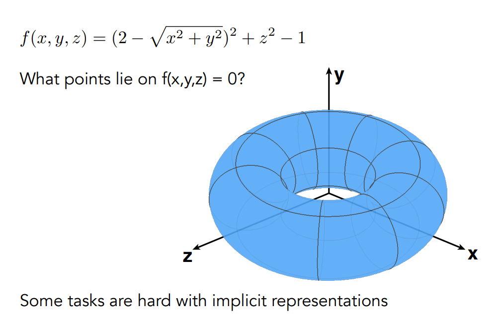

而隱式幾何的優點在於，我們很容易地可以判斷一個點在不在幾何的面上，因為只需要把我們的座標帶入函數就可以算出來了，通常為 0 就代表在表面上，如果是個負數就代表在幾何內部，反之如果是個正數就代表在幾何外面。 當然，這還是要看你的式子怎麼定義的，但通常我們會設 $f(x,y,z) = 0$

### Explicit geometry

顯式的幾何是比較典型的表示方法，我們之前用的三角形面就是顯式的表示方法，真的給我們一些點，組成三角形，進而將模型表現出來。 但還有另一種顯式的方法，稱為參數映射，以下圖為例，你可以看到我們定義了要如何將給定的 $(u,v)$ 座標，映射到空間中的某一個點：

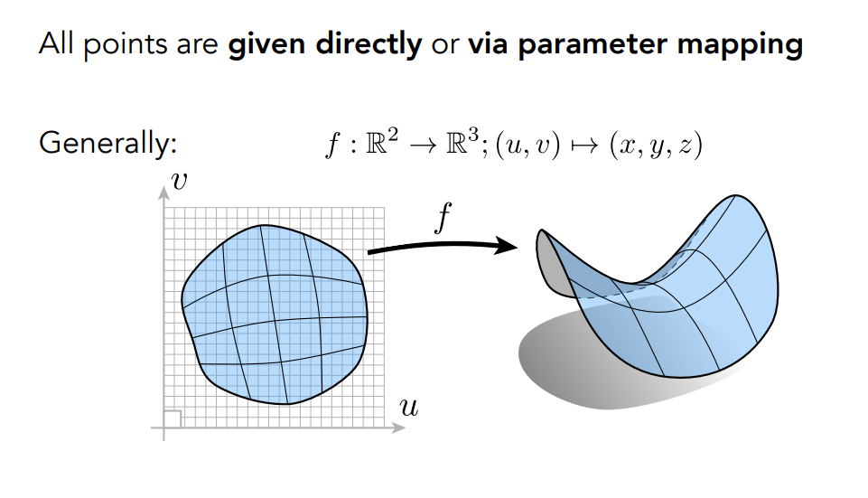

也就是說，我們可以定義一個函數，輸入是 $u$ 和 $v$，而輸出是 $x$、$y$ 與 $z$。 因此如果我們把所有的 $u$、$v$ 都走一遍，就可以找到它對應的所有 $x$、$y$ 與 $z$

再看一次圓環的例子：

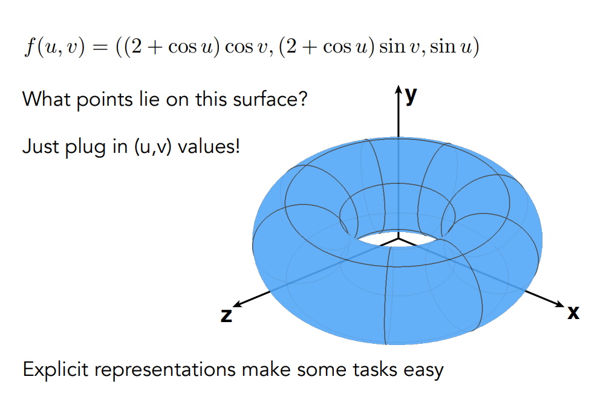

這邊我們把 $u$、$v$ 這兩個參數映射成了空間中的實際一個點，具體來說：

- $x = (2 + cos\,u)cos\,v$
- $y = (2 + cos\,u)sin\,v$
- $z = sin\,u$

這就是為什麼他也叫顯式幾何，如果我們想知道這個幾何長怎樣，只要把 $u$、$v$ 空間上的每一個 $u$、$v$ 都測一遍就可以知道了

顯式幾何的缺點是，當給我們一個三維空間中的點，我們很難去判斷一個點在不在目標幾何的表面上，或說表面的內或外

## Implicit Representations in Computer Graphics

現在我們再來多介紹一些隱式的幾何，如剛剛所講的，隱式的問題在於不直觀，例如下圖：

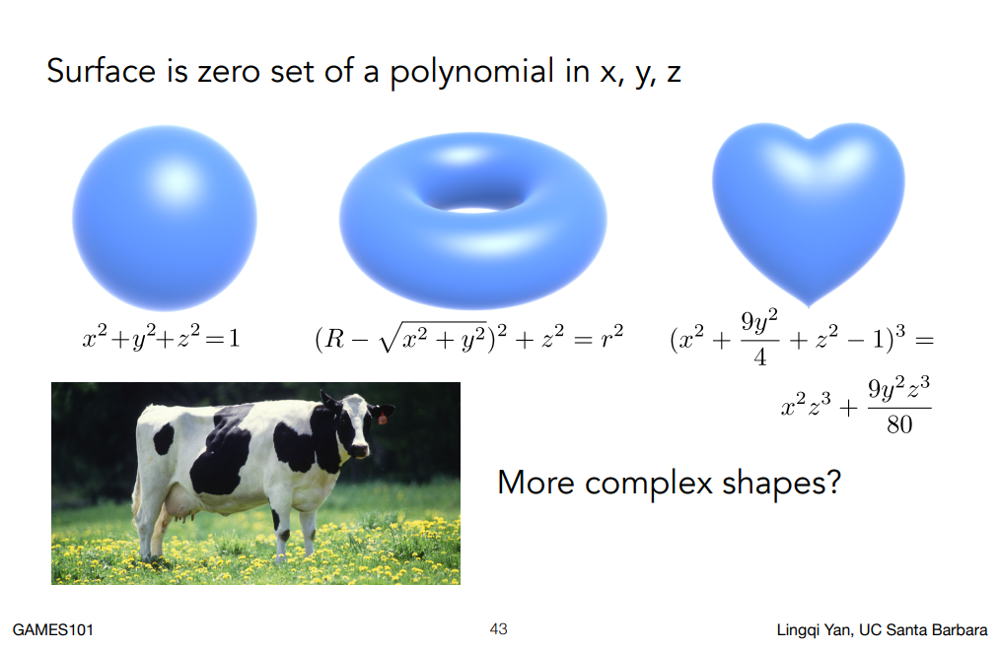

球面的公式我們可能可以看出來，而圓環的公式就已經有點勉強了，再到更右邊的心型就更難看了。 如果我們想要直接找到一個公式能代表上圖中的乳牛，那更是不可能

但還是有一些工具的幫助我們組合出幾何的形狀，所以接下來就來介紹一下

### Constructive Solid Geometry

首先要介紹的方法叫做 Constructive Solid Geometry，簡稱為 CSG。 他做的事是透過一系列基本的幾何運算，來組合出一個新的幾何，見下圖：

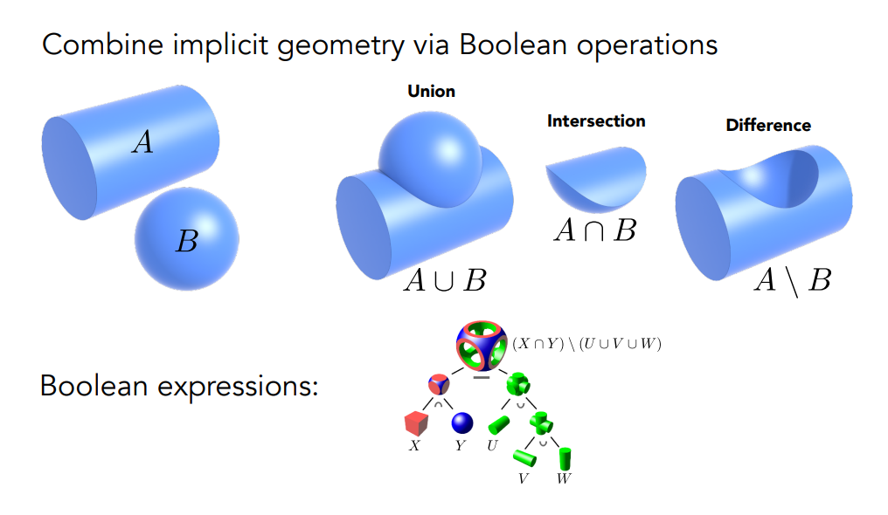

圖中的 A、B 為一個圓柱和一顆球，他們的參數式很好求，而我們這邊透過布林運算將他們組合到了一起。 這邊的布林運算就與集合論裡面的操作是一樣的，做 intersection 就是取他們交集的部分，取 union 就是兩者的並集，而差集也可以定義，只要從 A 中間減去 B 所佔據的 A 的部分即可，反之同理

透過這些運算和一些簡單的基礎幾何，就可以向上圖下方那樣組出一些複雜的幾何，並輸出成參數式。 現代大部分的建模軟體，像是 Maya、Auto CAD 等都支持這個操作，是一個非常常見的做法

### Distance Function

下一個要講的是距離函數，這也是一個用來描述幾何的方法，其表現能力非常強。 對於任何一個幾何，它都不會直接去描述它的表面，而是去描述任何一個點到這個表面的最近距離，這個距離可以是正的或負的

看個例子：

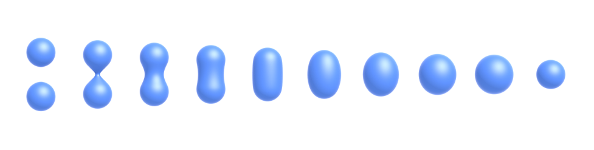

這裡你可以看到有兩個球，當他們逐漸靠近的時候，拓樸結構上會發生一些變化，最後融合起來。 這件事情就是通過對幾何的距離函數做 Blend（混合）達成的

再來看個比較具體的例子：

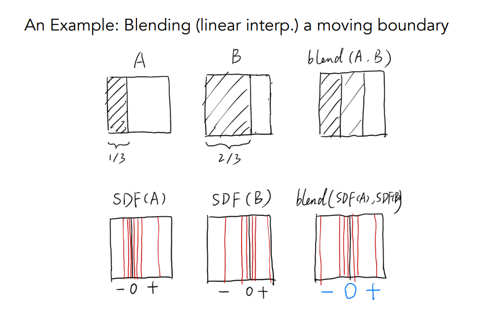

這邊用的距離函數被稱為 Signed Distance Function（SDF）。 我們的目的是要將 A 與 B 這兩個不同的方塊混合，他們各自擁有一部分的黑色區域與一部分的空白區域。 如果我們直接做線性的混合，那他會變成一個黑⭢灰⭢白的方塊，因為重疊的部分肯定最黑，而中間部分只有 B 有塗色，所以是灰的，而最右邊都沒塗色，所以是白的

但如果我們想要得到的結果是，左邊一半是黑的，右邊一半是白的，這樣的方塊，那就得用 SDF 了。 把 A 求出一個距離函數，B 求一個距離函數，混合後我們就能取到右下角方塊中間的那條黑線。 那條黑線代表的就是距離函數等於 0 的狀態，接下來我們就可以根據其他位置距離函數的值來判斷黑/白（左/右）

知道原理後再看這個例子，就可以知道為什麼會有這樣的結果了：

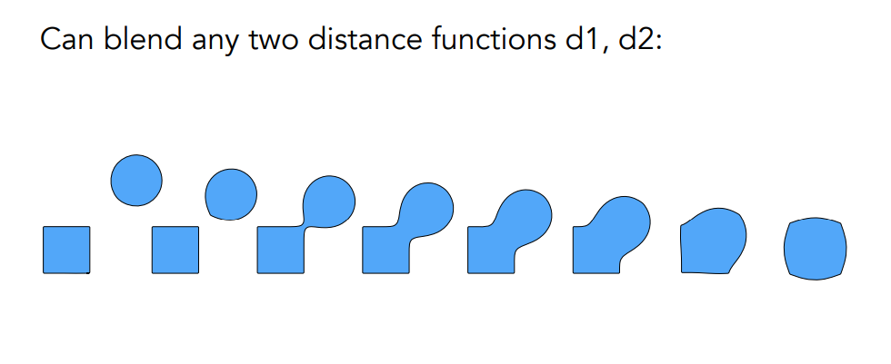

這個結果是分別求出兩個物體在這個平面空間內的距離函數，然後做 Blend，再恢復成面的結果，邊框處就是 SDF 的值是 0 的點

### Level-set method

距離函數還可以配上一些其他的方法用，假設有個距離函數不好寫成參數式的形式，也就是不容易寫成 SDF 的格式，那也沒關係，只要能通過某種方法表述出來就可以了

在這邊我們介紹一種方法，叫做 level-set method，他的想法和距離函數一模一樣，只是他是將函數的結果寫在一個個的格子上的：

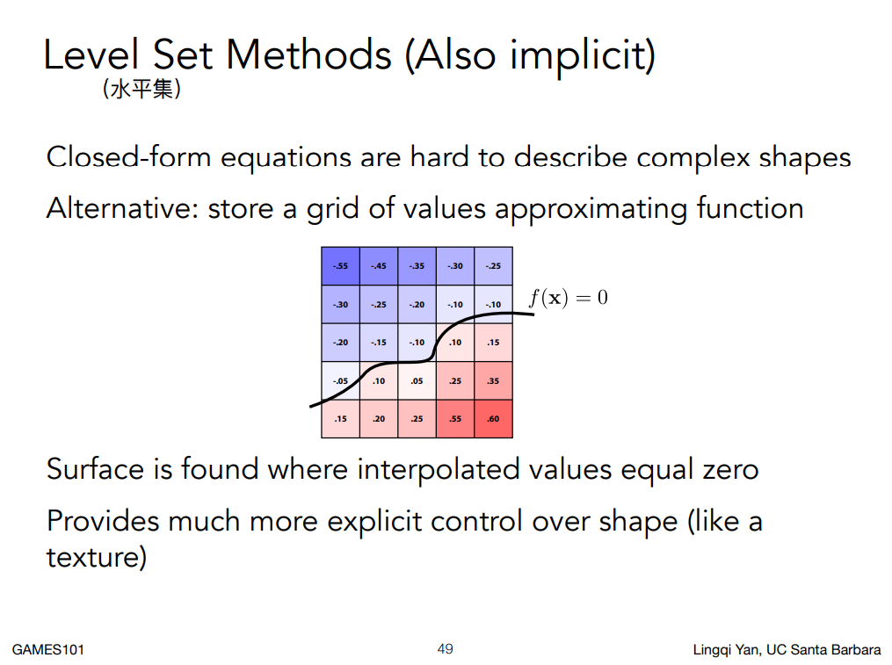

你可以看到函數在不同的地方有不同的值，接著我們只需要將值為 0 的地方連起來，就可以把整個物體的表面給表述出來了。 這個概念在地理上已經用了很久，就是所謂的等高線

我們也不一定得定義在二維的格子上，也可以在三維的格子上，結合紋理使用，就可以如下圖這樣描述出人體不同位置的密度訊息：

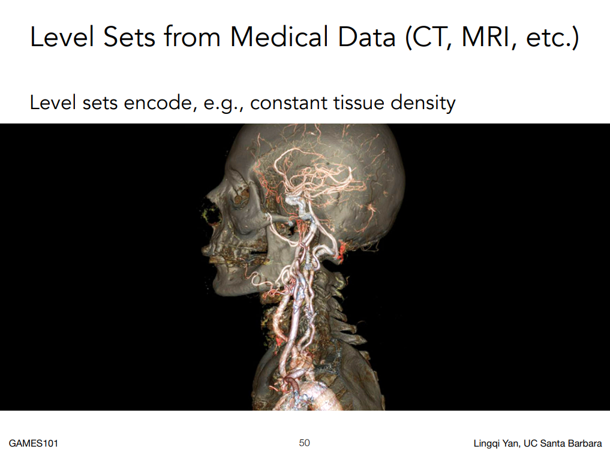

### Fractals

最後，還有一種有名且特殊的隱式方法，就是分形。 分形指的是幾何的子集與和它的整體長得非常像，與我們學的遞迴是同一個道理。 例如說雪花，如果你有看過一些科普文章，就知道如果把雪花放大來看，它每一條邊上其實又都有一些小六邊形，而這些小六邊形的邊上又有更小的六邊性，就這麼不斷重複

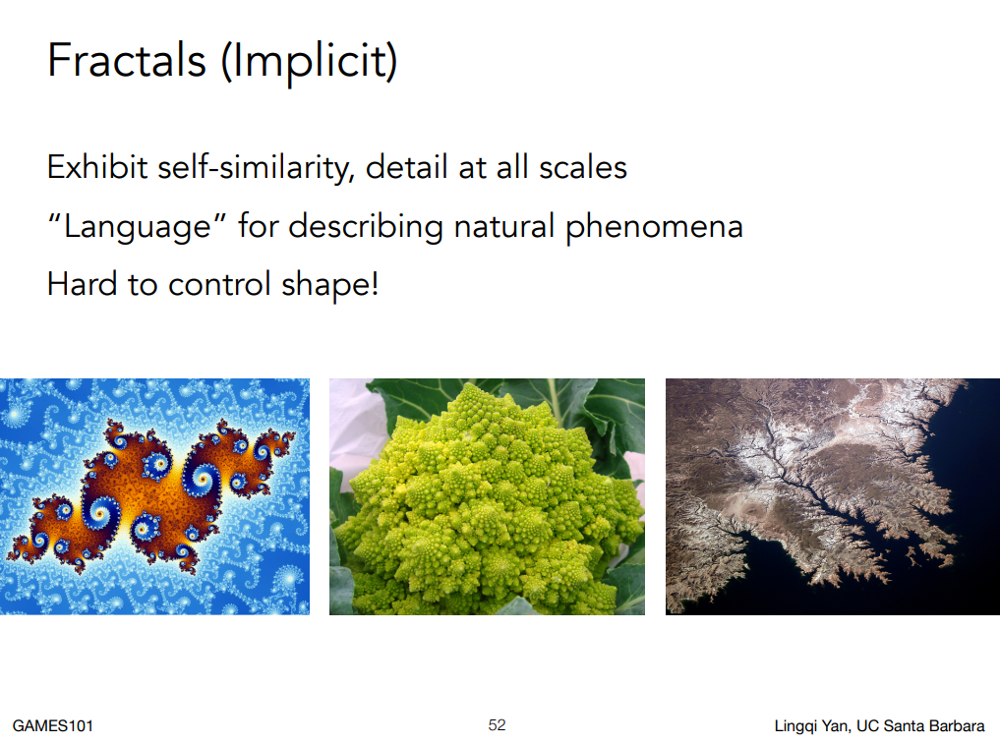

分形比較麻煩的是在渲染的時候會引起強烈的走樣，因為它的變化頻率實在是太高了，其渲染是一個挑戰

## Explicit Representations in Computer Graphics

顯式的幾何也是有各種不同的方法，像是：

- triangle meshes
- Bezier surfaces
- subdivision surfaces
- NURBS
- point clouds

後面我們會再來一一介紹，首先從點雲開始

### point clouds

點雲在做的事是，不以節點組成表面來描述一個物體，而是把物體表面的每個點都獨立表示出來。 這樣一來只要點足夠多，表示的就能足夠細緻，自然而然就看不到點與點之間的縫隙，也就形成表面了

而一個點自然以空間中的 $x$、$y$、$z$ 就能夠表示了，因此它就是一個 $x$、$y$、$z$ 的列表，非常簡單，看個例子：

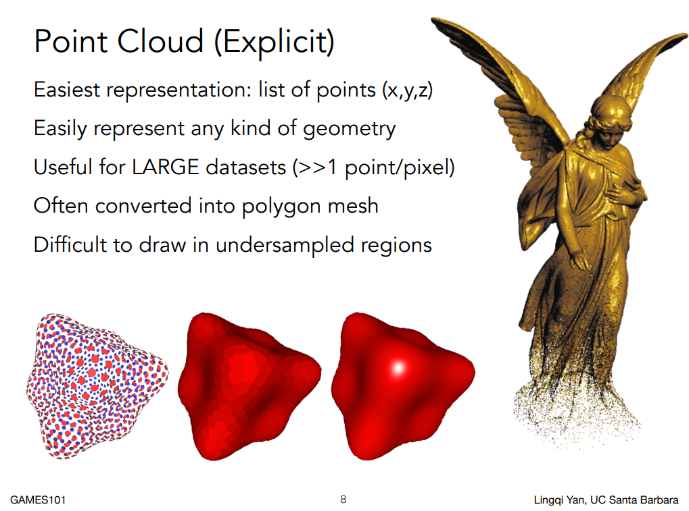

以右邊的雕像來說，你可以看到它上半部分的點雲密度非常大，因此我們可以很清楚的看到物體的表面。 接著慢慢往雕像的下半部分看，你可以看到面中間已經開始有些縫隙了，點雲的密度慢慢變得稀疏了。 到了最下面，你已經看不出面的存在了。 由此可見，要用點雲表示出一個複雜的模型，會需要非常非常多的點，也因此人們通常不會直接使用點雲

但在做掃描建模的時候，得到的輸出都是點雲的形式，這自然而然會有個問題：要如何把點雲轉成三角形面？ 這有很多的研究在做，但由於這邊偏介紹所以我們不會提

### Polygon Mesh

圖學中用得最多的是多邊形面，尤其是三角形或四邊形的面，通常我們會把任何的面都拆成各種小的三角形，以下圖為例，你可以看到球冠的部分用了許多的小三角形，而中間的部分則用了一些細長的三角形：

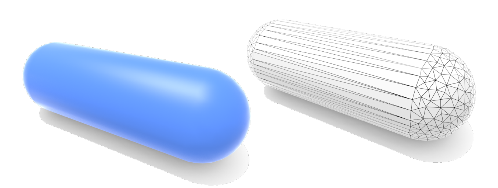

要用三角形去描述各種各樣的物體，最主要的問題就是三角形的連接關係，通常我們會用一些特定的文件格式來描述它，像是 wavefront object file，一般簡稱為 object file，後綴為 .obj，它是一個文本文件，裡面會把空間中的一堆點、法線和紋理座標分開來表示，然後再將它們組織起來，形成一個模型，看下面的例子：

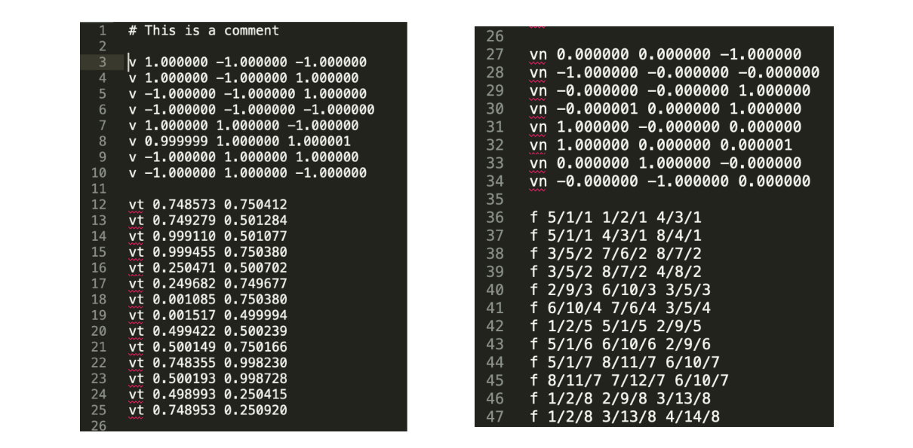

這個例子描述的是一個立方體，我們知道一個立方體共有八個空間中的點，我們用 `v` 來表示它，後面接對應的 x, y, z 座標。 而立方體有六個面，換句話說立方體有六個不同的法線，文件中以 `vn` 來表示，這邊會有 8 行是因為這個是自動建模生出的文件，所以會有一些冗餘。 `vt` 表示紋理座標，而 `f` 用來表示哪三個點會形成一個三角形。 具體的格式可以去看 wavefront object file format 的 spec

## Curves

## Bézier curves

接下來是一個大重點：曲線。 無論是在動畫中要描述相機的運動軌跡，還是在一些字體上要描述他的曲邊等，都會需要曲線，可以說曲線的應用面非常多。 這章會提一個很有名的曲線的顯式表示法：貝塞爾曲線（Bézier Curves）

貝塞爾曲線會利用一系列的控制點去定義一條曲線，並用這些控制點去定義一條曲線的性質。 比如下面這個例子，曲線會從 p0 開始，沿著 p0 到 p1 的方向出發，並在點 p3，沿著 p2 到 p3 的方向結束：

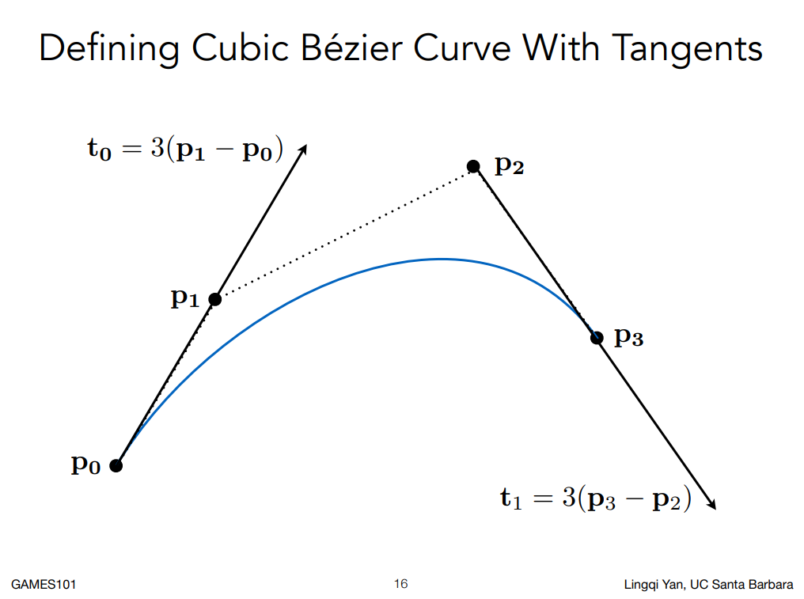

上圖中的參數式內有個係數「3」，這表示它對切線的長度也有定義，等等會再詳細解釋。 通過這四個控制點，我們可以定義這條曲線它的起始點和終點，一定得在 p0 和 p3 上，並且也有辦法定義這兩點的切線方向，如此一來我們便可以得到一條唯一的曲線了。 要注意它並不要求曲線本身要經過控制點

### de Casteljau Algorithm

現在就來看貝塞爾曲線要怎麼畫，其名稱為 de Casteljau Algorithm。 剛剛的圖裡面有四個控制點，但其實控制點的數可以自己定義，現在假設我們只有三個控制點，如下圖：

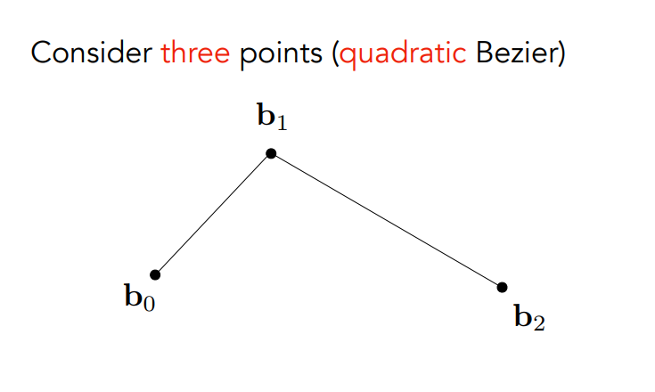

用三個控制點生成的貝塞爾曲線是有名字的，叫做二次貝塞爾曲線（Quadratic Bezier）。 從上圖你可以猜到，我們的曲線要從 b0 開始，在 b2 結束，而 b1 則決定它要往哪個方向彎

在 de Casteljau 的算法中，會有個代表時間且介於 0 至 1 之間的參數 $t$，當 $t$ 為 0 的時候輸出要在點 $b_0$ 上，當 $t$ 為 1 的時候輸出要在 $b_2$ 上。 接下來就來看看要怎麼算輸出的位置吧

de Casteljau 會在每條邊上用線性插值找出一個點，目前我們有給定的時間 $t$，首先我們要在 $b_0 b_1$ 這條邊上，我們認為 $t$ 為 0 時該邊上的插值點位於 $b_0$，$t$ 為 1 時該邊上的插值點位於 $b_1$。 假設 $t$ 現在大概為 $\frac{1}{3}$，那插值點就會在該邊上從 $b_0$ 出發大概 $\frac{1}{3}$ 的位置：

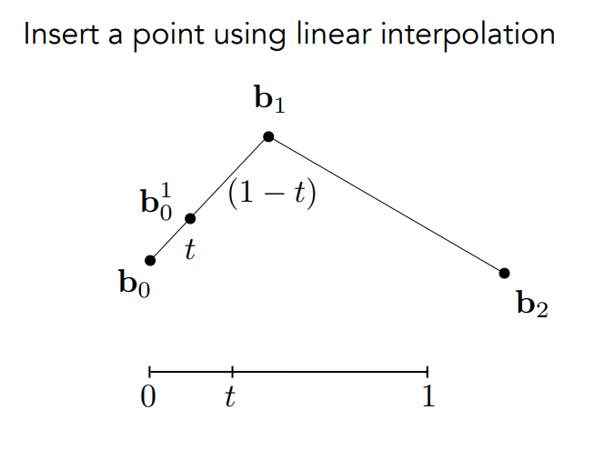

接著對另一個邊 $b_1 b_2$ 也做一樣的事情，這邊要注意我們是照著 $b_n$ 的順序來做插值的要注意，所以第二個邊上的插值點會比較靠近 $b_1$，而不是 $b_2$：

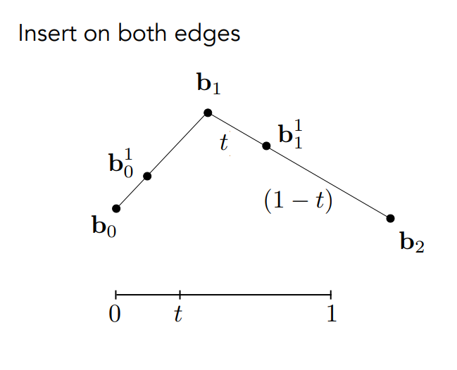

接下來，把這兩個新得到的點連起來，再做一次插值：

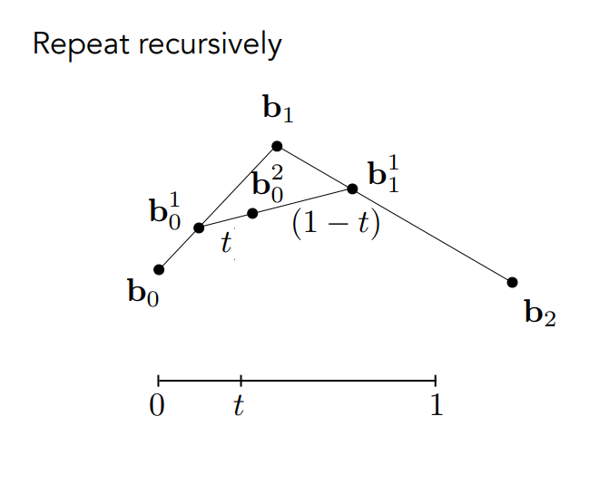

而因為不可能再有更多的線段了（剩一個點），因此這個點就是我們的輸出點了，這條貝塞爾曲線在時間 $t$ 的時候，就是在這個位置。 若要畫出完整的曲線，只需要把所有時間 $t$ 所對應的位置都畫出來就可以了：

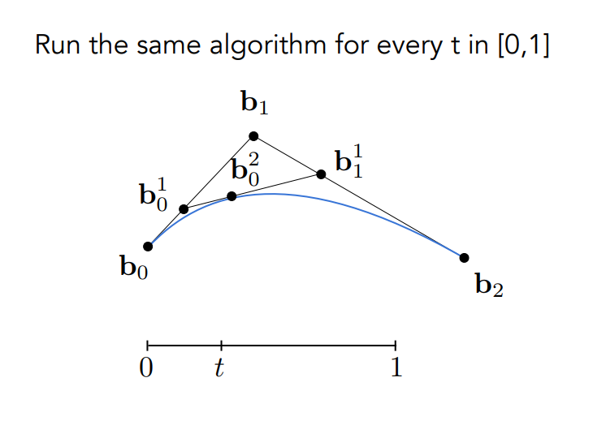

接下來看個四個控制點的例子：

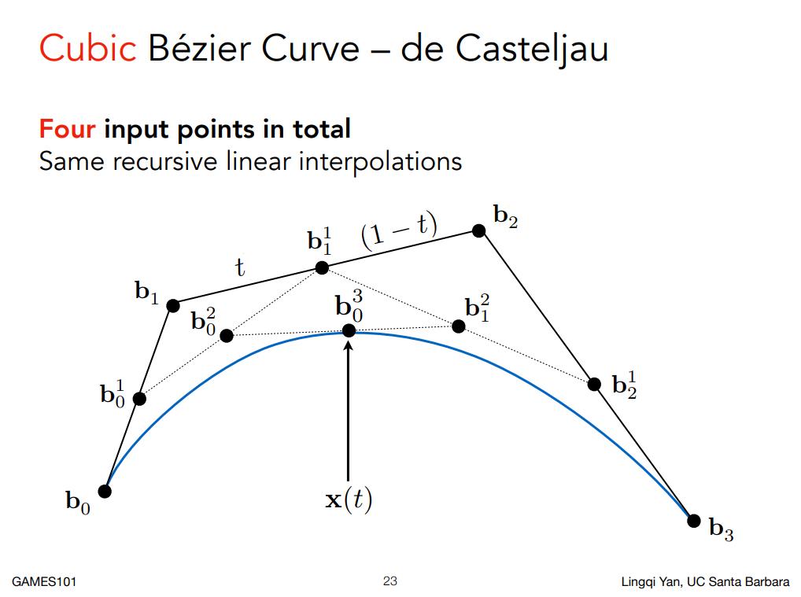

與三個控制點的步驟一樣，找到每個邊上的插值點，並依序將其連起來形成一個個的邊，因此四條線段會先變成三個線段，接著就和前面三個控制點的例子一樣了，等到最後只剩一個插值點，就是該貝塞爾曲線在時間 $t$ 的輸出了

### Evaluating Bézier Curves Algebraic Formula

前面有提到貝塞爾曲線是顯示的表示法，所以接下來就講一下它的代數形式。 由於貝塞爾曲線會由控制點，決定時間 $t$ 時的點在哪裡，因此一定有一個代數的表示方法，讓我們給定任意一個時間 $t$，就能得到對應點的位置。 假設仍然是 $b_0$、$b_2$、$b_3$ 與 $b_4$ 這四個控制點，由於是做線性插值，因此在 $b_0 b_1$ 上的插值點就為 $tb_0 + (1 - t)b_1$，標記為 $b_0^1$，其中上標代表層數。 接著依此類推，就能找到最後的點了：

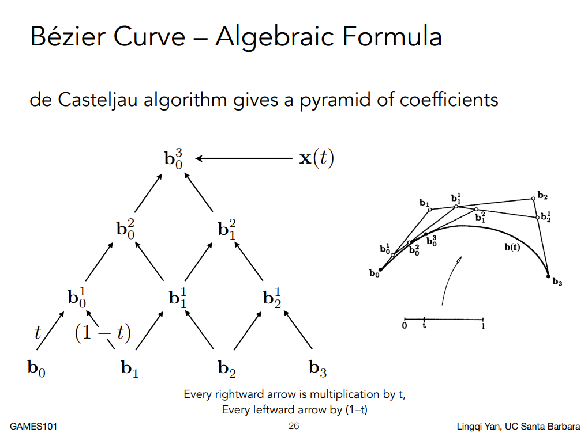

讓我們再用一個三個控制點的貝塞爾曲線來幫助理解：

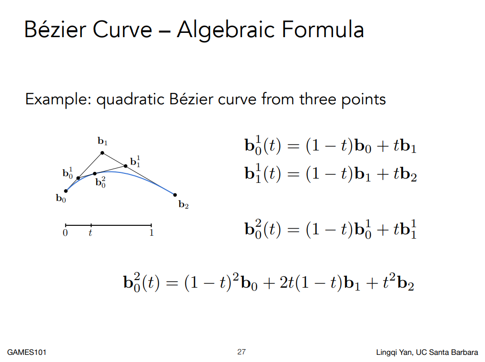

依序把每一層的插值點給組合起來，你就可以最終輸出點的參數式了。 這邊你會看到它的係數其實是伯恩施坦多項式，上例的係數是 $((1-t) + t)^2$ 的展開

下圖列出了有 $n + 1$ 個控制點的貝塞爾曲線的參數式，其中 $B^n_i(t)$ 為對應的係數：

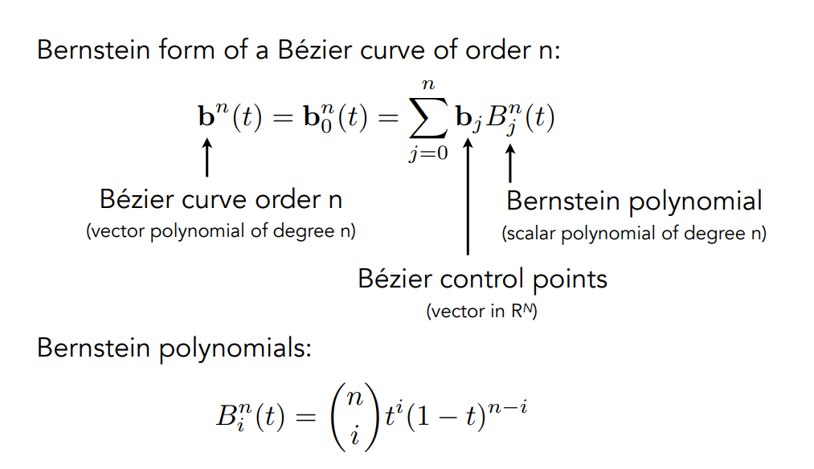

由於它良好的性質，我們其實也不用限定控制點要在一個平面上，下圖舉了一個在三維空間中的例子：

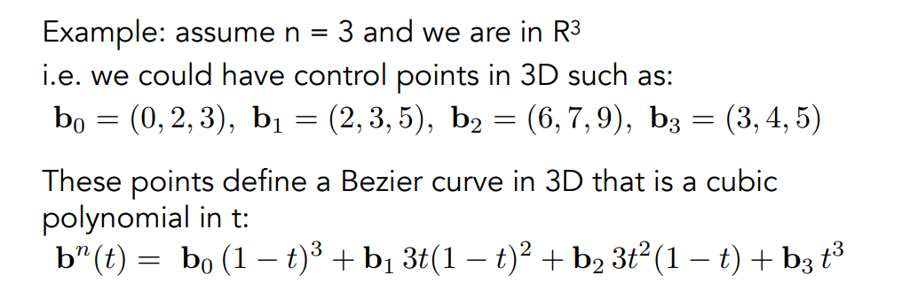

貝塞爾有一些不錯的性質，以四個控制點的曲線為例：

- $t = 0$ 的時候一定在起點，$t = 1$ 的時候一定在終點：
  - $b(0) = b_0$
  - $b(1) = b_3$
- 起點與終點的切線向量可以直接算出來：
  - $b'(0) = 3(b_1 - b_0)$
  - $b'(1) = 3(b_3 - b_2)$
- 可以直接對控制點作仿射變換，其畫出來的曲線，與將原曲線作仿射變換，會是同一條曲線
  - 但投影之類的就不同了，得是仿射變換
- 凸包性質（Convex hull）：你畫出來的曲線一定會位在控制點形成的凸包內

### Piecewise Bézier Curves

雖然前面已經說了可以有任意多的控制點，但當控制點的數量上升時，畫出來的曲線並不直觀。 另外當控制點的數量一多，你就沒辦法那麼方便地操作控制點來得到想要的曲線了（單個控制點的影響會變小）。 底下是一個有十個控制點的貝塞爾曲線：

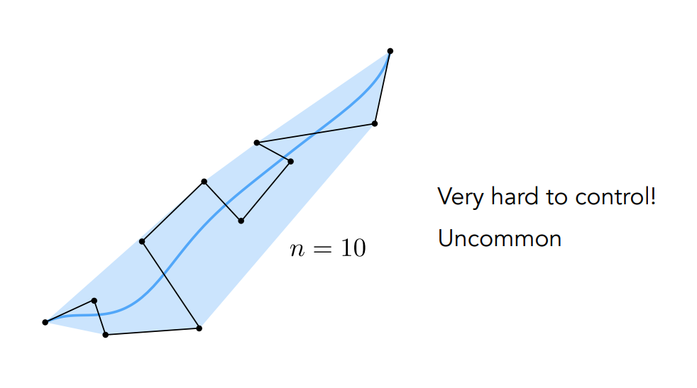

你可以看到它變得十分平滑，不利於使用控制點來取得你想要的形狀。 為了更好的操控貝塞爾曲線，人們就使用了逐段（piecewise）的方法，利用多個使用三、四個控制點的貝塞爾曲線來組合出一個想要的曲線：

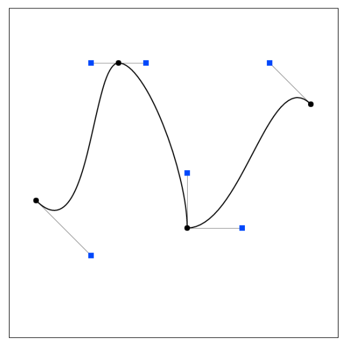

你會在連接處可能會有轉折，如果要保持曲線的光滑，由於前面提到的貝塞爾切線的特性，你需要讓連接處的三個控制點共線，且和兩段的控制線段的長度是一樣的，這樣才能有 C1連續

::: tip  
老師在課堂上還對連續性做了一些解釋，這邊就不提了  
:::

圖學中還有一些其他的曲線，例如 Spline，他是一種曲線的類別，也會有一系列的控制點，並能滿足一定的連續性。 其中用的比較多的是 B-splines，其中的 B 為 Basis 的縮寫，指基函數，所謂的基函數就類似我們剛剛的伯恩施坦多項式

B-splines 類似於對貝塞爾曲線的擴展，他的能力比貝塞爾曲線更強。 我們剛剛有看到在有十個控制點的情況下，其實每動一個控制點，都會導致整個曲線的所有位置都會跟著變化。 在設計領域中大家不喜歡這個性質，而是比較想要針對某一個點的周圍做修正，也就是說希望有局部性，而 B-splines 就能做到這件事

雖然其與貝塞爾曲線的方法非常類似，不管是從幾何角度，還是代數角度，它們的分析方法都類似，只是 B-splines 的幾何數更加複雜而已。 但由於這門課是入門課，所以這裡就不提了。 另外要再更進一步的曲線還有 NURBS，這邊就只提個名詞，不多做著墨了，有興趣的可以看看[清華胡志明老師的課程](https://www.bilibili.com/video/av66548502?from=search&seid=65256805876131485)

## Surfaces

接著來討論曲面，曲面也是一種顯示的表示方法

### Bézier Surfaces

貝塞爾曲面的概念與貝塞爾曲線類似，一樣會有一系列的控制點，如下圖有 16 個控制點：

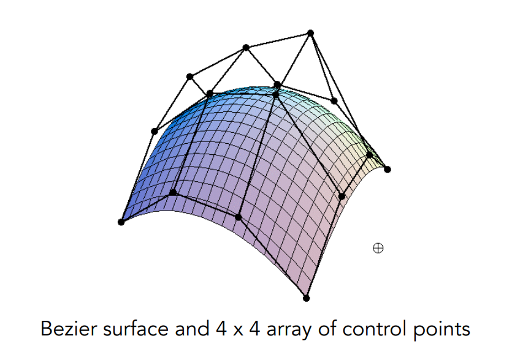

做法也非常簡單，類似之前我們對於雙線性插值的作法，在兩個方向分別用上貝塞爾曲線的方法就可以了，以下圖來說，$x$、$y$ 軸上各有四個控制點，從而組成了 16 個控制點。 接著先將 $x$ 軸上的四個控制點所組成的貝塞爾曲線算出來，由於 $y$ 方向有四個控制點，因此會算出四條貝塞爾曲線，也就是下圖灰色部分的曲線

而藍色部分的點就是為四條貝塞爾曲線上同一 $x$ 值的各個控制點，此時再將不同 $x$ 位置處，這四個控制點形成的貝塞爾曲線算出來，就可以形成一個曲面了：

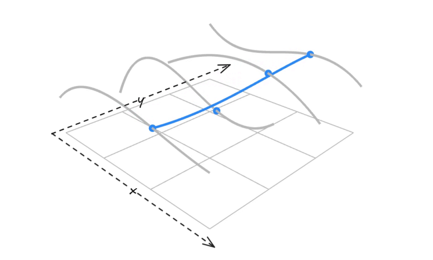

老師的上課錄影中有個 demo 影片，但我找不到下載的網址，[具體來說可以看這段影片](https://youtu.be/Zkx1aKv2z8o?t=1114)，看完影片應該會比較好理解。 另外由於有兩個方向，因此也需要有兩個 $t$ 參數，講義上將他們計作 $u$ 與 $v$，透過時間 $u$ 算出 $x$ 方向的曲線，並透過 $v$ 算出 $y$ 方向的曲線：

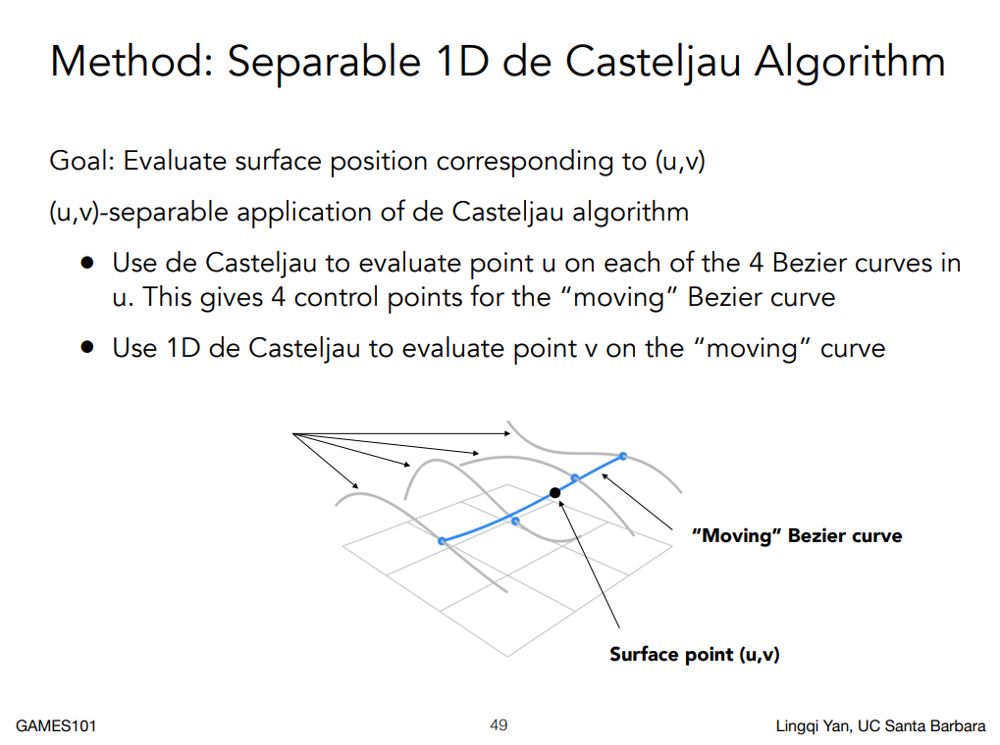
