# Games101：Shading（著色）

到目前為止，給一個模型，我們已經可以定義一個相機，通過 MVP 變換將其轉換到 NDC 中，再透過 viewport 將其變到二維的螢幕空間中了，接著我們也知道要如何利用取樣來將這個結果畫到螢幕上了：

<div class = "center-column">

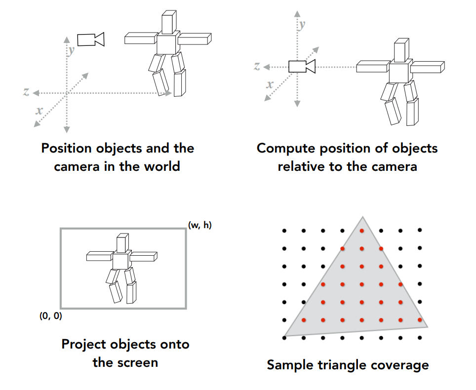

</div>

這些操作所帶來的結果可能如下圖左邊部分：

<div class = "center-column">

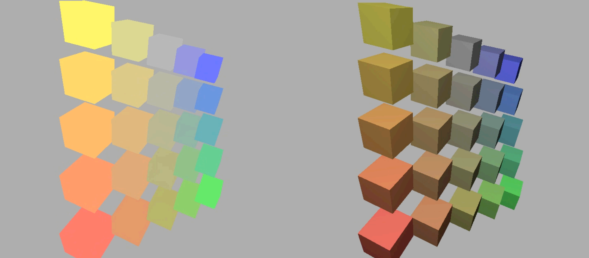

</div>

這看上去可能會有些視覺誤差，我們想要的應該是右邊的結果，雖然每個對應的立方體顏色相同，但不同面有不同的顏色會使它看起來更真實一些，這就是我們接下來要做的事 — 著色（Shading）

:::info  
原影片中這是個會動的，能更清楚的看出視覺誤差，但截 gif 太大了我就不截了  
:::

如果大家學過素描，假設要畫一個球，且有一個光源，光源達到球上的某一塊區域時會形成一個有高光的區域，然後背向光源面由於接受不到光就會比較暗，且會產生一個投影，影子內的顏色會比較暗。 另外如果是不同材質的球，那其與光線的交互作用肯定不同，因此表現出來的形式肯定也不同

這些工作在圖學中就是由著色來完成的，因此著色主要負責兩個部分 — 顏色與材質，完成這組著色工作的模型我們稱其為著色模型

## Blinn-Phong Reflectance Model

接下來我們就從最基礎的著色模型開始介紹，其名為 Blinn-Phong，它將光的表現分成了三個部分 — 高光（Specular highlights）、漫反射（Diffuse reflection）與環境光（Ambient lighting）：

<div class = "center-column">

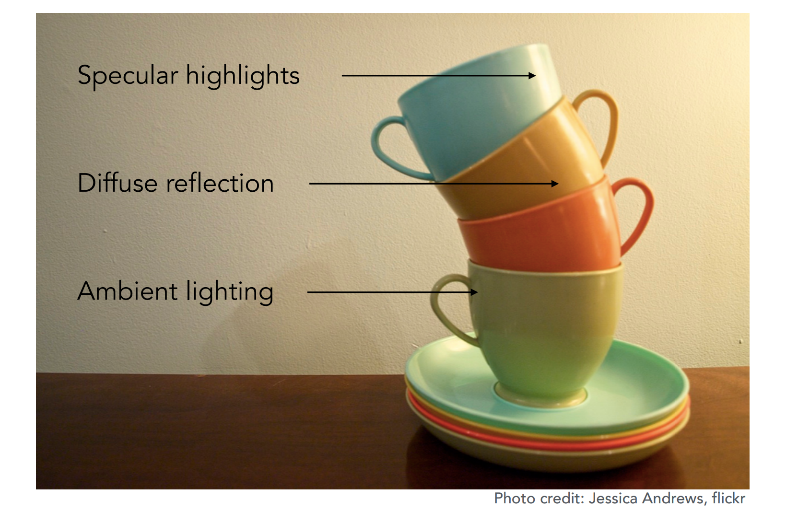

</div>

在這張圖中，我們可以看到每個茶杯特別亮的部分，這杯稱為高光。 除了高光，我們還可以在茶杯的表面看到一些變化相對緩和的部分，像是茶杯的中間部分，被稱為漫反射。 而對於沒有直接被光源照到的部分，像是圖中茶杯的左下角，則被稱為環境光

如果你還記得以前上物理課提到的漫反射，就可以知道光線打到粗糙的牆面上會反射到四面八方去，而高光也可以用相同的原理來理解，只是這個表面不再是個粗糙表面，而是個光滑表面，此時光線會沿著所謂的鏡面反射方向去做反射，這就是所謂的高光。 同時由於光線會反射，因此總是會有一部分的光達到茶杯的左下角，之後再反射回人眼，從而就形成了環境光。 把這三部分組合起來，我們就可以做出一種材質，使其與杯子長的很像，讓我們覺得圖中的這三個物體是杯子

### shading point（著色點）

在講 Blinn-Phong 之前我們需要先定義一些相關的術語：

<div class = "center-column">

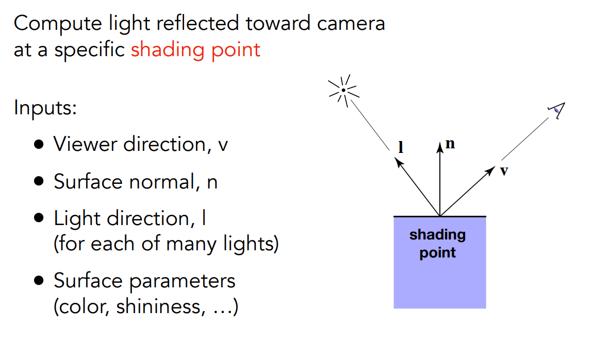

</div>

我們所看到的點被稱為著色點（shading point），它是我們主要的著色目標。 著色點會位於一個物體的表面，由於是一個點，我們認為著色點的所在範圍永遠是一個平面，此時就可以定義出平面的法向量（`n`）了。 然後我們還需要兩個向量，第一個是觀測方向（`v`），也就是相機與著色點形成的向量；第二個是光照方向（`I`），為光源與著色點形成的向量。 這些向量我們通常喜歡由著色點出發，因此如圖中所示三個向量都從著色點出發，另外因為是拿來表示方向的，所以它們都為單位向量

另外著色點還會有一些其它與物體表面相關的屬性，像是有多光滑，例如一個陶瓷的物體上了釉之後會變得比較亮，但如果它是一個石膏那就不一樣；再來如果它是一塊木頭，那在光打到它的時候你可能可以看到一些紋路。 它們反射光的方法基本上是一樣的，因此需要其它的屬性來輔助形成不同的效果

最後提一下區域性（locality），在考慮任何一個著色點的情況下，我們頂多就看光照與觀測範圍，並不會去關注其它物體，包括陰影。 也因此在著色時我們只考慮了光線的方向，並沒有考慮光線是否有被擋住，所以著色點會有明暗變化，但不會生成陰影，陰影要在後面的章節才會再補上：

<div class = "center-column">

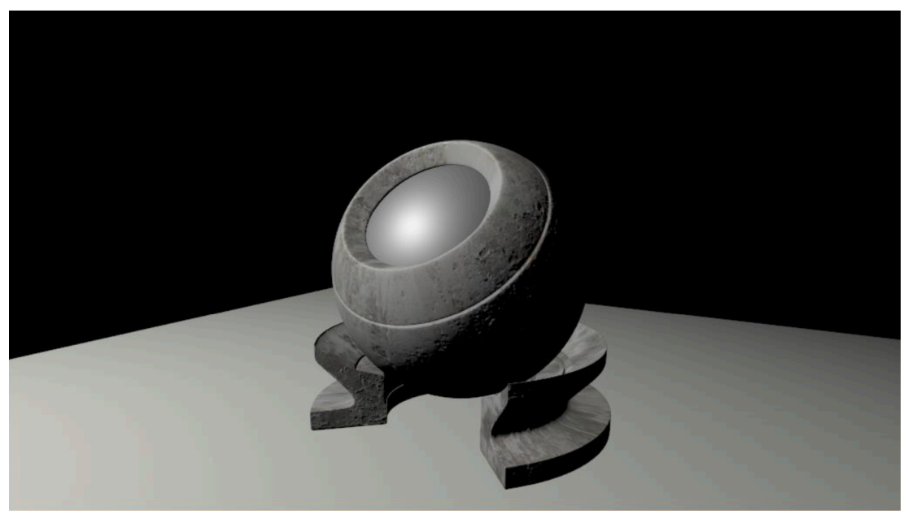

</div>

可以看到上圖中並沒有陰影，只有明暗變化（正常來說光源對面的地板應該要有陰影）

### Diffuse Reflection（漫反射）

剛剛提到了 Blinn-Phong 由三個部分組成，現在我們從最簡單的漫反射項開始。 當有一根光線達到物體表面的某個點時，這個光線會被均勻的反射到各個不同的方向上去，這就是漫反射

而在物體表面的面向與光照方向有一定夾角時，得到的明暗會有變化：

<div class = "center-column">

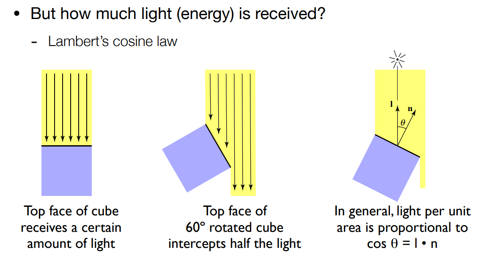

</div>

上圖中有六根光線，我們假設光是離散的，每一根光線代表了固定的能量，此時我們發現，如果物體表面和光照方向垂直的話，其可以接收到所有的六根光線；如果有個夾角，像是中間轉了 60 度的情況，那就只能接收到三根光線，此時物體的表面理應就要變得暗一些

這與高中地科裡面提到地球有四季的原因是一樣的，並不是說夏天太陽比較近，而是夏天會被太陽直射，單位面積內收到的能量較多

因此我們可以得知物體表面的面向與光照方向，這兩個方向的夾角決定了物體的表面要多亮。 這邊有個定律叫 Lambert's consine law，延續前面的符號，我們用向量 $l$ 代表光照方向，用 $n$ 代表物體表面的法向量，Lambert's consine law 定義說接收到的能量與「光照方向和法向量夾角的余弦」成正比，而由於兩個向量都是單位向量，因此可以用內積來表示它們的余弦，透過這個定律我們就可以分析出一個著色點的漫反射項會接收到多少光（能量）

定義好了接收，但我們還沒定義這些能量是從哪裡來的，光肯定得先產生。 光本身是一種能量，假設光來自於一個光源，我們認為它是個點光源，無時無刻都會往四面八方輻射出相同的能量，因此這些能量會集中在一個球殼上：

<div class = "center-column">

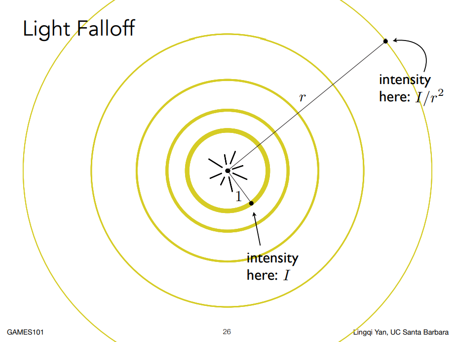

</div>

我們認為往各個方向出去的速率是一樣的，因此過了很長時間後能量仍然會集中在一個球殼上，但是由於球殼的半徑變大了，所以單位面積上的能量是會隨著時間變小的，我們定義半徑為 1 時光的強度（光強）為 $I$，透過能量守恆定律，我們可以得知若傳播到距離為 $r$ 的位置，則該點的光強為 $I/r^2$

因此我們得到了第二個關係 — 「著色點和光源的距離」與光強的關係

結合前面的 Lambert's consine law，我們就可以算出漫反射這項共有多少能量了，也就能將物體的明暗給算出來了：

<div class = "center-column">

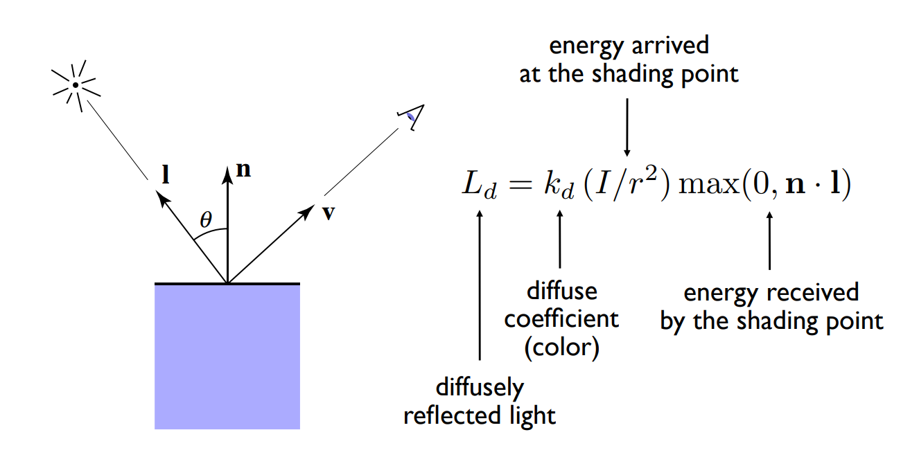

</div>

$I/r^2$ 是著色點的光強，而 $n \cdot l$ 為兩向量的夾角，表示可以收到多少比例的能量，其中 $\max$ 的用意是避免內積的結果為負數，因為當其結果為負數時代表光線是從物體表面下方來的，這沒有物理意義，這邊只考慮反射，沒考慮折射

而對於 $k_d$ 項，我們要來思考一下為什麼一個著色點會有顏色，這只有一個可能性，著色點吸收了一部分的能量，接著將不吸收的部分反射了出去，反射出去的光的波長就是我們見到的顏色。 如果不同的著色點有不同的吸收率，那自然就會產生不同的顏色


因此我們利用一個係數 $k_d$ 來描述這個吸收率，如果為值是 1，則代表完全不吸收能量，因此最亮，如果是 0 則相反吸收所有能量，因此會是黑的，如此一來就表現了明暗，或說著色點本身吸收了多少能量：

<div class = "center-column">

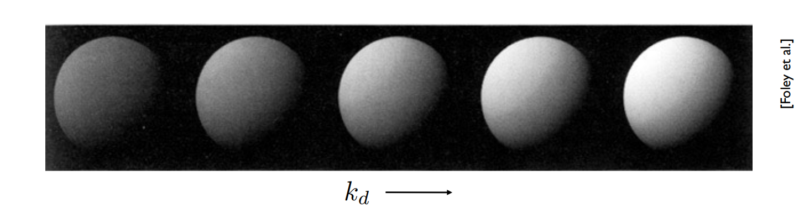

</div>

如果把吸收了多少能量這件事用一個向量來表示，我們就可以把它弄成一個有三個元素的向量，代表 RGB，分別都介於 0 到 1 之間，進而定義出顏色

最後再提一件事，漫反射的能量會被均勻的反射到各個不同的方向上去，這代表不管我們從哪個方向觀測它，得到的結果應該要是一模一樣的。 從上方的公式來看也是如此，我們考慮的是光照方向和法向量之間的夾角，完全沒有考慮 $v$ 向量的事，這正是因為漫反射往四面八方反射的能量都是相同的

### Specular（高光）

高光是在物體的表面比較光滑時，反射方向非常接近鏡面反射的結果。 那如果給我們入射方向，我們自然能算出它的出射方向：

<div class = "center-column">

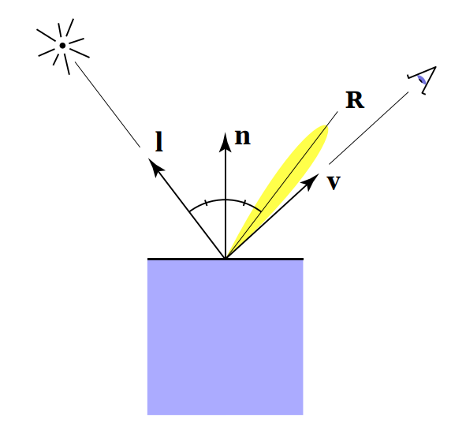

</div>

上圖中將出射方向記為 $R$，可見我們只有在觀察方向接近鏡面反射方向的時候，才能夠看見高光，其它時候都看不到。 換句話說 $v$ 和 $R$ 要足夠接近，而我們可以利用半程向量（Halfway Vector）來描述這件事情：

<div class = "center-column">

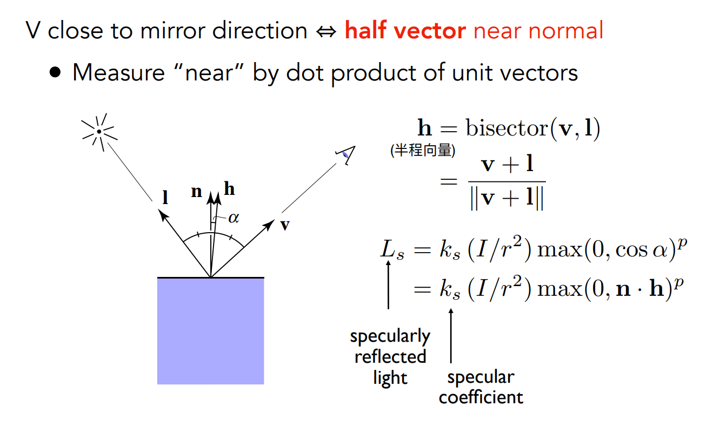

</div>

半程向量 $h$ 為入射方向 $l$ 與觀測方向 $v$ 的角平分線向量，要求角平分線很簡單，只要兩個向量加起來，根據平行四邊形法則我們知道加出來的方向一定會沿著中間的方向，接著我們再做 normalize，就可以得到半程向量了

當 $v$ 和 $R$ 接近的時候，其實就代表 $h$ 和 $n$ 接近，因此在計算的時候我們就可以不去求 $v$ 和 $R$ 的夾角，而是求 $h$ 與 $n$ 的夾角

:::info  
你可以不使用 $n$ 與 $h$ 來判斷，而是直接使用 $R$ 與 $v$ 來判斷兩向量是否接近，這個模型則被稱為 Phong Model。 Blinn-Phong 在這裡使用半程向量是一種優化，因為半程向量比較好算，但反射方向 $R$ 不好算出來，計算量會多很多  
:::

而與前面漫反射當中提到的相同，要看兩向量是否足夠接近，用內積即可，如果足夠接近，那結果就接近 1，如果離比較遠就接近 0，同樣地我們會 $max$，不考慮反方向來的向量。 另外，公式中的 $k_s$ 被稱為鏡面反射係數，由於大家通常認為高光是白色的，因此通常會設為一個較近 1 的值。 通過上圖中的式子就可以得出有多少能量到達了著色點

前面漫反射的公式中我們還考慮到了有多少能量被著色點吸收了，也就是當中的 $I/r^2$ 項，但在高光這邊沒有，這是因為 Blinn-Phong 是經驗模型，把這部分簡化掉了，這邊關注的主要是我們能否看見高光，而沒有太關心它的亮度

再來，你可能會發現在高光的公式中，cosine 處多了一個指數 $P$，這是為了將能看見高光的範圍縮小，我們看一下它數值上的表現：

<div class = "center-column">

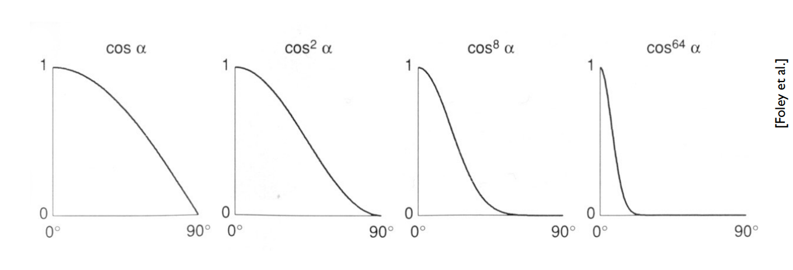

</div>

你可以發現在 $P$ 為 1 的情況下，假設角度為 45 度，那其實 $v$ 與 $R$ 就已經離的挺遠的了，但余弦取出來的值還是偏大，用這個值去生成高光的話我們會看到一個超級大的高光，但我們希望高光只集中在一個很小的區域，這代表只要 $v$ 與 $R$ 稍微離的遠一點，$v$ 就不應該被算在高光的範圍裡了，因此透過加上指數 $P$，我們可以讓這個範圍變得更嚴格，隨著次方的上升，當 $P$ 為 64 的時候，你可以看到大概在 20 度的地方基本上我們就看不到高光了

這個 $P$ 通常我們會設成一個在 100 到 200 之間的數字，此時大概 5 度左右就看不到高光了。 我們可以將 $P$ 的效果視覺化出來看一下：

<div class = "center-column">

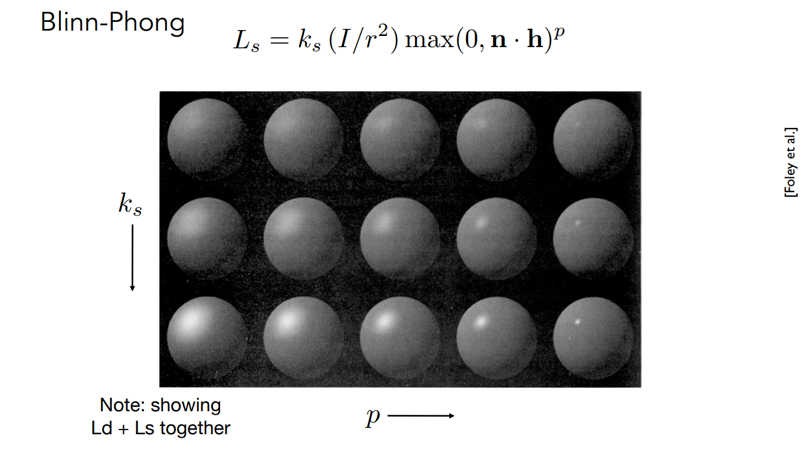

</div>

你可以看到 $P$ 越大，能看見高光的角度越少，因此可以控制高光的大小；而當 $k_s$ 越接近 1，鏡面反射的效果就越明顯，高光就越亮（越白）

### Ambient（環境光）

我們還剩最後一項環境光，之前茶杯的例子中我們說一些沒被光源直接照射的著色點不可能完全是暗的，因為光線會彈射很多次，分散到四面八方去，因此會彈到茶杯背面的那些著色點上，從而讓那些點有有顏色

可想而知這是一個很複雜的計算，為了簡化計算，Blinn-Phong 做了一個大膽的假測，我們認為任何一個點接收到的環境光的強度永遠都是個定值，寫作 $I_A$：

<div class = "center-column">

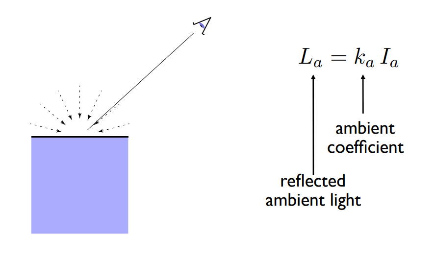

</div>

從這個公式你可以發現環境光不講究從哪個地方進來，與 $l$ 無關；再來環境光與觀測的方向也無關，因此與 $v$ 無關；最後它與法向量也無關，因此跟 $n$ 和 $h$ 都無關。 也因此這個公式符合我們剛剛環境光是個定值的假設

環境光的工作在於保證沒有地方完全是黑的，讓你看到的物體有一個常數的顏色，再以公式中的 $k_a$ 用來控制亮度，兩者結合就可以得到環境光

### Blinn-Phong Model

現在我們將三者加起來就可以得到完整的 Blinn-Phong Model 了：

<div class = "center-column">

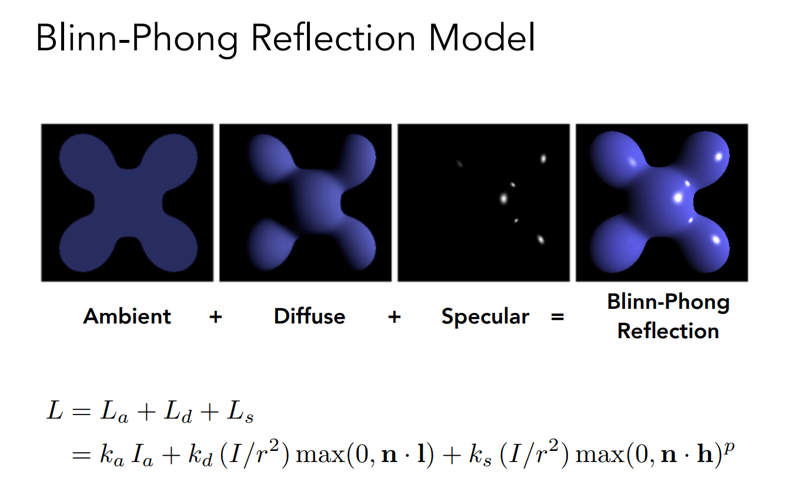

</div>

上圖將三個不同的部分視覺化出來了，你可以看見環境光是個常數的顏色，而漫反射項則攜帶了主要的顏色資訊，高光攜帶了鏡面反射的資訊，三者加起來就可以得到上圖最右邊的結果，有點像塑膠玩具，這也是 Blinn-Phong 的特點之一，詳細的原因我們在後面的章節會再回來解釋

:::info  
由於 Blinn-Phong 是個經驗模型，所以你可以看見有很多東西都被簡化了。 假設一個模型中間有個凹進去的點，那照理說該部分應該會暗一些，但在 Blinn-Phong 的角度就不是如此，由於環境光是個常數，在 Blinn-Phong 中凹進去的部分並不會變暗

再來 Blinn-Phong 也沒有考慮物體到觀察點的距離造成的能量損失，一般來說看一個較遠的物體應該要會比較暗，但在這裡就沒有這種現象

要更精確地描述這些現象，要到後面講 Radiometry 的時候才會解釋了
::: 

## 著色頻率（Shading Frequencies）

考慮完了一個最基礎的著色模型，接下來我們要來看著色點要怎麼取，這被稱為著色頻率（Shading Frequencies），看個例子：

<div class = "center-column">

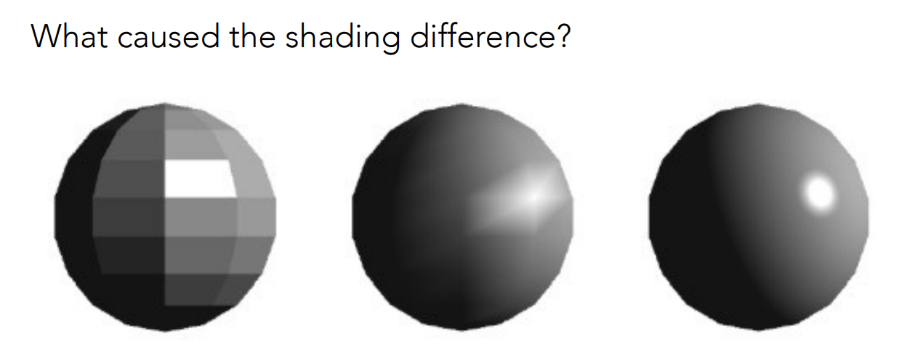

</div>

這三個球擁有完全的幾何形狀，也就是說它們的幾何表示在空間中是一模一樣的，由相同的三角形組成。 但你可以很清楚的看到這三個球的顏色不一樣，從色塊的邊界你就可以發現問題，這就是著色頻率

著色頻率考慮我們要將著色應用在哪個部分，最左邊的球我們將著色應用到了一整個四邊形面上，每個面有一個固定的法向量，我們取一個面上的點求出其著色結果後，暴力的認為整個平面都是相同的顏色，也就是一個平面只做一次著色，你可以看見結果並不怎麼好

中間的球考慮了平面的四個頂點，算出每個頂點對應的法向量，接著進行著色，面中間的顏色透過內差法補上，得到的就是該結果，你可以看到結果好了不少

最右邊的球則將著色考慮到了每個像素上，也就與我們最一開始的想法一樣，你可以看見結果非常好，接下來我們來就來做一下正規的定義

### Shade each triangle (flat shading)

flat shading 對應到最左邊的球，將三角形的法向量求出來，這能透過將三角形的兩邊做外積求得。 接著我們根據使用的著色模型，算出一個著色的結果，而對於三角形的內部則沒有著色的變化，因此一個三角形只需要做一次著色：

<div class = "center-column">

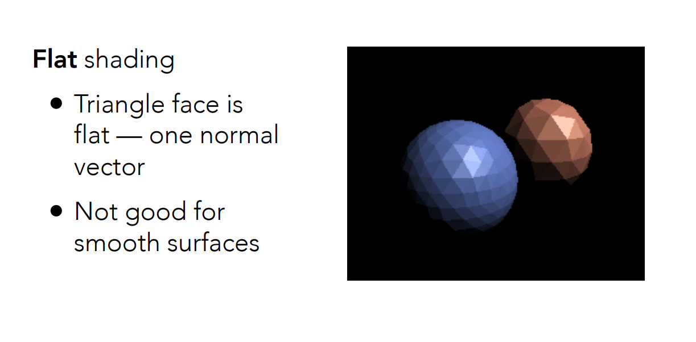

</div>

### Shade each vertex (Gouraud shading)

第二種方式對應到中間的球，叫做 Gouraud shading，對三角形上的頂點求出法向量，怎麼求我們等等再說，求出法向量後三個頂點各做一次著色，接著用內差將三角形內的顏色補上：

<div class = "center-column">

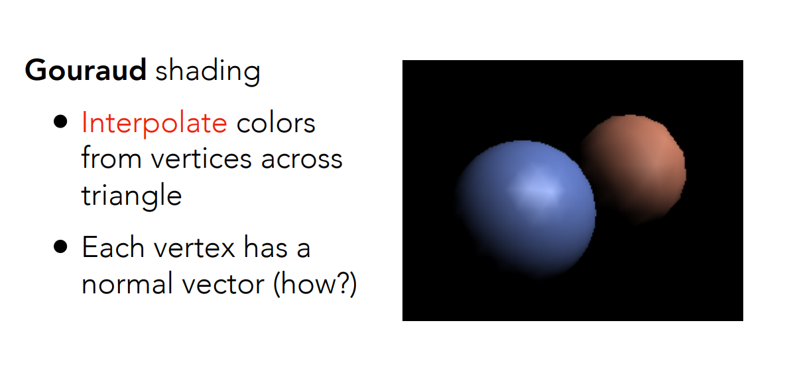

</div>

結果比第一種好，但你可以看到當三角形稍微大一點的時候，例如圖中右邊棕色的球，高光可能會消失

### Shade each pixel (Phong shading)

第三種對應到最右邊的球，叫做 Phong shading，對每一個像素進行一次著色，就可以得到一個相對較好的結果

<div class = "center-column">

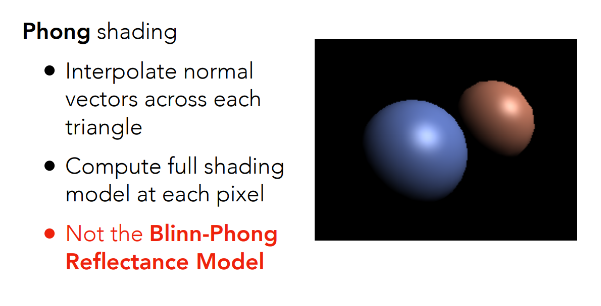

</div>

這邊要注意 Phong Shading 與 Blinn-Phong Model 是兩個不同的東西，Phong Shading 指的是著色頻率，Blinn-Phong Model 是著色模型，只是剛好都是由同一個人發明所以名字一樣而已

### 三者比較

實際上要用哪種方法要取決於具體的模型，Flat Shadding 並不一定會比較差，看個比較圖：

<div class = "center-column">

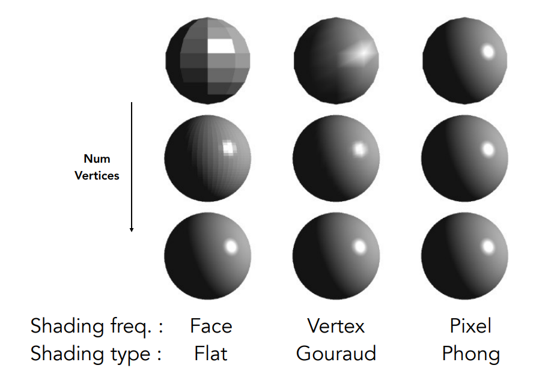

</div>

上圖中用的幾何模型都是一樣的，但 row 與 row 之間的三角形數會上升，中間的 row 比第一個 row 用了更多的三角形，也就是說幾何模型本身的面數變多，更光滑了。 你可以看見在幾何足夠複雜的情況下，我們其實可以用相對簡單的著色頻率，結果其實不會差太多

另外，這些方法的成本需要同時考慮模型的面數與像素的數量，並不是說 Phong Shading 開銷就一定比較大。 當你的模型太過複雜，複雜到其面數已經超過了像素的數量，那自然用 Phong Shading 會比較快

### 頂點法向量

#### Per-Vertex Normal Vectors

我們還留了一個問題，三角形頂點的法向量怎麼算。 假設在一個理想的情況下，我們知道模型要表達的是一顆球，但實作上是用三角形來表示

那我們就可以知道三角形的頂點其實對應到球上的某一個點，此時就可以利用球的位置算出三角形頂點的法向量，這很好算，只要算出球心連向三角形頂點的向量即可，見圖中右上角部分：

<div class = "center-column">

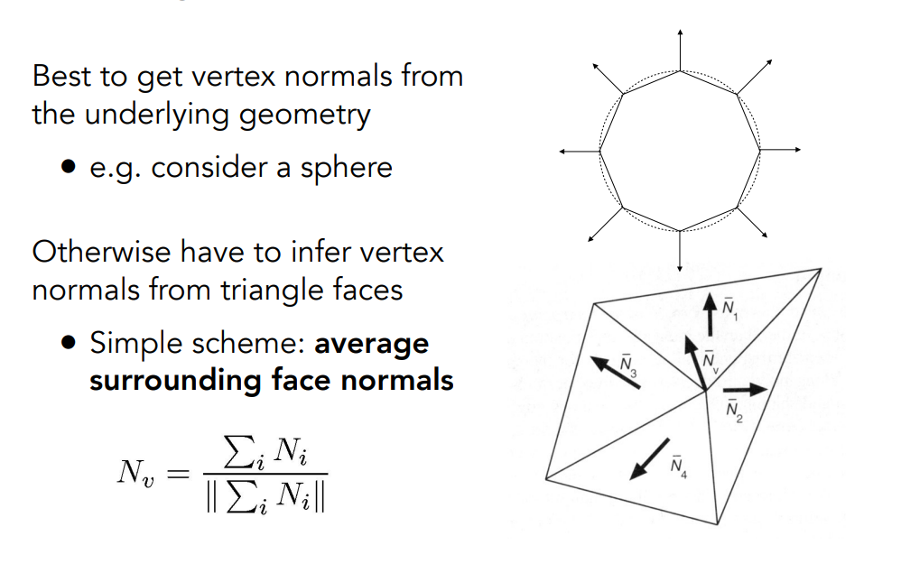

</div>

但平常不可能有這麼好的事情，因此人們發明了一種方法，取任何一個頂點，它肯定會和很多個不同的三角形有所關連，例如上圖右下角的部分中，四個三角形共用了一個頂點，那我們就認為這個頂點的法向量是相鄰四個面的法向量的平均

注意在這邊我們不做 normalize，我們希望如果一個三角形越大，那它貢獻的部分就越多，也就是說我們的平均是加權平均，權重以三角形的面積來計算，實務上這的確會帶來更好的結果

這就是我們如何去定義一個以頂點為考量的法向量

#### Per-Pixel Normal Vectors

另一個是以像素為考量點，定義一個逐像素的法向量。 假設我們已經知道三角形頂點的法向量了，那我們可以透過重心座標來做內差，以得到對應的法向量：

<div class = "center-column">

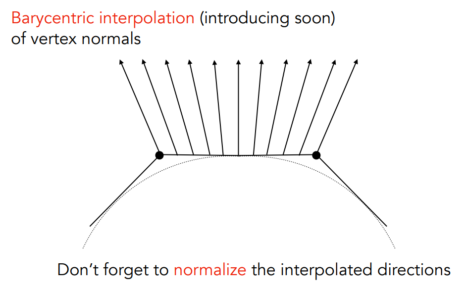

</div>

上圖中我們的前提是知道左右兩個頂點的法向量，之後透過內差算出中間這些法向量。 這邊注意就要做 normalize 了，要保證它們長度都是相同的

至於要怎麼做重心座標的內差，我們後面再提

## Texture（紋理）

### Texture Mapping（紋理映射）

接下來我們要開始講紋理映射，它想做的事很簡單，看看下圖：

<div class = "center-column">

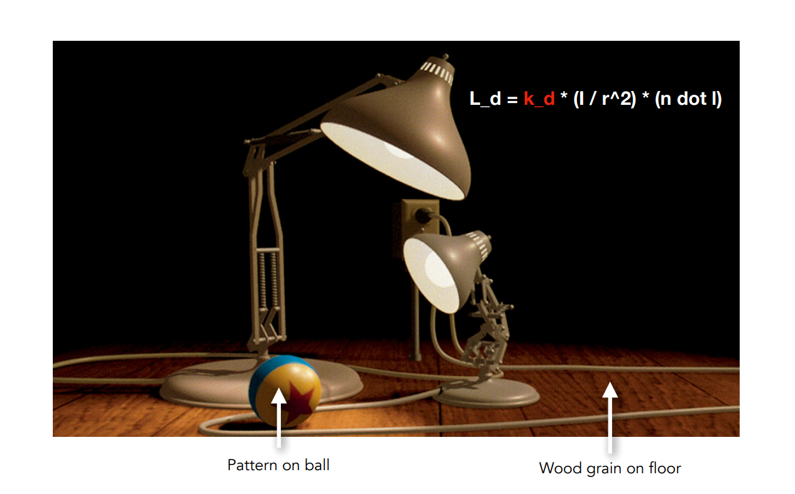

</div>

上圖中有兩個檯燈在照亮一個地板和一顆球，對於球，它的著色我們會寫，如果我們認為檯燈的光是一個點光源，這樣無非就是兩個把點光源的貢獻加起來就可以了，但是在那顆球上面，我們可以看到不同的位置有不同的顏色，像是球的一半是藍的一半是黃的，中間還有一個紅色的星星圖案

這些點的區別在於，雖然它們共用了同一個著色模型，但是不同點的漫反射係數不一樣（假設是 Blinn-Phong）。 看另一個例子，以地板來說也是如此，燈光在照地板，在地板上的任何一個點其實都有自己的漫反射係數，這個係數會反映在木頭的紋路上

也就是說我們希望有一個方法，能夠定義對於一個物體，其上面的不同位置的屬性，這就是引入紋理映射的一個基本思路，不過並不是說我們需要完全用它來定義漫反射係數，而是希望能定義不同點有不同屬性

要定義一個點的屬性，首先我們要理解點在哪，我們把屬性定義在物體表面上，那當然點就在物體表面上，但要如何描述物體表面呢? 我們要知道任何一個三維物體，它的表面其實都是二維的，像是地球儀與表面的地圖一樣：

<div class = "center-column">

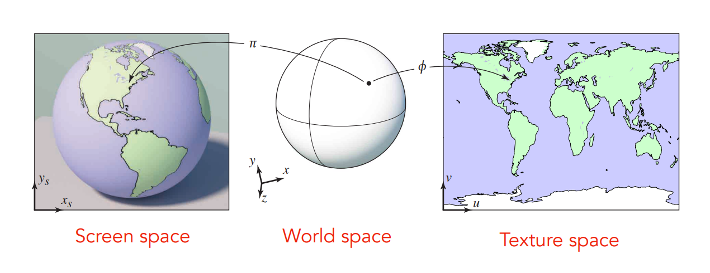

</div>

通過這種方式，我們就能將一張二維的圖與一個三維物體的表面建立一個對應關係，這張二維的圖就被我們稱為紋理（圖），紋理圖中的一個像素被稱為 texel。 因此你可以想見我們的目的是把這張二維的紋理想辦法蒙上一個三維物體的表面，過程中我們可以隨意拉伸，或是隨意的撕開紋理圖，這個過程就叫做紋理映射

看下面這個獨眼巨人的例子：

<div class = "center-column">

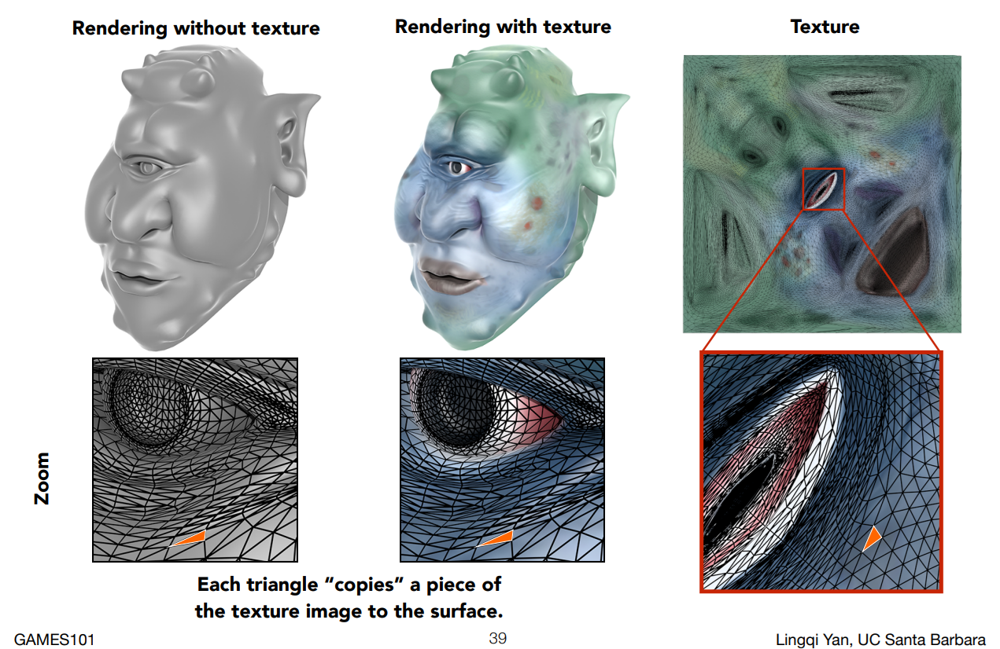

</div>

左上圖是我們透過 Blinn-Phong 得到的結果，而中間就是套用了紋理的結果，右上角的是我們的紋理圖。 根據剛才的思路，我們需要想辦法找到一個關係讓三維物體上的每一個點都能對應到紋理圖中的某一個點

因為三維空間中最基本的東西是三角形，因此我們會以三角形為單位在看這個映射關係，你可以看到上圖左下角我們找了一個空間中的三角形，它的確對應到了右下角紋理圖中的一個三角形

至於這個映射關係要怎麼找，有兩種方法，第一種是靠建模的人手動做，在做出模型後，它們會將模型展開，手動貼到紋理圖中的不同位置，一聽工作量就很大，但仍然是個可行的人工方案

第二種是嘗試找到自動化的方法，給我們任何一個模型，我們希望將它展開成一個平面，而且三角形要盡可能的不扭曲，例如原本該三角形在三維空間中很小，我們不希望展開到平面後它突然變得超大。 這種方法是圖學中的一個重大研究方向，叫做參數化（Parameterization），在幾何的部分是一個非常厲害的研究

現在我們先假設已經找到了映射關係，此時三維空間的三角形理應都已經被映射到了二維的紋理圖上，我們是利用三維空間的座標來描述其三角形的，那相對地，對於紋理圖我們就也會需要一組座標系來描述它，讓我們能夠真正表示紋理圖上的點

紋理圖的座標系被稱為紋理座標，通常會用 $u$ 和 $v$ 來表示兩個軸：

<div class = "center-column">

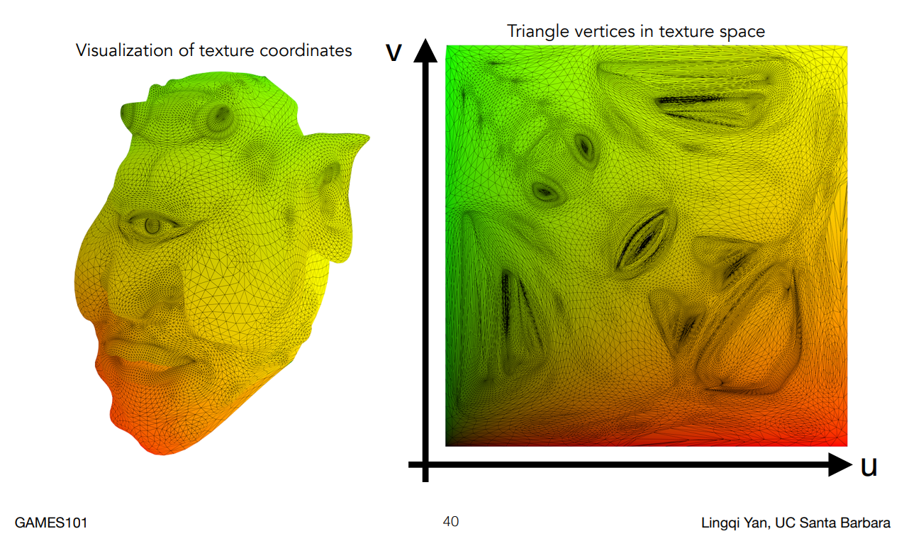

</div>

上圖是一個紋理座標視覺化的結果，$u$ 越大則紅色越多，$v$ 越大則綠色越多，因此不同顏色就代表了紋理圖上不同的點，而把紋理映射到三維模型後就是上圖左邊的結果

通常對於一張紋理圖來說，不管你的紋理是不是正方形的，我們都會認為 $u$ 和 $v$ 的範圍介於 0 到 1 之間，這是為了方便，也算是一個習慣

紋理可以應用在各種不同的物體表面，再看個例子：

<div class = "center-column">

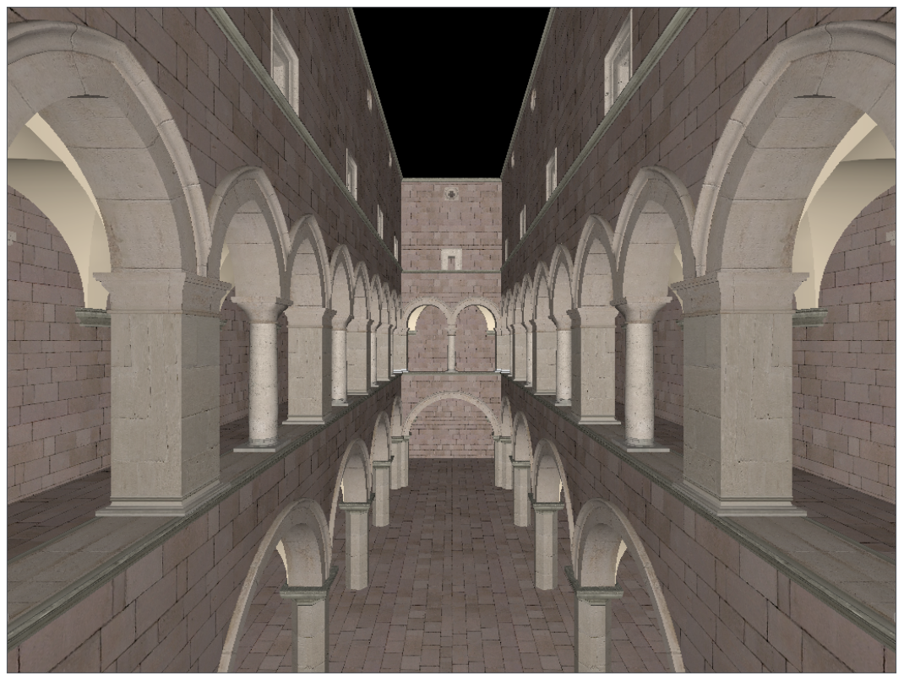

</div>

如果我們把它所有點的紋理座標都顯示出來，那會長這樣：

<div class = "center-column">

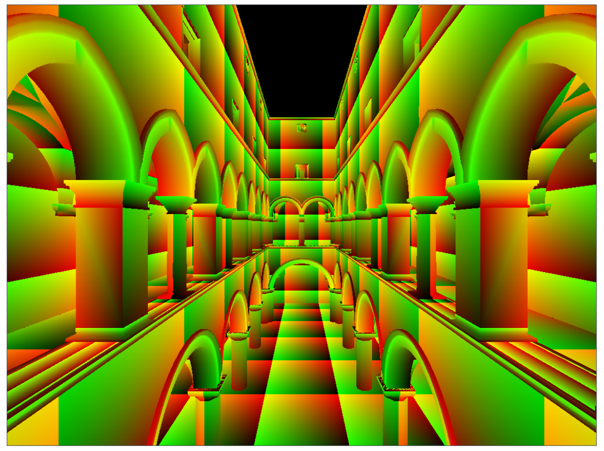

</div>

你可以看見座標不斷地從 0 到 1 重複，就好像在貼磁磚一樣，如此一來便可以把整個物體給貼滿，這也告訴我們紋理圖上的點並不需要只被用一次，一個點可以映射到三維空間中的不同位置

上圖中在紋理左右重複的交界處我們可以看到有很明顯的一條交界線，然而在上上張圖內的石頭中我們卻沒有看到這樣的現象，因此如果紋理本身設計的好，那紋理自己在往各方位重複的時候就會無縫銜接，紋理的上下、左右側能接上，這就非常好

這樣的紋理在圖學中被稱為 Tiled Texture，要設計這種紋理是需要各種不同的演算法的，其中一種演算法比較常用的演算法叫 Wang Tiling，這邊就只簡單提一下，不再展開說了

### Barycentric Coordinates（重心座標）

前面我們知道有很多操作是在三角形的頂點上計算的，而在三角形的內部我們希望它能有個平滑的過度；也就是我們希望只要有頂點屬性，就能夠算出三角形內任何一個點的值。 而這件事能夠利用重心座標做插值來完成，因此我們這邊就把重心座標補一下

假設有一個三角形 $ABC$，那重心座標告訴我們在這個三角形所形成的平面上，任何一個點 $(x,y)$ 都可以表示成三角形 $ABC$ 三個頂點座標的線性組合：

<div class = "center-column">

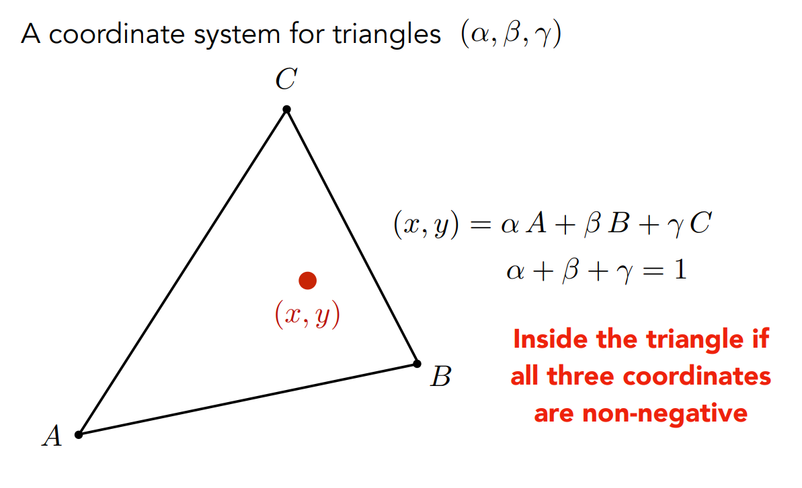

</div>

上圖中的 $A$、$B$、$C$ 都是座標，三角形所在平面上的任何一點 $(x,y)$ 都可以用這三個頂點的線性組合表示，其中 $\alpha$、$\beta$、$\gamma$ 加起來要為一，如果要進一步限制點在三角形內，那麼 $\alpha$、$\beta$、$\gamma$ 都必須是非負的

如此一來要描述一個點的位置，只要給我任意三個點 $A$、$B$、$C$，不管是在什麼樣的坐標系裡面，只要這個點在三角形 $ABC$ 所在的平面上，我們都可以通過 $\alpha$、$\beta$、$\gamma$ 這三個數來表示了

接著來看重心座標要怎麼求，更具體的說是 $\alpha$、$\beta$、$\gamma$ 要怎麼求。 這裡重心座標給出了另一個定義，$\alpha$、$\beta$、$\gamma$ 這三個數值是可以通過面積比求出來的：

<div class = "center-column">

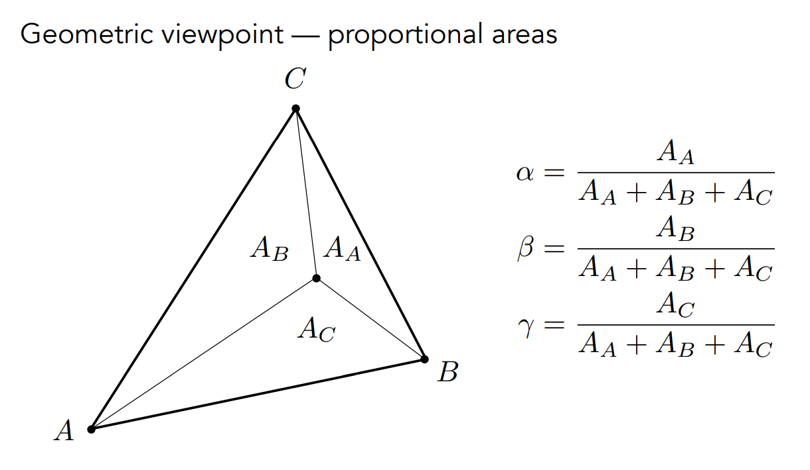

</div>

上圖中我們隨意給了一個三角形內的點，並將其與 $A$、$B$、$C$ 都連上線，此時我們會發現每個頂點的對面都會有一個三角形，像是上圖的 $C$ 與 $A_C$ 的關係。 通過這三個三角形，我們就可以通過其面積比算出 $\alpha$、$\beta$、$\gamma$

透過這個方法，我們會發現有個特殊的點，被稱為這個三角形的重心，它有個很好的性質是能將三角形的面積平分為三等份，也因此它的 $\alpha$、$\beta$、$\gamma$ 剛好都是 $\frac{1}{3}$：

<div class = "center-column">

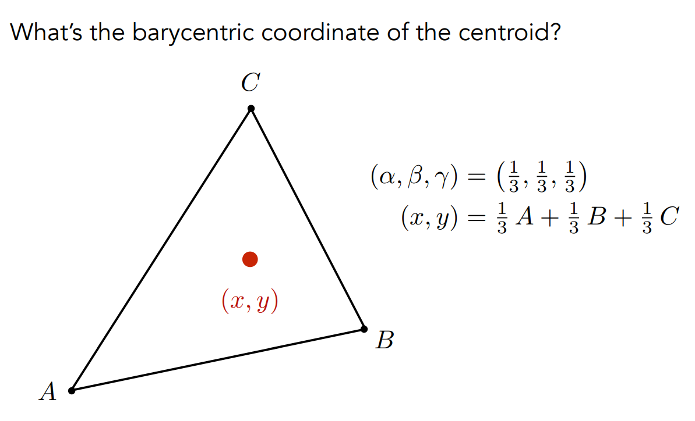

</div>

接下來重心座標還有個一般式，但可以不用記它沒關係：

<div class = "center-column">

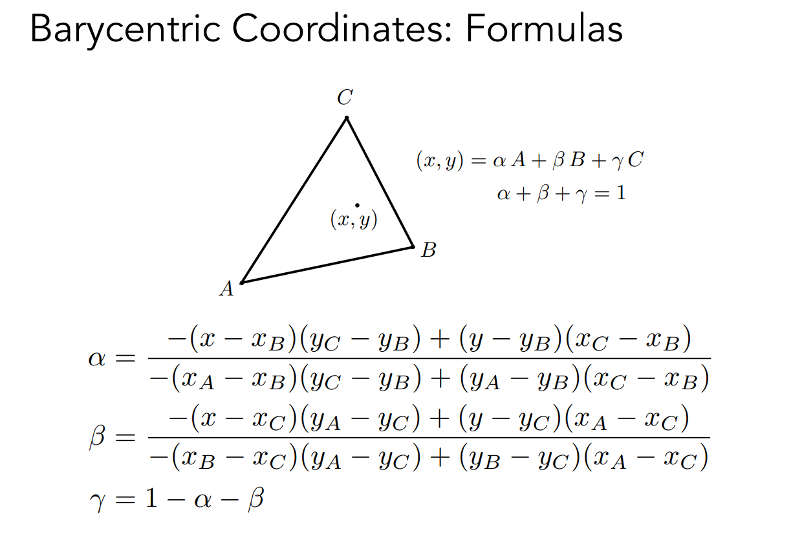

</div>

接著我們可以嘗試用重心座標簡單做一些事情，像是求三角形內部的顏色，或是紋理座標、法向量或深度等，都是透過插值來計算的：

<div class = "center-column">

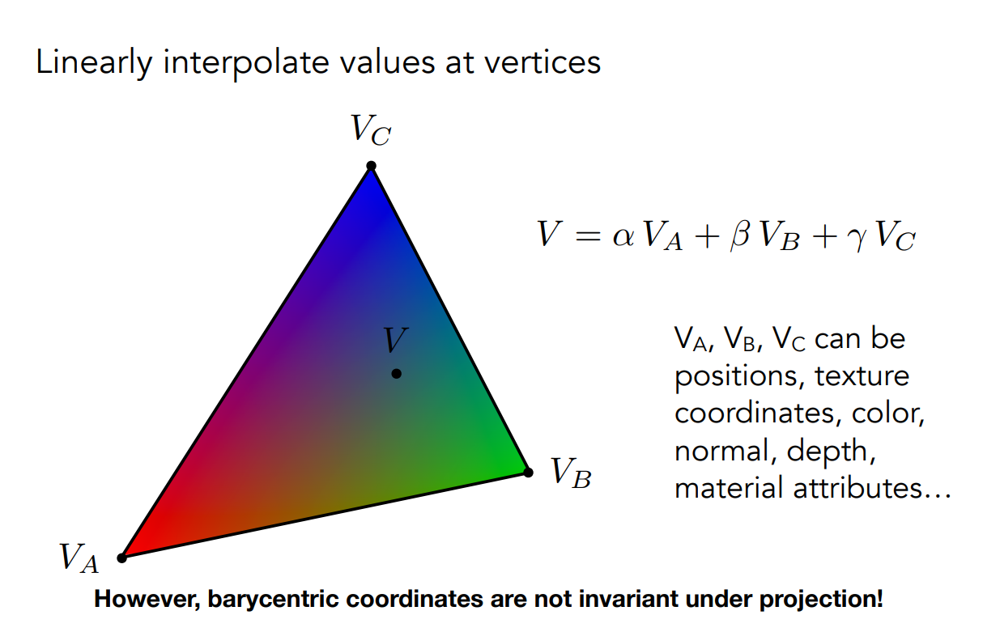

</div>

包括 Blinn Phong 的 $K_d$ 項也可以這麼算出來，其可能定義在紋理圖中，我們能夠利用三角形三個頂點的 $u,v$ 座標插值算出目標點的 $u,v$ 座標，再利用其座標去查紋理圖，便可找到 $K_d$ 項：

<div class = "center-column">

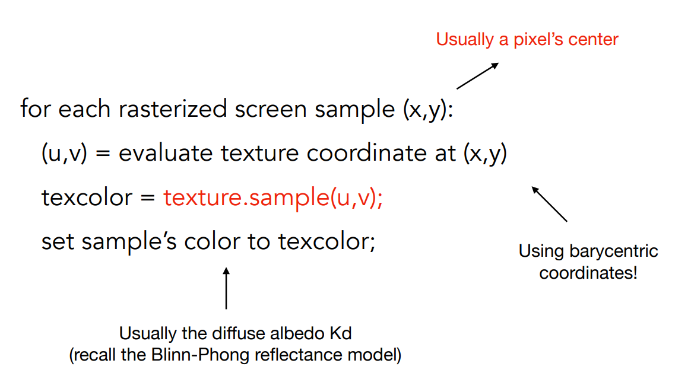

</div>

最後有一點，如果大家在讀 OpenGL 之類的文章，可能都會涉及到一個問題，重心座標雖然好用，但在投影變換下我們是不能保證重心座標不變的

繼續以上上圖的三角形為例，我們有目標點 $V$ 的重心座標。 在經過投影變換後這個三角形的形狀會發生變化，此時點 $V$ 經過投影後的位置，與我們在投影後的三角形上用一樣的 $\alpha$、$\beta$、$\gamma$ 算出來的位置可能會不一樣，換句話說 $V$ 經過投影後其 $\alpha$、$\beta$、$\gamma$ 的值可能會變化

因此如果我們想插值三維空間中的一些屬性，然後取某個目標點，我們需要先做插值再做投影，而不能先做投影再做插值。 這在處理深度時特別重要，回想一下光柵化的時候，三角形都已經投影到螢幕上了，它會覆蓋很多像素，自然我們會有像素的中心座標與其對應到三角形的哪個位置

此時我們不能夠利用投影後的三角形頂點的深度做插值，而是要找到像素中心座標對應到原先三維空間中座標，再利用三維空間中三角形的頂點做插值，然後將值放入 Z-buffer，這才是對的。 至於要怎麼把螢幕上的三角形再投影回去三維空間中，只要利用逆變換就可以了

總而言之，只要記得根本原因是重心座標在投影操作下會發生變化即可

### Texture Magnification（Texture too small）

接下來我們來看一些更深入的問題，首先是紋理的放大，這會發生在紋理太小的情況下，想像一下有一堵牆，牆上有一幅畫，畫的內容我們想要用紋理來操作，但此時畫的分辨率有 4K，紋理卻只有 256x256，就會發生這種情況

這種時候如果我們直接用高分辨率的畫中的點去查紋理座標，會查到一些非整數的座標位置，但在查找時座標需要是整數位置，假設四捨五入為整數，像是 0.4 變為 0，0.6 變為 1，此時畫中一定範圍內的 pixel 便會對應到單一一個 texel，因為紋理太小了

因此如果我們只是對座標做四捨五入，那畫面會變得像下圖最左邊這樣：

<div class = "center-column">

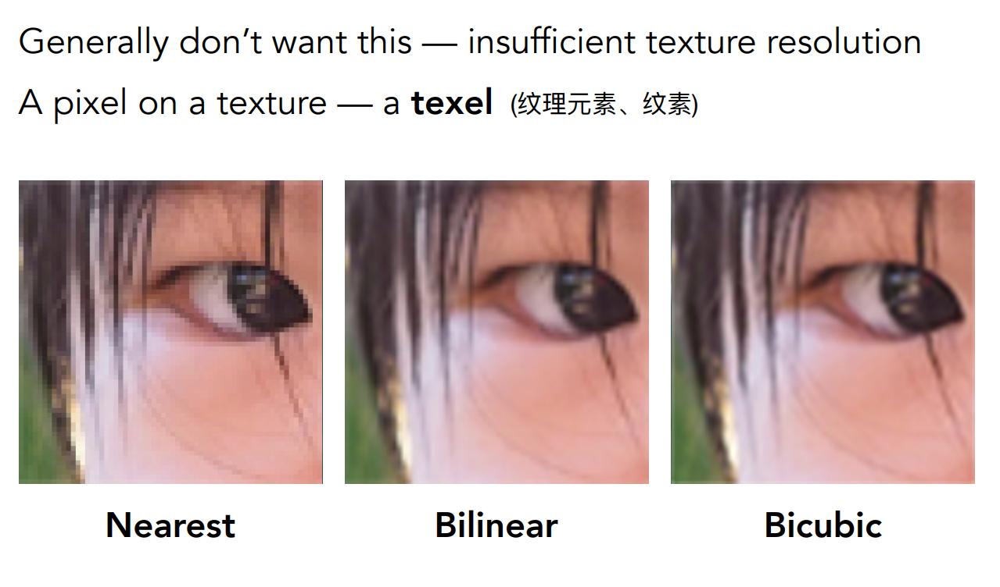

</div>

看上去有一個個的格子，這通常不是我們想要的效果，我們希望能有上圖的中間或右邊那樣的效果，模糊一點沒關係，但至少結果稍微連續一點。 因此我們要做的是座標查找的處理，查找時我們會找到非整數的座標，那要如何得到最後的值就是這邊的主題

#### Bilinear & Bicubic

首先是雙線性插值（Bilinear）：

<div class = "center-column">

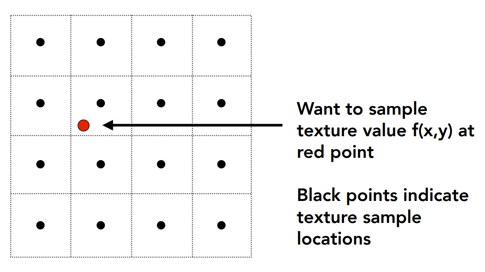

</div>

上圖是一個 4x4 texel 的例子，而 pixel 對應到的位置在紅點處，而我們想知道紅點處紋理的值是多少，如果是剛剛的四捨五入，等於就是找最近的 texel，那就會有我們不想要的一塊一塊的結果

要做 Bilinear，首先要找它鄰近的四個點，並將紅點與左下角的偏移量算出來（圖中的 $s$ 與 $t$）：

<div class = "center-column">

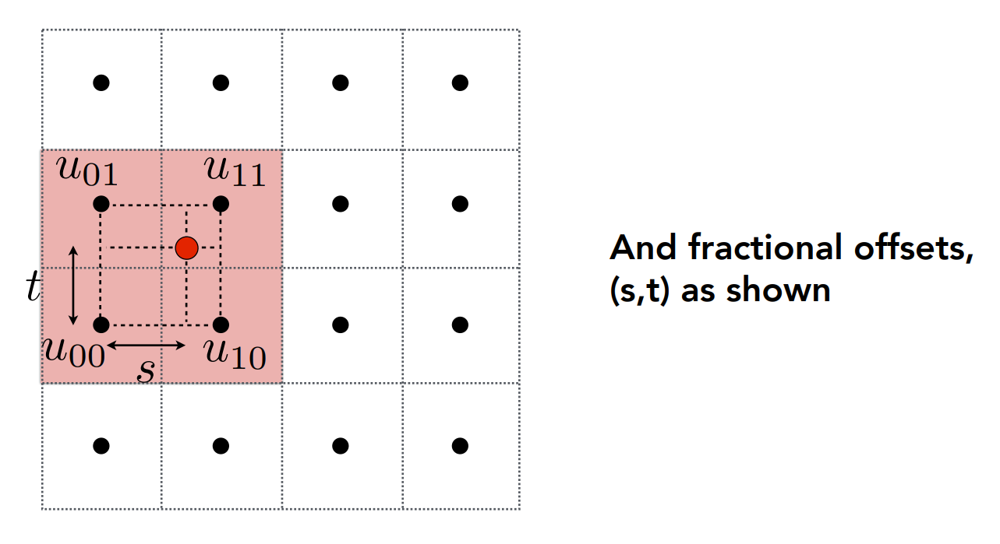

</div>

這個 $s$ 和 $t$ 肯定會介於 0 到 1 之間，因為 texel 與 texel 間的距離為 1

接著做 Bilinear 的計算：

<div class = "center-column">

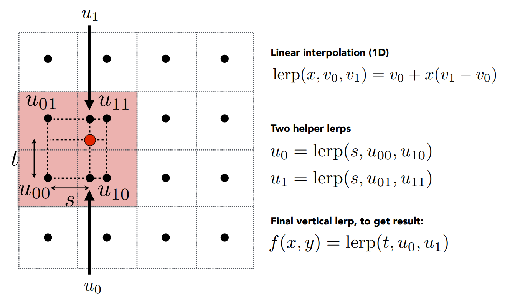

</div>

圖中的 $\text{lerp}$ 是線性插值（linear interpolation）的意思，以 $\text{lerp}(x, v_0, v_1)$ 來說，其對 $v_0$ 與 $v_1$ 做插值，$x$ 則是佔 $v$ 軸的比例，因此是一個 0 到 1 之間的值，如果 $x$ 等於 0，則插值結果為 $v_0$，等於 1 則為 $v_1$

以我們的例子來說，我們先在 $v$ 軸上做線性插值，由於有四個點，而四個點各有各的屬性，因此我們將 $u_{01}$ 與 $u_{11}$ 對紅色在上方的投影點 $u_1$ 做一次插值，同理 $u_{01}$ 與 $u_{11}$ 對 $u_0$ 做一次插值

如此一來水平方向的屬性我們就插值完了，得到了兩個水平方向上的屬性，接著我們再將這兩個點對垂直方向的 $u$ 軸做一次線性插值，就可以得到紅點處的屬性了

通過這個方法我們就可以得到在這四個點圍成的區域內的平滑過度值，因此紅點處的屬性考慮了它周圍四個點的屬性，假設其與 $u_{11}$ 靠得很近，那屬性自然會很接近 $u_{11}$，如果是在四個點的中間，那就會很接近四個點的平均

因為水平方向與垂直方向都做了插值，所以叫做雙線性插值，但實際上你可以看到並不只做了兩次，水平方向做了兩次，垂直方向做了一次。 當然你要反過來，垂直方向做兩次，水平方向做一次也是可以的

在一開始的例子中你可以看到它的結果就較為連續，而至於當中的 Bicubic 則會取 16 個點，用三次函數做插值（而非用線性函數），因此運算量較大，但你也可以看到結果比 Bilinear 又更平滑了些

### Texture Magnification（Texture too big）

下一個問題是紋理太大，因此需要縮小，剛剛我們能透過差值來解決問題，但這邊我們卻沒辦法，而且會引起更多的問題，先來看一個例子：

<div class = "center-column">

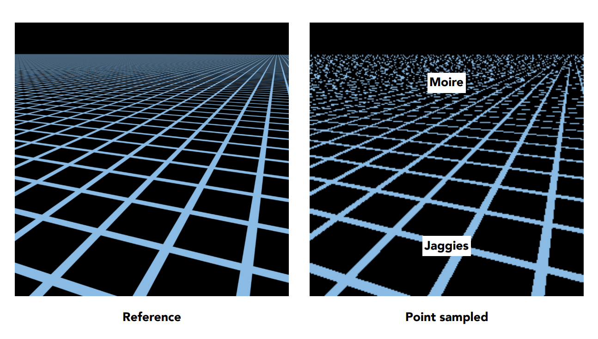

</div>

上圖有個平面，平面上貼了一張紋理圖，這個紋理是一堆的格子，接著我們從某個角度看過去，因為有透視投影的關係所以會有近大遠小的效果。 接著我們照著剛剛的方法一樣，求出紋理座標後做插值，此時得到的就是右圖，你會發現有個熟悉的現象出現了 ー 混疊（鋸齒），且越遠越明顯

這是因為對於近處的像素來說，單個像素在紋理上的覆蓋區域其實較小，但在遠處的像素，單個像素就覆蓋了紋理圖中的一大片區域：

<div class = "center-column">

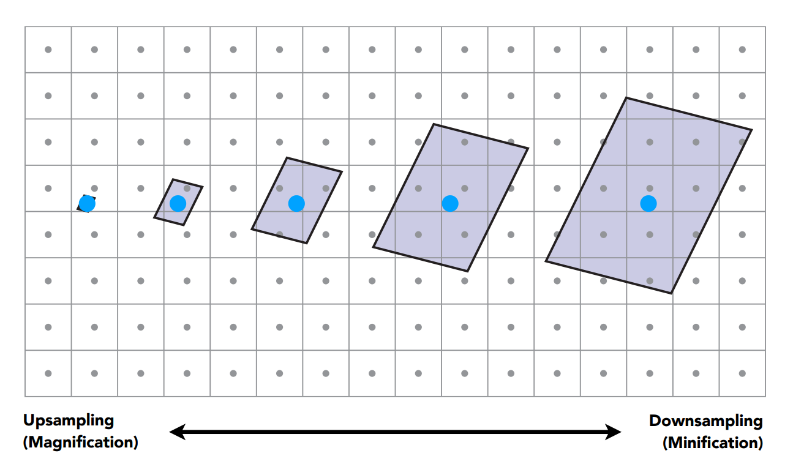

</div>

因此螢幕上的像素在紋理圖上覆蓋的區域是各不相同的，對於覆蓋區域較小的像素，我們利用像素中心去查紋理圖，找到的值可以近似的被表示成實際的覆蓋區域沒問題（上圖中最左側的例子）； 但對於覆蓋區域較大的像素，用單一一個中心去代表整塊的平均值，很明顯的就不對了（上圖中最右側的例子）

之前為了解決鋸齒，我們引入了 MSAA，這裡其實也是差不多的概念，我們需要在一個像素內用更多的取樣點去查找紋理座標，下圖是一個像素分 512 個取樣點下去的結果：

<div class = "center-column">

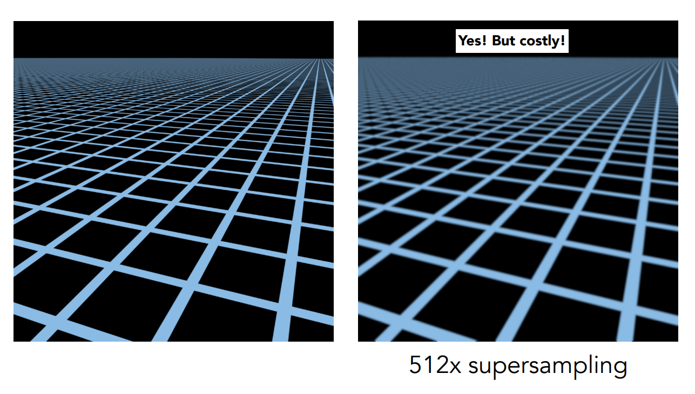

</div>

但與前面提到的問題一樣，單個像素要分這麼多取樣點，效能肯定會受到影響，所以我們再回來看看有沒有什麼優化空間。 我們遇到的一樣是混疊問題，也就是取樣頻率跟不上訊號的頻率，當像素在紋理圖內覆蓋範圍過大的時候，整個區域的紋理訊號變化只被一個取樣點取樣了

在紋理這塊我們提供了另一種完全不同的思路，取樣會導致混疊，因此我們就不取樣了。 我們的問題在於要知道紋理中一個覆蓋範圍內的平均值，而這裡的取樣只是為了求平均值的手段，因此我們是可以找到其它手段來求平均值的

#### Mipmap

在資料結構中有個名稱來形容這類問題 ー 點查詢與範圍查詢問題。 點查詢很好理解，就是剛剛講雙線性插值處的問題，給一個點要去查紋理圖中對應的值。 而範圍查詢問題英文叫 range query，給一個「範圍區域」，我們想要馬上知道這個區域內的平均值。 另外，有些範圍查詢並不是要求平均值，而是要找最大最小值的

這在演算法的領域有各種不同的方法在研究它，在圖學中有一個近似方法，它非常快，可以拿來做範圍查詢平均值，叫做 Mipmap，其有三個特點：

1. 快
2. 結果是近似的，也就是說它的範圍查詢結果並不是個準確值
3. 只能用在正方型的區域上

Mipmap 的想法是從一張圖預先生成一系列的圖，看個例子：

<div class = "center-column">

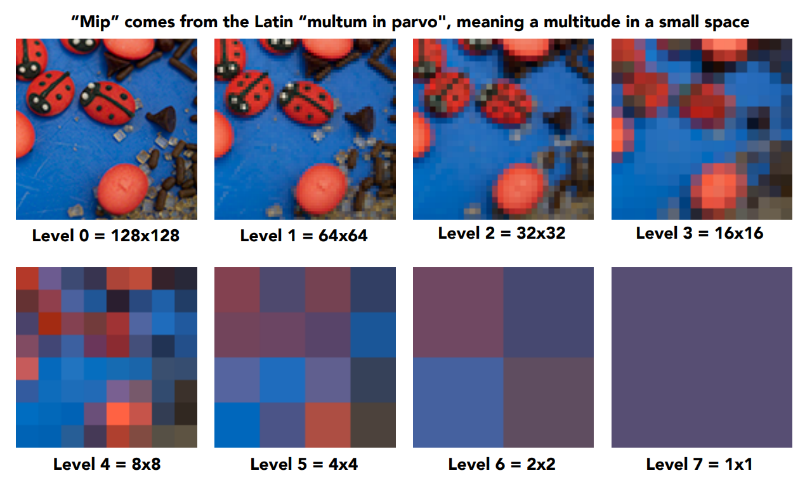

</div>

上面中我們把一系列的圖分成了不同的層（Level），每一層的分辨率都是上一層的四分之一倍，因為每次都是把邊長除以二因此總共的層數是以 $log_2$ 計算的，至於儲存空間量大概會多三分之一倍（等比級數和）

於先前一樣，在查詢紋理座標的時候，任何一個像素都可以映射到紋理圖上的一個區域：

<div class = "center-column">

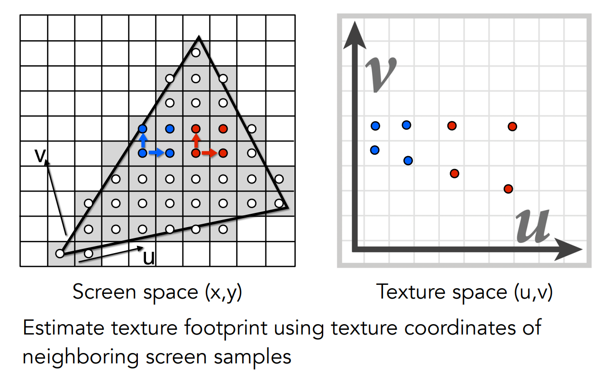

</div>

這個區域我們有個近似的算法，假設我們想算上圖中單獨一個紅色像素的區域，我們可以先將四個紅色像素各自的中心，投影到紋理圖後，計算不同點之間的距離

<div class = "center-column">

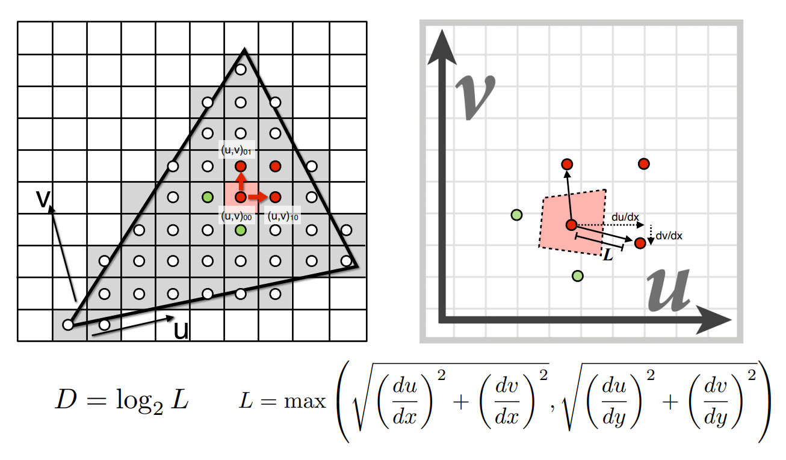

</div>

上圖中 $max$ 內取的兩個投影過後的邊長，接著我們取較長的那條來近似一個像素的區域：

<div class = "center-column">

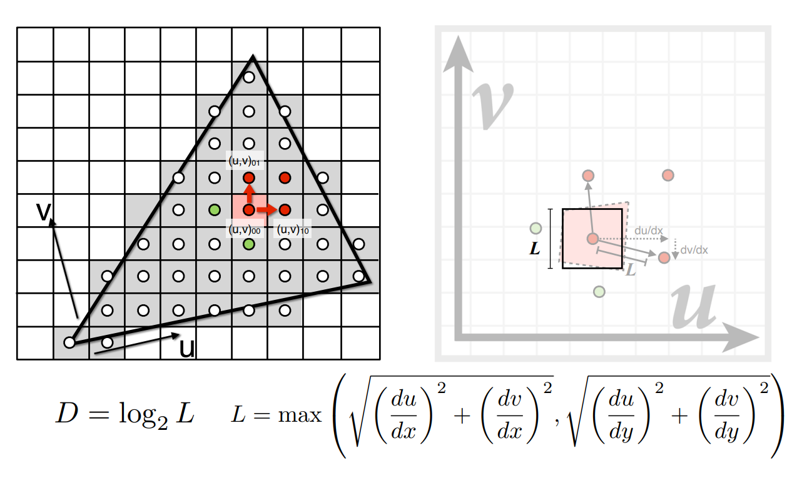

</div>

上圖中可以看到一個長度為 $L$ 的正方形，這就是我們最後的近似結果

這裡相當於是在做一個有限差分（finite difference），也就是在算我們於螢幕上的像素中移動一段距離，會在紋理的空間中移動多少距離。 而既然是在做近似，你其實也可以拿一個 pixel 的四個頂點去做一樣的事情，這並不是 Mipmap 的關鍵

我們的關鍵在於拿到紋理圖中一個正方形區域時，它的查詢該怎麼做。 首先我們會利用 $L$ 的長度來去判斷要使用第幾層的紋理圖，假設 $L$ 是 1，那就跟原本的 texel 大小一模一樣，因此使用原先的紋理圖即可

而如果 $L$ 是 4，代表它在第一層紋理圖中佔 16 個 texel，因此在第二層中會佔 4 個 texel，在第三層中會佔 1 個 texel，此時我們查第三層的紋理圖就可以馬上知道平均的結果是多少了。 這就是 Mipmap 聰明的地方了，我們只要直接查詢第 $Dlog_2 L$ 層的紋理圖，就可以馬上求出平均值

但由於層數是離散的，因此查詢的結果也會有之前那種斷層感，視覺化出來的話長這樣，圖中的不同顏色代表不同層的紋理圖：

<div class = "center-column">

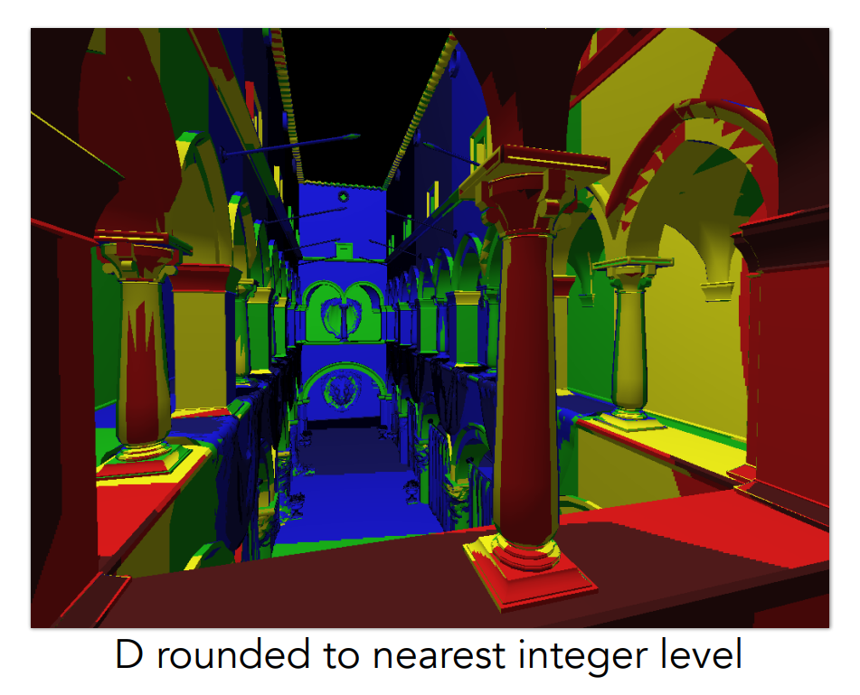

</div>

但我們不希望這樣，想要有連續的結果，此時又可以將剛剛的雙線性插值拿過來用了。 假設我們要查第 1.8 層，那就先找第一層，再找第二層，這兩層內部我分別都跟之前一樣，用雙線性插值找出一個結果，接著再把這兩個雙線性插值的結果，利用一次線性插值，將層與層之間的數值給找出來：

<div class = "center-column">

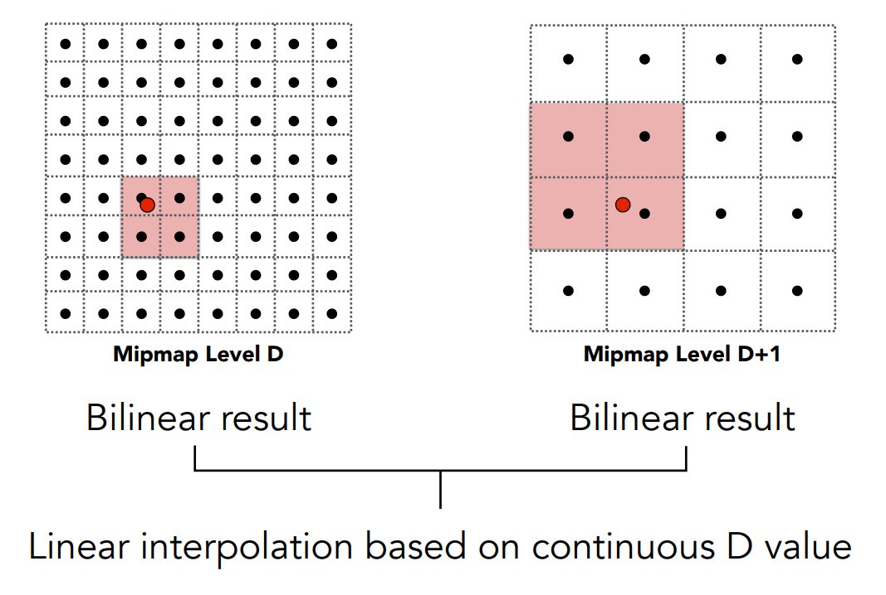

</div>

上圖中我們會在第 D 層做一次雙線性插值，在第 D+1 層做一次雙線性插值，接著把這兩個雙線性插值的結果拿出來，再做一次線性插值。 由於總共做了三次不同方向（$u$、$v$ 和 Layer）的插值，因此這被稱為三線性插值，開銷很小，效果又好，因此在圖學中得到了廣泛的應用

這樣一來無論我們就可以計算任意一層，甚至是浮點數層的值了：

<div class = "center-column">

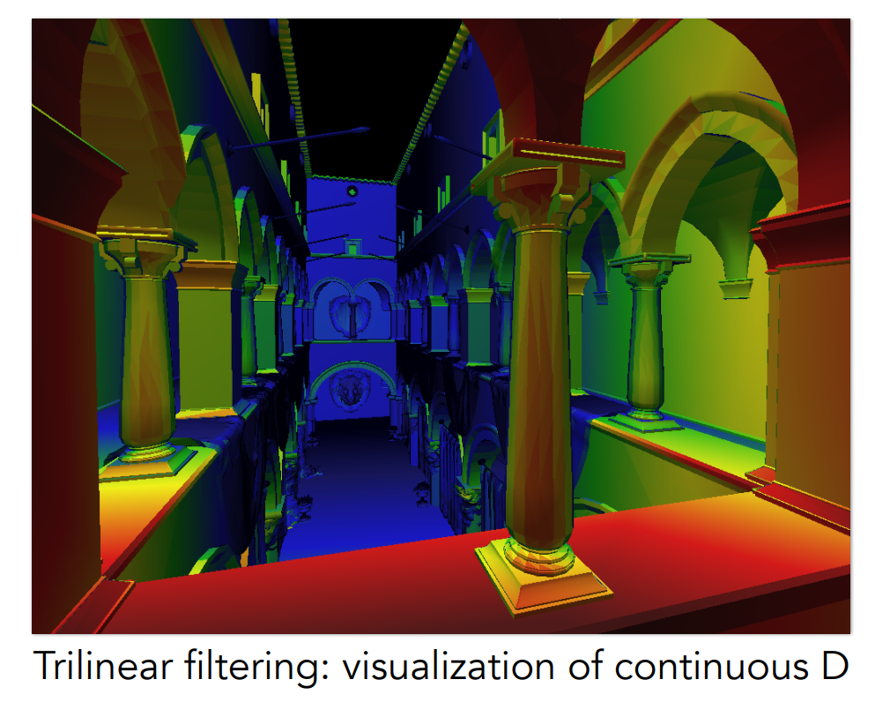

</div>

現在就來看看利用 Mipmap 的結果和分 512 個取樣點的結果有什麼差別：

<div class = "center-column">

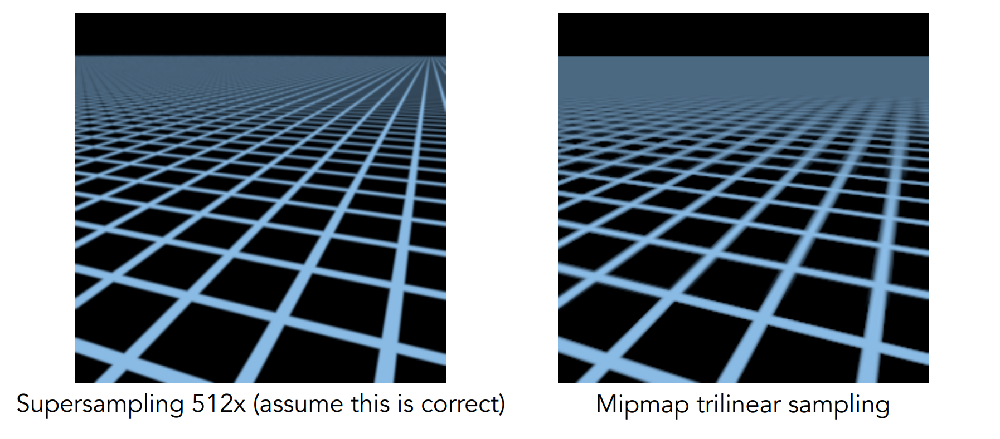

</div>

效果不錯，但此時你會發現有個地方不太對，Mipmap 到了遠處的地方它會整個糊掉，這被稱為 overblur。 我們一開始有提到，Mipmap 只能查詢正方形區域的平均，因此在 pixel 映射到紋理圖時我們會將其近似成長度為 $L$ 的正方形，但實際上的像素所佔的區域有可能與該正方形相差很多：

<div class = "center-column">

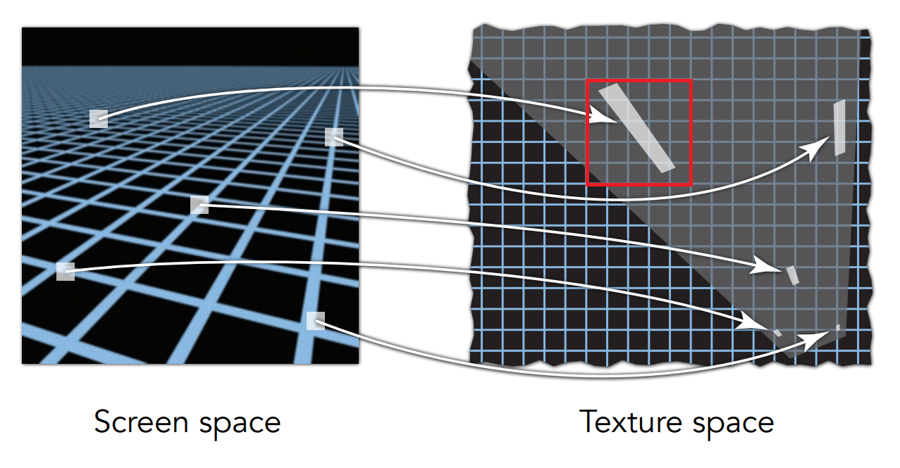

</div>

#### Anisotropic Filtering（各向異性過濾）

上面的問題可以透過各項異性過濾來解決，在剛剛的圖中你可以發現到有些 pixel 對應的區域只有水平方向發生了變化，高度本身與正方形的邊長幾乎一樣

各向異性過濾利用了這種特性，做了更準確的近似，Mipmap 是同時縮小 $u$、$v$ 座標以形成各層的紋理圖，而各向異性過濾則是增加了只縮小了單一軸的紋理圖，因此對於長方形的映射範圍更準，但對於那種斜著的長方形仍然效果不好：

<div class = "center-column">

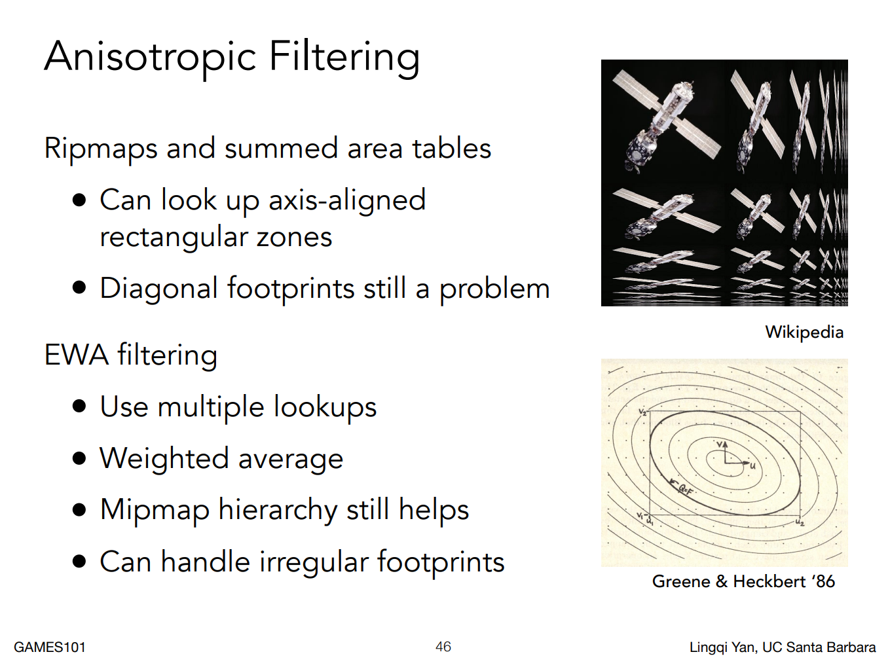

</div>

為了適應各種不同的形狀，人們還發明了許多不同的方法，這裡提一個例子叫 EWA 過濾，他的想法是將任意不規則的形狀拆成很多不同的圓形，去覆蓋這個不規則的形狀

上圖中有個橢圓，在 EWA 中可能就會利用三個圓形來去覆蓋這個橢圓因為有三個圓形所以會做三次查詢，這樣多次的查詢自然就可以覆蓋一個不規則的形狀，但自然成本就更高。 對於各向異性過濾來說也是如此，上圖中你可以看到他的空間成本大概會收斂到原本的三倍（也因此你打遊戲時開多少倍的各向異性過濾其實成本不會差多少）

### Applications of Textures

#### Environment Mapping（環境光映射）

接下來就開始講講紋理的應用，首先看到下面這個球：

<div class = "center-column">

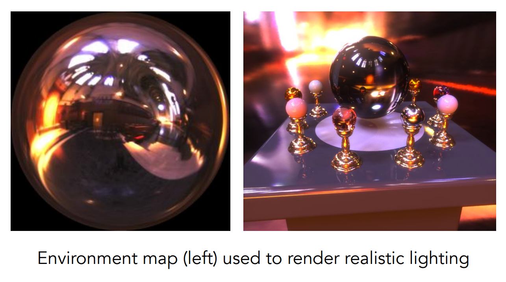

</div>

它反射的光線中來自天空與地面，那這要怎麼去表示它呢? 這種環境的紋理圖被稱為環境光映射，也會直接被稱為環境光照，我們用紋理圖去描述整個環境的光，並且我們可以用環境光去渲染一些其他的物體。 在使用環境光的時候，我們會假設環境光都來自無限遠處，因此不記錄深度訊息，只記錄方向訊息

我們可以將環境光存儲在球上，以上圖來說我們有個非常光滑的金屬球，這個鏡子反射出來的東西就是整個環境光，要使用時就將其展開，像是將地球儀的表面展開為世界地圖一樣，這種將環境光存儲在球面的方式被稱為球面環境映射（Spherical Environment Mapping）：

<div class = "center-column">

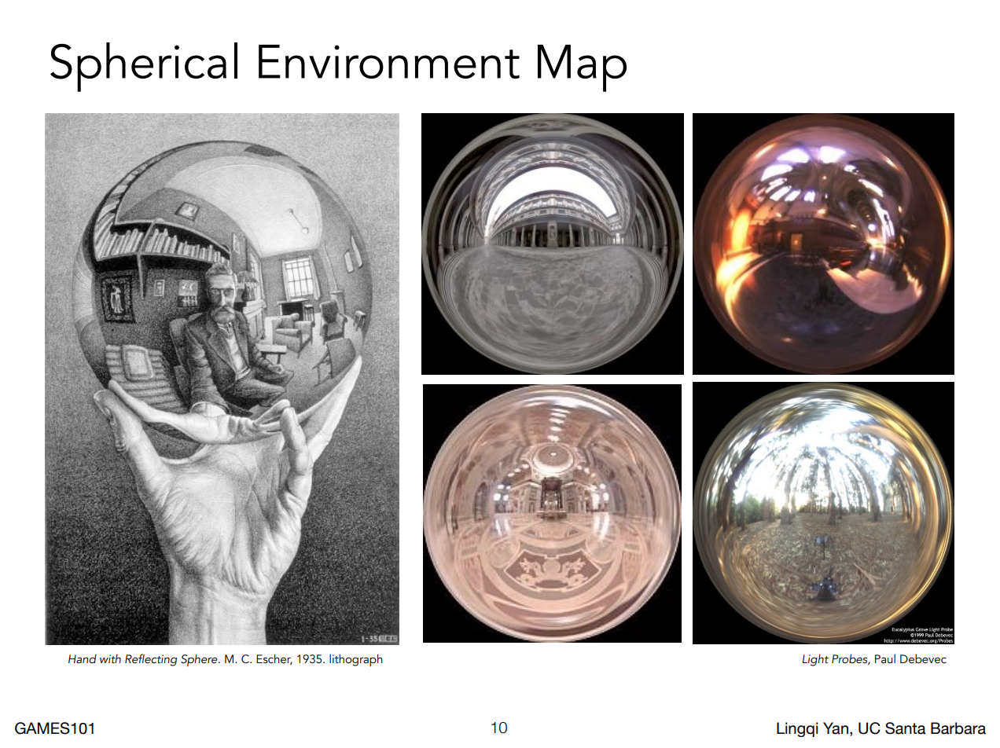

</div>

他有一個問題是在展開後紋理圖會有一些扭去，像是下圖中的樹木、天空等：

<div class = "center-column">

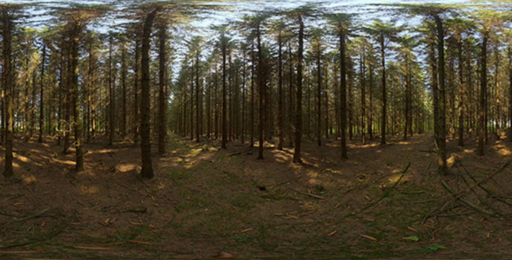

</div>

這個現象在世界地圖上也可以看到，如果你有讀過一些科普文章，可能會知道歐洲、南極洲等其實都挺大的，沒有地圖上看起來那麼小，這就是因為再展開的時候緯度較高的地方佔的區域相對較小。 換句話說這能描述整個球上不同的位置，但不是一個均勻地描述，在靠近極點的地方會出些一些扭曲的現象

後來這個問題人們發下了一個解法，還是用一個球，而現在我們認為這個球有一個包圍盒，我們原本是用球的表面來紀錄來自任何地方的光線，現在我們連一條球心往目標的射線，讓它繼續走，直到它打到立方體的表面上，這樣就可以將環境光的訊息存在立方體表面上了：

<div class = "center-column">

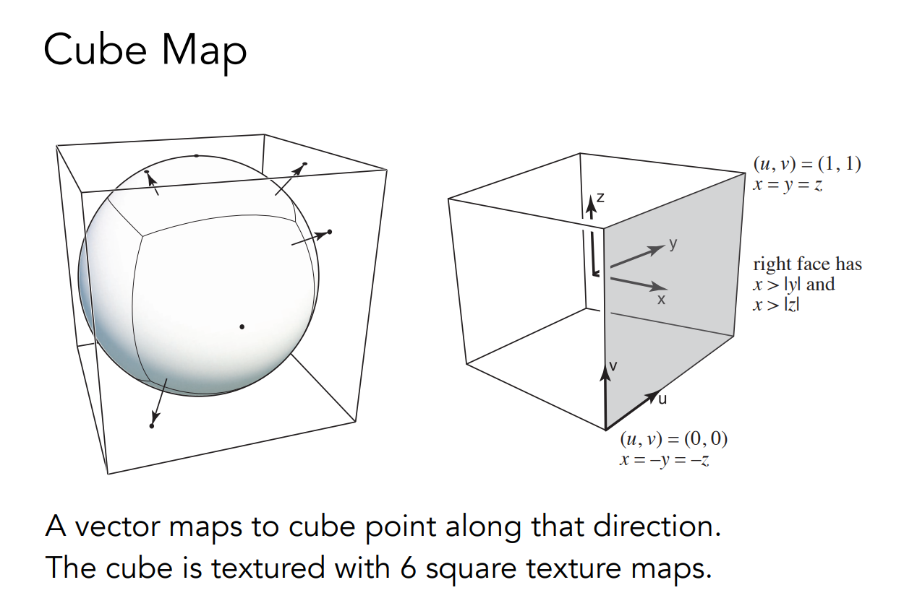

</div>

可以看見我們會得到六張圖，而由於立方體的各個面基本上都是均勻的，因此扭曲的現象會較少發生，但它有其他的問題，在計算光線方向時還要判斷它在哪個立方體的面上，因此需要一些額外的計算，但仍非常快。 這種方法被稱為立方體貼圖（Cube Map），除了環境光映射，常見的天空盒也是利用 Cube Map 在做的

下面是一個教堂的例子：

<div class = "center-column">

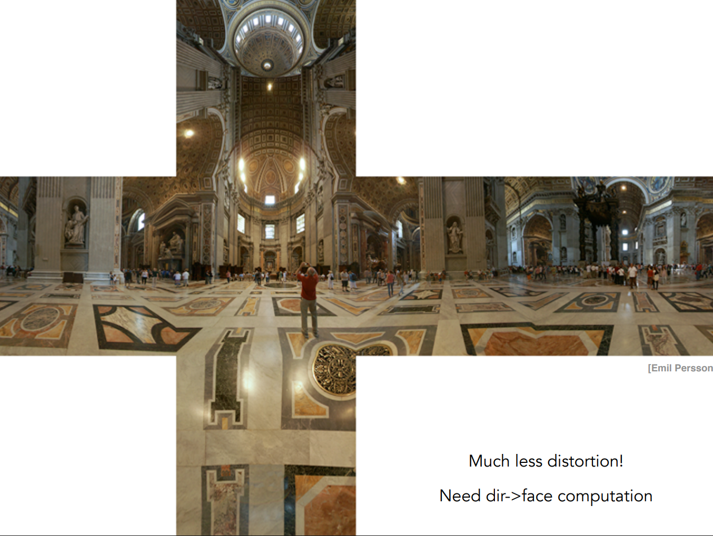

</div>

#### Bump Mapping（凹凸貼圖）

接下來是另一個應用，叫做凹凸貼圖，類似的還有法向量貼圖。 我們之前用紋理是為了設定 Blinn Phong 裡面的 $K_d$ 項，但紋理也可以定義一些更進階的屬性，以凹凸貼圖來說它會額外定義一個高度的屬性，表示該點要以物理模型的法向量方向再往下或往上走多少：

<div class = "center-column">

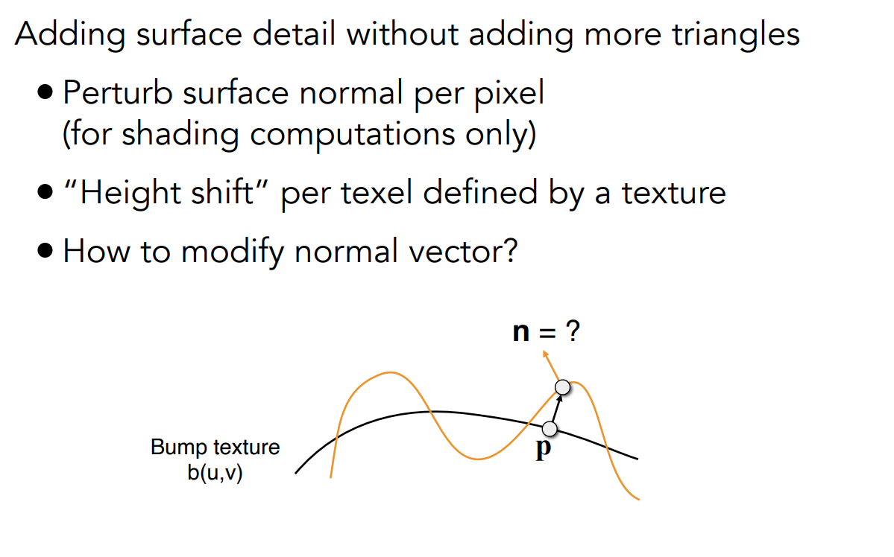

</div>

上圖中的黑線是物理模型原本的位置，而利用凹圖貼圖，我們就可以透過紋理座標來定義三角形內任意點的相對高度，而相對高度一變法向量就會跟著產生變化，因此 Shading 的結果就會有明暗對比，進而在不改變物理模型的情況達到視覺上的凹凸效果，下面是一個例子：

<div class = "center-column">

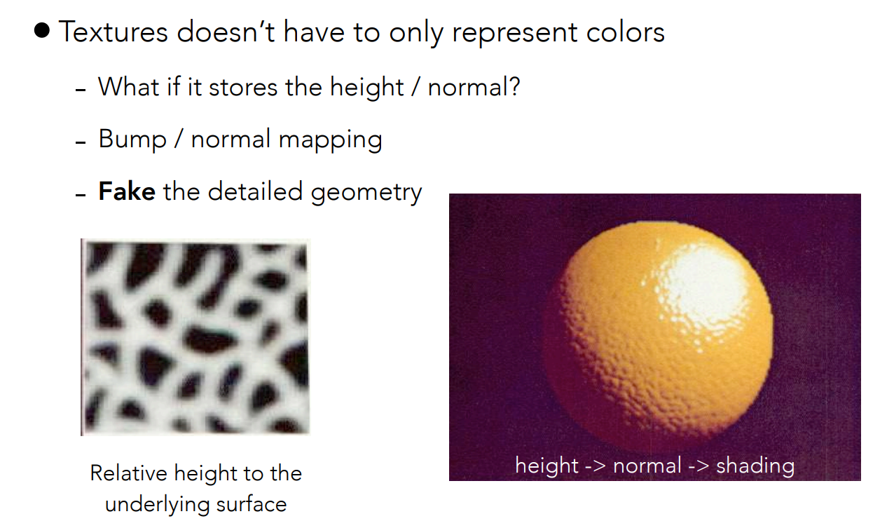

</div>

圖中的這顆橘子，其物理模型只是一顆球，因此建模很簡單，可以只用一兩百個三角形表示。 如果我們想利用物理模型來達到圖中的效果，那會需要超級多的三角形，但利用凹凸貼圖我們就可以節省許多三角形

接著來看法向量的變化該如何計算，我們先考慮一個簡化的例子：

<div class = "center-column">

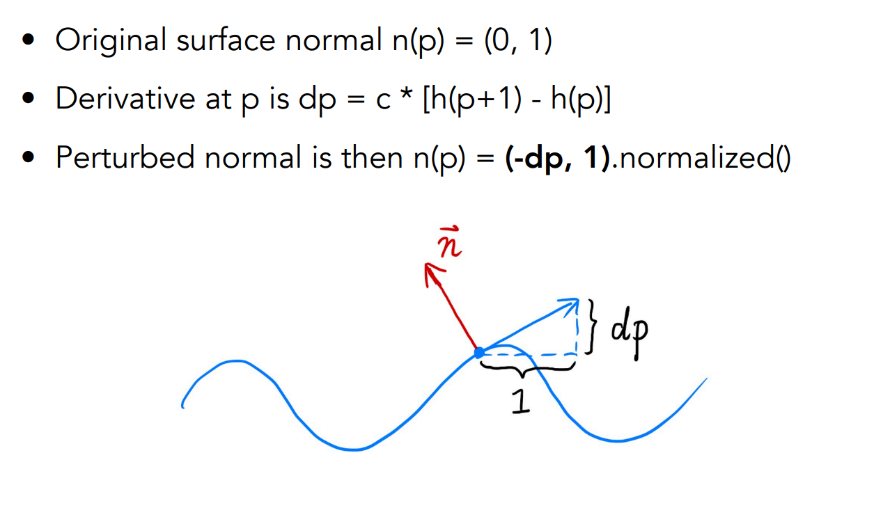

</div>

假設上圖原本是個平面，因此原先目標點 $p$ 的法向量會是 $(0,1)$，而藍色的波浪線是凹凸貼圖定義出來的，此時若要算任意一個點的方向量，就相當於是要求該點的導數，換句話說就是要求該點切線。 而這個計算很簡單，只要算下一個點 $p+1$ 和目標點 $p$ 的高度差就可以了（差分法），上圖中還引入了參數 $c$ 來定義這個凹凸貼圖的影響到底大不大，只是做一個簡單的縮放而已

而要將切線變為法向量，從這個例子你可以看到法向量垂直於切線，而上例中切線的向量為 $(1,dp)$，因此垂直方向的向量為切線逆時鐘轉 90 度，因此只要把 $x$、$y$ 對調，並把 $y$ 加上個負號，最後做個 Normalize 即可

上面的例子是一維的，而在實際的情況下我們有二維的貼圖，因此計算時會變為在求該點的梯度，假設目標點在 $(u,v)$，則各方向的變化量為：

$$
\begin{cases}
n(p) = (0,0,1)\\
\frac{dp}{du} = c1 * [h(u+1) - h(u)]\\
\frac{dp}{dv} = c2 * [h(v+1) - h(v)]
\end{cases}
$$

因此法向量為

$$
n = (-\frac{dp}{du}, -\frac{dp}{dv}, 1)\text{.normalized()}
$$

這邊我們假設法向量是 $(0,0,1)$，但在實際情況下法向量會往各個不同的方向，因此通常會在局部定義一個座標系，並將其法向量設為 $(0,0,1)$，並且會有兩個垂直的分量 $st$ 和 $n$，之後利用紋理映射將法向量算出來，再將算出來的法向量重新計算回世界座標裡面

::: info  
一維的例子通常會被稱為 Flatland Case，對應到 3D Case  
:::

凹凸貼圖，或者說法向量貼圖都是給一個假的法向量，通過紋理映射的方式定義出法向量，再通過改變其高度的方式達到目的的，而這有個更現代化一點的作法，叫做位移貼圖（Displacement Mapping）

它們的起點都是一樣的，都是通過用紋理定義出任一點的相對高度，因此它們的輸入完全一樣，差別在於位移貼圖會對三角形面的不同頂點真的做移動，而不是像法向量貼圖只做假的移動，看個差異圖：

<div class = "center-column">

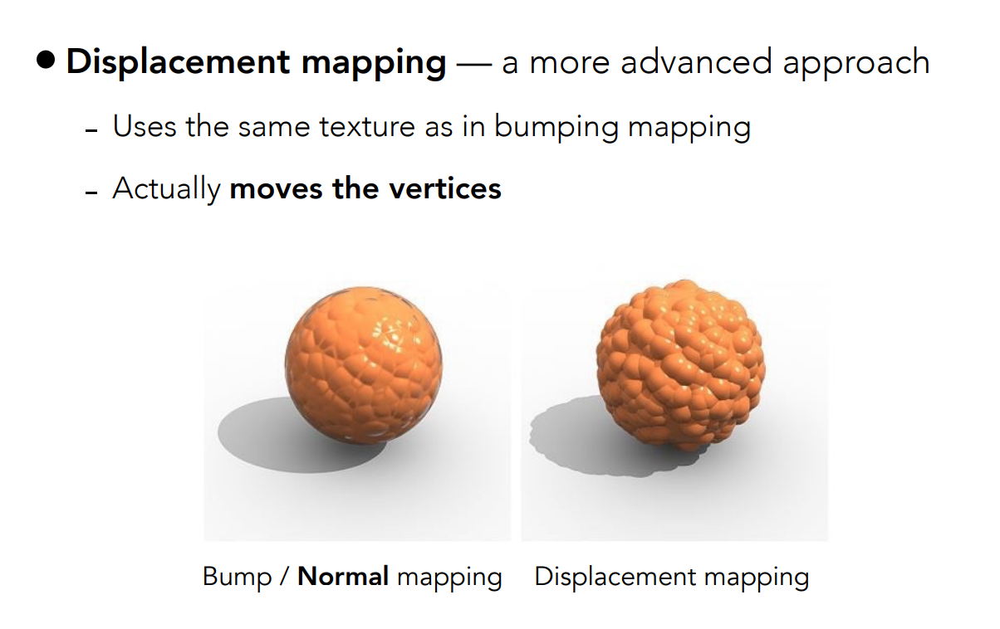

</div>

凹凸貼圖由於沒有實際改變幾何模型，因此在邊緣的地方會有問題，第二是在幾何模型相對複雜的情況，凸起部分的陰影無法被表現出來。 而由於位移貼圖實際改變了各三角形頂點的位置，因此效果肯定較好，但代價就是它需要模型本身的三角形足夠細，因為它改變的是三角形頂點的位置，如果三角形本身較大，而在三角形內部還有一些需要改變的位置，那就沒辦法做了

換句話說它需要你的模型能夠跟得上你紋理的變化速度，三角形頂點之間的間隔需要比紋理變化的頻率還高才行，因此就又會有混疊問題。 但我們又不想用一個過於細緻的模型，而是希望一開始先用一個粗糙一點的模型，並在應用位移貼圖的過程中檢測一下三角形夠不夠細，如果不夠再把三角形拆成更多的小三角形，然後繼續做位移貼圖，這被稱為動態曲面細分（Dynamic Tessellation）

#### Others

##### 3D Texture

再來提一些較瑣碎的東西，首先是三維紋理，紋理不一定需要是張二維的圖，看個例子：

<div class = "center-column">

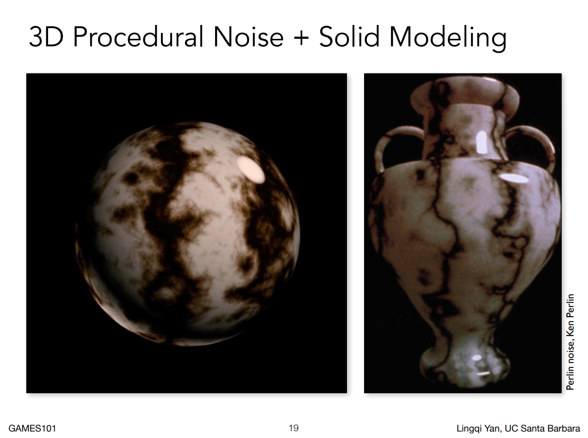

</div>

假設我們將上圖的球體切一半，如果是用二維的紋理圖，那切開後我們是什麼都看不到的，但如果是用三圍貼圖的話就可以看到，換句話說三圍貼圖定義了空間中任何一個點的值

另外，對於大理石這種紋理，實際上我們並不會真的生成帶有紋理的圖，而是會定義一個在三維空間中的噪聲函數，因此對於空間中的任何一個點都可以算出對應的噪聲值，而這個值我們還可以做一系列的處理，例如二值化（Binarization），以變成上面這種樣子

以這個例子來說它使用的噪聲函數叫做 Perlin Noise，在圖學中很常被使用，除了這裡，像是山脈的起伏高度等也都可以用它來做

三維的紋理在立體渲染（Volume rendering）的地方很常用到，例如在醫學裡面會有核磁共振成像，或者 CT 成像等，這些都是去掃描人體組織的某一塊返回的訊息，因此任何一個點上，例如密度之類的訊息都可以被記錄下來，然後我們就可以通過這些訊息拿去做渲染：

<div class = "center-column">

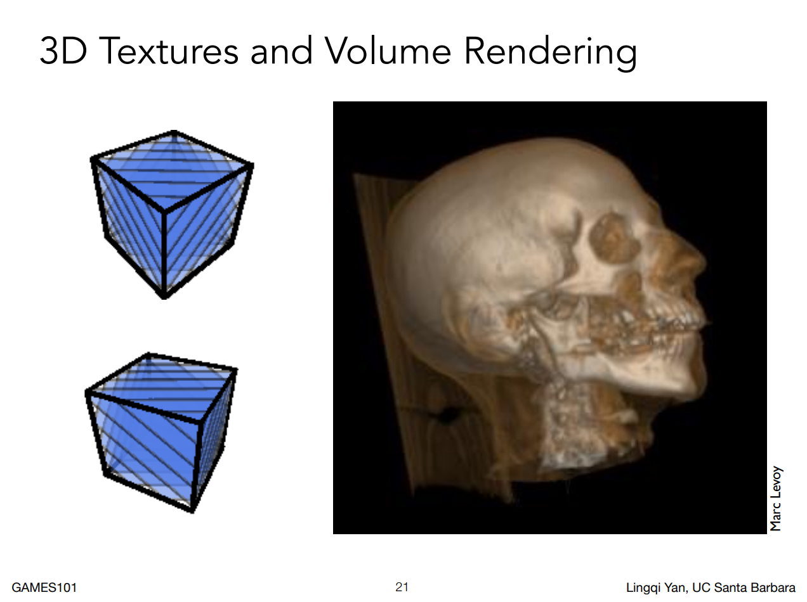

</div>

既然儲存在三維空間中，我們自然也就會將其當作三維紋理在用了，也就是說紋理這個概念可以延伸為資料的儲存集

##### Precomputed Shading

紋理還可以拿來記錄一些預先算好的訊息，看個例子：

<div class = "center-column">

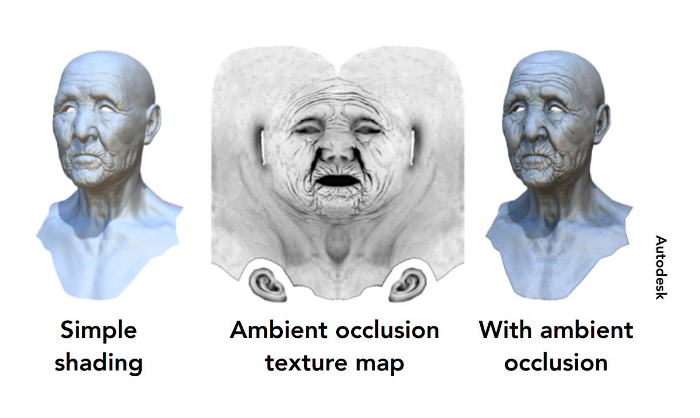

</div>

對比最左邊的圖和最右邊的圖，以眉骨為例，眼窩部分會有陰影，這可以用中間的紋理圖來表示，這張紋理圖叫做環境光遮蔽（Ambient Occlusion）。 而最左圖是在算 Shading 的結果，此時還考慮不到環境光遮蔽的訊息，因此你可以看到最左圖中眼窩部分並沒有陰影，但我們可以先把 Shading 計算的結果寫進另一張紋理圖中

對於環境觀遮蔽，其結果如果可見就為 1，不可見則為 0，中間則是過度狀態。 等到有了環境光遮蔽的資訊時，我們只要把原先紀錄的紋理圖貼上，就可以得到最右圖的結果了，這樣我們就可以把很多的計算提前做完

::: info  
這裡的貼上其實就是兩者相乘
:::

當然除了顏色，也有各種各樣的訊息可以存，只要你在著色器裡面可以解釋就行

## Graphic Pipeline

至此我們已經知道給一個幾何模型與著色模型，我們要怎麼得出渲染的結果了。 至此我們可以嘗試把學到目前為止的東西都合在一起，這被稱為 Graphic Pipeline，它描述的是從一個 3D 的場景到其真的變成一張 2D 的圖，到底經過了一系列怎麼樣的過程，每個組件就對應到我們前面的不同章節提到的概念：

<div class = "center-column">

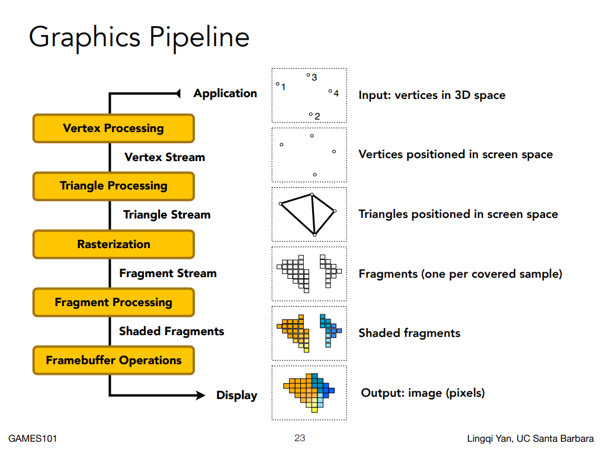

</div>

所以我們這邊就來做個統整、複習。 我們的輸入都是一系列空間中的點，因此第一步要做投影，將 3D 的點變換到螢幕空間中：

<div class = "center-column">

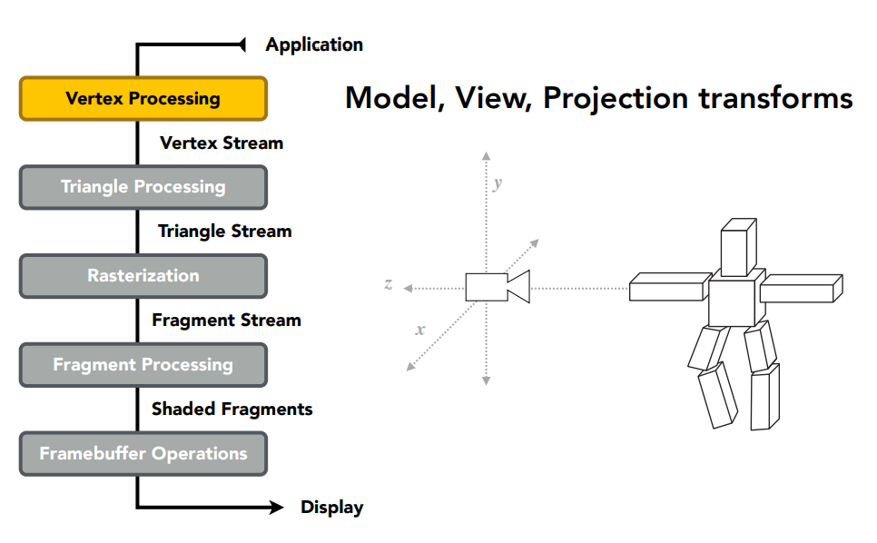

</div>

接著透過光柵化，對像素進行取樣，我們可以將其離散為不同的像素，在 OpenGL 內被稱為 fragment，在這步我們要算出不同像素的顏色是什麼：

<div class = "center-column">

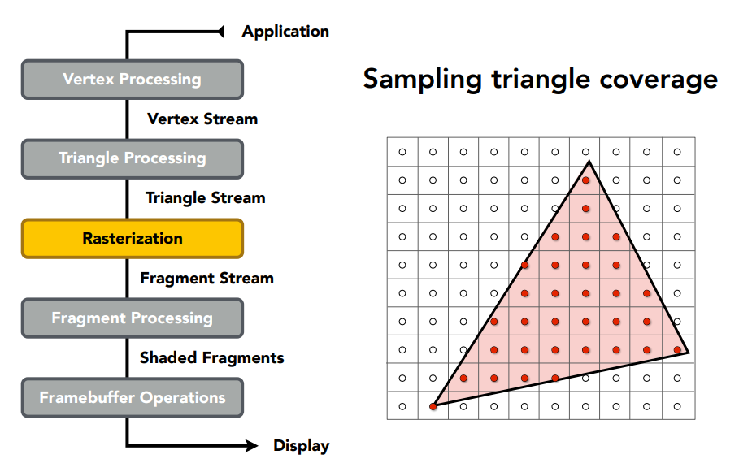

</div>

在計算的過程中我們產生了一系列的像素，此時還需要 Z-Buffer 來判斷其可不可見，當然這步我們可以把它也算到光柵化中，只是這裡分得比較細：

<div class = "center-column">

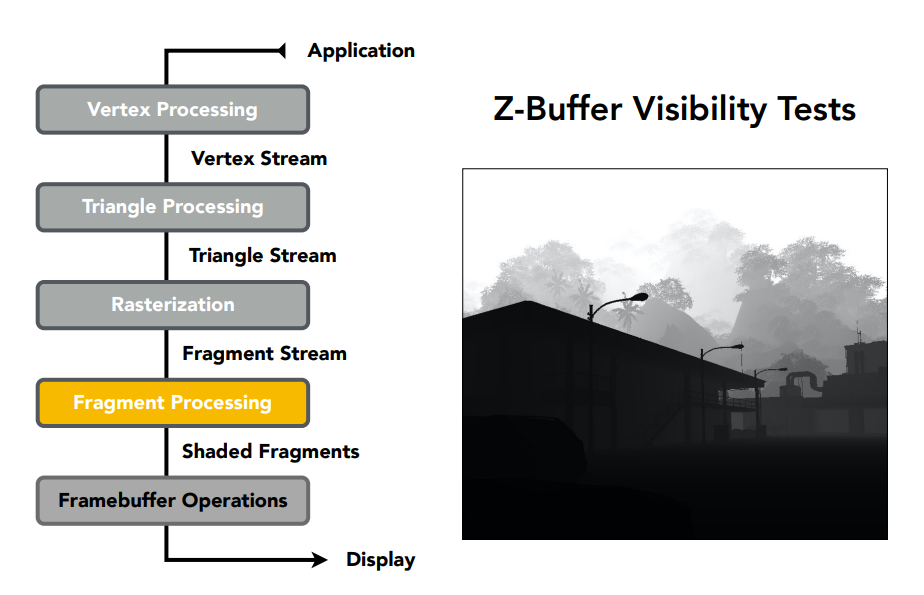

</div>

然後便是著色：

<div class = "center-column">

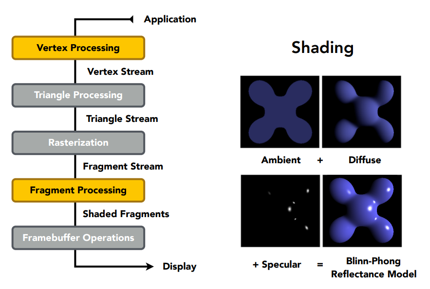

</div>

在上圖中你會發現一件事，這裡頂點和像素的著色會同時發生，這是因為考慮到有不同的著色頻率，現代的 GPU 會讓這兩個部分變成可編成的，因此你可以在這兩個步驟中寫自己的 code 來控制要用什麼著色頻率。 整個實時渲染就是針對這兩個部分再做文章，通過程式碼來決定頂點和像素要怎麼處理，這些程式碼我們稱其為 shader，負責控制頂點和像素要如何著色

最後還有一部分是紋理（Texture），讓我們可以顯示貼圖：

<div class = "center-column">

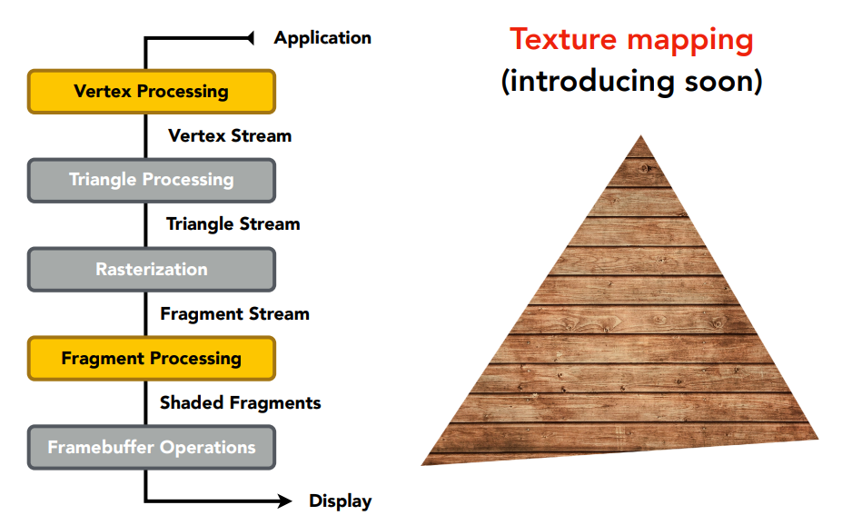

</div>

這就是我們處理從三維場景到最後渲染出一張二維的圖的一個基本操作，而除了前面提到的 Vertex Processing 與 Fragment Processing，其餘的操作都是已經在 GPU 硬體內被寫好的

### Shader Program

Shader 本質上是一些能在 GPU 硬體上執行的語言，以 OpenGL 為例，它是一個圖學的 API，你可以用它來寫 shader，對於每個頂點或是像素，它都會執行一次你的 Shader code，因此你不需要有個 for loop，在寫 Shader 時只需要專注在一個頂點或像素即可

專注於頂點的 Shader 被稱為頂點著色器（Vertex Shader），而專注於像素的 Shader 被稱為像素著色器（Fragment Shader），Fragment 也會有人翻成片段，但基本上是同一個意思

現在來看幾個具體的例子，對於 Fragment Shader，它的輸出是一個像素最後的顏色，底下是一個簡單的範例，它用的是 OpenGL 的著色語言，稱為 GLSL：

```glsl
uniform sampler2D myTexture;    // program parameter
uniform vec3 lightDir;    // program parameter
varying vec2 uv;    // per fragment value (interp. by rasterizer)
varying vec3 norm;    // per fragment value (interp. by rasterizer)
void diffuseShader()
{
  vec3 kd;
  kd = texture2d(myTexture, uv); // material color from texture
  kd *= clamp(dot(–lightDir, norm), 0.0, 1.0); // Lambertian shading model
  gl_FragColor = vec4(kd, 1.0); // output fragment color
} 
```

這裡說的是有兩個全域變數 `myTexture` 與 `lightDir`，分別代表紋理和光照方向，也就是說我們認為每一個像素都有一個固定的光照方向。 而 `norm` 代表法向量，它是利用插值算出來的，也就是說對於目標三角形，它可能三個頂點各有不同的法向量，但我們不管，到了這個像素裡面 OpenGL 會自動幫我們插值出它的法向量

由於這份程式碼每個像素都會執行，因此不需要 for loop，每個像素都會執行 `diffuseShader` 這個函式，在當中由於我們假設光照是一個常數，因此只需要將其與法向量做內積，就可以得到 Blinn-Phong 中漫反射的部分。 算出來後再將它賦值給 `gl_FragColor`，表示一個像素的顏色

通過 Shader，我們就可以定義任何一個頂點或像素要怎麼操作了。 如果你實際去學一些圖學的 API，例如 OpenGL、DirectX 或 Vulkan，你會發現我們只需要指定場景中的東西要如何運動、選轉，相機要如何擺放即可，實際的矩陣並不用我們自己寫，這就是因為這些 API 內部都幫我們做好了
