# Games105：Character Kinematics & Keyframe Animation

## Character Kinematics

這章會講前向運動學與逆向運動學的基本知識，運動學是研究物體運動的一個學科，但它有一個前提條件是不考慮物體的質量和力，如果考慮了質量和力就不再是運動學，而是動力學了

本章後面會有很大一部分的篇幅涉及到動力學，介紹該如何實現基於物理仿真的角色動畫。 角色的範圍是比較大的，人是最常用的，但其他像是動物或機械臂之類的也都算在角色的範圍內，因此這方面和機器人動力學有很大一部分是重疊的

一般來說我們認為角色的身體本身是剛性的，並且只會透過關節進行旋轉，以人為例，我們知道身體的移動式圍繞著關節進行的，例如轉動手臂時，關節確保了上臂與前臂不會分離，只會圍繞著關節旋轉

我們可以將人的建模抽象成這樣：

在這個模型中，關節（Joint）負責連接不同的 Body，在不同領域中也有可能被稱為 Bone 或 Link 等，但總之我們在建模中可以把整個身體抽象成若干個骨骼的組合，通常每兩個骨骼之間會有一個關節進行連接。 不過在動畫中我們大部分不會太關注骨骼的形狀，而是關心關節的位置與關節的旋轉對姿勢造成的改變

如果我們直接去旋轉某一個關節，是無法正確產生想要的姿勢的，這種情況下，角色在動作的時候骨骼會有分離的現象：

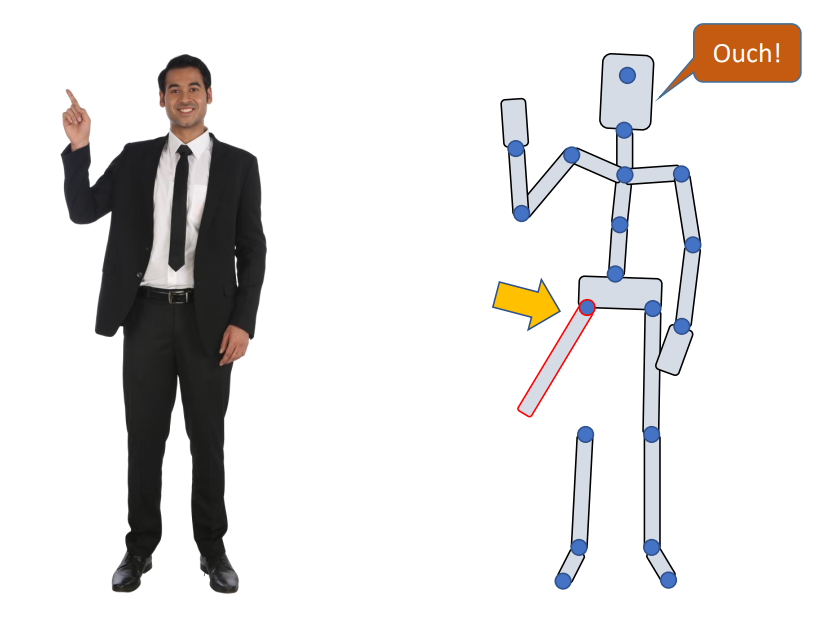

因此實際上我們需要準確計算每個關節的旋轉所帶來的影響，精確來說，要計算每一個關節在旋轉後它的位置和朝向，這整個計算過程就是所謂的前向運動學

### Kinematics of a Chain

假設下圖是一個機械臂，上面有五個關節：

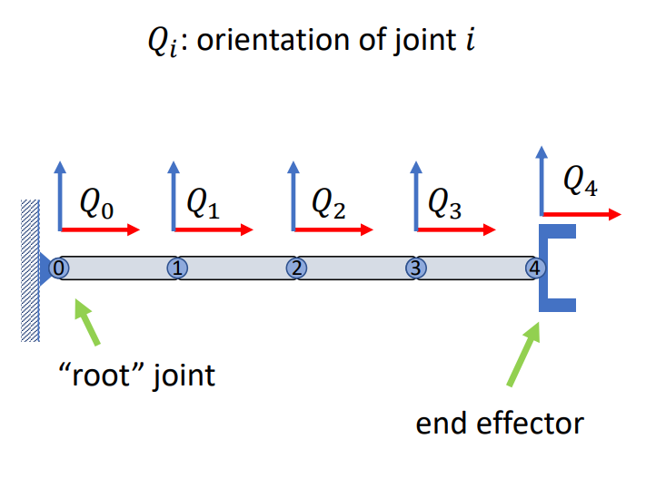

我們可以認為每個關節上都有一個對應的座標系，這個座標系在全域座標系內的方向被定義為關節的朝向。 由於它一開始與全域座標系是重合的，因此它的朝向就是單位矩陣，例如我們把最後一個關節旋轉了一下，此時它不會影響到前面的關節，只會影響到最後一個關節，因此 $Q_4$ 的朝向就變為了下圖的 $R_4$：

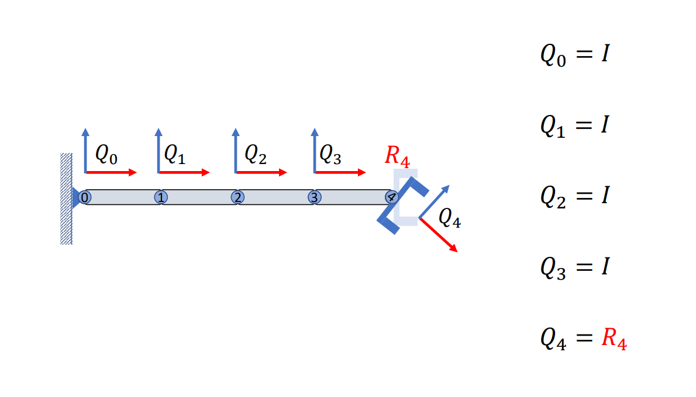

:::info  
圖中的 $Q$ 代表對應關節的朝向，而 $R$ 則代表對應關節的旋轉，可以先簡單理解為旋轉矩陣，但後面會提到除了旋轉矩陣以外的表達方式  
:::

接著我們往前一步，如果我們去旋轉前一個關節（3 號），那它其實會同時旋轉後兩個關節（3、4 號），所以第三個關節地朝向會變為 $R_3$，而第四個關節地朝向則會變成 $R_3 R_4$：

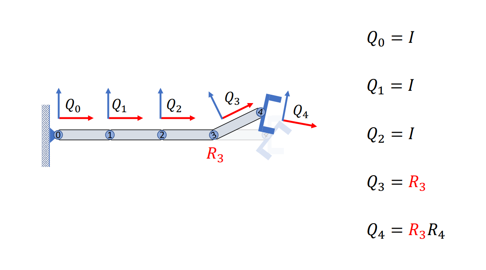

依此類推，我們繼續不斷的旋轉前一個關節，你會發現每次旋轉都會對後一個子關節地朝向造成變化，最終我們旋轉完整個機械臂後會得到這樣的一個姿態，這個姿態裡面每一個關節地朝向都是其根節點到父節點的乘積，乘上該關節的旋轉：

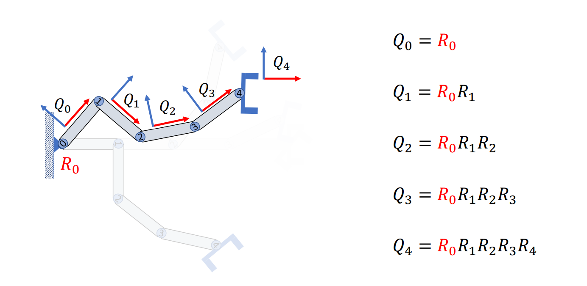

反過來說，如果我們知道父節點朝向，與當前關節的旋轉，那便可以直接計算出當前關節的朝向；同樣地，如果我們知道父關節的朝向，及當前關節的朝向，那我們其實也可以計算出這個關節相對旋轉了多少，只需要對父關節求逆再乘以當前關節的朝向即可：

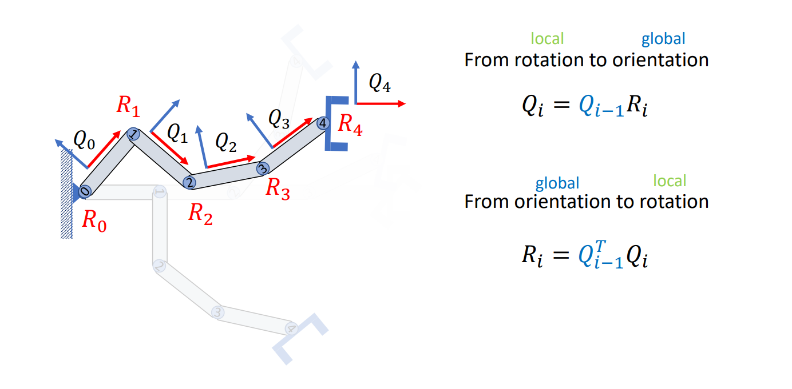

我們可以從另一個角度看這個問題，前面提到我們假設每一個關節上都綁定了一個座標系，那假設座標系的原點落在關節旋轉的點上，那在這個過程中我們就只需要計算相對旋轉即可，例如我們旋轉 0 號關節，此時我們要做的是將 1 號關節在 0 號關節的座標系中的座標，轉換成全域座標：

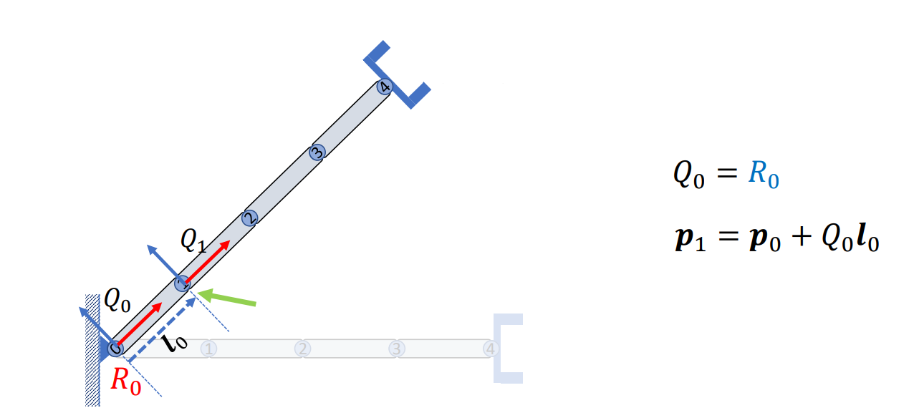

同樣地將 1 號關節旋轉後我們計算 2 號關節的全域座標，依此類推做下去，當到了最後一個關節十，我們就可以計算出每一個關節的座標系的朝向，以及其原點的位置了：

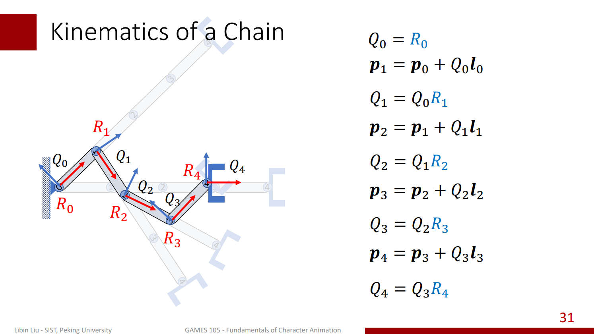

而對於局部座標系內的任意點，假設位於 4 號關節座標系內的點 $x_0$，要計算它的全域座標也很簡單，只要如法炮製的將它乘以座標系的朝向 $Q_4$，再加上 $p_4$ 即可。 如果我們還進一步的知道 3 號關節的朝向與原點的全域位置，那就可以再算出 $x$ 在 3 號關節的局部座標系中的座標：

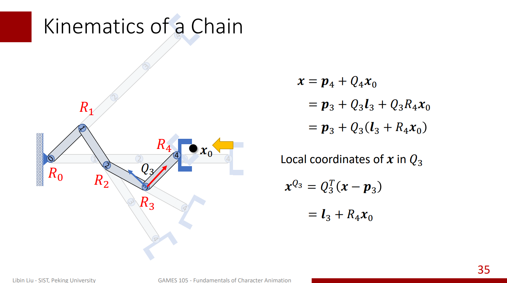

如此迭代下去，我們就可以得到 $x_0$ 的全域座標，以及在每個局部座標系內的座標了

所以總結一下，我們在計算前向運動學的過程中，我們可以由根節點到末節點來逐步更新每一個座標的位置，還有每一個關節所對應的座標系的朝向，當我們整個前向的運算時，我們其實就更新了每一個關節的朝向和它的座標位置：

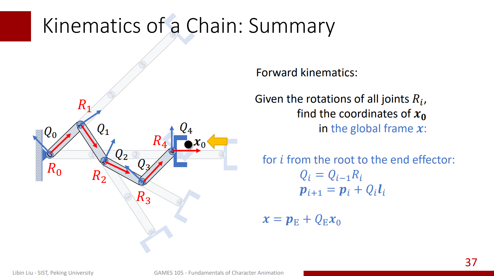

相反的我們也可以反向來計算，比如從一個目標點的全域座標開始，接著依次把它轉換到父節點的局部座標系里面去，每次轉換都需要用當前座標系的局部座標與朝向來轉換到父節點的座標系內。 在依次做這樣的轉換後，我們也可以同樣的計算出每個點在全域座標系的座標：

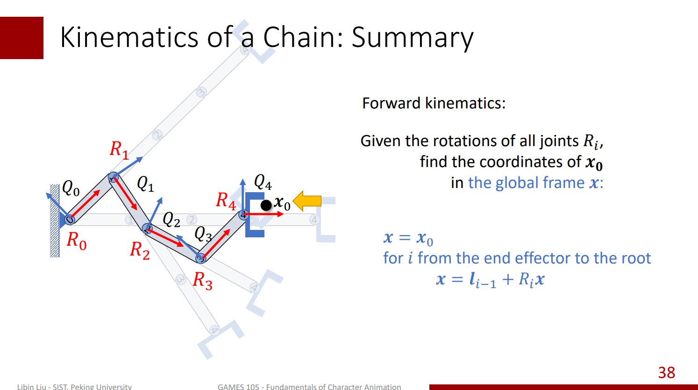

當然我們也可以不以根節點為基準，而是從 1 號關節之類的開始，那計算得到的結果就是我們的目標點在 1 號關節的局部座標：

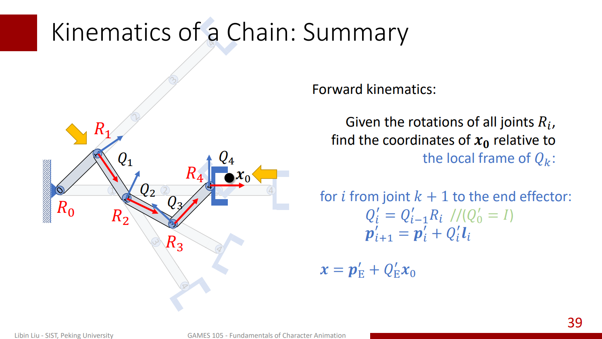

同樣的如果我們不關心朝向的話，也可以做逆向迭代，逐次的把目標點轉移到它父節點或者祖父節點的局部座標系的之內：

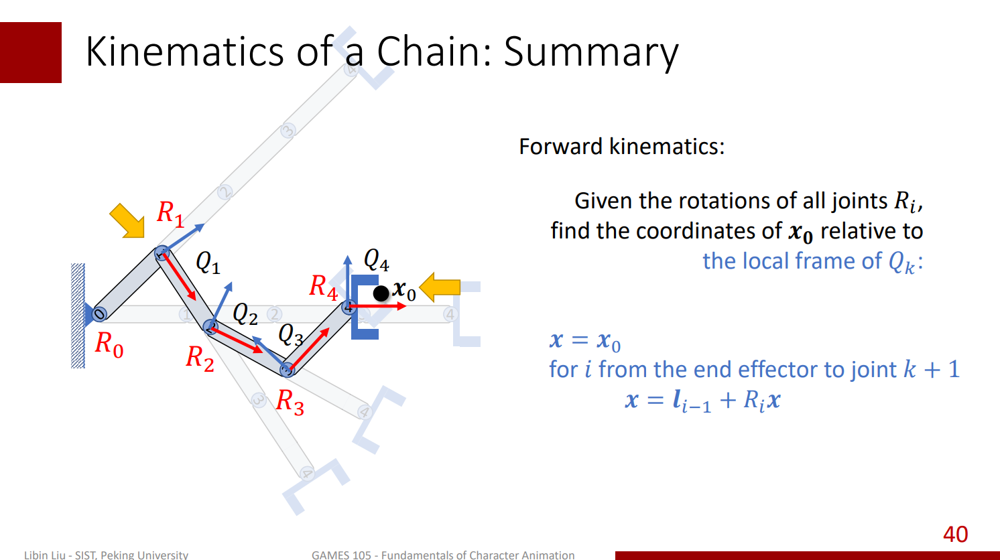

:::info  
就算迭代的方向不同，他們都還是屬於前向運動學的範疇，並不是逆著做就不屬於前向運動學了  
:::
