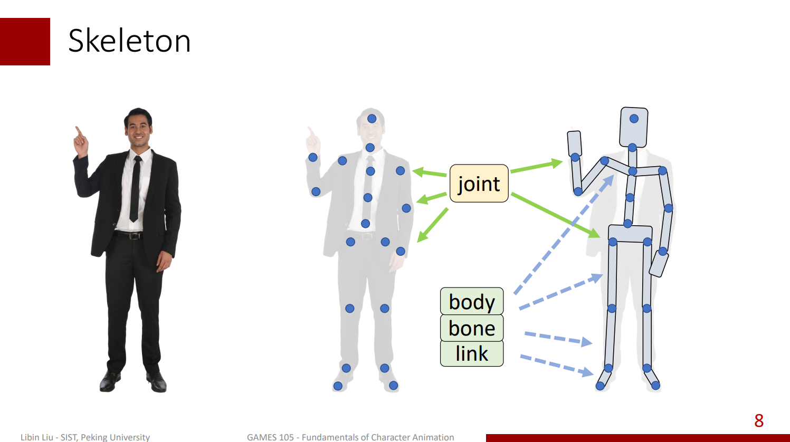

# Games105：Character Kinematics & Keyframe Animation

## Character Kinematics

這章會講前向運動學與逆向運動學的基本知識，運動學是研究物體運動的一個學科，但它有一個前提條件是不考慮物體的質量和力，如果考慮了質量和力就不再是運動學，而是動力學了，本章後面會有很大一部分的篇幅涉及到動力學，介紹該如何實現基於物理仿真的角色動畫。 角色的範圍是比較大的，人是最常用的，但其他像是動物或機械臂之類的也都算在角色的範圍內，因此這方面和機器人動力學有很大一部分是重疊的

一般來說我們認為角色的身體本身是剛性的，並且只會透過關節進行旋轉，以人為例，我們知道身體的移動式圍繞著關節進行的，例如轉動手臂時，關節確保了上臂與前臂不會分離，只會圍繞著關節旋轉

我們可以將人的建模抽象成這樣：

