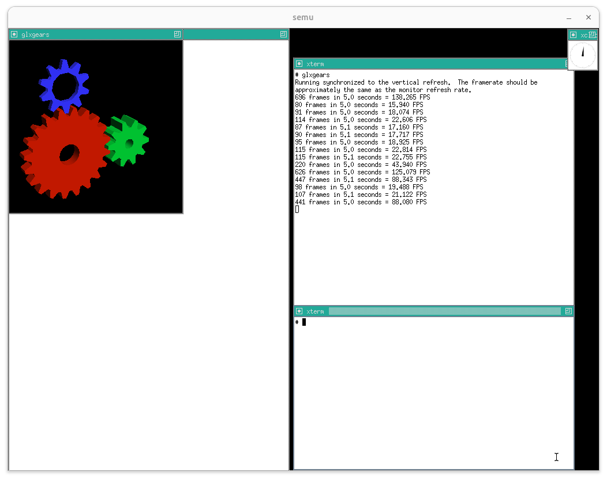
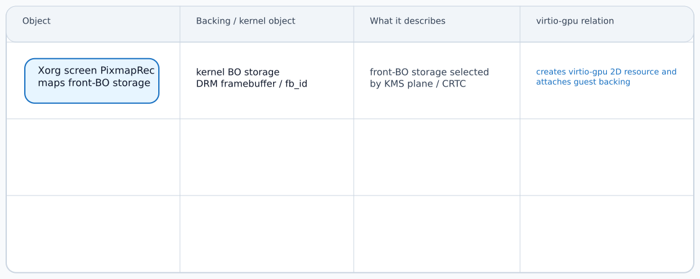
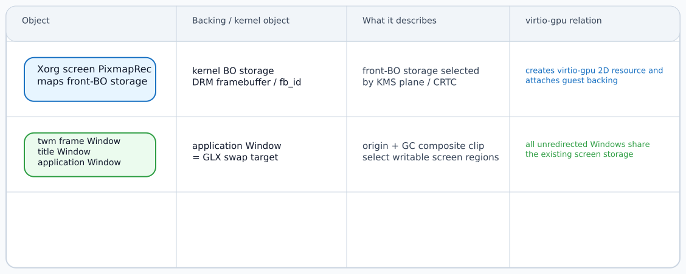
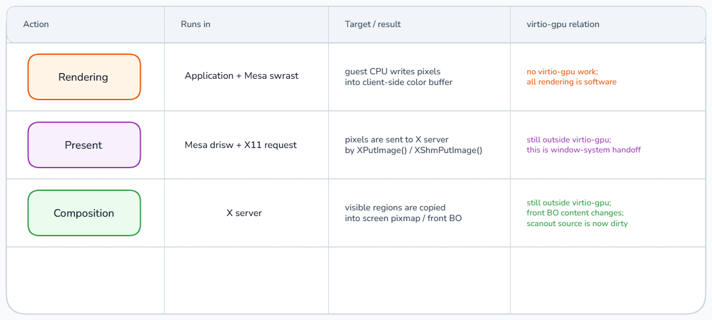
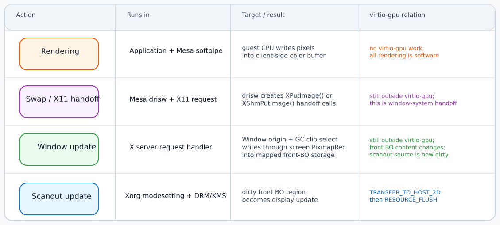
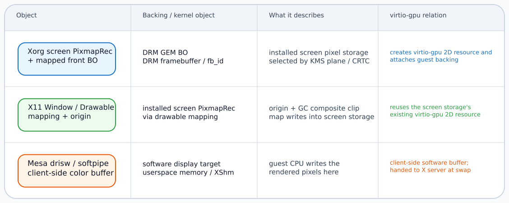
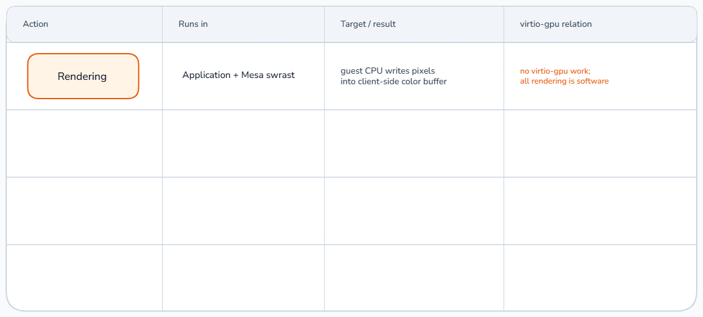
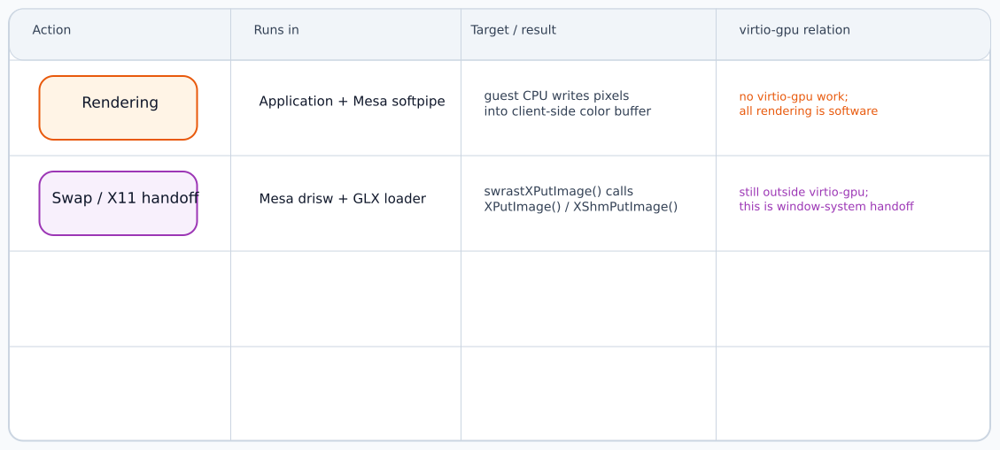
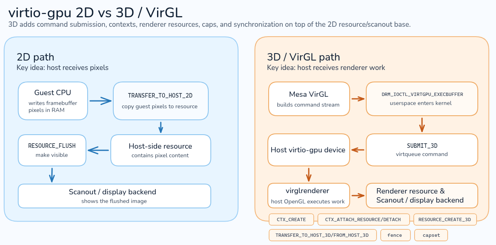

# Linux 圖形堆疊：Mesa 與 Xorg

這次 coscup 準備報一下 Mesa，所以先來寫一篇文章，這篇會結合之前在 OSS-NA 的講稿來把其中 Mesa 的部分講清楚，希望是會弄成一個系列文，後續再把 DRM/KMS 和 SPIR-V 之類的東西提一下。 這篇文會固定以 OpenGL + X11 為主

當我們啟動 Linux 電腦、登入圖形桌面，再點開一個 application 時，螢幕上很快就會出現一個新的視窗。 接著，不論是移動視窗、按下按鈕，還是讓遊戲畫出下一幀，使用者看到的都是持續更新的畫面。 這些看似平常的操作，背後往往需要 application、圖形函式庫、視窗系統、Linux kernel 與顯示裝置一起合作完成

以 application 畫出一幀畫面為例，它必須先描述想畫的內容，取得一塊可以保存結果的空間，再把算好的畫面交給視窗系統。 視窗系統還要判斷視窗位於螢幕的哪裡、哪些部分可以看見，最後才能把更新後的畫面送到顯示裝置

Mesa 位在這段路徑的 userspace。 本文選擇 OpenGL 與 X11 作為具體案例：application 會透過 OpenGL 描述要畫的內容，Xorg 負責保存 X11 objects 並處理各個 clients 的 requests，`twm` 決定視窗的位置、外框與前後順序，GLX 則負責連接 OpenGL 與 X11，讓 application 可以為 X11 視窗建立 rendering 環境並交換畫面

我們會先用 `glxgears` 建立一張 rendering 與 display 的整體地圖。 接著，Display 章節會從 `startx` 開始，追蹤 Xorg 與 DRM／KMS 如何準備可供視窗使用的顯示環境。 Rendering 章節再回到 application，查看一幀畫面如何進入 Mesa，並經 GLX 交給 Xorg。 建立這條主線後，後文會沿相同邊界逐一拆解 GLX、OpenGL frontend、State Tracker、Gallium、DRI、GBM 與 VirGL

文中的原始程式碼與行號固定在下列版本：

- Mesa：`eaa4b57774d1f8825dcdfc280ceb8adbecfd19d3`
- libX11：`libX11-1.8.7`
- twm：`twm-1.0.12`
- xinit：`xinit-1.4.2`
- X server（X11Libre）：`a6a8bc9464f7d787e91f63957357547e7c85c81f`
- Linux：`0e35b9b6ec0ffcc5e23cbdec09f5c622ad532b53`
- virglrenderer：`dc35e4db03144f81637c5ad061f61d3334b078fe`
- semu：branch `Mes/vgpu-3D-before-multicore`，commit `288d75407f2526eb78b610dfa84f0c3eec763554`

## Big picture of Mesa & X11

### 從 `glxgears` 來理解 rendering 與 display

當我們在終端機輸入 `glxgears` 時，桌面上會出現一個新的視窗，裡面會有紅、綠與藍色的齒輪在持續轉動：



這個畫面需由一個 X server 與多個 X11 clients 共同完成，兩者之間由 X11 協定（X11 protocol）規定雙方交換 requests、replies 與 events 的格式。 本文的環境中由 Xorg 行程擔任 X server，它集中保存了 clients 建立的視窗、顯示相關狀態與輸入狀態，並同時處理著多條 client connections。 `glxgears`、`xterm`、`xclock` 與 `twm` 則是彼此獨立的 clients，各自擁有一條 connection

libX11 位在每個 client 行程內。 它能接收 `XOpenDisplay()`、`XCreateWindow()` 等 Xlib API 呼叫，並把輸入參數編碼成 X11 協定 requests，再將 Xorg 傳回的 replies 與 events 整理成 client-side objects。 `twm` 同樣是獨立的 X11 client，之後會擔任 window manager，成為視窗管理政策的 controller

```callgraph
X11 clients（多個獨立行程與 connections）
  ├─ glxgears：建立 Window，產生齒輪內容
  ├─ xterm／xclock：建立各自的 Windows 並更新內容
  └─ twm：之後取得 window manager 職責的 X11 client
       │
       │  libX11 將 API calls 編碼成 requests
       │  replies 與 events 會回到各自的 connection
       ↓
X11 協定連線邊界
       │
       ↓
Xorg（本例唯一的 X server 行程）
  ├─ 接收多個 clients 的 requests
  ├─ 保存視窗、顯示狀態與 protocol resources
  └─ 將 replies 與 events 傳回對應的 client
```

在這些 clients 中，`glxgears`、`xterm` 與 `xclock` 是 application clients，負責產生齒輪、終端機文字與時鐘指針。 `twm` 則是擔任 window manager 的 client，負責協調視窗外圍的青色標題列、視窗位置與 stacking（視窗的前後順序）

對使用者而言，啟動齒輪只需要一條命令。 但對圖形堆疊而言，每轉動一小段角度，都代表 application 要產生下一幀 pixels，視窗系統要把這些 pixels 放進桌面的正確位置，顯示裝置還要在正確的時間讀到更新後的畫面

下面這段程式碼取自 mesademos 的 [`glxgears.c`](https://github.com/JoakimSoderberg/mesademos/blob/master/src/xdemos/glxgears.c)，是我們本文拿來當主要例子的程式：

<details> <summary><span class = "yellow">展開程式碼</span></summary>

```c
/*
 * Copyright (C) 1999-2001  Brian Paul   All Rights Reserved.
 *
 * Permission is hereby granted, free of charge, to any person obtaining a
 * copy of this software and associated documentation files (the "Software"),
 * to deal in the Software without restriction, including without limitation
 * the rights to use, copy, modify, merge, publish, distribute, sublicense,
 * and/or sell copies of the Software, and to permit persons to whom the
 * Software is furnished to do so, subject to the following conditions:
 *
 * The above copyright notice and this permission notice shall be included
 * in all copies or substantial portions of the Software.
 *
 * THE SOFTWARE IS PROVIDED "AS IS", WITHOUT WARRANTY OF ANY KIND, EXPRESS
 * OR IMPLIED, INCLUDING BUT NOT LIMITED TO THE WARRANTIES OF MERCHANTABILITY,
 * FITNESS FOR A PARTICULAR PURPOSE AND NONINFRINGEMENT.  IN NO EVENT SHALL
 * BRIAN PAUL BE LIABLE FOR ANY CLAIM, DAMAGES OR OTHER LIABILITY, WHETHER IN
 * AN ACTION OF CONTRACT, TORT OR OTHERWISE, ARISING FROM, OUT OF OR IN
 * CONNECTION WITH THE SOFTWARE OR THE USE OR OTHER DEALINGS IN THE SOFTWARE.
 */

/*
 * This is a port of the infamous "gears" demo to straight GLX (i.e. no GLUT)
 * Port by Brian Paul  23 March 2001
 *
 * See usage() below for command line options.
 */

#include <math.h>
#include <stdlib.h>
#include <stdio.h>
#include <string.h>
#include <X11/Xlib.h>
#include <X11/keysym.h>
#include <GL/gl.h>
#include <GL/glx.h>
#include <GL/glxext.h>

#ifndef GLX_MESA_swap_control
#define GLX_MESA_swap_control 1
typedef int (*PFNGLXGETSWAPINTERVALMESAPROC)(void);
#endif

#define BENCHMARK

#ifdef BENCHMARK

/* XXX this probably isn't very portable */

#include <sys/time.h>
#include <unistd.h>

/* return current time (in seconds) */
static double
current_time(void)
{
   struct timeval tv;
#ifdef __VMS
   (void) gettimeofday(&tv, NULL );
#else
   struct timezone tz;
   (void) gettimeofday(&tv, &tz);
#endif
   return (double) tv.tv_sec + tv.tv_usec / 1000000.0;
}

#else /*BENCHMARK*/

/* dummy */
static double
current_time(void)
{
   /* update this function for other platforms! */
   static double t = 0.0;
   static int warn = 1;
   if (warn) {
      fprintf(stderr, "Warning: current_time() not implemented!!\n");
      warn = 0;
   }
   return t += 1.0;
}

#endif /*BENCHMARK*/

#ifndef M_PI
#define M_PI 3.14159265
#endif

/** Event handler results: */
#define NOP 0
#define EXIT 1
#define DRAW 2

static GLfloat view_rotx = 20.0, view_roty = 30.0, view_rotz = 0.0;
static GLint gear1, gear2, gear3;
static GLfloat angle = 0.0;

static GLboolean fullscreen = GL_FALSE;	/* Create a single fullscreen window */
static GLboolean stereo = GL_FALSE;	/* Enable stereo.  */
static GLint samples = 0;               /* Choose visual with at least N samples. */
static GLboolean animate = GL_TRUE;	/* Animation */
static GLfloat eyesep = 5.0;		/* Eye separation. */
static GLfloat fix_point = 40.0;	/* Fixation point distance.  */
static GLfloat left, right, asp;	/* Stereo frustum params.  */

/*
 *
 *  Draw a gear wheel.  You'll probably want to call this function when
 *  building a display list since we do a lot of trig here.
 *
 *  Input:  inner_radius - radius of hole at center
 *          outer_radius - radius at center of teeth
 *          width - width of gear
 *          teeth - number of teeth
 *          tooth_depth - depth of tooth
 */
static void
gear(GLfloat inner_radius, GLfloat outer_radius, GLfloat width,
     GLint teeth, GLfloat tooth_depth)
{
   GLint i;
   GLfloat r0, r1, r2;
   GLfloat angle, da;
   GLfloat u, v, len;

   r0 = inner_radius;
   r1 = outer_radius - tooth_depth / 2.0;
   r2 = outer_radius + tooth_depth / 2.0;

   da = 2.0 * M_PI / teeth / 4.0;

   glShadeModel(GL_FLAT);

   glNormal3f(0.0, 0.0, 1.0);

   /* draw front face */
   glBegin(GL_QUAD_STRIP);
   for (i = 0; i <= teeth; i++) {
      angle = i * 2.0 * M_PI / teeth;
      glVertex3f(r0 * cos(angle), r0 * sin(angle), width * 0.5);
      glVertex3f(r1 * cos(angle), r1 * sin(angle), width * 0.5);
      if (i < teeth) {
	 glVertex3f(r0 * cos(angle), r0 * sin(angle), width * 0.5);
	 glVertex3f(r1 * cos(angle + 3 * da), r1 * sin(angle + 3 * da),
		    width * 0.5);
      }
   }
   glEnd();

   /* draw front sides of teeth */
   glBegin(GL_QUADS);
   da = 2.0 * M_PI / teeth / 4.0;
   for (i = 0; i < teeth; i++) {
      angle = i * 2.0 * M_PI / teeth;

      glVertex3f(r1 * cos(angle), r1 * sin(angle), width * 0.5);
      glVertex3f(r2 * cos(angle + da), r2 * sin(angle + da), width * 0.5);
      glVertex3f(r2 * cos(angle + 2 * da), r2 * sin(angle + 2 * da),
		 width * 0.5);
      glVertex3f(r1 * cos(angle + 3 * da), r1 * sin(angle + 3 * da),
		 width * 0.5);
   }
   glEnd();

   glNormal3f(0.0, 0.0, -1.0);

   /* draw back face */
   glBegin(GL_QUAD_STRIP);
   for (i = 0; i <= teeth; i++) {
      angle = i * 2.0 * M_PI / teeth;
      glVertex3f(r1 * cos(angle), r1 * sin(angle), -width * 0.5);
      glVertex3f(r0 * cos(angle), r0 * sin(angle), -width * 0.5);
      if (i < teeth) {
	 glVertex3f(r1 * cos(angle + 3 * da), r1 * sin(angle + 3 * da),
		    -width * 0.5);
	 glVertex3f(r0 * cos(angle), r0 * sin(angle), -width * 0.5);
      }
   }
   glEnd();

   /* draw back sides of teeth */
   glBegin(GL_QUADS);
   da = 2.0 * M_PI / teeth / 4.0;
   for (i = 0; i < teeth; i++) {
      angle = i * 2.0 * M_PI / teeth;

      glVertex3f(r1 * cos(angle + 3 * da), r1 * sin(angle + 3 * da),
		 -width * 0.5);
      glVertex3f(r2 * cos(angle + 2 * da), r2 * sin(angle + 2 * da),
		 -width * 0.5);
      glVertex3f(r2 * cos(angle + da), r2 * sin(angle + da), -width * 0.5);
      glVertex3f(r1 * cos(angle), r1 * sin(angle), -width * 0.5);
   }
   glEnd();

   /* draw outward faces of teeth */
   glBegin(GL_QUAD_STRIP);
   for (i = 0; i < teeth; i++) {
      angle = i * 2.0 * M_PI / teeth;

      glVertex3f(r1 * cos(angle), r1 * sin(angle), width * 0.5);
      glVertex3f(r1 * cos(angle), r1 * sin(angle), -width * 0.5);
      u = r2 * cos(angle + da) - r1 * cos(angle);
      v = r2 * sin(angle + da) - r1 * sin(angle);
      len = sqrt(u * u + v * v);
      u /= len;
      v /= len;
      glNormal3f(v, -u, 0.0);
      glVertex3f(r2 * cos(angle + da), r2 * sin(angle + da), width * 0.5);
      glVertex3f(r2 * cos(angle + da), r2 * sin(angle + da), -width * 0.5);
      glNormal3f(cos(angle), sin(angle), 0.0);
      glVertex3f(r2 * cos(angle + 2 * da), r2 * sin(angle + 2 * da),
		 width * 0.5);
      glVertex3f(r2 * cos(angle + 2 * da), r2 * sin(angle + 2 * da),
		 -width * 0.5);
      u = r1 * cos(angle + 3 * da) - r2 * cos(angle + 2 * da);
      v = r1 * sin(angle + 3 * da) - r2 * sin(angle + 2 * da);
      glNormal3f(v, -u, 0.0);
      glVertex3f(r1 * cos(angle + 3 * da), r1 * sin(angle + 3 * da),
		 width * 0.5);
      glVertex3f(r1 * cos(angle + 3 * da), r1 * sin(angle + 3 * da),
		 -width * 0.5);
      glNormal3f(cos(angle), sin(angle), 0.0);
   }

   glVertex3f(r1 * cos(0), r1 * sin(0), width * 0.5);
   glVertex3f(r1 * cos(0), r1 * sin(0), -width * 0.5);

   glEnd();

   glShadeModel(GL_SMOOTH);

   /* draw inside radius cylinder */
   glBegin(GL_QUAD_STRIP);
   for (i = 0; i <= teeth; i++) {
      angle = i * 2.0 * M_PI / teeth;
      glNormal3f(-cos(angle), -sin(angle), 0.0);
      glVertex3f(r0 * cos(angle), r0 * sin(angle), -width * 0.5);
      glVertex3f(r0 * cos(angle), r0 * sin(angle), width * 0.5);
   }
   glEnd();
}

static void
draw(void)
{
   glClear(GL_COLOR_BUFFER_BIT | GL_DEPTH_BUFFER_BIT);

   glPushMatrix();
   glRotatef(view_rotx, 1.0, 0.0, 0.0);
   glRotatef(view_roty, 0.0, 1.0, 0.0);
   glRotatef(view_rotz, 0.0, 0.0, 1.0);

   glPushMatrix();
   glTranslatef(-3.0, -2.0, 0.0);
   glRotatef(angle, 0.0, 0.0, 1.0);
   glCallList(gear1);
   glPopMatrix();

   glPushMatrix();
   glTranslatef(3.1, -2.0, 0.0);
   glRotatef(-2.0 * angle - 9.0, 0.0, 0.0, 1.0);
   glCallList(gear2);
   glPopMatrix();

   glPushMatrix();
   glTranslatef(-3.1, 4.2, 0.0);
   glRotatef(-2.0 * angle - 25.0, 0.0, 0.0, 1.0);
   glCallList(gear3);
   glPopMatrix();

   glPopMatrix();
}

static void
draw_gears(void)
{
   if (stereo) {
      /* First left eye.  */
      glDrawBuffer(GL_BACK_LEFT);

      glMatrixMode(GL_PROJECTION);
      glLoadIdentity();
      glFrustum(left, right, -asp, asp, 5.0, 60.0);

      glMatrixMode(GL_MODELVIEW);

      glPushMatrix();
      glTranslated(+0.5 * eyesep, 0.0, 0.0);
      draw();
      glPopMatrix();

      /* Then right eye.  */
      glDrawBuffer(GL_BACK_RIGHT);

      glMatrixMode(GL_PROJECTION);
      glLoadIdentity();
      glFrustum(-right, -left, -asp, asp, 5.0, 60.0);

      glMatrixMode(GL_MODELVIEW);

      glPushMatrix();
      glTranslated(-0.5 * eyesep, 0.0, 0.0);
      draw();
      glPopMatrix();
   }
   else {
      draw();
   }
}

/** Draw single frame, do SwapBuffers, compute FPS */
static void
draw_frame(Display *dpy, Window win)
{
   static int frames = 0;
   static double tRot0 = -1.0, tRate0 = -1.0;
   double dt, t = current_time();

   if (tRot0 < 0.0)
      tRot0 = t;
   dt = t - tRot0;
   tRot0 = t;

   if (animate) {
      /* advance rotation for next frame */
      angle += 70.0 * dt;  /* 70 degrees per second */
      if (angle > 3600.0)
         angle -= 3600.0;
   }

   draw_gears();
   glXSwapBuffers(dpy, win);

   frames++;

   if (tRate0 < 0.0)
      tRate0 = t;
   if (t - tRate0 >= 5.0) {
      GLfloat seconds = t - tRate0;
      GLfloat fps = frames / seconds;
      printf("%d frames in %3.1f seconds = %6.3f FPS\n", frames, seconds,
             fps);
      fflush(stdout);
      tRate0 = t;
      frames = 0;
   }
}

/* new window size or exposure */
static void
reshape(int width, int height)
{
   glViewport(0, 0, (GLint) width, (GLint) height);

   if (stereo) {
      GLfloat w;

      asp = (GLfloat) height / (GLfloat) width;
      w = fix_point * (1.0 / 5.0);

      left = -5.0 * ((w - 0.5 * eyesep) / fix_point);
      right = 5.0 * ((w + 0.5 * eyesep) / fix_point);
   }
   else {
      GLfloat h = (GLfloat) height / (GLfloat) width;

      glMatrixMode(GL_PROJECTION);
      glLoadIdentity();
      glFrustum(-1.0, 1.0, -h, h, 5.0, 60.0);
   }

   glMatrixMode(GL_MODELVIEW);
   glLoadIdentity();
   glTranslatef(0.0, 0.0, -40.0);
}

static void
init(void)
{
   static GLfloat pos[4] = { 5.0, 5.0, 10.0, 0.0 };
   static GLfloat red[4] = { 0.8, 0.1, 0.0, 1.0 };
   static GLfloat green[4] = { 0.0, 0.8, 0.2, 1.0 };
   static GLfloat blue[4] = { 0.2, 0.2, 1.0, 1.0 };

   glLightfv(GL_LIGHT0, GL_POSITION, pos);
   glEnable(GL_CULL_FACE);
   glEnable(GL_LIGHTING);
   glEnable(GL_LIGHT0);
   glEnable(GL_DEPTH_TEST);

   /* make the gears */
   gear1 = glGenLists(1);
   glNewList(gear1, GL_COMPILE);
   glMaterialfv(GL_FRONT, GL_AMBIENT_AND_DIFFUSE, red);
   gear(1.0, 4.0, 1.0, 20, 0.7);
   glEndList();

   gear2 = glGenLists(1);
   glNewList(gear2, GL_COMPILE);
   glMaterialfv(GL_FRONT, GL_AMBIENT_AND_DIFFUSE, green);
   gear(0.5, 2.0, 2.0, 10, 0.7);
   glEndList();

   gear3 = glGenLists(1);
   glNewList(gear3, GL_COMPILE);
   glMaterialfv(GL_FRONT, GL_AMBIENT_AND_DIFFUSE, blue);
   gear(1.3, 2.0, 0.5, 10, 0.7);
   glEndList();

   glEnable(GL_NORMALIZE);
}

/**
 * Remove window border/decorations.
 */
static void
no_border( Display *dpy, Window w)
{
   static const unsigned MWM_HINTS_DECORATIONS = (1 << 1);
   static const int PROP_MOTIF_WM_HINTS_ELEMENTS = 5;

   typedef struct
   {
      unsigned long       flags;
      unsigned long       functions;
      unsigned long       decorations;
      long                inputMode;
      unsigned long       status;
   } PropMotifWmHints;

   PropMotifWmHints motif_hints;
   Atom prop, proptype;
   unsigned long flags = 0;

   /* setup the property */
   motif_hints.flags = MWM_HINTS_DECORATIONS;
   motif_hints.decorations = flags;

   /* get the atom for the property */
   prop = XInternAtom( dpy, "_MOTIF_WM_HINTS", True );
   if (!prop) {
      /* something went wrong! */
      return;
   }

   /* not sure this is correct, seems to work, XA_WM_HINTS didn't work */
   proptype = prop;

   XChangeProperty( dpy, w,                         /* display, window */
                    prop, proptype,                 /* property, type */
                    32,                             /* format: 32-bit datums */
                    PropModeReplace,                /* mode */
                    (unsigned char *) &motif_hints, /* data */
                    PROP_MOTIF_WM_HINTS_ELEMENTS    /* nelements */
                  );
}

/*
 * Create an RGB, double-buffered window.
 * Return the window and context handles.
 */
static void
make_window( Display *dpy, const char *name,
             int x, int y, int width, int height,
             Window *winRet, GLXContext *ctxRet)
{
   int attribs[64];
   int i = 0;

   int scrnum;
   XSetWindowAttributes attr;
   unsigned long mask;
   Window root;
   Window win;
   GLXContext ctx;
   XVisualInfo *visinfo;

   /* Singleton attributes. */
   attribs[i++] = GLX_RGBA;
   attribs[i++] = GLX_DOUBLEBUFFER;
   if (stereo)
      attribs[i++] = GLX_STEREO;

   /* Key/value attributes. */
   attribs[i++] = GLX_RED_SIZE;
   attribs[i++] = 1;
   attribs[i++] = GLX_GREEN_SIZE;
   attribs[i++] = 1;
   attribs[i++] = GLX_BLUE_SIZE;
   attribs[i++] = 1;
   attribs[i++] = GLX_DEPTH_SIZE;
   attribs[i++] = 1;
   if (samples > 0) {
      attribs[i++] = GLX_SAMPLE_BUFFERS;
      attribs[i++] = 1;
      attribs[i++] = GLX_SAMPLES;
      attribs[i++] = samples;
   }

   attribs[i++] = None;

   scrnum = DefaultScreen( dpy );
   root = RootWindow( dpy, scrnum );

   visinfo = glXChooseVisual(dpy, scrnum, attribs);
   if (!visinfo) {
      printf("Error: couldn't get an RGB, Double-buffered");
      if (stereo)
         printf(", Stereo");
      if (samples > 0)
         printf(", Multisample");
      printf(" visual\n");
      exit(1);
   }

   /* window attributes */
   attr.background_pixel = 0;
   attr.border_pixel = 0;
   attr.colormap = XCreateColormap( dpy, root, visinfo->visual, AllocNone);
   attr.event_mask = StructureNotifyMask | ExposureMask | KeyPressMask;
   /* XXX this is a bad way to get a borderless window! */
   mask = CWBackPixel | CWBorderPixel | CWColormap | CWEventMask;

   win = XCreateWindow( dpy, root, x, y, width, height,
		        0, visinfo->depth, InputOutput,
		        visinfo->visual, mask, &attr );

   if (fullscreen)
      no_border(dpy, win);

   /* set hints and properties */
   {
      XSizeHints sizehints;
      sizehints.x = x;
      sizehints.y = y;
      sizehints.width  = width;
      sizehints.height = height;
      sizehints.flags = USSize | USPosition;
      XSetNormalHints(dpy, win, &sizehints);
      XSetStandardProperties(dpy, win, name, name,
                              None, (char **)NULL, 0, &sizehints);
   }

   ctx = glXCreateContext( dpy, visinfo, NULL, True );
   if (!ctx) {
      printf("Error: glXCreateContext failed\n");
      exit(1);
   }

   XFree(visinfo);

   *winRet = win;
   *ctxRet = ctx;
}

/**
 * Determine whether or not a GLX extension is supported.
 */
static int
is_glx_extension_supported(Display *dpy, const char *query)
{
   const int scrnum = DefaultScreen(dpy);
   const char *glx_extensions = NULL;
   const size_t len = strlen(query);
   const char *ptr;

   if (glx_extensions == NULL) {
      glx_extensions = glXQueryExtensionsString(dpy, scrnum);
   }

   ptr = strstr(glx_extensions, query);
   return ((ptr != NULL) && ((ptr[len] == ' ') || (ptr[len] == '\0')));
}

/**
 * Attempt to determine whether or not the display is synched to vblank.
 */
static void
query_vsync(Display *dpy, GLXDrawable drawable)
{
   int interval = 0;

#if defined(GLX_EXT_swap_control)
   if (is_glx_extension_supported(dpy, "GLX_EXT_swap_control")) {
       unsigned int tmp = -1;
       glXQueryDrawable(dpy, drawable, GLX_SWAP_INTERVAL_EXT, &tmp);
       interval = tmp;
   } else
#endif
   if (is_glx_extension_supported(dpy, "GLX_MESA_swap_control")) {
      PFNGLXGETSWAPINTERVALMESAPROC pglXGetSwapIntervalMESA =
          (PFNGLXGETSWAPINTERVALMESAPROC)
          glXGetProcAddressARB((const GLubyte *) "glXGetSwapIntervalMESA");

      interval = (*pglXGetSwapIntervalMESA)();
   } else if (is_glx_extension_supported(dpy, "GLX_SGI_swap_control")) {
      /* The default swap interval with this extension is 1.  Assume that it
       * is set to the default.
       *
       * Many Mesa-based drivers default to 0, but all of these drivers also
       * export GLX_MESA_swap_control.  In that case, this branch will never
       * be taken, and the correct result should be reported.
       */
      interval = 1;
   }

   if (interval > 0) {
      printf("Running synchronized to the vertical refresh.  The framerate should be\n");
      if (interval == 1) {
         printf("approximately the same as the monitor refresh rate.\n");
      } else if (interval > 1) {
         printf("approximately 1/%d the monitor refresh rate.\n",
                interval);
      }
   }
}

/**
 * Handle one X event.
 * \return NOP, EXIT or DRAW
 */
static int
handle_event(Display *dpy, Window win, XEvent *event)
{
   (void) dpy;
   (void) win;

   switch (event->type) {
   case Expose:
      return DRAW;
   case ConfigureNotify:
      reshape(event->xconfigure.width, event->xconfigure.height);
      break;
   case KeyPress:
      {
         char buffer[10];
         int code;
         code = XLookupKeysym(&event->xkey, 0);
         if (code == XK_Left) {
            view_roty += 5.0;
         }
         else if (code == XK_Right) {
            view_roty -= 5.0;
         }
         else if (code == XK_Up) {
            view_rotx += 5.0;
         }
         else if (code == XK_Down) {
            view_rotx -= 5.0;
         }
         else {
            XLookupString(&event->xkey, buffer, sizeof(buffer),
                          NULL, NULL);
            if (buffer[0] == 27) {
               /* escape */
               return EXIT;
            }
            else if (buffer[0] == 'a' || buffer[0] == 'A') {
               animate = !animate;
            }
         }
         return DRAW;
      }
   }
   return NOP;
}

static void
event_loop(Display *dpy, Window win)
{
   while (1) {
      int op;
      while (!animate || XPending(dpy) > 0) {
         XEvent event;
         XNextEvent(dpy, &event);
         op = handle_event(dpy, win, &event);
         if (op == EXIT)
            return;
         else if (op == DRAW)
            break;
      }

      draw_frame(dpy, win);
   }
}

static void
usage(void)
{
   printf("Usage:\n");
   printf("  -display <displayname>  set the display to run on\n");
   printf("  -stereo                 run in stereo mode\n");
   printf("  -samples N              run in multisample mode with at least N samples\n");
   printf("  -fullscreen             run in fullscreen mode\n");
   printf("  -info                   display OpenGL renderer info\n");
   printf("  -geometry WxH+X+Y       window geometry\n");
}

int
main(int argc, char *argv[])
{
   unsigned int winWidth = 300, winHeight = 300;
   int x = 0, y = 0;
   Display *dpy;
   Window win;
   GLXContext ctx;
   char *dpyName = NULL;
   GLboolean printInfo = GL_FALSE;
   int i;

   for (i = 1; i < argc; i++) {
      if (strcmp(argv[i], "-display") == 0) {
         dpyName = argv[i+1];
         i++;
      }
      else if (strcmp(argv[i], "-info") == 0) {
         printInfo = GL_TRUE;
      }
      else if (strcmp(argv[i], "-stereo") == 0) {
         stereo = GL_TRUE;
      }
      else if (i < argc-1 && strcmp(argv[i], "-samples") == 0) {
         samples = strtod(argv[i+1], NULL );
         ++i;
      }
      else if (strcmp(argv[i], "-fullscreen") == 0) {
         fullscreen = GL_TRUE;
      }
      else if (i < argc-1 && strcmp(argv[i], "-geometry") == 0) {
         XParseGeometry(argv[i+1], &x, &y, &winWidth, &winHeight);
         i++;
      }
      else {
         usage();
         return -1;
      }
   }

   dpy = XOpenDisplay(dpyName);
   if (!dpy) {
      printf("Error: couldn't open display %s\n",
	     dpyName ? dpyName : getenv("DISPLAY"));
      return -1;
   }

   if (fullscreen) {
      int scrnum = DefaultScreen(dpy);

      x = 0; y = 0;
      winWidth = DisplayWidth(dpy, scrnum);
      winHeight = DisplayHeight(dpy, scrnum);
   }

   make_window(dpy, "glxgears", x, y, winWidth, winHeight, &win, &ctx);
   XMapWindow(dpy, win);
   glXMakeCurrent(dpy, win, ctx);
   query_vsync(dpy, win);

   if (printInfo) {
      printf("GL_RENDERER   = %s\n", (char *) glGetString(GL_RENDERER));
      printf("GL_VERSION    = %s\n", (char *) glGetString(GL_VERSION));
      printf("GL_VENDOR     = %s\n", (char *) glGetString(GL_VENDOR));
      printf("GL_EXTENSIONS = %s\n", (char *) glGetString(GL_EXTENSIONS));
   }

   init();

   /* Set initial projection/viewing transformation.
    * We can't be sure we'll get a ConfigureNotify event when the window
    * first appears.
    */
   reshape(winWidth, winHeight);

   event_loop(dpy, win);

   glDeleteLists(gear1, 1);
   glDeleteLists(gear2, 1);
   glDeleteLists(gear3, 1);
   glXMakeCurrent(dpy, None, NULL);
   glXDestroyContext(dpy, ctx);
   XDestroyWindow(dpy, win);
   XCloseDisplay(dpy);

   return 0;
}
```

</details>

#### 齒輪轉動一格，需要 rendering 與 display 兩條路徑

首先我們需要把 rendering 與 display 區分開來。 application 準備畫出下一幀時，會透過 OpenGL 提供幾何資料、顏色與 rendering state。 rendering 路徑負責把這些 OpenGL operations 轉成可執行的工作，再由 CPU 或 GPU 算出 pixels，並將結果保存在一份 application image 中

Application image 只包含這個視窗畫出的內容，還沒有說明它在桌面上的位置。 display 路徑會把這份 image 對到一個 X11 Window，套用 Window 的位置與可見範圍，再將可見內容放進保存整個桌面的 pixel storage。 Linux display subsystem 接著讓顯示裝置持續讀取這份桌面內容，使用者才會在正確位置看見新的一幀

Application 發出的 OpenGL calls 必須由一套具體的 userspace 程式碼執行，本文將這套程式碼稱為 OpenGL vendor 實作。 Mesa 可以擔任這個角色，其他 GPU 廠商也能提供自己的 OpenGL 函式庫。 OpenGL context 則是這套實作為 application 建立的 rendering environment，用來保存 current OpenGL state 與 object 繫結

當 GPU 負責執行 rendering 時，GPU driver 堆疊會分成 userspace 與 kernel 兩部分：

- userspace driver 位於 application 行程。 它會接住 OpenGL operations，保存 API state、編譯 shader，並將 rendering work 轉成 GPU 或虛擬 GPU 能執行的 commands。 Mesa 內的 radeonsi、iris 與 VirGL 都屬於這一側
- kernel driver 位於 Linux kernel。 它會管理 GPU resources、command 提交、排程與同步，並將 userspace 的 requests 交給實際裝置。 Linux DRM（Direct Rendering Manager）提供 userspace 與這些 kernel drivers 交換 requests 的介面

DRM 中負責管理 display state 的部分稱為 KMS（Kernel Mode Setting）。 Xorg 需要 KMS 選定用於 scanout 的桌面 storage，display controller 才知道要從哪裡持續讀取 pixels。 KMS framebuffer 與完整 display topology 會等 Display 章進入 Linux 顯示裝置後再展開

因此，一幀畫面會先在 application image 中形成，再進入整個桌面的 pixel storage：

```callgraph
Rendering：產生 glxgears 的下一幀
=================================================
Application 更新齒輪角度並發出 OpenGL operations
  │
  │  geometry、color、transform 與 framebuffer state
  ↓
OpenGL vendor 實作與 userspace rendering driver
  │
  │  驗證 API state，再由 CPU 或 GPU 執行 rendering
  ↓
application image
  │
  │  保存完整的齒輪畫面
  ↓

Display：把 application image 放進桌面的正確位置
=================================================
X server 將 application image 對到 X11 Window
  │
  │  套用 Window 的位置與可見範圍
  ↓
保存整個可見桌面的 pixel storage
  │
  │  DRM／KMS 讓 scanout 引用這份 storage
  ↓
display controller 持續讀取 pixels
  ↓
使用者看見齒輪轉到下一個角度
```

### 固定後續追蹤的 rendering 與 display 組態

前面已經把齒輪轉動一格拆成 Rendering 與 Display 兩條路徑。 接下來我們把同一個齒輪視窗放進 semu VM，固定追蹤一條 VirGL 3D 路徑。 本文將 VM 內執行 Linux、Xorg 與 Mesa 的一側稱為 guest，將執行 semu、virglrenderer 與 SDL2 display backend 的外層系統稱為 host。 semu 是建立這台 VM 的 VMM（Virtual Machine Monitor），而 virtio-gpu 則是它提供給 guest 的虛擬 GPU

為了讓 Mesa 內的 OpenGL 實作能接到不同 drivers，State Tracker 會先整理 OpenGL state，Gallium 再提供 State Tracker 與 drivers 共用的介面

本文選用的 VirGL driver 會接住 Gallium rendering work，將它編碼成 VirGL commands，再透過 Linux DRM render node 提交給 `virtio_gpu` kernel driver。 Render node 是 DRM 提供給 rendering clients 的裝置入口，不授予 KMS 顯示控制權。 `virtio_gpu` driver 會把 requests 放進 virtio-gpu 的 controlq，也就是 guest 與 semu 傳遞控制與 3D commands 的 shared queue

Guest 會跨越 VM boundary 傳送 commands、resource references 與同步資訊。 semu 從 controlq 取出 requests 後，會把其中的 VirGL command stream 交給 virglrenderer。 virglrenderer 再使用 host OpenGL 實作執行 rendering。 Host OpenGL 可以由實體 GPU driver 執行，也可以由 software driver 執行，兩者都位於 guest 看見的虛擬 GPU 之外

為了讓 Xorg 在每幀 rendering 完成時能使用 application image，Mesa 與 Xorg 會先建立共享關係。 DRI3 是負責在 direct-rendering client 與 Xorg 之間傳遞 dma-buf fd 的 X11 extension。 dma-buf fd 讓另一個行程可以匯入並引用同一份 buffer storage。 Xorg 會為這份 storage 建立 Pixmap，再由 Present 以 X11 Window 表示更新目的地，以 Pixmap 表示來源 image，安排這次 Window 更新

Xorg 會用 glamor 執行這次 copy。 glamor 是 Xorg 透過 OpenGL 加速 X11 drawing 的元件，它會把 application image 的可見區域寫進 screen Pixmap 引用的 GBM desktop BO。 GBM desktop BO 是 Xorg 透過 Mesa `libgbm` 建立的整桌 pixel storage，也是 KMS scanout 使用的來源

Display 這一側由 Xorg 的 modesetting display driver 管理 Linux KMS 顯示狀態。 它會使用 DRM primary node，也就是具備 KMS 控制能力的裝置入口，將 GBM desktop BO 接到顯示輸出

這個範例固定使用下列組態：

- 前述 semu source 以 `ENABLE_VIRGL=1` 建置。 這會讓 semu 公布 `VIRTIO_GPU_F_VIRGL`，啟用 VirGL 3D device path
- guest image 選入 Mesa VirGL driver、GBM、GLX、Xorg 與 glamor。 Mesa application context 透過 DRM render node 提交 3D work，Xorg modesetting display driver 則透過 DRM primary node 查詢與更新 KMS display state
- OpenGL 使用 Mesa 的 direct GLX 路徑。 direct 路徑讓載入 application 行程的 Mesa userspace 程式碼執行 OpenGL calls。 indirect 路徑則會將 rendering requests 交給 X server
- GLX source-reading 主線從 Mesa 自己提供的公開 `libGL` 入口開始，也就是 Mesa 建置時的 `with_glvnd=false` 分支。 後文會另開比較支線，查看 `with_glvnd=true` 時由 GLVND 提供的 vendor-neutral dispatch 與 Mesa vendor ABI
- 使用者在受控 guest 的文字終端執行 `startx`，由 `xinit` 啟動 Xorg、`twm`、`xclock` 與 `xterm`。 `twm` 擔任 window manager，這組桌面程式不啟動 compositing manager
- Xorg 使用 modesetting display driver 與 glamor acceleration layer。 一般大小的 `glxgears` Window 不符合 full-screen Present flip 的條件，因此後文固定追蹤 Present copy branch
- Host 端由 virglrenderer 執行 VirGL commands，再由 SDL2 display backend 將最後的桌面內容放進本例的 SDL window

受控 guest 會為 Xorg 明確安裝下列裝置設定。 `AccelMethod=glamor` 會啟用前述 OpenGL acceleration layer。 這個 Xorg 版本預設開啟 `TearFree`，本文明確將它設為 `off`，排除額外的 TearFree buffers 與 flips

`PageFlip=on` 會保留在條件符合時使用 page flip 的能力，普通大小的 `glxgears` Window 則固定走 Present copy branch。 `Atomic=off` 讓 Xorg userspace 透過 legacy `drmModeSetCrtc()` 提交初始顯示狀態，request 進入 kernel 後仍可由 DRM atomic helper 接手。 Display 章會再展開這兩層的關係：

```conf
Section "Device"
    Identifier "virtio-gpu"
    Driver "modesetting"
    Option "AccelMethod" "glamor"
    Option "TearFree" "off"
    Option "PageFlip" "on"
    Option "Atomic" "off"
EndSection
```

在這組環境中，`glxgears` 的 draw calls 會先累積要寫進 application image 的 rendering work。 Application 呼叫 `glXSwapBuffers()` 時，Mesa 會 flush 目前的 drawable 與 context，讓待處理的 work 形成一筆或多筆 VirGL submissions。 GLX DRI3 路徑也會送出 Present request，以 X11 Window 指定更新目的地，再以先前建立的 Pixmap 指定來源 image

Xorg 收到這項更新後，會透過自己的 Mesa／VirGL context 執行 glamor copy，把來源 image 的可見區域寫進 GBM desktop BO

這裡會出現兩組不同來源的 VirGL rendering work。 第一組來自 `glxgears` 的 Mesa context，負責將齒輪畫進 application image，並透過 render node fd 提交

第二組來自 Xorg glamor 使用的 Mesa context，負責將 application image 的可見區域寫進 GBM desktop BO，並沿用 Xorg 持有的 primary node fd

每組 work 都可能形成一筆或多筆 submissions，最後都會進入 Linux `virtio_gpu`，再經 controlq、semu 與 virglrenderer 交給 host 執行

下面的 callgraph 會同時呈現這兩組 rendering work 與 Display 路徑。 後續章節再沿著每個交界逐層展開：

```callgraph
建立 application image 與 Xorg Pixmap 的關係
=================================================
[guest Mesa／GLX DRI3] 準備 application image
  │
  │  DRI3 將 dma-buf fd 傳給 Xorg
  ↓
[guest Xorg] Pixmap 引用同一份 application image storage
  │
  │  application image 成為 OpenGL rendering target
  ↓

第一組 VirGL work：產生 application image 的 pixels
=================================================
[guest application] glxgears 發出 draw calls
  │
  │  Mesa 對目前的 drawable 與 context 累積待提交的 rendering work
  ↓
[guest application] glXSwapBuffers()
  │
  ├─ flush drawable／context，形成一筆或多筆 application VirGL submissions
  └─ 送出 Present(Window, Pixmap)
       └─ Window 指定更新目的地，Pixmap 指定來源 image
  ↓
[guest Mesa] 透過 render node fd 提交 application VirGL work
  │
  ↓
[guest kernel] Linux virtio_gpu driver
  │
  │  以一或多次 EXECBUFFER 將 VirGL commands 放進 controlq
  ↓
[host VMM] semu → virglrenderer → host OpenGL implementation
  │
  │  host GPU 或 host software driver 完成 application rendering
  │  application image 更新完成
  ↓

Display 接手 application image
=================================================
[guest Xorg] Present 處理 Window 與 Pixmap
  │
  │  Window 指定目的地，Pixmap 指定來源
  │  普通大小的 glxgears Window 走 copy branch
  ↓

第二組 VirGL work：更新整個桌面的 storage
=================================================
[Xorg] glamor 準備可見區域的 copy
  │
  │  Xorg 的 Mesa／VirGL context 產生一筆或多筆 submissions
  ↓
[guest Xorg／Mesa] DRM primary node fd → Linux virtio_gpu driver
  │
  │  以一或多次 EXECBUFFER 將 VirGL commands 放進 controlq
  ↓
[host VMM] semu → virglrenderer → host OpenGL implementation
  │
  │  將可見的 application pixels 寫進 GBM desktop BO 對應的 host storage
  ↓
[guest Xorg] screen Pixmap 引用的 GBM desktop BO 已更新
  │
  │  既有 KMS scanout binding 已選定這份 GBM desktop BO
  ↓
[guest kernel] Linux virtio_gpu driver 送出 RESOURCE_FLUSH
  │
  │  controlq 將更新範圍交給 semu
  ↓
[host VMM] semu 將更新後的桌面發布到 SDL window
  ↓
使用者看見齒輪轉到下一個角度
```

## Display：從 `startx` 建立 X Screen 到 scanout 更新

現在我們把時間倒回 Linux 剛進入文字終端機的時刻。 此時還沒有 X server，也沒有 `twm`、`xterm` 與 `glxgears` 視窗。 使用者必須先啟動圖形環境，讓 Xorg 準備好桌面的座標範圍與像素儲存區，桌面 clients 才能連入並建立視窗

這一章會沿著下列順序，把 Display 這一側的主線接起來：

```callgraph
使用者在文字終端機執行 startx
  │
  │  startx 選出 X server 命令與系統的 xinitrc
  ↓
xinit 建立 Xorg 子行程
  │
  │  xinit 父行程等待 Xorg 接受第一條 X11 connection
  ↓
Xorg 準備 X Screen、桌面像素儲存區與 client 連線所需的資料
  │
  │  Xorg 透過 Linux DRM／KMS 建立初始 scanout state
  ↓
xinit 執行系統的 xinitrc
  │
  │  twm、xclock 與 xterm 分別連到 Xorg
  ↓
twm 登記為 window manager
  │
  │  後續 application Window 的顯示與位置要求會先經過 twm
  ↓
使用者從 xterm 啟動 glxgears
  │
  │  glxgears 建立 Window，twm 加上 frame 與 title
  ↓
Xorg 將新 pixels 寫入桌面像素儲存區
  │
  │  Xorg 將變動發布到既有 scanout
  ↓
使用者在螢幕上看見更新後的齒輪
```

### 使用者執行 `startx`：準備 Xorg 與桌面 client 命令

在我們的例子中，當 Linux 開機並進入文字終端機後，若使用者想啟動圖形桌面，需要手動執行 `startx` 命令，開始建立圖形工作環境。 啟動完成後，螢幕上會出現由 `twm` 管理的 `xclock` 與 `xterm` 視窗，使用者接著便能從 `xterm` 開啟 `glxgears`

本文把從 Xorg 啟動、桌面程式陸續連入並持續運作，到使用者離開桌面為止的完整圖形工作階段稱為 X11 session。 本節先追蹤 `startx` 如何選出啟動這個 session 所需的兩組命令，終點是將 Xorg 與系統的 `xinitrc` 一起交給 `xinit`。 三個元件在這一步分別負責：

- `startx` 是使用者執行的 shell script。 它負責選出要交給 `xinit` 的 X server 與 client，並整理兩者各自需要的參數
- `xinit` 是由 C 原始程式碼編譯出的可執行檔。 在它的命令列語意中，client 位置表示 X server 就緒後要啟動的程式或 script。 `xinit` 會先啟動 Xorg 並等待 server 就緒，再執行這個位置指定的內容
- 本文在 client 位置指定系統的 `xinitrc`。 這份 shell script 會啟動 `twm`、`xclock` 與 `xterm`，它們才是接著連到 Xorg 的 X11 clients

#### 啟動前提：guest 已安裝 X11 啟動元件

這套啟動路徑需要 Xorg、libX11、`twm`、`xclock`、`xinit` 與 `xterm`。 Buildroot 是本文用來組裝 guest root filesystem 的建置系統。 以下設定來自 [`semu: configs/x11.config:17`](https://github.com/sysprog21/semu/blob/fd0812970c3c934b46e4897284894e9705355b50/configs/x11.config#L17-L26)，用來確認 Buildroot 會把這些彼此獨立的 X11 元件放進 guest root filesystem：

```config
# [semu: configs/x11.config:17-24]
BR2_PACKAGE_XORG7=y
BR2_PACKAGE_XSERVER_XORG_SERVER=y
BR2_PACKAGE_XSERVER_XORG_SERVER_MODULAR=y
BR2_PACKAGE_XLIB_LIBX11=y
BR2_PACKAGE_XAPP_TWM=y
...
BR2_PACKAGE_XAPP_XCLOCK=y
BR2_PACKAGE_XAPP_XINIT=y

# [semu: configs/x11.config:26]
BR2_PACKAGE_XTERM=y
```

##### `startx` shell script 如何由原始模板產生

`startx.cpp` 是 `startx` shell script 的原始模板。 這裡的 `.cpp` 是 xinit 專案用來標記 C preprocessor 輸入檔的副檔名，與 C++ 無關。 以下建置規則取自 [`xinit: cpprules.in:15`](https://gitlab.freedesktop.org/xorg/app/xinit/-/blob/xinit-1.4.2/cpprules.in#L15-18)：

```make
# [xinit: cpprules.in:15-18]
SUFFIXES = .cpp

.cpp:
	$(AM_V_GEN)$(RAWCPP) $(TRADITIONALCPPFLAGS) $(CPP_FILES_FLAGS) $< | $(CPP_SED_MAGIC) > $@
```

對 `startx.cpp` 而言，`$<` 是輸入模板，`$@` 則是輸出的 `startx`。 模板內主要是 shell 語法，並混合 `#ifdef` 等 C preprocessor directives。 建置系統會先用 `RAWCPP` 展開 `XINITDIR`、`XTERM`、`XSERVER` 與 `XINIT` 等巨集，再用 `CPP_SED_MAGIC` 移除 C preprocessor 產生的行號，並把 `XCOMM` 轉成 shell script 使用的 `#`。 最後產生的 `startx` 便是安裝後由使用者執行的 shell script

#### 命令列沒有指定 client、server 與 display 時，`startx` 選用預設值

這些元件進入 guest root filesystem 後，使用者接著只會輸入 `startx`。 `startx` 收到這條沒有其他參數的命令後，必須自行決定要啟動哪一個 X server、X server 就緒後要執行哪一個桌面 client 命令，以及這次 X server 要使用哪一個 display number

為了能在命令列沒有指定內容時做出選擇，`startx` 會先準備使用者與系統兩組 `xinitrc`／`xserverrc` 路徑，以及預設的 client 與 X server 命令。 以下程式碼來自 [`xinit: startx.cpp:50`](https://gitlab.freedesktop.org/xorg/app/xinit/-/blob/xinit-1.4.2/startx.cpp#L50-61)：

```sh
# [xinit: startx.cpp:50-61]
userclientrc=$HOME/.xinitrc
[ -f "${XINITRC}" ] && userclientrc="${XINITRC}"
sysclientrc=XINITDIR/xinitrc
...
userserverrc=$HOME/.xserverrc
...
sysserverrc=XINITDIR/xserverrc
defaultclient=XTERM
defaultserver=XSERVER
defaultclientargs=""
defaultdisplay=""
...
clientargs=""
serverargs=""
```

`userclientrc` 與 `userserverrc` 指向使用者可以自行提供的檔案，`sysclientrc` 與 `sysserverrc` 則指向安裝 xinit 時放入系統目錄的檔案。 `defaultclient` 與 `defaultserver` 保存兩邊都沒有自訂檔案時使用的命令

同一台 Linux 電腦可以同時執行多個 X server，所以 `startx` 接著要為這次即將啟動的 server 找出尚未使用的 display number。 以下程式碼來自 [`xinit: startx.cpp:134`](https://gitlab.freedesktop.org/xorg/app/xinit/-/blob/xinit-1.4.2/startx.cpp#L134-140)：

```sh
# [xinit: startx.cpp:134-140]
XCOMM Automatically determine an unused $DISPLAY
d=0
while true ; do
    [ -e "/tmp/.X$d-lock" -o -S "/tmp/.X11-unix/X$d" ] || break
    d=$(($d + 1))
done
defaultdisplay=":$d"
unset d
```

`startx` 會從 0 開始檢查。 `/tmp/.X0-lock` 與 `/tmp/.X11-unix/X0` 都表示 display number 0 可能已被使用，只要其中一個存在，迴圈就會繼續檢查下一個編號。 由於本文啟動前沒有其他 X server，第一次檢查便會停止，`defaultdisplay` 最後會是 `:0`

選好 display number 後，`startx` 再決定 X server 就緒後要執行哪個 client 命令。 以下程式碼來自 [`xinit: startx.cpp:182`](https://gitlab.freedesktop.org/xorg/app/xinit/-/blob/xinit-1.4.2/startx.cpp#L182-199)：

```sh
# [xinit: startx.cpp:182-199]
XCOMM process client arguments
if [ x"$client" = x ]; then
    client=$defaultclient

    XCOMM For compatibility reasons, only use startxrc if there were no client command line arguments
    if [ x"$clientargs" = x ]; then
        if [ -f "$userclientrc" ]; then
            client=$userclientrc
        elif [ -f "$sysclientrc" ]; then
            client=$sysclientrc
        fi
    fi
fi

XCOMM if no client arguments, use defaults
if [ x"$clientargs" = x ]; then
    clientargs=$defaultclientargs
fi
```

使用者沒有指定 client，因此 `client` 一開始是空的，`clientargs` 也沒有內容。 `startx` 會先把 `client` 設成預設的 `xterm`，再依序檢查使用者與系統提供的 `xinitrc`

本文環境沒有 `$HOME/.xinitrc`，`XINITRC` 也沒有指向另一份有效檔案。 `sysclientrc` 指向的系統 `xinitrc` 則確實存在，因此這份 script 會成為後續交給 `xinit` 的 client 命令

選完 client 後，`startx` 再決定要執行的 X server 命令。 以下程式碼來自 [`xinit: startx.cpp:203`](https://gitlab.freedesktop.org/xorg/app/xinit/-/blob/xinit-1.4.2/startx.cpp#L203-L225)：

```sh
# [xinit: startx.cpp:203-225]
XCOMM process server arguments
if [ x"$server" = x ]; then
    server=$defaultserver
    ...
    if [ x"$serverargs" = x -a x"$display" = x ]; then
        if [ -f "$userserverrc" ]; then
            server=$userserverrc
        elif [ -f "$sysserverrc" ]; then
            server=$sysserverrc
        fi
    fi
fi
```

Server 一側同樣沒有收到自訂命令或參數，因此 `server` 會先設成 `defaultserver`。 `startx` 接著依序檢查使用者的 `$HOME/.xserverrc` 與系統的 `xserverrc`。 這兩份檔案都能以 shell script 自訂 X server 的啟動方式

本文 guest 沒有這兩份檔案，所以 `server` 會維持為 `defaultserver`。 這個預設值來自建置時的 `XSERVER`。 [`xinit: configure.ac:49`](https://gitlab.freedesktop.org/xorg/app/xinit/-/blob/xinit-1.4.2/configure.ac#L49) 將預設值設為 `${bindir}/X`，本文的建置結果會將它展開成 `/usr/bin/X`，並由這個入口啟動 Xorg

最後，`startx` 把前面找到的 display number 套入實際參數。 以下程式碼來自 [`xinit: startx.cpp:242`](https://gitlab.freedesktop.org/xorg/app/xinit/-/blob/xinit-1.4.2/startx.cpp#L242-245)：

```sh
# [xinit: startx.cpp:242-245]
XCOMM if no display, use default
if [ x"$display" = x ]; then
    display=$defaultdisplay
fi
```

:::tip
X server 是接收 X11 requests、管理 X11 resources 並將結果提供給顯示環境的角色。 除了本文使用的 Xorg，Linux 上還會看到下列實作：

- `Xvfb` 在記憶體中建立虛擬 framebuffer，不需要實體顯示裝置，常用於自動化測試與無螢幕環境
- `Xephyr` 在既有的 X server 裡開啟一個視窗，並在該視窗中提供另一套 X server，常用來測試巢狀桌面或隔離不同的 X11 session
- `Xwayland` 在 Wayland compositor 底下提供 X server。 對 X11 applications 而言，它仍扮演 X server，另一側則以 Wayland client 的身分把視窗交給 compositor

本文的 `/usr/bin/X` 會啟動 Xorg，由 Xorg 直接沿 DRM／KMS 路徑管理本文使用的顯示裝置
:::

命令列同樣沒有提供 `display`，所以最後一段會執行 `display=$defaultdisplay`。 到這裡，我們可以看到 client 指向了系統的 `xinitrc`，server 選到了啟動 Xorg 的入口，而實際傳給下一個程式的 `display` 則為 `:0`

:::tip
X display name 常見的格式是：

```text
[host]:display[.screen]
```

- `host` 表示 X server 所在的主機。 省略時表示本機
- `display` 表示該主機上的 X server instance 編號。 同一台主機同時執行多個 X servers 時，各自需要不同的 display number。 對本機連線而言，display number 0 會用到 `/tmp/.X11-unix/X0` 這個 UNIX domain socket 路徑，display number 1 則對應 `/tmp/.X11-unix/X1`
- `screen` 會在選定 X server 後，指定這條 connection 預設使用該 server 管理的哪一個 X Screen。 每個 X Screen 都有自己的 Root Window、桌面座標範圍與 pixel formats。 省略 X Screen 編號時會使用 X Screen 0

因此，`:0` 表示連到本機編號 0 的 X server，並預設使用 X Screen 0。 `:0.0` 則把相同的 X Screen 0 明確寫了出來。 若這個 X server 還管理 X Screen 1，`:0.1` 依然會連到同一個 X server 與 `/tmp/.X11-unix/X0`，只是將 X Screen 1 設成這條 connection 的預設 X Screen

X Screen 編號不是螢幕或顯示輸出的編號。 一個 X Screen 可以橫跨多個顯示輸出，因此同時連接多台螢幕時，X server 仍可能只提供 X Screen 0
:::

#### `startx` 把 Xorg、`xinitrc` 與 display name 交給 `xinit`

選好 client、X server 與 display name 後，`startx` 會把這三項結果連同兩側的參數交給 `xinit`。 以下程式碼來自 [`xinit: startx.cpp:310`](https://gitlab.freedesktop.org/xorg/app/xinit/-/blob/xinit-1.4.2/startx.cpp#L307-310)，用來確認最後執行的命令：

```sh
# [xinit: startx.cpp:310]
XINIT "$client" $clientargs -- "$server" $display $serverargs
```

建置完成時，`XINIT` 會展開成 `xinit`。 此時 `client` 指向系統的 `xinitrc`，`server` 指向會啟動 Xorg 的 server 入口，`display` 則是剛才選出的 `:0`。 `startx` 到這裡便把啟動所需的命令與 display name 整理完成了，接下來由 `xinit` 控制兩側的啟動順序

### `xinit` 建立 Xorg 子行程，並等待 X server 就緒

前面 `startx` 已經把啟動 Xorg 的 server 命令、系統的 `xinitrc` 與 display name `:0` 交給了 `xinit`。 接下來我們想知道 `xinit` 該如何確保 X server 會先完成啟動，再執行會連到這個 server 的桌面 clients

本節我們會先看 `xinit` 是如何建立 Xorg 子行程的，再接著看父行程是如何以 `XOpenDisplay()` 實際測試 connection 的。 等這個呼叫成功後，`xinit` 才會繼續執行系統的 `xinitrc`

以下程式碼來自 [`xinit: xinit.c:146`](https://gitlab.freedesktop.org/xorg/app/xinit/-/blob/xinit-1.4.2/xinit.c#L146-155) 與 [`xinit: xinit.c:294`](https://gitlab.freedesktop.org/xorg/app/xinit/-/blob/xinit-1.4.2/xinit.c#L294-301) 的 `main()`，用來確認 X server 與 client 的啟動順序：

```c
// [xinit: xinit.c:146]
int
main(int argc, char *argv[])
{
    ...
    // [xinit: xinit.c:294]
    if (startServer(server) > 0
        && startClient(client) > 0) {
        pid = -1;
        while (pid != clientpid && pid != serverpid
               && gotSignal == 0)
            pid = wait(NULL);
    }
    ...
}
```

由於 C 的 `&&` 會由左往右判斷，`main()` 會先呼叫 `startServer(server)`，其中 `server` 內帶有前一節選出的 X server 命令與參數。 `startServer()` 會先建立子行程，子行程再以 `Execute(server_argv)` 執行選定的 X server。 本文選到的 `/usr/bin/X` 會啟動 Xorg，因此這個子行程接著會被 Xorg 取代

`xinit` 父行程則會等到確認 Xorg 已能接受 connection 後，再從 `startServer()` 回到 `main()`，繼續判斷右側的 `startClient(client) > 0`。 `startClient()` 會建立另一個子行程，設定 `DISPLAY=:0`，再執行前面選出的系統 `xinitrc`。 這份 script 接著會啟動 `twm`、`xclock` 與 `xterm`，讓它們連到剛就緒的 Xorg

接著我們看一下 `startServer()` 是如何把這條執行路徑分成父、子兩個行程的。 以下程式碼來自 [`xinit: xinit.c:393`](https://gitlab.freedesktop.org/xorg/app/xinit/-/blob/xinit-1.4.2/xinit.c#L393-476)：

```c
// [xinit: xinit.c:393-476]
static pid_t
startServer(char *server_argv[])
{
    sigset_t mask, old;
    ...

    sigemptyset(&mask);
    sigaddset(&mask, SIGUSR1);
    sigprocmask(SIG_BLOCK, &mask, &old);

    serverpid = fork();

    switch(serverpid) {
    case 0:
        // 子行程：準備以選定的 X server 取代自己
        sigprocmask(SIG_SETMASK, &old, NULL);
        ...
        signal(SIGUSR1, SIG_IGN);
        ...
        setpgid(0,getpid());
        Execute(server_argv);

        ...
        exit(EXIT_FAILURE);
        break;

    case -1:
        break;

    default:
        // xinit 父行程：等待 Xorg 通知，再嘗試建立 connection
        ...
        alarm(15);
        sigsuspend(&old);
        alarm(0);
        sigprocmask(SIG_SETMASK, &old, NULL);

        if (waitforserver() == 0) {
            ...
            shutdown();
            serverpid = -1;
        }
        break;
    }

    return(serverpid);
}
```

`startServer()` 在 `fork()` 前會先封鎖 `SIGUSR1`，避免 Xorg 太早送出通知而讓父行程錯過。 `fork()` 回傳後，`switch(serverpid)` 將執行流程分成兩條路徑：

- `case 0` 是子行程。 它會恢復原本的訊號遮罩，將 `SIGUSR1` 的處理方式設成 `SIG_IGN`，再以 `Execute(server_argv)` 將自己換成 Xorg
- `default` 是仍在執行 `xinit` 的父行程。 它會設定 15 秒的 alarm，接著停在 `sigsuspend()`，等待 Xorg 送出 `SIGUSR1`。 收到通知或 alarm 到期後，父行程才會呼叫 `waitforserver()`，實際嘗試建立 connection

其中 `waitforserver()` 用來確認 Xorg 已能開始接受 X11 connection。 以下程式碼來自 [`xinit: xinit.c:333`](https://gitlab.freedesktop.org/xorg/app/xinit/-/blob/xinit-1.4.2/xinit.c#L333-362)：

```c
// [xinit: xinit.c:333-362]
static Bool
waitforserver(void)
{
    int ncycles = 120;
    int cycles;
    ...

    for (cycles = 0; cycles < ncycles; cycles++) {
        if ((xd = XOpenDisplay(displayNum))) {
            // 已經能連到 Xorg，保留這條 connection
            return(TRUE);
        }
        else {
            // 無法建立 connection 時，先確認 Xorg 行程是否仍在執行
            if (!processTimeout(1, "X server to begin accepting connections"))
                break;
        }
    }

    Errorx("giving up");
    return(FALSE);
}
```

`displayNum` 保存著前一節由 `startx` 傳入的 `:0`，讓 `XOpenDisplay()` 知道這次要連到本機編號 0 的 X server

`ncycles` 將嘗試次數限制在 120 次。 每一輪都會以 `displayNum` 呼叫 `XOpenDisplay()`，嘗試建立 X11 connection。 成功時，`XOpenDisplay()` 會回傳代表這條 libX11 connection 的 `Display *`，並存入全域變數 `xd`。 `waitforserver()` 隨即回傳 `TRUE`

如果 `XOpenDisplay()` 失敗，`processTimeout()` 會短暫等待，同時檢查 Xorg 行程是否仍在執行。 如果 Xorg 還在執行，那迴圈會進入下一輪，再次嘗試建立 connection。 當 Xorg 已經結束，或嘗試了 120 次都沒有成功時，`waitforserver()` 會回傳 `FALSE`

因此 `waitforserver()` 在這裡會產生兩種結果，讓我們結合外層的 `startServer()` 一起來看：

- `waitforserver()` 回傳 `TRUE` 時，`startServer()` 會回傳正值 `serverpid`，讓 `main()` 繼續呼叫 `startClient()`
- `waitforserver()` 回傳 `FALSE` 時，`startServer()` 會執行 `shutdown()`、將 `serverpid` 設為 `-1`，再回到 `main()`。 `&&` 左側的判斷失敗後，`main()` 不會呼叫 `startClient()`

將這兩個函式放回 `main()` 的判斷式後，父、子行程的主要分支如下：

```callgraph
[xinit: xinit.c:294] int main(int argc, char *argv[])
  │
  │  if (startServer(server) > 0
  │      && startClient(client) > 0) { ... }
  │  // 先判斷 && 左側的 startServer(server)
  ↓
[xinit: xinit.c:393-476]
static pid_t startServer(char *server_argv[])
  │
  │  sigemptyset(&mask);
  │  sigaddset(&mask, SIGUSR1);
  │  sigprocmask(SIG_BLOCK, &mask, &old);
  │  serverpid = fork();
  │
  ├─ serverpid == 0：準備啟動 X server 的子行程
  │    │
  │    │  sigprocmask(SIG_SETMASK, &old, NULL);
  │    │  signal(SIGUSR1, SIG_IGN);
  │    │  ...
  │    │  Execute(server_argv);
  │    │  // 本文選到的 /usr/bin/X 會啟動 Xorg
  │    ↓
  │  子行程被 Xorg 取代
  │    // 下一節會沿這條分支繼續追蹤
  │
  └─ serverpid > 0：xinit 父行程
       │
       │  alarm(15);
       │  sigsuspend(&old);
       │  alarm(0);
       │  ...
       │  if (waitforserver() == 0) { ... }
       ↓
     [xinit: xinit.c:333-362]
     static Bool waitforserver(void)
       │
       │  for (cycles = 0; cycles < ncycles; cycles++) {
       │      if ((xd = XOpenDisplay(displayNum))) {
       │          return TRUE;
       │      }
       │      ...
       │  }
       │
       ├─ XOpenDisplay() 成功：return TRUE
       │    ↓
       │  startServer() 回傳正值 serverpid
       │    ↓
       │  main() 可以繼續判斷 startClient(client) > 0
       │
       └─ XOpenDisplay() 失敗：下一輪再嘗試
```

到這裡，`xinit` 父行程的流程已經完整了。 `startServer()` 會等待 Xorg，並以 `XOpenDisplay(":0")` 確認它已能接受 connection，成功後再讓 `main()` 繼續呼叫 `startClient()`。 下一節會回到 `fork()` 建立的子行程，追蹤 `Execute(server_argv)` 啟動 Xorg 後需要完成哪些初始化，才能讓這次 `XOpenDisplay()` 成功

### Xorg 建立 X11 clients 可以連線的 endpoint

現在回到 `fork()` 剛建立子行程的時間點。 `Execute(server_argv)` 會將這個子行程換成 Xorg，`xinit` 父行程則在另一條分支等待 `XOpenDisplay(":0")` 成功。 `XOpenDisplay()` 會先透過 UNIX domain socket 建立 transport connection，再進行 X11 connection setup，交換 byte order、protocol version 與授權資料，並取得 X server 與各個 X Screens 的基本資料

要讓這次 `XOpenDisplay()` 完成，Xorg 會依序經過四個階段：

1. 建立 X11 clients 可以連線的 endpoint，並記住後面要通知的 `xinit` 父行程
2. 從 Linux 顯示裝置取得組態，建立 X Screen 與桌面像素儲存區
3. 建立 Root Window，並把 X Screen 資料序列化成 connection setup reply
4. 通知 `xinit` 後進入 `Dispatch()`，提交首次 modeset 並建立 scanout 繫結，再接受 `xinit` 的 connection 並送出 reply

本節先從 Xorg 剛被 `Execute()` 啟動的地方開始，追蹤它如何取得 display number、建立 listening sockets，再把接受新 connection 的 callback 登記進 event loop。 接下來幾節會繼續建立 X Screen、Root Window 與 setup reply，最後進入 `Dispatch()` 接受 `xinit` 發起的 connection

接下來的各項初始化工作都由 `dix_main()` 依序安排，所以我們先在這裡列出 Xorg 子行程的主幹。 `Execute()` 啟動 Xorg 可執行檔後，程式會先進入 `main()`。 以下程式碼來自 [`Xorg: dix/stubmain.c:31`](https://github.com/X11Libre/xserver/blob/a6a8bc9464f7d787e91f63957357547e7c85c81f/dix/stubmain.c#L31-L35)，用來顯示這個入口會將啟動參數交給 `dix_main()`：

```c
// [Xorg: dix/stubmain.c:31-35]
int
main(int argc, char *argv[], char *envp[])
{
    return dix_main(argc, argv, envp);
}
```

`dix_main()` 是安排 X server 初始化工作的頂層函式。 以下程式碼來自 [`Xorg: dix/main.c:135`](https://github.com/X11Libre/xserver/blob/a6a8bc9464f7d787e91f63957357547e7c85c81f/dix/main.c#L135-L288)，只保留本節會追蹤的主要呼叫：

```c
// [Xorg: dix/main.c:135-288]
int
dix_main(int argc, char *argv[], char *envp[])
{
    display = "0";
    ...
    ProcessCommandLine(argc, argv);
    // 取得這次 X server 使用的 display number
    ...
    OsInit();
    CreateWellKnownSockets();
    // 建立 clients 使用的 listening endpoints
    // 保存後續通知 xinit 所需的父行程資訊
    ...
    screenInfo.numScreens = 0;
    // 此時還沒有建立任何 X Screen
    ...
    InitOutput(argc, argv);
    // 取得顯示組態，建立並初始化 ScreenRec
    ...
    DIX_FOR_EACH_SCREEN({
        ...
        dixScreenRaiseCreateResources(walkScreen);
        // 呼叫 ScreenRec::CreateScreenResources
    });
    ...
    DIX_FOR_EACH_SCREEN({
        ...
        CreateRootWindow(walkScreen);
        ...
    });
    ...
    CreateConnectionBlock();
    // 建立 connection setup reply 的共用 template
    NotifyParentProcess();
    // 通知 xinit 可以再次嘗試 XOpenDisplay()
    ...
    Dispatch();
    // 進入 X server event loop
    ...
}
```

這份主幹同時標出了初始化與執行期的邊界。 `Dispatch()` 以前的工作會準備連線入口、X Screen、Root Window 與 setup reply。 進入 `Dispatch()` 後，Xorg 才會開始從 event loop 處理 listening socket 上的 connection 與後續 X11 requests

#### 從 display number 建立 listening sockets，並登記 connection callback

首先，剛啟動的 Xorg 需要建立一個讓 X11 clients 可以連線的 endpoint。 為了達成這件事，Xorg 必須先從啟動參數取得這次使用的 display number，再建立對應的 listening socket，並將 socket fd 登記進 event loop

`dix_main()` 首先呼叫 `ProcessCommandLine()`，從參數中找出 Xorg 這次使用的 display number。 以下程式碼來自 [`Xorg: os/utils.c:404`](https://github.com/X11Libre/xserver/blob/a6a8bc9464f7d787e91f63957357547e7c85c81f/os/utils.c#L404-L440)，用來處理本文由 `startx` 傳入的 `:0`：

```c
// [Xorg: os/utils.c:404-440]
void
ProcessCommandLine(int argc, char *argv[])
{
    ...
    for (i = 1; i < argc; i++) {
        ...
        else if (argv[i][0] == ':') {
            // 本文的 argv[i] 是 ":0"
            display = argv[i];
            explicit_display = TRUE;
            display++;
            // 略過開頭的 ':'，讓 display 指向字串 "0"
            ...
        }
    }
}
```

`ProcessCommandLine()` 看到 `:0` 後，會讓 `display` 指向去掉冒號後的字串 `"0"`。 因此，接下來的初始化工作已經知道 Xorg 這次要使用 display number 0

`ProcessCommandLine()` 回傳後，執行流程會回到 `dix_main()`。 下一個與本節連線入口主線有關的呼叫是 `CreateWellKnownSockets()`。 這個函式會依剛才取得的 display number 建立 listening sockets，將 socket fds 登記進 event loop，並保存稍後通知 `xinit` 時需要的父行程資訊

先看 `CreateWellKnownSockets()` 如何將剛解析的 display number 交給 socket helper。 以下程式碼來自 [`Xorg: os/connection.c:247`](https://github.com/X11Libre/xserver/blob/a6a8bc9464f7d787e91f63957357547e7c85c81f/os/connection.c#L247-L264)：

```c
// [Xorg: os/connection.c:247-264]
void
CreateWellKnownSockets(void)
{
    int partial = 0;
    ...

    // ProcessCommandLine() 已讓 display 指向字串 "0"
    if (TryCreateSocket(atoi(display), &partial) &&
        ListenTransCount >= 1)
        ...
}
```

`atoi(display)` 會將字串 `"0"` 轉成整數 0，再交給 `TryCreateSocket()`。 以下程式碼來自 [`Xorg: os/connection.c:225`](https://github.com/X11Libre/xserver/blob/a6a8bc9464f7d787e91f63957357547e7c85c81f/os/connection.c#L225-L235)，用來顯示 helper 如何把 display number 轉成 transport layer 使用的 port 字串，再建立 Xorg 啟用的 listening sockets：

```c
// [Xorg: os/connection.c:225-235]
static Bool
TryCreateSocket(int num, int *partial)
{
    char port[20];

    snprintf(port, sizeof(port), "%d", num);

    return (_XSERVTransMakeAllCOTSServerListeners(port, partial,
                                                  &ListenTransCount,
                                                  &ListenTransConns) >= 0);
}
```

`_XSERVTransMakeAllCOTSServerListeners()` 會依 Xorg 啟用的連線方式，為 display number 0 建立一組 listening sockets。 本文的 `xinit`、`twm`、`xclock`、`xterm` 與 `glxgears` 都在同一台 Linux 電腦上執行，因此可以透過 UNIX domain socket 連到 Xorg。 Display number 0 對應的路徑是 `/tmp/.X11-unix/X0`

建立 sockets 後，執行流程回到 `CreateWellKnownSockets()`。 以下程式碼來自 [`Xorg: os/connection.c:285`](https://github.com/X11Libre/xserver/blob/a6a8bc9464f7d787e91f63957357547e7c85c81f/os/connection.c#L285-L308)，用來顯示它如何登記 listening fds，再保存後面通知 `xinit` 時需要的父行程資訊：

```c
// [Xorg: os/connection.c:285-308]
void
CreateWellKnownSockets(void)
{
    int i;

    ...
    for (i = 0; i < ListenTransCount; i++) {
        int fd = _XSERVTransGetConnectionNumber(ListenTransConns[i]);

        ListenTransFds[i] = fd;
        SetNotifyFd(fd, EstablishNewConnections, X_NOTIFY_READ, NULL);
        ...
    }
    ...
    InitParentProcess();
    ...
}
```

建立 sockets 後，`SetNotifyFd()` 會將每個 listening fd 與 `EstablishNewConnections()` callback 一起登記給 Xorg 的 event loop。 這個步驟只保存 fd 與 callback 的對應關係。 Xorg 後面進入 `Dispatch()`，event loop 發現 listening fd 可讀時，才會呼叫 `EstablishNewConnections()` 接受 connection

`CreateWellKnownSockets()` 還需要記住啟動 Xorg 的父行程，讓 Xorg 完成 setup reply 所需的資料後，可以回頭通知 `xinit`。 以下程式碼來自 [`Xorg: os/connection.c:186`](https://github.com/X11Libre/xserver/blob/a6a8bc9464f7d787e91f63957357547e7c85c81f/os/connection.c#L186-L198)，用來顯示 `InitParentProcess()` 如何保存這兩項資訊：

```c
// [Xorg: os/connection.c:186-198]
static void
InitParentProcess(void)
{
#if !defined(WIN32)
    OsSigHandlerPtr handler;

    handler = OsSignal(SIGUSR1, SIG_IGN);
    if (handler == SIG_IGN)
        RunFromSmartParent = TRUE;
    OsSignal(SIGUSR1, handler);
    ParentProcess = getppid();
#endif
}
```

`OsSignal(SIGUSR1, SIG_IGN)` 會暫時將 Xorg 的 `SIGUSR1` handler 設成 `SIG_IGN`，並回傳原本的 handler。 在 `Execute()` 執行以前，`xinit` 子行程已將這個 signal 設成 `SIG_IGN`，這項設定會由 Xorg 繼承。 因此 `handler == SIG_IGN` 時，`InitParentProcess()` 會將 `RunFromSmartParent` 設成 `TRUE`，然後恢復原本的 handler。 最後，`getppid()` 會將 `xinit` 的 PID 存入 `ParentProcess`

這裡只保存後面通知父行程時需要的狀態與 PID。 等 `CreateConnectionBlock()` 建立 setup reply template 後，`NotifyParentProcess()` 才會根據這兩項資訊送出 `SIGUSR1`

`CreateWellKnownSockets()` 回傳後，執行流程會回到 `dix_main()`。 它完成其餘的共用初始化後，接著呼叫 `InitOutput()` 取得顯示裝置組態

### `InitOutput()` 要建立哪些 Xorg objects

要讓 `XOpenDisplay()` 完成 X11 setup，Xorg 必須先準備一個可讓 clients 建立視窗的桌面座標範圍，並確定這個範圍的寬度、高度與可用的 pixel formats。 X11 將這一組顯示資源稱為 X Screen

每個 X Screen 都有自己的座標系統、寬度、高度、可用 color depths，以及用來解讀 pixel values 的 visuals。 X server 還會為它建立一個 Root Window，作為該 X Screen 的 Window tree 根節點。 由於本文只建立了一個 X Screen，因此稍後出現的整個桌面都位於 X Screen 0 的座標範圍內

接下來我們先來看 Xorg 會用什麼 object 表示 X Screen，再回頭追蹤 Xorg 是如何從 Linux 顯示裝置取得所需資料來建立 X Screen 的

#### `ScreenRec`、`WindowRec` 與 Window tree

在本文追蹤的 Xorg 原始程式碼中，一個 X Screen 會由一個 `ScreenRec` instance 保存 server-side 的狀態。 它記錄了 X Screen 的編號、座標範圍、可用 depths／visuals、Root Window pointer，以及 Xorg 操作這個 X Screen 時使用的 callbacks

以下程式碼來自 [`Xorg: include/scrnintstr.h:512`](https://github.com/X11Libre/xserver/blob/a6a8bc9464f7d787e91f63957357547e7c85c81f/include/scrnintstr.h#L512-L622)。 除了 X Screen 本身的資料，這裡也列出後文會用到的幾個 callback 欄位：

```c
// [Xorg: include/scrnintstr.h:512-622]
typedef struct _Screen {
    int myNum;
    ...
    short x, y, width, height;
    ...
    short numDepths;
    unsigned char rootDepth;
    DepthPtr allowedDepths;
    ...
    short numVisuals;
    VisualPtr visuals;
    WindowPtr root;
    ...
    CreateWindowProcPtr CreateWindow;
    ...
    CreatePixmapProcPtr CreatePixmap;
    ...
    CreateScreenResourcesProcPtr CreateScreenResources;
    ...
    GetWindowPixmapProcPtr GetWindowPixmap;
    ...
} ScreenRec;
```

在 X server 的 object model 中，drawable 是可以接收繪圖操作的 target。 `InputOutput` Window 與 Pixmap 是兩種主要的 drawable object：Window 會加入 Window tree，Pixmap 則是獨立保存 pixels 的 object，可以作為離螢幕繪圖目標或 X Screen 的儲存空間

`myNum` 是 X Screen 在 Xorg 內的編號。 `width`／`height` 表示座標範圍的寬度與高度，`x`／`y` 則是 Xorg 排列多個 X Screens 時使用的內部 offset。 `allowedDepths` 列出了 drawables 可使用的 color depths，`visuals` 描述了 pixel values 如何對應到 colors，`root` 則會指向該 X Screen 的 Root Window

`CreateWindow`、`CreatePixmap`、`CreateScreenResources` 與 `GetWindowPixmap` 是函式指標。 Xorg 共用的 Window 與 resource 管理程式碼會經由這些欄位執行目前 X Screen 採用的實作。 顯示初始化路徑稍後會把具體函式填進這些欄位

XID 是 X11 協定用來識別 resource 的整數識別碼，client 會以這個數值引用 Window、Pixmap 等 server-side objects。 Root Window 與其他 X11 Windows 都會以 `WindowRec` 保存 server-side 的狀態。 `WindowRec` 內嵌著一筆 `DrawableRec`，用來保存 XID、座標、尺寸、color depth 與所屬 X Screen。 其餘欄位則用來描述這個 Window 在 Window tree 裡的位置、目前的可見範圍與顯示狀態

先看 `WindowRec` 內嵌的 `DrawableRec`。 以下程式碼來自 [`Xorg: include/pixmapstr.h:57`](https://github.com/X11Libre/xserver/blob/a6a8bc9464f7d787e91f63957357547e7c85c81f/include/pixmapstr.h#L57-L69)，用來顯示 Window 與 Pixmap 這些 drawable objects 共用的識別資料、geometry 與所屬 X Screen：

```c
// [Xorg: include/pixmapstr.h:57-69]
typedef struct _Drawable {
    unsigned char type;
    unsigned char class;
    unsigned char depth;
    unsigned char bitsPerPixel;
    XID id;
    short x;
    short y;
    unsigned short width;
    unsigned short height;
    ScreenPtr pScreen;
    ...
} DrawableRec;
```

Xorg 再以 `WindowPtr` 作為 `WindowRec *` 的別名。 以下程式碼來自 [`Xorg: include/windowstr.h:118`](https://github.com/X11Libre/xserver/blob/a6a8bc9464f7d787e91f63957357547e7c85c81f/include/windowstr.h#L118-L151)，用來顯示 `WindowRec` 如何在 `DrawableRec` 之外加入 Window tree、clipping 與顯示狀態：

```c
// [Xorg: include/windowstr.h:118-151]
struct _Window {
    DrawableRec drawable;
    PrivateRec *devPrivates;
    WindowPtr parent;
    WindowPtr nextSib;
    WindowPtr prevSib;
    WindowPtr firstChild;
    WindowPtr lastChild;
    RegionRec clipList;
    RegionRec borderClip;
    ...
    xPoint origin;
    unsigned short borderWidth;
    ...
    unsigned overrideRedirect:1;
    ...
    unsigned mapped:1;
    unsigned realized:1;
    unsigned viewable:1;
    ...
    unsigned redirectDraw:2;
    ...
};
```

這些欄位各自保存不同層次的資料：

- `drawable`
  - `type` 用來區分這筆 `DrawableRec` 所屬的 object
    - `DRAWABLE_WINDOW` 表示可接收繪圖輸出的 Window
    - `DRAWABLE_PIXMAP` 表示 Pixmap
    - `UNDRAWABLE_WINDOW` 則表示不能接收繪圖輸出的 `InputOnly` Window
  - `class` 記錄 Window 是 `InputOutput` 還是 `InputOnly`
    - `InputOutput` Window 可以顯示內容並接收輸入事件
    - `InputOnly` Window 則只參與輸入事件與 Window tree
  - `depth`、`bitsPerPixel`、`width` 與 `height` 用來描述內容區域的 pixel layout 與尺寸
  - `id` 是 X11 clients 用來引用該 Window 的 XID
  - `pScreen` 指向它所屬的 `ScreenRec`
  - `x`／`y` 是相對於 X Screen 的絕對座標
- `WindowRec`
  - `devPrivates` 指向每個 Window 專屬的額外儲存區
    - extension 或裝置相依模組會先向 Xorg 註冊一個 private key，Xorg 再為該 key 分派一個儲存位置
    - extension 或裝置相依模組之後可以用同一個 key，在每個 Window 的對應位置保存並取回自己的 pointer 或 state
  - Window 會用 `ScreenRec::GetWindowPixmap()` callback 查詢要使用哪份 Pixmap
  - `parent` 指向目前 Window 在 Window tree 中的直接 parent
    - `firstChild` 與 `lastChild` 分別指向以目前 Window 為 parent，而且在 stacking order 中位於最上方與最下方的直屬 child
    - 這些 children 具有相同的 parent，再由 `nextSib` 與 `prevSib` 串接並保存 stacking order
  - `origin` 記錄相對於 parent Window 的位置
  - `borderWidth` 記錄外框寬度
  - `clipList` 與 `borderClip` 都是由一個或多個矩形組成的 `RegionRec`
    - `clipList` 保存 Window 內容可輸出的範圍
    - `borderClip` 包含 border，計算時不會再因 child Windows 扣除區域
  - `mapped` 表示 `MapWindow()` 已將 Window 設為 mapped
    - `realized` 表示 Window 本身與 ancestors 都已 mapped，而且 Xorg 已執行 X Screen 的 `RealizeWindow` callback
    - `viewable` 表示 Window 已 realized，且 class 是 `InputOutput`
  - `overrideRedirect` 決定 map／configure request 是否略過 window manager 的 redirect policy
  - Composite extension 允許 X server 把 Window 的繪圖輸出改送到另一份 Pixmap，`redirectDraw` 會記錄目前是否採用這條路徑

`parent`／child 關係描述的是 Window tree 的巢狀結構，不表示 stacking 高低。 Child 的座標以 parent 為基準，可見範圍也會受 parent 限制。 Parent 移動時，整棵 child subtree 會一起移動。 Parent 被 unmap 時，subtree 內的 Windows 也會變得不可見。 Stacking order 則只會在具有相同 parent 的 siblings 之間比較

每個 X Screen 都以一個 Root Window 作為 Window tree 的根節點。 Root Window 的 `parent` 是 `NULL`，`ScreenRec::root` 會指向它。 每個 child Window 本身也能成為 parent，繼續連接自己的 child Windows，因此 Window tree 可以向下延伸成多層結構：

```callgraph
X Screen 0／ScreenRec
  │
  │  ScreenRec::root
  ↓
Root Window／WindowRec
  │
  │  parent = NULL
  │  firstChild 指向最上層的直屬 child
  ↓
最上層 child／WindowRec
  │
  ├─ parent → Root Window
  ├─ prevSib = NULL
  ├─ firstChild／lastChild → 以目前 Window 為 parent 的 children
  └─ nextSib → 下一個較低的 sibling
       ↓
     中間的 sibling
       │
       ├─ prevSib → 較高的 sibling
       └─ nextSib → 較低的 sibling
            ↓
          最下層 child／WindowRec
            │
            ├─ nextSib = NULL
            └─ Root Window::lastChild 指向這裡
```

從 `firstChild` 沿著 `nextSib` 會依 stacking order 由上往下走訪同一個 parent 的直屬 children，從 `lastChild` 沿著 `prevSib` 則會由下往上走訪

Xorg 會使用一個全域的 `ScreenInfo screenInfo` 來登記 server 內的所有 X Screens。 `numScreens` 用來記錄已建立的數量，`screens[i]` 則指向表示 X Screen `i` 的 `ScreenRec`。 以下程式碼來自 [`Xorg: include/scrnintstr.h:717`](https://github.com/X11Libre/xserver/blob/a6a8bc9464f7d787e91f63957357547e7c85c81f/include/scrnintstr.h#L717-L734) 與 [`Xorg: dix/globals.c:65`](https://github.com/X11Libre/xserver/blob/a6a8bc9464f7d787e91f63957357547e7c85c81f/dix/globals.c#L65)：

```c
// [Xorg: include/scrnintstr.h:717-734]
typedef struct _ScreenInfo {
    ...
    int numScreens;
    ScreenPtr screens[MAXSCREENS];
    ...
} ScreenInfo;

extern ScreenInfo screenInfo;

// [Xorg: dix/globals.c:65]
ScreenInfo screenInfo;
```

由於本文只建立一個 X Screen，所以完成初始化後，`screenInfo.numScreens` 是 1，`screenInfo.screens[0]` 會指向 X Screen 0 的 `ScreenRec`。 後面在初始化 X Screen 像素儲存區、建立 Root Window 與 connection setup reply 的時候，都會從這筆 server-side 記錄取出所需資料

#### DIX、XFree86 DDX 與 modesetting 的分工

上一節先介紹了完成初始化後的 object model：Xorg 會以一筆 `ScreenRec` 保存 X Screen 0 的 server-side 狀態，再透過 Root Window 管理 Window tree。 現在回到 Xorg 子行程的顯示初始化時間線。 此時全域的 `screenInfo` 已經存在，但 `screenInfo.numScreens` 仍是 0，`screenInfo.screens[]` 裡也還沒有第一筆 `ScreenRec`

接下來的流程要先從 Linux 顯示裝置取得 modes、pixel formats 與顯示尺寸，將選定的組態暫存在 `ScrnInfoRec`，再由 `AddScreen()` 配置 `ScreenRec`

`ScreenInit()` 接著會填入尺寸、depths、visuals 與 callbacks，並準備 X Screen 使用的像素儲存區。 完成後，`screenInfo.screens[0]` 會指向 Xorg 用來表示 X Screen 0 的 `ScreenRec`。 後續流程還會建立 Root Window，最後透過 connection setup reply 將 X Screen 0 告訴 clients

為了完成這條路徑，Xorg 需要同時處理兩類工作：

- X11 requests 的解析與分派方式、XID 與 server-side object 的對應關係，以及 `ScreenRec`、`WindowRec`、Window tree、geometry、stacking 與 clipping 的操作規則不會隨顯示裝置改變
- X Screen 的尺寸、depths、visuals 與可用 display modes 必須配合實際顯示裝置。 一個 display mode 描述解析度、更新率與掃描時序。 Xorg 也要準備操作 Window、Pixmap 與像素儲存區的具體 callback 實作

Xorg 將第一類共用工作交給了 DIX（Device Independent X）。 DIX 負責定義並管理 X server 共用的 X11 objects 與操作規則，這包括前面看到的 `ScreenRec`、`WindowRec` 與 Window tree。 第二類工作則由 DDX（Device Dependent X）接手。 DDX 會連接平台與顯示裝置，取得裝置能提供的 modes 與 pixel formats，再為 DIX 管理的 objects 準備裝置相依的組態與 callbacks

`ScreenRec` 是兩層交接時共同使用的 object。 DIX 會配置、登記並管理它的共用執行期狀態，DDX 初始化路徑則會填入裝置相關的尺寸、depths、visuals 與 callback 實作

本文的 Xorg 使用 `hw/xfree86/` 裡的 XFree86 DDX 框架。 這層框架位於 DIX 與具體的 display driver 之間，定義了裝置探測與 X Screen 初始化的共用流程，以及 display driver 需要提供的 callback 介面。 `xf86` 這個名稱源自 XFree86，現在仍保留在目錄、API 與 C identifiers 中

本文的 `Driver "modesetting"` 組態會讓 XFree86 DDX 選擇 Xorg 的 modesetting display driver。 XFree86 DDX 會沿著上述共用流程呼叫 modesetting driver 的 callbacks，由 modesetting 完成裝置相依的工作，再把結果接到 DIX 管理的 `ScreenRec`

接下來先看 XFree86 DDX 用來保存裝置組態的 `ScrnInfoRec`，再沿著 `InitOutput()` 的執行順序追蹤 Xorg 如何取得並填入這些資料

#### `ScrnInfoRec` 保存 display driver 組態

在 DIX 配置相應的 `ScreenRec` 以前，XFree86 DDX 需要先保存 display driver 查詢到的組態。 它使用 `ScrnInfoRec` 記錄預設的 color depth、virtual size、每個 pixel 使用的 bits、可用的 display modes、driver private data 與初始化 callbacks

程式碼先為 `struct _ScrnInfoRec` 及其 pointer 建立 `ScrnInfoRec` 與 `ScrnInfoPtr` 兩個別名。 以下程式碼來自 [`Xorg: include/xlibre_ptrtypes.h:26`](https://github.com/X11Libre/xserver/blob/a6a8bc9464f7d787e91f63957357547e7c85c81f/include/xlibre_ptrtypes.h#L26-L27)：

```c
// [Xorg: include/xlibre_ptrtypes.h:26-27]
typedef struct _ScrnInfoRec *ScrnInfoPtr;
typedef struct _ScrnInfoRec ScrnInfoRec;
```

實際的 `ScrnInfoRec` 再將 display driver 選出的組態、private state 與 callbacks 放在同一筆記錄裡。 以下程式碼來自 [`Xorg: include/xf86str.h:567`](https://github.com/X11Libre/xserver/blob/a6a8bc9464f7d787e91f63957357547e7c85c81f/include/xf86str.h#L567-L688)，只保留後文會用到的欄位：

```c
// [Xorg: include/xf86str.h:567-688]
struct _ScrnInfoRec {
    ...
    ScreenPtr pScreen;
    int scrnIndex;
    Bool configured;
    ...
    int bitsPerPixel;
    int depth;
    ...
    int virtualX;
    int virtualY;
    ...
    DisplayModePtr modes;
    DisplayModePtr currentMode;
    ...
    void *driverPrivate;
    DevUnion *privates;
    ...
    xf86PreInitProc *PreInit;
    xf86ScreenInitProc *ScreenInit;
    ...
};
```

XFree86 DDX 使用全域的 `xf86Screens` 陣列保存這些記錄。 它在 [`Xorg: include/xf86.h:52`](https://github.com/X11Libre/xserver/blob/a6a8bc9464f7d787e91f63957357547e7c85c81f/include/xf86.h#L52) 對外宣告：

```c
// [Xorg: include/xf86.h:52]
extern _X_EXPORT ScrnInfoPtr *xf86Screens;
```

實際的 pointer 則在 [`Xorg: hw/xfree86/common/xf86Globals.c:49`](https://github.com/X11Libre/xserver/blob/a6a8bc9464f7d787e91f63957357547e7c85c81f/hw/xfree86/common/xf86Globals.c#L49) 定義：

```c
// [Xorg: hw/xfree86/common/xf86Globals.c:49]
ScrnInfoPtr *xf86Screens = NULL;
```

`ScrnInfoRec` 的重要欄位可以分成四組：

- `scrnIndex` 是這筆記錄在 `xf86Screens[]` 裡的索引，`configured` 會記錄顯示組態是否通過檢查
- `depth`、`bitsPerPixel`、`virtualX`、`virtualY`、`modes` 與 `currentMode` 保存 display driver 選定的畫面格式、大小與 mode
- `driverPrivate` 保存 display driver 自己使用的 state，`privates` 則讓 XFree86 DDX 的其他模組以各自登記的索引保存額外資料
- `pScreen` 會在後續初始化時指向 DIX 配置的 `ScreenRec`

`xf86Screens` 是 `ScrnInfoPtr` 的動態陣列。 `xf86Screens[i]` 指向第 `i` 筆 `ScrnInfoRec`，供 XFree86 DDX 與 display driver 保存這個 X Screen 的裝置組態與 callbacks

`ScrnInfoRec::PreInit` 與 `ScrnInfoRec::ScreenInit` 將初始化分成兩個階段：

- `PreInit()` 執行時，DIX 還沒有配置相應的 `ScreenRec`。 Display driver 會在這個階段查詢並驗證顯示組態，再把選定的 depth、virtual size、display modes 與 driver private state 存進 `ScrnInfoRec`
- `ScreenInit()` 執行時，DIX 已經配置相應的 `ScreenRec`。 Display driver 會使用先前保存在 `ScrnInfoRec` 的組態，填入 `ScreenRec` 的尺寸、depths、visuals、像素儲存區狀態與 callbacks

```callgraph
XFree86 DDX 準備一筆 ScrnInfoRec
  │
  │  此時尚未建立對應的 DIX ScreenRec
  ↓
ScrnInfoRec::PreInit(...)
  │
  │  查詢並驗證顯示組態
  │  將 depth、virtual size、modes 與 driver state 存回 ScrnInfoRec
  ↓
完成組態選擇的 ScrnInfoRec
  │
  ↓
DIX 配置相應的 ScreenRec
  │
  ↓
ScrnInfoRec::ScreenInit(...)
  │
  │  依 ScrnInfoRec 完成 ScreenRec 欄位與 callbacks
  ↓
可供 DIX 使用的 ScreenRec
```

現在我們已知道 `ScrnInfoRec` 保存哪些資料，也知道兩個 callbacks 分別在哪個階段執行。 接下來沿 Xorg 的啟動順序，看 modesetting 如何建立這筆記錄並登記 callbacks

### Xorg 透過 DRM 查詢 Linux 顯示裝置

前一節已經說明 Xorg 需要從 Linux 顯示裝置取得 X Screen 的組態。 modesetting driver 執行在 Xorg 行程中，實際的顯示裝置則由 Linux kernel 管理。 要知道兩邊如何交換顯示資訊與操作要求，我們需要先從 Linux 在這條邊界提供的 DRM 介面開始看起

#### Xorg 與 Mesa 透過不同 DRM device nodes 使用同一個 virtio-gpu device

DRM 會將圖形裝置公開成 `/dev/dri/` 底下的 device nodes。 Device node 是 userspace 開啟 kernel 裝置的入口，同一個 DRM device 可以依用途提供不同 node。 本文會用到其中兩種：

- `/dev/dri/cardN` 是 primary node。 它提供顯示控制與 rendering 介面，能夠改變 KMS display state 的 ioctl 還要求這條 DRM connection 持有該裝置的顯示控制權。 本文 single-device guest 使用的節點是 `/dev/dri/card0`，Xorg modesetting driver 會用它查詢輸出並設定 scanout
- `/dev/dri/renderD<N>` 是 render node。 它提供 rendering 與 resource management 所需的 ioctl，但不提供 KMS display control。 本文對應的節點是 `/dev/dri/renderD128`，`glxgears` 行程內的 Mesa VirGL driver 會使用它提交 3D work

[Linux DRM UAPI 文件](https://git.kernel.org/pub/scm/linux/kernel/git/torvalds/linux.git/tree/Documentation/gpu/drm-uapi.rst?id=0e35b9b6ec0ffcc5e23cbdec09f5c622ad532b53#n127)定義了兩種 nodes 的用途。 每個 [DRM ioctl descriptor](https://git.kernel.org/pub/scm/linux/kernel/git/torvalds/linux.git/tree/include/drm/drm_ioctl.h?id=0e35b9b6ec0ffcc5e23cbdec09f5c622ad532b53#n80) 會以 `DRM_MASTER` 與 `DRM_RENDER_ALLOW` 標示需要的權限

DRM core 的 [`drm_ioctl_permit()`](https://git.kernel.org/pub/scm/linux/kernel/git/torvalds/linux.git/tree/drivers/gpu/drm/drm_ioctl.c?id=0e35b9b6ec0ffcc5e23cbdec09f5c622ad532b53#n599) 會按照目前 fd 的 node 類型與狀態檢查這些 flags

透過這兩種 nodes 取得的 file descriptors 都指向同一個 Linux `virtio_gpu` DRM device，但 DRM core 會依 node 類型與 ioctl 權限限制可執行的操作。 Xorg 建立 glamor 顯示環境時，[`glamor_egl_screen_init()`](https://github.com/X11Libre/xserver/blob/a6a8bc9464f7d787e91f63957357547e7c85c81f/glamor/glamor_egl.c#L1105-L1163) 會從既有 primary-node fd 找出同一個裝置的 render-node path，並保存這個 path

Application 後來發出 DRI3 Open request 時，[`glamor_dri3_open_client()`](https://github.com/X11Libre/xserver/blob/a6a8bc9464f7d787e91f63957357547e7c85c81f/glamor/glamor_egl.c#L1044-L1094) 才會以 `open()` 開啟這個 render node。 Xorg 將新 fd 傳給 client 後，application 行程內的 Mesa [`dri3_create_screen()`](https://gitlab.freedesktop.org/mesa/mesa/-/blob/eaa4b57774d1f8825dcdfc280ceb8adbecfd19d3/src/glx/dri3_glx.c#L461-L492) 會取得一個新的 fd number，該 fd 仍引用 Xorg 前一步 open 所建立的同一筆 kernel DRM file。 這段 request 與 fd 交付會在後面的 application rendering path 展開

以下程式碼來自 [`Linux: drivers/gpu/drm/virtio/virtgpu_drv.c:227`](https://git.kernel.org/pub/scm/linux/kernel/git/torvalds/linux.git/tree/drivers/gpu/drm/virtio/virtgpu_drv.c?id=0e35b9b6ec0ffcc5e23cbdec09f5c622ad532b53#n227)，用來顯示 `virtio_gpu` 同時宣告 KMS 與 render-node support：

```c
// [Linux: drivers/gpu/drm/virtio/virtgpu_drv.c:227-236]
static const struct drm_driver driver = {
    ...
    .driver_features = DRIVER_MODESET | DRIVER_GEM |
                       DRIVER_RENDER | DRIVER_ATOMIC |
                       DRIVER_SYNCOBJ | DRIVER_SYNCOBJ_TIMELINE |
                       DRIVER_CURSOR_HOTSPOT,
    ...
};
```

`DRIVER_MODESET` 表示這個 DRM driver 提供 KMS 介面，`DRIVER_RENDER` 則讓 DRM core 為它建立專用的 render node。 是否能透過 render node 提交 VirGL 3D commands，還取決於 guest 與 semu 是否已協商 `VIRTIO_GPU_F_VIRGL`

Xorg 以 `open()` 開啟 primary node 後，會取得代表這次 open instance 的 file descriptor（fd）。 Kernel 會同時建立一筆 `drm_file`，保存這次 open 專用的 DRM connection state。 後續建立的 GEM handles 會放在這筆 `drm_file` 的 handle table，primary node 取得的顯示控制權也會與這筆 connection state 相連

modesetting driver 接著呼叫 userspace 函式庫 libdrm，向 kernel 查詢顯示資訊或提交顯示狀態。 libdrm 會依照 DRM 的 userspace API（UAPI）準備 ioctl，再透過這個 fd 將要求送往對應的 DRM device

DRM UAPI 定義了 userspace 與 kernel 共同使用的 ioctl request numbers、argument structures 與回傳格式。 每個 request number 都表示著一項固定操作，對應的 UAPI structure 則用來傳入查詢條件、更新內容或接收 kernel 回傳的結果

libdrm 發出的 ioctl 進入 kernel 後，會由 DRM core 接住。 DRM core 是 DRM 內由各個裝置 drivers 共用的 kernel 程式碼，位於 ioctl 入口與裝置專屬 DRM driver 之間。 它會處理 ioctl 的分派與呼叫權限檢查，也會管理共用的 DRM objects。 `virtio_gpu`、`amdgpu` 與 `i915` 等裝置專屬的 DRM drivers 會建立各自裝置的 objects 並登記 callbacks，再把共用操作轉成該裝置能夠執行的工作

#### KMS 將 pixel storage 接到顯示輸出

因此，modesetting driver 想知道的是 kernel 提供了哪些顯示輸出，以及每個輸出可以使用哪些 display modes。 而 DRM 中負責保存與更新這些顯示狀態的部分稱為 KMS（Kernel Mode Setting）

KMS 執行的核心工作稱為 mode setting。 它會選擇並套用一個 display mode，再決定要掃描哪份像素儲存區，以及這份畫面要送往哪個顯示輸出。 KMS 會以一組 kernel objects 保存顯示輸出、可用 modes、目前使用的 mode，以及像素儲存區與顯示輸出的連接關係，讓 userspace 可以查詢或更新這些資料

:::tip
本文後面會同時使用兩種相近的用語：

- Xorg 的 `modesetting` 是 userspace display driver 的名稱，由 `Driver "modesetting"` 選取，原始程式碼位於 `hw/xfree86/drivers/video/modesetting/`
- Linux kernel 的 mode setting 是 KMS 執行的顯示模式設定工作
:::

要讓一份 pixel storage 成為 display controller 的掃描來源，KMS 會用多種 objects 分別保存 pixels、scanout layout、畫面位置、掃描狀態與輸出路由。 先從 scanout 生效時的 object 關係來看。 這張圖描述的是 pixels 如何成為顯示來源，不是 kernel 配置 objects 的函式呼叫順序：

```callgraph
保存 pixels 的 buffer object
  │
  │  提供實際像素儲存區
  ↓
DRM/KMS framebuffer
  │
  │  引用 BO，並描述 format、尺寸與 pitch
  ↓
primary plane state
  │
  │  選擇 framebuffer
  │  保存 source rectangle 與 CRTC 上的目的位置
  ↓
CRTC state
  │
  │  保存 active state、display mode 與掃描時序
  ↓
encoder compatibility
  │
  │  表示這個 CRTC 可以路由到哪些 connectors
  ↓
connector state
  │
  │  表示 userspace 可查詢狀態與 modes 的顯示端點
  ↓
虛擬顯示輸出
```

Buffer object 與 DRM/KMS framebuffer 位於同一份 pixels 的兩個不同層次。 BO 保存像素儲存區，DRM/KMS framebuffer 則保存 scanout layout metadata，讓 plane 能引用該 BO。 建立 framebuffer 不會複製 pixels，也不會另外配置第二份 image storage

Plane 會選擇一個 DRM/KMS framebuffer 作為 pixel source。 Plane state 還會保存要讀取的 source rectangle，以及這個 rectangle 在 CRTC 畫面中的目的位置。 Primary plane 用來承載主要桌面畫面，cursor plane 則讓滑鼠指標能以另一份 image 與位置獨立更新

CRTC 這個名稱源自 Cathode Ray Tube Controller。 在 DRM／KMS object model 中，它代表保存 active state、display mode 與掃描狀態的 display pipeline abstraction，不要求 VM 裡存在實體 CRT controller

Encoder 表示 CRTC 到 connector 之間允許的 routing。 它的 `possible_crtcs` bitmask 會指出能與哪些 CRTCs 配對。 Connector 則表示 userspace 可查詢 connection state 與 display modes 的輸出端點。 `drm_connector_attach_encoder()` 只會登記 connector 可以選擇哪些 encoders，不會在初始化時選定 active routing，也不會負責搬運每一幀 pixels

本文將 plane、CRTC、encoder、connector 與它們允許的連接關係稱為 KMS display topology。 Connector 的 EDID 與 output metadata 會由後續 Display commands 更新，可用 display modes 則要等 userspace 查詢 connector 時才建立。 Linux 建立 topology 時，Xorg 尚未建立 GBM desktop BO，也沒有引用該 BO 的 DRM/KMS framebuffer 與 active scanout state

下方 callgraph 會把剛才定義的各層放回同一條查詢路徑。 DIX 需要 X Screen 的顯示組態，XFree86 DDX 與 modesetting 會經過 libdrm、DRM core 與 `virtio_gpu` 取得資料，再將結果交給後面的 `PreInit()`

```callgraph
DIX 定義並負責管理 X server 共用的 object model
  │
  ├─ ScreenInfo／ScreenRec 的資料結構與操作入口
  ├─ WindowRec／Window tree 的資料結構與操作入口
  └─ ScreenRec callback slots
       │
       │  還需要建立 X Screen 的顯示組態與具體 callback 實作
       ↓
XFree86 DDX 框架
  │
  │  選擇 display driver，安排裝置初始化
  ↓
Xorg modesetting display driver
  │
  │  以 DRM primary-node fd 呼叫 drmMode*() KMS API
  ↓
libdrm
  │
  ├─ 將函式參數填入 DRM UAPI structures
  └─ 向 DRM device fd 發出對應的 ioctl
  ↓
Linux DRM core／KMS
  │
  ├─ 依 ioctl 編號選擇 KMS 處理函式
  ├─ 檢查 arguments 與呼叫權限
  ├─ 查詢時讀取已登記的 KMS objects 與目前狀態
  └─ 更新時呼叫裝置專屬 driver callbacks
  ↓
virtio_gpu DRM driver 與其建立的 KMS objects
  │
  │  提供顯示輸出、modes、formats 與更新 display state 的實作
  ↓
DRM core 將查詢結果寫回 ioctl argument structures
  ↓
libdrm 將結果整理後交回 Xorg modesetting driver
  │
  │  供後面的 PreInit() 建立 Xorg output／CRTC records
  │  並選擇初始顯示組態
```

這張圖先把 Xorg 查詢 Linux 顯示組態時經過的 userspace／kernel boundary 排在一起。 `ScreenRec` 要等 `PreInit()` 選好組態，再由後面的 `ScreenInit()` 完成。 Xorg 開始查詢以前，Linux `virtio_gpu` driver 則必須先建立一組可供 DRM core 管理的 KMS objects

#### Linux virtio-gpu 先建立可供 Xorg 查詢的 KMS topology

接下來依 semu 登記 virtual scanout、Linux 建立 topology、Display commands 更新 output metadata，以及 Xorg 查詢 connector 的順序展開。 這四個時間點會使用同一組 KMS objects，但各自完成不同工作

##### semu 先公布 virtual scanout 的數量與尺寸

在 guest 開始探測 virtio-gpu 以前，semu 會先建立 VM window，再為同一個寬度與高度登記一個 virtual scanout。 以下程式碼來自 [`semu: main.c:866`](https://github.com/Mes0903/Mes-semu-dev/blob/288d75407f2526eb78b610dfa84f0c3eec763554/main.c#L866-L1052) 的 `semu_init()`，用來顯示 scanout 在裝置初始化階段的建立位置：

```c
// [semu: main.c:866-1052]
static int
semu_init(emu_state_t *emu, int argc, char **argv)
{
    ...
    g_window.window_init(headless, SCREEN_WIDTH, SCREEN_HEIGHT);
    ...
    virtio_gpu_init(&(emu->vgpu));
    uint32_t scanout_id =
        virtio_gpu_register_scanout(&(emu->vgpu),
                                    SCREEN_WIDTH, SCREEN_HEIGHT);
    vgpu_display_set_scanout_count(scanout_id + 1U);
    ...
}
```

固定組態中的 `SCREEN_WIDTH` 與 `SCREEN_HEIGHT` 分別是 1024 與 768，定義位於 [`semu: device.h:15`](https://github.com/Mes0903/Mes-semu-dev/blob/288d75407f2526eb78b610dfa84f0c3eec763554/device.h#L15-L16)。 `virtio_gpu_register_scanout()` 會將 width、height 與 enabled state 存進 semu 的 scanout record，並增加 `num_scanouts`

Scanout 數量與每個 scanout 的詳細狀態經過兩條不同介面。 `virtio_gpu_config::num_scanouts` 讓 Linux 先知道需要建立幾組 KMS output objects。 稍後的 `GET_DISPLAY_INFO` response 才會以 `pmodes[i]` 傳回 scanout `i` 的 enabled state 與 rectangle

##### Linux 依 num_scanouts 建立 planes、CRTC、connector 與 encoder

Linux `virtio_gpu_init()` 先從 virtio config 讀取 `num_scanouts`，再呼叫 `virtio_gpu_modeset_init()`。 裝置要等這個函式完成 KMS topology，才會進入 ready state 並發出 display-info requests。 以下程式碼來自 [`Linux: drivers/gpu/drm/virtio/virtgpu_kms.c:118`](https://git.kernel.org/pub/scm/linux/kernel/git/torvalds/linux.git/tree/drivers/gpu/drm/virtio/virtgpu_kms.c?id=0e35b9b6ec0ffcc5e23cbdec09f5c622ad532b53#n118)，用來標出三個階段的實際先後順序：

```c
// [Linux: drivers/gpu/drm/virtio/virtgpu_kms.c:118-268]
int
virtio_gpu_init(struct virtio_device *vdev, struct drm_device *dev)
{
    ...
    virtio_cread_le(vgdev->vdev, struct virtio_gpu_config,
                    num_scanouts, &num_scanouts);
    vgdev->num_scanouts = min_t(uint32_t, num_scanouts,
                                VIRTIO_GPU_MAX_SCANOUTS);
    ...
    ret = virtio_gpu_modeset_init(vgdev);
    ...
    virtio_device_ready(vgdev->vdev);
    ...
    if (vgdev->num_scanouts) {
        if (vgdev->has_edid)
            virtio_gpu_cmd_get_edids(vgdev);
        virtio_gpu_cmd_get_display_info(vgdev);
        virtio_gpu_notify(vgdev);
        ...
    }
    return 0;
}
```

`virtio_gpu_modeset_init()` 會先建立共用的 DRM mode configuration，再為每個 scanout 呼叫一次 `vgdev_output_init()`。 一組 virtual output 會由 `struct virtio_gpu_output` 保存，以下定義來自 [`Linux: drivers/gpu/drm/virtio/virtgpu_drv.h:177`](https://git.kernel.org/pub/scm/linux/kernel/git/torvalds/linux.git/tree/drivers/gpu/drm/virtio/virtgpu_drv.h?id=0e35b9b6ec0ffcc5e23cbdec09f5c622ad532b53#n177)，只保留本節使用的 members：

```c
// [Linux: drivers/gpu/drm/virtio/virtgpu_drv.h:177-188]
struct virtio_gpu_output {
    int index;
    struct drm_crtc crtc;
    struct drm_connector conn;
    struct drm_encoder enc;
    struct virtio_gpu_display_one info;
    ...
    bool needs_modeset;
};
```

`index` 是 virtio-gpu protocol 使用的 scanout ID。 `info` 保存虛擬輸出的 enabled state 與 rectangle，CRTC、connector 與 encoder 則直接內嵌在這筆 output record。 Primary 與 cursor planes 由 `virtio_gpu_plane_init()` 分別配置，再接進這筆 output 的 CRTC

以下程式碼來自 [`Linux: drivers/gpu/drm/virtio/virtgpu_display.c:359`](https://git.kernel.org/pub/scm/linux/kernel/git/torvalds/linux.git/tree/drivers/gpu/drm/virtio/virtgpu_display.c?id=0e35b9b6ec0ffcc5e23cbdec09f5c622ad532b53#n359)，用來顯示 `num_scanouts` 如何決定要建立幾組 outputs：

```c
// [Linux: drivers/gpu/drm/virtio/virtgpu_display.c:359-389]
int
virtio_gpu_modeset_init(struct virtio_gpu_device *vgdev)
{
    ...
    ret = drmm_mode_config_init(vgdev->ddev);
    ...
    for (i = 0; i < vgdev->num_scanouts; ++i)
        vgdev_output_init(vgdev, i);
    ...
    drm_mode_config_reset(vgdev->ddev);
    return 0;
}
```

以下程式碼來自 [`Linux: drivers/gpu/drm/virtio/virtgpu_display.c:274`](https://git.kernel.org/pub/scm/linux/kernel/git/torvalds/linux.git/tree/drivers/gpu/drm/virtio/virtgpu_display.c?id=0e35b9b6ec0ffcc5e23cbdec09f5c622ad532b53#n274)，用來顯示一組 output 的實際建立順序：

```c
// [Linux: drivers/gpu/drm/virtio/virtgpu_display.c:274-315]
static int
vgdev_output_init(struct virtio_gpu_device *vgdev, int index)
{
    struct drm_device *dev = vgdev->ddev;
    struct virtio_gpu_output *output = vgdev->outputs + index;
    struct drm_connector *connector = &output->conn;
    struct drm_encoder *encoder = &output->enc;
    struct drm_crtc *crtc = &output->crtc;
    struct drm_plane *primary, *cursor;
    ...

    output->index = index;
    if (index == 0) {
        output->info.enabled = cpu_to_le32(true);
        output->info.r.width = cpu_to_le32(XRES_DEF);
        output->info.r.height = cpu_to_le32(YRES_DEF);
    }

    primary = virtio_gpu_plane_init(vgdev,
                                    DRM_PLANE_TYPE_PRIMARY, index);
    ...
    cursor = virtio_gpu_plane_init(vgdev,
                                   DRM_PLANE_TYPE_CURSOR, index);
    ...
    ret = drm_crtc_init_with_planes(dev, crtc, primary, cursor,
                                    &virtio_gpu_crtc_funcs, NULL);
    ...
    drm_connector_init(dev, connector, &virtio_gpu_connector_funcs,
                       DRM_MODE_CONNECTOR_VIRTUAL);
    ...
    drm_simple_encoder_init(dev, encoder, DRM_MODE_ENCODER_VIRTUAL);
    ...
    encoder->possible_crtcs = 1 << index;

    drm_connector_attach_encoder(connector, encoder);
    drm_connector_register(connector);
    return 0;
}
```

Output 0 會先取得 driver 的預設 enabled state 與 `XRES_DEF`／`YRES_DEF` 尺寸，後面的 device response 再更新同一筆 `output->info`

建立順序是 primary plane、cursor plane、CRTC、virtual connector 與 virtual encoder，最後才將 connector 接到 encoder

`virtio_gpu_plane_init()` 建立 primary／cursor planes 時，會以 `1 << index` 設定兩者可使用的 CRTC mask。 `drm_crtc_init_with_planes()` 再將這兩個 plane pointers 保存到 CRTC。 Active plane state 要等後續 modeset 才會建立

`encoder->possible_crtcs` 與 `drm_connector_attach_encoder()` 則建立 CRTC、encoder 與 connector 之間允許的 routing 關係

`vgdev_output_init()` 末尾雖然呼叫了 `drm_connector_register()`，但此時整個 `drm_device` 尚未完成 registration，因此 [`drm_connector_register()`](https://git.kernel.org/pub/scm/linux/kernel/git/torvalds/linux.git/tree/drivers/gpu/drm/drm_connector.c?id=0e35b9b6ec0ffcc5e23cbdec09f5c622ad532b53#n819) 會直接回傳

等外層 probe 進入 [`drm_dev_register()`](https://git.kernel.org/pub/scm/linux/kernel/git/torvalds/linux.git/tree/drivers/gpu/drm/drm_drv.c?id=0e35b9b6ec0ffcc5e23cbdec09f5c622ad532b53#n1059) 後，DRM core 才會透過 `drm_modeset_register_all()` 將這些 static KMS objects 公開給 userspace

##### Display commands 更新已建立的 output metadata

Topology 建立完成後，Linux 還需要取得每個虛擬顯示端點提供的能力與目前狀態。 EDID（Extended Display Identification Data）是顯示端點提供的能力資料，其中可以列出支援的 display modes。 Linux 將 virtio device 標成 ready 後，會透過 controlq 送出 `GET_EDID` 與 `GET_DISPLAY_INFO`。 這兩個 commands 不會建立新的 KMS topology，而是補上既有 connector 與 output records 所需的顯示資訊

固定的 semu VirGL backend 會將這兩個 Display commands 交給共用的 virtio-gpu handlers，對應的 delegation 位於 [`semu: virtio-gpu-virgl.c:642`](https://github.com/Mes0903/Mes-semu-dev/blob/288d75407f2526eb78b610dfa84f0c3eec763554/virtio-gpu-virgl.c#L642-L653)。 它們屬於 virtio-gpu Display protocol，不會被編碼成送往 virglrenderer 的 VirGL command stream。 [`semu: virtio-gpu.c:582`](https://github.com/Mes0903/Mes-semu-dev/blob/288d75407f2526eb78b610dfa84f0c3eec763554/virtio-gpu.c#L582-L635) 的 `virtio_gpu_get_display_info_handler()` 會把先前登記的 scanout records 寫進 `pmodes[]`：

```c
// [semu: virtio-gpu.c:582-635]
void
virtio_gpu_get_display_info_handler(virtio_gpu_state_t *vgpu,
                                    struct virtq_desc *vq_desc,
                                    uint32_t *plen)
{
    ...
    response->hdr.type = VIRTIO_GPU_RESP_OK_DISPLAY_INFO;

    int scanout_num = PRIV(vgpu)->num_scanouts;
    for (int i = 0; i < scanout_num; i++) {
        response->pmodes[i].r.width = PRIV(vgpu)->scanouts[i].width;
        response->pmodes[i].r.height = PRIV(vgpu)->scanouts[i].height;
        response->pmodes[i].enabled = PRIV(vgpu)->scanouts[i].enabled;
    }
    ...
}
```

固定的 semu 會在 [`virtio_gpu_init()`](https://github.com/Mes0903/Mes-semu-dev/blob/288d75407f2526eb78b610dfa84f0c3eec763554/virtio-gpu.c#L1286-L1290) 公布 `VIRTIO_GPU_F_EDID`。 `GET_EDID` 走過相同的 controlq boundary，但會交給 [`semu: virtio-gpu.c:961`](https://github.com/Mes0903/Mes-semu-dev/blob/288d75407f2526eb78b610dfa84f0c3eec763554/virtio-gpu.c#L961-L1010) 的 `virtio_gpu_get_edid_handler()`。 這個 handler 會使用對應 scanout 的 width 與 height 產生 EDID

Response 回到 guest 後，[`Linux: drivers/gpu/drm/virtio/virtgpu_vq.c:907`](https://git.kernel.org/pub/scm/linux/kernel/git/torvalds/linux.git/tree/drivers/gpu/drm/virtio/virtgpu_vq.c?id=0e35b9b6ec0ffcc5e23cbdec09f5c622ad532b53#n907) 的 `virtio_gpu_cmd_get_edid_cb()` 會解析這份資料，更新既有 connector 的 EDID，再將結果存進對應的 `virtio_gpu_output`

`GET_DISPLAY_INFO` response 回到 guest 後，[`Linux: drivers/gpu/drm/virtio/virtgpu_vq.c:819`](https://git.kernel.org/pub/scm/linux/kernel/git/torvalds/linux.git/tree/drivers/gpu/drm/virtio/virtgpu_vq.c?id=0e35b9b6ec0ffcc5e23cbdec09f5c622ad532b53#n819) 的 callback 會用 `pmodes[i]` 更新已存在的 `outputs[i].info`，再送出 KMS hotplug event：

```c
// [Linux: drivers/gpu/drm/virtio/virtgpu_vq.c:819-845]
static void
virtio_gpu_cmd_get_display_info_cb(struct virtio_gpu_device *vgdev,
                                   struct virtio_gpu_vbuffer *vbuf)
{
    struct virtio_gpu_resp_display_info *resp =
        (struct virtio_gpu_resp_display_info *)vbuf->resp_buf;
    ...
    for (i = 0; i < vgdev->num_scanouts; i++)
        vgdev->outputs[i].info = resp->pmodes[i];
    ...
    if (!drm_helper_hpd_irq_event(vgdev->ddev))
        drm_kms_helper_hotplug_event(vgdev->ddev);
}
```

`GET_DISPLAY_INFO` 提供 enabled state 與 rectangle，`GET_EDID` 則讓 Linux 更新 connector 的 EDID。 Callback 最後送出的 KMS hotplug event 會通知 DRM／KMS userspace 顯示端點狀態可能已改變，使 userspace 重新查詢 connectors 與 modes

##### Xorg 查詢 connector 時，`get_modes()` 讀取既有 metadata

Linux 已經建立 topology，並以兩個 Display commands 更新 output metadata。 Xorg 現在需要取得 connector 可用的 mode list，才能從中選擇 X Screen 的初始 display mode

本文的 semu 會根據 1024×768 scanout 產生 EDID，因此 Xorg 查詢 connector modes 時，driver 會優先從 EDID 建立 mode list。 只有沒有可用 EDID modes 時，才會使用 `outputs[i].info` 裡的 width 與 height 建立 preferred mode

以下程式碼來自 [`Linux: drivers/gpu/drm/virtio/virtgpu_display.c:182`](https://git.kernel.org/pub/scm/linux/kernel/git/torvalds/linux.git/tree/drivers/gpu/drm/virtio/virtgpu_display.c?id=0e35b9b6ec0ffcc5e23cbdec09f5c622ad532b53#n182)，用來顯示 connector mode query 的兩個來源：

```c
// [Linux: drivers/gpu/drm/virtio/virtgpu_display.c:182-210]
static int
virtio_gpu_conn_get_modes(struct drm_connector *connector)
{
    struct virtio_gpu_output *output =
        drm_connector_to_virtio_gpu_output(connector);
    ...
    count = drm_edid_connector_add_modes(connector);
    if (count)
        return count;

    width = le32_to_cpu(output->info.r.width);
    height = le32_to_cpu(output->info.r.height);
    ...
}
```

`virtio_gpu_conn_get_modes()` 在 topology 初始化時只被登記成 connector helper callback。 等 Xorg 經由 libdrm 查詢 connector，DRM core 才會從 [`Linux: drivers/gpu/drm/drm_connector.c:3326`](https://git.kernel.org/pub/scm/linux/kernel/git/torvalds/linux.git/tree/drivers/gpu/drm/drm_connector.c?id=0e35b9b6ec0ffcc5e23cbdec09f5c622ad532b53#n3326) 的 `drm_mode_getconnector()` 呼叫 connector 的 `fill_modes()`

`fill_modes()` 會再經 [`Linux: drivers/gpu/drm/drm_probe_helper.c:559`](https://git.kernel.org/pub/scm/linux/kernel/git/torvalds/linux.git/tree/drivers/gpu/drm/drm_probe_helper.c?id=0e35b9b6ec0ffcc5e23cbdec09f5c622ad532b53#n559) 的 probe helper 進入 `virtio_gpu_conn_get_modes()`，產生這次查詢要回傳的 mode list

```callgraph
semu 建立 virtual scanout
=================================================
[semu: main.c:866] semu_init(...)
  │
  └─ [semu: main.c:1050] virtio_gpu_register_scanout(1024, 768)
       ├─ 保存 width、height 與 enabled state
       └─ num_scanouts++
            ↓

Linux virtio-gpu probe：建立 KMS topology
=================================================
[Linux: drivers/gpu/drm/virtio/virtgpu_kms.c:118]
virtio_gpu_init(vdev, dev)
  │
  ├─ 讀取 virtio_gpu_config::num_scanouts
  └─ [Linux: drivers/gpu/drm/virtio/virtgpu_display.c:359]
     virtio_gpu_modeset_init(vgdev)
       └─ for each scanout：
          [Linux: drivers/gpu/drm/virtio/virtgpu_display.c:274]
          vgdev_output_init(vgdev, index)
            ├─ [Linux: drivers/gpu/drm/virtio/virtgpu_plane.c:582]
            │  virtio_gpu_plane_init(PRIMARY)
            ├─ virtio_gpu_plane_init(CURSOR)
            ├─ drm_crtc_init_with_planes(...)
            ├─ drm_connector_init(..., VIRTUAL)
            ├─ drm_simple_encoder_init(..., VIRTUAL)
            ├─ encoder->possible_crtcs = 1 << index
            ├─ drm_connector_attach_encoder(...)
            └─ drm_connector_register(...)
                 // drm_device 尚未 register，此時不會公開 connector
                 ↓

Linux 與 semu：補上既有 outputs 的顯示資訊
=================================================
virtio_device_ready(vgdev->vdev)
  │
  ├─ GET_EDID
  │    ↓
  │  [semu: virtio-gpu.c:961]
  │  virtio_gpu_get_edid_handler(...)
  │    └─ 依 scanout 尺寸產生 RESP_OK_EDID
  │         ↓
  │       [Linux: drivers/gpu/drm/virtio/virtgpu_vq.c:907]
  │       virtio_gpu_cmd_get_edid_cb(...)
  │         └─ 更新既有 connector 的 EDID
  │
  └─ GET_DISPLAY_INFO
       ↓
     [semu: virtio-gpu.c:582]
     virtio_gpu_get_display_info_handler(...)
       │
       └─ RESP_OK_DISPLAY_INFO.pmodes[]
            ↓
          [Linux: drivers/gpu/drm/virtio/virtgpu_vq.c:819]
          virtio_gpu_cmd_get_display_info_cb(...)
            ├─ outputs[i].info = resp->pmodes[i]
            └─ 發出 KMS hotplug event
                 ↓

Xorg 查詢 connector modes
=================================================
Xorg modesetting → libdrm → DRM_IOCTL_MODE_GETCONNECTOR
  │
  ↓
[Linux: drivers/gpu/drm/drm_connector.c:3326]
drm_mode_getconnector(...)
  │
  ↓
[Linux: drivers/gpu/drm/drm_probe_helper.c:559]
drm_helper_probe_single_connector_modes(...)
  │
  ↓
[Linux: drivers/gpu/drm/drm_probe_helper.c:420]
connector helper get_modes(...)
  │
  ↓
[Linux: drivers/gpu/drm/virtio/virtgpu_display.c:182]
virtio_gpu_conn_get_modes(connector)
  ├─ 優先從 EDID 建立 modes
  └─ 沒有 EDID modes 時，使用 outputs[i].info 的尺寸
```

Linux `virtio_gpu_probe()` 會等 `virtio_gpu_init()` 完成上述 topology 與初始 display-info exchange 後，才呼叫 `drm_dev_register()` 將 DRM device nodes 與 KMS objects 公開給 userspace。 因此 Xorg 能開啟 primary node 時，這組初始查詢資料已經準備完成。 這段外層順序可對照 [`Linux: drivers/gpu/drm/virtio/virtgpu_drv.c:74`](https://git.kernel.org/pub/scm/linux/kernel/git/torvalds/linux.git/tree/drivers/gpu/drm/virtio/virtgpu_drv.c?id=0e35b9b6ec0ffcc5e23cbdec09f5c622ad532b53#n74)

到這裡，Linux 已有 primary／cursor planes、CRTC、virtual connector、virtual encoder，以及 semu 回傳的 output information。 Xorg 使用的 GBM desktop BO、引用它的 DRM/KMS framebuffer 與 active scanout binding 都還沒有建立。 接下來回到 Xorg 子行程，看 `InitOutput()` 如何找到這個 DRM device，再建立後續 `PreInit()` 使用的 `ScrnInfoRec`

#### Xorg 列舉 primary nodes，並讓 modesetting 接管顯示裝置

前面已經知道 `InitOutput()` 的目標是先完成 `ScrnInfoRec`，再建立相應的 `ScreenRec`。 不過 Xorg 此時還面臨兩個不同的問題：它必須先知道系統裡有哪些 DRM devices，之後才能讓已載入的 display driver 從中選出自己要管理的裝置

XFree86 DDX 會以一筆 userspace 記錄表示每個已發現的圖形裝置，並在其中保存 DRM device node、fd 與裝置屬性。 這筆記錄稱為 XFree86 platform device，後續 display driver 會從這些記錄中選出自己要管理的裝置

這兩個問題分別由兩次探測處理：

1. 第一次探測列舉 `/dev/dri/card*`，將可用的 DRM devices 登記成 XFree86 platform devices
2. 第二次探測讓 modesetting driver 配對其中一個 platform device，檢查它是否可用，再配置 `ScrnInfoRec` 與初始化 callbacks

本文的 `InitOutput()` 實作位於 XFree86 DDX 的 `hw/xfree86/common/xf86Init.c`。 以下程式碼來自 [`Xorg: hw/xfree86/common/xf86Init.c:280`](https://github.com/X11Libre/xserver/blob/a6a8bc9464f7d787e91f63957357547e7c85c81f/hw/xfree86/common/xf86Init.c#L280-L479)，先把裝置列舉、display driver 探測與 `PreInit()` 排在實際執行順序上：

```c
// [Xorg: hw/xfree86/common/xf86Init.c:280-479]
void
InitOutput(int argc, char **argv)
{
    ...
    xf86BusProbe();
    ...

    if ((modulelist = xf86DriverlistFromConfig())) {
        xf86LoadModules(modulelist, NULL);
        free(modulelist);
    }
    ...

    if (xf86BusConfig(xf86Info.singleDriver) == FALSE)
        return;
    ...

    for (i = 0; i < xf86NumScreens; i++) {
        ...
        if (xf86Screens[i]->PreInit &&
            xf86Screens[i]->PreInit(xf86Screens[i], 0))
            xf86Screens[i]->configured = TRUE;
        ...
    }
    ...
}
```

`xf86BusProbe()` 先建立 platform device 清單。 此時 Xorg 還沒有讓 modesetting driver 接管其中一個裝置，也還沒有配置 `ScrnInfoRec`。 以下程式碼來自 [`Xorg: hw/xfree86/common/xf86Bus.c:247`](https://github.com/X11Libre/xserver/blob/a6a8bc9464f7d787e91f63957357547e7c85c81f/hw/xfree86/common/xf86Bus.c#L247-L264)，用來顯示 platform device 探測在整體 bus 探測裡的位置：

```c
// [Xorg: hw/xfree86/common/xf86Bus.c:247-264]
void
xf86BusProbe(void)
{
#ifdef XSERVER_PLATFORM_BUS
    xf86platformProbe();
    if (ServerIsNotSeat0() && xf86_num_platform_devices > 0)
        return;
#endif
#ifdef XSERVER_LIBPCIACCESS
    xf86PciProbe();
#endif
    ...
#ifdef XSERVER_PLATFORM_BUS
    xf86platformPrimary();
#endif
}
```

本文沿著 platform bus 分支往下走。 `xf86platformProbe()` 會要求 Xorg 的裝置組態層列舉 DRM device nodes，並把 `xf86PlatformDeviceProbe()` 當成每找到一個裝置時要呼叫的 callback。 以下程式碼來自 [`Xorg: hw/xfree86/common/xf86platformBus.c:251`](https://github.com/X11Libre/xserver/blob/a6a8bc9464f7d787e91f63957357547e7c85c81f/hw/xfree86/common/xf86platformBus.c#L251-L261)：

```c
// [Xorg: hw/xfree86/common/xf86platformBus.c:251-261]
int
xf86platformProbe(void)
{
    ...
    config_odev_probe(xf86PlatformDeviceProbe);
    ...
}
```

本文組態的 `config_odev_probe()` 會進入 udev 裝置列舉 backend。 udev 依 kernel 提供的裝置資訊建立 userspace 裝置清單，Xorg 在這裡用它找出 DRM device nodes。 以下程式碼來自 [`Xorg: config/udev.c:569`](https://github.com/X11Libre/xserver/blob/a6a8bc9464f7d787e91f63957357547e7c85c81f/config/udev.c#L569-L606)，用來顯示它會列舉 DRM subsystem 裡名稱符合 `card[0-9]*` 的 devices：

```c
// [Xorg: config/udev.c:569-606]
void
config_udev_odev_probe(config_odev_probe_proc_ptr probe_callback)
{
    ...
    udev_enumerate_add_match_subsystem(enumerate, "drm");
    udev_enumerate_add_match_sysname(enumerate, "card[0-9]*");
    ...
    udev_list_entry_foreach(device, devices) {
        ...
        config_udev_odev_setup_attribs(udev_device, path, syspath,
                                       major(devnum), minor(devnum),
                                       probe_callback);
        ...
    }
    ...
}
```

udev 每找到一個符合條件的 DRM device，就會整理 device node 路徑、major／minor number 與 bus information，再呼叫前面傳入的 `xf86PlatformDeviceProbe()`。 以下程式碼來自 [`Xorg: hw/xfree86/os-support/shared/drm_platform.c:143`](https://github.com/X11Libre/xserver/blob/a6a8bc9464f7d787e91f63957357547e7c85c81f/hw/xfree86/os-support/shared/drm_platform.c#L143-L180)，用來顯示 callback 會將 device attributes 與 node 路徑交給 `get_drm_info()`：

```c
// [Xorg: hw/xfree86/os-support/shared/drm_platform.c:143-180]
void
xf86PlatformDeviceProbe(struct OdevAttributes *attribs)
{
    ...
    char *path = attribs->path;
    ...
    if (!path)
        goto out_free;
    ...
    ret = get_drm_info(attribs, path, -1);
    if (ret == FALSE)
        goto out_free;
    return;
    ...
}
```

`get_drm_info()` 會取得可用的 fd、登記 platform device，再查詢 DRM driver name。 以下程式碼來自 [`Xorg: hw/xfree86/os-support/shared/drm_platform.c:23`](https://github.com/X11Libre/xserver/blob/a6a8bc9464f7d787e91f63957357547e7c85c81f/hw/xfree86/os-support/shared/drm_platform.c#L23-L76)，用來顯示新的記錄會加入 `xf86_platform_devices[]`：

```c
// [Xorg: hw/xfree86/os-support/shared/drm_platform.c:23-76]
static Bool
get_drm_info(struct OdevAttributes *attribs, char *path,
             int delayed_index)
{
    ...
    if (delayed_index == -1) {
        xf86_add_platform_device(attribs, FALSE);
        delayed_index = xf86_num_platform_devices - 1;
    }
    ...
    v = drmGetVersion(fd);
    ...
    xf86_platform_odev_attributes(delayed_index)->driver =
        XNFstrdup(v->name);
    ...
}
```

因此第一次探測的輸出是一份 platform device 清單，其中會包含本文的 `/dev/dri/card0`。 這個階段只登記有哪些 DRM devices，尚未選出 modesetting 要管理的裝置，也尚未建立 `ScrnInfoRec`

Platform device 清單建立後，`InitOutput()` 會根據 Xorg 組態載入 display driver 模組。 每個模組會以一筆 `DriverRec` 向 XFree86 DDX 登記 driver 名稱與 callbacks

本文固定的 `Driver "modesetting"` 會載入 modesetting 模組。 以下程式碼來自 [`Xorg: hw/xfree86/drivers/video/modesetting/driver.c:121`](https://github.com/X11Libre/xserver/blob/a6a8bc9464f7d787e91f63957357547e7c85c81f/hw/xfree86/drivers/video/modesetting/driver.c#L121-L140)，其中的 `DriverRec` 會把 platform device 探測 callback 登記成 `ms_platform_probe()`：

```c
// [Xorg: hw/xfree86/drivers/video/modesetting/driver.c:121-140]
_X_EXPORT DriverRec modesetting = {
    ...
    "modesetting",
    ...
#ifdef XSERVER_PLATFORM_BUS
    ms_platform_probe, // DriverRec::platformProbe
#endif
};
```

接下來的 `xf86BusConfig()` 會開始第二次探測。 它會逐一嘗試已載入的 display drivers，讓每個 driver 配對前一階段建立的 platform device 清單。 以下程式碼來自 [`Xorg: hw/xfree86/common/xf86Bus.c:149`](https://github.com/X11Libre/xserver/blob/a6a8bc9464f7d787e91f63957357547e7c85c81f/hw/xfree86/common/xf86Bus.c#L149-L238)：

```c
// [Xorg: hw/xfree86/common/xf86Bus.c:149-238]
Bool
xf86BusConfig(Bool singleDriver)
{
    ...
    for (i = 0; i < xf86NumDrivers; i++) {
        if (xf86CallDriverProbe(xf86DriverList[i], FALSE) &&
            singleDriver)
            break;
    }
    ...
}
```

在 platform bus 路徑上，`xf86CallDriverProbe()` 會進入 `xf86platformProbeDev()`。 後者會將 Xorg 組態中的 device selection 與 `xf86_platform_devices[]` 逐一配對，再透過 `probeSingleDevice()` 與 `doPlatformProbe()` 呼叫目前 driver 登記的 `platformProbe` callback。 對本文的 modesetting driver 而言，這個 callback 就是 `ms_platform_probe()`

以下程式碼來自 [`Xorg: hw/xfree86/drivers/video/modesetting/driver.c:490`](https://github.com/X11Libre/xserver/blob/a6a8bc9464f7d787e91f63957357547e7c85c81f/hw/xfree86/drivers/video/modesetting/driver.c#L490-L517)，用來顯示 modesetting 配對到 platform device 後，如何檢查裝置並配置 `ScrnInfoRec`：

```c
// [Xorg: hw/xfree86/drivers/video/modesetting/driver.c:490-517]
static Bool
ms_platform_probe(DriverPtr driver, int entity_num, int flags,
                  struct xf86_platform_device *dev,
                  intptr_t match_data)
{
    ScrnInfoPtr scrn = NULL;
    const char *path =
        xf86_platform_device_odev_attributes(dev)->path;
    ...

    if (probe_hw(path, dev)) {
        scrn = xf86AllocateScreen(driver, scr_flags);
        ...
        ms_setup_scrn_hooks(scrn);
        ...
    }

    return scrn != NULL;
}
```

`probe_hw()` 會使用 Xorg 已取得的 server fd，或暫時開啟目前的 DRM device 路徑，再以 `drmModeGetResources()` 檢查它是否具有可用 connector。 本文的 virtio-gpu device 具有 virtual connector，因此 modesetting 會繼續呼叫 `xf86AllocateScreen()`，擴充 `xf86Screens[]` 並配置一筆 `ScrnInfoRec`

以下程式碼來自 [`Xorg: hw/xfree86/common/xf86Helper.c:155`](https://github.com/X11Libre/xserver/blob/a6a8bc9464f7d787e91f63957357547e7c85c81f/hw/xfree86/common/xf86Helper.c#L155-L200)：

```c
// [Xorg: hw/xfree86/common/xf86Helper.c:155-200]
ScrnInfoPtr
xf86AllocateScreen(DriverPtr drv, int flags)
{
    int i;
    ScrnInfoPtr pScrn;

    ...
    i = xf86NumScreens++;
    xf86Screens = XNFreallocarray(xf86Screens, xf86NumScreens,
                                  sizeof(ScrnInfoPtr));
    xf86Screens[i] = XNFcallocarray(1, sizeof(ScrnInfoRec));
    pScrn = xf86Screens[i];
    pScrn->scrnIndex = i;
    ...
    pScrn->drv = drv;
    ...
    return pScrn;
}
```

本文只有一筆主要顯示裝置，因此新配置的記錄會成為 `xf86Screens[0]`，`scrnIndex` 也會設成 0。 回到 `ms_platform_probe()` 後，`ms_setup_scrn_hooks()` 會將 modesetting 的兩個初始化 callbacks 寫進這筆記錄。 以下程式碼來自 [`Xorg: hw/xfree86/drivers/video/modesetting/driver.c:419`](https://github.com/X11Libre/xserver/blob/a6a8bc9464f7d787e91f63957357547e7c85c81f/hw/xfree86/drivers/video/modesetting/driver.c#L419-L435)：

```c
// [Xorg: hw/xfree86/drivers/video/modesetting/driver.c:419-435]
static void
ms_setup_scrn_hooks(ScrnInfoPtr scrn)
{
    ...
    scrn->PreInit = PreInit;
    scrn->ScreenInit = ScreenInit;
    ...
}
```

到這裡，`xf86Screens[0]` 已經指向 modesetting 建立的 `ScrnInfoRec`，其中也保存了後續要呼叫的 `PreInit()` 與 `ScreenInit()`。 不過它目前只表示「modesetting 將管理這個 DRM device」，display modes、virtual size 與 color depth 等實際組態仍要由接下來的 `PreInit()` 查詢並選定

```callgraph
[Xorg: hw/xfree86/common/xf86Init.c:280] InitOutput()
  │
  ├─ [Xorg: hw/xfree86/common/xf86Init.c:339] xf86BusProbe()
  │    ↓
  │  [Xorg: hw/xfree86/common/xf86Bus.c:251] xf86platformProbe()
  │    ↓
  │  [Xorg: hw/xfree86/common/xf86platformBus.c:261]
  │  config_odev_probe(xf86PlatformDeviceProbe)
  │    ├─ udev 列舉 /dev/dri/card*
  │    └─ 將裝置登記到 xf86_platform_devices[]
  │
  ├─ 依 Driver "modesetting" 載入 modesetting 模組
  │    └─ DriverRec::platformProbe = ms_platform_probe
  │
  ├─ [Xorg: hw/xfree86/common/xf86Init.c:440] xf86BusConfig()
  │    ↓
  │  xf86CallDriverProbe(modesetting, FALSE)
  │    ↓
  │  xf86platformProbeDev(modesetting)
  │    ↓
  │  probeSingleDevice(...)
  │    ↓
  │  doPlatformProbe(...)
  │    ↓
  │  DriverRec::platformProbe(...)
  │    ↓
  │  [Xorg: hw/xfree86/drivers/video/modesetting/driver.c:490]
  │  ms_platform_probe(...)
  │    ├─ probe_hw(...)
  │    ├─ xf86AllocateScreen(...)
  │    │    └─ xf86Screens[0] → ScrnInfoRec
  │    └─ ms_setup_scrn_hooks(...)
  │         ├─ pScrn->PreInit = PreInit
  │         └─ pScrn->ScreenInit = ScreenInit
  │
  └─ 下一步：xf86Screens[0]->PreInit(...)
```

### `PreInit()` 選擇 X Screen 使用的初始顯示組態

這一節的輸入是 modesetting 已接管的 DRM primary-node fd，以及 Linux `virtio_gpu` driver 先前建立的 KMS topology。 探測階段建立 `ScrnInfoRec` 並登記 callbacks 後，XFree86 DDX 會呼叫 modesetting 的 `PreInit()`，讓它查詢既有 connectors、encoders、CRTCs、planes 與 display modes

`PreInit()` 會將查詢結果建立成 Xorg 自己的 output／CRTC records，再選出 X Screen 使用的初始 output、CRTC 與 display mode。 選定的尺寸、color depth 與 mode 會存回 `ScrnInfoRec`，供後面的 `ScreenInit()` 建立 `ScreenRec` 與 desktop storage

#### `PreInit()` 先建立 Xorg 使用的 glamor 繪圖環境

Xorg 後面不只要管理 display modes，也要執行 Window、Pixmap 與 screen Pixmap 之間的 drawing operations。 前面固定的 glamor 路徑會把可加速的 X11 drawing operations 轉成 OpenGL work，而 modesetting driver 會在這個時間點嘗試啟用它

本文固定使用 `AccelMethod=glamor`。 modesetting `PreInit()` 解析完 options 後，會呼叫 `try_enable_glamor()`。 這個函式載入 glamor module，再把 Xorg 持有的 DRM primary-node fd 交給 `glamor_egl_init()`：

```c
// [Xorg: hw/xfree86/drivers/video/modesetting/driver.c:1090-1131]
static void
try_enable_glamor(ScrnInfoPtr pScrn)
{
    modesettingPtr ms = modesettingPTR(pScrn);
    const char *accel_method_str = xf86GetOptValString(
        ms->drmmode.Options, OPTION_ACCEL_METHOD);
    Bool do_glamor = (!accel_method_str ||
                      strcmp(accel_method_str, "glamor") == 0);

    ms->drmmode.glamor = FALSE;
    ...
    if (load_glamor(pScrn)) {
        if (ms->glamor.egl_init(pScrn, ms->fd)) {
            ...
            ms->drmmode.glamor = TRUE;
        }
        ...
    }
    ...
}

// [Xorg: hw/xfree86/drivers/video/modesetting/driver.c:1235,1330]
static Bool
PreInit(ScrnInfoPtr pScrn, int flags)
{
    ...
    try_enable_glamor(pScrn);
    ...
    if (drmmode_pre_init(pScrn, &ms->drmmode,
                         pScrn->bitsPerPixel / 8) == FALSE) {
        ...
    }
    ...
}
```

`load_glamor()` 取得的 `egl_init` function pointer 會進入 XFree86 glamor EGL wrapper。 以下兩段程式碼來自 [`Xorg: hw/xfree86/glamor_egl/glamor_xf86_egl.c:56`](https://github.com/X11Libre/xserver/blob/a6a8bc9464f7d787e91f63957357547e7c85c81f/hw/xfree86/glamor_egl/glamor_xf86_egl.c#L56-L104) 與 [`Xorg: glamor/glamor_egl.c:1279`](https://github.com/X11Libre/xserver/blob/a6a8bc9464f7d787e91f63957357547e7c85c81f/glamor/glamor_egl.c#L1279-L1372)，用來顯示 Xorg 如何以這個 DRM fd 建立 GBM device、EGL display 與 OpenGL context：

```c
// [Xorg: hw/xfree86/glamor_egl/glamor_xf86_egl.c:56-104]
Bool
glamor_egl_init(ScrnInfoPtr scrn, int fd)
{
    glamor_egl_priv_t *glamor_egl;
    ...
    glamor_egl->fd = fd;

    if (glamor_egl_init_internal(glamor_egl)) {
        ...
        return TRUE;
    }
    ...
    return FALSE;
}

// [Xorg: glamor/glamor_egl.c:1279-1372]
Bool
glamor_egl_init_internal(glamor_egl_priv_t *glamor_egl)
{
    const GLubyte *renderer;
    ...
    glamor_egl->gbm = gbm_create_device(glamor_egl->fd);
    ...
    glamor_egl->display = glamor_egl_get_display(
        EGL_PLATFORM_GBM_MESA, glamor_egl->gbm);
    ...
    if (!glamor_egl->force_es) {
        if (!glamor_egl_try_big_gl_api(glamor_egl))
            goto error;
    }
    ...
    renderer = glGetString(GL_RENDERER);
    ...
    return TRUE;
error:
    ...
    return FALSE;
}
```

這一步建立的是 Xorg 自己使用的 glamor 繪圖環境。 `gbm_device`、EGL display 與 OpenGL context 都會保存在 glamor 的 private state，`drmmode.glamor` 則記錄 modesetting driver 已選定這條加速路徑。 此時 `ScreenRec` 尚未建立，因此 glamor 還不能安裝 X Screen 的 drawing hooks。 `ScreenInit()` 建立 `ScreenRec` 後，才會把這套環境接到 X Screen

```callgraph
[Xorg: hw/xfree86/drivers/video/modesetting/driver.c:1235] PreInit()
  │
  │  本文固定使用 AccelMethod=glamor
  ↓
[Xorg: hw/xfree86/drivers/video/modesetting/driver.c:1090]
try_enable_glamor(...)
  ├─ load_glamor(...)
  │    └─ 載入 glamor module 與 EGL entrypoints
  ↓
[Xorg: hw/xfree86/glamor_egl/glamor_xf86_egl.c:56]
glamor_egl_init(..., DRM primary-node fd)
  ↓
[Xorg: glamor/glamor_egl.c:1279]
glamor_egl_init_internal(...)
  ├─ gbm_create_device(fd)
  ├─ 建立 EGL display
  ├─ 建立 OpenGL／OpenGL ES context
  └─ 確認 renderer 與必要 extensions
       ↓
     drmmode.glamor = TRUE
       │
       │  Xorg 已有自己的 glamor 繪圖環境
       ↓
     drmmode_pre_init(...)
```

#### `PreInit()` 查詢 KMS topology 並選出初始顯示組態

Xorg modesetting 會透過前面介紹的 libdrm 查詢這些 KMS resources。 Kernel 內的 KMS objects 無法直接以 pointer 交給 Xorg，因此 libdrm 會把查詢結果複製成 userspace 記錄。 `PreInit()` 再將這些記錄組織成 XFree86 DDX 能用來選擇初始顯示組態的資料

XFree86 DDX 會在 `ScrnInfoRec` 旁保存三層資料。 `xf86CrtcConfigRec` 是最外層的組態記錄，集中管理這個 X Screen 查到的 outputs 與 CRTCs。 每一筆 `xf86OutputRec` 表示一個可查詢 modes 的顯示端點，每一筆 `xf86CrtcRec` 則表示一條可設定 mode 與畫面位置的顯示 pipeline

`xf86CrtcConfigInit()` 先建立 `xf86CrtcConfigRec`，並將 pointer 放進前面介紹的 `ScrnInfoRec::privates`。 `xf86OutputCreate()` 與 `xf86CrtcCreate()` 再分別建立 `xf86OutputRec` 與 `xf86CrtcRec`，將它們加入組態記錄的陣列

接下來沿著執行順序，看這三層記錄如何在 `PreInit()` 中建立。 `InitOutput()` 會先逐一呼叫探測階段登記的 `ScrnInfoRec::PreInit` callback。 以下程式碼來自 [`Xorg: hw/xfree86/common/xf86Init.c:469`](https://github.com/X11Libre/xserver/blob/a6a8bc9464f7d787e91f63957357547e7c85c81f/hw/xfree86/common/xf86Init.c#L469-L479)，用來顯示 callback 成功時，該 `ScrnInfoRec` 才會標成 `configured`：

```c
// [Xorg: hw/xfree86/common/xf86Init.c:469-479]
void
InitOutput(int argc, char **argv)
{
    ...
    for (i = 0; i < xf86NumScreens; i++) {
        ...
        if (xf86Screens[i]->PreInit &&
            xf86Screens[i]->PreInit(xf86Screens[i], 0))
            xf86Screens[i]->configured = TRUE;
        ...
    }
    ...
}
```

glamor 繪圖環境建立完成後，執行流程會回到同一個 modesetting `PreInit()`，再將 `ScrnInfoRec` 與 modesetting private state 交給 `drmmode_pre_init()`。 外層 `PreInit()` 會在查詢完成後確認 `pScrn->modes` 已有可用 mode，並把第一筆 mode 設成 `pScrn->currentMode`

`drmmode_pre_init()` 會先檢查 DRM device 的 dumb-buffer capability，讓 modesetting driver 保留一條 CPU 可寫的 fallback path，再建立 `xf86CrtcConfigRec`

接著，它會以 `drmModeGetResources()` 取得 connector 與 CRTC IDs，逐一呼叫 `drmmode_output_init()` 與 `drmmode_crtc_init()`，最後由 `xf86InitialConfiguration()` 嘗試建立初始 output、CRTC 與 mode 組合。 外層 `PreInit()` 隨後會檢查 `pScrn->modes` 是否已有可用 mode。 本例的 GBM desktop BO 會等到 `ScreenInit()` 再依 rendering 與 scanout usages 建立

以下程式碼來自 [`Xorg: hw/xfree86/drivers/video/modesetting/drmmode_display.c:4129`](https://github.com/X11Libre/xserver/blob/a6a8bc9464f7d787e91f63957357547e7c85c81f/hw/xfree86/drivers/video/modesetting/drmmode_display.c#L4129-L4182)，用來顯示 `drmmode_pre_init()` 安排這些查詢與組態選擇的順序：

```c
// [Xorg: hw/xfree86/drivers/video/modesetting/drmmode_display.c:4129-4182]
Bool
drmmode_pre_init(ScrnInfoPtr pScrn, drmmode_ptr drmmode, int cpp)
{
    modesettingEntPtr ms_ent = ms_ent_priv(pScrn);
    drmModeResPtr mode_res;
    ...

    xf86CrtcConfigInit(pScrn, &drmmode_xf86crtc_config_funcs);
    ...
    mode_res = drmModeGetResources(drmmode->fd);
    if (!mode_res)
        return FALSE;

    for (i = 0; i < mode_res->count_connectors; i++)
        crtcs_needed += drmmode_output_init(pScrn, drmmode,
                                            mode_res, i, FALSE,
                                            crtcshift);
    ...
    for (i = 0; i < mode_res->count_crtcs; i++)
        if (!xf86IsEntityShared(pScrn->entityList[0]) ||
            (crtcs_needed &&
             !(ms_ent->assigned_crtcs & (1 << i))))
            crtcs_needed -= drmmode_crtc_init(pScrn, drmmode,
                                              mode_res, i);
    ...
    drmModeFreeResources(mode_res);
    xf86InitialConfiguration(pScrn, TRUE);
    return TRUE;
}
```

`drmmode_pre_init()` 先走訪 connector IDs。 `drmmode_output_init()` 會取得 connector 狀態與 modes，再讀取它列出的 encoders。 以下程式碼來自 [`Xorg: hw/xfree86/drivers/video/modesetting/drmmode_display.c:3653`](https://github.com/X11Libre/xserver/blob/a6a8bc9464f7d787e91f63957357547e7c85c81f/hw/xfree86/drivers/video/modesetting/drmmode_display.c#L3653-L3754)，用來顯示查詢結果如何建立成 `xf86OutputRec`：

```c
// [Xorg: hw/xfree86/drivers/video/modesetting/drmmode_display.c:3653-3754]
static unsigned int
drmmode_output_init(ScrnInfoPtr pScrn, drmmode_ptr drmmode,
                    drmModeResPtr mode_res, int num,
                    Bool dynamic, int crtcshift)
{
    drmModeConnectorPtr koutput;
    drmModeEncoderPtr *kencoders = NULL;
    xf86OutputPtr output;
    ...

    koutput = drmModeGetConnector(drmmode->fd,
                                  mode_res->connectors[num]);
    ...
    for (i = 0; i < koutput->count_encoders; i++)
        kencoders[i] = drmModeGetEncoder(
            drmmode->fd, koutput->encoders[i]);
    ...
    output = xf86OutputCreate(pScrn, &drmmode_output_funcs, name);
    ...
    output->driver_private = drmmode_output;
    output->possible_crtcs = 0;
    for (i = 0; i < koutput->count_encoders; i++)
        output->possible_crtcs |=
            (kencoders[i]->possible_crtcs >> crtcshift) & 0x7f;
    ...
}
```

`drmmode_output_init()` 取得 connector 與 encoders 後，會建立相應的 `xf86OutputRec`。 `possible_crtcs` 保存這個 output 可以配對哪些 CRTCs 的 mask，`driver_private` 則指向持有 `drmModeConnector`／`drmModeEncoder` snapshots 的 modesetting private 記錄

回到 `drmmode_pre_init()` 的下一輪迴圈後，`drmmode_crtc_init()` 會建立 `xf86CrtcRec`，並保存 kernel CRTC 當下狀態的 snapshot。 以下程式碼來自 [`Xorg: hw/xfree86/drivers/video/modesetting/drmmode_display.c:2811`](https://github.com/X11Libre/xserver/blob/a6a8bc9464f7d787e91f63957357547e7c85c81f/hw/xfree86/drivers/video/modesetting/drmmode_display.c#L2811-L2833)：

```c
// [Xorg: hw/xfree86/drivers/video/modesetting/drmmode_display.c:2811-2833]
static unsigned int
drmmode_crtc_init(ScrnInfoPtr pScrn, drmmode_ptr drmmode,
                  drmModeResPtr mode_res, int num)
{
    xf86CrtcPtr crtc;
    ...

    crtc = xf86CrtcCreate(pScrn, &drmmode_crtc_funcs);
    ...
    drmmode_crtc->mode_crtc =
        drmModeGetCrtc(drmmode->fd, mode_res->crtcs[num]);
    ...
}
```

`drmmode_crtc_init()` 接著會呼叫 `drmmode_crtc_create_planes()`，透過 `drmModeGetPlaneResources()` 與 `drmModeGetPlane()` 查詢可供這個 CRTC 使用的 planes，並保存 primary plane 的 ID 與 formats。 `xf86InitialConfiguration()` 最後會使用這些 output／CRTC 記錄與 `possible_crtcs` 關係，選出初始 display mode 與配對方式

```callgraph
[Xorg: hw/xfree86/common/xf86Init.c:469] InitOutput()
  │
  │  xf86Screens[i]->PreInit(xf86Screens[i], 0)
  ↓
[Xorg: hw/xfree86/drivers/video/modesetting/driver.c:1235] PreInit()
  ↓
[Xorg: hw/xfree86/drivers/video/modesetting/drmmode_display.c:4129]
drmmode_pre_init(...)
  │
  ├─ drmModeGetResources(fd)
  │    └─ 取得 connector／CRTC IDs 與尺寸限制
  │
  ├─ for each connector ID
  │    └─ drmmode_output_init(...)
  │         ├─ drmModeGetConnector(...)
  │         ├─ drmModeGetEncoder(...)
  │         └─ xf86OutputCreate(...)
  │
  ├─ for each CRTC ID
  │    └─ drmmode_crtc_init(...)
  │         ├─ xf86CrtcCreate(...)
  │         ├─ drmModeGetCrtc(...)
  │         └─ drmmode_crtc_create_planes(...)
  │              ├─ drmModeGetPlaneResources(...)
  │              └─ drmModeGetPlane(...)
  │
  └─ xf86InitialConfiguration(...)
       └─ 嘗試建立 X Screen 的初始 output、CRTC 與 display mode
```

`PreInit()` 完成後，`ScrnInfoRec` 已保存建立 X Screen 所需的 depth、virtual size、display modes 與 driver private state

### `ScreenInit()` 建立 X Screen、glamor 與 GBM desktop BO

現在回到同一次 `InitOutput()`。 顯示裝置探測、display driver 選擇、`PreInit()` 與組態驗證完成後，它會為每筆保留下來的 `ScrnInfoRec` 呼叫 `AddScreen(xf86ScreenInit, ...)`，建立相應的 `ScreenRec`

前面看到的 `dix_main()` 已先將 `screenInfo.numScreens` 初始化為 0。 因此第一個成功加入的 `ScreenRec` 會成為 `screenInfo.screens[0]`，也就是本文一直追蹤的 X Screen 0

以下程式碼來自 [`Xorg: hw/xfree86/common/xf86Init.c:625`](https://github.com/X11Libre/xserver/blob/a6a8bc9464f7d787e91f63957357547e7c85c81f/hw/xfree86/common/xf86Init.c#L625-L636)，用來顯示 `InitOutput()` 如何為每筆完成組態選擇的 `ScrnInfoRec` 呼叫一次 `AddScreen()`：

```c
// [Xorg: hw/xfree86/common/xf86Init.c:625-636]
void
InitOutput(int argc, char **argv)
{
    int i, j, k, scr_index;
    ...
    for (i = 0; i < xf86NumScreens; i++) {
        ...
        scr_index = AddScreen(xf86ScreenInit, argc, argv);
        ...
    }
}
```

`AddScreen()` 要完成三件事：配置一筆 `ScreenRec`、將它登記進 `screenInfo.screens[]`，再呼叫傳入的 `xf86ScreenInit()` 填入內容。 以下程式碼來自 [`Xorg: dix/dispatch.c:4131`](https://github.com/X11Libre/xserver/blob/a6a8bc9464f7d787e91f63957357547e7c85c81f/dix/dispatch.c#L4131-L4174)：

```c
// [Xorg: dix/dispatch.c:4131-4174]
int
AddScreen(Bool (*pfnInit)(ScreenPtr pScreen, int argc, char **argv),
          int argc, char **argv)
{
    int i;
    ScreenPtr pScreen;
    Bool ret;

    i = screenInfo.numScreens;
    ...
    pScreen = (ScreenPtr) calloc(1, sizeof(ScreenRec));
    if (!pScreen)
        return -1;

    ret = init_screen(pScreen, i, FALSE);
    if (ret != 0) {
        free(pScreen);
        return ret;
    }
    ...
    screenInfo.screens[i] = pScreen;
    screenInfo.numScreens++;
    if (!(*pfnInit)(pScreen, argc, argv)) {
        ...
        screenInfo.numScreens--;
        return -1;
    }
    ...
    return i;
}
```

`i` 先取得目前的 `screenInfo.numScreens`，因此第一次呼叫時是 0。 `AddScreen()` 配置 `ScreenRec` 後，會先進入 `init_screen()` 完成 DIX 共用欄位的初始化。 以下程式碼來自 [`Xorg: dix/dispatch.c:4076`](https://github.com/X11Libre/xserver/blob/a6a8bc9464f7d787e91f63957357547e7c85c81f/dix/dispatch.c#L4076-L4088)：

```c
// [Xorg: dix/dispatch.c:4076-4088]
static int
init_screen(ScreenPtr pScreen, int i, Bool gpu)
{
    ...
    if (!dixAllocatePrivates(&pScreen->devPrivates, PRIVATE_SCREEN))
        return -1;
    pScreen->myNum = i;
    ...
}
```

`init_screen()` 會將同一個索引寫入 `ScreenRec::myNum`。 回到 `AddScreen()` 後，新的 pointer 會存入 `screenInfo.screens[i]`，`screenInfo.numScreens` 也會增加 1。 第一次成功加入的記錄因而是 `screenInfo.screens[0]`，其中的 `myNum` 也是 0

`AddScreen()` 配置並登記 `ScreenRec` 後，會呼叫 `InitOutput()` 傳入的 `xf86ScreenInit()`。 這個函式要把剛建立的 `ScreenRec` 接回前半段準備好的 `ScrnInfoRec`，再進入 modesetting 的 `ScreenInit()`

以下程式碼來自 [`Xorg: hw/xfree86/common/xf86Init.c:254`](https://github.com/X11Libre/xserver/blob/a6a8bc9464f7d787e91f63957357547e7c85c81f/hw/xfree86/common/xf86Init.c#L254-L261)，用來顯示這個交接順序：

```c
// [Xorg: hw/xfree86/common/xf86Init.c:254-261]
static Bool
xf86ScreenInit(ScreenPtr pScreen, int argc, char **argv)
{
    ScrnInfoPtr pScrn = xf86ScreenToScrn(pScreen);

    pScrn->pScreen = pScreen;
    return pScrn->ScreenInit(pScreen, argc, argv);
}
```

`xf86ScreenToScrn()` 會利用剛才設定的 `ScreenRec::myNum`，在 `xf86Screens[]` 中取回索引相同的 `ScrnInfoRec`。 以下程式碼來自 [`Xorg: hw/xfree86/common/xf86Helper.c:1618`](https://github.com/X11Libre/xserver/blob/a6a8bc9464f7d787e91f63957357547e7c85c81f/hw/xfree86/common/xf86Helper.c#L1618-L1628)：

```c
// [Xorg: hw/xfree86/common/xf86Helper.c:1618-1628]
ScrnInfoPtr
xf86ScreenToScrn(ScreenPtr pScreen)
{
    if (pScreen->isGPU) {
        ...
    } else {
        assert(pScreen->myNum < xf86NumScreens);
        return xf86Screens[pScreen->myNum];
    }
}
```

本文第一次建立 X Screen 時，`pScreen->myNum` 是 0，因此 helper 會回傳 `xf86Screens[0]`。 回到 `xf86ScreenInit()` 後，`pScrn->pScreen = pScreen` 會先建立從 `ScrnInfoRec` 指回 `ScreenRec` 的關係，下一行才透過 `pScrn->ScreenInit` 進入 modesetting callback

把這些片段接起來後，`InitOutput()` 後半段建立與連接兩種記錄的順序如下：

```callgraph
[Xorg: hw/xfree86/common/xf86Init.c:280] InitOutput()
  │
  │  [Xorg: hw/xfree86/common/xf86Init.c:625]
  │  AddScreen(xf86ScreenInit, ...)
  ↓
[Xorg: dix/dispatch.c:4131] AddScreen()
  ├─ 配置 ScreenRec
  ├─ pScreen->myNum = i
  ├─ screenInfo.screens[i] = pScreen
  └─ pfnInit(pScreen, ...)
       ↓
     [Xorg: hw/xfree86/common/xf86Init.c:254] xf86ScreenInit()
       ├─ pScrn = xf86Screens[pScreen->myNum]
       ├─ pScrn->pScreen = pScreen
       └─ pScrn->ScreenInit(...)
            │
            │  callback 由 modesetting driver 登記
            ↓
          [Xorg: hw/xfree86/drivers/video/modesetting/driver.c:1995]
          ScreenInit()
```

兩種記錄在這裡各自保存不同層次的狀態：

- `xf86Screens[i]` 指向 `ScrnInfoRec`，保存 XFree86 DDX 交給 display driver 的組態與 callbacks
- `screenInfo.screens[i]` 指向 `ScreenRec`，保存 DIX 管理的 X Screen 執行期狀態
- `ScrnInfoRec::pScreen` 在初始化時指向相應的 `ScreenRec`

此時 DIX 已配置並登記 `ScreenRec`，`ScrnInfoRec` 也已保存選定的 depth、virtual size 與 display mode。 接下來，modesetting `ScreenInit()` 要為這個 X Screen 建立像素儲存區，並將 X server 共用的繪圖與顯示管理功能接進 `ScreenRec`

X server 會用一個 `PixmapRec` 表示整個 X Screen 的內容，本文將它稱為 screen Pixmap。 `PixmapRec` 保存 X Screen image 的尺寸、depth 與 pitch 等 metadata，實際的桌面 pixels 則要放在另一份底層 storage。 modesetting 原始程式碼以 `drmmode_rec::front_bo` 保存這份 storage 的 `struct gbm_bo *`，本文在 3D 主線中將它稱為 GBM desktop BO

GBM 的全名是 Generic Buffer Manager，是 Mesa 提供的 userspace buffer 配置 API 與 `libgbm` 函式庫。 呼叫端會交入 GBM device、尺寸、pixel format 與 usage flags 來建立 buffer，再取得只能透過 GBM API 操作的 `struct gbm_bo *`。 本例的 GBM device 已由前面的 glamor 繪圖環境建立，`ScreenInit()` 會沿用它來配置能供 OpenGL rendering 與 KMS scanout 使用的 GBM desktop BO

fb 是 X server 的 framebuffer layer，提供以像素儲存區實作 Window、Pixmap、image 與 2D drawing operations 的共用程式碼。 mi 是 machine-independent layer，負責不依賴特定 framebuffer layout 的 Screen、Window、region、視窗移動與重新露出處理。 modesetting 會把裝置組態交給這兩層，讓它們完成 `ScreenRec` 中的大部分共用欄位與 callbacks

RandR 是 X11 用來查詢與設定 outputs、CRTCs、display modes、rotation 與 X Screen 尺寸的 extension。 `ScreenInit()` 會把 `PreInit()` 建立的 output／CRTC 組態接進這套 X11 介面

依照實際執行順序，`ScreenInit()` 會完成五項工作：

1. 取得 glamor 建立的 GBM device，再建立能供 rendering 與 scanout 使用的 GBM desktop BO
2. 準備 X Screen 可用的 visuals 與 depths
3. 透過 fb／mi layers 填入 `ScreenRec` 的尺寸與共用 callbacks
4. 讓 glamor 將 X11 drawing hooks 接進這筆 `ScreenRec`
5. 登記後續建立 screen Pixmap 與提交首次 modeset 所需的 callbacks，再依 `PreInit()` 保存的 output／CRTC 組態初始化 RandR state

接下來會沿著這個順序展開，最後再回到 `ScreenInit()` 的回傳路徑

`struct gbm_bo`、screen Pixmap、kernel buffer object 與稍後建立的 DRM/KMS framebuffer 分屬不同層級。 `ScreenInit()` 會先建立 GBM desktop BO，並登記 `CreateScreenResources` callback。 等 `ScreenInit()` 回傳後，DIX 才呼叫這個 callback，建立 screen Pixmap 並透過 glamor private state 接上底層 storage

#### `ScreenInit()` 沿用 glamor 的 GBM device，並將繪圖環境接到 X Screen

`PreInit()` 已建立 Xorg 使用的 GBM device 與 OpenGL context。 `ScreenInit()` 進入 glamor branch 時，會先由 `egl_get_gbm_device()` 取回同一個 GBM device，再建立初始 BOs。 fb／mi layers 填入 `ScreenRec` 後，`drmmode_init()` 才會呼叫 glamor 的 X Screen initialization entrypoint

以下程式碼來自 [`Xorg: hw/xfree86/drivers/video/modesetting/driver.c:1994`](https://github.com/X11Libre/xserver/blob/a6a8bc9464f7d787e91f63957357547e7c85c81f/hw/xfree86/drivers/video/modesetting/driver.c#L1994-L2152)，用來顯示 GBM device、desktop BO、fb／mi 與 glamor X Screen initialization 的先後順序：

```c
// [Xorg: hw/xfree86/drivers/video/modesetting/driver.c:1994-2152]
static Bool
ScreenInit(ScreenPtr pScreen, int argc, char **argv)
{
    ScrnInfoPtr pScrn = xf86ScreenToScrn(pScreen);
    modesettingPtr ms = modesettingPTR(pScrn);
    ...
#ifdef GLAMOR
    if (ms->drmmode.glamor) {
        ms->drmmode.gbm = ms->glamor.egl_get_gbm_device(pScreen);
    } else
#endif
    {
        ms->drmmode.gbm = gbm_create_device(ms->drmmode.fd);
        ...
    }
    if (!ms->drmmode.gbm)
        return FALSE;
    ...
    if (!drmmode_create_initial_bos(pScrn, &ms->drmmode))
        return FALSE;
    ...
    miClearVisualTypes();
    if (!miSetVisualTypes(pScrn->depth,
                          miGetDefaultVisualMask(pScrn->depth),
                          pScrn->rgbBits, pScrn->defaultVisual))
        return FALSE;
    if (!miSetPixmapDepths())
        return FALSE;
    ...
    if (!fbScreenInit(pScreen, NULL,
                      pScrn->virtualX, pScrn->virtualY,
                      pScrn->xDpi, pScrn->yDpi,
                      pScrn->displayWidth, pScrn->bitsPerPixel))
        return FALSE;
    ...
    if (drmmode_init(pScrn, &ms->drmmode) == FALSE)
        return FALSE;
    ...
    pScreen->CreateScreenResources = modesetCreateScreenResources;
    ...
    ms->BlockHandler = pScreen->BlockHandler;
    pScreen->BlockHandler = msBlockHandler_oneshot;
    ...
    if (!xf86CrtcScreenInit(pScreen))
        return FALSE;
    ...
}
```

`drmmode_init()` 會在 `drmmode.glamor` 為 true 時呼叫 `glamor_init(..., GLAMOR_USE_EGL_SCREEN)`。 以下程式碼來自 [`Xorg: hw/xfree86/drivers/video/modesetting/drmmode_display.c:4188`](https://github.com/X11Libre/xserver/blob/a6a8bc9464f7d787e91f63957357547e7c85c81f/hw/xfree86/drivers/video/modesetting/drmmode_display.c#L4188-L4205) 與 [`Xorg: glamor/glamor.c:642`](https://github.com/X11Libre/xserver/blob/a6a8bc9464f7d787e91f63957357547e7c85c81f/glamor/glamor.c#L642-L690)，用來顯示 glamor 如何在已存在的 `ScreenRec` 上建立 screen private 與 Pixmap private storage：

```c
// [Xorg: hw/xfree86/drivers/video/modesetting/drmmode_display.c:4188-4205]
Bool
drmmode_init(ScrnInfoPtr pScrn, drmmode_ptr drmmode)
{
    ...
    if (drmmode->glamor) {
        if (!ms->glamor.init(pScreen, GLAMOR_USE_EGL_SCREEN))
            return FALSE;
        ...
    }
    return TRUE;
}

// [Xorg: glamor/glamor.c:642-690]
Bool
glamor_init(ScreenPtr screen, unsigned int flags)
{
    glamor_screen_private *glamor_priv;
    ...
    glamor_set_screen_private(screen, glamor_priv);

    if (!dixRegisterPrivateKey(&glamor_pixmap_private_key,
                               PRIVATE_PIXMAP,
                               sizeof(struct glamor_pixmap_private))) {
        ...
        goto fail;
    }
    ...
    if (flags & GLAMOR_USE_EGL_SCREEN)
        glamor_egl_screen_init2(screen, &glamor_priv->ctx);
    ...
}
```

glamor screen private 保存這個 X Screen 的 acceleration state，以及一筆 `glamor_context`。 EGL backend 會將 EGL display 與 EGL context handles 填入這筆 context record

每一筆 Pixmap 配置時則會多出一個 `glamor_pixmap_private`。 EGLImage 是 EGL 用來讓既有 buffer storage 可被 OpenGL texture 引用的 image handle

以下程式碼來自 [`Xorg: glamor/glamor_priv.h:384`](https://github.com/X11Libre/xserver/blob/a6a8bc9464f7d787e91f63957357547e7c85c81f/glamor/glamor_priv.h#L384-L405)，用來顯示這筆 private state 如何直接保存 EGLImage，並透過 `fbo` 指向 OpenGL texture 與 framebuffer object：

```c
// [Xorg: glamor/glamor_priv.h:384-405]
typedef struct glamor_pixmap_private {
    glamor_pixmap_type_t type;
    enum glamor_fbo_state gl_fbo;
    ...
    glamor_pixmap_fbo *fbo;
    ...
#ifdef GLAMOR_HAS_GBM
    EGLImageKHR image;
    Bool used_modifiers;
#endif
    ...
} glamor_pixmap_private;
```

這筆 keyed private state 位於 `PixmapRec::devPrivates`，用來保存各 extension 或 DDX layer 的 per-Pixmap metadata。 它與 fb layer 用來保存 raw pixel pointer 的 `PixmapRec::devPrivate.ptr` 是兩個不同欄位。 這個階段先完成 private slot 的配置，等 `InitOutput()` 回傳後，Xorg 才會建立 screen Pixmap，並透過 glamor private 將它接到 GBM desktop BO

##### glamor 為 DRI3 登記 Pixmap import／export callbacks

glamor 完成 X Screen 的繪圖環境後，還要讓 Xorg 能將其他行程分享的 buffer 匯入成 X Pixmap。 `glamor_egl_screen_init2()` 在本文的 Xorg 組態中會進入 `glamor_egl_screen_init()`，再將 `glamor_dri3_info` 登記給 DRI3 screen layer。 其中的 `pixmap_from_fds` callback 會在後面接收 dma-buf fds，建立引用 application image storage 的 X Pixmap

以下程式碼來自 [`Xorg: glamor/glamor_egl.c:1092`](https://github.com/X11Libre/xserver/blob/a6a8bc9464f7d787e91f63957357547e7c85c81f/glamor/glamor_egl.c#L1092-L1101) 與 [`Xorg: glamor/glamor_egl.c:1105`](https://github.com/X11Libre/xserver/blob/a6a8bc9464f7d787e91f63957357547e7c85c81f/glamor/glamor_egl.c#L1105-L1161)，用來顯示 DRI3 callbacks 的內容與登記位置：

```c
// [Xorg: glamor/glamor_egl.c:1092-1101]
static const dri3_screen_info_rec glamor_dri3_info = {
    .version = 2,
    .open_client = glamor_dri3_open_client,
    .pixmap_from_fds = glamor_pixmap_from_fds,
    .fd_from_pixmap = glamor_egl_fd_from_pixmap,
    .fds_from_pixmap = glamor_egl_fds_from_pixmap,
    .get_formats = glamor_get_formats,
    .get_modifiers = glamor_get_modifiers,
    .get_drawable_modifiers = glamor_get_drawable_modifiers,
};

// [Xorg: glamor/glamor_egl.c:1105-1161]
void
glamor_egl_screen_init(ScreenPtr screen,
                       struct glamor_context *glamor_ctx)
{
    ...
    glamor_enable_dri3(screen);

    if (!(glamor_priv->flags & GLAMOR_NO_DRI3)) {
        ...
        if (!dri3_screen_init(screen, &glamor_dri3_info))
            LogMessage(X_ERROR, "Failed to initialize DRI3.\n");
    }
    ...
}
```

```callgraph
[Xorg: glamor/glamor.c:642] glamor_init(...)
  │
  └─ glamor_egl_screen_init2(...)
       ↓
     [Xorg: glamor/glamor_egl.c:1105] glamor_egl_screen_init(...)
       └─ dri3_screen_init(screen, &glamor_dri3_info)
            └─ 登記 dma-buf 與 X Pixmap 之間的 import／export callbacks
```

`dri3_screen_init()` 會把 callback table 保存到目前 X Screen 的 DRI3 private state。 後續 application 建立 drawable buffers 時，Xorg 便能經由這組 callbacks 匯入 application image

#### Xorg 透過 libgbm 建立 GBM desktop BO

GBM desktop BO 要同時服務兩個方向。 glamor 需要把它當成 OpenGL rendering destination，KMS 則要把它當成 scanout storage。 modesetting 因此會先嘗試包含 `GBM_BO_USE_RENDERING | GBM_BO_USE_SCANOUT` 的 usage 組合

建立 buffer 時，Xorg 也可能提供 modifier。 `modifier` 是描述 pixel storage layout 的 metadata，例如 pixels 採用 linear、tiled 或 compressed layout。 Buffer 的兩端必須使用相同的 modifier，才能以相同方式解讀同一份 storage

以下程式碼來自 [`Xorg: hw/xfree86/drivers/video/modesetting/drmmode_display.c:4838`](https://github.com/X11Libre/xserver/blob/a6a8bc9464f7d787e91f63957357547e7c85c81f/hw/xfree86/drivers/video/modesetting/drmmode_display.c#L4838-L4860) 與 [`Xorg: hw/xfree86/drivers/video/modesetting/drmmode_bo.c:196`](https://github.com/X11Libre/xserver/blob/a6a8bc9464f7d787e91f63957357547e7c85c81f/hw/xfree86/drivers/video/modesetting/drmmode_bo.c#L196-L229)，用來顯示 `drmmode->glamor` 如何決定 mapping requirement，以及原始程式碼欄位 `front_bo` 實際使用的 usage 順序：

```c
// [Xorg: hw/xfree86/drivers/video/modesetting/drmmode_display.c:4838-4860]
Bool
drmmode_create_initial_bos(ScrnInfoPtr pScrn, drmmode_ptr drmmode)
{
    ...
    width = pScrn->virtualX;
    height = pScrn->virtualY;

    drmmode->front_bo = gbm_create_best_bo(
        drmmode, !drmmode->glamor,
        width, height, DRMMODE_FRONT_BO);
    ...
}

// [Xorg: hw/xfree86/drivers/video/modesetting/drmmode_bo.c:196-229]
static inline struct gbm_bo *
gbm_create_front_bo(drmmode_ptr drmmode, Bool do_map,
                    bo_priv_t *data,
                    unsigned width, unsigned height)
{
    ...
    static const uint32_t front_flag_list[] = {
        GBM_BO_USE_RENDERING | GBM_BO_USE_SCANOUT |
            GBM_BO_USE_FRONT_RENDERING,
        GBM_BO_USE_RENDERING | GBM_BO_USE_SCANOUT,
        GBM_BO_USE_LINEAR | GBM_BO_USE_SCANOUT |
            GBM_BO_USE_FRONT_RENDERING,
        GBM_BO_USE_WRITE | GBM_BO_USE_SCANOUT,
    };
    ...
    return gbm_bo_create_and_map_with_flag_list(
        drmmode->gbm, data, do_map,
        width, height, format,
        modifiers, num_modifiers,
        front_flag_list, ARRAY_SIZE(front_flag_list));
}
```

本文固定追蹤 `try_enable_glamor()` 成功後的 branch，所以 `!drmmode->glamor` 是 false，Xorg 不要求為 GBM desktop BO 建立長期 CPU mapping。 `gbm_create_front_bo()` 會依序嘗試四組 flags，本文接著沿前兩組 rendering／scanout usage 其中一組成功建立 BO 的路徑往下看

Xorg helper 會把這組尺寸、format 與 usage 交給公開的 `gbm_bo_create_with_modifiers2()` 或 `gbm_bo_create()`。 Mesa `libgbm` 會根據目前的 GBM device 選出 backend，建立符合條件的 storage，再將公開的 `struct gbm_bo *` 回傳給 Xorg。 本文的 3D 主線取得由 DRI image 與 classic VirGL resource 支撐的 BO，Xorg 則把這個 object 保存到原始程式碼的 `drmmode_rec::front_bo` 欄位

以下程式碼來自 [`Mesa: src/gbm/main/gbm.c:489`](https://gitlab.freedesktop.org/mesa/mesa/-/blob/eaa4b57774d1f8825dcdfc280ceb8adbecfd19d3/src/gbm/main/gbm.c#L489-498)，用來顯示 Xorg 呼叫的公開 API 如何將建立要求交給已選定的 backend：

```c
// [Mesa: src/gbm/main/gbm.c:489-498]
GBM_EXPORT struct gbm_bo *
gbm_bo_create(struct gbm_device *gbm,
              uint32_t width, uint32_t height,
              uint32_t format, uint32_t flags)
{
    ...
    return gbm->v0.bo_create(gbm, width, height,
                             format, flags, NULL, 0);
}
```

```callgraph
[Xorg: hw/xfree86/drivers/video/modesetting/drmmode_display.c:4838]
drmmode_create_initial_bos(...)
  │
  │  do_map = !drmmode->glamor = false
  ↓
[Xorg: hw/xfree86/drivers/video/modesetting/drmmode_bo.c:196]
gbm_create_front_bo(...)
  │
  │  優先要求 GBM_BO_USE_RENDERING | GBM_BO_USE_SCANOUT
  ↓
[Xorg: hw/xfree86/drivers/video/modesetting/drmmode_bo.c:134]
gbm_bo_create_and_map(...)
  │
  │  gbm_bo_create_with_modifiers2(...) 或 gbm_bo_create(...)
  ↓
[Mesa: src/gbm/main/gbm.c:489] gbm_bo_create(...)
  │
  │  gbm->v0.bo_create(...)
  │  // 從公開 GBM API 進入已選定的 backend
  ↓
struct gbm_bo *
  │
  │  Xorg 保存為 drmmode_rec::front_bo
  │  固定 3D 主線的底層 storage 是 classic VirGL resource
  ↓
GBM desktop BO
```

這裡先停在 Xorg 與公開 GBM API 的邊界。 `libgbm` 如何選擇 backend、建立自己的 DRI screen，以及如何在 DRI image 與 dumb BO 之間分流，會留到後面的 libgbm 章統一展開

#### `ScreenInit()` 填入 X Screen 尺寸、depths 與 visuals

底層 buffer 已經建立，但 `ScreenRec` 還沒有足夠的資料來描述 clients 可以使用的 drawable。 Xorg 接著要填入 X Screen 的尺寸、depths 與 visuals，並安裝 Window、Pixmap 與 drawing operations 所需的 callbacks。 Clients 之後才能根據這組資料選擇相容的 pixel format 並建立 drawable

`miSetVisualTypes()` 與 `miSetPixmapDepths()` 準備可用 visuals／depths，`fbScreenInit()` 再用 `virtualX`、`virtualY` 與 bits per pixel 初始化 `ScreenRec` 的尺寸與 framebuffer callbacks。 這裡傳入的 pixel pointer 是 `NULL`，screen Pixmap 與底層 storage 的關係會等後面的 `modesetCreateScreenResources()` 再建立

為了讓 `ScreenRec` 同時取得 framebuffer operations 與 X Screen 基本資料，`fbScreenInit()` 會依序呼叫兩個函式。 以下程式碼來自 [`Xorg: fb/fbscreen.c:207`](https://github.com/X11Libre/xserver/blob/a6a8bc9464f7d787e91f63957357547e7c85c81f/fb/fbscreen.c#L207-L217)，用來顯示這兩個階段的先後關係：

```c
// [Xorg: fb/fbscreen.c:207-217]
Bool
fbScreenInit(ScreenPtr pScreen, void *pbits, int xsize, int ysize,
             int dpix, int dpiy, int width, int bpp)
{
    if (!fbSetupScreen(pScreen, pbits, xsize, ysize,
                       dpix, dpiy, width, bpp))
        return FALSE;
    if (!fbFinishScreenInit(pScreen, pbits, xsize, ysize,
                            dpix, dpiy, width, bpp))
        return FALSE;
    return TRUE;
}
```

`fbSetupScreen()` 先安裝 fb layer 提供的 Window、Pixmap 與 drawing operations。 以下程式碼來自 [`Xorg: fb/fbscreen.c:94`](https://github.com/X11Libre/xserver/blob/a6a8bc9464f7d787e91f63957357547e7c85c81f/fb/fbscreen.c#L94-L140)：

```c
// [Xorg: fb/fbscreen.c:94-140]
Bool
fbSetupScreen(ScreenPtr pScreen, void *pbits, int xsize, int ysize,
              int dpix, int dpiy, int width, int bpp)
{
    ...
    pScreen->GetImage = fbGetImage;
    pScreen->GetSpans = fbGetSpans;
    pScreen->CreateWindow = fbCreateWindow;
    pScreen->DestroyWindow = fbDestroyWindow;
    pScreen->PositionWindow = fbPositionWindow;
    pScreen->ChangeWindowAttributes = fbChangeWindowAttributes;
    pScreen->RealizeWindow = fbRealizeWindow;
    pScreen->UnrealizeWindow = fbUnrealizeWindow;
    pScreen->CopyWindow = fbCopyWindow;
    pScreen->CreatePixmap = fbCreatePixmap;
    pScreen->DestroyPixmap = fbDestroyPixmap;
    ...
    pScreen->GetWindowPixmap = _fbGetWindowPixmap;
    pScreen->SetWindowPixmap = _fbSetWindowPixmap;
    return TRUE;
}
```

這些函式指標讓 DIX 後續能透過 `ScreenRec` 的 callback slots 建立 Window、建立 Pixmap、複製像素或取得 Window 使用的 Pixmap。 `fbSetupScreen()` 回傳後，`fbScreenInit()` 會繼續呼叫 `fbFinishScreenInit()`

`fbFinishScreenInit()` 會建立 visuals 與 depths，再將這些資料交給 `miScreenInit()`。 以下程式碼來自 [`Xorg: fb/fbscreen.c:149`](https://github.com/X11Libre/xserver/blob/a6a8bc9464f7d787e91f63957357547e7c85c81f/fb/fbscreen.c#L149-L189)：

```c
// [Xorg: fb/fbscreen.c:149-189]
Bool
fbFinishScreenInit(ScreenPtr pScreen, void *pbits, int xsize, int ysize,
                   int dpix, int dpiy, int width, int bpp)
{
    VisualPtr visuals;
    DepthPtr depths;
    int nvisuals, ndepths, rootdepth;
    VisualID defaultVisual;
    ...
    if (!fbInitVisuals(&visuals, &depths, &nvisuals, &ndepths,
                       &rootdepth, &defaultVisual,
                       ((unsigned long) 1 << (bpp - 1)), 8))
        return FALSE;
    if (!miScreenInit(pScreen, pbits, xsize, ysize, dpix, dpiy, width,
                      rootdepth, ndepths, depths,
                      defaultVisual, nvisuals, visuals))
        return FALSE;
    ...
    return TRUE;
}
```

`fbInitVisuals()` 將前面準備的 visual types 轉成實際的 `VisualRec[]` 與 `DepthRec[]`。 `miScreenInit()` 接著會將 X Screen 的尺寸、depths、visuals 與 machine-independent callbacks 寫入 `ScreenRec`。 以下程式碼來自 [`Xorg: mi/miscrinit.c:221`](https://github.com/X11Libre/xserver/blob/a6a8bc9464f7d787e91f63957357547e7c85c81f/mi/miscrinit.c#L221-L297)：

```c
// [Xorg: mi/miscrinit.c:221-297]
Bool
miScreenInit(ScreenPtr pScreen, void *pbits, int xsize, int ysize,
             int dpix, int dpiy, int width, int rootDepth,
             int numDepths, DepthRec *depths, VisualID rootVisual,
             int numVisuals, VisualRec *visuals)
{
    pScreen->width = xsize;
    pScreen->height = ysize;
    ...
    pScreen->numDepths = numDepths;
    pScreen->rootDepth = rootDepth;
    pScreen->allowedDepths = depths;
    pScreen->rootVisual = rootVisual;
    ...
    pScreen->CreateScreenResources = miCreateScreenResources;
    pScreen->GetScreenPixmap = miGetScreenPixmap;
    pScreen->SetScreenPixmap = miSetScreenPixmap;
    pScreen->numVisuals = numVisuals;
    pScreen->visuals = visuals;
    ...
    pScreen->ValidateTree = miValidateTree;
    pScreen->WindowExposures = miWindowExposures;
    pScreen->MoveWindow = miMoveWindow;
    pScreen->ResizeWindow = miResizeWindow;
    ...
    return miScreenDevPrivateInit(pScreen, width, pbits, xsize, ysize);
}
```

`fbSetupScreen()` 在這個初始化階段將 `fbCreateWindow()` 安裝成 `ScreenRec::CreateWindow` 的基礎實作。 同一筆 `ScreenRec` 因此同時保存 DIX 管理的 X Screen state，以及 fb／mi layers 安裝的 operations

等 `glxgears` 後面要求建立 application Window，DIX 的 `dixCreateWindow()` 便會呼叫這個 callback slot。 在 client 連入以前，Xorg 還會由 Composite extension 包裝這個 slot。 實際的 Window request 路徑會等故事走到 `glxgears` 時再沿程式碼展開

#### `ScreenInit()` 登記 screen Pixmap 與首次 modeset 所需的 callbacks

`ScreenRec` 的基本欄位與 drawing callbacks 已經填好，但 screen Pixmap 的 storage association 與第一次 modeset 都必須等 `ScreenInit()` 回傳後才能執行。 modesetting 因此會在 `ScreenRec` 登記兩個稍後才由 DIX 或 event loop 呼叫的 callbacks

以下程式碼來自 [`Xorg: hw/xfree86/drivers/video/modesetting/driver.c:1994`](https://github.com/X11Libre/xserver/blob/a6a8bc9464f7d787e91f63957357547e7c85c81f/hw/xfree86/drivers/video/modesetting/driver.c#L1994-L2152)，用來顯示 `ScreenInit()` 如何依序登記 `CreateScreenResources` 與一次性的 `BlockHandler`：

```c
// [Xorg: hw/xfree86/drivers/video/modesetting/driver.c:1994-2152]
static Bool
ScreenInit(ScreenPtr pScreen, int argc, char **argv)
{
    ScrnInfoPtr pScrn = xf86ScreenToScrn(pScreen);
    modesettingPtr ms = modesettingPTR(pScrn);
    ...
    pScreen->CreateScreenResources = modesetCreateScreenResources;
    ...
    ms->BlockHandler = pScreen->BlockHandler;
    pScreen->BlockHandler = msBlockHandler_oneshot;
    ...
    if (!xf86CrtcScreenInit(pScreen))
        return FALSE;
    ...
    return TRUE;
}
```

第一個 callback 將 `pScreen->CreateScreenResources` 登記為 `modesetCreateScreenResources()`，第二個則把 `pScreen->BlockHandler` 換成 `msBlockHandler_oneshot()`。 `BlockHandler` 是 Xorg event loop 每輪準備進入等待以前執行的 callback。 第一次執行 `msBlockHandler_oneshot()` 時，它會將後續呼叫切換到一般的 `msBlockHandler()`，再提交第一次 display mode

`ScreenInit()` 結束時，GBM desktop BO 已經建立完成。 後面的 `modesetCreateScreenResources()` 會建立 screen Pixmap，再透過 glamor private state 讓它引用這份 storage。 第一次 `msBlockHandler_oneshot()` 則會建立 DRM/KMS framebuffer，並將 GBM desktop BO 接進 display pipeline

[`Xorg: hw/xfree86/modes/xf86Crtc.c:803`](https://github.com/X11Libre/xserver/blob/a6a8bc9464f7d787e91f63957357547e7c85c81f/hw/xfree86/modes/xf86Crtc.c#L803-L839) 的 `xf86CrtcScreenInit()` 會把前面介紹的 RandR 介面接到這個 X Screen。 它會依據與 `ScrnInfoRec` 關聯的 output／CRTC 組態，初始化目前 `ScreenRec` 的 RandR state 與 hooks

##### `ScreenInit()` 為 Present 登記 vblank 與 page-flip callbacks

每次 display refresh 之間都會經過一段不掃描 pixels 的 vertical blanking interval，通常簡稱為 vblank。 Present extension 會利用這些時點安排畫面更新

X Screen、CRTC 與 vblank support 準備完成後，Present 還需要一組能接到 modesetting 與 KMS 的 operations，才能選擇 page flip 或 copy。 `ScreenInit()` 因此會呼叫 `ms_present_screen_init()`，將 modesetting driver 提供的 callback table 交給 Present core

以下程式碼來自 [`Xorg: hw/xfree86/drivers/video/modesetting/driver.c:2227`](https://github.com/X11Libre/xserver/blob/a6a8bc9464f7d787e91f63957357547e7c85c81f/hw/xfree86/drivers/video/modesetting/driver.c#L2227-L2230) 與 [`Xorg: hw/xfree86/drivers/video/modesetting/present.c:512`](https://github.com/X11Libre/xserver/blob/a6a8bc9464f7d787e91f63957357547e7c85c81f/hw/xfree86/drivers/video/modesetting/present.c#L512-L547)，用來顯示 callback table 的內容與登記位置：

```c
// [Xorg: hw/xfree86/drivers/video/modesetting/driver.c:2227-2230]
static Bool
ScreenInit(ScreenPtr pScreen, int argc, char **argv)
{
    ...
    if (!(ms->drmmode.present_enable = ms_present_screen_init(pScreen))) {
        xf86DrvMsg(pScrn->scrnIndex, X_ERROR,
                   "Failed to initialize the Present extension.\n");
    }
    ...
}

// [Xorg: hw/xfree86/drivers/video/modesetting/present.c:512-547]
static present_screen_info_rec ms_present_screen_info = {
    .version = PRESENT_SCREEN_INFO_VERSION,
    .get_crtc = ms_present_get_crtc,
    .get_ust_msc = ms_present_get_ust_msc,
    .queue_vblank = ms_present_queue_vblank,
    .abort_vblank = ms_present_abort_vblank,
    .flush = ms_present_flush,
    ...
    .check_flip2 = ms_present_check_flip,
    .flip = ms_present_flip,
    .unflip = ms_present_unflip,
};

Bool
ms_present_screen_init(ScreenPtr screen)
{
    ...
    return present_screen_init(screen, &ms_present_screen_info);
}
```

`get_ust_msc` 與 `queue_vblank` 讓 Present 讀取並安排顯示時序。 `flush` 會先提交 Xorg 自己尚未送出的 rendering work。 `check_flip2`、`flip` 與 `unflip` 則提供 page-flip eligibility check 與切換操作。 `present_screen_init()` 會把這組 operations 保存到 X Screen 的 Present private state，等後面的 Present request 使用

```callgraph
[Xorg: hw/xfree86/drivers/video/modesetting/driver.c:1995] ScreenInit(...)
  ↓
[Xorg: hw/xfree86/drivers/video/modesetting/present.c:531]
ms_present_screen_init(...)
  │
  │  提供 vblank、flush 與 page-flip callbacks
  ↓
[Xorg: present/present_screen.c:215]
present_screen_init(screen, &ms_present_screen_info)
  │
  └─ 將 callback table 保存到目前 X Screen 的 Present private state
```

#### `ScreenInit()` 回傳後，`InitOutput()` 連接 `ScrnInfoRec` 與 `ScreenRec`

`ScreenInit()` 成功回傳後，先前暫停的 `AddScreen()` 與 `InitOutput()` 會繼續連接同一個 X Screen 的 `ScrnInfoRec` 與 `ScreenRec`。 `dixSetPrivate()` 將 `ScrnInfoRec *` 寫入 `ScreenRec::devPrivates` 的 `xf86ScreenKey` slot，`ScrnInfoRec::pScreen` 則再次指向相同的 `ScreenRec`：

```callgraph
[Xorg: hw/xfree86/drivers/video/modesetting/driver.c:1995]
ScreenInit() 回傳 TRUE
  ↓
[Xorg: dix/dispatch.c:4131] AddScreen()
  │
  │  callback 成功，回傳新 X Screen 的索引
  ↓
[Xorg: hw/xfree86/common/xf86Init.c:637-647] InitOutput()
  ├─ dixSetPrivate(&screenInfo.screens[i]->devPrivates,
  │                xf86ScreenKey, xf86Screens[i])
  └─ xf86Screens[i]->pScreen = screenInfo.screens[i]
       ↓
     InitOutput() 完成，回到 dix_main()
```

#### `InitOutput()` 回傳後：建立 screen Pixmap、接上 GBM desktop BO 並登記 Damage tracking

`InitOutput()` 回傳時，`ScreenRec` 已保存 X Screen 的尺寸、depths、visuals 與 drawing callbacks，GBM desktop BO 也已配置完成。 Xorg 接下來需要建立一個代表整個 X Screen 內容的 Pixmap，再讓後續的 Window drawing 經這個 object 找到相應的 desktop storage

這一步安排在 extensions 初始化完成後，因為各個 extension 可能先要求在 Pixmap 裡保留自己的 private data slot。 等這些要求都登記完，Xorg 才能建立欄位配置完整的 screen Pixmap。 以下程式碼來自 [`Xorg: dix/main.c:190`](https://github.com/X11Libre/xserver/blob/a6a8bc9464f7d787e91f63957357547e7c85c81f/dix/main.c#L190-L220)，用來標出 `InitOutput()` 回傳後到建立 Root Window 以前的執行順序：

```c
// [Xorg: dix/main.c:190-220]
int
dix_main(int argc, char *argv[], char *envp[])
{
    ...
    InitOutput(argc, argv);
    ...
    InitExtensions(argc, argv);
    ...
    DIX_FOR_EACH_SCREEN({
        if (!PixmapScreenInit(walkScreen))
            FatalError("failed to create screen pixmap properties");
        if (!dixScreenRaiseCreateResources(walkScreen))
            FatalError("failed to create screen resources");
    });
    ...
    DIX_FOR_EACH_SCREEN({
        ...
        CreateRootWindow(walkScreen);
        ...
    });
    ...
}
```

`PixmapScreenInit()` 會根據 extensions 先前登記的 Pixmap private slots，計算並保存每筆 Pixmap object 需要的配置大小。 `dixScreenRaiseCreateResources()` 接著呼叫目前 `ScreenRec::CreateScreenResources` 指向的 callback，也就是 `ScreenInit()` 先前登記的 `modesetCreateScreenResources()`。 以下程式碼來自 [`Xorg: dix/screen_hooks.c:89`](https://github.com/X11Libre/xserver/blob/a6a8bc9464f7d787e91f63957357547e7c85c81f/dix/screen_hooks.c#L89-L101)，用來顯示 callback 與後續 hooks 的先後順序：

```c
// [Xorg: dix/screen_hooks.c:89-101]
Bool
dixScreenRaiseCreateResources(ScreenPtr pScreen)
{
    if (!pScreen)
        return FALSE;

    if (pScreen->CreateScreenResources) {
        if (!pScreen->CreateScreenResources(pScreen))
            return FALSE;
    }

    Bool ret = TRUE;
    CallCallbacks(&pScreen->hookPostCreateResources, &ret);
    return ret;
}
```

`dixScreenRaiseCreateResources()` 確定了 `CreateScreenResources` callback 的執行時機。 `modesetCreateScreenResources()` 接下來要先建立 screen Pixmap，讓它透過 glamor 引用 GBM desktop BO，再登記 Damage tracking

##### screen Pixmap 透過 glamor private state 引用 GBM desktop BO

`miCreateScreenResources()` 會先建立 screen Pixmap object。 此時這筆 `PixmapRec` 已有 X Screen 的尺寸、depth 與 pitch，還沒有指向 GBM desktop BO。 `modesetCreateScreenResources()` 隨後呼叫 `drmmode_glamor_handle_new_screen_pixmap()`，把 screen Pixmap 與前面建立的 `drmmode->front_bo` 交給 glamor

以下程式碼來自 [`Xorg: hw/xfree86/drivers/video/modesetting/driver.c:1722`](https://github.com/X11Libre/xserver/blob/a6a8bc9464f7d787e91f63957357547e7c85c81f/hw/xfree86/drivers/video/modesetting/driver.c#L1722-L1756)，用來顯示 screen Pixmap 建立、glamor association 與 CPU-mapping branch 的先後順序：

```c
// [Xorg: hw/xfree86/drivers/video/modesetting/driver.c:1722-1756]
static Bool
modesetCreateScreenResources(ScreenPtr pScreen)
{
    ScrnInfoPtr pScrn = xf86ScreenToScrn(pScreen);
    modesettingPtr ms = modesettingPTR(pScrn);
    PixmapPtr rootPixmap;
    void *pixels = NULL;
    ...
    Bool ret = miCreateScreenResources(pScreen);

    if (!drmmode_set_desired_modes(pScrn, &ms->drmmode,
                                   pScrn->is_gpu, FALSE))
        return FALSE;

    if (!drmmode_glamor_handle_new_screen_pixmap(&ms->drmmode))
        return FALSE;
    ...
    if (!ms->drmmode.glamor)
        pixels = gbm_bo_get_map(ms->drmmode.front_bo);

    rootPixmap = pScreen->GetScreenPixmap(pScreen);
    ...
    if (!pScreen->ModifyPixmapHeader(rootPixmap,
                                     -1, -1, -1, -1, -1, pixels))
        FatalError("Couldn't adjust screen pixmap\n");
    ...
}
```

本文的 `drmmode.glamor` 是 true，因此 `pixels` 保持 `NULL`。 `ModifyPixmapHeader()` 仍會更新既有的 Pixmap metadata，但不會把 GBM desktop BO 的 CPU mapping 寫進 `PixmapRec::devPrivate.ptr`

`drmmode_glamor_handle_new_screen_pixmap()` 會取出 screen Pixmap，再由 `drmmode_set_pixmap_bo()` 呼叫 glamor 的 GBM-BO entrypoint。 以下程式碼來自 [`Xorg: hw/xfree86/drivers/video/modesetting/drmmode_display.c:3860`](https://github.com/X11Libre/xserver/blob/a6a8bc9464f7d787e91f63957357547e7c85c81f/hw/xfree86/drivers/video/modesetting/drmmode_display.c#L3860-L3892)，用來顯示 screen Pixmap 與 `drmmode->front_bo` 的交接點：

```c
// [Xorg: hw/xfree86/drivers/video/modesetting/drmmode_display.c:3860-3892]
static Bool
drmmode_set_pixmap_bo(drmmode_ptr drmmode,
                      PixmapPtr pixmap, struct gbm_bo *bo)
{
    ...
    if (!drmmode->glamor)
        return TRUE;

    if (!ms->glamor.egl_create_textured_pixmap_from_gbm_bo(
            pixmap, bo, gbm_bo_get_used_modifiers(bo))) {
        ...
        return FALSE;
    }
    ...
    return TRUE;
}

Bool
drmmode_glamor_handle_new_screen_pixmap(drmmode_ptr drmmode)
{
    ScreenPtr screen = xf86ScrnToScreen(drmmode->scrn);
    PixmapPtr screen_pixmap = screen->GetScreenPixmap(screen);

    if (!drmmode_set_pixmap_bo(drmmode, screen_pixmap,
                               drmmode->front_bo))
        return FALSE;
    return TRUE;
}
```

glamor 收到 GBM desktop BO 後，會由它建立 EGLImage，再把 EGLImage 接到 OpenGL texture。 texture 與 EGLImage 會保存在前面登記的 `glamor_pixmap_private`，讓後續 glamor drawing operations 能把 screen Pixmap 當成 OpenGL rendering destination。 以下程式碼來自 [`Xorg: glamor/glamor_egl.c:200`](https://github.com/X11Libre/xserver/blob/a6a8bc9464f7d787e91f63957357547e7c85c81f/glamor/glamor_egl.c#L200-L327)，用來顯示這份 private association 的建立點：

```c
// [Xorg: glamor/glamor_egl.c:200-327]
Bool
glamor_egl_create_textured_pixmap_from_gbm_bo(PixmapPtr pixmap,
                                              struct gbm_bo *bo,
                                              Bool used_modifiers)
{
    ...
    image = eglCreateImageKHR(...);
    if (image == EGL_NO_IMAGE_KHR) {
        ...
        goto done;
    }

    glamor_create_texture_from_image(screen, image, &texture);
    glamor_set_pixmap_type(pixmap, GLAMOR_TEXTURE_DRM);
    glamor_set_pixmap_texture(pixmap, texture);
    glamor_egl_set_pixmap_image(pixmap, image, used_modifiers);
    ret = TRUE;
    ...
    return ret;
}
```

到這裡，screen Pixmap 是 Xorg 管理的桌面 image object，GBM desktop BO 是保存桌面 pixels 的 storage，glamor Pixmap private 則保存兩者之間的 EGLImage／texture association

```callgraph
[Xorg: dix/screen_hooks.c:89]
dixScreenRaiseCreateResources(...)
  ↓
[Xorg: hw/xfree86/drivers/video/modesetting/driver.c:1722]
modesetCreateScreenResources(...)
  ├─ miCreateScreenResources(...)
  │    └─ 建立 screen Pixmap object 與 metadata
  ↓
[Xorg: hw/xfree86/drivers/video/modesetting/drmmode_display.c:3881]
drmmode_glamor_handle_new_screen_pixmap(...)
  │
  │  drmmode_set_pixmap_bo(screen Pixmap, drmmode->front_bo)
  ↓
[Xorg: glamor/glamor_egl.c:200]
glamor_egl_create_textured_pixmap_from_gbm_bo(...)
  ├─ GBM desktop BO → EGLImage
  ├─ EGLImage → OpenGL texture
  └─ 將 EGLImage／texture 保存到 glamor Pixmap private
       ↓
     screen Pixmap
       │
       │  Xorg image metadata 經 glamor private 引用 desktop storage
       ↓
     GBM desktop BO
```

##### 為 screen Pixmap 登記 Damage tracking

screen Pixmap 已經建立，但 Xorg 還需要記錄 event loop 的這一輪改寫了哪些矩形範圍，後續才能只把這些 dirty rectangles 交給 kernel。 同一個 `modesetCreateScreenResources()` 會先送出一筆不含 rectangles 的 `DIRTYFB` request，再把一筆 Damage 記錄掛到 screen Pixmap，以便累積後續的 Damage Region

以下程式碼來自 [`Xorg: hw/xfree86/drivers/video/modesetting/driver.c:1722`](https://github.com/X11Libre/xserver/blob/a6a8bc9464f7d787e91f63957357547e7c85c81f/hw/xfree86/drivers/video/modesetting/driver.c#L1722-L1756) 的 `modesetCreateScreenResources()`，用來確認 `DIRTYFB` 回傳值與 Damage 登記的判斷方式：

```c
// [Xorg: hw/xfree86/drivers/video/modesetting/driver.c:1722-1756]
static Bool
modesetCreateScreenResources(ScreenPtr pScreen)
{
    ScrnInfoPtr pScrn = xf86ScreenToScrn(pScreen);
    modesettingPtr ms = modesettingPTR(pScrn);
    PixmapPtr rootPixmap;
    ...

    rootPixmap = pScreen->GetScreenPixmap(pScreen);
    ...

    err = drmModeDirtyFB(ms->fd, ms->drmmode.fb_id, NULL, 0);
    if ((err != -EINVAL && err != -ENOSYS) ||
        ms->drmmode.tearfree_enable) {
        ms->damage = DamageCreate(NULL, NULL, DamageReportNone, TRUE,
                                  pScreen, rootPixmap);
        if (ms->damage) {
            DamageRegister(&rootPixmap->drawable, ms->damage);
            ms->dirty_enabled = err != -EINVAL && err != -ENOSYS;
        }
    }
    ...
}
```

這個時間點還沒有建立 DRM/KMS framebuffer，所以 `ms->drmmode.fb_id` 是 0。 `drmModeDirtyFB()` 進入 kernel 後，DRM core 會先用這個 ID 尋找 framebuffer。 以下程式碼來自 [`Linux: drivers/gpu/drm/drm_framebuffer.c:711`](https://git.kernel.org/pub/scm/linux/kernel/git/torvalds/linux.git/tree/drivers/gpu/drm/drm_framebuffer.c?id=0e35b9b6ec0ffcc5e23cbdec09f5c622ad532b53#n711)，用來顯示找不到 framebuffer 時會回傳的錯誤：

```c
// [Linux: drivers/gpu/drm/drm_framebuffer.c:711-727]
int
drm_mode_dirtyfb_ioctl(struct drm_device *dev,
                       void *data,
                       struct drm_file *file_priv)
{
    struct drm_mode_fb_dirty_cmd *r = data;
    struct drm_framebuffer *fb;
    ...

    fb = drm_framebuffer_lookup(dev, file_priv, r->fb_id);
    if (!fb)
        return -ENOENT;
    ...
}
```

本文這次呼叫會因 `fb_id == 0` 得到 `-ENOENT`。 Xorg 只把 `-EINVAL` 與 `-ENOSYS` 視為不能使用這條 dirty-update 路徑，因此仍會建立 Damage 記錄，並將 `dirty_enabled` 設成 true。 這項判斷是一個 heuristic，實際的 `DIRTYFB` 要等第一輪 `BlockHandler` 建立有效的 `fb_id` 後才會送出

`DamageRegister()` 會將 Damage 記錄掛到 screen Pixmap。 後面任何經 Xorg drawing operations 寫入 screen Pixmap 的區域，都會累積成 `ms->damage` 裡的 Damage Region。 執行期的 `msBlockHandler()` 會把這個 Region 轉成 `DIRTYFB` clips，再交給 kernel


`modesetCreateScreenResources()` 回傳後，`dixScreenRaiseCreateResources()` 會繼續執行 post-create hooks。 `xf86CrtcScreenInit()` 先前登記的 RandR hook 會依目前 CRTC mode 完成 X Screen 尺寸與 RandR resources，接著執行流程才回到 `dix_main()` 建立 Root Window

### Xorg 建立 Root Window 與 connection setup reply

到目前為止，Xorg 已經建立 `ScreenRec`、GBM desktop BO 與 screen Pixmap。 這些都是 Xorg 行程內的 objects，`xinit` 的 `XOpenDisplay()` 無法直接讀取它們的 pointers。 Xorg 還需要建立 Root Window，並把 X11 client 在 connection setup 時需要的資料序列化成 protocol reply

##### 建立覆蓋 X Screen 的 Root Window

screen Pixmap 與 RandR resources 準備完成後，`dix_main()` 會為每個 X Screen 呼叫 `CreateRootWindow()`。 Root Window 是這棵 Window tree 的第一筆 `WindowRec`，它的大小覆蓋整個 X Screen，`ScreenRec::root` 也從這時開始指向有效 object

以下片段來自 [`Xorg: dix/window.c:550`](https://github.com/X11Libre/xserver/blob/a6a8bc9464f7d787e91f63957357547e7c85c81f/dix/window.c#L550-L644)，用來顯示 `CreateRootWindow()` 如何配置 Root Window、連回 `ScreenRec`，再建立它的 XID、geometry 與初始 Regions：

```c
// [Xorg: dix/window.c:550-644]
Bool
CreateRootWindow(ScreenPtr pScreen)
{
    WindowPtr pWin;
    BoxRec box;
    ...

    pWin = dixAllocateScreenObjectWithPrivates(pScreen, WindowRec,
                                               PRIVATE_WINDOW);
    if (!pWin)
        return FALSE;

    pScreen->root = pWin;
    pWin->drawable.pScreen = pScreen;
    pWin->drawable.type = DRAWABLE_WINDOW;
    pWin->drawable.depth = pScreen->rootDepth;
    pWin->parent = NullWindow;
    ...
    pWin->drawable.id = dixAllocServerXID();
    pWin->origin.x = pWin->origin.y = 0;
    pWin->drawable.width = pScreen->width;
    pWin->drawable.height = pScreen->height;
    pWin->drawable.x = pWin->drawable.y = 0;

    box.x1 = 0;
    box.y1 = 0;
    box.x2 = pScreen->width;
    box.y2 = pScreen->height;
    RegionInit(&pWin->clipList, &box, 1);
    RegionInit(&pWin->winSize, &box, 1);
    RegionInit(&pWin->borderSize, &box, 1);
    RegionInit(&pWin->borderClip, &box, 1);
    ...
    AddResource(pWin->drawable.id, X11_RESTYPE_WINDOW, (void *)pWin);
    ...
    return TRUE;
}
```

`parent = NullWindow` 表示 Root Window 位於 Window tree 最上方。 它的 `drawable.id` 是 X server 配置的 XID，四個初始 Region 則都先覆蓋整個 X Screen。 這筆 XID、X Screen 尺寸、depth 與 visual 稍後都會進入 connection setup reply

##### 初始化 Root Window，並在 screen Pixmap 寫入初始背景

`CreateRootWindow()` 只建立 Root Window object 與初始 Regions。 為了讓後續 clients 連入時已經有一個可見桌面，Xorg 接著要設定 Root Window 的背景與 cursor，將它 map 成 viewable，並把初始背景寫進 screen Pixmap

以下程式碼來自 [`Xorg: dix/main.c:252`](https://github.com/X11Libre/xserver/blob/a6a8bc9464f7d787e91f63957357547e7c85c81f/dix/main.c#L252-L255)，用來顯示 `dix_main()` 在建立 Root Window 與核心輸入裝置之間呼叫 `InitRootWindow()`：

```c
// [Xorg: dix/main.c:252-255]
int
dix_main(int argc, char *argv[], char *envp[])
{
    ...
    DIX_FOR_EACH_SCREEN({
        InitRootWindow(walkScreen->root);
        CallCallbacks(&PostInitRootWindowCallback, walkScreen);
    });
    ...
}
```

`InitRootWindow()` 會安裝 Root Window 使用的 cursor，並將背景設成 X Screen 的 black pixel。 Xorg 接著使用內部的 `ClientRec` instance `serverClient` 呼叫 `MapWindow()`，以 X server 自己的身分執行這項 Window 操作。 以下程式碼來自 [`Xorg: dix/window.c:648`](https://github.com/X11Libre/xserver/blob/a6a8bc9464f7d787e91f63957357547e7c85c81f/dix/window.c#L648-L682)：

```c
// [Xorg: dix/window.c:648-682]
void
InitRootWindow(WindowPtr pWin)
{
    ScreenPtr pScreen = pWin->drawable.pScreen;
    int backFlag = CWBorderPixel | CWCursor | CWBackingStore;
    ...
    pWin->cursorIsNone = FALSE;
    pWin->optional->cursor = RefCursor(rootCursor);
    ...
    pWin->backgroundState = BackgroundPixel;
    pWin->background.pixel = pScreen->blackPixel;
    backFlag |= CWBackPixel;
    ...
    pWin->backingStore = NotUseful;
    (*pScreen->ChangeWindowAttributes)(pWin, backFlag);

    MapWindow(pWin, serverClient);
}
```

Root Window 的 `parent` 是 `NULL`，所以 `MapWindow()` 會走 Root Window 專用分支，直接將 `mapped`、`realized` 與 `viewable` 設成對應狀態，再把完整 `clipList` 交給 `WindowExposures` callback。 以下程式碼來自 [`Xorg: dix/window.c:2674`](https://github.com/X11Libre/xserver/blob/a6a8bc9464f7d787e91f63957357547e7c85c81f/dix/window.c#L2674-L2691)：

```c
// [Xorg: dix/window.c:2674-2691]
int
MapWindow(WindowPtr pWin, ClientPtr client)
{
    ...
    if (pWin->parent) {
        ...
    }
    else {
        RegionRec temp;

        pWin->mapped = TRUE;
        pWin->realized = TRUE;
        pWin->viewable = pWin->drawable.class == InputOutput;
        (*pScreen->RealizeWindow)(pWin);
        ...
        RegionCopy(&temp, &pWin->clipList);
        (*pScreen->WindowExposures)(pWin, &temp);
        RegionUninit(&temp);
    }
    return Success;
}
```

本文的 `ScreenRec::WindowExposures` 指向 `miWindowExposures()`。 Root Window 目前沒有 client 選取 `ExposureMask`，所以這個 callback 不需要送出 `Expose` event，而是以 `PaintWindow` 將黑色背景寫滿 Root Window 的 `clipList`。 這筆 drawing operation 會進入先前掛在 screen Pixmap 的 Damage 記錄，因此第一輪 `BlockHandler` 開始以前，`ms->damage` 已經累積一個覆蓋整個 X Screen 的 Damage Region

##### 將 X Screen 資料序列化成 setup reply

Root Window 建立並初始化後，Xorg 會完成輸入裝置初始化，再呼叫 `CreateConnectionBlock()`，將各個 X Screen 的資料依序編碼進一段名為 `ConnectionInfo` 的連續 byte buffer。 這段 buffer 是 setup reply 的共用 template，先保存所有 clients 都需要的 X Screen、Root Window、depth 與 visual 資料。 每個 client 專屬的 resource ID range 與當下的 Root Window input mask，會等 `SendConnSetup()` 準備送出 reply 時再填入

回到本 H3 開頭的 `dix_main()` 主幹，現在的執行位置已經越過 `CreateRootWindow()`，下一個與 connection setup 有關的步驟就是 `CreateConnectionBlock()`。 它會透過 `DIX_FOR_EACH_SCREEN()` 依 `screenInfo.screens[]` 的順序走訪所有 X Screens

以下程式碼來自 [`Xorg: dix/screenint_priv.h:66`](https://github.com/X11Libre/xserver/blob/a6a8bc9464f7d787e91f63957357547e7c85c81f/dix/screenint_priv.h#L66-L73)，用來顯示這個走訪順序：

```c
// [Xorg: dix/screenint_priv.h:66-73]
#define DIX_FOR_EACH_SCREEN(__LAMBDA__) \
    do { \
        for (unsigned walkScreenIdx = 0; \
             walkScreenIdx < screenInfo.numScreens; \
             walkScreenIdx++) { \
            ScreenPtr walkScreen = screenInfo.screens[walkScreenIdx]; \
            ... \
            __LAMBDA__; \
        } \
    } while (0);

```

本文只有 X Screen 0，因此迴圈只會取得一次 `screenInfo.screens[0]`。 接著進入 `CreateConnectionBlock()`，將這筆 `ScreenRec` 與 Root Window 的資料寫入 setup reply template。 以下程式碼來自 [`Xorg: dix/dispatch.c:603`](https://github.com/X11Libre/xserver/blob/a6a8bc9464f7d787e91f63957357547e7c85c81f/dix/dispatch.c#L603-L727)：

```c
// [Xorg: dix/dispatch.c:603-727]
Bool
CreateConnectionBlock(void)
{
    xConnSetup setup;
    xWindowRoot root;
    xDepth depth;
    xVisualType visual;
    unsigned long vid;
    char *pBuf;
    ...

    setup.numRoots = screenInfo.numScreens;
    ...

    DIX_FOR_EACH_SCREEN({
        DepthPtr pDepth;
        VisualPtr pVisual;
        ...
        root.windowId = walkScreen->root->drawable.id;
        root.defaultColormap = walkScreen->defColormap;
        root.whitePixel = walkScreen->whitePixel;
        root.blackPixel = walkScreen->blackPixel;
        root.pixWidth = walkScreen->width;
        root.pixHeight = walkScreen->height;
        root.mmWidth = walkScreen->mmWidth;
        root.mmHeight = walkScreen->mmHeight;
        root.rootVisualID = walkScreen->rootVisual;
        root.rootDepth = walkScreen->rootDepth;
        root.nDepths = walkScreen->numDepths;
        memcpy(pBuf, &root, sizeof(xWindowRoot));
        pBuf += sizeof(xWindowRoot);
        ...

        pDepth = walkScreen->allowedDepths;
        for (int j = 0; j < walkScreen->numDepths; j++, pDepth++) {
            ...
            depth.depth = pDepth->depth;
            depth.nVisuals = pDepth->numVids;
            memcpy(pBuf, &depth, sizeof(xDepth));
            pBuf += sizeof(xDepth);
            ...

            for (int k = 0; k < pDepth->numVids; k++) {
                vid = pDepth->vids[k];
                for (pVisual = walkScreen->visuals;
                     pVisual->vid != vid; pVisual++);
                visual.visualID = vid;
                visual.class = pVisual->class;
                visual.bitsPerRGB = pVisual->bitsPerRGBValue;
                visual.colormapEntries = pVisual->ColormapEntries;
                visual.redMask = pVisual->redMask;
                visual.greenMask = pVisual->greenMask;
                visual.blueMask = pVisual->blueMask;
                memcpy(pBuf, &visual, sizeof(xVisualType));
                pBuf += sizeof(xVisualType);
                ...
            }
        }
    });
    ...
}
```

`DIX_FOR_EACH_SCREEN` 讓 `walkScreenIdx` 從 0 開始遞增，並在每一輪取得 `screenInfo.screens[walkScreenIdx]`。 因此第一輪處理 Screen 0，第二輪處理 Screen 1，依此類推

`CreateConnectionBlock()` 會將 X Screen 數量寫入 `setup.numRoots`。 每次 `memcpy()` 寫入一筆資料後，`pBuf` 會繼續指向下一個寫入位置。 每一輪會先寫入目前 Screen 的 `xWindowRoot`，再接著寫入它的 `xDepth` 與 `xVisualType` 記錄，下一輪才開始寫入下一個 Screen

`xWindowRoot` 內保存了 Root Window XID、Screen 尺寸、預設 root depth 與 root visual 等資料。 後續的 `xDepth` 與 `xVisualType` 記錄則列出了該 Screen 可用的 depths 與 visuals。 `numRoots` 會等於 X Screens 的數量，因為每個 X Screen 都有一個 Root Window

因此結合 `dix_main()` 的內容可知，`CreateConnectionBlock()` 會在 `Dispatch()` 前先執行一次，按照 `screenInfo.screens[]` 既有的順序，將各個 X Screen 序列化至 `ConnectionInfo` template。 這份共用內容依賴的是已完成的 `ScreenRec`、Root Window、depths 與 visuals，不需要等待 active scanout，因此它早於 KMS framebuffer 的建立與第一次 modeset

##### Xorg 以 `SIGUSR1` 通知等待中的 `xinit`

Xorg 建立 listening sockets 時，`InitParentProcess()` 已將 `RunFromSmartParent` 設成 `TRUE`，並把 `xinit` 的 PID 存入 `ParentProcess`。 現在 `ConnectionInfo` 已準備完成，`dix_main()` 接著會呼叫 `NotifyParentProcess()`，以 `SIGUSR1` 喚醒 `xinit` 父行程

以下程式碼來自 [`Xorg: os/connection.c:200`](https://github.com/X11Libre/xserver/blob/a6a8bc9464f7d787e91f63957357547e7c85c81f/os/connection.c#L200-L215) 的 `NotifyParentProcess()`，用來顯示 Xorg 如何使用先前保存的 flag 與 PID 送出通知：

```c
// [Xorg: os/connection.c:201-215]
void
NotifyParentProcess(void)
{
    ...
    if (RunFromSmartParent) {
        if (ParentProcess > 1)
            kill(ParentProcess, SIGUSR1);
    }
    ...
}
```

`RunFromSmartParent` 記錄父行程採用了這套 `SIGUSR1` 協調方式，`ParentProcess` 則保存 `xinit` 的 PID。 當 `RunFromSmartParent` 為 true，且 `ParentProcess` 大於 1 時，`NotifyParentProcess()` 會向該 PID 送出 `SIGUSR1`

這時 `ConnectionInfo` template 已保存 connection setup reply 共用的資料。 父行程仍停在 `sigsuspend()` 時，這個 signal 會將它喚醒。 父行程若已因 alarm 到期而進入 `waitforserver()`，則會繼續嘗試 `XOpenDisplay()`。 Xorg 自己接著進入 `Dispatch()`，在 event loop 裡提交首次 modeset 並排入 scanout 繫結，再接受等待中的 connection 並處理 setup exchange

### Xorg 進入 `Dispatch()`，建立初始 scanout 並接受第一條 connection

到這裡，Xorg 已準備好 listening endpoint 與 setup reply template。 X Screen 已完成初始化，像素儲存區與 Root Window 也已建立。 `xinit` 的 `XOpenDisplay()` 接下來要等 Xorg 接受 transport connection、讀取 setup request，並送回 reply 才能完成

`Dispatch()` 會開始反覆執行 X server 的 event loop。 本文的第一輪會先透過 `BlockHandler` 將 GBM desktop BO 接到 virtual scanout，接著才等待 fd events。 Listening fd 變成可讀時，Xorg 會接受 `xinit` 的 connection，建立 client state，再完成 setup exchange。 接下來會依照這個執行順序分成兩段來看

#### 第一輪 BlockHandler 建立 DRM/KMS framebuffer 與初始 scanout

前面的 `modesetCreateScreenResources()` 已讓 screen Pixmap 引用 GBM desktop BO，`InitRootWindow()` 也已把 Root Window 的初始背景寫進這份像素儲存區。 這時 Xorg 已擁有整個桌面的 pixels，Linux 也已建立 primary plane、CRTC、encoder 與 connector 組成的 KMS topology

要讓這份桌面成為 virtual scanout 的來源，Xorg 還需要建立 DRM/KMS framebuffer 來描述 GBM desktop BO 的 scanout layout，指定 primary plane 要取得的 source rectangle，再提交 CRTC、display mode 與 connector routing。 DRM core 會根據前面建立的 KMS topology 選出相容的 encoder，最後由 Linux `virtio_gpu` driver 將這組狀態轉成 virtio-gpu Display commands

前面的 `modesetCreateScreenResources()` 已保存 Xorg 想要套用的 display mode、rotation 與座標，`InitRootWindow()` 則為 screen Pixmap 累積了全螢幕 Damage Region。 第一輪 BlockHandler 會先以 GBM desktop BO 建立 DRM/KMS framebuffer，再嘗試提交累積的 Damage Region，最後提交 Xorg 選定的初始顯示狀態

`ScreenInit()` 已將 `msBlockHandler_oneshot()` 登記成第一輪使用的 callback。 以下程式碼來自 [`Xorg: hw/xfree86/drivers/video/modesetting/driver.c:949`](https://github.com/X11Libre/xserver/blob/a6a8bc9464f7d787e91f63957357547e7c85c81f/hw/xfree86/drivers/video/modesetting/driver.c#L949-L958)，用來顯示它會先執行一般的 `msBlockHandler()`，回來後才提交 desired display state：

```c
// [Xorg: hw/xfree86/drivers/video/modesetting/driver.c:949-958]
static void
msBlockHandler_oneshot(ScreenPtr pScreen, void *pTimeout)
{
    ScrnInfoPtr pScrn = xf86ScreenToScrn(pScreen);
    modesettingPtr ms = modesettingPTR(pScrn);

    msBlockHandler(pScreen, pTimeout);

    drmmode_set_desired_modes(pScrn, &ms->drmmode, TRUE, FALSE);
}
```

先看第一個呼叫。 前面已將 `dirty_enabled` 設成 true，因此一般的 `msBlockHandler()` 會進入 `dispatch_dirty()`。 以下程式碼來自 [`Xorg: hw/xfree86/drivers/video/modesetting/driver.c:928`](https://github.com/X11Libre/xserver/blob/a6a8bc9464f7d787e91f63957357547e7c85c81f/hw/xfree86/drivers/video/modesetting/driver.c#L928-L947)，用來顯示這個條件分支：

```c
// [Xorg: hw/xfree86/drivers/video/modesetting/driver.c:928-947]
static void
msBlockHandler(ScreenPtr pScreen, void *timeout)
{
    modesettingPtr ms = modesettingPTR(xf86ScreenToScrn(pScreen));
    ...
    if (pScreen->isGPU && !ms->drmmode.reverse_prime_offload_mode)
        dispatch_secondary_dirty(pScreen);
    else if (ms->drmmode.tearfree_enable)
        ms_tearfree_update_damages(pScreen);
    else if (ms->dirty_enabled)
        dispatch_dirty(pScreen);
    ...
}
```

`dispatch_dirty()` 會先為每個 CRTC 取得 `fb_id`，之後才處理 `InitRootWindow()` 累積的 Damage Region。 以下程式碼來自 [`Xorg: hw/xfree86/drivers/video/modesetting/driver.c:776`](https://github.com/X11Libre/xserver/blob/a6a8bc9464f7d787e91f63957357547e7c85c81f/hw/xfree86/drivers/video/modesetting/driver.c#L776-L810)，用來標出取得 framebuffer 與提交 Damage Region 的順序：

```c
// [Xorg: hw/xfree86/drivers/video/modesetting/driver.c:776-810]
static void
dispatch_dirty(ScreenPtr pScreen)
{
    ...
    for (c = 0; c < xf86_config->num_crtc; c++) {
        xf86CrtcPtr crtc = xf86_config->crtc[c];
        ...

        drmmode_crtc_get_fb_id(crtc, &fb_id, &x, &y);
        ...
        ret = dispatch_dirty_region(scrn, crtc, pmap,
                                    ms->damage, fb_id, x, y);
        ...
    }
    DamageEmpty(ms->damage);
}
```

目前的 `drmmode->fb_id` 是 0，所以 `drmmode_crtc_get_fb_id()` 會取得 `drmmode->front_bo` 指向的 GBM desktop BO，再以它的 handle 與 layout 建立 DRM/KMS framebuffer。 以下程式碼來自 [`Xorg: hw/xfree86/drivers/video/modesetting/drmmode_display.c:655`](https://github.com/X11Libre/xserver/blob/a6a8bc9464f7d787e91f63957357547e7c85c81f/hw/xfree86/drivers/video/modesetting/drmmode_display.c#L655-L700)，用來顯示這個建立點：

```c
// [Xorg: hw/xfree86/drivers/video/modesetting/drmmode_display.c:655-700]
Bool
drmmode_crtc_get_fb_id(xf86CrtcPtr crtc,
                       uint32_t *fb_id, int *x, int *y)
{
    ...
    *fb_id = drmmode->fb_id;
    ...
    if (*fb_id == 0) {
        ret = drmmode_bo_import(drmmode, drmmode->front_bo,
                                &drmmode->fb_id);
        if (ret < 0)
            return FALSE;
        *fb_id = drmmode->fb_id;
    }
    return TRUE;
}
```

`drmmode_crtc_get_fb_id()` 回傳新的 `fb_id` 後，`dispatch_dirty()` 會繼續呼叫 `dispatch_dirty_region()`，將全螢幕 Damage Region 轉成 clips，再送出 `drmModeDirtyFB()`。 這時 primary plane 尚未引用新 framebuffer，kernel 的 `drm_atomic_helper_dirtyfb()` 找不到 `plane->state->fb == fb` 的 plane。 這筆 request 會完成，但不會產生 plane update，也不會把 pixels 發布到 scanout

`msBlockHandler()` 回傳後，`msBlockHandler_oneshot()` 才會執行 `drmmode_set_desired_modes(..., TRUE, FALSE)`。 這一步會透過 `drmModeSetCrtc()` 提交新 DRM/KMS framebuffer、display mode 與 output routing，首次能夠發布桌面的 plane update 也會在這筆 request 裡產生

把這幾段放回 event loop 後，第一輪 BlockHandler 與後續 fd polling 的順序如下：

```callgraph
[Xorg: dix/dispatch.c:479]
void Dispatch(void)
  ↓
[Xorg: dix/dispatch.c:497]
WaitForSomething(clients_are_ready())
  ↓
[Xorg: os/WaitFor.c:168]
Bool WaitForSomething(Bool are_ready)
  │
  ├─ ProcessWorkQueue()
  ├─ BlockHandler(&timeout)
  │    ↓
  │  [Xorg: hw/xfree86/drivers/video/modesetting/driver.c:949]
  │  static void
  │  msBlockHandler_oneshot(ScreenPtr pScreen, void *pTimeout)
  │    ├─ msBlockHandler(pScreen, pTimeout)
  │    │    └─ dispatch_dirty(pScreen)
  │    │         ├─ drmmode_crtc_get_fb_id(...)
  │    │         │    └─ fb_id == 0
  │    │         │         ↓
  │    │         │       drmmode_bo_import(..., front_bo, &fb_id)
  │    │         │         ↓
  │    │         │       drmModeAddFB(...)
  │    │         │         ↓
  │    │         │       DRM_IOCTL_MODE_ADDFB
  │    │         │         ↓
  │    │         │       drm_mode_addfb(...)
  │    │         │         ↓
  │    │         │       drm_internal_framebuffer_create(...)
  │    │         │         ↓
  │    │         │       virtio_gpu_user_framebuffer_create(...)
  │    │         │         └─ 建立 DRM/KMS framebuffer，回傳 fb_id
  │    │         └─ dispatch_dirty_region(...)
  │    │              └─ drmModeDirtyFB(...)
  │    │                   // primary plane 尚未引用新 framebuffer
  │    │                   // 這筆 request 不會產生 plane update
  │    │
  │    └─ drmmode_set_desired_modes(..., TRUE, FALSE)
  │         ↓
  │       drmmode_crtc_set_mode(...)
  │         ↓
  │       drmModeSetCrtc(...)
  │         ↓
  │       DRM_IOCTL_MODE_SETCRTC
  │         ↓
  │       drm_mode_setcrtc(...)
  │         ↓
  │       drm_atomic_helper_set_config(...)
  │         ├─ 建立 primary-plane、CRTC 與 connector state
  │         └─ drm_atomic_commit(...)
  │              ├─ atomic check 取得並驗證相容的 encoder
  │              └─ commit tail
  │                   ↓
  │                 virtio_gpu_crtc_mode_set_nofb(...)
  │                   └─ SET_SCANOUT(resource_id = 0)
  │                        ↓
  │                      virtio_gpu_primary_plane_update(...)
  │                        ├─ SET_SCANOUT(resource_id = desktop VirGL resource ID)
  │                        └─ RESOURCE_FLUSH(full source rectangle)
  │
  └─ ospoll_wait(server_poll, timeout)
```

##### 以 GBM desktop BO 建立 DRM/KMS framebuffer

`drmmode_crtc_get_fb_id()` 裡的 `drmmode_bo_import()` 要讓 KMS 可以用 DRM/KMS framebuffer 描述現有的 GBM desktop BO。 固定主線沒有 PRIME、TearFree 或 rotation framebuffer，因此 `fb_id` 仍為 0 時，它會將 `drmmode->front_bo` 交給 `drmmode_bo_import()`

固定分支的 `drmmode_bo_import()` 會從 `struct gbm_bo` 取出寬度、高度、stride 與 `drmmode->fd` 可使用的 GEM handle，再請 KMS 建立 framebuffer。 原本的 GBM desktop BO 繼續提供 storage，函式輸出的 `fb_id` 則用來引用新建立的 DRM/KMS framebuffer

以下程式碼來自 [`Xorg: hw/xfree86/drivers/video/modesetting/drmmode_bo.c:339`](https://github.com/X11Libre/xserver/blob/a6a8bc9464f7d787e91f63957357547e7c85c81f/hw/xfree86/drivers/video/modesetting/drmmode_bo.c#L339-L381)，用來顯示 modesetting driver 如何從 GBM desktop BO 取出 DRM/KMS framebuffer 需要的 layout 與 handle：

```c
// [Xorg: hw/xfree86/drivers/video/modesetting/drmmode_bo.c:339-381]
int
drmmode_bo_import(drmmode_ptr drmmode, struct gbm_bo *bo,
                  uint32_t *fb_id)
{
    uint32_t width = gbm_bo_get_width(bo);
    uint32_t height = gbm_bo_get_height(bo);

#ifdef GBM_BO_WITH_MODIFIERS
    modesettingPtr ms = modesettingPTR(drmmode->scrn);
    if (bo && ms->kms_has_modifiers &&
        gbm_bo_get_modifier(bo) != DRM_FORMAT_MOD_INVALID) {
        ...
        return drmModeAddFB2WithModifiers(...);
    }
#endif

    return drmModeAddFB(drmmode->fd, width, height,
                        drmmode->scrn->depth, drmmode->kbpp,
                        gbm_bo_get_stride(bo),
                        gbm_bo_get_handle(bo).u32, fb_id);
}
```

Linux `virtio_gpu` driver 會在 [`Linux: drivers/gpu/drm/virtio/virtgpu_display.c:379`](https://git.kernel.org/pub/scm/linux/kernel/git/torvalds/linux.git/tree/drivers/gpu/drm/virtio/virtgpu_display.c?id=0e35b9b6ec0ffcc5e23cbdec09f5c622ad532b53#n379) 將 `mode_config.fb_modifiers_not_supported` 設成 true，Xorg 因此使用 legacy framebuffer ioctl `drmModeAddFB()` 送出 `DRM_IOCTL_MODE_ADDFB`。 被引用的 GBM desktop BO 仍是前節建立的 non-dumb VirGL resource

```callgraph
Xorg modesetting：建立 DRM/KMS framebuffer
=================================================
[Xorg: hw/xfree86/drivers/video/modesetting/drmmode_bo.c:339]
int drmmode_bo_import(drmmode_ptr drmmode,
                      struct gbm_bo *bo,
                      uint32_t *fb_id)
  │
  ├─ 取得 width、height、stride 與 GEM handle
  └─ virtio_gpu 不支援 framebuffer modifiers：
       drmModeAddFB(drmmode->fd, width, height,
                    depth, bpp, stride, handle, fb_id)
       │
       │  // libdrm 將 BO handle 與 layout 送入 DRM_IOCTL_MODE_ADDFB
       ↓

Linux DRM/KMS：建立引用 BO 的 framebuffer object
=================================================
[Linux: drivers/gpu/drm/drm_framebuffer.c:118]
int drm_mode_addfb(struct drm_device *dev,
                   struct drm_mode_fb_cmd *request,
                   struct drm_file *file_priv)
  │
  ├─ 將 legacy depth／bpp／pitch／handle 轉成 drm_mode_fb_cmd2
  └─ drm_mode_addfb2(dev, &request2, file_priv)
       ↓
[Linux: drivers/gpu/drm/drm_framebuffer.c:330]
int drm_mode_addfb2(...)
  └─ drm_internal_framebuffer_create(...)
       ↓
[Linux: drivers/gpu/drm/drm_framebuffer.c:259]
drm_internal_framebuffer_create(...)
  │
  └─ dev->mode_config.funcs->fb_create(...)
       │  // virtio_gpu_mode_funcs.fb_create
       ↓
[Linux: drivers/gpu/drm/virtio/virtgpu_display.c:318]
virtio_gpu_user_framebuffer_create(...)
  │
  ├─ drm_gem_object_lookup(file_priv, mode_cmd->handles[0])
  └─ virtio_gpu_framebuffer_init(dev, virtio_gpu_fb,
                                  info, mode_cmd, obj)
       ↓
[Linux: drivers/gpu/drm/virtio/virtgpu_display.c:70]
virtio_gpu_framebuffer_init(...)
  ├─ vgfb->base.obj[0] = obj
  ├─ drm_helper_mode_fill_fb_struct(...)
  └─ drm_framebuffer_init(..., &virtio_gpu_fb_funcs)
       │
       │  // DRM framebuffer 保存 GEM object reference，
       │  // fb_id 用來識別這個 framebuffer object
       ↓
     將 framebuffer object ID 作為 fb_id 回傳給 Xorg
```

先看 DRM core 如何處理 legacy `ADDFB`。 以下程式碼來自 [`Linux: drivers/gpu/drm/drm_framebuffer.c:118`](https://git.kernel.org/pub/scm/linux/kernel/git/torvalds/linux.git/tree/drivers/gpu/drm/drm_framebuffer.c?id=0e35b9b6ec0ffcc5e23cbdec09f5c622ad532b53#n118)，用來顯示 width、height、pitch 與 GEM handle 如何被轉成共用 create path 使用的 `drm_mode_fb_cmd2`：

```c
// [Linux: drivers/gpu/drm/drm_framebuffer.c:118-146]
int
drm_mode_addfb(struct drm_device *dev, struct drm_mode_fb_cmd *or,
               struct drm_file *file_priv)
{
    struct drm_mode_fb_cmd2 r = {};
    ...
    r.pixel_format = drm_driver_legacy_fb_format(dev, or->bpp, or->depth);
    r.width = or->width;
    r.height = or->height;
    r.pitches[0] = or->pitch;
    r.handles[0] = or->handle;

    ret = drm_mode_addfb2(dev, &r, file_priv);
    ...
    or->fb_id = r.fb_id;
    return 0;
}
```

`drm_mode_addfb2()` 會檢查尺寸、format 與 pitch，再呼叫 `virtio_gpu` 登記的 `fb_create` callback

第一段程式碼來自 [`Linux: drivers/gpu/drm/virtio/virtgpu_display.c:318`](https://git.kernel.org/pub/scm/linux/kernel/git/torvalds/linux.git/tree/drivers/gpu/drm/virtio/virtgpu_display.c?id=0e35b9b6ec0ffcc5e23cbdec09f5c622ad532b53#n318)。 第二段來自 [`Linux: drivers/gpu/drm/virtio/virtgpu_display.c:70`](https://git.kernel.org/pub/scm/linux/kernel/git/torvalds/linux.git/tree/drivers/gpu/drm/virtio/virtgpu_display.c?id=0e35b9b6ec0ffcc5e23cbdec09f5c622ad532b53#n70)。 兩段合起來顯示 framebuffer 如何找回現有 GEM object，再把它登記成 KMS object：

```c
// [Linux: drivers/gpu/drm/virtio/virtgpu_display.c:318-350]
static struct drm_framebuffer *
virtio_gpu_user_framebuffer_create(struct drm_device *dev,
                                   struct drm_file *file_priv,
                                   const struct drm_format_info *info,
                                   const struct drm_mode_fb_cmd2 *mode_cmd)
{
    struct drm_gem_object *obj = NULL;
    ...
    obj = drm_gem_object_lookup(file_priv, mode_cmd->handles[0]);
    ...
    ret = virtio_gpu_framebuffer_init(dev, virtio_gpu_fb,
                                      info, mode_cmd, obj);
    ...
    return &virtio_gpu_fb->base;
}

// [Linux: drivers/gpu/drm/virtio/virtgpu_display.c:70-88]
static int
virtio_gpu_framebuffer_init(struct drm_device *dev,
                            struct virtio_gpu_framebuffer *vgfb,
                            const struct drm_format_info *info,
                            const struct drm_mode_fb_cmd2 *mode_cmd,
                            struct drm_gem_object *obj)
{
    int ret;

    vgfb->base.obj[0] = obj;
    drm_helper_mode_fill_fb_struct(dev, &vgfb->base, info, mode_cmd);

    ret = drm_framebuffer_init(dev, &vgfb->base, &virtio_gpu_fb_funcs);
    if (ret) {
        vgfb->base.obj[0] = NULL;
        return ret;
    }
    return 0;
}
```

`drm_gem_object_lookup()` 以 Xorg 傳入的 handle 找回既有 GEM object，`virtio_gpu_framebuffer_init()` 讓新 framebuffer 引用它並填入 scanout layout，DRM core 再把新的 object ID 作為 `fb_id` 回傳。 這條路徑只建立 KMS metadata，不配置或複製另一份桌面像素儲存區

##### `SETCRTC` 指定 DRM/KMS framebuffer、display mode 與 connectors

DRM/KMS framebuffer 建立後，Xorg 已能以 `fb_id` 指定 GBM desktop BO 的 scanout layout。 `msBlockHandler_oneshot()` 接著會沿 `drmmode_set_desired_modes(..., TRUE, FALSE)` 提交初始顯示狀態，將這份 DRM/KMS framebuffer 接到選定的 CRTC、display mode 與 connectors

本文將 Xorg 的 `Option "Atomic"` 固定為 off，modesetting driver 因此使用 legacy `drmModeSetCrtc()` 介面。 以下程式碼來自 [`Xorg: hw/xfree86/drivers/video/modesetting/drmmode_display.c:845`](https://github.com/X11Libre/xserver/blob/a6a8bc9464f7d787e91f63957357547e7c85c81f/hw/xfree86/drivers/video/modesetting/drmmode_display.c#L845-L965)，用來顯示 Xorg 如何收集 request 需要的 KMS objects 與 mode：

```c
// [Xorg: hw/xfree86/drivers/video/modesetting/drmmode_display.c:845-965]
static int
drmmode_crtc_set_mode(xf86CrtcPtr crtc, Bool test_only)
{
    ...
    if (!drmmode_crtc_get_fb_id(crtc, &fb_id, &x, &y))
        return 1;
    ...
    for (i = 0; i < xf86_config->num_output; i++) {
        xf86OutputPtr output = xf86_config->output[i];
        ...
        if (output->crtc != crtc)
            continue;
        ...
        output_ids[output_count++] = drmmode_output->output_id;
    }

    drmmode_ConvertToKMode(crtc->scrn, &kmode, &crtc->mode);
    ret = drmModeSetCrtc(drmmode->fd,
                         drmmode_crtc->mode_crtc->crtc_id,
                         fb_id, x, y,
                         output_ids, output_count, &kmode);
    ...
    return ret;
}
```

`crtc_id` 選擇要套用新狀態的 CRTC。 `fb_id` 指定 primary plane 要使用的 DRM/KMS framebuffer，`x` 與 `y` 表示 CRTC 畫面從 framebuffer 的哪個 source offset 開始。 `kmode` 保存解析度與掃描時序，`output_ids[]` 則列出要連到這個 CRTC 的 connectors

Encoder 不在 `SETCRTC` 傳入參數中。 Xorg 只提交 CRTC 與 connector IDs，kernel 再按照既有 topology 選出相容的 encoder

##### DRM core 將 legacy request 轉成 atomic object state

Legacy `SETCRTC` 是 Xorg 與 DRM core 之間的 userspace API。 Linux `virtio_gpu` driver 內部使用 atomic KMS state model，因此 DRM core 還要把 request 拆成 DRM/KMS framebuffer、primary plane、CRTC 與 connector 之間的 state 關係

```callgraph
Xorg modesetting：設定 CRTC 與 display mode
=================================================
[Xorg: hw/xfree86/drivers/video/modesetting/drmmode_display.c:845]
static int drmmode_crtc_set_mode(xf86CrtcPtr crtc, Bool test_only)
  │
  │  fb_id = GBM desktop BO 對應的 DRM/KMS framebuffer
  │  output_ids[] = 要接上的 connectors
  │  x／y = framebuffer 內的 source offset
  │  mode = CRTC 要採用的 display mode
  └─ drmModeSetCrtc(fd, crtc_id, fb_id,
                    x, y, output_ids, output_count, &mode)
       │
       │  // libdrm 送出 DRM_IOCTL_MODE_SETCRTC
       ↓

Linux DRM/KMS：legacy request 轉成 atomic commit
=================================================
[Linux: drivers/gpu/drm/drm_crtc.c:709]
int drm_mode_setcrtc(struct drm_device *dev,
                     void *data,
                     struct drm_file *file_priv)
  │
  ├─ 依 crtc_id、fb_id 與 connector IDs 找回 KMS objects
  ├─ set = { .crtc, .fb, .mode, .connectors, .x, .y }
  ├─ if (!drm_drv_uses_atomic_modeset(dev))
  │    └─ __drm_mode_set_config_internal(&set, &ctx)
  └─ 本例的 atomic KMS 分支
       └─ crtc->funcs->set_config(&set, &ctx)
            │  // virtio_gpu_crtc_funcs.set_config
            │  //     = drm_atomic_helper_set_config
            ↓

[Linux: drivers/gpu/drm/drm_atomic_helper.c:3503]
int drm_atomic_helper_set_config(struct drm_mode_set *set,
                                 struct drm_modeset_acquire_ctx *ctx)
  ├─ state = drm_atomic_commit_alloc(...)
  ├─ [Linux: drivers/gpu/drm/drm_atomic.c:1915]
  │  __drm_atomic_helper_set_config(set, state)
  │    ├─ CRTC state：設定 mode 與 active = true
  │    ├─ primary plane state：設定 CRTC 與 framebuffer
  │    ├─ 設定 source rectangle 與 CRTC destination rectangle
  │    └─ update_output_state(...)
  │         └─ requested connector states 指向這個 CRTC
  └─ drm_atomic_commit(state)
```

先看 DRM core 如何將 IDs 轉回 KMS objects。 以下程式碼來自 [`Linux: drivers/gpu/drm/drm_crtc.c:709`](https://git.kernel.org/pub/scm/linux/kernel/git/torvalds/linux.git/tree/drivers/gpu/drm/drm_crtc.c?id=0e35b9b6ec0ffcc5e23cbdec09f5c622ad532b53#n709)，用來顯示 `SETCRTC` handler 如何找回 CRTC、DRM/KMS framebuffer 與 connectors，再建立 `drm_mode_set`：

```c
// [Linux: drivers/gpu/drm/drm_crtc.c:709-887]
int
drm_mode_setcrtc(struct drm_device *dev, void *data,
                 struct drm_file *file_priv)
{
    struct drm_mode_crtc *crtc_req = data;
    ...
    crtc = drm_crtc_find(dev, file_priv, crtc_req->crtc_id);
    plane = crtc->primary;
    ...
    fb = drm_framebuffer_lookup(dev, file_priv, crtc_req->fb_id);
    ...
    connector = drm_connector_lookup(dev, file_priv, out_id);
    ...
    set.crtc = crtc;
    set.x = crtc_req->x;
    set.y = crtc_req->y;
    set.mode = mode;
    set.connectors = connector_set;
    set.num_connectors = num_connectors;
    set.fb = fb;

    if (drm_drv_uses_atomic_modeset(dev))
        ret = crtc->funcs->set_config(&set, &ctx);
    ...
}
```

`virtio_gpu` 將 CRTC 的 `set_config` callback 登記成 `drm_atomic_helper_set_config()`。 這個 helper 會建立 atomic commit，再將 `drm_mode_set` 轉成本次 commit 需要的 object state

以下程式碼來自 [`Linux: drivers/gpu/drm/drm_atomic.c:1915`](https://git.kernel.org/pub/scm/linux/kernel/git/torvalds/linux.git/tree/drivers/gpu/drm/drm_atomic.c?id=0e35b9b6ec0ffcc5e23cbdec09f5c622ad532b53#n1915)，用來顯示 display mode、DRM/KMS framebuffer 與座標如何進入 CRTC 與 primary-plane state：

```c
// [Linux: drivers/gpu/drm/drm_atomic.c:1915-1986]
int
__drm_atomic_helper_set_config(struct drm_mode_set *set,
                               struct drm_atomic_commit *state)
{
    ...
    crtc_state = drm_atomic_get_crtc_state(state, crtc);
    primary_state = drm_atomic_get_plane_state(state, crtc->primary);
    ...
    drm_atomic_set_mode_for_crtc(crtc_state, set->mode);
    crtc_state->active = true;

    drm_atomic_set_crtc_for_plane(primary_state, crtc);
    drm_atomic_set_fb_for_plane(primary_state, set->fb);
    primary_state->crtc_x = 0;
    primary_state->crtc_y = 0;
    primary_state->crtc_w = hdisplay;
    primary_state->crtc_h = vdisplay;
    primary_state->src_x = set->x << 16;
    primary_state->src_y = set->y << 16;
    if (drm_rotation_90_or_270(primary_state->rotation)) {
        primary_state->src_w = vdisplay << 16;
        primary_state->src_h = hdisplay << 16;
    } else {
        primary_state->src_w = hdisplay << 16;
        primary_state->src_h = vdisplay << 16;
    }
    ...
    return update_output_state(state, set);
}
```

CRTC state 取得 `mode` 與 `active = true`，用來描述這條 display pipeline 的解析度、時序與啟用狀態。 Primary-plane state 取得 DRM/KMS framebuffer reference、source rectangle 與 CRTC 上的 destination rectangle。 `update_output_state()` 會再讓 request 中的 connector states 指向這個 CRTC

##### Atomic check 為 connector 選擇相容的 encoder

到這裡，legacy request 已轉成一組描述 CRTC、primary plane、DRM/KMS framebuffer 與 connector 關係的 atomic state。 前面的 `vgdev_output_init()` 已為 virtual connector 接上一個 virtual encoder，並以 `possible_crtcs` 限制 encoder 可以搭配的 CRTC。 現在 connector state 指向新 CRTC，atomic check 便要取得 connector 的 encoder，再驗證這條 routing

以下程式碼來自 [`Linux: drivers/gpu/drm/drm_atomic_helper.c:293`](https://git.kernel.org/pub/scm/linux/kernel/git/torvalds/linux.git/tree/drivers/gpu/drm/drm_atomic_helper.c?id=0e35b9b6ec0ffcc5e23cbdec09f5c622ad532b53#n293)，用來顯示 connector callback 可以選擇 encoder，沒有這些 callbacks 時則取得唯一的 attached encoder，最後再檢查它能否由目標 CRTC 驅動：

```c
// [Linux: drivers/gpu/drm/drm_atomic_helper.c:293-383]
static int
update_connector_routing(struct drm_atomic_commit *state,
                         struct drm_connector *connector,
                         struct drm_connector_state *old_connector_state,
                         struct drm_connector_state *new_connector_state,
                         bool added_by_user)
{
    ...
    if (funcs->atomic_best_encoder)
        new_encoder = funcs->atomic_best_encoder(connector, state);
    else if (funcs->best_encoder)
        new_encoder = funcs->best_encoder(connector);
    else
        new_encoder = drm_connector_get_single_encoder(connector);

    if (!new_encoder)
        return -EINVAL;

    if (!drm_encoder_crtc_ok(new_encoder,
                             new_connector_state->crtc))
        return -EINVAL;
    ...
}
```

`virtio_gpu` connector 沒有登記 best-encoder callback，而且只有一個 attached encoder，因此固定主線會由 `drm_connector_get_single_encoder()` 取得它。 `drm_encoder_crtc_ok()` 再以 `possible_crtcs` bitmask 檢查該 encoder 是否可以與目標 CRTC 配對

固定主線的 virtual encoder callbacks 都是空函式。 這一步只讀取 `possible_crtcs`，檢查 connector 與 CRTC 是否相容

##### Atomic commit 將 KMS state 轉成 virtio-gpu scanout 繫結

Legacy request 此時已轉成 atomic state，但 kernel 尚未套用它，也尚未送出 virtio-gpu Display commands。 `drm_atomic_commit()` 會先驗證整組 state，再進入 commit tail，將它轉成 scanout commands：

```callgraph
[Linux: drivers/gpu/drm/drm_atomic.c:1774]
int drm_atomic_commit(struct drm_atomic_commit *state)
  ├─ drm_atomic_check_only(state)
  │    ├─ dev->mode_config.funcs->atomic_check(...)
  │    │    │  // virtio_gpu_mode_funcs.atomic_check
  │    │    │  //     = drm_atomic_helper_check
  │    │    └─ drm_atomic_helper_check_modeset(...)
  │    │         └─ update_connector_routing(...)
  │    │              ├─ 取得 connector 的 virtual encoder
  │    │              └─ 驗證 encoder->possible_crtcs
  │    └─ 驗證失敗：回傳錯誤，不進入 commit tail
  └─ 驗證成功：
       state->dev->mode_config.funcs->atomic_commit(...)
       │  // virtio_gpu_mode_funcs.atomic_commit = drm_atomic_helper_commit
       ↓
[Linux: drivers/gpu/drm/drm_atomic_helper.c:2245]
int drm_atomic_helper_commit(...)
  ├─ drm_atomic_helper_prepare_planes(...)
  ├─ drm_atomic_helper_swap_state(...)
  └─ commit_tail(state)
       └─ drm_atomic_helper_commit_tail(state)
            │
            ├─ drm_atomic_helper_commit_modeset_disables(...)
            │    └─ drm_atomic_helper_commit_crtc_set_mode(...)
            │         ↓
            │       [Linux: drivers/gpu/drm/virtio/virtgpu_display.c:91]
            │       virtio_gpu_crtc_mode_set_nofb(...)
            │         └─ SET_SCANOUT(resource_id = 0)
            │              // 清除或重設 virtual scanout 繫結
            │              // 第一次 modeset 可能尚未存在舊繫結
            │
            ↓
[Linux: drivers/gpu/drm/drm_atomic_helper.c:2972]
drm_atomic_helper_commit_planes(...)
  └─ funcs->atomic_update(plane, state)
       │  // primary plane helper 註冊 virtio_gpu_primary_plane_update
       ↓
[Linux: drivers/gpu/drm/virtio/virtgpu_plane.c:235]
virtio_gpu_primary_plane_update(...)
  ├─ new framebuffer != old framebuffer
  │    └─ SET_SCANOUT(resource_id = bo->hw_res_handle)
  │         // 將 GBM desktop BO 對應的 VirGL resource 綁到 virtual scanout
  └─ RESOURCE_FLUSH(full source rectangle)
       // 固定主線的 non-dumb VirGL resource 不會執行 TRANSFER_TO_HOST_2D
```

Commit tail 的 mode-change 階段會呼叫 `virtio_gpu_crtc_mode_set_nofb()`。 以下程式碼來自 [`Linux: drivers/gpu/drm/virtio/virtgpu_display.c:91`](https://git.kernel.org/pub/scm/linux/kernel/git/torvalds/linux.git/tree/drivers/gpu/drm/virtio/virtgpu_display.c?id=0e35b9b6ec0ffcc5e23cbdec09f5c622ad532b53#n91)，用來顯示 CRTC 先以 resource ID 0 將 virtual scanout 設成尚未選擇 resource 的狀態：

```c
// [Linux: drivers/gpu/drm/virtio/virtgpu_display.c:91-101]
static void
virtio_gpu_crtc_mode_set_nofb(struct drm_crtc *crtc)
{
    ...
    virtio_gpu_cmd_set_scanout(vgdev, output->index, 0,
                               crtc->mode.hdisplay,
                               crtc->mode.vdisplay, 0, 0);
    virtio_gpu_notify(vgdev);
}
```

第一次 modeset 前可能尚未存在舊繫結，因此 resource ID 0 在這裡是一筆 clear command。 Primary-plane update 隨後會以桌面 resource 建立新的 scanout ID → resource ID 繫結

以下程式碼來自 [`Linux: drivers/gpu/drm/virtio/virtgpu_plane.c:235`](https://git.kernel.org/pub/scm/linux/kernel/git/torvalds/linux.git/tree/drivers/gpu/drm/virtio/virtgpu_plane.c?id=0e35b9b6ec0ffcc5e23cbdec09f5c622ad532b53#n235)，用來顯示 primary plane 如何取得 DRM/KMS framebuffer 引用的 `virtio_gpu_object`，再建立繫結與發布更新：

```c
// [Linux: drivers/gpu/drm/virtio/virtgpu_plane.c:235-308]
static void
virtio_gpu_primary_plane_update(struct drm_plane *plane,
                                struct drm_atomic_commit *state)
{
    ...
    if (!drm_atomic_helper_damage_merged(old_state,
                                         plane->state, &rect))
        return;

    bo = gem_to_virtio_gpu_obj(plane->state->fb->obj[0]);
    if (bo->dumb)
        virtio_gpu_update_dumb_bo(vgdev, plane->state, &rect);

    if (plane->state->fb != old_state->fb ||
        plane->state->src_w != old_state->src_w ||
        plane->state->src_h != old_state->src_h ||
        plane->state->src_x != old_state->src_x ||
        plane->state->src_y != old_state->src_y ||
        output->needs_modeset) {
        output->needs_modeset = false;
        ...
        virtio_gpu_cmd_set_scanout(vgdev, output->index,
                                   bo->hw_res_handle, ...);
    }

    virtio_gpu_resource_flush(plane, rect.x1, rect.y1,
                              rect.x2 - rect.x1,
                              rect.y2 - rect.y1);
}
```

第一次 modeset 的 old plane state 沒有 framebuffer，new state 則引用 GBM desktop BO 對應的 DRM/KMS framebuffer。 `drm_atomic_helper_damage_merged()` 因此將完整 source rectangle 作為更新範圍

Framebuffer 變更條件成立後，driver 會以 `bo->hw_res_handle` 作為 nonzero resource ID 送出 `SET_SCANOUT`，將 GBM desktop BO 對應的 VirGL resource 與 `output->index` 指定的 virtual scanout 綁在一起。 函式尾端也會送出第一筆 `RESOURCE_FLUSH`，後面的穩態更新章節會再展開它如何沿用這組繫結

固定主線的 GBM desktop BO 是 non-dumb VirGL resource，因此 `bo->dumb` 為 false，`virtio_gpu_update_dumb_bo()` 不會執行。 第一次 modeset 的重點是先用 resource ID 0 清除舊繫結，再用 nonzero resource ID 建立新的 scanout 繫結。 這條路徑不會出現 `TRANSFER_TO_HOST_2D`

semu 收到 resource ID 0 時，會清除該 scanout 保存的 `primary_resource_id` 與 source rectangle

收到 nonzero resource ID 時，handler 會先記錄 resource ID 與 rectangle，再將工作交給 virglrenderer owner thread。 Owner thread 會驗證 resource 與 rectangle，接著將通過驗證的 scanout ID → resource ID 繫結保存在 renderer-side state 中

每次 scanout state 改變時，semu 都會增加相應的 generation，也就是這組 state 的版本號。 當 display queue 可以接受新工作，而且這筆 state 仍屬於目前 generation 時，owner thread 才會把 GL texture 與 source rectangle 交給 SDL display thread

以下程式碼來自 [`semu: virtio-gpu-virgl.c:2223`](https://github.com/Mes0903/Mes-semu-dev/blob/288d75407f2526eb78b610dfa84f0c3eec763554/virtio-gpu-virgl.c#L2223-L2302) 與 [`semu: virtio-gpu-virgl.c:2604`](https://github.com/Mes0903/Mes-semu-dev/blob/288d75407f2526eb78b610dfa84f0c3eec763554/virtio-gpu-virgl.c#L2604-L2675)，用來顯示 resource ID 0 與 nonzero resource ID 如何清除或建立 scanout 繫結：

```c
// [semu: virtio-gpu-virgl.c:2223-2302]
static void
vgpu_virgl_cmd_set_scanout_handler(virtio_gpu_state_t *vgpu,
                                   struct virtq_desc *vq_desc,
                                   uint32_t *plen)
{
    ...
    if (request->resource_id == 0) {
        scanout->primary_resource_id = 0;
        scanout->src_x = scanout->src_y = 0;
        scanout->src_w = scanout->src_h = 0;
        ...
        vgpu_display_publish_primary_clear(request->scanout_id);
        ...
        return;
    }
    ...
    scanout->primary_resource_id = request->resource_id;
    scanout->src_x = request->r.x;
    scanout->src_y = request->r.y;
    scanout->src_w = request->r.width;
    scanout->src_h = request->r.height;
    vgpu_virgl_submit_ctrl_work(...);
}

// [semu: virtio-gpu-virgl.c:2604-2675]
static void
vgpu_virgl_execute_ctrl_request(
    const struct vgpu_renderer_request *request,
    struct vgpu_virgl_ctrl_work *work)
{
    ...
    switch (request->command_type) {
    case VIRTIO_GPU_CMD_SET_SCANOUT:
        ...
        virgl_renderer_resource_get_info((int) cmd->resource_id, &info);
        ...
        vgpu_virgl_set_renderer_scanout(...);
        vgpu_display_publish_primary_set_guarded(...);
        break;
    }
    ...
}
```

這兩筆 `SET_SCANOUT` requests 進入 semu 後，會分別清除舊繫結，以及建立新的 scanout ID → resource ID 繫結。 初次綁定產生的 display command 成功排入 queue，而且取出時仍屬於目前 generation 時，SDL display thread 才會更新 VM window 的 GL state 並交換畫面：

```callgraph
semu virtio-gpu VirGL backend
=================================================
VIRTIO_GPU_CMD_SET_SCANOUT(resource_id = 0)
  │
  └─ 清除 primary_resource_id 與 source rectangle
       ↓
VIRTIO_GPU_CMD_SET_SCANOUT(resource_id = desktop VirGL resource ID)
  │
  ├─ 驗證 resource 與 source rectangle
  ├─ 保存 scanout ID → resource ID 繫結
  └─ 將 GL texture 與 source rectangle 交給 SDL display thread
       ↓
[semu: window-sw.c:1131]
window_drain_display_queue()
  │
  ├─ vgpu_display_pop_cmd(...)
  ├─ 將 GL texture 與 source rectangle 套用到 SDL scanout state
  └─ SDL_GL_SwapWindow(scanout->window)
       ↓
semu VM window 顯示初始桌面
```

第一輪 BlockHandler 到這裡已完成 DRM/KMS framebuffer、display mode、connector routing 與 virtual scanout binding。 後續 application 更新桌面內容時，Xorg 會沿用這組 display state，再由 `RESOURCE_FLUSH` 重新發布目前綁定的畫面

#### Xorg 接受 `xinit` 的 connection，並送出 setup reply

Xorg 送出 `SIGUSR1` 前已建立 `ConnectionInfo` template。 進入 `Dispatch()` 後，本文固定版本的 `WaitForSomething()` 會先執行 BlockHandler，再呼叫 `ospoll_wait()` 等待與處理 fd events。 因此，這條實際執行路徑會先提交上面的 one-shot modeset，接著才接受 listening socket 上等待中的 connection

以下程式碼來自 [`Xorg: os/WaitFor.c:168`](https://github.com/X11Libre/xserver/blob/a6a8bc9464f7d787e91f63957357547e7c85c81f/os/WaitFor.c#L168-L207)，用來確認 BlockHandler 與 socket event polling 的先後順序：

```c
// [Xorg: os/WaitFor.c:168-207]
Bool
WaitForSomething(Bool are_ready)
{
    ...
    while (1) {
        ProcessWorkQueue();
        ...
        BlockHandler(&timeout);
        ...
        i = ospoll_wait(server_poll, timeout);
        ...
    }
}
```

當 `ospoll_wait()` 發現前面登記的 listening fd 已可讀時，event loop 會呼叫 `EstablishNewConnections()`。 以下程式碼來自 [`Xorg: os/connection.c:614`](https://github.com/X11Libre/xserver/blob/a6a8bc9464f7d787e91f63957357547e7c85c81f/os/connection.c#L614-L650)，用來接受 transport connection，取得新 fd，再為它配置 Xorg 的 client state：

```c
// [Xorg: os/connection.c:614-650]
static void
EstablishNewConnections(int curconn, int ready, void *data)
{
    int newconn;
    CARD32 connect_time;
    XtransConnInfo trans_conn, new_trans_conn;
    ...

    if ((trans_conn = lookup_trans_conn(curconn)) == NULL)
        return;

    if ((new_trans_conn = _XSERVTransAccept(trans_conn)) == NULL)
        return;

    newconn = _XSERVTransGetConnectionNumber(new_trans_conn);
    _XSERVTransNonBlock(new_trans_conn);
    ...
    AllocNewConnection(new_trans_conn, newconn, connect_time);
}
```

`_XSERVTransAccept()` 只建立了 transport connection。 Xorg 還需要為這條 connection 配置一筆 `ClientRec`，再把 accepted fd 登記給 event loop。 `EstablishNewConnections()` 因此會呼叫 `AllocNewConnection()`

以下程式碼來自 [`Xorg: os/connection.c:570`](https://github.com/X11Libre/xserver/blob/a6a8bc9464f7d787e91f63957357547e7c85c81f/os/connection.c#L570-L595)，用來顯示 `AllocNewConnection()` 先建立 client state，回來後才登記 accepted fd：

```c
// [Xorg: os/connection.c:570-595]
static ClientPtr
AllocNewConnection(XtransConnInfo trans_conn, int fd, CARD32 conn_time)
{
    ClientPtr client;
    ...
    client = NextAvailableClient((void *) oc);
    ...
    ospoll_add(server_poll, fd, ospoll_trigger_edge,
               ClientReady, client);
    ...
    return client;
}
```

`NextAvailableClient()` 會取得可用的 client slot、呼叫 `InitClient()`，再插入一個 synthetic request header。 以下程式碼來自 [`Xorg: dix/dispatch.c:3771`](https://github.com/X11Libre/xserver/blob/a6a8bc9464f7d787e91f63957357547e7c85c81f/dix/dispatch.c#L3771-L3801)，用來顯示這筆 header 的 request type 是 1，並預留後續 connection prefix 所需的長度：

```c
// [Xorg: dix/dispatch.c:3771-3801]
ClientPtr
NextAvailableClient(void *ospriv)
{
    ...
    InitClient(client, i, ospriv);
    ...
    data.reqType = 1;
    data.length = bytes_to_int32(sz_xReq + sz_xConnClientPrefix);
    if (!InsertFakeRequest(client, (char *) &data, sz_xReq)) {
        ...
        return NULL;
    }
    ...
    return client;
}
```

其中的 `InitClient()` 會讓新 client 使用 setup 階段專用的 `InitialVector`。 以下程式碼來自 [`Xorg: dix/dispatch.c:3752`](https://github.com/X11Libre/xserver/blob/a6a8bc9464f7d787e91f63957357547e7c85c81f/dix/dispatch.c#L3752-L3770)：

```c
// [Xorg: dix/dispatch.c:3752-3770]
void
InitClient(ClientPtr client, int i, void *ospriv)
{
    ...
    client->requestVector = InitialVector;
    ...
}
```

`NextAvailableClient()` 回傳後，執行流程會回到 `AllocNewConnection()`，由 `ospoll_add()` 將 accepted fd、read event 與 `ClientReady()` 登記到 polling 迴圈。 當這個 fd 真的帶有 client 傳來的資料時，event loop 才會呼叫下面的 callback。 以下程式碼來自 [`Xorg: os/connection.c:557`](https://github.com/X11Libre/xserver/blob/a6a8bc9464f7d787e91f63957357547e7c85c81f/os/connection.c#L557-L568)：

```c
// [Xorg: os/connection.c:557-568]
static void
ClientReady(int fd, int xevents, void *data)
{
    ClientPtr client = data;
    ...
    if (xevents & X_NOTIFY_READ)
        mark_client_ready(client);
    ...
}
```

`mark_client_ready()` 讓 `Dispatch()` 的 client 迴圈選到這筆 `ClientRec`。 `ReadRequestFromClient()` 會將 client 送來的 connection prefix 接到先前插入的 synthetic header 後方，再依 `reqType` 從 `requestVector` 選出 handler。 以下程式碼來自 [`Xorg: dix/dispatch.c:525`](https://github.com/X11Libre/xserver/blob/a6a8bc9464f7d787e91f63957357547e7c85c81f/dix/dispatch.c#L525-L566)：

```c
// [Xorg: dix/dispatch.c:525-566]
void
Dispatch(void)
{
    ...
    long read_result = ReadRequestFromClient(client);
    ...
    client->majorOp = ((xReq *) client->requestBuffer)->reqType;
    ...
    result = (*client->requestVector[client->majorOp]) (client);
    ...
}
```

由於 synthetic header 的 `reqType` 是 1，`Dispatch()` 會先呼叫 `InitialVector[1]` 的 `ProcInitialConnection()`

`InitialVector` 只處理 connection setup 的兩個階段。 以下程式碼來自 [`Xorg: dix/tables.c:69`](https://github.com/X11Libre/xserver/blob/a6a8bc9464f7d787e91f63957357547e7c85c81f/dix/tables.c#L69-L72)，用來顯示 request type 1 與 2 分別對應到哪個 handler：

```c
// [Xorg: dix/tables.c:69-72]
int (*InitialVector[3]) (ClientPtr /* client */) = {
    0,
    ProcInitialConnection,
    ProcEstablishConnection
};
```

第一階段的 `ProcInitialConnection()` 會確認 client 使用的 byte order，將 request type 改成 2，並把 authentication protocol 與 authentication data 的長度納入完整 request。 以下程式碼來自 [`Xorg: dix/dispatch.c:3821`](https://github.com/X11Libre/xserver/blob/a6a8bc9464f7d787e91f63957357547e7c85c81f/dix/dispatch.c#L3821-L3849)：

```c
// [Xorg: dix/dispatch.c:3821-3849]
int
ProcInitialConnection(ClientPtr client)
{
    ...
    // 讀取 byte order，必要時交換 connection prefix 的欄位順序
    ...
    stuff->reqType = 2;
    stuff->length += bytes_to_int32(prefix->nbytesAuthProto) +
                     bytes_to_int32(prefix->nbytesAuthString);
    ResetCurrentRequest(client);
    return Success;
}
```

`ResetCurrentRequest()` 會重設目前 request 的處理狀態。 資料完整後，`Dispatch()` 會再次處理它。 此時 `reqType` 已改成 2，因此執行流程會進入 `InitialVector[2]` 的 `ProcEstablishConnection()`

第二階段會檢查 protocol version 與 authorization data。 以下程式碼來自 [`Xorg: dix/dispatch.c:3941`](https://github.com/X11Libre/xserver/blob/a6a8bc9464f7d787e91f63957357547e7c85c81f/dix/dispatch.c#L3941-L3969)，用來顯示檢查結果最後會交給 `SendConnSetup()`：

```c
// [Xorg: dix/dispatch.c:3941-3969]
int
ProcEstablishConnection(ClientPtr client)
{
    ...
    reason = ClientAuthorized(client, ...);
    return SendConnSetup(client, reason);
}
```

本文的 protocol version 與 authorization data 會通過檢查。 `SendConnSetup()` 接著把 client 專屬的 resource ID range 與 Root Window 當下的 input mask 填入前面建立的 `ConnectionInfo` template，再送出 setup prefix 與完整內容。 以下程式碼來自 [`Xorg: dix/dispatch.c:3851`](https://github.com/X11Libre/xserver/blob/a6a8bc9464f7d787e91f63957357547e7c85c81f/dix/dispatch.c#L3851-L3937)：

```c
// [Xorg: dix/dispatch.c:3851-3937]
static int
SendConnSetup(ClientPtr client, const char *reason)
{
    ...
    ((xConnSetup *) lConnectionInfo)->ridBase = client->clientAsMask;
    ((xConnSetup *) lConnectionInfo)->ridMask = RESOURCE_ID_MASK;
    ...
    root->currentInputMask = pRoot->eventMask | wOtherEventMasks(pRoot);
    ...
    // 本例通過檢查，而且 client 與 server 使用相同 byte order
    WriteToClient(client, sizeof(xConnSetupPrefix), lconnSetupPrefix);
    WriteToClient(client, lconnSetupPrefix->length << 2, lConnectionInfo);
    client->clientState = ClientStateRunning;
    ...
    return Success;
}
```

整段 server-side 路徑可以整理成：

```callgraph
[Xorg: os/WaitFor.c:168] WaitForSomething(are_ready)
  │
  ├─ BlockHandler(&timeout)
  │    └─ msBlockHandler_oneshot()
  │         └─ 建立首次 KMS framebuffer 與 scanout state
  │
  └─ ospoll_wait(server_poll, timeout)
       │
       │  listening fd 已可讀
       ↓
[Xorg: os/connection.c:614] EstablishNewConnections(...)
  │
  └─ _XSERVTransAccept(...)
       ↓
[Xorg: os/connection.c:575] AllocNewConnection(...)
  │
  ├─ NextAvailableClient(...)
  │    ├─ 建立 ClientRec
  │    ├─ requestVector = InitialVector
  │    └─ 插入 reqType = 1 的 synthetic request header
  └─ ospoll_add(..., ClientReady, client)
       │
       │  accepted fd 登記 ClientReady callback
       ↓
event loop 回到 WaitForSomething() 下一輪
  │
  ├─ ProcessWorkQueue()
  ├─ BlockHandler(&timeout)
  │    └─ 這時已切換為一般 msBlockHandler()
  └─ ospoll_wait() 發現 client fd 可讀
  ↓
[Xorg: os/connection.c:558] ClientReady(...)
  │
  └─ mark_client_ready(client)
       ↓
[Xorg: dix/dispatch.c:525] Dispatch()／ReadRequestFromClient(client)
  │
  │  majorOp = requestBuffer->reqType
  │  requestVector[majorOp](client)
  ↓
[Xorg: dix/dispatch.c:3821] ProcInitialConnection(client)
  │
  ├─ 讀取 byte order 與 connection prefix
  ├─ reqType = 2
  └─ ResetCurrentRequest(client)
       │
       │  下一輪 request dispatch 讀入 authorization data
  ↓
[Xorg: dix/dispatch.c:3941] ProcEstablishConnection(client)
  │
  ├─ 檢查 protocol version 與 authorization data
  └─ SendConnSetup(client, reason)
       │
       ├─ 填入該 client 的 resource ID range
       ├─ 填入送出當下的 Root Window input mask
       ├─ 送出 xConnSetupPrefix
       ├─ 送出完整 ConnectionInfo
       └─ clientState = ClientStateRunning
            ↓
          libX11 收到 setup reply
            ↓
          xinit 的 XOpenDisplay(":0") 回傳 Display *
            ↓
          waitforserver() 回傳 TRUE
```

libX11 收到 reply 後，`XOpenDisplay()` 會回傳 `Display *`。 這個 object 屬於 `xinit` 用來確認 server readiness 的 connection，`waitforserver()` 也會在此回傳 `TRUE`

### Xorg 就緒後，`xinit` 啟動第一批桌面 clients

上一節的終點是 Xorg 接受 `waitforserver()` 建立的 connection，讓 `XOpenDisplay(displayNum)` 成功取得 setup reply。 `xinit` 父行程因此可以離開 `startServer()`，建立子行程執行系統的 `xinitrc`

本節會沿著兩個階段，讓第一批桌面 clients 取得各自的 X11 connection state：

1. `xinitrc` 啟動 `twm`、`xclock` 與 `xterm`
2. 這些 clients 各自建立 X11 connection。 本文以 `twm` 為代表，查看 libX11 如何把 setup reply 整理成 client-side `Display` 與 `Screen[]`

完成 connection setup 後，`twm` 便能從 `Screen[]` 取得 Root Window XID。 下一節會從這個 XID 繼續追蹤 `twm` 如何登記 window-management events

#### `xinit` 執行系統的 `xinitrc`，啟動 `twm`、`xclock` 與 `xterm`

在 `main()` 的 `&&` 判斷式中，左側的 `startServer(server) > 0` 現在已經成立，因此執行流程會繼續判斷右側的 `startClient(client) > 0`

傳入 `startClient()` 的 `client_argv[0]` 是系統的 `xinitrc` 路徑。 接下來的 callgraph 會從 `waitforserver()` 的成功分支恢復，再沿三段關鍵程式碼追到第一批桌面 clients：

- [`xinit: xinit.c:560`](https://gitlab.freedesktop.org/xorg/app/xinit/-/blob/xinit-1.4.2/xinit.c#L560-582) 顯示 `startClient()` 如何建立執行 `xinitrc` 的子行程
- [`xinit: xinit.c:655`](https://gitlab.freedesktop.org/xorg/app/xinit/-/blob/xinit-1.4.2/xinit.c#L655-659) 顯示 `set_environment()` 如何設定 `DISPLAY`
- [`xinit: xinitrc.cpp:51`](https://gitlab.freedesktop.org/xorg/app/xinit/-/blob/xinit-1.4.2/xinitrc.cpp#L51-55) 顯示系統的 `xinitrc` 如何啟動 `twm`、`xclock` 與 `xterm`

```callgraph
回到 [xinit: xinit.c:333] waitforserver()
  │
  │  XOpenDisplay(displayNum) 成功
  │  return TRUE;
  ↓
[xinit: xinit.c:475]
startServer(server) 回傳 serverpid
  ↓
[xinit: xinit.c:294]
if (startServer(server) > 0 && startClient(client) > 0) { ... }
  │
  │  // && 左側已成立，開始判斷右側的 startClient(client)
  ↓
[xinit: xinit.c:560-582]
static pid_t startClient(char *client_argv[])
  │
  │  clientpid = fork();
  │
  ├─ clientpid == 0：執行 xinitrc 的子行程
  │    │
  │    │  [xinit: xinit.c:564]
  │    │  set_environment();
  │    ↓
  │  [xinit: xinit.c:655-659] static void set_environment(void)
  │    │
  │    │  setenv("DISPLAY", displayNum, TRUE);
  │    ↓
  │  [xinit: xinit.c:572]
  │    │
  │    │  ...
  │    │  Execute(client_argv);
  │    │  // client_argv[0] 是系統的 xinitrc 路徑
  │    ↓
  │  [xinit: xinitrc.cpp:51-55]
  │    ├─ TWM &
  │    ├─ XCLOCK -geometry 50x50-1+1 &
  │    ├─ XTERM -geometry 80x50+494+51 &
  │    ├─ XTERM -geometry 80x20+494-0 &
  │    └─ exec XTERM -geometry 80x66+0+0 -name login
  │         // 建置後，TWM／XCLOCK／XTERM 會展開成實際命令名稱
  │
  └─ clientpid > 0：xinit 父行程
       └─ return clientpid;
            // xinitrc 最後以 exec XTERM 將自身換成前景 xterm
            // main() 會等待 Xorg 或這個 xterm 結束
```

`set_environment()` 在執行 `xinitrc` 前把 `DISPLAY` 設成 `displayNum`。 系統的 `xinitrc` 以及它啟動的程式都會繼承這個環境變數，因此 `twm`、`xclock` 與 `xterm` 知道要連到剛才由 `startServer()` 啟動的 Xorg

`xinitrc.cpp` 裡的 `TWM`、`XCLOCK` 與 `XTERM` 是建置時 tokens，會在建置時對應到本文組態選入的 `twm`、`xclock` 與 `xterm`。 `&` 讓 shell 啟動一個程式後立刻繼續執行下一行，因此 script 中的命令順序不代表各個 clients 完成 X11 connection 的順序

`twm`、`xclock` 與 `xterm` 是彼此獨立的行程，各自建立一條 X11 connection。 建立 connection 後產生的 client-side objects 留到下一節說明

使用者等桌面出現並可操作後，才會從 `xterm` 啟動 `glxgears`

:::tip
X11 session 也能由 GDM、LightDM、SDDM 這類 display manager 啟動。 Display manager 會提供圖形登入畫面，負責驗證帳號、啟動 Xorg，再執行選定的 session 程式。 這種方式改變的是登入與啟動流程。 Session 建立後，每個 X11 client 仍會建立一條獨立的 X11 connection
:::

#### `twm` 建立 X11 connection，取得 X Screen 與 Root Window

系統的 `xinitrc` 已啟動第一批桌面 clients。 故事中的第一個具體 client 是 `twm`：它在 `main()` 呼叫 `XtOpenDisplay()`，經 Xt 與 Xlib 建立自己的 X11 connection。 Xt（X Toolkit Intrinsics）是建立在 Xlib 上的 toolkit layer。 `xclock` 與 `xterm` 也會各自建立 connection，但 shell 的啟動順序不保證哪一條先完成 setup

Xt 底下仍由 libX11 處理 connection setup。 以下沿 libX11 `XOpenDisplay()` 的內部工作，追蹤 setup reply 如何成為 `Display` 與 `Screen[]`。 使用者稍後從 `xterm` 啟動 `glxgears` 時，會另外呼叫 `XOpenDisplay()` 建立另一條 connection，重複相同的 setup。 其 call site 留到 application Window 與 OpenGL context 出場時再看

`XtOpenDisplay()` 成功後，`twm` 取得的 `dpy` 型態是 `Display *`。 `twm` 透過這個 pointer 使用 libX11 建立的 client-side object。 這個 object 保存一條 X server connection 的狀態，以及 connection setup 時取得的 server 與 X Screens 資料。 每次成功開啟一條 connection 時，都會建立新的 `Display` instance

libX11 的公開 header 將 `Display` 宣告成 opaque type，application 只使用 `Display *`，不直接依賴 struct layout。 libX11 內部的 `_XDisplay` 則會保存 connection 與 Screens。 以下程式碼來自 [`libX11: include/X11/Xlib.h:481`](https://gitlab.freedesktop.org/xorg/lib/libx11/-/blob/libX11-1.8.7/include/X11/Xlib.h#L481-L488) 與 [`libX11: include/X11/Xlibint.h:72`](https://gitlab.freedesktop.org/xorg/lib/libx11/-/blob/libX11-1.8.7/include/X11/Xlibint.h#L72-L120)：

```c
// [libX11: include/X11/Xlib.h:481-488]
typedef struct _XDisplay Display;

// [libX11: include/X11/Xlibint.h:72-120]
struct _XDisplay
{
    ...
    int fd;
    ...
    char *display_name;
    int default_screen;
    int nscreens;
    Screen *screens;
    ...
};
```

`fd` 是底層 transport connection 的 file descriptor，`display_name` 保存這條 connection 使用的 display name。 `default_screen` 保存一個 X Screen 編號，指出這條 connection 預設使用哪一個 X Screen。 `nscreens` 記錄 Xorg 回報的 X Screen 數量，`screens` 則指向 libX11 接下來要建立的 `Screen` 陣列

`Screen` 陣列的每個元素都保存一個 X Screen 的 client-side 資料。 `display` 會回頭指向擁有這個陣列的 `Display`，`root` 保存 Root Window XID，其他欄位則保存尺寸、depths、visual 與預設的 colormap。 以下程式碼來自 [`libX11: include/X11/Xlib.h:249`](https://gitlab.freedesktop.org/xorg/lib/libx11/-/blob/libX11-1.8.7/include/X11/Xlib.h#L249-L275)：

```c
// [libX11: include/X11/Xlib.h:249-275]
typedef struct {
    ...
    struct _XDisplay *display;
    Window root;
    int width, height;
    int mwidth, mheight;
    int ndepths;
    Depth *depths;
    int root_depth;
    Visual *root_visual;
    ...
    Colormap cmap;
    ...
} Screen;
```

`XOpenDisplay()` 現在要完成三件事：為這條 connection 配置 `Display`、連到 Xorg 並取得 setup reply，最後把 reply 內的 X Screens 轉成 `Screen[]`。 我們依照執行順序分成三段來看

第一段先配置 `Display`，再建立底層 transport connection。 以下程式碼來自 [`libX11: src/OpenDis.c:63`](https://gitlab.freedesktop.org/xorg/lib/libx11/-/blob/libX11-1.8.7/src/OpenDis.c#L63-L132) 與 [`libX11: src/OpenDis.c:194`](https://gitlab.freedesktop.org/xorg/lib/libx11/-/blob/libX11-1.8.7/src/OpenDis.c#L194-L205)：

```c
// [libX11: src/OpenDis.c:63-132,194-205]
Display *
XOpenDisplay(register _Xconst char *display)
{
    register Display *dpy;
    int iscreen;
    ...

    if ((dpy = Xcalloc(1, sizeof(Display))) == NULL) {
        return(NULL);
    }
    ...
    if (!_XConnectXCB(dpy, display, &iscreen)) {
        OutOfMemory(dpy);
        return NULL;
    }
    ...
    dpy->default_screen = iscreen;
    ...
}
```

這個版本的 libX11 會透過 XCB（X C Binding）建立 transport connection，application 對外仍然操作 Xlib 的 `Display *`。 [`libX11: src/xcb_disp.c:57`](https://gitlab.freedesktop.org/xorg/lib/libx11/-/blob/libX11-1.8.7/src/xcb_disp.c#L57-L84) 的 `_XConnectXCB()` 會解析 display name 裡的 X Screen 編號，再透過 `iscreen` 將這條 connection 預設使用的 X Screen 編號傳回 `XOpenDisplay()`

本文的 display name 是 `:0`，其中沒有 `.screen` 欄位，所以 `iscreen` 是 0，`dpy->default_screen` 也會記錄 X Screen 0

第二段處理 Xorg 傳回的 setup reply。 `numRoots` 是 reply 內的 X Screen 數量，libX11 會以它配置同樣數量的 `Screen` 元素。 以下程式碼來自 [`libX11: src/OpenDis.c:258`](https://gitlab.freedesktop.org/xorg/lib/libx11/-/blob/libX11-1.8.7/src/OpenDis.c#L258-L295)：

```c
// [libX11: src/OpenDis.c:258-295]
Display *
XOpenDisplay(register _Xconst char *display)
{
    register Display *dpy;
    union {
        xConnSetup *setup;
        ...
    } u;
    ...
    dpy->nscreens = u.setup->numRoots;
    ...

    dpy->screens = Xcalloc(dpy->nscreens, sizeof(Screen));
    ...
}
```

配置完 `Screen[]` 後，第三段按照 reply 內的順序走訪每筆 `xWindowRoot`，將 Root Window XID、尺寸、depths 與 visuals 寫進對應的 client-side `Screen`。 以下程式碼來自 [`libX11: src/OpenDis.c:372`](https://gitlab.freedesktop.org/xorg/lib/libx11/-/blob/libX11-1.8.7/src/OpenDis.c#L372-L480)：

```c
// [libX11: src/OpenDis.c:372-480]
Display *
XOpenDisplay(register _Xconst char *display)
{
    register Display *dpy;
    register int i;
    int j;
    union {
        xWindowRoot *rp;
        xDepth *dp;
        xVisualType *vp;
        ...
    } u;
    ...
    for (i = 0; i < dpy->nscreens; i++) {
        register Screen *sp = &dpy->screens[i];
        ...
        sp->display = dpy;
        sp->root = u.rp->windowId;
        sp->cmap = u.rp->defaultColormap;
        sp->width = u.rp->pixWidth;
        sp->height = u.rp->pixHeight;
        sp->root_depth = u.rp->rootDepth;
        sp->ndepths = u.rp->nDepths;
        u.rp = (xWindowRoot *) (((char *) u.rp) + sz_xWindowRoot);
        ...

        sp->depths = Xcalloc(sp->ndepths, sizeof(Depth));
        for (j = 0; j < sp->ndepths; j++) {
            ...
            // 依序把目前 X Screen 的 xDepth 與 xVisualType 記錄
            // 轉成 client-side Depth 與 Visual objects。
        }
        ...
    }
    ...
    return(dpy);
}
```

這段轉換保留了 Xorg 編碼 X Screens 時使用的順序。 `setup.numRoots` 來自 `screenInfo.numScreens`，所以 `dpy->nscreens` 會得到相同的 X Screen 數量。 Xorg 寫入的第一筆 `xWindowRoot` 會成為 `dpy->screens[0]`，第二筆會成為 `dpy->screens[1]`，依此類推

其中 libX11 提供了能以這組欄位來找到預設 X Screen 與 Root Window 的 macros。 以下程式碼來自 [`libX11: include/X11/Xlib.h:91`](https://gitlab.freedesktop.org/xorg/lib/libx11/-/blob/libX11-1.8.7/include/X11/Xlib.h#L91-L107) 與 [`libX11: include/X11/Xlib.h:122`](https://gitlab.freedesktop.org/xorg/lib/libx11/-/blob/libX11-1.8.7/include/X11/Xlib.h#L122-L126)：

```c
// [libX11: include/X11/Xlib.h:91-107,122-126]
#define RootWindow(dpy, scr) (ScreenOfDisplay(dpy, scr)->root)
#define DefaultScreen(dpy) (((_XPrivDisplay)(dpy))->default_screen)
...
#define ScreenCount(dpy) (((_XPrivDisplay)(dpy))->nscreens)
...
#define ScreenOfDisplay(dpy, scr) (&((_XPrivDisplay)(dpy))->screens[scr])
```

`twm` 會以 `DefaultScreen(dpy)` 讀取 `dpy->default_screen`。 回傳值是這條 `Display` connection 預設使用的 X Screen 編號。 本文只建立一個 X Screen，因此該編號是 0，而 `RootWindow(dpy, 0)` 會從 `dpy->screens[0].root` 取得 Root Window XID

至此可以直接對照 X server 與 X11 client 兩側的 objects：

- Xorg 行程中的 `screenInfo.screens[i]` 指向 X Screen `i` 的 `ScreenRec`，保存 server-side 狀態與 callbacks
- 每個 libX11 `Display` 都有自己的 `screens[i]`，保存該 connection 從 setup reply 取得的 X Screen `i` 資料，供 application 查詢 Root Window XID、尺寸、depths、visuals 與預設 colormap

兩側以相同的陣列索引 `i` 表示同一個 X Screen，但不是同一個 C struct instance，也沒有跨行程的 pointer 關係。 這些 `Screen` 記錄保存的是 X Screen metadata，整張桌面的 pixels 則位於前面建立的 X Screen 像素儲存區。 screen Pixmap 與 GBM desktop BO 會從不同層級連到這份儲存區

##### X11 clients 可以選擇不同的 API 層級

目前主線由 `twm` 經 Xt 與 libX11 建立 connection。 X11 client 也能選擇其他 API 層級：

- Xlib／libX11 提供歷史悠久、以 `Display` 與函式呼叫為中心的 API，許多既有程式與教學材料都採用這一層。 它替呼叫端暫存 requests、整理 replies 與 events，也會隱藏多數 sequence number、cookie 與等待 reply 的時機，因此呼叫端較不方便自行組織多筆非同步 request／reply
- XCB／libxcb 的 API 更貼近 protocol，會明確回傳 request cookie，呼叫端可自行決定何時等待 reply。 這讓非同步處理與批次送出更直接，代價是程式必須處理較多 protocol-level 細節
- GTK、Qt 等 GUI toolkit 會提供 widgets、layout 與輸入處理，再由各自的 platform backend 對接 X11

#### 題外話：一般 GUI application 如何透過 GTK、GSK 與 GDK 使用 X11

本文固定追蹤的 `glxgears` 會直接使用 Xlib 與 GLX，`twm` 則經 Xt／Xlib 操作 X11 objects。 一般 GUI application 常從 application window、button、text entry 與 list 等 widgets 開始。 為了把這些高階 UI objects 接到本文的 Xorg 與 Mesa 路徑，[GTK 4](https://docs.gtk.org/gtk4/overview.html) 會將 widget、window-system integration 與 widget rendering 分給不同元件

GTK 負責 application window、widget tree、layout、signals 與輸入控制等高階 GUI 功能。 Application 改變的是 widget state，例如更新 label 文字或讓 button 進入 pressed state。 等畫面需要更新時，GTK 才會走訪 widget tree，準備下一幀的內容

GDK 與 GSK 會從兩個方向接住這些工作。 `GdkDisplay` 表示 application 與目前 window system 的 connection，top-level `GdkSurface` 表示一個可顯示的頂層表面，GDK input objects 則保存輸入裝置與 events。 GSK（GTK Scene Kit）負責將 widgets 描述的內容整理成 scene graph，再交給 graphics backend 執行 rendering。 兩者不是依序包裝彼此的單一路徑：

```callgraph
GTK 4 application 更新 widget state
  ↓
GTK widgets、layout 與 callbacks
  │
  ├─ Window 與 input branch
  │    ↓
  │  GdkDisplay／top-level GdkSurface／GDK input objects
  │    ↓
  │  GDK X11 backend
  │    │
  │    │  ↓ 向 Xorg 傳送 X11 requests
  │    │  ↑ 從 Xorg 接收 X11 events
  │    ↓
  │  Xorg
  │
  └─ Widget rendering branch
       ↓
     GTK snapshot
       │
       │  走訪 widget tree，建立下一幀的 drawing description
       ↓
     GskRenderNode tree
       ↓
     GskRenderer 選出一種 backend
       ↓
     selected GSK renderer
       ├─ OpenGL
       │    └─ OpenGL vendor 是 Mesa 時，進入本文後面的 Mesa path
       ├─ Vulkan
       └─ Cairo
       │
       │  選中的 backend 將結果送往 renderer 關聯的 surface
       ↓
     GdkSurface render target
```

選用 X11 backend 時，[GDK X11 backend](https://docs.gtk.org/gdk4/x11.html) 會讓 GTK application 成為 X11 client，並把 top-level `GdkSurface` 對接到 X11 Window。 Mouse、keyboard 與 configure 等 X11 events 會經由這個 backend 轉成 GDK events，再交回 GTK。 X11 的 expose／frame notification 則會觸發 surface redraw

GTK 4 的 child widgets 通常共用 top-level surface。 Button 與 label 等 child widgets 會由 GTK 組成同一份 scene graph，不會各自建立一個 X11 Window

需要重畫時，GTK 會在 paint phase 建立 snapshot，再沿 widget hierarchy 呼叫各 widget 的 `snapshot()` operation。 [GTK 4 drawing model](https://docs.gtk.org/gtk4/drawing-model.html) 將產生的 `GskRenderNode` tree 視為一份 scene graph，其中可以包含 text、gradient、texture 與 clip nodes

[`GskRenderer::render()`](https://docs.gtk.org/gsk4/method.Renderer.render.html) 會用選定的 OpenGL、Vulkan 或 Cairo backend，將這棵 scene graph 畫到 renderer 對應的 surface。 當 GTK 選到 OpenGL renderer，而且 OpenGL implementation 是 Mesa 時，這條 rendering branch 便會接回本文後面介紹的 Mesa frontend 與 driver layers

Application 也可以在 [`GtkGLArea`](https://docs.gtk.org/gtk4/class.GLArea.html) 的 render callback 中直接發出 OpenGL calls。 `GtkGLArea` 會準備自己的 `GdkGLContext`，以及接住這個 widget OpenGL output 的 OpenGL framebuffer

Application 將內容畫進這份 framebuffer 後，GTK 會把完成的結果當成 texture，整合回更大的 widget scene graph。 GDK backend 與執行期組態會決定 `GdkGLContext` 底下以 GLX 或 EGL 建立 context

前面介紹的 Xlib、XCB 與 GUI toolkit API 層級可以共存。 [`libX11: configure.ac:81`](https://gitlab.freedesktop.org/xorg/lib/libx11/-/blob/libX11-1.8.7/configure.ac#L78-82) 顯示 libX11 1.8.7 本身就把 `xcb` 列為必要相依項。 本文接著回到固定的 Xt／Xlib 主線。 `twm` 經 Xt 進入 Xlib，`glxgears` 稍後則會直接呼叫 Xlib，兩者都由 libX11 建立 connection state

### `twm` 在 Root Window 登記 window-management events

在本文的 X11 session 中，`twm` 會比使用者稍後啟動的 `glxgears` 更早完成上述 connection setup，並透過自己的 libX11 `Display` 取得 X Screen 與 Root Window 資料。 不過，一條普通的 X11 connection 還不足以管理其他 clients 的 Windows。 `twm` 還要在 Root Window 上選取特定 events，取得這個 X Screen 的 window manager 角色

接下來把 application 為了顯示自身內容而建立的 X11 Window 稱為 application Window。 `twm` 取得 window manager 角色後，便能管理 Root Window 下方的 application Windows

`twm` 是本文使用的視窗管理政策 controller。 它負責決定 placement、decoration、move、resize、restack 與 focus policy。 實際的 Window tree、geometry、stacking 與 clip state 則保存在 Xorg，由 Xorg 依 requests 修改

先看 `twm` 如何告訴 Xorg，它準備管理 Root Window 下方的 application Windows。 [`twm: src/twm.c:255`](https://gitlab.freedesktop.org/xorg/app/twm/-/blob/twm-1.0.12/src/twm.c#L255-460) 的 `main()` 透過 `XtOpenDisplay()` 取得 `Display *`，接著對每個 X Screen 的 Root Window 呼叫 `XSelectInput()`：

```c
// [twm: src/twm.c:255,381-383,442-451]
int
main(int argc, char *argv[])
{
    ...
    if (!(dpy = XtOpenDisplay(appContext, display_name, "twm", "twm",
                              NULL, 0, &zero, NULL))) {
        twmError("unable to open display \"%s\"", XDisplayName(display_name));
    }
    ...
    for (scrnum = firstscrn; scrnum <= lastscrn; scrnum++) {
        ...
        RedirectError = FALSE;
        XSetErrorHandler(CatchRedirectError);
        XSelectInput(dpy, RootWindow(dpy, scrnum),
                     ColormapChangeMask | EnterWindowMask |
                     PropertyChangeMask | SubstructureRedirectMask |
                     KeyPressMask | ButtonPressMask | ButtonReleaseMask);
        XSync(dpy, 0);
        XSetErrorHandler(TwmErrorHandler);

        if (RedirectError) {
            ...
            continue;
        }

        numManaged++;
        ...
    }
    ...
}
```

`XSelectInput()` 的第二個參數是 `RootWindow()` 從 `Screen[]` 取出的 Root Window XID，第三個參數則列出 `twm` 想接收的 events。 `SubstructureRedirectMask` 表示這條 connection 要接收 Root Window children 的重導向事件，讓 `twm` 能執行上述管理政策

[`libX11: src/SelInput.c:33`](https://gitlab.freedesktop.org/xorg/lib/libx11/-/blob/libX11-1.8.7/src/SelInput.c#L33-48) 會把這個 API 呼叫組成 `ChangeWindowAttributes` request。 [`Xorg: dix/events.c:4542`](https://github.com/X11Libre/xserver/blob/a6a8bc9464f7d787e91f63957357547e7c85c81f/dix/events.c#L4542-L4608) 的 `EventSelectForWindow()` 再檢查具排他性的 `SubstructureRedirectMask` 是否已由其他 client 選取，沒有衝突時才保存 `twm` 的 event mask

`twm` 隨即呼叫 `XSync()`，讓 request 抵達 server，也讓可能的 X error 回到暫時安裝的 error handler。 若另一個 window manager 已經選取同一個 mask，這筆 `XSelectInput()` request 會產生 `BadAccess`，`RedirectError` 也會被設為 `TRUE`。 `twm` 此時會放棄管理該 Screen。 確認沒有 `RedirectError` 後，`twm` 才取得 application Windows 的管理角色：

```callgraph
twm 呼叫 XSelectInput(dpy, RootWindow(...),
                       ... | SubstructureRedirectMask | ...)
  │
  │  // 前面的程式碼片段顯示 twm 的 call site
  ↓
[libX11: src/SelInput.c:33]
int XSelectInput(Display *dpy, Window w, long mask)
  │
  ├─ GetReqExtra(ChangeWindowAttributes, 4, req)
  ├─ req->window = w
  ├─ req->valueMask = CWEventMask
  └─ OneDataCard32(dpy, ..., mask)
       // 把 SubstructureRedirectMask 所在的 event mask 寫進 request payload
  ↓
[twm: src/twm.c:448] XSync(dpy, 0)
  │
  │  // flush queued requests，並等待 Xorg 處理完成
  ↓
[Xorg: dix/dispatch.c:777]
int ProcChangeWindowAttributes(ClientPtr client)
  │
  ├─ dixLookupWindow(&pWin, stuff->window, ...)
  └─ ChangeWindowAttributes(pWin, stuff->valueMask,
                            (XID *)&stuff[1], client)
  ↓
[Xorg: dix/window.c:1129]
int ChangeWindowAttributes(WindowPtr pWin, Mask vmask,
                           XID *vlist, ClientPtr client)
  │
  │  case CWEventMask:
  └─     EventSelectForWindow(pWin, client, (Mask)*pVlist)
  ↓
[Xorg: dix/events.c:4542]
XRetCode EventSelectForWindow(WindowPtr pWin, ClientPtr client, Mask mask)
  │
  ├─ 若其他 client 已選取 AtMostOneClient 中的同一個 mask：
  │    └─ return BadAccess
  └─ 否則保存這個 client 的 event mask
  ↓
X11 error 或同步結果回到等待中的 XSync()
  ↓
[twm: src/twm.c:451] if (RedirectError) { ... }
  │
  ├─ BadAccess 進入 CatchRedirectError()：RedirectError = TRUE
  └─ 沒有 error：twm 取得這個 Root Window 下方 application Windows 的管理角色
```

#### Window manager 可以採用不同的管理政策

Window manager 也可以採用不同的視窗安排政策：

- `twm` 是輕量的 stacking window manager，讓視窗彼此重疊，並以相對直接的 Xt／Xlib 程式碼實作外框、移動、stacking 與 focus。 它的元件少、控制路徑短，但不提供完整桌面環境整合
- 其他 stacking window managers 可以在相同的 X11 角色上增加工作區、較複雜的 decoration 與管理政策，代價是多出相應的狀態與元件
- tiling window managers 會依規則自動安排畫面空間，減少手動擺放與重疊，適合鍵盤導向的操作方式，但 placement 與 decoration policy 會和本文的 `twm` 例子不同

Window manager 負責 placement、move／resize、restack 與 focus，compositor 則合成各 Window 被 redirect 到 off-screen Pixmap 的內容。 同一個行程可以同時實作兩種角色。 本文的 `twm` 只負責 window management

到這裡，`twm` 已取得 window manager 角色。 下一個尚未受管理的 application Window 要求 map 時，Xorg 會先送出 `MapRequest`，讓 `twm` 決定如何管理它

### `glxgears` 建立 X11 Window，`twm` 加上 frame 並顯示

`twm` 已經準備好接收 Root Window 子視窗的管理要求。 使用者從 `xterm` 啟動 `glxgears` 後，這個新 client 會先建立一個尚未顯示的 application Window。 Xorg 將它接進 Window tree，並讓它使用本文既有的 screen Pixmap。 `glxgears` 接著要求顯示 Window，這項要求會先交給 `twm`，直到 frame、title 與 application Window 全部進入可見狀態

這一節只沿 Display 主線追蹤 Window XID、server-side `WindowRec`、Window tree 與像素儲存區 mapping。 `glxgears` 如何選擇 visual、建立 OpenGL context，以及產生 pixels，會在下一個 Rendering 章節沿同一段 application 程式碼展開

#### `glxgears` 建立尚未顯示的 Window，Xorg 將它接進 Window tree

使用者在 `xterm` 輸入 `glxgears` 後，新的 application 行程要先連到 Xorg，再建立一個能同時供 X11 顯示與 OpenGL rendering 使用的 Window。 本節沿著 `XCreateWindow()` 追到 Xorg 建立對應的 `WindowRec`、將它接進 Window tree，並初始化像素儲存區 mapping。 這個階段結束時，Window 尚未顯示

`glxgears` 的 application Window 用來顯示齒輪內容。 建立它以前，application 要先選出一個 X11 visual，決定 X server 如何解讀 Window 的 pixel values。 同一個 `make_window()` 也會建立 OpenGL context，但 Display 這一側先沿著 Window XID 查看 `XCreateWindow()` 的處理結果

`main()` 先呼叫 `XOpenDisplay()`，替 `glxgears` 建立自己的 X11 connection，以及屬於這條 connection 的 libX11 `Display` 與 `Screen[]`。 `make_window()` 接著從該 connection 取得 X Screen 與 Root Window，並使用已選好的 visual 建立 application Window

Display 路徑在意的是 `XCreateWindow()` 產生的 Window XID，以及這個 XID 進入 Xorg 後對應的 `WindowRec`。 以下程式碼取自 [`mesademos: src/xdemos/glxgears.c:464`](https://github.com/JoakimSoderberg/mesademos/blob/master/src/xdemos/glxgears.c#L464-L555)，保留 `make_window()` 的函式名稱、參數，以及建立 Window 所需的關鍵片段：

```c
// [mesademos: src/xdemos/glxgears.c:464-555]
static void
make_window(Display *dpy, const char *name,
            int x, int y, int width, int height,
            Window *winRet, GLXContext *ctxRet)
{
   int scrnum;
   Window root;
   Window win;
   XVisualInfo *visinfo;
   XSetWindowAttributes attr;
   unsigned long mask;
   ...

   scrnum = DefaultScreen(dpy);
   root = RootWindow(dpy, scrnum);
   ...
   win = XCreateWindow(dpy, root, x, y, width, height,
                       0, visinfo->depth, InputOutput,
                       visinfo->visual, mask, &attr);
   ...
   *winRet = win;
   ...
}
```

`DefaultScreen(dpy)` 取得這條 connection 預設使用的 X Screen 編號，本文會得到 0。 `RootWindow(dpy, scrnum)` 再從 `dpy->screens[scrnum]` 取得該 X Screen 的 Root Window XID。 `visinfo` 的選擇與 OpenGL context 的建立屬於 Rendering setup，會在下一個 H2 沿著同一個 `make_window()` 完整展開

`XCreateWindow()` 接著使用 Root Window XID 作為 `parent`，並帶入相同的 visual 與 depth。 對 `glxgears` 而言，回傳的 `win` 保存 application Window 的 XID。 GLX 後面會把這個 XID 當成 drawable，也就是 context 要讀寫的 X11 rendering target

libX11 會配置新的 XID，並把 `CreateWindow` request 排入這條 connection。 Xorg 收到 request 後，以 Root Window 的 `WindowRec` 作為 `pParent`，配置新的 `WindowRec`，保存 XID、visual、depth、geometry 與 parent，再把它接進 Root Window 的 child list：

```callgraph
[mesademos: src/xdemos/glxgears.c:525]
win = XCreateWindow(dpy, root, x, y, width, height,
                    0, visinfo->depth, InputOutput,
                    visinfo->visual, mask, &attr)
  │
  ↓
[libX11: src/Window.c:100]
Window XCreateWindow(Display *dpy, Window parent,
                     int x, int y, unsigned int width,
                     unsigned int height, unsigned int borderWidth,
                     int depth, unsigned int class, Visual *visual,
                     unsigned long valuemask,
                     XSetWindowAttributes *attributes)
  │
  ├─ GetReq(CreateWindow, req)
  ├─ req->parent = parent
  ├─ req->depth = depth
  ├─ req->visual = visual->visualid
  └─ wid = req->wid = XAllocID(dpy)
       ↓
[Xorg: dix/dispatch.c:765]
int ProcCreateWindow(ClientPtr client)
  │
  └─ DoCreateWindowReq(client, stuff, ...)
       ↓
[Xorg: dix/dispatch.c:735]
int DoCreateWindowReq(ClientPtr client,
                      xCreateWindowReq *stuff, XID *xids)
  │
  ├─ dixLookupWindow(&pParent, stuff->parent, ...)
  └─ dixCreateWindow(stuff->wid, pParent, ..., stuff->depth,
                     client, stuff->visual, &rc)
       ↓
[Xorg: dix/window.c:738]
WindowPtr dixCreateWindow(Window wid, WindowPtr pParent,
                          int x, int y, unsigned w, unsigned h,
                          unsigned bw, unsigned class, Mask vmask,
                          XID *vlist, int depth, ClientPtr client,
                          VisualID visual, int *error)
  │
  ├─ pScreen = pParent->drawable.pScreen
  ├─ 驗證 depth 與 visual 是否可供這個 X Screen 使用
  ├─ 配置 WindowRec，設定 drawable.id = wid
  ├─ pWin->parent = pParent
  ├─ 將 pWin 接到 pParent 的 child／sibling links
  └─ pScreen->CreateWindow(pWin)
```

`dixCreateWindow()` 會依前面介紹的 `WindowRec` object model 填入新 Window。 `drawable.pScreen` 指向 Root Window 所屬的 `ScreenRec`，`drawable.id` 保存 `glxgears` 配置的 XID，`parent` 指向 Root Window，child／sibling links 則把新的 application Window 插入既有 tree

##### Xorg 讓未 redirect 的 Window 沿用 screen Pixmap

到這裡，Xorg 已經建立 application Window 的 server-side object，也知道它位於 Window tree 的哪裡。 這個 Window 日後作為 drawable 接收 drawing requests 時，Xorg 還需要知道 pixels 應該寫進整個 X Screen 使用的 screen Pixmap，還是另一份 off-screen Pixmap。 `pScreen->CreateWindow(pWin)` 會進入目前 X Screen 安裝的 callback chain，初始化這個 Window 使用的像素儲存區 mapping

前面的 [`fbSetupScreen()`](https://github.com/X11Libre/xserver/blob/a6a8bc9464f7d787e91f63957357547e7c85c81f/fb/fbscreen.c#L94-L140) 已將 `fbCreateWindow()` 安裝成 `ScreenRec::CreateWindow` 的基礎實作。 `fbCreateWindow()` 會把 screen Pixmap 存進新 Window 的 fb private storage，讓 Window 一開始沿用 X Screen 的像素儲存區

在 `glxgears` 連入以前，Xorg 已經完成 Composite extension 初始化。 Composite extension 是 Xorg 內負責 Window drawing redirect 的 server-side extension，compositing manager 則是透過這套 extension 要求 redirect 並合成各個 Windows 的 X11 client。 本文沒有啟動 compositing manager，但 Xorg 仍會以 `compCreateWindow()` 包住原本的 `fbCreateWindow()`，讓 Composite extension 能在每次建立 Window 時檢查是否需要 redirect

這條 callback chain 是在 X Screen 初始化時建立的。 `compScreenInit()` 會先保存當時的 `ScreenRec::CreateWindow`，再把公開 slot 換成 Composite wrapper。 以下程式碼來自 [`Xorg: composite/compinit.c:309`](https://github.com/X11Libre/xserver/blob/a6a8bc9464f7d787e91f63957357547e7c85c81f/composite/compinit.c#L309-L351)：

```c
// [Xorg: composite/compinit.c:309-351]
Bool
compScreenInit(ScreenPtr pScreen)
{
    ...
    CompScreenPtr cs = calloc(1, sizeof(CompScreenRec));
    ...
    cs->CreateWindow = pScreen->CreateWindow;
    pScreen->CreateWindow = compCreateWindow;
    ...
}
```

稍後 `dixCreateWindow()` 呼叫 `ScreenRec::CreateWindow` 時，執行流程會先進入 `compCreateWindow()`。 Wrapper 會暫時還原前一層 callback，呼叫它完成基礎 Window 初始化，再恢復 wrapper。 以下程式碼來自 [`Xorg: composite/compwindow.c:558`](https://github.com/X11Libre/xserver/blob/a6a8bc9464f7d787e91f63957357547e7c85c81f/composite/compwindow.c#L558-L583)：

```c
// [Xorg: composite/compwindow.c:558-583]
Bool
compCreateWindow(WindowPtr pWin)
{
    ScreenPtr pScreen = pWin->drawable.pScreen;
    CompScreenPtr cs = GetCompScreen(pScreen);
    Bool ret;

    pScreen->CreateWindow = cs->CreateWindow;
    ret = (*pScreen->CreateWindow) (pWin);
    ...
    cs->CreateWindow = pScreen->CreateWindow;
    pScreen->CreateWindow = compCreateWindow;
    ...
    return ret;
}
```

本文這個 X Screen 原本的 callback 是 `fbCreateWindow()`。 因此 `ret = (*pScreen->CreateWindow)(pWin)` 會進入 fb layer，將 screen Pixmap 寫入新 Window 的 fb private storage。 以下程式碼來自 [`Xorg: fb/fbwindow.c:30`](https://github.com/X11Libre/xserver/blob/a6a8bc9464f7d787e91f63957357547e7c85c81f/fb/fbwindow.c#L30-L36)：

```c
// [Xorg: fb/fbwindow.c:30-36]
Bool
fbCreateWindow(WindowPtr pWin)
{
    dixSetPrivate(&pWin->devPrivates, fbGetWinPrivateKey(pWin),
                  fbGetScreenPixmap(pWin->drawable.pScreen));
    return TRUE;
}
```

`fbCreateWindow()` 完成基礎 mapping 後，執行流程回到 `compCreateWindow()`。 Composite wrapper 這時才檢查這個 Window 是否要改用 off-screen Pixmap。 本文的 X11 session 沒有 compositing manager 提出 redirect request，`glxgears` 的 Window 因而維持 `RedirectDrawNone`，並繼續使用 screen Pixmap

```callgraph
X Screen 初始化：建立 CreateWindow callback chain
=================================================
[Xorg: fb/fbscreen.c:94] fbSetupScreen(...)
  │
  │  pScreen->CreateWindow = fbCreateWindow;
  ↓
[Xorg: composite/compinit.c:309] compScreenInit(pScreen)
  │
  ├─ cs->CreateWindow = pScreen->CreateWindow
  │    └─ 保存 fbCreateWindow
  └─ pScreen->CreateWindow = compCreateWindow

glxgears application Window creation：使用 callback chain
=================================================
[Xorg: dix/window.c:738] dixCreateWindow(...)
  │
  ├─ 配置並填入 WindowRec
  ├─ 將 WindowRec 接進 Window tree
  └─ pScreen->CreateWindow(pWin)
       ↓
     [Xorg: composite/compwindow.c:558] compCreateWindow(pWin)
       │
       │  暫時將 pScreen->CreateWindow 還原成 cs->CreateWindow
       ↓
     [Xorg: fb/fbwindow.c:30] fbCreateWindow(pWin)
       │
       │  將 screen Pixmap 存進 Window 的 fb private storage
       ↓
     compCreateWindow() 繼續檢查 Composite redirect
       │
       │  本文沒有 client redirect，visual 也不會觸發自動 redirect
       ↓
     pWin->redirectDraw 維持 RedirectDrawNone
       │
       └─ Window private storage 仍保存 screen Pixmap
```

剛處理完 `CreateWindow` request 時，application Window 的 `mapped`、`realized` 與 `viewable` 都是 `FALSE`，`twm` 也還沒建立外框。 這棵 tree 的相關部分如下：

```text
Root Window／WindowRec（Window tree 的根節點）
  │
  │  firstChild／nextSib／prevSib 串接同一層的 Windows
  ↓
glxgears application Window／WindowRec
  │
  │  parent 指回 Root Window
  │  mapped = FALSE
  │  realized = FALSE
  │  viewable = FALSE
```

`make_window()` 回傳 application Window XID 與相容的 OpenGL context。 Display 路徑接著使用 Window XID 發出 `XMapWindow()` request，Rendering 路徑則會在後面的章節從 `glXMakeCurrent()` 接著往下走

#### `glxgears` 要求顯示 Window，`twm` 建立 frame 後讓它進入 viewable state

`XCreateWindow()` 只建立 X11 Window resource。 要讓使用者看見它，`glxgears` 接著呼叫 `XMapWindow(dpy, win)`，要求 Xorg 將 application Window 放進可顯示狀態。 前一節的 `twm` 已經在 Root Window 選取 `SubstructureRedirectMask`，所以 Xorg 會先把這項要求轉成 `MapRequest` event，交給 `twm` 決定外框、初始位置與 stacking

`twm` 會建立一個 frame Window，作為包住 application Window 的外層矩形。 Frame 裡的 title Window 負責顯示標題列，原本的 application Window 則繼續保存齒輪內容

`twm` 建立的 frame Window、title Window 與原本的 application Window 都是獨立的 X11 Window resources，Xorg 會分別以一筆 `WindowRec` 保存它們的狀態

`XMapWindow()` 是非同步的 Xlib API。 它將 `MapWindow` request 排入 `glxgears` 的 X11 connection 後便能回到呼叫端，application 隨即可以執行下一行 `glXMakeCurrent()`。 以下先暫停 application 這條執行路徑，沿著 request 進入 Xorg 與 `twm`，看清楚 Window 最後如何取得外框並進入可見狀態。 這段展開的是 request 的處理結果，不是 `XMapWindow()` 在 `glxgears` 行程中同步呼叫的函式鏈

這個 application Window 的 `override_redirect` 是 `False`。 Xorg 在 [`Xorg: dix/window.c:2631`](https://github.com/X11Libre/xserver/blob/a6a8bc9464f7d787e91f63957357547e7c85c81f/dix/window.c#L2631-L2694) 看見 parent Root Window 已有 `twm` 選取 redirect mask 後，不會立刻設定 `mapped`，而是把 `MapRequest` event 傳到 `twm` 的 connection

[`twm: src/events.c:143`](https://gitlab.freedesktop.org/xorg/app/twm/-/blob/twm-1.0.12/src/events.c#L143-168) 的 `InitEvents()` 已將 `MapRequest` 對到 `HandleMapRequest()`。 `HandleMapRequest()` 再對第一次出現的 application Window 呼叫 `AddWindow()`。 `AddWindow()` 會建立 frame 與 title Windows，並以 `XReparentWindow()` 把原本位於 Root Window 下方的 application Window 移到 frame 裡：

```callgraph
[mesademos: src/xdemos/glxgears.c:756]
XMapWindow(dpy, win)
  │
  ↓
[libX11: src/MapWindow.c:33]
int XMapWindow(Display *dpy, Window w)
  │
  │  GetResReq(MapWindow, w, req)
  │  // 建立只帶有 Window XID 的 MapWindow request
  ↓
[Xorg: dix/dispatch.c:896]
int ProcMapWindow(ClientPtr client)
  │
  ├─ dixLookupWindow(&pWin, stuff->id, client, DixShowAccess)
  └─ MapWindow(pWin, client)
  ↓
[Xorg: dix/window.c:2631]
int MapWindow(WindowPtr pWin, ClientPtr client)
  │
  ├─ if (!pWin->overrideRedirect && RedirectSend(pParent))
  └─     if (MaybeDeliverMapRequest(...)) return Success
         // application Window 仍為 unmapped
```

Xorg 在第一階段只將 application 的顯示要求轉成 `MapRequest` event，尚未改變 Window 狀態。 Event 進入 `twm` 的 connection 後，第二階段才由 `twm` 建立 frame 與 title，並調整 Window tree

```callgraph
MapRequest event 經 twm 的 X11 connection 抵達 event queue
  │
  ↓
[twm: src/events.c:347] void HandleEvents(void)
  │
  ├─ XtAppNextEvent(appContext, &Event)
  └─ DispatchEvent()
  ↓
[twm: src/events.c:317] Bool DispatchEvent(void)
  │
  │  EventHandler[Event.type]()
  │  // MapRequest slot 指向 HandleMapRequest
  ↓
[twm: src/events.c:1286] void HandleMapRequest(void)
  │
  │  Tmp_win = AddWindow(Event.xany.window, FALSE, NULL)
  ↓
[twm: src/add_window.c:147]
TwmWindow *AddWindow(Window w, int iconm, IconMgr *iconp)
  │
  ├─ [twm: src/add_window.c:829]
  │    tmp_win->frame = XCreateWindow(..., Scr->Root, ...)
  │    // 建立 frame Window
  ├─ [twm: src/add_window.c:844]
  │    tmp_win->title_w = XCreateWindow(..., tmp_win->frame, ...)
  │    // 建立 title Window
  ├─ [twm: src/add_window.c:890] XMapWindow(dpy, tmp_win->title_w)
  │    // frame 尚未 realized，title 先只記錄為 mapped
  └─ [twm: src/add_window.c:908]
       XReparentWindow(dpy, tmp_win->w,
                       tmp_win->frame, 0, tmp_win->title_height)
       ↓
     [libX11: src/RepWindow.c:32]
     int XReparentWindow(Display *dpy, Window w, Window p,
                         int x, int y)
       │
       ├─ req->window = w
       └─ req->parent = p
       ↓
     [Xorg: dix/dispatch.c:869]
     int ProcReparentWindow(ClientPtr client)
       │
       └─ ReparentWindow(pWin, pParent, stuff->x, stuff->y, client)
       ↓
     [Xorg: dix/window.c:2477]
     int ReparentWindow(WindowPtr pWin, WindowPtr pParent,
                        int x, int y, ClientPtr client)
       │
       ├─ 從原 parent 的 sibling chain 移除 pWin
       ├─ pWin->parent = pParent
       ├─ 插入新 parent 的 child／sibling links
       ├─ 依新 parent 重新計算 absolute x／y
       └─ pScreen->ReparentWindow(pWin, pPriorParent)
            ↓
          [Xorg: composite/compwindow.c:426]
          void compReparentWindow(WindowPtr pWin,
                                  WindowPtr pPriorParent)
            │
            ├─ 依舊 parent 與新 parent 重新檢查 redirect
            └─ 若 pWin->redirectDraw == RedirectDrawNone
                 └─ compSetPixmap(
                        pWin,
                        (*pScreen->GetWindowPixmap)(pWin->parent),
                        pWin->borderWidth)
                      // 將 Window 的 Pixmap pointer 更新成新 parent 使用的 Pixmap
```

`AddWindow()` 完成後，application Window 已經改換到 frame 底下，但這些 Windows 還沒有全部進入可見狀態。 第三階段由 `DeIconify()` 依序 map application Window 與 frame Window，再由 Xorg 將整棵已 mapped 的 subtree realize

```callgraph
[twm: src/events.c:1345] `glxgears` 沒有 WM_HINTS StateHint
  │
  └─ DeIconify(Tmp_win)
  ↓
[twm: src/menus.c:2377]
void DeIconify(TwmWindow *tmp_win)
  │
  ├─ XMapWindow(dpy, tmp_win->w)
  │    // 要求 map application Window
  └─ frame Window：
       ├─ Scr->NoRaiseDeicon：XMapWindow(dpy, tmp_win->frame)
       └─ 否則：XMapRaised(dpy, tmp_win->frame)
                    // 先排入 Above 的 ConfigureWindow，再排入 MapWindow
  ↓
第一筆 MapWindow request：application Window
  │
  ↓
[Xorg: dix/window.c:2631] int MapWindow(WindowPtr pWin, ClientPtr client)
  │
  ├─ application_window->mapped = TRUE
  └─ if (!pParent->realized) return Success
       // parent frame 尚未 realized
  ↓
第二筆 MapWindow request：frame Window
  │
  ↓
[Xorg: dix/window.c:2631] int MapWindow(WindowPtr pWin, ClientPtr client)
  │
  ├─ frame_window->mapped = TRUE
  ├─ RealizeTree(frame_window)
  │    └─ realize 已 mapped 的 frame、title 與 application Windows
  ├─ pScreen->ValidateTree(...)
  └─ pScreen->HandleExposures(...)
  ↓
frame、title 與 application Window 進入 viewable state
```

`twm` 建立的 frame、title，以及重新掛到 frame 底下的 application Window，都是 Xorg 管理的 X11 Window objects。 Frame Window 是 Root Window 的 child，包住外框、標題列與 application 內容。 Title Window 負責顯示標題列，application Window 則保留給 `glxgears` 顯示齒輪：

```text
twm 管理以前
Root Window
  └─ glxgears application Window

twm 建立 frame 並 reparent 以後
Root Window
  └─ twm frame Window
       ├─ title Window
       └─ glxgears application Window
```

`XReparentWindow()` 會改變 application Window 在 Window tree 裡的 parent 與座標，並透過 [`compReparentWindow()`](https://github.com/X11Libre/xserver/blob/a6a8bc9464f7d787e91f63957357547e7c85c81f/composite/compwindow.c#L426-L470) 更新 redirect state 與 Pixmap mapping。 本文固定的 visual 組合不會在 reparent 前後觸發自動 redirect，因此 `compSetPixmap()` 會讓 application Window 改用新 parent，也就是 frame Window 使用的 Pixmap

`XReparentWindow()` 完成後，application Window 仍使用原本的 XID。 `glxgears` 變數 `win` 也繼續保存這個 XID，因此後續 `glXMakeCurrent(dpy, win, ctx)` 與 `glXSwapBuffers(dpy, win)` 會使用相同的 drawable identity

Application Window 的 map request 先設定 `mapped`，但 frame 尚未 realized，因此暫時回傳。 等 frame 也被 map 後，`RealizeTree()` 才會連同已 mapped 的 title 與 application Windows 一起 realize。 Xorg 接著依三者的 geometry 與 stacking 計算可見範圍，使用者才會在桌面看見帶有青色外框與標題列的 `glxgears`

application Window 進入桌面後，Xorg 已經知道它的 parent、geometry 與 stacking。 接下來還需要把 `glxgears` 產生的一幀 pixels 寫進這個 Window 對應的 X Screen 像素儲存區，再將變動送到既有 scanout

### DRI3 讓 Mesa 與 Xorg 引用同一份 application image

上一節沿著 Xorg 與 `twm` 的 server-side 處理，說明 application Window 進入桌面時，Xorg 會為它保存 parent、geometry、stacking 與可見範圍等 metadata

現在回到 `glxgears` 的執行順序。 `XMapWindow()` 將 request 排入 connection 後，application 會按照自己的程式流程繼續呼叫 `glXMakeCurrent()`，準備第一幀齒輪畫面

兩條執行路徑會在後面的 Present copy 交會。 Xorg 會以當時的 Window tree 與 clip metadata 決定 pixels 要放在桌面的哪個範圍，齒輪的 pixel values 則位於 Mesa／VirGL rendering path 建立的 application image。 為了把這份 image 放進 application Window，Xorg 必須先在自己的行程中取得一個可以引用同一份 storage 的 X11 image object。 這是 DRI3 在本節要解決的問題

這個交接會同時出現四種角色。 其中 DRI image 是 Mesa DRI frontend 在 driver 與 window-system loader 之間傳遞的 image handle，底下會引用實際保存 storage 的 Gallium `pipe_resource`：

- application image storage 保存完整的齒輪 pixels。 Mesa DRI frontend 會以 DRI image 引用它，底下的 Gallium `pipe_resource` 則會作為 VirGL rendering target 的 backing resource
- X11 Window 是齒輪在桌面上的目的地 object。 它保存 geometry、stacking 與 clip 等 metadata，不是保存完整齒輪 pixels 的 buffer
- X Pixmap 是 Xorg 管理的 image object。 本節建立的 Pixmap 會引用 application image storage，讓 Xorg 可以用 Pixmap XID 取得這份來源 image。 後文將它簡稱為 application Pixmap
- GBM desktop BO 保存整個可見桌面的 pixels。 它是後面 glamor copy 的目的地，也是既有 DRM／KMS framebuffer 引用的 scanout storage

```text
X11 Window
  └─ 目的地 metadata：位置、大小、stacking、clip

application image storage
  ├─ Mesa DRI image／Gallium resource 引用
  └─ Xorg X Pixmap 透過 DRI3／glamor 引用

GBM desktop BO
  ├─ Xorg screen Pixmap 透過 glamor 引用
  └─ DRM／KMS framebuffer 引用
```

這裡的兩條 Pixmap 關係對應兩份不同 storage。 DRI3 建立的 X Pixmap 引用 application image storage，screen Pixmap 則引用 GBM desktop BO。 後面的 Present／glamor copy 會從前者讀取 pixels，再寫入後者

#### Mesa 建立 application image，再以 dma-buf fd 分享 storage

GLX 以 GLX drawable 表示 OpenGL 在 X11 window system 中使用的 rendering target，本文這筆 drawable 對應 `glxgears` 的 application Window

Mesa 會先為這筆 GLX drawable 建立 loader state，其中的 `loader_dri3_drawable::buffers[]` 會管理可輪替使用的 image buffers。 本文將這組 buffer bookkeeping 與其後續管理的 images 統稱為 DRI3 buffer pool

Application 正在寫入、尚未交給 Xorg 呈現的那一筆則稱為 back buffer

當 framebuffer validation 第一次需要 back-buffer attachment 時，DRI3 loader 才會延後選擇可重用的 image，或進入 `dri3_alloc_render_buffer()` 配置新的 application image。 DRI3 storage association 會在 renderer 真正寫入該 attachment 與 swap 以前成立，Mesa 與 Xorg 也會各自持有引用同一份 storage 的 objects。 後面的 Rendering 章節再從 framebuffer validation 往下追，找出這個 loader callback 如何被觸發

本文的 Mesa rendering 與 Xorg display 使用同一個 `virtio_gpu` DRM device。 `dri3_alloc_render_buffer()` 會先查詢 Xorg 接受的 modifiers，再要求 driver 建立可供 sharing、scanout 與 back-buffer 用途使用的 image。 這裡的 modifier 就是前面建立 GBM desktop BO 時介紹過的 storage-layout metadata

以下程式碼來自 [`Mesa: src/gallium/frontends/dri/loader_dri3_helper.c:1416`](https://gitlab.freedesktop.org/mesa/mesa/-/blob/eaa4b57774d1f8825dcdfc280ceb8adbecfd19d3/src/gallium/frontends/dri/loader_dri3_helper.c#L1416-L1516)，用來顯示 GLX DRI3 buffer pool 如何建立可分享的 application image：

```c
// [Mesa: src/gallium/frontends/dri/loader_dri3_helper.c:1416-1516]
static struct loader_dri3_buffer *
dri3_alloc_render_buffer(struct loader_dri3_drawable *draw,
                         unsigned int fourcc,
                         int width, int height, int depth)
{
   struct loader_dri3_buffer *buffer;
   struct dri_image *pixmap_buffer = NULL;
   enum pipe_format format = loader_fourcc_to_pipe_format(fourcc);
   uint64_t *modifiers = NULL;
   uint32_t count = 0;
   ...

   buffer = calloc(1, sizeof *buffer);
   ...

   if (draw->dri_screen_render_gpu == draw->dri_screen_display_gpu) {
      if (draw->multiplanes_available &&
          draw->dri_screen_render_gpu->base.screen
             ->resource_create_with_modifiers) {
         ...
         mod_cookie = xcb_dri3_get_supported_modifiers(
            draw->conn, draw->window, depth, buffer->cpp * 8);
         ...
         // 將 Xorg 接受的 Window／screen modifiers
         // 整理成 driver 可嘗試的 candidates
      }

      buffer->image = dri_create_image_with_modifiers(
         draw->dri_screen_render_gpu,
         width, height, format,
         __DRI_IMAGE_USE_SHARE |
         __DRI_IMAGE_USE_SCANOUT |
         __DRI_IMAGE_USE_BACKBUFFER |
         ...,
         modifiers, count, buffer);

      pixmap_buffer = buffer->image;
      if (!buffer->image)
         goto no_image;
   }
   ...
}
```

`__DRI_IMAGE_USE_SHARE` 表示這份 image 會跨過 Mesa 與另一個元件的邊界使用。 `__DRI_IMAGE_USE_BACKBUFFER` 表示它會成為 drawable 的 back buffer。 `__DRI_IMAGE_USE_SCANOUT` 讓 driver 在選擇 layout 時同時考慮 display 可接受的限制，不表示這個普通大小的 `glxgears` image 已經被 KMS 選成整個桌面的 scanout source

image 建立後，Mesa 要把底層 storage 的引用交給 Xorg。 dma-buf 是 Linux 用來跨 device 或跨行程分享 buffer storage 的機制。 Mesa 會為每個 image plane 取得 dma-buf fd，並查詢 stride、offset 與 modifier。 這些 layout metadata 讓接收方能用正確方式解讀同一份 storage

以下程式碼來自 [`Mesa: src/gallium/frontends/dri/loader_dri3_helper.c:1564`](https://gitlab.freedesktop.org/mesa/mesa/-/blob/eaa4b57774d1f8825dcdfc280ceb8adbecfd19d3/src/gallium/frontends/dri/loader_dri3_helper.c#L1564-L1667)，用來顯示 Mesa 如何取得 dma-buf 與 layout metadata，再發出 DRI3 Pixmap request：

```c
// [Mesa: src/gallium/frontends/dri/loader_dri3_helper.c:1564-1667]
static struct loader_dri3_buffer *
dri3_alloc_render_buffer(struct loader_dri3_drawable *draw,
                         unsigned int fourcc,
                         int width, int height, int depth)
{
   ...
   if (!dri2_query_image(pixmap_buffer,
                         __DRI_IMAGE_ATTRIB_NUM_PLANES,
                         &num_planes))
      num_planes = 1;

   for (i = 0; i < num_planes; i++) {
      struct dri_image *image = dri2_from_planar(pixmap_buffer, i, NULL);
      ...
      ret = dri2_query_image(image, __DRI_IMAGE_ATTRIB_FD,
                             &buffer_fds[i]);
      ret &= dri2_query_image(image, __DRI_IMAGE_ATTRIB_STRIDE,
                              &buffer->strides[i]);
      ret &= dri2_query_image(image, __DRI_IMAGE_ATTRIB_OFFSET,
                              &buffer->offsets[i]);
      ...
   }

   ...
   pixmap = xcb_generate_id(draw->conn);

   if (draw->multiplanes_available &&
       buffer->modifier != DRM_FORMAT_MOD_INVALID) {
      cookie_pix = xcb_dri3_pixmap_from_buffers_checked(
         draw->conn, pixmap, draw->window, num_planes,
         width, height,
         buffer->strides[0], buffer->offsets[0],
         ...,
         depth, buffer->cpp * 8,
         buffer->modifier, buffer_fds);
   } else {
      cookie_pix = xcb_dri3_pixmap_from_buffer_checked(
         draw->conn, pixmap, draw->drawable, 0,
         width, height, buffer->strides[0],
         depth, buffer->cpp * 8, buffer_fds[0]);
   }

   cookie_fence = xcb_dri3_fence_from_fd_checked(
      draw->conn, pixmap,
      (sync_fence = xcb_generate_id(draw->conn)),
      false, fence_fd);
   ...

   buffer->pixmap = pixmap;
   buffer->sync_fence = sync_fence;
   buffer->width = width;
   buffer->height = height;
   ...
}
```

程式會依 image plane 與 modifier 能力選擇 `PixmapFromBuffer` 或 `PixmapFromBuffers` request。 `PixmapFromBuffers` 會傳入各 plane 的 stride、offset 與 modifier。 單-plane fallback `PixmapFromBuffer` 則傳入 fd 與 stride，由 Xorg 使用 offset 0 與 invalid modifier 匯入

兩種 protocol requests 傳遞的都是「如何引用這份 storage」，不會把整張 image 的 pixel values 複製進 X11 request body

在本文的 VirGL driver path 中，`__DRI_IMAGE_ATTRIB_FD` 查詢會先轉成 `WINSYS_HANDLE_TYPE_FD`，再經 `pipe_screen::resource_get_handle()` 進入 VirGL driver 與 DRM winsys。 DRM winsys 最後以 `drmPrimeHandleToFD()` 將這筆 VirGL resource 的 GEM handle 匯出成 dma-buf fd：

```callgraph
[Mesa: src/gallium/frontends/dri/dri2.c:1077]
dri2_query_image_by_resource_handle(image, __DRI_IMAGE_ATTRIB_FD, value)
  │
  ├─ whandle.type = WINSYS_HANDLE_TYPE_FD
  └─ pscreen->resource_get_handle(..., image->texture, &whandle, ...)
       ↓
[Mesa: src/gallium/drivers/virgl/virgl_resource.c:1087]
virgl_resource_get_handle(...)
  └─ vs->vws->resource_get_handle(..., res->hw_res, stride, whandle)
       ↓
[Mesa: src/gallium/winsys/virgl/drm/virgl_drm_winsys.c:651]
virgl_drm_winsys_resource_get_handle(...)
  │
  └─ whandle->type == WINSYS_HANDLE_TYPE_FD
       └─ drmPrimeHandleToFD(drm_fd, res->bo_handle, flags, &fd)
            // 匯出對同一份 DRM buffer storage 的 dma-buf fd
```

`xcb_dri3_fence_from_fd_checked()` 另外建立一個 X SyncFence。 這個 fence 後面會當作 Present idle fence，讓 Mesa 知道 Xorg 何時已經不再使用這筆 Pixmap，再將 buffer 放回可重用的 pool。 它不是 application rendering-completion fence，也不是 Linux `virtio_gpu` submission 的 execution fence

#### Xorg 匯入 dma-buf，建立引用同一份 storage 的 X Pixmap

前面的 `ScreenInit()` 已經把 glamor 的 dma-buf import／export callbacks 登記給 DRI3 screen layer。 因此 DRI3 request handler 不需要知道 Xorg 使用哪一種 acceleration backend。 它只需先驗證 request，再透過 `pixmap_from_fds` callback 將 fd 與 layout metadata 交給 glamor

Mesa 送出 DRI3 request 後，Xorg 會先以 Window XID 找回所屬 X Screen，再從 client connection 取出 dma-buf fds。 這個 Window 只用來選擇 Pixmap 所屬的 X Screen，不會在這個 request 中建立 Window 與 Pixmap 的更新關係。 後面的 Present request 才會以兩個 XID 同時指定目的地 Window 與來源 Pixmap

尺寸、depth、plane 數量與 layout 驗證完成後，`dri3_pixmap_from_fds()` 才呼叫前面登記的 `glamor_pixmap_from_fds()`

以下程式碼來自 [`Xorg: dri3/dri3_request.c:425`](https://github.com/X11Libre/xserver/blob/a6a8bc9464f7d787e91f63957357547e7c85c81f/dri3/dri3_request.c#L425-L528)，用來顯示 `PixmapFromBuffers` request 如何建立並登記 X Pixmap：

```c
// [Xorg: dri3/dri3_request.c:425-528]
static int
proc_dri3_pixmap_from_buffers(ClientPtr client)
{
    ...
    rc = dixLookupWindow(&window, stuff->window,
                         client, DixGetAttrAccess);
    ...
    screen = window->drawable.pScreen;

    for (i = 0; i < stuff->num_buffers; i++) {
        fds[i] = ReadFdFromClient(client);
        ...
    }

    ...
    rc = dri3_pixmap_from_fds(&pixmap, screen,
                              stuff->num_buffers, fds,
                              stuff->width, stuff->height,
                              strides, offsets,
                              stuff->depth, stuff->bpp,
                              stuff->modifier);

    for (i = 0; i < stuff->num_buffers; i++)
        close(fds[i]);

    if (rc != Success)
        return rc;

    pixmap->drawable.id = stuff->pixmap;
    ...
    if (!AddResource(stuff->pixmap,
                     X11_RESTYPE_PIXMAP, (void *) pixmap))
        return BadAlloc;

    return Success;
}
```

`ReadFdFromClient()` 收到的 fd 是這個 X11 request 限定使用的 file descriptor copy。 `dri3_pixmap_from_fds()` 完成 import 後，request handler 會關閉這些 copies。 Pixmap 可以繼續引用 storage，因為 GBM import 已經替它建立並保存後續使用的 EGLImage 與 OpenGL texture references

`glamor_pixmap_from_fds()` 會先配置 Xorg `PixmapRec`，再以 `gbm_bo_import()` 將 dma-buf 與 layout metadata 匯入 Xorg 行程的 GBM device。 匯入後得到的 `struct gbm_bo *` 是 Xorg 用來建立 image association 的暫時 userspace handle，不是另外配置一份 pixel storage

以下程式碼來自 [`Xorg: glamor/glamor_egl.c:724`](https://github.com/X11Libre/xserver/blob/a6a8bc9464f7d787e91f63957357547e7c85c81f/glamor/glamor_egl.c#L724-L780)，用來顯示 glamor 如何建立 Pixmap，匯入 dma-buf，再將 Pixmap 接到 OpenGL texture：

```c
// [Xorg: glamor/glamor_egl.c:724-780]
PixmapPtr
glamor_pixmap_from_fds(ScreenPtr screen,
                       CARD8 num_fds, const int *fds,
                       CARD16 width, CARD16 height,
                       const CARD32 *strides,
                       const CARD32 *offsets,
                       CARD8 depth, CARD8 bpp,
                       uint64_t modifier)
{
    PixmapPtr pixmap;
    ...

    pixmap = screen->CreatePixmap(screen, 0, 0, depth, 0);

    if (glamor_egl->dmabuf_capable &&
        modifier != DRM_FORMAT_MOD_INVALID) {
        struct gbm_import_fd_modifier_data import_data = { 0 };
        struct gbm_bo *bo;
        ...
        import_data.width = width;
        import_data.height = height;
        import_data.num_fds = num_fds;
        import_data.modifier = modifier;
        for (i = 0; i < num_fds; i++) {
            import_data.fds[i] = fds[i];
            import_data.strides[i] = strides[i];
            import_data.offsets[i] = offsets[i];
        }

        bo = gbm_bo_import(glamor_egl->gbm,
                           GBM_BO_IMPORT_FD_MODIFIER,
                           &import_data,
                           GBM_BO_USE_RENDERING);
        if (bo) {
            screen->ModifyPixmapHeader(
                pixmap, width, height, 0, 0, strides[0], NULL);
            ret = glamor_egl_create_textured_pixmap_from_gbm_bo(
                pixmap, bo, TRUE);
            gbm_bo_destroy(bo);
        }
    } else {
        ...
        ret = glamor_back_pixmap_from_fd(
            pixmap, fds[0], width, height,
            strides[0], depth, bpp);
    }
    ...
    return pixmap;
}
```

`glamor_egl_create_textured_pixmap_from_gbm_bo()` 會以 GBM BO 的 fd、offset、pitch 與 modifier 建立 EGLImage，再建立 OpenGL texture，並把這些 handles 存入 Pixmap 的 glamor private state。 `gbm_bo_destroy(bo)` 釋放的是這次 import 使用的 GBM handle。 Pixmap private 內的 EGLImage／texture 仍然保留著對 application image storage 的引用

因此，DRI3 並沒有在 Mesa application image 與 X Pixmap 之間執行 pixel copy。 它建立的是跨行程 storage association：Mesa DRI image 與 Xorg X Pixmap 是不同層的 objects，底下卻引用同一份 application image storage

```callgraph
Mesa GLX DRI3：建立 application image 與 Pixmap XID
=================================================
[Mesa: src/gallium/frontends/dri/loader_dri3_helper.c:1416]
dri3_alloc_render_buffer(draw, fourcc, width, height, depth)
  │
  ├─ dri_create_image_with_modifiers(...)
  │    └─ 建立 DRI image／Gallium resource 所引用的 application storage
  ├─ dri2_query_image(..., FD／STRIDE／OFFSET／MODIFIER, ...)
  │    └─ 取得 dma-buf fds 與 layout metadata
  ├─ xcb_generate_id(...)
  │    └─ 配置 X Pixmap XID
  ├─ xcb_dri3_pixmap_from_buffer[s]_checked(...)
  │    └─ 把 Pixmap XID、dma-buf 與 layout metadata 交給 Xorg
  └─ xcb_dri3_fence_from_fd_checked(...)
       └─ 建立後面 Present 用來管理 buffer reuse 的 idle fence
  ↓

Xorg DRI3／glamor：建立引用同一份 storage 的 X Pixmap
=================================================
[Xorg: dri3/dri3_request.c:425]
proc_dri3_pixmap_from_buffers(client)
  │
  ├─ dixLookupWindow(...)
  │    └─ 取得這筆 Pixmap 所屬的 X Screen
  ├─ ReadFdFromClient(...)
  │    └─ 取出 dma-buf fd copies
  └─ dri3_pixmap_from_fds(...)
       ↓
[Xorg: glamor/glamor_egl.c:724]
glamor_pixmap_from_fds(...)
  │
  ├─ screen->CreatePixmap(...)
  │    └─ 建立 Xorg 管理的 X Pixmap object
  ├─ gbm_bo_import(...)
  │    └─ 匯入 dma-buf storage，沒有複製 pixels
  └─ glamor_egl_create_textured_pixmap_from_gbm_bo(...)
       ├─ 建立 EGLImage／OpenGL texture
       └─ 將 association 存入 Pixmap 的 glamor private state
  ↓
X Pixmap 與 Mesa DRI image 引用同一份 application image storage
```

### Present 與 glamor 將 application image 寫進 GBM desktop BO

DRI3 已經讓 Mesa 與 Xorg 建立了引用同一份 application image storage 的 objects。 當 `glxgears` 為目前 frame 發出 draw calls，接著呼叫 `glXSwapBuffers()` 時，下一個問題是如何將這份來源 image 放進前面建立的 application Window

`glXSwapBuffers()` 在這個邊界會引發兩項工作。 Mesa 會先 flush application drawable，將目前 context 為 application image 準備的 rendering work 交給 VirGL driver。 這是前面總圖中的第一組 VirGL work，本節先把它當成「application image 會被 rendering work 寫入」的 black box

flush 之後，GLX DRI3 loader 會用 Present request 將 application Window 與剛剛 rendering 的 back-buffer Pixmap 交給 Xorg。 Present 是 X11 extension，用來表示「哪一張 Pixmap 要在哪一個 Window 中呈現」，並安排這次更新的時機與 buffer reuse

#### `glXSwapBuffers()` 將 Window XID 與 Pixmap XID 交給 Present

Mesa 的 GLX DRI3 callback 會把這次交換要求交給 `loader_dri3_swap_buffers_msc()`。 普通 `glXSwapBuffers()` 沒有傳入 damage rectangles，因此 `rects` 是空值，`n_rects` 是 0

`loader_dri3_swap_buffers_msc()` 會先 flush drawable，再選出這一幀使用的 back buffer。 只有 Window drawable 會進入這個 Present branch。 函式會先 reset back buffer 的 idle fence，然後根據 swap interval 與目前 MSC 算出 target MSC，最後發出 `xcb_present_pixmap()`

MSC 是 media stream counter，用來辨識 display refresh sequence。 本文只需要知道 Present 會以 target MSC 安排這筆 request，不需要在這裡展開所有 swap-interval 公式

以下程式碼來自 [`Mesa: src/gallium/frontends/dri/loader_dri3_helper.c:1003`](https://gitlab.freedesktop.org/mesa/mesa/-/blob/eaa4b57774d1f8825dcdfc280ceb8adbecfd19d3/src/gallium/frontends/dri/loader_dri3_helper.c#L1003-L1206)，用來顯示 application rendering flush 與 Present request 的先後順序：

```c
// [Mesa: src/gallium/frontends/dri/loader_dri3_helper.c:1003-1206]
int64_t
loader_dri3_swap_buffers_msc(struct loader_dri3_drawable *draw,
                             int64_t target_msc,
                             int64_t divisor,
                             int64_t remainder,
                             unsigned flush_flags,
                             const int *rects,
                             int n_rects,
                             bool force_copy)
{
   struct loader_dri3_buffer *back;
   ...

   draw->vtable->flush_drawable(draw, flush_flags);

   back = dri3_find_back_alloc(draw);
   if (!back)
      return 0;
   ...

   if (draw->type == LOADER_DRI3_DRAWABLE_WINDOW) {
      dri3_fence_reset(draw->conn, back);
      ...

      xcb_xfixes_region_t region = 0;
      ...
      if (n_rects > 0 && n_rects <= ARRAY_SIZE(xcb_rects)) {
         ...
         region = draw->region;
         xcb_xfixes_set_region(...);
      }

      xcb_present_pixmap(draw->conn,
                         draw->drawable,
                         back->pixmap,
                         (uint32_t) draw->send_sbc,
                         0,                    /* valid */
                         region,               /* update */
                         0,                    /* x_off */
                         0,                    /* y_off */
                         None,                 /* target_crtc */
                         None,                 /* wait_fence */
                         back->sync_fence,     /* idle_fence */
                         options,
                         target_msc,
                         divisor,
                         remainder,
                         0, NULL);
   }
   ...
}
```

這筆固定路徑的 Present request 具有下列語意：

- `draw->drawable` 是 `glxgears` application Window XID，用來指定更新目的地
- `back->pixmap` 是前一節透過 DRI3 建立的 application Pixmap XID，用來指定 application image
- `valid` 是 0，沒有另外提供一個限制 flip-valid pixels 的 Region
- `update` 是 0，因為普通 `glXSwapBuffers()` 沒有傳入 damage rectangles。 這裡的 0 表示沒有額外的 Present update clip，不是表示沒有 pixels 要更新
- `x_off` 與 `y_off` 都是 0，來源 Pixmap 的原點會對到 application Window 的原點
- `target_crtc` 是 `None`，Xorg 會選擇覆蓋這個 Window 的 CRTC 來安排 MSC／vblank
- `wait_fence` 是 `None`，這個 classic Present request 沒有帶 explicit acquire fence
- `idle_fence` 是 `back->sync_fence`，Xorg 不再使用 Pixmap 時會觸發它，讓 Mesa 可以重用 back buffer

Present request 這時傳遞的是 X11 namespace 中的 Window、Pixmap、Region 與 fence XIDs。 dma-buf fd 不會每幀再傳一次，因為 DRI3 已經在 Pixmap 建立時完成 storage association

#### Xorg 將 Present request 中的 XIDs 找回 server-side objects

Xorg 收到 request 後，先要把 protocol fields 轉回它能操作的 server-side objects。 `proc_present_pixmap_common()` 會以 Window XID 取得可寫入的 `WindowPtr`，以 Pixmap XID 取得可讀取的 `PixmapPtr`，再檢查兩者的 depth 是否相容

以下程式碼來自 [`Xorg: present/present_request.c:82`](https://github.com/X11Libre/xserver/blob/a6a8bc9464f7d787e91f63957357547e7c85c81f/present/present_request.c#L82-L178)，用來顯示 request 中的 Window、Pixmap、Regions、CRTC 與 fences 如何轉成 Xorg objects：

```c
// [Xorg: present/present_request.c:82-178]
static int
proc_present_pixmap_common(ClientPtr client,
                           Window req_window,
                           Pixmap req_pixmap,
                           CARD32 req_serial,
                           CARD32 req_valid,
                           CARD32 req_update,
                           INT16 req_x_off,
                           INT16 req_y_off,
                           CARD32 req_target_crtc,
                           XSyncFence req_wait_fence,
                           XSyncFence req_idle_fence,
                           ...)
{
    WindowPtr window;
    PixmapPtr pixmap;
    RegionPtr valid = NULL;
    RegionPtr update = NULL;
    ...

    ret = dixLookupWindow(&window, req_window,
                          client, DixWriteAccess);
    ...
    ret = dixLookupResourceByType((void **) &pixmap,
                                  req_pixmap,
                                  X11_RESTYPE_PIXMAP,
                                  client,
                                  DixReadAccess);
    ...
    if (window->drawable.depth != pixmap->drawable.depth)
        return BadMatch;

    VERIFY_REGION_OR_NONE(valid, req_valid, client, DixReadAccess);
    VERIFY_REGION_OR_NONE(update, req_update, client, DixReadAccess);
    VERIFY_CRTC_OR_NONE(target_crtc, req_target_crtc,
                        client, DixReadAccess);
    VERIFY_FENCE_OR_NONE(wait_fence, req_wait_fence,
                         client, DixReadAccess);
    VERIFY_FENCE_OR_NONE(idle_fence, req_idle_fence,
                         client, DixWriteAccess);

    ret = present_pixmap(window, pixmap, req_serial,
                         valid, update,
                         req_x_off, req_y_off,
                         target_crtc,
                         wait_fence, idle_fence,
                         ...);
    ...
}
```

`present_pixmap()` 將這些 objects 與 timing arguments 交給 Present screen implementation。 `target_crtc` 是空值時，modesetting Present path 會選擇覆蓋 application Window 面積最大的 CRTC。 本文只有一個 active output，因此會選到前面建立的唯一 CRTC

前面介紹的 vblank 會隨 display refresh 反覆出現，MSC 也會隨 refresh sequence 推進。 Present 會取得目前 MSC，算出這筆 request 的目標時點。 建立 `present_vblank` 時，它會先檢查 Pixmap 能否 flip，並將結果保存在 `vblank->flip`

工作排進目標 MSC 對應的 vblank queue 後，`virtio_gpu` 的 timer-backed vblank helper 會在時點到達時觸發 callback。 `present_execute()` 再依前面保存的結果執行 flip 或 copy

#### 普通大小的 `glxgears` Window 不能取代整個 scanout

Present flip 會讓來源 Pixmap 取代目前的 scanout image，因此來源 image 必須能夠代表整個顯示範圍。 如果 application Window 只佔桌面的一個小區域，直接把它的 Pixmap 選成 scanout 就會丟失桌面上其他 Windows 的內容

因此，Present core 與 modesetting driver 都會檢查 flip eligibility。 `present_vblank_init()` 只會在 request 沒有強制 copy，而且 screen implementation 有提供 `check_flip` 時嘗試 flip。 只有 `check_flip()` 成功時，`vblank->flip` 才會設成 `TRUE`

以下程式碼來自 [`Xorg: present/present_vblank.c:64`](https://github.com/X11Libre/xserver/blob/a6a8bc9464f7d787e91f63957357547e7c85c81f/present/present_vblank.c#L64-L146)，用來顯示 Present 將 flip 當作需要通過檢查的候選路徑：

```c
// [Xorg: present/present_vblank.c:64-146]
Bool
present_vblank_init(present_vblank_ptr vblank,
                    WindowPtr window,
                    PixmapPtr pixmap,
                    ...,
                    uint32_t options,
                    ...)
{
    ...
    vblank->window = window;
    vblank->pixmap = pixmap;
    ...

    if (pixmap != NULL &&
        !(options & PresentOptionCopy) &&
        screen_priv->check_flip) {
        Bool sync_flip = !present_want_async_flip(
            options, capabilities);

        if (screen_priv->check_flip(target_crtc,
                                    window, pixmap,
                                    sync_flip,
                                    valid, x_off, y_off,
                                    &reason)) {
            vblank->flip = TRUE;
            vblank->sync_flip = sync_flip;
        }
    }
    ...
}
```

本文保留 `PageFlip=on`，表示條件符合時 modesetting driver 具有 flip 能力。 這不表示每一個 Present request 都能 flip。 `ms_present_check_flip()` 要求 Window 位於 X Screen 原點，Window 與 Pixmap 的尺寸也必須完全相同

以下程式碼來自 [`Xorg: hw/xfree86/drivers/video/modesetting/present.c:315`](https://github.com/X11Libre/xserver/blob/a6a8bc9464f7d787e91f63957357547e7c85c81f/hw/xfree86/drivers/video/modesetting/present.c#L315-L392)，用來顯示 modesetting driver 會拒絕哪些無法完整取代顯示內容的 Window：

```c
// [Xorg: hw/xfree86/drivers/video/modesetting/present.c:315-392]
static Bool
ms_present_check_flip(RRCrtcPtr crtc,
                      WindowPtr window,
                      PixmapPtr pixmap,
                      Bool sync_flip,
                      PresentFlipReason *reason)
{
    ...
    if (window->drawable.x != 0 ||
        window->drawable.y != 0 ||
        window->drawable.x != pixmap->screen_x ||
        window->drawable.y != pixmap->screen_y ||
        window->drawable.width != pixmap->drawable.width ||
        window->drawable.height != pixmap->drawable.height) {
        goto no_flip;
    }
    ...
}
```

Present core 還會檢查 `window->clipList` 是否等於 Root Window 的完整 `winSize`。 這項條件表示 Window 必須覆蓋整個 X Screen，而且完整可見：

```c
// [Xorg: present/present_scmd.c:117-145]
static Bool
present_check_flip(RRCrtcPtr crtc,
                   WindowPtr window,
                   PixmapPtr pixmap,
                   Bool sync_flip,
                   RegionPtr valid,
                   int16_t x_off,
                   int16_t y_off,
                   PresentFlipReason *reason)
{
    ...
    if (!RegionEqual(&window->clipList, &root->winSize))
        return FALSE;

    if (x_off || y_off)
        return FALSE;

    if (valid && !RegionEqual(valid, &root->winSize))
        return FALSE;

    if (window->drawable.x != 0 ||
        window->drawable.y != 0 ||
        window->drawable.width != pixmap->drawable.width ||
        window->drawable.height != pixmap->drawable.height)
        return FALSE;
    ...
}
```

本文的 `glxgears` 是一個由 `twm` 加上 frame 與 title 的普通大小 Window，不會覆蓋整個 X Screen。 modesetting 或 Present core 的條件檢查會拒絕 flip，所以 `vblank->flip` 保持 `FALSE`。 這個結果來自 Window 的 geometry 與可見範圍，不是因為 `virtio_gpu` 完全不支援 page flip

#### Present copy 將 Pixmap 當作來源，將 application Window 當作目的地

目標 MSC 到達後，`present_execute()` 會先檢查 request 是否還在等待明確的 fence 條件。 本文 classic Present request 的 `wait_fence` 是空值，所以沒有 explicit wait fence 會擋住 copy。 `vblank->flip` 為 `FALSE` 時，執行流程會進入 `present_execute_copy()`

`present_execute_copy()` 會把來源 Pixmap、目的地 Window、update Region 與座標偏移交給 `present_copy_region()`。 本文的 `update` 是空值，因此 Present 不會安裝額外的 client update clip

Xorg 以 Graphics Context（GC）object 保存 drawing operation 使用的 clipping 與其他繪圖狀態。 驗證 GC 時，Xorg 會把 application Window 的 `clipList` 與 GC 自身的 clip 合成 composite clip，使後續 copy 只能寫入 Window 目前可見的區域

以下程式碼來自 [`Xorg: present/present_execute.c:104`](https://github.com/X11Libre/xserver/blob/a6a8bc9464f7d787e91f63957357547e7c85c81f/present/present_execute.c#L104-L138) 與 [`Xorg: present/present.c:69`](https://github.com/X11Libre/xserver/blob/a6a8bc9464f7d787e91f63957357547e7c85c81f/present/present.c#L69-L99)，用來顯示 Present copy 如何轉成 GC `CopyArea` operation：

```c
// [Xorg: present/present_execute.c:104-138]
void
present_execute_copy(present_vblank_ptr vblank,
                     uint64_t crtc_msc)
{
    ...
    present_copy_region(&window->drawable,
                        vblank->pixmap,
                        vblank->update,
                        vblank->x_off,
                        vblank->y_off);
    ...
    screen_priv->flush(window);
    present_pixmap_idle(vblank->pixmap,
                        vblank->window,
                        vblank->serial,
                        vblank->idle_fence);
}

// [Xorg: present/present.c:69-99]
void
present_copy_region(DrawablePtr drawable,
                    PixmapPtr pixmap,
                    RegionPtr update,
                    int16_t x_off,
                    int16_t y_off)
{
    GCPtr gc = GetScratchGC(drawable->depth,
                            drawable->pScreen);

    if (update) {
        ...
        (*gc->funcs->ChangeClip)(gc, CT_REGION, update, 0);
    }

    ValidateGC(drawable, gc);
    (*gc->ops->CopyArea)(&pixmap->drawable,
                         drawable,
                         gc,
                         0, 0,
                         pixmap->drawable.width,
                         pixmap->drawable.height,
                         x_off, y_off);
    ...
    FreeScratchGC(gc);
}
```

source `pixmap` 是 DRI3 建立的 application Pixmap。 destination `drawable` 是 application Window，而不是由 Present 直接傳入 screen Pixmap。 本文沒有 Composite redirect，所以 Xorg 向底層查詢這個 Window 使用的 Pixmap 時，會解析到引用 GBM desktop BO 的 screen Pixmap

```text
Present source
  application Pixmap
    └─ application image storage

Present destination
  application Window
    ├─ geometry／clip metadata
    └─ GetWindowPixmap()
         └─ screen Pixmap
              └─ GBM desktop BO
```

#### Damage wrapper 記錄桌面變動，glamor 執行 framebuffer object（FBO）之間的 copy

`CopyArea` 進入真正的 drawing implementation 以前，Damage wrapper 會先用 destination coordinates 建立受影響的 box，並以 GC composite clip 修剪它。 這份 Damage Region 會在 glamor 寫入 GBM desktop BO 之後保留，給下一節的 `DIRTYFB` path 使用

Damage wrapper 隨後呼叫原本的 `CopyArea` implementation。 glamor 初始化 GC operations 時，會將 `.CopyArea` 設成 `glamor_copy_area`。 因此本文的 Present copy 會先經過 `damageCopyArea()`，再進入 glamor

以下程式碼來自 [`Xorg: miext/damage/damage.c:747`](https://github.com/X11Libre/xserver/blob/a6a8bc9464f7d787e91f63957357547e7c85c81f/miext/damage/damage.c#L747-L773) 與 [`Xorg: glamor/glamor_core.c:122`](https://github.com/X11Libre/xserver/blob/a6a8bc9464f7d787e91f63957357547e7c85c81f/glamor/glamor_core.c#L122-L143)，用來顯示 Damage 記錄與 glamor `CopyArea` 之間的 wrapper 關係：

```c
// [Xorg: miext/damage/damage.c:747-773]
static RegionPtr
damageCopyArea(DrawablePtr pSrc,
               DrawablePtr pDst,
               GCPtr pGC,
               int srcx, int srcy,
               int width, int height,
               int dstx, int dsty)
{
    RegionPtr ret;
    DAMAGE_GC_OP_PROLOGUE(pGC, pDst);

    if (checkGCDamage(pDst, pGC)) {
        BoxRec box;
        box.x1 = dstx + pDst->x;
        box.x2 = box.x1 + width;
        box.y1 = dsty + pDst->y;
        box.y2 = box.y1 + height;
        TRIM_BOX(box, pGC);
        if (BOX_NOT_EMPTY(box))
            damageDamageBox(pDst, &box, pGC->subWindowMode);
    }

    ret = (*pGC->ops->CopyArea)(pSrc, pDst, pGC,
                                srcx, srcy, width, height,
                                dstx, dsty);
    damageRegionProcessPending(pDst);
    DAMAGE_GC_OP_EPILOGUE(pGC, pDst);
    return ret;
}

// [Xorg: glamor/glamor_core.c:122-143]
static GCOps glamor_gc_ops = {
    ...
    .CopyArea = glamor_copy_area,
    ...
};
```

`glamor_copy_area()` 會以 `miDoCopy()` 根據 GC composite clip 把目的地拆成一組 boxes，再對每個 box 呼叫 `glamor_copy()`。 來源 application Pixmap 與目的地 screen Pixmap 都具有 glamor FBO，所以 `glamor_copy_gl()` 會選到 `glamor_copy_fbo_fbo_draw()`

這個函式會把 application Pixmap 的 FBO 當作 texture source，將 screen Pixmap 的 FBO 當作 rendering destination。 它會以 scissor rectangles 限制目的地 boxes，再用 copy shader 發出 OpenGL draw

以下程式碼來自 [`Xorg: glamor/glamor_copy.c:694`](https://github.com/X11Libre/xserver/blob/a6a8bc9464f7d787e91f63957357547e7c85c81f/glamor/glamor_copy.c#L694-L763) 與 [`Xorg: glamor/glamor_copy.c:349`](https://github.com/X11Libre/xserver/blob/a6a8bc9464f7d787e91f63957357547e7c85c81f/glamor/glamor_copy.c#L349-L499)，用來顯示兩個 FBOs 如何形成 GPU copy：

```c
// [Xorg: glamor/glamor_copy.c:694-732]
static Bool
glamor_copy_gl(DrawablePtr src, DrawablePtr dst,
               GCPtr gc, BoxPtr box, int nbox,
               int dx, int dy, ...)
{
    PixmapPtr src_pixmap = glamor_get_drawable_pixmap(src);
    PixmapPtr dst_pixmap = glamor_get_drawable_pixmap(dst);
    glamor_pixmap_private *src_priv =
        glamor_get_pixmap_private(src_pixmap);
    glamor_pixmap_private *dst_priv =
        glamor_get_pixmap_private(dst_pixmap);

    if (GLAMOR_PIXMAP_PRIV_HAS_FBO(dst_priv)) {
        if (GLAMOR_PIXMAP_PRIV_HAS_FBO(src_priv))
            return glamor_copy_fbo_fbo_draw(
                src, dst, gc, box, nbox, dx, dy, ...);
        ...
    }
    ...
}

// [Xorg: glamor/glamor_copy.c:349-499]
static Bool
glamor_copy_fbo_fbo_draw(DrawablePtr src,
                         DrawablePtr dst,
                         GCPtr gc,
                         BoxPtr box,
                         int nbox,
                         int dx, int dy, ...)
{
    ...
    glamor_make_current(glamor_priv);
    ...
    args.src = glamor_pixmap_fbo_at(src_priv, src_box_index);
    ...
    glamor_set_destination_drawable(dst, dst_box_index, ...);
    glScissor(...);
    glamor_glDrawArrays_GL_QUADS(glamor_priv, nbox);
    ...
}
```

glamor 要以 OpenGL 執行這次 GPU copy，需要一個屬於 Xorg 的 current context。 前面 Xorg `PreInit()` 已經建立 glamor 自己的 Mesa／VirGL context，`glamor_make_current()` 會將它設成目前使用的 OpenGL context。 這次 copy 因此會形成第二組 VirGL rendering work：

```text
第一組 VirGL work：glxgears Mesa context
  └─ 寫入 application image storage

第二組 VirGL work：Xorg glamor Mesa context
  ├─ 讀取 application image storage
  └─ 寫入 GBM desktop BO
```

Present copy 發出 drawing operations 後，`screen_priv->flush(window)` 會進入 modesetting `ms_present_flush()`。 glamor branch 再由 `glamor_block_handler()` 呼叫 `glFlush()`，將 Xorg context 累積的 work 交給 Mesa。 對本文 VirGL driver 而言，這些 work 會像 application submission 一樣經過 DRM execbuffer、Linux `virtio_gpu`、controlq、semu 與 virglrenderer，再由 host OpenGL implementation 執行

以下程式碼來自 [`Xorg: hw/xfree86/drivers/video/modesetting/present.c:178`](https://github.com/X11Libre/xserver/blob/a6a8bc9464f7d787e91f63957357547e7c85c81f/hw/xfree86/drivers/video/modesetting/present.c#L178-L191) 與 [`Xorg: glamor/glamor.c:288`](https://github.com/X11Libre/xserver/blob/a6a8bc9464f7d787e91f63957357547e7c85c81f/glamor/glamor.c#L288-L293)，用來顯示 Present copy 如何將 glamor work flush 到 Mesa：

```c
// [Xorg: hw/xfree86/drivers/video/modesetting/present.c:178-191]
static void
ms_present_flush(WindowPtr window)
{
    ...
    if (ms->drmmode.glamor)
        ms->glamor.block_handler(screen);
}

// [Xorg: glamor/glamor.c:288-293]
void
glamor_block_handler(ScreenPtr screen)
{
    glamor_screen_private *glamor_priv =
        glamor_get_screen_private(screen);
    glamor_flush(glamor_priv);
}

// [Xorg: glamor/glamor_utils.h:684-692]
static inline void
glamor_flush(glamor_screen_private *glamor_priv)
{
    if (glamor_priv->dirty) {
        glamor_make_current(glamor_priv);
        glFlush();
        glamor_priv->dirty = FALSE;
    }
}
```

這個階段會產生兩種 Present 訊號。 `present_pixmap_idle()` 在 copy work 交給 glamor flush path 後觸發 idle fence，通知 Mesa 的 DRI3 buffer pool：Xorg 已經結束這筆 Pixmap 的使用階段，可以在後續輪替中重用它。 Present CompleteNotify 則回報這次 Present 使用的 copy mode 與 timing counters。 Host GPU 執行完成與 semu VM Window 發布新畫面，會由後面的 VirGL execution 與 display 路徑分別處理

本文的 Present request 將 `wait_fence` 設成 `None`，所以 application image 的 producer／consumer 順序不是由 Present explicit wait fence 表達。 Application flush 會先把第一組 VirGL work 排入 `virtio_gpu` controlq，Xorg 收到 Present request 後才提交 glamor copy，Present idle fence 又會等到 Xorg 結束這次 Pixmap 使用階段後，才允許 Mesa 重用 back buffer。 固定的 single-device、single-controlq 路徑因此會以 submission order 維持這三個階段的先後關係

```callgraph
Mesa GLX DRI3：提交 application rendering，發出 Present request
=================================================
[Mesa: src/glx/dri3_glx.c:362] dri3_swap_buffers(...)
  ↓
[Mesa: src/gallium/frontends/dri/loader_dri3_helper.c:1003]
loader_dri3_swap_buffers_msc(...)
  │
  ├─ flush_drawable(...)
  │    └─ 將 application image 的 rendering work 交給 VirGL
  ├─ dri3_find_back_alloc(...)
  ├─ dri3_fence_reset(...)
  └─ xcb_present_pixmap(...)
       ├─ destination = application Window XID
       ├─ source = application Pixmap XID
       ├─ update = None，wait fence = None
       └─ idle fence = back->sync_fence
  ↓

Xorg Present：找回 objects，選擇 copy branch
=================================================
[Xorg: present/present_request.c:82]
proc_present_pixmap_common(...)
  │
  ├─ Window XID → WindowPtr
  ├─ Pixmap XID → PixmapPtr
  ├─ Region XIDs → RegionPtr
  └─ Fence XIDs → SyncFence *
  ↓
[Xorg: present/present_scmd.c:728] present_scmd_pixmap(...)
  │
  ├─ 選擇覆蓋 Window 的 CRTC
  ├─ 計算 target MSC
  └─ 建立並排程 present_vblank
  ↓
[Xorg: present/present_vblank.c:64] present_vblank_init(...)
  └─ present_check_flip(...)
       ├─ ms_present_check_flip(...)
       │    └─ 檢查 Window 位置與 Window／Pixmap 尺寸
       └─ 檢查 window->clipList == root->winSize
            └─ 普通大小 glxgears 不符合，vblank->flip = FALSE
  ↓
[Xorg: present/present_scmd.c:549] present_execute(...)
  └─ present_execute_copy(...)
       ↓

Xorg GC／Damage／glamor：將 application image 寫進 GBM desktop BO
=================================================
[Xorg: present/present.c:69] present_copy_region(...)
  │
  ├─ source = application Pixmap
  ├─ destination = application Window
  ├─ GC composite clip = Window 目前可見 Region
  └─ GC::CopyArea(...)
       ↓
[Xorg: miext/damage/damage.c:747] damageCopyArea(...)
  │
  ├─ 將目的地 box 記進 Damage Region
  └─ 呼叫原本 CopyArea implementation
       ↓
[Xorg: glamor/glamor_copy.c:757] glamor_copy_area(...)
  ↓
[Xorg: mi/micopy.c:129] miDoCopy(..., glamor_copy, ...)
  ↓
[Xorg: glamor/glamor_copy.c:736] glamor_copy(...)
  ↓
[Xorg: glamor/glamor_copy.c:694] glamor_copy_gl(...)
  │
  ├─ source Pixmap → application image FBO
  └─ destination Window → screen Pixmap → GBM desktop BO FBO
       ↓
[Xorg: glamor/glamor_copy.c:349] glamor_copy_fbo_fbo_draw(...)
  │
  ├─ glScissor(...)
  └─ glamor_glDrawArrays_GL_QUADS(...)
       ↓
[Xorg: hw/xfree86/drivers/video/modesetting/present.c:178]
ms_present_flush(...)
  ↓
[Xorg: glamor/glamor.c:288] glamor_block_handler(...)
  └─ glFlush()
       // Xorg 自己的 Mesa／VirGL context 形成第二組 rendering work
  ↓
寫入 GBM desktop BO 的 rendering work 已交給 Mesa／VirGL
Damage Region 保存這次 drawing 影響的可見矩形
```

### Xorg 將 GBM desktop BO 的更新發布到既有 scanout

Present copy 已經將寫入齒輪可見區域的 work 交給 Xorg 的 Mesa／VirGL context，Damage wrapper 也已記錄這次 drawing 影響的矩形。 Xorg 前面建立的 DRM／KMS framebuffer 仍然引用這份 GBM desktop BO，primary plane、CRTC、encoder 與 connector 的連接關係也沒有改變。 因此這一幀不需要重新建立 framebuffer 或 display topology

這個階段要解決的問題是：如何讓既有 scanout path 在寫入 GBM desktop BO 的 rendering 完成後，發布更新後的桌面。 Damage wrapper 已經把 Present copy 影響的可見矩形累積在 Damage Region 中。 Xorg 會將這些座標透過 `DIRTYFB` 交給 DRM／KMS，Linux `virtio_gpu` driver 再將有效範圍轉成 `RESOURCE_FLUSH`

```callgraph
Xorg 已提交桌面 copy，並記錄 Damage Region
=================================================
screen Pixmap
  │
  └─ glamor private 引用 GBM desktop BO
       │
       ├─ DRM／KMS framebuffer 已引用這份 BO
       ├─ primary plane 已選擇這筆 framebuffer
       └─ Damage Region 保存本次更新的可見矩形
  ↓
DRM_IOCTL_MODE_DIRTYFB(fb_id, clips)
  │
  │  傳遞 framebuffer identity 與 damage coordinates
  │  不傳遞 pixels
  ↓
DRM atomic dirtyfb helper
  └─ 將 clips 放進 primary plane 的 fb_damage_clips
  ↓
virtio_gpu_primary_plane_update()
  └─ RESOURCE_FLUSH(desktop VirGL resource ID, damage rectangle)
  ↓
semu 以既有 scanout binding 取得 desktop host texture
  ↓
semu SDL display backend 發布新畫面
```

#### Damage Region 經 `DIRTYFB` 抵達 primary-plane update

此時 GBM desktop BO 對應的 DRM／KMS framebuffer 已經綁在 active primary plane 上。 前一節的 `damageCopyArea()` 將 Present copy 的目的地 rectangles 累積在 screen Pixmap 的 Damage Region。 接下來從這份 Region 開始，追蹤 Xorg 如何把更新交給 kernel display 路徑

Damage tracking 啟用時，`msBlockHandler()` 會呼叫 `dispatch_dirty()`。 後面的 `dispatch_damages()` 會先將 Damage Region 轉成目前 CRTC 可使用的 clip rectangles，只有至少留下一個 rectangle 時才呼叫 `drmModeDirtyFB()`

`DIRTYFB` request 傳遞的是 damage coordinates，不會攜帶 pixels。 這個 ioctl 會為既有 DRM／KMS framebuffer 建立一次只更新 plane damage state 的 atomic commit，最後進入 virtio-gpu primary-plane update。 以下 callgraph 從 Xorg 已記錄的 Damage Region 開始，固定追蹤 virtio-gpu framebuffer 實作的 `dirty` callback，再看 DRM atomic helper 如何把 dirty rectangles 放進 primary plane state：

```callgraph
Xorg modesetting：將 Damage Region 轉成 DIRTYFB clips
=================================================
[Xorg: hw/xfree86/drivers/video/modesetting/driver.c:930]
static void msBlockHandler(ScreenPtr pScreen, void *timeout)
  │
  └─ if (ms->dirty_enabled)
       dispatch_dirty(pScreen)
       ↓
[Xorg: hw/xfree86/drivers/video/modesetting/driver.c:776]
static void dispatch_dirty(ScreenPtr pScreen)
  ├─ pixmap = pScreen->GetScreenPixmap(pScreen)
  ├─ drmmode_crtc_get_fb_id(crtc, &fb_id, &x, &y)
  └─ dispatch_dirty_region(..., ms->damage, fb_id, x, y)
       ↓
[Xorg: hw/xfree86/drivers/video/modesetting/driver.c:635]
static int dispatch_damages(..., RegionPtr dirty, ..., int fb_id, ...)
  │
  ├─ Region 為空，或 rectangles 經 CRTC transform／clip 後全數無效
  │    └─ 不送出 ioctl
  └─ Region 非空
       ├─ 將 Region rectangles 轉成 drmModeClip[]
       └─ drmModeDirtyFB(ms->fd, fb_id, clip, count)
            ├─ -EINVAL：逐一重送 clip
            │    └─ 仍為 -EINVAL：停用後續 dirty updates
            ├─ -ENOSYS：停用後續 dirty updates
            └─ success
                 // libdrm 已送出 DRM_IOCTL_MODE_DIRTYFB
```

到這裡，Xorg 已經將 Damage Region 轉成 `drmModeClip[]`，並以既有 `fb_id` 送出 `DRM_IOCTL_MODE_DIRTYFB`。 Kernel 階段再以 `fb_id` 找回前面建立的 DRM／KMS framebuffer，將 clips 轉成 plane state 上的 damage property

```callgraph
Linux DRM core：從 framebuffer ID 找到 dirty callback
=================================================
[Linux: drivers/gpu/drm/drm_framebuffer.c:711]
int drm_mode_dirtyfb_ioctl(struct drm_device *dev,
                           void *data,
                           struct drm_file *file_priv)
  │
  ├─ fb = drm_framebuffer_lookup(dev, file_priv, request->fb_id)
  ├─ copy_from_user(clips, clips_ptr, ...)
  └─ fb->funcs->dirty(fb, file_priv, flags,
                            color, clips, num_clips)
       │
       │  // virtio_gpu_fb_funcs.dirty = drm_atomic_helper_dirtyfb
       ↓

DRM atomic helper：將 damage 放進 primary plane state
=================================================
[Linux: drivers/gpu/drm/drm_damage_helper.c:109]
int drm_atomic_helper_dirtyfb(struct drm_framebuffer *fb, ...)
  ├─ state = drm_atomic_commit_alloc(fb->dev)
  ├─ convert_clip_rect_to_rect(clips, rects, ...)
  ├─ damage = drm_property_create_blob(..., rects)
  │
  ├─ drm_for_each_plane(plane, fb->dev)
  │    ├─ 只選擇 plane->state->fb == fb 的 planes
  │    │    // 本例的 front framebuffer 正綁在 primary plane
  │    ├─ plane_state = drm_atomic_get_plane_state(state, plane)
  │    └─ drm_property_replace_blob(
  │             &plane_state->fb_damage_clips, damage)
  │
  └─ drm_atomic_commit(state)
```

`drm_atomic_helper_dirtyfb()` 的輸出是一組只更新 `fb_damage_clips` 的 atomic state。 `drm_atomic_commit()` 接著驗證這組 state，再進入 `virtio_gpu` 的 primary-plane update callback，將 damage state 轉成 virtio-gpu commands

```callgraph
[Linux: drivers/gpu/drm/drm_atomic.c:1774]
drm_atomic_commit(state)
  ├─ drm_atomic_check_only(state)
  │    └─ 驗證失敗：回傳錯誤，不更新 plane
  └─ 驗證成功：mode_config.funcs->atomic_commit(...)
       │  // virtio_gpu 註冊 drm_atomic_helper_commit
       ↓
[Linux: drivers/gpu/drm/drm_atomic_helper.c:2245]
drm_atomic_helper_commit(...)
  ├─ drm_atomic_helper_prepare_planes(dev, state)
  ├─ drm_atomic_helper_wait_for_fences(dev, state, true)
  └─ commit_tail(state)
       ↓
[Linux: drivers/gpu/drm/drm_atomic_helper.c:1983]
drm_atomic_helper_commit_tail(state)
  └─ drm_atomic_helper_commit_planes(dev, state, 0)
       └─ primary plane funcs->atomic_update(plane, state)
            ↓
[Linux: drivers/gpu/drm/virtio/virtgpu_plane.c:235]
virtio_gpu_primary_plane_update(plane, state)
```

這筆 commit 進入 primary-plane update 以前，還要確認 Xorg glamor 對 GBM desktop BO 的寫入已經完成。 `virtio_gpu_plane_prepare_fb()` 會先呼叫 `drm_gem_plane_helper_prepare_fb()`，從 BO 的 reservation object 取出 implicit write fence，放進共用的 `drm_plane_state::fence`。 Blocking atomic commit 在更新 plane 以前會等待這筆 fence，因此後面的 `RESOURCE_FLUSH` 不會在 desktop rendering 完成以前發布這份 BO：

```callgraph
Linux DRM atomic helper：在 display update 前等待 desktop rendering
=================================================
[Linux: drivers/gpu/drm/virtio/virtgpu_plane.c:349]
virtio_gpu_plane_prepare_fb(plane, new_state)
  ↓
[Linux: drivers/gpu/drm/drm_gem_atomic_helper.c:114]
drm_gem_plane_helper_prepare_fb(plane, new_state)
  │
  ├─ 從 framebuffer BO 的 dma_resv 取出 write fence
  └─ new_state->fence = fence
  ↓
[Linux: drivers/gpu/drm/drm_atomic_helper.c:1834]
drm_atomic_helper_wait_for_fences(dev, state, true)
  └─ dma_fence_wait(new_plane_state->fence, true)
       // 寫入 GBM desktop BO 的 rendering 完成後才繼續 commit
  ↓
[Linux: drivers/gpu/drm/virtio/virtgpu_plane.c:235]
virtio_gpu_primary_plane_update(plane, state)
```

現在回到第一次 modeset 已看過的 `virtio_gpu_primary_plane_update()`。 當時我們關注的是 nonzero `SET_SCANOUT` 如何建立繫結，這次則要比較同一個 callback 在 framebuffer 與 routing 都沒有改變時，如何只發布新的 damage。 以下片段來自 [`Linux: drivers/gpu/drm/virtio/virtgpu_plane.c:235`](https://git.kernel.org/pub/scm/linux/kernel/git/torvalds/linux.git/tree/drivers/gpu/drm/virtio/virtgpu_plane.c?id=0e35b9b6ec0ffcc5e23cbdec09f5c622ad532b53#n235)，用來區分 dumb 與 non-dumb buffers，並顯示 `SET_SCANOUT` 和 `RESOURCE_FLUSH` 的送出條件：

```c
// [Linux: drivers/gpu/drm/virtio/virtgpu_plane.c:235]
static void
virtio_gpu_primary_plane_update(struct drm_plane *plane,
                                struct drm_atomic_commit *state)
{
    struct drm_plane_state *old_state =
        drm_atomic_get_old_plane_state(state, plane);
    struct virtio_gpu_device *vgdev = plane->dev->dev_private;
    struct virtio_gpu_output *output = NULL;
    struct virtio_gpu_object *bo;
    struct drm_rect rect;
    ...

    if (plane->state->crtc)
        output = drm_crtc_to_virtio_gpu_output(plane->state->crtc);
    if (old_state->crtc)
        output = drm_crtc_to_virtio_gpu_output(old_state->crtc);
    if (WARN_ON(!output))
        return;

    if (!plane->state->fb || !output->crtc.state->active) {
        virtio_gpu_cmd_set_scanout(vgdev, output->index, 0,
                                   plane->state->src_w >> 16,
                                   plane->state->src_h >> 16,
                                   0, 0);
        virtio_gpu_notify(vgdev);
        return;
    }

    if (!drm_atomic_helper_damage_merged(old_state, plane->state, &rect))
        return;

    bo = gem_to_virtio_gpu_obj(plane->state->fb->obj[0]);
    if (bo->dumb)
        virtio_gpu_update_dumb_bo(vgdev, plane->state, &rect);

    if (plane->state->fb != old_state->fb ||
        plane->state->src_w != old_state->src_w ||
        plane->state->src_h != old_state->src_h ||
        plane->state->src_x != old_state->src_x ||
        plane->state->src_y != old_state->src_y ||
        output->needs_modeset) {
        output->needs_modeset = false;
        ...
        virtio_gpu_cmd_set_scanout(vgdev, output->index,
                                   bo->hw_res_handle,
                                   plane->state->src_w >> 16,
                                   plane->state->src_h >> 16,
                                   plane->state->src_x >> 16,
                                   plane->state->src_y >> 16);
    }

    virtio_gpu_resource_flush(plane,
                              rect.x1, rect.y1,
                              rect.x2 - rect.x1,
                              rect.y2 - rect.y1);
}
```

如果 framebuffer 已解除繫結，或 CRTC 已經 inactive，第一個分支會用 resource ID 0 停用 scanout，接著結束這次 update

display state 仍然 active 時，`drm_atomic_helper_damage_merged()` 會讀取 plane state 上的 damage clips，將多個 rectangles 合併成單一 bounding rectangle `rect`，再限制於有效 source 範圍內。 沒有提供 damage clips 時，helper 會改用完整的 plane source。 只有 plane 不可見、沒有 CRTC／framebuffer，或所有 clips 都沒有和有效 source 相交時，才會結束這次 update

:::tip
前面的 initial commit 會先在 primary-plane update 中送出 nonzero `SET_SCANOUT`，然後再由包含 modeset 的 CRTC `atomic_flush()` 將 `output->needs_modeset` 設成 `true`。 因此 initial commit 之後的第一筆有效 damage update 會再送一次 nonzero `SET_SCANOUT`，並將 `needs_modeset` 清回 `false`
:::

再往後的 steady-state frames 持續使用同一個 framebuffer、source rectangle 與 CRTC 時，`if` 條件不成立，因此不會每幀重送 `SET_SCANOUT`。 這個 command 在 framebuffer 切換、source rectangle 改變，或 mode／routing 更新時重建 resource-to-scanout 繫結。 `RESOURCE_FLUSH` 則在每次有效 damage update 的尾端發出，通知 host 把已更新的 resource 內容發布到目前繫結的 scanout

`virtio_gpu_primary_plane_update()` 對 non-dumb GBM desktop BO 不會呼叫 `virtio_gpu_update_dumb_bo()`，因此不會執行 `TRANSFER_TO_HOST_2D`。 這份 BO 的 pixels 由 Xorg glamor 建立的 VirGL work 在 host renderer 中寫入。 DRM atomic helper 等待上述 implicit fence 後，`virtio_gpu` 只需用 `RESOURCE_FLUSH` 將這份 BO 對應的 host-side image 發布到目前的 scanout

#### `RESOURCE_FLUSH` 透過既有 scanout binding 發布 desktop host texture

`virtio_gpu_resource_flush()` 會從 primary plane 目前的 DRM／KMS framebuffer 找到 `virtio_gpu_object`，再把它的 hardware resource ID 與 damage bounding rectangle 放進 `VIRTIO_GPU_CMD_RESOURCE_FLUSH`。 上一段用來等待 desktop rendering 的是共用 `drm_plane_state::fence`。 下面程式中的 `virtio_gpu_plane_state::fence` 則是 virtio-gpu driver 的 private fence，用來追蹤 driver 交給 controlq 的 flush command

固定的 classic VirGL 組態沒有 `VIRTIO_GPU_F_RESOURCE_BLOB`，GBM desktop BO 也不是 imported dma-buf，因此這筆 primary-plane state 不會配置 private fence。 `virtio_gpu_resource_flush()` 會進入下方的 `else` branch，將 resource ID 與 damage rectangle 交給 controlq

以下程式碼來自 [`Linux: drivers/gpu/drm/virtio/virtgpu_plane.c:198`](https://git.kernel.org/pub/scm/linux/kernel/git/torvalds/linux.git/tree/drivers/gpu/drm/virtio/virtgpu_plane.c?id=0e35b9b6ec0ffcc5e23cbdec09f5c622ad532b53#n198)，用來顯示 `virtio_gpu_resource_flush()` 的 private-fence 與 no-fence branches：

```c
// [Linux: drivers/gpu/drm/virtio/virtgpu_plane.c:198-233]
static void
virtio_gpu_resource_flush(struct drm_plane *plane,
                          uint32_t x, uint32_t y,
                          uint32_t width, uint32_t height)
{
    ...
    vgfb = to_virtio_gpu_framebuffer(plane->state->fb);
    vgplane_st = to_virtio_gpu_plane_state(plane->state);
    bo = gem_to_virtio_gpu_obj(vgfb->base.obj[0]);

    if (vgplane_st->fence) {
        ...
        virtio_gpu_cmd_resource_flush(vgdev,
                                      bo->hw_res_handle,
                                      x, y, width, height,
                                      objs,
                                      vgplane_st->fence);
        virtio_gpu_notify(vgdev);
        dma_fence_wait_timeout(&vgplane_st->fence->f,
                               true,
                               msecs_to_jiffies(50));
    } else {
        virtio_gpu_cmd_resource_flush(vgdev,
                                      bo->hw_res_handle,
                                      x, y, width, height,
                                      NULL, NULL);
        virtio_gpu_notify(vgdev);
    }
}
```

semu 收到 `RESOURCE_FLUSH` 時，會先確認 resource ID 屬於 VirGL resource，再將 request 包裝成 control work。 Guest-facing handler 也會從 request-side scanout state 擷取當下引用同一 resource 的 snapshots，然後把整筆工作交給能夠安全呼叫 virglrenderer 的 owner thread

這批 snapshots 記錄 request 抵達時，guest-facing scanout state 看到的候選繫結。 Owner thread 處理 `RESOURCE_FLUSH` 時，會改用先前由 nonzero `SET_SCANOUT` 驗證並建立的 renderer-side state 來決定發布目標

以下程式碼來自 [`semu: virtio-gpu-virgl.c:2305`](https://github.com/Mes0903/Mes-semu-dev/blob/288d75407f2526eb78b610dfa84f0c3eec763554/virtio-gpu-virgl.c#L2305-L2355)，用來顯示 `RESOURCE_FLUSH` handler 如何保存 request、擷取 request-side snapshots，再將工作交給 owner thread：

```c
// [semu: virtio-gpu-virgl.c:2305-2355]
static void
vgpu_virgl_cmd_resource_flush_handler(virtio_gpu_state_t *vgpu,
                                      struct virtq_desc *vq_desc,
                                      uint32_t *plen)
{
    const struct virtio_gpu_res_flush *request =
        virtio_gpu_get_request(vgpu, vq_desc,
                               sizeof(struct virtio_gpu_res_flush));
    ...

    if (!vgpu_virgl_find_resource(request->resource_id)) {
        g_virtio_gpu_sw_backend.resource_flush(vgpu, vq_desc, plen);
        return;
    }
    ...

    work->cmd.resource_flush = *request;
    for (uint32_t i = 0; i < PRIV(vgpu)->num_scanouts; i++) {
        struct virtio_gpu_scanout_info *scanout = &PRIV(vgpu)->scanouts[i];
        if (!scanout->enabled ||
            scanout->primary_resource_id != request->resource_id)
            continue;
        if (work->scanout_count >= VIRTIO_GPU_MAX_SCANOUTS)
            break;

        work->scanouts[work->scanout_count++] =
            (struct vgpu_virgl_scanout_snapshot) {
                .scanout_id = i,
                .generation = __atomic_load_n(
                    &g_vgpu_virgl_scanout_generation[i],
                    __ATOMIC_ACQUIRE),
                .scanout = *scanout,
            };
    }
    ...
    vgpu_virgl_submit_ctrl_work(vgpu, response_desc, work,
                                VIRTIO_GPU_RESP_OK_NODATA, plen);
}
```

前面的 nonzero `SET_SCANOUT` 在 owner thread 驗證 resource 與 rectangle 後，會以 `vgpu_virgl_set_renderer_scanout()` 將 binding 寫入 `g_vgpu_virgl_renderer_scanouts[]`。 每筆 binding 都包含 scanout ID、resource ID、source rectangle 與前面介紹的 generation。 如果 owner thread 執行工作以前又收到新的 `SET_SCANOUT` 或 clear request，舊版本便不能再發布

`RESOURCE_FLUSH` 不需要再傳入 framebuffer ID、plane ID 或 connector ID。 Owner thread 會走訪經過驗證的 renderer-side bindings，找出 `primary_resource_id` 與 request 相同，而且 generation 仍有效的 scanout，再呼叫 `vgpu_virgl_publish_gl_scanout()`。 這個 helper 會以 `virgl_renderer_resource_get_info()` 取得 desktop VirGL resource 對應的 host OpenGL texture，並使用 binding 保存的 source rectangle 建立 GL display payload

`RESOURCE_FLUSH` 內的 damage rectangle 表示 guest 這次更新的範圍。 semu 現在發布給 display backend 的則是既有 scanout binding 選定的完整 source view

以下程式碼來自 [`semu: virtio-gpu-virgl.c:2677`](https://github.com/Mes0903/Mes-semu-dev/blob/288d75407f2526eb78b610dfa84f0c3eec763554/virtio-gpu-virgl.c#L2677-L2700)，用來顯示 owner thread 如何將 matching resource 的 host texture 發布到 display queue：

```c
// [semu: virtio-gpu-virgl.c:2677-2700]
case VIRTIO_GPU_CMD_RESOURCE_FLUSH: {
    const struct virtio_gpu_res_flush *cmd =
        &work->cmd.resource_flush;

    for (uint32_t i = 0; i < VIRTIO_GPU_MAX_SCANOUTS; i++) {
        const struct vgpu_virgl_renderer_scanout *renderer_scanout =
            &g_vgpu_virgl_renderer_scanouts[i];

        if (!renderer_scanout->valid ||
            renderer_scanout->snapshot.scanout.primary_resource_id !=
                cmd->resource_id)
            continue;

        const struct vgpu_virgl_scanout_snapshot *snapshot =
            &renderer_scanout->snapshot;
        if (!vgpu_virgl_scanout_snapshot_current(snapshot))
            continue;

        if (!vgpu_virgl_publish_gl_scanout(
                snapshot, cmd->resource_id,
                &snapshot->scanout)) {
            response_type = VIRTIO_GPU_RESP_ERR_UNSPEC;
            break;
        }
    }
    break;
}
```

以下片段來自 [`semu: virtio-gpu-virgl.c:2181`](https://github.com/Mes0903/Mes-semu-dev/blob/288d75407f2526eb78b610dfa84f0c3eec763554/virtio-gpu-virgl.c#L2181-L2220)，用來顯示 publication helper 如何取得 host texture，再以 generation guard 將 payload 交給 display queue：

```c
// [semu: virtio-gpu-virgl.c:2181-2220]
static bool
vgpu_virgl_publish_gl_scanout(
    const struct vgpu_virgl_scanout_snapshot *snapshot,
    uint32_t resource_id,
    const struct virtio_gpu_scanout_info *scanout)
{
    ...
    if (!vgpu_display_can_publish())
        return true;

    struct virgl_renderer_resource_info info = {0};
    int ret = virgl_renderer_resource_get_info((int) resource_id, &info);
    if (ret)
        return false;

    struct vgpu_display_payload *payload =
        vgpu_virgl_create_gl_payload(resource_id, scanout, &info);
    ...
    if (!vgpu_display_publish_primary_set_guarded(
            snapshot->scanout_id, payload,
            &g_vgpu_virgl_scanout_generation[snapshot->scanout_id],
            snapshot->generation))
        return true;
    ...
    return true;
}
```

`vgpu_virgl_publish_gl_scanout()` 會在 display backend 可用時嘗試將 `VGPU_DISPLAY_PAYLOAD_GL_SCANOUT` 排入 non-blocking display queue。 Queue 已滿、generation 已失效，或 display backend 尚未就緒時，這類畫面更新可以被丟棄，避免 emulator thread 因視窗更新而停住

Command 成功排入 queue，而且 SDL event loop 取出時仍然有效，`window_drain_display_queue()` 才會更新 scanout 保存的 host texture 與 source rectangle，並將這個 scanout 標記為 dirty。 同一輪 queue drain 結束前，event loop 會呼叫 `sdl_scanout_render_gl()`，以 `glBlitFramebuffer()` 將 desktop host texture 的 scanout view 寫進 SDL window framebuffer，再用 `SDL_GL_SwapWindow()` 發布新畫面

```callgraph
Linux virtio-gpu：將 GBM desktop BO 對應的 VirGL resource 發布給虛擬裝置
=================================================
[Linux: drivers/gpu/drm/virtio/virtgpu_plane.c:235]
virtio_gpu_primary_plane_update(...)
  │
  ├─ bo->dumb == false
  │    └─ 不執行 TRANSFER_TO_HOST_2D
  ├─ binding 改變或 needs_modeset == true
  │    └─ SET_SCANOUT(scanout_id, desktop VirGL resource_id, source rectangle)
  └─ virtio_gpu_resource_flush(..., damage rectangle)
       └─ RESOURCE_FLUSH(desktop VirGL resource_id, damage rectangle)
  ↓

semu VirGL backend：使用既有 scanout binding 取得 host texture
=================================================
[semu: virtio-gpu-virgl.c:2305]
vgpu_virgl_cmd_resource_flush_handler(...)
  │
  ├─ 驗證這是 VirGL resource
  ├─ 保存 RESOURCE_FLUSH request
  ├─ 擷取 request-side scanout snapshots
  └─ vgpu_virgl_submit_ctrl_work(...)
       ↓
[semu: virtio-gpu-virgl.c:2677]
VIRTIO_GPU_CMD_RESOURCE_FLUSH virglrenderer owner-thread work
  │
  ├─ 走訪 g_vgpu_virgl_renderer_scanouts[]
  │    └─ 以驗證過的 renderer-side state
  │       找出 resource ID 相同且 generation 仍有效的 binding
  └─ [semu: virtio-gpu-virgl.c:2181]
       vgpu_virgl_publish_gl_scanout(...)
       ├─ virgl_renderer_resource_get_info(...)
       │    └─ 取得 desktop VirGL resource 對應的 host OpenGL texture
       └─ vgpu_display_publish_primary_set_guarded(...)
            ├─ queue 可用且 generation 未變：排入 GL scanout payload
            └─ queue 不可用或 state 已過期：丟棄這次 display update
  ↓

semu SDL event loop：發布給使用者看到的 VM window
=================================================
[semu: window-sw.c:1128] window_drain_display_queue()
  │
  └─ 取出仍然有效的 VGPU_DISPLAY_CMD_PRIMARY_SET
       └─ VGPU_DISPLAY_PAYLOAD_GL_SCANOUT
            └─ sdl_scanout_apply_gl_frame(...)
  ↓
[semu: window-sw.c:1051] sdl_scanout_render_gl(...)
  │
  ├─ glBindFramebuffer(GL_READ_FRAMEBUFFER, desktop host FBO)
  ├─ glBlitFramebuffer(scanout source rectangle, SDL window framebuffer)
  └─ SDL_GL_SwapWindow(scanout->window)
  ↓
成功發布且仍有效時，semu VM window 顯示新的齒輪角度
```

到這裡，3D Display 主線已經將 application image 的可見區域寫進 GBM desktop BO，再沿著既有 DRM／KMS framebuffer 與 scanout binding 發布到 semu VM window。 長時間存在的 X11 Window、application Pixmap、screen Pixmap、GBM desktop BO、DRM／KMS framebuffer 與 scanout binding 都會留給下一幀重複使用

本文的固定路徑會持續更新同一份 GBM desktop BO，再以 Damage Region 與 `RESOURCE_FLUSH` 發布變動。 其他顯示路徑也可能準備多份 scanout buffers，再以 page flip 讓 CRTC 在適當時機改選下一個 DRM/KMS framebuffer

Atomic KMS 則能把 plane 的 framebuffer、CRTC 目的矩形、display mode 與 connector routing 組成一次先驗證、再整批提交的 state update。 這些方法改變 display state 的提交方式，不會改變前面建立的 framebuffer、plane、CRTC、encoder 與 connector 分層

Dumb BO 額外執行的 2D pixel transfer 與 semu 2D 發布流程，放在下一節當作 software-rendering 對照路徑

### vGPU 2D：software renderer 為什麼讓交付路徑更直接

VirGL 3D 主線會讓 guest Mesa 建立 commands，再由 host renderer 執行 rendering。 vGPU 2D 的 software-rendering 路徑則讓 CPU 直接算出 pixels，接著把 pixels 交給 Xorg。 這條對照路徑少了跨越 VM boundary 的 3D command stream，卻仍會經過 X11 drawable、screen Pixmap、KMS 與 virtio-gpu Display commands

為了建立這條對照路徑，application 會以 `LIBGL_ALWAYS_SOFTWARE=true` 選擇 software rendering，再以 `GALLIUM_DRIVER=softpipe` 固定使用 softpipe。 Xorg modesetting driver 會改用 `AccelMethod=none`，讓 screen Pixmap 接到可供 CPU mapping 的 dumb front BO。 virtio-gpu 顯示裝置則使用 2D resources 與 commands，不需要協商 VirGL 3D

#### softpipe／llvmpipe 負責算出 pixels，drisw 負責交給 X11 drawable

softpipe 與 llvmpipe 都是 Mesa 的 Gallium software drivers。 它們接住相同的 Gallium operations，並使用 CPU 完成 vertex processing、rasterization 與 fragment processing，再把結果寫進 system memory 中的 color buffer。 softpipe 採用較直接的同步實作，適合用來理解 Gallium driver contract。 llvmpipe 會使用 LLVM JIT 與多個 worker threads 提高 throughput，也會以真正的 fence 表示非同步工作何時完成

drisw 負責的是另一段工作。 softpipe 或 llvmpipe 決定「怎麼算出 pixels」，drisw 則銜接 Mesa software-rendering path 與 X11 loader callbacks，決定「怎麼把算好的 pixels 交給 X11 drawable」。 在這條 2D 對照路徑中，這次交付最後會形成 `PutImage` 或 `ShmPutImage` request

Software renderer 並不是只為舊硬體保留的 legacy path。 它在下列情境仍然有明確用途：

- CI 與可重現測試需要避開不同 GPU、firmware 與 kernel driver 帶來的環境差異
- 系統沒有可用的硬體 userspace driver，或目前 GPU 無法提供 application 所需功能時，需要 software fallback
- headless、container 或受限環境沒有可直接提交 GPU work 的裝置，但程式仍需要 OpenGL rendering
- driver 開發與除錯需要一條容易觀察的參考實作，協助比較 state、resource 與 rendering 結果

後文的「Gallium driver 如何實作共用介面」會分別展開 softpipe 與 llvmpipe 的 callbacks、workers 與 fences。 drisw 如何透過 loader callbacks 交付 pixels，則會留到「Loader 與 DRI」再展開。 本節只沿 Display 這一側確認 pixels 進入 Xorg 後的路徑

接下來沿著 2D 對照組態的執行順序追蹤三個階段：

1. 回到 Xorg 初始化，建立可供 CPU mapping 的 dumb front BO，再讓 screen Pixmap 借用它的 mapping
2. 等 `glxgears` 的 application Window 進入 viewable state，讓 drisw 以 `PutImage` 或 `ShmPutImage` 交付 pixels。 Xorg 會套用 Window origin 與 composite clip，將仍然可見的 pixels 寫進 screen Pixmap
3. Damage Region 經過前一節共用的 `DIRTYFB` 路徑後，從 `virtio_gpu_primary_plane_update()` 的 dumb branch 進入 `TRANSFER_TO_HOST_2D`，最後由 semu 發布更新

#### `ScreenInit()` 建立可 mapping 的 dumb front BO

Xorg 將 DRM fd 交給 `gbm_create_device()` 後，GBM 會先選出一個 backend，讓後續的 `gbm_bo_create()` 能把尺寸、pixel format 與 usage flags 轉成實際的 buffer 配置。 不同 backend 與 capability 可能讓 front BO 經過不同建立路徑。 本節的目標是先看懂 Xorg 到 kernel 的分層，因此下方 callgraph 會選擇 Mesa DRI backend 直接建立 dumb BO 的分支

DRI 的全名是 Direct Rendering Infrastructure，是一組銜接 Mesa loader、rendering driver 與視窗系統的介面。 `libgbm` 的 DRI backend 位於 `src/gbm/backends/dri/`，負責將單次 GBM buffer 建立要求交給可用的 driver 路徑。 在本節選定的分支中，`GBM_BO_USE_WRITE | GBM_BO_USE_SCANOUT` 會讓 DRI backend 進入 `create_dumb()`，向 DRM 建立基礎線性 buffer

如果這次 device 建立失敗，Xorg 才會呼叫 `gbm_create_device_by_name(ms->drmmode.fd, "dumb")`。 這個 helper 會暫時將 `GBM_BACKEND` 設為 `dumb`，再重新呼叫 `gbm_create_device()`，形成另一次 fallback 嘗試

DRM 的 dumb-buffer API 用來配置 layout 簡單、可供 CPU mapping 的線性 buffer，成功後會回傳 handle、pitch 與 size。 Kernel driver 會以 GEM buffer object 保存這份 storage。 GEM 的全名是 Graphics Execution Manager，是 DRM subsystem 用來表示與管理 buffer objects 的共用框架

glamor 是 Xorg 使用 OpenGL 加速 X11 2D rendering 的 acceleration layer。 這條 2D 對照組態將 `AccelMethod` 設為 `none`，所以 `drmmode->glamor` 是 false。 `drmmode_create_initial_bos()` 傳入的 `!drmmode->glamor` 因而是 true，要求建立可供 CPU mapping 的 front BO

Xorg 的 `gbm_bo_create_and_map_with_flag_list()` 會依序嘗試多組 usage flags，並在第一個能成功建立且完成 mapping 的 candidate 停下來。 下方選定 `GBM_BO_USE_WRITE | GBM_BO_USE_SCANOUT` 這一組，沿 DRI backend 的 `create_dumb()` 觀察 Xorg、Mesa GBM、DRM core 與 Linux `virtio_gpu` driver 各自負責的一段。 至於實際執行時由哪個 candidate 與 backend 分支成功，會在後面的 libgbm 章節保留完整分流

這條呼叫路徑也會傳遞一組前面 DRI3 storage sharing 已介紹過的 `modifiers`，讓 Xorg 將候選 memory layouts 交給 GBM。 本文選定的 dumb BO 分支則會建立可供 CPU mapping 的 linear buffer

這裡的 `drmIoctl()` 呼叫寫在 Mesa `libgbm` 原始程式碼中，API 則由 libdrm 提供。 執行這段程式碼的是載入兩個函式庫的 Xorg 行程。 DRM core 解析 `CREATE_DUMB` 後，透過 `drm_driver::dumb_create` 進入 virtio-gpu 實作

下方 callgraph 中的 Xorg helpers 可對照 [`Xorg: drmmode_display.c:4838`](https://github.com/X11Libre/xserver/blob/a6a8bc9464f7d787e91f63957357547e7c85c81f/hw/xfree86/drivers/video/modesetting/drmmode_display.c#L4838-L4856) 與 [`Xorg: drmmode_bo.c:142`](https://github.com/X11Libre/xserver/blob/a6a8bc9464f7d787e91f63957357547e7c85c81f/hw/xfree86/drivers/video/modesetting/drmmode_bo.c#L142-L298)

GBM 公開入口與 DRI backend 分別來自 [`Mesa: gbm.c:489`](https://gitlab.freedesktop.org/mesa/mesa/-/blob/eaa4b57774d1f8825dcdfc280ceb8adbecfd19d3/src/gbm/main/gbm.c#L489-L501) 與 [`Mesa: gbm_dri.c:828`](https://gitlab.freedesktop.org/mesa/mesa/-/blob/eaa4b57774d1f8825dcdfc280ceb8adbecfd19d3/src/gbm/backends/dri/gbm_dri.c#L828-L903)

Kernel 內的 ioctl 可對照 [`Linux: drm_dumb_buffers.c:194`](https://git.kernel.org/pub/scm/linux/kernel/git/torvalds/linux.git/tree/drivers/gpu/drm/drm_dumb_buffers.c?id=0e35b9b6ec0ffcc5e23cbdec09f5c622ad532b53#n194)

virtio-gpu create 路徑可對照 [`Linux: virtgpu_gem.c:30`](https://git.kernel.org/pub/scm/linux/kernel/git/torvalds/linux.git/tree/drivers/gpu/drm/virtio/virtgpu_gem.c?id=0e35b9b6ec0ffcc5e23cbdec09f5c622ad532b53#n30) 與 [`Linux: virtgpu_object.c:203`](https://git.kernel.org/pub/scm/linux/kernel/git/torvalds/linux.git/tree/drivers/gpu/drm/virtio/virtgpu_object.c?id=0e35b9b6ec0ffcc5e23cbdec09f5c622ad532b53#n203)

```callgraph
Xorg modesetting：請求建立可 mapping 的 front BO
=================================================
[Xorg: hw/xfree86/drivers/video/modesetting/driver.c:1994]
static Bool
ScreenInit(ScreenPtr pScreen, int argc, char **argv)
  ↓
[Xorg: hw/xfree86/drivers/video/modesetting/drmmode_display.c:4838]
Bool drmmode_create_initial_bos(ScrnInfoPtr pScrn,
                                drmmode_ptr drmmode)
  │
  │  width = pScrn->virtualX;
  │  height = pScrn->virtualY;
  │  drmmode->front_bo = gbm_create_best_bo(
  │      drmmode, !drmmode->glamor, width, height, DRMMODE_FRONT_BO);
  │  // AccelMethod none：glamor == false，do_map == true
  ↓
[Xorg: hw/xfree86/drivers/video/modesetting/drmmode_bo.c:272]
struct gbm_bo *
gbm_create_best_bo(drmmode_ptr drmmode, Bool do_map,
                   uint32_t width, uint32_t height, int type)
  │
  │  type == DRMMODE_FRONT_BO
  ↓
[Xorg: hw/xfree86/drivers/video/modesetting/drmmode_bo.c:196]
static inline struct gbm_bo *
gbm_create_front_bo(drmmode_ptr drmmode, Bool do_map,
                    bo_priv_t *data,
                    unsigned width, unsigned height)
  │
  ↓
[Xorg: hw/xfree86/drivers/video/modesetting/drmmode_bo.c:174]
static inline struct gbm_bo *
gbm_bo_create_and_map_with_flag_list(
    struct gbm_device *gbm, bo_priv_t *data, Bool do_map,
    uint32_t width, uint32_t height, uint32_t format,
    const uint64_t *modifiers, const unsigned int count,
    const uint32_t *flag_list, unsigned int flag_count)
  │
  │  依序嘗試 front_flag_list，本文追蹤的 dumb BO candidate 是：
  │  GBM_BO_USE_WRITE | GBM_BO_USE_SCANOUT
  ↓
[Xorg: hw/xfree86/drivers/video/modesetting/drmmode_bo.c:142]
static inline struct gbm_bo *
gbm_bo_create_and_map(
    struct gbm_device *gbm, bo_priv_t *data, Bool do_map,
    uint32_t width, uint32_t height, uint32_t format,
    const uint64_t *modifiers, const unsigned int count,
    uint32_t flags)
  │
  └─ TRY_CREATE(gbm_bo_create, data, do_map,
                gbm, width, height, format, flags)
```

Xorg 這一層把尺寸、format、usage flags 與 mapping 需求整理完後，最後呼叫公開的 `gbm_bo_create()`。 接下來執行流程離開 Xorg 原始程式碼，進入 Xorg 行程已載入的 Mesa `libgbm`

```callgraph
Mesa libgbm 公開 API：分派到 backend callback
=================================================
[Mesa: src/gbm/main/gbm.c:489]
GBM_EXPORT struct gbm_bo *
gbm_bo_create(struct gbm_device *gbm,
              uint32_t width, uint32_t height,
              uint32_t format, uint32_t flags)
  │
  └─ gbm->v0.bo_create(gbm, width, height, format,
                       flags, NULL, 0)
       ↓

Mesa libgbm DRI backend：建立 dumb BO
=================================================
[Mesa: src/gbm/backends/dri/gbm_dri.c:886]
static struct gbm_bo *
gbm_dri_bo_create(struct gbm_device *gbm,
                  uint32_t width, uint32_t height,
                  uint32_t format, uint32_t usage,
                  const uint64_t *modifiers,
                  const unsigned int count)
  │
  │  if (usage & GBM_BO_USE_WRITE || !dri->has_dmabuf_export)
  └─     return create_dumb(gbm, width, height, format, usage);
       ↓
[Mesa: src/gbm/backends/dri/gbm_dri.c:828]
static struct gbm_bo *
create_dumb(struct gbm_device *gbm,
            uint32_t width, uint32_t height,
            uint32_t format, uint32_t usage)
  │
  │  create_arg.bpp = 32;
  │  create_arg.width = width;
  │  create_arg.height = height;
  │
  ├─ drmIoctl(dri->base.v0.fd,
  │             DRM_IOCTL_MODE_CREATE_DUMB, &create_arg)
  │      // fd 對應 Xorg 開啟的 DRM device
  │
  ├─ bo->base.v0.stride = create_arg.pitch
  ├─ bo->base.v0.handle.u32 = create_arg.handle
  ├─ bo->size = create_arg.size
  └─ gbm_dri_bo_map_dumb(bo)
```

`create_dumb()` 將 `DRM_IOCTL_MODE_CREATE_DUMB` 送到 Xorg 持有的 DRM device fd。 這裡的輸出是 ioctl request 與其 argument structure，下一階段再從 kernel 入口開始，看 DRM core 如何將它分派給 `virtio_gpu`

```callgraph
Linux DRM core：從 ioctl 分派到 driver callback
=================================================
[Linux: drivers/gpu/drm/drm_ioctl.c:696]
DRM_IOCTL_MODE_CREATE_DUMB
  ↓
[Linux: drivers/gpu/drm/drm_dumb_buffers.c:233]
int drm_mode_create_dumb_ioctl(struct drm_device *dev,
                               void *data,
                               struct drm_file *file_priv)
  │
  └─ drm_mode_create_dumb(dev, args, file_priv)
       │
       └─ dev->driver->dumb_create(file_priv, dev, args)
            │  // virtio_gpu driver 註冊 virtio_gpu_mode_dumb_create
            ↓

Linux virtio-gpu 2D：建立 GEM object 與 virtio resource
=================================================
[Linux: drivers/gpu/drm/virtio/virtgpu_gem.c:61]
int virtio_gpu_mode_dumb_create(struct drm_file *file_priv,
                                struct drm_device *dev,
                                struct drm_mode_create_dumb *args)
  │
  ├─ pitch = args->width * 4
  ├─ params.dumb = true
  └─ virtio_gpu_gem_create(..., &args->handle)
       ↓
[Linux: drivers/gpu/drm/virtio/virtgpu_gem.c:30]
static int virtio_gpu_gem_create(
    struct drm_file *file, struct drm_device *dev,
    struct virtio_gpu_object_params *params,
    struct drm_gem_object **obj_p, uint32_t *handle_p)
  │
  │  內部 create 路徑先配置 object，再建立此 DRM file 的 GEM handle
  └─ virtio_gpu_object_create(vgdev, params, &obj, NULL)
       ↓
[Linux: drivers/gpu/drm/virtio/virtgpu_object.c:203]
int virtio_gpu_object_create(
    struct virtio_gpu_device *vgdev,
    struct virtio_gpu_object_params *params,
    struct virtio_gpu_object **bo_ptr,
    struct virtio_gpu_fence *fence)
  │
  ├─ drm_gem_shmem_create(...)
  ├─ virtio_gpu_resource_id_get(..., &bo->hw_res_handle)
  ├─ virtio_gpu_object_shmem_init(..., &ents, &nents)
  │
  └─ 本文固定的 no-blob、no-VirGL 分支：
       ├─ virtio_gpu_cmd_create_resource(...)
       │    └─ VIRTIO_GPU_CMD_RESOURCE_CREATE_2D
       └─ virtio_gpu_object_attach(...)
            └─ VIRTIO_GPU_CMD_RESOURCE_ATTACH_BACKING
```

`CREATE_DUMB` 成功後回傳的 `handle`、`pitch` 與 `size` 有不同用途。 `handle` 讓這個 DRM file 可以繼續引用 GEM object，`pitch` 表示每列 pixels 佔用的 bytes，`size` 則是實際配置大小

GBM DRI backend 會將 `pitch` 與 `handle` 放入對外使用的 GBM object，並將 `size` 與 CPU mapping 保存在 backend private state。 Xorg 收到公開的 `struct gbm_bo *`，後續會透過 GBM API 查詢資料。 這兩層 object 的實際 layout 會在 screen Pixmap 取得 mapping 時一起對照

Linux `virtio_gpu` driver 在同一次建立中配置 GEM shmem backing，並取得作為 virtio resource ID 的 `hw_res_handle`。 `virtio_gpu_cmd_create_resource()` 將 `RESOURCE_CREATE_2D` 排入 control virtqueue，也就是 guest driver 用來向 virtio-gpu device 傳送控制命令的 virtqueue。 Host device 會建立可由 resource ID 引用的 2D resource，`virtio_gpu_object_attach()` 接著以 `RESOURCE_ATTACH_BACKING` 將 guest pages 接給這個 resource




##### 建立 screen Pixmap，再讓它借用 front BO 的 CPU mapping

`dixScreenRaiseCreateResources()` 進入 modesetting callback 後，第一個動作是呼叫 MI layer 的 `miCreateScreenResources()`。 以下程式碼來自 [`Xorg: hw/xfree86/drivers/video/modesetting/driver.c:1722`](https://github.com/X11Libre/xserver/blob/a6a8bc9464f7d787e91f63957357547e7c85c81f/hw/xfree86/drivers/video/modesetting/driver.c#L1722-L1735)，用來標出建立 Pixmap、保存 desired display state 與接上 mapping 的順序：

```c
// [Xorg: hw/xfree86/drivers/video/modesetting/driver.c:1722-1735]
static Bool
modesetCreateScreenResources(ScreenPtr pScreen)
{
    ScrnInfoPtr pScrn = xf86ScreenToScrn(pScreen);
    modesettingPtr ms = modesettingPTR(pScrn);
    ...

    Bool ret = miCreateScreenResources(pScreen);

    if (!drmmode_set_desired_modes(pScrn, &ms->drmmode,
                                   pScrn->is_gpu, FALSE))
        return FALSE;
    ...
}
```

本文的主要 X Screen 具有 `pScrn->is_gpu == FALSE`，所以 `drmmode_set_desired_modes()` 會先把選定的 mode、rotation 與座標保存成 Xorg-side CRTC state。 它在這個階段不會送出 KMS modeset，真正提交給 kernel 的操作要等 `Dispatch()` 第一輪執行 `BlockHandler`

在此之前，`miCreateScreenResources()` 會先配置 screen Pixmap。 以下程式碼來自 [`Xorg: mi/miscrinit.c:145`](https://github.com/X11Libre/xserver/blob/a6a8bc9464f7d787e91f63957357547e7c85c81f/mi/miscrinit.c#L145-L188)，用來顯示它如何建立 Pixmap，再讓 `ScreenRec` 保存這個 object：

```c
// [Xorg: mi/miscrinit.c:145-188]
Bool
miCreateScreenResources(ScreenPtr pScreen)
{
    miScreenInitParmsPtr pScrInitParms;
    void *value;

    pScrInitParms = (miScreenInitParmsPtr) pScreen->devPrivate;
    ...
    if (pScrInitParms->width) {
        PixmapPtr pPixmap;

        pPixmap = (*pScreen->CreatePixmap)(
            pScreen, 0, 0, pScreen->rootDepth, 0);
        if (!pPixmap)
            return FALSE;

        if (!(*pScreen->ModifyPixmapHeader)(
                pPixmap,
                pScrInitParms->xsize,
                pScrInitParms->ysize,
                pScreen->rootDepth,
                BitsPerPixel(pScreen->rootDepth),
                PixmapBytePad(pScrInitParms->width,
                              pScreen->rootDepth),
                pScrInitParms->pbits))
            return FALSE;
        value = (void *) pPixmap;
    }
    ...
    free(pScreen->devPrivate);
    pScreen->devPrivate = value;
    return TRUE;
}
```

`CreatePixmap` 先配置一個 `PixmapRec`，`ModifyPixmapHeader` 再填入 X Screen 的尺寸、color depth 與 pitch。 `fbScreenInit()` 先前傳入的 pixel pointer 是 `NULL`，所以這時已經有代表整個 X Screen 的 Pixmap object，尚未接上 front BO 的 CPU mapping。 最後，`pScreen->devPrivate` 會改為保存這個 screen Pixmap

前文已將這個代表整個 X Screen 內容的 storage object 稱為 screen Pixmap。 以下程式碼來自 [`Xorg: include/pixmapstr.h:75`](https://github.com/X11Libre/xserver/blob/a6a8bc9464f7d787e91f63957357547e7c85c81f/include/pixmapstr.h#L75-L86) 的 `PixmapRec` 定義，用來確認這個 object 如何描述 X Screen 像素儲存區：

```c
// [Xorg: include/pixmapstr.h:75-86]
typedef struct _Pixmap {
    DrawableRec drawable;
    PrivateRec *devPrivates;
    int refcnt;
    int devKind;                /* This is the pitch of the pixmap, typically width*bpp/8. */
    DevUnion devPrivate;        /* When !NULL, devPrivate.ptr points to the raw pixel data. */
    ...
} PixmapRec;
```

其中 `drawable` 用來記錄這份 Pixmap 的尺寸、color depth 與所屬 Screen，`devKind` 用來記錄每一列 pixels 的 pitch。 在這條 2D 對照組態中，`devPrivate.ptr` 最後會指向 front BO 的 CPU mapping，讓 X server 能透過 `PixmapRec` 找到 X Screen 像素儲存區

接著是 Xorg 透過 GBM 持有的 mapped front BO。 它在 Xorg 端的型態是 `struct gbm_bo *`，指向 Mesa `libgbm` 建立的 userspace object。 其中的 GBM base object 保存 buffer 的寬度、高度、format、stride 與 handle，並連回建立這份 buffer 的 `gbm_device`

Xorg 會 include Mesa 安裝的公開 `gbm.h`，也會在建置與執行期 link `libgbm`。 公開 header 只把 `struct gbm_device`、`struct gbm_bo` 與 `struct gbm_surface` 宣告成 opaque types。 Xorg 可以保存 pointer，並透過 `gbm_bo_get_*()`、`gbm_bo_map()` 與 `gbm_bo_destroy()` 操作它，實際欄位與 backend-specific object layout 則由 `libgbm` 管理

以下程式碼來自 [`Xorg: hw/xfree86/drivers/video/modesetting/drmmode_bo.h:9`](https://github.com/X11Libre/xserver/blob/a6a8bc9464f7d787e91f63957357547e7c85c81f/hw/xfree86/drivers/video/modesetting/drmmode_bo.h#L9)，用來顯示 modesetting driver 會 include GBM 公開 header：

```c
// [Xorg: hw/xfree86/drivers/video/modesetting/drmmode_bo.h:9]
#include <gbm.h>
```

這個公開 header 由 Mesa 安裝。 以下程式碼來自 [`Mesa: src/gbm/main/gbm.h:46`](https://gitlab.freedesktop.org/mesa/mesa/-/blob/eaa4b57774d1f8825dcdfc280ceb8adbecfd19d3/src/gbm/main/gbm.h#L46-48)，用來顯示 Xorg 在編譯時看到的是三個 opaque 宣告：

```c
// [Mesa: src/gbm/main/gbm.h:46]
struct gbm_device;
struct gbm_bo;
struct gbm_surface;
```

:::tip
[`Mesa: src/gbm/main/gbm.h:41`](https://gitlab.freedesktop.org/mesa/mesa/-/blob/eaa4b57774d1f8825dcdfc280ceb8adbecfd19d3/src/gbm/main/gbm.h#L41-58) 將 GBM 定義為向平台底層 memory manager 請求 buffer 的抽象。 GBM backend 也位於 userspace

Linux kernel 公開 DRM device node 與 UAPI。 Xorg 開啟 device node 取得 fd，GBM backend 透過這個 fd 配置、匯入、匯出或 mapping buffer。 Xorg 另外透過 libdrm 與同一個 DRM device fd 建立 KMS framebuffer，並設定 display state

呼叫端會將 DRM fd、尺寸、pixel format 與 `GBM_BO_USE_SCANOUT`、`GBM_BO_USE_WRITE` 等用途交給 GBM。 GBM backend 會配置符合需求的 buffer，再回傳 `struct gbm_bo`。 呼叫端可透過 GBM API 查詢 stride、handle 與前文介紹過的 modifier

GBM 也能提供 CPU mapping，或將 buffer 匯出成 dma-buf fd，讓另一個支援 dma-buf 的 userspace 元件透過 file descriptor 引用同一份 buffer。 後文「libgbm：backend ABI、device 與 BO 生命週期」會再沿原始程式碼詳細展開 `gbm_device`、`gbm_bo` 與 `gbm_surface`
:::

Xorg 的 modesetting driver 會把這個 pointer 保存在 `drmmode_rec::front_bo`。 以下程式碼來自 [`Xorg: hw/xfree86/drivers/video/modesetting/drmmode_display.h:78`](https://github.com/X11Libre/xserver/blob/a6a8bc9464f7d787e91f63957357547e7c85c81f/hw/xfree86/drivers/video/modesetting/drmmode_display.h#L78-L94)，用來顯示同一筆 driver state 也保存 GBM device 與 DRM fd：

```c
// [Xorg: hw/xfree86/drivers/video/modesetting/drmmode_display.h:78]
typedef struct {
    int fd;
    ...
    struct gbm_device *gbm; // 型態宣告來自 Mesa 的 gbm.h
    ...
    struct gbm_bo *front_bo;
    ...
} drmmode_rec, *drmmode_ptr;
```

`miCreateScreenResources()` 回傳後，執行流程會回到 `modesetCreateScreenResources()`。 函式先以 `drmmode_set_desired_modes(..., FALSE, FALSE)` 保存 Xorg-side display state，接著取出 front BO 的 CPU mapping。 以下程式碼來自 [`Xorg: hw/xfree86/drivers/video/modesetting/driver.c:1722`](https://github.com/X11Libre/xserver/blob/a6a8bc9464f7d787e91f63957357547e7c85c81f/hw/xfree86/drivers/video/modesetting/driver.c#L1722-L1756)，用來顯示 mapping 如何交給剛建立的 screen Pixmap：

```c
// [Xorg: hw/xfree86/drivers/video/modesetting/driver.c:1722]
static Bool
modesetCreateScreenResources(ScreenPtr pScreen)
{
    ScrnInfoPtr pScrn = xf86ScreenToScrn(pScreen);
    modesettingPtr ms = modesettingPTR(pScrn);
    PixmapPtr rootPixmap;
    void *pixels = NULL;
    ...

    if (!ms->drmmode.glamor)
        pixels = gbm_bo_get_map(ms->drmmode.front_bo);

    rootPixmap = pScreen->GetScreenPixmap(pScreen);
    ...
    pScreen->ModifyPixmapHeader(rootPixmap, -1, -1, -1, -1, -1, pixels);
    ...
}
```

`GetScreenPixmap()` 取回 `miCreateScreenResources()` 剛建立的 `PixmapRec`，`ModifyPixmapHeader()` 則將 `pixels` 傳給 Pixmap 實作。 本文會進入 MI 的 `miModifyPixmapHeader()`。 以下程式碼來自 [`Xorg: mi/miscrinit.c:64`](https://github.com/X11Libre/xserver/blob/a6a8bc9464f7d787e91f63957357547e7c85c81f/mi/miscrinit.c#L64-L120)，用來顯示 mapping 位址最後會寫入哪個欄位：

```c
// [Xorg: mi/miscrinit.c:64]
Bool
miModifyPixmapHeader(PixmapPtr pPixmap, int width, int height, int depth,
                     int bitsPerPixel, int devKind, void *pPixData)
{
    ...
    if (pPixData)
        pPixmap->devPrivate.ptr = pPixData;
    ...
    return TRUE;
}
```

Xorg modesetting 保存 `drmmode_rec::front_bo` pointer，並負責在關閉 Screen 時呼叫 `gbm_bo_destroy()`。 Pointer 指向的是 Mesa `libgbm` 配置的 userspace wrapper，不會直接傳入 kernel。 Wrapper 內的 GEM handle 屬於 Xorg 開啟的 DRM file namespace，kernel 會透過這個 handle 找到並持有相應的 GEM object

Screen Pixmap、GBM BO 與 KMS framebuffer 會以不同方式連到同一個 guest GEM backing：

```callgraph
Xorg modesetting：drmmode_rec::front_bo
  │
  │  pointer 指向 libgbm userspace wrapper
  ↓
Mesa libgbm：struct gbm_bo
  │
  │  保存 Xorg DRM file namespace 內的 GEM handle
  ↓
Linux DRM：GEM dumb BO 與 guest shmem backing
  ↑
  ├─ screen Pixmap
  │    └─ devPrivate.ptr 借用同一個 GEM BO 的 CPU mapping
  │
  └─ KMS framebuffer
       └─ base.obj[0] 另外持有一筆 GEM object reference
```

這些 objects 沒有各自保存一份 pixels。 Screen `PixmapRec` 透過 mapping 存取 guest GEM backing，GBM BO 透過 GEM handle 引用它，KMS framebuffer 則保存供 scanout 使用的 format／layout 與 GEM reference。 後面的 vGPU 2D／drisw 比較支線會另外建立一份由 `sw_displaytarget` 表示的 Mesa client-side storage

`virtio_gpu` 另外為這個 GEM object 建立 host-side 2D resource ID，並以 `RESOURCE_ATTACH_BACKING` 登記可供 transfer 使用的 guest pages。 Host resource 內的 pixels 要等後續 `TRANSFER_TO_HOST_2D` 才會更新

由於這條 2D 對照組態將 `AccelMethod` 設為 `none`，所以 `gbm_create_best_bo()` 會要求一份可供 CPU mapping 的 front BO。 Xorg 自己定義的 `gbm_bo_get_map()` helper 取出先前由公開 `gbm_bo_map()` 建立的 mapping 位址，`miModifyPixmapHeader()` 再將這個位址寫入 screen `PixmapRec` 的 `devPrivate.ptr`。 後面不論哪個 Window 產生新內容，X server 最後都要讓這份 X Screen 像素儲存區反映可見結果

稍後建立的 KMS framebuffer 會引用同一個 GEM BO。 此時 Xorg 已經準備好 X Screen 像素儲存區，KMS 尚未把它選成 scanout source

##### 未 redirect 的 X11 Windows 如何連到 mapped screen Pixmap

screen Pixmap 接上 mapped front BO 後，未被 Composite redirect 的 X11 Windows 會透過 `GetWindowPixmap()` 解析到這個共同的 Pixmap。 Window objects 保存各自的位置與可見範圍，pixels 則位於 screen Pixmap 接上的 dumb BO：



圖中的 Windows 各自保存 hierarchy、geometry、origin 與可見範圍，但 `GetWindowPixmap()` 最後都解析到已安裝的 screen Pixmap。 Screen `PixmapRec::devPrivate.ptr` 又指向 mapped front BO，因此這些 Windows 描述的是同一份 X Screen 像素儲存區中的不同區域，而不是各自配置一份 pixels

#### Xorg 將 image request 的可見 pixels 寫入 screen Pixmap

完整一幀的 pixels 可以直接放進 core `PutImage` request，也可以先放在 client 與 X server 共用的 shared-memory segment，再讓 request 指出 pixels 所在的位置。 後一種方法由 MIT-SHM（MIT Shared Memory）extension 提供，對應的 request 是 `ShmPutImage`

兩種 requests 都會沿用前面 Present copy 已介紹的 Graphics Context（GC）。 當目標是 Window 時，Xorg 同樣會把 Window 目前可見的 `clipList` 與 GC 的 client clip 合成 `pCompositeClip`，讓後續的 pixel write 只落在 composite clip 允許的 Region

以下程式碼來自 [`Xorg: mi/migc.c:99`](https://github.com/X11Libre/xserver/blob/a6a8bc9464f7d787e91f63957357547e7c85c81f/mi/migc.c#L99-L154)，用來顯示一般 `ClipByChildren` 路徑如何從 application Window 的 `clipList` 建立 composite clip：

```c
// [Xorg: mi/migc.c:99-154]
void
miComputeCompositeClip(GCPtr pGC, DrawablePtr pDrawable)
{
    if (pDrawable->type == DRAWABLE_WINDOW) {
        WindowPtr pWin = (WindowPtr) pDrawable;
        RegionPtr pregWin;
        ...

        if (pGC->subWindowMode == IncludeInferiors)
            pregWin = NotClippedByChildren(pWin);
        else
            pregWin = &pWin->clipList;

        if (!pGC->clientClip) {
            pGC->pCompositeClip = pregWin;
            ...
        } else {
            ...
            RegionIntersect(..., pregWin, pGC->clientClip);
            ...
        }
    }
    ...
}
```

兩種 requests 抵達 Xorg 後，最後都要改寫同一個 X11 drawable。 Xorg 也要同時記住這次修改涵蓋哪些區域，稍後才能把這些座標交給 `DIRTYFB`。 因此，core `PutImage` 與 MIT-SHM `ShmPutImage` 會匯合到 GC 的 `PutImage` operation，再由 Damage wrapper 記錄變動範圍，最後交給 framebuffer 實作寫入 X Screen 像素儲存區：



X server 在處理 image request 時，會加入 Window drawable 的 screen origin，再套用 GC composite clip。 可寫的 pixels 會在這次 request 處理期間直接更新 screen Pixmap／front BO

```callgraph
Xorg：在 server event loop 處理 X11 image request
=================================================
core PutImage request
  │
  ↓
[Xorg: dix/dispatch.c:2161]
int ProcPutImage(ClientPtr client)
  │
  ├─ VALIDATE_DRAWABLE_AND_GC(...)
  ├─ 驗證 format、depth 與 request length
  └─ pGC->ops->PutImage(pDraw, pGC, ..., tmpImage)

MIT-SHM ShmPutImage request
  │
  ↓
[Xorg: Xext/shm.c:484]
static int ShmPutImage(ClientPtr client,
                       xShmPutImageReq *stuff)
  │
  ├─ VALIDATE_DRAWABLE_AND_GC(...)
  ├─ 本例交付完整 image，使用直接 PutImage 分支
  └─ pGC->ops->PutImage(pDraw, pGC, ...,
                         shmdesc->addr + offset)

兩條 request 路徑都進入 GC PutImage operation
  │
  ↓
[Xorg: miext/damage/damage.c:721]
static void damagePutImage(DrawablePtr pDrawable, GCPtr pGC, ...)
  │
  ├─ 以 pGC->pCompositeClip->extents 修剪 bounding box
  ├─ damageDamageBox(...)
  ├─ pGC->ops->PutImage(...)
  │    ↓
  │  [Xorg: fb/fbimage.c:30]
  │  void fbPutImage(DrawablePtr pDrawable, GCPtr pGC, ...)
  │    ├─ x += pDrawable->x，y += pDrawable->y
  │    └─ fbPutZImage(..., fbGetCompositeClip(pGC), ...)
  │         // 只寫入 composite clip 允許的範圍
  └─ damageRegionProcessPending(pDrawable)
```

Xorg 會以 Window origin 將 Window-local 座標轉成 X Screen 座標，套用 composite clip，再將仍然可見的矩形寫入 screen Pixmap 與 mapped front BO 共用的 X Screen 像素儲存區。 這個 server-side request 處理完成後，下一個問題是如何讓正在 scanout 的 virtio-gpu 2D resource 取得這些新 pixels

#### Dumb BO 多出的 `TRANSFER_TO_HOST_2D` 與 semu 2D 發布流程

前一節已經追到 `virtio_gpu_primary_plane_update()`，並確認 `DIRTYFB` 只把 damage coordinates 帶到 primary-plane update。 現在從 source fence 裡的 `if (bo->dumb)` 分支接著往下看。 Dumb BO 的 pixels 位於 guest backing，因此 `RESOURCE_FLUSH` 以前還要先把 damaged rectangle 搬進 host-side 2D resource：



這次 scanout update 會先以 `TRANSFER_TO_HOST_2D` 把 dirty rectangle 的 pixels 從 guest backing 搬進 host-side 2D resource，再用 `RESOURCE_FLUSH` 要求 host 發布更新。 `SET_SCANOUT` 則在 framebuffer／source rectangle 改變，或 mode／routing 更新令 `output->needs_modeset` 成立時重新送出

因為本例的 GEM object 是 dumb BO，`virtio_gpu_update_dumb_bo()` 會將 `TRANSFER_TO_HOST_2D` 排入 control virtqueue，要求 host 把這個矩形的 guest backing pixels 複製到 host-side 2D resource

最後跨出 guest kernel 邊界，semu 的 2D device backend 會依三種 commands 各自完成一項工作：

```callgraph
semu virtio-gpu 2D device backend
=================================================
Linux 送入 control virtqueue 的 commands
  │
  ├─ [semu: virtio-gpu-sw.c:823]
  │  vgpu_sw_cmd_transfer_to_host_2d_handler(...)
  │    └─ vgpu_sw_copy_image_from_pages(request, resource)
  │         // 將 guest backing pages 的 damage rectangle 複製進 host 2D image
  │
  ├─ scanout 繫結或 mode／routing 變更時：
  │  [semu: virtio-gpu-sw.c:626]
  │  vgpu_sw_cmd_set_scanout_handler(...)
  │    └─ 在 scanouts[scanout_id] 記錄 resource ID 與 source rectangle
  │         // 這是 display 繫結，不搬運 pixels
  │
  └─ [semu: virtio-gpu-sw.c:737]
       vgpu_sw_cmd_resource_flush_handler(...)
         ├─ scanout 未啟用或未繫結此 resource
         │    └─ 跳過該 scanout
         ├─ display backend unavailable 或 display queue 已滿
         │    └─ 捨棄這次畫面發布，保留上一幀
         ├─ payload 配置失敗
         │    └─ 捨棄這次畫面發布，保留上一幀
         └─ [semu: vgpu-display.c:226]
              vgpu_display_publish_primary_set(scanout_id, payload)
                │
                │  // 只將 PRIMARY_SET command 排入 display queue
```

`RESOURCE_FLUSH` handler 在 virtio-gpu device 執行緒中建立顯示 payload，並將 `PRIMARY_SET` 排入 display queue。 排入 display queue 只代表 producer 已將工作交給顯示端，實際更新 SDL texture 與 present 發生在另一個 event loop

```callgraph
semu SDL display backend：在 event loop 中消費 display queue
=================================================
[semu: window-sw.c:387] window_drain_display_queue()
  │
  ├─ vgpu_display_pop_cmd(&cmd)
  └─ VGPU_DISPLAY_CMD_PRIMARY_SET
       └─ [semu: window-sw.c:268]
          sdl_plane_info_update_texture(...)
            ├─ SDL_UpdateTexture(texture, NULL, pixels, stride)
            └─ upload 成功後標記 scanout 需要重新 render
       ↓
[semu: window-sw.c:372] sdl_scanout_render(...)
  ├─ SDL_RenderCopy(...)
  └─ SDL_RenderPresent(...)
       ↓
使用者在 SDL window 看見新的齒輪角度
```

當 scanout 仍繫結該 resource，且 payload 建立成功時，semu 會擷取 `SET_SCANOUT` 所記錄的完整 source view，再把這份 snapshot 排入 display queue。 這個 flush rectangle 不會再次裁切 payload。 Linux `virtio_gpu` driver 收到 flush command 的 response 時，畫面仍可能只停在 display queue 中。 等 SDL event loop 成功更新 texture 並執行 `SDL_RenderPresent()`，使用者才會看見新內容

Xorg 完成這次 dirty update 後，長時間存在的 screen Pixmap、front BO、KMS framebuffer 與 scanout 繫結都會繼續供下一幀使用。 vGPU 2D 對照路徑到這裡已經從 X11 image request 走到使用者看見更新後的畫面

現在回到本文的 VirGL 3D 主線。 第一幀出現在桌面後，使用者接著把 `xterm` 移到 `glxgears` 前方。 Window 的 geometry 與 stacking 隨之改變，Xorg 也要重新計算齒輪視窗目前仍可顯示的範圍

### 視窗遮擋改變時，Xorg 重算可見範圍並通知 application

`glxgears` 的 Window 現在已經出現在桌面上。 當使用者把 `xterm` 移到它前方時，`twm` 會把新的位置與 stacking 交給 Xorg。 Xorg 接著重算 `clipList`，也就是由目前可見矩形組成的 Region。 等 `xterm` 再次移開，Xorg 會以 `Expose` event 通知 `glxgears` 重畫剛露出的區域

本節依序追蹤「遮住」與「重新露出」兩個階段。 第一個階段回答 Window tree、geometry 與 stacking 如何變成可見 Region，第二個階段則回答沒有 compositor 與 per-Window backing Pixmap 時，原本被蓋住的內容由誰重新產生

#### `xterm` 移到 `glxgears` 前方：`twm` 更新位置，Xorg 重算 `clipList`

現在使用者拖曳 `xterm` 的標題列，讓它遮住 `glxgears` 的右半部。 這個動作會改變 xterm frame 的位置，`twm` 也可能依政策將它升起。 Geometry 或 stacking 的變化都會改變 `glxgears` 仍然可見的範圍

`twm` 會從 pointer events 算出 xterm frame 的新座標，並依政策決定是否升起視窗。 Xorg 隨後更新 geometry 與 stacking，再重新計算各個 Windows 的可見範圍

在 [`twm: src/events.c:1492`](https://gitlab.freedesktop.org/xorg/app/twm/-/blob/twm-1.0.12/src/events.c#L1492-1580) 的 `HandleButtonRelease()` 中，拖曳結束會先呼叫 `SetupWindow()` 更新 geometry，再依 policy 決定是否呼叫 `XRaiseWindow()`。 [`twm: src/resize.c:752`](https://gitlab.freedesktop.org/xorg/app/twm/-/blob/twm-1.0.12/src/resize.c#L752-902) 的 `SetupWindow()` 會進入 `SetupFrame()`，為 application、title 與 frame Windows 更新 geometry，必要時也會調整 title highlight Window，並通知 application 它在 X Screen 上的新位置

接下來的 Xorg callgraph 會使用前面介紹的 `WindowRec::borderClip`。 當 geometry 或 stacking 改變時，Xorg 會沿 Window tree 重新驗證可見範圍，並以 Region 中的一組矩形保存計算結果

```callgraph
twm：更新 xterm frame geometry
=================================================
[twm: src/events.c:1492] void HandleButtonRelease(void)
  │
  ├─ xl = Event.xbutton.x_root - DragX - frame_border_width
  ├─ yt = Event.xbutton.y_root - DragY - frame_border_width
  └─ SetupWindow(Tmp_win, xl, yt,
                 Tmp_win->frame_width, Tmp_win->frame_height, -1)
  ↓
[twm: src/resize.c:752]
void SetupWindow(TwmWindow *tmp_win, int x, int y,
                 int w, int h, int bw)
  │
  └─ SetupFrame(tmp_win, x, y, w, h, bw, False)
       ↓
[twm: src/resize.c:761]
void SetupFrame(TwmWindow *tmp_win, int x, int y,
                int w, int h, int bw, Bool sendEvent)
  │
  ├─ 若 frame 只移動而沒有 resize：sendEvent = TRUE
  │    // application Window 的 frame-local geometry 不變，
  │    // 但它在 X Screen 上的座標已經改變
  │
  ├─ title Window：
  │    ↓
  │  [libX11: src/ReconfWin.c:35]
  │  int XConfigureWindow(Display *dpy, Window w, unsigned int mask,
  │                       XWindowChanges *changes)
  │    └─ GetReq(ConfigureWindow, req)
  │
  ├─ application Window：
  │    ↓
  │  [libX11: src/ConfWind.c:32]
  │  int XMoveResizeWindow(Display *dpy, Window w, int x, int y,
  │                        unsigned int width, unsigned int height)
  │    ├─ GetReqExtra(ConfigureWindow, 16, req)
  │    └─ req->mask = CWX | CWY | CWWidth | CWHeight
  │
  ├─ frame Window：
  │    ├─ frame_wc.x = x，frame_wc.y = y
  │    ├─ frame_wc.width = w，frame_wc.height = h
  │    └─ [twm: src/resize.c:860]
  │         XConfigureWindow(dpy, tmp_win->frame,
  │                          CWX | CWY | CWWidth | CWHeight, &frame_wc)
  │
  ├─ 若 title highlight Window 存在：
  │    └─ [twm: src/resize.c:878]
  │         XConfigureWindow(dpy, tmp_win->hilite_w,
  │                          CWX | CWWidth, &xwc)
  │
  └─ 若 sendEvent == TRUE：
       ├─ 建立 type = ConfigureNotify 的 XEvent
       └─ [libX11: src/SendEvent.c:37]
          Status XSendEvent(Display *dpy, Window w, Bool propagate,
                            long event_mask, XEvent *event)
            ├─ GetReq(SendEvent, req)
            └─ 將 synthetic ConfigureNotify 送給 application Window
```

`SetupFrame()` 會送出 title、application 與 frame 的 geometry requests。 其中 frame request 帶有整個外框的新位置，所以接下來單獨沿這筆 request 進入 Xorg，看 Window tree 與可見 Region 如何更新

```callgraph
Xorg：只追蹤 frame Window 的 ConfigureWindow request
=================================================
frame Window 的 ConfigureWindow request
  ↓
[Xorg: dix/dispatch.c:978]
int ProcConfigureWindow(ClientPtr client)
  │
  ├─ dixLookupWindow(&pWin, stuff->window, ...)
  └─ ConfigureWindow(pWin, stuff->mask, &stuff[1], client)
  ↓
[Xorg: dix/window.c:2160]
int ConfigureWindow(WindowPtr pWin, Mask mask,
                    XID *vlist, ClientPtr client)
  │
  │  // frame request 包含新 x／y 與原有 width／height
  ├─ mask 同時包含 width／height：先設成 RESIZE_WIN
  ├─ requested width／height 與目前大小相同：size_change = FALSE
  ├─ size 沒變而 mask 包含 x／y：action = MOVE_WIN
  │
  └─ pScreen->MoveWindow(pWin, x, y, pSib, VTMove)
       ↓
     [Xorg: mi/miwindow.c:247]
     void miMoveWindow(WindowPtr pWin, int x, int y,
                       WindowPtr pNextSib, VTKind kind)
       ├─ 若 frame 可見：
       │    ├─ oldRegion = copy(pWin->borderClip)
       │    └─ MarkOverlappedWindows(...)
       ├─ 更新 frame 的 origin 與 drawable x／y
       ├─ SetWinSize(pWin)／SetBorderSize(pWin)
       ├─ MoveWindowInStack(pWin, pNextSib)
       ├─ ResizeChildrenWinSize(...)
       │    // 依 frame 的位移更新 title 與 application child Windows
       └─ 若可見區域受到影響：
            ├─ pScreen->ValidateTree(...)
            ├─ pScreen->CopyWindow(pWin, oldpt, oldRegion)
            └─ pScreen->HandleExposures(...)
  ↓
Xorg 依新的 geometry 重新計算可見區域
```

移動 frame 已經讓 Xorg 更新 geometry。 `twm` 還會根據 window-management policy 決定是否將它升到 siblings 的上方。 這會產生另一筆只改變 stacking 的 request，因此分成下一段追蹤

```callgraph
twm：依 policy 選擇是否升起 xterm
=================================================
[twm: src/events.c:1492] void HandleButtonRelease(void)
  │
  │  if (!Scr->NoRaiseMove && !Scr->OpaqueMove)
  └─     XRaiseWindow(dpy, DragWindow)
  ↓
[libX11: src/RaiseWin.c:32]
int XRaiseWindow(Display *dpy, Window w)
  │
  ├─ GetReqExtra(ConfigureWindow, 4, req)
  └─ req->mask = CWStackMode，value = Above
  ↓
[Xorg: dix/dispatch.c:978]
int ProcConfigureWindow(ClientPtr client)
  ↓
[Xorg: dix/window.c:2160]
int ConfigureWindow(WindowPtr pWin, Mask mask,
                    XID *vlist, ClientPtr client)
  │
  ├─ 只有 CWStackMode，位置與大小沒有改變
  ├─ 依 Above 計算目標 sibling pSib
  ├─ if (pWin->nextSib == pSib) return Success
  │    // Window 已在目標 stacking 位置
  └─ stacking 實際有變化：進入 ReflectStackChange()
       ↓
[Xorg: dix/window.c:2122]
static void ReflectStackChange(WindowPtr pWin, WindowPtr pSib,
                               VTKind kind)
  ├─ pFirstChange = MoveWindowInStack(pWin, pSib)
  └─ if (WasViewable && MarkOverlappedWindows(...))
       ├─ pScreen->ValidateTree(...)
       └─ pScreen->HandleExposures(...)
  ↓
stacking 實際改變時，Xorg 重新計算可見區域
```

本文畫面中的視窗具有 title，因此 `SetupFrame()` 會送出 title、application 與 frame 三筆核心 geometry requests。 若該 title 還有 highlight Window，便會再送出一筆 `ConfigureWindow`

在這次只改變 `xterm` frame 位置的拖曳中，title 與 application Windows 保持原有的 frame-local geometry，Xorg 可以在確認沒有實際改變後直接回傳。 不過純移動已讓 application Window 在 X Screen 上的座標改變，所以 `SetupFrame()` 還會透過 `XSendEvent()` 傳送 synthetic `ConfigureNotify` 給 application

Frame request 帶有新 x／y 與既有 width／height。 `ConfigureWindow()` 因而先把 action 判成 `RESIZE_WIN`，確認 requested size 沒變且 x／y 有變後，才改走 `MOVE_WIN`

`miMoveWindow()` 先保存舊 `borderClip`，再更新 frame 本身的 origin 與 drawable 座標，重新計算它的 size／border Region。 接著呼叫 `MoveWindowInStack()`，讓 request 指定的 sibling position 生效。 `ResizeChildrenWinSize()` 之後才依 frame 的位移更新 title 與 application child Windows 的座標

`CopyWindow()` 搬移仍可重用的 pixels，`HandleExposures()` 則處理新露出、無法從舊位置還原的區域。 若 `twm` 接著要求升起視窗，`XRaiseWindow()` 會另外送出只包含 `CWStackMode` 的 request。 Window 還沒有位於目標 stacking 位置時，`ReflectStackChange()` 才會移動它，並為受影響的 viewable Windows 重新計算可見區域

##### Xorg 依新的 geometry 與 stacking 重算可見 Region

不論 geometry change 由哪個入口送入，Xorg 最後都要回答同一個問題：`xterm` 移到齒輪前方後，`glxgears` application Window 還有哪些矩形可以顯示。 Xorg 會用 Window tree 與 Region 保存計算這個答案所需的狀態：

- Window 保存 parent／child、geometry、stacking 與 screen origin
- `WindowRec::borderClip` 是包含 Window border 在內，目前仍可顯示的 Region
- `WindowRec::clipList` 是 Window 內部目前仍可顯示的 Region

Region 在 Xorg 中是一組矩形，不是保存 pixels 的 image。 以下程式碼來自 [`Xorg: include/regionstr.h:50`](https://github.com/X11Libre/xserver/blob/a6a8bc9464f7d787e91f63957357547e7c85c81f/include/regionstr.h#L50-L100)，用來顯示 `RegionRec` 的底層型態，以及 Xorg 如何取得其中的矩形數量與矩形陣列：

```c
// [Xorg: include/regionstr.h:50-100]
typedef struct pixman_region16 RegionRec, *RegionPtr;

static inline int
RegionNumRects(RegionPtr reg)
{
    return (int)(reg->data ? reg->data->numRects : 1);
}

static inline BoxPtr
RegionRects(RegionPtr reg)
{
    return reg->data ? (BoxPtr)(reg->data + 1) : &reg->extents;
}
```

一個簡單的 Region 可以只由 `extents` 表示。 需要描述不規則可見範圍時，`data` 後方則會接著保存多個 `BoxRec`。 因此，當 `xterm` 蓋住齒輪視窗右半部時，`glxgears` 的 `clipList` 會用一個或多個矩形保存剩下的可見範圍

`borderClip` 包含 Window border 與不受 child clipping 影響的範圍，供 Window 驗證等流程使用。 `clipList` 則直接描述 application Window 內部目前可以顯示的區域。 Xorg 依 Window tree、geometry 與 stacking 重算兩者時，會從 `glxgears` 的可見範圍扣掉 xterm frame 覆蓋的矩形

後續 image request 進入前面介紹的 `miComputeCompositeClip()` 時，更新後的 `clipList` 會再與 GC client clip 組成 `pCompositeClip`。 `fbPutImage()` 因而只會改寫仍可見的矩形，xterm frame 所在區域會繼續保存 xterm 的 pixels

#### `xterm` 移開後：`Expose` 通知 `glxgears` 重畫露出區域

當 `xterm` 移開時，Xorg 會算出 `glxgears` 剛重新露出的 Region。 前面的 [`mesademos: src/xdemos/glxgears.c:525`](https://github.com/JoakimSoderberg/mesademos/blob/master/src/xdemos/glxgears.c#L525) 片段已在建立 application Window 時把 `ExposureMask` 放進 `attr.event_mask`

`miWindowExposures()` 因此會將 `Expose` event 傳給 `glxgears`。 Application 收到 event 後會再次產生內容。 持續執行的 rendering loop 也會讓後續各幀填入重新露出的範圍

前面 `compCreateWindow()` 與 `compReparentWindow()` 完成 redirect 檢查後，本文 application Window 的 `redirectDraw` 維持 `RedirectDrawNone`。 `ScreenRec::GetWindowPixmap()` 會直接讀出保存在 Window private storage 內的 Pixmap pointer

在未 redirect 的分支中，`compCreateWindow()` 與 `compReparentWindow()` 會讓這個 pointer 和 parent 使用的 Pixmap 相同，因此 Root Window、frame、title 與 application Windows 最後都會取得 screen Pixmap。 每個 Window 描述共同 storage 中不同的位置與可見範圍。 Application Window 的 `backingStore` 設為 `NotUseful`，因此沒有另一份 storage 保留被遮住的 pixels

`xterm` 遮住齒輪時，screen Pixmap 的那塊區域已經改為保存 `xterm` 的 pixels。 `glxgears` 又沒有自己的 off-screen backing Pixmap，因此 Xorg 無法直接從另一份既有 storage 還原齒輪內容，application 必須在收到 `Expose` 後重新產生該區域

##### 啟用 Composite redirect 時，compositor 會重新合成既有 Pixmaps

若 Composite client 對 Window 或 subwindows 送出 redirect request，Window drawing 會改為進入各自的 off-screen backing Pixmap。 compositor 可以保留被遮住的內容，穩定地重新合成畫面，也能加入陰影、透明與動畫。 代價是多出 backing storage、同步與每幀合成工作

使用者移開 `xterm` 後，`glxgears` 收到 `Expose`，並在後續 rendering 中重新產生露出區域的內容

#### Application 自行要求位置變更時，Xorg 先交給 `twm`

剛才的 request 由使用者拖曳觸發，並由 `twm` 主動送給 Xorg。 Application 本身也能要求改變自己的位置、大小或 stacking，但這是另一個入口

Application 送出的 configure request 會先抵達 Xorg，再依相同的 redirect 機制轉成 `ConfigureRequest` event 交給 `twm`。 以下片段來自 [`Xorg: dix/window.c:2160`](https://github.com/X11Libre/xserver/blob/a6a8bc9464f7d787e91f63957357547e7c85c81f/dix/window.c#L2160-L2285)，用來追蹤 `ConfigureWindow()` 如何把 application 要求的位置、大小與 stacking 資訊放進 event：

```c
// [Xorg: dix/window.c:2160-2285]
int
ConfigureWindow(WindowPtr pWin, Mask mask, XID *vlist,
                ClientPtr client)
{
    WindowPtr pParent = pWin->parent;
    ...

    if ((!pWin->overrideRedirect) && (RedirectSend(pParent))) {
        xEvent event = {
            .u.configureRequest.window = pWin->drawable.id,
            .u.configureRequest.sibling =
                (mask & CWSibling) ? sibwid : None,
            .u.configureRequest.x = x,
            .u.configureRequest.y = y,
            .u.configureRequest.width = w,
            .u.configureRequest.height = h,
            .u.configureRequest.borderWidth = bw,
            .u.configureRequest.valueMask = mask,
            .u.configureRequest.parent = pParent->drawable.id
        };
        event.u.u.type = ConfigureRequest;
        event.u.u.detail = (mask & CWStackMode) ? smode : Above;
        ...
        if (MaybeDeliverEventToClient(pParent, &event,
                                      SubstructureRedirectMask, client))
            return Success;
    }

    ...
    // 沒有轉交給 window manager 時，才繼續套用 geometry 與 stacking
}
```

這次 event 會帶上 requested x／y、width／height、border width、sibling 與 stack mode。 `valueMask` 表示這次 request 實際指定了哪些欄位。 當其中包含 `CWStackMode` 時，`detail` 會保存 application 要求的 stack mode。 `MaybeDeliverEventToClient()` 回傳 `TRUE` 後，`ConfigureWindow()` 同樣會在實際改動 Window 以前回傳

`twm` 可以依自己的 placement／stacking policy 調整這些值，再透過自己的 X11 connection 送出 configure request

[`Xorg: dix/events.c:2553-2584`](https://github.com/X11Libre/xserver/blob/a6a8bc9464f7d787e91f63957357547e7c85c81f/dix/events.c#L2553-L2584) 中的 `MaybeDeliverEventToClient(..., ClientPtr dontClient)` 在 Window 的 event mask 路徑以 `dixClientForWindow(pWin) == dontClient` 回傳 `FALSE`。 其他 client 的路徑則以 `SameClient(other, dontClient)` 回傳 `FALSE`。 因此，它會排除目前這一筆 request 的傳送 client

application 傳送的 request 可以轉給 `twm`，而 `twm` 送出的後續 request 不會再次進入 `twm` 的 event queue，Xorg 會繼續套用調整後的 geometry 與 stacking

最後，[`twm: src/events.c:143`](https://gitlab.freedesktop.org/xorg/app/twm/-/blob/twm-1.0.12/src/events.c#L143-L168) 的 `InitEvents()` 會把 `ConfigureRequest` event type 對到 `HandleConfigureRequest()`：

```c
// [twm: src/events.c:143-168]
void
InitEvents(void)
{
    ...
    EventHandler[MapRequest] = HandleMapRequest;
    ...
    EventHandler[ConfigureRequest] = HandleConfigureRequest;
    ...
}
```

`twm` 的 event loop 收到 `ConfigureRequest` 後，會透過這張表呼叫 [`twm: src/events.c:2227-2356`](https://gitlab.freedesktop.org/xorg/app/twm/-/blob/twm-1.0.12/src/events.c#L2227-L2356) 的 `HandleConfigureRequest()`

Handler 會讀取前述 `valueMask` 與各個 requested values。 尚未由 `twm` 管理的 Window，或 icon Window，會直接以 requested geometry 呼叫 `XConfigureWindow()`

已管理 Window 的 request 若包含 `CWStackMode` 且啟用 `Tmp_win->stackmode`，會將 sibling 對應到 frame，並對 frame 呼叫 `XConfigureWindow()`。 已管理 Window 的 geometry 則會調整 frame 的 x／y、width／height 與 border width，最後呼叫 `SetupWindow()`

這條支線與剛才的拖曳主線最後會匯流到相同的 Xorg Window operations。 `twm` 決定位置、大小與 stacking 政策，Xorg 則套用結果，維護 Window tree 與可見 Region。 至此，Display 這一側已從啟動 Xorg 走到一幀 pixels 出現在螢幕上，下一章回到 application 行程，追蹤 Mesa 如何產生這幀 pixels


## Rendering：Application 如何進入 Mesa

前面的 Display 章節已經準備好 X Screen、application Window 與 scanout 路徑，也確認 Xorg 如何把 application image 放進 GBM desktop BO。 現在回到使用者啟動 `glxgears` 的時間點，沿著 application 這一側查看 OpenGL context 如何接到 X11 drawable、Mesa 如何透過 VirGL 產生 application image，以及 `glXSwapBuffers()` 如何 flush 這一幀的 rendering work，再向 Xorg 送出 Present request

### `glxgears` 選擇 visual 並建立 OpenGL context

Display 章節沿著 `XCreateWindow()` 看過 application Window 如何加入 Xorg 的 Window tree。 現在從同一個 `make_window()` 回到 application 行程，先回答 rendering 開始前的兩個問題：

1. 這個 Window 要使用哪一種 pixel format
2. 哪一個 OpenGL context 會保存後續 draw calls 使用的 state 與 objects

`main()` 先呼叫 `XOpenDisplay()`。 這會替 `glxgears` 建立自己的 X11 connection，以及屬於這條 connection 的 libX11 `Display` 與 `Screen[]`

接著，`make_window()` 先找出要使用的 X Screen。 它會從該 Screen 取得 Root Window，並選擇 visual。 `XCreateWindow()` 會使用這些資料建立 application Window，`glXCreateContext()` 則會建立 OpenGL context。 回到 `main()` 後，下一行才要求顯示 Window：

```c
// [mesademos: src/xdemos/glxgears.c:701-757]
int
main(int argc, char *argv[])
{
   ...
   Display *dpy;
   Window win;
   GLXContext ctx;
   ...

   dpy = XOpenDisplay(dpyName);
   if (!dpy) {
      ...
      return -1;
   }
   ...
   make_window(dpy, "glxgears", x, y, winWidth, winHeight, &win, &ctx);
   XMapWindow(dpy, win);
   glXMakeCurrent(dpy, win, ctx);
   ...
}
```

以下是 `make_window()` 中決定 X Screen、visual、Window 與 context 的關鍵片段。 Display 章節已經沿著 `DefaultScreen()` 與 `RootWindow()` 取得預設 X Screen 和 Root Window，這裡改看 `glXChooseVisual()` 如何選出 visual，以及 `glXCreateContext()` 如何建立相容的 context：

```c
// [mesademos: src/xdemos/glxgears.c:464-555]
static void
make_window(Display *dpy, const char *name,
            int x, int y, int width, int height,
            Window *winRet, GLXContext *ctxRet)
{
   int attribs[64];
   int i = 0;
   int scrnum;
   Window root;
   Window win;
   GLXContext ctx;
   XVisualInfo *visinfo;
   XSetWindowAttributes attr;
   unsigned long mask;
   ...

   attribs[i++] = GLX_RGBA;
   attribs[i++] = GLX_DOUBLEBUFFER;
   ...
   attribs[i++] = GLX_DEPTH_SIZE;
   attribs[i++] = 1;
   ...
   attribs[i++] = None;

   scrnum = DefaultScreen(dpy);
   root = RootWindow(dpy, scrnum);

   visinfo = glXChooseVisual(dpy, scrnum, attribs);
   if (!visinfo) {
      ...
      exit(1);
   }

   attr.background_pixel = 0;
   attr.border_pixel = 0;
   attr.colormap = XCreateColormap(dpy, root, visinfo->visual, AllocNone);
   attr.event_mask = StructureNotifyMask | ExposureMask | KeyPressMask;
   mask = CWBackPixel | CWBorderPixel | CWColormap | CWEventMask;

   win = XCreateWindow(dpy, root, x, y, width, height,
                       0, visinfo->depth, InputOutput,
                       visinfo->visual, mask, &attr);
   ...
   ctx = glXCreateContext(dpy, visinfo, NULL, True);
   if (!ctx) {
      ...
      exit(1);
   }
   ...
   *winRet = win;
   *ctxRet = ctx;
}
```

每筆 GLX framebuffer 組態都會描述一種可供 OpenGL drawable 使用的 buffer 組態，其中包含可搭配的 X11 visual、color buffer 格式、depth／stencil buffer 大小與 double-buffering 能力。 `glXChooseVisual()` 會用 application 提供的 GLX attributes 篩選這些組態，例如要求 RGBA color、以 `GLX_DEPTH_SIZE` 指定 OpenGL depth buffer 至少具有多少 bits，以及要求 double buffering。 它最後會回傳相容 visual 對應的 `XVisualInfo`

X11 visual 描述 X server 應如何解讀 Window 的 pixel values，例如 color depth、color class 與 RGB channel masks。 以下程式碼節錄自 [`libX11: include/X11/Xutil.h:287`](https://gitlab.freedesktop.org/xorg/lib/libx11/-/blob/libX11-1.8.7/include/X11/Xutil.h#L287-302)：

```c
// [libX11: include/X11/Xutil.h:287-302]
typedef struct {
    Visual *visual;
    VisualID visualid;
    int screen;
    int depth;
    ...
    unsigned long red_mask;
    unsigned long green_mask;
    unsigned long blue_mask;
    ...
} XVisualInfo;
```

`visual` 指向選定的 libX11 `Visual` object，`visualid` 是 X server 識別該 visual 的 ID。 `screen` 記錄它所屬的 X Screen 編號，`depth` 則是使用這個 visual 建立 drawable 時使用的 color depth。 TrueColor 與 DirectColor visual 會以三個 channel masks 描述 red、green 與 blue 在 pixel value 中使用的 bits

`glXChooseVisual()` 選出的 visual 同時參與 X11 Window 與 GLX drawable setup。 `XCreateWindow()` 使用它建立 application Window，`glXCreateContext()` 則建立與該 visual 相容的 OpenGL context。 `make_window()` 回傳兩個 objects 後，`main()` 會先送出 `XMapWindow()` request，再以 `glXMakeCurrent()` 將 context 綁到這個 Window

### GLX 將 application Window 設為 current rendering target

剛才我們在 `glxgears` 的 `XMapWindow()` 暫停，沿著 X11 request 查看 Xorg 與 `twm` 最後如何管理這個 Window。 現在回到 `main()` 的下一行 `glXMakeCurrent(dpy, win, ctx)`。 由於 `XMapWindow()` 不會等待另一條 `twm` connection 完成整段管理流程，application 執行這一行時，Window 可能仍在等待 `twm` 處理 `MapRequest`。 Window 是否已經 viewable，不會改變 `win` 所代表的 XID

前面的 `glXChooseVisual()` 第一次讓 `glxgears` 進入 Mesa GLX。 Mesa 會為這個 libX11 `Display *` 建立 `glx_display`，並讓 `glx_display::screens[i]` 指向 X Screen `i` 對應的 `glx_screen`。 `glx_screen` 保存這個 X Screen 可用的 GLX visual／framebuffer 組態，以及 context 與 drawable operations 需要的 callbacks

因此，同一個 X Screen 在 Xorg、libX11 與 Mesa GLX 內分別有自己的 client-side 或 server-side object：

```callgraph
Xorg 行程
=================================================
[Xorg: dix/globals.c:65] screenInfo.screens[i]
  │
  │  指向 X Screen i 的 server-side ScreenRec
  │  connection setup reply 將必要資料編碼成 protocol 記錄
  ↓
glxgears 行程：libX11
=================================================
[libX11: include/X11/Xlibint.h:72] Display::screens[i]
  │
  │  保存 setup reply 建立的 client-side Screen
  │  win 是這個 Screen 之下 application Window 的 XID
  ↓
glxgears 行程：Mesa GLX
=================================================
[Mesa: src/glx/glxclient.h:615] glx_display::screens[i]
  │
  │  指向 X Screen i 的 client-side glx_screen
  │  保存 GLX 組態與 backend callbacks
  ↓
[Mesa: src/glx/glxclient.h:248] struct glx_context
  │
  │  ctx 指向 glXCreateContext() 建立的 context
  │  context 的 psc 指回這個 glx_screen
```

`glXMakeCurrent()` 的三個參數正好把這幾類 object 接在一起：`dpy` 指出 X11 connection，`win` 是同時作為 draw 與 read drawable 的 application Window XID，`ctx` 則是要設為 current 的 OpenGL context。 GLX 可以把尚未 map 的相容 X11 Window 設為 drawable，判斷依據是 Window XID、visual 與 context 組態，不要求 Window 已進入 viewable state。 Mesa 的 `MakeContextCurrent()` 會先透過 context backend 的 `bind()` 連接 drawable，成功後再記錄 current display、draw drawable 與 read drawable：

```c
// [Mesa: src/glx/glxcurrent.c:100-188]
static Bool
MakeContextCurrent(Display *dpy, GLXDrawable draw, GLXDrawable read,
                   GLXContext gc_user, unsigned opcode)
{
   struct glx_context *gc = (struct glx_context *) gc_user;
   struct glx_context *oldGC = __glXGetCurrentContext();
   ...

   if (oldGC != &dummyContext) {
      oldGC->vtable->unbind(oldGC);
      oldGC->currentDpy = NULL;
      ...
   }
   __glXSetCurrentContextNull();

   if (gc) {
      ...
      if (gc->vtable->bind(gc, draw, read) != Success) {
         ret = GL_FALSE;
      } else {
         gc->currentDpy = dpy;
         gc->currentDrawable = draw;
         gc->currentReadable = read;
         __glXSetCurrentContext(gc);
      }
   }
   ...
   return ret;
}

Bool
glXMakeCurrent(Display *dpy, GLXDrawable draw, GLXContext gc)
{
   return MakeContextCurrent(dpy, draw, draw, gc, X_GLXMakeCurrent);
}
```

`bind()` 讓 backend 為這個 context 接上 `win` 對應的 rendering buffers。 `currentDpy`、`currentDrawable` 與 `currentReadable` 記錄 context 當下繫結的 X11 connection 與 drawable。 `__glXSetCurrentContext()` 則讓呼叫 `glXMakeCurrent()` 的執行緒取得 current context。 完整的執行緒區域儲存（thread-local storage，TLS）dispatch 與 loader callback 路徑會在後文的 GLX 章節展開

當 `glXMakeCurrent()` 成功後，OpenGL default framebuffer 便會接到這筆 GLX drawable。 實際的 back buffer 會等 framebuffer validation 第一次需要 color attachment 時再延後選擇或配置。 這些 buffers 所屬的 DRI3 buffer pool 已在前面的 Display 章節介紹

後續 `glClear()` 與其他 OpenGL operations 會使用這個 current context 與 rendering target。 等 application 完成一幀，`glXSwapBuffers(dpy, win)` 才會再次進入 GLX，要求交付這個 drawable 的 back buffer

### 從 `glClear()` 看 OpenGL 呼叫需要哪些 object 與角色

`glXMakeCurrent()` 完成後，application 才進入反覆產生各幀畫面的 rendering loop。 下面以其中一輪為例：`glClear()` 先清除 color buffer 與 depth buffer，application 接著畫出新的齒輪角度，最後呼叫 `glXSwapBuffers()` 交付這一幀

```c
while (window_is_open) {
    glClear(GL_COLOR_BUFFER_BIT | GL_DEPTH_BUFFER_BIT);
    draw_gears_with_opengl(...);
    glXSwapBuffers(display, window);
}
```

要理解 `glClear()` 如何執行，以及相同的 OpenGL calls 為什麼能落到不同 renderer，我們需要先認識下列 object 與角色：

- OpenGL context
  - 代表一組 rendering environment，保存 current OpenGL state 與 object 繫結。 `glClear()` 的參數只表示了要清除哪些 buffers，實際使用的 clear color 來自先前由 `glClearColor()` 設定的 context state
- rendering target
  - 表示這次 operation 要寫入的 color、depth 或 stencil buffers。 對 `glClear()` 而言，實際目標來自目前繫結的 framebuffer
- OpenGL vendor 實作
  - 實際執行 OpenGL API 的 userspace 程式碼。 同一組 OpenGL 入口可以由不同 vendor 實作
- State Tracker 與 Gallium（Mesa 路徑）
  - Mesa OpenGL frontend 驗證 API 呼叫後，State Tracker 會將 OpenGL state 與 operations 轉成 Gallium 使用的形式。 Gallium 則提供 State Tracker 與不同 rendering drivers 共同遵守的介面與框架，例如由 `pipe_context` 定義的 rendering callbacks
- Gallium driver（Mesa 路徑）
  - 實作 Gallium 定義的介面，接住 State Tracker 轉換後的 rendering work，再決定要由 CPU 直接算出 pixels、建立實體 GPU commands，或編碼成虛擬 GPU protocol

本文接下來固定追蹤 Mesa 提供的 OpenGL vendor 路徑。 OpenGL 呼叫會依序經過 Mesa OpenGL frontend、State Tracker 與 Gallium 介面，最後由 current context 使用的 Gallium driver 接手 rendering work

AMD 的 radeonsi、Intel 的 iris、軟體 drivers softpipe 與 llvmpipe，以及 VirGL guest driver 都是 Mesa 裡的 Gallium drivers。 它們接收的都是相同類型的 Gallium state 與 operations，但會用不同方法完成 rendering：

- softpipe 與 llvmpipe 會在 application 行程中使用 CPU 執行 vertex processing、rasterization 與 fragment processing，再把結果寫進 system memory 中的 color buffer。 softpipe 使用較直接的 C 實作，llvmpipe 則會透過 LLVM JIT 產生 CPU native code，並使用多個 worker 執行緒平行處理 tiles
- iris、radeonsi 等原生硬體 driver 會在 userspace 編譯 shader、配置 GPU resources 並建立 GPU commands，接著透過 kernel driver 將工作交給實體 GPU 執行
- VirGL guest driver 會把 Gallium rendering state 與 commands 編碼成 VirGL protocol，經 virtio-gpu 傳給 host，再由 host 上的 virglrenderer 交給 host 圖形堆疊執行

而如果 OpenGL vendor 是 NVIDIA proprietary OpenGL 堆疊，API 呼叫則會由 NVIDIA 的 userspace 函式庫接住，再配合 NVIDIA kernel module。 這條路徑就不會經過 Mesa OpenGL frontend、State Tracker 或 Gallium。 因此，系統有沒有安裝 Mesa，與該 OpenGL context 是否由 Mesa 實作，是兩個不同的問題

本文固定的 vGPU 3D 組態使用 Mesa DRI3 loader 與 VirGL Gallium driver。 `glClear()` 與後續的齒輪 draw calls 會經過 Mesa OpenGL frontend、State Tracker 與 Gallium，再由 VirGL 編碼成 host renderer 可以執行的 commands

這些 commands 會以 GLX drawable 的 rendering buffer 為 target。 接下來要先確認 Mesa 在什麼時點取得這份 buffer，再追蹤 VirGL 如何將 rendering work 導向它

### DRI3 drawable 如何取得 back image

前面的 Display 章節已將 `glxgears` 的 GLX drawable 對應到 application Window，並介紹了 DRI3 buffer pool。 現在回到 application，查看 OpenGL default framebuffer 第一次需要 color attachment 時，Mesa 如何從 pool 選擇 back buffer

`glXMakeCurrent()` 建立並繫結 drawable state，不會立即配置所有 image buffers。 等 framebuffer validation 需要 attachments 時，DRI frontend 才透過 image loader 取得 buffers。 DRI3 loader 會以 `loader_dri3_drawable::buffers[]` 找出可重用的槽位，無可用 image 時再呼叫 `dri3_alloc_render_buffer()` 配置新的 back buffer

```callgraph
OpenGL default framebuffer 需要 color attachment
  │
  │  framebuffer validation 要求 drawable buffers
  ↓
Mesa DRI frontend image loader
  │
  └─ [Mesa: src/gallium/frontends/dri/loader_dri3_helper.c:2192]
       loader_dri3_get_buffers(...)
         ↓
       [Mesa: src/gallium/frontends/dri/loader_dri3_helper.c:2027]
       dri3_get_buffer(...)
         │
         ├─ 重用 loader_dri3_drawable::buffers[] 裡可用的 image
         └─ 沒有可用 image
              ↓
            [Mesa: src/gallium/frontends/dri/loader_dri3_helper.c:1416]
            dri3_alloc_render_buffer(...)
              └─ 建立 DRI image／Gallium pipe_resource 所引用的 back buffer
```

這裡的 back buffer 是 DRI3 buffer pool 裡的一筆 entry，DRI image 與 Gallium `pipe_resource` 則是 Mesa 從不同層級引用它的 objects。 Xorg application Pixmap 如何經 DRI3 引用同一份 application image storage，以及這份 storage 為什麼不是 GBM desktop BO，已由 Display 章節完成定義

### Rendering 與 swap 如何把 application image 交給 Xorg

#### VirGL 建立以 application image 為 target 的 rendering work

Application 對 current OpenGL context 發出 `glClear()` 與齒輪 draw calls 後，Mesa OpenGL frontend 會驗證 API state，State Tracker 再將 OpenGL operations 轉成 Gallium operations。 VirGL driver 把這些 operations 編碼進 command stream，並將 current back image 對應的 VirGL resource 設為 rendering target

Mesa flush 這批 work 後，command stream 會經 Linux `virtio_gpu` driver、semu 與 virglrenderer 交給 host renderer。 VirGL 負責建立 commands，最後由 host renderer 執行它們，將齒輪 pixels 寫入 application image storage

```callgraph
glxgears 發出 OpenGL operations
  │
  │  current context 指出 OpenGL state
  │  current GLX drawable 指向 DRI3 buffer pool
  ↓
Mesa OpenGL frontend
  │
  │  驗證 API state 與 objects
  ↓
Mesa State Tracker／Gallium
  │
  │  轉成 driver 可接收的 state、resources 與 operations
  ↓
Mesa VirGL driver
  │
  │  編碼以 application image 為 target 的 VirGL command stream
  ↓
Linux virtio_gpu driver
  │
  │  經 virtio-gpu 3D protocol 提交 commands
  ↓
semu／virglrenderer
  │
  │  將 guest command stream 交給 host renderer
  ↓
host renderer
  │
  └─ 將齒輪 pixels 寫入 application image storage
```

這裡先把 Linux `virtio_gpu`、semu 與 virglrenderer 視為連接 Mesa 與 host renderer 的完整 submission path。 後面的 VirGL 與 virglrenderer 章節會再展開 context、resource、command submission 與 fence

#### `glXSwapBuffers()` 進入 DRI3 swap callback

一幀 draw calls 建立完成後，`glxgears` 會呼叫 `glXSwapBuffers(dpy, win)`。 Mesa GLX 會以 application Window XID 找回 DRI3 drawable，再進入 GLX screen 初始化時登記的 DRI3 swap callback

```callgraph
Mesa GLX：從 glXSwapBuffers() 進入 DRI3 loader
=================================================
[Mesa: src/glx/glxcmds.c:654] glXSwapBuffers(dpy, drawable)
  │
  └─ gc->vtable->swap_buffers(dpy, drawable)
       │
       │  dri3_context_vtable.swap_buffers = __glXSwapBuffers
       ↓
[Mesa: src/glx/glxcmds.c:669] __glXSwapBuffers(...)
  │
  ├─ pdraw = GetGLXDRIDrawable(dpy, drawable)
  └─ pdraw->psc->driScreen.swapBuffers(...)
       │
       │  dri3_create_screen() 將 callback 登記成 dri3_swap_buffers
       ↓
[Mesa: src/glx/dri3_glx.c:362] dri3_swap_buffers(...)
  │
  └─ loader_dri3_swap_buffers_msc(...)
       │
       │  從這裡開始的 flush、back-buffer selection 與 Present request
       │  已在 Display 章節展開
       ↓
     X11 Present request 邊界
```

Display 章節已經追蹤 `loader_dri3_swap_buffers_msc()` 如何先 flush application rendering，再以 application Window XID 與 application Pixmap XID 發出 Present request。 Request 進入 Xorg 後，Present 與 glamor 會將 application image 寫進 GBM desktop BO。 Rendering 主線在此接回 Display 已完成的 server-side 路徑

### vGPU 2D 比較：softpipe 與 drisw 如何產生並交付 pixels

VirGL 3D 主線會經過 DRI3 buffer sharing、host rendering 與 Present。 為了建立 vGPU 2D 對照，前面已以 `LIBGL_ALWAYS_SOFTWARE=true` 選擇 software rendering，再以 `GALLIUM_DRIVER=softpipe` 固定由 guest CPU 執行 OpenGL。 這條路徑不需要 application VirGL submission，也不需要用 DRI3 將 application image 分享給 Xorg

Software renderer 不只用在舊系統，也可用於 CI、headless 測試、缺少可用硬體 driver 的環境、除錯，以及需要可重現 rendering 結果的工作。 接下來保留原本的 vGPU 2D 分析，對照兩條路徑在 storage 與 pixel 交付方式上的差異

#### Mesa client-side color buffer

在這條 vGPU 2D 比較路徑中，Display 這一側仍然知道 application Window 對應到哪一份 X Screen 像素儲存區，也知道它在 `twm` frame 底下的位置。 Application 這一側則需要一份供 software renderer 寫入的 color buffer。 下一張圖會在既有的 display objects 之外，加入第二份 guest 端像素儲存區

接下來要回答兩個問題：

1. guest CPU 算出的 pixels 在 swap 前由誰保存
2. Mesa 要把哪一份 client-side storage 的內容交給 X server，才能更新剛才的 drawable



圖中加入 Mesa client-side color buffer。 軟體 renderer 以 guest CPU 執行 OpenGL work，算好的 pixels 先寫入這份 buffer。 Mesa 會用一個 `sw_displaytarget` 表示這份可由 CPU 存取、之後又能交給 X11 drawable 的 storage

建立 `sw_displaytarget` 的 DRI 軟體 winsys 位於 Gallium 軟體 driver 與 GLX loader 之間。 winsys 是 Gallium driver 用來連接作業系統或視窗系統的介面。 在這條軟體路徑中，它會管理 display target，並依 loader 提供的 pixel 交付 callbacks 選擇 backing storage

可使用 SHM put-image callback 時，winsys 會優先配置 SysV SHM segment。 配置失敗或 callback 不可用時，則改用 aligned heap memory。 Rendering 期間，softpipe 會直接將 pixels 寫入選定的 backing，不需要先將每個 draw 送進 virtio-gpu

前一種情況下，softpipe 直接把 pixels 寫進之後交給 `XShmPutImage()` 引用的同一個 segment，不需要先複製到另一份專供 XShm 使用的 buffer

`drisw` 保存 drawable 所需的連結，讓 Mesa 在 swap 時能把這份 color buffer 的 pixel range 交給正確的 X11 目標。 X server 處理 request 時，使用 Window origin 與 GC composite clip，直接把可寫部分放進 screen Pixmap／front BO

Mesa client-side color buffer 在 swap 時保存要交付的 `glxgears` pixel range。 screen Pixmap／front BO 保存的則是整個 X Screen 目前可見的結果。 在本文未 redirect 的路徑中，swap 只會把 GC composite clip 允許的矩形寫進 screen Pixmap，因此兩份 storage 可能同時保存可見區域的相同 pixel values，但 screen Pixmap 不會因此取得被其他視窗遮住的完整齒輪畫面

現在可以對照兩份 storage 與交付目的地的關係：application Window 與既有的 origin／clip state 決定目標、位置與可寫範圍，Mesa client-side color buffer 保存尚未交付的 rendering 結果，screen `PixmapRec`／front BO 則保存 X Screen 的可見結果。 下一節改追一幀畫面如何在兩份 storage 之間移動

Mesa client-side color buffer 已經保存這一幀的 pixels。 接下來先用兩張圖確認 software rendering 與 swap 各自完成的工作，再沿原始程式碼追蹤 `glXSwapBuffers()` 如何進入 `drisw`，最後呼叫 `XPutImage()` 或 `XShmPutImage()`。 從 Xorg event loop 取出 request 開始的處理流程，已在前面的 Display 章節展開

#### rendering：在 Mesa client-side color buffer 產生 pixels

這一步要確認 application 發出 OpenGL work 後，由誰算出 pixels，以及結果先寫進兩份 guest-side storage 中的哪一份



Application 對 current OpenGL context 發出 OpenGL operation 後，softpipe 會在 guest CPU 上執行 vertex processing、rasterization 與 fragment processing，再將 pixels 寫入前一節介紹的 Mesa client-side color buffer

softpipe 負責「怎麼算出 pixels」，`drisw` 則負責後續「怎麼把算好的 pixels 交給 X11 drawable」

這個動作的完成條件是 client 行程內已有一份可呈現的 pixel data。 X server 的 drawable、Xorg front BO 與 host resource 都還沒有因此改變，因為 pixels 仍只存在 Mesa client-side color buffer

#### Swap 與 pixel 交付：把 client-side pixels 交給 X server

要讓這一幀離開 Mesa client-side color buffer，application 必須明確要求交換 drawable 的內容。 下一個動作因此從 swap 開始，處理 Mesa 與 X server 之間的 pixel 交付

這一步要確認 Mesa client-side color buffer 已有完整內容後，swap 如何讓 pixels 跨進 X server，以及這次交接實際攜帶什麼資料



application 呼叫 `glXSwapBuffers()` 後，`drisw` 會取出要交付的 pixel range，經 Mesa GLX loader 呼叫 `XPutImage()` 或 `XShmPutImage()`。 libX11／libXext 接著建立 core `PutImage` 或 MIT-SHM `ShmPutImage` X11 協定 request

Core `PutImage` request 會攜帶 inline pixel bytes、目標 drawable、座標與尺寸。 MIT-SHM `ShmPutImage` request 則攜帶 shared-memory segment 與 offset reference，再由 X server 讀取對應的 pixels

本文固定的 VirGL 3D 主線會使用 DRI3 取得 DRM device fd，並在 application 與 X server 之間分享 application image 與 fences。 Present extension 則讓 application 將 Pixmap 與呈現時點交給 X server。 目前比較的 drisw software path 不經過這兩個 extensions，因此本節只追蹤 `PutImage`／`ShmPutImage` 的 pixel 交付

兩條 request 都把 client rendering 結果交到 X server 邊界，但 wire payload 不同。 request 抵達 Xorg 後，前面 Display 章節介紹的 window update 會依 drawable mapping、Window origin 與 composite clip 決定實際寫入的 screen 區域

#### `glXSwapBuffers()` 讓 `drisw` 將 pixels 交給 Xorg

這一幀已經留在 Mesa client-side color buffer。 `glxgears` 呼叫 `glXSwapBuffers(dpy, win)` 時，`win` 仍是 `twm` reparent 以前建立的 application Window XID。 Swap 會沿用 setup 階段建立的 drawable、Mesa client-side color buffer 與 X Screen 像素儲存區，把已經算好的 pixels 交給該 X11 drawable

前面的 rendering 概觀已經區分 softpipe 與 `drisw` 的工作。 `glXSwapBuffers()` 會使用 context 與 drawable setup 時保存的 objects 和 callbacks，完成這一幀的 pixel 交付。 這裡先追蹤 swap 的實際呼叫鏈，後面的「Loader 與 DRI」再回到 screen 與 drawable 建立階段，說明這些 callbacks 如何完成繫結：

```callgraph
Mesa GLX：從 glXSwapBuffers() 進入 drisw
=================================================
[Mesa: src/glx/glxcmds.c:654] glXSwapBuffers(...)
  │
  └─ gc->vtable->swap_buffers(dpy, drawable)
       │
       │  [Mesa: src/glx/drisw_glx.c:464-472]
       │  drisw_context_vtable.swap_buffers = __glXSwapBuffers
       ↓
[Mesa: src/glx/glxcmds.c:669] __glXSwapBuffers(...)
  │
  ├─ pdraw = GetGLXDRIDrawable(dpy, drawable)
  └─ pdraw->psc->driScreen.swapBuffers(...)
       │
       │  [Mesa: src/glx/drisw_glx.c:665]
       │  driswCreateScreen() 將 callback 註冊成 driswSwapBuffers
       ↓
[Mesa: src/glx/drisw_glx.c:556] driswSwapBuffers(...)
  ├─ 需要 flush 時先 CALL_Flush(...)
  └─ driSwapBuffers(pdraw->dri_drawable)
       ↓
[Mesa: src/gallium/frontends/dri/dri_util.c:869] driSwapBuffers(...)
  │
  └─ drawable->swap_buffers(drawable)
       │
       │  [Mesa: src/gallium/frontends/dri/drisw.c:593]
       │  callback 註冊成 drisw_swap_buffers
       ↓
[Mesa: src/gallium/frontends/dri/drisw.c:276] drisw_swap_buffers(...)
  ↓
[Mesa: src/gallium/frontends/dri/drisw.c:226] drisw_swap_buffers_with_damage(...)
  ├─ ptex = drawable->textures[ST_ATTACHMENT_BACK_LEFT]
  ├─ st_context_flush(..., ST_FLUSH_FRONT, ...)
  ├─ 等待 rendering fence 完成
  └─ drisw_copy_to_front(..., ptex, 0, NULL)
       │
       │  nboxes = 0，這次交付完整的 back-left image
       ↓
[Mesa: src/gallium/frontends/dri/drisw.c:211] drisw_copy_to_front(...)
  ↓
[Mesa: src/gallium/frontends/dri/drisw.c:191] drisw_present_texture(...)
  │
  └─ screen->base.screen->flush_frontbuffer(...)
       │
       │  [Mesa: src/gallium/drivers/softpipe/sp_screen.c:461]
       │  softpipe 將 callback 註冊成 softpipe_flush_frontbuffer
       ↓

softpipe 與 DRI 軟體 winsys：將 pixels 交給 loader
=================================================
[Mesa: src/gallium/drivers/softpipe/sp_screen.c:407]
softpipe_flush_frontbuffer(...)
  │
  └─ winsys->displaytarget_display(...)
       │
       │  [Mesa: src/gallium/winsys/sw/dri/dri_sw_winsys.c:427]
       │  DRI 軟體 winsys 將 callback 註冊成
       │  dri_sw_displaytarget_display
       ↓
[Mesa: src/gallium/winsys/sw/dri/dri_sw_winsys.c:350]
dri_sw_displaytarget_display(...)
  │
  │  nboxes == 0，使用整張 image 的交付分支
  ├─ display target 有有效 shmid
  │    └─ dri_sw_ws->lf->put_image_shm(...)
  │         │
  │         │  [Mesa: src/gallium/frontends/dri/drisw.c:583]
  │         │  drisw_shm_lf.put_image_shm = drisw_put_image_shm
  │         ↓
  │       [Mesa: src/gallium/frontends/dri/drisw.c:181]
  │       drisw_put_image_shm(...)
  │         ↓
  │       [Mesa: src/gallium/frontends/dri/drisw.c:85] put_image_shm(...)
  │         ├─ loader version > 4 且有 putImageShm2
  │         │    └─ loader->putImageShm2(...)
  │         └─ 否則
  │              └─ loader->putImageShm(...)
  │
  └─ display target 沒有有效 shmid
       └─ dri_sw_ws->lf->put_image(...)
            │
            │  [Mesa: src/gallium/frontends/dri/drisw.c:575]
            │  drisw_lf.put_image = drisw_put_image
            ↓
          [Mesa: src/gallium/frontends/dri/drisw.c:166] drisw_put_image(...)
            ↓
          [Mesa: src/gallium/frontends/dri/drisw.c:64] put_image(...)
            └─ loader->putImage(...)
  ↓
`__DRIswrastLoaderExtension::putImage*` callback 邊界
  ↓

Mesa GLX swrast loader（軟體 rasterization loader）：將 loader callback 轉成 Xlib operation
=================================================
[Mesa: src/glx/drisw_glx.c:366-388] swrast loader extension tables
  ├─ putImage = swrastPutImage
  ├─ putImageShm = swrastPutImageShm
  └─ putImageShm2 = swrastPutImageShm2
       ↓
[Mesa: src/glx/drisw_glx.c:235-289] swrastPutImage*(...)
  ↓
[Mesa: src/glx/drisw_glx.c:200] swrastXPutImage(...)
  │
  ├─ 尚未建立 XImage，或傳入的 shmid 已改變
  │    ↓
  │  [Mesa: src/glx/drisw_glx.c:70] XCreateDrawable(...)
  │    ├─ shmid >= 0：嘗試 XShmCreateImage() 與 XShmAttach()
  │    └─ XShm 無法使用或 attach 失敗：
  │         ├─ pdp->shminfo.shmid = -1
  │         └─ 改以 XCreateImage() 建立一般 XImage
  │
  ├─ pdp->shminfo.shmid >= 0
  │    ├─ XShmPutImage(...)
  │    └─ XSync(...)
  └─ 否則
       └─ XPutImage(...)
            │
            │  target 是 glxgears application Window 的 XID
            ↓
X11 PutImage／ShmPutImage request 進入 Xorg
```

Mesa 呼叫 `XPutImage()` 或 `XShmPutImage()` 時，已經把 color buffer 交到 X11 協定邊界。 一般 `XPutImage()` 只把 request 排入 connection。 XShm 路徑後面的 `XSync()` 會等待 X server 處理同步 request，但不會把後續 `DIRTYFB`、virtio-gpu commands 與 SDL present 變成 `glXSwapBuffers()` 內的同步函式鏈

到這裡，vGPU 2D 比較支線已經從 software context setup 走到 pixels 抵達 X11 request 邊界。 接下來回到本文的 DRI3／VirGL 固定主線，將時間點拉回 `glxgears` 完成 `XOpenDisplay()` 之後，從它呼叫的第一個 GLX API `glXChooseVisual()` 開始進入 Mesa GLX 實作

本章先確認 Mesa 在 GLVND 關閉與開啟時分別會產生哪些執行期產物，再沿固定的 Mesa `libGL`、DRI3 與 VirGL 主線建立 client-side context，並查看 DRI 如何接上 State Tracker。 可選的 GL Vendor-Neutral Dispatch（GLVND）路徑會另外示範 Mesa vendor ABI 與 object mapping，不會混進固定主線的完成條件

`glxgears` 的固定主線呼叫 legacy `glXCreateContext()`。 這裡的 legacy 表示函式以 `XVisualInfo` 與一組固定參數建立 context，相對地，較新的 `glXCreateContextAttribsARB()` 會以 FBConfig 與 attribute list 描述建立條件。 GLVND 比較支線會使用 Mesa generated `glXCreateContextAttribsARB()` wrapper，因為它同時展示 FBConfig、screen attribute 與新 context mapping

進入 Mesa GLX 後，legacy 與 ARB 入口最後都會合流到 `dri_create_context_attribs()`。 後文會先標出這個合流點，再沿固定的 DRI3／VirGL 路徑建立 context，並將 drisw／softpipe 保留為 vGPU 2D 比較支線

### Mesa 建置後產生哪些執行期產物

Application 呼叫 `glXChooseVisual()` 時，函式名稱本身不會告訴我們 Mesa 是直接以 `libGL` 提供入口，還是作為 GLVND 載入的 vendor 函式庫，也看不出 DRI 實作已經連進該 shared object，還是要等後面的 loader 依 driver name 另外載入。 在追蹤函式呼叫以前，我們先確認 application 會載入哪些 Mesa 執行期元件

這些元件會在不同層級建立數個名稱帶有 screen 的 objects。 為了對應每個建置產物將提供的程式碼，先將這些 objects 的層級分開：

- X Screen 是 X11 協定公開的顯示資源與座標範圍
- Mesa `glx_screen` 是 GLX client 針對一個 X Screen 建立的 wrapper，保存 GLX configurations 與 backend callbacks
- DRI `dri_screen` 是 Mesa DRI frontend 的 per-screen state，用來把 window-system loader 接到 Gallium
- Gallium `pipe_screen` 是特定 rendering driver 提供的 device-level 介面，負責 capability queries、resource 建立與 context 建立

DRI3 主線還會出現 `dri3_screen`。 它是 Mesa GLX 的 DRI3 backend wrapper，內部再連到 DRI `dri_screen` 與 Gallium `pipe_screen`

根據這組 object map，建置產物接下來要回答兩個問題：

1. `with_glvnd` 關閉與開啟時，Mesa 分別會安裝哪一個 GLX shared object
2. 這個 shared object 會透過什麼方式取得建立 DRI screen 與 context 所需的程式碼

固定主線的 application 會載入 Mesa `libGL.so.1`，公開 GLX entry 直接位於這個 shared object 中。 `with_glvnd=true` 時，外層 libGLX／GLVND 則會依 vendor mapping 載入 Mesa 的 `libGLX_mesa.so.0`。 兩種情況最後都會進入 Mesa GLX 程式碼，再由 ELF dynamic loader 解析相應 shared object 與相依函式庫

同一份 Mesa 安裝目錄還可能有 Gallium DRI megadriver、`dril_dri` 與 driver-name symlinks。 要判斷下一節的 vendor 入口是否已連入 DRI 實作，必須同時讀 Meson 的輸出名稱與 `link_with`／`link_whole`

#### Mesa `libGL` 與可選的 GLX vendor 函式庫

`with_glvnd` 直接決定 Mesa 安裝的 GLX shared object 名稱，以及是否納入 vendor ABI 的註冊與 dispatch glue。 關閉時，Mesa 產生直接提供 GL 與 GLX 公開入口的 `libGL.so.1`。 開啟時，Mesa 產生供 GLVND 載入的 `libGLX_mesa.so.0`。 以下從 `src/glx/meson.build` 的 `gl_lib_name` assignment 與 `shared_library()` 確認兩個分支的檔名與內容

以下程式碼來自 [`Mesa: src/glx/meson.build:89`](https://gitlab.freedesktop.org/mesa/mesa/-/blob/eaa4b57774d1f8825dcdfc280ceb8adbecfd19d3/src/glx/meson.build#L85-98) 與 [`Mesa: src/glx/meson.build:127`](https://gitlab.freedesktop.org/mesa/mesa/-/blob/eaa4b57774d1f8825dcdfc280ceb8adbecfd19d3/src/glx/meson.build#L127-139) 的 `gl_lib_name` 選擇與 `libglx_mesa` target。 建置定義顯示 `with_glvnd` 分支將輸出名稱改成 `GLX_mesa` 並加入 GLVND glue sources，`shared_library()` 再以 `link_whole` 收進 `libglx` 與 `libgl_link`：

```meson
if not with_glvnd
  gl_lib_name = 'GL'
  gl_lib_version = '1.2.0'
else
  gl_lib_name = 'GLX_@0@'.format(glvnd_vendor_name)
  gl_lib_version = '0.0.0'
  files_libglx += files(
    'g_glxglvnddispatchfuncs.c',
    'g_glxglvnddispatchindices.h',
    'glxglvnd.c',
    'glxglvnd.h',
    'glxglvnddispatchfuncs.h',
  )
endif
...
libgl = shared_library(
  gl_lib_name,
  [],
  link_whole : [libglx, libgl_link],
  link_args : [ld_args_bsymbolic, ld_args_gc_sections, extra_ld_args_libgl],
  dependencies : [
    dep_libdrm, dep_dl, dep_m, dep_thread, dep_x11, dep_xcb_glx, dep_xcb,
    dep_x11_xcb, dep_xext, dep_xxf86vm, dep_xcb_shm, extra_deps_libgl,
  ],
  version : gl_lib_version,
  darwin_versions : '4.0.0',
  install : true,
)
```

`link_whole : [libglx, libgl_link]` 表示輸出的 shared object 納入 `libglx` 靜態函式庫的完整內容。 兩個分支都會包含 GLX client object、X11 request handling 與 direct-rendering glue。 GLVND 分支另外加入 vendor ABI 程式碼，非 GLVND 分支則透過 `libgl_link` 納入公開 GL entry 使用的 bridge

`libgl_link` 在 GLVND 分支是空陣列，因為公開 GL 入口的對外提供方式由 GLVND 架構處理，不需要把非 GLVND 分支使用的 bridge 同樣塞進 vendor 函式庫

因此 application 看到的安裝產物取決於建置分支。 固定主線使用 `libGL.so.1`。 GLVND 比較支線則由外層 dispatch 函式庫載入 `libGLX_mesa.so.0`。 `libglx` 是兩者在建置時進行 whole-link 的 static target，不是讓 application 以該名稱自行載入的公開安裝產物

#### Gallium DRI megadriver

Mesa GLX shared object 已有公開 GLX 入口，但 direct context 還需要 DRI frontend，以及 driver 提供的 Gallium `pipe_screen`。 `pipe_screen` 是 Gallium 在裝置／driver 層公開的介面 object，負責提供 capability queries、resource 建立與 context 建立 callbacks。 它不是前文的 X Screen、Mesa `glx_screen` 或 DRI screen

Gallium DRI target 的 link sets 會顯示這些 object 是否聚合在同一共享函式庫，也會說明 driver name 對應獨立 binary 或 megadriver alias。 以下從 `libgallium_name` 分支與 `libgallium_dri` target 找到答案

接著 `shared_library()` 把同一份 DRI frontend 與建置中啟用的多個 Gallium drivers 收進單一輸出函式庫。 這種聚合是 megadriver 的核心含義，每一張 GPU 不需要各編一份完整 Mesa core

以下程式碼來自 [`Mesa: src/gallium/targets/dri/meson.build:37`](https://gitlab.freedesktop.org/mesa/mesa/-/blob/eaa4b57774d1f8825dcdfc280ceb8adbecfd19d3/src/gallium/targets/dri/meson.build#L36-57) 的 `libgallium_name` 與 `libgallium_dri` target。 target 宣告顯示名稱分支決定產物是否帶有版本號，`shared_library()` 的 `link_whole` 則把 DRI frontend 與選定的 Gallium driver archives 聚合進同一輸出：

```meson
if get_option('unversion-libgallium') or with_platform_android
  libgallium_name = 'gallium_dri'
else
  libgallium_name = 'gallium-@0@'.format(meson.project_version())
endif

libgallium_dri = shared_library(
  libgallium_name,
  files('dri_target.c'),
  include_directories : [
    inc_include, inc_src, inc_mesa, inc_gallium, inc_gallium_aux, inc_util, inc_gallium_drivers,
    inc_gallium_winsys, include_directories('../../frontends/dri'),
  ],
  gnu_symbol_visibility : 'hidden',
  link_args : [ld_args_build_id, ld_args_gc_sections, gallium_dri_ld_args],
  link_depends : gallium_dri_link_depends,
  link_with : [
    libmesa, libgalliumvl,
    libgallium, libglapi, libpipe_loader_static, libws_null, libwsw, libswdri,
    libswkmsdri, gallium_dri_link_with
  ],
  link_whole : [libdri, gallium_dri_link_whole],
...
```

這段的 `libgallium_dri` 是 Meson target variable。 它可以被另一個 target 直接 link，也可以依安裝規則成為執行期 shared object。 `libdri` 透過 `link_whole` 納入 frontend，`gallium_dri_link_whole` 納入選定 driver 的 whole archives

`libmesa`、`libgallium` 與 `libglapi` 等 targets 提供 core 與共用基礎。 最終輸出函式庫內雖然聚合多個 drivers，建立 screen 時仍只會依裝置與 loader information 選出合適的一個 pipe screen，不會因為程式碼同處一個 shared object 就同時執行所有 backends

megadriver 也能讓多個 drivers 共用程式碼。 供 DRI 呼叫的入口與 Mesa core 只有一份，driver-specific 實作由 screen 建立流程選定。 安裝端可能另外建立傳統 `<driver>_dri.so` 名稱的 symlink，使既有 loader 能以 driver name 查找

symlink 的檔名是 selection key，實際 inode 可以共同指向同一個聚合函式庫。 因此「載入了某個 driver 名稱」不等於「磁碟上存在一份完全獨立的 driver binary」

對本章的 GLX direct 路徑而言，還有一個更重要的建置時條件。 `libgallium_dri` 不一定要等到 application 第一次建立 context 才由名稱查找。 下一小節所示的 `src/glx/meson.build` 會在 `with_dri` 時把這個 Meson target 加到 `libglx` 的 link 集合

在這個固定 commit 與設定分支下，GLX vendor 函式庫可以已經帶有 Gallium DRI 實作。 通用 DRI loader 的 `dlopen` 規則仍然存在，但不能不看呼叫端就把它套在每條 GLX 呼叫路徑上

#### 執行期函式庫、DRI driver 與 loader 的關係

辨認這些建置產物後，還要判斷這個 GLX 建置是在連結期納入 Gallium DRI，還是由某個呼叫端在執行期以 driver name 搜尋 `_dri.so`。 這會改變 `dlopen` 是否出現在實際呼叫鏈。 以下先讀 `glx_gallium_link`，再讀 `dril_dri` aliases 與 `loader_open_driver_lib()` 的執行期分支

以下程式碼來自 [`Mesa: src/glx/meson.build:100`](https://gitlab.freedesktop.org/mesa/mesa/-/blob/eaa4b57774d1f8825dcdfc280ceb8adbecfd19d3/src/glx/meson.build#L100-121) 的 `glx_gallium_link` 與 `libglx` 宣告，用來判斷 GLX vendor 函式庫是否在建置時納入 Gallium DRI。 `with_dri` 成立時，Meson 將 `libgallium_dri` 加入 `link_with`。 `libglx` 本身則以 static target 收攏 GLX sources，供 vendor shared object 在建置時組合：

```meson
glx_gallium_link = []
if with_dri
  glx_gallium_link += libgallium_dri
endif
if with_platform_windows
  glx_gallium_link += libgallium_wgl
endif
libglx = static_library(
  'glx',
  [files_libglx, glx_generated, main_dispatch_h],
  include_directories : [inc_include, inc_src, inc_glapi, inc_loader, inc_loader_x11,
                         inc_gallium, inc_mesa, inc_st_dri, inc_gallium_aux],
  gnu_symbol_visibility : 'hidden',
  link_with : [
    libloader, libloader_x11,
    extra_libs_libglx, glx_gallium_link
  ],
  dependencies : [
    idep_mesautil, idep_xmlconfig,
    dep_libdrm, dep_glproto, dep_x11, dep_xext, dep_glvnd, dep_xxf86vm, dep_xshmfence,
  ],
)
```

這裡的 `link_with` 是建置時組合。 application 行程載入 Mesa GLX vendor 函式庫後，該函式庫內的 direct-rendering 路徑可以直接呼叫已連入的 DRI frontend symbol。 它與 loader 依 driver name 搜尋檔案的執行期組合是兩種機制。 兩者都可能出現在 Mesa，但必須以特定呼叫端與建置組態判定，不能畫成固定多一層 shared-object hop

`dril_dri` 是另一種用途的建置產物。 它的 target 只 link `libgallium`，建置註解也明示 Meson 建立的原始檔會在 install 流程處理

以下程式碼來自 [Mesa: src/gallium/targets/dril/meson.build:42](https://gitlab.freedesktop.org/mesa/mesa/-/blob/eaa4b57774d1f8825dcdfc280ceb8adbecfd19d3/src/gallium/targets/dril/meson.build#L42-63) 的 `dril_dri` shared target。 定義顯示 sources、hidden symbol visibility、link arguments，以及透過 `link_with` 連入 `libgallium`。 這個供舊版 DRI loader 使用的函式庫會安裝到 DRI drivers directory：

```meson
dril_dri = shared_library(
  'dril_dri',
  files('dril_target.c'),
  include_directories : [
    inc_include, inc_src, inc_mesa, inc_gallium, inc_gallium_aux, inc_util, inc_gallium_drivers,
    inc_gallium_winsys,
  ],
  gnu_symbol_visibility : 'hidden',
  link_args : [ld_args_build_id, ld_args_gc_sections, dril_ld_args],
  link_depends : dril_link_depends,
  link_with : [
    libgallium,
  ],
  dependencies : [
    idep_mesautil,
    dep_gbm,
  ],
  # Will be deleted during installation, see install_megadrivers.py
  install : true,
  install_dir : dri_drivers_path,
  name_suffix : libname_suffix,
)
```

`dril_dri` 提供 Xorg 所需的舊版 DRI 初始化介面與 framebuffer 組態，application direct context 的 rendering 實作由 Gallium DRI megadriver 提供。 Alias 名稱只選定 loader 進入點，實際 backend 仍由 megadriver 內的 driver descriptor 與 `create_screen` callback 決定

以下程式碼來自 [Mesa: src/gallium/targets/dril/meson.build:120](https://gitlab.freedesktop.org/mesa/mesa/-/blob/eaa4b57774d1f8825dcdfc280ceb8adbecfd19d3/src/gallium/targets/dril/meson.build#L120-145) 的 `dri_drivers` table 與 alias 迴圈。 這兩段可用來確認 VirGL、Freedreno virtio 或 AMDGPU virtio 任一 predicate 成立時，`virtio_gpu` 會進入 name list，迴圈再依 `libname_suffix` 產生對應的 `_dri` symlink 名稱：

```meson
...
             [with_gallium_virgl or
               (with_gallium_freedreno and freedreno_kmds.contains('virtio')) or
               (with_gallium_radeonsi and with_amdgpu_virtio),
               ['virtio_gpu']],
...
  if d[0]
    foreach name : d[1]
      dril_drivers += '@0@_dri.@1@'.format(name, libname_suffix)
    endforeach
  endif
endforeach

# This only works on Unix-like oses, which is probably fine for dri
if prog_ln.found()
  foreach d : dril_drivers
    custom_target(
      d,
      output : d,
      command : [prog_ln, '-sf', dril_dri.full_path(), '@OUTPUT@'],
      build_by_default : true,
    )
  endforeach
endif
```

以下程式碼來自 [Mesa: src/gallium/targets/dril/meson.build:147](https://gitlab.freedesktop.org/mesa/mesa/-/blob/eaa4b57774d1f8825dcdfc280ceb8adbecfd19d3/src/gallium/targets/dril/meson.build#L147-154) 的 megadriver install block。 安裝呼叫顯示 `dril_drivers.length()` 控制是否執行 installer，傳入值則依序是 `dril_dri.full_path()`、安裝目錄、完整 alias list 與 `runtime` tag：

```meson
if dril_drivers.length() > 0
  meson.add_install_script(
    install_megadrivers,
    dril_dri.full_path(),
    dri_drivers_path,
    dril_drivers,
    install_tag : 'runtime',
  )
...
```

以下程式碼來自 [Mesa: src/loader/loader.c:866](https://gitlab.freedesktop.org/mesa/mesa/-/blob/eaa4b57774d1f8825dcdfc280ceb8adbecfd19d3/src/loader/loader.c#L865-884) 的 `loader_open_driver_lib()`。 搜尋分支顯示函式先依 `search_path_vars` 選環境設定或 `default_search_path`，再逐一組合 `driver_name`、`lib_suffix` 與 directory，直到 `dlopen()` 成功或所有候選路徑耗盡：

```c
void *
loader_open_driver_lib(const char *driver_name,
                       const char *lib_suffix,
                       const char **search_path_vars,
                       const char *default_search_path,
                       bool warn_on_fail)
{
   char path[PATH_MAX];
   const char *search_paths, *next, *end;

   search_paths = NULL;
   if (__normal_user() && search_path_vars) {
      for (int i = 0; search_path_vars[i] != NULL; i++) {
         search_paths = os_get_option(search_path_vars[i]);
         if (search_paths)
            break;
      }
   }
   if (search_paths == NULL)
      search_paths = default_search_path;
...
}
```

以下程式碼來自 [Mesa: src/loader/loader.c:886](https://gitlab.freedesktop.org/mesa/mesa/-/blob/eaa4b57774d1f8825dcdfc280ceb8adbecfd19d3/src/loader/loader.c#L886-905) 的 `loader_open_driver_lib()`，用來確認 loader 如何逐一組出 DRI 共享函式庫路徑、以 `dlopen()` 載入，並在第一個成功結果停止搜尋：

```c
void *
loader_open_driver_lib(const char *driver_name,
                       const char *lib_suffix,
                       const char **search_path_vars,
                       const char *default_search_path,
                       bool warn_on_fail)
{
...
   void *driver = NULL;
   const char *dl_error = NULL;
   end = search_paths + strlen(search_paths);
   for (const char *p = search_paths; p < end; p = next + 1) {
      int len;
      next = strchr(p, ':');
      if (next == NULL)
         next = end;

      len = next - p;
      snprintf(path, sizeof(path), "%.*s/%s%s.so", len,
               p, driver_name, lib_suffix);
      driver = dlopen(path, RTLD_NOW | RTLD_LOCAL);
      if (driver == NULL) {
         dl_error = dlerror();
         log_(_LOADER_DEBUG, "MESA-LOADER: failed to open %s: %s\n",
              path, dl_error);
      }
      /* not need continue to loop all paths once the driver is found */
      if (driver != NULL)
...
   }
...
}
```

三類建置產物至此可以依用途分開。 Mesa GLX shared object 建立 application-side GLX objects，GLVND 建置分支才另外接受 vendor ABI。 Gallium DRI megadriver 聚合 direct-rendering frontend 與 rendering backend，且在此建置圖中可由 GLX target link。 `dril_dri` 則保留 Xorg 舊版初始化所需的相容介面與 aliases

通用 loader 只在呼叫端選擇執行期 name lookup 時介入。 三類建置產物之間不存在永遠固定的執行期轉接次序

三類建置產物的連結關係與責任分工如下：

- 安裝後的 Mesa GLX shared object 會 whole-link `libglx`，而 `with_dri` 分支又把 Gallium DRI target 加入 `libglx`
- 選擇執行期 name lookup 的呼叫端才會把 `<driver_name>_dri.so` 當成 loader key，逐一嘗試搜尋路徑
- `dril_dri` 與安裝 aliases 提供 Xorg 舊版 DRI 初始化介面，並不形成每個 application GLX 呼叫都必經的執行期 hop

Meson targets 的產生與連結關係到此說明完畢。 固定主線已能直接從 Mesa `libGL` 的公開 GLX entry 繼續。 下一節先切到 GLVND 比較支線，從 Mesa vendor 函式庫的 `__glx_Main()` 查看 vendor ABI

### 可選的 GLVND 路徑如何選到 Mesa vendor

這一節使用 `with_glvnd=true` 產生的 Mesa vendor 函式庫，並以 `glXCreateContextAttribsARB()` wrapper 展開 vendor-selection 支線。 此時新 context 尚未存在，外層 dispatch layer 還不能用 context mapping 選 vendor。 Mesa 會先完成 vendor ABI 註冊，再由 FBConfig 或 screen drawable 找到 vendor，最後為新 `GLXContext` 建立 mapping

在 GLVND 組態中，legacy `glXCreateContext()` 也會先依 X11 Visual 所屬的 screen 選擇 vendor，進入 Mesa 後再走 legacy context 建立函式。 下方 source 只追蹤 Mesa vendor 函式庫提供的 ABI callbacks 與 generated wrappers。 後面的 Direct context 章節會回到固定的 Mesa `libGL` 主線，從 `glxgears` 的實際入口繼續往下

這套 mapping 與 Mesa 內部 GL dispatch 是兩個層次。 GLX vendor mapping 決定某次 GLX 操作進哪個 vendor 函式庫。 Mesa GL dispatch table 則在 vendor 已確定、context 已 make-current 後，決定 `glDrawArrays` 的公開 stub 要跳到哪個 context 實作。 兩張 table 都叫 dispatch，key、owner 與更新時機卻不同

#### Vendor ABI 註冊

GLVND 剛載入 Mesa vendor 函式庫，手上有 ABI version、GLVND exports、vendor identity 與待填的 imports table。 註冊流程先驗證版本，再固定 Mesa 與 GLVND 之間的 callback 方向，後續 screen selection 與 dynamic dispatch 才取得可用的 ABI table。 以下從公開入口 `__glx_Main()` 的 version predicate、global assignment 與 callback 註冊判斷成功條件

以下程式碼來自 [`Mesa: src/glx/glxglvnd.c:57`](https://gitlab.freedesktop.org/mesa/mesa/-/blob/eaa4b57774d1f8825dcdfc280ceb8adbecfd19d3/src/glx/glxglvnd.c#L57-82) 的 `__glx_Main()`，用來證明 major 不符或 minor 太舊會回傳 `False`，而第一次成功初始化會保存 `exports` 並填入四個 Mesa callback

```c
_X_EXPORT Bool __glx_Main(uint32_t version, const __GLXapiExports *exports,
                          __GLXvendorInfo *vendor, __GLXapiImports *imports)
{
    static Bool initDone = False;

    if (GLX_VENDOR_ABI_GET_MAJOR_VERSION(version) !=
        GLX_VENDOR_ABI_MAJOR_VERSION ||
        GLX_VENDOR_ABI_GET_MINOR_VERSION(version) <
        GLX_VENDOR_ABI_MINOR_VERSION)
        return False;

    if (!initDone) {
        initDone = True;
        __glXGLVNDAPIExports = exports;

        imports->isScreenSupported = __glXGLVNDIsScreenSupported;
        imports->getProcAddress = __glXGLVNDGetProcAddress;
        imports->getDispatchAddress = __glXGLVNDGetDispatchAddress;
        imports->setDispatchIndex = __glXGLVNDSetDispatchIndex;
        imports->notifyError = NULL;
        imports->isPatchSupported = NULL;
        imports->initiatePatch = NULL;
    }

    return True;
}
```

`exports` 的方向是 GLVND 提供給 vendor。 Mesa 把 pointer 存進行程全域 `__glXGLVNDAPIExports`，後續可呼叫 `getDynDispatch`、`fetchDispatchEntry` 及各種 object mapping operation。 `imports` 的方向相反，由 Mesa 填入可供 GLVND callback 的 vendor operations。 兩張 table 交換的是函式指標與 ABI 約定，不是 GLX context 本體

`initDone` 使 callback table assignment 只做一次。 它沒有把 display 或 screen 快取建在註冊函式裡。 `isScreenSupported` 讓 GLVND 詢問 vendor 是否支援指定 screen

`getProcAddress` 取得一般 GL 或 GLX 函式指標。 `getDispatchAddress` 則回傳 Mesa 為動態 GLX dispatch 產生的 wrapper 函式指標，`setDispatchIndex` 將 GLVND 分派的 slot index 寫入 Mesa generated index 陣列

最後兩個 callback 要成對理解。 GLVND 可先向 vendor 詢問某個 GLX 名稱應使用哪個 dispatch wrapper，再告知該名稱在 GLVND table 裡的 index。 wrapper 執行時利用這個 index 呼叫 `fetchDispatchEntry`，取得當下 vendor 函式。 名稱查找發生在 setup，而不是讓每一次 extension GLX 呼叫都重新掃描 symbol table

```callgraph
GLVND / Mesa vendor ABI 註冊
=================================================
GLVND 載入 Mesa vendor 函式庫
  ↓
[Mesa: src/glx/glxglvnd.c:57] __glx_Main(version, exports, vendor, imports)
  │
  ├─ if (ABI major != required major || minor < required minor)
  │    └─ return False                    // import table 保持未註冊
  │
  └─ ABI compatible
       ├─ initDone == false
       │    ├─ initDone = True
       │    ├─ __glXGLVNDAPIExports = exports
       │    └─ imports->{isScreenSupported,getProcAddress,
       │                 getDispatchAddress,setDispatchIndex} = Mesa callbacks
       └─ return True
            // 交接：GLVND 保存 Mesa 填入的 versioned callback table
            ↓
GLVND 後續依 setup 工作分別呼叫 imports callbacks
  │
  ├─ 查詢某個動態 GLX 入口使用的 wrapper
  │    ↓
  │  [Mesa: src/glx/glxglvnd.c:40] __glXGLVNDGetDispatchAddress(procName)
  │    ├─ internalIndex = FindGLXFunction(procName)
  │    └─ return __glXDispatchFunctions[internalIndex]
  │
  └─ 告知同一入口在 GLVND dispatch table 裡的 index
       ↓
     [Mesa: src/glx/glxglvnd.c:47] __glXGLVNDSetDispatchIndex(procName, index)
       ├─ unknown／static dispatch：return
       └─ __glXDispatchTableIndices[internalIndex] = index
            // 最終結果：GLVND slot 與 Mesa generated wrapper 建立穩定對應
```

這裡還沒有 Mesa rendering context，也沒有目前執行緒的 draw framebuffer。 註冊成功只表示兩個函式庫對 ABI table 的版本與 callback 方向達成一致。 GPU、FBConfig 與 sharing 等 context 條件要等真正的 GLX 建立呼叫才能處理

#### FBConfig 查詢先建立 vendor mapping

`glXCreateContextAttribsARB()` 以既有的 `GLXFBConfig` 選擇 vendor，因此 FBConfig query 必須先把每個回傳 handle 對應到產生它的 vendor。 Core `glXChooseFBConfig()` 的外層 dispatch 由 libGLVND 實作。 Mesa 產生的程式碼中，`glXChooseFBConfigSGIX()` 支線直接呈現同一個順序：先用 X Screen 選出 vendor，呼叫該 vendor 取得 FBConfigs，再逐筆登記 mapping

以下程式碼來自 [`Mesa: src/glx/g_glxglvnddispatchfuncs.c:132`](https://gitlab.freedesktop.org/mesa/mesa/-/blob/eaa4b57774d1f8825dcdfc280ceb8adbecfd19d3/src/glx/g_glxglvnddispatchfuncs.c#L132-153) 的 `dispatch_ChooseFBConfigSGIX()`，用來追蹤 FBConfig handle 公開給 application 以前，GLVND 如何保存它與 Mesa vendor 的對應關係：

```c
static GLXFBConfigSGIX *
dispatch_ChooseFBConfigSGIX(Display *dpy, int screen,
                            int *attrib_list, int *nelements)
{
    PFNGLXCHOOSEFBCONFIGSGIXPROC pChooseFBConfigSGIX;
    __GLXvendorInfo *dd;
    GLXFBConfigSGIX *ret;

    dd = __VND->getDynDispatch(dpy, screen);
    if (dd == NULL)
        return NULL;

    __FETCH_FUNCTION_PTR(ChooseFBConfigSGIX);
    if (pChooseFBConfigSGIX == NULL)
        return NULL;

    ret = pChooseFBConfigSGIX(dpy, screen, attrib_list, nelements);
    if (AddFBConfigsMapping(dpy, ret, nelements, dd)) {
        free(ret);
        return NULL;
    }

    return ret;
}
```

`getDynDispatch(dpy, screen)` 先以 connection 與 X Screen 選到 Mesa vendor。 Vendor 回傳的每個 `GLXFBConfig` 隨後成為 `AddFBConfigsMapping()` 的 key，`dd` 則是 mapping 的 value。 Mapping 建立成功後，application 才取得這批 handles。 後續 context 建立不必重新從 pixel format 推測 vendor，只要以傳入的 FBConfig 查回同一個 `dd`

```callgraph
FBConfig query 建立 vendor mapping
=================================================
GLVND 收到 FBConfig query
  │
  ├─ `dd = getDynDispatch(dpy, screen)`
  └─ 呼叫 Mesa vendor 的 ChooseFBConfig 實作
       ↓
Mesa vendor 回傳 `ret[]` 與 `nelements`
  │
  └─ `AddFBConfigsMapping(dpy, ret, nelements, dd)`
       ├─ 任一 mapping 失敗：移除已建立的 mappings，釋放 `ret`，回傳 NULL
       └─ 全部成功：將 `ret[]` 交給 application
            // 後續 GetDispatchFromFBConfig() 可由 handle 查回 `dd`
```

#### CreateContext 的 vendor mapping

ABI 註冊已成功，FBConfig query 也已為既有 handles 建立 vendor mapping。 application 接著交入 `Display *`、`GLXFBConfig`、可選的 sharing context 與 attributes，但新 `GLXContext` 還沒有 mapping。 Vendor 必須先由既有的 FBConfig 或 screen identity 選出

空 config、錯誤 screen 與 mapping 失敗各自在這段選擇流程決定回傳與清理。 以下讀 generated `dispatch_CreateContextAttribsARB()` 的兩個 selection 分支與 `AddContextMapping()` 結果

以下程式碼來自 [Mesa: src/glx/g_glxglvnddispatchfuncs.c:159](https://gitlab.freedesktop.org/mesa/mesa/-/blob/eaa4b57774d1f8825dcdfc280ceb8adbecfd19d3/src/glx/g_glxglvnddispatchfuncs.c#L159-184) 的 `dispatch_CreateContextAttribsARB()`。 前半段可觀察 `config` 非空時走 `GetDispatchFromFBConfig()`。 只有 attributes 提供 `GLX_SCREEN` 時才以 Root Window 查 drawable mapping，之後取得 vendor create 入口並要求 `AddContextMapping()` 接受新 handle：

```c
static GLXContext dispatch_CreateContextAttribsARB(Display *dpy,
                                                   GLXFBConfig config,
                                                   GLXContext share_list,
                                                   Bool direct,
                                                   const int *attrib_list)
{
    PFNGLXCREATECONTEXTATTRIBSARBPROC pCreateContextAttribsARB;
    __GLXvendorInfo *dd = NULL;
    GLXContext ret;

    if (config) {
       dd = GetDispatchFromFBConfig(dpy, config);
    } else if (attrib_list) {
       int i, screen;

       for (i = 0; attrib_list[i * 2] != None; i++) {
          if (attrib_list[i * 2] == GLX_SCREEN) {
             screen = attrib_list[i * 2 + 1];
             dd = GetDispatchFromDrawable(dpy, RootWindow(dpy, screen));
             break;
          }
       }
    }
    if (dd == NULL)
        return None;
...
}
```

前一小節已在 FBConfig query 階段建立 mapping。 對 GLVND 而言，FBConfig 不只描述 framebuffer format，也是一個可查回 vendor 的公開 handle。 Root Window fallback 則把 X Screen 的編號轉成已有 drawable namespace 可判定的 XID，再由 GLVND export 找到 dynamic dispatch。 兩者均未查看 Mesa `gl_context`，因為此時那個 object 尚不存在

取得 `dd` 後，`__FETCH_FUNCTION_PTR(CreateContextAttribsARB)` 使用註冊階段設好的 dispatch index，請 GLVND 交回該 vendor 的真正函式指標。 Mesa wrapper 呼叫它建立 context，接著用回傳的 `GLXContext` 登記新的 context-to-vendor mapping

以下程式碼來自 [Mesa: src/glx/g_glxglvnddispatchfuncs.c:185](https://gitlab.freedesktop.org/mesa/mesa/-/blob/eaa4b57774d1f8825dcdfc280ceb8adbecfd19d3/src/glx/g_glxglvnddispatchfuncs.c#L185-198) 的 `dispatch_CreateContextAttribsARB()`，用來確認 callback 缺失與 `AddContextMapping()` 失敗都會回傳 `None`，只有 mapping 成功才公開新的 `GLXContext`：

```c
static GLXContext
dispatch_CreateContextAttribsARB(Display *dpy,
                                 GLXFBConfig config,
                                 GLXContext share_list,
                                 Bool direct,
                                 const int *attrib_list)
{
...
    __FETCH_FUNCTION_PTR(CreateContextAttribsARB);
    if (pCreateContextAttribsARB == NULL)
        return None;

    ret = pCreateContextAttribsARB(dpy, config, share_list, direct, attrib_list);
    if (AddContextMapping(dpy, ret, dd)) {
        /* XXX: Call glXDestroyContext which lives in libglvnd. If we're not
         * allowed to call it from here, should we extend __glXDispatchTableIndices ?
         */
        return None;
    }

    return ret;
}
```

mapping 的 value 是先前選出的 `dd`，key 則是 vendor create 呼叫回傳的公開 `GLXContext`。 `AddContextMapping` 成功後，`glXMakeCurrent`、`glXDestroyContext` 以及只攜帶 context handle 的 GLX 呼叫才能回到相同 vendor。 這個登記不會把公開 handle 改成 DRI pointer，也不會延長 Mesa context wrapper 自己定義的生命週期

source 對 mapping 失敗的行為很具體：wrapper 回傳 `None`，因此公開呼叫不會把缺少 mapping 的 `ret` 交回 application。 旁邊註解同時保留一項未決問題，即已建立 context 要如何跨 GLVND 邊界完成 destroy。 這個分支沒有可由目前 source 證明的完整清理

```callgraph
Mesa GLVND generated context dispatch
=================================================
[Mesa: src/glx/g_glxglvnddispatchfuncs.c:159] dispatch_CreateContextAttribsARB(...)
dispatch_CreateContextAttribsARB(dpy, config, share_list, direct, attrib_list)
  │
  ├─ if (config != NULL)
  │    └─ dd = GetDispatchFromFBConfig(dpy, config)
  │         ↓
  │       [Mesa: src/glx/glxglvnddispatchfuncs.h:59] GetDispatchFromFBConfig()
  │         └─ __VND->vendorFromFBConfig(dpy, config)
  │
  └─ config == NULL && attrib_list contains GLX_SCREEN
       └─ dd = GetDispatchFromDrawable(dpy, RootWindow(dpy, screen))
            ↓
          [Mesa: src/glx/glxglvnddispatchfuncs.h:48] GetDispatchFromDrawable()
            └─ __VND->vendorFromDrawable(dpy, drawable)
  │
  ├─ dd == NULL：return None
  └─ __FETCH_FUNCTION_PTR(CreateContextAttribsARB)
       ├─ 函式指標 == NULL：return None
       └─ ret = pCreateContextAttribsARB(...)
            // 交接：Display、FBConfig、sharing handle、direct flag、attributes
            ↓
       [Mesa: src/glx/glxglvnddispatchfuncs.h:42] AddContextMapping(dpy, ret, dd)
            ├─ mapping 失敗：return None
            └─ mapping 成功：return ret
                 // 最終結果：公開 GLXContext 可由後續 GLX 呼叫找回同一 vendor
```

這條順序也解釋 `share_list` 為何沒有負責初始 vendor selection。 generated wrapper 原樣把它交給 vendor create 函式，真正的 share compatibility 由後續 Mesa GLX 建立路徑驗證。 GLVND 這一層的首要責任是從 config 或 screen 找到 vendor，並讓新 handle 延續相同 vendor identity

### GLX display、screen、FBConfig、context 與 drawable

現在回到固定的 Mesa `libGL` 主線。 application 的公開 GLX 呼叫已進入 Mesa，接著要將 `Display *`、screen、FBConfig 與 optional sharing context 轉成 client-side GLX wrappers，再建立 DRI、State Tracker 與 Gallium contexts

GLVND 組態會在進入這個階段以前先完成 vendor selection，進入 Mesa 後仍會使用相同的 wrappers 與 backend 建立函式。 Wrapper 欄位記錄各層的 identity，direct 建立分支則記錄 object 成立的先後順序

先從擁有這些 per-screen wrappers 的 object 開始。 Mesa 會為使用 GLX 的 libX11 `Display` 建立一個 `struct glx_display`。 `dpy` 回指 application 原本持有的 libX11 `Display`，`screens` 則是 Mesa GLX 自己的指標陣列

以下程式碼來自 [`Mesa: src/glx/glxclient.h:586`](https://gitlab.freedesktop.org/mesa/mesa/-/blob/eaa4b57774d1f8825dcdfc280ceb8adbecfd19d3/src/glx/glxclient.h#L586-L633)，只列出這段關係需要的欄位：

```c
// [Mesa: src/glx/glxclient.h:586-633]
struct glx_display
{
   struct glx_display *next;
   enum glx_driver driver;
   ...
   Display *dpy;
   ...
   struct glx_screen **screens;
   ...
};
```

Mesa 接著以 libX11 `ScreenCount(dpy)` 取得這個 `Display` 的 X Screen 數量，配置 `glx_screen *` 陣列，再逐一為每個 X Screen 選擇可用的 GLX backend。 以下程式碼來自 [`Mesa: src/glx/glxext.c:850`](https://gitlab.freedesktop.org/mesa/mesa/-/blob/eaa4b57774d1f8825dcdfc280ceb8adbecfd19d3/src/glx/glxext.c#L850-L923) 的 `AllocAndFetchScreenConfigs()`，用來確認 libX11 與 Mesa GLX 兩側的陣列如何沿用相同的索引：

```c
// [Mesa: src/glx/glxext.c:850-923]
static Bool
AllocAndFetchScreenConfigs(Display *dpy, struct glx_display *priv,
                           enum glx_driver glx_driver,
                           Bool driver_name_is_inferred)
{
   struct glx_screen *psc;
   GLint i, screens;
   ...

   screens = ScreenCount(dpy);
   priv->screens = calloc(screens, sizeof *priv->screens);
   if (!priv->screens)
      return GL_FALSE;

   for (i = 0; i < screens; i++) {
      psc = NULL;
      ...
      if (glx_driver & GLX_DRIVER_DRI3) {
         bool use_zink;
         psc = dri3_create_screen(i, priv, driver_name_is_inferred,
                                  &use_zink);
         ...
      }
      ...
      if (psc == NULL && (glx_driver & GLX_DRIVER_SW || zink)) {
         psc = driswCreateScreen(i, priv, glx_driver,
                                 driver_name_is_inferred);
      }
      ...
      priv->screens[i] = psc;
      ...
   }
   ...
   return GL_TRUE;
}
```

`ScreenCount(dpy)` 讀取前面由 `XOpenDisplay()` 填入的 `Display::nscreens`。 迴圈使用同一個 `i` 嘗試建立 X Screen `i` 的 Mesa `glx_screen`，再將結果寫入 `priv->screens[i]`。 Backend 初始化成功時，該元素指向新建立的 `glx_screen`。 初始化失敗時則保存 `NULL`

因此 libX11 `Display::screens[i]` 與 Mesa `glx_display::screens[i]` 都以 `i` 作為 X Screen 的陣列索引。 前者保存 X11 Screen 資料，後者在初始化成功後保存 GLX 組態與 backend state

Backend 的嘗試順序也在這個迴圈中決定。 本文固定組態會成功建立 DRI3 screen，再讓 DRM rendering device fd 導向 VirGL。 接下來先沿這條主線建立 GLX screen，再以前面明確選擇 softpipe 的 vGPU 2D 組態進行同層對照

#### 固定的 DRI3／VirGL 路徑如何建立 GLX screen

`AllocAndFetchScreenConfigs()` 會先嘗試為每個 X Screen 建立 DRI3 screen。 本文固定的 VirGL 3D 組態會走進 `dri3_create_screen()`。 此時呼叫端只有代表 X11 connection 的 client-side object 與目標 X Screen 的編號。 在後續建立 DRI screen 與 renderer context 以前，Mesa 必須先透過這條 connection 向 Xorg 取得該 X Screen 使用的 DRM device fd

這筆 server-provided fd 還不一定是 application 最後用來 rendering 的 fd。 `loader_get_user_preferred_fd()` 會再處理 PRIME render offload，將 Xorg 給予的 display-side fd 與最後的 rendering fd 分開

本文未設定 `DRI_PRIME`，因此 `fd_display_gpu` 與 `fd_render_gpu` 會指向同一個 `virtio_gpu` DRM device。 若使用 PRIME offload，前者保留 display GPU，後者則會改指向 application 選定的 render node

最後的 `fd_render_gpu` 會成為選擇 driver、建立 DRI screen 與配置 rendering resource 的入口。 以下從 `dri3_create_screen()` 追蹤 Xorg 給予的 fd 如何被保存，再經 PRIME selection 得到最後的 rendering fd

以下程式碼來自 [`Mesa: src/glx/dri3_glx.c:461`](https://gitlab.freedesktop.org/mesa/mesa/-/blob/eaa4b57774d1f8825dcdfc280ceb8adbecfd19d3/src/glx/dri3_glx.c#L459-490) 的 `dri3_create_screen()`，用來顯示 Mesa 以既有 X11 connection 與 Root Window 向 Xorg 取得 DRM fd，再將它交給 PRIME device selection：

```c
// [Mesa: src/glx/dri3_glx.c:461-490]
struct glx_screen *
dri3_create_screen(int screen, struct glx_display * priv, bool driver_name_is_inferred, bool *return_zink)
{
   xcb_connection_t *c = XGetXCBConnection(priv->dpy);
   const struct dri_config **driver_configs;
   struct dri3_screen *psc;
   __GLXDRIscreen *psp;
   char *driverName, *driverNameDisplayGPU;
   *return_zink = false;

   psc = calloc(1, sizeof *psc);
   if (psc == NULL)
      return NULL;

   psc->fd_display_gpu = -1;

   psc->fd_render_gpu = x11_dri3_open(c, RootWindow(priv->dpy, screen), None);
   if (psc->fd_render_gpu < 0) {
      int conn_error = xcb_connection_has_error(c);

      glx_screen_cleanup(&psc->base);
      free(psc);
...
   }

   loader_get_user_preferred_fd(&psc->fd_render_gpu,
                                &psc->fd_display_gpu);
...
}
```

函式的輸入已經把責任邊界說得很清楚。 `priv->dpy` 指向代表既有 X11 connection 的 libX11 `Display`，`screen` 保存目標 X Screen 在這個 `Display` 內的編號。 `RootWindow(priv->dpy, screen)` 則提供一個屬於該 Screen 的 X resource identity

`dri3_create_screen()` 會以 Root Window 發出 DRI3 open request，取得 Xorg 為該 X Screen 提供的 DRM fd。 程式先暫時把它存入 `fd_render_gpu`，接著才由 `loader_get_user_preferred_fd()` 決定 render GPU 與 display GPU 是否相同，並填入最後的 `fd_render_gpu` 與 `fd_display_gpu`

若無法取得 `fd_render_gpu`，Mesa 會清理已初始化的 `glx_screen` base 並釋放 `dri3_screen`，接著讓外層依目前的 `glx_driver` flags 決定是否嘗試其他 backend。 成功時，`loader_get_driver_for_fd()` 會辨識 fd 對應的 DRM driver，`dri_screen_init()` 再以 `DRI_SCREEN_DRI3` 建立 DRI screen

以下程式碼接續前一段的 `dri3_create_screen()`，來自 [`Mesa: src/glx/dri3_glx.c:492`](https://gitlab.freedesktop.org/mesa/mesa/-/blob/eaa4b57774d1f8825dcdfc280ceb8adbecfd19d3/src/glx/dri3_glx.c#L492-L538)，用來顯示 rendering fd 如何導向 DRI screen，以及 GLX screen 最後如何登記 context、drawable 與 swap callbacks：

```c
// [Mesa: src/glx/dri3_glx.c:492-538]
struct glx_screen *
dri3_create_screen(int screen, struct glx_display *priv,
                   bool driver_name_is_inferred, bool *return_zink)
{
   ...
   driverName = loader_get_driver_for_fd(psc->fd_render_gpu);
   if (!driverName) {
      ErrorMessageF("No driver found\n");
      goto handle_error;
   }
   psc->base.driverName = driverName;
   ...
   priv->driver = GLX_DRIVER_DRI3;

   if (!dri_screen_init(&psc->base, priv, screen,
                        psc->fd_render_gpu, loader_extensions,
                        driver_name_is_inferred)) {
      ErrorMessageF("glx: failed to create dri3 screen\n");
      goto handle_error;
   }
   ...
   psc->base.context_vtable = &dri3_context_vtable;
   psp = &psc->base.driScreen;
   psp->deinitScreen = dri3_deinit_screen;
   psp->createDrawable = dri3_create_drawable;
   psp->swapBuffers = dri3_swap_buffers;
   ...
}
```

`dri_screen_init()` 會把 GLX backend type 轉成 `DRI_SCREEN_DRI3`，再交給 DRI frontend 建立 `dri_screen`。 DRI frontend 以 rendering fd 探測 DRM device，本文的 fd 對應 `virtio_gpu`。 Mesa 的 pipe-loader 會以 `virtio_gpu_driver_descriptor` 建立 VirGL `pipe_screen`，因此同一條 fd chain 會從 GLX DRI3 screen 接到 Gallium VirGL screen

現在可以把前述步驟串成一條呼叫路徑，查看 X Screen 編號與 Root Window XID 如何導向 DRM rendering device fd，再建立 VirGL `pipe_screen`

```callgraph
Mesa GLX screen 初始化
=================================================
[Mesa: src/glx/glxext.c:850] AllocAndFetchScreenConfigs()
  │
  │  for (i = 0; i < ScreenCount(dpy); i++)
  │  if (glx_driver & GLX_DRIVER_DRI3)
  │      psc = dri3_create_screen(i, priv, ...);
  │  // 以既有 Display 的每個 X Screen 建立 client-side screen wrapper
  ↓
[Mesa: src/glx/dri3_glx.c:461] dri3_create_screen()
  │
  ├─ psc = calloc(1, sizeof *psc)
  │    └─ 配置失敗：return NULL
  │
  └─ psc->fd_render_gpu = x11_dri3_open(
         XGetXCBConnection(priv->dpy),
         RootWindow(priv->dpy, screen), None);
       // 交接：XCB connection + Root Window XID
       ↓
[Mesa: src/x11/x11_dri3.c:40] x11_dri3_open()
  │
  ├─ DRI3 extension absent：return -1
  ├─ reply == NULL || reply->nfd != 1：free(reply); return -1
  └─ fd = xcb_dri3_open_reply_fds(conn, reply)[0]
       │  fcntl(fd, F_SETFD, ... | FD_CLOEXEC)
       └─ return fd
            // Xorg 為這個 X Screen 提供的 DRM device fd
       ↓
[Mesa: src/glx/dri3_glx.c:477] dri3_create_screen() 失敗／成功分流
  │
  ├─ fd_render_gpu < 0
  │    └─ glx_screen_cleanup(&psc->base); free(psc); return NULL
  └─ fd_render_gpu >= 0
       ↓
[Mesa: src/glx/dri3_glx.c:490]
loader_get_user_preferred_fd(&fd_render_gpu, &fd_display_gpu)
  │
  ├─ 本文未設定 DRI_PRIME
  │    └─ fd_render_gpu 與 fd_display_gpu 使用同一筆 fd
  └─ 若 DRI_PRIME 選擇另一個 GPU
       ├─ fd_display_gpu 保留 Xorg 給予的 fd
       └─ fd_render_gpu 改為選定 GPU 的 render-node fd
  ↓
[Mesa: src/glx/dri3_glx.c:492] 使用最後的 fd_render_gpu
  ├─ loader_get_driver_for_fd(fd_render_gpu)
  ├─ priv->driver = GLX_DRIVER_DRI3
  └─ dri_screen_init(..., fd_render_gpu, ...)
            ↓
          [Mesa: src/glx/dri_common.c:943] dri_screen_init(...)
            ├─ type = DRI_SCREEN_DRI3
            └─ driCreateNewScreen3(..., fd, loader_extensions, type, ...)
                 ↓
               [Mesa: src/gallium/frontends/dri/dri_util.c:99]
               driCreateNewScreen3(...)
                 └─ dri2_init_screen(screen, ...)
                      ↓
                    [Mesa: src/gallium/frontends/dri/dri2.c:1754]
                    dri2_init_screen(...)
                      ├─ pipe_loader_drm_probe_fd(..., fd, ...)
                      └─ pipe_loader_create_screen(...)
                           └─ virtio_gpu driver descriptor
                                ↓
                              VirGL pipe_screen
  ↓
[Mesa: src/glx/dri3_glx.c:534-538] 安裝 GLX／DRI callbacks
  ├─ context_vtable = dri3_context_vtable
  ├─ createDrawable = dri3_create_drawable
  └─ swapBuffers = dri3_swap_buffers
```

成功取得 rendering fd 後，client wrapper 仍要保存 backend callbacks、X11 connection 與目標 X Screen 的編號。 以下程式碼來自 [`Mesa: src/glx/glxclient.h:516`](https://gitlab.freedesktop.org/mesa/mesa/-/blob/eaa4b57774d1f8825dcdfc280ceb8adbecfd19d3/src/glx/glxclient.h#L516-540) 的 `struct glx_screen`，用來確認三組 vtable、`Display *` 與 `scr` 都位於同一份 screen wrapper

```c
struct glx_screen
{
   const struct glx_screen_vtable *vtable;
   const struct glx_context_vtable *context_vtable;
   const struct glx_drawable_vtable *drawable_vtable;
...
   const char *serverGLXexts;
   const char *serverGLXvendor;
   const char *serverGLXversion;
...
   char *effectiveGLXexts;

   struct glx_display *display;

   Display *dpy;
   int scr;
...
};
```

`glx_screen` 同時保存 server 回報的 GLX capability 與 client 最後能使用的 `effectiveGLXexts`。 Mesa 會把 server 字串、client 建置時啟用的功能、direct backend、loader 與 driver capability 合併成實際可用的 extension 集合。 `dpy` 與 `scr` 則把這份 client-side screen wrapper 固定到一條 X connection 與其中一個 Screen

三個 vtable 把 screen、context 與 drawable 的操作分開。 後面建立 direct context 時會走 `glx_screen_vtable::create_context_attribs`，make-current 會走 context vtable 的 bind，swap 則由 drawable 所在 screen 的 DRI hooks 處理。 這些 callback 所選 backend 可以不同，公開 GLX object 的外形仍保持一致

Xorg 的 display state 先成立，GLX client 才利用 `Display *` 與 Root Window 找到正確的 X Screen 與 rendering device。 這條主線建立的 `dri3_screen` 會讓後續 context 使用 VirGL `pipe_screen`，並讓 drawable setup 與 swap 進入 DRI3 callbacks

Display 章節已經區分 application image 與 GBM desktop BO。 從 GLX client 這一側來看，application image 屬於 GLX drawable 的 DRI3 buffer pool。 被選為 back buffer 的 image 會成為 OpenGL framebuffer attachment，swap 時再成為 Present request 的來源。 GBM desktop BO 則屬於 Xorg 的 X Screen，並由 DRM／KMS framebuffer 引用

GLX context 可以先建立，等 `glXMakeCurrent()` 第一次把它綁到 application Window 時，Mesa 才為這個 XID 找出或建立 DRI3 drawable。 以下程式碼來自 [`Mesa: src/glx/dri3_glx.c:172`](https://gitlab.freedesktop.org/mesa/mesa/-/blob/eaa4b57774d1f8825dcdfc280ceb8adbecfd19d3/src/glx/dri3_glx.c#L172-L210) 的 `dri3_create_drawable()`，用來顯示 GLX drawable identity 如何接到 DRI3 loader state：

```c
// [Mesa: src/glx/dri3_glx.c:172-210]
static __GLXDRIdrawable *
dri3_create_drawable(struct glx_screen *base, XID xDrawable,
                     GLXDrawable drawable, int type,
                     struct glx_config *config_base)
{
   struct dri3_drawable *pdraw;
   struct dri3_screen *psc = (struct dri3_screen *) base;
   __GLXDRIconfigPrivate *config = (__GLXDRIconfigPrivate *) config_base;
   ...

   pdraw = calloc(1, sizeof(*pdraw));
   if (!pdraw)
      return NULL;

   pdraw->base.xDrawable = xDrawable;
   pdraw->base.drawable = drawable;
   pdraw->base.psc = &psc->base;

   if (loader_dri3_drawable_init(
          XGetXCBConnection(base->dpy), xDrawable,
          glx_to_loader_dri3_drawable_type(type),
          psc->base.frontend_screen,
          psc->driScreenDisplayGPU,
          has_multibuffer,
          psc->prefer_back_buffer_reuse,
          config->driConfig,
          &glx_dri3_vtable,
          &pdraw->loader_drawable)) {
      free(pdraw);
      return NULL;
   }

   pdraw->base.dri_drawable = pdraw->loader_drawable.dri_drawable;
   return &pdraw->base;
}
```

`xDrawable` 與 `drawable` 保存 X11／GLX namespace 中的 identity。 `loader_dri3_drawable_init()` 則接收 XCB connection、DRI render／display screens、DRI framebuffer config 與 loader vtable，建立管理 geometry、present events、front／back images 與 buffer reuse 的 `loader_dri3_drawable`。 回傳後，外層 `dri3_drawable` 也會保存 DRI frontend 建立的 `dri_drawable`，讓 make-current、framebuffer validation 與 swap 可以沿相同的 drawable chain 取得 back image

固定主線的 DRI3 screen 與 drawable chain 已經建立。 在繼續追蹤這些 objects 如何建立 direct context 以前，先在相同的 GLX screen 層級比較 vGPU 2D 組態會略過哪些步驟

#### vGPU 2D 比較：drisw／softpipe 如何建立 GLX screen

前面定義的 vGPU 2D 組態會以 `LIBGL_ALWAYS_SOFTWARE=true` 選擇 software GLX，再以 `GALLIUM_DRIVER=softpipe` 將 Gallium driver 固定成 softpipe。 `AllocAndFetchScreenConfigs()` 在這組輸入下會走進 `driswCreateScreen()`

Softpipe 由 application 行程中的 CPU 執行 rendering，因此這條路徑不需要先向 Xorg 取得 GPU rendering fd。 GLX 仍要建立 DRI screen，讓後續 context 與 drawable 可以使用 DRI frontend、State Tracker 和 Gallium callbacks

以下程式碼來自 [`Mesa: src/glx/drisw_glx.c:628`](https://gitlab.freedesktop.org/mesa/mesa/-/blob/eaa4b57774d1f8825dcdfc280ceb8adbecfd19d3/src/glx/drisw_glx.c#L628-L685) 的 `driswCreateScreen()`，用來追蹤 vGPU 2D 比較路徑如何選擇 swrast loader extensions、以 `fd = -1` 建立 DRI screen，再安裝 drawable 與 swap callbacks：

```c
// [Mesa: src/glx/drisw_glx.c:628-685]
struct glx_screen *
driswCreateScreen(int screen, struct glx_display *priv,
                  enum glx_driver glx_driver,
                  bool driver_name_is_inferred)
{
   __GLXDRIscreen *psp;
   struct drisw_screen *psc;
   const __DRIextension **loader_extensions_local;
   bool kopper_disable = debug_get_bool_option("LIBGL_KOPPER_DISABLE", false);

   glx_driver &= (GLX_DRIVER_ZINK_INFER | GLX_DRIVER_ZINK_YES);
   const char *driver = glx_driver && !kopper_disable ? "zink" : "swrast";

   psc = calloc(1, sizeof *psc);
   if (psc == NULL)
      return NULL;
   ...

   if (glx_driver)
      loader_extensions_local = kopper_extensions_noshm;
#ifdef HAVE_SYS_SHM_H
   else if (!x11_xcb_display_supports_xshm(
               XGetXCBConnection(priv->dpy), &xshm_opcode))
      loader_extensions_local = loader_extensions_noshm;
#endif
   else
      loader_extensions_local = loader_extensions_shm;

   priv->driver = glx_driver ? GLX_DRIVER_ZINK_YES : GLX_DRIVER_SW;

   if (!dri_screen_init(&psc->base, priv, screen, -1,
                        loader_extensions_local,
                        driver_name_is_inferred))
      goto handle_error;

   psc->base.context_vtable = &drisw_context_vtable;
   psp = &psc->base.driScreen;
   psp->createDrawable = driswCreateDrawable;
   psp->swapBuffers = driswSwapBuffers;
   ...
   return &psc->base;
   ...
}
```


`driswCreateScreen()` 會先只保留 Zink 相關 flags。 這條明確選擇 software GLX 的比較支線沒有設定這些 bits，因此 `driver` 是 `swrast`。 Loader 會依 X11 connection 是否支援 MIT-SHM，選擇帶有 SHM callbacks 或只提供一般 image callbacks 的 extension table。 `dri_screen_init(..., -1, ...)` 接著建立 `DRI_SCREEN_SWRAST` screen，並沿 DRI 軟體路徑選到 softpipe

成功後，`drisw_screen` 保存 context vtable，`driScreen` 則登記 `driswCreateDrawable()` 與 `driswSwapBuffers()`。 這些 callbacks 讓後續 GLX context 與 drawable 沿用同一個軟體 DRI screen

```callgraph
vGPU 2D 比較支線的 GLX screen 建立路徑
=================================================
[Mesa: src/glx/glxext.c:850] AllocAndFetchScreenConfigs(dpy, priv, glx_driver, ...)
  │
  └─ software GLX 組態選擇 drisw
       ↓
     [Mesa: src/glx/drisw_glx.c:628] driswCreateScreen(screen, priv, ...)
       │
       ├─ `driver = "swrast"`
       ├─ 依 MIT-SHM capability 選擇 loader extension table
       └─ `dri_screen_init(..., fd = -1, loader_extensions_local, ...)`
            ↓
          [Mesa: src/glx/dri_common.c:943] dri_screen_init(...)
            │
            └─ `type = DRI_SCREEN_SWRAST`
                 ↓
               [Mesa: src/gallium/frontends/dri/drisw.c:597] drisw_init_screen(...)
                 └─ 建立軟體 `pipe_screen`
                      // 比較支線由 softpipe 接住 Gallium callbacks
```

#### GLX object 先保存 X11 identity，再接 DRI object

vGPU 2D 比較支線到此完成 software GLX screen 的建立。 現在回到 DRI3／VirGL 固定主線，查看公開 GLX handles、client-side wrappers 與 DRI objects 如何連在一起

`GLXFBConfig` 在 client 端可轉成 `glx_config`。 `GLXContext` 則是 `glx_context` wrapper 的公開 view，wrapper 內同時保存 X11 協定使用的 identity 與 backend 的私有 pointer

drawable 也有兩層 identity。 GLX API 使用 `GLXDrawable`，其值落在 X11 XID namespace。 direct 路徑查找或建立 client-side DRI drawable wrapper，再由 wrapper 取得 backend drawable。 context 建立不需要先繫結 draw 或 read drawable，所以 context object 與 framebuffer 繫結的生命週期分開。 這個延後繫結正是 make-current 要負責的工作

Mesa GLX 正要配置公開 `GLXContext` wrapper，呼叫端已有 `glx_screen`、`glx_config` 與 optional `share_list`。 要判斷後續 bind、server request 與 destroy 各使用哪個 identity，必須看 wrapper 同時保存的 XID、screen pointer、backend pointer 與 current-display 欄位。 以下從 `struct glx_context` 的欄位找出 protocol namespace 與 client pointer chain

同一個 struct 稍後保存 `isDirect` 與 `driContext`。 前者決定 bind 路徑，後者是 backend 的私有 state。 current display 與 drawable 只在成功 make-current 後填入

以下程式碼來自 [Mesa: src/glx/glxclient.h:274](https://gitlab.freedesktop.org/mesa/mesa/-/blob/eaa4b57774d1f8825dcdfc280ceb8adbecfd19d3/src/glx/glxclient.h#L274-289) 與 [Mesa: src/glx/glxclient.h:335](https://gitlab.freedesktop.org/mesa/mesa/-/blob/eaa4b57774d1f8825dcdfc280ceb8adbecfd19d3/src/glx/glxclient.h#L335-344) 的 `struct glx_context`。 欄位顯示 `xid` 記錄 server-side context identity，`driContext` 保存 backend 的私有 pointer，`currentDpy` 則維持 current state：

```c
...
   const struct glx_context_vtable *vtable;

    /**
     * The XID of this rendering context.  When the context is created a
     * new XID is allocated.  This is set to None when the context is
     * destroyed but is still current to some thread. In this case the
     * context will be freed on next MakeCurrent.
     */
   XID xid;

    /**
     * The XID of the \c shareList context.
     */
   XID share_xid;

   struct glx_screen *psc;
...
   Bool isDirect;

   /* Backend private state for the context */
   void *driContext;

    /**
     * \c dpy of current display for this context.  Will be \c NULL if not
     * current to any display, or if this is the "dummy context".
     */
   Display *currentDpy;
...
```

以下程式碼來自 [`Mesa: src/glx/glxclient.h:635`](https://gitlab.freedesktop.org/mesa/mesa/-/blob/eaa4b57774d1f8825dcdfc280ceb8adbecfd19d3/src/glx/glxclient.h#L635-641) 的 `struct glx_drawable`，用來證明 drawable wrapper 保存 XID 與 swap counter，不直接保存 Gallium storage

```c
...
struct glx_drawable {
   XID xDrawable;
   XID drawable;

   uint32_t lastEventSbc;
   int64_t eventSbcWrap;
};
```

`glx_drawable` 裡的兩個 XID 具有不同用途。 `xDrawable` 保存 application 交進來的 native X drawable 名稱，`drawable` 則可保存實際送進 GLX protocol 或相關 resource 操作的 XID。 兩者都是 X server namespace 內的整數名稱。 底層 resource 另由 DRI drawable 與 loader buffer reference 表示

`lastEventSbc` 與 `eventSbcWrap` 顯示 drawable 還要追蹤 swap event 的序號資訊。 OpenGL framebuffer attachment 保存 rendering 內容，這兩個欄位則記錄視窗系統尚未回報結果的 swap event 序號

真正的 rendering resource 會在 DRI drawable 驗證與 buffer 配置過程中接到 Mesa。 XID 用來找到 drawable，drawable 觸發 loader 取得或建立 buffer，buffer 再以 framebuffer attachment 與 Gallium resource 的形式成為 OpenGL draw 的輸出

`GLXContext` 在這份 client 實作中是可轉回 `struct glx_context *` 的 handle，`gc->xid` 是送進 X request 的 protocol resource ID。 Application 把 `GLXContext` 傳入公開 API，Mesa 內部建立 server-side resource 時則將 `gc->xid` 寫入 protocol 欄位，兩者分屬 pointer 與 XID namespace

`driContext` 是 `void *`，因為 GLX common layer 不固定 backend struct layout。 Direct Gallium 路徑存放 `struct dri_context *`，destroy vtable 將它交給 DRI frontend 清理。 indirect wrapper 則使用自己的私有 state 與 vtable。 local `pipe_context` 是 direct DRI context 建立路徑的結果

context 也保存建立時的 config 與 read 繫結。 [Mesa: src/glx/glxclient.h:381](https://gitlab.freedesktop.org/mesa/mesa/-/blob/eaa4b57774d1f8825dcdfc280ceb8adbecfd19d3/src/glx/glxclient.h#L378-389) 的 `config` 指回 `glx_config`，`currentReadable` 與前段的 `currentDrawable` 分開

draw 與 read 可以是同一 XID，也可以是兩個 XID。 兩個欄位相等時仍是兩個 API role，backend 可以在 bind 時共用同一 drawable object

FBConfig 亦跨兩個 namespace，但方式不同。 `glx_config` 保存 screen 與 `fbconfigID`，讓 X request 能攜帶 server 認得的 ID。 direct 路徑的私有 config wrapper 另有 `driConfig`，供 DRI frontend 選擇 color、depth 與其他 framebuffer mode

在 GLVND 比較組態中，外層 mapping 使用公開 FBConfig identity。 Mesa GLX 建立則會把 handle 轉回自己的 client config pointer。 這些 lookup 是逐層轉換，不是同一個 pointer 直接穿越所有 ABI

client wrapper、X server resource 與 direct renderer objects 的關係可整理為：

- `Display *` 經 Mesa per-display state 找到 `glx_screen`
- `glx_config` 同時保存 server FBConfig ID 與 direct backend 的 DRI config
- `glx_context` wrapper 保存 context／share XID、current draw／read XID，以及 backend `driContext` pointer

下一小節先從 `glxgears` 呼叫的 `glXCreateContext()` 開始，確認 legacy 入口如何合流到 attribute-based 建立函式。 接著再沿共同路徑追蹤 `glx_context` wrapper 與 `dri_context` 如何建立，以及 DRI frontend 如何把 renderer context 的建立工作交給 `st_api_create_context()`

context object graph 的 owner 由建立與 destroy 路徑決定。 X server 管理 XID resource。 Mesa GLX 管理 client wrapper 與 current 繫結欄位。 DRI frontend 管理 `dri_context`，State Tracker 與 Gallium 再管理更內層 context。 只看到 `gc`、`xid` 或 `driContext` 其中一個，均不足以宣稱其他層的 object 已存在或仍存活

#### Direct context 建立

`glxgears` 會把 `glXChooseVisual()` 取得的 `XVisualInfo` 傳給 `glXCreateContext()`。 Mesa 先由 Visual 找回 `glx_config`，再由 `CreateContext()` 選擇 screen 的 direct context callback

`renderType` 用來區分 RGBA 與 color-index rendering，本文的固定路徑使用 `GLX_RGBA_TYPE`。 `dri_common_create_context()` 會將這個 legacy 參數轉成一組 attribute pair，再呼叫同一個 `create_context_attribs` vtable

以下程式碼依序來自 [`Mesa: src/glx/glxcmds.c:393`](https://gitlab.freedesktop.org/mesa/mesa/-/blob/eaa4b57774d1f8825dcdfc280ceb8adbecfd19d3/src/glx/glxcmds.c#L393-427)、[`Mesa: src/glx/glxcmds.c:293`](https://gitlab.freedesktop.org/mesa/mesa/-/blob/eaa4b57774d1f8825dcdfc280ceb8adbecfd19d3/src/glx/glxcmds.c#L293-333) 與 [`Mesa: src/glx/dri_common.c:609`](https://gitlab.freedesktop.org/mesa/mesa/-/blob/eaa4b57774d1f8825dcdfc280ceb8adbecfd19d3/src/glx/dri_common.c#L609-620)，用來追蹤 legacy 入口如何合流到 `dri_create_context_attribs()`：

```c
// [Mesa: src/glx/glxcmds.c:393-427]
_GLX_PUBLIC GLXContext
glXCreateContext(Display *dpy, XVisualInfo *vis,
                 GLXContext shareList, Bool allowDirect)
{
   struct glx_config *config = NULL;
   int renderType = GLX_RGBA_TYPE;
   ...
   config = glx_config_find_visual(psc->visuals, vis->visualid);
   ...
   return CreateContext(dpy, vis->visualid, config, shareList,
                        allowDirect, X_GLXCreateContext, renderType);
}

// [Mesa: src/glx/glxcmds.c:293-333]
static GLXContext
CreateContext(Display *dpy, int generic_id, struct glx_config *config,
              GLXContext shareList_user, Bool allowDirect,
              unsigned code, int renderType)
{
   ...
   if (allowDirect && psc->vtable->create_context)
      gc = psc->vtable->create_context(psc, config, shareList, renderType);
   ...
}

// [Mesa: src/glx/dri_common.c:609-620]
struct glx_context *
dri_common_create_context(struct glx_screen *base,
                          struct glx_config *config_base,
                          struct glx_context *shareList,
                          int renderType)
{
   unsigned int error;
   uint32_t attribs[2] = { GLX_RENDER_TYPE, renderType };

   return base->vtable->create_context_attribs(
      base, config_base, shareList, 1, attribs, &error);
}
```

```callgraph
`glxgears` 的 legacy context 建立入口
=================================================
[Mesa: src/glx/glxcmds.c:393] glXCreateContext(dpy, visual, share, direct)
  │
  ├─ 由 `visual->visualid` 找回 `glx_config`
  └─ [Mesa: src/glx/glxcmds.c:293] CreateContext(..., renderType)
       │
       └─ `psc->vtable->create_context(psc, config, shareList, renderType)`
            ↓
          [Mesa: src/glx/dri_common.c:609] dri_common_create_context(...)
            │
            └─ 將 `renderType` 轉成 `GLX_RENDER_TYPE` attribute pair
                 ↓
               [Mesa: src/glx/dri_common.c:795] dri_create_context_attribs(...)
                    // legacy 與 ARB 入口從這裡共用 DRI context 建立路徑
```

固定的 legacy 入口至此已進入 `dri_create_context_attribs()`。 這個共同函式會完成 sharing restrictions 驗證，再建立 GLX wrapper 與 DRI context。 在展開共同路徑以前，先將較新的 ARB 入口如何選擇 direct 或 indirect backend 單獨列為比較

##### 比較支線：ARB 入口如何選擇 direct 或 indirect backend

direct 選擇點位於 attribute normalization 之後。 screen 可以要求把原本的 indirect request 強制改成 direct，接著透過 `psc` 的 `vtable.create_context_attribs` 建立 direct wrapper。 若仍是 indirect，則進入另一個建立函式

以下程式碼來自 [Mesa: src/glx/create_context.c:46](https://gitlab.freedesktop.org/mesa/mesa/-/blob/eaa4b57774d1f8825dcdfc280ceb8adbecfd19d3/src/glx/create_context.c#L45-56) 與 [Mesa: src/glx/create_context.c:121](https://gitlab.freedesktop.org/mesa/mesa/-/blob/eaa4b57774d1f8825dcdfc280ceb8adbecfd19d3/src/glx/create_context.c#L121-139) 的 `glXCreateContextAttribsARB()`。 入口判斷條件顯示公開 config／sharing handles 先轉回 client wrappers，套用 `force_direct_context` 後，再由 `direct` 與 `create_context_attribs` 選擇 screen vtable 或 indirect 建立函式：

```c
GLXContext
glXCreateContextAttribsARB(Display *dpy, GLXFBConfig config,
                           GLXContext share_context, Bool direct,
                           const int *orig_attrib_list)
{
   xcb_connection_t *const c = XGetXCBConnection(dpy);
   struct glx_config *const cfg = (struct glx_config *) config;
   struct glx_context *const share = (struct glx_context *) share_context;
   struct glx_context *gc = NULL;
   unsigned num_attribs = 0;
   struct glx_screen *psc;
   xcb_generic_error_t *err;
...
   /* Some application may request an indirect context but we may want to force a direct
    * one because Xorg only allows indirect contexts if they were enabled.
    */
   if (!direct &&
       psc->force_direct_context) {
      direct = true;
   }

   if (direct && psc->vtable->create_context_attribs) {
      gc = psc->vtable->create_context_attribs(psc, cfg, share, num_attribs,
                      (const uint32_t *) attrib_list,
                      &error);
   } else if (!direct) {
#if defined(GLX_INDIRECT_RENDERING)
      gc = indirect_create_context_attribs(psc, cfg, share, num_attribs,
                                           (const uint32_t *) attrib_list,
                                           &error);
#endif
   }
...
}
```

這條比較支線會依 `direct` 與 screen vtable 決定要走 `dri_create_context_attribs()` 還是 `indirect_create_context_attribs()`。 本文固定的 legacy direct 入口已在前一段合流到前者，接下來回到這條主線

##### 固定主線：共同 DRI 路徑建立 renderer context

screen vtable 的 direct 實作是 `dri_create_context_attribs`。 它先把 GLX attributes 轉成 DRI context attributes，並以 config 檢查 render type。 sharing context 若為 indirect 會立即失敗，因為 direct DRI context 無法直接共享 indirect server context。 no-error mode 也必須與 sharing context 相符

以下程式碼來自 [Mesa: src/glx/dri_common.c:795](https://gitlab.freedesktop.org/mesa/mesa/-/blob/eaa4b57774d1f8825dcdfc280ceb8adbecfd19d3/src/glx/dri_common.c#L794-824) 的 `dri_create_context_attribs()`，用來確認 attribute 驗證與 sharing 分支的失敗結果。 `dri_convert_glx_attribs()` 和 `validate_renderType_against_config()` 先決定 error 路徑，sharing 分支只接受 direct `shareList` 的 backend pointer，indirect context 會回傳 `BadMatch`：

```c
struct glx_context *
dri_create_context_attribs(struct glx_screen *base,
                           struct glx_config *config_base,
                           struct glx_context *shareList,
                           unsigned num_attribs,
                           const uint32_t *attribs,
                           unsigned *error)
{
   struct glx_context *pcp = NULL;
   __GLXDRIconfigPrivate *config = (__GLXDRIconfigPrivate *) config_base;
   struct dri_context *shared = NULL;

   struct dri_ctx_attribs dca;
   uint32_t ctx_attribs[2 * 6];
   unsigned num_ctx_attribs = 0;

   *error = dri_convert_glx_attribs(num_attribs, attribs, &dca);
   if (*error != __DRI_CTX_ERROR_SUCCESS)
      goto error_exit;

   /* Check the renderType value */
   if (!validate_renderType_against_config(config_base, dca.render_type)) {
      *error = BadValue;
      goto error_exit;
   }

   if (shareList) {
      /* We can't share with an indirect context */
      if (!shareList->isDirect)
         return NULL;
...
   }
...
}
```

驗證成功後，函式配置 `glx_context` wrapper，執行 `glx_context_init`，再組出 DRI attribute pairs。 `shared` 取自 `shareList` 的 `driContext`，因此 sharing 沿著同一 backend layer 傳遞。 wrapper 本身會留在 GLX layer，新的 DRI pointer 則寫入 `pcp` 的 `driContext`

以下程式碼來自 [Mesa: src/glx/dri_common.c:883](https://gitlab.freedesktop.org/mesa/mesa/-/blob/eaa4b57774d1f8825dcdfc280ceb8adbecfd19d3/src/glx/dri_common.c#L878-901) 的 `dri_create_context_attribs()` 後半段。 欄位寫入顯示 `dca.render_type` 先寫入 wrapper，`driCreateContextAttribs()` 的結果則保存到 `pcp->driContext`。 DRI error 會轉成 GLX error，null backend 走 `error_exit`，成功才安裝 context vtable 並回傳 `pcp`：

```c
struct glx_context *
dri_create_context_attribs(struct glx_screen *base,
                           struct glx_config *config_base,
                           struct glx_context *shareList,
                           unsigned num_attribs,
                           const uint32_t *attribs,
                           unsigned *error)
{
...
   /* The renderType is retrieved from attribs, or set to default
    *  of GLX_RGBA_TYPE.
    */
   pcp->renderType = dca.render_type;

   pcp->driContext =
      driCreateContextAttribs(base->frontend_screen,
                              dca.api,
                              config ? config->driConfig : NULL,
                              shared,
                              num_ctx_attribs / 2,
                              ctx_attribs,
                              error,
                              pcp,
                              x11_xlib_display_is_thread_safe(base->dpy));

   *error = dri_context_error_to_glx_error(*error);

   if (pcp->driContext == NULL)
      goto error_exit;

   pcp->vtable = base->context_vtable;

   return pcp;
...
}
```

`driCreateContextAttribs` 是 DRI frontend 的 attribute translation wrapper。 它把 DRI API enum 與 attribute pairs 轉成 `gl_api` 和 `__DriverContextConfig`，完成版本與 flag 檢查後呼叫 `dri_create_context`

傳給 `driCreateContextAttribs()` 的 `data` 參數正是 `pcp`，稍後會保存在 `dri_context.loaderPrivate`。 GLX wrapper 因而能作為 loader 的私有 identity 回到 drawable 與 callback 路徑，`dri_context` 則是 Gallium DRI frontend 另外建立的 context object

DRI wrapper 完成 attribute translation 後，context 建立會進入 Gallium DRI frontend。 此時 profile、version、context flags、visual、optional sharing context 與 loader 的私有 identity 都已整理成 `dri_create_context()` 可以接收的輸入

以下程式碼來自 [Mesa: src/gallium/frontends/dri/dri_context.c:153](https://gitlab.freedesktop.org/mesa/mesa/-/blob/eaa4b57774d1f8825dcdfc280ceb8adbecfd19d3/src/gallium/frontends/dri/dri_context.c#L153-181) 的 `dri_create_context()` 配置與交接路徑。 這裡保留 sharing pointer、`loaderPrivate`、visual 與 `st_api_create_context()` 的交接，State Tracker 如何建立內層 contexts 則由後面的 State Tracker 章展開：

```c
struct dri_context *
dri_create_context(struct dri_screen *screen,
                   gl_api api, const struct gl_config *visual,
                   const struct __DriverContextConfig *ctx_config,
                   unsigned *error,
                   struct dri_context *sharedContextPrivate,
                   void *loaderPrivate,
                   bool thread_safe)
{
...
   struct dri_context *share_ctx = NULL;
   if (sharedContextPrivate) {
      share_ctx = (struct dri_context *)sharedContextPrivate;
      st_share = share_ctx->st;
   }

   ctx = CALLOC_STRUCT(dri_context);
   if (ctx == NULL) {
      *error = __DRI_CTX_ERROR_NO_MEMORY;
      goto fail;
   }

   ctx->screen = screen;
   ctx->loaderPrivate = loaderPrivate;

...
   attribs.options = screen->options;
   dri_fill_st_visual(&attribs.visual, screen, visual);
   ctx->st = st_api_create_context(&screen->base, &attribs, &ctx_err,
				   st_share);
...
}
```

`st_api_create_context()` 接收 `screen->base` 這個 `pipe_frontend_screen`、轉換完成的 attributes、錯誤輸出位置與 optional shared `st_context`

在判斷成功結果以前，先固定這裡跨過的四個 object 層級：

- `pipe_frontend_screen` 是 DRI frontend 交給 State Tracker 的 screen-level 介面，其中的 `screen` 指向已選定 driver 提供的 Gallium `pipe_screen`
- `pipe_context` 是 driver 為這個 rendering context 建立的 per-context callback object，後續 draw、state 繫結與 flush 都會進入它
- `gl_context` 保存 Mesa OpenGL frontend 的 context state、object 繫結與 driver callback table
- `st_context` 位在兩者之間，將 `gl_context` 的 OpenGL state 轉成同一個 `pipe_context` 能接收的 Gallium state

成功回傳的 `st_context` 會保存到 `dri_context::st`。 若回傳 `NULL`，`dri_create_context()` 會把 `st_context_error` 轉成 DRI context error，並回收已配置的 DRI object。 GLX／DRI 在此把 renderer context 的建立工作交給 State Tracker

`st_api_create_context()` 成功回傳後，client 行程內的 `glx_context`、`dri_context`、`st_context`、`gl_context` 與 `pipe_context` 已經接起來，但 context 仍未 current。 draw 與 read framebuffer 要等 drawable lookup 與 make-current 繫結才會接上。 application 因此可以先建立多個 contexts，再選擇要在哪個執行緒與 drawable 上使用它們

```callgraph
Mesa GLX：固定的 legacy direct context 進入共同 DRI 路徑
=================================================
[Mesa: src/glx/dri_common.c:795] dri_create_context_attribs()
  │
  ├─ dri_convert_glx_attribs(...) 失敗：goto error_exit
  ├─ render type incompatible with config：BadValue; goto error_exit
  ├─ shareList != NULL && !shareList->isDirect：return NULL
  └─ shared = shareList ? shareList->driContext : NULL
       ↓
[Mesa: src/glx/dri_common.c:883] dri_create_context_attribs() backend 交接
  │
  │  pcp->driContext = driCreateContextAttribs(
  │      base->frontend_screen, dca.api, config->driConfig,
  │      shared, ..., pcp, thread_safe);
  ├─ pcp->driContext == NULL：goto error_exit
  └─ pcp->vtable = base->context_vtable; return pcp
       // GLX wrapper pcp 保存 backend dri_context pointer
       ↓

Gallium DRI frontend 到 State Tracker 的交接
=================================================
[Mesa: src/gallium/frontends/dri/dri_util.c:421] driCreateContextAttribs()
  │
  └─ [Mesa: src/gallium/frontends/dri/dri_util.c:612] dri_create_context(...)
     dri_create_context(screen, mesa_api, visual, &config, error,
                        shared, data, thread_safe)
       ↓
[Mesa: src/gallium/frontends/dri/dri_context.c:46] dri_create_context()
  │
  ├─ CALLOC_STRUCT(dri_context) == NULL
  │    └─ *error = __DRI_CTX_ERROR_NO_MEMORY; goto fail
  ├─ ctx->screen = screen;
  ├─ ctx->loaderPrivate = loaderPrivate;
  ├─ dri_fill_st_visual(&attribs.visual, screen, visual)
  └─ ctx->st = st_api_create_context(&screen->base, &attribs,
                                      &ctx_err, st_share)
       │
       │  // 交接：frontend screen、context attributes、
       │  // optional shared st_context 與 error output
       ├─ 回傳 NULL：將 ctx_err 轉成 DRI context error，再 goto fail
       └─ 成功：ctx->st 保存 State Tracker context
```

#### 在 X server 建立 GLX context resource

client 行程內的 `glx_context`、`dri_context`、`st_context` 與 `pipe_context` 已建立，但 X server 還沒有與這次 GLX 建立操作對應的 resource。 本文固定的 `glxgears` 呼叫 `glXCreateContext()`，所以接下來先沿 legacy CreateContext request 建立 server-side resource。 attribute-based 入口會放在後面比較

##### 固定主線：legacy CreateContext request

前一節的 `CreateContext()` 已經透過 screen vtable 建立 client-side renderer objects。 建立成功後，同一個函式會配置 context XID，再將 legacy `xGLXCreateContextReq` 排入這條 `Display` connection 的輸出 buffer

以下程式碼來自 [`Mesa: src/glx/glxcmds.c:328`](https://gitlab.freedesktop.org/mesa/mesa/-/blob/eaa4b57774d1f8825dcdfc280ceb8adbecfd19d3/src/glx/glxcmds.c#L328-L342)，用來顯示 request 如何帶著新 context XID、Visual ID、X Screen 編號、sharing context XID 與 direct flag 跨越 client／server 邊界：

```c
// [Mesa: src/glx/glxcmds.c:328-342]
static GLXContext
CreateContext(Display *dpy, int generic_id, struct glx_config *config,
              GLXContext shareList_user, Bool allowDirect,
              unsigned code, int renderType)
{
   ...
   LockDisplay(dpy);
   switch (code) {
   case X_GLXCreateContext: {
      xGLXCreateContextReq *req;

      GetReq(GLXCreateContext, req);
      req->reqType = gc->majorOpcode;
      req->glxCode = X_GLXCreateContext;
      req->context = gc->xid = XAllocID(dpy);
      req->visual = generic_id;
      req->screen = config->screen;
      req->shareList = shareList ? shareList->xid : None;
      req->isDirect = gc->isDirect;
      break;
   }
   ...
}
```

`req->context` 是這次新配置的 XID，`req->visual` 來自 `XVisualInfo::visualid`，`req->screen` 選擇 Visual 所屬的 X Screen。 `req->shareList` 只攜帶另一個 context 的 XID，`req->isDirect` 則把 client 建立出的 rendering 類型告訴 X server。 request 不會傳遞 `dri_context`、`st_context` 或 `pipe_context` pointers

X server 收到這筆 request 後會使用自己的 `GlxServerVendor` dispatch。 這張 table 位於 Xorg 行程中，負責將 X Screen 與 protocol resource XID 對到 Xorg 內的 GLX provider。 可選的 client-side GLVND mapping 則位於 application 行程，key 是 application 持有的 `GLXContext` 等 handles。 兩者分屬不同行程與 owner，也不共享 mapping entries

Xorg 先依 X Screen 選擇 server-side `GlxServerVendor`，再把 context XID 登記到該 vendor。 它轉入的 `__glXDisp_CreateContext()` 會驗證 X Screen 與 Visual，接著建立一筆 `__GLXcontext` server-side 記錄，最後以 `__glXAddContext()` 將 context XID 登記成 GLX resource

以下片段分別來自 [`Xorg: glx/vnd_dispatch_stubs.c:58`](https://github.com/X11Libre/xserver/blob/a6a8bc9464f7d787e91f63957357547e7c85c81f/glx/vnd_dispatch_stubs.c#L58-L82) 與 [`Xorg: glx/glxcmds.c:252`](https://github.com/X11Libre/xserver/blob/a6a8bc9464f7d787e91f63957357547e7c85c81f/glx/glxcmds.c#L252-L380)，用來顯示 XID-to-vendor mapping 與 GLX context resource 的兩個登記步驟：

```c
// [Xorg: glx/vnd_dispatch_stubs.c:58-82]
static int
dispatch_CreateContext(ClientPtr client)
{
    REQUEST(xGLXCreateContextReq);
    ...
    screen = GlxCheckSwap(client, stuff->screen);
    context = GlxCheckSwap(client, stuff->context);
    LEGAL_NEW_RESOURCE(context, client);

    GlxServerVendor *vendor = vendorForScreen(client, screen);
    if (vendor != NULL) {
        if (!glxServer.addXIDMap(context, vendor))
            return BadAlloc;
        ret = glxServer.forwardRequest(vendor, client);
        if (ret != Success)
            glxServer.removeXIDMap(context);
        return ret;
    }
    ...
}

// [Xorg: glx/glxcmds.c:252-380]
static int
DoCreateContext(__GLXclientState *cl, GLXContextID gcId,
                GLXContextID shareList, __GLXconfig *config,
                __GLXscreen *pGlxScreen, GLboolean isDirect,
                int renderType)
{
    __GLXcontext *glxc;
    ...
    if (!isDirect)
        glxc = pGlxScreen->createContext(...);
    else
        glxc = __glXdirectContextCreate(pGlxScreen, config, shareglxc);
    if (!glxc)
        return BadAlloc;

    glxc->pGlxScreen = pGlxScreen;
    glxc->config = config;
    glxc->id = gcId;
    glxc->share_id = shareList;
    glxc->idExists = GL_TRUE;
    glxc->isDirect = isDirect;
    ...
    if (!__glXAddContext(glxc)) {
        (*glxc->destroy)(glxc);
        return BadAlloc;
    }
    return Success;
}
```

這裡的 `__GLXcontext` 是 X server 用來保存 XID、sharing identity 與 direct flag 的 resource 記錄。 application 行程內真正執行 OpenGL 的 `gl_context` 與 `pipe_context` 仍由 Mesa client-side object graph 持有

`GetReq()` 只把 CreateContext 排入 connection。 Mesa 接著呼叫 `__glXIsDirect()` 發出一筆需要 reply 的 request，利用 round trip 確認 X server 已經處理前面的 CreateContext，而且 server 保存的 direct flag 與 client-side context 相符

以下程式碼來自 [`Mesa: src/glx/glxcmds.c:368`](https://gitlab.freedesktop.org/mesa/mesa/-/blob/eaa4b57774d1f8825dcdfc280ceb8adbecfd19d3/src/glx/glxcmds.c#L368-L387) 與 [`Mesa: src/glx/glxcmds.c:262`](https://gitlab.freedesktop.org/mesa/mesa/-/blob/eaa4b57774d1f8825dcdfc280ceb8adbecfd19d3/src/glx/glxcmds.c#L262-L284)，用來顯示成功確認與 client-side 清理分支：

```c
// [Mesa: src/glx/glxcmds.c:368-387]
static GLXContext
CreateContext(...)
{
   ...
   gc->share_xid = shareList ? shareList->xid : None;
   gc->imported = GL_FALSE;

   {
      Bool error = False;
      int isDirect = __glXIsDirect(dpy, gc->xid, &error);

      if (error != False || isDirect != gc->isDirect) {
         gc->vtable->destroy(gc);
         gc = NULL;
      }
   }
   return (GLXContext)gc;
}

// [Mesa: src/glx/glxcmds.c:262-284]
static int
__glXIsDirect(Display *dpy, GLXContextID contextID, Bool *error)
{
   ...
   reply = xcb_glx_is_direct_reply(
      c, xcb_glx_is_direct(c, contextID), &err);
   is_direct = (reply != NULL && reply->is_direct) ? True : False;
   if (err != NULL) {
      if (error)
         *error = True;
      ...
   }
   ...
   return is_direct;
}
```

X server 的 [`__glXDisp_IsDirect()`](https://github.com/X11Libre/xserver/blob/a6a8bc9464f7d787e91f63957357547e7c85c81f/glx/glxcmds.c#L711-L725) 會以 context XID 找回剛登記的 `__GLXcontext`，再將 `glxc->isDirect` 放進 reply。 reply 發生 protocol error，或兩側 direct flag 不一致時，Mesa 會銷毀剛建立的 client-side context object graph，並回傳空值

```callgraph
固定的 legacy GLX context 建立主線
=================================================
[Mesa: src/glx/glxcmds.c:393] glXCreateContext(dpy, visual, share, direct)
  │
  └─ [Mesa: src/glx/glxcmds.c:293] CreateContext(..., X_GLXCreateContext, ...)
       ├─ 經 GLX screen vtable 建立 client-side context object graph
       │    └─ glx_context → dri_context → st_context／gl_context → pipe_context
       │
       ├─ [Mesa: src/glx/glxcmds.c:334] GetReq(GLXCreateContext, req)
       │    └─ 排入 context XID、Visual ID、screen、share XID 與 isDirect
       │         ↓
       │       [Xorg: glx/vnd_dispatch_stubs.c:58] dispatch_CreateContext()
       │         ├─ 建立 context XID → server GLX vendor mapping
       │         └─ forwardRequest(vendor, client)
       │              ↓
       │            [Xorg: glx/glxcmds.c:383] __glXDisp_CreateContext()
       │              └─ DoCreateContext(...)
       │                   ├─ 建立 server-side __GLXcontext
       │                   └─ __glXAddContext(glxc)
       │
       └─ [Mesa: src/glx/glxcmds.c:381] __glXIsDirect(dpy, gc->xid, &error)
            ├─ round trip 確認 X server 已接受 context XID
            ├─ error 或 direct flag 不一致
            │    └─ gc->vtable->destroy(gc)，回傳 NULL
            └─ 成功
                 └─ Mesa `libGL` 將 GLXContext 回傳給 application
```

固定主線的成功條件是 client-side renderer objects、X server resource 與 `__glXIsDirect()` round trip 全部成立。 若採用前面的 GLVND 比較組態，Mesa 成功回傳後，外層 dispatch layer 還會為這個 `GLXContext` 建立 vendor mapping

##### 比較支線：`glXCreateContextAttribsARB()`

`glXCreateContextAttribsARB()` 會建立相同類型的 client-side renderer object graph，但 X server request 形式不同。 它以 FBConfig ID 與 attribute list 呼叫 `xcb_glx_create_context_attribs_arb_checked()`，再以 `xcb_request_check()` 同步取得 X server error。 request 成功後才會將 XID 寫入 `gc`，失敗時則呼叫 context vtable 清理 client-side objects

因此，固定的 legacy 入口使用 CreateContext request 加 `IsDirect` round trip，ARB 入口則使用 checked CreateContextAttribsARB request。 兩條路徑都必須讓 client-side renderer objects 與 X server context resource 同時成立，才會向 application 回傳有效的 `GLXContext`

### Make-current 與執行緒區域 dispatch

context 建立已回傳 `GLXContext`，application 現在以 draw／read `GLXDrawable` 呼叫 make-current。 這次切換要先解除舊 context，再取得新的 DRI drawable references，建立或重用 winsys framebuffer，最後發布 GLX 與 GLAPI TLS。 GLAPI 是 Mesa 支援公開 OpenGL entries 與 dispatch 的基礎層，TLS 則讓每個 application 執行緒各自保存目前的 Mesa context 與 dispatch table

任一 bind 失敗都會影響目前執行緒是否仍有可用 context，因此必須沿 direct／indirect vtable 與銷毀順序讀 source

切換會改動多個 pointer。 old context 要先 unbind，new context 經過執行緒 exclusivity 與 drawable 驗證後才能公布。 bind 失敗時，舊 context 已解除，執行緒保持 null 或 dummy current

#### Direct bind 路徑

application 把 direct `GLXContext`、draw XID 與 read XID 交給 `MakeContextCurrent()`，舊 wrapper 仍可能 current。 要判斷失敗後執行緒留下舊 context、null state 還是新 context，必須先讀 common 路徑的驗證／unbind／publish order，再讀 `dri_bind_context()` 對 drawable lookup 與 `dri_make_current()` 對 reference 的處理。 公開入口與 lock 位於 [`Mesa: src/glx/glxcurrent.c:106`](https://gitlab.freedesktop.org/mesa/mesa/-/blob/eaa4b57774d1f8825dcdfc280ceb8adbecfd19d3/src/glx/glxcurrent.c#L105-132)

lock 內先 unbind old context 並清除 `currentDpy`。 已 destroy 但仍 current 的 wrapper 以 `xid == None` 表示延後銷毀，switch-away 時才真正 destroy。 接著 `__glXSetCurrentContextNull` 安裝 dummy GLX context 與空 GLAPI state

new wrapper 的 `currentDpy` 已有值時，common 路徑回報 `BadAccess`。 vtable bind 在 current 欄位公布前執行，成功後才設定 display、兩個 drawable 欄位與 GLX TLS。 這段順序位於 [Mesa: src/glx/glxcurrent.c:146](https://gitlab.freedesktop.org/mesa/mesa/-/blob/eaa4b57774d1f8825dcdfc280ceb8adbecfd19d3/src/glx/glxcurrent.c#L146-176)

direct vtable 使用 `dri_bind_context`。 它依 draw 與 read XID 取得 DRI drawable wrapper，釋放舊 references，並在 lookup 失敗時回傳 `GLXBadDrawable`。 有效 backend drawable 與 `context` 的 `driContext` 再交給 `driBindContext`

以下程式碼來自 [Mesa: src/glx/dri_common.c:742](https://gitlab.freedesktop.org/mesa/mesa/-/blob/eaa4b57774d1f8825dcdfc280ceb8adbecfd19d3/src/glx/dri_common.c#L741-774) 的 `dri_bind_context()`。 回傳分支顯示函式先 fetch draw／read wrappers 並釋放舊 references，非 `None` XID lookup 失敗分別回傳 `GLXBadDrawable`，backend bind 失敗回傳 `GLXBadContext`，只有三項都成功才回傳 `Success`：

```c
Bool
dri_bind_context(struct glx_context *context, GLXDrawable draw, GLXDrawable read)
{
   __GLXDRIdrawable *pdraw, *pread;
   struct dri_drawable *dri_draw = NULL, *dri_read = NULL;

   pdraw = driFetchDrawable(context, draw);
   pread = driFetchDrawable(context, read);

   driReleaseDrawables(context);

   if (pdraw)
      dri_draw = pdraw->dri_drawable;
   else if (draw != None)
      return GLXBadDrawable;

   if (pread)
      dri_read = pread->dri_drawable;
   else if (read != None)
      return GLXBadDrawable;

   if (!driBindContext(context->driContext, dri_draw, dri_read))
      return GLXBadContext;
...
   return Success;
}
```

以下程式碼來自 [Mesa: src/gallium/frontends/dri/dri_context.c:303](https://gitlab.freedesktop.org/mesa/mesa/-/blob/eaa4b57774d1f8825dcdfc280ceb8adbecfd19d3/src/gallium/frontends/dri/dri_context.c#L303-343) 的 `dri_make_current()`，用來確認三條回傳路徑對 drawable 組合與布林結果的處理。 draw／read 只有一方非 null 時立即回傳 `GL_FALSE`，兩者皆 null 時直接傳遞 `st_api_make_current()` 的結果，drawable 分支完成交接後則固定回傳 `GL_TRUE`：

```c
bool
dri_make_current(struct dri_context *ctx,
		 struct dri_drawable *draw,
		 struct dri_drawable *read)
{
...
   if ((draw && !read) || (!draw && read))
      return GL_FALSE; /* only both non-NULL or both NULL are allowed */
...
   if (!draw && !read)
      return st_api_make_current(ctx->st, NULL, NULL);
...
   st_api_make_current(ctx->st, &draw->base, &read->base);

   return GL_TRUE;
}
```

null-drawable 分支會直接回傳 `st_api_make_current()` 的 bool。 drawable 分支則呼叫它後忽略 bool，最後無條件回傳 `GL_TRUE`。 因此 GLX common layer 確實只在 vtable bind 回報 `Success` 時公布 `gc` 的 TLS，但不能宣稱 State Tracker 在重用或配置 framebuffer 時發生的失敗，以及 `_mesa_make_current()` 的失敗，都會回傳 GLX bind error

```callgraph
Mesa GLX common make-current
=================================================
[Mesa: src/glx/glxcurrent.c:106] MakeContextCurrent(dpy, draw, read, gc, opcode)
  │
  ├─ if (gc != NULL && gc->xid == None)：return GL_FALSE
  ├─ exactly one of draw/read is zero：send BadMatch; return False
  ├─ 舊繫結與要求的繫結相同：return True
  └─ oldGC->vtable->unbind(oldGC);
     __glXSetCurrentContextNull();       // 舊繫結已解除，先發布 null state
     │
     ├─ gc->currentDpy != NULL：send BadAccess; return False
     └─ gc->vtable->bind(gc, draw, read)
          ↓

Mesa GLX direct backend / Gallium DRI frontend
=================================================
[Mesa: src/glx/dri_common.c:742] dri_bind_context()
  │
  │  pdraw = driFetchDrawable(context, draw);
  │  pread = driFetchDrawable(context, read);
  │  driReleaseDrawables(context);
  ├─ missing non-None draw/read wrapper：return GLXBadDrawable
  ├─ !driBindContext(context->driContext, dri_draw, dri_read)
  │    └─ return GLXBadContext
  └─ return Success
       ↓
[Mesa: src/gallium/frontends/dri/dri_context.c:304] dri_make_current()
  │
  ├─ exactly one of draw/read is NULL：return GL_FALSE
  ├─ draw == NULL && read == NULL
  │    └─ return st_api_make_current(ctx->st, NULL, NULL)
  └─ drawable 分支
       ├─ ctx->draw = draw; ctx->read = read
       ├─ dri_get_drawable(draw)
       ├─ draw != read：dri_get_drawable(read)
       ├─ st_api_make_current(ctx->st, &draw->base, &read->base)
       └─ return GL_TRUE
            // 固定版本的 drawable 分支沒有向上傳遞 ST bool
            ↓

Mesa GLX current-state publication
=================================================
[Mesa: src/glx/glxcurrent.c:166] if (gc->vtable->bind(gc, draw, read) != Success)
  │
  ├─ bind != Success：ret = GL_FALSE。 執行緒維持 null current state
  └─ bind == Success
       ├─ gc->currentDpy = dpy
       ├─ gc->currentDrawable = draw
       ├─ gc->currentReadable = read
       └─ __glXSetCurrentContext(gc)
            // 最終結果：new GLX wrapper 與 GLAPI state 對呼叫端執行緒可見
```

#### 比較支線：Indirect bind 路徑

若 `GLXContext` 的 vtable 指向 indirect backend，呼叫端執行緒手上仍有 context XID、old context tag 與 draw／read XIDs，但沒有 local `pipe_context`。 要判斷 GL 公開 stubs 之後會進 Mesa renderer 還是 protocol encoder，必須讀 `SendMakeCurrentRequest()` 的 request 分支、reply tag 與 `indirect_bind_context()` 安裝的 `IndirectAPI`

[Mesa: src/glx/indirect_glx.c:80](https://gitlab.freedesktop.org/mesa/mesa/-/blob/eaa4b57774d1f8825dcdfc280ceb8adbecfd19d3/src/glx/indirect_glx.c#L79-121) 顯示兩種 request layout、reply 與 context tag 回填

reply 的 `contextTag` 會寫入 `out_tag`，供後續 indirect commands 標示 server context。 它與 `gc` 的 `xid` resource identity 用途不同，也不是 direct 路徑的 `dri_context` pointer

request 成功後，`indirect_bind_context` lazy-create 行程共用的 `IndirectAPI`，再安裝到呼叫端執行緒。 其 GL slots 指向 protocol encoders，公開 stub 仍走執行緒區域 dispatch，但 target 會編碼 GLX render commands

以下程式碼來自 [Mesa: src/glx/indirect_glx.c:124](https://gitlab.freedesktop.org/mesa/mesa/-/blob/eaa4b57774d1f8825dcdfc280ceb8adbecfd19d3/src/glx/indirect_glx.c#L123-156) 的 `indirect_bind_context()`。 request 路徑顯示 `SendMakeCurrentRequest()` 寫回 `currentContextTag`。 request 成功後才配置 `IndirectAPI`、安裝 protocol dispatch，並在第一次使用時暫時發布 GLX TLS 以初始化 client-side vertex array state，最後以 `!sent` 符合 vtable 的零成功值：

```c
static int
indirect_bind_context(struct glx_context *gc,
            GLXDrawable draw, GLXDrawable read)
{
   Display *dpy = gc->psc->dpy;
   Bool sent;

   sent = SendMakeCurrentRequest(dpy, gc->xid, 0, draw, read,
             &gc->currentContextTag);

   if (sent) {
      if (!IndirectAPI)
         IndirectAPI = __glXNewIndirectAPI();
      _mesa_glapi_set_dispatch(IndirectAPI);
...
      __GLXattribute *state = gc->client_state_private;
      if (state && state->array_state == NULL) {
         gc->currentDpy = gc->psc->dpy;
         __glXSetCurrentContext(gc);
         __indirect_glGetString(GL_EXTENSIONS);
         __indirect_glGetString(GL_VERSION);
         __glXInitVertexArrayState(gc);
      }
   }

   return !sent;
}
```

這個 vtable callback 以零表示 `Success`，所以函式回傳 `!sent`。 reply 成功後，common 路徑才填入正式 current 欄位。 第一次初始化 client-side vertex array state 需要查 server 字串，程式碼會暫時設定 `currentDpy` 與 GLX TLS

indirect unbind 以目前 tag 送出 context 與兩個 drawable 都為 `None` 的 request，再將 tag 歸零。 [Mesa: src/glx/indirect_glx.c:159](https://gitlab.freedesktop.org/mesa/mesa/-/blob/eaa4b57774d1f8825dcdfc280ceb8adbecfd19d3/src/glx/indirect_glx.c#L158-165) 顯示完整 body

Direct 與 indirect 共用外層驗證、locking 與 GLX TLS 生命週期，分岔位於 context vtable。 Direct 路徑安裝 `gl_context` dispatch 並有 local `pipe_context`，indirect 路徑安裝 protocol encoder table。 `_mesa_glapi_tls_Dispatch` 因而可以指向 local renderer 或 indirect encoder 兩種實作

#### OpenGL 函式指標與 dispatch slot

Mesa context 已經完成 make-current，呼叫執行緒也取得 current context 與對應的 dispatch table。 Application 透過 `glXGetProcAddressARB()` 保存的 `glDrawArrays` 函式指標必須在 context 切換後保持穩定，同時又要在呼叫時導向目前執行緒的實作

若要分清公開 stub、dispatch slot 與 driver callback，必須讀 name lookup 與 TLS table assignment。 以下從 `glXGetProcAddressARB()`、`_mesa_glapi_get_proc_address()` 與 `_mesa_glapi_set_dispatch()` 拆開兩個階段

以下程式碼來自 [Mesa: src/glx/glxcmds.c:2375](https://gitlab.freedesktop.org/mesa/mesa/-/blob/eaa4b57774d1f8825dcdfc280ceb8adbecfd19d3/src/glx/glxcmds.c#L2375-2387) 的 `glXGetProcAddressARB()`，用來確認 `glX` 名稱先查 GLX 入口，其餘或查找失敗者再交給 shared GLAPI stub lookup：

```c
_GLX_PUBLIC void (*glXGetProcAddressARB(const GLubyte * procName)) (void)
{
   typedef void (*gl_function) (void);
   gl_function f = NULL;

   if (!strncmp((const char *) procName, "glX", 3))
      f = (gl_function) get_glx_proc_address((const char *) procName);

   if (f == NULL)
      f = (gl_function) _mesa_glapi_get_proc_address((const char *) procName);

   return f;
}
```

Mesa GLAPI 的 name metadata 把每個公開 GL 函式對應到 `mapi_stub.slot`。 `_mesa_glapi_get_proc_address` 找到 stub 後，以該 slot 取得公開入口。 這個結果是可呼叫的公開函式指標。 它不是從 current context table 取出的 driver 函式指標，因此 context 切換後 application 保存的函式指標仍可繼續使用

下一個片段同時呈現位址查找與 dispatch install。 前者將 `funcName` 轉成 `mapi_stub.slot`，後者將指定 table 或 no-op table 寫進 TLS dispatch pointer

以下片段依序來自 [`Mesa: core.c:201`](https://gitlab.freedesktop.org/mesa/mesa/-/blob/eaa4b57774d1f8825dcdfc280ceb8adbecfd19d3/src/mesa/glapi/shared-glapi/core.c#L195-205) 的 `_mesa_glapi_get_proc_address()` 與 [`Mesa: core.c:261`](https://gitlab.freedesktop.org/mesa/mesa/-/blob/eaa4b57774d1f8825dcdfc280ceb8adbecfd19d3/src/mesa/glapi/shared-glapi/core.c#L255-268) 的 `_mesa_glapi_set_dispatch()`，用來追蹤公開入口查找與 current dispatch table 安裝：

```c
/**
 * Return pointer to the named function.  If the function name isn't found
 * in the name of static functions, try generating a new API entrypoint on
 * the fly with assembly language.
 */
_glapi_proc
_mesa_glapi_get_proc_address(const char *funcName)
{
   const struct mapi_stub *stub = _glapi_get_stub(funcName);
   return stub ? entry_get_public(stub->slot) : NULL;
}
...
/**
 * Set the global or per-thread dispatch table pointer.
 * If the dispatch parameter is NULL we'll plug in the no-op dispatch
 * table (__glapi_noop_table).
 */
void
_mesa_glapi_set_dispatch(struct _glapi_table *tbl)
{
   static once_flag flag = ONCE_FLAG_INIT;
   call_once(&flag, entry_patch_public);

   _mesa_glapi_tls_Dispatch =
      tbl ? tbl : (struct _glapi_table *)table_noop_array;
}
```

`entry_patch_public` 只以 `call_once` 執行一次，table pointer 則寫入 `_mesa_glapi_tls_Dispatch`。 傳入 NULL pointer 時會安裝 no-op table，避免公開 stub 直接解參照 NULL table。 真正 OpenGL context make-current 時，後續章節會看到 Mesa 同時設定 current context pointer 與該 context 的 dispatch table

一次 GL 呼叫因而可以拆成穩定入口與可變 target。 函式指標查找決定公開 stub 位址與 slot。 make-current 決定目前執行緒的 table pointer。 公開 stub 在呼叫時使用同一個 slot 從該 table 取實作。 vendor selection 已在更外層完成，不需要 `glDrawArrays` 每次再以 `Display` 或 FBConfig 查 Mesa vendor

```callgraph
Mesa GLX 函式指標查找
=================================================
[Mesa: src/glx/glxcmds.c:2375] glXGetProcAddressARB(procName)
  │
  ├─ 若 name 以 "glX" 開頭：get_glx_proc_address(procName)
  └─ f == NULL：_mesa_glapi_get_proc_address(procName)
       ↓
[Mesa: src/mesa/glapi/shared-glapi/core.c:201] _mesa_glapi_get_proc_address()
  │
  ├─ _glapi_get_stub(funcName) == NULL：return NULL
  └─ return entry_get_public(stub->slot)
       // 結果 1：穩定的公開 stub 位址 + 固定 slot

Mesa GLAPI 在目前執行緒上的 target
=================================================
[Mesa: src/mesa/main/context.c:879] _mesa_set_dispatch(ctx, t)
  │
  ├─ ctx->GLThread.enabled && 目前是 glthread worker
  │    └─ _mesa_glapi_set_dispatch(t); return
  │         // worker 已由呼叫端執行緒 wrapper 記錄呼叫，直接安裝真實 table
  └─ 一般的 application 執行緒
       ├─ ctx->Dispatch.RealPublished = t
       └─ published = ctx->Dispatch.Trace ? ctx->Dispatch.Trace : t
            ↓
[Mesa: src/mesa/glapi/shared-glapi/core.c:261] _mesa_glapi_set_dispatch(published)
  │
  │  call_once(&flag, entry_patch_public)
  ├─ published != NULL：_mesa_glapi_tls_Dispatch = published
  └─ published == NULL：_mesa_glapi_tls_Dispatch = table_noop_array
       // 最終結果：公開 stub 在呼叫時由 TLS slot 找到 real、trace 或 no-op 實作
```

兩套 dispatch 有各自的 index domain。 GLVND 的 GLX dynamic dispatch index 服務 vendor ABI wrapper，object mapping 決定 vendor。 Mesa GLAPI slot 服務公開 GL 入口，TLS dispatch table 決定 current context 實作。 Debugger 中看到的 index 必須搭配建立它的 table 解讀

#### 切換或解除 current context 時，如何釋放 draw／read references

direct bind 成功後，GLX TLS、Mesa context TLS、dispatch table、DRI draw／read references 與 winsys framebuffer references 都指向這次繫結

application 下一次切換或 unbind 時，釋放順序會決定 framebuffer surface 是否提早失效或洩漏。 本節沿著 switch-away 的實際呼叫順序拆解除繫結流程。 Context object 本身只有在先前已被 application destroy、`xid == None` 的條件支線才會於此釋放

以下程式碼來自 [`Mesa: src/glx/glxcurrent.c:55`](https://gitlab.freedesktop.org/mesa/mesa/-/blob/eaa4b57774d1f8825dcdfc280ceb8adbecfd19d3/src/glx/glxcurrent.c#L55-78) 的 `__glXSetCurrentContext()` 與 `__glXSetCurrentContextNull()`。 TLS 欄位寫入顯示 slot 永遠指向 real wrapper 或 `dummyContext`。 null transition 另外安裝 no-op GL dispatch 並清掉 Mesa current-context pointer，使兩套執行緒區域 state 一起回到安全基線：

```c
/**
 * Per-thread GLX context pointer.
 *
 * \c __glXSetCurrentContext is written is such a way that this pointer can
 * \b never be \c NULL.  This is important!  Because of this
 * \c __glXGetCurrentContext can be implemented as trivial macro.
 */
__THREAD_INITIAL_EXEC void *__glX_tls_Context = &dummyContext;

void
__glXSetCurrentContext(struct glx_context * c)
{
   __glX_tls_Context = (c != NULL) ? c : &dummyContext;
}

void
__glXSetCurrentContextNull(void)
{
   __glXSetCurrentContext(&dummyContext);
#if defined(GLX_DIRECT_RENDERING)
   _mesa_glapi_set_dispatch(NULL);   /* no-op functions */
   _mesa_glapi_set_context(NULL);
#endif
}
```

DRI layer 持有 draw 與 read references。 兩者相同時只增加一次，不同時各增加一次，隨後交給 `st_api_make_current`。 [Mesa: src/gallium/frontends/dri/dri_context.c:328](https://gitlab.freedesktop.org/mesa/mesa/-/blob/eaa4b57774d1f8825dcdfc280ceb8adbecfd19d3/src/gallium/frontends/dri/dri_context.c#L328-343) 顯示此條件，也顯示 drawable 分支不傳遞呼叫的 bool

State Tracker reuse 或建立 `gl_framebuffer`。 draw 與 read 相同時，read role 取得同一 object 的 reference

`st_api_make_current()` 完成自己的驗證、呼叫 Mesa core，再釋放函式內暫時取得的 references。 [Mesa: src/mesa/state_tracker/st_manager.c:1146](https://gitlab.freedesktop.org/mesa/mesa/-/blob/eaa4b57774d1f8825dcdfc280ceb8adbecfd19d3/src/mesa/state_tracker/st_manager.c#L1145-1189) 顯示這段交接。 這個函式的結果只在 DRI null-drawable 分支完整向上傳遞

Mesa core 的 bind 分支先設定 context TLS，再選擇 `newCtx` 的 `GLApi` dispatch。 draw 與 read 都存在時，兩個 winsys 欄位各取得 reference。 unbind 分支安裝 no-op dispatch、釋放 references，再清掉 context TLS

以下程式碼來自 [Mesa: src/mesa/main/context.c:1451](https://gitlab.freedesktop.org/mesa/mesa/-/blob/eaa4b57774d1f8825dcdfc280ceb8adbecfd19d3/src/mesa/main/context.c#L1485-1507) 的 `_mesa_make_current()`。 兩條分支可觀察 unbind 如何先安裝 no-op dispatch、放掉 `WinSysDrawBuffer`／`WinSysReadBuffer` references，再清除 context TLS。 bind 則先發布 `newCtx` 與 `GLApi` table，之後才讓兩個 winsys 欄位取得新 framebuffer references：

```c
GLboolean
_mesa_make_current(struct gl_context *newCtx,
                   struct gl_framebuffer *drawBuffer,
                   struct gl_framebuffer *readBuffer)
{
...
   if (!newCtx) {
      _mesa_glapi_set_dispatch(NULL);  /* none current */
      /* We need old ctx to correctly release Draw/ReadBuffer
       * and avoid a surface leak in st_renderbuffer_delete.
       * Therefore, first drop buffers then set new ctx to NULL.
       */
      if (curCtx) {
         _mesa_reference_framebuffer(&curCtx->WinSysDrawBuffer, NULL);
         _mesa_reference_framebuffer(&curCtx->WinSysReadBuffer, NULL);
      }
      _mesa_glapi_set_context(NULL);
      assert(_mesa_get_current_context() == NULL);
   }
   else {
      _mesa_glapi_set_context((void *) newCtx);
      assert(_mesa_get_current_context() == newCtx);
      _mesa_set_dispatch(newCtx, newCtx->GLApi);

      if (drawBuffer && readBuffer) {
         assert(_mesa_is_winsys_fbo(drawBuffer));
         assert(_mesa_is_winsys_fbo(readBuffer));
         _mesa_reference_framebuffer(&newCtx->WinSysDrawBuffer, drawBuffer);
         _mesa_reference_framebuffer(&newCtx->WinSysReadBuffer, readBuffer);
...
      }
      ...
   }
   ...
   return GL_TRUE;
}
```

`MakeContextCurrent()` 切走舊 context 時，會先呼叫 `oldGC->vtable->unbind(oldGC)`。 Direct context 的 vtable 會進入 DRI unbind。 其中 current `st_context` 先等待 glthread 完成，再呼叫 `st_api_make_current(NULL, NULL, NULL)`。 這個呼叫會進入上面的 `_mesa_make_current(NULL, NULL, NULL)`，先解除 winsys framebuffer references 並清除 Mesa context TLS

控制流程回到 DRI 後，每個獨立 drawable 各執行一次 `dri_put_drawable()`，最後清空 `ctx->draw` 與 `ctx->read`。 以下程式碼來自 [Mesa: src/gallium/frontends/dri/dri_context.c:273](https://gitlab.freedesktop.org/mesa/mesa/-/blob/eaa4b57774d1f8825dcdfc280ceb8adbecfd19d3/src/gallium/frontends/dri/dri_context.c#L271-301) 的 `dri_unbind_context()`，用來確認 Mesa core framebuffer references 會先解除，DRI drawable references 隨後才解除：

```c
bool
dri_unbind_context(struct dri_context *ctx)
{
   struct st_context *st = ctx->st;

   if (st == st_api_get_current()) {
      _mesa_glthread_finish(st->ctx);
      ...
      st_api_make_current(NULL, NULL, NULL);
   }

   if (ctx->draw || ctx->read) {
      assert(ctx->draw);

      dri_put_drawable(ctx->draw);
      if (ctx->read != ctx->draw)
         dri_put_drawable(ctx->read);

      ctx->draw = NULL;
      ctx->read = NULL;
   }

   return GL_TRUE;
}
```

DRI unbind 回傳後，GLX common layer 才清除 `oldGC->currentDpy`。 舊 wrapper 若早已收到 destroy request，`xid == None` 會在這裡觸發延後的銷毀函式。 最後 `__glXSetCurrentContextNull()` 才把 GLX TLS 指向 `dummyContext`，並再次確認 GLAPI dispatch 與 Mesa context TLS 都是空狀態

```callgraph
Mesa GLX direct context switch-away
=================================================
[Mesa: src/glx/glxcurrent.c:106] MakeContextCurrent()
  │
  └─ if (oldGC != &dummyContext)
       ↓
     oldGC->vtable->unbind(oldGC)
       ↓
     [Mesa: src/glx/dri_common.c:777] dri_unbind_context(glx_context)
       ↓
     [Mesa: src/gallium/frontends/dri/dri_context.c:273] dri_unbind_context(dri_context)
       │
       ├─ st == st_api_get_current()
       │    ├─ _mesa_glthread_finish(st->ctx)
       │    └─ st_api_make_current(NULL, NULL, NULL)
       │         ↓
       │       [Mesa: src/mesa/main/context.c:1451] _mesa_make_current(NULL, NULL, NULL)
       │         ├─ install no-op GL dispatch
       │         ├─ 釋放 WinSysDrawBuffer／WinSysReadBuffer references
       │         └─ clear Mesa context TLS
       │
       └─ 解除 ctx->draw／ctx->read references，兩欄設為 NULL
            ↓
          回到 GLX common layer
            ├─ oldGC->currentDpy = NULL
            ├─ oldGC->xid == None：oldGC->vtable->destroy(oldGC)
            └─ [Mesa: src/glx/glxcurrent.c:71] __glXSetCurrentContextNull()
                 ├─ __glX_tls_Context = &dummyContext
                 ├─ _mesa_glapi_set_dispatch(NULL)
                 └─ _mesa_glapi_set_context(NULL)
                      // 最終結果：GLX／Mesa TLS 與兩層 framebuffer references 都已解除

Indirect GLX unbind
=================================================
[Mesa: src/glx/glxcurrent.c:106] oldGC->vtable->unbind(oldGC)
  ↓
[Mesa: src/glx/indirect_glx.c:159] indirect_unbind_context()
  │
  ├─ SendMakeCurrentRequest(dpy, None, currentContextTag, None, None, NULL)
  └─ gc->currentContextTag = 0
       ↓
     回到 GLX common layer，再執行 `__glXSetCurrentContextNull()`
       // 最終結果：server context unbound，client 回到 dummy／no-op current state
```

固定主線由 Mesa `libGL` 取得公開 GLX 呼叫，make-current 再安裝執行緒區域 context、dispatch 以及 draw 與 read references。 GLVND 組態只會在 Mesa GLX 外側多一層 vendor selection 與 handle mapping。 GLX common layer 看見 vtable bind 失敗時不會公布新的 current wrapper，但 drawable 分支隱藏的 State Tracker 失敗不在這項保證內

## Mesa OpenGL frontend

`glxgears` 已經取得 current context，現在要準備齒輪的幾何資料、顏色、rendering target 與每一幀會更新的 state。 從 application 看來，OpenGL 只提供 object name、target 與 create／bind／delete 等操作。 Mesa frontend 必須將這些呼叫組成 context state、share group namespace、object 內容與底層 storage references，後面的 draw 才能找到完整輸入

齒輪主線先讓我們看見 geometry、state 與 rendering target 如何形成一幀。 為了完整理解 Mesa frontend，本章再分別使用 buffer／texture／sampler、shader／program、vertex array object（VAO）／framebuffer object（FBO），以及 query／sync 作為代表性 API 案例。 這幾類 objects 共享同一套 context、namespace、繫結，以及 reference 與生命週期等問題，以下會依各自的 create、bind、delete 與最終釋放路徑逐一展開

Mesa frontend 的 object 欄位也會直接引用幾種 Gallium objects。 本章先把它們當成具有固定角色的下層介面，完整 callback contract 留到 Gallium3D 章再展開：

- `pipe_resource` 表示 driver 配置的 buffer 或 texture storage
- `pipe_surface` 表示同一份 resource 用於 render target 的 view
- `pipe_sampler_view` 表示 shader 取樣同一份 resource 時使用的 view
- `pipe_transfer` 表示一次 CPU mapping，保存 mapping 的範圍、stride 與使用方式
- `pipe_query` 是 driver 建立的 query handle，`pipe_fence_handle` 則是 driver 建立的同步 handle

```text
OpenGL API 呼叫
│
↓
執行緒區域的 current gl_context
│
├─ per-context API state 與繫結
├─ gl_context::Driver callback table 與 dirty state
└─ referenced gl_shared_state
   │
   ├─ OpenGL object name namespaces
   └─ shared object references
```

### `gl_context` 與 share group

Application 的 OpenGL 呼叫已經由 TLS 找到 current context，現在必須判斷哪些 state 只屬於這個 context、哪些 object namespace 能跨 context 共用。 讀清楚 `gl_context` 與 `gl_shared_state` 的 reference 關係，後面才能判定 bind、share、delete 與銷毀各自要更新哪一個 owner

#### Context 保存 API state 與 driver callbacks

API 入口已取得 current context，卻還需要找到 draw／read framebuffer、dispatch table、dirty state 與 driver callback 的共同根。 這個共同根就是 `struct gl_context`。 API object name lookup 會走各類 object namespace，幾乎所有 per-context API state 則由這個 struct 或它引用的子 objects 保存

前面的 GLX context 建立流程已經把 `gl_context` 接進 client-side context object graph。 本節先把它視為已存在的 Mesa core object，專注於其欄位如何支援 OpenGL frontend。 `st_create_context()` 配置與初始化這個 object 的先後順序，會在 State Tracker 章與 `pipe_context`、`st_context` 一起展開

以下程式碼來自 [Mesa: src/mesa/main/mtypes.h:3255](https://gitlab.freedesktop.org/mesa/mesa/-/blob/eaa4b57774d1f8825dcdfc280ceb8adbecfd19d3/src/mesa/main/mtypes.h#L3255-3285) 的 `struct gl_context` 起始欄位，用來確認 share group reference 與 API dispatch 各自保存在哪裡。 `Shared` 指向 share group，`SharedLink` 是 member node，`ReleaseResources` 受 shared mutex 保護。 `API` 記錄 profile，`Dispatch` 保存 Mesa table，`GLApi` 則是 client 呼叫使用的 table：

```c
/**
 * Mesa rendering context.
 *
 * This is the central context data structure for Mesa.  Almost all
 * OpenGL state is contained in this structure.
 * Think of this as a base class from which device drivers will derive
 * sub classes.
 */
struct gl_context
{
   /** State possibly shared with other contexts in the address space */
   struct gl_shared_state *Shared;
   struct list_head SharedLink;

   /** Only accessible while Shared->Mutex is held */
   struct util_dynarray ReleaseResources;

   /** Whether Shared->BufferObjects has already been locked for this context. */
   bool BufferObjectsLocked;
   /** Whether Shared->TexMutex has already been locked for this context. */
   bool TexturesLocked;

   /** \name API function pointer tables */
   /*@{*/
   gl_api API;

   /**
    * Dispatch tables implementing OpenGL functions. GLThread has no effect
    * on this.
    */
   struct gl_dispatch Dispatch;
...
```

以下程式碼來自 [Mesa: src/mesa/main/mtypes.h:3293](https://gitlab.freedesktop.org/mesa/mesa/-/blob/eaa4b57774d1f8825dcdfc280ceb8adbecfd19d3/src/mesa/main/mtypes.h#L3293-3316) 的 `struct gl_context` dispatch 與 framebuffer 欄位，用來觀察 API 入口、framebuffer ownership 與 driver callback 如何分欄保存

`GLApi` 在 marshal table 和 `Dispatch.Current` 間選出目前生效的公開入口 table。 `DrawBuffer`／`ReadBuffer` 指向目前由 OpenGL API 繫結的 framebuffer，`WinSysDrawBuffer`／`WinSysReadBuffer` 則保存 make-current 時接上的視窗系統 framebuffer references。 `Driver` 保存 Mesa core 往下呼叫的 callback table：

```c
...
   /**
    * Dispatch table currently in use for fielding API calls from the client
    * program.  If API calls are being marshalled to another thread, this ==
    * MarshalExec.  Otherwise it == Dispatch.Current.
    */
   struct _glapi_table *GLApi;

   /*@}*/

   struct glthread_state GLThread;

   struct gl_config Visual;
   struct gl_framebuffer *DrawBuffer;	/**< buffer for writing */
   struct gl_framebuffer *ReadBuffer;	/**< buffer for reading */
   struct gl_framebuffer *WinSysDrawBuffer;  /**< set with MakeCurrent */
   struct gl_framebuffer *WinSysReadBuffer;  /**< set with MakeCurrent */

   /**
    * Device driver function pointer table
    */
   struct dd_function_table Driver;

   /** Core/Driver constants */
   struct gl_constants Const;
...
```

以下程式碼來自 [Mesa: src/mesa/main/mtypes.h:3552](https://gitlab.freedesktop.org/mesa/mesa/-/blob/eaa4b57774d1f8825dcdfc280ceb8adbecfd19d3/src/mesa/main/mtypes.h#L3552-3561) 的 `struct gl_context` dirty-state group。 三個 bitsets 顯示 `NewState` 累積 Mesa core 的 `_NEW_*` bits，`PopAttribState` 記錄 push／pop 範圍內的變動，`NewDriverState` 則依 `DriverFlags` 標出 State Tracker 尚未實際套用的狀態更新項目。 State Tracker 將這些更新項目稱為 atoms：

```c
...
   /* GL_ARB_debug_output/GL_KHR_debug */
   simple_mtx_t DebugMutex;
   struct gl_debug_state *Debug;

   GLenum16 RenderMode;      /**< either GL_RENDER, GL_SELECT, GL_FEEDBACK */
   GLbitfield NewState;      /**< bitwise-or of _NEW_* flags */
   GLbitfield PopAttribState; /**< Updated state since glPushAttrib */
   st_state_bitset NewDriverState;  /**< bitwise-or of flags from DriverFlags */

   struct gl_driver_flags DriverFlags;
...
```

所以一個 setter 通常先改 `gl_context` 內的 API state 並設 dirty bit。 draw 前的 state 驗證再依 dirty set 計算 derived state，接著經 `Driver` 或 State Tracker hook 建立實際下層 state。 `gl_context` 同時承載 callback、framebuffer references，以及 API 行為與 driver 消費之間的持久 state

```callgraph
Mesa OpenGL frontend：API setter 到 dirty-state 交接
=================================================
[Mesa: src/mesa/main/enable.c:483] _mesa_set_enable(ctx, cap, state)
  │
  ├─ case GL_ALPHA_TEST
  │    │
  │    ├─ if (!_mesa_is_desktop_gl_compat(ctx) && !_mesa_is_gles1(ctx))
  │    │    └─ goto invalid_enum_error
  │    │       // profile legality 先於 current-value short circuit 檢查
  │    ├─ if (ctx->Color.AlphaEnabled == state)
  │    │    └─ return
  │    │       // 合法 profile 上 API state 未變，不新增 dirty bit
  │    ├─ [Mesa: src/mesa/main/context.h:172] FLUSH_VERTICES(...)
  │    │    ctx->NewState |= _NEW_COLOR | _NEW_FF_FRAG_PROGRAM;
  │    │    // core derived values 將在下一個 consumption point 重算
  │    ├─ ctx->NewDriverState |= ctx->DriverFlags.NewAlphaTest;
  │    └─ ctx->Color.AlphaEnabled = state;
  │
  └─ default
       └─ _mesa_error(ctx, GL_INVALID_ENUM, ...); return
          // invalid capability 不跨過 mutation 邊界
  ↓
[Mesa: src/mesa/main/state.c:542] _mesa_update_state_locked(ctx)
  │
  ├─ if (!(ctx->NewState & checked_states))
  │    └─ goto out
  └─ st_invalidate_state(ctx); ctx->NewState = 0;
       // 結果：core state 一致，NewDriverState 仍保存待跑 atoms
```

#### `gl_shared_state` 保存 share group 的 object namespace

第二個 context 要與既有 context 分享 texture、buffer 或 program 時，Mesa 會共用 object 查表，per-context 繫結仍留在各自的 `gl_context`。 `gl_shared_state` 的 namespace、mutex 與 refcount 劃出這條界線，也決定第一個 context 銷毀後哪些 object 仍由另一個 context 保持存活

以下程式碼來自 [Mesa: src/mesa/main/mtypes.h:2404](https://gitlab.freedesktop.org/mesa/mesa/-/blob/eaa4b57774d1f8825dcdfc280ceb8adbecfd19d3/src/mesa/main/mtypes.h#L2404-2423) 的 `struct gl_shared_state` ownership 欄位，用來確認 share group 的互斥、生命週期與成員的 ownership 關係。 `Mutex` 保護 group-wide mutations，`RefCount` 控制整個 `gl_shared_state` 的生命週期，`Contexts` 走訪 member contexts，`ReleaseResources` 則收納仍被其中某個 context 使用的 resources：

```c
/**
 * State which can be shared by multiple contexts:
 */
struct gl_shared_state
{
   simple_mtx_t Mutex;		   /**< for thread safety */
   GLint RefCount;			   /**< Reference count */
   bool DisplayListsAffectGLThread;

   struct list_head Contexts;   /**< gl_context objects */
   struct set ReleaseResources; /**< in use by some context */

   struct _mesa_HashTable DisplayList;	   /**< Display lists hash table */
   struct _mesa_HashTable TexObjects;	   /**< Texture objects hash table */

   /** Default texture objects (shared by all texture units) */
   struct gl_texture_object *DefaultTex[NUM_TEXTURE_TARGETS];

   /** Fallback texture used when a bound texture is incomplete */
   struct gl_texture_object *FallbackTex[NUM_TEXTURE_TARGETS][2]; /**< [color, depth] */
...
```

其他可分享的 object 類型也各有 namespace。 `Programs`、`BufferObjects`、`ShaderObjects` 與 `SamplerObjects` 各自保存特定型態。 shader 與 shader program 共用 `ShaderObjects`，其餘名稱則在各自 table 內解讀

以下程式碼來自 [Mesa: src/mesa/main/mtypes.h:2436](https://gitlab.freedesktop.org/mesa/mesa/-/blob/eaa4b57774d1f8825dcdfc280ceb8adbecfd19d3/src/mesa/main/mtypes.h#L2436-2475) 的 `struct gl_shared_state` namespace 欄位。 欄位顯示 `Programs`、`BufferObjects`、`ShaderObjects` 與 `SamplerObjects` 各自把 API name 映射到特定 object 類型，default program pointers 與 zombie buffer set 也由 share group 持有：

```c
...
   /**
    * \name Vertex/geometry/fragment programs
    */
   /*@{*/
   struct _mesa_HashTable Programs; /**< All vertex/fragment programs */
   struct gl_program *DefaultVertexProgram;
   struct gl_program *DefaultFragmentProgram;
   /*@}*/

   /* GL_ATI_fragment_shader */
   struct _mesa_HashTable ATIShaders;
   struct ati_fragment_shader *DefaultFragmentShader;

   struct _mesa_HashTable BufferObjects;
...
   /** Table of both gl_shader and gl_shader_program objects */
   struct _mesa_HashTable ShaderObjects;

   /* GL_EXT_framebuffer_object */
   struct _mesa_HashTable RenderBuffers;
   struct _mesa_HashTable FrameBuffers;

   /* GL_ARB_sync */
   struct set *SyncObjects;

   /** GL_ARB_sampler_objects */
   struct _mesa_HashTable SamplerObjects;
...
```

共享 namespace 不等於共享繫結。 例如兩個 context 都能用同一個 buffer name 查到同一個 buffer object，但各自的 target 繫結仍保存在自己的 `gl_context`。 同理，texture object 可以跨 context 看見，texture unit 當下綁哪一個 object 卻是 per-context state。 object storage 由 object references 決定生命週期，繫結 state 則由持有它的 context 決定

以下程式碼來自 [Mesa: src/mesa/main/shared.c:66](https://gitlab.freedesktop.org/mesa/mesa/-/blob/eaa4b57774d1f8825dcdfc280ceb8adbecfd19d3/src/mesa/main/shared.c#L66-100) 的 `_mesa_alloc_shared_state()`。 配置流程顯示失敗立即回傳 null。 成功後先初始化 mutex、hash tables、context list 與釋放 set，再透過 `ctx->Driver.NewProgram()` 建立 group-owned default programs：

```c
struct gl_shared_state *
_mesa_alloc_shared_state(struct gl_context *ctx,
                         const struct st_config_options *options)
{
   struct gl_shared_state *shared;
   GLuint i;

   shared = CALLOC_STRUCT(gl_shared_state);
   if (!shared)
      return NULL;

   simple_mtx_init(&shared->Mutex, mtx_plain);

   _mesa_InitHashTable(&shared->DisplayList);
   _mesa_InitHashTable(&shared->TexObjects);
   _mesa_InitHashTable(&shared->Programs);
   list_inithead(&shared->Contexts);
   _mesa_set_init(&shared->ReleaseResources, NULL, _mesa_hash_pointer, _mesa_key_pointer_equal);
...
   _mesa_InitHashTable(&shared->ATIShaders);
   shared->DefaultFragmentShader = _mesa_new_ati_fragment_shader(ctx, 0);

   _mesa_InitHashTable(&shared->ShaderObjects);

   _mesa_InitHashTable(&shared->BufferObjects);
   shared->ZombieBufferObjects = _mesa_set_create(NULL, _mesa_hash_pointer,
                                                  _mesa_key_pointer_equal);

   /* GL_ARB_sampler_objects */
   _mesa_InitHashTable(&shared->SamplerObjects);
...
}
```

以下程式碼來自 [Mesa: src/mesa/main/shared.c:437](https://gitlab.freedesktop.org/mesa/mesa/-/blob/eaa4b57774d1f8825dcdfc280ceb8adbecfd19d3/src/mesa/main/shared.c#L437-469) 的 `_mesa_reference_shared_state()`。 reference 變化顯示 same-pointer assignment 是 no-op。 換掉舊 group 時在 mutex 內遞減 `RefCount` 並於零時呼叫 `free_shared_state()`，接上新 group 則先增加 count，再將 `state` 公布到 `*ptr`：

```c
void
_mesa_reference_shared_state(struct gl_context *ctx,
                             struct gl_shared_state **ptr,
                             struct gl_shared_state *state)
{
   if (*ptr == state)
      return;

   if (*ptr) {
      /* unref old state */
      struct gl_shared_state *old = *ptr;
      GLboolean delete;

      simple_mtx_lock(&old->Mutex);
      assert(old->RefCount >= 1);
      old->RefCount--;
      delete = (old->RefCount == 0);
      simple_mtx_unlock(&old->Mutex);

      if (delete) {
         free_shared_state(ctx, old);
      }

      *ptr = NULL;
   }

   if (state) {
      /* reference new state */
      simple_mtx_lock(&state->Mutex);
      state->RefCount++;
      *ptr = state;
      simple_mtx_unlock(&state->Mutex);
   }
}
```

`free_shared_state` 才逐一釋放 default objects、hashes 與仍由 group 擁有的 resources。 因此 group refcount 保護的是整套 namespaces 與它們的 group-owned references，每個 object 仍有獨立 refcount。 兩層 reference 不可混成同一個 count

#### 建立與分享

GLX／DRI 建立新 context 時只會選擇「建立新 share group」或「引用既有 group」，後續初始化仍可能失敗。 需要追 `_mesa_initialize_context()` 的 `share_list` 分支與失敗清理，才能確認 group reference 何時取得、何時加入成員串列，以及失敗時由誰釋放

以下程式碼來自 [Mesa: src/mesa/main/context.c:956](https://gitlab.freedesktop.org/mesa/mesa/-/blob/eaa4b57774d1f8825dcdfc280ceb8adbecfd19d3/src/mesa/main/context.c#L956-990) 的 `_mesa_initialize_context()` 起點，用來確認 API profile 拒絕分支與成功後的初始欄位。 `switch (api)` 先拒絕建置未支援的 OpenGL／OpenGL ES profile，成功才寫入 `ctx->API`，並把 API 與 winsys draw／read framebuffer pointers 初始化為 null：

```c
GLboolean
_mesa_initialize_context(struct gl_context *ctx,
                         gl_api api,
                         bool no_error,
                         const struct gl_config *visual,
                         struct gl_context *share_list,
                         const struct dd_function_table *driverFunctions,
                         const struct st_config_options *options)
{
   struct gl_shared_state *shared;
   int i;

   switch (api) {
   case API_OPENGL_COMPAT:
   case API_OPENGL_CORE:
      if (!HAVE_OPENGL)
         return GL_FALSE;
      break;
   case API_OPENGLES2:
...
   }
   ...
}
```

`switch (api)` 先決定這個 context 能否使用要求的 profile。 不支援時直接回傳 `GL_FALSE`，所以 `ctx->API`、driver table 與 share group reference 都尚未建立。 確認 profile 可用後，函式才繼續初始化 per-context 欄位

真正的分岔發生在 driver table 安裝之後。 這個順序很重要，因為配置新 shared state 時建立 default texture 與 default program 會呼叫 driver 建立函式

以下程式碼來自 [Mesa: src/mesa/main/context.c:1006](https://gitlab.freedesktop.org/mesa/mesa/-/blob/eaa4b57774d1f8825dcdfc280ceb8adbecfd19d3/src/mesa/main/context.c#L1006-1027) 的 `_mesa_initialize_context()` share group 分支。 執行順序顯示 `ctx->Driver` 必須在 default objects 建立前完成 assignment。 有 `share_list` 時沿用其 `Shared` pointer，否則配置新的 `gl_shared_state`，最後由 `_mesa_reference_shared_state()` 取得正式 reference：

```c
GLboolean
_mesa_initialize_context(struct gl_context *ctx,
                         gl_api api,
                         bool no_error,
                         const struct gl_config *visual,
                         struct gl_context *share_list,
                         const struct dd_function_table *driverFunctions,
                         const struct st_config_options *options)
{
...
   /* Plug in driver functions and context pointer here.
    * This is important because when we call alloc_shared_state() below
    * we'll call ctx->Driver.NewTextureObject() to create the default
    * textures.
    */
   ctx->Driver = *driverFunctions;

   if (share_list) {
      /* share state with another context */
      shared = share_list->Shared;
   }
   else {
      /* allocate new, unshared state */
      shared = _mesa_alloc_shared_state(ctx, options);
      if (!shared)
         return GL_FALSE;
   }

   /* all supported by default */
   ctx->Const.DriverSupportedPrimMask = 0xffffffff;

   _mesa_reference_shared_state(ctx, &ctx->Shared, shared);
...
}
```

以下程式碼來自 [Mesa: src/mesa/main/context.c:1063](https://gitlab.freedesktop.org/mesa/mesa/-/blob/eaa4b57774d1f8825dcdfc280ceb8adbecfd19d3/src/mesa/main/context.c#L1063-1075) 的 `_mesa_initialize_context()` 成功提交與失敗收尾。 完整初始化後，函式才在 `Shared->Mutex` 內加入 `SharedLink` 並回傳 `GL_TRUE`。 `fail` label 則放掉先前取得的 `gl_shared_state` reference，再回傳 `GL_FALSE`：

```c
GLboolean
_mesa_initialize_context(struct gl_context *ctx,
                         gl_api api,
                         bool no_error,
                         const struct gl_config *visual,
                         struct gl_context *share_list,
                         const struct dd_function_table *driverFunctions,
                         const struct st_config_options *options)
{
...
   ctx->FirstTimeCurrent = GL_TRUE;

   simple_mtx_lock(&ctx->Shared->Mutex);
   list_addtail(&ctx->SharedLink, &ctx->Shared->Contexts);
   simple_mtx_unlock(&ctx->Shared->Mutex);
   ctx->ReleaseResources = UTIL_DYNARRAY_INIT;

   return GL_TRUE;

fail:
   _mesa_reference_shared_state(ctx, &ctx->Shared, NULL);
   return GL_FALSE;
}
```

以下程式碼來自 [Mesa: src/mesa/main/context.c:1154](https://gitlab.freedesktop.org/mesa/mesa/-/blob/eaa4b57774d1f8825dcdfc280ceb8adbecfd19d3/src/mesa/main/context.c#L1154-1166) 的 `_mesa_free_context_data()` share group 銷毀流程。 銷毀次序可觀察函式在 `Shared->Mutex` 內移除 `SharedLink`、清空釋放 buffers 並結束 dynarray，解鎖後才以 `_mesa_reference_shared_state(..., NULL)` 解除 context 對 `gl_shared_state` 的 reference：

```c
void
_mesa_free_context_data(struct gl_context *ctx, bool destroy_debug_output)
{
...
   /* Shared context state (display lists, textures, etc) */
   simple_mtx_lock(&ctx->Shared->Mutex);
   list_del(&ctx->SharedLink);

   _mesa_clear_releasebufs(ctx);
   util_dynarray_fini(&ctx->ReleaseResources);

   simple_mtx_unlock(&ctx->Shared->Mutex);

   _mesa_reference_shared_state(ctx, &ctx->Shared, NULL);

   if (destroy_debug_output)
      _mesa_destroy_debug_output(ctx);
...
}
```

`list_del(&ctx->SharedLink)` 在 `Shared->Mutex` 保護下先移除 group membership，`_mesa_reference_shared_state(..., NULL)` 則在解鎖後才放掉 context 持有的 group reference。 `SharedLink` 與 `Shared` pointer 因此是兩份不同責任：前者維護 member list，後者控制整套 shared namespaces 的生命週期

```callgraph
Mesa OpenGL frontend：建立 context 與 share group
=================================================
[Mesa: src/mesa/main/context.c:956] _mesa_initialize_context(..., share_list, ...)
  │
  ├─ switch (api) 不受目前建置支援
  │    └─ return GL_FALSE
  │       // 尚未取得 gl_shared_state reference
  │
  ├─ ctx->Driver = *driverFunctions;
  │    // default shared objects 的建立函式需要先看到 driver table
  │
  ├─ if (share_list)
  │    └─ shared = share_list->Shared;
  └─ else
       ├─ shared = _mesa_alloc_shared_state(ctx, options);
       └─ if (!shared) return GL_FALSE;
  ↓
[Mesa: src/mesa/main/shared.c:437] _mesa_reference_shared_state(ctx, &ctx->Shared, shared)
  │
  │  state->RefCount++; *ptr = state;
  │  // 新 context 正式持有整套 shared namespaces
  ↓
[Mesa: src/mesa/main/context.c:1029] init_attrib_groups(ctx)
  │
  ├─ 失敗
  │    └─ _mesa_reference_shared_state(ctx, &ctx->Shared, NULL);
  │       return GL_FALSE;
  └─ 成功
       ├─ list_addtail(&ctx->SharedLink, &ctx->Shared->Contexts);
       └─ return GL_TRUE
          // 結果：完整 context 才成為 share group member
```

這使「sharing」有精確邊界。 context A 與 B 共用 name lookup 與同一 object storage，但不共用目前 target 繫結、texture unit selection、dirty bits 或 dispatch。 A 的繫結可以延長 object 生命，卻不會把 B 的繫結 slot 改成相同值。 最後一個 context 離開時，`gl_shared_state` refcount 才歸零並清理整套 namespace

### Buffer、texture 與 sampler

Context 與 share group 已就位後，application 會建立數值名稱、繫結 object，最後再刪除名稱。 這三類 object 的 namespace、繫結 slot 與 storage owner 並不相同。 逐一讀 create、bind、reference 與 delete 分支，才能判斷名稱何時可重用，以及底層 resource 何時真的釋放

#### Buffer name、繫結與最後一個 reference

Application 依序呼叫 create／gen、bind 與 delete buffer 時，同一個 OpenGL object name 可能先對應 dummy、再對應真 object，刪除 name 後 storage 仍可能被繫結引用。 需要追 `BufferObjects`、繫結 slot 與 `gl_buffer_object` refcount，才能判定 name 的生命週期和 `pipe_resource` 生命週期的分界

`GLuint` name 是 `Shared` 的 `BufferObjects` hash key，target 繫結是某個 `gl_context` 內保存 object pointer 的 slot，`gl_buffer_object` 才擁有大小、mapping state 與下層 `pipe_resource` reference。 三者可以在不同時點開始或結束

以下程式碼來自 [Mesa: src/mesa/main/mtypes.h:1407](https://gitlab.freedesktop.org/mesa/mesa/-/blob/eaa4b57774d1f8825dcdfc280ceb8adbecfd19d3/src/mesa/main/mtypes.h#L1407-1470) 的 `struct gl_buffer_object`。 `Name` 只是 namespace key，`RefCount` 與 `CtxRefCount` 分別追蹤 atomic／owner-context references，`DeletePending` 記錄 API deletion，`buffer`、`Size`、`Usage` 與 mapping 記錄才描述實際 storage：

```c
/**
 * GL_ARB_vertex/pixel_buffer_object buffer object
 */
struct gl_buffer_object
{
   GLint RefCount;
   GLuint Name;
...
   struct gl_context *Ctx;
   GLint CtxRefCount;   /**< Non-atomic references held by Ctx. */

   gl_buffer_usage UsageHistory; /**< How has this buffer been used so far? */

   struct pipe_resource *buffer;

   GLbitfield StorageFlags; /**< GL_MAP_PERSISTENT_BIT, etc. */
...
   bool DeletePending:1;  /**< true if buffer object is removed from the hash */
   bool Immutable:1;    /**< GL_ARB_buffer_storage */
   bool HandleAllocated:1; /**< GL_ARB_bindless_texture */
   bool GLThreadInternal:1; /**< Created by glthread. */
   GLenum16 Usage;      /**< GL_STREAM_DRAW_ARB, GL_STREAM_READ_ARB, etc. */
   GLchar *Label;       /**< GL_KHR_debug */
   GLsizeiptrARB Size;  /**< Size of buffer storage in bytes */
...
   struct gl_buffer_mapping Mappings[MAP_COUNT];
   struct pipe_transfer *transfer[MAP_COUNT];
};
```

以下程式碼來自 [Mesa: src/mesa/main/bufferobj.c:1937](https://gitlab.freedesktop.org/mesa/mesa/-/blob/eaa4b57774d1f8825dcdfc280ceb8adbecfd19d3/src/mesa/main/bufferobj.c#L1937-1987) 的 `create_buffers()`。 建立流程顯示 shared hash 先找出 free keys。 Direct State Access（DSA）路徑為每個 key 建立真正的 `gl_buffer_object`，Gen 路徑則插入 `DummyBufferObject`

DSA 迴圈中途配置失敗時，函式記錄 `GL_OUT_OF_MEMORY`、解鎖並直接回傳。 先前迭代已插入的 objects 不會回復。 失敗位置與後續的 output names 沒有 object 被插入，函式也沒有清理分支：

```c
static void
create_buffers(struct gl_context *ctx, GLsizei n, GLuint *buffers, bool dsa)
{
...
   _mesa_HashFindFreeKeys(&ctx->Shared->BufferObjects, buffers, n);
...
   for (int i = 0; i < n; i++) {
      if (dsa) {
         buf = new_gl_buffer_object(ctx, buffers[i]);
         if (!buf) {
            _mesa_error(ctx, GL_OUT_OF_MEMORY, "glCreateBuffers");
            _mesa_HashUnlockMaybeLocked(&ctx->Shared->BufferObjects,
                                        ctx->BufferObjectsLocked);
            return;
         }
      }
      else
         buf = &DummyBufferObject;

      _mesa_HashInsertLocked(&ctx->Shared->BufferObjects, buffers[i], buf);
   }
...
}
```

hash value 的型態是 object pointer，但 key 仍只是 name。 `DummyBufferObject` 更直接證明兩者不能畫上等號

後半段依 `dsa` 選擇真正 object 或 dummy，再把 name 與 value 成對插入。 [Mesa: src/mesa/main/bufferobj.c:1963](https://gitlab.freedesktop.org/mesa/mesa/-/blob/eaa4b57774d1f8825dcdfc280ceb8adbecfd19d3/src/mesa/main/bufferobj.c#L1963-1983) 顯示初始 name-to-value entry

以下程式碼來自 [Mesa: src/mesa/main/bufferobj.c:1321](https://gitlab.freedesktop.org/mesa/mesa/-/blob/eaa4b57774d1f8825dcdfc280ceb8adbecfd19d3/src/mesa/main/bufferobj.c#L1321-1358) 的 `bind_buffer_object()`。 繫結路徑可追蹤 `buffer == 0` 如何選擇 null 繫結，非零 name 如何從 `Shared->BufferObjects` 在 dummy entry 上 lazy-create object。 最後由 reference helper 同時放掉 `oldBufObj` 並讓 `bindTarget` 取得新 ownership：

```c
/**
 * Bind the specified target to buffer for the specified context.
 * Called by glBindBuffer() and other functions.
 */
static void
bind_buffer_object(struct gl_context *ctx,
                   struct gl_buffer_object **bindTarget, GLuint buffer,
                   bool no_error)
{
   struct gl_buffer_object *oldBufObj;
   struct gl_buffer_object *newBufObj;

   assert(bindTarget);

   /* Fast path that unbinds. It's better when NULL is a literal, so that
    * the compiler can simplify this code after inlining.
    */
   if (buffer == 0) {
      _mesa_reference_buffer_object(ctx, bindTarget, NULL);
      return;
   }
...
   newBufObj = _mesa_lookup_bufferobj(ctx, buffer);
   /* Get a new buffer object if it hasn't been created. */
   if (unlikely(!handle_bind_buffer_gen(ctx, buffer, &newBufObj, "glBindBuffer",
                                        no_error)))
      return;

   /* At this point, the compiler should deduce that newBufObj is non-NULL if
    * everything has been inlined, so the compiler should simplify this.
    */
   _mesa_reference_buffer_object(ctx, bindTarget, newBufObj);
}
```

`buffer == 0` 把 slot 換成 `NULL`。 非零時，reference helper 先 drop slot 的舊 object，再取得新 object。 因此 target 繫結本身就是 storage 生命週期的一個 owner。 share group 內另一個 context 的繫結 slot 可以指向相同 object，但兩個 slot 的選擇彼此獨立

buffer 有一項特別的 reference 最佳化。 建立它的 context 以 `Ctx` 與 `CtxRefCount` 統計私有繫結點，並以一個 global reference 涵蓋它們。 其他 context 與嵌在共享 object 內的繫結仍使用 atomic `RefCount`

以下程式碼來自 [Mesa: src/mesa/main/bufferobj.h:140](https://gitlab.freedesktop.org/mesa/mesa/-/blob/eaa4b57774d1f8825dcdfc280ceb8adbecfd19d3/src/mesa/main/bufferobj.h#L140-179) 的 `_mesa_reference_buffer_object_()`。 Helper 顯示 `shared_binding` 如何選擇 global atomic `RefCount` 或 owner-context `CtxRefCount` 快速路徑。 只有 global `RefCount` 減至零的分支會呼叫 `_mesa_delete_buffer_object()`，之後再增加新 object 的對應 reference 並更新 `*ptr`：

```c
static inline void
_mesa_reference_buffer_object_(struct gl_context *ctx,
                               struct gl_buffer_object **ptr,
                               struct gl_buffer_object *bufObj,
                               bool shared_binding)
{
   if (*ptr) {
      /* Unreference the old buffer */
      struct gl_buffer_object *oldObj = *ptr;
...
      if (shared_binding || ctx != oldObj->Ctx) {
         if (p_atomic_dec_zero(&oldObj->RefCount)) {
            _mesa_delete_buffer_object(ctx, oldObj);
         }
      } else {
...
         oldObj->CtxRefCount--;
...
      }
   }
...
   if (bufObj) {
      /* reference new buffer */
      if (shared_binding || ctx != bufObj->Ctx) {
         p_atomic_inc(&bufObj->RefCount);
      } else {
         bufObj->CtxRefCount++;
...
      }
   }
...
   *ptr = bufObj;
}
```

`shared_binding` 與 `ctx == oldObj->Ctx` 共同決定舊 reference 要扣 global atomic `RefCount` 還是 owner 私有 `CtxRefCount`。 這個 helper 只在 `RefCount` 減至零時呼叫 `_mesa_delete_buffer_object()`，`CtxRefCount` 分支僅遞減私有 count。 新 object 以同一條件增加對應計數，`*ptr` 最後才改指 `bufObj`，因此繫結 slot 在替換完成後才持有新的 ownership

delete 先處理 current context 的 mappings 與相關繫結，再讓 name 失效。 其他分享 context 可能仍持有 pointer，所以 object 不一定能一起消失。 [Mesa: src/mesa/main/bufferobj.c:1754](https://gitlab.freedesktop.org/mesa/mesa/-/blob/eaa4b57774d1f8825dcdfc280ceb8adbecfd19d3/src/mesa/main/bufferobj.c#L1754-1779) 顯示 lookup 是經 shared hash，並且在改變繫結前先解除 mappings

最後階段先從 `BufferObjects` 移除 key，所以數值 ID 可立即重用。 `DeletePending` 防止同一 share group 裡的另一個 context 經舊 pointer 把已刪 object 當成新 name 的 object

以下程式碼來自 [Mesa: src/mesa/main/bufferobj.c:1880](https://gitlab.freedesktop.org/mesa/mesa/-/blob/eaa4b57774d1f8825dcdfc280ceb8adbecfd19d3/src/mesa/main/bufferobj.c#L1880-1907) 的 `delete_buffers()` 收尾段。 刪除順序顯示 hash key 先移除以便立即重用 ID，object 同時設為 `DeletePending`。 若呼叫端持有 `CtxRefCount` 快速路徑就先 `detach_ctx_from_buffer()`，最後才放掉 namespace reference，讓其他繫結決定 storage 的最終釋放：

```c
static void
delete_buffers(struct gl_context *ctx, GLsizei n, const GLuint *ids)
{
...
         /* The ID is immediately freed for re-use */
         _mesa_HashRemoveLocked(&ctx->Shared->BufferObjects, ids[i]);
...
         bufObj->DeletePending = GL_TRUE;
...
         assert(p_atomic_read(&bufObj->RefCount) >= (bufObj->Ctx ? 2 : 1));
...
         if (bufObj->Ctx == ctx) {
            detach_ctx_from_buffer(ctx, bufObj);
         } else if (bufObj->Ctx) {
            /* Only the context holding it can release it. */
            _mesa_set_add(ctx->Shared->ZombieBufferObjects, bufObj);
         }
...
         _mesa_reference_buffer_object(ctx, &bufObj, NULL);
...
}
```

Buffer storage 在最後一個 reference 消失時釋放。 Name 可以先被重用，舊繫結仍指向原本 object。 新 object 只是取得同一個整數 name。 Namespace reference、建立者 global reference、所有繫結與共享 attachment references 都消失後，`_mesa_delete_buffer_object` 才釋放舊 `pipe_resource`

```callgraph
Mesa OpenGL frontend：buffer 與 texture 的獨立生命週期事件
=================================================
Application API events
  │
  ├─ CreateBuffers／GenBuffers event
  │    ↓
  │  [Mesa: src/mesa/main/bufferobj.c:1943] create_buffers(ctx, n, names, dsa)
  │    ├─ if (dsa)
  │    │    ├─ buf = new_gl_buffer_object(ctx, names[i])
  │    │    └─ if (!buf) GL_OUT_OF_MEMORY; return
  │    ├─ else：buf = &DummyBufferObject
  │    └─ _mesa_HashInsertLocked(..., names[i], buf)
  │         // CreateBuffers 與 GenBuffers 都把 name 插入 shared namespace
  │
  ├─ BindBuffer event
  │    ↓
  │  [Mesa: src/mesa/main/bufferobj.c:1326] bind_buffer_object(ctx, bindTarget, name, ...)
  │    ├─ if (name == 0)：_mesa_reference_buffer_object(..., NULL); return
  │    └─ lookup／lazy-create 成功：reference 繫結 slot 到 `newBufObj`
  │         // 繫結 slot 持有 object reference，OpenGL object name 只負責 lookup
  │
  ├─ DeleteBuffers event
  │    ↓
  │  [Mesa: src/mesa/main/bufferobj.c:1761] delete_buffers(ctx, n, names)
  │    ├─ _mesa_HashRemoveLocked(...); bufObj->DeletePending = GL_TRUE
  │    ├─ bufObj->Ctx == ctx：detach_ctx_from_buffer(ctx, bufObj)
  │    │    // 將私有 CtxRefCount 轉回 global RefCount，再放掉 creator reference
  │    ├─ bufObj->Ctx 屬於其他 context：加入 ZombieBufferObjects
  │    └─ _mesa_reference_buffer_object(ctx, &bufObj, NULL)
  │         ↓
  │       [Mesa: src/mesa/main/bufferobj.h:141] _mesa_reference_buffer_object_(ctx, ptr, bufObj, shared)
  │         ├─ 私有 owner 繫結：oldObj->CtxRefCount--
  │         └─ shared／non-owner 繫結：p_atomic_dec_zero(&oldObj->RefCount)
  │              ├─ false：object 由其餘繫結／attachment reference 保留
  │              └─ true
  │                   ↓
  │                 [Mesa: src/mesa/main/bufferobj.c:1025] _mesa_delete_buffer_object(ctx, oldObj)
  │                   ├─ _mesa_buffer_unmap_all_mappings(ctx, oldObj)
  │                   ├─ _mesa_bufferobj_release_buffer(ctx, oldObj)
  │                   └─ free(oldObj)
  │                        // 最終結果：最後一個 reference 歸零後才釋放 pipe resource 與 object
  │
  ├─ CreateTextures／GenTextures event
  │    ↓
  │  [Mesa: src/mesa/main/texobj.c:1215] create_textures(ctx, target, n, textures, caller)
  │    ├─ texObj = _mesa_new_texture_object(ctx, textures[i], target)
  │    ├─ texObj == NULL：GL_OUT_OF_MEMORY; unlock; return
  │    └─ _mesa_HashInsertLocked(&ctx->Shared->TexObjects,
  │                              texObj->Name, texObj)
  │         // shared namespace 由 OpenGL object name 對應到 gl_texture_object
  │
  ├─ BindTexture event
  │    ↓
  │  [Mesa: src/mesa/main/texobj.c:1759] bind_texture(ctx, target, texName, texunit, no_error, caller)
  │    ├─ 依 target 與 texName lookup／lazy-create object
  │    └─ [Mesa: src/mesa/main/texobj.c:1607] bind_texture_object(ctx, unit, texObj)
  │         └─ _mesa_reference_texobj(&texUnit->CurrentTex[targetIndex], texObj)
  │              // texture unit 的繫結 slot 持有 object reference，不保存 storage handle
  │
  └─ DeleteTextures event
       ↓
     [Mesa: src/mesa/main/texobj.c:1464] delete_textures(ctx, n, textures)
       ├─ unbind_texobj_from_fbo(ctx, delObj)
       ├─ unbind_texobj_from_texunits(ctx, delObj)
       ├─ unbind_texobj_from_image_units(ctx, delObj)
       ├─ _mesa_make_texture_handles_non_resident(ctx, delObj)
       ├─ delObj->DeletePending = true
       ├─ _mesa_HashRemove(&ctx->Shared->TexObjects, delObj->Name)
       │    // name 立即離開 namespace。 其他 context／attachment reference 仍可保存 object
       └─ [Mesa: src/mesa/main/texobj.c:610] _mesa_reference_texobj_(&delObj, NULL)
            ├─ old refcount 仍非零：只替換 pointer，object 繼續存活
            └─ p_atomic_dec_zero(&oldTex->RefCount)
                 ↓
               [Mesa: src/mesa/main/texobj.c:513] _mesa_delete_texture_object(ctx, oldTex)
                 ├─ pipe_resource_reference(&oldTex->pt, NULL)
                 ├─ 刪除 face／level images、sampler views 與 bindless handles
                 └─ FREE(oldTex)
                      // 最終結果：最後一個 reference 消失後才釋放 texture storage 與 object
```

#### Texture object 與 texture unit 繫結

Application 繫結 texture 時，同一個 name 還要經過 active unit 與 target 兩層選擇，delete 又可能只讓 name 失效而保留 image storage。 讀 `CurrentTex`、`TargetIndex`、`TexObjects` 與 texture reference helper，才能知道 shader 取樣時實際持有哪個 object，以及最後誰釋放 `pt`

texture 同樣分成 shared name、per-context 繫結與 object storage，但繫結是二維選擇。 先由 active texture unit 選 unit，再由 texture target 選 `CurrentTex` index。 object 的 `TargetIndex` 把 target 對應到這個 index，name 仍只用於 `Shared` 的 `TexObjects` lookup

以下程式碼來自 [Mesa: src/mesa/main/mtypes.h:911](https://gitlab.freedesktop.org/mesa/mesa/-/blob/eaa4b57774d1f8825dcdfc280ceb8adbecfd19d3/src/mesa/main/mtypes.h#L911-938) 的 `struct gl_texture_object`，用來確認 texture object name、生命週期與 storage reference 分別落在哪些欄位。 `Name` 保存 OpenGL object name，`Target` 保存 texture target，`RefCount` 與 `DeletePending` 控制生命週期，`Image[face][level]` 保存 frontend images，`pt` 與 `BufferObject` references 則連到 Gallium texture 或 texture-buffer storage：

```c
/**
 * Texture object state.  Contains the array of mipmap images, border color,
 * wrap modes, filter modes, and shadow/texcompare state.
 */
struct gl_texture_object
{
   GLint RefCount;             /**< reference count */
   GLuint Name;                /**< the user-visible texture object ID */
   GLenum16 Target;            /**< GL_TEXTURE_1D, GL_TEXTURE_2D, etc. */
   GLchar *Label;              /**< GL_KHR_debug */

   struct gl_sampler_object Sampler;
   struct gl_texture_object_attrib Attrib;  /**< State saved by glPushAttrib */

   gl_texture_index TargetIndex; /**< The gl_texture_unit::CurrentTex index.
                                      Only valid when Target is valid. */
   GLbyte _MaxLevel;           /**< actual max mipmap level (q in the spec) */
   GLfloat _MaxLambda;         /**< = _MaxLevel - BaseLevel (q - p in spec) */
   GLint CropRect[4];          /**< GL_OES_draw_texture */
   GLboolean _BaseComplete;    /**< Is the base texture level valid? */
   GLboolean _MipmapComplete;  /**< Is the whole mipmap valid? */
   GLboolean _IsIntegerFormat; /**< Does the texture store integer values? */
   GLboolean _RenderToTexture; /**< Any rendering to this texture? */
   GLboolean Immutable;        /**< GL_ARB_texture_storage */
   GLboolean _IsFloat;         /**< GL_OES_float_texture */
   GLboolean _IsHalfFloat;     /**< GL_OES_half_float_texture */
   bool HandleAllocated;       /**< GL_ARB_bindless_texture */
   bool DeletePending;         /**< true if texture object is removed from the hash */
...
```

真正影像內容不在 name 或 texture unit。 `Image[face][level]` 保存 frontend image objects，`pt` 保存已驗證的下層 texture resource。 texture buffer mode 還會持有一個 buffer object reference

[Mesa: src/mesa/main/mtypes.h:952](https://gitlab.freedesktop.org/mesa/mesa/-/blob/eaa4b57774d1f8825dcdfc280ceb8adbecfd19d3/src/mesa/main/mtypes.h#L952-994) 顯示 storage owners

以下程式碼來自 [Mesa: src/mesa/main/texobj.c:1207](https://gitlab.freedesktop.org/mesa/mesa/-/blob/eaa4b57774d1f8825dcdfc280ceb8adbecfd19d3/src/mesa/main/texobj.c#L1207-1245) 的 `create_textures()`。 迴圈顯示 free name 和 requested target 如何傳給 `_mesa_new_texture_object()`，配置失敗解鎖 shared texture hash 並回報 `GL_OUT_OF_MEMORY`，成功 object 才以 name 作 key 插入 `TexObjects`：

```c
static void
create_textures(struct gl_context *ctx, GLenum target, GLsizei n,
                GLuint *textures, const char *caller)
{
...
   /* Allocate new, empty texture objects */
   for (i = 0; i < n; i++) {
      struct gl_texture_object *texObj;
      texObj = _mesa_new_texture_object(ctx, textures[i], target);
      if (!texObj) {
         _mesa_HashUnlockMutex(&ctx->Shared->TexObjects);
         _mesa_error(ctx, GL_OUT_OF_MEMORY, "%s", caller);
         return;
      }

      /* insert into hash table */
      _mesa_HashInsertLocked(&ctx->Shared->TexObjects, texObj->Name, texObj);
   }

   _mesa_HashUnlockMutex(&ctx->Shared->TexObjects);
}
```

以下程式碼來自 [Mesa: src/mesa/main/mtypes.h:1224](https://gitlab.freedesktop.org/mesa/mesa/-/blob/eaa4b57774d1f8825dcdfc280ceb8adbecfd19d3/src/mesa/main/mtypes.h#L1224-1243) 的 `struct gl_texture_unit`。 欄位顯示 `_BoundTextures` 只摘要哪些 targets 使用 non-default object，`CurrentTex[]` 持有各 target 的 texture references，單一 `Sampler` pointer 則獨立選擇 named sampler state：

```c
/**
 * Sampler-related subset of a texture unit, like current texture objects.
 */
struct gl_texture_unit
{
   GLfloat LodBias;		/**< for biasing mipmap levels */
   float LodBiasQuantized;      /**< to reduce pipe_sampler_state variants */

   /** Texture targets that have a non-default texture bound */
   GLbitfield _BoundTextures;

   /** Current sampler object (GL_ARB_sampler_objects) */
   struct gl_sampler_object *Sampler;

   /** Current texture object pointers */
   struct gl_texture_object *CurrentTex[NUM_TEXTURE_TARGETS];

   /** Points to highest priority, complete and enabled texture object */
   struct gl_texture_object *_Current;
};
```

bind 先依 target 與 name lookup 或建立 object，再更新指定 unit。 [Mesa: src/mesa/main/texobj.c:1750](https://gitlab.freedesktop.org/mesa/mesa/-/blob/eaa4b57774d1f8825dcdfc280ceb8adbecfd19d3/src/mesa/main/texobj.c#L1750-1769) 沒有把 name 留在 unit，而是把查到的 pointer 傳給 `bind_texture_object`

以下程式碼來自 [Mesa: src/mesa/main/texobj.c:1639](https://gitlab.freedesktop.org/mesa/mesa/-/blob/eaa4b57774d1f8825dcdfc280ceb8adbecfd19d3/src/mesa/main/texobj.c#L1639-1661) 的 `bind_texture_object()`。 Mutation 路徑可觀察函式先以 `_NEW_TEXTURE_OBJECT` flush／mark core state，old／new `glclamp_mask` 不同時再標記 `NewSamplersWithClamp` atoms，最後替換 `CurrentTex[targetIndex]` reference 並更新 `_BoundTextures`：

```c
static void
bind_texture_object(struct gl_context *ctx, unsigned unit,
                    struct gl_texture_object *texObj)
{
...
   FLUSH_VERTICES(ctx, _NEW_TEXTURE_OBJECT, GL_TEXTURE_BIT);

   /* if the previously bound texture uses GL_CLAMP, flag the driver here
    * to ensure any emulation is disabled
    */
   if (texUnit->CurrentTex[targetIndex] &&
       texUnit->CurrentTex[targetIndex]->Sampler.glclamp_mask !=
       texObj->Sampler.glclamp_mask)
      ST_SET_STATES(ctx->NewDriverState, ctx->DriverFlags.NewSamplersWithClamp);

   /* If the refcount on the previously bound texture is decremented to
    * zero, it'll be deleted here.
    */
   _mesa_reference_texobj(&texUnit->CurrentTex[targetIndex], texObj);

   ctx->Texture.NumCurrentTexUsed = MAX2(ctx->Texture.NumCurrentTexUsed,
                                         unit + 1);

   if (texObj->Name != 0)
      texUnit->_BoundTextures |= (1 << targetIndex);
   else
      texUnit->_BoundTextures &= ~(1 << targetIndex);
}
```

texture delete 會解除 current context 內相關 attachment、texture-unit 與 image-unit 繫結。 這只處理呼叫端的繫結 state，share group 中其他 context 的 references 仍可保留 object

以下程式碼來自 [Mesa: src/mesa/main/texobj.c:1496](https://gitlab.freedesktop.org/mesa/mesa/-/blob/eaa4b57774d1f8825dcdfc280ceb8adbecfd19d3/src/mesa/main/texobj.c#L1496-1518) 的 `delete_textures()` 清理 tail，用來追蹤 name removal 與 namespace reference 釋放的先後順序。 三個 `unbind_texobj_*()` helper 已解除呼叫端 context 內的 references，片段接著讓 bindless handles non-resident、設定 `DeletePending`、移除 shared hash key，以及放掉 namespace reference。 其他 context 的 references 仍可延後銷毀函式：

```c
static void
delete_textures(struct gl_context *ctx, GLsizei n, const GLuint *textures)
{
...
            /* Make all handles that reference this texture object non-resident
             * in the current context.
             */
            _mesa_make_texture_handles_non_resident(ctx, delObj);

            delObj->DeletePending = true;

            _mesa_unlock_texture(ctx, delObj);

            ctx->NewState |= _NEW_TEXTURE_OBJECT;
            ctx->PopAttribState |= GL_TEXTURE_BIT;

            /* The texture _name_ is now free for re-use.
             * Remove it from the hash table now.
             */
            _mesa_HashRemove(&ctx->Shared->TexObjects, delObj->Name);

            st_texture_release_all_sampler_views(st_context(ctx), delObj);

            /* Unreference the texobj.  If refcount hits zero, the texture
             * will be deleted.
             */
            _mesa_reference_texobj(&delObj, NULL);
...
}
```

以下程式碼來自 [Mesa: src/mesa/main/texobj.c:610](https://gitlab.freedesktop.org/mesa/mesa/-/blob/eaa4b57774d1f8825dcdfc280ceb8adbecfd19d3/src/mesa/main/texobj.c#L610-653) 的 `_mesa_reference_texobj_()`。 reference 變化顯示 old texture 的 atomic count 歸零時才進 `_mesa_delete_texture_object()`，新 texture 在 pointer publication 前先增加 count。 同一 helper 因而讓 unit、attachment 與 sharing-context slots 共用一致的 ownership transition：

```c
void
_mesa_reference_texobj_(struct gl_texture_object **ptr,
                        struct gl_texture_object *tex)
{
...
   if (*ptr) {
      /* Unreference the old texture */
      struct gl_texture_object *oldTex = *ptr;
...
      if (p_atomic_dec_zero(&oldTex->RefCount)) {
...
         GET_CURRENT_CONTEXT(ctx);
         if (ctx)
            _mesa_delete_texture_object(ctx, oldTex);
...
      }
   }

   if (tex) {
      /* reference new texture */
      assert(valid_texture_object(tex));
      assert(tex->RefCount > 0);

      p_atomic_inc(&tex->RefCount);
   }
...
   *ptr = tex;
}
```

以下程式碼來自 [Mesa: src/mesa/main/texobj.c:512](https://gitlab.freedesktop.org/mesa/mesa/-/blob/eaa4b57774d1f8825dcdfc280ceb8adbecfd19d3/src/mesa/main/texobj.c#L512-544) 的 `_mesa_delete_texture_object()` 最終銷毀函式，用來確認 texture object 的最後一個 reference 釋放哪些子 object，以及銷毀的先後次序。 `pt`、sampler views、所有 face／level images、bindless handles 與 texture-buffer reference 依序被放掉，label 和 `texObj` 最後才 free，所以 storage 清理只發生在 object refcount 歸零後：

```c
void
_mesa_delete_texture_object(struct gl_context *ctx,
                            struct gl_texture_object *texObj)
{
...
   pipe_resource_reference(&texObj->pt, NULL);
   st_delete_texture_sampler_views(ctx->st, texObj);
   simple_mtx_destroy(&texObj->validate_mutex);
...
   for (face = 0; face < 6; face++) {
      for (i = 0; i < MAX_TEXTURE_LEVELS; i++) {
         if (texObj->Image[face][i]) {
            _mesa_delete_texture_image(ctx, texObj->Image[face][i]);
         }
      }
   }
...
   _mesa_delete_texture_handles(ctx, texObj);
...
   _mesa_reference_buffer_object_shared(ctx, &texObj->BufferObject, NULL);
   free(texObj->Label);
...
   FREE(texObj);
}
```

銷毀函式依序清掉 `pt`、sampler views、各 face／level 的 image、bindless handles 與 `BufferObject` reference，最後才釋放 `texObj`。 這段沒有處理 texture-unit 繫結或 namespace key，表示它執行時那些 owner 已先放掉 reference。 storage 銷毀由最後一個 object reference 集中完成

#### Sampler 和 texture storage 分離

Texture unit 已持有 texture storage reference，但 application 還能另外繫結 named sampler。 需要追 `SamplerObjects`、unit 的 `Sampler` pointer 與 name 0 分支，才能判斷取樣參數來自 named object 還是 texture 內嵌 state，也才能區分 sampler delete 和 texture storage 銷毀

sampler object 保存 filter、wrap、compare 與 LOD 等取樣參數，不保存 mip levels 或 `pipe_resource`。 named sampler 的 namespace 是 `Shared` 的 `SamplerObjects`，繫結則是每個 texture unit 的單一 `Sampler` pointer。 它與同一 unit 的 `CurrentTex[target]` 是兩條獨立 reference

以下程式碼來自 [Mesa: src/mesa/main/mtypes.h:879](https://gitlab.freedesktop.org/mesa/mesa/-/blob/eaa4b57774d1f8825dcdfc280ceb8adbecfd19d3/src/mesa/main/mtypes.h#L879-898) 的 `struct gl_sampler_object`。 欄位顯示 struct 只有 `Name`、`RefCount`、`DeletePending` 與 `gl_sampler_attrib Attrib` 等 sampler state，沒有 texture images 或 `pipe_resource`，因此 named sampler 可獨立於 texture storage 被建立、繫結與刪除：

```c
/**
 * Sampler object state.  These objects are new with GL_ARB_sampler_objects
 * and OpenGL 3.3.  Legacy texture objects also contain a sampler object.
 */
struct gl_sampler_object
{
   GLuint Name;
   GLchar *Label;               /**< GL_KHR_debug */
   GLint RefCount;

   struct gl_sampler_attrib Attrib;  /**< State saved by glPushAttrib */

   uint8_t glclamp_mask; /**< mask of GL_CLAMP wraps active */

   bool DeletePending; /**< true if sampler object is removed from the hash */

   /** GL_ARB_bindless_texture */
   bool HandleAllocated;
   struct util_dynarray Handles;
};
```

`Name` 是 shared hash 的 key，`RefCount` 與 `DeletePending` 管理 named sampler 的生命週期，`Attrib` 保存 filter、wrap、compare 與 LOD。 結構內沒有 texture image 或 `pipe_resource` 欄位，所以 sampler reference 歸零只回收 sampler state 與 handles，不會釋放 texture storage

建立 sampler 時，Mesa 在 shared sampler hash 內找空 names，為每個 name 配置 object，再插入 key 與 pointer。 [Mesa: src/mesa/main/samplerobj.c:170](https://gitlab.freedesktop.org/mesa/mesa/-/blob/eaa4b57774d1f8825dcdfc280ceb8adbecfd19d3/src/mesa/main/samplerobj.c#L170-199) 與 buffer、texture 一樣清楚區分 ID 和 value

bind 時，name 0 不 lookup named object，而是將 unit 的 named `Sampler` pointer 設成 `NULL`。 這個 `NULL` 有明確語意，代表改用目前 texture object 內嵌的 legacy sampler state

以下程式碼來自 [Mesa: src/mesa/main/samplerobj.c:322](https://gitlab.freedesktop.org/mesa/mesa/-/blob/eaa4b57774d1f8825dcdfc280ceb8adbecfd19d3/src/mesa/main/samplerobj.c#L322-343) 的 `bind_sampler()`。 分支顯示 `sampler == 0` 將 unit slot 設為 null，讓 texture object 內嵌 sampler 生效。 非零 name 必須從 `Shared->SamplerObjects` 查到 object，之後 `_mesa_bind_sampler()` 只替換 sampler reference 並標記 texture state dirty：

```c
static ALWAYS_INLINE void
bind_sampler(struct gl_context *ctx, GLuint unit, GLuint sampler, bool no_error)
{
   struct gl_sampler_object *sampObj;

   if (sampler == 0) {
      /* Use the default sampler object, the one contained in the texture
       * object.
       */
      sampObj = NULL;
   } else {
      /* user-defined sampler object */
      sampObj = _mesa_lookup_samplerobj(ctx, sampler);
      if (!no_error && !sampObj) {
         _mesa_error(ctx, GL_INVALID_OPERATION, "glBindSampler(sampler)");
         return;
      }
   }

   /* bind new sampler */
   _mesa_bind_sampler(ctx, unit, sampObj);
}
```

`_mesa_bind_sampler` 透過 reference helper 替換 unit slot，[Mesa: src/mesa/main/samplerobj.c:310](https://gitlab.freedesktop.org/mesa/mesa/-/blob/eaa4b57774d1f8825dcdfc280ceb8adbecfd19d3/src/mesa/main/samplerobj.c#L310-320) 則顯示它只標示 texture state dirty 並更新 sampler reference。 它沒有移動、複製或重新配置 texture storage

以下程式碼來自 [Mesa: src/mesa/main/samplerobj.c:242](https://gitlab.freedesktop.org/mesa/mesa/-/blob/eaa4b57774d1f8825dcdfc280ceb8adbecfd19d3/src/mesa/main/samplerobj.c#L242-275) 的 `delete_samplers()`。 Namespace 清理可觀察 valid name 先把 object 標成 `DeletePending` 並從 `SamplerObjects` 移除以釋放 ID，接著只放掉 namespace reference。 仍被任何 texture unit 繫結的 sampler 要等最後一個 `_mesa_reference_sampler_object()` 才刪除：

```c
static void
delete_samplers(struct gl_context *ctx, GLsizei count,
                const GLuint *samplers)
{
...
   for (GLsizei i = 0; i < count; i++) {
      if (samplers[i]) {
         ...
         if (sampObj) {
            ...
            sampObj->DeletePending = true;

            /* The ID is immediately freed for re-use */
            _mesa_HashRemoveLocked(&ctx->Shared->SamplerObjects, samplers[i]);
            /* But the object exists until its reference count goes to zero */
            _mesa_reference_sampler_object(ctx, &sampObj, NULL);
         }
      }
   }
...
}
```

以下程式碼來自 [Mesa: src/mesa/main/samplerobj.c:82](https://gitlab.freedesktop.org/mesa/mesa/-/blob/eaa4b57774d1f8825dcdfc280ceb8adbecfd19d3/src/mesa/main/samplerobj.c#L82-110) 的 `_mesa_reference_sampler_object_()`，用來確認 unit replacement 如何轉移 sampler reference，以及 refcount 歸零時如何觸發最終刪除：

```c
void
_mesa_reference_sampler_object_(struct gl_context *ctx,
                                struct gl_sampler_object **ptr,
                                struct gl_sampler_object *samp)
{
...
   if (*ptr) {
      /* Unreference the old sampler */
      struct gl_sampler_object *oldSamp = *ptr;

      assert(oldSamp->RefCount > 0);

      if (p_atomic_dec_zero(&oldSamp->RefCount))
         delete_sampler_object(ctx, oldSamp);
   }
...
   if (samp) {
      /* reference new sampler */
      assert(samp->RefCount > 0);

      p_atomic_inc(&samp->RefCount);
   }
...
   *ptr = samp;
}
```

因此 texture 與 sampler 的完整生命週期是正交的。 texture name、unit texture 繫結、images 與 `pt` 構成 texture storage 路徑。 sampler name、unit sampler 繫結與 `Attrib` 構成 sampler state 路徑。 bind 或 delete named sampler 都不會擁有或釋放 texture images，而刪除 texture 也不會因而刪除獨立 named sampler

```text
texture unit
│
├─ CurrentTex target slot
│  │
│  └─ texture object
│     │
│     ├─ image objects
│     └─ pipe texture resource
│
└─ named Sampler slot
   │
   ├─ non-null named sampler attributes
   └─ null selects texture-embedded attributes
```

### Shader、program 與各 stage 的 link 結果

Application 接著把 shader source 編譯並 attach 到 program，完成 link 後再透過 `glUseProgram()` 將它設為目前使用中的 program。 這條路同時存在 `gl_shader`、`gl_shader_program`、每個 stage 的 `gl_linked_shader`，以及其 `Program` 指向的 `gl_program`。 讀清它們的 references 與 `DeletePending`，才能知道 relink、use 與 delete 分別作用在哪一層

#### Shader object 保存 source、compile 結果與 NIR

Application 交入 shader source 後，需要由同一個 API object 保存原文、compile status、info log 與產出的 NIR。 NIR 是 Mesa 的 shader 中介表示。 先讀 `gl_shader` 和 `create_shader()`，才能把 OpenGL object name、可重編譯的 source 與 compile 結果分開，並為後續 attach/link 的 ownership 打底

以下程式碼來自 [Mesa: src/mesa/main/shader_types.h:164](https://gitlab.freedesktop.org/mesa/mesa/-/blob/eaa4b57774d1f8825dcdfc280ceb8adbecfd19d3/src/mesa/main/shader_types.h#L164-204) 的 `struct gl_shader`。 欄位顯示 `Name`、`RefCount` 與 `DeletePending` 管理 API object 生命週期，`Source`、`CompileStatus`／`InfoLog` 與該 shader 的 NIR 欄位則讓同一 object 同時保存輸入文字、compile 結果及編譯後 IR：

```c
struct gl_shader
{
...
   GLenum16 Type;
   mesa_shader_stage Stage;
   GLuint Name;  /**< AKA the handle */
   GLint RefCount;  /**< Reference count */
   GLchar *Label;   /**< GL_KHR_debug */
   GLboolean DeletePending;
...
   enum gl_compile_status CompileStatus;
...
   const GLchar *Source;  /**< Source code string */
   const GLchar *FallbackSource;  /**< Fallback string used by on-disk cache*/

   GLchar *InfoLog;

   unsigned Version;       /**< GLSL version used for linking */
...
   struct nir_shader *nir;
   struct ir_exec_list *ir;
...
```

以下程式碼來自 [Mesa: src/mesa/main/shaderapi.c:400](https://gitlab.freedesktop.org/mesa/mesa/-/blob/eaa4b57774d1f8825dcdfc280ceb8adbecfd19d3/src/mesa/main/shaderapi.c#L400-414) 的 `create_shader()`。 建立路徑可追蹤函式在 `Shared->ShaderObjects` mutex 內取得 free name，以 stage 配置 `gl_shader` 並寫入公開 `Type`，最後將 name／pointer pair 插入 shared hash，讓 namespace reference 從建立時開始持有 object：

```c
static GLuint
create_shader(struct gl_context *ctx, GLenum type)
{
   struct gl_shader *sh;
   GLuint name;

   _mesa_HashLockMutex(&ctx->Shared->ShaderObjects);
   name = _mesa_HashFindFreeKeyBlock(&ctx->Shared->ShaderObjects, 1);
   sh = _mesa_new_shader(name, _mesa_shader_enum_to_shader_stage(type));
   sh->Type = type;
   _mesa_HashInsertLocked(&ctx->Shared->ShaderObjects, name, sh);
   _mesa_HashUnlockMutex(&ctx->Shared->ShaderObjects);

   return name;
}
```

compile 更新的是這個 object 的結果欄位。 attach 則只增加對同一 shader object 的 reference，不複製 source 或 NIR。 因此 shader source storage 要等 `ShaderObjects` namespace 持有的 reference，以及所有 program attachments 持有的 references 都解除後才能釋放

#### Program object 保存 attached shaders 與各 stage 的 link 結果

Attach 與 link 之間必須分別保留作為輸入的 `gl_shader`，以及 link 成功後為各 stage 建立的 `gl_linked_shader`／`gl_program`。 否則 relink 或查詢 attached shader 會失去依據。 需要讀 `gl_shader_program::Shaders`、`_LinkedShaders[]` 與 `attach_shader()` 的 reference replacement，才能判斷兩組 objects 由哪些欄位持有，以及失敗時該保留哪一份

shader program 與 shader 共用 `ShaderObjects` namespace，但 value 的 `Type` 不同，lookup helper 也會檢查 `Type` 表示 shader 或 shader program。 `gl_shader_program` 的 `Shaders` 陣列保存 attached input objects，`_LinkedShaders[stage]` 保存 link 為各 stage 產生的 objects

以下程式碼來自 [Mesa: src/mesa/main/shader_types.h:383](https://gitlab.freedesktop.org/mesa/mesa/-/blob/eaa4b57774d1f8825dcdfc280ceb8adbecfd19d3/src/mesa/main/shader_types.h#L383-482) 的 `struct gl_shader_program`，用來確認 attached inputs、link 結果與 `gl_shader_program` 生命週期的欄位分工。 `Shaders`／`NumShaders` 保存 attached input references，`_LinkedShaders[]` 保存各 stage 的 link 結果，`Name`、`RefCount` 與 `DeletePending` 則控制 `gl_shader_program` 在 namespace 與 current 繫結間的生命週期：

```c
struct gl_shader_program
{
   GLenum16 Type;   /**< Always GL_SHADER_PROGRAM (internal token) */
   GLuint Name;  /**< aka handle or ID */
   GLchar *Label;   /**< GL_KHR_debug */
   GLint RefCount;  /**< Reference count */
   GLboolean DeletePending;
...
   GLuint NumShaders;          /**< number of attached shaders */
   struct gl_shader **Shaders; /**< List of attached the shaders */
...
   struct gl_linked_shader *_LinkedShaders[MESA_SHADER_MESH_STAGES];

   unsigned GLSL_Version; /**< GLSL version used for linking */
};
```

program 建立同樣在 `ShaderObjects` 找 name，配置 `gl_shader_program` 並插入 pointer。 [Mesa: src/mesa/main/shaderapi.c:430](https://gitlab.freedesktop.org/mesa/mesa/-/blob/eaa4b57774d1f8825dcdfc280ceb8adbecfd19d3/src/mesa/main/shaderapi.c#L430-449) 顯示新 object 以 `RefCount == 1` 進入 namespace

以下程式碼來自 [Mesa: src/mesa/main/shaderapi.c:318](https://gitlab.freedesktop.org/mesa/mesa/-/blob/eaa4b57774d1f8825dcdfc280ceb8adbecfd19d3/src/mesa/main/shaderapi.c#L318-338) 的 `attach_shader()`。 固定版本把 `realloc()` 結果直接指定回 `shProg->Shaders`

配置失敗時會回報 `GL_OUT_OF_MEMORY`，不增加 `NumShaders`，也不取得新的 shader reference，但 program 欄位已被空值覆寫，原先配置得到的 pointer 因而遺失。 成功後 `_mesa_reference_shader()` 才讓新 slot 取得 shader ownership，再增加 `NumShaders`：

```c
/**
 * Attach shader to a shader program.
 */
static void
attach_shader(struct gl_context *ctx, struct gl_shader_program *shProg,
              struct gl_shader *sh)
{
   GLuint n = shProg->NumShaders;

   shProg->Shaders = realloc(shProg->Shaders,
                             (n + 1) * sizeof(struct gl_shader *));
   if (!shProg->Shaders) {
      _mesa_error(ctx, GL_OUT_OF_MEMORY, "glAttachShader");
      return;
   }

   /* append */
   shProg->Shaders[n] = NULL; /* since realloc() didn't zero the new space */
   _mesa_reference_shader(ctx, &shProg->Shaders[n], sh);
   shProg->NumShaders++;
}
```

detach 或 program 銷毀流程會反向解除 attachment references。 link 可以替換 `_LinkedShaders` 的內容，但不會改寫 attached input 陣列。 這使 relink、查詢 attached shaders 與目前各 stage 的 link 結果分別有獨立的生命週期

#### 每個 stage 的 `gl_linked_shader` 與 `gl_program`

Link 成功後，draw 使用的是各 stage 的 `gl_program`，而不是 attached shader 陣列本身。 讀 `gl_linked_shader::Program`、`gl_program::nir` 與 `_mesa_use_shader_program()`，才能看見 program 繫結如何把 link 結果逐 stage 安裝到 context，並確定最後由哪個 object 持有交給 driver 的 IR

以下程式碼來自 [Mesa: src/mesa/main/shader_types.h:259](https://gitlab.freedesktop.org/mesa/mesa/-/blob/eaa4b57774d1f8825dcdfc280ceb8adbecfd19d3/src/mesa/main/shader_types.h#L259-266) 與 [Mesa: src/mesa/main/shader_types.h:484](https://gitlab.freedesktop.org/mesa/mesa/-/blob/eaa4b57774d1f8825dcdfc280ceb8adbecfd19d3/src/mesa/main/shader_types.h#L484-501)，分別摘錄 `struct gl_linked_shader` 與 `struct gl_program`

`gl_linked_shader::Stage` 記錄這筆 link 結果所屬的 shader stage，`Program` 則指向該 stage 的 `gl_program`。 後者另有 `info`、reference state 與 `nir` pointer，與 `gl_shader_program` 的 attached-shader 陣列分開：

```c
struct gl_linked_shader
{
   mesa_shader_stage Stage;

   struct gl_program *Program;  /**< Post-compile assembly code */
...
struct gl_program
{
   /** FIXME: This must be first until we split shader_info from nir_shader */
   struct shader_info info;

   GLuint Id;
   GLint RefCount;
   GLubyte *String;  /**< Null-terminated program text */
...
   GLboolean _Used;        /**< Ever used for drawing? Used for debugging */

   struct nir_shader *nir;
   void *base_serialized_nir;
   size_t base_serialized_nir_size;
...
```

以下程式碼來自 [Mesa: src/mesa/main/shaderapi.c:1544](https://gitlab.freedesktop.org/mesa/mesa/-/blob/eaa4b57774d1f8825dcdfc280ceb8adbecfd19d3/src/mesa/main/shaderapi.c#L1544-1558) 的 `_mesa_use_shader_program()`，用來確認 program 繫結如何逐 stage 安裝 link 結果。 迴圈讀取 `shProg->_LinkedShaders[i]->Program`，用 `_mesa_reference_program()` 更新 context stage 繫結，最後再讓 active program 欄位取得 `gl_shader_program` reference：

```c
/**
 * Use the named shader program for subsequent rendering.
 */
void
_mesa_use_shader_program(struct gl_context *ctx,
                         struct gl_shader_program *shProg)
{
   for (int i = 0; i < MESA_SHADER_MESH_STAGES; i++) {
      struct gl_program *new_prog = NULL;
      if (shProg && shProg->_LinkedShaders[i])
         new_prog = shProg->_LinkedShaders[i]->Program;
      _mesa_use_program(ctx, i, shProg, new_prog, &ctx->Shader);
   }
   _mesa_active_program(ctx, shProg, "glUseProgram");
}
```

因此 shared program object 讓多個 contexts 看見同一組 link 結果，current program 與各 stage 繫結卻仍由各自的 `gl_context` 保存 references。 program name、`gl_shader_program *`、`gl_linked_shader *` 與 `gl_program *` 是四個不同層級

#### DeletePending 與最後一個 reference

Application 可能在 shader 尚被 program attach、或 program 尚為 current 時送出 delete。 需要追 `DeletePending` 與 shader/program reference helpers，才能判定 API handle 何時標成待刪、hash entry 何時移除，以及 source、attachment 與 linked storage 的真正銷毀時點

shader／program 的 delete 規則不同於前述 buffer、texture 與 sampler。 delete 呼叫會設定 `DeletePending`，並解除 application 建立 object 時取得的原始 reference，但 name 仍留在 `ShaderObjects`，直到 object 的 refcount 真正歸零

以下程式碼來自 [Mesa: src/mesa/main/shaderapi.c:452](https://gitlab.freedesktop.org/mesa/mesa/-/blob/eaa4b57774d1f8825dcdfc280ceb8adbecfd19d3/src/mesa/main/shaderapi.c#L452-498) 的 `delete_shader_program()` 與 `delete_shader()`。 Delete 分支可觀察 lookup 失敗直接回傳，第一次 delete 才設定 `DeletePending`，並各自放掉 namespace 所持的 program／shader reference。 attachments 與 current program slots 可繼續延長 object 生命週期：

```c
static void
delete_shader_program(struct gl_context *ctx, GLuint name)
{
...
   shProg = _mesa_lookup_shader_program_err(ctx, name, "glDeleteProgram");
   if (!shProg)
      return;

   if (!shProg->DeletePending) {
      shProg->DeletePending = GL_TRUE;

      /* effectively, decr shProg's refcount */
      _mesa_reference_shader_program(ctx, &shProg, NULL);
   }
}
...
static void
delete_shader(struct gl_context *ctx, GLuint shader)
{
...
   if (!sh->DeletePending) {
      sh->DeletePending = GL_TRUE;

      /* effectively, decr sh's refcount */
      _mesa_reference_shader(ctx, &sh, NULL);
   }
}
```

以下程式碼分別來自 [Mesa: src/mesa/main/shaderobj.c:68](https://gitlab.freedesktop.org/mesa/mesa/-/blob/eaa4b57774d1f8825dcdfc280ceb8adbecfd19d3/src/mesa/main/shaderobj.c#L68-92) 的 `_reference_shader()`，以及 [Mesa: src/mesa/main/shaderobj.c:247](https://gitlab.freedesktop.org/mesa/mesa/-/blob/eaa4b57774d1f8825dcdfc280ceb8adbecfd19d3/src/mesa/main/shaderobj.c#L247-269) 的 `_mesa_reference_shader_program_()` 最終釋放分支

兩條分支顯示 `p_atomic_dec_zero()` 如何判定是否執行銷毀函式：先從 shared `ShaderObjects` 移除 nonzero `Name`，program 路徑還會在同一把 hash mutex 內完成 `gl_shader_program` 的銷毀流程：

```c
static void
_reference_shader(struct gl_context *ctx, struct gl_shader **ptr,
                  struct gl_shader *sh, bool skip_locking)
{
...
      if (p_atomic_dec_zero(&old->RefCount)) {
         if (old->Name != 0) {
            if (skip_locking)
               _mesa_HashRemoveLocked(&ctx->Shared->ShaderObjects, old->Name);
            else
               _mesa_HashRemove(&ctx->Shared->ShaderObjects, old->Name);
         }
         _mesa_delete_shader(ctx, old);
      }
...
}

void
_mesa_reference_shader_program_(struct gl_context *ctx,
                                struct gl_shader_program **ptr,
                                struct gl_shader_program *shProg)
{
...
      if (p_atomic_dec_zero(&old->RefCount)) {
         _mesa_HashLockMutex(&ctx->Shared->ShaderObjects);
         if (old->Name != 0)
	         _mesa_HashRemoveLocked(&ctx->Shared->ShaderObjects, old->Name);
         _mesa_delete_shader_program(ctx, old);
         _mesa_HashUnlockMutex(&ctx->Shared->ShaderObjects);
      }
...
}
```

兩個 decrement 分支都以 `p_atomic_dec_zero()` 作為最終釋放的判斷條件。 shader 先從 shared hash 移除 `Name` 再刪除，program 則在同一把 hash mutex 內完成 remove 與銷毀。 `DeletePending` 只啟動 unreference，真正的 object 銷毀仍由 refcount 歸零決定

```callgraph
Mesa OpenGL frontend：shader／program DeletePending 與最終釋放
=================================================
[Mesa: src/mesa/main/shaderapi.c:318] attach_shader(ctx, shProg, shader)
  │
  ├─ 若 shader 已在 shProg->Shaders[]
  │    └─ return
  └─ 擴充陣列後 _mesa_reference_shader(..., shader);
       // program attachment 新增一份 shader ownership
  ↓
[Mesa: src/mesa/main/shaderapi.c:452] delete_shader_program(ctx, obj)
  │
  ├─ if (obj->DeletePending)
  │    └─ return
  └─ obj->DeletePending = GL_TRUE;
       _mesa_reference_shader_program(ctx, &obj, NULL);
       // delete request 只解除 application 建立 object 時取得的原始 reference
  ↓
[Mesa: src/mesa/main/shaderobj.c:68] _mesa_reference_shader(...)
  │
  ├─ if (p_atomic_dec_zero(&old->RefCount))
  │    ├─ _mesa_HashRemove(..., old->Name);
  │    └─ _mesa_delete_shader(ctx, old);
  └─ attachment 仍存在：保留 source、compile 結果與 NIR
  ↓
[Mesa: src/mesa/main/shaderobj.c:247] _mesa_reference_shader_program(...)
  │
  └─ refcount 歸零：移除 hash entry，再釋放 attachments 與各 stage 的 gl_linked_shader
       // 結果：current 繫結／attachment 都解除後才結束 storage 生命週期
```

完整生命週期因而分成三條相扣的 reference 關係。 `gl_shader` 持有 source 與 compile 結果，`gl_shader_program` 持有 attachments 與各 stage 的 `gl_linked_shader`，context 繫結則持有目前使用中的 program references。 `DeletePending` 記錄 API 已送出 deletion request，最後一個 reference 解除後才結束實際 storage 生命週期

### VAO、renderbuffer 與 framebuffer

Draw 需要一組 vertex inputs，也需要一組可寫入的 framebuffer attachments。 VAO、renderbuffer 與 FBO 各自保存不同 reference graph。 沿 bind、attach、framebuffer 完整性檢查與 delete 的實作閱讀，才能分辨 vertex buffer storage、attachment view 與 `gl_framebuffer` 的生命週期

#### VAO 保存 vertex format、vertex buffers 與 element buffer

Application 繫結 VAO 後，draw 必須從它找到 attribute format、繫結 index、vertex buffer 與 element buffer。 需要讀 per-context `Array.Objects`、`bind_vertex_array()` 與最後一個 reference 的銷毀流程，才能知道 VAO name 為何不跨 share group，以及刪除 VAO 時哪些 buffer references 會被放掉

VAO 是 vertex-input state 的容器。 OpenGL object name 只用來查表，`gl_vertex_array_object` 才保存每個 attribute 的 format、attribute 到繫結點的 mapping、vertex-buffer references，以及 element buffer reference

以下程式碼來自 [Mesa: src/mesa/main/mtypes.h:1590](https://gitlab.freedesktop.org/mesa/mesa/-/blob/eaa4b57774d1f8825dcdfc280ceb8adbecfd19d3/src/mesa/main/mtypes.h#L1590-1649) 的 `struct gl_vertex_array_object`。 欄位顯示 `VertexAttrib[]` 保存 format 與 relative offset，`BufferBinding[]` 以 reference 連到 vertex buffers，`IndexBufferObj` 另持有 element buffer，`Enabled` 等 masks 則保存這組 input state 的摘要：

```c
struct gl_vertex_array_object
{
   /** Name of the VAO as received from glGenVertexArray. */
   GLuint Name;

   GLint RefCount;

   GLchar *Label;       /**< GL_KHR_debug */
...
   /** Vertex attribute arrays */
   struct gl_array_attributes VertexAttrib[VERT_ATTRIB_MAX];

   /** Vertex buffer bindings */
   struct gl_vertex_buffer_binding BufferBinding[VERT_ATTRIB_MAX];

   /** Mask indicating which vertex arrays have vertex buffer associated. */
   GLbitfield VertexAttribBufferMask;
...
   /** Mask of VERT_BIT_* values indicating which arrays are enabled */
   GLbitfield Enabled;
...
   /** The index buffer (also known as the element array buffer in OpenGL). */
   struct gl_buffer_object *IndexBufferObj;
};
```

attribute 記錄保存 format 與相對 offset，並以 `BufferBindingIndex` 選到另一個陣列中的繫結記錄。 該繫結記錄才保存 stride、instance divisor 與 `BufferObj` reference。 [Mesa: src/mesa/main/mtypes.h:1501](https://gitlab.freedesktop.org/mesa/mesa/-/blob/eaa4b57774d1f8825dcdfc280ceb8adbecfd19d3/src/mesa/main/mtypes.h#L1501-1553) 因此 format 與 storage source 可以獨立變動

以下程式碼來自 [Mesa: src/mesa/main/mtypes.h:1652](https://gitlab.freedesktop.org/mesa/mesa/-/blob/eaa4b57774d1f8825dcdfc280ceb8adbecfd19d3/src/mesa/main/mtypes.h#L1652-1670) 的 `struct gl_array_attrib`。 欄位顯示 current context 會透過 `VAO` 與 `DefaultVAO` 繫結持有 references，`Objects` 是 per-context name table，`SharedAndImmutable` 只標示內部 display-list VAO 的 atomic-refcount mode：

```c
/**
 * Vertex array state
 */
struct gl_array_attrib
{
   /** Currently bound array object. */
   struct gl_vertex_array_object *VAO;

   /** The default vertex array object */
   struct gl_vertex_array_object *DefaultVAO;

   /** The last VAO accessed by a DSA function */
   struct gl_vertex_array_object *LastLookedUpVAO;

   /** These contents are copied to newly created VAOs. */
   struct gl_vertex_array_object DefaultVAOState;

   /** Array objects (GL_ARB_vertex_array_object) */
   struct _mesa_HashTable Objects;
```

一般 application VAO 因而不會因 context sharing 出現在另一個 context 的 `Array.Objects`。 struct 內的 `SharedAndImmutable` 是 display-list VAO 使用的內部例外，決定 refcount 是否採 atomic 操作，不會把 application name table 搬進 share group

建立 VAO 時，Gen 與 Create 都直接配置實體 object。 兩條路只以 `EverBound` 的初值區分，不使用 dummy object。 [Mesa: src/mesa/main/arrayobj.c:1020](https://gitlab.freedesktop.org/mesa/mesa/-/blob/eaa4b57774d1f8825dcdfc280ceb8adbecfd19d3/src/mesa/main/arrayobj.c#L1020-1046) 顯示 name 與 pointer 插入 `ctx->Array.Objects`

以下程式碼來自 [Mesa: src/mesa/main/arrayobj.c:886](https://gitlab.freedesktop.org/mesa/mesa/-/blob/eaa4b57774d1f8825dcdfc280ceb8adbecfd19d3/src/mesa/main/arrayobj.c#L886-918) 的 `bind_vertex_array()`，用來確認 name 0、lookup 失敗與成功繫結三條分支。 name 0 選擇 internal `DefaultVAO`，非零 name 必須在 `ctx->Array.Objects` 找到 object。 no-error 以外的 lookup 失敗產生 `GL_INVALID_OPERATION`，成功才替換 `ctx->Array.VAO` reference：

```c
static ALWAYS_INLINE void
bind_vertex_array(struct gl_context *ctx, GLuint id, bool no_error)
{
...
   if (id == 0) {
      /* The spec says there is no array object named 0, but we use
       * one internally because it simplifies things.
       */
      newObj = ctx->Array.DefaultVAO;
   }
   else {
      /* non-default array object */
      newObj = _mesa_lookup_vao(ctx, id);
      if (!no_error && !newObj) {
         _mesa_error(ctx, GL_INVALID_OPERATION,
                     "glBindVertexArray(non-gen name)");
         return;
      }

      newObj->EverBound = GL_TRUE;
   }

   _mesa_reference_vao(ctx, &ctx->Array.VAO, newObj);
...
}
```

以下程式碼來自 [Mesa: src/mesa/main/arrayobj.c:951](https://gitlab.freedesktop.org/mesa/mesa/-/blob/eaa4b57774d1f8825dcdfc280ceb8adbecfd19d3/src/mesa/main/arrayobj.c#L951-985) 的 `delete_vertex_arrays()`。 刪除順序顯示 current VAO 先回到繫結 0，hash key 隨即移除讓 ID 可重用，DSA lookup 快取與 namespace references 再逐一解除。 VAO 只有在 refcount 歸零時才走最終銷毀函式：

```c
static void
delete_vertex_arrays(struct gl_context *ctx, GLsizei n, const GLuint *ids)
{
...
         /* If the array object is currently bound, the spec says "the binding
          * for that object reverts to zero and the default vertex array
          * becomes current."
          */
         if (obj == ctx->Array.VAO)
            _mesa_BindVertexArray_no_error(0);

         /* The ID is immediately freed for re-use */
         _mesa_HashRemoveLocked(&ctx->Array.Objects, obj->Name);

         if (ctx->Array.LastLookedUpVAO == obj)
            _mesa_reference_vao(ctx, &ctx->Array.LastLookedUpVAO, NULL);

         /* Unreference the array object.
          * If refcount hits zero, the object will be deleted.
          */
         _mesa_reference_vao(ctx, &obj, NULL);
...
}
```

`_mesa_reference_vao_` 只有在 count 歸零時呼叫 `_mesa_delete_vao`。 [Mesa: src/mesa/main/arrayobj.c:332](https://gitlab.freedesktop.org/mesa/mesa/-/blob/eaa4b57774d1f8825dcdfc280ceb8adbecfd19d3/src/mesa/main/arrayobj.c#L332-388) 顯示最終銷毀函式會逐一 drop vertex-buffer 繫結與 element-buffer reference。 VAO 消失不等於 buffer storage 一起被刪除，buffer 仍遵循獨立的 reference 生命週期

```callgraph
Mesa OpenGL frontend：VAO bind、delete 與 buffer references
=================================================
[Mesa: src/mesa/main/arrayobj.c:886] bind_vertex_array(ctx, name, no_error)
  │
  ├─ if (name == 0)
  │    └─ newObj = ctx->Array.DefaultVAO;
  ├─ lookup 失敗且 !no_error
  │    └─ _mesa_error(ctx, GL_INVALID_OPERATION, ...); return;
  └─ lookup 成功
       └─ _mesa_reference_vao(ctx, &ctx->Array.VAO, newObj);
          // current slot 持有 VAO。 VAO 再持有 vertex/index buffer references
  ↓
[Mesa: src/mesa/main/arrayobj.c:951] delete_vertex_arrays(ctx, n, arrays)
  │
  ├─ if (obj == ctx->Array.VAO)
  │    └─ _mesa_BindVertexArray_no_error(0);
  │       // 先讓 current slot 回到 DefaultVAO
  └─ _mesa_HashRemoveLocked(&ctx->Array.Objects, obj->Name);
       _mesa_reference_vao(ctx, &obj, NULL);
  ↓
[Mesa: src/mesa/main/arrayobj.c:332] _mesa_reference_vao_(ctx, ptr, vao)
  │
  └─ if (old refcount 歸零)
       └─ _mesa_delete_vao(ctx, old);
          // 結果：最終銷毀 VAO 時才逐一放掉 vertex 與 element buffers
```

#### Renderbuffer 保存 attachment storage view

Application 建立 renderbuffer 並 attach 到 FBO 後，current renderbuffer 繫結可以改變，attachment 仍須保持 storage 存活。 讀 `gl_renderbuffer` 內的 `texture`、`surface`、`transfer` 與 reference helper，才能分辨長期 storage、attachment view 與一次 map 的生命週期

renderbuffer 是可被 framebuffer attachment 引用的 image-storage object。 它的 name 位於 `Shared` 的 `RenderBuffers` table，目前 `GL_RENDERBUFFER` 繫結則是 context 的 `CurrentRenderbuffer`。 attachment 繫結與目前 renderbuffer 繫結是兩種不同 references

以下程式碼來自 [Mesa: src/mesa/main/mtypes.h:2529](https://gitlab.freedesktop.org/mesa/mesa/-/blob/eaa4b57774d1f8825dcdfc280ceb8adbecfd19d3/src/mesa/main/mtypes.h#L2529-2558) 的 `struct gl_renderbuffer`。 `Name`、`RefCount` 與 `Delete` 描述 API object 的生命週期。 `InternalFormat`／`Format`、尺寸及 sample counts 描述 attachment storage，而 `AllocStorage` 決定重新配置的實作入口：

```c
/**
 * Renderbuffers represent drawing surfaces such as color, depth and/or
 * stencil.  A framebuffer object has a set of renderbuffers.
 * Drivers will typically derive subclasses of this type.
 */
struct gl_renderbuffer
{
   GLuint Name;
   GLchar *Label;         /**< GL_KHR_debug */
   GLint RefCount;
   GLuint Width, Height;
   GLuint Depth;
   GLboolean AttachedAnytime; /**< TRUE if it was attached to a framebuffer */
   GLubyte NumSamples;    /**< zero means not multisampled */
   GLubyte NumStorageSamples; /**< for AMD_framebuffer_multisample_advanced */
   GLenum16 InternalFormat; /**< The user-specified format */
   GLenum16 _BaseFormat;    /**< Either GL_RGB, GL_RGBA, GL_DEPTH_COMPONENT or
                               GL_STENCIL_INDEX. */
   mesa_format Format;      /**< The actual renderbuffer memory format */
   /**
    * Pointer to the texture image if this renderbuffer wraps a texture,
    * otherwise NULL.
    *
    * Note that the reference on the gl_texture_object containing this
    * TexImage is held by the gl_renderbuffer_attachment.
    */
   struct gl_texture_image *TexImage;

   /** Delete this renderbuffer */
   void (*Delete)(struct gl_context *ctx, struct gl_renderbuffer *rb);
```

以下程式碼來自 [Mesa: src/mesa/main/mtypes.h:2560](https://gitlab.freedesktop.org/mesa/mesa/-/blob/eaa4b57774d1f8825dcdfc280ceb8adbecfd19d3/src/mesa/main/mtypes.h#L2560-2573) 的 `struct gl_renderbuffer` Gallium 欄位。 這些欄位可用來確認 refcounted `texture` 指向長期 `pipe_resource`，embedded `surface` 保存 attachment view，`transfer`／`transfer_map` 只在 CPU mapping 期間有效，三者具有不同生命週期：

```c
...
   /** Allocate new storage for this renderbuffer */
   GLboolean (*AllocStorage)(struct gl_context *ctx,
                             struct gl_renderbuffer *rb,
                             GLenum internalFormat,
                             GLuint width, GLuint height);

   struct pipe_resource *texture;
   enum pipe_format format_linear;
   enum pipe_format format_srgb;
   struct pipe_surface surface;
   GLboolean defined;        /**< defined contents? */

   struct pipe_transfer *transfer; /**< only used when mapping the resource */
...
```

Gen 只保留 name 並插入 `DummyRenderbuffer`，Create 才立即配置真正 object。 [Mesa: src/mesa/main/fbobject.c:2302](https://gitlab.freedesktop.org/mesa/mesa/-/blob/eaa4b57774d1f8825dcdfc280ceb8adbecfd19d3/src/mesa/main/fbobject.c#L2302-2327) 讓 shared hash 的 key 與 value 保持分離

以下程式碼來自 [Mesa: src/mesa/main/fbobject.c:1833](https://gitlab.freedesktop.org/mesa/mesa/-/blob/eaa4b57774d1f8825dcdfc280ceb8adbecfd19d3/src/mesa/main/fbobject.c#L1833-1861) 的 `bind_renderbuffer()`。 查找流程顯示 nonzero name 先查 shared `RenderBuffers`，missing entry 在 hash lock 內 lazy-allocate object。 name 0 產生 null 繫結，最後 `_mesa_reference_renderbuffer()` 替 current slot 取得或放掉 ownership：

```c
static void
bind_renderbuffer(GLenum target, GLuint renderbuffer)
{
...
   if (renderbuffer) {
      ...
      if (!newRb) {
         newRb = allocate_renderbuffer_locked(ctx, renderbuffer,
                                              "glBindRenderbufferEXT");
      }
      _mesa_HashUnlockMutex(&ctx->Shared->RenderBuffers);
   }
   else {
      newRb = NULL;
   }

   assert(newRb != &DummyRenderbuffer);

   _mesa_reference_renderbuffer(&ctx->CurrentRenderbuffer, newRb);
}
```

配置 storage 時，Mesa 先由 format、尺寸與 samples 組出 `pipe_resource` template，再以 `resource_create` 取得 resource。 [Mesa: src/mesa/main/renderbuffer.c:251](https://gitlab.freedesktop.org/mesa/mesa/-/blob/eaa4b57774d1f8825dcdfc280ceb8adbecfd19d3/src/mesa/main/renderbuffer.c#L251-284) 最後更新 embedded surface view

map 路徑使用 `surface.level` 與 `surface.first_layer` 選到 resource subrange，`pipe_texture_map` 再回傳 `transfer`。 unmap 會消耗這個 mapping handle，並將 pointer 設為 NULL。 [Mesa: src/mesa/main/renderbuffer.c:485](https://gitlab.freedesktop.org/mesa/mesa/-/blob/eaa4b57774d1f8825dcdfc280ceb8adbecfd19d3/src/mesa/main/renderbuffer.c#L485-520) 因此 surface 描述長期 view，transfer 只描述一次 mapping

以下程式碼分別來自 [Mesa: src/mesa/main/renderbuffer.c:485](https://gitlab.freedesktop.org/mesa/mesa/-/blob/eaa4b57774d1f8825dcdfc280ceb8adbecfd19d3/src/mesa/main/renderbuffer.c#L485-507) 的 `_mesa_map_renderbuffer()`，以及 [Mesa: src/mesa/main/renderbuffer.c:510](https://gitlab.freedesktop.org/mesa/mesa/-/blob/eaa4b57774d1f8825dcdfc280ceb8adbecfd19d3/src/mesa/main/renderbuffer.c#L510-520) 的 `_mesa_unmap_renderbuffer()`

Map 生命週期會先更新 `rb->surface`，再用它的 level／layer mapping `rb->texture`，並將 transfer object 保存至 `rb->transfer`。 Unmap 生命週期則呼叫 `pipe_texture_unmap()`，隨即將該 pointer 設為 NULL：

```c
void
_mesa_map_renderbuffer(struct gl_context *ctx,
                       struct gl_renderbuffer *rb,
                       GLuint x, GLuint y, GLuint w, GLuint h,
                       GLbitfield mode,
                       GLubyte **mapOut, GLint *rowStrideOut,
                       bool flip_y)
{
...
   _mesa_update_renderbuffer_surface(ctx, rb);
   map = pipe_texture_map(pipe,
                           rb->texture,
                           rb->surface.level,
                           rb->surface.first_layer,
                           transfer_flags, x, y2, w, h, &rb->transfer);
...
}

void
_mesa_unmap_renderbuffer(struct gl_context *ctx,
                         struct gl_renderbuffer *rb)
{
...
   pipe_texture_unmap(pipe, rb->transfer);
   rb->transfer = NULL;
}
```

以下程式碼來自 [Mesa: src/mesa/main/fbobject.c:2287](https://gitlab.freedesktop.org/mesa/mesa/-/blob/eaa4b57774d1f8825dcdfc280ceb8adbecfd19d3/src/mesa/main/fbobject.c#L2287-2296) 的 `_mesa_DeleteRenderbuffers()` namespace 釋放。 釋放路徑顯示 shared hash key 先移除以釋放 ID，`DummyRenderbuffer` 不需要銷毀函式，真正 object 則只放掉 hash table reference，仍由 FBO attachment references 決定最終刪除：

```c
void GLAPIENTRY
_mesa_DeleteRenderbuffers(GLsizei n, const GLuint *renderbuffers)
{
...
            /* Remove from hash table immediately, to free the ID.
             * But the object will not be freed until it's no longer
             * referenced anywhere else.
             */
            _mesa_HashRemove(&ctx->Shared->RenderBuffers, renderbuffers[i]);

            if (rb != &DummyRenderbuffer) {
               /* no longer referenced by hash table */
               _mesa_reference_renderbuffer(&rb, NULL);
            }
...
}
```

以下程式碼來自 [Mesa: src/mesa/main/renderbuffer.c:408](https://gitlab.freedesktop.org/mesa/mesa/-/blob/eaa4b57774d1f8825dcdfc280ceb8adbecfd19d3/src/mesa/main/renderbuffer.c#L408-437) 的 `_mesa_reference_renderbuffer_()`，用來確認 current 繫結或 attachment replacement 如何保護 storage，並在最後一個 reference 呼叫 `Delete` callback：

```c
void
_mesa_reference_renderbuffer_(struct gl_renderbuffer **ptr,
                              struct gl_renderbuffer *rb)
{
...
   if (*ptr) {
      /* Unreference the old renderbuffer */
      struct gl_renderbuffer *oldRb = *ptr;
...
      if (p_atomic_dec_zero(&oldRb->RefCount)) {
         GET_CURRENT_CONTEXT(ctx);
         oldRb->Delete(ctx, oldRb);
      }
   }
...
   if (rb) {
      /* reference new renderbuffer */
      p_atomic_inc(&rb->RefCount);
   }
...
   *ptr = rb;
}
```

default `Delete` 在最後一個 reference 時呼叫 `pipe_resource_reference` 放掉 `texture`，再釋放軟體 storage 與 object。 [Mesa: src/mesa/main/renderbuffer.c:62](https://gitlab.freedesktop.org/mesa/mesa/-/blob/eaa4b57774d1f8825dcdfc280ceb8adbecfd19d3/src/mesa/main/renderbuffer.c#L62-76) embedded surface 隨 object 結束，已完成的 transfer 則應在 unmap 時先被清空

#### FBO 保存 attachments 與完整性檢查推導出的欄位

Application 把 texture 或 renderbuffer attach 到 FBO 後，draw 必須先知道 attachment 組合是否完整，以及 draw/read 繫結指向哪個 `gl_framebuffer`。 需要追 attachment reference、`invalidate_framebuffer()`、framebuffer 完整性檢查與 FBO delete，才能判斷哪次變更使完整性快取失效，以及哪個 attachment reference 維持 storage

FBO 會保存 attachment references、draw／read selection，以及 `_Status`、`Visual`、`Width` 與 `Height` 等由 attachment 組合推導出的欄位。 attachment 可以指向 named renderbuffer，也可以同時保存 texture object reference 與指定的 level、face 或 layer

以下程式碼來自 [Mesa: src/mesa/main/mtypes.h:2591](https://gitlab.freedesktop.org/mesa/mesa/-/blob/eaa4b57774d1f8825dcdfc280ceb8adbecfd19d3/src/mesa/main/mtypes.h#L2591-2618) 的 `struct gl_renderbuffer_attachment`。 欄位顯示 `Type` 選擇 renderbuffer 或 texture ownership，兩個 pointer 欄位持有對應 object reference，`TextureLevel`／`CubeMapFace`／`Zoffset`／`Layered` 則描述從 texture object 取出的 attachment view：

```c
/**
 * A renderbuffer attachment points to either a texture object (and specifies
 * a mipmap level, cube face or 3D texture slice) or points to a renderbuffer.
 */
struct gl_renderbuffer_attachment
{
   GLenum16 Type; /**< \c GL_NONE or \c GL_TEXTURE or \c GL_RENDERBUFFER_EXT */
   GLboolean Complete;

   /**
    * If \c Type is \c GL_RENDERBUFFER_EXT, this stores a pointer to the
    * application supplied renderbuffer object.
    */
   struct gl_renderbuffer *Renderbuffer;

   /**
    * If \c Type is \c GL_TEXTURE, this stores a pointer to the application
    * supplied texture object.
    */
   struct gl_texture_object *Texture;
   GLuint TextureLevel; /**< Attached mipmap level. */
   GLsizei NumSamples;  /**< from FramebufferTexture2DMultisampleEXT */
   GLuint CubeMapFace;  /**< 0 .. 5, for cube map textures. */
   GLuint Zoffset;      /**< Slice for 3D textures,  or layer for both 1D
                         * and 2D array textures */
   GLboolean Layered;
   GLsizei NumViews;
};
```

`gl_framebuffer` 以 `Name` 與 `RefCount` 管理 framebuffer object 的生命週期。 name 0 表示預設的視窗系統 framebuffer，非零才是使用者建立的 FBO。 `Visual`、`Width` 與 `Height` 對使用者建立的 FBO 都由 attachments 計算

以下程式碼來自 [Mesa: src/mesa/main/mtypes.h:2621](https://gitlab.freedesktop.org/mesa/mesa/-/blob/eaa4b57774d1f8825dcdfc280ceb8adbecfd19d3/src/mesa/main/mtypes.h#L2621-2653) 的 `struct gl_framebuffer` 欄位，用來確認 winsys framebuffer 的辨識方式、FBO object 的生命週期與 attachment ownership。 `Name == 0` 區分 winsys framebuffer，`RefCount` 控制 `gl_framebuffer` 的生命週期，`Attachment[]` 保存 views，`Visual`、`Width` 與 `Height` 則由 user-FBO attachments 推導：

```c
/**
 * A framebuffer is a collection of renderbuffers (color, depth, stencil, etc).
 * In C++ terms, think of this as a base class from which device drivers
 * will make derived classes.
 */
struct gl_framebuffer
{
   simple_mtx_t Mutex;  /**< for thread safety */
   /**
    * If zero, this is a window system framebuffer.  If non-zero, this
    * is a FBO framebuffer; note that for some devices (i.e. those with
    * a natural pixel coordinate system for FBOs that differs from the
    * OpenGL/Mesa coordinate system), this means that the viewport,
    * polygon face orientation, and polygon stipple will have to be inverted.
    */
   GLuint Name;
   GLint RefCount;

   GLchar *Label;       /**< GL_KHR_debug */

   GLboolean DeletePending;

   /**
    * The framebuffer's visual. Immutable if this is a window system buffer.
    * Computed from attachments if user-made FBO.
    */
   struct gl_config Visual;

   /**
    * Size of frame buffer in pixels. If there are no attachments, then both
    * of these are 0.
    */
   GLuint Width, Height;
```

framebuffer 完整性檢查的結果保存在 `_Status`。 `_HasAttachments`、format masks、sample state 與 layer count 也由 attachment set 推導，不是 application 另外建立的 objects。 [Mesa: src/mesa/main/mtypes.h:2685](https://gitlab.freedesktop.org/mesa/mesa/-/blob/eaa4b57774d1f8825dcdfc280ceb8adbecfd19d3/src/mesa/main/mtypes.h#L2685-2704) 列出第一組 derived 欄位

同一 struct 的 `Attachment[]` 是 ownership 邊，`_ColorDrawBuffers[]` 與 `_ColorReadBuffer` 則是由 draw／read selection 解出的快速 pointers。 [Mesa: src/mesa/main/mtypes.h:2724](https://gitlab.freedesktop.org/mesa/mesa/-/blob/eaa4b57774d1f8825dcdfc280ceb8adbecfd19d3/src/mesa/main/mtypes.h#L2724-2746) 清楚區分 attachment 陣列與 derived routing

FBO name table 位於 `ctx->Shared->FrameBuffers`。 Gen 插入 dummy，Create 立即配置 object，bind dummy name 時才完成延遲建立。 [Mesa: src/mesa/main/fbobject.c:3535](https://gitlab.freedesktop.org/mesa/mesa/-/blob/eaa4b57774d1f8825dcdfc280ceb8adbecfd19d3/src/mesa/main/fbobject.c#L3535-3555) 顯示 share group namespace

以下程式碼來自 [Mesa: src/mesa/main/fbobject.c:3342](https://gitlab.freedesktop.org/mesa/mesa/-/blob/eaa4b57774d1f8825dcdfc280ceb8adbecfd19d3/src/mesa/main/fbobject.c#L3342-3370) 的 `bind_framebuffer()` object lookup。 Lookup 分支顯示 nonzero name 在 shared hash 內查找或配置 FBO，配置失敗產生 `GL_OUT_OF_MEMORY`。 name 0 則選擇 winsys draw／read buffers，再交給 `_mesa_bind_framebuffers()` 更新 context slots：

```c
static void
bind_framebuffer(GLenum target, GLuint framebuffer)
{
...
   if (framebuffer) {
      _mesa_HashLockMutex(&ctx->Shared->FrameBuffers);
...
      newDrawFb = _mesa_lookup_framebuffer_locked(ctx, framebuffer);
...
      if (!newDrawFb) {
         /* create new framebuffer object */
         newDrawFb = _mesa_new_framebuffer(ctx, framebuffer);
         if (!newDrawFb) {
            _mesa_HashUnlockMutex(&ctx->Shared->FrameBuffers);
            _mesa_error(ctx, GL_OUT_OF_MEMORY, "glBindFramebufferEXT");
            return;
         }
         _mesa_HashInsertLocked(&ctx->Shared->FrameBuffers, framebuffer, newDrawFb);
      }
      _mesa_HashUnlockMutex(&ctx->Shared->FrameBuffers);
      newReadFb = newDrawFb;
...
   }
   ...
}
```

以下程式碼來自 [Mesa: src/mesa/main/fbobject.c:3412](https://gitlab.freedesktop.org/mesa/mesa/-/blob/eaa4b57774d1f8825dcdfc280ceb8adbecfd19d3/src/mesa/main/fbobject.c#L3412-3432) 的 `_mesa_bind_framebuffers()`。 修改順序顯示 read 分支以 `_NEW_BUFFERS` flush 並替換 `ctx->ReadBuffer`，draw 分支另檢查 texture attachments、清除 draw 合法性快取，最後更新 `ctx->DrawBuffer` 與 State Tracker sample／framebuffer dirtiness：

```c
void
_mesa_bind_framebuffers(struct gl_context *ctx,
                        struct gl_framebuffer *newDrawFb,
                        struct gl_framebuffer *newReadFb)
{
...
   if (bindReadBuf) {
      FLUSH_VERTICES(ctx, _NEW_BUFFERS, 0);

      _mesa_reference_framebuffer(&ctx->ReadBuffer, newReadFb);
   }
...
   if (bindDrawBuf) {
...
      /* check if newly bound framebuffer has any texture attachments */
      check_begin_texture_render(ctx, newDrawFb);

      _mesa_reference_framebuffer(&ctx->DrawBuffer, newDrawFb);
      _mesa_update_allow_draw_out_of_order(ctx);
      _mesa_update_valid_to_render_state(ctx);
...
   }
}
```

attachment replacement 先 drop 舊 reference，再取得新 reference。 renderbuffer attachment 以 `_mesa_reference_renderbuffer` 保存 object，texture attachment 則在 `Texture` 欄位保存 texture reference。 [Mesa: src/mesa/main/fbobject.c:665](https://gitlab.freedesktop.org/mesa/mesa/-/blob/eaa4b57774d1f8825dcdfc280ceb8adbecfd19d3/src/mesa/main/fbobject.c#L665-681) 顯示 renderbuffer case

attachment 被替換或移除時，framebuffer 完整性快取必須一起失效。 [`Mesa: src/mesa/main/fbobject.c:625`](https://gitlab.freedesktop.org/mesa/mesa/-/blob/eaa4b57774d1f8825dcdfc280ceb8adbecfd19d3/src/mesa/main/fbobject.c#L625-651) 的 `set_texture_attachment()` 先解除舊 attachment、取得新 texture reference，再呼叫 `invalidate_framebuffer(fb)`

renderbuffer 路徑也會在 [`Mesa: src/mesa/main/fbobject.c:681`](https://gitlab.freedesktop.org/mesa/mesa/-/blob/eaa4b57774d1f8825dcdfc280ceb8adbecfd19d3/src/mesa/main/fbobject.c#L681-722) 的 `_mesa_FramebufferRenderbuffer_sw()` 完成 attachment mutation 後呼叫同一個 helper，使 framebuffer 完整性快取失效。 下一次 status query 才會重新執行完整性檢查

以下程式碼來自 [Mesa: src/mesa/main/fbobject.c:243](https://gitlab.freedesktop.org/mesa/mesa/-/blob/eaa4b57774d1f8825dcdfc280ceb8adbecfd19d3/src/mesa/main/fbobject.c#L243-252) 的 `invalidate_framebuffer()`，以及 [Mesa: src/mesa/main/fbobject.c:3587](https://gitlab.freedesktop.org/mesa/mesa/-/blob/eaa4b57774d1f8825dcdfc280ceb8adbecfd19d3/src/mesa/main/fbobject.c#L3587-3594) 的 `_mesa_check_framebuffer_status()`。 這組片段用來追蹤 attachment mutation 如何使完整性快取失效，以及 status query 在什麼條件下重新計算 framebuffer 完整性：

```c
/**
 * Mark the given framebuffer as invalid.  This will force the
 * test for framebuffer completeness to be done before the framebuffer
 * is used.
 */
static void
invalidate_framebuffer(struct gl_framebuffer *fb)
{
   fb->_Status = 0; /* "indeterminate" */
}

GLenum
_mesa_check_framebuffer_status(struct gl_context *ctx,
                               struct gl_framebuffer *buffer)
{
...
   /* No need to flush here */

   if (buffer->_Status != GL_FRAMEBUFFER_COMPLETE) {
      _mesa_test_framebuffer_completeness(ctx, buffer);
   }

   return buffer->_Status;
}
```

第一段 assignment 顯示 `invalidate_framebuffer()` 只把快取中的 `_Status` 清成 indeterminate，不在 mutation 當下執行完整性檢查。 第二段則是 status query 的重新計算條件：只要 `_Status` 尚未是 `GL_FRAMEBUFFER_COMPLETE`，便呼叫 `_mesa_test_framebuffer_completeness()`，最後回傳新計算的 framebuffer status

以下程式碼來自 [Mesa: src/mesa/main/fbobject.c:1754](https://gitlab.freedesktop.org/mesa/mesa/-/blob/eaa4b57774d1f8825dcdfc280ceb8adbecfd19d3/src/mesa/main/fbobject.c#L1754-1781) 的 `_mesa_test_framebuffer_completeness()` 成功收尾。 成功路徑顯示 core 先更新 drawbuffer masks 並暫設 complete status，driver 驗證若改寫 `_Status` 就走 incomplete 回傳路徑。 成功才提交 derived `Width`、`Height`、`Visual` 與 attachment summaries：

```c
void
_mesa_test_framebuffer_completeness(struct gl_context *ctx,
                                    struct gl_framebuffer *fb)
{
...
   _mesa_update_drawbuffer_masks(ctx, fb);

   /* Provisionally set status = COMPLETE ... */
   fb->_Status = GL_FRAMEBUFFER_COMPLETE_EXT;
...
   do_validate_framebuffer(ctx, fb);
   if (fb->_Status != GL_FRAMEBUFFER_COMPLETE_EXT) {
      fbo_incomplete(ctx, "driver marked FBO as incomplete", -1);
      return;
   }

...
   if (numImages != 0) {
      fb->Width = minWidth;
      fb->Height = minHeight;
   }
...
   /* finally, update the visual info for the framebuffer */
   _mesa_update_framebuffer_visual(ctx, fb);
}
```

以下程式碼來自 [Mesa: src/mesa/main/fbobject.c:3473](https://gitlab.freedesktop.org/mesa/mesa/-/blob/eaa4b57774d1f8825dcdfc280ceb8adbecfd19d3/src/mesa/main/fbobject.c#L3473-3506) 的 `_mesa_DeleteFramebuffers()`。 刪除順序顯示被呼叫端 context 綁為 draw／read 的 FBO 先各自 bind 0，shared hash key 隨即移除，最後只解除 namespace reference。 其他 context 繫結可繼續持有同一個 `gl_framebuffer` 及其 attachments：

```c
void GLAPIENTRY
_mesa_DeleteFramebuffers(GLsizei n, const GLuint *framebuffers)
{
...
            /* check if deleting currently bound framebuffer object */
            if (fb == ctx->DrawBuffer) {
               /* bind default */
               assert(fb->RefCount >= 2);
...
               _mesa_BindFramebuffer(GL_DRAW_FRAMEBUFFER, 0);
            }
            if (fb == ctx->ReadBuffer) {
               /* bind default */
               assert(fb->RefCount >= 2);
               _mesa_BindFramebuffer(GL_READ_FRAMEBUFFER, 0);
            }

            /* remove from hash table immediately, to free the ID */
            _mesa_HashRemove(&ctx->Shared->FrameBuffers, framebuffers[i]);
...
               _mesa_reference_framebuffer(&fb, NULL);
...
}
```

以下程式碼來自 [Mesa: src/mesa/main/framebuffer.c:196](https://gitlab.freedesktop.org/mesa/mesa/-/blob/eaa4b57774d1f8825dcdfc280ceb8adbecfd19d3/src/mesa/main/framebuffer.c#L196-225) 的 `_mesa_free_framebuffer_data()`，用來確認 FBO 最終銷毀時會逐一放掉 renderbuffer 與 texture attachment references：

```c
void
_mesa_free_framebuffer_data(struct gl_framebuffer *fb)
{
...
   for (unsigned i = 0; i < BUFFER_COUNT; i++) {
      struct gl_renderbuffer_attachment *att = &fb->Attachment[i];
      if (att->Renderbuffer) {
         _mesa_reference_renderbuffer(&att->Renderbuffer, NULL);
      }
      if (att->Texture) {
         _mesa_reference_texobj(&att->Texture, NULL);
      }
      assert(!att->Renderbuffer);
      assert(!att->Texture);
      att->Type = GL_NONE;
   }
...
}
```

每個 attachment slot 都分別解除 `Renderbuffer` 與 `Texture` reference，接著以 assertion 確認 pointer 已清空，並將 `Type` 重設為 `GL_NONE`。 `gl_framebuffer` 最終銷毀時只解除它持有的 attachment references。 相同 storage 若還被其他 object 引用，會依自身 refcount 繼續存活

```callgraph
Mesa OpenGL frontend：FBO 繫結、framebuffer 完整性與 attachment 生命週期
=================================================
FBO 繫結 event
=================================================
[Mesa: src/mesa/main/fbobject.c:3307] bind_framebuffer(target, name)
  │
  ├─ switch (target) 無合法 case
  │    └─ _mesa_error(ctx, GL_INVALID_ENUM, ...); return;
  ├─ if (name == 0)
  │    └─ newDrawFb／newReadFb = ctx->WinSys*Buffer;
  └─ name != 0
       ├─ lookup／lazy-create Shared->FrameBuffers[name]
       └─ 配置失敗：GL_OUT_OF_MEMORY。 return
  ↓
[Mesa: src/mesa/main/fbobject.c:3388] _mesa_bind_framebuffers(ctx, draw, read)
  │
  ├─ bindReadBuf：_mesa_reference_framebuffer(&ctx->ReadBuffer, read);
  └─ bindDrawBuf
       ├─ ctx->NewState |= _NEW_BUFFERS;
       ├─ ctx->NewDriverState |= ST_NEW_SAMPLE_STATE;
       └─ _mesa_reference_framebuffer(&ctx->DrawBuffer, draw);
            // 最終結果：per-context slot 改為持有新的 gl_framebuffer

Framebuffer attachment mutation event
=================================================
[Mesa: src/mesa/main/fbobject.c:4130] _mesa_framebuffer_texture(ctx, fb, attachment, ...)
  │
  ├─ texObj != NULL
  │    ├─ matching depth／stencil attachment：reuse_framebuffer_texture_attachment(...)
  │    └─ otherwise
  │         └─ [Mesa: src/mesa/main/fbobject.c:625] set_texture_attachment(ctx, fb, att, texObj, ...)
  │              ├─ remove_attachment(ctx, att)
  │              ├─ _mesa_reference_texobj(&att->Texture, texObj)
  │              └─ invalidate_framebuffer(fb)
  ├─ texObj == NULL：remove_attachment(ctx, att)
  └─ invalidate_framebuffer(fb)
       // 共用收尾段：attachment identity 改變後，framebuffer 完整性快取變成 indeterminate

Framebuffer status query event
=================================================
[Mesa: src/mesa/main/fbobject.c:3573] _mesa_check_framebuffer_status(ctx, fb)
  │
  ├─ 預設的視窗系統 framebuffer：依 IncompleteFramebuffer identity 直接回傳 COMPLETE／UNDEFINED
  ├─ fb->_Status == GL_FRAMEBUFFER_COMPLETE：直接回傳已快取的 status
  └─ fb->_Status != GL_FRAMEBUFFER_COMPLETE
       ↓
     [Mesa: src/mesa/main/fbobject.c:1313] _mesa_test_framebuffer_completeness(ctx, fb)
       ├─ 任一 attachment／driver check 失敗
       │    └─ 保留 incomplete status。 return
       └─ 成功：fb->_Status = GL_FRAMEBUFFER_COMPLETE_EXT;
            fb->Width = minWidth; fb->Height = minHeight;
            // 最終結果：status query 得到重新計算的 framebuffer 完整性與尺寸

FBO deletion event
=================================================
[Mesa: src/mesa/main/fbobject.c:3453] _mesa_DeleteFramebuffers(...)
  │
  ├─ if (fb == ctx->DrawBuffer／ReadBuffer) 先 bind name 0
  └─ 移除 hash key。 最後一個 reference 才釋放所有 texture／renderbuffer attachments
```

### Query 與 sync object

rendering work 已能提交後，application 還需要查詢計數結果，或等待 command stream 執行到指定位置。 Query 透過每個 context 保存的 active slot 串起 begin、end 與結果取得。 Sync object 則透過 share group 內的 pointer set 與 driver fence 支援跨 context 等待。 讀完兩條生命週期後，我們便能分辨輪詢、阻塞與 delete 分別會如何影響結果是否可用，以及工作是否已完成

#### Query object 的 active／結果生命週期

Application 呼叫 BeginQuery、EndQuery，再選擇輪詢或阻塞取得結果。 需要讀 active target slot、`Active`／`Ready` 欄位與 Gallium `pipe_query` callback，才能判斷錯誤分支、結果何時寫回，以及 delete 為何不像 refcounted buffer 那樣延後

query object 的 namespace 與 active 繫結都在 `gl_context`，不在 share group。 `gl_query_object` 保存數值 ID、target、`Active`／`Ready` flags、已快取的 `Result`，以及對應的 Gallium `pipe_query` handles

以下程式碼來自 [Mesa: src/mesa/main/mtypes.h:2328](https://gitlab.freedesktop.org/mesa/mesa/-/blob/eaa4b57774d1f8825dcdfc280ceb8adbecfd19d3/src/mesa/main/mtypes.h#L2328-2375) 的 `struct gl_query_object`。 欄位顯示 `Id`／`Target` 定義 per-context identity，`Active`、`Ready`、`EverBound` 與 `Stream` 記錄 API 生命週期，`Result` 保存 counter，`pq`／`pq_begin` 則保存 Gallium query handles：

```c
struct gl_query_object
{
   GLenum16 Target;    /**< The query target, when active */
   GLuint Id;          /**< hash table ID/name */
   GLchar *Label;      /**< GL_KHR_debug */
   GLuint64EXT Result; /**< the counter */
   GLboolean Active;   /**< inside Begin/EndQuery */
   GLboolean Ready;    /**< result is ready? */
   GLboolean EverBound;/**< has query object ever been bound */
   GLuint Stream;      /**< The stream */

   struct pipe_query *pq;

   /* Begin TIMESTAMP query for GL_TIME_ELAPSED_EXT queries */
   struct pipe_query *pq_begin;

   unsigned type;  /**< PIPE_QUERY_x */
};
...
struct gl_query_state
{
   struct _mesa_HashTable QueryObjects;
   struct gl_query_object *CurrentOcclusionObject; /* GL_ARB_occlusion_query */
   struct gl_query_object *CurrentTimerObject;     /* GL_EXT_timer_query */
...
   /** GL_ARB_timer_query */
   struct gl_query_object *TimeElapsed;

   /** GL_ARB_pipeline_statistics_query */
   struct gl_query_object *pipeline_stats[MAX_PIPELINE_STATISTICS];
...
```

Gen 與 Create 都配置真正 query object 並插入 `ctx->Query.QueryObjects`。 Create 另外預先設定 target 與 `EverBound`。 [Mesa: src/mesa/main/queryobj.c:606](https://gitlab.freedesktop.org/mesa/mesa/-/blob/eaa4b57774d1f8825dcdfc280ceb8adbecfd19d3/src/mesa/main/queryobj.c#L606-657) 因此 query name 仍是 hash key，不是 `pipe_query` pointer

Begin 先找到 target 對應的 active slot，確定沒有另一個 active query。 接著寫入 target 與 stream，`Result` 歸零，`Ready` 也改為 false，最後令 active slot 指向 query object

以下程式碼來自 [Mesa: src/mesa/main/queryobj.c:822](https://gitlab.freedesktop.org/mesa/mesa/-/blob/eaa4b57774d1f8825dcdfc280ceb8adbecfd19d3/src/mesa/main/queryobj.c#L822-875) 的 `_mesa_BeginQueryIndexed()` 與 `_mesa_EndQueryIndexed()`，用來追蹤 query 的完整 state 轉換。 Begin 寫入 target／stream 與 `Active`，清空結果，並將 raw pointer 放進 active slot。 End 先清空 slot，missing／inactive object 產生 error，成功才清掉 `Active` 並呼叫 `end_query()`：

```c
void GLAPIENTRY
_mesa_BeginQueryIndexed(GLenum target, GLuint index, GLuint id)
{
...
   q->Target = target;
   q->Active = GL_TRUE;
   q->Result = 0;
   q->Ready = GL_FALSE;
   q->EverBound = GL_TRUE;
   q->Stream = index;

   /* XXX should probably refcount query objects */
   *bindpt = q;

   begin_query(ctx, q);
...
}

void GLAPIENTRY
_mesa_EndQueryIndexed(GLenum target, GLuint index)
{
...
   *bindpt = NULL;

   if (!q || !q->Active) {
      _mesa_error(ctx, GL_INVALID_OPERATION,
                  "glEndQuery{Indexed}(no matching glBeginQuery{Indexed})");
      return;
   }

   q->Active = GL_FALSE;
   end_query(ctx, q);
}
```

`begin_query` 依 target 選 Gallium query type，必要時以 `pipe->create_query` lazy-create `pq`，再呼叫 `pipe->begin_query`。 `end_query` 則呼叫 `pipe->end_query`。 [Mesa: src/mesa/main/queryobj.c:213](https://gitlab.freedesktop.org/mesa/mesa/-/blob/eaa4b57774d1f8825dcdfc280ceb8adbecfd19d3/src/mesa/main/queryobj.c#L213-286) `pq_begin` 只用於需要兩個 timestamp handles 的 elapsed-time case

結果 request 有阻塞與輪詢兩條路。 `_mesa_wait_query` 以 `wait=true` 取得 driver 結果，直到 `Ready` 成立。 `_mesa_check_query` 只做一次非阻塞 check

[Mesa: src/mesa/main/queryobj.c:382](https://gitlab.freedesktop.org/mesa/mesa/-/blob/eaa4b57774d1f8825dcdfc280ceb8adbecfd19d3/src/mesa/main/queryobj.c#L382-406) 顯示取得的 counter 會由 `get_query_result` 寫回 `q->Result`

這個固定版本的 query object 沒有 `RefCount`。 active slot 是 raw pointer，source 也留下應加入 refcount 的註記。 Delete 若遇到 active query，會先清空 slot 並呼叫 `end_query`

接著移除 per-context name 並立即 `destroy_query`／free object。 [Mesa: src/mesa/main/queryobj.c:660](https://gitlab.freedesktop.org/mesa/mesa/-/blob/eaa4b57774d1f8825dcdfc280ceb8adbecfd19d3/src/mesa/main/queryobj.c#L660-691) 與 [Mesa: src/mesa/main/queryobj.c:60](https://gitlab.freedesktop.org/mesa/mesa/-/blob/eaa4b57774d1f8825dcdfc280ceb8adbecfd19d3/src/mesa/main/queryobj.c#L60-83) 因此不能套用延後到最後一個 reference 的模型

```callgraph
Mesa OpenGL frontend：query active slot、結果與 destroy
=================================================
Application query events
  │
  ├─ Begin／End event
  │    ↓
  │  [Mesa: src/mesa/main/queryobj.c:735] _mesa_BeginQueryIndexed(target, index, id)
  │    ├─ if (*bindpt || id == 0 || q->Active)：GL_INVALID_OPERATION; return
  │    └─ q->Active = GL_TRUE; q->Ready = GL_FALSE; *bindpt = q; begin_query(ctx, q)
  │         // per-context active slot 是 raw pointer，不新增 object refcount
  │         ↓
  │  [Mesa: src/mesa/main/queryobj.c:837] _mesa_EndQueryIndexed(target, index)
  │    ├─ if (!q || !q->Active)：GL_INVALID_OPERATION; return
  │    └─ *bindpt = NULL; q->Active = GL_FALSE; end_query(ctx, q)
  │
  ├─ 結果觀察事件
  │    ↓
  │  [Mesa: src/mesa/main/queryobj.c:401] _mesa_check_query(ctx, q)
  │    ├─ q->Ready = get_query_result(pipe, q, false)
  │    └─ 尚未就緒時可改走阻塞路徑
  │         ↓
  │  [Mesa: src/mesa/main/queryobj.c:383] _mesa_wait_query(ctx, q)
  │    └─ while (!q->Ready && !get_query_result(pipe, q, true)) { }
  │         q->Ready = GL_TRUE
  │         // driver counter 已保存到 q->Result，可回給 application
  │
  └─ DeleteQueries event
       ↓
     [Mesa: src/mesa/main/queryobj.c:660] _mesa_DeleteQueries(n, ids)
       ├─ if (n < 0)：GL_INVALID_VALUE; return
       ├─ if (q->Active)：*bindpt = NULL; q->Active = GL_FALSE; end_query(ctx, q)
       └─ _mesa_HashRemoveLocked(...); delete_query(ctx, q)
            ↓
     [Mesa: src/mesa/main/queryobj.c:60] free_queries(pipe, q)
       ├─ if (q->pq)：pipe->destroy_query(pipe, q->pq)
       └─ if (q->pq_begin)：pipe->destroy_query(pipe, q->pq_begin)
            // 最終結果：per-context name 移除，Gallium query handles 與 wrapper 立即釋放
```

#### GL sync object 與 driver fence

Application 插入 `glFenceSync()` 後會拿到 opaque `GLsync`，稍後可能從同一 share group 裡的另一個 context wait 或 delete。 需要追 shared pointer set、OpenGL object refcount 與 `pipe_fence_handle` 的本地 reference，才能確保 unlocked wait 期間 fence 不被釋放，並找出 DeleteSync 真正終止 object 的條件

sync object 可跨 sharing contexts 使用，但不綁到任何 context slot。 `Shared->SyncObjects` 是以 object pointer 為 key 的 set，用來驗證 opaque `GLsync` handle。 struct 的 `Name` 欄位在這個 API 中固定為 1，application 看不到它

以下程式碼來自 [Mesa: src/mesa/main/mtypes.h:2386](https://gitlab.freedesktop.org/mesa/mesa/-/blob/eaa4b57774d1f8825dcdfc280ceb8adbecfd19d3/src/mesa/main/mtypes.h#L2386-2401) 的 `struct gl_sync_object`，用來確認 GL wrapper 生命週期、API-visible status 與 driver fence 的欄位分工。 `RefCount`／`DeletePending` 管理 wrapper，`SyncCondition` 與 `StatusFlag` 保存 sync state，`mutex` 保護可由 wait 路徑複製或清除的 `fence` pointer：

```c
/** Sync object state */
struct gl_sync_object
{
   GLuint Name;               /**< Fence name */
   GLint RefCount;            /**< Reference count */
   GLchar *Label;             /**< GL_KHR_debug */
   GLboolean DeletePending;   /**< Object was deleted while there were still
                               * live references (e.g., sync not yet finished)
                               */
   GLenum16 SyncCondition;
   GLbitfield Flags;          /**< Flags passed to glFenceSync */
   GLuint StatusFlag:1;       /**< Has the sync object been signaled? */

   struct pipe_fence_handle *fence;
   simple_mtx_t mutex; /**< protects "fence" */
};
```

以下程式碼來自 [Mesa: src/mesa/main/syncobj.c:274](https://gitlab.freedesktop.org/mesa/mesa/-/blob/eaa4b57774d1f8825dcdfc280ceb8adbecfd19d3/src/mesa/main/syncobj.c#L274-304) 的 `_mesa_fence_sync()`。 發布順序顯示 new object 先取得初始 GL reference，single-context share group 可加上 `PIPE_FLUSH_DEFERRED`，`pipe->flush()` 將 driver fence 寫入 `syncObj->fence`，最後 shared pointer set 才公布 opaque `GLsync` handle：

```c
GLsync
_mesa_fence_sync(struct gl_context *ctx, GLenum condition, GLbitfield flags)
{
   struct gl_sync_object *syncObj;

   syncObj = new_sync_object(ctx);
   if (syncObj != NULL) {
...
      syncObj->Name = 1;
      syncObj->RefCount = 1;
      syncObj->DeletePending = GL_FALSE;
      syncObj->SyncCondition = condition;
      syncObj->Flags = flags;
      syncObj->StatusFlag = 0;
...
      assert(syncObj->fence == NULL);
...
      ctx->pipe->flush(ctx->pipe, &syncObj->fence, ctx->Shared->RefCount == 1 ? PIPE_FLUSH_DEFERRED : 0);

      simple_mtx_lock(&ctx->Shared->Mutex);
      _mesa_set_add(ctx->Shared->SyncObjects, syncObj);
      simple_mtx_unlock(&ctx->Shared->Mutex);

      return (GLsync)syncObj;
...
   }
   ...
}
```

`_mesa_fence_sync()` 最後直接把 `gl_sync_object *` cast 成 opaque `GLsync` 回傳。 Application 持有的是這個 pointer identity。 struct 內固定為 1 的 `Name` 不是對外查找 object 的數值名稱。 後續使用 `GLsync` 時，Mesa 會先檢查該 pointer 是否仍存在於 share group 的 `SyncObjects` set，並確認它尚未進入 `DeletePending` 階段

share group 只有一個 context 時，flush 可以要求 `PIPE_FLUSH_DEFERRED`。 這會建立 command-order marker，但不保證 FenceSync 當下已真正提交。 [`Mesa: src/gallium/include/pipe/p_screen.h:403`](https://gitlab.freedesktop.org/mesa/mesa/-/blob/eaa4b57774d1f8825dcdfc280ceb8adbecfd19d3/src/gallium/include/pipe/p_screen.h#L403-418) 對 `pipe_screen::fence_finish` 的規定是，同一個 context 後續等待尚未 flush 的 deferred fence 時，driver 必須先 flush 該 context

等待前，`_mesa_get_and_ref_sync` 在 shared mutex 內檢查 pointer 仍在 set 且尚未 delete，並增加 OpenGL object reference。 `_mesa_unref_sync_object` 在 count 歸零時先移除 set entry，再刪除 object。 [Mesa: src/mesa/main/syncobj.c:176](https://gitlab.freedesktop.org/mesa/mesa/-/blob/eaa4b57774d1f8825dcdfc280ceb8adbecfd19d3/src/mesa/main/syncobj.c#L176-213) 防止另一個執行緒在 wait 中途釋放 sync

wait 還要取得第二層 reference。 object mutex 內，`screen->fence_reference` 把 `obj->fence` 複製到 local fence，讓 `fence_finish` 可以在解鎖後等待。 signal 成立時清掉 object 持有的 driver fence，再 drop local fence reference

以下程式碼來自 [Mesa: src/mesa/main/syncobj.c:117](https://gitlab.freedesktop.org/mesa/mesa/-/blob/eaa4b57774d1f8825dcdfc280ceb8adbecfd19d3/src/mesa/main/syncobj.c#L117-161) 的 `__client_wait_sync()`。 Wait 路徑可觀察 object mutex 下的 null fence 直接設定 `StatusFlag`。 否則 `fence_reference()` 先替這次 wait 取得一個 driver fence reference，解鎖後執行 `fence_finish()`，signal 成功再清掉 object fence，並釋放這次 wait 持有的 reference：

```c
static void
__client_wait_sync(struct gl_context *ctx,
                   struct gl_sync_object *obj,
                   GLbitfield flags, GLuint64 timeout)
{
...
   simple_mtx_lock(&obj->mutex);
   if (!obj->fence) {
      simple_mtx_unlock(&obj->mutex);
      obj->StatusFlag = GL_TRUE;
      return;
   }
...
   screen->fence_reference(screen, &fence, obj->fence);
   simple_mtx_unlock(&obj->mutex);
...
   if (screen->fence_finish(screen, pipe, fence, timeout)) {
      simple_mtx_lock(&obj->mutex);
      screen->fence_reference(screen, &obj->fence, NULL);
      simple_mtx_unlock(&obj->mutex);
      obj->StatusFlag = GL_TRUE;
   }
   screen->fence_reference(screen, &fence, NULL);
}
```

DeleteSync 先取得一份臨時 GL reference、設定 `DeletePending`，再同時解除建立 `GLsync` 時的原始 reference 與這份臨時 reference。 outstanding client／server waits 若仍持有 references，object 會延後釋放

以下程式碼來自 [Mesa: src/mesa/main/syncobj.c:226](https://gitlab.freedesktop.org/mesa/mesa/-/blob/eaa4b57774d1f8825dcdfc280ceb8adbecfd19d3/src/mesa/main/syncobj.c#L226-255) 與 [Mesa: src/mesa/main/syncobj.c:105](https://gitlab.freedesktop.org/mesa/mesa/-/blob/eaa4b57774d1f8825dcdfc280ceb8adbecfd19d3/src/mesa/main/syncobj.c#L105-115) 的 `delete_sync_object()` 與 DeleteSync tail。 Refcount 的變化顯示公開 delete 先取得臨時 reference、設定 `DeletePending`，再一次 unref 2。 只有 count 歸零才進入銷毀函式，放掉 `obj->fence`、mutex、label 與 wrapper storage：

```c
static void
delete_sync_object(struct gl_context *ctx,
                      struct gl_sync_object *obj)
{
   struct pipe_screen *screen = ctx->pipe->screen;

   screen->fence_reference(screen, &obj->fence, NULL);
   simple_mtx_destroy(&obj->mutex);
   free(obj->Label);
   FREE(obj);
}

static ALWAYS_INLINE void
delete_sync(struct gl_context *ctx, GLsync sync, bool no_error)
{
...
   syncObj = _mesa_get_and_ref_sync(ctx, sync, true);
...
   /* If there are no client-waits or server-waits pending on this sync, delete
    * the underlying object. Note that we double-unref the object, as
    * _mesa_get_and_ref_sync above took an extra refcount to make sure the
    * pointer is valid for us to manipulate.
    */
   syncObj->DeletePending = GL_TRUE;
   _mesa_unref_sync_object(ctx, syncObj, 2);
}
```

`_mesa_get_and_ref_sync()` 先取得一份操作期間的臨時 reference，DeleteSync 再設定 `DeletePending`，並以 count 2 同時解除建立 `GLsync` 時的原始 reference 與這份臨時 reference。 只有最終 unreference 進入 `delete_sync_object()` 時才清除 `obj->fence`，因此仍在等待的 references 會把 driver fence 生命週期一起延後

```callgraph
Mesa OpenGL frontend：GLsync 與 driver fence 生命週期
=================================================
[Mesa: src/mesa/main/syncobj.c:274] _mesa_fence_sync(ctx, condition, flags)
  │
  ├─ if (new_sync_object(ctx) == NULL)
  │    └─ return NULL
  └─ 成功
       ├─ syncObj->RefCount = 1; syncObj->DeletePending = GL_FALSE;
       ├─ ctx->pipe->flush(..., &syncObj->fence, flush_flags);
       └─ _mesa_set_add(ctx->Shared->SyncObjects, syncObj);
          // opaque GLsync 由 shared pointer set 驗證
  ↓
[Mesa: src/mesa/main/syncobj.c:382] _mesa_ClientWaitSync(sync, flags, timeout)
  │
  ├─ invalid flags／handle
  │    └─ _mesa_error(...); return GL_WAIT_FAILED;
  └─ valid handle：取得 OpenGL object reference 後進入 wait
       ↓
[Mesa: src/mesa/main/syncobj.c:117] __client_wait_sync(ctx, obj, flags, timeout)
  │
  ├─ if (!obj->fence)
  │    └─ obj->StatusFlag = GL_TRUE; return;
  └─ fence_reference(&local, obj->fence);
       // local fence reference 允許解鎖 obj->mutex 後等待
       ├─ fence_finish(...) 成功：清 obj->fence。 StatusFlag = GL_TRUE;
       └─ fence_reference(&local, NULL);
  ↓
[Mesa: src/mesa/main/syncobj.c:226] delete_sync(ctx, sync, no_error)
  │
  └─ syncObj->DeletePending = GL_TRUE; _mesa_unref_sync_object(..., 2);
       // 結果：最後 GL reference 才由 delete_sync_object 放掉 driver fence
```

VAO 與 query 使用 per-context name table。 renderbuffer 與 FBO names 位於 share group，attachments 與 current 繫結以 references 延長 storage。 sync 沒有繫結 slot，由 shared pointer set、GL refcount 與 driver-fence references 保護跨 context wait

## GLSL compiler 與 NIR 交界

現在讓同一個齒輪情境改由 vertex shader 轉換位置、fragment shader 決定最後顏色。 使用者仍然只看到紅、綠與藍色齒輪持續轉動，但 application 在第一個 draw 以前，必須先將 GLSL source 交給 Mesa，完成 compile、attach 與 link，才能得到 draw 可使用的 executable

以下從 `glShaderSource()` 追到 GLSL frontend、通用 linker 與各 stage 的 `gl_program::nir`。 Compile 與 link 各自解決不同階段的問題，也各自擁有中間資料與失敗清理範圍。 讀清這條路徑後，就能知道齒輪 draw 使用的 linked program 從哪裡產生，以及重新編譯或重新 link 時哪份 NIR 仍有效

State Tracker 會在 link 成功後繼續做 Gallium capability 相關的 lowering，並建立 driver shader variant。 這層工作要等我們先看完 OpenGL state 與 draw 如何抵達 State Tracker，再放到 State Tracker 章完整展開

### Shader source 與 compile

application 已建立一個有固定 stage 的 `gl_shader`，正準備以 `glShaderSource()` 替換文字，再呼叫 `glCompileShader()`。 要判斷舊 source／HIR／NIR 的生命週期、shader 快取回退與 compile 失敗如何回到查詢 API，必須從 `set_shader_source()` 追過 parse state、AST／HIR 到 `glsl_to_nir()`。 編譯結果會保存在 `gl_shader::nir`、`CompileStatus` 與 `InfoLog`

```callgraph
Mesa OpenGL shader object
=================================================
glShaderSource(shader, count, strings, lengths)
  ↓
[Mesa: src/mesa/main/shaderapi.c:1193] set_shader_source()
  │
  ├─ if (CompileStatus == COMPILE_SKIPPED && !FallbackSource)
  │    ├─ FallbackSource = Source
  │    └─ Source = source
  │         // 保留 shader 快取回退所需的舊文字與雜湊
  └─ 其他 state
       ├─ free((void *)Source)
       └─ Source = source
            // 結果：同一 gl_shader 擁有新的來源文字
            ↓
glCompileShader(shader)
  ↓
[Mesa: src/mesa/main/shaderapi.c:1237] _mesa_compile_shader()
  │
  ├─ if (!sh->Source)
  │    └─ sh->CompileStatus = COMPILE_FAILURE
  └─ 有 source
       ├─ ensure_builtin_types(ctx)
       └─ _mesa_glsl_compile_shader(ctx, sh, NULL, false, false, false)
            // 交接：gl_context + gl_shader + stage/source
            ↓

Mesa GLSL frontend
=================================================
[Mesa: src/compiler/glsl/glsl_parser_extras.cpp:2386] _mesa_glsl_compile_shader()
  │
  ├─ state->error = glcpp_preprocess(...)
  ├─ if (!state->error)
  │    ├─ _mesa_glsl_parse(state)
  │    └─ do_late_parsing_checks(state)
  ├─ if (!state->error && !translation_unit.is_empty())
  │    └─ _mesa_ast_to_hir(shader->ir, state)
  ├─ shader->CompileStatus = state->error ? COMPILE_FAILURE : COMPILE_SUCCESS
  └─ if (shader->CompileStatus == COMPILE_SUCCESS)
       └─ shader->nir = glsl_to_nir(...)
            ↓
[Mesa: src/compiler/glsl/glsl_to_nir.cpp:174] glsl_to_nir()
  │
  ├─ shader = nir_shader_create(NULL, gl_shader->Stage, options)
  ├─ visitors translate gl_shader->ir
  ├─ ralloc_free(gl_shader->ir); gl_shader->ir = NULL
  └─ return shader
       // 最終結果：gl_shader::nir 保存這個 shader 的 NIR
```

source replacement 先更新同一個 `gl_shader` 持有的文字，compile error 再決定抽象語法樹（AST）、Mesa GLSL 的高階中介表示（HIR）與 NIR 是否能繼續建立。 成功結果停在 `gl_shader::nir`。 program attachments 與跨 stage 介面會在後文「Attach、link 與各 stage 的 gl_linked_shader／gl_program」單元的 link 路徑處理

#### ShaderSource 替換 source 與 shader 快取回退路徑

當 application 修改 shader 程式碼，並再次對同一個 shader object 呼叫 `glShaderSource()` 時，shader name 與 stage 都不會改變。 Mesa 會把新文字放回原本的 `gl_shader`，並判斷上一份 source 是否仍需留給 shader 快取回退路徑

要知道上一份 source 何時可以釋放、何時必須留下，接下來從 `set_shader_source()` 看 `Source`、`FallbackSource` 與 `source_blake3` 如何更新。 這個函式只處理來源文字的 ownership。 新的 compile 結果要等後續 `glCompileShader()` 才會產生

以下程式碼來自 [Mesa: src/mesa/main/shaderapi.c:1193](https://gitlab.freedesktop.org/mesa/mesa/-/blob/eaa4b57774d1f8825dcdfc280ceb8adbecfd19d3/src/mesa/main/shaderapi.c#L1193) 的 `set_shader_source()`，用來確認重新指定來源時舊字串由誰保留。 `COMPILE_SKIPPED && !FallbackSource` 會把 `Source` 轉交給 `FallbackSource`，一般路徑則先 `free()` 舊來源，最後更新 `source_blake3`：

```c
static void
set_shader_source(struct gl_shader *sh, const GLchar *source,
                  const blake3_hash original_blake3)
{
...
   if (sh->CompileStatus == COMPILE_SKIPPED && !sh->FallbackSource) {
      /* If shader was previously compiled back-up the source in case of cache
       * fallback.
       */
      sh->FallbackSource = sh->Source;
      memcpy(sh->fallback_source_blake3, sh->source_blake3, BLAKE3_OUT_LEN);
      sh->Source = source;
   } else {
      /* free old shader source string and install new one */
      free((void *)sh->Source);
      sh->Source = source;
   }

   memcpy(sh->source_blake3, original_blake3, BLAKE3_OUT_LEN);
...
}
```

一般分支先釋放舊 Source，再讓 Source 指向呼叫端已整理完成的新字串。 這表示 gl_shader 持有 Source，而不是只借用 glShaderSource 呼叫期間的記憶體。 application 在 API 回傳後可以釋放自己的字串，Mesa 後續仍可從 gl_shader 取得完整來源。 因此應追 set_shader_source，而非只看 API 參數複製迴圈。 前者確立 shader object 的長期 state，後者只將 length 陣列與多段文字正規化成一份輸入

COMPILE_SKIPPED 分支保留舊 Source 為 FallbackSource。 這個 state 代表先前的編譯工作可能由快取結果替代，因此 Mesa 必須留下可重新編譯的文字。 Source 改指新值時，舊雜湊一併複製到 fallback_source_blake3。 若後續需要回退，來源與其來源版本識別碼仍保持配對。 一般路徑則沒有這項需要，可以直接 free 舊字串

這段程式碼沒有在此把 CompileStatus 設回成功，也沒有建立 IR。 ShaderSource 的語意是替換來源關聯，compile 結果是否可用由後續 CompileShader 路徑決定。 把兩個動作拆開有兩個重要效果。 第一，application 可以先建立並填入多個 shader，再選擇何時編譯。 第二，查詢 shader source 與查詢 compile log 面對的是同一個 gl_shader，卻是兩組可分別更新的 state

source_blake3 是 Mesa 用來辨識來源內容的內部資料，不承載語言語意。 它讓編譯快取與回退判斷不必反覆比較整份文字。 `CompileStatus` 才表示 compile 成功與否，`InfoLog` 保存診斷文字。 source_blake3 只提供來源版本識別碼

從 object 的責任來看，`set_shader_source()` 的輸出是一個尚待編譯的 `gl_shader`，內容包含新來源文字與對應雜湊。 `gl_program` 與 Gallium shader state 會分別在 program link、State Tracker lowering 與 driver create callback 階段建立

#### OpenGL frontend compile 入口

CompileShader 必須啟動一次 Mesa GLSL frontend 編譯，同時遵守 API 對錯誤 state 與查詢結果的要求。 單一 gl_shader 仍是此處的操作對象。 _mesa_compile_shader 負責 frontend 入口前的 state 檢查、建立必要的 builtin 環境、呼叫真正的 GLSL compiler，並依 CompileStatus 決定診斷輸出。 它本身不實作 lexer、parser 或最佳化

以下程式碼來自 [Mesa: src/mesa/main/shaderapi.c:1237](https://gitlab.freedesktop.org/mesa/mesa/-/blob/eaa4b57774d1f8825dcdfc280ceb8adbecfd19d3/src/mesa/main/shaderapi.c#L1237)。 這段追蹤 `_mesa_compile_shader()` 如何處理沒有來源的 shader：`!sh->Source` 只會令 `CompileStatus` 成為 `COMPILE_FAILURE`，有來源才建立 builtin types 並呼叫 `_mesa_glsl_compile_shader()`

```c
void
_mesa_compile_shader(struct gl_context *ctx, struct gl_shader *sh)
{
...
   if (!sh->Source) {
      /* If the user called glCompileShader without first calling
       * glShaderSource, we should fail to compile, but not raise a GL_ERROR.
       */
      sh->CompileStatus = COMPILE_FAILURE;
   } else {
      if (ctx->_Shader->Flags & (GLSL_DUMP | GLSL_SOURCE)) {
         _mesa_log("GLSL source for %s shader %d:\n",
                 _mesa_shader_stage_to_string(sh->Stage), sh->Name);
         _mesa_log_direct(sh->Source);
      }

      MESA_TRACE_FUNC();

      ensure_builtin_types(ctx);

      /* this call will set the shader->CompileStatus field to indicate if
       * compilation was successful.
       */
      _mesa_glsl_compile_shader(ctx, sh, NULL, false, false, false);

      if (ctx->_Shader->Flags & GLSL_LOG) {
         _mesa_write_shader_to_file(sh);
      }
   }
...
}
```

沒有 `Source` 時，`!sh->Source` 分支只將 `CompileStatus` 設為 `COMPILE_FAILURE`，不建立 OpenGL error。 frontend 入口在此分隔 API 規則與 compiler 實作，讓 parser 可以假設輸入字串存在，而 API 層仍能呈現規格要求的查詢結果。 application 之後以 `GetShaderiv` 讀取 compile status，以 `GetShaderInfoLog` 讀取診斷，不需要將「沒有先指定 source」視為整個 context 的錯誤 state

ensure_builtin_types 確保內建型態與函式的共用資料已初始化。 這項工作放在真正編譯前，而不是由每個 parser production 臨時建立。 原因是 builtin 是語言環境的一部分，同一 context 內的多次 compile 會重複使用相關定義。 它仍然屬於 compiler orchestration，尚未針對任何硬體能力選擇機器指令

真正改寫 shader 內容的呼叫只有 `_mesa_glsl_compile_shader()`。 註解明確指出該函式負責設定 `CompileStatus`，因此外層只要依這個欄位判斷結果，不必讀 parser 的 error counter，也不必檢查 HIR 或 NIR 是否為空來推測成敗。 所有 frontend 階段把結果收斂到 `gl_shader` 欄位，OpenGL 層只讀同一個 state

傳入的三個 false 分別關閉 AST、HIR 的額外輸出與強制重新編譯路徑。 這些參數是 Mesa 內部的觀察與控制功能，不改變 OpenGL API 的 object 模型。 正常 application 路徑只需要來源、context 能力與 shader stage。 若 debug flag 要求列印來源或記錄結果，外層在呼叫前後處理，不把除錯輸出混入 compiler 的主要資料流

這個入口也顯示 compile 與 link 的硬界線。 _mesa_compile_shader 接收 gl_shader，而不是 gl_shader_program。 它不知道其他 stage 是否存在，也不驗證 vertex shader 輸出是否對得上 fragment shader 輸入。 只要單一來源能依指定 stage 編譯，CompileStatus 就可以成功。 跨 shader 與跨 stage 的限制留到 LinkProgram

以錯誤傳遞來看，這裡有兩條路。 沒有來源時，外層直接將 `CompileStatus` 設為失敗。 有來源時，內層 parse state 蒐集錯誤，最後寫回 `CompileStatus` 與 `InfoLog`。 兩條路最後都落在 `gl_shader`，因此查詢 API 不需要知道是哪一層拒絕輸入。 這是 Mesa core 對 compiler 子系統的重要封裝

#### 前置處理、parser、AST、HIR 與最佳化

一份 GLSL 文字必須轉成可驗證、可最佳化的結構化表示，同時保存足以回報給 OpenGL application 的診斷。 操作對象從 source 字串逐步變成 _mesa_glsl_parse_state、AST translation unit 與 gl_shader::ir。 _mesa_glsl_compile_shader 負責安排每個 frontend 階段的先後順序，阻止錯誤輸入進入下一階段，並將 parse state 的結果寫回 gl_shader

以下程式碼來自 [Mesa: src/compiler/glsl/glsl_parser_extras.cpp:2386](https://gitlab.freedesktop.org/mesa/mesa/-/blob/eaa4b57774d1f8825dcdfc280ceb8adbecfd19d3/src/compiler/glsl/glsl_parser_extras.cpp#L2386) 的 `_mesa_glsl_compile_shader()`，用來追蹤 frontend 的兩個前置條件。 `state->error` 會阻止 lexer／parser，`source_has_shader_include && can_skip_compile()` 則會在前置處理後走快取早退：

```cpp
void
_mesa_glsl_compile_shader(struct gl_context *ctx,
                          struct gl_shader *shader,
                          FILE *dump_ir_file,
                          bool dump_ast,
                          bool dump_hir,
                          bool force_recompile)
{
...
    struct _mesa_glsl_parse_state *state =
      new(shader) _mesa_glsl_parse_state(ctx, shader->Stage, shader);

   if (ctx->Const.GenerateTemporaryNames)
      (void) p_atomic_cmpxchg(&ir_variable::temporaries_allocate_names,
                              false, true);

   if (!source_has_shader_include || !force_recompile) {
      state->error = glcpp_preprocess(state, &source, &state->info_log,
                                      add_builtin_defines, state, ctx);
   }

   /* Now that we have run the preprocessor we can check the shader cache and
    * skip compilation if possible for those shaders that contained a shader
    * include.
    */
   if (source_has_shader_include &&
       can_skip_compile(ctx, shader, source, source_blake3, force_recompile,
                        true)) {
      log_compile_skip(ctx, shader);
      return;
   }

   if (!state->error) {
     _mesa_glsl_lexer_ctor(state, source);
     _mesa_glsl_parse(state);
     _mesa_glsl_lexer_dtor(state);
     do_late_parsing_checks(state);
   }
...
}
```

parse state 由 shader 作為 ralloc parent 建立，表示它的生命週期附著在這次 shader 編譯工作。 state 同時取得 context、stage 與 shader，因此前置處理和語法分析能查詢語言版本、extension state、stage 限制與內建符號。 這些資料不是 driver callback 的一部分。 它們屬於 OpenGL GLSL frontend 的語意環境

glcpp_preprocess 接收 source 的位址，因此可以讓後續 lexer 使用前置處理後的文字。 它也直接取得 state->info_log 的位址。 若巨集、條件編譯或 include 展開發生問題，state->error 會阻止 parser 執行，診斷則沿同一份 info log 保存。 這比讓 parser 面對半完成的 token stream 更容易維持錯誤定位與恢復行為

state->error 為 false 時，程式會建立 lexer、執行 _mesa_glsl_parse，再銷毀 lexer。 parser 會將 AST 節點串列寫入 parse state 內的 translation_unit，此時尚未產生 NIR。 do_late_parsing_checks 仍在 AST 階段執行，處理必須看到較完整 translation unit 才能判斷的規則。 這些檢查完成以前，程式還沒有進入 Mesa GLSL HIR

快取早退位於前置處理與 parser 之間，顯示 source identity 並非只取決於 API 收到的原字串。 當文字包含可展開內容時，Mesa 必須先得到有效的前置處理結果，才能判斷既有編譯資料是否可重用。 這是 compiler orchestration 的最佳化，但沒有改變正常資料流。 未命中時仍會進入 lexer 與 parser

以下程式碼來自 [Mesa: src/compiler/glsl/glsl_parser_extras.cpp:2456](https://gitlab.freedesktop.org/mesa/mesa/-/blob/eaa4b57774d1f8825dcdfc280ceb8adbecfd19d3/src/compiler/glsl/glsl_parser_extras.cpp#L2456) 的 `_mesa_glsl_compile_shader()`，用來確認舊 IR 清理、執行 AST-to-HIR 的條件與 compile 結果的寫回。 函式先清掉上一輪 `shader->ir`／`shader->nir`，只在 `!state->error && !translation_unit.is_empty()` 時執行 `_mesa_ast_to_hir()`，再把 `CompileStatus` 與 `InfoLog` 收斂回 `gl_shader`：

```cpp
void
_mesa_glsl_compile_shader(struct gl_context *ctx,
                          struct gl_shader *shader,
                          FILE *dump_ir_file,
                          bool dump_ast,
                          bool dump_hir,
                          bool force_recompile)
{
...
   ralloc_free(shader->ir);
   ralloc_free(shader->nir);
   shader->nir = NULL;
   shader->ir = new(shader) ir_exec_list;
   if (!state->error && !state->translation_unit.is_empty())
      _mesa_ast_to_hir(shader->ir, state);

   if (!state->error) {
      validate_ir_tree(shader->ir);

      /* Print out the unoptimized IR. */
      if (dump_hir) {
         _mesa_print_ir(stdout, shader->ir, state);
      }
   }

   if (shader->InfoLog)
      ralloc_free(shader->InfoLog);

   if (!state->error)
      set_shader_inout_layout(shader, state);

   shader->CompileStatus = state->error ? COMPILE_FAILURE : COMPILE_SUCCESS;
   shader->InfoLog = state->info_log;
   shader->Version = state->language_version;
   shader->IsES = state->es_shader;
...
}
```

每次重新編譯先釋放 shader->ir 與 shader->nir，這是 ShaderSource、CompileShader 分離後的結果管理。 新 compile 從目前 source 建立 NIR、HIR 與 AST。 shader->nir 先設成 NULL，shader->ir 則建立新的 ir_exec_list。 即使這次編譯失敗，gl_shader 內留下的 state 也會明確表示本次結果無效

_mesa_ast_to_hir 只有在沒有既有錯誤且 translation unit 非空時執行。 AST 保留較接近語法的結構，HIR 則把名稱解析、型態與 GLSL 語意整理成 compiler 後續 pass 能操作的 IR。 轉換函式直接填入 shader->ir，而 parse state 提供 symbol table、語言版本與錯誤記錄。 若 HIR 建立期間發現語意錯誤，它會更新同一個 state->error

validate_ir_tree 是內部一致性檢查，不等同於 OpenGL link 驗證。 它確認 HIR 結構符合 compiler 自己的資料結構不變量。 set_shader_inout_layout 則把 shader 介面的 layout 資訊整理到 gl_shader，讓後續 linker 有可比較的 stage 輸入與輸出資料。 兩者都只在 state 沒有錯誤時執行

舊 InfoLog 先以 ralloc_free 釋放，新 InfoLog 直接接手 state->info_log。 CompileStatus 也由 state->error 單點決定。 這裡完成了內部 compiler state 到 OpenGL shader object state 的收斂。 Version 與語言模式等解析結果同樣寫回 shader，linker 因而不必重新解析 source 才知道各 shader 使用的語言規則

以下程式碼來自 [Mesa: src/compiler/glsl/glsl_parser_extras.cpp:2487](https://gitlab.freedesktop.org/mesa/mesa/-/blob/eaa4b57774d1f8825dcdfc280ceb8adbecfd19d3/src/compiler/glsl/glsl_parser_extras.cpp#L2487) 的 `_mesa_glsl_compile_shader()`，用來顯示 HIR pass 的執行條件。 只有 `!state->error && !shader->ir->is_empty()` 才會依 `fp16`／`int16` capabilities 執行 `lower_precision()`，再進入 builtin、subroutine lowering 與 `opt_shader()`：

```cpp
void
_mesa_glsl_compile_shader(struct gl_context *ctx,
                          struct gl_shader *shader,
                          FILE *dump_ir_file,
                          bool dump_ast,
                          bool dump_hir,
                          bool force_recompile)
{
...
   if (!state->error && !shader->ir->is_empty()) {
      if (state->es_shader &&
          (ctx->screen->shader_caps[shader->Stage].fp16 ||
           ctx->screen->shader_caps[shader->Stage].int16))
         lower_precision(ctx->screen, shader->Stage, shader->ir);

      lower_builtins(shader->ir);
      assign_subroutine_indexes(state);
      lower_subroutine(shader->ir, state);
      opt_shader(ctx->screen, &ctx->Const, &ctx->Extensions, shader,
                 state->linalloc);
   }
...
}
```

`lower_builtins`、subroutine 處理與 `opt_shader` 都操作 GLSL HIR。 這個順序先把語言層較高階的結構化語意變成後續 IR 可預期的形狀，再做共通最佳化。 `opt_shader` 讀取 screen shader caps 來選擇能力限制與 lowering，資料 object 在這個階段仍是 `gl_shader::ir`

以下程式碼來自 [Mesa: src/compiler/glsl/glsl_parser_extras.cpp:2529](https://gitlab.freedesktop.org/mesa/mesa/-/blob/eaa4b57774d1f8825dcdfc280ceb8adbecfd19d3/src/compiler/glsl/glsl_parser_extras.cpp#L2529) 的 `_mesa_glsl_compile_shader()` 收尾，用來確認成功結果與暫時 parse state 的 ownership 交接。 `CompileStatus == COMPILE_SUCCESS` 才複製 `compiled_source_blake3` 並把 `glsl_to_nir()` 結果存入 `shader->nir`，之後刪除 `state->symbols` 並釋放 parse state：

```cpp
void
_mesa_glsl_compile_shader(struct gl_context *ctx,
                          struct gl_shader *shader,
                          FILE *dump_ir_file,
                          bool dump_ast,
                          bool dump_hir,
                          bool force_recompile)
{
...
   if (dump_ir_file) {
      if (shader->CompileStatus) {
         assert(shader->ir);
         _mesa_print_ir(dump_ir_file, shader->ir, NULL);
      }
   }

   if (shader->CompileStatus == COMPILE_SUCCESS) {
      memcpy(shader->compiled_source_blake3, source_blake3, BLAKE3_OUT_LEN);

      shader->nir = glsl_to_nir(shader, ctx->screen->nir_options[shader->Stage],
                                source_blake3);
   }

   delete state->symbols;
   ralloc_free(state);
...
}
```

compiled_source_blake3 在成功路徑才更新，避免失敗輸入冒充可重用的編譯結果。 glsl_to_nir 接收 stage 對應的 nir_options，讓產生的 NIR 一開始就知道 consumer 支援與偏好的 lowering 形式。 然而輸出仍寫入 shader->nir，明確表示它是這個 shader 的編譯產物。 parse state 的 symbols 隨後刪除，state 本身也釋放，因為 NIR 不應依賴 parser symbol table 才能存活

把這四個片段合起來，可以看見錯誤如何逐層停止後續工作。 前置處理錯誤阻止 parser，parser 或晚期檢查錯誤阻止 AST-to-HIR，HIR 錯誤阻止 layout 與最佳化，CompileStatus 失敗則阻止 glsl_to_nir。 每一層只需檢查 `state->error` 或 `CompileStatus`，不必透過 pointer 是否為 NULL 來猜測上一步是否成功

#### HIR 轉成單一 shader 的 NIR

Mesa 舊 GLSL HIR 必須轉成統一的 NIR 資料結構，後續 linker、State Tracker lowering 與 driver compiler 才能使用同一種中介表示。 單一 gl_shader 的 ir_exec_list 是此處的操作對象。 glsl_to_nir 負責建立對應 stage 的 nir_shader，以 visitor 翻譯 HIR，完成轉換後釋放不再需要的 HIR，執行必要的結構 lowering 與驗證，再將 NIR 交還給呼叫端

以下程式碼來自 [Mesa: src/compiler/glsl/glsl_to_nir.cpp:174](https://gitlab.freedesktop.org/mesa/mesa/-/blob/eaa4b57774d1f8825dcdfc280ceb8adbecfd19d3/src/compiler/glsl/glsl_to_nir.cpp#L174)。 `glsl_to_nir()` 顯示 HIR 到 NIR 的交接點：`nir_shader_create()` 以 `gl_shader->Stage` 與 `options` 建立新 object，visitor 走訪 `gl_shader->ir` 後立刻釋放 HIR、把 `gl_shader->ir` 清成 `NULL`，再驗證並回傳 NIR

```cpp
nir_shader *
glsl_to_nir(struct gl_shader *gl_shader,
            const nir_shader_compiler_options *options,
            const uint8_t *src_blake3)
{
   MESA_TRACE_FUNC();

   nir_shader *shader = nir_shader_create(NULL, gl_shader->Stage, options);

   nir_visitor v1(shader, src_blake3);
   nir_function_visitor v2(&v1);
   v2.run(gl_shader->ir);
   visit_exec_list(gl_shader->ir, &v1);

   /* The GLSL IR won't be needed anymore. */
   ralloc_free(gl_shader->ir);
   gl_shader->ir = NULL;

   nir_lower_continue_constructs(shader);

   nir_validate_shader(shader, "after glsl to nir, before function inline");
   if (should_print_nir(shader)) {
      printf("glsl_to_nir\n");
      nir_print_shader(shader, stdout);
   }

   return shader;
}
```

nir_shader_create 使用 gl_shader->Stage 與 options 建立目標 object。 stage 會寫入 NIR info，讓所有後續 pass 知道所屬的 OpenGL shader stage，例如 vertex 或 fragment。 options 則是 NIR consumer 的 compiler 選項集合，會影響哪些運算需要 lowering、哪些表示可以保留。 此時還沒有建立 pipe shader state，options 只是讓通用 NIR pipeline 形成 driver 可接受的基礎形狀

轉換分成函式 visitor 與整份 exec list visitor。 前者先處理函式，後者走訪全域指令與宣告。 兩者都將結果填入同一個新 nir_shader。 HIR 節點並非重新掛上不同型態標籤，轉換器會建立另一套 IR object。 因而 HIR 在 visit 完成後可以立即 ralloc_free，gl_shader->ir 也設為 NULL

釋放 HIR 是重要的生命週期界線。 compile 成功後，gl_shader 長期保留的是 shader->nir，而不是同時保有兩份可獨立修改的 IR。 這避免 linker 讀到 HIR、State Tracker 卻修改 NIR 而造成 state 分岔。 若之後重新編譯，_mesa_glsl_compile_shader 仍會先清掉現有 NIR，再從新的 source 建立新的 HIR 與 NIR

nir_lower_continue_constructs 是轉換後立即執行的正規化。 它處理 HIR 與 NIR 控制流程表示之間的差異，讓函式 inline 前的 NIR 符合預期形狀。 nir_validate_shader 的訊息也明確標出驗證時點在 GLSL-to-NIR 之後、函式 inline 之前。 這是 compiler 內部階段標記，不是 OpenGL program link 已完成的意思

函式回傳的 shader 被呼叫端存到 gl_shader::nir。 一個 program 可以 attach 多個 gl_shader，同一 stage 也可能由多個 shader object 組成。 每個 object 在 compile 後各自保存一份 NIR。 linker 稍後才會依 stage 分組、檢查全域符號與介面，並建立 gl_linked_shader

shader->nir 保存單一 shader 的 compile 結果，driver compile 前還有兩次關鍵轉換。 第一次是 linker 從多個 gl_shader::nir 建立每個 stage 的 gl_program::nir。 第二次是 State Tracker 對 linked NIR 做 API state 與 driver capability 相關 lowering，再以 PIPE_SHADER_IR_NIR 包成 Gallium shader state。 只有第二次完成後，driver callback 才取得 ownership

### Attach、link 與各 stage 的 `gl_linked_shader`／`gl_program`

單一 shader compile 成功後，application 將多個 `gl_shader` references attach 到同一個 `gl_shader_program`，再呼叫 `glLinkProgram()` 為使用中的 stages 建立 link 結果。 此刻必須判斷舊 linked data 何時失效、同 stage 的多個 NIR 如何合併、相鄰 stages 的介面在哪裡驗證，以及新的 `gl_program::nir` 由誰持有。 這些答案會決定下一節 State Tracker 能否安全建立 driver variants

這個階段有三種生命週期不同的 object。 `gl_shader` 是 application 以 shader name 操作的 compile 單位。 `gl_linked_shader` 是一次成功 program link 為每個 stage 建立的 object，其 `Program` 欄位會指向該 stage 的 `gl_program`

`gl_program` 保存 linked NIR、parameters、pipe shader state 與 variants。 三者的 reference 關係會直接解釋重新 link、刪除原始 shader object 與重建 driver variant 時發生的 state 變化

```callgraph
Mesa OpenGL program object
=================================================
glLinkProgram(program)
  ↓
[Mesa: src/mesa/main/shaderapi.c:1377] link_program()
  │
  ├─ shProg == NULL
  │    └─ _mesa_error(ctx, GL_INVALID_VALUE, ...); return
  └─ ctx->Driver.LinkShader(ctx, shProg)
       // 交接：gl_shader_program 與 attached shader references
       ↓
[Mesa: src/mesa/state_tracker/st_glsl_to_nir.cpp:766] st_link_shader()
  │
  ├─ link_shaders_init(ctx, shProg)
  │    └─ 失敗：LinkStatus 保持失敗並結束
  └─ st_link_glsl_to_nir(ctx, shProg)
       ↓

Mesa GLSL NIR linker
=================================================
[Mesa: src/compiler/glsl/gl_nir_linker.c:3737] gl_nir_link_glsl()
  │
  ├─ 依 stage 建立 shader_list[stage]
  ├─ if (!link_intrastage_shaders(mem_ctx, ctx, prog, shader_list))
  │    └─ return false
  ├─ 驗證相鄰 stage 的 input／output 介面
  └─ return prog->data->LinkStatus
       ↓
[Mesa: src/compiler/glsl/gl_nir_linker.c:2734] link_intrastage_shaders()
  │
  ├─ 合併同 stage 的多個 gl_shader::nir
  ├─ 建立 gl_linked_shader 與 gl_program
  └─ linked->Program->nir = nir_shader_clone(...)
       // ownership 交接：program stage 取得獨立 linked NIR
```

通用 link 路徑將 attached shader references 收斂成各 stage 的獨立 `gl_program::nir`。 任何 intra-stage 或 inter-stage 失敗都會先阻止這次 program link 成功。 控制流程回到 `st_link_glsl_to_nir()` 後，State Tracker 才會繼續處理 post-link lowering 與 driver variant。 本章先沿上圖的 compiler callee 展開，State Tracker 章再從回傳點接續

#### LinkProgram 如何進入通用 GLSL linker

LinkProgram 一方面必須遵守 OpenGL program object 的可觀察 state，另一方面要將實際 linker 工作交給 State Tracker。 `gl_shader_program` 是此處的操作對象

Mesa core 的 `link_program()` 先檢查 API state，並記錄正在使用此 program 的 stage。 它接著排空會受重新 link 影響的 state，再呼叫 frontend callback `st_link_shader()`。 這個 callback 負責整理 program link 的外層狀態，並透過 `st_link_glsl_to_nir()` 啟動通用 NIR linker

以下程式碼來自 [Mesa: src/mesa/main/shaderapi.c:1377](https://gitlab.freedesktop.org/mesa/mesa/-/blob/eaa4b57774d1f8825dcdfc280ceb8adbecfd19d3/src/mesa/main/shaderapi.c#L1377) 的 `link_program()`，用來追蹤重新 link 如何跨過 current context 的 state 邊界。 它先用 `CurrentProgram[stage]->Id == shProg->Name` 建立 `programs_in_use`，執行 `FLUSH_VERTICES()` 後才呼叫 `st_link_shader()`：

```c
static ALWAYS_INLINE void
link_program(struct gl_context *ctx, struct gl_shader_program *shProg,
             bool no_error)
{
...
   capture_shader_program(ctx, shProg);

   unsigned programs_in_use = 0;
   if (ctx->_Shader)
      for (unsigned stage = 0; stage < MESA_SHADER_MESH_STAGES; stage++) {
         if (ctx->_Shader->CurrentProgram[stage] &&
             ctx->_Shader->CurrentProgram[stage]->Id == shProg->Name) {
            programs_in_use |= 1 << stage;
         }
      }

   ensure_builtin_types(ctx);

   FLUSH_VERTICES(ctx, 0, 0);
   st_link_shader(ctx, shProg);
...
}
```

`programs_in_use` 是重新 link 後更新目前 shader state 的依據。 OpenGL 允許對已存在的 program object 再次 link，因此 Mesa 不能只建立新結果而不考慮 context 目前是否正在使用舊 executable。 它在進入 linker 前先記下哪些 stage 指向 `shProg->Name`，成功後才能針對那些 stage 安裝新的 linked 結果

`FLUSH_VERTICES` 把尚未完成且依賴舊 program state 的工作推過 state 邊界。 重新 link 會替換可用的 link 結果與相關 state，因此不能讓先前累積的 draw 在新舊 program 定義之間失去明確順序。 這個 flush 負責維持 Mesa core state 的先後順序。 `pipe_context::flush` 則在 draw dispatch 之後負責提交 commands

`st_link_shader()` 接收完整 `gl_shader_program`，表示從這裡開始處理的不再是單一 shader compile。 它會看到 `NumShaders` 與 `Shaders` 陣列，能讓通用 linker 依 stage 分組並建立 `_LinkedShaders`。 Mesa core 透過這個 frontend callback 進入 linker，讓 callback 回傳時也能接著更新 OpenGL program metadata。 NIR lowering 與 driver variant 不在這裡展開

以下程式碼來自 [Mesa: src/mesa/state_tracker/st_glsl_to_nir.cpp:766](https://gitlab.freedesktop.org/mesa/mesa/-/blob/eaa4b57774d1f8825dcdfc280ceb8adbecfd19d3/src/mesa/state_tracker/st_glsl_to_nir.cpp#L766) 的 `st_link_shader()`，用來確認內部 linker 結果如何收斂回 program state。 初始成功時先設 `SamplersValidated`，`st_link_glsl_to_nir()` 回傳 false 就改成 `LINKING_FAILURE`，只有 `LinkStatus` 尚未失敗時才建立 program resource hash：

```cpp
void
st_link_shader(struct gl_context *ctx, struct gl_shader_program *prog)
{
...
   if (prog->data->LinkStatus == LINKING_SUCCESS) {
      prog->SamplersValidated = GL_TRUE;
   }

   if (prog->data->LinkStatus && !st_link_glsl_to_nir(ctx, prog)) {
      prog->data->LinkStatus = LINKING_FAILURE;
   }

   if (prog->data->LinkStatus != LINKING_FAILURE)
      _mesa_create_program_resource_hash(prog);
...
}
```

`LinkStatus` 是整個 program link 的總體 state。 先前任何 attached shader 未成功 compile、同一 program 內的 stage 組合不合法，或後續 NIR link 發生錯誤，都會把它變成 `LINKING_FAILURE`。 `st_link_glsl_to_nir()` 以布林值回報內部成功與否，`st_link_shader()` 再把結果收斂到 program data。 這和 compile 時 `state->error` 最終收斂到 `CompileStatus` 的模式相同

`SamplersValidated` 先設為 true，後續 link 過程若發現衝突會更新它。 program resource hash 只有在 `LinkStatus` 尚未失敗時建立，因為 resource query 應反映這次有效的 linked program。 link 同時接合 shader 程式碼，並建立 uniform、attribute、shader storage 與其他 OpenGL program interface 可查詢的 metadata

從呼叫端與 callee 的責任界線看，`link_program()` 處理「這次 OpenGL 呼叫對 current context 有何影響」，`st_link_shader()` 處理「這個 `gl_shader_program` 如何為各個使用中的 shader stage 建立 `gl_linked_shader` 與 `gl_program`」。 兩者都不應由 driver 實作。 driver 只會在更後面收到已完成 link 與 lowering 的各 stage shader state

#### Intra-stage 與 inter-stage link

linker 要處理兩層相容性。 同一 stage 可以 attach 多個 shader object，必須先檢查全域符號與介面區塊是否一致，再合併成單一 stage program。 不同 stage 之間的輸出與輸入、uniform block 與 location 隨後也必須相容。 操作對象先是依 stage 分組的 gl_shader::nir 陣列，再是 program 的 _LinkedShaders 陣列。 gl_nir_link_glsl 負責安排兩層 link，link_intrastage_shaders 則專注於一個 stage

以下程式碼來自 [Mesa: src/compiler/glsl/gl_nir_linker.c:3737](https://gitlab.freedesktop.org/mesa/mesa/-/blob/eaa4b57774d1f8825dcdfc280ceb8adbecfd19d3/src/compiler/glsl/gl_nir_linker.c#L3737)。 `gl_nir_link_glsl()` 先依 `Stage` 將 attached shaders 歸入 `shader_list`／`num_shaders`。 這裡要觀察的是 `IsES` 模式不一致時如何以 `linker_error()` 跳到共同清理路徑，以及暫時 `mem_ctx` 如何隔離 linker 工作資料

```c
bool
gl_nir_link_glsl(struct gl_context *ctx, struct gl_shader_program *prog)
{
...
   void *mem_ctx = ralloc_context(NULL); /* temporary linker context */

   /* Separate the shaders into groups based on their type.
    */
   struct gl_shader **shader_list[MESA_SHADER_MESH_STAGES];
   unsigned num_shaders[MESA_SHADER_MESH_STAGES];

   for (int i = 0; i < MESA_SHADER_MESH_STAGES; i++) {
      shader_list[i] = (struct gl_shader **)
         calloc(prog->NumShaders, sizeof(struct gl_shader *));
      num_shaders[i] = 0;
   }

   unsigned min_version = UINT_MAX;
   unsigned max_version = 0;
   for (unsigned i = 0; i < prog->NumShaders; i++) {
      min_version = MIN2(min_version, prog->Shaders[i]->Version);
      max_version = MAX2(max_version, prog->Shaders[i]->Version);

      if (!consts->AllowGLSLRelaxedES &&
          prog->Shaders[i]->IsES != prog->Shaders[0]->IsES) {
         linker_error(prog, "all shaders must use same shading "
                      "language version\n");
         goto done;
      }

      mesa_shader_stage shader_type = prog->Shaders[i]->Stage;
      shader_list[shader_type][num_shaders[shader_type]] = prog->Shaders[i];
      num_shaders[shader_type]++;
   }
...
}
```

`mem_ctx` 是這次 link 的暫時配置父節點。 分組清單與中間驗證資料只需要活到 `gl_nir_link_glsl()` 回傳，不應成為 program 的長期 state。 真正成功的 linked shader 會另行配置並掛入 `prog->_LinkedShaders`。 暫時工作區與結果 object 分開後，失敗分支可以集中清理前者，不會釋放已交給 program 的結果

`shader_list` 以 Mesa shader stage 為索引，每個元素是一個 `gl_shader` pointer 陣列，`num_shaders` 記錄各 stage 的實際數量。 因此 linker 會接收同 stage 的多個 attached shader，再由 `link_intrastage_shaders()` 產生唯一的 linked 結果

語言版本與模式相容性在分組期間檢查，因為它們屬於整個 program link 的限制。 compile status 描述單一 shader 在各自語言環境下是否合法，program 的 `LinkStatus` 與 `InfoLog` 則由 `linker_error()` 記錄跨 shader 的相容性結果

以下程式碼來自 [Mesa: src/compiler/glsl/gl_nir_linker.c:2734](https://gitlab.freedesktop.org/mesa/mesa/-/blob/eaa4b57774d1f8825dcdfc280ceb8adbecfd19d3/src/compiler/glsl/gl_nir_linker.c#L2734) 的 `link_intrastage_shaders()`，用來觀察同 stage 的全域變數與 view count 如何交叉驗證。 `variables` hash table 收集每份 `shader_list[i]->nir` 的定義，非零 `view_mask` 必須一致，衝突時會寫入 linker error 並回傳 `NULL`：

```c
static struct gl_linked_shader *
link_intrastage_shaders(void *mem_ctx,
                        struct gl_context *ctx,
                        struct gl_shader_program *prog,
                        struct gl_shader **shader_list,
                        unsigned num_shaders)
{
...
   /* Check that global variables defined in multiple shaders are consistent.
    */
   struct hash_table *variables =
      _mesa_hash_table_create(mem_ctx, _mesa_hash_string, _mesa_key_string_equal);
   for (unsigned i = 0; i < num_shaders; i++) {
      if (shader_list[i] == NULL)
         continue;
      cross_validate_globals(mem_ctx, &ctx->Const, prog, shader_list[i]->nir,
                             variables, false);
      if (shader_list[i]->ARB_fragment_coord_conventions_enable)
         arb_fragment_coord_conventions_enable = true;
      if (shader_list[i]->KHR_shader_subgroup_basic_enable)
         KHR_shader_subgroup_basic_enable = true;

      if (shader_list[i]->view_mask != 0) {
         if (view_mask != 0 && shader_list[i]->view_mask != view_mask) {
            linker_error(prog, "vertex shader defined with "
                         "conflicting num_views (%d and %d)\n",
                         ffs(view_mask) - 1, ffs(shader_list[i]->view_mask) - 1);
            return NULL;
         }

         view_mask = shader_list[i]->view_mask;
      }
   }
...
}
```

`cross_validate_globals()` 讀取每份 `shader_list[i]->nir`，利用名稱雜湊表比對多個來源對同一全域變數的定義。 這種衝突無法在單一 shader compile 時發現，因為當時 compiler 看不到其他 shader object。 `view_mask` 分支則在數值不同時回傳 `NULL`，因此 intra-stage linker 是第一個能判斷多個編譯單位是否能共同形成一個 stage 的地方

片段中的 stage metadata 也採合併或衝突檢查，而不是隨意選第一份 shader。 若多份來源對同一 stage 執行環境提出不同要求，linker 必須失敗。 這些檢查完成後，函式還會驗證 interface block 與函式簽章，找出 main，建立 linked shader，複製 main 所在 NIR，再把其他編譯單位的函式與全域內容合併進去

以下程式碼來自 [Mesa: src/compiler/glsl/gl_nir_linker.c:3877](https://gitlab.freedesktop.org/mesa/mesa/-/blob/eaa4b57774d1f8825dcdfc280ceb8adbecfd19d3/src/compiler/glsl/gl_nir_linker.c#L3877) 的 `gl_nir_link_glsl()` stage 迴圈，用來確認各 stage 的結果何時成為 program state。 `num_shaders[stage] > 0` 才呼叫 `link_intrastage_shaders()`，失敗時刪除暫建 `sh`，成功才寫入 `_LinkedShaders[stage]` 與 `linked_stages`：

```c
bool
gl_nir_link_glsl(struct gl_context *ctx, struct gl_shader_program *prog)
{
...
   /* Link all shaders for a particular stage and validate the result.
    */
   for (int stage = 0; stage < MESA_SHADER_MESH_STAGES; stage++) {
      if (num_shaders[stage] > 0) {
         struct gl_linked_shader *const sh =
            link_intrastage_shaders(mem_ctx, ctx, prog, shader_list[stage],
                                    num_shaders[stage]);

         if (!prog->data->LinkStatus) {
            if (sh)
               _mesa_delete_linked_shader(ctx, sh);
            goto done;
         }

         prog->_LinkedShaders[stage] = sh;
         prog->data->linked_stages |= 1 << stage;
      }
   }
...
}
```

只有存在輸入的 stage 才建立 gl_linked_shader。 成功結果同時寫入 _LinkedShaders 與 linked_stages bitset。 若某 stage 的 intra-stage link 失敗，剛建立的 object 被刪除，整個 program link 直接進入共同清理路徑。 link 不會留下部分 stage 成功、部分 stage 失敗的可用 program

以下程式碼來自 [Mesa: src/compiler/glsl/gl_nir_linker.c:3936](https://gitlab.freedesktop.org/mesa/mesa/-/blob/eaa4b57774d1f8825dcdfc280ceb8adbecfd19d3/src/compiler/glsl/gl_nir_linker.c#L3936) 的 `gl_nir_link_glsl()` inter-stage 階段，用來確認哪些檢查會阻止後續 location 分派。 `cross_validate_uniforms()`、subroutine 驗證與 `gl_nir_detect_recursion_linked()` 每次完成後都會檢查 `LinkStatus`，任一項失敗便提前回傳，全部成功後才 inline 函式：

```c
bool
gl_nir_link_glsl(struct gl_context *ctx, struct gl_shader_program *prog)
{
...
   /* Here begins the inter-stage linking phase.  Some initial validation is
    * performed, then locations are assigned for uniforms, attributes, and
    * varyings.
    */
   cross_validate_uniforms(consts, prog);
   if (!prog->data->LinkStatus)
      goto done;

   check_explicit_uniform_locations(consts, exts, prog);

   link_assign_subroutine_types(prog);
   verify_subroutine_associated_funcs(prog);
   if (!prog->data->LinkStatus)
      goto done;

   for (unsigned i = 0; i < MESA_SHADER_MESH_STAGES; i++) {
      if (prog->_LinkedShaders[i] == NULL)
         continue;

      gl_nir_detect_recursion_linked(prog,
                                     prog->_LinkedShaders[i]->Program->nir);
      if (!prog->data->LinkStatus)
         goto done;

      gl_nir_inline_functions(&ctx->screen->caps,
                              prog->_LinkedShaders[i]->Program->nir);
   }
...
}
```

inter-stage 階段面對的已是 `gl_linked_shader::Program::nir`，不再讀原始 source 或 HIR。 每個 `LinkStatus` 早退分支都會停止後續 location 分派。 所有檢查都成功後，linker 才對每個 linked NIR 做遞迴檢測與 inline，接著逐相鄰 stage 驗證輸出與輸入 interface block，並統一分派 varying、attribute 與 uniform 的位置

intra-stage 與 inter-stage 的分界可以用「同一 stage 內能否形成一個程式」和「各 stage programs 能否組成 pipeline」來記。 前者處理多個 compile unit 的符號與函式，後者處理 stage 之間的介面。 兩者都發生在 driver shader 建立之前，因為 driver 不應重新實作 OpenGL GLSL link 規則

#### NIR clone 到 linked gl_program

application 完成 `glLinkProgram()` 之後，仍可能重新編譯原本的 shader object，或將它標記為刪除。 已經成功 link 的 program 則必須繼續保有目前各 stage 的 link 結果，直到下一次成功 link 建立新的結果

因此，compile unit 與 linked program 不能共同修改同一份 NIR。 接下來從 `link_intrastage_shaders()` 看 Mesa 如何配置 `gl_linked_shader` 與 `gl_program`，再把 `gl_shader::nir` 複製成 linked program 自己持有的版本

前面的 OpenGL frontend 章已經介紹 `gl_shader`、`gl_linked_shader` 與 `gl_program` 的欄位和 object identity。 這裡只追蹤本次 link 新增的 ownership 變化。 呼叫前，`main->nir` 仍屬於原始 `gl_shader`。 `Driver.NewProgram()` 建立新的 `gl_program` 後，`nir_shader_clone()` 會為 linked program 產生自己的 NIR，而 `base_serialized_nir` 則留給後續 driver variants 重建可修改的副本

以下程式碼來自 [Mesa: src/compiler/glsl/gl_nir_linker.c:2832](https://gitlab.freedesktop.org/mesa/mesa/-/blob/eaa4b57774d1f8825dcdfc280ceb8adbecfd19d3/src/compiler/glsl/gl_nir_linker.c#L2832) 的 `link_intrastage_shaders()`，用來追蹤各 stage 結果的配置與 ownership。 `Driver.NewProgram()` 失敗會設定 `LINKING_FAILURE` 並刪除 `linked`，成功後 `linked->Program` 直接接手 `gl_prog`，再以 `nir_shader_clone()` 複製 `main->nir`：

```c
static struct gl_linked_shader *
link_intrastage_shaders(void *mem_ctx,
                        struct gl_context *ctx,
                        struct gl_shader_program *prog,
                        struct gl_shader **shader_list,
                        unsigned num_shaders)
{
...
   struct gl_linked_shader *linked = rzalloc(NULL, struct gl_linked_shader);
   linked->Stage = shader_list[0]->Stage;

   /* Create program and attach it to the linked shader */
   struct gl_program *gl_prog =
      ctx->Driver.NewProgram(ctx, shader_list[0]->Stage, prog->Name, false);
   if (!gl_prog) {
      prog->data->LinkStatus = LINKING_FAILURE;
      _mesa_delete_linked_shader(ctx, linked);
      return NULL;
   }

   _mesa_reference_shader_program_data(&gl_prog->sh.data, prog->data);

   /* Don't use _mesa_reference_program() just take ownership */
   linked->Program = gl_prog;

   linked->Program->nir = nir_shader_clone(NULL, main->nir);

   link_fs_inout_layout_qualifiers(prog, linked, shader_list, num_shaders,
                                   arb_fragment_coord_conventions_enable);
...
}
```

linked 以獨立 ralloc root 配置，Stage 取自同組 shader。 NewProgram 建立 gl_program，失敗時 LinkStatus 立即改為失敗並刪除 linked 容器。 成功時 linked 直接取得 gl_prog ownership，註解特別說明不走一般 reference helper。 這組 object 是一次 program link 為該 stage 產生的結果

nir_shader_clone 的來源是 main->nir，也就是某個原始 gl_shader 自己的 NIR，目的地是 linked->Program->nir。 clone 讓 linker 能在目的 NIR 上 inline 其他編譯單位的函式、合併全域變數、指派 location 與做 lowering，而不改寫原始 gl_shader::nir。 原始 shader object 因而仍可被 attach 到另一個 program，參與不同的 link

這個副本也隔離重新 link。 gl_shader 的 compile 結果可以保持不變，program 重新 link 時刪掉舊 _LinkedShaders 並建立新 gl_program::nir。 若同一 shader object 同時被數個 program attach，每個 program 都會保存獨立的 linked clone 與後續最佳化結果。 不同 program 的介面、其他 attached shader 與 State Tracker variant 不會互相污染

生命週期可以分成三層。 gl_shader::nir 從該 shader 最近一次成功 compile 活到重新 compile 或 shader object 被刪除。 gl_linked_shader 與 gl_program::nir 從 program 最近一次成功 link 活到重新 link 或 program 被刪除。 driver shader variant 則由 gl_program 管理，會因 driver key 或相關 state 改變而建立與釋放。 這三層不應用單一「shader 已編譯」概括

GLSL frontend 與通用 linker 到此已產生各 stage 的 `gl_program::nir`。 齒輪現在已有可供後續處理的 linked program。 接下來回到 application 產生下一幀的時間點，追蹤 setters 如何更新 OpenGL state，以及第一個 draw 如何把這些 state 與 executable program 交到 State Tracker 邊界

## OpenGL state、驗證與 draw

齒輪的 objects 與繫結已經就位，application 現在將角度更新到下一個位置，修改這一幀需要的 OpenGL state，再送出 draw。 Mesa 除了記住最後一個 setter 的值，還要判斷這次變更會影響哪些 derived state、draw 是否符合 OpenGL 規則，以及哪些 driver state 必須在真正使用前更新

以下沿 `glEnable()`、`glDrawArrays()`、clear 與 readback 的原始程式碼路徑放大同一幀，展開 setter、合法的提前回傳、error 路徑、dirty bit 與 draw callback

Setter 先更新 API-visible state 與 dependencies。 Draw、clear 或 readback 真正消費 state 時，Mesa 才更新必要的 derived state 並交給 State Tracker。 本文固定的 VirGL 3D 路徑與後面的 drisw software rendering comparison 都會先經過這段共同處理，直到 Gallium driver callback 才改變執行方式

### State-changing 入口、error 與 no-error context

Application 現在開始呼叫 `glEnable()` 等 setter，Mesa 必須先判斷參數是否合法，再決定是否 flush 舊 work、修改 `gl_context` 中的 API state 與標記 dirty bits。 這組順序也決定一般 context 如何留下 error，以及 no-error context 能省略哪些驗證。 後面的 draw 是否看見一致 state，取決於這裡的分支

#### API 入口修改 state 並標記 dirty bit

目前的具體問題是同一次 setter 必須同時保護 API state machine 與下層已快取的 state。 讀 `_mesa_Enable()`、`_mesa_set_enable()` 和 `FLUSH_VERTICES` 的提前回傳、switch 與 bit assignment，才能確認 invalid capability 不會改 state，而有效變更又會讓 draw 前的兩層 consumer 都得知更新

`glEnable()` 的公開入口很薄。 它從執行緒 dispatch 已選定的函式進來，取得 current `gl_context`，把 `GL_TRUE` 交給共用 setter。 `glDisable()` 走相同 setter，只把最後一個參數改成 `GL_FALSE`。 因此 capability 的 legality、redundant-state 提前回傳、dirty marking 與真正的 state write 都集中在 `_mesa_set_enable()`

以下程式碼來自 [Mesa: src/mesa/main/enable.c:1440](https://gitlab.freedesktop.org/mesa/mesa/-/blob/eaa4b57774d1f8825dcdfc280ceb8adbecfd19d3/src/mesa/main/enable.c#L1440-1450) 的 `_mesa_Enable()` 公開入口，用來確認 API 入口自己處理哪些工作，以及哪個函式負責驗證與 state mutation。 這個邊界只從 TLS 取得 current `ctx`，檢查 Begin／End，再將 `cap` 與固定的 `GL_TRUE` 交給 `_mesa_set_enable()`：

```c
/**
 * Enable GL capability.  Called by glEnable()
 * \param cap  state to enable.
 */
void GLAPIENTRY
_mesa_Enable( GLenum cap )
{
   GET_CURRENT_CONTEXT(ctx);

   _mesa_set_enable( ctx, cap, GL_TRUE );
}
```

`_mesa_set_enable()` 是大型 `switch`，每個 capability 都能有自己的 dependency。 `GL_ALPHA_TEST` 是一個緊湊但完整的例子。 第一段先依 context profile 驗證 capability。 第二段比較 requested state 與 `Color.AlphaEnabled`，相同就直接回傳。 第三段在寫入前呼叫 `FLUSH_VERTICES` 並標記 Mesa core 與 State Tracker 所需的 dirty state。 第四段才更新 authoritative API state

以下程式碼來自 [Mesa: src/mesa/main/enable.c:483](https://gitlab.freedesktop.org/mesa/mesa/-/blob/eaa4b57774d1f8825dcdfc280ceb8adbecfd19d3/src/mesa/main/enable.c#L483-497) 的 `_mesa_set_enable()` `GL_ALPHA_TEST` case。 判斷條件顯示 profile check 失敗會跳到 invalid-enum 路徑，requested value 與 `Color.AlphaEnabled` 相同時直接回傳。 真正變更才先 flush／標記 `_NEW_COLOR` 等 dependencies，最後寫入 `gl_context` 中的 API state：

```c
void
_mesa_set_enable(struct gl_context *ctx, GLenum cap, GLboolean state)
{
   switch (cap) {
      case GL_ALPHA_TEST:
         if (!_mesa_is_desktop_gl_compat(ctx) && !_mesa_is_gles1(ctx))
            goto invalid_enum_error;
         if (ctx->Color.AlphaEnabled == state)
            return;
         /* AlphaEnabled is used by the fixed-func fragment program */
         FLUSH_VERTICES(ctx, _NEW_COLOR | _NEW_FF_FRAG_PROGRAM,
                        GL_COLOR_BUFFER_BIT | GL_ENABLE_BIT);
         ST_SET_STATES(ctx->NewDriverState, ctx->DriverFlags.NewAlphaTest);
         ctx->Color.AlphaEnabled = state;
         break;
      ...
   }
}
```

驗證必須在 state write 之前，否則非法呼叫會留下部分 state。 提前回傳也必須在 flush 與 dirty marking 之前，否則重複的 `glEnable()` 雖然沒有改值，仍會讓 buffered vertices 被切斷並觸發無用的重新建立。 `FLUSH_VERTICES` 放在 state write 前，則保證先前 buffered vertices 仍使用舊 state，後續 vertices 才看見新值

這個 macro 的名字容易讓人只想到 command 提交。 它實際會完成兩項工作。 若 VBO immediate-mode 路徑保存了尚未處理的 vertices，就先呼叫 `vbo_exec_FlushVertices()`

接著不論有沒有 buffered vertices，都將 `newstate` OR 進 `NewState`，並記錄 `PopAttribState`。 所以 `FLUSH_VERTICES(ctx, _NEW_COLOR, ...)` 同時建立先後順序限制並標記 Mesa core dirty state，不等於 Gallium `pipe_context::flush`

以下程式碼來自 [Mesa: src/mesa/main/context.h:172](https://gitlab.freedesktop.org/mesa/mesa/-/blob/eaa4b57774d1f8825dcdfc280ceb8adbecfd19d3/src/mesa/main/context.h#L172-190) 的 `FLUSH_VERTICES` 巨集。 巨集展開顯示 `Driver.NeedFlush & FLUSH_STORED_VERTICES` 決定是否先執行 `vbo_exec_FlushVertices()`，共用收尾段再將呼叫端提供的 masks OR 進 `NewState` 與 `PopAttribState`，同時建立先後順序限制並寫入 dirty state：

```c
#define FLUSH_VERTICES(ctx, newstate, pop_attrib_mask)          \
do {								\
   if (MESA_VERBOSE & VERBOSE_STATE)				\
      _mesa_debug(ctx, "FLUSH_VERTICES in %s\n", __func__);	\
   if (ctx->Driver.NeedFlush & FLUSH_STORED_VERTICES)		\
      vbo_exec_FlushVertices(ctx, FLUSH_STORED_VERTICES);	\
   ctx->NewState |= newstate;					\
   ctx->PopAttribState |= pop_attrib_mask;                      \
} while (0)
```

同一個 `GL_ALPHA_TEST` case 又以 `ST_SET_STATES` 直接將 `DriverFlags.NewAlphaTest` 合併到 `NewDriverState`。 這兩個寫入分屬不同層。 `_NEW_COLOR` 與 `_NEW_FF_FRAG_PROGRAM` 描述 Mesa core derived-state dependency

`NewAlphaTest` 是 State Tracker 初始化後依 driver 能力配置的 atom set，描述哪些要交給 Gallium 的 states 必須重建。 有些 API state 只需要其中一層，有些兩層都需要

若 capability 不屬於任何合法 case，控制流程會到函式尾端的共同 error 路徑。 它只記錄 `GL_INVALID_ENUM`，不做 state write。 `switch` 內的驗證直接保護 mutation 邊界

以下程式碼來自 [Mesa: src/mesa/main/enable.c:1429](https://gitlab.freedesktop.org/mesa/mesa/-/blob/eaa4b57774d1f8825dcdfc280ceb8adbecfd19d3/src/mesa/main/enable.c#L1429-1437) 的 `_mesa_set_enable()` 錯誤處理收尾段。 所有合法的 `switch` cases 會在完成自己的 mutation 後回傳，只有 `default` 會落到 `invalid_enum_error`，以 `state` 選擇 Enable／Disable 訊息並呼叫 `_mesa_error()`，不寫任何 state 欄位：

```c
void
_mesa_set_enable(struct gl_context *ctx, GLenum cap, GLboolean state)
{
   switch (cap) {
      ...
      default:
         goto invalid_enum_error;
   }
   return;

invalid_enum_error:
   _mesa_error(ctx, GL_INVALID_ENUM, "gl%s(%s)",
               state ? "Enable" : "Disable", _mesa_enum_to_string(cap));
}
```

合法 capability case 都在 `switch` 內完成 mutation 後 `return`，只有 `default` 會跳到 `invalid_enum_error`。 該 label 只依 `state` 組合 Enable／Disable 訊息並呼叫 `_mesa_error()`，沒有 canonical-state write 或 dirty-bit assignment

不同 capability 會標記不同的 dependency。 例如 blend enable 會更新各 buffer 的 mask、draw-out-of-order eligibility 與 draw 合法性快取。 clip-distance enable 則依 profile 決定是否標記 transform derived state。 各 case 都依序完成驗證、flush 舊 work 與標記 dependency，再寫入 `gl_context` 中的 API state

```callgraph
Mesa OpenGL frontend：glEnable mutation 邊界
=================================================
[Mesa: src/mesa/main/enable.c:1440] _mesa_Enable(cap)
  │
  │  GET_CURRENT_CONTEXT(ctx);
  ↓
[Mesa: src/mesa/main/enable.c:483] _mesa_set_enable(ctx, cap, GL_TRUE)
  │
  ├─ case GL_ALPHA_TEST
  │    ├─ profile 不是 desktop compatibility 且不是 GLES1：goto invalid_enum_error
  │    ├─ ctx->Color.AlphaEnabled == GL_TRUE：return
  │    └─ FLUSH_VERTICES(...); NewDriverState |= NewAlphaTest; AlphaEnabled = GL_TRUE
  │         // 這個 case 先檢查 profile 是否允許，再比對 current value
  ├─ 其他合法 case
  │    ├─ 依各 capability 的 extension／profile 與 value 條件驗證
  │    └─ [Mesa: src/mesa/main/context.h:172] FLUSH_VERTICES(ctx, newstate, mask)
  │         ctx->NewState |= newstate;
  │         ctx->NewDriverState |= driver_atom_bits;
  │         authoritative_field = GL_TRUE;
  └─ default
       └─ goto invalid_enum_error
          _mesa_error(ctx, GL_INVALID_ENUM, ...);
          // 結果：error 路徑回傳時沒有 state mutation
```

#### OpenGL error state 與 `ErrorValue` 待讀欄位

Setter 驗證失敗後，application 需要由 `glGetError()` 觀察錯誤，但連續失敗又不能無限制累積 object。 需要讀 `ErrorValue`、`_mesa_error()` 與 `_mesa_GetError()` 的條件寫入和清除順序，才能判定哪個 enum 可見、何時能記錄下一個 error，以及偵錯訊息為何是另一條輸出路徑

此固定版本的 Mesa core 以 `ErrorValue` 保存單一待讀錯誤，另有兩個欄位只用來壓縮重複偵錯訊息。 這三個欄位都是 per-context state，不在 share group，因此一個 context 的 error 不會由同一 share group 裡的另一個 context 取走

以下程式碼來自 [Mesa: src/mesa/main/mtypes.h:3541](https://gitlab.freedesktop.org/mesa/mesa/-/blob/eaa4b57774d1f8825dcdfc280ceb8adbecfd19d3/src/mesa/main/mtypes.h#L3541-3550) 的 `struct gl_context` error 欄位，用來確認 `ErrorValue` 是每個 context 的單一待讀錯誤欄位，而 `ErrorDebug*` 欄位只保存重複訊息的診斷資訊：

```c
   /* GL_EXT_framebuffer_object */
   struct gl_renderbuffer *CurrentRenderbuffer;

   GLenum16 ErrorValue;      /**< Last error code */

   /**
    * Recognize and silence repeated error debug messages in buggy apps.
    */
   const char *ErrorDebugFmtString;
   GLuint ErrorDebugCount;
```

`_mesa_error()` 同時服務兩個可觀察面。 依建置與執行期 debug setting，它可以把格式化訊息送到 log 或 debug-output machinery。 OpenGL error state 則更簡單。 只有 `ErrorValue` 仍為 `GL_NO_ERROR` 時，新的 enum 才寫入。 在 application 呼叫 `glGetError()` 清掉它以前，後續 errors 不會覆蓋第一個 pending error

以下程式碼來自 [Mesa: src/mesa/main/errors.c:229](https://gitlab.freedesktop.org/mesa/mesa/-/blob/eaa4b57774d1f8825dcdfc280ceb8adbecfd19d3/src/mesa/main/errors.c#L229-295) 的 `_mesa_error()`。 欄位寫入顯示 `do_output`／`do_log` predicates 只控制格式化診斷資訊，API-visible assignment 則受 `ctx->ErrorValue == GL_NO_ERROR` 保護，讓第一個 pending enum 留在 `ErrorValue` 而不被後續 errors 覆蓋：

```c
void
_mesa_error( struct gl_context *ctx, GLenum error, const char *fmtString, ... )
{
   GLboolean do_output, do_log;
...
   if (do_output || do_log) {
      char s[MAX_DEBUG_MESSAGE_LENGTH], s2[MAX_DEBUG_MESSAGE_LENGTH];
      int len;
      va_list args;
...
   }

   /* Set the GL context error state for glGetError. */
   if (ctx->ErrorValue == GL_NO_ERROR)
      ctx->ErrorValue = error;
}
```

因此偵錯訊息串流與 `glGetError()` 結果不能互相替代。 偵錯路徑可以記錄多次、附帶文字與 severity。 API error slot 只保留一個 enum。 `ErrorDebugFmtString` 與 `ErrorDebugCount` 是用來避免 terminal 重複輸出的診斷記錄，不是額外的 OpenGL errors

`_mesa_GetError()` 讀出 `ErrorValue` 後一律重設為 `GL_NO_ERROR`，下一個 error 才能被保存。 No-error context 對可觀察值另有一項規則。 除了 `GL_OUT_OF_MEMORY`，讀出值都會轉成 `GL_NO_ERROR`。 這個待讀錯誤欄位仍可服務 Mesa 內部流程，application 看到的則是 no-error API 規定的結果

以下程式碼來自 [Mesa: src/mesa/main/getstring.c:376](https://gitlab.freedesktop.org/mesa/mesa/-/blob/eaa4b57774d1f8825dcdfc280ceb8adbecfd19d3/src/mesa/main/getstring.c#L376-402) 的 `_mesa_GetError()`。 Local `e` 先 snapshot `ErrorValue`，no-error context 將非 `GL_OUT_OF_MEMORY` 值改成 `GL_NO_ERROR`，共用收尾段再無條件清掉 `ErrorValue`／`ErrorDebugCount`，並回傳這次可觀察的單一結果：

```c
GLenum GLAPIENTRY
_mesa_GetError( void )
{
   GET_CURRENT_CONTEXT(ctx);
   GLenum e = ctx->ErrorValue;
   ASSERT_OUTSIDE_BEGIN_END_WITH_RETVAL(ctx, 0);
...
   if (_mesa_is_no_error_enabled(ctx) && e != GL_OUT_OF_MEMORY) {
      e = GL_NO_ERROR;
   }

   ctx->ErrorValue = (GLenum) GL_NO_ERROR;
   ctx->ErrorDebugCount = 0;
   return e;
}
```

`e` 先保存原本的 `ErrorValue`，no-error 分支只保留 `GL_OUT_OF_MEMORY`，接著共用收尾段無條件清空 `ErrorValue` 與 `ErrorDebugCount`。 所以一次 `_mesa_GetError()` 最多回傳 `ErrorValue` 中的一個 enum，並在回傳前讓下一個 error 可以進入同一欄位

```callgraph
Mesa OpenGL frontend：sticky OpenGL error slot
=================================================
[Mesa: src/mesa/main/errors.c:229] _mesa_error(ctx, error, fmt, ...)
  │
  ├─ if (ctx->ErrorValue == GL_NO_ERROR)
  │    └─ ctx->ErrorValue = error;
  │       // 第一個 pending enum 成為 glGetError 可觀察結果
  └─ else
       └─ 保留既有 ErrorValue
          // 後續訊息仍可進偵錯／log 路徑，但不覆蓋 ErrorValue
  ↓
[Mesa: src/mesa/main/getstring.c:376] _mesa_GetError()
  │
  │  e = ctx->ErrorValue;
  │
  ├─ if (_mesa_is_no_error_enabled(ctx) && e != GL_OUT_OF_MEMORY)
  │    └─ e = GL_NO_ERROR;
  └─ ctx->ErrorValue = GL_NO_ERROR; ctx->ErrorDebugCount = 0;
       return e;
       // 結果：讀取後 slot 清空，下一個 error 才能成為 pending value
```

#### No-error context 是建立時選擇的入口與驗證規則

建立 context 的呼叫端可以選擇 no-error 模式，之後同一個 draw 或 clear 可能走較短的驗證路徑。 需要追 `_mesa_initialize_context()` 寫入的 flag、dispatch 選擇與 shared helper 的 flag 分支，才能分清「略過 API error checks」和「仍須建立執行所需的 state」這兩種工作

`_mesa_initialize_context()` 直接接收 `bool no_error`。 建立 context 時若這個值成立，就把 `GL_CONTEXT_FLAG_NO_ERROR_BIT_KHR` 寫進 context constants。 後續 helper 只讀這個 flag，沒有 API setter 把既有 context 在 error 與 no-error modes 之間來回切換

以下程式碼來自 [Mesa: src/mesa/main/context.c:956](https://gitlab.freedesktop.org/mesa/mesa/-/blob/eaa4b57774d1f8825dcdfc280ceb8adbecfd19d3/src/mesa/main/context.c#L956-963) 與 [Mesa: src/mesa/main/context.c:1027](https://gitlab.freedesktop.org/mesa/mesa/-/blob/eaa4b57774d1f8825dcdfc280ceb8adbecfd19d3/src/mesa/main/context.c#L1027-1035) 的 `_mesa_initialize_context()`，用來確認 no-error 選擇寫入哪個持久欄位。 `no_error` 成立時，context 公布前會將 `GL_CONTEXT_FLAG_NO_ERROR_BIT_KHR` OR 進 `Const.ContextFlags`，後續入口選擇與驗證 helpers 都讀這個 bit：

```c
GLboolean
_mesa_initialize_context(struct gl_context *ctx,
                         gl_api api,
                         bool no_error,
                         const struct gl_config *visual,
                         struct gl_context *share_list,
                         const struct dd_function_table *driverFunctions,
                         const struct st_config_options *options)
{
...
   if (no_error)
      ctx->Const.ContextFlags |= GL_CONTEXT_FLAG_NO_ERROR_BIT_KHR;
...
}
```

`no_error` 是 context 建立參數，成立時將 `GL_CONTEXT_FLAG_NO_ERROR_BIT_KHR` 寫入長期的 `ctx->Const.ContextFlags`。 這項 assignment 發生在 context 對 application 可用之前，後續入口與驗證 helper 共用同一個 bit

以下程式碼來自 [`Mesa: src/mesa/main/context.h:382`](https://gitlab.freedesktop.org/mesa/mesa/-/blob/eaa4b57774d1f8825dcdfc280ceb8adbecfd19d3/src/mesa/main/context.h#L382-393) 的 `_mesa_is_gles32_compatible()` 與 [`Mesa: src/mesa/main/context.h:389`](https://gitlab.freedesktop.org/mesa/mesa/-/blob/eaa4b57774d1f8825dcdfc280ceb8adbecfd19d3/src/mesa/main/context.h#L389-393) 的 `_mesa_is_no_error_enabled()`，用來查看 no-error helper 如何從 `ContextFlags` 取回建立時選擇：

```c
static inline bool
_mesa_is_gles32_compatible(const struct gl_context *ctx)
{
   return _mesa_is_gles32(ctx) || _mesa_has_ARB_ES3_2_compatibility(ctx);
}


static inline bool
_mesa_is_no_error_enabled(const struct gl_context *ctx)
{
   return ctx->Const.ContextFlags & GL_CONTEXT_FLAG_NO_ERROR_BIT_KHR;
}
```

入口 table generator 會針對宣告有 no-error variant 的 API，依 `_mesa_is_no_error_enabled(ctx)` 選一般函式或 `_no_error` 函式。 [Mesa: src/mesa/glapi/glapi/gen/api_exec_init.py:94](https://gitlab.freedesktop.org/mesa/mesa/-/blob/eaa4b57774d1f8825dcdfc280ceb8adbecfd19d3/src/mesa/glapi/glapi/gen/api_exec_init.py#L94-126) 這讓不同的驗證規則可以在 dispatch setup 時落到不同入口，不必讓每個公開 wrapper 都重做相同分支

此版本也保留 shared 實作的形式。 `Clear` 與 `ReadPixels` 的一般版和 no-error 版會將不同布林值傳給共同 helper。 `DrawArrays` 則在 common 入口內以 context flag 跳過 `_mesa_validate_DrawArrays()`

no-error 路徑仍會保留執行 operation 所需的分支，也必須安全處理 Mesa 自己需要的資料。 application 承諾不送出會產生一般 GL 驗證 error 的 inputs，Mesa 因而可以省略規格要求的 checks 與 error recording。 記憶體配置仍可能失敗，Mesa 仍要維護 object state，也仍要產生真正執行 operation 所需的 derived state

這一點對後面的 draw 路徑很重要。 no-error 可以跳過 `mode`、negative count 與跨 object 的合法性驗證，但仍要在 draw 前依 dirty Mesa core state 重算 derived state，也仍要跑 State Tracker atoms。 API 驗證與 state 更新是兩件不同的工作

```callgraph
Mesa OpenGL frontend：選擇 no-error 驗證路徑
=================================================
[Mesa: src/mesa/main/context.c:956] _mesa_initialize_context(..., no_error, ...)
  │
  ├─ if (no_error)
  │    └─ ctx->Const.ContextFlags |= GL_CONTEXT_FLAG_NO_ERROR_BIT_KHR;
  └─ else
       └─ ContextFlags 不加入 no-error bit
  ↓
[Mesa: src/mesa/main/context.h:389] _mesa_is_no_error_enabled(ctx)
  │
  └─ return ctx->Const.ContextFlags & GL_CONTEXT_FLAG_NO_ERROR_BIT_KHR;
       // dispatch setup 與 shared 入口都讀同一個建立時決策
  ↓
[Mesa: src/mesa/main/draw.c:1364] _mesa_DrawArrays(mode, start, count)
  │
  ├─ if (!_mesa_is_no_error_enabled(ctx) &&
  │       !_mesa_validate_DrawArrays(ctx, mode, count))
  │    └─ return
  └─ no-error／驗證成功
       └─ _mesa_draw_arrays(...)
          // 結果：略過 API legality checks，不略過 derived state 重算與 driver state 更新
```

### Dirty state 與 derived state

Setter 已把 `gl_context` 中的 API state 改好，draw 前卻仍缺少 Mesa core 可以直接使用的 derived values。 這一節先追 `NewState` 如何驅動 derived-state update，再看 draw 合法性快取如何保存跨 object 驗證的結果。 更新完成後，Mesa core 會把仍需轉成 Gallium state 的變更交給 `NewDriverState`，其消費方式留到 State Tracker 章展開

#### `NewState` 與 `NewDriverState`

State setter 已留下 dirty information，現在要先分清 Mesa core 與 State Tracker 各自等待處理的是哪一份。 `NewState` 保存 core derived-state dependencies。 `NewDriverState` 則保存 core 完成更新後，仍要交給 State Tracker 轉成 Gallium state 的項目

`NewState` 是由 `_NEW_*` flags 組成的 `GLbitfield`，回答 Mesa core 的 derived values 是否可能過期。 `NewDriverState` 則是由 `ST_NEW_*` atom indexes 組成的 `st_state_bitset`，回答 State Tracker 尚有哪些用來更新 Gallium state 的函式沒執行

以下程式碼來自 [Mesa: src/mesa/main/mtypes.h:3552](https://gitlab.freedesktop.org/mesa/mesa/-/blob/eaa4b57774d1f8825dcdfc280ceb8adbecfd19d3/src/mesa/main/mtypes.h#L3552-3561) 的 `gl_context` dirty 欄位。 欄位顯示 `NewState` 與 `PopAttribState` 使用 core `_NEW_*` bit space，`NewDriverState` 使用 State Tracker atom bitset，`DriverFlags` 則保存各種 API mutation 應轉成哪些 driver bits：

```c
   /* GL_ARB_debug_output/GL_KHR_debug */
   simple_mtx_t DebugMutex;
   struct gl_debug_state *Debug;

   GLenum16 RenderMode;      /**< either GL_RENDER, GL_SELECT, GL_FEEDBACK */
   GLbitfield NewState;      /**< bitwise-or of _NEW_* flags */
   GLbitfield PopAttribState; /**< Updated state since glPushAttrib */
   st_state_bitset NewDriverState;  /**< bitwise-or of flags from DriverFlags */

   struct gl_driver_flags DriverFlags;
```

API setter 可以直接標記其中一層或兩層。 前面的 alpha-test case 以 `FLUSH_VERTICES` 加入 `_NEW_COLOR | _NEW_FF_FRAG_PROGRAM`，又以 `ST_SET_STATES` 加入 driver-specific atom set。 framebuffer 繫結之類的變更則會先留下 `_NEW_BUFFERS`，等 Mesa core 更新 framebuffer derived 欄位後，再由 `st_invalidate_state()` 把影響交給 State Tracker

這種延後展開保留 dependency information。 多個 setters 在下一次 draw 前連續執行時，bits 只會 OR 在一起。 後續 update 只需做一次，不必每次 API 呼叫都重新建立相同的 Gallium constant state object（CSO）。 如果一項 state write 會影響另一項 derived state，core update 還能追加新的 `_NEW_*` bits，再一次性轉給 State Tracker

`NewDriverState` 保存待處理的 State Tracker bits，不保存已提交的 commands。 bit 被設起來只代表對應的 Gallium state 可能已經過期。 同樣地，`NewState == 0` 只表示 Mesa core derived state 目前一致。 後續如何從 `NewDriverState` 選出本次 operation 需要的 atoms，會在「Mesa State Tracker」章沿 `st_invalidate_state()` 與 `st_validate_state()` 展開

#### Mesa core derived state

Draw 發現 `NewState != 0` 時，必須把 framebuffer、texture、program 與 fixed-function dependencies 依正確次序重算，還要把改變翻成 State Tracker bits。 需要讀 `_mesa_update_state_locked()` 的 local bitset 擴張、program dependency 與 `st_invalidate_state()` 交接，才能知道 `NewState` 清零時哪些 driver atoms 仍待處理

`_mesa_update_state_locked()` 先 snapshot 目前 bits，建立一組需要 core computation 的 `checked_states`。 若只有不在這組裡的 bits，控制流程可以直接到共用收尾段。 若 `_NEW_BUFFERS` dirty，則先更新 read 與 draw framebuffer，讓 attachment-derived width、height、visual 與 routing 恢復一致

以下程式碼來自 [Mesa: src/mesa/main/state.c:542](https://gitlab.freedesktop.org/mesa/mesa/-/blob/eaa4b57774d1f8825dcdfc280ceb8adbecfd19d3/src/mesa/main/state.c#L542-575) 的 `_mesa_update_state_locked()` 開頭。 函式先 snapshot `ctx->NewState`，以 `checked_states` 篩掉不需 core computation 的 bits，並在 `_NEW_BUFFERS` 成立時先更新 read／draw framebuffer derived 欄位，讓後續 dependencies 看到一致 attachment state：

```c
void
_mesa_update_state_locked( struct gl_context *ctx )
{
   GLbitfield new_state = ctx->NewState;
   GLbitfield new_prog_state = 0x0;
   const GLbitfield checked_states =
      _NEW_BUFFERS | _NEW_MODELVIEW | _NEW_PROJECTION | _NEW_TEXTURE_MATRIX |
      _NEW_TEXTURE_OBJECT | _NEW_TEXTURE_STATE | _NEW_PROGRAM |
      _NEW_LIGHT_CONSTANTS | _NEW_POINT | _NEW_FF_VERT_PROGRAM |
      _NEW_FF_FRAG_PROGRAM | _NEW_TNL_SPACES;
...
   if (!(new_state & checked_states))
      goto out;
...
   if (new_state & _NEW_BUFFERS)
      _mesa_update_framebuffer(ctx, ctx->ReadBuffer, ctx->DrawBuffer);
...
}
```

compatibility 路徑還會依 bits 更新 modelview/projection composition、texture matrices、texture state、lighting spaces，以及由 fixed-function state 產生的 programs。 core-style 路徑省略 legacy calculations，但 `_NEW_TEXTURE_OBJECT` 與 `_NEW_PROGRAM` 仍會更新 texture state 與目前 stage programs。 `_NEW_*` 因此編碼 dependency categories

以下程式碼來自 [Mesa: src/mesa/main/state.c:577](https://gitlab.freedesktop.org/mesa/mesa/-/blob/eaa4b57774d1f8825dcdfc280ceb8adbecfd19d3/src/mesa/main/state.c#L577-636) 的 `_mesa_update_state_locked()` dependency 分支。 分支顯示 compatibility contexts 依 modelview、projection、texture matrix、lighting 與 fixed-function program bits 執行對應 updates。 core-style contexts 仍處理 texture／program dependencies，並將新產生的 program bits 收進 `new_prog_state`：

```c
void
_mesa_update_state_locked(struct gl_context *ctx)
{
...
   if (_mesa_is_desktop_gl_compat(ctx) ||
       _mesa_is_gles1(ctx)) {
      /* Update derived state. */
      if (new_state & (_NEW_MODELVIEW|_NEW_PROJECTION))
         _mesa_update_modelview_project( ctx, new_state );

      if (new_state & _NEW_TEXTURE_MATRIX)
         new_state |= _mesa_update_texture_matrices(ctx);

      if (new_state & (_NEW_TEXTURE_OBJECT | _NEW_TEXTURE_STATE | _NEW_PROGRAM))
         new_state |= _mesa_update_texture_state(ctx);
...
   } else {
      /* GL Core and GLES 2/3 contexts */
      if (new_state & (_NEW_TEXTURE_OBJECT | _NEW_PROGRAM))
         _mesa_update_texture_state(ctx);

      if (new_state & _NEW_PROGRAM)
         update_program(ctx);
   }
...
}
```

program selection 或 program constants update 可能產生新的 dependency，`new_prog_state` 因而在收尾段 OR 回 `NewState`。 接著 `st_invalidate_state(ctx)` 讀取仍存在的 core bits，將它們翻成 `NewDriverState` atoms。 最後才把 `NewState` 歸零。 這個先後順序不能反過來，否則 State Tracker 會看不到這一輪 core dirtiness

以下程式碼來自 [Mesa: src/mesa/main/state.c:638](https://gitlab.freedesktop.org/mesa/mesa/-/blob/eaa4b57774d1f8825dcdfc280ceb8adbecfd19d3/src/mesa/main/state.c#L638-662) 的 `_mesa_update_state_locked()` tail 與 `_mesa_update_state()` wrapper。 提交順序顯示 program constants 產生的 bits 先 OR 回 `NewState`，`st_invalidate_state()` 接著翻成 driver atoms，最後才清零。 outer wrapper 則在整段計算期間鎖住 shared texture objects：

```c
void
_mesa_update_state_locked(struct gl_context *ctx)
{
...
 out:
   new_prog_state |= update_program_constants(ctx);

   ctx->NewState |= new_prog_state;
...
   st_invalidate_state(ctx);
   ctx->NewState = 0;
}

void
_mesa_update_state( struct gl_context *ctx )
{
   _mesa_lock_context_textures(ctx);
   _mesa_update_state_locked(ctx);
   _mesa_unlock_context_textures(ctx);
}
```

outer `_mesa_update_state()` 在計算期間鎖住 context textures。 texture objects 可位於 share group，而 texture completeness 與 program sampling dependencies 會影響 current context 的 derived state。 lock 保護計算 snapshot，並不把 `NewState` 變成 shared 欄位。 每個 context 仍保有自己的 dirty bits 與 derived 繫結

clear 有較窄的 `_mesa_update_clear_state()`。 它只在 `_NEW_BUFFERS` dirty 時更新 framebuffer，讓 clear 所需的 bounds 與 surfaces 有效，然後只清掉 `_NEW_BUFFERS`。 其他 core dirty bits 可留給後續 draw。 這表示不同 OpenGL operations 可以只驗證當次 operation 需要的 state

```callgraph
Mesa core：將 derived state 交給 State Tracker
=================================================
[Mesa: src/mesa/main/state.c:638] _mesa_update_state(ctx)
  │
  │  _mesa_lock_context_textures(ctx);
  │  // shared texture state 在 derived calculation 期間保持穩定
  ↓
[Mesa: src/mesa/main/state.c:542] _mesa_update_state_locked(ctx)
  │
  │  new_state = ctx->NewState;
  │
  ├─ if (!(new_state & checked_states))
  │    └─ goto out
  ├─ if (new_state & _NEW_BUFFERS)
  │    └─ _mesa_update_framebuffer(ctx, ctx->ReadBuffer, ctx->DrawBuffer);
  └─ program／texture updates
       └─ ctx->NewState |= new_prog_state;
          // 新 dependency 在交給 State Tracker 前併回 core bits
  ↓
[Mesa: src/mesa/state_tracker/st_context.c:100] st_invalidate_state(ctx)
  │
  │  // 交接：把這輪 core dependencies 交給 State Tracker
  ↓
ctx->NewState = 0;
  │
  └─ core derived state 已一致，待更新的 Gallium states 保留在 NewDriverState
```

#### Draw 合法性快取

Mesa core derived state 更新後，DrawArrays 還要快速判斷 current framebuffer、program、sampler、transform feedback 與 VAO 組合是否允許指定 primitive。 需要讀 `_mesa_update_valid_to_render_state()` 的提前回傳和 `valid_prim_mode_custom()` 的 bit tests，才能知道快取何時寫入成功 mask，以及失敗時為何回報特定 `DrawGLError`

`gl_context` 保存 supported mask、兩個 current-valid masks，以及失敗時應回報的 `DrawGLError`，避免每次 draw 都重新檢查所有相關 objects

以下程式碼來自 [Mesa: src/mesa/main/mtypes.h:3318](https://gitlab.freedesktop.org/mesa/mesa/-/blob/eaa4b57774d1f8825dcdfc280ceb8adbecfd19d3/src/mesa/main/mtypes.h#L3318-3345) 的 `gl_context` draw 合法性快取。 欄位顯示 `SupportedPrimMask` 是 context capability 上限，`ValidPrimMask`／`ValidPrimMaskIndexed` 分別保存 non-indexed／indexed draw 在目前 state 下是否合法，`DrawGLError` 保存 invalid state 對應的 error enum：

```c
   GLbitfield SupportedPrimMask;

   /**
    * Bitmask of valid primitive types depending on current states (such as
    * shaders). This is 0 if the current states should result in
    * GL_INVALID_OPERATION in draw calls.
    */
   GLbitfield ValidPrimMask;

   GLenum16 DrawGLError; /**< GL error to return from draw calls */

   /**
    * Same as ValidPrimMask, but should be applied to glDrawElements*.
    */
   GLbitfield ValidPrimMaskIndexed;
...
   bool DrawPixValid;
```

`SupportedPrimMask` 描述 context type、version 與 extensions 的靜態上限。 `ValidPrimMask` 再套用 current state，服務 non-indexed draw。 `ValidPrimMaskIndexed` 另外承載 indexed draw 在 transform feedback 等情境下的限制。 `DrawPixValid` 給較舊的 pixel operations 使用。 這些都是 draw 合法性快取的一部分，不能由 application 直接設定

`_mesa_update_valid_to_render_state()` 先處理 no-error context。 no-error 模式讓兩個 valid masks 直接等於 supported mask，略過跨 object legality checks。 一般 context 則先把 masks 清成零，預設 error 為 `GL_INVALID_OPERATION`。 若 draw framebuffer 不完整，error 改成 `GL_INVALID_FRAMEBUFFER_OPERATION` 並回傳。 每次提前回傳都讓零 mask 保留下來

以下程式碼來自 [Mesa: src/mesa/main/draw_validate.c:41](https://gitlab.freedesktop.org/mesa/mesa/-/blob/eaa4b57774d1f8825dcdfc280ceb8adbecfd19d3/src/mesa/main/draw_validate.c#L41-79) 的 `_mesa_update_valid_to_render_state()` early 分支。 Early exits 顯示 local `mask` 從 `SupportedPrimMask` 開始，no-error context 直接寫入兩個 valid masks。 一般 context 先檢查 framebuffer、shader pipeline 與 draw-pixel legality，失敗時清空 masks 並設定 `DrawGLError`：

```c
void
_mesa_update_valid_to_render_state(struct gl_context *ctx)
{
   struct gl_pipeline_object *shader = ctx->_Shader;
   unsigned mask = ctx->SupportedPrimMask;
   bool drawpix_valid = true;

   if (_mesa_is_no_error_enabled(ctx)) {
      ctx->ValidPrimMask = mask;
      ctx->ValidPrimMaskIndexed = mask;
      ctx->DrawPixValid = drawpix_valid;
      return;
   }

   /* Start with an empty mask and set this to the trimmed mask at the end. */
   ctx->ValidPrimMask = 0;
   ctx->ValidPrimMaskIndexed = 0;
   ctx->DrawPixValid = false;
...
   ctx->DrawGLError = GL_INVALID_OPERATION;

   if (!ctx->DrawBuffer ||
       ctx->DrawBuffer->_Status != GL_FRAMEBUFFER_COMPLETE_EXT) {
      ctx->DrawGLError = GL_INVALID_FRAMEBUFFER_OPERATION;
      return;
   }
...
}
```

經過共同條件後，函式依 shader stages、profile、polygon modes、transform feedback 及 tessellation 等 state 修剪 local `mask`。 到達 non-indexed 成功點時才寫 `ValidPrimMask`。 indexed draw 還有額外規則，全部驗證成功後才寫 `ValidPrimMaskIndexed`。 這個分段讓 DrawArrays 與 DrawElements 共用昂貴 checks，又保存兩者的差異

以下程式碼來自 [Mesa: src/mesa/main/draw_validate.c:507](https://gitlab.freedesktop.org/mesa/mesa/-/blob/eaa4b57774d1f8825dcdfc280ceb8adbecfd19d3/src/mesa/main/draw_validate.c#L507-540) 的 `_mesa_update_valid_to_render_state()` 成功收尾。 Tail 顯示 common checks 完成後先提交 `ValidPrimMask`，GLES3 transform-feedback restriction 仍可讓 indexed 路徑提前回傳，只有額外規則也符合時才寫入 `ValidPrimMaskIndexed`：

```c
void
_mesa_update_valid_to_render_state(struct gl_context *ctx)
{
...
   /* Non-indexed draws are valid after this point. */
   ctx->ValidPrimMask = mask;
...
   if (_mesa_is_gles3(ctx) &&
       !_mesa_has_OES_geometry_shader(ctx) &&
       _mesa_is_xfb_active_and_unpaused(ctx))
      return;

   ctx->ValidPrimMaskIndexed = mask;
}
```

實際 draw parameter 驗證只需以 `mode` 對快取的 mask 做 bit test。 mode 不在 `SupportedPrimMask` 時屬於 invalid enum。 mode 本身受支援、但被 current state 排除時，則回傳先前快取保存的 `DrawGLError`。 debug 建置會重新執行快取更新並 assert 結果不變，用來抓漏掉快取失效處理的 setter

以下程式碼來自 [Mesa: src/mesa/main/draw.c:180](https://gitlab.freedesktop.org/mesa/mesa/-/blob/eaa4b57774d1f8825dcdfc280ceb8adbecfd19d3/src/mesa/main/draw.c#L180-215) 的 `valid_prim_mode_custom()`，用來確認快速路徑與兩種失敗結果。 快速路徑只以 `mode` bit test 呼叫端提供的 valid mask。 失敗時再區分 mode 是否超出 `SupportedPrimMask`，前者回 `GL_INVALID_ENUM`，後者回快取的 `DrawGLError`，debug 建置另會重算快取並 assert 一致：

```c
static GLenum
valid_prim_mode_custom(struct gl_context *ctx, GLenum mode,
                       GLbitfield valid_prim_mask)
{
...
   /* All primitive type enums are less than 32, so we can use the shift. */
   if (mode >= 32 || !((1u << mode) & valid_prim_mask)) {
...
      return mode >= 32 || !((1u << mode) & ctx->SupportedPrimMask) ?
               GL_INVALID_ENUM : ctx->DrawGLError;
   }

   return GL_NO_ERROR;
}
...
GLenum
_mesa_valid_prim_mode(struct gl_context *ctx, GLenum mode)
{
   return valid_prim_mode_custom(ctx, mode, ctx->ValidPrimMask);
}
```

快取一致性依賴所有相關 state setters 在變更時呼叫 `_mesa_update_valid_to_render_state()`。 前面的 blend-enable case 就在修改 mask 後更新快取。 framebuffer、program pipeline、shader 與其他影響 draw legality 的路徑也各自觸發 update

它與 `NewState` 的延遲重算並存。 draw 合法性快取可以在 setter 時立即更新，較昂貴的 Gallium state 更新則延到真正使用該 state 的位置

```callgraph
Mesa core：draw 合法性快取與 draw-time bit test
=================================================
[Mesa: src/mesa/main/draw_validate.c:41] _mesa_update_valid_to_render_state(ctx)
  │
  ├─ if (_mesa_is_no_error_enabled(ctx))
  │    ├─ ctx->ValidPrimMask = ctx->SupportedPrimMask;
  │    └─ ctx->ValidPrimMaskIndexed = ctx->SupportedPrimMask; return;
  │       // no-error 路徑直接採用 SupportedPrimMask，不跑跨 object legality checks
  └─ ordinary context
       ├─ ctx->ValidPrimMask = 0; ctx->ValidPrimMaskIndexed = 0;
       ├─ ctx->DrawGLError = GL_INVALID_OPERATION;
       └─ if (ctx->DrawBuffer->_Status != GL_FRAMEBUFFER_COMPLETE_EXT)
            └─ ctx->DrawGLError = GL_INVALID_FRAMEBUFFER_OPERATION; return;
  │
  └─ 所有 checks 成功
       ├─ ctx->ValidPrimMask = mask;
       └─ ctx->ValidPrimMaskIndexed = mask;
  ↓
[Mesa: src/mesa/main/draw.c:180] valid_prim_mode_custom(ctx, mode, valid_mask)
  │
  ├─ if (!(ctx->SupportedPrimMask & BITFIELD_BIT(mode)))
  │    └─ return GL_INVALID_ENUM;
  ├─ if (!(valid_mask & BITFIELD_BIT(mode)))
  │    └─ return ctx->DrawGLError;
  └─ return GL_NO_ERROR
       // 結果：draw 以一次 bit test 取得跨 objects 的快取驗證結果
```

### `glDrawArrays()` 從 API 驗證到 State Tracker 交接

State 快取已可供消費，application 現在送出一筆實際的 `glDrawArrays()`。 需要按公開入口、argument 驗證、建立 `pipe_draw_info`，以及呼叫 State Tracker 的順序閱讀，才能把合法 no-op、OpenGL error、argument conversion 與成功交接分成不同終點

#### 公開入口與驗證

公開入口手上只有 `mode`、`start`、`count` 與 current `gl_context`，必須先處理 buffered vertices，再判斷一般/no-error 驗證分支。 讀 `_mesa_DrawArrays()`、`validate_draw_arrays()` 與 `_mesa_validate_DrawArrays()`，才能定位 negative count、invalid primitive、transform-feedback quota 與 zero-count no-op 各在哪裡回傳

`_mesa_DrawArrays()` 先以 `FLUSH_FOR_DRAW` 處理 VBO 路徑保存的 vertices 或 current attributes，再依 vertex-processing mode 與 draw VAO 設定 inputs。 若 `NewState` 非零，它會在 argument 驗證前更新 core derived state，因而連最後驗證失敗的 draw 也可能先完成 state update

以下程式碼來自 [Mesa: src/mesa/main/draw.c:1364](https://gitlab.freedesktop.org/mesa/mesa/-/blob/eaa4b57774d1f8825dcdfc280ceb8adbecfd19d3/src/mesa/main/draw.c#L1364-1390) 的 `_mesa_DrawArrays()`。 入口執行順序顯示函式先執行 `FLUSH_FOR_DRAW()`、更新 varying inputs，並在 `NewState` 非零時重算 core derived state。 一般 context 接著呼叫驗證 wrapper，檢查成功才進 `_mesa_draw_arrays()`，no-error 入口則可略過 API checks：

```c
void GLAPIENTRY
_mesa_DrawArrays(GLenum mode, GLint start, GLsizei count)
{
   GET_CURRENT_CONTEXT(ctx);
   FLUSH_FOR_DRAW(ctx);

   _mesa_set_varying_vp_inputs(ctx, ctx->VertexProgram._VPModeInputFilter &
                               ctx->Array._DrawVAO->_EnabledWithMapMode);
   if (ctx->NewState)
      _mesa_update_state(ctx);

   if (!_mesa_is_no_error_enabled(ctx) &&
       !_mesa_validate_DrawArrays(ctx, mode, count))
      return;
...
   _mesa_draw_arrays(ctx, mode, start, count, 1, 0);
...
}
```

`FLUSH_FOR_DRAW` 依 `Driver.NeedFlush` 處理 stored vertices 或 current attributes，不標記 API state mutation。 `_AllowDrawOutOfOrder` 成立時只更新 current values，否則處理完整 pending flush mask

以下程式碼來自 [Mesa: src/mesa/main/context.h:211](https://gitlab.freedesktop.org/mesa/mesa/-/blob/eaa4b57774d1f8825dcdfc280ceb8adbecfd19d3/src/mesa/main/context.h#L211-231) 的 `FLUSH_FOR_DRAW` 巨集。 Macro 分支顯示 `Driver.NeedFlush` 為零時不做事。 允許 out-of-order draw 時只處理 `FLUSH_UPDATE_CURRENT`，其他情況則將完整 pending mask 交給 `vbo_exec_FlushVertices()`，而且不修改 `NewState`：

```c
#define FLUSH_FOR_DRAW(ctx)                                     \
do {                                                            \
   if (MESA_VERBOSE & VERBOSE_STATE)                            \
      _mesa_debug(ctx, "FLUSH_FOR_DRAW in %s\n", __func__);     \
   if (ctx->Driver.NeedFlush) {                                 \
      if (ctx->_AllowDrawOutOfOrder) {                          \
          if (ctx->Driver.NeedFlush & FLUSH_UPDATE_CURRENT)     \
             vbo_exec_FlushVertices(ctx, FLUSH_UPDATE_CURRENT); \
      } else {                                                  \
         vbo_exec_FlushVertices(ctx, ctx->Driver.NeedFlush);    \
      }                                                         \
   }                                                            \
} while (0)
```

一般 context 的 `validate_draw_arrays()` 先拒絕負的 count，再查已快取的 `ValidPrimMask`。 若 transform feedback 追蹤剩餘 primitives，它也會檢查並扣除本次 draw 的 quota

以下程式碼來自 [Mesa: src/mesa/main/draw.c:463](https://gitlab.freedesktop.org/mesa/mesa/-/blob/eaa4b57774d1f8825dcdfc280ceb8adbecfd19d3/src/mesa/main/draw.c#L463-484) 的 `validate_draw_arrays()`。 驗證順序可追蹤 negative count／instance count 先回 `GL_INVALID_VALUE`，`_mesa_valid_prim_mode()` 再區分 unsupported enum 與 current-state error，transform-feedback quota check 最後才接受並扣除本次 primitive count：

```c
static GLenum
validate_draw_arrays(struct gl_context *ctx,
                     GLenum mode, GLsizei count, GLsizei numInstances)
{
   if (count < 0 || numInstances < 0)
      return GL_INVALID_VALUE;

   GLenum error = _mesa_valid_prim_mode(ctx, mode);
   if (error)
      return error;

   if (need_xfb_remaining_prims_check(ctx)) {
      struct gl_transform_feedback_object *xfb_obj
         = ctx->TransformFeedback.CurrentObject;
      size_t prim_count = count_tessellated_primitives(mode, count, numInstances);
      if (xfb_obj->GlesRemainingPrims < prim_count)
         return GL_INVALID_OPERATION;

      xfb_obj->GlesRemainingPrims -= prim_count;
   }

   return GL_NO_ERROR;
}
```

wrapper 把非零 error 交給 `_mesa_error()`，再回傳布林值。 no-error context 會跳過這個處理 API 驗證規則的 helper，此時尚未建立 `pipe_draw_info` 或呼叫 State Tracker atoms

以下程式碼來自 [Mesa: src/mesa/main/draw.c:487](https://gitlab.freedesktop.org/mesa/mesa/-/blob/eaa4b57774d1f8825dcdfc280ceb8adbecfd19d3/src/mesa/main/draw.c#L487-501) 的 `_mesa_validate_DrawArrays()`，用來確認驗證 error 如何轉成 OpenGL error，以及 wrapper 的布林回傳值如何阻止不合法 draw。 `numInstances` 固定為 1，nonzero error 交給 `_mesa_error(ctx, ..., "glDrawArrays")`，並以 `!error` 回傳是否可進 draw 路徑。 此時尚未建立 Gallium descriptor 或更新 State Tracker atoms：

```c
static GLboolean
_mesa_validate_DrawArrays(struct gl_context *ctx, GLenum mode, GLsizei count)
{
   GLenum error = validate_draw_arrays(ctx, mode, count, 1);

   if (error)
      _mesa_error(ctx, error, "glDrawArrays");

   return !error;
}
```

zero count 是合法 no-op，但一般 context 仍先驗證 mode。 `_mesa_draw_arrays()` 才提前回傳，因此合法 no-op 不進入 State Tracker

```callgraph
Mesa core：glDrawArrays 公開入口與驗證
=================================================
[Mesa: src/mesa/main/draw.c:1364] _mesa_DrawArrays(mode, start, count)
  │
  │  GET_CURRENT_CONTEXT(ctx); FLUSH_FOR_DRAW(ctx);
  │  vbo_set_vertex_processing_mode(...); _mesa_set_varying_vp_inputs(...);
  │
  ├─ if (ctx->NewState)
  │    └─ _mesa_update_state(ctx);
  │       // argument 最後失敗時，core derived state 仍可能已更新
  ├─ if (!_mesa_is_no_error_enabled(ctx))
  │    ↓
  │  [Mesa: src/mesa/main/draw.c:487] _mesa_validate_DrawArrays(ctx, mode, count)
  │    ├─ count < 0／mode 不合法／transform-feedback quota 失敗
  │    │    └─ _mesa_error(ctx, error, ...); return GL_FALSE;
  │    └─ return GL_TRUE
  └─ no-error context：略過上述 API legality helper
  ↓
[Mesa: src/mesa/main/draw.c:1135] _mesa_draw_arrays(...)
  │
  ├─ if (!count || !numInstances) return;
  │    // 合法 zero-count no-op 不進 State Tracker
  └─ 建立 Gallium descriptors
       // 結果：只有 validated nonzero request 繼續到 draw 交接
```

#### 建立 Gallium draw info

驗證成功後，Mesa 還要把 OpenGL 函式參數轉成 Gallium 描述整次 draw 的 `pipe_draw_info`，以及一筆 `pipe_draw_start_count_bias`。 讀 `_mesa_draw_arrays()` 的 zero-count 分支、各個欄位的 assignment、`st_prepare_draw()` 與 `DrawGallium` 呼叫，才能確認 State Tracker 收到哪些資料，以及 callback 回傳時為什麼還不能保證 rendering 已完成

non-indexed draw 以 `index_size = 0` 表示不取 element buffer。 `info.mode` 可直接保存 GL mode，因為 State Tracker 以 compile-time assertions 檢查 primitive enum 值一致

以下程式碼來自 [Mesa: src/mesa/main/draw.c:1135](https://gitlab.freedesktop.org/mesa/mesa/-/blob/eaa4b57774d1f8825dcdfc280ceb8adbecfd19d3/src/mesa/main/draw.c#L1135-1174) 的 `_mesa_draw_arrays()` descriptor setup。 設定流程顯示 zero count／instances 是合法的提前回傳條件，其餘呼叫才初始化 `pipe_draw_info` 的 mode、index size、instance count、restart 與 draw-ID 欄位，並建立單筆 `draw.start`／`draw.count`：

```c
static void
_mesa_draw_arrays(struct gl_context *ctx, GLenum mode, GLint start,
                  GLsizei count, GLuint numInstances, GLuint baseInstance)
{
   /* Viewperf has many draws with count=0. Discarding them is faster than
    * processing them.
    */
   if (!count || !numInstances)
      return;
...
   struct pipe_draw_info info;
   struct pipe_draw_start_count_bias draw;

   info.mode = mode;
   info.index_size = 0;
   /* Packed section begin. */
   info.primitive_restart = false;
   info.has_user_indices = false;
   info.index_bounds_valid = true;
   info.increment_draw_id = false;
   info.was_line_loop = false;
   info.index_bias_varies = false;
   /* Packed section end. */
   info.start_instance = baseInstance;
   info.instance_count = numInstances;
   info.min_index = start;
   info.max_index = start + count - 1;

   draw.start = start;
   draw.count = count;
...
}
```

info 建好後，`ST_PIPELINE_RENDER_STATE_MASK` 產生 atom mask，`st_prepare_draw()` 消費必要 atoms，再經 `Driver.DrawGallium` 送出一筆非 indirect draw 記錄

以下程式碼來自 [Mesa: src/mesa/main/draw.c:1172](https://gitlab.freedesktop.org/mesa/mesa/-/blob/eaa4b57774d1f8825dcdfc280ceb8adbecfd19d3/src/mesa/main/draw.c#L1172-1183) 的 `_mesa_draw_arrays()` 收尾。 交接順序顯示 `ST_PIPELINE_RENDER_STATE_MASK` 選出 rendering atoms，`st_prepare_draw()` 先更新 Gallium state，`Driver.DrawGallium()` 再接收 `info`、`DrawID` 與一筆 draw range。 只有 debug flag 會在 callback 後額外呼叫 `_mesa_flush()`：

```c
static void
_mesa_draw_arrays(struct gl_context *ctx, GLenum mode, GLint start,
                  GLsizei count, GLuint numInstances, GLuint baseInstance)
{
...
   draw.start = start;
   draw.count = count;

   ST_PIPELINE_RENDER_STATE_MASK(mask);
   st_prepare_draw(ctx, mask);

   ctx->Driver.DrawGallium(ctx, &info, ctx->DrawID, NULL, &draw, 1);

   if (MESA_DEBUG_FLAGS & DEBUG_ALWAYS_FLUSH) {
      _mesa_flush(ctx);
   }
}
```

`DEBUG_ALWAYS_FLUSH` 只供診斷。 `DrawGallium` 讓 driver 建立 rendering work，flush 負責提交工作，finish 與 fence 則讓呼叫端查詢或等待工作完成

```callgraph
Mesa core／State Tracker：建立 draw descriptor
=================================================
[Mesa: src/mesa/main/draw.c:1135] _mesa_draw_arrays(ctx, mode, start, count, ...)
  │
  ├─ if (!count || !numInstances)
  │    └─ return
  └─ struct pipe_draw_info info = {0};
       info.mode = mode;
       info.index_size = 0;
       info.instance_count = numInstances;
       draw.start = start; draw.count = count;
       // info 與 draw 已將 GL 參數正規化為 Gallium draw descriptor 與 range
  ↓
[Mesa: src/mesa/state_tracker/st_draw.c:68] st_prepare_draw(ctx, mask)
  │
  │  // 交接：current context 與本次 rendering 所需的 state mask
  ↓
[Mesa: src/mesa/main/draw.c:1172] ctx->Driver.DrawGallium(...)
  │
  └─ info + draw + num_draws = 1 交給註冊的 State Tracker callback
       // 結果：frontend 已完成驗證與 argument conversion
```

### Clear、readback、flush 與 finish

同一個 context 除了 draw，還要處理不建立 vertex work 的 clear、把 framebuffer 內容讀回 CPU，以及推進或等待 pending work。 這裡先閱讀四種 operation 的 OpenGL 入口，確認 Mesa core 完成哪些驗證與 argument conversion、交給哪個 `st_*` 入口，以及 API 回傳提供哪一種同步保證

#### Clear 仍要驗證與 framebuffer state

Application 要清除 current draw framebuffer，手上只有 API mask 與 context state，沒有 vertex descriptor。 需要追 `clear()` 的驗證與 attachment-mask conversion，才能知道哪些 buffer bit 會因 write mask 或缺少 attachment 被移除，以及 Mesa core 最後把哪一組 attachment bits 交給 `st_Clear()`

common `clear()` 先呼叫 `FLUSH_VERTICES(ctx, 0, 0)`，讓 buffered vertices 保持在 clear 之前。 一般入口驗證 mask 與 accumulation buffer legality，no-error 入口則跳過這組 checks

若 `NewState` 非零，clear 使用較窄的 `_mesa_update_clear_state()`。 這個 helper 只更新 `_NEW_BUFFERS`，讓 framebuffer 尺寸、attachments 與 surfaces 有效，不先計算 draw shaders 或 vertex arrays。 隨後一般 context 檢查 draw FBO completeness

以下程式碼來自 [Mesa: src/mesa/main/clear.c:137](https://gitlab.freedesktop.org/mesa/mesa/-/blob/eaa4b57774d1f8825dcdfc280ceb8adbecfd19d3/src/mesa/main/clear.c#L137-180) 的 `clear()` 驗證部分。 驗證路徑顯示入口先 flush buffered vertices。 一般 context 拒絕未知 mask bits 與 incomplete draw FBO，`NewState` 非零時先更新 derived state，合法 zero mask 則在進 State Tracker 前直接回傳：

```c
static ALWAYS_INLINE void
clear(struct gl_context *ctx, GLbitfield mask, bool no_error)
{
   FLUSH_VERTICES(ctx, 0, 0);

   if (!no_error) {
      if (mask & ~(GL_COLOR_BUFFER_BIT |
                   GL_DEPTH_BUFFER_BIT |
                   GL_STENCIL_BUFFER_BIT |
                   GL_ACCUM_BUFFER_BIT)) {
         _mesa_error( ctx, GL_INVALID_VALUE, "glClear(0x%x)", mask);
         return;
      }
...
   }

   if (ctx->NewState) {
      _mesa_update_clear_state( ctx );	/* update _Xmin, etc */
   }

   if (!no_error && ctx->DrawBuffer->_Status != GL_FRAMEBUFFER_COMPLETE_EXT) {
      _mesa_error(ctx, GL_INVALID_FRAMEBUFFER_OPERATION_EXT,
                  "glClear(incomplete framebuffer)");
      return;
   }
...
}
```

core 接著把 API color/depth/stencil bits 轉成實際 attachment mask。 disabled depth write 會移除 depth bit。 color routing 依 FBO 的 `_ColorDrawBufferIndexes` 與 per-buffer color write mask 決定。 沒有對應 attachment storage 的 depth、stencil 或 accumulation bit 也不會送到 State Tracker

以下程式碼來自 [Mesa: src/mesa/main/clear.c:188](https://gitlab.freedesktop.org/mesa/mesa/-/blob/eaa4b57774d1f8825dcdfc280ceb8adbecfd19d3/src/mesa/main/clear.c#L188-225) 的 `clear()` attachment-mask conversion。 轉換迴圈顯示 disabled depth writes 移除 depth bit，color 迴圈以 `_ColorDrawBufferIndexes` 與 per-buffer write mask 建立 `bufferMask`，沒有對應 storage 的 depth／stencil／accum bits 也會被清掉，最後才呼叫 `st_Clear()`：

```c
static ALWAYS_INLINE void
clear(struct gl_context *ctx, GLbitfield mask, bool no_error)
{
...
      /* don't clear depth buffer if depth writing disabled */
      if (!ctx->Depth.Mask)
         mask &= ~GL_DEPTH_BUFFER_BIT;
...
      if (mask & GL_COLOR_BUFFER_BIT) {
         GLuint i;
         for (i = 0; i < ctx->DrawBuffer->_NumColorDrawBuffers; i++) {
            gl_buffer_index buf = ctx->DrawBuffer->_ColorDrawBufferIndexes[i];

            if (buf != BUFFER_NONE && color_buffer_writes_enabled(ctx, i)) {
               bufferMask |= 1 << buf;
            }
         }
      }
...
      st_Clear(ctx, bufferMask);
...
}
```

至此 Mesa core 已完成 clear 的 API 驗證，實際可寫入的 attachment mask 也已交給 `st_Clear()`。 State Tracker 如何選擇 `pipe->clear()` 或 quad-based clear，會在後面的 State Tracker 章展開

#### ReadPixels 的 format、packing、clipping 與 State Tracker 呼叫

Application 要將 read framebuffer 的矩形寫入 client memory 或 PBO，Mesa core 必須先處理 API format legality、pack layout、clipping 與 destination bounds。 讀 `read_pixels()` 的提前回傳、`clippedPacking` 副本與 `st_ReadPixels()` 呼叫，便能確認 State Tracker 收到的矩形與 pack state

`_mesa_ReadPixels()` 把 unlimited API form 轉給 `_mesa_ReadnPixelsARB()`，最後進共同 `read_pixels()`。 common 路徑先 flush buffered vertices，更新 pixel-transfer state，再在 `NewState` 非零時完成 Mesa core derived update。 一般 context 先拒絕 negative 尺寸與 incomplete read FBO

以下程式碼來自 [Mesa: src/mesa/main/readpix.c:1044](https://gitlab.freedesktop.org/mesa/mesa/-/blob/eaa4b57774d1f8825dcdfc280ceb8adbecfd19d3/src/mesa/main/readpix.c#L1044-1073) 的 `read_pixels()` 開頭。 函式先 flush vertices、更新 pixel-transfer state 與 pending core state，negative 尺寸在一般 context 產生 `GL_INVALID_VALUE`，zero width／height 則是合法的提前回傳條件，之後才選 read renderbuffer 並驗證 format／type：

```c
static ALWAYS_INLINE void
read_pixels(GLint x, GLint y, GLsizei width, GLsizei height, GLenum format,
            GLenum type, GLsizei bufSize, GLvoid *pixels, bool no_error)
{
   GLenum err = GL_NO_ERROR;
   struct gl_renderbuffer *rb;
   struct gl_pixelstore_attrib clippedPacking;

   MESA_TRACE_FUNC();

   GET_CURRENT_CONTEXT(ctx);

   FLUSH_VERTICES(ctx, 0, 0);

   if (!no_error && (width < 0 || height < 0)) {
      _mesa_error( ctx, GL_INVALID_VALUE,
                   "glReadPixels(width=%d height=%d)", width, height );
      return;
   }

   _mesa_update_pixel(ctx);

   if (ctx->NewState)
      _mesa_update_state(ctx);

   if (!no_error && ctx->ReadBuffer->_Status != GL_FRAMEBUFFER_COMPLETE_EXT) {
      _mesa_error(ctx, GL_INVALID_FRAMEBUFFER_OPERATION_EXT,
                  "glReadPixels(incomplete framebuffer)" );
      return;
   }
...
}
```

`read_pixels()` 的開頭先以 `width < 0 || height < 0` 分支決定是否回報 `GL_INVALID_VALUE`，接著更新 pixel 與 core derived state，再以 `ReadBuffer->_Status` 擋下不完整 FBO。 這裡尚未改寫 `clippedPacking` 或呼叫 driver，表示提前回傳發生在 destination layout 與 resource map 之前

接下來的驗證先依 requested format 選 read renderbuffer，再檢查 API-specific format/type combinations、source buffer existence、整數格式是否帶正負號、multisample restrictions 與 multiview restriction。 [Mesa: src/mesa/main/readpix.c:1075](https://gitlab.freedesktop.org/mesa/mesa/-/blob/eaa4b57774d1f8825dcdfc280ceb8adbecfd19d3/src/mesa/main/readpix.c#L1075-1179) 這些是 API legality，與 destination packing 的位址計算分開

clipping 先複製 `Pack` 到 `clippedPacking`。 `_mesa_clip_readpixels()` 修剪 x、y、width 與 height，同時調整副本中的 `SkipPixels`、`SkipRows` 與 `RowLength`，使原 requested 矩形被 framebuffer bounds 截掉後，destination layout 仍對齊 application 原先要求的位置。 完全被 clip 掉就合法回傳

一般 context 再以原始 `Pack` 驗證 PBO 或 robust buffer range，並拒絕不允許使用的 mapped PBO。 `st_ReadPixels()` 收到的是調整後的 `clippedPacking`，所以 State Tracker 與 driver 不必再次推導 clipping offset

以下程式碼來自 [Mesa: src/mesa/main/readpix.c:1181](https://gitlab.freedesktop.org/mesa/mesa/-/blob/eaa4b57774d1f8825dcdfc280ceb8adbecfd19d3/src/mesa/main/readpix.c#L1181-1213) 的 `read_pixels()` clipping／destination half。 目的端流程顯示 `_mesa_clip_readpixels()` 同時調整矩形與 local `clippedPacking`，empty 結果直接回傳。 一般 context 再驗證 PBO range／mapping，檢查成功後才將 clipped inputs 交給 `Driver.ReadPixels`：

```c
static ALWAYS_INLINE void
read_pixels(GLint x, GLint y, GLsizei width, GLsizei height, GLenum format,
            GLenum type, GLsizei bufSize, GLvoid *pixels, bool no_error)
{
...
   /* Do all needed clipping here, so that we can forget about it later */
   clippedPacking = ctx->Pack;
   if (!_mesa_clip_readpixels(ctx, &x, &y, &width, &height, &clippedPacking))
      return; /* nothing to do */

   if (!no_error) {
      if (!_mesa_validate_pbo_access(2, &ctx->Pack, width, height, 1,
                                     format, type, bufSize, pixels)) {
         if (ctx->Pack.BufferObj) {
            _mesa_error(ctx, GL_INVALID_OPERATION,
                        "glReadPixels(out of bounds PBO access)");
         } else {
            _mesa_error(ctx, GL_INVALID_OPERATION,
                        "glReadnPixelsARB(out of bounds access:"
                        " bufSize (%d) is too small)", bufSize);
         }
         return;
      }
...
   }
...
   st_ReadPixels(ctx, x, y, width, height,
                 format, type, &clippedPacking, pixels);
}
```

frontend 到此已完成驗證和 clipping，並將調整後的 destination layout 交給 `st_ReadPixels()`。 State Tracker 接下來會先更新 framebuffer resource，再選擇 staging 路徑並處理 mapping 的資源存取衝突

#### Flush 提交但不保證等待

Application 呼叫 `glFlush()`，是要讓尚未提交的工作繼續送往實際執行 rendering 的元件，接著 application 仍可繼續工作。 這裡先追 `_mesa_flush()` 如何處理 buffered vertices、選擇 flags，再把要求交給 `st_glFlush()`，藉此確認 OpenGL frontend 只負責推進提交，不會在這裡等待 rendering 完成

`_mesa_Flush()` 先檢查 execution scope，再進 `_mesa_flush()`。 helper flush buffered vertices 後呼叫 `st_glFlush()`。 share group 未包含 externally shared images 時會附上 `PIPE_FLUSH_ASYNC` hint

以下程式碼來自 [Mesa: src/mesa/main/context.c:1604](https://gitlab.freedesktop.org/mesa/mesa/-/blob/eaa4b57774d1f8825dcdfc280ceb8adbecfd19d3/src/mesa/main/context.c#L1604-1648) 的 `_mesa_flush()` 與 `_mesa_Flush()`，用來確認 `glFlush()` 回傳前只推進工作提交，沒有等待 rendering 完成。 Internal helper 依 `HasExternallySharedImages` 決定能否加上 `PIPE_FLUSH_ASYNC`，先 flush vertices 再呼叫 `st_glFlush()`。 公開入口只取得 current context 並檢查 Begin／End 邊界：

```c
void
_mesa_flush(struct gl_context *ctx)
{
   bool async = !ctx->Shared->HasExternallySharedImages;
   FLUSH_VERTICES(ctx, 0, 0);

   st_glFlush(ctx, async ? PIPE_FLUSH_ASYNC : 0);
}
...
void GLAPIENTRY
_mesa_Flush(void)
{
   GET_CURRENT_CONTEXT(ctx);
   ASSERT_OUTSIDE_BEGIN_END(ctx);
   _mesa_flush(ctx);
}
```

`st_glFlush()` 接收這組 flags 後，會進入 State Tracker 的提交路徑。 frontend 在這裡只建立「推進 pending work」的要求。 State Tracker 如何排空自己的快取、以 `fence = NULL` 呼叫 `pipe->flush()`，會在後面的 State Tracker 章展開

「提交」表示讓 pending work 繼續往實際執行工作的元件前進。 函式回傳時，driver 可能仍在工作。 application 必須另外呼叫會等待 fence 的 API，才能確定先前工作已完成

#### Finish 需要等待 rendering 完成

Application 呼叫 `glFinish()` 後，要等先前的 rendering 完成才會回傳。 這裡先追 `_mesa_Finish()` 如何處理 buffered vertices，再把等待要求交給 `st_glFinish()`。 State Tracker 如何取得 `pipe_fence_handle` 並呼叫 `fence_finish()`，會留到後文展開

`_mesa_Finish()` 同樣先取得 context、檢查 execution scope，並 flush buffered vertices。 接著 `st_glFinish()` 進入會要求 driver fence 的 State Tracker 路徑

以下程式碼來自 [Mesa: src/mesa/main/context.c:1618](https://gitlab.freedesktop.org/mesa/mesa/-/blob/eaa4b57774d1f8825dcdfc280ceb8adbecfd19d3/src/mesa/main/context.c#L1618-1633) 的 `_mesa_Finish()`。 入口執行順序顯示公開函式取得 current context 並拒絕 Begin／End 內呼叫，`FLUSH_VERTICES()` 先推進 buffered work，`st_glFinish()` 隨後進入會要求 driver fence 並等待的 State Tracker 路徑：

```c
void GLAPIENTRY
_mesa_Finish(void)
{
   GET_CURRENT_CONTEXT(ctx);
   ASSERT_OUTSIDE_BEGIN_END(ctx);

   FLUSH_VERTICES(ctx, 0, 0);

   st_glFinish(ctx);
}
```

`st_glFinish()` 接手後會要求 State Tracker 取得 fence 並等待工作完成。 fence 的取得、等待與 reference 釋放會在後面的 State Tracker 章沿 `st_finish()` 展開

Flush 與 Finish 都先處理 buffered vertices，再交給各自的 State Tracker 入口。 `glFlush()` 回傳時不等待 rendering 完成，`glFinish()` 則必須在先前 rendering 完成後才回傳

```callgraph
Mesa OpenGL frontend：將各項操作交給 State Tracker
=================================================
current gl_context 的 state／pending work
  │
  ├─ Clear
  │    ↓
  │  [Mesa: src/mesa/main/clear.c:137] clear(ctx, mask, no_error)
  │    ├─ 驗證／FBO status 失敗：_mesa_error(...); return;
  │    └─ st_Clear(ctx, bufferMask)
  │       // 交接：實際允許清除的 attachment mask
  │
  ├─ ReadPixels
  │    ↓
  │  [Mesa: src/mesa/main/readpix.c:1044] read_pixels(...)
  │    ├─ 驗證／PBO range 失敗：_mesa_error(...); return;
  │    ├─ if (!_mesa_clip_readpixels(...)) return;
  │    └─ st_ReadPixels(..., &clippedPacking, ...)
  │       // 交接：已完成 clipping 的矩形與 pack state
  │
  ├─ glFlush
  │    ↓
  │  [Mesa: src/mesa/main/context.c:1604] _mesa_flush(ctx)
  │    └─ st_glFlush(ctx, flags)
  │       // 要求推進 pending work，API 不等待 rendering 完成
  │
  └─ glFinish
       ↓
     [Mesa: src/mesa/main/context.c:1618] _mesa_Finish()
       └─ st_glFinish(ctx)
          // 交接：要求 State Tracker 等待先前 rendering 完成
```

整條路徑至此都位於 Mesa OpenGL frontend 的責任範圍：保存 API state、執行 legality checks、更新 core derived state，並把整理好的 mask、descriptor、矩形或同步要求交給對應的 State Tracker 入口

State Tracker 如何執行 active dirty atoms、將 operations 送進 Gallium callbacks，以及如何以 fence 區分「工作已提交」與「工作已完成」，會在「Mesa State Tracker」章接續

## Mesa State Tracker

前兩章已經讓 GLSL program 完成 link，也讓 Mesa OpenGL frontend 把這一幀的 state、objects 與 draw arguments 整理完成。 齒輪 draw 接下來要跨進 driver-neutral 的 Gallium 介面。 State Tracker 位在這個轉換點：它從 `gl_context` 讀取目前使用中的 framebuffer、shader、texture 與 vertex state，只更新 dirty 且本次 draw 會用到的項目，再把它們整理成 `pipe_*` structures 與 callback arguments

這一步要解決的是「OpenGL 已經知道要畫什麼，但不同 Gallium drivers 需要共同輸入」的問題。 本文固定的 VirGL 3D 路徑與 drisw／softpipe 比較支線此刻都會經過相同的 State Tracker。 我們先固定即將出現的 Gallium objects，再回到 context 建立階段，確認 `st_context` 如何接住 Mesa core 與 Gallium。 接著沿 program link 與 draw 兩條既有路徑，追蹤 NIR lowering、driver variant、state atoms、resources、draw、flush 與 finish

### 先固定 State Tracker 使用的 Gallium objects

State Tracker 會把 OpenGL objects 與 operations 轉成一組以 `pipe_` 開頭的 Gallium objects。 本章先把它們當成介面明確的 black boxes，完整欄位與 callback contract 留到下一章展開：

- `pipe_screen` 是 per-device／driver-level 介面，提供 capability queries、resource 建立與 context 建立 callbacks
- `pipe_context` 是 per-rendering-context 介面，接收 state 繫結、draw、clear、transfer 與 flush 等 operations
- `pipe_resource` 表示 buffer 或 texture storage，`pipe_surface` 是 render-target view，`pipe_sampler_view` 則是 shader-readable view
- `pipe_shader_state` 暫時承載要交給 driver 建立 shader state 的 IR 與 metadata
- Gallium constant state object（CSO）快取位於 State Tracker 與 `pipe_context` 之間，避免重複建立或繫結相同的 immutable state

這些 objects 不會取代 `gl_context`、OpenGL texture 或 framebuffer。 State Tracker 會同時保留上層 OpenGL state 與下層 Gallium references，依目前 operation 將前者轉成後者

### st_context 接住 Mesa core 與 Gallium

在追 application 的 draw 如何穿過 State Tracker 以前，先回到 GLX context 剛建立的時刻。 此時 DRI frontend 正拿著 `pipe_frontend_screen`、context attributes，以及可能用來分享 OpenGL objects 的既有 context，準備建立這條 rendering 路徑後續都會使用的 state

之後每一次 state update、draw、flush 與 drawable 驗證，都會沿這時建立的 context object graph 找到 Mesa core 與 Gallium driver。 因此，接下來先沿 `st_api_create_context()` 與 `st_create_context_priv()` 看 `pipe_context`、`gl_context`、CSO 快取與 frontend 反向指標如何依序接起來

```callgraph
Gallium DRI frontend
=================================================
[Mesa: src/gallium/frontends/dri/dri_context.c:46] dri_create_context()
  │
  ├─ if (sharedContextPrivate)
  │    └─ st_share = sharedContextPrivate->st
  ├─ ctx = CALLOC_STRUCT(dri_context)
  │    └─ 失敗：*error = __DRI_CTX_ERROR_NO_MEMORY; goto fail
  └─ ctx->st = st_api_create_context(&screen->base, &attribs, &ctx_err, st_share)
       // 交接：frontend screen、context attributes、optional shared st_context
       ↓

Mesa State Tracker manager
=================================================
[Mesa: src/mesa/state_tracker/st_manager.c:964] st_api_create_context()
  │
  │  pipe = fscreen->screen->context_create(fscreen->screen, NULL, flags);
  ├─ if (!pipe)
  │    └─ *error = ST_CONTEXT_ERROR_NO_MEMORY; return NULL
  └─ st = st_create_context(profile, pipe, mode, shared_ctx, ...)
       ↓
[Mesa: src/mesa/state_tracker/st_context.c:445] st_create_context_priv()
  │
  ├─ st->ctx = ctx
  ├─ st->screen = pipe->screen
  ├─ st->pipe = pipe
  ├─ st->cso_context = cso_create_context(pipe, flags)
  └─ if (!st->cso_context)
       └─ 清理。 return NULL
            // 最終結果：一個 st_context 同時引用 gl_context 與 pipe_context
```

建立順序先固定 `pipe_screen`，再配置 per-context `pipe_context`，最後才讓 Mesa core、State Tracker 與 CSO 快取依序引用它。 任一步失敗都只清理已完成的前綴，成功結果則由同一個 `st_context` 串起 API state 與 driver callbacks

#### `st_context` 的四個主要指標欄位

`st_context` 要讓同一次 OpenGL context 操作同時抵達 Mesa core 與 Gallium，又不能把兩側資料結構合併成一個巨大 object。 這項關係由四個長期保存的指標欄位接起來

`ctx` 指向 Mesa core 的 `gl_context`，`screen` 指向跨 contexts 共用的 `pipe_screen`，`pipe` 指向這個 context 專用的 `pipe_context`，`cso_context` 則包住同一個 `pipe_context` 上的 immutable state 快取。 `st_context` 會保存這些 pointers，提供雙向轉換所需的共同位置

以下程式碼來自 [Mesa: src/mesa/state_tracker/st_context.h:124](https://gitlab.freedesktop.org/mesa/mesa/-/blob/eaa4b57774d1f8825dcdfc280ceb8adbecfd19d3/src/mesa/state_tracker/st_context.h#L124)，用來顯示 `struct st_context` 的四個 pointer 界定跨層關係：`ctx` 提供 OpenGL state，`screen` 提供 capabilities 與建立 callbacks，`pipe` 接收 per-context commands，`cso_context` 則快取並繫結 immutable state。 `update_functions` 保存 dirty atom 的轉換入口

```c
struct st_context
{
   struct gl_context *ctx;
   struct pipe_screen *screen;
   struct pipe_context *pipe;
   struct cso_context *cso_context;

   /* The list of state update functions. */
   st_update_func_t update_functions[ST_NUM_ATOMS];

   struct pipe_frontend_screen *frontend_screen; /* e.g. dri_screen */
   void *frontend_context; /* e.g. dri_context */
...
```

`ctx` 是 OpenGL state 的權威來源。 shader program 繫結、texture unit、framebuffer attachment、viewport 與 blend state 等 API 可觀察資料，都先由 Mesa core 以 `gl_context` 及其子 object 保存。 `st_context` 透過 `ctx` reference 讀取這些欄位，再將它們轉成 pipe state

screen 與 pipe 的生命週期層級不同。 `pipe_screen` 代表一個可建立 context 與 resource 的 `pipe_screen` 層級介面，能力查詢與 `resource_create` 之類 callback 掛在它上面。 `pipe_context` 則代表一次 rendering context，`draw_vbo`、`set_framebuffer_state`、`set_sampler_views` 與 `flush` 等 callback 掛在它上面

`st_context` 同時需要兩者，因為 state 轉換既會查詢 screen capabilities，也會在 current `pipe_context` 繫結 state 或送出 command

cso_context 是以 `pipe_context` 為 backend 的 state-object 快取。 它保存 State Tracker 已送過的 immutable state object 與部分 current 繫結。 例如 framebuffer state 若與上次相同，cso_set_framebuffer 可以避免重複呼叫 driver。 draw 仍然經由同一個 st->pipe 執行，CSO 層負責快取與一致的 dispatch helper

update_functions 陣列緊接在四個 reference 後面，顯示 st_context 也負責 atom 驗證。 陣列索引對應 ST_NEW_* dirty bit，內容是實際更新函式。 State Tracker 不必在每次 draw 無條件翻譯所有 OpenGL state，而是從 gl_context 的 NewDriverState 與 active state mask 求出需要執行的 atom

`frontend_screen` 與 `frontend_context` 是回到 DRI object 的反向指標。 它們不改變上述四個指標欄位的分工。 frontend 提供 drawable 驗證與視窗系統整合，`screen` 與 `pipe` 提供 Gallium callbacks，`ctx` 提供 OpenGL core state，`cso_context` 則在 State Tracker 內協助去除重複設定

從 ownership 角度看，這些欄位大多是 reference，不表示 st_context 以同一種方式建立與釋放所有 object。 pipe_context 由 pipe_screen::context_create 產生，gl_context 由 st_create_context 建立，cso_context 由 cso_create_context 產生。 銷毀流程必須依相反順序解除各層 resource，不能只 free st_context 就假設全部完成

#### DRI frontend 進入點

前面的 object graph 是 `st_api_create_context()` 成功回傳後的結果。 現在沿著實際的呼叫方向往下看，DRI frontend 會先把 GLX context 建立 request 轉成 State Tracker 能理解的 attributes、visual 與 share reference，再把這些輸入交給 `st_api_create_context()`

以下程式碼來自 [Mesa: src/gallium/frontends/dri/dri_context.c:165](https://gitlab.freedesktop.org/mesa/mesa/-/blob/eaa4b57774d1f8825dcdfc280ceb8adbecfd19d3/src/gallium/frontends/dri/dri_context.c#L165)，用來顯示 DRI context 路徑如何準備 State Tracker 的輸入。 `dri_create_context()` 會保存所屬的 DRI screen 與 loader private data，依組態設定 context flags，再由 `dri_fill_st_visual()` 填入 visual，最後把 `st_api_create_context()` 回傳的 `st_context` 存入 `ctx->st`

```c
struct dri_context *
dri_create_context(struct dri_screen *screen,
                   gl_api api, const struct gl_config *visual,
                   const struct __DriverContextConfig *ctx_config,
                   unsigned *error,
                   struct dri_context *sharedContextPrivate,
                   void *loaderPrivate,
                   bool thread_safe)
{
...
   ctx->screen = screen;
   ctx->loaderPrivate = loaderPrivate;

   /* KHR_no_error is likely to crash, overflow memory, etc if an application
    * has errors so don't enable it for setuid processes.
    */
   if (debug_get_bool_option("MESA_NO_ERROR", false) ||
       driQueryOptionb(&screen->dev->option_cache, "mesa_no_error"))
#if !defined(_WIN32)
      if (__normal_user())
#endif
         attribs.flags |= ST_CONTEXT_FLAG_NO_ERROR;

   attribs.options = screen->options;
   dri_fill_st_visual(&attribs.visual, screen, visual);
   ctx->st = st_api_create_context(&screen->base, &attribs, &ctx_err,
...
}
```

`dri_fill_st_visual()` 先把 DRI visual 轉成 State Tracker visual。 `screen->base` 是 `pipe_frontend_screen`，其中保存前面已建立的 `pipe_screen` 與 frontend callbacks。 如果這次 context 要分享 OpenGL objects，DRI frontend 也會從 `sharedContextPrivate` 取得既有的 `st_context`，並以 `st_share` 傳入

`st_api_create_context()` 使用 `st_context_error` 回報錯誤，DRI frontend 再於 [Mesa: src/gallium/frontends/dri/dri_context.c:182](https://gitlab.freedesktop.org/mesa/mesa/-/blob/eaa4b57774d1f8825dcdfc280ceb8adbecfd19d3/src/gallium/frontends/dri/dri_context.c#L182) 將它轉成 DRI context error enum

成功時，[Mesa: src/gallium/frontends/dri/dri_context.c:196](https://gitlab.freedesktop.org/mesa/mesa/-/blob/eaa4b57774d1f8825dcdfc280ceb8adbecfd19d3/src/gallium/frontends/dri/dri_context.c#L196) 會讓 `st->frontend_context` 指回 `dri_context`，後續的 drawable 驗證與 flush callback 才能回到正確的 frontend object

DRI frontend 到此已準備好 `pipe_frontend_screen`、context attributes、visual 與 sharing context。 接下來再進入 `st_api_create_context()`，查看這些輸入如何依序建立 `pipe_context`、`gl_context`、`st_context` 與 CSO 快取

#### Context 建立順序

context 建立的關鍵條件是 Gallium pipe_context 必須先存在，Mesa core 與 State Tracker 才能依它的 screen caps、callback table 與共享關係完成初始化。 st_api_create_context 協調這個順序。 它先從 pipe_frontend_screen 取出 pipe_screen，呼叫 context_create，再將結果傳給 st_create_context。 st_create_context_priv 最後建立 st_context 與 cso_context，並將雙向 back pointer 寫入欄位

以下程式碼來自 [Mesa: src/mesa/state_tracker/st_manager.c:1005](https://gitlab.freedesktop.org/mesa/mesa/-/blob/eaa4b57774d1f8825dcdfc280ceb8adbecfd19d3/src/mesa/state_tracker/st_manager.c#L1005)，用來顯示 `st_api_create_context()` 先透過 `screen->context_create()` 建立 `pipe_context`，並把 threaded、LOD bias 與 API flags 一併傳下。 callback 回傳 `NULL` 時立刻設定 `ST_CONTEXT_ERROR_NO_MEMORY`，成功才進入 `st_create_context()`

```c
struct st_context *
st_api_create_context(struct pipe_frontend_screen *fscreen,
                      const struct st_context_attribs *attribs,
                      enum st_context_error *error,
                      struct st_context *shared_ctx)
{
...
   pipe = fscreen->screen->context_create(fscreen->screen, NULL,
                                          PIPE_CONTEXT_PREFER_THREADED |
                                          lod_bias_flag |
                                          attribs->context_flags);
   if (!pipe) {
      *error = ST_CONTEXT_ERROR_NO_MEMORY;
      return NULL;
   }

   st_visual_to_context_mode(&attribs->visual, &mode);
   if (attribs->visual.color_format == PIPE_FORMAT_NONE)
      mode_ptr = NULL;
   st = st_create_context(attribs->profile, pipe, mode_ptr, shared_ctx,
                          &attribs->options, no_error,
...
}
```

`context_create` 是 `pipe_screen` callback，不是直接呼叫某個 driver 名稱。 DRI screen 在較早階段已選定實際的 `pipe_screen`，因此此處只透過共用 callback 建立 `pipe_context`。 flags 會把 frontend 與 API profile 得出的需求一起傳下去。 若 callback 回傳 `NULL`，`st_api` 將錯誤收斂為 `ST_CONTEXT_ERROR_NO_MEMORY`，尚未建立的 Mesa core context 不需要清理

st_visual_to_context_mode 把 State Tracker visual 轉成 Mesa core 初始化所需的 gl_config。 visual 描述 color、depth、stencil 與 sample 等 framebuffer 能力，並非 drawable 的即時 attachment。 pipe_context 已存在後，st_create_context 才能同時取得 pipe、visual 與可選的 sharing context

以下程式碼來自 [Mesa: src/mesa/state_tracker/st_context.c:803](https://gitlab.freedesktop.org/mesa/mesa/-/blob/eaa4b57774d1f8825dcdfc280ceb8adbecfd19d3/src/mesa/state_tracker/st_context.c#L803)。 `st_create_context()` 在 Mesa core context 已配置後呼叫 `st_create_context_priv()`，這裡要觀察失敗回收的邊界：沒有取得 `st` 就依序執行 `_mesa_free_context_data(ctx, true)` 與 `align_free(ctx)`，成功則把新 `st_context` 交還呼叫端

```c
struct st_context *
st_create_context(gl_api api, struct pipe_context *pipe,
                  const struct gl_config *visual,
                  struct st_context *share,
                  const struct st_config_options *options,
                  bool no_error,
                  bool has_egl_image_validate)
{
...
   if (pipe->screen->caps.string_marker)
      ctx->has_string_marker = true;

   st = st_create_context_priv(ctx, pipe, options);
   if (!st) {
      _mesa_free_context_data(ctx, true);
      align_free(ctx);
   }

   return st;
}
```

在這個呼叫之前，st_create_context 已配置並初始化 gl_context，也將 ctx->pipe 與 ctx->screen 指向同一組 Gallium object。 st_create_context_priv 失敗時，函式釋放 Mesa core context data 與對齊配置的 ctx。 成功時回傳 st_context，而 gl_context 可經 ctx->st 找回它

以下程式碼來自 [Mesa: src/mesa/state_tracker/st_context.c:444](https://gitlab.freedesktop.org/mesa/mesa/-/blob/eaa4b57774d1f8825dcdfc280ceb8adbecfd19d3/src/mesa/state_tracker/st_context.c#L444)，用來顯示 `st_create_context_priv()` 把既有 object 接成一致的雙向關係：`screen` 固定取自 `pipe->screen`，`ctx->st` 與 `st->ctx` 互指，`st->pipe` 保存同一個 rendering context，`ctx->st_opts` 則指向已複製的 `st->options`

```c
static struct st_context *
st_create_context_priv(struct gl_context *ctx, struct pipe_context *pipe,
                       const struct st_config_options *options)
{
   struct pipe_screen *screen = pipe->screen;
   struct st_context *st = CALLOC_STRUCT( st_context);

   st->options = *options;

   ctx->st_opts = &st->options;
   ctx->st = st;

   st->ctx = ctx;
   st->screen = screen;
   st->pipe = pipe;
...
}
```

screen 直接取自 pipe->screen，未額外向 frontend 查詢，保證 st->screen 與 st->pipe 屬於同一 Gallium screen。 ctx->st 指回新 st_context，st->ctx 又指回 ctx，形成 Mesa core 與 State Tracker 的雙向 reference。 options 被複製進 st，再由 ctx->st_opts 指向同一份設定，避免兩側各自保存可能分歧的副本

cso_context 稍後以 cso_create_context(pipe, cso_flags) 建立。 cso_flags 依 API profile 與 vertex buffer 行為決定，但底層仍是同一 pipe。 建立完成後，st->cso_context 與 ctx->cso_context 都指向它，讓 Mesa core callback 與 State Tracker helper 可以共用相同的快取狀態

這個順序可用依賴關係理解。 pipe_screen 已由 screen 建立階段存在，pipe_context 是第一個 per-context object。 gl_context 依 pipe 與 visual 初始化，st_context 再把兩側接起來，最後 CSO 快取依 pipe 建立。 任何中途失敗都只需清理由此之前已成功配置的層級

### State Tracker NIR lowering 與後續最佳化

現在已經知道 `st_context` 如何取得 `gl_context`、`pipe_screen` 與 `pipe_context`，我們回到前一章剛完成的 program link。 通用 GLSL linker 產生的 NIR 仍含 OpenGL program resource、state parameter 與 driver capability 相關的抽象，不能直接假設所有 Gallium drivers 接受完全相同的形式

`shader_program->_LinkedShaders` 中每個 `gl_program::nir` 是此處的操作對象。 `st_link_glsl_to_nir()` 會標記 pipe shader IR 類型、建立 program resource list、依 screen 能力做 lowering、同步 `shader_info`、準備 stream output 與 parameters，最後建立可供 driver 使用的 program variant

以下程式碼來自 [Mesa: src/mesa/state_tracker/st_glsl_to_nir.cpp:438](https://gitlab.freedesktop.org/mesa/mesa/-/blob/eaa4b57774d1f8825dcdfc280ceb8adbecfd19d3/src/mesa/state_tracker/st_glsl_to_nir.cpp#L438) 的 `st_link_glsl_to_nir()`，用來確認各 stage 的 `gl_linked_shader` 如何取得 driver 選項，並將其 `gl_program` 標記為 Gallium NIR。 函式先把非 `NULL` 的 `_LinkedShaders[i]` 壓成連續陣列，再讓每個 `shader->Program` 取得 stage-specific `nir_options`，並設定 `prog->state.type = PIPE_SHADER_IR_NIR`：

```cpp
static bool
st_link_glsl_to_nir(struct gl_context *ctx,
                    struct gl_shader_program *shader_program)
{
...
   for (unsigned i = 0; i < MESA_SHADER_MESH_STAGES; i++) {
      if (shader_program->_LinkedShaders[i])
         linked_shader[num_shaders++] = shader_program->_LinkedShaders[i];
   }

   for (unsigned i = 0; i < num_shaders; i++) {
      struct gl_linked_shader *shader = linked_shader[i];
      const nir_shader_compiler_options *options =
         ctx->screen->nir_options[shader->Stage];
      struct gl_program *prog = shader->Program;

      shader->Program->info.separate_shader = shader_program->SeparateShader;
      prog->state.type = PIPE_SHADER_IR_NIR;
...
   }
   ...
}
```

linked_shader 是緊密排列的暫時 pointer 陣列，略過 program 沒有使用的 stage。 後續迴圈因而只處理有效 gl_linked_shader。 每個 stage 從 ctx->screen->nir_options 取得 driver 所宣告的 NIR 選項，但實際 NIR 仍由 shader->Program 持有。 prog->state.type 設為 PIPE_SHADER_IR_NIR，為稍後 pipe shader callback 建立明確的 discriminant

以下程式碼來自 [Mesa: src/mesa/state_tracker/st_glsl_to_nir.cpp:521](https://gitlab.freedesktop.org/mesa/mesa/-/blob/eaa4b57774d1f8825dcdfc280ceb8adbecfd19d3/src/mesa/state_tracker/st_glsl_to_nir.cpp#L521) 的 `st_link_glsl_to_nir()`，用來觀察 program resource list 建好後的 NIR 清理與 capability lowering。 它先移除 `nir_var_shader_in/out`，再依 `indirect_temp_addr`／`indirect_const_addr` 選出 mode，必要時呼叫 `nir_lower_indirect_derefs_to_if_else_trees()`：

```cpp
static bool
st_link_glsl_to_nir(struct gl_context *ctx,
                    struct gl_shader_program *shader_program)
{
...
   for (unsigned i = 0; i < num_shaders; i++) {
      struct gl_linked_shader *shader = linked_shader[i];
      nir_shader *nir = shader->Program->nir;
      mesa_shader_stage stage = shader->Stage;

      /* Since IO is lowered, we won't need the IO variables from now on.
       * nir_build_program_resource_list was the last pass that needed them.
       */
      NIR_PASS(_, nir, nir_remove_dead_variables,
               nir_var_shader_in | nir_var_shader_out, NULL);

      /* If there are forms of indirect addressing that the driver
       * cannot handle, perform the lowering pass.
       */
      if (!ctx->screen->shader_caps[stage].indirect_temp_addr ||
          !ctx->screen->shader_caps[stage].indirect_const_addr) {
         nir_variable_mode mode = (nir_variable_mode)0;

         mode |= !ctx->screen->shader_caps[stage].indirect_temp_addr ?
            nir_var_function_temp : (nir_variable_mode)0;
         mode |= !ctx->screen->shader_caps[stage].indirect_const_addr ?
            nir_var_uniform | nir_var_mem_ubo | nir_var_mem_ssbo :
            (nir_variable_mode)0;

         if (mode)
            nir_lower_indirect_derefs_to_if_else_trees(nir, mode, UINT32_MAX);
      }
...
   }
   ...
}
```

I/O variable 必須等 program resource list 使用完才移除。 OpenGL 的 program interface query 需要 linked 變數資料，若太早刪除，API metadata 會不完整。 resource list 建立後，實際執行用 NIR 已不需要保留已經過 lowering 的 shader input 與 output 變數，`nir_remove_dead_variables()` 才能安全釋放這些欄位

間接定址 lowering 直接讀取每個 stage 的 shader_caps。 若 driver 不能處理 temporary 或 constant 的間接位址，State Tracker 對對應的 dereference 執行 lowering，轉成條件控制流程。 這個設計讓 GLSL frontend 保留語言允許的表示，讓 Gallium screen 宣告實作能力，再由兩者交界的 State Tracker 補上差異

以下程式碼來自 [Mesa: src/mesa/state_tracker/st_glsl_to_nir.cpp:605](https://gitlab.freedesktop.org/mesa/mesa/-/blob/eaa4b57774d1f8825dcdfc280ceb8adbecfd19d3/src/mesa/state_tracker/st_glsl_to_nir.cpp#L605) 的 `st_link_glsl_to_nir()` 收尾，用來確認哪些 `shader_info` 欄位不能由 lowering 後的資料覆蓋。 `prog->info` 先取 `prog->nir->info`，再還原 `name`、`label` 與 resource counts，接著準備各 stage 的 `gl_program`，儲存 NIR 並釋放 variants，最後執行 `st_finalize_program()`：

```cpp
static bool
st_link_glsl_to_nir(struct gl_context *ctx,
                    struct gl_shader_program *shader_program)
{
...
   for (unsigned i = 0; i < num_shaders; i++) {
      struct gl_linked_shader *shader = linked_shader[i];
      struct gl_program *prog = shader->Program;

      /* Make sure that prog->info is in sync with nir->info, but st/mesa
       * expects some of the values to be from before lowering.
       */
      shader_info old_info = prog->info;
      prog->info = prog->nir->info;
      prog->info.name = old_info.name;
      prog->info.label = old_info.label;
      prog->info.num_ssbos = old_info.num_ssbos;
      prog->info.num_ubos = old_info.num_ubos;
      prog->info.num_abos = old_info.num_abos;

      if (prog->info.stage == MESA_SHADER_VERTEX) {
         prog->info.inputs_read = prog->nir->info.inputs_read;
         prog->DualSlotInputs = prog->nir->info.dual_slot_inputs;

         /* Initialize st_vertex_program members. */
         st_prepare_vertex_program(prog);
      }

      /* Get pipe_stream_output_info. */
      if (shader->Stage == MESA_SHADER_VERTEX ||
          shader->Stage == MESA_SHADER_TESS_EVAL ||
          shader->Stage == MESA_SHADER_GEOMETRY)
         st_translate_stream_output_info(prog);

      st_store_nir_in_disk_cache(st, prog);

      st_release_variants(st, prog);
      char *error = st_finalize_program(st, prog, true);
...
   }
   ...
}
```

prog->info 大部分從經 lowering 後的 prog->nir->info 同步，但名稱、標籤與部分在 lowering 前計算的 resource 數量保留舊值。 註解揭示 shader_info 不能不加判斷地整份覆寫。 前一類欄位描述原始 OpenGL program 介面，後一類描述目前 NIR 實際使用情形，State Tracker 必須在邊界上決定各欄位的權威來源

vertex stage 額外準備 DualSlotInputs 與 vertex program 成員，會產生 stream output 的 stage 則翻成 pipe_stream_output_info。 這些都是 Gallium shader state 需要的資料，但來源是 OpenGL linker 已確定的介面資訊。 st_finalize_program 會建立基本 variant，必要時透過 st_create_nir_shader 進入 driver callback

st_release_variants 先釋放舊 variant，表示重新 link 或重新 finalize 不可繼續使用先前 driver shader。 gl_program::nir 是新 linked 結果，variant 必須由它重新建立。 這再次展現 linked NIR 與 driver shader 的生命週期不同。 NIR 是建立 variant 的來源，variant 是特定 driver key 與 lowering 組合下的 executable handle

到這裡，GLSL 語言 link 已完成，OpenGL program resource 已建立，linked NIR 也已依 Gallium screen 能力整理。 下一節追蹤 `pipe_shader_state` 如何標示並暫時攜帶 NIR，以及 `create_vs_state`、`create_fs_state` 等 callback 如何接手該 object 的 ownership。 特定硬體的機器指令編譯則從 callback 另一側開始

### Linked NIR 建立 driver variant

program link 已為每個 active stage 留下 `gl_program::nir`，但 draw 前仍需要一個由 driver 持有的 shader handle。 State Tracker 要對 linked NIR 執行 lowering，轉成目前 `pipe_screen` 支援的形狀，放進 `pipe_shader_state`，再依 `nir->info.stage` 選擇 `create_*_state` callback。 讀懂 first-variant transfer 與 serialized-NIR 分支，才能判斷 NIR ownership 何時移出 `gl_program`

```callgraph
建立 Mesa State Tracker variant
=================================================
[Mesa: src/mesa/state_tracker/st_program.c:661] get_nir_shader(st, prog, is_draw)
  │
  ├─ if ((!is_draw || !PackedDriverUniformStorage) && prog->nir)
  │    ├─ nir = prog->nir
  │    ├─ prog->nir = NULL
  │    └─ return nir
  │         // 第一個 variant 直接接手 persistent NIR
  └─ 其他 variant
       ├─ blob_reader_init(... prog->serialized_nir ...)
       └─ return nir_deserialize(...)
            // 每個 consumer 取得獨立可變 NIR
            ↓
[Mesa: src/mesa/state_tracker/st_program.c:792] st_create_common_variant()
  │
  │  state.type = PIPE_SHADER_IR_NIR;
  │  state.ir.nir = get_nir_shader(...);
  ├─ if (key->is_draw_shader)
  │    └─ driver_shader = draw_create_vertex_shader(...)
  └─ else
       └─ driver_shader = st_create_nir_shader(st, &state)
            // pipe_shader_state 暫時攜帶這次要交給 driver 的 NIR pointer
            ↓

Gallium driver callback 邊界
=================================================
[Mesa: src/mesa/state_tracker/st_program.c:485] st_create_nir_shader()
  │
  │  stage = state->ir.nir->info.stage;
  └─ switch (stage)
       ├─ case MESA_SHADER_VERTEX
       │    └─ pipe->create_vs_state(pipe, state)
       ├─ case MESA_SHADER_FRAGMENT
       │    └─ pipe->create_fs_state(pipe, state)
       └─ 其他 graphics stages
            └─ 對應 create_*_state callback
                 // 最終結果：State Tracker 保存 opaque driver shader handle
```

首個 variant 會從 `gl_program` 移走 persistent NIR，後續 variants 則從 serialized NIR 重建獨立 object。 `pipe_shader_state` 只在這次 create call 中暫時攜帶 NIR pointer。 Stage-specific callback 被呼叫時會接手 NIR ownership，State Tracker 長期保存的是 callback 回傳的 opaque driver handle

#### NIR 交給 Gallium／driver

linked NIR 準備完成後，Mesa 還要讓這個 program 成為 driver 可以 bind 的 executable，application 才能用它發出後續 draw。 Driver 不能直接執行 `gl_program`。 State Tracker 必須先把其中的 NIR 交給目前選定的 Gallium driver，再取得一個後續可以 bind 的 driver shader handle

driver 會取得 NIR 的 ownership，並可能繼續修改它，因此這個交接點需要說清楚三件事：payload 如何標示自己是 NIR、shader stage 如何選到對應的 create callback，以及哪一次呼叫會讓 NIR 離開 `gl_program`。 接下來依序看 `pipe_shader_ir`、`pipe_shader_state` 與 `create_*_state` callback

以下程式碼來自 [Mesa: src/gallium/include/pipe/p_defines.h:758](https://gitlab.freedesktop.org/mesa/mesa/-/blob/eaa4b57774d1f8825dcdfc280ceb8adbecfd19d3/src/gallium/include/pipe/p_defines.h#L758) 的 `enum pipe_shader_ir`，用來確認 Gallium consumer 如何辨識 shader payload。 `PIPE_SHADER_IR_NIR` 與 `PIPE_SHADER_IR_TGSI` 兩個值讓 consumer 直接依 enum 分支解讀 IR，不必檢視 union pointer 內容來猜類型：

```c
/**
 * Shader intermediate representation.
 *
 * Note that if the driver requests something other than TGSI, it must
 * always be prepared to receive TGSI in addition to its preferred IR.
 * If the driver requests TGSI as its preferred IR, it will *always*
 * get TGSI.
 *
 * Note that PIPE_SHADER_IR_TGSI should be zero for backwards compat with
 * gallium frontends that only understand TGSI.
 */
enum pipe_shader_ir
{
   PIPE_SHADER_IR_TGSI = 0,
   PIPE_SHADER_IR_NIR,
};
```

`PIPE_SHADER_IR_NIR` 是 Gallium frontend 與所有 pipe drivers 共用的 enum 成員。 State Tracker 在 `st_link_glsl_to_nir()` 已將 `prog->state.type` 設成此值。 driver 收到 state 時依這個欄位選擇 NIR 分支，不需要知道上游原本是 GLSL 文字。 它只依 Gallium 對 `pipe_shader_state` 的欄位定義解讀資料

以下程式碼來自 [Mesa: src/gallium/include/pipe/p_state.h:294](https://gitlab.freedesktop.org/mesa/mesa/-/blob/eaa4b57774d1f8825dcdfc280ceb8adbecfd19d3/src/gallium/include/pipe/p_state.h#L294) 的 `struct pipe_shader_state`，用來確認 tagged payload 的欄位配對與 create callback 的 ownership 規則。 `type` 與 `ir.nir` 明確標示 payload，driver 會接手可變 `nir_shader`，frontend 若仍需原 IR 必須先建立獨立副本：

```c
/**
 * The 'type' parameter identifies whether the shader state contains NIR, TGSI
 * tokens, etc.
 *
 * TODO pipe_compute_state should probably get similar treatment to handle
 * multiple IR's in a cleaner way..
 *
 * NOTE: since it is expected that the consumer will want to perform
 * additional passes on the nir_shader, the driver takes ownership of
 * the nir_shader.  If gallium frontends need to hang on to the IR (for
 * example, variant management), it should use nir_shader_clone().
 */
struct pipe_shader_state
{
   enum pipe_shader_ir type;
   /* TODO move tokens into union. */
   const struct tgsi_token *tokens;
   union {
      struct nir_shader *nir;
   } ir;
   struct pipe_stream_output_info stream_output;
...
```

註解明確規定 driver 取得 nir_shader ownership，因為 consumer 通常還會執行額外 NIR pass。 Gallium 的一般規則是 frontend 若要保留同一個可變 IR object，可以先 clone，不能假設 create callback 只讀取傳入 pointer。 這不表示固定版本的 State Tracker 會替每個 variant clone NIR。 它把基礎內容序列化，再由 get_nir_shader 決定此次要移交哪一份 NIR

以下程式碼來自 [Mesa: src/mesa/state_tracker/st_program.c:661](https://gitlab.freedesktop.org/mesa/mesa/-/blob/eaa4b57774d1f8825dcdfc280ceb8adbecfd19d3/src/mesa/state_tracker/st_program.c#L661) 的 `get_nir_shader()`，用來追蹤每個 variant 取得的 NIR 來源與 ownership。 首份符合 `(!is_draw || !PackedDriverUniformStorage) && prog->nir` 時直接取走 pointer 並把 `prog->nir` 清成 `NULL`，其餘路徑從對應 serialized blob 重新建立 object：

```c
static struct nir_shader *
get_nir_shader(struct st_context *st, struct gl_program *prog, bool is_draw)
{
   if ((!is_draw || !st->ctx->Const.PackedDriverUniformStorage) && prog->nir) {
      nir_shader *nir = prog->nir;

      if (nir->info.stage == MESA_SHADER_VERTEX)
         assert(prog->base_serialized_nir && prog->base_serialized_nir_size);

      /* The first shader variant takes ownership of NIR, so that there is
       * no cloning. Additional shader variants are always generated from
       * serialized NIR to save memory.
       */
      prog->nir = NULL;
      assert(prog->serialized_nir && prog->serialized_nir_size);
      return nir;
   }

   struct blob_reader blob_reader;
   const struct nir_shader_compiler_options *options =
      is_draw ? &draw_nir_options : st->screen->nir_options[prog->info.stage];

   if (is_draw && st->ctx->Const.PackedDriverUniformStorage) {
      assert(prog->base_serialized_nir);
      blob_reader_init(&blob_reader, prog->base_serialized_nir, prog->base_serialized_nir_size);
   } else {
      assert(prog->serialized_nir);
      blob_reader_init(&blob_reader, prog->serialized_nir, prog->serialized_nir_size);
   }
   return nir_deserialize(NULL, options, &blob_reader);
}
```

在 `(!is_draw || !PackedDriverUniformStorage) && prog->nir` 成立時，第一個 variant 直接取得 `prog->nir`，helper 隨即把持久欄位設為 `NULL`，省下一次 clone。 後續 variant 因 `prog->nir` 已為 `NULL`，改從 `serialized_nir` deserialize 出各自可移交的 NIR。 draw shader 配合 `PackedDriverUniformStorage` 時則從 `base_serialized_nir` 重建獨立 object

以下程式碼來自 [Mesa: src/mesa/state_tracker/st_program.c:792](https://gitlab.freedesktop.org/mesa/mesa/-/blob/eaa4b57774d1f8825dcdfc280ceb8adbecfd19d3/src/mesa/state_tracker/st_program.c#L792)。 `st_create_common_variant()` 顯示移交發生的實際呼叫點：它令 `state.type` 成為 `PIPE_SHADER_IR_NIR`，用 `get_nir_shader()` 填入 `state.ir.nir`，draw shader 交給 `draw_create_vertex_shader()`，其他 stage 則走 `st_create_nir_shader()`

```c
static struct st_common_variant *
st_create_common_variant(struct st_context *st,
                         struct gl_program *prog,
                         const struct st_common_variant_key *key,
                         bool report_compile_error, char **error)
{
   MESA_TRACE_FUNC();

   struct st_common_variant *v = CALLOC_STRUCT(st_common_variant);
   struct pipe_shader_state state = {0};
...
   state.type = PIPE_SHADER_IR_NIR;
   state.report_compile_error = report_compile_error;
   state.ir.nir = get_nir_shader(st, prog, key->is_draw_shader);
   const nir_shader_compiler_options *options = state.ir.nir->options;
...
   if (key->is_draw_shader) {
      NIR_PASS(_, state.ir.nir, gl_nir_lower_images, NULL, false);
      v->base.driver_shader = draw_create_vertex_shader(st->draw, &state);
   }
   else
      v->base.driver_shader = st_create_nir_shader(st, &state);
...
}
```

這個呼叫點證明 variant 建立不是抽象的 clone 假設。 get_nir_shader 先解除 prog->nir 對首份 NIR 的持有，或 deserialize 出新的 NIR。 呼叫端才把該 pointer 交給 create 路徑，並保存回傳的 driver shader handle。 序列化內容負責保留後續 variant 的重建能力，不與已移交 NIR 共用可變 object

這次 create callback 使用的 `pipe_shader_state` 除了暫時攜帶 NIR pointer，也會以 `stream_output` 帶入同一個 stage 的固定介面資料。 上一節的 `st_translate_stream_output_info()` 會把 OpenGL linker 的 transform feedback 結果轉成這個欄位，因此 Gallium callback 能在一次呼叫中取得 shader IR 與建立 shader state 所需的 stream-output 描述

type 與 union 的搭配也讓這套介面能以 C callback table 穩定表達。 `pipe_context` 不需要暴露 C++ NIR 類別方法，driver 也不必連回 OpenGL `gl_shader_program`。 共用邊界只包含 Gallium 定義的 state struct、`nir_shader` pointer 與不同 stage 的 callback。 這是 State Tracker 能同時服務不同 pipe drivers 的根本原因

以下程式碼來自 [Mesa: src/mesa/state_tracker/st_program.c:485](https://gitlab.freedesktop.org/mesa/mesa/-/blob/eaa4b57774d1f8825dcdfc280ceb8adbecfd19d3/src/mesa/state_tracker/st_program.c#L485) 的 `st_create_nir_shader()`，用來確認 tagged union 與 stage dispatch 的兩項入口不變量。 函式先以 `assert(state->type == PIPE_SHADER_IR_NIR)` 驗證 union 的解讀方式，再從 `state->ir.nir->info.stage` 取得 dispatch key，確保 stage-specific callback 收到正確的 NIR payload：

```c
/**
 * Creates a driver shader from a NIR shader.  Takes ownership of the
 * passed nir_shader.
 */
void *
st_create_nir_shader(struct st_context *st, struct pipe_shader_state *state)
{
   struct pipe_context *pipe = st->pipe;

   assert(state->type == PIPE_SHADER_IR_NIR);
   nir_shader *nir = state->ir.nir;
   mesa_shader_stage stage = nir->info.stage;

   /* Renumber SSA defs to make it easier to run diff on printed NIR. */
   nir_foreach_function_impl(impl, nir) {
      nir_index_ssa_defs(impl);
   }
...
}
```

assert 把前面設定的 type 變成入口不變量。 state->ir.nir 必須與 PIPE_SHADER_IR_NIR 配對，nir->info.stage 則必須與即將選擇的 callback 配對。 若任一層把錯誤 union member 或錯誤 stage 傳下來，問題應在 State Tracker 與 Gallium 交界被發現，而不是等到 driver compiler 深處才以不相關錯誤表現

`nir_index_ssa_defs()` 是交給 driver 前的最後整理之一。 它重新編號 SSA definitions，便於輸出與比較，不改變 OpenGL program link 的語意。 函式註解再次重申它會接手傳入的 NIR，與 `p_state.h` 對 ownership 的明文規定一致

以下程式碼來自 [Mesa: src/mesa/state_tracker/st_program.c:542](https://gitlab.freedesktop.org/mesa/mesa/-/blob/eaa4b57774d1f8825dcdfc280ceb8adbecfd19d3/src/mesa/state_tracker/st_program.c#L542) 的 `st_create_nir_shader()` switch，用來確認 stage 如何選到 driver 的 shader-state create callback。 `MESA_SHADER_VERTEX` 呼叫 `create_vs_state`，tessellation、geometry 與 fragment stages 分別進入各自的 `pipe_context` callback，回傳值統一保存為 shader handle：

```c
void *
st_create_nir_shader(struct st_context *st, struct pipe_shader_state *state)
{
...
   void *shader;
   switch (stage) {
   case MESA_SHADER_VERTEX:
      shader = pipe->create_vs_state(pipe, state);
      break;
   case MESA_SHADER_TESS_CTRL:
      shader = pipe->create_tcs_state(pipe, state);
      break;
   case MESA_SHADER_TESS_EVAL:
      shader = pipe->create_tes_state(pipe, state);
      break;
   case MESA_SHADER_GEOMETRY:
      shader = pipe->create_gs_state(pipe, state);
      break;
   case MESA_SHADER_FRAGMENT:
      shader = pipe->create_fs_state(pipe, state);
      break;
...
   }
   ...
}
```

每個 callback 都接收同一個 `pipe_context` 與 `pipe_shader_state`，差別只在不同 shader stage 使用的函式槽。 State Tracker 不以 driver 名稱分支，也不需要知道 driver 私有的 shader handle 或資料結構。 `pipe` 指向建立 context 時選定的實作，`create_vs_state` 等欄位已由該實作註冊。 相同的 `st_create_nir_shader()` 因而能把 NIR 交給軟體 rasterizer 或硬體 driver

callback 回傳 void pointer。 State Tracker 把它視為 opaque driver shader handle，掛入 st_variant。 之後 bind 與 delete 也透過 pipe_context callback 操作，無須知道 handle 指向何種實際結構。 這種 opaque handle 設計把 OpenGL program 管理與 driver compiler 的內部資料結構隔開

這次交接同時結束兩條轉換。 語言資料已從 source、AST、HIR 轉成 linked NIR。 API state 也已從 `gl_shader_program` metadata 轉成 `pipe_shader_state` 與 `stream_output`。 driver 最終接到一份依 Gallium 欄位定義正規化的該 stage state，而非 OpenGL objects 的拼盤

#### Variant 釋放如何避免再次釋放 NIR

前面已經看到 `get_nir_shader()` 取出一份可移交的 NIR，再由 `create_*_state` callback 把它交給 driver。 當 program 重新 link 或 context 開始銷毀時，State Tracker 只應刪除 callback 回傳的 driver shader handle，不能再把同一份 NIR 當成 frontend-owned object 釋放

以下註解位於 [Mesa: src/mesa/state_tracker/st_program.c:350](https://gitlab.freedesktop.org/mesa/mesa/-/blob/eaa4b57774d1f8825dcdfc280ceb8adbecfd19d3/src/mesa/state_tracker/st_program.c#L350) 的 `st_release_variants()` 結尾，用來記錄一般 ownership 規則：任何可能在 create callback 後繼續存在的 `pipe_shader_state`，都應以 `NULL` 表示其中的 NIR 已經移交。 在目前的 common variant 路徑中，`state` 是不再重用的區域變數，持久的 `prog->nir` 則早已由 `get_nir_shader()` 清空

```c
void
st_release_variants(struct st_context *st, struct gl_program *p)
{
...
   /* Note: Any setup of ->ir.nir that has had pipe->create_*_state called on
    * it has resulted in the driver taking ownership of the NIR.  Those
    * callers should be NULLing out the nir field in any pipe_shader_state
    * that might have this called in order to indicate that.
    *
    * GLSL IR and ARB programs will have set gl_program->nir to the same
    * shader as ir->ir.nir, so it will be freed by _mesa_delete_program().
    */
...
}
```

註解把「呼叫 create state」與「driver 取得 NIR」直接連在一起。 可能再次經過釋放路徑的 pipe_shader_state 應把 nir 欄位設為 NULL，用 pointer state 表示 ownership 已移出。 st_create_common_variant 的 state 是不再重用的局部 object。 若這次直接接手 prog->nir，真正需要清空的持久欄位已由 get_nir_shader 在 callback 前設成 NULL

前面看到的 gl_shader::nir clone 解決 shader 與 linked program 之間的獨立性。 此處沒有第二次「variant clone」。 首個符合條件的 variant 移交 prog->nir，後續 variant 從 serialized_nir 重建。 這兩種機制分別處理 program link 與 variant 重建的生命週期，不可混為同一次 clone

driver callback 之後可能進一步對 NIR 執行 lowering、執行 driver-specific 最佳化、建立內部 shader key，最終產生可供其 draw 路徑使用的 executable。 這些工作都位於 pipe_context::create_*_state 的另一側。 它們不再改變 OpenGL CompileStatus、LinkStatus 或 program 介面，也不應回頭依賴 GLSL parser state

GLSL compiler 邊界由三項條件共同界定。 第一，輸入已是完成 program link 的各 stage NIR。 第二，State Tracker 已依 screen caps 做通用 lowering，並將必要介面資料放入 pipe_shader_state。 第三，各 stage 的 create callback 已取得 NIR ownership 並回傳 opaque handle。 滿足這三項後，GLSL compiler 與 NIR 交界已完整閉合

這條路徑有兩個穩定接點。 向上是 `gl_program::nir`，它代表 OpenGL program link 為該 stage 產生的結果。 向下是 `pipe_shader_state` 與 create callback，它們定義 Gallium driver 接收 NIR 的介面。 兩者之間的 State Tracker lowering 是 API 語意轉成 driver capability 所需形式的最後一段，GLSL parsing 與 language link 已在上游完成

### State atom 驗證

application 已連續修改多項 OpenGL state，`gl_context::NewDriverState` 因而累積 dirty bits，driver callbacks 尚未收到更新。 draw 前必須同時考慮本次 operation 的 pipeline mask、實際變更與 active shader stages，否則會漏掉相依 state 或存取不存在的 stage 繫結。 `st_prepare_draw()` 與 `st_validate_state()` 會將三個集合收斂成依序執行的 atoms

```callgraph
Mesa State Tracker callback 註冊的前置條件
=================================================
[Mesa: src/mesa/state_tracker/st_context.c:445-485] st_create_context_priv()
  │
  └─ update_functions[ST_NEW_*] = st_update_* callback
       // context 建立時保存 atom index 到 update 函式的固定對應
       ↓ 後續 draw 使用已註冊的 table

Mesa OpenGL draw preparation
=================================================
[Mesa: src/mesa/main/draw.c:1142] _mesa_draw_arrays()
  │
  ├─ if (!count || !numInstances)
  │    └─ return
  └─ ST_PIPELINE_RENDER_STATE_MASK(mask);
     st_prepare_draw(ctx, mask);
       // 交接：current gl_context + 本次 pipeline 所需 atom mask
       ↓
[Mesa: src/mesa/state_tracker/st_draw.c:75] st_prepare_draw()
  │
  │  assert(ctx->NewState == 0x0);
  ├─ if (!st->bitmap.cache.empty)
  │    └─ st_flush_bitmap_cache(st)
  ├─ st_invalidate_readpix_cache(st)
  └─ st_validate_state(st, state_mask)
       ↓

Mesa State Tracker atom 驗證
=================================================
[Mesa: src/mesa/state_tracker/st_util.h:119] st_validate_state()
  │
  │  dirty = state_mask & ctx->NewDriverState & st->active_states;
  ├─ if (!dirty)
  │    └─ return                         // 本次 draw 無 atom callback
  └─ dirty != 0
       ├─ BITSET_ANDNOT(ctx->NewDriverState, ..., dirty)
       └─ BITSET_FOREACH_SET(i, dirty, ST_NUM_ATOMS)
            └─ st->update_functions[i](st)
                 // 執行期 dispatch 到建立 context 時註冊的 callback
                 ↓ representative ST_NEW_FRAMEBUFFER callback
[Mesa: src/mesa/state_tracker/st_atom_framebuffer.c:111] st_update_framebuffer_state()
  │
  ├─ st_manager_validate_framebuffers(st)
  ├─ framebuffer.cbufs／zsbuf = current renderbuffer surfaces
  └─ cso_set_framebuffer(st->cso_context, &framebuffer)
       // 最終結果：必要 framebuffer atom 已更新到 pipe_context 路徑
```

draw 驗證的有效輸入是 operation mask、累積 dirty bits 與 active stages 的交集。 atom table 提供固定 dependency order，所有必要 callbacks 完成後才把 control 交給 draw dispatch

#### 從 Mesa core dirty state 產生 State Tracker atoms

`st_validate_state()` 能挑選 atoms 以前，Mesa core 的 `_NEW_*` dependencies 必須先轉成 `NewDriverState` 使用的 `ST_NEW_*` bits。 `_mesa_update_state_locked()` 在清除 `NewState` 前呼叫 `st_invalidate_state()`，讓 State Tracker 依這一輪 core 變更標記所有可能受到影響的 Gallium states

以下片段依序來自 [Mesa: src/mesa/state_tracker/st_context.c:75](https://gitlab.freedesktop.org/mesa/mesa/-/blob/eaa4b57774d1f8825dcdfc280ceb8adbecfd19d3/src/mesa/state_tracker/st_context.c#L75-84) 的 `st_invalidate_buffers()` 與 [Mesa: src/mesa/state_tracker/st_context.c:100](https://gitlab.freedesktop.org/mesa/mesa/-/blob/eaa4b57774d1f8825dcdfc280ceb8adbecfd19d3/src/mesa/state_tracker/st_context.c#L100-129) 的 `st_invalidate_state()`。 `_NEW_BUFFERS` 會展開成 framebuffer、blend、depth/stencil、sample、viewport、scissor 與其他依賴 attachment state 的 atoms：

```c
void
st_invalidate_buffers(struct st_context *st)
{
   ST_SET_STATE4(st->ctx->NewDriverState, ST_NEW_BLEND, ST_NEW_DSA,
                 ST_NEW_FB_STATE, ST_NEW_SAMPLE_STATE);
   ST_SET_STATE4(st->ctx->NewDriverState, ST_NEW_SAMPLE_SHADING,
                 ST_NEW_FS_STATE, ST_NEW_POLY_STIPPLE, ST_NEW_VIEWPORT);
   ST_SET_STATE3(st->ctx->NewDriverState, ST_NEW_RASTERIZER,
                 ST_NEW_SCISSOR, ST_NEW_WINDOW_RECTANGLES);
}

void
st_invalidate_state(struct gl_context *ctx)
{
   GLbitfield new_state = ctx->NewState;
   struct st_context *st = st_context(ctx);
   ...
   if (new_state & _NEW_BUFFERS) {
      st_invalidate_buffers(st);
   } else {
      ...
   }
}
```

這一步只把可能過期的 State Tracker state 加入 `NewDriverState`，不立即執行 update 函式。 多個 setters 與 core-derived dependencies 可以在下一個 consumption point 前持續 OR 進同一份 bitset。 draw、clear 或 readback 再用自己的 operation mask 選出本輪真正需要的 atoms

#### Atom table 與 dependency order

atom table 要同時回答兩個問題。 一個 dirty bit 應呼叫哪個更新函式，以及多個 dirty bit 同時出現時應採什麼順序。 操作對象是 st_context::update_functions 與以 ST_STATE 列出的編譯期清單。 st_create_context_priv 用巨集展開建立函式表，st_atom_list.h 的排列直接定義 dependency order

以下程式碼來自 [Mesa: src/mesa/state_tracker/st_context.c:480](https://gitlab.freedesktop.org/mesa/mesa/-/blob/eaa4b57774d1f8825dcdfc280ceb8adbecfd19d3/src/mesa/state_tracker/st_context.c#L480)，用來顯示 `st_create_context_priv()` 先以 `cso_create_context(pipe, cso_flags)` 建立共用 CSO，再把 `ST_STATE(FLAG, st_update)` 展開成 `update_functions[FLAG] = st_update`。 這證明 atom 清單同時決定函式表索引與實際 callback

```c
static struct st_context *
st_create_context_priv(struct gl_context *ctx, struct pipe_context *pipe,
                       const struct st_config_options *options)
{
...
   st->is_threaded_context = pipe->draw_vbo == tc_draw_vbo;

   st->cso_context = cso_create_context(pipe, cso_flags);
   ctx->cso_context = st->cso_context;

#define ST_STATE(FLAG, st_update) st->update_functions[FLAG] = st_update;
#include "st_atom_list.h"
#undef ST_STATE

   st_init_clear(st);
...
   st_init_pbo_helpers(st);
...
}
```

`ST_STATE` 在 include 前暫時定義為陣列賦值，因此 `st_atom_list.h` 中每一列 `ST_STATE(flag, function)` 都會展開成 `update_functions[flag] = function`。 include 完成後立即 undef，這份清單便能在其他需要相同順序或 metadata 的位置用不同巨集語意重複展開

表的 index 由 ST_NEW_* flag 決定，執行順序卻由 BITSET_FOREACH_SET 走訪 index 的順序決定。 atom enum 與 st_atom_list 的排列因而形成一項共同不變量。 若新增 atom 只選一個空 bit，卻忽略依賴 atom 的前後關係，就可能讓 consumer 讀到上一輪的 pipe state

以下程式碼來自 [Mesa: src/mesa/state_tracker/st_atom_list.h:13](https://gitlab.freedesktop.org/mesa/mesa/-/blob/eaa4b57774d1f8825dcdfc280ceb8adbecfd19d3/src/mesa/state_tracker/st_atom_list.h#L13)，用來顯示這組 `ST_STATE` entries 用排列本身表達 sampler 相依性：各 stage 的 `ST_NEW_*_SAMPLER_VIEWS`／`st_update_*_textures` 都在 `ST_NEW_*_SAMPLERS`／`st_update_*_samplers` 前面，確保後者計算 swizzle 時能讀到最新 view

```c
...
ST_STATE(ST_NEW_POLY_STIPPLE, st_update_polygon_stipple)
ST_STATE(ST_NEW_WINDOW_RECTANGLES, st_update_window_rectangles)
ST_STATE(ST_NEW_BLEND_COLOR, st_update_blend_color)

ST_STATE(ST_NEW_VS_SAMPLER_VIEWS, st_update_vertex_textures)
ST_STATE(ST_NEW_FS_SAMPLER_VIEWS, st_update_fragment_textures)
ST_STATE(ST_NEW_GS_SAMPLER_VIEWS, st_update_geometry_textures)
ST_STATE(ST_NEW_TCS_SAMPLER_VIEWS, st_update_tessctrl_textures)
ST_STATE(ST_NEW_TES_SAMPLER_VIEWS, st_update_tesseval_textures)
ST_STATE(ST_NEW_TS_SAMPLER_VIEWS, st_update_task_textures)
ST_STATE(ST_NEW_MS_SAMPLER_VIEWS, st_update_mesh_textures)

/* Non-compute samplers. */
ST_STATE(ST_NEW_VS_SAMPLERS, st_update_vertex_samplers) /* depends on update_*_texture for swizzle */
ST_STATE(ST_NEW_TCS_SAMPLERS, st_update_tessctrl_samplers) /* depends on update_*_texture for swizzle */
ST_STATE(ST_NEW_TES_SAMPLERS, st_update_tesseval_samplers) /* depends on update_*_texture for swizzle */
ST_STATE(ST_NEW_GS_SAMPLERS, st_update_geometry_samplers) /* depends on update_*_texture for swizzle */
ST_STATE(ST_NEW_FS_SAMPLERS, st_update_fragment_samplers) /* depends on update_*_texture for swizzle */
...
```

各 shader stage 的 `ST_NEW_*_SAMPLER_VIEWS` atom 排在 sampler atom 之前。 註解指出 sampler swizzle 依賴 texture update。 原因是 OpenGL texture format、view format 與 texture swizzle 共同影響 driver sampler state。 view 更新後，sampler atom 會取得最新的 view 與 format 資訊，再據此計算 swizzle

這份順序用於同一輪出現多個 dirty bit 的情況。 它只決定 atom 的先後，不要求每次執行所有列。 若只有 fragment sampler view dirty，其他 stage 的函式不會被呼叫。 若 view 與 sampler 同時 dirty，bit order 才確保 view update 先完成

以下程式碼來自 [Mesa: src/mesa/state_tracker/st_atom_list.h:42](https://gitlab.freedesktop.org/mesa/mesa/-/blob/eaa4b57774d1f8825dcdfc280ceb8adbecfd19d3/src/mesa/state_tracker/st_atom_list.h#L42)，用來顯示另一段 `st_atom_list.h` 排序驗證 framebuffer 的前置地位：`ST_NEW_FB_STATE`／`st_update_framebuffer_state` 先執行，blend、rasterizer、sample、scissor 與 viewport atoms 才能依新的 attachment 尺寸與 sample state 更新

```c
...
ST_STATE(ST_NEW_FB_STATE, st_update_framebuffer_state) /* depends on update_*_texture and bind_*_images */
ST_STATE(ST_NEW_BLEND, st_update_blend) /* depends on update_framebuffer_state */
ST_STATE(ST_NEW_RASTERIZER, st_update_rasterizer) /* depends on update_framebuffer_state */
ST_STATE(ST_NEW_SAMPLE_STATE, st_update_sample_state) /* depends on update_framebuffer_state */
ST_STATE(ST_NEW_SAMPLE_SHADING, st_update_sample_shading)
ST_STATE(ST_NEW_SCISSOR, st_update_scissor) /* depends on update_framebuffer_state */
ST_STATE(ST_NEW_VIEWPORT, st_update_viewport) /* depends on update_framebuffer_state */

ST_STATE(ST_NEW_VS_CONSTANTS, st_update_vs_constants)
...
```

`ST_NEW_FB_STATE` 分支先讀取 attachment 對應的 `pipe_surface`，確定 width、height、sample count 與實際 render target。 blend、rasterizer、sample、scissor 與 viewport 都可能依 framebuffer 結果調整，因此 framebuffer atom 排在它們之前。 若先送 blend 或 viewport，再更新 framebuffer，driver 可能短暫收到由舊 attachment 尺寸或 sample state 推得的設定

相依註解讓 atom table 同時成為可執行規格。 閱讀某個 state 為何在 draw 前更新時，需同時搜尋誰設定 dirty bit，以及它在 st_atom_list 的位置。 dirty bit 解釋「是否需要更新」，清單順序解釋「何時更新」，update 函式則解釋「如何轉成 pipe state」

#### 只執行 dirty 且 active 的 atom

State Tracker 不應更新未變更的 state，也不應為目前 pipeline 沒有使用的 shader stage 建立無效繫結。 st_validate_state 將呼叫端提供的 pipeline_state_mask 複製到局部 dirty bitset，再依序和 ctx->NewDriverState、st->active_states 取交集。 結果非空時，它先從 NewDriverState 清掉本輪負責的 bits，再逐 bit 呼叫 update 函式

以下程式碼來自 [Mesa: src/mesa/state_tracker/st_util.h:118](https://gitlab.freedesktop.org/mesa/mesa/-/blob/eaa4b57774d1f8825dcdfc280ceb8adbecfd19d3/src/mesa/state_tracker/st_util.h#L118)，用來顯示 `st_validate_state()` 將 `pipeline_state_mask`、`ctx->NewDriverState` 與 `st->active_states` 取交集。 只有結果非空才先用 `BITSET_ANDNOT` 清掉本輪 bits，再依序呼叫 `st->update_functions[i](st)`

```c
static inline void
st_validate_state(struct st_context *st, const st_state_bitset pipeline_state_mask)
{
   struct gl_context *ctx = st->ctx;

   /* Inactive states are shader states not used by shaders at the moment. */
   st_state_bitset dirty;
   BITSET_COPY(dirty, pipeline_state_mask);
   BITSET_AND(dirty, dirty, ctx->NewDriverState);
   BITSET_AND(dirty, dirty, st->active_states);

   if (!BITSET_IS_EMPTY(dirty)) {
      BITSET_ANDNOT(ctx->NewDriverState, ctx->NewDriverState, dirty);

      /* Execute functions that set states that have been changed since
       * the last draw.
       */
      unsigned i;
      BITSET_FOREACH_SET(i, dirty, ST_NUM_ATOMS)
         st->update_functions[i](st);
   }
}
```

`pipeline_state_mask` 欄位由目前 operation 決定。 render draw、clear 或其他路徑需要的 state 集合可能不同。 呼叫端先排除這次根本不會讀取的 atom，避免一個與 draw 無關的 dirty bit 引發額外轉換

NewDriverState 保存自上次 driver 驗證之後有變化的 State Tracker state。 Mesa core API 路徑更新 state 時會加入相應 ST_NEW bit。 若相同 OpenGL state 在兩次 draw 間改動多次，bit 仍只表示需要重新翻譯一次，不會為每次 setter 重播 driver callback

active_states 再排除目前 shader pipeline 沒有使用的 state。 例如沒有某個 stage 時，該 stage 的 sampler view、sampler、constant buffer 與 image atom 沒有必要執行。 這個過濾也避免 update 函式假設對應 program 或繫結存在

三個集合的交集才是真正的 dirty。 pipeline mask 回答這次 operation 需要什麼，NewDriverState 回答哪些內容已變，active_states 回答目前 pipeline 能使用什麼。 少任何一層都可能產生不必要 callback，或讓不適用的 atom 存取空 stage state

BITSET_ANDNOT 在執行 update 函式前清掉本輪 dirty bits。 update 函式若因轉換結果又標記其他 state，新的 bit 會保留到下一次驗證，不會在函式回傳後被整批誤清

本輪 BITSET_FOREACH_SET 只走訪呼叫 update 函式前算好的局部 dirty snapshot，因此不會處理後來新增的 bit。 既有 snapshot 仍依 bit 順序套用前一節的 dependency order

#### Draw 前的 state mask

draw 入口的責任是先讓 Mesa core 驗證完成，再以 render pipeline mask 要求 State Tracker 更新必要 atom。 _mesa_draw_arrays 建立 pipe_draw_info 與 draw range 後，透過 ST_PIPELINE_RENDER_STATE_MASK 取得 mask，呼叫 st_prepare_draw，最後才進入 DrawGallium。 st_prepare_draw 則處理暫存快取、確認 core state 已乾淨，並呼叫 st_validate_state

以下程式碼來自 [Mesa: src/mesa/main/draw.c:1167](https://gitlab.freedesktop.org/mesa/mesa/-/blob/eaa4b57774d1f8825dcdfc280ceb8adbecfd19d3/src/mesa/main/draw.c#L1167)。 core draw 路徑先填 `pipe_draw_info` 與 `draw.start/count`，再以 `ST_PIPELINE_RENDER_STATE_MASK(mask)` 呼叫 `st_prepare_draw()`。 這個順序證明 `ctx->Driver.DrawGallium()` 執行前，render pipeline 所需 atoms 已完成驗證與繫結

```c
static void
_mesa_draw_arrays(struct gl_context *ctx, GLenum mode, GLint start,
                  GLsizei count, GLuint numInstances, GLuint baseInstance)
{
...
   info.start_instance = baseInstance;
   info.instance_count = numInstances;
   info.min_index = start;
   info.max_index = start + count - 1;

   draw.start = start;
   draw.count = count;

   ST_PIPELINE_RENDER_STATE_MASK(mask);
   st_prepare_draw(ctx, mask);

   ctx->Driver.DrawGallium(ctx, &info, ctx->DrawID, NULL, &draw, 1);
...
}
```

pipe_draw_info 在 core draw 路徑就開始填入，但 driver callback 尚未執行。 st_prepare_draw 位於 DrawGallium 前面，確保 shader、sampler view、framebuffer、viewport 與其他 draw state 已先透過 pipe_context callback 繫結。 draw dispatch 因而可以假設 current pipe_context state 與這份 draw_info 相容

ST_PIPELINE_RENDER_STATE_MASK 代表一般 render pipeline 所需 atom。 同一份 st_validate_state 也能由不同 operation 傳入其他 mask，這就是函式不在內部硬編碼完整 ST_NEW 集合的原因。 mask 將「這次要做哪種工作」留給呼叫端，dirty 與 active 過濾則由共用 helper 完成

以下程式碼來自 [Mesa: src/mesa/state_tracker/st_draw.c:74](https://gitlab.freedesktop.org/mesa/mesa/-/blob/eaa4b57774d1f8825dcdfc280ceb8adbecfd19d3/src/mesa/state_tracker/st_draw.c#L74)，用來顯示 `st_prepare_draw()` 以 `assert(ctx->NewState == 0x0)` 要求 Mesa core state 已收斂，必要時清掉 bitmap 快取、使 readpix 快取失效，最後才把呼叫端的 `state_mask` 交給 `st_validate_state()` 並以 `st_context_add_work()` 記錄工作

```c
void
st_prepare_draw(struct gl_context *ctx, const st_state_bitset state_mask)
{
   struct st_context *st = ctx->st;

   /* Mesa core state should have been validated already */
   assert(ctx->NewState == 0x0);

   if (unlikely(!st->bitmap.cache.empty))
      st_flush_bitmap_cache(st);

   st_invalidate_readpix_cache(st);

   /* Validate state. */
   st_validate_state(st, state_mask);
   st_context_add_work(st);
}
```

`assert(ctx->NewState == 0x0)` 區分 Mesa core 驗證與 State Tracker 驗證。 `NewState` 是 core 尚未衍生完成的 OpenGL state，`NewDriverState` 則是已可轉成 driver state 的 dirty 集合。 若 core state 尚未收斂，State Tracker 不應直接讀取它建立 pipe state

bitmap 快取必須先 flush，因為延遲的 bitmap 工作可能依賴先前 state。 readpix 快取則在 draw 前失效，避免之後的讀回誤用 draw 之前的內容。 這兩項快取處理完成後才呼叫 st_validate_state，最後 st_context_add_work 增加 context 工作計數

draw 前驗證的輸出是已更新的 `pipe_context` state 繫結，真正的 draw 由下一個 callback 發生。 這項分離讓同一套 atom 系統可以服務單筆 draw、multi draw 與其他會使用 render pipeline state 的路徑

### GL resource 到 Gallium resource／view

texture state 已成為 draw 所需的 active atom，State Tracker 手上有 `gl_texture_object`、image layout、texture-unit 繫結與 current `pipe_context`。 要判斷 storage、CPU map 與 shader view 的 reference 是否同一 object，以及 unmap／unbind 應釋放哪一層，必須分別追 `pipe_resource`、`pipe_transfer` 與 `pipe_sampler_view` 的 create／bind callbacks

同樣地，renderbuffer 也直接使用 gl_renderbuffer 中的 pipe_resource、pipe_surface 與 pipe_transfer 欄位，不存在獨立 st_renderbuffer 結構。 名稱中仍可能出現歷史函式名稱，但判斷資料模型必須看實際 struct 定義與欄位存取，不能從 helper 名稱推測繼承層次

```text
gl_texture_object
  ├─ pt：引用 pipe_resource storage
  └─ sampler_views：保存 per-context shader-visible views

storage 建立
  └─ st_texture_create()
       └─ pipe_screen::resource_create()

CPU mapping
  └─ st_texture_image_map()
       └─ pipe_context::texture_map()
            └─ pipe_transfer 保存 resource、box、stride 與 usage

shader 繫結
  └─ st_create_texture_sampler_view_from_stobj()
       └─ pipe_context::create_sampler_view()
            └─ pipe_context::set_sampler_views()
```

#### Texture object 直接持有 pipe_resource

這個版本的 `gl_texture_object::pt` 直接指向底層 `pipe_resource`。 本節處理的問題是如何區分 OpenGL texture object、底層 storage 與每個 context 的 sampler view，而不假設 State Tracker 另外定義了私有 texture struct。 `gl_texture_object` 負責 API object state 並持有 `pipe_resource` reference，`sampler_views` 則保存同一份 storage 在各 context 中建立的 shader-visible views

以下程式碼來自 [Mesa: src/mesa/main/mtypes.h:915](https://gitlab.freedesktop.org/mesa/mesa/-/blob/eaa4b57774d1f8825dcdfc280ceb8adbecfd19d3/src/mesa/main/mtypes.h#L915) 與 [Mesa: src/mesa/main/mtypes.h:981](https://gitlab.freedesktop.org/mesa/mesa/-/blob/eaa4b57774d1f8825dcdfc280ceb8adbecfd19d3/src/mesa/main/mtypes.h#L981)，用來顯示 `struct gl_texture_object` 直接以 `pt` 持有 Gallium storage，`validated_first_level`／`validated_last_level` 記錄已整合的 mip 範圍，`validate_mutex` 則保護每個 context 延遲建立的 `sampler_views` container

```c
...
   /* The texture must include at levels [0..lastLevel] once validated:
    */
   GLuint lastLevel;

   unsigned Swizzle;
   unsigned SwizzleGLSL130;

   unsigned int validated_first_level;
   unsigned int validated_last_level;

   /* On validation any active images held in main memory or in other
    * textures will be copied to this texture and the old storage freed.
    */
   struct pipe_resource *pt;

   /* Protect modifications of the sampler_views array */
   simple_mtx_t validate_mutex;

   /* Container of sampler views (one per context) attached to this texture
    * object. Created lazily on first binding in context.
...
```

pt 是 texture storage 的 Gallium reference。 OpenGL texture object 的 Name、Target、Sampler、Attrib 與 texture 完整性 metadata 仍在同一 gl_texture_object。 State Tracker 不需要先 downcast 到私有子類別才能找到 storage，所有路徑都能直接讀 texObj->pt

validated_first_level 與 validated_last_level 記錄 storage 已涵蓋的 mipmap 範圍。 OpenGL 允許各 level 分別定義，State Tracker 驗證會在需要時把有效 image 集中到 pt。 因此 pt 表示目前供 Gallium 使用的整體 resource，不能簡化成「某一張 level 0 圖片的 pointer」

`sampler_views` 是每個 context 的 sampler-view 集合。 `pipe_sampler_view` 由 `pipe_context` 建立並可能包含 context-specific driver state，不能只在全域 texture object 放一個 view 供所有 context 共用。 `validate_mutex` 保護集合替換與 view 更新，舊集合還可能因其他執行緒讀取而延後釋放

以下程式碼來自 [Mesa: src/mesa/state_tracker/st_texture.h:85](https://gitlab.freedesktop.org/mesa/mesa/-/blob/eaa4b57774d1f8825dcdfc280ceb8adbecfd19d3/src/mesa/state_tracker/st_texture.h#L85)。 `st_texture_object_const()` 接收與回傳的型態都是 `gl_texture_object *`，`st_get_texobj_resource()` 則直接以 `texObj ? texObj->pt : NULL` 取出 resource

這兩條路徑用來核對 State Tracker 是否另有私有 texture struct。 實際 storage 直接取自 `gl_texture_object::pt`

```c
static inline const struct gl_texture_image *
st_texture_image_const(const struct gl_texture_image *img)
{
   return (const struct gl_texture_image *) img;
}

static inline const struct gl_texture_object *
st_texture_object_const(const struct gl_texture_object *obj)
{
   return (const struct gl_texture_object *) obj;
}


static inline struct pipe_resource *
st_get_texobj_resource(struct gl_texture_object *texObj)
{
   return texObj ? texObj->pt : NULL;
}
```

`st_texture_object_const()` 接收與回傳的都是 `gl_texture_object` pointer，因此這個 cast 不會改變 pointer 所指的 object。 `st_get_texobj_resource()` 更直接回傳 `texObj->pt`。 若存在私有 wrapper struct，這裡通常會由 base pointer 回推出私有 struct，或存取專用 struct 欄位。 固定版本並沒有這種資料形狀

函式名稱保留 st_ 前綴，只表示 helper 位於 State Tracker 模組，不表示參數是一個 st_texture_object instance。 閱讀其他呼叫點時也應以 signature 為準。 例如 st_create_texture_sampler_view_from_stobj 的 stobj 是概念名稱，實際參數型態仍是 struct gl_texture_object *

以下程式碼來自 [Mesa: src/mesa/main/mtypes.h:2534](https://gitlab.freedesktop.org/mesa/mesa/-/blob/eaa4b57774d1f8825dcdfc280ceb8adbecfd19d3/src/mesa/main/mtypes.h#L2534) 與 [Mesa: src/mesa/main/mtypes.h:2566](https://gitlab.freedesktop.org/mesa/mesa/-/blob/eaa4b57774d1f8825dcdfc280ceb8adbecfd19d3/src/mesa/main/mtypes.h#L2566)，用來顯示 `struct gl_renderbuffer` 同時保存 `texture` storage reference、by-value `surface` render-target view 與只在 mapping 期間有效的 `transfer`，`defined` 則記錄內容是否已由 rendering 路徑建立

```c
...
   struct pipe_resource *texture;
   enum pipe_format format_linear;
   enum pipe_format format_srgb;
   struct pipe_surface surface;
   GLboolean defined;        /**< defined contents? */

   struct pipe_transfer *transfer; /**< only used when mapping the resource */

   /**
    * Used only when hardware accumulation buffers are not supported.
    */
   bool software;
   void *data;
...
```

`gl_renderbuffer::texture` 是 storage，`surface` 是可嵌入的 render-target view state，`transfer` 則只在 mapping 時使用。 這些欄位位於 Mesa core struct 本身，因此後面的 framebuffer conversion 直接從 `gl_renderbuffer` 取得 resource 與 surface，不需要另外定義 State Tracker 私有 renderbuffer struct

固定版本的資料關係是 Mesa core object 直接持有 Gallium reference，再由 State Tracker helper 操作。 `st_` helper 名稱只表示函式所在的模組，不能據此推導出另一層私有 struct 或繼承關係

#### 建立 texture resource

建立 texture storage 時，State Tracker 必須將 OpenGL target、format、mipmap 尺寸、layer、sample count、usage 與 bind requirement 轉成 pipe_resource template。 st_texture_create 的操作對象是 stack 上的 pipe_resource pt。 它不把 pt 本身當成 storage，而是將它交給 pipe_screen::resource_create，取得由 driver 配置且帶 refcount 的新 resource

以下程式碼來自 [Mesa: src/mesa/state_tracker/st_texture.c:55](https://gitlab.freedesktop.org/mesa/mesa/-/blob/eaa4b57774d1f8825dcdfc280ceb8adbecfd19d3/src/mesa/state_tracker/st_texture.c#L55)，用來顯示 `st_texture_create()` 接收已轉成 Gallium 的 target、format 與尺寸，這一段檢查內部不變量：cube texture 必須有 6 layers，所有維度大於零，而且 `screen->is_format_supported()` 必須允許 `PIPE_BIND_SAMPLER_VIEW`

```c
struct pipe_resource *
st_texture_create(struct st_context *st,
                  enum pipe_texture_target target,
                  enum pipe_format format,
                  GLuint last_level,
                  GLuint width0,
                  GLuint height0,
                  GLuint depth0,
                  GLuint layers,
                  GLuint nr_samples,
                  unsigned flags,
                  GLuint bind,
                  bool sparse,
                  uint32_t compression)
{
   struct pipe_resource pt, *newtex;
   struct pipe_screen *screen = st->screen;

   assert(target < PIPE_MAX_TEXTURE_TYPES);
   assert(width0 > 0);
   assert(height0 > 0);
   assert(depth0 > 0);
   if (target == PIPE_TEXTURE_CUBE)
      assert(layers == 6);

   DBG("%s target %d format %s last_level %d\n", __func__,
       (int) target, util_format_name(format), last_level);

   assert(format);
   assert(screen->is_format_supported(screen, format, target, 0, 0,
                                      PIPE_BIND_SAMPLER_VIEW));
...
}
```

`st_texture_create()` 的參數已是 Gallium enum 與尺寸形狀，表示 OpenGL target 與 internal format 的大部分選擇在呼叫端或更早的 format helper 完成。 此函式仍驗證 target 範圍、正尺寸與 cube layer 數，並透過 `screen->is_format_supported` 確認至少可建立 sampler view。 這些 assert 是內部不變量，公開 API 錯誤應在更上層完成

screen 取自 st->screen，與建立 context 時的 pipe->screen 相同。 resource_create 是 `pipe_screen` 層級 callback，因為 resource 可能由多個 context 引用或共享，建立責任不屬於 current pipe_context。 st_texture_create 雖屬 State Tracker，實際 storage policy 仍由選定的 pipe_screen 實作

以下程式碼來自 [Mesa: src/mesa/state_tracker/st_texture.c:87](https://gitlab.freedesktop.org/mesa/mesa/-/blob/eaa4b57774d1f8825dcdfc280ceb8adbecfd19d3/src/mesa/state_tracker/st_texture.c#L87)，用來顯示 `st_texture_create()` 在此將參數寫入零初始化的 `pipe_resource` template，`sparse` 會加上 `PIPE_RESOURCE_FLAG_SPARSE`，最後由 `screen->resource_create()` 建立 reference 已初始化的 `newtex`

```c
struct pipe_resource *
st_texture_create(struct st_context *st,
                  enum pipe_texture_target target,
                  enum pipe_format format,
                  GLuint last_level,
                  GLuint width0, GLuint height0, GLuint depth0,
                  GLuint layers, GLuint nr_samples,
                  unsigned flags, GLuint bind, bool sparse,
                  uint32_t compression)
{
...
   memset(&pt, 0, sizeof(pt));
   pt.target = target;
   pt.format = format;
   pt.last_level = last_level;
   pt.width0 = width0;
   pt.height0 = height0;
   pt.depth0 = depth0;
   pt.array_size = layers;
   pt.usage = PIPE_USAGE_DEFAULT;
   pt.bind = bind;
   /* only set this for OpenGL textures, not renderbuffers */
   pt.flags = PIPE_RESOURCE_FLAG_TEXTURING_MORE_LIKELY;
   pt.nr_samples = nr_samples;
   pt.nr_storage_samples = nr_samples;
   pt.compression_rate = compression;

   if (sparse)
      pt.flags |= PIPE_RESOURCE_FLAG_SPARSE;

   newtex = screen->resource_create(screen, &pt);

   assert(!newtex || pipe_is_referenced(&newtex->reference));

   return newtex;
}
```

memset 先讓未指定欄位為零，接著逐項填入描述底層 storage 的欄位。 width0、height0、depth0 與 array_size 分開，對 array texture 與 3D texture 尤其重要。 last_level 描述配置的 mipmap 上界，nr_samples 與 nr_storage_samples 初始相同，compression_rate 則攜帶固定壓縮需求

bind 描述 resource 將來必須支援的用途集合，並非 current 繫結。 sampler view、render target、depth stencil 或其他用途會影響 driver 選擇 tiling、layout 與配置方式。 PIPE_RESOURCE_FLAG_TEXTURING_MORE_LIKELY 只為 OpenGL texture 設定，註解明確排除 renderbuffer，讓 driver 有額外的 usage hint

resource_create 讀取 stack template，但回傳的是另一個 pipe_resource pointer newtex。 template 的 reference 欄位不成為 storage ownership。 assert 檢查成功結果已有有效 reference，呼叫端之後再將 newtex 放入 gl_texture_object::pt 或 gl_texture_image 的對應欄位

State Tracker 到此只描述需求，沒有直接配置 driver 私有 storage。 這是 `pipe_screen` resource callbacks 的價值。 不同 drivers 可用不同 backing store 與 layout，只要回傳的 `pipe_resource` 提供共用欄位並遵守 reference 規則，上層 texture object 就不需要知道細節

#### Map 產生 pipe_transfer

CPU map 除了取得位址，呼叫端還需要保存實際映射的 resource、level、box、usage、stride 與 layer stride，才能在 flush region 或 unmap 時引用同一次 transfer。 st_texture_image_map 先將 OpenGL image、face、level 與 immutable layer offset 正規化，再呼叫 pipe_texture_map_3d。 callback 透過輸出參數回傳 pipe_transfer，State Tracker 將它掛回 texture image

以下程式碼來自 [Mesa: src/mesa/state_tracker/st_texture.c:289](https://gitlab.freedesktop.org/mesa/mesa/-/blob/eaa4b57774d1f8825dcdfc280ceb8adbecfd19d3/src/mesa/state_tracker/st_texture.c#L289)，用來顯示 `st_texture_image_map()` 先確定 `stImage->pt` 存在，再回答 map level 應以哪個 storage 為基準：image resource 與 `stObj->pt` 不同時使用 level 0，相同時才沿用 `stImage->Level`

```c
GLubyte *
st_texture_image_map(struct st_context *st, struct gl_texture_image *stImage,
                     enum pipe_map_flags usage,
                     GLuint x, GLuint y, GLuint z,
                     GLuint w, GLuint h, GLuint d,
                     struct pipe_transfer **transfer)
{
   struct gl_texture_object *stObj = stImage->TexObject;
   GLuint level;
   void *map;

   DBG("%s \n", __func__);

   if (!stImage->pt)
      return NULL;

   if (stObj->pt != stImage->pt)
      level = 0;
   else
      level = stImage->Level;
...
}
```

`stImage->pt` 是這次要 map 的實際 resource。 它可能與 texture object 統整後的 `stObj->pt` 相同，也可能仍是獨立 image storage。 若兩者不同，該 image resource 的 level 以零計算。 若相同，才使用 OpenGL image 的 `Level`。 這個分支防止將 object 內的 mipmap index 錯套到只含單一 image 的 resource

usage 使用 PIPE_MAP_* flags，已把 OpenGL map request 轉成 Gallium usage。 transfer 是雙重 pointer，driver 會同時回傳 mapped 位址並建立對應 metadata object。 State Tracker 呼叫端後續保存位址與 transfer，讓 flush／unmap 能引用同一次 mapping

以下程式碼來自 [Mesa: src/mesa/state_tracker/st_texture.c:309](https://gitlab.freedesktop.org/mesa/mesa/-/blob/eaa4b57774d1f8825dcdfc280ceb8adbecfd19d3/src/mesa/state_tracker/st_texture.c#L309)，用來顯示 `st_texture_image_map()` 對 immutable view 加上 `MinLevel`／`MinLayer`，再把 cube `Face` 併入 z 座標。 `pipe_texture_map_3d()` 成功後才以 `st_texture_image_insert_transfer()` 保存 `*transfer`，讓後續 unmap 能找回同一筆 mapping

```c
GLubyte *
st_texture_image_map(struct st_context *st,
                     struct gl_texture_image *stImage,
                     enum pipe_map_flags usage,
                     GLuint x, GLuint y, GLuint z,
                     GLuint w, GLuint h, GLuint d,
                     struct pipe_transfer **transfer)
{
...
   if (stObj->Immutable) {
      level += stObj->Attrib.MinLevel;
      z += stObj->Attrib.MinLayer;
      if (stObj->pt->array_size > 1)
         d = MIN2(d, stObj->Attrib.NumLayers);
   }

   z += stImage->Face;

   map = pipe_texture_map_3d(st->pipe, stImage->pt, level, usage,
                              x, y, z, w, h, d, transfer);

   if (map)
      st_texture_image_insert_transfer(stImage, z, *transfer);

   return map;
}
```

Immutable storage view 可能從 resource 的非零 MinLevel 或 MinLayer 開始，因此 level 與 z 必須加上 view offset。 cube face 也折入 z。 最終的 x、y、z、w、h 與 d 都已轉成 pipe resource 座標，driver callback 不必再查 gl_texture_object 才能解釋範圍

map 成功時，st_texture_image_insert_transfer 以 slice 保存 transfer。 同一 texture image 的不同 face 或 layer 可能各有 mapping，insert 讓 unmap 路徑能以 image 與 slice 找回正確 transfer。 map 失敗則不插入任何 metadata，呼叫端取得 NULL

以下程式碼來自 [Mesa: src/gallium/auxiliary/util/u_inlines.h:670](https://gitlab.freedesktop.org/mesa/mesa/-/blob/eaa4b57774d1f8825dcdfc280ceb8adbecfd19d3/src/gallium/auxiliary/util/u_inlines.h#L670)。 `pipe_texture_map_3d()` 將 x、y、z、w、h、d 組成 by-value `pipe_box`，隨即呼叫 `context->texture_map()`。 要觀察的輸出除了 mapped pointer，還有 driver 寫入的 `pipe_transfer **transfer` 與其中的實際 stride

```c
/**
 * Map a 3D (texture) resource for reading/writing.
 * \param access  bitmask of PIPE_MAP_x flags
 */
static inline void *
pipe_texture_map_3d(struct pipe_context *context,
                    struct pipe_resource *resource,
                    unsigned level,
                    unsigned access,
                    unsigned x, unsigned y, unsigned z,
                    unsigned w, unsigned h, unsigned d,
                    struct pipe_transfer **transfer)
{
   struct pipe_box box;
   u_box_3d(x, y, z, w, h, d, &box);
   return context->texture_map(context, resource, level, access,
                               &box, transfer);
}
```

helper 只會將六個座標組成 pipe_box，再呼叫 pipe_context::texture_map。 resource 與 level 保持分開，access 也原樣傳下。 driver 回傳位址並填入 transfer，transfer 中的 stride 不必等同於 width 乘 texel size，因為底層 layout 可能需要 staging 或其他轉換

這條資料流分清三種 identity。 pipe_resource 表示 storage，pipe_box 表示本次 request 的區域，pipe_transfer 表示一次 active mapping。 map pointer 只是 CPU 可存取的位址。 unmap 與顯式 flush region 應使用 transfer，而不是重新從 pointer 推回 resource 與範圍

#### Sampler view 建立與繫結

shader 不能只拿 pipe_resource 就開始取樣。 view 還要指定 format、target、mipmap level、layer 範圍與 component swizzle。 st_create_texture_sampler_view_from_stobj 從 gl_texture_object 建立 pipe_sampler_view template，再呼叫 pipe_context::create_sampler_view。 update_textures 收集目前 stage 所需 views，計算需要解除的舊 slot，最後呼叫 set_sampler_views

以下程式碼來自 [Mesa: src/mesa/state_tracker/st_sampler_view.c:509](https://gitlab.freedesktop.org/mesa/mesa/-/blob/eaa4b57774d1f8825dcdfc280ceb8adbecfd19d3/src/mesa/state_tracker/st_sampler_view.c#L509)，用來顯示 `st_create_texture_sampler_view_from_stobj()` 建立 driver view 前先決定可見範圍：`level_override`／`layer_override` 固定單一 slice，否則由 texture attributes 算出 first／last levels 與 layers，再填 swizzle、target 並呼叫 `create_sampler_view()`

```c
static struct pipe_sampler_view *
st_create_texture_sampler_view_from_stobj(struct st_context *st,
                                          struct gl_texture_object *texObj,
                                          enum pipe_format format,
                                          bool glsl130_or_later)
{
...
   templ.format = format;
   templ.is_tex2d_from_buf = false;

   if (texObj->level_override >= 0) {
      templ.u.tex.first_level = templ.u.tex.last_level = texObj->level_override;
   } else {
      templ.u.tex.first_level = texObj->Attrib.MinLevel +
                                texObj->Attrib.BaseLevel;
      templ.u.tex.last_level = last_level(texObj);
   }
   if (texObj->layer_override >= 0) {
      templ.u.tex.first_layer = templ.u.tex.last_layer = texObj->layer_override;
   } else {
      templ.u.tex.first_layer = texObj->Attrib.MinLayer;
      templ.u.tex.last_layer = last_layer(texObj);
   }
   assert(templ.u.tex.first_layer <= templ.u.tex.last_layer);
   assert(templ.u.tex.first_level <= templ.u.tex.last_level);
   templ.u.tex.min_lod_clamp = 0.0f;
   templ.target = gl_target_to_pipe(texObj->Target);

   templ.swizzle_r = GET_SWZ(swizzle, 0);
   templ.swizzle_g = GET_SWZ(swizzle, 1);
   templ.swizzle_b = GET_SWZ(swizzle, 2);
   templ.swizzle_a = GET_SWZ(swizzle, 3);

   templ.astc_decode_format =
      gl_astc_decode_precision_to_pipe(texObj->AstcDecodePrecision);

   return st->pipe->create_sampler_view(st->pipe, texObj->pt, &templ);
}
```

`level_override` 與 `layer_override` 欄位讓特殊 view 固定到單一 level 或 layer，一般路徑則從 texture attrib 的 `MinLevel`、`BaseLevel`、`MinLayer` 與 texture 完整性檢查結果計算範圍。 assert 保證 first 不大於 last，driver 因而可以把 template 視為已驗證的 Gallium view request

target 由 gl_target_to_pipe 轉換，swizzle 拆成四個 component 欄位。 format 是呼叫端已選定的 pipe format，可以與 resource 原始 format 形成相容 view。 這正是 resource 與 view 分離的用途。 同一 storage 可因 OpenGL format interpretation 或 sRGB decode state 建立不同 sampler view

`create_sampler_view` 是 `pipe_context` callback，因為 view 可能包含 context-specific driver descriptor。 resource 以 `texObj->pt` 傳入，driver 建立 view 時會取得 resource reference。 回傳的 `pipe_sampler_view` 之後放入 texture object 的各 context sampler-view 集合

以下程式碼來自 [Mesa: src/mesa/state_tracker/st_atom_texture.c:342](https://gitlab.freedesktop.org/mesa/mesa/-/blob/eaa4b57774d1f8825dcdfc280ceb8adbecfd19d3/src/mesa/state_tracker/st_atom_texture.c#L342)，用來顯示 `update_textures()` 比對 `old_num_textures` 與本輪 `num_textures`，用 `num_unbind` 清掉尾端舊 slots，再更新 `st->state.num_sampler_views`。 若 `extra_sampler_views` 標記暫時 YUV views，繫結後另以 `sampler_view_release()` 交回 driver

```c
static void
update_textures(struct st_context *st,
                mesa_shader_stage shader_stage,
                const struct gl_program *prog)
{
   struct pipe_sampler_view *sampler_views[PIPE_MAX_SAMPLERS];
   struct pipe_context *pipe = st->pipe;
   unsigned extra_sampler_views = 0;
   unsigned num_textures =
      st_get_sampler_views(st, shader_stage, prog, sampler_views, &extra_sampler_views);

   unsigned old_num_textures = st->state.num_sampler_views[shader_stage];
   unsigned num_unbind = old_num_textures > num_textures ?
                            old_num_textures - num_textures : 0;

   pipe->set_sampler_views(pipe, shader_stage, 0, num_textures, num_unbind,
                           sampler_views);
   st->state.num_sampler_views[shader_stage] = num_textures;

   /* release YUV views back to driver */
   if (pipe->sampler_view_release) {
      u_foreach_bit (i, extra_sampler_views) {
         pipe->sampler_view_release(pipe, sampler_views[i]);
      }
   }
}
```

st_get_sampler_views 依 linked program 與目前 texture unit 收集該 stage 的 view。 num_textures 是這輪實際繫結數，old_num_textures 則是前一輪記在 st->state 的數量。 若新數量較少，num_unbind 告訴 driver 必須清掉尾端舊 slot，避免 shader 改變後仍殘留不可見的 resource reference

set_sampler_views 的 start slot 為零，接著傳入 bind count、unbind count 與 view 陣列。 State Tracker 在 callback 後更新 num_sampler_views，讓下一輪能正確計算差額。 這個 state 屬於 Gallium 繫結快取，不是 OpenGL texture unit 的權威資料

`extra_sampler_views` 是此次收集過程建立的暫時 views，例如多平面取樣需要的額外 views。 若 driver 提供 `sampler_view_release` callback，繫結後會以 bitset 找出並釋放 frontend 暫時持有的 references。 正常 texture object view 仍由 texture object 與 pipe reference helpers 管理

resource、transfer 與 sampler view 至此形成清楚分工。 resource 是可共享 storage，transfer 是一次 CPU mapping，sampler view 是 shader-visible interpretation。 `gl_texture_object` 直接持有 resource 與 sampler-view 集合，State Tracker 只在需要時建立或繫結 Gallium object，沒有額外的私有 texture wrapper struct 介入

### Framebuffer conversion

draw framebuffer atom 現在要把 OpenGL attachments 轉成 driver render targets。 Mesa core 提供 `gl_framebuffer` 與 `gl_renderbuffer` references，視窗系統 drawable 還可能因 resize／swap 改變 backing resource。 只有沿 frontend 驗證、`st_set_ws_renderbuffer_surface()` 與 `st_update_framebuffer_state()`，才能判斷哪個 stamp 觸發重建、`pipe_surface` 由誰 reference，以及 CSO 快取何時重送 framebuffer state

```callgraph
視窗系統 drawable 驗證
=================================================
[Mesa: src/mesa/state_tracker/st_manager.c:1146] st_api_make_current()
  │
  ├─ stdraw = st_framebuffer_reuse_or_create(st, stdrawi)
  ├─ if (stdrawi && !stdraw)
  │    └─ return false
  └─ st_framebuffer_validate(stdraw, st)
       // trigger：drawable stamp 或 attachment resource 已改變
       ↓
[Mesa: src/mesa/state_tracker/st_manager.c:196] st_set_ws_renderbuffer_surface()
  │
  ├─ rb->texture = pipe_resource reference
  ├─ rb->surface = pipe_surface reference
  └─ attachment size／format 更新到 gl_renderbuffer
       // 交接：視窗系統 drawable resource 與 render-target view
       ↓

Mesa State Tracker framebuffer atom
=================================================
[Mesa: src/mesa/state_tracker/st_atom_framebuffer.c:111] st_update_framebuffer_state()
  │
  ├─ 逐一填入 framebuffer.cbufs[i] = renderbuffer->surface
  ├─ depth/stencil attachment 存入 framebuffer.zsbuf
  └─ framebuffer.width／height／samples 由 attachments 推導
       ↓
[Mesa: src/gallium/auxiliary/cso_cache/cso_context.c:775] cso_set_framebuffer()
  │
  ├─ state 與快取中的 framebuffer 相同
  │    └─ 不重送 driver callback
  └─ state 已改變
       └─ pipe->set_framebuffer_state(pipe, fb)
            // 最終結果：pipe_context 繫結本次 draw 使用的 surfaces
```

drawable stamp 先決定是否需要換 backing resource，State Tracker 再把每個 attachment 轉成帶 reference 的 `pipe_surface`。 CSO 快取只在完整 framebuffer state 改變時呼叫 driver，因此 terminal 繫結與本次 draw 使用的 surfaces 保持一致

#### 視窗系統 renderbuffer surface

window framebuffer 的 storage 可能在 drawable resize、buffer swap 或 frontend 重新配置後改變，State Tracker 不能永久假設 `gl_renderbuffer` 指向同一個 `pipe_resource`。 `st_framebuffer_validate()` 會以 drawable stamp 判斷是否需要重新取得 attachment

frontend validate 回傳 resources 後，`st_set_ws_renderbuffer_surface()` 會更新 `gl_renderbuffer` 的內嵌 `pipe_surface`、format、resource reference 與尺寸。 這個函式名稱中的 `ws` 表示 window system

以下程式碼來自 [Mesa: src/mesa/state_tracker/st_manager.c:231](https://gitlab.freedesktop.org/mesa/mesa/-/blob/eaa4b57774d1f8825dcdfc280ceb8adbecfd19d3/src/mesa/state_tracker/st_manager.c#L231)，用來顯示 `st_framebuffer_validate()` 以 `drawable_stamp == new_stamp` 作為無須更新的早退條件。 stamp 改變時呼叫 `drawable->validate()` 填入 `textures`，並在 callback 後重讀 stamp，直到取得同一世代的 attachments

```c
static void
st_framebuffer_validate(struct gl_framebuffer *stfb,
                        struct st_context *st)
{
...
   new_stamp = p_atomic_read(&stfb->drawable->stamp);
   if (stfb->drawable_stamp == new_stamp)
      return;

   memset(textures, 0, stfb->num_statts * sizeof(textures[0]));

   /* validate the fb */
   do {
      if (!stfb->drawable->validate(st, stfb->drawable, stfb->statts,
                                 stfb->num_statts, textures, &resolve))
         return;

      stfb->drawable_stamp = new_stamp;
      new_stamp = p_atomic_read(&stfb->drawable->stamp);
   } while(stfb->drawable_stamp != new_stamp);
...
}
```

stamp 未變時直接回傳，表示目前 `gl_renderbuffer` 仍對應 frontend 已驗證的 resource。 stamp 改變時，validate callback 依 `stfb->statts` 要求的 attachment 類型填入 `textures` 陣列。 State Tracker 只認識 frontend 介面，不直接向 X server 查詢 buffer

do 迴圈在 callback 後再次讀 stamp。 若驗證同時遇到另一輪 drawable 改變，程式會重試，直到取得的 resources 與穩定 stamp 配對。 這防止 resize 期間把不同世代的 width、height 與 attachment storage 組在同一 framebuffer

`textures` 中每個 resource 都帶有 reference。 `st_framebuffer_validate()` 會將它轉成對應 attachment 的 surface，再釋放暫時 reference。 resolve resource 也以明確的 reference replacement 保存。 frontend 與 State Tracker 因而透過 `pipe_resource_reference()` 的增減規則交換 drawable storage

以下程式碼來自 [Mesa: src/mesa/state_tracker/st_manager.c:195](https://gitlab.freedesktop.org/mesa/mesa/-/blob/eaa4b57774d1f8825dcdfc280ceb8adbecfd19d3/src/mesa/state_tracker/st_manager.c#L195)，用來顯示 `st_set_ws_renderbuffer_surface()` 以 `rb->surface = *surf` 複製 view metadata，依 `util_format_is_srgb()` 更新對應 format，透過 `pipe_resource_reference()` 替換 `rb->texture`，最後由 surface 寫回 renderbuffer 尺寸

```c
void
st_set_ws_renderbuffer_surface(struct gl_renderbuffer *rb,
                               struct pipe_surface *surf)
{
   rb->surface = *surf;

   if (util_format_is_srgb(surf->format))
      rb->format_srgb = surf->format;
   else
      rb->format_linear = surf->format;

   pipe_resource_reference(&rb->texture, surf->texture);
   rb->Width = pipe_surface_width(surf);
   rb->Height = pipe_surface_height(surf);
}
```

`rb->surface = *surf` 建立 by-value 副本，與前一節 `gl_renderbuffer` 定義中的 `struct pipe_surface surface` 相符。 這裡沒有配置 `st_renderbuffer`，也沒有將 `gl_renderbuffer` downcast。 surface 內含 texture reference、format、level 與 layer range 等 view metadata

format 依 sRGB 與 linear 分開保存。 framebuffer 後續會依 OpenGL enable state 選擇 _mesa_renderbuffer_get_format 的結果，但 storage surface 原始 format 必須先記錄。 同一 renderbuffer 因而能保留可用的 linear 與 sRGB interpretation

pipe_resource_reference 不是普通 pointer 賦值。 它先解除 rb->texture 的舊 reference，再取得 surf->texture 的新 reference。 renderbuffer 自此擁有 storage reference，即使 frontend validate 回傳的暫時 textures entry 稍後釋放，rb->texture 仍保持有效

Width 與 Height 從 surface helper 推得，不直接使用 resource width0。 surface 可能選擇非零 mipmap level，實際 attachment 尺寸要依 view level 計算。 更新後的 gl_renderbuffer 尺寸再供 Mesa core framebuffer resize 與完整性檢查使用

#### GL attachment 轉成 pipe_surface

draw framebuffer atom 必須將 Mesa core 的 color draw buffers、depth attachment、stencil attachment、sample count、layers 與 resolve resource 組成一份 pipe_framebuffer_state。 操作對象是 ctx->DrawBuffer 與其中直接持有 Gallium 欄位的 gl_renderbuffer。 st_update_framebuffer_state 先要求 window framebuffer 驗證，再逐 attachment 複製 pipe_surface，最後交給 CSO 快取

以下程式碼來自 [Mesa: src/mesa/state_tracker/st_atom_framebuffer.c:110](https://gitlab.freedesktop.org/mesa/mesa/-/blob/eaa4b57774d1f8825dcdfc280ceb8adbecfd19d3/src/mesa/state_tracker/st_atom_framebuffer.c#L110)，用來顯示 `st_update_framebuffer_state()` 先以零初始化 stack `pipe_framebuffer_state`，呼叫 `st_manager_validate_framebuffers()` 更新 window attachments，接著使 bitmap／readpix 快取失效，並從 `gl_framebuffer` 推導 width、height、samples、layers 與 `resolve`

```c
void
st_update_framebuffer_state( struct st_context *st )
{
   struct gl_context *ctx = st->ctx;
   struct pipe_framebuffer_state framebuffer = {0};
   struct gl_framebuffer *fb = st->ctx->DrawBuffer;
   struct gl_renderbuffer *rb;
   GLuint i;

   /* Window framebuffer changes are received here. */
   st_manager_validate_framebuffers(st);

   st_flush_bitmap_cache(st);
   st_invalidate_readpix_cache(st);

   st->state.fb_orientation = _mesa_fb_orientation(fb);

   /**
    * Quantize the derived default number of samples:
    *
    * A query to the driver of supported MSAA values the
    * hardware supports is done as to legalize the number
    * of application requested samples, NumSamples.
    * See commit eb9cf3c for more information.
    */
   fb->DefaultGeometry._NumSamples =
      framebuffer_quantize_num_samples(st, fb->DefaultGeometry.NumSamples);

   framebuffer.width  = _mesa_geometric_width(fb);
   framebuffer.height = _mesa_geometric_height(fb);
   framebuffer.samples = _mesa_geometric_samples(fb);
   framebuffer.layers = _mesa_geometric_layers(fb);
   framebuffer.resolve = fb->resolve;
...
}
```

`pipe_framebuffer_state` 是 stack value，先以零初始化，防止未使用 attachment 留下垃圾 pointer。 `st_manager_validate_framebuffers()` 讓 window attachment 更新到最新 generation。 bitmap 與 readpix 快取也在 framebuffer 改變時處理，避免舊 framebuffer content 或 orientation 殘留

width、height、samples 與 layers 來自 Mesa core 已推導的 geometric state。 預設 sample count 先依 screen capability quantize，State Tracker 才將合法值交給 Gallium。 resolve resource 則來自前一節 frontend 驗證的 reference

以下程式碼來自 [Mesa: src/mesa/state_tracker/st_atom_framebuffer.c:144](https://gitlab.freedesktop.org/mesa/mesa/-/blob/eaa4b57774d1f8825dcdfc280ceb8adbecfd19d3/src/mesa/state_tracker/st_atom_framebuffer.c#L144)，用來顯示 `st_update_framebuffer_state()` 逐一讀取 `fb->_ColorDrawBuffers[i]`，只有 `rb && rb->texture` 才複製 `rb->surface`、覆寫目前 format 並將 `rb->defined` 設為 `GL_TRUE`。 空 attachment 對應的 `cbufs[i]` 會整份清零

```c
void
st_update_framebuffer_state(struct st_context *st)
{
...
   /* Examine Mesa's ctx->DrawBuffer->_ColorDrawBuffers state
    * to determine which surfaces to draw to
    */
   framebuffer.nr_cbufs = fb->_NumColorDrawBuffers;

   framebuffer.pls_enabled = ctx->PixelLocalStorage;

   unsigned num_multiview_layer = 0;
   for (i = 0; i < fb->_NumColorDrawBuffers; i++) {
      rb = fb->_ColorDrawBuffers[i];

      if (rb && rb->texture) {
         if (rb->is_rtt || _mesa_is_format_srgb(rb->Format)) {
            /* rendering to a GL texture, may have to update surface */

            _mesa_update_renderbuffer_surface(ctx, rb);

            num_multiview_layer = MAX2(num_multiview_layer, rb->rtt_numviews);
         }

         framebuffer.cbufs[i] = rb->surface;
         framebuffer.cbufs[i].format = _mesa_renderbuffer_get_format(ctx, rb);
         update_framebuffer_size(&framebuffer, &rb->surface);
         rb->defined = GL_TRUE; /* we'll be drawing something */
      } else {
         memset(&framebuffer.cbufs[i], 0, sizeof(framebuffer.cbufs[i]));
      }
   }
...
}
```

`fb->_ColorDrawBuffers` 已由 Mesa core 解析 DrawBuffers state，因此迴圈不必重新解釋 GL enum。 attachment 存在且 `rb->texture` 有效時，render-to-texture 或 sRGB 情況可能先更新 surface，接著直接將 `rb->surface` 複製到 `framebuffer.cbufs[i]`

format 在複製後以 `_mesa_renderbuffer_get_format` 覆寫，讓目前 OpenGL sRGB interpretation 反映到 pipe surface。 `update_framebuffer_size` 依實際 surface 收斂 framebuffer 尺寸。 `defined` 設為 true，因為下一次 draw 可能寫入 attachment

attachment 缺少 resource 時對應 cbuf 清零。 迴圈結束後，函式還會清除陣列中未使用的尾端 slot，並移除 trailing GL_NONE draw buffers。 driver 收到的 nr_cbufs 與 cbufs 因而是一份緊密且沒有舊 reference 的 state

以下程式碼來自 [Mesa: src/mesa/state_tracker/st_atom_framebuffer.c:183](https://gitlab.freedesktop.org/mesa/mesa/-/blob/eaa4b57774d1f8825dcdfc280ceb8adbecfd19d3/src/mesa/state_tracker/st_atom_framebuffer.c#L183)，用來顯示同一個 `st_update_framebuffer_state()` 對 depth／stencil 先取 `BUFFER_DEPTH`，缺少時才改取 `BUFFER_STENCIL`。 有效 resource 會成為 `framebuffer.zsbuf`，缺少則清零，最後以 bind flags asserts 驗證 attachments 並呼叫 `cso_set_framebuffer()`

```c
void
st_update_framebuffer_state(struct st_context *st)
{
...
   /*
    * Depth/Stencil renderbuffer/surface.
    */
   rb = fb->Attachment[BUFFER_DEPTH].Renderbuffer;
   if (!rb)
      rb = fb->Attachment[BUFFER_STENCIL].Renderbuffer;

   if (rb && rb->texture) {
      if (rb->is_rtt) {
         /* rendering to a GL texture, may have to update surface */
         _mesa_update_renderbuffer_surface(ctx, rb);
         num_multiview_layer = MAX2(num_multiview_layer, rb->rtt_numviews);
      }
      framebuffer.zsbuf = rb->surface;
      framebuffer.zsbuf.format = rb->texture->format;
      update_framebuffer_size(&framebuffer, &rb->surface);
   } else {
      memset(&framebuffer.zsbuf, 0, sizeof(framebuffer.zsbuf));
   }

   framebuffer.viewmask = (uint8_t)BITFIELD_MASK(num_multiview_layer);

#ifndef NDEBUG
   /* Make sure the resource binding flags were set properly */
   for (i = 0; i < framebuffer.nr_cbufs; i++) {
      assert(!framebuffer.cbufs[i].texture ||
             framebuffer.cbufs[i].texture->bind & PIPE_BIND_RENDER_TARGET);
   }
   if (framebuffer.zsbuf.texture) {
      assert(framebuffer.zsbuf.texture->bind & PIPE_BIND_DEPTH_STENCIL);
   }
#endif

   cso_set_framebuffer(st->cso_context, &framebuffer);
...
}
```

`BUFFER_DEPTH` attachment 優先，沒有時才取 `BUFFER_STENCIL` attachment。 packed depth stencil 通常由同一 renderbuffer 表示，因此一個 `zsbuf` surface 即可。 resource 存在時複製 `rb->surface`，format 則使用 resource format。 缺少 attachment 時整個 `zsbuf` 清零

debug assert 檢查 color resource 具備 PIPE_BIND_RENDER_TARGET，depth stencil resource 具備 PIPE_BIND_DEPTH_STENCIL。 這些 bind flags 在 resource_create 時已參與 layout 選擇，此處只驗證上層未將用途不相容的 storage 放入 framebuffer

最後呼叫 cso_set_framebuffer，而不是直接呼叫 pipe->set_framebuffer_state。 State Tracker 已完成 OpenGL attachment 到 pipe surface 陣列的轉換，CSO 層接著判斷這份 state 是否真的與 current 繫結不同

#### CSO 快取避免重複 framebuffer state

framebuffer atom 可能因相依 state 或 drawable stamp 多次執行，但結果不一定改變。 cso_set_framebuffer 的操作對象是完整 pipe_framebuffer_state value。 它以 memcmp 比較快取中的 ctx->fb，只有不同時才複製 reference-safe state，並呼叫 pipe_context::set_framebuffer_state

以下程式碼來自 [Mesa: src/gallium/auxiliary/cso_cache/cso_context.c:774](https://gitlab.freedesktop.org/mesa/mesa/-/blob/eaa4b57774d1f8825dcdfc280ceb8adbecfd19d3/src/gallium/auxiliary/cso_cache/cso_context.c#L774)，用來顯示 `cso_set_framebuffer()` 以 `memcmp(&ctx->fb, fb, sizeof(*fb))` 判斷完整 framebuffer state 是否改變，只有不同時才用 `util_copy_framebuffer_state()` 更新帶 reference 的快取，並呼叫 `pipe->set_framebuffer_state()`

```c
void
cso_set_framebuffer(struct cso_context *cso,
                    const struct pipe_framebuffer_state *fb)
{
   struct cso_context_priv *ctx = (struct cso_context_priv *)cso;

   if (memcmp(&ctx->fb, fb, sizeof(*fb)) != 0) {
      util_copy_framebuffer_state(&ctx->fb, fb);
      ctx->base.pipe->set_framebuffer_state(ctx->base.pipe, fb);
   }
}
```

memcmp 可用是因為 State Tracker 先將 stack struct 整份清零，再填入有效欄位。 未使用 padding 或 attachment slot 若含未初始化資料，就可能讓語意相同的 state 比較為不同。 前一節的初始化與尾端 slot 清理因此也支援 CSO 快取的穩定比較

`util_copy_framebuffer_state` 執行 reference-aware 複製，不是普通 assignment。 `pipe_framebuffer_state` 內的 surface 與 resolve resource 帶 reference，複製 helper 會正確更新快取的 ownership。 快取保存的是可長期比較的 state，而呼叫端的 stack framebuffer 在 `st_update_framebuffer_state` 回傳後即可消失

只有 memcmp 不同時才呼叫 driver callback。 這避免重複 framebuffer bind，也避免 driver 重建相同 render target descriptor。 atom dirty 表示上游某項輸入可能改變，CSO 比較則確認轉換後的 Gallium state 是否真的改變，兩層過濾處理的是不同問題

此處也再次證明 cso_context 與 pipe_context 的關係。 ctx->base.pipe 是建立 CSO 快取時傳入的同一 pipe，CSO 不執行 draw 或 resource 配置。 它只保存 state reference，必要時轉呼叫原 pipe callback

### Clear 與 readback 各自需要的 state

draw 以完整 rendering pipeline mask 更新 state，clear 與 readback 則只需要其中一部分。 `st_Clear()` 依 clear 所需的 framebuffer、scissor 與 window 矩形 state 選擇清除方法。 `st_ReadPixels()` 只先確認 read framebuffer 對應的 resource 已更新，再進入 staging、mapping 與 pixel conversion

#### `st_Clear()` 使用的 state atoms 與清除方法

`st_Clear()` 還要執行 clear 所需的 state atoms。 mask 只含 framebuffer、scissor 與 window 矩形。 State Tracker 再依 format 與 scissor state，也考量 write masks，判斷使用 `pipe_context::clear` 或 quad-based clear。 core derived state 仍會先完成重算，State Tracker 才依 atoms 更新 Gallium state

以下程式碼來自 [Mesa: src/mesa/state_tracker/st_cb_clear.c:395](https://gitlab.freedesktop.org/mesa/mesa/-/blob/eaa4b57774d1f8825dcdfc280ceb8adbecfd19d3/src/mesa/state_tracker/st_cb_clear.c#L395-415) 與 [Mesa: src/mesa/state_tracker/st_cb_clear.c:484](https://gitlab.freedesktop.org/mesa/mesa/-/blob/eaa4b57774d1f8825dcdfc280ceb8adbecfd19d3/src/mesa/state_tracker/st_cb_clear.c#L484-529) 的 `st_Clear()`，用來觀察 `clear_buffers` 與 `quad_buffers` 如何分流。 `ST_PIPELINE_CLEAR_STATE_MASK` 只驗證 clear atoms，兩個欄位分別交給 `pipe->clear()` 與 `clear_with_quad()`：

```c
void
st_Clear(struct gl_context *ctx, GLbitfield mask)
{
   struct st_context *st = st_context(ctx);
...
   /* This makes sure the pipe has the latest scissor, etc values */
   ST_PIPELINE_CLEAR_STATE_MASK(pipeline_mask);
   st_validate_state(st, pipeline_mask);
...
   if (clear_buffers) {
...
      st->pipe->clear(st->pipe, clear_buffers,
                      color_clear_mask, stencil_clear_mask,
                      have_scissor_buffers ? &scissor_state : NULL,
                      (union pipe_color_union*)&ctx->Color.ClearColor,
                      ctx->Depth.Clear, ctx->Stencil.Clear);
   }
   if (quad_buffers) {
      clear_with_quad(ctx, quad_buffers);
   }
...
}
```

`st_Clear()` 只以 `ST_PIPELINE_CLEAR_STATE_MASK` 驗證 clear 會消費的 atoms。 `clear_buffers` 非零時呼叫 `pipe->clear()`，`quad_buffers` 非零時則交給 `clear_with_quad()`。 兩個分支直接反映 attachment format、scissor 與 write-mask 分流後的實際 clear 方法

#### ReadPixels 的 framebuffer 驗證與 resource readback

State Tracker callback 只 validate `ST_NEW_FB_STATE`，確保 renderbuffer 的 current resource 與 surface view 已更新。 快速路徑可 blit 到轉送用暫存 resource（staging resource）、map `pipe_transfer`，再依 pack stride 複製

若 format conversion 或 driver capability 不適用，就退回 Mesa readpixels 路徑。 core 在兩條路之前都已完成 format legality、packing bounds 與 clipping

以下程式碼來自 [Mesa: src/mesa/state_tracker/st_cb_readpixels.c:418](https://gitlab.freedesktop.org/mesa/mesa/-/blob/eaa4b57774d1f8825dcdfc280ceb8adbecfd19d3/src/mesa/state_tracker/st_cb_readpixels.c#L418-455) 的 `st_ReadPixels()`。 Callback 分支顯示函式先取得 format 對應的 read renderbuffer，只驗證 `ST_NEW_FB_STATE`，接著嘗試 blit／staging 快速路徑。 回退路徑仍以 supplied pack state 與矩形 map source resource，因此 map 會處理先前 rendering 造成的 read 存取衝突：

```c
void
st_ReadPixels(struct gl_context *ctx, GLint x, GLint y,
              GLsizei width, GLsizei height,
              GLenum format, GLenum type,
              const struct gl_pixelstore_attrib *pack,
              void *pixels)
{
   struct st_context *st = st_context(ctx);
   struct gl_renderbuffer *rb =
         _mesa_get_read_renderbuffer_for_format(ctx, format);
...
   if (rb == NULL)
      return;

   /* Validate state (to be sure we have up-to-date framebuffer surfaces)
    * and flush the bitmap cache prior to reading. */
   ST_PIPELINE_UPDATE_FB_STATE_MASK(mask);
   st_validate_state(st, mask);
   st_flush_bitmap_cache(st);
...
   /* This must be done after state validation. */
   src = rb->texture;
...
}
```

readback 的 map 必須看到 rendering 結果，因而可能造成 CPU 與 GPU synchronization。 這是讀取 resource 前必須處理的存取衝突，不代表 `glFlush()` 會等待 rendering 完成

### Draw、flush 與 finish

所有 draw atoms 已更新到 current `pipe_context`，application 現在需要執行 draw，之後可能呼叫 `glFlush()` 或 `glFinish()`。 必須分開看 `pipe_draw_info` 交給 callback 的動作、flush 是否要求 output fence，以及 finish 如何等待並釋放 fence reference，才能判斷「已提交」與「已完成」兩種同步結果。 這條路徑從 `st_draw_gallium()` 收斂到 `st_flush()` 與 `fence_finish`

```callgraph
Mesa State Tracker draw dispatch
=================================================
[Mesa: src/mesa/state_tracker/st_draw.c:75] st_prepare_draw()
  │
  ├─ if (!st->bitmap.cache.empty)
  │    └─ st_flush_bitmap_cache(st)
  ├─ st_validate_state(st, state_mask)
  └─ st_context_add_work(st)
       ↓
[Mesa: src/mesa/state_tracker/st_draw.c:93] st_draw_gallium()
  │
  └─ cso_draw_vbo(st->cso_context, info, ..., draws, num_draws)
       // 交接：pipe_draw_info + draw ranges + bound Gallium state
       ↓
[Mesa: src/gallium/auxiliary/cso_cache/cso_context.c:269] cso_draw_vbo_default()
  │
  ├─ if (pipe->vbuf)
  │    └─ u_vbuf_draw_vbo(...)
  └─ else
       └─ pipe->draw_vbo(...)
            // 最終結果：選定 driver 消費 draw request

Mesa State Tracker flush
=================================================
[Mesa: src/mesa/state_tracker/st_manager.c:784] st_context_flush()
  │
  ├─ notify_before_flush_cb != NULL
  │    └─ callback(st, data)
  └─ st_flush(st, fence, pipe_flags)
       ↓
[Mesa: src/mesa/state_tracker/st_cb_flush.c:51] st_flush()
  │
  ├─ 先提交 Mesa buffered vertices／bitmap work
  └─ st->pipe->flush(st->pipe, fence, flags)
       // fence slot 為 NULL 時，只要求 driver 推進工作
       // fence slot 非 NULL 時，driver 可回傳 pipe_fence_handle reference

Mesa OpenGL finish wait
=================================================
[Mesa: src/mesa/state_tracker/st_cb_flush.c:71] st_finish()
  │
  │  st_flush(st, &fence, PIPE_FLUSH_ASYNC | PIPE_FLUSH_HINT_FINISH);
  ├─ if (fence)
  │    ├─ [Mesa: src/mesa/state_tracker/st_manager.c:809]
  │    │  screen->fence_finish(screen, NULL, fence, OS_TIMEOUT_INFINITE)
  │    └─ screen->fence_reference(screen, &fence, NULL)
  └─ fence == NULL
       └─ driver 的 Finish flush 必須已等待相應工作完成
            // 最終結果：glFinish 可觀察到先前 rendering work 已完成
```

draw callback 消費已驗證的 state。 flush 將累積的工作交給 driver，並可回傳 fence。 finish 則透過該 fence 等待工作完成。 三個入口共用 `pipe_context`／`pipe_screen` callback 介面，但對呼叫端提供不同的同步保證

#### Draw dispatch

draw dispatch 的前提是 `st_prepare_draw()` 已將所有必要 atom 更新到 `pipe_context`。 `st_init_draw_functions()` 先將 Mesa core 的 `DrawGallium` slot 設成 `st_draw_gallium()`

callback 執行時不再讀取 OpenGL texture unit 或 framebuffer attachment，也不重新驗證 state。 它只取得 `st_context`，將 `pipe_draw_info`、indirect info 與 draw range 交給 `cso_draw_vbo()`。 CSO helper 檢查 draw argument 不變量，再依 vertex buffer fallback state 呼叫最終 draw callback

以下片段依序來自 [Mesa: src/mesa/state_tracker/st_draw.c:92](https://gitlab.freedesktop.org/mesa/mesa/-/blob/eaa4b57774d1f8825dcdfc280ceb8adbecfd19d3/src/mesa/state_tracker/st_draw.c#L92-105) 的 `st_draw_gallium()` 與 [Mesa: src/mesa/state_tracker/st_draw.c:243](https://gitlab.freedesktop.org/mesa/mesa/-/blob/eaa4b57774d1f8825dcdfc280ceb8adbecfd19d3/src/mesa/state_tracker/st_draw.c#L243-250) 的 `st_init_draw_functions()`。 前者從 `gl_context` 找回 `st_context`，直接將借用的 descriptors 交給 CSO。 後者則建立 `Driver.DrawGallium` 到這個 callback 的對應：

```c
void
st_draw_gallium(struct gl_context *ctx,
                const struct pipe_draw_info *info,
                unsigned drawid_offset,
                const struct pipe_draw_indirect_info *indirect,
                const struct pipe_draw_start_count_bias *draws,
                unsigned num_draws)
{
   MESA_TRACE_FUNC();

   struct st_context *st = st_context(ctx);

   cso_draw_vbo(st->cso_context, info, drawid_offset, indirect, draws, num_draws);
}

void
st_init_draw_functions(struct pipe_screen *screen,
                       struct dd_function_table *functions)
{
   ...
   functions->DrawGallium = st_draw_gallium;
   functions->DrawGalliumMultiMode = st_draw_gallium_multimode;
   ...
}
```

`st_init_draw_functions()` 在 context 初始化期間安裝 callback。 draw 到達這裡時，`ctx` 只用來找回 `st_context`，真正 dispatch 對象是 `st->cso_context`。 `info` 描述 primitive mode、index size、instance count 與其他 draw metadata，`draws` 則描述 start、count 與 index bias。 多筆 draw 共用 info 時，`num_draws` 表示 draws 陣列長度

函式沒有呼叫 `st_validate_state()`，因為呼叫端在 `DrawGallium` 前已執行 `st_prepare_draw()`。 這項呼叫順序讓不同 Mesa core draw 入口共用驗證，而 `st_draw_gallium()` 專注 Gallium dispatch。 若將驗證重複放進此函式，multi draw 與特殊 draw 路徑可能多做一輪 atom update

以下程式碼來自 [Mesa: src/gallium/auxiliary/cso_cache/cso_context.h:232](https://gitlab.freedesktop.org/mesa/mesa/-/blob/eaa4b57774d1f8825dcdfc280ceb8adbecfd19d3/src/gallium/auxiliary/cso_cache/cso_context.h#L232)，用來顯示 `cso_draw_vbo()` 以三個 asserts 排除 indirect buffer、stream-output count 與 indexed draw 的非法組合，並要求 indirect 路徑的 `num_draws == 1`，asserts 成立後才轉呼叫已註冊的 `cso->draw_vbo(cso->pipe, ...)`

```c
static ALWAYS_INLINE void
cso_draw_vbo(struct cso_context *cso,
             const struct pipe_draw_info *info,
             unsigned drawid_offset,
             const struct pipe_draw_indirect_info *indirect,
             const struct pipe_draw_start_count_bias *draws,
             unsigned num_draws)
{
   /* We can't have both indirect drawing and SO-vertex-count drawing */
   assert(!indirect ||
          indirect->buffer == NULL ||
          indirect->count_from_stream_output == NULL);

   /* We can't have SO-vertex-count drawing with an index buffer */
   assert(info->index_size == 0 ||
          !indirect ||
          indirect->count_from_stream_output == NULL);

   /* Indirect only uses indirect->draw_count, not num_draws. */
   assert(!indirect || num_draws == 1);

   cso->draw_vbo(cso->pipe, info, drawid_offset, indirect, draws, num_draws);
}
```

三組 `assert` 分支確認 indirect draw、stream-output count 與 indexed draw 的組合符合 Gallium draw 介面的規則。 這些檢查屬於上游轉換完成後應成立的內部不變量，不處理 OpenGL error 驗證。 最後透過 `cso->draw_vbo` 函式指標 dispatch，底層 pipe 仍以 `cso->pipe` 傳入

以下程式碼來自 [Mesa: src/gallium/auxiliary/cso_cache/cso_context.c:268](https://gitlab.freedesktop.org/mesa/mesa/-/blob/eaa4b57774d1f8825dcdfc280ceb8adbecfd19d3/src/gallium/auxiliary/cso_cache/cso_context.c#L268)。 `cso_draw_vbo_default()` 顯示 vertex fallback 的實際分支：`pipe->vbuf` 存在時先走 `u_vbuf_draw_vbo()` 轉換 driver 不支援的 vertex fetch，否則直接進入 `pipe->draw_vbo()`

```c
static void
cso_draw_vbo_default(struct pipe_context *pipe,
                     const struct pipe_draw_info *info,
                     unsigned drawid_offset,
                     const struct pipe_draw_indirect_info *indirect,
                     const struct pipe_draw_start_count_bias *draws,
                     unsigned num_draws)
{
   if (pipe->vbuf)
      u_vbuf_draw_vbo(pipe, info, drawid_offset, indirect, draws, num_draws);
   else
      pipe->draw_vbo(pipe, info, drawid_offset, indirect, draws, num_draws);
}
```

`pipe->vbuf` 存在時，`u_vbuf` 分支先處理 driver 原生 vertex fetch 不支援的 buffer 或 format，再向同一 pipe 送出轉換後 draw。 不需要 fallback 時直接呼叫 `pipe->draw_vbo`。 State Tracker 不必在每次 draw 依 driver capability 重寫 vertex array，CSO 初始化已決定是否配置 `u_vbuf`

這裡是 driver draw callback 的清楚入口。 `pipe->draw_vbo` 之後如何記錄 command、執行軟體 rasterization 或安排 worker，屬於各 driver 實作。 State Tracker 到此已完成 OpenGL state 與 draw parameters 的轉換

#### Flush dispatch

flush 的問題是先排空 State Tracker 自己延遲的工作，再要求 pipe_context 提交截至目前的 command。 `st_glFlush()` 接住 OpenGL frontend 的非等待要求，`st_context_flush()` 則服務帶有 `ST_FLUSH_*` flags 的 frontend request。 兩條路最後都收斂到 `st_flush()` 與 `pipe->flush()`

以下程式碼來自 [Mesa: src/mesa/state_tracker/st_cb_flush.c:50](https://gitlab.freedesktop.org/mesa/mesa/-/blob/eaa4b57774d1f8825dcdfc280ceb8adbecfd19d3/src/mesa/state_tracker/st_cb_flush.c#L50)，用來顯示 `st_flush()` 在提交 commands 前先呼叫 `st_context_free_zombie_objects()` 與 `st_flush_bitmap_cache()`，然後才把可選的 `fence` output slot 與 `flags` 交給 `st->pipe->flush()`

```c
void
st_flush(struct st_context *st,
         struct pipe_fence_handle **fence,
         unsigned flags)
{
   MESA_TRACE_FUNC();

   /* We want to call this function periodically.
    * Typically, it has nothing to do so it shouldn't be expensive.
    */
   st_context_free_zombie_objects(st);

   st_flush_bitmap_cache(st);
   st->pipe->flush(st->pipe, fence, flags);
}
```

`st_context_free_zombie_objects()` 回收的 zombie shader 是已從上層生命週期移除、但先前可能因非同步工作而延後回收的 driver handle。 periodic flush 是適合清理它們的點。 此操作與 command 提交分開，但放在 pipe flush 前可避免長時間累積

bitmap 快取可能保存尚未向 pipe 送出的繪圖。 若直接 flush pipe 而不先處理快取，OpenGL 呼叫端認為已 flush 的工作仍可能留在 State Tracker。 因此 st_flush_bitmap_cache 必須在 pipe->flush 前執行

fence 是可選輸出參數。 呼叫端傳入 NULL 時只要求提交，不取得同步 object。 呼叫端傳入 pipe_fence_handle 的雙重 pointer 時，driver 可以回傳代表這次 flush 進度的 opaque fence。 flags 則描述 end-of-frame、finish hint 或其他 Gallium flush 要求

以下程式碼來自 [Mesa: src/mesa/state_tracker/st_cb_flush.c:89](https://gitlab.freedesktop.org/mesa/mesa/-/blob/eaa4b57774d1f8825dcdfc280ceb8adbecfd19d3/src/mesa/state_tracker/st_cb_flush.c#L89-102) 的 `st_glFlush()`。 OpenGL `glFlush()` 路徑將 fence output 固定為 `NULL`，因此 `st_flush()` 只推進工作提交。 完成後再以 `st_manager_flush_frontbuffer()` 處理 front-buffer integration：

```c
void
st_glFlush(struct gl_context *ctx, unsigned gallium_flush_flags)
{
   struct st_context *st = st_context(ctx);
   ...
   st_flush(st, NULL, gallium_flush_flags);

   st_manager_flush_frontbuffer(st);
}
```

`fence = NULL` 讓這條路徑沒有可供等待的 `pipe_fence_handle`。 `st_glFlush()` 回傳時，driver 可以仍在執行已提交的工作。 front-buffer 通知也不會讓這項 API 變成阻塞 wait

以下程式碼來自 [Mesa: src/mesa/state_tracker/st_manager.c:783](https://gitlab.freedesktop.org/mesa/mesa/-/blob/eaa4b57774d1f8825dcdfc280ceb8adbecfd19d3/src/mesa/state_tracker/st_manager.c#L783)，用來顯示 `st_context_flush()` 把 `ST_FLUSH_END_OF_FRAME`／`ST_FLUSH_FENCE_FD` 映射成 pipe flags，排空 bitmap 與 core vertices 後才在 `before_flush_cb != NULL` 時通知 frontend，最後以轉換後的 `pipe_flags` 呼叫 `st_flush()`

```c
void
st_context_flush(struct st_context *st, unsigned flags,
                 struct pipe_fence_handle **fence,
                 void (*before_flush_cb) (void*), void* args)
{
   unsigned pipe_flags = 0;

   MESA_TRACE_FUNC();

   if (flags & ST_FLUSH_END_OF_FRAME)
      pipe_flags |= PIPE_FLUSH_END_OF_FRAME;
   if (flags & ST_FLUSH_FENCE_FD)
      pipe_flags |= PIPE_FLUSH_FENCE_FD;

   /* We can do these in any order because FLUSH_VERTICES will also flush
    * the bitmap cache if there are any unflushed vertices.
    */
   st_flush_bitmap_cache(st);
   FLUSH_VERTICES(st->ctx, 0, 0);

   /* Notify the caller that we're ready to flush */
   if (before_flush_cb)
      before_flush_cb(args);
   st_flush(st, fence, pipe_flags);
...
}
```

`ST_FLUSH_*` 與 `PIPE_FLUSH_*` flags 分屬不同介面，wrapper 明確映射可下放的語意。 `FLUSH_VERTICES` 處理 Mesa core 仍累積的 vertices，bitmap 快取則處理 State Tracker 特殊路徑。 兩者完成後，`before_flush_cb` 才收到「即將呼叫 pipe flush」的通知

`before_flush_cb` 位於快取排空與呼叫 `pipe_context::flush` 之間，frontend 可在這裡完成提交前必須更新的狀態。 `st_flush()` 隨後接收轉換後的 `pipe_flags`。 若呼叫端只要求非阻塞 flush，函式到此不等待 driver 完成

flush 保證 command 已推進到 driver 定義的提交邊界。 finish 與 `ST_FLUSH_WAIT` 則另外取得 fence 並等待，直到 GPU 或 worker 完成相應工作

#### Finish 產生 fence 並等待

finish 必須在回傳前確認先前工作完成。 `st_finish()` 以本地 fence pointer 呼叫 `st_flush()`，加入 async 與 finish hint，然後透過 `pipe_screen` 無限期等待該 fence。 `st_context_flush()` 的 wait flag 使用相同的 reference 增減與 `fence_finish()` 規則。 等待後兩條路都解除 fence reference，避免同步 object 洩漏

以下程式碼來自 [Mesa: src/mesa/state_tracker/st_cb_flush.c:67](https://gitlab.freedesktop.org/mesa/mesa/-/blob/eaa4b57774d1f8825dcdfc280ceb8adbecfd19d3/src/mesa/state_tracker/st_cb_flush.c#L67)，用來顯示 `st_finish()` 以 `PIPE_FLUSH_ASYNC | PIPE_FLUSH_HINT_FINISH` 要求 `st_flush()` 回傳 fence。 只有 `fence != NULL` 才以無限 timeout 呼叫 `screen->fence_finish()`，接著用 `fence_reference(..., NULL)` 解除 reference，最後無條件呼叫 `st_manager_flush_swapbuffers()`，處理待執行的 swapbuffer flush

```c
/**
 * Flush, and wait for completion.
 */
void
st_finish(struct st_context *st)
{
   struct pipe_fence_handle *fence = NULL;

   MESA_TRACE_FUNC();

   st_flush(st, &fence, PIPE_FLUSH_ASYNC | PIPE_FLUSH_HINT_FINISH);

   if (fence) {
      st->screen->fence_finish(st->screen, NULL, fence,
                               OS_TIMEOUT_INFINITE);
      st->screen->fence_reference(st->screen, &fence, NULL);
   }

   st_manager_flush_swapbuffers();
}
```

`PIPE_FLUSH_ASYNC` 讓 flush callback 以 fence 表達尚未完成的工作，而不是在 callback 內強迫同步。 `PIPE_FLUSH_HINT_FINISH` 告訴 driver 呼叫端隨後會等待，driver 可選擇適合這種使用方式的提交策略。 State Tracker 仍以回傳 fence 為同步依據

fence 可能為 NULL，表示 driver 已同步完成或該實作不需要 fence object。 非 NULL 時，fence_finish 接收 OS_TIMEOUT_INFINITE，直到工作完成才回傳。 context 參數在此為 NULL，顯示等待是 `pipe_screen` 層級的 fence operation，不必再經原 pipe_context dispatch

`fence_reference()` 將本地 reference 設為 `NULL`。 這個 callback 處理 driver 私有 fence refcount，State Tracker 不知道實際 object 大小或釋放方式。 `st_manager_flush_swapbuffers()` 最後檢查目前的 State Tracker framebuffer，並在 drawable 提供 `flush_swapbuffers` callback 時呼叫它

以下程式碼來自 [Mesa: src/mesa/state_tracker/st_manager.c:808](https://gitlab.freedesktop.org/mesa/mesa/-/blob/eaa4b57774d1f8825dcdfc280ceb8adbecfd19d3/src/mesa/state_tracker/st_manager.c#L808)，用來顯示 `st_context_flush()` 的等待路徑要求 `(flags & ST_FLUSH_WAIT) && fence && *fence` 同時成立，才會將 `st->pipe` 傳給 `fence_finish()` 並釋放呼叫端的 fence reference。 `ST_FLUSH_FRONT` 則另行觸發 front-buffer 呈現

```c
void
st_context_flush(struct st_context *st, unsigned flags,
                 struct pipe_fence_handle **fence,
                 void (*before_flush_cb)(void *), void *args)
{
...
   if ((flags & ST_FLUSH_WAIT) && fence && *fence) {
      st->screen->fence_finish(st->screen, st->pipe, *fence,
                                     OS_TIMEOUT_INFINITE);
      st->screen->fence_reference(st->screen, fence, NULL);
   }

   if (flags & ST_FLUSH_FRONT)
      st_manager_flush_frontbuffer(st);
}
```

這條路徑只在呼叫端明確設定 `ST_FLUSH_WAIT`、提供 fence output，而且 driver 實際回傳 fence 時等待。 與 `st_finish()` 不同，`fence_finish()` 的 context 參數是 `st->pipe`，讓 screen 實作在需要時知道相關 context。 兩條路徑最後都透過同一個 `pipe_screen::fence_finish` callback 判斷工作是否完成

等待完成後立即解除呼叫端的 fence reference。 若 flags 另要求 front-buffer flush，wrapper 再通知 frontend 將 front buffer 交給視窗系統。 這個動作不取代 fence wait。 前者處理畫面的交付，後者確認 rendering work 已完成

draw、flush 與 finish 因而提供三種不同的保證。 `draw_vbo()` 消費已繫結的 pipe state 並記錄工作，flush 提交工作並可回傳 opaque fence，finish 則等待 fence 所代表的工作完成。 State Tracker 維持呼叫順序與 references，實際在哪裡執行則由 pipe callback 背後的 driver 決定

## Gallium3D

前面的 State Tracker 章節已經使用建立完成的 `pipe_screen` 與 `pipe_context`，將 OpenGL state、resources 與 draw operations 轉成 Gallium 介面能接收的形式。 現在先暫停齒輪 draw 的時間線，回頭整理這些 objects 與 callbacks 共同遵循的 contract

Gallium 會規定 frontend 與 driver 之間交換哪些 C structs、每個 callback 接收哪些參數，以及 references 如何轉移。 Screen 負責 capabilities、resource 建立 callbacks 與跨 context 的 fence operations，context 保存有順序的 mutable rendering state，view、surface 與 transfer 則各自描述 storage 的某種使用方式。 下一章再以 softpipe、llvmpipe 與 radeonsi 比較 drivers 如何實作同一份 contract

### Screen 與 context 的介面規範

DRI frontend 建立 `pipe_screen` 後，會透過它建立 rendering context。 後續所有 state changes 與 commands 都必須維持該 context 的順序。 要判斷 capability／resource 建立 callbacks 與 mutable draw state 的 owner，我們先比較 `pipe_screen` 和 `pipe_context` callback tables。 前者建立 contexts 與 resources，也負責等待 fences。 後者則繫結 state、map resources、draw 與 flush

```text
pipe_frontend_screen
  └─ pipe_screen
       ├─ pipe_screen 層級的 capabilities
       ├─ context_create
       ├─ resource_create
       ├─ flush_frontbuffer
       └─ fence callbacks

pipe_screen::context_create()
  └─ pipe_context
       ├─ immutable-state create／bind／delete callbacks
       ├─ draw_vbo
       ├─ buffer／texture map 與 unmap
       └─ flush
```

#### `pipe_screen` 層級的責任

pipe_screen 的責任是保存跨 context 共用的 capability 與建立 callbacks。 它不是 OpenGL context，也不保存某一筆 draw 的繫結。 State Tracker 透過 st_context::screen 查詢 caps、建立 resource 或等待 fence，DRI frontend 則將選定的 pipe_screen 放入 pipe_frontend_screen。 具體 driver 會配置包含 pipe_screen base 的私有 screen，並在建立時填入 callback table

以下程式碼來自 [Mesa: src/gallium/include/pipe/p_screen.h:86](https://gitlab.freedesktop.org/mesa/mesa/-/blob/eaa4b57774d1f8825dcdfc280ceb8adbecfd19d3/src/gallium/include/pipe/p_screen.h#L86)，用來顯示 `struct pipe_screen` 集中不需 rendering context 的 driver 資訊，這段要核對 `caps`、各 stage 的 `shader_caps` 與 `nir_options` 如何成為 State Tracker 選擇 format、lowering 與 NIR 表示的 `pipe_screen` 層級依據

```c
/**
 * Gallium screen/adapter context.  Basically everything
 * hardware-specific that doesn't actually require a rendering
 * context.
 */
struct pipe_screen {
   int refcnt;
   void *winsys_priv;

   const struct pipe_caps caps;
   const struct pipe_shader_caps shader_caps[MESA_SHADER_MESH_STAGES];
   const struct pipe_compute_caps compute_caps;
   const struct nir_shader_compiler_options *nir_options[MESA_SHADER_MESH_STAGES];
...
```

caps 與 shader_caps 在 screen 建立時由 driver 填好，State Tracker 之後把它們當成唯讀 capability。 前一章的 atom lowering、format 選擇與 NIR lowering 都會讀這些欄位。 nir_options 也以 shader stage 為索引，讓 frontend 在交付 NIR 前選擇 driver 可接受的表示

refcnt 表示 screen 自己有獨立生命週期。 多個 pipe_context 可以指向同一 screen，resource 也在 pipe_resource::screen 留下所屬 screen。 winsys_priv 則讓 screen 實作保存與視窗系統或更低層整合相關的私有資料，上層不能解讀其內容

以下程式碼來自 [Mesa: src/gallium/include/pipe/p_screen.h:190](https://gitlab.freedesktop.org/mesa/mesa/-/blob/eaa4b57774d1f8825dcdfc280ceb8adbecfd19d3/src/gallium/include/pipe/p_screen.h#L190)，用來顯示 `pipe_screen::context_create` callback 的三項輸入：所屬 `screen`、要放進 `pipe_context::priv` 的借用 `priv` pointer，以及 `PIPE_CONTEXT_*` flags。 成功回傳的新 `pipe_context` 隨後由 `st_context::pipe` 保存

```c
...
   /**
    * Create a context.
    *
    * \param screen      pipe screen
    * \param priv        a pointer to set in pipe_context::priv
    * \param flags       a mask of PIPE_CONTEXT_* flags
    */
   struct pipe_context * (*context_create)(struct pipe_screen *screen,
                                           void *priv, unsigned flags);
...
```

State Tracker 呼叫端是 [Mesa: src/mesa/state_tracker/st_manager.c:1005](https://gitlab.freedesktop.org/mesa/mesa/-/blob/eaa4b57774d1f8825dcdfc280ceb8adbecfd19d3/src/mesa/state_tracker/st_manager.c#L1005)。 `st_api_create_context()` 將 screen、priv 與 flags 傳入，取得新的 `pipe_context`。 成功回傳結果由 `st_context::pipe` 長期持有，失敗則在 Mesa core context 建立前回傳

以下程式碼來自 [Mesa: src/gallium/include/pipe/p_screen.h:235](https://gitlab.freedesktop.org/mesa/mesa/-/blob/eaa4b57774d1f8825dcdfc280ceb8adbecfd19d3/src/gallium/include/pipe/p_screen.h#L235)，用來顯示 `can_create_resource()` 只測試 template 的尺寸與總大小能否配置，`resource_create()` 才依同一份 `pipe_resource` template 建立實體 storage，並回傳一個由呼叫端持有的 reference

```c
...
   /**
    * Check if we can actually create the given resource (test the dimension,
    * overall size, etc).  Used to implement proxy textures.
    * \return TRUE if size is OK, FALSE if too large.
    */
   bool (*can_create_resource)(struct pipe_screen *screen,
                               const struct pipe_resource *templat);

   /**
    * Create a new texture object, using the given template info.
    */
   struct pipe_resource * (*resource_create)(struct pipe_screen *,
                                             const struct pipe_resource *templat);
...
```

State Tracker 呼叫端是 [Mesa: src/mesa/state_tracker/st_texture.c:106](https://gitlab.freedesktop.org/mesa/mesa/-/blob/eaa4b57774d1f8825dcdfc280ceb8adbecfd19d3/src/mesa/state_tracker/st_texture.c#L106)。 它將 stack template 交給 resource_create，取得 refcount 已初始化的新 pipe_resource

以下程式碼來自 [Mesa: src/gallium/include/pipe/p_screen.h:374](https://gitlab.freedesktop.org/mesa/mesa/-/blob/eaa4b57774d1f8825dcdfc280ceb8adbecfd19d3/src/gallium/include/pipe/p_screen.h#L374)，用來顯示 `pipe_screen::flush_frontbuffer` 負責將既有 resource 交給 display 路徑，而不是建立 storage。 callback 借用 `resource`，並接收 opaque `winsys_drawable_handle`、layer 與可選的 `subbox` 陣列，讓 screen／winsys 實作完成 display integration

```c
...
   /**
    * Do any special operations to ensure frontbuffer contents are
    * displayed, eg copy fake frontbuffer.
    * \param winsys_drawable_handle  an opaque handle that the calling context
    *                                gets out-of-band
    * \param nboxes the number of sub regions to flush
    * \param subbox an array of optional sub regions to flush
    */
   void (*flush_frontbuffer)(struct pipe_screen *screen,
                             struct pipe_context *ctx,
                             struct pipe_resource *resource,
                             unsigned level, unsigned layer,
                             void *winsys_drawable_handle,
                             unsigned nboxes,
                             struct pipe_box *subbox);
...
```

State Tracker 的 front-buffer flush 要求會經 [Mesa: src/mesa/state_tracker/st_manager.c:814](https://gitlab.freedesktop.org/mesa/mesa/-/blob/eaa4b57774d1f8825dcdfc280ceb8adbecfd19d3/src/mesa/state_tracker/st_manager.c#L814) 進入 `st_manager_flush_frontbuffer()`，最終由 frontend 與 screen 協調顯示。 Gallium 對外只規定這個 `pipe_screen` callback。 callback 之後如何接到 kernel、display 或 transport，則由各個 driver family 的 platform integration 決定

#### rendering context callback table

`pipe_context` 是 Gallium 的 per-context object，集中 mutable state setters、draw、mapping 與提交 callbacks。 State Tracker 依 operation 呼叫這些欄位，driver context 則把自己的私有 struct 以 `pipe_context` base 暴露

以下程式碼來自 [Mesa: src/gallium/include/pipe/p_context.h:100](https://gitlab.freedesktop.org/mesa/mesa/-/blob/eaa4b57774d1f8825dcdfc280ceb8adbecfd19d3/src/gallium/include/pipe/p_context.h#L100)，用來顯示 common base 中的 screen、frontend 私有資料、uploaders 與 destroy callback：

```c
/**
 * Gallium rendering context.  Basically:
 *  - state setting functions
 *  - VBO drawing functions
 *  - surface functions
 */
struct pipe_context {
   struct pipe_screen *screen;

   void *priv;  /**< context private data (for DRI for example) */
   void *draw;  /**< private, for draw module (temporary?) */
   struct u_vbuf *vbuf; /**< for cso_context, don't use in drivers */

   /**
    * Stream uploaders created by the driver. All drivers, gallium frontends, and
    * modules should use them.
    *
    * Use u_upload_alloc or u_upload_data as many times as you want.
    * Once you are done, use u_upload_unmap.
    */
   struct u_upload_mgr *stream_uploader; /* everything but shader constants */
   struct u_upload_mgr *const_uploader;  /* shader constants only */

   /**
    * Debug callback set by u_default_set_debug_callback. Frontends should use
    * set_debug_callback in case drivers need to flush compiler queues.
    */
   struct util_debug_callback debug;

   void (*destroy)(struct pipe_context *);
...
```

context 透過 screen 建立非擁有關係，但 context destroy 必須先釋放自己持有的 screen resource／state object／uploader references。 priv 由 context_create 的 priv 參數傳入，driver 不應把它當作自己配置的資料。 stream uploader 與 const uploader 則是 driver 建立、frontend 共用的 upload utility

以下程式碼來自 [Mesa: src/gallium/include/pipe/p_context.h:131](https://gitlab.freedesktop.org/mesa/mesa/-/blob/eaa4b57774d1f8825dcdfc280ceb8adbecfd19d3/src/gallium/include/pipe/p_context.h#L131)，用來顯示 `pipe_context::draw_vbo` 如何讓 direct 與 indirect multi-draw 共用入口。 indirect 路徑固定 `num_draws == 1` 並改讀 `indirect->draw_count`，direct 路徑則由 `draws` 陣列提供可變的 start／count

```c
...
   /**
    * VBO drawing
    */
   /*@{*/
   /**
    * Multi draw.
    *
    * For indirect multi draws, num_draws is 1 and indirect->draw_count
    * is used instead.
    *
    * Caps:
    * - Always supported: Direct multi draws
    * - pipe_caps.multi_draw_indirect: Indirect multi draws
    * - pipe_caps.multi_draw_indirect_params: Indirect draw count
    *
    * Differences against glMultiDraw and glMultiMode:
    * - "info->mode" and "draws->index_bias" are always constant due to the lack
    *   of hardware support and CPU performance concerns. Only start and count
    *   vary.
    * - if "info->increment_draw_id" is false, draw_id doesn't change between
    *   draws
    *
    * Direct multi draws are also generated by u_threaded_context, which looks
    * ahead in gallium command buffers and merges single draws.
    *
    * \param pipe          context
    * \param info          draw info
    * \param drawid_offset offset to add for drawid param of each draw
    * \param indirect      indirect multi draws
    * \param draws         array of (start, count) pairs for direct draws
    * \param num_draws     number of direct draws; 1 for indirect multi draws
    */
   pipe_draw_func draw_vbo;
...
```

State Tracker 呼叫端是 [Mesa: src/mesa/state_tracker/st_draw.c:104](https://gitlab.freedesktop.org/mesa/mesa/-/blob/eaa4b57774d1f8825dcdfc280ceb8adbecfd19d3/src/mesa/state_tracker/st_draw.c#L104)，中間的 CSO default 最終呼叫 `pipe->draw_vbo`。 Driver 必須在 context 建立時安裝相容的 callback，並在呼叫期間消費 `pipe_draw_info` 與 draw ranges

以下程式碼來自 [Mesa: src/gallium/include/pipe/p_context.h:486 到 549](https://gitlab.freedesktop.org/mesa/mesa/-/blob/eaa4b57774d1f8825dcdfc280ceb8adbecfd19d3/src/gallium/include/pipe/p_context.h#L486)，用來顯示 framebuffer／viewport setters 接收完整 state，`set_sampler_views()` 則以 slot range 與 unbind count 清除尾端 views

```c
...
   void (*set_inlinable_constants)(struct pipe_context *,
                                   mesa_shader_stage shader,
                                   uint num_values, uint32_t *values);

   void (*set_framebuffer_state)(struct pipe_context *,
                                 const struct pipe_framebuffer_state *);
...
   void (*set_viewport_states)(struct pipe_context *,
                               unsigned start_slot,
                               unsigned num_viewports,
                               const struct pipe_viewport_state *);

   void (*set_sampler_views)(struct pipe_context *,
                             mesa_shader_stage shader,
                             unsigned start_slot, unsigned num_views,
                             unsigned unbind_num_trailing_slots,
                             struct pipe_sampler_view **views);
...
```

`set_framebuffer_state` 的 State Tracker 呼叫端是 [Mesa: src/gallium/auxiliary/cso_cache/cso_context.c:782](https://gitlab.freedesktop.org/mesa/mesa/-/blob/eaa4b57774d1f8825dcdfc280ceb8adbecfd19d3/src/gallium/auxiliary/cso_cache/cso_context.c#L782)。 呼叫端只在 callback 執行期間借出完整 framebuffer state，driver 必須保存後續 rendering 所需的 surface references

sampler view 呼叫端是 [Mesa: src/mesa/state_tracker/st_atom_texture.c:357](https://gitlab.freedesktop.org/mesa/mesa/-/blob/eaa4b57774d1f8825dcdfc280ceb8adbecfd19d3/src/mesa/state_tracker/st_atom_texture.c#L357)。 Driver setter 依 slot range 更新繫結，並處理尾端需要解除的 view references

以下程式碼來自 [Mesa: src/gallium/include/pipe/p_context.h:789](https://gitlab.freedesktop.org/mesa/mesa/-/blob/eaa4b57774d1f8825dcdfc280ceb8adbecfd19d3/src/gallium/include/pipe/p_context.h#L789)，用來顯示 `pipe_context::flush` 回傳 fence 時，實作必須以 `screen->fence_reference()` 替換 `**fence`，先解除呼叫端舊 reference 再交付新 fence。 `PIPE_FLUSH_DEFERRED` 與 `PIPE_FLUSH_ASYNC` 也會改變有限完成與跨 context 的先後順序保證

```c
...
   /**
    * Flush draw commands.
    *
    * This guarantees that the new fence (if any) will finish in finite time,
    * unless PIPE_FLUSH_DEFERRED is used.
    *
    * Subsequent operations on other contexts of the same screen are guaranteed
    * to execute after the flushed commands, unless PIPE_FLUSH_ASYNC is used.
    *
    * NOTE: use screen->fence_reference() (or equivalent) to transfer
    * new fence ref to **fence, to ensure that previous fence is unref'd
    *
    * \param fence  if not NULL, an old fence to unref and transfer a
    *    new fence reference to
    * \param flags  bitfield of enum pipe_flush_flags values.
    */
   void (*flush)(struct pipe_context *pipe,
                 struct pipe_fence_handle **fence,
                 unsigned flags);
...
```

State Tracker 呼叫端是 [Mesa: src/mesa/state_tracker/st_cb_flush.c:63](https://gitlab.freedesktop.org/mesa/mesa/-/blob/eaa4b57774d1f8825dcdfc280ceb8adbecfd19d3/src/mesa/state_tracker/st_cb_flush.c#L63)。 driver 必須依前述 ownership 規則，用 screen fence reference helper 替換呼叫端的舊 reference

Driver 建立 context 時會填入這張 callback table，frontend 後續只透過公開欄位提交 state、draw 與 flush。 私有 context 如何嵌入 `pipe_context`，以及 callbacks 如何完成註冊，會在下一章以 softpipe 展開

### Resource、surface 與 view

driver 已建立 `pipe_resource` storage，State Tracker 接著要把同一份 storage 作為 framebuffer attachment 或 shader input。 `pipe_surface` 與 `pipe_sampler_view` 的 resource references、subresource 欄位與 destroy callbacks，會顯示更換 view、unbind slot 或刪除 resource 時由哪個 reference 維持 backing 存活

```text
pipe_resource：以 refcount 管理的 buffer／texture storage
  ├─ pipe_surface：render-target subresource view
  │    └─ pipe_framebuffer_state
  │         └─ pipe_context::set_framebuffer_state()
  └─ pipe_sampler_view：shader-visible subresource view
       └─ pipe_context::set_sampler_views()
```

#### `pipe_resource` 的固定描述欄位與 reference

`pipe_resource` 讓 frontend、utility 與 driver 以同一個 refcounted object 指稱 buffer 或 texture storage。 framebuffer slot 與 sampler slot 由各自的 view／繫結 state 保存，一次 CPU map 則由 `pipe_transfer` 描述。 State Tracker 建立 template 後呼叫 `pipe_screen::resource_create`，driver 回傳的具體 resource 會包含上層可以存取的 `pipe_resource` base

以下程式碼來自 [Mesa: src/gallium/include/pipe/p_state.h:554](https://gitlab.freedesktop.org/mesa/mesa/-/blob/eaa4b57774d1f8825dcdfc280ceb8adbecfd19d3/src/gallium/include/pipe/p_state.h#L554)，用來顯示 `struct pipe_resource` 將 refcount 放在共用 base，並以 `target`、`format`、level-0 尺寸、`array_size`、`last_level` 與 sample counts 描述這份 storage。 `usage` 與 `bind` 則限制預期存取方式

```c
/**
 * A memory object/resource such as a vertex buffer or texture.
 */
struct pipe_resource
{
   /* Put the refcount on its own cache line to prevent "False sharing". */
   EXCLUSIVE_CACHELINE(struct pipe_reference reference);

   uint32_t width0; /**< Used by both buffers and textures. */
   uint32_t height0;    /* textures >= 64K are possible */
   uint16_t depth0;
   uint16_t array_size;

   enum pipe_format format:16;         /**< PIPE_FORMAT_x */
   enum pipe_texture_target target:8; /**< PIPE_TEXTURE_x */
   uint8_t last_level;    /**< Index of last mipmap level present/defined */

   /** Number of samples determining quality, driving rasterizer, shading,
    *  and framebuffer.
    */
   uint8_t nr_samples;

   /** Multiple samples within a pixel can have the same value.
    *  nr_storage_samples determines how many slots for different values
    *  there are per pixel. Only color buffers can set this lower than
    *  nr_samples.
    */
   uint8_t nr_storage_samples;

   uint8_t nr_sparse_levels; /**< Mipmap levels support partial resident */

   unsigned compression_rate:4; /**< Fixed-rate compresion bitrate if any */

   enum pipe_resource_usage usage:4;
   uint32_t bind;            /**< bitmask of PIPE_BIND_x */
...
```

reference 位於 base，所有 ownership helpers 都能在不知道 driver 私有 resource struct 型態的情況下增減 reference。 `width0`、`height0`、`depth0` 與 `array_size` 描述 level 0 幾何形狀，`last_level` 描述 mipmap 上界。 `format` 與 `target` 是 resource 建立後固定的描述欄位，view 可以在相容規則內選擇自己的 format 或範圍

nr_samples 表達 rasterization quality，nr_storage_samples 表達實際不同 sample value 的槽數。 usage 是配置傾向，bind 是 resource 必須支援的用途集合。 driver 依這些欄位選擇 layout。 Resource 建立完成後，會影響格式、尺寸與配置方式的 template 欄位便成為固定條件

State Tracker 呼叫端是 [Mesa: src/mesa/state_tracker/st_texture.c:87](https://gitlab.freedesktop.org/mesa/mesa/-/blob/eaa4b57774d1f8825dcdfc280ceb8adbecfd19d3/src/mesa/state_tracker/st_texture.c#L87) 到 [Mesa: src/mesa/state_tracker/st_texture.c:106](https://gitlab.freedesktop.org/mesa/mesa/-/blob/eaa4b57774d1f8825dcdfc280ceb8adbecfd19d3/src/mesa/state_tracker/st_texture.c#L106)。 它填好同一組欄位，再將回傳 resource 放入 gl_texture_object::pt。 frontend 持有的是 resource reference，不是 driver 私有配置的裸 pointer

#### Render-target view

同一份 resource 可能只以特定 format、mipmap level 與 layer range 作為 render target，因此 view 必須擁有獨立 reference，又不能複製 storage。 以下程式碼來自 [Mesa: src/gallium/include/pipe/p_state.h:407](https://gitlab.freedesktop.org/mesa/mesa/-/blob/eaa4b57774d1f8825dcdfc280ceb8adbecfd19d3/src/gallium/include/pipe/p_state.h#L407)，用來確認 `struct pipe_surface` 如何描述被檢視的 storage、算繪格式、範圍與 sample count

```c
/**
 * A view into a texture that can be bound to a color render target /
 * depth stencil attachment point.
 */
struct pipe_surface
{
   struct pipe_reference reference;
   enum pipe_format format:16;
   /**
    * Number of samples for the surface.  This will be 0 if rendering
    * should use the resource's nr_samples, or another value if the resource
    * is bound using FramebufferTexture2DMultisampleEXT.
    */
   unsigned nr_samples:16;

   unsigned first_layer:16;
   unsigned last_layer:16;
   unsigned level;

   struct pipe_resource *texture; /**< resource into which this is a view  */
};
```

texture 指向 storage，surface reference 管理 view 自己的生命週期。 format 可以是與 resource 相容的算繪格式，level 與 layer range 則限定 attachment 範圍。 nr_samples 為零時沿用 resource sample count，非零時覆寫本次 surface 的 rendering sample count

以下程式碼來自 [Mesa: src/gallium/include/pipe/p_state.h:429](https://gitlab.freedesktop.org/mesa/mesa/-/blob/eaa4b57774d1f8825dcdfc280ceb8adbecfd19d3/src/gallium/include/pipe/p_state.h#L429)，用來顯示 `struct pipe_framebuffer_state` 以 by-value `cbufs`／`zsbuf` 保存 attachment views，`nr_cbufs` 與 `viewmask` 描述有效集合，no-attachment 情況則由 `width`／`height`／`layers` 與 `samples` 提供幾何資料，`resolve` 另保留 resource reference

```c
/**
 * Note that pipe_surfaces are "texture views for rendering"
 * and so in the case of ARB_framebuffer_no_attachment there
 * is no pipe_surface state available such that we may
 * extract the number of samples and layers.
 */
struct pipe_framebuffer_state
{
   uint32_t width, height;
   uint16_t layers;  /**< Number of layers  in a no-attachment framebuffer */
   uint8_t samples; /**< Number of samples in a no-attachment framebuffer */

   /** multiple color buffers for multiple render targets */
   uint8_t nr_cbufs;
   /** true if pixel local storage is enabled */
   bool pls_enabled;
   /** used for multiview */
   uint8_t viewmask;
   struct pipe_surface cbufs[PIPE_MAX_COLOR_BUFS];

   struct pipe_surface zsbuf;      /**< Z/stencil buffer */

   struct pipe_resource *resolve;
};
```

State Tracker 呼叫端在 [Mesa: src/mesa/state_tracker/st_atom_framebuffer.c:164](https://gitlab.freedesktop.org/mesa/mesa/-/blob/eaa4b57774d1f8825dcdfc280ceb8adbecfd19d3/src/mesa/state_tracker/st_atom_framebuffer.c#L164) 將 `gl_renderbuffer::surface` 複製到 `cbufs`，並在 [Mesa: src/mesa/state_tracker/st_atom_framebuffer.c:196](https://gitlab.freedesktop.org/mesa/mesa/-/blob/eaa4b57774d1f8825dcdfc280ceb8adbecfd19d3/src/mesa/state_tracker/st_atom_framebuffer.c#L196) 填入 `zsbuf`。 CSO 複製 helper 取得必要 reference，呼叫端的 stack framebuffer 回傳後即可消失

#### Shader-visible view

Shader 需要透過 view 取得 resource 的特定 format、target、swizzle、level 與 layer 範圍，同時讓 storage 在繫結期間保持存活。 以下程式碼來自 [Mesa: src/gallium/include/pipe/p_state.h:488](https://gitlab.freedesktop.org/mesa/mesa/-/blob/eaa4b57774d1f8825dcdfc280ceb8adbecfd19d3/src/gallium/include/pipe/p_state.h#L488)，用來確認 `struct pipe_sampler_view` 保存哪些 interpretation、ownership 與 context metadata

```c
/**
 * A view into a texture that can be bound to a shader stage.
 */
struct pipe_sampler_view
{
   /* this refcount is non-atomic */
   struct pipe_reference reference;

   enum pipe_format format:12;      /**< typed PIPE_FORMAT_x */
   unsigned astc_decode_format:2;   /**< intermediate format used for ASTC textures */
   bool is_tex2d_from_buf:1;       /**< true if union is tex2d_from_buf */
   enum pipe_texture_target target:5; /**< PIPE_TEXTURE_x */
   unsigned swizzle_r:3;         /**< PIPE_SWIZZLE_x for red component */
   unsigned swizzle_g:3;         /**< PIPE_SWIZZLE_x for green component */
   unsigned swizzle_b:3;         /**< PIPE_SWIZZLE_x for blue component */
   unsigned swizzle_a:3;         /**< PIPE_SWIZZLE_x for alpha component */
   struct pipe_resource *texture; /**< texture into which this is a view  */
   struct pipe_context *context; /**< context this view belongs to */
   union {
      struct {
         unsigned first_layer:16;  /**< first layer to use for array textures */
         unsigned last_layer:16;   /**< last layer to use for array textures */
         unsigned first_level:8;   /**< first mipmap level to use */
         unsigned last_level:8;    /**< last mipmap level to use */
...
```

view reference 是 non-atomic，因為繫結與生命週期由 context 的先後順序管理。 texture 另有 resource reference，context 記錄建立此 view 的 `pipe_context`。 format 與 swizzle 控制 shader 看到的 component interpretation，並未改變 resource 本身

以下程式碼來自 [Mesa: src/gallium/include/pipe/p_context.h:838](https://gitlab.freedesktop.org/mesa/mesa/-/blob/eaa4b57774d1f8825dcdfc280ceb8adbecfd19d3/src/gallium/include/pipe/p_context.h#L838)，用來顯示這三個 sampler-view callbacks 區分不同生命週期動作：`create_sampler_view()` 產生新 view，`sampler_view_destroy()` 銷毀最後一個 reference 已解除的 view，而 `sampler_view_release()` 回傳後則由 driver 完整接手該 view

```c
...
   /**
    * Create a view on a texture to be used by a shader stage.
    */
   struct pipe_sampler_view * (*create_sampler_view)(struct pipe_context *ctx,
                                                     struct pipe_resource *texture,
                                                     const struct pipe_sampler_view *templat);

   /**
    * Destroy a view on a texture.
    *
    * \param ctx the current context
    * \param view the view to be destroyed
    *
    * \note The current context may not be the context in which the view was
    *       created (view->context). However, the caller must guarantee that
    *       the context which created the view is still alive.
    */
   void (*sampler_view_destroy)(struct pipe_context *ctx,
                                struct pipe_sampler_view *view);

   /**
    * Signal the driver that the frontend has released a view on a texture.
    *
    * \param ctx the current context
    * \param view the view to be released
    *
    * \note The current context may not be the context in which the view was
    *       created (view->context). Following this call, the driver has full
    *       ownership of the view.
    */
   void (*sampler_view_release)(struct pipe_context *ctx,
                                struct pipe_sampler_view *view);
...
```

State Tracker create 呼叫端是 [Mesa: src/mesa/state_tracker/st_sampler_view.c:538](https://gitlab.freedesktop.org/mesa/mesa/-/blob/eaa4b57774d1f8825dcdfc280ceb8adbecfd19d3/src/mesa/state_tracker/st_sampler_view.c#L538)，繫結呼叫端是 [Mesa: src/mesa/state_tracker/st_atom_texture.c:357](https://gitlab.freedesktop.org/mesa/mesa/-/blob/eaa4b57774d1f8825dcdfc280ceb8adbecfd19d3/src/mesa/state_tracker/st_atom_texture.c#L357)。 texture object 的 per-context container 持有一般 view，額外暫時 view 則在繫結後透過釋放 callback 交還 ownership

### Transfer 與 mapping

frontend 準備以 CPU 讀寫一段 buffer／texture subresource，手上有 resource reference、usage flags、level 與 box。 map callback 必須同時回傳 pointer 和描述實際 layout／生命週期的 `pipe_transfer`，後續 `transfer_flush_region` 與 unmap 才能處理 staging、stride 與資源存取衝突。 本節沿 map output slot 追到最後一次 unmap

```callgraph
Mesa State Tracker texture mapping
=================================================
[Mesa: src/mesa/state_tracker/st_texture.c:289] st_texture_image_map()
  │
  │  box = { x, y, z, width, height, depth };
  ├─ if map request cannot be represented by current resource
  │    └─ resource／level preparation 失敗：return NULL
  └─ pipe_texture_map_3d(st->pipe, tex, level, usage, &box,
                         transfer, out_stride, out_layer_stride)
       // 交接：pipe_resource + usage + level + pipe_box
       ↓
[Mesa: src/gallium/auxiliary/util/u_inlines.h:675] pipe_texture_map_3d()
  │
  ├─ transfer slot 先設為 NULL
  └─ map = pipe->texture_map(pipe, resource, level, usage, box, transfer)
       ↓

Gallium driver map callback
=================================================
[Mesa: src/gallium/include/pipe/p_context.h:899] pipe_context::texture_map
  │
  ├─ 失敗：return NULL，transfer 保持 NULL
  └─ 成功
       ├─ transfer->resource 保存 resource reference
       ├─ transfer->usage／level／box 保存這次 mapping 的參數
       ├─ transfer->stride／layer_stride 描述 CPU layout
       └─ return mapped pointer
            // 成功結果：mapped pointer + pipe_transfer metadata
            ↓
[Mesa: src/gallium/include/pipe/p_context.h:906] pipe_context::texture_unmap
  │
  ├─ explicit-flush usage 可先呼叫 transfer_flush_region
  └─ texture_unmap(pipe, transfer)
       // 最終結果：driver 結束 mapping，transfer 生命週期到此終止
```

map 成功時呼叫端同時取得 pointer 與 owned `pipe_transfer`，後者保存 resource、box、usage 與 driver layout。 explicit flush 只標記寫回範圍，unmap 才結束 mapping 並終止 transfer 生命週期

#### Map request 的 box、stride 與 usage

Mapped pointer 只能讓 CPU 存取資料，後續 callback 還需要一個 object 保存這次 mapping 的 identity、layout 與生命週期。 以下程式碼來自 [Mesa: src/gallium/include/pipe/p_state.h:608](https://gitlab.freedesktop.org/mesa/mesa/-/blob/eaa4b57774d1f8825dcdfc280ceb8adbecfd19d3/src/gallium/include/pipe/p_state.h#L608)，用來確認 `struct pipe_transfer` 如何描述 resource、usage、level、requested box 與 driver 回報的 layout

```c
/**
 * Transfer object.  For data transfer to/from a resource.
 */
struct pipe_transfer
{
   struct pipe_resource *resource; /**< resource to transfer to/from  */
   enum pipe_map_flags usage:24;
   unsigned level:8;               /**< texture mipmap level */
   struct pipe_box box;            /**< region of the resource to access */
   unsigned stride;                /**< row stride in bytes */
   uintptr_t layer_stride;          /**< image/layer stride in bytes */

   /* Offset into a driver-internal staging buffer to make use of unused
    * padding in this structure.
    */
   unsigned offset;
};
```

resource 是 transfer 持有的 reference。 usage 保存 PIPE_MAP_* flags，讓 unmap 實作知道是否發生 write、是否要求 explicit flush 或是否使用 unsynchronized 路徑。 level 與 box 固定 request identity，stride 與 layer_stride 則描述 driver 實際回傳的線性 layout

stride 不能由 box.width 直接推導。 texture format 可能以 block 壓縮，row 也可能帶 padding。 layer_stride 同理不能只用 height 乘 stride 猜測。 State Tracker 在讀寫 mapped image 時必須使用 transfer 回報值，否則下一 row 或 layer 的位址可能錯誤

State Tracker texture 呼叫端在 [Mesa: src/mesa/state_tracker/st_texture.c:318](https://gitlab.freedesktop.org/mesa/mesa/-/blob/eaa4b57774d1f8825dcdfc280ceb8adbecfd19d3/src/mesa/state_tracker/st_texture.c#L318) 取得 pointer 與 pipe_transfer，成功後由 st_texture_image_insert_transfer 保存。 buffer 呼叫端在 [Mesa: src/mesa/main/bufferobj.c:509](https://gitlab.freedesktop.org/mesa/mesa/-/blob/eaa4b57774d1f8825dcdfc280ceb8adbecfd19d3/src/mesa/main/bufferobj.c#L509) 將 transfer 存入 gl_buffer_object::transfer[index]

#### Buffer／texture map callback

Buffer 與 texture 可以採用不同 mapping 路徑，但兩者都必須同時交付 CPU pointer 與後續 flush／unmap 所需的 transfer。 以下程式碼來自 [Mesa: src/gallium/include/pipe/p_context.h:871](https://gitlab.freedesktop.org/mesa/mesa/-/blob/eaa4b57774d1f8825dcdfc280ceb8adbecfd19d3/src/gallium/include/pipe/p_context.h#L871)，用來確認 `pipe_context::buffer_map` 的 request 參數、pointer 回傳與 `out_transfer` ownership

```c
...
   /**
    * Map a resource.
    *
    * Transfers are (by default) context-private and allow uploads to be
    * interleaved with rendering.
    *
    * out_transfer will contain the transfer object that must be passed
    * to all the other transfer functions. It also contains useful
    * information (like texture strides for texture_map).
    */
   void *(*buffer_map)(struct pipe_context *,
                       struct pipe_resource *resource,
                       unsigned level,
                       unsigned usage,  /* a combination of PIPE_MAP_x */
                       const struct pipe_box *,
                       struct pipe_transfer **out_transfer);
...
```

註解明確說 transfer 預設為 context 私有，out_transfer 必須傳給其他 transfer callback。 buffer_map 回傳 pointer，並以 output 參數轉移新 transfer ownership。 呼叫端若只保存 pointer 而遺失 transfer，便無法合法 flush 或 unmap

以下程式碼來自 [Mesa: src/gallium/include/pipe/p_context.h:888](https://gitlab.freedesktop.org/mesa/mesa/-/blob/eaa4b57774d1f8825dcdfc280ceb8adbecfd19d3/src/gallium/include/pipe/p_context.h#L888)，用來顯示 map 之後可使用的 flush-region 與 unmap callback slots：

```c
...
   /* If transfer was created with WRITE|FLUSH_EXPLICIT, only the
    * regions specified with this call are guaranteed to be written to
    * the resource.
    */
   void (*transfer_flush_region)(struct pipe_context *,
                                 struct pipe_transfer *transfer,
                                 const struct pipe_box *);

   void (*buffer_unmap)(struct pipe_context *,
                        struct pipe_transfer *transfer);

   void *(*texture_map)(struct pipe_context *,
                        struct pipe_resource *resource,
                        unsigned level,
                        unsigned usage,  /* a combination of PIPE_MAP_x */
                        const struct pipe_box *,
                        struct pipe_transfer **out_transfer);

   void (*texture_unmap)(struct pipe_context *,
                         struct pipe_transfer *transfer);
...
```

PIPE_MAP_FLUSH_EXPLICIT 改變 mapped writes 的保證寫入範圍。 呼叫端的保證範圍是以 `transfer_flush_region` 指定的 resource 區域，未列出的 mapped bytes 可被忽略。 呼叫端對 transfer 的持有責任仍延續到 unmap。 buffer_unmap 與 texture_unmap 結束 active mapping，之後 transfer 不再有效

texture 呼叫端由 [Mesa: src/gallium/auxiliary/util/u_inlines.h:675](https://gitlab.freedesktop.org/mesa/mesa/-/blob/eaa4b57774d1f8825dcdfc280ceb8adbecfd19d3/src/gallium/auxiliary/util/u_inlines.h#L675) 將座標組成 pipe_box，再呼叫 texture_map。 buffer 呼叫端由 [Mesa: src/mesa/main/bufferobj.c:509](https://gitlab.freedesktop.org/mesa/mesa/-/blob/eaa4b57774d1f8825dcdfc280ceb8adbecfd19d3/src/mesa/main/bufferobj.c#L509) 經 pipe_buffer_map_range 進入 buffer_map

### CSO、utility 與 frontend／winsys 邊界

State Tracker 已能直接呼叫 driver callbacks，但 drawable 驗證、immutable state 快取與 platform display target 仍需要跨元件協作。 要判斷 callback 方向與 ownership，必須分開閱讀 CSO 如何快取／bind state objects、DRI frontend 如何透過 loader callbacks 取得 attachment resources，以及 winsys 如何持有 display target 和 loader callbacks

這些邊界的主要路徑如下

```text
immutable state 快取
  └─ OpenGL blend state
       └─ st_update_blend()
            └─ cso_set_blend()
                 ├─ 查詢快取
                 ├─ pipe_context::create_blend_state()
                 └─ pipe_context::bind_blend_state()

GLX loader 與 DRI frontend 的 drawable 雙向 callback 流程
  └─ 視窗系統 drawable
       └─ dri_st_framebuffer_validate()
            └─ attachment pipe_resource references
                 └─ State Tracker winsys framebuffer

winsys display 交接
  └─ pipe_screen::flush_frontbuffer()
       └─ 軟體 winsys `displaytarget_display()`
            └─ loader-provided display operation
```

#### CSO 快取保存 immutable state object

State Tracker 可能反覆產生內容相同的 state descriptor，因此 CSO 快取必須用 immutable value 找到可重用的 driver handle，並避免無條件重新 bind。 以下程式碼來自 [Mesa: src/mesa/state_tracker/st_atom_blend.c:339](https://gitlab.freedesktop.org/mesa/mesa/-/blob/eaa4b57774d1f8825dcdfc280ceb8adbecfd19d3/src/mesa/state_tracker/st_atom_blend.c#L339)，用來確認 `st_update_blend()` 如何建立暫時的 blend template，再把它交給 `cso_set_blend()`

```c
void
st_update_blend(struct st_context *st)
{
...
   if (_mesa_is_multisample_enabled(ctx) &&
       !(ctx->DrawBuffer->_IntegerDrawBuffers & 0x1)) {
      /* Unlike in gallium/d3d10 these operations are only performed
       * if both msaa is enabled and we have a multisample buffer.
       */
      blend->alpha_to_coverage = ctx->Multisample.SampleAlphaToCoverage;
      blend->alpha_to_one = ctx->Multisample.SampleAlphaToOne;
      blend->alpha_to_coverage_dither =
         ctx->Multisample.SampleAlphaToCoverageDitherControl !=
         GL_ALPHA_TO_COVERAGE_DITHER_DISABLE_NV;
   }

   cso_set_blend(st->cso_context, blend);
}
```

`st_update_blend()` 先將 OpenGL context state 降成 `pipe_blend_state` template，再將借用的 template pointer 交給 `cso_set_blend()`。 template 的生命週期涵蓋這次呼叫。 CSO 在呼叫期間完成查找或複製，State Tracker 的 stack object 隨後即可離開 scope

以下程式碼來自 [Mesa: src/gallium/auxiliary/cso_cache/cso_context.c:519](https://gitlab.freedesktop.org/mesa/mesa/-/blob/eaa4b57774d1f8825dcdfc280ceb8adbecfd19d3/src/gallium/auxiliary/cso_cache/cso_context.c#L519)，用來顯示 `cso_set_blend()` 依 independent-blend state 選擇 hash key size，快取未命中時才配置 `cso_blend`、複製標準化的 template bytes 並呼叫 `create_blend_state()`。 只有找到的 driver handle 不同於 `ctx->blend` 時才重新 bind

```c
enum pipe_error
cso_set_blend(struct cso_context *cso,
              const struct pipe_blend_state *templ)
{
...
   if (templ->independent_blend_enable) {
      ...
      hash_key = cso_construct_key(templ, CSO_BLEND_KEY_SIZE_ALL_RT);
      iter = cso_find_state_template(&ctx->cache, hash_key, CSO_BLEND,
                                     templ, CSO_BLEND_KEY_SIZE_ALL_RT);
      key_size = CSO_BLEND_KEY_SIZE_ALL_RT;
   } else {
      hash_key = cso_construct_key(templ, CSO_BLEND_KEY_SIZE_RT0);
      iter = cso_find_state_template(&ctx->cache, hash_key, CSO_BLEND,
                                     templ, CSO_BLEND_KEY_SIZE_RT0);
      key_size = CSO_BLEND_KEY_SIZE_RT0;
   }

   if (cso_hash_iter_is_null(iter)) {
      struct cso_blend *cso = MALLOC(sizeof(struct cso_blend));
      if (!cso)
         return PIPE_ERROR_OUT_OF_MEMORY;

      memset(&cso->state, 0, sizeof cso->state);
      memcpy(&cso->state, templ, key_size);
      cso->data = ctx->base.pipe->create_blend_state(ctx->base.pipe, &cso->state);

      iter = cso_insert_state(&ctx->cache, hash_key, CSO_BLEND, cso);
      if (cso_hash_iter_is_null(iter)) {
         FREE(cso);
         return PIPE_ERROR_OUT_OF_MEMORY;
      }

      handle = cso->data;
   } else {
      handle = ((struct cso_blend *)cso_hash_iter_data(iter))->data;
   }

   if (ctx->blend != handle) {
      ctx->blend = handle;
      ctx->base.pipe->bind_blend_state(ctx->base.pipe, handle);
   }
...
}
```

`key_size` 決定 blend identity。 啟用 independent blend 時會涵蓋全部 render-target entries，未啟用時只比較第一個 entry。 hash 用來縮小搜尋範圍，find 還會比較 template bytes。 快取未命中時才配置 container、複製標準化的 bytes，再呼叫 `create_blend_state()`

driver handle 的 owner 是 CSO 快取項目。 清除該項目時會經 [Mesa: src/gallium/auxiliary/cso_cache/cso_context.c:163](https://gitlab.freedesktop.org/mesa/mesa/-/blob/eaa4b57774d1f8825dcdfc280ceb8adbecfd19d3/src/gallium/auxiliary/cso_cache/cso_context.c#L163) 進入 delete callback，bind callback 只借用 handle

快取命中時會重用 handle，只有它不同於 ctx->blend 時才 bind。 immutable 是 CSO 的使用規約，不是 C type 強制的限制

#### Frontend 把視窗系統 drawable 轉成 Gallium resource

視窗系統 drawable 由 loader 介面管理，不是 `pipe_resource`。 State Tracker 需要的是能建立 `pipe_surface` 的 color、depth 或 stencil resource。 Gallium DRI frontend 因此以 `pipe_frontend_drawable` callback table 隔開兩種 object model，讓 drawable 驗證與 attachment 配置留在 frontend，State Tracker 只接收 resource reference

drawable 由 [Mesa: src/gallium/frontends/dri/dri_drawable.c:150](https://gitlab.freedesktop.org/mesa/mesa/-/blob/eaa4b57774d1f8825dcdfc280ceb8adbecfd19d3/src/gallium/frontends/dri/dri_drawable.c#L150) 配置，並在 [Mesa: src/gallium/frontends/dri/dri_drawable.c:172](https://gitlab.freedesktop.org/mesa/mesa/-/blob/eaa4b57774d1f8825dcdfc280ceb8adbecfd19d3/src/gallium/frontends/dri/dri_drawable.c#L172) 註冊 validate、flush_front 與 flush_swapbuffers

drawable 持有 `loaderPrivate` 關聯、轉換後的 Visual 資訊與 stamp。 State Tracker 在 [Mesa: src/mesa/state_tracker/st_manager.c:239](https://gitlab.freedesktop.org/mesa/mesa/-/blob/eaa4b57774d1f8825dcdfc280ceb8adbecfd19d3/src/mesa/state_tracker/st_manager.c#L239) 呼叫 base.validate，不自行重新配置 X drawable

以下程式碼來自 [Mesa: src/gallium/frontends/dri/dri_drawable.c:106](https://gitlab.freedesktop.org/mesa/mesa/-/blob/eaa4b57774d1f8825dcdfc280ceb8adbecfd19d3/src/gallium/frontends/dri/dri_drawable.c#L106)，用來顯示 `dri_st_framebuffer_validate()` 在 `out == NULL` 時只完成驗證，呼叫端要求 resources 時才逐 slot 以 `pipe_resource_reference()` 取得 `textures[statts[i]]`。 multisample resolve 另依 front／back attachment mask 交付對應 reference

```c
static bool
dri_st_framebuffer_validate(struct st_context *st,
                            struct pipe_frontend_drawable *pdrawable,
                            const enum st_attachment_type *statts,
                            unsigned count,
                            struct pipe_resource **out,
                            struct pipe_resource **resolve)
{
...
   if (!out)
      return true;

   /* Set the window-system buffers for the gallium frontend. */
   for (i = 0; i < count; i++)
      pipe_resource_reference(&out[i], textures[statts[i]]);
   if (resolve && drawable->stvis.samples > 1) {
      if (statt_mask & BITFIELD_BIT(ST_ATTACHMENT_FRONT_LEFT))
         pipe_resource_reference(resolve, drawable->textures[ST_ATTACHMENT_FRONT_LEFT]);
      else if (statt_mask & BITFIELD_BIT(ST_ATTACHMENT_BACK_LEFT))
         pipe_resource_reference(resolve, drawable->textures[ST_ATTACHMENT_BACK_LEFT]);
   }

   return true;
}
```

`textures` 陣列仍由 drawable 持有。 `pipe_resource_reference()` 對每個 output slot 先解除舊 reference，再取得選定 texture 的新 reference，因此 State Tracker 取得後可在 drawable 更新陣列後繼續使用該 resource。 resolve output 也遵守相同規則

State Tracker 後續在 [Mesa: src/mesa/state_tracker/st_manager.c:273](https://gitlab.freedesktop.org/mesa/mesa/-/blob/eaa4b57774d1f8825dcdfc280ceb8adbecfd19d3/src/mesa/state_tracker/st_manager.c#L273) 以 resource template 建立 render-target surface，validate 本身不建立 surface view

frontend 決定哪個 attachment 需要哪個 resource，driver 決定 storage layout，refcount 則串起兩端的生命週期

#### Gallium contract 與 driver-specific winsys 的邊界

當 frontend 呼叫 `pipe_screen::flush_frontbuffer` 時，Gallium 公開 contract 只會交出 resource、drawable handle 與 damage boxes。 接下來要如何找到 kernel object、顯示目標或 transport，取決於目前選到的 driver 與平台整合方式

Gallium 並沒有要求所有 drivers 共用一種 winsys ABI。 Softpipe 與 llvmpipe 可以使用 `sw_winsys` 管理 CPU storage 和 display target，VirGL 使用 `virgl_winsys` 編碼 command 與提交 ioctls，radeonsi 則使用自己的 winsys 連接 AMD kernel driver。 這些介面都位於公開 `pipe_*` contract 的下游

因此，frontend 會持有 drawable 與 attachment resource references，driver resource 則依實作持有對應的 platform storage。 下一章先看 softpipe 如何填入 Gallium callbacks，後面的 Loader／DRI 與 VirGL 章節再分別追蹤 `sw_winsys` 和 `virgl_winsys` 的實際資料流

### Fence 的 reference 與等待規則

`pipe_context::flush` 已把 commands 推進 driver execution 路徑，呼叫端現在需要取得一個可跨 context 保存並交給 `fence_finish()` 等待的 `pipe_fence_handle`。 要判斷 output slot 的舊 reference、timeout wait 與最終釋放，必須先讀這個 opaque handle 的 reference 規則，以及 `pipe_screen::fence_reference`／`fence_finish` callbacks。 下一章再以 softpipe、llvmpipe 與 radeonsi 對照同一介面的實作

```callgraph
Mesa State Tracker fence request
=================================================
[Mesa: src/mesa/state_tracker/st_cb_flush.c:71] st_finish()
  │
  │  struct pipe_fence_handle *fence = NULL;
  │  st_flush(st, &fence, PIPE_FLUSH_ASYNC | PIPE_FLUSH_HINT_FINISH);
  ├─ if (fence)
  │    ├─ [Mesa: src/gallium/include/pipe/p_screen.h:415]
  │    │    screen->fence_finish(screen, NULL, fence, OS_TIMEOUT_INFINITE)
  │    │      // infinite-timeout wait 的 bool 回傳值未被 st_finish 檢查
  │    └─ [Mesa: src/gallium/include/pipe/p_screen.h:391]
  │         screen->fence_reference(screen, &fence, NULL)
  │           // wait 後必定解除呼叫端 reference
  └─ fence == NULL
       └─ skip fence callbacks
            ↓ 兩條路徑在此匯合
[Mesa: src/mesa/state_tracker/st_manager.c:1279] st_manager_flush_swapbuffers()
  │
  ├─ if (!st || !stfb || !stfb->drawable->flush_swapbuffers)
  │    └─ return
  └─ stfb->drawable->flush_swapbuffers(st, stfb->drawable)
       // 最終結果：非 NULL fence 路徑已 wait／釋放，兩條路徑都推進 swapbuffer flush
```

flush 產生的 fence 先由呼叫端 pointer 持有。 fence 非 `NULL` 時，`fence_finish()` 借用 handle 並接收無限 timeout，接著 `fence_reference(..., NULL)` 解除呼叫端持有的 reference。 `st_finish()` 不依布林回傳值分支，兩條 fence 路徑最後都呼叫 `st_manager_flush_swapbuffers()`

#### Opaque driver fence

不同 drivers 用來判斷工作完成的機制與 fence layout 並不相同，因此 Gallium 不能讓 State Tracker 直接依賴 fence 欄位。 以下程式碼來自 [Mesa: src/gallium/include/pipe/p_screen.h:53](https://gitlab.freedesktop.org/mesa/mesa/-/blob/eaa4b57774d1f8825dcdfc280ceb8adbecfd19d3/src/gallium/include/pipe/p_screen.h#L53)，用來確認 Gallium 的公開介面對 `struct pipe_fence_handle` 暴露哪些資訊

```c
/** Opaque types */
struct winsys_handle;
struct pipe_fence_handle;
struct pipe_resource;
struct pipe_surface;
struct pipe_transfer;
struct pipe_box;
struct pipe_memory_info;
...
```

opaque fence 仍有明確 ownership。 [Mesa: src/gallium/include/pipe/p_context.h:789](https://gitlab.freedesktop.org/mesa/mesa/-/blob/eaa4b57774d1f8825dcdfc280ceb8adbecfd19d3/src/gallium/include/pipe/p_context.h#L789) 規定 `pipe_context::flush` 要讓 output slot 先解除舊 fence reference，再接收新的 reference

State Tracker 呼叫端 [Mesa: src/mesa/state_tracker/st_cb_flush.c:63](https://gitlab.freedesktop.org/mesa/mesa/-/blob/eaa4b57774d1f8825dcdfc280ceb8adbecfd19d3/src/mesa/state_tracker/st_cb_flush.c#L63) 將 fence output 原樣交給 pipe callback

#### `fence_reference()` 更新 reference，`fence_finish()` 等待完成

Flush callback 把 opaque fence 放進呼叫端的 output slot 後，還要支援 slot replacement、timeout wait 與最終釋放。 以下程式碼來自 [Mesa: src/gallium/include/pipe/p_screen.h:390](https://gitlab.freedesktop.org/mesa/mesa/-/blob/eaa4b57774d1f8825dcdfc280ceb8adbecfd19d3/src/gallium/include/pipe/p_screen.h#L390)，用來確認 `fence_reference()` 與 `fence_finish()` 的 ownership 規則，以及 context 與 timeout 參數的作用

```c
...
   /** Set ptr = fence, with reference counting */
   void (*fence_reference)(struct pipe_screen *screen,
                           struct pipe_fence_handle **ptr,
                           struct pipe_fence_handle *fence);
...
   /**
    * Wait for the fence to finish.
    *
    * If the fence was created with PIPE_FLUSH_DEFERRED, and the context is
    * still unflushed, and the ctx parameter of fence_finish is equal to
    * the context where the fence was created, fence_finish will flush
    * the context prior to waiting for the fence.
    *
    * In all other cases, the ctx parameter has no effect.
    *
    * \param timeout  in nanoseconds (may be OS_TIMEOUT_INFINITE).
    */
   bool (*fence_finish)(struct pipe_screen *screen,
                        struct pipe_context *ctx,
                        struct pipe_fence_handle *fence,
                        uint64_t timeout);
...
```

fence_reference 的 ptr 是由呼叫端持有的 destination slot，fence argument 是要取得的新 reference，NULL 表示只釋放舊值。 實作必須安全處理 destination 已持有 fence 的情況。 fence_finish 的 fence 是借用的 reference。 timeout 使用 nanoseconds，回傳值表示期限內是否完成

等待 deferred fence 有一項 context 相等條件。 只有 fence 尚未真正 flush，而且 `ctx` 正是建立 fence 的 context 時，`fence_finish()` 才能先 flush 該 context。 其他情況下，`ctx` 不影響 wait

State Tracker 的一般 finish 呼叫端位於 [Mesa: src/mesa/state_tracker/st_cb_flush.c:73](https://gitlab.freedesktop.org/mesa/mesa/-/blob/eaa4b57774d1f8825dcdfc280ceb8adbecfd19d3/src/mesa/state_tracker/st_cb_flush.c#L73)。 它先以 `st_flush()` 取得 fence，再以無限 timeout 呼叫 `fence_finish()`，最後在 [Mesa: src/mesa/state_tracker/st_cb_flush.c:82](https://gitlab.freedesktop.org/mesa/mesa/-/blob/eaa4b57774d1f8825dcdfc280ceb8adbecfd19d3/src/mesa/state_tracker/st_cb_flush.c#L82) 以 `fence_reference()` 將呼叫端持有的 fence pointer 設為 `NULL`

到這裡，我們只知道 driver 必須接住哪些 callbacks，以及每個 object 與 fence reference 由誰持有。 下一章回到 softpipe，逐一看它如何把公開 base 放進私有 structs，並在 CPU draw、mapping 與 flush 路徑履行這些規則

## Gallium driver 如何實作共用介面

現在讓同一個齒輪 draw 分別交給 softpipe、llvmpipe 與 radeonsi。 對 application 而言，呼叫的仍是同一組 OpenGL operations，State Tracker 也仍透過 Gallium callbacks 送出 draw 與 flush。 但 `draw_vbo()` 回傳時，每種 driver 留下的結果並不相同

即使 application 執行緒已經從 draw 回傳，下一幀齒輪的 pixels 也可能還沒產生完畢。 如果 application 隨即改寫同一份 resource，或呼叫 `glFinish()` 等待結果，Mesa 就必須知道 pending work 留在哪裡，以及要等哪一個 fence 完成後才能安全重用 resource。 接下來先看全貌章節使用的 softpipe，再比較 llvmpipe 與 radeonsi 如何執行相同 inputs、保存 pending work，並回傳可供呼叫端等待的 fence

| 實作 | draw callback 內的主要動作 | draw 回傳後仍可能存在的工作 | flush fence |
| --- | --- | --- | --- |
| softpipe | draw module 在呼叫端執行緒執行，結果可留在 tile 快取 | 沒有 worker work item，context 仍可能持有尚未寫回 storage 的 tile | fence 哨兵值 |
| llvmpipe | draw module 產生 primitive，setup 將工作分箱到 scene | scene 可排入 rasterizer worker queue | lp_fence 依 worker signal 判定完成 |
| radeonsi | 選擇 specialized draw callback，將 state 與 draw commands 寫入 gfx command buffer | command buffer 尚未提交，或提交後仍在執行 | 提交時回傳的 opaque fence |

### Softpipe 是最短的同步參考實作

State Tracker 選到 softpipe 後，`pipe_screen`／`pipe_context` callbacks 會進入呼叫端執行緒 CPU renderer。 要判斷 draw 回傳時是否仍有由 worker 持有的 work，以及 fence 哨兵值為何能立即完成，必須追 callback 註冊、mapped resource 的借用時間、tile 快取 flush 與 `softpipe_fence_finish()` 的回傳條件

```callgraph
Softpipe screen／context 註冊
=================================================
[Mesa: src/gallium/drivers/softpipe/sp_screen.c:440] softpipe_create_screen()
  │
  ├─ if (!screen)
  │    └─ return NULL
  ├─ screen->base.context_create = softpipe_create_context
  ├─ screen->base.flush_frontbuffer = softpipe_flush_frontbuffer
  └─ softpipe_init_screen_fence_funcs(&screen->base)
       ↓
[Mesa: src/gallium/drivers/softpipe/sp_context.c:183] softpipe_create_context()
  │
  ├─ softpipe->pipe.screen = screen
  ├─ softpipe->pipe.draw_vbo = softpipe_draw_vbo
  └─ softpipe->pipe.flush = softpipe_flush_wrapped
       // 建立完成：pipe_context 會在呼叫端執行緒同步執行 CPU work

Softpipe draw／flush
=================================================
[Mesa: src/gallium/drivers/softpipe/sp_draw_arrays.c:61] softpipe_draw_vbo()
  │
  ├─ if (num_draws > 1)
  │    └─ util_draw_multi(...); return
  ├─ if (!indirect && (!count || !instance_count))
  │    └─ return
  ├─ if (!softpipe_check_render_cond(sp))
  │    └─ return
  └─ map vertex／index resources。 呼叫端執行緒執行 draw module
       // tile 快取保存尚待寫出的 color／depth data
       ↓
[Mesa: src/gallium/drivers/softpipe/sp_flush.c:47] softpipe_flush()
  │
  ├─ draw_flush(softpipe->draw)
  ├─ if (flags & SP_FLUSH_TEXTURE_CACHE)
  │    └─ flush sampler tile 快取
  ├─ flush color／depth tile 快取
  └─ if (fence)
       └─ *fence = (void *)(intptr_t)1
            ↓
[Mesa: src/gallium/drivers/softpipe/sp_fence.c:44] softpipe_fence_finish()
  │
  └─ assert(fence); return true
       // 最終結果：同步快取 flush 完成，fence 哨兵值代表工作已完成
```

softpipe 的 draw 與快取寫回都在呼叫端執行緒推進，flush 回傳前已完成相關軟體工作。 output fence 因而可用代表工作已完成的 fence 哨兵值表示，而 State Tracker 仍照標準 reference／finish callback 走完整生命週期

#### Screen callback 註冊

Screen callback 註冊必須把 frontend 可見的 `pipe_screen` identity 與 softpipe 的 `pipe_screen` 層級私有 state 接在一起。 以下程式碼來自 [Mesa: src/gallium/drivers/softpipe/sp_screen.h:40](https://gitlab.freedesktop.org/mesa/mesa/-/blob/eaa4b57774d1f8825dcdfc280ceb8adbecfd19d3/src/gallium/drivers/softpipe/sp_screen.h#L40)，用來確認 `struct softpipe_screen` 如何組合 Gallium base、winsys、跨 context timestamp 與 `use_llvm` 選項

```c
struct softpipe_screen {
   struct pipe_screen base;

   struct sw_winsys *winsys;

   /* Increments whenever textures are modified.  Contexts can track
    * this.
    */
   unsigned timestamp;
   bool use_llvm;
};

static inline struct softpipe_screen *
softpipe_screen( struct pipe_screen *pipe )
{
   return (struct softpipe_screen *)pipe;
}
```

`pipe_screen base` 是 frontend 可見的 object identity，`softpipe_screen` 配置才是 driver 擁有的完整 screen。 `winsys` pointer 由建立 screen 的上層持有，softpipe screen 只借用。 `timestamp` 是跨 context 使用的 resource 變更計數，`use_llvm` 則保存建立 draw context 時會用到的選項

以下程式碼來自 [Mesa: src/gallium/drivers/softpipe/sp_screen.c:451](https://gitlab.freedesktop.org/mesa/mesa/-/blob/eaa4b57774d1f8825dcdfc280ceb8adbecfd19d3/src/gallium/drivers/softpipe/sp_screen.c#L451)，用來顯示 `softpipe_create_screen()` 在這裡將 `destroy`、format query、`context_create` 與 `flush_frontbuffer` 寫入 `screen->base`，逐 stage 指派 `sp_compiler_options`，再由 texture／fence init helpers 補齊其餘 callback groups

```c
struct pipe_screen *
softpipe_create_screen(struct sw_winsys *winsys)
{
...
   screen->base.destroy = softpipe_destroy_screen;

   screen->base.get_name = softpipe_get_name;
   screen->base.get_vendor = softpipe_get_vendor;
   screen->base.get_device_vendor = softpipe_get_vendor; // TODO should be the CPU vendor
   screen->base.get_screen_fd = softpipe_screen_get_fd;
   screen->base.get_timestamp = u_default_get_timestamp;
   screen->base.query_memory_info = util_sw_query_memory_info;
   screen->base.is_format_supported = softpipe_is_format_supported;
   screen->base.context_create = softpipe_create_context;
   screen->base.flush_frontbuffer = softpipe_flush_frontbuffer;
   screen->use_llvm = sp_debug & SP_DBG_USE_LLVM;

   for (unsigned i = 0; i <= MESA_SHADER_COMPUTE; i++)
      screen->base.nir_options[i] = &sp_compiler_options;

   softpipe_init_screen_texture_funcs(&screen->base);
   softpipe_init_screen_fence_funcs(&screen->base);
...
}
```

這裡沒有另一份 softpipe-specific dispatch protocol。 context_create、resource callbacks、front-buffer callback 與 fence callbacks 全部填入上一章定義的 pipe_screen slots。 texture 與 fence 函式由 helper 成組註冊，其他基本 callbacks 直接寫入 base

State Tracker 在 [Mesa: src/mesa/state_tracker/st_manager.c:1005](https://gitlab.freedesktop.org/mesa/mesa/-/blob/eaa4b57774d1f8825dcdfc280ceb8adbecfd19d3/src/mesa/state_tracker/st_manager.c#L1005) 呼叫 `pipe_screen::context_create`，在 [Mesa: src/mesa/state_tracker/st_texture.c:106](https://gitlab.freedesktop.org/mesa/mesa/-/blob/eaa4b57774d1f8825dcdfc280ceb8adbecfd19d3/src/mesa/state_tracker/st_texture.c#L106) 呼叫 `resource_create`。 兩個呼叫端都不知道 callback 是否指向 softpipe 函式，只依 `pipe_screen` callback 介面傳入參數並接收結果

`softpipe_destroy_screen()` 位於 [Mesa: src/gallium/drivers/softpipe/sp_screen.c:397](https://gitlab.freedesktop.org/mesa/mesa/-/blob/eaa4b57774d1f8825dcdfc280ceb8adbecfd19d3/src/gallium/drivers/softpipe/sp_screen.c#L397)，只釋放 `softpipe_screen` object。 winsys 生命週期由 screen 外層的建立流程管理，這與前述 frontend／winsys 邊界的 ownership 說明一致

#### Context callback 註冊

每個 OpenGL context 都需要一份獨立的 softpipe mutable state 與 command callback table，而 State Tracker 只會持有公開的 `pipe_context` pointer。 以下程式碼來自 [Mesa: src/gallium/drivers/softpipe/sp_context.h:54](https://gitlab.freedesktop.org/mesa/mesa/-/blob/eaa4b57774d1f8825dcdfc280ceb8adbecfd19d3/src/gallium/drivers/softpipe/sp_context.h#L54)，用來確認 `struct softpipe_context` 如何在同一個 object 中容納 Gallium base、CSO handles、dynamic state、resource 繫結與軟體快取

```c
struct softpipe_context {
   struct pipe_context pipe;  /**< base class */

   /** Constant state objects */
   struct pipe_blend_state *blend;
   struct pipe_sampler_state *samplers[MESA_SHADER_STAGES][PIPE_MAX_SAMPLERS];
   struct pipe_depth_stencil_alpha_state *depth_stencil;
   struct pipe_rasterizer_state *rasterizer;
   struct sp_fragment_shader *fs;
   struct sp_fragment_shader_variant *fs_variant;
   struct sp_vertex_shader *vs;
   struct sp_geometry_shader *gs;
   struct sp_velems_state *velems;
   struct sp_so_state *so;
   struct sp_compute_shader *cs;

   /** Other rendering state */
   struct pipe_blend_color blend_color;
   struct pipe_blend_color blend_color_clamped;
   struct pipe_stencil_ref stencil_ref;
   struct pipe_clip_state clip;
   struct pipe_resource *constants[MESA_SHADER_STAGES][PIPE_MAX_CONSTANT_BUFFERS];
   struct pipe_framebuffer_state framebuffer;
   struct pipe_scissor_state scissors[PIPE_MAX_VIEWPORTS];
   struct pipe_sampler_view *sampler_views[MESA_SHADER_STAGES][PIPE_MAX_SHADER_SAMPLER_VIEWS];

   struct pipe_image_view images[MESA_SHADER_STAGES][PIPE_MAX_SHADER_IMAGES];
   struct pipe_shader_buffer buffers[MESA_SHADER_STAGES][PIPE_MAX_SHADER_BUFFERS];
   struct pipe_viewport_state viewports[PIPE_MAX_VIEWPORTS];
   struct pipe_vertex_buffer vertex_buffer[PIPE_MAX_ATTRIBS];
...
```

`pipe_context` 是唯一交給 State Tracker 的 pointer。 其後欄位分成 immutable state object handles、by-value dynamic state 與持有 reference 的 resource／view 繫結。 context destroy 必須在釋放整個 object 前解除這些 references，也必須銷毀由該 context 建立的 draw module、upload manager 與快取

以下程式碼來自 [Mesa: src/gallium/drivers/softpipe/sp_context.c:204](https://gitlab.freedesktop.org/mesa/mesa/-/blob/eaa4b57774d1f8825dcdfc280ceb8adbecfd19d3/src/gallium/drivers/softpipe/sp_context.c#L204)，用來顯示這個 `softpipe_create_context()` 片段先連接借用的 `screen`／`priv` pointers 與 `softpipe_destroy`，再分組註冊 state setters。 執行工作用的 callback 欄位則明確設為 `softpipe_set_framebuffer_state`、`softpipe_draw_vbo` 與 `softpipe_flush_wrapped`

```c
struct pipe_context *
softpipe_create_context(struct pipe_screen *screen, void *priv,
                        unsigned flags)
{
...
   softpipe->pipe.screen = screen;
   softpipe->pipe.destroy = softpipe_destroy;
   softpipe->pipe.priv = priv;

   /* state setters */
   softpipe_init_blend_funcs(&softpipe->pipe);
   softpipe_init_clip_funcs(&softpipe->pipe);
   softpipe_init_query_funcs( softpipe );
   softpipe_init_rasterizer_funcs(&softpipe->pipe);
   softpipe_init_sampler_funcs(&softpipe->pipe);
   softpipe_init_shader_funcs(&softpipe->pipe);
   softpipe_init_streamout_funcs(&softpipe->pipe);
   softpipe_init_texture_funcs( &softpipe->pipe );
   softpipe_init_vertex_funcs(&softpipe->pipe);
   softpipe_init_image_funcs(&softpipe->pipe);

   softpipe->pipe.set_framebuffer_state = softpipe_set_framebuffer_state;
   softpipe->pipe.set_debug_callback = u_default_set_debug_callback;

   softpipe->pipe.draw_vbo = softpipe_draw_vbo;

   softpipe->pipe.launch_grid = softpipe_launch_grid;

   softpipe->pipe.clear = softpipe_clear;
   softpipe->pipe.flush = softpipe_flush_wrapped;
   softpipe->pipe.texture_barrier = softpipe_texture_barrier;
   softpipe->pipe.memory_barrier = softpipe_memory_barrier;
   softpipe->pipe.render_condition = softpipe_render_condition;
...
}
```

State setters 依功能群組註冊，`draw_vbo` 與 `flush` 則直接填入最重要的 callback 欄位。 `screen` pointer 是非擁有關係，`priv` 是 frontend 傳入的借用 pointer。 `softpipe_create_context()` 在完成快取與 draw-stage 建立後，於 [Mesa: src/gallium/drivers/softpipe/sp_context.c:332](https://gitlab.freedesktop.org/mesa/mesa/-/blob/eaa4b57774d1f8825dcdfc280ceb8adbecfd19d3/src/gallium/drivers/softpipe/sp_context.c#L332) 回傳 embedded `pipe_context`

destroy callback 的具體清理從 [Mesa: src/gallium/drivers/softpipe/sp_context.c:59](https://gitlab.freedesktop.org/mesa/mesa/-/blob/eaa4b57774d1f8825dcdfc280ceb8adbecfd19d3/src/gallium/drivers/softpipe/sp_context.c#L59) 開始。 它先銷毀 blitter、draw stages、upload manager 與快取，再解除 framebuffer、sampler view、constant resource 與 vertex buffer references，最後才 free softpipe_context

#### State object、resource 與 view 的私有實作

State Tracker 繫結齒輪的 color buffer 與 textures 時，只會交出 `pipe_resource`、`pipe_surface` 與 `pipe_sampler_view`。 Softpipe 必須將這些公開 objects 對到自己的 CPU storage、tile 快取與 sampler state，同時維持 Gallium contract 規定的 references

Softpipe 的 blend state 實作位於 [Mesa: src/gallium/drivers/softpipe/sp_state_blend.c:38](https://gitlab.freedesktop.org/mesa/mesa/-/blob/eaa4b57774d1f8825dcdfc280ceb8adbecfd19d3/src/gallium/drivers/softpipe/sp_state_blend.c#L38)，callback 註冊位置則位於 [Mesa: src/gallium/drivers/softpipe/sp_state_blend.c:137](https://gitlab.freedesktop.org/mesa/mesa/-/blob/eaa4b57774d1f8825dcdfc280ceb8adbecfd19d3/src/gallium/drivers/softpipe/sp_state_blend.c#L137)

create 以 `mem_dup` 建立由 driver 持有的副本，bind 將 handle 存入 `softpipe_context` 並標記 `SP_NEW_BLEND`，delete 才釋放該副本。 這組動作對應前一節所說的 CSO entry 建立、bind 時借用，以及最後刪除的 ownership 規則

以下程式碼來自 [Mesa: src/gallium/drivers/softpipe/sp_texture.c:154](https://gitlab.freedesktop.org/mesa/mesa/-/blob/eaa4b57774d1f8825dcdfc280ceb8adbecfd19d3/src/gallium/drivers/softpipe/sp_texture.c#L154)，用來顯示 `softpipe_resource_create_front()` 如何配置私有 `softpipe_resource`，並初始化內嵌的公開 base：

```c
static struct pipe_resource *
softpipe_resource_create_front(struct pipe_screen *screen,
                               const struct pipe_resource *templat,
                               const void *map_front_private)
{
   struct softpipe_resource *spr = CALLOC_STRUCT(softpipe_resource);
   if (!spr)
      return NULL;

   assert(templat->format != PIPE_FORMAT_NONE);

   spr->base = *templat;
   pipe_reference_init(&spr->base.reference, 1);
   spr->base.screen = screen;
...
}
```

softpipe_resource 包含 base，再保存軟體 layout、data 或 display target。 實作先複製 template，接著把 reference 初始化為一，並寫入所屬 screen。 回傳值稍後是 &spr->base，State Tracker 無法直接存取 spr 的私有欄位

具體的 resource destroy 位於 [Mesa: src/gallium/drivers/softpipe/sp_texture.c:198](https://gitlab.freedesktop.org/mesa/mesa/-/blob/eaa4b57774d1f8825dcdfc280ceb8adbecfd19d3/src/gallium/drivers/softpipe/sp_texture.c#L198)。 最後一個 reference 消失時，screen callback 依 backing 類型釋放 display target 或 CPU storage。 ownership 因而從 reference helper 一路收斂到 resource_destroy，不由 State Tracker 直接 free

以下程式碼來自 [Mesa: src/gallium/drivers/softpipe/sp_state_surface.c:47](https://gitlab.freedesktop.org/mesa/mesa/-/blob/eaa4b57774d1f8825dcdfc280ceb8adbecfd19d3/src/gallium/drivers/softpipe/sp_state_surface.c#L47)，用來顯示 `softpipe_set_framebuffer_state()` 在替換 views 前先 `draw_flush()`，逐 slot 以 `pipe_surface_equal()` 找出真正改變的 cbuf／zsbuf，flush 對應舊 tile 快取後才呼叫 `sp_tile_cache_set_surface()` 更新 references

```c
void
softpipe_set_framebuffer_state(struct pipe_context *pipe,
                               const struct pipe_framebuffer_state *fb)
{
   struct softpipe_context *sp = softpipe_context(pipe);
   uint i;

   draw_flush(sp->draw);

   for (i = 0; i < PIPE_MAX_COLOR_BUFS; i++) {
      /* check if changing cbuf */
      if (!pipe_surface_equal(&sp->framebuffer.cbufs[i], &fb->cbufs[i])) {
         /* flush old */
         sp_flush_tile_cache(sp->cbuf_cache[i]);

         /* update cache */
         sp_tile_cache_set_surface(sp->cbuf_cache[i], &fb->cbufs[i]);
      }
   }

   /* zbuf changing? */
   if (!pipe_surface_equal(&sp->framebuffer.zsbuf, &fb->zsbuf)) {
      /* flush old */
      sp_flush_tile_cache(sp->zsbuf_cache);

      /* update cache */
      sp_tile_cache_set_surface(sp->zsbuf_cache, &fb->zsbuf);
...
   }
   ...
}
```

實作在替換 view 前先 flush 依賴舊 surface 的 draw 與 tile 快取，維持 command order。 每個 cbuf 與 zsbuf 分別比較，只有改變的 surface 才更新對應快取。 函式尾端以 util_copy_framebuffer_state 保存新 state 並更新 resource references

這條具體路徑證明 surface 不是 storage 副本。 tile 快取只改指向新 view，`pipe_surface` 中的 texture reference 仍是實際 backing。 下一次 framebuffer setter 到來前，softpipe context 持有自己的 framebuffer state 副本

以下程式碼來自 [Mesa: src/gallium/drivers/softpipe/sp_tex_sample.c:3583](https://gitlab.freedesktop.org/mesa/mesa/-/blob/eaa4b57774d1f8825dcdfc280ceb8adbecfd19d3/src/gallium/drivers/softpipe/sp_tex_sample.c#L3583)，用來顯示 `softpipe_create_sampler_view()` 配置 `sp_sampler_view`、複製 template 並令 view reference 成為 1，接著以 `pipe_resource_reference()` 取得 `resource` ownership，再將建立者 `pipe` 存入 `view->context`

```c
struct pipe_sampler_view *
softpipe_create_sampler_view(struct pipe_context *pipe,
                             struct pipe_resource *resource,
                             const struct pipe_sampler_view *templ)
{
   struct sp_sampler_view *sview = CALLOC_STRUCT(sp_sampler_view);
   const struct softpipe_resource *spr = (struct softpipe_resource *)resource;

   if (sview) {
      struct pipe_sampler_view *view = &sview->base;
      *view = *templ;
      view->reference.count = 1;
      view->texture = NULL;
      pipe_resource_reference(&view->texture, resource);
      view->context = pipe;
...
   }
   ...
   return (struct pipe_sampler_view *)sview;
}
```

實作複製 template 後初始化 view reference，利用 `pipe_resource_reference()` 取得 texture reference，並保存建立它的 context。 回傳 base 後，State Tracker 只透過 `pipe_sampler_view` 的共用欄位與 callbacks 操作。 softpipe destroy 在 [Mesa: src/gallium/drivers/softpipe/sp_state_sampler.c:90](https://gitlab.freedesktop.org/mesa/mesa/-/blob/eaa4b57774d1f8825dcdfc280ceb8adbecfd19d3/src/gallium/drivers/softpipe/sp_state_sampler.c#L90) 先解除 texture reference，再 free view

softpipe 的 create／set／destroy／release callbacks 集中在 [Mesa: src/gallium/drivers/softpipe/sp_state_sampler.c:342](https://gitlab.freedesktop.org/mesa/mesa/-/blob/eaa4b57774d1f8825dcdfc280ceb8adbecfd19d3/src/gallium/drivers/softpipe/sp_state_sampler.c#L342)。 這組 callbacks 因而涵蓋 view 從建立、繫結所持有的 reference 到最終釋放的生命週期

#### Mapping、resource hazard 與 unmap

CPU 要讀寫同一份 resource 時，softpipe 必須處理先前 rendering work 與 mapping 的衝突。 這條路徑先註冊 map 與 unmap callbacks，再依 map flags 決定是否等待，接著建立保存 layout 與 resource reference 的 `pipe_transfer`，最後由 unmap 結束 CPU access

以下程式碼來自 [Mesa: src/gallium/drivers/softpipe/sp_texture.c:453](https://gitlab.freedesktop.org/mesa/mesa/-/blob/eaa4b57774d1f8825dcdfc280ceb8adbecfd19d3/src/gallium/drivers/softpipe/sp_texture.c#L453)，用來顯示 `softpipe_init_texture_funcs()` 將 buffer／texture 的 map 都註冊為 `softpipe_transfer_map`，兩種 unmap 也共用 `softpipe_transfer_unmap`。 `transfer_flush_region` 則使用直接 storage mapping 適用的 `u_default_transfer_flush_region`

```c
void
softpipe_init_texture_funcs(struct pipe_context *pipe)
{
   pipe->buffer_map = softpipe_transfer_map;
   pipe->buffer_unmap = softpipe_transfer_unmap;
   pipe->texture_map = softpipe_transfer_map;
   pipe->texture_unmap = softpipe_transfer_unmap;

   pipe->transfer_flush_region = u_default_transfer_flush_region;
   pipe->buffer_subdata = u_default_buffer_subdata;
   pipe->texture_subdata = u_default_texture_subdata;

   pipe->clear_texture = util_clear_texture_sw;
}
```

softpipe 的 buffer 與 texture map 共用 `softpipe_transfer_map()`，兩種 unmap 也共用 `softpipe_transfer_unmap()`。 共用實作仍能從 resource target、level 與 box 判斷 layout。 `transfer_flush_region` 使用 utility 的 no-op 實作，因為 softpipe map 直接暴露可寫 storage，不需要額外的暫存副本（staging copy）

llvmpipe 也在 [Mesa: src/gallium/drivers/llvmpipe/lp_texture.c:1930](https://gitlab.freedesktop.org/mesa/mesa/-/blob/eaa4b57774d1f8825dcdfc280ceb8adbecfd19d3/src/gallium/drivers/llvmpipe/lp_texture.c#L1930) 填入相同的五個 callback slots，但實作為 `llvmpipe_transfer_map()` 與 `llvmpipe_transfer_unmap()`。 這段註冊程式碼證明五個 callback 欄位與函式簽章固定，driver 可以選擇不同的 synchronization 與 layout strategy

CPU mapping 可能和先前對同一 resource 的 rendering 發生資源存取衝突（resource hazard），map flags 則決定 driver 應等待、立即失敗，還是把同步責任交給呼叫端。 以下程式碼來自 [Mesa: src/gallium/drivers/softpipe/sp_texture.c:334](https://gitlab.freedesktop.org/mesa/mesa/-/blob/eaa4b57774d1f8825dcdfc280ceb8adbecfd19d3/src/gallium/drivers/softpipe/sp_texture.c#L334)，用來追蹤 `softpipe_transfer_map()` 如何依 `PIPE_MAP_*` flags 處理資源存取衝突

```c
static void *
softpipe_transfer_map(struct pipe_context *pipe,
                      struct pipe_resource *resource,
                      unsigned level, unsigned usage,
                      const struct pipe_box *box,
                      struct pipe_transfer **transfer)
{
...
   /*
    * Transfers, like other pipe operations, must happen in order, so flush the
    * context if necessary.
    */
   if (!(usage & PIPE_MAP_UNSYNCHRONIZED)) {
      bool read_only = !(usage & PIPE_MAP_WRITE);
      bool do_not_block = !!(usage & PIPE_MAP_DONTBLOCK);
      if (!softpipe_flush_resource(pipe, resource,
                                   level, box->depth > 1 ? -1 : box->z,
                                   0, /* flush_flags */
                                   read_only,
                                   true, /* cpu_access */
                                   do_not_block)) {
         /*
          * It would have blocked, but state tracker requested no to.
          */
         assert(do_not_block);
         return NULL;
      }
   }
...
}
```

沒有 `PIPE_MAP_UNSYNCHRONIZED` 時，`softpipe_flush_resource()` 檢查指定 resource、level 與 layer 的未完成使用。 `read_only` 影響衝突判斷，`cpu_access` 表示接下來由 CPU 存取。 `PIPE_MAP_DONTBLOCK` 分支要求實作不等待，若存取衝突只能靠阻塞解決就回傳 `NULL`

State Tracker 會依 OpenGL access flags 建立 PIPE_MAP flags。 buffer 路徑的轉換位於 [Mesa: src/mesa/main/bufferobj.c:492](https://gitlab.freedesktop.org/mesa/mesa/-/blob/eaa4b57774d1f8825dcdfc280ceb8adbecfd19d3/src/mesa/main/bufferobj.c#L492)，texture 路徑則在呼叫 st_texture_image_map 前決定 usage。 Gallium driver 不再解讀 OpenGL bitfield

explicit flush 的 State Tracker 呼叫端位於 [Mesa: src/mesa/main/bufferobj.c:527](https://gitlab.freedesktop.org/mesa/mesa/-/blob/eaa4b57774d1f8825dcdfc280ceb8adbecfd19d3/src/mesa/main/bufferobj.c#L527)。 它確認 subrange 位於原 map range，再以 obj->transfer[index] 呼叫 pipe_buffer_flush_mapped_range

softpipe 註冊的是 [Mesa: src/gallium/auxiliary/util/u_transfer.c:119](https://gitlab.freedesktop.org/mesa/mesa/-/blob/eaa4b57774d1f8825dcdfc280ceb8adbecfd19d3/src/gallium/auxiliary/util/u_transfer.c#L119) 的 no-op，其他 driver 可以在 callback 中把指定 box 從暫存副本寫回 storage

以下程式碼來自 [Mesa: src/gallium/drivers/softpipe/sp_texture.c:355](https://gitlab.freedesktop.org/mesa/mesa/-/blob/eaa4b57774d1f8825dcdfc280ceb8adbecfd19d3/src/gallium/drivers/softpipe/sp_texture.c#L355)，用來顯示 `softpipe_transfer_map()` 配置私有 transfer 後，以 `pipe_resource_reference()` 接住 storage、by-value 複製 `box`，再從 `softpipe_resource` 的 per-level layout 填入 `stride` 與 `layer_stride`

```c
static void *
softpipe_transfer_map(struct pipe_context *pipe,
                      struct pipe_resource *resource,
                      unsigned level, unsigned usage,
                      const struct pipe_box *box,
                      struct pipe_transfer **transfer)
{
...
   spt = CALLOC_STRUCT(softpipe_transfer);
   if (!spt)
      return NULL;

   pt = &spt->base;

   pipe_resource_reference(&pt->resource, resource);
   pt->level = level;
   pt->usage = usage;
   pt->box = *box;
   pt->stride = spr->stride[level];
   pt->layer_stride = spr->img_stride[level];
...
}
```

實作先配置私有 transfer，再以 `pipe_resource_reference` 取得 storage ownership。 box 的 by-value 副本保證呼叫端原本的 stack box 消失後 request 仍完整。 stride 直接取 softpipe resource 的 per-level layout，`layer_stride` 取 image stride

`softpipe_transfer` 還能在 base 外保存私有 offset。 呼叫端只看 base metadata，driver map 函式用 offset 調整回傳 pointer。 這是 Gallium base struct 模式的另一個例子。 base 保留跨 drivers 共通的欄位，實作再自行擴充

以下程式碼來自 [Mesa: src/gallium/drivers/softpipe/sp_texture.c:394](https://gitlab.freedesktop.org/mesa/mesa/-/blob/eaa4b57774d1f8825dcdfc280ceb8adbecfd19d3/src/gallium/drivers/softpipe/sp_texture.c#L394)，用來顯示 `softpipe_transfer_unmap()` 對 display target 呼叫相同 winsys 的 `displaytarget_unmap()`，write mapping 會遞增 `spr->timestamp` 使快取失效，收尾再解除 `transfer->resource` reference 並 `FREE(transfer)`

```c
/**
 * Unmap memory mapping for given pipe_transfer object.
 */
static void
softpipe_transfer_unmap(struct pipe_context *pipe,
                        struct pipe_transfer *transfer)
{
   struct softpipe_resource *spr;

   assert(transfer->resource);
   spr = softpipe_resource(transfer->resource);

   if (spr->dt) {
      /* display target */
      struct sw_winsys *winsys = softpipe_screen(pipe->screen)->winsys;
      winsys->displaytarget_unmap(winsys, spr->dt);
   }

   if (transfer->usage & PIPE_MAP_WRITE) {
      /* Mark the texture as dirty to expire the tile caches. */
      spr->timestamp++;
   }

   pipe_resource_reference(&transfer->resource, NULL);
   FREE(transfer);
}
```

display target mapping 由 sw_winsys 建立，unmap 必須回到同一 winsys。 write map 增加 resource timestamp，讓 texture 與 tile 快取偵測內容已改變。 最後解除 transfer 所持 resource reference，再 free 私有 transfer。 呼叫端在此之後不得再存取 pointer 或 transfer

這條生命週期可用四個 state 辨認。 map 前只有 resource，map 成功後呼叫端同時持有 pointer 與 transfer。 explicit flush 只標記保證寫回的 subrange，仍不結束 mapping。 unmap 才結束 CPU access、處理 write visibility 並釋放 transfer ownership

#### Draw

State Tracker 最後由 [Mesa: src/mesa/state_tracker/st_draw.c:104](https://gitlab.freedesktop.org/mesa/mesa/-/blob/eaa4b57774d1f8825dcdfc280ceb8adbecfd19d3/src/mesa/state_tracker/st_draw.c#L104) 的 `cso_draw_vbo()` 進入 softpipe draw callback。 以下程式碼來自 [Mesa: src/gallium/drivers/softpipe/sp_draw_arrays.c:61](https://gitlab.freedesktop.org/mesa/mesa/-/blob/eaa4b57774d1f8825dcdfc280ceb8adbecfd19d3/src/gallium/drivers/softpipe/sp_draw_arrays.c#L61)，用來追蹤 `softpipe_draw_vbo()` 如何篩選特殊 draw 路徑，並把主要路徑交給目前的軟體 rendering state

```c
void
softpipe_draw_vbo(struct pipe_context *pipe,
                  const struct pipe_draw_info *info,
                  unsigned drawid_offset,
                  const struct pipe_draw_indirect_info *indirect,
                  const struct pipe_draw_start_count_bias *draws,
                  unsigned num_draws)
{
   if (num_draws > 1) {
      util_draw_multi(pipe, info, drawid_offset, indirect, draws, num_draws);
      return;
   }

   if (!indirect && (!draws[0].count || !info->instance_count))
      return;

   struct softpipe_context *sp = softpipe_context(pipe);
   struct draw_context *draw = sp->draw;
   const void *mapped_indices = NULL;
   unsigned i;

   if (!softpipe_check_render_cond(sp))
      return;

   if (indirect && indirect->buffer) {
      util_draw_indirect(pipe, info, drawid_offset, indirect);
      return;
   }

   sp->reduced_api_prim = u_reduced_prim(info->mode);

   if (sp->dirty) {
      softpipe_update_derived(sp, sp->reduced_api_prim);
   }
...
}
```

`num_draws > 1` 與 indirect draw 分支先經 Gallium utility 正規化，空 draw 與 render condition 失敗則直接回傳。 真正進入主要路徑後，`softpipe_context` 供應目前 draw context 與 dirty state。 `softpipe_update_derived()` 將先前 setters 累積的 mutable state 轉成這次 draw 可直接使用的 derived state

接著函式將 vertex 與 index resources 映射成 draw module 可讀取的 CPU pointers。 這些 mappings 在 callback duration 內借用。 resource ownership 仍由 softpipe context 繫結與 draw_info references 維持，draw module 不接走 storage 生命週期

以下程式碼來自 [Mesa: src/gallium/drivers/softpipe/sp_draw_arrays.c:140](https://gitlab.freedesktop.org/mesa/mesa/-/blob/eaa4b57774d1f8825dcdfc280ceb8adbecfd19d3/src/gallium/drivers/softpipe/sp_draw_arrays.c#L140)，用來顯示 `softpipe_draw_vbo()` 呼叫 draw module 後清除 mapped vertex／index pointers，必要時清理 LLVM sampling，再以 `draw_flush()` 結束對 transient mappings 的借用。 surfaces 仍保持 mapped，所以將 `sp->dirty_render_cache` 設為 true

```c
void
softpipe_draw_vbo(struct pipe_context *pipe,
                  const struct pipe_draw_info *info,
                  unsigned drawid_offset,
                  const struct pipe_draw_indirect_info *indirect,
                  const struct pipe_draw_start_count_bias *draws,
                  unsigned num_draws)
{
...
   draw_collect_pipeline_statistics(draw,
                                    sp->active_statistics_queries > 0);

   /* draw! */
   draw_vbo(draw, info, drawid_offset, indirect, draws, num_draws, 0);

   /* unmap vertex/index buffers - will cause draw module to flush */
   for (i = 0; i < sp->num_vertex_buffers; i++) {
      draw_set_mapped_vertex_buffer(draw, i, NULL, 0);
   }
   if (mapped_indices) {
      draw_set_indexes(draw, NULL, 0, 0);
   }

   if (softpipe_screen(sp->pipe.screen)->use_llvm) {
      softpipe_cleanup_vertex_sampling(sp);
      softpipe_cleanup_geometry_sampling(sp);
   }

   /*
    * TODO: Flush only when a user vertex/index buffer is present
    * (or even better, modify draw module to do this
    * internally when this condition is seen?)
    */
   draw_flush(draw);

   /* Note: leave drawing surfaces mapped */
   sp->dirty_render_cache = true;
}
```

`draw_vbo` 在同一呼叫端執行緒進入 draw module，primitive 隨即依序經過軟體 stages。 清空 mapped vertex 與 index pointers 後，`draw_flush` 會結束 draw module 對這些借用 mappings 的使用。 drawing surfaces 維持 mapped，render 快取以 `dirty_render_cache` 記錄仍有 tile data 待處理

這裡要確認的是誰在執行 rendering。 callback 直接在 application 的呼叫端執行緒中執行 CPU draw stages，但 `softpipe_context` 持有的 tile 快取仍可將 pixel write 延後到後續 flush、state transition 或處理資源存取衝突時才完成

#### Flush 與同步 fence 哨兵值

State Tracker 的 [Mesa: src/mesa/state_tracker/st_cb_flush.c:77](https://gitlab.freedesktop.org/mesa/mesa/-/blob/eaa4b57774d1f8825dcdfc280ceb8adbecfd19d3/src/mesa/state_tracker/st_cb_flush.c#L77) `st_finish()` 會要求 softpipe 收束 draw module 與 context 快取，再透過共同的 fence callbacks 完成等待。 以下程式碼來自 [Mesa: src/gallium/drivers/softpipe/sp_flush.c:46](https://gitlab.freedesktop.org/mesa/mesa/-/blob/eaa4b57774d1f8825dcdfc280ceb8adbecfd19d3/src/gallium/drivers/softpipe/sp_flush.c#L46)，用來追蹤 `softpipe_flush()` 如何排空 draw、texture 與 render 快取

```c
void
softpipe_flush( struct pipe_context *pipe,
                unsigned flags,
                struct pipe_fence_handle **fence )
{
   struct softpipe_context *softpipe = softpipe_context(pipe);
   uint i;

   draw_flush(softpipe->draw);

   if (flags & SP_FLUSH_TEXTURE_CACHE) {
      unsigned sh;

      for (sh = 0; sh < ARRAY_SIZE(softpipe->tex_cache); sh++) {
         for (i = 0; i < softpipe->num_sampler_views[sh]; i++) {
            sp_flush_tex_tile_cache(softpipe->tex_cache[sh][i]);
         }
      }
   }

   /* If this is a swapbuffers, just flush color buffers.
    *
    * The zbuffer changes are not discarded, but held in the cache
    * in the hope that a later clear will wipe them out.
    */
   for (i = 0; i < softpipe->framebuffer.nr_cbufs; i++)
      if (softpipe->cbuf_cache[i])
         sp_flush_tile_cache(softpipe->cbuf_cache[i]);

   if (softpipe->zsbuf_cache)
      sp_flush_tile_cache(softpipe->zsbuf_cache);

   softpipe->dirty_render_cache = false;
...
}
```

`draw_flush()` 先讓 draw module 停止使用 transient mappings。 texture 快取、color tile 快取與 depth stencil tile 快取隨後依 flush flags 寫出。 `dirty_render_cache` 清成 false 時，這個 softpipe context 已沒有等待另一條 execution queue 完成的 rendering work

以下程式碼來自 [Mesa: src/gallium/drivers/softpipe/sp_flush.c:93](https://gitlab.freedesktop.org/mesa/mesa/-/blob/eaa4b57774d1f8825dcdfc280ceb8adbecfd19d3/src/gallium/drivers/softpipe/sp_flush.c#L93)，用來顯示 `softpipe_flush()` 只有在呼叫端提供 `fence` slot 時才寫入 `(void *)(intptr_t)1` 這個 fence 哨兵值，`softpipe_flush_wrapped()` 則忽略公開 flags 並固定要求 `SP_FLUSH_TEXTURE_CACHE`，證明這個 handle 在 callback 回傳前已完成

```c
void
softpipe_flush(struct pipe_context *pipe, unsigned flags,
               struct pipe_fence_handle **fence)
{
...
   if (fence)
      *fence = (void*)(intptr_t)1;
}

void
softpipe_flush_wrapped(struct pipe_context *pipe,
                       struct pipe_fence_handle **fence,
                       unsigned flags)
{
   softpipe_flush(pipe, SP_FLUSH_TEXTURE_CACHE, fence);
}
```

`(void *)(intptr_t)1` 這個 fence 哨兵值不是動態配置的 fence object。 它只提供 non-NULL identity，表示呼叫端要求 fence，而且同步的 softpipe flush 已在回傳前完成。 wrapper 將公開的 pipe flags 收斂成 softpipe 的 texture 快取 flush 路徑，註冊的 `pipe_context::flush` 正是這個函式

以下程式碼來自 [Mesa: src/gallium/drivers/softpipe/sp_fence.c:34](https://gitlab.freedesktop.org/mesa/mesa/-/blob/eaa4b57774d1f8825dcdfc280ceb8adbecfd19d3/src/gallium/drivers/softpipe/sp_fence.c#L34)，用來顯示對 `softpipe_flush()` 產生的 fence 哨兵值，`softpipe_fence_reference()` 以直接賦值完成 slot replacement，`softpipe_fence_finish()` 不等待且回傳 true。 `softpipe_init_screen_fence_funcs()` 讓 State Tracker 仍能走標準 fence callbacks

```c
static void
softpipe_fence_reference(struct pipe_screen *screen,
                         struct pipe_fence_handle **ptr,
                         struct pipe_fence_handle *fence)
{
   *ptr = fence;
}


static bool
softpipe_fence_finish(struct pipe_screen *screen,
                      struct pipe_context *ctx,
                      struct pipe_fence_handle *fence,
                      uint64_t timeout)
{
   assert(fence);
   return true;
}


void
softpipe_init_screen_fence_funcs(struct pipe_screen *screen)
{
   screen->fence_reference = softpipe_fence_reference;
   screen->fence_finish = softpipe_fence_finish;
}
```

reference callback 不增減 counter，因為 fence 哨兵值不需要動態配置。 finish 也不進行 wait，只驗證 handle 非 `NULL` 後回傳 true。 這個最短實作仍完整履行 Gallium callback 介面，State Tracker 不需要為同步 driver 加入特例

ownership 順序可以精確描述為：flush output slot 取得 fence 哨兵值，`fence_finish` 借用這個值，`fence_reference` 將 slot 設為 NULL。 沒有動態配置的 fence object 需要釋放，也沒有 worker reference 要回收。 這正是下一節與 llvmpipe 真正 fence object 對照的基準

### llvmpipe 使用相同 callback 介面，但加入 worker 與 fence

State Tracker 改選 llvmpipe 時，公開 callback signatures 保持相同，但 `llvmpipe_screen` 持有 rasterizer worker 機制，context setup 則建立可排隊的 scenes。 要判斷 draw／flush 的非同步交接與 fence 完成時點，必須從 `llvmpipe_draw_vbo()` 追到 `lp_setup_rasterize_scene()`、`lp_rast_queue_scene()` 與 `lp_fence_signal()`

```callgraph
llvmpipe context／draw 入口
=================================================
[Mesa: src/gallium/drivers/llvmpipe/lp_context.c:248] llvmpipe_create_context()
  │
  ├─ if (!llvmpipe_screen_late_init(lp_screen))
  │    └─ return NULL
  ├─ if (!align_malloc(...))
  │    └─ return NULL
  ├─ llvmpipe->pipe.flush = do_flush
  └─ llvmpipe_init_draw_funcs(llvmpipe)
       // 建立完成：pipe_context 已接上 setup 與 rasterizer state
       ↓
[Mesa: src/gallium/drivers/llvmpipe/lp_draw_arrays.c:54] llvmpipe_draw_vbo()
  │
  ├─ if (!indirect && (!count || !instance_count))
  │    └─ return
  ├─ if (!llvmpipe_check_render_cond(lp))
  │    └─ return
  ├─ if (indirect && indirect->buffer)
  │    └─ util_draw_indirect(...); return
  └─ map vertex／index resources。 draw module 將 primitives 送入 setup
       ↓

llvmpipe setup／worker 邊界
=================================================
[Mesa: src/gallium/drivers/llvmpipe/lp_setup.c:230] lp_setup_rasterize_scene()
  │
  ├─ lp_scene_end_binning(scene)
  ├─ lp_rast_queue_scene(screen->rast, scene)
  └─ lp_setup_reset(setup)
       // lp_scene 與 scene fence 一起交給 rasterizer queue
       ↓
[Mesa: src/gallium/drivers/llvmpipe/lp_rast.c:1108] lp_rast_queue_scene()
  │
  ├─ rast->last_fence = scene->fence。 fence->issued = true
  ├─ if (rast->num_threads == 0)
  │    └─ 呼叫端執行緒直接處理 scene
  └─ workers 存在
       └─ scene 排入 rasterizer queue
            ↓
[Mesa: src/gallium/drivers/llvmpipe/lp_rast.c:1096] worker 完成 scene
  │
  └─ if (scene->fence) lp_fence_signal(scene->fence)
       // 最終結果：`lp_fence` 的 signal condition 可由 `fence_finish` 等待

llvmpipe explicit flush
=================================================
[Mesa: src/gallium/drivers/llvmpipe/lp_flush.c:50] llvmpipe_flush()
  │
  ├─ draw_flush(llvmpipe->draw)
  ├─ lp_setup_flush(llvmpipe->setup, reason)
  ├─ lp_rast_fence(screen->rast, fence)
  └─ if (fence && !*fence)
       └─ *fence = lp_fence_create(0)
            // 最終結果：呼叫端取得代表 queued scenes 的 fence
```

llvmpipe 把 scene 交給 rasterizer queue 後，由 worker 每完成一份 scene 就更新 fence count。 flush 回傳的 `lp_fence` 讓呼叫端判斷所有 workers 是否都已處理完 scene。 Queue 原本就是空的時候，rank 0 fence 會立即呈現已完成狀態

#### Screen 與 context

llvmpipe 同樣以 Gallium base 對接 frontend，但 screen 還要保存 rasterizer 與 worker 設定，context 則持有各自的 draw、setup 與 mutable 繫結。 以下程式碼來自 [Mesa: src/gallium/drivers/llvmpipe/lp_screen.c:1024](https://gitlab.freedesktop.org/mesa/mesa/-/blob/eaa4b57774d1f8825dcdfc280ceb8adbecfd19d3/src/gallium/drivers/llvmpipe/lp_screen.c#L1024)，用來確認 `llvmpipe_create_screen()` 如何安裝 callbacks 並決定由 screen 持有的 rasterizer worker 數量

```c
struct pipe_screen *
llvmpipe_create_screen(struct sw_winsys *winsys)
{
...
   screen->base.destroy = llvmpipe_destroy_screen;

   screen->base.get_name = llvmpipe_get_name;
   screen->base.get_vendor = llvmpipe_get_vendor;
   screen->base.get_device_vendor = llvmpipe_get_vendor; // TODO should be the CPU vendor
   screen->base.get_screen_fd = llvmpipe_screen_get_fd;
   screen->base.is_format_supported = llvmpipe_is_format_supported;
   screen->base.get_sample_pixel_grid = llvmpipe_get_sample_pixel_grid;

   screen->base.context_create = llvmpipe_create_context;
   screen->base.flush_frontbuffer = llvmpipe_flush_frontbuffer;
   screen->base.fence_reference = llvmpipe_fence_reference;
   screen->base.fence_finish = llvmpipe_fence_finish;

   screen->base.get_timestamp = u_default_get_timestamp;

   screen->base.query_memory_info = util_sw_query_memory_info;

   screen->base.get_driver_uuid = llvmpipe_get_driver_uuid;
   screen->base.get_device_uuid = llvmpipe_get_device_uuid;

   screen->base.finalize_nir = llvmpipe_finalize_nir;

   screen->base.get_disk_shader_cache = lp_get_disk_shader_cache;
   llvmpipe_init_screen_resource_funcs(&screen->base);

   screen->num_threads = util_get_cpu_caps()->nr_cpus > 1
      ? util_get_cpu_caps()->nr_cpus : 0;
   screen->num_threads = debug_get_num_option("LP_NUM_THREADS",
                                              screen->num_threads);
   screen->num_threads = MIN2(screen->num_threads, LP_MAX_THREADS);
...
}
```

`context_create`、resource、fence 與 front-buffer slots 仍使用上一章介紹的 callbacks。 `num_threads` 不屬於 `pipe_screen` 公開 state，而是 worker 數量設定

screen 建立流程後段的初始化會在 [Mesa: src/gallium/drivers/llvmpipe/lp_screen.c:968](https://gitlab.freedesktop.org/mesa/mesa/-/blob/eaa4b57774d1f8825dcdfc280ceb8adbecfd19d3/src/gallium/drivers/llvmpipe/lp_screen.c#L968) 依這個數量建立 `lp_rasterizer`。 所有 llvmpipe contexts 共用這個由 screen 持有的 `lp_rasterizer`

以下程式碼來自 [Mesa: src/gallium/drivers/llvmpipe/lp_context.c:283](https://gitlab.freedesktop.org/mesa/mesa/-/blob/eaa4b57774d1f8825dcdfc280ceb8adbecfd19d3/src/gallium/drivers/llvmpipe/lp_context.c#L283)，用來顯示 `llvmpipe_create_context()` 保存借用的 screen pointer，並在同一 `pipe_context` 註冊 flush、draw、state 與 resource callbacks

```c
struct pipe_context *
llvmpipe_create_context(struct pipe_screen *screen, void *priv,
                        unsigned flags)
{
...
   llvmpipe->pipe.screen = screen;
   llvmpipe->pipe.priv = priv;

   /* Init the pipe context methods */
   llvmpipe->pipe.destroy = llvmpipe_destroy;
   llvmpipe->pipe.set_framebuffer_state = llvmpipe_set_framebuffer_state;
   llvmpipe->pipe.clear = llvmpipe_clear;
   llvmpipe->pipe.flush = do_flush;
   llvmpipe->pipe.texture_barrier = llvmpipe_texture_barrier;

   llvmpipe->pipe.render_condition = llvmpipe_render_condition;
   llvmpipe->pipe.render_condition_mem = llvmpipe_render_condition_mem;

   llvmpipe->pipe.fence_server_sync = llvmpipe_fence_server_sync;
   llvmpipe->pipe.get_device_reset_status = llvmpipe_get_device_reset_status;
   llvmpipe_init_blend_funcs(llvmpipe);
   llvmpipe_init_clip_funcs(llvmpipe);
   llvmpipe_init_draw_funcs(llvmpipe);
   llvmpipe_init_compute_funcs(llvmpipe);
   llvmpipe_init_sampler_funcs(llvmpipe);
   llvmpipe_init_query_funcs(llvmpipe);
   llvmpipe_init_vertex_funcs(llvmpipe);
   llvmpipe_init_so_funcs(llvmpipe);
   llvmpipe_init_fs_funcs(llvmpipe);
   llvmpipe_init_vs_funcs(llvmpipe);
   llvmpipe_init_gs_funcs(llvmpipe);
   llvmpipe_init_tess_funcs(llvmpipe);
   llvmpipe_init_task_funcs(llvmpipe);
   llvmpipe_init_mesh_funcs(llvmpipe);
   llvmpipe_init_rasterizer_funcs(llvmpipe);
   llvmpipe_init_context_resource_funcs(&llvmpipe->pipe);
   llvmpipe_init_surface_functions(llvmpipe);
...
}
```

do_flush、draw group、state setters 與 resource callbacks 仍填入 `pipe_context` slots。 context object 擁有 draw、setup、uploader 與繫結，screen 則擁有 rasterizer worker 機制

建立流程在 [Mesa: src/gallium/drivers/llvmpipe/lp_context.c:355](https://gitlab.freedesktop.org/mesa/mesa/-/blob/eaa4b57774d1f8825dcdfc280ceb8adbecfd19d3/src/gallium/drivers/llvmpipe/lp_context.c#L355) 將 lp_setup_context 接到 draw module，最後於 [Mesa: src/gallium/drivers/llvmpipe/lp_context.c:412](https://gitlab.freedesktop.org/mesa/mesa/-/blob/eaa4b57774d1f8825dcdfc280ceb8adbecfd19d3/src/gallium/drivers/llvmpipe/lp_context.c#L412) 回傳 embedded pipe_context

這項 ownership 分工允許多個 contexts 各自 bin scenes，卻共用同一個 screen rasterizer。 context destroy 要釋放尚持有的 setup 與 state references，screen destroy 則必須等 rasterizer worker 機制停止後才釋放 rasterizer

#### Draw pipeline

llvmpipe context 已繫結 shader、resource 與 framebuffer state，接下來要把 primitives 轉成 setup／rasterizer 能消費的 scene work。 以下程式碼來自 [Mesa: src/gallium/drivers/llvmpipe/lp_draw_arrays.c:141](https://gitlab.freedesktop.org/mesa/mesa/-/blob/eaa4b57774d1f8825dcdfc280ceb8adbecfd19d3/src/gallium/drivers/llvmpipe/lp_draw_arrays.c#L141)，用來追蹤 `llvmpipe_draw_vbo()` 如何把借用的 draw parameters 交給共用 draw module 與 setup rasterize stage

```c
static void
llvmpipe_draw_vbo(struct pipe_context *pipe,
                  const struct pipe_draw_info *info,
                  unsigned drawid_offset,
                  const struct pipe_draw_indirect_info *indirect,
                  const struct pipe_draw_start_count_bias *draws,
                  unsigned num_draws)
{
...
   draw_collect_pipeline_statistics(draw,
                                    lp->active_statistics_queries > 0 &&
                                    !lp->queries_disabled);

   draw_collect_primitives_generated(draw,
                                     lp->active_primgen_queries &&
                                     !lp->queries_disabled);

   /* draw! */
   draw_vbo(draw, info, drawid_offset, indirect, draws, num_draws,
            lp->patch_vertices);
...
}
```

這個 draw_vbo 與 softpipe 使用相同 draw module 介面，但 rasterization backend 不同。 lp_setup_create 在 [Mesa: src/gallium/drivers/llvmpipe/lp_setup.c:1406](https://gitlab.freedesktop.org/mesa/mesa/-/blob/eaa4b57774d1f8825dcdfc280ceb8adbecfd19d3/src/gallium/drivers/llvmpipe/lp_setup.c#L1406) 將 screen 的 num_threads 保存到 setup，並把 setup vbuf stage 設成 draw module 的 rasterize stage

以下程式碼來自 [Mesa: src/gallium/drivers/llvmpipe/lp_setup.c:235](https://gitlab.freedesktop.org/mesa/mesa/-/blob/eaa4b57774d1f8825dcdfc280ceb8adbecfd19d3/src/gallium/drivers/llvmpipe/lp_setup.c#L235)，用來顯示 `lp_setup_rasterize_scene()` 先把 active query pointers 複製進 `scene` 並呼叫 `lp_scene_end_binning()`，持有 `rast_mutex` 時以 `lp_rast_queue_scene()` 把 scene 交給 screen rasterizer，最後 `lp_setup_reset()` 讓 context 可開始另一個 scene

```c
static void
lp_setup_rasterize_scene(struct lp_setup_context *setup)
{
...
   scene->num_active_queries = setup->active_binned_queries;
   memcpy(scene->active_queries, setup->active_queries,
          scene->num_active_queries * sizeof(scene->active_queries[0]));

   lp_scene_end_binning(scene);

   mtx_lock(&screen->rast_mutex);
   lp_rast_queue_scene(screen->rast, scene);
   mtx_unlock(&screen->rast_mutex);

   lp_setup_reset(setup);

   LP_DBG(DEBUG_SETUP, "%s done \n", __func__);
}
```

交接前，`setup` 持有正在 bin 的 `scene`。 `lp_scene_end_binning()` 固定其 command bins，`lp_rast_queue_scene()` 接著讓 rasterizer 管理 pending scene。 `lp_setup_reset()` 清除 setup 目前正在建構的 scene state，之後 context 可以開始準備另一個 scene

以下程式碼來自 [Mesa: src/gallium/drivers/llvmpipe/lp_rast.c:1134](https://gitlab.freedesktop.org/mesa/mesa/-/blob/eaa4b57774d1f8825dcdfc280ceb8adbecfd19d3/src/gallium/drivers/llvmpipe/lp_rast.c#L1134)，用來顯示 `lp_rast_queue_scene()` 的 threaded 分支將 `scene` 放入 `full_scenes` queue，並逐 worker signal `work_ready` semaphore。 沒有 workers 的另一分支則在呼叫端執行緒處理完 scene 並將 `rast->curr_scene` 清成 `NULL`

```c
void
lp_rast_queue_scene(struct lp_rasterizer *rast, struct lp_scene *scene)
{
...
   if (rast->num_threads == 0) {
      ...
      rast->curr_scene = NULL;
   } else {
      /* threaded rendering! */
      lp_scene_enqueue(rast->full_scenes, scene);

      /* signal the threads that there's work to do */
      for (unsigned i = 0; i < rast->num_threads; i++) {
         util_semaphore_signal(&rast->tasks[i].work_ready);
      }
   }
...
}
```

`scene` 進入 `full_scenes` queue 後，worker semaphore 取得新 work。 執行緒入口在 [Mesa: src/gallium/drivers/llvmpipe/lp_rast.c:1187](https://gitlab.freedesktop.org/mesa/mesa/-/blob/eaa4b57774d1f8825dcdfc280ceb8adbecfd19d3/src/gallium/drivers/llvmpipe/lp_rast.c#L1187) 等待 `work_ready`、共同取得目前 scene，再各自執行 `rasterize_scene`

`num_threads` 為零時，同一個 `lp_rast_queue_scene()` 會直接在呼叫端執行緒 rasterize scene。 Gallium callback 介面沒有改變，差異只在 `llvmpipe_screen` 的 worker 組態。 啟用 workers 時，draw 或 scene flush 可以在 raster work 完成前回傳，因此必須用真正的 fence 記錄 workers 是否已完成

#### Flush 與真正的非同步 fence

Draw 可能已把 scene 排入 rasterizer worker queue，因此 flush 必須推進 queued work，並把可等待的 `lp_fence` 交回呼叫端。 以下程式碼來自 [Mesa: src/gallium/drivers/llvmpipe/lp_flush.c:49](https://gitlab.freedesktop.org/mesa/mesa/-/blob/eaa4b57774d1f8825dcdfc280ceb8adbecfd19d3/src/gallium/drivers/llvmpipe/lp_flush.c#L49)，用來追蹤 `llvmpipe_flush()` 如何連接 draw flush、提交 scene 與發布 fence

```c
void
llvmpipe_flush(struct pipe_context *pipe,
               struct pipe_fence_handle **fence,
               const char *reason)
{
   struct llvmpipe_context *llvmpipe = llvmpipe_context(pipe);
   struct llvmpipe_screen *screen = llvmpipe_screen(pipe->screen);

   draw_flush(llvmpipe->draw);

   /* ask the setup module to flush */
   lp_setup_flush(llvmpipe->setup, reason);

   mtx_lock(&screen->rast_mutex);
   lp_rast_fence(screen->rast, (struct lp_fence **)fence);
   mtx_unlock(&screen->rast_mutex);

   if (fence && (!*fence))
      *fence = (struct pipe_fence_handle *)lp_fence_create(0);

   llvmpipe_clear_sample_functions_cache(llvmpipe, fence);
...
}
```

lp_setup_flush 會把可提交的 scene 推進 queue。 lp_rast_fence 再將 rasterizer::last_fence 的 reference 放入呼叫端 output slot。 若這次沒有 queued scene，driver 仍建立 rank 0 的 lp_fence，提供已完成但仍是動態配置、具有 refcount 的 fence object。 這與 softpipe 的 fence 哨兵值不同

lp_fence 的欄位位於 [Mesa: src/gallium/drivers/llvmpipe/lp_fence.h:47](https://gitlab.freedesktop.org/mesa/mesa/-/blob/eaa4b57774d1f8825dcdfc280ceb8adbecfd19d3/src/gallium/drivers/llvmpipe/lp_fence.h#L47)。 reference、mutex、condition variable、issued、rank 與 count 都是 fence object 的欄位

scene 在 [Mesa: src/gallium/drivers/llvmpipe/lp_setup.c:261](https://gitlab.freedesktop.org/mesa/mesa/-/blob/eaa4b57774d1f8825dcdfc280ceb8adbecfd19d3/src/gallium/drivers/llvmpipe/lp_setup.c#L261) 以 worker rank 建立 fence，每個 worker 完成 scene 時會在 [Mesa: src/gallium/drivers/llvmpipe/lp_rast.c:1096](https://gitlab.freedesktop.org/mesa/mesa/-/blob/eaa4b57774d1f8825dcdfc280ceb8adbecfd19d3/src/gallium/drivers/llvmpipe/lp_rast.c#L1096) 呼叫 lp_fence_signal

以下程式碼來自 [Mesa: src/gallium/drivers/llvmpipe/lp_screen.c:834](https://gitlab.freedesktop.org/mesa/mesa/-/blob/eaa4b57774d1f8825dcdfc280ceb8adbecfd19d3/src/gallium/drivers/llvmpipe/lp_screen.c#L834)，用來顯示 `llvmpipe_fence_reference()` 委派 `lp_fence_reference()` 增減 refcount。 `llvmpipe_fence_finish()` 對 timeout 0 只輪詢，有限 timeout 呼叫 `lp_fence_timedwait()`，`OS_TIMEOUT_INFINITE` 則進入 `lp_fence_wait()`

```c
static void
llvmpipe_fence_reference(struct pipe_screen *screen,
                         struct pipe_fence_handle **ptr,
                         struct pipe_fence_handle *fence)
{
   struct lp_fence **old = (struct lp_fence **) ptr;
   struct lp_fence *f = (struct lp_fence *) fence;

   lp_fence_reference(old, f);
}


/**
 * Wait for the fence to finish.
 */
static bool
llvmpipe_fence_finish(struct pipe_screen *screen,
                      struct pipe_context *ctx,
                      struct pipe_fence_handle *fence_handle,
                      uint64_t timeout)
{
   struct lp_fence *f = (struct lp_fence *) fence_handle;

   if (!timeout)
      return lp_fence_signalled(f);

   if (!lp_fence_signalled(f)) {
      if (timeout != OS_TIMEOUT_INFINITE)
         return lp_fence_timedwait(f, timeout);

      lp_fence_wait(f);
   }
   return true;
}
```

reference callback 轉入 lp_fence_reference，會增減 pipe_reference 並在最後一個 reference 消失時銷毀 fence。 finish 的 timeout 0 路徑只輪詢，有限 timeout 進 timed wait，infinite timeout 則進 condition-variable wait。 State Tracker 的 st_finish 呼叫端不需知道這些分支

worker 每完成一份 scene work 就增加 count，count 達到 rank 時 fence 才會 signal。 scene、rasterizer::last_fence 與 frontend output slot 可以同時持有 references，任何一方釋放都不會讓仍在執行的 worker 看到 dangling fence。 最後一個 owner 解除 reference 後，lp_fence_destroy 才銷毀 mutex 與 condition variable，並釋放 fence object 本體

llvmpipe 的非同步性有明確條件。 screen 建立了 workers，而且 scene 已排入 queue 時，flush 回傳的 fence 可能仍未 signal。 `num_threads` 為零時會同步 rasterize，rank 0 fallback 也已完成，但兩條路徑仍回傳相同型態的 `pipe_fence_handle`，並使用同一組 fence callbacks

### radeonsi 硬體 driver 對照

State Tracker 選到 radeonsi 時，draw callback 會把 `pipe_draw_info`、bound shaders 與 resource references 編進 `si_context::gfx_cs`，flush 再交給 winsys。 要分辨 draw callback 回傳、command buffer 已提交，以及 GPU 已完成工作這三個時點，必須讀目前註冊的 draw callback、packet emission、`si_flush_gfx_cs()` 防止重複進入的條件，以及 `last_gfx_fence` 何時更新

```callgraph
radeonsi Gallium draw callback
=================================================
[Mesa: src/gallium/drivers/radeonsi/si_state_draw.cpp:2635] si_draw_vbo()
  │
  └─ si_draw(ctx, info, drawid_offset, indirect, draws, num_draws, ...)
       // 交接：pipe_draw_info + bound shader/resource state
       ↓
[Mesa: src/gallium/drivers/radeonsi/si_state_draw.cpp:1431] si_emit_draw_packets()
  │
  ├─ indexed draw
  │    └─ emit index-buffer 位址／count packets
  ├─ indirect draw
  │    └─ emit indirect argument packets
  └─ direct draw
       └─ emit primitive／instance／draw packets into sctx->gfx_cs
            // terminal draw 結果：gfx_cs 累積 device commands 與 BO references

radeonsi State Tracker flush callback
=================================================
[Mesa: src/gallium/drivers/radeonsi/si_fence.c:520] si_flush_from_st()
  │
  └─ si_flush_gfx_cs(sctx, translated_flags, fence)
       ↓
[Mesa: src/gallium/drivers/radeonsi/si_gfx_cs.c:78] si_flush_gfx_cs()
  │
  ├─ if (ctx->gfx_flush_in_progress)
  │    └─ return
  ├─ 依 sharing／debug／async 條件更新 flags
  └─ ws->cs_flush(&ctx->gfx_cs, flags, &ctx->last_gfx_fence)
       // 行程／UAPI 交接由 radeonsi winsys 負責
       ↓
[Mesa: src/gallium/drivers/radeonsi/si_gfx_cs.c:212] fence publication
  │
  ├─ if (fence)
  │    └─ ws->fence_reference(ws, fence, ctx->last_gfx_fence)
  └─ ctx->num_gfx_cs_flushes++
       // 最終結果：commands 已交給 winsys 提交，optional fence 回到 State Tracker
```

radeonsi draw 先把 packets 與 BO references 累積在 `gfx_cs`。 flush 會先檢查是否已在執行 `si_flush_gfx_cs()`，再決定延後或實際呼叫 `ws->cs_flush()`。 `ws->cs_flush()` 更新 `last_gfx_fence` 後，若 State Tracker 提供了 output slot，driver 便將這個 fence 的 reference 交回 State Tracker

#### Callback 介面相同，resource 與 command 提交方式不同

radeonsi 仍以 `pipe_screen`／`pipe_context` base 接收 State Tracker requests，但 resource、draw state 與 command 提交資料都保存在 driver 私有 structs。 以下程式碼來自 [Mesa: src/gallium/drivers/radeonsi/si_pipe.c:223](https://gitlab.freedesktop.org/mesa/mesa/-/blob/eaa4b57774d1f8825dcdfc280ceb8adbecfd19d3/src/gallium/drivers/radeonsi/si_pipe.c#L223)，用來確認 screen 初始化如何把 context、resource、fence 與 texture 建立 callbacks 接到共同的 Gallium slots

```c
static struct pipe_screen *
radeonsi_screen_create_impl(struct radeon_winsys *ws,
                            const struct pipe_screen_config *config)
{
...
   util_idalloc_mt_init_tc(&sscreen->buffer_ids);

   /* Set functions first. */
   sscreen->b.context_create = si_pipe_create_context;
   sscreen->b.destroy = si_destroy_screen;

   si_init_screen_buffer_functions(sscreen);
   si_init_screen_fence_functions(sscreen);
   si_init_screen_texture_functions(sscreen);

   si_init_screen_get_functions(sscreen);
   si_init_screen_caps(sscreen);
...
}
```

State Tracker 仍在 [Mesa: src/mesa/state_tracker/st_manager.c:1005](https://gitlab.freedesktop.org/mesa/mesa/-/blob/eaa4b57774d1f8825dcdfc280ceb8adbecfd19d3/src/mesa/state_tracker/st_manager.c#L1005) 呼叫 `context_create`，回傳的具體 context 由同一個 `st_context::pipe` 欄位持有

`si_pipe_create_context()` 位於 [Mesa: src/gallium/drivers/radeonsi/si_pipe.c:107](https://gitlab.freedesktop.org/mesa/mesa/-/blob/eaa4b57774d1f8825dcdfc280ceb8adbecfd19d3/src/gallium/drivers/radeonsi/si_pipe.c#L107)，它先建立具體的 `si_context`，再視 context flags 決定是否加上 threaded frontend wrapper。 wrapper 不改變 `pipe_context` callback 介面，底下的 `si_context` 仍負責硬體 command stream

以下程式碼來自 [Mesa: src/gallium/drivers/radeonsi/si_pipe.h:282](https://gitlab.freedesktop.org/mesa/mesa/-/blob/eaa4b57774d1f8825dcdfc280ceb8adbecfd19d3/src/gallium/drivers/radeonsi/si_pipe.h#L282)，用來顯示 `si_resource` 內嵌公開 `pipe_resource`，並另存 BO pointer、GPU 位址、alignment、memory domain 與 bind history

```c
struct si_resource {
   struct threaded_resource b;

   /* If we remove this seemingly useless padding, performance in Viewperf2020/catiav5test1
    * decreases by 8%.
    */
   uint32_t _pad;

   /* Winsys objects. */
   struct pb_buffer_lean *buf;
   uint64_t gpu_address;

   /* Resource properties. */
   uint64_t bo_size;
   uint8_t bo_alignment_log2;
   enum radeon_bo_domain domains:8;
   enum radeon_bo_flag flags:16;
   unsigned bind_history; /* bitmask of SI_BIND_xxx_BUFFER */
...
```

threaded_resource 內含 pipe_resource base，讓 State Tracker 與 utility 繼續使用同一 reference、target、format、usage 與 bind 欄位。 pb_buffer_lean pointer、位址、size、alignment 與 memory-domain 選擇都是 driver 私有 storage state。 State Tracker 不讀取這些欄位，也不把它們當成 pipe_resource 公開 identity

以下程式碼來自 [Mesa: src/gallium/drivers/radeonsi/si_buffer.c:595](https://gitlab.freedesktop.org/mesa/mesa/-/blob/eaa4b57774d1f8825dcdfc280ceb8adbecfd19d3/src/gallium/drivers/radeonsi/si_buffer.c#L595)，用來顯示 `si_alloc_buffer_struct()` 複製呼叫端的 `pipe_resource` template、將 `reference` 初始化為 1 並寫入 `screen`，再執行 `threaded_resource_init()`。 `buf = NULL`、`bind_history = 0` 與 `L2_cache_dirty = false` 表示 backing 尚未配置

```c
static struct si_resource *si_alloc_buffer_struct(struct pipe_screen *screen,
                                                  const struct pipe_resource *templ,
                                                  bool allow_cpu_storage)
{
   struct si_resource *buf = MALLOC_STRUCT_CL(si_resource);

   buf->b.b = *templ;
   buf->b.b.next = NULL;
   pipe_reference_init(&buf->b.b.reference, 1);
   buf->b.b.screen = screen;

   threaded_resource_init(&buf->b.b, allow_cpu_storage);

   buf->buf = NULL;
   buf->bind_history = 0;
   buf->L2_cache_dirty = false;
   util_range_init(&buf->valid_buffer_range);
   return buf;
}
```

template 仍由呼叫端借出，driver 複製 `pipe_resource` base、初始化 reference 並記住所屬 screen。 `threaded_resource_init` 補上 threaded context 需要的 tracking，`si_resource` 私有欄位則從未配置的 state 開始。 [Mesa: src/gallium/drivers/radeonsi/si_buffer.c:152](https://gitlab.freedesktop.org/mesa/mesa/-/blob/eaa4b57774d1f8825dcdfc280ceb8adbecfd19d3/src/gallium/drivers/radeonsi/si_buffer.c#L152) 的 backing 配置接續這個 resource helper，最後仍透過 `pipe_screen::resource_create` 回傳 storage

`resource_create` 在 [Mesa: src/gallium/drivers/radeonsi/si_buffer.c:758](https://gitlab.freedesktop.org/mesa/mesa/-/blob/eaa4b57774d1f8825dcdfc280ceb8adbecfd19d3/src/gallium/drivers/radeonsi/si_buffer.c#L758) 依 target 選 buffer 或 texture 路徑。 最後回傳的仍是 `pipe_resource` pointer，reference 歸呼叫端所有。 storage backing 與 layout 雖然不同，`pipe_screen::resource_create` 的輸入與輸出沒有改變

draw 也維持同一入口。 State Tracker 在 [Mesa: src/mesa/state_tracker/st_draw.c:104](https://gitlab.freedesktop.org/mesa/mesa/-/blob/eaa4b57774d1f8825dcdfc280ceb8adbecfd19d3/src/mesa/state_tracker/st_draw.c#L104) 進入 cso_draw_vbo，radeonsi 則在 [Mesa: src/gallium/drivers/radeonsi/gfx/si_gfx.h:143](https://gitlab.freedesktop.org/mesa/mesa/-/blob/eaa4b57774d1f8825dcdfc280ceb8adbecfd19d3/src/gallium/drivers/radeonsi/gfx/si_gfx.h#L143) 依目前 graphics pipeline state 將 selected 函式寫入 sctx->b.draw_vbo

以下程式碼來自 [Mesa: src/gallium/drivers/radeonsi/si_state_draw.cpp:2572](https://gitlab.freedesktop.org/mesa/mesa/-/blob/eaa4b57774d1f8825dcdfc280ceb8adbecfd19d3/src/gallium/drivers/radeonsi/si_state_draw.cpp#L2572)，用來顯示 selected radeonsi draw 函式在 `si_upload_and_prefetch_VB_descriptors()` 失敗時執行 `DRAW_CLEANUP` 並回傳，成功才由 `si_emit_draw_packets()` 把借用的 draw inputs 寫進 `gfx_cs`，接著啟動 shader prefetch

```cpp
template <amd_gfx_level GFX_VERSION, si_has_tess HAS_TESS,
          si_has_gs HAS_GS, si_has_ngg NGG,
          si_is_draw_vertex_state IS_DRAW_VERTEX_STATE,
          si_has_sh_pairs_packed HAS_SH_PAIRS_PACKED,
          util_popcnt POPCNT, si_alt_hiz_logic ALT_HIZ_LOGIC>
ALWAYS_INLINE static void
si_draw(struct pipe_context *ctx,
        const struct pipe_draw_info *restrict info,
        unsigned drawid_offset,
        const struct pipe_draw_indirect_info *restrict indirect,
        const struct pipe_draw_start_count_bias *restrict draws,
        unsigned num_draws,
        struct pipe_vertex_state *restrict state,
        uint32_t partial_velem_mask)
{
...
   if (unlikely((!si_upload_and_prefetch_VB_descriptors
                     <GFX_VERSION, HAS_TESS, HAS_GS, NGG, IS_DRAW_VERTEX_STATE, HAS_SH_PAIRS_PACKED, POPCNT>
                     (sctx, state, partial_velem_mask)))) {
      DRAW_CLEANUP;
      return;
   }

   si_emit_draw_packets<GFX_VERSION, HAS_TESS, HAS_GS, NGG, IS_DRAW_VERTEX_STATE,
                        HAS_SH_PAIRS_PACKED, ALT_HIZ_LOGIC>
         (sctx, info, drawid_offset, indirect, draws, num_draws, indexbuf,
          index_size, index_offset, instance_count);
   /* <-- CUs start to get busy here if we waited. */

   /* Start prefetches after the draw has been started. Both will run
    * in parallel, but starting the draw first is more important.
    */
   si_prefetch_shaders<GFX_VERSION, HAS_TESS, HAS_GS, NGG>(sctx);
...
}
```

softpipe 與 llvmpipe 將 draw module output 交給 CPU rasterization stages，radeonsi 的 `si_emit_draw_packets()` 則把這次 draw 表達成 command buffer 記錄。 `pipe_draw_info` 仍是借用的 input，bound resources 仍靠 context references 存活，但 driver 還要確保 `gfx_cs` 在提交前保留每個 backing object 的必要使用關係

`draw_vbo` 回傳時，driver 已消費這次 Gallium draw request，並將必要 commands 記錄到 `si_context` 持有的 `gfx_cs`。 GPU 是否已完成這批 commands，則由後續提交時取得的 fence 表示。 command buffer space 不足時，[Mesa: src/gallium/drivers/radeonsi/gfx/si_gfx.h:127](https://gitlab.freedesktop.org/mesa/mesa/-/blob/eaa4b57774d1f8825dcdfc280ceb8adbecfd19d3/src/gallium/drivers/radeonsi/gfx/si_gfx.h#L127) 可以提早要求 flush，對 State Tracker 暴露的 callback 仍是 `pipe_context::draw_vbo`

#### Gallium callback 將 commands 交給 winsys 的位置

radeonsi 的 `draw_vbo` 已把 draw packets、shader state 與 BO references 累積在 `si_context::gfx_cs`，State Tracker 現在以 `pipe_context::flush` 要求 driver 交出這批 work。 必須讀 callback 註冊、flush flags 與 fence 更新的位置，才能判斷 command buffer 何時轉交 winsys，以及代表這次提交的 fence reference 如何回到呼叫端

前文 [Mesa: src/mesa/state_tracker/st_cb_flush.c:63](https://gitlab.freedesktop.org/mesa/mesa/-/blob/eaa4b57774d1f8825dcdfc280ceb8adbecfd19d3/src/mesa/state_tracker/st_cb_flush.c#L63) 的 `st_flush()` 已顯示 State Tracker 會呼叫 `st->pipe->flush`

以下程式碼分別節錄同一個檔案的 [Mesa: src/gallium/drivers/radeonsi/si_fence.c:581](https://gitlab.freedesktop.org/mesa/mesa/-/blob/eaa4b57774d1f8825dcdfc280ceb8adbecfd19d3/src/gallium/drivers/radeonsi/si_fence.c#L581-590) 與 [Mesa: src/gallium/drivers/radeonsi/si_fence.c:591](https://gitlab.freedesktop.org/mesa/mesa/-/blob/eaa4b57774d1f8825dcdfc280ceb8adbecfd19d3/src/gallium/drivers/radeonsi/si_fence.c#L591-600)

`si_init_fence_functions()` 把 `pipe_context::flush` 註冊成 `si_flush_from_st`。 `si_init_screen_fence_functions()` 則安裝 screen fence callbacks，讓呼叫端可以透過 `pipe_screen` 保存並等待提交時產生的 fence：

```c
void si_init_fence_functions(struct si_context *ctx)
{
   ctx->b.flush = si_flush_from_st;
#ifdef HAVE_GFX_COMPUTE
   ctx->b.create_fence_fd = si_create_fence_fd;
   ctx->b.fence_server_sync = si_fence_server_sync;
   ctx->b.fence_server_signal = si_fence_server_signal;
#endif
}

void si_init_screen_fence_functions(struct si_screen *screen)
{
   screen->b.fence_finish = si_fence_finish;
   screen->b.fence_reference = si_fence_reference;
   screen->b.fence_get_fd = si_fence_get_fd;
...
}
```

`si_flush_from_st()` 位於 [Mesa: src/gallium/drivers/radeonsi/si_fence.c:520](https://gitlab.freedesktop.org/mesa/mesa/-/blob/eaa4b57774d1f8825dcdfc280ceb8adbecfd19d3/src/gallium/drivers/radeonsi/si_fence.c#L520)，會把 State Tracker flags 轉給 radeonsi flush 流程。 OpenGL graphics 路徑最後到達 `si_flush_gfx_cs()`，deferred、輪詢、等待與 reference 仍由同一組 pipe fence callbacks 表達

以下程式碼來自 [Mesa: src/gallium/drivers/radeonsi/si_gfx_cs.c:194](https://gitlab.freedesktop.org/mesa/mesa/-/blob/eaa4b57774d1f8825dcdfc280ceb8adbecfd19d3/src/gallium/drivers/radeonsi/si_gfx_cs.c#L194) 的 `si_flush_gfx_cs()`，用來確認 `ws->cs_flush()` 接收 `gfx_cs` 與 flags、更新 `last_gfx_fence`，並依呼叫端的 output slot 建立 fence reference

```c
void
si_flush_gfx_cs(struct si_context *ctx, unsigned flags,
                struct pipe_fence_handle **fence)
{
...
   uint64_t start_ts = 0, submission_id = 0;
   const bool perfetto = ctx->perfetto_enabled;

   if (unlikely(perfetto)) {
      start_ts = si_ds_begin_submit(&ctx->ds_queue);
      submission_id = ctx->ds_queue.submission_id;
   }

   if (unlikely(ctx->sqtt))
      si_sqtt_describe_flush(ctx);

   /* Flush the CS. */
   ws->cs_flush(cs, flags, &ctx->last_gfx_fence);

   if (unlikely(perfetto))
      si_ds_end_submit(&ctx->ds_queue, start_ts);

   tc_driver_internal_flush_notify(ctx->tc);
   if (fence)
      ws->fence_reference(ws, fence, ctx->last_gfx_fence);

   ctx->num_gfx_cs_flushes++;
...
}
```

`ws->cs_flush` 是 Gallium driver 將 commands 交給 winsys 的提交邊界。 呼叫前，`si_context` 擁有已填入 commands 的 `gfx_cs`，並維護其 referenced resources 與 flush flags。 呼叫後，`ctx->last_gfx_fence` 代表這次提交。 State Tracker 要求 fence 時，`ws->fence_reference` 會在 output slot 建立另一個 reference

`pipe_context::flush` 保證 commands 已交給 winsys 的提交路徑。 呼叫端要求 fence 時，會另外取得可傳給 `pipe_screen::fence_finish` 的 `pipe_fence_handle`。 `st_finish()` 隨後透過這個 callback 等待 GPU 完成相應工作，普通 flush 則讓 CPU 與 GPU 繼續並行

這裡的層次不能省略。 State Tracker 只會呼叫 `pipe_context::flush`，不會看見 radeonsi 私有的 `gfx_cs`。 radeonsi 接到 callback 後，才把自己累積的 `gfx_cs`、BO references 與 flush flags 交給 winsys，並以 `last_gfx_fence` 保存最近一次提交的 fence。 winsys 會將 submission 整理成 kernel UAPI 能接收的資料，GPU 位址空間、firmware queue 與實際排程則由 kernel driver、firmware 與硬體執行

三個 drivers 最後仍能用同一組 reference 與同步問題對齊。 softpipe flush 回傳 fence 哨兵值時，呼叫端執行緒上的工作已完成。 llvmpipe flush 回傳 `lp_fence` 時，由 screen 持有的 rasterizer worker 機制可能仍持有 scene。 radeonsi flush 回傳 fence 時，command buffer 已越過 driver 的提交呼叫，但硬體工作可能仍在進行。 State Tracker 只依 `pipe_context` 與 `pipe_screen` callbacks 決定何時持有、等待與釋放 fence

## Loader 與 DRI

前面已經追到 Mesa driver 如何接住齒輪的 OpenGL work。 當 `glxgears` 準備把這些工作畫進 application Window 時，driver 還需要知道這個 X11 drawable 目前使用哪些 buffers。 一幀完成後，Mesa 也要沿著相反方向，把可呈現的 buffer 或算好的 pixels 交回 X11 視窗系統

DRI（Direct Rendering Infrastructure）在這裡提供 GLX loader 與 Mesa DRI frontend 共同遵循的 userspace 介面。 GLX loader 掌握 X11 drawable、buffer pool 與呈現狀態，DRI frontend 則掌握 Mesa context、drawable attachments 與 driver screen。 兩側透過具有版本資訊的 extension callback tables 交換各自管理的資料

這組關係會先在 screen 建立期間成形。 GLX loader 準備 extension tables 與 screen-level 輸入，DRI frontend 繫結這些 tables，再建立 Gallium `pipe_screen`。 等 context 與 drawable 建立完成後，rendering 與 swap 才會在執行期間沿著 callbacks 往返兩側。 接下來會依照這個順序，先看 ABI 與 screen 建立，再追蹤同一個齒輪 Window 的 drawable callback 流程

### DRI extension 是具版本協商機制的雙向 ABI

在本文的軟體路徑中，`drisw` 需要向 GLX loader 查詢 drawable 的位置與尺寸。 一幀完成後，它又要反過來呼叫 loader 提供的 `putImage` callbacks，把 pixels 交回 X11 drawable。 GLX loader 與 DRI frontend／driver 各自保存私有 objects，不能直接讀取對方的 C struct

Mesa 因此以 DRI extensions 提供雙向 callback tables。 每一張 table 都帶有名稱與版本，讓 loader 與 driver 在建立 screen 時找出雙方都支援的介面，再依 callback 方向交換 drawable information、buffers 與完成的 pixels。 這套具版本協商機制的介面就是兩側共同遵循的 ABI。 以下先看共同 header 與兩類 loader extension，下一節再沿著 screen 建立流程追蹤 tables 的準備與繫結

#### 共同 extension header

DRI loader 與 driver 可能來自不同的建置，因此 extension table 不能只靠 C struct 的目前大小協商能力。 以下程式碼來自 [`Mesa: include/GL/internal/dri_interface.h:96`](https://gitlab.freedesktop.org/mesa/mesa/-/blob/eaa4b57774d1f8825dcdfc280ceb8adbecfd19d3/include/GL/internal/dri_interface.h#L96)，用來確認共同 header 如何以 `name` 與 `version` 支援只能向尾端擴充的 ABI（append-only ABI）

```c
...
 * loader(s) in lock step.
 *
 * However, we can add entry points to an extension over time as long
 * as we don't break the old ones.  As we add entry points to an
 * extension, we increase the version number.  The corresponding
 * #define can be used to guard code that accesses the new entry
 * points at compile time and the version field in the extension
 * struct can be used at run-time to determine how to use the
 * extension.
 */
struct __DRIextensionRec {
    const char *name;
    int version;
};
...
```

`__DRIextensionRec` 以 `name` 與 `version` 兩個欄位組成共同前綴。 具體 extension struct 把它放在第一個成員，因此 loader 在尚未知道實際型態前，可以先把所有項目當成 `__DRIextension`，讀取共同 header，再依 `name` 轉型。 前綴負責辨識與協商，真正的 callback 參數由各 extension struct 定義

版本值表示提供端至少支援到哪一版。 需求端不能因為兩邊都能看到新版 header，就直接呼叫新版尾端欄位。 執行期載入的另一端可能較舊，所以程式必須同時具備兩層保護。 編譯時先確認原始程式碼能引用該欄位，執行時再檢查 `version`。 `loader_bind_extensions()` 只有在 match 被標成必要項時，才會以 false 回報 extension 缺失或版本不足。 選用 extension 可以保持 NULL pointer，使用該欄位的呼叫端必須另行確保 ABI 前置條件成立

extension 陣列以 NULL pointer 結尾。 提供端公開的是一組具名能力，不保證陣列順序固定。 需求端按名稱搜尋，因此新增一個 extension 不會改變其他 extension 的位置，也不要求 loader 與 driver 同步擴充相同的 enum

```callgraph
Mesa DRI extension negotiation
=================================================
[Mesa: src/gallium/frontends/dri/dri_util.c:99] driCreateNewScreen3(..., loader_extensions, ...)
  │
  ├─ `screen = CALLOC_STRUCT(dri_screen)` 失敗：`return NULL`
  └─ [Mesa: src/gallium/frontends/dri/dri_util.c:111] setupLoaderExtensions(screen, loader_extensions)
       ↓
[Mesa: src/gallium/frontends/dri/dri_util.c:77] setupLoaderExtensions(screen, extensions)
  │
  │  // 每個 match 指定 extension name、最低 version 與 struct 欄位 offset
  │  matches[] = { __DRI_IMAGE_LOADER, __DRI_SWRAST_LOADER, ... };
  ↓
[Mesa: src/loader/loader.c:814] loader_bind_extensions(data, matches, num_matches, extensions)
  │
  ├─ 逐一比對 `extensions[i]->name` 與 `extensions[i]->version`
  │    └─ 若名稱相同且版本足夠
  │         └─ `*field = extensions[i]`
  │              // callback table 寫入 `dri_screen` 對應欄位
  │
  ├─ 若找不到且 `match->optional == true`
  │    └─ 記錄偵錯訊息，繼續協商其他 extension
  │
  └─ 若找不到且 `match->optional == false`
       └─ `ret = false`
            // loader_bind_extensions() 會回報必要 ABI 缺失。 本次 matches 全為 optional 且呼叫端不讀 ret
            // 最終結果：`screen` 持有協商成功的 callbacks，缺少的 optional 欄位保持 NULL
```

這份 ABI 也說明了 ownership。 extension table 通常是靜態常數，接收端只保存 pointer，不負責釋放。 表內 callback 取得的 `loaderPrivate`、`__DRIscreen` 或 `__DRIdrawable` 則各有自己的生命週期，不能因為 extension table 長期存在，就推論其中傳入的 drawable 也會永久有效

#### Image loader 與 swrast loader

client-side 的軟體 rendering 需要從 loader 取得 drawable 幾何，並把 CPU renderer 算好的 pixels 交回原生 drawable。 以下程式碼來自 [`Mesa: include/GL/internal/dri_interface.h:561`](https://gitlab.freedesktop.org/mesa/mesa/-/blob/eaa4b57774d1f8825dcdfc280ceb8adbecfd19d3/include/GL/internal/dri_interface.h#L561)，用來確認 `__DRIswrastLoaderExtensionRec` 的共同 header、drawable query 與 pixel 交付 callbacks

```c
/**
 * SWRast Loader extension.
 *
 * Version 1 is advertised by the X server.
 */
#define __DRI_SWRAST_LOADER "DRI_SWRastLoader"
#define __DRI_SWRAST_LOADER_VERSION 6
struct __DRIswrastLoaderExtensionRec {
    __DRIextension base;

    /*
     * Drawable position and size
     */
    void (*getDrawableInfo)(__DRIdrawable *drawable,
			    int *x, int *y, int *width, int *height,
			    void *loaderPrivate);

    /**
     * Put image to drawable
     */
    void (*putImage)(__DRIdrawable *drawable, int op,
		     int x, int y, int width, int height,
		     char *data, void *loaderPrivate);
    ...
```

`getDrawableInfo` 讓軟體 frontend 在配置 attachment 前取得 X drawable 的位置與大小。 `putImage` 的 `data` 是 CPU 可讀的 pixel data，`op` 區分 draw、clear 與 swap 等操作。 這裡沒有 `pipe_resource`、dma-buf fd 或 kernel BO handle，因為 extension 位於 GLX loader 與 DRI 軟體 frontend 之間，底層軟體 driver 的 storage 尚未跨成 X server object

新版 swrast extension 在尾端加入 `putImage2`、SHM 變體與更多 stride 資訊。 舊 loader 只提供 version 1 的前綴時，driver 仍能使用 `getDrawableInfo`、`putImage` 與 `getImage`。 只有確認 version 與函式指標後，才可選擇新版 callback。 這正是只能向尾端擴充的規則所提供的相容性

硬體 DRI3 路徑不能自行假設 drawable 一定具有哪些 attachments，而要先向掌握原生 state 的 loader 提出需求。 以下程式碼來自 [`Mesa: include/GL/internal/dri_interface.h:2053`](https://gitlab.freedesktop.org/mesa/mesa/-/blob/eaa4b57774d1f8825dcdfc280ceb8adbecfd19d3/include/GL/internal/dri_interface.h#L2053)，用來確認 `getBuffers` 如何分開表達 requested buffer mask 與實際回傳的 image list

```c
struct __DRIimageList {
   uint32_t image_mask;
   __DRIimage *back;
   __DRIimage *front;
};

#define __DRI_IMAGE_LOADER "DRI_IMAGE_LOADER"
#define __DRI_IMAGE_LOADER_VERSION 4

struct __DRIimageLoaderExtensionRec {
    __DRIextension base;

   ...

   int (*getBuffers)(__DRIdrawable *driDrawable,
                     unsigned int format,
                     uint32_t *stamp,
                     void *loaderPrivate,
                     uint32_t buffer_mask,
                     struct __DRIimageList *buffers);
   ...
```

`buffer_mask` 是輸入需求，`image_mask` 是實際回傳集合。 兩者必須分開，因為 loader 可能在更新 drawable、配置 buffer 或匯入 Pixmap 時失敗。 `format` 使用 DRI image format，讓 loader 知道 driver 需要怎樣的 color storage。 `stamp` 連接 drawable invalidation，loader 在原生 buffer 組合改變時更新它，DRI frontend 才知道既有 attachment 需要重新驗證

`__DRIimage` 不是 GL texture name。 在 loader ABI 上，它是 opaque DRI image handle。 Gallium DRI 的具體 `struct dri_image` 內已經以 `texture` 欄位引用 `pipe_resource`，因此 frontend 收到 image 後，可以取得既有 resource reference，再把它接到 winsys framebuffer。 swrast 的 `data` 則只是用於單次 pixel 存取的 pointer，不具有可跨行程使用的 image identity

兩組 loader extension 的 callback 方向相同，都是由 DRI frontend 呼叫 loader。 差異落在交接 object。 image loader 交出可保留 reference 的 image object，軟體 loader 的 `putImage*` 則消費某次 pixel range。 前者適合在多次 draw 之間重用 buffer，後者必須遵守每次呼叫的座標、尺寸與 stride

```callgraph
Mesa DRI drawable loader callbacks
=================================================
[Mesa: src/gallium/frontends/dri/dri2.c:111] dri_image_drawable_get_buffers(drawable, images, statts, count)
  │
  │  // 將 State Tracker attachment 轉成 DRI image buffer mask
  │  switch (statts[i]) { FRONT_LEFT; BACK_LEFT; }
  │
  ├─ 若 `ST_ATTACHMENT_FRONT_LEFT`
  │    └─ `buffer_mask |= __DRI_IMAGE_BUFFER_FRONT`
  │
  └─ 若 `ST_ATTACHMENT_BACK_LEFT`
       └─ `buffer_mask |= __DRI_IMAGE_BUFFER_BACK`
  ↓
[Mesa: src/gallium/frontends/dri/loader_dri3_helper.c:2191] loader_dri3_get_buffers(..., buffer_mask, images)
  │
  ├─ 若 `dri3_update_drawable(draw)` 失敗
  │    └─ `return false`
  │
  └─ 成功時配置或重用 front／back image
       └─ `images->image_mask` 與 `images->front/back` 回到 DRI frontend

Mesa 軟體 drawable callbacks
=================================================
軟體 DRI frontend
  │
  ├─ drawable 驗證 stage
  │    ↓
  │  [Mesa: src/gallium/frontends/dri/drisw.c:54] get_drawable_info(drawable, &x, &y, &w, &h)
  │    └─ `loader->getDrawableInfo(..., drawable->loaderPrivate)`
  │         // `loaderPrivate` 讓 GLX loader 找回原生 X drawable
  │
  └─ 後續軟體 swap 階段
       ↓
     [Mesa: src/gallium/frontends/dri/drisw.c:63] put_image(drawable, data, width, height)
       └─ `loader->putImage(..., data, drawable->loaderPrivate)`
            // 最終結果：CPU pixels 交回 GLX 擁有的 drawable 邊界
```

因此，看到 `getBuffers` 時要追蹤 image identity、mask 與 stamp。 看到 `putImage` 時則要追蹤 CPU pointer、範圍與呈現動作。 把兩者都簡化成「取得 framebuffer」會遺失 ownership 與資料移動方向，也無法解釋 DRI3 為何能保留 back image，而 drisw 需要在 swap 時把 pixels 交回 X loader

### DRI screen 分流後匯合成 `pipe_screen`

前一節先定義了 GLX loader 與 DRI frontend 能交換哪些資料。 要讓這些 callbacks 真正服務某個 X Screen，GLX 還要把 screen 編號、loader extensions、backend 類型與可用的 DRM fd 交給 DRI frontend。 DRI frontend 會以這些輸入建立 `dri_screen`，再依硬體或軟體路徑產生同一種 Gallium `pipe_screen` callback table

這項 screen-level 連接完成後，後續 context 才能透過 `pipe_screen::context_create` 建立 `pipe_context`，drawable 也才能使用已繫結的 loader callbacks 取得 attachments 或交付 pixels。 現在先沿著 GLX screen 的建立流程，看兩條路徑如何在 `pipe_screen` 匯合

#### GLX 準備 loader extension tables

建立 DRI screen 時，GLX loader 會傳入一張封裝原生 drawable operations 的靜態 callback table。 Gallium DRI frontend 之後只透過這張 table 取得 X drawable state，不需要依賴 Xlib、XCB 或 Present 型態。 以下程式碼來自 [`Mesa: src/glx/dri3_glx.c:342`](https://gitlab.freedesktop.org/mesa/mesa/-/blob/eaa4b57774d1f8825dcdfc280ceb8adbecfd19d3/src/glx/dri3_glx.c#L342)，用來確認 DRI3 GLX 如何建立這張 image-loader table

```c
/* The image loader extension record for DRI3
 */
static const __DRIimageLoaderExtension imageLoaderExtension = {
   .base = { __DRI_IMAGE_LOADER, 3 },

   .getBuffers          = loader_dri3_get_buffers,
   .flushFrontBuffer    = dri3_flush_front_buffer,
   .flushSwapBuffers    = dri3_flush_swap_buffers,
};

static const __DRIextension *loader_extensions[] = {
   &imageLoaderExtension.base,
   NULL
};
```

DRI3 table 宣告 version 3，表示這個提供端願意讓 driver 使用到該版定義的尾端欄位。 `getBuffers` 是 drawable 驗證的主要反向入口。 `flushFrontBuffer` 與 `flushSwapBuffers` 則處理視窗系統 buffer 交付前的 flush 邊界。 表內沒有建立 context 的函式，因為 context 是 driver 依 DRI screen 建立，這張 table 只補足 loader 掌握的 drawable 能力

`loader_extensions` 在這裡包含 image loader 與終止用的 NULL pointer，傳遞方向是從 GLX loader 到 DRI frontend。 Driver 提供給 loader 的 screen extensions 則由另一個陣列傳遞

軟體 GLX loader 使用相同的 extension header，但 callbacks 直接連到 X drawable 的幾何與 image operations。 以下程式碼來自 [`Mesa: src/glx/drisw_glx.c:366`](https://gitlab.freedesktop.org/mesa/mesa/-/blob/eaa4b57774d1f8825dcdfc280ceb8adbecfd19d3/src/glx/drisw_glx.c#L366)，用來確認 version 6 的 swrast table 如何同時公布一般與 shared-memory pixel transport

```c
static const __DRIswrastLoaderExtension swrastLoaderExtension_shm = {
   .base = {__DRI_SWRAST_LOADER, 6 },

   .getDrawableInfo     = swrastGetDrawableInfo,
   .putImage            = swrastPutImage,
   .getImage            = swrastGetImage,
   .putImage2           = swrastPutImage2,
   .getImage2           = swrastGetImage2,
   .putImageShm         = swrastPutImageShm,
   .getImageShm         = swrastGetImageShm,
   .putImageShm2        = swrastPutImageShm2,
   .getImageShm2        = swrastGetImageShm2,
};
```

`getDrawableInfo` 與 `getImage*` 是 loader 向 X drawable 讀取 state 或內容的邊界，`putImage*` 則把 client 行程中的軟體 rendering 結果交回 X drawable。 SHM 版本減少一般 image request 需要攜帶的 pixel data，但不改變 ownership。 X server 仍管理目標 Drawable，Mesa 軟體 resource 仍位於 client renderer 一側

#### GLX 建立 DRI screen

GLX screen 此時持有 X Display 與對應 X Screen 的編號，也保存 FBConfig／Visual 清單和 loader extensions。 現在要把這些原生識別資料交給 DRI frontend。 以下程式碼來自 [`Mesa: src/glx/dri_common.c:943`](https://gitlab.freedesktop.org/mesa/mesa/-/blob/eaa4b57774d1f8825dcdfc280ceb8adbecfd19d3/src/glx/dri_common.c#L943)，用來追蹤 `dri_screen_init()` 如何初始化共通 GLX screen、選出 `dri_screen_type`，再進入 DRI screen 建立

```c
bool
dri_screen_init(struct glx_screen *psc, struct glx_display *priv, int screen, int fd, const __DRIextension **loader_extensions, bool driver_name_is_inferred)
{
   const struct dri_config **driver_configs;
   struct glx_config *configs = NULL, *visuals = NULL;

   if (!glx_screen_init(psc, screen, priv))
      return false;

   enum dri_screen_type type;
   switch (psc->display->driver) {
   case GLX_DRIVER_DRI3:
      type = DRI_SCREEN_DRI3;
      break;
   case GLX_DRIVER_ZINK_YES:
      type = DRI_SCREEN_KOPPER;
      break;
   case GLX_DRIVER_SW:
      type = DRI_SCREEN_SWRAST;
      break;
   default:
      UNREACHABLE("unknown glx driver type");
   }
   ...
}
```

`screen` 是目標 X Screen 的編號，`fd` 是 loader 已取得且要交給 DRI frontend 的 DRM file descriptor。 軟體路徑可以使用特殊值或由軟體探測決定 winsys，硬體 DRI3 路徑則以這個 fd 探測 kernel driver。 `loader_extensions` 是前面由 GLX 準備並傳入的 loader extension 陣列，`driver_configs` 是 DRI screen 成功後回傳的 framebuffer 組態

在這個 Xorg／GLX 情境中，`GLX_DRIVER_DRI3` 與 `GLX_DRIVER_SW` 是兩個實際輸入分支。 兩條路最後都把 `dri_screen_init` 輸出接回 GLX config conversion，因此 GLX 公開 API 以統一的 screen 型態建立 FBConfig 與 Visual

選出 screen type 後，GLX 還要建立 frontend screen，並把 driver configs 配回既有的 FBConfig／Visual 清單。 以下程式碼來自 [`Mesa: src/glx/dri_common.c:967`](https://gitlab.freedesktop.org/mesa/mesa/-/blob/eaa4b57774d1f8825dcdfc280ceb8adbecfd19d3/src/glx/dri_common.c#L967)，用來確認 `driCreateNewScreen3()` 的輸入、失敗清理，以及 config replacement 的邊界

```c
bool
dri_screen_init(struct glx_screen *psc,
                struct glx_display *priv,
                int screen,
                int fd,
                const __DRIextension **loader_extensions,
                bool driver_name_is_inferred)
{
...
   psc->frontend_screen = driCreateNewScreen3(screen, fd,
                                                 loader_extensions,
                                                 type,
                                                 &driver_configs, driver_name_is_inferred,
                                                 psc->display->has_multibuffer, psc);

   if (psc->frontend_screen == NULL) {
      goto handle_error;
   }

   configs = driConvertConfigs(psc->configs, driver_configs);
   visuals = driConvertConfigs(psc->visuals, driver_configs);

   if (!configs || !visuals) {
       ErrorMessageF("No matching fbConfigs or visuals found\n");
       goto handle_error;
   }

   glx_config_destroy_list(psc->configs);
   psc->configs = configs;
   glx_config_destroy_list(psc->visuals);
   psc->visuals = visuals;
   ...
}
```

最後一個 `psc` 參數成為 DRI screen 借用的 loader 私有資料。 drawable callback 回到 GLX 時，就能從這個由 GLX 持有的 object 取得 Display、connection 與 screen state。 `driver_configs` 的 ownership 則轉入 GLX screen，後續 context 建立會由選定的 `glx_config` 找到對應 `driConfig`

DRI frontend 收到 screen type 後，必須選出具體的 `pipe_screen` 建立函式，並讓 DRI config capability 來自建立成功的 driver screen。 以下程式碼來自 [`Mesa: src/gallium/frontends/dri/dri_util.c:130`](https://gitlab.freedesktop.org/mesa/mesa/-/blob/eaa4b57774d1f8825dcdfc280ceb8adbecfd19d3/src/gallium/frontends/dri/dri_util.c#L130)，用來追蹤 `driCreateNewScreen3()` 的 type dispatch 與共同失敗清理

```c
struct dri_screen *
driCreateNewScreen3(int scrn,
                    int fd,
                    const __DRIextension **loader_extensions,
                    enum dri_screen_type type,
                    const struct dri_config ***driver_configs,
                    bool driver_name_is_inferred,
                    bool has_multibuffer,
                    void *data)
{
...
   struct pipe_screen *pscreen = NULL;
   switch (type) {
   case DRI_SCREEN_DRI3:
      pscreen = dri2_init_screen(screen, driver_name_is_inferred);
      break;
   case DRI_SCREEN_KOPPER:
      pscreen = kopper_init_screen(screen, driver_name_is_inferred);
      break;
   case DRI_SCREEN_SWRAST:
      pscreen = drisw_init_screen(screen, driver_name_is_inferred);
      break;
   case DRI_SCREEN_KMS_SWRAST:
      pscreen = dri_swrast_kms_init_screen(screen, driver_name_is_inferred);
      break;
   default:
      UNREACHABLE("unknown dri screen type");
   }
   if (pscreen == NULL) {
      dri_destroy_screen(screen);
      return NULL;
   }
...
   *driver_configs = dri_init_screen(screen, pscreen, has_multibuffer);
   if (*driver_configs == NULL) {
      dri_destroy_screen(screen);
      return NULL;
   }
   ...
}
```

`dri2_init_screen()` 是 Gallium DRI frontend 沿用的硬體 screen helper 名稱。 固定版本的 GLX 硬體路徑由 DRI3 loader 進入，`type == DRI_SCREEN_DRI3`、image loader extension 與 DRM fd 才是辨識實際路徑的輸入

```callgraph
Mesa GLX screen 建立
=================================================
[Mesa: src/glx/dri_common.c:943] dri_screen_init(psc, priv, screen, fd, loader_extensions, ...)
  │
  ├─ 若 `glx_screen_init()` 失敗
  │    └─ `return false`
  │
  ├─ `psc->display->driver == GLX_DRIVER_DRI3`
  │    └─ `type = DRI_SCREEN_DRI3`
  └─ `psc->display->driver == GLX_DRIVER_SW`
       └─ `type = DRI_SCREEN_SWRAST`
  ↓
[Mesa: src/glx/dri_common.c:967] driCreateNewScreen3(screen, fd, loader_extensions, type, ...)
  │
  ├─ 失敗時
  │    └─ `return false`
  └─ 成功時
       └─ `psc->frontend_screen` 取得 `dri_screen`
  ↓
[Mesa: src/gallium/frontends/dri/dri_util.c:99] driCreateNewScreen3()
  ├─ 建立 `pipe_screen`
  └─ `driver_configs = dri_init_screen(...)`
       // GLX 以 configs 進一步配對 FBConfig 與 Visual
```

至此 GLX screen 持有 DRI frontend screen，DRI screen 內又引用 Gallium `pipe_screen`。 三者不是同一個 object。 GLX screen 管理 X11 config 與公開 API，DRI screen 保存 loader extensions 與 callbacks，`pipe_screen` 則提供 driver capability、`resource_create` 與 `context_create` callbacks

#### DRI frontend 繫結 loader extensions

Screen 建立收到 loader extension 陣列後，必須依名稱、最低版本與是否為選用項，將每個 table 放進 `dri_screen` 的正確欄位。 以下程式碼來自 [`Mesa: src/loader/loader.c:814`](https://gitlab.freedesktop.org/mesa/mesa/-/blob/eaa4b57774d1f8825dcdfc280ceb8adbecfd19d3/src/loader/loader.c#L814)，用來追蹤 `loader_bind_extensions()` 如何完成搜尋、版本檢查與欄位寫入

```c
bool
loader_bind_extensions(void *data,
                       const struct dri_extension_match *matches, size_t num_matches,
                       const __DRIextension **extensions)
{
   bool ret = true;

   for (size_t j = 0; j < num_matches; j++) {
      const struct dri_extension_match *match = &matches[j];
      const __DRIextension **field = (const __DRIextension **)((char *)data + matches[j].offset);
      for (size_t i = 0; extensions[i]; i++) {
         if (strcmp(extensions[i]->name, match->name) == 0 &&
             extensions[i]->version >= match->version) {
            *field = extensions[i];
            break;
         }
      }

      if (!*field) {
         log_(match->optional ? _LOADER_DEBUG : _LOADER_FATAL, "did not find extension %s version %d\n",
               match->name, match->version);
         if (!match->optional)
            ret = false;
         continue;
      }
      ...
   }
...
}
```

`matches[j].offset` 表示目標 struct 中待寫入欄位的位移，與 extension 陣列索引無關。 呼叫端用 `offsetof()` 建立描述表。 找到名稱與最低版本後，`loader_bind_extensions()` 保存提供端的靜態 extension pointer。 找不到時，選用項只記錄偵錯訊息，必要項會讓整體結果成為 false

這裡的最低版本比較使用 `extensions[i]->version >= match->version`。 提供端比需求端新並不構成錯誤，只要舊前綴仍維持原樣。 相反地，名稱相符但版本不足時不能勉強轉型，因為需求端即將呼叫的欄位可能根本不在提供端的 struct 中

Gallium DRI frontend 還要宣告自己會接收哪些視窗系統 loader tables，以及每個 table 要寫到哪個 `dri_screen` 欄位。 以下程式碼來自 [`Mesa: src/gallium/frontends/dri/dri_util.c:77`](https://gitlab.freedesktop.org/mesa/mesa/-/blob/eaa4b57774d1f8825dcdfc280ceb8adbecfd19d3/src/gallium/frontends/dri/dri_util.c#L77)，用來確認 `setupLoaderExtensions()` 的 match table 如何指定最低版本、欄位 offset 與是否為選用項

```c
static void
setupLoaderExtensions(struct dri_screen *screen,
                      const __DRIextension **extensions)
{
   static const struct dri_extension_match matches[] = {
       {__DRI_IMAGE_LOOKUP, 1, offsetof(struct dri_screen, dri2.image), true},
       {__DRI_SWRAST_LOADER, 1, offsetof(struct dri_screen, swrast_loader), true},
       {__DRI_IMAGE_LOADER, 1, offsetof(struct dri_screen, image.loader), true},
       {__DRI_MUTABLE_RENDER_BUFFER_LOADER, 1, offsetof(struct dri_screen, mutableRenderBuffer.loader), true},
       {__DRI_KOPPER_LOADER, 1, offsetof(struct dri_screen, kopper_loader), true},
   };
   loader_bind_extensions(screen, matches, ARRAY_SIZE(matches), extensions);
}
```

`matches` 中的數值是 `loader_bind_extensions()` 接受相符 extension 的最低版本，不是 header 宣告的最高版本。 screen 保存的實際 `base.version` 仍可能更高，後續 helper 再依較新版 callback 做最佳化。 `setupLoaderExtensions()` 在 `driCreateNewScreen3()` 配置好 `dri_screen` 後立即執行，早於硬體／軟體 screen 分流

`dri_screen` 同時保存借用與自有 state。 loader 提供的 extension table pointer 與 `loaderPrivate` 都只是借用。 `pipe_screen`、pipe-loader device、option 快取與 `dri_screen` object 才由 DRI screen 負責回收。 `dri_destroy_screen()` 不會釋放借來的 table 或 loader 私有 object

但選用項的繫結結果不保證 pointer 一定存在，例如 `drisw_init_screen()` 會直接讀取 `screen->swrast_loader->base.version`。 呼叫端若沒有滿足前置條件，固定實作不會先建立乾淨的失敗分支

```callgraph
Mesa Gallium DRI frontend
=================================================
[Mesa: src/gallium/frontends/dri/dri_util.c:99] driCreateNewScreen3(scrn, fd, loader_extensions, type, ...)
  │
  ├─ `screen = CALLOC_STRUCT(dri_screen)` 失敗
  │    └─ `return NULL`
  │
  ├─ [Mesa: src/gallium/frontends/dri/dri_util.c:77] setupLoaderExtensions(screen, loader_extensions)
  │    └─ 借用 image／swrast loader extension table pointer
  │
  ├─ [Mesa: src/gallium/frontends/dri/dri_util.c:113] `screen->loaderPrivate = data`
  │    └─ 保存由 loader 持有的私有 pointer，不取得 ownership
  │
  ├─ `type == DRI_SCREEN_DRI3`
  │    └─ [Mesa: src/gallium/frontends/dri/dri2.c:1748] dri2_init_screen(screen, ...)
  │
  └─ `type == DRI_SCREEN_SWRAST`
       └─ [Mesa: src/gallium/frontends/dri/drisw.c:597] drisw_init_screen(screen, ...)
  ↓
  │
  ├─ 若 `pscreen == NULL`
  │    └─ [Mesa: src/gallium/frontends/dri/dri_screen.c:593] `dri_destroy_screen(screen); return NULL`
  │         // 只回收由 DRI screen 持有的 state。 借用的 table 與 loaderPrivate 不在回收範圍
  │
  └─ 成功
       └─ `*driver_configs = dri_init_screen(screen, pscreen, has_multibuffer)`
            // DRI screen 取得可建立 context 與 resource 的 `pipe_screen`
```

Extension 繫結完成後，`dri_screen` 已借用 callback table 與 loader 私有 pointer。 screen 初始化接著產生共同的 `pipe_screen`，context 與 drawable image 再由各自的 API 生命週期建立

#### 硬體路徑

硬體 DRI3 screen 已持有 DRM fd，現在要探測相符的 Gallium device 並建立 `pipe_screen`。 以下程式碼來自 [`Mesa: src/gallium/frontends/dri/dri2.c:1748`](https://gitlab.freedesktop.org/mesa/mesa/-/blob/eaa4b57774d1f8825dcdfc280ceb8adbecfd19d3/src/gallium/frontends/dri/dri2.c#L1748)，用來確認 `dri2_init_screen()` 如何連接 fd 探測、buffer-sharing capability 與 `pipe_loader_create_screen()`

```c
/**
 * This is the driver specific part of the createNewScreen entry point.
 *
 * Returns the struct gl_config supported by this driver.
 */
struct pipe_screen *
dri2_init_screen(struct dri_screen *screen, bool driver_name_is_inferred)
{
   struct pipe_screen *pscreen = NULL;

   screen->can_share_buffer = true;

#ifdef HAVE_LIBDRM
   if (pipe_loader_drm_probe_fd(&screen->dev, screen->fd, false))
      pscreen = pipe_loader_create_screen(screen->dev, driver_name_is_inferred);
#endif

   return pscreen;
}
```

`screen->can_share_buffer = true` 表示這條 screen 具有讓 loader 與 driver 以 image／handle 分享 drawable storage 的 screen-level capability。 單一 resource 是否能分享，仍取決於建立時的 bind flag，以及 driver 與 kernel 是否支援要求的 handle type、format、plane、stride、offset 與 modifier

`pipe_loader_drm_probe_fd()` 以現有 fd 探測 driver，結果保存於 `screen->dev`。 這個 pipe-loader device 包含 driver descriptor、option 快取與建立 screen 所需的探測狀態。 `pipe_loader_create_screen()` 再呼叫 descriptor 的 `create_screen` callback。 若探測或 `create_screen` 失敗，函式回傳 NULL，`driCreateNewScreen3()` 會銷毀尚未完成的 DRI screen

`driver_name_is_inferred` 保留 loader 判定 driver 名稱的來源資訊，讓建立 screen 的路徑能區分明確指定與推導結果。 對 VirGL 而言，pipe-loader descriptor 最終會選到 `virtio_gpu` 對應的 `create_screen` callback，再由後續的 winsys 與 renderer capability set（capset）初始化填入共用的 `pipe_screen` callbacks

DRM fd 的 ownership 分成外部 fd 與 driver 長期 reference。 GLX loader 取得 fd 並交給 DRI frontend，driver screen 或 winsys 會用 `dup()` 為長期使用建立另一個 fd。 這兩個 fd 位於目前行程的 file descriptor table，並共同引用 kernel 在 `open()` DRM device node 時建立的同一筆 open file description

```callgraph
Mesa Gallium DRI 硬體 screen
=================================================
[Mesa: src/gallium/frontends/dri/dri_util.c:99] driCreateNewScreen3()
  └─ 當 `type == DRI_SCREEN_DRI3`
       └─ [Mesa: src/gallium/frontends/dri/dri2.c:1748] dri2_init_screen(screen, driver_name_is_inferred)
  │
  ├─ `pipe_loader_drm_probe_fd(&screen->dev, screen->fd, ...)` 失敗
  │    └─ `return NULL`
  │         // DRM fd 無法對應可用 driver descriptor
  │
  └─ 探測成功
       └─ `screen->dev` 保存 driver descriptor 與 fd-specific state
  ↓
[Mesa: src/gallium/auxiliary/pipe-loader/pipe_loader.c:179] pipe_loader_create_screen(screen->dev, ...)
  │
  └─ `dev->ops->create_screen(dev, ...)`
       // 由已選定的硬體 driver create_screen callback 產生 callback table
  ↓
[Mesa: src/gallium/frontends/dri/dri_util.c:151] dri_init_screen(screen, pscreen, has_multibuffer)
  └─ 成功結果：`dri_screen` 持有硬體 `pipe_screen`
```

成功後，DRI frontend 只透過 `pipe_screen` 查詢 format capability、建立 resource、建立 context 與管理 fence。 GLX loader 不必知道硬體 driver 的私有 screen struct。 反過來，driver 也不必知道 X Display 或 FBConfig 的具體欄位

#### 軟體路徑

軟體 GLX 路徑要先把 swrast loader callbacks 包成 `sw_winsys`，再選出軟體 `pipe_screen`。 以下程式碼來自 [`Mesa: src/gallium/frontends/dri/drisw.c:597`](https://gitlab.freedesktop.org/mesa/mesa/-/blob/eaa4b57774d1f8825dcdfc280ceb8adbecfd19d3/src/gallium/frontends/dri/drisw.c#L597)，用來追蹤 `drisw_init_screen()` 如何選 loader callback table，以及如何在 KMS 與基本 DRI 軟體探測路徑間分流

```c
struct pipe_screen *
drisw_init_screen(struct dri_screen *screen, bool driver_name_is_inferred)
{
   const __DRIswrastLoaderExtension *loader = screen->swrast_loader;
   struct pipe_screen *pscreen = NULL;
   const struct drisw_loader_funcs *lf = &drisw_lf;

   screen->swrast_no_present = debug_get_option_swrast_no_present();

   if (loader->base.version >= 4) {
      if (loader->putImageShm)
         lf = &drisw_shm_lf;
   }

   bool success = false;
#ifdef HAVE_DRISW_KMS
   if (screen->fd != -1)
      success = pipe_loader_sw_probe_kms(&screen->dev, screen->fd);
#endif
   if (!success)
      success = pipe_loader_sw_probe_dri(&screen->dev, lf);

   if (success)
      pscreen = pipe_loader_create_screen(screen->dev, driver_name_is_inferred);

   return pscreen;
}
```

`loader` 必須存在，因為純 drisw 需要由 GLX callback 取得 drawable 與交付 pixels。 version 4 以上且 `putImageShm` 非空時，frontend 選擇 `drisw_shm_lf`，否則使用基本 `drisw_lf`。 Version 檢查保證 struct 尾端在可讀範圍，函式指標檢查再確認提供端實際安裝了 shared-memory callback

若建置啟用 `HAVE_DRISW_KMS` 且 screen 有 fd，`pipe_loader_sw_probe_kms()` 先嘗試軟體 KMS winsys。 KMS 探測未執行或失敗時，`pipe_loader_sw_probe_dri()` 才把 `drisw_loader_funcs` 交給軟體 winsys。 這個 callback table 是 DRI extension 的另一層包裝，讓 Gallium 軟體 target 不必直接使用 `__DRIswrastLoaderExtension`

軟體探測成功後，還要依 driver name 與建置能力選擇 screen 建立函式。 以下程式碼來自 [`Mesa: src/gallium/auxiliary/target-helpers/sw_helper.h:36`](https://gitlab.freedesktop.org/mesa/mesa/-/blob/eaa4b57774d1f8825dcdfc280ceb8adbecfd19d3/src/gallium/auxiliary/target-helpers/sw_helper.h#L36)，用來確認 `sw_screen_create_named()` 如何在 `llvmpipe_create_screen()`、`virgl_create_screen()` 與 `softpipe_create_screen()` 間分流

```c
static inline struct pipe_screen *
sw_screen_create_named(struct sw_winsys *winsys, const struct pipe_screen_config *config, const char *driver)
{
   struct pipe_screen *screen = NULL;

#if defined(GALLIUM_LLVMPIPE)
   if (screen == NULL && (strcmp(driver, "llvmpipe") == 0 || !driver[0]))
      screen = llvmpipe_create_screen(winsys);
#endif

#if defined(GALLIUM_VIRGL)
   if (screen == NULL && strcmp(driver, "virpipe") == 0) {
      struct virgl_winsys *vws;
      vws = virgl_vtest_winsys_wrap(winsys);
      screen = virgl_create_screen(vws, NULL);
   }
#endif

#if defined(GALLIUM_SOFTPIPE)
   if (screen == NULL && strcmp(driver, "softpipe") == 0)
      screen = softpipe_create_screen(winsys);
#endif
   ...
}
```

這個片段顯示 renderer name、winsys 與 screen 建立函式的三個角色。 `driver` 是選擇字串，`winsys` 提供外部 storage 與 display callbacks，`llvmpipe_create_screen()` 或 `softpipe_create_screen()` 才建立含有 driver callbacks 的 `pipe_screen`。 同一個 winsys 可以被不同 CPU renderers 使用，driver 也能在不同 winsys 上建立 screen

`sw_screen_create_named()` 可使用哪些 screen 建立分支由建置組態決定，其中 `virpipe` 是測試型 wrapper。 `sw_screen_create_vk()` 將 `GALLIUM_DRIVER` 的值交給這個 helper。 空字串可選 llvmpipe，明確的 `virpipe` 或 `softpipe` 只會進入同名分支，未知的非空字串則讓建立流程回傳 NULL

軟體 `pipe_screen` 建立後，DRI frontend 產生的 configs 與硬體路徑採相同輸出型態。 GLX context 建立、make-current 與 State Tracker 因而不必為 llvmpipe 或 softpipe 定義另一套公開 object。 差異留在 `pipe_screen::context_create`、`pipe_context::draw_vbo`、resource map 與 flush callback 後面

```callgraph
Mesa Gallium DRI 軟體 screen
=================================================
[Mesa: src/gallium/frontends/dri/drisw.c:597] drisw_init_screen(screen, driver_name_is_inferred)
  │
  │  `lf = &drisw_lf`
  │  // 基本 loader funcs 以 CPU memory 與 GLX drawable 交換 pixels
  │
  ├─ 若 `loader->base.version >= 4 && loader->putImageShm`
  │    └─ `lf = &drisw_shm_lf`
  │         // 同時確認 ABI version 與 callback 可用性
  │
  ├─ 若建置啟用 `HAVE_DRISW_KMS && screen->fd != -1`
  │    └─ `success = pipe_loader_sw_probe_kms(&screen->dev, screen->fd)`
  │
  ├─ 若 `!success`
  │    └─ `success = pipe_loader_sw_probe_dri(&screen->dev, lf)`
  │         // KMS 探測未執行或失敗時才走 DRI 探測
  │
  ├─ 若 `!success`
  │    └─ `return NULL`
  │
  └─ `success == true`
       └─ `pipe_loader_create_screen(screen->dev, ...)`
  ↓
[Mesa: src/gallium/auxiliary/target-helpers/sw_helper.h:36] sw_screen_create_named(winsys, driver)
  │
  ├─ 若已建入 llvmpipe 且 `driver == "" || driver == "llvmpipe"`
  │    └─ `llvmpipe_create_screen(winsys)`
  ├─ 若已建入 VirGL 且 `driver == "virpipe"`
  │    └─ `virgl_vtest_winsys_wrap(winsys)` 後建立 virpipe screen
  ├─ 若已建入 softpipe 且 `driver == "softpipe"`
  │    └─ `softpipe_create_screen(winsys)`
  └─ 若未命中任何已建入的 screen 建立分支
       └─ `return NULL`
            // 非 softpipe 不等於 llvmpipe。 名稱必須命中對應分支
```

screen 分流在這裡重新匯合。 硬體與軟體路徑都會將 `pipe_screen` 寫入 DRI screen，並用同一組 DRI configs 描述 OpenGL framebuffer 能力。 drawable storage 的取得方式仍不同，DRI3 透過 image loader，drisw 透過 swrast loader 與軟體 winsys。 共用的 `pipe_screen` callbacks 不會抹去這項差異，只讓上游可以用相同的函式簽章操作它們

### GLX loader 與 DRI frontend 的 drawable 雙向 callback 流程

DRI screen 與 `pipe_screen` 建立完成後，GLX 才會繼續建立 context 與 drawable。 此時 DRI frontend 保存的是 callback table 與 `loaderPrivate`，X11 drawable storage、buffer pool 與呈現狀態仍由 GLX loader 管理

當 State Tracker 準備驗證 drawable，或軟體 renderer 準備寫回 pixels 時，控制流會透過已繫結的 callbacks 回到 GLX loader。 接下來沿著這次往返流程，確認 drawable XID、attachments 與 pixel data 在交界處分別由哪個 object 持有

#### 軟體 drawable 的 display target 與 pixel 交付

DRI 軟體 winsys 建立 display target 時，會根據 loader 是否提供 SHM callback 選擇實際 backing。 以下程式碼來自 [`Mesa: src/gallium/winsys/sw/dri/dri_sw_winsys.c:130`](https://gitlab.freedesktop.org/mesa/mesa/-/blob/eaa4b57774d1f8825dcdfc280ceb8adbecfd19d3/src/gallium/winsys/sw/dri/dri_sw_winsys.c#L130-179) 的 `dri_sw_displaytarget_create()`，用來顯示可用 `put_image_shm` 時先呼叫 `alloc_shm()`，否則回退到 `align_malloc()`：

```c
static struct sw_displaytarget *
dri_sw_displaytarget_create(struct sw_winsys *winsys,
                            unsigned tex_usage,
                            enum pipe_format format,
                            unsigned width, unsigned height,
                            unsigned alignment,
                            const void *front_private,
                            unsigned *stride)
{
   UNUSED struct dri_sw_winsys *ws = dri_sw_winsys(winsys);
   struct dri_sw_displaytarget *dri_sw_dt;
   unsigned nblocksy, size, format_stride;

   dri_sw_dt = CALLOC_STRUCT(dri_sw_displaytarget);
   if (!dri_sw_dt)
      goto no_dt;

   ...
   format_stride = util_format_get_stride(format, width);
   dri_sw_dt->stride = align(format_stride, alignment);

   nblocksy = util_format_get_nblocksy(format, height);
   size = dri_sw_dt->stride * nblocksy;
   dri_sw_dt->size = size;

   dri_sw_dt->shmid = -1;
   dri_sw_dt->fd = -1;

#ifdef HAVE_SYS_SHM_H
   if (ws->lf->put_image_shm)
      dri_sw_dt->data = alloc_shm(dri_sw_dt, size);
#endif

   if (!dri_sw_dt->data)
      dri_sw_dt->data = align_malloc(size, alignment);

   if (!dri_sw_dt->data)
      goto no_data;

   *stride = dri_sw_dt->stride;
   return (struct sw_displaytarget *)dri_sw_dt;
   ...
}
```

SHM 分支讓 `dri_sw_displaytarget::data` 指向 attach 後的 SysV segment，softpipe 直接在這個位址產生 pixels。 後面的 `dri_sw_displaytarget_display()` 看見有效 `shmid` 時，會把同一個 segment identity、offset 與 dirty 矩形傳給 `put_image_shm` callback

無法使用 SHM 時，`dri_sw_displaytarget_create()` 會改用 `align_malloc()` 配置 heap storage，再經一般的 `put_image`／`put_image2` callback 交付 bytes

因此在 SHM 分支中，softpipe 寫入的 `dri_sw_displaytarget::data` 與 `XShmPutImage()` 引用的 SysV SHM segment 是同一份 client-side storage，不能固定畫成兩份 pixel 副本

callback table 採靜態儲存期，DRI screen 保存的是借用的 table pointer。 table 本身不保存某個 `loaderPrivate` instance。 每次呼叫都會帶入當下的 `__DRIdrawable` 與其私有 pointer，因此同一張 table 能服務同一 screen 上的多個 Window、Pixmap 或 pbuffer

進入 pixel 交付以前，`drisw` 還要先確認這一幀的 rendering 已經完成。 以下程式碼來自 [`Mesa: src/gallium/frontends/dri/drisw.c:225`](https://gitlab.freedesktop.org/mesa/mesa/-/blob/eaa4b57774d1f8825dcdfc280ceb8adbecfd19d3/src/gallium/frontends/dri/drisw.c#L225-272) 的 `drisw_swap_buffers_with_damage()`，用來顯示 glthread、State Tracker flush、Gallium fence 與 front-buffer 交付的先後順序：

```c
static void
drisw_swap_buffers_with_damage(struct dri_drawable *drawable,
                               int nrects, const int *rects)
{
   ...
   struct dri_context *ctx = dri_get_current();
   struct pipe_resource *ptex;

   if (!ctx)
      return;

   _mesa_glthread_finish(ctx->st->ctx);

   ptex = drawable->textures[ST_ATTACHMENT_BACK_LEFT];

   if (ptex) {
      struct pipe_fence_handle *fence = NULL;
      ...

      st_context_flush(ctx->st, ST_FLUSH_FRONT, &fence, NULL, NULL);
      ...

      screen->base.screen->fence_finish(screen->base.screen,
                                        ctx->st->pipe, fence,
                                        OS_TIMEOUT_INFINITE);
      screen->base.screen->fence_reference(screen->base.screen,
                                           &fence, NULL);

      drisw_copy_to_front(ctx->st->pipe, drawable, ptex, 0, NULL);
      ...
   }
}
```

`_mesa_glthread_finish()` 先讓同一個 context 排入 glthread 的工作完成，避免不同執行緒同時使用 `pipe_context`。 `st_context_flush()` 再取得代表 driver work 的 fence，`fence_finish(..., OS_TIMEOUT_INFINITE)` 等到這份 work 完成，並由 `fence_reference(..., NULL)` 解除 reference。 完成上述同步後，`drisw_copy_to_front()` 才會開始把算好的 pixels 交給 frontend display 路徑

```callgraph
Mesa GLX loader
=================================================
[Mesa: src/glx/dri3_glx.c:342] imageLoaderExtension
  │
  ├─ `.getBuffers = loader_dri3_get_buffers`
  ├─ `.flushFrontBuffer = dri3_flush_front_buffer`
  └─ `.flushSwapBuffers = dri3_flush_swap_buffers`
       // 硬體 direct-rendering 路徑以 `__DRIimage` 傳遞 drawable attachments
  ↓
[Mesa: src/gallium/frontends/dri/dri2.c:111]
bool dri_image_drawable_get_buffers(
    struct dri_drawable *drawable,
    struct __DRIimageList *images,
    const enum st_attachment_type *statts,
    unsigned statts_count)
  │
  ├─ 走訪 statts，依 front／back attachments 組成 buffer_mask
  └─ image.loader->getBuffers(drawable, color_format,
         (uint32_t *)&drawable->base.stamp,
         drawable->loaderPrivate, buffer_mask, images)
       // 組成 mask 後會呼叫 loader callback
  ↓
DRI frontend 取得 `__DRIimageList`

Mesa GLX 軟體 loader
=================================================
[Mesa: src/glx/drisw_glx.c:366] swrastLoaderExtension_shm
  │
  ├─ `.getDrawableInfo = swrastGetDrawableInfo`
  ├─ `.putImage = swrastPutImage`
  ├─ `.putImage2 = swrastPutImage2`
  ├─ `.putImageShm = swrastPutImageShm`
  └─ `.putImageShm2 = swrastPutImageShm2`
       // version 6 table 將一般、SHM 與 SHM2 callback 分開註冊
  ↓
Gallium DRI 軟體 callback consumers
  ├─ 驗證路徑
  │    ↓
  │  [Mesa: src/gallium/frontends/dri/drisw.c:54]
  │  static inline void
  │  get_drawable_info(struct dri_drawable *drawable,
  │                    int *x, int *y, int *w, int *h)
  │    └─ loader->getDrawableInfo(drawable, x, y, w, h,
  │                                  drawable->loaderPrivate)
  │
  └─ swap／pixel 交付路徑
       ↓
     [Mesa: src/gallium/frontends/dri/drisw.c:225]
     static void
     drisw_swap_buffers_with_damage(struct dri_drawable *drawable,
                                    int nrects, const int *rects)
       ↓
     [Mesa: src/gallium/frontends/dri/drisw.c:210]
     static inline void
     drisw_copy_to_front(struct pipe_context *pipe,
                         struct dri_drawable *drawable,
                         struct pipe_resource *ptex,
                         int nboxes, struct pipe_box *boxes)
       ↓
     [Mesa: src/gallium/frontends/dri/drisw.c:190]
     static inline void
     drisw_present_texture(struct pipe_context *pipe,
                           struct dri_drawable *drawable,
                           struct pipe_resource *ptex,
                           unsigned nrects, struct pipe_box *sub_box)
       ↓
     [Mesa: src/gallium/include/pipe/p_screen.h:382]
     void (*pipe_screen::flush_frontbuffer)(
         struct pipe_screen *screen, struct pipe_context *ctx,
         struct pipe_resource *resource, unsigned level, unsigned layer,
         void *winsys_drawable_handle, unsigned nboxes,
         struct pipe_box *subbox)
       ↓
     軟體 driver `flush_frontbuffer` callback
       ├─ [Mesa: src/gallium/drivers/llvmpipe/lp_screen.c:766]
       │  static void
       │  llvmpipe_flush_frontbuffer(struct pipe_screen *_screen,
       │                               struct pipe_context *_pipe,
       │                               struct pipe_resource *resource,
       │                               unsigned level, unsigned layer,
       │                               void *context_private,
       │                               unsigned nboxes,
       │                               struct pipe_box *sub_box)
       │
       └─ [Mesa: src/gallium/drivers/softpipe/sp_screen.c:406]
          static void
          softpipe_flush_frontbuffer(struct pipe_screen *_screen,
                                     struct pipe_context *pipe,
                                     struct pipe_resource *resource,
                                     unsigned level, unsigned layer,
                                     void *context_private,
                                     unsigned nboxes,
                                     struct pipe_box *sub_box)
            // 兩者都呼叫 winsys->displaytarget_display(...)
       ↓
     [Mesa: src/gallium/winsys/sw/dri/dri_sw_winsys.c:349]
     static void
     dri_sw_displaytarget_display(struct sw_winsys *ws,
                                  struct sw_displaytarget *dt,
                                  void *context_private,
                                  unsigned nboxes,
                                  struct pipe_box *box)
       │
       ├─ nboxes == 0：交付整張 display target
       │    ├─ SHM backing：lf->put_image_shm(...)
       │    └─ heap backing：lf->put_image(...)
       │
       └─ nboxes > 0：逐個交付 dirty boxes
            ├─ SHM backing：lf->put_image_shm(...)
            └─ heap backing：lf->put_image2(...)
       ↓
     Gallium DRI 軟體 put-image callbacks
       ├─ [Mesa: src/gallium/frontends/dri/drisw.c:165]
       │  static void drisw_put_image(struct dri_drawable *drawable,
       │                               void *data,
       │                               unsigned width, unsigned height)
       ├─ [Mesa: src/gallium/frontends/dri/drisw.c:172]
       │  static void drisw_put_image2(struct dri_drawable *drawable,
       │                                void *data, int x, int y,
       │                                unsigned width, unsigned height,
       │                                unsigned stride)
       └─ [Mesa: src/gallium/frontends/dri/drisw.c:180]
          static inline void drisw_put_image_shm(
              struct dri_drawable *drawable, int shmid, char *shmaddr,
              unsigned offset, unsigned offset_x, int x, int y,
              unsigned width, unsigned height, unsigned stride)
       ↓
     Gallium DRI selector helpers
       ├─ [Mesa: src/gallium/frontends/dri/drisw.c:63]
       │  static inline void
       │  put_image(struct dri_drawable *drawable, void *data,
       │            unsigned width, unsigned height)
       │    └─ loader->putImage(drawable, ..., data,
       │                              drawable->loaderPrivate)
       │
       ├─ [Mesa: src/gallium/frontends/dri/drisw.c:73]
       │  static inline void
       │  put_image2(struct dri_drawable *drawable, void *data,
       │             int x, int y, unsigned width, unsigned height,
       │             unsigned stride)
       │    └─ loader->putImage2(drawable, ..., data,
       │                               drawable->loaderPrivate)
       │
       └─ [Mesa: src/gallium/frontends/dri/drisw.c:84]
          static inline void
          put_image_shm(struct dri_drawable *drawable,
                        int shmid, char *shmaddr,
                        unsigned offset, unsigned offset_x,
                        int x, int y, unsigned width, unsigned height,
                        unsigned stride)
            ├─ version > 4 且 putImageShm2 存在：
            │    └─ loader->putImageShm2(..., loaderPrivate)
            └─ 舊版或沒有 putImageShm2：
                 └─ loader->putImageShm(..., loaderPrivate)
       ↓
     Mesa GLX put-image callbacks
       ├─ 整張 heap image：
       │    ↓
       │  [Mesa: src/glx/drisw_glx.c:279]
       │  static void swrastPutImage(
       │      struct dri_drawable *draw, int op, int x, int y,
       │      int w, int h, char *data, void *loaderPrivate)
       │
       ├─ heap image dirty box：
       │    ↓
       │  [Mesa: src/glx/drisw_glx.c:267]
       │  static void swrastPutImage2(
       │      struct dri_drawable *draw, int op, int x, int y,
       │      int w, int h, int stride, char *data,
       │      void *loaderPrivate)
       │
       └─ SHM-backed image：
            ├─ version 6 table 固定選擇 putImageShm2
            │    ↓
            │  [Mesa: src/glx/drisw_glx.c:250]
            │  static void swrastPutImageShm2(
            │      struct dri_drawable *draw, int op, int x, int y,
            │      int w, int h, int stride, int shmid, char *shmaddr,
            │      unsigned offset, void *loaderPrivate)
            │
            └─ 舊版 loader fallback
                 ↓
               [Mesa: src/glx/drisw_glx.c:234]
               static void swrastPutImageShm(
                   struct dri_drawable *draw, int op, int x, int y,
                   int w, int h, int stride, int shmid, char *shmaddr,
                   unsigned offset, void *loaderPrivate)
                 // 四個 callbacks 最後都進入共同 helper
       ↓
     [Mesa: src/glx/drisw_glx.c:199]
     static void swrastXPutImage(
         struct dri_drawable *draw, int op, int srcx, int srcy,
         int x, int y, int w, int h, int stride,
         int shmid, char *data, void *loaderPrivate)
       ├─ pdp = loaderPrivate
       ├─ drawable = pdp->base.xDrawable
       ├─ gc = pdp->gc
       ├─ SHM-backed XImage：
       │    ↓
       │  [libXext API: include/X11/extensions/XShm.h:88]
       │  Bool XShmPutImage(Display *dpy, Drawable d, GC gc,
       │                    XImage *image, int src_x, int src_y,
       │                    int dst_x, int dst_y,
       │                    unsigned int src_width,
       │                    unsigned int src_height, Bool send_event)
       │
       └─ 一般 drawable：
            ↓
          [libX11: src/PutImage.c:934]
          int XPutImage(Display *dpy, Drawable d, GC gc, XImage *image,
                        int req_xoffset, int req_yoffset, int x, int y,
                        unsigned int req_width,
                        unsigned int req_height)
            // 第一篇在 Mesa 呼叫 Xlib／Xext API 的位置停下
```

這個分流發生在 DRI screen type 確定之後。 後續 OpenGL State Tracker 面對的仍是 winsys framebuffer 與 Gallium resource，不會直接呼叫 Xlib。 只有 DRI frontend 需要更新 attachment 或交付軟體 rendering 結果時，控制流才沿 loader table 回到 GLX

`loaderPrivate` 能帶回正確的 X11 drawable，是因為 drawable 建立時就保存了兩個不同 namespace 的 identity。 以下程式碼來自 [`Mesa: src/glx/drisw_glx.c:485`](https://gitlab.freedesktop.org/mesa/mesa/-/blob/eaa4b57774d1f8825dcdfc280ceb8adbecfd19d3/src/glx/drisw_glx.c#L485)，用來顯示 `driswCreateDrawable()` 保存 application Window 的 `xDrawable`、GLXDrawable、screen 與 GC，再把 `pdp` 傳成 DRI drawable 的 loader 私有 pointer

```c
static __GLXDRIdrawable *
driswCreateDrawable(struct glx_screen *base, XID xDrawable,
                    GLXDrawable drawable, int type,
                    struct glx_config *modes)
{
   struct drisw_drawable *pdp;
   ...

   pdp = calloc(1, sizeof(*pdp));
   if (!pdp)
      return NULL;

   pdp->base.xDrawable = xDrawable;
   pdp->base.drawable = drawable;
   pdp->base.psc = &psc->base;
   pdp->config = modes;
   pdp->gc = XCreateGC(dpy, xDrawable, 0, NULL);
   ...

   pdp->base.dri_drawable =
      dri_create_drawable(psc->base.frontend_screen, config->driConfig,
                          !(type & GLX_WINDOW_BIT), pdp);
   ...
   return &pdp->base;
}
```

Swap callback 必須從 loader 私有 GLX drawable 找回 X server 已知的 Window XID、X image 與 GC。 以下程式碼來自 [`Mesa: src/glx/drisw_glx.c:199`](https://gitlab.freedesktop.org/mesa/mesa/-/blob/eaa4b57774d1f8825dcdfc280ceb8adbecfd19d3/src/glx/drisw_glx.c#L199)，用來追蹤軟體 loader 如何選擇 `XShmPutImage()` 或 `XPutImage()` 完成 pixel 交付

```c
static void
swrastXPutImage(struct dri_drawable *draw, int op,
                int srcx, int srcy, int x, int y,
                int w, int h, int stride,
                int shmid, char *data, void *loaderPrivate)
{
   struct drisw_drawable *pdp = loaderPrivate;
   __GLXDRIdrawable *pdraw = &pdp->base;
   Display *dpy = pdraw->psc->dpy;
   Drawable drawable;
   XImage *ximage;
   GC gc = pdp->gc;
   ...

   drawable = pdraw->xDrawable;
   ximage = pdp->ximage;
   ximage->bytes_per_line =
      stride ? stride : bytes_per_line(w * ximage->bits_per_pixel, 32);
   ximage->data = data;
   ...

   if (pdp->shminfo.shmid >= 0) {
      XShmPutImage(dpy, drawable, gc, ximage,
                   srcx, srcy, x, y, w, h, False);
      XSync(dpy, False);
   } else {
      XPutImage(dpy, drawable, gc, ximage,
                srcx, srcy, x, y, w, h);
   }
   ximage->data = NULL;
}
```

這個 helper 沒有把 pixels 交給 `twm`，也沒有把 swap target 改成 `twm` frame Window。 它把同一個 application Window XID、GC、目標座標與 image data 交給 Xlib／Xext API。 Wire protocol bytes 由 libX11 或 libXext 建立。 X server 如何 dispatch request、套用 drawable origin 與 composite clip，會留到本系列的 Xorg／GLX／DRI3／Present 篇展開

SHM 與非 SHM 是執行期分支。 `swrastLoaderExtension_shm` 表示 loader 能提供 MIT-SHM callbacks，不代表每一個 drawable 都一定成功使用 shared memory。 無論走哪一支，softpipe 仍負責「怎麼算出 pixels」，drisw 則負責「怎麼把算好的 pixels 交給 X11 drawable」

#### Gallium DRI frontend 反向要求 drawable buffer

State Tracker 驗證 winsys framebuffer 時，Gallium DRI frontend 必須把 attachment requests 轉成 image loader 能理解的 mask 與 color format。 以下程式碼來自 [`Mesa: src/gallium/frontends/dri/dri2.c:111`](https://gitlab.freedesktop.org/mesa/mesa/-/blob/eaa4b57774d1f8825dcdfc280ceb8adbecfd19d3/src/gallium/frontends/dri/dri2.c#L111)，用來追蹤 `dri_image_drawable_get_buffers()` 如何建立這份 loader request

```c
bool
dri_image_drawable_get_buffers(struct dri_drawable *drawable,
                               struct __DRIimageList *images,
                               const enum st_attachment_type *statts,
                               unsigned statts_count)
{
   enum pipe_format color_format = PIPE_FORMAT_NONE;
   uint32_t buffer_mask = 0;
   unsigned i;

   for (i = 0; i < statts_count; i++) {
      enum pipe_format pf;
      unsigned bind;

      dri_drawable_get_format(drawable, statts[i], &pf, &bind);
      if (pf == PIPE_FORMAT_NONE)
         continue;

      switch (statts[i]) {
      case ST_ATTACHMENT_FRONT_LEFT:
         buffer_mask |= __DRI_IMAGE_BUFFER_FRONT;
         color_format = pf;
         break;
      case ST_ATTACHMENT_BACK_LEFT:
         buffer_mask |= __DRI_IMAGE_BUFFER_BACK;
         color_format = pf;
         break;
      default:
         break;
      }
   }
   ...
}
```

`statts` 是 `st_attachment_type` 定義的 attachment 類型集合。 這段只把 front-left 與 back-left 納入 image loader mask，其他 attachment 由 DRI frontend 或 driver 依自己的 resource 規則處理。 `dri_drawable_get_format()` 同時取得 `pipe_format` 與 bind requirement，但 callback 傳出的 `format` 只需要 color image format。 mask 為零表示本次沒有可交給 image loader 的 attachment

迴圈完成後，函式把 drawable、format、stamp 位址、loader 私有資料、mask 與輸出 list 一次傳給 `getBuffers`。 `drawable->base.stamp` 的位址讓 loader 記住要更新哪個 stamp。 回傳 false 代表這一輪沒有取得可用 buffer，呼叫端必須保留表示失敗的 state，不能使用未初始化的 image pointer

以下程式碼來自 [`Mesa: src/gallium/frontends/dri/dri2.c:152`](https://gitlab.freedesktop.org/mesa/mesa/-/blob/eaa4b57774d1f8825dcdfc280ceb8adbecfd19d3/src/gallium/frontends/dri/dri2.c#L152)，用來顯示同一函式最後透過 `drawable->screen->image.loader->getBuffers()` 將 `color_format`、`base.stamp`、`loaderPrivate` 與 `buffer_mask` 送回 GLX loader，並直接回傳 callback 結果

```c
bool
dri_image_drawable_get_buffers(struct dri_drawable *drawable,
                               struct __DRIimageList *images,
                               const enum st_attachment_type *statts,
                               unsigned statts_count)
{
...
    * How do we get here:
    *    dri_set_tex_buffer2 (GLX_EXT_texture_from_pixmap)
    *    st_api_make_current
    *    st_manager_validate_framebuffers (part of st_validate_state)
    */
   return drawable->screen->image.loader->getBuffers(
                                          drawable,
                                          color_format,
                                          (uint32_t *)&drawable->base.stamp,
                                          drawable->loaderPrivate, buffer_mask,
                                          images);
}
```

這裡是雙向 callback 流程的中點。 `drawable->screen->image.loader` 指回 GLX 建立的靜態 table，`drawable->loaderPrivate` 則指向這一個 GLX drawable 的私有 state。 DRI frontend 持有 `dri_drawable`，GLX loader 持有 buffer pool、XID 與呈現 state，兩者藉由私有 pointer 關聯，沒有互相包含對方的具體 struct

Image loader 收到 request 後，必須避免在失敗路徑留下上一輪的 image pointers，並先更新原生 drawable 與 buffer pool。 以下程式碼來自 [`Mesa: src/gallium/frontends/dri/loader_dri3_helper.c:2191`](https://gitlab.freedesktop.org/mesa/mesa/-/blob/eaa4b57774d1f8825dcdfc280ceb8adbecfd19d3/src/gallium/frontends/dri/loader_dri3_helper.c#L2191)，用來確認 `loader_dri3_get_buffers()` 的 output 初始化、format conversion 與 drawable-update 邊界

```c
int
loader_dri3_get_buffers(struct dri_drawable *driDrawable,
                        unsigned int format,
                        uint32_t *stamp,
                        void *loaderPrivate,
                        uint32_t buffer_mask,
                        struct __DRIimageList *buffers)
{
   struct loader_dri3_drawable *draw = loaderPrivate;
   struct loader_dri3_buffer   *front, *back;
   int fourcc = loader_pipe_format_to_fourcc(format);
   int buf_id;

   buffers->image_mask = 0;
   buffers->front = NULL;
   buffers->back = NULL;

   if (!dri3_update_drawable(draw))
      return false;

   dri3_update_max_num_back(draw);
   ...
}
```

`format` 先轉成四字元格式碼（FourCC）。 DRI3 loader 會以這個原生 image format 取得或配置 drawable 使用的 front／back images。 需要建立新 buffer 時，後續配置流程會從 DRI image 匯出 dma-buf fd，再透過 DRI3 request 建立引用同一份 image storage 的 X Pixmap

`dri3_update_drawable()` 可以發現尺寸或 drawable state 改變，`dri3_update_max_num_back()` 則依交換模式調整 back-buffer 數量。 這些都是 loader 責任，Gallium driver 不應固定 Present queue 深度

成功回傳後，frontend 取得 opaque image references。 Gallium DRI 實作會從具體 `dri_image` 的 `texture` 欄位取得既有 `pipe_resource`，用 `pipe_resource_reference()` 保存它，並以 `handle_in_fence()` 接住 image 的輸入同步條件。 State Tracker 隨後才為 resource 建立 surface 並綁到 framebuffer

呈現不在 `getBuffers` 內發生。 這個 callback 只確保 draw 所需的 attachment identity 與 current drawable state 一致

```callgraph
Mesa State Tracker
=================================================
[Mesa: src/mesa/state_tracker/st_manager.c:1261] st_manager_validate_framebuffers(st)
  │
  │  // draw／read framebuffer 需要有效的 winsys attachments
  └─ `st_framebuffer_validate(stfb, st)`
  ↓
[Mesa: src/gallium/frontends/dri/dri2.c:111] dri_image_drawable_get_buffers(drawable, images, statts, statts_count)
  │
  ├─ `ST_ATTACHMENT_FRONT_LEFT`
  │    └─ `buffer_mask |= __DRI_IMAGE_BUFFER_FRONT`
  └─ `ST_ATTACHMENT_BACK_LEFT`
       └─ `buffer_mask |= __DRI_IMAGE_BUFFER_BACK`
  ↓
[Mesa: src/gallium/frontends/dri/loader_dri3_helper.c:2191] loader_dri3_get_buffers(..., buffer_mask, buffers)
  │
  ├─ 若 drawable update 失敗
  │    └─ `return false`
  └─ 成功時
       └─ 回傳 `buffers->front/back` 與實際 `image_mask`
            // State Tracker 可將 DRI image 參照轉成 framebuffer resource
```

這次雙向 callback 流程完成後，控制流回到 DRI frontend。 GLX loader 沒有取得 OpenGL context state，driver 也沒有接管 X drawable 的呈現策略。 雙向 ABI 只讓 GLX loader 與 DRI frontend 在需要時回答各自掌握的資訊

#### 軟體 drawable 驗證

client-side 軟體 renderer 也要在 draw／swap 前取得 X11 Window 幾何，並在呈現時把 CPU image 交回 loader。 以下程式碼來自 [`Mesa: src/gallium/frontends/dri/drisw.c:54`](https://gitlab.freedesktop.org/mesa/mesa/-/blob/eaa4b57774d1f8825dcdfc280ceb8adbecfd19d3/src/gallium/frontends/dri/drisw.c#L54)，用來確認 `get_drawable_info()` 與 `put_image()` 如何共用 swrast loader table 與 `loaderPrivate`

```c
static inline void
get_drawable_info(struct dri_drawable *drawable, int *x, int *y, int *w, int *h)
{
   const __DRIswrastLoaderExtension *loader = drawable->screen->swrast_loader;

   loader->getDrawableInfo(drawable, x, y, w, h,
                           drawable->loaderPrivate);
}

static inline void
put_image(struct dri_drawable *drawable, void *data, unsigned width, unsigned height)
{
   const __DRIswrastLoaderExtension *loader = drawable->screen->swrast_loader;

   loader->putImage(drawable, __DRI_SWRAST_IMAGE_OP_SWAP,
                    0, 0, width, height,
                    data, drawable->loaderPrivate);
}
```

兩個 inline helper 都從 `dri_screen` 取出同一張 swrast loader table，再把這一個 drawable 的 `loaderPrivate` 傳回 GLX。 `get_drawable_info()` 只查詢位置與尺寸，不配置 storage。 `put_image()` 則標示 swap 操作，把完整矩形的 CPU data 交給 loader。 查詢與資料交付分成兩次呼叫，因此 resize 驗證不會無條件搬動 pixels

`getDrawableInfo` 回傳的 `x`、`y` 供 native drawable 定位，resource 配置主要使用 `width` 與 `height`。 DRI frontend 不能從上一幀的 `pipe_resource` 反推目前視窗尺寸，因為 X server 端的 Window state 可能已在另一個 request 中改變

Attachment 驗證必須先收束 glthread 對同一個 `pipe_context` 的使用，再判斷要匯入 image-loader buffer，還是配置軟體 display target。 以下程式碼來自 [`Mesa: src/gallium/frontends/dri/drisw.c:377`](https://gitlab.freedesktop.org/mesa/mesa/-/blob/eaa4b57774d1f8825dcdfc280ceb8adbecfd19d3/src/gallium/frontends/dri/drisw.c#L377)，用來追蹤 `drisw_allocate_textures()` 如何準備 attachment template 與兩種 storage 路徑

```c
/**
 * Allocate framebuffer attachments.
 *
 * During fixed-size operation, the function keeps allocating new attachments
 * as they are requested. Unused attachments are not removed, not until the
 * framebuffer is resized or destroyed.
 */
static void
drisw_allocate_textures(struct dri_context *stctx,
                        struct dri_drawable *drawable,
                        const enum st_attachment_type *statts,
                        unsigned count)
{
   struct dri_screen *screen = drawable->screen;
   const __DRIswrastLoaderExtension *loader = drawable->screen->swrast_loader;
   struct pipe_resource templ;
   unsigned width, height;
   bool resized;
   unsigned i;
   const __DRIimageLoaderExtension *image = screen->image.loader;
   struct __DRIimageList images;
   bool imported_buffers = true;

   /* Wait for glthread to finish because we can't use pipe_context from
    * multiple threads.
    */
   _mesa_glthread_finish(stctx->st->ctx);
   ...
}
```

函式名稱中的 textures 是 drawable attachment 所用的 Gallium resources。 `statts` 可能要求 front-left、back-left 或其他 State Tracker attachment。 `templ` 稍後承載 format、尺寸、target 與 bind flag，再交給 `pipe_screen::resource_create`。 `images` 在 image loader 路徑中保存匯入結果

Drawable 尺寸改變時，舊 attachment references 與 buffer age 都必須失效，否則 framebuffer geometry 會和 storage 不一致。 以下程式碼來自 [`Mesa: src/gallium/frontends/dri/drisw.c:405`](https://gitlab.freedesktop.org/mesa/mesa/-/blob/eaa4b57774d1f8825dcdfc280ceb8adbecfd19d3/src/gallium/frontends/dri/drisw.c#L405)，用來確認 `drisw_allocate_textures()` 的 image-import、resize detection 與 reference 清理

```c
static void
drisw_allocate_textures(struct dri_context *stctx,
                        struct dri_drawable *drawable,
                        const enum st_attachment_type *statts,
                        unsigned count)
{
...
   /* First try to get the buffers from the loader */
   if (image) {
      if (!dri_image_drawable_get_buffers(drawable, &images,
                                          statts, count))
         imported_buffers = false;
   }

   width  = drawable->w;
   height = drawable->h;

   resized = (drawable->old_w != width ||
              drawable->old_h != height);

   /* remove outdated textures */
   if (resized) {
      for (i = 0; i < ST_ATTACHMENT_COUNT; i++) {
         pipe_resource_reference(&drawable->textures[i], NULL);
         pipe_resource_reference(&drawable->msaa_textures[i], NULL);
      }
      drawable->buffer_age = 0;
   }
   ...
}
```

`pipe_resource_reference(&drawable->textures[i], NULL)` 表達釋放，而不是直接呼叫特定 driver 的 free。 resource 仍可能被 surface、view 或未完成工作引用，storage 要等最後一個 reference 消失才會回收

固定尺寸時，函式可以只為新出現的 attachment 配置 resource，不必刪除暫時未要求的 attachment。 resize 或 drawable destroy 才是全部 attachment 失效的明確邊界。 這種策略避免每次驗證都配置 front 與 back，也保留跨幀的 buffer age 與內容

```callgraph
Mesa 軟體 DRI drawable 驗證
=================================================
[Mesa: src/gallium/frontends/dri/drisw.c:377] drisw_allocate_textures(stctx, drawable, statts, count)
  │
  │  `_mesa_glthread_finish(stctx->st->ctx)`
  │  // 配置會使用 `pipe_context`，先收斂可能併行的 glthread work
  │
  ├─ 若 `screen->image.loader` 存在
  │    ├─ [Mesa: src/gallium/frontends/dri/dri2.c:111] dri_image_drawable_get_buffers(...)
  │    └─ 失敗時 `imported_buffers = false`
  │
  ├─ 若 `old_w != w || old_h != h`
  │    └─ `pipe_resource_reference(&drawable->textures[i], NULL)`
  │         // resize 後舊 attachment storage 不再符合 drawable 幾何
  │
  ├─ 若 loader 已回傳 front／back image
  │    └─ 參照 `images.front/back->texture`
  │
  └─ 否則
       └─ 依 `statts[i]` 與 `templ` 建立軟體 `pipe_resource`
  ↓
後續軟體 swap 階段
  ↓
[Mesa: src/gallium/frontends/dri/drisw.c:63] put_image(drawable, data, width, height)
  └─ swap 成功路徑將 CPU pixel range 交給 loader 的 `putImage` callback
```

軟體驗證以 GLX loader 的公開 callback 交出 drawable identity、矩形與 pixel data。 X server 接著擁有 clipping、Pixmap storage 與顯示排程，因此這組 callback 正是 Mesa 可驗證的 ownership 邊界

## libgbm：backend ABI、device 與 BO 生命週期

Display 章已經沿 Xorg 的執行順序，說明 modesetting display driver 為什麼需要 GBM desktop BO，也追蹤了 Xorg 如何把尺寸、format 與 rendering／scanout usage 交給公開 GBM API。 前一章則從 GLX application 行程看過 DRI frontend 與 driver 的交界，Mesa 的 libgbm DRI backend 也會沿用這套交界來取得底層 storage。 本章接著從 `libgbm` 內部查看公開 objects 如何經 backend ABI、device selection 與 Mesa DRI backend 取得底層 storage

`gbm_device` 保存 backend 與呼叫端提供的 DRM fd，`gbm_bo` 表示一份已配置的 buffer object，`gbm_surface` 則保存日後建立 BO 時使用的尺寸、format 與 usage 條件。 本章會先建立這三種 objects 的關係，再沿 BO 的建立、mapping 與銷毀流程，確認每一層持有哪些 references

本文的 vGPU 3D 主線會走 DRI image branch，底層由 VirGL driver 建立 classic VirGL resource。 `create_dumb()` 與 `kms_swrast` 路徑則保留作為 vGPU 2D／software rendering 的同層對照。 兩條路徑都回傳相同的 `struct gbm_bo *`，但 backend 私有 object 與底層 storage 不同

### 具有版本協商機制的 backend ABI

GBM 公開 object 需要讓 loader 與可替換 backend 共用 memory layout。 以下程式碼來自 [`Mesa: src/gbm/main/gbm_backend_abi.h:75`](https://gitlab.freedesktop.org/mesa/mesa/-/blob/eaa4b57774d1f8825dcdfc280ceb8adbecfd19d3/src/gbm/main/gbm_backend_abi.h#L75)，用來確認只能向尾端擴充的 ABI 如何透過含版本資訊的 device prefix 保存協商版本、fd、名稱與 backend dispatch

```c
#define GBM_BACKEND_ABI_VERSION 1

/**
 * GBM device interface corresponding to GBM_BACKEND_ABI_VERSION = 0
 *
 * DO NOT MODIFY THIS STRUCT. Instead, introduce a gbm_bo_v1, increment
 * GBM_BACKEND_ABI_VERSION, and append gbm_bo_v1 to gbm_bo.
 */
struct gbm_device_v0 {
   const struct gbm_backend_desc *backend_desc;

   /**
    * The version of the GBM backend interface supported by this device and its
    * child objects. This may be less than the maximum version supported by the
    * GBM loader if the device was created by an older backend, or less than the
    * maximum version supported by the backend if the device was created by an
    * older loader. In other words, this will be:
    *
    *   MIN(backend GBM interface version, loader GBM interface version)
    *
    * It is the backend's responsibility to assign this field the value passed
    * in by the GBM loader to the backend's create_device function. The GBM
    * loader will pre-clamp the value based on the loader version and the
    * version reported by the backend in its gbm_backend_v0::backend_version
    * field. It is the loader's responsibility to respect this version when
    * directly accessing a device instance or any child objects instantiated by
    * a device instance.
    */
   uint32_t backend_version;

   int fd;
   const char *name;
   ...
```

`backend_version` 是 loader 與 backend 最高版本的較小值，child BO 與 surface 也必須依它存取尾端欄位。 `fd` 仍由呼叫端提供，device object 不把它變成跨行程 identity。 `backend_desc` 則記錄建立 device 的 backend 與動態函式庫生命週期

`gbm_bo` 與 `gbm_surface` 都要保存 owning device，但 BO 的欄位描述已配置好的 storage，surface 的欄位則描述建立 BO 時使用的條件。 以下程式碼來自 [`Mesa: src/gbm/main/gbm_backend_abi.h:198`](https://gitlab.freedesktop.org/mesa/mesa/-/blob/eaa4b57774d1f8825dcdfc280ceb8adbecfd19d3/src/gbm/main/gbm_backend_abi.h#L198)，用來確認兩種公開 wrapper 的共同 prefix 與 version-0 payload 有何差異

```c
struct gbm_bo {
   struct gbm_device *gbm;
   struct gbm_bo_v0 v0;
};

...

struct gbm_surface_v0 {
   uint32_t width;
   uint32_t height;
   uint32_t format;
   uint32_t flags;
   struct {
      uint64_t *modifiers;
      unsigned count;
   };
};

...

struct gbm_surface {
   struct gbm_device *gbm;
   struct gbm_surface_v0 v0;
};
```

`gbm_bo` 與 `gbm_surface` 都不是 `pipe_resource`。 DRI backend 會在自己的私有 wrapper structs 中加入 `dri_image`、mapping 或其他欄位。 公開 API 只經 `gbm_device_v0` 的 callbacks dispatch，不能直接假定 backend 私有 struct 的排列。 這使 GBM core 能驗證參數與維持 ABI，實際配置則由本節追蹤的 Mesa GBM DRI backend 完成

### 建立 device 並選擇 backend

`gbm_create_device()` 從呼叫端提供的 fd 進入 backend loader。 以下程式碼來自 [`Mesa: src/gbm/main/gbm.c:127`](https://gitlab.freedesktop.org/mesa/mesa/-/blob/eaa4b57774d1f8825dcdfc280ceb8adbecfd19d3/src/gbm/main/gbm.c#L127)，用來確認公開入口如何驗證 fd、處理 backend 建立失敗，並把 `gbm_create_device` 寫入成功 object 的首欄位 `dummy`

```c
GBM_EXPORT struct gbm_device *
gbm_create_device(int fd)
{
   struct gbm_device *gbm = NULL;
   struct stat buf;

   if (fd < 0 || fstat(fd, &buf) < 0 || !S_ISCHR(buf.st_mode)) {
      errno = EINVAL;
      return NULL;
   }

   gbm = _gbm_create_device(fd);
   if (gbm == NULL)
      return NULL;

   gbm->dummy = gbm_create_device;

   return gbm;
}
```

完成 fd 驗證後，loader 還要決定由哪個 GBM backend 建立 device。 以下程式碼來自 [`Mesa: src/gbm/main/backend.c:146`](https://gitlab.freedesktop.org/mesa/mesa/-/blob/eaa4b57774d1f8825dcdfc280ceb8adbecfd19d3/src/gbm/main/backend.c#L146)，用來追蹤 `_gbm_create_device()` 如何依序嘗試環境變數指定、DRM driver name 與通用 `dri` backend

```c
struct gbm_device *
_gbm_create_device(int fd)
{
   struct gbm_device *dev = NULL;

   const char *b = os_get_option("GBM_BACKEND");
   if (b) {
      dev = load_backend_by_name(b, fd, true);
      if (dev) return dev;
   }

   drmVersionPtr v = drmGetVersion(fd);
   if (v) {
      dev = load_backend_by_name(v->name, fd, false);
      drmFreeVersion(v);
      if (dev) return dev;
   }

   return load_backend_by_name("dri", fd, true);
}
```

DRM version object 在使用後立即由 `drmFreeVersion()` 釋放，GBM device 只複製它需要的 driver name。 backend loader 成功時，`backend_desc` 與函式庫 handle 的 reference 跟著 device，`gbm_device_destroy()` 在 backend destroy 後釋放描述物。 Xorg modesetting 路徑仍持有傳入的 DRM fd，並負責在後續清理階段關閉它

### GBM DRI backend 在 Xorg 行程中建立自己的 DRI screen

Xorg 行程中的 GBM DRI backend 也需要建立一個 DRI screen，才能使用 Mesa driver 的 image、resource 與 mapping 能力。 這個 screen 屬於 `gbm_dri_device`，與 `glxgears` application 行程中由 GLX 建立的 DRI screen 是兩個分別配置的 instances

`gbm_dri_device` 既是 GBM backend object，也會在建立 DRI screen 時傳入 `loaderPrivate`。 loader callbacks 之後便能透過這個 pointer 找回所屬的 GBM device。 以下程式碼來自 [`Mesa: src/gbm/backends/dri/gbm_dri.c:240`](https://gitlab.freedesktop.org/mesa/mesa/-/blob/eaa4b57774d1f8825dcdfc280ceb8adbecfd19d3/src/gbm/backends/dri/gbm_dri.c#L240)，用來追蹤 `dri_screen_create_for_driver()` 如何由 driver name 選出 screen type，準備 loader extensions，再以 fd 與 `gbm_dri_device` 建立 DRI screen

```c
static const __DRIextension *gbm_dri_screen_extensions[] = {
   &image_lookup_extension.base,
   &image_loader_extension.base,
   &swrast_loader_extension.base,
   &kopper_loader_extension.base,
   NULL,
};

static int
dri_screen_create_for_driver(struct gbm_dri_device *dri, char *driver_name, bool driver_name_is_inferred)
{
   bool swrast = driver_name == NULL; /* If it's pure swrast, not just swkms. */
   enum dri_screen_type type = DRI_SCREEN_SWRAST;
   if (!swrast) {
      if (!strcmp(driver_name, "zink"))
         type = DRI_SCREEN_KOPPER;
      else if (!strcmp(driver_name, "kms_swrast"))
         type = DRI_SCREEN_KMS_SWRAST;
      else
         type = DRI_SCREEN_DRI3;
   }

   dri->driver_name = swrast ? strdup("swrast") : driver_name;

   dri->swrast = swrast;

   dri->loader_extensions = gbm_dri_screen_extensions;
   dri->screen = driCreateNewScreen3(0, swrast ? -1 : dri->base.v0.fd,
                                             dri->loader_extensions,
                                             type,
                                             &dri->driver_configs, driver_name_is_inferred, true, dri);
   ...
}
```

這段 extension 陣列由 GBM 建立並提供給 `driCreateNewScreen3()`。 `dri` 同時作為最後一個 loader 私有參數，因此 image lookup、軟體 image 或其他 loader callback 可以找回 owning device。 `driCreateNewScreen3()` 的 `scrn` 參數固定傳入 0，因為 GBM device 不屬於 X Display 的多 screen namespace

硬體 driver 使用 GBM device 的 fd，純 swrast 則傳入 -1。 `type` 決定前面看過的 DRI screen 分流，成功後仍得到共同 `pipe_screen`。 GBM DRI backend 會透過這個 DRI screen 使用同一套 resource、image、mapping 與 fence 介面

backend descriptor 在 [`Mesa: src/gbm/backends/dri/gbm_dri.c:1260`](https://gitlab.freedesktop.org/mesa/mesa/-/blob/eaa4b57774d1f8825dcdfc280ceb8adbecfd19d3/src/gbm/backends/dri/gbm_dri.c#L1260) 將名稱 `dri` 與 `dri_device_create()` 綁在一起。 `dri_device_create()` 再安裝 BO、map、handle、modifier、surface 與 destroy callbacks。 公開 GBM 呼叫只沿這組 dispatch 進入 backend，不直接接觸 `dri_screen`

### BO 配置在 dumb BO 與 DRI image 間分流

公開 `gbm_bo_create()` 只驗證參數並呼叫 backend 的 `bo_create` callback，底層 storage policy 要到 DRI backend 才分流。 以下程式碼來自 [`Mesa: src/gbm/backends/dri/gbm_dri.c:886`](https://gitlab.freedesktop.org/mesa/mesa/-/blob/eaa4b57774d1f8825dcdfc280ceb8adbecfd19d3/src/gbm/backends/dri/gbm_dri.c#L886)，用來確認 `GBM_BO_USE_WRITE`、dma-buf export capability 與其餘 usage 如何把配置導向 `create_dumb()` 或 DRI image

```c
static struct gbm_bo *
gbm_dri_bo_create(struct gbm_device *gbm,
                  uint32_t width, uint32_t height,
                  uint32_t format, uint32_t usage,
                  const uint64_t *modifiers,
                  const unsigned int count)
{
   struct gbm_dri_device *dri = gbm_dri_device(gbm);
   struct gbm_dri_bo *bo;
   int pipe_format;
   unsigned dri_use = 0;
   ...

   format = core->v0.format_canonicalize(format);

   if (usage & GBM_BO_USE_WRITE || !dri->has_dmabuf_export)
      return create_dumb(gbm, width, height, format, usage);

   bo = calloc(1, sizeof *bo);
   if (bo == NULL)
      return NULL;

   bo->base.gbm = gbm;
   bo->base.v0.width = width;
   bo->base.v0.height = height;
   bo->base.v0.format = format;
   ...

   bo->image = dri_create_image_with_modifiers(...);
   ...
   return &bo->base;
}
```

這次提前回傳是兩條 storage 路徑的分界。 `GBM_BO_USE_WRITE` 表示呼叫端要求以 CPU 寫入為主的用途。 在這份 DRI backend 實作中，它會選 dumb BO。 即使 usage 沒有 `WRITE`，backend 無法匯出 dma-buf 時也會走同一支。 因此「建立 `gbm_bo`」不等於「立即建立 DRI image」

兩條配置分支最後都回傳公開的 `struct gbm_bo *`，各分支特有的 state 則放在 backend 私有 object。 以下程式碼來自 [`Mesa: src/gbm/backends/dri/gbm_driint.h:100`](https://gitlab.freedesktop.org/mesa/mesa/-/blob/eaa4b57774d1f8825dcdfc280ceb8adbecfd19d3/src/gbm/backends/dri/gbm_driint.h#L100)，用來確認一個 `gbm_dri_bo` 如何同時容納 DRI image state，以及 `create_dumb()` 分支使用的 handle、size 與 mapping

```c
struct gbm_dri_bo {
   struct gbm_bo base;

   struct dri_image *image;

   /* Used for cursors and the swrast front BO */
   uint32_t handle, size;
   void *map;
};
```

### 對照：直接建立 dumb BO 與長期保留的 mapping

vGPU 2D 對照路徑會要求能由 CPU 寫入並供 scanout 使用的 BO，因此可能讓 `gbm_dri_bo_create()` 進入 `create_dumb()` branch。 以下程式碼來自 [`Mesa: src/gbm/backends/dri/gbm_dri.c:827`](https://gitlab.freedesktop.org/mesa/mesa/-/blob/eaa4b57774d1f8825dcdfc280ceb8adbecfd19d3/src/gbm/backends/dri/gbm_dri.c#L827)，用來追蹤 `create_dumb()` 如何先驗證用途與 format，接著建立 GEM dumb BO、填入公開／私有 BO state，最後啟動 CPU mapping

```c
static struct gbm_bo *
create_dumb(struct gbm_device *gbm,
            uint32_t width, uint32_t height,
            uint32_t format, uint32_t usage)
{
   struct gbm_dri_device *dri = gbm_dri_device(gbm);
   struct drm_mode_create_dumb create_arg;
   struct gbm_dri_bo *bo;
   struct drm_mode_destroy_dumb destroy_arg;
   int ret;
   int is_cursor, is_scanout;

   is_cursor = (usage & GBM_BO_USE_CURSOR) != 0 &&
      format == GBM_FORMAT_ARGB8888;
   is_scanout = (usage & GBM_BO_USE_SCANOUT) != 0 &&
      (format == GBM_FORMAT_XRGB8888 || format == GBM_FORMAT_XBGR8888);
   if (!is_cursor && !is_scanout) {
      errno = EINVAL;
      return NULL;
   }

   bo = calloc(1, sizeof *bo);
   if (bo == NULL)
      return NULL;

   memset(&create_arg, 0, sizeof(create_arg));
   create_arg.bpp = 32;
   create_arg.width = width;
   create_arg.height = height;

   ret = drmIoctl(dri->base.v0.fd,
                  DRM_IOCTL_MODE_CREATE_DUMB, &create_arg);
   if (ret)
      goto free_bo;

   bo->base.gbm = gbm;
   bo->base.v0.width = width;
   bo->base.v0.height = height;
   bo->base.v0.stride = create_arg.pitch;
   bo->base.v0.format = format;
   bo->base.v0.handle.u32 = create_arg.handle;
   bo->handle = create_arg.handle;
   bo->size = create_arg.size;

   if (gbm_dri_bo_map_dumb(bo) == NULL)
      goto destroy_dumb;

   return &bo->base;
   ...
}
```

建立 dumb BO 後，backend 還要把同一份 storage 映入 Xorg 行程。 以下程式碼來自 [`Mesa: src/gbm/backends/dri/gbm_driint.h:134`](https://gitlab.freedesktop.org/mesa/mesa/-/blob/eaa4b57774d1f8825dcdfc280ceb8adbecfd19d3/src/gbm/backends/dri/gbm_driint.h#L134)，用來追蹤 `gbm_dri_bo_map_dumb()` 如何從 BO handle 取得 mmap offset，並建立長期保留的 mapping

```c
static inline void *
gbm_dri_bo_map_dumb(struct gbm_dri_bo *bo)
{
   struct drm_mode_map_dumb map_arg;
   int ret;

   if (bo->image != NULL)
      return NULL;

   if (bo->map != NULL)
      return bo->map;

   memset(&map_arg, 0, sizeof(map_arg));
   map_arg.handle = bo->handle;

   ret = drmIoctl(bo->base.gbm->v0.fd,
                  DRM_IOCTL_MODE_MAP_DUMB, &map_arg);
   if (ret)
      return NULL;

   bo->map = mmap(NULL, bo->size, PROT_WRITE,
                  MAP_SHARED, bo->base.gbm->v0.fd, map_arg.offset);
   if (bo->map == MAP_FAILED) {
      bo->map = NULL;
      return NULL;
   }

   return bo->map;
}
```

GBM 呼叫端使用公開 map API 時，不必知道 BO 採用哪一種 backend 私有 object。 以下程式碼來自 [`Mesa: src/gbm/backends/dri/gbm_dri.c:1040`](https://gitlab.freedesktop.org/mesa/mesa/-/blob/eaa4b57774d1f8825dcdfc280ceb8adbecfd19d3/src/gbm/backends/dri/gbm_dri.c#L1040)，用來追蹤 `create_dumb()` branch 如何回傳既有 mapping，以及 DRI image branch 如何改走 resource mapping 路徑：

```c
static void *
gbm_dri_bo_map(struct gbm_bo *_bo,
               uint32_t x, uint32_t y,
               uint32_t width, uint32_t height,
               uint32_t flags, uint32_t *stride, void **map_data)
{
   struct gbm_dri_bo *bo = gbm_dri_bo(_bo);

   /* If it's a dumb buffer, we already have a mapping */
   if (bo->map) {
      *map_data = (char *)bo->map + (bo->base.v0.stride * y) + (x * 4);
      *stride = bo->base.v0.stride;
      return *map_data;
   }
   ...

   /* GBM flags and DRI flags are the same, so just pass them on */
   return dri2_map_image(dri->context, bo->image, x, y,
                         width, height, flags, (int *)stride,
                         map_data);
}
```

`create_dumb()` 建立的 BO 已保存長期 mapping，所以這個 branch 只需算出矩形起點並回傳既有位址。 DRI image branch 則把 map request 交給 DRI frontend，再由對應的 Gallium driver 與 winsys 決定如何取得 CPU mapping。 vGPU 2D 對照路徑中的 Xorg 如何把 mapping 接到 screen Pixmap，已在 Display 章沿 Xorg callback 展開

現在把公開 BO create 與 backend 內部的兩條 branch 放在同一張圖中。 這張圖停在 libgbm 與 Mesa driver 的邊界，不再重走 Xorg 的 screen Pixmap 與 KMS 流程：

```callgraph
libgbm BO 配置
=================================================
[Mesa: src/gbm/main/gbm.c:489/527] gbm_bo_create*()
  └─ `gbm->v0.bo_create(...)`
       // 實際 callback 由已選定的 GBM backend 提供
  ↓
[Mesa: src/gbm/backends/dri/gbm_dri.c:886] gbm_dri_bo_create(...)
  ├─ `usage & GBM_BO_USE_WRITE || !dri->has_dmabuf_export`
  │    ↓
  │  [Mesa: gbm_dri.c:827] create_dumb(...)
  │    ├─ `DRM_IOCTL_MODE_CREATE_DUMB`
  │    └─ [Mesa: gbm_driint.h:134] gbm_dri_bo_map_dumb(...)
  │         ├─ `DRM_IOCTL_MODE_MAP_DUMB`
  │         └─ `mmap(...)`
  │
  └─ 其他 usage／capability
       ↓
     [Mesa: src/gbm/backends/dri/gbm_dri.c:1015] gbm_dri_bo_create(...)
       └─ `dri_create_image_with_modifiers(...)`
            ↓
          [Mesa: src/gallium/frontends/dri/dri_helpers.c:834]
          dri_create_image_with_modifiers(...)
            ↓
          [Mesa: src/gallium/frontends/dri/dri2.c:947] dri_create_image(...)
            └─ `pipe_screen->resource_create(..., PIPE_BIND_SCANOUT, ...)`
                 // 固定 3D 主線進入 VirGL resource create
                 // software／kms_swrast 對照則可能在更下層建立 dumb BO
```

### 銷毀 BO 與 backend storage

GBM BO 的呼叫端要先移除其他層對這份 storage 的 references，再呼叫 `gbm_bo_destroy()`。 Xorg 關閉 X Screen 時，會先移除 Display 章建立的 DRM/KMS framebuffer，再銷毀 `drmmode_rec::front_bo`。 進入 libgbm 後，公開 destroy 入口會先執行呼叫端登記的 user-data 銷毀函式，然後才呼叫 backend `bo_destroy`

```callgraph
Xorg screen 銷毀流程
=================================================
[Xorg: hw/xfree86/drivers/video/modesetting/driver.c:2309] CloseScreen(...)
  └─ [Xorg: drmmode_display.c:4897] drmmode_free_bos(...)
       ├─ `drmModeRmFB(drmmode->fd, drmmode->fb_id)`
       └─ `gbm_bo_destroy(drmmode->front_bo)`
  ↓
[Mesa: src/gbm/main/gbm.c:464] gbm_bo_destroy(bo)
  ├─ 先呼叫 `bo->v0.destroy_user_data(bo, bo->v0.user_data)`
  │    └─ [Xorg: drmmode_bo.c:73] destroy_user_data(bo, data)
  │         └─ `gbm_bo_unmap(bo, data->map_data)`
  └─ 再呼叫 `bo->gbm->v0.bo_destroy(bo)`
       ↓
[Mesa: src/gbm/backends/dri/gbm_dri.c:649] gbm_dri_bo_destroy(bo)
  ├─ `bo->image != NULL`
  │    ↓
  │  [Mesa: src/gallium/frontends/dri/dri_helpers.c:311] dri2_destroy_image(...)
  │    └─ `pipe_resource_reference(&img->texture, NULL)`
  │         └─ 最後一個 reference 消失時，由選定的 Gallium driver 銷毀 resource
  │              // 固定 3D 主線由 VirGL resource lifecycle 接手
  │              // kms_swrast 對照路徑則可能銷毀 dumb display target
  │
  └─ `create_dumb()` 建立的 dumb BO：
       ├─ `gbm_dri_bo_unmap_dumb(bo)` 執行 `munmap()`
       └─ `DRM_IOCTL_MODE_DESTROY_DUMB`
            ↓
[Linux: drivers/gpu/drm/drm_dumb_buffers.c:288] drm_mode_destroy_dumb(...)
  └─ `drm_gem_handle_delete(file_priv, handle)`
```

`create_dumb()` 分支的公開 `gbm_bo_unmap()` callback 只驗證 opaque pointer 位於長期保留的 mapping 範圍內，不會當場 `munmap()`。 真正解除 mapping 的時間是 backend destroy

DRI image branch 會先釋放 image 持有的 `pipe_resource`。 固定 3D 主線會進入 VirGL resource lifecycle。 若 software／`kms_swrast` 對照路徑使用 `kms-dri` display target，resource destroy 才會走到另一個 `DRM_IOCTL_MODE_DESTROY_DUMB` 呼叫端

兩條分支最後都刪除各自 DRM file 內的 GEM handle，底層 GEM object 則依 refcounting，在最後一個 reference 消失後回收

### 對照：DRI image branch 底下也可能使用 dumb BO

若 DRI backend 沒有從 `create_dumb()` 提前回傳，就會進入 DRI image branch。 固定 3D 主線會讓 VirGL driver 建立 resource，但 DRI image 本身沒有規定底層 storage 必須是哪一種。 Software／`kms_swrast` 對照路徑仍可能在更下層建立 dumb BO

以下程式碼來自 [`Mesa: src/gbm/backends/dri/gbm_dri.c:1015`](https://gitlab.freedesktop.org/mesa/mesa/-/blob/eaa4b57774d1f8825dcdfc280ceb8adbecfd19d3/src/gbm/backends/dri/gbm_dri.c#L1015)，用來追蹤 image 配置、公開 handle／stride query 與失敗清理：

```c
static struct gbm_bo *
gbm_dri_bo_create(struct gbm_device *gbm,
                  uint32_t width, uint32_t height,
                  uint32_t format, uint32_t usage,
                  const uint64_t *modifiers,
                  const unsigned int count)
{
   ...
   bo->image = dri_create_image_with_modifiers(
      dri->screen, width, height, pipe_format, dri_use,
      mods_filtered ? mods_filtered : modifiers,
      mods_filtered ? count_filtered : count, bo);
   if (bo->image == NULL)
      goto failed;

   free(mods_filtered);
   mods_filtered = NULL;

   dri2_query_image(bo->image, __DRI_IMAGE_ATTRIB_HANDLE,
                    &bo->base.v0.handle.s32);
   dri2_query_image(bo->image, __DRI_IMAGE_ATTRIB_STRIDE,
                    (int *)&bo->base.v0.stride);

   return &bo->base;

failed:
   free(mods_comp);
   free(mods_filtered);
   free(bo);
   return NULL;
}
```

以下程式碼來自 [`Mesa: src/gallium/frontends/dri/dri2.c:947`](https://gitlab.freedesktop.org/mesa/mesa/-/blob/eaa4b57774d1f8825dcdfc280ceb8adbecfd19d3/src/gallium/frontends/dri/dri2.c#L947-1038)，用來追蹤 DRI image use 如何轉成 Gallium bind flags，再透過 resource template 進入 `pipe_screen::resource_create()`：

```c
struct dri_image *
dri_create_image(struct dri_screen *screen,
                 int width, int height,
                 int format,
                 const uint64_t *modifiers,
                 const unsigned _count,
                 unsigned int use,
                 void *loaderPrivate)
{
   ...
   if (use & __DRI_IMAGE_USE_SCANOUT)
      tex_usage |= PIPE_BIND_SCANOUT;
   ...

   memset(&templ, 0, sizeof(templ));
   templ.bind = tex_usage;
   templ.format = map->pipe_format;
   templ.target = PIPE_TEXTURE_2D;
   templ.width0 = width;
   templ.height0 = height;
   ...

   if (modifiers)
      img->texture =
         screen->base.screen->resource_create_with_modifiers(
            screen->base.screen, &templ, modifiers, count);
   else
      img->texture =
         screen->base.screen->resource_create(screen->base.screen, &templ);
   ...
}
```

Softpipe 收到帶有 `PIPE_BIND_SCANOUT` 的 resource template 後，必須在一般 heap storage 與軟體 display target 間分流。 以下兩段程式碼來自 [`Mesa: src/gallium/drivers/softpipe/sp_texture.c:130`](https://gitlab.freedesktop.org/mesa/mesa/-/blob/eaa4b57774d1f8825dcdfc280ceb8adbecfd19d3/src/gallium/drivers/softpipe/sp_texture.c#L130-195)，用來確認 scanout resource 如何進入 `winsys->displaytarget_create()`：

```c
// [Mesa: src/gallium/drivers/softpipe/sp_texture.c:130]
static bool
softpipe_displaytarget_layout(struct pipe_screen *screen,
                              struct softpipe_resource *spr,
                              const void *map_front_private)
{
   struct sw_winsys *winsys = softpipe_screen(screen)->winsys;

   spr->dt = winsys->displaytarget_create(winsys,
                                          spr->base.bind,
                                          spr->base.format,
                                          spr->base.width0,
                                          spr->base.height0,
                                          64,
                                          map_front_private,
                                          &spr->stride[0]);

   return spr->dt != NULL;
}

...

// [Mesa: src/gallium/drivers/softpipe/sp_texture.c:155]
static struct pipe_resource *
softpipe_resource_create_front(struct pipe_screen *screen,
                               const struct pipe_resource *templat,
                               const void *map_front_private)
{
   struct softpipe_resource *spr = CALLOC_STRUCT(softpipe_resource);
   ...
   spr->base = *templat;
   ...

   if (spr->base.bind & (PIPE_BIND_DISPLAY_TARGET |
                         PIPE_BIND_SCANOUT |
                         PIPE_BIND_SHARED)) {
      if (!softpipe_displaytarget_layout(screen, spr, map_front_private))
         goto fail;
   }
   else {
      if (!softpipe_resource_layout(screen, spr, true))
         goto fail;
   }

   return &spr->base;
   ...
}
```

在 `kms_swrast` 使用的 `kms-dri` winsys 中，`kms_sw_displaytarget_create()` 才是 image 分支的 `DRM_IOCTL_MODE_CREATE_DUMB` 呼叫端。 以下程式碼來自 [`Mesa: src/gallium/winsys/sw/kms-dri/kms_dri_sw_winsys.c:165`](https://gitlab.freedesktop.org/mesa/mesa/-/blob/eaa4b57774d1f8825dcdfc280ceb8adbecfd19d3/src/gallium/winsys/sw/kms-dri/kms_dri_sw_winsys.c#L165-223)，用來確認它如何建立並保存底層 dumb BO：

```c
static struct sw_displaytarget *
kms_sw_displaytarget_create(struct sw_winsys *ws,
                            unsigned tex_usage,
                            enum pipe_format format,
                            unsigned width, unsigned height,
                            unsigned alignment,
                            const void *front_private,
                            unsigned *stride)
{
   struct kms_sw_winsys *kms_sw = kms_sw_winsys(ws);
   struct kms_sw_displaytarget *kms_sw_dt;
   struct drm_mode_create_dumb create_req;
   ...

   memset(&create_req, 0, sizeof(create_req));
   create_req.bpp = util_format_get_blocksizebits(format);
   create_req.width = width;
   create_req.height = height;
   ret = drmIoctl(kms_sw->fd,
                  DRM_IOCTL_MODE_CREATE_DUMB, &create_req);
   if (ret)
      goto free_bo;

   kms_sw_dt->size = create_req.size;
   kms_sw_dt->handle = create_req.handle;
   ...
   *stride = create_req.pitch;
   return sw_displaytarget(plane);
   ...
}
```

Image 分支的 mapping 會經過 DRI image 與 Gallium resource，而不是取用 `gbm_dri_bo::map`

以下片段分別來自 [`Mesa: src/gallium/drivers/softpipe/sp_texture.c:296`](https://gitlab.freedesktop.org/mesa/mesa/-/blob/eaa4b57774d1f8825dcdfc280ceb8adbecfd19d3/src/gallium/drivers/softpipe/sp_texture.c#L296-384) 與 [`Mesa: src/gallium/winsys/sw/kms-dri/kms_dri_sw_winsys.c:312`](https://gitlab.freedesktop.org/mesa/mesa/-/blob/eaa4b57774d1f8825dcdfc280ceb8adbecfd19d3/src/gallium/winsys/sw/kms-dri/kms_dri_sw_winsys.c#L312-350)，用來追蹤 resource mapping 如何經由軟體 transfer 與 winsys，最後抵達 DRM dumb mapping：

```c
// [Mesa: src/gallium/drivers/softpipe/sp_texture.c:296]
static void *
softpipe_transfer_map(struct pipe_context *pipe,
                      struct pipe_resource *resource,
                      unsigned level,
                      unsigned usage,
                      const struct pipe_box *box,
                      struct pipe_transfer **transfer)
{
   ...
   if (spr->dt)
      map = winsys->displaytarget_map(winsys, spr->dt, usage);
   else
      map = spr->data;
   ...
   return map + spt->offset;
}

...

// [Mesa: src/gallium/winsys/sw/kms-dri/kms_dri_sw_winsys.c:312]
static void *
kms_sw_displaytarget_map(struct sw_winsys *ws,
                         struct sw_displaytarget *dt,
                         unsigned flags)
{
   ...
   memset(&map_req, 0, sizeof map_req);
   map_req.handle = kms_sw_dt->handle;
   ret = drmIoctl(kms_sw->fd,
                  DRM_IOCTL_MODE_MAP_DUMB, &map_req);
   if (ret)
      goto fail_locked;
   ...
   if (*ptr == MAP_FAILED) {
      void *tmp = mmap(NULL, kms_sw_dt->size, prot, MAP_SHARED,
                       kms_sw->fd, map_req.offset);
      ...
      *ptr = tmp;
   }
   ...
   return *ptr + plane->offset;
}
```

DRI image handle 仍是 backend 對本地 storage 的 handle，不是 dma-buf fd，也不能直接拿到另一個 DRM file 使用。 需要匯出時，呼叫端必須經 `gbm_bo_get_fd*()` 取得 fd，並連同 plane、offset、stride、format 與 modifier metadata 一起傳遞。 固定 3D 主線與這條 software／`kms_swrast` 對照使用相同的 DRI image interface，差異要到選定的 Gallium driver 與 winsys 才出現

### Surface 只保存組態，Xorg 另行直接建立 BO

`gbm_surface_create()` 與 BO create 是兩條獨立路徑。 以下程式碼來自 [`Mesa: src/gbm/backends/dri/gbm_dri.c:1135`](https://gitlab.freedesktop.org/mesa/mesa/-/blob/eaa4b57774d1f8825dcdfc280ceb8adbecfd19d3/src/gbm/backends/dri/gbm_dri.c#L1135) 的 `gbm_dri_surface_create()`，用來確認 surface wrapper 保存哪些組態、如何取得 modifier 陣列 ownership，以及記憶體配置失敗時如何清理：

```c
static struct gbm_surface *
gbm_dri_surface_create(struct gbm_device *gbm,
                       uint32_t width,
                       uint32_t height,
                       uint32_t format,
                       uint32_t flags,
                       const uint64_t *modifiers,
                       const unsigned count)
{
   ...
   surf->base.gbm = gbm;
   surf->base.v0.width = width;
   surf->base.v0.height = height;
   surf->base.v0.format = core->v0.format_canonicalize(format);
   surf->base.v0.flags = flags;
   if (!modifiers) {
      assert(!count);
      return &surf->base;
   }

   surf->base.v0.modifiers = calloc(count, sizeof(*modifiers));
   if (count && !surf->base.v0.modifiers) {
      errno = ENOMEM;
      free(surf);
      return NULL;
   }

   /* TODO: We are deferring validation of modifiers until the image is actually
    * created. This deferred creation can fail due to a modifier-format
    * mismatch. The result is the client has a surface but no object to back it.
    */
   surf->base.v0.count = count;
   memcpy(surf->base.v0.modifiers, modifiers, count * sizeof(*modifiers));

   return &surf->base;
}
```

沒有 modifier 時，函式保存基本組態後立即回傳。 有候選清單時，surface 複製陣列並擁有副本，destroy 時再釋放。 註解提到 image 日後真正建立時才驗證 modifier，但這個函式本身沒有建立 image，也沒有指定哪個整合層負責該動作。 這個函式回傳時只保證 surface 組態已保存

Xorg modesetting 另有一條直接建立 BO 的路徑。 [`Xorg: hw/xfree86/drivers/video/modesetting/drmmode_bo.c:142`](https://github.com/X11Libre/xserver/blob/a6a8bc9464f7d787e91f63957357547e7c85c81f/hw/xfree86/drivers/video/modesetting/drmmode_bo.c#L142) 的 `gbm_bo_create_and_map()` 直接接收 GBM device、尺寸、format、modifier 與 flags，依序嘗試 `gbm_bo_create_with_modifiers2()`、相容介面與一般 `gbm_bo_create()`。 這段 Xorg 程式碼沒有先建立或消費 `gbm_surface`

```callgraph
GBM surface 與 BO 是兩種不同的公開 objects
=================================================
GBM userspace 呼叫端
  │
  ├─ surface 組態路徑
  │    ↓
  │  [Mesa: src/gbm/main/gbm.c:660] gbm_surface_create(gbm, width, height, format, flags)
  │    └─ [Mesa: src/gbm/backends/dri/gbm_dri.c:1102] gbm_dri_surface_create(...)
  │         ├─ 配置失敗：`return NULL`
  │         └─ 成功：保存 width／height／format／flags 與 modifier 候選
  │              // 最終結果：`gbm_surface` 只擁有組態與 modifier 副本，不擁有 BO queue
  │
  └─ Xorg modesetting BO 配置路徑
       ↓
     [Xorg: hw/xfree86/drivers/video/modesetting/drmmode_bo.c:142] gbm_bo_create_and_map(...)
       ├─ modifier 候選存在：`gbm_bo_create_with_modifiers2(...)`
       ├─ modifier 路徑失敗：改試相容介面或 `gbm_bo_create(...)`
       └─ [Mesa: src/gbm/main/gbm.c:527] gbm_bo_create_with_modifiers2(...)
            ├─ 尺寸或 modifier／flags 組合無效：`errno = EINVAL; return NULL`
            └─ `gbm->v0.bo_create(..., modifiers, count)`
                 └─ 回到前面的 BO 配置分流
                      // 最終結果：`gbm_bo` 管理一份實際 storage
```

`gbm_surface` 管理組態與 modifier 副本，GBM BO 則管理一份實際 storage，可能是 mapped dumb BO，也可能是 DRI image。 Xorg 的 BO 建立函式直接建立 `gbm_bo`。 這條 `gbm_surface` 路徑沒有建立 image，也沒有保存或管理 BO queue

至此，libgbm 內部已將 Xorg 提供的 BO 條件交給選定的 Mesa driver。 `kms_swrast` 與 dumb BO 對照路徑也在這裡結束。 下一章回到本文固定的 VirGL 3D rendering 主線，追蹤 VirGL driver 如何建立 resources 並提交 commands

## VirGL guest driver 與 winsys

本文固定的 `glxgears` 主線會使用 3D VirGL。 Application 建立 X11 Window、GLX context 並送出 OpenGL rendering 後，Mesa 內接住 Gallium callbacks 的是 VirGL guest driver，rendering 則會經虛擬 GPU 路徑交給 host renderer 執行

VirGL guest driver 會把齒輪這一幀的 Gallium resources、shader state 與 draw 編成 VirGL command stream，winsys 再準備 DRM BO handle list 與 fence information，最後以 `DRM_IOCTL_VIRTGPU_EXECBUFFER` 跨進 DRM／kernel。 Resource handle、GEM BO handle、DRM file context 與 Gallium context 分屬不同 namespaces 與生命週期，因此本章會沿 screen 建立、capset、context、resource、command encoding、transfer queue、command 提交與 fence，逐步確認每次交出的實際 object

作為對照，vGPU 2D 的 software-rendering 路徑會先在 guest CPU 產生算好的 pixels，再由 display 路徑發布內容

VirGL 則在 rendering 階段產生 encoded renderer work、resource references 與 fence，交由後面的 guest winsys 提交



相同的 Application、OpenGL frontend、State Tracker 與 Gallium callback 介面會一路走到 driver callback。 callback 之後，各條路徑才改由不同元件執行，使用不同的 resource backing，並以各自的 fence 或同步機制確認工作完成

本文先在 guest 端追蹤 Mesa，直到 winsys 呼叫 ioctl UAPI。 接著沿 ioctl 進入 Linux `virtio_gpu` driver，確認 command submission 與 fence 如何跨過 guest kernel。 最後再進入虛擬機器監視器（virtual machine monitor，VMM）與 virglrenderer，觀察 host 如何承接同一份 renderer work

### DRI 如何選擇 driver 並建立 VirGL screen

State Tracker 只會透過標準 `pipe_screen` 使用底下的 driver，不會直接呼叫 `virgl_create_screen()`。 當 DRI frontend 從 DRM fd 取得 `virtio_gpu` 這個 kernel driver 名稱後，Mesa 因此還要把這個名稱對應到 VirGL 的 screen 建立函式

Gallium driver descriptor 保存 driver name 到 `create_screen` callback 的 mapping。 DRI frontend 會用 driver name 找到對應的 callback。 對 virtio-gpu 而言，這個 callback 串起 `virgl_drm_screen_create()`、DRM winsys 與 `virgl_create_screen()`，最後仍回傳標準 `pipe_screen`。 這條建立鏈會決定成功時由哪個 screen 接手 winsys 與複製的 DRM fd，也會把失敗時的清理責任固定在對應的建立函式

#### Driver descriptor 入口

`drm_driver_descriptor` 將 driver name、driconf 與 `create_screen` callback 放進同一份靜態描述。 pipe loader 依名稱選到 `virtio_gpu_driver_descriptor` 後，呼叫端不必知道後方是 VirGL，也不會直接呼叫 VirGL driver 內部函式

以下程式碼來自 [`Mesa: src/gallium/auxiliary/target-helpers/drm_helper.h:14`](https://gitlab.freedesktop.org/mesa/mesa/-/blob/eaa4b57774d1f8825dcdfc280ceb8adbecfd19d3/src/gallium/auxiliary/target-helpers/drm_helper.h#L14)，用來顯示 `DEFINE_DRM_DRIVER_DESCRIPTOR` 將 driver token 字串化成 `driver_name`，並把 driconf table、count、`create_screen` callback 與選用尾端欄位組成靜態 descriptor

```c
#define DEFINE_DRM_DRIVER_DESCRIPTOR(descriptor_name, driver, _driconf, _driconf_count, func, ...) \
const struct drm_driver_descriptor descriptor_name = {         \
   .driver_name = #driver,                                     \
   .driconf = _driconf,                                        \
   .driconf_count = _driconf_count,                            \
   .create_screen = func,                                      \
   ##__VA_ARGS__                                               \
};
```

descriptor macro 將 token `virtio_gpu` 字串化成 driver name，並把 `pipe_virtio_gpu_create_screen` 存入 callback。 因此 loader 所使用的名稱仍是 kernel DRM driver 名稱，Gallium driver 的實際 `create_screen` callback 則由 descriptor 解決

以下程式碼來自 [`Mesa: src/gallium/auxiliary/target-helpers/drm_helper.h:259`](https://gitlab.freedesktop.org/mesa/mesa/-/blob/eaa4b57774d1f8825dcdfc280ceb8adbecfd19d3/src/gallium/auxiliary/target-helpers/drm_helper.h#L259)，用來顯示 `pipe_virtio_gpu_create_screen()` 將 fd 與 config 交給 `virgl_drm_screen_create()`，成功才套用 debug wrapper，`DRM_DRIVER_DESCRIPTOR` 同時註冊 `virtio_gpu` 名稱與 VirGL driconf

```c
#if defined(GALLIUM_VIRGL)
#include "virgl/drm/virgl_drm_public.h"
#include "virgl/virgl_public.h"

static struct pipe_screen *
pipe_virtio_gpu_create_screen(int fd, const struct pipe_screen_config *config)
{
   struct pipe_screen *screen = NULL;

   if (!screen)
      screen = virgl_drm_screen_create(fd, config);

   return screen ? debug_screen_wrap(screen) : NULL;
}

const driOptionDescription virgl_driconf[] = {
      #include "virgl/virgl_driinfo.h.in"
};
DRM_DRIVER_DESCRIPTOR(virtio_gpu, virgl_driconf, ARRAY_SIZE(virgl_driconf))
```

這個入口沒有自行配置 `virgl_screen`。 它將 fd 與 `pipe_screen_config` 交給 DRM winsys wrapper，成功後才套上 debug screen。 driconf 選項也隨 descriptor 提供，後續 `virgl_create_screen()` 才會讀取這些設定

#### DRM winsys 與 Gallium screen

`virgl_drm_screen_create()` 先以 DRM fd 所指向的 open file description 為鍵查找既有 screen。 同一份 open file description 可以增加 `virgl_screen` 的 refcount，不同的 open file description 則各自複製 fd 並建立 winsys。 這項粒度與 DRM file context、GEM handle namespace 相符，並非單純依 `/dev/dri/cardX` 路徑共用

以下程式碼來自 [`Mesa: src/gallium/winsys/virgl/drm/virgl_drm_winsys.c:1366`](https://gitlab.freedesktop.org/mesa/mesa/-/blob/eaa4b57774d1f8825dcdfc280ceb8adbecfd19d3/src/gallium/winsys/virgl/drm/virgl_drm_winsys.c#L1366)，用來顯示 `virgl_drm_screen_create()` 如何查詢以 open file description 為等價條件的 `pipe_screen` 快取（`fd_tab`）。 快取命中時會遞增 `refcnt`。 快取未命中時則複製 DRM fd、建立 DRM winsys 與 VirGL screen，再將成功結果加入 `fd_tab`

```c
struct pipe_screen *
virgl_drm_screen_create(int fd, const struct pipe_screen_config *config)
{
   struct pipe_screen *pscreen = NULL;

   simple_mtx_lock(&virgl_screen_mutex);
   if (!fd_tab) {
      fd_tab = _mesa_hash_table_create(NULL, hash_fd, equal_fd);
      if (!fd_tab)
         goto unlock;
   }

   pscreen = util_hash_table_get(fd_tab, intptr_to_pointer(fd));
   if (pscreen) {
      virgl_screen(pscreen)->refcnt++;
   } else {
      struct virgl_winsys *vws;
      int dup_fd = os_dupfd_cloexec(fd);
      if (dup_fd < 0)
         goto unlock;

      vws = virgl_drm_winsys_create(dup_fd);
      if (!vws) {
         close(dup_fd);
         goto unlock;
      }

      pscreen = virgl_create_screen(vws, config);
      if (pscreen) {
         _mesa_hash_table_insert(fd_tab, intptr_to_pointer(dup_fd), pscreen);
...
      }
   }

unlock:
   simple_mtx_unlock(&virgl_screen_mutex);
   return pscreen;
}
```

新路徑先由 `virgl_drm_winsys_create()` 封裝 fd，再把 `virgl_winsys` 交給 `virgl_create_screen()`。 後者才配置 `virgl_screen`、保存 winsys pointer，並安裝 Gallium screen callbacks。 Winsys 建立失敗時，呼叫端會關閉複製的 DRM fd。 Winsys 已建立、但 `virgl_create_screen()` 的 screen 配置失敗時，固定呼叫端沒有在這條分支銷毀 winsys 或關閉該 fd

以下程式碼來自 [`Mesa: src/gallium/drivers/virgl/virgl_screen.c:1015`](https://gitlab.freedesktop.org/mesa/mesa/-/blob/eaa4b57774d1f8825dcdfc280ceb8adbecfd19d3/src/gallium/drivers/virgl/virgl_screen.c#L1015)，用來顯示 `virgl_create_screen()` 保存 `vws`，註冊 context、front-buffer、fence、dma-buf 與 resource callbacks，接著呼叫 `vws->get_caps()`，但不接收其 `int` 回傳值。 無論查詢成功或失敗，函式都會繼續修正 `screen->caps` 中的 formats／renderer，再初始化 Gallium caps

```c
struct pipe_screen *
virgl_create_screen(struct virgl_winsys *vws,
                    const struct pipe_screen_config *config)
{
...
   screen->vws = vws;
   screen->base.get_name = virgl_get_name;
   screen->base.get_vendor = virgl_get_vendor;
   screen->base.get_screen_fd = virgl_screen_get_fd;
   screen->base.get_video_param = virgl_get_video_param;
   screen->base.is_format_supported = virgl_is_format_supported;
   screen->base.is_video_format_supported = virgl_is_video_format_supported;
   screen->base.destroy = virgl_destroy_screen;
   screen->base.context_create = virgl_context_create;
   screen->base.flush_frontbuffer = virgl_flush_frontbuffer;
   screen->base.get_timestamp = u_default_get_timestamp;
   screen->base.fence_reference = virgl_fence_reference;
   //screen->base.fence_signalled = virgl_fence_signalled;
   screen->base.fence_finish = virgl_fence_finish;
   screen->base.fence_get_fd = virgl_fence_get_fd;
   screen->base.query_memory_info = virgl_query_memory_info;
   screen->base.get_disk_shader_cache = virgl_get_disk_shader_cache;
   screen->base.is_dmabuf_modifier_supported = virgl_is_dmabuf_modifier_supported;
   screen->base.get_dmabuf_modifier_planes = virgl_get_dmabuf_modifier_planes;

   virgl_init_screen_resource_functions(&screen->base);

   vws->get_caps(vws, &screen->caps);
   fixup_formats(&screen->caps.caps,
                 &screen->caps.caps.v2.supported_readback_formats);
   fixup_formats(&screen->caps.caps, &screen->caps.caps.v2.scanout);
   fixup_renderer(&screen->caps.caps);

   union virgl_caps *caps = &screen->caps.caps;
   screen->tweak_gles_emulate_bgra &= !virgl_format_check_bitmask(PIPE_FORMAT_B8G8R8A8_SRGB, caps->v1.render.bitmask, false);
   screen->refcnt = 1;

   virgl_init_shader_caps(screen);
...
}
```

`context_create` 指向 `virgl_context_create()`，resource callbacks 由另一個初始化函式補齊。 Screen 會把 `screen->caps` 當時已有的內容整理成 Gallium shader、compute 與一般 caps，但不要求 winsys callback 先成功。 DRI frontend 最後只看見 `pipe_screen`，不會直接持有 `virgl_drm_winsys`

#### `struct virgl_winsys` 提供的 callback 介面

`virgl_winsys` 是 driver 與平台實作之間的窄介面。 `virgl_cmd_buf` 只公開目前 32-bit command word（dword）的數量與 buffer pointer，resource create 則接受 Gallium template 轉換後的 target、format、bind、尺寸與 flags。 DRM winsys 可以實作這組介面，測試用 winsys 也能採用相同 driver 上層

以下程式碼來自 [`Mesa: src/gallium/drivers/virgl/virgl_winsys.h:43`](https://gitlab.freedesktop.org/mesa/mesa/-/blob/eaa4b57774d1f8825dcdfc280ceb8adbecfd19d3/src/gallium/drivers/virgl/virgl_winsys.h#L43)，用來顯示 `struct virgl_winsys` 宣告 fence、encoded-transfer 與 coherent-memory capabilities，`resource_create` callback 則接收 VirGL format／bind、完整尺寸、flags 與 guest storage 所需大小

```c
struct virgl_cmd_buf {
   unsigned cdw;
   uint32_t *buf;
};

struct virgl_winsys {
   unsigned pci_id;
   int supports_fences; /* In/Out fences are supported */
   int supports_encoded_transfers; /* Encoded transfers are supported */
   int supports_coherent;          /* Coherent memory is supported */
...
   struct virgl_hw_res *(*resource_create)(struct virgl_winsys *vws,
                                           enum pipe_texture_target target,
                                           const void *map_front_private,
                                           uint32_t format, uint32_t bind,
                                           uint32_t width, uint32_t height,
                                           uint32_t depth, uint32_t array_size,
                                           uint32_t last_level, uint32_t nr_samples,
                                           uint32_t flags, uint32_t size);
...
```

對 command encoding 而言，winsys 提供 `emit_res` 與 `submit_cmd`。 前者在配置成功時，同時處理 command stream 中的 resource reference 與提交給 kernel 時所需的 object 追蹤，後者接收已編碼的 dword buffer。 `get_caps` 則反向把 renderer capability payload 提供給 screen 初始化

以下程式碼來自 [`Mesa: src/gallium/drivers/virgl/virgl_winsys.h:105`](https://gitlab.freedesktop.org/mesa/mesa/-/blob/eaa4b57774d1f8825dcdfc280ceb8adbecfd19d3/src/gallium/drivers/virgl/virgl_winsys.h#L105)，用來顯示 `struct virgl_winsys` 如何以 `cmd_buf_create` 管理 command storage，`emit_res` 記錄 resource use，`submit_cmd` 交付 optional fence，`res_is_referenced` 查詢資源存取衝突，`get_caps` 則填入 renderer capabilities

```c
...
   bool (*resource_get_handle)(struct virgl_winsys *vws,
                               struct virgl_hw_res *res,
                               uint32_t stride,
                               struct winsys_handle *whandle);

   uint32_t (*resource_get_storage_size)(struct virgl_winsys* vws,
                                         struct virgl_hw_res* res);

   struct virgl_cmd_buf *(*cmd_buf_create)(struct virgl_winsys *ws, uint32_t size);
   void (*cmd_buf_destroy)(struct virgl_cmd_buf *buf);

   void (*emit_res)(struct virgl_winsys *vws, struct virgl_cmd_buf *buf, struct virgl_hw_res *res, bool write_buffer);
   int (*submit_cmd)(struct virgl_winsys *vws, struct virgl_cmd_buf *buf,
                     struct pipe_fence_handle **fence);

   bool (*res_is_referenced)(struct virgl_winsys *vws,
                             struct virgl_cmd_buf *buf,
                             struct virgl_hw_res *res);

   int (*get_caps)(struct virgl_winsys *vws, struct virgl_drm_caps *caps);
...
```

這組 callback 介面沒有承諾 resource handle 與 BO handle 相同，也沒有要求每個 Gallium callback 立即提交 ioctl。 driver 只依介面建立 resource、寫入 command、附加 reference，DRM-specific 的 handle 清單與 ioctl 結構留在 winsys

```callgraph
Mesa Gallium pipe-loader
=================================================
[Mesa: src/gallium/auxiliary/target-helpers/drm_helper.h:13] DEFINE_DRM_DRIVER_DESCRIPTOR(...)
  │
  └─ `.create_screen = func`
       // `virtio_gpu_driver_descriptor` 將 DRM driver name 綁到 VirGL create_screen callback
  ↓
[Mesa: src/gallium/auxiliary/target-helpers/drm_helper.h:264] pipe_virtio_gpu_create_screen(fd, config)
  │
  ├─ `virgl_drm_screen_create(fd, config)` 失敗
  │    └─ `return NULL`
  └─ 成功
       └─ `debug_screen_wrap(screen)`
  ↓
[Mesa: src/gallium/winsys/virgl/drm/virgl_drm_winsys.c:1366] virgl_drm_screen_create(fd, config)
  │
  ├─ pipe_screen 快取（fd_tab）已有同一 open file description 的 screen
  │    └─ `virgl_screen(pscreen)->refcnt++`
  │
  └─ 尚未建立
       ├─ `dup_fd = os_dupfd_cloexec(fd)`
       │    └─ 失敗時回傳 `NULL`
       ├─ `vws = virgl_drm_winsys_create(dup_fd)`
       │    └─ 失敗時關閉 `dup_fd` 並回傳 `NULL`
       └─ [Mesa: src/gallium/drivers/virgl/virgl_screen.c:977] virgl_create_screen(vws, config)
            ├─ screen 配置失敗：回傳 `NULL`
            │    // 呼叫端此時沒有銷毀已建立的 `vws`，也沒有關閉 `dup_fd`
            └─ 成功：將 `pipe_screen` 加入 fd_tab，並接管 winsys／複製的 DRM fd 的後續生命週期
```

### Context 與 capset

VirGL guest driver 在編碼第一批 commands 前，必須先知道 host renderer 支援哪些 formats、shader stages 與 protocol features。 這些能力會決定 guest 可以建立哪些 resources、使用哪些 shader 功能，以及用哪一版 VirGL protocol 描述工作。 VirGL 將這組 renderer capabilities 稱為 capset（capability set）

建立 screen／winsys 時，Mesa 會先查詢這份 DRM file 支援的 virtio-gpu capabilities，再取得 renderer capset。 本文固定的 semu 組態有公告 `VIRTIO_GPU_F_VIRGL`，但沒有公告 `VIRTIO_GPU_F_CONTEXT_INIT`，因此 Mesa 會略過 `DRM_IOCTL_VIRTGPU_CONTEXT_INIT`。 Linux `virtio_gpu` driver 等到第一次 resource-create 或 execbuffer request 時，才為這筆 DRM file 建立 virtio-gpu context

Application 之後建立 OpenGL context 時，State Tracker 才會要求 VirGL 建立 Gallium `pipe_context`，用來保存該 rendering context 的 command buffer、state 與 callbacks。 Linux 為 DRM file 保存的 virtio-gpu context 負責 guest／host renderer protocol 使用的 `ctx_id`，`pipe_context` 則承接每個 OpenGL context 的 rendering state 與 commands。 兩者位於不同層級，也不是一對一的同一種 object

Capset 結果會限制後續 resource 與 transfer 功能，context 銷毀流程則必須釋放 command buffer、transfer queue 與各項由 context 持有的 references

#### Capset 查詢與可選的 explicit context 初始化

DRM winsys 先逐一查詢 virtio-gpu GETPARAM。 `VIRTGPU_PARAM_3D_FEATURES` 不存在時不建立 VirGL winsys，DRM version 與 `CONTEXT_INIT` 支援也在同一階段判斷。 這些值描述 fd 背後的 guest kernel UAPI 能力，尚未建立 Gallium `pipe_context`。 在本文的 semu 組態中，`params[param_context_init].value` 會是 0，所以下面的 `virgl_init_context()` branch 不會執行

以下程式碼來自 [`Mesa: src/gallium/winsys/virgl/drm/virgl_drm_winsys.c:1225`](https://gitlab.freedesktop.org/mesa/mesa/-/blob/eaa4b57774d1f8825dcdfc280ceb8adbecfd19d3/src/gallium/winsys/virgl/drm/virgl_drm_winsys.c#L1225)，用來顯示 `virgl_drm_winsys_create()` 逐項以 `DRM_IOCTL_VIRTGPU_GETPARAM` 填 `params`，缺少 3D features 或有效 DRM version 就回傳 `NULL`，kernel 另有公告 context-init capability 時才要求 `virgl_init_context()` 成功

```c
static struct virgl_winsys *
virgl_drm_winsys_create(int drmFD)
{
   static const unsigned CACHE_TIMEOUT_USEC = 1000000;
   struct virgl_drm_winsys *qdws;
   int drm_version;
   int ret;

   for (uint32_t i = 0; i < ARRAY_SIZE(params); i++) {
      struct drm_virtgpu_getparam getparam = { 0 };
      uint64_t value = 0;
      getparam.param = params[i].param;
      getparam.value = (uint64_t)(uintptr_t)&value;
      ret = drmIoctl(drmFD, DRM_IOCTL_VIRTGPU_GETPARAM, &getparam);
      params[i].value = (ret == 0) ? value : 0;
   }

   if (!params[param_3d_features].value)
      return NULL;

   drm_version = virgl_drm_get_version(drmFD);
   if (drm_version < 0)
      return NULL;

   if (params[param_context_init].value) {
      ret = virgl_init_context(drmFD);
      if (ret)
         return NULL;
   }
...
}
```

當 kernel 與虛擬裝置也支援 explicit context 初始化時，`virgl_init_context()` 會從 supported capset bitmask 選擇 VirGL 2，否則退回 VirGL 1，並以 `DRM_IOCTL_VIRTGPU_CONTEXT_INIT` 設到這份 DRM file context。 函式參數只有 fd，程式也沒有配置 `struct virgl_context`

以下程式碼來自 [`Mesa: src/gallium/winsys/virgl/drm/virgl_drm_winsys.c:1176`](https://gitlab.freedesktop.org/mesa/mesa/-/blob/eaa4b57774d1f8825dcdfc280ceb8adbecfd19d3/src/gallium/winsys/virgl/drm/virgl_drm_winsys.c#L1176)，用來顯示 `virgl_init_context()` 從 supported capset bitmask 優先選 VirGL 2、否則選 VirGL 1，兩者都不存在時回傳 `-EINVAL`，選定值則以 `DRM_IOCTL_VIRTGPU_CONTEXT_INIT` 寫入 file context

```c
static int virgl_init_context(int drmFD)
{
   int ret;
   struct drm_virtgpu_context_init init = { 0 };
   struct drm_virtgpu_context_set_param ctx_set_param = { 0 };
   uint64_t supports_capset_virgl, supports_capset_virgl2;
   supports_capset_virgl = supports_capset_virgl2 = 0;

   supports_capset_virgl = ((1 << VIRTGPU_DRM_CAPSET_VIRGL) &
                             params[param_supported_capset_ids].value);

   supports_capset_virgl2 = ((1 << VIRTGPU_DRM_CAPSET_VIRGL2) &
                              params[param_supported_capset_ids].value);

   if (!supports_capset_virgl && !supports_capset_virgl2) {
      _debug_printf("No virgl contexts available on host");
      return -EINVAL;
   }

   ctx_set_param.param = VIRTGPU_CONTEXT_PARAM_CAPSET_ID;
   ctx_set_param.value = (supports_capset_virgl2) ?
                         VIRTGPU_DRM_CAPSET_VIRGL2 :
                         VIRTGPU_DRM_CAPSET_VIRGL;

   init.ctx_set_params = (unsigned long)(void *)&ctx_set_param;
   init.num_params = 1;

   ret = drmIoctl(drmFD, DRM_IOCTL_VIRTGPU_CONTEXT_INIT, &init);
...
}
```

這條可選路徑會把選定的 capset 設到 open DRM file 所屬的 virtio-gpu context，供之後透過同一個 DRM file 提交 commands。 Framebuffer、shader 繫結與 draw state 不保存在這裡。 本文固定路徑不呼叫這個 ioctl，後面會沿 Linux resource-create 路徑查看 context 如何延後建立

#### Renderer capability query

完成 winsys capability detection 後，screen 還要取得 renderer 支援的 formats、GLSL level、shader stage 與 feature bits。 以下程式碼來自 [`Mesa: src/gallium/winsys/virgl/drm/virgl_drm_winsys.c:1008`](https://gitlab.freedesktop.org/mesa/mesa/-/blob/eaa4b57774d1f8825dcdfc280ceb8adbecfd19d3/src/gallium/winsys/virgl/drm/virgl_drm_winsys.c#L1008)，用來追蹤 winsys 如何選擇 capset、退回 v1，以及各種失敗如何回傳給 `virgl_create_screen()`

```c
static int virgl_drm_get_caps(struct virgl_winsys *vws,
                              struct virgl_drm_caps *caps)
{
   struct virgl_drm_winsys *vdws = virgl_drm_winsys(vws);
   struct drm_virtgpu_get_caps args;
   int ret;

   virgl_ws_fill_new_caps_defaults(caps);

   memset(&args, 0, sizeof(args));
   if (params[param_capset_fix].value) {
      /* if we have the query fix - try and get cap set id 2 first */
      args.cap_set_id = 2;
      args.size = sizeof(union virgl_caps);
   } else {
      args.cap_set_id = 1;
      args.size = sizeof(struct virgl_caps_v1);
   }
   args.addr = (unsigned long)&caps->caps;

   ret = drmIoctl(vdws->fd, DRM_IOCTL_VIRTGPU_GET_CAPS, &args);
   if (ret == -1 && errno == EINVAL) {
      /* Fallback to v1 */
      args.cap_set_id = 1;
      args.size = sizeof(struct virgl_caps_v1);
      ret = drmIoctl(vdws->fd, DRM_IOCTL_VIRTGPU_GET_CAPS, &args);
      if (ret == -1)
          return ret;
   }
   return ret;
}
```

以下程式碼來自 [`Mesa: src/gallium/drivers/virgl/virgl_screen.c:1035`](https://gitlab.freedesktop.org/mesa/mesa/-/blob/eaa4b57774d1f8825dcdfc280ceb8adbecfd19d3/src/gallium/drivers/virgl/virgl_screen.c#L1035)，用來追蹤 `DRM_IOCTL_VIRTGPU_GET_CAPS` 的結果如何整理成 Gallium screen 對上游公開的 capabilities

```c
struct pipe_screen *
virgl_create_screen(struct virgl_winsys *vws,
                    const struct pipe_screen_config *config)
{
...
   virgl_init_screen_resource_functions(&screen->base);

   vws->get_caps(vws, &screen->caps);
   fixup_formats(&screen->caps.caps,
                 &screen->caps.caps.v2.supported_readback_formats);
   fixup_formats(&screen->caps.caps, &screen->caps.caps.v2.scanout);
   fixup_renderer(&screen->caps.caps);

   union virgl_caps *caps = &screen->caps.caps;
   screen->tweak_gles_emulate_bgra &= !virgl_format_check_bitmask(PIPE_FORMAT_B8G8R8A8_SRGB, caps->v1.render.bitmask, false);
   screen->refcnt = 1;

   virgl_init_shader_caps(screen);
   virgl_init_compute_caps(screen);
   virgl_init_screen_caps(screen);
...
}
```

`DRM_IOCTL_VIRTGPU_GET_CAPS` 將結果寫進 `union virgl_caps`。 Screen 隨後修正 format bitmask 與 renderer 欄位，再初始化 shader、compute 與一般 capabilities。 Gallium frontend 只會看見整理過的 `pipe_screen` capability，不必理解 GET_CAPS 的版本退回

GET_CAPS 失敗不會沿這條路徑使 `virgl_create_screen()` 回傳 `NULL`。 `virgl_drm_get_caps()` 雖然回傳錯誤，呼叫端卻直接丟棄該值，仍以 `screen->caps` 當時的既有內容繼續執行。 新版欄位沿用 callback 在 ioctl 前寫入的 defaults，其餘內容則維持 screen 的零初始化值或 ioctl 回傳前已留下的值。 固定實作沒有針對這個錯誤執行 screen 失敗清理

#### Gallium rendering context

`virgl_context_create()` 由 `pipe_screen.context_create` 呼叫，每次都建立新的 Gallium rendering context，不再呼叫 `DRM_IOCTL_VIRTGPU_CONTEXT_INIT` 或重新選擇 capset。 以下程式碼來自 [`Mesa: src/gallium/drivers/virgl/virgl_context.c:1709`](https://gitlab.freedesktop.org/mesa/mesa/-/blob/eaa4b57774d1f8825dcdfc280ceb8adbecfd19d3/src/gallium/drivers/virgl/virgl_context.c#L1709)，用來檢查 context 與 command buffer 的配置順序及其失敗路徑

```c
struct pipe_context *virgl_context_create(struct pipe_screen *pscreen,
                                          void *priv,
                                          unsigned flags)
{
   struct virgl_context *vctx;
   struct virgl_screen *rs = virgl_screen(pscreen);
   vctx = CALLOC_STRUCT(virgl_context);
   const char *host_debug_flagstring;

   vctx->cbuf = rs->vws->cmd_buf_create(rs->vws, VIRGL_MAX_CMDBUF_DWORDS);
   if (!vctx->cbuf) {
      FREE(vctx);
      return NULL;
   }

   vctx->base.destroy = virgl_context_destroy;
   vctx->base.set_framebuffer_state = virgl_set_framebuffer_state;
   vctx->base.create_blend_state = virgl_create_blend_state;
   vctx->base.bind_blend_state = virgl_bind_blend_state;
   vctx->base.delete_blend_state = virgl_delete_blend_state;
   vctx->base.create_depth_stencil_alpha_state = virgl_create_depth_stencil_alpha_state;
   vctx->base.bind_depth_stencil_alpha_state = virgl_bind_depth_stencil_alpha_state;
   vctx->base.delete_depth_stencil_alpha_state = virgl_delete_depth_stencil_alpha_state;
   vctx->base.create_rasterizer_state = virgl_create_rasterizer_state;
   vctx->base.bind_rasterizer_state = virgl_bind_rasterizer_state;
   vctx->base.delete_rasterizer_state = virgl_delete_rasterizer_state;
...
}
```

`CALLOC_STRUCT(virgl_context)` 的結果沒有先經過空值檢查，下一行便透過 `vctx->cbuf` 解參照。 只有 command buffer 建立失敗時，函式才會釋放已建立的 context 並回傳 `NULL`

以下程式碼來自 [`Mesa: src/gallium/drivers/virgl/virgl_context.c:1736`](https://gitlab.freedesktop.org/mesa/mesa/-/blob/eaa4b57774d1f8825dcdfc280ceb8adbecfd19d3/src/gallium/drivers/virgl/virgl_context.c#L1736)，用來觀察 `virgl_context_create()` 如何把各類 rendering callbacks 安裝到 `vctx->base`

```c
struct pipe_context *
virgl_context_create(struct pipe_screen *pscreen,
                     void *priv,
                     unsigned flags)
{
...
   vctx->base.set_viewport_states = virgl_set_viewport_states;
   vctx->base.create_vertex_elements_state = virgl_create_vertex_elements_state;
   vctx->base.bind_vertex_elements_state = virgl_bind_vertex_elements_state;
   vctx->base.delete_vertex_elements_state = virgl_delete_vertex_elements_state;
   vctx->base.set_vertex_buffers = virgl_set_vertex_buffers;
   vctx->base.set_constant_buffer = virgl_set_constant_buffer;

   vctx->base.set_tess_state = virgl_set_tess_state;
   vctx->base.set_patch_vertices = virgl_set_patch_vertices;
   vctx->base.create_vs_state = virgl_create_vs_state;
   vctx->base.create_tcs_state = virgl_create_tcs_state;
   vctx->base.create_tes_state = virgl_create_tes_state;
   vctx->base.create_gs_state = virgl_create_gs_state;
   vctx->base.create_fs_state = virgl_create_fs_state;

   vctx->base.bind_vs_state = virgl_bind_vs_state;
   vctx->base.bind_tcs_state = virgl_bind_tcs_state;
   vctx->base.bind_tes_state = virgl_bind_tes_state;
   vctx->base.bind_gs_state = virgl_bind_gs_state;
   vctx->base.bind_fs_state = virgl_bind_fs_state;

   vctx->base.delete_vs_state = virgl_delete_vs_state;
   vctx->base.delete_tcs_state = virgl_delete_tcs_state;
   vctx->base.delete_tes_state = virgl_delete_tes_state;
   vctx->base.delete_gs_state = virgl_delete_gs_state;
   vctx->base.delete_fs_state = virgl_delete_fs_state;
...
}
```

建立完成後，`vctx->base` 保存這一個 Gallium rendering context 專用的 `pipe_context` callback table。 每份 Gallium context 可以累積自己的 command dwords、shader 繫結、vertex array dirty state 與 object handles，底下仍共用 screen 所持有的 winsys 與 DRM file

`virgl_init_context()` 是 DRM winsys 建立流程中的可選步驟，輸出是 ioctl 對 fd state 的修改，本文固定組態會略過它。 `virgl_context_create()` 則出現在 Gallium screen callback，每呼叫一次就建立一筆 `struct pipe_context *`。 Linux 延後建立的 virtio-gpu context 依然屬於 DRM file 層，與這些 Gallium contexts 不是同一種 object

```callgraph
Mesa VirGL DRM winsys 初始化
=================================================
[Mesa: src/gallium/winsys/virgl/drm/virgl_drm_winsys.c:1225] virgl_drm_winsys_create(drmFD)
  │
  ├─ 對每個 `params[i]`
  │    └─ `drmIoctl(drmFD, DRM_IOCTL_VIRTGPU_GETPARAM, &getparam)`
  │         // 保存 3D features、context init 與 capset support
  │
  ├─ 若 `param_3d_features == 0`
  │    └─ `return NULL`
  │
  └─ 若 kernel 支援 context init
       └─ [Mesa: src/gallium/winsys/virgl/drm/virgl_drm_winsys.c:1176] virgl_init_context(drmFD)
            ├─ 若 virgl 與 virgl2 capset 都不可用，`return -EINVAL`
            ├─ 優先選 `VIRTGPU_DRM_CAPSET_VIRGL2`
            └─ `DRM_IOCTL_VIRTGPU_CONTEXT_INIT`
                 // 最終結果：成功的 winsys 保存 fd-level feature／capset state

Mesa VirGL screen capability stage
=================================================
[Mesa: src/gallium/drivers/virgl/virgl_screen.c:977] virgl_create_screen(vws, config)
  │
  ├─ `screen = CALLOC_STRUCT(virgl_screen)` 失敗
  │    └─ `return NULL`
  │
  └─ [Mesa: src/gallium/drivers/virgl/virgl_screen.c:1037] `vws->get_caps(vws, &screen->caps)`
       ↓
[Mesa: src/gallium/winsys/virgl/drm/virgl_drm_winsys.c:1008] virgl_drm_get_caps(vws, caps)
  │
  ├─ 若 capset-fix 可用，先查 capset 2
  │    └─ `DRM_IOCTL_VIRTGPU_GET_CAPS`
  ├─ 若 ioctl 以 `EINVAL` 失敗
  │    └─ 改查 capset 1
  └─ ioctl 失敗：向呼叫端回傳 `-1`
       // `virgl_create_screen()` 不接回傳值，仍修正既有 caps、初始化 Gallium caps 並回傳 screen

後續 `pipe_screen::context_create` 階段
  ↓
[Mesa: src/gallium/drivers/virgl/virgl_context.c:1709] virgl_context_create(screen, priv, flags)
  │
  ├─ `vctx = CALLOC_STRUCT(virgl_context)` 失敗
  │    └─ 下一行仍解參照 `vctx->cbuf`
  │         // unchecked 配置 OOM，沒有受控的 `NULL` 回傳路徑
  ├─ `vctx->cbuf = rs->vws->cmd_buf_create(...)` 失敗
  │    └─ `FREE(vctx)`，回傳 `NULL`
  └─ 成功
       └─ `pipe_context` 持有 `virgl_cmd_buf`、capability-derived callbacks 與 transfer queue
```

### 建立 resource：固定的 classic 路徑與 blob 對照

VirGL screen 與 rendering context 建立完成後，application 便能開始準備 vertex buffer、texture 與 render target。 當 OpenGL frontend 定義這些 storage 時，State Tracker 會把需求轉成 Gallium resource template。 這份 template 只描述尺寸、format 與用途，還不是一份可以 map、傳送或提交的實際 resource

VirGL driver 接下來必須算出各層的 stride、offset 與總大小，再請 winsys 找到可重用的 storage，或建立新的 virtio-gpu resource。 本文固定的 semu 組態使用 classic resource 路徑，以 `DRM_IOCTL_VIRTGPU_RESOURCE_CREATE` 建立 3D resource

Mesa 也提供 `DRM_IOCTL_VIRTGPU_RESOURCE_CREATE_BLOB` 路徑，讓支援 blob resource 的裝置配置可 map 或 coherent 的 host-visible storage。 這個建立結果會影響後面的 map、transfer、command reference 與銷毀流程，因此先從兩條路徑共同使用的 Gallium layout 與 winsys 交接開始

#### Gallium resource layout 與 winsys 交接

以下程式碼來自 [`Mesa: src/gallium/drivers/virgl/virgl_resource.c:600`](https://gitlab.freedesktop.org/mesa/mesa/-/blob/eaa4b57774d1f8825dcdfc280ceb8adbecfd19d3/src/gallium/drivers/virgl/virgl_resource.c#L600)，用來觀察 texture target、mipmap level、format block size 與 array slices 如何決定 guest resource 的 layout

```c
static void virgl_resource_layout(struct pipe_resource *pt,
                                  struct virgl_resource_metadata *metadata,
                                  uint32_t plane,
                                  uint32_t winsys_stride,
                                  uint32_t plane_offset,
                                  uint64_t modifier)
{
   unsigned level, nblocksy;
   unsigned width = pt->width0;
   unsigned height = pt->height0;
   unsigned depth = pt->depth0;
   unsigned buffer_size = 0;

   for (level = 0; level <= pt->last_level; level++) {
      unsigned slices;

      if (pt->target == PIPE_TEXTURE_CUBE)
         slices = 6;
      else if (pt->target == PIPE_TEXTURE_3D)
         slices = depth;
      else
         slices = pt->array_size;

      nblocksy = util_format_get_nblocksy(pt->format, height);
      metadata->stride[level] = winsys_stride ? winsys_stride :
                                util_format_get_stride(pt->format, width);
      metadata->layer_stride[level] = nblocksy * metadata->stride[level];
      metadata->level_offset[level] = buffer_size;

      buffer_size += slices * metadata->layer_stride[level];
...
   }
   ...
}
```

`virgl_resource_layout()` 計算出的 stride、layer stride、level offset 與總大小留在 guest driver 的 `virgl_resource`，供後續操作解讀同一份 storage

以下程式碼來自 [`Mesa: src/gallium/drivers/virgl/virgl_resource.c:754`](https://gitlab.freedesktop.org/mesa/mesa/-/blob/eaa4b57774d1f8825dcdfc280ceb8adbecfd19d3/src/gallium/drivers/virgl/virgl_resource.c#L754)，用來追蹤 driver 如何從 resource layout 與用途決定 guest storage 所需大小，再把需求交給 winsys

```c
static struct pipe_resource *
virgl_resource_create_front(struct pipe_screen *screen,
                            const struct pipe_resource *templ,
                            const void *map_front_private)
{
...
   // If renderer supports copy transfer from host, and we either have support
   // for then for textures alloc minimum size of bo
   // This size is not passed to the host
   res->use_staging = virgl_can_copy_transfer_from_host(vs, res, vbind);

   if (res->use_staging)
      alloc_size = 1;
   else if (templ->bind & PIPE_BIND_SHARED)
      alloc_size = virgl_resource_shared_tex_size(res);
   else
      alloc_size = res->metadata.total_size;

   res->hw_res = vs->vws->resource_create(vs->vws, templ->target,
                                          map_front_private,
                                          templ->format, vbind,
                                          templ->width0,
                                          templ->height0,
                                          templ->depth0,
                                          templ->array_size,
                                          templ->last_level,
                                          templ->nr_samples,
                                          vflags,
                                          alloc_size);
...
}
```

winsys 回傳的 `virgl_hw_res` 存進 `res->hw_res`，Gallium resource 本體仍保存 template、reference 與 layout metadata。 因此一個 `pipe_resource` 同時有 frontend 可見的 format／尺寸、guest driver 的 layout，以及 winsys 交給 kernel 管理的 `virgl_hw_res`

#### 先嘗試重用快取，快取未命中時再配置 resource

以下程式碼來自 [`Mesa: src/gallium/winsys/virgl/common/virgl_resource_cache.c:102`](https://gitlab.freedesktop.org/mesa/mesa/-/blob/eaa4b57774d1f8825dcdfc280ceb8adbecfd19d3/src/gallium/winsys/virgl/common/virgl_resource_cache.c#L102)，用來檢查快取如何判斷 resource 相容性、清理過期 entries，以及排除仍在使用中的 storage

```c
struct virgl_resource_cache_entry *
virgl_resource_cache_remove_compatible(struct virgl_resource_cache *cache,
                                       struct virgl_resource_params params)
{
   const int64_t now = os_time_get();
   struct virgl_resource_cache_entry *compat_entry = NULL;
   bool check_expired = true;

   /* Iterate through the cache to find a compatible resource, while also
    * destroying any expired resources we come across.
    */
   list_for_each_entry_safe(struct virgl_resource_cache_entry,
                            entry, &cache->resources, head) {
      const bool compatible =
         virgl_resource_cache_entry_is_compatible(entry, params);

      if (compatible) {
         if (!cache->entry_is_busy_func(entry, cache->user_data))
            compat_entry = entry;

         /* We either have found a compatible resource, in which case we are
          * done, or the resource is busy, which means resources later in
          * the cache list will also be busy, so there is no point in
          * searching further.
          */
         break;
      }
...
   }
   ...
   return compat_entry;
}
```

快取不只比較 size。 Buffer 還要符合 bind、format、flags 與 target，texture 則比較完整的 `virgl_resource_params`。 找到相容且 idle 的 entry 後，快取才會移出並重用它

以下程式碼來自 [`Mesa: src/gallium/winsys/virgl/drm/virgl_drm_winsys.c:435`](https://gitlab.freedesktop.org/mesa/mesa/-/blob/eaa4b57774d1f8825dcdfc280ceb8adbecfd19d3/src/gallium/winsys/virgl/drm/virgl_drm_winsys.c#L435)，用來追蹤快取未命中之後，mapping flags 如何決定呼叫 `virgl_drm_winsys_resource_create_blob()` 或 `virgl_drm_winsys_resource_create()`

```c
static struct virgl_hw_res *
virgl_drm_winsys_resource_cache_create(
   struct virgl_winsys *qws,
   enum pipe_texture_target target,
   const void *map_front_private,
   uint32_t format,
   uint32_t bind,
   uint32_t width,
   uint32_t height,
   uint32_t depth,
   uint32_t array_size,
   uint32_t last_level,
   uint32_t nr_samples,
   uint32_t flags,
   uint32_t size)
{
...
   if (!can_cache_resource(bind))
      goto alloc;

   mtx_lock(&qdws->mutex);

   entry = virgl_resource_cache_remove_compatible(&qdws->cache, params);
   if (entry) {
      res = cache_entry_container_res(entry);
      mtx_unlock(&qdws->mutex);
      pipe_reference_init(&res->reference, 1);
      return res;
   }
...
alloc:
   /* PIPE_BUFFER with VIRGL_BIND_CUSTOM flag will access data when attaching,
    * in order to avoid race conditions we need to treat it as busy during
    * creation
    */
   if (target == PIPE_BUFFER && (bind & VIRGL_BIND_CUSTOM))
       need_sync = true;

   if (flags & (VIRGL_RESOURCE_FLAG_MAP_PERSISTENT |
                VIRGL_RESOURCE_FLAG_MAP_COHERENT))
      res = virgl_drm_winsys_resource_create_blob(qws, target, format, bind,
                                                  width, height, depth,
                                                  array_size, last_level,
                                                  nr_samples, flags, size);
   else
      res = virgl_drm_winsys_resource_create(qws, target, format, bind, width,
                                             height, depth, array_size,
                                             last_level, nr_samples, size,
                                             need_sync);
   return res;
}
```

這個分流發生在 `virgl_winsys.resource_create` 實作內，上游 `virgl_resource_create_front()` 不會直接選 ioctl。 快取命中時也不產生新 `res_handle` 或 `bo_handle`，而是重新取得既有 `virgl_hw_res` 的 reference

#### 固定主線：`DRM_IOCTL_VIRTGPU_RESOURCE_CREATE`

以下程式碼來自 [`Mesa: src/gallium/winsys/virgl/drm/virgl_drm_winsys.c:248`](https://gitlab.freedesktop.org/mesa/mesa/-/blob/eaa4b57774d1f8825dcdfc280ceb8adbecfd19d3/src/gallium/winsys/virgl/drm/virgl_drm_winsys.c#L248)，用來觀察 `DRM_IOCTL_VIRTGPU_RESOURCE_CREATE` 路徑如何準備 stride 與快取參數

```c
static struct virgl_hw_res *
virgl_drm_winsys_resource_create(struct virgl_winsys *qws,
                                 enum pipe_texture_target target,
                                 uint32_t format,
                                 uint32_t bind,
                                 uint32_t width,
                                 uint32_t height,
                                 uint32_t depth,
                                 uint32_t array_size,
                                 uint32_t last_level,
                                 uint32_t nr_samples,
                                 uint32_t size,
                                 bool for_fencing)
{
   struct virgl_drm_winsys *qdws = virgl_drm_winsys(qws);
   struct drm_virtgpu_resource_create createcmd;
   int ret;
   struct virgl_hw_res *res;
   uint32_t stride = width * util_format_get_blocksize(format);
   struct virgl_resource_params params = { .size = size,
                                           .bind = bind,
                                           .format = format,
                                           .flags = 0,
                                           .nr_samples = nr_samples,
                                           .width = width,
                                           .height = height,
                                           .depth = depth,
                                           .array_size = array_size,
                                           .last_level = last_level,
                                           .target = target };
...
}
```

以下程式碼來自 [`Mesa: src/gallium/winsys/virgl/drm/virgl_drm_winsys.c:283`](https://gitlab.freedesktop.org/mesa/mesa/-/blob/eaa4b57774d1f8825dcdfc280ceb8adbecfd19d3/src/gallium/winsys/virgl/drm/virgl_drm_winsys.c#L283)，用來追蹤 `DRM_IOCTL_VIRTGPU_RESOURCE_CREATE` 的失敗清理、兩種 resource handles 與初始 busy／快取狀態

```c
static struct virgl_hw_res *
virgl_drm_winsys_resource_create(
   struct virgl_winsys *qws,
   enum pipe_texture_target target,
   uint32_t format,
   uint32_t bind,
   uint32_t width,
   uint32_t height,
   uint32_t depth,
   uint32_t array_size,
   uint32_t last_level,
   uint32_t nr_samples,
   uint32_t size,
   bool for_fencing)
{
...
   memset(&createcmd, 0, sizeof(createcmd));
   createcmd.target = target;
   createcmd.format = pipe_to_virgl_format(format);
   createcmd.bind = bind;
   createcmd.width = width;
   createcmd.height = height;
   createcmd.depth = depth;
   createcmd.array_size = array_size;
   createcmd.last_level = last_level;
   createcmd.nr_samples = nr_samples;
   createcmd.stride = stride;
   createcmd.size = size;

   ret = drmIoctl(qdws->fd, DRM_IOCTL_VIRTGPU_RESOURCE_CREATE, &createcmd);
   if (ret != 0) {
      FREE(res);
      return NULL;
   }

   res->bind = bind;

   res->res_handle = createcmd.res_handle;
   res->bo_handle = createcmd.bo_handle;
...
   /* A newly created resource is considered busy by the kernel until the
    * command is retired.  But for our purposes, we can consider it idle
    * unless it is used for fencing.
    */
   p_atomic_set(&res->maybe_busy, for_fencing);

   virgl_resource_cache_entry_init(&res->cache_entry, params);
...
}
```

`DRM_IOCTL_VIRTGPU_RESOURCE_CREATE` 完成後，`virgl_hw_res` 已保存 kernel 回傳的 `createcmd.res_handle` 與 `createcmd.bo_handle`。 此時還沒有 draw command 引用它。 稍後 encoder 寫入 `res_handle` 時，winsys 才會同步建立該 command buffer 的 BO reference 清單

#### 對照：Blob resource ioctl

以下程式碼來自 [`Mesa: src/gallium/winsys/virgl/drm/virgl_drm_winsys.c:168`](https://gitlab.freedesktop.org/mesa/mesa/-/blob/eaa4b57774d1f8825dcdfc280ceb8adbecfd19d3/src/gallium/winsys/virgl/drm/virgl_drm_winsys.c#L168)，用來觀察 blob resource 路徑如何準備 renderer command、ioctl arguments 與快取參數

```c
static struct virgl_hw_res *
virgl_drm_winsys_resource_create_blob(struct virgl_winsys *qws,
                                      enum pipe_texture_target target,
                                      uint32_t format,
                                      uint32_t bind,
                                      uint32_t width,
                                      uint32_t height,
                                      uint32_t depth,
                                      uint32_t array_size,
                                      uint32_t last_level,
                                      uint32_t nr_samples,
                                      uint32_t flags,
                                      uint32_t size)
{
   int ret;
   int32_t blob_id;
   uint32_t cmd[VIRGL_PIPE_RES_CREATE_SIZE + 1] = { 0 };
   struct virgl_drm_winsys *qdws = virgl_drm_winsys(qws);
   struct drm_virtgpu_resource_create_blob drm_rc_blob = { 0 };
   struct virgl_hw_res *res;
   struct virgl_resource_params params = { .size = size,
                                           .bind = bind,
                                           .format = format,
                                           .flags = flags,
                                           .nr_samples = nr_samples,
                                           .width = width,
                                           .height = height,
                                           .depth = depth,
                                           .array_size = array_size,
                                           .last_level = last_level,
                                           .target = target };
...
}
```

以下程式碼來自 [`Mesa: src/gallium/winsys/virgl/drm/virgl_drm_winsys.c:207`](https://gitlab.freedesktop.org/mesa/mesa/-/blob/eaa4b57774d1f8825dcdfc280ceb8adbecfd19d3/src/gallium/winsys/virgl/drm/virgl_drm_winsys.c#L207)，用來追蹤 blob id 與 memory flags 如何進入 ioctl，以及成功與失敗路徑如何處理 resource wrapper

```c
static struct virgl_hw_res *
virgl_drm_winsys_resource_create_blob(
   struct virgl_winsys *qws,
   enum pipe_texture_target target,
   uint32_t format,
   uint32_t bind,
   uint32_t width,
   uint32_t height,
   uint32_t depth,
   uint32_t array_size,
   uint32_t last_level,
   uint32_t nr_samples,
   uint32_t flags,
   uint32_t size)
{
...
   blob_id = p_atomic_inc_return(&qdws->blob_id);
   cmd[0] = VIRGL_CMD0(VIRGL_CCMD_PIPE_RESOURCE_CREATE, 0, VIRGL_PIPE_RES_CREATE_SIZE);
   cmd[VIRGL_PIPE_RES_CREATE_FORMAT] = pipe_to_virgl_format(format);
   cmd[VIRGL_PIPE_RES_CREATE_BIND] = bind;
   cmd[VIRGL_PIPE_RES_CREATE_TARGET] = target;
   cmd[VIRGL_PIPE_RES_CREATE_WIDTH] = width;
   cmd[VIRGL_PIPE_RES_CREATE_HEIGHT] = height;
   cmd[VIRGL_PIPE_RES_CREATE_DEPTH] = depth;
   cmd[VIRGL_PIPE_RES_CREATE_ARRAY_SIZE] = array_size;
   cmd[VIRGL_PIPE_RES_CREATE_LAST_LEVEL] = last_level;
   cmd[VIRGL_PIPE_RES_CREATE_NR_SAMPLES] = nr_samples;
   cmd[VIRGL_PIPE_RES_CREATE_FLAGS] = flags;
   cmd[VIRGL_PIPE_RES_CREATE_BLOB_ID] = blob_id;

   drm_rc_blob.cmd = (unsigned long)(void *)&cmd;
   drm_rc_blob.cmd_size = 4 * (VIRGL_PIPE_RES_CREATE_SIZE + 1);
   drm_rc_blob.size = size;
   drm_rc_blob.blob_mem = VIRTGPU_BLOB_MEM_HOST3D;
   drm_rc_blob.blob_flags = VIRTGPU_BLOB_FLAG_USE_MAPPABLE;
   drm_rc_blob.blob_id = (uint64_t) blob_id;

   ret = drmIoctl(qdws->fd, DRM_IOCTL_VIRTGPU_RESOURCE_CREATE_BLOB, &drm_rc_blob);
   if (ret != 0) {
      FREE(res);
      return NULL;
   }

   res->bind = bind;
   res->res_handle = drm_rc_blob.res_handle;
   res->bo_handle = drm_rc_blob.bo_handle;
...
}
```

command 陣列描述 renderer resource，ioctl struct 則指定 blob memory、mappable flag、blob id 與 guest storage size。 ioctl 成功後，winsys 把 `res_handle` 與 `bo_handle` 存進同一個 `virgl_hw_res`

`DRM_IOCTL_VIRTGPU_RESOURCE_CREATE` 與 blob 路徑最終都產生 `virgl_hw_res`，所以 driver 上層不需要兩套 command encoding。 差異集中在配置方式、blob metadata 與可 map／coherent 能力。 兩條路徑也都證明 resource namespace 與 BO namespace 從建立時就分開存在

```callgraph
Mesa VirGL resource frontend
=================================================
[Mesa: src/gallium/drivers/virgl/virgl_resource.c:728] virgl_resource_create_front(screen, templ, map_front_private)
  │
  │  // 在這裡計算 `pipe_resource` 的 guest storage layout，再交給 winsys 配置 storage
  ├─ [Mesa: src/gallium/drivers/virgl/virgl_resource.c:600] virgl_resource_layout(&res->b, &metadata, ...)
  │    ├─ 逐 mip level 計算 `stride`、`layer_stride` 與 `level_offset`
  │    └─ 設定 `metadata.total_size`
  │
  └─ `vs->vws->resource_create(..., alloc_size)`
  ↓
[Mesa: src/gallium/winsys/virgl/drm/virgl_drm_winsys.c:435] virgl_drm_winsys_resource_cache_create(...)
  │
  ├─ 若 resource 可快取且找到 compatible、idle entry
  │    └─ 重設 reference 後回傳舊 `virgl_hw_res`
  │
  ├─ 固定 semu 主線：一般 resource
  │    └─ [Mesa: src/gallium/winsys/virgl/drm/virgl_drm_winsys.c:248] create_classic()
  │         ├─ `DRM_IOCTL_VIRTGPU_RESOURCE_CREATE`
  │         └─ 失敗時釋放 wrapper 並回傳 `NULL`
  │
  └─ blob 對照：flags 需要 persistent／coherent mapping，而且裝置支援 blob resource
       └─ [Mesa: src/gallium/winsys/virgl/drm/virgl_drm_winsys.c:168] create_blob()
            ├─ `DRM_IOCTL_VIRTGPU_RESOURCE_CREATE_BLOB`
            └─ 失敗時釋放 wrapper 並回傳 `NULL`
  ↓
成功的 `virgl_hw_res`
  ├─ `res_handle`：command stream 中的 renderer resource handle
  └─ `bo_handle`：execbuffer BO list 中的 kernel BO handle
```

### Shader、resource state 與 draw command encoding

現在讓 application 設定 shader、vertex buffer、texture 與其他 rendering state，最後發出 draw 呼叫。 這些 OpenGL operations 進入 VirGL driver 時，不會各自立刻跨進 kernel。 driver 需要先把它們整理成 renderer 能理解的 protocol commands

因此，這一階段要觀察 shader 與 state 在什麼時點取得 protocol identity、draw 前需要補上哪些尚未送出的 state，以及累積中的 command buffer 何時必須分段。 這也會說明 resource reference 為什麼要和 command bytes 一起保留到提交時

#### Shader encoding

以下程式碼來自 [`Mesa: src/gallium/drivers/virgl/virgl_context.c:750`](https://gitlab.freedesktop.org/mesa/mesa/-/blob/eaa4b57774d1f8825dcdfc280ceb8adbecfd19d3/src/gallium/drivers/virgl/virgl_context.c#L750)，用來追蹤 Gallium 舊式 shader 中介表示 TGSI（Tungsten Graphics Shader Infrastructure）的轉換、VirGL shader object handle 配置與各個失敗出口

```c
static void *
virgl_shader_encoder(struct pipe_context *ctx,
                     const struct pipe_shader_state *shader,
                     unsigned type)
{
...
   new_tokens = virgl_tgsi_transform(rs, tokens, is_separable);
   if (!new_tokens)
      return NULL;

   handle = virgl_object_assign_handle();
   /* encode VS state */
   ret = virgl_encode_shader_state(vctx, handle, type,
                                   &shader->stream_output, 0,
                                   new_tokens);
   if (ret) {
      FREE((void *)ntt_tokens);
      return NULL;
   }

   FREE((void *)ntt_tokens);
   FREE(new_tokens);
   return (void *)(uintptr_t)handle;

}
```

這段失敗處理並不完整。 NIR 路徑在呼叫 `virgl_tgsi_transform()` 前沒有檢查 `nir_to_tgsi_options()` 的結果。 transform 回傳 `NULL` 時沒有釋放 `ntt_tokens`，encoder 回傳非零值時則只釋放 `ntt_tokens`，沒有釋放 `new_tokens`。 只有成功路徑會同時執行 `FREE(ntt_tokens)` 與 `FREE(new_tokens)`

以下程式碼來自 [`Mesa: src/gallium/drivers/virgl/virgl_encode.c:750`](https://gitlab.freedesktop.org/mesa/mesa/-/blob/eaa4b57774d1f8825dcdfc280ceb8adbecfd19d3/src/gallium/drivers/virgl/virgl_encode.c#L750)，用來觀察 TGSI tokens 如何轉成文字 command payload，以及暫存空間不足時如何擴張

```c
int virgl_encode_shader_state(struct virgl_context *ctx,
                              uint32_t handle,
                              mesa_shader_stage type,
                              const struct pipe_stream_output_info *so_info,
                              uint32_t cs_req_local_mem,
                              const struct tgsi_token *tokens)
{
   char *str, *sptr;
   uint32_t shader_len, len;
   bool bret;
   int num_tokens = tgsi_num_tokens(tokens);
   int str_total_size = 65536;
   int retry_size = 1;
   uint32_t left_bytes, base_hdr_size, strm_hdr_size, thispass;
   bool first_pass;
   str = CALLOC(1, str_total_size);
   if (!str)
      return -1;

   do {
      int old_size;

      bret = tgsi_dump_str(tokens, TGSI_DUMP_FLOAT_AS_HEX, str, str_total_size);
      if (bret == false) {
         if (virgl_debug & VIRGL_DEBUG_VERBOSE)
            debug_printf("Failed to translate shader in available space - trying again\n");
         old_size = str_total_size;
         str_total_size = 65536 * retry_size;
         retry_size *= 2;
         str = REALLOC(str, old_size, str_total_size);
         if (!str)
            return -1;
      }
   } while (bret == false && retry_size < 1024);
...
}
```

shader create callback 回傳的是以 `void *` 承載的 object handle，bind callback 之後再用相同 id 編碼 bind command。 shader 本身不以 `virgl_hw_res` 表示，只有 shader 讀寫的 buffer、image 與 sampler resource 需要 winsys resource reference

#### Vertex buffer 與 sampler view

以下程式碼來自 [`Mesa: src/gallium/drivers/virgl/virgl_context.c:575`](https://gitlab.freedesktop.org/mesa/mesa/-/blob/eaa4b57774d1f8825dcdfc280ceb8adbecfd19d3/src/gallium/drivers/virgl/virgl_context.c#L575)，用來確認設定 vertex buffers 時保存哪些 references 與 dirty state，以及何時才會產生 protocol command

```c
static void virgl_set_vertex_buffers(struct pipe_context *ctx,
                                    unsigned num_buffers,
                                    const struct pipe_vertex_buffer *buffers)
{
   struct virgl_context *vctx = virgl_context(ctx);

   util_set_vertex_buffers_count(vctx->vertex_buffer,
                                 &vctx->num_vertex_buffers,
                                 buffers, num_buffers);

   if (buffers) {
      for (unsigned i = 0; i < num_buffers; i++) {
         struct virgl_resource *res =
            virgl_resource(buffers[i].buffer.resource);
         if (res && !buffers[i].is_user_buffer)
            res->bind_history |= PIPE_BIND_VERTEX_BUFFER;
      }
   }

   vctx->vertex_array_dirty = true;
}
```

設定 vertex buffers 只會更新 context state 並標記 `vertex_array_dirty`。 以下程式碼來自 [`Mesa: src/gallium/drivers/virgl/virgl_encode.c:950`](https://gitlab.freedesktop.org/mesa/mesa/-/blob/eaa4b57774d1f8825dcdfc280ceb8adbecfd19d3/src/gallium/drivers/virgl/virgl_encode.c#L950)，用來觀察 draw 前真正編碼 vertex-buffer state 時會寫入哪些欄位

```c
int virgl_encoder_set_vertex_buffers(struct virgl_context *ctx,
                                    unsigned num_buffers,
                                    const struct pipe_vertex_buffer *buffers)
{
   int i;
   virgl_encoder_write_cmd_dword(ctx, VIRGL_CMD0(VIRGL_CCMD_SET_VERTEX_BUFFERS, 0, VIRGL_SET_VERTEX_BUFFERS_SIZE(num_buffers)));
   for (i = 0; i < num_buffers; i++) {
      struct virgl_resource *res = virgl_resource(buffers[i].buffer.resource);
      virgl_encoder_write_dword(ctx->cbuf, ctx->vertex_elements ? ctx->vertex_elements->strides[i] : 0);
      virgl_encoder_write_dword(ctx->cbuf, buffers[i].buffer_offset);
      virgl_encoder_write_res(ctx, res);
   }
   return 0;
}
```

以下程式碼來自 [`Mesa: src/gallium/drivers/virgl/virgl_context.c:1130`](https://gitlab.freedesktop.org/mesa/mesa/-/blob/eaa4b57774d1f8825dcdfc280ceb8adbecfd19d3/src/gallium/drivers/virgl/virgl_context.c#L1130)，用來追蹤 sampler view 從 object 建立、texture reference 到繫結時 resource attachment 的完整關係

```c
static struct pipe_sampler_view *virgl_create_sampler_view(struct pipe_context *ctx,
                                      struct pipe_resource *texture,
                                      const struct pipe_sampler_view *state)
{
   struct virgl_context *vctx = virgl_context(ctx);
   struct virgl_sampler_view *grview;
   uint32_t handle;
   struct virgl_resource *res;

   if (!state)
      return NULL;

   grview = CALLOC_STRUCT(virgl_sampler_view);
   if (!grview)
      return NULL;

   res = virgl_resource(texture);
   handle = virgl_object_assign_handle();
   virgl_encode_sampler_view(vctx, handle, res, state);

   grview->base = *state;
   grview->base.reference.count = 1;

   grview->base.texture = NULL;
   grview->base.context = ctx;
   pipe_resource_reference(&grview->base.texture, texture);
   grview->handle = handle;
   return &grview->base;
}

static void
virgl_set_sampler_views(struct pipe_context *ctx,
                        mesa_shader_stage shader_type,
                        unsigned start_slot,
                        unsigned num_views,
                        unsigned unbind_num_trailing_slots,
                        struct pipe_sampler_view **views)
{
...
   virgl_encode_set_sampler_views(vctx, shader_type,
         start_slot, num_views, (struct virgl_sampler_view **)binding->views);
   virgl_attach_res_sampler_views(vctx, shader_type);
...
}
```

vertex buffer 與 sampler view 更新並編碼 state 的時點不同。 vertex state 延後到 draw 前編碼，sampler view object 在建立時編碼、繫結在 set 時編碼。 兩者引用的 storage 都經 `emit_res`，正常配置時遵循相同的 renderer handle／kernel BO list 更新規則。 BO handle list 配置失敗則是兩種 state 都會遇到的共同例外

#### Draw callback 與 encoded command

以下程式碼來自 [`Mesa: src/gallium/drivers/virgl/virgl_context.c:1011`](https://gitlab.freedesktop.org/mesa/mesa/-/blob/eaa4b57774d1f8825dcdfc280ceb8adbecfd19d3/src/gallium/drivers/virgl/virgl_context.c#L1011)，用來追蹤 Gallium `draw_vbo` callback 如何處理空 draw 與 multi-draw，再補齊 resource state 並交給 encoder

```c
static void virgl_draw_vbo(struct pipe_context *ctx,
                           const struct pipe_draw_info *dinfo,
                           unsigned drawid_offset,
                           const struct pipe_draw_indirect_info *indirect,
                           const struct pipe_draw_start_count_bias *draws,
                           unsigned num_draws)
{
   if (num_draws > 1) {
      util_draw_multi(ctx, dinfo, drawid_offset, indirect, draws, num_draws);
      return;
   }

   if (!indirect && (!draws[0].count || !dinfo->instance_count))
      return;

   struct virgl_context *vctx = virgl_context(ctx);
   struct virgl_screen *rs = virgl_screen(ctx->screen);
   struct virgl_indexbuf ib = { 0 };
   struct pipe_draw_info info = *dinfo;
...
   if (!vctx->num_draws)
      virgl_reemit_draw_resources(vctx);
   vctx->num_draws++;

   virgl_hw_set_vertex_buffers(vctx);

   virgl_encoder_draw_vbo(vctx, &info, drawid_offset, indirect, &draws[0]);

   pipe_resource_reference(&ib.buffer, NULL);

}
```

以下程式碼來自 [`Mesa: src/gallium/drivers/virgl/virgl_encode.c:982`](https://gitlab.freedesktop.org/mesa/mesa/-/blob/eaa4b57774d1f8825dcdfc280ceb8adbecfd19d3/src/gallium/drivers/virgl/virgl_encode.c#L982)，用來觀察 direct、tessellation 與 indirect draw 如何選擇 command length，並將 draw parameters 寫進 protocol buffer

```c
int virgl_encoder_draw_vbo(struct virgl_context *ctx,
                           const struct pipe_draw_info *info,
                           unsigned drawid_offset,
                           const struct pipe_draw_indirect_info *indirect,
                           const struct pipe_draw_start_count_bias *draw)
{
   uint32_t length = VIRGL_DRAW_VBO_SIZE;
   if (info->mode == MESA_PRIM_PATCHES || drawid_offset > 0)
      length = VIRGL_DRAW_VBO_SIZE_TESS;
   if (indirect && indirect->buffer)
      length = VIRGL_DRAW_VBO_SIZE_INDIRECT;
   virgl_encoder_write_cmd_dword(ctx, VIRGL_CMD0(VIRGL_CCMD_DRAW_VBO, 0, length));
   virgl_encoder_write_dword(ctx->cbuf, draw->start);
   virgl_encoder_write_dword(ctx->cbuf, draw->count);
   virgl_encoder_write_dword(ctx->cbuf, info->mode);
   virgl_encoder_write_dword(ctx->cbuf, !!info->index_size);
   virgl_encoder_write_dword(ctx->cbuf, info->instance_count);
   virgl_encoder_write_dword(ctx->cbuf, info->index_size ? draw->index_bias : 0);
   virgl_encoder_write_dword(ctx->cbuf, info->start_instance);
   virgl_encoder_write_dword(ctx->cbuf, info->primitive_restart);
   virgl_encoder_write_dword(ctx->cbuf, info->primitive_restart ? info->restart_index : 0);
   virgl_encoder_write_dword(ctx->cbuf, info->index_bounds_valid ? info->min_index : 0);
   virgl_encoder_write_dword(ctx->cbuf, info->index_bounds_valid ? info->max_index : ~0);
   if (indirect && indirect->count_from_stream_output)
      virgl_encoder_write_dword(ctx->cbuf, indirect->count_from_stream_output->buffer_size);
   else
      virgl_encoder_write_dword(ctx->cbuf, 0);
...
}
```

draw callback 因而扮演 state 驗證與 command emission 的匯合點。 shader object、vertex buffer、sampler view 與 index buffer 都已用對應的 protocol id 表示，draw command 只攜帶 protocol 定義的欄位。 command 仍留在 `vctx->cbuf`，尚未沿本章圖跨出 guest

#### Command buffer 空間不足會先 flush

以下程式碼來自 [`Mesa: src/gallium/drivers/virgl/virgl_encode.c:537`](https://gitlab.freedesktop.org/mesa/mesa/-/blob/eaa4b57774d1f8825dcdfc280ceb8adbecfd19d3/src/gallium/drivers/virgl/virgl_encode.c#L537)，用來確認 command header 的 payload length 如何參與空間檢查，以及 buffer 不足時在哪裡觸發 context flush

```c
static int virgl_encoder_write_cmd_dword(struct virgl_context *ctx,
                                        uint32_t dword)
{
   int len = (dword >> 16);

   if ((ctx->cbuf->cdw + len + 1) > VIRGL_MAX_CMDBUF_DWORDS)
      ctx->base.flush(&ctx->base, NULL, 0);

   virgl_encoder_write_dword(ctx->cbuf, dword);
   return 0;
}
```

以下程式碼來自 [`Mesa: src/gallium/drivers/virgl/virgl_encode.c:808`](https://gitlab.freedesktop.org/mesa/mesa/-/blob/eaa4b57774d1f8825dcdfc280ceb8adbecfd19d3/src/gallium/drivers/virgl/virgl_encode.c#L808)，用來觀察大型 shader payload 如何跨越多個 command buffers，並以 continuation offset 串起各段內容

```c
int
virgl_encode_shader_state(
   struct virgl_context *ctx,
   uint32_t handle,
   mesa_shader_stage type,
   const struct pipe_stream_output_info *so_info,
   uint32_t cs_req_local_mem,
   const struct tgsi_token *tokens)
{
...
   while (left_bytes) {
      uint32_t length, offlen;
      int hdr_len = base_hdr_size + (first_pass ? strm_hdr_size : 0);
      if (ctx->cbuf->cdw + hdr_len + 1 >= VIRGL_ENCODE_MAX_DWORDS)
         ctx->base.flush(&ctx->base, NULL, 0);

      thispass = (VIRGL_ENCODE_MAX_DWORDS - ctx->cbuf->cdw - hdr_len - 1) * 4;

      length = MIN2(thispass, left_bytes);
      len = ((length + 3) / 4) + hdr_len;

      if (first_pass)
         offlen = VIRGL_OBJ_SHADER_OFFSET_VAL(shader_len);
      else
         offlen = VIRGL_OBJ_SHADER_OFFSET_VAL((uintptr_t)sptr - (uintptr_t)str) | VIRGL_OBJ_SHADER_OFFSET_CONT;

      virgl_emit_shader_header(ctx, handle, len, virgl_shader_stage_convert(type), offlen, num_tokens);

      if (type == MESA_SHADER_COMPUTE)
         virgl_encoder_write_dword(ctx->cbuf, cs_req_local_mem);
      else
         virgl_emit_shader_streamout(ctx, first_pass ? so_info : NULL);

      virgl_encoder_write_block(ctx->cbuf, (uint8_t *)sptr, length);

      sptr += length;
      first_pass = false;
      left_bytes -= length;
...
   }
   ...
}
```

當 encoder 發現目前的 command buffer 空間不足、必須換到新的 buffer 時，會觸發已安裝的 `pipe_context.flush` callback。 flush 會整理 pending transfer、command 與 fence request，再進入提交流程。 因此，一個 draw 可以只累積 command，也可以在編碼途中推進既有 work

```callgraph
Mesa VirGL state 與 draw encoding
=================================================
[Mesa: src/gallium/drivers/virgl/virgl_context.c:1130] virgl_create_sampler_view(ctx, texture, state)
  │
  ├─ 若 `state == NULL` 或配置失敗
  │    └─ `return NULL`
  └─ 成功
       ├─ `handle = virgl_object_assign_handle()`
       └─ `virgl_encode_sampler_view(vctx, handle, res, state)`
            // object handle、resource reference 與 sampler-view state 寫入 command buffer
  ↓
後續 state 繫結與 draw 階段
  ↓
[Mesa: src/gallium/drivers/virgl/virgl_context.c:1011] virgl_draw_vbo(ctx, dinfo, ..., draws, num_draws)
  │
  ├─ 若 `num_draws > 1`
  │    └─ `util_draw_multi(...)`
  │
  ├─ 若 count 或 instance count 為零
  │    └─ 提前回傳，不產生 command
  │
  ├─ 若 primitive 不在 capability mask
  │    └─ `util_primconvert_draw_vbo(...)`
  │
  └─ 一般路徑
       ├─ 重新送出 draw resource state，再設定 vertex buffers
       └─ [Mesa: src/gallium/drivers/virgl/virgl_encode.c:982] virgl_encoder_draw_vbo(...)
            └─ 寫入 `VIRGL_CCMD_DRAW_VBO` 與 draw parameters
  ↓
[Mesa: src/gallium/drivers/virgl/virgl_encode.c:537] virgl_encoder_write_cmd_dword(ctx, dword)
  ├─ 若 `cdw + len + 1 > VIRGL_MAX_CMDBUF_DWORDS`
  │    └─ `ctx->base.flush(&ctx->base, NULL, 0)`
  └─ 空間可用後寫入 command header
```

### Resource handle 與 BO handle

前一節已經讓 VirGL command buffer 開始引用 shader、buffer 與 texture。 當這批 command 準備提交時，host renderer 必須知道 command 指的是哪個 VirGL resource，guest kernel 則必須知道這次 execbuffer 會存取哪些 GEM BO

同一份 storage 因而會經過兩個不同的 ID namespaces。 `res_handle` 寫進 VirGL protocol，`bo_handle` 則放進 DRM execbuffer 的 BO list。 接下來要沿著 resource reference 看這兩個 handles 分別在哪裡被使用

#### Command stream 的 renderer resource handle

以下程式碼來自 [`Mesa: src/gallium/winsys/virgl/drm/virgl_drm_winsys.h:37`](https://gitlab.freedesktop.org/mesa/mesa/-/blob/eaa4b57774d1f8825dcdfc280ceb8adbecfd19d3/src/gallium/winsys/virgl/drm/virgl_drm_winsys.h#L37)，用來比較 `virgl_hw_res` 保存的 renderer resource handle、kernel BO handle 與生命週期 state

```c
struct virgl_hw_res {
   struct pipe_reference reference;
   enum pipe_texture_target target;
   uint32_t res_handle;
   uint32_t bo_handle;
   int num_cs_references;
   uint32_t size;
   void *ptr;

   struct virgl_resource_cache_entry cache_entry;
   uint32_t bind;
   uint32_t flags;
   uint32_t flink_name;

   /* We are not holding a lock when releasing references of the
    * resource (intentionally) so we might start destroying it in one thread
    * while briefly increasing the reference in another one leading to the
    * free function being called twice, this ensures that it will be only
    * called once. */
   int needed_references;

   /* false when the resource is known to be typed */
   bool maybe_untyped;

   /* true when the resource is imported or exported */
   int external;

   /* false when the resource is known to be idle */
   int maybe_busy;
   uint32_t blob_mem;
};
```

以下程式碼來自 [`Mesa: src/gallium/winsys/virgl/drm/virgl_drm_winsys.c:838`](https://gitlab.freedesktop.org/mesa/mesa/-/blob/eaa4b57774d1f8825dcdfc280ceb8adbecfd19d3/src/gallium/winsys/virgl/drm/virgl_drm_winsys.c#L838)，用來觀察同一個 resource emission 入口如何分別更新 protocol dwords 與這次提交的 BO reference list

```c
static void virgl_drm_emit_res(struct virgl_winsys *qws,
                               struct virgl_cmd_buf *_cbuf,
                               struct virgl_hw_res *res, bool write_buf)
{
   struct virgl_drm_winsys *qdws = virgl_drm_winsys(qws);
   struct virgl_drm_cmd_buf *cbuf = virgl_drm_cmd_buf(_cbuf);

   if (write_buf)
      cbuf->base.buf[cbuf->base.cdw++] = res->res_handle;

   virgl_drm_add_res(qdws, cbuf, res);
}
```

因此 command stream 中看到的整數屬於 VirGL resource namespace。 kernel BO handle 不會被當成 shader sampler 或 vertex buffer 的 protocol id。 `emit_res` 依序處理兩邊，但只有 `virgl_drm_add_res()` 成功時，command resource id 才有對應的 BO list entry

#### Execbuffer 的 BO handle list

以下程式碼來自 [`Mesa: src/gallium/winsys/virgl/drm/virgl_drm_winsys.c:793`](https://gitlab.freedesktop.org/mesa/mesa/-/blob/eaa4b57774d1f8825dcdfc280ceb8adbecfd19d3/src/gallium/winsys/virgl/drm/virgl_drm_winsys.c#L793)，用來檢查 BO list 擴張、resource reference ownership，以及配置失敗之後留下的 state

```c
static void
virgl_drm_add_res(struct virgl_drm_winsys *qdws,
                  struct virgl_drm_cmd_buf *cbuf,
                  struct virgl_hw_res *res)
{
...
   if (cbuf->cres >= cbuf->nres) {
      unsigned new_nres = cbuf->nres + 256;
      void *new_ptr = REALLOC(cbuf->res_bo,
                              cbuf->nres * sizeof(struct virgl_hw_buf*),
                              new_nres * sizeof(struct virgl_hw_buf*));
      if (!new_ptr) {
          _debug_printf("failure to add relocation %d, %d\n", cbuf->cres, new_nres);
          return;
      }
      cbuf->res_bo = new_ptr;

      new_ptr = REALLOC(cbuf->res_hlist,
                        cbuf->nres * sizeof(uint32_t),
                        new_nres * sizeof(uint32_t));
      if (!new_ptr) {
          _debug_printf("failure to add hlist relocation %d, %d\n", cbuf->cres, cbuf->nres);
          return;
      }
      cbuf->res_hlist = new_ptr;
      cbuf->nres = new_nres;
   }

   cbuf->res_bo[cbuf->cres] = NULL;
   virgl_drm_resource_reference(&qdws->base, &cbuf->res_bo[cbuf->cres], res);
   cbuf->res_hlist[cbuf->cres] = res->bo_handle;
   p_atomic_inc(&res->num_cs_references);
   cbuf->cres++;
}
```

兩次 `REALLOC` 任一失敗時，這個 void 函式只輸出偵錯訊息並回傳

此時 `virgl_drm_emit_res()` 已先寫入 `res_handle`。 固定實作不會撤銷該 dword，也無法把錯誤傳回 encoder。 command 因而可能引用 resource id，`res_hlist` 卻缺少相應的 `bo_handle`。 VirGL command buffer 已有 resource id，不能當成 BO handle list 已完成的證明

以下程式碼來自 [`Mesa: src/gallium/winsys/virgl/drm/virgl_drm_winsys.c:954`](https://gitlab.freedesktop.org/mesa/mesa/-/blob/eaa4b57774d1f8825dcdfc280ceb8adbecfd19d3/src/gallium/winsys/virgl/drm/virgl_drm_winsys.c#L954)，用來確認提交入口如何把 protocol command bytes、BO handle list 與 fences 組成一次 execbuffer request

```c
static int virgl_drm_winsys_submit_cmd(struct virgl_winsys *qws,
                                       struct virgl_cmd_buf *_cbuf,
                                       struct pipe_fence_handle **fence)
{
   struct virgl_drm_winsys *qdws = virgl_drm_winsys(qws);
   struct virgl_drm_cmd_buf *cbuf = virgl_drm_cmd_buf(_cbuf);
   struct drm_virtgpu_execbuffer eb;
   int ret;

   if (cbuf->base.cdw == 0)
      return 0;

   memset(&eb, 0, sizeof(struct drm_virtgpu_execbuffer));
   eb.command = (unsigned long)(void*)cbuf->buf;
   eb.size = cbuf->base.cdw * 4;
   eb.num_bo_handles = cbuf->cres;
   eb.bo_handles = (unsigned long)(void *)cbuf->res_hlist;

   eb.fence_fd = -1;
   if (qws->supports_fences) {
      if (cbuf->in_fence_fd >= 0) {
         eb.flags |= VIRTGPU_EXECBUF_FENCE_FD_IN;
         eb.fence_fd = cbuf->in_fence_fd;
      }

      if (fence != NULL)
         eb.flags |= VIRTGPU_EXECBUF_FENCE_FD_OUT;
   } else {
      assert(cbuf->in_fence_fd < 0);
   }

   ret = drmIoctl(qdws->fd, DRM_IOCTL_VIRTGPU_EXECBUFFER, &eb);
...
}
```

`res_handle` 回答 command 內「操作哪個 renderer resource」，`bo_handle` 清單回答 guest kernel「這次提交涉及哪些 GEM objects」。 BO list 的記憶體配置成功時，兩者共同指向同一份 winsys resource 的不同 namespace，execbuffer ioctl 將 command bytes 與 BO list 一起交給 guest kernel

```callgraph
Mesa VirGL command resource tracking
=================================================
[Mesa: src/gallium/winsys/virgl/drm/virgl_drm_winsys.c:838] virgl_drm_emit_res(qws, cbuf, res, write_buf)
  │
  ├─ 若 `write_buf == true`
  │    └─ `cbuf->base.buf[cbuf->base.cdw++] = res->res_handle`
  │         // renderer command 參數使用 `res_handle`
  └─ [Mesa: src/gallium/winsys/virgl/drm/virgl_drm_winsys.c:785] virgl_drm_add_res(qdws, cbuf, res)
       ├─ 若 resource 已在 list，直接回傳
       ├─ 若陣列已滿，以 256 項擴張。 配置失敗則記錄並回傳
       └─ `cbuf->res_hlist[cres] = res->bo_handle`
            // kernel execbuffer BO list 使用 `bo_handle`，同時持有 resource reference
  ↓
[Mesa: src/gallium/winsys/virgl/drm/virgl_drm_winsys.c:954] virgl_drm_winsys_submit_cmd(qws, cbuf, fence)
  │
  ├─ 若 `cbuf->base.cdw == 0`
  │    └─ `return 0`
  └─ 有 command
       ├─ `eb.command = cbuf->buf`
       ├─ `eb.bo_handles = cbuf->res_hlist`
       └─ `drmIoctl(fd, DRM_IOCTL_VIRTGPU_EXECBUFFER, &eb)`
            // Linux UAPI 同時收到 command bytes 與實際參照的 BO handles
```

目前的 guest userspace 路徑已建立 VirGL screen、選定 capset、累積 state 與 command，並讓 resource create 產生 renderer resource handle 與 BO handle。 下一個具體問題是 CPU 寫入的 resource 內容如何進入 transfer queue，以及 flush 如何將 command bytes 與 BO handle list 合併成 execbuffer

### Transfer、map 與排空 transfer queue

CPU 要存取 VirGL resource 時，driver 不能直接假設 guest mapping 已含最新內容。 `virgl_resource_transfer_prepare()` 會先判斷目前 command buffer 是否引用同一 resource、host-side storage 是否比 guest 副本新、呼叫端能否等待，以及 discard 是否允許改用新 storage。 map 的結果可能指向原本的 BO、重新配置的 BO，或 staging resource

write map 在 unmap 後也不一定立即發出 ioctl。 buffer 與 texture 的一般寫入會進 transfer queue，driver 可合併相交區間，等 flush 時再選 encoded transfer 或獨立 transfer ioctl。 copy-transfer staging 路徑則依 direction 在 unmap 前後直接編碼，不與一般 queue entry 混在一起

#### Map 前先判斷 resource 是否仍被使用

以下程式碼來自 [`Mesa: src/gallium/drivers/virgl/virgl_resource.c:121`](https://gitlab.freedesktop.org/mesa/mesa/-/blob/eaa4b57774d1f8825dcdfc280ceb8adbecfd19d3/src/gallium/drivers/virgl/virgl_resource.c#L121)，用來比較 map 前的 flush 與 readback 判斷各自依賴哪些 flags 與 resource state

```c
static bool virgl_res_needs_flush(struct virgl_context *vctx,
                                  struct virgl_transfer *trans)
{
   struct virgl_winsys *vws = virgl_screen(vctx->base.screen)->vws;
   struct virgl_resource *res = virgl_resource(trans->base.resource);

   if (trans->base.usage & PIPE_MAP_UNSYNCHRONIZED)
      return false;

   if (!vws->res_is_referenced(vws, vctx->cbuf, res->hw_res))
      return false;

   return true;
}
...
static bool virgl_res_needs_readback(struct virgl_context *vctx,
                                     struct virgl_resource *res,
                                     unsigned usage, unsigned level)
{
   if (usage & (PIPE_MAP_DISCARD_RANGE |
                PIPE_MAP_DISCARD_WHOLE_RESOURCE))
      return false;

   if (res->clean_mask & (1 << level))
      return false;

   return true;
}
```

以下程式碼來自 [`Mesa: src/gallium/drivers/virgl/virgl_resource.c:160`](https://gitlab.freedesktop.org/mesa/mesa/-/blob/eaa4b57774d1f8825dcdfc280ceb8adbecfd19d3/src/gallium/drivers/virgl/virgl_resource.c#L160)，用來觀察 `virgl_resource_transfer_prepare()` 如何先獨立計算 flush、readback 與 wait，再進入相依關係處理

```c
static enum virgl_transfer_map_type
virgl_resource_transfer_prepare(struct virgl_context *vctx,
                                struct virgl_transfer *xfer,
                                bool is_blob)
{
   struct virgl_screen *vs = virgl_screen(vctx->base.screen);
   struct virgl_winsys *vws = vs->vws;
   struct virgl_resource *res = virgl_resource(xfer->base.resource);
   enum virgl_transfer_map_type map_type = VIRGL_TRANSFER_MAP_HW_RES;
   bool flush;
   bool readback;
   bool wait;

   /* there is no way to map the host storage currently */
   if (xfer->base.usage & PIPE_MAP_DIRECTLY)
      return VIRGL_TRANSFER_MAP_ERROR;

   /* We break the logic down into four steps
    *
    * step 1: determine the required operations independently
    * step 2: look for chances to skip the operations
    * step 3: resolve dependencies between the operations
    * step 4: execute the operations
    */

   flush = virgl_res_needs_flush(vctx, xfer);
   readback = virgl_res_needs_readback(vctx, res, xfer->base.usage,
                                       xfer->base.level);
   /* We need to wait for all cmdbufs, current or previous, that access the
    * resource to finish unless synchronization is disabled.
    */
   wait = !(xfer->base.usage & PIPE_MAP_UNSYNCHRONIZED);
...
}
```

以下程式碼來自 [`Mesa: src/gallium/drivers/virgl/virgl_resource.c:252`](https://gitlab.freedesktop.org/mesa/mesa/-/blob/eaa4b57774d1f8825dcdfc280ceb8adbecfd19d3/src/gallium/drivers/virgl/virgl_resource.c#L252)，用來檢查 readback 如何選擇 staging map，以及重疊的 pending write 為何會強制先 flush

```c
static enum virgl_transfer_map_type
virgl_resource_transfer_prepare(struct virgl_context *vctx,
                                struct virgl_transfer *xfer,
                                bool is_blob)
{
...
   /* readback has some implications */
   if (readback) {
      /* If we are performing readback for textures and renderer supports
       * copy_transfer_from_host, then we can return here with proper map.
       */
      if (res->use_staging) {
         if (xfer->base.usage & PIPE_MAP_READ)
            return VIRGL_TRANSFER_MAP_READ_FROM_STAGING;
         else
            return VIRGL_TRANSFER_MAP_WRITE_TO_STAGING_WITH_READBACK;
      }

      /* When the transfer queue has pending writes to this transfer's region,
       * we have to flush before readback.
       */
      if (!flush && virgl_transfer_queue_is_queued(&vctx->queue, xfer))
         flush = true;
   }

   if (flush)
      vctx->base.flush(&vctx->base, NULL, 0);
...
}
```

以下程式碼來自 [`Mesa: src/gallium/drivers/virgl/virgl_resource.c:281`](https://gitlab.freedesktop.org/mesa/mesa/-/blob/eaa4b57774d1f8825dcdfc280ceb8adbecfd19d3/src/gallium/drivers/virgl/virgl_resource.c#L281)，用來追蹤非阻塞失敗、阻塞 readback 與 staging write 三條 map 路徑

```c
static enum virgl_transfer_map_type
virgl_resource_transfer_prepare(struct virgl_context *vctx,
                                struct virgl_transfer *xfer,
                                bool is_blob)
{
...
   if ((xfer->base.usage & PIPE_MAP_DONTBLOCK) &&
       (readback || (wait && vws->resource_is_busy(vws, res->hw_res))))
      return VIRGL_TRANSFER_MAP_ERROR;

   if (readback) {
      /* Readback is yet another command and is transparent to the state
       * trackers.  It should be waited for in all cases, including when
       * PIPE_MAP_UNSYNCHRONIZED is set.
       */
      if (!is_blob) {
         vws->resource_wait(vws, res->hw_res);
         vws->transfer_get(vws, res->hw_res, &xfer->base.box, xfer->base.stride,
                           xfer->l_stride, xfer->offset, xfer->base.level);
      }
      /* transfer_get puts the resource into a maybe_busy state, so we will have
       * to wait another time if we want to use that resource. */
      wait = true;
   }

   if (wait)
      vws->resource_wait(vws, res->hw_res);

   if (res->use_staging) {
      map_type = VIRGL_TRANSFER_MAP_WRITE_TO_STAGING;
   }

   return map_type;
...
}
```

阻塞 readback 會先等待 resource、呼叫 `transfer_get()`，再等待一次。 固定版本忽略 `transfer_get()` 的整數結果，`resource_wait()` 也只記錄 errno，因此底層錯誤不會改變 map type

函式以 enum 回傳 `VIRGL_TRANSFER_MAP_HW_RES`、`REALLOC`、staging read／write 或 error，`virgl_resource_transfer_map()` 再依類型取得 mapping。 這個 enum 只涵蓋函式能明確辨識的情況，不包含被 winsys callback 丟棄的 readback 或 wait error

#### Unmap 進 transfer queue

以下程式碼來自 [`Mesa: src/gallium/drivers/virgl/virgl_buffer.c:31`](https://gitlab.freedesktop.org/mesa/mesa/-/blob/eaa4b57774d1f8825dcdfc280ceb8adbecfd19d3/src/gallium/drivers/virgl/virgl_buffer.c#L31)，用來比較 buffer unmap 對 explicit-flush range、暫存副本與一般 writes 的處理方式

```c
void virgl_buffer_transfer_unmap(struct pipe_context *ctx,
                                 struct pipe_transfer *transfer)
{
   struct virgl_context *vctx = virgl_context(ctx);
   struct virgl_transfer *trans = virgl_transfer(transfer);
   bool persistent_coherent = trans->base.usage & (PIPE_MAP_PERSISTENT |
                                                   PIPE_MAP_COHERENT);

   if ((trans->base.usage & PIPE_MAP_WRITE) && !persistent_coherent) {
      if (transfer->usage & PIPE_MAP_FLUSH_EXPLICIT) {
         if (trans->range.end <= trans->range.start) {
            virgl_resource_destroy_transfer(vctx, trans);
            return;
         }

         transfer->box.x += trans->range.start;
         transfer->box.width = trans->range.end - trans->range.start;
         trans->offset = transfer->box.x;
      }

      if (trans->copy_src_hw_res && trans->direction == VIRGL_TRANSFER_TO_HOST) {
         virgl_encode_copy_transfer(vctx, trans);
         virgl_resource_destroy_transfer(vctx, trans);
      } else if (trans->copy_src_hw_res && trans->direction == VIRGL_TRANSFER_FROM_HOST) {
         // if it is readback, then we have already encoded transfer
         virgl_resource_destroy_transfer(vctx, trans);
      } else {
         virgl_transfer_queue_unmap(&vctx->queue, trans);
      }
   } else
      virgl_resource_destroy_transfer(vctx, trans);
}
```

以下程式碼來自 [`Mesa: src/gallium/drivers/virgl/virgl_transfer_queue.c:301`](https://gitlab.freedesktop.org/mesa/mesa/-/blob/eaa4b57774d1f8825dcdfc280ceb8adbecfd19d3/src/gallium/drivers/virgl/virgl_transfer_queue.c#L301)，用來觀察一般 buffer writes 如何合併重疊範圍並加入 transfer queue

```c
int virgl_transfer_queue_unmap(struct virgl_transfer_queue *queue,
                               struct virgl_transfer *transfer)
{
   struct list_iteration_args iter;

   /* We don't support copy transfers in the transfer queue. */
   assert(!transfer->copy_src_hw_res);

   /* Attempt to merge multiple intersecting transfers into a single one. */
   if (transfer->base.resource->target == PIPE_BUFFER) {
      memset(&iter, 0, sizeof(iter));
      iter.current = transfer;
      iter.compare = transfers_intersect;
      iter.action = replace_unmapped_transfer;
      compare_and_perform_action(queue, &iter);
   }

   add_internal(queue, transfer);
   return 0;
}
```

以下程式碼來自 [`Mesa: src/gallium/drivers/virgl/virgl_texture.c:297`](https://gitlab.freedesktop.org/mesa/mesa/-/blob/eaa4b57774d1f8825dcdfc280ceb8adbecfd19d3/src/gallium/drivers/virgl/virgl_texture.c#L297)，用來比較 texture unmap 對 copy-to-host、readback 與一般 queued writes 的分流

```c
void
virgl_texture_transfer_unmap(struct pipe_context *ctx,
                             struct pipe_transfer *transfer)
{
...
   if (queue_unmap) {
      if (trans->copy_src_hw_res && trans->direction == VIRGL_TRANSFER_TO_HOST) {
         virgl_encode_copy_transfer(vctx, trans);
         virgl_resource_destroy_transfer(vctx, trans);
      } else if (trans->copy_src_hw_res && trans->direction == VIRGL_TRANSFER_FROM_HOST) {
         // if it is readback, then we have already encoded transfer
         virgl_resource_destroy_transfer(vctx, trans);
      } else {
         virgl_transfer_queue_unmap(&vctx->queue, trans);
      }
   } else {
      virgl_resource_destroy_transfer(vctx, trans);
   }
}
```

unmap 完成只代表 CPU 不再使用 mapping。 queued transfer 尚未送出時，後續 mapping 的資源存取衝突檢查仍可透過 `virgl_transfer_queue_is_queued()` 找到重疊區域。 resource 與 transfer references 也會留到 entry 被 encode 或由獨立 transfer ioctl 提交後才釋放

#### Encoded transfer 與獨立 ioctl

以下程式碼來自 [`Mesa: src/gallium/drivers/virgl/virgl_transfer_queue.c:182`](https://gitlab.freedesktop.org/mesa/mesa/-/blob/eaa4b57774d1f8825dcdfc280ceb8adbecfd19d3/src/gallium/drivers/virgl/virgl_transfer_queue.c#L182)，用來比較排空 transfer queue 時的獨立 transfer ioctl 路徑與 encoded transfer，以及兩條路徑如何移除 entry

```c
static void transfer_put(struct virgl_transfer_queue *queue,
                         struct list_action_args *args)
{
   struct virgl_transfer *queued = args->queued;

   queue->vs->vws->transfer_put(queue->vs->vws, queued->hw_res,
                                &queued->base.box,
                                queued->base.stride, queued->l_stride,
                                queued->offset, queued->base.level);

   remove_transfer(queue, queued);
}

static void transfer_write(struct virgl_transfer_queue *queue,
                           struct list_action_args *args)
{
   struct virgl_transfer *queued = args->queued;
   struct virgl_cmd_buf *buf = args->data;

   // Takes a reference on the HW resource, which is released after
   // the exec buffer command.
   virgl_encode_transfer(queue->vs, buf, queued, VIRGL_TRANSFER_TO_HOST);

   remove_transfer(queue, queued);
}
```

`transfer_put()` 丟棄 winsys callback 的整數結果，之後仍會移除 entry。 以下程式碼來自 [`Mesa: src/gallium/drivers/virgl/virgl_transfer_queue.c:322`](https://gitlab.freedesktop.org/mesa/mesa/-/blob/eaa4b57774d1f8825dcdfc280ceb8adbecfd19d3/src/gallium/drivers/virgl/virgl_transfer_queue.c#L322)，用來觀察排空整個 queue 時如何選擇 encoded transfer 或獨立 transfer ioctl 路徑，並處理預留的 command buffer 空間

```c
int virgl_transfer_queue_clear(struct virgl_transfer_queue *queue,
                               struct virgl_cmd_buf *cbuf)
{
   struct list_iteration_args iter;

   memset(&iter, 0, sizeof(iter));
   if (queue->tbuf) {
      uint32_t prior_num_dwords = cbuf->cdw;
      cbuf->cdw = 0;

      iter.action = transfer_write;
      iter.data = cbuf;
      perform_action(queue, &iter);

      virgl_encode_end_transfers(cbuf);
      cbuf->cdw = prior_num_dwords;
   } else {
      iter.action = transfer_put;
      perform_action(queue, &iter);
   }

   queue->num_dwords = 0;

   return 0;
}
```

以下程式碼來自 [`Mesa: src/gallium/drivers/virgl/virgl_encode.c:1690`](https://gitlab.freedesktop.org/mesa/mesa/-/blob/eaa4b57774d1f8825dcdfc280ceb8adbecfd19d3/src/gallium/drivers/virgl/virgl_encode.c#L1690)，用來觀察 encoded transfer 的 resource reference、stride policy、offset 與 direction 如何進入 command buffer

```c
void virgl_encode_transfer(struct virgl_screen *vs, struct virgl_cmd_buf *buf,
                           struct virgl_transfer *trans, uint32_t direction)
{
   uint32_t command;
   struct virgl_resource *vres = virgl_resource(trans->base.resource);
   enum virgl_transfer3d_encode_stride stride_type =
        virgl_transfer3d_host_inferred_stride;

   if (trans->base.box.depth == 1 && trans->base.level == 0 &&
       trans->base.resource->target == PIPE_TEXTURE_2D &&
       vres->blob_mem == VIRGL_BLOB_MEM_HOST3D_GUEST)
      stride_type = virgl_transfer3d_explicit_stride;

   command = VIRGL_CMD0(VIRGL_CCMD_TRANSFER3D, 0, VIRGL_TRANSFER3D_SIZE);
   virgl_encoder_write_dword(buf, command);
   virgl_encoder_transfer3d_common(vs, buf, trans, stride_type);
   virgl_encoder_write_dword(buf, trans->offset);
   virgl_encoder_write_dword(buf, direction);
}
```

以下程式碼來自 [`Mesa: src/gallium/winsys/virgl/drm/virgl_drm_winsys.c:346`](https://gitlab.freedesktop.org/mesa/mesa/-/blob/eaa4b57774d1f8825dcdfc280ceb8adbecfd19d3/src/gallium/winsys/virgl/drm/virgl_drm_winsys.c#L346)，用來追蹤獨立 transfer ioctl 路徑如何把 BO handle 與資料範圍送進 `DRM_IOCTL_VIRTGPU_TRANSFER_TO_HOST`

```c
static int
virgl_bo_transfer_put(struct virgl_winsys *vws,
                      struct virgl_hw_res *res,
                      const struct pipe_box *box,
                      uint32_t stride, uint32_t layer_stride,
                      uint32_t buf_offset, uint32_t level)
{
   struct virgl_drm_winsys *vdws = virgl_drm_winsys(vws);
   struct drm_virtgpu_3d_transfer_to_host tohostcmd;

   p_atomic_set(&res->maybe_busy, true);

   memset(&tohostcmd, 0, sizeof(tohostcmd));
   tohostcmd.bo_handle = res->bo_handle;
   tohostcmd.box.x = box->x;
   tohostcmd.box.y = box->y;
   tohostcmd.box.z = box->z;
   tohostcmd.box.w = box->width;
   tohostcmd.box.h = box->height;
   tohostcmd.box.d = box->depth;
   tohostcmd.offset = buf_offset;
   tohostcmd.level = level;

   if (use_explicit_stride(res, level, box->depth))
      tohostcmd.stride = stride;

   return drmIoctl(vdws->fd, DRM_IOCTL_VIRTGPU_TRANSFER_TO_HOST, &tohostcmd);
}
```

以下程式碼來自 [`Linux: include/uapi/drm/virtgpu_drm.h:143`](https://github.com/torvalds/linux/blob/0e35b9b6ec0ffcc5e23cbdec09f5c622ad532b53/include/uapi/drm/virtgpu_drm.h#L143)，用來比較 to-host 與 from-host transfer 共用的資料範圍描述，以及方向如何由 ioctl type 區分

```c
struct drm_virtgpu_3d_transfer_to_host {
	__u32 bo_handle;
	struct drm_virtgpu_3d_box box;
	__u32 level;
	__u32 offset;
	__u32 stride;
	__u32 layer_stride;
};

struct drm_virtgpu_3d_transfer_from_host {
	__u32 bo_handle;
	struct drm_virtgpu_3d_box box;
	__u32 level;
	__u32 offset;
	__u32 stride;
	__u32 layer_stride;
};
```

encoded transfer 與獨立 transfer ioctl 傳遞相似的 box／stride 資訊，但提交位置不同。 前者在排空 transfer queue 時併入 command 提交，後者由 winsys 立即呼叫 Linux UAPI。 選擇條件來自 caps 與 `supports_encoded_transfers`，並非由 application 直接指定

獨立 transfer ioctl 路徑的錯誤停在 winsys callback。 `virgl_bo_transfer_put()` 會把 `DRM_IOCTL_VIRTGPU_TRANSFER_TO_HOST` 的 `-1` 回傳給 `transfer_put()` 呼叫的 queue callback，但 `transfer_put()` 丟棄該值，仍執行 `remove_transfer()`，釋放 transfer 持有的 resource references。 `virgl_transfer_queue_clear()` 隨後固定回傳 0，因此 ioctl 失敗不會抵達 `virgl_flush_eq()`，已移除的 entry 也不會留在 queue 中等待重試

### Flush、execbuffer 與 fence

Application 呼叫 `glFlush()`、進入 swap，或 VirGL command buffer 空間不足時，前面累積的 state、draw command 與 transfer 終究必須離開 application 行程。 此時不只要送出 command bytes，尚在 queue 裡的 transfer 也要先處理，command 引用的 resources 則必須存活到 kernel 接手

接下來沿著 State Tracker 的 Gallium flush 追到 `DRM_IOCTL_VIRTGPU_EXECBUFFER`，確認這批 work 如何組成一次提交，以及呼叫端要求 fence 時，`pipe_fence_handle` 如何沿原路回到上層

#### 從 State Tracker flush 到提交 command buffer

以下程式碼來自 [`Mesa: src/gallium/drivers/virgl/virgl_context.c:1121`](https://gitlab.freedesktop.org/mesa/mesa/-/blob/eaa4b57774d1f8825dcdfc280ceb8adbecfd19d3/src/gallium/drivers/virgl/virgl_context.c#L1121)，用來確認 State Tracker 的 Gallium flush callback 如何把 context 與 fence slot 交給 VirGL 的共同 flush 實作

```c
static void virgl_flush_from_st(struct pipe_context *ctx,
                               struct pipe_fence_handle **fence,
                               unsigned flags)
{
   struct virgl_context *vctx = virgl_context(ctx);

   virgl_flush_eq(vctx, vctx, fence);
}

struct pipe_context *
virgl_context_create(struct pipe_screen *pscreen,
                     void *priv,
                     unsigned flags)
{
...
   vctx->base.flush = virgl_flush_from_st;
...
}
```

以下程式碼來自 [`Mesa: src/gallium/drivers/virgl/virgl_context.c:1086`](https://gitlab.freedesktop.org/mesa/mesa/-/blob/eaa4b57774d1f8825dcdfc280ceb8adbecfd19d3/src/gallium/drivers/virgl/virgl_context.c#L1086)，用來追蹤共同 flush 如何略過沒有 command 的提交、排空 transfer queue 與提交 commands，再重建後續 encoding 所需的 context state

```c
void virgl_flush_eq(struct virgl_context *ctx, void *closure,
                    struct pipe_fence_handle **fence)
{
   struct virgl_screen *rs = virgl_screen(ctx->base.screen);

   /* skip empty cbuf */
   if (ctx->cbuf->cdw == ctx->cbuf_initial_cdw &&
       ctx->queue.num_dwords == 0 &&
       !fence)
      return;

   if (ctx->num_draws)
      u_upload_unmap(ctx->uploader);

...
   virgl_transfer_queue_clear(&ctx->queue, ctx->cbuf);

   virgl_submit_cmd(rs->vws, ctx->cbuf, fence);

   /* Reserve some space for transfers. */
   if (ctx->encoded_transfers)
      ctx->cbuf->cdw = VIRGL_MAX_TBUF_DWORDS;

   virgl_encoder_set_sub_ctx(ctx, ctx->hw_sub_ctx_id);

   ctx->cbuf_initial_cdw = ctx->cbuf->cdw;

   /* We have flushed the command queue, including any pending copy transfers
    * involving staging resources.
    */
   ctx->queued_staging_res_size = 0;
}
```

以下程式碼來自 [`Mesa: src/gallium/drivers/virgl/virgl_context.c:1070`](https://gitlab.freedesktop.org/mesa/mesa/-/blob/eaa4b57774d1f8825dcdfc280ceb8adbecfd19d3/src/gallium/drivers/virgl/virgl_context.c#L1070)，用來比較 debug-sync 與一般提交流程的 fence handling，並檢查 winsys error 是否會向上傳遞

```c
static void virgl_submit_cmd(struct virgl_winsys *vws,
                             struct virgl_cmd_buf *cbuf,
			     struct pipe_fence_handle **fence)
{
   if (unlikely(virgl_debug & VIRGL_DEBUG_SYNC)) {
      struct pipe_fence_handle *sync_fence = NULL;

      vws->submit_cmd(vws, cbuf, &sync_fence);

      vws->fence_wait(vws, sync_fence, OS_TIMEOUT_INFINITE);
      vws->fence_reference(vws, &sync_fence, NULL);
   } else {
      vws->submit_cmd(vws, cbuf, fence);
   }
}
```

`virgl_submit_cmd()` 的回傳型態是 void，兩個分支都忽略 `vws->submit_cmd()` 的整數結果。 上一層 `virgl_flush_from_st()` 也是 void callback，因此 winsys errno 到此終止，無法成為 `glFlush()` 的同步回傳值或 OpenGL error

flush 因而不是只將 `cdw` 歸零。 pending CPU writes 會先依是否支援 encoded transfer，選擇編入 command buffer 或使用獨立 transfer ioctl，主要 command buffer 才會提交。 獨立 transfer ioctl 失敗時，queue entry 已移除，固定的 0 回傳值也會遮蔽這個錯誤

提交成功且呼叫端要求 fence 時，winsys 會依 kernel capability 建立 `pipe_fence_handle`。 支援 execbuffer fence fd 的路徑會包裝 `eb.fence_fd`，舊介面則建立一個專用 resource，之後以 resource busy state 判斷完成。 Execbuffer 提交失敗時，winsys 仍清除 command 與 resource list，上層 VirGL flush 同樣不會收到該錯誤

#### DRM winsys execbuffer

以下程式碼來自 [`Linux: include/uapi/drm/virtgpu_drm.h:67`](https://github.com/torvalds/linux/blob/0e35b9b6ec0ffcc5e23cbdec09f5c622ad532b53/include/uapi/drm/virtgpu_drm.h#L67)，用來觀察 command bytes、BO handles 與 synchronization 欄位如何共同描述一次 virtio-gpu 提交

```c
#define VIRTGPU_EXECBUF_SYNCOBJ_RESET		0x01
#define VIRTGPU_EXECBUF_SYNCOBJ_FLAGS ( \
		VIRTGPU_EXECBUF_SYNCOBJ_RESET | \
		0)
struct drm_virtgpu_execbuffer_syncobj {
	__u32 handle;
	__u32 flags;
	__u64 point;
};

/* fence_fd is modified on success if VIRTGPU_EXECBUF_FENCE_FD_OUT flag is set. */
struct drm_virtgpu_execbuffer {
	__u32 flags;
	__u32 size;
	__u64 command; /* void* */
	__u64 bo_handles;
	__u32 num_bo_handles;
	__s32 fence_fd; /* in/out fence fd (see VIRTGPU_EXECBUF_FENCE_FD_IN/OUT) */
	__u32 ring_idx; /* command ring index (see VIRTGPU_EXECBUF_RING_IDX) */
	__u32 syncobj_stride; /* size of @drm_virtgpu_execbuffer_syncobj */
	__u32 num_in_syncobjs;
	__u32 num_out_syncobjs;
	__u64 in_syncobjs;
	__u64 out_syncobjs;
};
```

以下程式碼來自 [`Mesa: src/gallium/winsys/virgl/drm/virgl_drm_winsys.c:985`](https://gitlab.freedesktop.org/mesa/mesa/-/blob/eaa4b57774d1f8825dcdfc280ceb8adbecfd19d3/src/gallium/winsys/virgl/drm/virgl_drm_winsys.c#L985)，用來追蹤 execbuffer 回傳後的 command reset、fence ownership 與 resource-reference 清理

```c
static int
virgl_drm_winsys_submit_cmd(struct virgl_winsys *qws,
                            struct virgl_cmd_buf *_cbuf,
                            struct pipe_fence_handle **fence)
{
...
   ret = drmIoctl(qdws->fd, DRM_IOCTL_VIRTGPU_EXECBUFFER, &eb);
   if (ret == -1)
      _debug_printf("got error from kernel - expect bad rendering %d\n", errno);
   cbuf->base.cdw = 0;

   if (qws->supports_fences) {
      if (cbuf->in_fence_fd >= 0) {
         close(cbuf->in_fence_fd);
         cbuf->in_fence_fd = -1;
      }

      if (fence != NULL && ret == 0)
         *fence = virgl_drm_fence_create(qws, eb.fence_fd, false);
   } else {
      if (fence != NULL && ret == 0)
         *fence = virgl_drm_fence_create_legacy(qws);
   }

   virgl_drm_clear_res_list(cbuf);

   return ret;
}
```

Guest Mesa 透過 `DRM_IOCTL_VIRTGPU_EXECBUFFER` ioctl 將 flush 提交送進 Linux kernel。 `drm_virtgpu_execbuffer` 與 ioctl macro 定義 command pointer、BO list、DRM synchronization object（syncobj）與 fence 的 UAPI 欄位。 `virtio_gpu_execbuffer_ioctl()` 再依這些欄位執行驗證、排程與 command 傳遞

#### Gallium fence 包裝 `sync_file` fd 或 legacy busy resource

Linux `sync_file` 是 kernel 中把 fence 暴露成 file object 的同步介面。 Guest application 行程只持有一個指向該 file object、且只在該行程內有效的 fd。 VirGL winsys 會把這個 fd 放進 `virgl_drm_fence`，並負責 reference、複製與關閉 descriptor

以下程式碼來自 [`Mesa: src/gallium/winsys/virgl/drm/virgl_drm_winsys.h:111`](https://gitlab.freedesktop.org/mesa/mesa/-/blob/eaa4b57774d1f8825dcdfc280ceb8adbecfd19d3/src/gallium/winsys/virgl/drm/virgl_drm_winsys.h#L111)，用來比較 `virgl_drm_fence` 保存的 `sync_file` fd、legacy `hw_res` 與 command buffer 保存的 input fence fd

```c
struct virgl_drm_fence {
   struct pipe_reference reference;
   bool external;
   int fd;
   struct virgl_hw_res *hw_res;
};

struct virgl_drm_cmd_buf {
   struct virgl_cmd_buf base;

   uint32_t *buf;

   int in_fence_fd;
...
```

以下程式碼來自 [`Mesa: src/gallium/winsys/virgl/drm/virgl_drm_winsys.c:900`](https://gitlab.freedesktop.org/mesa/mesa/-/blob/eaa4b57774d1f8825dcdfc280ceb8adbecfd19d3/src/gallium/winsys/virgl/drm/virgl_drm_winsys.c#L900)，用來檢查 external 與 execbuffer-output fence fd 的 ownership，以及 wrapper 配置失敗的清理

```c
static struct pipe_fence_handle *
virgl_drm_fence_create(struct virgl_winsys *vws, int fd, bool external)
{
   struct virgl_drm_fence *fence;

   assert(vws->supports_fences);

   if (external) {
      fd = os_dupfd_cloexec(fd);
      if (fd < 0)
         return NULL;
   }

   fence = CALLOC_STRUCT(virgl_drm_fence);
   if (!fence) {
      close(fd);
      return NULL;
   }

   fence->fd = fd;
   fence->external = external;

   pipe_reference_init(&fence->reference, 1);

   return (struct pipe_fence_handle *)fence;
}
```

上面的函式只服務 `supports_fences == true` 的 fd-based 路徑。 Kernel 不支援這項介面時，winsys 會改由 `virgl_drm_fence_create_legacy()` 建立一個不進 resource 快取的小型 `hw_res`。 Wait callback 之後查詢這個 resource 是否仍 busy，不會呼叫 `sync_wait()`

以下程式碼來自 [`Mesa: src/gallium/winsys/virgl/drm/virgl_drm_winsys.c:928`](https://gitlab.freedesktop.org/mesa/mesa/-/blob/eaa4b57774d1f8825dcdfc280ceb8adbecfd19d3/src/gallium/winsys/virgl/drm/virgl_drm_winsys.c#L928-955) 的 `virgl_drm_fence_create_legacy()`，用來確認 legacy fence 將 `fd` 固定成 `-1`，改以 `hw_res` 保存 completion identity：

```c
static struct pipe_fence_handle *
virgl_drm_fence_create_legacy(struct virgl_winsys *vws)
{
   struct virgl_drm_fence *fence;

   assert(!vws->supports_fences);

   fence = CALLOC_STRUCT(virgl_drm_fence);
   if (!fence)
      return NULL;
   fence->fd = -1;

   fence->hw_res = virgl_drm_winsys_resource_create(
      vws, PIPE_BUFFER, PIPE_FORMAT_R8_UNORM, VIRGL_BIND_CUSTOM,
      8, 1, 1, 0, 0, 0, 8, true);
   if (!fence->hw_res) {
      FREE(fence);
      return NULL;
   }

   pipe_reference_init(&fence->reference, 1);
   return (struct pipe_fence_handle *)fence;
}
```

以下程式碼來自 [`Mesa: src/gallium/winsys/virgl/drm/virgl_drm_winsys.c:1040`](https://gitlab.freedesktop.org/mesa/mesa/-/blob/eaa4b57774d1f8825dcdfc280ceb8adbecfd19d3/src/gallium/winsys/virgl/drm/virgl_drm_winsys.c#L1040)，用來觀察外部 `sync_file` 如何包成 Gallium fence，以及 nanosecond timeout 如何轉成 `sync_wait()` 參數

```c
static struct pipe_fence_handle *
virgl_cs_create_fence(struct virgl_winsys *vws, int fd)
{
   if (!vws->supports_fences)
      return NULL;

   return virgl_drm_fence_create(vws, fd, true);
}

static bool virgl_fence_wait(struct virgl_winsys *vws,
                             struct pipe_fence_handle *_fence,
                             uint64_t timeout)
{
   struct virgl_drm_fence *fence = virgl_drm_fence(_fence);

   if (vws->supports_fences) {
      uint64_t timeout_ms;
      int timeout_poll;

      if (timeout == 0)
         return sync_wait(fence->fd, 0) == 0;

      timeout_ms = timeout / 1000000;
      /* round up */
      if (timeout_ms * 1000000 < timeout)
         timeout_ms++;

      timeout_poll = timeout_ms <= INT_MAX ? (int) timeout_ms : -1;

      return sync_wait(fence->fd, timeout_poll) == 0;
...
   }
   ...
   return true;
}
```

以下程式碼來自 [`Mesa: src/gallium/winsys/virgl/drm/virgl_drm_winsys.c:1126`](https://gitlab.freedesktop.org/mesa/mesa/-/blob/eaa4b57774d1f8825dcdfc280ceb8adbecfd19d3/src/gallium/winsys/virgl/drm/virgl_drm_winsys.c#L1126)，用來確認 fence fd 匯出後，呼叫端與 fence object 如何各自持有獨立 descriptor

```c
static int virgl_fence_get_fd(struct virgl_winsys *vws,
                              struct pipe_fence_handle *_fence)
{
   struct virgl_drm_fence *fence = virgl_drm_fence(_fence);

   if (!vws->supports_fences)
      return -1;

   return os_dupfd_cloexec(fence->fd);
}
```

Gallium 呼叫端不需要判斷 `pipe_fence_handle` 內部使用 fd 或 resource busy state，只透過相同的 wait／reference callbacks 管理它。 支援 fence fd 時，userspace wrapper 持有 descriptor，descriptor 的 open-file reference 讓 kernel `sync_file` 保持有效。 Legacy 路徑則由 wrapper 持有 `hw_res` reference

下一章先沿 execbuffer ioctl 進入 Linux `virtio_gpu` driver，追蹤 kernel 如何建立 output fence，並在 controlq response 抵達時 signal 這筆 fence。 後面的 virglrenderer 章再處理 host 行程中的 client fence ID 與 VMM callback

```callgraph
Mesa State Tracker to VirGL flush
=================================================
[Mesa: src/gallium/drivers/virgl/virgl_context.c:1121] virgl_flush_from_st(ctx, fence, flags)
  └─ [Mesa: src/gallium/drivers/virgl/virgl_context.c:1086] virgl_flush_eq(vctx, closure, fence)
       │
       ├─ 若 command buffer 與 transfer queue 都為空，而且呼叫端不要 fence
       │    └─ `return`
       │         // 沒有 pending work 時不發出空的 execbuffer 提交
       │
       ├─ 若有 draw
       │    └─ `u_upload_unmap(ctx->uploader)`
       │
       ├─ [Mesa: src/gallium/drivers/virgl/virgl_transfer_queue.c:322] virgl_transfer_queue_clear(&ctx->queue, ctx->cbuf)
       │    ├─ 可 encode 的 transfer 寫入 `TRANSFER3D`
       │    ├─ 需要獨立 ioctl 的 transfer
       │    │    └─ [Mesa: src/gallium/drivers/virgl/virgl_transfer_queue.c:182] transfer_put(queue, args)
       │    │         ├─ `queue->vs->vws->transfer_put(...)`
       │    │         │    ↓
       │    │         │  [Mesa: src/gallium/winsys/virgl/drm/virgl_drm_winsys.c:346] virgl_bo_transfer_put(...)
       │    │         │    └─ `return drmIoctl(fd, DRM_IOCTL_VIRTGPU_TRANSFER_TO_HOST, ...)`
       │    │         │         // transfer_put() 的 queue callback 丟棄 int 結果，ioctl 失敗不向上傳遞
       │    │         └─ `remove_transfer(queue, queued)`
       │    │              // 不論 ioctl 結果都移除 entry 並釋放 transfer references
       │    └─ 清空 `num_dwords`，固定 `return 0`
       │         // `virgl_flush_eq()` 沒有消費這個回傳值
       │
       └─ [Mesa: src/gallium/drivers/virgl/virgl_context.c:1070] virgl_submit_cmd(vws, cbuf, fence)
            ├─ 若 `VIRGL_DEBUG_SYNC`
            │    ├─ `vws->submit_cmd(..., &sync_fence)`
            │    └─ `vws->fence_wait(..., OS_TIMEOUT_INFINITE)`
            ├─ 否則 `vws->submit_cmd(vws, cbuf, fence)`
            └─ 兩條分支都丟棄 `submit_cmd()` 的 int 結果
  ↓
Mesa VirGL DRM winsys
=================================================
[Mesa: src/gallium/winsys/virgl/drm/virgl_drm_winsys.c:954] virgl_drm_winsys_submit_cmd(qws, cbuf, fence)
  │
  ├─ 填入 `eb.command`、`eb.size`、`eb.bo_handles` 與 `eb.num_bo_handles`
  ├─ 若有 input `sync_file`，設 `VIRTGPU_EXECBUF_FENCE_FD_IN`
  ├─ 若呼叫端要 output fence，設 `VIRTGPU_EXECBUF_FENCE_FD_OUT`
  └─ `drmIoctl(fd, DRM_IOCTL_VIRTGPU_EXECBUFFER, &eb)`
       ├─ 失敗：回傳 `-1`，以 errno 寫偵錯訊息，清理 command resource list
       └─ 成功：必要時把 `eb.fence_fd` 包成 `pipe_fence_handle`
            // 成功結果是 work 已交給 Linux virtio-gpu UAPI
```

## Linux DRM rendering：Mesa 的 VirGL work 如何進入 virtio-gpu 3D

前一章停在 Mesa VirGL winsys 呼叫 `DRM_IOCTL_VIRTGPU_RESOURCE_CREATE` 與 `DRM_IOCTL_VIRTGPU_EXECBUFFER`。 對 application 而言，這些呼叫只是使用 render node fd 發出的 DRM ioctls。 要讓 VirGL command stream 跨過 guest userspace，Linux `virtio_gpu` driver 還要為這條 DRM connection 建立 context，把 userspace handles 解析成 kernel objects，處理 submission dependencies，再將 work 轉成 virtio-gpu 3D commands

本章沿著 ioctl 進入 kernel 後的執行順序，依次查看 render node、DRM file context、resource、execbuffer 與 fence。 Display 章已完整追蹤 primary node、DRM/KMS framebuffer 與 display topology，因此這裡只處理 rendering。 本章的輸入是 Mesa 準備好的 VirGL command stream、BO handle list 與同步條件，輸出則是 controlq 上的 `VIRTIO_GPU_CMD_SUBMIT_3D`，以及完成後回到 Mesa 的 fence

### Render node 將 rendering ioctls 交給 `virtio_gpu` driver

前面的 GLX／DRI3 路徑中，Xorg 收到 DRI3 Open request 後會開啟 render node，kernel 也為這次 open 建立前面介紹的 DRM file。 Mesa 取得的 render node fd 指向同一筆 DRM file。 Mesa 對這個 fd 呼叫 `drmIoctl()` 時，DRM core 會依 request number 找到 `virtio_gpu` driver 登記的 handler。 Handler 具有 `DRM_RENDER_ALLOW` flag 時，render node client 才能呼叫它

以下程式碼來自 [`Linux: drivers/gpu/drm/virtio/virtgpu_ioctl.c:707`](https://github.com/torvalds/linux/blob/0e35b9b6ec0ffcc5e23cbdec09f5c622ad532b53/drivers/gpu/drm/virtio/virtgpu_ioctl.c#L707-L745)，用來顯示 context、resource、execbuffer、capset 與 wait operations 都能由 render node 使用：

```c
struct drm_ioctl_desc virtio_gpu_ioctls[DRM_VIRTIO_NUM_IOCTLS] = {
   ...
   DRM_IOCTL_DEF_DRV(VIRTGPU_EXECBUFFER,
                     virtio_gpu_execbuffer_ioctl,
                     DRM_RENDER_ALLOW),
   DRM_IOCTL_DEF_DRV(VIRTGPU_GETPARAM,
                     virtio_gpu_getparam_ioctl,
                     DRM_RENDER_ALLOW),
   DRM_IOCTL_DEF_DRV(VIRTGPU_RESOURCE_CREATE,
                     virtio_gpu_resource_create_ioctl,
                     DRM_RENDER_ALLOW),
   ...
   DRM_IOCTL_DEF_DRV(VIRTGPU_WAIT,
                     virtio_gpu_wait_ioctl,
                     DRM_RENDER_ALLOW),
   DRM_IOCTL_DEF_DRV(VIRTGPU_GET_CAPS,
                     virtio_gpu_get_caps_ioctl,
                     DRM_RENDER_ALLOW),
   ...
   DRM_IOCTL_DEF_DRV(VIRTGPU_CONTEXT_INIT,
                     virtio_gpu_context_init_ioctl,
                     DRM_RENDER_ALLOW),
};
```

這組 ioctl table 是 DRM core 與裝置 driver 的 dispatch boundary。 `DRM_RENDER_ALLOW` 只表示 request 可由 render node 發出，不會繞過 handler 內的 capability、handle、memory 與同步檢查。 KMS ioctls 沒有出現在這張 driver-private table 中，也不會由 render node 取得 display control

```callgraph
Guest Mesa VirGL winsys
=================================================
render node fd
  │
  │  DRM_IOCTL_VIRTGPU_RESOURCE_CREATE
  │  DRM_IOCTL_VIRTGPU_EXECBUFFER
  ↓
Linux DRM core
  │
  │  依 ioctl descriptor 檢查 node 權限並選擇 handler
  ↓
Linux virtio_gpu DRM driver
  ├─ [Linux: virtgpu_ioctl.c:134] virtio_gpu_resource_create_ioctl(...)
  └─ [Linux: virtgpu_submit.c:475] virtio_gpu_execbuffer_ioctl(...)
```

Ioctl table 中也有可選的 `DRM_IOCTL_VIRTGPU_CONTEXT_INIT`，但本文的 semu 沒有公告對應 feature。 固定主線因此會由 resource-create 或 execbuffer handler 延後建立 context

### DRM file 先保留 `ctx_id`，再由第一個 3D request 建立 context

VirGL command 中的 resource state 與 renderer state 都必須屬於某個 3D context。 Linux driver 會將這個 context identity 保存在上一節確認的 DRM file，後續 resource-create 與 execbuffer requests 都會沿用這筆 per-connection state

Render node 被開啟時，DRM core 會呼叫 `virtio_gpu_driver_open()`。 這個函式會配置 `virtio_gpu_fpriv`，分配 protocol 使用的 `ctx_id`，再將 pointer 放進 `drm_file::driver_priv`。 此時 kernel 只是保留 identity，尚未向 semu 送出 `CTX_CREATE`

以下程式碼來自 [`Linux: drivers/gpu/drm/virtio/virtgpu_kms.c:316`](https://github.com/torvalds/linux/blob/0e35b9b6ec0ffcc5e23cbdec09f5c622ad532b53/drivers/gpu/drm/virtio/virtgpu_kms.c#L316-L360)，用來顯示 DRM file 如何取得 private context state，以及關閉這筆 connection 時如何銷毀已建立的裝置 context：

```c
int virtio_gpu_driver_open(struct drm_device *dev, struct drm_file *file)
{
   struct virtio_gpu_device *vgdev = dev->dev_private;
   struct virtio_gpu_fpriv *vfpriv;
   int handle;

   if (!vgdev->has_virgl_3d)
      return 0;

   vfpriv = kzalloc_obj(*vfpriv);
   if (!vfpriv)
      return -ENOMEM;

   mutex_init(&vfpriv->context_lock);
   handle = ida_alloc(&vgdev->ctx_id_ida, GFP_KERNEL);
   ...
   vfpriv->ctx_id = handle + 1;
   file->driver_priv = vfpriv;
   return 0;
}

void virtio_gpu_driver_postclose(struct drm_device *dev,
                                 struct drm_file *file)
{
   ...
   if (vfpriv->context_created) {
      virtio_gpu_cmd_context_destroy(vgdev, vfpriv->ctx_id);
      virtio_gpu_notify(vgdev);
   }
   ...
}
```

`ctx_id` 位於 virtio-gpu protocol namespace，與 OpenGL context、Mesa `pipe_context` 及 DRM GEM handle 都不是同一種 ID。 `file->driver_priv` 將它綁在這筆 DRM file 上，所以另一個 application 即使開啟同一個 render node，也會取得不同的 private state 與 context ID

本文固定的 semu 組態會公告 `VIRTIO_GPU_F_VIRGL`，但沒有公告 `VIRTIO_GPU_F_CONTEXT_INIT`。 Mesa 因此不會先發出 `DRM_IOCTL_VIRTGPU_CONTEXT_INIT`

第一個 `DRM_IOCTL_VIRTGPU_RESOURCE_CREATE` 進入 kernel 後，`virtio_gpu_create_context()` 才會檢查 `context_created`，必要時以前面保留的 `ctx_id` 送出 `VIRTIO_GPU_CMD_CTX_CREATE`。 如果 application 先提交 execbuffer，該 handler 也會經過相同的 helper

以下片段來自 [`Linux: drivers/gpu/drm/virtio/virtgpu_ioctl.c:42`](https://github.com/torvalds/linux/blob/0e35b9b6ec0ffcc5e23cbdec09f5c622ad532b53/drivers/gpu/drm/virtio/virtgpu_ioctl.c#L42-L74) 與 [`Linux: drivers/gpu/drm/virtio/virtgpu_vq.c:1081`](https://github.com/torvalds/linux/blob/0e35b9b6ec0ffcc5e23cbdec09f5c622ad532b53/drivers/gpu/drm/virtio/virtgpu_vq.c#L1081-L1101)，用來顯示固定路徑如何延後建立 context：

```c
// [Linux: drivers/gpu/drm/virtio/virtgpu_ioctl.c:42-74]
static void
virtio_gpu_create_context_locked(struct virtio_gpu_device *vgdev,
                                 struct virtio_gpu_fpriv *vfpriv)
{
   ...
   virtio_gpu_cmd_context_create(vgdev, vfpriv->ctx_id,
                                 vfpriv->context_init, ...);
   vfpriv->context_created = true;
}

void
virtio_gpu_create_context(struct drm_device *dev, struct drm_file *file)
{
   struct virtio_gpu_device *vgdev = dev->dev_private;
   struct virtio_gpu_fpriv *vfpriv = file->driver_priv;

   mutex_lock(&vfpriv->context_lock);
   if (vfpriv->context_created)
      goto out_unlock;

   virtio_gpu_create_context_locked(vgdev, vfpriv);
out_unlock:
   mutex_unlock(&vfpriv->context_lock);
}

// [Linux: drivers/gpu/drm/virtio/virtgpu_vq.c:1081-1101]
void virtio_gpu_cmd_context_create(struct virtio_gpu_device *vgdev,
                                   uint32_t id,
                                   uint32_t context_init,
                                   uint32_t nlen,
                                   const char *name)
{
   ...
   cmd_p->hdr.type = cpu_to_le32(VIRTIO_GPU_CMD_CTX_CREATE);
   cmd_p->hdr.ctx_id = cpu_to_le32(id);
   cmd_p->context_init = cpu_to_le32(context_init);
   ...
   virtio_gpu_queue_ctrl_buffer(vgdev, vbuf);
}
```

`vfpriv` 在本文路徑中沒有先收到 explicit context parameters，因此 `context_init` 保持 0。 `virtio_gpu_notify()` 通知 controlq 有新的 available buffer。 semu 取出 request 後，會以相同的 `ctx_id` 建立 host-side renderer context。 後面的 resource attach、transfer 與 `SUBMIT_3D` 都會使用這個 ID 找到同一份 context state

```callgraph
Xorg 開啟 render node，Mesa 取得指向同一 DRM file 的 fd
  ↓
[Linux: virtgpu_kms.c:316] virtio_gpu_driver_open(dev, file)
  ├─ 配置 `virtio_gpu_fpriv`
  ├─ 分配 `ctx_id`
  └─ `file->driver_priv = vfpriv`
       │
       │  此時尚未送出 CTX_CREATE
       ↓
第一個 resource-create 或 execbuffer ioctl
  ↓
[Linux: virtgpu_ioctl.c:62] virtio_gpu_create_context(dev, file)
  └─ [Linux: virtgpu_ioctl.c:42] virtio_gpu_create_context_locked(...)
       └─ [Linux: virtgpu_vq.c:1081] virtio_gpu_cmd_context_create(...)
            │
            │  `ctx_id` + `context_init = 0`
            ↓
          VIRTIO_GPU_CMD_CTX_CREATE
```

### Resource create 回傳 renderer resource ID 與 GEM handle

VirGL driver 建立 texture、render target 或 command 所引用的 storage 時，需要同時取得兩種 identity。 Renderer command stream 以 resource ID 指定 host renderer object，Mesa winsys 則以 GEM handle 在這筆 DRM file 中查找 kernel buffer object。 `DRM_IOCTL_VIRTGPU_RESOURCE_CREATE` 會在同一次 request 中建立這兩層關係

以下程式碼來自 [`Linux: drivers/gpu/drm/virtio/virtgpu_ioctl.c:134`](https://github.com/torvalds/linux/blob/0e35b9b6ec0ffcc5e23cbdec09f5c622ad532b53/drivers/gpu/drm/virtio/virtgpu_ioctl.c#L134-L203)，用來顯示 handler 如何建立 context、配置 `virtio_gpu_object`，再回傳兩種 handles：

```c
static int
virtio_gpu_resource_create_ioctl(struct drm_device *dev, void *data,
                                 struct drm_file *file)
{
   struct virtio_gpu_device *vgdev = dev->dev_private;
   struct drm_virtgpu_resource_create *rc = data;
   struct virtio_gpu_object *qobj;
   struct drm_gem_object *obj;
   uint32_t handle = 0;
   ...

   if (vgdev->has_virgl_3d) {
      virtio_gpu_create_context(dev, file);
      params.virgl = true;
      params.target = rc->target;
      params.bind = rc->bind;
      ...
   }
   ...
   ret = virtio_gpu_object_create(vgdev, &params, &qobj, fence);
   ...
   obj = &qobj->base.base;
   ret = drm_gem_handle_create(file, obj, &handle);
   ...
   rc->res_handle = qobj->hw_res_handle;
   rc->bo_handle = handle;
   ...
}
```

`qobj->hw_res_handle` 與 `bo_handle` 都從同一筆 `virtio_gpu_object` 產生，但分屬不同 namespace。 `hw_res_handle` 是 virtio-gpu protocol 使用的 resource ID，會寫入 `VIRTIO_GPU_CMD_RESOURCE_CREATE_3D` 與後續 VirGL commands

`bo_handle` 則是這筆 DRM file 的 GEM handle，Mesa 在 execbuffer BO list、map、wait 與 resource-info requests 中使用它。 兩個值不能互換，`bo_handle` 也不能直接拿到另一筆 DRM file 使用

Resource create 會建立 resource ID，也會連接 guest backing。 `virtio_gpu_object_create()` 先配置 guest GEM backing，接著送出 `VIRTIO_GPU_CMD_RESOURCE_CREATE_3D` 建立 host renderer 看得見的 resource，再以 `VIRTIO_GPU_CMD_RESOURCE_ATTACH_BACKING` 把 guest memory entries 接到這個 resource。 實際的 draw operations 仍要等 execbuffer submission

以下程式碼來自 [`Linux: drivers/gpu/drm/virtio/virtgpu_object.c:203`](https://github.com/torvalds/linux/blob/0e35b9b6ec0ffcc5e23cbdec09f5c622ad532b53/drivers/gpu/drm/virtio/virtgpu_object.c#L203-L259)，用來顯示 classic VirGL resource 的 create 與 backing attach 順序：

```c
// [Linux: drivers/gpu/drm/virtio/virtgpu_object.c:203-259]
int
virtio_gpu_object_create(struct virtio_gpu_device *vgdev,
                         struct virtio_gpu_object_params *params,
                         struct virtio_gpu_object **bo_ptr,
                         struct virtio_gpu_fence *fence)
{
   ...
   shmem_obj = drm_gem_shmem_create(vgdev->ddev, params->size);
   ...
   ret = virtio_gpu_resource_id_get(vgdev, &bo->hw_res_handle);
   ...
   if (params->virgl) {
      virtio_gpu_cmd_resource_create_3d(vgdev, bo, params,
                                        objs, fence);
      virtio_gpu_object_attach(vgdev, bo, ents, nents);
   }
   ...
}
```

`drm_gem_handle_create()` 把這筆 object 登記到 DRM file 的 GEM handle table 時，DRM GEM core 還會呼叫 object 的 `.open` callback。 `virtio_gpu` 將它登記為 `virtio_gpu_gem_object_open()`，因此固定 3D 路徑會再送出 `VIRTIO_GPU_CMD_CTX_ATTACH_RESOURCE`，將 resource ID 加入前一節建立的 `ctx_id`

以下片段分別來自 [`Linux: drivers/gpu/drm/drm_gem.c:480`](https://github.com/torvalds/linux/blob/0e35b9b6ec0ffcc5e23cbdec09f5c622ad532b53/drivers/gpu/drm/drm_gem.c#L480-L535) 與 [`Linux: drivers/gpu/drm/virtio/virtgpu_gem.c:102`](https://github.com/torvalds/linux/blob/0e35b9b6ec0ffcc5e23cbdec09f5c622ad532b53/drivers/gpu/drm/virtio/virtgpu_gem.c#L102-L132)，用來追蹤 GEM handle 建立時的 context attach：

```c
// [Linux: drivers/gpu/drm/drm_gem.c:480-535]
int
drm_gem_handle_create_tail(struct drm_file *file_priv,
                           struct drm_gem_object *obj,
                           u32 *handlep)
{
   ...
   if (obj->funcs->open) {
      ret = obj->funcs->open(obj, file_priv);
      if (ret)
         goto err_revoke;
   }
   ...
}

// [Linux: drivers/gpu/drm/virtio/virtgpu_gem.c:102-132]
int
virtio_gpu_gem_object_open(struct drm_gem_object *obj,
                           struct drm_file *file)
{
   ...
   if (!vgdev->has_context_init)
      virtio_gpu_create_context(obj->dev, file);

   if (vfpriv->context_created) {
      objs = virtio_gpu_array_alloc(1);
      ...
      virtio_gpu_array_add_obj(objs, obj);
      virtio_gpu_cmd_context_attach_resource(vgdev, vfpriv->ctx_id, objs);
   }
   ...
}
```

```callgraph
[Linux: virtgpu_ioctl.c:134] virtio_gpu_resource_create_ioctl(...)
  │
  ├─ virtio_gpu_create_context(dev, file)
  │    └─ 必要時送出 VIRTIO_GPU_CMD_CTX_CREATE
  │
  ├─ virtio_gpu_object_create(...)
  │    ├─ 配置 guest GEM backing
  │    └─ [Linux: virtgpu_vq.c:1150] virtio_gpu_cmd_resource_create_3d(...)
  │         └─ VIRTIO_GPU_CMD_RESOURCE_CREATE_3D
  │              ↓
  │            [Linux: virtgpu_vq.c:1270] virtio_gpu_object_attach(...)
  │              └─ VIRTIO_GPU_CMD_RESOURCE_ATTACH_BACKING
  │
  └─ drm_gem_handle_create(file, obj, &bo_handle)
       └─ [Linux: drm_gem.c:480] drm_gem_handle_create_tail(...)
            └─ [Linux: virtgpu_gem.c:102] virtio_gpu_gem_object_open(...)
                 └─ VIRTIO_GPU_CMD_CTX_ATTACH_RESOURCE
                      ↓
                    回傳給 Mesa
                      ├─ res_handle：VirGL／host renderer resource namespace
                      └─ bo_handle：這筆 DRM file 的 GEM handle namespace
```

### Execbuffer 將 command stream 轉成 `SUBMIT_3D`

Mesa flush 時會把 VirGL command bytes、所有被引用 resource 的 GEM handles，以及 input／output synchronization 要求放進 `drm_virtgpu_execbuffer`。 Kernel 必須先把 userspace pointers 複製進 kernel memory，解析 BO handles，等待外部 dependencies，再鎖定相關 buffer reservations。 這些步驟成功後，command stream 才能與正確的 context、resources 及 fence 一起放進 controlq

以下程式碼來自 [`Linux: drivers/gpu/drm/virtio/virtgpu_submit.c:475`](https://github.com/torvalds/linux/blob/0e35b9b6ec0ffcc5e23cbdec09f5c622ad532b53/drivers/gpu/drm/virtio/virtgpu_submit.c#L475-L543)，用來顯示 execbuffer handler 的主要執行順序：

```c
int virtio_gpu_execbuffer_ioctl(struct drm_device *dev, void *data,
                                struct drm_file *file)
{
   ...
   if (!vgdev->has_virgl_3d)
      return -ENOSYS;
   ...
   virtio_gpu_create_context(dev, file);

   ret = virtio_gpu_init_submit(&submit, exbuf, dev, file,
                                fence_ctx, ring_idx);
   if (ret)
      goto cleanup;

   ret = virtio_gpu_parse_post_deps(&submit);
   ...
   ret = virtio_gpu_parse_deps(&submit);
   ...
   ret = virtio_gpu_wait_in_fence(&submit);
   ...
   ret = virtio_gpu_lock_buflist(&submit);
   ...
   virtio_gpu_submit(&submit);

   virtio_gpu_install_out_fence_fd(&submit);
   virtio_gpu_process_post_deps(&submit);
   virtio_gpu_complete_submit(&submit);
cleanup:
   virtio_gpu_cleanup_submit(&submit);
   return ret;
}
```

`virtio_gpu_init_submit()` 會複製 command stream，也會把 `num_bo_handles` 指定的 GEM handles 解析成持有 references 的 object array。 `virtio_gpu_parse_deps()` 與 `virtio_gpu_wait_in_fence()` 處理 syncobj 與 input `sync_file` dependencies

`virtio_gpu_lock_buflist()` 鎖定 resources 的 reservation objects，並為每個 BO 預留 fence slot。 Request 放進 controlq 時，`virtio_gpu_queue_ctrl_sgs()` 會將 output fence 以 write fence 加到每筆 BO 的 `dma_resv`，再解開 reservation locks

所有檢查完成後，`virtio_gpu_submit()` 把 kernel-owned command bytes、context ID、object array 與 output fence 交給 `virtio_gpu_cmd_submit()`。 以下程式碼來自 [`Linux: drivers/gpu/drm/virtio/virtgpu_submit.c:353`](https://github.com/torvalds/linux/blob/0e35b9b6ec0ffcc5e23cbdec09f5c622ad532b53/drivers/gpu/drm/virtio/virtgpu_submit.c#L353-L358) 與 [`Linux: drivers/gpu/drm/virtio/virtgpu_vq.c:1247`](https://github.com/torvalds/linux/blob/0e35b9b6ec0ffcc5e23cbdec09f5c622ad532b53/drivers/gpu/drm/virtio/virtgpu_vq.c#L1247-L1268)，用來顯示 Linux 如何建立最後送往虛擬裝置的 request：

```c
// [Linux: drivers/gpu/drm/virtio/virtgpu_submit.c:353-358]
static void virtio_gpu_submit(struct virtio_gpu_submit *submit)
{
   virtio_gpu_cmd_submit(submit->vgdev, submit->buf,
                         submit->exbuf->size,
                         submit->vfpriv->ctx_id,
                         submit->buflist,
                         submit->out_fence);
   virtio_gpu_notify(submit->vgdev);
}

// [Linux: drivers/gpu/drm/virtio/virtgpu_vq.c:1247-1268]
void virtio_gpu_cmd_submit(struct virtio_gpu_device *vgdev,
                           void *data, uint32_t data_size,
                           uint32_t ctx_id,
                           struct virtio_gpu_object_array *objs,
                           struct virtio_gpu_fence *fence)
{
   ...
   vbuf->data_buf = data;
   vbuf->data_size = data_size;
   vbuf->objs = objs;

   cmd_p->hdr.type = cpu_to_le32(VIRTIO_GPU_CMD_SUBMIT_3D);
   cmd_p->hdr.ctx_id = cpu_to_le32(ctx_id);
   cmd_p->size = cpu_to_le32(data_size);

   virtio_gpu_queue_fenced_ctrl_buffer(vgdev, vbuf, fence);
}
```

`VIRTIO_GPU_CMD_SUBMIT_3D` 的 payload 是 Mesa 已編碼好的 VirGL command stream。 Kernel 不重新解讀其中的 Gallium state，也不執行 rasterization。 它負責把 command bytes、context、referenced objects 與 completion fence 安全地交給 virtio transport

```callgraph
[Mesa: virgl_drm_winsys_submit_cmd(...)]
  │
  │  VirGL command bytes + BO handles + input／output sync
  ↓
[Linux: virtgpu_submit.c:475] virtio_gpu_execbuffer_ioctl(...)
  │
  ├─ virtio_gpu_init_submit(...)
  │    ├─ 複製 command stream
  │    ├─ 解析 BO handles
  │    └─ 必要時建立 output dma_fence／sync_file
  ├─ parse input／output syncobjs
  ├─ wait input fence
  └─ lock BO reservations
       ↓
[Linux: virtgpu_submit.c:353] virtio_gpu_submit(...)
  ↓
[Linux: virtgpu_vq.c:1247] virtio_gpu_cmd_submit(...)
  │
  │  VIRTIO_GPU_CMD_SUBMIT_3D
  ↓
virtio-gpu controlq
  ↓
semu virtio-gpu device model
```

### Fence completion 從 controlq 回到 Mesa

Application 若要求 output fence，`virtio_gpu_init_submit()` 會配置 `virtio_gpu_fence`，以它的 `dma_fence` 建立 `sync_file`，再預留一個準備回傳給 userspace 的 fd。 `virtio_gpu_queue_fenced_ctrl_buffer()` 送出 request 前會配置 fence ID，並將 ID 寫進 virtio-gpu command header

虛擬裝置完成這筆 fenced request 後，controlq response 會帶回相同的 fence ID。 以下程式碼來自 [`Linux: drivers/gpu/drm/virtio/virtgpu_vq.c:225`](https://github.com/torvalds/linux/blob/0e35b9b6ec0ffcc5e23cbdec09f5c622ad532b53/drivers/gpu/drm/virtio/virtgpu_vq.c#L225-L274)，用來顯示 kernel 取回 response 後如何將 fence ID 交給 fence driver：

```c
void virtio_gpu_dequeue_ctrl_func(struct work_struct *work)
{
   ...
   list_for_each_entry(entry, &reclaim_list, list) {
      resp = (struct virtio_gpu_ctrl_hdr *)entry->resp_buf;
      ...
      if (resp->flags & cpu_to_le32(VIRTIO_GPU_FLAG_FENCE)) {
         fence_id = le64_to_cpu(resp->fence_id);
         virtio_gpu_fence_event_process(vgdev, fence_id);
      }
      ...
   }
   ...
}
```

`virtio_gpu_fence_event_process()` 會在相同 fence context 中找出已完成的 fences，呼叫 `dma_fence_signal_locked()` 喚醒 waiters。 Userspace 持有的 output fd 指向同一筆 `sync_file`，所以 Mesa VirGL winsys 後續對 fd 執行 `sync_wait()` 時，便能觀察到這次 submission 已完成

這條 fence 只描述 VirGL submission 的 completion。 Present 何時不再使用 application Pixmap，以及 desktop image 何時完成 display update，屬於 Display 章介紹的 X11 Present 與 KMS 邊界，不由這筆 execbuffer fence 取代

```callgraph
virtio-gpu device 完成 fenced SUBMIT_3D
  │
  │  controlq response：VIRTIO_GPU_FLAG_FENCE + fence_id
  ↓
[Linux: virtgpu_vq.c:225] virtio_gpu_dequeue_ctrl_func(...)
  ↓
[Linux: virtgpu_fence.c:110] virtio_gpu_fence_event_process(...)
  │
  │  dma_fence_signal_locked(...)
  ↓
Linux sync_file 變成 signaled
  │
  │  output fence fd
  ↓
Mesa VirGL winsys：sync_wait(...)
```

### 對照：vGPU 2D 為什麼不需要 VirGL command submission

固定的 VirGL 3D 主線需要 `EXECBUFFER` 與 `SUBMIT_3D`，是因為 guest Mesa 交給虛擬裝置的是尚待 host renderer 執行的 command stream。 Display 章的 vGPU 2D 對照採用 `softpipe + drisw + AccelMethod=none`。 softpipe 已經讓 guest CPU 算出 pixels，drisw 要交付的是 client-side color buffer 的 pixels，而不是一批 VirGL commands

因此，這條 2D 路徑不需要 application render node 上的 `EXECBUFFER`、virtio-gpu 3D context、`SUBMIT_3D`、virglrenderer 或 host GPU rendering。 drisw 會經由 swrast loader callback 發出 `PutImage` 或 `ShmPutImage` request。 Xorg 再套用 X11 Window 的位置與可見範圍，將 pixels 複製進 screen Pixmap 所引用的 mapped dumb front BO

softpipe 不會直接寫入 Xorg 的 dumb BO。 Application color buffer 與桌面 storage 仍是兩份不同的 storage

```callgraph
vGPU 2D 的 application rendering 與 pixel 交付
=================================================
OpenGL frontend
  ↓
Mesa State Tracker
  ↓
softpipe
  │
  │  guest CPU 執行 rendering
  │  llvmpipe 也可在這一層以 CPU workers 執行相同職責
  ↓
application client-side color buffer
  ↓
drisw／swrast loader callback
  ↓
PutImage／ShmPutImage request
  ↓
Xorg Damage wrapper 與 fb layer
  │
  │  套用 X11 Window origin 與 composite clip
  ↓
screen Pixmap／mapped dumb front BO
  ↓
DIRTYFB
  ↓
TRANSFER_TO_HOST_2D
  │
  │  將 dirty pixels 從 guest backing 複製到 host-side 2D resource
  ↓
RESOURCE_FLUSH
  ↓
semu 發布目前的 scanout

這條路徑沒有 EXECBUFFER／SUBMIT_3D／virglrenderer
```

兩條路徑都要更新 Display，但需要移動的資料不同。 2D dumb BO 由 guest CPU 與 Xorg 寫入 guest backing，所以 `RESOURCE_FLUSH` 前還要執行 `TRANSFER_TO_HOST_2D`。 3D non-dumb resource 已由 host renderer 寫入，KMS 等待對應的 rendering fence 後，便能以 `RESOURCE_FLUSH` 發布既有 scanout resource

到這裡，固定主線中的 Mesa VirGL work 已經由 DRM render node 進入 Linux `virtio_gpu` driver，並轉成 controlq 上的 `SUBMIT_3D`。 下一章沿虛擬裝置另一側繼續往下看，確認 semu 如何把這批 commands 交給 virglrenderer

## virglrenderer：host 行程接收 VirGL commands

前一章已經把 guest Mesa 的 execbuffer request 追到 Linux `virtio_gpu` driver，並確認 kernel 如何在 controlq 送出 `VIRTIO_GPU_CMD_SUBMIT_3D`。 接下來的工作會跨到 host 上的虛擬機監視器（virtual machine monitor，VMM）。 semu 的 virtio-gpu 裝置模型取得這批 commands 後，會呼叫另一個專案提供的 `virglrenderer` 函式庫，建立 host-side renderer state 並執行 commands

這一章先接住 controlq 上的 3D request，確認 semu 如何把虛擬裝置工作交給擁有 host OpenGL context 的執行緒，再觀察 VMM 與 virglrenderer 之間的公開函式庫介面。 各個 virtio-gpu command handler 的完整驗證與裝置狀態機會留給後續的 virtio-gpu 專文展開，本章只保留從 request queue 到 virglrenderer API 的必要邊界

### semu 將 controlq request 交給 host OpenGL context owner

Linux `virtio_gpu` driver 將 `SUBMIT_3D`、`RESOURCE_CREATE_3D` 與其他 3D commands 放進 controlq 後，semu 的 virtio-gpu command dispatcher 會選到對應 handler。 這些 handlers 位於處理 virtqueue 的路徑上，但 virglrenderer 的 OpenGL context 由 SDL／main thread 擁有。 因此 handler 不會直接呼叫需要 host GL context 的 renderer API，而是複製 request 所需資料，再將一筆 renderer request 排入 queue

以下程式碼來自 [`semu: virtio-gpu-virgl.c:1477`](https://github.com/Mes0903/Mes-semu-dev/blob/288d75407f2526eb78b610dfa84f0c3eec763554/virtio-gpu-virgl.c#L1477-L1518) 的 `vgpu_virgl_submit_ctrl_work()`，用來顯示 controlq handler 如何保存 delayed response token，並把 3D work 交給 renderer request queue：

```c
static bool
vgpu_virgl_submit_ctrl_work(virtio_gpu_state_t *vgpu,
                            const struct virtq_desc *response_desc,
                            struct vgpu_virgl_ctrl_work *work,
                            uint32_t response_type,
                            uint32_t *plen)
{
    uint32_t generation = virtio_gpu_ctrl_generation(vgpu);
    uint32_t token = vgpu_virgl_next_token();
    if (!virtio_gpu_defer_ctrl_response_token(vgpu, &work->hdr, response_desc,
                                              response_type, generation,
                                              token)) {
        ...
        return false;
    }

    ...
    struct vgpu_renderer_request request = {
        .type = VGPU_RENDERER_REQ_CTRL,
        .token = {.id = token, .generation = generation},
        .command_type = work->hdr.type,
        .payload = work,
        .payload_size = sizeof(*work),
        .release_payload = vgpu_virgl_release_ctrl_payload,
    };
    if (!vgpu_renderer_submit(&request)) {
        ...
        return false;
    }

    *plen = VIRTIO_GPU_RESPONSE_DEFERRED;
    return true;
}
```

`work` 保存已從 guest descriptors 取出的 command、command bytes 或 backing iovecs。 `virtio_gpu_defer_ctrl_response_token()` 讓 semu 延後寫回這筆 controlq response，直到 owner thread 執行 renderer work 並回報結果。 `vgpu_renderer_submit()` 則只把 request 放進 queue，不在目前的 handler call stack 執行 rendering

SDL／main thread 會排空這個 queue。 以下程式碼分別來自 [`semu: window-sw.c:1241`](https://github.com/Mes0903/Mes-semu-dev/blob/288d75407f2526eb78b610dfa84f0c3eec763554/window-sw.c#L1241-L1257) 的 `window_drain_renderer_queue()` 與 [`semu: virtio-gpu-virgl.c:2774`](https://github.com/Mes0903/Mes-semu-dev/blob/288d75407f2526eb78b610dfa84f0c3eec763554/virtio-gpu-virgl.c#L2774-L2805) 的 `vgpu_virgl_execute_renderer_request()`，用來顯示 owner thread 如何取出 work，再依 request type 執行 control command 或推進 fence polling：

```c
// [semu: window-sw.c:1241-1257]
static void
window_drain_renderer_queue(void)
{
    ...
    struct vgpu_renderer_request request;
    while (vgpu_renderer_pop_request(&request)) {
        ...
        vgpu_virgl_execute_renderer_request(&request);
        ...
    }
}

// [semu: virtio-gpu-virgl.c:2774-2805]
void
vgpu_virgl_execute_renderer_request(
    const struct vgpu_renderer_request *request)
{
    ...
    switch (request->type) {
    case VGPU_RENDERER_REQ_POLL:
        virgl_renderer_poll();
        ...
        break;
    case VGPU_RENDERER_REQ_CTRL:
        vgpu_virgl_execute_ctrl_request(
            request, (struct vgpu_virgl_ctrl_work *) request->payload);
        ...
        break;
    ...
    }
}
```

```callgraph
Linux virtio-gpu driver 將 3D request 放進 controlq
  ↓
semu virtio-gpu command dispatcher
  │
  │  解析 command type，將 guest request 複製進 `vgpu_virgl_ctrl_work`
  ↓
[semu: virtio-gpu-virgl.c:1477] vgpu_virgl_submit_ctrl_work(...)
  │
  ├─ 保存 delayed controlq response token
  └─ vgpu_renderer_submit(VGPU_RENDERER_REQ_CTRL)
       ↓
renderer request queue
  ↓
[semu: window-sw.c:1241] window_drain_renderer_queue()
  │
  │  SDL／main thread 是 host OpenGL context owner
  ↓
[semu: virtio-gpu-virgl.c:2774] vgpu_virgl_execute_renderer_request(...)
  ↓
[semu: virtio-gpu-virgl.c:2453] vgpu_virgl_execute_ctrl_request(...)
  │
  │  依 RESOURCE_CREATE_3D、CTX_ATTACH_RESOURCE、SUBMIT_3D 等 command type
  │  呼叫對應的 virglrenderer API
  ↓
virglrenderer
```

### VMM 提供 callback 並初始化 renderer

以下程式碼來自 [`virglrenderer: src/virglrenderer.h:25`](https://gitlab.freedesktop.org/virgl/virglrenderer/-/blob/dc35e4db03144f81637c5ad061f61d3334b078fe/src/virglrenderer.h#L25) 的公開 ABI 檔頭、`virgl_renderer_gl_context` 與 `virgl_renderer_gl_ctx_param`，用來確認 VMM 到 virglrenderer 的呼叫方向，以及 host OpenGL context callback 能看見哪些設定：

```c
/* library interface from QEMU to virglrenderer */

#ifndef VIRGLRENDERER_H
#define VIRGLRENDERER_H

#include <stdint.h>
#include <stdbool.h>
#include <stdarg.h>

#include "virgl-version.h"

struct virgl_box;
struct iovec;

#define VIRGL_EXPORT  __attribute__((visibility("default")))

typedef void *virgl_renderer_gl_context;

struct virgl_renderer_gl_ctx_param {
   int version;
   bool shared;
   int major_ver;
   int minor_ver;
   int compat_ctx;
};
```

以下程式碼來自 [`virglrenderer: src/virglrenderer.h:51`](https://gitlab.freedesktop.org/virgl/virglrenderer/-/blob/dc35e4db03144f81637c5ad061f61d3334b078fe/src/virglrenderer.h#L51) 的 `struct virgl_renderer_callbacks`，用來觀察 VMM 如何提供 host OpenGL context 生命週期 callbacks，以及 virglrenderer 要透過哪個 callback 回報 fence 已完成：

```c
#define VIRGL_RENDERER_CALLBACKS_VERSION 4

struct virgl_renderer_callbacks {
   int version;
   void (*write_fence)(void *cookie, uint32_t fence);

...
   /* create a GL/GLES context */
   virgl_renderer_gl_context (*create_gl_context)(void *cookie, int scanout_idx, struct virgl_renderer_gl_ctx_param *param);
   /* destroy a GL/GLES context */
   void (*destroy_gl_context)(void *cookie, virgl_renderer_gl_context ctx);
   /* make a context current, returns 0 on success and negative errno on failure */
   int (*make_current)(void *cookie, int scanout_idx, virgl_renderer_gl_context ctx);
...
```

以下程式碼來自 [`virglrenderer: src/virglrenderer.h:172`](https://gitlab.freedesktop.org/virgl/virglrenderer/-/blob/dc35e4db03144f81637c5ad061f61d3334b078fe/src/virglrenderer.h#L172-L173) 的初始化與輪詢宣告，用來確認 renderer 初始化所需的呼叫端 state，以及 VMM 如何主動推進 fence 通知：

```c
VIRGL_EXPORT int virgl_renderer_init(void *cookie, int flags,
                                     struct virgl_renderer_callbacks *cb);
VIRGL_EXPORT void virgl_renderer_poll(void); /* force fences */
```

`virgl_renderer_init()` 的 `int` 回傳值讓呼叫端判斷初始化是否成立。 公開宣告只固定輸入與回傳型態。 renderer 內部資料結構的 layout、初始化子系統與失敗清理都留在 ABI 後方

### Context、resource 與 command 的公開 API

以下程式碼來自 [`virglrenderer: src/virglrenderer.h:206`](https://gitlab.freedesktop.org/virgl/virglrenderer/-/blob/dc35e4db03144f81637c5ad061f61d3334b078fe/src/virglrenderer.h#L206) 的 `struct virgl_renderer_resource_create_args`，用來觀察公開 resource ID 與描述 host resource 的欄位如何一起交給函式庫：

```c
struct virgl_renderer_resource_create_args {
   uint32_t handle;
   uint32_t target;
   uint32_t format;
   uint32_t bind;
   uint32_t width;
   uint32_t height;
   uint32_t depth;
   uint32_t array_size;
   uint32_t last_level;
   uint32_t nr_samples;
   uint32_t flags;
};
```

以下程式碼來自 [`virglrenderer: src/virglrenderer.h:278`](https://gitlab.freedesktop.org/virgl/virglrenderer/-/blob/dc35e4db03144f81637c5ad061f61d3334b078fe/src/virglrenderer.h#L278) 的 resource、context 與 command exports，用來比較三類 object 生命週期入口，並確認 command buffer 的 pointer、size 與 ownership 規則：

```c
VIRGL_EXPORT int virgl_renderer_resource_create(struct virgl_renderer_resource_create_args *args, struct iovec *iov, uint32_t num_iovs);
VIRGL_EXPORT int virgl_renderer_resource_import_eglimage(struct virgl_renderer_resource_create_args *args, void *image);
VIRGL_EXPORT void virgl_renderer_resource_unref(uint32_t res_handle);

VIRGL_EXPORT void virgl_renderer_resource_set_priv(uint32_t res_handle, void *priv);
VIRGL_EXPORT void *virgl_renderer_resource_get_priv(uint32_t res_handle);

VIRGL_EXPORT int virgl_renderer_context_create(uint32_t handle, uint32_t nlen, const char *name);
VIRGL_EXPORT void virgl_renderer_context_destroy(uint32_t handle);

/* Submit a command buffer for execution.  ctx_id is the context ID.
 * ndw is the length of the buffer in 4-byte words.
 *
 * The buffer must be at least 4-byte aligned.  Starting in 1.0.2, this
 * is checked and violations result in EFAULT being returned.  In 1.0.1
 * and below, a misaligned buffer caused undefined behavior.
 *
 * Some renderers require that the buffer is 8-byte aligned.  These
 * renderers deal with less-aligned buffers by copying the input data.
 * You can avoid the copy by passing a sufficiently-aligned buffer.
 *
 * This function will never mutate the buffer, and is secure against
 * malicious buffer contents.  However, it is _not_ secure against
 * concurrent modification of the buffer by other threads while it
 * is running.
 */
VIRGL_EXPORT int virgl_renderer_submit_cmd(void *buffer,
                                           int ctx_id,
                                           int ndw);
```

`ctx_id` 與 `res_handle` 的關聯另由 attach／detach API 表達。 capset query、fence create 與 resource attachment 都是 VMM 可直接呼叫的公開函式，並不等同於 Mesa winsys 內部的 C 函式呼叫

以下程式碼來自 [`virglrenderer: src/virglrenderer.h:331`](https://gitlab.freedesktop.org/virgl/virglrenderer/-/blob/dc35e4db03144f81637c5ad061f61d3334b078fe/src/virglrenderer.h#L331) 的 resource-backing、fence 與 context-attachment exports，用來顯示 `resource_attach_iov()` 如何安裝 resource backing、`create_fence()` 如何建立 client fence ID，以及 `ctx_attach_resource()` 如何把既有 `ctx_id` 和 `res_handle` 關聯起來：

```c
VIRGL_EXPORT void virgl_renderer_fill_caps(uint32_t set, uint32_t version,
                                           void *caps);

VIRGL_EXPORT int virgl_renderer_resource_attach_iov(int res_handle, struct iovec *iov,
                                                    int num_iovs);
VIRGL_EXPORT void virgl_renderer_resource_detach_iov(int res_handle, struct iovec **iov, int *num_iovs);

VIRGL_EXPORT int virgl_renderer_create_fence(int client_fence_id, uint32_t ctx_id);

VIRGL_EXPORT void virgl_renderer_force_ctx_0(void);

VIRGL_EXPORT void virgl_renderer_ctx_attach_resource(int ctx_id, int res_handle);
VIRGL_EXPORT void virgl_renderer_ctx_detach_resource(int ctx_id, int res_handle);
```

`ctx_id`、`res_handle` 與 command `buffer` 在公開 header 中各有獨立參數。 這讓 VMM 擁有的呼叫端能依虛擬裝置 state 呼叫函式庫，也要求呼叫端在建立、attach、提交、detach 與 destroy 時傳入正確的 identity

固定 semu 主線會把 Linux 送來的三個 controlq commands 分別映射到三個 virglrenderer calls。 以下程式碼來自 [`semu: virtio-gpu-virgl.c:2453`](https://github.com/Mes0903/Mes-semu-dev/blob/288d75407f2526eb78b610dfa84f0c3eec763554/virtio-gpu-virgl.c#L2453-L2549) 的 `vgpu_virgl_execute_ctrl_request()`，用來顯示 classic resource 如何先建立 renderer object，再安裝 guest backing，最後與 context 關聯：

```c
static void
vgpu_virgl_execute_ctrl_request(
    const struct vgpu_renderer_request *request,
    struct vgpu_virgl_ctrl_work *work)
{
    ...
    switch (request->command_type) {
    case VIRTIO_GPU_CMD_CTX_ATTACH_RESOURCE:
        virgl_renderer_ctx_attach_resource(
            work->cmd.ctx_resource.hdr.ctx_id,
            work->cmd.ctx_resource.resource_id);
        break;

    case VIRTIO_GPU_CMD_RESOURCE_CREATE_3D: {
        const struct virtio_gpu_resource_create_3d *cmd =
            &work->cmd.resource_create_3d;
        struct virgl_renderer_resource_create_args args = {
            .handle = cmd->resource_id,
            .target = cmd->target,
            .format = cmd->format,
            .bind = cmd->bind,
            .width = cmd->width,
            .height = cmd->height,
            ...
        };
        int ret = virgl_renderer_resource_create(&args, NULL, 0);
        ...
        break;
    }

    case VIRTIO_GPU_CMD_RESOURCE_ATTACH_BACKING: {
        const struct virtio_gpu_res_attach_backing *cmd =
            &work->cmd.attach_backing;
        ...
        int ret = virgl_renderer_resource_attach_iov(
            cmd->resource_id, work->iov, work->iov_count);
        ...
        break;
    }
    ...
    }
}
```

`RESOURCE_CREATE_3D` 先以 resource ID、format、bind 與尺寸建立 host renderer resource。 這時傳入的 iovec 是空值，guest backing 會等後續 `RESOURCE_ATTACH_BACKING` 到達後，才由 semu 將 guest memory entries 轉成 host iovecs，交給 `virgl_renderer_resource_attach_iov()`。 Linux 建立 GEM handle 時產生的 `CTX_ATTACH_RESOURCE` 最後會呼叫 `virgl_renderer_ctx_attach_resource()`，讓同一個 resource ID 可由該 context 的 commands 引用

```callgraph
固定 semu classic resource 主線
=================================================
VIRTIO_GPU_CMD_RESOURCE_CREATE_3D
  ↓
virgl_renderer_resource_create(&args, NULL, 0)
  │
  │  建立 renderer resource identity，尚未安裝 guest backing
  ↓
VIRTIO_GPU_CMD_RESOURCE_ATTACH_BACKING
  │
  │  guest memory entries → host iovecs
  ↓
virgl_renderer_resource_attach_iov(resource_id, iov, iov_count)
  ↓
VIRTIO_GPU_CMD_CTX_ATTACH_RESOURCE
  ↓
virgl_renderer_ctx_attach_resource(ctx_id, resource_id)
```

virglrenderer 另外提供 blob resource 入口，作為支援 `VIRTIO_GPU_F_RESOURCE_BLOB` 之裝置的比較路徑。 `virgl_renderer_resource_create_blob()` 接收另一組 blob arguments。 本文固定的 semu 不公布這個 feature，因此不會呼叫這個入口

[`virglrenderer: src/virglrenderer.h:408`](https://gitlab.freedesktop.org/virgl/virglrenderer/-/blob/dc35e4db03144f81637c5ad061f61d3334b078fe/src/virglrenderer.h#L408) 的 blob args 明確帶 `res_handle`、`ctx_id`、`blob_mem`、flags、blob id、size 與 iovecs。 [`virglrenderer: src/virglrenderer.h:420`](https://gitlab.freedesktop.org/virgl/virglrenderer/-/blob/dc35e4db03144f81637c5ad061f61d3334b078fe/src/virglrenderer.h#L420) 則公開 `virgl_renderer_resource_create_blob()`

兩個入口使用不同的參數形式，支援 blob resource 的其他虛擬裝置可以依 resource 類型選擇公開函式

### Transfer、fence 與輪詢

以下程式碼來自 [`virglrenderer: src/virglrenderer.h:308`](https://gitlab.freedesktop.org/virgl/virglrenderer/-/blob/dc35e4db03144f81637c5ad061f61d3334b078fe/src/virglrenderer.h#L308) 的 transfer 與 capset exports，用來確認 host 行程如何描述 transfer 範圍，以及 capability query 如何指定 set 與 version：

```c
VIRGL_EXPORT int virgl_renderer_transfer_read_iov(uint32_t handle, uint32_t ctx_id,
                                                  uint32_t level, uint32_t stride,
                                                  uint32_t layer_stride,
                                                  struct virgl_box *box,
                                                  uint64_t offset, struct iovec *iov,
                                                  int iovec_cnt);

VIRGL_EXPORT int virgl_renderer_transfer_write_iov(uint32_t handle,
                                                   uint32_t ctx_id,
                                                   int level,
                                                   uint32_t stride,
                                                   uint32_t layer_stride,
                                                   struct virgl_box *box,
                                                   uint64_t offset,
                                                   struct iovec *iovec,
                                                   unsigned int iovec_cnt);

VIRGL_EXPORT void virgl_renderer_get_cap_set(uint32_t set, uint32_t *max_ver,
                                             uint32_t *max_size);

VIRGL_EXPORT void virgl_renderer_fill_caps(uint32_t set, uint32_t version,
                                           void *caps);

VIRGL_EXPORT int virgl_renderer_resource_attach_iov(int res_handle, struct iovec *iov,
                                                    int num_iovs);
VIRGL_EXPORT void virgl_renderer_resource_detach_iov(int res_handle, struct iovec **iov, int *num_iovs);

VIRGL_EXPORT int virgl_renderer_create_fence(int client_fence_id, uint32_t ctx_id);
```

Transfer API 描述要在 guest backing 與 renderer resource 之間搬移的 resource range。 `virgl_renderer_submit_cmd()` 交付 VirGL command stream。 Fence request 則以 fence ID 標記先前排入 renderer 的 work，讓 semu 能在 work 完成後再寫回原本延遲的 controlq response

本文的 semu 沒有協商 `CONTEXT_INIT`，所以 guest command header 不會帶 `VIRTIO_GPU_FLAG_INFO_RING_IDX`。 固定主線會走 legacy ctx0 fence：semu 先為 virglrenderer 配置一個單調遞增的 local fence ID，保存 local ID 與 guest fence ID 的 mapping，再呼叫 `virgl_renderer_force_ctx_0()` 與 `virgl_renderer_create_fence()`

以下程式碼來自 [`semu: virtio-gpu-virgl.c:1393`](https://github.com/Mes0903/Mes-semu-dev/blob/288d75407f2526eb78b610dfa84f0c3eec763554/virtio-gpu-virgl.c#L1393-L1455) 的 `vgpu_virgl_complete_ctrl_work()`，用來追蹤固定的 ctx0 fence 路徑如何建立 mapping、建立 renderer fence，再要求 owner thread 推進 polling：

```c
static void
vgpu_virgl_complete_ctrl_work(
    const struct vgpu_renderer_request *request,
    struct vgpu_virgl_ctrl_work *work,
    uint32_t response_type,
    void *response,
    size_t response_size)
{
    ...
    if (response_type == VIRTIO_GPU_RESP_OK_NODATA &&
        (work->hdr.flags & VIRTIO_GPU_FLAG_FENCE)) {
        ...
        uint64_t guest_fence_id = work->hdr.fence_id;
        uint64_t renderer_fence_id =
            context_fence ? vgpu_virgl_next_context_renderer_fence()
                          : vgpu_virgl_next_ctx0_renderer_fence();
        ...
        if (!vgpu_virgl_record_pending_fence(
                request->token.generation, context_fence, fence_ctx_id,
                fence_ring_idx, renderer_fence_id, guest_fence_id)) {
            ...
        }

        if (work->hdr.flags & VIRTIO_GPU_FLAG_INFO_RING_IDX) {
            ret = virgl_renderer_context_create_fence(...);
        } else {
            virgl_renderer_force_ctx_0();
            ret = virgl_renderer_create_fence((int) renderer_fence_id, 0);
        }

        if (!ret) {
            vgpu_virgl_request_poll();
            ...
            return;
        }
        ...
    }
    ...
}
```

`VIRTIO_GPU_FLAG_INFO_RING_IDX` 分支是支援 context-specific rings 的比較路徑。 固定組態進入 `else`，以 ctx0 建立 legacy fence。 `vgpu_virgl_request_poll()` 不會直接在 controlq handler 呼叫 virglrenderer，而是把 `VGPU_RENDERER_REQ_POLL` 放進相同的 renderer request queue。 SDL／main thread 取出這筆 request 後才呼叫 `virgl_renderer_poll()`

virglrenderer 判斷 fence 已完成時，會呼叫 semu 初始化時登記的 `write_fence()` callback。 semu 以 renderer-local ID 找回 guest fence ID，將 completion 放回 virtio-gpu completion queue，最後才以原本的 guest fence ID 完成 controlq response。 Linux 取回 response 後，便能 signal 前一章介紹的 `dma_fence` 與 `sync_file`

```callgraph
固定 semu fence completion 主線
=================================================
fenced VIRTIO_GPU_CMD_SUBMIT_3D 完成 command dispatch
  ↓
[semu: virtio-gpu-virgl.c:1393] vgpu_virgl_complete_ctrl_work(...)
  │
  ├─ 配置 renderer-local fence ID
  ├─ 保存 renderer fence ID → guest fence ID mapping
  ├─ virgl_renderer_force_ctx_0()
  └─ virgl_renderer_create_fence(renderer_fence_id, 0)
       ↓
[semu: virtio-gpu-virgl.c:431] vgpu_virgl_request_poll()
  │
  └─ vgpu_renderer_submit(VGPU_RENDERER_REQ_POLL)
       ↓
renderer request queue
  ↓
SDL／main thread
  ↓
[semu: virtio-gpu-virgl.c:2774] vgpu_virgl_execute_renderer_request(...)
  └─ virgl_renderer_poll()
       ↓
[semu: virtio-gpu-virgl.c:497] vgpu_virgl_write_fence(cookie, renderer_fence_id)
  │
  ├─ 找回 guest fence ID
  └─ 完成延遲的 controlq response
       ↓
Linux virtio-gpu driver signal dma_fence／sync_file
```

支援 `CONTEXT_INIT` 與 multiple rings 的其他 VMM 組態可以使用 virglrenderer 的 per-context fence API。 以下程式碼來自 [`virglrenderer: src/virglrenderer.h:79`](https://gitlab.freedesktop.org/virgl/virglrenderer/-/blob/dc35e4db03144f81637c5ad061f61d3334b078fe/src/virglrenderer.h#L79) 的 per-context fence callback，用來顯示比較路徑還會帶 `ctx_id`、`ring_idx` 與 64-bit fence ID：

```c
...
   /*
    * v3: Per-context fences signal in creation order only within a context.
    * Two per-context fences in two contexts might signal in any order.
    *
    * When a per-context fence is created, a fence cookie can be specified. The
    * cookie will be passed to write_context_fence callback. This replaces
    * fence_id that is used in ctx0 fencing.
    *
    * write_context_fence is called on each fence unless the fence has
    * VIRGL_RENDERER_FENCE_FLAG_MERGEABLE set. When the bit is set,
    * write_context_fence might be skipped.
    */
   void (*write_context_fence)(void *cookie, uint32_t ctx_id, uint32_t ring_idx, uint64_t fence_id);
...
```

以下程式碼來自 [`virglrenderer: src/virglrenderer.h:454`](https://gitlab.freedesktop.org/virgl/virglrenderer/-/blob/dc35e4db03144f81637c5ad061f61d3334b078fe/src/virglrenderer.h#L454-L460) 的 context-fence 與輪詢 exports，用來觀察比較路徑如何建立與推進 per-context fence：

```c
#define VIRGL_RENDERER_FENCE_FLAG_MERGEABLE      (1 << 0)
VIRGL_EXPORT int virgl_renderer_context_create_fence(uint32_t ctx_id,
                                                     uint32_t flags,
                                                     uint32_t ring_idx,
                                                     uint64_t fence_id);

VIRGL_EXPORT void virgl_renderer_context_poll(uint32_t ctx_id); /* force fences */
VIRGL_EXPORT int virgl_renderer_context_get_poll_fd(uint32_t ctx_id);
```

這組 per-context API 不屬於本文固定的 semu callgraph。 它保留在此處，是為了說明 `write_context_fence()` 為何也存在於公開 callback table，以及協商 `CONTEXT_INIT` 後 fence identity 會多出哪些維度

### Resource query 與 renderer 生命週期

以下程式碼來自 [`virglrenderer: src/virglrenderer.h:377`](https://gitlab.freedesktop.org/virgl/virglrenderer/-/blob/dc35e4db03144f81637c5ad061f61d3334b078fe/src/virglrenderer.h#L377-L386)，用來確認 VMM 可使用哪些 resource-query 與 renderer 生命週期入口：

```c
VIRGL_EXPORT int virgl_renderer_resource_get_info(int res_handle,
                                                  struct virgl_renderer_resource_info *info);

VIRGL_EXPORT int virgl_renderer_resource_get_info_ext(int res_handle,
                                                      struct virgl_renderer_resource_info_ext *info);

VIRGL_EXPORT void virgl_renderer_cleanup(void *cookie);

/* reset the rendererer - destroy all contexts and resource */
VIRGL_EXPORT void virgl_renderer_reset(void);
```

`resource_get_info()` 與 `resource_get_info_ext()` 以 `res_handle` 查詢公開 metadata。 固定 semu 會在 `SET_SCANOUT` 與 `RESOURCE_FLUSH` 的 Display publication 路徑使用 resource info，該流程已在 Display 章追到 VM window。 `cleanup()` 接收 cookie，`reset()` 則操作全部 contexts 與 resources

這組 API 配合前面的 context、resource、command、transfer 與 fence interfaces，界定 semu 可以交給 virglrenderer 的工作，以及函式庫會透過哪些 callbacks 回報 fence completion。 Guest `DRM_IOCTL_VIRTGPU_EXECBUFFER` 與 virglrenderer 公開 API 之間的 command 傳遞，則由 Linux `virtio_gpu` driver、controlq、semu renderer request queue 與 SDL／main thread 串起來

```callgraph
VMM 呼叫端建立 virglrenderer 並提供 callbacks
=================================================
[virglrenderer: src/virglrenderer.h:51] struct virgl_renderer_callbacks
  │
  ├─ `version`：指定 callback table ABI version
  ├─ `create_gl_context(cookie, scanout_idx, param)`
  ├─ `destroy_gl_context(cookie, ctx)`
  ├─ `make_current(cookie, scanout_idx, ctx)`
  │    ├─ 成功：回傳 0
  │    └─ 失敗：回傳 negative errno
  ├─ `write_fence(cookie, fence)`
  │    └─ 固定 semu ctx0 fence 完成時使用
  └─ `write_context_fence(cookie, ctx_id, ring_idx, fence_id)`
       └─ 支援 per-context rings 的比較路徑使用
  ↓
[virglrenderer: src/virglrenderer.h:172] virgl_renderer_init(cookie, flags, cb)
  │
  ├─ input：呼叫端擁有的 cookie、renderer flags、callback table
  └─ output：`int` 初始化結果
       // 公開 ABI 到此不公開 renderer 的 instance layout
  ↓

公開 context 與 resource identity
=================================================
[virglrenderer: src/virglrenderer.h:285] virgl_renderer_context_create(handle, nlen, name)
  │
  │  `handle` 是後續 command 提交、attach、transfer 與 fence API 使用的 context identity
  ↓
resource 建立方式
  ├─ 固定 semu classic 主線
  │    ├─ [virglrenderer: src/virglrenderer.h:278] virgl_renderer_resource_create(args, NULL, 0)
  │    │    └─ `args->handle`、target、format、bind 與尺寸建立 renderer resource
  │    ├─ [virglrenderer: src/virglrenderer.h:331] virgl_renderer_resource_attach_iov(...)
  │    │    └─ 後續 RESOURCE_ATTACH_BACKING 安裝 guest backing iovecs
  │    └─ [virglrenderer: src/virglrenderer.h:339] virgl_renderer_ctx_attach_resource(...)
  │         └─ 後續 CTX_ATTACH_RESOURCE 關聯 ctx_id 與 res_handle
  │
  └─ blob resource 比較路徑
       └─ [virglrenderer: src/virglrenderer.h:408] struct virgl_renderer_resource_create_blob_args
            └─ [virglrenderer: src/virglrenderer.h:420] virgl_renderer_resource_create_blob(args)
                 ├─ `res_handle` + `ctx_id`
                 └─ `blob_mem` + flags + blob id + size + iovecs
  ↓

Command、transfer 與 fence 完成通知的交接
=================================================
VMM 的 virtio-gpu command dispatcher
  │
  ├─ 收到 3D command submission
  │    └─ [virglrenderer: src/virglrenderer.h:304] virgl_renderer_submit_cmd(buffer, ctx_id, ndw)
  │         ├─ `buffer` 至少 4-byte aligned，函式庫不修改內容
  │         ├─ `ctx_id` 選擇公開 context identity
  │         └─ `ndw` 以 4-byte words 表示 command 長度
  │
  ├─ 收到 resource transfer request
  │    ├─ [virglrenderer: src/virglrenderer.h:308] virgl_renderer_transfer_read_iov(...)
  │    └─ [virglrenderer: src/virglrenderer.h:315] virgl_renderer_transfer_write_iov(...)
  │         └─ resource handle + context id + level／stride／box／offset + iovecs
  │
  └─ 固定 semu 收到要涵蓋先前工作的 fence request
       ├─ [virglrenderer: src/virglrenderer.h:335] virgl_renderer_create_fence(renderer_fence_id, 0)
       ├─ renderer request queue 排入 POLL request
       ├─ SDL／main thread 呼叫 [virglrenderer: src/virglrenderer.h:173] virgl_renderer_poll()
       └─ `write_fence(cookie, renderer_fence_id)` 回報完成
            └─ semu 換回 guest fence ID，完成 controlq response

呼叫端可見的函式庫生命週期 API
=================================================
呼叫端選擇 object 銷毀方式
  ├─ 逐一拆除公開 identity
  │    ├─ [virglrenderer: src/virglrenderer.h:340] virgl_renderer_ctx_detach_resource(ctx_id, res_handle)
  │    ├─ [virglrenderer: src/virglrenderer.h:280] virgl_renderer_resource_unref(res_handle)
  │    └─ [virglrenderer: src/virglrenderer.h:286] virgl_renderer_context_destroy(handle)
  │
  └─ [virglrenderer: src/virglrenderer.h:386] virgl_renderer_reset()
       └─ 公開註解：重設 renderer，並銷毀所有 contexts 與 resources
  ↓
[virglrenderer: src/virglrenderer.h:383] virgl_renderer_cleanup(cookie)
  │
  │  // 最終結果：呼叫端只依公開 handle、cookie、回傳值與 callback 管理邊界
```

VirGL 在 guest 與 host 有兩個可分別驗證的介面。 Guest 端從 Gallium map、unmap、排空 transfer queue 與 flush 走到 Linux virtio-gpu UAPI。 host 行程端從 VMM 擁有的呼叫端走到 virglrenderer 公開 API。 Kernel、virtqueue 與 VMM 的虛擬裝置模型串起中間 transport，也決定 guest 提交何時成為 host renderer 呼叫

## 完整 OpenGL 工作流程

最後回到開頭的 `glxgears` 情境，從使用者按下 Enter 開始，依時間重走一次代表性的 OpenGL 工作流程。 Application 建立齒輪 X11 Window 與 current GLX context，準備 shader／resource state，由 Mesa 產生一幀 rendering，再以 `glXSwapBuffers()` 交給 X server

固定的 DRI3／VirGL 3D 主線包含兩筆 rendering submission。 第一筆來自 `glxgears` 行程，VirGL 會把 draw work 經 execbuffer 交給 Linux `virtio_gpu` driver，讓 host renderer 寫入 application image

`glXSwapBuffers()` 接著以 X11 Window XID 與 back-buffer Pixmap XID 發出 Present request。 Xorg 的 glamor 再使用 Xorg 自己的 Mesa／VirGL context 提交第二筆 work，把 application image 的可見區域複製進 GBM desktop BO，最後接回 Display 章的 Damage、KMS 與 `RESOURCE_FLUSH` 路徑

vGPU 2D 對照則由 softpipe 在 application 行程中算出 pixels，再由 drisw 以 `XPutImage()` 或 `XShmPutImage()` 交給 X11 drawable。 這條路徑會在相同的 OpenGL 與 X11 邊界完成一幀，但不會建立 VirGL command stream，也不會產生兩筆 host GPU submission

前面的全貌章節主要追蹤 pixels、renderer work 與 owner。 這一次改沿函式、object references、失敗清理與各個工作的完成時點重走同一條時間線，並以 `glShaderSource()`、resource objects 與 `glDrawArrays()` 放大 Mesa 內部的代表性工作

### Context 初始化流程

X11 Window 建立後，GLX application 會先建立 OpenGL context，後面的 rendering、swap、同步與銷毀流程都會使用這組 context objects。 固定範例中的 `glxgears` 呼叫 legacy `glXCreateContext()`

Mesa 在 client 行程內建立 renderer context 時，會將 legacy render type 轉成 attribute pair，並重用 `dri_create_context_attribs()` 底下的 DRI／State Tracker／Gallium 建立函式。 跨到 X server 時，固定主線仍會發出 legacy CreateContext request，再用 `IsDirect` reply round trip 確認結果

Context 建立成功時，這組 context object graph 已可供 application 繫結。 固定範例接著呼叫 `glXMakeCurrent()`，將同一個 Window 同時設為 draw 與 read drawable。 函式成功回傳後，呼叫端執行緒會在 GLX TLS 看到該 `glx_context`，Mesa GLAPI stub 也會透過這個執行緒的 dispatch table 到達新的 `gl_context`。 current state 建立完成後，外層時間線便進入 rendering

#### Application 到 Mesa GLX 入口

第一個問題是 `glXCreateContext()` 進入哪一套 userspace 實作。 固定主線載入 Mesa `libGL`，因此 `glXCreateContext(dpy, visual, ...)` 會直接進入 Mesa 提供的 legacy context 建立函式。 若改用前面的 GLVND 比較組態，外層 dispatch layer 會先從 `visual->screen` 找出 Mesa vendor，再進入同一套 Mesa GLX 程式碼

Mesa GLX 接著完成三件事。 它先建立 client-side `glx_context` 與內層 renderer objects，再將 legacy CreateContext request 送往 X server，最後以 `__glXIsDirect()` 的 reply 確認 server-side resource 已成立。 三者都成功後，Mesa `libGL` 才將新的 `GLXContext` 回傳給 application

在 GLVND 比較組態中，`glXCreateContextAttribsARB()` generated wrapper 會從既有 FBConfig mapping 找到 vendor，呼叫其 `CreateContextAttribsARB` 函式，再加入 context mapping。 這個比較支線與 legacy 主線使用不同的公開輸入與 X server request，進入 Mesa DRI frontend 後才共用下層 renderer 建立函式

固定主線的 ownership 分成兩個行程。 Mesa GLX 擁有 application 行程內的 `glx_context` wrapper 與內層 renderer object references，X server 則以 context XID 管理 server-side GLX resource。 GLVND 組態會在 Mesa 外側另行擁有 vendor dispatch infrastructure 與 context mapping。 Context 此時尚未繫結 application 執行緒或 drawable，所以 current dispatch 還沒有改變

#### DRI／State Tracker／Gallium driver

現在進入前一小節的 Mesa vendor 呼叫，查看 direct context objects 如何在函式回傳前建立完成。 `dri_create_context_attribs()` 先把 GLX profile、version、flags、reset strategy、release behavior 與 sharing 條件轉成 DRI attributes。 Gallium DRI frontend 的 `dri_create_context()` 再把 visual 與 `st_share` 交給 `st_api_create_context()`

以下程式碼來自 [`Mesa: src/mesa/state_tracker/st_manager.c:964`](https://gitlab.freedesktop.org/mesa/mesa/-/blob/eaa4b57774d1f8825dcdfc280ceb8adbecfd19d3/src/mesa/state_tracker/st_manager.c#L964) 的 `st_api_create_context()`，用來確認 `pipe_context` 與 `st_context` 的建立順序，以及第二步失敗時由誰回收先建立的 driver context：

```c
struct st_context *
st_api_create_context(struct pipe_frontend_screen *fscreen,
                      const struct st_context_attribs *attribs,
                      enum st_context_error *error,
                      struct st_context *shared_ctx)
{
...
   pipe = fscreen->screen->context_create(fscreen->screen, NULL,
                                          PIPE_CONTEXT_PREFER_THREADED |
                                          lod_bias_flag |
                                          attribs->context_flags);
   if (!pipe) {
      *error = ST_CONTEXT_ERROR_NO_MEMORY;
      return NULL;
   }

   st_visual_to_context_mode(&attribs->visual, &mode);
   if (attribs->visual.color_format == PIPE_FORMAT_NONE)
      mode_ptr = NULL;
   st = st_create_context(attribs->profile, pipe, mode_ptr, shared_ctx,
                          &attribs->options, no_error,
                          !!fscreen->validate_egl_image);
   if (!st) {
      *error = ST_CONTEXT_ERROR_NO_MEMORY;
      pipe->destroy(pipe);
      return NULL;
   }
...
}
```

`fscreen->screen` 是 DRI screen 先前建立的 `pipe_screen`，此處只借用它呼叫 callback。 新 `pipe_context` 屬於此次 context 建立，一旦 `st_create_context()` 成功，就由 `st_context::pipe` 長期持有。 DRI frontend 再把成功的 `st_context` 存入 `dri_context::st`，並以 `frontend_context` 建立反向連結

在 VirGL screen 上，`context_create` slot 是前文已驗證的 [`Mesa: src/gallium/drivers/virgl/virgl_context.c:1709`](https://gitlab.freedesktop.org/mesa/mesa/-/blob/eaa4b57774d1f8825dcdfc280ceb8adbecfd19d3/src/gallium/drivers/virgl/virgl_context.c#L1709) `virgl_context_create()`。 它建立 `virgl_context`、command buffer、uploader、transfer queue 與整張 `pipe_context` callback table。 這是 application 行程中的 Gallium rendering context

Linux `virtio_gpu` driver 另在 DRM file 層保存 `ctx_id`。 本文的 semu 組態會在第一個 3D resource create 或 execbuffer request 到達時，才以 `CTX_CREATE` 建立這筆 virtio-gpu context。 兩者位於不同層，也具有不同的生命週期

sharing 也有清楚邊界。 DRI `sharedContextPrivate` 只用來找到舊 `dri_context::st`，State Tracker 再由 `shared_ctx` 取得 Mesa share group。 新 context 可共用 texture、buffer 與 shader namespace，卻不共用 `pipe_context` command buffer、current draw/read framebuffer 或執行緒區域 dispatch pointer

失敗順序反映 ownership 順序。 driver 無法建立 `pipe_context` 時，State Tracker 尚無需回收。 `pipe_context` 已成功而 `st_create_context()` 失敗時，片段立即呼叫 `pipe->destroy(pipe)`。 之後的 version check 失敗則由 `st_destroy_context()` 回收已組好的 Mesa core 與 pipe state，錯誤會逐層轉成 DRI 再轉成 GLX error

這條路徑會先使用 DRI screen 已建立的 `pipe_screen`，再依序建立 driver `pipe_context`、Mesa core `gl_context`、`st_context` 與 CSO 快取。 外層的 `dri_context` 與 `glx_context` 保存對應 references，失敗時則按相反方向清理已建立的 objects。 這些 objects 此時還沒有 drawable reference，command buffer 也尚未因 application draw 而增加內容

#### Make-current 與 TLS dispatch

固定範例的公開入口是 `glXMakeCurrent(dpy, drawable, context)`。 它會把同一個 drawable 同時當作 draw 與 read target，再呼叫共用的內部 `MakeContextCurrent()` 實作，將「存在的 context」變成「呼叫執行緒的 current context」。 direct GLX 路徑先找 draw 與 read drawable，DRI frontend 取得對應 `dri_drawable` reference，State Tracker 依 drawable identity 建立或重用 winsys framebuffer，最後呼叫 `_mesa_make_current()`

以下程式碼來自 [`Mesa: src/mesa/main/context.c:1451`](https://gitlab.freedesktop.org/mesa/mesa/-/blob/eaa4b57774d1f8825dcdfc280ceb8adbecfd19d3/src/mesa/main/context.c#L1451) 的 `_mesa_make_current()`，用來追蹤執行緒區域 current context、GLAPI dispatch table 與 draw／read framebuffer references 的更新順序：

```c
GLboolean
_mesa_make_current(struct gl_context *newCtx,
                   struct gl_framebuffer *drawBuffer,
                   struct gl_framebuffer *readBuffer)
{
...
   if (!newCtx) {
      _mesa_glapi_set_dispatch(NULL);  /* none current */
      /* We need old ctx to correctly release Draw/ReadBuffer
       * and avoid a surface leak in st_renderbuffer_delete.
       * Therefore, first drop buffers then set new ctx to NULL.
       */
      if (curCtx) {
         _mesa_reference_framebuffer(&curCtx->WinSysDrawBuffer, NULL);
         _mesa_reference_framebuffer(&curCtx->WinSysReadBuffer, NULL);
      }
      _mesa_glapi_set_context(NULL);
      assert(_mesa_get_current_context() == NULL);
   }
   else {
      _mesa_glapi_set_context((void *) newCtx);
      assert(_mesa_get_current_context() == newCtx);
      _mesa_set_dispatch(newCtx, newCtx->GLApi);

      if (drawBuffer && readBuffer) {
         assert(_mesa_is_winsys_fbo(drawBuffer));
         assert(_mesa_is_winsys_fbo(readBuffer));
         _mesa_reference_framebuffer(&newCtx->WinSysDrawBuffer, drawBuffer);
         _mesa_reference_framebuffer(&newCtx->WinSysReadBuffer, readBuffer);
...
      }
      ...
   }
   ...
   return GL_TRUE;
}
```

程式碼特別顯示 unbind 時的先後。 Mesa 先將 dispatch 改為無 current table，接著用舊 `curCtx` 解除 draw/read framebuffer reference，最後才清 current-context pointer。 如果提前丟掉 `curCtx`，State Tracker renderbuffer 清理就失去解除 surface reference 所需的 context

bind 分支則先安裝 `newCtx`，再依 `newCtx->GLApi` 選擇 dispatch table，之後才接上 winsys framebuffer。 GLX 外層的 [`Mesa: src/glx/glxcurrent.c:106`](https://gitlab.freedesktop.org/mesa/mesa/-/blob/eaa4b57774d1f8825dcdfc280ceb8adbecfd19d3/src/glx/glxcurrent.c#L106) `MakeContextCurrent()` 只在 backend bind 成功後更新 `__glX_tls_Context`，所以失敗的 bind 不會向 application 公布一個半完成 current state

失敗要依 unbind 前後分成兩組。 Context XID 已失效，或 draw／read 只有一個為 `None` 時，函式在取得 lock 前就回傳，舊 current context 仍然有效

完成這些檢查後，GLX 會先 unbind `oldGC` 並執行 `__glXSetCurrentContextNull()`，才檢查新 context 是否已在其他執行緒 current，並呼叫 backend bind。 因此 `BadAccess`、drawable lookup、winsys framebuffer 配置或 visual compatibility 在這個階段失敗時，呼叫端執行緒會留下 null current state

make-current 是否完成，可以由三個相互呼應的 state 確認：GLX TLS 指向新 `glx_context`，Mesa GLAPI TLS 指向新 `gl_context`，`Dispatch.Current` 指向該 context 對應的 API table。 之後 `glShaderSource()` 或 `glDrawArrays()` 才能在不帶 `Display *` 與 `GLXContext` 參數的情況下，取得這次 OpenGL 操作使用的 `gl_context`

```callgraph
Application 選擇 GLX context 建立入口
=================================================
[Mesa: src/glx/glxcmds.c:393] glXCreateContext(dpy, vis, shareList, allowDirect)
  │
  │  // 固定 glxgears 主線
  ↓
[Mesa: src/glx/glxcmds.c:293] CreateContext(...)
  │
  └─ [Mesa: src/glx/dri_common.c:609] dri_common_create_context(...)
       └─ 將 legacy render type 整理成 context attribute pair
  ↓
[Mesa: src/glx/dri_common.c:795] dri_create_context_attribs(...)
  │
  │  `glXCreateContextAttribsARB()` 比較支線也在這裡合流
  ├─ 驗證 profile、version、flags 與 sharing 條件
  └─ `glx_context->driContext = dri_screen->createContextAttribs(...)`
       ↓
Mesa Gallium DRI frontend
=================================================
[Mesa: src/gallium/frontends/dri/dri_context.c:46] dri_create_context(...)
  │
  └─ [Mesa: src/mesa/state_tracker/st_manager.c:964]
       st_api_create_context(&screen->base, &attribs, &ctx_err, st_share)
       ├─ driver `pipe_screen->context_create(...)` 失敗
       │    └─ 回收已配置的 context wrapper，回傳 error
       └─ 成功
            ├─ 建立 `pipe_context`
            ├─ 建立 `gl_context`
            ├─ 建立 `st_context`
            └─ 建立 `cso_context`
  ↓
Mesa legacy GLX request／X server resource
=================================================
[Mesa: src/glx/glxcmds.c:334] GetReq(GLXCreateContext, req)
  │
  ├─ 配置 context XID
  └─ 排入 Visual ID、screen、share XID 與 `isDirect`
       ↓
[Xorg: glx/vnd_dispatch_stubs.c:58] dispatch_CreateContext(client)
  │
  ├─ 建立 context XID → server GLX vendor mapping
  └─ [Xorg: glx/glxcmds.c:383] __glXDisp_CreateContext(...)
       └─ DoCreateContext(...)
            ├─ 建立 server-side `__GLXcontext`
            └─ `__glXAddContext(glxc)`
  ↓
[Mesa: src/glx/glxcmds.c:381] __glXIsDirect(dpy, gc->xid, &error)
  │
  ├─ protocol error 或 direct flag 不一致
  │    └─ 銷毀 client-side context object graph，回傳 NULL
  └─ 成功
       └─ Mesa `libGL` 將 `GLXContext` 回傳給 application
  ↓
Application make-current request
=================================================
[Mesa: src/glx/glxcurrent.c:185]
glXMakeCurrent(dpy, drawable, gc)
  │
  │  draw = drawable; read = drawable;
  ↓
[Mesa: src/glx/glxcurrent.c:106] MakeContextCurrent(dpy, draw, read, gc, opcode)
  │
  ├─ `gc->xid == None` 或 draw／read 只有一個為零
  │    └─ unbind 前回傳 `False`，舊 current state 保持有效
  │
  ├─ `oldGC != dummyContext`
  │    └─ `oldGC->vtable->unbind(oldGC); oldGC->currentDpy = NULL`
  │         ↓
  ├─ `__glXSetCurrentContextNull()`
  │    └─ 後續失敗都留下 null current state
  │
  ├─ `gc->currentDpy != NULL`
  │    └─ 送 `BadAccess` 並回傳 `False`
  │
  └─ `gc->vtable->bind(gc, draw, read)`
       ├─ 失敗：`ret = GL_FALSE`
       └─ 成功：[Mesa: src/gallium/frontends/dri/dri_context.c:304] dri_make_current(ctx, draw, read)
  ↓
[Mesa: src/mesa/state_tracker/st_manager.c:1146] st_api_make_current(st, stdrawi, streadi)
  │
  ├─ framebuffer 建立失敗
  │    └─ `return false`
  └─ 成功
       ├─ [Mesa: src/mesa/main/context.c:1451] _mesa_make_current(st->ctx, stdraw, stread)
       ├─ 設定 GLAPI context／dispatch TLS
       └─ GLX 將 `gc`、draw 與 read identity 寫入執行緒的 current state
            // 後續 OpenGL 入口才能經 dispatch table 到達新 `gl_context`
```

### Shader 與 resource 初始化流程

GLX application 已建立 current context，接下來要準備這一幀使用的 shader 與 resource。 為了看清這些 object 如何成為 driver state，以下另外追蹤一組包含 vertex／fragment GLSL、shader／program、buffer、VAO、texture、sampler 與 FBO 的 OpenGL 操作，觀察 OpenGL object name、繫結、format 與 source 如何成為 shader state、Gallium resource、sampler view 與 render-target surface

各個 object 有自己的建立時點。 shader create callback 可以在 link 或首次需要 variant 時產生 driver handle，resource storage 可在定義 image 或 buffer data 時建立，State Tracker 則等到驗證 atom 執行才把 current 繫結組成 `pipe_context` state。 Driver state 準備完成後，這些路徑會匯回外層 rendering 流程

#### Shader source、compile、link 與 NIR

這條 shader 初始化流程中，第一個長期持有 source 的 object 是 `gl_shader`。 `glShaderSource()` 先將 application 提供的多段文字複製並合併成 Mesa 自己配置的 source，再由前文已驗證的 [`Mesa: src/mesa/main/shaderapi.c:1193`](https://gitlab.freedesktop.org/mesa/mesa/-/blob/eaa4b57774d1f8825dcdfc280ceb8adbecfd19d3/src/mesa/main/shaderapi.c#L1193) `set_shader_source()` 替換 `gl_shader::Source`

傳入的字串與字串陣列始終由 application 擁有。 API 回傳後可以修改或釋放，之後的 compiler 只讀 Mesa 的內部副本

以下程式碼來自 [`Mesa: src/mesa/main/shaderapi.c:1237`](https://gitlab.freedesktop.org/mesa/mesa/-/blob/eaa4b57774d1f8825dcdfc280ceb8adbecfd19d3/src/mesa/main/shaderapi.c#L1237) 的 `_mesa_compile_shader()`，用來比較 source 缺失與進入 GLSL compiler 兩條路徑如何更新 `gl_shader` state：

```c
void
_mesa_compile_shader(struct gl_context *ctx, struct gl_shader *sh)
{
...
   if (!sh->Source) {
      /* If the user called glCompileShader without first calling
       * glShaderSource, we should fail to compile, but not raise a GL_ERROR.
       */
      sh->CompileStatus = COMPILE_FAILURE;
   } else {
      if (ctx->_Shader->Flags & (GLSL_DUMP | GLSL_SOURCE)) {
         _mesa_log("GLSL source for %s shader %d:\n",
                 _mesa_shader_stage_to_string(sh->Stage), sh->Name);
         _mesa_log_direct(sh->Source);
      }

      MESA_TRACE_FUNC();

      ensure_builtin_types(ctx);

      /* this call will set the shader->CompileStatus field to indicate if
       * compilation was successful.
       */
      _mesa_glsl_compile_shader(ctx, sh, NULL, false, false, false);
      ...
   }
...
}
```

compile 成功時的 NIR 仍屬於單一 `gl_shader`。 application 接著 attach shader 到 `gl_shader_program`，`glLinkProgram()` 才檢查所有 attached shader 的 compile status，依 stage 合併 compilation unit，檢查跨 stage 介面，並將 NIR clone 到 linked `gl_program`。 同一個 shader object 因而可被不同 program attach，各次 link 可各自改寫 clone 而不破壞原始 shader 的 NIR

State Tracker 的 [`Mesa: src/mesa/state_tracker/st_glsl_to_nir.cpp:438`](https://gitlab.freedesktop.org/mesa/mesa/-/blob/eaa4b57774d1f8825dcdfc280ceb8adbecfd19d3/src/mesa/state_tracker/st_glsl_to_nir.cpp#L438) `st_link_glsl_to_nir()` 再依 `pipe_screen` caps 做 common lowering，整理 program resources、stream output 與 parameter，並將 `pipe_shader_state::type` 設為 `PIPE_SHADER_IR_NIR`。 `st_create_nir_shader()` 依 NIR stage 選擇 `create_vs_state`、`create_fs_state` 與其他 callback，driver 在該邊界取得交付 NIR 的 ownership，State Tracker 保存的則是 callback 回傳的 opaque handle

失敗必須保留可查詢的 state。 compile 失敗後 `gl_shader` 仍存在，application 可查 `CompileStatus` 與 `InfoLog`，重新指定 source 再 compile。 link 失敗則將 program `LinkStatus` 設為失敗，不安裝這次未完成的 executable。 driver shader create 回傳空值時，新 variant 不可當成有效 handle，已轉移或 clone 的 NIR 也要依 callback 的 ownership 規則回收

Program 初始化要到下列條件都成立才完成：program `LinkStatus` 成功、每個使用中 stage 的 `gl_program::nir` 都已完成 link，而且 State Tracker 能為目前 driver 建立對應 shader state。 這時 program 才有可供 draw 驗證使用的各 stage `gl_program`，以及對應的 driver shader handles 或 state

#### Buffer、VAO、texture、sampler 與 FBO

Application 呼叫 `glGenBuffers()` 或 `glCreateBuffers()` 時，先取得的是 OpenGL object name。 等到 `glBufferData()`、texture image definition 或 framebuffer setup 發生後，Mesa 才會逐步建立實際的 driver storage 與 attachment state。 因此，OpenGL object name 已存在不代表 Gallium resource 已經配置完成

沿著這組操作往下看時，需要分開追蹤 OpenGL object name，以及 driver 用來表示實際 storage 的 `pipe_resource`。 VAO、sampler 與 FBO 主要保存繫結或 reference，buffer 與 texture 才會連到真正承載資料的 `pipe_resource`

texture object 保存 target、image state 與 `pipe_resource` storage，sampler object 只保存 filtering、wrap、LOD 與 compare state。 將 sampler 繫結到 texture unit 不會複製 texture storage。 FBO 再以 attachment reference 指向 texture image 或 renderbuffer，State Tracker 在 framebuffer atom 將這些 attachment 轉成 `pipe_surface`

以下程式碼來自 [`Mesa: src/mesa/state_tracker/st_atom_framebuffer.c:111`](https://gitlab.freedesktop.org/mesa/mesa/-/blob/eaa4b57774d1f8825dcdfc280ceb8adbecfd19d3/src/mesa/state_tracker/st_atom_framebuffer.c#L111) 的 `st_update_framebuffer_state()`，用來追蹤 current GL draw framebuffer 如何轉成 Gallium framebuffer 尺寸、samples 與 attachment state：

```c
void
st_update_framebuffer_state( struct st_context *st )
{
   struct gl_context *ctx = st->ctx;
   struct pipe_framebuffer_state framebuffer = {0};
   struct gl_framebuffer *fb = st->ctx->DrawBuffer;
   struct gl_renderbuffer *rb;
   GLuint i;

   /* Window framebuffer changes are received here. */
   st_manager_validate_framebuffers(st);

   st_flush_bitmap_cache(st);
   st_invalidate_readpix_cache(st);

   st->state.fb_orientation = _mesa_fb_orientation(fb);

   /**
    * Quantize the derived default number of samples:
    *
    * A query to the driver of supported MSAA values the
    * hardware supports is done as to legalize the number
    * of application requested samples, NumSamples.
    * See commit eb9cf3c for more information.
    */
   fb->DefaultGeometry._NumSamples =
      framebuffer_quantize_num_samples(st, fb->DefaultGeometry.NumSamples);

   framebuffer.width  = _mesa_geometric_width(fb);
   framebuffer.height = _mesa_geometric_height(fb);
   framebuffer.samples = _mesa_geometric_samples(fb);
   framebuffer.layers = _mesa_geometric_layers(fb);
   framebuffer.resolve = fb->resolve;
...
}
```

後續迴圈對每個 color draw buffer 取 `gl_renderbuffer`，必要時更新 render-to-texture surface，再把 `rb->surface` 填入 `framebuffer.cbufs`。 depth/stencil attachment 以同樣原則形成 `zsbuf`，最後透過 CSO 快取呼叫 `set_framebuffer_state`。 current FBO 的 application identity 不會傳給 driver，driver 只看到 Gallium surface 與幾何資訊

buffer 與 VAO 也在 draw atom 做類似轉換。 前文的 [`Mesa: src/mesa/main/arrayobj.c:885`](https://gitlab.freedesktop.org/mesa/mesa/-/blob/eaa4b57774d1f8825dcdfc280ceb8adbecfd19d3/src/mesa/main/arrayobj.c#L885) `bind_vertex_array()` 用 `_mesa_reference_vao()` 替換 `ctx->Array.VAO`，`st_atom_array.cpp` 再依 current VAO 組成 vertex elements 與 vertex buffers。 texture sampler-view atom 從 texture unit 取 texture object 與 sampler state，建立或重用 `pipe_sampler_view`，再以 `set_sampler_views` 與 `bind_sampler_states` 交給 driver

ownership 由 reference graph 維持，而非只看 OpenGL object name。 `glDeleteBuffers()` 或 `glDeleteTextures()` 移除 namespace entry 並解除 application-visible 繫結，VAO、FBO、sampler view 或其他 context 若仍持有 reference，底層 `pipe_resource` 可繼續存活。 surface 與 sampler view 也會持有 resource reference，所以銷毀 view 時才解除該邊

失敗可在不同階段發生。 OpenGL object name 或 object wrapper 配置失敗會記錄 `GL_OUT_OF_MEMORY`。 `pipe_screen::resource_create` 回傳空值時，OpenGL object 仍沒有 storage。 FBO attachment 雖然都有 object，format、尺寸或 sample count 不相容時仍可以 incomplete，draw 驗證會在 driver callback 前停下。 sampler view 配置失敗則留下未建立 view 的繫結結果

這個初始化階段完成時，draw 會用到的 OpenGL object names 已登記在正確的 context 或 share group namespace，storage 已有有效的 `pipe_resource`，VAO 與 FBO 持有所需 reference，而 State Tracker 驗證能從 current state 建立 driver views。 此處仍不要求 command buffer 已提交

#### VirGL resource／shader command

VirGL 路徑將上一節的 Gallium object 轉成 guest command stream 中的 identity。 `virgl_resource_create_front()` 先建立 `virgl_resource` wrapper、計算 layout 與 bind flags，再呼叫 winsys `resource_create`。 固定 semu 主線使用 `DRM_IOCTL_VIRTGPU_RESOURCE_CREATE` 產生 `virgl_hw_res`

支援 blob resource 的比較路徑也會產生相同的 winsys wrapper，因此後續 command 都透過同一個 `virgl_winsys` callback 取得 handle

以下程式碼來自 [`Mesa: src/gallium/drivers/virgl/virgl_encode.c:710`](https://gitlab.freedesktop.org/mesa/mesa/-/blob/eaa4b57774d1f8825dcdfc280ceb8adbecfd19d3/src/gallium/drivers/virgl/virgl_encode.c#L710) 的 `virgl_emit_shader_header()`，用來確認 VirGL shader object handle、stage 與 token metadata 在 VirGL command stream 中的 layout：

```c
static void virgl_emit_shader_header(struct virgl_context *ctx,
                                     uint32_t handle, uint32_t len,
                                     uint32_t type, uint32_t offlen,
                                     uint32_t num_tokens)
{
   virgl_encoder_write_cmd_dword(ctx, VIRGL_CMD0(VIRGL_CCMD_CREATE_OBJECT, VIRGL_OBJECT_SHADER, len));
   virgl_encoder_write_dword(ctx->cbuf, handle);
   virgl_encoder_write_dword(ctx->cbuf, type);
   virgl_encoder_write_dword(ctx->cbuf, offlen);
   virgl_encoder_write_dword(ctx->cbuf, num_tokens);
}
```

VirGL shader object handle 不是 resource handle，也不是 kernel BO handle。 它只是 VirGL command protocol 中辨識 shader object 的 32-bit token。 State Tracker 得到的 opaque shader state 會以 `void *` 承載這個整數 handle，bind 與 delete command 再將它轉回整數寫入 command stream

resource 使用兩個 handle，用途仍需分開。 前文的 [`Mesa: src/gallium/winsys/virgl/drm/virgl_drm_winsys.h:40`](https://gitlab.freedesktop.org/mesa/mesa/-/blob/eaa4b57774d1f8825dcdfc280ceb8adbecfd19d3/src/gallium/winsys/virgl/drm/virgl_drm_winsys.h#L40) 證明 `virgl_hw_res` 同時有 `res_handle` 與 `bo_handle`

`res_handle` 由 `virgl_drm_emit_res()` 寫進 renderer 可見的 command slot，正常配置時 `bo_handle` 也會加入 execbuffer 的 BO handle list。 同一個 resource 因此在 renderer command 與 execbuffer BO handle list 中各有一個 handle，但 command dword 本身不證明 list entry 已配置成功

ownership 邊界位於 command 與 resource reference 之間。 resource state command 不擁有 `pipe_resource`

例如 sampler view、vertex buffer、uniform buffer 與 framebuffer surface 的 VirGL wrapper 會持有 Gallium reference。 BO handle list 配置成功時，winsys 另將 `virgl_hw_res` 加入 VirGL command buffer（`vctx->cbuf`）的 resource reference list，保護期只到 execbuffer ioctl 回傳

`virgl_drm_clear_res_list()` 隨後立即解除 command buffer 持有的 userspace resource references。 提交成功後，kernel 會依該次 submission 保留執行所需的 BO references。 若呼叫端要求 output fence，則另由 `virgl_drm_fence` 持有一個只在該行程內有效的 fd。 這份 open-file reference 會讓 kernel `sync_file` 保持有效

失敗包含 resource 配置、BO handle list 擴充與 shader encoding 三條支線。 winsys resource ioctl 失敗時 `resource_create` 回傳空值，`res_handle` 與 `bo_handle` 都不可使用。 relocation／BO handle list `REALLOC` 失敗時，winsys 只記錄訊息，已寫入的 command dword 不會回復，encoder 也收不到錯誤

`virgl_shader_encoder()` 在固定 checkout 並沒有一條完整的「失敗就釋放所有暫時 token」路徑。 `nir_to_tgsi_options()` 的結果未檢查空值。 NIR 路徑的 transform 回傳空值時會遺留 `ntt_tokens`，encode 失敗時則遺留 `new_tokens`。 這三項是固定版本的失敗／清理缺口

command buffer 空間不足時可先 flush 舊的 VirGL command buffer（`vctx->cbuf`），再繼續 encoding。 這是 command buffer 分段，不是 shader compile 失敗

當 VirGL resource 已有 guest `virgl_hw_res`、shader 已有 VirGL shader object handle，而且相關 create／bind state 已編碼或可在首次 draw 時重新送出後，VirGL resource 與 shader command 的準備工作才完成。 這些 commands 還在 guest `virgl_cmd_buf`，不會因 encoder 函式回傳就自動跨越 Linux UAPI

```callgraph
Mesa OpenGL shader 與 link 階段
=================================================
[Mesa: src/mesa/main/shaderapi.c:1193] set_shader_source(shader, source, source_hash)
  │
  ├─ 前一輪 compile 因快取命中而跳過，且還沒有 fallback
  │    └─ 舊 `Source` 移到 `FallbackSource`，新 source 成為目前輸入
  └─ 一般路徑
       └─ `free(shader->Source); shader->Source = source`
            // Mesa 將內部副本裝進 `gl_shader`。 application 仍擁有原字串
  ↓
後續 application `glCompileShader()` 階段
  ↓
[Mesa: src/mesa/main/shaderapi.c:1237] _mesa_compile_shader(ctx, shader)
  │
  ├─ `shader->Source == NULL`
  │    └─ `CompileStatus = COMPILE_FAILURE`
  └─ source 存在
       └─ `_mesa_glsl_compile_shader(...)` 產生該 shader 的 NIR 與 info log
  ↓
後續 application attach + `glLinkProgram()` 階段
  ↓
[Mesa: src/mesa/state_tracker/st_glsl_to_nir.cpp:766] st_link_shader(ctx, prog)
  │
  ├─ attached shader 的 `CompileStatus` 失敗
  │    └─ `linker_error(...)`，保留可查詢的 program info log
  └─ `prog->data->LinkStatus` 仍成功
       ├─ `link_shaders_init(ctx, prog)`
       │    ├─ 重設 `LinkStatus`／`Validated`
       │    └─ 沒有 attached shader：記錄 link error 並停止
       └─ `st_link_glsl_to_nir(ctx, prog)`
            ├─ `gl_nir_link_glsl(...)` 建立各 stage 的 linked program 並完成 NIR link
            ├─ 依 `pipe_screen` capabilities 執行 post-link lowering
            └─ 每個使用中的 stage：
                 ↓
               [Mesa: src/mesa/state_tracker/st_program.c:1535]
               st_finalize_program(st, gl_program, true)
                 │
                 └─ st_precompile_shader_variant(st, gl_program, true)
                      │  // link／finalize 階段固定建立 default variant
                      ↓
                    [Mesa: src/mesa/state_tracker/st_program.c:490]
                    st_create_nir_shader(st, state)
                      └─ [Mesa: src/mesa/state_tracker/st_program.c:542]
                           依 NIR stage 呼叫 `pipe->create_*_state`
       ↓
[Mesa: src/gallium/drivers/virgl/virgl_context.c:769] virgl_create_vs_state(ctx, state)
  └─ [Mesa: src/gallium/drivers/virgl/virgl_context.c:695] virgl_shader_encoder(ctx, state, stage)
  │
  ├─ NIR conversion 失敗
  │    └─ `ntt_tokens = tokens = nir_to_tgsi_options(...)` 後沒有 `NULL` check
  │         // 本文固定版本的缺口：空 `tokens` 仍會傳進 `virgl_tgsi_transform()`
  ├─ `new_tokens = virgl_tgsi_transform(...)` 回傳 `NULL`
  │    └─ 直接 `return NULL`，沒有 `FREE(ntt_tokens)`
  │         // 本文固定版本的清理缺口：遺留 NIR-to-TGSI tokens
  ├─ `ret = virgl_encode_shader_state(...)` 且 `ret != 0`
  │    ├─ `FREE(ntt_tokens)`
  │    └─ `return NULL`，沒有 `FREE(new_tokens)`
  │         // 本文固定版本的清理缺口：遺留 transformed tokens
  └─ encode 成功
       ├─ `FREE(ntt_tokens); FREE(new_tokens)`
       └─ `return (void *)(uintptr_t)handle`
            // 最終結果：State Tracker 保存 driver opaque handle，create-object command 留在 `vctx->cbuf`

Mesa State Tracker framebuffer 繫結
=================================================
[Mesa: src/mesa/state_tracker/st_atom_framebuffer.c:111] st_update_framebuffer_state(st)
  │
  ├─ 對每個 color／depth attachment 建立或參照 `pipe_surface`
  └─ `cso_set_framebuffer(st->cso_context, &framebuffer)`
       // FBO storage 轉成 driver 可見的 render-target surfaces
  ↓
[Mesa: src/gallium/auxiliary/cso_cache/cso_context.c:775] cso_set_framebuffer(cso, fb)
  │
  ├─ 快取中的 framebuffer 與 `fb` 相同：不重送 callback
  └─ state 改變：`pipe->set_framebuffer_state(pipe, fb)`
       ↓
[Mesa: src/gallium/drivers/virgl/virgl_context.c:463] virgl_set_framebuffer_state(ctx, state)
  │
  ├─ attachment 改變：刪除舊 surface handle，為新 `pipe_surface` 編碼 object
  ├─ `util_copy_framebuffer_state()` 保存 resource references
  ├─ [Mesa: src/gallium/drivers/virgl/virgl_encode.c:895] virgl_encoder_set_framebuffer_state(...)
  └─ `virgl_attach_res_framebuffer(vctx)`
       // 最終結果：surface handles 寫入 `vctx->cbuf`，相關 `virgl_hw_res` 加入本次提交的 reference list
```

Link／finalize 會先建立沒有額外 key 的 default driver variant。 後續 draw-time state 驗證若遇到需要不同 lowering 或 driver state 的 key，才會另外查找或建立更多 variants

### Draw、flush 與 command 提交流程

application 已準備好 current OpenGL state 與 draw inputs，外層時間線來到 rendering。 以下選擇 `glDrawArrays()` 具體觀察驗證與 driver 交接：GLAPI stub 依 current context 的執行緒區域 dispatch table 進入 `_mesa_DrawArrays()`，Mesa core 更新 dirty derived state 並執行 API 驗證，State Tracker 再處理這次 draw 依賴的 atoms，最後組成 Gallium `pipe_draw_info`

固定的 VirGL 3D 主線會把這份 Gallium draw description 編進 guest command buffer。 代表性的 explicit `glFlush()` 路徑再將 State Tracker 延遲工作、VirGL transfer queue、command bytes 與 BO list 推到 ioctl UAPI

vGPU 2D 對照使用相同的 Gallium draw description，但由 softpipe 在 guest CPU 執行 draw。 算好的 pixels 會留在 Mesa client-side color buffer，後續 flush／pixel 交付才會將它們交給 X server。 llvmpipe 是另一種 CPU renderer，會以 worker 執行緒與 `lp_fence` 平行處理 rasterization

#### GLAPI 入口到 State Tracker

以下程式碼來自 [`Mesa: src/mesa/main/draw.c:1369`](https://gitlab.freedesktop.org/mesa/mesa/-/blob/eaa4b57774d1f8825dcdfc280ceb8adbecfd19d3/src/mesa/main/draw.c#L1369) 的 `_mesa_DrawArrays()`，用來追蹤公開 draw 入口在 driver 交接前執行的 frontend state update 與 API 驗證：

```c
void GLAPIENTRY
_mesa_DrawArrays(GLenum mode, GLint start, GLsizei count)
{
   GET_CURRENT_CONTEXT(ctx);
   FLUSH_FOR_DRAW(ctx);

   _mesa_set_varying_vp_inputs(ctx, ctx->VertexProgram._VPModeInputFilter &
                               ctx->Array._DrawVAO->_EnabledWithMapMode);
   if (ctx->NewState)
      _mesa_update_state(ctx);

   if (!_mesa_is_no_error_enabled(ctx) &&
       !_mesa_validate_DrawArrays(ctx, mode, count))
      return;

   if (0)
      check_draw_arrays_data(ctx, start, count);

   _mesa_draw_arrays(ctx, mode, start, count, 1, 0);

   if (0)
      print_draw_arrays(ctx, mode, start, count);
}
```

驗證只在不是 no-error context 時呼叫，但 no-error 不會繞過後續建立 draw state 所需的資料轉換。 普通 context 上，`_mesa_validate_DrawArrays()` 檢查 mode、count、program、VAO、framebuffer 完整性與 draw 合法性快取。 其中任一條件失敗就記錄對應 OpenGL error 並回傳，driver 不會看到這次 draw

`_mesa_draw_arrays()` 是下一個層次。 前文已驗證的 [`Mesa: src/mesa/main/draw.c:1142`](https://gitlab.freedesktop.org/mesa/mesa/-/blob/eaa4b57774d1f8825dcdfc280ceb8adbecfd19d3/src/mesa/main/draw.c#L1142) 先略過 zero-count 或 zero-instance draw，再以 stack-local `pipe_draw_info` 保存 primitive mode、index 形態、instance count、min/max index 與 start instance。 `pipe_draw_start_count_bias` 另存 start 與 count，讓同一組 Gallium draw callbacks 可處理單筆或多筆 draw

`ST_PIPELINE_RENDER_STATE_MASK(mask)` 列出這條 pipeline 需要的 State Tracker atoms。 `st_prepare_draw()` 先 assert Mesa core `NewState` 已清為零，清掉 bitmap 與 readpix 快取，再以 `st_validate_state(st, mask)` 只執行 dirty 而且 active 的 atom。 framebuffer、shader、sampler view、vertex buffer 與其他 CSO 因而在 `DrawGallium` 前已經轉成 driver state

ownership 邊界位於 call stack。 這些 `pipe_draw_info` 與 state mask 只在 stack 借給下層。 driver 若需在 callback 回傳後保留資訊，必須複製必要欄位或將它們編碼進 driver 所擁有的 work queue。 VAO、FBO、shader 與 resource 的生命週期則由 context 與 Gallium reference graph 維持，不由這兩個 stack struct 擁有

各個失敗分支停止的位置可以精確劃分。 驗證失敗或 zero-count 提前回傳時，這次 API 呼叫已完成，而 driver work 數量為零。 `st_prepare_draw()` 與 `ctx->Driver.DrawGallium()` 回傳時，必要 state 已交給 `pipe_context` 且 driver callback 已被呼叫。 command 提交由 flush callback 推進，rendering 是否完成則由 fence 或 driver 的同步機制確認

#### Gallium driver draw

`st_draw_gallium()` 只取 `st_context::cso_context` 並呼叫 `cso_draw_vbo()`。 CSO helper 處理必要 fallback 與已快取的繫結，最終以相同 `pipe_draw_info` 呼叫 current `pipe_context::draw_vbo` callback。 callback table 在 context 建立時已經固定，State Tracker 不用依 driver name 分支

固定主線中的 VirGL callback 會產生可提交的 command stream，與 software drivers 直接安排 CPU rendering 的完成邊界不同

以下程式碼來自 [`Mesa: src/gallium/drivers/virgl/virgl_context.c:1011`](https://gitlab.freedesktop.org/mesa/mesa/-/blob/eaa4b57774d1f8825dcdfc280ceb8adbecfd19d3/src/gallium/drivers/virgl/virgl_context.c#L1011) 的 `virgl_draw_vbo()` 收尾，用來追蹤第一筆 draw 如何重新送出 draw resource state、編碼 draw 並清理暫存 index-buffer reference：

```c
static void
virgl_draw_vbo(
   struct pipe_context *ctx,
   const struct pipe_draw_info *dinfo,
   unsigned drawid_offset,
   const struct pipe_draw_indirect_info *indirect,
   const struct pipe_draw_start_count_bias *draws,
   unsigned num_draws)
{
...
   if (info.index_size) {
      ...
      virgl_hw_set_index_buffer(vctx, &ib);
   }

   if (!vctx->num_draws)
      virgl_reemit_draw_resources(vctx);
   vctx->num_draws++;

   virgl_hw_set_vertex_buffers(vctx);

   virgl_encoder_draw_vbo(vctx, &info, drawid_offset, indirect, &draws[0]);

   pipe_resource_reference(&ib.buffer, NULL);

}
```

`virgl_reemit_draw_resources()` 解決的是 command buffer 邊界，不是再次驗證 OpenGL state。 當新的 VirGL command buffer（`vctx->cbuf`）尚沒有 draw，driver 要重新送出目前的 draw resource state，包括 framebuffer、shader、sampler 與 constant buffer，確保這份 command stream 自足。 後續 draw 只要 dirty state callback 已寫入差異，就不用每次完整送出 draw resource state

index-buffer reference 顯示這段函式如何維持 resource 的生命週期。 `ib.buffer` 可指向 application resource，也可指向 uploader 產生的暫時 resource。 `virgl_hw_set_index_buffer()` 與 draw encoder 使用它期間，`ib.buffer` 持有的 reference 會防止 storage 消失

command 寫完後，`pipe_resource_reference(&ib.buffer, NULL)` 只解除 `ib.buffer` 持有的 reference，VirGL command buffer 的 resource list 仍保護提交時所需的 `virgl_hw_res`

VirGL draw 也有「無作業」與「錯誤」的差別。 zero count、zero instance 或 trimming 後無完整 primitive 時，callback 可正常提前回傳。 driver 不支援的 primitive 若可由 primitive-conversion utility（`primconvert`）轉換，會走 conversion 路徑而不是立即失敗。 encoder 空間不足時可先提交舊的 VirGL command buffer，再將這次 draw 寫到新的 VirGL command buffer

在軟體路徑中，draw callback 回傳前已把 CPU raster work 交給各 driver 的 pipeline。 在 VirGL 路徑中，`virgl_encoder_draw_vbo()` 回傳只表示 command 與 renderer resource handle 已寫進 guest VirGL command buffer。 這個 callback 不執行 execbuffer ioctl，所以圖上必須把 draw encoding 與 command 提交分成兩個節點

vGPU 2D 對照中，[`Mesa: src/gallium/drivers/softpipe/sp_draw_arrays.c:61`](https://gitlab.freedesktop.org/mesa/mesa/-/blob/eaa4b57774d1f8825dcdfc280ceb8adbecfd19d3/src/gallium/drivers/softpipe/sp_draw_arrays.c#L61) 的 `softpipe_draw_vbo()` 會取得 CPU-visible vertex／index storage，更新 derived state，呼叫 draw module，再解除 mapped input

[`Mesa: src/gallium/drivers/llvmpipe/lp_draw_arrays.c:54`](https://gitlab.freedesktop.org/mesa/mesa/-/blob/eaa4b57774d1f8825dcdfc280ceb8adbecfd19d3/src/gallium/drivers/llvmpipe/lp_draw_arrays.c#L54) 的 `llvmpipe_draw_vbo()` 也會準備 mapped inputs 與 sampling／image state，後端則使用 compiled pipeline 與 rasterizer workers 在 CPU 產生結果。 兩者都不會把 draw 編成 VirGL command stream

#### Flush 到 ioctl UAPI

OpenGL `glFlush()` 的 API 保證是將先前 work 推向 driver，但不強制呼叫端等到工作完成

`_mesa_Flush()` 取得 current context 並確認不在 Begin／End 之間，接著呼叫 `_mesa_flush()`。 固定版本的 [`Mesa: src/mesa/main/context.c:1608`](https://gitlab.freedesktop.org/mesa/mesa/-/blob/eaa4b57774d1f8825dcdfc280ceb8adbecfd19d3/src/mesa/main/context.c#L1608) `_mesa_flush()` 先執行 `FLUSH_VERTICES(ctx, 0, 0)`，再直接呼叫 `st_glFlush()`。 這條 API 呼叫路徑不經 `ctx->Driver.Flush`

State Tracker 的 `st_glFlush()` 接著呼叫 `st_flush()`，依序清理可回收的 zombie object、排空 bitmap 快取，再呼叫 `st->pipe->flush`，最後執行 `st_manager_flush_frontbuffer()`。 前文 [`Mesa: src/mesa/state_tracker/st_cb_flush.c:50`](https://gitlab.freedesktop.org/mesa/mesa/-/blob/eaa4b57774d1f8825dcdfc280ceb8adbecfd19d3/src/mesa/state_tracker/st_cb_flush.c#L50) 的已驗證片段表達 `st_flush()` 內部的前三個步驟

VirGL `pipe_context::flush` 指向 `virgl_flush_from_st()`。 `virgl_flush_eq()` 先檢查 VirGL command buffer（`vctx->cbuf`）與 transfer queue 是否都為空，有 draw 時先 unmap uploader，再用 `virgl_transfer_queue_clear()` 排空 pending transfer。 這些 transfer 可成為 encoded `TRANSFER3D`，也可依是否支援 encoded transfer 而先呼叫獨立 transfer ioctl，但兩條都在主要 command 提交前完成

`virgl_drm_winsys_submit_cmd()` 將 VirGL command buffer 的 dword 數量轉成 byte size，把 command buffer storage 位址填入 `command`，把 winsys 收集的 kernel BO handles 填入 `bo_handles`。 若有 input `sync_file`，`fence_fd` 作為輸入並設定 flag。 呼叫端要求 Gallium fence 時，同一欄位會在 ioctl 成功後被改成 output fd

以下程式碼來自 [`Linux: include/uapi/drm/virtgpu_drm.h:77`](https://github.com/torvalds/linux/blob/0e35b9b6ec0ffcc5e23cbdec09f5c622ad532b53/include/uapi/drm/virtgpu_drm.h#L77) 的 `struct drm_virtgpu_execbuffer`，用來確認 command bytes、BO handle list 與 fence fd 如何組成一次 guest 提交。 `flags` 與 in/out `fence_fd` 決定 `sync_file` 的傳遞方向，其餘 ring／syncobj 欄位則擴充 queue 與 synchronization 資訊：

```c
/* fence_fd is modified on success if VIRTGPU_EXECBUF_FENCE_FD_OUT flag is set. */
struct drm_virtgpu_execbuffer {
	__u32 flags;
	__u32 size;
	__u64 command; /* void* */
	__u64 bo_handles;
	__u32 num_bo_handles;
	__s32 fence_fd; /* in/out fence fd (see VIRTGPU_EXECBUF_FENCE_FD_IN/OUT) */
	__u32 ring_idx; /* command ring index (see VIRTGPU_EXECBUF_RING_IDX) */
	__u32 syncobj_stride; /* size of @drm_virtgpu_execbuffer_syncobj */
	__u32 num_in_syncobjs;
	__u32 num_out_syncobjs;
	__u64 in_syncobjs;
	__u64 out_syncobjs;
};
```

ownership 邊界位於 ioctl 呼叫。 command bytes 與 BO 陣列都由 userspace winsys 持有，呼叫期間以 UAPI pointer 借給 Linux 邊界。 `bo_handles` 裡是 DRM file namespace 中的 kernel BO handle，command dword 內則是 renderer resource handle。 前文已驗證的雙重清單在這裡同時出現，卻不可互相代用

Ioctl 入口是 [`Linux: include/uapi/drm/virtgpu_drm.h:237`](https://github.com/torvalds/linux/blob/0e35b9b6ec0ffcc5e23cbdec09f5c622ad532b53/include/uapi/drm/virtgpu_drm.h#L237) `DRM_IOCTL_VIRTGPU_EXECBUFFER`。 Mesa winsys 從 `drmIoctl()` 回傳值確認 request 是否成功交給 UAPI，kernel 接著擁有 command 驗證、排程與 transport 責任

失敗時 winsys 記錄 errno，清掉已消費的 input fence fd、command dword count 與 resource list。 只有 ioctl 成功而且呼叫端要求 fence 時，winsys 才會建立 `pipe_fence_handle`。 支援 fence fd 的介面包裝 output fd，legacy 介面則建立前文的 busy-resource fence。 這條失敗路徑並不自動把 OpenGL context 轉成 context-lost dispatch，兩者的邊界會在後面單獨處理

`glFlush()` 回傳只表示 Mesa 已要求 winsys 嘗試透過 UAPI 提交已編碼的 work。 Winsys 的整數錯誤會在 `void virgl_submit_cmd()` 直接呼叫點被丟棄，因此這個 API 回傳本身不能證明 ioctl 成功。 要等待 rendering 完成，application 必須使用 `glFinish()` 或可查詢的 sync object，State Tracker 才會要求 fence 並透過 `pipe_screen::fence_finish` 等待。 單純非阻塞 flush 甚至可以不取得 fence

```callgraph
Mesa OpenGL draw 入口
=================================================
[Mesa: src/mesa/main/draw.c:1369] _mesa_DrawArrays(mode, start, count)
  │
  ├─ 若 `ctx->NewState != 0`
  │    └─ `_mesa_update_state(ctx)`
  │         // 先更新 core derived state，供後續驗證使用
  │
  ├─ 若不是 no-error context 且 `_mesa_validate_DrawArrays()` 失敗
  │    └─ `return`，這次 API 不產生 driver work
  └─ 成功
       └─ [Mesa: src/mesa/main/draw.c:1142] `_mesa_draw_arrays(ctx, mode, start, count, 1, 0)`
            ├─ 建立 `pipe_draw_info` 與 `pipe_draw_start_count_bias`
            └─ `ctx->Driver.DrawGallium(...)`
  ↓
Mesa State Tracker 與 Gallium
=================================================
[Mesa: src/mesa/state_tracker/st_draw.c:75] st_prepare_draw(ctx, state_mask)
  │
  ├─ 若 bitmap 快取非空，先 flush 快取
  ├─ `st_validate_state(st, state_mask)` 發送 dirty atoms
  └─ `st_context_add_work(st)` 標記 context 已有 work
  ↓
[Mesa: src/mesa/state_tracker/st_draw.c:93] st_draw_gallium(ctx, info, ..., draws, num_draws)
  └─ `cso_draw_vbo(st->cso_context, info, ..., draws, num_draws)`
       └─ driver `pipe_context.draw_vbo`
  ↓
[Mesa: src/gallium/drivers/virgl/virgl_context.c:1011] virgl_draw_vbo(ctx, dinfo, ..., draws, num_draws)
  │
  ├─ 若 count／instance count 為零，提前回傳
  ├─ 若 primitive 需轉換，交給 `util_primconvert_draw_vbo()`
  └─ 否則寫入 `VIRGL_CCMD_DRAW_VBO`
       // 此時 draw 可能仍只在 guest command buffer

Mesa flush 與 Linux UAPI 交接
=================================================
後續 `glFlush()`／`glFinish()` 或由 swap 觸發的 flush 階段
  ↓
[Mesa: src/mesa/state_tracker/st_cb_flush.c:51] st_flush(st, fence, flags)
  └─ `st->pipe->flush(st->pipe, fence, flags)`
  ↓
[Mesa: src/gallium/drivers/virgl/virgl_context.c:1121] virgl_flush_from_st(ctx, fence, flags)
  └─ [Mesa: src/gallium/drivers/virgl/virgl_context.c:1086] virgl_flush_eq(...)
       ├─ command 與 transfer queue 都空且不需 fence：`return`
       └─ 排空 transfer queue。 `virgl_submit_cmd(vws, cbuf, fence)`
  ↓
[Mesa: src/gallium/winsys/virgl/drm/virgl_drm_winsys.c:954] virgl_drm_winsys_submit_cmd(qws, cbuf, fence)
  │
  ├─ `eb.command = cbuf->buf`
  ├─ `eb.bo_handles = cbuf->res_hlist`
  └─ `DRM_IOCTL_VIRTGPU_EXECBUFFER`
       ├─ 失敗：回傳 `-1` 給 `void virgl_submit_cmd()`，結果隨即被丟棄
       │    └─ 記錄偵錯訊息、清除 command／resource list，不建立 output fence
       └─ 成功：work 已交給 Linux virtio-gpu UAPI，fence 依要求回到 Gallium
```

### Swap 與呈現邊界

Application 完成 draw 後呼叫 `glXSwapBuffers()`，希望剛算好的內容出現在視窗裡。 不過 swap 函式回傳，只表示這一幀已越過某個交接點，尚不能直接推論使用者已經看到畫面，或原本的 buffer 已經可以安全重用

固定的 VirGL／DRI3 主線會先 flush application context 的 rendering work，再以 X11 Window XID、back-buffer Pixmap XID 與同步條件發出 Present request。 vGPU 2D 的 drisw 對照則會把 CPU 算好的 pixels 交給 X11 drawable。 接下來沿著 direct GLX swap callback、indirect request 與 Mesa 呼叫 X11 client API 的邊界，分別確認每一層完成了什麼

#### Direct GLX swap callback

以下程式碼來自 [`Mesa: src/glx/glxcmds.c:668`](https://gitlab.freedesktop.org/mesa/mesa/-/blob/eaa4b57774d1f8825dcdfc280ceb8adbecfd19d3/src/glx/glxcmds.c#L668) 的 `__glXSwapBuffers()` direct 分支，用來追蹤 drawable lookup、current-context flush 條件與 direct GLX swap callback（`driScreen.swapBuffers`）的交接：

```c
void
__glXSwapBuffers(Display * dpy, GLXDrawable drawable)
{
   struct glx_context *gc = __glXGetCurrentContext();
   GLXContextTag tag;
   CARD8 opcode;
   xcb_connection_t *c;

#if defined(GLX_DIRECT_RENDERING)
   {
      __GLXDRIdrawable *pdraw = GetGLXDRIDrawable(dpy, drawable);

      if (pdraw != NULL) {
         Bool flush = gc != &dummyContext && drawable == gc->currentDrawable;

         if (pdraw->psc->driScreen.swapBuffers(pdraw, 0, 0, 0, flush) == -1)
             __glXSendError(dpy, GLXBadCurrentWindow, 0, X_GLXSwapBuffers, false);
         return;
      }
   }
#endif
...
}
```

`pdraw` 是 drawable table 中既有的 client-side object，此函式只在呼叫期間借用，不取得新 ownership。 `pdraw->psc` 指回 GLX screen，`driScreen.swapBuffers` 是 screen setup 時註冊的 direct GLX swap callback。 不同 DRI loader 路徑可使用不同 callback 實作，但公開 GLX 程式碼不需要辨識 driver 名稱

`flush` 由兩個布林條件共同決定。 `gc != &dummyContext` 表示執行緒具有真實的 current context，`drawable == gc->currentDrawable` 則表示這次 swap 的 XID 正是該 context 的 current draw drawable。 application 先前是否呼叫過 `glFlush()` 不參與這項判斷

MSC（media stream counter）是 display refresh 的序列計數。 普通 `glXSwapBuffers()` 傳給 callback 的 target MSC、divisor 與 remainder 都是零，表示呼叫端沒有要求在特定 refresh sequence 呈現這一幀。 Callback 接著依 drawable 的 swap policy 與可用 back buffer 處理這次交付

direct 失敗在這個邊界有明確的同步表示：callback 回傳 `-1` 時，Mesa GLX 發出 `GLXBadCurrentWindow`。 回傳其他值只能說 callback 接受並處理這次 request，不能由此推導實體 display 已更新

Direct GLX swap callback 以非 `-1` 回傳時，只能確認它已取得 `pdraw`、timing arguments 與 `flush` flag，並完成 callback 自己負責的工作。 若 swap 前必須等待 rendering 完成，要由 callback 依 loader 與 driver 的同步規則處理，公開 GLX 分支本身不等 fence

#### Indirect GLX request

`GetGLXDRIDrawable()` 找不到 client-side direct drawable 時，`__glXSwapBuffers()` 才進入 indirect GLX request 分支。 因此這條路不可簡化成「只要 current context 是 indirect 就會走」。 真正的分流 key 是該 `Display *` 與 `GLXDrawable` 能否找到本地 DRI drawable

以下程式碼來自 [`Mesa: src/glx/glxcmds.c:690`](https://gitlab.freedesktop.org/mesa/mesa/-/blob/eaa4b57774d1f8825dcdfc280ceb8adbecfd19d3/src/glx/glxcmds.c#L690) 的 `__glXSwapBuffers()` indirect GLX request 分支，用來追蹤 context tag、drawable XID 與 XCB request 的建立條件：

```c
void
__glXSwapBuffers(Display *dpy, GLXDrawable drawable)
{
...
   opcode = __glXSetupForCommand(dpy);
   if (!opcode) {
      return;
   }

   /*
    ** The calling thread may or may not have a current context.  If it
    ** does, send the context tag so the server can do a flush.
    */
   if ((gc != &dummyContext) && (dpy == gc->currentDpy) &&
       ((drawable == gc->currentDrawable)
        || (drawable == gc->currentReadable))) {
      tag = gc->currentContextTag;
   }
   else {
      tag = 0;
   }

   c = XGetXCBConnection(dpy);
   xcb_glx_swap_buffers(c, tag, drawable);
   xcb_flush(c);
}
```

Context tag 是先前 make-current protocol 取得、用來連結後續 GLX request 與 server-side current state 的 token，其 identity 與 Mesa `gl_context` pointer、GLX context XID 分屬不同 namespace。 Display 相同且 drawable 是 current draw 或 current read drawable 時，request 傳送這個 tag。 其他情況傳送零，使 server 不會把無關 context 的 pending render commands 納入這次 swap

`xcb_glx_swap_buffers()` 只接收 XCB connection、context tag 與 drawable XID。 ownership 邊界位於 XCB connection machinery。 request buffer 由它持有，Mesa 不為這次呼叫建立 local DRI drawable 或 `pipe_resource`。 `xcb_flush()` 將已排入的 request bytes 推向 X connection。 這只表示 request bytes 已離開 XCB client buffer，尚不表示 swap 已完成

失敗在 indirect GLX request 分支不一定以函式回傳值同步呈現。 公開 `glXSwapBuffers()` 的回傳型態是 `void`，`xcb_glx_swap_buffers()` 在此使用 unchecked request，protocol error 可依 X11 error handling 路徑稍後抵達。 `__glXSetupForCommand()` 失敗則在 request 建立前就停止

到這裡只能確定含有 drawable XID 與可選 context tag 的 GLX request bytes 已離開 XCB client buffer。 本文前面的 Display 章已經沿 direct DRI3／Present path 追蹤 X server 如何安排呈現，indirect GLX request 的 server-side dispatch 則留給本系列的 Xorg／GLX 專篇展開

#### Direct loader 到 X11 request 邊界

Direct callback 並沒有規定所有 loader 都要用同一種資料交付方式。 固定的 VirGL／DRI3 主線會選出可呈現的 Pixmap，並為 X server 之後釋放這份 Pixmap 的時點準備 idle fence，最後呼叫 XCB Present API。 vGPU 2D 的 drisw 對照則會沿前面「GLX loader 與 DRI frontend 的 drawable 雙向 callback 流程」追過的 `softpipe_flush_frontbuffer()`、DRI 軟體 winsys 與 swrast loader callbacks，最後讓 Mesa GLX 呼叫 `XPutImage()` 或 `XShmPutImage()`

這兩條路徑都必須保留 application Window 的 XID。 `drisw` 把它當成 `XPutImage()`／`XShmPutImage()` 的 target drawable。 DRI3 helper 則把 Window XID 與 back-buffer Pixmap XID 一起交給 Present request。 Direct rendering 改變的是 rendering 結果如何產生與交付，沒有讓 Window XID 變成 Mesa object

以下程式碼來自 [`Mesa: src/glx/glxclient.h:92`](https://gitlab.freedesktop.org/mesa/mesa/-/blob/eaa4b57774d1f8825dcdfc280ceb8adbecfd19d3/src/glx/glxclient.h#L92) 的 `struct __GLXDRIscreenRec`，用來比較 direct drawable 的 swap、時間線查詢、等待與 swap-interval callbacks：

```c
struct __GLXDRIscreenRec {

   void (*deinitScreen)(struct glx_screen *psc);

   __GLXDRIdrawable *(*createDrawable)(struct glx_screen *psc,
				       XID drawable,
				       GLXDrawable glxDrawable,
				       int type,
				       struct glx_config *config);

   int64_t (*swapBuffers)(__GLXDRIdrawable *pdraw, int64_t target_msc,
			  int64_t divisor, int64_t remainder, Bool flush);
   void (*copySubBuffer)(__GLXDRIdrawable *pdraw,
			 int x, int y, int width, int height, Bool flush);
   int (*getDrawableMSC)(struct glx_screen *psc, __GLXDRIdrawable *pdraw,
			 int64_t *ust, int64_t *msc, int64_t *sbc);
   int (*waitForMSC)(__GLXDRIdrawable *pdraw, int64_t target_msc,
		     int64_t divisor, int64_t remainder, int64_t *ust,
		     int64_t *msc, int64_t *sbc);
   int (*waitForSBC)(__GLXDRIdrawable *pdraw, int64_t target_sbc, int64_t *ust,
		     int64_t *msc, int64_t *sbc);
   int (*setSwapInterval)(__GLXDRIdrawable *pdraw, int interval);
   int (*getSwapInterval)(__GLXDRIdrawable *pdraw);
   void (*bindTexImage)(__GLXDRIdrawable *pdraw, int buffer, const int *attribs);

   int maxSwapInterval;
};
```

DRI3 screen setup 會在 [`Mesa: src/glx/dri3_glx.c:538`](https://gitlab.freedesktop.org/mesa/mesa/-/blob/eaa4b57774d1f8825dcdfc280ceb8adbecfd19d3/src/glx/dri3_glx.c#L538) 將 `dri3_swap_buffers()` 寫入這個 callback slot。 Callback 會把 DRI drawable、timing arguments 與 flush flag 交給 `loader_dri3_swap_buffers_msc()`

Display 章的「`glXSwapBuffers()` 將 X11 Window XID 與 Pixmap XID 交給 Present」已經沿這個 helper 展開完整的 request fields、idle fence 與 Present copy path。 放回目前的 OpenGL workflow 時，要接起兩筆 rendering submission。 第一筆由 application 的 Mesa context 產生 application image，第二筆則由 Xorg 的 glamor Mesa context 將這份 image 複製進 GBM desktop BO

```callgraph
Application submission：產生 application image
=================================================
[Mesa: src/glx/glxcmds.c:668] __glXSwapBuffers(dpy, drawable)
  │
  └─ pdraw->psc->driScreen.swapBuffers(...)
       ↓
[Mesa: src/glx/dri3_glx.c:361] dri3_swap_buffers(...)
  │
  └─ [Mesa: src/gallium/frontends/dri/loader_dri3_helper.c:1003]
       loader_dri3_swap_buffers_msc(...)
       ├─ flush_drawable(...)
       │    ↓
       │  State Tracker flush
       │    ↓
       │  Mesa VirGL driver／winsys
       │    ↓
       │  DRM_IOCTL_VIRTGPU_EXECBUFFER
       │    ↓
       │  Linux virtio-gpu SUBMIT_3D
       │    ↓
       │  semu／virglrenderer／host renderer
       │    └─ application image 已完成
       │
       └─ xcb_present_pixmap(...)
            ├─ X11 Window XID
            ├─ application Pixmap XID
            └─ Present idle fence

Xorg glamor submission：更新 GBM desktop BO
=================================================
Xorg Present 處理 Window XID 與 Pixmap XID
  ↓
Present copy／CopyArea
  │
  │  使用 X11 Window 的位置與可見範圍
  ↓
Xorg glamor FBO copy
  │
  │  source：application Pixmap 所引用的 application image
  │  destination：screen Pixmap 所引用的 GBM desktop BO
  ↓
Xorg 行程的 Mesa／VirGL context
  ↓
第二筆 DRM_IOCTL_VIRTGPU_EXECBUFFER／SUBMIT_3D
  ↓
host renderer 將可見區域寫進 GBM desktop BO
  ↓
Damage／DIRTYFB
  │
  │  KMS 取得 GBM desktop BO 的 implicit rendering fence
  ↓
RESOURCE_FLUSH
  ↓
semu VM window 顯示更新後的桌面
```

三種通知回答不同問題。 VirGL execbuffer 的 `sync_file` fence 表示某一筆 rendering submission 何時完成。 Present idle fence 表示 X server 何時不再使用 application Pixmap，application 此時才可重用該 buffer。 Present CompleteNotify 則回報 Present request 的完成模式與呈現時序。 它們分屬不同的 identity namespace，也不能互相替代

`flush` 的值由呼叫端依 current context 與 drawable 的關係決定，callback 只消費該值。 `pdraw` 則是可追回 GLX screen 與 DRI drawable 的 client object，不取代 XID。 target MSC 與 swap interval 描述呈現時間，swap buffer count（SBC）用來辨識 swap sequence。 這些 counters 和 VirGL execbuffer 的 fence fd 表示不同的事件，不能互相替代

direct GLX swap callback 回傳失敗可在 client 當下轉成 GLX error。 indirect request 的 error 則經 X11 協定的 error 機制回到 application。 在兩條路徑上，drawable 若已銷毀、identity 無效或 storage 不可用，都不應以「swap 函式是 void」來推導必然成功

DRI3 會透過 Present event、SBC／MSC query 或 wait API，讓 client 判斷某一幀是否已經完成呈現。 `glXSwapBuffers()` 回傳時，只能確定 direct GLX swap callback 已回傳，或 indirect request 已 flush 到 X connection。 Direct request 進入 Xorg 後的 Present、glamor copy、Damage 與 display state update 已在前面的 Display 章展開

```callgraph
Application 與 Mesa GLX swap dispatch
=================================================
[Mesa: src/glx/glxcmds.c:668] __glXSwapBuffers(dpy, drawable)
  │
  │  `gc = __glXGetCurrentContext()`
  │  // current context 只用來決定 flush flag 與 indirect context tag
  │
  ├─ 若 [Mesa: src/glx/glxcmds.c:678] GetGLXDRIDrawable(dpy, drawable) 回傳 `pdraw`
  │    ├─ `flush = gc != &dummyContext && drawable == gc->currentDrawable`
  │    └─ 進入下方獨立的 direct GLX swap callback 流程
  │
  └─ 若沒有 direct drawable
       └─ 進入下方獨立的 XCB／X server request 邊界

Mesa direct GLX swap callback 流程與回傳規則
=================================================
[Mesa: src/glx/glxclient.h:92] struct __GLXDRIscreenRec
  ├─ `swapBuffers(pdraw, target_msc, divisor, remainder, flush)` 接受 direct drawable state
  └─ `getDrawableMSC`／`waitForMSC`／`waitForSBC` 是另外的 query／wait operations
  ↓
[Mesa: src/glx/dri3_glx.c:538] `psp->swapBuffers = dri3_swap_buffers`
  └─ [Mesa: src/glx/dri3_glx.c:361] dri3_swap_buffers(...)
       └─ [Mesa: src/gallium/frontends/dri/loader_dri3_helper.c:1003] loader_dri3_swap_buffers_msc(...)
            ├─ `draw->vtable->flush_drawable(draw, flush_flags)`
            │    ↓
            │  [Mesa: src/glx/dri3_glx.c:130] glx_dri3_flush_drawable(...)
            │    ↓
            │  [Mesa: src/gallium/frontends/dri/loader_dri3_helper.c:822] loader_dri3_flush(...)
            │    ↓
            │  [Mesa: src/gallium/frontends/dri/dri_drawable.c:459] dri_flush(...)
            │    └─ st_context_flush(...)
            │         └─ 固定 VirGL 主線：virgl_flush_from_st() → EXECBUFFER
            ├─ 選出 back-buffer Pixmap 與 Present idle fence
            └─ [Mesa: src/gallium/frontends/dri/loader_dri3_helper.c:1192] xcb_present_pixmap(...)
                 // 最終結果：Mesa 已呼叫 XCB Present request API
  ↓
回到 [Mesa: src/glx/glxcmds.c:668] __glXSwapBuffers(...)
  ├─ callback 回傳 `-1`：送出 `GLXBadCurrentWindow`
  └─ 其他結果：direct 分支 `return`

vGPU 2D 對照：Mesa GLX drisw 的 direct GLX swap callback 流程與回傳規則
=================================================
[Mesa: src/glx/drisw_glx.c:556] driswSwapBuffers(...)
  └─ softpipe／DRI 軟體 winsys／swrast loader 雙向 callback 流程
       └─ [Mesa: src/glx/drisw_glx.c:199] swrastXPutImage(...)
            ├─ `XPutImage(...)`
            └─ `XShmPutImage(...)`
                 // 完整原始程式碼路徑位於前面的 drawable 雙向 callback 流程

Indirect XCB / X server request 邊界
=================================================
[Mesa: src/glx/glxcmds.c:690] `opcode = __glXSetupForCommand(dpy)`
  ├─ 若 `opcode == 0`，`return`
  ├─ 若 drawable 是 current draw／read，`tag = gc->currentContextTag`
  └─ 否則 `tag = 0`
  ↓
[Mesa: src/glx/glxcmds.c:708] XGetXCBConnection(dpy)
  ├─ `xcb_glx_swap_buffers(c, tag, drawable)`
  └─ `xcb_flush(c)`
       // 以 XID 與 context tag 交付 X server。 此節點不隸屬 __GLXDRIscreenRec
```

### 失敗與銷毀流程

Application 完成最後一次 swap，並依需求等待 rendering 或呈現後，便會進入正常的銷毀流程。 application 先解除 current context，再銷毀 GLX context 與 drawable。 Mesa 依最後一個 reference 釋放 frontend objects、State Tracker、Gallium context 與 screen resources。 這條路徑讓 context、render 與 swap 使用過的 objects 回到各自明確的釋放位置

Context 建立、shader compile／link、resource create／map、VirGL execbuffer 與 fence 各有自己的失敗分支。 以下分別從對應的原始程式碼位置追蹤錯誤如何改變 object state、哪一層負責清理，以及 application 還能查詢的 status、log、OpenGL error 或 context loss 結果。 各分支完成後再回到尚未建立、仍可重試或準備銷毀的外層 state

#### Context 建立失敗清理

固定主線的 context 建立需要同時完成 client-side renderer objects 與 X server GLX context resource。 GLVND 比較組態還會在 Mesa 成功回傳後建立 vendor mapping。 不同入口確認 X server resource 的方法不同，因此固定的 legacy 路徑與 ARB 比較支線要分開看

##### Legacy `glXCreateContext()` 的 round-trip 失敗

固定主線先建立 Mesa GLX、DRI、State Tracker 與 Gallium objects，再排入 legacy CreateContext request。 `__glXIsDirect()` 的 reply round trip 若取得 protocol error，或 X server 回傳的 direct flag 與 `gc->isDirect` 不同，`CreateContext()` 便呼叫 `gc->vtable->destroy(gc)`，回收 client-side object graph，並回傳空值

此時 CreateContext request 可能在 X server 建立 resource 以前就失敗，也可能已建立 resource，但 reply 內容不符合 client 預期。 Mesa 這個分支只直接銷毀 client-side wrapper 與 renderer objects，並向 application 回傳空值。 GLVND 比較組態若走到同一個失敗點，外層也不會取得可建立 mapping 的有效 context

##### `glXCreateContextAttribsARB()` 的 checked request 失敗

ARB 入口會透過 `xcb_glx_create_context_attribs_arb_checked()` 向 X server 發出 GLX CreateContextAttribsARB request，再以 `xcb_request_check()` 取得同步的 protocol error。 client-side renderer objects 成功，不代表這筆 server request 也成功

以下程式碼來自 [`Mesa: src/glx/create_context.c:171`](https://gitlab.freedesktop.org/mesa/mesa/-/blob/eaa4b57774d1f8825dcdfc280ceb8adbecfd19d3/src/glx/create_context.c#L171) 的 `glXCreateContextAttribsARB()` checked-request block，用來追蹤 X server 拒絕建立 GLX context resource 時的 client-side 銷毀流程，以及 request 成功後何時發布 context XID：

```c
GLXContext
glXCreateContextAttribsARB(Display *dpy, GLXFBConfig config,
                           GLXContext share_context, Bool direct,
                           const int *orig_attrib_list)
{
...
   cookie =
      xcb_glx_create_context_attribs_arb_checked(c,
                                                 xid,
                                                 cfg ? cfg->fbconfigID : 0,
                                                 screen,
                                                 share_xid,
                                                 gc->isDirect,
                                                 num_attribs,
                                                 (const uint32_t *)
                                                 attrib_list);
   err = xcb_request_check(c, cookie);
   if (err != NULL) {
      if (gc)
         gc->vtable->destroy(gc);
      gc = NULL;

      __glXSendErrorForXcb(dpy, err);
      free(err);
   } else {
      gc->xid = xid;
      gc->share_xid = share_xid;
   }

   free(attrib_list);
   return (GLXContext) gc;
}
```

`attrib_list` 是這次 wrapper 為過濾與正規化 attributes 建立的 local 陣列，成功與失敗都在函式結束前釋放。 `err` 是 XCB request check 回傳的 error object，送出 GLX error 後釋放。 `gc` 則只在 request 成功時轉成呼叫端可持有的 `GLXContext`

再往下看，`dri_create_context()` 的 [`Mesa: src/gallium/frontends/dri/dri_context.c:241`](https://gitlab.freedesktop.org/mesa/mesa/-/blob/eaa4b57774d1f8825dcdfc280ceb8adbecfd19d3/src/gallium/frontends/dri/dri_context.c#L241) `fail` label 先檢查 `ctx && ctx->st`，存在才呼叫 `st_destroy_context()`，最後 free `dri_context`。 State Tracker 若只建立了 `pipe_context` 卻無法建立 `st_context`，則在 `st_api_create_context()` 當場呼叫 `pipe->destroy(pipe)`。 每層只釋放自己已經取得 ownership 的部分

version、profile、sharing compatibility 或 no-error mode 不相容時，失敗甚至可在 `dri_context` 或 `pipe_context` 建立前發生。 這類路徑只需釋放 attributes 與 GLX wrapper 配置，不應呼叫尚未存在的 driver destroy callback。 sharing context 是借用來找 share group，失敗不能銷毀舊 context

Context 建立要同時滿足下列條件才成功：client 行程內的 Mesa GLX、DRI、State Tracker 與 Gallium objects 已建立，對應入口的 X server resource 確認已成功，而且外層 vendor mapping 新增成功。 Legacy 入口用 `IsDirect` round trip 完成確認，ARB 入口則使用 checked request。 其中任一步失敗，application 都應收到空 `GLXContext` 或對應 GLX error，不得設成 current

#### Shader compile／link 失敗

shader compile 失敗是 object state，不一定是 OpenGL error。 沒有先呼叫 `glShaderSource()` 就 compile 時，前面追蹤的 `_mesa_compile_shader()` 分支會直接將狀態設成 `COMPILE_FAILURE`。 前置處理、語法分析、語意檢查或 NIR 產生失敗時，compiler 也將訊息收斂到 `gl_shader::InfoLog` 與 `CompileStatus`。 application 可以查詢它們，修改 source 再次 compile

以下程式碼來自 [`Mesa: src/mesa/state_tracker/st_glsl_to_nir.cpp:766`](https://gitlab.freedesktop.org/mesa/mesa/-/blob/eaa4b57774d1f8825dcdfc280ceb8adbecfd19d3/src/mesa/state_tracker/st_glsl_to_nir.cpp#L766) 的 `st_link_shader()`，用來追蹤新 program data 的建立，以及 attached-shader 失敗如何收斂到 program log 與 `LinkStatus`：

```c
void
st_link_shader(struct gl_context *ctx, struct gl_shader_program *prog)
{
   unsigned int i;
...
   _mesa_clear_shader_program_data(ctx, prog);

   prog->data = _mesa_create_shader_program_data();

   prog->data->LinkStatus = LINKING_SUCCESS;

   for (i = 0; i < prog->NumShaders; i++) {
      if (!prog->Shaders[i]->CompileStatus) {
	 linker_error(prog, "linking with uncompiled/unspecialized shader");
      }
...
   }
   ...
}
```

linker 還會檢查同 stage compilation units、`main` 函式、interface blocks、varying、uniform、resource limits 與跨 stage input/output。 這些失敗都要統一留在 program `LinkStatus` 與 `InfoLog`，而不是將 parser 或 NIR pass 的內部錯誤碼直接暴露給 application

固定版本 `link_program()` 在 `shProg->data->LinkStatus` 成功時，把新產生的 executable 安裝到正在使用該 program 的 stage。 失敗時 current rendering state 保留原有 executable，attached shader references 仍由 program object 持有，application 可解除 attach、替換 shader 或重新 link

ownership 的重點是不同 IR 由不同 objects 持有。 compile 中間的 parse state 與 HIR 在 compile 結束後回收，成功的 NIR 由對應的 `gl_shader` 持有。 linker 為 `gl_program` clone 的 NIR 若在 link 中途失敗，要由新 program data 清理，不能釋放原始 shader 仍持有的 NIR。 driver create callback 接手 NIR 後，則依 Gallium shader-state 的 ownership 規則回收

VirGL driver state 建立另有三條固定版本必須分開看的失敗：

- `nir_to_tgsi_options()` 可能回傳 `NULL`，但 [`Mesa: src/gallium/drivers/virgl/virgl_context.c:745`](https://gitlab.freedesktop.org/mesa/mesa/-/blob/eaa4b57774d1f8825dcdfc280ceb8adbecfd19d3/src/gallium/drivers/virgl/virgl_context.c#L745) 沒有檢查，仍把空 `tokens` 傳給下一個 transform
- NIR input 的 `virgl_tgsi_transform()` 回傳 `NULL` 時，函式直接回傳，先前由 NIR conversion 配置的 `ntt_tokens` 沒有釋放
- `virgl_encode_shader_state()` 失敗時會釋放 `ntt_tokens`，卻沒有釋放已配置的 `new_tokens`

後兩條路徑明確回傳空 driver handle，但清理結果不同，分別遺留 `ntt_tokens` 與 `new_tokens`。 第一條甚至沒有檢查 conversion 是否失敗，因此本文固定版本的原始程式碼無法證明它會乾淨地回傳空 handle。 這些是該版本的清理缺口，不能寫成 Gallium 已按 ownership 規則完整回收暫時 IR。 只有 encode 成功的收尾會同時釋放兩份暫存 tokens

Link 失敗的清理工作完成時，status 與 log 已穩定、暫時 linker data 已回收，而 current executable 沒有被失敗結果替換。 application 查詢錯誤後可繼續使用其他有效 program，失敗本身不需要銷毀整個 context

#### Out-of-memory、resource create 與 map 失敗

OpenGL object name 建立、Gallium storage 建立與 CPU mapping 是三個可獨立失敗的階段。 `glGenBuffers()` 可先保留 name，直到首次 bind 才產生真實 object。 `glCreateBuffers()` 則立即配置 wrapper，失敗時記錄 `GL_OUT_OF_MEMORY`。 後續 `glBufferData()` 或 texture image definition 再要求 `pipe_screen::resource_create`，因此 wrapper 存在時 storage 仍可能未配置

以下程式碼來自 [`Mesa: src/mesa/main/bufferobj.c:3664`](https://gitlab.freedesktop.org/mesa/mesa/-/blob/eaa4b57774d1f8825dcdfc280ceb8adbecfd19d3/src/mesa/main/bufferobj.c#L3664) 的 `map_buffer_range()`，用來比較 driver map 失敗與成功 mapping 在 OpenGL object 上留下的 state：

```c
static void *
map_buffer_range(struct gl_context *ctx, struct gl_buffer_object *bufObj,
                 GLintptr offset, GLsizeiptr length, GLbitfield access,
                 const char *func)
{
   if (!bufObj->Size) {
      _mesa_error(ctx, GL_OUT_OF_MEMORY, "%s(buffer size = 0)", func);
      return NULL;
   }

   void *map = _mesa_bufferobj_map_range(ctx, offset, length, access, bufObj,
                                         MAP_USER);
   if (!map) {
      _mesa_error(ctx, GL_OUT_OF_MEMORY, "%s(map failed)", func);
   }
   else {
      /* The driver callback should have set all these fields.
       * This is important because other modules (like VBO) might call
       * the driver function directly.
       */
      assert(bufObj->Mappings[MAP_USER].Pointer == map);
      assert(bufObj->Mappings[MAP_USER].Length == length);
      assert(bufObj->Mappings[MAP_USER].Offset == offset);
      assert(bufObj->Mappings[MAP_USER].AccessFlags == access);
   }

   if (access & GL_MAP_WRITE_BIT) {
      bufObj->MinMaxCacheDirty = true;
   }
...
}
```

map 的 ownership 邊界位於 mapping 生命週期。 成功時，driver callback 不只回傳 CPU pointer，還要填寫 `Mappings[MAP_USER]` 的 pointer、length、offset 與 access flags，並將 `pipe_transfer` 存在 buffer object 對應 slot。 application 取得的是該生命週期內可用的借用 pointer，只能在對應 unmap 或 storage redefinition 前使用

Gallium resource create 失敗不可留下半完成 wrapper。 VirGL [`Mesa: src/gallium/drivers/virgl/virgl_resource.c:728`](https://gitlab.freedesktop.org/mesa/mesa/-/blob/eaa4b57774d1f8825dcdfc280ceb8adbecfd19d3/src/gallium/drivers/virgl/virgl_resource.c#L728) 將 winsys `resource_create` 回傳的 `virgl_hw_res` 存進 wrapper，空值時 free wrapper 並回傳 `NULL`

`DRM_IOCTL_VIRTGPU_RESOURCE_CREATE` 中途失敗時，會在 [`Mesa: src/gallium/winsys/virgl/drm/virgl_drm_winsys.c:296`](https://gitlab.freedesktop.org/mesa/mesa/-/blob/eaa4b57774d1f8825dcdfc280ceb8adbecfd19d3/src/gallium/winsys/virgl/drm/virgl_drm_winsys.c#L296) 釋放 `virgl_hw_res`，不向上層回傳 `res_handle` 或 `bo_handle`

VirGL map 可明確證明的 NULL 路徑較窄。 `virgl_resource_transfer_prepare()` 回傳 `VIRGL_TRANSFER_MAP_ERROR`、resource realloc 失敗或 winsys `resource_map()` 回傳空值時，`map_addr` 會是 NULL，已建立的 transfer 隨即銷毀，OpenGL buffer-map API 才能據此記錄 error

固定版本還有一個可觀察的記憶體配置缺口。 [`Mesa: src/gallium/drivers/virgl/virgl_resource.c:1001`](https://gitlab.freedesktop.org/mesa/mesa/-/blob/eaa4b57774d1f8825dcdfc280ceb8adbecfd19d3/src/gallium/drivers/virgl/virgl_resource.c#L1001) 的 `slab_zalloc()` 可回傳 `NULL`，map 呼叫端卻未檢查就把 transfer 傳給 prepare。 當配置在這裡失敗時，後續的 dereference 會破壞一般 map API 以 `NULL` 表示失敗的回傳規則

readback 路徑也忽略 `transfer_get()` 的整數結果，而 `resource_wait()` 只記錄錯誤並清掉 `maybe_busy`。 因此，這些失敗沒有完整向上傳遞。 source 能直接證明的是函式仍沿既有路徑處理 map pointer，application 端也未必收到對應的 OpenGL error

Resource create 與 map 有不同的成功條件。 Resource create 成功時，`pipe_resource` 已持有 driver storage 並有 refcount。 Map 明確成功時，呼叫端則同時取得 non-null pointer 與 `pipe_transfer` metadata

Write mapping 在 unmap 或 explicit flush range 後才將 CPU writes 排入 driver-visible transfer。 成功回傳 pointer 只建立 CPU access。 readback／wait errno 需由各路徑自己處理，data 提交則由排空 transfer queue 與後續 flush 完成

#### Execbuffer／fence 失敗與 context loss 邊界

以下程式碼來自 [`Mesa: src/gallium/winsys/virgl/drm/virgl_drm_winsys.c:985`](https://gitlab.freedesktop.org/mesa/mesa/-/blob/eaa4b57774d1f8825dcdfc280ceb8adbecfd19d3/src/gallium/winsys/virgl/drm/virgl_drm_winsys.c#L985) 的 `virgl_drm_winsys_submit_cmd()` 收尾，用來確認 ioctl 失敗之後哪些 command、fd 與 resource-list state 仍會被清理

```c
static int
virgl_drm_winsys_submit_cmd(struct virgl_winsys *qws,
                            struct virgl_cmd_buf *_cbuf,
                            struct pipe_fence_handle **fence)
{
...
   ret = drmIoctl(qdws->fd, DRM_IOCTL_VIRTGPU_EXECBUFFER, &eb);
   if (ret == -1)
      _debug_printf("got error from kernel - expect bad rendering %d\n", errno);
   cbuf->base.cdw = 0;

   if (qws->supports_fences) {
      if (cbuf->in_fence_fd >= 0) {
         close(cbuf->in_fence_fd);
         cbuf->in_fence_fd = -1;
      }
      ...
   }
...
   virgl_drm_clear_res_list(cbuf);

   return ret;
}
```

完整的 output fence 分支已在前文「VirGL guest driver 與 winsys／Flush、execbuffer 與 fence／DRM winsys execbuffer」單元展開。 output fence 只在 winsys 呼叫端提供 `fence` slot 且 ioctl 成功時建立

`virgl_drm_fence_create()` 對 execbuffer output fd 取得 ownership。 若 fence wrapper 配置失敗，該函式會關閉 fd 並回傳空值。 因此「ioctl 成功」與「winsys 呼叫端拿到可等待的 Gallium fence」仍是兩個條件

然而 [`Mesa: src/gallium/drivers/virgl/virgl_context.c:1070`](https://gitlab.freedesktop.org/mesa/mesa/-/blob/eaa4b57774d1f8825dcdfc280ceb8adbecfd19d3/src/gallium/drivers/virgl/virgl_context.c#L1070) 的 `virgl_submit_cmd()` 會丟棄這個 `ret`，`virgl_flush_from_st()` 也沒有可向上回傳錯誤的介面。 ioctl 失敗時，這次 work 隨已清零的 VirGL command buffer（`vctx->cbuf`）被丟棄，只留下 winsys 偵錯訊息。 winsys 的 output fence slot 保持空值，application 的 `glFlush()` 也看不到 errno 或同步 OpenGL error

fence wait 回傳 `false` 也有多種可能，包含 timeout 內尚未 signal 或底層 wait error。 `pipe_screen::fence_finish` 的布林值只說明在給定 timeout 內是否完成，不轉移 fence ownership。 呼叫端等待後仍要透過 `fence_reference()` 解除自己持有的 fence reference

context loss 則需要 driver 透過 reset-status callback 回報，不能只看 execbuffer errno。 State Tracker 的 [`Mesa: src/mesa/state_tracker/st_cb_flush.c:134`](https://gitlab.freedesktop.org/mesa/mesa/-/blob/eaa4b57774d1f8825dcdfc280ceb8adbecfd19d3/src/mesa/state_tracker/st_cb_flush.c#L134) `st_device_reset_callback()` 會保存 `pipe_reset_status`，然後呼叫 `_mesa_set_context_lost_dispatch()`

`st_get_graphics_reset_status()` 則透過 `pipe_context::get_device_reset_status` 查詢 driver，並轉成 OpenGL reset status。 固定版本的 VirGL context callback table 沒有設定 `get_device_reset_status`

上面的 execbuffer 函式在 winsys 失敗後清除這次 command 與 resource list，而 reset status 與 context-lost dispatch 由另一組 driver callbacks 更新。 `glFlush()` 是 `void` API，因此 application 無法以這次回傳值同步取得 errno，後續 GL 呼叫會依 reset-status 路徑實際安裝的 state 繼續

只有 driver 另行透過 Gallium reset-status callback 回報非 `PIPE_NO_RESET`，Mesa 才會進入明確的 context loss 邊界。 固定 VirGL callback table 沒有提供這條路徑

這個失敗分支完成清理後，input fd 不再屬於 VirGL command buffer，resource list reference 已解除。 winsys fence slot 只有在 `ret == 0` 且 wrapper 非空值時才取得 `pipe_fence_handle`

VirGL driver 丟棄 `ret` 後，上層 fence output 保持空值。 application 看不到同步錯誤，也不會自動進入 context loss。 Mesa 只有在 reset status 不再是 `PIPE_NO_RESET`，並安裝 context-lost dispatch 後，才會將這個 context 視為 lost。 這條判斷不會把前面的 errno 自動轉成 context loss

#### Unbind、destroy context、object reference 與 screen 銷毀流程

當 application 關閉視窗，或不再需要某個 OpenGL context 時，它可能仍是呼叫端執行緒的 current context，draw／read drawable 與各層 object 也可能還持有 references。 因此，銷毀流程不能只從最外層 context pointer 開始釋放

這條時間線先以空 context 解除目前的 make-current 繫結，再銷毀 GLX context。 依序往下追可以看見 TLS dispatch、winsys framebuffer、DRI drawable、State Tracker、Gallium context 與 VirGL command resources 分別在哪個時點解除 ownership

DRI [`Mesa: src/gallium/frontends/dri/dri_context.c:271`](https://gitlab.freedesktop.org/mesa/mesa/-/blob/eaa4b57774d1f8825dcdfc280ceb8adbecfd19d3/src/gallium/frontends/dri/dri_context.c#L271) `dri_unbind_context()` 等 glthread 完成，呼叫 `st_api_make_current(NULL, NULL, NULL)`，再對 draw/read `dri_drawable` 執行 `dri_put_drawable()`。 draw 與 read 是同一個 object 時只解一次 reference，不同才分別解除

`glXDestroyContext()` 之後進入 DRI destroy。 `dri_destroy_context()` 先等 glthread，銷毀效能資訊疊加顯示（HUD），接著呼叫 `st_context_flush()` 排空可能尚存的 command。 原始程式碼註解明確說這裡沒有特別理由等待 commands 執行完成，flush 只是避免其他清理程式碼面對半銷毀 context。 之後 `st_destroy_context()` 釋放 Mesa core、State Tracker 與 pipe resources

State Tracker destroy 暫時把要銷毀的 context make-current，確保 texture、framebuffer 與 program reference 清理會使用正確 `pipe_context`。 它釋放 winsys framebuffer list、sampler views、shader variants、VBO state、zombie objects 與 core context data，最後由 `st_destroy_context_priv(st, true)` 呼叫 `pipe->destroy(pipe)`。 若 destroy 前另一個 context 為 current，清理結束後會還原它與原 draw/read buffers

VirGL `pipe_context::destroy` 再刪除 framebuffer surface objects、銷毀 sub-context，呼叫 `virgl_flush_eq()` 送出最後 encoded deletes，解除 shader view、uniform buffer object（UBO）、shader storage buffer object（SSBO）、image 與 atomic-buffer references，然後銷毀 VirGL command buffer、uploader、staging、`primconvert`、transfer queue 與 context 本體。 這條 context destroy 路徑到此結束，不會呼叫 `dri_destroy_screen()` 或 `pipe_screen::destroy`

最後一次 flush 失敗時不會產生 fence。 即使提交成功，這個 flush 仍不等待 fence。 呼叫端若需要確認工作已完成，應在銷毀前明確同步

OpenGL object 生命週期可比 context 更長。 shared texture、buffer、shader 與 program 只會在 name 已刪除而且所有 context、view、attachment 與 command reference 都解除後進入最終釋放。 銷毀單一 context 只釋放它持有的 references，不可無條件清空整個 share group namespace

screen 的銷毀由 loader 稍後另外呼叫 `driDestroyScreen()` 啟動。 [`Mesa: src/gallium/frontends/dri/dri_util.c:194`](https://gitlab.freedesktop.org/mesa/mesa/-/blob/eaa4b57774d1f8825dcdfc280ceb8adbecfd19d3/src/gallium/frontends/dri/dri_util.c#L194) 的註解指出它會在 `XCloseDisplay` 之後呼叫，再直接進入 `dri_destroy_screen()`

固定版本的 `struct dri_screen` 沒有替 context 或 drawable 維護 refcount。 Loader 必須先結束相依 object 的使用，不能期待 `dri_screen` 自己延後銷毀

以下程式碼來自 [`Mesa: src/gallium/frontends/dri/dri_screen.c:574`](https://gitlab.freedesktop.org/mesa/mesa/-/blob/eaa4b57774d1f8825dcdfc280ceb8adbecfd19d3/src/gallium/frontends/dri/dri_screen.c#L574) 的 `dri_release_screen()` 與 `dri_destroy_screen()`，用來追蹤這條獨立的 screen 銷毀流程如何釋放 State Tracker、driver screen、loader device 與 DRI screen 本體：

```c
void
dri_release_screen(struct dri_screen * screen)
{
   st_screen_destroy(&screen->base);

   if (screen->base.screen) {
      screen->base.screen->destroy(screen->base.screen);
      screen->base.screen = NULL;
   }

   if (screen->dev) {
      pipe_loader_release(&screen->dev, 1);
      screen->dev = NULL;
   }

   mtx_destroy(&screen->opencl_func_mutex);
}

void
dri_destroy_screen(struct dri_screen *screen)
{
   dri_release_screen(screen);

   free(screen->options.force_explicit_uniform_loc_zero);
   free(screen->options.force_gl_vendor);
   free(screen->options.force_gl_renderer);
   free(screen->options.mesa_extension_override);

   driDestroyOptionCache(&screen->optionCache);
   driDestroyOptionInfo(&screen->optionInfo);

   /* The caller in dri_util preserves the fd ownership */
   free(screen);
}
```

`pipe_screen::destroy` 若指向 VirGL DRM wrapper，才會進入 `pipe_screen` 快取的生命週期。 [`Mesa: src/gallium/winsys/virgl/drm/virgl_drm_winsys.c:1366`](https://gitlab.freedesktop.org/mesa/mesa/-/blob/eaa4b57774d1f8825dcdfc280ceb8adbecfd19d3/src/gallium/winsys/virgl/drm/virgl_drm_winsys.c#L1366) 會讓指向同一個 open file description 的 fd 共用 `pipe_screen`，每次快取命中都增加 `virgl_screen::refcnt`。 這個計數只追蹤該快取項目被取得的次數，不是 DRI context 或 drawable 的 refcount

[`Mesa: src/gallium/winsys/virgl/drm/virgl_drm_winsys.c:1309`](https://gitlab.freedesktop.org/mesa/mesa/-/blob/eaa4b57774d1f8825dcdfc280ceb8adbecfd19d3/src/gallium/winsys/virgl/drm/virgl_drm_winsys.c#L1309) 的 `virgl_drm_screen_destroy()` 將 `virgl_screen::refcnt` 減一。 非零時只結束本次從快取取得的 reference。 降為零才移除快取項目、關閉複製的 DRM fd，還原原本的 driver destroy callback，並進入 `virgl_destroy_screen()` 釋放 transfer pool、winsys、disk 快取與 `virgl_screen`

Context 銷毀流程要到 GLX 與 GLAPI TLS 都不再指向舊 context、draw／read drawable references 已解除、State Tracker 與 driver context 已銷毀，而且 share group objects 依最後 reference 正常退休後才完成

稍後的 screen 銷毀流程另從 `driDestroyScreen()` 開始，釋放 `pipe_screen` 與 loader device。 VirGL 只有在 `virgl_screen::refcnt` 歸零時，才會連同 winsys 與複製的 DRM fd 一起銷毀。 Context 與 screen 的銷毀都只處理 userspace objects，不代表最後一幀已經出現在螢幕上

```callgraph
Application 與 Mesa GLX unbind
=================================================
[Mesa: src/glx/glxcurrent.c:106] MakeContextCurrent(dpy, 0, 0, NULL, opcode)
  │
  └─ 若有 old current context
       ↓
     `oldGC->vtable->unbind(oldGC)`
       ↓
     [Mesa: src/glx/dri_common.c:777] dri_unbind_context(glx_context)
       └─ `driUnbindContext(context->driContext)`
            ↓
          [Mesa: src/gallium/frontends/dri/dri_util.c:704] driUnbindContext(dri_context)
            ├─ `ctx == NULL`：return `GL_FALSE`
            └─ [Mesa: src/gallium/frontends/dri/dri_context.c:273] dri_unbind_context(ctx)
                 ├─ context 仍是 State Tracker current
                 │    └─ `st_api_make_current(NULL, NULL, NULL)`
                 │         └─ Mesa core 解除 winsys framebuffer references 與 context TLS
                 └─ 解除 `ctx->draw`／`ctx->read` references，兩欄設為 `NULL`
                      ↓
                    回到 GLX common layer
                      ├─ `oldGC->currentDpy = NULL`
                      ├─ 若 `xid == None`：釋放先前已 destroy 的 handle
                      └─ `__glXSetCurrentContextNull()`
                           // GLX TLS 回到 dummy context，兩層繫結所持有的 references 已解除

Mesa GLX 與 DRI context 銷毀
=================================================
後續 `glXDestroyContext()` 階段
  ↓
[Mesa: src/glx/dri_common.c:783] dri_destroy_context(glx_context)
  ├─ `driReleaseDrawables(context)`
  └─ `driDestroyContext(context->driContext)`
       ↓
[Mesa: src/gallium/frontends/dri/dri_util.c:645] driDestroyContext(dri_context)
  └─ `ctx != NULL` 時呼叫 driver frontend 銷毀函式
       ↓
[Mesa: src/gallium/frontends/dri/dri_context.c:250] dri_destroy_context(ctx)
  │
  ├─ `_mesa_glthread_finish(ctx->st->ctx)`
  └─ [Mesa: src/mesa/state_tracker/st_context.c:866] st_destroy_context(ctx->st)
       ├─ 釋放 framebuffer／view／program 與 CSO references
       └─ `st->pipe->destroy(st->pipe)`
  ↓
[Mesa: src/gallium/drivers/virgl/virgl_context.c:1598] virgl_context_destroy(pipe)
  │
  ├─ 若 command buffer 還有 object delete 或 pending work
  │    └─ flush guest command buffer
  └─ 釋放 transfer queue、uploader、command buffer 與由 context 持有的 objects
       // 最終結果：context object graph 拆除。 此路徑不呼叫 screen destroy

DRI screen 的獨立銷毀流程
=================================================
[Mesa: src/gallium/frontends/dri/dri_util.c:194] driDestroyScreen(psp)
  ├─ `psp == NULL`：return
  └─ `psp != NULL`：`dri_destroy_screen(psp)`
       // loader 另行啟動。 `dri_screen` 沒有 context／drawable refcount
  ↓
[Mesa: src/gallium/frontends/dri/dri_screen.c:593] dri_destroy_screen(screen)
  └─ [Mesa: src/gallium/frontends/dri/dri_screen.c:575] dri_release_screen(screen)
       ├─ `st_screen_destroy(&screen->base)`
       ├─ 若 `screen->base.screen != NULL`
       │    └─ `screen->base.screen->destroy(screen->base.screen)`
       ├─ 釋放 pipe-loader device
       └─ 釋放 options、快取與 `dri_screen`

VirGL pipe_screen 快取（以 open file description 為等價條件）
=================================================
[Mesa: src/gallium/winsys/virgl/drm/virgl_drm_winsys.c:1309] virgl_drm_screen_destroy(pipe_screen)
  ├─ `--screen->refcnt != 0`
  │    └─ `return`
  │         // 只表示其他使用者仍從快取持有同一個 open file description
  └─ `--screen->refcnt == 0`
       ├─ 從 fd_tab 移除快取項目，`close(duplicated_fd)`
       ├─ 還原原本的 driver `pipe_screen::destroy`
       ↓
     [Mesa: src/gallium/drivers/virgl/virgl_screen.c:818] virgl_destroy_screen(pipe_screen)
       └─ 釋放 transfer pool、winsys、disk 快取與 `virgl_screen`
            // 最終結果：VirGL pipe_screen 快取項目已銷毀
```

完整工作流程因而有六個代表不同完成程度的時間點。 context 建立以相關 objects 與 GLX XID 都建立為準。 make-current 以 GLX 與 GLAPI TLS 都安裝成功為準。 shader／resource 初始化以 program executable、storage 與 driver state 可用為準。 draw 在 VirGL 路徑只代表 command 已編碼，flush 只代表已要求透過 UAPI 提交，fence 完成才代表對應 work 已完成

swap 另以 direct GLX swap callback 或 indirect request 作為將一幀交給視窗系統的邊界。 若要知道這一幀是否已完成呈現，application 還要使用相應的 query、wait API 或 event。 context 銷毀流程則以 current references 已清除與 context object graph 已拆除為準，shared objects 會依最後一個 reference 釋放

Screen 的銷毀是 loader 稍後另外啟動的一條流程。 VirGL winsys 是否真正銷毀，只取決於對應的 `virgl_screen::refcnt` 是否歸零

下方總圖固定從 Mesa `libGL` 的公開入口開始。 GLVND 組態會在 Mesa 外側增加 vendor selection 與 handle mapping，但不改變 Mesa GLX 進入 DRI、State Tracker 與 Gallium 後的 object graph

```callgraph
Application 與 Mesa GLX context setup
=================================================
[Application] glXCreateContext(dpy, visual, share, direct)
  ↓
[Mesa libGL 公開入口]
[Mesa: src/glx/glxcmds.c:393] glXCreateContext(...)
  └─ [Mesa: src/glx/glxcmds.c:293] CreateContext(...)
       └─ [Mesa: src/glx/dri_common.c:609] dri_common_create_context(...)
            └─ [Mesa: src/glx/dri_common.c:795] dri_create_context_attribs(...)
                 ├─ 失敗：回傳 `NULL`
                 └─ 成功：建立 GLX／DRI／State Tracker／Gallium context object graph
                      ↓
                    [Mesa: src/glx/glxcmds.c:334] 排入 legacy CreateContext request
                      ↓
                    [Xorg: glx/vnd_dispatch_stubs.c:58] dispatch_CreateContext(...)
                      ├─ 建立 XID → server GLX vendor mapping
                      └─ [Xorg: glx/glxcmds.c:252] DoCreateContext(...)
                           └─ 建立並登記 server-side `__GLXcontext`
                      ↓
                    [Mesa: src/glx/glxcmds.c:381] __glXIsDirect(...)
                      ├─ error／direct flag 不一致：銷毀 client-side context，回傳 `NULL`
                      └─ 成功：Mesa `libGL` 將 `GLXContext` 交給 application
  ↓
[Application] glXMakeCurrent(dpy, drawable, context)
  ↓
[Mesa: src/glx/glxcurrent.c:185] glXMakeCurrent(dpy, drawable, context)
  │
  │  draw = drawable; read = drawable;
  ↓
[Mesa: src/glx/glxcurrent.c:106] MakeContextCurrent(...)
  ├─ unbind 前驗證失敗：舊 current context 保持有效
  ├─ unbind 後 BadAccess／backend bind 失敗：GLAPI TLS 保持 null context
  └─ 成功：`current_context = gc`，draw／read framebuffer 可供驗證

Application 準備 rendering work：兩個原始程式碼範例
=================================================
  ├─ 固定的 glxgears compatibility／display-list 主線
  │    ├─ 初始化：glNewList() → glBegin()／glVertex*() → glEnd() → glEndList()
  │    └─ 每一幀：更新 matrix state，再呼叫 glCallList()
  │         └─ Mesa compatibility frontend 重播 display list 並形成 draw work
  │
  └─ programmable pipeline 的代表性 source-reading 支線
       ├─ Shader／program 路徑
       │    ↓
       │  [Mesa: src/mesa/main/shaderapi.c:1193]
       │  set_shader_source(shader, source, source_hash)
       │    └─ 安裝 Mesa 內部副本
       │    ↓
       │  [Mesa: src/mesa/main/shaderapi.c:1237] _mesa_compile_shader(ctx, shader)
       │    ├─ 失敗：`CompileStatus = COMPILE_FAILURE`
       │    └─ 成功：NIR 與 info log 保存於 `gl_shader`
       │    ↓
       │  [Mesa: src/mesa/state_tracker/st_glsl_to_nir.cpp:766]
       │  st_link_shader(ctx, program)
       │    ├─ 失敗：保留 program info log，不安裝新 executable
       │    └─ 成功：linked `gl_program`、NIR 與 default driver shader state 可用
       │
       ├─ Resource／繫結路徑
       │    ├─ buffer storage 與 VAO 保存 vertex input
       │    ├─ texture storage 與 sampler 繫結建立 `pipe_resource`／view
       │    └─ FBO attachments 準備 render-target surfaces
       │
       └─ [Mesa: src/mesa/main/draw.c:1369] _mesa_DrawArrays(mode, start, count)
            ├─ 驗證失敗或 count 為零：`return`，沒有 driver work
            └─ [Mesa: src/mesa/main/draw.c:1142]
               `_mesa_draw_arrays()` 建立 `pipe_draw_info` 與 draw range
                 └─ `ctx->Driver.DrawGallium(...)` 交給 State Tracker

兩個範例在 State Tracker／Gallium draw 邊界匯合
=================================================
Mesa State Tracker 驗證當下的 program、vertex、sampler 與 framebuffer state
  ↓
Gallium driver 接住 `pipe_context::draw_vbo`
  │
  ├─ 固定的 VirGL 3D 主線
  │    └─ [Mesa: src/gallium/drivers/virgl/virgl_context.c:1011]
  │       virgl_draw_vbo(...)
  │         └─ draw state 與 resource handle 寫入 `virgl_cmd_buf`
  │              // API 回傳時 command 可能仍在 guest userspace
  │
  └─ vGPU 2D／softpipe 對照
       └─ [Mesa: src/gallium/drivers/softpipe/sp_draw_arrays.c:61]
          softpipe_draw_vbo(...)
            └─ guest CPU 執行 draw pipeline，pixels 寫入 `sw_displaytarget`
  ↓
兩條 driver 路徑都回到 application rendering loop
  ↓
[Application] glXSwapBuffers(dpy, drawable)
  ↓
[Mesa: src/glx/glxcmds.c:668] __glXSwapBuffers(dpy, drawable)
  │
  ├─ 固定的 VirGL／DRI3 主線
  │    ↓
  │  [Mesa: src/glx/dri3_glx.c:361] dri3_swap_buffers(...)
  │    ↓
  │  [Mesa: src/gallium/frontends/dri/loader_dri3_helper.c:1003]
  │  loader_dri3_swap_buffers_msc(...)
  │    ├─ draw->vtable->flush_drawable(draw, flush_flags)
  │    │    └─ dri_flush(...)
  │    │         └─ st_context_flush(...)
  │    │              ↓
  │    │            [Mesa: src/gallium/drivers/virgl/virgl_context.c:1121]
  │    │            virgl_flush_from_st(...)
  │    │              └─ virgl_submit_cmd(vws, cbuf, fence)
  │    │                   ↓
  │    │                 [Mesa: src/gallium/winsys/virgl/drm/virgl_drm_winsys.c:954]
  │    │                 virgl_drm_winsys_submit_cmd(...)
  │    │                   ├─ ioctl 失敗：回傳 `-1`，direct caller 丟棄結果，不建立 output fence
  │    │                   └─ ioctl 成功：command bytes、BO handles 與可選 fence 交給 Linux UAPI
  │    │
  │    └─ flush_drawable 回傳後呼叫 xcb_present_pixmap(...)
  │         ├─ wait_fence = None
  │         ├─ idle_fence = back->sync_fence
  │         └─ Window XID + application Pixmap XID
  │              ↓
  │            Xorg Present／glamor copy
  │              ↓
  │            Xorg Mesa／VirGL context 的第二筆 EXECBUFFER／SUBMIT_3D
  │              ↓
  │            application image 的可見區域寫入 GBM desktop BO
  │              ↓
  │            Damage／DIRTYFB／RESOURCE_FLUSH
  │              ↓
  │            semu VM window 顯示更新後的桌面
  │
  ├─ vGPU 2D／drisw 對照
  │    ↓
  │  [Mesa: src/glx/drisw_glx.c:556] driswSwapBuffers(...)
  │    └─ driSwapBuffers(...)
  │         ↓
  │       [Mesa: src/gallium/frontends/dri/drisw.c:226] drisw_swap_buffers_with_damage(...)
  │         ├─ st_context_flush(..., ST_FLUSH_FRONT, ...)
  │         ├─ 等待 rendering fence 完成
  │         └─ softpipe_flush_frontbuffer(...)
  │              └─ XPutImage()／XShmPutImage()
  │                   │
  │                   │  // pixels 抵達 X11 request 邊界
  │                   ↓
  │                 Xorg Damage wrapper／fbPutImage
  │                   ↓
  │                 screen Pixmap／mapped dumb front BO
  │                   ↓
  │                 DIRTYFB
  │                   ↓
  │                 TRANSFER_TO_HOST_2D
  │                   ↓
  │                 RESOURCE_FLUSH
  │                   ↓
  │                 semu VM window 顯示更新後的桌面
  │
  └─ 沒有 direct drawable
       └─ `xcb_glx_swap_buffers(c, tag, drawable); xcb_flush(c)`
            // indirect GLX request 抵達 X server boundary
  ↓
Mesa GLX 呈現交接完成
=================================================
`glXSwapBuffers()` 回傳
  └─ 只表示 direct swap callback 已回傳，或 indirect request 已送進 X connection
       // 呈現完成與 buffer 可重用仍由 Present events、SBC／MSC 與同步 objects 表達
  ↓
Mesa client context 銷毀流程
=================================================
[Mesa: src/gallium/frontends/dri/dri_context.c:250] dri_destroy_context(ctx)
  └─ [Mesa: src/mesa/state_tracker/st_context.c:866] st_destroy_context(ctx->st)
       └─ `st->pipe->destroy(st->pipe)` 釋放由 context 持有的 state
            // 最終結果：context destroy 不呼叫 screen destroy

後續獨立的 loader screen 銷毀流程
=================================================
[Mesa: src/gallium/frontends/dri/dri_util.c:194] driDestroyScreen(screen)
  └─ `dri_destroy_screen(screen)`
  ↓
[Mesa: src/gallium/frontends/dri/dri_screen.c:593] dri_destroy_screen(screen)
  ├─ 釋放 State Tracker screen data 與 loader device
  └─ `pipe_screen->destroy(pipe_screen)`
       ├─ 非 VirGL 快取包裝層：直接執行 driver screen destroy
       └─ VirGL 快取包裝層：同一 open file description 的 `refcnt` 歸零才銷毀 winsys 與 fd
            // 這條獨立銷毀流程不由 `dri_destroy_context()` 觸發
```
