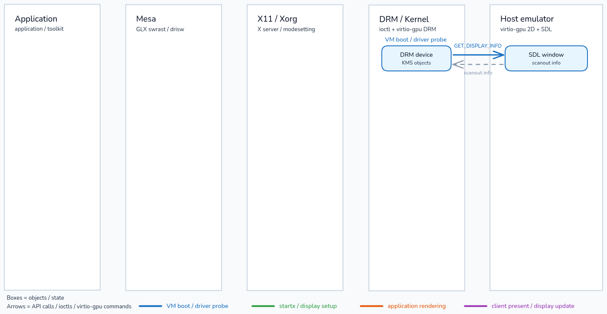
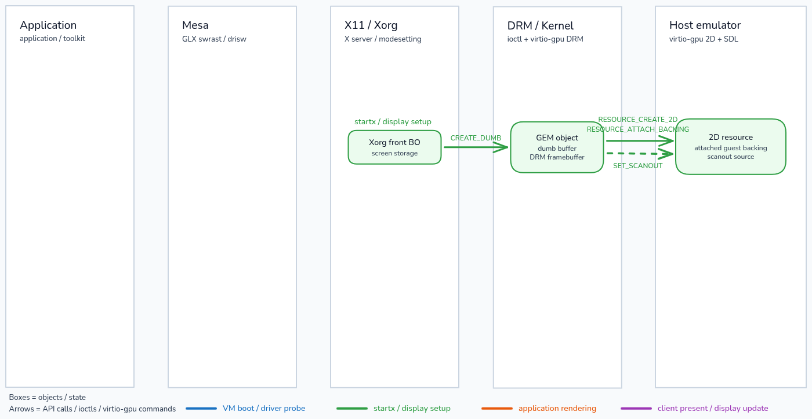
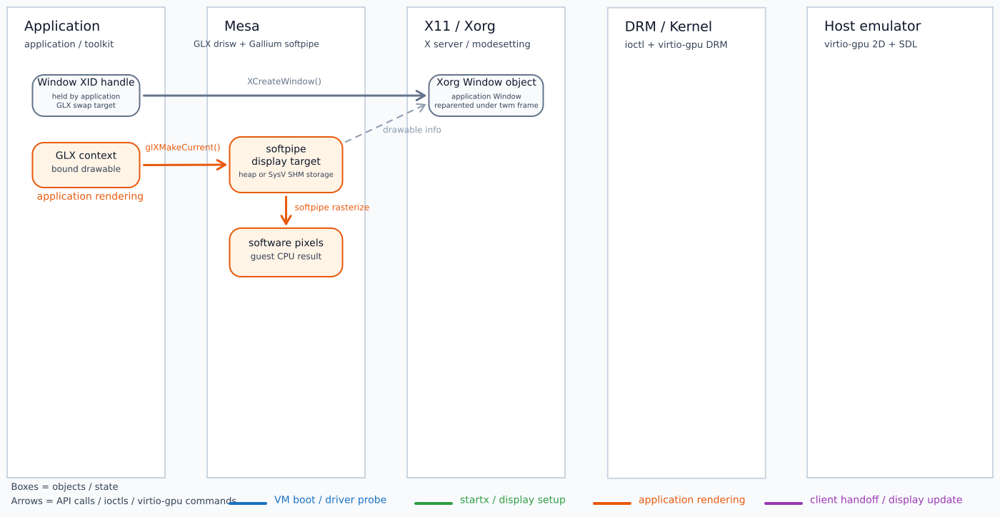
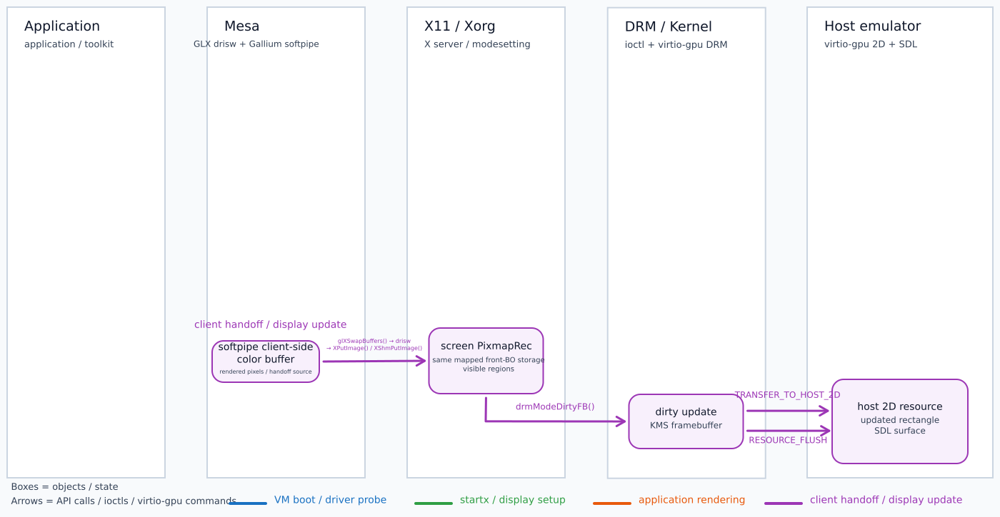
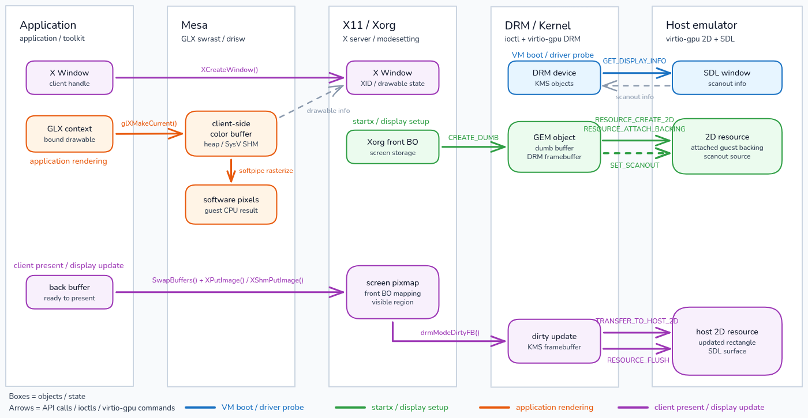

# The graphic stack：Mesa 與 Xorg

這次 coscup 準備報一下 Mesa，所以先來寫一篇文章，這篇會結合之前在 OSS-NA 的講稿來把其中 Mesa 的部分講清楚，希望是會弄成一個系列文，後續再把 DRM/KMS 和 SPIR-V 之類的東西提一下

這篇文會以 OpenGL + X11 為主，Vulkan 與 Wayland 之類的議題應該也是會放在後續的章節再來提

當我們啟動 Linux 電腦、登入圖形桌面，再點開一個應用程式時，螢幕上很快就會出現一個新的視窗。 接著，不論是移動視窗、按下按鈕，還是讓遊戲畫出下一幀，使用者看到的都是持續更新的畫面。 這些看似平常的操作，需要應用程式、圖形函式庫、視窗系統、Linux 核心與顯示裝置一起完成

以應用程式畫出一幀畫面為例，它必須先描述想畫的內容，取得一塊可以保存結果的空間，再把算好的畫面交給桌面系統。 桌面系統還要判斷視窗位於螢幕的哪裡、哪些部分可以看見，最後才能把更新後的畫面送到顯示裝置

Mesa 位在這段路徑的 user space。 本文選擇 OpenGL 與 X11 作為具體案例：應用程式透過 OpenGL 描述要畫的內容，Xorg 管理桌面與視窗，GLX 則連接 OpenGL 與 X11，讓應用程式可以為 X11 視窗建立算繪環境並交換畫面

我們會先追蹤一幀畫面如何從應用程式進入 Mesa，接著交給 Xorg，最後經 Linux 顯示路徑出現在螢幕上。 建立這張整體地圖後，後文再沿著相同的路徑進入 Mesa 原始程式碼，逐一拆解 GLX、OpenGL frontend、State Tracker、Gallium、DRI、GBM 與 VirGL

文中的原始程式碼與行號固定在下列版本：

- Mesa：`eaa4b57774d1f8825dcdfc280ceb8adbecfd19d3`
- Xserver：`a6a8bc9464f7d787e91f63957357547e7c85c81f`
- Linux：`0e35b9b6ec0ffcc5e23cbdec09f5c622ad532b53`
- virglrenderer：`dc35e4db03144f81637c5ad061f61d3334b078fe`

## 從 Xorg + GLX application 看 Mesa 全貌

Linux 圖形桌面已經啟動，application 準備畫出第一個 frame。 在追 Mesa function 前，第一個問題是：哪三組 guest-side object 參與這條路徑，哪兩份 guest-side pixel storage 真正保存畫面，swap 之後又由誰接手，才能讓 host 視窗顯示這一幀？

以下三輪圖固定使用同一組目標組態：

- Guest 執行 Linux，顯示裝置使用 virtio-gpu 2D
- Xorg 是直接管理 KMS device 與 X Screen 的 rootful server，並使用 modesetting driver。 Screen pixmap 直接對到 mapped front BO
- Application 的 X11 Window 未被 Composite redirect。 Window drawable 使用已安裝的 screen pixmap，不配置獨立的 per-window redirect pixmap
- GLX 使用 direct software path。 Mesa 走 `drisw`，Gallium software driver 固定為 softpipe
- Xorg front BO 固定為 mapped dumb BO，建立過程確實抵達 `DRM_IOCTL_MODE_CREATE_DUMB`
- `gbm_create_front_bo()` 會依序嘗試多組 usage flags。 如果 GBM 已 fallback 到 `kms_swrast`，較早的 usage flag set 也可能建立 dumb BO。 最後的 `GBM_BO_USE_WRITE | GBM_BO_USE_SCANOUT` candidate 則會進入 Mesa GBM 的 `create_dumb()`。 本例固定觀察到 mapped dumb BO 與 `CREATE_DUMB`，實際命中的 usage flag set 由 runtime 決定
- virtio-gpu 未協商 `VIRTIO_GPU_F_RESOURCE_BLOB`，因此本例走傳統的 `RESOURCE_CREATE_2D` 與 `RESOURCE_ATTACH_BACKING` branch
- Host emulator 使用 SDL2 display backend。 後文將這個終點稱為「本例的 SDL window」

Xorg 的裝置設定如下：

```conf
Section "Device"
    Identifier "virtio-gpu"
    Driver "modesetting"
    Option "AccelMethod" "none"
    Option "ShadowFB" "off"
EndSection
```

Application 啟動時固定設定：

```bash
export LIBGL_ALWAYS_SOFTWARE=true
export GALLIUM_DRIVER=softpipe
```

這組條件把 application 的 OpenGL work 留在 guest CPU 上執行，算好的 pixels 再經 X server、DRM／KMS 與 virtio-gpu 走到本例的 SDL window

本文把產生 pixels 的元件統稱為 software renderer。 softpipe 與 llvmpipe 是 Gallium software drivers，classic swrast 是 Mesa 傳統的 software rasterizer。 `drisw` 則位在 DRI software loader／winsys 路徑，負責讓 Mesa 取得 drawable，並在 swap 時把 pixels 交給 X server。 這些名稱各自負責不同工作，後面的三輪圖會固定沿這項分工說明

### Application 開始畫圖前，畫面存在哪裡

先暫停在 application 發出第一個 OpenGL operation 以前。 此時三組 guest-side object 已把 client rendering 與 X Screen 接起來，真正保存 pixels 的則是兩份 guest-side storage：screen `PixmapRec`／front BO，以及 Mesa client-side color buffer。 未 redirect 的 Window／Drawable 提供 storage mapping 與 screen origin，GC 提供 composite clip

Xorg 要讓整個 X Screen 有內容可供 scanout，最底下必須是哪一份 storage？ 這份 storage 又如何連到 DRM GEM BO、KMS framebuffer／`fb_id` 與 virtio-gpu 2D resource？


最先加入的是 Xorg screen `PixmapRec` 與其下方的 mapped front BO。 Screen pixmap 是 X server 用來表示整個 X Screen 內容的 storage object，front BO 則提供實際 backing。 後面不論哪個 Window 產生新內容，最後都要讓這份 screen storage 反映可見結果

本例的 front BO 在 DRM 端對應 GEM dumb BO，建立過程抵達 `DRM_IOCTL_MODE_CREATE_DUMB`。 Xorg 另外建立一個引用這份 BO 的 KMS framebuffer，`fb_id` 識別該 framebuffer，plane／CRTC 再透過它選取顯示 storage

由於本例未協商 `VIRTIO_GPU_F_RESOURCE_BLOB`，virtio-gpu 走傳統 2D branch，建立 resource 並附加 guest backing。 圖中的名稱因此形成一條由 Xorg object、DRM object 到 virtio-gpu resource 的 reference chain

這張圖只回答整個 X Screen 的 pixels 放在哪裡。 它還無法指出 application 想更新哪個視窗、視窗位於螢幕何處，也不知道哪些 pixels 會被裁切。 下一張圖需要加入 Window server 用來描述 present 目標的物件

application 持有一個 X11 Window 時，X server 如何表示 present 目標、screen origin 與可寫範圍，又如何把 Window drawable 對到既有的 front BO？


第二列加入 X11 Window、Drawable 與 storage mapping。 Window 是 application 在 X server namespace 中建立的視窗，Drawable 是 X11 request 用來指定繪圖或 present 目標的抽象。 本例的 Window 未被 Composite redirect，因此不另有 per-window `PixmapRec`。 Window drawable 會解析到已安裝的 screen pixmap

Window／Drawable 提供 screen origin，GC 的 composite clip 提供可寫範圍。 X server 因而能在處理同一個 request 時，把目標座標換成 screen 座標並直接更新既有的 screen pixmap／front BO。 這組 object 只負責 mapping、origin 與 clip。 Pixel storage 仍是 screen storage 與下一張圖的 Mesa client buffer

此時 server 端已經知道 request 要寫入哪一份 storage，application 端卻仍缺少供 software renderer 寫入的 color buffer。 下一張圖要補上第二份 guest-side pixel storage

guest CPU 算出的 pixels 在 swap 前由誰保存？ Mesa 要把哪一份 client-side storage 的內容交給 X server，才能更新剛才的 drawable？


第三列加入 Mesa client-side color buffer。 Software renderer 以 guest CPU 執行 OpenGL work，完成的 pixels 先寫入這份 buffer。 它位於 application／Mesa 一側，由 DRI software winsys 建立 software display target 及其 userspace backing，因此 rendering 期間不需要先把每個 draw 送進 virtio-gpu

`drisw` 保存 drawable 所需的連結，讓 Mesa 在 swap 時能把這份 color buffer 的 pixel range 交給正確的 X11 目標。 X server 處理 request 時，使用 Window origin 與 GC composite clip，直接把可寫部分放進 screen pixmap／front BO

三張圖至此給出三組 guest-side object 與兩份 guest-side pixel storage。 Xorg screen `PixmapRec`／front BO 是顯示 storage，Window／Drawable 與 GC 將 request 對到其中一個區域，Mesa client-side color buffer 則保存尚未 present 的 rendering result。 下一輪改追一個 frame 如何在這兩份 guest-side storage 之間交接

### 一個 frame 如何從 Mesa 走到 host 視窗

application 現在開始畫一幀。 這一輪不再增加 guest-side storage 類型，而是依序加入 Rendering、Present、Window update 與 Scanout update 四個動作。 每個動作只回答兩件事：目前誰在工作，以及完成後的 pixels 位於哪裡

application 發出 OpenGL work 後，第一批 completed pixels 由誰算出，又先寫進兩份 guest-side storage 中的哪一份？


第一個動作是 Rendering。 Application 對目前的 GL context 發出 OpenGL operation，Mesa 選定的 software renderer 隨即在 guest CPU 上執行。 Vertex processing、rasterization 與 fragment 結果最後形成 pixels，目標是上一輪加入的 Mesa client-side color buffer

這個動作的完成狀態是 client process 內已有一份可呈現的 pixel result。 X server 的 drawable、Xorg front BO 與 host resource 都還沒有因此改變，因為 rendering 的 owner 仍在 application／Mesa 一側

要讓這一幀離開 client-side buffer，application 必須明確要求交換 drawable 的內容。 下一個動作因此從 swap 開始，處理 Mesa 與 Window server 之間的 pixel handoff

client-side color buffer 已有完整內容後，swap 如何讓 pixels 跨進 X server？ 這次交接實際攜帶的資料又是什麼？


第二個動作是 Present。 Application 呼叫 swap，`drisw` 便沿 DRI software loader／winsys 的交界取出要呈現的 pixel range。 普通 `XPutImage` request 會攜帶 inline pixel bytes、目標 drawable、座標與尺寸。 `XShmPutImage` request 則攜帶 shared-memory segment 與 offset reference，再由 X server 讀取對應的 pixels

兩條 request 都把 client rendering result 交到 Window server 邊界，但 wire payload 不同。 接下來的 Window update 會處理這一個 request，依 drawable mapping 決定實際寫入的 screen 區域

X server 已收到 Window 的 pixels，接下來如何套用 Window 位置與 clip region，讓只有可見內容進入 screen pixmap／front BO？


第三個動作是 Window update。 X server 在處理同一個 put-image request 時，加入 Window drawable 的 screen origin，再套用 GC composite clip。 可寫的 pixels 直接進入目前安裝的 screen pixmap／front BO，更新會在這次 request processing 內完成

Window update 讓 front BO 取得經過 origin 與 clipping 後的 screen result。 Mesa client-side buffer 仍是另一份 guest-side storage，Window／Drawable 則只提供 request 到 screen storage 的 mapping

front BO 已在 guest 記憶體中更新，host-side resource 目前仍保存舊內容。 要讓本例的 SDL window 看到同一個 visible region，最後一個動作必須把 dirty screen storage 交給 DRM／KMS 與 virtio-gpu

哪些操作把 dirty front BO 搬到 host-side resource，為什麼 `TRANSFER_TO_HOST_2D` 必須先於 `RESOURCE_FLUSH`？


第四個動作是 Scanout update。 Xorg modesetting 將 front BO 的 dirty region 交給 DRM／KMS，virtio-gpu driver 再對 front BO 對應的 resource 送出 `TRANSFER_TO_HOST_2D`。 這個命令把指定矩形的 pixels 從 guest backing 搬進 host-side 2D resource

pixels 抵達 host resource 後，`RESOURCE_FLUSH` 才發布同一個矩形的更新，讓 display backend 知道哪些內容可供顯示。 Host emulator 更新 image storage，本例的 SDL window 隨後呈現 application 的這一幀。 搬移內容與發布更新會依序完成

四個動作已經把單一 frame 從 Mesa client-side color buffer 帶到 host 視窗。 這條路徑仍有一個時間上的問題：DRM device、front BO 與 scanout resource 都早於 application 存在，它們究竟在何時建立？ 第三輪把相同物件與動作放回 VM 的完整生命週期

### 把同一個 frame 放回完整時間線

前一輪依一幀內的責任交接分類，得到 Rendering、Present、Window update 與 Scanout update。 這一輪改用系統生命週期分類，依序是 VM boot、`startx`、application rendering 與 client present／display update。 最後一個生命週期階段會把 Present、Window update 與 Scanout update 收進同一段 display update，兩輪回答的是不同時間尺度的問題

VM 剛開機、Xorg 尚未啟動時，guest 必須先建立哪些裝置物件，host 才能告訴它可用的 scanout 資訊？



生命週期的第 1 階段是 VM boot 與 device probe。 Linux virtio-gpu driver 探測裝置後建立 DRM device 與 KMS objects，讓 guest 有能力表示 connector、CRTC、plane 與後續 framebuffer state。 這些 object 是 display pipeline 的起點，此時 application、Mesa context 與 Xorg front BO 都還不存在

virtio-gpu driver 先從 device config 取得 scanout 數量，再以 `GET_DISPLAY_INFO` 取得並記錄各 scanout 的尺寸與啟用狀態。 Host 端由本例設定的 SDL2 display backend 承接最終顯示，畫面仍等待 guest 指定實際的 scanout resource。 此時 display topology 已可供 DRM／KMS 表示，還沒有可顯示的 pixels

device probe 完成後，guest 已知道顯示端能提供什麼，卻沒有一份 X Screen storage 可交給 scanout。 下一階段必須等 `startx` 啟動 Xorg，由 modesetting 建立 front BO 與對應 resource

`startx` 如何讓新建的 front BO 被 KMS framebuffer 引用，又如何讓本例的 SDL window 長期觀看同一個 virtio-gpu 2D resource？



第 2 階段是 `startx` 的 display setup。 Xorg 載入 modesetting driver，為整個 X Screen 建立 mapped front BO。 本例的建立過程抵達 `CREATE_DUMB`，取得 guest GEM dumb buffer。 Xorg 再建立一個引用這份 BO 的 KMS framebuffer，使 primary plane／CRTC 可以透過該 framebuffer 的 `fb_id` 選到顯示 storage

本例未協商 `VIRTIO_GPU_F_RESOURCE_BLOB`，因此同一份 BO 在 virtio-gpu 一側走傳統 2D branch。 `RESOURCE_CREATE_2D` 建立 device-side object，`RESOURCE_ATTACH_BACKING` 把 guest pages 接上去，`SET_SCANOUT` 則把這個 resource 選為 host display 的觀看來源。 這些操作建立的是跨越後續多幀的 display state

`SET_SCANOUT` 完成後，host 已知道要顯示哪個 resource。 後面的 frame 通常只更新 resource 內容，不必在每次 swap 時重新選擇 scanout。 此刻仍沒有 application Window、GLX context 或 Mesa color buffer，下一階段才會加入它們

Xorg display storage 已準備完成，application 啟動時還要建立哪些 client 與 server objects，software renderer 才能產生第一幀 pixels？



第 3 階段是 application rendering。 Application 先以 `XCreateWindow()` 在 X server 建立 X Window，再建立 GLX drawable 與 GL context。 Make-current 將 context 與 drawable 接在一起，讓後續 OpenGL operation 有明確的執行狀態與算繪目標

Mesa 在 client process 內建立 client-side color buffer，software renderer 使用 guest CPU 將這一幀算成 pixels。 這個生命週期階段新增的是 application 與 Mesa objects，以及位於 client buffer 的 rendering result。 VM boot 與 `startx` 建立的 display objects 維持原狀

application rendering 結束時，pixels 仍停在 Mesa 一側。 它們還沒有套用 Window 的位置與 clipping，也沒有更新 host resource。 下一階段從 swap 開始，將前一輪看過的三個後續動作合併成一次 display update

application 呼叫 swap 後，Present、Window update 與 Scanout update 如何在同一個生命週期階段內接續，直到本例的 SDL window 顯示下一幀？



第 4 階段是 client present 與 display update。 `SwapBuffers()` 讓 `drisw` 發出 put-image-style request。 `XPutImage` 攜帶 inline pixel bytes，`XShmPutImage` 則攜帶 shared-memory segment 與 offset reference。 Window server 在處理 request 時加入 Window origin 並套用 composite clip，直接更新 screen pixmap／front BO

Xorg modesetting 再以 dirty update 將改動的矩形交給 DRM／KMS，這條路徑可由 `drmModeDirtyFB()` 表達。 virtio-gpu 隨後依序執行 `TRANSFER_TO_HOST_2D` 與 `RESOURCE_FLUSH`，host emulator 因而更新 image storage，本例的 SDL window 顯示新的 frame

這個生命週期階段將一幀內的三個動作放進同一段時間，起點是 application swap，終點是 host display 更新。 前三個階段各自建立的 device、screen 與 client objects 在此一起工作。 下一張完整圖不再加入新的 subsystem，而是將四個階段排在同一條時間線上

完整圖裡有四段時間：VM boot、`startx`、application rendering 與 display update。 哪些屬於初始化？ 哪些會在每個 frame 再次發生？



第 5 階段新增的是完整時間關係。 VM boot 先建立 DRM device、KMS objects 與顯示能力，`startx` 再建立 front BO、framebuffer 與固定的 scanout resource。 這兩段提供 application 啟動前就存在的 display state。 Application 建立 Window、GLX objects 與 client buffer 後，每一幀才重複 rendering、swap 與 display update

完整圖也讓四個 guest-side 工作區域回到同一條路徑：Application 發出操作，Mesa 產生 client-side pixels，X11／Xorg 決定可見 screen content，DRM／kernel 管理 scanout storage。 Host emulator 位於這四個區域之外，作為最後的 host display boundary。 Pixels 依序跨過 guest owners 再抵達 host，object 的生命週期則可能長於單一 frame

在本例固定的 softpipe 2D 組態下，rendering 留在 software renderer，virtio-gpu 的工作集中在 display pipeline。 Guest CPU 先完成 application 的 OpenGL work，virtio-gpu 之後才搬移並發布 front BO 的 dirty pixels。 這項分工把 Mesa 在本例中的入口與出口圈了出來

三輪例子已建立 Mesa 的輸入與輸出。 Application 把 OpenGL operation 交給 Mesa，Mesa 產生 rendering result，swap 再把這份結果交給 Window server，後面的 display pipeline 負責讓它出現在 host 視窗

接下來的問題是：Application 的 GLX call 如何載入 Mesa？ Mesa 又如何建立 client-side objects，把 GL context、drawable 與 renderer 接在一起？

## Application 如何進入 Mesa

Xorg 已經管理一個 X Window，application 接下來要讓這個 Window 成為 OpenGL 的算繪目標。 Window server 手上有 Window XID，Mesa 端還沒有可供目前執行緒使用的 GLX context。 application 建立 GLX context 並執行 make-current 後，「要畫到哪個 drawable」與「後續 OpenGL 呼叫使用哪個 context」才會接在一起

這個外層生命週期同時適用於 2D 的 drisw 基準路徑與後面的 VirGL 3D 路徑。 以下另以 `glXCreateContextAttribsARB()` 與 direct make-current 的原始程式碼路徑放大這個階段，依序追蹤動態載入器如何找到 Mesa vendor、Mesa GLX 如何建立 client-side context、DRI 如何接上 State Tracker，以及成功與失敗時各層要保留或釋放哪些物件。 讀清這些交接後，後面的 OpenGL entry 才能從目前執行緒抵達正確的 Mesa context

### Mesa 建置後產生哪些 runtime artifact

application 尚未進入任何 Mesa function，dynamic loader 先要依 soname 找到 GLX vendor artifact。 同一份安裝目錄還可能有 Gallium DRI megadriver、`dril_dri` 與 driver-name symlinks。 要判斷下一節的 vendor entry 是否已連入 DRI implementation，必須同時讀 Meson 的輸出名稱與 `link_with`／`link_whole`，不能只由檔名猜 runtime hop

#### GLX vendor library

application 的 GLX call 要由 GLVND 載入 Mesa vendor，因此建置結果必須同時提供可識別的 library name 與 vendor ABI code。 `with_glvnd` branch 直接決定 installed soname 與納入 shared object 的 registration／dispatch glue。 以下從 `src/glx/meson.build` 的 `gl_lib_name` assignment 與 `shared_library()` 證明 artifact identity 和內容

以下程式碼來自 [`src/glx/meson.build:89`](https://gitlab.freedesktop.org/mesa/mesa/-/blob/eaa4b57774d1f8825dcdfc280ceb8adbecfd19d3/src/glx/meson.build#L85-98) 與 [`src/glx/meson.build:127`](https://gitlab.freedesktop.org/mesa/mesa/-/blob/eaa4b57774d1f8825dcdfc280ceb8adbecfd19d3/src/glx/meson.build#L127-139) 的 `gl_lib_name` 選擇與 `libglx_mesa` target。 Build definition 顯示 `with_glvnd` branch 將輸出名改成 `GLX_mesa` 並加入 GLVND glue sources，`shared_library()` 再以 `link_whole` 收進 `libglx` 與 `libgl_link`：

```meson
if not with_glvnd
  gl_lib_name = 'GL'
  gl_lib_version = '1.2.0'
else
  gl_lib_name = 'GLX_@0@'.format(glvnd_vendor_name)
  gl_lib_version = '0.0.0'
  files_libglx += files(
    'g_glxglvnddispatchfuncs.c',
    'g_glxglvnddispatchindices.h',
    'glxglvnd.c',
    'glxglvnd.h',
    'glxglvnddispatchfuncs.h',
  )
endif
...
libgl = shared_library(
  gl_lib_name,
  [],
  link_whole : [libglx, libgl_link],
  link_args : [ld_args_bsymbolic, ld_args_gc_sections, extra_ld_args_libgl],
  dependencies : [
    dep_libdrm, dep_dl, dep_m, dep_thread, dep_x11, dep_xcb_glx, dep_xcb,
    dep_x11_xcb, dep_xext, dep_xxf86vm, dep_xcb_shm, extra_deps_libgl,
  ],
  version : gl_lib_version,
  darwin_versions : '4.0.0',
  install : true,
)
```

`link_whole : [libglx, libgl_link]` 表示輸出的 vendor shared object 納入 `libglx` static library 的完整內容。 這個 artifact 同時包含 GLX client object、X11 request handling、direct-rendering glue 與 vendor ABI，內容超過單純把操作轉送給另一個 process 的薄表

`libgl_link` 在 GLVND 分支是空 array，因為 public GL entry points 的對外提供方式由 GLVND 架構處理，不需要把非 GLVND 分支使用的 bridge 同樣塞進 vendor library

因此 application 看到的最外層名稱與 Mesa 內部 implementation 可以分成兩句。 `libGLX_mesa.so.0` 是 GLVND 對 Mesa GLX vendor 的 runtime identity。 `libglx` 則是建置期 static target，供前者 whole-link，不是讓 application 以該名稱自行載入的 public artifact。 把 build target 與 installed soname 分開，才不會在 backtrace 裡尋找根本不該出現的 `libglx.so`

#### Gallium DRI megadriver

Mesa GLX vendor 已有 public GLX entry，但 direct context 還需要 DRI frontend 與一個能建立 `pipe_screen` 的 driver implementation。 Gallium DRI target 的 link sets 會顯示這些物件是否聚合在同一 shared library，也會說明 driver name 對應獨立 binary 或 megadriver alias。 以下從 `libgallium_name` branch 與 `libgallium_dri` target 找到答案

接著 `shared_library` 把同一份 DRI frontend 與 build 中啟用的多個 Gallium driver 收進單一 artifact。 這種聚合是 megadriver 的核心含義，每一張 GPU 不需要各編一份完整 Mesa core

以下程式碼來自 [`src/gallium/targets/dri/meson.build:37`](https://gitlab.freedesktop.org/mesa/mesa/-/blob/eaa4b57774d1f8825dcdfc280ceb8adbecfd19d3/src/gallium/targets/dri/meson.build#L36-57) 的 `libgallium_name` 與 `libgallium_dri` target。 Target declaration 顯示名稱 branch 決定 versioned 或 unversioned artifact，`shared_library()` 的 `link_whole` 則把 DRI frontend 與選定的 Gallium driver archives 聚合進同一輸出：

```meson
if get_option('unversion-libgallium') or with_platform_android
  libgallium_name = 'gallium_dri'
else
  libgallium_name = 'gallium-@0@'.format(meson.project_version())
endif

libgallium_dri = shared_library(
  libgallium_name,
  files('dri_target.c'),
  include_directories : [
    inc_include, inc_src, inc_mesa, inc_gallium, inc_gallium_aux, inc_util, inc_gallium_drivers,
    inc_gallium_winsys, include_directories('../../frontends/dri'),
  ],
  gnu_symbol_visibility : 'hidden',
  link_args : [ld_args_build_id, ld_args_gc_sections, gallium_dri_ld_args],
  link_depends : gallium_dri_link_depends,
  link_with : [
    libmesa, libgalliumvl,
    libgallium, libglapi, libpipe_loader_static, libws_null, libwsw, libswdri,
    libswkmsdri, gallium_dri_link_with
  ],
  link_whole : [libdri, gallium_dri_link_whole],
...
```

這段的 `libgallium_dri` 是 Meson target variable。 它可以被另一個 target 直接 link，也可以依安裝規則成為 runtime shared object。 `libdri` 透過 `link_whole` 納入 frontend，`gallium_dri_link_whole` 納入選定 driver 的 whole archives

`libmesa`、`libgallium` 與 `libglapi` 等 target 提供 core 與共用基礎。 最終 artifact 內雖然聚合多個 driver，建立 screen 時仍只會依裝置與 loader information 選出合適的一個 pipe screen，不會因為 code 同處一個 shared object 就同時執行所有 backend

megadriver 的價值也在於 code sharing。 DRI-facing entry 與 Mesa core 只有一份，driver-specific implementation 由 screen 建立流程選定。 安裝端可能另外建立傳統 `<driver>_dri.so` 名稱的 symlink，使既有 loader 能以 driver name 查找

symlink 的檔名是 selection key，實際 inode 可以共同指向同一個聚合 artifact。 因此「載入了某個 driver 名稱」不等於「磁碟上存在一份完全獨立的 driver binary」

對本章的 GLX direct path 而言，還有一個更重要的 build-time fact。 `libgallium_dri` 不一定要等到 application 第一次建立 context 才由名稱查找。 下一小節所示的 `src/glx/meson.build` 會在 `with_dri` 時把這個 Meson target 加到 `libglx` 的 link 集合

在這個固定 commit 與設定分支下，GLX vendor artifact 可以已經帶有 Gallium DRI implementation。 通用 DRI loader 的 `dlopen` 規則仍然存在，但不能不看 caller 就把它套在每條 GLX call path 上

#### Runtime library、DRI driver 與 loader 的關係

artifact 都已辨認後，還要判斷這個 GLX build 是在 link time 納入 Gallium DRI，還是由某個 caller 在 runtime 以 driver name 搜尋 `_dri.so`。 這會改變 `dlopen` 是否出現在實際 call chain，也會改變載入失敗的 cleanup owner。 以下先讀 `glx_gallium_link`，再讀 `dril_dri` aliases 與 `loader_open_driver_lib()` 的 runtime branch

以下程式碼來自 [`src/glx/meson.build:100`](https://gitlab.freedesktop.org/mesa/mesa/-/blob/eaa4b57774d1f8825dcdfc280ceb8adbecfd19d3/src/glx/meson.build#L100-121) 的 `glx_gallium_link` 與 `libglx` declarations，用來判斷 GLX vendor artifact 是否在 build time 納入 Gallium DRI。 `with_dri` 成立時，Meson 將 `libgallium_dri` 加入 `link_with`。 `libglx` 本身則以 static target 收攏 GLX sources，供 vendor shared object 在 build time 組合：

```meson
glx_gallium_link = []
if with_dri
  glx_gallium_link += libgallium_dri
endif
if with_platform_windows
  glx_gallium_link += libgallium_wgl
endif
libglx = static_library(
  'glx',
  [files_libglx, glx_generated, main_dispatch_h],
  include_directories : [inc_include, inc_src, inc_glapi, inc_loader, inc_loader_x11,
                         inc_gallium, inc_mesa, inc_st_dri, inc_gallium_aux],
  gnu_symbol_visibility : 'hidden',
  link_with : [
    libloader, libloader_x11,
    extra_libs_libglx, glx_gallium_link
  ],
  dependencies : [
    idep_mesautil, idep_xmlconfig,
    dep_libdrm, dep_glproto, dep_x11, dep_xext, dep_glvnd, dep_xxf86vm, dep_xshmfence,
  ],
)
```

這裡的 `link_with` 是 build-time composition。 application process 載入 Mesa GLX vendor artifact 後，該 artifact 內的 direct-rendering path 可以直接呼叫已連入的 DRI frontend symbol。 它與 loader 依 driver name 搜尋檔案的 runtime composition 是兩種機制。 兩者都可能出現在 Mesa，但必須以特定 caller 與 build configuration 判定，不能畫成固定多一層 shared-object hop

`dril_dri` 是另一種用途的 artifact。 它的 target 只 link `libgallium`，建置註解也明示 Meson 建立的原始檔會在 install 流程處理

當 build 選到相應 driver 名稱時，array 產生 `<name>_dri.<suffix>`，build tree 先以 symbolic link 指向 `dril_dri`，install script 再建立 runtime aliases。 [src/gallium/targets/dril/meson.build:42](https://gitlab.freedesktop.org/mesa/mesa/-/blob/eaa4b57774d1f8825dcdfc280ceb8adbecfd19d3/src/gallium/targets/dril/meson.build#L42-63) 顯示 stub target 本體

以下程式碼來自 [src/gallium/targets/dril/meson.build:42](https://gitlab.freedesktop.org/mesa/mesa/-/blob/eaa4b57774d1f8825dcdfc280ceb8adbecfd19d3/src/gallium/targets/dril/meson.build#L42-63) 的 `dril_dri` shared target。 定義顯示 sources、hidden symbol visibility、link arguments，以及透過 `link_with` 連入 `libgallium`。 這個 legacy-facing loader artifact 會安裝到 DRI drivers directory：

```meson
dril_dri = shared_library(
  'dril_dri',
  files('dril_target.c'),
  include_directories : [
    inc_include, inc_src, inc_mesa, inc_gallium, inc_gallium_aux, inc_util, inc_gallium_drivers,
    inc_gallium_winsys,
  ],
  gnu_symbol_visibility : 'hidden',
  link_args : [ld_args_build_id, ld_args_gc_sections, dril_ld_args],
  link_depends : dril_link_depends,
  link_with : [
    libgallium,
  ],
  dependencies : [
    idep_mesautil,
    dep_gbm,
  ],
  # Will be deleted during installation, see install_megadrivers.py
  install : true,
  install_dir : dri_drivers_path,
  name_suffix : libname_suffix,
)
```

`dril_dri` 負責 Xorg 所需的 legacy DRI-facing 初始化與 framebuffer configuration，application direct context 的 rendering implementation 由 Gallium DRI megadriver 提供。 Alias 名稱只選定 loader 進入點，實際 backend 仍由 megadriver 內的 driver descriptor 與 screen factory 決定

以本系列關心的 virtual GPU build 為例，條件成立時會把 `virtio_gpu` 加入 name list。 中間其他 driver 條件不影響這個判斷，所以摘錄以獨立省略行保留 source 邊界。 [src/gallium/targets/dril/meson.build:120](https://gitlab.freedesktop.org/mesa/mesa/-/blob/eaa4b57774d1f8825dcdfc280ceb8adbecfd19d3/src/gallium/targets/dril/meson.build#L120-145) 顯示 name selection 與 symlink target

以下程式碼來自 [src/gallium/targets/dril/meson.build:120](https://gitlab.freedesktop.org/mesa/mesa/-/blob/eaa4b57774d1f8825dcdfc280ceb8adbecfd19d3/src/gallium/targets/dril/meson.build#L120-145) 的 `dri_drivers` table 與 alias loop。 這兩段可用來確認 VirGL、Freedreno virtio 或 AMDGPU virtio 任一 predicate 成立時，`virtio_gpu` 會進入 name list，迴圈再依 `libname_suffix` 產生對應的 `_dri` symlink 名稱：

```meson
...
             [with_gallium_virgl or
               (with_gallium_freedreno and freedreno_kmds.contains('virtio')) or
               (with_gallium_radeonsi and with_amdgpu_virtio),
               ['virtio_gpu']],
...
  if d[0]
    foreach name : d[1]
      dril_drivers += '@0@_dri.@1@'.format(name, libname_suffix)
    endforeach
  endif
endforeach

# This only works on Unix-like oses, which is probably fine for dri
if prog_ln.found()
  foreach d : dril_drivers
    custom_target(
      d,
      output : d,
      command : [prog_ln, '-sf', dril_dri.full_path(), '@OUTPUT@'],
      build_by_default : true,
    )
  endforeach
endif
```

install 階段則把 `dril_dri.full_path()`、目標目錄與完整 alias list 一起交給 megadriver installer。 [src/gallium/targets/dril/meson.build:147](https://gitlab.freedesktop.org/mesa/mesa/-/blob/eaa4b57774d1f8825dcdfc280ceb8adbecfd19d3/src/gallium/targets/dril/meson.build#L147-154) 的呼叫在下一行才結束，因此摘錄末端保留省略標記

以下程式碼來自 [src/gallium/targets/dril/meson.build:147](https://gitlab.freedesktop.org/mesa/mesa/-/blob/eaa4b57774d1f8825dcdfc280ceb8adbecfd19d3/src/gallium/targets/dril/meson.build#L147-154) 的 megadriver install block。 Install call 顯示 `dril_drivers.length()` 控制是否執行 installer，傳入值則依序是 `dril_dri.full_path()`、安裝目錄、完整 alias list 與 `runtime` tag：

```meson
if dril_drivers.length() > 0
  meson.add_install_script(
    install_megadrivers,
    dril_dri.full_path(),
    dri_drivers_path,
    dril_drivers,
    install_tag : 'runtime',
  )
...
```

若 caller 的確採 runtime driver-name lookup，通用 loader 會先決定 search path，再組成 `<directory>/<driver_name><lib_suffix>.so`。 這說明傳統 `_dri.so` 名稱如何成為查找 key，但不會把所有使用 Mesa GLX 的情況都變成相同的 `dlopen` call。 [src/loader/loader.c:866](https://gitlab.freedesktop.org/mesa/mesa/-/blob/eaa4b57774d1f8825dcdfc280ceb8adbecfd19d3/src/loader/loader.c#L865-884) 顯示 path 選擇的前半段

以下程式碼來自 [src/loader/loader.c:866](https://gitlab.freedesktop.org/mesa/mesa/-/blob/eaa4b57774d1f8825dcdfc280ceb8adbecfd19d3/src/loader/loader.c#L865-884) 的 `loader_open_driver_lib()`。 搜尋分支顯示 function 先依 `search_path_vars` 選環境設定或 `default_search_path`，再逐一組合 `driver_name`、`lib_suffix` 與 directory，直到 `dlopen()` 成功或所有候選路徑耗盡：

```c
void *
loader_open_driver_lib(const char *driver_name,
                       const char *lib_suffix,
                       const char **search_path_vars,
                       const char *default_search_path,
                       bool warn_on_fail)
{
   char path[PATH_MAX];
   const char *search_paths, *next, *end;

   search_paths = NULL;
   if (__normal_user() && search_path_vars) {
      for (int i = 0; search_path_vars[i] != NULL; i++) {
         search_paths = os_get_option(search_path_vars[i]);
         if (search_paths)
            break;
      }
   }
   if (search_paths == NULL)
      search_paths = default_search_path;
...
```

path loop 的 [src/loader/loader.c:886](https://gitlab.freedesktop.org/mesa/mesa/-/blob/eaa4b57774d1f8825dcdfc280ceb8adbecfd19d3/src/loader/loader.c#L886-905) 才組檔名並執行 `dlopen`

以下程式碼來自 [src/loader/loader.c:886](https://gitlab.freedesktop.org/mesa/mesa/-/blob/eaa4b57774d1f8825dcdfc280ceb8adbecfd19d3/src/loader/loader.c#L886-905) 的 `loader_open_driver_lib()`，用來確認 loader 如何逐一組出 DRI shared-library path、以 `dlopen()` 載入，並在第一個成功結果停止搜尋：

```c
...
   void *driver = NULL;
   const char *dl_error = NULL;
   end = search_paths + strlen(search_paths);
   for (const char *p = search_paths; p < end; p = next + 1) {
      int len;
      next = strchr(p, ':');
      if (next == NULL)
         next = end;

      len = next - p;
      snprintf(path, sizeof(path), "%.*s/%s%s.so", len,
               p, driver_name, lib_suffix);
      driver = dlopen(path, RTLD_NOW | RTLD_LOCAL);
      if (driver == NULL) {
         dl_error = dlerror();
         log_(_LOADER_DEBUG, "MESA-LOADER: failed to open %s: %s\n",
              path, dl_error);
      }
      /* not need continue to loop all paths once the driver is found */
      if (driver != NULL)
...
```

三類 artifact 至此可以用 owner 與用途分開。 GLX vendor library 接受 GLVND vendor ABI，並擁有 application-side GLX object。 Gallium DRI megadriver 聚合 direct-rendering frontend 與 rendering backend，且在此 build graph 中可由 GLX target link。 `dril_dri` 則保留 Xorg legacy 初始化所需的相容介面與 alias

通用 loader 只在 caller 選擇 runtime name lookup 時介入。 三類 artifact 之間不存在永遠固定的 runtime 轉接次序

三類 artifact 的關係屬於 build／responsibility map：

- installed GLX vendor artifact whole-link `libglx`，而 `with_dri` branch 又把 Gallium DRI target 加入 `libglx`
- 選擇 runtime name lookup 的 caller 才會把 `<driver_name>_dri.so` 當成 loader key，逐一嘗試 search path
- `dril_dri` 與安裝 aliases 提供 Xorg legacy DRI-facing initialization，並不形成每個 application GLX call 都必經的 runtime hop

下一節的 `__glx_Main()` 詳細 callgraph 從實際 runtime entry 開始。 Meson target relationship 到此完成 artifact handoff，runtime control flow 則由 loader 進入 vendor ABI

### GLVND 選到 Mesa vendor

runtime artifact 已可載入，application 現在呼叫 `glXCreateContextAttribsARB()`，但新 context 尚未存在，GLVND 還不能用 context mapping 選 vendor。 要讓這次呼叫進入 Mesa，library 必須先完成 ABI handshake，再由 FBConfig 或 screen drawable 找到 vendor，最後為新 `GLXContext` 建立 mapping。 這三步的失敗點會決定 public call 是否能回傳有效 handle

這套 mapping 與 Mesa 內部 GL dispatch 是兩個層次。 GLX vendor mapping 決定某次 GLX 操作進哪個 vendor library。 Mesa GL dispatch table 則在 vendor 已確定、context 已 make-current 後，決定 `glDrawArrays` 的 public stub 要跳到哪個 context implementation。 兩張 table 都叫 dispatch，key、owner 與更新時機卻不同

#### Vendor ABI registration

GLVND 剛載入 Mesa vendor library，手上有 ABI version、GLVND exports、vendor identity 與待填的 imports table。 Registration 先驗證版本，再固定 Mesa 與 GLVND 之間的 callback 方向，後續 screen selection 與 dynamic dispatch 才取得可用的 ABI table。 以下從 public entry `__glx_Main()` 的 version predicate、global assignment 與 callback registration 判斷成功條件

以下程式碼來自 [`src/glx/glxglvnd.c:57`](https://gitlab.freedesktop.org/mesa/mesa/-/blob/eaa4b57774d1f8825dcdfc280ceb8adbecfd19d3/src/glx/glxglvnd.c#L57-82) 的 `__glx_Main()`，用來證明 major 不符或 minor 太舊會回傳 `False`，而第一次成功初始化會保存 `exports` 並填入四個 Mesa callback

```c
_X_EXPORT Bool __glx_Main(uint32_t version, const __GLXapiExports *exports,
                          __GLXvendorInfo *vendor, __GLXapiImports *imports)
{
    static Bool initDone = False;

    if (GLX_VENDOR_ABI_GET_MAJOR_VERSION(version) !=
        GLX_VENDOR_ABI_MAJOR_VERSION ||
        GLX_VENDOR_ABI_GET_MINOR_VERSION(version) <
        GLX_VENDOR_ABI_MINOR_VERSION)
        return False;

    if (!initDone) {
        initDone = True;
        __glXGLVNDAPIExports = exports;

        imports->isScreenSupported = __glXGLVNDIsScreenSupported;
        imports->getProcAddress = __glXGLVNDGetProcAddress;
        imports->getDispatchAddress = __glXGLVNDGetDispatchAddress;
        imports->setDispatchIndex = __glXGLVNDSetDispatchIndex;
        imports->notifyError = NULL;
        imports->isPatchSupported = NULL;
        imports->initiatePatch = NULL;
    }

    return True;
}
```

`exports` 的方向是 GLVND 提供給 vendor。 Mesa 把 pointer 存進 process-global `__glXGLVNDAPIExports`，後續可呼叫 `getDynDispatch`、`fetchDispatchEntry` 及各種 object mapping operation。 `imports` 的方向相反，由 Mesa 填入 GLVND 可以回呼的 vendor operations。 兩張 table 交換的是函式 pointer 與 ABI contract，不是 GLX context 本體

`initDone` 使 callback table assignment 只做一次。 它沒有把 display 或 screen cache 建在 registration function 裡。 `isScreenSupported` 讓 GLVND 詢問 vendor 是否支援指定 screen

`getProcAddress` 取得一般 GL 或 GLX procedure address。 `getDispatchAddress` 則回傳 Mesa 為動態 GLX dispatch 產生的 wrapper address，`setDispatchIndex` 將 GLVND 分配的 slot index 寫入 Mesa generated index array

最後兩個 callback 要成對理解。 GLVND 可先向 vendor 詢問某個 GLX 名稱應使用哪個 dispatch wrapper，再告知該名稱在 GLVND table 裡的 index。 wrapper 執行時利用這個 index 呼叫 `fetchDispatchEntry`，取得當下 vendor function。 名稱查找發生在 setup，而不是讓每一次 extension GLX call 都重新掃描 symbol table

```callgraph
GLVND / Mesa vendor ABI registration
=================================================
GLVND 載入 Mesa vendor library
  ↓
[src/glx/glxglvnd.c:57] __glx_Main(version, exports, vendor, imports)
  │
  ├─ if (ABI major != required major || minor < required minor)
  │    └─ return False                    // import table 保持未註冊
  │
  └─ ABI compatible
       ├─ initDone == false
       │    ├─ initDone = True
       │    ├─ __glXGLVNDAPIExports = exports
       │    └─ imports->{isScreenSupported,getProcAddress,
       │                 getDispatchAddress,setDispatchIndex} = Mesa callbacks
       └─ return True
            // handoff：雙方保存的 versioned callback tables
            ↓
[src/glx/glxglvnd.c:40] __glXGLVNDGetDispatchAddress(procName)
  │
  │  internalIndex = FindGLXFunction(procName);
  └─ return __glXDispatchFunctions[internalIndex]
       ↓
[src/glx/glxglvnd.c:47] __glXGLVNDSetDispatchIndex(procName, index)
  │
  ├─ unknown/static dispatch：return
  └─ __glXDispatchTableIndices[internalIndex] = index
       // terminal result：GLVND slot 與 Mesa generated wrapper 建立穩定對應
```

這裡還沒有 Mesa rendering context，也沒有 current thread 的 draw framebuffer。 registration 的成功只表示兩個 library 對 ABI table 的版本與 callback 方向達成一致。 GPU、FBConfig 與 sharing 等 context 條件要等真正的 GLX creation call 才能處理

#### CreateContext 的 vendor mapping

ABI registration 已成功，application 接著交入 `Display *`、`GLXFBConfig`、可選的 sharing context 與 attributes，但新 `GLXContext` 還沒有 mapping。 Vendor 必須先由既有的 FBConfig 或 screen identity 選出

空 config、錯誤 screen 與 mapping failure 各自在這段選擇流程決定回傳與 cleanup。 以下讀 generated `dispatch_CreateContextAttribsARB()` 的兩個 selection branches 與 `AddContextMapping()` 結果

[src/glx/g_glxglvnddispatchfuncs.c:159](https://gitlab.freedesktop.org/mesa/mesa/-/blob/eaa4b57774d1f8825dcdfc280ceb8adbecfd19d3/src/glx/g_glxglvnddispatchfuncs.c#L159-184) 顯示建立前的 vendor selection。 function 尚未結束，所以末行是獨立省略標記

以下程式碼來自 [src/glx/g_glxglvnddispatchfuncs.c:159](https://gitlab.freedesktop.org/mesa/mesa/-/blob/eaa4b57774d1f8825dcdfc280ceb8adbecfd19d3/src/glx/g_glxglvnddispatchfuncs.c#L159-184) 的 `dispatch_CreateContextAttribsARB()`。 前半段可觀察 `config` 非空時走 `GetDispatchFromFBConfig()`。 只有 attributes 提供 `GLX_SCREEN` 時才以 root Window 查 drawable mapping，之後取得 vendor create entry 並要求 `AddContextMapping()` 接受新 handle：

```c
static GLXContext dispatch_CreateContextAttribsARB(Display *dpy,
                                                   GLXFBConfig config,
                                                   GLXContext share_list,
                                                   Bool direct,
                                                   const int *attrib_list)
{
    PFNGLXCREATECONTEXTATTRIBSARBPROC pCreateContextAttribsARB;
    __GLXvendorInfo *dd = NULL;
    GLXContext ret;

    if (config) {
       dd = GetDispatchFromFBConfig(dpy, config);
    } else if (attrib_list) {
       int i, screen;

       for (i = 0; attrib_list[i * 2] != None; i++) {
          if (attrib_list[i * 2] == GLX_SCREEN) {
             screen = attrib_list[i * 2 + 1];
             dd = GetDispatchFromDrawable(dpy, RootWindow(dpy, screen));
             break;
          }
       }
    }
    if (dd == NULL)
        return None;
...
```

`GLXFBConfig` mapping 必須更早由取得 FBConfig 的 GLX path 建立。 這也是 FBConfig 不能只當成一包格式數字的原因。 對 GLVND 而言，它同時是 vendor-selection identity。 root window fallback 則把 screen number 轉成已有 drawable namespace 可判定的 XID，再由 GLVND export 找到 dynamic dispatch。 兩者均未查看 Mesa `gl_context`，因為此時那個 object 尚不存在

取得 `dd` 後，`__FETCH_FUNCTION_PTR(CreateContextAttribsARB)` 使用 registration 階段設好的 dispatch index，請 GLVND 交回該 vendor 的真正 function pointer。 Mesa wrapper 呼叫它建立 context，接著用回傳的 `GLXContext` 登記新的 context-to-vendor mapping。 [src/glx/g_glxglvnddispatchfuncs.c:185](https://gitlab.freedesktop.org/mesa/mesa/-/blob/eaa4b57774d1f8825dcdfc280ceb8adbecfd19d3/src/glx/g_glxglvnddispatchfuncs.c#L185-198) 從前一段中間續接，因此開頭保留省略標記

以下程式碼來自 [src/glx/g_glxglvnddispatchfuncs.c:185](https://gitlab.freedesktop.org/mesa/mesa/-/blob/eaa4b57774d1f8825dcdfc280ceb8adbecfd19d3/src/glx/g_glxglvnddispatchfuncs.c#L185-198) 的 `dispatch_CreateContextAttribsARB()`，用來確認 callback 缺失與 `AddContextMapping()` 失敗都會回傳 `None`，只有 mapping 成功才公開新的 `GLXContext`：

```c
...
    __FETCH_FUNCTION_PTR(CreateContextAttribsARB);
    if (pCreateContextAttribsARB == NULL)
        return None;

    ret = pCreateContextAttribsARB(dpy, config, share_list, direct, attrib_list);
    if (AddContextMapping(dpy, ret, dd)) {
        /* XXX: Call glXDestroyContext which lives in libglvnd. If we're not
         * allowed to call it from here, should we extend __glXDispatchTableIndices ?
         */
        return None;
    }

    return ret;
}
```

mapping 的 value 是先前選出的 `dd`，key 則是 vendor create call 回傳的 public `GLXContext`。 `AddContextMapping` 成功後，`glXMakeCurrent`、`glXDestroyContext` 以及只攜帶 context handle 的 GLX call 才能回到相同 vendor。 這個登記不會把 public handle 改成 DRI pointer，也不會延長 Mesa context wrapper 自己定義的 lifetime

source 對 mapping failure 的行為很具體：wrapper 回傳 `None`，因此 public call 不會把缺少 mapping 的 `ret` 交回 application。 旁邊註解同時保留一項未決問題，即已建立 context 要如何跨 GLVND 邊界完成 destroy。 這個分支沒有可由目前 source 證明的完整 cleanup

```callgraph
Mesa GLVND generated context dispatch
=================================================
[src/glx/g_glxglvnddispatchfuncs.c:159] dispatch_CreateContextAttribsARB(...)
dispatch_CreateContextAttribsARB(dpy, config, share_list, direct, attrib_list)
  │
  ├─ if (config != NULL)
  │    └─ dd = GetDispatchFromFBConfig(dpy, config)
  │         ↓
  │       [src/glx/glxglvnddispatchfuncs.h:59] GetDispatchFromFBConfig()
  │         └─ __VND->vendorFromFBConfig(dpy, config)
  │
  └─ config == NULL && attrib_list contains GLX_SCREEN
       └─ dd = GetDispatchFromDrawable(dpy, RootWindow(dpy, screen))
            ↓
          [src/glx/glxglvnddispatchfuncs.h:48] GetDispatchFromDrawable()
            └─ __VND->vendorFromDrawable(dpy, drawable)
  │
  ├─ dd == NULL：return None
  └─ __FETCH_FUNCTION_PTR(CreateContextAttribsARB)
       ├─ function pointer == NULL：return None
       └─ ret = pCreateContextAttribsARB(...)
            // handoff：Display、FBConfig、sharing handle、direct flag、attributes
            ↓
       [src/glx/glxglvnddispatchfuncs.h:42] AddContextMapping(dpy, ret, dd)
            ├─ mapping failure：return None
            └─ mapping success：return ret
                 // terminal result：public GLXContext 可由後續 GLX calls 找回同一 vendor
```

這條順序也解釋 `share_list` 為何沒有負責初始 vendor selection。 generated wrapper 原樣把它交給 vendor create function，真正的 share compatibility 由後續 Mesa GLX creation path 驗證。 GLVND 這一層的首要責任是從 config 或 screen 找到 vendor，並讓新 handle 延續相同 vendor identity

#### OpenGL function address 與 dispatch slot

vendor mapping 已讓 GLX context creation 回到 Mesa，application 接著會保存 `glDrawArrays` 的 procedure address。 這個 address 必須在 context 切換後保持穩定，同時又要在 call time 導向目前 thread 的 implementation

若要分清 public stub、dispatch slot 與 driver callback，必須讀 name lookup 與 TLS table assignment。 以下從 `glXGetProcAddressARB()`、`_mesa_glapi_get_proc_address()` 與 `_mesa_glapi_set_dispatch()` 拆開兩個階段

[src/glx/glxcmds.c:2375](https://gitlab.freedesktop.org/mesa/mesa/-/blob/eaa4b57774d1f8825dcdfc280ceb8adbecfd19d3/src/glx/glxcmds.c#L2375-2387) 是完整的 lookup body

以下程式碼來自 [src/glx/glxcmds.c:2375](https://gitlab.freedesktop.org/mesa/mesa/-/blob/eaa4b57774d1f8825dcdfc280ceb8adbecfd19d3/src/glx/glxcmds.c#L2375-2387) 的 `glXGetProcAddressARB()`，用來確認 `glX` 名稱先查 GLX entry，其餘或查找失敗者再交給 shared GLAPI stub lookup：

```c
_GLX_PUBLIC void (*glXGetProcAddressARB(const GLubyte * procName)) (void)
{
   typedef void (*gl_function) (void);
   gl_function f = NULL;

   if (!strncmp((const char *) procName, "glX", 3))
      f = (gl_function) get_glx_proc_address((const char *) procName);

   if (f == NULL)
      f = (gl_function) _mesa_glapi_get_proc_address((const char *) procName);

   return f;
}
```

Mesa GLAPI 的 name metadata 把每個 public GL function 對應到 `mapi_stub.slot`。 `_mesa_glapi_get_proc_address` 找到 stub 後，以該 slot 取得 public entry。 這個結果是可呼叫的 public entry address。 它不是從目前 context table 取出的 driver function pointer，因此 context 切換後 application 保存的 procedure pointer 仍可繼續使用

下一個片段同時呈現 address lookup 與 dispatch install。 前者將 `funcName` 轉成 `mapi_stub.slot`，後者將指定 table 或 no-op table 寫進 thread-local dispatch pointer

以下片段依序來自 [`core.c:201`](https://gitlab.freedesktop.org/mesa/mesa/-/blob/eaa4b57774d1f8825dcdfc280ceb8adbecfd19d3/src/mesa/glapi/shared-glapi/core.c#L195-205) 的 `_mesa_glapi_get_proc_address()` 與 [`core.c:261`](https://gitlab.freedesktop.org/mesa/mesa/-/blob/eaa4b57774d1f8825dcdfc280ceb8adbecfd19d3/src/mesa/glapi/shared-glapi/core.c#L255-268) 的 `_mesa_glapi_set_dispatch()`，用來追蹤 public entry lookup 與 current dispatch table 安裝：

```c
/**
 * Return pointer to the named function.  If the function name isn't found
 * in the name of static functions, try generating a new API entrypoint on
 * the fly with assembly language.
 */
_glapi_proc
_mesa_glapi_get_proc_address(const char *funcName)
{
   const struct mapi_stub *stub = _glapi_get_stub(funcName);
   return stub ? entry_get_public(stub->slot) : NULL;
}
...
/**
 * Set the global or per-thread dispatch table pointer.
 * If the dispatch parameter is NULL we'll plug in the no-op dispatch
 * table (__glapi_noop_table).
 */
void
_mesa_glapi_set_dispatch(struct _glapi_table *tbl)
{
   static once_flag flag = ONCE_FLAG_INIT;
   call_once(&flag, entry_patch_public);

   _mesa_glapi_tls_Dispatch =
      tbl ? tbl : (struct _glapi_table *)table_noop_array;
}
```

`entry_patch_public` 只以 `call_once` 執行一次，table pointer 則寫入 `_mesa_glapi_tls_Dispatch`。 傳入空 pointer 時會安裝 no-op table，避免 public stub 直接解參照空 table。 真正 GL context make-current 時，後續章節會看到 Mesa 同時設定 current context pointer 與該 context 的 dispatch table

一次 GL call 因而可以拆成穩定 entry 與可變 target。 procedure lookup 決定 public stub address 與 slot。 make-current 決定目前 thread 的 table pointer。 public stub 在 call time 使用同一個 slot 從該 table 取 implementation。 vendor selection 已在更外層完成，不需要 `glDrawArrays` 每次再以 `Display` 或 FBConfig 查 Mesa vendor

```callgraph
Mesa GLX procedure lookup
=================================================
[src/glx/glxcmds.c:2375] glXGetProcAddressARB(procName)
  │
  ├─ 若 name 以 "glX" 開頭：get_glx_proc_address(procName)
  └─ f == NULL：_mesa_glapi_get_proc_address(procName)
       ↓
[src/mesa/glapi/shared-glapi/core.c:201] _mesa_glapi_get_proc_address()
  │
  ├─ _glapi_get_stub(funcName) == NULL：return NULL
  └─ return entry_get_public(stub->slot)
       // terminal object 1：穩定 public stub address + 固定 slot

Mesa GLAPI current-thread target
=================================================
[src/mesa/main/context.c:879] _mesa_set_dispatch(ctx, t)
  │
  ├─ ctx->GLThread.enabled && 目前是 glthread worker
  │    └─ _mesa_glapi_set_dispatch(t); return
  │         // worker 已由 user thread wrapper 記錄 call，直接安裝真實 table
  └─ 一般 application thread
       ├─ ctx->Dispatch.RealPublished = t
       └─ published = ctx->Dispatch.Trace ? ctx->Dispatch.Trace : t
            ↓
[src/mesa/glapi/shared-glapi/core.c:261] _mesa_glapi_set_dispatch(published)
  │
  │  call_once(&flag, entry_patch_public)
  ├─ published != NULL：_mesa_glapi_tls_Dispatch = published
  └─ published == NULL：_mesa_glapi_tls_Dispatch = table_noop_array
       // terminal result：public stub 在 call time 由 TLS slot 找到 real、trace 或 no-op implementation
```

兩套 dispatch 有各自的 index domain。 GLVND 的 GLX dynamic dispatch index 服務 vendor ABI wrapper，object mapping 決定 vendor。 Mesa GLAPI slot 服務 public GL entry，thread-local table 決定目前 context implementation。 Debugger 中看到的 index 必須搭配建立它的 table 解讀

### GLX display、screen、FBConfig、context 與 drawable

vendor 已選到 Mesa，public create call 現在要把 `Display *`、screen、FBConfig 與 optional sharing context 轉成 client-side GLX wrapper，再建立 DRI、State Tracker 與 Gallium contexts。 Wrapper fields 記錄各層的 identity，direct creation branches 則記錄 object 成立的先後順序。 X server request 失敗時，cleanup 會依這個順序反向拆除 local renderer objects

#### Direct DRI3 screen 如何取得 rendering fd

這條原始程式碼路徑從 direct GLX configuration 開始，呼叫端手上只有 `Display *` 與 screen number。 以下從 `dri3_create_screen()` 的 root-window lookup 與 early return 追蹤 render-device fd 的來源、screen wrapper 的擁有者，以及 open 失敗時 Mesa 回收的 client-side 物件

以下程式碼來自 [`src/glx/dri3_glx.c:461`](https://gitlab.freedesktop.org/mesa/mesa/-/blob/eaa4b57774d1f8825dcdfc280ceb8adbecfd19d3/src/glx/dri3_glx.c#L459-481) 的 `dri3_create_screen()`，用來證明 Mesa 以既有 X11 connection、screen 的 root Window 與新配置的 `dri3_screen` 取得 rendering fd，並在 open 失敗時只回收 client-side wrapper

```c
struct glx_screen *
dri3_create_screen(int screen, struct glx_display * priv, bool driver_name_is_inferred, bool *return_zink)
{
   xcb_connection_t *c = XGetXCBConnection(priv->dpy);
   const struct dri_config **driver_configs;
   struct dri3_screen *psc;
   __GLXDRIscreen *psp;
   char *driverName, *driverNameDisplayGPU;
   *return_zink = false;

   psc = calloc(1, sizeof *psc);
   if (psc == NULL)
      return NULL;

   psc->fd_display_gpu = -1;

   psc->fd_render_gpu = x11_dri3_open(c, RootWindow(priv->dpy, screen), None);
   if (psc->fd_render_gpu < 0) {
      int conn_error = xcb_connection_has_error(c);

      glx_screen_cleanup(&psc->base);
      free(psc);
...
```

函式的輸入已經把責任邊界說得很清楚。 `priv->dpy` 是既有的 X11 connection，`screen` 是這條 connection 內的 X Screen 編號，`RootWindow(priv->dpy, screen)` 則提供一個屬於該 Screen 的 X resource identity。 connector、CRTC、初始 scanout 與桌面 front storage 已在 Xorg display setup 階段成立。 `dri3_create_screen()` 從這份既有 display state 取得 Mesa rendering 所需的 identity

`x11_dri3_open()` 透過 X11 端的協作取得 rendering 所需的 fd。 回到 Mesa 後，`fd_render_gpu` 會成為 loader 選 driver、建立 DRI screen 與配置 renderer resource 的入口。 `fd_display_gpu` 保存 display device，因此資料模型可以表達 render device 與 display device 分屬不同 GPU。 在單 GPU 機器上，兩個欄位通常指向同一裝置

失敗路徑也值得先看。 若無法取得 `fd_render_gpu`，Mesa 清理已初始化的 `glx_screen` base 並釋放 `dri3_screen`。 Xorg 的 display state 繼續由 X server 擁有。 X connection 是否已發生錯誤是另一項診斷資訊。 這項清理範圍顯示 Mesa GLX client 回收的是自己在 client process 內配置的 wrapper

因此，application 啟動時可以先採用下列責任圖。 圖中的「已存在」限定在 GLX context creation 當下，resize、hotplug 或桌面政策仍可在後續更新這些物件

```callgraph
Mesa GLX screen initialization
=================================================
[src/glx/glxext.c:850] AllocAndFetchScreenConfigs()
  │
  │  for (i = 0; i < ScreenCount(dpy); i++)
  │  if (glx_driver & GLX_DRIVER_DRI3)
  │      psc = dri3_create_screen(i, priv, ...);
  │  // 以既有 Display 的每個 X Screen 建立 client-side screen wrapper
  ↓
[src/glx/dri3_glx.c:461] dri3_create_screen()
  │
  ├─ psc = calloc(1, sizeof *psc)
  │    └─ allocation failure：return NULL
  │
  └─ psc->fd_render_gpu = x11_dri3_open(
         XGetXCBConnection(priv->dpy),
         RootWindow(priv->dpy, screen), None);
       // handoff：XCB connection + root Window XID
       ↓
[src/x11/x11_dri3.c:40] x11_dri3_open()
  │
  ├─ DRI3 extension absent：return -1
  ├─ reply == NULL || reply->nfd != 1：free(reply); return -1
  └─ fd = xcb_dri3_open_reply_fds(conn, reply)[0]
       │  fcntl(fd, F_SETFD, ... | FD_CLOEXEC)
       │  // 先取得 rendering fd，再向 X server 回報 client 支援的 XFixes 版本
       ├─ fixes_reply->major_version < 2
       │    └─ close(fd); fd = -1
       └─ fixes_reply->major_version >= 2
            └─ return fd
                 // terminal result：FD_CLOEXEC rendering fd，或 XFixes 版本不足時的 -1
       ↓
[src/glx/dri3_glx.c:477] dri3_create_screen() failure/success split
  │
  ├─ fd_render_gpu < 0
  │    └─ glx_screen_cleanup(&psc->base); free(psc); return NULL
  └─ fd_render_gpu >= 0
       └─ screen initialization 繼續使用 psc 與 rendering fd
```

成功取得 rendering fd 後，client wrapper 仍要保存 backend callbacks、X11 connection 與 screen number。 以下程式碼來自 [`src/glx/glxclient.h:516`](https://gitlab.freedesktop.org/mesa/mesa/-/blob/eaa4b57774d1f8825dcdfc280ceb8adbecfd19d3/src/glx/glxclient.h#L516-540) 的 `struct glx_screen`，用來確認三組 vtable、`Display *` 與 `scr` 都位於同一份 screen wrapper

```c
struct glx_screen
{
   const struct glx_screen_vtable *vtable;
   const struct glx_context_vtable *context_vtable;
   const struct glx_drawable_vtable *drawable_vtable;
...
   const char *serverGLXexts;
   const char *serverGLXvendor;
   const char *serverGLXversion;
...
   char *effectiveGLXexts;

   struct glx_display *display;

   Display *dpy;
   int scr;
...
};
```

`glx_screen` 同時保存 server 回報的 GLX capability 與 client 最後能使用的 `effectiveGLXexts`。 Mesa 會把 server 字串、client build、direct backend、loader 與 driver capability 合併成實際可用的 extension 集合。 `dpy` 與 `scr` 則把這份 client-side screen wrapper 固定到一條 X connection 與其中一個 Screen

三個 vtable 把 screen、context 與 drawable 的操作分開。 後面建立 direct context 時會走 `glx_screen_vtable::create_context_attribs`，make-current 會走 context vtable 的 bind，swap 則由 drawable 所在 screen 的 DRI hooks 處理。 這些 callback 所選 backend 可以不同，public GLX object 的外形仍保持一致

Xorg 的 display state 先成立，GLX client 才利用 `Display *` 與 root Window 找到正確的 Screen 與 rendering device。 這條主線在 swap 時交出 drawable 與 presentation request，顯示端接手後的內部工作位於該公開交界另一側

還要區分 front storage 與 application 將要畫的 resource。 Xorg 的 front BO 服務整個 X Screen 或目前顯示組態。 application 的 default framebuffer backing 則屬於某個 GLX drawable 的 buffer pool，可能在 swap 後成為 Present source，也可能先被複製或合成。 兩者有機會在特定配置中共享 storage，卻沒有固定的一對一生命週期

`GLXFBConfig` 在 client 端可轉成 `glx_config`。 `GLXContext` 則是 `glx_context` wrapper 的 public view，wrapper 內同時保存 X11 protocol identity 與 backend private pointer

drawable 也有兩層 identity。 GLX API 使用 `GLXDrawable`，其值落在 X11 XID namespace。 direct path 查找或建立 client-side DRI drawable wrapper，再由 wrapper 取得 backend drawable。 context creation 不需要先綁定 draw 或 read drawable，所以 context object 與 framebuffer binding 的 lifetime 分開。 這個延後綁定正是 make-current 要負責的工作

#### GLX object 先保存 X11 identity，再接 DRI object

Mesa GLX 正要配置 public `GLXContext` wrapper，呼叫端已有 `glx_screen`、`glx_config` 與 optional `share_list`。 要判斷後續 bind、server request 與 destroy 各使用哪個 identity，必須看 wrapper 同時保存的 XID、screen pointer、backend pointer 與 current-display fields。 以下從 `struct glx_context` 的欄位找出 protocol namespace 與 client pointer chain

同一個 struct 稍後保存 `isDirect` 與 `driContext`。 前者決定 bind path，後者是 backend private state。 current display 與 drawable 只在成功 make-current 後填入

以下摘錄從 struct 中間開始，也在 struct 結束前停止，因此開頭與末端都放獨立省略標記。 [src/glx/glxclient.h:274](https://gitlab.freedesktop.org/mesa/mesa/-/blob/eaa4b57774d1f8825dcdfc280ceb8adbecfd19d3/src/glx/glxclient.h#L274-289) 顯示 X11-facing identity，[src/glx/glxclient.h:335](https://gitlab.freedesktop.org/mesa/mesa/-/blob/eaa4b57774d1f8825dcdfc280ceb8adbecfd19d3/src/glx/glxclient.h#L335-344) 顯示 direct backend 與 current display

以下程式碼來自 [src/glx/glxclient.h:274](https://gitlab.freedesktop.org/mesa/mesa/-/blob/eaa4b57774d1f8825dcdfc280ceb8adbecfd19d3/src/glx/glxclient.h#L274-289) 與 [src/glx/glxclient.h:335](https://gitlab.freedesktop.org/mesa/mesa/-/blob/eaa4b57774d1f8825dcdfc280ceb8adbecfd19d3/src/glx/glxclient.h#L335-344) 的 `struct glx_context`。 欄位顯示 `xid` 記錄 server-side context identity，`driContext` 保存 backend-private pointer，`currentDpy` 則維持 current state：

```c
...
   const struct glx_context_vtable *vtable;

    /**
     * The XID of this rendering context.  When the context is created a
     * new XID is allocated.  This is set to None when the context is
     * destroyed but is still current to some thread. In this case the
     * context will be freed on next MakeCurrent.
     */
   XID xid;

    /**
     * The XID of the \c shareList context.
     */
   XID share_xid;

   struct glx_screen *psc;
...
   Bool isDirect;

   /* Backend private state for the context */
   void *driContext;

    /**
     * \c dpy of current display for this context.  Will be \c NULL if not
     * current to any display, or if this is the "dummy context".
     */
   Display *currentDpy;
...
```

以下程式碼來自 [`src/glx/glxclient.h:635`](https://gitlab.freedesktop.org/mesa/mesa/-/blob/eaa4b57774d1f8825dcdfc280ceb8adbecfd19d3/src/glx/glxclient.h#L635-641) 的 `struct glx_drawable`，用來證明 drawable wrapper 保存 XID 與 swap counter，不直接保存 Gallium storage

```c
...
struct glx_drawable {
   XID xDrawable;
   XID drawable;

   uint32_t lastEventSbc;
   int64_t eventSbcWrap;
};
```

`glx_drawable` 裡的兩個 XID 具有不同用途。 `xDrawable` 保存 application 交進來的 native X drawable 名稱，`drawable` 則可保存實際送進 GLX protocol 或相關資源操作的 XID。 兩者都是 X server namespace 內的整數名稱。 底層 resource 另由 DRI drawable 與 loader buffer reference 表示

`lastEventSbc` 與 `eventSbcWrap` 顯示 drawable 還要追蹤 swap event 的序號狀態。 OpenGL framebuffer attachment 保存算繪內容，這兩個欄位則保存 presentation bookkeeping，直到 window-system side 回報相應結果

真正的 rendering resource 會在 DRI drawable validation 與 buffer allocation 過程中接到 Mesa。 XID 用來找到 drawable，drawable 觸發 loader 取得或建立 buffer，buffer 再以 framebuffer attachment 與 Gallium resource 的形式成為 OpenGL draw 的輸出

`GLXContext` 在這份 client implementation 中是可轉回 `struct glx_context *` 的 handle，`gc->xid` 是送進 X request 的 protocol resource ID。 Application 把 `GLXContext` 傳回 public API，Mesa 內部建立 server-side resource 時則將 `gc->xid` 寫入 protocol field，兩者分屬 pointer 與 XID namespace

`driContext` 是 `void *`，因為 GLX common layer 不固定 backend struct layout。 Direct Gallium path 存放 `struct dri_context *`，destroy vtable 將它交給 DRI frontend 清理。 indirect wrapper 則使用自己的 private state 與 vtable。 Local `pipe_context` 是 direct DRI context 建立路徑的結果

context 也保存建立時的 config 與 read binding。 [src/glx/glxclient.h:381](https://gitlab.freedesktop.org/mesa/mesa/-/blob/eaa4b57774d1f8825dcdfc280ceb8adbecfd19d3/src/glx/glxclient.h#L378-389) 的 `config` 指回 `glx_config`，`currentReadable` 與前段的 `currentDrawable` 分開

draw 與 read 可以是同一 XID，也可以是兩個 XID。 兩個欄位相等時仍是兩個 API role，backend 可以在 bind 時共用同一 drawable object

FBConfig 亦跨兩個 namespace，但方式不同。 `glx_config` 保存 screen 與 `fbconfigID`，讓 X request 能攜帶 server 認得的 ID。 direct path 的 private config wrapper 另有 `driConfig`，供 DRI frontend 選擇 color、depth 與其他 framebuffer mode

GLVND mapping 使用 public FBConfig identity，Mesa GLX creation 再把它轉回 client config pointer。 這些 lookup 是逐層轉換，不是同一個 pointer 直接穿越所有 ABI

client wrapper、X server resource 與 direct renderer objects 的關係可整理為：

- `Display *` 經 Mesa per-display state 找到 `glx_screen`
- `glx_config` 同時保存 server FBConfig ID 與 direct backend 的 DRI config
- `glx_context` wrapper 保存 context／share XID、current draw／read XID，以及 backend `driContext` pointer

下一小節從 `glXCreateContextAttribsARB()` 的實際 branch 開始，追蹤這些欄位如何成為 `dri_context`、`st_context`、`gl_context` 與 `pipe_context`

object graph 的 owner 由建立與 destroy path 決定。 X server 管理 XID resource。 Mesa GLX 管理 client wrapper 與 current-binding fields。 DRI frontend 管理 `dri_context`，State Tracker 與 Gallium 再管理更內層 context。 只看到 `gc`、`xid` 或 `driContext` 其中一個，均不足以宣稱其他層的 object 已存在或仍存活

#### Direct context creation

public `glXCreateContextAttribsARB()` 已將 handles 轉成 `glx_config` 與 optional sharing wrapper，現在要在 direct／indirect branch 中建立真正 context。 Direct vtable 的選擇點、sharing restrictions 的驗證層與 `pipe_context` 配置失敗的回傳路徑，共同界定每個 return point 已建立哪些 object。 以下從 public branch 逐層追到 `st_api_create_context()`

direct 選擇點位於 attribute normalization 之後。 screen 可以要求把原本的 indirect request 強制改成 direct，接著透過 `psc` 的 `vtable.create_context_attribs` 建立 direct wrapper。 若仍是 indirect，則進入另一個 creation function

[src/glx/create_context.c:46](https://gitlab.freedesktop.org/mesa/mesa/-/blob/eaa4b57774d1f8825dcdfc280ceb8adbecfd19d3/src/glx/create_context.c#L45-56) 與 [src/glx/create_context.c:121](https://gitlab.freedesktop.org/mesa/mesa/-/blob/eaa4b57774d1f8825dcdfc280ceb8adbecfd19d3/src/glx/create_context.c#L121-139) 之間有省略，function 末端也尚未出現

以下程式碼來自 [src/glx/create_context.c:46](https://gitlab.freedesktop.org/mesa/mesa/-/blob/eaa4b57774d1f8825dcdfc280ceb8adbecfd19d3/src/glx/create_context.c#L45-56) 與 [src/glx/create_context.c:121](https://gitlab.freedesktop.org/mesa/mesa/-/blob/eaa4b57774d1f8825dcdfc280ceb8adbecfd19d3/src/glx/create_context.c#L121-139) 的 `glXCreateContextAttribsARB()`。 Entry predicates 顯示 public config／sharing handles 先轉回 client wrappers，套用 `force_direct_context` 後，再由 `direct` 與 `create_context_attribs` 選擇 screen vtable 或 indirect constructor：

```c
GLXContext
glXCreateContextAttribsARB(Display *dpy, GLXFBConfig config,
                           GLXContext share_context, Bool direct,
                           const int *orig_attrib_list)
{
   xcb_connection_t *const c = XGetXCBConnection(dpy);
   struct glx_config *const cfg = (struct glx_config *) config;
   struct glx_context *const share = (struct glx_context *) share_context;
   struct glx_context *gc = NULL;
   unsigned num_attribs = 0;
   struct glx_screen *psc;
   xcb_generic_error_t *err;
...
   /* Some application may request an indirect context but we may want to force a direct
    * one because Xorg only allows indirect contexts if they were enabled.
    */
   if (!direct &&
       psc->force_direct_context) {
      direct = true;
   }

   if (direct && psc->vtable->create_context_attribs) {
      gc = psc->vtable->create_context_attribs(psc, cfg, share, num_attribs,
                      (const uint32_t *) attrib_list,
                      &error);
   } else if (!direct) {
#if defined(GLX_INDIRECT_RENDERING)
      gc = indirect_create_context_attribs(psc, cfg, share, num_attribs,
                                           (const uint32_t *) attrib_list,
                                           &error);
#endif
   }
...
```

screen vtable 的 direct implementation 是 `dri_create_context_attribs`。 它先把 GLX attributes 轉成 DRI context attributes，並以 config 檢查 render type。 sharing context 若為 indirect 會立即失敗，因為 direct DRI context 無法直接共享 indirect server context。 no-error mode 也必須與 sharing context 相符

[src/glx/dri_common.c:795](https://gitlab.freedesktop.org/mesa/mesa/-/blob/eaa4b57774d1f8825dcdfc280ceb8adbecfd19d3/src/glx/dri_common.c#L794-824) 顯示 direct wrapper 建立的前半段。 function 在摘錄後繼續，所以末端保留省略標記

以下程式碼來自 [src/glx/dri_common.c:795](https://gitlab.freedesktop.org/mesa/mesa/-/blob/eaa4b57774d1f8825dcdfc280ceb8adbecfd19d3/src/glx/dri_common.c#L794-824) 的 `dri_create_context_attribs()`，用來確認 attribute validation 與 sharing branch 的失敗結果。 `dri_convert_glx_attribs()` 和 `validate_renderType_against_config()` 先決定 error path，sharing branch 只接受 direct `shareList` 的 backend pointer，indirect context 會回傳 `BadMatch`：

```c
struct glx_context *
dri_create_context_attribs(struct glx_screen *base,
                           struct glx_config *config_base,
                           struct glx_context *shareList,
                           unsigned num_attribs,
                           const uint32_t *attribs,
                           unsigned *error)
{
   struct glx_context *pcp = NULL;
   __GLXDRIconfigPrivate *config = (__GLXDRIconfigPrivate *) config_base;
   struct dri_context *shared = NULL;

   struct dri_ctx_attribs dca;
   uint32_t ctx_attribs[2 * 6];
   unsigned num_ctx_attribs = 0;

   *error = dri_convert_glx_attribs(num_attribs, attribs, &dca);
   if (*error != __DRI_CTX_ERROR_SUCCESS)
      goto error_exit;

   /* Check the renderType value */
   if (!validate_renderType_against_config(config_base, dca.render_type)) {
      *error = BadValue;
      goto error_exit;
   }

   if (shareList) {
      /* We can't share with an indirect context */
      if (!shareList->isDirect)
         return NULL;
...
```

驗證成功後，function 配置 `glx_context` wrapper，執行 `glx_context_init`，再組出 DRI attribute pairs。 `shared` 取自 `shareList` 的 `driContext`，因此 sharing 沿著同一 backend layer 傳遞。 wrapper 本身會留在 GLX layer，新的 DRI pointer 則寫入 `pcp` 的 `driContext`

[src/glx/dri_common.c:883](https://gitlab.freedesktop.org/mesa/mesa/-/blob/eaa4b57774d1f8825dcdfc280ceb8adbecfd19d3/src/glx/dri_common.c#L878-901) 從同一 function 中間開始，error label 在後面尚未摘入，所以兩端都保留省略標記

以下程式碼來自 [src/glx/dri_common.c:883](https://gitlab.freedesktop.org/mesa/mesa/-/blob/eaa4b57774d1f8825dcdfc280ceb8adbecfd19d3/src/glx/dri_common.c#L878-901) 的 `dri_create_context_attribs()` 後半段。 Assignments 顯示 `dca.render_type` 先寫入 wrapper，`driCreateContextAttribs()` 的結果則保存到 `pcp->driContext`。 DRI error 會轉成 GLX error，null backend 走 `error_exit`，成功才安裝 context vtable 並回傳 `pcp`：

```c
...
   /* The renderType is retrieved from attribs, or set to default
    *  of GLX_RGBA_TYPE.
    */
   pcp->renderType = dca.render_type;

   pcp->driContext =
      driCreateContextAttribs(base->frontend_screen,
                              dca.api,
                              config ? config->driConfig : NULL,
                              shared,
                              num_ctx_attribs / 2,
                              ctx_attribs,
                              error,
                              pcp,
                              x11_xlib_display_is_thread_safe(base->dpy));

   *error = dri_context_error_to_glx_error(*error);

   if (pcp->driContext == NULL)
      goto error_exit;

   pcp->vtable = base->context_vtable;

   return pcp;
...
```

`driCreateContextAttribs` 是 DRI frontend 的 attribute translation wrapper。 它把 DRI API enum 與 attribute pairs 轉成 `gl_api` 和 `__DriverContextConfig`，完成版本與 flag 檢查後呼叫 `dri_create_context`

這一層的 `data` 正是 `pcp`，稍後保存在 `dri_context.loaderPrivate`。 所以 GLX wrapper 可以作為 loader-private identity 回到 drawable 與 callback path，但它仍不等於 `dri_context`

Gallium DRI 的 `dri_create_context` 配置 frontend context 前，先準備 State Tracker attributes 與 sharing pointer。 [src/gallium/frontends/dri/dri_context.c:46](https://gitlab.freedesktop.org/mesa/mesa/-/blob/eaa4b57774d1f8825dcdfc280ceb8adbecfd19d3/src/gallium/frontends/dri/dri_context.c#L45-64) 的 function 開頭在摘錄末端繼續

以下程式碼來自 [src/gallium/frontends/dri/dri_context.c:46](https://gitlab.freedesktop.org/mesa/mesa/-/blob/eaa4b57774d1f8825dcdfc280ceb8adbecfd19d3/src/gallium/frontends/dri/dri_context.c#L45-64) 的 `dri_create_context()` 起點。 Local declarations 顯示 optional `st_share`、State Tracker attributes 與 `ctx_err` 的保存位置，`allowed_flags`／`allowed_attribs` 則限定這一層會接受並轉交的 DRI context options：

```c
struct dri_context *
dri_create_context(struct dri_screen *screen,
                   gl_api api, const struct gl_config *visual,
                   const struct __DriverContextConfig *ctx_config,
                   unsigned *error,
                   struct dri_context *sharedContextPrivate,
                   void *loaderPrivate,
                   bool thread_safe)
{
   struct dri_context *ctx = NULL;
   struct st_context *st_share = NULL;
   struct st_context_attribs attribs;
   enum st_context_error ctx_err = 0;
   unsigned allowed_flags = __DRI_CTX_FLAG_DEBUG |
                            __DRI_CTX_FLAG_FORWARD_COMPATIBLE;
   unsigned allowed_attribs =
      __DRIVER_CONTEXT_ATTRIB_PRIORITY |
      __DRIVER_CONTEXT_ATTRIB_RELEASE_BEHAVIOR |
      __DRIVER_CONTEXT_ATTRIB_NO_ERROR;
   const struct driOptionCache *optionCache = &screen->dev->option_cache;
...
```

profile、version 與 context flags 轉換完成後，sharing DRI context 提供 `st_share`。 新配置的 `dri_context` 保存 screen 與 `loaderPrivate`，再呼叫 `st_api_create_context`

成功時 `ctx` 的 `st` 指向 `st_context`，而 `st` 的 `frontend_context` 反向保存 `dri_context`。 以下摘錄從 function 中段開始，後續 HUD 與 thread setup 未列入，所以兩端都有省略標記。 [src/gallium/frontends/dri/dri_context.c:153](https://gitlab.freedesktop.org/mesa/mesa/-/blob/eaa4b57774d1f8825dcdfc280ceb8adbecfd19d3/src/gallium/frontends/dri/dri_context.c#L153-181)

以下程式碼來自 [src/gallium/frontends/dri/dri_context.c:153](https://gitlab.freedesktop.org/mesa/mesa/-/blob/eaa4b57774d1f8825dcdfc280ceb8adbecfd19d3/src/gallium/frontends/dri/dri_context.c#L153-181) 的 `dri_create_context()` allocation path。 此處可觀察 sharing context 提供 `share_ctx->st`，allocation failure 寫入 `__DRI_CTX_ERROR_NO_MEMORY`，成功後則保存 `screen`／`loaderPrivate`、決定 no-error flag，並把 `st_share` 交給 `st_api_create_context()`：

```c
...
   struct dri_context *share_ctx = NULL;
   if (sharedContextPrivate) {
      share_ctx = (struct dri_context *)sharedContextPrivate;
      st_share = share_ctx->st;
   }

   ctx = CALLOC_STRUCT(dri_context);
   if (ctx == NULL) {
      *error = __DRI_CTX_ERROR_NO_MEMORY;
      goto fail;
   }

   ctx->screen = screen;
   ctx->loaderPrivate = loaderPrivate;

   /* KHR_no_error is likely to crash, overflow memory, etc if an application
    * has errors so don't enable it for setuid processes.
    */
   if (debug_get_bool_option("MESA_NO_ERROR", false) ||
       driQueryOptionb(&screen->dev->option_cache, "mesa_no_error"))
#if !defined(_WIN32)
      if (__normal_user())
#endif
         attribs.flags |= ST_CONTEXT_FLAG_NO_ERROR;

   attribs.options = screen->options;
   dri_fill_st_visual(&attribs.visual, screen, visual);
   ctx->st = st_api_create_context(&screen->base, &attribs, &ctx_err,
				   st_share);
...
```

State Tracker 的 public manager entry 接到 `pipe_frontend_screen`、attributes 與 optional shared context。 它初始化 Mesa global state，確保 per-screen State Tracker storage 已存在，然後請 `pipe_screen` 建立 `pipe_context`。 `st_create_context` 再把 pipe、visual mode 與 sharing state 組成 `st_context` 和內含的 `gl_context`

這段建立流程包含 function 起點、pipe creation 與 State Tracker creation call，中間及末端以 `...` 省略

以下片段來自 `st_api_create_context()` 的 [`st_manager.c:964`](https://gitlab.freedesktop.org/mesa/mesa/-/blob/eaa4b57774d1f8825dcdfc280ceb8adbecfd19d3/src/mesa/state_tracker/st_manager.c#L963-974) 與 [`st_manager.c:1005`](https://gitlab.freedesktop.org/mesa/mesa/-/blob/eaa4b57774d1f8825dcdfc280ceb8adbecfd19d3/src/mesa/state_tracker/st_manager.c#L1005-1018)，用來追蹤 `pipe_context` 建立失敗與成功 handoff：

```c
struct st_context *
st_api_create_context(struct pipe_frontend_screen *fscreen,
                      const struct st_context_attribs *attribs,
                      enum st_context_error *error,
                      struct st_context *shared_ctx)
{
   struct st_context *st;
   struct pipe_context *pipe;
   struct gl_config mode, *mode_ptr = &mode;
   bool no_error = false;

   _mesa_initialize(attribs->options.mesa_extension_override);
...
   pipe = fscreen->screen->context_create(fscreen->screen, NULL,
                                          PIPE_CONTEXT_PREFER_THREADED |
                                          lod_bias_flag |
                                          attribs->context_flags);
   if (!pipe) {
      *error = ST_CONTEXT_ERROR_NO_MEMORY;
      return NULL;
   }

   st_visual_to_context_mode(&attribs->visual, &mode);
   if (attribs->visual.color_format == PIPE_FORMAT_NONE)
      mode_ptr = NULL;
   st = st_create_context(attribs->profile, pipe, mode_ptr, shared_ctx,
                          &attribs->options, no_error,
...
```

context chain 至此已從 public wrapper 深入 renderer core，但仍未 current。 `pipe_context` 已存在，`st_context` 也已連到 `gl_context`，draw 與 read framebuffer 卻要等 drawable lookup 與 bind。 這個狀態允許 application 先建立多個 context，再選擇在不同 thread 或 drawable 上 make-current

```callgraph
Mesa GLX public context creation
=================================================
[src/glx/create_context.c:46] glXCreateContextAttribsARB()
  │
  │  cfg = (struct glx_config *)config;
  │  share = (struct glx_context *)share_context;
  │
  ├─ if (!direct && psc->force_direct_context)：direct = true
  ├─ direct && psc->vtable->create_context_attribs != NULL
  │    └─ gc = psc->vtable->create_context_attribs(psc, cfg, share, ...)
  └─ !direct：indirect_create_context_attribs(...)
       // direct branch handoff：screen、DRI config、sharing wrapper、attributes
       ↓
[src/glx/dri_common.c:795] dri_create_context_attribs()
  │
  ├─ dri_convert_glx_attribs(...) fails：goto error_exit
  ├─ render type incompatible with config：BadValue; goto error_exit
  ├─ shareList != NULL && !shareList->isDirect：return NULL
  └─ shared = shareList ? shareList->driContext : NULL
       ↓
[src/glx/dri_common.c:883] dri_create_context_attribs() backend handoff
  │
  │  pcp->driContext = driCreateContextAttribs(
  │      base->frontend_screen, dca.api, config->driConfig,
  │      shared, ..., pcp, thread_safe);
  ├─ pcp->driContext == NULL：goto error_exit
  └─ pcp->vtable = base->context_vtable; return pcp
       // GLX wrapper pcp 保存 backend dri_context pointer
       ↓

Gallium DRI frontend / State Tracker
=================================================
[src/gallium/frontends/dri/dri_util.c:421] driCreateContextAttribs()
  │
  └─ [src/gallium/frontends/dri/dri_util.c:612] dri_create_context(...)
     dri_create_context(screen, mesa_api, visual, &config, error,
                        shared, data, thread_safe)
       ↓
[src/gallium/frontends/dri/dri_context.c:46] dri_create_context()
  │
  ├─ CALLOC_STRUCT(dri_context) == NULL
  │    └─ *error = __DRI_CTX_ERROR_NO_MEMORY; goto fail
  └─ ctx->screen = screen;
     ctx->loaderPrivate = loaderPrivate;
     ctx->st = st_api_create_context(..., st_share);
       // handoff：frontend screen、context attributes、optional shared st_context
       ↓
[src/mesa/state_tracker/st_manager.c:964] st_api_create_context()
  │
  │  pipe = fscreen->screen->context_create(fscreen->screen, NULL, flags);
  ├─ pipe == NULL：*error = ST_CONTEXT_ERROR_NO_MEMORY; return NULL
  └─ st = st_create_context(profile, pipe, mode, shared_ctx, ...)
       // terminal result: glx_context、dri_context、st_context/gl_context、pipe_context
```

#### X server bookkeeping 側支

client process 內的 `glx_context`、`dri_context`、`st_context` 與 `pipe_context` 已建立，但 application 還不能取得只存在 local renderer，且沒有 server-side GLX resource 的 public context

create call 因此用 `Display` connection 產生 XID，帶著 FBConfig ID、screen、share XID 與 direct flag 送 request。 若 server 拒絕，這個 branch 必須銷毀先前建立的 local chain

以下讀 request assignment、`xcb_request_check()` 與兩個結果分支，以確認 server-side bookkeeping 的輸入與 failure cleanup

[src/glx/create_context.c:172](https://gitlab.freedesktop.org/mesa/mesa/-/blob/eaa4b57774d1f8825dcdfc280ceb8adbecfd19d3/src/glx/create_context.c#L160-192) 從 function 中段開始，且 return 在摘錄之後，因此兩端都使用省略標記

以下程式碼來自 [src/glx/create_context.c:172](https://gitlab.freedesktop.org/mesa/mesa/-/blob/eaa4b57774d1f8825dcdfc280ceb8adbecfd19d3/src/glx/create_context.c#L160-192) 的 `glXCreateContextAttribsARB()`，用來確認 client backend context 建立後還會傳送 XID／FBConfig／attributes request，並在 X server 拒絕時銷毀本地 context chain：

```c
...
   xid = xcb_generate_id(c);
   share_xid = (share != NULL) ? share->xid : 0;
...
   cookie =
      xcb_glx_create_context_attribs_arb_checked(c,
                                                 xid,
                                                 cfg ? cfg->fbconfigID : 0,
                                                 screen,
                                                 share_xid,
                                                 gc->isDirect,
                                                 num_attribs,
                                                 (const uint32_t *)
                                                 attrib_list);
   err = xcb_request_check(c, cookie);
   if (err != NULL) {
      if (gc)
         gc->vtable->destroy(gc);
      gc = NULL;

      __glXSendErrorForXcb(dpy, err);
      free(err);
   } else {
      gc->xid = xid;
      gc->share_xid = share_xid;
   }
...
```

request 成功後才會將新 XID 與 share XID 寫入 `gc`。 這個順序使尚未由 server 接受的 ID 不會先成為 wrapper 的有效 protocol identity。 request 失敗時，code 呼叫 context vtable 的 destroy，direct path 會沿著 `driContext` 清理 client renderer objects，接著將 `gc` 設成空值並送出對應 X error

對 direct path 而言，client call chain 建立 local `pipe_context` 與 `st_context`，server request 則建立 public GLX resource。 Request 攜帶 context XID、sharing XID 與 attributes，讓 X server 完成 validation 與後續 protocol bookkeeping。 local renderer pointers 仍由 client process 持有

```callgraph
Mesa GLX client / X server bookkeeping boundary
=================================================
[src/glx/create_context.c:46] glXCreateContextAttribsARB()
  │
  │  // direct branch 已建立 gc 與 backend context chain
  │  xid = xcb_generate_id(c);
  │  share_xid = share != NULL ? share->xid : 0;
  ↓
[src/glx/create_context.c:172] xcb_glx_create_context_attribs_arb_checked()
  │
  │  request = { xid, cfg->fbconfigID, screen, share_xid,
  │              gc->isDirect, num_attribs, attrib_list };
  │  err = xcb_request_check(c, cookie);
  │  // process boundary：request 只傳 XID／config／attributes，不傳 local pointers
  │
  ├─ err != NULL
  │    ├─ gc->vtable->destroy(gc)       // unwind DRI、ST 與 pipe contexts
  │    ├─ gc = NULL
  │    ├─ __glXSendErrorForXcb(dpy, err)
  │    └─ free(err)
  │         // terminal result：public create 失敗，local chain 已回收
  │
  └─ err == NULL
       ├─ gc->xid = xid
       └─ gc->share_xid = share_xid
            // terminal result：client wrapper 取得 server-accepted protocol identity
```

creation 完成後，application 手上的 `GLXContext` 同時能導向兩條關係。 client pointer chain 通往 Mesa renderer context，`gc` 的 `xid` 則通往 X server GLX resource。 下一次 make-current 會同時使用 client object 與 drawable XID，但兩條 identity 仍不會合併成一個 object

### Make-current 與 thread-local dispatch

context creation 已回傳 `GLXContext`，application 現在以 draw／read `GLXDrawable` 呼叫 make-current。 這次切換要先解除舊 context，再取得新的 DRI drawable references，建立或重用 winsys framebuffer，最後發布 GLX 與 GLAPI TLS。 任一 bind failure 都會影響目前 thread 是否仍有可用 context，因此必須沿 direct／indirect vtable 與 teardown 順序讀 source

切換會改動多個 pointer。 old context 要先 unbind，new context 經過 thread exclusivity 與 drawable validation 後才能公布。 bind 失敗時，舊 context 已解除，thread 保持 null 或 dummy current

#### Direct bind path

application 把 direct `GLXContext`、draw XID 與 read XID 交給 `MakeContextCurrent()`，舊 wrapper 仍可能 current。 要判斷 failure 後 thread 留下舊 context、null state 還是新 context，必須先讀 common path 的 validation／unbind／publish order，再讀 `dri_bind_context()` 對 drawable lookup 與 `dri_make_current()` 對 reference 的處理。 public entry 與 lock 位於 [`src/glx/glxcurrent.c:106`](https://gitlab.freedesktop.org/mesa/mesa/-/blob/eaa4b57774d1f8825dcdfc280ceb8adbecfd19d3/src/glx/glxcurrent.c#L105-132)

lock 內先 unbind old context 並清除 `currentDpy`。 已 destroy 但仍 current 的 wrapper 以 `xid == None` 表示 deferred destruction，switch-away 時才真正 destroy。 接著 `__glXSetCurrentContextNull` 安裝 dummy GLX context 與空 GLAPI state

new wrapper 的 `currentDpy` 已有值時，common path 回報 `BadAccess`。 vtable bind 在 current fields 公布前執行，成功後才設定 display、兩個 drawable fields 與 GLX TLS。 這段順序位於 [src/glx/glxcurrent.c:146](https://gitlab.freedesktop.org/mesa/mesa/-/blob/eaa4b57774d1f8825dcdfc280ceb8adbecfd19d3/src/glx/glxcurrent.c#L146-176)

direct vtable 使用 `dri_bind_context`。 它依 draw 與 read XID 取得 DRI drawable wrapper，釋放舊 references，並在 lookup 失敗時回傳 `GLXBadDrawable`。 有效 backend drawable 與 `context` 的 `driContext` 再交給 `driBindContext`

[src/glx/dri_common.c:742](https://gitlab.freedesktop.org/mesa/mesa/-/blob/eaa4b57774d1f8825dcdfc280ceb8adbecfd19d3/src/glx/dri_common.c#L741-774) 的中間 driver-specific invalidation 不影響 bind owner，摘錄以獨立省略行替代

以下程式碼來自 [src/glx/dri_common.c:742](https://gitlab.freedesktop.org/mesa/mesa/-/blob/eaa4b57774d1f8825dcdfc280ceb8adbecfd19d3/src/glx/dri_common.c#L741-774) 的 `dri_bind_context()`。 Return branches 顯示 function 先 fetch draw／read wrappers 並釋放舊 references，非 `None` XID lookup failure 分別回傳 `GLXBadDrawable`，backend bind failure 回傳 `GLXBadContext`，只有三項都成功才回到 `Success`：

```c
Bool
dri_bind_context(struct glx_context *context, GLXDrawable draw, GLXDrawable read)
{
   __GLXDRIdrawable *pdraw, *pread;
   struct dri_drawable *dri_draw = NULL, *dri_read = NULL;

   pdraw = driFetchDrawable(context, draw);
   pread = driFetchDrawable(context, read);

   driReleaseDrawables(context);

   if (pdraw)
      dri_draw = pdraw->dri_drawable;
   else if (draw != None)
      return GLXBadDrawable;

   if (pread)
      dri_read = pread->dri_drawable;
   else if (read != None)
      return GLXBadDrawable;

   if (!driBindContext(context->driContext, dri_draw, dri_read))
      return GLXBadContext;
...
   return Success;
}
```

`driBindContext` 最終進入 Gallium DRI 的 `dri_make_current`。 它等待 glthread 結束後，把 null-drawable case 或實際 frontend drawables 交給 `st_api_make_current`。 [src/gallium/frontends/dri/dri_context.c:303](https://gitlab.freedesktop.org/mesa/mesa/-/blob/eaa4b57774d1f8825dcdfc280ceb8adbecfd19d3/src/gallium/frontends/dri/dri_context.c#L303-343) 也顯示兩個 branch 對 bool result 的處理不同

以下程式碼來自 [src/gallium/frontends/dri/dri_context.c:303](https://gitlab.freedesktop.org/mesa/mesa/-/blob/eaa4b57774d1f8825dcdfc280ceb8adbecfd19d3/src/gallium/frontends/dri/dri_context.c#L303-343) 的 `dri_make_current()`，用來確認三條 return path 對 drawable 組合與 bool result 的處理。 draw／read 只有一方非 null 時立即回傳 `GL_FALSE`，兩者皆 null 時直接傳遞 `st_api_make_current()` 的結果，drawable branch 完成 handoff 後則固定回傳 `GL_TRUE`：

```c
bool
dri_make_current(struct dri_context *ctx,
		 struct dri_drawable *draw,
		 struct dri_drawable *read)
{
...
   if ((draw && !read) || (!draw && read))
      return GL_FALSE; /* only both non-NULL or both NULL are allowed */
...
   if (!draw && !read)
      return st_api_make_current(ctx->st, NULL, NULL);
...
   st_api_make_current(ctx->st, &draw->base, &read->base);

   return GL_TRUE;
}
```

null-drawable branch 會直接傳回 `st_api_make_current()` 的 bool。 drawable branch 則呼叫它後忽略 bool，最後無條件回傳 `GL_TRUE`。 因此 GLX common layer 確實只在 vtable bind 回報 `Success` 時公布 `gc` 的 TLS，但不能宣稱每一個 State Tracker framebuffer reuse、allocation 或 `_mesa_make_current()` failure 都會傳回 GLX bind error

```callgraph
Mesa GLX common make-current
=================================================
[src/glx/glxcurrent.c:106] MakeContextCurrent(dpy, draw, read, gc, opcode)
  │
  ├─ if (gc != NULL && gc->xid == None)：return GL_FALSE
  ├─ exactly one of draw/read is zero：send BadMatch; return False
  ├─ old binding equals requested binding：return True
  └─ oldGC->vtable->unbind(oldGC);
     __glXSetCurrentContextNull();       // 舊 binding 已解除，先發布 null state
     │
     ├─ gc->currentDpy != NULL：send BadAccess; return False
     └─ gc->vtable->bind(gc, draw, read)
          ↓

Mesa GLX direct backend / Gallium DRI frontend
=================================================
[src/glx/dri_common.c:742] dri_bind_context()
  │
  │  pdraw = driFetchDrawable(context, draw);
  │  pread = driFetchDrawable(context, read);
  │  driReleaseDrawables(context);
  ├─ missing non-None draw/read wrapper：return GLXBadDrawable
  ├─ !driBindContext(context->driContext, dri_draw, dri_read)
  │    └─ return GLXBadContext
  └─ return Success
       ↓
[src/gallium/frontends/dri/dri_context.c:304] dri_make_current()
  │
  ├─ exactly one of draw/read is NULL：return GL_FALSE
  ├─ draw == NULL && read == NULL
  │    └─ return st_api_make_current(ctx->st, NULL, NULL)
  └─ drawable branch
       ├─ ctx->draw = draw; ctx->read = read
       ├─ dri_get_drawable(draw)
       ├─ draw != read：dri_get_drawable(read)
       ├─ st_api_make_current(ctx->st, &draw->base, &read->base)
       └─ return GL_TRUE
            // 固定版本的 drawable branch 沒有向上傳遞 ST bool
            ↓

Mesa GLX current-state publication
=================================================
[src/glx/glxcurrent.c:166] if (gc->vtable->bind(gc, draw, read) != Success)
  │
  ├─ bind != Success：ret = GL_FALSE。 thread 維持 null current state
  └─ bind == Success
       ├─ gc->currentDpy = dpy
       ├─ gc->currentDrawable = draw
       ├─ gc->currentReadable = read
       └─ __glXSetCurrentContext(gc)
            // terminal result：new GLX wrapper 與 GLAPI state 對 calling thread 可見
```

#### Indirect bind path

若 `GLXContext` 的 vtable 指向 indirect backend，calling thread 手上仍有 context XID、old context tag 與 draw／read XIDs，但沒有 local `pipe_context`。 要判斷 GL public stubs 之後會進 Mesa renderer 還是 protocol encoder，必須讀 `SendMakeCurrentRequest()` 的 request branch、reply tag 與 `indirect_bind_context()` 安裝的 `IndirectAPI`

[src/glx/indirect_glx.c:80](https://gitlab.freedesktop.org/mesa/mesa/-/blob/eaa4b57774d1f8825dcdfc280ceb8adbecfd19d3/src/glx/indirect_glx.c#L79-121) 顯示兩種 request layout、reply 與 context tag 回填

reply 的 `contextTag` 會寫入 `out_tag`，供後續 indirect commands 標示 server context。 它與 `gc` 的 `xid` resource identity 用途不同，也不是 direct path 的 `dri_context` pointer

request 成功後，`indirect_bind_context` lazy-create process 共用的 `IndirectAPI`，再安裝到 calling thread。 其 GL slots 指向 protocol encoders，public stub 仍走 thread-local dispatch，但 target 會編碼 GLX render commands

[src/glx/indirect_glx.c:124](https://gitlab.freedesktop.org/mesa/mesa/-/blob/eaa4b57774d1f8825dcdfc280ceb8adbecfd19d3/src/glx/indirect_glx.c#L123-156) 省略 client vertex-array state 的說明註解，保留 request、dispatch table 與一次性 state setup

以下程式碼來自 [src/glx/indirect_glx.c:124](https://gitlab.freedesktop.org/mesa/mesa/-/blob/eaa4b57774d1f8825dcdfc280ceb8adbecfd19d3/src/glx/indirect_glx.c#L123-156) 的 `indirect_bind_context()`。 Request path 顯示 `SendMakeCurrentRequest()` 寫回 `currentContextTag`。 request 成功後才配置 `IndirectAPI`、安裝 protocol dispatch，並在第一次使用時暫時發布 GLX TLS 以初始化 client array state，最後以 `!sent` 符合 vtable 的零成功值：

```c
static int
indirect_bind_context(struct glx_context *gc,
            GLXDrawable draw, GLXDrawable read)
{
   Display *dpy = gc->psc->dpy;
   Bool sent;

   sent = SendMakeCurrentRequest(dpy, gc->xid, 0, draw, read,
             &gc->currentContextTag);

   if (sent) {
      if (!IndirectAPI)
         IndirectAPI = __glXNewIndirectAPI();
      _mesa_glapi_set_dispatch(IndirectAPI);
...
      __GLXattribute *state = gc->client_state_private;
      if (state && state->array_state == NULL) {
         gc->currentDpy = gc->psc->dpy;
         __glXSetCurrentContext(gc);
         __indirect_glGetString(GL_EXTENSIONS);
         __indirect_glGetString(GL_VERSION);
         __glXInitVertexArrayState(gc);
      }
   }

   return !sent;
}
```

vtable contract 使用零表示 `Success`，所以 function 回傳 `!sent`。 reply 成功後，common path 才填入正式 current fields。 第一次初始化 client vertex-array state 需要查 server strings，code 會暫時設定 `currentDpy` 與 GLX TLS

indirect unbind 以目前 tag 送出 context 與兩個 drawable 都為 `None` 的 request，再將 tag 歸零。 [src/glx/indirect_glx.c:159](https://gitlab.freedesktop.org/mesa/mesa/-/blob/eaa4b57774d1f8825dcdfc280ceb8adbecfd19d3/src/glx/indirect_glx.c#L158-165) 顯示完整 body

Direct 與 indirect 共用外層 validation、locking 與 GLX TLS lifetime，分岔位於 context vtable。 Direct path 安裝 `gl_context` dispatch 並有 local `pipe_context`，indirect path 安裝 protocol encoder table。 `_mesa_glapi_tls_Dispatch` 因而可以指向 local renderer 或 indirect encoder 兩種 implementation

#### Draw／read framebuffer reference 與 current context teardown

direct bind 成功後，GLX TLS、Mesa context TLS、dispatch table、DRI draw／read references 與 winsys framebuffer references 都指向這次 binding

application 下一次切換或 unbind 時，釋放順序會決定 framebuffer surface 是否提早失效或洩漏

要判斷 final lifetime，以下先讀 [`src/glx/glxcurrent.c:55`](https://gitlab.freedesktop.org/mesa/mesa/-/blob/eaa4b57774d1f8825dcdfc280ceb8adbecfd19d3/src/glx/glxcurrent.c#L55-78) 的 `__glXSetCurrentContextNull()`，再對照 dummy context 安裝、`_mesa_make_current()` 的 reference order 與 DRI unbind，以確認兩套 TLS 的 teardown 順序

以下程式碼來自 [`src/glx/glxcurrent.c:55`](https://gitlab.freedesktop.org/mesa/mesa/-/blob/eaa4b57774d1f8825dcdfc280ceb8adbecfd19d3/src/glx/glxcurrent.c#L55-78) 的 `__glXSetCurrentContext()` 與 `__glXSetCurrentContextNull()`。 TLS assignments 顯示 slot 永遠指向 real wrapper 或 `dummyContext`。 null transition 另外安裝 no-op GL dispatch 並清掉 Mesa current-context pointer，使兩套 thread-local state 一起回到安全基線：

```c
/**
 * Per-thread GLX context pointer.
 *
 * \c __glXSetCurrentContext is written is such a way that this pointer can
 * \b never be \c NULL.  This is important!  Because of this
 * \c __glXGetCurrentContext can be implemented as trivial macro.
 */
__THREAD_INITIAL_EXEC void *__glX_tls_Context = &dummyContext;

void
__glXSetCurrentContext(struct glx_context * c)
{
   __glX_tls_Context = (c != NULL) ? c : &dummyContext;
}

void
__glXSetCurrentContextNull(void)
{
   __glXSetCurrentContext(&dummyContext);
#if defined(GLX_DIRECT_RENDERING)
   _mesa_glapi_set_dispatch(NULL);   /* no-op functions */
   _mesa_glapi_set_context(NULL);
#endif
}
```

DRI layer 持有 draw 與 read references。 兩者相同時只增加一次，不同時各增加一次，隨後交給 `st_api_make_current`。 [src/gallium/frontends/dri/dri_context.c:328](https://gitlab.freedesktop.org/mesa/mesa/-/blob/eaa4b57774d1f8825dcdfc280ceb8adbecfd19d3/src/gallium/frontends/dri/dri_context.c#L328-343) 顯示此條件，也顯示 drawable branch 不傳遞 call 的 bool

State Tracker reuse 或建立 `gl_framebuffer`。 draw 與 read 相同時，read role 取得同一 object 的 reference

`st_api_make_current` 完成自己的 validation、呼叫 Mesa core，再釋放 local references。 [src/mesa/state_tracker/st_manager.c:1146](https://gitlab.freedesktop.org/mesa/mesa/-/blob/eaa4b57774d1f8825dcdfc280ceb8adbecfd19d3/src/mesa/state_tracker/st_manager.c#L1145-1189) 顯示 handoff。 這個 function 的 result 只在 DRI null-drawable branch 完整向上傳遞

Mesa core 的 bind branch 先設定 context TLS，再選擇 `newCtx` 的 `GLApi` dispatch。 draw 與 read 都存在時，兩個 winsys fields 各取得 reference。 unbind branch 安裝 no-op dispatch、釋放 references，再清掉 context TLS

[src/mesa/main/context.c:1451](https://gitlab.freedesktop.org/mesa/mesa/-/blob/eaa4b57774d1f8825dcdfc280ceb8adbecfd19d3/src/mesa/main/context.c#L1485-1507) 從 `_mesa_make_current` 中段摘錄，因此兩端都有省略標記

以下程式碼來自 [src/mesa/main/context.c:1451](https://gitlab.freedesktop.org/mesa/mesa/-/blob/eaa4b57774d1f8825dcdfc280ceb8adbecfd19d3/src/mesa/main/context.c#L1485-1507) 的 `_mesa_make_current()`。 兩條 branch 可觀察 unbind 如何先安裝 no-op dispatch、放掉 `WinSysDrawBuffer`／`WinSysReadBuffer` references，再清除 context TLS。 bind 則先發布 `newCtx` 與 `GLApi` table，之後才讓兩個 winsys fields 取得新 framebuffer references：

```c
...
   if (!newCtx) {
      _mesa_glapi_set_dispatch(NULL);  /* none current */
      /* We need old ctx to correctly release Draw/ReadBuffer
       * and avoid a surface leak in st_renderbuffer_delete.
       * Therefore, first drop buffers then set new ctx to NULL.
       */
      if (curCtx) {
         _mesa_reference_framebuffer(&curCtx->WinSysDrawBuffer, NULL);
         _mesa_reference_framebuffer(&curCtx->WinSysReadBuffer, NULL);
      }
      _mesa_glapi_set_context(NULL);
      assert(_mesa_get_current_context() == NULL);
   }
   else {
      _mesa_glapi_set_context((void *) newCtx);
      assert(_mesa_get_current_context() == newCtx);
      _mesa_set_dispatch(newCtx, newCtx->GLApi);

      if (drawBuffer && readBuffer) {
         assert(_mesa_is_winsys_fbo(drawBuffer));
         assert(_mesa_is_winsys_fbo(readBuffer));
         _mesa_reference_framebuffer(&newCtx->WinSysDrawBuffer, drawBuffer);
         _mesa_reference_framebuffer(&newCtx->WinSysReadBuffer, readBuffer);
...
```

DRI unbind 反向釋放 references。 current `st_context` 先等 glthread 完成，再呼叫 `st_api_make_current(NULL, NULL, NULL)`

接著每個獨立 drawable 各 `dri_put_drawable` 一次並清空 fields。 [src/gallium/frontends/dri/dri_context.c:273](https://gitlab.freedesktop.org/mesa/mesa/-/blob/eaa4b57774d1f8825dcdfc280ceb8adbecfd19d3/src/gallium/frontends/dri/dri_context.c#L271-301) 顯示完整 unbind

teardown 由外往內進行。 GLX common layer unbind old wrapper 並安裝 dummy state，DRI layer 放掉 drawable references，Mesa core 則釋放 framebuffer 並清除 TLS。 仍 current 的已 destroy wrapper 會延後到 switch-away 才真正釋放

```callgraph
Mesa GLX common switch-away
=================================================
[src/glx/glxcurrent.c:106] MakeContextCurrent()
  │
  ├─ if (oldGC != &dummyContext)
  │    ├─ oldGC->vtable->unbind(oldGC)
  │    ├─ oldGC->currentDpy = NULL
  │    └─ oldGC->xid == None：oldGC->vtable->destroy(oldGC)
  └─ __glXSetCurrentContextNull()
       ↓
[src/glx/glxcurrent.c:71] __glXSetCurrentContextNull()
  │
  ├─ __glX_tls_Context = &dummyContext
  ├─ _mesa_glapi_set_dispatch(NULL)      // 安裝 no-op table
  └─ _mesa_glapi_set_context(NULL)

Direct DRI unbind
=================================================
[src/gallium/frontends/dri/dri_context.c:273] dri_unbind_context()
  │
  ├─ st == st_api_get_current()
  │    ├─ _mesa_glthread_finish(st->ctx)
  │    └─ st_api_make_current(NULL, NULL, NULL)
  │         ↓
  │       [src/mesa/main/context.c:1451] _mesa_make_current(NULL, NULL, NULL)
  │         ├─ release WinSysDrawBuffer／WinSysReadBuffer references
  │         ├─ install no-op GL dispatch
  │         └─ clear Mesa context TLS
  └─ ctx->draw || ctx->read
       ├─ dri_put_drawable(ctx->draw)
       ├─ read != draw：dri_put_drawable(ctx->read)
       └─ ctx->draw = ctx->read = NULL
            // terminal result：framebuffer 與 DRI drawable references 已釋放

Indirect GLX unbind
=================================================
[src/glx/indirect_glx.c:159] indirect_unbind_context()
  │
  ├─ SendMakeCurrentRequest(dpy, None, currentContextTag, None, None, NULL)
  └─ gc->currentContextTag = 0
       // terminal result：server context unbound，client 回到 dummy/no-op current state
```

runtime artifact 與 GLVND mapping 先選到 Mesa vendor，make-current 再安裝 thread-local context、dispatch 以及 draw 與 read references。 GLX common layer 看見 vtable bind failure 時不會公布新的 current wrapper，但 drawable branch 隱藏的 State Tracker failure 不在這項保證內

## Mesa OpenGL frontend

GLX context 已經成為目前執行緒的 current context，application 也開始準備這一幀要使用的 OpenGL 資料。 application 看到的是整數名稱、target 與 bind／delete 等 API 操作，Mesa 則要把這些操作整理成 context state、share-group namespace、物件內容與底層 storage reference。 這些關係會決定同一個名稱在哪個 context 可見、刪除後哪些 binding 仍然有效，以及最後一個 reference 消失時由誰釋放 storage

application 此時已把 GL 工作交給 Mesa。 以下另以 buffer、texture、sampler、shader、program、VAO、framebuffer、query 與 sync 的 create、bind、delete 與 final-release 操作放大這個階段。 2D drisw 與 3D VirGL 會共用這套 OpenGL 物件模型，真正的 driver storage 會在後面的 State Tracker 與 Gallium 交界接上

```text
OpenGL API call
│
↓
thread current gl_context
│
├─ per-context API state and bindings
├─ driver handoff table and dirty state
└─ referenced gl_shared_state
   │
   ├─ numeric-name namespaces
   └─ shared object references
```

### `gl_context` 與 share group

Application 的 OpenGL 呼叫已經由 TLS 找到目前 context，現在必須判斷哪些 state 只屬於這個 context、哪些 object namespace 能跨 context 共用。 讀清楚 `gl_context` 與 `gl_shared_state` 的 reference 關係，後面才能判定 bind、share、delete 與 teardown 各自要更新哪一個 owner

#### Context 保存 API state 與 driver handoff

API entry 已取得目前 context，卻還需要找到 draw／read framebuffer、dispatch table、dirty state 與 driver callback 的共同根。 因此要從 State Tracker 的 `st_create_context()` 與 `struct gl_context` 開始，確認保存 OpenGL state 的欄位，以及把工作交給 driver 的 handoff 欄位

[`src/mesa/state_tracker/st_context.c:762`](https://gitlab.freedesktop.org/mesa/mesa/-/blob/eaa4b57774d1f8825dcdfc280ceb8adbecfd19d3/src/mesa/state_tracker/st_context.c#L762-790) 的 `st_create_context()` 配置 `gl_context`，寫入 `ctx->pipe` 與 `ctx->screen`，再交給 `_mesa_initialize_context()` 初始化。 make-current 隨後把它放進 thread-local current slot。 API object name lookup 會走各類 object namespace，幾乎所有 per-context API state 則以這個 struct 為根

以下程式碼來自 [src/mesa/main/mtypes.h:3255](https://gitlab.freedesktop.org/mesa/mesa/-/blob/eaa4b57774d1f8825dcdfc280ceb8adbecfd19d3/src/mesa/main/mtypes.h#L3255-3285) 的 `struct gl_context` 起始欄位，用來確認 share-group reference 與 API dispatch 各自保存在哪裡。 `Shared` 指向 share group，`SharedLink` 是 member node，`ReleaseResources` 受 shared mutex 保護。 `API` 記錄 profile，`Dispatch` 保存 Mesa table，`GLApi` 則是 client call 使用的 table：

```c
/**
 * Mesa rendering context.
 *
 * This is the central context data structure for Mesa.  Almost all
 * OpenGL state is contained in this structure.
 * Think of this as a base class from which device drivers will derive
 * sub classes.
 */
struct gl_context
{
   /** State possibly shared with other contexts in the address space */
   struct gl_shared_state *Shared;
   struct list_head SharedLink;

   /** Only accessible while Shared->Mutex is held */
   struct util_dynarray ReleaseResources;

   /** Whether Shared->BufferObjects has already been locked for this context. */
   bool BufferObjectsLocked;
   /** Whether Shared->TexMutex has already been locked for this context. */
   bool TexturesLocked;

   /** \name API function pointer tables */
   /*@{*/
   gl_api API;

   /**
    * Dispatch tables implementing OpenGL functions. GLThread has no effect
    * on this.
    */
   struct gl_dispatch Dispatch;
...
```

dispatch 之外，同一個 struct 還保存目前 draw／read framebuffer references、 driver callback table 與 driver constants。 這幾個欄位讓 core 可以一面維護 API 所見的 state，一面把資源建立、 draw 與 flush 等工作交給下層。 [src/mesa/main/mtypes.h:3293](https://gitlab.freedesktop.org/mesa/mesa/-/blob/eaa4b57774d1f8825dcdfc280ceb8adbecfd19d3/src/mesa/main/mtypes.h#L3293-3316) 顯示這個交界

以下程式碼來自 [src/mesa/main/mtypes.h:3293](https://gitlab.freedesktop.org/mesa/mesa/-/blob/eaa4b57774d1f8825dcdfc280ceb8adbecfd19d3/src/mesa/main/mtypes.h#L3293-3316) 的 `struct gl_context` dispatch 與 framebuffer fields，用來觀察 API entry、framebuffer ownership 與 driver callback 如何分欄保存。 `GLApi` 在 marshal table 和 `Dispatch.Current` 間選出目前 public entry table，四個 draw／read pointers 區分 API FBO 與 winsys FBO references，`Driver` 則保存 Mesa core 往下呼叫的 function table：

```c
...
   /**
    * Dispatch table currently in use for fielding API calls from the client
    * program.  If API calls are being marshalled to another thread, this ==
    * MarshalExec.  Otherwise it == Dispatch.Current.
    */
   struct _glapi_table *GLApi;

   /*@}*/

   struct glthread_state GLThread;

   struct gl_config Visual;
   struct gl_framebuffer *DrawBuffer;	/**< buffer for writing */
   struct gl_framebuffer *ReadBuffer;	/**< buffer for reading */
   struct gl_framebuffer *WinSysDrawBuffer;  /**< set with MakeCurrent */
   struct gl_framebuffer *WinSysReadBuffer;  /**< set with MakeCurrent */

   /**
    * Device driver function pointer table
    */
   struct dd_function_table Driver;

   /** Core/Driver constants */
   struct gl_constants Const;
...
```

API state 的變動不必立刻逐項下送。 `NewState` 累積 core state dirty bits，`NewDriverState` 保存由 `DriverFlags` 定義的下層 dirty bits。 [src/mesa/main/mtypes.h:3552](https://gitlab.freedesktop.org/mesa/mesa/-/blob/eaa4b57774d1f8825dcdfc280ceb8adbecfd19d3/src/mesa/main/mtypes.h#L3552-3561) 因此同時呈現「API state 已改變」與「driver handoff 尚待更新」兩個面向

以下程式碼來自 [src/mesa/main/mtypes.h:3552](https://gitlab.freedesktop.org/mesa/mesa/-/blob/eaa4b57774d1f8825dcdfc280ceb8adbecfd19d3/src/mesa/main/mtypes.h#L3552-3561) 的 `struct gl_context` dirty-state group。 三個 bitsets 顯示 `NewState` 累積 Mesa core 的 `_NEW_*` bits，`PopAttribState` 記錄 push／pop 範圍內的變動，`NewDriverState` 則依 `DriverFlags` 標出 State Tracker 尚未 materialize 的 atoms：

```c
...
   /* GL_ARB_debug_output/GL_KHR_debug */
   simple_mtx_t DebugMutex;
   struct gl_debug_state *Debug;

   GLenum16 RenderMode;      /**< either GL_RENDER, GL_SELECT, GL_FEEDBACK */
   GLbitfield NewState;      /**< bitwise-or of _NEW_* flags */
   GLbitfield PopAttribState; /**< Updated state since glPushAttrib */
   st_state_bitset NewDriverState;  /**< bitwise-or of flags from DriverFlags */

   struct gl_driver_flags DriverFlags;
...
```

所以一個 setter 通常先改 `gl_context` 內的 canonical state 並設 dirty bit。 draw 前的 state validation 再依 dirty set 計算 derived state，接著經 `Driver` 或 State Tracker hook 建立實際下層 state。 `gl_context` 同時承載 callback、framebuffer references，以及 API 行為與 driver 消費之間的持久狀態

```callgraph
Mesa OpenGL frontend：API setter 到 dirty-state handoff
=================================================
[src/mesa/main/enable.c:483] _mesa_set_enable(ctx, cap, state)
  │
  ├─ case GL_ALPHA_TEST
  │    │
  │    ├─ if (!_mesa_is_desktop_gl_compat(ctx) && !_mesa_is_gles1(ctx))
  │    │    └─ goto invalid_enum_error
  │    │       // profile legality 先於 current-value short circuit 檢查
  │    ├─ if (ctx->Color.AlphaEnabled == state)
  │    │    └─ return
  │    │       // 合法 profile 上 authoritative state 未變，不新增 dirty bit
  │    ├─ [src/mesa/main/context.h:172] FLUSH_VERTICES(...)
  │    │    ctx->NewState |= _NEW_COLOR | _NEW_FF_FRAG_PROGRAM;
  │    │    // core derived values 將在下一個 consumption point 重算
  │    ├─ ctx->NewDriverState |= ctx->DriverFlags.NewAlphaTest;
  │    └─ ctx->Color.AlphaEnabled = state;
  │
  └─ default
       └─ _mesa_error(ctx, GL_INVALID_ENUM, ...); return
          // invalid capability 不跨過 mutation boundary
  ↓
[src/mesa/main/state.c:542] _mesa_update_state_locked(ctx)
  │
  ├─ if (!(ctx->NewState & checked_states))
  │    └─ goto out
  └─ st_invalidate_state(ctx); ctx->NewState = 0;
       // 結果：core state 一致，NewDriverState 仍保存待跑 atoms
```

#### Shared state 保存跨 context 的 object namespace

第二個 context 要與既有 context 分享 texture、buffer 或 program 時，Mesa 會共用物件查表，per-context binding 仍留在各自的 `gl_context`。 `gl_shared_state` 的 namespace、mutex 與 reference count 劃出這條界線，也決定第一個 context 銷毀後哪些 object 仍由另一個 context 保持存活

[src/mesa/main/mtypes.h:2404](https://gitlab.freedesktop.org/mesa/mesa/-/blob/eaa4b57774d1f8825dcdfc280ceb8adbecfd19d3/src/mesa/main/mtypes.h#L2404-2423) 顯示 group 自己的 `RefCount`、 context list，以及 texture namespace。 `TexObjects` 是以數值名稱為 key 的 hash table。 table value 才是 `gl_texture_object` pointer，因此 application 傳入的 `GLuint` 不能直接解讀為位址

以下程式碼來自 [src/mesa/main/mtypes.h:2404](https://gitlab.freedesktop.org/mesa/mesa/-/blob/eaa4b57774d1f8825dcdfc280ceb8adbecfd19d3/src/mesa/main/mtypes.h#L2404-2423) 的 `struct gl_shared_state` ownership fields，用來確認 share group 的互斥、生命週期與成員所有權。 `Mutex` 保護 group-wide mutations，`RefCount` 控制整個 container 的 lifetime，`Contexts` 走訪 member contexts，`ReleaseResources` 則收納仍被其中某個 context 使用的 resources：

```c
/**
 * State which can be shared by multiple contexts:
 */
struct gl_shared_state
{
   simple_mtx_t Mutex;		   /**< for thread safety */
   GLint RefCount;			   /**< Reference count */
   bool DisplayListsAffectGLThread;

   struct list_head Contexts;   /**< gl_context objects */
   struct set ReleaseResources; /**< in use by some context */

   struct _mesa_HashTable DisplayList;	   /**< Display lists hash table */
   struct _mesa_HashTable TexObjects;	   /**< Texture objects hash table */

   /** Default texture objects (shared by all texture units) */
   struct gl_texture_object *DefaultTex[NUM_TEXTURE_TARGETS];

   /** Fallback texture used when a bound texture is incomplete */
   struct gl_texture_object *FallbackTex[NUM_TEXTURE_TARGETS][2]; /**< [color, depth] */
...
```

其他可分享 object class 也各有 namespace。 `Programs`、`BufferObjects`、`ShaderObjects` 與 `SamplerObjects` 各自保存特定型態。 shader 與 shader program 共用 `ShaderObjects`，其餘名稱則在各自 table 內解讀

[src/mesa/main/mtypes.h:2436](https://gitlab.freedesktop.org/mesa/mesa/-/blob/eaa4b57774d1f8825dcdfc280ceb8adbecfd19d3/src/mesa/main/mtypes.h#L2436-2475) 列出這些 namespace

以下程式碼來自 [src/mesa/main/mtypes.h:2436](https://gitlab.freedesktop.org/mesa/mesa/-/blob/eaa4b57774d1f8825dcdfc280ceb8adbecfd19d3/src/mesa/main/mtypes.h#L2436-2475) 的 `struct gl_shared_state` namespace fields。 欄位顯示 `Programs`、`BufferObjects`、`ShaderObjects` 與 `SamplerObjects` 各自把 API name 映射到特定 object class，default program pointers 與 zombie buffer set 也由 share group 持有：

```c
...
   /**
    * \name Vertex/geometry/fragment programs
    */
   /*@{*/
   struct _mesa_HashTable Programs; /**< All vertex/fragment programs */
   struct gl_program *DefaultVertexProgram;
   struct gl_program *DefaultFragmentProgram;
   /*@}*/

   /* GL_ATI_fragment_shader */
   struct _mesa_HashTable ATIShaders;
   struct ati_fragment_shader *DefaultFragmentShader;

   struct _mesa_HashTable BufferObjects;
...
   /** Table of both gl_shader and gl_shader_program objects */
   struct _mesa_HashTable ShaderObjects;

   /* GL_EXT_framebuffer_object */
   struct _mesa_HashTable RenderBuffers;
   struct _mesa_HashTable FrameBuffers;

   /* GL_ARB_sync */
   struct set *SyncObjects;

   /** GL_ARB_sampler_objects */
   struct _mesa_HashTable SamplerObjects;
...
```

共享 namespace 不等於共享 binding。 例如兩個 context 都能用同一個 buffer name 查到同一個 buffer object，但各自的 target binding 仍保存在自己的 `gl_context`。 同理，texture object 可以跨 context 看見，texture unit 當下綁哪一個 object 卻是 per-context state。 object storage 由物件 references 決定生命週期，binding state 則由持有它的 context 決定

新的 group 必須先建立每個 namespace 與預設物件。 [src/mesa/main/shared.c:66](https://gitlab.freedesktop.org/mesa/mesa/-/blob/eaa4b57774d1f8825dcdfc280ceb8adbecfd19d3/src/mesa/main/shared.c#L66-100) 先配置 `gl_shared_state`，初始化 mutex、 hashes、 context list 與 resource set。 注意 `Programs` 與 `ShaderObjects` 都被初始化，因為兩者承載不同世代與不同用途的 program 表示

以下程式碼來自 [src/mesa/main/shared.c:66](https://gitlab.freedesktop.org/mesa/mesa/-/blob/eaa4b57774d1f8825dcdfc280ceb8adbecfd19d3/src/mesa/main/shared.c#L66-100) 的 `_mesa_alloc_shared_state()`。 Allocation flow 顯示 failure 立即回傳 null。 成功後先初始化 mutex、hash tables、context list 與 release set，再透過 `ctx->Driver.NewProgram()` 建立 group-owned default programs：

```c
struct gl_shared_state *
_mesa_alloc_shared_state(struct gl_context *ctx,
                         const struct st_config_options *options)
{
   struct gl_shared_state *shared;
   GLuint i;

   shared = CALLOC_STRUCT(gl_shared_state);
   if (!shared)
      return NULL;

   simple_mtx_init(&shared->Mutex, mtx_plain);

   _mesa_InitHashTable(&shared->DisplayList);
   _mesa_InitHashTable(&shared->TexObjects);
   _mesa_InitHashTable(&shared->Programs);
   list_inithead(&shared->Contexts);
   _mesa_set_init(&shared->ReleaseResources, NULL, _mesa_hash_pointer, _mesa_key_pointer_equal);
...
   _mesa_InitHashTable(&shared->ATIShaders);
   shared->DefaultFragmentShader = _mesa_new_ati_fragment_shader(ctx, 0);

   _mesa_InitHashTable(&shared->ShaderObjects);

   _mesa_InitHashTable(&shared->BufferObjects);
   shared->ZombieBufferObjects = _mesa_set_create(NULL, _mesa_hash_pointer,
                                                  _mesa_key_pointer_equal);

   /* GL_ARB_sampler_objects */
   _mesa_InitHashTable(&shared->SamplerObjects);
...
```

`gl_shared_state` 的最後釋放也由 reference count 控制。 [src/mesa/main/shared.c:437](https://gitlab.freedesktop.org/mesa/mesa/-/blob/eaa4b57774d1f8825dcdfc280ceb8adbecfd19d3/src/mesa/main/shared.c#L437-469) 在 mutex 內減少舊 group 的 count，count 歸零才呼叫 `free_shared_state`。 換入新 group 時則先增加 count，再把 pointer 公布給 caller

以下程式碼來自 [src/mesa/main/shared.c:437](https://gitlab.freedesktop.org/mesa/mesa/-/blob/eaa4b57774d1f8825dcdfc280ceb8adbecfd19d3/src/mesa/main/shared.c#L437-469) 的 `_mesa_reference_shared_state()`。 Reference transition 可觀察 same-pointer assignment 是 no-op。 換掉舊 group 時在 mutex 內遞減 `RefCount` 並於零時呼叫 `free_shared_state()`，接上新 group 則先增加 count，再將 `state` 公布到 `*ptr`：

```c
_mesa_reference_shared_state(struct gl_context *ctx,
                             struct gl_shared_state **ptr,
                             struct gl_shared_state *state)
{
   if (*ptr == state)
      return;

   if (*ptr) {
      /* unref old state */
      struct gl_shared_state *old = *ptr;
      GLboolean delete;

      simple_mtx_lock(&old->Mutex);
      assert(old->RefCount >= 1);
      old->RefCount--;
      delete = (old->RefCount == 0);
      simple_mtx_unlock(&old->Mutex);

      if (delete) {
         free_shared_state(ctx, old);
      }

      *ptr = NULL;
   }

   if (state) {
      /* reference new state */
      simple_mtx_lock(&state->Mutex);
      state->RefCount++;
      *ptr = state;
      simple_mtx_unlock(&state->Mutex);
   }
}
```

`free_shared_state` 才逐一釋放 default objects、 hashes 與仍由 group 擁有的 resources。 因此 group refcount 保護的是整套 namespaces 與它們的 group-owned references，每個 object 仍有獨立 refcount。 兩層 reference 不可混成同一個 count

#### 建立與分享

GLX／DRI 建立新 context 時只會選擇「建立新 share group」或「引用既有 group」，後續初始化仍可能失敗。 需要追 `_mesa_initialize_context()` 的 `share_list` 分支與 failure unwind，才能確認 group reference 何時取得、何時加入成員串列，以及失敗時由誰釋放

context 初始化先確立 API 類型與 per-context framebuffer slots。 [src/mesa/main/context.c:956](https://gitlab.freedesktop.org/mesa/mesa/-/blob/eaa4b57774d1f8825dcdfc280ceb8adbecfd19d3/src/mesa/main/context.c#L956-990) 顯示 `share_list` 只是初始化參數之一，新 context 不會複製另一個 context struct

以下程式碼來自 [src/mesa/main/context.c:956](https://gitlab.freedesktop.org/mesa/mesa/-/blob/eaa4b57774d1f8825dcdfc280ceb8adbecfd19d3/src/mesa/main/context.c#L956-990) 的 `_mesa_initialize_context()` 起點，用來確認 API profile 拒絕分支與成功後的初始欄位。 `switch (api)` 先拒絕 build 未支援的 OpenGL／OpenGL ES profile，成功才寫入 `ctx->API`，並把 API 與 winsys draw／read framebuffer pointers 初始化為 null：

```c
GLboolean
_mesa_initialize_context(struct gl_context *ctx,
                         gl_api api,
                         bool no_error,
                         const struct gl_config *visual,
                         struct gl_context *share_list,
                         const struct dd_function_table *driverFunctions,
                         const struct st_config_options *options)
{
   struct gl_shared_state *shared;
   int i;

   switch (api) {
   case API_OPENGL_COMPAT:
   case API_OPENGL_CORE:
      if (!HAVE_OPENGL)
         return GL_FALSE;
      break;
   case API_OPENGLES2:
...
```

`switch (api)` 先決定這個 context 能否使用要求的 profile。 不支援時直接回傳 `GL_FALSE`，所以 `ctx->API`、driver table 與 shared-state ownership 都尚未建立。 確認 profile 可用後，函式才繼續初始化 per-context 欄位

真正的分岔發生在 driver table 安裝之後。 這個順序很重要，因為配置新 shared state 時建立 default texture 與 default program 會呼叫 driver constructors

有 `share_list` 時取其 `Shared` pointer，沒有時才配置新 group。 兩條路最後都透過 `_mesa_reference_shared_state` 取得正式 reference。 [src/mesa/main/context.c:1006](https://gitlab.freedesktop.org/mesa/mesa/-/blob/eaa4b57774d1f8825dcdfc280ceb8adbecfd19d3/src/mesa/main/context.c#L1006-1027) 是 create 與 share 的核心

以下程式碼來自 [src/mesa/main/context.c:1006](https://gitlab.freedesktop.org/mesa/mesa/-/blob/eaa4b57774d1f8825dcdfc280ceb8adbecfd19d3/src/mesa/main/context.c#L1006-1027) 的 `_mesa_initialize_context()` share-group branch。 Ordering 顯示 `ctx->Driver` 必須在 default objects 建立前完成 assignment。 有 `share_list` 時沿用其 `Shared` pointer，否則配置新 group，最後由 `_mesa_reference_shared_state()` 取得正式 ownership：

```c
...
   /* Plug in driver functions and context pointer here.
    * This is important because when we call alloc_shared_state() below
    * we'll call ctx->Driver.NewTextureObject() to create the default
    * textures.
    */
   ctx->Driver = *driverFunctions;

   if (share_list) {
      /* share state with another context */
      shared = share_list->Shared;
   }
   else {
      /* allocate new, unshared state */
      shared = _mesa_alloc_shared_state(ctx, options);
      if (!shared)
         return GL_FALSE;
   }

   /* all supported by default */
   ctx->Const.DriverSupportedPrimMask = 0xffffffff;

   _mesa_reference_shared_state(ctx, &ctx->Shared, shared);
...
```

其餘 attribute groups 成功初始化後，context 才加入 group 的 `Contexts` list。 任何較晚失敗都會回收先取得的 group reference。 [src/mesa/main/context.c:1063](https://gitlab.freedesktop.org/mesa/mesa/-/blob/eaa4b57774d1f8825dcdfc280ceb8adbecfd19d3/src/mesa/main/context.c#L1063-1075) 因此不會留下只有 refcount、沒有完整 context 的半成品 member

以下程式碼來自 [src/mesa/main/context.c:1063](https://gitlab.freedesktop.org/mesa/mesa/-/blob/eaa4b57774d1f8825dcdfc280ceb8adbecfd19d3/src/mesa/main/context.c#L1063-1075) 的 `_mesa_initialize_context()` commit／failure tail。 Tail 顯示完整初始化後才在 `Shared->Mutex` 內加入 `SharedLink` 並回傳 `GL_TRUE`。 `fail` label 則放掉先前取得的 shared-state reference，再回傳 `GL_FALSE`：

```c
...
   ctx->FirstTimeCurrent = GL_TRUE;

   simple_mtx_lock(&ctx->Shared->Mutex);
   list_addtail(&ctx->SharedLink, &ctx->Shared->Contexts);
   simple_mtx_unlock(&ctx->Shared->Mutex);
   ctx->ReleaseResources = UTIL_DYNARRAY_INIT;

   return GL_TRUE;

fail:
   _mesa_reference_shared_state(ctx, &ctx->Shared, NULL);
   return GL_FALSE;
}
```

銷毀 context 時順序相反。 先釋放它自己的 bindings、 programs、 dispatch 與 framebuffer references，再在 group mutex 內移除 `SharedLink`，最後 drop `Shared` reference。 [src/mesa/main/context.c:1154](https://gitlab.freedesktop.org/mesa/mesa/-/blob/eaa4b57774d1f8825dcdfc280ceb8adbecfd19d3/src/mesa/main/context.c#L1154-1166) 顯示 group membership 與 group ownership 是兩個明確步驟

以下程式碼來自 [src/mesa/main/context.c:1154](https://gitlab.freedesktop.org/mesa/mesa/-/blob/eaa4b57774d1f8825dcdfc280ceb8adbecfd19d3/src/mesa/main/context.c#L1154-1166) 的 `_mesa_free_context_data()` shared-state teardown。 Teardown 次序可觀察 function 在 group mutex 內移除 `SharedLink`、清空 release buffers 並結束 dynarray，解鎖後才以 `_mesa_reference_shared_state(..., NULL)` 放掉 container ownership：

```c
...
   /* Shared context state (display lists, textures, etc) */
   simple_mtx_lock(&ctx->Shared->Mutex);
   list_del(&ctx->SharedLink);

   _mesa_clear_releasebufs(ctx);
   util_dynarray_fini(&ctx->ReleaseResources);

   simple_mtx_unlock(&ctx->Shared->Mutex);

   _mesa_reference_shared_state(ctx, &ctx->Shared, NULL);

   if (destroy_debug_output)
      _mesa_destroy_debug_output(ctx);
...
```

`list_del(&ctx->SharedLink)` 在 `Shared->Mutex` 保護下先移除 group membership，`_mesa_reference_shared_state(..., NULL)` 則在解鎖後才放掉 context 持有的 group reference。 `SharedLink` 與 `Shared` pointer 因此是兩份不同責任：前者維護 member list，後者控制整套 shared namespaces 的生命週期

```callgraph
Mesa OpenGL frontend：建立 context 與 share group
=================================================
[src/mesa/main/context.c:956] _mesa_initialize_context(..., share_list, ...)
  │
  ├─ switch (api) 不受目前 build 支援
  │    └─ return GL_FALSE
  │       // 尚未取得 shared-state ownership
  │
  ├─ ctx->Driver = *driverFunctions;
  │    // default shared objects 的 constructors 需要先看到 driver table
  │
  ├─ if (share_list)
  │    └─ shared = share_list->Shared;
  └─ else
       ├─ shared = _mesa_alloc_shared_state(ctx, options);
       └─ if (!shared) return GL_FALSE;
  ↓
[src/mesa/main/shared.c:437] _mesa_reference_shared_state(ctx, &ctx->Shared, shared)
  │
  │  state->RefCount++; *ptr = state;
  │  // 新 context 正式持有整套 shared namespaces
  ↓
[src/mesa/main/context.c:1029] init_attrib_groups(ctx)
  │
  ├─ 失敗
  │    └─ _mesa_reference_shared_state(ctx, &ctx->Shared, NULL);
  │       return GL_FALSE;
  └─ 成功
       ├─ list_addtail(&ctx->SharedLink, &ctx->Shared->Contexts);
       └─ return GL_TRUE
          // 結果：完整 context 才成為 share-group member
```

這使「sharing」有精確邊界。 context A 與 B 共用 name lookup 與同一物件 storage，但不共用目前 target binding、 texture unit selection、 dirty bits 或 dispatch。 A 的 binding 可以延長物件生命，卻不會把 B 的 binding slot 改成相同值。 最後一個 context 離開時，shared-state refcount 才歸零並清理整套 namespace

### Buffer、texture 與 sampler

Context 與 share group 已就位後，application 會建立數值名稱、綁定 object，最後再刪除名稱。 這三類 object 的 namespace、binding slot 與 storage owner 並不相同。 逐一讀 create、bind、reference 與 delete branch，才能判斷名稱何時可重用，以及底層 resource 何時真的釋放

#### Buffer name、binding 與 final reference

Application 依序呼叫 create／gen、bind 與 delete buffer 時，同一個整數名稱可能先對應 dummy、再對應真物件，刪名後 storage 仍可能被 binding 引用。 需要追 `BufferObjects`、binding slot 與 `gl_buffer_object` refcount，才能判定名稱生命週期和 `pipe_resource` 生命週期的分界

`GLuint` name 是 `Shared` 的 `BufferObjects` hash key，target binding 是某個 `gl_context` 內保存 object pointer 的 slot，`gl_buffer_object` 才擁有大小、mapping state 與下層 `pipe_resource` reference。 三者可以在不同時點開始或結束

[src/mesa/main/mtypes.h:1407](https://gitlab.freedesktop.org/mesa/mesa/-/blob/eaa4b57774d1f8825dcdfc280ceb8adbecfd19d3/src/mesa/main/mtypes.h#L1407-1470) 顯示 object 的 `Name`、 references、 storage pointer 與 delete state。 `Size` 是 API 所見大小，`buffer` 才是下層 storage resource。 `Mappings` 與 `transfer` 保存 mapping 的 frontend 與 driver 端狀態

以下程式碼來自 [src/mesa/main/mtypes.h:1407](https://gitlab.freedesktop.org/mesa/mesa/-/blob/eaa4b57774d1f8825dcdfc280ceb8adbecfd19d3/src/mesa/main/mtypes.h#L1407-1470) 的 `struct gl_buffer_object`。 `Name` 只是 namespace key，`RefCount` 與 `CtxRefCount` 分別追蹤 atomic／owner-context references，`DeletePending` 記錄 API deletion，`buffer`、`Size`、`Usage` 與 mapping records 才描述實際 storage：

```c
/**
 * GL_ARB_vertex/pixel_buffer_object buffer object
 */
struct gl_buffer_object
{
   GLint RefCount;
   GLuint Name;
...
   struct gl_context *Ctx;
   GLint CtxRefCount;   /**< Non-atomic references held by Ctx. */

   gl_buffer_usage UsageHistory; /**< How has this buffer been used so far? */

   struct pipe_resource *buffer;

   GLbitfield StorageFlags; /**< GL_MAP_PERSISTENT_BIT, etc. */
...
   bool DeletePending:1;  /**< true if buffer object is removed from the hash */
   bool Immutable:1;    /**< GL_ARB_buffer_storage */
   bool HandleAllocated:1; /**< GL_ARB_bindless_texture */
   bool GLThreadInternal:1; /**< Created by glthread. */
   GLenum16 Usage;      /**< GL_STREAM_DRAW_ARB, GL_STREAM_READ_ARB, etc. */
   GLchar *Label;       /**< GL_KHR_debug */
   GLsizeiptrARB Size;  /**< Size of buffer storage in bytes */
...
   struct gl_buffer_mapping Mappings[MAP_COUNT];
   struct pipe_transfer *transfer[MAP_COUNT];
};
```

Mesa 對建立 name 與建立真物件保留兩種語意。 [src/mesa/main/bufferobj.c:1937](https://gitlab.freedesktop.org/mesa/mesa/-/blob/eaa4b57774d1f8825dcdfc280ceb8adbecfd19d3/src/mesa/main/bufferobj.c#L1937-1987) 先鎖住 shared namespace 並找出空 key。 直接建立路徑配置真正的 `gl_buffer_object`，只產生名稱的路徑則先放入 `DummyBufferObject`

以下程式碼來自 [src/mesa/main/bufferobj.c:1937](https://gitlab.freedesktop.org/mesa/mesa/-/blob/eaa4b57774d1f8825dcdfc280ceb8adbecfd19d3/src/mesa/main/bufferobj.c#L1937-1987) 的 `create_buffers()`。 Creation flow 顯示 shared hash 先找出 free keys。 DSA path 為每個 key 建立真正的 `gl_buffer_object`，Gen path 則插入 `DummyBufferObject`

DSA loop 中途配置失敗時，函式記錄 `GL_OUT_OF_MEMORY`、解鎖並直接返回。 先前迭代已插入的 objects 不會 rollback。 失敗位置與後續的 output names 沒有 object 被插入，函式也沒有 cleanup branch：

```c
...
   _mesa_HashFindFreeKeys(&ctx->Shared->BufferObjects, buffers, n);
...
   for (int i = 0; i < n; i++) {
      if (dsa) {
         buf = new_gl_buffer_object(ctx, buffers[i]);
         if (!buf) {
            _mesa_error(ctx, GL_OUT_OF_MEMORY, "glCreateBuffers");
            _mesa_HashUnlockMaybeLocked(&ctx->Shared->BufferObjects,
                                        ctx->BufferObjectsLocked);
            return;
         }
      }
      else
         buf = &DummyBufferObject;

      _mesa_HashInsertLocked(&ctx->Shared->BufferObjects, buffers[i], buf);
   }
...
```

hash value 的型態是 object pointer，但 key 仍只是 name。 `DummyBufferObject` 更直接證明兩者不能畫上等號

後半段依 `dsa` 選擇真正 object 或 dummy，再把 name 與 value 成對插入。 [src/mesa/main/bufferobj.c:1963](https://gitlab.freedesktop.org/mesa/mesa/-/blob/eaa4b57774d1f8825dcdfc280ceb8adbecfd19d3/src/mesa/main/bufferobj.c#L1963-1983) 顯示初始 name-to-value entry

第一次 bind 只產生 name 的 buffer 時，`handle_bind_buffer_gen` 才以相同 name 配置真正 object 並替換 hash value。 非零 name 也必須先查 `BufferObjects`，無法把整數 cast 成 pointer。 target parser 先選出 `bindTarget` slot，[src/mesa/main/bufferobj.c:1321](https://gitlab.freedesktop.org/mesa/mesa/-/blob/eaa4b57774d1f8825dcdfc280ceb8adbecfd19d3/src/mesa/main/bufferobj.c#L1321-1358) 再完成 unbind、 lookup、 lazy creation 與 reference replacement

以下程式碼來自 [src/mesa/main/bufferobj.c:1321](https://gitlab.freedesktop.org/mesa/mesa/-/blob/eaa4b57774d1f8825dcdfc280ceb8adbecfd19d3/src/mesa/main/bufferobj.c#L1321-1358) 的 `bind_buffer_object()`。 Binding path 可追蹤 `buffer == 0` 如何選擇 null binding，非零 name 如何從 `Shared->BufferObjects` 在 dummy entry 上 lazy-create object。 最後由 reference helper 同時放掉 `oldBufObj` 並讓 `bindTarget` 取得新 ownership：

```c
/**
 * Bind the specified target to buffer for the specified context.
 * Called by glBindBuffer() and other functions.
 */
static void
bind_buffer_object(struct gl_context *ctx,
                   struct gl_buffer_object **bindTarget, GLuint buffer,
                   bool no_error)
{
   struct gl_buffer_object *oldBufObj;
   struct gl_buffer_object *newBufObj;

   assert(bindTarget);

   /* Fast path that unbinds. It's better when NULL is a literal, so that
    * the compiler can simplify this code after inlining.
    */
   if (buffer == 0) {
      _mesa_reference_buffer_object(ctx, bindTarget, NULL);
      return;
   }
...
   newBufObj = _mesa_lookup_bufferobj(ctx, buffer);
   /* Get a new buffer object if it hasn't been created. */
   if (unlikely(!handle_bind_buffer_gen(ctx, buffer, &newBufObj, "glBindBuffer",
                                        no_error)))
      return;

   /* At this point, the compiler should deduce that newBufObj is non-NULL if
    * everything has been inlined, so the compiler should simplify this.
    */
   _mesa_reference_buffer_object(ctx, bindTarget, newBufObj);
}
```

`buffer == 0` 把 slot 換成 `NULL`。 非零時，reference helper 先 drop slot 的舊 object，再取得新 object。 因此 target binding 本身就是 storage lifetime 的一個 owner。 share group 內另一個 context 的 binding slot 可以指向相同 object，但兩個 slot 的選擇彼此獨立

buffer 有一項特別的 reference optimization。 建立它的 context 以 `Ctx` 與 `CtxRefCount` 統計 private bind points，並以一個 global reference 涵蓋它們。 其他 context 與嵌在共享物件內的 binding 仍使用 atomic `RefCount`

[src/mesa/main/bufferobj.h:140](https://gitlab.freedesktop.org/mesa/mesa/-/blob/eaa4b57774d1f8825dcdfc280ceb8adbecfd19d3/src/mesa/main/bufferobj.h#L140-179) 因此不能只看 `RefCount` 數字就推論所有 private slots 的數量

以下程式碼來自 [src/mesa/main/bufferobj.h:140](https://gitlab.freedesktop.org/mesa/mesa/-/blob/eaa4b57774d1f8825dcdfc280ceb8adbecfd19d3/src/mesa/main/bufferobj.h#L140-179) 的 `_mesa_reference_buffer_object_()`。 Helper 顯示 `shared_binding` 如何選擇 global atomic `RefCount` 或 owner-context `CtxRefCount` fast path。 只有 global `RefCount` 減至零的 branch 會呼叫 `_mesa_delete_buffer_object()`，之後再增加新 object 的對應 reference 並更新 `*ptr`：

```c
static inline void
_mesa_reference_buffer_object_(struct gl_context *ctx,
                               struct gl_buffer_object **ptr,
                               struct gl_buffer_object *bufObj,
                               bool shared_binding)
{
   if (*ptr) {
      /* Unreference the old buffer */
      struct gl_buffer_object *oldObj = *ptr;
...
      if (shared_binding || ctx != oldObj->Ctx) {
         if (p_atomic_dec_zero(&oldObj->RefCount)) {
            _mesa_delete_buffer_object(ctx, oldObj);
         }
      } else {
...
         oldObj->CtxRefCount--;
...
      }
   }
...
   if (bufObj) {
      /* reference new buffer */
      if (shared_binding || ctx != bufObj->Ctx) {
         p_atomic_inc(&bufObj->RefCount);
      } else {
         bufObj->CtxRefCount++;
...
      }
   }
...
   *ptr = bufObj;
}
```

`shared_binding` 與 `ctx == oldObj->Ctx` 共同決定舊 reference 要扣 global atomic `RefCount` 還是 owner-private `CtxRefCount`。 這個 helper 只在 `RefCount` 減至零時呼叫 `_mesa_delete_buffer_object()`，`CtxRefCount` branch 僅遞減 private count。 新 object 以同一條件增加對應計數，`*ptr` 最後才改指 `bufObj`，因此 binding slot 在替換完成後才持有新的 ownership

delete 先處理目前 context 的 mappings 與相關 bindings，再讓 name 失效。 其他分享 context 可能仍持有 pointer，所以 object 不一定能一起消失。 [src/mesa/main/bufferobj.c:1754](https://gitlab.freedesktop.org/mesa/mesa/-/blob/eaa4b57774d1f8825dcdfc280ceb8adbecfd19d3/src/mesa/main/bufferobj.c#L1754-1779) 顯示 lookup 是經 shared hash，並且在改變 bindings 前先解除 mappings

最後階段先從 `BufferObjects` 移除 key，所以數值 ID 可立即重用。 `DeletePending` 防止另一個 share context 經舊 pointer 把已刪 object 當成新 name 的 object

若 delete caller 不是建立者，zombie set 通知建立者放掉其 global reference。 最後才 drop namespace 所持 reference。 [src/mesa/main/bufferobj.c:1880](https://gitlab.freedesktop.org/mesa/mesa/-/blob/eaa4b57774d1f8825dcdfc280ceb8adbecfd19d3/src/mesa/main/bufferobj.c#L1880-1907) 把 name lifetime 與 object lifetime 分開

以下程式碼來自 [src/mesa/main/bufferobj.c:1880](https://gitlab.freedesktop.org/mesa/mesa/-/blob/eaa4b57774d1f8825dcdfc280ceb8adbecfd19d3/src/mesa/main/bufferobj.c#L1880-1907) 的 `delete_buffers()` tail。 Deletion ordering 顯示 hash key 先移除以便立即重用 ID，object 同時設為 `DeletePending`。 若 caller 是 fast-path owner 就先 `detach_ctx_from_buffer()`，最後才放掉 namespace reference，讓其他 bindings 決定 storage 的 final release：

```c
...
         /* The ID is immediately freed for re-use */
         _mesa_HashRemoveLocked(&ctx->Shared->BufferObjects, ids[i]);
...
         bufObj->DeletePending = GL_TRUE;
...
         assert(p_atomic_read(&bufObj->RefCount) >= (bufObj->Ctx ? 2 : 1));
...
         if (bufObj->Ctx == ctx) {
            detach_ctx_from_buffer(ctx, bufObj);
         } else if (bufObj->Ctx) {
            /* Only the context holding it can release it. */
            _mesa_set_add(ctx->Shared->ZombieBufferObjects, bufObj);
         }
...
         _mesa_reference_buffer_object(ctx, &bufObj, NULL);
...
```

Buffer storage 在 final reference 消失時釋放。 Name 可以先被重用，舊 binding 仍指向原本 object。 新 object 只是取得同一個整數 name。 Namespace reference、建立者 global reference、所有 bindings 與共享 attachment references 都消失後，`_mesa_delete_buffer_object` 才釋放舊 `pipe_resource`

```callgraph
Mesa OpenGL frontend：buffer 與 texture 的獨立 lifecycle events
=================================================
Application API events
  │
  ├─ CreateBuffers／GenBuffers event
  │    ↓
  │  [src/mesa/main/bufferobj.c:1943] create_buffers(ctx, n, names, dsa)
  │    ├─ if (dsa)
  │    │    ├─ buf = new_gl_buffer_object(ctx, names[i])
  │    │    └─ if (!buf) GL_OUT_OF_MEMORY; return
  │    ├─ else：buf = &DummyBufferObject
  │    └─ _mesa_HashInsertLocked(..., names[i], buf)
  │         // CreateBuffers 與 GenBuffers 都把 name 插入 shared namespace
  │
  ├─ BindBuffer event
  │    ↓
  │  [src/mesa/main/bufferobj.c:1326] bind_buffer_object(ctx, bindTarget, name, ...)
  │    ├─ if (name == 0)：_mesa_reference_buffer_object(..., NULL); return
  │    └─ lookup／lazy-create 成功：reference binding slot 到 `newBufObj`
  │         // binding slot 持有 object reference，數值 name 只負責 lookup
  │
  ├─ DeleteBuffers event
  │    ↓
  │  [src/mesa/main/bufferobj.c:1761] delete_buffers(ctx, n, names)
  │    ├─ _mesa_HashRemoveLocked(...); bufObj->DeletePending = GL_TRUE
  │    ├─ bufObj->Ctx == ctx：detach_ctx_from_buffer(ctx, bufObj)
  │    │    // 將 private CtxRefCount 轉回 global RefCount，再放掉 creator reference
  │    ├─ bufObj->Ctx 屬於其他 context：加入 ZombieBufferObjects
  │    └─ _mesa_reference_buffer_object(ctx, &bufObj, NULL)
  │         ↓
  │       [src/mesa/main/bufferobj.h:141] _mesa_reference_buffer_object_(ctx, ptr, bufObj, shared)
  │         ├─ private owner binding：oldObj->CtxRefCount--
  │         └─ shared／non-owner binding：p_atomic_dec_zero(&oldObj->RefCount)
  │              ├─ false：object 由其餘 binding／attachment reference 保留
  │              └─ true
  │                   ↓
  │                 [src/mesa/main/bufferobj.c:1025] _mesa_delete_buffer_object(ctx, oldObj)
  │                   ├─ _mesa_buffer_unmap_all_mappings(ctx, oldObj)
  │                   ├─ _mesa_bufferobj_release_buffer(ctx, oldObj)
  │                   └─ free(oldObj)
  │                        // terminal result：final reference 歸零後才釋放 pipe resource 與 object
  │
  ├─ CreateTextures／GenTextures event
  │    ↓
  │  [src/mesa/main/texobj.c:1215] create_textures(ctx, target, n, textures, caller)
  │    ├─ texObj = _mesa_new_texture_object(ctx, textures[i], target)
  │    ├─ texObj == NULL：GL_OUT_OF_MEMORY; unlock; return
  │    └─ _mesa_HashInsertLocked(&ctx->Shared->TexObjects,
  │                              texObj->Name, texObj)
  │         // shared namespace 由數值 name 對應到 gl_texture_object
  │
  ├─ BindTexture event
  │    ↓
  │  [src/mesa/main/texobj.c:1759] bind_texture(ctx, target, texName, texunit, no_error, caller)
  │    ├─ 依 target 與 texName lookup／lazy-create object
  │    └─ [src/mesa/main/texobj.c:1607] bind_texture_object(ctx, unit, texObj)
  │         └─ _mesa_reference_texobj(&texUnit->CurrentTex[targetIndex], texObj)
  │              // texture unit 的 binding slot 持有 object reference，不保存 storage handle
  │
  └─ DeleteTextures event
       ↓
     [src/mesa/main/texobj.c:1464] delete_textures(ctx, n, textures)
       ├─ unbind_texobj_from_fbo(ctx, delObj)
       ├─ unbind_texobj_from_texunits(ctx, delObj)
       ├─ unbind_texobj_from_image_units(ctx, delObj)
       ├─ _mesa_make_texture_handles_non_resident(ctx, delObj)
       ├─ delObj->DeletePending = true
       ├─ _mesa_HashRemove(&ctx->Shared->TexObjects, delObj->Name)
       │    // name 立即離開 namespace。 其他 context／attachment reference 仍可保存 object
       └─ [src/mesa/main/texobj.c:610] _mesa_reference_texobj_(&delObj, NULL)
            ├─ old reference count 仍非零：只替換 pointer，object 繼續存活
            └─ p_atomic_dec_zero(&oldTex->RefCount)
                 ↓
               [src/mesa/main/texobj.c:513] _mesa_delete_texture_object(ctx, oldTex)
                 ├─ pipe_resource_reference(&oldTex->pt, NULL)
                 ├─ 刪除 face／level images、sampler views 與 bindless handles
                 └─ FREE(oldTex)
                      // terminal result：最後一個 reference 消失後才釋放 texture storage 與 object
```

#### Texture object 與 texture unit binding

Application 綁定 texture 時，同一個 name 還要經過 active unit 與 target 兩層選擇，delete 又可能只讓 name 失效而保留 image storage。 讀 `CurrentTex`、`TargetIndex`、`TexObjects` 與 texture reference helper，才能知道 shader 取樣時實際持有哪個 object，以及最後誰釋放 `pt`

texture 同樣分成 shared name、per-context binding 與 object storage，但 binding 是二維選擇。 先由 active texture unit 選 unit，再由 texture target 選 `CurrentTex` index。 object 的 `TargetIndex` 把 target 對應到這個 index，name 仍只用於 `Shared` 的 `TexObjects` lookup

[src/mesa/main/mtypes.h:911](https://gitlab.freedesktop.org/mesa/mesa/-/blob/eaa4b57774d1f8825dcdfc280ceb8adbecfd19d3/src/mesa/main/mtypes.h#L911-938) 顯示 texture object 保存 `Name`、 `Target`、完整性結果與 `DeletePending`。 它也內嵌一份 legacy `Sampler`，這是後一小節理解 sampler separation 的起點

以下程式碼來自 [src/mesa/main/mtypes.h:911](https://gitlab.freedesktop.org/mesa/mesa/-/blob/eaa4b57774d1f8825dcdfc280ceb8adbecfd19d3/src/mesa/main/mtypes.h#L911-938) 的 `struct gl_texture_object`，用來確認 texture identity、生命週期與 storage reference 分別落在哪些欄位。 `Name`／`Target` 定義 API identity，`RefCount` 與 `DeletePending` 控制 lifetime，`Image[face][level]` 保存 frontend images，`pt` 與 `BufferObject` references 則連到 Gallium texture 或 texture-buffer storage：

```c
/**
 * Texture object state.  Contains the array of mipmap images, border color,
 * wrap modes, filter modes, and shadow/texcompare state.
 */
struct gl_texture_object
{
   GLint RefCount;             /**< reference count */
   GLuint Name;                /**< the user-visible texture object ID */
   GLenum16 Target;            /**< GL_TEXTURE_1D, GL_TEXTURE_2D, etc. */
   GLchar *Label;              /**< GL_KHR_debug */

   struct gl_sampler_object Sampler;
   struct gl_texture_object_attrib Attrib;  /**< State saved by glPushAttrib */

   gl_texture_index TargetIndex; /**< The gl_texture_unit::CurrentTex index.
                                      Only valid when Target is valid. */
   GLbyte _MaxLevel;           /**< actual max mipmap level (q in the spec) */
   GLfloat _MaxLambda;         /**< = _MaxLevel - BaseLevel (q - p in spec) */
   GLint CropRect[4];          /**< GL_OES_draw_texture */
   GLboolean _BaseComplete;    /**< Is the base texture level valid? */
   GLboolean _MipmapComplete;  /**< Is the whole mipmap valid? */
   GLboolean _IsIntegerFormat; /**< Does the texture store integer values? */
   GLboolean _RenderToTexture; /**< Any rendering to this texture? */
   GLboolean Immutable;        /**< GL_ARB_texture_storage */
   GLboolean _IsFloat;         /**< GL_OES_float_texture */
   GLboolean _IsHalfFloat;     /**< GL_OES_half_float_texture */
   bool HandleAllocated;       /**< GL_ARB_bindless_texture */
   bool DeletePending;         /**< true if texture object is removed from the hash */
...
```

真正影像內容不在 name 或 texture unit。 `Image[face][level]` 保存 frontend image objects，`pt` 保存已驗證的下層 texture resource。 texture buffer mode 還會持有一個 buffer object reference

[src/mesa/main/mtypes.h:952](https://gitlab.freedesktop.org/mesa/mesa/-/blob/eaa4b57774d1f8825dcdfc280ceb8adbecfd19d3/src/mesa/main/mtypes.h#L952-994) 顯示 storage owners

texture creation 在 `TexObjects` mutex 內同時配置 free names 與空 object。 target 可以先保留到第一次 bind 才完成，但 hash value 從一開始就是 object pointer，不是 name 本身。 [src/mesa/main/texobj.c:1207](https://gitlab.freedesktop.org/mesa/mesa/-/blob/eaa4b57774d1f8825dcdfc280ceb8adbecfd19d3/src/mesa/main/texobj.c#L1207-1245) 顯示每個 object 的 `Name` 成為插入 key

以下程式碼來自 [src/mesa/main/texobj.c:1207](https://gitlab.freedesktop.org/mesa/mesa/-/blob/eaa4b57774d1f8825dcdfc280ceb8adbecfd19d3/src/mesa/main/texobj.c#L1207-1245) 的 `create_textures()`。 Loop 顯示 free name 和 requested target 如何傳給 `_mesa_new_texture_object()`，allocation failure 解鎖 shared texture hash 並回報 `GL_OUT_OF_MEMORY`，成功 object 才以 name 作 key 插入 `TexObjects`：

```c
...
   /* Allocate new, empty texture objects */
   for (i = 0; i < n; i++) {
      struct gl_texture_object *texObj;
      texObj = _mesa_new_texture_object(ctx, textures[i], target);
      if (!texObj) {
         _mesa_HashUnlockMutex(&ctx->Shared->TexObjects);
         _mesa_error(ctx, GL_OUT_OF_MEMORY, "%s", caller);
         return;
      }

      /* insert into hash table */
      _mesa_HashInsertLocked(&ctx->Shared->TexObjects, texObj->Name, texObj);
   }

   _mesa_HashUnlockMutex(&ctx->Shared->TexObjects);
}
```

per-context texture unit 明確分開 named sampler pointer 與 target-indexed texture pointers。 [src/mesa/main/mtypes.h:1224](https://gitlab.freedesktop.org/mesa/mesa/-/blob/eaa4b57774d1f8825dcdfc280ceb8adbecfd19d3/src/mesa/main/mtypes.h#L1224-1243) 中，`_BoundTextures` 是非 default bindings 的 bitset，`CurrentTex` 才是保持 texture objects 存活的 references

以下程式碼來自 [src/mesa/main/mtypes.h:1224](https://gitlab.freedesktop.org/mesa/mesa/-/blob/eaa4b57774d1f8825dcdfc280ceb8adbecfd19d3/src/mesa/main/mtypes.h#L1224-1243) 的 `struct gl_texture_unit`。 欄位顯示 `_BoundTextures` 只摘要哪些 targets 使用 non-default object，`CurrentTex[]` 持有各 target 的 texture references，單一 `Sampler` pointer 則獨立選擇 named sampler state：

```c
/**
 * Sampler-related subset of a texture unit, like current texture objects.
 */
struct gl_texture_unit
{
   GLfloat LodBias;		/**< for biasing mipmap levels */
   float LodBiasQuantized;      /**< to reduce pipe_sampler_state variants */

   /** Texture targets that have a non-default texture bound */
   GLbitfield _BoundTextures;

   /** Current sampler object (GL_ARB_sampler_objects) */
   struct gl_sampler_object *Sampler;

   /** Current texture object pointers */
   struct gl_texture_object *CurrentTex[NUM_TEXTURE_TARGETS];

   /** Points to highest priority, complete and enabled texture object */
   struct gl_texture_object *_Current;
};
```

bind 先依 target 與 name lookup 或建立 object，再更新指定 unit。 [src/mesa/main/texobj.c:1750](https://gitlab.freedesktop.org/mesa/mesa/-/blob/eaa4b57774d1f8825dcdfc280ceb8adbecfd19d3/src/mesa/main/texobj.c#L1750-1769) 沒有把 name 留在 unit，而是把查到的 pointer 傳給 `bind_texture_object`

object bind 先標示 texture state dirty，再以 `_mesa_reference_texobj` 替換 `CurrentTex[targetIndex]`。 name 0 會選 share group 的 default texture object，因而 slot 仍持有有效 object pointer，只是 `_BoundTextures` 清掉該 target bit。 [src/mesa/main/texobj.c:1639](https://gitlab.freedesktop.org/mesa/mesa/-/blob/eaa4b57774d1f8825dcdfc280ceb8adbecfd19d3/src/mesa/main/texobj.c#L1639-1661) 呈現 binding 與 reference 的連結

以下程式碼來自 [src/mesa/main/texobj.c:1639](https://gitlab.freedesktop.org/mesa/mesa/-/blob/eaa4b57774d1f8825dcdfc280ceb8adbecfd19d3/src/mesa/main/texobj.c#L1639-1661) 的 `bind_texture_object()`。 Mutation path 可觀察 function 先以 `_NEW_TEXTURE_OBJECT` flush／mark core state，old／new `glclamp_mask` 不同時再標記 `NewSamplersWithClamp` atoms，最後替換 `CurrentTex[targetIndex]` reference 並更新 `_BoundTextures`：

```c
...
   FLUSH_VERTICES(ctx, _NEW_TEXTURE_OBJECT, GL_TEXTURE_BIT);

   /* if the previously bound texture uses GL_CLAMP, flag the driver here
    * to ensure any emulation is disabled
    */
   if (texUnit->CurrentTex[targetIndex] &&
       texUnit->CurrentTex[targetIndex]->Sampler.glclamp_mask !=
       texObj->Sampler.glclamp_mask)
      ST_SET_STATES(ctx->NewDriverState, ctx->DriverFlags.NewSamplersWithClamp);

   /* If the refcount on the previously bound texture is decremented to
    * zero, it'll be deleted here.
    */
   _mesa_reference_texobj(&texUnit->CurrentTex[targetIndex], texObj);

   ctx->Texture.NumCurrentTexUsed = MAX2(ctx->Texture.NumCurrentTexUsed,
                                         unit + 1);

   if (texObj->Name != 0)
      texUnit->_BoundTextures |= (1 << targetIndex);
   else
      texUnit->_BoundTextures &= ~(1 << targetIndex);
}
```

texture delete 會解除目前 context 內相關 attachment、 texture-unit 與 image-unit bindings。 這只處理 caller 的 binding state，share group 中其他 context 的 references 仍可保留 object

接著設 `DeletePending`，從 `TexObjects` 移除 name，釋放 cached views，最後 drop namespace reference。 [src/mesa/main/texobj.c:1496](https://gitlab.freedesktop.org/mesa/mesa/-/blob/eaa4b57774d1f8825dcdfc280ceb8adbecfd19d3/src/mesa/main/texobj.c#L1496-1518) 明示 name 可重用而 object 尚可能存在

以下程式碼來自 [src/mesa/main/texobj.c:1496](https://gitlab.freedesktop.org/mesa/mesa/-/blob/eaa4b57774d1f8825dcdfc280ceb8adbecfd19d3/src/mesa/main/texobj.c#L1496-1518) 的 `delete_textures()` cleanup tail，用來追蹤 name removal 與 namespace reference release 的先後順序。 三個 `unbind_texobj_*()` helper 已解除 caller context 內的 references，片段接著讓 bindless handles non-resident、設定 `DeletePending`、移除 shared hash key，以及放掉 namespace reference。 其他 context 的 references 仍可延後 destructor：

```c
...
            /* Make all handles that reference this texture object non-resident
             * in the current context.
             */
            _mesa_make_texture_handles_non_resident(ctx, delObj);

            delObj->DeletePending = true;

            _mesa_unlock_texture(ctx, delObj);

            ctx->NewState |= _NEW_TEXTURE_OBJECT;
            ctx->PopAttribState |= GL_TEXTURE_BIT;

            /* The texture _name_ is now free for re-use.
             * Remove it from the hash table now.
             */
            _mesa_HashRemove(&ctx->Shared->TexObjects, delObj->Name);

            st_texture_release_all_sampler_views(st_context(ctx), delObj);

            /* Unreference the texobj.  If refcount hits zero, the texture
             * will be deleted.
             */
            _mesa_reference_texobj(&delObj, NULL);
...
```

每個 binding replacement 都走 texture reference helper。 [src/mesa/main/texobj.c:610](https://gitlab.freedesktop.org/mesa/mesa/-/blob/eaa4b57774d1f8825dcdfc280ceb8adbecfd19d3/src/mesa/main/texobj.c#L610-653) 顯示舊 count 歸零才呼叫 `_mesa_delete_texture_object`，新 pointer 則先增加 count。 final reference 因此可能來自任何 sharing context

以下程式碼來自 [src/mesa/main/texobj.c:610](https://gitlab.freedesktop.org/mesa/mesa/-/blob/eaa4b57774d1f8825dcdfc280ceb8adbecfd19d3/src/mesa/main/texobj.c#L610-653) 的 `_mesa_reference_texobj_()`。 Reference transition 顯示 old texture 的 atomic count 歸零時才進 `_mesa_delete_texture_object()`，新 texture 在 pointer publication 前先增加 count。 同一 helper 因而讓 unit、attachment 與 sharing-context slots 共用一致的 ownership transition：

```c
void
_mesa_reference_texobj_(struct gl_texture_object **ptr,
                        struct gl_texture_object *tex)
{
...
   if (*ptr) {
      /* Unreference the old texture */
      struct gl_texture_object *oldTex = *ptr;
...
      if (p_atomic_dec_zero(&oldTex->RefCount)) {
...
         GET_CURRENT_CONTEXT(ctx);
         if (ctx)
            _mesa_delete_texture_object(ctx, oldTex);
...
   if (tex) {
      /* reference new texture */
      assert(valid_texture_object(tex));
      assert(tex->RefCount > 0);

      p_atomic_inc(&tex->RefCount);
   }
...
   *ptr = tex;
}
```

final destructor 才真正放掉 storage。 [src/mesa/main/texobj.c:512](https://gitlab.freedesktop.org/mesa/mesa/-/blob/eaa4b57774d1f8825dcdfc280ceb8adbecfd19d3/src/mesa/main/texobj.c#L512-544) 先 drop `pt` reference 與 sampler views，再刪除所有 image objects，放掉 texture-buffer reference，最後 free object。 name removal 與這段可能相隔多個 bind／unbind call

以下程式碼來自 [src/mesa/main/texobj.c:512](https://gitlab.freedesktop.org/mesa/mesa/-/blob/eaa4b57774d1f8825dcdfc280ceb8adbecfd19d3/src/mesa/main/texobj.c#L512-544) 的 `_mesa_delete_texture_object()` final destructor，用來確認 texture object 的最終 reference 釋放哪些子物件，以及 teardown 的先後次序。 `pt`、sampler views、所有 face／level images、bindless handles 與 texture-buffer reference 依序被放掉，label 和 `texObj` 最後才 free，所以 storage cleanup 只發生在 object refcount 歸零後：

```c
...
   pipe_resource_reference(&texObj->pt, NULL);
   st_delete_texture_sampler_views(ctx->st, texObj);
   simple_mtx_destroy(&texObj->validate_mutex);
...
   for (face = 0; face < 6; face++) {
      for (i = 0; i < MAX_TEXTURE_LEVELS; i++) {
         if (texObj->Image[face][i]) {
            _mesa_delete_texture_image(ctx, texObj->Image[face][i]);
         }
      }
   }
...
   _mesa_delete_texture_handles(ctx, texObj);
...
   _mesa_reference_buffer_object_shared(ctx, &texObj->BufferObject, NULL);
   free(texObj->Label);
...
   FREE(texObj);
}
```

destructor 依序清掉 `pt`、sampler views、各 face／level 的 image、bindless handles 與 `BufferObject` reference，最後才釋放 `texObj`。 這段沒有處理 texture-unit binding 或 namespace key，表示它執行時那些 owner 已先放掉 reference。 storage teardown 由 final object reference 集中完成

#### Sampler 和 texture storage 分離

Texture unit 已持有 texture storage reference，但 application 還能另外綁定 named sampler。 需要追 `SamplerObjects`、unit 的 `Sampler` pointer 與 name 0 分支，才能判斷取樣參數來自 named object 還是 texture 內嵌 state，也才能區分 sampler delete 和 texture storage teardown

sampler object 保存 filter、wrap、compare 與 LOD 等取樣參數，不保存 mip levels 或 `pipe_resource`。 named sampler 的 namespace 是 `Shared` 的 `SamplerObjects`，binding 則是每個 texture unit 的單一 `Sampler` pointer。 它與同一 unit 的 `CurrentTex[target]` 是兩條獨立 reference

[src/mesa/main/mtypes.h:879](https://gitlab.freedesktop.org/mesa/mesa/-/blob/eaa4b57774d1f8825dcdfc280ceb8adbecfd19d3/src/mesa/main/mtypes.h#L879-898) 的 struct 只有 name、 refcount、 sampling attributes 與 delete state。 其中 `Attrib` 是 sampler state，不是 texture image storage

以下程式碼來自 [src/mesa/main/mtypes.h:879](https://gitlab.freedesktop.org/mesa/mesa/-/blob/eaa4b57774d1f8825dcdfc280ceb8adbecfd19d3/src/mesa/main/mtypes.h#L879-898) 的 `struct gl_sampler_object`。 Fields 顯示 struct 只有 `Name`、`RefCount`、`DeletePending` 與 `gl_sampler_attrib Attrib` 等 sampling state，沒有 texture images 或 `pipe_resource`，因此 named sampler 可獨立於 texture storage 被建立、綁定與刪除：

```c
/**
 * Sampler object state.  These objects are new with GL_ARB_sampler_objects
 * and OpenGL 3.3.  Legacy texture objects also contain a sampler object.
 */
struct gl_sampler_object
{
   GLuint Name;
   GLchar *Label;               /**< GL_KHR_debug */
   GLint RefCount;

   struct gl_sampler_attrib Attrib;  /**< State saved by glPushAttrib */

   uint8_t glclamp_mask; /**< mask of GL_CLAMP wraps active */

   bool DeletePending; /**< true if sampler object is removed from the hash */

   /** GL_ARB_bindless_texture */
   bool HandleAllocated;
   struct util_dynarray Handles;
};
```

`Name` 是 shared hash 的 key，`RefCount` 與 `DeletePending` 管理 named sampler 的生命週期，`Attrib` 保存 filter、wrap、compare 與 LOD。 結構內沒有 texture image 或 `pipe_resource` 欄位，所以 sampler reference 歸零只回收取樣狀態與 handles，不會釋放 texture storage

建立 sampler 時，Mesa 在 shared sampler hash 內找空 names，為每個 name 配置 object，再插入 key 與 pointer。 [src/mesa/main/samplerobj.c:170](https://gitlab.freedesktop.org/mesa/mesa/-/blob/eaa4b57774d1f8825dcdfc280ceb8adbecfd19d3/src/mesa/main/samplerobj.c#L170-199) 與 buffer、 texture 一樣清楚區分 ID 和 value

bind 時，name 0 不 lookup named object，而是將 unit 的 named `Sampler` pointer 設成 `NULL`。 這個 `NULL` 有明確語意，代表改用目前 texture object 內嵌的 legacy sampler state

非零 name 才從 `SamplerObjects` 取得 object。 [src/mesa/main/samplerobj.c:322](https://gitlab.freedesktop.org/mesa/mesa/-/blob/eaa4b57774d1f8825dcdfc280ceb8adbecfd19d3/src/mesa/main/samplerobj.c#L322-343) 顯示 lookup 與 binding replacement

以下程式碼來自 [src/mesa/main/samplerobj.c:322](https://gitlab.freedesktop.org/mesa/mesa/-/blob/eaa4b57774d1f8825dcdfc280ceb8adbecfd19d3/src/mesa/main/samplerobj.c#L322-343) 的 `bind_sampler()`。 Branches 顯示 `sampler == 0` 將 unit slot 設為 null，讓 texture object 內嵌 sampler 生效。 非零 name 必須從 `Shared->SamplerObjects` 查到 object，之後 `_mesa_bind_sampler()` 只替換 sampler reference 並標記 texture state dirty：

```c
static ALWAYS_INLINE void
bind_sampler(struct gl_context *ctx, GLuint unit, GLuint sampler, bool no_error)
{
   struct gl_sampler_object *sampObj;

   if (sampler == 0) {
      /* Use the default sampler object, the one contained in the texture
       * object.
       */
      sampObj = NULL;
   } else {
      /* user-defined sampler object */
      sampObj = _mesa_lookup_samplerobj(ctx, sampler);
      if (!no_error && !sampObj) {
         _mesa_error(ctx, GL_INVALID_OPERATION, "glBindSampler(sampler)");
         return;
      }
   }

   /* bind new sampler */
   _mesa_bind_sampler(ctx, unit, sampObj);
}
```

`_mesa_bind_sampler` 透過 reference helper 替換 unit slot，[src/mesa/main/samplerobj.c:310](https://gitlab.freedesktop.org/mesa/mesa/-/blob/eaa4b57774d1f8825dcdfc280ceb8adbecfd19d3/src/mesa/main/samplerobj.c#L310-320) 則顯示它只標示 texture state dirty 並更新 sampler reference。 它沒有移動、複製或重新配置 texture storage

delete 會在目前 context 的所有 texture units 找出相同 pointer 並 unbind，設 `DeletePending`，移除 shared hash key，再 drop namespace reference。 [src/mesa/main/samplerobj.c:242](https://gitlab.freedesktop.org/mesa/mesa/-/blob/eaa4b57774d1f8825dcdfc280ceb8adbecfd19d3/src/mesa/main/samplerobj.c#L242-275) 明白註明 name 立即可重用，object 則等 refcount 歸零

以下程式碼來自 [src/mesa/main/samplerobj.c:242](https://gitlab.freedesktop.org/mesa/mesa/-/blob/eaa4b57774d1f8825dcdfc280ceb8adbecfd19d3/src/mesa/main/samplerobj.c#L242-275) 的 `delete_samplers()`。 Namespace cleanup 可觀察 valid name 先把 object 標成 `DeletePending` 並從 `SamplerObjects` 移除以釋放 ID，接著只放掉 namespace reference。 仍被任何 texture unit 綁定的 sampler 要等最後一個 `_mesa_reference_sampler_object()` 才刪除：

```c
...
            sampObj->DeletePending = true;

            /* The ID is immediately freed for re-use */
            _mesa_HashRemoveLocked(&ctx->Shared->SamplerObjects, samplers[i]);
            /* But the object exists until its reference count goes to zero */
            _mesa_reference_sampler_object(ctx, &sampObj, NULL);
         }
      }
   }
```

其他 sharing context 若仍 bind 這個 sampler，其 unit reference 會延長 object lifetime。 [src/mesa/main/samplerobj.c:82](https://gitlab.freedesktop.org/mesa/mesa/-/blob/eaa4b57774d1f8825dcdfc280ceb8adbecfd19d3/src/mesa/main/samplerobj.c#L82-110) 在 old sampler count 歸零時才呼叫 `delete_sampler_object`，新 sampler 則增加 count

以下程式碼來自 [src/mesa/main/samplerobj.c:82](https://gitlab.freedesktop.org/mesa/mesa/-/blob/eaa4b57774d1f8825dcdfc280ceb8adbecfd19d3/src/mesa/main/samplerobj.c#L82-110) 的 `_mesa_reference_sampler_object_()`，用來確認 unit replacement 如何轉移 sampler reference，以及 refcount 歸零時如何觸發 final delete：

```c
...
   if (*ptr) {
      /* Unreference the old sampler */
      struct gl_sampler_object *oldSamp = *ptr;

      assert(oldSamp->RefCount > 0);

      if (p_atomic_dec_zero(&oldSamp->RefCount))
         delete_sampler_object(ctx, oldSamp);
   }
...
   if (samp) {
      /* reference new sampler */
      assert(samp->RefCount > 0);

      p_atomic_inc(&samp->RefCount);
   }
...
   *ptr = samp;
}
```

因此 texture 與 sampler 的 complete lifetime 是正交的。 texture name、 unit texture binding、 images 與 `pt` 構成 texture storage 路徑。 sampler name、 unit sampler binding 與 `Attrib` 構成 sampling-state 路徑。 bind 或 delete named sampler 都不會擁有或釋放 texture images，而刪除 texture 也不會因而刪除獨立 named sampler

```text
texture unit
│
├─ CurrentTex target slot
│  │
│  └─ texture object
│     │
│     ├─ image objects
│     └─ pipe texture resource
│
└─ named Sampler slot
   │
   ├─ non-null named sampler attributes
   └─ null selects texture-embedded attributes
```

### Shader、program 與 linked stage

Application 接著把 shader source 編譯並 attach 到 program，再把 link 結果設為目前 executable。 這條路同時存在 shader object、program container 與 per-stage `gl_program`。 讀清它們的 references 與 `DeletePending`，才能知道 relink、use 與 delete 分別作用在哪一層

#### Shader object 保存 source、compile result 與 NIR

Application 交入 shader source 後，需要由同一個 API object 保存原文、compile status、info log 與產出的 NIR。 先讀 `gl_shader` 和 `create_shader()`，才能把數值 name、可重編譯的 source 與 compiler result 分開，並為後續 attach/link 的 ownership 打底

shader name 是 `Shared` 的 `ShaderObjects` hash key，`gl_shader` pointer 才指向 source 與 compile result。 [src/mesa/main/shader_types.h:164](https://gitlab.freedesktop.org/mesa/mesa/-/blob/eaa4b57774d1f8825dcdfc280ceb8adbecfd19d3/src/mesa/main/shader_types.h#L164-204) 中，`CompileStatus`、`InfoLog` 與 `nir` 都屬於同一 object。 source 可被替換並重新 compile，name 不會因此變成 compiler IR 的位址

以下程式碼來自 [src/mesa/main/shader_types.h:164](https://gitlab.freedesktop.org/mesa/mesa/-/blob/eaa4b57774d1f8825dcdfc280ceb8adbecfd19d3/src/mesa/main/shader_types.h#L164-204) 的 `struct gl_shader`。 Fields 顯示 `Name`、`RefCount` 與 `DeletePending` 管理 API object lifetime，`Source`、`CompileStatus`／`InfoLog` 與 per-shader NIR fields 則讓同一 object 同時保存輸入文字、compile outcome 及編譯後 IR：

```c
struct gl_shader
{
...
   GLenum16 Type;
   mesa_shader_stage Stage;
   GLuint Name;  /**< AKA the handle */
   GLint RefCount;  /**< Reference count */
   GLchar *Label;   /**< GL_KHR_debug */
   GLboolean DeletePending;
...
   enum gl_compile_status CompileStatus;
...
   const GLchar *Source;  /**< Source code string */
   const GLchar *FallbackSource;  /**< Fallback string used by on-disk cache*/

   GLchar *InfoLog;

   unsigned Version;       /**< GLSL version used for linking */
...
   struct nir_shader *nir;
   struct ir_exec_list *ir;
...
```

建立 shader 時先在 shared hash 找 free key，再配置 object、設定 `Type` 並插入 name 與 pointer。 [src/mesa/main/shaderapi.c:400](https://gitlab.freedesktop.org/mesa/mesa/-/blob/eaa4b57774d1f8825dcdfc280ceb8adbecfd19d3/src/mesa/main/shaderapi.c#L400-414) 顯示 name lookup 所需的 namespace reference 從建立時就存在

以下程式碼來自 [src/mesa/main/shaderapi.c:400](https://gitlab.freedesktop.org/mesa/mesa/-/blob/eaa4b57774d1f8825dcdfc280ceb8adbecfd19d3/src/mesa/main/shaderapi.c#L400-414) 的 `create_shader()`。 Creation path 可追蹤 function 在 `Shared->ShaderObjects` mutex 內取得 free name，以 stage 配置 `gl_shader` 並寫入 public `Type`，最後將 name／pointer pair 插入 shared hash，讓 namespace reference 從建立時開始持有 object：

```c
static GLuint
create_shader(struct gl_context *ctx, GLenum type)
{
   struct gl_shader *sh;
   GLuint name;

   _mesa_HashLockMutex(&ctx->Shared->ShaderObjects);
   name = _mesa_HashFindFreeKeyBlock(&ctx->Shared->ShaderObjects, 1);
   sh = _mesa_new_shader(name, _mesa_shader_enum_to_shader_stage(type));
   sh->Type = type;
   _mesa_HashInsertLocked(&ctx->Shared->ShaderObjects, name, sh);
   _mesa_HashUnlockMutex(&ctx->Shared->ShaderObjects);

   return name;
}
```

compile 更新的是這個 object 的 result fields。 attach 則只增加對同一 shader object 的 reference，不複製 source 或 NIR。 因此 shader source storage 要等 name owner 與所有 program attachments 都放掉 reference 才能釋放

#### Program object 保存 attached shader 與 linked shader

Attach 與 link 之間必須同時保留輸入 shader 與新產生的 per-stage executable，否則 relink 或查詢 attached shader 會失去依據。 需要讀 `gl_shader_program::Shaders`、`_LinkedShaders[]` 與 `attach_shader()` 的 reference replacement，才能判斷兩組物件的 owner 和失敗時該保留哪一份

shader program 與 shader 共用 `ShaderObjects` namespace，但 value 的 `Type` 不同，lookup helper 也會驗證 object class。 `gl_shader_program` 的 `Shaders` array 保存 attached input objects，`_LinkedShaders[stage]` 保存 link 產生的 per-stage objects

[src/mesa/main/shader_types.h:383](https://gitlab.freedesktop.org/mesa/mesa/-/blob/eaa4b57774d1f8825dcdfc280ceb8adbecfd19d3/src/mesa/main/shader_types.h#L383-482) 顯示 name、 attachment list 與 linked-stage array 位於同一 program object。 namespace 是 share-group state，但哪個 program 正在 use 仍是 per-context binding state

以下程式碼來自 [src/mesa/main/shader_types.h:383](https://gitlab.freedesktop.org/mesa/mesa/-/blob/eaa4b57774d1f8825dcdfc280ceb8adbecfd19d3/src/mesa/main/shader_types.h#L383-482) 的 `struct gl_shader_program`，用來確認 attached inputs、linked results 與 program container lifetime 的欄位分工。 `Shaders`／`NumShaders` 保存 attached input references，`_LinkedShaders[]` 保存各 stage 的 link result，`Name`、`RefCount` 與 `DeletePending` 則控制 program container 在 namespace 與 current bindings 間的 lifetime：

```c
struct gl_shader_program
{
   GLenum16 Type;   /**< Always GL_SHADER_PROGRAM (internal token) */
   GLuint Name;  /**< aka handle or ID */
   GLchar *Label;   /**< GL_KHR_debug */
   GLint RefCount;  /**< Reference count */
   GLboolean DeletePending;
...
   GLuint NumShaders;          /**< number of attached shaders */
   struct gl_shader **Shaders; /**< List of attached the shaders */
...
   struct gl_linked_shader *_LinkedShaders[MESA_SHADER_MESH_STAGES];

   unsigned GLSL_Version; /**< GLSL version used for linking */
};
```

program creation 同樣在 `ShaderObjects` 找 name，配置 `gl_shader_program` 並插入 pointer。 [src/mesa/main/shaderapi.c:430](https://gitlab.freedesktop.org/mesa/mesa/-/blob/eaa4b57774d1f8825dcdfc280ceb8adbecfd19d3/src/mesa/main/shaderapi.c#L430-449) 顯示新 object 以 `RefCount == 1` 進入 namespace

attach 先擴充 `Shaders` array，再用 shader reference helper 寫入 slot。 [src/mesa/main/shaderapi.c:318](https://gitlab.freedesktop.org/mesa/mesa/-/blob/eaa4b57774d1f8825dcdfc280ceb8adbecfd19d3/src/mesa/main/shaderapi.c#L318-338) 因而 attached shader 即使已被 application 要求刪除，仍能由 program attachment 保持存活

以下程式碼來自 [src/mesa/main/shaderapi.c:318](https://gitlab.freedesktop.org/mesa/mesa/-/blob/eaa4b57774d1f8825dcdfc280ceb8adbecfd19d3/src/mesa/main/shaderapi.c#L318-338) 的 `attach_shader()`。 固定版本把 `realloc()` 結果直接指定回 `shProg->Shaders`

配置失敗時會回報 `GL_OUT_OF_MEMORY`，不增加 `NumShaders`，也不取得新的 shader reference，但 program field 已被空值覆寫，原 allocation pointer 因而遺失。 成功後 `_mesa_reference_shader()` 才讓新 slot 取得 shader ownership，再增加 `NumShaders`：

```c
/**
 * Attach shader to a shader program.
 */
static void
attach_shader(struct gl_context *ctx, struct gl_shader_program *shProg,
              struct gl_shader *sh)
{
   GLuint n = shProg->NumShaders;

   shProg->Shaders = realloc(shProg->Shaders,
                             (n + 1) * sizeof(struct gl_shader *));
   if (!shProg->Shaders) {
      _mesa_error(ctx, GL_OUT_OF_MEMORY, "glAttachShader");
      return;
   }

   /* append */
   shProg->Shaders[n] = NULL; /* since realloc() didn't zero the new space */
   _mesa_reference_shader(ctx, &shProg->Shaders[n], sh);
   shProg->NumShaders++;
}
```

detach 或 program teardown 會反向 drop attachment references。 link 可以替換 `_LinkedShaders` 的內容，但不會把 attached input array 變成 executable array。 這使 relink、查詢 attached shaders 與目前可執行 stages 各有獨立 ownership

#### 每個 stage 的執行物件

Link 成功後，draw 需要的是各 stage 的 executable，而不是 attached shader array 本身。 讀 `gl_linked_shader::Program`、`gl_program::nir` 與 `_mesa_use_shader_program()`，才能看見 program binding 如何把 link result 逐 stage 安裝到 context，並確定 driver 最後接收哪一層 IR owner

`gl_linked_shader` 是 link 後的 stage container，其中 `Program` 指向該 stage 的 `gl_program`。 `gl_program` 再保存 stage info、reference count 與 executable NIR。 [src/mesa/main/shader_types.h:259](https://gitlab.freedesktop.org/mesa/mesa/-/blob/eaa4b57774d1f8825dcdfc280ceb8adbecfd19d3/src/mesa/main/shader_types.h#L259-266) 與 [src/mesa/main/shader_types.h:484](https://gitlab.freedesktop.org/mesa/mesa/-/blob/eaa4b57774d1f8825dcdfc280ceb8adbecfd19d3/src/mesa/main/shader_types.h#L484-501) 顯示兩層表示

以下程式碼來自 [src/mesa/main/shader_types.h:259](https://gitlab.freedesktop.org/mesa/mesa/-/blob/eaa4b57774d1f8825dcdfc280ceb8adbecfd19d3/src/mesa/main/shader_types.h#L259-266) 與 [src/mesa/main/shader_types.h:484](https://gitlab.freedesktop.org/mesa/mesa/-/blob/eaa4b57774d1f8825dcdfc280ceb8adbecfd19d3/src/mesa/main/shader_types.h#L484-501) 的 `struct gl_linked_shader` 與 `struct gl_program`。 Fields 顯示 linked wrapper 以 `Stage` 指向一個 executable `Program`，後者另有 `info`、reference state 與 `nir` pointer，與 program container 的 attached-shader array 分開：

```c
struct gl_linked_shader
{
   mesa_shader_stage Stage;

   struct gl_program *Program;  /**< Post-compile assembly code */
...
struct gl_program
{
   /** FIXME: This must be first until we split shader_info from nir_shader */
   struct shader_info info;

   GLuint Id;
   GLint RefCount;
   GLubyte *String;  /**< Null-terminated program text */
...
   GLboolean _Used;        /**< Ever used for drawing? Used for debugging */

   struct nir_shader *nir;
   void *base_serialized_nir;
   size_t base_serialized_nir_size;
...
```

use program 不會直接將單一 name 傳到底層。 [src/mesa/main/shaderapi.c:1544](https://gitlab.freedesktop.org/mesa/mesa/-/blob/eaa4b57774d1f8825dcdfc280ceb8adbecfd19d3/src/mesa/main/shaderapi.c#L1544-1558) 對每個 stage 取 `_LinkedShaders[i]` 的 `Program`，更新 context 的 per-stage program binding，最後更新 active program reference

以下程式碼來自 [src/mesa/main/shaderapi.c:1544](https://gitlab.freedesktop.org/mesa/mesa/-/blob/eaa4b57774d1f8825dcdfc280ceb8adbecfd19d3/src/mesa/main/shaderapi.c#L1544-1558) 的 `_mesa_use_shader_program()`，用來確認 program binding 如何逐 stage 安裝 link result。 Loop 讀取 `shProg->_LinkedShaders[i]->Program`，用 `_mesa_reference_program()` 更新 context stage binding，最後再替 active shader-program slot 取得 container reference：

```c
/**
 * Use the named shader program for subsequent rendering.
 */
void
_mesa_use_shader_program(struct gl_context *ctx,
                         struct gl_shader_program *shProg)
{
   for (int i = 0; i < MESA_SHADER_MESH_STAGES; i++) {
      struct gl_program *new_prog = NULL;
      if (shProg && shProg->_LinkedShaders[i])
         new_prog = shProg->_LinkedShaders[i]->Program;
      _mesa_use_program(ctx, i, shProg, new_prog, &ctx->Shader);
   }
   _mesa_active_program(ctx, shProg, "glUseProgram");
}
```

因此 shared program object 讓多個 contexts 看見同一組 link result，current program 與各 stage binding 卻仍由各自 `gl_context` 保存 references。 program name、 `gl_shader_program` pointer、 linked-stage pointer 與 `gl_program` pointer 是四個不同層級

#### DeletePending 與 final reference

Application 可能在 shader 尚被 program attach、或 program 尚為 current 時送出 delete。 需要追 `DeletePending` 與 shader/program reference helpers，才能判定 API handle 何時標成待刪、hash entry 何時移除，以及 source、attachment 與 linked storage 的真正 teardown 時點

shader／program 的 delete 規則不同於前述 buffer、texture 與 sampler。 delete call 設 `DeletePending` 並 drop 建立時的 owner reference，但 name 仍留在 `ShaderObjects`，直到 object 的 refcount 真正歸零

[src/mesa/main/shaderapi.c:452](https://gitlab.freedesktop.org/mesa/mesa/-/blob/eaa4b57774d1f8825dcdfc280ceb8adbecfd19d3/src/mesa/main/shaderapi.c#L452-498) 顯示 program 與 shader 都只在第一次 delete request 改 `DeletePending`，再各自 drop 一個 reference

以下程式碼來自 [src/mesa/main/shaderapi.c:452](https://gitlab.freedesktop.org/mesa/mesa/-/blob/eaa4b57774d1f8825dcdfc280ceb8adbecfd19d3/src/mesa/main/shaderapi.c#L452-498) 的 `delete_shader_program()` 與 `delete_shader()`。 Delete branches 可觀察 lookup failure 直接返回，第一次 delete 才設定 `DeletePending`，並各自放掉 namespace 所持的 program／shader reference。 attachments 與 current program slots 可繼續延長 object lifetime：

```c
static void
delete_shader_program(struct gl_context *ctx, GLuint name)
{
...
   shProg = _mesa_lookup_shader_program_err(ctx, name, "glDeleteProgram");
   if (!shProg)
      return;

   if (!shProg->DeletePending) {
      shProg->DeletePending = GL_TRUE;

      /* effectively, decr shProg's refcount */
      _mesa_reference_shader_program(ctx, &shProg, NULL);
   }
}
...
static void
delete_shader(struct gl_context *ctx, GLuint shader)
{
...
   if (!sh->DeletePending) {
      sh->DeletePending = GL_TRUE;

      /* effectively, decr sh's refcount */
      _mesa_reference_shader(ctx, &sh, NULL);
   }
}
```

program attachment reference 會讓待刪 shader 繼續存活，context 的 current／active references 則會讓待刪 program 繼續存活。 shader final unreference 在 count 歸零後從 shared hash 移除 name 再刪 object，[src/mesa/main/shaderobj.c:68](https://gitlab.freedesktop.org/mesa/mesa/-/blob/eaa4b57774d1f8825dcdfc280ceb8adbecfd19d3/src/mesa/main/shaderobj.c#L68-92) 顯示這個順序

program 的對應路徑也在 hash mutex 內先移除 name 再 teardown，[src/mesa/main/shaderobj.c:247](https://gitlab.freedesktop.org/mesa/mesa/-/blob/eaa4b57774d1f8825dcdfc280ceb8adbecfd19d3/src/mesa/main/shaderobj.c#L247-269) 顯示相同 final-reference 原則

以下程式碼來自 [src/mesa/main/shaderobj.c:247](https://gitlab.freedesktop.org/mesa/mesa/-/blob/eaa4b57774d1f8825dcdfc280ceb8adbecfd19d3/src/mesa/main/shaderobj.c#L247-269) 的 `_mesa_reference_shader()` 與 `_mesa_reference_shader_program()` final-release branches。 兩條 branch 顯示 `p_atomic_dec_zero()` 如何判定 destructor，先從 shared `ShaderObjects` 移除 nonzero `Name`，program path 還在同一 hash mutex 內完成 container teardown：

```c
...
      if (p_atomic_dec_zero(&old->RefCount)) {
         if (old->Name != 0) {
            if (skip_locking)
               _mesa_HashRemoveLocked(&ctx->Shared->ShaderObjects, old->Name);
            else
               _mesa_HashRemove(&ctx->Shared->ShaderObjects, old->Name);
         }
         _mesa_delete_shader(ctx, old);
      }
...
      if (p_atomic_dec_zero(&old->RefCount)) {
         _mesa_HashLockMutex(&ctx->Shared->ShaderObjects);
         if (old->Name != 0)
	         _mesa_HashRemoveLocked(&ctx->Shared->ShaderObjects, old->Name);
         _mesa_delete_shader_program(ctx, old);
         _mesa_HashUnlockMutex(&ctx->Shared->ShaderObjects);
      }
...
```

兩個 decrement branch 都以 `p_atomic_dec_zero()` 作為 final-release predicate。 shader 先從 shared hash 移除 `Name` 再刪除，program 則在同一把 hash mutex 內完成 remove 與 teardown。 `DeletePending` 只啟動 unreference，真正的 object destruction 仍由 refcount 歸零決定

```callgraph
Mesa OpenGL frontend：shader／program DeletePending 與 final release
=================================================
[src/mesa/main/shaderapi.c:318] attach_shader(ctx, shProg, shader)
  │
  ├─ 若 shader 已在 shProg->Shaders[]
  │    └─ return
  └─ 擴充 array 後 _mesa_reference_shader(..., shader);
       // program attachment 新增一份 shader ownership
  ↓
[src/mesa/main/shaderapi.c:452] delete_shader_program(ctx, obj)
  │
  ├─ if (obj->DeletePending)
  │    └─ return
  └─ obj->DeletePending = GL_TRUE;
       _mesa_reference_shader_program(ctx, &obj, NULL);
       // delete request 只放掉 application 建立時的 owner reference
  ↓
[src/mesa/main/shaderobj.c:68] _mesa_reference_shader(...)
  │
  ├─ if (p_atomic_dec_zero(&old->RefCount))
  │    ├─ _mesa_HashRemove(..., old->Name);
  │    └─ _mesa_delete_shader(ctx, old);
  └─ attachment 仍存在：保留 source、compile result 與 NIR
  ↓
[src/mesa/main/shaderobj.c:247] _mesa_reference_shader_program(...)
  │
  └─ refcount 歸零：移除 hash entry，再釋放 attachments 與 linked stages
       // 結果：current binding／attachment 都解除後才結束 storage lifetime
```

完整生命週期因而分成三條相扣的 ownership。 shader object 擁有 source 與 compile result，program object 擁有 attachments 與 linked-stage containers，context binding 擁有目前使用中的 program references。 `DeletePending` 記錄 API 已送出 deletion request，final reference 才結束實際 storage lifetime

### VAO、renderbuffer 與 framebuffer

Draw 需要一組 vertex inputs，也需要一組可寫入的 framebuffer attachments。 VAO、renderbuffer 與 FBO 各自保存不同 reference graph。 沿 bind、attach、completeness 與 delete 的實作閱讀，才能分辨 vertex buffer storage、attachment view 與 framebuffer container 的生命週期

#### VAO 保存 vertex format、vertex buffers 與 element buffer

Application 綁定 VAO 後，draw 必須從它找到 attribute format、binding index、vertex buffer 與 element buffer。 需要讀 context-local `Array.Objects`、`bind_vertex_array()` 與 final reference teardown，才能知道 VAO name 為何不跨 share group，以及刪除 VAO 時哪些 buffer references 會被放掉

VAO 是 vertex-input state 的容器。 數值 name 只用來查表，`gl_vertex_array_object` 才保存每個 attribute 的 format、attribute 到 binding point 的 mapping、vertex-buffer references，以及 element buffer reference

[src/mesa/main/mtypes.h:1590](https://gitlab.freedesktop.org/mesa/mesa/-/blob/eaa4b57774d1f8825dcdfc280ceb8adbecfd19d3/src/mesa/main/mtypes.h#L1590-1649) 顯示 `VertexAttrib[]`、`BufferBinding[]` 與 `IndexBufferObj` 都位於同一個 VAO。 `Enabled` 與其他 masks 是這組輸入 state 的快速摘要，並非 buffer storage

以下程式碼來自 [src/mesa/main/mtypes.h:1590](https://gitlab.freedesktop.org/mesa/mesa/-/blob/eaa4b57774d1f8825dcdfc280ceb8adbecfd19d3/src/mesa/main/mtypes.h#L1590-1649) 的 `struct gl_vertex_array_object`。 Fields 顯示 `VertexAttrib[]` 保存 format 與 relative offset，`BufferBinding[]` 以 reference 連到 vertex buffers，`IndexBufferObj` 另持有 element buffer，`Enabled` 等 masks 則快取這組 input state 的摘要：

```c
struct gl_vertex_array_object
{
   /** Name of the VAO as received from glGenVertexArray. */
   GLuint Name;

   GLint RefCount;

   GLchar *Label;       /**< GL_KHR_debug */
...
   /** Vertex attribute arrays */
   struct gl_array_attributes VertexAttrib[VERT_ATTRIB_MAX];

   /** Vertex buffer bindings */
   struct gl_vertex_buffer_binding BufferBinding[VERT_ATTRIB_MAX];

   /** Mask indicating which vertex arrays have vertex buffer associated. */
   GLbitfield VertexAttribBufferMask;
...
   /** Mask of VERT_BIT_* values indicating which arrays are enabled */
   GLbitfield Enabled;
...
   /** The index buffer (also known as the element array buffer in OpenGL). */
   struct gl_buffer_object *IndexBufferObj;
};
```

attribute record 保存 format 與相對 offset，並以 `BufferBindingIndex` 選到另一個 array 中的 binding record。 binding record 才保存 stride、instance divisor 與 `BufferObj` reference。 [src/mesa/main/mtypes.h:1501](https://gitlab.freedesktop.org/mesa/mesa/-/blob/eaa4b57774d1f8825dcdfc280ceb8adbecfd19d3/src/mesa/main/mtypes.h#L1501-1553) 因此 format 與 storage source 可以獨立變動

VAO namespace 明確屬於 context。 `gl_array_attrib` 嵌在 `gl_context`，其中 `Objects` 是該 context 的 name table，`VAO` 是目前 binding，`DefaultVAO` 則處理 name 0 的內部預設 state。 [src/mesa/main/mtypes.h:1652](https://gitlab.freedesktop.org/mesa/mesa/-/blob/eaa4b57774d1f8825dcdfc280ceb8adbecfd19d3/src/mesa/main/mtypes.h#L1652-1670) 沒有經過 `gl_shared_state`

以下程式碼來自 [src/mesa/main/mtypes.h:1652](https://gitlab.freedesktop.org/mesa/mesa/-/blob/eaa4b57774d1f8825dcdfc280ceb8adbecfd19d3/src/mesa/main/mtypes.h#L1652-1670) 的 `struct gl_array_attrib`。 Fields 顯示 `VAO` 與 `DefaultVAO` 是目前 context 的 binding references，`Objects` 是 context-local name table，`SharedAndImmutable` 只標示內部 display-list VAO 的 atomic-refcount mode：

```c
/**
 * Vertex array state
 */
struct gl_array_attrib
{
   /** Currently bound array object. */
   struct gl_vertex_array_object *VAO;

   /** The default vertex array object */
   struct gl_vertex_array_object *DefaultVAO;

   /** The last VAO accessed by a DSA function */
   struct gl_vertex_array_object *LastLookedUpVAO;

   /** These contents are copied to newly created VAOs. */
   struct gl_vertex_array_object DefaultVAOState;

   /** Array objects (GL_ARB_vertex_array_object) */
   struct _mesa_HashTable Objects;
```

一般 application VAO 因而不會因 context sharing 出現在另一個 context 的 `Array.Objects`。 struct 內的 `SharedAndImmutable` 是 display-list VAO 使用的內部例外，決定 refcount 是否採 atomic 操作，不會把 application name table 搬進 share group

建立 VAO 時，Gen 與 Create 都直接配置實體 object。 兩條路只以 `EverBound` 的初值區分，不使用 dummy object。 [src/mesa/main/arrayobj.c:1020](https://gitlab.freedesktop.org/mesa/mesa/-/blob/eaa4b57774d1f8825dcdfc280ceb8adbecfd19d3/src/mesa/main/arrayobj.c#L1020-1046) 顯示 name 與 pointer 插入 `ctx->Array.Objects`

bind 0 會選 `DefaultVAO`，非零 name 則從 context table lookup。 binding slot 以 reference helper 替換 pointer，後續 `_mesa_set_draw_vao` 才更新 draw 所見的 VAO。 [src/mesa/main/arrayobj.c:886](https://gitlab.freedesktop.org/mesa/mesa/-/blob/eaa4b57774d1f8825dcdfc280ceb8adbecfd19d3/src/mesa/main/arrayobj.c#L886-918) 顯示 name 不會直接成為 storage pointer

以下程式碼來自 [src/mesa/main/arrayobj.c:886](https://gitlab.freedesktop.org/mesa/mesa/-/blob/eaa4b57774d1f8825dcdfc280ceb8adbecfd19d3/src/mesa/main/arrayobj.c#L886-918) 的 `bind_vertex_array()`，用來確認 name 0、lookup failure 與成功 binding 三條分支。 name 0 選擇 internal `DefaultVAO`，非零 name 必須在 `ctx->Array.Objects` 找到 object。 no-error 以外的 lookup failure 產生 `GL_INVALID_OPERATION`，成功才替換 `ctx->Array.VAO` reference：

```c
...
   if (id == 0) {
      /* The spec says there is no array object named 0, but we use
       * one internally because it simplifies things.
       */
      newObj = ctx->Array.DefaultVAO;
   }
   else {
      /* non-default array object */
      newObj = _mesa_lookup_vao(ctx, id);
      if (!no_error && !newObj) {
         _mesa_error(ctx, GL_INVALID_OPERATION,
                     "glBindVertexArray(non-gen name)");
         return;
      }

      newObj->EverBound = GL_TRUE;
   }

   _mesa_reference_vao(ctx, &ctx->Array.VAO, newObj);
...
```

delete 目前綁定的 VAO 時，Mesa 先 bind 0。 接著立即移除 name，讓數值 ID 可重用，再 drop table 所持 reference。 [src/mesa/main/arrayobj.c:951](https://gitlab.freedesktop.org/mesa/mesa/-/blob/eaa4b57774d1f8825dcdfc280ceb8adbecfd19d3/src/mesa/main/arrayobj.c#L951-985) 也會清掉 DSA lookup cache 的 reference

以下程式碼來自 [src/mesa/main/arrayobj.c:951](https://gitlab.freedesktop.org/mesa/mesa/-/blob/eaa4b57774d1f8825dcdfc280ceb8adbecfd19d3/src/mesa/main/arrayobj.c#L951-985) 的 `delete_vertex_arrays()`。 Deletion ordering 顯示 current VAO 先回到 binding 0，hash key 隨即移除讓 ID 可重用，DSA lookup cache 與 namespace references 再逐一解除。 VAO 只有在 refcount 歸零時才走 final destructor：

```c
...
         /* If the array object is currently bound, the spec says "the binding
          * for that object reverts to zero and the default vertex array
          * becomes current."
          */
         if (obj == ctx->Array.VAO)
            _mesa_BindVertexArray_no_error(0);

         /* The ID is immediately freed for re-use */
         _mesa_HashRemoveLocked(&ctx->Array.Objects, obj->Name);

         if (ctx->Array.LastLookedUpVAO == obj)
            _mesa_reference_vao(ctx, &ctx->Array.LastLookedUpVAO, NULL);

         /* Unreference the array object.
          * If refcount hits zero, the object will be deleted.
          */
         _mesa_reference_vao(ctx, &obj, NULL);
...
```

`_mesa_reference_vao_` 只有在 count 歸零時呼叫 `_mesa_delete_vao`。 [src/mesa/main/arrayobj.c:332](https://gitlab.freedesktop.org/mesa/mesa/-/blob/eaa4b57774d1f8825dcdfc280ceb8adbecfd19d3/src/mesa/main/arrayobj.c#L332-388) 顯示 final destructor 逐一 drop vertex-buffer bindings 與 element-buffer reference。 VAO 消失不等於 buffer storage 一起被刪除，buffer 仍遵循獨立的 reference lifecycle

```callgraph
Mesa OpenGL frontend：VAO bind、delete 與 buffer references
=================================================
[src/mesa/main/arrayobj.c:886] bind_vertex_array(ctx, name, no_error)
  │
  ├─ if (name == 0)
  │    └─ newObj = ctx->Array.DefaultVAO;
  ├─ lookup 失敗且 !no_error
  │    └─ _mesa_error(ctx, GL_INVALID_OPERATION, ...); return;
  └─ lookup 成功
       └─ _mesa_reference_vao(ctx, &ctx->Array.VAO, newObj);
          // current slot 持有 VAO。 VAO 再持有 vertex/index buffer references
  ↓
[src/mesa/main/arrayobj.c:951] delete_vertex_arrays(ctx, n, arrays)
  │
  ├─ if (obj == ctx->Array.VAO)
  │    └─ _mesa_BindVertexArray_no_error(0);
  │       // 先讓 current slot 回到 DefaultVAO
  └─ _mesa_HashRemoveLocked(&ctx->Array.Objects, obj->Name);
       _mesa_reference_vao(ctx, &obj, NULL);
  ↓
[src/mesa/main/arrayobj.c:332] _mesa_reference_vao_(ctx, ptr, vao)
  │
  └─ if (old refcount 歸零)
       └─ _mesa_delete_vao(ctx, old);
          // 結果：final VAO teardown 才逐一放掉 vertex 與 element buffers
```

#### Renderbuffer 保存 attachment storage view

Application 建立 renderbuffer 並 attach 到 FBO 後，current renderbuffer binding 可以改變，attachment 仍須保持 storage 存活。 讀 `gl_renderbuffer` 內的 `texture`、`surface`、`transfer` 與 reference helper，才能分辨長期 storage、attachment view 與一次 map 的 lifetime

renderbuffer 是可被 framebuffer attachment 引用的 image-storage object。 它的 name 位於 `Shared` 的 `RenderBuffers` table，目前 `GL_RENDERBUFFER` binding 則是 context 的 `CurrentRenderbuffer`。 attachment binding 與目前 renderbuffer binding 是兩種不同 references

[src/mesa/main/mtypes.h:2529](https://gitlab.freedesktop.org/mesa/mesa/-/blob/eaa4b57774d1f8825dcdfc280ceb8adbecfd19d3/src/mesa/main/mtypes.h#L2529-2558) 顯示 API name、尺寸、sample count、format 與 refcount。 `TexImage` 非空時，這個 renderbuffer 是 texture attachment 的 storage view，texture object reference 由外層 attachment 保存

以下程式碼來自 [src/mesa/main/mtypes.h:2529](https://gitlab.freedesktop.org/mesa/mesa/-/blob/eaa4b57774d1f8825dcdfc280ceb8adbecfd19d3/src/mesa/main/mtypes.h#L2529-2558) 的 `struct gl_renderbuffer` API-facing fields。 欄位顯示 `Name`、`RefCount` 與 `Delete` 控制 object lifetime，`InternalFormat`／`Format`、dimensions 及 sample counts 描述 attachment storage，而 `AllocStorage` 決定重新配置的實作入口：

```c
/**
 * Renderbuffers represent drawing surfaces such as color, depth and/or
 * stencil.  A framebuffer object has a set of renderbuffers.
 * Drivers will typically derive subclasses of this type.
 */
struct gl_renderbuffer
{
   GLuint Name;
   GLchar *Label;         /**< GL_KHR_debug */
   GLint RefCount;
   GLuint Width, Height;
   GLuint Depth;
   GLboolean AttachedAnytime; /**< TRUE if it was attached to a framebuffer */
   GLubyte NumSamples;    /**< zero means not multisampled */
   GLubyte NumStorageSamples; /**< for AMD_framebuffer_multisample_advanced */
   GLenum16 InternalFormat; /**< The user-specified format */
   GLenum16 _BaseFormat;    /**< Either GL_RGB, GL_RGBA, GL_DEPTH_COMPONENT or
                               GL_STENCIL_INDEX. */
   mesa_format Format;      /**< The actual renderbuffer memory format */
   /**
    * Pointer to the texture image if this renderbuffer wraps a texture,
    * otherwise NULL.
    *
    * Note that the reference on the gl_texture_object containing this
    * TexImage is held by the gl_renderbuffer_attachment.
    */
   struct gl_texture_image *TexImage;

   /** Delete this renderbuffer */
   void (*Delete)(struct gl_context *ctx, struct gl_renderbuffer *rb);
```

這個固定版本直接在 `gl_renderbuffer` 內保存 Gallium representation。 `texture` 是 refcounted `pipe_resource`，`surface` 是嵌入 struct 的 attachment view，`transfer` 則只在 resource mapping 期間存在。 [src/mesa/main/mtypes.h:2560](https://gitlab.freedesktop.org/mesa/mesa/-/blob/eaa4b57774d1f8825dcdfc280ceb8adbecfd19d3/src/mesa/main/mtypes.h#L2560-2573) 不需要另外尋找一個 State Tracker wrapper 才能理解 storage

以下程式碼來自 [src/mesa/main/mtypes.h:2560](https://gitlab.freedesktop.org/mesa/mesa/-/blob/eaa4b57774d1f8825dcdfc280ceb8adbecfd19d3/src/mesa/main/mtypes.h#L2560-2573) 的 `struct gl_renderbuffer` Gallium fields。 這些 fields 可用來確認 refcounted `texture` 指向長期 `pipe_resource`，embedded `surface` 保存 attachment view，`transfer`／`transfer_map` 只在 CPU mapping 期間有效，三者具有不同 lifetime：

```c
...
   /** Allocate new storage for this renderbuffer */
   GLboolean (*AllocStorage)(struct gl_context *ctx,
                             struct gl_renderbuffer *rb,
                             GLenum internalFormat,
                             GLuint width, GLuint height);

   struct pipe_resource *texture;
   enum pipe_format format_linear;
   enum pipe_format format_srgb;
   struct pipe_surface surface;
   GLboolean defined;        /**< defined contents? */

   struct pipe_transfer *transfer; /**< only used when mapping the resource */
...
```

Gen 只保留 name 並插入 `DummyRenderbuffer`，Create 才立即配置真正 object。 [src/mesa/main/fbobject.c:2302](https://gitlab.freedesktop.org/mesa/mesa/-/blob/eaa4b57774d1f8825dcdfc280ceb8adbecfd19d3/src/mesa/main/fbobject.c#L2302-2327) 讓 shared hash 的 key 與 value 保持分離

第一次 bind dummy name 時才配置真正 renderbuffer。 name 0 把 `CurrentRenderbuffer` 設成 `NULL`，非零 name 則經 shared table lookup。 [src/mesa/main/fbobject.c:1833](https://gitlab.freedesktop.org/mesa/mesa/-/blob/eaa4b57774d1f8825dcdfc280ceb8adbecfd19d3/src/mesa/main/fbobject.c#L1833-1861) 最後以 reference helper 更新 per-context binding

以下程式碼來自 [src/mesa/main/fbobject.c:1833](https://gitlab.freedesktop.org/mesa/mesa/-/blob/eaa4b57774d1f8825dcdfc280ceb8adbecfd19d3/src/mesa/main/fbobject.c#L1833-1861) 的 `bind_renderbuffer()`。 Lookup flow 顯示 nonzero name 先查 shared `RenderBuffers`，missing entry 在 hash lock 內 lazy-allocate object。 name 0 產生 null binding，最後 `_mesa_reference_renderbuffer()` 替 current slot 取得或放掉 ownership：

```c
...
      if (!newRb) {
         newRb = allocate_renderbuffer_locked(ctx, renderbuffer,
                                              "glBindRenderbufferEXT");
      }
      _mesa_HashUnlockMutex(&ctx->Shared->RenderBuffers);
   }
   else {
      newRb = NULL;
   }

   assert(newRb != &DummyRenderbuffer);

   _mesa_reference_renderbuffer(&ctx->CurrentRenderbuffer, newRb);
}
```

配置 storage 時，Mesa 先由 format、dimensions 與 samples 組出 `pipe_resource` template，再以 `resource_create` 取得 resource。 [src/mesa/main/renderbuffer.c:251](https://gitlab.freedesktop.org/mesa/mesa/-/blob/eaa4b57774d1f8825dcdfc280ceb8adbecfd19d3/src/mesa/main/renderbuffer.c#L251-284) 最後更新 embedded surface view

map path 使用 `surface.level` 與 `surface.first_layer` 選到 resource subrange，`pipe_texture_map` 再回傳 `transfer`。 unmap 會消耗這個 mapping handle 並清空 pointer。 [src/mesa/main/renderbuffer.c:485](https://gitlab.freedesktop.org/mesa/mesa/-/blob/eaa4b57774d1f8825dcdfc280ceb8adbecfd19d3/src/mesa/main/renderbuffer.c#L485-520) 因此 surface 描述長期 view，transfer 只描述一次 mapping

以下程式碼來自 [src/mesa/main/renderbuffer.c:485](https://gitlab.freedesktop.org/mesa/mesa/-/blob/eaa4b57774d1f8825dcdfc280ceb8adbecfd19d3/src/mesa/main/renderbuffer.c#L485-520) 的 `map_attachment()`。 Map／unmap lifecycle 可觀察 function 先更新 `rb->surface`，再以它的 level／layer mapping `rb->texture`，並將 transfer object 保存至 `rb->transfer`。 unmap branch 呼叫 `pipe_texture_unmap()` 後立即將該 pointer 清成 null：

```c
...
   _mesa_update_renderbuffer_surface(ctx, rb);
   map = pipe_texture_map(pipe,
                           rb->texture,
                           rb->surface.level,
                           rb->surface.first_layer,
                           transfer_flags, x, y2, w, h, &rb->transfer);
...
   pipe_texture_unmap(pipe, rb->transfer);
   rb->transfer = NULL;
}
```

FBO attachment 會增加 renderbuffer refcount，所以刪除 name 不一定終止 storage。 `_mesa_DeleteRenderbuffers` 只從目前綁定的 draw／read FBO detach，其他 FBO 的 attachment reference 可以繼續持有 object。 [src/mesa/main/fbobject.c:2287](https://gitlab.freedesktop.org/mesa/mesa/-/blob/eaa4b57774d1f8825dcdfc280ceb8adbecfd19d3/src/mesa/main/fbobject.c#L2287-2296) 先移除 shared hash key，再 drop name reference

以下程式碼來自 [src/mesa/main/fbobject.c:2287](https://gitlab.freedesktop.org/mesa/mesa/-/blob/eaa4b57774d1f8825dcdfc280ceb8adbecfd19d3/src/mesa/main/fbobject.c#L2287-2296) 的 `_mesa_DeleteRenderbuffers()` namespace release。 Release path 顯示 shared hash key 先移除以釋放 ID，`DummyRenderbuffer` 不需要 destructor，真正 object 則只放掉 hash table reference，仍由 FBO attachment references 決定 final deletion：

```c
...
            /* Remove from hash table immediately, to free the ID.
             * But the object will not be freed until it's no longer
             * referenced anywhere else.
             */
            _mesa_HashRemove(&ctx->Shared->RenderBuffers, renderbuffers[i]);

            if (rb != &DummyRenderbuffer) {
               /* no longer referenced by hash table */
               _mesa_reference_renderbuffer(&rb, NULL);
            }
...
```

每個 current binding 或 attachment replacement 都走 `_mesa_reference_renderbuffer_`。 [src/mesa/main/renderbuffer.c:408](https://gitlab.freedesktop.org/mesa/mesa/-/blob/eaa4b57774d1f8825dcdfc280ceb8adbecfd19d3/src/mesa/main/renderbuffer.c#L408-437) 只有 count 歸零才呼叫 object 的 `Delete` callback

以下程式碼來自 [src/mesa/main/renderbuffer.c:408](https://gitlab.freedesktop.org/mesa/mesa/-/blob/eaa4b57774d1f8825dcdfc280ceb8adbecfd19d3/src/mesa/main/renderbuffer.c#L408-437) 的 `_mesa_reference_renderbuffer_()`，用來確認 current binding 或 attachment replacement 如何保護 storage，並在 final reference 呼叫 `Delete` callback：

```c
...
   if (*ptr) {
      /* Unreference the old renderbuffer */
      struct gl_renderbuffer *oldRb = *ptr;
...
      if (p_atomic_dec_zero(&oldRb->RefCount)) {
         GET_CURRENT_CONTEXT(ctx);
         oldRb->Delete(ctx, oldRb);
      }
   }
...
   if (rb) {
      /* reference new renderbuffer */
      p_atomic_inc(&rb->RefCount);
   }
...
   *ptr = rb;
}
```

default `Delete` 在 final reference 時呼叫 `pipe_resource_reference` 放掉 `texture`，再釋放 software storage 與 object。 [src/mesa/main/renderbuffer.c:62](https://gitlab.freedesktop.org/mesa/mesa/-/blob/eaa4b57774d1f8825dcdfc280ceb8adbecfd19d3/src/mesa/main/renderbuffer.c#L62-76) embedded surface 隨 object 結束，已完成的 transfer 則應在 unmap 時先被清空

#### FBO 保存 attachment 與 completeness-derived state

Application 把 texture 或 renderbuffer attach 到 FBO 後，draw 必須先知道 attachment 組合是否完整，以及 draw/read bindings 指向哪個 container。 需要追 attachment reference、`invalidate_framebuffer()`、completeness test 與 FBO delete，才能判斷哪次變更使 cache 失效，哪個 owner 維持 storage

FBO 是一組 attachment references、draw／read selection 與 completeness-derived state。 attachment 可以指向 named renderbuffer，也可以同時保存 texture object reference 與指定的 level、face 或 layer

[src/mesa/main/mtypes.h:2591](https://gitlab.freedesktop.org/mesa/mesa/-/blob/eaa4b57774d1f8825dcdfc280ceb8adbecfd19d3/src/mesa/main/mtypes.h#L2591-2618) 顯示 attachment 的 `Type` 決定 pointer 語意。 `Texture` 與 `Renderbuffer` 是 references，application 傳入的數值 names 只負責 lookup

以下程式碼來自 [src/mesa/main/mtypes.h:2591](https://gitlab.freedesktop.org/mesa/mesa/-/blob/eaa4b57774d1f8825dcdfc280ceb8adbecfd19d3/src/mesa/main/mtypes.h#L2591-2618) 的 `struct gl_renderbuffer_attachment`。 Fields 顯示 `Type` 選擇 renderbuffer 或 texture ownership，兩個 pointer fields 持有對應 object reference，`TextureLevel`／`CubeMapFace`／`Zoffset`／`Layered` 則描述從 texture object 取出的 attachment view：

```c
/**
 * A renderbuffer attachment points to either a texture object (and specifies
 * a mipmap level, cube face or 3D texture slice) or points to a renderbuffer.
 */
struct gl_renderbuffer_attachment
{
   GLenum16 Type; /**< \c GL_NONE or \c GL_TEXTURE or \c GL_RENDERBUFFER_EXT */
   GLboolean Complete;

   /**
    * If \c Type is \c GL_RENDERBUFFER_EXT, this stores a pointer to the
    * application supplied renderbuffer object.
    */
   struct gl_renderbuffer *Renderbuffer;

   /**
    * If \c Type is \c GL_TEXTURE, this stores a pointer to the application
    * supplied texture object.
    */
   struct gl_texture_object *Texture;
   GLuint TextureLevel; /**< Attached mipmap level. */
   GLsizei NumSamples;  /**< from FramebufferTexture2DMultisampleEXT */
   GLuint CubeMapFace;  /**< 0 .. 5, for cube map textures. */
   GLuint Zoffset;      /**< Slice for 3D textures,  or layer for both 1D
                         * and 2D array textures */
   GLboolean Layered;
   GLsizei NumViews;
};
```

`gl_framebuffer` 以 `Name` 與 `RefCount` 管理 container lifetime。 name 0 表示 window-system framebuffer，非零才是 user FBO。 `Visual`、`Width` 與 `Height` 對 user FBO 都由 attachments 計算

[src/mesa/main/mtypes.h:2621](https://gitlab.freedesktop.org/mesa/mesa/-/blob/eaa4b57774d1f8825dcdfc280ceb8adbecfd19d3/src/mesa/main/mtypes.h#L2621-2653) 顯示 container 與 derived geometry 的邊界

以下程式碼來自 [src/mesa/main/mtypes.h:2621](https://gitlab.freedesktop.org/mesa/mesa/-/blob/eaa4b57774d1f8825dcdfc280ceb8adbecfd19d3/src/mesa/main/mtypes.h#L2621-2653) 的 `struct gl_framebuffer` container fields，用來確認 winsys identity、container lifetime 與 attachment ownership。 `Name == 0` 區分 winsys framebuffer，`RefCount` 控制 container lifetime，`Attachment[]` 保存 owned views，`Visual`、`Width` 與 `Height` 則由 user-FBO attachments 推導：

```c
/**
 * A framebuffer is a collection of renderbuffers (color, depth, stencil, etc).
 * In C++ terms, think of this as a base class from which device drivers
 * will make derived classes.
 */
struct gl_framebuffer
{
   simple_mtx_t Mutex;  /**< for thread safety */
   /**
    * If zero, this is a window system framebuffer.  If non-zero, this
    * is a FBO framebuffer; note that for some devices (i.e. those with
    * a natural pixel coordinate system for FBOs that differs from the
    * OpenGL/Mesa coordinate system), this means that the viewport,
    * polygon face orientation, and polygon stipple will have to be inverted.
    */
   GLuint Name;
   GLint RefCount;

   GLchar *Label;       /**< GL_KHR_debug */

   GLboolean DeletePending;

   /**
    * The framebuffer's visual. Immutable if this is a window system buffer.
    * Computed from attachments if user-made FBO.
    */
   struct gl_config Visual;

   /**
    * Size of frame buffer in pixels. If there are no attachments, then both
    * of these are 0.
    */
   GLuint Width, Height;
```

completeness 結果快取於 `_Status`。 `_HasAttachments`、format masks、sample state 與 layer count 也由 attachment set 推導，不是 application 另外建立的 objects。 [src/mesa/main/mtypes.h:2685](https://gitlab.freedesktop.org/mesa/mesa/-/blob/eaa4b57774d1f8825dcdfc280ceb8adbecfd19d3/src/mesa/main/mtypes.h#L2685-2704) 列出第一組 derived fields

同一 struct 的 `Attachment[]` 是 ownership 邊，`_ColorDrawBuffers[]` 與 `_ColorReadBuffer` 則是由 draw／read selection 解出的快速 pointers。 [src/mesa/main/mtypes.h:2724](https://gitlab.freedesktop.org/mesa/mesa/-/blob/eaa4b57774d1f8825dcdfc280ceb8adbecfd19d3/src/mesa/main/mtypes.h#L2724-2746) 清楚區分 attachment array 與 derived routing

FBO name table 位於 `ctx->Shared->FrameBuffers`。 Gen 插入 dummy，Create 立即配置 object，bind dummy name 時才完成 lazy creation。 [src/mesa/main/fbobject.c:3535](https://gitlab.freedesktop.org/mesa/mesa/-/blob/eaa4b57774d1f8825dcdfc280ceb8adbecfd19d3/src/mesa/main/fbobject.c#L3535-3555) 顯示 share-group namespace

FBO name 位於 shared namespace，draw／read bindings 則位於各 context state。 Bind 先從 shared hash 取得 FBO pointer，name 0 則回到 make-current 安裝的 winsys draw／read buffers。 [src/mesa/main/fbobject.c:3342](https://gitlab.freedesktop.org/mesa/mesa/-/blob/eaa4b57774d1f8825dcdfc280ceb8adbecfd19d3/src/mesa/main/fbobject.c#L3342-3370) 顯示 lookup 與 lazy creation

以下程式碼來自 [src/mesa/main/fbobject.c:3342](https://gitlab.freedesktop.org/mesa/mesa/-/blob/eaa4b57774d1f8825dcdfc280ceb8adbecfd19d3/src/mesa/main/fbobject.c#L3342-3370) 的 `bind_framebuffer()` object lookup。 Lookup branches 顯示 nonzero name 在 shared hash 內查找或配置 FBO，allocation failure 產生 `GL_OUT_OF_MEMORY`。 name 0 則選擇 winsys draw／read buffers，再交給 `_mesa_bind_framebuffers()` 更新 context slots：

```c
...
   if (framebuffer) {
      _mesa_HashLockMutex(&ctx->Shared->FrameBuffers);
...
      newDrawFb = _mesa_lookup_framebuffer_locked(ctx, framebuffer);
...
      if (!newDrawFb) {
         /* create new framebuffer object */
         newDrawFb = _mesa_new_framebuffer(ctx, framebuffer);
         if (!newDrawFb) {
            _mesa_HashUnlockMutex(&ctx->Shared->FrameBuffers);
            _mesa_error(ctx, GL_OUT_OF_MEMORY, "glBindFramebufferEXT");
            return;
         }
         _mesa_HashInsertLocked(&ctx->Shared->FrameBuffers, framebuffer, newDrawFb);
      }
      _mesa_HashUnlockMutex(&ctx->Shared->FrameBuffers);
      newReadFb = newDrawFb;
...
```

真正 binding slots 是 `ctx->DrawBuffer` 與 `ctx->ReadBuffer`。 [src/mesa/main/fbobject.c:3412](https://gitlab.freedesktop.org/mesa/mesa/-/blob/eaa4b57774d1f8825dcdfc280ceb8adbecfd19d3/src/mesa/main/fbobject.c#L3412-3432) 分別替換 references，draw binding 變更時還會處理 texture rendering 與 valid-to-render cache

以下程式碼來自 [src/mesa/main/fbobject.c:3412](https://gitlab.freedesktop.org/mesa/mesa/-/blob/eaa4b57774d1f8825dcdfc280ceb8adbecfd19d3/src/mesa/main/fbobject.c#L3412-3432) 的 `_mesa_bind_framebuffers()`。 Mutation ordering 可觀察 read branch 以 `_NEW_BUFFERS` flush 並替換 `ctx->ReadBuffer`，draw branch 另檢查 texture attachments、清除 valid-to-render cache，最後更新 `ctx->DrawBuffer` 與 State Tracker sample／framebuffer dirtiness：

```c
...
   if (bindReadBuf) {
      FLUSH_VERTICES(ctx, _NEW_BUFFERS, 0);

      _mesa_reference_framebuffer(&ctx->ReadBuffer, newReadFb);
   }
...
   if (bindDrawBuf) {
...
      /* check if newly bound framebuffer has any texture attachments */
      check_begin_texture_render(ctx, newDrawFb);

      _mesa_reference_framebuffer(&ctx->DrawBuffer, newDrawFb);
      _mesa_update_allow_draw_out_of_order(ctx);
      _mesa_update_valid_to_render_state(ctx);
...
```

attachment replacement 先 drop 舊 reference，再取得新 reference。 renderbuffer attachment 以 `_mesa_reference_renderbuffer` 保存 object，texture attachment 則在 `Texture` 欄位保存 texture reference。 [src/mesa/main/fbobject.c:665](https://gitlab.freedesktop.org/mesa/mesa/-/blob/eaa4b57774d1f8825dcdfc280ceb8adbecfd19d3/src/mesa/main/fbobject.c#L665-681) 顯示 renderbuffer case

attachment 被替換或移除時，completeness cache 必須一起失效。 [`src/mesa/main/fbobject.c:625`](https://gitlab.freedesktop.org/mesa/mesa/-/blob/eaa4b57774d1f8825dcdfc280ceb8adbecfd19d3/src/mesa/main/fbobject.c#L625-651) 的 `set_texture_attachment()` 先解除舊 attachment、取得新 texture reference，再呼叫 `invalidate_framebuffer(fb)`

renderbuffer 路徑也會在 [`src/mesa/main/fbobject.c:681`](https://gitlab.freedesktop.org/mesa/mesa/-/blob/eaa4b57774d1f8825dcdfc280ceb8adbecfd19d3/src/mesa/main/fbobject.c#L681-722) 的 `_mesa_FramebufferRenderbuffer_sw()` 完成 attachment mutation 後執行同一個 invalidation helper。 下一次 status query 才會重新執行 completeness test

以下程式碼來自 [src/mesa/main/fbobject.c:243](https://gitlab.freedesktop.org/mesa/mesa/-/blob/eaa4b57774d1f8825dcdfc280ceb8adbecfd19d3/src/mesa/main/fbobject.c#L243-252) 的 `invalidate_framebuffer()`，以及 [src/mesa/main/fbobject.c:3587](https://gitlab.freedesktop.org/mesa/mesa/-/blob/eaa4b57774d1f8825dcdfc280ceb8adbecfd19d3/src/mesa/main/fbobject.c#L3587-3594) 的 `_mesa_check_framebuffer_status()`。 這組片段用來追蹤 attachment mutation 如何使 cache 失效，以及 status query 在什麼條件下重新計算 completeness：

```c
/**
 * Mark the given framebuffer as invalid.  This will force the
 * test for framebuffer completeness to be done before the framebuffer
 * is used.
 */
static void
invalidate_framebuffer(struct gl_framebuffer *fb)
{
   fb->_Status = 0; /* "indeterminate" */
}
...
   /* No need to flush here */

   if (buffer->_Status != GL_FRAMEBUFFER_COMPLETE) {
      _mesa_test_framebuffer_completeness(ctx, buffer);
   }

   return buffer->_Status;
}
```

第一段 assignment 顯示 invalidation 只把 cached `_Status` 清成 indeterminate，不在 mutation 當下執行完整測試。 第二段則是 status query 的 recomputation gate：只要 `_Status` 尚未是 `GL_FRAMEBUFFER_COMPLETE`，便呼叫 `_mesa_test_framebuffer_completeness()`，最後回傳新計算的狀態

completeness test 會檢查每個 attachment，計算 samples、layers、formats 與最小 dimensions，再讓 driver 做最後的 format combination validation。 成功後才寫入 complete status、Width、Height 與 Visual。 [src/mesa/main/fbobject.c:1754](https://gitlab.freedesktop.org/mesa/mesa/-/blob/eaa4b57774d1f8825dcdfc280ceb8adbecfd19d3/src/mesa/main/fbobject.c#L1754-1781) 顯示 derived state 的收束點

以下程式碼來自 [src/mesa/main/fbobject.c:1754](https://gitlab.freedesktop.org/mesa/mesa/-/blob/eaa4b57774d1f8825dcdfc280ceb8adbecfd19d3/src/mesa/main/fbobject.c#L1754-1781) 的 `_mesa_test_framebuffer_completeness()` success tail。 Success path 顯示 core 先更新 drawbuffer masks 並暫設 complete status，driver validation 若改寫 `_Status` 就走 incomplete return。 成功才提交 derived `Width`、`Height`、`Visual` 與 attachment summaries：

```c
...
   _mesa_update_drawbuffer_masks(ctx, fb);

   /* Provisionally set status = COMPLETE ... */
   fb->_Status = GL_FRAMEBUFFER_COMPLETE_EXT;
...
   do_validate_framebuffer(ctx, fb);
   if (fb->_Status != GL_FRAMEBUFFER_COMPLETE_EXT) {
      fbo_incomplete(ctx, "driver marked FBO as incomplete", -1);
      return;
   }

...
   if (numImages != 0) {
      fb->Width = minWidth;
      fb->Height = minHeight;
   }
...
   /* finally, update the visual info for the framebuffer */
   _mesa_update_framebuffer_visual(ctx, fb);
}
```

delete 目前 context 的 bound FBO 時先 bind 0，再從 shared table 移除 name。 其他 sharing context 的 draw／read slots 仍可能持有 reference，因此 object 可以在 name 失效後繼續存在。 [src/mesa/main/fbobject.c:3473](https://gitlab.freedesktop.org/mesa/mesa/-/blob/eaa4b57774d1f8825dcdfc280ceb8adbecfd19d3/src/mesa/main/fbobject.c#L3473-3506) 以 final reference 決定 teardown

以下程式碼來自 [src/mesa/main/fbobject.c:3473](https://gitlab.freedesktop.org/mesa/mesa/-/blob/eaa4b57774d1f8825dcdfc280ceb8adbecfd19d3/src/mesa/main/fbobject.c#L3473-3506) 的 `_mesa_DeleteFramebuffers()`。 Delete ordering 顯示被 caller context 綁為 draw／read 的 FBO 先各自 bind 0，shared hash key 隨即移除，最後只放掉 namespace reference。 其他 context bindings 可繼續持有同一 container 及其 attachments：

```c
...
            /* check if deleting currently bound framebuffer object */
            if (fb == ctx->DrawBuffer) {
               /* bind default */
               assert(fb->RefCount >= 2);
...
               _mesa_BindFramebuffer(GL_DRAW_FRAMEBUFFER, 0);
            }
            if (fb == ctx->ReadBuffer) {
               /* bind default */
               assert(fb->RefCount >= 2);
               _mesa_BindFramebuffer(GL_READ_FRAMEBUFFER, 0);
            }

            /* remove from hash table immediately, to free the ID */
            _mesa_HashRemove(&ctx->Shared->FrameBuffers, framebuffers[i]);
...
               _mesa_reference_framebuffer(&fb, NULL);
...
```

FBO final destructor 先 drop `resolve` resource，再走訪所有 attachment slots。 [src/mesa/main/framebuffer.c:196](https://gitlab.freedesktop.org/mesa/mesa/-/blob/eaa4b57774d1f8825dcdfc280ceb8adbecfd19d3/src/mesa/main/framebuffer.c#L196-225) 對 renderbuffer 與 texture 分別 drop reference，所以 attachment storage 可以在 FBO 結束後依各自 refcount 延續

以下程式碼來自 [src/mesa/main/framebuffer.c:196](https://gitlab.freedesktop.org/mesa/mesa/-/blob/eaa4b57774d1f8825dcdfc280ceb8adbecfd19d3/src/mesa/main/framebuffer.c#L196-225) 的 `_mesa_free_framebuffer_data()`，用來確認 FBO final teardown 會逐一放掉 renderbuffer 與 texture attachment references：

```c
...
   for (unsigned i = 0; i < BUFFER_COUNT; i++) {
      struct gl_renderbuffer_attachment *att = &fb->Attachment[i];
      if (att->Renderbuffer) {
         _mesa_reference_renderbuffer(&att->Renderbuffer, NULL);
      }
      if (att->Texture) {
         _mesa_reference_texobj(&att->Texture, NULL);
      }
      assert(!att->Renderbuffer);
      assert(!att->Texture);
      att->Type = GL_NONE;
   }
...
```

每個 attachment slot 都分別放掉 `Renderbuffer` 與 `Texture` reference，接著以 assertion 確認 pointer 已清空，並將 `Type` 重設為 `GL_NONE`。 FBO container 的 final teardown 只解除它持有的 attachment ownership。 相同 storage 若還被其他 object 引用，會依自身 refcount 繼續存活

```callgraph
Mesa OpenGL frontend：FBO binding、completeness 與 attachment lifetime
=================================================
FBO binding event
=================================================
[src/mesa/main/fbobject.c:3307] bind_framebuffer(target, name)
  │
  ├─ switch (target) 無合法 case
  │    └─ _mesa_error(ctx, GL_INVALID_ENUM, ...); return;
  ├─ if (name == 0)
  │    └─ newDrawFb／newReadFb = ctx->WinSys*Buffer;
  └─ name != 0
       ├─ lookup／lazy-create Shared->FrameBuffers[name]
       └─ allocation 失敗：GL_OUT_OF_MEMORY。 return
  ↓
[src/mesa/main/fbobject.c:3388] _mesa_bind_framebuffers(ctx, draw, read)
  │
  ├─ bindReadBuf：_mesa_reference_framebuffer(&ctx->ReadBuffer, read);
  └─ bindDrawBuf
       ├─ ctx->NewState |= _NEW_BUFFERS;
       ├─ ctx->NewDriverState |= ST_NEW_SAMPLE_STATE;
       └─ _mesa_reference_framebuffer(&ctx->DrawBuffer, draw);
            // terminal result：per-context slot 改為持有新的 FBO container

Framebuffer attachment mutation event
=================================================
[src/mesa/main/fbobject.c:4130] _mesa_framebuffer_texture(ctx, fb, attachment, ...)
  │
  ├─ texObj != NULL
  │    ├─ matching depth／stencil attachment：reuse_framebuffer_texture_attachment(...)
  │    └─ otherwise
  │         └─ [src/mesa/main/fbobject.c:625] set_texture_attachment(ctx, fb, att, texObj, ...)
  │              ├─ remove_attachment(ctx, att)
  │              ├─ _mesa_reference_texobj(&att->Texture, texObj)
  │              └─ invalidate_framebuffer(fb)
  ├─ texObj == NULL：remove_attachment(ctx, att)
  └─ invalidate_framebuffer(fb)
       // common tail：attachment identity 改變後，cached completeness 變成 indeterminate

Framebuffer status query event
=================================================
[src/mesa/main/fbobject.c:3573] _mesa_check_framebuffer_status(ctx, fb)
  │
  ├─ winsys FBO：依 IncompleteFramebuffer identity 直接回傳 COMPLETE／UNDEFINED
  ├─ fb->_Status == GL_FRAMEBUFFER_COMPLETE：直接回傳 cached status
  └─ fb->_Status != GL_FRAMEBUFFER_COMPLETE
       ↓
     [src/mesa/main/fbobject.c:1313] _mesa_test_framebuffer_completeness(ctx, fb)
       ├─ 任一 attachment／driver check 失敗
       │    └─ 保留 incomplete status。 return
       └─ 成功：fb->_Status = GL_FRAMEBUFFER_COMPLETE_EXT;
            fb->Width = minWidth; fb->Height = minHeight;
            // terminal result：status query 得到重新計算的 completeness 與 dimensions

FBO deletion event
=================================================
[src/mesa/main/fbobject.c:3453] _mesa_DeleteFramebuffers(...)
  │
  ├─ if (fb == ctx->DrawBuffer／ReadBuffer) 先 bind name 0
  └─ 移除 hash key。 final reference 才釋放所有 texture／renderbuffer attachments
```

### Query 與 sync object

Rendering work 已能提交後，application 還需要查詢計數結果或等待某個 command-stream 時點。 Query 以 context-local active slot 驅動 begin/end/result，sync 則以 share-group pointer set 和 driver fence 支撐跨 context wait。 讀兩條生命週期，才能分辨 polling、blocking 與 delete 對 completion 的影響

#### Query object 的 active／result lifecycle

Application 呼叫 BeginQuery、EndQuery，再選擇輪詢或阻塞取得 result。 需要讀 active target slot、`Active`／`Ready` 狀態與 Gallium `pipe_query` callback，才能判斷錯誤 branch、結果何時寫回，以及 delete 為何不像 refcounted buffer 那樣延後

query object 的 namespace 與 active bindings 都在 `gl_context`，不在 share group。 `gl_query_object` 保存數值 ID、target、`Active`／`Ready` flags、cached `Result`，以及對應的 Gallium `pipe_query` handles

[src/mesa/main/mtypes.h:2328](https://gitlab.freedesktop.org/mesa/mesa/-/blob/eaa4b57774d1f8825dcdfc280ceb8adbecfd19d3/src/mesa/main/mtypes.h#L2328-2375) 顯示 `QueryObjects` table 與各 target 的 active pointer 都嵌在 `gl_query_state`。 這些 active slots 不是 shared object references

以下程式碼來自 [src/mesa/main/mtypes.h:2328](https://gitlab.freedesktop.org/mesa/mesa/-/blob/eaa4b57774d1f8825dcdfc280ceb8adbecfd19d3/src/mesa/main/mtypes.h#L2328-2375) 的 `struct gl_query_object`。 Fields 顯示 `Id`／`Target` 定義 context-local identity，`Active`、`Ready`、`EverBound` 與 `Stream` 記錄 API lifecycle，`Result` 快取 counter，`pq`／`pq_begin` 則保存 Gallium query handles：

```c
struct gl_query_object
{
   GLenum16 Target;    /**< The query target, when active */
   GLuint Id;          /**< hash table ID/name */
   GLchar *Label;      /**< GL_KHR_debug */
   GLuint64EXT Result; /**< the counter */
   GLboolean Active;   /**< inside Begin/EndQuery */
   GLboolean Ready;    /**< result is ready? */
   GLboolean EverBound;/**< has query object ever been bound */
   GLuint Stream;      /**< The stream */

   struct pipe_query *pq;

   /* Begin TIMESTAMP query for GL_TIME_ELAPSED_EXT queries */
   struct pipe_query *pq_begin;

   unsigned type;  /**< PIPE_QUERY_x */
};
...
struct gl_query_state
{
   struct _mesa_HashTable QueryObjects;
   struct gl_query_object *CurrentOcclusionObject; /* GL_ARB_occlusion_query */
   struct gl_query_object *CurrentTimerObject;     /* GL_EXT_timer_query */
...
   /** GL_ARB_timer_query */
   struct gl_query_object *TimeElapsed;

   /** GL_ARB_pipeline_statistics_query */
   struct gl_query_object *pipeline_stats[MAX_PIPELINE_STATISTICS];
...
```

Gen 與 Create 都配置真正 query object 並插入 `ctx->Query.QueryObjects`。 Create 另外預先設定 target 與 `EverBound`。 [src/mesa/main/queryobj.c:606](https://gitlab.freedesktop.org/mesa/mesa/-/blob/eaa4b57774d1f8825dcdfc280ceb8adbecfd19d3/src/mesa/main/queryobj.c#L606-657) 因此 query name 仍是 hash key，不是 `pipe_query` pointer

Begin 先找到 target 對應的 active slot，確定沒有另一個 active query。 接著寫入 target 與 stream，`Result` 歸零，`Ready` 也改為 false，最後令 active slot 指向 query object

End 反向清空 slot、解除 `Active`，並將工作交給 Gallium query。 [src/mesa/main/queryobj.c:822](https://gitlab.freedesktop.org/mesa/mesa/-/blob/eaa4b57774d1f8825dcdfc280ceb8adbecfd19d3/src/mesa/main/queryobj.c#L822-875) 顯示這組狀態轉換

以下程式碼來自 [src/mesa/main/queryobj.c:822](https://gitlab.freedesktop.org/mesa/mesa/-/blob/eaa4b57774d1f8825dcdfc280ceb8adbecfd19d3/src/mesa/main/queryobj.c#L822-875) 的 `_mesa_BeginQueryIndexed()` 與 `_mesa_EndQueryIndexed()`，用來追蹤 query 的完整狀態轉換。 Begin 寫入 target／stream 與 `Active`，清空 result，並將 raw pointer 放進 active slot。 End 先清空 slot，missing／inactive object 產生 error，成功才清掉 `Active` 並呼叫 `end_query()`：

```c
...
   q->Target = target;
   q->Active = GL_TRUE;
   q->Result = 0;
   q->Ready = GL_FALSE;
   q->EverBound = GL_TRUE;
   q->Stream = index;

   /* XXX should probably refcount query objects */
   *bindpt = q;

   begin_query(ctx, q);
...
   *bindpt = NULL;

   if (!q || !q->Active) {
      _mesa_error(ctx, GL_INVALID_OPERATION,
                  "glEndQuery{Indexed}(no matching glBeginQuery{Indexed})");
      return;
   }

   q->Active = GL_FALSE;
   end_query(ctx, q);
}
```

`begin_query` 依 target 選 Gallium query type，必要時以 `pipe->create_query` lazy-create `pq`，再呼叫 `pipe->begin_query`。 `end_query` 則呼叫 `pipe->end_query`。 [src/mesa/main/queryobj.c:213](https://gitlab.freedesktop.org/mesa/mesa/-/blob/eaa4b57774d1f8825dcdfc280ceb8adbecfd19d3/src/mesa/main/queryobj.c#L213-286) `pq_begin` 只用於需要兩個 timestamp handles 的 elapsed-time case

result request 有 blocking 與 polling 兩條路。 `_mesa_wait_query` 以 `wait=true` 取得 driver result，直到 `Ready` 成立。 `_mesa_check_query` 只做一次 nonblocking check

[src/mesa/main/queryobj.c:382](https://gitlab.freedesktop.org/mesa/mesa/-/blob/eaa4b57774d1f8825dcdfc280ceb8adbecfd19d3/src/mesa/main/queryobj.c#L382-406) 顯示取得的 counter 會由 `get_query_result` 寫回 `q->Result`

這個固定版本的 query object 沒有 `RefCount`。 active slot 是 raw pointer，source 也留下應加入 refcount 的註記。 Delete 若遇到 active query，會先清空 slot 並呼叫 `end_query`

接著移除 context-local name 並立即 `destroy_query`／free object。 [src/mesa/main/queryobj.c:660](https://gitlab.freedesktop.org/mesa/mesa/-/blob/eaa4b57774d1f8825dcdfc280ceb8adbecfd19d3/src/mesa/main/queryobj.c#L660-691) 與 [src/mesa/main/queryobj.c:60](https://gitlab.freedesktop.org/mesa/mesa/-/blob/eaa4b57774d1f8825dcdfc280ceb8adbecfd19d3/src/mesa/main/queryobj.c#L60-83) 因此不能套用 buffer／FBO 的 delayed final-reference 模型

```callgraph
Mesa OpenGL frontend：query active slot、result 與 destroy
=================================================
Application query events
  │
  ├─ Begin／End event
  │    ↓
  │  [src/mesa/main/queryobj.c:735] _mesa_BeginQueryIndexed(target, index, id)
  │    ├─ if (*bindpt || id == 0 || q->Active)：GL_INVALID_OPERATION; return
  │    └─ q->Active = GL_TRUE; q->Ready = GL_FALSE; *bindpt = q; begin_query(ctx, q)
  │         // context-local active slot 是 raw pointer，不新增 object refcount
  │         ↓
  │  [src/mesa/main/queryobj.c:837] _mesa_EndQueryIndexed(target, index)
  │    ├─ if (!q || !q->Active)：GL_INVALID_OPERATION; return
  │    └─ *bindpt = NULL; q->Active = GL_FALSE; end_query(ctx, q)
  │
  ├─ Result observation event
  │    ↓
  │  [src/mesa/main/queryobj.c:401] _mesa_check_query(ctx, q)
  │    ├─ q->Ready = get_query_result(pipe, q, false)
  │    └─ 尚未 ready 時可改走 blocking path
  │         ↓
  │  [src/mesa/main/queryobj.c:383] _mesa_wait_query(ctx, q)
  │    └─ while (!q->Ready && !get_query_result(pipe, q, true)) { }
  │         q->Ready = GL_TRUE
  │         // driver counter 已快取到 q->Result，可回給 application
  │
  └─ DeleteQueries event
       ↓
     [src/mesa/main/queryobj.c:660] _mesa_DeleteQueries(n, ids)
       ├─ if (n < 0)：GL_INVALID_VALUE; return
       ├─ if (q->Active)：*bindpt = NULL; q->Active = GL_FALSE; end_query(ctx, q)
       └─ _mesa_HashRemoveLocked(...); delete_query(ctx, q)
            ↓
     [src/mesa/main/queryobj.c:60] free_queries(pipe, q)
       ├─ if (q->pq)：pipe->destroy_query(pipe, q->pq)
       └─ if (q->pq_begin)：pipe->destroy_query(pipe, q->pq_begin)
            // terminal result：context-local name 移除，Gallium query handles 與 wrapper 立即釋放
```

#### GL sync object 與 driver fence

Application 插入 `glFenceSync()` 後會拿到 opaque `GLsync`，稍後可能從 sharing context wait 或 delete。 需要追 shared pointer set、GL object refcount 與 `pipe_fence_handle` 的本地 reference，才能確保 unlocked wait 期間 fence 不被釋放，並找出 DeleteSync 真正終止 object 的條件

sync object 可跨 sharing contexts 使用，但不綁到任何 context slot。 `Shared->SyncObjects` 是以 object pointer 為 key 的 set，用來驗證 opaque `GLsync` handle。 struct 的 `Name` 欄位在這個 API 中固定為 1，application 看不到它

這裡要區分「數值 GL object name」與 `GLsync`。 [src/mesa/main/syncobj.c:274](https://gitlab.freedesktop.org/mesa/mesa/-/blob/eaa4b57774d1f8825dcdfc280ceb8adbecfd19d3/src/mesa/main/syncobj.c#L274-304) 的固定實作把 `gl_sync_object *` cast 成 opaque `GLsync` 回傳，但任何使用都必須先經 shared set 與 `DeletePending` 驗證。 它不是把 `GLuint Name` 當成 pointer

[src/mesa/main/mtypes.h:2386](https://gitlab.freedesktop.org/mesa/mesa/-/blob/eaa4b57774d1f8825dcdfc280ceb8adbecfd19d3/src/mesa/main/mtypes.h#L2386-2401) 顯示 GL-level refcount、condition、cached signal status，以及受 mutex 保護的 `pipe_fence_handle`

以下程式碼來自 [src/mesa/main/mtypes.h:2386](https://gitlab.freedesktop.org/mesa/mesa/-/blob/eaa4b57774d1f8825dcdfc280ceb8adbecfd19d3/src/mesa/main/mtypes.h#L2386-2401) 的 `struct gl_sync_object`，用來確認 GL wrapper lifetime、API-visible status 與 driver fence 的欄位分工。 `RefCount`／`DeletePending` 管理 wrapper，`SyncCondition` 與 `StatusFlag` 保存狀態，`mutex` 保護可由 wait path 複製或清除的 `fence` pointer：

```c
/** Sync object state */
struct gl_sync_object
{
   GLuint Name;               /**< Fence name */
   GLint RefCount;            /**< Reference count */
   GLchar *Label;             /**< GL_KHR_debug */
   GLboolean DeletePending;   /**< Object was deleted while there were still
                               * live references (e.g., sync not yet finished)
                               */
   GLenum16 SyncCondition;
   GLbitfield Flags;          /**< Flags passed to glFenceSync */
   GLuint StatusFlag:1;       /**< Has the sync object been signaled? */

   struct pipe_fence_handle *fence;
   simple_mtx_t mutex; /**< protects "fence" */
};
```

FenceSync 建立 object 與初始 GL reference，接著呼叫 `pipe->flush` 取得 driver fence，最後把 object pointer 加入 share-group set。 [src/mesa/main/syncobj.c:274](https://gitlab.freedesktop.org/mesa/mesa/-/blob/eaa4b57774d1f8825dcdfc280ceb8adbecfd19d3/src/mesa/main/syncobj.c#L274-304) 把 GL ownership 與 command-stream fence 接起來

以下程式碼來自 [src/mesa/main/syncobj.c:274](https://gitlab.freedesktop.org/mesa/mesa/-/blob/eaa4b57774d1f8825dcdfc280ceb8adbecfd19d3/src/mesa/main/syncobj.c#L274-304) 的 `_mesa_fence_sync()`。 Publication ordering 顯示 new object 先取得初始 GL reference，single-context share group 可加上 `PIPE_FLUSH_DEFERRED`，`pipe->flush()` 將 driver fence 寫入 `syncObj->fence`，最後 shared pointer set 才公布 opaque `GLsync` handle：

```c
GLsync
_mesa_fence_sync(struct gl_context *ctx, GLenum condition, GLbitfield flags)
{
   struct gl_sync_object *syncObj;

   syncObj = new_sync_object(ctx);
   if (syncObj != NULL) {
...
      syncObj->Name = 1;
      syncObj->RefCount = 1;
      syncObj->DeletePending = GL_FALSE;
      syncObj->SyncCondition = condition;
      syncObj->Flags = flags;
      syncObj->StatusFlag = 0;
...
      assert(syncObj->fence == NULL);
...
      ctx->pipe->flush(ctx->pipe, &syncObj->fence, ctx->Shared->RefCount == 1 ? PIPE_FLUSH_DEFERRED : 0);

      simple_mtx_lock(&ctx->Shared->Mutex);
      _mesa_set_add(ctx->Shared->SyncObjects, syncObj);
      simple_mtx_unlock(&ctx->Shared->Mutex);

      return (GLsync)syncObj;
...
```

share group 只有一個 context 時，flush 可以要求 `PIPE_FLUSH_DEFERRED`。 這會建立 command-order marker，但不保證 FenceSync 當下已真正 submit。 [`src/gallium/include/pipe/p_screen.h:403`](https://gitlab.freedesktop.org/mesa/mesa/-/blob/eaa4b57774d1f8825dcdfc280ceb8adbecfd19d3/src/gallium/include/pipe/p_screen.h#L403-418) 的 `pipe_screen::fence_finish` contract 規定，同一個 context 後續等待尚未 flush 的 deferred fence 時，driver 必須先 flush 該 context

等待前，`_mesa_get_and_ref_sync` 在 shared mutex 內檢查 pointer 仍在 set 且尚未 delete，並增加 GL object reference。 `_mesa_unref_sync_object` 在 count 歸零時先移除 set entry，再刪除 object。 [src/mesa/main/syncobj.c:176](https://gitlab.freedesktop.org/mesa/mesa/-/blob/eaa4b57774d1f8825dcdfc280ceb8adbecfd19d3/src/mesa/main/syncobj.c#L176-213) 防止另一個 thread 在 wait 中途釋放 sync

wait 還要取得第二層 reference。 object mutex 內，`screen->fence_reference` 把 `obj->fence` 複製到 local fence，讓 `fence_finish` 可以在解鎖後等待。 signal 成立時清掉 object 持有的 driver fence，再 drop local fence reference

[src/mesa/main/syncobj.c:117](https://gitlab.freedesktop.org/mesa/mesa/-/blob/eaa4b57774d1f8825dcdfc280ceb8adbecfd19d3/src/mesa/main/syncobj.c#L117-161) 顯示這個 fence reference count 不等於 `gl_sync_object::RefCount`

以下程式碼來自 [src/mesa/main/syncobj.c:117](https://gitlab.freedesktop.org/mesa/mesa/-/blob/eaa4b57774d1f8825dcdfc280ceb8adbecfd19d3/src/mesa/main/syncobj.c#L117-161) 的 `__client_wait_sync()`。 Wait path 可觀察 object mutex 下的 null fence 直接設定 `StatusFlag`。 否則 `fence_reference()` 先取得 local driver reference，解鎖後執行 `fence_finish()`，signal 成功再清掉 object fence 並放掉 local reference：

```c
...
   simple_mtx_lock(&obj->mutex);
   if (!obj->fence) {
      simple_mtx_unlock(&obj->mutex);
      obj->StatusFlag = GL_TRUE;
      return;
   }
...
   screen->fence_reference(screen, &fence, obj->fence);
   simple_mtx_unlock(&obj->mutex);
...
   if (screen->fence_finish(screen, pipe, fence, timeout)) {
      simple_mtx_lock(&obj->mutex);
      screen->fence_reference(screen, &obj->fence, NULL);
      simple_mtx_unlock(&obj->mutex);
      obj->StatusFlag = GL_TRUE;
   }
   screen->fence_reference(screen, &fence, NULL);
}
```

DeleteSync 先取得臨時 GL reference，設 `DeletePending`，再一次 drop owner 與臨時 references。 outstanding client／server waits 若仍持有 references，object 會延後釋放

[src/mesa/main/syncobj.c:226](https://gitlab.freedesktop.org/mesa/mesa/-/blob/eaa4b57774d1f8825dcdfc280ceb8adbecfd19d3/src/mesa/main/syncobj.c#L226-255) 顯示 count 歸零後的 `delete_sync_object` 才 drop 最後 driver fence。 [src/mesa/main/syncobj.c:105](https://gitlab.freedesktop.org/mesa/mesa/-/blob/eaa4b57774d1f8825dcdfc280ceb8adbecfd19d3/src/mesa/main/syncobj.c#L105-115)

以下程式碼來自 [src/mesa/main/syncobj.c:226](https://gitlab.freedesktop.org/mesa/mesa/-/blob/eaa4b57774d1f8825dcdfc280ceb8adbecfd19d3/src/mesa/main/syncobj.c#L226-255) 與 [src/mesa/main/syncobj.c:105](https://gitlab.freedesktop.org/mesa/mesa/-/blob/eaa4b57774d1f8825dcdfc280ceb8adbecfd19d3/src/mesa/main/syncobj.c#L105-115) 的 `delete_sync_object()` 與 DeleteSync tail。 Reference counts 顯示 public delete 先取得臨時 reference、設定 `DeletePending`，再一次 unref 2。 只有 count 歸零才進 destructor，放掉 `obj->fence`、mutex、label 與 wrapper storage：

```c
static void
delete_sync_object(struct gl_context *ctx,
                      struct gl_sync_object *obj)
{
   struct pipe_screen *screen = ctx->pipe->screen;

   screen->fence_reference(screen, &obj->fence, NULL);
   simple_mtx_destroy(&obj->mutex);
   free(obj->Label);
   FREE(obj);
}
...
   syncObj = _mesa_get_and_ref_sync(ctx, sync, true);
...
   /* If there are no client-waits or server-waits pending on this sync, delete
    * the underlying object. Note that we double-unref the object, as
    * _mesa_get_and_ref_sync above took an extra refcount to make sure the
    * pointer is valid for us to manipulate.
    */
   syncObj->DeletePending = GL_TRUE;
   _mesa_unref_sync_object(ctx, syncObj, 2);
}
```

`_mesa_get_and_ref_sync()` 先取得一份操作期間的臨時 reference，DeleteSync 再設定 `DeletePending` 並以 count 2 同時放掉 public owner 與臨時 reference。 只有最終 unreference 進入 `delete_sync_object()` 時才清除 `obj->fence`，因此仍在等待的 references 會把 driver fence lifetime 一起延後

```callgraph
Mesa OpenGL frontend：GLsync 與 driver fence lifetime
=================================================
[src/mesa/main/syncobj.c:274] _mesa_fence_sync(ctx, condition, flags)
  │
  ├─ if (new_sync_object(ctx) == NULL)
  │    └─ return NULL
  └─ 成功
       ├─ syncObj->RefCount = 1; syncObj->DeletePending = GL_FALSE;
       ├─ ctx->pipe->flush(..., &syncObj->fence, flush_flags);
       └─ _mesa_set_add(ctx->Shared->SyncObjects, syncObj);
          // opaque GLsync 由 shared pointer set 驗證
  ↓
[src/mesa/main/syncobj.c:382] _mesa_ClientWaitSync(sync, flags, timeout)
  │
  ├─ invalid flags／handle
  │    └─ _mesa_error(...); return GL_WAIT_FAILED;
  └─ valid handle：取得 GL object reference 後進入 wait
       ↓
[src/mesa/main/syncobj.c:117] __client_wait_sync(ctx, obj, flags, timeout)
  │
  ├─ if (!obj->fence)
  │    └─ obj->StatusFlag = GL_TRUE; return;
  └─ fence_reference(&local, obj->fence);
       // local fence reference 允許解鎖 obj->mutex 後等待
       ├─ fence_finish(...) 成功：清 obj->fence。 StatusFlag = GL_TRUE;
       └─ fence_reference(&local, NULL);
  ↓
[src/mesa/main/syncobj.c:226] delete_sync(ctx, sync, no_error)
  │
  └─ syncObj->DeletePending = GL_TRUE; _mesa_unref_sync_object(..., 2);
       // 結果：最後 GL reference 才由 delete_sync_object 放掉 driver fence
```

VAO 與 query 使用 context-local name table。 renderbuffer 與 FBO names 位於 share group，attachments 與 current bindings 以 references 延長 storage。 sync 沒有 binding slot，由 shared pointer set、GL refcount 與 driver-fence references 保護跨 context wait

## OpenGL state、validation 與 draw

OpenGL 物件與 binding 已經就位，application 接著修改狀態並送出一筆算繪工作。 Mesa 先讓 setter 更新 API-visible state 與 dirty dependency。 draw、clear 或 readback 真正消費狀態時，再更新 derived state、執行 OpenGL validation，並把這次操作需要的部分交給 State Tracker。 這套延遲更新把高頻 setter 與完整 driver-state rebuild 分開

application 現在要產生一幀 GL rendering。 以下另以 `glEnable()`、`glDrawArrays()`、clear 與 readback 的原始程式碼路徑放大這個階段，展開 setter、合法的 early return、error path、dirty bit 與 draw callback。 2D software path 與 VirGL 3D path 都先經過這一段，兩者要到 Gallium driver callback 後才產生不同的執行結果

### State-changing entry、error 與 no-error context

Application 現在開始呼叫 `glEnable()` 等 setter，Mesa 必須先判斷參數是否合法，再決定是否 flush 舊 work、修改 canonical state 與標記 dirty bits。 這組順序也決定一般 context 如何留下 error，以及 no-error context 能省略哪些 validation。 後面的 draw 是否看見一致 state，取決於這裡的 branch

#### API entry 修改 state 並標記 dirty bit

目前的具體問題是同一次 setter 必須同時保護 API state machine 與下層 cached state。 讀 `_mesa_Enable()`、`_mesa_set_enable()` 和 `FLUSH_VERTICES` 的 early return、switch 與 bit assignment，才能確認 invalid capability 不會改 state，而有效變更又會讓 draw 前的兩層 consumer 都得知更新

`glEnable()` 的 public entry 很薄。 它從 thread dispatch 已選定的 function 進來，取得目前 `gl_context`，把 `GL_TRUE` 交給共用 setter。 `glDisable()` 走相同 setter，只把最後一個參數改成 `GL_FALSE`。 因此 capability 的 legality、redundant-state early return、dirty marking 與真正的 state write 都集中在 `_mesa_set_enable()`

以下程式碼來自 [src/mesa/main/enable.c:1440](https://gitlab.freedesktop.org/mesa/mesa/-/blob/eaa4b57774d1f8825dcdfc280ceb8adbecfd19d3/src/mesa/main/enable.c#L1440-1450) 的 `_mesa_Enable()` public entry，用來確認 API entry 自己處理哪些工作，以及哪個函式負責 validation 與 state mutation。 這個邊界只從 TLS 取得 current `ctx`，檢查 Begin／End，再將 `cap` 與固定的 `GL_TRUE` 交給 `_mesa_set_enable()`：

```c
/**
 * Enable GL capability.  Called by glEnable()
 * \param cap  state to enable.
 */
void GLAPIENTRY
_mesa_Enable( GLenum cap )
{
   GET_CURRENT_CONTEXT(ctx);

   _mesa_set_enable( ctx, cap, GL_TRUE );
}
```

`_mesa_set_enable()` 是大型 `switch`，每個 capability 都能有自己的 dependency。 `GL_ALPHA_TEST` 是一個緊湊但完整的例子。 第一段先依 context profile 驗證 capability。 第二段比較 requested state 與 `Color.AlphaEnabled`，相同就直接 return。 第三段在寫入前呼叫 `FLUSH_VERTICES` 並標記 Mesa core 與 State Tracker 所需的 dirty state。 第四段才更新 authoritative API state

以下程式碼來自 [src/mesa/main/enable.c:483](https://gitlab.freedesktop.org/mesa/mesa/-/blob/eaa4b57774d1f8825dcdfc280ceb8adbecfd19d3/src/mesa/main/enable.c#L483-497) 的 `_mesa_set_enable()` `GL_ALPHA_TEST` case。 Predicates 顯示 profile check 失敗會跳到 invalid-enum path，requested value 與 `Color.AlphaEnabled` 相同時直接返回。 真正變更才先 flush／標記 `_NEW_COLOR` 等 dependencies，最後寫入 canonical state：

```c
void
_mesa_set_enable(struct gl_context *ctx, GLenum cap, GLboolean state)
{
   switch (cap) {
      case GL_ALPHA_TEST:
         if (!_mesa_is_desktop_gl_compat(ctx) && !_mesa_is_gles1(ctx))
            goto invalid_enum_error;
         if (ctx->Color.AlphaEnabled == state)
            return;
         /* AlphaEnabled is used by the fixed-func fragment program */
         FLUSH_VERTICES(ctx, _NEW_COLOR | _NEW_FF_FRAG_PROGRAM,
                        GL_COLOR_BUFFER_BIT | GL_ENABLE_BIT);
         ST_SET_STATES(ctx->NewDriverState, ctx->DriverFlags.NewAlphaTest);
         ctx->Color.AlphaEnabled = state;
         break;
```

validation 必須在 state write 之前，否則非法 call 會留下部分 state。 early return 也必須在 flush 與 dirty marking 之前，否則重複的 `glEnable()` 雖然沒有改值，仍會讓 buffered vertices 被切斷並觸發無用的重新建立。 `FLUSH_VERTICES` 放在 state write 前，則保證先前 buffered vertices 仍使用舊 state，後續 vertices 才看見新值

這個 macro 的名字容易讓人只想到 command submission。 它的實際 contract 有兩部分。 若 VBO immediate-mode path 保存了尚未處理的 vertices，就先呼叫 `vbo_exec_FlushVertices()`

接著不論有沒有 buffered vertices，都將 `newstate` OR 進 `NewState`，並記錄 `PopAttribState`。 所以 `FLUSH_VERTICES(ctx, _NEW_COLOR, ...)` 同時是 ordering barrier 與 Mesa core dirty marker，不等於 Gallium `pipe_context::flush`

以下程式碼來自 [src/mesa/main/context.h:172](https://gitlab.freedesktop.org/mesa/mesa/-/blob/eaa4b57774d1f8825dcdfc280ceb8adbecfd19d3/src/mesa/main/context.h#L172-190) 的 `FLUSH_VERTICES` 巨集。 Macro expansion 顯示 `Driver.NeedFlush & FLUSH_STORED_VERTICES` 決定是否先執行 `vbo_exec_FlushVertices()`，common tail 再將 caller 提供的 masks OR 進 `NewState` 與 `PopAttribState`，同時形成 ordering barrier 和 dirty assignment：

```c
#define FLUSH_VERTICES(ctx, newstate, pop_attrib_mask)          \
do {								\
   if (MESA_VERBOSE & VERBOSE_STATE)				\
      _mesa_debug(ctx, "FLUSH_VERTICES in %s\n", __func__);	\
   if (ctx->Driver.NeedFlush & FLUSH_STORED_VERTICES)		\
      vbo_exec_FlushVertices(ctx, FLUSH_STORED_VERTICES);	\
   ctx->NewState |= newstate;					\
   ctx->PopAttribState |= pop_attrib_mask;                      \
} while (0)
```

同一個 `GL_ALPHA_TEST` case 又以 `ST_SET_STATES` 直接將 `DriverFlags.NewAlphaTest` 合併到 `NewDriverState`。 這兩個寫入分屬不同層。 `_NEW_COLOR` 與 `_NEW_FF_FRAG_PROGRAM` 描述 Mesa core derived-state dependency

`NewAlphaTest` 是 State Tracker 初始化後依 driver 能力配置的 atom set，描述哪些 Gallium-facing states 必須重建。 有些 API state 只需要其中一層，有些兩層都需要

若 capability 不屬於任何合法 case，control flow 會到 function 尾端的共同 error path。 它只記錄 `GL_INVALID_ENUM`，不做 state write。 `switch` 內的 validation 直接保護 mutation boundary

以下程式碼來自 [src/mesa/main/enable.c:1429](https://gitlab.freedesktop.org/mesa/mesa/-/blob/eaa4b57774d1f8825dcdfc280ceb8adbecfd19d3/src/mesa/main/enable.c#L1429-1437) 的 `_mesa_set_enable()` error tail。 Tail 可觀察所有合法 `switch` cases 在完成自己的 mutation 後返回，`default` 唯一會落到 `invalid_enum_error`，以 `state` 選 Enable／Disable 訊息並呼叫 `_mesa_error()`，不寫任何 state field：

```c
      default:
         goto invalid_enum_error;
   }
   return;

invalid_enum_error:
   _mesa_error(ctx, GL_INVALID_ENUM, "gl%s(%s)",
               state ? "Enable" : "Disable", _mesa_enum_to_string(cap));
}
```

合法 capability case 都在 `switch` 內完成 mutation 後 `return`，只有 `default` 會跳到 `invalid_enum_error`。 該 label 只依 `state` 組合 Enable／Disable 訊息並呼叫 `_mesa_error()`，沒有 canonical-state write 或 dirty-bit assignment

不同 capability 會標記不同的 dependency。 例如 blend enable 會更新 per-buffer mask、draw-out-of-order eligibility 與 valid-to-render cache。 clip-distance enable 則依 profile 決定是否標記 transform derived state。 各 case 共用的是「驗證、flush 舊 work、標記 dependency 與寫入 canonical state」的 ordering

```callgraph
Mesa OpenGL frontend：glEnable mutation boundary
=================================================
[src/mesa/main/enable.c:1440] _mesa_Enable(cap)
  │
  │  GET_CURRENT_CONTEXT(ctx);
  ↓
[src/mesa/main/enable.c:483] _mesa_set_enable(ctx, cap, GL_TRUE)
  │
  ├─ case GL_ALPHA_TEST
  │    ├─ profile 不是 desktop compatibility 且不是 GLES1：goto invalid_enum_error
  │    ├─ ctx->Color.AlphaEnabled == GL_TRUE：return
  │    └─ FLUSH_VERTICES(...); NewDriverState |= NewAlphaTest; AlphaEnabled = GL_TRUE
  │         // 這個 case 先做 profile legality gate，再比對 current value
  ├─ 其他合法 case
  │    ├─ 依各 capability 的 extension／profile 與 value 條件驗證
  │    └─ [src/mesa/main/context.h:172] FLUSH_VERTICES(ctx, newstate, mask)
  │         ctx->NewState |= newstate;
  │         ctx->NewDriverState |= driver_atom_bits;
  │         authoritative_field = GL_TRUE;
  └─ default
       └─ goto invalid_enum_error
          _mesa_error(ctx, GL_INVALID_ENUM, ...);
          // 結果：error path 返回時沒有 state mutation
```

#### OpenGL error state 與單一 sticky slot

Setter validation 失敗後，application 需要由 `glGetError()` 觀察錯誤，但連續失敗又不能無限制累積 object。 需要讀 `ErrorValue`、`_mesa_error()` 與 `_mesa_GetError()` 的條件寫入和清除順序，才能判定哪個 enum 可見、何時能記錄下一個 error，以及 debug message 為何是另一條輸出路徑

此固定版本的 Mesa core 保存 `ErrorValue` 單一 sticky slot，另有兩個 fields 只用來壓縮重複 debug messages。 這三個 fields 都是 per-context state，不在 share group，因此一個 context 的 error 不會由另一個 shared context 取走

以下程式碼來自 [src/mesa/main/mtypes.h:3541](https://gitlab.freedesktop.org/mesa/mesa/-/blob/eaa4b57774d1f8825dcdfc280ceb8adbecfd19d3/src/mesa/main/mtypes.h#L3541-3550) 的 `struct gl_context` error fields，用來確認 `ErrorValue` 是 per-context sticky slot，而 `ErrorDebug*` fields 只保存重複訊息的診斷狀態：

```c
   /* GL_EXT_framebuffer_object */
   struct gl_renderbuffer *CurrentRenderbuffer;

   GLenum16 ErrorValue;      /**< Last error code */

   /**
    * Recognize and silence repeated error debug messages in buggy apps.
    */
   const char *ErrorDebugFmtString;
   GLuint ErrorDebugCount;
```

`_mesa_error()` 同時服務兩個可觀察面。 依 build 與 runtime debug setting，它可以把格式化訊息送到 log 或 debug-output machinery。 GL error state 則更簡單。 只有 `ErrorValue` 仍為 `GL_NO_ERROR` 時，新的 enum 才寫入。 在 application 呼叫 `glGetError()` 清掉它以前，後續 errors 不會覆蓋第一個 pending error

以下程式碼來自 [src/mesa/main/errors.c:229](https://gitlab.freedesktop.org/mesa/mesa/-/blob/eaa4b57774d1f8825dcdfc280ceb8adbecfd19d3/src/mesa/main/errors.c#L229-295) 的 `_mesa_error()`。 Assignments 顯示 `do_output`／`do_log` predicates 只控制格式化 diagnostics，API-visible assignment 則受 `ctx->ErrorValue == GL_NO_ERROR` 保護，讓第一個 pending enum 留在 sticky slot 而不被後續 errors 覆蓋：

```c
void
_mesa_error( struct gl_context *ctx, GLenum error, const char *fmtString, ... )
{
   GLboolean do_output, do_log;
...
   if (do_output || do_log) {
      char s[MAX_DEBUG_MESSAGE_LENGTH], s2[MAX_DEBUG_MESSAGE_LENGTH];
      int len;
      va_list args;
...
   }

   /* Set the GL context error state for glGetError. */
   if (ctx->ErrorValue == GL_NO_ERROR)
      ctx->ErrorValue = error;
}
```

因此 debug message stream 與 `glGetError()` result 不能互相替代。 debug path 可以記錄多次、附帶文字與 severity。 API error slot 只保留一個 enum。 `ErrorDebugFmtString` 與 `ErrorDebugCount` 是避免 terminal 重複輸出的 diagnostics bookkeeping，不是額外 GL errors

`_mesa_GetError()` 讀出 slot 後一律重設為 `GL_NO_ERROR`，下一個 error 才能被保存。 No-error context 對可觀察值再加一層 contract：除了 `GL_OUT_OF_MEMORY`，讀出值會轉成 `GL_NO_ERROR`。 Internal sticky slot 仍可服務 Mesa 內部流程，application 看到的則是 no-error API 規定的結果

以下程式碼來自 [src/mesa/main/getstring.c:376](https://gitlab.freedesktop.org/mesa/mesa/-/blob/eaa4b57774d1f8825dcdfc280ceb8adbecfd19d3/src/mesa/main/getstring.c#L376-402) 的 `_mesa_GetError()`。 Local `e` 先 snapshot `ErrorValue`，no-error context 將非 `GL_OUT_OF_MEMORY` 值改成 `GL_NO_ERROR`，common tail 再無條件清掉 `ErrorValue`／`ErrorDebugCount`，並回傳這次可觀察的單一結果：

```c
GLenum GLAPIENTRY
_mesa_GetError( void )
{
   GET_CURRENT_CONTEXT(ctx);
   GLenum e = ctx->ErrorValue;
   ASSERT_OUTSIDE_BEGIN_END_WITH_RETVAL(ctx, 0);
...
   if (_mesa_is_no_error_enabled(ctx) && e != GL_OUT_OF_MEMORY) {
      e = GL_NO_ERROR;
   }

   ctx->ErrorValue = (GLenum) GL_NO_ERROR;
   ctx->ErrorDebugCount = 0;
   return e;
}
```

`e` 先保存原本的 `ErrorValue`，no-error branch 只保留 `GL_OUT_OF_MEMORY`，接著 common tail 無條件清空 `ErrorValue` 與 `ErrorDebugCount`。 所以一次 `_mesa_GetError()` 最多回傳 sticky slot 中的一個 enum，並在 return 前讓下一個 error 可以進入同一欄位

```callgraph
Mesa OpenGL frontend：sticky OpenGL error slot
=================================================
[src/mesa/main/errors.c:229] _mesa_error(ctx, error, fmt, ...)
  │
  ├─ if (ctx->ErrorValue == GL_NO_ERROR)
  │    └─ ctx->ErrorValue = error;
  │       // 第一個 pending enum 成為 glGetError 可觀察結果
  └─ else
       └─ 保留既有 ErrorValue
          // 後續訊息仍可進 debug／log path，但不覆蓋 sticky slot
  ↓
[src/mesa/main/getstring.c:376] _mesa_GetError()
  │
  │  e = ctx->ErrorValue;
  │
  ├─ if (_mesa_is_no_error_enabled(ctx) && e != GL_OUT_OF_MEMORY)
  │    └─ e = GL_NO_ERROR;
  └─ ctx->ErrorValue = GL_NO_ERROR; ctx->ErrorDebugCount = 0;
       return e;
       // 結果：讀取後 slot 清空，下一個 error 才能成為 pending value
```

#### No-error context 是建立時選擇的 entry／validation contract

建立 context 的 caller 可以選 no-error contract，之後同一個 draw 或 clear 可能走較短的 validation path。 需要追 `_mesa_initialize_context()` 寫入的 flag、dispatch 選擇與 shared helper 的 flag branch，才能分清「略過 API error checks」和「仍須 materialize 執行 state」這兩種工作

`_mesa_initialize_context()` 直接接收 `bool no_error`。 建立 context 時若這個值成立，就把 `GL_CONTEXT_FLAG_NO_ERROR_BIT_KHR` 寫進 context constants。 後續 helper 只讀這個 flag，沒有 API setter 把既有 context 在 error 與 no-error modes 之間來回切換

以下程式碼來自 [src/mesa/main/context.c:956](https://gitlab.freedesktop.org/mesa/mesa/-/blob/eaa4b57774d1f8825dcdfc280ceb8adbecfd19d3/src/mesa/main/context.c#L956-963) 與 [src/mesa/main/context.c:1027](https://gitlab.freedesktop.org/mesa/mesa/-/blob/eaa4b57774d1f8825dcdfc280ceb8adbecfd19d3/src/mesa/main/context.c#L1027-1035) 的 `_mesa_initialize_context()`，用來確認 no-error choice 寫入哪個持久欄位。 `no_error` 成立時，context 公布前會將 `GL_CONTEXT_FLAG_NO_ERROR_BIT_KHR` OR 進 `Const.ContextFlags`，後續 entry selection 與 validation helpers 都讀這個 bit：

```c
GLboolean
_mesa_initialize_context(struct gl_context *ctx,
                         gl_api api,
                         bool no_error,
                         const struct gl_config *visual,
                         struct gl_context *share_list,
                         const struct dd_function_table *driverFunctions,
                         const struct st_config_options *options)
...
   if (no_error)
      ctx->Const.ContextFlags |= GL_CONTEXT_FLAG_NO_ERROR_BIT_KHR;
```

`no_error` 是 context creation 參數，成立時將 `GL_CONTEXT_FLAG_NO_ERROR_BIT_KHR` 寫入長期的 `ctx->Const.ContextFlags`。 這項 assignment 發生在 context 對 application 可用之前，後續 entry 與 validation helper 共用同一個 bit

以下程式碼來自 [`src/mesa/main/context.h:382`](https://gitlab.freedesktop.org/mesa/mesa/-/blob/eaa4b57774d1f8825dcdfc280ceb8adbecfd19d3/src/mesa/main/context.h#L382-393) 的 `_mesa_is_gles32_compatible()` 與 [`src/mesa/main/context.h:389`](https://gitlab.freedesktop.org/mesa/mesa/-/blob/eaa4b57774d1f8825dcdfc280ceb8adbecfd19d3/src/mesa/main/context.h#L389-393) 的 `_mesa_is_no_error_enabled()`，用來查看 no-error helper 如何從 `ContextFlags` 取回建立時選擇：

```c
static inline bool
_mesa_is_gles32_compatible(const struct gl_context *ctx)
{
   return _mesa_is_gles32(ctx) || _mesa_has_ARB_ES3_2_compatibility(ctx);
}


static inline bool
_mesa_is_no_error_enabled(const struct gl_context *ctx)
{
   return ctx->Const.ContextFlags & GL_CONTEXT_FLAG_NO_ERROR_BIT_KHR;
}
```

entry-table generator 會針對宣告有 no-error variant 的 API，依 `_mesa_is_no_error_enabled(ctx)` 選一般 function 或 `_no_error` function。 [src/mesa/glapi/glapi/gen/api_exec_init.py:94](https://gitlab.freedesktop.org/mesa/mesa/-/blob/eaa4b57774d1f8825dcdfc280ceb8adbecfd19d3/src/mesa/glapi/glapi/gen/api_exec_init.py#L94-126) 這使 validation contract 能在 dispatch setup 時下沉到不同 entry，而不必讓每個 public wrapper 都重做相同 branch

此版本也保留 shared implementation 的形式。 `Clear` 與 `ReadPixels` 的一般版和 no-error 版會將不同 boolean 傳給共同 helper。 `DrawArrays` 則在 common entry 內以 context flag 跳過 `_mesa_validate_DrawArrays()`

no-error path 仍可保留執行 operation 所需的 branch，也必須安全處理 implementation 自己需要的資料。 application 承諾不送出會產生一般 GL validation error 的 inputs，Mesa 因而可以省略規格要求的 checks 與 error recording。 allocation failure、必要的 internal bookkeeping 與真正執行 operation 所需的 derived state 仍可能存在

這一點對後面的 draw path 很重要。 no-error 可以跳過 `mode`、negative count 與跨物件 legality validation，但仍要在 draw 前把 dirty Mesa core state 化為 derived state，也仍要跑 State Tracker atoms。 validation contract 與 state materialization 是兩件不同的工作

```callgraph
Mesa OpenGL frontend：no-error contract 選擇
=================================================
[src/mesa/main/context.c:956] _mesa_initialize_context(..., no_error, ...)
  │
  ├─ if (no_error)
  │    └─ ctx->Const.ContextFlags |= GL_CONTEXT_FLAG_NO_ERROR_BIT_KHR;
  └─ else
       └─ ContextFlags 不加入 no-error bit
  ↓
[src/mesa/main/context.h:389] _mesa_is_no_error_enabled(ctx)
  │
  └─ return ctx->Const.ContextFlags & GL_CONTEXT_FLAG_NO_ERROR_BIT_KHR;
       // dispatch setup 與 shared entry 都讀同一個建立時決策
  ↓
[src/mesa/main/draw.c:1364] _mesa_DrawArrays(mode, start, count)
  │
  ├─ if (!_mesa_is_no_error_enabled(ctx) &&
  │       !_mesa_validate_DrawArrays(ctx, mode, count))
  │    └─ return
  └─ no-error／validation success
       └─ _mesa_draw_arrays(...)
          // 結果：略過 API legality checks，不略過 derived／driver state materialization
```

### Dirty state 與 derived state

Setter 已把 authoritative fields 改好，draw 前卻仍缺少可直接交給 driver 的 derived values。 這一節沿 `NewState`、`NewDriverState` 和 valid-to-render cache 追三種 consumer，因為漏清一個 bit、過早清除或漏做 cache invalidation，都會讓合法 draw 使用舊 state 或讓錯誤類型失真

#### `NewState` 與 `NewDriverState`

State setter 已留下 dirty information，現在要決定 core derived update 與 State Tracker atom 各自消費哪一份。 讀 `NewState`、`NewDriverState`、`st_invalidate_state()` 和 `st_validate_state()` 的 intersection 與清 bit 操作，才能確定 callback 只跑 active dirty atoms，並理解 callback 新設的 bit 為何留到下一輪

`NewState` 是由 `_NEW_*` flags 組成的 `GLbitfield`，回答 Mesa core 的 derived values 是否可能過期。 `NewDriverState` 則是由 `ST_NEW_*` atom indexes 組成的 `st_state_bitset`，回答 State Tracker 尚有哪些 Gallium-facing state update functions 沒執行

以下程式碼來自 [src/mesa/main/mtypes.h:3552](https://gitlab.freedesktop.org/mesa/mesa/-/blob/eaa4b57774d1f8825dcdfc280ceb8adbecfd19d3/src/mesa/main/mtypes.h#L3552-3561) 的 `gl_context` dirty fields。 Fields 顯示 `NewState` 與 `PopAttribState` 使用 core `_NEW_*` bit space，`NewDriverState` 使用 State Tracker atom bitset，`DriverFlags` 則保存各種 API mutation 應轉成哪些 driver bits：

```c
   /* GL_ARB_debug_output/GL_KHR_debug */
   simple_mtx_t DebugMutex;
   struct gl_debug_state *Debug;

   GLenum16 RenderMode;      /**< either GL_RENDER, GL_SELECT, GL_FEEDBACK */
   GLbitfield NewState;      /**< bitwise-or of _NEW_* flags */
   GLbitfield PopAttribState; /**< Updated state since glPushAttrib */
   st_state_bitset NewDriverState;  /**< bitwise-or of flags from DriverFlags */

   struct gl_driver_flags DriverFlags;
```

API setter 可以直接標記其中一層或兩層。 前面的 alpha-test case 以 `FLUSH_VERTICES` 加入 `_NEW_COLOR | _NEW_FF_FRAG_PROGRAM`，又以 `ST_SET_STATES` 加入 driver-specific atom set。 framebuffer binding 之類的變更通常先留下 `_NEW_BUFFERS`，等 Mesa core 更新 framebuffer derived fields 時，再由 `st_invalidate_state()` 展開為 framebuffer、blend、depth/stencil、sample、viewport 與 scissor atoms

這種延後展開保留 dependency information。 多個 setters 在下一次 draw 前連續執行時，bits 只會 OR 在一起。 後續 update 只需做一次，不必每次 API call 都重新建立相同 CSO。 如果一項 state write 會影響另一項 derived state，core update 還能追加新的 `_NEW_*` bits，再一次性轉給 State Tracker

`NewDriverState` 保存待處理的 atom bits，不保存 submitted commands。 bit 被設起來只代表對應 atom 的 cached Gallium state 可能 stale。 atom 真正執行後才會清掉。 同樣地，`NewState == 0` 只表示 Mesa core derived state 目前一致，無法據此判定 GPU 已完成 work 或 State Tracker atoms 已全部送出

以下片段依序來自 [`st_context.c:75`](https://gitlab.freedesktop.org/mesa/mesa/-/blob/eaa4b57774d1f8825dcdfc280ceb8adbecfd19d3/src/mesa/state_tracker/st_context.c#L75-84) 的 `st_invalidate_buffers()` 與 [`st_context.c:100`](https://gitlab.freedesktop.org/mesa/mesa/-/blob/eaa4b57774d1f8825dcdfc280ceb8adbecfd19d3/src/mesa/state_tracker/st_context.c#L100-129) 的 `st_invalidate_state()`，用來追蹤兩條 invalidation path：

```c
void
st_invalidate_buffers(struct st_context *st)
{
   ST_SET_STATE4(st->ctx->NewDriverState, ST_NEW_BLEND, ST_NEW_DSA,
                 ST_NEW_FB_STATE, ST_NEW_SAMPLE_STATE);
   ST_SET_STATE4(st->ctx->NewDriverState, ST_NEW_SAMPLE_SHADING,
                 ST_NEW_FS_STATE, ST_NEW_POLY_STIPPLE, ST_NEW_VIEWPORT);
   ST_SET_STATE3(st->ctx->NewDriverState, ST_NEW_RASTERIZER,
                 ST_NEW_SCISSOR, ST_NEW_WINDOW_RECTANGLES);
}
...
   if (new_state & _NEW_BUFFERS) {
      st_invalidate_buffers(st);
   } else {
```

State Tracker 也有 operation-specific mask。 `st_validate_state()` 先複製 draw、clear 或 readback 所需的 pipeline mask，再與 `NewDriverState` 及 `active_states` 做 intersection

inactive shader stage 的 atoms，或本次 operation 不會用到的 atoms，不會因為 dirty 就無條件執行。 被選中的 bits 會在 callbacks 執行前從 `NewDriverState` 清除，callback 若產生新的 dependency 仍可重新設 bit

這個重新設起的 bit 不會回填本輪 local `dirty` snapshot。 它留在 global `NewDriverState`，等下一次 `st_validate_state()` 才可能被選取。 因此 atom order 只排序本輪 snapshot 已選到的 callbacks，不會讓 callback 動態加入的 atom 在同一輪補跑

以下程式碼來自 [src/mesa/state_tracker/st_util.h:118](https://gitlab.freedesktop.org/mesa/mesa/-/blob/eaa4b57774d1f8825dcdfc280ceb8adbecfd19d3/src/mesa/state_tracker/st_util.h#L118-139) 的 `st_validate_state()`。 Dirty-bit flow 顯示 local `dirty` 依序和 operation 的 `pipeline_state_mask`、global `NewDriverState` 及 `active_states` 取交集。 被選中的 bits 在 callbacks 前先從 global set 清除，再依 fixed atom order 執行 `update_functions[i]`：

```c
static inline void
st_validate_state(struct st_context *st, const st_state_bitset pipeline_state_mask)
{
   struct gl_context *ctx = st->ctx;

   /* Inactive states are shader states not used by shaders at the moment. */
   st_state_bitset dirty;
   BITSET_COPY(dirty, pipeline_state_mask);
   BITSET_AND(dirty, dirty, ctx->NewDriverState);
   BITSET_AND(dirty, dirty, st->active_states);

   if (!BITSET_IS_EMPTY(dirty)) {
      BITSET_ANDNOT(ctx->NewDriverState, ctx->NewDriverState, dirty);
...
      BITSET_FOREACH_SET(i, dirty, ST_NUM_ATOMS)
         st->update_functions[i](st);
   }
}
```

`update_functions` 由 `st_atom_list.h` 的固定 enumeration 初始化。 list order 只替本輪 snapshot 中已選取的 callbacks 建立 dependency order。 例如 framebuffer atom 在 sampler views 與 images 後面，blend、rasterizer、sample、scissor 與 viewport 又在 framebuffer 後面。 只說「驗證所有 dirty state」會漏掉 ordering、active-state filtering 與跨輪 dirty bits

以下程式碼來自 [src/mesa/state_tracker/st_atom_list.h:34](https://gitlab.freedesktop.org/mesa/mesa/-/blob/eaa4b57774d1f8825dcdfc280ceb8adbecfd19d3/src/mesa/state_tracker/st_atom_list.h#L34-56) 的 `ST_STATE()` entries。 Entry order 顯示 image-binding atoms 排在 framebuffer 前，blend、rasterizer、sample、scissor 與 viewport 又排在 framebuffer 後，旁邊的 dependency comments 說明 `update_functions[]` 為何必須採這個順序：

```c
ST_STATE(ST_NEW_VS_IMAGES, st_bind_vs_images)
ST_STATE(ST_NEW_TCS_IMAGES, st_bind_tcs_images)
ST_STATE(ST_NEW_TES_IMAGES, st_bind_tes_images)
ST_STATE(ST_NEW_GS_IMAGES, st_bind_gs_images)
ST_STATE(ST_NEW_FS_IMAGES, st_bind_fs_images)
ST_STATE(ST_NEW_TS_IMAGES, st_bind_ts_images)
ST_STATE(ST_NEW_MS_IMAGES, st_bind_ms_images)

ST_STATE(ST_NEW_FB_STATE, st_update_framebuffer_state) /* depends on update_*_texture and bind_*_images */
ST_STATE(ST_NEW_BLEND, st_update_blend) /* depends on update_framebuffer_state */
ST_STATE(ST_NEW_RASTERIZER, st_update_rasterizer) /* depends on update_framebuffer_state */
ST_STATE(ST_NEW_SAMPLE_STATE, st_update_sample_state) /* depends on update_framebuffer_state */
ST_STATE(ST_NEW_SAMPLE_SHADING, st_update_sample_shading)
ST_STATE(ST_NEW_SCISSOR, st_update_scissor) /* depends on update_framebuffer_state */
ST_STATE(ST_NEW_VIEWPORT, st_update_viewport) /* depends on update_framebuffer_state */
```

固定 list 先排 image bindings，再排 framebuffer atom。 blend、rasterizer、sample、scissor 與 viewport 都位於 framebuffer 之後，旁邊註解也明列依賴。 `st_validate_state()` 只走本輪 `dirty` snapshot 中的 set bits，因此這個順序約束的是被 active-state filter 選中的 callbacks

#### Mesa core derived state

Draw 發現 `NewState != 0` 時，必須把 framebuffer、texture、program 與 fixed-function dependencies 依正確次序重算，還要把改變翻成 State Tracker bits。 需要讀 `_mesa_update_state_locked()` 的 local bitset 擴張、program dependency 與 `st_invalidate_state()` handoff，才能知道 `NewState` 清零時哪些 driver atoms 仍待處理

`_mesa_update_state_locked()` 先 snapshot 目前 bits，建立一組需要 core computation 的 `checked_states`。 若只有不在這組裡的 bits，control flow 可以直接到 common tail。 若 `_NEW_BUFFERS` dirty，則先更新 read 與 draw framebuffer，讓 attachment-derived width、height、visual 與 routing 回到一致狀態

以下程式碼來自 [src/mesa/main/state.c:542](https://gitlab.freedesktop.org/mesa/mesa/-/blob/eaa4b57774d1f8825dcdfc280ceb8adbecfd19d3/src/mesa/main/state.c#L542-575) 的 `_mesa_update_state_locked()` prologue。 Prologue 可觀察 function snapshot `ctx->NewState`，以 `checked_states` 篩掉不需 core computation 的 bits，並在 `_NEW_BUFFERS` 成立時先更新 read／draw framebuffer derived fields，讓後續 dependencies 看到一致 attachment state：

```c
void
_mesa_update_state_locked( struct gl_context *ctx )
{
   GLbitfield new_state = ctx->NewState;
   GLbitfield new_prog_state = 0x0;
   const GLbitfield checked_states =
      _NEW_BUFFERS | _NEW_MODELVIEW | _NEW_PROJECTION | _NEW_TEXTURE_MATRIX |
      _NEW_TEXTURE_OBJECT | _NEW_TEXTURE_STATE | _NEW_PROGRAM |
      _NEW_LIGHT_CONSTANTS | _NEW_POINT | _NEW_FF_VERT_PROGRAM |
      _NEW_FF_FRAG_PROGRAM | _NEW_TNL_SPACES;
...
   if (!(new_state & checked_states))
      goto out;
...
   if (new_state & _NEW_BUFFERS)
      _mesa_update_framebuffer(ctx, ctx->ReadBuffer, ctx->DrawBuffer);
```

compatibility paths 還會依 bits 更新 modelview/projection composition、texture matrices、texture state、lighting spaces，以及由 fixed-function state 產生的 programs。 core-style paths 省略 legacy calculations，但 `_NEW_TEXTURE_OBJECT` 與 `_NEW_PROGRAM` 仍會更新 texture state 與目前 stage programs。 `_NEW_*` 因此編碼 dependency categories

以下程式碼來自 [src/mesa/main/state.c:577](https://gitlab.freedesktop.org/mesa/mesa/-/blob/eaa4b57774d1f8825dcdfc280ceb8adbecfd19d3/src/mesa/main/state.c#L577-636) 的 `_mesa_update_state_locked()` dependency branches。 Branches 顯示 compatibility contexts 依 modelview、projection、texture matrix、lighting 與 fixed-function program bits 執行對應 updates。 core-style contexts 仍處理 texture／program dependencies，並將新產生的 program bits 收進 `new_prog_state`：

```c
   if (_mesa_is_desktop_gl_compat(ctx) ||
       _mesa_is_gles1(ctx)) {
      /* Update derived state. */
      if (new_state & (_NEW_MODELVIEW|_NEW_PROJECTION))
         _mesa_update_modelview_project( ctx, new_state );

      if (new_state & _NEW_TEXTURE_MATRIX)
         new_state |= _mesa_update_texture_matrices(ctx);

      if (new_state & (_NEW_TEXTURE_OBJECT | _NEW_TEXTURE_STATE | _NEW_PROGRAM))
         new_state |= _mesa_update_texture_state(ctx);
...
   } else {
      /* GL Core and GLES 2/3 contexts */
      if (new_state & (_NEW_TEXTURE_OBJECT | _NEW_PROGRAM))
         _mesa_update_texture_state(ctx);

      if (new_state & _NEW_PROGRAM)
         update_program(ctx);
   }
```

program selection 或 program constants update 可能產生新的 dependency，`new_prog_state` 因而在 tail OR 回 `NewState`。 接著 `st_invalidate_state(ctx)` 讀取仍存在的 core bits，將它們翻成 `NewDriverState` atoms。 最後才把 `NewState` 歸零。 ordering 不能反過來，否則 State Tracker 會看不到這一輪 core dirtiness

以下程式碼來自 [src/mesa/main/state.c:638](https://gitlab.freedesktop.org/mesa/mesa/-/blob/eaa4b57774d1f8825dcdfc280ceb8adbecfd19d3/src/mesa/main/state.c#L638-662) 的 `_mesa_update_state_locked()` tail 與 `_mesa_update_state()` wrapper。 Commit ordering 顯示 program constants 產生的 bits 先 OR 回 `NewState`，`st_invalidate_state()` 接著翻成 driver atoms，最後才清零。 outer wrapper 則在整段計算期間鎖住 shared texture objects：

```c
 out:
   new_prog_state |= update_program_constants(ctx);

   ctx->NewState |= new_prog_state;
...
   st_invalidate_state(ctx);
   ctx->NewState = 0;
}
...
void
_mesa_update_state( struct gl_context *ctx )
{
   _mesa_lock_context_textures(ctx);
   _mesa_update_state_locked(ctx);
   _mesa_unlock_context_textures(ctx);
}
```

outer `_mesa_update_state()` 在計算期間鎖住 context textures。 texture objects 可位於 share group，而 texture completeness 與 program sampling dependencies 會影響目前 context 的 derived state。 lock 保護計算 snapshot，並不把 `NewState` 變成 shared field。 每個 context 仍保有自己的 dirty bits 與 derived bindings

clear 有較窄的 `_mesa_update_clear_state()`。 它只在 `_NEW_BUFFERS` dirty 時更新 framebuffer，讓 clear 所需的 bounds 與 surfaces 有效，然後只清掉 `_NEW_BUFFERS`。 其他 core dirty bits 可留給後續 draw。 這正是 operation-specific validation 的另一個例子

```callgraph
Mesa core／State Tracker：dirty state 的兩段消費
=================================================
[src/mesa/main/state.c:638] _mesa_update_state(ctx)
  │
  │  _mesa_lock_context_textures(ctx);
  │  // shared texture state 在 derived calculation 期間保持穩定
  ↓
[src/mesa/main/state.c:542] _mesa_update_state_locked(ctx)
  │
  │  new_state = ctx->NewState;
  │
  ├─ if (!(new_state & checked_states))
  │    └─ goto out
  ├─ if (new_state & _NEW_BUFFERS)
  │    └─ _mesa_update_framebuffer(ctx, ctx->ReadBuffer, ctx->DrawBuffer);
  └─ program／texture updates
       └─ ctx->NewState |= new_prog_state;
          // 新 dependency 在交給 State Tracker 前併回 core bits
  ↓
[src/mesa/state_tracker/st_context.c:100] st_invalidate_state(ctx)
  │
  ├─ if (new_state & _NEW_BUFFERS)
  │    └─ st_invalidate_buffers(st);
  └─ ctx->NewDriverState |= 對應 ST_NEW_* atoms;
  │
  └─ ctx->NewState = 0;
       // core derived state 已一致，Gallium-facing atoms 仍 pending
  ↓
[src/mesa/state_tracker/st_util.h:118] st_validate_state(st, pipeline_mask)
  │
  │  dirty = pipeline_mask & ctx->NewDriverState & st->active_states;
  ├─ if (BITSET_IS_EMPTY(dirty)) return;
  └─ 清除 snapshot bits，再依 atom order 呼叫 update_functions[i](st)
       // 結果：本 operation 需要的 active dirty state 已送進 pipe_context
```

#### Cached valid-to-render state

Mesa core derived state 更新後，DrawArrays 還要快速判斷目前 framebuffer、program、sampler、transform feedback 與 VAO 組合是否允許指定 primitive。 需要讀 `_mesa_update_valid_to_render_state()` 的 early returns 和 `valid_prim_mode_custom()` 的 bit tests，才能知道 cache 何時寫入成功 mask，以及失敗時為何回報特定 `DrawGLError`

`gl_context` 保存 supported mask、兩個 current-valid masks，以及失敗時應回報的 `DrawGLError`，避免每次 draw 都重走完整 object graph

以下程式碼來自 [src/mesa/main/mtypes.h:3318](https://gitlab.freedesktop.org/mesa/mesa/-/blob/eaa4b57774d1f8825dcdfc280ceb8adbecfd19d3/src/mesa/main/mtypes.h#L3318-3345) 的 `gl_context` draw-validity cache。 Fields 顯示 `SupportedPrimMask` 是 context capability 上限，`ValidPrimMask`／`ValidPrimMaskIndexed` 分別快取 non-indexed／indexed draw 的 current-state legality，`DrawGLError` 保存 invalid state 對應的 error enum：

```c
   GLbitfield SupportedPrimMask;

   /**
    * Bitmask of valid primitive types depending on current states (such as
    * shaders). This is 0 if the current states should result in
    * GL_INVALID_OPERATION in draw calls.
    */
   GLbitfield ValidPrimMask;

   GLenum16 DrawGLError; /**< GL error to return from draw calls */

   /**
    * Same as ValidPrimMask, but should be applied to glDrawElements*.
    */
   GLbitfield ValidPrimMaskIndexed;
...
   bool DrawPixValid;
```

`SupportedPrimMask` 描述 context type、version 與 extensions 的靜態上限。 `ValidPrimMask` 再套用目前 state，服務 non-indexed draw。 `ValidPrimMaskIndexed` 另外承載 indexed draw 在 transform feedback 等情境下的限制。 `DrawPixValid` 給較舊的 pixel operations 使用。 這些都是 derived cache，不能由 application 直接設定

`_mesa_update_valid_to_render_state()` 先處理 no-error context。 no-error contract 讓兩個 valid masks 直接等於 supported mask，略過跨物件 legality checks。 一般 context 則先把 masks 清成零，預設 error 為 `GL_INVALID_OPERATION`。 若 draw framebuffer 不完整，error 改成 `GL_INVALID_FRAMEBUFFER_OPERATION` 並 return。 每個 early return 都讓零 mask 保留下來

以下程式碼來自 [src/mesa/main/draw_validate.c:41](https://gitlab.freedesktop.org/mesa/mesa/-/blob/eaa4b57774d1f8825dcdfc280ceb8adbecfd19d3/src/mesa/main/draw_validate.c#L41-79) 的 `_mesa_update_valid_to_render_state()` early branches。 Early exits 顯示 local `mask` 從 `SupportedPrimMask` 開始，no-error context 直接寫入兩個 valid masks。 一般 context 先檢查 framebuffer、shader pipeline 與 draw-pixel legality，失敗時清空 masks 並設定 `DrawGLError`：

```c
void
_mesa_update_valid_to_render_state(struct gl_context *ctx)
{
   struct gl_pipeline_object *shader = ctx->_Shader;
   unsigned mask = ctx->SupportedPrimMask;
   bool drawpix_valid = true;

   if (_mesa_is_no_error_enabled(ctx)) {
      ctx->ValidPrimMask = mask;
      ctx->ValidPrimMaskIndexed = mask;
      ctx->DrawPixValid = drawpix_valid;
      return;
   }

   /* Start with an empty mask and set this to the trimmed mask at the end. */
   ctx->ValidPrimMask = 0;
   ctx->ValidPrimMaskIndexed = 0;
   ctx->DrawPixValid = false;
...
   ctx->DrawGLError = GL_INVALID_OPERATION;

   if (!ctx->DrawBuffer ||
       ctx->DrawBuffer->_Status != GL_FRAMEBUFFER_COMPLETE_EXT) {
      ctx->DrawGLError = GL_INVALID_FRAMEBUFFER_OPERATION;
      return;
   }
```

經過共同 conditions 後，function 依 shader stages、profile、polygon modes、transform feedback 及 tessellation 等 state 修剪 local `mask`。 到達 non-indexed success point 時才寫 `ValidPrimMask`。 indexed draw 還有額外規則，全部驗證成功後才寫 `ValidPrimMaskIndexed`。 這個分段讓 DrawArrays 與 DrawElements 共用昂貴 checks，又保存兩者的差異

以下程式碼來自 [src/mesa/main/draw_validate.c:507](https://gitlab.freedesktop.org/mesa/mesa/-/blob/eaa4b57774d1f8825dcdfc280ceb8adbecfd19d3/src/mesa/main/draw_validate.c#L507-540) 的 `_mesa_update_valid_to_render_state()` success tail。 Tail 顯示 common checks 完成後先提交 `ValidPrimMask`，GLES3 transform-feedback restriction 仍可讓 indexed path early-return，只有額外規則也符合時才寫入 `ValidPrimMaskIndexed`：

```c
   /* Non-indexed draws are valid after this point. */
   ctx->ValidPrimMask = mask;
...
   if (_mesa_is_gles3(ctx) &&
       !_mesa_has_OES_geometry_shader(ctx) &&
       _mesa_is_xfb_active_and_unpaused(ctx))
      return;

   ctx->ValidPrimMaskIndexed = mask;
}
```

實際 draw parameter validation 只需以 `mode` 對 cached mask 做 bit test。 mode 不在 `SupportedPrimMask` 時屬於 invalid enum。 mode 本身受支援、但被目前 state 排除時，則回傳先前 cache 保存的 `DrawGLError`。 debug build 會重新執行 cache update 並 assert 結果不變，用來抓漏掉 cache invalidation 的 setter

以下程式碼來自 [src/mesa/main/draw.c:180](https://gitlab.freedesktop.org/mesa/mesa/-/blob/eaa4b57774d1f8825dcdfc280ceb8adbecfd19d3/src/mesa/main/draw.c#L180-215) 的 `valid_prim_mode_custom()`，用來確認 fast path 與兩種 failure result。 Fast path 只以 `mode` bit test caller-provided valid mask。 Failure 再區分 mode 是否超出 `SupportedPrimMask`，前者回 `GL_INVALID_ENUM`，後者回 cached `DrawGLError`，debug build 另會重算 cache 並 assert 一致：

```c
static GLenum
valid_prim_mode_custom(struct gl_context *ctx, GLenum mode,
                       GLbitfield valid_prim_mask)
{
...
   /* All primitive type enums are less than 32, so we can use the shift. */
   if (mode >= 32 || !((1u << mode) & valid_prim_mask)) {
...
      return mode >= 32 || !((1u << mode) & ctx->SupportedPrimMask) ?
               GL_INVALID_ENUM : ctx->DrawGLError;
   }

   return GL_NO_ERROR;
}
...
_mesa_valid_prim_mode(struct gl_context *ctx, GLenum mode)
{
   return valid_prim_mode_custom(ctx, mode, ctx->ValidPrimMask);
}
```

cache correctness 依賴所有相關 state setters 在變更時呼叫 `_mesa_update_valid_to_render_state()`。 前面的 blend-enable case 就在修改 mask 後更新 cache。 framebuffer、program pipeline、shader 與其他影響 draw legality 的 paths 也各自觸發 update

它與 `NewState` 的 lazy recomputation 並存。 legality cache 可以在 setter 時立即更新，昂貴的 Gallium state materialization 則延到 consumption point

```callgraph
Mesa core：valid-to-render cache 與 draw-time bit test
=================================================
[src/mesa/main/draw_validate.c:41] _mesa_update_valid_to_render_state(ctx)
  │
  ├─ if (_mesa_is_no_error_enabled(ctx))
  │    ├─ ctx->ValidPrimMask = ctx->SupportedPrimMask;
  │    └─ ctx->ValidPrimMaskIndexed = ctx->SupportedPrimMask; return;
  │       // no-error contract 採 capability ceiling，不跑跨物件 legality checks
  └─ ordinary context
       ├─ ctx->ValidPrimMask = 0; ctx->ValidPrimMaskIndexed = 0;
       ├─ ctx->DrawGLError = GL_INVALID_OPERATION;
       └─ if (ctx->DrawBuffer->_Status != GL_FRAMEBUFFER_COMPLETE_EXT)
            └─ ctx->DrawGLError = GL_INVALID_FRAMEBUFFER_OPERATION; return;
  │
  └─ 所有 checks 成功
       ├─ ctx->ValidPrimMask = mask;
       └─ ctx->ValidPrimMaskIndexed = mask;
  ↓
[src/mesa/main/draw.c:180] valid_prim_mode_custom(ctx, mode, valid_mask)
  │
  ├─ if (!(ctx->SupportedPrimMask & BITFIELD_BIT(mode)))
  │    └─ return GL_INVALID_ENUM;
  ├─ if (!(valid_mask & BITFIELD_BIT(mode)))
  │    └─ return ctx->DrawGLError;
  └─ return GL_NO_ERROR
       // 結果：draw 以單次 cached bit test 取得跨物件 validation 結果
```

### `glDrawArrays()` 從 API 驗證到 Gallium

State caches 已可供消費，application 現在送出一筆實際 `glDrawArrays()`。 需要按 public entry、argument validation、`pipe_draw_info` 建立與 State Tracker callback 的順序閱讀，才能把合法 no-op、GL error、state materialization 與真正 driver handoff 分成不同終點

#### Public entry 與 validation

Public entry 手上只有 `mode`、`start`、`count` 與目前 `gl_context`，必須先處理 buffered vertices，再判斷一般/no-error validation branch。 讀 `_mesa_DrawArrays()`、`validate_draw_arrays()` 與 `_mesa_validate_DrawArrays()`，才能定位 negative count、invalid primitive、transform-feedback quota 與 zero-count no-op 各在哪裡 return

`_mesa_DrawArrays()` 先以 `FLUSH_FOR_DRAW` 處理 VBO path 保存的 vertices 或 current attributes，再依 vertex-processing mode 與 draw VAO 設定 inputs。 若 `NewState` 非零，它會在 argument validation 前更新 core derived state，因而連最後驗證失敗的 draw 也可能先完成 state update

以下程式碼來自 [src/mesa/main/draw.c:1364](https://gitlab.freedesktop.org/mesa/mesa/-/blob/eaa4b57774d1f8825dcdfc280ceb8adbecfd19d3/src/mesa/main/draw.c#L1364-1390) 的 `_mesa_DrawArrays()`。 Entry ordering 顯示 function 先執行 `FLUSH_FOR_DRAW()`、更新 varying inputs，並在 `NewState` 非零時 materialize core derived state。 一般 context 接著呼叫 validation wrapper，檢查成功才進 `_mesa_draw_arrays()`，no-error entry 則可略過 API checks：

```c
void GLAPIENTRY
_mesa_DrawArrays(GLenum mode, GLint start, GLsizei count)
{
   GET_CURRENT_CONTEXT(ctx);
   FLUSH_FOR_DRAW(ctx);

   _mesa_set_varying_vp_inputs(ctx, ctx->VertexProgram._VPModeInputFilter &
                               ctx->Array._DrawVAO->_EnabledWithMapMode);
   if (ctx->NewState)
      _mesa_update_state(ctx);

   if (!_mesa_is_no_error_enabled(ctx) &&
       !_mesa_validate_DrawArrays(ctx, mode, count))
      return;
...
   _mesa_draw_arrays(ctx, mode, start, count, 1, 0);
...
}
```

`FLUSH_FOR_DRAW` 依 `Driver.NeedFlush` 處理 stored vertices 或 current attributes，不標記 API state mutation。 `_AllowDrawOutOfOrder` 成立時只更新 current values，否則處理完整 pending flush mask

以下程式碼來自 [src/mesa/main/context.h:211](https://gitlab.freedesktop.org/mesa/mesa/-/blob/eaa4b57774d1f8825dcdfc280ceb8adbecfd19d3/src/mesa/main/context.h#L211-231) 的 `FLUSH_FOR_DRAW` 巨集。 Macro branches 顯示 `Driver.NeedFlush` 為零時不做事。 允許 out-of-order draw 時只處理 `FLUSH_UPDATE_CURRENT`，其他情況則將完整 pending mask 交給 `vbo_exec_FlushVertices()`，而且不修改 `NewState`：

```c
#define FLUSH_FOR_DRAW(ctx)                                     \
do {                                                            \
   if (MESA_VERBOSE & VERBOSE_STATE)                            \
      _mesa_debug(ctx, "FLUSH_FOR_DRAW in %s\n", __func__);     \
   if (ctx->Driver.NeedFlush) {                                 \
      if (ctx->_AllowDrawOutOfOrder) {                          \
          if (ctx->Driver.NeedFlush & FLUSH_UPDATE_CURRENT)     \
             vbo_exec_FlushVertices(ctx, FLUSH_UPDATE_CURRENT); \
      } else {                                                  \
         vbo_exec_FlushVertices(ctx, ctx->Driver.NeedFlush);    \
      }                                                         \
   }                                                            \
} while (0)
```

一般 context 的 `validate_draw_arrays()` 先拒絕負的 count，再查 cached `ValidPrimMask`。 若 transform feedback 追蹤剩餘 primitives，它也會檢查並扣除本次 draw 的 quota

以下程式碼來自 [src/mesa/main/draw.c:463](https://gitlab.freedesktop.org/mesa/mesa/-/blob/eaa4b57774d1f8825dcdfc280ceb8adbecfd19d3/src/mesa/main/draw.c#L463-484) 的 `validate_draw_arrays()`。 Validation order 可追蹤 negative count／instance count 先回 `GL_INVALID_VALUE`，`_mesa_valid_prim_mode()` 再區分 unsupported enum 與 current-state error，transform-feedback quota check 最後才接受並扣除本次 primitive count：

```c
static GLenum
validate_draw_arrays(struct gl_context *ctx,
                     GLenum mode, GLsizei count, GLsizei numInstances)
{
   if (count < 0 || numInstances < 0)
      return GL_INVALID_VALUE;

   GLenum error = _mesa_valid_prim_mode(ctx, mode);
   if (error)
      return error;

   if (need_xfb_remaining_prims_check(ctx)) {
      struct gl_transform_feedback_object *xfb_obj
         = ctx->TransformFeedback.CurrentObject;
      size_t prim_count = count_tessellated_primitives(mode, count, numInstances);
      if (xfb_obj->GlesRemainingPrims < prim_count)
         return GL_INVALID_OPERATION;

      xfb_obj->GlesRemainingPrims -= prim_count;
   }

   return GL_NO_ERROR;
}
```

wrapper 把非零 error 交給 `_mesa_error()`，再回傳 boolean。 no-error context 會跳過這個處理 API contract 的 helper，此時尚未建立 `pipe_draw_info` 或呼叫 State Tracker atoms

以下程式碼來自 [src/mesa/main/draw.c:487](https://gitlab.freedesktop.org/mesa/mesa/-/blob/eaa4b57774d1f8825dcdfc280ceb8adbecfd19d3/src/mesa/main/draw.c#L487-501) 的 `_mesa_validate_DrawArrays()`，用來確認 validation error 如何轉成 OpenGL error，以及 wrapper 的布林回傳值如何阻止不合法 draw。 `numInstances` 固定為 1，nonzero error 交給 `_mesa_error(ctx, ..., "glDrawArrays")`，並以 `!error` 回傳是否可進 draw path。 此時尚未建立 Gallium descriptor 或更新 State Tracker atoms：

```c
static GLboolean
_mesa_validate_DrawArrays(struct gl_context *ctx, GLenum mode, GLsizei count)
{
   GLenum error = validate_draw_arrays(ctx, mode, count, 1);

   if (error)
      _mesa_error(ctx, error, "glDrawArrays");

   return !error;
}
```

zero count 是合法 no-op，但一般 context 仍先驗證 mode。 `_mesa_draw_arrays()` 才 early return，因此合法 no-op 不進入 State Tracker

```callgraph
Mesa core：glDrawArrays public validation
=================================================
[src/mesa/main/draw.c:1364] _mesa_DrawArrays(mode, start, count)
  │
  │  GET_CURRENT_CONTEXT(ctx); FLUSH_FOR_DRAW(ctx);
  │  vbo_set_vertex_processing_mode(...); _mesa_set_varying_vp_inputs(...);
  │
  ├─ if (ctx->NewState)
  │    └─ _mesa_update_state(ctx);
  │       // argument 最後失敗時，core derived state 仍可能已更新
  ├─ if (!_mesa_is_no_error_enabled(ctx))
  │    ↓
  │  [src/mesa/main/draw.c:487] _mesa_validate_DrawArrays(ctx, mode, count)
  │    ├─ count < 0／mode 不合法／transform-feedback quota 失敗
  │    │    └─ _mesa_error(ctx, error, ...); return GL_FALSE;
  │    └─ return GL_TRUE
  └─ no-error context：略過上述 API legality helper
  ↓
[src/mesa/main/draw.c:1135] _mesa_draw_arrays(...)
  │
  ├─ if (!count || !numInstances) return;
  │    // 合法 zero-count no-op 不進 State Tracker
  └─ 建立 Gallium descriptors
       // 結果：只有 validated nonzero request 繼續到 draw handoff
```

#### 建立 Gallium draw info

Validation 成功後，Mesa 還要把 OpenGL signature 轉成 Gallium 的 draw-wide descriptor 與一筆 range record。 讀 `_mesa_draw_arrays()` 的 zero-count branch、`pipe_draw_info` assignments、`st_prepare_draw()` 與 `DrawGallium` invocation，才能確認 handoff 帶了哪些欄位，以及 callback 尚未代表 completion

non-indexed draw 以 `index_size = 0` 表示不取 element buffer。 `info.mode` 可直接保存 GL mode，因為 State Tracker 以 compile-time assertions 檢查 primitive enum 值一致

以下程式碼來自 [src/mesa/main/draw.c:1135](https://gitlab.freedesktop.org/mesa/mesa/-/blob/eaa4b57774d1f8825dcdfc280ceb8adbecfd19d3/src/mesa/main/draw.c#L1135-1174) 的 `_mesa_draw_arrays()` descriptor setup。 Setup flow 顯示 zero count／instances 是合法 early return，其餘 calls 才初始化 `pipe_draw_info` 的 mode、index size、instance count、restart 與 draw-ID fields，並建立單筆 `draw.start`／`draw.count`：

```c
static void
_mesa_draw_arrays(struct gl_context *ctx, GLenum mode, GLint start,
                  GLsizei count, GLuint numInstances, GLuint baseInstance)
{
   /* Viewperf has many draws with count=0. Discarding them is faster than
    * processing them.
    */
   if (!count || !numInstances)
      return;
...
   struct pipe_draw_info info;
   struct pipe_draw_start_count_bias draw;

   info.mode = mode;
   info.index_size = 0;
   /* Packed section begin. */
   info.primitive_restart = false;
   info.has_user_indices = false;
   info.index_bounds_valid = true;
   info.increment_draw_id = false;
   info.was_line_loop = false;
   info.index_bias_varies = false;
   /* Packed section end. */
   info.start_instance = baseInstance;
   info.instance_count = numInstances;
   info.min_index = start;
   info.max_index = start + count - 1;

   draw.start = start;
   draw.count = count;
```

info 建好後，`ST_PIPELINE_RENDER_STATE_MASK` 產生 atom mask，`st_prepare_draw()` 消費必要 atoms，再經 `Driver.DrawGallium` 送出一筆非 indirect draw record

以下程式碼來自 [src/mesa/main/draw.c:1172](https://gitlab.freedesktop.org/mesa/mesa/-/blob/eaa4b57774d1f8825dcdfc280ceb8adbecfd19d3/src/mesa/main/draw.c#L1172-1183) 的 `_mesa_draw_arrays()` handoff tail。 Handoff ordering 顯示 `ST_PIPELINE_RENDER_STATE_MASK` 選出 rendering atoms，`st_prepare_draw()` 先 materialize state，`Driver.DrawGallium()` 再接收 `info`、`DrawID` 與一筆 draw range。 只有 debug flag 會在 callback 後額外 `_mesa_flush()`：

```c
   draw.start = start;
   draw.count = count;

   ST_PIPELINE_RENDER_STATE_MASK(mask);
   st_prepare_draw(ctx, mask);

   ctx->Driver.DrawGallium(ctx, &info, ctx->DrawID, NULL, &draw, 1);

   if (MESA_DEBUG_FLAGS & DEBUG_ALWAYS_FLUSH) {
      _mesa_flush(ctx);
   }
}
```

`DEBUG_ALWAYS_FLUSH` 只供診斷。 `DrawGallium` 建立 driver work，flush 負責 submission，finish 與 fences 負責將 completion 轉成呼叫端可觀察的結果

```callgraph
Mesa core／State Tracker：建立 draw descriptor
=================================================
[src/mesa/main/draw.c:1135] _mesa_draw_arrays(ctx, mode, start, count, ...)
  │
  ├─ if (!count || !numInstances)
  │    └─ return
  └─ struct pipe_draw_info info = {0};
       info.mode = mode;
       info.index_size = 0;
       info.instance_count = numInstances;
       draw.start = start; draw.count = count;
       // handoff object 已從 GL signature 正規化為 Gallium descriptor + range
  ↓
[src/mesa/state_tracker/st_draw.c:68] st_prepare_draw(ctx, mask)
  │
  │  assert(ctx->NewState == 0);
  ├─ if (st->bitmap.cache->empty == false) st_flush_bitmap_cache(st);
  └─ st_validate_state(st, mask); st_context_add_work(st);
  ↓
[src/mesa/main/draw.c:1172] ctx->Driver.DrawGallium(...)
  │
  └─ info + draw + num_draws = 1 交給註冊的 State Tracker callback
       // 結果：descriptor 已交出，但尚未建立 completion guarantee
```

#### State Tracker draw callback

`pipe_draw_info` 已建立，但 Gallium context 還需要最新 framebuffer、shader、sampler view 與 vertex state。 需要追 `st_prepare_draw()` 的 atom mask、`st_draw_gallium()` 的 `st_context` lookup，以及 CSO 的 `u_vbuf`／direct dispatch branch，才能找出 State Tracker 和選定 driver 的精確交接點

`st_prepare_draw()` assert `NewState == 0`，要求 caller 已完成 Mesa core derived update。 若 bitmap cache 仍有 work，就先 flush。 draw 也會 invalidate ReadPixels cache，因為新的 rendering 可能改變 cache 所對應的 framebuffer resource contents

接著 `st_validate_state(st, state_mask)` 執行上一節說明的三重 intersection，只跑 render mask 需要、仍 dirty 且 active 的 atoms。 `st_context_add_work()` 隨後遞增工作世代計數，服務週期性 thread-scheduling policy 與 release-resource pruning。 它不表示仍有 driver work，也不產生 completion fence

以下程式碼來自 [src/mesa/state_tracker/st_draw.c:68](https://gitlab.freedesktop.org/mesa/mesa/-/blob/eaa4b57774d1f8825dcdfc280ceb8adbecfd19d3/src/mesa/state_tracker/st_draw.c#L68-90) 的 `st_prepare_draw()`。 Preparation order 顯示 static assertions 先鎖定 GL／Gallium primitive enum compatibility，runtime assert 要求 core `NewState` 已清空，接著 flush bitmap cache、invalidate read-pixel cache 與驗證指定 atoms，最後增加 work generation：

```c
/* GL prims should match Gallium prims, spot-check a few */
static_assert(GL_POINTS == MESA_PRIM_POINTS, "enum mismatch");
static_assert(GL_QUADS == MESA_PRIM_QUADS, "enum mismatch");
static_assert(GL_TRIANGLE_STRIP_ADJACENCY == MESA_PRIM_TRIANGLE_STRIP_ADJACENCY, "enum mismatch");
static_assert(GL_PATCHES == MESA_PRIM_PATCHES, "enum mismatch");

void
st_prepare_draw(struct gl_context *ctx, const st_state_bitset state_mask)
{
   struct st_context *st = ctx->st;

   /* Mesa core state should have been validated already */
   assert(ctx->NewState == 0x0);
...
   /* Validate state. */
   st_validate_state(st, state_mask);
   st_context_add_work(st);
}
```

ordinary rendering 時，`st_init_draw_functions()` 將 `DrawGallium` 設為 `st_draw_gallium`。 callback 本身保持很薄。 它取得 `st_context`，再將 descriptors 交給 CSO context 的 `cso_draw_vbo()`。 前一步 atoms 已經將 framebuffer、shaders、sampler views、vertex arrays 與其他 dirty pipeline state 設到 Gallium context，這一步才送 draw packet

以下片段依序來自 [`st_draw.c:92`](https://gitlab.freedesktop.org/mesa/mesa/-/blob/eaa4b57774d1f8825dcdfc280ceb8adbecfd19d3/src/mesa/state_tracker/st_draw.c#L92-105) 的 `st_draw_gallium()` 與 [`st_draw.c:243`](https://gitlab.freedesktop.org/mesa/mesa/-/blob/eaa4b57774d1f8825dcdfc280ceb8adbecfd19d3/src/mesa/state_tracker/st_draw.c#L243-250) 的 `st_init_draw_functions()`，用來追蹤 `Driver.DrawGallium` slot 的安裝與呼叫：

```c
void
st_draw_gallium(struct gl_context *ctx,
                const struct pipe_draw_info *info,
                unsigned drawid_offset,
                const struct pipe_draw_indirect_info *indirect,
                const struct pipe_draw_start_count_bias *draws,
                unsigned num_draws)
{
   MESA_TRACE_FUNC();

   struct st_context *st = st_context(ctx);

   cso_draw_vbo(st->cso_context, info, drawid_offset, indirect, draws, num_draws);
}
...
   functions->DrawGallium = st_draw_gallium;
   functions->DrawGalliumMultiMode = st_draw_gallium_multimode;
```

`st_init_draw_functions()` 將 `DrawGallium` slot 安裝為 `st_draw_gallium`。 callback 執行時只從 `gl_context` 取回 `st_context`，再把 `pipe_draw_info`、indirect descriptor 與 draw array 原樣交給 `cso_draw_vbo()`。 因此，State Tracker atoms 已在這個 callback 之前安裝好 pipeline state

以下程式碼來自 [src/gallium/auxiliary/cso_cache/cso_context.h:232](https://gitlab.freedesktop.org/mesa/mesa/-/blob/eaa4b57774d1f8825dcdfc280ceb8adbecfd19d3/src/gallium/auxiliary/cso_cache/cso_context.h#L232-254) 的 `cso_draw_vbo()`。 Assertions 顯示 indirect buffer 不得同時使用 stream-output count，且 indirect draw 的 `num_draws` 必須是 1。 descriptor 自洽後，function 直接呼叫建立 CSO context 時選定的 `cso->draw_vbo` pointer：

```c
static ALWAYS_INLINE void
cso_draw_vbo(struct cso_context *cso,
             const struct pipe_draw_info *info,
             unsigned drawid_offset,
             const struct pipe_draw_indirect_info *indirect,
             const struct pipe_draw_start_count_bias *draws,
             unsigned num_draws)
{
   /* We can't have both indirect drawing and SO-vertex-count drawing */
   assert(!indirect ||
          indirect->buffer == NULL ||
          indirect->count_from_stream_output == NULL);
...
   /* Indirect only uses indirect->draw_count, not num_draws. */
   assert(!indirect || num_draws == 1);

   cso->draw_vbo(cso->pipe, info, drawid_offset, indirect, draws, num_draws);
}
```

`cso_draw_vbo()` 只驗證 draw descriptor 內部不矛盾，最後呼叫 CSO context 已選好的 `draw_vbo` function pointer。 bindings 已由前面的 State Tracker atoms 經 `cso_set_*()` 更新，這裡沒有 draw-time bulk binding

預選 callback 仍保留 vertex-buffer adaptation point。 若 `u_vbuf` active，default callback 先走 `u_vbuf_draw_vbo()`，讓 utility layer 處理 driver 不直接支援的 vertex-buffer shape。 否則直接呼叫 Gallium driver 的 `pipe_context::draw_vbo` callback。 這個 branch 位於 draw dispatch，發生在 GL validation 與 State Tracker atom validation 之後

`cso_draw_vbo_default()` 的完整分支會在後文「Mesa State Tracker／Draw、flush 與 finish／Draw dispatch」單元展開。 下方 callgraph 先固定 API draw 經 CSO callback 抵達 driver `draw_vbo` 的交接順序

```callgraph
Mesa State Tracker／Gallium CSO：draw callback dispatch
=================================================
[src/mesa/state_tracker/st_draw.c:92] st_draw_gallium(ctx, info, ..., draws, num_draws)
  │
  │  st = st_context(ctx);
  │  // 同一 gl_context 取得其 st_context 與 cso_context
  ↓
[src/gallium/auxiliary/cso_cache/cso_context.h:232] cso_draw_vbo(cso, info, ...)
  │
  ├─ descriptor assertion 失敗
  │    └─ debug build 停止，driver callback 不執行
  └─ cso->draw_vbo(cso->pipe, info, ...);
       // 預先選好的 dispatch 接走 resource references 與 draw ranges
  ↓
[src/gallium/auxiliary/cso_cache/cso_context.c:268] cso_draw_vbo_default(pipe, info, ...)
  │
  ├─ if (pipe->vbuf)
  │    └─ u_vbuf_draw_vbo(...)
  │       // utility layer 先改寫 driver 不支援的 vertex-buffer shape
  └─ else
       └─ pipe->draw_vbo(pipe, info, ...)
          // 結果：選定 Gallium driver 成為 execution owner
```

### Clear、readback、flush 與 finish

同一個 context 除了 draw，還要處理不建立 vertex work 的 clear、把 framebuffer 內容讀回 CPU，以及推進或等待 pending work。 這四種 operation 消費的 state mask 與同步保證不同。 讀各自 entry 和 State Tracker callback，才能判斷何時只需更新 framebuffer state、何時發生 map hazard，以及 return 是否代表 completion

#### Clear 仍要 validation 與 framebuffer state

Application 要清除目前 draw framebuffer，手上只有 API mask 與 context state，沒有 vertex descriptor。 需要追 `clear()` 的 validation、attachment-mask conversion 與 `st_Clear()` 的 narrow atom mask，才能知道哪些 buffer bit 被 write mask 或缺少 attachment 移除，以及何時選 driver clear 或 quad clear

common `clear()` 先呼叫 `FLUSH_VERTICES(ctx, 0, 0)`，讓 buffered vertices 保持在 clear 之前。 一般 entry 驗證 mask 與 accumulation buffer legality，no-error entry 則跳過這組 checks

若 `NewState` 非零，clear 使用較窄的 `_mesa_update_clear_state()`。 這個 helper 只更新 `_NEW_BUFFERS`，讓 framebuffer dimensions、attachments 與 surfaces 有效，不先計算 draw shaders 或 vertex arrays。 隨後一般 context 檢查 draw FBO completeness

以下程式碼來自 [src/mesa/main/clear.c:137](https://gitlab.freedesktop.org/mesa/mesa/-/blob/eaa4b57774d1f8825dcdfc280ceb8adbecfd19d3/src/mesa/main/clear.c#L137-180) 的 `clear()` validation half。 Validation path 顯示 entry 先 flush buffered vertices。 一般 context 拒絕未知 mask bits 與 incomplete draw FBO，`NewState` 非零時先更新 derived state，合法 zero mask 則在進 State Tracker 前直接返回：

```c
static ALWAYS_INLINE void
clear(struct gl_context *ctx, GLbitfield mask, bool no_error)
{
   FLUSH_VERTICES(ctx, 0, 0);

   if (!no_error) {
      if (mask & ~(GL_COLOR_BUFFER_BIT |
                   GL_DEPTH_BUFFER_BIT |
                   GL_STENCIL_BUFFER_BIT |
                   GL_ACCUM_BUFFER_BIT)) {
         _mesa_error( ctx, GL_INVALID_VALUE, "glClear(0x%x)", mask);
         return;
      }
...
   }

   if (ctx->NewState) {
      _mesa_update_clear_state( ctx );	/* update _Xmin, etc */
   }

   if (!no_error && ctx->DrawBuffer->_Status != GL_FRAMEBUFFER_COMPLETE_EXT) {
      _mesa_error(ctx, GL_INVALID_FRAMEBUFFER_OPERATION_EXT,
                  "glClear(incomplete framebuffer)");
      return;
   }
```

core 接著把 API color/depth/stencil bits 轉成實際 attachment mask。 disabled depth write 會移除 depth bit。 color routing 依 FBO 的 `_ColorDrawBufferIndexes` 與 per-buffer color write mask 決定。 沒有對應 attachment storage 的 depth、stencil 或 accumulation bit 也不會送到 State Tracker

以下程式碼來自 [src/mesa/main/clear.c:188](https://gitlab.freedesktop.org/mesa/mesa/-/blob/eaa4b57774d1f8825dcdfc280ceb8adbecfd19d3/src/mesa/main/clear.c#L188-225) 的 `clear()` attachment-mask conversion。 Conversion loop 可觀察 disabled depth writes 移除 depth bit，color loop 以 `_ColorDrawBufferIndexes` 與 per-buffer write mask 建立 `bufferMask`，沒有對應 storage 的 depth／stencil／accum bits 也會被清掉，最後才呼叫 `st_Clear()`：

```c
      /* don't clear depth buffer if depth writing disabled */
      if (!ctx->Depth.Mask)
         mask &= ~GL_DEPTH_BUFFER_BIT;
...
      if (mask & GL_COLOR_BUFFER_BIT) {
         GLuint i;
         for (i = 0; i < ctx->DrawBuffer->_NumColorDrawBuffers; i++) {
            gl_buffer_index buf = ctx->DrawBuffer->_ColorDrawBufferIndexes[i];

            if (buf != BUFFER_NONE && color_buffer_writes_enabled(ctx, i)) {
               bufferMask |= 1 << buf;
            }
         }
      }
...
      st_Clear(ctx, bufferMask);
```

`st_Clear()` 還要跑 clear-specific atoms。 mask 只含 framebuffer、scissor 與 window rectangles。 State Tracker 再依 format 與 scissor state，也考量 write masks，判斷使用 `pipe_context::clear` 或 quad-based clear。 core derived state 仍先於 atoms materialization

以下程式碼來自 [src/mesa/state_tracker/st_cb_clear.c:395](https://gitlab.freedesktop.org/mesa/mesa/-/blob/eaa4b57774d1f8825dcdfc280ceb8adbecfd19d3/src/mesa/state_tracker/st_cb_clear.c#L395-415) 與 [src/mesa/state_tracker/st_cb_clear.c:484](https://gitlab.freedesktop.org/mesa/mesa/-/blob/eaa4b57774d1f8825dcdfc280ceb8adbecfd19d3/src/mesa/state_tracker/st_cb_clear.c#L484-529) 的 `st_Clear()`，用來觀察 `clear_buffers` 與 `quad_buffers` 如何分流。 `ST_PIPELINE_CLEAR_STATE_MASK` 只驗證 clear atoms，兩個欄位分別交給 `pipe->clear()` 與 `clear_with_quad()`：

```c
void
st_Clear(struct gl_context *ctx, GLbitfield mask)
{
   struct st_context *st = st_context(ctx);
...
   /* This makes sure the pipe has the latest scissor, etc values */
   ST_PIPELINE_CLEAR_STATE_MASK(pipeline_mask);
   st_validate_state(st, pipeline_mask);
...
   if (clear_buffers) {
...
      st->pipe->clear(st->pipe, clear_buffers,
                      color_clear_mask, stencil_clear_mask,
                      have_scissor_buffers ? &scissor_state : NULL,
                      (union pipe_color_union*)&ctx->Color.ClearColor,
                      ctx->Depth.Clear, ctx->Stencil.Clear);
   }
   if (quad_buffers) {
      clear_with_quad(ctx, quad_buffers);
   }
...
}
```

`st_Clear()` 只以 `ST_PIPELINE_CLEAR_STATE_MASK` 驗證 clear 會消費的 atoms。 `clear_buffers` 非零時呼叫 `pipe->clear()`，`quad_buffers` 非零時則交給 `clear_with_quad()`。 兩個 branch 直接反映 attachment format、scissor 與 write-mask 分流後的實際 clear 方法

#### ReadPixels 的 format、packing、clipping 與 driver callback

Application 要將 read framebuffer 的 rectangle 寫入 client memory 或 PBO，Mesa 必須同時維持 API format legality、pack layout、clipping 與 resource synchronization。 讀 `read_pixels()` 和 `st_ReadPixels()` 的 early returns、`clippedPacking` copy 與 fast/fallback branch，才能判斷 driver callback 收到的範圍以及何處可能等待 rendering result

`_mesa_ReadPixels()` 把 unlimited API form 轉給 `_mesa_ReadnPixelsARB()`，最後進共同 `read_pixels()`。 common path 先 flush buffered vertices，更新 pixel-transfer state，再在 `NewState` 非零時完成 Mesa core derived update。 一般 context 先拒絕 negative dimensions 與 incomplete read FBO

以下程式碼來自 [src/mesa/main/readpix.c:1044](https://gitlab.freedesktop.org/mesa/mesa/-/blob/eaa4b57774d1f8825dcdfc280ceb8adbecfd19d3/src/mesa/main/readpix.c#L1044-1073) 的 `read_pixels()` prologue。 Prologue 顯示 function flushes vertices、更新 pixel-transfer state 與 pending core state，negative dimensions 在一般 context 產生 `GL_INVALID_VALUE`，zero width／height 則是合法 return，之後才選 read renderbuffer 並驗證 format／type：

```c
static ALWAYS_INLINE void
read_pixels(GLint x, GLint y, GLsizei width, GLsizei height, GLenum format,
            GLenum type, GLsizei bufSize, GLvoid *pixels, bool no_error)
{
   GLenum err = GL_NO_ERROR;
   struct gl_renderbuffer *rb;
   struct gl_pixelstore_attrib clippedPacking;

   MESA_TRACE_FUNC();

   GET_CURRENT_CONTEXT(ctx);

   FLUSH_VERTICES(ctx, 0, 0);

   if (!no_error && (width < 0 || height < 0)) {
      _mesa_error( ctx, GL_INVALID_VALUE,
                   "glReadPixels(width=%d height=%d)", width, height );
      return;
   }

   _mesa_update_pixel(ctx);

   if (ctx->NewState)
      _mesa_update_state(ctx);

   if (!no_error && ctx->ReadBuffer->_Status != GL_FRAMEBUFFER_COMPLETE_EXT) {
      _mesa_error(ctx, GL_INVALID_FRAMEBUFFER_OPERATION_EXT,
                  "glReadPixels(incomplete framebuffer)" );
      return;
   }
```

`read_pixels()` 的 prologue 先以 `width < 0 || height < 0` 分支決定是否回報 `GL_INVALID_VALUE`，接著更新 pixel 與 core derived state，再以 `ReadBuffer->_Status` 擋下不完整 FBO。 這裡尚未改寫 `clippedPacking` 或呼叫 driver，表示 early return 發生在 destination layout 與 resource map 之前

接下來的 validation 先依 requested format 選 read renderbuffer，再檢查 API-specific format/type combinations、source buffer existence、integer signedness class、multisample restrictions 與 multiview restriction。 [src/mesa/main/readpix.c:1075](https://gitlab.freedesktop.org/mesa/mesa/-/blob/eaa4b57774d1f8825dcdfc280ceb8adbecfd19d3/src/mesa/main/readpix.c#L1075-1179) 這些是 API legality，與 destination packing 的 address calculation 分開

clipping 先複製 `Pack` 到 `clippedPacking`。 `_mesa_clip_readpixels()` 修剪 x、y、width 與 height，同時調整 copy 中的 `SkipPixels`、`SkipRows` 與 `RowLength`，使原 requested rectangle 被 framebuffer bounds 截掉後，destination layout 仍對齊 application 原先要求的位置。 完全被 clip 掉就合法 return

一般 context 再以原始 `Pack` 驗證 PBO 或 robust buffer range，並拒絕 disallowed mapped PBO。 真正 callback 收到的是 adjusted `clippedPacking`，所以 driver-facing code 不必再次推導 clipping offset

以下程式碼來自 [src/mesa/main/readpix.c:1181](https://gitlab.freedesktop.org/mesa/mesa/-/blob/eaa4b57774d1f8825dcdfc280ceb8adbecfd19d3/src/mesa/main/readpix.c#L1181-1213) 的 `read_pixels()` clipping／destination half。 Destination flow 顯示 `_mesa_clip_readpixels()` 同時調整 rectangle 與 local `clippedPacking`，empty result 直接返回。 一般 context 再驗證 PBO range／mapping，檢查成功後才將 clipped inputs 交給 `Driver.ReadPixels`：

```c
   /* Do all needed clipping here, so that we can forget about it later */
   clippedPacking = ctx->Pack;
   if (!_mesa_clip_readpixels(ctx, &x, &y, &width, &height, &clippedPacking))
      return; /* nothing to do */

   if (!no_error) {
      if (!_mesa_validate_pbo_access(2, &ctx->Pack, width, height, 1,
                                     format, type, bufSize, pixels)) {
         if (ctx->Pack.BufferObj) {
            _mesa_error(ctx, GL_INVALID_OPERATION,
                        "glReadPixels(out of bounds PBO access)");
         } else {
            _mesa_error(ctx, GL_INVALID_OPERATION,
                        "glReadnPixelsARB(out of bounds access:"
                        " bufSize (%d) is too small)", bufSize);
         }
         return;
      }
...
   }
...
   st_ReadPixels(ctx, x, y, width, height,
                 format, type, &clippedPacking, pixels);
}
```

State Tracker callback 只 validate `ST_NEW_FB_STATE`，確保 renderbuffer 的 current resource 與 surface view 已更新。 fast path 可 blit 到 staging resource、map `pipe_transfer`，再依 pack stride 複製

若 format conversion 或 driver capability 不適用，就退回 Mesa readpixels path。 core 在兩條路之前都已完成 format legality、packing bounds 與 clipping

以下程式碼來自 [src/mesa/state_tracker/st_cb_readpixels.c:418](https://gitlab.freedesktop.org/mesa/mesa/-/blob/eaa4b57774d1f8825dcdfc280ceb8adbecfd19d3/src/mesa/state_tracker/st_cb_readpixels.c#L418-455) 的 `st_ReadPixels()`。 Callback branches 顯示 function 先取得 format 對應的 read renderbuffer，只驗證 `ST_NEW_FB_STATE`，接著嘗試 blit／staging fast path。 fallback 仍以 supplied pack state 和 rectangle mapping source resource，因此 map 會處理先前 rendering 的 read hazard：

```c
void
st_ReadPixels(struct gl_context *ctx, GLint x, GLint y,
              GLsizei width, GLsizei height,
              GLenum format, GLenum type,
              const struct gl_pixelstore_attrib *pack,
              void *pixels)
{
   struct st_context *st = st_context(ctx);
   struct gl_renderbuffer *rb =
         _mesa_get_read_renderbuffer_for_format(ctx, format);
...
   if (rb == NULL)
      return;

   /* Validate state (to be sure we have up-to-date framebuffer surfaces)
    * and flush the bitmap cache prior to reading. */
   ST_PIPELINE_UPDATE_FB_STATE_MASK(mask);
   st_validate_state(st, mask);
   st_flush_bitmap_cache(st);
...
   /* This must be done after state validation. */
   src = rb->texture;
```

readback 的 map 必須看到 rendering results，因而可能造成 CPU 與 GPU synchronization。 這是 resource read hazard，不是 `glFlush()` 的 completion contract

#### Flush 提交但不保證等待

Application 呼叫 `glFlush()` 是要讓 pending work 開始向 execution owner 推進，接著仍可繼續工作。 需要追 `_mesa_flush()` 和 `st_flush()` 傳入的 `fence = NULL`、flags 與 driver callback，才能確認 return 只保證 submission progress，並找出 front-buffer notification 發生的位置

`_mesa_Flush()` 先檢查 execution scope，再進 `_mesa_flush()`。 helper flush buffered vertices 後呼叫 `st_glFlush()`。 share group 未包含 externally shared images 時會附上 `PIPE_FLUSH_ASYNC` hint

以下程式碼來自 [src/mesa/main/context.c:1604](https://gitlab.freedesktop.org/mesa/mesa/-/blob/eaa4b57774d1f8825dcdfc280ceb8adbecfd19d3/src/mesa/main/context.c#L1604-1648) 的 `_mesa_flush()` 與 `_mesa_Flush()`，用來確認 `glFlush()` 回傳前只推進 submission、沒有等待 completion。 Internal helper 依 `HasExternallySharedImages` 決定能否加 `PIPE_FLUSH_ASYNC`，先 flush vertices 再呼叫 `st_glFlush()`。 Public entry 只取得 current context 並檢查 Begin／End boundary：

```c
void
_mesa_flush(struct gl_context *ctx)
{
   bool async = !ctx->Shared->HasExternallySharedImages;
   FLUSH_VERTICES(ctx, 0, 0);

   st_glFlush(ctx, async ? PIPE_FLUSH_ASYNC : 0);
}
...
void GLAPIENTRY
_mesa_Flush(void)
{
   GET_CURRENT_CONTEXT(ctx);
   ASSERT_OUTSIDE_BEGIN_END(ctx);
   _mesa_flush(ctx);
}
```

`st_glFlush()` 呼叫 `st_flush(st, NULL, flags)`。 fence output 明確傳 `NULL`，所以這條 API path 沒有取得可供等待的 fence。 `st_flush()` 清理 zombie objects、flush bitmap cache，再呼叫 Gallium `pipe_context::flush`。 front-buffer integration 隨後被通知，但沒有 `fence_finish`

以下片段依序來自 [`st_cb_flush.c:49`](https://gitlab.freedesktop.org/mesa/mesa/-/blob/eaa4b57774d1f8825dcdfc280ceb8adbecfd19d3/src/mesa/state_tracker/st_cb_flush.c#L49-64) 的 `st_flush()` 與 [`st_cb_flush.c:89`](https://gitlab.freedesktop.org/mesa/mesa/-/blob/eaa4b57774d1f8825dcdfc280ceb8adbecfd19d3/src/mesa/state_tracker/st_cb_flush.c#L89-102) 的 `st_glFlush()`，用來觀察 GL flush 的 cache cleanup、driver callback 與 completion 行為：

```c
void
st_flush(struct st_context *st,
         struct pipe_fence_handle **fence,
         unsigned flags)
{
   MESA_TRACE_FUNC();
...
   st_context_free_zombie_objects(st);

   st_flush_bitmap_cache(st);
   st->pipe->flush(st->pipe, fence, flags);
}
...
   st_flush(st, NULL, gallium_flush_flags);

   st_manager_flush_frontbuffer(st);
```

「提交」表示讓 pending work 繼續執行。 function return 時，driver 可能仍在工作，API contract 沒有 completion observation。 application 需要明確的 wait path 才能取得完成保證

#### Finish 需要等待 completion

Application 呼叫 `glFinish()` 後要等先前 rendering 完成才返回，因此這條路會取得可觀察 completion 的 primitive。 `_mesa_Finish()` 與 `st_finish()` 的 fence output、nonnull branch、無限等待和 reference release，會顯示 transient driver fence 與 application-visible `GLsync` 各自的角色

`_mesa_Finish()` 同樣先取得 context、檢查 execution scope，並 flush buffered vertices。 接著 `st_glFinish()` 進入會要求 driver fence 的 State Tracker path

以下程式碼來自 [src/mesa/main/context.c:1618](https://gitlab.freedesktop.org/mesa/mesa/-/blob/eaa4b57774d1f8825dcdfc280ceb8adbecfd19d3/src/mesa/main/context.c#L1618-1633) 的 `_mesa_Finish()`。 Entry ordering 顯示 public function 取得 current context 並拒絕 Begin／End 內呼叫，`FLUSH_VERTICES()` 先推進 buffered work，`st_glFinish()` 隨後進入會要求 driver fence 並等待的 State Tracker path：

```c
void GLAPIENTRY
_mesa_Finish(void)
{
   GET_CURRENT_CONTEXT(ctx);
   ASSERT_OUTSIDE_BEGIN_END(ctx);

   FLUSH_VERTICES(ctx, 0, 0);

   st_glFinish(ctx);
}
```

`st_finish()` 建立 local `pipe_fence_handle` reference，呼叫 `st_flush()` 並要求 fence output。 flags 同時包含 `PIPE_FLUSH_ASYNC` 與 `PIPE_FLUSH_HINT_FINISH`，但後面的 explicit wait 決定 completion semantics。 若 driver 回傳 fence，`pipe_screen::fence_finish` 以 `OS_TIMEOUT_INFINITE` 等待，再 drop local fence reference

以下程式碼來自 [src/mesa/state_tracker/st_cb_flush.c:67](https://gitlab.freedesktop.org/mesa/mesa/-/blob/eaa4b57774d1f8825dcdfc280ceb8adbecfd19d3/src/mesa/state_tracker/st_cb_flush.c#L67-86) 的 `st_finish()`。 Fence lifecycle 可追蹤 local fence 先設為 null，`st_flush()` 以 `PIPE_FLUSH_ASYNC | PIPE_FLUSH_HINT_FINISH` 要求 output。 driver 提供 fence 時，`fence_finish(..., OS_TIMEOUT_INFINITE)` 等到 signal，最後 `fence_reference(..., NULL)` 釋放 transient synchronization object：

```c
void
st_finish(struct st_context *st)
{
   struct pipe_fence_handle *fence = NULL;

   MESA_TRACE_FUNC();

   st_flush(st, &fence, PIPE_FLUSH_ASYNC | PIPE_FLUSH_HINT_FINISH);

   if (fence) {
      st->screen->fence_finish(st->screen, NULL, fence,
                               OS_TIMEOUT_INFINITE);
      st->screen->fence_reference(st->screen, &fence, NULL);
   }

   st_manager_flush_swapbuffers();
}
```

這個 fence 是 Finish call 內的 transient driver synchronization object，不會插入 shared sync-object pointer set，也不會產生 application-visible `GLsync` handle。 lifetime 只跨越 flush、wait 與 local release。 driver 沒有回傳 fence 時，State Tracker 沒有可等待的 object，driver flush 仍須維持 Finish contract

Flush 與 Finish 都先處理 buffered vertices，再到 Gallium flush callback。 後者要求 fence 並等待。 flush flags 只提供 driver hints，`fence_finish(..., OS_TIMEOUT_INFINITE)` 才建立 blocking guarantee

```callgraph
Mesa core／State Tracker：clear、readback、flush 與 finish
=================================================
目前 gl_context 的 pending state／work
  │
  ├─ Clear
  │    ↓
  │  [src/mesa/main/clear.c:137] clear(ctx, mask, no_error)
  │    ├─ !no_error 且 mask／FBO 不合法：_mesa_error(...); return;
  │    └─ bufferMask != 0：st_Clear(ctx, bufferMask);
  │       // 結果：只 materialize framebuffer／scissor／window-rectangle atoms
  │
  ├─ ReadPixels
  │    ↓
  │  [src/mesa/main/readpix.c:1044] read_pixels(...)
  │    ├─ validation／PBO range 失敗：_mesa_error(...); return;
  │    ├─ if (!_mesa_clip_readpixels(...)) return;
  │    └─ st_ReadPixels(..., &clippedPacking, ...);
  │       // 結果：driver 收到已 clipping 的 layout，map 可能等待 resource hazard
  │
  ├─ glFlush
  │    ↓
  │  [src/mesa/main/context.c:1604] _mesa_flush(ctx)
  │    └─ st_glFlush(ctx, flags)
  │       ↓
  │     [src/mesa/state_tracker/st_cb_flush.c:49] st_flush(st, NULL, flags)
  │       └─ pipe->flush(pipe, NULL, flags); return;
  │          // 沒有 fence output，也沒有 completion wait
  │
  └─ glFinish
       ↓
     [src/mesa/main/context.c:1618] _mesa_Finish()
       └─ st_glFinish(ctx)
          ↓
        [src/mesa/state_tracker/st_cb_flush.c:67] st_finish(st)
          ├─ st_flush(st, &fence, PIPE_FLUSH_HINT_FINISH | ...);
          ├─ if (fence)
          │    ├─ fence_finish(..., OS_TIMEOUT_INFINITE);
          │    └─ fence_reference(..., &fence, NULL);
          └─ return
             // 結果：Finish path 已觀察 completion 並釋放 transient fence
```

整條 path 有明確的階段界線。 setters 保存 API state 與 dirty dependencies。 Mesa core 更新 derived state，cached masks 提供 draw legality。 State Tracker 執行所需的 active dirty atoms，operations 再進入 Gallium callbacks

最後，flush 推進 submission，finish 才以 driver fence 建立 completion wait

## GLSL compiler 與 NIR 交界

application 已經進入 Mesa rendering，接著要準備可程式化 OpenGL 使用的 shader。 以下另以一組 vertex／fragment GLSL、shader object 與 program object 操作放大這個階段。 application 依序指定 source、compile、attach 與 link，Mesa 則要保存可查詢的錯誤狀態，並讓成功的結果成為後續 draw 可使用的 executable

這條代表性原始程式碼路徑會從 `glShaderSource()` 追到 GLSL frontend、linker、per-stage `gl_program::nir` 與 State Tracker lowering。 compile、link 與 driver variant 各自擁有不同的中間資料與失敗清理範圍。 讀清它們之後，才能判斷重新編譯失敗時哪份 NIR 仍有效，以及 softpipe／llvmpipe 或 VirGL 最後取得的是哪一份 shader state

### Shader source 與 compile

application 已建立一個有固定 stage 的 `gl_shader`，正準備以 `glShaderSource()` 替換文字，再呼叫 `glCompileShader()`。 要判斷舊 source／HIR／NIR 的 lifetime、cache fallback 與 compile failure 如何回到查詢 API，必須從 `set_shader_source()` 追過 parse state、AST／HIR 到 `glsl_to_nir()`。 最後留下的 handoff object 是 `gl_shader::nir`、`CompileStatus` 與 `InfoLog`

```callgraph
Mesa OpenGL shader object
=================================================
glShaderSource(shader, count, strings, lengths)
  ↓
[src/mesa/main/shaderapi.c:1193] set_shader_source()
  │
  ├─ if (CompileStatus == COMPILE_SKIPPED && !FallbackSource)
  │    ├─ FallbackSource = Source
  │    └─ Source = source
  │         // 保留快取 fallback 所需的舊文字與雜湊
  └─ 其他狀態
       ├─ free((void *)Source)
       └─ Source = source
            // terminal object：同一 gl_shader 擁有新的來源文字
            ↓
glCompileShader(shader)
  ↓
[src/mesa/main/shaderapi.c:1237] _mesa_compile_shader()
  │
  ├─ if (!sh->Source)
  │    └─ sh->CompileStatus = COMPILE_FAILURE
  └─ 有 source
       ├─ ensure_builtin_types(ctx)
       └─ _mesa_glsl_compile_shader(ctx, sh, NULL, false, false, false)
            // handoff：gl_context + gl_shader + stage/source
            ↓

Mesa GLSL frontend
=================================================
[src/compiler/glsl/glsl_parser_extras.cpp:2386] _mesa_glsl_compile_shader()
  │
  ├─ state->error = glcpp_preprocess(...)
  ├─ if (!state->error)
  │    ├─ _mesa_glsl_parse(state)
  │    └─ do_late_parsing_checks(state)
  ├─ if (!state->error && !translation_unit.is_empty())
  │    └─ _mesa_ast_to_hir(shader->ir, state)
  ├─ shader->CompileStatus = state->error ? COMPILE_FAILURE : COMPILE_SUCCESS
  └─ if (shader->CompileStatus == COMPILE_SUCCESS)
       └─ shader->nir = glsl_to_nir(...)
            ↓
[src/compiler/glsl/glsl_to_nir.cpp:174] glsl_to_nir()
  │
  ├─ shader = nir_shader_create(NULL, gl_shader->Stage, options)
  ├─ visitors translate gl_shader->ir
  ├─ ralloc_free(gl_shader->ir); gl_shader->ir = NULL
  └─ return shader
       // terminal result：gl_shader::nir 保存一份 per-shader NIR
```

source replacement 先更新同一個 `gl_shader` 的 owned text，compile error gates 再決定 AST／HIR／NIR 是否能前進。 成功結果停在 per-shader `gl_shader::nir`。 program attachments 與跨 stage 介面會在後文「Attach、link 與 per-stage program」單元的 link path 處理

#### ShaderSource 替換 source 與舊 compile result

同一個 shader object 可以多次接收新文字，而物件名稱與 stage 仍保持不變。 本節追蹤 gl_shader 中的 Source、FallbackSource、source_blake3 與既有編譯狀態。 set_shader_source 不負責編譯，也不保留多段使用者字串，而是接手已經組合好的 source，處理上一份字串的擁有權，並更新能識別來源內容的雜湊

以下程式碼來自 [src/mesa/main/shaderapi.c:1193](https://gitlab.freedesktop.org/mesa/mesa/-/blob/eaa4b57774d1f8825dcdfc280ceb8adbecfd19d3/src/mesa/main/shaderapi.c#L1193) 的 `set_shader_source()`，用來確認重新指定來源時舊字串由誰保留。 `COMPILE_SKIPPED && !FallbackSource` 會把 `Source` 轉交給 `FallbackSource`，一般路徑則先 `free()` 舊來源，最後更新 `source_blake3`：

```c
...
   if (sh->CompileStatus == COMPILE_SKIPPED && !sh->FallbackSource) {
      /* If shader was previously compiled back-up the source in case of cache
       * fallback.
       */
      sh->FallbackSource = sh->Source;
      memcpy(sh->fallback_source_blake3, sh->source_blake3, BLAKE3_OUT_LEN);
      sh->Source = source;
   } else {
      /* free old shader source string and install new one */
      free((void *)sh->Source);
      sh->Source = source;
   }

   memcpy(sh->source_blake3, original_blake3, BLAKE3_OUT_LEN);
```

一般分支先釋放舊 Source，再讓 Source 指向呼叫端已整理完成的新字串。 這表示 gl_shader 擁有 Source，而不是只借用 glShaderSource 呼叫期間的記憶體。 應用程式在 API 返回後可以釋放自己的字串，Mesa 後續仍可從 gl_shader 取得完整來源。 因此應追 set_shader_source，而非只看 API 參數複製迴圈。 前者確立 shader object 的長期狀態，後者只將 length 陣列與多段文字正規化成一份輸入

COMPILE_SKIPPED 分支保留舊 Source 為 FallbackSource。 這個狀態代表先前的編譯工作可能由快取結果替代，因此 Mesa 必須留下可重新編譯的文字。 Source 改指新值時，舊雜湊一併複製到 fallback_source_blake3。 若後續需要回退，來源與其內容識別碼仍保持配對。 一般路徑則沒有這項需要，可以直接 free 舊字串

這段程式碼沒有在此把 CompileStatus 設回成功，也沒有建立 IR。 ShaderSource 的語意是替換來源關聯，compile 結果是否可用由後續 CompileShader 路徑決定。 把兩個動作拆開有兩個重要效果。 第一，應用程式可以先建立並填入多個 shader，再選擇何時編譯。 第二，查詢 shader source 與查詢 compile log 面對的是同一個 gl_shader，卻是兩組可分別更新的狀態

source_blake3 是 Mesa 用來辨識來源內容的內部資料，不承載語言語意。 它讓編譯快取與 fallback 判斷不必反覆比較整份文字。 `CompileStatus` 才表示 compile 成功與否，`InfoLog` 保存診斷文字。 source_blake3 只提供來源版本的身分資訊

從物件責任來看，`set_shader_source()` 的輸出是一個尚待編譯的 `gl_shader`，內容包含新來源文字與對應雜湊。 `gl_program` 與 Gallium shader state 會分別在 program link、State Tracker lowering 與 driver create callback 階段建立

#### OpenGL frontend compile entry

CompileShader 必須啟動一次 Mesa GLSL frontend 編譯，同時遵守 API 對錯誤狀態與查詢結果的要求。 單一 gl_shader 仍是此處的操作對象。 _mesa_compile_shader 負責 frontend 入口前的狀態檢查、建立必要的 builtin 環境、呼叫真正的 GLSL compiler，並依 CompileStatus 決定診斷輸出。 它本身不實作 lexer、parser 或最佳化

以下程式碼來自 [src/mesa/main/shaderapi.c:1237](https://gitlab.freedesktop.org/mesa/mesa/-/blob/eaa4b57774d1f8825dcdfc280ceb8adbecfd19d3/src/mesa/main/shaderapi.c#L1237)。 這段追蹤 `_mesa_compile_shader()` 如何處理沒有來源的 shader：`!sh->Source` 只會令 `CompileStatus` 成為 `COMPILE_FAILURE`，有來源才建立 builtin types 並呼叫 `_mesa_glsl_compile_shader()`

```c
...
   if (!sh->Source) {
      /* If the user called glCompileShader without first calling
       * glShaderSource, we should fail to compile, but not raise a GL_ERROR.
       */
      sh->CompileStatus = COMPILE_FAILURE;
   } else {
      if (ctx->_Shader->Flags & (GLSL_DUMP | GLSL_SOURCE)) {
         _mesa_log("GLSL source for %s shader %d:\n",
                 _mesa_shader_stage_to_string(sh->Stage), sh->Name);
         _mesa_log_direct(sh->Source);
      }

      MESA_TRACE_FUNC();

      ensure_builtin_types(ctx);

      /* this call will set the shader->CompileStatus field to indicate if
       * compilation was successful.
       */
      _mesa_glsl_compile_shader(ctx, sh, NULL, false, false, false);

      if (ctx->_Shader->Flags & GLSL_LOG) {
         _mesa_write_shader_to_file(sh);
      }
   }
...
```

沒有 `Source` 時，`!sh->Source` 分支只將 `CompileStatus` 設為 `COMPILE_FAILURE`，不建立 OpenGL error。 frontend entry 在此分隔 API 規則與 compiler 實作，讓 parser 可以假設輸入字串存在，而 API 層仍能呈現規格要求的查詢結果。 應用程式之後以 `GetShaderiv` 讀取 compile status，以 `GetShaderInfoLog` 讀取診斷，不需要將「沒有先指定 source」視為整個 context 的錯誤狀態

ensure_builtin_types 確保內建型態與函式的共用資料已初始化。 這項工作放在真正編譯前，而不是由每個 parser production 臨時建立。 原因是 builtin 是語言環境的一部分，同一 context 內的多次 compile 會重複使用相關定義。 它仍然屬於 compiler orchestration，尚未針對任何硬體能力選擇機器指令

真正改寫 shader 內容的呼叫只有 _mesa_glsl_compile_shader。 註解明確指出該函式負責設定 CompileStatus。 這形成乾淨的回傳契約。 外層不依賴 parser 的 error counter，也不檢查 HIR 或 NIR 是否為空來推測成敗。 所有 frontend 階段把結果收斂到 gl_shader 欄位，OpenGL 層只讀同一個狀態

傳入的三個 false 分別關閉 AST、HIR 的額外輸出與強制重新編譯路徑。 這些參數是 Mesa 內部的觀察與控制功能，不改變 OpenGL API 的物件模型。 正常應用程式路徑只需要來源、context 能力與 shader stage。 若 debug flag 要求列印來源或記錄結果，外層在呼叫前後處理，不把除錯輸出混入 compiler 的主要資料流

這個入口也顯示 compile 與 link 的硬界線。 _mesa_compile_shader 接收 gl_shader，而不是 gl_shader_program。 它不知道其他 stage 是否存在，也不驗證 vertex shader 輸出是否對得上 fragment shader 輸入。 只要單一來源能依指定 stage 編譯，CompileStatus 就可以成功。 跨 shader 與跨 stage 的限制留到 LinkProgram

以錯誤傳遞來看，這裡有兩條路。 沒有來源時外層直接建立失敗狀態。 有來源時內層 parse state 蒐集錯誤，最後寫回 CompileStatus 與 InfoLog。 兩條路最後都落在 gl_shader，因此查詢 API 不需要知道是哪一層拒絕輸入。 這是 Mesa core 對 compiler 子系統的重要封裝

#### Preprocess、parser、AST、HIR 與最佳化

一份 GLSL 文字必須轉成可驗證、可最佳化的結構化表示，同時保存足以回報給 OpenGL 應用程式的診斷。 操作對象從 source 字串逐步變成 _mesa_glsl_parse_state、AST translation unit 與 gl_shader::ir。 _mesa_glsl_compile_shader 負責安排每個 frontend 階段的先後順序，阻止錯誤輸入進入下一階段，並將 parse state 的結果寫回 gl_shader

以下程式碼來自 [src/compiler/glsl/glsl_parser_extras.cpp:2386](https://gitlab.freedesktop.org/mesa/mesa/-/blob/eaa4b57774d1f8825dcdfc280ceb8adbecfd19d3/src/compiler/glsl/glsl_parser_extras.cpp#L2386) 的 `_mesa_glsl_compile_shader()`，用來追蹤 frontend 的兩道前置閘門。 `state->error` 會阻止 lexer／parser，`source_has_shader_include && can_skip_compile()` 則會在前置處理後走快取早退：

```cpp
...
    struct _mesa_glsl_parse_state *state =
      new(shader) _mesa_glsl_parse_state(ctx, shader->Stage, shader);

   if (ctx->Const.GenerateTemporaryNames)
      (void) p_atomic_cmpxchg(&ir_variable::temporaries_allocate_names,
                              false, true);

   if (!source_has_shader_include || !force_recompile) {
      state->error = glcpp_preprocess(state, &source, &state->info_log,
                                      add_builtin_defines, state, ctx);
   }

   /* Now that we have run the preprocessor we can check the shader cache and
    * skip compilation if possible for those shaders that contained a shader
    * include.
    */
   if (source_has_shader_include &&
       can_skip_compile(ctx, shader, source, source_blake3, force_recompile,
                        true)) {
      log_compile_skip(ctx, shader);
      return;
   }

   if (!state->error) {
     _mesa_glsl_lexer_ctor(state, source);
     _mesa_glsl_parse(state);
     _mesa_glsl_lexer_dtor(state);
     do_late_parsing_checks(state);
   }
...
```

parse state 由 shader 作為 ralloc parent 建立，表示它的生命週期附著在這次 shader 編譯工作。 state 同時取得 context、stage 與 shader，因此前置處理和語法分析能查詢語言版本、extension 狀態、stage 限制與內建符號。 這些資料不是 driver callback 的一部分。 它們屬於 OpenGL GLSL frontend 的語意環境

glcpp_preprocess 接收 source 的位址，因此可以讓後續 lexer 使用前置處理後的文字。 它也直接取得 state->info_log 的位址。 若巨集、條件編譯或 include 展開發生問題，state->error 會阻止 parser 執行，診斷則沿同一份 info log 保存。 這比讓 parser 面對半完成的 token stream 更容易維持錯誤定位與恢復行為

state->error 為 false 時，程式會建立 lexer、執行 _mesa_glsl_parse，再銷毀 lexer。 parser 會將 AST 節點串列寫入 parse state 內的 translation_unit，此時尚未產生 NIR。 do_late_parsing_checks 仍在 AST 階段執行，處理必須看到較完整 translation unit 才能判斷的規則。 這些檢查完成以前，程式還沒有進入 Mesa GLSL HIR

cache 早退位於前置處理與 parser 之間，顯示 source 身分並非只取決於 API 收到的原字串。 當文字包含可展開內容時，Mesa 必須先得到有效的前置處理結果，才能判斷既有編譯資料是否可重用。 這是 compiler orchestration 的最佳化，但沒有改變正常資料流。 未命中時仍會進入 lexer 與 parser

以下程式碼來自 [src/compiler/glsl/glsl_parser_extras.cpp:2456](https://gitlab.freedesktop.org/mesa/mesa/-/blob/eaa4b57774d1f8825dcdfc280ceb8adbecfd19d3/src/compiler/glsl/glsl_parser_extras.cpp#L2456) 的 `_mesa_glsl_compile_shader()`，用來確認舊 IR cleanup、AST-to-HIR 閘門與 compile result 的寫回。 Function 先清掉上一輪 `shader->ir`／`shader->nir`，只在 `!state->error && !translation_unit.is_empty()` 時執行 `_mesa_ast_to_hir()`，再把 `CompileStatus` 與 `InfoLog` 收斂回 `gl_shader`：

```cpp
...
   ralloc_free(shader->ir);
   ralloc_free(shader->nir);
   shader->nir = NULL;
   shader->ir = new(shader) ir_exec_list;
   if (!state->error && !state->translation_unit.is_empty())
      _mesa_ast_to_hir(shader->ir, state);

   if (!state->error) {
      validate_ir_tree(shader->ir);

      /* Print out the unoptimized IR. */
      if (dump_hir) {
         _mesa_print_ir(stdout, shader->ir, state);
      }
   }

   if (shader->InfoLog)
      ralloc_free(shader->InfoLog);

   if (!state->error)
      set_shader_inout_layout(shader, state);

   shader->CompileStatus = state->error ? COMPILE_FAILURE : COMPILE_SUCCESS;
   shader->InfoLog = state->info_log;
   shader->Version = state->language_version;
   shader->IsES = state->es_shader;
...
```

每次重新編譯先釋放 shader->ir 與 shader->nir，這是 ShaderSource、CompileShader 分離後的結果管理。 新 compile 從目前 source 建立 NIR、HIR 與 AST。 shader->nir 先設成 NULL，shader->ir 則建立新的 ir_exec_list。 即使這次編譯失敗，gl_shader 內留下的狀態也會明確表示本次結果無效

_mesa_ast_to_hir 只有在沒有既有錯誤且 translation unit 非空時執行。 AST 保留較接近語法的結構，HIR 則把名稱解析、型態與 GLSL 語意整理成 compiler 後續 pass 能操作的 IR。 轉換函式直接填入 shader->ir，而 parse state 提供 symbol table、語言版本與錯誤記錄。 若 HIR 建立期間發現語意錯誤，它會更新同一個 state->error

validate_ir_tree 是內部一致性檢查，不等同於 OpenGL link validation。 它確認 HIR 結構符合 compiler 自己的資料結構不變量。 set_shader_inout_layout 則把 shader 介面的 layout 資訊整理到 gl_shader，讓後續 linker 有可比較的 stage 輸入與輸出資料。 兩者都只在 state 沒有錯誤時執行

舊 InfoLog 先以 ralloc_free 釋放，新 InfoLog 直接接手 state->info_log。 CompileStatus 也由 state->error 單點決定。 這裡完成了內部 compiler 狀態到 OpenGL shader object 狀態的收斂。 Version 與語言模式等解析結果同樣寫回 shader，linker 因而不必重新解析 source 才知道各 shader 使用的語言規則

以下程式碼來自 [src/compiler/glsl/glsl_parser_extras.cpp:2487](https://gitlab.freedesktop.org/mesa/mesa/-/blob/eaa4b57774d1f8825dcdfc280ceb8adbecfd19d3/src/compiler/glsl/glsl_parser_extras.cpp#L2487) 的 `_mesa_glsl_compile_shader()`，用來顯示 HIR pass 的執行閘門。 只有 `!state->error && !shader->ir->is_empty()` 才會依 `fp16`／`int16` capabilities 執行 `lower_precision()`，再進入 builtin、subroutine lowering 與 `opt_shader()`：

```cpp
...
   if (!state->error && !shader->ir->is_empty()) {
      if (state->es_shader &&
          (ctx->screen->shader_caps[shader->Stage].fp16 ||
           ctx->screen->shader_caps[shader->Stage].int16))
         lower_precision(ctx->screen, shader->Stage, shader->ir);

      lower_builtins(shader->ir);
      assign_subroutine_indexes(state);
      lower_subroutine(shader->ir, state);
      opt_shader(ctx->screen, &ctx->Const, &ctx->Extensions, shader,
                 state->linalloc);
   }
...
```

`lower_builtins`、subroutine 處理與 `opt_shader` 都操作 GLSL HIR。 這個順序先把語言層較高階的結構化語意變成後續 IR 可預期的形狀，再做共通最佳化。 `opt_shader` 讀取 screen shader caps 來選擇能力限制與 lowering，資料物件在這個階段仍是 `gl_shader::ir`

以下程式碼來自 [src/compiler/glsl/glsl_parser_extras.cpp:2529](https://gitlab.freedesktop.org/mesa/mesa/-/blob/eaa4b57774d1f8825dcdfc280ceb8adbecfd19d3/src/compiler/glsl/glsl_parser_extras.cpp#L2529) 的 `_mesa_glsl_compile_shader()` 收尾，用來確認成功結果與暫時 parse state 的所有權交接。 `CompileStatus == COMPILE_SUCCESS` 才複製 `compiled_source_blake3` 並把 `glsl_to_nir()` 結果存入 `shader->nir`，之後刪除 `state->symbols` 並釋放 parse state：

```cpp
...
   if (dump_ir_file) {
      if (shader->CompileStatus) {
         assert(shader->ir);
         _mesa_print_ir(dump_ir_file, shader->ir, NULL);
      }
   }

   if (shader->CompileStatus == COMPILE_SUCCESS) {
      memcpy(shader->compiled_source_blake3, source_blake3, BLAKE3_OUT_LEN);

      shader->nir = glsl_to_nir(shader, ctx->screen->nir_options[shader->Stage],
                                source_blake3);
   }

   delete state->symbols;
   ralloc_free(state);
...
```

compiled_source_blake3 在成功路徑才更新，避免失敗輸入冒充可重用的編譯結果。 glsl_to_nir 接收 stage 對應的 nir_options，讓產生的 NIR 一開始就知道 consumer 支援與偏好的 lowering 形式。 然而輸出仍寫入 shader->nir，明確表示它是 per-shader 編譯產物。 parse state 的 symbols 隨後刪除，state 本身也釋放，因為 NIR 不應依賴 parser symbol table 才能存活

把這四個片段合起來，可以得到完整的錯誤閘門。 前置處理錯誤阻止 parser，parser 或晚期檢查錯誤阻止 AST-to-HIR，HIR 錯誤阻止 layout 與最佳化，CompileStatus 失敗則阻止 glsl_to_nir。 每一層只需檢查 state->error 或 CompileStatus，不必用空指標猜測上一步是否成功

#### HIR 轉成 per-shader NIR

Mesa 舊 GLSL HIR 必須轉成統一的 NIR 資料結構，後續 linker、State Tracker lowering 與 driver compiler 才能使用同一種中介表示。 單一 gl_shader 的 ir_exec_list 是此處的操作對象。 glsl_to_nir 負責建立對應 stage 的 nir_shader，以 visitor 翻譯 HIR，完成轉換後釋放不再需要的 HIR，執行必要的結構 lowering 與驗證，再將 NIR 交還給 caller

以下程式碼來自 [src/compiler/glsl/glsl_to_nir.cpp:174](https://gitlab.freedesktop.org/mesa/mesa/-/blob/eaa4b57774d1f8825dcdfc280ceb8adbecfd19d3/src/compiler/glsl/glsl_to_nir.cpp#L174)。 `glsl_to_nir()` 顯示 HIR 到 NIR 的交接點：`nir_shader_create()` 以 `gl_shader->Stage` 與 `options` 建立新物件，visitor 走訪 `gl_shader->ir` 後立刻釋放 HIR、把 `gl_shader->ir` 清成 `NULL`，再驗證並回傳 NIR

```cpp
nir_shader *
glsl_to_nir(struct gl_shader *gl_shader,
            const nir_shader_compiler_options *options,
            const uint8_t *src_blake3)
{
   MESA_TRACE_FUNC();

   nir_shader *shader = nir_shader_create(NULL, gl_shader->Stage, options);

   nir_visitor v1(shader, src_blake3);
   nir_function_visitor v2(&v1);
   v2.run(gl_shader->ir);
   visit_exec_list(gl_shader->ir, &v1);

   /* The GLSL IR won't be needed anymore. */
   ralloc_free(gl_shader->ir);
   gl_shader->ir = NULL;

   nir_lower_continue_constructs(shader);

   nir_validate_shader(shader, "after glsl to nir, before function inline");
   if (should_print_nir(shader)) {
      printf("glsl_to_nir\n");
      nir_print_shader(shader, stdout);
   }

   return shader;
}
```

nir_shader_create 使用 gl_shader->Stage 與 options 建立目標物件。 stage 會寫入 NIR info，讓所有後續 pass 知道所屬的 OpenGL shader stage，例如 vertex 或 fragment。 options 則是 NIR consumer 的 compiler 選項集合，會影響哪些運算需要 lowering、哪些表示可以保留。 此時還沒有建立 pipe shader state，options 只是讓通用 NIR pipeline 形成 driver 可接受的基礎形狀

轉換分成 function visitor 與整份 exec list visitor。 前者先處理函式，後者走訪全域指令與宣告。 兩者都將結果填入同一個新 nir_shader。 HIR 節點並非重新掛上不同型態標籤，轉換器會建立另一套 IR 物件。 因而 HIR 在 visit 完成後可以立即 ralloc_free，gl_shader->ir 也設為 NULL

釋放 HIR 是重要的生命週期界線。 compile 成功後，gl_shader 長期保留的是 shader->nir，而不是同時保有兩份可獨立修改的 IR。 這避免 linker 讀到 HIR、State Tracker 卻修改 NIR 而造成狀態分岔。 若之後重新編譯，_mesa_glsl_compile_shader 仍會先清掉現有 NIR，再從新的 source 建立新的 HIR 與 NIR

nir_lower_continue_constructs 是轉換後立即執行的正規化。 它處理 HIR 與 NIR 控制流程表示之間的差異，讓函式 inline 前的 NIR 符合預期形狀。 nir_validate_shader 的訊息也明確標出驗證時點在 GLSL-to-NIR 之後、function inline 之前。 這是 compiler 內部階段標記，不是 OpenGL program link 已完成的意思

函式回傳的 shader 被 caller 存到 gl_shader::nir。 此處的 per-shader 一詞必須照字面理解。 一個 program 可以 attach 多個 gl_shader，同一 stage 也可能由多個 shader object 組成。 每個 object 在 compile 後各自保存一份 NIR。 linker 稍後才會依 stage 分組、檢查全域符號與介面，並建立 gl_linked_shader

shader->nir 標示 per-shader compile result，driver compile 前還有兩次關鍵轉換。 第一次是 linker 從多個 gl_shader::nir 建立每個 stage 的 gl_program::nir。 第二次是 State Tracker 對 linked NIR 做 API state 與 driver capability 相關 lowering，再以 PIPE_SHADER_IR_NIR 包成 Gallium shader state。 只有第二次完成後，driver callback 才取得所有權

### Attach、link 與 per-stage program

單一 shader compile 成功後，application 將多個 `gl_shader` references attach 到同一個 `gl_shader_program`，再呼叫 `glLinkProgram()` 建立可執行 stages。 此刻必須判斷舊 linked data 何時失效、同 stage 的多個 NIR 如何合併、相鄰 stages 的介面在哪裡驗證，以及新的 `gl_program::nir` 由誰擁有。 這些答案會決定下一節 State Tracker 能否安全建立 driver variants

這個階段有三種生命週期不同的物件。 gl_shader 是應用程式以 shader name 操作的 compile 單位。 gl_linked_shader 是一次成功 program link 所產生的 per-stage 容器。 gl_program 則掛在 gl_linked_shader 之下，保存該 stage 的 linked NIR、parameter、pipe shader state 與 variant。 三者的擁有關係會直接解釋重新 link、刪除原始 shader object 與重建 driver variant 時發生的狀態變化

```callgraph
Mesa OpenGL program object
=================================================
glLinkProgram(program)
  ↓
[src/mesa/main/shaderapi.c:1377] link_program()
  │
  ├─ shProg == NULL
  │    └─ _mesa_error(ctx, GL_INVALID_VALUE, ...); return
  └─ ctx->Driver.LinkShader(ctx, shProg)
       // handoff：gl_shader_program 與 attached shader references
       ↓
[src/mesa/state_tracker/st_glsl_to_nir.cpp:766] st_link_shader()
  │
  ├─ link_shaders_init(ctx, shProg)
  │    └─ 失敗：LinkStatus 保持失敗並結束
  └─ st_link_glsl_to_nir(ctx, shProg)
       ↓

Mesa GLSL NIR linker
=================================================
[src/compiler/glsl/gl_nir_linker.c:3737] gl_nir_link_glsl()
  │
  ├─ 依 stage 建立 shader_list[stage]
  ├─ if (!link_intrastage_shaders(mem_ctx, ctx, prog, shader_list))
  │    └─ return false
  ├─ 驗證相鄰 stage 的 input／output interface
  └─ return prog->data->LinkStatus
       ↓
[src/compiler/glsl/gl_nir_linker.c:2734] link_intrastage_shaders()
  │
  ├─ 合併同 stage 的多個 gl_shader::nir
  ├─ 建立 gl_linked_shader 與 gl_program
  └─ linked->Program->nir = nir_shader_clone(...)
       // ownership handoff：program stage 取得獨立 linked NIR
       ↓

Mesa State Tracker post-link
=================================================
[src/mesa/state_tracker/st_glsl_to_nir.cpp:438] st_link_glsl_to_nir()
  │
  ├─ if (!gl_nir_link_glsl(...))
  │    └─ return GL_FALSE
  ├─ st_glsl_to_nir_post_opts(...)
  └─ st_finalize_program(...)
       // terminal result：每個 linked gl_program 擁有可供 variant 建立的 NIR
```

link path 將 attached shader references 收斂成各 stage 的獨立 `gl_program::nir`，任何 intra-stage 或 inter-stage failure 都在 post-link finalize 前返回。 因此 State Tracker 後續只接成功 linked stages，而不接部分可用的 program

#### LinkProgram 進入 State Tracker linker

LinkProgram 一方面必須遵守 OpenGL program object 的可觀察狀態，另一方面要將實際 linker 工作交給 State Tracker。 gl_shader_program 是此處的操作對象。 Mesa core 的 link_program 先檢查 API 狀態，並記錄正在使用此 program 的 stage。 它接著排空會受重新 link 影響的狀態，再呼叫 st_link_shader。 State Tracker 的 st_link_shader 負責重建 program link data、檢查 attached shader 的 compile 狀態，並啟動 NIR linker

以下程式碼來自 [src/mesa/main/shaderapi.c:1377](https://gitlab.freedesktop.org/mesa/mesa/-/blob/eaa4b57774d1f8825dcdfc280ceb8adbecfd19d3/src/mesa/main/shaderapi.c#L1377) 的 `link_program()`，用來追蹤重新 link 如何跨過目前 context 的狀態邊界。 它先用 `CurrentProgram[stage]->Id == shProg->Name` 建立 `programs_in_use`，執行 `FLUSH_VERTICES()` 後才呼叫 `st_link_shader()`：

```c
...
   capture_shader_program(ctx, shProg);

   unsigned programs_in_use = 0;
   if (ctx->_Shader)
      for (unsigned stage = 0; stage < MESA_SHADER_MESH_STAGES; stage++) {
         if (ctx->_Shader->CurrentProgram[stage] &&
             ctx->_Shader->CurrentProgram[stage]->Id == shProg->Name) {
            programs_in_use |= 1 << stage;
         }
      }

   ensure_builtin_types(ctx);

   FLUSH_VERTICES(ctx, 0, 0);
   st_link_shader(ctx, shProg);
...
```

`programs_in_use` 是重新 link 後更新目前 shader state 的依據。 OpenGL 允許對已存在的 program object 再次 link，因此 Mesa 不能只建立新結果而不考慮 context 目前是否正在使用舊 executable。 它在進入 linker 前先記下哪些 stage 指向 `shProg->Name`，成功後才能針對那些 stage 安裝新的 linked 結果

FLUSH_VERTICES 把尚未完成且依賴舊 program state 的工作推過狀態邊界。 重新 link 會替換可用的 executable 與相關 state，因此不能讓先前累積的 draw 在新舊 program 定義之間失去明確順序。 這個 flush 負責 Mesa core 的 state ordering。 `pipe_context::flush` 則在 draw dispatch 之後負責 command submission

st_link_shader 接收完整 gl_shader_program，表示從這裡開始處理的不再是單一 shader compile。 它會看到 NumShaders 與 Shaders 陣列，能依 stage 分組，也能建立 _LinkedShaders。 Mesa core 不直接呼叫 gl_nir_link_glsl，是因為 State Tracker 還要處理 linked program metadata、NIR lowering、program resource list、shader variant 與 driver state 建立

以下程式碼來自 [src/mesa/state_tracker/st_glsl_to_nir.cpp:766](https://gitlab.freedesktop.org/mesa/mesa/-/blob/eaa4b57774d1f8825dcdfc280ceb8adbecfd19d3/src/mesa/state_tracker/st_glsl_to_nir.cpp#L766) 的 `st_link_shader()`，用來確認內部 linker 結果如何收斂回 program 狀態。 初始成功時先設 `SamplersValidated`，`st_link_glsl_to_nir()` 回傳 false 就改成 `LINKING_FAILURE`，只有非失敗狀態才建立 program resource hash：

```cpp
...
   if (prog->data->LinkStatus == LINKING_SUCCESS) {
      prog->SamplersValidated = GL_TRUE;
   }

   if (prog->data->LinkStatus && !st_link_glsl_to_nir(ctx, prog)) {
      prog->data->LinkStatus = LINKING_FAILURE;
   }

   if (prog->data->LinkStatus != LINKING_FAILURE)
      _mesa_create_program_resource_hash(prog);
...
```

`LinkStatus` 是整個 program link 的總狀態。 先前任何 attached shader 未成功 compile、同一 program 內的 stage 組合不合法，或後續 NIR link 發生錯誤，都會把它變成 `LINKING_FAILURE`。 `st_link_glsl_to_nir()` 以布林值回報內部成功與否，`st_link_shader()` 再把結果收斂到 program data。 這和 compile 時 `state->error` 最終收斂到 `CompileStatus` 的模式相同

SamplersValidated 先設為 true，後續 link 過程若發現衝突會更新它。 program resource hash 只有在不是失敗狀態時建立，因為 resource query 應反映這次有效的 linked program。 link 同時接合 shader code，並建立 uniform、attribute、shader storage 與其他 OpenGL program interface 可查詢的 metadata

從 caller 與 callee 的責任界線看，link_program 處理「這次 OpenGL 呼叫對目前 context 有何影響」，st_link_shader 處理「這個 program object 如何產生一組新的 per-stage executable」。 兩者都不應由 driver 實作。 driver 只會在更後面收到已完成 link 與 lowering 的 per-stage shader state

#### Intra-stage 與 inter-stage link

linker 要處理兩層相容性。 同一 stage 可以 attach 多個 shader object，必須先檢查全域符號與介面區塊是否一致，再合併成單一 stage 程式。 不同 stage 之間的輸出與輸入、uniform block 與 location 隨後也必須相容。 操作對象先是依 stage 分組的 gl_shader::nir 陣列，再是 program 的 _LinkedShaders 陣列。 gl_nir_link_glsl 負責安排兩層 link，link_intrastage_shaders 則專注於一個 stage

以下程式碼來自 [src/compiler/glsl/gl_nir_linker.c:3737](https://gitlab.freedesktop.org/mesa/mesa/-/blob/eaa4b57774d1f8825dcdfc280ceb8adbecfd19d3/src/compiler/glsl/gl_nir_linker.c#L3737)。 `gl_nir_link_glsl()` 先依 `Stage` 將 attached shaders 歸入 `shader_list`／`num_shaders`。 這裡要觀察的是 `IsES` 模式不一致時如何以 `linker_error()` 跳到共同清理路徑，以及暫時 `mem_ctx` 如何隔離 linker 工作資料

```c
...
   void *mem_ctx = ralloc_context(NULL); /* temporary linker context */

   /* Separate the shaders into groups based on their type.
    */
   struct gl_shader **shader_list[MESA_SHADER_MESH_STAGES];
   unsigned num_shaders[MESA_SHADER_MESH_STAGES];

   for (int i = 0; i < MESA_SHADER_MESH_STAGES; i++) {
      shader_list[i] = (struct gl_shader **)
         calloc(prog->NumShaders, sizeof(struct gl_shader *));
      num_shaders[i] = 0;
   }

   unsigned min_version = UINT_MAX;
   unsigned max_version = 0;
   for (unsigned i = 0; i < prog->NumShaders; i++) {
      min_version = MIN2(min_version, prog->Shaders[i]->Version);
      max_version = MAX2(max_version, prog->Shaders[i]->Version);

      if (!consts->AllowGLSLRelaxedES &&
          prog->Shaders[i]->IsES != prog->Shaders[0]->IsES) {
         linker_error(prog, "all shaders must use same shading "
                      "language version\n");
         goto done;
      }

      mesa_shader_stage shader_type = prog->Shaders[i]->Stage;
      shader_list[shader_type][num_shaders[shader_type]] = prog->Shaders[i];
      num_shaders[shader_type]++;
   }
...
```

`mem_ctx` 是這次 link 的暫時配置父節點。 分組清單與中間驗證資料只需要活到 `gl_nir_link_glsl()` 返回，不應成為 program 的長期狀態。 真正成功的 linked shader 會另行配置並掛入 `prog->_LinkedShaders`。 暫時工作區與結果物件分開後，失敗分支可以集中清理前者，不會釋放已交給 program 的結果

`shader_list` 以 Mesa shader stage 為索引，每個元素是一個 `gl_shader` 指標陣列，`num_shaders` 記錄各 stage 的實際數量。 因此 linker 會接收同 stage 的多個 attached shader，再由 `link_intrastage_shaders()` 產生唯一的 linked 結果

語言版本與模式相容性在分組期間檢查，因為它們屬於整個 program link 的限制。 compile status 描述單一 shader 在各自語言環境下是否合法，program 的 `LinkStatus` 與 `InfoLog` 則由 `linker_error()` 記錄跨 shader 的相容性結果

以下程式碼來自 [src/compiler/glsl/gl_nir_linker.c:2734](https://gitlab.freedesktop.org/mesa/mesa/-/blob/eaa4b57774d1f8825dcdfc280ceb8adbecfd19d3/src/compiler/glsl/gl_nir_linker.c#L2734) 的 `link_intrastage_shaders()`，用來觀察同 stage 的全域變數與 view count 如何交叉驗證。 `variables` hash table 收集每份 `shader_list[i]->nir` 的定義，非零 `view_mask` 必須一致，衝突時會寫入 linker error 並回傳 `NULL`：

```c
...
   /* Check that global variables defined in multiple shaders are consistent.
    */
   struct hash_table *variables =
      _mesa_hash_table_create(mem_ctx, _mesa_hash_string, _mesa_key_string_equal);
   for (unsigned i = 0; i < num_shaders; i++) {
      if (shader_list[i] == NULL)
         continue;
      cross_validate_globals(mem_ctx, &ctx->Const, prog, shader_list[i]->nir,
                             variables, false);
      if (shader_list[i]->ARB_fragment_coord_conventions_enable)
         arb_fragment_coord_conventions_enable = true;
      if (shader_list[i]->KHR_shader_subgroup_basic_enable)
         KHR_shader_subgroup_basic_enable = true;

      if (shader_list[i]->view_mask != 0) {
         if (view_mask != 0 && shader_list[i]->view_mask != view_mask) {
            linker_error(prog, "vertex shader defined with "
                         "conflicting num_views (%d and %d)\n",
                         ffs(view_mask) - 1, ffs(shader_list[i]->view_mask) - 1);
            return NULL;
         }

         view_mask = shader_list[i]->view_mask;
      }
   }
...
```

`cross_validate_globals()` 讀取每份 `shader_list[i]->nir`，利用名稱雜湊表比對多個來源對同一全域變數的定義。 這種衝突無法在單一 shader compile 時發現，因為當時 compiler 看不到其他 shader object。 `view_mask` 分支則在數值不同時回傳 `NULL`，因此 intra-stage linker 是第一個能判斷多個編譯單位是否能共同形成一個 stage 的地方

片段中的 stage metadata 也採合併或衝突檢查，而不是隨意選第一份 shader。 若多份來源對同一 stage 執行環境提出不同要求，linker 必須失敗。 這些檢查完成後，函式還會驗證 interface block 與函式簽章，找出 main，建立 linked shader，複製 main 所在 NIR，再把其他編譯單位的函式與全域內容合併進去

以下程式碼來自 [src/compiler/glsl/gl_nir_linker.c:3877](https://gitlab.freedesktop.org/mesa/mesa/-/blob/eaa4b57774d1f8825dcdfc280ceb8adbecfd19d3/src/compiler/glsl/gl_nir_linker.c#L3877) 的 `gl_nir_link_glsl()` stage loop，用來確認各 stage 的結果何時成為 program 狀態。 `num_shaders[stage] > 0` 才呼叫 `link_intrastage_shaders()`，失敗時刪除暫建 `sh`，成功才寫入 `_LinkedShaders[stage]` 與 `linked_stages`：

```c
...
   /* Link all shaders for a particular stage and validate the result.
    */
   for (int stage = 0; stage < MESA_SHADER_MESH_STAGES; stage++) {
      if (num_shaders[stage] > 0) {
         struct gl_linked_shader *const sh =
            link_intrastage_shaders(mem_ctx, ctx, prog, shader_list[stage],
                                    num_shaders[stage]);

         if (!prog->data->LinkStatus) {
            if (sh)
               _mesa_delete_linked_shader(ctx, sh);
            goto done;
         }

         prog->_LinkedShaders[stage] = sh;
         prog->data->linked_stages |= 1 << stage;
      }
   }
...
```

只有存在輸入的 stage 才建立 gl_linked_shader。 成功結果同時寫入 _LinkedShaders 與 linked_stages bitset。 若某 stage 的 intra-stage link 失敗，剛建立的物件被刪除，整個 program link 直接進入共同清理路徑。 link 不會留下部分 stage 成功、部分 stage 失敗的可用 program

以下程式碼來自 [src/compiler/glsl/gl_nir_linker.c:3936](https://gitlab.freedesktop.org/mesa/mesa/-/blob/eaa4b57774d1f8825dcdfc280ceb8adbecfd19d3/src/compiler/glsl/gl_nir_linker.c#L3936) 的 `gl_nir_link_glsl()` inter-stage 階段，用來確認哪些檢查會阻止後續 location 分派。 `cross_validate_uniforms()`、subroutine 驗證與 `gl_nir_detect_recursion_linked()` 每次都以 `LinkStatus` 為早退閘門，全部成功後才 inline functions：

```c
...
   /* Here begins the inter-stage linking phase.  Some initial validation is
    * performed, then locations are assigned for uniforms, attributes, and
    * varyings.
    */
   cross_validate_uniforms(consts, prog);
   if (!prog->data->LinkStatus)
      goto done;

   check_explicit_uniform_locations(consts, exts, prog);

   link_assign_subroutine_types(prog);
   verify_subroutine_associated_funcs(prog);
   if (!prog->data->LinkStatus)
      goto done;

   for (unsigned i = 0; i < MESA_SHADER_MESH_STAGES; i++) {
      if (prog->_LinkedShaders[i] == NULL)
         continue;

      gl_nir_detect_recursion_linked(prog,
                                     prog->_LinkedShaders[i]->Program->nir);
      if (!prog->data->LinkStatus)
         goto done;

      gl_nir_inline_functions(&ctx->screen->caps,
                              prog->_LinkedShaders[i]->Program->nir);
   }
...
```

inter-stage 階段面對的已是 `gl_linked_shader::Program::nir`，不再讀原始 source 或 HIR。 每個 `LinkStatus` 早退分支都會停止後續 location 分派。 所有檢查都成功後，linker 才對每個 linked NIR 做 recursion 檢測與 inline，接著逐相鄰 stage 驗證輸出與輸入 interface block，並統一分派 varying、attribute 與 uniform 的位置

intra-stage 與 inter-stage 的分界可以用「同一 stage 內能否形成一個程式」和「各 stage 程式能否組成 pipeline」來記。 前者處理多個 compile unit 的符號與函式，後者處理 stage 之間的介面。 兩者都發生在 driver shader 建立之前，因為 driver 不應重新實作 OpenGL GLSL link 規則

#### NIR clone 到 linked gl_program

linked program 必須能獨立於原始 shader object 保存與修改 NIR。 本節操作 main 所在 gl_shader::nir、新配置的 gl_linked_shader，以及由 Mesa Driver.NewProgram 建立的 gl_program。 link_intrastage_shaders 負責配置 per-stage 結果容器，將 gl_program 掛到 gl_linked_shader，再以 nir_shader_clone 建立 linked NIR 的獨立副本

以下程式碼來自 [src/mesa/main/shader_types.h:191](https://gitlab.freedesktop.org/mesa/mesa/-/blob/eaa4b57774d1f8825dcdfc280ceb8adbecfd19d3/src/mesa/main/shader_types.h#L191) 的 `struct gl_shader`，用來確認單一 shader object 擁有哪些來源與編譯結果。 `Source`／`FallbackSource` 保存來源文字，`InfoLog` 保存診斷，`nir` 與 `ir` 則是重新編譯時必須替換或清理的產物：

```c
...
   const GLchar *Source;  /**< Source code string */
   const GLchar *FallbackSource;  /**< Fallback string used by on-disk cache*/

   GLchar *InfoLog;

   unsigned Version;       /**< GLSL version used for linking */

   /**
    * A bitmask of gl_advanced_blend_mode values
    */
   GLbitfield BlendSupport;

   struct nir_shader *nir;
   struct ir_exec_list *ir;
...
```

`gl_shader` 同時保存 owned source、診斷文字與最近一次 compile 形成的 `nir`／`ir` pointers。 這裡的 `nir` 屬於單一 shader object。 重新指定 source 或重新 compile 時，cleanup 必須先處理這一層的結果

以下程式碼來自 [src/mesa/main/shader_types.h:262](https://gitlab.freedesktop.org/mesa/mesa/-/blob/eaa4b57774d1f8825dcdfc280ceb8adbecfd19d3/src/mesa/main/shader_types.h#L262) 的 `struct gl_linked_shader`，用來確認 link 後的 stage container 保存哪些欄位。 `Stage` 標記結果所屬階段，`Program` 接住新建的 `gl_program`，`shadow_samplers` 等欄位則明載為 post-link 才設定：

```c
struct gl_linked_shader
{
   mesa_shader_stage Stage;

   struct gl_program *Program;  /**< Post-compile assembly code */

   /**
    * \name Sampler tracking
    *
    * \note Each of these fields is only set post-linking.
    */
   /*@{*/
   GLbitfield shadow_samplers;	/**< Samplers used for shadow sampling. */
   /*@}*/
...
```

`gl_linked_shader` 以 `Stage` 標記 per-stage identity，並透過 `Program` 指向該次 link 新建的 `gl_program`。 `shadow_samplers` 等欄位只在 post-link 階段成立，說明這個 container 已越過單一 shader compile boundary

以下程式碼來自 [src/mesa/main/shader_types.h:487](https://gitlab.freedesktop.org/mesa/mesa/-/blob/eaa4b57774d1f8825dcdfc280ceb8adbecfd19d3/src/mesa/main/shader_types.h#L487)。 `struct gl_program` 顯示 linked stage 如何保存可變與可重建兩種形式：`nir` 持有目前 NIR，`base_serialized_nir` 與 `base_serialized_nir_size` 保存後續 variant 能重新產生基礎 NIR 的資料

```c
struct gl_program
{
   /** FIXME: This must be first until we split shader_info from nir_shader */
   struct shader_info info;

   GLuint Id;
   GLint RefCount;
   GLubyte *String;  /**< Null-terminated program text */

   GLenum16 Format;    /**< String encoding format */

   GLboolean _Used;        /**< Ever used for drawing? Used for debugging */

   struct nir_shader *nir;
   void *base_serialized_nir;
   size_t base_serialized_nir_size;
...
```

`gl_program::nir` 是 linked stage 的可變 NIR owner，`base_serialized_nir` 與 size 則保存後續 variant 可重建的 serialized base。 這兩組欄位讓 link result 與 driver variant reconstruction 共用同一個 per-stage program lifetime

以下程式碼來自 [src/compiler/glsl/gl_nir_linker.c:2832](https://gitlab.freedesktop.org/mesa/mesa/-/blob/eaa4b57774d1f8825dcdfc280ceb8adbecfd19d3/src/compiler/glsl/gl_nir_linker.c#L2832) 的 `link_intrastage_shaders()`，用來追蹤 per-stage 結果的配置與 ownership。 `Driver.NewProgram()` 失敗會設定 `LINKING_FAILURE` 並刪除 `linked`，成功後 `linked->Program` 直接接手 `gl_prog`，再以 `nir_shader_clone()` 複製 `main->nir`：

```c
...
   struct gl_linked_shader *linked = rzalloc(NULL, struct gl_linked_shader);
   linked->Stage = shader_list[0]->Stage;

   /* Create program and attach it to the linked shader */
   struct gl_program *gl_prog =
      ctx->Driver.NewProgram(ctx, shader_list[0]->Stage, prog->Name, false);
   if (!gl_prog) {
      prog->data->LinkStatus = LINKING_FAILURE;
      _mesa_delete_linked_shader(ctx, linked);
      return NULL;
   }

   _mesa_reference_shader_program_data(&gl_prog->sh.data, prog->data);

   /* Don't use _mesa_reference_program() just take ownership */
   linked->Program = gl_prog;

   linked->Program->nir = nir_shader_clone(NULL, main->nir);

   link_fs_inout_layout_qualifiers(prog, linked, shader_list, num_shaders,
                                   arb_fragment_coord_conventions_enable);
...
```

linked 以獨立 ralloc root 配置，Stage 取自同組 shader。 NewProgram 建立 gl_program，失敗時 LinkStatus 立即改為失敗並刪除 linked 容器。 成功時 linked 直接取得 gl_prog 擁有權，註解特別說明不走一般 reference helper。 這組物件是一次 program link 的 per-stage 結果

nir_shader_clone 的來源是 main->nir，也就是某個原始 gl_shader 的 per-shader NIR，目的地是 linked->Program->nir。 clone 讓 linker 能在目的 NIR 上 inline 其他編譯單位的函式、合併全域變數、指派 location 與做 lowering，而不改寫原始 gl_shader::nir。 原始 shader object 因而仍可被 attach 到另一個 program，參與不同的 link

這個副本也隔離重新 link。 gl_shader 的 compile 結果可以保持不變，program 重新 link 時刪掉舊 _LinkedShaders 並建立新 gl_program::nir。 若同一 shader object 同時被數個 program attach，每個 program 都會保存獨立的 linked clone 與後續最佳化結果。 不同 program 的介面、其他 attached shader 與 State Tracker variant 不會互相污染

生命週期可以分成三層。 gl_shader::nir 從該 shader 最近一次成功 compile 活到重新 compile 或 shader object 被刪除。 gl_linked_shader 與 gl_program::nir 從 program 最近一次成功 link 活到重新 link 或 program 被刪除。 driver shader variant 則由 gl_program 管理，會因 driver key 或相關 state 改變而建立與釋放。 這三層不應用單一「shader 已編譯」概括

#### State Tracker NIR lowering 與 post opts

通用 GLSL linker 產生的 NIR 仍含 OpenGL program resource、state parameter 與 driver capability 相關的抽象，不能直接假設所有 Gallium driver 接受完全相同的形式。 shader_program->_LinkedShaders 中每個 gl_program::nir 是此處的操作對象。 st_link_glsl_to_nir 負責標記 pipe shader IR 類型、建立 program resource list、依 screen 能力做 lowering、同步 shader_info、準備 stream output 與 parameter，最後建立可供 driver 使用的 program variant

以下程式碼來自 [src/mesa/state_tracker/st_glsl_to_nir.cpp:438](https://gitlab.freedesktop.org/mesa/mesa/-/blob/eaa4b57774d1f8825dcdfc280ceb8adbecfd19d3/src/mesa/state_tracker/st_glsl_to_nir.cpp#L438) 的 `st_link_glsl_to_nir()`，用來確認每個 linked stage 如何取得 driver 選項並標記 Gallium IR 類型。 Function 先把非 `NULL` 的 `_LinkedShaders[i]` 壓成連續陣列，再讓每個 `shader->Program` 取得 stage-specific `nir_options`，並設定 `prog->state.type = PIPE_SHADER_IR_NIR`：

```cpp
...
   for (unsigned i = 0; i < MESA_SHADER_MESH_STAGES; i++) {
      if (shader_program->_LinkedShaders[i])
         linked_shader[num_shaders++] = shader_program->_LinkedShaders[i];
   }

   for (unsigned i = 0; i < num_shaders; i++) {
      struct gl_linked_shader *shader = linked_shader[i];
      const nir_shader_compiler_options *options =
         ctx->screen->nir_options[shader->Stage];
      struct gl_program *prog = shader->Program;

      shader->Program->info.separate_shader = shader_program->SeparateShader;
      prog->state.type = PIPE_SHADER_IR_NIR;
...
```

linked_shader 是緊密排列的暫時指標陣列，略過 program 沒有使用的 stage。 後續 loop 因而只處理有效 gl_linked_shader。 每個 stage 從 ctx->screen->nir_options 取得 driver 所宣告的 NIR 選項，但實際 NIR 仍由 shader->Program 持有。 prog->state.type 設為 PIPE_SHADER_IR_NIR，為稍後 pipe shader callback 建立明確的 discriminant

以下程式碼來自 [src/mesa/state_tracker/st_glsl_to_nir.cpp:521](https://gitlab.freedesktop.org/mesa/mesa/-/blob/eaa4b57774d1f8825dcdfc280ceb8adbecfd19d3/src/mesa/state_tracker/st_glsl_to_nir.cpp#L521) 的 `st_link_glsl_to_nir()`，用來觀察 program resource list 建好後的 NIR 清理與 capability lowering。 它先移除 `nir_var_shader_in/out`，再依 `indirect_temp_addr`／`indirect_const_addr` 選出 mode，必要時呼叫 `nir_lower_indirect_derefs_to_if_else_trees()`：

```cpp
...
   for (unsigned i = 0; i < num_shaders; i++) {
      struct gl_linked_shader *shader = linked_shader[i];
      nir_shader *nir = shader->Program->nir;
      mesa_shader_stage stage = shader->Stage;

      /* Since IO is lowered, we won't need the IO variables from now on.
       * nir_build_program_resource_list was the last pass that needed them.
       */
      NIR_PASS(_, nir, nir_remove_dead_variables,
               nir_var_shader_in | nir_var_shader_out, NULL);

      /* If there are forms of indirect addressing that the driver
       * cannot handle, perform the lowering pass.
       */
      if (!ctx->screen->shader_caps[stage].indirect_temp_addr ||
          !ctx->screen->shader_caps[stage].indirect_const_addr) {
         nir_variable_mode mode = (nir_variable_mode)0;

         mode |= !ctx->screen->shader_caps[stage].indirect_temp_addr ?
            nir_var_function_temp : (nir_variable_mode)0;
         mode |= !ctx->screen->shader_caps[stage].indirect_const_addr ?
            nir_var_uniform | nir_var_mem_ubo | nir_var_mem_ssbo :
            (nir_variable_mode)0;

         if (mode)
            nir_lower_indirect_derefs_to_if_else_trees(nir, mode, UINT32_MAX);
      }
...
```

I/O variable 必須等 program resource list 使用完才移除。 OpenGL 的 program interface query 需要 linked 變數資料，若太早刪除，API metadata 會不完整。 resource list 建立後，實際執行用 NIR 已不需要保留已降低的 shader input 與 output 變數，`nir_remove_dead_variables()` 才能安全釋放這些欄位

間接定址 lowering 直接讀取每個 stage 的 shader_caps。 若 driver 不能處理 temporary 或 constant 的間接位址，State Tracker 把對應 dereference 降低成條件控制流程。 這個設計讓 GLSL frontend 保留語言允許的表示，讓 Gallium screen 宣告實作能力，再由兩者交界的 State Tracker 補上差異

以下程式碼來自 [src/mesa/state_tracker/st_glsl_to_nir.cpp:605](https://gitlab.freedesktop.org/mesa/mesa/-/blob/eaa4b57774d1f8825dcdfc280ceb8adbecfd19d3/src/mesa/state_tracker/st_glsl_to_nir.cpp#L605) 的 `st_link_glsl_to_nir()` 收尾，用來確認哪些 `shader_info` 欄位不能由 lowering 後的資料覆蓋。 `prog->info` 先取 `prog->nir->info`，再還原 `name`、`label` 與 resource counts，接著準備 per-stage program，儲存 NIR 並釋放 variants，最後執行 `st_finalize_program()`：

```cpp
...
   for (unsigned i = 0; i < num_shaders; i++) {
      struct gl_linked_shader *shader = linked_shader[i];
      struct gl_program *prog = shader->Program;

      /* Make sure that prog->info is in sync with nir->info, but st/mesa
       * expects some of the values to be from before lowering.
       */
      shader_info old_info = prog->info;
      prog->info = prog->nir->info;
      prog->info.name = old_info.name;
      prog->info.label = old_info.label;
      prog->info.num_ssbos = old_info.num_ssbos;
      prog->info.num_ubos = old_info.num_ubos;
      prog->info.num_abos = old_info.num_abos;

      if (prog->info.stage == MESA_SHADER_VERTEX) {
         prog->info.inputs_read = prog->nir->info.inputs_read;
         prog->DualSlotInputs = prog->nir->info.dual_slot_inputs;

         /* Initialize st_vertex_program members. */
         st_prepare_vertex_program(prog);
      }

      /* Get pipe_stream_output_info. */
      if (shader->Stage == MESA_SHADER_VERTEX ||
          shader->Stage == MESA_SHADER_TESS_EVAL ||
          shader->Stage == MESA_SHADER_GEOMETRY)
         st_translate_stream_output_info(prog);

      st_store_nir_in_disk_cache(st, prog);

      st_release_variants(st, prog);
      char *error = st_finalize_program(st, prog, true);
...
```

prog->info 大部分從降低後的 prog->nir->info 同步，但名稱、標籤與部分在 lowering 前計算的 resource 數量保留舊值。 註解揭示 shader_info 不能不加判斷地整份覆寫。 前一類欄位描述原始 OpenGL program interface，後一類描述目前 NIR 實際使用情形，State Tracker 必須在邊界上決定各欄位的權威來源

vertex stage 額外準備 DualSlotInputs 與 vertex program 成員，會產生 stream output 的 stage 則翻成 pipe_stream_output_info。 這些都是 Gallium shader state 需要的資料，但來源是 OpenGL linker 已確定的介面資訊。 st_finalize_program 會建立基本 variant，必要時透過 st_create_nir_shader 進入 driver callback

st_release_variants 先釋放舊 variant，表示重新 link 或重新 finalize 不可繼續使用先前 driver shader。 gl_program::nir 是新 linked 結果，variant 必須由它重新建立。 這再次展現 linked NIR 與 driver shader 的生命週期不同。 NIR 是建立 variant 的來源，variant 是特定 driver key 與 lowering 組合下的 executable handle

到這裡，GLSL 語言 link 已完成，OpenGL program resource 已建立，linked NIR 也已依 Gallium screen 能力整理。 下一節追蹤 `pipe_shader_state` 如何表明自己持有 NIR，以及 `create_vs_state`、`create_fs_state` 等 callback 如何取得該物件。 特定硬體的機器指令編譯則從 callback 另一側開始

### Linked NIR 建立 driver variant

program link 已為每個 active stage 留下 `gl_program::nir`，但 draw 前仍需要一個 driver-owned shader handle。 State Tracker 要把 linked NIR 降低成目前 `pipe_screen` 支援的形狀，放進 `pipe_shader_state`，再依 `nir->info.stage` 選擇 `create_*_state` callback。 讀懂 first-variant transfer 與 serialized-NIR branch，才能判斷 NIR ownership 何時移出 `gl_program`

```callgraph
Mesa State Tracker variant creation
=================================================
[src/mesa/state_tracker/st_program.c:661] get_nir_shader(st, prog, is_draw)
  │
  ├─ if ((!is_draw || !PackedDriverUniformStorage) && prog->nir)
  │    ├─ nir = prog->nir
  │    ├─ prog->nir = NULL
  │    └─ return nir
  │         // 第一個 variant 直接接手 persistent NIR
  └─ 其他 variant
       ├─ blob_reader_init(... prog->serialized_nir ...)
       └─ return nir_deserialize(...)
            // 每個 consumer 取得獨立可變 NIR
            ↓
[src/mesa/state_tracker/st_program.c:792] st_create_common_variant()
  │
  │  state.type = PIPE_SHADER_IR_NIR;
  │  state.ir.nir = get_nir_shader(...);
  ├─ if (key->is_draw_shader)
  │    └─ driver_shader = draw_create_vertex_shader(...)
  └─ else
       └─ driver_shader = st_create_nir_shader(st, &state)
            // handoff object：pipe_shader_state + NIR ownership
            ↓

Gallium driver callback boundary
=================================================
[src/mesa/state_tracker/st_program.c:485] st_create_nir_shader()
  │
  │  stage = state->ir.nir->info.stage;
  └─ switch (stage)
       ├─ case MESA_SHADER_VERTEX
       │    └─ pipe->create_vs_state(pipe, state)
       ├─ case MESA_SHADER_FRAGMENT
       │    └─ pipe->create_fs_state(pipe, state)
       └─ 其他 graphics stages
            └─ 對應 create_*_state callback
                 // terminal result：State Tracker 保存 opaque driver shader handle
```

首個 variant 會從 `gl_program` 移走 persistent NIR，後續 variants 則從 serialized NIR 重建獨立物件。 `pipe_shader_state` 把這份 ownership 交給 stage-specific callback，State Tracker 從此只保存 callback 返回的 opaque driver handle

#### NIR 交給 Gallium／driver

handoff 只有在 State Tracker 與 driver 對資料型態、stage 與所有權有一致理解時才安全。 gl_program 中準備好的 pipe_shader_state 是此處的操作對象

Gallium contract 負責用 pipe_shader_ir 區分 IR，以 pipe_shader_state 攜帶 NIR 與 stream output 資訊，並規定 create callback 接手 NIR。 State Tracker 則依 nir->info.stage 選擇正確 callback，接收並保存 driver 回傳的不透明 shader handle，直到 variant teardown 才透過 delete callback 釋放

以下程式碼來自 [src/gallium/include/pipe/p_defines.h:758](https://gitlab.freedesktop.org/mesa/mesa/-/blob/eaa4b57774d1f8825dcdfc280ceb8adbecfd19d3/src/gallium/include/pipe/p_defines.h#L758) 的 `enum pipe_shader_ir`，用來確認 Gallium consumer 如何辨識 shader payload。 `PIPE_SHADER_IR_NIR` 與 `PIPE_SHADER_IR_TGSI` 兩個值讓 consumer 直接依 enum 分支解讀 IR，不必檢視 union 指標內容來猜類型：

```c
/**
 * Shader intermediate representation.
 *
 * Note that if the driver requests something other than TGSI, it must
 * always be prepared to receive TGSI in addition to its preferred IR.
 * If the driver requests TGSI as its preferred IR, it will *always*
 * get TGSI.
 *
 * Note that PIPE_SHADER_IR_TGSI should be zero for backwards compat with
 * gallium frontends that only understand TGSI.
 */
enum pipe_shader_ir
{
   PIPE_SHADER_IR_TGSI = 0,
   PIPE_SHADER_IR_NIR,
};
```

`PIPE_SHADER_IR_NIR` 是 Gallium frontend 與所有 pipe driver 共用的 enum 成員。 State Tracker 在 `st_link_glsl_to_nir()` 已將 `prog->state.type` 設成此值。 driver 收到 state 時依這個欄位選擇 NIR 分支，不需要知道上游原本是 GLSL 文字。 它只依 Gallium contract 解讀 `pipe_shader_state`

以下程式碼來自 [src/gallium/include/pipe/p_state.h:294](https://gitlab.freedesktop.org/mesa/mesa/-/blob/eaa4b57774d1f8825dcdfc280ceb8adbecfd19d3/src/gallium/include/pipe/p_state.h#L294) 的 `struct pipe_shader_state`，用來確認 tagged payload 的欄位配對與 create callback 的所有權規則。 `type` 與 `ir.nir` 明確標示 payload，driver 會接手可變 `nir_shader`，frontend 若仍需原 IR 必須先建立獨立副本：

```c
/**
 * The 'type' parameter identifies whether the shader state contains NIR, TGSI
 * tokens, etc.
 *
 * TODO pipe_compute_state should probably get similar treatment to handle
 * multiple IR's in a cleaner way..
 *
 * NOTE: since it is expected that the consumer will want to perform
 * additional passes on the nir_shader, the driver takes ownership of
 * the nir_shader.  If gallium frontends need to hang on to the IR (for
 * example, variant management), it should use nir_shader_clone().
 */
struct pipe_shader_state
{
   enum pipe_shader_ir type;
   /* TODO move tokens into union. */
   const struct tgsi_token *tokens;
   union {
      struct nir_shader *nir;
   } ir;
   struct pipe_stream_output_info stream_output;
...
```

註解明確規定 driver 取得 nir_shader 所有權，因為 consumer 通常還會執行額外 NIR pass。 Gallium 的一般規則是 frontend 若要保留同一個可變 IR 物件，可以先 clone，不能假設 create callback 只讀取傳入指標。 這不表示固定版本的 State Tracker 會替每個 variant clone NIR。 它把基礎內容序列化，再由 get_nir_shader 決定此次要移交哪一份 NIR

以下程式碼來自 [src/mesa/state_tracker/st_program.c:661](https://gitlab.freedesktop.org/mesa/mesa/-/blob/eaa4b57774d1f8825dcdfc280ceb8adbecfd19d3/src/mesa/state_tracker/st_program.c#L661) 的 `get_nir_shader()`，用來追蹤每個 variant 取得的 NIR 來源與 ownership。 首份符合 `(!is_draw || !PackedDriverUniformStorage) && prog->nir` 時直接取走指標並把 `prog->nir` 清成 `NULL`，其餘路徑從對應 serialized blob 重新建立物件：

```c
static struct nir_shader *
get_nir_shader(struct st_context *st, struct gl_program *prog, bool is_draw)
{
   if ((!is_draw || !st->ctx->Const.PackedDriverUniformStorage) && prog->nir) {
      nir_shader *nir = prog->nir;

      if (nir->info.stage == MESA_SHADER_VERTEX)
         assert(prog->base_serialized_nir && prog->base_serialized_nir_size);

      /* The first shader variant takes ownership of NIR, so that there is
       * no cloning. Additional shader variants are always generated from
       * serialized NIR to save memory.
       */
      prog->nir = NULL;
      assert(prog->serialized_nir && prog->serialized_nir_size);
      return nir;
   }

   struct blob_reader blob_reader;
   const struct nir_shader_compiler_options *options =
      is_draw ? &draw_nir_options : st->screen->nir_options[prog->info.stage];

   if (is_draw && st->ctx->Const.PackedDriverUniformStorage) {
      assert(prog->base_serialized_nir);
      blob_reader_init(&blob_reader, prog->base_serialized_nir, prog->base_serialized_nir_size);
   } else {
      assert(prog->serialized_nir);
      blob_reader_init(&blob_reader, prog->serialized_nir, prog->serialized_nir_size);
   }
   return nir_deserialize(NULL, options, &blob_reader);
}
```

在 `(!is_draw || !PackedDriverUniformStorage) && prog->nir` 成立時，第一個 variant 直接取得 `prog->nir`，helper 隨即把持久欄位設為 `NULL`，省下一次 clone。 後續 variant 因 `prog->nir` 已為 `NULL`，改從 `serialized_nir` deserialize 出各自可移交的 NIR。 draw shader 配合 `PackedDriverUniformStorage` 時則從 `base_serialized_nir` 重建獨立物件

以下程式碼來自 [src/mesa/state_tracker/st_program.c:792](https://gitlab.freedesktop.org/mesa/mesa/-/blob/eaa4b57774d1f8825dcdfc280ceb8adbecfd19d3/src/mesa/state_tracker/st_program.c#L792)。 `st_create_common_variant()` 顯示移交發生的實際呼叫點：它令 `state.type` 成為 `PIPE_SHADER_IR_NIR`，用 `get_nir_shader()` 填入 `state.ir.nir`，draw shader 交給 `draw_create_vertex_shader()`，其他 stage 則走 `st_create_nir_shader()`

```c
static struct st_common_variant *
st_create_common_variant(struct st_context *st,
                         struct gl_program *prog,
                         const struct st_common_variant_key *key,
                         bool report_compile_error, char **error)
{
   MESA_TRACE_FUNC();

   struct st_common_variant *v = CALLOC_STRUCT(st_common_variant);
   struct pipe_shader_state state = {0};
...
   state.type = PIPE_SHADER_IR_NIR;
   state.report_compile_error = report_compile_error;
   state.ir.nir = get_nir_shader(st, prog, key->is_draw_shader);
   const nir_shader_compiler_options *options = state.ir.nir->options;
...
   if (key->is_draw_shader) {
      NIR_PASS(_, state.ir.nir, gl_nir_lower_images, NULL, false);
      v->base.driver_shader = draw_create_vertex_shader(st->draw, &state);
   }
   else
      v->base.driver_shader = st_create_nir_shader(st, &state);
...
```

這個呼叫點證明 variant 建立不是抽象的 clone 假設。 get_nir_shader 先解除 prog->nir 對首份 NIR 的持有，或 deserialize 出新的 NIR。 caller 才把該指標交給 create path，並保存返回的 driver shader handle。 序列化內容負責保留後續 variant 的重建能力，不與已移交 NIR 共用可變物件

`pipe_shader_state` 不只保存 NIR 指標，`stream_output` 也與同一 stage shader 一起送入 driver。 上一節的 `st_translate_stream_output_info()` 會把 OpenGL linker 的 transform feedback 結果轉成這個欄位。 Gallium callback 因而一次取得 shader IR 與建立該 shader state 所需的固定介面資料

type 與 union 的搭配也讓 contract 可被 C callback table 穩定表達。 pipe_context 不需要暴露 C++ NIR 類別方法，driver 也不必連回 OpenGL gl_shader_program。 共用邊界只包含 Gallium 定義的 state struct、nir_shader 指標與 stage-specific callback。 這是 State Tracker 能同時服務不同 pipe driver 的根本原因

以下程式碼來自 [src/mesa/state_tracker/st_program.c:485](https://gitlab.freedesktop.org/mesa/mesa/-/blob/eaa4b57774d1f8825dcdfc280ceb8adbecfd19d3/src/mesa/state_tracker/st_program.c#L485) 的 `st_create_nir_shader()`，用來確認 tagged union 與 stage dispatch 的兩項入口不變量。 Function 先以 `assert(state->type == PIPE_SHADER_IR_NIR)` 驗證 union 的解讀方式，再從 `state->ir.nir->info.stage` 取得 dispatch key，確保 stage-specific callback 收到正確的 NIR payload：

```c
/**
 * Creates a driver shader from a NIR shader.  Takes ownership of the
 * passed nir_shader.
 */
void *
st_create_nir_shader(struct st_context *st, struct pipe_shader_state *state)
{
   struct pipe_context *pipe = st->pipe;

   assert(state->type == PIPE_SHADER_IR_NIR);
   nir_shader *nir = state->ir.nir;
   mesa_shader_stage stage = nir->info.stage;

   /* Renumber SSA defs to make it easier to run diff on printed NIR. */
   nir_foreach_function_impl(impl, nir) {
      nir_index_ssa_defs(impl);
   }
...
```

assert 把前面設定的 type 變成入口不變量。 state->ir.nir 必須與 PIPE_SHADER_IR_NIR 配對，nir->info.stage 則必須與即將選擇的 callback 配對。 若任一層把錯誤 union member 或錯誤 stage 傳下來，問題應在 State Tracker 與 Gallium 交界被發現，而不是等到 driver compiler 深處才以不相關錯誤表現

nir_index_ssa_defs 是 handoff 前的最後整理之一。 它重新編號 SSA definition，便於輸出與比較，不改變 OpenGL program link 的語意。 函式註解再次重申它接手傳入 NIR，與 p_state.h contract 的明文行為一致

以下程式碼來自 [src/mesa/state_tracker/st_program.c:542](https://gitlab.freedesktop.org/mesa/mesa/-/blob/eaa4b57774d1f8825dcdfc280ceb8adbecfd19d3/src/mesa/state_tracker/st_program.c#L542) 的 `st_create_nir_shader()` switch，用來確認 stage 如何選到 driver factory。 `MESA_SHADER_VERTEX` 呼叫 `create_vs_state`，tessellation、geometry 與 fragment stages 分別進入各自的 `pipe_context` callback，返回值統一保存為 shader handle：

```c
...
   void *shader;
   switch (stage) {
   case MESA_SHADER_VERTEX:
      shader = pipe->create_vs_state(pipe, state);
      break;
   case MESA_SHADER_TESS_CTRL:
      shader = pipe->create_tcs_state(pipe, state);
      break;
   case MESA_SHADER_TESS_EVAL:
      shader = pipe->create_tes_state(pipe, state);
      break;
   case MESA_SHADER_GEOMETRY:
      shader = pipe->create_gs_state(pipe, state);
      break;
   case MESA_SHADER_FRAGMENT:
      shader = pipe->create_fs_state(pipe, state);
      break;
...
```

每個 callback 都接收同一個 pipe_context 與 pipe_shader_state，差別只在 stage-specific 函式槽。 State Tracker 不以 driver 名稱分支，也不認識 driver 內部 shader class。 pipe 指向建立 context 時選定的實作，create_vs_state 等欄位已由該實作註冊。 相同 st_create_nir_shader 因而能把 NIR 交給軟體 rasterizer 或硬體 driver

callback 回傳 void 指標。 State Tracker 把它視為不透明 driver shader handle，掛入 st_variant。 之後 bind 與 delete 也透過 pipe_context callback 操作，無須知道 handle 指向何種實際結構。 這種不透明性把 OpenGL program 管理與 driver compiler 的內部資料結構隔開

這個 handoff 同時結束兩條轉換。 語言資料已從 source、AST、HIR 轉成 linked NIR。 API 狀態也已從 gl_shader_program metadata 轉成 pipe_shader_state 與 stream_output。 driver 最終接到一份依 Gallium contract 正規化的 per-stage state，而非 OpenGL 物件拼盤

#### NIR 交給 Gallium／driver 的資料與 callback

create callback 接收 `pipe_shader_state` 並返回 driver shader handle，完成 frontend 到 driver compiler 的責任交接。 NIR 所有權在 callback 呼叫時轉移，State Tracker 保存返回的不透明 handle，後續 bind 與 delete 同樣經由 `pipe_context` callback 操作

以下程式碼來自 [src/mesa/state_tracker/st_program.c:350](https://gitlab.freedesktop.org/mesa/mesa/-/blob/eaa4b57774d1f8825dcdfc280ceb8adbecfd19d3/src/mesa/state_tracker/st_program.c#L350)，用來確認 NIR 所有權轉移後，持久 `pipe_shader_state` 如何以空指標標示已交接狀態

```c
...
   /* Note: Any setup of ->ir.nir that has had pipe->create_*_state called on
    * it has resulted in the driver taking ownership of the NIR.  Those
    * callers should be NULLing out the nir field in any pipe_shader_state
    * that might have this called in order to indicate that.
    *
    * GLSL IR and ARB programs will have set gl_program->nir to the same
    * shader as ir->ir.nir, so it will be freed by _mesa_delete_program().
    */
...
```

註解把「呼叫 create state」與「driver 取得 NIR」直接連在一起。 可能再次經過釋放路徑的 pipe_shader_state 應把 nir 欄位設為 NULL，用指標狀態表示所有權已移出。 st_create_common_variant 的 state 是不再重用的局部物件。 若這次直接接手 prog->nir，真正需要清空的持久欄位已由 get_nir_shader 在 callback 前設成 NULL

前面看到的 gl_shader::nir clone 解決 shader 與 linked program 之間的獨立性。 此處沒有第二次「variant clone」。 首個符合條件的 variant 移交 prog->nir，後續 variant 從 serialized_nir 重建。 這兩種機制分別處理 program link 與 variant 重建的生命週期，不可混為同一次 clone

driver callback 之後可能進一步降低 NIR、執行 driver-specific 最佳化、建立內部 shader key，最終產生可供其 draw 路徑使用的 executable。 這些工作都位於 pipe_context::create_*_state 的另一側。 它們不再改變 OpenGL CompileStatus、LinkStatus 或 program interface，也不應回頭依賴 GLSL parser state

GLSL compiler boundary 由三項條件共同界定。 第一，輸入已是完成 program link 的 per-stage NIR。 第二，State Tracker 已依 screen caps 做通用 lowering，並將必要介面資料放入 pipe_shader_state。 第三，stage-specific create callback 已取得 NIR 所有權並返回不透明 handle。 滿足這三項後，GLSL compiler 與 NIR 交界已完整閉合

這條路徑有兩個穩定接點。 向上是 gl_program::nir，它代表 OpenGL program link 的 per-stage 結果。 向下是 pipe_shader_state 與 create callback，它們代表 Gallium driver 接收 NIR 的契約。 兩者之間的 State Tracker lowering 是 API 語意轉成 driver capability 形狀的最後一段，GLSL parsing 與 language link 已在上游完成

## Mesa State Tracker

Mesa frontend 已經保存 OpenGL state、物件與可執行的 program，application 的 draw 現在要跨進 driver-neutral 的 Gallium 介面。 State Tracker 位在這個轉換點：它從 `gl_context` 讀取目前使用中的 framebuffer、shader、texture 與 vertex state，只更新 dirty 且本次操作會用到的項目，再把它們整理成 `pipe_*` 結構與 callback 參數

2D drisw 基準路徑與 VirGL 3D 路徑此刻都會經過 Mesa 內部的 State Tracker。 以下逐一閱讀 `st_context`、state atoms、sampler view、framebuffer surface、draw、flush 與 finish，確認每次轉換建立了哪些 resource reference、driver 何時取得它們，以及 fence 如何把完成狀態帶回 frontend

### st_context 接住 Mesa core 與 Gallium

DRI frontend 正要為 direct GLX context 建立 renderer state，手上有 `pipe_frontend_screen`、context attributes 與 optional shared `st_context`。 必須先確認 `pipe_context`、`gl_context`、CSO cache 與 frontend back pointers 的建立／失敗順序，teardown 才能沿相反方向釋放。 `st_api_create_context()` 與 `st_create_context_priv()` 提供這條 object handoff

```callgraph
Gallium DRI frontend
=================================================
[src/gallium/frontends/dri/dri_context.c:46] dri_create_context()
  │
  ├─ if (sharedContextPrivate)
  │    └─ st_share = sharedContextPrivate->st
  ├─ ctx = CALLOC_STRUCT(dri_context)
  │    └─ 失敗：*error = __DRI_CTX_ERROR_NO_MEMORY; goto fail
  └─ ctx->st = st_api_create_context(&screen->base, &attribs, &ctx_err, st_share)
       // handoff：frontend screen、context attributes、optional shared st_context
       ↓

Mesa State Tracker manager
=================================================
[src/mesa/state_tracker/st_manager.c:964] st_api_create_context()
  │
  │  pipe = fscreen->screen->context_create(fscreen->screen, NULL, flags);
  ├─ if (!pipe)
  │    └─ *error = ST_CONTEXT_ERROR_NO_MEMORY; return NULL
  └─ st = st_create_context(profile, pipe, mode, shared_ctx, ...)
       ↓
[src/mesa/state_tracker/st_context.c:445] st_create_context_priv()
  │
  ├─ st->ctx = ctx
  ├─ st->screen = pipe->screen
  ├─ st->pipe = pipe
  ├─ st->cso_context = cso_create_context(pipe, flags)
  └─ if (!st->cso_context)
       └─ cleanup。 return NULL
            // terminal result：一個 st_context 同時引用 gl_context 與 pipe_context
```

建立順序先固定 adapter-level screen，再配置 per-context pipe，最後才讓 Mesa core、State Tracker 與 CSO cache 依序引用它。 任一步失敗都只清理已完成的前綴，成功結果則由同一個 `st_context` 串起 API state 與 driver callbacks

#### 四個主要 reference

st_context 的主要問題是如何讓同一次 OpenGL context 操作同時抵達 Mesa core 與 Gallium，而不將兩側資料結構合併成一個巨大物件。 操作對象是四個長期 reference。 ctx 指向 Mesa core 的 gl_context，screen 指向 adapter 級 pipe_screen，pipe 指向 per-context 的 pipe_context，cso_context 則包住同一 pipe_context 上的 immutable state cache。 st_context 的責任是保存這些關係並提供雙向轉換所需的共同位置

以下程式碼來自 [src/mesa/state_tracker/st_context.h:124](https://gitlab.freedesktop.org/mesa/mesa/-/blob/eaa4b57774d1f8825dcdfc280ceb8adbecfd19d3/src/mesa/state_tracker/st_context.h#L124)，用來顯示 `struct st_context` 的四個指標界定跨層關係：`ctx` 提供 OpenGL 狀態，`screen` 提供 capabilities 與 factories，`pipe` 接收 per-context commands，`cso_context` 則快取並綁定 immutable state。 `update_functions` 保存 dirty atom 的轉換入口

```c
struct st_context
{
   struct gl_context *ctx;
   struct pipe_screen *screen;
   struct pipe_context *pipe;
   struct cso_context *cso_context;

   /* The list of state update functions. */
   st_update_func_t update_functions[ST_NUM_ATOMS];

   struct pipe_frontend_screen *frontend_screen; /* e.g. dri_screen */
   void *frontend_context; /* e.g. dri_context */
...
```

`ctx` 是 OpenGL 狀態的權威來源。 shader program binding、texture unit、framebuffer attachment、viewport 與 blend 狀態等 API 可觀察資料，都先由 Mesa core 以 `gl_context` 及其子物件保存。 `st_context` 透過 `ctx` reference 讀取這些欄位，再將它們轉成 pipe state

screen 與 pipe 的生命週期層級不同。 pipe_screen 代表一個可建立 context 與 resource 的 screen 級介面，能力查詢與 resource_create 之類 callback 掛在它上面。 pipe_context 代表一次 rendering context，draw_vbo、set_framebuffer_state、set_sampler_views 與 flush 等 callback 掛在它上面。 st_context 同時需要兩者，因為狀態轉換既會查詢 screen caps，也會在目前 pipe context 綁定狀態或送出命令

cso_context 是以 `pipe_context` 為後端的 state-object cache。 它保存 State Tracker 已送過的 immutable state object 與部分目前 binding。 例如 framebuffer state 若與上次相同，cso_set_framebuffer 可以避免重複呼叫 driver。 draw 仍然經由同一個 st->pipe 執行，CSO 層負責 cache 與一致的 dispatch helper

update_functions 陣列緊接在四個 reference 後面，顯示 st_context 也負責 atom validation。 陣列索引對應 ST_NEW_* dirty bit，內容是實際更新函式。 State Tracker 不必在每次 draw 無條件翻譯所有 OpenGL state，而是從 gl_context 的 NewDriverState 與 active state mask 求出需要執行的 atom

frontend_screen 與 frontend_context 是回到 DRI 物件的 back pointer。 它們不改變四個主要 reference 的分工。 frontend 提供 drawable validation 與 window-system 整合，screen 與 pipe 提供 Gallium contract，ctx 提供 OpenGL core state，cso_context 則在 State Tracker 內協助去除重複設定

從 ownership 角度看，這些欄位大多是 reference，不表示 st_context 以同一種方式配置與釋放所有物件。 pipe_context 由 pipe_screen::context_create 產生，gl_context 由 st_create_context 配置，cso_context 由 cso_create_context 產生。 teardown 必須依相反順序解除各層資源，不能只 free st_context 就假設全部完成

#### Context 建立順序

context 建立的關鍵條件是 Gallium pipe_context 必須先存在，Mesa core 與 State Tracker 才能依它的 screen caps、callback table 與共享關係完成初始化。 st_api_create_context 協調這個順序。 它先從 pipe_frontend_screen 取出 pipe_screen，呼叫 context_create，再將結果傳給 st_create_context。 st_create_context_priv 最後建立 st_context 與 cso_context，並將雙向 back pointer 寫入欄位

以下程式碼來自 [src/mesa/state_tracker/st_manager.c:1005](https://gitlab.freedesktop.org/mesa/mesa/-/blob/eaa4b57774d1f8825dcdfc280ceb8adbecfd19d3/src/mesa/state_tracker/st_manager.c#L1005)，用來顯示 `st_api_create_context()` 先透過 `screen->context_create()` 建立 `pipe_context`，並把 threaded、LOD bias 與 API flags 一併傳下。 callback 回傳 `NULL` 時立刻設定 `ST_CONTEXT_ERROR_NO_MEMORY`，成功才進入 `st_create_context()`

```c
...
   pipe = fscreen->screen->context_create(fscreen->screen, NULL,
                                          PIPE_CONTEXT_PREFER_THREADED |
                                          lod_bias_flag |
                                          attribs->context_flags);
   if (!pipe) {
      *error = ST_CONTEXT_ERROR_NO_MEMORY;
      return NULL;
   }

   st_visual_to_context_mode(&attribs->visual, &mode);
   if (attribs->visual.color_format == PIPE_FORMAT_NONE)
      mode_ptr = NULL;
   st = st_create_context(attribs->profile, pipe, mode_ptr, shared_ctx,
                          &attribs->options, no_error,
...
```

context_create 是 pipe_screen callback，不是直接呼叫某個 driver 名稱。 DRI screen 在較早階段已選定實際 pipe_screen，因此此處只透過共用 contract 建立 pipe_context。 flags 會把 frontend 與 API profile 得出的需求一起傳下去。 若 callback 返回 NULL，st_api 將錯誤收斂為 ST_CONTEXT_ERROR_NO_MEMORY，尚未建立的 Mesa core context 不需要清理

st_visual_to_context_mode 把 State Tracker visual 轉成 Mesa core 初始化所需的 gl_config。 visual 描述 color、depth、stencil 與 sample 等 framebuffer 能力，並非 drawable 的即時 attachment。 pipe_context 已存在後，st_create_context 才能同時取得 pipe、visual 與可選的 shared context

以下程式碼來自 [src/mesa/state_tracker/st_context.c:803](https://gitlab.freedesktop.org/mesa/mesa/-/blob/eaa4b57774d1f8825dcdfc280ceb8adbecfd19d3/src/mesa/state_tracker/st_context.c#L803)。 `st_create_context()` 在 Mesa core context 已配置後呼叫 `st_create_context_priv()`，這裡要觀察失敗回收的邊界：沒有取得 `st` 就依序執行 `_mesa_free_context_data(ctx, true)` 與 `align_free(ctx)`，成功則把新 `st_context` 交還 caller

```c
   if (pipe->screen->caps.string_marker)
      ctx->has_string_marker = true;

   st = st_create_context_priv(ctx, pipe, options);
   if (!st) {
      _mesa_free_context_data(ctx, true);
      align_free(ctx);
   }

   return st;
}
```

在這個呼叫之前，st_create_context 已配置並初始化 gl_context，也將 ctx->pipe 與 ctx->screen 指向同一組 Gallium 物件。 st_create_context_priv 失敗時，函式釋放 Mesa core context data 與對齊配置的 ctx。 成功時返回 st_context，而 gl_context 可經 ctx->st 找回它

以下程式碼來自 [src/mesa/state_tracker/st_context.c:444](https://gitlab.freedesktop.org/mesa/mesa/-/blob/eaa4b57774d1f8825dcdfc280ceb8adbecfd19d3/src/mesa/state_tracker/st_context.c#L444)，用來顯示 `st_create_context_priv()` 把既有物件接成一致的雙向關係：`screen` 固定取自 `pipe->screen`，`ctx->st` 與 `st->ctx` 互指，`st->pipe` 保存同一個 rendering context，`ctx->st_opts` 則指向已複製的 `st->options`

```c
static struct st_context *
st_create_context_priv(struct gl_context *ctx, struct pipe_context *pipe,
                       const struct st_config_options *options)
{
   struct pipe_screen *screen = pipe->screen;
   struct st_context *st = CALLOC_STRUCT( st_context);

   st->options = *options;

   ctx->st_opts = &st->options;
   ctx->st = st;

   st->ctx = ctx;
   st->screen = screen;
   st->pipe = pipe;
...
```

screen 直接取自 pipe->screen，未額外向 frontend 查詢，保證 st->screen 與 st->pipe 屬於同一 Gallium screen。 ctx->st 指回新 st_context，st->ctx 又指回 ctx，形成 Mesa core 與 State Tracker 的雙向 reference。 options 被複製進 st，再由 ctx->st_opts 指向同一份設定，避免兩側各自保存可能分歧的副本

cso_context 稍後以 cso_create_context(pipe, cso_flags) 建立。 cso_flags 依 API profile 與 vertex buffer 行為決定，但底層仍是同一 pipe。 建立完成後，st->cso_context 與 ctx->cso_context 都指向它，讓 Mesa core callback 與 State Tracker helper 可以共用相同 cache state

這個順序可用依賴關係理解。 pipe_screen 已由 screen 建立階段存在，pipe_context 是第一個 per-context 物件。 gl_context 依 pipe 與 visual 初始化，st_context 再把兩側接起來，最後 CSO cache 依 pipe 建立。 任何中途失敗都只需清理由此之前已成功配置的層級

#### DRI frontend 進入點

DRI frontend 必須將 GLX 建立 context 的請求轉成 State Tracker 能理解的 attribs、visual 與 share reference。 操作對象是 dri_context 與 st_context_attribs。 driCreateContextAttribs 等外層路徑完成 profile 與 option 驗證後，這裡呼叫 st_api_create_context。 成功返回的 st_context 存入 dri_context，frontend_context back pointer 隨後指回 DRI 物件

以下程式碼來自 [src/gallium/frontends/dri/dri_context.c:165](https://gitlab.freedesktop.org/mesa/mesa/-/blob/eaa4b57774d1f8825dcdfc280ceb8adbecfd19d3/src/gallium/frontends/dri/dri_context.c#L165)，用來顯示 DRI context path 在這裡把 loader 資料轉成 State Tracker 輸入：只有 `MESA_NO_ERROR` 啟用且使用者身分允許時才加上 `ST_CONTEXT_FLAG_NO_ERROR`，接著由 `dri_fill_st_visual()` 填 visual，並把 `st_api_create_context()` 結果存入 `ctx->st`

```c
...
   ctx->screen = screen;
   ctx->loaderPrivate = loaderPrivate;

   /* KHR_no_error is likely to crash, overflow memory, etc if an application
    * has errors so don't enable it for setuid processes.
    */
   if (debug_get_bool_option("MESA_NO_ERROR", false) ||
       driQueryOptionb(&screen->dev->option_cache, "mesa_no_error"))
#if !defined(_WIN32)
      if (__normal_user())
#endif
         attribs.flags |= ST_CONTEXT_FLAG_NO_ERROR;

   attribs.options = screen->options;
   dri_fill_st_visual(&attribs.visual, screen, visual);
   ctx->st = st_api_create_context(&screen->base, &attribs, &ctx_err,
...
```

dri_fill_st_visual 先把 DRI visual 轉成 State Tracker visual，然後 st_api_create_context 接收 screen->base。 base 是 pipe_frontend_screen，內含已選定的 pipe_screen 與 frontend callback。 shared context 以 st_share 傳入，讓 Mesa core 在 st_create_context 中取得對應 share->ctx

錯誤不直接以 pipe 或 Mesa 內部 enum 暴露給 DRI caller。 st_api 使用 st_context_error，DRI 再於 [src/gallium/frontends/dri/dri_context.c:182](https://gitlab.freedesktop.org/mesa/mesa/-/blob/eaa4b57774d1f8825dcdfc280ceb8adbecfd19d3/src/gallium/frontends/dri/dri_context.c#L182) 映射到 DRI context error enum。 每一層只翻譯自己邊界上的錯誤 contract

成功時 ctx->st 保存 State Tracker context，[src/gallium/frontends/dri/dri_context.c:196](https://gitlab.freedesktop.org/mesa/mesa/-/blob/eaa4b57774d1f8825dcdfc280ceb8adbecfd19d3/src/gallium/frontends/dri/dri_context.c#L196) 再讓 st->frontend_context 保存 dri_context，後續 drawable validation 與 flush callback 才能回到正確 frontend instance

這個入口也建立 window-system handoff。 DRI 負責把 Xorg 與 GLX 路徑建立的 drawable、visual 與 share request 轉給 State Tracker，State Tracker 從此只操作 frontend interface 與 Gallium interface。 後面的 atom、resource 與 draw 路徑不會反覆解析 GLX request

### State atom validation

application 已連續修改多項 OpenGL state，`gl_context::NewDriverState` 因而累積 dirty bits，driver callbacks 尚未收到更新。 draw 前必須同時考慮本次 operation 的 pipeline mask、實際變更與 active shader stages，否則會漏掉相依 state 或存取不存在的 stage binding。 `st_prepare_draw()` 與 `st_validate_state()` 會將三個集合收斂成依序執行的 atoms

```callgraph
Mesa State Tracker callback registration prerequisite
=================================================
[src/mesa/state_tracker/st_context.c:445-485] st_create_context_priv()
  │
  └─ update_functions[ST_NEW_*] = st_update_* callback
       // context 建立時保存 atom index 到 update function 的固定對應
       ↓ later draw uses the registered table

Mesa OpenGL draw preparation
=================================================
[src/mesa/main/draw.c:1142] _mesa_draw_arrays()
  │
  ├─ if (!count || !numInstances)
  │    └─ return
  └─ ST_PIPELINE_RENDER_STATE_MASK(mask);
     st_prepare_draw(ctx, mask);
       // handoff：目前 gl_context + 本次 pipeline 所需 atom mask
       ↓
[src/mesa/state_tracker/st_draw.c:75] st_prepare_draw()
  │
  │  assert(ctx->NewState == 0x0);
  ├─ if (!st->bitmap.cache.empty)
  │    └─ st_flush_bitmap_cache(st)
  ├─ st_invalidate_readpix_cache(st)
  └─ st_validate_state(st, state_mask)
       ↓

Mesa State Tracker atom validation
=================================================
[src/mesa/state_tracker/st_util.h:119] st_validate_state()
  │
  │  dirty = state_mask & ctx->NewDriverState & st->active_states;
  ├─ if (!dirty)
  │    └─ return                         // 本次 draw 無 atom callback
  └─ dirty != 0
       ├─ BITSET_ANDNOT(ctx->NewDriverState, ..., dirty)
       └─ BITSET_FOREACH_SET(i, dirty, ST_NUM_ATOMS)
            └─ st->update_functions[i](st)
                 // runtime dispatch 到建立 context 時註冊的 callback
                 ↓ representative ST_NEW_FRAMEBUFFER callback
[src/mesa/state_tracker/st_atom_framebuffer.c:111] st_update_framebuffer_state()
  │
  ├─ st_manager_validate_framebuffers(st)
  ├─ framebuffer.cbufs／zsbuf = current renderbuffer surfaces
  └─ cso_set_framebuffer(st->cso_context, &framebuffer)
       // terminal result：必要 framebuffer atom 已更新到 pipe_context path
```

draw validation 的有效輸入是 operation mask、累積 dirty bits 與 active stages 的交集。 atom table 提供固定 dependency order，所有必要 callbacks 完成後才把 control 交給 draw dispatch

#### Atom table 與 dependency order

atom table 要同時回答兩個問題。 一個 dirty bit 應呼叫哪個更新函式，以及多個 dirty bit 同時出現時應採什麼順序。 操作對象是 st_context::update_functions 與以 ST_STATE 列出的編譯期清單。 st_create_context_priv 用巨集展開建立函式表，st_atom_list.h 的排列直接定義 dependency order

以下程式碼來自 [src/mesa/state_tracker/st_context.c:480](https://gitlab.freedesktop.org/mesa/mesa/-/blob/eaa4b57774d1f8825dcdfc280ceb8adbecfd19d3/src/mesa/state_tracker/st_context.c#L480)，用來顯示 `st_create_context_priv()` 先以 `cso_create_context(pipe, cso_flags)` 建立共用 CSO，再把 `ST_STATE(FLAG, st_update)` 展開成 `update_functions[FLAG] = st_update`。 這證明 atom 清單同時決定函式表索引與實際 callback

```c
...
   st->is_threaded_context = pipe->draw_vbo == tc_draw_vbo;

   st->cso_context = cso_create_context(pipe, cso_flags);
   ctx->cso_context = st->cso_context;

#define ST_STATE(FLAG, st_update) st->update_functions[FLAG] = st_update;
#include "st_atom_list.h"
#undef ST_STATE

   st_init_clear(st);
...
   st_init_pbo_helpers(st);
```

`ST_STATE` 在 include 前暫時定義為陣列賦值，因此 `st_atom_list.h` 中每一列 `ST_STATE(flag, function)` 都會展開成 `update_functions[flag] = function`。 include 完成後立即 undef，這份清單便能在其他需要相同順序或 metadata 的位置用不同巨集語意重複展開

表的 index 由 ST_NEW_* flag 決定，執行順序卻由 BITSET_FOREACH_SET 走訪 index 的順序決定。 atom enum 與 st_atom_list 的排列因而形成一項共同不變量。 若新增 atom 只選一個空 bit，卻忽略依賴 atom 的前後關係，就可能讓 consumer 讀到上一輪的 pipe state

以下程式碼來自 [src/mesa/state_tracker/st_atom_list.h:13](https://gitlab.freedesktop.org/mesa/mesa/-/blob/eaa4b57774d1f8825dcdfc280ceb8adbecfd19d3/src/mesa/state_tracker/st_atom_list.h#L13)，用來顯示這組 `ST_STATE` entries 用排列本身表達 sampler 相依性：各 stage 的 `ST_NEW_*_SAMPLER_VIEWS`／`st_update_*_textures` 都在 `ST_NEW_*_SAMPLERS`／`st_update_*_samplers` 前面，確保後者計算 swizzle 時能讀到最新 view

```c
...
ST_STATE(ST_NEW_POLY_STIPPLE, st_update_polygon_stipple)
ST_STATE(ST_NEW_WINDOW_RECTANGLES, st_update_window_rectangles)
ST_STATE(ST_NEW_BLEND_COLOR, st_update_blend_color)

ST_STATE(ST_NEW_VS_SAMPLER_VIEWS, st_update_vertex_textures)
ST_STATE(ST_NEW_FS_SAMPLER_VIEWS, st_update_fragment_textures)
ST_STATE(ST_NEW_GS_SAMPLER_VIEWS, st_update_geometry_textures)
ST_STATE(ST_NEW_TCS_SAMPLER_VIEWS, st_update_tessctrl_textures)
ST_STATE(ST_NEW_TES_SAMPLER_VIEWS, st_update_tesseval_textures)
ST_STATE(ST_NEW_TS_SAMPLER_VIEWS, st_update_task_textures)
ST_STATE(ST_NEW_MS_SAMPLER_VIEWS, st_update_mesh_textures)

/* Non-compute samplers. */
ST_STATE(ST_NEW_VS_SAMPLERS, st_update_vertex_samplers) /* depends on update_*_texture for swizzle */
ST_STATE(ST_NEW_TCS_SAMPLERS, st_update_tessctrl_samplers) /* depends on update_*_texture for swizzle */
ST_STATE(ST_NEW_TES_SAMPLERS, st_update_tesseval_samplers) /* depends on update_*_texture for swizzle */
ST_STATE(ST_NEW_GS_SAMPLERS, st_update_geometry_samplers) /* depends on update_*_texture for swizzle */
ST_STATE(ST_NEW_FS_SAMPLERS, st_update_fragment_samplers) /* depends on update_*_texture for swizzle */
...
```

各 shader stage 的 `ST_NEW_*_SAMPLER_VIEWS` atom 排在 sampler atom 之前。 註解指出 sampler swizzle 依賴 texture update。 原因是 OpenGL texture format、view format 與 texture swizzle 共同影響 driver sampler state。 view 更新後，sampler atom 會取得最新的 view 與 format 資訊，再據此計算 swizzle

這份順序用於同一輪出現多個 dirty bit 的情況。 它只決定 atom 的先後，不要求每次執行所有列。 若只有 fragment sampler view dirty，其他 stage 的函式不會被呼叫。 若 view 與 sampler 同時 dirty，bit order 才確保 view update 先完成

以下程式碼來自 [src/mesa/state_tracker/st_atom_list.h:42](https://gitlab.freedesktop.org/mesa/mesa/-/blob/eaa4b57774d1f8825dcdfc280ceb8adbecfd19d3/src/mesa/state_tracker/st_atom_list.h#L42)，用來顯示另一段 `st_atom_list.h` 排序驗證 framebuffer 的前置地位：`ST_NEW_FB_STATE`／`st_update_framebuffer_state` 先執行，blend、rasterizer、sample、scissor 與 viewport atoms 才能依新的 attachment 尺寸與 sample state 更新

```c
...
ST_STATE(ST_NEW_FB_STATE, st_update_framebuffer_state) /* depends on update_*_texture and bind_*_images */
ST_STATE(ST_NEW_BLEND, st_update_blend) /* depends on update_framebuffer_state */
ST_STATE(ST_NEW_RASTERIZER, st_update_rasterizer) /* depends on update_framebuffer_state */
ST_STATE(ST_NEW_SAMPLE_STATE, st_update_sample_state) /* depends on update_framebuffer_state */
ST_STATE(ST_NEW_SAMPLE_SHADING, st_update_sample_shading)
ST_STATE(ST_NEW_SCISSOR, st_update_scissor) /* depends on update_framebuffer_state */
ST_STATE(ST_NEW_VIEWPORT, st_update_viewport) /* depends on update_framebuffer_state */

ST_STATE(ST_NEW_VS_CONSTANTS, st_update_vs_constants)
...
```

`ST_NEW_FB_STATE` 分支先讀取 attachment 對應的 `pipe_surface`，確定 width、height、sample count 與實際 render target。 blend、rasterizer、sample、scissor 與 viewport 都可能依 framebuffer 結果調整，因此 framebuffer atom 排在它們之前。 若先送 blend 或 viewport，再更新 framebuffer，driver 可能短暫收到由舊 attachment 尺寸或 sample state 推得的設定

相依註解讓 atom table 同時成為可執行規格。 閱讀某個 state 為何在 draw 前更新時，需同時搜尋誰設定 dirty bit，以及它在 st_atom_list 的位置。 dirty bit 解釋「是否需要更新」，清單順序解釋「何時更新」，update function 則解釋「如何轉成 pipe state」

#### 只執行 dirty 且 active 的 atom

State Tracker 不應更新未變更的 state，也不應為目前 pipeline 沒有使用的 shader stage 建立無效 binding。 st_validate_state 將 caller 提供的 pipeline_state_mask 複製到局部 dirty bitset，再依序和 ctx->NewDriverState、st->active_states 取交集。 結果非空時，它先從 NewDriverState 清掉本輪負責的 bits，再逐 bit 呼叫 update function

以下程式碼來自 [src/mesa/state_tracker/st_util.h:118](https://gitlab.freedesktop.org/mesa/mesa/-/blob/eaa4b57774d1f8825dcdfc280ceb8adbecfd19d3/src/mesa/state_tracker/st_util.h#L118)，用來顯示 `st_validate_state()` 將 `pipeline_state_mask`、`ctx->NewDriverState` 與 `st->active_states` 取交集。 只有結果非空才先用 `BITSET_ANDNOT` 清掉本輪 bits，再依序呼叫 `st->update_functions[i](st)`

```c
static inline void
st_validate_state(struct st_context *st, const st_state_bitset pipeline_state_mask)
{
   struct gl_context *ctx = st->ctx;

   /* Inactive states are shader states not used by shaders at the moment. */
   st_state_bitset dirty;
   BITSET_COPY(dirty, pipeline_state_mask);
   BITSET_AND(dirty, dirty, ctx->NewDriverState);
   BITSET_AND(dirty, dirty, st->active_states);

   if (!BITSET_IS_EMPTY(dirty)) {
      BITSET_ANDNOT(ctx->NewDriverState, ctx->NewDriverState, dirty);

      /* Execute functions that set states that have been changed since
       * the last draw.
       */
      unsigned i;
      BITSET_FOREACH_SET(i, dirty, ST_NUM_ATOMS)
         st->update_functions[i](st);
   }
}
```

`pipeline_state_mask` 欄位由目前 operation 決定。 render draw、clear 或其他路徑需要的 state 集合可能不同。 caller 先排除這次根本不會讀取的 atom，避免一個與 draw 無關的 dirty bit 引發額外轉換

NewDriverState 保存自上次 driver validation 之後有變化的 State Tracker state。 Mesa core API 路徑更新 state 時會加入相應 ST_NEW bit。 若相同 OpenGL state 在兩次 draw 間改動多次，bit 仍只表示需要重新翻譯一次，不會為每次 setter 重播 driver callback

active_states 再排除目前 shader pipeline 沒有使用的 state。 例如沒有某個 stage 時，該 stage 的 sampler view、sampler、constant buffer 與 image atom 沒有必要執行。 這個過濾也避免 update function 假設對應 program 或 binding 存在

三個集合的交集才是真正的 dirty。 pipeline mask 回答這次 operation 需要什麼，NewDriverState 回答哪些內容已變，active_states 回答目前 pipeline 能使用什麼。 少任何一層都可能產生不必要 callback，或讓不適用的 atom 存取空 stage state

BITSET_ANDNOT 在執行 update function 前清掉本輪 dirty bits。 update function 若因轉換結果又標記其他 state，新的 bit 會保留到下一次 validation，不會在函式返回後被整批誤清

本輪 BITSET_FOREACH_SET 只走訪呼叫 update function 前算好的局部 dirty snapshot，因此不會處理後來新增的 bit。 既有 snapshot 仍依 bit 順序套用前一節的 dependency order

#### Draw 前的 state mask

draw entry 的責任是先讓 Mesa core validation 完成，再以 render pipeline mask 要求 State Tracker 更新必要 atom。 _mesa_draw_arrays 建立 pipe_draw_info 與 draw range 後，透過 ST_PIPELINE_RENDER_STATE_MASK 取得 mask，呼叫 st_prepare_draw，最後才進入 DrawGallium。 st_prepare_draw 則處理暫存 cache、確認 core state 已乾淨，並呼叫 st_validate_state

以下程式碼來自 [src/mesa/main/draw.c:1167](https://gitlab.freedesktop.org/mesa/mesa/-/blob/eaa4b57774d1f8825dcdfc280ceb8adbecfd19d3/src/mesa/main/draw.c#L1167)。 core draw path 先填 `pipe_draw_info` 與 `draw.start/count`，再以 `ST_PIPELINE_RENDER_STATE_MASK(mask)` 呼叫 `st_prepare_draw()`。 這個順序證明 `ctx->Driver.DrawGallium()` 執行前，render pipeline 所需 atoms 已完成驗證與 binding

```c
...
   info.start_instance = baseInstance;
   info.instance_count = numInstances;
   info.min_index = start;
   info.max_index = start + count - 1;

   draw.start = start;
   draw.count = count;

   ST_PIPELINE_RENDER_STATE_MASK(mask);
   st_prepare_draw(ctx, mask);

   ctx->Driver.DrawGallium(ctx, &info, ctx->DrawID, NULL, &draw, 1);
...
```

pipe_draw_info 在 core draw path 就開始填入，但 driver callback 尚未執行。 st_prepare_draw 位於 DrawGallium 前面，確保 shader、sampler view、framebuffer、viewport 與其他 draw state 已先透過 pipe_context callback 綁定。 draw dispatch 因而可以假設目前 pipe_context state 與這份 draw_info 相容

ST_PIPELINE_RENDER_STATE_MASK 代表一般 render pipeline 所需 atom。 同一份 st_validate_state 也能由不同 operation 傳入其他 mask，這就是函式不在內部硬編碼完整 ST_NEW 集合的原因。 mask 將「這次要做哪種工作」留給 caller，dirty 與 active 過濾則由共用 helper 完成

以下程式碼來自 [src/mesa/state_tracker/st_draw.c:74](https://gitlab.freedesktop.org/mesa/mesa/-/blob/eaa4b57774d1f8825dcdfc280ceb8adbecfd19d3/src/mesa/state_tracker/st_draw.c#L74)，用來顯示 `st_prepare_draw()` 以 `assert(ctx->NewState == 0x0)` 要求 Mesa core state 已收斂，必要時清掉 bitmap cache、使 readpix cache 失效，最後才把 caller 的 `state_mask` 交給 `st_validate_state()` 並以 `st_context_add_work()` 記錄工作

```c
void
st_prepare_draw(struct gl_context *ctx, const st_state_bitset state_mask)
{
   struct st_context *st = ctx->st;

   /* Mesa core state should have been validated already */
   assert(ctx->NewState == 0x0);

   if (unlikely(!st->bitmap.cache.empty))
      st_flush_bitmap_cache(st);

   st_invalidate_readpix_cache(st);

   /* Validate state. */
   st_validate_state(st, state_mask);
   st_context_add_work(st);
}
```

`assert(ctx->NewState == 0x0)` 區分 Mesa core validation 與 State Tracker validation。 `NewState` 是 core 尚未衍生完成的 OpenGL state，`NewDriverState` 則是已可轉成 driver state 的 dirty 集合。 若 core state 尚未收斂，State Tracker 不應直接讀取它建立 pipe state

bitmap cache 必須先 flush，因為延遲的 bitmap 工作可能依賴先前 state。 readpix cache 則在 draw 前失效，避免之後的讀回誤用 draw 之前的內容。 這兩項 cache 處理完成後才呼叫 st_validate_state，最後 st_context_add_work 增加 context 工作計數

draw 前 validation 的輸出是已更新的 `pipe_context` state bindings，真正的 draw 由下一個 callback 發生。 這項分離讓同一套 atom 系統可以服務單筆 draw、multi draw 與其他會使用 render pipeline state 的路徑

### GL resource 到 Gallium resource／view

texture state 已成為 draw 所需的 active atom，State Tracker 手上有 `gl_texture_object`、image layout、texture-unit binding 與 current `pipe_context`。 要判斷 storage、CPU map 與 shader view 的 reference 是否同一物件，以及 unmap／unbind 應釋放哪一層，必須分別追 `pipe_resource`、`pipe_transfer` 與 `pipe_sampler_view` 的 create／bind callbacks

同樣地，renderbuffer 也直接使用 gl_renderbuffer 中的 pipe_resource、pipe_surface 與 pipe_transfer 欄位，不存在獨立 st_renderbuffer 結構。 名稱中仍可能出現歷史函式名稱，但判斷資料模型必須看實際 struct 定義與欄位存取，不能從 helper 名稱推測繼承層次

```text
gl_texture_object
  ├─ pt：引用 pipe_resource storage
  └─ sampler_views：保存 per-context shader-visible views

storage creation
  └─ st_texture_create()
       └─ pipe_screen::resource_create()

CPU mapping
  └─ st_texture_image_map()
       └─ pipe_context::texture_map()
            └─ pipe_transfer 保存 resource、box、stride 與 usage

shader binding
  └─ st_create_texture_sampler_view_from_stobj()
       └─ pipe_context::create_sampler_view()
            └─ pipe_context::set_sampler_views()
```

#### Texture object 直接持有 pipe_resource

這個版本的 storage identity 直接保存在 gl_texture_object::pt。 本節處理的問題是如何區分 OpenGL texture object、底層 storage 與每個 context 的 sampler view，而不虛構一個不存在的 State Tracker subclass。 gl_texture_object 負責 API object state 並持有 pipe_resource reference，sampler_views 則保存同一 storage 在各 context 中建立的 shader-visible view

以下程式碼來自 [src/mesa/main/mtypes.h:915](https://gitlab.freedesktop.org/mesa/mesa/-/blob/eaa4b57774d1f8825dcdfc280ceb8adbecfd19d3/src/mesa/main/mtypes.h#L915) 與 [src/mesa/main/mtypes.h:981](https://gitlab.freedesktop.org/mesa/mesa/-/blob/eaa4b57774d1f8825dcdfc280ceb8adbecfd19d3/src/mesa/main/mtypes.h#L981)，用來顯示 `struct gl_texture_object` 直接以 `pt` 持有 Gallium storage，`validated_first_level`／`validated_last_level` 記錄已整合的 mip 範圍，`validate_mutex` 則保護每個 context 延遲建立的 `sampler_views` container

```c
...
   /* The texture must include at levels [0..lastLevel] once validated:
    */
   GLuint lastLevel;

   unsigned Swizzle;
   unsigned SwizzleGLSL130;

   unsigned int validated_first_level;
   unsigned int validated_last_level;

   /* On validation any active images held in main memory or in other
    * textures will be copied to this texture and the old storage freed.
    */
   struct pipe_resource *pt;

   /* Protect modifications of the sampler_views array */
   simple_mtx_t validate_mutex;

   /* Container of sampler views (one per context) attached to this texture
    * object. Created lazily on first binding in context.
...
```

pt 是 texture storage 的 Gallium reference。 OpenGL texture object 的 Name、Target、Sampler、Attrib 與 completeness metadata 仍在同一 gl_texture_object。 State Tracker 不需要先 downcast 到私有子類別才能找到 storage，所有路徑都能直接讀 texObj->pt

validated_first_level 與 validated_last_level 記錄 storage 已涵蓋的 mipmap 範圍。 OpenGL 允許各 level 分別定義，State Tracker validation 會在需要時把有效 image 集中到 pt。 因此 pt 表示目前供 Gallium 使用的整體 resource，不能簡化成「某一張 level 0 圖片的指標」

sampler_views 是每個 context 的 view container。 pipe_sampler_view 由 pipe_context 建立並可能包含 context-specific driver state，不能只在全域 texture object 放一個 view 供所有 context 共用。 validate_mutex 保護 container 替換與 view 更新，舊 container 還可能因其他 thread 讀取而延後釋放

以下程式碼來自 [src/mesa/state_tracker/st_texture.h:85](https://gitlab.freedesktop.org/mesa/mesa/-/blob/eaa4b57774d1f8825dcdfc280ceb8adbecfd19d3/src/mesa/state_tracker/st_texture.h#L85)。 `st_texture_object_const()` 的 identity cast 與 `st_get_texobj_resource()` 的 `texObj ? texObj->pt : NULL` 回傳路徑，用來核對 State Tracker 是否另有 texture subclass。 實際 storage 直接取自 `gl_texture_object::pt`

```c
static inline const struct gl_texture_image *
st_texture_image_const(const struct gl_texture_image *img)
{
   return (const struct gl_texture_image *) img;
}

static inline const struct gl_texture_object *
st_texture_object_const(const struct gl_texture_object *obj)
{
   return (const struct gl_texture_object *) obj;
}


static inline struct pipe_resource *
st_get_texobj_resource(struct gl_texture_object *texObj)
{
   return texObj ? texObj->pt : NULL;
}
```

st_texture_object_const 接收與回傳的都是 gl_texture_object 指標，cast 也是 identity cast。 st_get_texobj_resource 更直接回傳 texObj->pt。 若存在真正的 subclass，這裡通常會出現 container cast 或專用 struct 欄位，固定版本並沒有這種資料形狀

函式名稱保留 st_ 前綴，只表示 helper 位於 State Tracker 模組，不表示參數是一個 st_texture_object instance。 閱讀其他呼叫點時也應以 signature 為準。 例如 st_create_texture_sampler_view_from_stobj 的 stobj 是概念名稱，實際參數型態仍是 struct gl_texture_object *

以下程式碼來自 [src/mesa/main/mtypes.h:2534](https://gitlab.freedesktop.org/mesa/mesa/-/blob/eaa4b57774d1f8825dcdfc280ceb8adbecfd19d3/src/mesa/main/mtypes.h#L2534) 與 [src/mesa/main/mtypes.h:2566](https://gitlab.freedesktop.org/mesa/mesa/-/blob/eaa4b57774d1f8825dcdfc280ceb8adbecfd19d3/src/mesa/main/mtypes.h#L2566)，用來顯示 `struct gl_renderbuffer` 同時保存 `texture` storage reference、by-value `surface` render-target view 與只在 mapping 期間有效的 `transfer`，`defined` 則記錄內容是否已由 rendering 路徑建立

```c
...
   struct pipe_resource *texture;
   enum pipe_format format_linear;
   enum pipe_format format_srgb;
   struct pipe_surface surface;
   GLboolean defined;        /**< defined contents? */

   struct pipe_transfer *transfer; /**< only used when mapping the resource */

   /**
    * Used only when hardware accumulation buffers are not supported.
    */
   bool software;
   void *data;
...
```

gl_renderbuffer::texture 是 storage，surface 是可嵌入的 render-target view state，transfer 則只在 mapping 時使用。 這些欄位位於 Mesa core 型態本身，因此後面的 framebuffer conversion 直接從 gl_renderbuffer 取得 resource 與 surface，不需要 st_renderbuffer subclass

明確辨認這個版本差異能避免兩種錯誤。 第一種是照舊文章尋找已移除的 private struct，結果誤以為 resource 轉換藏在配置函式。 第二種是看到 st_ helper 名稱就畫出繼承關係。 原始結構顯示真正關係是 core object 直接持有 Gallium reference，再由 State Tracker helper 操作

#### 建立 texture resource

建立 texture storage 時，State Tracker 必須將 OpenGL target、format、mipmap 尺寸、layer、sample count、usage 與 bind requirement 轉成 pipe_resource template。 st_texture_create 的操作對象是 stack 上的 pipe_resource pt。 它不把 pt 本身當成 storage，而是將它交給 pipe_screen::resource_create，取得由 driver 配置且帶 reference count 的新 resource

以下程式碼來自 [src/mesa/state_tracker/st_texture.c:55](https://gitlab.freedesktop.org/mesa/mesa/-/blob/eaa4b57774d1f8825dcdfc280ceb8adbecfd19d3/src/mesa/state_tracker/st_texture.c#L55)，用來顯示 `st_texture_create()` 接收已轉成 Gallium 的 target、format 與尺寸，這一段檢查內部不變量：cube texture 必須有 6 layers，所有維度大於零，而且 `screen->is_format_supported()` 必須允許 `PIPE_BIND_SAMPLER_VIEW`

```c
struct pipe_resource *
st_texture_create(struct st_context *st,
                  enum pipe_texture_target target,
                  enum pipe_format format,
                  GLuint last_level,
                  GLuint width0,
                  GLuint height0,
                  GLuint depth0,
                  GLuint layers,
                  GLuint nr_samples,
                  unsigned flags,
                  GLuint bind,
                  bool sparse,
                  uint32_t compression)
{
   struct pipe_resource pt, *newtex;
   struct pipe_screen *screen = st->screen;

   assert(target < PIPE_MAX_TEXTURE_TYPES);
   assert(width0 > 0);
   assert(height0 > 0);
   assert(depth0 > 0);
   if (target == PIPE_TEXTURE_CUBE)
      assert(layers == 6);

   DBG("%s target %d format %s last_level %d\n", __func__,
       (int) target, util_format_name(format), last_level);

   assert(format);
   assert(screen->is_format_supported(screen, format, target, 0, 0,
                                      PIPE_BIND_SAMPLER_VIEW));
...
```

`st_texture_create()` 的參數已是 Gallium enum 與尺寸形狀，表示 OpenGL target 與 internal format 的大部分選擇在 caller 或更早的 format helper 完成。 此函式仍驗證 target 範圍、正尺寸與 cube layer 數，並透過 `screen->is_format_supported` 確認至少可建立 sampler view。 這些 assert 是內部不變量，公開 API 錯誤應在更上層完成

screen 取自 st->screen，與建立 context 時的 pipe->screen 相同。 resource_create 是 screen 級 callback，因為 resource 可能由多個 context 引用或共享，建立責任不屬於目前 pipe_context。 st_texture_create 雖屬 State Tracker，實際 storage policy 仍由選定的 pipe_screen 實作

以下程式碼來自 [src/mesa/state_tracker/st_texture.c:87](https://gitlab.freedesktop.org/mesa/mesa/-/blob/eaa4b57774d1f8825dcdfc280ceb8adbecfd19d3/src/mesa/state_tracker/st_texture.c#L87)，用來顯示 `st_texture_create()` 在此將參數寫入零初始化的 `pipe_resource` template，`sparse` 會加上 `PIPE_RESOURCE_FLAG_SPARSE`，最後由 `screen->resource_create()` 建立 reference 已初始化的 `newtex`

```c
...
   memset(&pt, 0, sizeof(pt));
   pt.target = target;
   pt.format = format;
   pt.last_level = last_level;
   pt.width0 = width0;
   pt.height0 = height0;
   pt.depth0 = depth0;
   pt.array_size = layers;
   pt.usage = PIPE_USAGE_DEFAULT;
   pt.bind = bind;
   /* only set this for OpenGL textures, not renderbuffers */
   pt.flags = PIPE_RESOURCE_FLAG_TEXTURING_MORE_LIKELY;
   pt.nr_samples = nr_samples;
   pt.nr_storage_samples = nr_samples;
   pt.compression_rate = compression;

   if (sparse)
      pt.flags |= PIPE_RESOURCE_FLAG_SPARSE;

   newtex = screen->resource_create(screen, &pt);

   assert(!newtex || pipe_is_referenced(&newtex->reference));

   return newtex;
}
```

memset 先讓未指定欄位為零，接著逐項填入 storage identity。 width0、height0、depth0 與 array_size 分開，對 array texture 與 3D texture 尤其重要。 last_level 描述配置的 mipmap 上界，nr_samples 與 nr_storage_samples 初始相同，compression_rate 則攜帶固定壓縮需求

bind 描述 resource 將來必須支援的用途集合，並非目前 binding。 sampler view、render target、depth stencil 或其他用途會影響 driver 選擇 tiling、layout 與配置方式。 PIPE_RESOURCE_FLAG_TEXTURING_MORE_LIKELY 只為 OpenGL texture 設定，註解明確排除 renderbuffer，讓 driver 有額外的 usage hint

resource_create 讀取 stack template，但返回的是另一個 pipe_resource 指標 newtex。 template 的 reference 欄位不成為 storage ownership。 assert 檢查成功結果已有有效 reference，caller 之後再將 newtex 放入 gl_texture_object::pt 或 gl_texture_image 的對應欄位

State Tracker 到此只描述需求，沒有直接配置 driver 私有 storage。 這是 screen contract 的價值。 不同 driver 可用不同 backing store 與 layout，只要返回的 pipe_resource 遵守共用欄位與 reference contract，上層 texture object 不需要知道細節

#### Map 產生 pipe_transfer

CPU map 除了取得位址，caller 還需要保存實際映射的 resource、level、box、usage、stride 與 layer stride，才能在 flush region 或 unmap 時引用同一次 transfer。 st_texture_image_map 先將 OpenGL image、face、level 與 immutable layer offset 正規化，再呼叫 pipe_texture_map_3d。 callback 透過輸出參數返回 pipe_transfer，State Tracker 將它掛回 texture image

以下程式碼來自 [src/mesa/state_tracker/st_texture.c:289](https://gitlab.freedesktop.org/mesa/mesa/-/blob/eaa4b57774d1f8825dcdfc280ceb8adbecfd19d3/src/mesa/state_tracker/st_texture.c#L289)，用來顯示 `st_texture_image_map()` 先確定 `stImage->pt` 存在，再回答 map level 應以哪個 storage 為基準：image resource 與 `stObj->pt` 不同時使用 level 0，相同時才沿用 `stImage->Level`

```c
GLubyte *
st_texture_image_map(struct st_context *st, struct gl_texture_image *stImage,
                     enum pipe_map_flags usage,
                     GLuint x, GLuint y, GLuint z,
                     GLuint w, GLuint h, GLuint d,
                     struct pipe_transfer **transfer)
{
   struct gl_texture_object *stObj = stImage->TexObject;
   GLuint level;
   void *map;

   DBG("%s \n", __func__);

   if (!stImage->pt)
      return NULL;

   if (stObj->pt != stImage->pt)
      level = 0;
   else
      level = stImage->Level;
...
```

`stImage->pt` 是這次要 map 的實際 resource。 它可能與 texture object 統整後的 `stObj->pt` 相同，也可能仍是獨立 image storage。 若兩者不同，該 image resource 的 level 以零計算。 若相同，才使用 OpenGL image 的 `Level`。 這個分支防止將 object 內的 mipmap index 錯套到只含單一 image 的 resource

usage 使用 PIPE_MAP_* flags，已把 OpenGL map request 轉成 Gallium usage。 transfer 是雙重指標，driver 會同時返回 mapped address 並建立對應 metadata object。 State Tracker caller 後續保存 address 與 transfer，讓 flush／unmap 能引用同一次 mapping

以下程式碼來自 [src/mesa/state_tracker/st_texture.c:309](https://gitlab.freedesktop.org/mesa/mesa/-/blob/eaa4b57774d1f8825dcdfc280ceb8adbecfd19d3/src/mesa/state_tracker/st_texture.c#L309)，用來顯示 `st_texture_image_map()` 對 immutable view 加上 `MinLevel`／`MinLayer`，再把 cube `Face` 併入 z 座標。 `pipe_texture_map_3d()` 成功後才以 `st_texture_image_insert_transfer()` 保存 `*transfer`，讓後續 unmap 能找回同一筆 mapping

```c
...
   if (stObj->Immutable) {
      level += stObj->Attrib.MinLevel;
      z += stObj->Attrib.MinLayer;
      if (stObj->pt->array_size > 1)
         d = MIN2(d, stObj->Attrib.NumLayers);
   }

   z += stImage->Face;

   map = pipe_texture_map_3d(st->pipe, stImage->pt, level, usage,
                              x, y, z, w, h, d, transfer);

   if (map)
      st_texture_image_insert_transfer(stImage, z, *transfer);

   return map;
}
```

Immutable storage view 可能從 resource 的非零 MinLevel 或 MinLayer 開始，因此 level 與 z 必須加上 view offset。 cube face 也折入 z。 最終的 x、y、z、w、h 與 d 都已轉成 pipe resource 座標，driver callback 不必再查 gl_texture_object 才能解釋範圍

map 成功時，st_texture_image_insert_transfer 以 slice 保存 transfer。 同一 texture image 的不同 face 或 layer 可能各有 mapping，insert 讓 unmap path 能以 image 與 slice 找回正確 transfer。 map 失敗則不插入任何 metadata，caller 取得 NULL

以下程式碼來自 [src/gallium/auxiliary/util/u_inlines.h:670](https://gitlab.freedesktop.org/mesa/mesa/-/blob/eaa4b57774d1f8825dcdfc280ceb8adbecfd19d3/src/gallium/auxiliary/util/u_inlines.h#L670)。 `pipe_texture_map_3d()` 將 x、y、z、w、h、d 組成 by-value `pipe_box`，隨即呼叫 `context->texture_map()`。 要觀察的輸出除了 mapped pointer，還有 driver 寫入的 `pipe_transfer **transfer` 與其中的實際 stride

```c
/**
 * Map a 3D (texture) resource for reading/writing.
 * \param access  bitmask of PIPE_MAP_x flags
 */
static inline void *
pipe_texture_map_3d(struct pipe_context *context,
                    struct pipe_resource *resource,
                    unsigned level,
                    unsigned access,
                    unsigned x, unsigned y, unsigned z,
                    unsigned w, unsigned h, unsigned d,
                    struct pipe_transfer **transfer)
{
   struct pipe_box box;
   u_box_3d(x, y, z, w, h, d, &box);
   return context->texture_map(context, resource, level, access,
                               &box, transfer);
}
```

helper 只會將六個座標組成 pipe_box，再呼叫 pipe_context::texture_map。 resource 與 level 保持分開，access 也原樣傳下。 driver 回傳位址並填入 transfer，transfer 中的 stride 不必等同於 width 乘 texel size，因為底層 layout 可能需要 staging 或其他轉換

這條資料流分清三種 identity。 pipe_resource 表示 storage，pipe_box 表示本次 request 的區域，pipe_transfer 表示一次 active mapping。 map pointer 只是 CPU 可存取的位址。 unmap 與顯式 flush region 應使用 transfer，而不是重新從 pointer 推回 resource 與範圍

#### Sampler view 建立與 binding

shader 不能只拿 pipe_resource 就開始取樣。 view 還要指定 format、target、mipmap level、layer 範圍與 component swizzle。 st_create_texture_sampler_view_from_stobj 從 gl_texture_object 建立 pipe_sampler_view template，再呼叫 pipe_context::create_sampler_view。 update_textures 收集目前 stage 所需 views，計算需要解除的舊 slot，最後呼叫 set_sampler_views

以下程式碼來自 [src/mesa/state_tracker/st_sampler_view.c:509](https://gitlab.freedesktop.org/mesa/mesa/-/blob/eaa4b57774d1f8825dcdfc280ceb8adbecfd19d3/src/mesa/state_tracker/st_sampler_view.c#L509)，用來顯示 `st_create_texture_sampler_view_from_stobj()` 建立 driver view 前先決定可見範圍：`level_override`／`layer_override` 固定單一 slice，否則由 texture attributes 算出 first／last levels 與 layers，再填 swizzle、target 並呼叫 `create_sampler_view()`

```c
...
   templ.format = format;
   templ.is_tex2d_from_buf = false;

   if (texObj->level_override >= 0) {
      templ.u.tex.first_level = templ.u.tex.last_level = texObj->level_override;
   } else {
      templ.u.tex.first_level = texObj->Attrib.MinLevel +
                                texObj->Attrib.BaseLevel;
      templ.u.tex.last_level = last_level(texObj);
   }
   if (texObj->layer_override >= 0) {
      templ.u.tex.first_layer = templ.u.tex.last_layer = texObj->layer_override;
   } else {
      templ.u.tex.first_layer = texObj->Attrib.MinLayer;
      templ.u.tex.last_layer = last_layer(texObj);
   }
   assert(templ.u.tex.first_layer <= templ.u.tex.last_layer);
   assert(templ.u.tex.first_level <= templ.u.tex.last_level);
   templ.u.tex.min_lod_clamp = 0.0f;
   templ.target = gl_target_to_pipe(texObj->Target);

   templ.swizzle_r = GET_SWZ(swizzle, 0);
   templ.swizzle_g = GET_SWZ(swizzle, 1);
   templ.swizzle_b = GET_SWZ(swizzle, 2);
   templ.swizzle_a = GET_SWZ(swizzle, 3);

   templ.astc_decode_format =
      gl_astc_decode_precision_to_pipe(texObj->AstcDecodePrecision);

   return st->pipe->create_sampler_view(st->pipe, texObj->pt, &templ);
}
```

`level_override` 與 `layer_override` 欄位讓特殊 view 固定到單一 level 或 layer，一般路徑則從 texture attrib 的 `MinLevel`、`BaseLevel`、`MinLayer` 與 completeness 結果計算範圍。 assert 保證 first 不大於 last，driver 因而可以把 template 視為已驗證的 Gallium view request

target 由 gl_target_to_pipe 轉換，swizzle 拆成四個 component 欄位。 format 是 caller 已選定的 pipe format，可以與 resource 原始 format 形成相容 view。 這正是 resource 與 view 分離的用途。 同一 storage 可因 OpenGL format interpretation 或 sRGB decode state 建立不同 sampler view

create_sampler_view 是 pipe_context callback，因為 view 可能包含 context-specific driver descriptor。 resource 以 texObj->pt 傳入，driver 建立 view 時會依 contract 取得 resource reference。 返回的 pipe_sampler_view 之後放入 texture object 的 per-context sampler view container

以下程式碼來自 [src/mesa/state_tracker/st_atom_texture.c:342](https://gitlab.freedesktop.org/mesa/mesa/-/blob/eaa4b57774d1f8825dcdfc280ceb8adbecfd19d3/src/mesa/state_tracker/st_atom_texture.c#L342)，用來顯示 `update_textures()` 比對 `old_num_textures` 與本輪 `num_textures`，用 `num_unbind` 清掉尾端舊 slots，再更新 `st->state.num_sampler_views`。 若 `extra_sampler_views` 標記暫時 YUV views，binding 後另以 `sampler_view_release()` 交回 driver

```c
static void
update_textures(struct st_context *st,
                mesa_shader_stage shader_stage,
                const struct gl_program *prog)
{
   struct pipe_sampler_view *sampler_views[PIPE_MAX_SAMPLERS];
   struct pipe_context *pipe = st->pipe;
   unsigned extra_sampler_views = 0;
   unsigned num_textures =
      st_get_sampler_views(st, shader_stage, prog, sampler_views, &extra_sampler_views);

   unsigned old_num_textures = st->state.num_sampler_views[shader_stage];
   unsigned num_unbind = old_num_textures > num_textures ?
                            old_num_textures - num_textures : 0;

   pipe->set_sampler_views(pipe, shader_stage, 0, num_textures, num_unbind,
                           sampler_views);
   st->state.num_sampler_views[shader_stage] = num_textures;

   /* release YUV views back to driver */
   if (pipe->sampler_view_release) {
      u_foreach_bit (i, extra_sampler_views) {
         pipe->sampler_view_release(pipe, sampler_views[i]);
      }
   }
}
```

st_get_sampler_views 依 linked program 與目前 texture unit 收集該 stage 的 view。 num_textures 是這輪實際綁定數，old_num_textures 則是前一輪記在 st->state 的數量。 若新數量較少，num_unbind 告訴 driver 必須清掉尾端舊 slot，避免 shader 改變後仍殘留不可見的 resource reference

set_sampler_views 的 start slot 為零，接著傳入 bind count、unbind count 與 view 陣列。 State Tracker 在 callback 後更新 num_sampler_views，讓下一輪能正確計算差額。 這個 state 屬於 Gallium binding cache，不是 OpenGL texture unit 的權威資料

extra_sampler_views 是此次收集過程建立的暫時 view，例如多平面取樣需要的額外 view。 若 driver 提供 sampler_view_release callback，binding 後以 bitset 找出並釋放 frontend 暫時 reference。 正常 texture object view 仍由 container 與 pipe reference contract 管理

resource、transfer 與 sampler view 至此形成清楚分工。 resource 是可共享 storage，transfer 是一次 CPU mapping，sampler view 是 shader-visible interpretation。 gl_texture_object 直接持有 resource 與 view container，State Tracker 只在需要時建立或綁定 Gallium 物件，沒有額外 texture subclass 介入

### Framebuffer conversion

draw framebuffer atom 現在要把 OpenGL attachments 轉成 driver render targets。 Mesa core 提供 `gl_framebuffer` 與 `gl_renderbuffer` references，window-system drawable 還可能因 resize／swap 改變 backing resource。 只有沿 frontend validation、`st_set_ws_renderbuffer_surface()` 與 `st_update_framebuffer_state()`，才能判斷哪個 stamp 觸發重建、`pipe_surface` 由誰 reference，以及 CSO cache 何時重送 framebuffer state

```callgraph
Window-system drawable validation
=================================================
[src/mesa/state_tracker/st_manager.c:1146] st_api_make_current()
  │
  ├─ stdraw = st_framebuffer_reuse_or_create(st, stdrawi)
  ├─ if (stdrawi && !stdraw)
  │    └─ return false
  └─ st_framebuffer_validate(stdraw, st)
       // trigger：drawable stamp 或 attachment resource 已改變
       ↓
[src/mesa/state_tracker/st_manager.c:196] st_set_ws_renderbuffer_surface()
  │
  ├─ rb->texture = pipe_resource reference
  ├─ rb->surface = pipe_surface reference
  └─ attachment size／format 更新到 gl_renderbuffer
       // handoff：winsys resource 與 render-target view
       ↓

Mesa State Tracker framebuffer atom
=================================================
[src/mesa/state_tracker/st_atom_framebuffer.c:111] st_update_framebuffer_state()
  │
  ├─ 逐一填入 framebuffer.cbufs[i] = renderbuffer->surface
  ├─ depth/stencil attachment 存入 framebuffer.zsbuf
  └─ framebuffer.width／height／samples 由 attachments 推導
       ↓
[src/gallium/auxiliary/cso_cache/cso_context.c:775] cso_set_framebuffer()
  │
  ├─ state 與 cached framebuffer 相同
  │    └─ 不重送 driver callback
  └─ state 已改變
       └─ pipe->set_framebuffer_state(pipe, fb)
            // terminal result：pipe_context 綁定本次 draw 使用的 surfaces
```

drawable stamp 先決定是否需要換 backing resource，State Tracker 再把每個 attachment 轉成帶 reference 的 `pipe_surface`。 CSO cache 只在完整 framebuffer state 改變時呼叫 driver，因此 terminal binding 與本次 draw 使用的 surfaces 保持一致

#### Winsys renderbuffer surface

window framebuffer 的 storage 可能在 drawable resize、buffer swap 或 frontend 重新配置後改變，State Tracker 不能永久假設 gl_renderbuffer 指向同一 pipe_resource。 st_framebuffer_validate 以 drawable stamp 判斷是否需要重新取得 attachment。 frontend validate 返回 resources 後，st_set_ws_renderbuffer_surface 直接更新 gl_renderbuffer 的內嵌 pipe_surface、format、resource reference 與尺寸

以下程式碼來自 [src/mesa/state_tracker/st_manager.c:231](https://gitlab.freedesktop.org/mesa/mesa/-/blob/eaa4b57774d1f8825dcdfc280ceb8adbecfd19d3/src/mesa/state_tracker/st_manager.c#L231)，用來顯示 `st_framebuffer_validate()` 以 `drawable_stamp == new_stamp` 作為無須更新的早退條件。 stamp 改變時呼叫 `drawable->validate()` 填入 `textures`，並在 callback 後重讀 stamp，直到取得同一世代的 attachments

```c
...
   new_stamp = p_atomic_read(&stfb->drawable->stamp);
   if (stfb->drawable_stamp == new_stamp)
      return;

   memset(textures, 0, stfb->num_statts * sizeof(textures[0]));

   /* validate the fb */
   do {
      if (!stfb->drawable->validate(st, stfb->drawable, stfb->statts,
                                 stfb->num_statts, textures, &resolve))
         return;

      stfb->drawable_stamp = new_stamp;
      new_stamp = p_atomic_read(&stfb->drawable->stamp);
   } while(stfb->drawable_stamp != new_stamp);
...
```

stamp 未變時直接返回，表示目前 gl_renderbuffer 仍對應 frontend 已驗證的 resource。 stamp 改變時，validate callback 依 stfb->statts 要求的 attachment 類型填入 textures 陣列。 State Tracker 只認識 frontend interface，不直接向 X server 查詢 buffer

do loop 在 callback 後再次讀 stamp。 若 validation 同時遇到另一輪 drawable 改變，程式會重試，直到取得的 resources 與穩定 stamp 配對。 這防止 resize 期間把不同世代的 width、height 與 attachment storage 組在同一 framebuffer

textures 中每個 resource 都帶 reference。 st_framebuffer_validate 會將它轉成對應 attachment 的 surface，再釋放暫時 reference。 resolve resource 也以明確的 reference replacement 保存。 frontend 與 State Tracker 因而透過 pipe_resource ownership contract 交換 drawable storage

以下程式碼來自 [src/mesa/state_tracker/st_manager.c:195](https://gitlab.freedesktop.org/mesa/mesa/-/blob/eaa4b57774d1f8825dcdfc280ceb8adbecfd19d3/src/mesa/state_tracker/st_manager.c#L195)，用來顯示 `st_set_ws_renderbuffer_surface()` 以 `rb->surface = *surf` 複製 view metadata，依 `util_format_is_srgb()` 更新對應 format，透過 `pipe_resource_reference()` 替換 `rb->texture`，最後由 surface 寫回 renderbuffer 尺寸

```c
void
st_set_ws_renderbuffer_surface(struct gl_renderbuffer *rb,
                               struct pipe_surface *surf)
{
   rb->surface = *surf;

   if (util_format_is_srgb(surf->format))
      rb->format_srgb = surf->format;
   else
      rb->format_linear = surf->format;

   pipe_resource_reference(&rb->texture, surf->texture);
   rb->Width = pipe_surface_width(surf);
   rb->Height = pipe_surface_height(surf);
}
```

rb->surface = *surf 是 by-value copy，與前一節 gl_renderbuffer 定義中的 struct pipe_surface surface 相符。 這裡沒有配置 st_renderbuffer，也沒有將 gl_renderbuffer downcast。 surface 內含 texture reference、format、level 與 layer range 等 view metadata

format 依 sRGB 與 linear 分開保存。 framebuffer 後續會依 OpenGL enable state 選擇 _mesa_renderbuffer_get_format 的結果，但 storage surface 原始 format 必須先記錄。 同一 renderbuffer 因而能保留可用的 linear 與 sRGB interpretation

pipe_resource_reference 不是普通指標賦值。 它先解除 rb->texture 的舊 reference，再取得 surf->texture 的新 reference。 renderbuffer 自此擁有 storage reference，即使 frontend validate 返回的暫時 textures entry 稍後釋放，rb->texture 仍保持有效

Width 與 Height 從 surface helper 推得，不直接使用 resource width0。 surface 可能選擇非零 mipmap level，實際 attachment 尺寸要依 view level 計算。 更新後的 gl_renderbuffer 尺寸再供 Mesa core framebuffer resize 與 completeness state 使用

#### GL attachment 轉成 pipe_surface

draw framebuffer atom 必須將 Mesa core 的 color draw buffers、depth attachment、stencil attachment、sample count、layers 與 resolve resource 組成一份 pipe_framebuffer_state。 操作對象是 ctx->DrawBuffer 與其中直接持有 Gallium 欄位的 gl_renderbuffer。 st_update_framebuffer_state 先要求 window framebuffer validation，再逐 attachment 複製 pipe_surface，最後交給 CSO cache

以下程式碼來自 [src/mesa/state_tracker/st_atom_framebuffer.c:110](https://gitlab.freedesktop.org/mesa/mesa/-/blob/eaa4b57774d1f8825dcdfc280ceb8adbecfd19d3/src/mesa/state_tracker/st_atom_framebuffer.c#L110)，用來顯示 `st_update_framebuffer_state()` 先以零初始化 stack `pipe_framebuffer_state`，呼叫 `st_manager_validate_framebuffers()` 更新 window attachments，接著使 bitmap／readpix caches 失效，並從 `gl_framebuffer` 推導 width、height、samples、layers 與 `resolve`

```c
void
st_update_framebuffer_state( struct st_context *st )
{
   struct gl_context *ctx = st->ctx;
   struct pipe_framebuffer_state framebuffer = {0};
   struct gl_framebuffer *fb = st->ctx->DrawBuffer;
   struct gl_renderbuffer *rb;
   GLuint i;

   /* Window framebuffer changes are received here. */
   st_manager_validate_framebuffers(st);

   st_flush_bitmap_cache(st);
   st_invalidate_readpix_cache(st);

   st->state.fb_orientation = _mesa_fb_orientation(fb);

   /**
    * Quantize the derived default number of samples:
    *
    * A query to the driver of supported MSAA values the
    * hardware supports is done as to legalize the number
    * of application requested samples, NumSamples.
    * See commit eb9cf3c for more information.
    */
   fb->DefaultGeometry._NumSamples =
      framebuffer_quantize_num_samples(st, fb->DefaultGeometry.NumSamples);

   framebuffer.width  = _mesa_geometric_width(fb);
   framebuffer.height = _mesa_geometric_height(fb);
   framebuffer.samples = _mesa_geometric_samples(fb);
   framebuffer.layers = _mesa_geometric_layers(fb);
   framebuffer.resolve = fb->resolve;
...
```

`pipe_framebuffer_state` 是 stack value，先以零初始化，防止未使用 attachment 留下垃圾指標。 `st_manager_validate_framebuffers()` 讓 window attachment 更新到最新 generation。 bitmap 與 readpix cache 也在 framebuffer 改變時處理，避免舊 framebuffer content 或 orientation 殘留

width、height、samples 與 layers 來自 Mesa core 已推導的 geometric state。 預設 sample count 先依 screen capability quantize，State Tracker 才將合法值交給 Gallium。 resolve resource 則來自前一節 frontend validation 的 reference

以下程式碼來自 [src/mesa/state_tracker/st_atom_framebuffer.c:144](https://gitlab.freedesktop.org/mesa/mesa/-/blob/eaa4b57774d1f8825dcdfc280ceb8adbecfd19d3/src/mesa/state_tracker/st_atom_framebuffer.c#L144)，用來顯示 `st_update_framebuffer_state()` 逐一讀取 `fb->_ColorDrawBuffers[i]`，只有 `rb && rb->texture` 才複製 `rb->surface`、覆寫目前 format 並將 `rb->defined` 設為 `GL_TRUE`。 空 attachment 對應的 `cbufs[i]` 會整份清零

```c
...
   /* Examine Mesa's ctx->DrawBuffer->_ColorDrawBuffers state
    * to determine which surfaces to draw to
    */
   framebuffer.nr_cbufs = fb->_NumColorDrawBuffers;

   framebuffer.pls_enabled = ctx->PixelLocalStorage;

   unsigned num_multiview_layer = 0;
   for (i = 0; i < fb->_NumColorDrawBuffers; i++) {
      rb = fb->_ColorDrawBuffers[i];

      if (rb && rb->texture) {
         if (rb->is_rtt || _mesa_is_format_srgb(rb->Format)) {
            /* rendering to a GL texture, may have to update surface */

            _mesa_update_renderbuffer_surface(ctx, rb);

            num_multiview_layer = MAX2(num_multiview_layer, rb->rtt_numviews);
         }

         framebuffer.cbufs[i] = rb->surface;
         framebuffer.cbufs[i].format = _mesa_renderbuffer_get_format(ctx, rb);
         update_framebuffer_size(&framebuffer, &rb->surface);
         rb->defined = GL_TRUE; /* we'll be drawing something */
      } else {
         memset(&framebuffer.cbufs[i], 0, sizeof(framebuffer.cbufs[i]));
      }
   }
...
```

`fb->_ColorDrawBuffers` 已由 Mesa core 解析 DrawBuffers state，因此 loop 不必重新解釋 GL enum。 attachment 存在且 `rb->texture` 有效時，render-to-texture 或 sRGB 情況可能先更新 surface，接著直接將 `rb->surface` 複製到 `framebuffer.cbufs[i]`

format 在 copy 後以 _mesa_renderbuffer_get_format 覆寫，讓目前 OpenGL sRGB interpretation 反映到 pipe surface。 update_framebuffer_size 依實際 surface 收斂 framebuffer 尺寸。 defined 設為 true，因為下一次 draw 可能寫入 attachment

attachment 缺少 resource 時對應 cbuf 清零。 loop 後函式還會清除陣列中未使用的尾端 slot，並移除 trailing GL_NONE draw buffers。 driver 收到的 nr_cbufs 與 cbufs 因而是一份緊密且沒有舊 reference 的 state

以下程式碼來自 [src/mesa/state_tracker/st_atom_framebuffer.c:183](https://gitlab.freedesktop.org/mesa/mesa/-/blob/eaa4b57774d1f8825dcdfc280ceb8adbecfd19d3/src/mesa/state_tracker/st_atom_framebuffer.c#L183)，用來顯示同一個 `st_update_framebuffer_state()` 對 depth／stencil 先取 `BUFFER_DEPTH`，缺少時才改取 `BUFFER_STENCIL`。 有效 resource 會成為 `framebuffer.zsbuf`，缺少則清零，最後以 bind flags asserts 驗證 attachments 並呼叫 `cso_set_framebuffer()`

```c
...
   /*
    * Depth/Stencil renderbuffer/surface.
    */
   rb = fb->Attachment[BUFFER_DEPTH].Renderbuffer;
   if (!rb)
      rb = fb->Attachment[BUFFER_STENCIL].Renderbuffer;

   if (rb && rb->texture) {
      if (rb->is_rtt) {
         /* rendering to a GL texture, may have to update surface */
         _mesa_update_renderbuffer_surface(ctx, rb);
         num_multiview_layer = MAX2(num_multiview_layer, rb->rtt_numviews);
      }
      framebuffer.zsbuf = rb->surface;
      framebuffer.zsbuf.format = rb->texture->format;
      update_framebuffer_size(&framebuffer, &rb->surface);
   } else {
      memset(&framebuffer.zsbuf, 0, sizeof(framebuffer.zsbuf));
   }

   framebuffer.viewmask = (uint8_t)BITFIELD_MASK(num_multiview_layer);

#ifndef NDEBUG
   /* Make sure the resource binding flags were set properly */
   for (i = 0; i < framebuffer.nr_cbufs; i++) {
      assert(!framebuffer.cbufs[i].texture ||
             framebuffer.cbufs[i].texture->bind & PIPE_BIND_RENDER_TARGET);
   }
   if (framebuffer.zsbuf.texture) {
      assert(framebuffer.zsbuf.texture->bind & PIPE_BIND_DEPTH_STENCIL);
   }
#endif

   cso_set_framebuffer(st->cso_context, &framebuffer);
...
```

`BUFFER_DEPTH` attachment 優先，沒有時才取 `BUFFER_STENCIL` attachment。 packed depth stencil 通常由同一 renderbuffer 表示，因此一個 `zsbuf` surface 即可。 resource 存在時複製 `rb->surface`，format 則使用 resource format。 缺少 attachment 時整個 `zsbuf` 清零

debug assert 檢查 color resource 具備 PIPE_BIND_RENDER_TARGET，depth stencil resource 具備 PIPE_BIND_DEPTH_STENCIL。 這些 bind flags 在 resource_create 時已參與 layout 選擇，此處只驗證上層未將用途不相容的 storage 放入 framebuffer

最後呼叫 cso_set_framebuffer，而不是直接呼叫 pipe->set_framebuffer_state。 State Tracker 已完成 OpenGL attachment 到 pipe surface array 的轉換，CSO 層接著判斷這份 state 是否真的與目前 binding 不同

#### CSO cache 避免重複 framebuffer state

framebuffer atom 可能因相依 state 或 drawable stamp 多次執行，但結果不一定改變。 cso_set_framebuffer 的操作對象是完整 pipe_framebuffer_state value。 它以 memcmp 比較 cache 中的 ctx->fb，只有不同時才複製 reference-safe state，並呼叫 pipe_context::set_framebuffer_state

以下程式碼來自 [src/gallium/auxiliary/cso_cache/cso_context.c:774](https://gitlab.freedesktop.org/mesa/mesa/-/blob/eaa4b57774d1f8825dcdfc280ceb8adbecfd19d3/src/gallium/auxiliary/cso_cache/cso_context.c#L774)，用來顯示 `cso_set_framebuffer()` 以 `memcmp(&ctx->fb, fb, sizeof(*fb))` 判斷完整 framebuffer state 是否改變，只有不同時才用 `util_copy_framebuffer_state()` 更新帶 reference 的 cache，並呼叫 `pipe->set_framebuffer_state()`

```c
void
cso_set_framebuffer(struct cso_context *cso,
                    const struct pipe_framebuffer_state *fb)
{
   struct cso_context_priv *ctx = (struct cso_context_priv *)cso;

   if (memcmp(&ctx->fb, fb, sizeof(*fb)) != 0) {
      util_copy_framebuffer_state(&ctx->fb, fb);
      ctx->base.pipe->set_framebuffer_state(ctx->base.pipe, fb);
   }
}
```

memcmp 可用是因為 State Tracker 先將 stack struct 整份清零，再填入有效欄位。 未使用 padding 或 attachment slot 若含未初始化資料，就可能讓語意相同的 state 比較為不同。 前一節的初始化與尾端 slot 清理因此也支援 CSO cache 的穩定比較

util_copy_framebuffer_state 是 reference-aware copy，不是普通 assignment。 pipe_framebuffer_state 內的 surface 與 resolve resource 帶 reference，copy helper 會正確更新 cache ownership。 cache 保存的是可長期比較的 state，而 caller 的 stack framebuffer 在 st_update_framebuffer_state 返回後即可消失

只有 memcmp 不同時才呼叫 driver callback。 這避免重複 framebuffer bind，也避免 driver 重建相同 render target descriptor。 atom dirty 表示上游某項輸入可能改變，CSO 比較則確認轉換後的 Gallium state 是否真的改變，兩層過濾處理的是不同問題

此處也再次證明 cso_context 與 pipe_context 的關係。 ctx->base.pipe 是建立 CSO cache 時傳入的同一 pipe，CSO 不執行 draw 或 resource allocation。 它只保存 state reference，必要時轉呼叫原 pipe callback

### Draw、flush 與 finish

所有 draw atoms 已更新到目前 `pipe_context`，application 現在需要執行 draw，之後可能呼叫 `glFlush()` 或 `glFinish()`。 必須分開看 `pipe_draw_info` 的 callback handoff、flush 是否要求 output fence，以及 finish 如何等待並釋放 fence reference，才能判斷「已提交」與「已完成」兩種同步結果。 這條路徑從 `st_draw_gallium()` 收斂到 `st_flush()` 與 `fence_finish`

```callgraph
Mesa State Tracker draw dispatch
=================================================
[src/mesa/state_tracker/st_draw.c:75] st_prepare_draw()
  │
  ├─ if (!st->bitmap.cache.empty)
  │    └─ st_flush_bitmap_cache(st)
  ├─ st_validate_state(st, state_mask)
  └─ st_context_add_work(st)
       ↓
[src/mesa/state_tracker/st_draw.c:93] st_draw_gallium()
  │
  └─ cso_draw_vbo(st->cso_context, info, ..., draws, num_draws)
       // handoff：pipe_draw_info + draw ranges + bound Gallium state
       ↓
[src/gallium/auxiliary/cso_cache/cso_context.c:269] cso_draw_vbo_default()
  │
  ├─ if (pipe->vbuf)
  │    └─ u_vbuf_draw_vbo(...)
  └─ else
       └─ pipe->draw_vbo(...)
            // terminal result：選定 driver 消費 draw request

Mesa State Tracker flush
=================================================
[src/mesa/state_tracker/st_manager.c:784] st_context_flush()
  │
  ├─ notify_before_flush_cb != NULL
  │    └─ callback(st, data)
  └─ st_flush(st, fence, pipe_flags)
       ↓
[src/mesa/state_tracker/st_cb_flush.c:51] st_flush()
  │
  ├─ 先提交 Mesa buffered vertices／bitmap work
  └─ st->pipe->flush(st->pipe, fence, flags)
       // fence slot 為 NULL 時，只要求 driver 推進工作
       // fence slot 非 NULL 時，driver 可回傳 pipe_fence_handle reference

Mesa OpenGL finish wait
=================================================
[src/mesa/state_tracker/st_cb_flush.c:71] st_finish()
  │
  │  st_flush(st, &fence, PIPE_FLUSH_ASYNC | PIPE_FLUSH_HINT_FINISH);
  ├─ if (fence)
  │    ├─ [src/mesa/state_tracker/st_manager.c:809]
  │    │  screen->fence_finish(screen, NULL, fence, OS_TIMEOUT_INFINITE)
  │    └─ screen->fence_reference(screen, &fence, NULL)
  └─ fence == NULL
       └─ driver 的 Finish flush contract 必須已完成等待
            // terminal result：glFinish 可觀察到先前 rendering work 已完成
```

draw callback 消費已驗證的 state，flush 將累積工作推進 execution path 並可返回 fence，finish 則借由該 fence 觀察 completion。 三個 entry 共用 `pipe_context`／`pipe_screen` contract，但對 caller 提供不同的同步保證

#### Draw dispatch

draw dispatch 的前提是 st_prepare_draw 已把所有必要 atom 更新到 pipe_context。 st_draw_gallium 不再讀取 OpenGL texture unit 或 framebuffer attachment，也不重新驗證 state。 它只取得 st_context，將 pipe_draw_info、indirect info 與 draw range 交給 cso_draw_vbo。 CSO helper 檢查 draw argument 不變量，再依 vertex buffer fallback 狀態呼叫最終 draw callback

以下程式碼來自 [src/mesa/state_tracker/st_draw.c:92](https://gitlab.freedesktop.org/mesa/mesa/-/blob/eaa4b57774d1f8825dcdfc280ceb8adbecfd19d3/src/mesa/state_tracker/st_draw.c#L92)，用來顯示 `st_draw_gallium()` 的工作邊界很窄：它從 `gl_context` 找回 `st_context`，不再做 state validation，直接把 borrowed `info`、`indirect`、`draws` 與 `num_draws` 交給 `cso_draw_vbo(st->cso_context, ...)`

```c
void
st_draw_gallium(struct gl_context *ctx,
                const struct pipe_draw_info *info,
                unsigned drawid_offset,
                const struct pipe_draw_indirect_info *indirect,
                const struct pipe_draw_start_count_bias *draws,
                unsigned num_draws)
{
   MESA_TRACE_FUNC();

   struct st_context *st = st_context(ctx);

   cso_draw_vbo(st->cso_context, info, drawid_offset, indirect, draws, num_draws);
}
```

`ctx` 只用來找回 `st_context`，真正 dispatch 對象是 `st->cso_context`。 `info` 描述 primitive mode、index size、instance count 與其他 draw metadata，`draws` 則描述 start、count 與 index bias。 多筆 draw 共用 info 時，`num_draws` 表示 draws 陣列長度

函式沒有呼叫 st_validate_state，因為 caller 在 DrawGallium 前已執行 st_prepare_draw。 這項 contract 讓不同 Mesa core draw entry 共用 validation，而 st_draw_gallium 專注 Gallium dispatch。 若將 validation 重複放進此函式，multi draw 與特殊 draw path 可能多做一輪 atom update

以下程式碼來自 [src/gallium/auxiliary/cso_cache/cso_context.h:232](https://gitlab.freedesktop.org/mesa/mesa/-/blob/eaa4b57774d1f8825dcdfc280ceb8adbecfd19d3/src/gallium/auxiliary/cso_cache/cso_context.h#L232)，用來顯示 `cso_draw_vbo()` 以三個 asserts 排除 indirect buffer、stream-output count 與 indexed draw 的非法組合，並要求 indirect path 的 `num_draws == 1`，asserts 成立後才轉呼叫已註冊的 `cso->draw_vbo(cso->pipe, ...)`

```c
static ALWAYS_INLINE void
cso_draw_vbo(struct cso_context *cso,
             const struct pipe_draw_info *info,
             unsigned drawid_offset,
             const struct pipe_draw_indirect_info *indirect,
             const struct pipe_draw_start_count_bias *draws,
             unsigned num_draws)
{
   /* We can't have both indirect drawing and SO-vertex-count drawing */
   assert(!indirect ||
          indirect->buffer == NULL ||
          indirect->count_from_stream_output == NULL);

   /* We can't have SO-vertex-count drawing with an index buffer */
   assert(info->index_size == 0 ||
          !indirect ||
          indirect->count_from_stream_output == NULL);

   /* Indirect only uses indirect->draw_count, not num_draws. */
   assert(!indirect || num_draws == 1);

   cso->draw_vbo(cso->pipe, info, drawid_offset, indirect, draws, num_draws);
}
```

三組 `assert` 分支確認 indirect draw、stream-output count 與 indexed draw 的組合符合 Gallium contract。 這些檢查屬於上游轉換完成後應成立的內部不變量，不處理 OpenGL error validation。 最後透過 `cso->draw_vbo` 函式指標 dispatch，底層 pipe 仍以 `cso->pipe` 傳入

以下程式碼來自 [src/gallium/auxiliary/cso_cache/cso_context.c:268](https://gitlab.freedesktop.org/mesa/mesa/-/blob/eaa4b57774d1f8825dcdfc280ceb8adbecfd19d3/src/gallium/auxiliary/cso_cache/cso_context.c#L268)。 `cso_draw_vbo_default()` 顯示 vertex fallback 的實際分支：`pipe->vbuf` 存在時先走 `u_vbuf_draw_vbo()` 轉換 driver 不支援的 vertex fetch，否則直接進入 `pipe->draw_vbo()`

```c
static void
cso_draw_vbo_default(struct pipe_context *pipe,
                     const struct pipe_draw_info *info,
                     unsigned drawid_offset,
                     const struct pipe_draw_indirect_info *indirect,
                     const struct pipe_draw_start_count_bias *draws,
                     unsigned num_draws)
{
   if (pipe->vbuf)
      u_vbuf_draw_vbo(pipe, info, drawid_offset, indirect, draws, num_draws);
   else
      pipe->draw_vbo(pipe, info, drawid_offset, indirect, draws, num_draws);
}
```

`pipe->vbuf` 存在時，`u_vbuf` 分支先處理 driver 原生 vertex fetch 不支援的 buffer 或 format，再向同一 pipe 送出轉換後 draw。 不需要 fallback 時直接呼叫 `pipe->draw_vbo`。 State Tracker 不必在每次 draw 依 driver capability 重寫 vertex array，CSO 初始化已決定是否配置 `u_vbuf`

這裡是 driver draw contract 的清楚入口。 pipe->draw_vbo 之後如何記錄 command、執行軟體 rasterization 或安排 worker，屬於各 driver 實作。 State Tracker 到此已完成 OpenGL state 與 draw parameter 的轉換

#### Flush dispatch

flush 的問題是先排空 State Tracker 自己延遲的工作，再要求 pipe_context 提交截至目前的 command。 st_flush 釋放可安全回收的 zombie shader、flush bitmap cache，最後轉呼叫 pipe->flush。 st_context_flush 是 frontend-facing wrapper，負責把 ST_FLUSH flags 轉成 PIPE_FLUSH flags，處理 core vertices 與 before callback

以下程式碼來自 [src/mesa/state_tracker/st_cb_flush.c:50](https://gitlab.freedesktop.org/mesa/mesa/-/blob/eaa4b57774d1f8825dcdfc280ceb8adbecfd19d3/src/mesa/state_tracker/st_cb_flush.c#L50)，用來顯示 `st_flush()` 在 command submission 前先呼叫 `st_context_free_zombie_objects()` 與 `st_flush_bitmap_cache()`，然後才把可選的 `fence` output slot 與 `flags` 交給 `st->pipe->flush()`

```c
void
st_flush(struct st_context *st,
         struct pipe_fence_handle **fence,
         unsigned flags)
{
   MESA_TRACE_FUNC();

   /* We want to call this function periodically.
    * Typically, it has nothing to do so it shouldn't be expensive.
    */
   st_context_free_zombie_objects(st);

   st_flush_bitmap_cache(st);
   st->pipe->flush(st->pipe, fence, flags);
}
```

`st_context_free_zombie_objects()` 回收的 zombie shader 是已從上層生命週期移除、但先前可能因非同步工作而延後回收的 driver handle。 periodic flush 是適合清理它們的點。 此操作與 command submission 分開，但放在 pipe flush 前可避免長時間累積

bitmap cache 可能保存尚未向 pipe 送出的繪圖。 若直接 flush pipe 而不先處理 cache，OpenGL caller 認為已 flush 的工作仍可能留在 State Tracker。 因此 st_flush_bitmap_cache 必須在 pipe->flush 前執行

fence 是可選輸出參數。 caller 傳入 NULL 時只要求提交，不取得同步物件。 caller 傳入 pipe_fence_handle 的雙重指標時，driver 可以返回代表這次 flush 進度的 opaque fence。 flags 則描述 end-of-frame、finish hint 或其他 Gallium flush 要求

以下程式碼來自 [src/mesa/state_tracker/st_manager.c:783](https://gitlab.freedesktop.org/mesa/mesa/-/blob/eaa4b57774d1f8825dcdfc280ceb8adbecfd19d3/src/mesa/state_tracker/st_manager.c#L783)，用來顯示 `st_context_flush()` 把 `ST_FLUSH_END_OF_FRAME`／`ST_FLUSH_FENCE_FD` 映射成 pipe flags，排空 bitmap 與 core vertices 後才在 `before_flush_cb != NULL` 時通知 frontend，最後以轉換後的 `pipe_flags` 呼叫 `st_flush()`

```c
void
st_context_flush(struct st_context *st, unsigned flags,
                 struct pipe_fence_handle **fence,
                 void (*before_flush_cb) (void*), void* args)
{
   unsigned pipe_flags = 0;

   MESA_TRACE_FUNC();

   if (flags & ST_FLUSH_END_OF_FRAME)
      pipe_flags |= PIPE_FLUSH_END_OF_FRAME;
   if (flags & ST_FLUSH_FENCE_FD)
      pipe_flags |= PIPE_FLUSH_FENCE_FD;

   /* We can do these in any order because FLUSH_VERTICES will also flush
    * the bitmap cache if there are any unflushed vertices.
    */
   st_flush_bitmap_cache(st);
   FLUSH_VERTICES(st->ctx, 0, 0);

   /* Notify the caller that we're ready to flush */
   if (before_flush_cb)
      before_flush_cb(args);
   st_flush(st, fence, pipe_flags);
...
```

`ST_FLUSH_*` 與 `PIPE_FLUSH_*` flags 分屬不同介面，wrapper 明確映射可下放的語意。 `FLUSH_VERTICES` 處理 Mesa core 仍累積的 vertices，bitmap cache 則處理 State Tracker 特殊路徑。 兩者完成後，`before_flush_cb` 才收到「即將呼叫 pipe flush」的通知

before callback 位於 cache 排空與 pipe submission 之間，frontend 可在這個穩定點完成相關 bookkeeping。 st_flush 隨後接收轉換後的 pipe_flags。 若 caller 只要求非阻塞 flush，函式到此不等待 driver 完成

flush 保證 command 已推進到 driver 定義的提交邊界。 finish 與 `ST_FLUSH_WAIT` 另外取得 fence 並等待，提供 GPU 或 worker completion guarantee

#### Finish 產生 fence 並等待

finish 必須在返回前確認先前工作完成。 st_finish 以本地 fence 指標呼叫 st_flush，加入 async 與 finish hint，然後在 pipe_screen 上無限期等待該 fence。 st_context_flush 的 wait flag 使用相同 reference 與 fence_finish contract。 等待後兩條路都解除 fence reference，避免同步物件洩漏

以下程式碼來自 [src/mesa/state_tracker/st_cb_flush.c:67](https://gitlab.freedesktop.org/mesa/mesa/-/blob/eaa4b57774d1f8825dcdfc280ceb8adbecfd19d3/src/mesa/state_tracker/st_cb_flush.c#L67)，用來顯示 `st_finish()` 以 `PIPE_FLUSH_ASYNC | PIPE_FLUSH_HINT_FINISH` 要求 `st_flush()` 返回 fence。 只有 `fence != NULL` 才以無限 timeout 呼叫 `screen->fence_finish()`，接著用 `fence_reference(..., NULL)` 解除 reference，最後無條件處理 swapbuffer bookkeeping

```c
/**
 * Flush, and wait for completion.
 */
void
st_finish(struct st_context *st)
{
   struct pipe_fence_handle *fence = NULL;

   MESA_TRACE_FUNC();

   st_flush(st, &fence, PIPE_FLUSH_ASYNC | PIPE_FLUSH_HINT_FINISH);

   if (fence) {
      st->screen->fence_finish(st->screen, NULL, fence,
                               OS_TIMEOUT_INFINITE);
      st->screen->fence_reference(st->screen, &fence, NULL);
   }

   st_manager_flush_swapbuffers();
}
```

PIPE_FLUSH_ASYNC 讓 flush callback 以 fence 表達尚未完成的工作，而不是在 callback 內強迫同步。 PIPE_FLUSH_HINT_FINISH 告訴 driver caller 隨後會等待，driver 可選擇適合這種使用方式的 submission policy。 State Tracker 仍以返回 fence 為同步依據

fence 可能為 NULL，表示 driver 已同步完成或該實作不需要 fence object。 非 NULL 時，fence_finish 接收 OS_TIMEOUT_INFINITE，直到工作完成才返回。 context 參數在此為 NULL，顯示等待是 screen 級 fence operation，不必再經原 pipe_context dispatch

fence_reference 將本地 reference 設為 NULL。 這個 callback 處理 driver 私有 fence reference count，State Tracker 不知道實際物件大小或釋放方式。 st_manager_flush_swapbuffers 最後處理與 swap 相關的 pending frontend bookkeeping

以下程式碼來自 [src/mesa/state_tracker/st_manager.c:808](https://gitlab.freedesktop.org/mesa/mesa/-/blob/eaa4b57774d1f8825dcdfc280ceb8adbecfd19d3/src/mesa/state_tracker/st_manager.c#L808)，用來顯示 `st_context_flush()` 的等待路徑要求 `(flags & ST_FLUSH_WAIT) && fence && *fence` 同時成立，才會將 `st->pipe` 傳給 `fence_finish()` 並釋放 caller 的 fence reference。 `ST_FLUSH_FRONT` 則另行觸發 front-buffer 呈現

```c
...
   if ((flags & ST_FLUSH_WAIT) && fence && *fence) {
      st->screen->fence_finish(st->screen, st->pipe, *fence,
                                     OS_TIMEOUT_INFINITE);
      st->screen->fence_reference(st->screen, fence, NULL);
   }

   if (flags & ST_FLUSH_FRONT)
      st_manager_flush_frontbuffer(st);
}
```

這條路徑只在 caller 明確設定 ST_FLUSH_WAIT、提供 fence output 且 driver 實際返回 fence 時等待。 與 st_finish 不同，fence_finish 的 context 參數是 st->pipe，讓 screen implementation 在需要時知道相關 context。 completion contract 仍由同一個 pipe_screen callback 提供

等待完成後立即解除 caller fence reference。 若 flags 另要求 front buffer flush，wrapper 再通知 frontend 顯示端整合。 這個動作不取代 fence wait，前者處理呈現邊界，後者處理 rendering completion

draw、flush 與 finish 因而形成三個不同 contract。 draw_vbo 消費已綁定的 pipe state 並記錄工作，flush 提交工作並可返回 opaque fence，finish 則等待 fence completion。 State Tracker 負責順序與 ownership，實際 execution model 由 pipe callback 背後的 driver 決定

## Gallium3D

State Tracker 已把 OpenGL 專屬的 state 轉成 `pipe_screen`、`pipe_context`、resource、surface、view 與 draw description。 2D 基準路徑會在這裡選到 softpipe 或 llvmpipe，讓 guest CPU 把結果寫進 Mesa 的 application-side buffer。 切到 VirGL 3D 時，上游仍交付同一套 Gallium 物件，driver 則把它們編成可提交的 VirGL command stream

要理解這個分流，必須先讀 Gallium 本身的 callback 與 ownership contract。 screen 負責能力、resource factory 與跨 context 的 fence 操作，context 保存有順序的 mutable rendering state，view／surface／transfer 則各自持有 storage reference。 這些契約說清楚後，才能沿相同的 draw 與 flush 輸入比較 software renderer、hardware driver 與 VirGL，而不會把 execution model 的差異誤放到 OpenGL frontend

### Screen 與 context contract

frontend 正要由一個 adapter-level object 建立 rendering context，之後所有 state changes 與 commands 都必須維持該 context 的順序。 要判斷 capability／resource factory 與 mutable draw state 的 owner，必須比較 `pipe_screen` 和 `pipe_context` callback tables：前者建立 contexts／resources 並等待 fences，後者綁定 state、map resources、draw 與 flush

```text
pipe_frontend_screen
  └─ pipe_screen
       ├─ screen-level capabilities
       ├─ context_create
       ├─ resource_create
       ├─ flush_frontbuffer
       └─ fence callbacks

pipe_screen::context_create()
  └─ pipe_context
       ├─ immutable-state create／bind／delete callbacks
       ├─ draw_vbo
       ├─ buffer／texture map and unmap
       └─ flush
```

#### Adapter／screen 級責任

pipe_screen 的責任是保存跨 context 共用的 capability 與 factory callback。 它不是目前 OpenGL context，也不保存某一筆 draw 的 binding。 State Tracker 透過 st_context::screen 查詢 caps、建立 resource 或等待 fence，DRI frontend 則將選定的 pipe_screen 放入 pipe_frontend_screen。 concrete driver 會配置包含 pipe_screen base 的私有 screen，並在建立時填入 callback table

以下程式碼來自 [src/gallium/include/pipe/p_screen.h:86](https://gitlab.freedesktop.org/mesa/mesa/-/blob/eaa4b57774d1f8825dcdfc280ceb8adbecfd19d3/src/gallium/include/pipe/p_screen.h#L86)，用來顯示 `struct pipe_screen` 集中不需 rendering context 的 driver 資訊，這段要核對 `caps`、per-stage `shader_caps` 與 `nir_options` 如何成為 State Tracker 選擇 format、lowering 與 NIR 表示的 screen-level 依據

```c
/**
 * Gallium screen/adapter context.  Basically everything
 * hardware-specific that doesn't actually require a rendering
 * context.
 */
struct pipe_screen {
   int refcnt;
   void *winsys_priv;

   const struct pipe_caps caps;
   const struct pipe_shader_caps shader_caps[MESA_SHADER_MESH_STAGES];
   const struct pipe_compute_caps compute_caps;
   const struct nir_shader_compiler_options *nir_options[MESA_SHADER_MESH_STAGES];
...
```

caps 與 shader_caps 在 screen 建立時由 driver 填好，State Tracker 之後把它們當成唯讀 capability。 前一章的 atom lowering、format 選擇與 NIR lowering 都會讀這些欄位。 nir_options 也以 shader stage 為索引，讓 frontend 在交付 NIR 前選擇 driver 可接受的表示

refcnt 表示 screen 自己有獨立生命週期。 多個 pipe_context 可以指向同一 screen，resource 也在 pipe_resource::screen 留下所屬 screen。 winsys_priv 則讓 screen 實作保存與 window system 或更低層整合相關的私有資料，上層不能解讀其內容

以下程式碼來自 [src/gallium/include/pipe/p_screen.h:190](https://gitlab.freedesktop.org/mesa/mesa/-/blob/eaa4b57774d1f8825dcdfc280ceb8adbecfd19d3/src/gallium/include/pipe/p_screen.h#L190)，用來顯示 `pipe_screen::context_create` 明定 per-context factory 的三項輸入：所屬 `screen`、要放進 `pipe_context::priv` 的 borrowed `priv`，以及 `PIPE_CONTEXT_*` flags。 成功回傳的新 `pipe_context` 隨後由 `st_context::pipe` 保存

```c
...
   /**
    * Create a context.
    *
    * \param screen      pipe screen
    * \param priv        a pointer to set in pipe_context::priv
    * \param flags       a mask of PIPE_CONTEXT_* flags
    */
   struct pipe_context * (*context_create)(struct pipe_screen *screen,
                                           void *priv, unsigned flags);
...
```

State Tracker caller 是 [src/mesa/state_tracker/st_manager.c:1005](https://gitlab.freedesktop.org/mesa/mesa/-/blob/eaa4b57774d1f8825dcdfc280ceb8adbecfd19d3/src/mesa/state_tracker/st_manager.c#L1005)。 `st_api_create_context()` 將 screen、priv 與 flags 傳入，取得新的 `pipe_context`。 成功回傳結果由 `st_context::pipe` 長期持有，失敗則在 Mesa core context 建立前返回

concrete registration 可在 [src/gallium/drivers/softpipe/sp_screen.c:460](https://gitlab.freedesktop.org/mesa/mesa/-/blob/eaa4b57774d1f8825dcdfc280ceb8adbecfd19d3/src/gallium/drivers/softpipe/sp_screen.c#L460) 找到。 softpipe 把 `base.context_create` 指向 `softpipe_create_context`。 factory handoff 結束於新 `pipe_context`，driver execution 從該 callback 另一側展開

以下程式碼來自 [src/gallium/include/pipe/p_screen.h:235](https://gitlab.freedesktop.org/mesa/mesa/-/blob/eaa4b57774d1f8825dcdfc280ceb8adbecfd19d3/src/gallium/include/pipe/p_screen.h#L235)，用來顯示 `can_create_resource()` 只測試 template 的尺寸與總大小能否配置，`resource_create()` 才依同一份 `pipe_resource` template 建立實體 storage。 兩個 callbacks 的差別正是 proxy validation 與新 owner reference 的分界

```c
...
   /**
    * Check if we can actually create the given resource (test the dimension,
    * overall size, etc).  Used to implement proxy textures.
    * \return TRUE if size is OK, FALSE if too large.
    */
   bool (*can_create_resource)(struct pipe_screen *screen,
                               const struct pipe_resource *templat);

   /**
    * Create a new texture object, using the given template info.
    */
   struct pipe_resource * (*resource_create)(struct pipe_screen *,
                                             const struct pipe_resource *templat);
...
```

State Tracker caller 是 [src/mesa/state_tracker/st_texture.c:106](https://gitlab.freedesktop.org/mesa/mesa/-/blob/eaa4b57774d1f8825dcdfc280ceb8adbecfd19d3/src/mesa/state_tracker/st_texture.c#L106)。 它將 stack template 交給 resource_create，取得 reference count 已初始化的新 pipe_resource

concrete implementation 可在 [src/gallium/drivers/softpipe/sp_texture.c:192](https://gitlab.freedesktop.org/mesa/mesa/-/blob/eaa4b57774d1f8825dcdfc280ceb8adbecfd19d3/src/gallium/drivers/softpipe/sp_texture.c#L192) 驗證，registration 則在 [src/gallium/drivers/softpipe/sp_texture.c:470](https://gitlab.freedesktop.org/mesa/mesa/-/blob/eaa4b57774d1f8825dcdfc280ceb8adbecfd19d3/src/gallium/drivers/softpipe/sp_texture.c#L470)

以下程式碼來自 [src/gallium/include/pipe/p_screen.h:374](https://gitlab.freedesktop.org/mesa/mesa/-/blob/eaa4b57774d1f8825dcdfc280ceb8adbecfd19d3/src/gallium/include/pipe/p_screen.h#L374)，用來顯示 `pipe_screen::flush_frontbuffer` 的 evidence boundary 是呈現而非 storage 建立：callback 借用 `resource`，並接收 opaque `winsys_drawable_handle`、layer 與可選的 `subbox` 陣列，讓 screen／winsys 實作完成 display integration

```c
...
   /**
    * Do any special operations to ensure frontbuffer contents are
    * displayed, eg copy fake frontbuffer.
    * \param winsys_drawable_handle  an opaque handle that the calling context
    *                                gets out-of-band
    * \param nboxes the number of sub regions to flush
    * \param subbox an array of optional sub regions to flush
    */
   void (*flush_frontbuffer)(struct pipe_screen *screen,
                             struct pipe_context *ctx,
                             struct pipe_resource *resource,
                             unsigned level, unsigned layer,
                             void *winsys_drawable_handle,
                             unsigned nboxes,
                             struct pipe_box *subbox);
...
```

State Tracker 的 front request 會經 [src/mesa/state_tracker/st_manager.c:814](https://gitlab.freedesktop.org/mesa/mesa/-/blob/eaa4b57774d1f8825dcdfc280ceb8adbecfd19d3/src/mesa/state_tracker/st_manager.c#L814) 進入 st_manager_flush_frontbuffer，最終由 frontend 與 screen 協調顯示。 softpipe concrete callback 位於 [src/gallium/drivers/softpipe/sp_screen.c:407](https://gitlab.freedesktop.org/mesa/mesa/-/blob/eaa4b57774d1f8825dcdfc280ceb8adbecfd19d3/src/gallium/drivers/softpipe/sp_screen.c#L407)，會把 displaytarget 交給 sw_winsys

以下程式碼來自 [src/gallium/drivers/softpipe/sp_screen.c:440](https://gitlab.freedesktop.org/mesa/mesa/-/blob/eaa4b57774d1f8825dcdfc280ceb8adbecfd19d3/src/gallium/drivers/softpipe/sp_screen.c#L440)，用來顯示 `softpipe_create_screen()` 配置 `softpipe_screen`、保存 borrowed `winsys`，再將 `context_create`、`flush_frontbuffer`、texture 與 fence callbacks 寫入 `screen->base`。 所有 stages 共用 `sp_compiler_options`，caller 最後只取得 `&screen->base`

```c
...
softpipe_create_screen(struct sw_winsys *winsys)
{
   struct softpipe_screen *screen = CALLOC_STRUCT(softpipe_screen);

   if (!screen)
      return NULL;

   sp_debug = debug_get_option_sp_debug();

   screen->winsys = winsys;

   screen->base.destroy = softpipe_destroy_screen;

   screen->base.get_name = softpipe_get_name;
   screen->base.get_vendor = softpipe_get_vendor;
   screen->base.get_device_vendor = softpipe_get_vendor; // TODO should be the CPU vendor
   screen->base.get_screen_fd = softpipe_screen_get_fd;
   screen->base.get_timestamp = u_default_get_timestamp;
   screen->base.query_memory_info = util_sw_query_memory_info;
   screen->base.is_format_supported = softpipe_is_format_supported;
   screen->base.context_create = softpipe_create_context;
   screen->base.flush_frontbuffer = softpipe_flush_frontbuffer;
   screen->use_llvm = sp_debug & SP_DBG_USE_LLVM;

   for (unsigned i = 0; i <= MESA_SHADER_COMPUTE; i++)
      screen->base.nir_options[i] = &sp_compiler_options;

   softpipe_init_screen_texture_funcs(&screen->base);
   softpipe_init_screen_fence_funcs(&screen->base);

   softpipe_init_shader_caps(screen);
   softpipe_init_compute_caps(screen);
   softpipe_init_screen_caps(screen);

   return &screen->base;
...
```

softpipe_screen 將 pipe_screen 放在 base 欄位，並另外保存由外層 pipe-loader device 管理的 sw_winsys 借用指標。 create_screen 不接手 winsys 所有權。 softpipe screen destroy 只釋放自身配置，winsys destroy 留給 pipe-loader device teardown。 texture 與 fence callback 由分開的 init helper 填入，context_create 與 flush_frontbuffer 則直接賦值。 caller 永遠只看到返回的 &screen->base

這個 pattern 說明 pipe_screen 是 stable frontend contract，不是 driver 實際配置的完整型態。 driver 可在 base 外保存 compiler、queue、winsys 或其他資料，但 callback 第一個參數仍是 pipe_screen *，implementation 再用 container cast 找回私有 screen

#### Rendering context callback table

pipe_context 的問題是如何以單一 per-context object 保存 mutable state setter、draw、mapping 與 submission callback。 screen pointer 建立 context 到 adapter 的所屬關係。 screen 的生命週期必須涵蓋 context，但 context 不因保存該 pointer 而取得 screen 所有權

priv 保留 frontend private reference。 State Tracker 持有 pipe_context 並依 operation 呼叫欄位，driver context 則把自己的私有 struct 以 pipe_context base 暴露

以下程式碼來自 [src/gallium/include/pipe/p_context.h:100](https://gitlab.freedesktop.org/mesa/mesa/-/blob/eaa4b57774d1f8825dcdfc280ceb8adbecfd19d3/src/gallium/include/pipe/p_context.h#L100)，用來顯示 `struct pipe_context` 以 `screen` 維持所屬 adapter 關係，`priv` 保存 frontend 借用資料，`vbuf` 提供 CSO fallback。 `stream_uploader`／`const_uploader` 則是 driver 建立、整個 context 共用並在 `destroy` 前清理的 upload resources

```c
/**
 * Gallium rendering context.  Basically:
 *  - state setting functions
 *  - VBO drawing functions
 *  - surface functions
 */
struct pipe_context {
   struct pipe_screen *screen;

   void *priv;  /**< context private data (for DRI for example) */
   void *draw;  /**< private, for draw module (temporary?) */
   struct u_vbuf *vbuf; /**< for cso_context, don't use in drivers */

   /**
    * Stream uploaders created by the driver. All drivers, gallium frontends, and
    * modules should use them.
    *
    * Use u_upload_alloc or u_upload_data as many times as you want.
    * Once you are done, use u_upload_unmap.
    */
   struct u_upload_mgr *stream_uploader; /* everything but shader constants */
   struct u_upload_mgr *const_uploader;  /* shader constants only */

   /**
    * Debug callback set by u_default_set_debug_callback. Frontends should use
    * set_debug_callback in case drivers need to flush compiler queues.
    */
   struct util_debug_callback debug;

   void (*destroy)(struct pipe_context *);
...
```

context 透過 screen 建立非擁有關係，但 context destroy 必須先釋放自己持有的 screen resource／state object／uploader references。 priv 由 context_create 的 priv 參數傳入，driver 不應把它當作自己配置的資料。 stream uploader 與 const uploader 則是 driver 建立、frontend 共用的 upload utility

以下程式碼來自 [src/gallium/include/pipe/p_context.h:131](https://gitlab.freedesktop.org/mesa/mesa/-/blob/eaa4b57774d1f8825dcdfc280ceb8adbecfd19d3/src/gallium/include/pipe/p_context.h#L131)，用來顯示 `pipe_context::draw_vbo` 的 contract 說明 direct 與 indirect multi-draw 如何共用入口：indirect path 固定 `num_draws == 1` 並改讀 `indirect->draw_count`，direct path 則由 `draws` 陣列提供可變的 start／count

```c
...
   /**
    * VBO drawing
    */
   /*@{*/
   /**
    * Multi draw.
    *
    * For indirect multi draws, num_draws is 1 and indirect->draw_count
    * is used instead.
    *
    * Caps:
    * - Always supported: Direct multi draws
    * - pipe_caps.multi_draw_indirect: Indirect multi draws
    * - pipe_caps.multi_draw_indirect_params: Indirect draw count
    *
    * Differences against glMultiDraw and glMultiMode:
    * - "info->mode" and "draws->index_bias" are always constant due to the lack
    *   of hardware support and CPU performance concerns. Only start and count
    *   vary.
    * - if "info->increment_draw_id" is false, draw_id doesn't change between
    *   draws
    *
    * Direct multi draws are also generated by u_threaded_context, which looks
    * ahead in gallium command buffers and merges single draws.
    *
    * \param pipe          context
    * \param info          draw info
    * \param drawid_offset offset to add for drawid param of each draw
    * \param indirect      indirect multi draws
    * \param draws         array of (start, count) pairs for direct draws
    * \param num_draws     number of direct draws; 1 for indirect multi draws
    */
   pipe_draw_func draw_vbo;
...
```

State Tracker caller 是 [src/mesa/state_tracker/st_draw.c:104](https://gitlab.freedesktop.org/mesa/mesa/-/blob/eaa4b57774d1f8825dcdfc280ceb8adbecfd19d3/src/mesa/state_tracker/st_draw.c#L104)，中間的 CSO default 最終呼叫 `pipe->draw_vbo`。 softpipe registration 位於 [src/gallium/drivers/softpipe/sp_context.c:223](https://gitlab.freedesktop.org/mesa/mesa/-/blob/eaa4b57774d1f8825dcdfc280ceb8adbecfd19d3/src/gallium/drivers/softpipe/sp_context.c#L223)，concrete `softpipe_draw_vbo` 接著消費同一份 `pipe_draw_info`

以下程式碼來自 [src/gallium/include/pipe/p_context.h:486 到 549](https://gitlab.freedesktop.org/mesa/mesa/-/blob/eaa4b57774d1f8825dcdfc280ceb8adbecfd19d3/src/gallium/include/pipe/p_context.h#L486)，用來顯示 framebuffer／viewport setters 接收完整 state，`set_sampler_views()` 則以 slot range 與 unbind count 清除尾端 views

```c
...
   void (*set_inlinable_constants)(struct pipe_context *,
                                   mesa_shader_stage shader,
                                   uint num_values, uint32_t *values);

   void (*set_framebuffer_state)(struct pipe_context *,
                                 const struct pipe_framebuffer_state *);
...
   void (*set_viewport_states)(struct pipe_context *,
                               unsigned start_slot,
                               unsigned num_viewports,
                               const struct pipe_viewport_state *);

   void (*set_sampler_views)(struct pipe_context *,
                             mesa_shader_stage shader,
                             unsigned start_slot, unsigned num_views,
                             unsigned unbind_num_trailing_slots,
                             struct pipe_sampler_view **views);
...
```

`set_framebuffer_state` 的 State Tracker caller 是 [src/gallium/auxiliary/cso_cache/cso_context.c:782](https://gitlab.freedesktop.org/mesa/mesa/-/blob/eaa4b57774d1f8825dcdfc280ceb8adbecfd19d3/src/gallium/auxiliary/cso_cache/cso_context.c#L782)，softpipe concrete implementation 在 [src/gallium/drivers/softpipe/sp_state_surface.c:48](https://gitlab.freedesktop.org/mesa/mesa/-/blob/eaa4b57774d1f8825dcdfc280ceb8adbecfd19d3/src/gallium/drivers/softpipe/sp_state_surface.c#L48)。 完整 framebuffer state 由前者借給 callback，後者保存所需 surface references

sampler view caller 是 [src/mesa/state_tracker/st_atom_texture.c:357](https://gitlab.freedesktop.org/mesa/mesa/-/blob/eaa4b57774d1f8825dcdfc280ceb8adbecfd19d3/src/mesa/state_tracker/st_atom_texture.c#L357)，softpipe 以 [src/gallium/drivers/softpipe/sp_state_sampler.c:350](https://gitlab.freedesktop.org/mesa/mesa/-/blob/eaa4b57774d1f8825dcdfc280ceb8adbecfd19d3/src/gallium/drivers/softpipe/sp_state_sampler.c#L350) 註冊 setter

以下程式碼來自 [src/gallium/include/pipe/p_context.h:789](https://gitlab.freedesktop.org/mesa/mesa/-/blob/eaa4b57774d1f8825dcdfc280ceb8adbecfd19d3/src/gallium/include/pipe/p_context.h#L789)，用來顯示 `pipe_context::flush` 的 fence contract 要求 implementation 以 `screen->fence_reference()` 替換 `**fence`，先解除 caller 舊 reference 再交付新 fence。 `PIPE_FLUSH_DEFERRED` 與 `PIPE_FLUSH_ASYNC` 也會改變有限完成與跨 context ordering 保證

```c
...
   /**
    * Flush draw commands.
    *
    * This guarantees that the new fence (if any) will finish in finite time,
    * unless PIPE_FLUSH_DEFERRED is used.
    *
    * Subsequent operations on other contexts of the same screen are guaranteed
    * to execute after the flushed commands, unless PIPE_FLUSH_ASYNC is used.
    *
    * NOTE: use screen->fence_reference() (or equivalent) to transfer
    * new fence ref to **fence, to ensure that previous fence is unref'd
    *
    * \param fence  if not NULL, an old fence to unref and transfer a
    *    new fence reference to
    * \param flags  bitfield of enum pipe_flush_flags values.
    */
   void (*flush)(struct pipe_context *pipe,
                 struct pipe_fence_handle **fence,
                 unsigned flags);
...
```

State Tracker caller 是 [src/mesa/state_tracker/st_cb_flush.c:63](https://gitlab.freedesktop.org/mesa/mesa/-/blob/eaa4b57774d1f8825dcdfc280ceb8adbecfd19d3/src/mesa/state_tracker/st_cb_flush.c#L63)。 fence output 的 ownership 規則寫在 contract 內，driver 必須用 screen fence reference helper 替換 caller 的舊 reference。 softpipe 以 [src/gallium/drivers/softpipe/sp_context.c:228](https://gitlab.freedesktop.org/mesa/mesa/-/blob/eaa4b57774d1f8825dcdfc280ceb8adbecfd19d3/src/gallium/drivers/softpipe/sp_context.c#L228) 註冊 softpipe_flush_wrapped

`softpipe_create_context()` 提供這張抽象 callback table 的具體例子。 它先連接 borrowed `screen`／`priv` 與 `softpipe_destroy`，再把 state setters、`softpipe_draw_vbo` 與 `softpipe_flush_wrapped` 填入 embedded `pipe_context`。 完整 registration 片段與 context cleanup 會在後文「Gallium driver 的實作形狀／Softpipe／Context callback registration」單元展開

### Resource、surface 與 view

driver 已建立 `pipe_resource` storage，State Tracker 接著要把同一份 storage 作為 framebuffer attachment 或 shader input。 `pipe_surface` 與 `pipe_sampler_view` 的 resource references、subresource fields 與 destroy callbacks，會顯示更換 view、unbind slot 或刪除 resource 時由哪個 reference 維持 backing 存活

```text
pipe_resource：reference-counted storage identity
  ├─ pipe_surface：render-target subresource view
  │    └─ pipe_framebuffer_state
  │         └─ pipe_context::set_framebuffer_state()
  └─ pipe_sampler_view：shader-visible subresource view
       └─ pipe_context::set_sampler_views()
```

#### Storage identity

`pipe_resource` 讓 frontend、utility 與 driver 以同一個 reference-counted object 指稱 buffer 或 texture storage。 framebuffer slot 與 sampler slot 由各自的 view／binding state 保存，一次 CPU map 則由 `pipe_transfer` 描述。 State Tracker 建立 template 後呼叫 `pipe_screen::resource_create`，driver 返回的 concrete resource 會包含可由 contract 存取的 `pipe_resource` base

以下程式碼來自 [src/gallium/include/pipe/p_state.h:554](https://gitlab.freedesktop.org/mesa/mesa/-/blob/eaa4b57774d1f8825dcdfc280ceb8adbecfd19d3/src/gallium/include/pipe/p_state.h#L554)，用來顯示 `struct pipe_resource` 將 reference count 放在共用 base，並以 `target`、`format`、level-0 dimensions、`array_size`、`last_level` 與 sample counts 定義 storage identity。 `usage` 與 `bind` 則限制預期存取方式

```c
/**
 * A memory object/resource such as a vertex buffer or texture.
 */
struct pipe_resource
{
   /* Put the refcount on its own cache line to prevent "False sharing". */
   EXCLUSIVE_CACHELINE(struct pipe_reference reference);

   uint32_t width0; /**< Used by both buffers and textures. */
   uint32_t height0;    /* textures >= 64K are possible */
   uint16_t depth0;
   uint16_t array_size;

   enum pipe_format format:16;         /**< PIPE_FORMAT_x */
   enum pipe_texture_target target:8; /**< PIPE_TEXTURE_x */
   uint8_t last_level;    /**< Index of last mipmap level present/defined */

   /** Number of samples determining quality, driving rasterizer, shading,
    *  and framebuffer.
    */
   uint8_t nr_samples;

   /** Multiple samples within a pixel can have the same value.
    *  nr_storage_samples determines how many slots for different values
    *  there are per pixel. Only color buffers can set this lower than
    *  nr_samples.
    */
   uint8_t nr_storage_samples;

   uint8_t nr_sparse_levels; /**< Mipmap levels support partial resident */

   unsigned compression_rate:4; /**< Fixed-rate compresion bitrate if any */

   enum pipe_resource_usage usage:4;
   uint32_t bind;            /**< bitmask of PIPE_BIND_x */
...
```

reference 位於 base，所有 ownership helper 都能在不知道 driver subclass 的情況下增減 reference。 width0、height0、depth0 與 array_size 描述 level 0 幾何形狀，last_level 描述 mipmap 上界。 format 與 target 是 storage 的基礎 identity，view 可以在相容規則內選擇自己的 format 或範圍

nr_samples 表達 rasterization quality，nr_storage_samples 表達實際不同 sample value 的槽數。 usage 是配置傾向，bind 是 resource 必須支援的用途集合。 driver 依這些欄位選擇 layout，建立完成後，會影響 storage identity 的 template 欄位便成為這份 resource 的固定條件

State Tracker caller 是 [src/mesa/state_tracker/st_texture.c:87](https://gitlab.freedesktop.org/mesa/mesa/-/blob/eaa4b57774d1f8825dcdfc280ceb8adbecfd19d3/src/mesa/state_tracker/st_texture.c#L87) 到 [src/mesa/state_tracker/st_texture.c:106](https://gitlab.freedesktop.org/mesa/mesa/-/blob/eaa4b57774d1f8825dcdfc280ceb8adbecfd19d3/src/mesa/state_tracker/st_texture.c#L106)。 它填好同一組欄位，再將返回 resource 放入 gl_texture_object::pt。 frontend 持有的是 resource reference，不是 driver 私有配置的裸指標

以下程式碼來自 [src/gallium/drivers/softpipe/sp_texture.c:154](https://gitlab.freedesktop.org/mesa/mesa/-/blob/eaa4b57774d1f8825dcdfc280ceb8adbecfd19d3/src/gallium/drivers/softpipe/sp_texture.c#L154)，用來顯示 `softpipe_resource_create_front()` 配置 private `softpipe_resource` 後先複製 caller 的 template，將 `base.reference` 初始化為 1，並寫入 `base.screen`。 這些步驟使返回的 `&spr->base` 一開始就符合通用 `pipe_resource` ownership

```c
static struct pipe_resource *
softpipe_resource_create_front(struct pipe_screen *screen,
                               const struct pipe_resource *templat,
                               const void *map_front_private)
{
   struct softpipe_resource *spr = CALLOC_STRUCT(softpipe_resource);
   if (!spr)
      return NULL;

   assert(templat->format != PIPE_FORMAT_NONE);

   spr->base = *templat;
   pipe_reference_init(&spr->base.reference, 1);
   spr->base.screen = screen;
...
```

softpipe_resource 包含 base，再保存軟體 layout、data 或 displaytarget。 implementation 先複製 template，接著把 reference 初始化為一，並寫入所屬 screen。 返回值稍後是 &spr->base，State Tracker 無法直接存取 spr 的私有欄位

concrete resource destroy 位於 [src/gallium/drivers/softpipe/sp_texture.c:198](https://gitlab.freedesktop.org/mesa/mesa/-/blob/eaa4b57774d1f8825dcdfc280ceb8adbecfd19d3/src/gallium/drivers/softpipe/sp_texture.c#L198)。 最後一個 reference 消失時，screen callback 依 backing 類型釋放 displaytarget 或 CPU storage。 ownership 因而從 reference helper 一路收斂到 resource_destroy，不由 State Tracker 直接 free

#### Render-target view

pipe_surface 的問題是同一 resource 可能只以某個 format、mipmap level 與 layer range 作為 render target。 view 必須擁有獨立 reference，又不能複製 storage。 pipe_framebuffer_state 以 by-value surface array 保存 color 與 depth stencil view，set_framebuffer_state 讓 driver 更新目前 render target binding

以下程式碼來自 [src/gallium/include/pipe/p_state.h:407](https://gitlab.freedesktop.org/mesa/mesa/-/blob/eaa4b57774d1f8825dcdfc280ceb8adbecfd19d3/src/gallium/include/pipe/p_state.h#L407)，用來顯示 `struct pipe_surface` 以自己的 `reference` 管理 render-target view，`texture` 指向被檢視的 storage，`format`、`level` 與 first／last layers 限定 interpretation 和範圍，非零 `nr_samples` 可覆寫 resource sample count

```c
/**
 * A view into a texture that can be bound to a color render target /
 * depth stencil attachment point.
 */
struct pipe_surface
{
   struct pipe_reference reference;
   enum pipe_format format:16;
   /**
    * Number of samples for the surface.  This will be 0 if rendering
    * should use the resource's nr_samples, or another value if the resource
    * is bound using FramebufferTexture2DMultisampleEXT.
    */
   unsigned nr_samples:16;

   unsigned first_layer:16;
   unsigned last_layer:16;
   unsigned level;

   struct pipe_resource *texture; /**< resource into which this is a view  */
};
```

texture 指向 storage，surface reference 管理 view 自己的生命週期。 format 可以是與 resource 相容的 render interpretation，level 與 layer range 則限定 attachment 範圍。 nr_samples 為零時沿用 resource sample count，非零時覆寫本次 surface 的 rendering sample count

以下程式碼來自 [src/gallium/include/pipe/p_state.h:429](https://gitlab.freedesktop.org/mesa/mesa/-/blob/eaa4b57774d1f8825dcdfc280ceb8adbecfd19d3/src/gallium/include/pipe/p_state.h#L429)，用來顯示 `struct pipe_framebuffer_state` 以 by-value `cbufs`／`zsbuf` 保存 attachment views，`nr_cbufs` 與 `viewmask` 描述有效集合，no-attachment 情況則由 `width`／`height`／`layers` 與 `samples` 提供幾何資料，`resolve` 另保留 resource reference

```c
/**
 * Note that pipe_surfaces are "texture views for rendering"
 * and so in the case of ARB_framebuffer_no_attachment there
 * is no pipe_surface state available such that we may
 * extract the number of samples and layers.
 */
struct pipe_framebuffer_state
{
   uint32_t width, height;
   uint16_t layers;  /**< Number of layers  in a no-attachment framebuffer */
   uint8_t samples; /**< Number of samples in a no-attachment framebuffer */

   /** multiple color buffers for multiple render targets */
   uint8_t nr_cbufs;
   /** true if pixel local storage is enabled */
   bool pls_enabled;
   /** used for multiview */
   uint8_t viewmask;
   struct pipe_surface cbufs[PIPE_MAX_COLOR_BUFS];

   struct pipe_surface zsbuf;      /**< Z/stencil buffer */

   struct pipe_resource *resolve;
};
```

State Tracker caller 在 [src/mesa/state_tracker/st_atom_framebuffer.c:164](https://gitlab.freedesktop.org/mesa/mesa/-/blob/eaa4b57774d1f8825dcdfc280ceb8adbecfd19d3/src/mesa/state_tracker/st_atom_framebuffer.c#L164) 將 gl_renderbuffer::surface 複製到 cbufs，並在 [src/mesa/state_tracker/st_atom_framebuffer.c:196](https://gitlab.freedesktop.org/mesa/mesa/-/blob/eaa4b57774d1f8825dcdfc280ceb8adbecfd19d3/src/mesa/state_tracker/st_atom_framebuffer.c#L196) 填入 zsbuf。 CSO copy helper 取得必要 reference，caller 的 stack framebuffer 返回後即可消失

以下程式碼來自 [src/gallium/drivers/softpipe/sp_state_surface.c:47](https://gitlab.freedesktop.org/mesa/mesa/-/blob/eaa4b57774d1f8825dcdfc280ceb8adbecfd19d3/src/gallium/drivers/softpipe/sp_state_surface.c#L47)，用來顯示 `softpipe_set_framebuffer_state()` 在替換 views 前先 `draw_flush()`，逐 slot 以 `pipe_surface_equal()` 找出真正改變的 cbuf／zsbuf，flush 對應舊 tile cache 後才呼叫 `sp_tile_cache_set_surface()` 更新 references

```c
void
softpipe_set_framebuffer_state(struct pipe_context *pipe,
                               const struct pipe_framebuffer_state *fb)
{
   struct softpipe_context *sp = softpipe_context(pipe);
   uint i;

   draw_flush(sp->draw);

   for (i = 0; i < PIPE_MAX_COLOR_BUFS; i++) {
      /* check if changing cbuf */
      if (!pipe_surface_equal(&sp->framebuffer.cbufs[i], &fb->cbufs[i])) {
         /* flush old */
         sp_flush_tile_cache(sp->cbuf_cache[i]);

         /* update cache */
         sp_tile_cache_set_surface(sp->cbuf_cache[i], &fb->cbufs[i]);
      }
   }

   /* zbuf changing? */
   if (!pipe_surface_equal(&sp->framebuffer.zsbuf, &fb->zsbuf)) {
      /* flush old */
      sp_flush_tile_cache(sp->zsbuf_cache);

      /* update cache */
      sp_tile_cache_set_surface(sp->zsbuf_cache, &fb->zsbuf);
...
```

implementation 在替換 view 前先 flush 依賴舊 surface 的 draw 與 tile cache，維持 command order。 每個 cbuf 與 zsbuf 分別比較，只有改變的 surface 才更新對應 cache。 函式尾端以 util_copy_framebuffer_state 保存新 state 並更新 resource references

這個 concrete path 證明 surface 不是 storage copy。 tile cache 只改指向新 view，pipe_surface 中的 texture reference 仍是實際 backing。 下一次 framebuffer setter 到來前，softpipe context 持有自己的 framebuffer state copy

#### Shader-visible view

pipe_sampler_view 將 resource 解釋成 shader 可見的 format、target、swizzle、level 與 layer 範圍。 create_sampler_view 建立並取得 resource reference，set_sampler_views 則把 view references 綁到指定 shader stage 與 slots。 sampler_view_destroy 或 sampler_view_release 決定 view ownership 最終如何回到 driver

以下程式碼來自 [src/gallium/include/pipe/p_state.h:488](https://gitlab.freedesktop.org/mesa/mesa/-/blob/eaa4b57774d1f8825dcdfc280ceb8adbecfd19d3/src/gallium/include/pipe/p_state.h#L488)，用來顯示 `struct pipe_sampler_view` 具有 context-ordered 的 non-atomic `reference`，另以 `texture` reference 維持 storage 存活並記錄建立它的 `context`。 format、target、swizzles 與 level／layer ranges 決定 shader 實際可見內容

```c
/**
 * A view into a texture that can be bound to a shader stage.
 */
struct pipe_sampler_view
{
   /* this refcount is non-atomic */
   struct pipe_reference reference;

   enum pipe_format format:12;      /**< typed PIPE_FORMAT_x */
   unsigned astc_decode_format:2;   /**< intermediate format used for ASTC textures */
   bool is_tex2d_from_buf:1;       /**< true if union is tex2d_from_buf */
   enum pipe_texture_target target:5; /**< PIPE_TEXTURE_x */
   unsigned swizzle_r:3;         /**< PIPE_SWIZZLE_x for red component */
   unsigned swizzle_g:3;         /**< PIPE_SWIZZLE_x for green component */
   unsigned swizzle_b:3;         /**< PIPE_SWIZZLE_x for blue component */
   unsigned swizzle_a:3;         /**< PIPE_SWIZZLE_x for alpha component */
   struct pipe_resource *texture; /**< texture into which this is a view  */
   struct pipe_context *context; /**< context this view belongs to */
   union {
      struct {
         unsigned first_layer:16;  /**< first layer to use for array textures */
         unsigned last_layer:16;   /**< last layer to use for array textures */
         unsigned first_level:8;   /**< first mipmap level to use */
         unsigned last_level:8;    /**< last mipmap level to use */
...
```

view reference 是 non-atomic，因為 contract 預期 binding 與生命週期由 context ordering 管理。 texture 另有 resource reference，context 記錄建立此 view 的 pipe_context。 format 與 swizzle 控制 shader 看到的 component interpretation，並未改變 resource 本身

以下程式碼來自 [src/gallium/include/pipe/p_context.h:838](https://gitlab.freedesktop.org/mesa/mesa/-/blob/eaa4b57774d1f8825dcdfc280ceb8adbecfd19d3/src/gallium/include/pipe/p_context.h#L838)，用來顯示這三個 sampler-view callbacks 區分不同生命週期動作：`create_sampler_view()` 產生新 view，`sampler_view_destroy()` 銷毀既有 owner reference，而 `sampler_view_release()` 返回後則由 driver 完整接手該 view

```c
...
   /**
    * Create a view on a texture to be used by a shader stage.
    */
   struct pipe_sampler_view * (*create_sampler_view)(struct pipe_context *ctx,
                                                     struct pipe_resource *texture,
                                                     const struct pipe_sampler_view *templat);

   /**
    * Destroy a view on a texture.
    *
    * \param ctx the current context
    * \param view the view to be destroyed
    *
    * \note The current context may not be the context in which the view was
    *       created (view->context). However, the caller must guarantee that
    *       the context which created the view is still alive.
    */
   void (*sampler_view_destroy)(struct pipe_context *ctx,
                                struct pipe_sampler_view *view);

   /**
    * Signal the driver that the frontend has released a view on a texture.
    *
    * \param ctx the current context
    * \param view the view to be released
    *
    * \note The current context may not be the context in which the view was
    *       created (view->context). Following this call, the driver has full
    *       ownership of the view.
    */
   void (*sampler_view_release)(struct pipe_context *ctx,
                                struct pipe_sampler_view *view);
...
```

State Tracker create caller 是 [src/mesa/state_tracker/st_sampler_view.c:538](https://gitlab.freedesktop.org/mesa/mesa/-/blob/eaa4b57774d1f8825dcdfc280ceb8adbecfd19d3/src/mesa/state_tracker/st_sampler_view.c#L538)，binding caller 是 [src/mesa/state_tracker/st_atom_texture.c:357](https://gitlab.freedesktop.org/mesa/mesa/-/blob/eaa4b57774d1f8825dcdfc280ceb8adbecfd19d3/src/mesa/state_tracker/st_atom_texture.c#L357)。 texture object 的 per-context container 持有一般 view，額外暫時 view 則在 binding 後透過 release callback 交還 ownership

以下程式碼來自 [src/gallium/drivers/softpipe/sp_tex_sample.c:3583](https://gitlab.freedesktop.org/mesa/mesa/-/blob/eaa4b57774d1f8825dcdfc280ceb8adbecfd19d3/src/gallium/drivers/softpipe/sp_tex_sample.c#L3583)，用來顯示 `softpipe_create_sampler_view()` 配置 `sp_sampler_view`、複製 template 並令 view reference 成為 1，接著以 `pipe_resource_reference()` 取得 `resource` ownership，再將建立者 `pipe` 存入 `view->context`

```c
struct pipe_sampler_view *
softpipe_create_sampler_view(struct pipe_context *pipe,
                             struct pipe_resource *resource,
                             const struct pipe_sampler_view *templ)
{
   struct sp_sampler_view *sview = CALLOC_STRUCT(sp_sampler_view);
   const struct softpipe_resource *spr = (struct softpipe_resource *)resource;

   if (sview) {
      struct pipe_sampler_view *view = &sview->base;
      *view = *templ;
      view->reference.count = 1;
      view->texture = NULL;
      pipe_resource_reference(&view->texture, resource);
      view->context = pipe;
...
```

implementation 複製 template 後初始化 view reference，利用 pipe_resource_reference 取得 texture ownership，並保存建立它的 context。 返回 base 後，State Tracker 只依 pipe_sampler_view contract 操作。 softpipe destroy 在 [src/gallium/drivers/softpipe/sp_state_sampler.c:90](https://gitlab.freedesktop.org/mesa/mesa/-/blob/eaa4b57774d1f8825dcdfc280ceb8adbecfd19d3/src/gallium/drivers/softpipe/sp_state_sampler.c#L90) 先解除 texture reference，再 free view

softpipe 的 create／set／destroy／release registration 集中在 [src/gallium/drivers/softpipe/sp_state_sampler.c:342](https://gitlab.freedesktop.org/mesa/mesa/-/blob/eaa4b57774d1f8825dcdfc280ceb8adbecfd19d3/src/gallium/drivers/softpipe/sp_state_sampler.c#L342)。 contract 因而完整涵蓋 view 從建立、binding reference 到最終釋放的生命週期

### Transfer 與 mapping

frontend 準備以 CPU 讀寫一段 buffer／texture subresource，手上有 resource reference、usage flags、level 與 box。 map callback 必須同時回傳 pointer 和描述實際 layout／lifetime 的 `pipe_transfer`，後續 `transfer_flush_region` 與 unmap 才能處理 staging、stride 與 hazard。 本節沿 map output slot 追到 final unmap

```callgraph
Mesa State Tracker texture mapping
=================================================
[src/mesa/state_tracker/st_texture.c:289] st_texture_image_map()
  │
  │  box = { x, y, z, width, height, depth };
  ├─ if map request cannot be represented by current resource
  │    └─ resource／level preparation failure：return NULL
  └─ pipe_texture_map_3d(st->pipe, tex, level, usage, &box,
                         transfer, out_stride, out_layer_stride)
       // handoff：pipe_resource + usage + level + pipe_box
       ↓
[src/gallium/auxiliary/util/u_inlines.h:675] pipe_texture_map_3d()
  │
  ├─ transfer slot 先設為 NULL
  └─ map = pipe->texture_map(pipe, resource, level, usage, box, transfer)
       ↓

Gallium driver map callback
=================================================
[src/gallium/include/pipe/p_context.h:899] pipe_context::texture_map
  │
  ├─ 失敗：return NULL，transfer 保持 NULL
  └─ 成功
       ├─ transfer->resource 保存 resource reference
       ├─ transfer->usage／level／box 保存 mapping contract
       ├─ transfer->stride／layer_stride 描述 CPU layout
       └─ return mapped pointer
            // terminal object：mapped pointer + pipe_transfer metadata
            ↓
[src/gallium/include/pipe/p_context.h:906] pipe_context::texture_unmap
  │
  ├─ explicit-flush usage 可先呼叫 transfer_flush_region
  └─ texture_unmap(pipe, transfer)
       // terminal result：driver 結束 mapping，transfer lifetime 到此終止
```

map 成功時 caller 同時取得 pointer 與 owned `pipe_transfer`，後者保存 resource、box、usage 與 driver layout。 explicit flush 只標記寫回範圍，unmap 才結束 mapping 並終止 transfer lifetime

#### Map request 的 box、stride 與 usage

pipe_transfer 負責將一次 active mapping 的 metadata 與 mapped pointer 分開。 pointer 可供 CPU 存取資料，但只有 transfer 能讓後續 callback 找回 resource reference、map flags、mipmap level、requested box 與 driver 回報的 layout。 transfer 屬於建立它的 map operation，不能拿另一個 resource 或另一個 context 的 transfer 代用

以下程式碼來自 [src/gallium/include/pipe/p_state.h:608](https://gitlab.freedesktop.org/mesa/mesa/-/blob/eaa4b57774d1f8825dcdfc280ceb8adbecfd19d3/src/gallium/include/pipe/p_state.h#L608)，用來顯示 `struct pipe_transfer` 保存 mapping 的完整 request 與返回 layout：`resource` 是持有的 reference，`usage`、`level` 與 `box` 固定存取範圍，`stride`／`layer_stride` 描述 driver 實際配置，`offset` 可指向內部 staging buffer

```c
/**
 * Transfer object.  For data transfer to/from a resource.
 */
struct pipe_transfer
{
   struct pipe_resource *resource; /**< resource to transfer to/from  */
   enum pipe_map_flags usage:24;
   unsigned level:8;               /**< texture mipmap level */
   struct pipe_box box;            /**< region of the resource to access */
   unsigned stride;                /**< row stride in bytes */
   uintptr_t layer_stride;          /**< image/layer stride in bytes */

   /* Offset into a driver-internal staging buffer to make use of unused
    * padding in this structure.
    */
   unsigned offset;
};
```

resource 是 transfer 持有的 reference。 usage 保存 PIPE_MAP_* flags，讓 unmap implementation 知道是否發生 write、是否要求 explicit flush 或是否使用 unsynchronized path。 level 與 box 固定 request identity，stride 與 layer_stride 則描述 driver 實際返回的線性 layout

stride 不能由 box.width 直接推導。 texture format 可能以 block 壓縮，row 也可能帶 padding。 layer_stride 同理不能只用 height 乘 stride 猜測。 State Tracker 在讀寫 mapped image 時必須使用 transfer 回報值，否則下一 row 或 layer 的位址可能錯誤

State Tracker texture caller 在 [src/mesa/state_tracker/st_texture.c:318](https://gitlab.freedesktop.org/mesa/mesa/-/blob/eaa4b57774d1f8825dcdfc280ceb8adbecfd19d3/src/mesa/state_tracker/st_texture.c#L318) 取得 pointer 與 pipe_transfer，成功後由 st_texture_image_insert_transfer 保存。 buffer caller 在 [src/mesa/main/bufferobj.c:509](https://gitlab.freedesktop.org/mesa/mesa/-/blob/eaa4b57774d1f8825dcdfc280ceb8adbecfd19d3/src/mesa/main/bufferobj.c#L509) 將 transfer 存入 gl_buffer_object::transfer[index]

以下程式碼來自 [src/gallium/drivers/softpipe/sp_texture.c:355](https://gitlab.freedesktop.org/mesa/mesa/-/blob/eaa4b57774d1f8825dcdfc280ceb8adbecfd19d3/src/gallium/drivers/softpipe/sp_texture.c#L355)，用來顯示 `softpipe_transfer_map()` 配置 private transfer 後，以 `pipe_resource_reference()` 接住 storage、by-value 複製 `box`，再從 `softpipe_resource` 的 per-level layout 填入 `stride` 與 `layer_stride`

```c
...
   spt = CALLOC_STRUCT(softpipe_transfer);
   if (!spt)
      return NULL;

   pt = &spt->base;

   pipe_resource_reference(&pt->resource, resource);
   pt->level = level;
   pt->usage = usage;
   pt->box = *box;
   pt->stride = spr->stride[level];
   pt->layer_stride = spr->img_stride[level];
...
```

implementation 先配置 private transfer，再以 pipe_resource_reference 取得 storage ownership。 box by-value copy 保證 caller 原本的 stack box 消失後 request 仍完整。 stride 直接取 softpipe resource 的 per-level layout，layer_stride 取 image stride

softpipe_transfer 還能在 base 外保存 private offset。 caller 只看 base metadata，driver map function 用 offset 調整返回 pointer。 這是 Gallium base struct pattern 的另一個例子，contract 保留跨 driver 共通欄位，implementation 自行擴充

#### Buffer／texture map callback

pipe_context 提供 buffer_map 與 texture_map 兩個 signature，但兩者都接收 resource、level、usage、box 與 transfer output。 分開的 callback 讓 driver 為 buffer 與 texture 選擇不同 mapping path，也允許像 softpipe 一樣讓兩個槽指向同一 implementation。 transfer_flush_region 與兩種 unmap 則消費 map 返回的 transfer

以下程式碼來自 [src/gallium/include/pipe/p_context.h:871](https://gitlab.freedesktop.org/mesa/mesa/-/blob/eaa4b57774d1f8825dcdfc280ceb8adbecfd19d3/src/gallium/include/pipe/p_context.h#L871)，用來顯示 `pipe_context::buffer_map` 同時交付 mapped pointer 與 `out_transfer`，後者保存 stride 等 metadata 並必須傳給所有後續 transfer callbacks。 這項 contract 也讓同一個 context 持有 mapping 與 transfer 的責任

```c
...
   /**
    * Map a resource.
    *
    * Transfers are (by default) context-private and allow uploads to be
    * interleaved with rendering.
    *
    * out_transfer will contain the transfer object that must be passed
    * to all the other transfer functions. It also contains useful
    * information (like texture strides for texture_map).
    */
   void *(*buffer_map)(struct pipe_context *,
                       struct pipe_resource *resource,
                       unsigned level,
                       unsigned usage,  /* a combination of PIPE_MAP_x */
                       const struct pipe_box *,
                       struct pipe_transfer **out_transfer);
...
```

註解明確說 transfer 預設為 context-private，out_transfer 必須傳給其他 transfer callback。 buffer_map 返回 pointer，並以 output 參數轉移新 transfer ownership。 caller 若只保存 pointer 而遺失 transfer，便無法合法 flush 或 unmap

以下程式碼來自 [src/gallium/include/pipe/p_context.h:888](https://gitlab.freedesktop.org/mesa/mesa/-/blob/eaa4b57774d1f8825dcdfc280ceb8adbecfd19d3/src/gallium/include/pipe/p_context.h#L888)，用來顯示這組 transfer slots 定義 mapping 的完整生命週期：`texture_map()`／`buffer_map()` 建立 transfer，`PIPE_MAP_FLUSH_EXPLICIT` 時只有 `transfer_flush_region()` 指定的區域保證寫回，`texture_unmap()`／`buffer_unmap()` 則終止 mapping 並使 transfer 失效

```c
...
   /* If transfer was created with WRITE|FLUSH_EXPLICIT, only the
    * regions specified with this call are guaranteed to be written to
    * the resource.
    */
   void (*transfer_flush_region)(struct pipe_context *,
                                 struct pipe_transfer *transfer,
                                 const struct pipe_box *);

   void (*buffer_unmap)(struct pipe_context *,
                        struct pipe_transfer *transfer);

   void *(*texture_map)(struct pipe_context *,
                        struct pipe_resource *resource,
                        unsigned level,
                        unsigned usage,  /* a combination of PIPE_MAP_x */
                        const struct pipe_box *,
                        struct pipe_transfer **out_transfer);

   void (*texture_unmap)(struct pipe_context *,
                         struct pipe_transfer *transfer);
...
```

PIPE_MAP_FLUSH_EXPLICIT 改變 mapped writes 的保證寫入範圍。 caller 的保證範圍是以 `transfer_flush_region` 指定的 resource 區域，未列出的 mapped bytes 可被忽略。 caller 對 transfer 的持有責任仍延續到 unmap。 buffer_unmap 與 texture_unmap 結束 active mapping，之後 transfer 不再有效

texture caller 由 [src/gallium/auxiliary/util/u_inlines.h:675](https://gitlab.freedesktop.org/mesa/mesa/-/blob/eaa4b57774d1f8825dcdfc280ceb8adbecfd19d3/src/gallium/auxiliary/util/u_inlines.h#L675) 將座標組成 pipe_box，再呼叫 texture_map。 buffer caller 由 [src/mesa/main/bufferobj.c:509](https://gitlab.freedesktop.org/mesa/mesa/-/blob/eaa4b57774d1f8825dcdfc280ceb8adbecfd19d3/src/mesa/main/bufferobj.c#L509) 經 pipe_buffer_map_range 進入 buffer_map

以下程式碼來自 [src/gallium/drivers/softpipe/sp_texture.c:453](https://gitlab.freedesktop.org/mesa/mesa/-/blob/eaa4b57774d1f8825dcdfc280ceb8adbecfd19d3/src/gallium/drivers/softpipe/sp_texture.c#L453)，用來顯示 `softpipe_init_texture_funcs()` 將 buffer／texture 的 map 都註冊為 `softpipe_transfer_map`，兩種 unmap 也共用 `softpipe_transfer_unmap`。 `transfer_flush_region` 則使用直接 storage mapping 適用的 `u_default_transfer_flush_region`

```c
void
softpipe_init_texture_funcs(struct pipe_context *pipe)
{
   pipe->buffer_map = softpipe_transfer_map;
   pipe->buffer_unmap = softpipe_transfer_unmap;
   pipe->texture_map = softpipe_transfer_map;
   pipe->texture_unmap = softpipe_transfer_unmap;

   pipe->transfer_flush_region = u_default_transfer_flush_region;
   pipe->buffer_subdata = u_default_buffer_subdata;
   pipe->texture_subdata = u_default_texture_subdata;

   pipe->clear_texture = util_clear_texture_sw;
}
```

softpipe 的 buffer 與 texture map 共用 `softpipe_transfer_map()`，兩種 unmap 也共用 `softpipe_transfer_unmap()`。 共用 implementation 仍能從 resource target、level 與 box 判斷 layout。 `transfer_flush_region` 使用 utility 的 no-op implementation，因為 softpipe map 直接暴露可寫 storage，不需要額外 staging copy

llvmpipe 也在 [src/gallium/drivers/llvmpipe/lp_texture.c:1930](https://gitlab.freedesktop.org/mesa/mesa/-/blob/eaa4b57774d1f8825dcdfc280ceb8adbecfd19d3/src/gallium/drivers/llvmpipe/lp_texture.c#L1930) 填入相同五個 callback slot，但 implementation 為 llvmpipe_transfer_map 與 llvmpipe_transfer_unmap。 這個 anchor 證明 callback shape 固定，driver 可選不同 synchronization 與 layout strategy

#### Map、flush region、unmap 與 resource hazard

map 必須處理 CPU access 與先前 rendering 對同一 resource 的 hazard。 synchronized map 在返回 pointer 前要確保衝突工作完成，DONTBLOCK 則允許因等待而返回 NULL。 UNSYNCHRONIZED 把避免 hazard 的責任交給 caller。 unmap 在 write path 標記 resource 改變，解除 reference 並釋放 transfer

以下程式碼來自 [src/gallium/drivers/softpipe/sp_texture.c:334](https://gitlab.freedesktop.org/mesa/mesa/-/blob/eaa4b57774d1f8825dcdfc280ceb8adbecfd19d3/src/gallium/drivers/softpipe/sp_texture.c#L334)，用來顯示 `softpipe_transfer_map()` 只在未設定 `PIPE_MAP_UNSYNCHRONIZED` 時檢查 resource hazard，並由 `PIPE_MAP_WRITE` 推導 `read_only`、由 `PIPE_MAP_DONTBLOCK` 推導 `do_not_block`。 衝突只能靠等待解決時，nonblocking request 會回傳 `NULL`

```c
...
   /*
    * Transfers, like other pipe operations, must happen in order, so flush the
    * context if necessary.
    */
   if (!(usage & PIPE_MAP_UNSYNCHRONIZED)) {
      bool read_only = !(usage & PIPE_MAP_WRITE);
      bool do_not_block = !!(usage & PIPE_MAP_DONTBLOCK);
      if (!softpipe_flush_resource(pipe, resource,
                                   level, box->depth > 1 ? -1 : box->z,
                                   0, /* flush_flags */
                                   read_only,
                                   true, /* cpu_access */
                                   do_not_block)) {
         /*
          * It would have blocked, but state tracker requested no to.
          */
         assert(do_not_block);
         return NULL;
      }
   }
...
```

沒有 `PIPE_MAP_UNSYNCHRONIZED` 時，`softpipe_flush_resource()` 檢查指定 resource、level 與 layer 的未完成使用。 `read_only` 影響衝突判斷，`cpu_access` 表示接下來由 CPU 存取。 `PIPE_MAP_DONTBLOCK` 分支要求 implementation 不等待，若 hazard 只能靠 blocking 解決就回傳 `NULL`

State Tracker 會依 OpenGL access flags 建立 PIPE_MAP flags。 buffer path 的轉換位於 [src/mesa/main/bufferobj.c:492](https://gitlab.freedesktop.org/mesa/mesa/-/blob/eaa4b57774d1f8825dcdfc280ceb8adbecfd19d3/src/mesa/main/bufferobj.c#L492)，texture path 則在呼叫 st_texture_image_map 前決定 usage。 Gallium driver 不再解讀 OpenGL bitfield

explicit flush 的 State Tracker caller 位於 [src/mesa/main/bufferobj.c:527](https://gitlab.freedesktop.org/mesa/mesa/-/blob/eaa4b57774d1f8825dcdfc280ceb8adbecfd19d3/src/mesa/main/bufferobj.c#L527)。 它確認 subrange 位於原 map range，再以 obj->transfer[index] 呼叫 pipe_buffer_flush_mapped_range

softpipe registration 指向 [src/gallium/auxiliary/util/u_transfer.c:119](https://gitlab.freedesktop.org/mesa/mesa/-/blob/eaa4b57774d1f8825dcdfc280ceb8adbecfd19d3/src/gallium/auxiliary/util/u_transfer.c#L119) 的 no-op，其他 driver 可以在 callback 中把指定 box 從 staging copy 回 storage

以下程式碼來自 [src/gallium/drivers/softpipe/sp_texture.c:394](https://gitlab.freedesktop.org/mesa/mesa/-/blob/eaa4b57774d1f8825dcdfc280ceb8adbecfd19d3/src/gallium/drivers/softpipe/sp_texture.c#L394)，用來顯示 `softpipe_transfer_unmap()` 對 displaytarget 呼叫相同 winsys 的 `displaytarget_unmap()`，write mapping 會遞增 `spr->timestamp` 使 caches 失效，收尾再解除 `transfer->resource` reference 並 `FREE(transfer)`

```c
/**
 * Unmap memory mapping for given pipe_transfer object.
 */
static void
softpipe_transfer_unmap(struct pipe_context *pipe,
                        struct pipe_transfer *transfer)
{
   struct softpipe_resource *spr;

   assert(transfer->resource);
   spr = softpipe_resource(transfer->resource);

   if (spr->dt) {
      /* display target */
      struct sw_winsys *winsys = softpipe_screen(pipe->screen)->winsys;
      winsys->displaytarget_unmap(winsys, spr->dt);
   }

   if (transfer->usage & PIPE_MAP_WRITE) {
      /* Mark the texture as dirty to expire the tile caches. */
      spr->timestamp++;
   }

   pipe_resource_reference(&transfer->resource, NULL);
   FREE(transfer);
}
```

displaytarget mapping 由 sw_winsys 建立，unmap 必須回到同一 winsys。 write map 增加 resource timestamp，讓 texture 與 tile cache 偵測內容已改變。 最後解除 transfer 所持 resource reference，再 free private transfer。 caller 在此之後不得再存取 pointer 或 transfer

這條生命週期可用四個狀態辨認。 map 前只有 resource，map 成功後 caller 同時持有 pointer 與 transfer。 explicit flush 只標記保證寫回的 subrange，仍不結束 mapping。 unmap 才結束 CPU access、處理 write visibility 並釋放 transfer ownership

### CSO、utility 與 frontend／winsys boundary

State Tracker 已能直接呼叫 driver callbacks，但 drawable validation、immutable state cache 與 platform display target 仍需要跨元件協作。 要判斷 callback 方向與 ownership，必須分開讀 CSO 對 state object 的 cache／bind、DRI frontend 對 attachment resources 的 roundtrip，以及 winsys 對 display target 和 loader callbacks 的持有關係

這些 boundary 的主要路徑如下

```text
immutable state caching
  └─ OpenGL blend state
       └─ st_update_blend()
            └─ cso_set_blend()
                 ├─ cache lookup
                 ├─ pipe_context::create_blend_state()
                 └─ pipe_context::bind_blend_state()

frontend drawable roundtrip
  └─ window-system drawable
       └─ dri_st_framebuffer_validate()
            └─ attachment pipe_resource references
                 └─ State Tracker winsys framebuffer

winsys display handoff
  └─ pipe_screen::flush_frontbuffer()
       └─ software winsys displaytarget_display()
            └─ loader-provided display operation
```

#### CSO cache 保存 immutable state object

State Tracker 每次驗證 blend、rasterizer 或 depth stencil state 時，都可能產生內容與前一次相同的 descriptor。 若每次都建立 driver object，不但重複配置，也會讓 driver 無條件重新 bind。 CSO cache 把 descriptor 當成 immutable value key，保存對應的 driver handle，並記住目前已 bind 的 handle

以下程式碼來自 [src/mesa/state_tracker/st_atom_blend.c:339](https://gitlab.freedesktop.org/mesa/mesa/-/blob/eaa4b57774d1f8825dcdfc280ceb8adbecfd19d3/src/mesa/state_tracker/st_atom_blend.c#L339)，用來顯示 `st_update_blend()` 只有在 multisampling 啟用且第一個 draw buffer 不是 integer format 時才填 alpha-to-coverage／alpha-to-one，隨後把 stack `pipe_blend_state` template 借給 `cso_set_blend()`，不延長 template pointer 的生命週期

```c
...
   if (_mesa_is_multisample_enabled(ctx) &&
       !(ctx->DrawBuffer->_IntegerDrawBuffers & 0x1)) {
      /* Unlike in gallium/d3d10 these operations are only performed
       * if both msaa is enabled and we have a multisample buffer.
       */
      blend->alpha_to_coverage = ctx->Multisample.SampleAlphaToCoverage;
      blend->alpha_to_one = ctx->Multisample.SampleAlphaToOne;
      blend->alpha_to_coverage_dither =
         ctx->Multisample.SampleAlphaToCoverageDitherControl !=
         GL_ALPHA_TO_COVERAGE_DITHER_DISABLE_NV;
   }

   cso_set_blend(st->cso_context, blend);
}
```

`st_update_blend()` 先將 OpenGL context state 降成 `pipe_blend_state` template，再將 borrowed template pointer 交給 `cso_set_blend()`。 template 的生命週期涵蓋這次呼叫。 CSO 在呼叫期間完成查找或複製，State Tracker 的 stack object 隨後即可離開 scope

以下程式碼來自 [src/gallium/auxiliary/cso_cache/cso_context.c:519](https://gitlab.freedesktop.org/mesa/mesa/-/blob/eaa4b57774d1f8825dcdfc280ceb8adbecfd19d3/src/gallium/auxiliary/cso_cache/cso_context.c#L519)，用來顯示 `cso_set_blend()` 依 independent-blend 狀態選擇 hash key size，cache miss 才配置 `cso_blend`、複製 canonical template bytes 並呼叫 `create_blend_state()`。 只有找到的 driver handle 不同於 `ctx->blend` 時才重新 bind

```c
...
      hash_key = cso_construct_key(templ, CSO_BLEND_KEY_SIZE_ALL_RT);
      iter = cso_find_state_template(&ctx->cache, hash_key, CSO_BLEND,
                                     templ, CSO_BLEND_KEY_SIZE_ALL_RT);
      key_size = CSO_BLEND_KEY_SIZE_ALL_RT;
   } else {
      hash_key = cso_construct_key(templ, CSO_BLEND_KEY_SIZE_RT0);
      iter = cso_find_state_template(&ctx->cache, hash_key, CSO_BLEND,
                                     templ, CSO_BLEND_KEY_SIZE_RT0);
      key_size = CSO_BLEND_KEY_SIZE_RT0;
   }

   if (cso_hash_iter_is_null(iter)) {
      struct cso_blend *cso = MALLOC(sizeof(struct cso_blend));
      if (!cso)
         return PIPE_ERROR_OUT_OF_MEMORY;

      memset(&cso->state, 0, sizeof cso->state);
      memcpy(&cso->state, templ, key_size);
      cso->data = ctx->base.pipe->create_blend_state(ctx->base.pipe, &cso->state);

      iter = cso_insert_state(&ctx->cache, hash_key, CSO_BLEND, cso);
      if (cso_hash_iter_is_null(iter)) {
         FREE(cso);
         return PIPE_ERROR_OUT_OF_MEMORY;
      }

      handle = cso->data;
   } else {
      handle = ((struct cso_blend *)cso_hash_iter_data(iter))->data;
   }

   if (ctx->blend != handle) {
      ctx->blend = handle;
      ctx->base.pipe->bind_blend_state(ctx->base.pipe, handle);
   }
...
```

`key_size` 決定 blend identity。 啟用 independent blend 時會涵蓋全部 render-target entries，未啟用時只比較第一個 entry。 hash 用來縮小搜尋範圍，find 還會比較 template bytes。 cache miss 才配置 container、複製 canonical bytes，再呼叫 `create_blend_state()`

driver handle 的 owner 是 CSO cache entry。 清除 entry 時會經 [src/gallium/auxiliary/cso_cache/cso_context.c:163](https://gitlab.freedesktop.org/mesa/mesa/-/blob/eaa4b57774d1f8825dcdfc280ceb8adbecfd19d3/src/gallium/auxiliary/cso_cache/cso_context.c#L163) 進入 delete callback，bind callback 只借用 handle

cache hit 則重用 handle，只有它不同於 ctx->blend 時才 bind。 immutable 是 CSO 的使用規約，不是 C type 強制的限制

softpipe 的 concrete create 與 bind implementation 位於 [src/gallium/drivers/softpipe/sp_state_blend.c:38](https://gitlab.freedesktop.org/mesa/mesa/-/blob/eaa4b57774d1f8825dcdfc280ceb8adbecfd19d3/src/gallium/drivers/softpipe/sp_state_blend.c#L38)，callback registration 位於 [src/gallium/drivers/softpipe/sp_state_blend.c:137](https://gitlab.freedesktop.org/mesa/mesa/-/blob/eaa4b57774d1f8825dcdfc280ceb8adbecfd19d3/src/gallium/drivers/softpipe/sp_state_blend.c#L137)

create 以 mem_dup 建立 driver-owned copy。 bind 把 handle 存入 softpipe context 並標記 SP_NEW_BLEND，delete 才釋放該 copy。 這正好對應 CSO entry 建立、借用 bind 與最後刪除的 ownership contract

#### Frontend 把 window-system drawable 轉成 Gallium resource

window-system drawable 是 loader-facing object，不是 pipe_resource。 State Tracker 需要的是能建立 pipe_surface 的 color、depth 或 stencil resource。 Gallium DRI frontend 因此以 pipe_frontend_drawable callback table 隔開兩種 object model，讓 drawable 驗證與 attachment 配置留在 frontend，State Tracker 只接收 resource reference

drawable 由 [src/gallium/frontends/dri/dri_drawable.c:150](https://gitlab.freedesktop.org/mesa/mesa/-/blob/eaa4b57774d1f8825dcdfc280ceb8adbecfd19d3/src/gallium/frontends/dri/dri_drawable.c#L150) 配置，並在 [src/gallium/frontends/dri/dri_drawable.c:172](https://gitlab.freedesktop.org/mesa/mesa/-/blob/eaa4b57774d1f8825dcdfc280ceb8adbecfd19d3/src/gallium/frontends/dri/dri_drawable.c#L172) 註冊 validate、flush_front 與 flush_swapbuffers

drawable 擁有 loaderPrivate association、visual translation 與 stamp。 State Tracker 在 [src/mesa/state_tracker/st_manager.c:239](https://gitlab.freedesktop.org/mesa/mesa/-/blob/eaa4b57774d1f8825dcdfc280ceb8adbecfd19d3/src/mesa/state_tracker/st_manager.c#L239) 呼叫 base.validate，不自行重新配置 X drawable

以下程式碼來自 [src/gallium/frontends/dri/dri_drawable.c:106](https://gitlab.freedesktop.org/mesa/mesa/-/blob/eaa4b57774d1f8825dcdfc280ceb8adbecfd19d3/src/gallium/frontends/dri/dri_drawable.c#L106)，用來顯示 `dri_st_framebuffer_validate()` 在 `out == NULL` 時只完成驗證，caller 要求 resources 時才逐 slot 以 `pipe_resource_reference()` 取得 `textures[statts[i]]`。 multisample resolve 另依 front／back attachment mask 交付對應 reference

```c
...
   if (!out)
      return true;

   /* Set the window-system buffers for the gallium frontend. */
   for (i = 0; i < count; i++)
      pipe_resource_reference(&out[i], textures[statts[i]]);
   if (resolve && drawable->stvis.samples > 1) {
      if (statt_mask & BITFIELD_BIT(ST_ATTACHMENT_FRONT_LEFT))
         pipe_resource_reference(resolve, drawable->textures[ST_ATTACHMENT_FRONT_LEFT]);
      else if (statt_mask & BITFIELD_BIT(ST_ATTACHMENT_BACK_LEFT))
         pipe_resource_reference(resolve, drawable->textures[ST_ATTACHMENT_BACK_LEFT]);
   }

   return true;
}
```

textures array 仍由 drawable 持有。 pipe_resource_reference 對每個 out slot 先處理舊 reference，再取得選定 texture 的新 reference，因此 State Tracker 收到帶有 owner reference 的 resource。 resolve output 也遵守相同規則

State Tracker 後續在 [src/mesa/state_tracker/st_manager.c:273](https://gitlab.freedesktop.org/mesa/mesa/-/blob/eaa4b57774d1f8825dcdfc280ceb8adbecfd19d3/src/mesa/state_tracker/st_manager.c#L273) 以 resource template 建立 render-target surface，validate 本身不建立 surface view

storage 的 concrete allocation 仍落到 screen callback。 softpipe resource_create implementation 位於 [src/gallium/drivers/softpipe/sp_texture.c:154](https://gitlab.freedesktop.org/mesa/mesa/-/blob/eaa4b57774d1f8825dcdfc280ceb8adbecfd19d3/src/gallium/drivers/softpipe/sp_texture.c#L154)，destroy implementation 位於 [src/gallium/drivers/softpipe/sp_texture.c:207](https://gitlab.freedesktop.org/mesa/mesa/-/blob/eaa4b57774d1f8825dcdfc280ceb8adbecfd19d3/src/gallium/drivers/softpipe/sp_texture.c#L207)

frontend 決定哪個 attachment 要哪個 resource，driver 決定 storage layout，reference count 串起兩端的 lifetime

#### Winsys 處理 kernel／display／transport integration

winsys 是 driver 與 platform integration 之間的窄介面。 pipe_screen 與 pipe_context 處理 Gallium object 和 rendering contract，sw_winsys 則處理 display target 的配置、map、handle conversion 與顯示。 這可避免 softpipe 將 loader callback、X drawable private data 或 transport detail 寫入一般 rendering path

以下程式碼來自 [src/gallium/drivers/softpipe/sp_screen.c:406](https://gitlab.freedesktop.org/mesa/mesa/-/blob/eaa4b57774d1f8825dcdfc280ceb8adbecfd19d3/src/gallium/drivers/softpipe/sp_screen.c#L406)。 `softpipe_flush_frontbuffer()` 只有在 `texture->dt` 存在時才把 borrowed resource、frontend pointer 與 damage boxes 交給 winsys 顯示

```c
static void
softpipe_flush_frontbuffer(struct pipe_screen *_screen,
                           struct pipe_context *pipe,
                           struct pipe_resource *resource,
                           unsigned level, unsigned layer,
                           void *context_private,
                           unsigned nboxes,
                           struct pipe_box *sub_box)
{
   struct softpipe_screen *screen = softpipe_screen(_screen);
   struct sw_winsys *winsys = screen->winsys;
   struct softpipe_resource *texture = softpipe_resource(resource);

   assert(texture->dt);
   if (texture->dt)
      winsys->displaytarget_display(winsys, texture->dt, context_private, nboxes, sub_box);
}
```

pipe_resource 在這裡只被借用。 softpipe 取出 resource 所關聯的 sw_displaytarget，再將 frontend private pointer 與更新 boxes 原樣交給 winsys。 flush_frontbuffer 不取得長期 reference，也不釋放 resource 或 display target。 resource destructor 才透過 winsys 銷毀它擁有的 display target

software DRI winsys 在 [src/gallium/winsys/sw/dri/dri_sw_winsys.c:402](https://gitlab.freedesktop.org/mesa/mesa/-/blob/eaa4b57774d1f8825dcdfc280ceb8adbecfd19d3/src/gallium/winsys/sw/dri/dri_sw_winsys.c#L402) 配置 object 並註冊 create、destroy、map、unmap、handle conversion 與 display callbacks。 lf 是 borrowed loader function table pointer。 pipe-loader device 擁有 sw_winsys，softpipe screen 只保存同一 pointer，device teardown 才呼叫 destroy，因此上層必須讓 winsys 活得比 screen 久

displaytarget_display 的 concrete X software path 位於 [src/gallium/winsys/sw/dri/dri_sw_winsys.c:349](https://gitlab.freedesktop.org/mesa/mesa/-/blob/eaa4b57774d1f8825dcdfc280ceb8adbecfd19d3/src/gallium/winsys/sw/dri/dri_sw_winsys.c#L349)。 它依 damage boxes 選擇資料範圍，最後經 loader functions 呈現 drawable

frontend 與 winsys 分屬兩個 ownership domains：frontend 擁有 drawable 與 attachment resource references，driver resource 擁有 display target，winsys 則擁有 display-target implementation 與 loader dispatch association。 State Tracker 只在 callback duration 借用 frontend drawable，並靠 pipe_resource reference 接走可跨呼叫保存的 storage

### Fence contract

`pipe_context::flush` 已把 commands 推進 driver execution path，caller 現在需要一個可跨 context 保存與等待的 completion object。 要判斷 output slot 的舊 reference、timeout wait 與 final release，必須讀 `pipe_fence_handle` 的 opaque contract，以及 `pipe_screen::fence_reference`／`fence_finish` callbacks。 接著以 softpipe、llvmpipe 與 radeonsi 為例，逐項對照同一介面的實作

```callgraph
Mesa State Tracker fence request
=================================================
[src/mesa/state_tracker/st_cb_flush.c:71] st_finish()
  │
  │  struct pipe_fence_handle *fence = NULL;
  │  st_flush(st, &fence, PIPE_FLUSH_ASYNC | PIPE_FLUSH_HINT_FINISH);
  ├─ if (fence)
  │    ├─ [src/gallium/include/pipe/p_screen.h:415]
  │    │    screen->fence_finish(screen, NULL, fence, OS_TIMEOUT_INFINITE)
  │    │      // infinite-timeout wait 的 bool return 未被 st_finish 檢查
  │    └─ [src/gallium/include/pipe/p_screen.h:391]
  │         screen->fence_reference(screen, &fence, NULL)
  │           // wait 後必定解除 caller reference
  └─ fence == NULL
       └─ skip fence callbacks
            ↓ both paths converge
[src/mesa/state_tracker/st_manager.c:1279] st_manager_flush_swapbuffers()
  │
  ├─ if (!st || !stfb || !stfb->drawable->flush_swapbuffers)
  │    └─ return
  └─ stfb->drawable->flush_swapbuffers(st, stfb->drawable)
       // terminal result：非 NULL fence path 已 wait／release，兩條路徑都推進 swapbuffer flush
```

flush 產生的 fence 先由 caller slot 持有。 fence 非 `NULL` 時，`fence_finish` 借用 handle 並接收 infinite timeout，接著 `fence_reference(..., NULL)` 解除 owner reference。 `st_finish()` 不依 Boolean return 分支，兩條 fence paths 最後都呼叫 `st_manager_flush_swapbuffers()`

#### Opaque driver fence

不同 driver 的 completion mechanism 與 allocation layout 不同，若 State Tracker 能解參考 fence fields，Gallium contract 就會洩漏 implementation detail。 pipe_fence_handle 因此只有 forward declaration，與 resource、surface 與 transfer 等公開 object type 放在同一個 contract header

以下程式碼來自 [src/gallium/include/pipe/p_screen.h:53](https://gitlab.freedesktop.org/mesa/mesa/-/blob/eaa4b57774d1f8825dcdfc280ceb8adbecfd19d3/src/gallium/include/pipe/p_screen.h#L53)，用來顯示 `struct pipe_fence_handle` 在 public header 只有 forward declaration，沒有 State Tracker 可解參考的欄位。 fence 的建立、等待與 release 因而必須完全透過 `pipe_context::flush` 與 `pipe_screen` callbacks

```c
/** Opaque types */
struct winsys_handle;
struct pipe_fence_handle;
struct pipe_resource;
struct pipe_surface;
struct pipe_transfer;
struct pipe_box;
struct pipe_memory_info;
...
```

opaque fence 仍有明確 ownership。 `pipe_context::flush` 的 contract 在 [src/gallium/include/pipe/p_context.h:789](https://gitlab.freedesktop.org/mesa/mesa/-/blob/eaa4b57774d1f8825dcdfc280ceb8adbecfd19d3/src/gallium/include/pipe/p_context.h#L789) 規定 output slot 先解除舊 fence reference，再接收新的 reference

State Tracker caller [src/mesa/state_tracker/st_cb_flush.c:63](https://gitlab.freedesktop.org/mesa/mesa/-/blob/eaa4b57774d1f8825dcdfc280ceb8adbecfd19d3/src/mesa/state_tracker/st_cb_flush.c#L63) 將 fence output 原樣交給 pipe callback

softpipe 的 concrete producer 位於 [src/gallium/drivers/softpipe/sp_flush.c:93](https://gitlab.freedesktop.org/mesa/mesa/-/blob/eaa4b57774d1f8825dcdfc280ceb8adbecfd19d3/src/gallium/drivers/softpipe/sp_flush.c#L93)。 它在 caller 要求 fence 時返回已完成工作的 sentinel。 對 softpipe 而言 opaque pointer 不指向配置的 struct，但仍只能透過同一組 screen callbacks 使用

#### Reference 與 wait

flush callback 已把 opaque fence 放進 caller 的 output slot，接下來可能發生 slot replacement、timeout wait 與 final release。 要讓不同 driver 都能安全實作這三個動作，必須讀 `fence_reference` 如何轉移 reference，以及 `fence_finish` 如何接收 context、timeout 與 borrowed handle。 這兩個 callback 共同決定 fence ownership 何時結束

以下程式碼來自 [src/gallium/include/pipe/p_screen.h:390](https://gitlab.freedesktop.org/mesa/mesa/-/blob/eaa4b57774d1f8825dcdfc280ceb8adbecfd19d3/src/gallium/include/pipe/p_screen.h#L390)，用來顯示 `fence_reference()` 將 owned destination `ptr` 替換成新的 fence reference，傳入 `NULL` 即只釋放舊值。 `fence_finish()` 則借用 handle，依 `ctx` 與 nanosecond `timeout` 處理 deferred flush 或等待，並以 bool 回報是否完成

```c
...
   /** Set ptr = fence, with reference counting */
   void (*fence_reference)(struct pipe_screen *screen,
                           struct pipe_fence_handle **ptr,
                           struct pipe_fence_handle *fence);
...
   /**
    * Wait for the fence to finish.
    *
    * If the fence was created with PIPE_FLUSH_DEFERRED, and the context is
    * still unflushed, and the ctx parameter of fence_finish is equal to
    * the context where the fence was created, fence_finish will flush
    * the context prior to waiting for the fence.
    *
    * In all other cases, the ctx parameter has no effect.
    *
    * \param timeout  in nanoseconds (may be OS_TIMEOUT_INFINITE).
    */
   bool (*fence_finish)(struct pipe_screen *screen,
                        struct pipe_context *ctx,
                        struct pipe_fence_handle *fence,
                        uint64_t timeout);
...
```

fence_reference 的 ptr 是 owned destination slot，fence argument 是要取得的新 reference，NULL 表示只釋放舊值。 implementation 必須安全處理 destination 已持有 fence 的情況。 fence_finish 的 fence 是 borrowed reference。 timeout 使用 nanoseconds，回傳值表示期限內是否完成

deferred flush 是 context ownership 的特殊情形。 只有 fence 尚未真正 flush，而且 ctx 正是建立 fence 的 context 時，fence_finish 才能先 flush 該 context。 其他情況 ctx 不影響 wait

State Tracker 的一般 finish caller 位於 [src/mesa/state_tracker/st_cb_flush.c:73](https://gitlab.freedesktop.org/mesa/mesa/-/blob/eaa4b57774d1f8825dcdfc280ceb8adbecfd19d3/src/mesa/state_tracker/st_cb_flush.c#L73)。 它先以 st_flush 取得 fence，再以 infinite timeout 呼叫 fence_finish，最後在 [src/mesa/state_tracker/st_cb_flush.c:82](https://gitlab.freedesktop.org/mesa/mesa/-/blob/eaa4b57774d1f8825dcdfc280ceb8adbecfd19d3/src/mesa/state_tracker/st_cb_flush.c#L82) 以 fence_reference 將 local slot 設成 NULL

softpipe 提供這份 fence contract 的最短具體實作。 flush 在返回 sentinel 前已完成 software cache flush，因此 `softpipe_fence_finish()` 只驗證 handle 非 `NULL` 並回傳 true，`softpipe_fence_reference()` 則直接替換 slot。 完整 callback registration 會在後文「Gallium driver 的實作形狀／Softpipe／Flush 與同步 sentinel fence」單元展開

## Gallium driver 的實作形狀

這一章固定 State Tracker 交出的 `pipe_draw_info`、bound resources 與 flush request，分別追蹤 softpipe、llvmpipe 與 radeonsi 如何接住相同的 Gallium callback。 2D 路徑以 software renderer 作為實際基準。 radeonsi 則提供 hardware command submission 的對照，讓後面的「VirGL guest driver 與 winsys」章節切入時，可以直接辨識「在呼叫執行緒完成」「留在 worker queue」與「等待裝置執行」三種工作狀態

接下來的比較聚焦在三個可由原始程式碼回答的問題：`draw_vbo` 返回時還有哪些工作尚未完成、哪個 driver object 保存這些工作，以及 flush 所回傳的 fence 表示哪個完成點。 這三項會直接決定 resource 何時能安全重用，也說明相同的 Gallium function signature 為何能支援不同的執行模型

| implementation | draw callback 內的主要動作 | draw 返回後仍可能存在的工作 | flush fence |
| --- | --- | --- | --- |
| softpipe | draw module 在 caller thread 執行，結果可留在 tile cache | 沒有 worker work item，context 仍可能持有尚未寫出 storage 的 tile | 已完成 sentinel |
| llvmpipe | draw module 產生 primitive，setup 將工作分箱到 scene | scene 可排入 rasterizer worker queue | lp_fence 依 worker signal 判定完成 |
| radeonsi | 選擇 specialized draw callback，將 state 與 draw commands 寫入 gfx command buffer | command buffer 尚未提交，或提交後仍在執行 | submission 所返回的 opaque fence |

### Softpipe 是最短的同步參考實作

State Tracker 選到 softpipe 後，`pipe_screen`／`pipe_context` callbacks 會進入 caller-thread CPU renderer。 要判斷 draw return 時是否仍有 worker-owned work，以及 sentinel fence 為何能立即完成，必須追 callback registration、mapped resource 的借用時間、tile cache flush 與 `softpipe_fence_finish()` 的回傳條件

```callgraph
Softpipe screen／context registration
=================================================
[src/gallium/drivers/softpipe/sp_screen.c:440] softpipe_create_screen()
  │
  ├─ if (!screen)
  │    └─ return NULL
  ├─ screen->base.context_create = softpipe_create_context
  ├─ screen->base.flush_frontbuffer = softpipe_flush_frontbuffer
  └─ softpipe_init_screen_fence_funcs(&screen->base)
       ↓
[src/gallium/drivers/softpipe/sp_context.c:183] softpipe_create_context()
  │
  ├─ softpipe->pipe.screen = screen
  ├─ softpipe->pipe.draw_vbo = softpipe_draw_vbo
  └─ softpipe->pipe.flush = softpipe_flush_wrapped
       // terminal object：同步 CPU execution 的 pipe_context

Softpipe draw／flush
=================================================
[src/gallium/drivers/softpipe/sp_draw_arrays.c:61] softpipe_draw_vbo()
  │
  ├─ if (num_draws > 1)
  │    └─ util_draw_multi(...); return
  ├─ if (!indirect && (!count || !instance_count))
  │    └─ return
  ├─ if (!softpipe_check_render_cond(sp))
  │    └─ return
  └─ map vertex／index resources。 caller thread 執行 draw module
       // tile caches 保存尚待寫出的 color／depth data
       ↓
[src/gallium/drivers/softpipe/sp_flush.c:47] softpipe_flush()
  │
  ├─ draw_flush(softpipe->draw)
  ├─ if (flags & SP_FLUSH_TEXTURE_CACHE)
  │    └─ flush sampler tile caches
  ├─ flush color／depth tile caches
  └─ if (fence)
       └─ *fence = (void *)(intptr_t)1
            ↓
[src/gallium/drivers/softpipe/sp_fence.c:44] softpipe_fence_finish()
  │
  └─ assert(fence); return true
       // terminal result：同步 cache flush 完成，sentinel fence 立即 signaled
```

softpipe 的 draw 與 cache writeback 都在 caller thread 推進，flush 返回前已完成相關 software work。 output fence 因而可用立即 signaled sentinel 表示，而 State Tracker 仍照標準 reference／finish callback 走完整生命週期

#### Screen callback registration

screen registration 要解決的是 adapter lifetime 與 driver-private data 的連接。 State Tracker 只持有 pipe_screen pointer，softpipe 則需要同一 allocation 裡的 winsys pointer、timestamp 與 execution option。 softpipe_screen 將 contract base 放在第一個欄位，callback 收到 base pointer 後即可用 container cast 找回完整 object

以下程式碼來自 [src/gallium/drivers/softpipe/sp_screen.h:40](https://gitlab.freedesktop.org/mesa/mesa/-/blob/eaa4b57774d1f8825dcdfc280ceb8adbecfd19d3/src/gallium/drivers/softpipe/sp_screen.h#L40)，用來顯示 `struct softpipe_screen` 將 public `pipe_screen base` 放在首欄位，另保存 borrowed `winsys`、跨 context `timestamp` 與 `use_llvm` 選項。 `softpipe_screen()` 因此能由 callback 收到的 base pointer 找回完整 allocation

```c
struct softpipe_screen {
   struct pipe_screen base;

   struct sw_winsys *winsys;

   /* Increments whenever textures are modified.  Contexts can track
    * this.
    */
   unsigned timestamp;
   bool use_llvm;
};

static inline struct softpipe_screen *
softpipe_screen( struct pipe_screen *pipe )
{
   return (struct softpipe_screen *)pipe;
}
```

`pipe_screen base` 是 frontend 可見的 object identity，`softpipe_screen` allocation 才是 driver 擁有的完整 screen。 `winsys` pointer 由建立 screen 的上層持有，softpipe screen 只借用。 `timestamp` 提供跨 context 的 resource change observation，`use_llvm` 則保留建立 draw context 時會用到的 screen-level choice

以下程式碼來自 [src/gallium/drivers/softpipe/sp_screen.c:451](https://gitlab.freedesktop.org/mesa/mesa/-/blob/eaa4b57774d1f8825dcdfc280ceb8adbecfd19d3/src/gallium/drivers/softpipe/sp_screen.c#L451)，用來顯示 `softpipe_create_screen()` 在這裡將 `destroy`、format query、`context_create` 與 `flush_frontbuffer` 寫入 `screen->base`，逐 stage 指派 `sp_compiler_options`，再由 texture／fence init helpers 補齊其餘 callback groups

```c
...
   screen->base.destroy = softpipe_destroy_screen;

   screen->base.get_name = softpipe_get_name;
   screen->base.get_vendor = softpipe_get_vendor;
   screen->base.get_device_vendor = softpipe_get_vendor; // TODO should be the CPU vendor
   screen->base.get_screen_fd = softpipe_screen_get_fd;
   screen->base.get_timestamp = u_default_get_timestamp;
   screen->base.query_memory_info = util_sw_query_memory_info;
   screen->base.is_format_supported = softpipe_is_format_supported;
   screen->base.context_create = softpipe_create_context;
   screen->base.flush_frontbuffer = softpipe_flush_frontbuffer;
   screen->use_llvm = sp_debug & SP_DBG_USE_LLVM;

   for (unsigned i = 0; i <= MESA_SHADER_COMPUTE; i++)
      screen->base.nir_options[i] = &sp_compiler_options;

   softpipe_init_screen_texture_funcs(&screen->base);
   softpipe_init_screen_fence_funcs(&screen->base);
...
```

這裡沒有另一份 softpipe-specific dispatch protocol。 context_create、resource callbacks、front-buffer callback 與 fence callbacks 全部填入上一章定義的 pipe_screen slots。 texture 與 fence functions 由 helper 成組註冊，其他基本 callbacks 直接寫入 base

State Tracker 在 [src/mesa/state_tracker/st_manager.c:1005](https://gitlab.freedesktop.org/mesa/mesa/-/blob/eaa4b57774d1f8825dcdfc280ceb8adbecfd19d3/src/mesa/state_tracker/st_manager.c#L1005) 呼叫 pipe_screen::context_create，在 [src/mesa/state_tracker/st_texture.c:106](https://gitlab.freedesktop.org/mesa/mesa/-/blob/eaa4b57774d1f8825dcdfc280ceb8adbecfd19d3/src/mesa/state_tracker/st_texture.c#L106) 呼叫 resource_create。 兩個 caller 都不知道 callback 指向 softpipe function，只遵守 pipe contract

softpipe_destroy_screen 位於 [src/gallium/drivers/softpipe/sp_screen.c:397](https://gitlab.freedesktop.org/mesa/mesa/-/blob/eaa4b57774d1f8825dcdfc280ceb8adbecfd19d3/src/gallium/drivers/softpipe/sp_screen.c#L397)，只釋放 softpipe_screen allocation。 winsys lifetime 由 screen 外層的建立流程管理，這與前述 frontend／winsys boundary 的 ownership 說明一致

#### Context callback registration

context registration 的 object 是一份 mutable rendering state 與一組 command callbacks。 softpipe_context 以 pipe_context 作為 base，再保存 CSO pointers、framebuffer state、sampler views、vertex buffers、draw context 與多種 software caches。 每個 OpenGL context 取得獨立 softpipe_context，不與另一個 context 共用這些 bindings

以下程式碼來自 [src/gallium/drivers/softpipe/sp_context.h:54](https://gitlab.freedesktop.org/mesa/mesa/-/blob/eaa4b57774d1f8825dcdfc280ceb8adbecfd19d3/src/gallium/drivers/softpipe/sp_context.h#L54)，用來顯示 `struct softpipe_context` 以 `pipe_context pipe` 作為唯一公開 identity，後面分別保存 CSO handles、by-value framebuffer／viewport state，以及持有 references 的 constants、sampler views、images、buffers 與 vertex buffers

```c
struct softpipe_context {
   struct pipe_context pipe;  /**< base class */

   /** Constant state objects */
   struct pipe_blend_state *blend;
   struct pipe_sampler_state *samplers[MESA_SHADER_STAGES][PIPE_MAX_SAMPLERS];
   struct pipe_depth_stencil_alpha_state *depth_stencil;
   struct pipe_rasterizer_state *rasterizer;
   struct sp_fragment_shader *fs;
   struct sp_fragment_shader_variant *fs_variant;
   struct sp_vertex_shader *vs;
   struct sp_geometry_shader *gs;
   struct sp_velems_state *velems;
   struct sp_so_state *so;
   struct sp_compute_shader *cs;

   /** Other rendering state */
   struct pipe_blend_color blend_color;
   struct pipe_blend_color blend_color_clamped;
   struct pipe_stencil_ref stencil_ref;
   struct pipe_clip_state clip;
   struct pipe_resource *constants[MESA_SHADER_STAGES][PIPE_MAX_CONSTANT_BUFFERS];
   struct pipe_framebuffer_state framebuffer;
   struct pipe_scissor_state scissors[PIPE_MAX_VIEWPORTS];
   struct pipe_sampler_view *sampler_views[MESA_SHADER_STAGES][PIPE_MAX_SHADER_SAMPLER_VIEWS];

   struct pipe_image_view images[MESA_SHADER_STAGES][PIPE_MAX_SHADER_IMAGES];
   struct pipe_shader_buffer buffers[MESA_SHADER_STAGES][PIPE_MAX_SHADER_BUFFERS];
   struct pipe_viewport_state viewports[PIPE_MAX_VIEWPORTS];
   struct pipe_vertex_buffer vertex_buffer[PIPE_MAX_ATTRIBS];
...
```

pipe_context 是唯一交給 State Tracker 的 pointer。 其後欄位分成 immutable state object handles、by-value dynamic state 與持有 reference 的 resource／view bindings。 context destroy 必須在 free allocation 前解除這些 references，也必須銷毀由該 context 建立的 draw module、upload manager 與 caches

以下程式碼來自 [src/gallium/drivers/softpipe/sp_context.c:204](https://gitlab.freedesktop.org/mesa/mesa/-/blob/eaa4b57774d1f8825dcdfc280ceb8adbecfd19d3/src/gallium/drivers/softpipe/sp_context.c#L204)，用來顯示這個 `softpipe_create_context()` 片段先連接 borrowed `screen`／`priv` 與 `softpipe_destroy`，再分組註冊 state setters。 execution slots 則明確設為 `softpipe_set_framebuffer_state`、`softpipe_draw_vbo` 與 `softpipe_flush_wrapped`

```c
...
   softpipe->pipe.screen = screen;
   softpipe->pipe.destroy = softpipe_destroy;
   softpipe->pipe.priv = priv;

   /* state setters */
   softpipe_init_blend_funcs(&softpipe->pipe);
   softpipe_init_clip_funcs(&softpipe->pipe);
   softpipe_init_query_funcs( softpipe );
   softpipe_init_rasterizer_funcs(&softpipe->pipe);
   softpipe_init_sampler_funcs(&softpipe->pipe);
   softpipe_init_shader_funcs(&softpipe->pipe);
   softpipe_init_streamout_funcs(&softpipe->pipe);
   softpipe_init_texture_funcs( &softpipe->pipe );
   softpipe_init_vertex_funcs(&softpipe->pipe);
   softpipe_init_image_funcs(&softpipe->pipe);

   softpipe->pipe.set_framebuffer_state = softpipe_set_framebuffer_state;
   softpipe->pipe.set_debug_callback = u_default_set_debug_callback;

   softpipe->pipe.draw_vbo = softpipe_draw_vbo;

   softpipe->pipe.launch_grid = softpipe_launch_grid;

   softpipe->pipe.clear = softpipe_clear;
   softpipe->pipe.flush = softpipe_flush_wrapped;
   softpipe->pipe.texture_barrier = softpipe_texture_barrier;
   softpipe->pipe.memory_barrier = softpipe_memory_barrier;
   softpipe->pipe.render_condition = softpipe_render_condition;
...
```

State setters 依功能群組註冊，`draw_vbo` 與 `flush` 則直接填入最重要的 execution slots。 `screen` pointer 是非擁有關係，`priv` 是 frontend 傳入的 borrowed pointer。 `softpipe_create_context()` 在完成 cache 與 draw-stage 建立後，於 [src/gallium/drivers/softpipe/sp_context.c:332](https://gitlab.freedesktop.org/mesa/mesa/-/blob/eaa4b57774d1f8825dcdfc280ceb8adbecfd19d3/src/gallium/drivers/softpipe/sp_context.c#L332) 回傳 embedded `pipe_context`

destroy callback 的 concrete cleanup 從 [src/gallium/drivers/softpipe/sp_context.c:59](https://gitlab.freedesktop.org/mesa/mesa/-/blob/eaa4b57774d1f8825dcdfc280ceb8adbecfd19d3/src/gallium/drivers/softpipe/sp_context.c#L59) 開始。 它先銷毀 blitter、draw stages、upload manager 與 caches，再解除 framebuffer、sampler view、constant resource 與 vertex buffer references，最後才 free softpipe_context

#### Draw

softpipe draw callback 的問題是將 pipe_draw_info 與目前已綁定的 pipe state 轉成 software rasterization work。 State Tracker caller 固定在 [src/mesa/state_tracker/st_draw.c:104](https://gitlab.freedesktop.org/mesa/mesa/-/blob/eaa4b57774d1f8825dcdfc280ceb8adbecfd19d3/src/mesa/state_tracker/st_draw.c#L104)，cso_draw_vbo 最終呼叫 registration 中的 softpipe_draw_vbo

以下程式碼來自 [src/gallium/drivers/softpipe/sp_draw_arrays.c:61](https://gitlab.freedesktop.org/mesa/mesa/-/blob/eaa4b57774d1f8825dcdfc280ceb8adbecfd19d3/src/gallium/drivers/softpipe/sp_draw_arrays.c#L61)，用來顯示 `softpipe_draw_vbo()` 先拆分 multi-draw、空 draw、render-condition failure 與 indirect-buffer paths。 主要路徑才從 `pipe` 取回 `softpipe_context`，計算 `reduced_api_prim`，並在 `sp->dirty` 非零時呼叫 `softpipe_update_derived()`

```c
...
softpipe_draw_vbo(struct pipe_context *pipe,
                  const struct pipe_draw_info *info,
                  unsigned drawid_offset,
                  const struct pipe_draw_indirect_info *indirect,
                  const struct pipe_draw_start_count_bias *draws,
                  unsigned num_draws)
{
   if (num_draws > 1) {
      util_draw_multi(pipe, info, drawid_offset, indirect, draws, num_draws);
      return;
   }

   if (!indirect && (!draws[0].count || !info->instance_count))
      return;

   struct softpipe_context *sp = softpipe_context(pipe);
   struct draw_context *draw = sp->draw;
   const void *mapped_indices = NULL;
   unsigned i;

   if (!softpipe_check_render_cond(sp))
      return;

   if (indirect && indirect->buffer) {
      util_draw_indirect(pipe, info, drawid_offset, indirect);
      return;
   }

   sp->reduced_api_prim = u_reduced_prim(info->mode);

   if (sp->dirty) {
      softpipe_update_derived(sp, sp->reduced_api_prim);
   }
...
```

`num_draws > 1` 與 indirect draw 分支先經 Gallium utility 正規化，空 draw 與 render condition failure 則直接返回。 真正進入主要路徑後，`softpipe_context` 供應目前 draw context 與 dirty state。 `softpipe_update_derived()` 將先前 setters 累積的 mutable state 轉成這次 draw 可直接使用的 derived state

接著函式將 vertex 與 index resources 映射成 draw module 可讀取的 CPU pointers。 這些 mappings 在 callback duration 內借用。 resource ownership 仍由 softpipe context bindings 與 draw_info references 維持，draw module 不接走 storage lifetime

以下程式碼來自 [src/gallium/drivers/softpipe/sp_draw_arrays.c:140](https://gitlab.freedesktop.org/mesa/mesa/-/blob/eaa4b57774d1f8825dcdfc280ceb8adbecfd19d3/src/gallium/drivers/softpipe/sp_draw_arrays.c#L140)，用來顯示 `softpipe_draw_vbo()` 呼叫 draw module 後清除 mapped vertex／index pointers，必要時清理 LLVM sampling，再以 `draw_flush()` 結束對 transient mappings 的借用。 surfaces 仍保持 mapped，所以將 `sp->dirty_render_cache` 設為 true

```c
...
   draw_collect_pipeline_statistics(draw,
                                    sp->active_statistics_queries > 0);

   /* draw! */
   draw_vbo(draw, info, drawid_offset, indirect, draws, num_draws, 0);

   /* unmap vertex/index buffers - will cause draw module to flush */
   for (i = 0; i < sp->num_vertex_buffers; i++) {
      draw_set_mapped_vertex_buffer(draw, i, NULL, 0);
   }
   if (mapped_indices) {
      draw_set_indexes(draw, NULL, 0, 0);
   }

   if (softpipe_screen(sp->pipe.screen)->use_llvm) {
      softpipe_cleanup_vertex_sampling(sp);
      softpipe_cleanup_geometry_sampling(sp);
   }

   /*
    * TODO: Flush only when a user vertex/index buffer is present
    * (or even better, modify draw module to do this
    * internally when this condition is seen?)
    */
   draw_flush(draw);

   /* Note: leave drawing surfaces mapped */
   sp->dirty_render_cache = true;
}
```

`draw_vbo` 在同一 caller thread 進入 draw module，primitive 隨即依序經過 software stages。 清空 mapped vertex 與 index pointers 後，`draw_flush` 會結束 draw module 對這些 borrowed mappings 的使用。 drawing surfaces 維持 mapped，render cache 以 `dirty_render_cache` 記錄仍有 tile data 待處理

這裡的同步描述 execution owner：callback 在 caller thread 執行 CPU draw stages。 context-owned tile caches 仍可把 pixel write 延後到後續 flush、state transition 或 hazard handling

#### Flush 與同步 sentinel fence

softpipe flush 要收束 draw module 與 context caches，並依 pipe_context::flush 的規定處理 fence output。 State Tracker 的 st_finish 在 [src/mesa/state_tracker/st_cb_flush.c:77](https://gitlab.freedesktop.org/mesa/mesa/-/blob/eaa4b57774d1f8825dcdfc280ceb8adbecfd19d3/src/mesa/state_tracker/st_cb_flush.c#L77) 要求 flush，接著以 pipe_screen::fence_finish 等待並釋放 reference

以下程式碼來自 [src/gallium/drivers/softpipe/sp_flush.c:46](https://gitlab.freedesktop.org/mesa/mesa/-/blob/eaa4b57774d1f8825dcdfc280ceb8adbecfd19d3/src/gallium/drivers/softpipe/sp_flush.c#L46)，用來顯示 `softpipe_flush()` 先停止 draw module，再依 `SP_FLUSH_TEXTURE_CACHE` 處理 sampler caches，接著 flush 全部 color 與 depth／stencil tile caches。 `dirty_render_cache = false` 表示 caller thread 已把延遲 software rendering 收束

```c
void
softpipe_flush( struct pipe_context *pipe,
                unsigned flags,
                struct pipe_fence_handle **fence )
{
   struct softpipe_context *softpipe = softpipe_context(pipe);
   uint i;

   draw_flush(softpipe->draw);

   if (flags & SP_FLUSH_TEXTURE_CACHE) {
      unsigned sh;

      for (sh = 0; sh < ARRAY_SIZE(softpipe->tex_cache); sh++) {
         for (i = 0; i < softpipe->num_sampler_views[sh]; i++) {
            sp_flush_tex_tile_cache(softpipe->tex_cache[sh][i]);
         }
      }
   }

   /* If this is a swapbuffers, just flush color buffers.
    *
    * The zbuffer changes are not discarded, but held in the cache
    * in the hope that a later clear will wipe them out.
    */
   for (i = 0; i < softpipe->framebuffer.nr_cbufs; i++)
      if (softpipe->cbuf_cache[i])
         sp_flush_tile_cache(softpipe->cbuf_cache[i]);

   if (softpipe->zsbuf_cache)
      sp_flush_tile_cache(softpipe->zsbuf_cache);

   softpipe->dirty_render_cache = false;
...
```

`draw_flush()` 先讓 draw module 停止使用 transient mappings。 texture caches、color tile caches 與 depth stencil tile cache 隨後依 flush flags 寫出。 `dirty_render_cache` 清成 false 時，這個 softpipe context 已沒有等待另一條 execution queue 完成的 rendering work

以下程式碼來自 [src/gallium/drivers/softpipe/sp_flush.c:93](https://gitlab.freedesktop.org/mesa/mesa/-/blob/eaa4b57774d1f8825dcdfc280ceb8adbecfd19d3/src/gallium/drivers/softpipe/sp_flush.c#L93)，用來顯示 `softpipe_flush()` 只有在 caller 提供 `fence` slot 時才寫入 `(void *)(intptr_t)1` sentinel，`softpipe_flush_wrapped()` 則忽略公開 flags 並固定要求 `SP_FLUSH_TEXTURE_CACHE`，證明這個 handle 在 callback 返回前已完成

```c
...
   if (fence)
      *fence = (void*)(intptr_t)1;
}

void
softpipe_flush_wrapped(struct pipe_context *pipe,
                       struct pipe_fence_handle **fence,
                       unsigned flags)
{
   softpipe_flush(pipe, SP_FLUSH_TEXTURE_CACHE, fence);
}
```

`(void *)(intptr_t)1` sentinel 不是 allocated fence object。 它只提供 non-NULL identity，表示 caller 要求 fence，而且 synchronous softpipe flush 已在回傳前完成。 wrapper 將公開 pipe flags 收斂成 softpipe 的 texture-cache flush path，registration 中的 `pipe_context::flush` 正是這個 function

以下程式碼來自 [src/gallium/drivers/softpipe/sp_fence.c:34](https://gitlab.freedesktop.org/mesa/mesa/-/blob/eaa4b57774d1f8825dcdfc280ceb8adbecfd19d3/src/gallium/drivers/softpipe/sp_fence.c#L34)，用來顯示對 `softpipe_flush()` 產生的 sentinel，`softpipe_fence_reference()` 以直接賦值完成 slot replacement，`softpipe_fence_finish()` 不等待且回傳 true。 `softpipe_init_screen_fence_funcs()` 讓 State Tracker 仍能走標準 fence callbacks

```c
static void
softpipe_fence_reference(struct pipe_screen *screen,
                         struct pipe_fence_handle **ptr,
                         struct pipe_fence_handle *fence)
{
   *ptr = fence;
}


static bool
softpipe_fence_finish(struct pipe_screen *screen,
                      struct pipe_context *ctx,
                      struct pipe_fence_handle *fence,
                      uint64_t timeout)
{
   assert(fence);
   return true;
}


void
softpipe_init_screen_fence_funcs(struct pipe_screen *screen)
{
   screen->fence_reference = softpipe_fence_reference;
   screen->fence_finish = softpipe_fence_finish;
}
```

reference callback 不增減 counter，因為 sentinel 沒有 allocation。 finish 也不進行 wait，只驗證 handle 非 NULL 後返回 true。 這個最短 implementation 仍完整履行 Gallium callback shape，State Tracker 不需要為同步 driver 加入特例

ownership 順序可以精確描述為：flush output slot 取得 sentinel，fence_finish 借用 sentinel，fence_reference 將 slot 設為 NULL。 沒有 fence allocation 要 free，也沒有 worker reference 要回收。 這正是下一節與 llvmpipe 真正 fence object 對照的基準

### llvmpipe 使用相同 contract，但有 worker／fence

State Tracker 改選 llvmpipe 時，public callback signatures 保持相同，但 `llvmpipe_screen` 擁有 rasterizer workers，context setup 則建立可排隊的 scenes。 要判斷 draw／flush 的非同步 handoff 與 fence signal 時點，必須從 `llvmpipe_draw_vbo()` 追到 `lp_setup_rasterize_scene()`、`lp_rast_queue_scene()` 與 `lp_fence_signal()`

```callgraph
Llvmpipe context／draw entry
=================================================
[src/gallium/drivers/llvmpipe/lp_context.c:248] llvmpipe_create_context()
  │
  ├─ if (!llvmpipe_screen_late_init(lp_screen))
  │    └─ return NULL
  ├─ if (!align_malloc(...))
  │    └─ return NULL
  ├─ llvmpipe->pipe.flush = do_flush
  └─ llvmpipe_init_draw_funcs(llvmpipe)
       // terminal object：帶 setup／rasterizer state 的 pipe_context
       ↓
[src/gallium/drivers/llvmpipe/lp_draw_arrays.c:54] llvmpipe_draw_vbo()
  │
  ├─ if (!indirect && (!count || !instance_count))
  │    └─ return
  ├─ if (!llvmpipe_check_render_cond(lp))
  │    └─ return
  ├─ if (indirect && indirect->buffer)
  │    └─ util_draw_indirect(...); return
  └─ map vertex／index resources。 draw module 將 primitives 送入 setup
       ↓

Llvmpipe setup／worker boundary
=================================================
[src/gallium/drivers/llvmpipe/lp_setup.c:230] lp_setup_rasterize_scene()
  │
  ├─ lp_scene_end_binning(scene)
  ├─ lp_rast_queue_scene(screen->rast, scene)
  └─ lp_setup_reset(setup)
       // handoff object：lp_scene + scene fence
       ↓
[src/gallium/drivers/llvmpipe/lp_rast.c:1108] lp_rast_queue_scene()
  │
  ├─ rast->last_fence = scene->fence。 fence->issued = true
  ├─ if (rast->num_threads == 0)
  │    └─ calling thread 直接處理 scene
  └─ workers 存在
       └─ scene 排入 rasterizer queue
            ↓
[src/gallium/drivers/llvmpipe/lp_rast.c:1096] scene completion
  │
  └─ if (scene->fence) lp_fence_signal(scene->fence)
       // terminal result：lp_fence 的 signalled condition 可由 fence_finish 等待

Llvmpipe explicit flush
=================================================
[src/gallium/drivers/llvmpipe/lp_flush.c:50] llvmpipe_flush()
  │
  ├─ draw_flush(llvmpipe->draw)
  ├─ lp_setup_flush(llvmpipe->setup, reason)
  ├─ lp_rast_fence(screen->rast, fence)
  └─ if (fence && !*fence)
       └─ *fence = lp_fence_create(0)
            // terminal result：caller 取得代表 queued scenes 的 fence
```

llvmpipe 把 scene ownership 交給 rasterizer queue，worker signal 使 fence count 朝 rank 前進。 flush 返回的 `lp_fence` 讓 caller 在 draw thread 之外觀察 completion，empty queue 也以 rank 0 fence 履行相同 contract

#### Screen 與 context

llvmpipe 的 screen/context 問題與 softpipe 相同：frontend 只辨識 Gallium base，driver 需要保存自己的 execution state。 主要差別是 llvmpipe_screen 擁有 rasterizer 與 worker count，llvmpipe_context 則擁有 draw module、setup context 與每個 OpenGL context 的 mutable bindings

以下程式碼來自 [src/gallium/drivers/llvmpipe/lp_screen.c:1024](https://gitlab.freedesktop.org/mesa/mesa/-/blob/eaa4b57774d1f8825dcdfc280ceb8adbecfd19d3/src/gallium/drivers/llvmpipe/lp_screen.c#L1024)，用來顯示 `llvmpipe_create_screen()` 將 `llvmpipe_create_context`、front-buffer 與真正的 fence callbacks 寫入 `screen->base`，再由 CPU 數量、`LP_NUM_THREADS` 與 `LP_MAX_THREADS` 算出 screen-owned rasterizer 的 worker count

```c
...
   screen->base.destroy = llvmpipe_destroy_screen;

   screen->base.get_name = llvmpipe_get_name;
   screen->base.get_vendor = llvmpipe_get_vendor;
   screen->base.get_device_vendor = llvmpipe_get_vendor; // TODO should be the CPU vendor
   screen->base.get_screen_fd = llvmpipe_screen_get_fd;
   screen->base.is_format_supported = llvmpipe_is_format_supported;
   screen->base.get_sample_pixel_grid = llvmpipe_get_sample_pixel_grid;

   screen->base.context_create = llvmpipe_create_context;
   screen->base.flush_frontbuffer = llvmpipe_flush_frontbuffer;
   screen->base.fence_reference = llvmpipe_fence_reference;
   screen->base.fence_finish = llvmpipe_fence_finish;

   screen->base.get_timestamp = u_default_get_timestamp;

   screen->base.query_memory_info = util_sw_query_memory_info;

   screen->base.get_driver_uuid = llvmpipe_get_driver_uuid;
   screen->base.get_device_uuid = llvmpipe_get_device_uuid;

   screen->base.finalize_nir = llvmpipe_finalize_nir;

   screen->base.get_disk_shader_cache = lp_get_disk_shader_cache;
   llvmpipe_init_screen_resource_funcs(&screen->base);

   screen->num_threads = util_get_cpu_caps()->nr_cpus > 1
      ? util_get_cpu_caps()->nr_cpus : 0;
   screen->num_threads = debug_get_num_option("LP_NUM_THREADS",
                                              screen->num_threads);
   screen->num_threads = MIN2(screen->num_threads, LP_MAX_THREADS);
...
```

`context_create`、resource、fence 與 front-buffer slots 仍是上一章的 contract。 `num_threads` 不屬於 `pipe_screen` public state，而是 `llvmpipe_screen` 的 scheduling choice。 screen late initialization 在 [src/gallium/drivers/llvmpipe/lp_screen.c:968](https://gitlab.freedesktop.org/mesa/mesa/-/blob/eaa4b57774d1f8825dcdfc280ceb8adbecfd19d3/src/gallium/drivers/llvmpipe/lp_screen.c#L968) 以這個數量建立 `lp_rasterizer`，所有 llvmpipe contexts 共用該 screen-owned execution resource

以下程式碼來自 [src/gallium/drivers/llvmpipe/lp_context.c:283](https://gitlab.freedesktop.org/mesa/mesa/-/blob/eaa4b57774d1f8825dcdfc280ceb8adbecfd19d3/src/gallium/drivers/llvmpipe/lp_context.c#L283)，用來顯示 `llvmpipe_create_context()` 保存 borrowed screen，並在同一 `pipe_context` 註冊 flush、draw、state 與 resource callbacks

```c
...
   llvmpipe->pipe.screen = screen;
   llvmpipe->pipe.priv = priv;

   /* Init the pipe context methods */
   llvmpipe->pipe.destroy = llvmpipe_destroy;
   llvmpipe->pipe.set_framebuffer_state = llvmpipe_set_framebuffer_state;
   llvmpipe->pipe.clear = llvmpipe_clear;
   llvmpipe->pipe.flush = do_flush;
   llvmpipe->pipe.texture_barrier = llvmpipe_texture_barrier;

   llvmpipe->pipe.render_condition = llvmpipe_render_condition;
   llvmpipe->pipe.render_condition_mem = llvmpipe_render_condition_mem;

   llvmpipe->pipe.fence_server_sync = llvmpipe_fence_server_sync;
   llvmpipe->pipe.get_device_reset_status = llvmpipe_get_device_reset_status;
   llvmpipe_init_blend_funcs(llvmpipe);
   llvmpipe_init_clip_funcs(llvmpipe);
   llvmpipe_init_draw_funcs(llvmpipe);
   llvmpipe_init_compute_funcs(llvmpipe);
   llvmpipe_init_sampler_funcs(llvmpipe);
   llvmpipe_init_query_funcs(llvmpipe);
   llvmpipe_init_vertex_funcs(llvmpipe);
   llvmpipe_init_so_funcs(llvmpipe);
   llvmpipe_init_fs_funcs(llvmpipe);
   llvmpipe_init_vs_funcs(llvmpipe);
   llvmpipe_init_gs_funcs(llvmpipe);
   llvmpipe_init_tess_funcs(llvmpipe);
   llvmpipe_init_task_funcs(llvmpipe);
   llvmpipe_init_mesh_funcs(llvmpipe);
   llvmpipe_init_rasterizer_funcs(llvmpipe);
   llvmpipe_init_context_resource_funcs(&llvmpipe->pipe);
   llvmpipe_init_surface_functions(llvmpipe);
...
```

do_flush、draw group、state setters 與 resource callbacks 仍填入 pipe_context slots。 context allocation 擁有 draw、setup、uploader 與 bindings，screen 則擁有 rasterizer workers

建立流程在 [src/gallium/drivers/llvmpipe/lp_context.c:355](https://gitlab.freedesktop.org/mesa/mesa/-/blob/eaa4b57774d1f8825dcdfc280ceb8adbecfd19d3/src/gallium/drivers/llvmpipe/lp_context.c#L355) 將 lp_setup_context 接到 draw module，最後於 [src/gallium/drivers/llvmpipe/lp_context.c:412](https://gitlab.freedesktop.org/mesa/mesa/-/blob/eaa4b57774d1f8825dcdfc280ceb8adbecfd19d3/src/gallium/drivers/llvmpipe/lp_context.c#L412) 返回 embedded pipe_context

這個 ownership split 允許多個 contexts 各自 bin scenes，卻共用同一 screen rasterizer。 context destroy 要釋放尚持有的 setup 與 state references，screen destroy 則必須等 worker infrastructure 停止後才釋放 rasterizer

#### Draw pipeline

llvmpipe context 已綁定目前的 shader、resource 與 framebuffer state，draw callback 現在要把 primitives 轉成可由 setup／rasterizer 消費的 scene work。 必須追 `llvmpipe_draw_vbo()` 到 `lp_setup_rasterize_scene()` 與 `lp_rast_queue_scene()`，才能判斷 draw 返回時 scene 留在 caller thread 或 worker queue，以及 completion fence 由哪一層持有

以下程式碼來自 [src/gallium/drivers/llvmpipe/lp_draw_arrays.c:141](https://gitlab.freedesktop.org/mesa/mesa/-/blob/eaa4b57774d1f8825dcdfc280ceb8adbecfd19d3/src/gallium/drivers/llvmpipe/lp_draw_arrays.c#L141)，用來顯示 `llvmpipe_draw_vbo()` 依 query flags 收集 statistics，再把 borrowed draw parameters 交給共用 `draw_vbo()` 與 setup rasterize stage

```c
...
   draw_collect_pipeline_statistics(draw,
                                    lp->active_statistics_queries > 0 &&
                                    !lp->queries_disabled);

   draw_collect_primitives_generated(draw,
                                     lp->active_primgen_queries &&
                                     !lp->queries_disabled);

   /* draw! */
   draw_vbo(draw, info, drawid_offset, indirect, draws, num_draws,
            lp->patch_vertices);
...
```

這個 draw_vbo 與 softpipe 使用相同 draw module interface，但 rasterization backend 不同。 lp_setup_create 在 [src/gallium/drivers/llvmpipe/lp_setup.c:1406](https://gitlab.freedesktop.org/mesa/mesa/-/blob/eaa4b57774d1f8825dcdfc280ceb8adbecfd19d3/src/gallium/drivers/llvmpipe/lp_setup.c#L1406) 將 screen 的 num_threads 保存到 setup，並把 setup vbuf stage 設成 draw module 的 rasterize stage

以下程式碼來自 [src/gallium/drivers/llvmpipe/lp_setup.c:235](https://gitlab.freedesktop.org/mesa/mesa/-/blob/eaa4b57774d1f8825dcdfc280ceb8adbecfd19d3/src/gallium/drivers/llvmpipe/lp_setup.c#L235)，用來顯示 `lp_setup_rasterize_scene()` 先把 active query pointers 複製進 `scene` 並呼叫 `lp_scene_end_binning()`，持有 `rast_mutex` 時以 `lp_rast_queue_scene()` 把 scene 交給 screen rasterizer，最後 `lp_setup_reset()` 讓 context 可開始另一個 scene

```c
...
   scene->num_active_queries = setup->active_binned_queries;
   memcpy(scene->active_queries, setup->active_queries,
          scene->num_active_queries * sizeof(scene->active_queries[0]));

   lp_scene_end_binning(scene);

   mtx_lock(&screen->rast_mutex);
   lp_rast_queue_scene(screen->rast, scene);
   mtx_unlock(&screen->rast_mutex);

   lp_setup_reset(setup);

   LP_DBG(DEBUG_SETUP, "%s done \n", __func__);
}
```

交接前，`setup` 擁有正在 bin 的 `scene`。 `lp_scene_end_binning()` 固定其 command bins，`lp_rast_queue_scene()` 接著讓 rasterizer 管理 pending scene。 `lp_setup_reset()` 解除 context 對目前 scene 的 active-building ownership，之後 context 可以開始準備另一個 scene

以下程式碼來自 [src/gallium/drivers/llvmpipe/lp_rast.c:1134](https://gitlab.freedesktop.org/mesa/mesa/-/blob/eaa4b57774d1f8825dcdfc280ceb8adbecfd19d3/src/gallium/drivers/llvmpipe/lp_rast.c#L1134)，用來顯示 `lp_rast_queue_scene()` 的 threaded 分支將 `scene` 放入 `full_scenes` queue，並逐 worker signal `work_ready` semaphore。 沒有 workers 的另一分支則在 caller thread 處理完 scene 並將 `rast->curr_scene` 清成 `NULL`

```c
...
      rast->curr_scene = NULL;
   } else {
      /* threaded rendering! */
      lp_scene_enqueue(rast->full_scenes, scene);

      /* signal the threads that there's work to do */
      for (unsigned i = 0; i < rast->num_threads; i++) {
         util_semaphore_signal(&rast->tasks[i].work_ready);
      }
   }
...
```

`scene` 進入 `full_scenes` queue 後，worker semaphore 取得新 work。 thread entry 在 [src/gallium/drivers/llvmpipe/lp_rast.c:1187](https://gitlab.freedesktop.org/mesa/mesa/-/blob/eaa4b57774d1f8825dcdfc280ceb8adbecfd19d3/src/gallium/drivers/llvmpipe/lp_rast.c#L1187) 等待 `work_ready`、共同取得目前 scene，再各自執行 `rasterize_scene`

num_threads 為零時，同一 lp_rast_queue_scene 會直接在 caller thread rasterize scene。 Gallium contract 沒有改變，差異只在 llvmpipe_screen 的 worker configuration。 啟用 workers 時，draw 或 scene flush 可以在 raster work 完成前返回，completion ownership 因而需要真正的 fence

#### Flush 與真正的 asynchronous fence

draw 可能已把 scene 排入 rasterizer workers，flush 因而需要同時推進 queued work，並把可等待的 completion object 交回 caller。 要判斷空 queue、worker-owned scene 與正常 queued scene 各自返回什麼 fence，必須讀 `lp_setup_flush()`、`lp_rast_fence()`、rank／count signal 與 reference callbacks

以下程式碼來自 [src/gallium/drivers/llvmpipe/lp_flush.c:49](https://gitlab.freedesktop.org/mesa/mesa/-/blob/eaa4b57774d1f8825dcdfc280ceb8adbecfd19d3/src/gallium/drivers/llvmpipe/lp_flush.c#L49)，用來顯示 `llvmpipe_flush()` 依序排空 draw、以 `lp_setup_flush()` 提交 scene，再在 `rast_mutex` 保護下用 `lp_rast_fence()` 取得最後一筆 completion reference。 若 caller 要 fence 但 queue 沒有 fence，便建立 rank 0 的已完成 `lp_fence`

```c
void
llvmpipe_flush(struct pipe_context *pipe,
               struct pipe_fence_handle **fence,
               const char *reason)
{
   struct llvmpipe_context *llvmpipe = llvmpipe_context(pipe);
   struct llvmpipe_screen *screen = llvmpipe_screen(pipe->screen);

   draw_flush(llvmpipe->draw);

   /* ask the setup module to flush */
   lp_setup_flush(llvmpipe->setup, reason);

   mtx_lock(&screen->rast_mutex);
   lp_rast_fence(screen->rast, (struct lp_fence **)fence);
   mtx_unlock(&screen->rast_mutex);

   if (fence && (!*fence))
      *fence = (struct pipe_fence_handle *)lp_fence_create(0);

   llvmpipe_clear_sample_functions_cache(llvmpipe, fence);
...
```

lp_setup_flush 會把可提交的 scene 推進 queue。 lp_rast_fence 再將 rasterizer::last_fence 的 reference 放入 caller output slot。 若這次沒有 queued scene，driver 仍建立 rank 0 的 lp_fence，提供已完成但仍有正常 allocation 與 reference count 的 fence object。 這與 softpipe 的 integer sentinel 不同

lp_fence 的 fields 位於 [src/gallium/drivers/llvmpipe/lp_fence.h:47](https://gitlab.freedesktop.org/mesa/mesa/-/blob/eaa4b57774d1f8825dcdfc280ceb8adbecfd19d3/src/gallium/drivers/llvmpipe/lp_fence.h#L47)。 reference、mutex、condition variable、issued、rank 與 count 都屬於 fence allocation

scene 在 [src/gallium/drivers/llvmpipe/lp_setup.c:261](https://gitlab.freedesktop.org/mesa/mesa/-/blob/eaa4b57774d1f8825dcdfc280ceb8adbecfd19d3/src/gallium/drivers/llvmpipe/lp_setup.c#L261) 以 worker rank 建立 fence，每個 worker 完成 scene 時會在 [src/gallium/drivers/llvmpipe/lp_rast.c:1096](https://gitlab.freedesktop.org/mesa/mesa/-/blob/eaa4b57774d1f8825dcdfc280ceb8adbecfd19d3/src/gallium/drivers/llvmpipe/lp_rast.c#L1096) 呼叫 lp_fence_signal

以下程式碼來自 [src/gallium/drivers/llvmpipe/lp_screen.c:834](https://gitlab.freedesktop.org/mesa/mesa/-/blob/eaa4b57774d1f8825dcdfc280ceb8adbecfd19d3/src/gallium/drivers/llvmpipe/lp_screen.c#L834)，用來顯示 `llvmpipe_fence_reference()` 委派 `lp_fence_reference()` 增減 reference count。 `llvmpipe_fence_finish()` 對 timeout 0 只輪詢，有限 timeout 呼叫 `lp_fence_timedwait()`，`OS_TIMEOUT_INFINITE` 則進入 `lp_fence_wait()`

```c
static void
llvmpipe_fence_reference(struct pipe_screen *screen,
                         struct pipe_fence_handle **ptr,
                         struct pipe_fence_handle *fence)
{
   struct lp_fence **old = (struct lp_fence **) ptr;
   struct lp_fence *f = (struct lp_fence *) fence;

   lp_fence_reference(old, f);
}


/**
 * Wait for the fence to finish.
 */
static bool
llvmpipe_fence_finish(struct pipe_screen *screen,
                      struct pipe_context *ctx,
                      struct pipe_fence_handle *fence_handle,
                      uint64_t timeout)
{
   struct lp_fence *f = (struct lp_fence *) fence_handle;

   if (!timeout)
      return lp_fence_signalled(f);

   if (!lp_fence_signalled(f)) {
      if (timeout != OS_TIMEOUT_INFINITE)
         return lp_fence_timedwait(f, timeout);

      lp_fence_wait(f);
   }
   return true;
}
```

reference callback 轉入 lp_fence_reference，會增減 pipe_reference 並在最後一個 reference 消失時銷毀 fence。 finish 的 timeout 0 path 只輪詢，有限 timeout 進 timed wait，infinite timeout 則進 condition-variable wait。 State Tracker 的 st_finish caller 不需知道這些分支

worker 每完成一份 scene work 就增加 count，count 達到 rank 才算 signalled。 scene、rasterizer::last_fence 與 frontend output slot 可以同時持有 references，任何一方釋放都不會讓仍在執行的 worker 看到 dangling fence。 最後一個 owner 解除 reference 後，lp_fence_destroy 才銷毀 mutex、condition variable 與 allocation

llvmpipe 的非同步性有明確條件。 screen 建立了 workers，而且 scene 已排入 queue 時，flush 返回的 fence 可能仍未 signalled。 num_threads 為零時會同步 rasterize，rank 0 fallback 也已完成，但兩條路徑仍共享相同 pipe_fence_handle contract

### Radeonsi hardware driver 對照

State Tracker 選到 radeonsi 時，draw callback 會把 `pipe_draw_info`、bound shaders 與 resource references 編進 `si_context::gfx_cs`，flush 再交給 winsys。 要判斷 draw return、command submission 與 hardware completion 三個時點，必須讀 selected draw callback、packet emission、`si_flush_gfx_cs()` 的 reentrancy predicate 與 `last_gfx_fence` publication

```callgraph
Radeonsi Gallium draw callback
=================================================
[src/gallium/drivers/radeonsi/si_state_draw.cpp:2635] si_draw_vbo()
  │
  └─ si_draw(ctx, info, drawid_offset, indirect, draws, num_draws, ...)
       // handoff：pipe_draw_info + bound shader/resource state
       ↓
[src/gallium/drivers/radeonsi/si_state_draw.cpp:1431] si_emit_draw_packets()
  │
  ├─ indexed draw
  │    └─ emit index-buffer address／count packets
  ├─ indirect draw
  │    └─ emit indirect argument packets
  └─ direct draw
       └─ emit primitive／instance／draw packets into sctx->gfx_cs
            // terminal draw result：gfx_cs 累積 device commands 與 BO references

Radeonsi State Tracker flush callback
=================================================
[src/gallium/drivers/radeonsi/si_fence.c:520] si_flush_from_st()
  │
  └─ si_flush_gfx_cs(sctx, translated_flags, fence)
       ↓
[src/gallium/drivers/radeonsi/si_gfx_cs.c:78] si_flush_gfx_cs()
  │
  ├─ if (ctx->gfx_flush_in_progress)
  │    └─ return
  ├─ 依 sharing／debug／async conditions 更新 flags
  └─ ws->cs_flush(&ctx->gfx_cs, flags, &ctx->last_gfx_fence)
       // process/UAPI handoff 由 radeonsi winsys 負責
       ↓
[src/gallium/drivers/radeonsi/si_gfx_cs.c:212] fence publication
  │
  ├─ if (fence)
  │    └─ ws->fence_reference(ws, fence, ctx->last_gfx_fence)
  └─ ctx->num_gfx_cs_flushes++
       // terminal result：command submission 已交給 winsys，optional fence 回到 State Tracker
```

radeonsi draw 先把 packets 與 BO references 累積在 `gfx_cs`，flush 才以 reentrancy predicate 選擇 deferred 或實際 submission。 `ws->cs_flush` 更新 `last_gfx_fence` 後，optional output reference 把 completion handle 交回 State Tracker

#### Callback contract 相同，resource 與 command submission 不同

radeonsi 仍以 `pipe_screen`／`pipe_context` base 接收 State Tracker requests，但 resource storage、draw state 與 command submission 都保存在 driver-private containers。 必須對照 callback registration、`si_resource` backing 與 selected draw function，才能看出 public contract 如何導向 `gfx_cs`，以及 resource reference 如何陪同 commands 活到 submission

以下程式碼來自 [src/gallium/drivers/radeonsi/si_pipe.c:223](https://gitlab.freedesktop.org/mesa/mesa/-/blob/eaa4b57774d1f8825dcdfc280ceb8adbecfd19d3/src/gallium/drivers/radeonsi/si_pipe.c#L223)，用來顯示 radeonsi screen initialization 將 `si_pipe_create_context` 與 `si_destroy_screen` 寫入 public base，再由 `si_init_screen_buffer_functions()`、fence 與 texture helpers 註冊 factories。 State Tracker 因而沿用相同 slots 進入 hardware driver

```c
...
   util_idalloc_mt_init_tc(&sscreen->buffer_ids);

   /* Set functions first. */
   sscreen->b.context_create = si_pipe_create_context;
   sscreen->b.destroy = si_destroy_screen;

   si_init_screen_buffer_functions(sscreen);
   si_init_screen_fence_functions(sscreen);
   si_init_screen_texture_functions(sscreen);

   si_init_screen_get_functions(sscreen);
   si_init_screen_caps(sscreen);
...
```

State Tracker 仍在 [src/mesa/state_tracker/st_manager.c:1005](https://gitlab.freedesktop.org/mesa/mesa/-/blob/eaa4b57774d1f8825dcdfc280ceb8adbecfd19d3/src/mesa/state_tracker/st_manager.c#L1005) 呼叫 `context_create`，回傳的 concrete context 由同一個 `st_context::pipe` 欄位持有

si_pipe_create_context 位於 [src/gallium/drivers/radeonsi/si_pipe.c:107](https://gitlab.freedesktop.org/mesa/mesa/-/blob/eaa4b57774d1f8825dcdfc280ceb8adbecfd19d3/src/gallium/drivers/radeonsi/si_pipe.c#L107)，它先建立 concrete si_context，再視 context flags 決定是否加上 threaded frontend wrapper。 wrapper 不改變 pipe_context contract，底下的 si_context 仍負責 hardware command stream

以下程式碼來自 [src/gallium/drivers/radeonsi/si_pipe.h:282](https://gitlab.freedesktop.org/mesa/mesa/-/blob/eaa4b57774d1f8825dcdfc280ceb8adbecfd19d3/src/gallium/drivers/radeonsi/si_pipe.h#L282)，用來顯示 `si_resource` 內嵌 public `pipe_resource`，並另存 BO pointer、GPU address、alignment、memory domains 與 bind history

```c
struct si_resource {
   struct threaded_resource b;

   /* If we remove this seemingly useless padding, performance in Viewperf2020/catiav5test1
    * decreases by 8%.
    */
   uint32_t _pad;

   /* Winsys objects. */
   struct pb_buffer_lean *buf;
   uint64_t gpu_address;

   /* Resource properties. */
   uint64_t bo_size;
   uint8_t bo_alignment_log2;
   enum radeon_bo_domain domains:8;
   enum radeon_bo_flag flags:16;
   unsigned bind_history; /* bitmask of SI_BIND_xxx_BUFFER */
...
```

threaded_resource 內含 pipe_resource base，讓 State Tracker 與 utility 繼續使用同一 reference、target、format、usage 與 bind fields。 pb_buffer_lean pointer、address、size、alignment 與 domain choice 都是 driver-private storage state。 State Tracker 不讀取這些欄位，也不把它們當成 pipe_resource public identity

以下程式碼來自 [src/gallium/drivers/radeonsi/si_buffer.c:595](https://gitlab.freedesktop.org/mesa/mesa/-/blob/eaa4b57774d1f8825dcdfc280ceb8adbecfd19d3/src/gallium/drivers/radeonsi/si_buffer.c#L595)，用來顯示 `si_alloc_buffer_struct()` 複製 caller 的 `pipe_resource` template、將 `reference` 初始化為 1 並寫入 `screen`，再執行 `threaded_resource_init()`。 `buf = NULL`、`bind_history = 0` 與 `L2_cache_dirty = false` 表示 backing 尚未配置

```c
static struct si_resource *si_alloc_buffer_struct(struct pipe_screen *screen,
                                                  const struct pipe_resource *templ,
                                                  bool allow_cpu_storage)
{
   struct si_resource *buf = MALLOC_STRUCT_CL(si_resource);

   buf->b.b = *templ;
   buf->b.b.next = NULL;
   pipe_reference_init(&buf->b.b.reference, 1);
   buf->b.b.screen = screen;

   threaded_resource_init(&buf->b.b, allow_cpu_storage);

   buf->buf = NULL;
   buf->bind_history = 0;
   buf->L2_cache_dirty = false;
   util_range_init(&buf->valid_buffer_range);
   return buf;
}
```

template 仍由 caller 借出，driver 複製 `pipe_resource` base、初始化 reference 並記住所屬 screen。 `threaded_resource_init` 補上 threaded context 需要的 tracking，`si_resource` private fields 則從未配置的狀態開始。 [src/gallium/drivers/radeonsi/si_buffer.c:152](https://gitlab.freedesktop.org/mesa/mesa/-/blob/eaa4b57774d1f8825dcdfc280ceb8adbecfd19d3/src/gallium/drivers/radeonsi/si_buffer.c#L152) 的 backing allocation 接續這個 resource helper，最後仍以 `pipe_resource` factory contract 回傳 storage

resource_create 在 [src/gallium/drivers/radeonsi/si_buffer.c:758](https://gitlab.freedesktop.org/mesa/mesa/-/blob/eaa4b57774d1f8825dcdfc280ceb8adbecfd19d3/src/gallium/drivers/radeonsi/si_buffer.c#L758) 依 target 選 buffer 或 texture path。 最後返回的仍是 pipe_resource pointer，reference 歸 caller 所有。 storage backing 與 layout 不同，Gallium factory contract 沒有改變

draw 也維持同一入口。 State Tracker 在 [src/mesa/state_tracker/st_draw.c:104](https://gitlab.freedesktop.org/mesa/mesa/-/blob/eaa4b57774d1f8825dcdfc280ceb8adbecfd19d3/src/mesa/state_tracker/st_draw.c#L104) 進入 cso_draw_vbo，radeonsi 則在 [src/gallium/drivers/radeonsi/gfx/si_gfx.h:143](https://gitlab.freedesktop.org/mesa/mesa/-/blob/eaa4b57774d1f8825dcdfc280ceb8adbecfd19d3/src/gallium/drivers/radeonsi/gfx/si_gfx.h#L143) 依目前 graphics pipeline state 將 selected function 寫入 sctx->b.draw_vbo

以下程式碼來自 [src/gallium/drivers/radeonsi/si_state_draw.cpp:2572](https://gitlab.freedesktop.org/mesa/mesa/-/blob/eaa4b57774d1f8825dcdfc280ceb8adbecfd19d3/src/gallium/drivers/radeonsi/si_state_draw.cpp#L2572)，用來顯示 selected radeonsi draw function 在 `si_upload_and_prefetch_VB_descriptors()` 失敗時執行 `DRAW_CLEANUP` 並返回，成功才由 `si_emit_draw_packets()` 把 borrowed draw inputs 寫進 `gfx_cs`，接著啟動 shader prefetch

```cpp
...
   if (unlikely((!si_upload_and_prefetch_VB_descriptors
                     <GFX_VERSION, HAS_TESS, HAS_GS, NGG, IS_DRAW_VERTEX_STATE, HAS_SH_PAIRS_PACKED, POPCNT>
                     (sctx, state, partial_velem_mask)))) {
      DRAW_CLEANUP;
      return;
   }

   si_emit_draw_packets<GFX_VERSION, HAS_TESS, HAS_GS, NGG, IS_DRAW_VERTEX_STATE,
                        HAS_SH_PAIRS_PACKED, ALT_HIZ_LOGIC>
         (sctx, info, drawid_offset, indirect, draws, num_draws, indexbuf,
          index_size, index_offset, instance_count);
   /* <-- CUs start to get busy here if we waited. */

   /* Start prefetches after the draw has been started. Both will run
    * in parallel, but starting the draw first is more important.
    */
   si_prefetch_shaders<GFX_VERSION, HAS_TESS, HAS_GS, NGG>(sctx);
...
```

softpipe 與 llvmpipe 將 draw module output 交給 CPU rasterization stages，radeonsi 的 si_emit_draw_packets 則把這次 draw 表達成 command buffer records。 pipe_draw_info 仍是 borrowed input，bound resources 仍靠 context references 存活，但 driver 還要確保 gfx_cs 在 submission 前保留每個 backing object 的必要使用關係

`draw_vbo` 返回時，driver 已消費這次 Gallium draw request，並將必要 commands 記錄到 context-owned `gfx_cs`。 hardware completion 由後續 submission fence 表示。 command buffer space 不足時，[src/gallium/drivers/radeonsi/gfx/si_gfx.h:127](https://gitlab.freedesktop.org/mesa/mesa/-/blob/eaa4b57774d1f8825dcdfc280ceb8adbecfd19d3/src/gallium/drivers/radeonsi/gfx/si_gfx.h#L127) 可以提早要求 flush，公開 callback shape 維持一致

#### Gallium callback 交出 command submission 的位置

radeonsi 的 `draw_vbo` 已把 draw packets、shader state 與 BO references 累積在 `si_context::gfx_cs`，State Tracker 現在以 `pipe_context::flush` 要求 driver 交出這批 work。 必須讀 callback registration、flush flags 與 fence publication，才能判斷 command buffer 何時轉交 winsys，以及 submission completion reference 如何回到 caller

以下程式碼來自 [src/mesa/state_tracker/st_cb_flush.c:63](https://gitlab.freedesktop.org/mesa/mesa/-/blob/eaa4b57774d1f8825dcdfc280ceb8adbecfd19d3/src/mesa/state_tracker/st_cb_flush.c#L63) 的 `st_flush()` 與 [src/gallium/drivers/radeonsi/si_fence.c:581](https://gitlab.freedesktop.org/mesa/mesa/-/blob/eaa4b57774d1f8825dcdfc280ceb8adbecfd19d3/src/gallium/drivers/radeonsi/si_fence.c#L581) 的 `si_init_fence_functions()`，用來確認 State Tracker flush 如何 dispatch 到 `si_flush_from_st`，以及 screen fence callbacks 由哪個 owner 提供

```c
void si_init_fence_functions(struct si_context *ctx)
{
   ctx->b.flush = si_flush_from_st;
#ifdef HAVE_GFX_COMPUTE
   ctx->b.create_fence_fd = si_create_fence_fd;
   ctx->b.fence_server_sync = si_fence_server_sync;
   ctx->b.fence_server_signal = si_fence_server_signal;
#endif
}

void si_init_screen_fence_functions(struct si_screen *screen)
{
   screen->b.fence_finish = si_fence_finish;
   screen->b.fence_reference = si_fence_reference;
   screen->b.fence_get_fd = si_fence_get_fd;
...
```

si_flush_from_st 位於 [src/gallium/drivers/radeonsi/si_fence.c:520](https://gitlab.freedesktop.org/mesa/mesa/-/blob/eaa4b57774d1f8825dcdfc280ceb8adbecfd19d3/src/gallium/drivers/radeonsi/si_fence.c#L520)，會把 State Tracker flags 轉給 radeonsi flush orchestration。 OpenGL graphics path 最後到達 `si_flush_gfx_cs`，deferred、poll、wait 與 reference 仍由同一 pipe fence contract 表達

以下程式碼來自 [src/gallium/drivers/radeonsi/si_gfx_cs.c:194](https://gitlab.freedesktop.org/mesa/mesa/-/blob/eaa4b57774d1f8825dcdfc280ceb8adbecfd19d3/src/gallium/drivers/radeonsi/si_gfx_cs.c#L194) 的 `si_flush_gfx_cs()`，用來確認 `ws->cs_flush()` 接收 `gfx_cs` 與 flags、更新 `last_gfx_fence`，並依 caller 的 output slot 建立 fence reference

```c
...
   uint64_t start_ts = 0, submission_id = 0;
   const bool perfetto = ctx->perfetto_enabled;

   if (unlikely(perfetto)) {
      start_ts = si_ds_begin_submit(&ctx->ds_queue);
      submission_id = ctx->ds_queue.submission_id;
   }

   if (unlikely(ctx->sqtt))
      si_sqtt_describe_flush(ctx);

   /* Flush the CS. */
   ws->cs_flush(cs, flags, &ctx->last_gfx_fence);

   if (unlikely(perfetto))
      si_ds_end_submit(&ctx->ds_queue, start_ts);

   tc_driver_internal_flush_notify(ctx->tc);
   if (fence)
      ws->fence_reference(ws, fence, ctx->last_gfx_fence);

   ctx->num_gfx_cs_flushes++;
...
```

`ws->cs_flush` 是 Gallium driver 交給 winsys 的 submission boundary。 呼叫前，`si_context` 擁有已填入 commands 的 `gfx_cs`，並維護其 referenced resources 與 flush flags。 呼叫後，`ctx->last_gfx_fence` 代表這次 submission。 State Tracker 要求 fence 時，`ws->fence_reference` 會在 output slot 建立另一個 reference

`pipe_context::flush` 保證 commands 已交給下一層。 caller 要求 fence 時會另取得可等待的 completion handle。 `st_finish` 隨後透過 `pipe_screen::fence_finish` 等待 hardware execution，普通 flush 則讓 CPU 與硬體工作繼續並行

這裡的 handoff objects 是已填入 commands 的 `gfx_cs`、flush flags 與 `last_gfx_fence`。 winsys 接手底層 submission、GPU address space、firmware queue 與 hardware scheduling

三個 drivers 最後仍能用同一組 ownership 問題對齊。 softpipe flush 返回 sentinel 時，caller-thread work 已完成。 llvmpipe flush 返回 lp_fence 時，screen-owned workers 可能仍持有 scene。 radeonsi flush 返回 fence 時，command buffer 已越過 driver submission call，但 hardware work 可能仍在進行。 State Tracker 只依 pipe_context 與 pipe_screen contract 決定何時持有、等待與釋放 fence

## Loader、DRI 與 libgbm

這套四區域流程在 Mesa 與 Window server 之間有兩次重要交接。 application 建立或更新 GLX drawable 時，Mesa 需要向 Window server 取得 drawable 資訊與 buffer。 application present 時，2D drisw 會用 put-image-style 路徑把 pixels 交回 X server，3D direct rendering path 則交付可呈現的 buffer 與同步狀態。 DRI loader extensions 把這兩個方向的 callback 收在同一套 versioned ABI 裡

Xorg 啟動後還有另一個交接。 Xorg modesetting 透過 `libgbm` 建立 screen／front BO，GBM backend 再沿 DRI screen 與 image contract 取得可交給 DRM／KMS 的 storage。 本章直接追蹤 DRI extension negotiation、GLX loader callback roundtrip、DRI screen selection 與 `gbm_bo` 建立，說清楚 Window server、Mesa loader、driver 與 DRM file descriptor 各自持有哪些物件

### DRI extension 是雙向 versioned ABI

GLX loader 現在要把 X11 drawable 交給一個可替換的 DRI driver，雙方可能來自不同的 Mesa build。 DRI extension 以名稱、版本、回呼方向與 private object 固定這條 ABI，screen 建立時再依雙方提供的 extension 交集選出可用 callback。 以下從共同 header 與兩類 loader extension 展開，再收於 extension binding

#### 共同 extension header

DRI loader 與 driver 需要在不同編譯單元間交換回呼表，但不能只靠 C struct 的目前大小猜測彼此理解哪些欄位。 共同 header 以 `name` 指出 extension 種類，再以 `version` 表示該 extension 已知的尾端欄位。 既有欄位的位移與語意必須保持穩定，新能力只能附加在後面，否則舊 loader 取得新 driver 的表格後，會把錯誤位址當成函式指標

以下程式碼來自 [`include/GL/internal/dri_interface.h:96`](https://gitlab.freedesktop.org/mesa/mesa/-/blob/eaa4b57774d1f8825dcdfc280ceb8adbecfd19d3/include/GL/internal/dri_interface.h#L96)，用來顯示 `struct __DRIextensionRec` 以 `name` 與 `version` 組成所有 DRI extension 的共同前綴，讓 loader 先辨識介面，再以 compile-time define 與 runtime version 判斷尾端 entry points 是否可用

```c
...
 * loader(s) in lock step.
 *
 * However, we can add entry points to an extension over time as long
 * as we don't break the old ones.  As we add entry points to an
 * extension, we increase the version number.  The corresponding
 * #define can be used to guard code that accesses the new entry
 * points at compile time and the version field in the extension
 * struct can be used at run-time to determine how to use the
 * extension.
 */
struct __DRIextensionRec {
    const char *name;
    int version;
};
...
```

`__DRIextensionRec` 以 `name` 與 `version` 兩個欄位組成共同前綴。 具體 extension struct 把它放在第一個成員，因此 loader 在尚未知道實際型態前，可以先把所有項目當成 `__DRIextension`，讀取共同 header，再依 `name` 轉型。 前綴負責辨識與協商，真正的回呼參數由各 extension struct 定義

版本值表示提供端至少支援到哪一版。 需求端不能因為兩邊都能看到新版 header，就直接呼叫新版尾端欄位。 執行期載入的另一端可能較舊，所以程式必須同時具備兩層保護。 編譯時先確認原始程式碼能引用該欄位，執行時再檢查 `version`。 `loader_bind_extensions()` 只有在 match 被標成必要項時，才會以 false 回報 extension 缺失或版本不足。 選用 extension 可以保持空指標，使用該欄位的 caller 必須另行確保 ABI 前置條件成立

extension 陣列以空指標結尾。 提供端公開的是一組具名能力，不保證陣列順序固定。 需求端按名稱搜尋，因此新增一個 extension 不會改變其他 extension 的位置，也不要求 loader 與 driver 同步擴充相同的 enum

```callgraph
Mesa DRI extension negotiation
=================================================
[src/gallium/frontends/dri/dri_util.c:99] driCreateNewScreen3(..., loader_extensions, ...)
  │
  ├─ `screen = CALLOC_STRUCT(dri_screen)` 失敗：`return NULL`
  └─ [src/gallium/frontends/dri/dri_util.c:111] setupLoaderExtensions(screen, loader_extensions)
       ↓
[src/gallium/frontends/dri/dri_util.c:77] setupLoaderExtensions(screen, extensions)
  │
  │  // 每個 match 指定 extension name、最低 version 與 struct field offset
  │  matches[] = { __DRI_IMAGE_LOADER, __DRI_SWRAST_LOADER, ... };
  ↓
[src/loader/loader.c:814] loader_bind_extensions(data, matches, num_matches, extensions)
  │
  ├─ 逐一比對 `extensions[i]->name` 與 `extensions[i]->version`
  │    └─ 若名稱相同且版本足夠
  │         └─ `*field = extensions[i]`
  │              // 回呼表寫入 `dri_screen` 對應欄位
  │
  ├─ 若找不到且 `match->optional == true`
  │    └─ 記錄 debug 訊息，繼續協商其他 extension
  │
  └─ 若找不到且 `match->optional == false`
       └─ `ret = false`
            // 共用 binder 會回報必要 ABI 缺失。 本次 matches 全為 optional 且 caller 不讀 ret
            // terminal result：`screen` 持有協商成功的 callbacks，缺少的 optional 欄位保持 NULL
```

這份 ABI 也說明了 ownership。 extension table 通常是靜態常數，接收端只保存指標，不負責釋放。 表內回呼取得的 `loaderPrivate`、`__DRIscreen` 或 `__DRIdrawable` 則各有自己的生命週期，不能因為 extension table 長期存在，就推論其中傳入的 drawable 也會永久有效

#### Image loader 與 swrast loader

hardware direct rendering 與 client-side software rendering 都需要 driver 反向存取原生 drawable，但兩條路交換的物件不同。 image loader 交付 `__DRIimage`，讓 DRI frontend 將原生 front／back buffer 接成 Gallium resource。 swrast loader 則交付 drawable 幾何與像素搬運回呼，讓 CPU renderer 把已完成的 image 送回 X drawable。 共同目的都是補齊 window-system storage，資料承載方式卻不能混用

以下程式碼來自 [`include/GL/internal/dri_interface.h:561`](https://gitlab.freedesktop.org/mesa/mesa/-/blob/eaa4b57774d1f8825dcdfc280ceb8adbecfd19d3/include/GL/internal/dri_interface.h#L561)，用來顯示 `__DRIswrastLoaderExtensionRec` version 6 將 `getDrawableInfo` 與 `putImage` 放在共同 `base` 後，前者回傳 drawable 幾何資料，後者以 `op`、矩形與 CPU pixel data 交付 software rendering 結果

```c
/**
 * SWRast Loader extension.
 *
 * Version 1 is advertised by the X server.
 */
#define __DRI_SWRAST_LOADER "DRI_SWRastLoader"
#define __DRI_SWRAST_LOADER_VERSION 6
struct __DRIswrastLoaderExtensionRec {
    __DRIextension base;

    /*
     * Drawable position and size
     */
    void (*getDrawableInfo)(__DRIdrawable *drawable,
			    int *x, int *y, int *width, int *height,
			    void *loaderPrivate);

    /**
     * Put image to drawable
     */
    void (*putImage)(__DRIdrawable *drawable, int op,
		     int x, int y, int width, int height,
		     char *data, void *loaderPrivate);
    ...
```

`getDrawableInfo` 讓 software frontend 在配置 attachment 前取得 X drawable 的位置與大小。 `putImage` 的 `data` 是 CPU 可讀的像素資料，`op` 區分 draw、clear 與 swap 等操作。 這裡沒有 `pipe_resource`、dma-buf fd 或 kernel BO handle，因為 extension 位於 GLX loader 與 DRI software frontend 之間，底層 software driver 的 storage 尚未跨成 X server 物件

新版 swrast extension 在尾端加入 `putImage2`、SHM 變體與更多 stride 資訊。 舊 loader 只提供 version 1 的前綴時，driver 仍能使用 `getDrawableInfo`、`putImage` 與 `getImage`。 只有確認 version 與函式指標後，才可選擇新版回呼。 這正是 append-only 規則帶來的相容性

hardware DRI3 路徑所需的 image loader 先用 mask 表達 driver 想要哪些 attachment，loader 再將實際 image 指標寫入 `__DRIimageList`。 driver 不自行假設 drawable 一定有 front 與 back，也不自行配置 X Pixmap。 它提出需求，讓掌握原生視窗系統狀態的 loader 決定可交付的 buffer

以下程式碼來自 [`include/GL/internal/dri_interface.h:2053`](https://gitlab.freedesktop.org/mesa/mesa/-/blob/eaa4b57774d1f8825dcdfc280ceb8adbecfd19d3/include/GL/internal/dri_interface.h#L2053)，用來顯示 `__DRIimageLoaderExtensionRec::getBuffers` 接收需求 `buffer_mask`、format 與 drawable stamp，並以 `__DRIimageList::image_mask`、`front` 與 `back` 回報實際取得的 images

```c
struct __DRIimageList {
   uint32_t image_mask;
   __DRIimage *back;
   __DRIimage *front;
};

#define __DRI_IMAGE_LOADER "DRI_IMAGE_LOADER"
#define __DRI_IMAGE_LOADER_VERSION 4

struct __DRIimageLoaderExtensionRec {
    __DRIextension base;

   ...

   int (*getBuffers)(__DRIdrawable *driDrawable,
                     unsigned int format,
                     uint32_t *stamp,
                     void *loaderPrivate,
                     uint32_t buffer_mask,
                     struct __DRIimageList *buffers);
   ...
```

`buffer_mask` 是輸入需求，`image_mask` 是實際回傳集合。 兩者必須分開，因為 loader 可能在更新 drawable、配置 buffer 或匯入 Pixmap 時失敗。 `format` 使用 DRI image format，讓 loader 知道 driver 需要怎樣的 color storage。 `stamp` 連接 drawable invalidation，loader 在原生 buffer 組合改變時更新它，DRI frontend 才知道既有 attachment 需要重新驗證

`__DRIimage` 不是 GL texture name。 它是 DRI image integration object，可包裝由 loader 配置或匯入的 storage。 DRI frontend 後續才把它轉成 `pipe_resource`，State Tracker 再把該 resource 接到 window-system framebuffer。 swrast 的 `data` 更只是一次像素存取的指標，不具有可跨行程使用的 image identity

兩組 loader extension 的回呼方向相同，都是由 DRI frontend 呼叫 loader。 差異落在交接物件。 image loader 交出可保留 reference 的 image object，software loader 的 `putImage*` 則消費某次像素範圍。 前者適合在多次 draw 之間重用 buffer，後者必須遵守每次呼叫的座標、尺寸與 stride

```callgraph
Mesa DRI drawable loader callbacks
=================================================
[src/gallium/frontends/dri/dri2.c:111] dri_image_drawable_get_buffers(drawable, images, statts, count)
  │
  │  // 將 State Tracker attachment 轉成 DRI image buffer mask
  │  switch (statts[i]) { FRONT_LEFT; BACK_LEFT; }
  │
  ├─ 若 `ST_ATTACHMENT_FRONT_LEFT`
  │    └─ `buffer_mask |= __DRI_IMAGE_BUFFER_FRONT`
  │
  └─ 若 `ST_ATTACHMENT_BACK_LEFT`
       └─ `buffer_mask |= __DRI_IMAGE_BUFFER_BACK`
  ↓
[src/gallium/frontends/dri/loader_dri3_helper.c:2191] loader_dri3_get_buffers(..., buffer_mask, images)
  │
  ├─ 若 `dri3_update_drawable(draw)` 失敗
  │    └─ `return false`
  │
  └─ 成功時配置或重用 front／back image
       └─ `images->image_mask` 與 `images->front/back` 回到 DRI frontend

Mesa software drawable callbacks
=================================================
software DRI frontend
  │
  ├─ drawable-validation stage
  │    ↓
  │  [src/gallium/frontends/dri/drisw.c:54] get_drawable_info(drawable, &x, &y, &w, &h)
  │    └─ `loader->getDrawableInfo(..., drawable->loaderPrivate)`
  │         // `loaderPrivate` 讓 GLX loader 找回原生 X drawable
  │
  └─ later software-swap stage
       ↓
     [src/gallium/frontends/dri/drisw.c:63] put_image(drawable, data, width, height)
       └─ `loader->putImage(..., data, drawable->loaderPrivate)`
            // terminal result：CPU pixels 交回 GLX 擁有的 drawable boundary
```

因此，看到 `getBuffers` 時要追蹤 image identity、mask 與 stamp。 看到 `putImage` 時則要追蹤 CPU pointer、範圍與呈現動作。 把兩者都簡化成「取得 framebuffer」會遺失 ownership 與資料移動方向，也無法解釋 DRI3 為何能保留 back image，而 drisw 需要在 swap 時把像素交回 X loader

#### Extension binding

screen 建立收到 loader extension 陣列後，需要把每個具名需求放進 `dri_screen` 的正確欄位。 問題不只是搜尋名稱，還要分辨必要與選用能力、檢查最低版本，以及防止不相容的私有 core struct 被當成同一份 ABI。 `loader_bind_extensions()` 把搜尋與最低版本判斷集中在一個迴圈中

以下程式碼來自 [`src/loader/loader.c:814`](https://gitlab.freedesktop.org/mesa/mesa/-/blob/eaa4b57774d1f8825dcdfc280ceb8adbecfd19d3/src/loader/loader.c#L814)，用來顯示 `loader_bind_extensions()` 以 `match->offset` 找到目標欄位，只有 extension 的 `name` 相同且 `version >= match->version` 才寫入 pointer，缺少非 optional 項目時將整體回傳值改為 false

```c
bool
loader_bind_extensions(void *data,
                       const struct dri_extension_match *matches, size_t num_matches,
                       const __DRIextension **extensions)
{
   bool ret = true;

   for (size_t j = 0; j < num_matches; j++) {
      const struct dri_extension_match *match = &matches[j];
      const __DRIextension **field = (const __DRIextension **)((char *)data + matches[j].offset);
      for (size_t i = 0; extensions[i]; i++) {
         if (strcmp(extensions[i]->name, match->name) == 0 &&
             extensions[i]->version >= match->version) {
            *field = extensions[i];
            break;
         }
      }

      if (!*field) {
         log_(match->optional ? _LOADER_DEBUG : _LOADER_FATAL, "did not find extension %s version %d\n",
               match->name, match->version);
         if (!match->optional)
            ret = false;
         continue;
      }
      ...
   }
```

`matches[j].offset` 表示目標 struct 中待寫入欄位的位移，與 extension 陣列索引無關。 呼叫端用 `offsetof()` 建立描述表。 找到名稱與最低版本後，binder 保存提供端的靜態 extension 指標。 找不到時，選用項只記錄偵錯訊息，必要項會讓整體結果成為 false

這裡的最低版本比較使用 `extensions[i]->version >= match->version`。 提供端比需求端新並不構成錯誤，只要舊前綴仍維持原樣。 相反地，名稱相符但版本不足時不能勉強轉型，因為需求端即將呼叫的欄位可能根本不在提供端的 struct 中

Gallium DRI frontend 對 window-system loader 能力的五個 match 全部標成選用，而且 `setupLoaderExtensions()` 忽略 `loader_bind_extensions()` 的布林回傳值。 固定版本沒有在此將 extension 缺失轉成受控的 screen-create failure。 DRI3 caller 仍須提供 image loader，純 swrast caller 仍須提供 swrast loader，這些要求屬於進入對應初始化路徑前的 ABI 前置條件

以下程式碼來自 [`src/gallium/frontends/dri/dri_util.c:77`](https://gitlab.freedesktop.org/mesa/mesa/-/blob/eaa4b57774d1f8825dcdfc280ceb8adbecfd19d3/src/gallium/frontends/dri/dri_util.c#L77)，用來顯示 `setupLoaderExtensions()` 的 `matches` table 以 `offsetof(struct dri_screen, ...)` 指定 image、swrast、mutable-render-buffer 與 kopper loader 欄位，並將最低版本 1 的項目全標成 optional

```c
static void
setupLoaderExtensions(struct dri_screen *screen,
                      const __DRIextension **extensions)
{
   static const struct dri_extension_match matches[] = {
       {__DRI_IMAGE_LOOKUP, 1, offsetof(struct dri_screen, dri2.image), true},
       {__DRI_SWRAST_LOADER, 1, offsetof(struct dri_screen, swrast_loader), true},
       {__DRI_IMAGE_LOADER, 1, offsetof(struct dri_screen, image.loader), true},
       {__DRI_MUTABLE_RENDER_BUFFER_LOADER, 1, offsetof(struct dri_screen, mutableRenderBuffer.loader), true},
       {__DRI_KOPPER_LOADER, 1, offsetof(struct dri_screen, kopper_loader), true},
   };
   loader_bind_extensions(screen, matches, ARRAY_SIZE(matches), extensions);
}
```

`matches` 中的數值是 binder 接受相符 extension 的最低版本，不是 header 宣告的最高版本。 screen 保存的實際 `base.version` 仍可能更高，後續 helper 再依較新版回呼做最佳化。 `setupLoaderExtensions()` 在 `driCreateNewScreen3()` 配置好 `dri_screen` 後立即執行，早於 hardware／software screen 分流

`dri_screen` 同時保存借用與自有狀態。 loader 提供的 extension table 指標與 `loaderPrivate` 都只是借用。 `pipe_screen`、pipe-loader device、option cache 與 `dri_screen` allocation 才由 DRI screen 負責回收。 `dri_destroy_screen()` 不會釋放借來的 table 或 loader-private object

但 optional binding 不會保證指標存在，例如 `drisw_init_screen()` 會直接讀取 `screen->swrast_loader->base.version`。 caller 若沒有滿足前置條件，固定實作不會先建立乾淨的 failure branch

```callgraph
Mesa Gallium DRI frontend
=================================================
[src/gallium/frontends/dri/dri_util.c:99] driCreateNewScreen3(scrn, fd, loader_extensions, type, ...)
  │
  ├─ `screen = CALLOC_STRUCT(dri_screen)` 失敗
  │    └─ `return NULL`
  │
  ├─ [src/gallium/frontends/dri/dri_util.c:77] setupLoaderExtensions(screen, loader_extensions)
  │    └─ 借用 image／swrast loader extension table 指標
  │
  ├─ [src/gallium/frontends/dri/dri_util.c:113] `screen->loaderPrivate = data`
  │    └─ 保存 loader-owned private pointer，不取得 ownership
  │
  ├─ `type == DRI_SCREEN_DRI3`
  │    └─ [src/gallium/frontends/dri/dri2.c:1748] dri2_init_screen(screen, ...)
  │
  └─ `type == DRI_SCREEN_SWRAST`
       └─ [src/gallium/frontends/dri/drisw.c:597] drisw_init_screen(screen, ...)
  ↓
  │
  ├─ 若 `pscreen == NULL`
  │    └─ [src/gallium/frontends/dri/dri_screen.c:593] `dri_destroy_screen(screen); return NULL`
  │         // 只回收 DRI-screen-owned state。 借用的 table 與 loaderPrivate 不在回收範圍
  │
  └─ 成功
       └─ `*driver_configs = dri_init_screen(screen, pscreen, has_multibuffer)`
            // DRI screen 取得可建立 context 與 resource 的 `pipe_screen`
```

Extension binding 完成後，`dri_screen` 已借用函式表與 loader-private pointer。 screen 初始化接著產生共同的 `pipe_screen`，context 與 drawable image 再由各自的 API 生命週期建立

### GLX loader callback roundtrip

Extension binding 完成後，DRI frontend 拿到的仍是回呼表與 `loaderPrivate`，而不是直接可存取的 X drawable storage。 當 State Tracker 準備 validation drawable 或 software renderer 準備寫回 pixels 時，它必須透過這組 callback 回到 GLX loader。 追這個 roundtrip 可以確定 drawable identity、attachment 與像素資料在交界處由誰擁有，也為下一節的 `pipe_screen` 建立路徑提供 loader 側輸入

#### GLX 實作 loader callback table

GLX loader 需要把 X drawable 與 Mesa DRI drawable 接在一起，但 Gallium DRI frontend 不應依賴 Xlib、XCB 或 Present 型態。 GLX 因此建立靜態 extension table，把原生視窗系統操作藏在回呼後面。 DRI3 table 交付 image，drisw table 交付 drawable 幾何與像素搬運。 每次回呼另以 `loaderPrivate` 傳入當下的 GLX 私有 drawable，frontend 不必知道其具體 struct

以下程式碼來自 [`src/glx/dri3_glx.c:342`](https://gitlab.freedesktop.org/mesa/mesa/-/blob/eaa4b57774d1f8825dcdfc280ceb8adbecfd19d3/src/glx/dri3_glx.c#L342)，用來顯示靜態 `imageLoaderExtension` 宣告 `__DRI_IMAGE_LOADER` version 3，並將 `getBuffers`、`flushFrontBuffer` 與 `flushSwapBuffers` 分別綁到 DRI3 drawable callbacks，再由 `loader_extensions` 以 NULL 結尾公布

```c
/* The image loader extension record for DRI3
 */
static const __DRIimageLoaderExtension imageLoaderExtension = {
   .base = { __DRI_IMAGE_LOADER, 3 },

   .getBuffers          = loader_dri3_get_buffers,
   .flushFrontBuffer    = dri3_flush_front_buffer,
   .flushSwapBuffers    = dri3_flush_swap_buffers,
};

static const __DRIextension *loader_extensions[] = {
   &imageLoaderExtension.base,
   NULL
};
```

DRI3 table 宣告 version 3，表示這個提供端願意讓 driver 使用到該版定義的尾端欄位。 `getBuffers` 是 drawable validation 的主要反向入口。 `flushFrontBuffer` 與 `flushSwapBuffers` 則處理 window-system buffer 交付前的 flush 邊界。 表內沒有配置 context 的函式，因為 context 是 driver 依 DRI screen 建立，這張 table 只補足 loader 掌握的 drawable 能力

`loader_extensions` 只放一個 image loader 與終止空指標。 這不是缺少 core driver extension。 這個陣列的方向是 GLX loader 提供給 DRI frontend，driver 反向提供給 loader 的 screen extension 會從另一個陣列取得。 兩邊若都叫 extension，仍要看誰建立 table、誰在 screen 建立時接收它

software GLX loader 使用同一個共同 header，具體回呼則直接連到 X drawable 的幾何與 image 操作。 固定版本在可使用 shared memory 時公開 version 6，讓 frontend 能在檢查版本後使用 SHM2 回呼

以下程式碼來自 [`src/glx/drisw_glx.c:366`](https://gitlab.freedesktop.org/mesa/mesa/-/blob/eaa4b57774d1f8825dcdfc280ceb8adbecfd19d3/src/glx/drisw_glx.c#L366)，用來顯示 `swrastLoaderExtension_shm` 以 version 6 註冊 drawable info、一般 image read／write 與 SHM variants，讓 software frontend 依 extension version 和非 NULL callback 選擇 pixel transport

```c
static const __DRIswrastLoaderExtension swrastLoaderExtension_shm = {
   .base = {__DRI_SWRAST_LOADER, 6 },

   .getDrawableInfo     = swrastGetDrawableInfo,
   .putImage            = swrastPutImage,
   .getImage            = swrastGetImage,
   .putImage2           = swrastPutImage2,
   .getImage2           = swrastGetImage2,
   .putImageShm         = swrastPutImageShm,
   .getImageShm         = swrastGetImageShm,
   .putImageShm2        = swrastPutImageShm2,
   .getImageShm2        = swrastGetImageShm2,
};
```

`getDrawableInfo` 與 `getImage*` 是 loader 向 X drawable 讀取狀態或內容的邊界，`putImage*` 則把 client process 中的 software result 交回 X drawable。 SHM 版本減少一般 image request 需要攜帶的像素資料，但不改變 ownership。 X server 仍管理目標 Drawable，Mesa software resource 仍位於 client renderer 一側

回呼 table 採靜態儲存期，DRI screen 保存的是借用的 table 指標。 table 本身不保存某個 `loaderPrivate` instance。 每次呼叫都會帶入當下的 `__DRIdrawable` 與其 private pointer，因此同一張 table 能服務同一 screen 上的多個 Window、Pixmap 或 pbuffer

```callgraph
Mesa GLX loader
=================================================
[src/glx/dri3_glx.c:342] imageLoaderExtension
  │
  ├─ `.getBuffers = loader_dri3_get_buffers`
  ├─ `.flushFrontBuffer = dri3_flush_front_buffer`
  └─ `.flushSwapBuffers = dri3_flush_swap_buffers`
       // hardware direct path 以 `__DRIimage` 傳遞 drawable attachments
  ↓
[src/gallium/frontends/dri/dri2.c:157] image loader callback dispatch
  ├─ 若 attachment mask 有 front／back request
  │    └─ `image.loader->getBuffers(..., loaderPrivate, buffer_mask, images)`
  └─ 結果：DRI frontend 取得 `__DRIimageList`

Mesa GLX software loader
=================================================
[src/glx/drisw_glx.c:366] swrastLoaderExtension_shm
  │
  ├─ `.getDrawableInfo = swrastGetDrawableInfo`
  ├─ `.putImage = swrastPutImage`
  ├─ `.putImage2 = swrastPutImage2`
  ├─ `.putImageShm = swrastPutImageShm`
  └─ `.putImageShm2 = swrastPutImageShm2`
       // version 6 table 將一般、SHM 與 SHM2 callback 分開註冊
  ↓
Gallium DRI software callback consumers
  ├─ validation path
  │    └─ [src/gallium/frontends/dri/drisw.c:54] get_drawable_info()
  │         └─ `loader->getDrawableInfo(..., loaderPrivate)`
  │
  └─ swap／present path
       └─ [src/gallium/frontends/dri/drisw.c:226] drisw_swap_buffers_with_damage()
            └─ [src/gallium/frontends/dri/drisw.c:210] drisw_copy_to_front()
                 └─ [src/gallium/frontends/dri/drisw.c:190] drisw_present_texture()
                      └─ `pipe_screen->flush_frontbuffer(...)`
       ↓
     software driver `flush_frontbuffer` callback
       ├─ [src/gallium/drivers/llvmpipe/lp_screen.c:767] llvmpipe_flush_frontbuffer()
       └─ [src/gallium/drivers/softpipe/sp_screen.c:407] softpipe_flush_frontbuffer()
            // 兩者都呼叫 `winsys->displaytarget_display(...)`
       ↓
     [src/gallium/winsys/sw/dri/dri_sw_winsys.c:350] dri_sw_displaytarget_display()
       ├─ 若 displaytarget 使用 SHM：`lf->put_image_shm(...)`
       └─ 否則：`lf->put_image(...)` 或 `lf->put_image2(...)`
       ↓
     [src/gallium/frontends/dri/drisw.c:166] drisw_put_image*()
       └─ `loader->putImage* (..., loaderPrivate)`
```

這個分流發生在 DRI screen type 確定之後。 後續 OpenGL state tracker 面對的仍是 window-system framebuffer 與 Gallium resource，不會直接呼叫 Xlib。 只有 DRI frontend 需要更新 attachment 或呈現 software result 時，控制流才沿 loader table 回到 GLX

#### Gallium DRI frontend 反向要求 drawable buffer

State Tracker 在 draw 前驗證 window-system framebuffer 時，需要知道目前 drawable 的 front／back attachment。 Gallium DRI frontend 先把 `st_attachment_type` 轉成 DRI image mask 與 color format，再透過 screen 中已繫結的 image loader 回呼 GLX。 上游交給它的是 DRI drawable、attachment 陣列與數量，輸出則是包含 `__DRIimage` 的 image list

以下程式碼來自 [`src/gallium/frontends/dri/dri2.c:111`](https://gitlab.freedesktop.org/mesa/mesa/-/blob/eaa4b57774d1f8825dcdfc280ceb8adbecfd19d3/src/gallium/frontends/dri/dri2.c#L111)，用來顯示 `dri_image_drawable_get_buffers()` 逐一將 `ST_ATTACHMENT_FRONT_LEFT`／`BACK_LEFT` 轉成 DRI image mask，忽略 `PIPE_FORMAT_NONE` 與其他 attachments，並保存對應的 color format

```c
bool
dri_image_drawable_get_buffers(struct dri_drawable *drawable,
                               struct __DRIimageList *images,
                               const enum st_attachment_type *statts,
                               unsigned statts_count)
{
   enum pipe_format color_format = PIPE_FORMAT_NONE;
   uint32_t buffer_mask = 0;
   unsigned i;

   for (i = 0; i < statts_count; i++) {
      enum pipe_format pf;
      unsigned bind;

      dri_drawable_get_format(drawable, statts[i], &pf, &bind);
      if (pf == PIPE_FORMAT_NONE)
         continue;

      switch (statts[i]) {
      case ST_ATTACHMENT_FRONT_LEFT:
         buffer_mask |= __DRI_IMAGE_BUFFER_FRONT;
         color_format = pf;
         break;
      case ST_ATTACHMENT_BACK_LEFT:
         buffer_mask |= __DRI_IMAGE_BUFFER_BACK;
         color_format = pf;
         break;
      default:
         break;
      }
   }
   ...
```

`statts` 是 State Tracker 的 attachment vocabulary。 這段只把 front-left 與 back-left 納入 image loader mask，其他 attachment 由 DRI frontend 或 driver 依自己的 resource 規則處理。 `dri_drawable_get_format()` 同時取得 `pipe_format` 與 bind requirement，但回呼傳出的 `format` 只需要 color image format。 mask 為零表示本次沒有可交給 image loader 的 attachment

迴圈完成後，函式把 drawable、format、stamp 位址、loader private、mask 與輸出 list 一次傳給 `getBuffers`。 `drawable->base.stamp` 的位址讓 loader 記住要更新哪個 stamp。 回傳 false 代表這一輪沒有取得可用 buffer，呼叫端必須保留失敗狀態，不能使用未初始化的 image pointer

以下程式碼來自 [`src/gallium/frontends/dri/dri2.c:152`](https://gitlab.freedesktop.org/mesa/mesa/-/blob/eaa4b57774d1f8825dcdfc280ceb8adbecfd19d3/src/gallium/frontends/dri/dri2.c#L152)，用來顯示同一函式最後透過 `drawable->screen->image.loader->getBuffers()` 將 `color_format`、`base.stamp`、`loaderPrivate` 與 `buffer_mask` 送回 GLX loader，並直接回傳 callback 結果

```c
...
    * How do we get here:
    *    dri_set_tex_buffer2 (GLX_EXT_texture_from_pixmap)
    *    st_api_make_current
    *    st_manager_validate_framebuffers (part of st_validate_state)
    */
   return drawable->screen->image.loader->getBuffers(
                                          drawable,
                                          color_format,
                                          (uint32_t *)&drawable->base.stamp,
                                          drawable->loaderPrivate, buffer_mask,
                                          images);
}
```

這裡呈現完整 roundtrip 的中點。 `drawable->screen->image.loader` 指回 GLX 建立的靜態 table，`drawable->loaderPrivate` 則指向這一個 GLX drawable 的私有狀態。 DRI frontend 擁有 `dri_drawable`，GLX loader 擁有 buffer pool、XID 與 presentation 狀態，兩者藉由 private pointer 關聯，沒有互相包含對方的具體 struct

進入 DRI3 helper 後，loader 會先清空輸出，更新原生 drawable 幾何與 buffer pool，再依 mask 配置或選取 buffer。 先清空很重要，因為同一份 `__DRIimageList` 可能重複使用。 錯誤路徑若只回傳 false 卻留下上次的 pointer，frontend 會把失效 image 當成這一輪結果

以下程式碼來自 [`src/gallium/frontends/dri/loader_dri3_helper.c:2191`](https://gitlab.freedesktop.org/mesa/mesa/-/blob/eaa4b57774d1f8825dcdfc280ceb8adbecfd19d3/src/gallium/frontends/dri/loader_dri3_helper.c#L2191)，用來顯示 `loader_dri3_get_buffers()` 先把 output `image_mask`、`front` 與 `back` 清空，將 pipe format 轉成 FourCC，`dri3_update_drawable()` 失敗時立即回傳 false，成功才調整 back-buffer 數量

```c
int
loader_dri3_get_buffers(struct dri_drawable *driDrawable,
                        unsigned int format,
                        uint32_t *stamp,
                        void *loaderPrivate,
                        uint32_t buffer_mask,
                        struct __DRIimageList *buffers)
{
   struct loader_dri3_drawable *draw = loaderPrivate;
   struct loader_dri3_buffer   *front, *back;
   int fourcc = loader_pipe_format_to_fourcc(format);
   int buf_id;

   buffers->image_mask = 0;
   buffers->front = NULL;
   buffers->back = NULL;

   if (!dri3_update_drawable(draw))
      return false;

   dri3_update_max_num_back(draw);
   ...
```

`format` 先轉成 FourCC，因為 GLX DRI3 buffer pool 與 X Pixmap 交換需要原生 image format。 `dri3_update_drawable()` 可以發現尺寸或 drawable 狀態改變，`dri3_update_max_num_back()` 則依交換模式調整 back-buffer 數量。 這些都是 loader 責任，Gallium driver 不應固定 Present queue 深度

成功回傳後，frontend 取得的只是 image reference。 把 image 匯入成 `pipe_resource`、建立 surface 並綁到 framebuffer，仍在 DRI frontend 與 State Tracker 的後續步驟。 presentation 也不在 `getBuffers` 內發生，這個回呼只確保 draw 所需的 attachment identity 與目前 drawable state 一致

```callgraph
Mesa State Tracker
=================================================
[src/mesa/state_tracker/st_manager.c:1261] st_manager_validate_framebuffers(st)
  │
  │  // draw／read framebuffer 需要有效的 winsys attachments
  └─ `st_framebuffer_validate(stfb, st)`
  ↓
[src/gallium/frontends/dri/dri2.c:111] dri_image_drawable_get_buffers(drawable, images, statts, statts_count)
  │
  ├─ `ST_ATTACHMENT_FRONT_LEFT`
  │    └─ `buffer_mask |= __DRI_IMAGE_BUFFER_FRONT`
  └─ `ST_ATTACHMENT_BACK_LEFT`
       └─ `buffer_mask |= __DRI_IMAGE_BUFFER_BACK`
  ↓
[src/gallium/frontends/dri/loader_dri3_helper.c:2191] loader_dri3_get_buffers(..., buffer_mask, buffers)
  │
  ├─ 若 drawable update 失敗
  │    └─ `return false`
  └─ 成功時
       └─ 回傳 `buffers->front/back` 與實際 `image_mask`
            // State Tracker 可將 DRI image 參照轉成 framebuffer resource
```

roundtrip 完成後，控制流回到 DRI frontend。 GLX loader 沒有取得 OpenGL context state，driver 也沒有接管 X drawable 的 presentation policy。 雙向 ABI 只讓各自的 owner 在需要時回答自己掌握的資訊

#### Software drawable validation

client-side software renderer 也必須在 draw 或 swap 前驗證 drawable，因為 X Window 可能已移動或改變尺寸。 上游交給 drisw frontend 的是 `dri_drawable` 與 State Tracker 所需的 attachment 清單。 它先經 swrast loader 取得幾何，再決定既有 `pipe_resource` 能否重用，或是否要釋放過期 attachment 並依新尺寸重建

以下程式碼來自 [`src/gallium/frontends/dri/drisw.c:54`](https://gitlab.freedesktop.org/mesa/mesa/-/blob/eaa4b57774d1f8825dcdfc280ceb8adbecfd19d3/src/gallium/frontends/dri/drisw.c#L54)，用來顯示 `get_drawable_info()` 與 `put_image()` 都從 `screen->swrast_loader` 取 callback table 並傳回 `drawable->loaderPrivate`，前者只讀幾何資料，後者以 `__DRI_SWRAST_IMAGE_OP_SWAP` 交付完整 CPU image

```c
static inline void
get_drawable_info(struct dri_drawable *drawable, int *x, int *y, int *w, int *h)
{
   const __DRIswrastLoaderExtension *loader = drawable->screen->swrast_loader;

   loader->getDrawableInfo(drawable, x, y, w, h,
                           drawable->loaderPrivate);
}

static inline void
put_image(struct dri_drawable *drawable, void *data, unsigned width, unsigned height)
{
   const __DRIswrastLoaderExtension *loader = drawable->screen->swrast_loader;

   loader->putImage(drawable, __DRI_SWRAST_IMAGE_OP_SWAP,
                    0, 0, width, height,
                    data, drawable->loaderPrivate);
}
```

兩個 inline helper 都從 `dri_screen` 取出同一張 swrast loader table，再把這一個 drawable 的 `loaderPrivate` 傳回 GLX。 `get_drawable_info()` 只查詢位置與尺寸，不配置 storage。 `put_image()` 則標示 swap 操作，把完整矩形的 CPU data 交給 loader。 查詢與資料交付分成兩次呼叫，因此 resize validation 不會無條件搬動像素

`getDrawableInfo` 回傳的 `x`、`y` 供 native drawable 定位，resource allocation 主要使用 `width` 與 `height`。 DRI frontend 不能從上一個 frame 的 `pipe_resource` 反推目前視窗尺寸，因為 X server 端的 Window 狀態可能已在另一個 request 中改變

真正的 attachment validation 會先讓 glthread 完成，避免另一條執行緒同時操作同一個 `pipe_context`。 若 screen 也提供 image loader，drisw 可以先嘗試匯入 loader buffer。 沒有 image loader 或匯入失敗時，才走 software displaytarget 配置。 這讓 drisw 表示「software Gallium frontend」，而不是限定 storage 永遠只能來自 heap

以下程式碼來自 [`src/gallium/frontends/dri/drisw.c:377`](https://gitlab.freedesktop.org/mesa/mesa/-/blob/eaa4b57774d1f8825dcdfc280ceb8adbecfd19d3/src/gallium/frontends/dri/drisw.c#L377)，用來顯示 `drisw_allocate_textures()` 接收 State Tracker attachment list，先以 `_mesa_glthread_finish()` 收束另一執行緒對 `pipe_context` 的使用，再準備 resource template 與 image-loader import 狀態

```c
/**
 * Allocate framebuffer attachments.
 *
 * During fixed-size operation, the function keeps allocating new attachments
 * as they are requested. Unused attachments are not removed, not until the
 * framebuffer is resized or destroyed.
 */
static void
drisw_allocate_textures(struct dri_context *stctx,
                        struct dri_drawable *drawable,
                        const enum st_attachment_type *statts,
                        unsigned count)
{
   struct dri_screen *screen = drawable->screen;
   const __DRIswrastLoaderExtension *loader = drawable->screen->swrast_loader;
   struct pipe_resource templ;
   unsigned width, height;
   bool resized;
   unsigned i;
   const __DRIimageLoaderExtension *image = screen->image.loader;
   struct __DRIimageList images;
   bool imported_buffers = true;

   /* Wait for glthread to finish because we can't use pipe_context from
    * multiple threads.
    */
   _mesa_glthread_finish(stctx->st->ctx);
   ...
```

函式名稱中的 textures 是 drawable attachment 所用的 Gallium resources。 `statts` 可能要求 front-left、back-left 或其他 State Tracker attachment。 `templ` 稍後承載 format、尺寸、target 與 bind flag，再交給 `pipe_screen::resource_create`。 `images` 在 image loader 路徑中保存匯入結果

resize 判斷會比較目前 `drawable->w`、`drawable->h` 與舊尺寸。 尺寸改變時，所有既有 texture 與 multisample texture reference 都要清空，buffer age 也歸零。 保留舊 resource 會讓新的 framebuffer 尺寸與實際 storage 不一致，造成列距錯誤或越界存取

以下程式碼來自 [`src/gallium/frontends/dri/drisw.c:405`](https://gitlab.freedesktop.org/mesa/mesa/-/blob/eaa4b57774d1f8825dcdfc280ceb8adbecfd19d3/src/gallium/frontends/dri/drisw.c#L405)，用來顯示 `drisw_allocate_textures()` 先嘗試 `dri_image_drawable_get_buffers()`，尺寸改變時則逐 attachment 解除 `textures`／`msaa_textures` references，並將 `buffer_age` 重設為 0

```c
   /* First try to get the buffers from the loader */
   if (image) {
      if (!dri_image_drawable_get_buffers(drawable, &images,
                                          statts, count))
         imported_buffers = false;
   }

   width  = drawable->w;
   height = drawable->h;

   resized = (drawable->old_w != width ||
              drawable->old_h != height);

   /* remove outdated textures */
   if (resized) {
      for (i = 0; i < ST_ATTACHMENT_COUNT; i++) {
         pipe_resource_reference(&drawable->textures[i], NULL);
         pipe_resource_reference(&drawable->msaa_textures[i], NULL);
      }
      drawable->buffer_age = 0;
   }
   ...
```

`pipe_resource_reference(&drawable->textures[i], NULL)` 表達 release，而不是直接呼叫特定 driver 的 free。 resource 仍可能被 surface、view 或未完成工作引用，storage 要等最後一個 reference 消失才會回收

固定尺寸時，函式可以只為新出現的 attachment 配置 resource，不必刪除暫時未要求的 attachment。 resize 或 drawable destroy 才是全部 attachment 失效的明確邊界。 這種策略避免每次 validation 都配置 front 與 back，也保留跨 frame 的 buffer age 與內容

```callgraph
Mesa software DRI drawable validation
=================================================
[src/gallium/frontends/dri/drisw.c:377] drisw_allocate_textures(stctx, drawable, statts, count)
  │
  │  `_mesa_glthread_finish(stctx->st->ctx)`
  │  // allocation 會使用 `pipe_context`，先收敛可能併行的 glthread work
  │
  ├─ 若 `screen->image.loader` 存在
  │    ├─ [src/gallium/frontends/dri/dri2.c:111] dri_image_drawable_get_buffers(...)
  │    └─ 失敗時 `imported_buffers = false`
  │
  ├─ 若 `old_w != w || old_h != h`
  │    └─ `pipe_resource_reference(&drawable->textures[i], NULL)`
  │         // resize 後舊 attachment storage 不再符合 drawable 幾何
  │
  ├─ 若 loader 已回傳 front／back image
  │    └─ 參照 `images.front/back->texture`
  │
  └─ 否則
       └─ 依 `statts[i]` 與 `templ` 建立 software `pipe_resource`
  ↓
later software-swap stage
  ↓
[src/gallium/frontends/dri/drisw.c:63] put_image(drawable, data, width, height)
  └─ swap 成功路徑將 CPU pixel range 交給 loader 的 `putImage` callback
```

Software validation 以 GLX loader 的公開回呼交出 drawable identity、矩形與像素資料。 X server 接著擁有 clipping、Pixmap storage 與顯示排程，因此這組 callback 正是 Mesa 可驗證的 owner boundary

### DRI screen 分流後匯合成 `pipe_screen`

Drawable callback 解決了 driver 如何取得視窗資料，但 context 還需要一個能建立 resource、context 與 fence 的 `pipe_screen`。 GLX screen 已經握有 fd、loader extension 與 backend 類型。 現在要確認這些輸入在 hardware 與 software 分支中如何轉成同一種 Gallium contract。 這項連接決定後續 context creation 會取得哪個 driver callback table

#### GLX 建立 DRI screen

GLX screen 已經持有 X Display、screen number、FBConfig／Visual 清單與 loader extension。 它還需要把這些原生識別資料交給 DRI frontend，取得一個能建立 OpenGL context、resource 與 fence 的 driver screen。 `dri_screen_init()` 先初始化共通 GLX screen，再把 GLX 選出的 backend 類型轉成 `dri_screen_type`，最後呼叫 `driCreateNewScreen3()`

以下程式碼來自 [`src/glx/dri_common.c:943`](https://gitlab.freedesktop.org/mesa/mesa/-/blob/eaa4b57774d1f8825dcdfc280ceb8adbecfd19d3/src/glx/dri_common.c#L943)，用來顯示 `dri_screen_init()` 先要求 `glx_screen_init()` 成功，再依 `psc->display->driver` 將 DRI3、Kopper 或 software GLX driver 映射成對應 `dri_screen_type`，未知值進入 `UNREACHABLE`

```c
bool
dri_screen_init(struct glx_screen *psc, struct glx_display *priv, int screen, int fd, const __DRIextension **loader_extensions, bool driver_name_is_inferred)
{
   const struct dri_config **driver_configs;
   struct glx_config *configs = NULL, *visuals = NULL;

   if (!glx_screen_init(psc, screen, priv))
      return false;

   enum dri_screen_type type;
   switch (psc->display->driver) {
   case GLX_DRIVER_DRI3:
      type = DRI_SCREEN_DRI3;
      break;
   case GLX_DRIVER_ZINK_YES:
      type = DRI_SCREEN_KOPPER;
      break;
   case GLX_DRIVER_SW:
      type = DRI_SCREEN_SWRAST;
      break;
   default:
      UNREACHABLE("unknown glx driver type");
   }
   ...
```

`screen` 是 X screen number，`fd` 是 loader 已取得且要交給 DRI frontend 的 DRM 檔案描述元。 software 路徑可以使用特殊值或由 software probe 決定 winsys，hardware DRI3 路徑則以這個 fd 探測 kernel driver。 `loader_extensions` 是上一節的反向回呼陣列，`driver_configs` 是 DRI screen 成功後回傳的 framebuffer configuration

在這個 Xorg／GLX 情境中，`GLX_DRIVER_DRI3` 與 `GLX_DRIVER_SW` 是兩個實際輸入分支。 兩條路最後都把 `dri_screen_init` 輸出接回 GLX config conversion，因此 GLX public API 以統一的 screen 型態建立 FBConfig 與 Visual

呼叫 `driCreateNewScreen3()` 後，GLX 先確認 frontend screen 非空，再將 driver configs 分別和既有 FBConfig 及 Visual 清單配對。 任何一份轉換失敗都會走 screen 初始化的錯誤清理，不可留下 GLX screen 指向沒有 config 的 DRI screen

以下程式碼來自 [`src/glx/dri_common.c:967`](https://gitlab.freedesktop.org/mesa/mesa/-/blob/eaa4b57774d1f8825dcdfc280ceb8adbecfd19d3/src/glx/dri_common.c#L967)，用來顯示 `driCreateNewScreen3()` 接收 screen number、DRM fd、loader extensions、screen type 與 loader-private `psc`，失敗時進共同 unwind，成功後才轉換 driver configs／visuals 並替換 GLX lists

```c
   psc->frontend_screen = driCreateNewScreen3(screen, fd,
                                                 loader_extensions,
                                                 type,
                                                 &driver_configs, driver_name_is_inferred,
                                                 psc->display->has_multibuffer, psc);

   if (psc->frontend_screen == NULL) {
      goto handle_error;
   }

   configs = driConvertConfigs(psc->configs, driver_configs);
   visuals = driConvertConfigs(psc->visuals, driver_configs);

   if (!configs || !visuals) {
       ErrorMessageF("No matching fbConfigs or visuals found\n");
       goto handle_error;
   }

   glx_config_destroy_list(psc->configs);
   psc->configs = configs;
   glx_config_destroy_list(psc->visuals);
   psc->visuals = visuals;
   ...
```

最後一個 `psc` 參數成為 DRI screen 借用的 loader-private data。 drawable callback 回到 GLX 時，就能從這個 GLX-owned object 取得 Display、connection 與 screen state。 `driver_configs` 的 ownership 則轉入 GLX screen，後續 context creation 會由選定的 `glx_config` 找到對應 `driConfig`

DRI frontend 先配置 `dri_screen`、繫結 loader extension、保存 fd 與 screen type，再依類型建立 `pipe_screen`。 成功後才呼叫 `dri_init_screen()` 產生 DRI configs。 這個順序確保 config capability 來自實際 driver screen，而不是 GLX loader 先假定 renderer 能力

以下程式碼來自 [`src/gallium/frontends/dri/dri_util.c:130`](https://gitlab.freedesktop.org/mesa/mesa/-/blob/eaa4b57774d1f8825dcdfc280ceb8adbecfd19d3/src/gallium/frontends/dri/dri_util.c#L130)，用來顯示 `driCreateNewScreen3()` 依 `type` 選擇 `dri2_init_screen()`、Kopper 或兩種 swrast factories，任何 `pscreen`／`driver_configs` 建立失敗都呼叫 `dri_destroy_screen()` 並回傳 NULL

```c
   struct pipe_screen *pscreen = NULL;
   switch (type) {
   case DRI_SCREEN_DRI3:
      pscreen = dri2_init_screen(screen, driver_name_is_inferred);
      break;
   case DRI_SCREEN_KOPPER:
      pscreen = kopper_init_screen(screen, driver_name_is_inferred);
      break;
   case DRI_SCREEN_SWRAST:
      pscreen = drisw_init_screen(screen, driver_name_is_inferred);
      break;
   case DRI_SCREEN_KMS_SWRAST:
      pscreen = dri_swrast_kms_init_screen(screen, driver_name_is_inferred);
      break;
   default:
      UNREACHABLE("unknown dri screen type");
   }
   if (pscreen == NULL) {
      dri_destroy_screen(screen);
      return NULL;
   }
   *driver_configs = dri_init_screen(screen, pscreen, has_multibuffer);
   if (*driver_configs == NULL) {
      dri_destroy_screen(screen);
      return NULL;
   }
   ...
```

`dri2_init_screen()` 是 Gallium DRI frontend 沿用的 hardware screen helper 名稱。 固定版本的 GLX hardware path 由 DRI3 loader 進入，`type == DRI_SCREEN_DRI3`、image loader extension 與 DRM fd 才是辨識實際路徑的輸入

```callgraph
Mesa GLX screen creation
=================================================
[src/glx/dri_common.c:943] dri_screen_init(psc, priv, screen, fd, loader_extensions, ...)
  │
  ├─ 若 `glx_screen_init()` 失敗
  │    └─ `return false`
  │
  ├─ `psc->display->driver == GLX_DRIVER_DRI3`
  │    └─ `type = DRI_SCREEN_DRI3`
  └─ `psc->display->driver == GLX_DRIVER_SW`
       └─ `type = DRI_SCREEN_SWRAST`
  ↓
[src/glx/dri_common.c:967] driCreateNewScreen3(screen, fd, loader_extensions, type, ...)
  │
  ├─ 失敗時
  │    └─ `return false`
  └─ 成功時
       └─ `psc->frontend_screen` 取得 `dri_screen`
  ↓
[src/gallium/frontends/dri/dri_util.c:99] driCreateNewScreen3()
  ├─ 建立 `pipe_screen`
  └─ `driver_configs = dri_init_screen(...)`
       // GLX 以 configs 進一步配對 FBConfig 與 Visual
```

至此 GLX screen 擁有 DRI frontend screen，DRI screen 內又引用 Gallium `pipe_screen`。 三者不是同一個物件。 GLX screen 管理 X11 config 與 public API，DRI screen 管理 loader contract，`pipe_screen` 管理 driver capability、resource factory 與 context factory

#### Hardware path

hardware DRI3 screen 已持有一個 DRM fd，接下來要找出能服務該 fd 的 Gallium driver descriptor，再建立 driver `pipe_screen`。 這個步驟建立每個 DRM file／device 整合所需的 screen-level capability 與 factory callback。 OpenGL context 與 drawable buffer 等到後續生命週期才使用這些 factory

以下程式碼來自 [`src/gallium/frontends/dri/dri2.c:1748`](https://gitlab.freedesktop.org/mesa/mesa/-/blob/eaa4b57774d1f8825dcdfc280ceb8adbecfd19d3/src/gallium/frontends/dri/dri2.c#L1748)，用來顯示 `dri2_init_screen()` 先將 `screen->can_share_buffer` 設為 true，`pipe_loader_drm_probe_fd()` 成功時才以探測出的 device 呼叫 `pipe_loader_create_screen()`，否則回傳 NULL

```c
/**
 * This is the driver specific part of the createNewScreen entry point.
 *
 * Returns the struct gl_config supported by this driver.
 */
struct pipe_screen *
dri2_init_screen(struct dri_screen *screen, bool driver_name_is_inferred)
{
   struct pipe_screen *pscreen = NULL;

   screen->can_share_buffer = true;

#ifdef HAVE_LIBDRM
   if (pipe_loader_drm_probe_fd(&screen->dev, screen->fd, false))
      pscreen = pipe_loader_create_screen(screen->dev, driver_name_is_inferred);
#endif

   return pscreen;
}
```

`screen->can_share_buffer = true` 告訴共同 DRI frontend，這條 screen 能讓 loader 與 driver 以 image／handle 分享 drawable storage。 它不是「所有 resource 都自動可分享」的宣告。 建立 resource 時仍須使用相應 bind flag，匯出時也要有 driver 與 kernel 支援的 handle type、format、plane、stride、offset 與 modifier

`pipe_loader_drm_probe_fd()` 以現有 fd 探測 driver，結果保存於 `screen->dev`。 這個 pipe-loader device 包含 driver descriptor、option cache 與建立 screen 所需的 probe state。 `pipe_loader_create_screen()` 再呼叫 descriptor 的 screen factory。 若 probe 或 factory 失敗，函式回傳空指標，`driCreateNewScreen3()` 會銷毀尚未完成的 DRI screen

`driver_name_is_inferred` 保留 loader 判定 driver 名稱的來源資訊，讓建立 screen 的路徑能區分明確指定與推導結果。 對 VirGL 而言，pipe-loader descriptor 最終會選到 `virtio_gpu` 對應的 screen factory，再以後續的 winsys 與 capset 初始化實作共同 `pipe_screen` contract

DRM fd 的 ownership 分成外部 fd 與 driver 長期 reference。 GLX loader 取得 fd 並交給 DRI frontend，driver screen 或 winsys 為長期使用複製它。 fd 數值只在目前行程的 file descriptor table 有意義，複製操作建立的是同一 file description 的新 reference

```callgraph
Mesa Gallium DRI hardware screen
=================================================
[src/gallium/frontends/dri/dri_util.c:99] driCreateNewScreen3()
  └─ 當 `type == DRI_SCREEN_DRI3`
       └─ [src/gallium/frontends/dri/dri2.c:1748] dri2_init_screen(screen, driver_name_is_inferred)
  │
  ├─ `pipe_loader_drm_probe_fd(&screen->dev, screen->fd, ...)` 失敗
  │    └─ `return NULL`
  │         // DRM fd 無法對應可用 driver descriptor
  │
  └─ probe 成功
       └─ `screen->dev` 保存 driver descriptor 與 fd-specific state
  ↓
[src/gallium/auxiliary/pipe-loader/pipe_loader.c:179] pipe_loader_create_screen(screen->dev, ...)
  │
  └─ `dev->ops->create_screen(dev, ...)`
       // 由已選定的 hardware driver factory 產生 callback table
  ↓
[src/gallium/frontends/dri/dri_util.c:151] dri_init_screen(screen, pscreen, has_multibuffer)
  └─ 成功結果：`dri_screen` 持有 hardware `pipe_screen`
```

成功後，DRI frontend 只透過 `pipe_screen` 查詢 format capability、建立 resource、建立 context 與管理 fence。 GLX loader 不必知道硬體 driver 的私有 screen struct。 反過來，driver 也不必知道 X Display 或 FBConfig 的具體欄位

#### Software path

software GLX screen 沒有可直接交給 hardware pipe-loader 的 render fd 時，需要先建立 `sw_winsys`，再從建置時可用的 software driver 中選一個 `pipe_screen`。 swrast loader table 是這條路徑的原生視窗系統輸入。 它提供 drawable info 與像素交付，software winsys 則把這些回呼包成 displaytarget allocation、map 與 display contract

以下程式碼來自 [`src/gallium/frontends/dri/drisw.c:597`](https://gitlab.freedesktop.org/mesa/mesa/-/blob/eaa4b57774d1f8825dcdfc280ceb8adbecfd19d3/src/gallium/frontends/dri/drisw.c#L597)，用來顯示 `drisw_init_screen()` 只有在 loader version 至少 4 且 `putImageShm` 非 `NULL` 時選用 `drisw_shm_lf`。 若建置啟用 `HAVE_DRISW_KMS` 且 `screen->fd != -1`，函式會先執行 KMS probe，只有 `success` 仍為 false 時才執行基本 DRI software probe

```c
struct pipe_screen *
drisw_init_screen(struct dri_screen *screen, bool driver_name_is_inferred)
{
   const __DRIswrastLoaderExtension *loader = screen->swrast_loader;
   struct pipe_screen *pscreen = NULL;
   const struct drisw_loader_funcs *lf = &drisw_lf;

   screen->swrast_no_present = debug_get_option_swrast_no_present();

   if (loader->base.version >= 4) {
      if (loader->putImageShm)
         lf = &drisw_shm_lf;
   }

   bool success = false;
#ifdef HAVE_DRISW_KMS
   if (screen->fd != -1)
      success = pipe_loader_sw_probe_kms(&screen->dev, screen->fd);
#endif
   if (!success)
      success = pipe_loader_sw_probe_dri(&screen->dev, lf);

   if (success)
      pscreen = pipe_loader_create_screen(screen->dev, driver_name_is_inferred);

   return pscreen;
}
```

`loader` 必須存在，因為純 drisw 需要由 GLX 回呼取得 drawable 與交付 pixels。 version 4 以上且 `putImageShm` 非空時，frontend 選擇 `drisw_shm_lf`，否則使用基本 `drisw_lf`。 Version 檢查保證 struct 尾端在可讀範圍，函式指標檢查再確認提供端實際安裝了 shared-memory callback

若建置啟用 `HAVE_DRISW_KMS` 且 screen 有 fd，`pipe_loader_sw_probe_kms()` 先嘗試 software KMS winsys。 KMS probe 未執行或失敗時，`pipe_loader_sw_probe_dri()` 才把 `drisw_loader_funcs` 交給 software winsys。 這個函式表是 DRI extension 的另一層包裝，讓 Gallium software target 不必直接使用 `__DRIswrastLoaderExtension`

probe 成功只代表 software pipe-loader device 已就緒。 `pipe_loader_create_screen()` 才依使用者選項、建置能力與預設順序建立實際 renderer screen。 `sw_screen_create_named()` 只在 driver 是空字串或 `llvmpipe` 時進入 llvmpipe 分支，`virpipe` 與 `softpipe` 各有自己的分支。 未命中任何已建入 factory 的名稱會回傳 NULL，不會一律回退到 llvmpipe

以下程式碼來自 [`src/gallium/auxiliary/target-helpers/sw_helper.h:36`](https://gitlab.freedesktop.org/mesa/mesa/-/blob/eaa4b57774d1f8825dcdfc280ceb8adbecfd19d3/src/gallium/auxiliary/target-helpers/sw_helper.h#L36)，用來顯示 `sw_screen_create_named()` 如何以精確字串比對選 factory：空字串或 `llvmpipe` 對應 `llvmpipe_create_screen()`，`virpipe` 對應 virpipe wrapper，`softpipe` 對應 `softpipe_create_screen()`。 各分支還受建置巨集限制，未命中任何已建入分支時保留 `screen == NULL`，完整函式另有受建置巨集保護的 `zink` 與 `d3d12` 分支

```c
static inline struct pipe_screen *
sw_screen_create_named(struct sw_winsys *winsys, const struct pipe_screen_config *config, const char *driver)
{
   struct pipe_screen *screen = NULL;

#if defined(GALLIUM_LLVMPIPE)
   if (screen == NULL && (strcmp(driver, "llvmpipe") == 0 || !driver[0]))
      screen = llvmpipe_create_screen(winsys);
#endif

#if defined(GALLIUM_VIRGL)
   if (screen == NULL && strcmp(driver, "virpipe") == 0) {
      struct virgl_winsys *vws;
      vws = virgl_vtest_winsys_wrap(winsys);
      screen = virgl_create_screen(vws, NULL);
   }
#endif

#if defined(GALLIUM_SOFTPIPE)
   if (screen == NULL && strcmp(driver, "softpipe") == 0)
      screen = softpipe_create_screen(winsys);
#endif
   ...
```

這個片段顯示 renderer name、winsys 與 screen factory 的三個角色。 `driver` 是選擇字串，`winsys` 是外部 storage／display contract，`llvmpipe_create_screen()` 或 `softpipe_create_screen()` 才建立含有 driver callback 的 `pipe_screen`。 同一個 winsys 可以被不同 CPU renderer 使用，driver 也能在不同 winsys 上建立 screen

`sw_screen_create_named()` 的 factory 集合由建置組態決定，其中 `virpipe` 是測試型 wrapper。 `sw_screen_create_vk()` 將 `GALLIUM_DRIVER` 的值交給這個 helper。 空字串可選 llvmpipe，明確的 `virpipe` 或 `softpipe` 只會進入同名分支，未知的非空字串則讓建立流程回傳 NULL

software `pipe_screen` 建立後，DRI frontend 產生的 configs 與 hardware path 採相同輸出型態。 GLX context creation、make-current 與 State Tracker 因而不必為 llvmpipe 或 softpipe 定義另一套 public object。 差異留在 `pipe_screen::context_create`、`pipe_context::draw_vbo`、resource map 與 flush callback 後面

```callgraph
Mesa Gallium DRI software screen
=================================================
[src/gallium/frontends/dri/drisw.c:597] drisw_init_screen(screen, driver_name_is_inferred)
  │
  │  `lf = &drisw_lf`
  │  // 基本 loader funcs 以 CPU memory 與 GLX drawable 交換 pixels
  │
  ├─ 若 `loader->base.version >= 4 && loader->putImageShm`
  │    └─ `lf = &drisw_shm_lf`
  │         // 同時確認 ABI version 與 callback 可用性
  │
  ├─ 若建置啟用 `HAVE_DRISW_KMS && screen->fd != -1`
  │    └─ `success = pipe_loader_sw_probe_kms(&screen->dev, screen->fd)`
  │
  ├─ 若 `!success`
  │    └─ `success = pipe_loader_sw_probe_dri(&screen->dev, lf)`
  │         // KMS probe 未執行或失敗時才走 DRI probe
  │
  ├─ 若 `!success`
  │    └─ `return NULL`
  │
  └─ `success == true`
       └─ `pipe_loader_create_screen(screen->dev, ...)`
  ↓
[src/gallium/auxiliary/target-helpers/sw_helper.h:36] sw_screen_create_named(winsys, driver)
  │
  ├─ 若已建入 llvmpipe 且 `driver == "" || driver == "llvmpipe"`
  │    └─ `llvmpipe_create_screen(winsys)`
  ├─ 若已建入 VirGL 且 `driver == "virpipe"`
  │    └─ `virgl_vtest_winsys_wrap(winsys)` 後建立 virpipe screen
  ├─ 若已建入 softpipe 且 `driver == "softpipe"`
  │    └─ `softpipe_create_screen(winsys)`
  └─ 若未命中任何已建入的 factory 分支
       └─ `return NULL`
            // 非 softpipe 不等於 llvmpipe。 名稱必須命中對應分支
```

screen 分流在這裡重新匯合。 hardware 與 software 路徑都會將 `pipe_screen` 寫入 DRI screen，並用同一組 DRI configs 描述 OpenGL framebuffer 能力。 drawable storage 的取得方式仍不同，DRI3 透過 image loader，drisw 透過 swrast loader 與 software winsys。 共同 `pipe_screen` contract 不會抹去這項差異，只讓上游可以用相同 callback 形狀操作它們

### `gbm_device`、`gbm_bo` 與 `gbm_surface`

DRI screen 路徑已經顯示 Mesa 如何從 DRM fd 建立 driver screen，而 Xorg modesetting 還會透過 GBM 以相同 fd 配置可匯出的 buffer object。 若沒有先分清 `gbm_device`、`gbm_bo` 與 `gbm_surface` 各自保存的資訊，後面很容易把 backend selection、實際 storage allocation 與表面配置當成同一個動作。 這一節從 versioned backend ABI 進入 device selection，再追到 DRI image 與 BO 的 ownership

#### Versioned backend ABI

GBM public object 需要讓 loader 與可替換 backend 共用記憶體佈局。 `GBM_BACKEND_ABI_VERSION` 因此採和 DRI extension 相近的 append-only 原則。 version 0 的 device prefix 保存實際協商版本、fd、名稱與 dispatch callback。 新增欄位時要建立新版尾端 struct，不能改動既有 prefix

以下程式碼來自 [`src/gbm/main/gbm_backend_abi.h:75`](https://gitlab.freedesktop.org/mesa/mesa/-/blob/eaa4b57774d1f8825dcdfc280ceb8adbecfd19d3/src/gbm/main/gbm_backend_abi.h#L75)，用來顯示 `struct gbm_device_v0` 的 `backend_version` 保存 loader 與 backend 支援版本的較小值，`fd` 與 `name` 描述 device，`backend_desc` 則連回建立它的 versioned backend ABI

```c
#define GBM_BACKEND_ABI_VERSION 1

/**
 * GBM device interface corresponding to GBM_BACKEND_ABI_VERSION = 0
 *
 * DO NOT MODIFY THIS STRUCT. Instead, introduce a gbm_bo_v1, increment
 * GBM_BACKEND_ABI_VERSION, and append gbm_bo_v1 to gbm_bo.
 */
struct gbm_device_v0 {
   const struct gbm_backend_desc *backend_desc;

   /**
    * The version of the GBM backend interface supported by this device and its
    * child objects. This may be less than the maximum version supported by the
    * GBM loader if the device was created by an older backend, or less than the
    * maximum version supported by the backend if the device was created by an
    * older loader. In other words, this will be:
    *
    *   MIN(backend GBM interface version, loader GBM interface version)
    *
    * It is the backend's responsibility to assign this field the value passed
    * in by the GBM loader to the backend's create_device function. The GBM
    * loader will pre-clamp the value based on the loader version and the
    * version reported by the backend in its gbm_backend_v0::backend_version
    * field. It is the loader's responsibility to respect this version when
    * directly accessing a device instance or any child objects instantiated by
    * a device instance.
    */
   uint32_t backend_version;

   int fd;
   const char *name;
   ...
```

`backend_version` 是 loader 與 backend 最高版本的較小值，child BO 與 surface 也必須依它存取尾端欄位。 `fd` 仍由呼叫端提供，device object 不把它變成跨行程 identity。 `backend_desc` 則記錄建立 device 的 backend 與動態函式庫生命週期

三種 public wrapper 都先保存 owner device，再嵌入各版資料。 BO 的 width、height、stride、format 與 handle 是配置結果。 surface 的 width、height、format、flags 與 modifier 清單只是配置條件，尚未表示存在一個 BO

以下程式碼來自 [`src/gbm/main/gbm_backend_abi.h:198`](https://gitlab.freedesktop.org/mesa/mesa/-/blob/eaa4b57774d1f8825dcdfc280ceb8adbecfd19d3/src/gbm/main/gbm_backend_abi.h#L198)，用來顯示 Public `gbm_bo` 與 `gbm_surface` 都保存 owning `gbm_device *gbm` 和 version-0 payload，surface 的 `v0` 另持有尺寸、format、flags 與 owned modifier array

```c
struct gbm_bo {
   struct gbm_device *gbm;
   struct gbm_bo_v0 v0;
};

...

struct gbm_surface_v0 {
   uint32_t width;
   uint32_t height;
   uint32_t format;
   uint32_t flags;
   struct {
      uint64_t *modifiers;
      unsigned count;
   };
};

...

struct gbm_surface {
   struct gbm_device *gbm;
   struct gbm_surface_v0 v0;
};
```

`gbm_bo` 與 `gbm_surface` 都不是 `pipe_resource`。 DRI backend 會在自己的 subclass 中加入 `dri_image`、mapping 或其他私有欄位。 public API 只經 `gbm_device_v0` 的 callback dispatch，不能直接假定 backend subclass 的排列。 這使 GBM core 能驗證參數與維持 ABI，實際 allocation 仍由 driver integration 層完成

#### Device 建立與 backend selection

`gbm_create_device()` 接收現成 fd，先確認它有效且指向字元裝置，再交給 backend loader。 成功後寫入 `dummy` 函式指標，讓 public object 可由第一個欄位辨識。 失敗時回傳空指標並保留 `errno`，不建立半成品

以下程式碼來自 [`src/gbm/main/gbm.c:127`](https://gitlab.freedesktop.org/mesa/mesa/-/blob/eaa4b57774d1f8825dcdfc280ceb8adbecfd19d3/src/gbm/main/gbm.c#L127)，用來顯示 `gbm_create_device()` 拒絕負值、`fstat()` 失敗或非 character-device fd，`_gbm_create_device()` 失敗也直接回傳 NULL，成功才設定 ABI dummy pointer

```c
GBM_EXPORT struct gbm_device *
gbm_create_device(int fd)
{
   struct gbm_device *gbm = NULL;
   struct stat buf;

   if (fd < 0 || fstat(fd, &buf) < 0 || !S_ISCHR(buf.st_mode)) {
      errno = EINVAL;
      return NULL;
   }

   gbm = _gbm_create_device(fd);
   if (gbm == NULL)
      return NULL;

   gbm->dummy = gbm_create_device;

   return gbm;
}
```

selection 依三層優先序進行。 `GBM_BACKEND` 可明確要求 backend。 若未成功，loader 讀取 DRM driver name，嘗試同名 backend。 最後回退到通用 `dri` backend。 環境變數指定失敗後仍可繼續，因為第三個參數允許 loader 區分必要與非必要 backend

以下程式碼來自 [`src/gbm/main/backend.c:146`](https://gitlab.freedesktop.org/mesa/mesa/-/blob/eaa4b57774d1f8825dcdfc280ceb8adbecfd19d3/src/gbm/main/backend.c#L146)，用來顯示 `_gbm_create_device()` 先嘗試 `GBM_BACKEND`，再用 `drmGetVersion(fd)->name` 載入同名 backend 並釋放 version object，最後才回退到必要的 `dri` backend

```c
struct gbm_device *
_gbm_create_device(int fd)
{
   struct gbm_device *dev = NULL;

   const char *b = os_get_option("GBM_BACKEND");
   if (b) {
      dev = load_backend_by_name(b, fd, true);
      if (dev) return dev;
   }

   drmVersionPtr v = drmGetVersion(fd);
   if (v) {
      dev = load_backend_by_name(v->name, fd, false);
      drmFreeVersion(v);
      if (dev) return dev;
   }

   return load_backend_by_name("dri", fd, true);
}
```

DRM version object 在使用後立即由 `drmFreeVersion()` 釋放，GBM device 只複製它需要的 driver name。 backend loader 成功時，`backend_desc` 與 library handle 的 reference 跟著 device，`gbm_device_destroy()` 在 backend destroy 後釋放描述物。 建立 device 的呼叫端繼續擁有外部 fd 的關閉責任

#### DRI backend 同時扮演 DRI loader

DRI backend 的 `gbm_dri_device` 在 public `gbm_device` 後加入 driver name、`dri_screen`、mapping context、loader extension 陣列與 image callback。 它既是 GBM backend object，也是建立 DRI screen 時的 loader-private owner。 這種雙重角色讓 GBM 不需要 GLX drawable，仍能重用 Gallium DRI frontend 與 image integration

以下程式碼來自 [`src/gbm/backends/dri/gbm_dri.c:240`](https://gitlab.freedesktop.org/mesa/mesa/-/blob/eaa4b57774d1f8825dcdfc280ceb8adbecfd19d3/src/gbm/backends/dri/gbm_dri.c#L240)，用來顯示 `dri_screen_create_for_driver()` 由 driver name 選 DRI3、Kopper、KMS swrast 或 pure swrast，保存 `gbm_dri_screen_extensions`，再以 fd、type 與 loader-private `dri` 呼叫 `driCreateNewScreen3()`

```c
static const __DRIextension *gbm_dri_screen_extensions[] = {
   &image_lookup_extension.base,
   &image_loader_extension.base,
   &swrast_loader_extension.base,
   &kopper_loader_extension.base,
   NULL,
};

static int
dri_screen_create_for_driver(struct gbm_dri_device *dri, char *driver_name, bool driver_name_is_inferred)
{
   bool swrast = driver_name == NULL; /* If it's pure swrast, not just swkms. */
   enum dri_screen_type type = DRI_SCREEN_SWRAST;
   if (!swrast) {
      if (!strcmp(driver_name, "zink"))
         type = DRI_SCREEN_KOPPER;
      else if (!strcmp(driver_name, "kms_swrast"))
         type = DRI_SCREEN_KMS_SWRAST;
      else
         type = DRI_SCREEN_DRI3;
   }

   dri->driver_name = swrast ? strdup("swrast") : driver_name;

   dri->swrast = swrast;

   dri->loader_extensions = gbm_dri_screen_extensions;
   dri->screen = driCreateNewScreen3(0, swrast ? -1 : dri->base.v0.fd,
                                             dri->loader_extensions,
                                             type,
                                             &dri->driver_configs, driver_name_is_inferred, true, dri);
   ...
```

這段 extension 陣列由 GBM 建立並提供給 `driCreateNewScreen3()`。 `dri` 同時作為最後一個 loader-private 參數，因此 image lookup、software image 或其他 loader callback 可以找回 owning device。 screen number 固定為 0，因為 GBM device 不屬於 X Display 的多 screen namespace

hardware driver 使用 GBM device 的 fd，純 swrast 則傳入 -1。 `type` 決定前一節看過的 DRI screen 分流，成功後仍得到共同 `pipe_screen`。 GBM DRI backend 因而不是在 Gallium 旁邊另外實作一套 allocation driver，它透過 DRI screen 取得同一組 resource、image、mapping 與 fence 能力

backend descriptor 在 [`src/gbm/backends/dri/gbm_dri.c:1260`](https://gitlab.freedesktop.org/mesa/mesa/-/blob/eaa4b57774d1f8825dcdfc280ceb8adbecfd19d3/src/gbm/backends/dri/gbm_dri.c#L1260) 將名稱 `dri` 與 `dri_device_create()` 綁在一起。 device factory 再安裝 BO、map、handle、modifier、surface 與 destroy callbacks。 public GBM 呼叫只沿這組 dispatch 進入 backend，不直接接觸 `dri_screen`

#### BO 立即配置 DRI image

`gbm_bo_create()` 先拒絕零寬或零高，再直接呼叫 device 的 `bo_create` callback。 DRI backend 會配置 `gbm_dri_bo`，將 usage 轉成 DRI image use flags，並立即要求 DRI screen 建立 image。 成功回傳的 BO 因而已有 storage identity、handle 與 stride，而不是尚待實作的配置描述

以下程式碼來自 [`src/gbm/backends/dri/gbm_dri.c:1015`](https://gitlab.freedesktop.org/mesa/mesa/-/blob/eaa4b57774d1f8825dcdfc280ceb8adbecfd19d3/src/gbm/backends/dri/gbm_dri.c#L1015)，用來顯示 BO create path 將 modifier candidates 交給 `dri_create_image_with_modifiers()`，成功後查詢 public handle／stride，失敗則釋放兩個暫存 modifier arrays 與 BO wrapper

```c
   ...
   bo->image = dri_create_image_with_modifiers(dri->screen, width, height,
                                       pipe_format, dri_use,
                                       mods_filtered ? mods_filtered : modifiers,
                                       mods_filtered ? count_filtered : count,
                                       bo);
   if (bo->image == NULL)
      goto failed;

   free(mods_filtered);
   mods_filtered = NULL;

   dri2_query_image(bo->image, __DRI_IMAGE_ATTRIB_HANDLE,
                          &bo->base.v0.handle.s32);
   dri2_query_image(bo->image, __DRI_IMAGE_ATTRIB_STRIDE,
                          (int *) &bo->base.v0.stride);

   return &bo->base;

failed:
   free(mods_comp);
   free(mods_filtered);
   free(bo);
   return NULL;
}
```

`dri_create_image_with_modifiers()` 接收 format、usage、候選 modifier 與 BO private pointer。 driver 選定 layout 並建立 image 後，backend 再查詢 handle 與 stride，寫入 public version-0 欄位。 若 image 建立失敗，所有暫存 modifier 陣列與 BO wrapper 都會釋放，呼叫端只看到空指標

BO 的 handle 是 backend 對該 image 的本機控制代碼，不能直接當成 dma-buf fd 或另一個 DRM file 中的 handle。 需要跨邊界時，呼叫端要使用對應的 `gbm_bo_get_fd*`、plane、offset、stride 與 modifier 查詢。 width、height 與 format 也必須和這些 layout metadata 一起傳遞

public dispatch 位於 [`src/gbm/main/gbm.c:489`](https://gitlab.freedesktop.org/mesa/mesa/-/blob/eaa4b57774d1f8825dcdfc280ceb8adbecfd19d3/src/gbm/main/gbm.c#L489)。 它不快取 BO，也不替 backend 延後 allocation。 BO destroy 會沿 owning device 的 callback 釋放 DRI image，image 的最後 reference 才決定底層 resource 何時真正回收

#### Surface 只保存配置，Xorg 另行直接建立 BO

`gbm_surface_create()` 與 BO create 是兩條獨立路徑。 GBM device 透過 `surface_create` callback 進入 DRI backend，surface wrapper 只保存 width、height、format、flags 與 modifier 候選。 `surface_destroy` callback 負責釋放 modifier 副本與 wrapper。 實際 DRI image 與 BO storage 由 BO create path 依使用者需求配置

以下程式碼來自 [`src/gbm/backends/dri/gbm_dri.c:1135`](https://gitlab.freedesktop.org/mesa/mesa/-/blob/eaa4b57774d1f8825dcdfc280ceb8adbecfd19d3/src/gbm/backends/dri/gbm_dri.c#L1135) 的 `dri_surface_create()`，用來確認 surface 的 canonical format、modifier array ownership 與 `ENOMEM` failure cleanup：

```c
   ...
   surf->base.gbm = gbm;
   surf->base.v0.width = width;
   surf->base.v0.height = height;
   surf->base.v0.format = core->v0.format_canonicalize(format);
   surf->base.v0.flags = flags;
   if (!modifiers) {
      assert(!count);
      return &surf->base;
   }

   surf->base.v0.modifiers = calloc(count, sizeof(*modifiers));
   if (count && !surf->base.v0.modifiers) {
      errno = ENOMEM;
      free(surf);
      return NULL;
   }

   /* TODO: We are deferring validation of modifiers until the image is actually
    * created. This deferred creation can fail due to a modifier-format
    * mismatch. The result is the client has a surface but no object to back it.
    */
   surf->base.v0.count = count;
   memcpy(surf->base.v0.modifiers, modifiers, count * sizeof(*modifiers));

   return &surf->base;
}
```

沒有 modifier 時，函式保存基本配置後立即回傳。 有候選清單時，surface 複製陣列並擁有副本，destroy 時再釋放。 註解提到 image 日後真正建立時才驗證 modifier，但這個函式本身沒有建立 image，也沒有指定哪個整合層負責該動作。 因此本路徑的 completion 只到 surface 設定已保存

Xorg modesetting 另有一條直接建立 BO 的路徑。 [`hw/xfree86/drivers/video/modesetting/drmmode_bo.c:142`](https://gitlab.freedesktop.org/xserver/xserver/-/blob/a6a8bc9464f7d787e91f63957357547e7c85c81f/hw/xfree86/drivers/video/modesetting/drmmode_bo.c#L142) 的 `gbm_bo_create_and_map()` 直接接收 GBM device、dimensions、format、modifier 與 flags，依序嘗試 `gbm_bo_create_with_modifiers2()`、相容介面與一般 `gbm_bo_create()`。 這段 Xorg 程式碼沒有先建立或消費 `gbm_surface`

```callgraph
GBM public callers and DRI backend
=================================================
GBM userspace caller
  │
  ├─ surface-configuration path
  │    ↓
  │  [src/gbm/main/gbm.c:660] gbm_surface_create(gbm, width, height, format, flags)
  │    └─ [src/gbm/backends/dri/gbm_dri.c:1102] gbm_dri_surface_create(...)
  │         ├─ allocation 失敗：`return NULL`
  │         └─ 成功：保存 width／height／format／flags 與 modifier 候選
  │              // terminal result：`gbm_surface` 只擁有配置與 modifier 副本，不擁有 BO queue
  │
  └─ Xorg modesetting BO-allocation path
       ↓
     [hw/xfree86/drivers/video/modesetting/drmmode_bo.c:142] gbm_bo_create_and_map(...)
       ├─ modifier 候選存在：`gbm_bo_create_with_modifiers2(...)`
       ├─ modifier path 失敗：改試相容介面或 `gbm_bo_create(...)`
       └─ [src/gbm/main/gbm.c:527] gbm_bo_create_with_modifiers2(...)
            ├─ 尺寸或 modifier／flags 組合無效：`errno = EINVAL; return NULL`
            └─ `gbm->v0.bo_create(..., modifiers, count)`
                 ↓
               [src/gbm/backends/dri/gbm_dri.c:886] gbm_dri_bo_create(...)
                 └─ [src/gbm/backends/dri/gbm_dri.c:1015] dri_create_image_with_modifiers(...)
                      ├─ DRI image allocation 失敗：釋放 wrapper 與 modifier arrays
                      └─ 成功：`gbm_bo` 持有已配置的 DRI image 與 backend ownership
```

DRI surface 管理設定值與 modifier 副本，GBM BO 則管理一份實際 image storage。 Xorg 的 BO factory 直接建立 `gbm_bo`。 這條 DRI surface 路徑沒有配置 image，也沒有保存或管理 BO queue

## VirGL guest driver 與 winsys

現在從 2D drisw 基準路徑切換成 3D VirGL。 application 仍然建立 X Window、GLX context 並送出 OpenGL rendering，改變的是 Mesa 區域內的 driver 結尾。 VirGL guest driver 接住 Gallium resource、shader state 與 draw，將它們編成 VirGL command stream，winsys 再準備 DRM BO handle 清單與 fence 資訊

這條 guest 路徑在 `DRM_IOCTL_VIRTGPU_EXECBUFFER` 跨進 DRM／kernel 區域。 resource handle、GEM BO handle、DRM file context 與 Gallium context 分屬不同的 namespace 與生命週期，因此本章會沿 screen 建立、capset、context、resource、command encoding、transfer queue、submit 與 fence 逐步確認每次交出的實際物件

先把這項改變放回前面的 2D 基準案例。 software rendering 會先產生 completed pixels，再由 display path 發布內容

VirGL 則在 rendering 階段產生 encoded renderer work、resource references 與 fence，交由後面的 guest winsys 提交


相同的 Application、OpenGL frontend、State Tracker 與 Gallium contract 會一路走到 driver callback。 callback 之後，各條路徑才改用不同的 execution owner、resource backing 與 completion primitive

Host 只在 guest UAPI 之後以獨立的 virglrenderer 公開 API boundary 出現。 guest Mesa callgraph 以 ioctl 為終點，host 圖則從 VMM 擁有的 caller 開始，讓四個 guest 區域仍維持 Application、Mesa、Window server 與 DRM／kernel 的閱讀方向

### 從 DRI driver selection 建立 VirGL screen

DRI frontend 取得 DRM driver 名稱後，會透過 Gallium driver descriptor 找到 screen factory。 對 virtio-gpu 而言，這個 factory 串起 `virgl_drm_screen_create()`、DRM winsys 與 `virgl_create_screen()`，最後仍回傳標準 `pipe_screen`。 這條建立鏈會決定成功時由哪個 screen 接手 winsys 與 duplicate fd，也會把失敗時的 teardown 邊界固定在對應的 factory 層

#### Driver descriptor 入口

`drm_driver_descriptor` 將 driver name、driconf 與 `create_screen` callback 放進同一份靜態描述。 pipe loader 依名稱選到 `virtio_gpu_driver_descriptor` 後，呼叫端不必知道後方是 VirGL，也不會直接呼叫 VirGL driver 內部函式

以下程式碼來自 [`src/gallium/auxiliary/target-helpers/drm_helper.h:14`](https://gitlab.freedesktop.org/mesa/mesa/-/blob/eaa4b57774d1f8825dcdfc280ceb8adbecfd19d3/src/gallium/auxiliary/target-helpers/drm_helper.h#L14)，用來顯示 `DEFINE_DRM_DRIVER_DESCRIPTOR` 將 driver token 字串化成 `driver_name`，並把 driconf table、count、`create_screen` callback 與選用尾端欄位組成靜態 descriptor

```c
#define DEFINE_DRM_DRIVER_DESCRIPTOR(descriptor_name, driver, _driconf, _driconf_count, func, ...) \
const struct drm_driver_descriptor descriptor_name = {         \
   .driver_name = #driver,                                     \
   .driconf = _driconf,                                        \
   .driconf_count = _driconf_count,                            \
   .create_screen = func,                                      \
   ##__VA_ARGS__                                               \
};
```

descriptor macro 將 token `virtio_gpu` 字串化成 driver name，並把 `pipe_virtio_gpu_create_screen` 存入 callback。 因此 loader 所使用的名稱仍是核心 DRM driver 名稱，Gallium driver 的實際 screen factory 則由 descriptor 解決

以下程式碼來自 [`src/gallium/auxiliary/target-helpers/drm_helper.h:259`](https://gitlab.freedesktop.org/mesa/mesa/-/blob/eaa4b57774d1f8825dcdfc280ceb8adbecfd19d3/src/gallium/auxiliary/target-helpers/drm_helper.h#L259)，用來顯示 `pipe_virtio_gpu_create_screen()` 將 fd 與 config 交給 `virgl_drm_screen_create()`，成功才套用 debug wrapper，`DRM_DRIVER_DESCRIPTOR` 同時註冊 `virtio_gpu` 名稱與 VirGL driconf

```c
#if defined(GALLIUM_VIRGL)
#include "virgl/drm/virgl_drm_public.h"
#include "virgl/virgl_public.h"

static struct pipe_screen *
pipe_virtio_gpu_create_screen(int fd, const struct pipe_screen_config *config)
{
   struct pipe_screen *screen = NULL;

   if (!screen)
      screen = virgl_drm_screen_create(fd, config);

   return screen ? debug_screen_wrap(screen) : NULL;
}

const driOptionDescription virgl_driconf[] = {
      #include "virgl/virgl_driinfo.h.in"
};
DRM_DRIVER_DESCRIPTOR(virtio_gpu, virgl_driconf, ARRAY_SIZE(virgl_driconf))
```

這個入口沒有自行配置 `virgl_screen`。 它將 fd 與 `pipe_screen_config` 交給 DRM winsys wrapper，成功後才套上 debug screen。 driconf 選項也隨 descriptor 提供，後續 `virgl_create_screen()` 才會讀取這些設定

#### DRM winsys 與 Gallium screen

`virgl_drm_screen_create()` 先以 DRM file description 為鍵查找既有 screen。 同一份 file description 可以增加 `virgl_screen` 的參考計數，不同 open file description 則各自複製 fd 並建立 winsys。 這項粒度與 capset context、GEM handle namespace 相符，並非單純依 `/dev/dri/cardX` 路徑共用

以下程式碼來自 [`src/gallium/winsys/virgl/drm/virgl_drm_winsys.c:1366`](https://gitlab.freedesktop.org/mesa/mesa/-/blob/eaa4b57774d1f8825dcdfc280ceb8adbecfd19d3/src/gallium/winsys/virgl/drm/virgl_drm_winsys.c#L1366)，用來顯示 `virgl_drm_screen_create()` 在 mutex 下依 fd 查 screen cache，命中就遞增 `refcnt`，未命中則複製 fd、建立 DRM winsys 與 VirGL screen，再將成功結果加入 hash table

```c
struct pipe_screen *
virgl_drm_screen_create(int fd, const struct pipe_screen_config *config)
{
   struct pipe_screen *pscreen = NULL;

   simple_mtx_lock(&virgl_screen_mutex);
   if (!fd_tab) {
      fd_tab = _mesa_hash_table_create(NULL, hash_fd, equal_fd);
      if (!fd_tab)
         goto unlock;
   }

   pscreen = util_hash_table_get(fd_tab, intptr_to_pointer(fd));
   if (pscreen) {
      virgl_screen(pscreen)->refcnt++;
   } else {
      struct virgl_winsys *vws;
      int dup_fd = os_dupfd_cloexec(fd);
      if (dup_fd < 0)
         goto unlock;

      vws = virgl_drm_winsys_create(dup_fd);
      if (!vws) {
         close(dup_fd);
         goto unlock;
      }

      pscreen = virgl_create_screen(vws, config);
      if (pscreen) {
         _mesa_hash_table_insert(fd_tab, intptr_to_pointer(dup_fd), pscreen);
...
```

新路徑先由 `virgl_drm_winsys_create()` 封裝 fd，再把 `virgl_winsys` 交給 `virgl_create_screen()`。 後者才配置 `virgl_screen`、保存 winsys 指標，並安裝 Gallium screen callbacks。 Winsys 建立失敗時，caller 會關閉複製的 fd。 Winsys 已建立、但 `virgl_create_screen()` 的 screen allocation 失敗時，固定 caller 沒有在這條分支銷毀 winsys 或關閉該 fd

以下程式碼來自 [`src/gallium/drivers/virgl/virgl_screen.c:1015`](https://gitlab.freedesktop.org/mesa/mesa/-/blob/eaa4b57774d1f8825dcdfc280ceb8adbecfd19d3/src/gallium/drivers/virgl/virgl_screen.c#L1015)，用來顯示 `virgl_create_screen()` 保存 `vws`，註冊 context、front-buffer、fence、dma-buf 與 resource callbacks，接著呼叫 `vws->get_caps()`，但不接收其 `int` 回傳值。 無論查詢成功或失敗，函式都會繼續修正 `screen->caps` 中的 formats／renderer，再初始化 Gallium caps

```c
...
   screen->vws = vws;
   screen->base.get_name = virgl_get_name;
   screen->base.get_vendor = virgl_get_vendor;
   screen->base.get_screen_fd = virgl_screen_get_fd;
   screen->base.get_video_param = virgl_get_video_param;
   screen->base.is_format_supported = virgl_is_format_supported;
   screen->base.is_video_format_supported = virgl_is_video_format_supported;
   screen->base.destroy = virgl_destroy_screen;
   screen->base.context_create = virgl_context_create;
   screen->base.flush_frontbuffer = virgl_flush_frontbuffer;
   screen->base.get_timestamp = u_default_get_timestamp;
   screen->base.fence_reference = virgl_fence_reference;
   //screen->base.fence_signalled = virgl_fence_signalled;
   screen->base.fence_finish = virgl_fence_finish;
   screen->base.fence_get_fd = virgl_fence_get_fd;
   screen->base.query_memory_info = virgl_query_memory_info;
   screen->base.get_disk_shader_cache = virgl_get_disk_shader_cache;
   screen->base.is_dmabuf_modifier_supported = virgl_is_dmabuf_modifier_supported;
   screen->base.get_dmabuf_modifier_planes = virgl_get_dmabuf_modifier_planes;

   virgl_init_screen_resource_functions(&screen->base);

   vws->get_caps(vws, &screen->caps);
   fixup_formats(&screen->caps.caps,
                 &screen->caps.caps.v2.supported_readback_formats);
   fixup_formats(&screen->caps.caps, &screen->caps.caps.v2.scanout);
   fixup_renderer(&screen->caps.caps);

   union virgl_caps *caps = &screen->caps.caps;
   screen->tweak_gles_emulate_bgra &= !virgl_format_check_bitmask(PIPE_FORMAT_B8G8R8A8_SRGB, caps->v1.render.bitmask, false);
   screen->refcnt = 1;

   virgl_init_shader_caps(screen);
...
```

`context_create` 指向 VirGL Gallium context factory，resource callbacks 由另一個初始化函式補齊。 Screen 會把 `screen->caps` 當時已有的內容整理成 Gallium shader、compute 與一般 caps，但不以 winsys callback 的成功狀態作為前置條件。 DRI frontend 最後只看見 `pipe_screen`，不會直接持有 `virgl_drm_winsys`

#### Winsys contract

`virgl_winsys` 是 driver 與平台實作之間的窄介面。 `virgl_cmd_buf` 只公開目前 dword 數與 buffer 指標，resource create 則接受 Gallium template 轉換後的 target、format、bind、尺寸與 flags。 DRM winsys 可以實作這組介面，測試用 winsys 也能採用相同 driver 上層

以下程式碼來自 [`src/gallium/drivers/virgl/virgl_winsys.h:43`](https://gitlab.freedesktop.org/mesa/mesa/-/blob/eaa4b57774d1f8825dcdfc280ceb8adbecfd19d3/src/gallium/drivers/virgl/virgl_winsys.h#L43)，用來顯示 `struct virgl_winsys` 宣告 fence、encoded-transfer 與 coherent-memory capabilities，`resource_create` callback 則接收 VirGL format／bind、完整 dimensions、flags 與 guest allocation size

```c
struct virgl_cmd_buf {
   unsigned cdw;
   uint32_t *buf;
};

struct virgl_winsys {
   unsigned pci_id;
   int supports_fences; /* In/Out fences are supported */
   int supports_encoded_transfers; /* Encoded transfers are supported */
   int supports_coherent;          /* Coherent memory is supported */
...
   struct virgl_hw_res *(*resource_create)(struct virgl_winsys *vws,
                                           enum pipe_texture_target target,
                                           const void *map_front_private,
                                           uint32_t format, uint32_t bind,
                                           uint32_t width, uint32_t height,
                                           uint32_t depth, uint32_t array_size,
                                           uint32_t last_level, uint32_t nr_samples,
                                           uint32_t flags, uint32_t size);
...
```

對 command encoding 而言，winsys 提供 `emit_res` 與 `submit_cmd`。 前者在正常配置成功時，同時處理 command stream 中的 resource reference 與 kernel submission 所需的物件追蹤，後者接收已編碼的 dword buffer。 `get_caps` 則反向把 renderer capability payload 提供給 screen 初始化

以下程式碼來自 [`src/gallium/drivers/virgl/virgl_winsys.h:105`](https://gitlab.freedesktop.org/mesa/mesa/-/blob/eaa4b57774d1f8825dcdfc280ceb8adbecfd19d3/src/gallium/drivers/virgl/virgl_winsys.h#L105)，用來顯示 Winsys contract 以 `cmd_buf_create` 管理 command storage，`emit_res` 記錄 resource use，`submit_cmd` 交付 optional fence，`res_is_referenced` 查 hazard，`get_caps` 則填 renderer capabilities

```c
...
   bool (*resource_get_handle)(struct virgl_winsys *vws,
                               struct virgl_hw_res *res,
                               uint32_t stride,
                               struct winsys_handle *whandle);

   uint32_t (*resource_get_storage_size)(struct virgl_winsys* vws,
                                         struct virgl_hw_res* res);

   struct virgl_cmd_buf *(*cmd_buf_create)(struct virgl_winsys *ws, uint32_t size);
   void (*cmd_buf_destroy)(struct virgl_cmd_buf *buf);

   void (*emit_res)(struct virgl_winsys *vws, struct virgl_cmd_buf *buf, struct virgl_hw_res *res, bool write_buffer);
   int (*submit_cmd)(struct virgl_winsys *vws, struct virgl_cmd_buf *buf,
                     struct pipe_fence_handle **fence);

   bool (*res_is_referenced)(struct virgl_winsys *vws,
                             struct virgl_cmd_buf *buf,
                             struct virgl_hw_res *res);

   int (*get_caps)(struct virgl_winsys *vws, struct virgl_drm_caps *caps);
...
```

這份 contract 沒有承諾 resource handle 與 BO handle 相同，也沒有要求每個 Gallium callback 立即提交 ioctl。 driver 只依介面建立 resource、寫入 command、附加 reference，DRM-specific 的 handle 清單與 ioctl 結構留在 winsys

```callgraph
Mesa Gallium pipe-loader
=================================================
[src/gallium/auxiliary/target-helpers/drm_helper.h:13] DEFINE_DRM_DRIVER_DESCRIPTOR(...)
  │
  └─ `.create_screen = func`
       // `virtio_gpu_driver_descriptor` 將 DRM driver name 綁到 VirGL screen factory
  ↓
[src/gallium/auxiliary/target-helpers/drm_helper.h:264] pipe_virtio_gpu_create_screen(fd, config)
  │
  ├─ `virgl_drm_screen_create(fd, config)` 失敗
  │    └─ `return NULL`
  └─ 成功
       └─ `debug_screen_wrap(screen)`
  ↓
[src/gallium/winsys/virgl/drm/virgl_drm_winsys.c:1366] virgl_drm_screen_create(fd, config)
  │
  ├─ fd table 已有同一 file description 的 screen
  │    └─ `virgl_screen(pscreen)->refcnt++`
  │
  └─ 尚未建立
       ├─ `dup_fd = os_dupfd_cloexec(fd)`
       │    └─ 失敗時回傳 `NULL`
       ├─ `vws = virgl_drm_winsys_create(dup_fd)`
       │    └─ 失敗時關閉 `dup_fd` 並回傳 `NULL`
       └─ [src/gallium/drivers/virgl/virgl_screen.c:977] virgl_create_screen(vws, config)
            ├─ screen allocation 失敗：回傳 `NULL`
            │    // caller 此時沒有銷毀已建立的 `vws`，也沒有關閉 `dup_fd`
            └─ 成功：將 `pipe_screen` 加入 fd table，並接管 winsys／`dup_fd` 的後續生命週期
```

### Context 與 capset

VirGL screen 建立期間會先處理 DRM file context 與 renderer capset，應用程式建立 GL context 時才會再要求 Gallium `pipe_context`。 前者決定這份 DRM file 使用哪個 capset，後者保存每個 rendering context 的 command buffer、state 與 callbacks。 Capset 結果會限制後續 resource 與 transfer 功能，context teardown 則必須釋放 command buffer、transfer queue 與各項 context-owned references

#### DRM file context／capset initialization

DRM winsys 先逐一查詢 virtio-gpu GETPARAM。 `VIRTGPU_PARAM_3D_FEATURES` 不存在時不建立 VirGL winsys，version 與 `CONTEXT_INIT` 支援也在同一階段判斷。 這些值描述 fd 背後的 guest kernel UAPI 能力，尚未建立 Gallium `pipe_context`

以下程式碼來自 [`src/gallium/winsys/virgl/drm/virgl_drm_winsys.c:1225`](https://gitlab.freedesktop.org/mesa/mesa/-/blob/eaa4b57774d1f8825dcdfc280ceb8adbecfd19d3/src/gallium/winsys/virgl/drm/virgl_drm_winsys.c#L1225)，用來顯示 `virgl_drm_winsys_create()` 逐項以 `DRM_IOCTL_VIRTGPU_GETPARAM` 填 `params`，缺少 3D features 或有效 DRM version 就回傳 NULL，核心支援 context init 時另要求 `virgl_init_context()` 成功

```c
static struct virgl_winsys *
virgl_drm_winsys_create(int drmFD)
{
   static const unsigned CACHE_TIMEOUT_USEC = 1000000;
   struct virgl_drm_winsys *qdws;
   int drm_version;
   int ret;

   for (uint32_t i = 0; i < ARRAY_SIZE(params); i++) {
      struct drm_virtgpu_getparam getparam = { 0 };
      uint64_t value = 0;
      getparam.param = params[i].param;
      getparam.value = (uint64_t)(uintptr_t)&value;
      ret = drmIoctl(drmFD, DRM_IOCTL_VIRTGPU_GETPARAM, &getparam);
      params[i].value = (ret == 0) ? value : 0;
   }

   if (!params[param_3d_features].value)
      return NULL;

   drm_version = virgl_drm_get_version(drmFD);
   if (drm_version < 0)
      return NULL;

   if (params[param_context_init].value) {
      ret = virgl_init_context(drmFD);
      if (ret)
         return NULL;
   }
...
```

核心支援 explicit context initialization 時，`virgl_init_context()` 從 supported capset bitmask 選擇 VirGL 2，否則退回 VirGL 1，並以 `DRM_IOCTL_VIRTGPU_CONTEXT_INIT` 設到這份 DRM file context。 函式參數只有 fd，程式也沒有配置 `struct virgl_context`

以下程式碼來自 [`src/gallium/winsys/virgl/drm/virgl_drm_winsys.c:1176`](https://gitlab.freedesktop.org/mesa/mesa/-/blob/eaa4b57774d1f8825dcdfc280ceb8adbecfd19d3/src/gallium/winsys/virgl/drm/virgl_drm_winsys.c#L1176)，用來顯示 `virgl_init_context()` 從 supported capset bitmask 優先選 VirGL 2、否則選 VirGL 1，兩者都不存在時回傳 `-EINVAL`，選定值則以 `DRM_IOCTL_VIRTGPU_CONTEXT_INIT` 寫入 file context

```c
static int virgl_init_context(int drmFD)
{
   int ret;
   struct drm_virtgpu_context_init init = { 0 };
   struct drm_virtgpu_context_set_param ctx_set_param = { 0 };
   uint64_t supports_capset_virgl, supports_capset_virgl2;
   supports_capset_virgl = supports_capset_virgl2 = 0;

   supports_capset_virgl = ((1 << VIRTGPU_DRM_CAPSET_VIRGL) &
                             params[param_supported_capset_ids].value);

   supports_capset_virgl2 = ((1 << VIRTGPU_DRM_CAPSET_VIRGL2) &
                              params[param_supported_capset_ids].value);

   if (!supports_capset_virgl && !supports_capset_virgl2) {
      _debug_printf("No virgl contexts available on host");
      return -EINVAL;
   }

   ctx_set_param.param = VIRTGPU_CONTEXT_PARAM_CAPSET_ID;
   ctx_set_param.value = (supports_capset_virgl2) ?
                         VIRTGPU_DRM_CAPSET_VIRGL2 :
                         VIRTGPU_DRM_CAPSET_VIRGL;

   init.ctx_set_params = (unsigned long)(void *)&ctx_set_param;
   init.num_params = 1;

   ret = drmIoctl(drmFD, DRM_IOCTL_VIRTGPU_CONTEXT_INIT, &init);
...
```

這裡的 context 由核心依 open file description 管理。 同一 fd 在 compositor 先做其他 DRM 操作後可能得到 `EEXIST`，程式將其視為可接受狀態。 它的角色是建立 capset 選擇與 DRM submission 的 file-level 環境，並不承載 framebuffer、shader binding 或 draw state

#### Renderer capability query

完成 file context 初始化後，screen 仍要取得 renderer 具體支援的格式、GLSL level、shader stage 與 feature bits。 winsys 先填入新版欄位的安全預設，再依 kernel capset query fix 選 capset 2 或 capset 1。 capset 2 查詢回傳 `EINVAL` 時，程式以 v1 結構重新查詢

`virgl_drm_get_caps()` 先填新欄位 defaults，依 `param_capset_fix` 選 capset 2 或 1。 GET_CAPS 對 v2 回 `EINVAL` 時改用 v1 size 重試

以下程式碼來自 [`src/gallium/winsys/virgl/drm/virgl_drm_winsys.c:1008`](https://gitlab.freedesktop.org/mesa/mesa/-/blob/eaa4b57774d1f8825dcdfc280ceb8adbecfd19d3/src/gallium/winsys/virgl/drm/virgl_drm_winsys.c#L1008)，用來顯示第一次查詢以其他錯誤失敗，或 v1 重試失敗時，函式都把錯誤回傳給 `virgl_create_screen()`

```c
static int virgl_drm_get_caps(struct virgl_winsys *vws,
                              struct virgl_drm_caps *caps)
{
   struct virgl_drm_winsys *vdws = virgl_drm_winsys(vws);
   struct drm_virtgpu_get_caps args;
   int ret;

   virgl_ws_fill_new_caps_defaults(caps);

   memset(&args, 0, sizeof(args));
   if (params[param_capset_fix].value) {
      /* if we have the query fix - try and get cap set id 2 first */
      args.cap_set_id = 2;
      args.size = sizeof(union virgl_caps);
   } else {
      args.cap_set_id = 1;
      args.size = sizeof(struct virgl_caps_v1);
   }
   args.addr = (unsigned long)&caps->caps;

   ret = drmIoctl(vdws->fd, DRM_IOCTL_VIRTGPU_GET_CAPS, &args);
   if (ret == -1 && errno == EINVAL) {
      /* Fallback to v1 */
      args.cap_set_id = 1;
      args.size = sizeof(struct virgl_caps_v1);
      ret = drmIoctl(vdws->fd, DRM_IOCTL_VIRTGPU_GET_CAPS, &args);
      if (ret == -1)
          return ret;
   }
   return ret;
}
```

`DRM_IOCTL_VIRTGPU_GET_CAPS` 將結果寫進 `union virgl_caps`，screen 隨後修正 format bitmask 與 renderer 欄位，再衍生成 Gallium caps。 `get_caps` 取得的是 renderer capability 描述，不會建立 per-draw object，也不會傳送尚未存在的 command buffer

以下程式碼來自 [`src/gallium/drivers/virgl/virgl_screen.c:1035`](https://gitlab.freedesktop.org/mesa/mesa/-/blob/eaa4b57774d1f8825dcdfc280ceb8adbecfd19d3/src/gallium/drivers/virgl/virgl_screen.c#L1035)，用來顯示 Screen initialization 取得 `screen->caps` 後先修正 readback／scanout formats 與 renderer，據 BGRA support 更新 GLES tweak，將 `refcnt` 設為 1，再衍生 shader、compute 與一般 caps

```c
...
   virgl_init_screen_resource_functions(&screen->base);

   vws->get_caps(vws, &screen->caps);
   fixup_formats(&screen->caps.caps,
                 &screen->caps.caps.v2.supported_readback_formats);
   fixup_formats(&screen->caps.caps, &screen->caps.caps.v2.scanout);
   fixup_renderer(&screen->caps.caps);

   union virgl_caps *caps = &screen->caps.caps;
   screen->tweak_gles_emulate_bgra &= !virgl_format_check_bitmask(PIPE_FORMAT_B8G8R8A8_SRGB, caps->v1.render.bitmask, false);
   screen->refcnt = 1;

   virgl_init_shader_caps(screen);
   virgl_init_compute_caps(screen);
   virgl_init_screen_caps(screen);
...
```

capset 因而同時影響 screen 對上游宣告的功能與後續 context callback 的條件分支。 例如 shader caps、compute caps 與一般 caps 都在 payload 修正後初始化。 Gallium frontend 只會看見整理過的 `pipe_screen` capability，不必理解 GET_CAPS 的版本退回

GET_CAPS 失敗不會沿這條路徑使 `virgl_create_screen()` 回傳 `NULL`。 `virgl_drm_get_caps()` 雖然回傳錯誤，caller 卻直接丟棄該值，仍以 `screen->caps` 當時的既有內容繼續執行。 新版欄位沿用 callback 在 ioctl 前寫入的 defaults，其餘內容則維持 screen 的零初始化值或 ioctl 返回前已留下的值。 固定實作沒有針對這個錯誤執行 screen failure unwind

#### Gallium rendering context

`virgl_context_create()` 由 `pipe_screen.context_create` 呼叫，每次都嘗試配置新的 `struct virgl_context` 與 command buffer。 `priv` 與 flags 屬於 Gallium context factory 介面，這個函式不再呼叫 `DRM_IOCTL_VIRTGPU_CONTEXT_INIT`，也不重新選 capset

`virgl_context_create()` 沒有檢查 `CALLOC_STRUCT(virgl_context)` 的結果，下一行就透過 `vctx->cbuf` 解參照。 這個 allocation OOM 會走未檢查的空指標解參照，無法回傳乾淨的 `NULL`

以下程式碼來自 [`src/gallium/drivers/virgl/virgl_context.c:1709`](https://gitlab.freedesktop.org/mesa/mesa/-/blob/eaa4b57774d1f8825dcdfc280ceb8adbecfd19d3/src/gallium/drivers/virgl/virgl_context.c#L1709)，用來顯示在最前面的兩次配置中，只有 command buffer 建立失敗會釋放已建立的 context 並回傳 `NULL`

```c
struct pipe_context *virgl_context_create(struct pipe_screen *pscreen,
                                          void *priv,
                                          unsigned flags)
{
   struct virgl_context *vctx;
   struct virgl_screen *rs = virgl_screen(pscreen);
   vctx = CALLOC_STRUCT(virgl_context);
   const char *host_debug_flagstring;

   vctx->cbuf = rs->vws->cmd_buf_create(rs->vws, VIRGL_MAX_CMDBUF_DWORDS);
   if (!vctx->cbuf) {
      FREE(vctx);
      return NULL;
   }

   vctx->base.destroy = virgl_context_destroy;
   vctx->base.set_framebuffer_state = virgl_set_framebuffer_state;
   vctx->base.create_blend_state = virgl_create_blend_state;
   vctx->base.bind_blend_state = virgl_bind_blend_state;
   vctx->base.delete_blend_state = virgl_delete_blend_state;
   vctx->base.create_depth_stencil_alpha_state = virgl_create_depth_stencil_alpha_state;
   vctx->base.bind_depth_stencil_alpha_state = virgl_bind_depth_stencil_alpha_state;
   vctx->base.delete_depth_stencil_alpha_state = virgl_delete_depth_stencil_alpha_state;
   vctx->base.create_rasterizer_state = virgl_create_rasterizer_state;
   vctx->base.bind_rasterizer_state = virgl_bind_rasterizer_state;
   vctx->base.delete_rasterizer_state = virgl_delete_rasterizer_state;
...
```

建立後的 `vctx->base` 安裝 state create、bind、delete 與 buffer callbacks。 每份 Gallium context 可以累積自己的 command dword、shader binding、vertex array dirty state 與 object handles，底下仍共用 screen 所持有的 winsys 與 DRM file context

以下程式碼來自 [`src/gallium/drivers/virgl/virgl_context.c:1736`](https://gitlab.freedesktop.org/mesa/mesa/-/blob/eaa4b57774d1f8825dcdfc280ceb8adbecfd19d3/src/gallium/drivers/virgl/virgl_context.c#L1736)，用來顯示同一 factory 將 viewport、vertex buffers、constants、tessellation state 與各 shader stage 的 create／bind／delete functions 寫入 `vctx->base`，形成 per-rendering-context dispatch table

```c
...
   vctx->base.set_viewport_states = virgl_set_viewport_states;
   vctx->base.create_vertex_elements_state = virgl_create_vertex_elements_state;
   vctx->base.bind_vertex_elements_state = virgl_bind_vertex_elements_state;
   vctx->base.delete_vertex_elements_state = virgl_delete_vertex_elements_state;
   vctx->base.set_vertex_buffers = virgl_set_vertex_buffers;
   vctx->base.set_constant_buffer = virgl_set_constant_buffer;

   vctx->base.set_tess_state = virgl_set_tess_state;
   vctx->base.set_patch_vertices = virgl_set_patch_vertices;
   vctx->base.create_vs_state = virgl_create_vs_state;
   vctx->base.create_tcs_state = virgl_create_tcs_state;
   vctx->base.create_tes_state = virgl_create_tes_state;
   vctx->base.create_gs_state = virgl_create_gs_state;
   vctx->base.create_fs_state = virgl_create_fs_state;

   vctx->base.bind_vs_state = virgl_bind_vs_state;
   vctx->base.bind_tcs_state = virgl_bind_tcs_state;
   vctx->base.bind_tes_state = virgl_bind_tes_state;
   vctx->base.bind_gs_state = virgl_bind_gs_state;
   vctx->base.bind_fs_state = virgl_bind_fs_state;

   vctx->base.delete_vs_state = virgl_delete_vs_state;
   vctx->base.delete_tcs_state = virgl_delete_tcs_state;
   vctx->base.delete_tes_state = virgl_delete_tes_state;
   vctx->base.delete_gs_state = virgl_delete_gs_state;
   vctx->base.delete_fs_state = virgl_delete_fs_state;
...
```

兩個 context 名稱的差異可用配置位置判斷。 `virgl_init_context()` 出現在 DRM winsys 建立流程，輸出是 ioctl 對 fd 狀態的修改。 `virgl_context_create()` 出現在 Gallium screen callback，輸出是 `struct pipe_context *`。 後者可以建立多次，前者依 DRM file 初始化條件處理

```callgraph
Mesa VirGL DRM winsys initialization
=================================================
[src/gallium/winsys/virgl/drm/virgl_drm_winsys.c:1225] virgl_drm_winsys_create(drmFD)
  │
  ├─ 對每個 `params[i]`
  │    └─ `drmIoctl(drmFD, DRM_IOCTL_VIRTGPU_GETPARAM, &getparam)`
  │         // 保存 3D features、context init 與 capset support
  │
  ├─ 若 `param_3d_features == 0`
  │    └─ `return NULL`
  │
  └─ 若 kernel 支援 context init
       └─ [src/gallium/winsys/virgl/drm/virgl_drm_winsys.c:1176] virgl_init_context(drmFD)
            ├─ 若 virgl 與 virgl2 capset 都不可用，`return -EINVAL`
            ├─ 優先選 `VIRTGPU_DRM_CAPSET_VIRGL2`
            └─ `DRM_IOCTL_VIRTGPU_CONTEXT_INIT`
                 // terminal result：成功的 winsys 保存 fd-level feature／capset state

Mesa VirGL screen capability stage
=================================================
[src/gallium/drivers/virgl/virgl_screen.c:977] virgl_create_screen(vws, config)
  │
  ├─ `screen = CALLOC_STRUCT(virgl_screen)` 失敗
  │    └─ `return NULL`
  │
  └─ [src/gallium/drivers/virgl/virgl_screen.c:1037] `vws->get_caps(vws, &screen->caps)`
       ↓
[src/gallium/winsys/virgl/drm/virgl_drm_winsys.c:1008] virgl_drm_get_caps(vws, caps)
  │
  ├─ 若 capset-fix 可用，先查 capset 2
  │    └─ `DRM_IOCTL_VIRTGPU_GET_CAPS`
  ├─ 若 ioctl 以 `EINVAL` 失敗
  │    └─ 改查 capset 1
  └─ ioctl 失敗：向 caller 回傳 `-1`
       // `virgl_create_screen()` 不接回傳值，仍修正既有 caps、初始化 Gallium caps 並回傳 screen

later `pipe_screen::context_create` stage
  ↓
[src/gallium/drivers/virgl/virgl_context.c:1709] virgl_context_create(screen, priv, flags)
  │
  ├─ `vctx = CALLOC_STRUCT(virgl_context)` 失敗
  │    └─ 下一行仍解參照 `vctx->cbuf`
  │         // unchecked allocation OOM，沒有受控的 `NULL` return
  ├─ `vctx->cbuf = rs->vws->cmd_buf_create(...)` 失敗
  │    └─ `FREE(vctx)`，回傳 `NULL`
  └─ 成功
       └─ `pipe_context` 持有 `virgl_cmd_buf`、capability-derived callbacks 與 transfer queue
```

### Resource create、classic resource 與 blob

Gallium resource template 先在 driver 端取得 layout metadata，再交給 winsys 配置 `virgl_hw_res`。 winsys 會先尋找可重用的 cache entry，必須新建時才依 flags 選 classic resource ioctl 或 blob resource ioctl。 這裡算出的 stride、layer stride 與 offset 會直接約束後續 transfer layout，而 classic／blob 分支也會決定 backing、mapping 與銷毀時由誰收回資源

#### Gallium resource layout 與 winsys handoff

`virgl_resource_layout()` 依 texture target、mipmap level、format block size 與 array slice 計算每層 stride、layer stride 與 offset。 這些 metadata 留在 guest driver 的 `virgl_resource`，供後續 resource 操作解讀同一份 storage，並不是 command stream 中的 renderer handle

以下程式碼來自 [`src/gallium/drivers/virgl/virgl_resource.c:600`](https://gitlab.freedesktop.org/mesa/mesa/-/blob/eaa4b57774d1f8825dcdfc280ceb8adbecfd19d3/src/gallium/drivers/virgl/virgl_resource.c#L600)，用來顯示 `virgl_resource_layout()` 逐 mip level 依 target 決定 slices，計算 `stride`、`layer_stride` 與 `level_offset`，並累加 guest `buffer_size`，winsys stride 非零時優先採用它

```c
static void virgl_resource_layout(struct pipe_resource *pt,
                                  struct virgl_resource_metadata *metadata,
                                  uint32_t plane,
                                  uint32_t winsys_stride,
                                  uint32_t plane_offset,
                                  uint64_t modifier)
{
   unsigned level, nblocksy;
   unsigned width = pt->width0;
   unsigned height = pt->height0;
   unsigned depth = pt->depth0;
   unsigned buffer_size = 0;

   for (level = 0; level <= pt->last_level; level++) {
      unsigned slices;

      if (pt->target == PIPE_TEXTURE_CUBE)
         slices = 6;
      else if (pt->target == PIPE_TEXTURE_3D)
         slices = depth;
      else
         slices = pt->array_size;

      nblocksy = util_format_get_nblocksy(pt->format, height);
      metadata->stride[level] = winsys_stride ? winsys_stride :
                                util_format_get_stride(pt->format, width);
      metadata->layer_stride[level] = nblocksy * metadata->stride[level];
      metadata->level_offset[level] = buffer_size;

      buffer_size += slices * metadata->layer_stride[level];
...
```

`virgl_resource_create_front()` 會先決定 guest allocation size，再呼叫 winsys `resource_create`。 staging 可用時只要求最小 guest BO，shared texture 估算共享 storage 大小，其餘 resource 採用 layout 的 `total_size`。 format、bind 與 flags 已在交付 winsys 前轉成 VirGL 語意

以下程式碼來自 [`src/gallium/drivers/virgl/virgl_resource.c:754`](https://gitlab.freedesktop.org/mesa/mesa/-/blob/eaa4b57774d1f8825dcdfc280ceb8adbecfd19d3/src/gallium/drivers/virgl/virgl_resource.c#L754)，用來顯示 Resource create path 依 `use_staging`、`PIPE_BIND_SHARED` 或 `metadata.total_size` 選 guest `alloc_size`，再把 template dimensions、VirGL bind／flags 與 size 交給 `vws->resource_create()`，結果存入 `res->hw_res`

```c
...
   // If renderer supports copy transfer from host, and we either have support
   // for then for textures alloc minimum size of bo
   // This size is not passed to the host
   res->use_staging = virgl_can_copy_transfer_from_host(vs, res, vbind);

   if (res->use_staging)
      alloc_size = 1;
   else if (templ->bind & PIPE_BIND_SHARED)
      alloc_size = virgl_resource_shared_tex_size(res);
   else
      alloc_size = res->metadata.total_size;

   res->hw_res = vs->vws->resource_create(vs->vws, templ->target,
                                          map_front_private,
                                          templ->format, vbind,
                                          templ->width0,
                                          templ->height0,
                                          templ->depth0,
                                          templ->array_size,
                                          templ->last_level,
                                          templ->nr_samples,
                                          vflags,
                                          alloc_size);
...
```

winsys 回傳的 `virgl_hw_res` 存進 `res->hw_res`，Gallium resource 本體仍保存 template、reference 與 layout metadata。 因此一個 `pipe_resource` 同時有 frontend 可見的格式／尺寸、guest driver 的 layout，以及 winsys 管理的 kernel-facing object

#### Cache／allocation 分流

cache 不是只按 size 搜尋。 buffer 需要 bind、format、flags 與 target 相容，size 也只能落在可接受的區間。 texture 則比較完整的 `virgl_resource_params`。 找到相容項目後還要確認它不忙碌，才可從 cache 移出重用

以下程式碼來自 [`src/gallium/winsys/virgl/common/virgl_resource_cache.c:102`](https://gitlab.freedesktop.org/mesa/mesa/-/blob/eaa4b57774d1f8825dcdfc280ceb8adbecfd19d3/src/gallium/winsys/virgl/common/virgl_resource_cache.c#L102)，用來顯示 `virgl_resource_cache_remove_compatible()` 走訪 cache 時同時清理 expired entries，找到 compatible resource 後只在 `entry_is_busy_func()` 為 false 時選取，無論 busy 與否都停止後續搜尋

```c
struct virgl_resource_cache_entry *
virgl_resource_cache_remove_compatible(struct virgl_resource_cache *cache,
                                       struct virgl_resource_params params)
{
   const int64_t now = os_time_get();
   struct virgl_resource_cache_entry *compat_entry = NULL;
   bool check_expired = true;

   /* Iterate through the cache to find a compatible resource, while also
    * destroying any expired resources we come across.
    */
   list_for_each_entry_safe(struct virgl_resource_cache_entry,
                            entry, &cache->resources, head) {
      const bool compatible =
         virgl_resource_cache_entry_is_compatible(entry, params);

      if (compatible) {
         if (!cache->entry_is_busy_func(entry, cache->user_data))
            compat_entry = entry;

         /* We either have found a compatible resource, in which case we are
          * done, or the resource is busy, which means resources later in
          * the cache list will also be busy, so there is no point in
          * searching further.
          */
         break;
...
```

DRM winsys 先查 cache，命中時重設 reference 並直接回傳。 新配置路徑會依 `MAP_PERSISTENT` 或 `MAP_COHERENT` flags 選 blob，其他情況使用 classic create。 `PIPE_BUFFER` 搭配 custom bind 時另設 `need_sync`，避免建立後立即存取造成競爭

以下程式碼來自 [`src/gallium/winsys/virgl/drm/virgl_drm_winsys.c:435`](https://gitlab.freedesktop.org/mesa/mesa/-/blob/eaa4b57774d1f8825dcdfc280ceb8adbecfd19d3/src/gallium/winsys/virgl/drm/virgl_drm_winsys.c#L435)，用來顯示 Winsys resource factory 在可 cache 時先查 compatible entry 並重設 reference，miss 後對 custom buffer 設 `need_sync`，persistent／coherent flags 選 blob create，其餘走 classic create

```c
...
   if (!can_cache_resource(bind))
      goto alloc;

   mtx_lock(&qdws->mutex);

   entry = virgl_resource_cache_remove_compatible(&qdws->cache, params);
   if (entry) {
      res = cache_entry_container_res(entry);
      mtx_unlock(&qdws->mutex);
      pipe_reference_init(&res->reference, 1);
      return res;
   }
...
alloc:
   /* PIPE_BUFFER with VIRGL_BIND_CUSTOM flag will access data when attaching,
    * in order to avoid race conditions we need to treat it as busy during
    * creation
    */
   if (target == PIPE_BUFFER && (bind & VIRGL_BIND_CUSTOM))
       need_sync = true;

   if (flags & (VIRGL_RESOURCE_FLAG_MAP_PERSISTENT |
                VIRGL_RESOURCE_FLAG_MAP_COHERENT))
      res = virgl_drm_winsys_resource_create_blob(qws, target, format, bind,
                                                  width, height, depth,
                                                  array_size, last_level,
                                                  nr_samples, flags, size);
   else
      res = virgl_drm_winsys_resource_create(qws, target, format, bind, width,
                                             height, depth, array_size,
                                             last_level, nr_samples, size,
                                             need_sync);
   return res;
```

這個分流發生在 `virgl_winsys.resource_create` 實作內，上游 `virgl_resource_create_front()` 不會直接選 ioctl。 cache hit 也不產生新 `res_handle` 或 `bo_handle`，它重新取得既有 `virgl_hw_res` 的 ownership

#### Classic resource ioctl

classic path 建立 `drm_virtgpu_resource_create`，欄位直接來自 winsys 收到的 target、format、bind、dimensions、sample count 與 guest storage size。 stride 以 width 與 format block size 計算，這條介面沒有 blob id 或 blob memory type

以下程式碼來自 [`src/gallium/winsys/virgl/drm/virgl_drm_winsys.c:248`](https://gitlab.freedesktop.org/mesa/mesa/-/blob/eaa4b57774d1f8825dcdfc280ceb8adbecfd19d3/src/gallium/winsys/virgl/drm/virgl_drm_winsys.c#L248)，用來顯示 `virgl_drm_winsys_resource_create()` 由 format 與 width 算 stride，並將 size、bind、format、sample count、dimensions、levels 與 target 收進 cache-compatible `virgl_resource_params`

```c
static struct virgl_hw_res *
virgl_drm_winsys_resource_create(struct virgl_winsys *qws,
                                 enum pipe_texture_target target,
                                 uint32_t format,
                                 uint32_t bind,
                                 uint32_t width,
                                 uint32_t height,
                                 uint32_t depth,
                                 uint32_t array_size,
                                 uint32_t last_level,
                                 uint32_t nr_samples,
                                 uint32_t size,
                                 bool for_fencing)
{
   struct virgl_drm_winsys *qdws = virgl_drm_winsys(qws);
   struct drm_virtgpu_resource_create createcmd;
   int ret;
   struct virgl_hw_res *res;
   uint32_t stride = width * util_format_get_blocksize(format);
   struct virgl_resource_params params = { .size = size,
                                           .bind = bind,
                                           .format = format,
                                           .flags = 0,
                                           .nr_samples = nr_samples,
                                           .width = width,
                                           .height = height,
                                           .depth = depth,
                                           .array_size = array_size,
                                           .last_level = last_level,
                                           .target = target };
...
```

`DRM_IOCTL_VIRTGPU_RESOURCE_CREATE` 成功後同時回傳 `res_handle` 與 `bo_handle`。 winsys 將兩者存進同一個 `virgl_hw_res`，但不合併它們的用途。 新 resource 只有在 fencing 用途下先標成可能 busy，之後再註冊 cache parameters

以下程式碼來自 [`src/gallium/winsys/virgl/drm/virgl_drm_winsys.c:283`](https://gitlab.freedesktop.org/mesa/mesa/-/blob/eaa4b57774d1f8825dcdfc280ceb8adbecfd19d3/src/gallium/winsys/virgl/drm/virgl_drm_winsys.c#L283)，用來顯示 Classic create 填完 `drm_virtgpu_resource_create` 後呼叫 RESOURCE_CREATE ioctl，失敗時釋放 wrapper。 成功時分別保存 `res_handle`／`bo_handle`，依 `for_fencing` 設 `maybe_busy` 並初始化 cache entry

```c
...
   memset(&createcmd, 0, sizeof(createcmd));
   createcmd.target = target;
   createcmd.format = pipe_to_virgl_format(format);
   createcmd.bind = bind;
   createcmd.width = width;
   createcmd.height = height;
   createcmd.depth = depth;
   createcmd.array_size = array_size;
   createcmd.last_level = last_level;
   createcmd.nr_samples = nr_samples;
   createcmd.stride = stride;
   createcmd.size = size;

   ret = drmIoctl(qdws->fd, DRM_IOCTL_VIRTGPU_RESOURCE_CREATE, &createcmd);
   if (ret != 0) {
      FREE(res);
      return NULL;
   }

   res->bind = bind;

   res->res_handle = createcmd.res_handle;
   res->bo_handle = createcmd.bo_handle;
...
   /* A newly created resource is considered busy by the kernel until the
    * command is retired.  But for our purposes, we can consider it idle
    * unless it is used for fencing.
    */
   p_atomic_set(&res->maybe_busy, for_fencing);

   virgl_resource_cache_entry_init(&res->cache_entry, params);
...
```

classic create 完成的是 guest kernel 能追蹤的 resource／BO pair。 Gallium resource 已取得 storage identity，但此時還沒有 draw command 引用它。 稍後 encoder 寫入 `res_handle` 時，winsys 才會同步建立該 command buffer 的 BO reference 清單

#### Blob resource ioctl

blob path 先配置 `virgl_hw_res` 與 cache parameters，再準備一段 `VIRGL_CCMD_PIPE_RESOURCE_CREATE` command。 `blob_id` 由 winsys 原子遞增，width 與 size 會按 page size 對齊。 這些資料一併交給 resource-create-blob ioctl

以下程式碼來自 [`src/gallium/winsys/virgl/drm/virgl_drm_winsys.c:168`](https://gitlab.freedesktop.org/mesa/mesa/-/blob/eaa4b57774d1f8825dcdfc280ceb8adbecfd19d3/src/gallium/winsys/virgl/drm/virgl_drm_winsys.c#L168)，用來顯示 `virgl_drm_winsys_resource_create_blob()` 準備 renderer create command、`drm_virtgpu_resource_create_blob` 與同一組 cache parameters，供後續 blob id、memory type 與 mappable flags 配置

```c
virgl_drm_winsys_resource_create_blob(struct virgl_winsys *qws,
                                      enum pipe_texture_target target,
                                      uint32_t format,
                                      uint32_t bind,
                                      uint32_t width,
                                      uint32_t height,
                                      uint32_t depth,
                                      uint32_t array_size,
                                      uint32_t last_level,
                                      uint32_t nr_samples,
                                      uint32_t flags,
                                      uint32_t size)
{
   int ret;
   int32_t blob_id;
   uint32_t cmd[VIRGL_PIPE_RES_CREATE_SIZE + 1] = { 0 };
   struct virgl_drm_winsys *qdws = virgl_drm_winsys(qws);
   struct drm_virtgpu_resource_create_blob drm_rc_blob = { 0 };
   struct virgl_hw_res *res;
   struct virgl_resource_params params = { .size = size,
                                           .bind = bind,
                                           .format = format,
                                           .flags = flags,
                                           .nr_samples = nr_samples,
                                           .width = width,
                                           .height = height,
                                           .depth = depth,
                                           .array_size = array_size,
                                           .last_level = last_level,
                                           .target = target };
...
```

command 陣列描述 renderer resource，ioctl struct 則指定 blob memory、mappable flag、blob id 與 guest storage size。 ioctl 回傳後，winsys 同樣保存 `res_handle` 與 `bo_handle`。 `VIRTGPU_BLOB_MEM_HOST3D` 是 guest UAPI 參數，這個程式片段本身沒有展示後續 host transport

以下程式碼來自 [`src/gallium/winsys/virgl/drm/virgl_drm_winsys.c:207`](https://gitlab.freedesktop.org/mesa/mesa/-/blob/eaa4b57774d1f8825dcdfc280ceb8adbecfd19d3/src/gallium/winsys/virgl/drm/virgl_drm_winsys.c#L207)，用來顯示 Blob path 以 atomic `blob_id` 編碼 VirGL resource fields，設定 `HOST3D`／`USE_MAPPABLE` 後呼叫 RESOURCE_CREATE_BLOB ioctl，失敗釋放 wrapper，成功保存回傳的 renderer 與 BO handles

```c
...
   blob_id = p_atomic_inc_return(&qdws->blob_id);
   cmd[0] = VIRGL_CMD0(VIRGL_CCMD_PIPE_RESOURCE_CREATE, 0, VIRGL_PIPE_RES_CREATE_SIZE);
   cmd[VIRGL_PIPE_RES_CREATE_FORMAT] = pipe_to_virgl_format(format);
   cmd[VIRGL_PIPE_RES_CREATE_BIND] = bind;
   cmd[VIRGL_PIPE_RES_CREATE_TARGET] = target;
   cmd[VIRGL_PIPE_RES_CREATE_WIDTH] = width;
   cmd[VIRGL_PIPE_RES_CREATE_HEIGHT] = height;
   cmd[VIRGL_PIPE_RES_CREATE_DEPTH] = depth;
   cmd[VIRGL_PIPE_RES_CREATE_ARRAY_SIZE] = array_size;
   cmd[VIRGL_PIPE_RES_CREATE_LAST_LEVEL] = last_level;
   cmd[VIRGL_PIPE_RES_CREATE_NR_SAMPLES] = nr_samples;
   cmd[VIRGL_PIPE_RES_CREATE_FLAGS] = flags;
   cmd[VIRGL_PIPE_RES_CREATE_BLOB_ID] = blob_id;

   drm_rc_blob.cmd = (unsigned long)(void *)&cmd;
   drm_rc_blob.cmd_size = 4 * (VIRGL_PIPE_RES_CREATE_SIZE + 1);
   drm_rc_blob.size = size;
   drm_rc_blob.blob_mem = VIRTGPU_BLOB_MEM_HOST3D;
   drm_rc_blob.blob_flags = VIRTGPU_BLOB_FLAG_USE_MAPPABLE;
   drm_rc_blob.blob_id = (uint64_t) blob_id;

   ret = drmIoctl(qdws->fd, DRM_IOCTL_VIRTGPU_RESOURCE_CREATE_BLOB, &drm_rc_blob);
   if (ret != 0) {
      FREE(res);
      return NULL;
   }

   res->bind = bind;
   res->res_handle = drm_rc_blob.res_handle;
   res->bo_handle = drm_rc_blob.bo_handle;
...
```

classic 與 blob 最終都產生 `virgl_hw_res`，所以 driver 上層不需要兩套 command encoding。 差異集中在配置方式、blob metadata 與可 map／coherent 能力。 兩條路徑也都證明 resource namespace 與 BO namespace 從建立時就分開存在

```callgraph
Mesa VirGL resource front-end
=================================================
[src/gallium/drivers/virgl/virgl_resource.c:728] virgl_resource_create_front(screen, templ, map_front_private)
  │
  │  // `pipe_resource` template 在這裡取得 guest storage layout 與 winsys allocation
  ├─ [src/gallium/drivers/virgl/virgl_resource.c:600] virgl_resource_layout(&res->b, &metadata, ...)
  │    ├─ 逐 mip level 計算 `stride`、`layer_stride` 與 `level_offset`
  │    └─ 設定 `metadata.total_size`
  │
  └─ `vs->vws->resource_create(..., alloc_size)`
  ↓
[src/gallium/winsys/virgl/drm/virgl_drm_winsys.c:435] virgl_drm_winsys_resource_cache_create(...)
  │
  ├─ 若 resource 可 cache 且找到 compatible、idle entry
  │    └─ 重設 reference 後回傳舊 `virgl_hw_res`
  │
  ├─ 若 flags 需要 persistent／coherent mapping
  │    └─ [src/gallium/winsys/virgl/drm/virgl_drm_winsys.c:168] create_blob()
  │         ├─ `DRM_IOCTL_VIRTGPU_RESOURCE_CREATE_BLOB`
  │         └─ 失敗時釋放 wrapper 並回傳 `NULL`
  │
  └─ 其他資源
       └─ [src/gallium/winsys/virgl/drm/virgl_drm_winsys.c:248] create_classic()
            ├─ `DRM_IOCTL_VIRTGPU_RESOURCE_CREATE`
            └─ 失敗時釋放 wrapper 並回傳 `NULL`
  ↓
成功的 `virgl_hw_res`
  ├─ `res_handle`：command stream 中的 renderer resource identity
  └─ `bo_handle`：execbuffer BO list 中的 guest kernel identity
```

### Shader、resource state 與 draw command encoding

Gallium callbacks 不會逐一變成 ioctl。 VirGL context 會先將 shader 與 state 轉成 protocol object 或 state command，將 dword 累積在 `virgl_cmd_buf`，draw callback 再確認所需 state 與 resource reference 已經編碼。 Command 長度與 buffer 容量會決定何時切批並觸發 flush，resource references 也必須在 submit 前同步進入 winsys 的 BO 清單

#### Shader encoding

VirGL shader path 取得轉換後的 TGSI tokens，配置一個 command object handle，再呼叫 `virgl_encode_shader_state()`。 這個 handle 是 VirGL object protocol 中的 shader object id，與 texture／buffer 的 `res_handle` 不同，也不會放進 execbuffer BO list

以下程式碼來自 [`src/gallium/drivers/virgl/virgl_context.c:750`](https://gitlab.freedesktop.org/mesa/mesa/-/blob/eaa4b57774d1f8825dcdfc280ceb8adbecfd19d3/src/gallium/drivers/virgl/virgl_context.c#L750)，用來顯示 VirGL shader create path 先轉換 TGSI，分配 object handle 並呼叫 `virgl_encode_shader_state()`。 `virgl_tgsi_transform()` 與 encoder 的顯式失敗分支會回傳 `NULL`，成功路徑則釋放兩份暫存 tokens，並以 `void *` 回傳 handle

```c
...
   new_tokens = virgl_tgsi_transform(rs, tokens, is_separable);
   if (!new_tokens)
      return NULL;

   handle = virgl_object_assign_handle();
   /* encode VS state */
   ret = virgl_encode_shader_state(vctx, handle, type,
                                   &shader->stream_output, 0,
                                   new_tokens);
   if (ret) {
      FREE((void *)ntt_tokens);
      return NULL;
   }

   FREE((void *)ntt_tokens);
   FREE(new_tokens);
   return (void *)(uintptr_t)handle;

}
```

這段失敗處理並不完整。 NIR path 在呼叫 `virgl_tgsi_transform()` 前沒有檢查 `nir_to_tgsi_options()` 的結果。 transform 回傳 `NULL` 時沒有釋放 `ntt_tokens`，encoder 回傳非零值時則只釋放 `ntt_tokens`，沒有釋放 `new_tokens`。 只有成功路徑會同時執行 `FREE(ntt_tokens)` 與 `FREE(new_tokens)`

encoder 先將 TGSI tokens dump 成文字 command payload，必要時擴大暫存字串。 `so_info`、shader stage 與 local memory request 會成為 shader object command 的 header 或附加欄位。 此處只在 context command buffer 中產生 protocol bytes

以下程式碼來自 [`src/gallium/drivers/virgl/virgl_encode.c:750`](https://gitlab.freedesktop.org/mesa/mesa/-/blob/eaa4b57774d1f8825dcdfc280ceb8adbecfd19d3/src/gallium/drivers/virgl/virgl_encode.c#L750)，用來顯示 `virgl_encode_shader_state()` 配置初始文字 buffer，以 `tgsi_dump_str()` 產生 hex-float payload。 空間不足時倍增 size 並 `REALLOC`，配置失敗回傳 `-1`

```c
int virgl_encode_shader_state(struct virgl_context *ctx,
                              uint32_t handle,
                              mesa_shader_stage type,
                              const struct pipe_stream_output_info *so_info,
                              uint32_t cs_req_local_mem,
                              const struct tgsi_token *tokens)
{
   char *str, *sptr;
   uint32_t shader_len, len;
   bool bret;
   int num_tokens = tgsi_num_tokens(tokens);
   int str_total_size = 65536;
   int retry_size = 1;
   uint32_t left_bytes, base_hdr_size, strm_hdr_size, thispass;
   bool first_pass;
   str = CALLOC(1, str_total_size);
   if (!str)
      return -1;

   do {
      int old_size;

      bret = tgsi_dump_str(tokens, TGSI_DUMP_FLOAT_AS_HEX, str, str_total_size);
      if (bret == false) {
         if (virgl_debug & VIRGL_DEBUG_VERBOSE)
            debug_printf("Failed to translate shader in available space - trying again\n");
         old_size = str_total_size;
         str_total_size = 65536 * retry_size;
         retry_size *= 2;
         str = REALLOC(str, old_size, str_total_size);
         if (!str)
            return -1;
      }
   } while (bret == false && retry_size < 1024);
...
```

shader create callback 回傳的是以 `void *` 承載的 object handle，bind callback 之後再用相同 id 編碼 bind command。 shader 本身不以 `virgl_hw_res` 表示，只有 shader 讀寫的 buffer、image 與 sampler resource 需要 winsys resource reference

#### Vertex buffer 與 sampler view

`set_vertex_buffers` 先更新 context 保存的 `pipe_vertex_buffer` references 與數量，並記錄 resource 曾作為 vertex buffer 使用。 它只將 `vertex_array_dirty` 設為 true，真正的 protocol command 會在 draw 前由 `virgl_hw_set_vertex_buffers()` 產生

以下程式碼來自 [`src/gallium/drivers/virgl/virgl_context.c:575`](https://gitlab.freedesktop.org/mesa/mesa/-/blob/eaa4b57774d1f8825dcdfc280ceb8adbecfd19d3/src/gallium/drivers/virgl/virgl_context.c#L575)，用來顯示 `virgl_set_vertex_buffers()` 透過 utility 更新 context-owned buffer references／count，非 user buffer resource 會累積 `PIPE_BIND_VERTEX_BUFFER` history，最後將 `vertex_array_dirty` 設為 true

```c
static void virgl_set_vertex_buffers(struct pipe_context *ctx,
                                    unsigned num_buffers,
                                    const struct pipe_vertex_buffer *buffers)
{
   struct virgl_context *vctx = virgl_context(ctx);

   util_set_vertex_buffers_count(vctx->vertex_buffer,
                                 &vctx->num_vertex_buffers,
                                 buffers, num_buffers);

   if (buffers) {
      for (unsigned i = 0; i < num_buffers; i++) {
         struct virgl_resource *res =
            virgl_resource(buffers[i].buffer.resource);
         if (res && !buffers[i].is_user_buffer)
            res->bind_history |= PIPE_BIND_VERTEX_BUFFER;
      }
   }

   vctx->vertex_array_dirty = true;
}
```

encoder 逐一寫入 stride、buffer offset 與 resource reference。 `virgl_encoder_write_res()` 不會直接取用 BO handle，而是交給 winsys `emit_res`。 正常路徑會在同一處更新 command dword 與 submission object list，但 winsys list 擴充失敗時沒有維持這項一致性

以下程式碼來自 [`src/gallium/drivers/virgl/virgl_encode.c:950`](https://gitlab.freedesktop.org/mesa/mesa/-/blob/eaa4b57774d1f8825dcdfc280ceb8adbecfd19d3/src/gallium/drivers/virgl/virgl_encode.c#L950)，用來顯示 `virgl_encoder_set_vertex_buffers()` 先寫 SET_VERTEX_BUFFERS header，再逐 slot 編碼 vertex-element stride、buffer offset 與 `virgl_encoder_write_res()` 產生的 resource reference

```c
int virgl_encoder_set_vertex_buffers(struct virgl_context *ctx,
                                    unsigned num_buffers,
                                    const struct pipe_vertex_buffer *buffers)
{
   int i;
   virgl_encoder_write_cmd_dword(ctx, VIRGL_CMD0(VIRGL_CCMD_SET_VERTEX_BUFFERS, 0, VIRGL_SET_VERTEX_BUFFERS_SIZE(num_buffers)));
   for (i = 0; i < num_buffers; i++) {
      struct virgl_resource *res = virgl_resource(buffers[i].buffer.resource);
      virgl_encoder_write_dword(ctx->cbuf, ctx->vertex_elements ? ctx->vertex_elements->strides[i] : 0);
      virgl_encoder_write_dword(ctx->cbuf, buffers[i].buffer_offset);
      virgl_encoder_write_res(ctx, res);
   }
   return 0;
}
```

sampler view 是另一個 VirGL object。 create callback 配置 view handle，編碼 texture resource 與 view state，再保存對 `pipe_resource` 的 reference。 set callback 寫入 view handles 後，`virgl_attach_res_sampler_views()` 另行確保實際 texture resources 附加到 command buffer

以下程式碼來自 [`src/gallium/drivers/virgl/virgl_context.c:1130`](https://gitlab.freedesktop.org/mesa/mesa/-/blob/eaa4b57774d1f8825dcdfc280ceb8adbecfd19d3/src/gallium/drivers/virgl/virgl_context.c#L1130)，用來顯示 `virgl_create_sampler_view()` 拒絕空 state／allocation failure，成功時編碼新 handle、初始化 view reference／context 並取得 texture reference。 set path 再寫 view handles，且附加實際 texture resources

```c
static struct pipe_sampler_view *virgl_create_sampler_view(struct pipe_context *ctx,
                                      struct pipe_resource *texture,
                                      const struct pipe_sampler_view *state)
{
   struct virgl_context *vctx = virgl_context(ctx);
   struct virgl_sampler_view *grview;
   uint32_t handle;
   struct virgl_resource *res;

   if (!state)
      return NULL;

   grview = CALLOC_STRUCT(virgl_sampler_view);
   if (!grview)
      return NULL;

   res = virgl_resource(texture);
   handle = virgl_object_assign_handle();
   virgl_encode_sampler_view(vctx, handle, res, state);

   grview->base = *state;
   grview->base.reference.count = 1;

   grview->base.texture = NULL;
   grview->base.context = ctx;
   pipe_resource_reference(&grview->base.texture, texture);
   grview->handle = handle;
   return &grview->base;
...
   virgl_encode_set_sampler_views(vctx, shader_type,
         start_slot, num_views, (struct virgl_sampler_view **)binding->views);
   virgl_attach_res_sampler_views(vctx, shader_type);
...
```

vertex buffer 與 sampler view 呈現兩種 state 節奏。 vertex state 延後到 draw 前編碼，sampler view object 在建立時編碼、binding 在 set 時編碼。 兩者引用的 storage 都經 `emit_res`，正常配置時遵循相同的 renderer handle／kernel BO list 更新規則。 handle-list allocation failure 則是兩種 state 都會遇到的共同例外

#### Draw callback 與 encoded command

`virgl_draw_vbo()` 是 Gallium `draw_vbo` callback。 它先處理 multi-draw、零 count、primitive conversion 與 index state，再於第一個 draw 重新附加所需 resources。 dirty vertex buffers 會在 draw command 前完成編碼

以下程式碼來自 [`src/gallium/drivers/virgl/virgl_context.c:1011`](https://gitlab.freedesktop.org/mesa/mesa/-/blob/eaa4b57774d1f8825dcdfc280ceb8adbecfd19d3/src/gallium/drivers/virgl/virgl_context.c#L1011)，用來顯示 `virgl_draw_vbo()` 將 multi-draw 交給 utility 並略過空 direct draw，首筆 draw 重新附加 resources，接著更新 vertex buffers、編碼 draw command，並解除暫存 index-buffer reference

```c
static void virgl_draw_vbo(struct pipe_context *ctx,
                           const struct pipe_draw_info *dinfo,
                           unsigned drawid_offset,
                           const struct pipe_draw_indirect_info *indirect,
                           const struct pipe_draw_start_count_bias *draws,
                           unsigned num_draws)
{
   if (num_draws > 1) {
      util_draw_multi(ctx, dinfo, drawid_offset, indirect, draws, num_draws);
      return;
   }

   if (!indirect && (!draws[0].count || !dinfo->instance_count))
      return;

   struct virgl_context *vctx = virgl_context(ctx);
   struct virgl_screen *rs = virgl_screen(ctx->screen);
   struct virgl_indexbuf ib = { 0 };
   struct pipe_draw_info info = *dinfo;
...
   if (!vctx->num_draws)
      virgl_reemit_draw_resources(vctx);
   vctx->num_draws++;

   virgl_hw_set_vertex_buffers(vctx);

   virgl_encoder_draw_vbo(vctx, &info, drawid_offset, indirect, &draws[0]);

   pipe_resource_reference(&ib.buffer, NULL);

}
```

`virgl_encoder_draw_vbo()` 依 direct、tessellation 或 indirect draw 決定 command length，接著把 start、count、primitive mode、instance count、index bias 與 restart state 依 protocol 順序寫進 dword buffer。 這是 command encoding，不是 guest CPU 直接執行 draw

以下程式碼來自 [`src/gallium/drivers/virgl/virgl_encode.c:982`](https://gitlab.freedesktop.org/mesa/mesa/-/blob/eaa4b57774d1f8825dcdfc280ceb8adbecfd19d3/src/gallium/drivers/virgl/virgl_encode.c#L982)，用來顯示 `virgl_encoder_draw_vbo()` 依 patches／drawid／indirect 選 command length，然後按 protocol 寫入 start、count、mode、indexed flag、instance、bias、restart 與 index bounds

```c
int virgl_encoder_draw_vbo(struct virgl_context *ctx,
                           const struct pipe_draw_info *info,
                           unsigned drawid_offset,
                           const struct pipe_draw_indirect_info *indirect,
                           const struct pipe_draw_start_count_bias *draw)
{
   uint32_t length = VIRGL_DRAW_VBO_SIZE;
   if (info->mode == MESA_PRIM_PATCHES || drawid_offset > 0)
      length = VIRGL_DRAW_VBO_SIZE_TESS;
   if (indirect && indirect->buffer)
      length = VIRGL_DRAW_VBO_SIZE_INDIRECT;
   virgl_encoder_write_cmd_dword(ctx, VIRGL_CMD0(VIRGL_CCMD_DRAW_VBO, 0, length));
   virgl_encoder_write_dword(ctx->cbuf, draw->start);
   virgl_encoder_write_dword(ctx->cbuf, draw->count);
   virgl_encoder_write_dword(ctx->cbuf, info->mode);
   virgl_encoder_write_dword(ctx->cbuf, !!info->index_size);
   virgl_encoder_write_dword(ctx->cbuf, info->instance_count);
   virgl_encoder_write_dword(ctx->cbuf, info->index_size ? draw->index_bias : 0);
   virgl_encoder_write_dword(ctx->cbuf, info->start_instance);
   virgl_encoder_write_dword(ctx->cbuf, info->primitive_restart);
   virgl_encoder_write_dword(ctx->cbuf, info->primitive_restart ? info->restart_index : 0);
   virgl_encoder_write_dword(ctx->cbuf, info->index_bounds_valid ? info->min_index : 0);
   virgl_encoder_write_dword(ctx->cbuf, info->index_bounds_valid ? info->max_index : ~0);
   if (indirect && indirect->count_from_stream_output)
      virgl_encoder_write_dword(ctx->cbuf, indirect->count_from_stream_output->buffer_size);
   else
      virgl_encoder_write_dword(ctx->cbuf, 0);
...
```

draw callback 因而扮演 state validation 與 command emission 的匯合點。 shader object、vertex buffer、sampler view 與 index buffer 都已用對應的 protocol id 表示，draw command 只攜帶 protocol 定義的欄位。 command 仍留在 `vctx->cbuf`，尚未沿本章圖跨出 guest

#### Command buffer 空間不足會先 flush

每個 VirGL command header 的高位帶有 payload length。 `virgl_encoder_write_cmd_dword()` 在寫 header 前先檢查 `cdw + len + 1`，超過 `VIRGL_MAX_CMDBUF_DWORDS` 就呼叫 `pipe_context.flush` callback。 context 初始化已將這個 callback 指向 VirGL 的 flush 入口

以下程式碼來自 [`src/gallium/drivers/virgl/virgl_encode.c:537`](https://gitlab.freedesktop.org/mesa/mesa/-/blob/eaa4b57774d1f8825dcdfc280ceb8adbecfd19d3/src/gallium/drivers/virgl/virgl_encode.c#L537)，用來顯示 `virgl_encoder_write_cmd_dword()` 從 header 取 command length，若 `cdw + len + 1` 超過 `VIRGL_MAX_CMDBUF_DWORDS` 就先呼叫 context `flush`，之後才寫入 header

```c
static int virgl_encoder_write_cmd_dword(struct virgl_context *ctx,
                                        uint32_t dword)
{
   int len = (dword >> 16);

   if ((ctx->cbuf->cdw + len + 1) > VIRGL_MAX_CMDBUF_DWORDS)
      ctx->base.flush(&ctx->base, NULL, 0);

   virgl_encoder_write_dword(ctx->cbuf, dword);
   return 0;
}
```

shader payload 可能大於單次可用空間，因此 encoder 會分段計算 `thispass`。 每一段若連 header 都放不下，同樣先呼叫 context flush，再寫 shader header 與字串 block。 continuation offset 讓後續片段仍屬於同一個 shader object

以下程式碼來自 [`src/gallium/drivers/virgl/virgl_encode.c:808`](https://gitlab.freedesktop.org/mesa/mesa/-/blob/eaa4b57774d1f8825dcdfc280ceb8adbecfd19d3/src/gallium/drivers/virgl/virgl_encode.c#L808)，用來顯示 Shader payload loop 在 header 加一個 dword 也放不下時先 flush，依剩餘空間計算 `thispass`，首段寫總長度、續段加 CONT offset，再逐段寫 header 與字串 block

```c
...
   while (left_bytes) {
      uint32_t length, offlen;
      int hdr_len = base_hdr_size + (first_pass ? strm_hdr_size : 0);
      if (ctx->cbuf->cdw + hdr_len + 1 >= VIRGL_ENCODE_MAX_DWORDS)
         ctx->base.flush(&ctx->base, NULL, 0);

      thispass = (VIRGL_ENCODE_MAX_DWORDS - ctx->cbuf->cdw - hdr_len - 1) * 4;

      length = MIN2(thispass, left_bytes);
      len = ((length + 3) / 4) + hdr_len;

      if (first_pass)
         offlen = VIRGL_OBJ_SHADER_OFFSET_VAL(shader_len);
      else
         offlen = VIRGL_OBJ_SHADER_OFFSET_VAL((uintptr_t)sptr - (uintptr_t)str) | VIRGL_OBJ_SHADER_OFFSET_CONT;

      virgl_emit_shader_header(ctx, handle, len, virgl_shader_stage_convert(type), offlen, num_tokens);

      if (type == MESA_SHADER_COMPUTE)
         virgl_encoder_write_dword(ctx->cbuf, cs_req_local_mem);
      else
         virgl_emit_shader_streamout(ctx, first_pass ? so_info : NULL);

      virgl_encoder_write_block(ctx->cbuf, (uint8_t *)sptr, length);

      sptr += length;
      first_pass = false;
      left_bytes -= length;
...
```

Command buffer rollover 會觸發已安裝的 `pipe_context.flush` callback，由 flush 整理 pending transfer、command 與 fence request 後再進入 submission。 觸發條件是 encoder 空間不足，因此一個 draw 可以只累積 command，也可以在編碼途中推進既有 work

```callgraph
Mesa VirGL state and draw encoding
=================================================
[src/gallium/drivers/virgl/virgl_context.c:1130] virgl_create_sampler_view(ctx, texture, state)
  │
  ├─ 若 `state == NULL` 或 allocation 失敗
  │    └─ `return NULL`
  └─ 成功
       ├─ `handle = virgl_object_assign_handle()`
       └─ `virgl_encode_sampler_view(vctx, handle, res, state)`
            // object handle、resource reference 與 sampler-view state 寫入 command buffer
  ↓
later state binding and draw stage
  ↓
[src/gallium/drivers/virgl/virgl_context.c:1011] virgl_draw_vbo(ctx, dinfo, ..., draws, num_draws)
  │
  ├─ 若 `num_draws > 1`
  │    └─ `util_draw_multi(...)`
  │
  ├─ 若 count 或 instance count 為零
  │    └─ early return，不產生 command
  │
  ├─ 若 primitive 不在 capability mask
  │    └─ `util_primconvert_draw_vbo(...)`
  │
  └─ 一般路徑
       ├─ 重新發送 draw resources 與 vertex buffers
       └─ [src/gallium/drivers/virgl/virgl_encode.c:982] virgl_encoder_draw_vbo(...)
            └─ 寫入 `VIRGL_CCMD_DRAW_VBO` 與 draw parameters
  ↓
[src/gallium/drivers/virgl/virgl_encode.c:537] virgl_encoder_write_cmd_dword(ctx, dword)
  ├─ 若 `cdw + len + 1 > VIRGL_MAX_CMDBUF_DWORDS`
  │    └─ `ctx->base.flush(&ctx->base, NULL, 0)`
  └─ 空間可用後寫入 command header
```

### Resource handle 與 BO handle

同一個 `virgl_hw_res` 保存兩種數值。 `res_handle` 被寫入 VirGL command protocol，讓 command 指到 renderer resource。 `bo_handle` 是這份 DRM file 內的 GEM handle，winsys 以它告訴 guest kernel 這次 execbuffer 參照哪些 BO。 兩種 handle 的分工會決定 batching 時要寫入哪個 namespace，也要求 submit path 把 userspace resource reference 與 kernel BO list 一起維持到 ioctl 接手

#### Command stream 的 renderer resource handle

`virgl_hw_res` 將 `res_handle` 與 `bo_handle` 並列保存，後方還有 size、map pointer、cache entry、bind 與 busy state。 兩個欄位都由 resource create ioctl 回傳，但沒有任何程式碼宣告它們可互換

以下程式碼來自 [`src/gallium/winsys/virgl/drm/virgl_drm_winsys.h:37`](https://gitlab.freedesktop.org/mesa/mesa/-/blob/eaa4b57774d1f8825dcdfc280ceb8adbecfd19d3/src/gallium/winsys/virgl/drm/virgl_drm_winsys.h#L37)，用來顯示 `struct virgl_hw_res` 分別保存 protocol `res_handle` 與 kernel `bo_handle`，另以 reference、`num_cs_references`、cache entry、busy／external flags 與 blob memory 描述生命週期

```c
struct virgl_hw_res {
   struct pipe_reference reference;
   enum pipe_texture_target target;
   uint32_t res_handle;
   uint32_t bo_handle;
   int num_cs_references;
   uint32_t size;
   void *ptr;

   struct virgl_resource_cache_entry cache_entry;
   uint32_t bind;
   uint32_t flags;
   uint32_t flink_name;

   /* We are not holding a lock when releasing references of the
    * resource (intentionally) so we might start destroying it in one thread
    * while briefly increasing the reference in another one leading to the
    * free function being called twice, this ensures that it will be only
    * called once. */
   int needed_references;

   /* false when the resource is known to be typed */
   bool maybe_untyped;

   /* true when the resource is imported or exported */
   int external;

   /* false when the resource is known to be idle */
   int maybe_busy;
   uint32_t blob_mem;
};
```

driver encoder 要寫 resource 時呼叫 `vws->emit_res`。 DRM winsys 在 `write_buf` 為 true 時只把 `res->res_handle` 放進 command dword，隨後呼叫 `virgl_drm_add_res()` 記錄 kernel object reference。 這兩個動作共用一個入口，但寫入不同資料結構

以下程式碼來自 [`src/gallium/winsys/virgl/drm/virgl_drm_winsys.c:838`](https://gitlab.freedesktop.org/mesa/mesa/-/blob/eaa4b57774d1f8825dcdfc280ceb8adbecfd19d3/src/gallium/winsys/virgl/drm/virgl_drm_winsys.c#L838)，用來顯示 `virgl_drm_emit_res()` 僅在 `write_buf` 時把 `res_handle` 追加到 protocol dwords，無論是否寫入都呼叫 `virgl_drm_add_res()` 維持 submission 的 BO reference list

```c
static void virgl_drm_emit_res(struct virgl_winsys *qws,
                               struct virgl_cmd_buf *_cbuf,
                               struct virgl_hw_res *res, bool write_buf)
{
   struct virgl_drm_winsys *qdws = virgl_drm_winsys(qws);
   struct virgl_drm_cmd_buf *cbuf = virgl_drm_cmd_buf(_cbuf);

   if (write_buf)
      cbuf->base.buf[cbuf->base.cdw++] = res->res_handle;

   virgl_drm_add_res(qdws, cbuf, res);
}
```

因此 command stream 中看到的整數屬於 VirGL resource namespace。 kernel BO handle 不會被當成 shader sampler 或 vertex buffer 的 protocol id。 `emit_res` 依序處理兩邊，但只有 `virgl_drm_add_res()` 成功時，command resource id 才有對應的 BO list entry

#### Execbuffer 的 BO handle list

`virgl_drm_add_res()` 先避免同一 resource 重複加入，再視需要擴大 reference array 與 handle array。 配置成功後，它保存一份 `virgl_hw_res *` reference，並將 `res->bo_handle` 寫入 `res_hlist`。 command buffer 清除前，`num_cs_references` 會阻止 resource 過早釋放

以下程式碼來自 [`src/gallium/winsys/virgl/drm/virgl_drm_winsys.c:793`](https://gitlab.freedesktop.org/mesa/mesa/-/blob/eaa4b57774d1f8825dcdfc280ceb8adbecfd19d3/src/gallium/winsys/virgl/drm/virgl_drm_winsys.c#L793)，用來顯示 `virgl_drm_add_res()` 每次以 256 slots 擴充 `res_bo`／`res_hlist`，配置成功後取得 resource reference、寫入 `bo_handle`、遞增 `num_cs_references` 與 `cres`。 任一 REALLOC 失敗只記錄並返回

```c
...
   if (cbuf->cres >= cbuf->nres) {
      unsigned new_nres = cbuf->nres + 256;
      void *new_ptr = REALLOC(cbuf->res_bo,
                              cbuf->nres * sizeof(struct virgl_hw_buf*),
                              new_nres * sizeof(struct virgl_hw_buf*));
      if (!new_ptr) {
          _debug_printf("failure to add relocation %d, %d\n", cbuf->cres, new_nres);
          return;
      }
      cbuf->res_bo = new_ptr;

      new_ptr = REALLOC(cbuf->res_hlist,
                        cbuf->nres * sizeof(uint32_t),
                        new_nres * sizeof(uint32_t));
      if (!new_ptr) {
          _debug_printf("failure to add hlist relocation %d, %d\n", cbuf->cres, cbuf->nres);
          return;
      }
      cbuf->res_hlist = new_ptr;
      cbuf->nres = new_nres;
   }

   cbuf->res_bo[cbuf->cres] = NULL;
   virgl_drm_resource_reference(&qdws->base, &cbuf->res_bo[cbuf->cres], res);
   cbuf->res_hlist[cbuf->cres] = res->bo_handle;
   p_atomic_inc(&res->num_cs_references);
   cbuf->cres++;
}
```

兩次 `REALLOC` 任一失敗時，這個 void function 只輸出偵錯訊息並返回

此時 `virgl_drm_emit_res()` 已先寫入 `res_handle`。 固定實作不會撤銷該 dword，也無法把錯誤傳回 encoder。 command 因而可能引用 resource id，`res_hlist` 卻缺少相應的 `bo_handle`。 cbuf 已有 resource id 不能當成 BO list 已完成的證明

正常路徑的提交入口把 dword buffer 放進 `eb.command`，並把 `res_hlist` 與 `cres` 分別放進 `bo_handles` 和 `num_bo_handles`。 `DRM_IOCTL_VIRTGPU_EXECBUFFER` 才會同時取得 protocol command bytes 與 guest kernel 驗證／保留所需的 BO 集合

以下程式碼來自 [`src/gallium/winsys/virgl/drm/virgl_drm_winsys.c:954`](https://gitlab.freedesktop.org/mesa/mesa/-/blob/eaa4b57774d1f8825dcdfc280ceb8adbecfd19d3/src/gallium/winsys/virgl/drm/virgl_drm_winsys.c#L954)，用來顯示 `virgl_drm_winsys_submit_cmd()` 對空 command buffer 直接回傳 0，否則以 dword bytes、`cres` 與 `res_hlist` 填 execbuffer，並依 in-fence fd 與 output fence request 設 UAPI flags

```c
static int virgl_drm_winsys_submit_cmd(struct virgl_winsys *qws,
                                       struct virgl_cmd_buf *_cbuf,
                                       struct pipe_fence_handle **fence)
{
   struct virgl_drm_winsys *qdws = virgl_drm_winsys(qws);
   struct virgl_drm_cmd_buf *cbuf = virgl_drm_cmd_buf(_cbuf);
   struct drm_virtgpu_execbuffer eb;
   int ret;

   if (cbuf->base.cdw == 0)
      return 0;

   memset(&eb, 0, sizeof(struct drm_virtgpu_execbuffer));
   eb.command = (unsigned long)(void*)cbuf->buf;
   eb.size = cbuf->base.cdw * 4;
   eb.num_bo_handles = cbuf->cres;
   eb.bo_handles = (unsigned long)(void *)cbuf->res_hlist;

   eb.fence_fd = -1;
   if (qws->supports_fences) {
      if (cbuf->in_fence_fd >= 0) {
         eb.flags |= VIRTGPU_EXECBUF_FENCE_FD_IN;
         eb.fence_fd = cbuf->in_fence_fd;
      }

      if (fence != NULL)
         eb.flags |= VIRTGPU_EXECBUF_FENCE_FD_OUT;
   } else {
      assert(cbuf->in_fence_fd < 0);
   }

   ret = drmIoctl(qdws->fd, DRM_IOCTL_VIRTGPU_EXECBUFFER, &eb);
...
```

`res_handle` 回答 command 內「操作哪個 renderer resource」，`bo_handle` 清單回答 guest kernel「這次 submission 涉及哪些 GEM objects」。 List allocation 成功時，兩者共同指向同一份 winsys resource 的不同 namespace，execbuffer ioctl 將 command bytes 與 BO list 一起交給 guest kernel

```callgraph
Mesa VirGL command resource tracking
=================================================
[src/gallium/winsys/virgl/drm/virgl_drm_winsys.c:838] virgl_drm_emit_res(qws, cbuf, res, write_buf)
  │
  ├─ 若 `write_buf == true`
  │    └─ `cbuf->base.buf[cbuf->base.cdw++] = res->res_handle`
  │         // renderer command 參數使用 `res_handle`
  └─ [src/gallium/winsys/virgl/drm/virgl_drm_winsys.c:785] virgl_drm_add_res(qdws, cbuf, res)
       ├─ 若 resource 已在 list，直接回傳
       ├─ 若 array 已滿，以 256 項擴張。 allocation 失敗則記錄並回傳
       └─ `cbuf->res_hlist[cres] = res->bo_handle`
            // kernel execbuffer BO list 使用 `bo_handle`，同時持有 resource reference
  ↓
[src/gallium/winsys/virgl/drm/virgl_drm_winsys.c:954] virgl_drm_winsys_submit_cmd(qws, cbuf, fence)
  │
  ├─ 若 `cbuf->base.cdw == 0`
  │    └─ `return 0`
  └─ 有 command
       ├─ `eb.command = cbuf->buf`
       ├─ `eb.bo_handles = cbuf->res_hlist`
       └─ `drmIoctl(fd, DRM_IOCTL_VIRTGPU_EXECBUFFER, &eb)`
            // Linux UAPI 同時收到 command bytes 與實際參照的 BO handles
```

目前的 guest user-space 路徑已建立 VirGL screen、選定 capset、累積 state 與 command，並讓 resource create 產生 renderer resource handle 與 BO handle。 下一個具體問題是 CPU 寫入的 resource 內容如何進入 transfer queue，以及 flush 如何將 command bytes 與 BO handle list 合併成 execbuffer

### Transfer、map 與 queue drain

CPU 要存取 VirGL resource 時，driver 不能直接假設 guest mapping 已含最新內容。 `virgl_resource_transfer_prepare()` 會先判斷目前 command buffer 是否引用同一 resource、host-side storage 是否比 guest copy 新、呼叫端能否等待，以及 discard 是否允許改用新 storage。 map 的結果可能指向原本的 BO、重新配置的 BO，或 staging resource

write map 在 unmap 後也不一定立即發出 ioctl。 buffer 與 texture 的一般寫入會進 transfer queue，driver 可合併相交區間，等 flush 時再選 encoded transfer 或獨立 transfer ioctl。 copy-transfer staging path 則依 direction 在 unmap 前後直接編碼，不與一般 queue entry 混在一起

#### Map 前的 hazard decision

`virgl_res_needs_flush()` 只在 map 需要同步，而且目前 command buffer 已參照該 resource 時回傳 true。 `virgl_res_needs_readback()` 則依 discard flags 與 `clean_mask` 判斷 guest storage 是否需要更新。 兩個判斷各自成立，後續才處理彼此依賴

以下程式碼來自 [`src/gallium/drivers/virgl/virgl_resource.c:121`](https://gitlab.freedesktop.org/mesa/mesa/-/blob/eaa4b57774d1f8825dcdfc280ceb8adbecfd19d3/src/gallium/drivers/virgl/virgl_resource.c#L121)，用來顯示 `virgl_res_needs_flush()` 對 UNSYNCHRONIZED 或 command buffer 未引用的 resource 回 false。 `virgl_res_needs_readback()` 則在 discard flags 或 level 已列入 `clean_mask` 時省略 host readback

```c
static bool virgl_res_needs_flush(struct virgl_context *vctx,
                                  struct virgl_transfer *trans)
{
   struct virgl_winsys *vws = virgl_screen(vctx->base.screen)->vws;
   struct virgl_resource *res = virgl_resource(trans->base.resource);

   if (trans->base.usage & PIPE_MAP_UNSYNCHRONIZED)
      return false;

   if (!vws->res_is_referenced(vws, vctx->cbuf, res->hw_res))
      return false;

   return true;
}
...
static bool virgl_res_needs_readback(struct virgl_context *vctx,
                                     struct virgl_resource *res,
                                     unsigned usage, unsigned level)
{
   if (usage & (PIPE_MAP_DISCARD_RANGE |
                PIPE_MAP_DISCARD_WHOLE_RESOURCE))
      return false;

   if (res->clean_mask & (1 << level))
      return false;

   return true;
}
```

`virgl_resource_transfer_prepare()` 將流程拆成獨立判斷、可省略條件、相依關係與實際操作四階段。 `PIPE_MAP_DIRECTLY` 目前直接失敗。 一般 map 先算出 flush、readback 與 wait，`PIPE_MAP_UNSYNCHRONIZED` 才會取消預設等待

以下程式碼來自 [`src/gallium/drivers/virgl/virgl_resource.c:160`](https://gitlab.freedesktop.org/mesa/mesa/-/blob/eaa4b57774d1f8825dcdfc280ceb8adbecfd19d3/src/gallium/drivers/virgl/virgl_resource.c#L160)，用來顯示 `virgl_resource_transfer_prepare()` 對 DIRECT map 立即回 error，否則分別計算 flush、readback 與 wait。 只有 `PIPE_MAP_UNSYNCHRONIZED` 會取消預設 wait

```c
static enum virgl_transfer_map_type
virgl_resource_transfer_prepare(struct virgl_context *vctx,
                                struct virgl_transfer *xfer,
                                bool is_blob)
{
   struct virgl_screen *vs = virgl_screen(vctx->base.screen);
   struct virgl_winsys *vws = vs->vws;
   struct virgl_resource *res = virgl_resource(xfer->base.resource);
   enum virgl_transfer_map_type map_type = VIRGL_TRANSFER_MAP_HW_RES;
   bool flush;
   bool readback;
   bool wait;

   /* there is no way to map the host storage currently */
   if (xfer->base.usage & PIPE_MAP_DIRECTLY)
      return VIRGL_TRANSFER_MAP_ERROR;

   /* We break the logic down into four steps
    *
    * step 1: determine the required operations independently
    * step 2: look for chances to skip the operations
    * step 3: resolve dependencies between the operations
    * step 4: execute the operations
    */

   flush = virgl_res_needs_flush(vctx, xfer);
   readback = virgl_res_needs_readback(vctx, res, xfer->base.usage,
                                       xfer->base.level);
   /* We need to wait for all cmdbufs, current or previous, that access the
    * resource to finish unless synchronization is disabled.
    */
   wait = !(xfer->base.usage & PIPE_MAP_UNSYNCHRONIZED);
...
```

`readback` 為 true 時，支援 staging copy 的 texture 會直接選 read staging map type。 若一般 transfer queue 已有與 map 區域重疊的 pending write，`flush` 分支必須先提交它，否則獨立 readback 可能早於尚未送出的 guest write

以下程式碼來自 [`src/gallium/drivers/virgl/virgl_resource.c:252`](https://gitlab.freedesktop.org/mesa/mesa/-/blob/eaa4b57774d1f8825dcdfc280ceb8adbecfd19d3/src/gallium/drivers/virgl/virgl_resource.c#L252)，用來顯示 Readback 使用 staging 時依 READ flag 回傳兩種 staging map type，否則 pending overlapping transfer 會強制 `flush = true`，最後由 `vctx->base.flush()` 提交既有 work

```c
   /* readback has some implications */
   if (readback) {
      /* If we are performing readback for textures and renderer supports
       * copy_transfer_from_host, then we can return here with proper map.
       */
      if (res->use_staging) {
         if (xfer->base.usage & PIPE_MAP_READ)
            return VIRGL_TRANSFER_MAP_READ_FROM_STAGING;
         else
            return VIRGL_TRANSFER_MAP_WRITE_TO_STAGING_WITH_READBACK;
      }

      /* When the transfer queue has pending writes to this transfer's region,
       * we have to flush before readback.
       */
      if (!flush && virgl_transfer_queue_is_queued(&vctx->queue, xfer))
         flush = true;
   }

   if (flush)
      vctx->base.flush(&vctx->base, NULL, 0);
...
```

`PIPE_MAP_DONTBLOCK` 在 readback 或 busy wait 無法避免時回傳 error，避免先發出不完整的 `transfer_get`

blocking readback path 會呼叫 winsys `resource_wait`、`transfer_get`，再呼叫一次 wait。 固定版本卻忽略 `transfer_get()` 的整數結果，`resource_wait()` 也只記錄 errno 後返回。 因此這些底層錯誤不會改變 map type

staging write 則回傳對應類型，由後續 unmap 處理

以下程式碼來自 [`src/gallium/drivers/virgl/virgl_resource.c:281`](https://gitlab.freedesktop.org/mesa/mesa/-/blob/eaa4b57774d1f8825dcdfc280ceb8adbecfd19d3/src/gallium/drivers/virgl/virgl_resource.c#L281)，用來顯示 DONTBLOCK 遇到 readback 或 busy wait 時回 error，非-blob readback 先 wait 再執行 `transfer_get()`，之後再次等待。 staging write 最終改回對應 map enum

```c
...
   if ((xfer->base.usage & PIPE_MAP_DONTBLOCK) &&
       (readback || (wait && vws->resource_is_busy(vws, res->hw_res))))
      return VIRGL_TRANSFER_MAP_ERROR;

   if (readback) {
      /* Readback is yet another command and is transparent to the state
       * trackers.  It should be waited for in all cases, including when
       * PIPE_MAP_UNSYNCHRONIZED is set.
       */
      if (!is_blob) {
         vws->resource_wait(vws, res->hw_res);
         vws->transfer_get(vws, res->hw_res, &xfer->base.box, xfer->base.stride,
                           xfer->l_stride, xfer->offset, xfer->base.level);
      }
      /* transfer_get puts the resource into a maybe_busy state, so we will have
       * to wait another time if we want to use that resource. */
      wait = true;
   }

   if (wait)
      vws->resource_wait(vws, res->hw_res);

   if (res->use_staging) {
      map_type = VIRGL_TRANSFER_MAP_WRITE_TO_STAGING;
   }

   return map_type;
```

hazard decision 以 enum 回傳 `VIRGL_TRANSFER_MAP_HW_RES`、`REALLOC`、staging read／write 或 error，`virgl_resource_transfer_map()` 再依類型取得 mapping。 這個 enum 只表達函式明確辨識的 decision，不涵蓋被 winsys callback 吞掉的 readback 或 wait error

#### Unmap 進 transfer queue

buffer unmap 先處理 `PIPE_MAP_FLUSH_EXPLICIT` 的有效 range。 non-persistent、non-coherent write 若使用 copy source，會依 direction 編碼或釋放 transfer。 一般 `hw_res` write 則交給 `virgl_transfer_queue_unmap()`，transfer 的生命週期因此延長到 queue drain

以下程式碼來自 [`src/gallium/drivers/virgl/virgl_buffer.c:31`](https://gitlab.freedesktop.org/mesa/mesa/-/blob/eaa4b57774d1f8825dcdfc280ceb8adbecfd19d3/src/gallium/drivers/virgl/virgl_buffer.c#L31)，用來顯示 `virgl_buffer_transfer_unmap()` 對 explicit-flush 空 range 直接銷毀 transfer，copy-to-host 立即編碼，copy-from-host 只清理，一般非-coherent write 才進 `virgl_transfer_queue_unmap()`

```c
void virgl_buffer_transfer_unmap(struct pipe_context *ctx,
                                 struct pipe_transfer *transfer)
{
   struct virgl_context *vctx = virgl_context(ctx);
   struct virgl_transfer *trans = virgl_transfer(transfer);
   bool persistent_coherent = trans->base.usage & (PIPE_MAP_PERSISTENT |
                                                   PIPE_MAP_COHERENT);

   if ((trans->base.usage & PIPE_MAP_WRITE) && !persistent_coherent) {
      if (transfer->usage & PIPE_MAP_FLUSH_EXPLICIT) {
         if (trans->range.end <= trans->range.start) {
            virgl_resource_destroy_transfer(vctx, trans);
            return;
         }

         transfer->box.x += trans->range.start;
         transfer->box.width = trans->range.end - trans->range.start;
         trans->offset = transfer->box.x;
      }

      if (trans->copy_src_hw_res && trans->direction == VIRGL_TRANSFER_TO_HOST) {
         virgl_encode_copy_transfer(vctx, trans);
         virgl_resource_destroy_transfer(vctx, trans);
      } else if (trans->copy_src_hw_res && trans->direction == VIRGL_TRANSFER_FROM_HOST) {
         // if it is readback, then we have already encoded transfer
         virgl_resource_destroy_transfer(vctx, trans);
      } else {
         virgl_transfer_queue_unmap(&vctx->queue, trans);
      }
   } else
      virgl_resource_destroy_transfer(vctx, trans);
}
```

queue 收到 buffer transfer 時，先尋找相交的既有 entry 並合併 box，再將新 transfer 加到尾端。 這裡沒有發出 command 或 ioctl，`add_internal()` 只保存 queue link 並更新預估 dword 數

以下程式碼來自 [`src/gallium/drivers/virgl/virgl_transfer_queue.c:301`](https://gitlab.freedesktop.org/mesa/mesa/-/blob/eaa4b57774d1f8825dcdfc280ceb8adbecfd19d3/src/gallium/drivers/virgl/virgl_transfer_queue.c#L301)，用來顯示 `virgl_transfer_queue_unmap()` assert transfer 沒有 copy source，buffer target 先合併相交的 unmapped ranges，然後 `add_internal()` 將 transfer 加入 queue 並回傳 0

```c
int virgl_transfer_queue_unmap(struct virgl_transfer_queue *queue,
                               struct virgl_transfer *transfer)
{
   struct list_iteration_args iter;

   /* We don't support copy transfers in the transfer queue. */
   assert(!transfer->copy_src_hw_res);

   /* Attempt to merge multiple intersecting transfers into a single one. */
   if (transfer->base.resource->target == PIPE_BUFFER) {
      memset(&iter, 0, sizeof(iter));
      iter.current = transfer;
      iter.compare = transfers_intersect;
      iter.action = replace_unmapped_transfer;
      compare_and_perform_action(queue, &iter);
   }

   add_internal(queue, transfer);
   return 0;
}
```

texture 的普通 write 也走同一個 queue。 staging copy transfer 仍維持獨立路徑，to-host direction 立即編碼 copy command，readback direction 因 map 階段已編碼而只釋放 transfer。 這項分流防止 copy source resource 被當成一般 queued `hw_res`

以下程式碼來自 [`src/gallium/drivers/virgl/virgl_texture.c:297`](https://gitlab.freedesktop.org/mesa/mesa/-/blob/eaa4b57774d1f8825dcdfc280ceb8adbecfd19d3/src/gallium/drivers/virgl/virgl_texture.c#L297)，用來顯示 Texture unmap 在 `queue_unmap` 成立時分流 copy-to-host encode、readback cleanup 或普通 queue insertion，條件不成立則立即銷毀 transfer

```c
...
   if (queue_unmap) {
      if (trans->copy_src_hw_res && trans->direction == VIRGL_TRANSFER_TO_HOST) {
         virgl_encode_copy_transfer(vctx, trans);
         virgl_resource_destroy_transfer(vctx, trans);
      } else if (trans->copy_src_hw_res && trans->direction == VIRGL_TRANSFER_FROM_HOST) {
         // if it is readback, then we have already encoded transfer
         virgl_resource_destroy_transfer(vctx, trans);
      } else {
         virgl_transfer_queue_unmap(&vctx->queue, trans);
      }
   } else {
      virgl_resource_destroy_transfer(vctx, trans);
   }
}
```

unmap 完成只代表 CPU 不再使用 mapping。 queued transfer 尚未送出時，後續 map hazard 檢查仍可透過 `virgl_transfer_queue_is_queued()` 找到重疊區域。 resource 與 transfer references 也會留到 entry 被 encode 或 direct put 後才釋放

#### Encoded transfer 與獨立 ioctl

transfer queue 定義兩個 drain action。 `transfer_write()` 將 entry 編成 `VIRGL_CCMD_TRANSFER3D` 並放入 command buffer，`transfer_put()` 則呼叫 winsys 的 direct transfer callback。 `transfer_put()` 的回傳型態是 void，沒有保存或檢查 winsys callback 的 `int` 結果，呼叫結束後仍會從 queue 移除 entry

以下程式碼來自 [`src/gallium/drivers/virgl/virgl_transfer_queue.c:182`](https://gitlab.freedesktop.org/mesa/mesa/-/blob/eaa4b57774d1f8825dcdfc280ceb8adbecfd19d3/src/gallium/drivers/virgl/virgl_transfer_queue.c#L182)，用來顯示 `transfer_put()` 丟棄 winsys `transfer_put()` 的整數結果，接著無條件呼叫 `remove_transfer()`。 `transfer_write()` 則以 `virgl_encode_transfer()` 將 TO_HOST command 與 resource reference 寫進 command buffer，再移除 entry

```c
static void transfer_put(struct virgl_transfer_queue *queue,
                         struct list_action_args *args)
{
   struct virgl_transfer *queued = args->queued;

   queue->vs->vws->transfer_put(queue->vs->vws, queued->hw_res,
                                &queued->base.box,
                                queued->base.stride, queued->l_stride,
                                queued->offset, queued->base.level);

   remove_transfer(queue, queued);
}

static void transfer_write(struct virgl_transfer_queue *queue,
                           struct list_action_args *args)
{
   struct virgl_transfer *queued = args->queued;
   struct virgl_cmd_buf *buf = args->data;

   // Takes a reference on the HW resource, which is released after
   // the exec buffer command.
   virgl_encode_transfer(queue->vs, buf, queued, VIRGL_TRANSFER_TO_HOST);

   remove_transfer(queue, queued);
```

`virgl_transfer_queue_clear()` 依 `queue->tbuf` 選路。 encoded transfer 支援存在時，entry 先寫進傳入的 command buffer，接著補上 `END_TRANSFERS`。 沒有 encoded path 時，queue 逐筆執行 `transfer_put`，因此 transfer ioctl 與主要 command buffer 分開。 兩條路最後都清空 `num_dwords` 並固定回傳 0，沒有把 direct transfer 的失敗狀態向上傳遞

以下程式碼來自 [`src/gallium/drivers/virgl/virgl_transfer_queue.c:322`](https://gitlab.freedesktop.org/mesa/mesa/-/blob/eaa4b57774d1f8825dcdfc280ceb8adbecfd19d3/src/gallium/drivers/virgl/virgl_transfer_queue.c#L322)，用來顯示 `virgl_transfer_queue_clear()` 有 transfer buffer 時暫存主 command `cdw`、從 offset 0 編碼 queued transfers 與 END_TRANSFERS，否則逐筆 direct put。 函式無論走哪條路都清空 `num_dwords` 並回傳 0

```c
int virgl_transfer_queue_clear(struct virgl_transfer_queue *queue,
                               struct virgl_cmd_buf *cbuf)
{
   struct list_iteration_args iter;

   memset(&iter, 0, sizeof(iter));
   if (queue->tbuf) {
      uint32_t prior_num_dwords = cbuf->cdw;
      cbuf->cdw = 0;

      iter.action = transfer_write;
      iter.data = cbuf;
      perform_action(queue, &iter);

      virgl_encode_end_transfers(cbuf);
      cbuf->cdw = prior_num_dwords;
   } else {
      iter.action = transfer_put;
      perform_action(queue, &iter);
   }

   queue->num_dwords = 0;

   return 0;
```

Encoded transfer command 攜帶 resource reference、level、usage、stride、box、offset 與 direction。 Encoder 使用 transfer 建立時保存的 `xfer->hw_res`，因為之後的 resource rebind 可能讓 `pipe_resource` 指向另一個 `virgl_hw_res`

以下程式碼來自 [`src/gallium/drivers/virgl/virgl_encode.c:1690`](https://gitlab.freedesktop.org/mesa/mesa/-/blob/eaa4b57774d1f8825dcdfc280ceb8adbecfd19d3/src/gallium/drivers/virgl/virgl_encode.c#L1690)，用來顯示 `virgl_encode_transfer()` 只對 level-0、depth-1、2D guest HOST3D blob 選 explicit stride，接著寫 TRANSFER3D common fields、offset 與 direction

```c
void virgl_encode_transfer(struct virgl_screen *vs, struct virgl_cmd_buf *buf,
                           struct virgl_transfer *trans, uint32_t direction)
{
   uint32_t command;
   struct virgl_resource *vres = virgl_resource(trans->base.resource);
   enum virgl_transfer3d_encode_stride stride_type =
        virgl_transfer3d_host_inferred_stride;

   if (trans->base.box.depth == 1 && trans->base.level == 0 &&
       trans->base.resource->target == PIPE_TEXTURE_2D &&
       vres->blob_mem == VIRGL_BLOB_MEM_HOST3D_GUEST)
      stride_type = virgl_transfer3d_explicit_stride;

   command = VIRGL_CMD0(VIRGL_CCMD_TRANSFER3D, 0, VIRGL_TRANSFER3D_SIZE);
   virgl_encoder_write_dword(buf, command);
   virgl_encoder_transfer3d_common(vs, buf, trans, stride_type);
   virgl_encoder_write_dword(buf, trans->offset);
   virgl_encoder_write_dword(buf, direction);
}
```

Direct to-host path 填入 `drm_virtgpu_3d_transfer_to_host`，以 `bo_handle`、box、offset、level 與必要的 explicit stride 呼叫 `DRM_IOCTL_VIRTGPU_TRANSFER_TO_HOST`。 這是獨立 ioctl path。 `VIRGL_CCMD_TRANSFER3D` 則屬於主要 VirGL command buffer 的 encoded path

以下程式碼來自 [`src/gallium/winsys/virgl/drm/virgl_drm_winsys.c:346`](https://gitlab.freedesktop.org/mesa/mesa/-/blob/eaa4b57774d1f8825dcdfc280ceb8adbecfd19d3/src/gallium/winsys/virgl/drm/virgl_drm_winsys.c#L346)，用來顯示 `virgl_bo_transfer_put()` 先將 resource 標成 maybe-busy，以 `bo_handle`、3D box、offset 與 level 填 transfer-to-host UAPI，只有 `use_explicit_stride()` 成立才寫 stride

```c
static int
virgl_bo_transfer_put(struct virgl_winsys *vws,
                      struct virgl_hw_res *res,
                      const struct pipe_box *box,
                      uint32_t stride, uint32_t layer_stride,
                      uint32_t buf_offset, uint32_t level)
{
   struct virgl_drm_winsys *vdws = virgl_drm_winsys(vws);
   struct drm_virtgpu_3d_transfer_to_host tohostcmd;

   p_atomic_set(&res->maybe_busy, true);

   memset(&tohostcmd, 0, sizeof(tohostcmd));
   tohostcmd.bo_handle = res->bo_handle;
   tohostcmd.box.x = box->x;
   tohostcmd.box.y = box->y;
   tohostcmd.box.z = box->z;
   tohostcmd.box.w = box->width;
   tohostcmd.box.h = box->height;
   tohostcmd.box.d = box->depth;
   tohostcmd.offset = buf_offset;
   tohostcmd.level = level;

   if (use_explicit_stride(res, level, box->depth))
      tohostcmd.stride = stride;

   return drmIoctl(vdws->fd, DRM_IOCTL_VIRTGPU_TRANSFER_TO_HOST, &tohostcmd);
```

Linux UAPI 對兩個方向各提供一個固定結構，欄位都以 BO handle 與 3D box 為核心。 Mesa winsys 的 `transfer_put`／`transfer_get` 是這組 user-space contract 的呼叫端，Linux ioctl handler 從此開始擁有下一段處理責任

以下程式碼來自 [`include/uapi/drm/virtgpu_drm.h:143`](https://github.com/torvalds/linux/blob/0e35b9b6ec0ffcc5e23cbdec09f5c622ad532b53/include/uapi/drm/virtgpu_drm.h#L143)，用來顯示 `drm_virtgpu_3d_transfer_to_host` 與 `from_host` 使用相同欄位排列：`bo_handle`、3D box、level、offset、stride 與 layer stride，方向由 ioctl type 區分

```c
struct drm_virtgpu_3d_transfer_to_host {
	__u32 bo_handle;
	struct drm_virtgpu_3d_box box;
	__u32 level;
	__u32 offset;
	__u32 stride;
	__u32 layer_stride;
};

struct drm_virtgpu_3d_transfer_from_host {
	__u32 bo_handle;
	struct drm_virtgpu_3d_box box;
	__u32 level;
	__u32 offset;
	__u32 stride;
	__u32 layer_stride;
};
```

encoded transfer 與 direct ioctl 傳遞相似的 box／stride 資訊，但排程位置不同。 前者在 queue drain 時併入命令提交，後者由 winsys 立即呼叫 Linux UAPI。 選擇條件來自 caps 與 `supports_encoded_transfers`，並非由應用程式直接指定

Direct path 的 failure boundary 停在 winsys callback。 `virgl_bo_transfer_put()` 會把 `DRM_IOCTL_VIRTGPU_TRANSFER_TO_HOST` 的 `-1` 回傳給 queue action，但 `transfer_put()` 丟棄該值，仍執行 `remove_transfer()`，釋放 transfer 持有的 resource references。 `virgl_transfer_queue_clear()` 隨後固定回傳 0，因此 ioctl 失敗不會抵達 `virgl_flush_eq()`，已移除的 entry 也不會留在 queue 中等待重試

### Flush、execbuffer 與 fence

State Tracker 對 Gallium `pipe_context.flush` 的呼叫先進入 `virgl_flush_from_st()`。 VirGL 會清空 pending transfer queue、提交目前 command buffer，並在呼叫端要求 fence 時傳回 `pipe_fence_handle`。 DRM winsys 將其轉成 `drm_virtgpu_execbuffer` 與 sync-file fd

這個順序會決定 queued transfers 何時併入批次、submission 後哪些 references 可以解除，以及 output fence 的所有權如何回到 State Tracker

#### State Tracker flush 到 command buffer submit

State Tracker callback 本身很薄，只把 `pipe_context` 轉回 `virgl_context`，再呼叫共同的 `virgl_flush_eq()`。 `flags` 沒有在這層改變 command encoding，fence output pointer 則原樣往下傳

以下程式碼來自 [`src/gallium/drivers/virgl/virgl_context.c:1121`](https://gitlab.freedesktop.org/mesa/mesa/-/blob/eaa4b57774d1f8825dcdfc280ceb8adbecfd19d3/src/gallium/drivers/virgl/virgl_context.c#L1121)，用來顯示 `virgl_flush_from_st()` 是 `pipe_context::flush` 的註冊函式，接收 State Tracker 的 fence slot／flags，並將 context 與 fence 交給 `virgl_flush_eq()`

```c
static void virgl_flush_from_st(struct pipe_context *ctx,
                               struct pipe_fence_handle **fence,
                               unsigned flags)
{
   struct virgl_context *vctx = virgl_context(ctx);

   virgl_flush_eq(vctx, vctx, fence);
}
...
   vctx->base.flush = virgl_flush_from_st;
```

當 command buffer 與 transfer queue 都是空的，而且呼叫端不要求 fence 時，共同 flush 會直接略過。 有工作時先結束 uploader mapping，將 transfer queue drain 到 command buffer，再呼叫 `virgl_submit_cmd()`

`virgl_flush_eq()` 不檢查 queue-clear 的固定 0 回傳值，所以 direct transfer ioctl 失敗也不會阻止後續 command submit。 Submit 後重新保留 transfer dwords、恢復 sub-context state，並清掉 staging resource accounting

以下程式碼來自 [`src/gallium/drivers/virgl/virgl_context.c:1086`](https://gitlab.freedesktop.org/mesa/mesa/-/blob/eaa4b57774d1f8825dcdfc280ceb8adbecfd19d3/src/gallium/drivers/virgl/virgl_context.c#L1086)，用來顯示 `virgl_flush_eq()` 對空 commands、空 transfer queue 且無 fence request 直接返回。 有工作時 unmap uploader、drain queue、submit commands，再重設 transfer reserve、sub-context 與 staging accounting

```c
void virgl_flush_eq(struct virgl_context *ctx, void *closure,
                    struct pipe_fence_handle **fence)
{
   struct virgl_screen *rs = virgl_screen(ctx->base.screen);

   /* skip empty cbuf */
   if (ctx->cbuf->cdw == ctx->cbuf_initial_cdw &&
       ctx->queue.num_dwords == 0 &&
       !fence)
      return;

   if (ctx->num_draws)
      u_upload_unmap(ctx->uploader);

...
   virgl_transfer_queue_clear(&ctx->queue, ctx->cbuf);

   virgl_submit_cmd(rs->vws, ctx->cbuf, fence);

   /* Reserve some space for transfers. */
   if (ctx->encoded_transfers)
      ctx->cbuf->cdw = VIRGL_MAX_TBUF_DWORDS;

   virgl_encoder_set_sub_ctx(ctx, ctx->hw_sub_ctx_id);

   ctx->cbuf_initial_cdw = ctx->cbuf->cdw;

   /* We have flushed the command queue, including any pending copy transfers
    * involving staging resources.
    */
   ctx->queued_staging_res_size = 0;
}
```

`virgl_submit_cmd()` 再透過 winsys `submit_cmd`。 debug sync 模式會要求一個 fence、等待完成後釋放 reference，一般模式則讓呼叫端決定是否接收 fence。 這裡仍是 guest Mesa 內的 winsys dispatch

以下程式碼來自 [`src/gallium/drivers/virgl/virgl_context.c:1070`](https://gitlab.freedesktop.org/mesa/mesa/-/blob/eaa4b57774d1f8825dcdfc280ceb8adbecfd19d3/src/gallium/drivers/virgl/virgl_context.c#L1070)，用來顯示 `virgl_submit_cmd()` 在 debug-sync 模式自行取得 fence、無限等待並釋放 reference，一般模式則將 caller fence slot 原樣傳給 winsys。 兩條路都忽略 `submit_cmd()` 的 int 結果

```c
static void virgl_submit_cmd(struct virgl_winsys *vws,
                             struct virgl_cmd_buf *cbuf,
			     struct pipe_fence_handle **fence)
{
   if (unlikely(virgl_debug & VIRGL_DEBUG_SYNC)) {
      struct pipe_fence_handle *sync_fence = NULL;

      vws->submit_cmd(vws, cbuf, &sync_fence);

      vws->fence_wait(vws, sync_fence, OS_TIMEOUT_INFINITE);
      vws->fence_reference(vws, &sync_fence, NULL);
   } else {
      vws->submit_cmd(vws, cbuf, fence);
   }
}
```

`virgl_submit_cmd()` 的回傳型態是 void，兩個分支都忽略 `vws->submit_cmd()` 的整數結果。 上一層 `virgl_flush_from_st()` 也是 void callback，因此 winsys errno 到此終止，無法成為 `glFlush()` 的同步回傳值或 OpenGL error

flush 因而不是只將 `cdw` 歸零。 pending CPU writes 會先依 queue mode 變成 encoded transfer 或 direct ioctl，主要 command buffer 才會提交。 Direct transfer ioctl 失敗時，queue entry 已移除，固定的 0 回傳值也會遮蔽這個錯誤

Submission 成功且 caller 要求 fence 時，回傳物件才對應這次 execbuffer 的 completion boundary。 Execbuffer submission 失敗時，winsys 仍清除 command 與 resource list，上層 VirGL flush 同樣不會收到該錯誤

#### DRM winsys execbuffer

Linux UAPI 的 `drm_virtgpu_execbuffer` 同時描述 command pointer、byte size、BO handle array 與可選的 fence fd。 `VIRTGPU_EXECBUF_FENCE_FD_IN`／`OUT` 決定 `fence_fd` 是輸入、輸出或兩者皆非，ring 與 syncobj 欄位則保留給同一 UAPI 的其他 submission 模式

以下程式碼來自 [`include/uapi/drm/virtgpu_drm.h:67`](https://github.com/torvalds/linux/blob/0e35b9b6ec0ffcc5e23cbdec09f5c622ad532b53/include/uapi/drm/virtgpu_drm.h#L67)，用來顯示 `drm_virtgpu_execbuffer` UAPI 同時承載 flags、command pointer／size、BO handle list、in／out `fence_fd`、ring index 與 syncobj arrays。 output-fence flag 成立時核心會覆寫 `fence_fd`

```c
#define VIRTGPU_EXECBUF_SYNCOBJ_RESET		0x01
#define VIRTGPU_EXECBUF_SYNCOBJ_FLAGS ( \
		VIRTGPU_EXECBUF_SYNCOBJ_RESET | \
		0)
struct drm_virtgpu_execbuffer_syncobj {
	__u32 handle;
	__u32 flags;
	__u64 point;
};

/* fence_fd is modified on success if VIRTGPU_EXECBUF_FENCE_FD_OUT flag is set. */
struct drm_virtgpu_execbuffer {
	__u32 flags;
	__u32 size;
	__u64 command; /* void* */
	__u64 bo_handles;
	__u32 num_bo_handles;
	__s32 fence_fd; /* in/out fence fd (see VIRTGPU_EXECBUF_FENCE_FD_IN/OUT) */
	__u32 ring_idx; /* command ring index (see VIRTGPU_EXECBUF_RING_IDX) */
	__u32 syncobj_stride; /* size of @drm_virtgpu_execbuffer_syncobj */
	__u32 num_in_syncobjs;
	__u32 num_out_syncobjs;
	__u64 in_syncobjs;
	__u64 out_syncobjs;
};
```

前半章已展示 winsys 如何填入 command 與 BO handle list。 ioctl 回來後，winsys 關閉已消費的 input fence fd，並在成功且呼叫端要求 fence 時，以 output `eb.fence_fd` 建立 Gallium fence

接著 `virgl_drm_clear_res_list()` 無條件遞減 `num_cs_references`，並解除 cbuf 持有的每個 userspace resource reference，不等待 fence signal。 成功 submission 後仍在執行的 BO 由 kernel submission reference 保護，sync-file fence 只讓 caller 觀察 completion。 legacy kernel path 才改用 resource busy 狀態

以下程式碼來自 [`src/gallium/winsys/virgl/drm/virgl_drm_winsys.c:985`](https://gitlab.freedesktop.org/mesa/mesa/-/blob/eaa4b57774d1f8825dcdfc280ceb8adbecfd19d3/src/gallium/winsys/virgl/drm/virgl_drm_winsys.c#L985)，用來顯示 Execbuffer 返回後，winsys 清 `cdw`、關閉 consumed input fence fd，只有 ioctl 成功且 caller 要求時建立 sync-file 或 legacy fence，最後解除 command buffer 的 resource list 並回傳 `ret`

```c
...
   ret = drmIoctl(qdws->fd, DRM_IOCTL_VIRTGPU_EXECBUFFER, &eb);
   if (ret == -1)
      _debug_printf("got error from kernel - expect bad rendering %d\n", errno);
   cbuf->base.cdw = 0;

   if (qws->supports_fences) {
      if (cbuf->in_fence_fd >= 0) {
         close(cbuf->in_fence_fd);
         cbuf->in_fence_fd = -1;
      }

      if (fence != NULL && ret == 0)
         *fence = virgl_drm_fence_create(qws, eb.fence_fd, false);
   } else {
      if (fence != NULL && ret == 0)
         *fence = virgl_drm_fence_create_legacy(qws);
   }

   virgl_drm_clear_res_list(cbuf);

   return ret;
}
```

`DRM_IOCTL_VIRTGPU_EXECBUFFER` 是 guest Mesa flush 的 Linux user-space handoff。 `drm_virtgpu_execbuffer` 與 ioctl macro 定義 command pointer、BO list、syncobj 與 fence 的 UAPI contract，後方的 kernel owner 依這些欄位執行驗證、排程與 transport

#### Gallium fence 包住 sync-file fd

DRM winsys fence 保存 reference、`external` 標記、sync-file fd 與 legacy fallback resource。 現代 fence 主要使用 fd，`hw_res` 只服務不支援 fence fd 的舊路徑。 Gallium 上層只持有 opaque `pipe_fence_handle`

以下程式碼來自 [`src/gallium/winsys/virgl/drm/virgl_drm_winsys.h:111`](https://gitlab.freedesktop.org/mesa/mesa/-/blob/eaa4b57774d1f8825dcdfc280ceb8adbecfd19d3/src/gallium/winsys/virgl/drm/virgl_drm_winsys.h#L111)，用來顯示 `struct virgl_drm_fence` 以 `pipe_reference` 管理 `fd`、external 標記與 legacy `hw_res`，`virgl_drm_cmd_buf::in_fence_fd` 則保存下一次 execbuffer 要消費的 input fence

```c
struct virgl_drm_fence {
   struct pipe_reference reference;
   bool external;
   int fd;
   struct virgl_hw_res *hw_res;
};

struct virgl_drm_cmd_buf {
   struct virgl_cmd_buf base;

   uint32_t *buf;

   int in_fence_fd;
...
```

`virgl_drm_fence_create()` 會複製 external fd，對 execbuffer output fd 則直接接管 ownership。 配置成功後初始化 pipe reference，再轉型成 `pipe_fence_handle *` 回傳。 釋放最後一個 reference 時才關閉 fd

以下程式碼來自 [`src/gallium/winsys/virgl/drm/virgl_drm_winsys.c:900`](https://gitlab.freedesktop.org/mesa/mesa/-/blob/eaa4b57774d1f8825dcdfc280ceb8adbecfd19d3/src/gallium/winsys/virgl/drm/virgl_drm_winsys.c#L900)，用來顯示 `virgl_drm_fence_create()` 對 external fd 先建立 close-on-exec 副本，wrapper 配置失敗會關閉 owned fd，成功則保存 fd／external，並將 reference 初始化為 1

```c
static struct pipe_fence_handle *
virgl_drm_fence_create(struct virgl_winsys *vws, int fd, bool external)
{
   struct virgl_drm_fence *fence;

   assert(vws->supports_fences);

   if (external) {
      fd = os_dupfd_cloexec(fd);
      if (fd < 0)
         return NULL;
   }

   fence = CALLOC_STRUCT(virgl_drm_fence);
   if (!fence) {
      close(fd);
      return NULL;
   }

   fence->fd = fd;
   fence->external = external;

   pipe_reference_init(&fence->reference, 1);

   return (struct pipe_fence_handle *)fence;
}
```

從外部 sync-file 建立 server fence 時，`virgl_cs_create_fence()` 走同一個 wrapper。 `virgl_fence_wait()` 把 Gallium timeout 轉成 millisecond poll timeout，接著以 `sync_wait()` 等待保存的 fd。 timeout 0 形成 nonblocking status check

以下程式碼來自 [`src/gallium/winsys/virgl/drm/virgl_drm_winsys.c:1040`](https://gitlab.freedesktop.org/mesa/mesa/-/blob/eaa4b57774d1f8825dcdfc280ceb8adbecfd19d3/src/gallium/winsys/virgl/drm/virgl_drm_winsys.c#L1040)，用來顯示 `virgl_cs_create_fence()` 僅在 fences supported 時包裝 external fd。 `virgl_fence_wait()` 對 timeout 0 輪詢，其他值向上取整成 milliseconds 並以 `sync_wait()` 等待

```c
static struct pipe_fence_handle *
virgl_cs_create_fence(struct virgl_winsys *vws, int fd)
{
   if (!vws->supports_fences)
      return NULL;

   return virgl_drm_fence_create(vws, fd, true);
}

static bool virgl_fence_wait(struct virgl_winsys *vws,
                             struct pipe_fence_handle *_fence,
                             uint64_t timeout)
{
   struct virgl_drm_fence *fence = virgl_drm_fence(_fence);

   if (vws->supports_fences) {
      uint64_t timeout_ms;
      int timeout_poll;

      if (timeout == 0)
         return sync_wait(fence->fd, 0) == 0;

      timeout_ms = timeout / 1000000;
      /* round up */
      if (timeout_ms * 1000000 < timeout)
         timeout_ms++;

      timeout_poll = timeout_ms <= INT_MAX ? (int) timeout_ms : -1;

      return sync_wait(fence->fd, timeout_poll) == 0;
...
```

上游要求匯出 fence fd 時，winsys 再複製一份 close-on-exec descriptor。 caller 與 fence object 因而各自擁有 fd，任一方關閉自己的 copy 都不會破壞另一方的 reference lifetime

以下程式碼來自 [`src/gallium/winsys/virgl/drm/virgl_drm_winsys.c:1126`](https://gitlab.freedesktop.org/mesa/mesa/-/blob/eaa4b57774d1f8825dcdfc280ceb8adbecfd19d3/src/gallium/winsys/virgl/drm/virgl_drm_winsys.c#L1126)，用來顯示 `virgl_fence_get_fd()` 對不支援 fences 的 winsys 回 `-1`，否則以 `os_dupfd_cloexec()` 匯出 fence-owned sync-file 的獨立 descriptor

```c
static int virgl_fence_get_fd(struct virgl_winsys *vws,
                              struct pipe_fence_handle *_fence)
{
   struct virgl_drm_fence *fence = virgl_drm_fence(_fence);

   if (!vws->supports_fences)
      return -1;

   return os_dupfd_cloexec(fence->fd);
}
```

這個 `pipe_fence_handle` 包裝 guest Linux sync-file，由 Gallium caller 以 wait／reference callbacks 管理。 下一節 virglrenderer 公開 API 中的 client fence id 屬於 host process contract，它的 identity 與 completion callback 由 VMM-owned caller 建立

```callgraph
Mesa State Tracker to VirGL flush
=================================================
[src/gallium/drivers/virgl/virgl_context.c:1121] virgl_flush_from_st(ctx, fence, flags)
  └─ [src/gallium/drivers/virgl/virgl_context.c:1086] virgl_flush_eq(vctx, closure, fence)
       │
       ├─ 若 command buffer 與 transfer queue 都為空，而且 caller 不要 fence
       │    └─ `return`
       │         // 沒有 pending work 時不建立空 submission
       │
       ├─ 若有 draw
       │    └─ `u_upload_unmap(ctx->uploader)`
       │
       ├─ [src/gallium/drivers/virgl/virgl_transfer_queue.c:322] virgl_transfer_queue_clear(&ctx->queue, ctx->cbuf)
       │    ├─ 可 encode 的 transfer 寫入 `TRANSFER3D`
       │    ├─ 需要獨立 ioctl 的 transfer
       │    │    └─ [src/gallium/drivers/virgl/virgl_transfer_queue.c:182] transfer_put(queue, args)
       │    │         ├─ `queue->vs->vws->transfer_put(...)`
       │    │         │    ↓
       │    │         │  [src/gallium/winsys/virgl/drm/virgl_drm_winsys.c:346] virgl_bo_transfer_put(...)
       │    │         │    └─ `return drmIoctl(fd, DRM_IOCTL_VIRTGPU_TRANSFER_TO_HOST, ...)`
       │    │         │         // queue action 丟棄 int 結果，ioctl 失敗不向上傳遞
       │    │         └─ `remove_transfer(queue, queued)`
       │    │              // 不論 ioctl 結果都移除 entry 並釋放 transfer references
       │    └─ 清空 `num_dwords`，固定 `return 0`
       │         // `virgl_flush_eq()` 沒有消費這個回傳值
       │
       └─ [src/gallium/drivers/virgl/virgl_context.c:1070] virgl_submit_cmd(vws, cbuf, fence)
            ├─ 若 `VIRGL_DEBUG_SYNC`
            │    ├─ `vws->submit_cmd(..., &sync_fence)`
            │    └─ `vws->fence_wait(..., OS_TIMEOUT_INFINITE)`
            ├─ 否則 `vws->submit_cmd(vws, cbuf, fence)`
            └─ 兩條分支都丟棄 `submit_cmd()` 的 int 結果
  ↓
Mesa VirGL DRM winsys
=================================================
[src/gallium/winsys/virgl/drm/virgl_drm_winsys.c:954] virgl_drm_winsys_submit_cmd(qws, cbuf, fence)
  │
  ├─ 填入 `eb.command`、`eb.size`、`eb.bo_handles` 與 `eb.num_bo_handles`
  ├─ 若有 input sync-file，設 `VIRTGPU_EXECBUF_FENCE_FD_IN`
  ├─ 若 caller 要 output fence，設 `VIRTGPU_EXECBUF_FENCE_FD_OUT`
  └─ `drmIoctl(fd, DRM_IOCTL_VIRTGPU_EXECBUFFER, &eb)`
       ├─ 失敗：回傳 `-1`，以 errno 寫 debug message，清理 command resource list
       └─ 成功：必要時把 `eb.fence_fd` 包成 `pipe_fence_handle`
            // 成功結果是 work 已交給 Linux virtio-gpu UAPI
```

### virglrenderer 公開 API boundary

以下改從 virglrenderer 的公開 header 起頭。 讀者可以確認 VMM-owned caller 必須提供哪些 callback，以及 library 公開哪些 context、resource、command、transfer、fence 與 poll 函式。 Guest ioctl 到 library call 的映射由 VMM 與虛擬裝置實作建立。 這些宣告會決定 VMM 持有哪些 cookie、GL context 與 event-loop resources，也列出 reset／cleanup 可操作的 context-resource graph

Guest flush 圖的可驗證終點是 Linux UAPI。 host 視角的可驗證起點是 VMM-owned caller。 Kernel、virtqueue 與虛擬裝置模型負責中間的 command transport，virglrenderer 公開 header 則定義 host caller 最後交出的 context、resource 與 command contract

#### VMM 提供 callback 並初始化 renderer

公開 header 直接將自身描述為 QEMU 到 virglrenderer 的 library interface，並定義 caller 可持有的 GL context opaque type。 `virgl_renderer_gl_ctx_param` 由 library 傳給 callback，用 version、sharing 與 profile 欄位描述所需 context

以下程式碼來自 [`src/virglrenderer.h:25`](https://gitlab.freedesktop.org/virgl/virglrenderer/-/blob/dc35e4db03144f81637c5ad061f61d3334b078fe/src/virglrenderer.h#L25) 的 public ABI 檔頭、`virgl_renderer_gl_context` 與 `virgl_renderer_gl_ctx_param`，用來顯示 QEMU-to-virglrenderer 的呼叫方向、opaque context 如何隱藏 library layout，以及 parameter struct 如何把 shared、GL version 與 compatibility profile 交給 host context callback：

```c
/* library interface from QEMU to virglrenderer */

#ifndef VIRGLRENDERER_H
#define VIRGLRENDERER_H

#include <stdint.h>
#include <stdbool.h>
#include <stdarg.h>

#include "virgl-version.h"

struct virgl_box;
struct iovec;

#define VIRGL_EXPORT  __attribute__((visibility("default")))

typedef void *virgl_renderer_gl_context;

struct virgl_renderer_gl_ctx_param {
   int version;
   bool shared;
   int major_ver;
   int minor_ver;
   int compat_ctx;
};
```

callback table 至少帶版本與 fence completion callback。 caller 若提供自己的 GL winsys，也要實作 create、destroy 與 make-current。 這些 function pointers 由 VMM-owned caller 提供，virglrenderer 不擁有 caller 的 event loop 或裝置模型

以下程式碼來自 [`src/virglrenderer.h:51`](https://gitlab.freedesktop.org/virgl/virglrenderer/-/blob/dc35e4db03144f81637c5ad061f61d3334b078fe/src/virglrenderer.h#L51) 的 `struct virgl_renderer_callbacks`，用來顯示 `version` 與 `write_fence` 如何固定 callback ABI 的起點，以及使用 caller winsys 時，`create_gl_context`、`destroy_gl_context` 與 `make_current` 如何把 GL context 的配置、銷毀與 current-state transition 都交回同一個 caller-owned `cookie`：

```c
#define VIRGL_RENDERER_CALLBACKS_VERSION 4

struct virgl_renderer_callbacks {
   int version;
   void (*write_fence)(void *cookie, uint32_t fence);

...
   /* create a GL/GLES context */
   virgl_renderer_gl_context (*create_gl_context)(void *cookie, int scanout_idx, struct virgl_renderer_gl_ctx_param *param);
   /* destroy a GL/GLES context */
   void (*destroy_gl_context)(void *cookie, virgl_renderer_gl_context ctx);
   /* make a context current, returns 0 on success and negative errno on failure */
   int (*make_current)(void *cookie, int scanout_idx, virgl_renderer_gl_context ctx);
...
```

`virgl_renderer_init()` 接收 caller cookie、flags 與 callback table。 callback signatures 會在建立 GL context 或回報 completion 時帶回 cookie。 同一區塊也公開 `virgl_renderer_poll()`，提供 caller 主動推進 fence notification 的入口

以下程式碼來自 [`src/virglrenderer.h:169`](https://gitlab.freedesktop.org/virgl/virglrenderer/-/blob/dc35e4db03144f81637c5ad061f61d3334b078fe/src/virglrenderer.h#L169) 的 initialization 與 poll declarations，用來顯示 `virgl_renderer_init()` 如何接收 `cookie`、renderer flags 與 callback table，`virgl_renderer_poll()` 如何讓 caller 主動推進 fence notification，以及相鄰 cursor／rect APIs 如何以 resource ID 和 `iovec` 交換 host-visible data：

```c
/* Blob allocations must be done by guest from dedicated heap (Host visible memory). */
#define VIRGL_RENDERER_USE_GUEST_VRAM (1 << 14)

VIRGL_EXPORT int virgl_renderer_init(void *cookie, int flags, struct virgl_renderer_callbacks *cb);
VIRGL_EXPORT void virgl_renderer_poll(void); /* force fences */

/* we need to give qemu the cursor resource contents */
VIRGL_EXPORT void *virgl_renderer_get_cursor_data(uint32_t resource_id, uint32_t *width, uint32_t *height);

VIRGL_EXPORT void virgl_renderer_get_rect(int resource_id, struct iovec *iov, unsigned int num_iovs,
                                          uint32_t offset, int x, int y, int width, int height);
```

`virgl_renderer_init()` 的 `int` 回傳值讓 caller 判斷 initialization 是否成立。 Public declaration 只固定輸入與回傳型態。 renderer instance layout、初始化子系統與 failure unwind 都留在 ABI 後方

#### Context、resource 與 command contract

resource create args 用一個 32-bit handle 識別 public API resource，並帶 target、format、bind、dimensions、mipmap level、sample count 與 flags。 caller 可另外提供 iovec 作為 resource backing，handle 的配置與 guest `bo_handle` 不是同一份 C type contract

以下程式碼來自 [`src/virglrenderer.h:206`](https://gitlab.freedesktop.org/virgl/virglrenderer/-/blob/dc35e4db03144f81637c5ad061f61d3334b078fe/src/virglrenderer.h#L206) 的 `struct virgl_renderer_resource_create_args`，用來顯示 `handle` 如何提供 public resource identity，`target`／`format`／`bind` 如何描述用途，以及 dimensions、`last_level`、`nr_samples` 與 `flags` 如何固定 host resource 的完整 shape：

```c
struct virgl_renderer_resource_create_args {
   uint32_t handle;
   uint32_t target;
   uint32_t format;
   uint32_t bind;
   uint32_t width;
   uint32_t height;
   uint32_t depth;
   uint32_t array_size;
   uint32_t last_level;
   uint32_t nr_samples;
   uint32_t flags;
};
```

Public API 分別公開 resource create／unref、context create／destroy 與 `virgl_renderer_submit_cmd()`。 命令提交接收 caller-owned buffer、context id 與 dword count，header 規範 alignment、immutability 與 concurrent modification 條件。 這些條件是 VMM 可以在不知道 renderer 內部 object layout 時仍能遵守的 library contract

以下程式碼來自 [`src/virglrenderer.h:278`](https://gitlab.freedesktop.org/virgl/virglrenderer/-/blob/dc35e4db03144f81637c5ad061f61d3334b078fe/src/virglrenderer.h#L278) 的 resource、context 與 command exports，用來顯示三組 create／destroy entry 如何分別管理 resource handle 與 context handle，以及 `virgl_renderer_submit_cmd()` 如何以 `buffer`、`ctx_id` 與 dword count 選定 consumer，並約束 4-byte alignment、唯讀使用與 concurrent modification：

```c
VIRGL_EXPORT int virgl_renderer_resource_create(struct virgl_renderer_resource_create_args *args, struct iovec *iov, uint32_t num_iovs);
VIRGL_EXPORT int virgl_renderer_resource_import_eglimage(struct virgl_renderer_resource_create_args *args, void *image);
VIRGL_EXPORT void virgl_renderer_resource_unref(uint32_t res_handle);

VIRGL_EXPORT void virgl_renderer_resource_set_priv(uint32_t res_handle, void *priv);
VIRGL_EXPORT void *virgl_renderer_resource_get_priv(uint32_t res_handle);

VIRGL_EXPORT int virgl_renderer_context_create(uint32_t handle, uint32_t nlen, const char *name);
VIRGL_EXPORT void virgl_renderer_context_destroy(uint32_t handle);

/* Submit a command buffer for execution.  ctx_id is the context ID.
 * ndw is the length of the buffer in 4-byte words.
 *
 * The buffer must be at least 4-byte aligned.  Starting in 1.0.2, this
 * is checked and violations result in EFAULT being returned.  In 1.0.1
 * and below, a misaligned buffer caused undefined behavior.
 *
 * Some renderers require that the buffer is 8-byte aligned.  These
 * renderers deal with less-aligned buffers by copying the input data.
 * You can avoid the copy by passing a sufficiently-aligned buffer.
 *
 * This function will never mutate the buffer, and is secure against
 * malicious buffer contents.  However, it is _not_ secure against
 * concurrent modification of the buffer by other threads while it
 * is running.
 */
VIRGL_EXPORT int virgl_renderer_submit_cmd(void *buffer,
                                           int ctx_id,
                                           int ndw);
```

`ctx_id` 與 `res_handle` 的關聯另由 attach／detach API 表達。 capset query、fence create 與 resource attachment 都是 VMM 可直接呼叫的 library contract，並不等同於 Mesa winsys 內部的 C function call

以下程式碼來自 [`src/virglrenderer.h:331`](https://gitlab.freedesktop.org/virgl/virglrenderer/-/blob/dc35e4db03144f81637c5ad061f61d3334b078fe/src/virglrenderer.h#L331) 的 resource-backing、fence 與 context-attachment exports，用來顯示 `resource_attach_iov()` 如何建立 backing ownership、`create_fence()` 如何建立 completion token，以及 `ctx_attach_resource()` 如何把既有 `ctx_id` 和 `res_handle` 關聯起來：

```c
VIRGL_EXPORT void virgl_renderer_fill_caps(uint32_t set, uint32_t version,
                                           void *caps);

VIRGL_EXPORT int virgl_renderer_resource_attach_iov(int res_handle, struct iovec *iov,
                                                    int num_iovs);
VIRGL_EXPORT void virgl_renderer_resource_detach_iov(int res_handle, struct iovec **iov, int *num_iovs);

VIRGL_EXPORT int virgl_renderer_create_fence(int client_fence_id, uint32_t ctx_id);

VIRGL_EXPORT void virgl_renderer_force_ctx_0(void);

VIRGL_EXPORT void virgl_renderer_ctx_attach_resource(int ctx_id, int res_handle);
VIRGL_EXPORT void virgl_renderer_ctx_detach_resource(int ctx_id, int res_handle);
```

`ctx_id`、`res_handle` 與 command `buffer` 在 public header 中各有獨立參數。 這讓 VMM-owned caller 能依虛擬裝置狀態呼叫 library，也要求 caller 在建立、attach、submit、detach 與 destroy 時傳回正確的 identity

resource creation 有 classic 與 blob 兩個公開 entry。 Classic path 使用 `virgl_renderer_resource_create_args` 與 optional iovecs

[`src/virglrenderer.h:408`](https://gitlab.freedesktop.org/virgl/virglrenderer/-/blob/dc35e4db03144f81637c5ad061f61d3334b078fe/src/virglrenderer.h#L408) 的 blob args 明確帶 `res_handle`、`ctx_id`、`blob_mem`、flags、blob id、size 與 iovecs。 [`src/virglrenderer.h:420`](https://gitlab.freedesktop.org/virgl/virglrenderer/-/blob/dc35e4db03144f81637c5ad061f61d3334b078fe/src/virglrenderer.h#L420) 則公開 `virgl_renderer_resource_create_blob()`

兩個 entry 使用不同的 argument shape，caller 依虛擬裝置提供的 resource 類型選擇 public call

#### Transfer、fence 與 poll

公開 transfer API 以 resource handle、context id、level、stride、box、offset 與 iovec 描述 read／write。 這些參數位於 host process contract，由 VMM-owned caller 將 transport 完成後的 resource identity 與資料範圍交給 renderer

以下程式碼來自 [`src/virglrenderer.h:308`](https://gitlab.freedesktop.org/virgl/virglrenderer/-/blob/dc35e4db03144f81637c5ad061f61d3334b078fe/src/virglrenderer.h#L308) 的 transfer 與 capset exports，用來顯示 read／write 如何以 resource `handle`、`ctx_id`、level、stride、layer stride、box、offset 與 iovec 描述同一段資料範圍，以及 `get_cap_set()`／`fill_caps()` 如何由 set 與 version 選定回傳能力：

```c
VIRGL_EXPORT int virgl_renderer_transfer_read_iov(uint32_t handle, uint32_t ctx_id,
                                                  uint32_t level, uint32_t stride,
                                                  uint32_t layer_stride,
                                                  struct virgl_box *box,
                                                  uint64_t offset, struct iovec *iov,
                                                  int iovec_cnt);

VIRGL_EXPORT int virgl_renderer_transfer_write_iov(uint32_t handle,
                                                   uint32_t ctx_id,
                                                   int level,
                                                   uint32_t stride,
                                                   uint32_t layer_stride,
                                                   struct virgl_box *box,
                                                   uint64_t offset,
                                                   struct iovec *iovec,
                                                   unsigned int iovec_cnt);

VIRGL_EXPORT void virgl_renderer_get_cap_set(uint32_t set, uint32_t *max_ver,
                                             uint32_t *max_size);

VIRGL_EXPORT void virgl_renderer_fill_caps(uint32_t set, uint32_t version,
                                           void *caps);

VIRGL_EXPORT int virgl_renderer_resource_attach_iov(int res_handle, struct iovec *iov,
                                                    int num_iovs);
VIRGL_EXPORT void virgl_renderer_resource_detach_iov(int res_handle, struct iovec **iov, int *num_iovs);

VIRGL_EXPORT int virgl_renderer_create_fence(int client_fence_id, uint32_t ctx_id);
```

per-context fence completion 透過 `write_context_fence` callback 回到 caller，並帶 ctx id、ring index 與 64-bit fence id。 mergeable flag 可能讓個別 callback 被略過，因此 caller 必須依公開契約處理 completion，而不能假設每個 fence 都固定同步回呼一次

以下程式碼來自 [`src/virglrenderer.h:79`](https://gitlab.freedesktop.org/virgl/virglrenderer/-/blob/dc35e4db03144f81637c5ad061f61d3334b078fe/src/virglrenderer.h#L79) 的 per-context fence contract，用來顯示完成順序只在同一 context 內成立，`write_context_fence()` 如何以 `cookie`、`ctx_id`、`ring_idx` 與 64-bit `fence_id` 回報結果，以及 mergeable flag 如何允許 library 合併個別 notification：

```c
...
   /*
    * v3: Per-context fences signal in creation order only within a context.
    * Two per-context fences in two contexts might signal in any order.
    *
    * When a per-context fence is created, a fence cookie can be specified. The
    * cookie will be passed to write_context_fence callback. This replaces
    * fence_id that is used in ctx0 fencing.
    *
    * write_context_fence is called on each fence unless the fence has
    * VIRGL_RENDERER_FENCE_FLAG_MERGEABLE set. When the bit is set,
    * write_context_fence might be skipped.
    */
   void (*write_context_fence)(void *cookie, uint32_t ctx_id, uint32_t ring_idx, uint64_t fence_id);
...
```

caller 可以建立 per-context fence，再用 context poll 或 poll fd 整合自己的 event loop。 這裡的 fence id 是 public API token，與 guest Mesa `pipe_fence_handle` 包裝的 sync-file fd 分屬不同層

以下程式碼來自 [`src/virglrenderer.h:454`](https://gitlab.freedesktop.org/virgl/virglrenderer/-/blob/dc35e4db03144f81637c5ad061f61d3334b078fe/src/virglrenderer.h#L454) 的 context-fence 與 polling exports，用來顯示 `context_create_fence()` 如何接收 mergeable flags、ring index 與 fence ID，`context_poll()`／`context_get_poll_fd()` 如何讓 VMM 選擇主動 poll 或整合 event loop，以及 fixed-map API 如何把成功 mapping 的 unmap ownership 交給 caller：

```c
#define VIRGL_RENDERER_FENCE_FLAG_MERGEABLE      (1 << 0)
VIRGL_EXPORT int virgl_renderer_context_create_fence(uint32_t ctx_id,
                                                     uint32_t flags,
                                                     uint32_t ring_idx,
                                                     uint64_t fence_id);

VIRGL_EXPORT void virgl_renderer_context_poll(uint32_t ctx_id); /* force fences */
VIRGL_EXPORT int virgl_renderer_context_get_poll_fd(uint32_t ctx_id);

/* Map a resource to an specific userspace address. If successful, the
 * mapping is owned by the caller and is its responsibility to unmap
 * the resource by its own means (i.e. overriding the map with
 * anonymous memory or calling munmap).
 *
 * Returns -EOPNOTSUPP if mapping the resource using this mechanism is
 * not supported. In that case, you can still try mapping the resource
 * using virgl_renderer_resource_map().
 */
VIRGL_EXPORT int
virgl_renderer_resource_map_fixed(uint32_t res_handle, void *addr);
```

Transfer、fence 與 poll 函式形成 VMM-owned caller 可見的同步表面。 Caller 提交 resource range 後建立 fence，再以 poll 推進 library 的 retirement 與 completion callback

#### virglrenderer 公開 API 接收的 object 與命令

公開 header 也提供 cleanup、reset 與 poll fd。 `virgl_renderer_reset()` 上方的註解指定它銷毀所有 context 與 resource，poll fd 讓 VMM 把 renderer completion 納入自己的 event loop。 `virgl_renderer_cleanup()` 接收 initialization 時使用的 cookie。 public declaration 沒有再公開 cleanup 的內部選取與拆除方式

以下程式碼來自 [`src/virglrenderer.h:377`](https://gitlab.freedesktop.org/virgl/virglrenderer/-/blob/dc35e4db03144f81637c5ad061f61d3334b078fe/src/virglrenderer.h#L377)，用來確認 VMM-owned caller 可以查詢 resource metadata、清理 renderer、取得 poll fd 與執行擴充命令的公開介面：

```c
VIRGL_EXPORT int virgl_renderer_resource_get_info(int res_handle,
                                                  struct virgl_renderer_resource_info *info);

VIRGL_EXPORT int virgl_renderer_resource_get_info_ext(int res_handle,
                                                      struct virgl_renderer_resource_info_ext *info);

VIRGL_EXPORT void virgl_renderer_cleanup(void *cookie);

/* reset the rendererer - destroy all contexts and resource */
VIRGL_EXPORT void virgl_renderer_reset(void);

VIRGL_EXPORT int virgl_renderer_get_poll_fd(void);

VIRGL_EXPORT int virgl_renderer_execute(void *execute_args, uint32_t execute_size);
```

`resource_get_info()` 與 `resource_get_info_ext()` 以 `res_handle` 查詢公開 metadata。 `cleanup()` 接收 cookie，`reset()` 操作全部 context 與 resource

`get_poll_fd()` 回傳可放進 event loop 的 fd。 `execute()` 則以 pointer 加 byte size 接收擴充參數

這組 API 證明 VMM 可以建立哪些 virglrenderer object，交付哪些 command 與 transfer，以及 library 用哪些 callbacks 回報 completion。 Guest `DRM_IOCTL_VIRTGPU_EXECBUFFER` 到這組 public API 之間的 transport 與轉接由 VMM-owned code 與虛擬裝置模型負責

```callgraph
VMM-owned caller 建立 virglrenderer public contract
=================================================
[src/virglrenderer.h:51] struct virgl_renderer_callbacks
  │
  ├─ `version`：指定 callback table ABI version
  ├─ `create_gl_context(cookie, scanout_idx, param)`
  ├─ `destroy_gl_context(cookie, ctx)`
  ├─ `make_current(cookie, scanout_idx, ctx)`
  │    ├─ 成功：回傳 0
  │    └─ 失敗：回傳 negative errno
  ├─ `write_fence(cookie, fence)`
  └─ `write_context_fence(cookie, ctx_id, ring_idx, fence_id)`
       // GL context 與 completion 都經 caller 提供的 callback 返回
  ↓
[src/virglrenderer.h:172] virgl_renderer_init(cookie, flags, cb)
  │
  ├─ input：caller-owned cookie、renderer flags、callback table
  └─ output：`int` initialization result
       // public ABI 到此不公開 renderer 的 instance layout
  ↓

Public context 與 resource identity
=================================================
[src/virglrenderer.h:285] virgl_renderer_context_create(handle, nlen, name)
  │
  │  `handle` 是後續 submit、attach、transfer 與 fence API 使用的 context identity
  ↓
resource creation alternatives
  ├─ [src/virglrenderer.h:278] virgl_renderer_resource_create(args, iov, num_iovs)
  │    ├─ `args->handle`：classic resource identity
  │    └─ target、format、bind、dimensions 與 optional iovec backing
  │
  └─ [src/virglrenderer.h:408] struct virgl_renderer_resource_create_blob_args
       └─ [src/virglrenderer.h:420] virgl_renderer_resource_create_blob(args)
            ├─ `res_handle` + `ctx_id`
            └─ `blob_mem` + flags + blob id + size + iovecs
  ↓
[src/virglrenderer.h:339] virgl_renderer_ctx_attach_resource(ctx_id, res_handle)
  │
  │  // caller 明確關聯兩個分別建立的 public identity
  ↓

Command、transfer 與 completion handoff
=================================================
[src/virglrenderer.h:304] virgl_renderer_submit_cmd(buffer, ctx_id, ndw)
  │
  ├─ `buffer` 至少 4-byte aligned，library 不修改內容
  ├─ `ctx_id` 選擇 public context identity
  └─ `ndw` 以 4-byte words 表示 command 長度
  ↓
[src/virglrenderer.h:308] virgl_renderer_transfer_read_iov(...)
[src/virglrenderer.h:315] virgl_renderer_transfer_write_iov(...)
  │
  │  resource handle + context id + level／stride／box／offset + iovecs
  ↓
fence alternatives
  ├─ [src/virglrenderer.h:335] virgl_renderer_create_fence(client_fence_id, ctx_id)
  │    └─ completion 經 `write_fence(cookie, fence)` 返回
  │
  └─ [src/virglrenderer.h:455] virgl_renderer_context_create_fence(...)
       └─ [src/virglrenderer.h:460] virgl_renderer_context_poll(ctx_id)
            // completion 經 `write_context_fence(cookie, ctx_id, ring_idx, fence_id)` 返回
  ↓

Caller 可見的 polling 與 library lifecycle entries
=================================================
[src/virglrenderer.h:388] virgl_renderer_get_poll_fd()
  │
  │  // active renderer 可將 completion fd 納入 caller event loop
  ↓
caller 選擇 object teardown 方式
  ├─ 逐一拆除 public identity
  │    ├─ [src/virglrenderer.h:340] virgl_renderer_ctx_detach_resource(ctx_id, res_handle)
  │    ├─ [src/virglrenderer.h:280] virgl_renderer_resource_unref(res_handle)
  │    └─ [src/virglrenderer.h:286] virgl_renderer_context_destroy(handle)
  │
  └─ [src/virglrenderer.h:386] virgl_renderer_reset()
       └─ public comment：destroy all contexts and resource
  ↓
[src/virglrenderer.h:383] virgl_renderer_cleanup(cookie)
  │
  │  // terminal result：caller 只依 public handle、cookie、return 與 callback 管理邊界
```

VirGL 在 guest 與 host 有兩個可分別驗證的介面。 Guest 端從 Gallium map、unmap、queue drain 與 flush 走到 Linux virtio-gpu UAPI。 host process 端從 VMM-owned caller 走到 virglrenderer 公開 API。 Kernel、virtqueue 與 VMM device model 串起中間 transport，也決定 guest submission 何時成為 host renderer 呼叫

## DRM／KMS 如何接住 Mesa 與 Xorg

VirGL submit 已把 Mesa 的 rendering request 交給 DRM，Xorg display update 也已把 scanout state request 交給 DRM／KMS。 兩個 caller 分別提出「GPU 執行哪些工作」與「顯示端讀取哪份 pixels」的問題。 前者屬於 rendering submission，後者屬於 Kernel Mode Setting（KMS）管理的 display state

要回答 application 的新 frame 何時可見、buffer 何時能再次使用，整條路徑必須分開觀察 ioctl return、renderer fence、GLX swap handoff、Window server／backend completion state 與 requested KMS event。 這些狀態分別描述 request 是否成立、producer 是否完成寫入、presentation 是否排入、buffer 何時完成交付或可再使用，以及 display flip 是否完成

這個區分決定了 Linux graphics stack 在 ioctl 邊界兩側的形狀。 Mesa 與 Xorg 都是 DRM userspace caller。 Mesa driver 準備 resource 與 renderer work，Xorg modesetting 管理 screen framebuffer 與 display topology。 DRM／kernel 驗證 caller 交進來的 object identity、權限與狀態，再由裝置 driver 執行對應工作

### DRM 同時承接 rendering 與 display request

本文的 DRI3 client 透過 Xorg 取得 rendering fd，常見結果是 `/dev/dri/renderD*` render node。 Render node 提供 resource management 與 rendering operation。 Xorg modesetting 開啟 `/dev/dri/card*` primary node，取得顯示控制權後查詢 connector、CRTC 與 plane，並建立或更新 screen 的 KMS state

`DRM_IOCTL_VIRTGPU_EXECBUFFER` 提交 renderer command、BO references 與 synchronization state。 哪份 storage 成為 scanout source，則由 KMS ioctl family 透過 framebuffer registration、plane／CRTC configuration、dirty region、page flip 與 atomic property update 表達

以下程式碼的前半段來自 Linux [`include/uapi/drm/drm.h:1196`](https://git.kernel.org/pub/scm/linux/kernel/git/torvalds/linux.git/tree/include/uapi/drm/drm.h?id=0e35b9b6ec0ffcc5e23cbdec09f5c622ad532b53#n1196) 與 [`include/uapi/drm/drm.h:1223`](https://git.kernel.org/pub/scm/linux/kernel/git/torvalds/linux.git/tree/include/uapi/drm/drm.h?id=0e35b9b6ec0ffcc5e23cbdec09f5c622ad532b53#n1223)，列出 topology query、initial modeset、page flip 與 dirty update

後半段來自 [`include/uapi/drm/drm.h:1251`](https://git.kernel.org/pub/scm/linux/kernel/git/torvalds/linux.git/tree/include/uapi/drm/drm.h?id=0e35b9b6ec0ffcc5e23cbdec09f5c622ad532b53#n1251)，列出 plane、framebuffer 與 atomic operations。 這三組 macros 用來辨認各類 KMS request 的 public operation identity：

```c
#define DRM_IOCTL_MODE_GETRESOURCES	DRM_IOWR(0xA0, struct drm_mode_card_res)
#define DRM_IOCTL_MODE_GETCRTC		DRM_IOWR(0xA1, struct drm_mode_crtc)
#define DRM_IOCTL_MODE_SETCRTC		DRM_IOWR(0xA2, struct drm_mode_crtc)
...
#define DRM_IOCTL_MODE_PAGE_FLIP	DRM_IOWR(0xB0, struct drm_mode_crtc_page_flip)
#define DRM_IOCTL_MODE_DIRTYFB		DRM_IOWR(0xB1, struct drm_mode_fb_dirty_cmd)
...
#define DRM_IOCTL_MODE_SETPLANE	DRM_IOWR(0xB7, struct drm_mode_set_plane)
#define DRM_IOCTL_MODE_ADDFB2		DRM_IOWR(0xB8, struct drm_mode_fb_cmd2)
...
#define DRM_IOCTL_MODE_ATOMIC		DRM_IOWR(0xBC, struct drm_mode_atomic)
```

`GETRESOURCES`、`GETCRTC` 與相鄰 query operations 讓 display server 先取得裝置公開的 KMS objects。 `SETCRTC` 能建立 legacy display configuration。 `ADDFB2` 以既有 BO 建立一個引用該 storage 的 KMS framebuffer object，pixels 仍保存在原本的 buffer object

後續顯示更新有多種形式。 `DIRTYFB` 告知既有 framebuffer 的哪些區域已變更，`PAGE_FLIP` 為 CRTC 選擇下一個 framebuffer，`ATOMIC` 則用 object properties 表達一組要一起檢查與套用的 display state。 實際路徑由 Xorg backend、DRM driver capability 與當下 configuration 決定

### Buffer object 如何被 KMS framebuffer 引用

Mesa 把 texture、render target、command buffer 與 drawable backing 落到 driver resource。 Linux DRM 在 UAPI 邊界以 buffer object 表示裝置可存取的 storage，並在每次 open 建立的 DRM file namespace 內用 GEM handle 找到它。 Handle 只回答「是哪份 storage」，尚未說明顯示引擎應如何讀取其中的 pixels

KMS framebuffer 補上 scanout 所需的 interpretation。 以下程式碼來自 Linux [`include/uapi/drm/drm_mode.h:694`](https://git.kernel.org/pub/scm/linux/kernel/git/torvalds/linux.git/tree/include/uapi/drm/drm_mode.h?id=0e35b9b6ec0ffcc5e23cbdec09f5c622ad532b53#n694) 的 `struct drm_mode_fb_cmd2`，用來觀察 framebuffer ID 如何把尺寸、FourCC format 與每個 memory plane 的 GEM handle、pitch、offset 與 modifier 組在一起：

```c
struct drm_mode_fb_cmd2 {
...
	__u32 fb_id;
...
	__u32 width;
...
	__u32 height;
...
	__u32 pixel_format;
...
	__u32 flags;

...
	__u32 handles[4];
...
	__u32 pitches[4];
...
	__u32 offsets[4];
...
	__u64 modifier[4];
};
```

caller 送出 `DRM_IOCTL_MODE_ADDFB2` 時，`handles[]` 由送出 request 的 DRM file namespace 解讀。 Kernel 解析對應 BO references，成功後把新的 KMS framebuffer object ID 寫回 `fb_id`。 後續 plane state 以 `fb_id` 引用這個 KMS object。 Mesa 的 `pipe_resource *`、CPU virtual address 與 guest VirGL resource handle 各自留在原本的 namespace

`width`、`height` 與 `pixel_format` 定義 framebuffer 的可見 layout。 `pitches[]` 表示每列資料跨越的 bytes，`offsets[]` 指出各 memory plane 在 BO 中的起點。 `flags` 啟用 `DRM_MODE_FB_MODIFIERS` 時，`modifier[]` 再表示 linear、tiled 或 compressed 等 layout，所有使用中的 memory planes 採用相同 modifier

同一份 BO 可以有多種用途，只有符合 display engine 限制的 framebuffer interpretation 才能成為 scanout source

Framebuffer registration 建立 KMS object 與 BO references，讓 display state 能穩定引用原本保存 rendering result 的 storage。 Pixels 何時寫完由 renderer synchronization 回答，哪個 framebuffer 何時成為顯示來源則由 KMS update 與 display completion 回答

### Framebuffer、plane、CRTC、encoder 與 connector

Xorg 要讓 framebuffer 出現在畫面上，還要把它放進 display topology。 這組 objects 可沿資料離開 memory 的方向閱讀：

```text
Xorg modesetting
  │
  │  BO handle + format + pitch + offset
  ↓
DRM_IOCTL_MODE_ADDFB2
  │
  │  建立 framebuffer object，回傳 fb_id
  ↓
framebuffer
  │
  │  指定 scanout source 的 storage 與 pixel layout
  ↓
plane
  │
  │  從 framebuffer 選取 source rectangle
  │  放到 CRTC coordinate space 的 destination rectangle
  ↓
CRTC
  │
  │  組合啟用的 planes，依 mode 產生 scanout timing
  ↓
encoder
  │
  │  把 CRTC output 接到可用的輸出路徑
  ↓
connector
  │
  │  表示 display endpoint、連線狀態與可用 modes
  ↓
virtio-gpu virtual scanout／host display boundary
```

Framebuffer 是像素來源的 metadata view。 Plane 決定使用哪個 framebuffer、取其中哪一塊 source rectangle，以及把它放到 CRTC 畫面的哪個位置。 Primary plane 通常承載整個桌面，cursor plane 與 overlay plane 則能提供額外的獨立圖層

CRTC 保存目前 mode 與 scanout 狀態，並依固定 timing 讀取已啟用 planes 的內容。 Encoder 描述 CRTC output 能接到哪類輸出路徑，connector 則表示 user space 可查詢的 display endpoint 與 modes。 Xorg 會從 driver 公開的相容組合中選出可成立的 topology

以下程式碼來自 Linux [`include/uapi/drm/drm_mode.h:286`](https://git.kernel.org/pub/scm/linux/kernel/git/torvalds/linux.git/tree/include/uapi/drm/drm_mode.h?id=0e35b9b6ec0ffcc5e23cbdec09f5c622ad532b53#n286) 的 `struct drm_mode_set_plane`，用來觀察 legacy plane request 如何同時引用 plane、CRTC、framebuffer，以及 source／destination rectangles：

```c
struct drm_mode_set_plane {
	__u32 plane_id;
	__u32 crtc_id;
	__u32 fb_id; /* fb object contains surface format type */
	__u32 flags; /* see above flags */

...
	__s32 crtc_x;
	__s32 crtc_y;
	__u32 crtc_w;
	__u32 crtc_h;

...
	__u32 src_x;
	__u32 src_y;
	__u32 src_h;
	__u32 src_w;
};
```

`plane_id` 選擇要更新的 plane，`crtc_id` 指定目的 CRTC，`fb_id` 指向前一步建立的 framebuffer。 `src_*` 使用 16.16 fixed-point 座標描述 framebuffer 取樣範圍，`crtc_*` 則描述該內容在輸出畫面中的位置與大小。 這個結構把 storage interpretation、composition position 與 scanout owner 接在同一次 request 中

Modern atomic KMS 以 object properties 一次表達這組關係。 Plane 的 `FB_ID`、`CRTC_ID`、source rectangle 與 destination rectangle properties，分別回答「讀哪份 framebuffer」與「放到哪個 CRTC 區域」

virtio-gpu 的 connector 表示 guest virtual display endpoint。 Guest kernel 提供 framebuffer、plane、CRTC、encoder 與 connector 的 KMS object model，因此 Xorg 可以沿相同 UAPI 管理 virtual display。 Driver 在 topology 的裝置端把 scanout update 轉成 virtio-gpu command，host emulator 再把結果發布到 host window

### Initial modeset、dirty update、page flip 與 atomic update

VM boot 與 `startx` 階段要先查詢 topology、選擇 mode，並把 framebuffer 接到 plane／CRTC 與 connector 路徑。 這是 initial modeset。 它決定解析度、timing 與 scanout storage，application 開始 rendering 時已經能把 Window content 交給一個有效的 X Screen

後續 frame 依 storage 與 presentation strategy 選擇更新方式。 Software front-buffer 路徑可以持續修改同一份 framebuffer，再以 dirty region 告知 driver 哪些 pixels 已更新。 Double-buffered scanout 可以用 page flip 選擇下一個 framebuffer。 Atomic KMS 則把 framebuffer selection、plane placement、mode 與其他 properties 組成一次 state update

以下程式碼來自 Linux [`include/uapi/drm/drm_mode.h:1287`](https://git.kernel.org/pub/scm/linux/kernel/git/torvalds/linux.git/tree/include/uapi/drm/drm_mode.h?id=0e35b9b6ec0ffcc5e23cbdec09f5c622ad532b53#n1287) 與 [`include/uapi/drm/drm_mode.h:1332`](https://git.kernel.org/pub/scm/linux/kernel/git/torvalds/linux.git/tree/include/uapi/drm/drm_mode.h?id=0e35b9b6ec0ffcc5e23cbdec09f5c622ad532b53#n1332) 的 atomic flags 與 `struct drm_mode_atomic`。 這段用來觀察 test-only、nonblocking、allow-modeset 三種語意，以及 object／property arrays 如何描述一批更新：

```c
...
#define DRM_MODE_ATOMIC_TEST_ONLY 0x0100
...
#define DRM_MODE_ATOMIC_NONBLOCK  0x0200
...
#define DRM_MODE_ATOMIC_ALLOW_MODESET 0x0400

...
#define DRM_MODE_ATOMIC_FLAGS (\
		DRM_MODE_PAGE_FLIP_EVENT |\
		DRM_MODE_PAGE_FLIP_ASYNC |\
		DRM_MODE_ATOMIC_TEST_ONLY |\
		DRM_MODE_ATOMIC_NONBLOCK |\
		DRM_MODE_ATOMIC_ALLOW_MODESET)

struct drm_mode_atomic {
	__u32 flags;
	__u32 count_objs;
	__u64 objs_ptr;
	__u64 count_props_ptr;
	__u64 props_ptr;
	__u64 prop_values_ptr;
	__u64 reserved;
	__u64 user_data;
};
```

`objs_ptr` 指向要更新的 KMS object IDs，`count_props_ptr` 記錄每個 object 帶有多少 properties，`props_ptr` 與 `prop_values_ptr` 則形成 property ID／value pairs。 一次 request 因而可以同時描述多個 plane、CRTC 與 connector 的新狀態

`DRM_MODE_ATOMIC_TEST_ONLY` 只驗證 proposed state，不套用顯示更新。 正式 submit 也會先檢查完整 state。 Format、plane／CRTC routing、mode 或資源限制不成立時，request 回傳錯誤，現有 display state 維持不變

`DRM_MODE_ATOMIC_NONBLOCK` 讓 ioctl 在 update 排入後返回。 [`DRM_MODE_PAGE_FLIP_EVENT`](https://git.kernel.org/pub/scm/linux/kernel/git/torvalds/linux.git/tree/include/uapi/drm/drm_mode.h?id=0e35b9b6ec0ffcc5e23cbdec09f5c622ad532b53#n1084) 會在 page flip 完成時要求 `DRM_EVENT_FLIP_COMPLETE` event。 Atomic request 會為納入這次 commit 的每個 CRTC 送出一個 event

Page flip 的同步更新通常配合 vblank 生效，`DRM_MODE_PAGE_FLIP_ASYNC` 則允許 asynchronous flip。 這個 event 提供對應 CRTC 的 flip completion。 Buffer reuse 仍依 renderer 與 presentation synchronization 判斷

`DRM_MODE_ATOMIC_ALLOW_MODESET` 允許套用期間可能產生暫時可見瑕疵、且可能比 page flip 花費更久的 KMS update。 Driver 與硬體限制決定某項 update 是否需要這個 flag，mode 或 routing 變更是常見案例

rendering fence 標記 producer 完成 rendering work。 Window server／backend 的 presentation completion 記錄 frame 交付與 buffer reuse 狀態。 requested KMS event 則標記指定 CRTC 的 display flip 已完成

接下來的完整 workload trace 會按時間重走 context、draw、submit、swap 與 teardown

## 完整 OpenGL workload trace

最後回到開頭的 GLX application，依時間重走一次外層流程。 application 建立 X Window 與 current GLX context，由 Mesa 產生一幀 rendering，再以 `glXSwapBuffers()` 交給 Window server

2D drisw 基準路徑會在 application process 內算出 pixels，透過 put-image-style present 更新 X drawable。 VirGL 3D 路徑則會在算繪階段把 renderer work 經 execbuffer 交給 DRM／kernel，presentation path 另外以 GLX drawable、buffer 與同步狀態交付這一幀

外層流程固定 Application、Mesa、Window server 與 DRM／kernel 四個 guest 區域。 為了放大 Mesa 內部工作，以下另外追蹤 `glShaderSource()`、resource objects 與 `glDrawArrays()`，標出 owner、failure cleanup 與 completion 後再回到同一條時間線。 VirGL submission 在 ioctl UAPI 停下，host renderer 由另一張 virglrenderer 公開 API 邊界圖承接

### Context initialization trace

外層 GLX application lifecycle 在 X Window 已存在後，先建立可供後續 rendering、swap、completion 與 teardown 共用的 current context。 GLX 提供多種 context creation entry。 以下選擇 `glXCreateContextAttribsARB()` 具體追蹤一條 direct context creation 路徑，觀察 GLVND 如何選擇 vendor、Mesa GLX 如何建立 client-side `glx_context`，以及 DRI frontend 與 State Tracker 如何接出 `pipe_context` 和 `gl_context`

Context creation 成功時，這組 object graph 已可供 application 繫結。 `glXMakeContextCurrent()` 成功返回後，calling thread 會在 GLX TLS 看到該 `glx_context`，Mesa GLAPI stub 也會透過這個執行緒的 dispatch table 到達新的 `gl_context`。 Current state 建立完成後，外層時間線便進入 rendering

#### Application 到 GLX vendor

第一個問題是「新 context 尚未存在時，誰決定 `glXCreateContextAttribsARB()` 屬於哪個 vendor」。 Mesa vendor library 先透過 `__glx_Main()` 和 GLVND 交換 ABI table。 `exports` 是 GLVND 提供給 Mesa 的反向介面，`imports` 則由 Mesa 填入 screen support、procedure lookup 與 dispatch-index callback

`__glx_Main()` 的完整程式碼與 registration callgraph 已在前文「GLVND 選到 Mesa vendor／Vendor ABI registration」單元展開。 放回這條時間線，ABI major 必須相同且 GLVND minor 不得過舊。 首次成功 registration 會保存 `exports`，並把 screen support、procedure lookup 與 dispatch-index callbacks 填入 `imports`

ABI registration 完成後，context-creation dispatch 再從 FBConfig mapping 找 `__GLXvendorInfo`。 固定版本的 [`src/glx/g_glxglvnddispatchfuncs.c:159`](https://gitlab.freedesktop.org/mesa/mesa/-/blob/eaa4b57774d1f8825dcdfc280ceb8adbecfd19d3/src/glx/g_glxglvnddispatchfuncs.c#L159) 會取得 vendor 對應的 `CreateContextAttribsARB` function pointer，呼叫後再把返回的 `GLXContext` 加入 context-to-vendor mapping。 後續只帶 context handle 的 GLX call 才能穩定回到同一個 vendor

這個階段的 owner 不可混合。 GLVND 擁有 vendor dispatch infrastructure 與 object mapping。 Mesa vendor 建立的 `glx_context` 則是 Mesa client-side object。 FBConfig 只提供選擇 vendor 所需的既有 identity，沒有轉移給新 context

failure 在這裡有三個不同時點。 ABI major 不同或 GLVND minor 太舊時，`__glx_Main()` 直接回傳 `False`。 找不到 FBConfig 對應 vendor 或 function pointer 時，dispatch wrapper 回傳 `None`。 vendor context 已建立卻新 mapping 新增失敗時，固定版本的註解還明確留下「是否應擴充 dispatch index 以呼叫 destroy」的未解 cleanup 問題。 因此 trace 不將 `None` 一律解釋為「所有下層物件都已回收」

這一步的 completion 是 Mesa vendor 已選定，而且成功的 `GLXContext` 已有 vendor mapping。 它尚未證明 DRI context 建立完整，也未改變任何 thread 的 current dispatch

#### DRI／State Tracker／Gallium driver

Mesa GLX wrapper 選擇 direct path 後，`dri_create_context_attribs()` 把 GLX profile、version、flags、reset strategy、release behavior 與 sharing 條件轉成 DRI attributes。 Gallium DRI frontend 的 `dri_create_context()` 再把 visual 與 `st_share` 交給 `st_api_create_context()`

建立順序中，`pipe_context` 早於 `st_context`。 State Tracker 先透過已選定 driver 的 `pipe_screen::context_create` 建立 rendering context，才能以這張 callback table、screen caps 與 sharing object 初始化 Mesa core state

以下程式碼來自 [`src/mesa/state_tracker/st_manager.c:964`](https://gitlab.freedesktop.org/mesa/mesa/-/blob/eaa4b57774d1f8825dcdfc280ceb8adbecfd19d3/src/mesa/state_tracker/st_manager.c#L964) 的 `st_api_create_context()`，用來確認 `pipe_context` 與 `st_context` 的建立順序，以及第二步失敗時的回收 owner。 片段先以 profile-derived flags 呼叫 `pipe_screen::context_create`。 callback 回傳空值時設定 `ST_CONTEXT_ERROR_NO_MEMORY`：

```c
   pipe = fscreen->screen->context_create(fscreen->screen, NULL,
                                          PIPE_CONTEXT_PREFER_THREADED |
                                          lod_bias_flag |
                                          attribs->context_flags);
   if (!pipe) {
      *error = ST_CONTEXT_ERROR_NO_MEMORY;
      return NULL;
   }

   st_visual_to_context_mode(&attribs->visual, &mode);
   if (attribs->visual.color_format == PIPE_FORMAT_NONE)
      mode_ptr = NULL;
   st = st_create_context(attribs->profile, pipe, mode_ptr, shared_ctx,
                          &attribs->options, no_error,
                          !!fscreen->validate_egl_image);
   if (!st) {
      *error = ST_CONTEXT_ERROR_NO_MEMORY;
      pipe->destroy(pipe);
      return NULL;
   }
```

`fscreen->screen` 是 DRI screen 先前建立的 `pipe_screen`，此處只借用它呼叫 callback。 新 `pipe_context` 屬於此次 context creation，一旦 `st_create_context()` 成功，就由 `st_context::pipe` 長期持有。 DRI frontend 再把成功的 `st_context` 存入 `dri_context::st`，並以 `frontend_context` 建立反向連結

在 VirGL screen 上，`context_create` slot 是前文已驗證的 [`src/gallium/drivers/virgl/virgl_context.c:1709`](https://gitlab.freedesktop.org/mesa/mesa/-/blob/eaa4b57774d1f8825dcdfc280ceb8adbecfd19d3/src/gallium/drivers/virgl/virgl_context.c#L1709) `virgl_context_create()`。 它建立 `virgl_context`、command buffer、uploader、transfer queue 與整張 `pipe_context` callback table。 這是 Gallium rendering context，與前文「VirGL guest driver 與 winsys」章節的 `virgl_init_context()` 所建立的 DRM file context 分屬不同 lifetime

sharing 也有清楚邊界。 DRI `sharedContextPrivate` 只用來找到舊 `dri_context::st`，State Tracker 再由 `shared_ctx` 取得 Mesa share group。 新 context 可共用 texture、buffer 與 shader namespace，卻不共用 `pipe_context` command buffer、current draw/read framebuffer 或 thread-local dispatch pointer

failure 順序反映 ownership 順序。 driver 無法建立 `pipe_context` 時，State Tracker 尚無需回收。 `pipe_context` 已成功而 `st_create_context()` 失敗時，片段立即呼叫 `pipe->destroy(pipe)`。 之後的 version check 失敗則由 `st_destroy_context()` 回收已組好的 Mesa core 與 pipe state，錯誤會逐層轉成 DRI 再轉成 GLX error

此 H4 的 completion 是 `glx_context`、`dri_context`、`st_context`、`gl_context` 與 driver `pipe_context` 已串成一個可銷毀的 ownership graph。 這個 graph 還沒有 drawable reference，command buffer 也尚未因 application draw 而增加內容

#### Make-current 與 TLS dispatch

`glXMakeContextCurrent()` 將「存在的 context」變成「呼叫 thread 目前的 context」。 direct GLX path 先找 draw 與 read drawable，DRI frontend 取得對應 `dri_drawable` reference，State Tracker 依 drawable identity 建立或重用 winsys framebuffer，最後呼叫 `_mesa_make_current()`

Mesa core 會同時更新呼叫 thread 的 current-context pointer 與 GLAPI dispatch table，不會將 context 存進 process-global variable。 ownership 邊界位於 TLS 與 framebuffer reference 之間。 draw/read winsys framebuffer 用 reference 取代舊 binding，讓目前 context 在後續 validation 可取得正確 drawable storage

以下程式碼來自 [`src/mesa/main/context.c:1451`](https://gitlab.freedesktop.org/mesa/mesa/-/blob/eaa4b57774d1f8825dcdfc280ceb8adbecfd19d3/src/mesa/main/context.c#L1451) 的 `_mesa_make_current()`，用來確認 TLS dispatch 與 winsys framebuffer references 在 bind／unbind 時的更新順序。 `newCtx == NULL` 時先解除舊 context 的 draw／read references，再清除 GLAPI context：

```c
   if (!newCtx) {
      _mesa_glapi_set_dispatch(NULL);  /* none current */
      /* We need old ctx to correctly release Draw/ReadBuffer
       * and avoid a surface leak in st_renderbuffer_delete.
       * Therefore, first drop buffers then set new ctx to NULL.
       */
      if (curCtx) {
         _mesa_reference_framebuffer(&curCtx->WinSysDrawBuffer, NULL);
         _mesa_reference_framebuffer(&curCtx->WinSysReadBuffer, NULL);
      }
      _mesa_glapi_set_context(NULL);
      assert(_mesa_get_current_context() == NULL);
   }
   else {
      _mesa_glapi_set_context((void *) newCtx);
      assert(_mesa_get_current_context() == newCtx);
      _mesa_set_dispatch(newCtx, newCtx->GLApi);

      if (drawBuffer && readBuffer) {
         assert(_mesa_is_winsys_fbo(drawBuffer));
         assert(_mesa_is_winsys_fbo(readBuffer));
         _mesa_reference_framebuffer(&newCtx->WinSysDrawBuffer, drawBuffer);
         _mesa_reference_framebuffer(&newCtx->WinSysReadBuffer, readBuffer);
...
```

程式碼特別顯示 unbind 時的先後。 Mesa 先將 dispatch 改為無 current table，接著用舊 `curCtx` 解除 draw/read framebuffer reference，最後才清 current-context pointer。 如果提前丟掉 `curCtx`，State Tracker renderbuffer cleanup 就失去解除 surface reference 所需的 context

bind 分支則先安裝 `newCtx`，再依 `newCtx->GLApi` 選擇 dispatch table，之後才接上 winsys framebuffer。 GLX 外層的 [`src/glx/glxcurrent.c:106`](https://gitlab.freedesktop.org/mesa/mesa/-/blob/eaa4b57774d1f8825dcdfc280ceb8adbecfd19d3/src/glx/glxcurrent.c#L106) `MakeContextCurrent()` 只在 backend bind 成功後更新 `__glX_tls_Context`，所以失敗的 bind 不會向 application 公布一個半完成 current state

Failure 要依 unbind 前後分成兩組。 Context XID 已失效，或 draw／read 只有一個為 `None` 時，函式在取得 lock 前就返回，舊 current context 仍然有效

完成這些檢查後，GLX 會先 unbind `oldGC` 並執行 `__glXSetCurrentContextNull()`，才檢查新 context 是否已在其他 thread current，並呼叫 backend bind。 因此 `BadAccess`、drawable lookup、winsys framebuffer 配置或 visual compatibility 在這個階段失敗時，calling thread 會留下 null current state

completion 可由三個相互呼應的 state 確認：GLX TLS 指向新 `glx_context`，Mesa GLAPI TLS 指向新 `gl_context`，`Dispatch.Current` 指向該 context 對應的 API table。 之後 `glShaderSource()` 或 `glDrawArrays()` 才能在不帶 `Display *` 與 `GLXContext` 參數的情況下，取得這次 workload 的 `gl_context`

```callgraph
Application and Mesa GLX
=================================================
[src/glx/create_context.c:46] glXCreateContextAttribsARB(dpy, config, share, direct, attrib_list)
  │
  ├─ 若 display／screen／FBConfig validation 失敗
  │    └─ 回傳 `NULL`，沒有 context object 交給 application
  └─ 成功選到 Mesa direct vendor path
       └─ [src/glx/dri_common.c:795] dri_create_context_attribs(...)
            └─ `glx_context->driContext = dri_screen->createContextAttribs(...)`
  ↓
Mesa Gallium DRI frontend
=================================================
[src/gallium/frontends/dri/dri_context.c:46] dri_create_context(...)
  │
  └─ [src/mesa/state_tracker/st_manager.c:964] st_api_create_context(stapi, smapi, attribs, ...)
       ├─ driver `pipe_screen->context_create(...)` 失敗
       │    └─ 回收已配置的 context wrapper，回傳 error
       └─ 成功
            ├─ 建立 `pipe_context`
            ├─ 建立 `st_context`
            └─ 建立 `gl_context`
  ↓
Application make-current request
=================================================
[src/glx/glxcurrent.c:106] MakeContextCurrent(dpy, draw, read, gc, opcode)
  │
  ├─ `gc->xid == None` 或 draw／read 只有一個為零
  │    └─ unbind 前回傳 `False`，舊 current state 保持有效
  │
  ├─ `oldGC != dummyContext`
  │    └─ `oldGC->vtable->unbind(oldGC); oldGC->currentDpy = NULL`
  │         ↓
  ├─ `__glXSetCurrentContextNull()`
  │    └─ 後續 failure 都留下 null current state
  │
  ├─ `gc->currentDpy != NULL`
  │    └─ 送 `BadAccess` 並回傳 `False`
  │
  └─ `gc->vtable->bind(gc, draw, read)`
       ├─ 失敗：`ret = GL_FALSE`
       └─ 成功：[src/gallium/frontends/dri/dri_context.c:304] dri_make_current(ctx, draw, read)
  ↓
[src/mesa/state_tracker/st_manager.c:1146] st_api_make_current(st, stdrawi, streadi)
  │
  ├─ framebuffer 建立失敗
  │    └─ `return false`
  └─ 成功
       ├─ [src/mesa/main/context.c:1451] _mesa_make_current(st->ctx, stdraw, stread)
       ├─ 設定 GLAPI context／dispatch TLS
       └─ GLX 將 `gc`、draw 與 read identity 寫入 thread-current state
            // 後續 OpenGL entry 才能經 dispatch table 到達新 `gl_context`
```

### Shader 與 resource initialization trace

GLX application 已建立 current context，接下來要準備這一幀使用的 shader 與 resource。 為了看清這些物件如何成為 driver state，以下另外追蹤一組包含 vertex／fragment GLSL、shader／program、buffer、VAO、texture、sampler 與 FBO 的 OpenGL 操作，觀察 GL name、binding、format 與 source 如何成為 shader state、Gallium resource、sampler view 與 render-target surface

各個物件有自己的建立時點。 shader create callback 可以在 link 或首次需要 variant 時產生 driver handle，resource storage 可在定義 image 或 buffer data 時建立，State Tracker 則等到 validation atom 執行才把目前的 bindings 組成 `pipe_context` state。 Driver state 準備完成後，這些路徑會匯回外層 rendering 流程

#### Shader source、compile、link 與 NIR

shader trace 的第一個長期 owner 是 `gl_shader`。 `glShaderSource()` 先將 application 提供的多段文字複製並合併成 Mesa 自己配置的 source，再由前文已驗證的 [`src/mesa/main/shaderapi.c:1193`](https://gitlab.freedesktop.org/mesa/mesa/-/blob/eaa4b57774d1f8825dcdfc280ceb8adbecfd19d3/src/mesa/main/shaderapi.c#L1193) `set_shader_source()` 替換 `gl_shader::Source`

傳入的字串與字串陣列始終由 application 擁有。 API 返回後可以修改或釋放，之後的 compiler 只讀 Mesa 的內部副本

`glCompileShader()` 讀取同一個 `gl_shader`。 沒有 source 時，Mesa 將 `CompileStatus` 設為 failure，但不產生 OpenGL error。 有 source 時，入口確保 builtin types 已建立，再呼叫 GLSL frontend。 底下的 preprocess、parser、AST、HIR、語意檢查、最佳化與 `glsl_to_nir()` 都將成敗收斂到 `gl_shader` 的 status 與 log

以下程式碼來自 [`src/mesa/main/shaderapi.c:1237`](https://gitlab.freedesktop.org/mesa/mesa/-/blob/eaa4b57774d1f8825dcdfc280ceb8adbecfd19d3/src/mesa/main/shaderapi.c#L1237) 的 `_mesa_compile_shader()`，用來確認 source 缺失與實際進入 GLSL compiler 時如何更新 `CompileStatus`。 `sh->Source` 為空時只記錄 failure。 有 source 時才初始化 builtin types 並呼叫 `_mesa_glsl_compile_shader()`：

```c
   if (!sh->Source) {
      /* If the user called glCompileShader without first calling
       * glShaderSource, we should fail to compile, but not raise a GL_ERROR.
       */
      sh->CompileStatus = COMPILE_FAILURE;
   } else {
      if (ctx->_Shader->Flags & (GLSL_DUMP | GLSL_SOURCE)) {
         _mesa_log("GLSL source for %s shader %d:\n",
                 _mesa_shader_stage_to_string(sh->Stage), sh->Name);
         _mesa_log_direct(sh->Source);
      }

      MESA_TRACE_FUNC();

      ensure_builtin_types(ctx);

      /* this call will set the shader->CompileStatus field to indicate if
       * compilation was successful.
       */
      _mesa_glsl_compile_shader(ctx, sh, NULL, false, false, false);
```

compile 成功時的 NIR 仍屬於單一 `gl_shader`。 application 接著 attach shader 到 `gl_shader_program`，`glLinkProgram()` 才檢查所有 attached shader 的 compile status，依 stage 合併 compilation unit，檢查跨 stage interface，並將 NIR clone 到 linked `gl_program`。 同一個 shader object 因而可被不同 program attach，各次 link 可各自改寫 clone 而不破壞 per-shader NIR

State Tracker 的 [`src/mesa/state_tracker/st_glsl_to_nir.cpp:438`](https://gitlab.freedesktop.org/mesa/mesa/-/blob/eaa4b57774d1f8825dcdfc280ceb8adbecfd19d3/src/mesa/state_tracker/st_glsl_to_nir.cpp#L438) `st_link_glsl_to_nir()` 再依 `pipe_screen` caps 做 common lowering，整理 program resources、stream output 與 parameter，並將 `pipe_shader_state::type` 設為 `PIPE_SHADER_IR_NIR`。 `st_create_nir_shader()` 依 NIR stage 選擇 `create_vs_state`、`create_fs_state` 與其他 callback，driver 在該邊界取得交付 NIR 的 ownership，State Tracker 保存的則是 callback 返回的 opaque handle

failure 必須保留可查詢狀態。 compile 失敗後 `gl_shader` 仍存在，application 可查 `CompileStatus` 與 `InfoLog`，重新指定 source 再 compile。 link 失敗則將 program `LinkStatus` 設為 failure，不安裝這次未完成的 executable。 driver shader create 返回空值時，新 variant 不可當成有效 handle，已轉移或 clone 的 NIR 也要按 callback contract 回收

此 H4 要到下列條件都成立才算 completion：program `LinkStatus` 成功、每個使用中 stage 都有 linked `gl_program::nir`，而且 State Tracker 能為目前 driver 建立對應 shader state。 這時 program 才具備 draw validation 所需的 executable identity

#### Buffer、VAO、texture、sampler 與 FBO

resource trace 要先分開「GL object identity」與「driver storage identity」。 buffer name 在 share group 的 `BufferObjects` namespace，`gl_buffer_object` 持有 Gallium buffer resource。 VAO name 屬於 context state，VAO 保存 vertex format、vertex buffer bindings 與 element buffer reference，不擁有這些 buffer 的 GL name namespace

texture object 保存 target、image state 與 `pipe_resource` storage，sampler object 只保存 filtering、wrap、LOD 與 compare state。 將 sampler 繫到 texture unit 不會複製 texture storage。 FBO 再以 attachment reference 指向 texture image 或 renderbuffer，State Tracker 在 framebuffer atom 將這些 attachment 轉成 `pipe_surface`

固定版本的 framebuffer update 先取 `ctx->DrawBuffer`，請 winsys frontend validation drawable buffer，再建立一份 stack-local `pipe_framebuffer_state`。 width、height、sample count、layer count 與 resolve state 都來自目前 GL framebuffer derived state，不是 driver 自行回頭查 GL object

以下程式碼來自 [`src/mesa/state_tracker/st_atom_framebuffer.c:111`](https://gitlab.freedesktop.org/mesa/mesa/-/blob/eaa4b57774d1f8825dcdfc280ceb8adbecfd19d3/src/mesa/state_tracker/st_atom_framebuffer.c#L111) 的 `st_update_framebuffer_state()`，用來確認目前 GL draw framebuffer 如何轉成 Gallium framebuffer dimensions、samples 與 attachment state。 函式先 validation winsys attachments、flush bitmap 與 invalidate read-pixel cache：

```c
st_update_framebuffer_state( struct st_context *st )
{
   struct gl_context *ctx = st->ctx;
   struct pipe_framebuffer_state framebuffer = {0};
   struct gl_framebuffer *fb = st->ctx->DrawBuffer;
   struct gl_renderbuffer *rb;
   GLuint i;

   /* Window framebuffer changes are received here. */
   st_manager_validate_framebuffers(st);

   st_flush_bitmap_cache(st);
   st_invalidate_readpix_cache(st);

   st->state.fb_orientation = _mesa_fb_orientation(fb);

   /**
    * Quantize the derived default number of samples:
    *
    * A query to the driver of supported MSAA values the
    * hardware supports is done as to legalize the number
    * of application requested samples, NumSamples.
    * See commit eb9cf3c for more information.
    */
   fb->DefaultGeometry._NumSamples =
      framebuffer_quantize_num_samples(st, fb->DefaultGeometry.NumSamples);

   framebuffer.width  = _mesa_geometric_width(fb);
   framebuffer.height = _mesa_geometric_height(fb);
   framebuffer.samples = _mesa_geometric_samples(fb);
   framebuffer.layers = _mesa_geometric_layers(fb);
   framebuffer.resolve = fb->resolve;
```

後續 loop 對每個 color draw buffer 取 `gl_renderbuffer`，必要時更新 render-to-texture surface，再把 `rb->surface` 填入 `framebuffer.cbufs`。 depth/stencil attachment 以同樣原則形成 `zsbuf`，最後透過 CSO cache 呼叫 `set_framebuffer_state`。 目前 FBO 的 application identity 不會傳給 driver，driver 只看到 Gallium surface 與幾何資訊

buffer 與 VAO 也在 draw atom 做類似轉換。 前文的 [`src/mesa/main/arrayobj.c:885`](https://gitlab.freedesktop.org/mesa/mesa/-/blob/eaa4b57774d1f8825dcdfc280ceb8adbecfd19d3/src/mesa/main/arrayobj.c#L885) `bind_vertex_array()` 用 `_mesa_reference_vao()` 替換 `ctx->Array.VAO`，`st_atom_array.cpp` 再依目前 VAO 組成 vertex elements 與 vertex buffers。 texture sampler-view atom 從 texture unit 取 texture object 與 sampler state，建立或重用 `pipe_sampler_view`，再以 `set_sampler_views` 與 `bind_sampler_states` 交給 driver

所有權由 reference graph 維持，而非只看 GL name。 `glDeleteBuffers()` 或 `glDeleteTextures()` 移除 namespace entry 並解除 application-visible binding，VAO、FBO、sampler view 或其他 context 若仍持有 reference，底層 `pipe_resource` 可繼續存活。 surface 與 sampler view 也會持有 resource reference，所以銷毀 view 時才解除該邊

failure 可在不同階段發生。 GL name 或 object wrapper 配置失敗會記錄 `GL_OUT_OF_MEMORY`。 `pipe_screen::resource_create` 回傳空值時，GL object 保持沒有 storage 的狀態。 FBO attachment 雖然都有 object，format、dimensions 或 sample count 不相容時仍可以 incomplete，draw validation 會在 driver callback 前停下。 sampler view 配置失敗則留下未建立 view 的 binding 結果

completion 是 draw 會用到的 GL names 已繫到正確 context 或 share-group namespace，storage 已有有效 `pipe_resource`，VAO 與 FBO 持有所需 reference，而 State Tracker validation 能從目前 state 建立 driver views。 此處仍不要求 command buffer 已提交

#### VirGL resource／shader command

VirGL path 將上一節的 Gallium object 轉成 guest command stream 中的 identity。 `virgl_resource_create_front()` 先建立 `virgl_resource` wrapper、計算 layout 與 bind flags，再呼叫 winsys `resource_create`。 classic resource ioctl 與 blob resource ioctl 都會產生 `virgl_hw_res`，但後續 command 只透過同一張 winsys contract 取得 handle

shader state 走另一組 identity。 VirGL `create_vs_state` 等 callback 進入 `virgl_shader_encoder()`，將 State Tracker 交付的 NIR 轉成 protocol 需要的 token 形狀，取一個 `virgl_object_assign_handle()` 產生的 object handle，再呼叫 `virgl_encode_shader_state()`。 encoder header 將 command kind、shader object handle、stage type、offset/length 與 token count 連續寫入 guest command buffer

以下程式碼來自 [`src/gallium/drivers/virgl/virgl_encode.c:710`](https://gitlab.freedesktop.org/mesa/mesa/-/blob/eaa4b57774d1f8825dcdfc280ceb8adbecfd19d3/src/gallium/drivers/virgl/virgl_encode.c#L710) 的 `virgl_emit_shader_header()`，用來確認 Gallium shader state 進入 VirGL command stream 後的 command kind、object handle 與 payload layout。 第一個 dword 建立 header，後續 dwords 寫入 stage 與 token metadata：

```c
static void virgl_emit_shader_header(struct virgl_context *ctx,
                                     uint32_t handle, uint32_t len,
                                     uint32_t type, uint32_t offlen,
                                     uint32_t num_tokens)
{
   virgl_encoder_write_cmd_dword(ctx, VIRGL_CMD0(VIRGL_CCMD_CREATE_OBJECT, VIRGL_OBJECT_SHADER, len));
   virgl_encoder_write_dword(ctx->cbuf, handle);
   virgl_encoder_write_dword(ctx->cbuf, type);
   virgl_encoder_write_dword(ctx->cbuf, offlen);
   virgl_encoder_write_dword(ctx->cbuf, num_tokens);
}
```

shader object handle 不是 resource handle，也不是 kernel BO handle。 它只是 VirGL command protocol 中辨識 shader object 的 32-bit token。 State Tracker 得到的 opaque shader state 是這個整數轉成的 pointer-shaped value，bind 與 delete command 再將它轉回整數寫入 command stream

resource 使用兩個 handle，用途仍需分開。 前文的 [`src/gallium/winsys/virgl/drm/virgl_drm_winsys.h:40`](https://gitlab.freedesktop.org/mesa/mesa/-/blob/eaa4b57774d1f8825dcdfc280ceb8adbecfd19d3/src/gallium/winsys/virgl/drm/virgl_drm_winsys.h#L40) 證明 `virgl_hw_res` 同時有 `res_handle` 與 `bo_handle`

`res_handle` 由 `virgl_drm_emit_res()` 寫進 renderer 可見的命令 slot，正常配置時 `bo_handle` 也會加入 execbuffer 的 BO handle list。 同一個 resource 因此在兩份不同的命令提交資料中各有一個 identity，但命令 dword 本身不證明 list entry 已配置成功

ownership 邊界位於 command 與 resource reference 之間。 resource state command 不擁有 `pipe_resource`

例如 sampler view、vertex buffer、uniform buffer 與 framebuffer surface 的 VirGL wrapper 會持有 Gallium reference。 handle-list 配置成功時，winsys 另將 `virgl_hw_res` 加入 cbuf reference list，保護期只到 submit ioctl 返回

`virgl_drm_clear_res_list()` 隨後立即解除 userspace reference，與 fence lifetime 無關。 submission 成功後由 kernel 保留執行所需的 BO，sync-file fence 本身只擁有 fd

failure 包含 resource allocation、handle-list 擴充與 shader encoding 三條支線。 winsys resource ioctl 失敗時 `resource_create` 回傳空值，`res_handle` 與 `bo_handle` 都不可使用。 relocation／handle-list `REALLOC` 失敗時，winsys 只記錄訊息，已寫入的 command dword 不會回復，encoder 也收不到錯誤

`virgl_shader_encoder()` 在固定 checkout 並沒有一條完整的「失敗就釋放所有暫時 token」路徑。 `nir_to_tgsi_options()` 的結果未檢查空值。 NIR path 的 transform 回傳空值時會遺留 `ntt_tokens`，encode 失敗時則遺留 `new_tokens`。 這三項是固定版本的 failure／cleanup gaps

command buffer 空間不足時可先 flush 舊 cbuf 再繼續 encoding。 這是 command segmentation，不是 shader compile 失敗

此 H4 的 completion 是 VirGL resource 已有 guest `virgl_hw_res`，shader 已有 protocol object handle，相關 create/bind state 已編碼或可在首次 draw 時 re-emit。 這些 command 還在 guest `virgl_cmd_buf`，沒有因 encoder function 返回就自動跨越 Linux UAPI

```callgraph
Mesa OpenGL shader and link stages
=================================================
[src/mesa/main/shaderapi.c:1193] set_shader_source(shader, source, source_hash)
  │
  ├─ 前一輪 compile 被 cache skip 且還沒有 fallback
  │    └─ 舊 `Source` 移到 `FallbackSource`，新 source 成為目前輸入
  └─ 一般路徑
       └─ `free(shader->Source); shader->Source = source`
            // Mesa 將內部副本裝進 `gl_shader`。 application 仍擁有原字串
  ↓
later application `glCompileShader()` stage
  ↓
[src/mesa/main/shaderapi.c:1237] _mesa_compile_shader(ctx, shader)
  │
  ├─ `shader->Source == NULL`
  │    └─ `CompileStatus = COMPILE_FAILURE`
  └─ source 存在
       └─ `_mesa_glsl_compile_shader(...)` 產生 per-shader NIR 與 info log
  ↓
later application attach + `glLinkProgram()` stage
  ↓
[src/mesa/state_tracker/st_glsl_to_nir.cpp:766] st_link_shader(ctx, prog)
  │
  ├─ attached shader 的 `CompileStatus` 失敗
  │    └─ `linker_error(...)`，保留可查詢的 program info log
  └─ `prog->data->LinkStatus` 仍成功
       └─ `st_link_glsl_to_nir(ctx, prog)` 建立各 stage 的 linked `gl_program::nir`
  ↓
later driver-variant creation during state validation
  ↓
[src/mesa/state_tracker/st_program.c:490] st_create_nir_shader(st, state)
  │
  └─ [src/mesa/state_tracker/st_program.c:542] 依 NIR stage 呼叫 `pipe->create_*_state`
       ↓
[src/gallium/drivers/virgl/virgl_context.c:769] virgl_create_vs_state(ctx, state)
  └─ [src/gallium/drivers/virgl/virgl_context.c:695] virgl_shader_encoder(ctx, state, stage)
  │
  ├─ NIR conversion failure
  │    └─ `ntt_tokens = tokens = nir_to_tgsi_options(...)` 後沒有 `NULL` check
  │         // fixed-checkout gap：空 `tokens` 仍會傳進 `virgl_tgsi_transform()`
  ├─ `new_tokens = virgl_tgsi_transform(...)` 回傳 `NULL`
  │    └─ 直接 `return NULL`，沒有 `FREE(ntt_tokens)`
  │         // fixed-checkout cleanup gap：遺留 NIR-to-TGSI tokens
  ├─ `ret = virgl_encode_shader_state(...)` 且 `ret != 0`
  │    ├─ `FREE(ntt_tokens)`
  │    └─ `return NULL`，沒有 `FREE(new_tokens)`
  │         // fixed-checkout cleanup gap：遺留 transformed tokens
  └─ encode 成功
       ├─ `FREE(ntt_tokens); FREE(new_tokens)`
       └─ `return (void *)(uintptr_t)handle`
            // terminal result：State Tracker 保存 driver opaque handle，create-object command 留在 cbuf

Mesa State Tracker framebuffer binding
=================================================
[src/mesa/state_tracker/st_atom_framebuffer.c:111] st_update_framebuffer_state(st)
  │
  ├─ 對每個 color／depth attachment 建立或參照 `pipe_surface`
  └─ `cso_set_framebuffer(st->cso_context, &framebuffer)`
       // FBO storage 轉成 driver 可見的 render-target surfaces
  ↓
[src/gallium/auxiliary/cso_cache/cso_context.c:775] cso_set_framebuffer(cso, fb)
  │
  ├─ cached framebuffer 與 `fb` 相同：不重送 callback
  └─ state 改變：`pipe->set_framebuffer_state(pipe, fb)`
       ↓
[src/gallium/drivers/virgl/virgl_context.c:463] virgl_set_framebuffer_state(ctx, state)
  │
  ├─ attachment 改變：刪除舊 surface handle，為新 `pipe_surface` 編碼 object
  ├─ `util_copy_framebuffer_state()` 保存 resource references
  ├─ [src/gallium/drivers/virgl/virgl_encode.c:895] virgl_encoder_set_framebuffer_state(...)
  └─ `virgl_attach_res_framebuffer(vctx)`
       // terminal result：surface handles 寫入 cbuf，相關 `virgl_hw_res` 加入 submission reference list
```

### Draw、flush 與 submit trace

application 已準備好目前的 OpenGL state 與 draw inputs，外層時間線來到 rendering。 以下選擇 `glDrawArrays()` 具體觀察 validation 與 driver handoff：GLAPI stub 依 current context 的 thread-local dispatch table 進入 `_mesa_DrawArrays()`，Mesa core 更新 dirty derived state 並執行 API validation，State Tracker 再處理這次 draw 依賴的 atoms，最後組成 Gallium `pipe_draw_info`

2D drisw software 基準路徑先由 softpipe 或 llvmpipe 在 guest CPU 執行這份 draw，結果是留在 application-side color buffer 的 completed pixels，後續 flush／present 才把它們交給 Window server。 切到 VirGL 3D 後，相同的 Gallium draw description 會改由 driver 編進 guest command buffer。 代表性的 explicit `glFlush()` 路徑再把 State Tracker 延遲工作、VirGL transfer queue、command bytes 與 BO list 推到 ioctl UAPI

#### GLAPI entry 到 State Tracker

`_mesa_DrawArrays()` 取得 TLS 的 `gl_context` 後，先以 `FLUSH_FOR_DRAW` 處理 immediate-mode 與其他必須在 draw 前固定下來的 frontend state。 接著根據 VAO enabled arrays 更新 vertex-program input mask。 `ctx->NewState` 非零時，`_mesa_update_state()` 將 framebuffer、texture、program 與其他 `_NEW_*` dependency 重算完成

以下程式碼來自 [`src/mesa/main/draw.c:1369`](https://gitlab.freedesktop.org/mesa/mesa/-/blob/eaa4b57774d1f8825dcdfc280ceb8adbecfd19d3/src/mesa/main/draw.c#L1369) 的 `_mesa_DrawArrays()`，用來確認 public draw entry 在 driver handoff 前執行哪些 state update 與 API validation。 片段先取得 current context、執行 `FLUSH_FOR_DRAW` 並更新 varying-input／`NewState`：

```c
void GLAPIENTRY
_mesa_DrawArrays(GLenum mode, GLint start, GLsizei count)
{
   GET_CURRENT_CONTEXT(ctx);
   FLUSH_FOR_DRAW(ctx);

   _mesa_set_varying_vp_inputs(ctx, ctx->VertexProgram._VPModeInputFilter &
                               ctx->Array._DrawVAO->_EnabledWithMapMode);
   if (ctx->NewState)
      _mesa_update_state(ctx);

   if (!_mesa_is_no_error_enabled(ctx) &&
       !_mesa_validate_DrawArrays(ctx, mode, count))
      return;

   if (0)
      check_draw_arrays_data(ctx, start, count);

   _mesa_draw_arrays(ctx, mode, start, count, 1, 0);

   if (0)
      print_draw_arrays(ctx, mode, start, count);
}
```

validation 只在不是 no-error context 時呼叫，但 no-error 不會繞過後續建立 draw state 所需的資料轉換。 普通 context 上，`_mesa_validate_DrawArrays()` 檢查 mode、count、program、VAO、framebuffer completeness 與 valid-to-render cache。 其中任一條件失敗就記錄對應 GL error 並返回，driver 不會看到這次 draw

`_mesa_draw_arrays()` 是下一個層次。 前文已驗證的 [`src/mesa/main/draw.c:1142`](https://gitlab.freedesktop.org/mesa/mesa/-/blob/eaa4b57774d1f8825dcdfc280ceb8adbecfd19d3/src/mesa/main/draw.c#L1142) 先略過 zero-count 或 zero-instance draw，再以 stack-local `pipe_draw_info` 保存 primitive mode、index 形態、instance count、min/max index 與 start instance。 `pipe_draw_start_count_bias` 另存 start 與 count，讓同一張 Gallium contract 可處理單筆或多筆 draw

`ST_PIPELINE_RENDER_STATE_MASK(mask)` 列出這條 pipeline 需要的 State Tracker atoms。 `st_prepare_draw()` 先 assert Mesa core `NewState` 已清為零，清掉 bitmap 與 read-pixels cache，再以 `st_validate_state(st, mask)` 只執行 dirty 而且 active 的 atom。 framebuffer、shader、sampler view、vertex buffer 與其他 CSO 因而在 `DrawGallium` 前已經轉成 driver state

ownership 邊界位於 call stack。 這些 `pipe_draw_info` 與 state mask 只在 stack 借給下層。 driver 若需在 callback 返回後保留資訊，必須複製必要欄位或將它們編碼進 driver 所擁有的 work queue。 VAO、FBO、shader 與 resource 的 lifetime 則由 context 與 Gallium reference graph 維持，不由這兩個 stack struct 擁有

Failure completion 可以很精確地劃線。 Validation 失敗或 zero-count early return 時，這次 API call 已完成，而 driver work 數量為零。 `st_prepare_draw()` 與 `ctx->Driver.DrawGallium()` 返回時，必要 state 已交給 `pipe_context` 且 driver callback 已被呼叫。 submission 由 flush callback 推進，rendering completion 由 fence 或 driver completion primitive 確認

#### Gallium driver draw

`st_draw_gallium()` 只取 `st_context::cso_context` 並呼叫 `cso_draw_vbo()`。 CSO helper 處理必要 fallback 與 cached binding，最終以相同 `pipe_draw_info` 呼叫目前 `pipe_context::draw_vbo`。 callback table 在 context creation 已經固定，State Tracker 不用依 driver name 分支

software driver 的 completion 形狀與 VirGL 不同。 [`src/gallium/drivers/softpipe/sp_draw_arrays.c:61`](https://gitlab.freedesktop.org/mesa/mesa/-/blob/eaa4b57774d1f8825dcdfc280ceb8adbecfd19d3/src/gallium/drivers/softpipe/sp_draw_arrays.c#L61) `softpipe_draw_vbo()` 直接取得 CPU-visible vertex/index storage，更新 derived state，呼叫 draw module，再解除 mapped input

[`src/gallium/drivers/llvmpipe/lp_draw_arrays.c:54`](https://gitlab.freedesktop.org/mesa/mesa/-/blob/eaa4b57774d1f8825dcdfc280ceb8adbecfd19d3/src/gallium/drivers/llvmpipe/lp_draw_arrays.c#L54) 的 `llvmpipe_draw_vbo()` 亦建立 mapped inputs 與 sampling／image state，後端使用 llvmpipe compiled pipeline 與 worker machinery 直接在 CPU 生產 rasterized result。 VirGL 分支則產生可提交的 command stream

VirGL `draw_vbo` 先處理 multi-draw、zero count、primitive trimming 與 unsupported primitive conversion。 indexed draw 若使用 user pointer，uploader 建立暫時 resource。 第一筆尚未 flush 的 draw 會 re-emit 所需 resource state，然後才編碼 vertex buffers 與 draw command

以下程式碼來自 [`src/gallium/drivers/virgl/virgl_context.c:1011`](https://gitlab.freedesktop.org/mesa/mesa/-/blob/eaa4b57774d1f8825dcdfc280ceb8adbecfd19d3/src/gallium/drivers/virgl/virgl_context.c#L1011) 的 `virgl_draw_vbo()` 收尾，用來確認 VirGL 將 Gallium draw 與 resource state 寫入目前 cbuf 的步驟，以及本次呼叫解除 index-buffer reference 的時點。 第一筆 draw 會先重建新 cbuf 的 resource state：

```c
...
           virgl_hw_set_index_buffer(vctx, &ib);
   }

   if (!vctx->num_draws)
      virgl_reemit_draw_resources(vctx);
   vctx->num_draws++;

   virgl_hw_set_vertex_buffers(vctx);

   virgl_encoder_draw_vbo(vctx, &info, drawid_offset, indirect, &draws[0]);

   pipe_resource_reference(&ib.buffer, NULL);

}
```

`virgl_reemit_draw_resources()` 解決的是 command-buffer boundary，不是再次驗證 GL state。 當新 cbuf 尚沒有 draw，driver 要將 framebuffer、shader、sampler、constant buffer 與其他目前 binding 重新編碼，確保這份 command stream 自足。 後續 draw 只要 dirty state callback 已寫入差異，就不用每次全量 re-emit

index-buffer reference 顯示當地 ownership。 `ib.buffer` 可指向 application resource，也可指向 uploader 產生的暫時 resource。 `virgl_hw_set_index_buffer()` 與 draw encoder 使用它期間，local reference 防止 storage 消失。 command 寫完後 `pipe_resource_reference(&ib.buffer, NULL)` 只解除這個 local slot，cbuf resource list 仍保護 submit 所需的 `virgl_hw_res`

VirGL draw 也有「無作業」與「錯誤」的差別。 zero count、zero instance 或 trimming 後無完整 primitive 時，callback 可正常 early return。 driver 不支援的 primitive 若可由 `primconvert` 轉換，會走 conversion path 而不是立即 failure。 encoder 空間不足時可先提交舊 cbuf，將這次 draw 寫到新 cbuf

completion 在 software path 是 CPU raster work 已交給各 driver 的 pipeline，在 VirGL path 則只是 `virgl_encoder_draw_vbo()` 已將命令與 renderer resource handle 寫進 guest cbuf。 這個 callback 不執行 execbuffer ioctl，所以圖上必須把 draw encoding 與 submit 分成兩個節點

#### Flush 到 ioctl UAPI

OpenGL `glFlush()` 的 frontend contract 是將先前 work 推向 driver，卻不強制 caller 等到完成

`_mesa_Flush()` 取得目前 context 並確認不在 Begin／End 之間，接著呼叫 `_mesa_flush()`。 固定版本的 [`src/mesa/main/context.c:1608`](https://gitlab.freedesktop.org/mesa/mesa/-/blob/eaa4b57774d1f8825dcdfc280ceb8adbecfd19d3/src/mesa/main/context.c#L1608) `_mesa_flush()` 先執行 `FLUSH_VERTICES(ctx, 0, 0)`，再直接呼叫 `st_glFlush()`。 這條 API 呼叫路徑不經 `ctx->Driver.Flush`

State Tracker 的 `st_glFlush()` 接著呼叫 `st_flush()`，依序清理可回收的 zombie object、排空 bitmap cache，再呼叫 `st->pipe->flush`，最後執行 `st_manager_flush_frontbuffer()`。 前文 [`src/mesa/state_tracker/st_cb_flush.c:50`](https://gitlab.freedesktop.org/mesa/mesa/-/blob/eaa4b57774d1f8825dcdfc280ceb8adbecfd19d3/src/mesa/state_tracker/st_cb_flush.c#L50) 的已驗證片段表達 `st_flush()` 內部的前三個步驟

VirGL `pipe_context::flush` 指向 `virgl_flush_from_st()`。 `virgl_flush_eq()` 先檢查 cbuf 與 transfer queue 是否都為空，有 draw 時先 unmap uploader，再用 `virgl_transfer_queue_clear()` 排空 pending transfer。 這些 transfer 可成為 encoded `TRANSFER3D`，也可依 queue mode 先呼叫獨立 transfer ioctl，但兩條都在主 command submit 前完成

`virgl_drm_winsys_submit_cmd()` 將 cbuf dword count 轉成 byte size，把 cbuf storage 位址填入 `command`，把 winsys 收集的 kernel BO handles 填入 `bo_handles`。 若有 input sync-file，`fence_fd` 作為輸入並設定 flag。 caller 要求 Gallium fence 時，同一欄位會在 ioctl 成功後被改成 output fd

Linux 固定版本 UAPI 以一個 struct 明文規定這些欄位：

以下程式碼來自 [`include/uapi/drm/virtgpu_drm.h:77`](https://github.com/torvalds/linux/blob/0e35b9b6ec0ffcc5e23cbdec09f5c622ad532b53/include/uapi/drm/virtgpu_drm.h#L77) 的 `struct drm_virtgpu_execbuffer`，用來確認 command bytes、BO handle list 與 fence identity 如何組成一次 guest submission。 `flags` 與 in/out `fence_fd` 決定 sync-file direction，其餘 ring／syncobj 欄位則擴充 queue 與 synchronization contract：

```c
/* fence_fd is modified on success if VIRTGPU_EXECBUF_FENCE_FD_OUT flag is set. */
struct drm_virtgpu_execbuffer {
	__u32 flags;
	__u32 size;
	__u64 command; /* void* */
	__u64 bo_handles;
	__u32 num_bo_handles;
	__s32 fence_fd; /* in/out fence fd (see VIRTGPU_EXECBUF_FENCE_FD_IN/OUT) */
	__u32 ring_idx; /* command ring index (see VIRTGPU_EXECBUF_RING_IDX) */
	__u32 syncobj_stride; /* size of @drm_virtgpu_execbuffer_syncobj */
	__u32 num_in_syncobjs;
	__u32 num_out_syncobjs;
	__u64 in_syncobjs;
	__u64 out_syncobjs;
};
```

ownership 邊界位於 ioctl call。 command bytes 與 BO array 都由 userspace winsys 持有，呼叫期間以 UAPI pointer 借給 Linux boundary。 `bo_handles` 裡是 DRM file namespace 中的 kernel BO handle，command dword 內則是 renderer resource handle。 前文已驗證的雙重清單在這裡同時出現，卻不可互相代用

Ioctl 入口是 [`include/uapi/drm/virtgpu_drm.h:237`](https://github.com/torvalds/linux/blob/0e35b9b6ec0ffcc5e23cbdec09f5c622ad532b53/include/uapi/drm/virtgpu_drm.h#L237) `DRM_IOCTL_VIRTGPU_EXECBUFFER`。 Mesa winsys 從 `drmIoctl()` 回傳值確認請求是否成功交給 UAPI，kernel 接著擁有 command validation、scheduling 與 transport 責任

failure 時 winsys 記錄 errno，清掉已消費的 input fence fd、command dword count 與 resource list。 只有 ioctl 成功而且 caller 要求 fence 時，才會以 output fd 建立 `pipe_fence_handle`。 這條 failure path 並不自動把 OpenGL context 轉成 context-lost dispatch，兩者的邊界會在後面單獨處理

`glFlush()` 的 completion 只能說已編碼 work 已要求提交至 UAPI。 要等待 rendering completion，application 必須使用 `glFinish()` 或可查詢的 sync object，State Tracker 才會要求 fence 並透過 `pipe_screen::fence_finish` 等待。 單純 nonblocking flush 甚至可以不取得 fence

```callgraph
Mesa OpenGL draw entry
=================================================
[src/mesa/main/draw.c:1369] _mesa_DrawArrays(mode, start, count)
  │
  ├─ 若 `ctx->NewState != 0`
  │    └─ `_mesa_update_state(ctx)`
  │         // 先將 core derived state 更新到可驗證狀態
  │
  ├─ 若不是 no-error context 且 `_mesa_validate_DrawArrays()` 失敗
  │    └─ `return`，這次 API 不產生 driver work
  └─ 成功
       └─ [src/mesa/main/draw.c:1142] `_mesa_draw_arrays(ctx, mode, start, count, 1, 0)`
            ├─ 建立 `pipe_draw_info` 與 `pipe_draw_start_count_bias`
            └─ `ctx->Driver.DrawGallium(...)`
  ↓
Mesa State Tracker and Gallium
=================================================
[src/mesa/state_tracker/st_draw.c:75] st_prepare_draw(ctx, state_mask)
  │
  ├─ 若 bitmap cache 非空，先 flush cache
  ├─ `st_validate_state(st, state_mask)` 發送 dirty atoms
  └─ `st_context_add_work(st)` 標記 context 已有 work
  ↓
[src/mesa/state_tracker/st_draw.c:93] st_draw_gallium(ctx, info, ..., draws, num_draws)
  └─ `cso_draw_vbo(st->cso_context, info, ..., draws, num_draws)`
       └─ driver `pipe_context.draw_vbo`
  ↓
[src/gallium/drivers/virgl/virgl_context.c:1011] virgl_draw_vbo(ctx, dinfo, ..., draws, num_draws)
  │
  ├─ 若 count／instance count 為零，early return
  ├─ 若 primitive 需轉換，交給 `util_primconvert_draw_vbo()`
  └─ 否則寫入 `VIRGL_CCMD_DRAW_VBO`
       // 此時 draw 可能仍只在 guest command buffer

Mesa flush and Linux UAPI handoff
=================================================
later `glFlush()`／`glFinish()` or swap-triggered flush stage
  ↓
[src/mesa/state_tracker/st_cb_flush.c:51] st_flush(st, fence, flags)
  └─ `st->pipe->flush(st->pipe, fence, flags)`
  ↓
[src/gallium/drivers/virgl/virgl_context.c:1121] virgl_flush_from_st(ctx, fence, flags)
  └─ [src/gallium/drivers/virgl/virgl_context.c:1086] virgl_flush_eq(...)
       ├─ command 與 transfer queue 都空且不需 fence：`return`
       └─ drain transfer queue。 `virgl_submit_cmd(vws, cbuf, fence)`
  ↓
[src/gallium/winsys/virgl/drm/virgl_drm_winsys.c:954] virgl_drm_winsys_submit_cmd(qws, cbuf, fence)
  │
  ├─ `eb.command = cbuf->buf`
  ├─ `eb.bo_handles = cbuf->res_hlist`
  └─ `DRM_IOCTL_VIRTGPU_EXECBUFFER`
       ├─ 失敗：回傳 error，caller 可將後續狀態視為不可靠
       └─ 成功：work 已交給 Linux virtio-gpu UAPI，fence 依要求回到 Gallium
```

### Swap 與 presentation boundary

外層時間線在 rendering 後呼叫 `glXSwapBuffers()`，以 `Display *` 與 `GLXDrawable` 將這一幀交給 Window server。 2D drisw 基準路徑先取得 software renderer 留下的 completed pixels，再透過 put-image-style loader callback 更新 X drawable。 這個 handoff 把 application process 內的算繪結果送到 Window server 管理的視窗內容

切到 VirGL／DRI3 direct presentation 時，Mesa 以 direct drawable callback 交付可呈現的 buffer identity、flush 條件與同步狀態。 indirect GLX 則是另一條 side branch，會建立帶有 drawable 與 context tag 的 protocol request。 Submission fence、swap handoff、Window update 與 display update 是四個不同的完成點，以下依序標出各自的 owner

#### Direct GLX drawable callback

Public `glXSwapBuffers()` 先取 GLX TLS current context，再透過 `glx_context_vtable::swap_buffers` 進入這裡的 default implementation。 `__glXSwapBuffers()` 用 `GetGLXDRIDrawable(dpy, drawable)` 查 client-side DRI drawable hash。 找到 `__GLXDRIdrawable *pdraw` 時，direct branch 立即交給 drawable 所屬 `driScreen.swapBuffers` callback 並回傳

以下程式碼來自 [`src/glx/glxcmds.c:668`](https://gitlab.freedesktop.org/mesa/mesa/-/blob/eaa4b57774d1f8825dcdfc280ceb8adbecfd19d3/src/glx/glxcmds.c#L668) 的 `__glXSwapBuffers()` direct branch，用來確認 drawable lookup、current-context flush 條件與 direct presentation callback 的交接。 `driScreen.swapBuffers` 回傳 `-1` 時會送出 `GLXBadCurrentWindow`：

```c
void
__glXSwapBuffers(Display * dpy, GLXDrawable drawable)
{
   struct glx_context *gc = __glXGetCurrentContext();
   GLXContextTag tag;
   CARD8 opcode;
   xcb_connection_t *c;

#if defined(GLX_DIRECT_RENDERING)
   {
      __GLXDRIdrawable *pdraw = GetGLXDRIDrawable(dpy, drawable);

      if (pdraw != NULL) {
         Bool flush = gc != &dummyContext && drawable == gc->currentDrawable;

         if (pdraw->psc->driScreen.swapBuffers(pdraw, 0, 0, 0, flush) == -1)
             __glXSendError(dpy, GLXBadCurrentWindow, 0, X_GLXSwapBuffers, false);
         return;
      }
   }
#endif
...
```

`pdraw` 是 drawable table 中既有的 client-side object，此函式只在呼叫期間借用，不取得新 ownership。 `pdraw->psc` 指回 GLX screen，`driScreen.swapBuffers` 是 screen setup 時註冊的 direct backend callback。 不同 DRI loader path 可使用不同 callback implementation，但 public GLX code 不需要辨識 driver 名稱

`flush` 只在兩個條件同時成立時為 true：`gc` 不是 `dummyContext`，而且傳入 XID 正是 `gc->currentDrawable`。 第一個條件已表示 thread 有真實 current context，不能再拆成另一項。 application 先前若已呼叫 `glFlush()`，這個布林值仍由 identity 關係計算，不會因 client code 推測前一次 flush 是否已足夠而改變

Callback 的三個 timing argument 在普通 `glXSwapBuffers()` 都是零，表示呼叫端沒有要求特定 target MSC、divisor 或 remainder。 Callback 依 drawable 目前 swap policy 處理這次交付，backend 再依可用 back buffer、ordering event 與 drawable state 決定 presentation 進度

direct failure 在這個 boundary 有明確的同步表示：callback 回傳 `-1` 時，Mesa GLX 發出 `GLXBadCurrentWindow`。 回傳其他值只能說 callback 接受並處理這次 request，不能由此推導實體 display 已更新

這一步的 completion 是 direct callback 已取得 `pdraw`、timing arguments 與 `flush` flag，並以非 `-1` 回傳。 rendering completion 若必須在 swap 前被強制，要由 callback 依 loader/driver contract 處理，public GLX branch 本身不等 fence

#### Indirect GLX request

`GetGLXDRIDrawable()` 找不到 client-side direct drawable 時，`__glXSwapBuffers()` 才進入 protocol branch。 因此這條路不可簡化成「只要 current context 是 indirect 就會走」。 真正的分流 key 是該 `Display *` 與 `GLXDrawable` 能否找到本地 DRI drawable

`__glXSetupForCommand()` 準備 GLX opcode。 它失敗而回傳零時，swap function 立即返回。 成功後再判斷 current context、display 與 drawable identity 是否相符，以決定 request 裡的 `GLXContextTag`

以下程式碼來自 [`src/glx/glxcmds.c:690`](https://gitlab.freedesktop.org/mesa/mesa/-/blob/eaa4b57774d1f8825dcdfc280ceb8adbecfd19d3/src/glx/glxcmds.c#L690) 的 `__glXSwapBuffers()` protocol branch，用來確認找不到 direct drawable 時如何建立 context tag、drawable XID 與 XCB request。 `__glXSetupForCommand()` 失敗時 early return，identity 全部相符時才帶 `currentContextTag`：

```c
...
   opcode = __glXSetupForCommand(dpy);
   if (!opcode) {
      return;
   }

   /*
    ** The calling thread may or may not have a current context.  If it
    ** does, send the context tag so the server can do a flush.
    */
   if ((gc != &dummyContext) && (dpy == gc->currentDpy) &&
       ((drawable == gc->currentDrawable)
        || (drawable == gc->currentReadable))) {
      tag = gc->currentContextTag;
   }
   else {
      tag = 0;
   }

   c = XGetXCBConnection(dpy);
   xcb_glx_swap_buffers(c, tag, drawable);
   xcb_flush(c);
}
```

Context tag 是先前 make-current protocol 取得、用來連結後續 GLX request 與 server-side current state 的 token，其 identity 與 Mesa `gl_context` pointer、GLX context XID 分屬不同 namespace。 Display 相同且 drawable 是 current draw 或 current read drawable 時，request 傳送這個 tag。 其他情況傳送零，使 server 不會把無關 context 的 pending render commands 納入這次 swap

`xcb_glx_swap_buffers()` 只接收 XCB connection、context tag 與 drawable XID。 ownership 邊界位於 XCB connection machinery。 request buffer 由它持有，Mesa 不為這次 call 建立 local DRI drawable 或 `pipe_resource`。 `xcb_flush()` 將已排入的 request bytes 推向 X connection，這是 client transport completion，不是 swap completion

failure 在 indirect branch 不一定以 function return value 同步呈現。 public `glXSwapBuffers()` 的回傳型態是 `void`，`xcb_glx_swap_buffers()` 在此使用 unchecked request，protocol error 可依 X11 error handling 路徑稍後抵達。 `__glXSetupForCommand()` 失敗則在 request 建立前就停止

completion 只是含 drawable XID 與可選 context tag 的 GLX request 已送出 client buffer。 後續 request dispatch、drawable storage 更新、presentation scheduling 與 display 都不屬於此 Mesa client source trace

#### X server 之後的 Present／display path

swap boundary 後仍有數種不同的 identity：X11 Window 或 Pixmap 的 XID、GLXDrawable XID、client-side `__GLXDRIdrawable`、DRI drawable 以及它當下使用的 render buffer。 direct rendering 只讓 rendering command 可在 client process 中產生，沒有移走 X server 對 Window、drawable identity 與 display state 的管理責任

Mesa GLX 以 `__GLXDRIscreenRec` 將 direct drawable operations 收斂成一張 callback table。 `swapBuffers` 收 `pdraw`、三個 timing value 與 `flush`。 相鄰的 `getDrawableMSC`、`waitForMSC` 與 `waitForSBC` 則顯示「查詢時間線」和「等待完成」是獨立 operations，不會隱含在每次 `swapBuffers` 回傳中

以下程式碼來自 [`src/glx/glxclient.h:92`](https://gitlab.freedesktop.org/mesa/mesa/-/blob/eaa4b57774d1f8825dcdfc280ceb8adbecfd19d3/src/glx/glxclient.h#L92) 的 `struct __GLXDRIscreenRec`，用來確認 direct drawable callback table 如何分開 swap、時間線查詢、等待與 swap-interval policy。 `swapBuffers` 交付 drawable、MSC constraints 與 `flush`：

```c
struct __GLXDRIscreenRec {

   void (*deinitScreen)(struct glx_screen *psc);

   __GLXDRIdrawable *(*createDrawable)(struct glx_screen *psc,
				       XID drawable,
				       GLXDrawable glxDrawable,
				       int type,
				       struct glx_config *config);

   int64_t (*swapBuffers)(__GLXDRIdrawable *pdraw, int64_t target_msc,
			  int64_t divisor, int64_t remainder, Bool flush);
   void (*copySubBuffer)(__GLXDRIdrawable *pdraw,
			 int x, int y, int width, int height, Bool flush);
   int (*getDrawableMSC)(struct glx_screen *psc, __GLXDRIdrawable *pdraw,
			 int64_t *ust, int64_t *msc, int64_t *sbc);
   int (*waitForMSC)(__GLXDRIdrawable *pdraw, int64_t target_msc,
		     int64_t divisor, int64_t remainder, int64_t *ust,
		     int64_t *msc, int64_t *sbc);
   int (*waitForSBC)(__GLXDRIdrawable *pdraw, int64_t target_sbc, int64_t *ust,
		     int64_t *msc, int64_t *sbc);
   int (*setSwapInterval)(__GLXDRIdrawable *pdraw, int interval);
   int (*getSwapInterval)(__GLXDRIdrawable *pdraw);
   void (*bindTexImage)(__GLXDRIdrawable *pdraw, int buffer, const int *attribs);

   int maxSwapInterval;
};
```

DRI3 screen setup 在 [`src/glx/dri3_glx.c:538`](https://gitlab.freedesktop.org/mesa/mesa/-/blob/eaa4b57774d1f8825dcdfc280ceb8adbecfd19d3/src/glx/dri3_glx.c#L538) 將 `dri3_swap_buffers` 寫入這個 slot。 Callback signature 交出 DRI drawable、target MSC、divisor、remainder 與 flush flag，DRI3 loader 再把這份 client-side state 轉成 X server 可接收的 presentation request

`flush` 的 owner 是 caller 對目前 context/drawable 關係的判斷，callback 只消費該值。 `pdraw` 則是可追回 GLX screen 與 DRI drawable 的 client object，不取代 XID。 target MSC 與 swap interval 用來描述 ordering request，SBC 用來辨識 swap sequence。 這些 counter 和 VirGL execbuffer fence fd 不是同一種 completion token

direct callback 回傳失敗可在 client 當下轉成 GLX error。 indirect request 的 error 則經 X11 protocol error 機制回到 application。 在兩條路徑上，drawable 若已銷毀、identity 無效或 storage 不可用，都不應以「swap function 是 void」來推導必然成功

Presentation completion 由 event、SBC／MSC query 或 wait contract 辨識。 `glXSwapBuffers()` 返回時，direct callback 已回傳，或 indirect request 已 flush 到 X connection。 X server 接著將 drawable content 排入 Present 與 display path，並從它擁有的 completion state 回報結果

```callgraph
Application and Mesa GLX swap dispatch
=================================================
[src/glx/glxcmds.c:668] __glXSwapBuffers(dpy, drawable)
  │
  │  `gc = __glXGetCurrentContext()`
  │  // current context 只用來決定 flush signal 與 indirect context tag
  │
  ├─ 若 [src/glx/glxcmds.c:678] GetGLXDRIDrawable(dpy, drawable) 回傳 `pdraw`
  │    ├─ `flush = gc != &dummyContext && drawable == gc->currentDrawable`
  │    └─ 進入下方獨立的 direct-screen callback contract
  │
  └─ 若沒有 direct drawable
       └─ 進入下方獨立的 XCB／X server request boundary

Mesa GLX direct-screen callback contract
=================================================
[src/glx/glxclient.h:92] struct __GLXDRIscreenRec
  ├─ `swapBuffers(pdraw, target_msc, divisor, remainder, flush)` 接受 direct drawable state
  └─ `getDrawableMSC`／`waitForMSC`／`waitForSBC` 是另外的 query／wait operations
  ↓
[src/glx/dri3_glx.c:538] `psp->swapBuffers = dri3_swap_buffers`
  ├─ callback 回傳 `-1`：`__glXSwapBuffers()` 送出 `GLXBadCurrentWindow`
  └─ 其他結果：direct branch `return`
       // direct path 的 terminal result 是 callback 已接收 drawable 與 flush 條件

Indirect XCB / X server request boundary
=================================================
[src/glx/glxcmds.c:690] `opcode = __glXSetupForCommand(dpy)`
  ├─ 若 `opcode == 0`，`return`
  ├─ 若 drawable 是 current draw／read，`tag = gc->currentContextTag`
  └─ 否則 `tag = 0`
  ↓
[src/glx/glxcmds.c:708] XGetXCBConnection(dpy)
  ├─ `xcb_glx_swap_buffers(c, tag, drawable)`
  └─ `xcb_flush(c)`
       // 以 XID 與 context tag 交付 X server。 此節點不隸屬 direct-screen struct
```

### Failure 與 teardown trace

外層 GLX lifecycle 在 swap 與所需的 completion 完成後進入正常 teardown：application 先解除 current context，再銷毀 GLX context 與 drawable，Mesa 依最後一個 reference 釋放 frontend objects、State Tracker、Gallium context 與 screen resources。 這條正常路徑讓同一條 context／render／swap 時間線收束在明確的 ownership 終點

Context creation、shader compile／link、resource create／map、VirGL execbuffer 與 fence 各有自己的失敗分支。 以下分別從對應的原始程式碼位置追蹤錯誤如何改變 object state、哪一層負責 cleanup，以及 application 還能查詢的 status、log、GL error 或 context-loss 結果。 各分支完成後再回到尚未建立、仍可重試或準備 teardown 的外層狀態

#### Context creation failure unwind

context creation 存在兩條同時建立的責任。 client direct renderer path 建立 Mesa GLX、DRI、State Tracker 與 Gallium objects。 GLX 另外向 X connection 發出 context bookkeeping request，讓新 XID 在 GLX resource namespace 中可用。 前一條成功不足以代表整體成功

Mesa `glXCreateContextAttribsARB()` 先得到 `gc`，才產生 XID 並發出 checked request。 `xcb_request_check()` 取得 error 時，client 不可只丟掉 XID，必須透過 `gc->vtable->destroy(gc)` 將已建立的 direct renderer graph 整組拆掉。 只有 request 成功，`gc->xid` 與 `share_xid` 才公開成為 context state

以下程式碼來自 [`src/glx/create_context.c:171`](https://gitlab.freedesktop.org/mesa/mesa/-/blob/eaa4b57774d1f8825dcdfc280ceb8adbecfd19d3/src/glx/create_context.c#L171) 的 `glXCreateContextAttribsARB()` checked-request block，用來確認 X server bookkeeping 失敗時由哪個 destructor 拆除既有 direct renderer graph。 Success path 才會將新 `xid` 與 `share_xid` 發布到 `glx_context`：

```c
   cookie =
      xcb_glx_create_context_attribs_arb_checked(c,
                                                 xid,
                                                 cfg ? cfg->fbconfigID : 0,
                                                 screen,
                                                 share_xid,
                                                 gc->isDirect,
                                                 num_attribs,
                                                 (const uint32_t *)
                                                 attrib_list);
   err = xcb_request_check(c, cookie);
   if (err != NULL) {
      if (gc)
         gc->vtable->destroy(gc);
      gc = NULL;

      __glXSendErrorForXcb(dpy, err);
      free(err);
   } else {
      gc->xid = xid;
      gc->share_xid = share_xid;
   }

   free(attrib_list);
   return (GLXContext) gc;
}
```

`attrib_list` 是這次 wrapper 為過濾與正規化 attributes 建立的 local allocation，成功與失敗都在 function 結束前釋放。 `err` 屬於 XCB request check 回傳的 allocation，送出 GLX error 後釋放。 `gc` 則只在 request 成功時轉成 caller 可持有的 `GLXContext`

再往下看，`dri_create_context()` 的 [`src/gallium/frontends/dri/dri_context.c:241`](https://gitlab.freedesktop.org/mesa/mesa/-/blob/eaa4b57774d1f8825dcdfc280ceb8adbecfd19d3/src/gallium/frontends/dri/dri_context.c#L241) `fail` label 先檢查 `ctx && ctx->st`，存在才呼叫 `st_destroy_context()`，最後 free `dri_context`。 State Tracker 若只建立了 `pipe_context` 卻無法建立 `st_context`，則在 `st_api_create_context()` 當場呼叫 `pipe->destroy(pipe)`。 每層只釋放自己已經取得 ownership 的部分

version、profile、sharing compatibility 或 no-error mode 不相容時，failure 甚至可在 `dri_context` 或 `pipe_context` 建立前發生。 這類路徑只需釋放 attributes 與 GLX wrapper allocation，不應呼叫尚未存在的 driver destroy callback。 share context 是借用來找 share group，失敗不能銷毀舊 context

completion 需要同時滿足 client renderer graph 建立成功、checked GLX request 無 error、XID 寫入 `gc`，以及外層 vendor mapping 新增成功。 其中任一步失敗，application 都應收到空 `GLXContext` 或對應 GLX error，不得設成 current

#### Shader compile／link failure

shader compile failure 是 object state，不一定是 OpenGL error。 沒有先呼叫 `glShaderSource()` 就 compile 時，前面的 source anchor 直接設 `COMPILE_FAILURE`。 preprocess、parse、語意檢查或 NIR 產生失敗時，compiler 也將訊息收斂到 `gl_shader::InfoLog` 與 `CompileStatus`。 application 可以查詢它們，修改 source 再次 compile

program link 每次都建立新 program data，先假設 link success，再依 attached shaders 與後續 linker checks 改成 failure。 第一個可見檢查是所有 attached `gl_shader` 都必須有成功 compile status，否則 `linker_error()` 寫入 program log 並將 `LinkStatus` 清成 failure

以下程式碼來自 [`src/mesa/state_tracker/st_glsl_to_nir.cpp:766`](https://gitlab.freedesktop.org/mesa/mesa/-/blob/eaa4b57774d1f8825dcdfc280ceb8adbecfd19d3/src/mesa/state_tracker/st_glsl_to_nir.cpp#L766) 的 `st_link_shader()`，用來確認一次新 link 如何重建 program data，並把 attached-shader compile failure 收斂到 program log 與 `LinkStatus`。 函式先以 `LINKING_SUCCESS` 開始，再逐一檢查 attached shaders：

```c
...
void
st_link_shader(struct gl_context *ctx, struct gl_shader_program *prog)
{
   unsigned int i;
...
   _mesa_clear_shader_program_data(ctx, prog);

   prog->data = _mesa_create_shader_program_data();

   prog->data->LinkStatus = LINKING_SUCCESS;

   for (i = 0; i < prog->NumShaders; i++) {
      if (!prog->Shaders[i]->CompileStatus) {
	 linker_error(prog, "linking with uncompiled/unspecialized shader");
      }
...
```

linker 還會檢查同 stage compilation units、`main` function、interface blocks、varying、uniform、resource limits 與跨 stage input/output。 這些 failure 都要統一留在 program `LinkStatus` 與 `InfoLog`，而不是將 parser 或 NIR pass 的內部錯誤碼直接暴露給 application

固定版本 `link_program()` 在 `shProg->data->LinkStatus` 成功時，把新產生的 executable 安裝到正在使用該 program 的 stage。 失敗時 current rendering state 保留原有可執行狀態，attached shader references 仍由 program object 持有，application 可解除 attach、替換 shader 或重新 link

所有權的重點是不同 IR 各有一份 owner。 compile 中間的 parse state 與 HIR 在 compile 結束後回收，成功 per-shader NIR 屬於 `gl_shader`。 linker 為 `gl_program` clone 的 NIR 若在 link 中途失敗，要由新 program data cleanup，不能釋放原始 shader 仍擁有的 NIR。 driver create callback 取得 ownership 後，則依 Gallium shader-state contract 回收

VirGL driver-state creation 另有三條固定版本必須分開看的 failure：

- `nir_to_tgsi_options()` 可能回傳 `NULL`，但 [`src/gallium/drivers/virgl/virgl_context.c:745`](https://gitlab.freedesktop.org/mesa/mesa/-/blob/eaa4b57774d1f8825dcdfc280ceb8adbecfd19d3/src/gallium/drivers/virgl/virgl_context.c#L745) 沒有檢查，仍把空 `tokens` 傳給下一個 transform
- NIR input 的 `virgl_tgsi_transform()` 回傳 `NULL` 時，函式直接返回，先前由 NIR conversion 配置的 `ntt_tokens` 沒有釋放
- `virgl_encode_shader_state()` 失敗時會釋放 `ntt_tokens`，卻沒有釋放已配置的 `new_tokens`

後兩條路徑明確回傳空 driver handle，但 cleanup 狀態不同，分別遺留 `ntt_tokens` 與 `new_tokens`。 第一條連 conversion-failure guard 都沒有，因此固定原始程式碼無法證明它會乾淨地回傳空 handle。 這些是 fixed-checkout cleanup gaps，不能寫成 Gallium contract 已完整回收暫時 IR。 只有 encode 成功的收尾同時釋放兩份 temporary tokens

failure completion 是 status 與 log 已穩定、暫時 linker data 已回收，而 current executable 沒有被失敗結果替換。 application 查詢錯誤後可繼續使用其他有效 program，失敗本身不需要銷毀整個 context

#### Out-of-memory、resource create 與 map failure

GL object name 建立、Gallium storage 建立與 CPU mapping 是三個可獨立失敗的階段。 `glGenBuffers()` 可先保留 name，直到首次 bind 才產生真實 object。 `glCreateBuffers()` 則立即配置 wrapper，失敗時記錄 `GL_OUT_OF_MEMORY`。 後續 `glBufferData()` 或 texture image definition 再要求 `pipe_screen::resource_create`，因此 wrapper 存在時 storage 仍可以處於未配置狀態

map 之前的 validation 先排除 offset/length 超界、重複 map、access flags 不合法與 storage flags 不相容。 這些是 `GL_INVALID_VALUE` 或 `GL_INVALID_OPERATION`，不是 out-of-memory。 validation 成功後，`map_buffer_range()` 才呼叫 Gallium map，空指標在 OpenGL buffer-map API 邊界轉成 `GL_OUT_OF_MEMORY`

以下程式碼來自 [`src/mesa/main/bufferobj.c:3664`](https://gitlab.freedesktop.org/mesa/mesa/-/blob/eaa4b57774d1f8825dcdfc280ceb8adbecfd19d3/src/mesa/main/bufferobj.c#L3664) 的 `map_buffer_range()`，用來確認 driver map 空值如何轉成 GL error，以及成功 mapping 會保存哪些 metadata。 Write mapping 另將 min/max cache 標成 dirty：

```c
static void *
map_buffer_range(struct gl_context *ctx, struct gl_buffer_object *bufObj,
                 GLintptr offset, GLsizeiptr length, GLbitfield access,
                 const char *func)
{
   if (!bufObj->Size) {
      _mesa_error(ctx, GL_OUT_OF_MEMORY, "%s(buffer size = 0)", func);
      return NULL;
   }

   void *map = _mesa_bufferobj_map_range(ctx, offset, length, access, bufObj,
                                         MAP_USER);
   if (!map) {
      _mesa_error(ctx, GL_OUT_OF_MEMORY, "%s(map failed)", func);
   }
   else {
      /* The driver callback should have set all these fields.
       * This is important because other modules (like VBO) might call
       * the driver function directly.
       */
      assert(bufObj->Mappings[MAP_USER].Pointer == map);
      assert(bufObj->Mappings[MAP_USER].Length == length);
      assert(bufObj->Mappings[MAP_USER].Offset == offset);
      assert(bufObj->Mappings[MAP_USER].AccessFlags == access);
   }

   if (access & GL_MAP_WRITE_BIT) {
      bufObj->MinMaxCacheDirty = true;
   }
...
```

map 的 ownership 邊界位於 mapping lifetime。 成功時，driver callback 不只回傳 CPU pointer，還要填寫 `Mappings[MAP_USER]` 的 pointer、length、offset 與 access flags，並將 `pipe_transfer` 存在 buffer object 對應 slot。 application 取得的是該 lifetime 內可用的 borrowed pointer，只能在對應 unmap 或 storage redefinition 前使用

Gallium resource create 失敗不可留下半完成 wrapper。 VirGL [`src/gallium/drivers/virgl/virgl_resource.c:728`](https://gitlab.freedesktop.org/mesa/mesa/-/blob/eaa4b57774d1f8825dcdfc280ceb8adbecfd19d3/src/gallium/drivers/virgl/virgl_resource.c#L728) 將 winsys `resource_create` 返回的 `virgl_hw_res` 存進 wrapper，空值時 free wrapper 並回傳 `NULL`

classic ioctl 中途失敗則在 [`src/gallium/winsys/virgl/drm/virgl_drm_winsys.c:296`](https://gitlab.freedesktop.org/mesa/mesa/-/blob/eaa4b57774d1f8825dcdfc280ceb8adbecfd19d3/src/gallium/winsys/virgl/drm/virgl_drm_winsys.c#L296) 釋放 `virgl_hw_res`，不公布 `res_handle` 或 `bo_handle`

VirGL map 可明確證明的 NULL 路徑較窄。 `virgl_resource_transfer_prepare()` 回傳 `VIRGL_TRANSFER_MAP_ERROR`、resource realloc 失敗或 winsys `resource_map()` 回傳空值時，`map_addr` 會是 NULL，已建立的 transfer 隨即銷毀，OpenGL buffer-map API 才能據此記錄 error

固定版本還有一個可觀察的 allocation gap。 [`src/gallium/drivers/virgl/virgl_resource.c:1001`](https://gitlab.freedesktop.org/mesa/mesa/-/blob/eaa4b57774d1f8825dcdfc280ceb8adbecfd19d3/src/gallium/drivers/virgl/virgl_resource.c#L1001) 的 `slab_zalloc()` 可回傳 NULL，map caller 卻未檢查就把 transfer 傳給 prepare。 當 allocation 在這裡失敗時，後續的 dereference 會讓一般 `NULL` return contract 無法成立

readback path 也忽略 `transfer_get()` 的整數結果，而 `resource_wait()` 只記錄錯誤並清掉 `maybe_busy`。 因此，這些 failure 沒有完整向上傳遞。 source 能直接證明的是函式仍沿既有路徑處理 map pointer，application 端也未必收到對應的 GL error

completion 必須按層次說明。 resource create completion 是 `pipe_resource` 已持有 driver storage 並有 reference count。 對明確成功的 map path，completion 是 non-null pointer 與 `pipe_transfer` metadata 已同時建立

Write mapping 在 unmap 或 explicit flush range 後才將 CPU writes 排入 driver-visible transfer。 成功回傳 pointer 只建立 CPU access。 readback／wait errno 需由各路徑自己處理，data submission 則由 transfer queue drain 與後續 flush 完成

#### Execbuffer／fence failure 與 context loss boundary

execbuffer failure 首先是 winsys submission 的回傳值。 `drmIoctl()` 回傳 `-1` 時，固定版本輸出 errno 除錯訊息。 無論成功或失敗，cbuf dword count 都清為零，input fence fd 在呼叫後關閉，resource list 也在 function 返回前清掉

以下程式碼來自 [`src/gallium/winsys/virgl/drm/virgl_drm_winsys.c:985`](https://gitlab.freedesktop.org/mesa/mesa/-/blob/eaa4b57774d1f8825dcdfc280ceb8adbecfd19d3/src/gallium/winsys/virgl/drm/virgl_drm_winsys.c#L985) 的 `virgl_drm_winsys_submit_cmd()` 收尾，用來確認 ioctl 失敗後仍會清空 cbuf、關閉 consumed input fence fd，並解除 resource list

```c
...
   ret = drmIoctl(qdws->fd, DRM_IOCTL_VIRTGPU_EXECBUFFER, &eb);
   if (ret == -1)
      _debug_printf("got error from kernel - expect bad rendering %d\n", errno);
   cbuf->base.cdw = 0;

   if (qws->supports_fences) {
      if (cbuf->in_fence_fd >= 0) {
         close(cbuf->in_fence_fd);
         cbuf->in_fence_fd = -1;
      }
      ...
   }
...
   virgl_drm_clear_res_list(cbuf);

   return ret;
}
```

完整的 output-fence branch 已在前文「VirGL guest driver 與 winsys／Flush、execbuffer 與 fence／DRM winsys execbuffer」單元展開。 output fence 只在 winsys caller 提供 `fence` slot 且 ioctl 成功時建立

`virgl_drm_fence_create()` 對 execbuffer output fd 取得 ownership。 若 fence wrapper 配置失敗，該函式會關閉 fd 並回傳空值。 因此「ioctl 成功」與「winsys caller 拿到可等待的 Gallium fence」仍是兩個條件

然而 [`src/gallium/drivers/virgl/virgl_context.c:1070`](https://gitlab.freedesktop.org/mesa/mesa/-/blob/eaa4b57774d1f8825dcdfc280ceb8adbecfd19d3/src/gallium/drivers/virgl/virgl_context.c#L1070) 的 `virgl_submit_cmd()` 會丟棄這個 `ret`，`virgl_flush_from_st()` 也沒有錯誤回傳 channel。 ioctl 失敗時，這次 work 隨已清零的 cbuf 被丟棄，只留下 winsys 偵錯訊息。 winsys 的 output fence slot 保持空值，application 的 `glFlush()` 也看不到 errno 或同步 GL error

fence wait 回傳 false 也有多種可能，包含 timeout 尚未 signal 或底層 wait error。 `pipe_screen::fence_finish` 的布林值只說明在給定 timeout 內是否完成，不轉移 fence ownership。 caller 等待後仍要透過 `fence_reference` 解除 local slot

context loss 則需要 driver reset-status contract，不能只看 execbuffer errno。 State Tracker 的 [`src/mesa/state_tracker/st_cb_flush.c:134`](https://gitlab.freedesktop.org/mesa/mesa/-/blob/eaa4b57774d1f8825dcdfc280ceb8adbecfd19d3/src/mesa/state_tracker/st_cb_flush.c#L134) `st_device_reset_callback()` 會保存 `pipe_reset_status`，然後呼叫 `_mesa_set_context_lost_dispatch()`

`st_get_graphics_reset_status()` 則透過 `pipe_context::get_device_reset_status` 查詢 driver，並轉成 OpenGL reset status。 固定版本的 VirGL context callback table 沒有設定 `get_device_reset_status`

上面的 execbuffer function 在 winsys failure 後清除這次 command 與 resource list，而 reset status 與 context-lost dispatch 由另一組 driver callbacks 更新。 `glFlush()` 是 `void` API，因此 application 無法以這次回傳值同步取得 errno，後續 GL call 會依 reset-status path 實際安裝的狀態繼續

只有 driver 另行透過 Gallium reset contract 回報非 `PIPE_NO_RESET`，Mesa 才會進入明確的 context-loss boundary。 固定 VirGL callback table 沒有提供這條路徑

failure completion 在這裡是 cleanup 已完成：input fd 不再屬於 cbuf，resource list reference 已解除，winsys fence slot 只有在 `ret == 0` 且 wrapper 非空值時才取得 completion object

VirGL driver 丟棄 `ret` 後，上層 fence output 保持空值。 application 看不到同步錯誤，也不會自動進入 context loss。 context-loss completion 另以 reset status 與 context-lost dispatch 為準，不和這個 errno 合併

#### Unbind、destroy context、object reference 與 screen teardown

這次 workload 選擇先 unbind 再 destroy，讓 teardown ownership 最容易追蹤。 application 先以空 context 與空 draw/read drawable 呼叫 make-current。 GLX 在 backend unbind 成功後將 TLS 改成 dummy context，Mesa `_mesa_make_current(NULL, NULL, NULL)` 則先解除 winsys draw/read framebuffer references，再清 GLAPI current context 與 dispatch

DRI [`src/gallium/frontends/dri/dri_context.c:271`](https://gitlab.freedesktop.org/mesa/mesa/-/blob/eaa4b57774d1f8825dcdfc280ceb8adbecfd19d3/src/gallium/frontends/dri/dri_context.c#L271) `dri_unbind_context()` 等 glthread 完成，呼叫 `st_api_make_current(NULL, NULL, NULL)`，再對 draw/read `dri_drawable` 執行 `dri_put_drawable()`。 draw 與 read 是同一個 object 時只解一次 reference，不同才分別解除

`glXDestroyContext()` 之後進入 DRI destroy。 `dri_destroy_context()` 先等 glthread，銷毀 HUD，接著呼叫 `st_context_flush()` 排空可能尚存的 command。 原始程式碼註解明確說這裡沒有特別理由等待 command completion，flush 只是避免其他 cleanup code 面對半銷毀 context。 之後 `st_destroy_context()` 釋放 Mesa core、State Tracker 與 pipe resources

State Tracker destroy 暫時把要銷毀的 context make-current，確保 texture、framebuffer 與 program reference cleanup 會使用正確 `pipe_context`。 它釋放 winsys framebuffer list、sampler views、shader variants、VBO state、zombie objects 與 core context data，最後由 `st_destroy_context_priv(st, true)` 呼叫 `pipe->destroy(pipe)`。 若 destroy 前另一個 context 為 current，cleanup 結束後會還原它與原 draw/read buffers

VirGL `pipe_context::destroy` 再刪除 framebuffer surface objects、銷毀 sub-context，呼叫 `virgl_flush_eq()` 送出最後 encoded deletes，解除 shader view、UBO、SSBO、image 與 atomic-buffer references，然後銷毀 cbuf、uploader、staging、primitive converter、transfer queue 與 context allocation。 這條 context destroy 路徑到此結束，不會呼叫 `dri_destroy_screen()` 或 `pipe_screen::destroy`

final flush 的 failure 不會產生 completion fence。 即使 submit 成功，這個 flush 仍不等 fence。 呼叫端若需要確認工作退休，應在 teardown 前明確同步

GL object lifetime 可比 context 更長。 shared texture、buffer、shader 與 program 只會在 name 已刪除而且所有 context、view、attachment 與 command reference 都解除後進入 final release。 銷毀單一 context 只釋放它持有的 references，不可無條件清空整個 share group namespace

screen teardown 是 loader 稍後觸發的另一個 lifecycle root。 [`src/gallium/frontends/dri/dri_util.c:194`](https://gitlab.freedesktop.org/mesa/mesa/-/blob/eaa4b57774d1f8825dcdfc280ceb8adbecfd19d3/src/gallium/frontends/dri/dri_util.c#L194) 的 `driDestroyScreen()` 註解指出它在 `XCloseDisplay` 之後呼叫，再直接進入 `dri_destroy_screen()`

固定版本的 `struct dri_screen` 沒有替 context 或 drawable 維護 reference count。 Loader 必須先結束相依 object 的使用，不能期待 `dri_screen` 自己延後銷毀

DRI frontend 在這個獨立 root 先銷毀 State Tracker screen data，再呼叫 `pipe_screen::destroy`，釋放 loader device reference，最後清 options 與 `dri_screen`。 固定版本將後半順序集中在以下兩個 function：

以下程式碼來自 [`src/gallium/frontends/dri/dri_screen.c:574`](https://gitlab.freedesktop.org/mesa/mesa/-/blob/eaa4b57774d1f8825dcdfc280ceb8adbecfd19d3/src/gallium/frontends/dri/dri_screen.c#L574) 的 `dri_release_screen()` 與 `dri_destroy_screen()`，用來確認獨立 screen teardown root 釋放 State Tracker、driver screen、loader device 與 DRI allocation 的順序。 前者完成 screen-level release，後者再釋放 options 與最後的 `dri_screen`：

```c
void
dri_release_screen(struct dri_screen * screen)
{
   st_screen_destroy(&screen->base);

   if (screen->base.screen) {
      screen->base.screen->destroy(screen->base.screen);
      screen->base.screen = NULL;
   }

   if (screen->dev) {
      pipe_loader_release(&screen->dev, 1);
      screen->dev = NULL;
   }

   mtx_destroy(&screen->opencl_func_mutex);
}

void
dri_destroy_screen(struct dri_screen *screen)
{
   dri_release_screen(screen);

   free(screen->options.force_explicit_uniform_loc_zero);
   free(screen->options.force_gl_vendor);
   free(screen->options.force_gl_renderer);
   free(screen->options.mesa_extension_override);

   driDestroyOptionCache(&screen->optionCache);
   driDestroyOptionInfo(&screen->optionInfo);

   /* The caller in dri_util preserves the fd ownership */
   free(screen);
}
```

`pipe_screen::destroy` 若指向 VirGL DRM wrapper，才會進入另一層 fd-keyed cache lifetime。 [`src/gallium/winsys/virgl/drm/virgl_drm_winsys.c:1366`](https://gitlab.freedesktop.org/mesa/mesa/-/blob/eaa4b57774d1f8825dcdfc280ceb8adbecfd19d3/src/gallium/winsys/virgl/drm/virgl_drm_winsys.c#L1366) 會讓指向同一個 DRM file description 的 fd 共用 `pipe_screen`，每次 cache hit 增加 `virgl_screen::refcnt`。 這個計數只追蹤 fd-keyed screen cache 的取得次數，不是 DRI context 或 drawable 的 reference count

[`src/gallium/winsys/virgl/drm/virgl_drm_winsys.c:1309`](https://gitlab.freedesktop.org/mesa/mesa/-/blob/eaa4b57774d1f8825dcdfc280ceb8adbecfd19d3/src/gallium/winsys/virgl/drm/virgl_drm_winsys.c#L1309) 的 `virgl_drm_screen_destroy()` 將這個 cache count 減一。 非零時只結束本次 cache reference。 降為零才移除 entry、關閉 duplicated DRM fd，還原原本的 driver destroy callback，並進入 `virgl_destroy_screen()` 釋放 transfer pool、winsys、disk cache 與 `virgl_screen`

context teardown completion 是 GLX 與 GLAPI TLS 都不再指向舊 context，draw/read drawable references 已解除，State Tracker 與 driver context 已銷毀，share-group objects 依最後 reference 正常退休

稍後的 screen teardown 另從 `driDestroyScreen()` 開始，釋放 `pipe_screen` 與 loader device。 VirGL 只有在同一 DRM file description 的 cache count 歸零時才連同 winsys 與 duplicated fd 一起銷毀。 兩個 completion 都不自動證明 display 已呈現最後一幀

```callgraph
Application and Mesa GLX unbind
=================================================
[src/glx/glxcurrent.c:106] MakeContextCurrent(dpy, 0, 0, NULL, opcode)
  │
  ├─ 若有 old current context
  │    ├─ `oldGC->vtable->unbind(oldGC)`
  │    ├─ `oldGC->currentDpy = NULL`
  │    └─ 若 context 先前已 destroy 且 `xid == None`，此時釋放 handle
  └─ `__glXSetCurrentContextNull()`
       // GLX TLS 不再持有 context，draw／read drawable 可依 reference 狀態回收
  ↓
[src/glx/dri_common.c:777] dri_unbind_context(glx_context)
  └─ `driUnbindContext(context->driContext)`
       ↓
[src/gallium/frontends/dri/dri_util.c:704] driUnbindContext(dri_context)
  ├─ `ctx == NULL`：return `GL_FALSE`
  └─ [src/gallium/frontends/dri/dri_context.c:273] dri_unbind_context(ctx)
       │
       ├─ context 仍是 State Tracker current：`st_api_make_current(NULL, NULL, NULL)`
       └─ drop `ctx->draw`／`ctx->read` references，兩欄設為 `NULL`

Mesa GLX and DRI context destruction
=================================================
later `glXDestroyContext()` stage
  ↓
[src/glx/dri_common.c:783] dri_destroy_context(glx_context)
  ├─ `driReleaseDrawables(context)`
  └─ `driDestroyContext(context->driContext)`
       ↓
[src/gallium/frontends/dri/dri_util.c:645] driDestroyContext(dri_context)
  └─ `ctx != NULL` 時呼叫 driver frontend destructor
       ↓
[src/gallium/frontends/dri/dri_context.c:250] dri_destroy_context(ctx)
  │
  ├─ `_mesa_glthread_finish(ctx->st->ctx)`
  └─ [src/mesa/state_tracker/st_context.c:866] st_destroy_context(ctx->st)
       ├─ 釋放 framebuffer／view／program 與 CSO references
       └─ `st->pipe->destroy(st->pipe)`
  ↓
[src/gallium/drivers/virgl/virgl_context.c:1598] virgl_context_destroy(pipe)
  │
  ├─ 若 command buffer 還有 object delete 或 pending work
  │    └─ flush guest command buffer
  └─ 釋放 transfer queue、uploader、command buffer 與 context-owned objects
       // terminal result：context graph 拆除。 此路徑不呼叫 screen destroy

Later independent DRI screen lifecycle root
=================================================
[src/gallium/frontends/dri/dri_util.c:194] driDestroyScreen(psp)
  ├─ `psp == NULL`：return
  └─ `psp != NULL`：`dri_destroy_screen(psp)`
       // loader 另行啟動。 `dri_screen` 沒有 context／drawable refcount
  ↓
[src/gallium/frontends/dri/dri_screen.c:593] dri_destroy_screen(screen)
  └─ [src/gallium/frontends/dri/dri_screen.c:575] dri_release_screen(screen)
       ├─ `st_screen_destroy(&screen->base)`
       ├─ 若 `screen->base.screen != NULL`
       │    └─ `screen->base.screen->destroy(screen->base.screen)`
       ├─ 釋放 pipe-loader device
       └─ 釋放 options、cache 與 `dri_screen`

VirGL DRM fd-keyed pipe-screen cache
=================================================
[src/gallium/winsys/virgl/drm/virgl_drm_winsys.c:1309] virgl_drm_screen_destroy(pipe_screen)
  ├─ `--screen->refcnt != 0`
  │    └─ `return`
  │         // 只表示同一 DRM file description 的其他 cache acquisition 尚在
  └─ `--screen->refcnt == 0`
       ├─ 從 fd table 移除 entry，`close(duplicated_fd)`
       ├─ 還原原本的 driver `pipe_screen::destroy`
       ↓
     [src/gallium/drivers/virgl/virgl_screen.c:818] virgl_destroy_screen(pipe_screen)
       └─ 釋放 transfer pool、winsys、disk cache 與 `virgl_screen`
            // terminal result：VirGL fd-keyed cached pipe screen 銷毀
```

完整 workload 因而有六個不可互換的 completion point。 context creation 以 object graph 與 GLX XID 都建立為準。 make-current 以 GLX 與 GLAPI TLS 都安裝成功為準。 shader/resource initialization 以 program executable、storage 與 driver state 可用為準。 draw 在 VirGL path 只代表 command 已編碼，flush 只代表已要求透過 UAPI submit，fence signal 才代表對應 work 已完成

swap 另以 direct callback 或 indirect request 為 presentation boundary，實際 display completion 需要額外的 completion query、wait operation 或 event contract。 context teardown 以 current references 已清除且 context graph 已拆除為準，shared objects 依 reference 退休

screen teardown 是 loader 稍後啟動的獨立 root。 VirGL winsys 只受同一 DRM file description 的 fd-keyed screen cache count 控制

```callgraph
Application context and state setup
=================================================
[src/glx/create_context.c:46] glXCreateContextAttribsARB(...)
  ├─ 失敗：回傳 `NULL`，workload 不進入 rendering
  └─ 成功：建立 GLX／DRI／State Tracker／Gallium context graph
  ↓
[src/glx/glxcurrent.c:106] MakeContextCurrent(...)
  ├─ unbind 前 validation 失敗：舊 current context 保持有效
  ├─ unbind 後 BadAccess／backend bind 失敗：GLAPI TLS 保持 null context
  └─ 成功：`current_context = gc`，draw／read framebuffer 可供 validation
  ↓
[src/mesa/main/shaderapi.c:1193] set_shader_source(shader, source, source_hash)
  └─ 安裝 Mesa 內部副本。 application 仍擁有傳入 `glShaderSource()` 的原字串
  ↓
[src/mesa/main/shaderapi.c:1237] _mesa_compile_shader(ctx, shader)
  ├─ source 缺失或 compiler 失敗：`CompileStatus = COMPILE_FAILURE`
  └─ 成功：per-shader NIR 與 info log 保存於 `gl_shader`
  ↓
[src/mesa/state_tracker/st_glsl_to_nir.cpp:766] st_link_shader(ctx, program)
  ├─ link 失敗：保留 program info log，不安裝新 executable
  └─ 成功：linked stages、vertex／sampler／framebuffer bindings 可進入 draw validation
  ↓
Mesa draw and submission
=================================================
[src/mesa/main/draw.c:1369] _mesa_DrawArrays(mode, start, count)
  ├─ validation 失敗或 count 為零：`return`，沒有 driver work
  └─ [src/mesa/main/draw.c:1142] `_mesa_draw_arrays()` 建立 `pipe_draw_info` 與 draw range
       └─ `ctx->Driver.DrawGallium(...)` 交給 State Tracker
  ↓
[src/gallium/drivers/virgl/virgl_context.c:1011] virgl_draw_vbo(...)
  └─ draw state 與 resource handle 寫入 `virgl_cmd_buf`
       // API return 時 command 可能仍在 guest userspace
  ↓
[src/mesa/state_tracker/st_cb_flush.c:51] st_flush(st, fence, flags)
  └─ `st->pipe->flush(st->pipe, fence, flags)`
       ↓
[src/gallium/drivers/virgl/virgl_context.c:1121] virgl_flush_from_st(ctx, fence, flags)
  └─ drain transfer queue。 `virgl_submit_cmd(vws, cbuf, fence)`
       ↓
[src/gallium/winsys/virgl/drm/virgl_drm_winsys.c:954] virgl_drm_winsys_submit_cmd(...)
       ├─ ioctl 失敗：回傳 error，submission completion 不成立
       └─ ioctl 成功：command bytes、BO handles 與可選 fence 交給 Linux UAPI
  ↓
Mesa GLX presentation handoff
=================================================
[src/glx/glxcmds.c:668] __glXSwapBuffers(dpy, drawable)
  ├─ 若 direct drawable 存在
  │    └─ 交給 `driScreen.swapBuffers(pdraw, ..., flush)`
  └─ 否則
       └─ `xcb_glx_swap_buffers(c, tag, drawable); xcb_flush(c)`
            // rendering submission 與 presentation request 在此以不同 completion contract 交界
  ↓
Mesa client context teardown
=================================================
[src/gallium/frontends/dri/dri_context.c:250] dri_destroy_context(ctx)
  └─ [src/mesa/state_tracker/st_context.c:866] st_destroy_context(ctx->st)
       └─ `st->pipe->destroy(st->pipe)` 釋放 context-owned state
            // terminal result：context destroy 不呼叫 screen destroy

Later independent loader screen teardown
=================================================
[src/gallium/frontends/dri/dri_util.c:194] driDestroyScreen(screen)
  └─ `dri_destroy_screen(screen)`
  ↓
[src/gallium/frontends/dri/dri_screen.c:593] dri_destroy_screen(screen)
  ├─ 釋放 State Tracker screen data 與 loader device
  └─ `pipe_screen->destroy(pipe_screen)`
       ├─ 非 VirGL cache wrapper：直接執行 driver screen destroy
       └─ VirGL cache wrapper：同一 DRM file description 的 `refcnt` 歸零才銷毀 winsys 與 fd
            // 這是獨立 lifecycle root，不由 `dri_destroy_context()` 觸發
```
