# 台大 SP 筆記

大部分是用 GPT 整理的就是了，簡單修一下而已，有些自己沒看很懂得地方拿了課本的段落來做了翻譯。 只是自用筆記，想好好學的人去上課或是讀 TLPI 吧XD

課本是《 Advanced Programming in the UNIX Environment, 3/e》這本

## File IO

### buffered v.s. unbuffered I/O

buffered I/O 跟 unbuffered I/O 的差別主要在資料處理流程中是否經過額外的快取區 (buffer)

1. Buffered I/O (緩衝 I/O)
   - 流程：  
     程式要寫資料時，先寫入到記憶體中的 buffer (快取區)，等 buffer 滿了或被強制 flush 時，才一次性寫到裝置 (像硬碟或網路)。 讀取時則會先把一大塊資料讀進 buffer，程式從 buffer 取資料
   - 特點：  
     - 系統呼叫 (syscall) 次數少 → 效能較高
     - 適合大量小資料的存取，因為可以合併操作
     - 需要額外的記憶體來做 buffer
     - 可能有延遲：寫入後不一定馬上到達裝置，若程式 crash 或斷電，資料可能還沒 flush
   - 例子：
     - C 語言的 `fopen()/fread()/fwrite()` (標準 I/O library)，就是 buffered I/O
     - Linux shell 的 `cat file`，實際是經過 libc 的 buffer

2. Unbuffered I/O (非緩衝 I/O)
   - 流程：  
     每次 `read()` 或 `write()` 系統呼叫，程式資料直接和作業系統核心的 I/O 子系統交互，通常會直達裝置 driver
   - 特點：
     - 每次操作都要進行 syscall，效能可能較差
     - 但動作是立即的，不會延遲
     - 適合需要確定資料馬上寫出的場合 (例如 log、即時系統)
     - 沒有額外 buffer，因此行為比較「可預測」
   - 例子：
     - Unix/Linux 的 `read()` / `write()` 系統呼叫就是 unbuffered I/O
     - C 語言 `open()` 搭配 `read()/write()`

### File I/O & File Descriptors

#### 1. 當程式對檔案做操作時會發生什麼？

當一個 process (行程) 執行 `open`, `read`, `write` 等檔案操作時，背後涉及：

- 磁碟上的資料 (on-disk data)
  - 檔案的實際內容 (file contents)
  - 檔案的 metadata (中繼資料)，例如：
    - 檔案權限 (permissions)
    - 檔案實際在磁碟上的位置 (disk blocks)
    - 其他資訊 (e.g., 時間戳、owner、link count 等，課堂後續會再深入)

也就是說，檔案不只包含了「內容」，還包含「描述內容的資料」

#### 2. 在 Unix 中的檔案存取規則

- 必須先 `open()`：  
  在 Unix 系統中，行程必須先打開檔案，才能進行讀寫
- 同一 process 可多次開啟同一檔案  
  例如：`open("foo.txt")` 兩次，會得到兩個獨立的 file descriptor
- 多個 process 可以同時開啟同一檔案  
  因此 OS 核心 (kernel) 需要追蹤每個 process 與檔案的關聯

重點：kernel 必須維護一份資料結構，記錄「哪個行程、透過哪個 file descriptor，正使用哪個檔案」

#### 3. File Descriptor (檔案描述符)

- 定義：  
  在 Unix 中，kernel 以 file descriptor (FD) 來表示一個「已開啟的檔案」
- 特性：
  - file descriptor 是一個非負整數
  - 範圍：`0 ~ OPEN_MAX-1`
    - `OPEN_MAX` 表示一個 process 最多能同時開啟多少檔案
  - per-process：  
    每個行程都有自己獨立的 FD table，因此兩個 process 可能擁有相同數字的 FD，但指向不同的檔案
- 例子：
  Process A 的 fd=3 可能是 `a.txt`，Process B 的 fd=3 可能是 `b.txt`，因為它們的 FD table 各自獨立

#### 4. 標準檔案描述符 (Standard File Descriptors)

對於每個 process 的 file descriptor table 而言，Unix 約定俗成地將 0, 1, 2 綁定到了三個特殊的檔案：

- `0` → 標準輸入 (stdin)
- `1` → 標準輸出 (stdout)
- `2` → 標準錯誤 (stderr)

這些數字對應到 POSIX.1 標準定義的常數：

- `STDIN_FILENO` (0)
- `STDOUT_FILENO` (1)
- `STDERR_FILENO` (2)

這些常數定義在 `<unistd.h>` 標頭檔中

底下這個例子會「把標準輸入複製到標準輸出」，就像精簡版的 `cat` 命令（但用的是 unbuffered I/O 的 `read`/`write`，不是 `fread`/`fwrite`）：

```c
#include <unistd.h>

int main(void)
{
	char buf[100];
	ssize_t n;

	while ((n = read(STDIN_FILENO, buf, 100)) != 0)
		write(STDOUT_FILENO, buf, n);

	return 0;
}
```

- `read(STDIN_FILENO, buf, 100)`：從 fd=0（stdin） 讀最多 100 bytes 到 `buf`，回傳讀到的實際位元組數 `n`
  - `n > 0`：讀到資料
  - `n == 0`：EOF（輸入結束）
  - `n == -1`：錯誤（需看 `errno`）
- `write(STDOUT_FILENO, buf, n)`：把剛讀到的 `n` bytes 寫到 fd=1（stdout）
- 迴圈：重複讀→寫，直到 `read()` 回傳 0（EOF）

### File I/O：`open`、`openat` & `close`

```c
#include <fcntl.h>
int open(const char *path, int oflag, ... /* mode_t mode */);
int openat(int fd, const char *path, int oflag, ... /* mode_t mode */);
```

- 一個 process 可以透過 `open` 或 `openat` 來開啟或建立檔案
- 成功時會回傳「file descriptor」，失敗時回傳 -1
- 回傳的 file descriptor 會是當前 process 尚未使用的最小編號

#### `open()`

##### `open()` 的參數

- `path`：欲開啟或建立檔案的路徑，可以是「絕對路徑」或「相對路徑」
- `oflag`：指定檔案的存取模式與其他旗標

##### `oflag` 存取模式（三選一）

- `O_RDONLY`：只讀
- `O_WRONLY`：只寫
- `O_RDWR`：讀寫

##### `oflag` 的額外旗標（可用 OR 組合）

- `O_APPEND`：每次寫入時自動附加在檔尾
- `O_TRUNC`：開啟檔案時將大小截斷為 0
- `O_CREAT`：若檔案不存在就建立它
- `O_NONBLOCK`：非阻塞模式
- `O_SYNC` / `O_DSYNC` / `O_RSYNC`：同步 I/O，確保資料或 metadata 寫入完成

##### `open()` 與 mode

```c
#include <fcntl.h>
int open(const char *path, flag | O_CREAT, mode_t mode);
```

- 當指定「`O_CREAT`」時，必須額外提供「`mode`」參數
- `mode` 指定新建檔案的權限
- `mode` 會與「`umask`」結合：任何在 `umask` 中設定的 bit，會被清除
- 例子：
  - `umask=0x22`
  - 新建檔案時 `mode=0x777`
  - 最終檔案權限為 `0x755`
- `mode` 常數（檔案權限）
  - `S_IRWXU`：`00700`，使用者有讀、寫、執行權限
  - `S_IRUSR`：`00400`，使用者有讀權限
  - `S_IWUSR`：`00200`，使用者有寫權限
  - `S_IXUSR`：`00100`，使用者有執行權限
  - `S_IRWXG`：`00070`，群組有讀、寫、執行權限
  - `S_IRGRP`：`00040`，群組有讀權限
  - `S_IWGRP`：`00020`，群組有寫權限
  - `S_IXGRP`：`00010`，群組有執行權限
  - `S_IRWXO`：`00007`，其他人有讀、寫、執行權限
  - `S_IROTH`：`00004`，其他人有讀權限
  - `S_IWOTH`：`00002`，其他人有寫權限
  - `S_IXOTH`：`00001`，其他人有執行權限

好的，我幫你整理成一份筆記，符合你指定的格式（中文與英文之間加一個空白，括號用中文大寫括號）

#### `openat()`

- `openat()` 和 `open()` 的行為幾乎相同，不同之處在於參數 `fd` 與 `path` 的組合
- 如果 `path` 是「絕對路徑」，參數 `fd` 會被忽略
- 如果 `path` 是「相對路徑」：
  - 若 `fd` 為 `AT_FDCWD`，則 `path` 會以「目前工作目錄」為基準解譯
  - 若 `fd` 指向一個已開啟的目錄，則 `path` 會以該目錄為基準解譯
- 例子：
  ```c
  int dirfd = open("..", O_RDONLY);
  int fd = openat(dirfd, "test", O_RDWR | O_CREAT);
  ```

  等價於

  ```c
  int fd = openat(AT_FDCWD, "../test", O_RDWR | O_CREAT);
  ```
- `openat()` 支援相對於某個已開啟目錄的檔案開啟
- `open()` 只能支援相對於「目前工作目錄」的檔案開啟
- `open()` 因為固定依賴當前工作目錄，容易受到「TOCTTOU 攻擊」(Time Of Check To Time Of Use)。 這是一種競態條件攻擊，後面會在介紹 symbolic links 後再深入探討

#### `close()`

```c
#include <fcntl.h>
// 成功回傳 0，錯誤回傳 -1
int close(int fd);
```

- 呼叫 `close` 即可關閉一個已開啟的檔案
- 當一個 process 終止時，kernel 會自動關閉它所有已開啟的檔案
- 許多程式因此不會顯式地呼叫 `close`，而是依賴 process 終止時自動關閉

### File I/O：`creat`

```c
#include <fcntl.h>
// 成功時回傳一個 file descriptor，失敗時回傳 -1
int creat(const char *path, mode_t mode);
```

- 呼叫 `creat` 會建立一個檔案，並且以 write-only 模式開啟
- 這個函式功能與 `open` 重疊
- `open(path, O_WRONLY | O_CREAT | O_TRUNC, mode)` 等價於 `creat(path, mode)`
- 因為功能重複，`creat` 現在幾乎已經過時
- 問題：如果要「建立並以 read-write 模式開啟檔案」怎麼辦？
  - `creat` 不支援讀寫開啟，正解是：`open(path, O_RDWR | O_CREAT | O_TRUNC, mode)`
- `O_TRUNC` 標誌的行為
  - 如果檔案已存在，且是「一般檔案」，而且存取模式允許寫入 (`O_RDWR` 或 `O_WRONLY`)，則檔案大小會被截斷為 0
  - 如果檔案是 FIFO 或終端機裝置檔，`O_TRUNC` 會被忽略
  - 其他情況下，`O_TRUNC` 的行為未定義

### Unix Kernel 對 File I/O 的支援

Unix 核心在管理一個開啟的檔案時，使用三種資料結構。 它們之間的關係會影響多個 process 共享檔案時的行為：

- Open file descriptor table（每個 process 各自擁有）
- Open file table（整個系統共享）
- V-node table（整個系統共享）

#### Open file descriptor tabl

- 每個 process 有一張自己的表
- 每個 entry 對應一個 file descriptor
- entry 內容：
  - file descriptor flag（例如 close-on-exec 等，之後會介紹）
  - 指向「open file table」中某一項的指標

#### Open file table

- 每個開啟的檔案在系統中會有一個 entry
- 每個 entry 的內容包含：
  - file status flag（例如 readable/writable/append/sync/nonblocking）
  - 檔案目前的 offset（檔案指標位置）
  - 指向「v-node table」中某一項的指標

#### V-node（i-node）table

- 每個 entry 代表一個 v-node（虛擬節點結構）
- v-node 內容包含：
  - 指向對應 i-node 的指標
  - v-node 資訊（檔案類型，以及操作檔案所需的函式指標）

#### V-node 與 I-node 的區別

- V-node
  - 是一種「記憶體中的結構」，用來抽象化不同檔案系統
  - 儲存檔案類型，以及操作檔案的函式指標
  - 發明目的是讓單一電腦能同時支援多種檔案系統
- I-node
  - 同時存在於磁碟與記憶體中
  - 包含檔案的 metadata：
    - 檔案擁有者
    - 檔案大小
    - 檔案所屬裝置
    - 權限資訊
    - 資料區塊在磁碟上的位置
  - 當檔案被打開時，作業系統會把對應的 i-node 從磁碟載入到記憶體，方便之後的操作
- 早期 Unix 使用 v-node 概念，讓不同檔案系統有統一的接口
- Linux 本身並沒有獨立的 v-node，取而代之使用 generic i-node，概念上等同於 v-node

#### Big picture

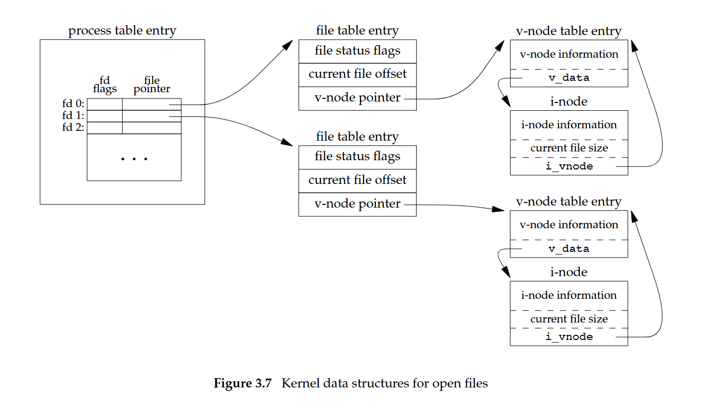

上圖中可見：

- 每個 process 有自己的「open file descriptor table」，表格裡每一列對應一個 fd（例如 0、1、2…），包含「fd flags」與一個指向「open file table entry」的指標
- 「open file table」（全系統共享）的一個 entry 代表一次「open」動作的結果，保存：
  - file status flags（可讀／可寫／append／sync／nonblocking…）
  - current file offset（檔案位移點）
  - 指向「v-node table entry」的指標
- 「v-node table entry」封裝檔案系統無關的抽象，內含 v-node information 與 v_data，並連到對應的 i-node
- 「i-node」保存檔案的 metadata（owner、size、權限、資料區塊位置…）與目前檔案大小，以及回指到 vnode（實作上視系統而定）
- 讀圖要點：
  - process 的 fd 並不直接指向 i-node，而是經由「open file table」再到「v-node／i-node」
  - 同一個 process 可以同時擁有多個 fd，各自指向不同的「open file table entry」，而這些 entry 最終可能指向相同的檔案（相同 v-node／i-node）

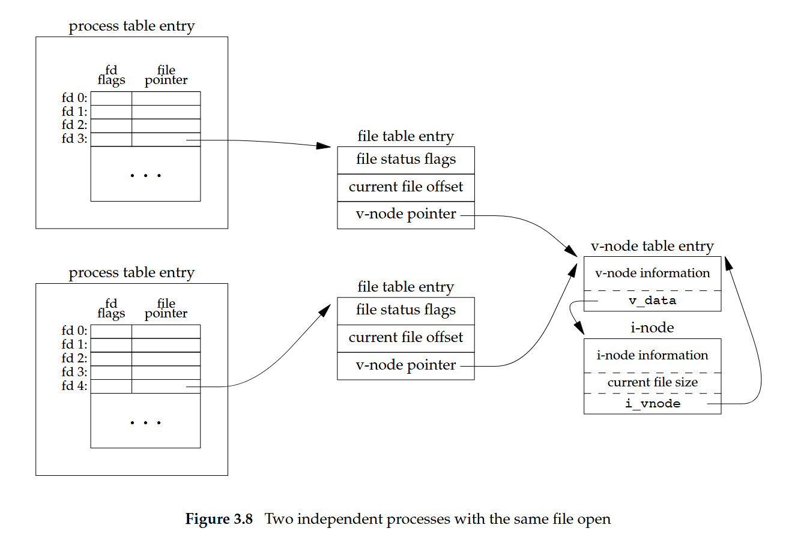

上圖中可見：

- 兩個互不相關的 processes 分別對同一個檔案呼叫一次 `open` 時，情況如下：
  - 每個 process 的 fd 指向「自己的」open file table entry（彼此不同）
  - 兩個 open file table entries 最終都指向「同一個」v-node／i-node（因為是同一個檔案）
- 重要影響：
  - 因為 open file table entry 不同，「current file offset」是各自獨立的。 A 讀了 100 bytes 不會改變 B 的 offset
  - 「file status flags」也各自獨立。 A 可以用 `O_RDONLY` 開啟，B 可以用 `O_RDWR`
  - 底層檔案內容與大小由同一個 i-node 代表，所以任一方寫入會改變同一份檔案的內容與可能的大小（另一方之後讀到的資料會反映更新）

一些小整理：
  - 若是同一個 process 對同一個 fd 做 `dup`（或 `fork` 之後尚未 `exec`，父子繼承相同 open），會讓多個 fd 指向「同一個」open file table entry，這種情況下「file offset」是共享的。 圖二展示的是「兩次獨立的 open」，所以 offset 不共享
  - fd（per-process）→ open file table（per-open）→ v-node／i-node（per-file）
  - 是否「共享 offset／status flags」取決於兩個 fd 是否指向同一個「open file table entry」：
    - 同一個 entry（例如 `dup`、`fork` 後未重新 `open`）：共享 offset／status
    - 不同 entry（兩次獨立 `open`）：offset／status 各自獨立，但指向同一 v-node／i-node，因此共享檔案內容

### File Offset

- 在 Unix，每個「已開啟的檔案」都會有一個「當前 file offset」
  - 這個 offset 是一個整數，表示從檔案開頭到目前為止已經存取的位元組數
  - 在大部分情況下，offset 的值是正的，但某些裝置可能允許負的 offset
- 當檔案被開啟時，offset 會初始化為 0，除非在 `open()` 的參數 `oflag` 中指定了 `O_APPEND`

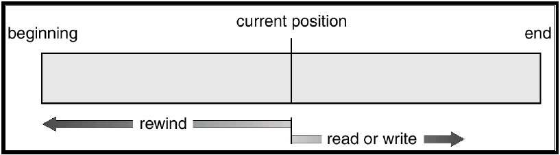

### File I/O：`read`

```c
#include <unistd.h>
// 成功時回傳實際讀取的位元組數，錯誤時回傳 -1，遇到 EOF 回傳 0
ssize_t read(int fd, void *buf, size_t nbytes);
```

- 使用 `read` 從已開啟的檔案讀取資料
  - `fd`：檔案描述符
  - `buf`：呼叫者提供的記憶體緩衝區，用來存放讀取到的資料
  - `nbytes`：要求讀取的位元組數
- 讀取從檔案的當前 offset 開始，在成功回傳前，offset 會增加實際讀取的位元組數
- 讀取一般檔案時，如果在讀到要求數量之前就到達了檔案結尾（EOF）：
  - 範例問題：若要求讀取 100 bytes，但檔案只剩下 30 bytes？
  - 回答：第一次呼叫 `read` 會回傳 30，下一次呼叫 `read` 會回傳 0（表示 EOF）
- 還有其他情況（例如從 pipe、FIFO 讀取），課本中會有更多描述，之後會再討論

### File I/O：`write`

```c
#include <unistd.h>
// 成功時回傳實際寫入的位元組數，錯誤時回傳 -1
ssize_t write(int fd, void *buf, size_t nbytes);
```

- `buf` 中的資料會被寫入到一個已開啟的檔案
- 寫入從檔案當前的 file offset 開始
  - 成功寫入後，file offset 會增加實際寫入的位元組數
  - 與 `read()` 不同，`write()` 可以超過 EOF
- 常見的寫入錯誤：磁碟空間用盡，或超過該 process 可用的檔案大小限制
- 如果檔案在 `open()` 時指定了 `O_APPEND`，則在每次寫入前，file offset 都會被設到檔案尾端
  - 但 `read()` 並不會像 `O_APPEND` 那樣自動跳到尾端，它會從當前的 offset 開始

#### `read()` 與 `write()` 小整理

- `write()` 可以超過 EOF
  - 如果寫入從 EOF 開始或更後的位置，檔案會被擴展
- `read()` 則在遇到 EOF 時停止
  - 若到達 EOF，`read()` 會回傳 0，表示沒有更多資料可以讀取

### File I/O：`lseek`

```c
// off_t: signed int type
#include <unistd.h>
// 成功回傳新的 file offset，錯誤回傳 -1
off_t lseek(int fd, off_t offset, int whence);
```

- 可以用 `lseek()` 來設定一個已開啟檔案的「當前 file offset」
- `fd` 是檔案描述符
- `whence` 可以是以下三種值：
  - `SEEK_SET`：將檔案 offset 設為「從檔案開頭起算 offset 個位元組」（offset 可為正數或 0）
  - `SEEK_CUR`：將檔案 offset 設為「當前 offset + offset 參數」（offset 可為正數、負數或 0）
  - `SEEK_END`：將檔案 offset 設為「檔案大小 + offset 參數」（offset 可為正數、負數或 0）

#### 常見操作

- 取得當前 file offset：
  ```c
  off_t currpos;
  currpos = lseek(fd, 0, SEEK_CUR);
  ```
- `lseek()` 可以用來：
  - 移動到負的 offset（只要不超出檔案開頭）
  - 從當前位置偏移 0 bytes（等於只是查詢 offset）
  - 移動到超過檔案尾端的位置

#### 行為特性

- `lseek()` 只會在 kernel 的「open file table」裡記錄 file offset
- 呼叫 `lseek()` 並不會觸發實際的 I/O
- 下一次 `read()` 或 `write()` 會依據更新後的 offset 進行
- 如果從「尚未寫入的區域」讀取，會回傳 0（類似空洞，稱為 hole）

#### 範例（來自 APUE Figure 3.1）

下面的例子測試 standard input 是否能夠進行 seeking

```c
#include "apue.h"
int main(void) {
    if (lseek(STDIN_FILENO, 0, SEEK_CUR) == -1)
        printf("cannot seek\n");
    else
        printf("seek OK\n");
    exit(0);
}
```

執行結果示例：

```bash
$ ./a.out < /etc/passwd
seek OK
$ cat < /etc/passwd | ./a.out
cannot seek
$ ./a.out < /var/spool/cron/FIFO
cannot seek
```

說明：

- 當輸入來自一般檔案（例如 `/etc/passwd`）時，可以 seek
- 當輸入是 pipe 或 FIFO 時，不能 seek

##### 特殊情況與錯誤

- 如果 `fd` 指向 pipe、FIFO 或 socket，`lseek()` 會回傳 -1，並設置 `errno`
- `<errno.h>` 定義了整數變數 `errno`，用來表示錯誤原因
- `errno` 的常見錯誤值：
  - `EBADF`：`fd` 不是一個有效的檔案描述符
  - `EINVAL`：`whence` 無效，或 offset 超出合法範圍
  - `ENXIO`：當 `whence` 為 `SEEK_DATA` 或 `SEEK_HOLE` 時，offset 超過檔案尾端
  - `EOVERFLOW`：結果 offset 超過 `off_t` 可表示範圍
  - `ESPIPE`：`fd` 是 pipe、socket 或 FIFO
- Q：如果 `lseek()` 使用的負 offset 超過了檔案開頭，會發生什麼？
  - A：回傳 -1，並設置 `errno`（通常為 `EINVAL`）

#### 範例 2（來自 APUE Figure 3.2）

```c
#include "apue.h"
#include <fcntl.h>

char buf1[] = "abcdefghij";
char buf2[] = "ABCDEFGHIJ";

int main(void) {
    int fd;

    if ((fd = creat("file.hole", FILE_MODE)) < 0)
        err_sys("creat error");

    if (write(fd, buf1, 10) != 10)
        err_sys("buf1 write error");
    /* offset 現在是 10 */

    if (lseek(fd, 16384, SEEK_SET) == -1)
        err_sys("lseek error");
    /* offset 現在是 16384 */

    if (write(fd, buf2, 10) != 10)
        err_sys("buf2 write error");
    /* offset 現在是 16394 */

    exit(0);
}
```

##### 執行流程

1. 使用 `creat()` 建立新檔案 `file.hole`
2. `write(fd, buf1, 10)` → 在檔案開頭寫入 "abcdefghij"，此時 offset = 10
3. `lseek(fd, 16384, SEEK_SET)` → 將 offset 移到 16384（中間的區域尚未寫入）
4. `write(fd, buf2, 10)` → 在 offset=16384 的位置寫入 "ABCDEFGHIJ"，最後 offset=16394

##### 檔案內容觀察

```bash
$ ./a.out
$ ls -l file.hole
-rw-r--r--  1 sar   16394 Nov 25 01:01 file.hole
```

- 檔案大小為 16394 bytes

使用 `od -c file.hole` 查看內容：

```bash
$ od -c file.hole
0000000 a b c d e f g h i j \0 \0 \0 \0 \0 \0
0000020 \0 \0 \0 \0 \0 \0 \0 \0 \0 \0 \0 \0 \0 \0 \0 \0
-
0040000 A B C D E F G H I J
0040012
```

- 可以看到前 10 個字元是 "abcdefghij"
- 接著是一大段 `\0`（代表 hole，尚未分配實體磁碟區塊，但讀取時會以 0 填充）
- 最後是 "ABCDEFGHIJ"

##### 檔案空洞的效果

透過 `ls -ls` 比較 `file.hole` 與沒有 hole 的版本：

```bash
$ cat < file.hole > file.nohole
$ ls -ls file.hole file.nohole
8  -rw-r--r--  1 sar  16394 Nov 25 01:01 file.hole
20 -rw-r--r--  1 sar  16394 Nov 25 01:03 file.nohole
```

- `file.hole` 的檔案大小一樣是 16394 bytes，但實際只使用了 8 個磁碟區塊
- `file.nohole` 經過 `cat` 重新複製後，空洞被填補為實際的 `\0`，因此用了 20 個磁碟區塊

##### 小整理

- `lseek()` 可以讓檔案 offset 跳過一段未寫入的區域
- 如果之後直接寫入，會在檔案中間形成「hole」
- hole 區域在檔案大小上會計入，但實際不佔用磁碟空間
- 這種檔案稱為「sparse file」（稀疏檔案）

### Unix `time` command

當我們在 Linux 使用 `time` 命令來測量程式執行時間時，會看到三個主要的時間統計值：

- real  
  又稱「wall clock time」或「elapsed time」，表示從程式開始執行到結束所經過的實際時間，就像用手錶量到的時間。 這個時間包含了 CPU 執行時間、I/O 等待時間、context switch、以及其他程式執行所造成的延遲
- user  
  程式在「user space」中執行所消耗的 CPU 時間。 這部分主要包含應用程式本身的計算工作，例如數學運算、字串處理、記憶體操作等
- sys  
  程式在「kernel space」中執行所消耗的 CPU 時間。 這通常來自系統呼叫，例如 `read()`、`write()`、`open()`、`close()` 等需要進入 kernel 的操作

例如下面是我環境上 `time ls` 命令的輸出：

```bash
mes@MesDesktop:~/MesBlog$ time ls
mes-build.sh  node_modules  package.json  pnpm-lock.yaml  src  tsconfig.json

real    0m0.002s
user    0m0.001s
sys     0m0.001s
```

這三個值的關係為：

- 一般情況下 `real >= user + sys`，因為除了 CPU 真正執行的時間外，還有等待 I/O、被排程器暫停、或其他延遲
- 在平行運算（多核心）下，可能出現 `real < user + sys`，因為多個核心同時貢獻了 CPU 時間

導致 `real` 大於 `user + sys` 差異的原因很多，常見的包括：

- I/O Wait Time：等待 I/O（disk、network 等）計入 clock time，不計入 CPU time
- Context Switching：process 或 thread 切換的時間不完全反映在 CPU time
- Parallelism：在 multi-core 系統上可能同時用到多顆 core，使 CPU time 可能超過 clock time
- System Load：其他 process 造成延遲，增加 clock time 但不增加該 process 的 CPU time
- Sleep Time：自願 sleep 或等待事件的時間不計入 CPU time
- Scheduler Behavior：排程器未立即執行就緒的 process，增加 clock time
- Hardware Interrupts：處理硬體中斷的時間可能未完整反映在 CPU time
- Time Precision：clock time 與 CPU time 的量測精度不同

### I/O Efficiency

下例程式（APUE Figure 3.5）實作了一個簡單的 I/O loop：

- 從 `stdin` 使用 `read()` 讀取資料到一個 buffer
- 再使用 `write()` 將 buffer 的內容寫到 `stdout`
- 重複直到檔案結束

```c
#define BUFFSIZE 4096
int n;
char buf[BUFFSIZE];

while ((n = read(STDIN_FILENO, buf, BUFFSIZE)) > 0)
    if (write(STDOUT_FILENO, buf, n) != n)
        err_sys("write error");
if (n < 0)
    err_sys("read error");
```

測試結果：

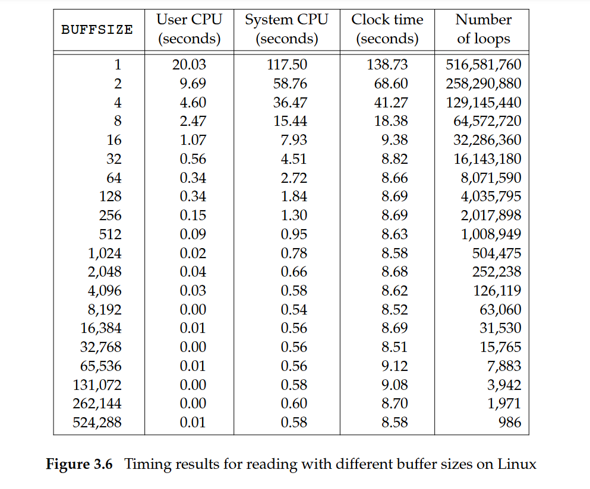

針對一個約 516 MB 的檔案，其使用 20 種不同的 buffer size 測試，觀察 user CPU time、system CPU time、以及 wall clock time

- 當 buffer size 很小（例如 1 byte, 2 bytes），`read()` 與 `write()` 呼叫次數非常多（數億次），system CPU time 非常高（>100 秒），wall clock time 也非常長（>130 秒）
- 當 buffer size 增大（例如 4096, 8192, 32768 bytes），系統呼叫次數急劇下降，system CPU time 減少到 <1 秒，wall clock time 也穩定在 ~8.5 秒左右
- 這顯示「I/O 系統呼叫的開銷」遠大於「單純搬移資料的時間」，因此較大的 buffer 能大幅減少系統呼叫數量，提升效能
- 特殊現象：當 buffer size 到達 32 bytes 或更大時，wall clock time 幾乎沒有差異，因為系統呼叫次數已經下降到一個相對合理的數量，再增大 buffer 並不會帶來太大改進
- 小整理：
  - `time` 呈現的三種時間（real, user, sys）能幫助我們理解程式效能瓶頸：
     - user 高 → 演算法運算量大
     - sys 高 → 系統呼叫過於頻繁（典型的 I/O 瓶頸）
     - real 高但 user+sys 小 → 程式在等待 I/O 或被 scheduler 暫停
  - 在 I/O 效率實驗中，最關鍵的瓶頸是 buffer size 選擇
     - 小 buffer → 太多 `read/write` 系統呼叫 → sys time 過高
     - 適當的 buffer（4KB 到數十 KB）→ 效能最佳化，因為呼叫次數與 CPU 負載達到平衡
     - 再增大 buffer → 改善有限，因為瓶頸不在系統呼叫，而在 I/O 裝置吞吐量
  - 實際應用中，作業系統和標準 I/O 函式庫（例如 `fread/fwrite`）通常已經提供緩衝機制，避免了使用極小 buffer 的低效率情況
  - `real >= user + sys` 的原因主要在於等待與調度，而不是 CPU time 的計算錯誤
  - 適當的 buffer size 對 I/O 效率影響極大。 小 buffer 造成 system CPU time 激增，導致整體效能低下
  - 在實務上，理解 `time` 三種時間的關係，可以幫助定位效能問題是出在「演算法計算」還是「I/O 系統呼叫」

#### Unix Buffer（Page）Cache

- Unix kernel 會維護一個 Buffer Cache（或稱 Page Cache），目的是避免每次存取都直接觸發昂貴的磁碟 I/O
- 核心的兩個優化策略是：
  - Read-ahead（預讀）：當系統偵測到應用程式在順序讀檔案，會自動一次讀取超過應用程式要求的區塊，把未來可能會需要的資料先放進快取，這樣之後的 `read()` 就能直接從快取中取資料，而不用再向磁碟請求
  - Delayed-write（延遲寫入）：當應用程式呼叫 `write()`，資料會先寫入 kernel 的 buffer cache，而不是馬上寫到磁碟。 之後系統會根據策略（例如快取區塊滿了、或定期同步）再把資料真正寫回磁碟。 這樣可以合併多次小的寫入，降低磁碟 I/O 次數

### Duplicating file descriptors（檔案描述符複製）

```c
#include <unistd.h>
// 成功回傳新的檔案描述符，錯誤回傳 -1
int dup(int fd);
int dup2(int fd, int fd2);
```

- Unix 提供系統呼叫 `dup`／`dup2` 來複製既有的檔案描述符（類似為某個開啟中的檔案建立別名）
- 這可以用來實作 shell 的管線與重新導向，例如
  - `ls -la | more`
  - `cat file | wc`
  - `man ksh | grep "history"`
  - `ls -l | grep "bowman" | wc`
  - `who | sort > current_users`
- `|` 與 `>` 怎麼實作：由 shell 進行
  - 建立 pipe（`pipe`）取得一對檔案描述符（讀端、寫端）
  - 透過 `fork` 產生子行程，分別在各子行程用 `dup2` 把標準輸入（fd 0）或標準輸出（fd 1）接到檔案或 pipe 的端點
  - 再以 `execve` 執行目標程式，之後程式看到的 fd 0／1 已經對接到檔案或另一個行程
- `dup`／`dup2` 會建立「同一個開啟檔案」的新檔案描述符
- 複製的意義：兩個檔案描述符會「指向同一個 open file table entry」
- 影響：若對其中一個 fd 做 `lseek` 改變偏移量（file offset），另一個 fd 的偏移量也會一併改變
- 行為差異
  - `dup`：回傳「目前可用的最小」新 fd
  - `dup2`：把來源 `fd` 複製到指定目的 `fd2`，若 `fd2` 先前是開啟狀態，kernel 會先關閉它，再重用

#### 範例 1

假設下一個可用的 fd 是 3：

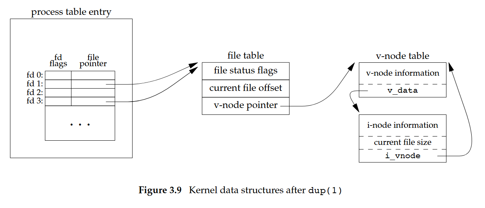

執行 `dup(1)` 後，fd 1 與 fd 3 會同指向同一個 open file table entry

#### 範例 2

假設 `foobar.txt` 的內容是 6 個 ASCII 字元 `foobar`

```c
int main() 
{
  int fd1, fd2;
  char c;
  fd1 = open("foobar.txt", O_RDONLY, 0);
  fd2 = open("foobar.txt", O_RDONLY, 0);
  read(fd1, &c, 1);
  read(fd2, &c, 1);
  printf("c = %c\n", c);
  exit(0);
}
```

- `fd1` 與 `fd2` 是兩次獨立的 `open`，各自有不同的 open file table entry，偏移量彼此獨立
- 第一次 `read(fd1, ...)` 讀到 `f`，`fd1` 偏移量變成 1
- 第二次 `read(fd2, ...)` 仍從檔案開頭讀到 `f`
- 輸出：`c = f`

#### 範例 3

```c
int main() 
{
  int fd1, fd2;
  char c;
  fd1 = open("foobar.txt", O_RDONLY, 0);
  fd2 = open("foobar.txt", O_RDONLY, 0);
  read(fd2, &c, 1);
  dup2(fd2, fd1);
  read(fd1, &c, 1);
  printf("c = %c\n", c);
  exit(0);
}
```

- 先用 `read(fd2, ...)` 讀到 `f`，使 `fd2` 的偏移量變 1
- `dup2(fd2, fd1)` 之後，`fd1` 與 `fd2` 指向同一個 open file table entry（共享偏移量 1）
- 接著 `read(fd1, ...)` 會讀到第二個字元 `o`
- 輸出：`c = o`

#### 範例 4

```c
int main()
{
  int fd;
  char *s;
  fd = open("file", O_WRONLY | O_CREAT | O_TRUNC, 0666);
  dup2(fd, 1);
  close(fd);
  printf("Hello %d\n", fd);
}
```

- 用 `dup2` 把標準輸出（fd = 1）導向檔案 `file`，然後關閉原先的 `fd`
- 之後的 `printf` 會寫到檔案而不是終端機
- 寫入內容為 `Hello 3\n`（假設開啟 `file` 時取得的 fd 是 3）

#### 範例 5

執行命令：`./a.out file1 file2`

```c
int main(int argc, char **argv, char envp)
{
  int fd1, fd2;
  int dummy;
  char *newargv[2];

  fd1 = open(argv[1], O_RDONLY);
  dup2(fd1, 0);
  close(fd1);

  fd2 = open(argv[2], O_WRONLY | O_TRUNC | O_CREAT, 0644);
  dup2(fd2, 1);
  close(fd2);

  newargv[0] = "cat";
  newargv[1] = (char *)0;
  execve("/bin/cat", newargv, envp);

  exit(0);
}
```

- 步驟
  - 把標準輸入（fd = 0）以 `dup2` 指到 `file1`
  - 把標準輸出（fd = 1）以 `dup2` 指到 `file2`
  - 以 `execve` 執行 `/bin/cat`，它會從標準輸入讀取、寫到標準輸出
- 結果：`file2` 變成 `file1` 的內容拷貝（覆寫建立），終端機沒有輸出

### File I/O: `fcntl`

```c
#include <fcntl.h>
// 成功時回傳值依 cmd 而定，失敗回傳 -1
int fcntl(int fd, int cmd, ... /* int arg */ );
```

`fcntl` 函式有以下 5 種功能：

1. 複製一個已有的描述符（`cmd = F_DUPFD` 或 `F_DUPFD_CLOEXEC`）
2. 獲取／設置file descriptor flags（`cmd = F_GETFD` 或 `F_SETFD`）
3. 獲取／設置file status flags（`cmd = F_GETFL` 或 `F_SETFL`）
4. 獲取／設置異步 I/O 所有者（`cmd = F_GETOWN` 或 `F_SETOWN`）
5. 獲取／設置記錄鎖（`cmd = F_GETLK`, `F_SETLK`, `F_SETLKW`）

#### file descriptor flags 與 file status flags

descriptor flag 與 status flag 是兩種不同層級：前者綁在「fd 本身」，後者綁在「open file table entry」

底下是 `fcntl` 的前 8 個 `cmd`，後 3 個會到後面再講

- `F_DUPFD`  
  複製給定的 file descriptor `fd`。 函式會回傳新的 file descriptor。 它會選擇一個「尚未開啟、且編號 ≥ 第三個整數引數」的最小編號作為新 `fd`
  
  新的 descriptor 與原本的 fd 共享同一個「open file table entry」（見圖 3.9）。 但新 descriptor 擁有自己的「descriptor flag」，而且其 `FD_CLOEXEC`（close-on-exec）旗標會被清除，這表示在執行 `exec` 之後，該 descriptor 仍會保持開啟
- `F_DUPFD_CLOEXEC`  
  複製 file descriptor，並為新的 descriptor 設定 `FD_CLOEXEC` 旗標。 回傳新的 file descriptor
- `F_GETFD`  
  以函式回傳值的方式，取得 fd 的「descriptor flag」。 目前定義的 descriptor flag 只有一個：`FD_CLOEXEC`
- `F_SETFD`  
  為 `fd` 設置 descriptor flags。 新 flag 的值由第 3 個整數引數提供

  注意，有些既有程式在處理 file descriptor 旗標時，並不使用常數 `FD_CLOEXEC`。 它們改以把該旗標設為 0（不在 `exec` 時關閉，亦為預設）或 1（在 `exec` 時關閉）的方式來操作
- `F_GETFL`  
  以函式回傳值的方式，取得 fd 的「file status flag」。 我們在介紹 open 函式時曾經說明這些 status 旗標。 它們列於下圖 3.10 中：

  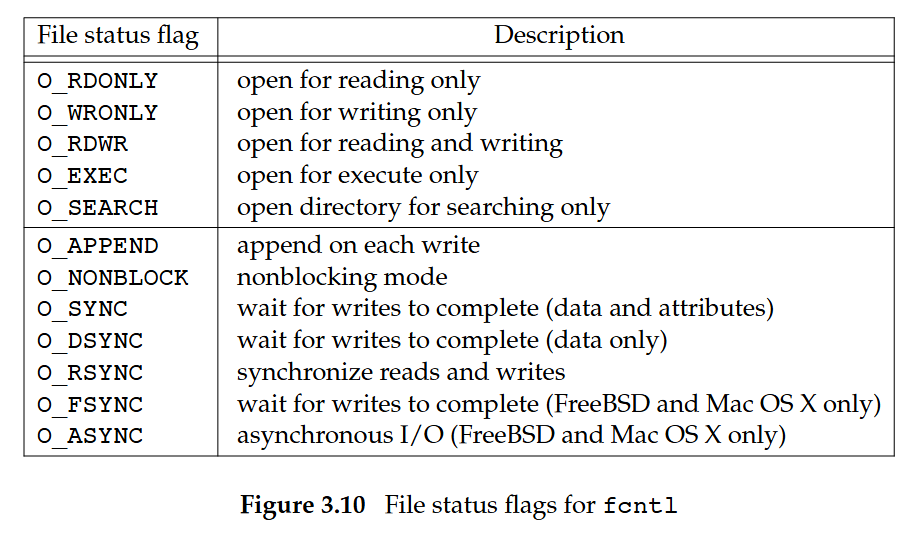

  可惜的是，用於「存取模式」的五個旗標 `O_RDONLY`、`O_WRONLY`、`O_RDWR`、`O_EXEC` 與 `O_SEARCH` 並不是可直接測試的獨立位元
  
  如前所述，前三者通常因歷史因素而分別取 0、1、2 的值。 此外，這五個值彼此互斥：一個檔案同一時間只能啟用其中之一。 因此，我們必須先使用 `O_ACCMODE` 遮罩取出存取模式的位元，再將結果拿來與這五種值之一比對
- `F_SETFL`  
  把 file status flag 設為第三個整數引數所指定的值。 僅有下列旗標允許被變更：`O_APPEND`、`O_NONBLOCK`、`O_SYNC`、`O_DSYNC`、`O_RSYNC`、`O_FSYNC` 與 `O_ASYNC`
- `F_GETOWN`  
  取得目前接收 `SIGIO` 與 `SIGURG` 訊號的行程 ID 或行程群組 ID
- `F_SETOWN`  
  設定將接收 `SIGIO` 與 `SIGURG` 訊號的行程 ID 或行程群組 ID。 第三個引數若為正值，表示指定的是行程 ID，若為負值，則表示行程群組 ID，且其值為該引數的絕對值

#### 返回值說明

`fcntl` 的回傳值取決於所給的 `cmd`。 所有命令在錯誤時都回傳 −1，成功時則回傳各自定義的值

- `F_DUPFD`：回傳新的文件描述符
- `F_GETFD`、`F_GETFL`：回傳各自的旗標值
- `F_GETOWN`：回傳正的行程 ID 或負的行程群組 ID

#### 範例 1：讀取 file status flags

下例的程式接受一個命令列引數，用來指定某個 file descriptor，並印出該 descriptor 的部分檔案旗標說明

```c
int main(int argc, char *argv[])
{
  int accmode, val;

  if (argc != 2)
      err_quit("usage: a.out <descriptor#>");

  if ((val = fcntl(atoi(argv[1]), F_GETFL, 0)) < 0)
      err_sys("fcntl error for fd %d", atoi(argv[1]));

  accmode = val & O_ACCMODE;
  if (accmode == O_RDONLY) printf("read only");
  else if (accmode == O_WRONLY) printf("write only");
  else if (accmode == O_RDWR) printf("read write");
  else err_dump("unknown access mode");

  if (val & O_APPEND) printf(", append");
  if (val & O_NONBLOCK) printf(", nonblocking");
  if (val & O_SYNC) printf(", synchronous writes");

  putchar('\n');
  exit(0);
}
```

說明：

- `fcntl(fd, F_GETFL, 0)`：取得 `fd` 的 file status flags
- 利用 `O_ACCMODE` 遮罩來判斷是 `RDONLY`、`WRONLY` 或 `RDWR`
- 其他 flag（如 `O_APPEND`、`O_NONBLOCK`）則用位元運算判斷

下面的是在 bash（Bourne-again shell）中呼叫本程式時的操作，實際結果會隨你所用的 shell 不同而有所差異：

```bash
$ ./a.out 0 < /dev/tty
read only
$ ./a.out 1 > temp.foo
write only
$ ./a.out 2 2>>temp.foo
write only, append
$ ./a.out 5 5<>temp.foo
read write
```

- `5<>temp.foo`  會把 `temp.foo` 以讀寫模式開啟到 file descriptor 5
- 在 bash 中，`n<>file` 代表以「讀寫」模式把檔案繫結到 `fd n`
- 這不是 C 程式直接呼叫 `open()`，而是由 shell 在執行你的程式前就替你打開 `fd 5`
- 因為是「讀寫」模式，所以用上例程式去檢查 `fd 5`，會看到 `O_RDWR`
- 這也說明：程式端不一定知道檔名，但能藉由 `fd` 觀察到開啟模式與旗標

#### 範例 2：修改 file status flags

當我們要修改 descriptor flag 或 status flag 時，務必要先取出目前的旗標值，依需求修改後，再把新值設定回去。 不能只單純下 `F_SETFD` 或 `F_SETFL` 命令，因為這樣可能會把先前已啟用的旗標位元關掉

下例是一個用來替某個 descriptor 設定一個或多個檔案狀態旗標的範例：

```c
void set_fl(int fd, int flags) {
    int val;

    if ((val = fcntl(fd, F_GETFL, 0)) < 0)
        err_sys("fcntl F_GETFL error");

    val |= flags;   // 開啟指定的 flag
    // val &= ~flags; // 關閉指定的 flag

    if (fcntl(fd, F_SETFL, val) < 0)
        err_sys("fcntl F_SETFL error");
}
```

- `F_GETFL`：先取出目前的 file status flags
- `F_SETFL`：再設回去，但加入新的 flag（或刪掉 flag）
- 例如：可以把一個開啟中的 fd 改成非阻塞模式 (`O_NONBLOCK`)

#### 範例 3：`F_SETFD` vs `F_SETFL`

程式碼範例：

```c
fd1 = open(pathname, oflags);
fd2 = dup(fd1);
fd3 = open(pathname, oflags);
```

- `fd1` 與 `fd2` 共用同一個 open file table entry（因為 `dup`）
- `fd3` 是獨立 `open`，所以有不同的 open file table entry

影響：

- `F_SETFL`（修改 file status flags）會影響整個 open file table entry → 所以 `fd1` 和 `fd2` 都會受影響
- `F_SETFD`（修改 file descriptor flags，如 FD_CLOEXEC）只影響單一 `fd`，因為它存在 process table entry → 所以 `fd1`、`fd2` 不會互相影響

### /dev/fd

- 新版 Unix 系統提供 `/dev/fd` 目錄，內有 `0`、`1`、`2`… 等項目（以檔案形式對應 fd）
- 開啟 `/dev/fd/n` 等同於複製 descriptor `n`

```c
int fd = open("/dev/fd/0", mode);   // 等同於
int fd2 = dup(0);
```

### File I/O：`ioctl`

```c
#include <unistd.h>     /* System V */
#include <sys/ioctl.h>  /* BSD 與 Linux */
/* 失敗回傳 -1，成功回傳其他值 */
int ioctl(int fd, int request, ...);
```

- `ioctl` 是 I/O 操作的萬用介面：凡無法用標準檔案 I/O 函式表達的操作，通常以 `ioctl` 提供
- 每個裝置驅動可以自訂自己的 `ioctl` 命令集合
- 系統也為不同裝置類別提供通用的 `ioctl` 命令

### Error Handling（錯誤處理）

- `<errno.h>` 定義整數變數 `errno`，在系統呼叫或部分程式庫函式失敗時設定，以指出錯因
- 規範於 POSIX.1 與 C99
- 只有當呼叫的回傳值表示錯誤時（多數系統呼叫回傳 `-1`，多數函式回傳 `-1` 或 `NULL`），`errno` 的值才有意義
- 若沒有錯誤，`errno` 不會被改變
- 可參考 Linux 的 `errno(3)` man page

### Error Recovery（錯誤復原）

- 致命錯誤：不進行復原（例如 `EACCES`、`EFAULT` 等）
- 非致命錯誤：等待後重試，以避免異常結束、增加健壯性（例：`EAGAIN`、`ENFILE`、`ENOSPC`、`ENOMEM` 等）

### File I/O：Concurrency（並行）

Append 範例（未使用 `O_APPEND`）

```c
/* 將 fd 的檔案指標移到 EOF，然後寫入 100 bytes */
if (lseek(fd, 0, SEEK_END) < 0) 
  err_sys("lseek error");
if (write(fd, buf, 100) != 100) 
  err_sys("write error");

/* 注意：這邊假設 fd 不是以 O_APPEND 開啟的 */
```

- 注意：檔案可能同時被多個行程/執行緒存取
  - 想一下如果行程 A、B 同時執行上面兩行、寫入同一個檔案，結果會怎樣？
  - `lseek(fd, SEEK_END)` 跟 `write()` 並不是原子的。 A、B 可能同時 `lseek` 到相同 EOF 而互相覆蓋/交錯
  - 解法：以 `O_APPEND` 開啟（核心會對每個 `write` 原子地移動到 EOF 再寫）。 或加檔案鎖。 或以 `pwrite` 明確寫固定偏移量（非附檔情境）

#### Race condition 範例

考慮以下情況：

```c
if ((fd = open(path, O_WRONLY)) < 0) {
	if (errno == ENOENT) {							// 檔案不存在
		if ((fd = creat(path, mode)) < 0) // 就建立
			err_sys("creat error");
	}
	else {
		err_sys("open error");
	}
}
```

這邊的目標是：

- 若檔案已存在：用唯寫開啟
- 若不存在：建立後開啟

乍看合理，但中間有競態窗與語意不一致兩個大問題

##### 問題：TOCTTOU 競態（Time Of Check To Time Of Use）

`open(path, O_WRONLY)` 失敗（ENOENT）與後續 `creat(path, mode)` 之間不是原子動作。 只要在這個空窗期有別的行程動到同一路徑，就可能出事

典型時序（A、B 兩個行程同時執行）：

<span class = "center-column">

| 時間 | 行程 A                            | 行程 B                                                     | 結果                                                                               |
| ---- | --------------------------------- | ---------------------------------------------------------- | ---------------------------------------------------------------------------------- |
| t0   | `open(path, O_WRONLY)` → `ENOENT` |                                                            | A 判定「不存在」                                                                   |
| t1   | （被排程暫停）                     | `open(path, O_WRONLY \| O_CREAT \| O_EXCL, mode)` 成功建立  | 檔案現在存在                                                                       |
| t2   | A 繼續：`creat(path, mode)`       |                                                            | `creat` 等於 `open(..., O_CREAT \| O_TRUNC)`，既然檔案此刻已存在 → 被截斷為 0 長度 |

</span>

- 為什麼可被截斷？
  - `creat` 等價於 `open(path, O_WRONLY | O_CREAT | O_TRUNC, mode)`，如果目標在呼叫時檔案已存在，`O_TRUNC` 會把它清空

### `pread` / `pwrite`

```c
#include <unistd.h>
/* 成功回傳讀到的位元組數，遇 EOF 回 0，失敗回 -1 */
ssize_t pread (int fd, void *buf,  size_t nbytes, off_t offset);
/* 成功回傳寫入的位元組數，失敗回 -1 */
ssize_t pwrite(int fd, const void *buf, size_t nbytes, off_t offset);
```

- 等價於「`lseek()` + `read()`/`write()`」但以單一步驟原子地完成
- 在指定 `offset` 處進行讀/寫，不會改變目前檔案偏移
- 回傳值語意與 `read`/`write` 相同

### File/Record Locking

- Unix 提供鎖定機制以避免檔案不一致：
  - File locking：針對整個檔案的獨占存取
  - Record locking（byte-range locking）：只對檔案中指定區段（位元組範圍）做獨占存取
- Unix 系統允許行程對檔案加上獨占鎖，以防止其他行程同時讀／寫同一檔案
  - 當索取鎖的時候，如果該行程：
    - 成功取得了鎖，則它可讀寫該檔案
    - 被拒絕了，則直到鎖被釋放前無法取得鎖

#### 在 Unix 中使用建議式鎖定（advisory locking）的三種方式

- 檔案鎖：`flock()`（鎖整個檔案）
- 區段鎖：
  - `fcntl()`（對檔案中的任意位元組範圍加鎖）
  - `lockf()`（基於 `fcntl()` 之上的簡化介面）

#### 建議式鎖定（Advisory Locking） vs 強制式鎖定（Mandatory Locking）

##### 建議式（Advisory）

- 介面：`fcntl()`、`flock()`、`lockf()`
- 屬於合作式鎖定：所有參與的行程必須自律地遵守鎖定協定，在存取共享檔案時主動呼叫鎖定函式
- 問題：就算行程沒有取得鎖，它仍可以無視協定以存取共享檔案，這是設計上的行為，並非錯誤

##### 強制式（Mandatory）

- 作業系統核心會檢查並強制每一個對共享檔案的操作，避免違反鎖定
- 參考：[man7：`fcntl` locking](https://man7.org/linux/man-pages/man2/fcntl_locking.2.html)

##### 範例

假設 `lock()` 為建議式鎖

###### 情境 A（只有 Process 1 用鎖，Process 2 不用鎖）

下例中 Process 2 仍可寫入指定檔案，忽略 Process 1 的建議式鎖

Process 1：

```c
int fd = open(PATH, ..);
// use lock() to acquire a lock
int ret = lock(fd, ...);
if (!ret) { 
  // Lock acquired. Read the file now
  while (count)
    int bytes = read(fd, buf, sizeof(buf));
}
ret = unlock(fd, ...);
close(fd);
```

Process 2：

```c
int fd = open(PATH, ..);
// didn't use the lock()
int bytes = write(fd, buf, sizeof(buf));
close(fd);
```

###### 情境 B（兩邊都使用鎖）：

下例中 Process 2 只有在成功取得寫入的獨占鎖時，才能寫入該檔案

Process 1：

```c
int fd = open(PATH, ..);
// use lock() to acquire a lock
int ret = lock(fd, ...);
if (!ret) { 
  // Lock acquired. Read the file now
  while (count)
    int bytes = read(fd, buf, sizeof(buf));
}
ret = unlock(fd, ...);
close(fd);
```

Process 2：

```c
int fd = open(PATH, ..);
// use lock() to acquire a lock
int ret = lock(fd, ...);
if (!ret) {
	int bytes = write(fd, buf, sizeof(buf));
}
ret = unlock(fd, ...);
close(fd);
```

### `flock`

```c
#include <sys/file.h>
// returns: 0 on success, −1 on error
int flock(int fd, int operation);
```

- `flock()` 對已開啟的檔案套用或移除鎖
- `operation` 可為：
  - `LOCK_SH`：加共享鎖，同一時間可有多個行程持有同一檔案的共享鎖
  - `LOCK_EX`：加獨占鎖，同一時間只有一個行程可持有該檔案的獨占鎖
  - `LOCK_UN`：移除本行程持有的既有鎖

#### Review：File I/O：`fcntl`

```c
#include <fcntl.h>
// The value returned on a success call depends on cmd; -1 is returned on error
int fcntl(int fd, int cmd, ... /* int arg */ );
/* ... is the ISO C way to specifythat the number and types of the remaining arguments may vary */
```

- `fcntl()` 會對「已開啟的 fd」執行由 `cmd` 指定的操作
- `fcntl` 支援 11 個 `cmd` 值、對應五類用途（詳見第 3.14 章）：
  - 複製既有 descriptor（就像 `dup`）
  - 取得／設定 file descriptor flags（存在每行程的「fd 表項目」）
  - 取得／設定 file status flags（存在開啟檔案表項目）
  - 取得／設定非同步 I/O 擁有者
  - 取得／設定檔案紀錄鎖
- 是否需要第三個引數 `arg` 視 `cmd` 而定（可選）

```c
#include <fcntl.h>
// depends on cmd if OK, −1 on error
int fcntl(int fd, int cmd, ..., /* struct flock *flockptr */ );

struct flock {
    short l_type;   /* F_RDLCK, F_WRLCK, F_UNLCK */
    short l_whence; /* SEEK_SET, SEEK_CUR, or SEEK_END, same asthe whence in lseek */
                    /* （問題：`asthe` 應為 `as the`） */
    off_t l_start;  /* offset in bytes relative to whence */
    off_t l_len;    /* length, in bytes, 0 means lock to EOF */
    pid_t l_pid;    /* filled in by F_GETLK, ignore otherwise */
};
```

- `fcntl` 以 `flockptr` 指向 `struct flock`，描述鎖的資訊
- `fcntl` 有三種記錄鎖相關的 `cmd`：
  - `F_SETLK`、`F_SETLKW`、`F_GETLK`
- 其中 `l_type` 可為：
  - `F_RDLCK`：共享讀鎖
  - `F_WRLCK`：獨占寫鎖
  - `F_UNLCK`：解除鎖

##### 讀鎖／寫鎖語意

- 共享讀鎖：任意多個行程可在同一位元組（或區段）上同時持有讀鎖。 但只要有讀鎖存在，該區段就不能有寫鎖
- 獨占寫鎖：同一位元組（或區段）同時只能被一個行程持有寫鎖。 有寫鎖時，該區段不能有任何讀／寫鎖（單一寫者、無讀者）

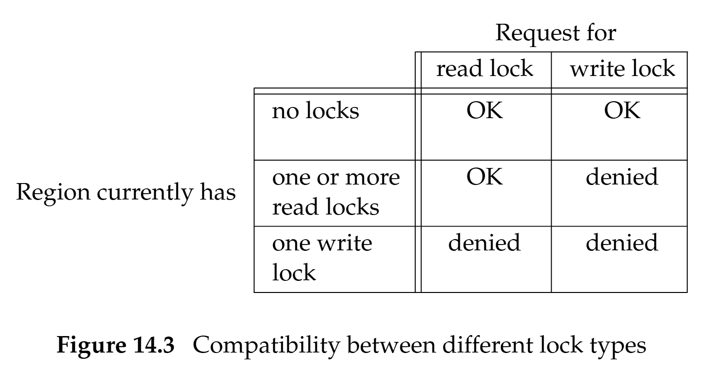

##### `fcntl` 支援的鎖定命令

- `F_GETLK`：測試 `flockptr` 所描述的鎖是否可加：
  - 若可，回傳時把 `l_type` 設為 `F_UNLCK`（其他欄位不變）
  - 若不可（檔案某處已被鎖上），回傳時用阻擋你的其中一把鎖來更新 `flockptr` 的 `l_type/l_whence/l_start/l_len/l_pid`
- `F_SETLK`：嘗試依 `flockptr` 設鎖。 若失敗（例如被別的行程持鎖），立即回傳 `-1` 並設 `errno`（`EACCES` 或 `EAGAIN`）
  - 加鎖：`l_type` 設 `F_RDLCK` 或 `F_WRLCK`，範圍由 `l_whence/l_start/l_len` 指定
  - 解鎖：`l_type` 設 `F_UNLCK`
- `F_SETLKW`：同 `F_SETLK`，但若衝突，呼叫端會等待（阻塞）直到鎖釋放

##### `fcntl` 記錄鎖：補充

- 設定或解除鎖時，系統會合併／分割相鄰的區段（必要時）
  - 例如若已鎖定 100–149、151–199，當再鎖定位元組 150 時，核心會把它們合併成 100–199
- 非原子：先 `F_GETLK` 再 `F_SETLK/​F_SETLKW` 會做兩次 `fcntl()`，中間可能有其他行程搶先加鎖
- 開啟模式要求：
  - 要取得讀鎖，`fd` 必須以可讀方式開啟
  - 要取得寫鎖，`fd` 必須以可寫方式開啟

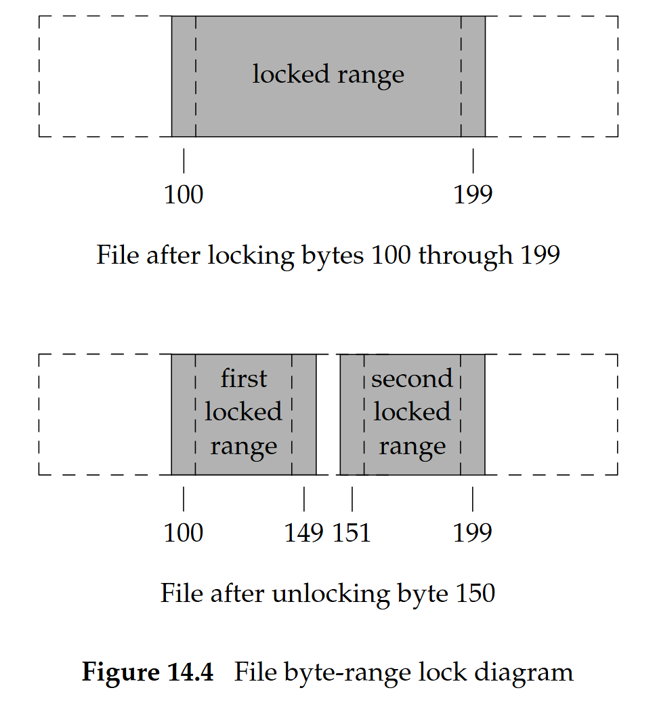

##### Unix 對記錄鎖的實作

核心不會追蹤「哪個 descriptor 擁有哪把記錄鎖」，而是以 `<process:file>` 的對映（存在 vnode/inode 結構中）追蹤

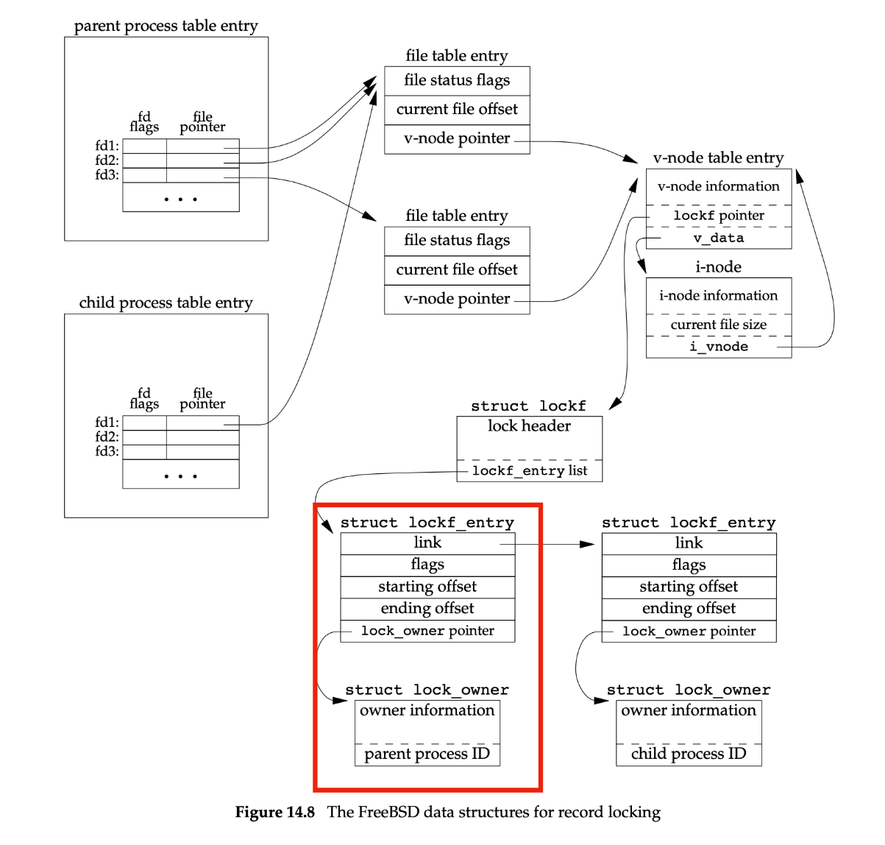

##### 鎖的釋放

- 行程結束時，該行程的所有鎖會被自動釋放
- 鎖是以 `<process:file>` 的對映來記錄的：當關閉某個指向該檔案的任何 `fd` 時，該行程在那個檔案上的所有鎖都會被釋放

##### 範例

問題：`fd1` 上的鎖會怎樣？

Process 1：

```c
fd1 = open(pathname, ...);
read_lock(fd1, ...);
fd2 = dup(fd1);
close(fd2);
```

Process 2：

```c
fd1 = open(pathname, ...);
read_lock(fd1, ...);
fd2 = open(pathname, ...);
close(fd2);
```

若某個行程關閉任何一個指向某檔案的 file descriptor，該行程在那個檔案上的所有鎖都會被釋放，無論這些鎖最初是透過哪個 descriptor 取得的。 這表示只要有某個函式因某些原因決定去開啟、讀取並關閉同一個檔案，行程就可能失去自己在該檔案（例如 `/etc/passwd` 或 `/etc/mtab`）上的鎖

##### 範例 2

下例是犯了 `fcntl` 的「建議式（advisory）紀錄鎖」語意，特別是鎖與「行程 × 檔案」綁定，而不是與某個特定的 `fd` 綁定。 同一行程只要關閉任何一個指向該檔案的 file descriptor，不管鎖是用哪個 `fd` 加上的，該行程在此檔案上的所有 `fcntl` 鎖都會被釋放

###### `locker.c`（上鎖的一方）

做的事（依序）：

1. 先確保 `path` 存在，並以 `O_CREAT|O_RDWR` 建立/開啟（寫鎖需要可寫開啟，否則會 `EBADF`）
2. 開兩個 `fd` 指向同一檔案：
   - `fd1 = open(path, O_RDWR)`
   - `fd2 = dup(fd1)`
3. 透過 `fd1` 對整個檔案加 寫鎖：
   ```c
   struct flock lk = {.l_type=F_WRLCK,.l_whence=SEEK_SET,.l_start=0,.l_len=0};
   fcntl(fd1, F_SETLK, &lk);     // 非阻塞，加不到會立刻失敗
   ```
   - `l_start=0, l_len=0` 代表「從檔頭到 EOF」整檔加鎖
4. 睡 2 秒後 關閉 `fd2`（注意：鎖是用 `fd1` 加的）
5. 印出「我關了 `fd2`，我在這個檔案上的鎖已被釋放」，再睡 3 秒，最後才關 `fd1`

要點：

- 這支程式故意不關 `fd1`，而是關另一個 `fd2`，用來證明「關閉任何指向同一檔案的 `fd` 都會把本行程在該檔的鎖全部釋放」

```c
// locker.c
#define _XOPEN_SOURCE 700
#include <errno.h>
#include <fcntl.h>
#include <stdio.h>
#include <string.h>
#include <unistd.h>

static int lock_wholefile(int fd, short type)
{
	struct flock lk = {.l_type = type, .l_whence = SEEK_SET, .l_start = 0, .l_len = 0};
	return fcntl(fd, F_SETLK, &lk);
}

int main(int argc, char **argv)
{
	const char *path = (argc > 1) ? argv[1] : "lockdemo.tmp";

	// Ensure file exists; use O_RDWR so both sides can lock consistently.
	int createfd = open(path, O_CREAT | O_RDWR, 0644);
	if (createfd < 0) {
		perror("open(create)");
		return 1;
	}
	close(createfd);

	int fd1 = open(path, O_RDWR);
	if (fd1 < 0) {
		perror("open fd1");
		return 1;
	}
	// int fd2 = open(path, O_RDWR);
	int fd2 = dup(fd1);
	if (fd2 < 0) {
		perror("open fd2");
		return 1;
	}

	if (lock_wholefile(fd1, F_WRLCK) == -1) {
		perror("locker: F_WRLCK via fd1");
		return 1;
	}
	printf("locker: acquired F_WRLCK via fd1=%d on %s\n", fd1, path);
	printf("locker: sleeping 2s, then close(fd2) (NOT the locking fd)\n");
	sleep(2);

	// POSIX: closing any fd for this file releases all locks held by this process.
	close(fd2);
	printf("locker: closed fd2; my locks on %s are now released.\n", path);

	// Keep fd1 open briefly so you can see waiter proceed while fd1 is still open.
	sleep(3);
	close(fd1);
	puts("locker: done.");
	return 0;
}
```

###### `waiter.c`（等待鎖的一方）

做的事（依序）：

1. 以 `O_RDWR` 開啟同一個檔案
2. 對整個檔案加寫鎖，但使用 `F_SETLKW`（阻塞版）：

   ```c
   fcntl(fd, F_SETLKW, &lk);   // 若被鎖住，會在這裡等
   ```
3. 一旦上一行解除阻塞（鎖可取得），就印出「拿到鎖！」，並 `F_UNLCK` 解除，再 `close(fd)`

要點：

- 因為 `locker` 先用 `fd1` 取得了寫鎖，所以 `waiter` 會在 `F_SETLKW` 卡住
- 等到 `locker` 關掉 `fd2` 的瞬間（雖然鎖並不是經由 `fd2` 取得），`locker` 對此檔的所有鎖都被釋放，`waiter` 就能立刻拿到鎖

```c
// waiter.c
#define _XOPEN_SOURCE 700
#include <errno.h>
#include <fcntl.h>
#include <stdio.h>
#include <string.h>
#include <unistd.h>

int main(int argc, char **argv)
{
	const char *path = (argc > 1) ? argv[1] : "lockdemo.tmp";
	int fd = open(path, O_RDWR);
	if (fd < 0) {
		perror("waiter: open");
		return 1;
	}

	struct flock lk = {.l_type = F_WRLCK, .l_whence = SEEK_SET, .l_start = 0, .l_len = 0};
	puts("waiter: trying to acquire F_WRLCK (will block until available)...");
	if (fcntl(fd, F_SETLKW, &lk) == -1) {
		perror("waiter: fcntl(F_SETLKW)");
		return 1;
	}
	puts("waiter: acquired lock!");
	// Clean up
	lk.l_type = F_UNLCK;
	if (fcntl(fd, F_SETLK, &lk) == -1)
		perror("waiter: unlock");
	close(fd);
	return 0;
}
```

### Fast & Slow System Calls

- 快速系統呼叫（Fast system calls）
  - 在可預期時間內完成、不受外部資源阻塞的呼叫
  - 例：從本機磁碟讀取檔案
  - （問題：是否「一定不阻塞」取決於實作與狀況，本機 I/O 仍可能因頁快取未命中或裝置壅塞而延遲，這裡屬概念化分類）
- 慢速系統呼叫（Slow system calls）
  - 可能無限期等待才完成（甚至永遠阻塞）
  - 例：從終端裝置或網路裝置讀取、對 pipe（第 15 章）讀寫、等待網路連線等

### Blocking v.s. Nonblocking I/O

- 阻塞式 I/O（Blocking I/O）
  - I/O 函式要等到操作完成才返回（典型的慢速系統呼叫）
- 非阻塞式 I/O（Nonblocking I/O）
  - 讓我們發出 I/O 操作（如 open/read/write），並在不等待的情況下盡快返回
    - 注意：若操作此刻無法完成，呼叫會立刻以錯誤返回
    - 例：非阻塞讀取會在不掛起行程的前提下，盡可能讀到可得的位元組數
  - 可把某個 file descriptor 設為非阻塞：
    - 兩種方式：`open()`（帶 `O_NONBLOCK`）或 `fcntl(F_SETFL)` 設定 `O_NONBLOCK`

#### Nonblocking I/O Code Example

下例程式會從 stdin 讀取最多 500,000 位元組，並嘗試把它寫到 stdout（我們會先把 stdout 設為非阻塞的）。 寫出的動作在一個迴圈裡執行，而每次 `write` 的結果都會印到 stderr 中：

```c
#include <errno.h>
#include <fcntl.h>
char buf[500000];
int main(void)
{
    int ntowrite, nwrite;
    char *ptr;
    ntowrite = read(STDIN_FILENO, buf, sizeof(buf));
    fprintf(stderr, "read %d bytes\n", ntowrite);
    set_fl(STDOUT_FILENO, O_NONBLOCK); /* set nonblocking */
    ptr = buf;
    while (ntowrite > 0) {
        errno = 0;
        nwrite = write(STDOUT_FILENO, ptr, ntowrite);
        fprintf(stderr, "nwrite = %d, errno = %d\n", nwrite, errno);
        if (nwrite > 0) {
            ptr += nwrite;
            ntowrite -= nwrite;
        }
    }
    clr_fl(STDOUT_FILENO, O_NONBLOCK); /* clear nonblocking */
    exit(0);
}
```

如果 stdout 是一般檔案（regular file），我們預期只會呼叫一次 `write`：

```console
$ ls -l /etc/services                      <-- print file size
-rw-r--r-- 1 root 677959 Jun 23 2009 /etc/services
$ ./a.out < /etc/services > temp.file      <-- try a regular file first
read 500000 bytes
nwrite = 500000, errno = 0                 <-- a single write
$ ls -l temp.file                          <-- verify size of output file
-rw-rw-r-- 1 sar 500000 Apr 1 13:03 temp.file
```

但如果 stdout 是終端機（terminal），我們預期 `write` 有時會回傳「只寫入部分位元組數」，有時則回傳錯誤。 結果如下所示：

```console
$ ./a.out < /etc/services 2>stderr.out      <-- output to terminal
...                                         <-- lots of output to terminal ...
$ cat stderr.out
read 500000 bytes
nwrite = 999, errno = 0
nwrite = -1, errno = 35
nwrite = -1, errno = 35
nwrite = -1, errno = 35
nwrite = -1, errno = 35
nwrite = 1001, errno = 0
nwrite = -1, errno = 35
nwrite = 1002, errno = 0
nwrite = 1004, errno = 0
nwrite = 1003, errno = 0
nwrite = 1003, errno = 0
nwrite = 1005, errno = 0
nwrite = -1, errno = 35   <-- 61 of these errors
...
nwrite = 1006, errno = 0
nwrite = 1004, errno = 0
nwrite = 1005, errno = 0
nwrite = 1006, errno = 0
nwrite = -1, errno = 35   <-- 108 of these errors
...
nwrite = 1006, errno = 0
nwrite = 1005, errno = 0
nwrite = 1005, errno = 0
nwrite = -1, errno = 35   <-- 681 of these errors
...                       <-- and so on...
nwrite = 347, errno = 0
```

在這套系統上，`errno` 的 35 代表 `EAGAIN`。 終端機驅動程式能接受的資料量會因系統而異，結果也會因你登入系統的方式而不同：如使用系統主控台、實體（硬接線）終端機，或是透過偽終端（pseudo terminal）的網路連線。 如果你的終端機上跑著視窗系統，你同樣是經過一個偽終端裝置

由於 stdout 被設為非阻塞的，且終端的輸出佇列容量有限，`write` 常常只寫出部分資料（回傳小於要求的位數），或直接以 -1 返回並設 `errno=EAGAIN`

在這個例子裡，程式發出了超過 9,000 次的 `write` 呼叫，儘管實際上只需要 500 次就能把資料輸出完畢。 其餘的呼叫都只回傳錯誤。 這種迴圈稱為輪詢（polling），在多使用者系統上是浪費 CPU 時間的

因為是非阻塞的，程式會反覆迴圈嘗試：每次把成功寫出的那一段前移指標、減少剩餘位數，遇到 EAGAIN 則立即返回、下一輪再嘗試

圖下方小表對照了阻塞與非阻塞：

- 阻塞：一次呼叫等到完成
- 非阻塞：多次「檢查／嘗試」，直到完成

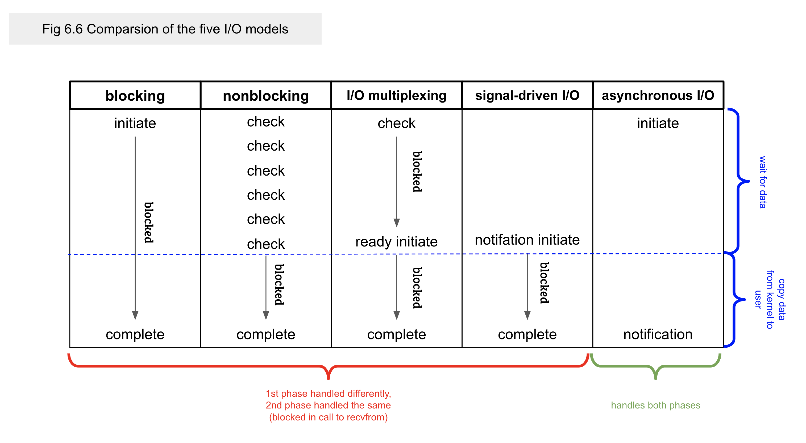

### Terminal Device

- 每個終端裝置都有一個輸入佇列與一個輸出佇列
- shell 會把標準輸入重新導向到終端
- 輸入佇列大小受 `MAX_INPUT` 限制
- 當輸出佇列已滿時：
  - 阻塞模式：行程會被進入睡眠，直到佇列有空間（行程什麼也不做）
  - 非阻塞模式：輪詢（polling），程式在迴圈中反覆檢查是否可以輸出
    - 在多使用者系統上常浪費 CPU，因為大多時候佇列仍是滿的、沒有事可做

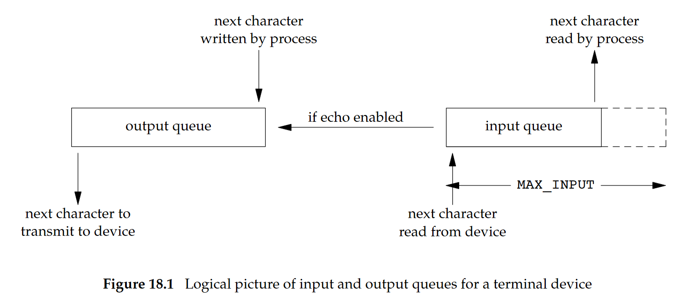

### 處理並行 I/O（Handle Concurrent I/Os）

#### Telnet Process

```c
n = read(STDIN_FILENO, buf, BUFSIZ);
...
n = read(network_fd, netbuf, BUFSIZ);
...
```

Telnet 行程會從 `stdin` 讀取並寫到網路（到 telnet 伺服器 PTT），Telnet 行程也會從網路讀取並寫到 `stdout`

##### 問題：使用 blocking I/O 的優缺點是什麼？

假設讀取兩個 file descriptor：`stdin` 與網路輸入

```c
n = read(STDIN_FILENO, buf, BUFSIZ); /* block */
...
n = read(network_fd, netbuf, BUFSIZ); /* block */
...
```

此處的問題是 blocking I/O 無法同時處理多個 I/O 來源（檔案/Socket 等 descriptor）。 必須等其中一個完成才能處理下一個，對任何一個 descriptor 的 I/O 都可能造成阻塞，效能不佳

##### 想法 1：multi-process

```
Telnet Process1
n = read(STDIN_FILENO, buf, BUFSIZ); /* block */
...

Telnet Process2
n = read(network_fd, netbuf, BUFSIZ); /* block */
...
```

- 執行兩個行程，讓每個行程各自做一個 blocking 讀取
- 問題：分配行程浪費資源，行程間通訊與狀態同步需要額外負擔

##### 想法 2：nonblocking I/O（輪詢）

- 將兩個要讀取的 I/O descriptor 都設為非阻塞：對某個 file descriptor，如果有資料，就讀取並處理，如果沒有資料，`read` 會立即返回，對 I/O 做輪詢（polling）
- 問題：如果大多數時間都無法進行該操作，會浪費 CPU 資源

```c
/* Telnet Process */
while (1) { /* STDIN 與 network_fd 已設為 NONBLOCK */
  n = read(STDIN_FILENO, buf, BUFSIZ);
  /* 如果沒有讀到資料，先做別的事，然後再檢查 STDIN */
  ...
  n = read(network_fd, netbuf, BUFSIZ);
  /* 如果沒有讀到資料，先做別的事，然後再檢查 network_fd */
  ...
}
```

##### 想法 3：I/O Multiplexing（多工）

- 使用 `select()` 或 `poll()`
- 目標：避免為輪詢而忙迴圈，同時處理多個 I/O 來源
- I/O 多工通常用在：
  - 應用程式需要同時處理多個 file descriptor，例如檔案與網路 I/O（socket）descriptor
  - 對任何一個 descriptor 的 I/O（例如 read/write）都可能導致阻塞

#### I/O Multiplexing

以下節錄自 [select、poll、epoll 之間的區別總結[整理]](https://www.cnblogs.com/Anker/p/3265058.html)：

::: info  
`select`、`poll`、`epoll` 都是 IO 多工的機制。 I/O 工通過一種機制，可以監視多個描述符，一旦某個描述符就緒（一般是讀取就緒或寫入就緒），能夠通知程式進行對應的讀寫操作。 但 `select`、`poll`、`epoll` 本質上都是同步 I/O，因為他們都需要在讀寫事件就緒後自己負責進行讀寫，也就是說這個讀寫過程是阻塞的，而異步 I/O 則無需自己負責進行讀寫，異步 I/O 的實現會負責把資料從 kernel 複製到 user space
:::

對於同步、非同步，以下節錄自 [Study Notes - I/O Models](https://rickhw.github.io/2019/02/27/ComputerScience/IO-Models/)：

::: info  
阻塞 (Blocking) 與非阻塞 (Non-Blocking) 描述的是「請求」在等待結果時的「狀態」

- 阻塞 (Blocking)：調用的程序或者應用程式發起請求，在獲得結果之前，調用方的程序會懸 (Hang) 住不動>  無法回應，直到獲得結果
- 非阻塞 (Non-Blocking)：概念與阻塞相同，但是調用方不會因為等待結果，而懸著不動。 後續通常透過輪>  機制 (Polling) 機制取得結果

同步 (Synchronous) 與非同步 (Asynchronous) 描述的是：使用者執行緒與 Kernel 的通訊模式：

- 同步 (Synchronous)：使用者執行緒發出 I/O 請求後，要等待、或者輪詢 Kernel I/O 的操作完成後，才繼續執行
  - 等待 Kernel 回覆：Blocking IO，縮寫成 BIO
  - 輪詢類似於 Non-Blocking IO，縮寫成 NIO
- 非同步 (Asynchronous)：或稱異步，使用者執行緒發出 I/O 請求後仍然繼續執行下一個操作，當 Kernel>  I/O 操作結束後，會通知執行緒，或者呼叫 callback 函數

同步中文的意思很容易誤解為，很多事同時做，實際上是事情有先後關係的概念，也就是「有序性>  (oredered)」； 而非同步才是類似於很多事情在同一個時間一起發動，他是「無序性 (non-ordered)」  
:::

##### I/O Multiplexing：`select`

`select` 讓程序能夠指示 kernel 等待多個事件中的任何一個發送，並且只在有一個或多個事件發生，或經歷一段指定的時間後才會喚醒該程序。 函數原型如下：

```c
#include <sys/select.h>
// 回傳：就緒的 descriptor 數量，在任何 descriptor 就緒前超時則回傳 0，錯誤回傳 −1
int select(int nfds, fd_set *readfds, fd_set *writefds,
           fd_set *exceptfds, struct timeval *timeout);
```

- `select()` 的參數意義：
  - 我們關心哪些 descriptor
  - 對每個 descriptor 關心哪些條件：從某個 descriptor 讀、往某個 descriptor 寫、或該 descriptor 的異常狀態
  - 要等多久：永久等待、等待固定時間，或完全不等待
- `select()` 的參數細節：
  - 我們關心哪些 descriptor：`nfds`，設為三個集合中編號最高的 file descriptor + 1。 核心會檢查每個集合中到這個上限為止的 descriptor
  - 對每個 descriptor 關心哪些條件：`readfds`、`writefds`、`exceptfds`，指向各條件的 descriptor 集合（bitmap）的指標。 用來指定我們要讓 kernel 測試讀取、寫入和異常條件的描述符，如果對某一個的條件不感興趣，可以把它設為空指標
  - 要等多久：`timeout`，等待時間

`fd_set` 型別代表的是 descriptor 的集合，三個 descriptor 的集合（`readfds`、`writefds`、`exceptfds`）以該型別儲存，一個 descriptor 對應到當中的一個位元

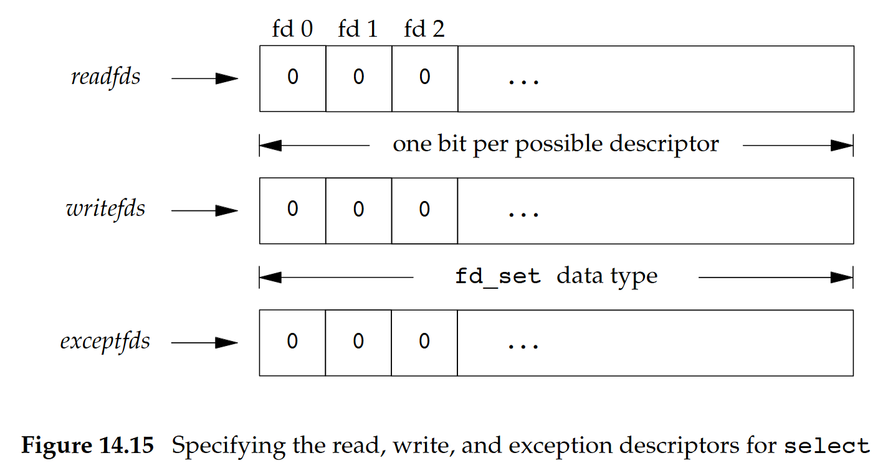

`fd_set` 內的 descriptor 可以利用以下四個輔助巨集／函式來進行設定：

```c
#include <sys/select.h>
int  FD_ISSET(int fd, fd_set *fdset); // 檢查集合中指定的檔案描述符是否可以讀寫 
void FD_CLR  (int fd, fd_set *fdset); // 將一個給定的檔案描述符從集合中刪除
void FD_SET  (int fd, fd_set *fdset); // 將一個給定的檔案描述符加入集合中
void FD_ZERO (fd_set *fdset); // 清空集合
// 回傳值：若 fd 在集合中則非零，否則為 0
```

- 從 `select()` 返回時，作業系統核心會告訴我們：
  1. 就緒的 descriptor 總數（三個集合的總和，亦即 `select()` 的回傳值）
  2. 哪些 descriptor 在對應條件下已就緒（核心會更新 `readfds`、`writefds`、`exceptfds` 這三個集合）
- 根據 (2) 我們知道：
  - 若某個 descriptor 出現在 read 集合或 write 集合，對它做讀／寫將不會阻塞
  - 若某個 descriptor 出現在 exception 集合，代表該 descriptor 有待處理的異常狀態

`select` 的正回傳值是三個集合中就緒的 descriptor 數量之總和，若同一個 descriptor 同時可讀又可寫，會被計到兩次

###### 範例

如果我們寫：

```c
fd_set readset, writeset;

FD_ZERO(&readset);
FD_ZERO(&writeset);
FD_SET(0, &readset);
FD_SET(3, &readset);
FD_SET(1, &writeset);
FD_SET(2, &writeset);
select(4, &readset, &writeset, NULL, NULL);
```

則這兩個 descriptor set 看起來會如下圖：

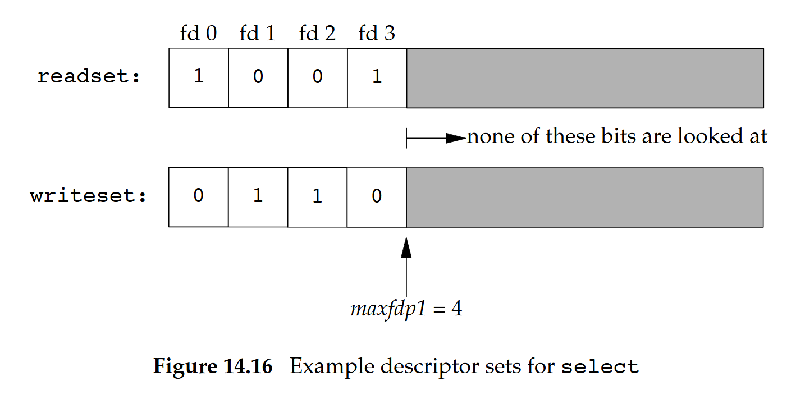

###### 範例 2

看以下程式，考慮為什麼要 `memcpy()`：

```c
int main()
{
    int i;
    struct timeval timeout;
    struct fd_set master_set, working_set;
    char buf[1024];

    FD_ZERO(&master_set);
    FD_SET(0, &master_set);
    timeout.tv_sec  = 5;
    timeout.tv_usec = 0;
    i = 0;

    while (1)
    {
        memcpy(&working_set, &master_set, sizeof(master_set));
        select(1, &working_set, NULL, NULL, &timeout);
        if (FD_ISSET(0, &working_set))
        {
            fgets(buf, sizeof(buf), stdin);
            fputs(buf, stdout);
        }
        printf("iteration: %d\n", i++);
    }
    return 0;
}
```

這是因為作業系統會在這兩個地方更新 `working_set`：

```c
FD_ZERO(&master_set);
FD_SET(0, &master_set);
```

與

```c
if (FD_ISSET(0, &working_set))
```

所以你需要每次都先備份再還原！

###### 其他

- 我們可以把 `nfds` 設為 `FD_SETSIZE`（定義於 `<sys/select.h>`，在 Linux 設為 1024）
- 若不關心某一類條件，對應的 descriptor 集合指標可以是 `NULL`，若三個指標都為 `NULL`，`select` 就會變成一個比 `sleep` 更高精度（微秒）的計時器
  ```c
  // 下面這個 select 會依照給定的 timeval 休眠
  int totalfds = select(0, NULL, NULL, NULL, &timeval);
  ```

關於 `select` 的參數 `timeout` 的特殊情況：

- `timeout` 的參數是 timeval 結構，指定 `select()` 應阻塞的時間區間。 `select()` 會阻塞直到下列其中之一發生：
  - 有某個 file descriptor 就緒
  - 呼叫被訊號處理器中斷
  - `timeout` 到期
- `timeout` 區間會被向上取整到系統時鐘的粒度，排程延遲也可能使實際阻塞時間略為超過
- 若 `timeval` 的兩個欄位皆為 0，`select()` 會立刻返回（可用於 polling）
- 若 `timeout` 為 `NULL`，`select()` 會無限期阻塞，直到有 file descriptor 就緒

##### I/O Multiplexing：`poll`

```c
#include <poll.h>
// 回傳值：就緒的 descriptor 數量；逾時回傳 0；發生錯誤回傳 -1
int poll(struct pollfd fdarray[], nfds_t nfds, int timeout);
```

```c
struct pollfd {
  int fd;          // 要檢查的 file descriptor；若 < 0 則忽略此項
  short events;    // 呼叫端關心的事件（events）
  short revents;   // 實際發生在該 fd 的事件（由核心填入）
};
```

- `poll` 與 `select` 類似，但在傳遞引數的程式介面上不同：
  - `nfds`：指定 `fdarray` 陣列中的項目數量
  - 以 `pollfd` 結構組成的陣列來描述要監看的 descriptor 與關心的條件
    - 呼叫端在 `events` 欄位設定關心的事件，這是位元遮罩，更多細節可參考下圖（14.17）
    - 核心在返回時會填寫 `revents`，指出每個 descriptor 實際發生了哪些事件，這同樣是位元遮罩
  - `timeout`：在解除行程等待前要等多久（毫秒）
    - -1 表示無限期等待，0 表示不等待，大於 0 表示等待對應的毫秒數
    - 時間到了之後，無論 I/O 是否準備好，`poll` 都會回傳

<span class = "center-column">

| Name           | Input to `events`? | Result from `revents`? | Description                                                   |
| -------------- | ---------------- | -------------------- | ------------------------------------------------------------- |
| **POLLIN**     | ●                | ●                    | 除了高優先權資料以外的資料可在不阻塞的情況下讀取（等同於 `POLLRDNORM \| POLLRDBAND`）。 |
| **POLLRDNORM** | ●                | ●                    | 一般資料可在不阻塞的情況下讀取。                                              |
| **POLLRDBAND** | ●                | ●                    | 優先權資料可在不阻塞的情況下讀取。                                             |
| **POLLPRI**    | ●                | ●                    | 高優先權資料可在不阻塞的情況下讀取。                                            |
| **POLLOUT**    | ●                | ●                    | 一般資料可在不阻塞的情況下寫入。                                              |
| **POLLWRNORM** | ●                | ●                    | 同 `POLLOUT`。                                                  |
| **POLLWRBAND** | ●                | ●                    | 優先權資料可在不阻塞的情況下寫入。                                             |
| **POLLERR**    |                  | ●                    | 發生錯誤。                                                         |
| **POLLHUP**    |                  | ●                    | 發生掛斷。                                                         |
| **POLLNVAL**   |                  | ●                    | 該 descriptor 沒有參照到任何已開啟的檔案。                                   |

（From APUE 3rd Edition：Figure 14.17）

</span>

以下節錄自 [IO 多路復用之 poll 總結](https://www.cnblogs.com/Anker/p/3261006.html)：

::: info  
使用 `poll()` 和 `select()` 不一樣，你不需要明確地請求異常狀況報告

- `POLLIN | POLLPRI` 等價於 `select()`的讀取事件
- `POLLOUT | POLLWRBAND` 等價於 `select()` 的寫事件
- `POLLIN` 等價於 `POLLRDNORM | POLLRDBAND`
- `POLLOUT` 則等價於 `POLLWRNORM`

例如，要同時監視一個檔案描述子是否可讀和可寫，我們可以設定 `events` 為 `POLLIN | POLLOUT`。 當 `poll` 返回時，我們可以檢查 `revents` 中的標誌，對應於文件描述符請求的 `events` 結構體。 如果 `POLLIN` 事件被設置，則檔案描述子可以被讀取而不阻塞。 如果 `POLLOUT` 被設置，則檔案描述符可以寫入而不導致阻塞

這些標誌並不是互斥的，它們可能被同時設置，表示這個檔案描述符的讀取和寫入操作都會正常返回而不阻塞  
:::

##### I/O Multiplexing：`select` v.s. `poll`

<span class = "center-column">

|                        | select                  | poll                                   |
| ---------------------- | ----------------------- | -------------------------------------- |
| 核心對輸入引數的更新方式 | 更新 `fd_set` 集合  | 更新 `revents` 欄位（不是 `events`） |
| 支援的條件種類          | 讀、寫、錯誤三種類型      | 超過三種類型的事件                       |

</span>

- 其他替代方案
  - `pselect`：提供奈秒等級的逾時設定與同時套用訊號遮罩
  - `epoll`：在速度與可擴展性上表現良好

## Intro to Networking

### IP、TCP/UDP 與 port number

- IP：用來指定機器，本身以 IP 位址作為定址方式
- TCP / UDP：建構在 IP 之上，以連接埠（port）進行定址
  - TCP：
    - 常見於 FTP、Telnet、SMTP
    - 特性：
      - 以連線為基礎（connection-based）
        - 在傳資料前，雙方先用「三向握手」建立一條連線（TCP 連線有狀態：序號、視窗大小等）。 之後資料都走在這條連線上，直到其中一方關閉
      - 可靠（reliable）
        - 協定內建確認與重傳機制，保證「不重複、不遺失、按順序」把位元組送到對方，出問題就回報錯誤（例如連線中斷）。 應用程式不必自己做 ACK/重傳
      - 位元組串流（byte stream）
        - TCP 看起來像一條連續的位元組管道，沒有「訊息邊界」這個概念。 你 `write()` 了 100 與 50 與 50，不保證對方會用三次 `read()` 分別讀到 100/50/50，可能一次讀到 200，也可能多次分段。 所以若你需要訊息邊界，必須自己在資料裡加長度欄位或分隔符號
  - UDP：
    - 常見於 NFS、TFTP
    - 特性：
      - 無連線（connectionless）
        - 不需要握手，每次送資料都獨立成一個封包，帶著目的位址與連接埠送出去。 核心幾乎不維持狀態，延遲與開銷都更小
      - 不可靠（unreliable）
        - 協定本身不保證送達、不保證順序、也不會自動重傳，封包可能遺失、重複、或顛倒順序。 要可靠就得由應用層自己做（加序號、ACK/重傳等）
      - 資料報（datagram）
        - 有「訊息邊界」：你 `sendto()` 一個封包，對方 `recvfrom()` 就會拿到「正好那一個封包」（要嘛整個收到、要嘛整個掉了，若接收緩衝太小，會被截斷且殘餘部分丟失）。 不會像 TCP 那樣把多次寫入自動黏在一起
- 連接埠號（port number）：16 位元整數，在同一台機器上具唯一性
  - Unix 中的連接埠號：小於 1024 的連接埠會保留給 root 使用（用來承載系統服務）
- 在網路上為機器定址時使用的是 IP 位址
- 為行程定址時使用的是連接埠號
- 將「IP 位址」加上「連接埠號」就可以組成所謂的「socket 位址」

底下是 TCP Client/Server Programming Model 的示意圖：

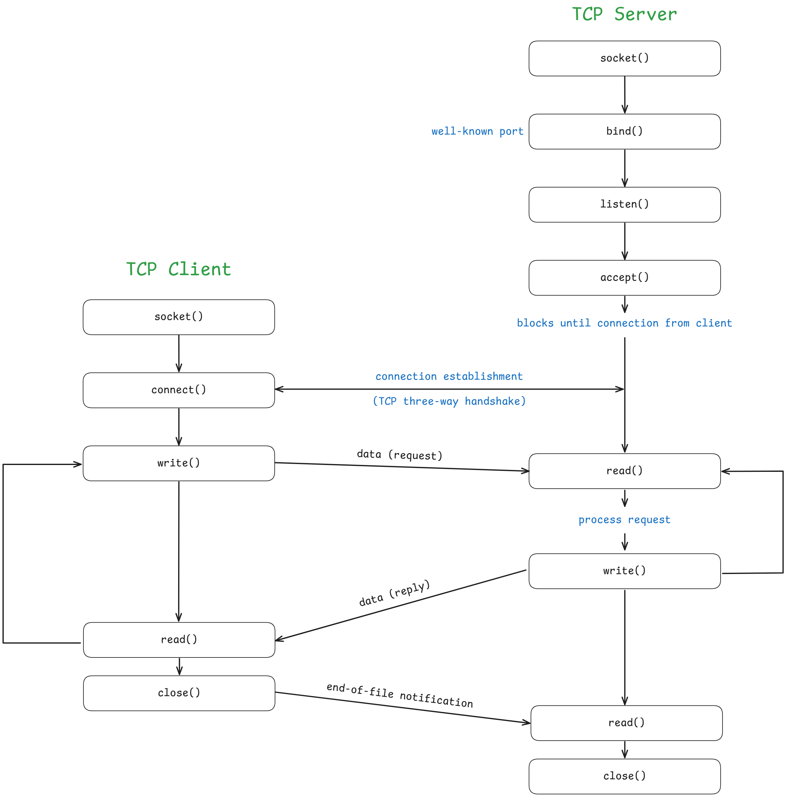

### Sockets

- Socket 讓位在不同電腦（連到同一個網路）的行程端點可以彼此通訊
  - POSIX.1 規範了 socket API
- 對作業系統核心來說，socket 就是通訊的端點（endpoint）
- 應用程式透過 socket descriptor 來存取 socket
  - Unix 系統把 socket descriptor 實作成 file descriptor
  - 讓用戶端與伺服器可以用這些 socket 的 file descriptor 來對網路進行讀寫
- 一般檔案 I/O 與 socket I/O 之間的主要差別，在於應用程式如何「開啟」這些 descriptor 或檔案

#### Socket Primitives

```c
// 成功時回傳一個 socket descriptor（socketfd），錯誤回傳 -1
int socket(int domain, int type, int protocol);
```

- `socket()`：建立一個通訊端點
  - `domain` 設為 `AF_INET`（IPv4 協定）
  - `type` 設為 `SOCK_DGRAM`（UDP） 或 `SOCK_STREAM`（TCP）
  - `protocol` 設為 0（讓核心依型態挑對應的協定號 `IPPROTO_UDP` 或 `IPPROTO_TCP`）

```c
// 成功回傳 0，錯誤回傳 -1
int bind(int socketfd, struct sockaddr *addr, int addrlen);
```

- `bind()`：把名稱或位址綁定到一個 socket
  - `socketfd`：由 `socket()` 回傳的 socket descriptor
  - `addr`：socket 位址
  - `addrlen`：`sizeof(struct sockaddr)`

```c
struct sockaddr_in {
    unsigned short sin_family;   /* address family (always AF_INET) */
    unsigned short sin_port;     /* port num in network byte order */
    struct in_addr sin_addr;     /* IP addr in network byte order */
    unsigned char  sin_zero[8];  /* pad to sizeof(struct sockaddr) */
};
```

- `struct sockaddr_in` 是 IPv4 專用的 socket 位址結構
  - `sin_family` 必須設為 `AF_INET`
  - `sin_port` 與 `sin_addr` 需要用「網路位元組序」（大端序），因此常搭配 `htons()`、`htonl()` 等轉換
  - `sin_zero` 只是填充欄位，讓大小與通用的 `struct sockaddr` 對齊

```c
// returns 0 if OK, −1 on error
int listen(int sockfd, int backlog);
```
- `listen()`：在一個 socket 上開始監聽連線
  - `backlog`：我們要允許排隊的待處理連線數量

```c
// returns a new file (socket) descriptor if OK, −1 on error
int accept(int socketfd, struct sockaddr *addr, socklen_t *len);
```

- `accept()`：在監聽的 socket 上接受一條連線，從等待佇列取出第一個請求，建立一個新的已連線 socket，並回傳指向它的新 file descriptor。 原本的監聽 socket 不受影響
  - `accept()` 會阻塞呼叫端直到有連線到來
  - `addr`：系統會在這裡寫入對端的 socket 位址

```c
// returns 0 if OK, −1 on error
int connect(int socketfd, struct sockaddr *addr, int addrlen);
```

- `connect()`：把 `sockfd` 對應的 socket 連到 `serv_addr` 指定的位址（參數形式與 `bind()` 類似），用戶端會呼叫它
- 可以使用 `close()` 來關閉一個已開啟的 `socketfd`

#### Reads and Writes on Sockets

- 位元組串流（byte stream）是雙向的
  - 用戶端與伺服器都能在同一個 file descriptor 上讀與寫
  - 可以只關閉單一方向
- 讀取可能會阻塞
  - 從檔案讀取時可能：
      - 成功
      - 遇到 EOF（檔案結尾，回傳 0）
  - 從 socket 讀取會等待直到：
    - 收到網路資料（回傳值大於 0）
    - 連線被關閉（回傳值等於 0）
    - 發生網路錯誤（回傳值小於 0）
- 對 socket 寫入可能：
  - 把資料送到網路（回傳值大於 0）
  - 發現連線已關閉（回傳值等於 0）
  - 造成網路錯誤（回傳值小於 0）
- 當緩衝區已滿時，寫入可能會立即返回或被阻塞

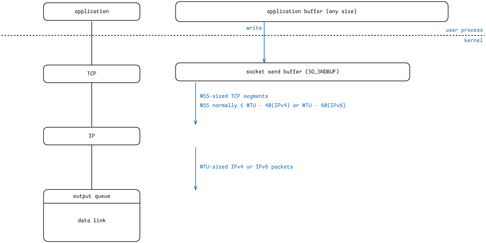

## File & Directory

### Function：`stat`、`fstat` and `lstat`

```c
#include <unistd.h>
// 三者成功皆回傳 0，發生錯誤回傳 -1
int stat(const char *pathname, struct stat *buf);
int fstat(int fd, struct stat *buf);
int lstat(const char *pathname, struct stat *buf)
```

- 這三個函式用來取得檔案的相關資訊，核心會填入 `struct stat buf` 引數 
  - `ls` 這個命令是這些「stat」函式的一個應用範例
- `stat` 與 `lstat` 的差異：如果 `pathname` 是一個符號連結，`lstat` 會回傳「符號連結本身」的資訊，而不是該符號連結所參照的檔案

符號連結（Symbolic links）簡介
  
- 符號連結檔案的內容會存放它所指向檔案的名稱
- 檔案型態：`S_IFLNK`
- 符號連結的大小等於其內容字串的長度
- 例子：
  ```sh
  lrwxrwxrwx  1 root root    7  2月  1  2023 bin -> usr/bin/
  drwxr-xr-x  4 root root 4096  9月  9 05:06 boot/
  drwxr-xr-x 21 root root 3880  9月 14 16:59 dev/
  drwxr-xr-x 156 root root 12288  9月 25 08:36 etc/
  drwxr-xr-x  8 root root 4096  8月 31 15:33 home/
  lrwxrwxrwx  1 root root    7  2月  1  2023 lib -> usr/lib/
  lrwxrwxrwx  1 root root    7  2月  1  2023 lib64 -> usr/lib/
  drwx------  2 root root 16384  8月 31 15:25 lost+found/
  ```
  其中的 `bin`、`lib` 與 `lib64` 就為符號連結

`struct stat` 中的資訊來自該檔案的 i-node。 `struct stat` 的定義一般如下（不同實作之間可能略有差異）：

```c
struct stat {
    mode_t          st_mode;    /* 檔案型態與模式（權限） */
    ino_t           st_ino;     /* i-node 編號（序號） */
    dev_t           st_dev;     /* 裝置編號（檔案系統） */
    dev_t           st_rdev;    /* 特殊檔案對應的裝置編號 */
    nlink_t         st_nlink;   /* 連結數 */
    uid_t           st_uid;     /* 擁有者的使用者 ID */
    gid_t           st_gid;     /* 擁有者的群組 ID */
    off_t           st_size;    /* 對一般檔案而言的位元組大小 */
    struct timespec st_atim;    /* 上次存取時間 */
    struct timespec st_mtim;    /* 上次修改時間 */
    struct timespec st_ctim;    /* 上次檔案狀態變更時間 */
    blksize_t       st_blksize; /* 最佳 I/O 區塊大小 */
    blkcnt_t        st_blocks;  /* 已配置的磁碟區塊數 */
};
```

POSIX.1 不一定會提供 `st_rdev`、`st_blksize` 與 `st_blocks` 欄位，它們屬於 Single UNIX Specification 的 XSI 選用部分

#### File Types

- Unix 系統上的檔案型態：
  - 一般檔案：文字、二進位等。 Unix 核心不會區分檔案是文字還是二進位的，如何解讀由應用程式決定
  - 目錄檔：其內容包含其他檔案的名稱與指向這些檔案資訊的指標
  - 區塊裝置檔：例如磁碟
  - 字元裝置檔：例如 tty、音訊
  - FIFO：具名的 pipe
  - Sockets：用於行程間網路通訊的一種檔案型態
  - 符號連結：指向另一個檔案的一種檔案型態
- 檔案型態被編碼在 `stat` 結構的 `st_mode` 欄位中
- 可以把 `st_mode` 傳入檔案型態判斷巨集，如下所示：
  ```c
  #define S_IFMT   0xF000  /* 檔案型態的遮罩 */
  #define S_IFDIR  0x4000  /* 目錄 */
  #define S_ISDIR(mode)  (((mode) & S_IFMT) == S_IFDIR)
  ```

這些巨集定義在 `<sys/stat.h>` 內：

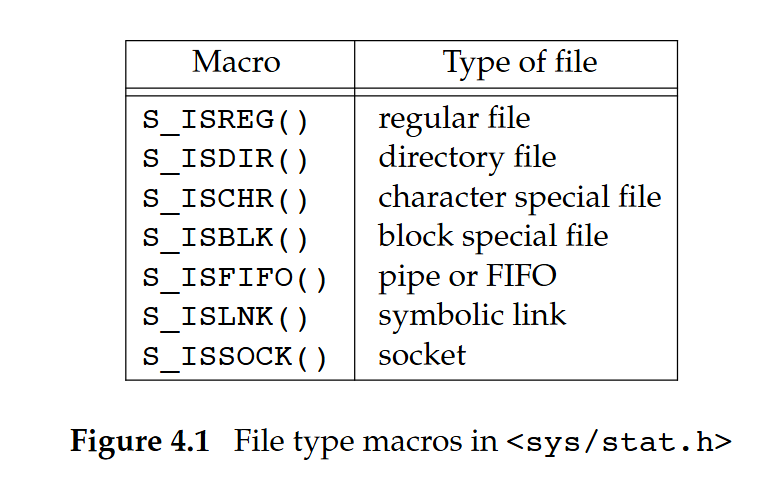

下例來自 APUE 3rd Edition 的 Figure 4.3，用來印出每個命令列引數的檔案型態：

```c
#include "apue.h"
int main(int argc, char *argv[])
{
	int i;
	struct stat buf;
	char *ptr;
	for (i = 1; i < argc; i++) {
		printf("%s: ", argv[i]);
		if (lstat(argv[i], &buf) < 0) {
			err_ret("lstat error");
			continue;
		}
		if (S_ISREG(buf.st_mode))
			ptr = "regular";
		else if (S_ISDIR(buf.st_mode))
			ptr = "directory";
		else if (S_ISCHR(buf.st_mode))
			ptr = "character special";
		else if (S_ISBLK(buf.st_mode))
			ptr = "block special";
		else if (S_ISFIFO(buf.st_mode))
			ptr = "fifo";
		else if (S_ISLNK(buf.st_mode))
			ptr = "symbolic link";
		else if (S_ISSOCK(buf.st_mode))
			ptr = "socket";
		else
			ptr = "** unknown mode **";
		printf("%s\n", ptr);
	}
	exit(0);
}
```

執行結果：

```sh
$ ./a.out /etc/passwd /etc /dev/log /dev/tty \
> /var/lib/oprofile/opd_pipe /dev/sr0 /dev/cdrom
/etc/passwd: regular
/etc: directory
/dev/log: socket
/dev/tty: character special
/var/lib/oprofile/opd_pipe: fifo
/dev/sr0: block special
/dev/cdrom: symbolic link
```

通常一般檔案的數量最多，下面這張圖表來自 APUE 3rd edition 的 Figure 4.4，顯示了一個單一使用者的 Linux 工作站內，不同檔案型態的計數與百分比：

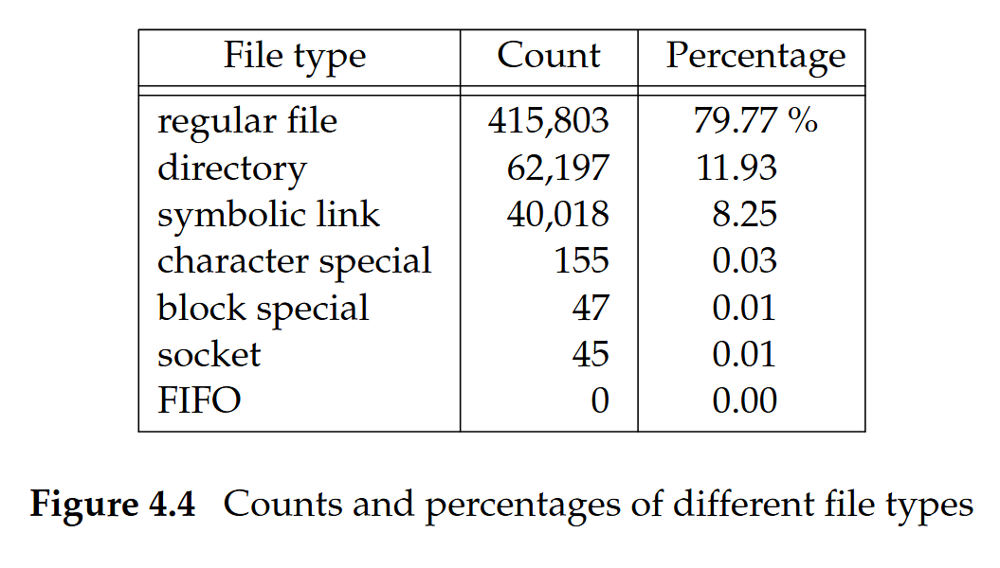

### Access Permissions & UID/GID

- `stat` 結構中的 `st_mode` 欄位同時也編碼了檔案的存取權限位元
- 每個檔案共有 9 個權限位元，分成三個類別來控制讀取（R）、寫入（W）、與執行（X）的權限
  - 檔案擁有者，或稱使用者：`u`
  - 群組：`g`
  - 其他人：`o`
  - 所有使用者：`a`（也就是 `ugo`）
- 權限範例
  - `chmod a+r`：讓所有人都可以讀取
  - `chmod a-r`：取消所有人的讀取能力
  - `chmod a-rwx`：取消所有人的所有存取權限
  - `chmod g+rw`：讓群組具有讀與寫的權限
  - `chmod u+rwx`：讓擁有者具有所有權限
  - `chmod og+rw`：讓其他人與群組具有讀與寫的權限
- `st_mode` 是由多個旗標以位元或運算組成的位元遮罩
  - 可以使用 Unix 的 `chmod` 命令來修改檔案的權限位元
  - | 常數        |    八進位值 | 說明                            |
    | --------- | ------: | ----------------------------- |
    | `S_ISUID` | `04000` | set-user-ID 位元（見 `execve(2)`） |
    | `S_ISGID` | `02000` | set-group-ID 位元               |
    | `S_ISVTX` | `01000` | sticky 位元                     |
    | `S_IRWXU` | `00700` | 擁有者具備讀、寫、執行權限                 |
    | `S_IRUSR` | `00400` | 擁有者具備讀取權限                     |
    | `S_IWUSR` | `00200` | 擁有者具備寫入權限                     |
    | `S_IXUSR` | `00100` | 擁有者具備執行權限                     |
    | `S_IRWXG` | `00070` | 群組具備讀、寫、執行權限                  |
    | `S_IRGRP` | `00040` | 群組具備讀取權限                      |
    | `S_IWGRP` | `00020` | 群組具備寫入權限                      |
    | `S_IXGRP` | `00010` | 群組具備執行權限                      |
    | `S_IRWXO` | `00007` | 其他人具備讀、寫、執行權限                 |
    | `S_IROTH` | `00004` | 其他人具備讀取權限                     |
    | `S_IWOTH` | `00002` | 其他人具備寫入權限                     |
    | `S_IXOTH` | `00001` | 其他人具備執行權限                     |

---

- 每個行程都有三組用來表明其使用者與群組身分的識別碼
  - Real、Effective+supplementary，以及 Saved Set
  - 這個跟檔案的權限是分開的，是給行程用的
    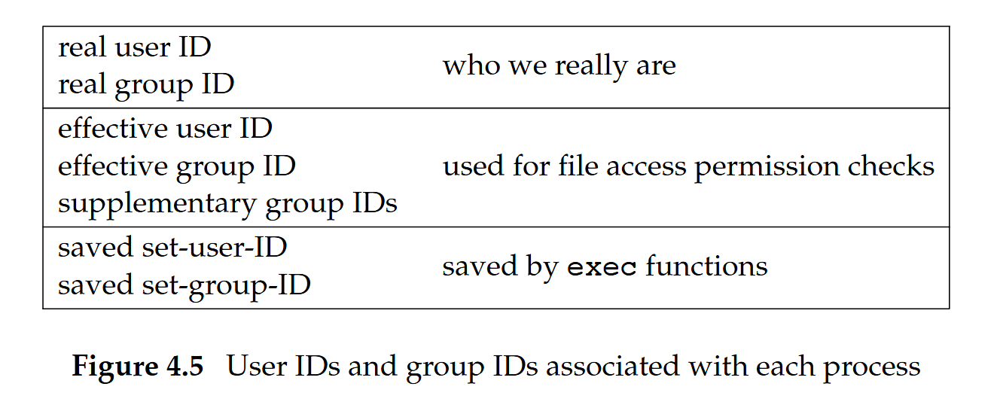
- Real User/Group ID（也就是 UID 與 GID）
  - 複習：密碼檔 `/etc/passwd` 會把使用者名稱對映到這些 ID
    - 下例取自 [Understanding /etc/passwd File Format](https://www.cyberciti.biz/faq/understanding-etcpasswd-file-format/)的「`/etc/passwd file` format」：
      ```
      oracle:x:1021:1020:Oracle user:/data/network/oracle:/bin/bash
                 ^    ^
                 |    |
                UID  GID
      ```
  - 使用者登入時，系統會從密碼檔取出對應的 ID
- Effective User/Group ID
  - 用於在存取行程的時檢查存取權限
- Supplementary Group IDs
  - Unix 會為每個行程維護一份 Supplementary Group ID 的清單，表示該行程所屬的群組除了 Effective Group 之外還有哪些，權限檢查時也會納入計算
- Saved Set-User 與 Set-Group ID
  - 分別保存 Effective User ID 與 Effective Group ID 的副本

---

- 每個檔案都具有「使用者」與「群組」的擁有者
  - 檔案的擁有資訊由 `struct stat` 中的 `st_uid` 與 `st_gid` 指定
- 當一個行程執行某個程式時，如果該程式沒有設置 set-user-ID 或 set-group-ID，則該行程的
  - `Effective user ID == Real user ID`
  - `Effective group ID == Real group ID`
  - 註：程式（執行檔）也是檔案，記得 set-user-ID 是存在檔案的權限位元裡面的
- 每當行程執行、建立、開啟或刪除檔案時，Unix 核心都必須進行檔案存取測試
  - 它會依序檢查下列規則，只要其中一條符合，核心就會進入對應對象的權限位元檢查：
    1. 如果 effective user ID 為 0，也就是超級使用者，則允許對所有檔案存取
    2. 如果 effective user ID 等於檔案的 `st_uid`，則進行使用者層級的權限檢查
    3. 如果 effective group ID 或任一 supplementary group ID 等於檔案的 `st_gid`，則進行群組層級的權限檢查
    4. 若前述皆不符合，則進行「其他人」的權限檢查
- 存取權限會檢查該「權限」是否允許進行要求的「操作」，X 代表可執行，R 代表可讀，W 代表可寫
  - 對一般檔案：
    - X 決定行程是否可以透過某個 `exec` 函式來執行該檔案
    - R 決定行程是否可以以 `O_RDONLY` 或 `O_RDWR` 旗標開啟現有檔案進行讀取
    - W 決定行程是否可以以 `O_WRONLY`、`O_RDWR` 或 `O_TRUNC` 旗標開啟現有檔案進行寫入
  - 對目錄來說（目錄在 Unix 也是檔案）
    - X 允許行程進入該目錄並存取其中的檔案
    - R 允許行程讀取該目錄並取得該目錄下所有檔名的清單
    - W 允許行程更新該目錄
- 補充
  - 要刪除或建立檔案，我們需要該檔案所在目錄的寫入與執行權限，但不需要擁有欲刪除檔案本身的讀或寫權限
  - 以名稱開啟任何檔案時，我們需要檔案路徑中每一層目錄的執行權限
    - 例如從程式開啟「`/usr/include/stdio.h`」時，需要「`/`」、「`/usr`」、「`/usr/include`」這三個部分的 X（執行）權限

#### SUID 與 SGID

- 檔案的 `stat` 結構裡的 `st_mode` 欄位包含了 set-user-ID 與 set-group-ID 這兩個位元
- 當你執行一個設有 SUID 或 SGID 的檔案時，行程的 effective UID 或 effective GID 會被改成該檔案的 UID 或 GID
  - set-user-ID 位元（`st_mode` 中的 `S_ISUID`）
    - 若此位元為開啟狀態，當執行這個檔案時，將行程的 effective UID 設為檔案擁有者（`st_uid`）
  - set-group-ID 位元（`st_mode` 中的 `S_ISGID`）
    - 若此位元為開啟狀態，當執行這個檔案時，將行程的 effective GID 設為檔案的群組擁有者（`st_gid`）
- SUID 與 SGID 很有用，因為它們允許一般使用者執行會存取特權檔案的程式
- 術語：啟用 set-user-ID 或 set-group-ID 位元的程式，稱為 set-user-ID 或 set-group-ID 程式，也常簡稱 setuid 或 setgid 程式
- 例子：Unix 的 `passwd(1)` 是一個 setuid 程式
  - 它允許一般使用者透過更新密碼檔來變更自己的密碼，密碼檔可能是 `/etc/passwd` 或 `/etc/shadow`，而這些檔案理論上只有超級使用者 root 能寫入
  - `passwd` 可執行檔的擁有者通常是 root 且設了 set-user-ID，因此使用者在執行 `passwd` 時，其 effective UID 會成為 root。 程式內部在完成修改後會恢復原本的權限，這樣既能達成目的也能降低權限外洩風險
- 想一想，使用者要怎麼讓朋友可以複製自己的檔案
  1. 為檔案設定合適的權限，也就是調整群組或其他人的權限
  2. 撰寫一個 setuid 或 setgid 程式

### 新建立檔案的擁有權

- 當行程透過 `open` 或 `creat` 建立新檔案時，其擁有權如下
  - UID 會設為該行程的 effective ID
  - GID 有兩種選項，POSIX.1 允許實作自行擇一
    1. 檔案的 GID 取自行程的 effective ID
    2. 檔案的 GID 取自建立位置的父目錄之 GID
  - Linux 同時支援兩種做法。 核心會檢查父目錄是否設了 SGID 位元，若有則採用選項 2，若無則採用選項 1。 FreeBSD 與 macOS 採用選項 2

### Function：`access`

```c
#include <unistd.h>
// returns 0 if OK, -1 on error
int access(const char *pathname, int mode);
```

- 行程可以用 `access()` 來檢查「實際使用者／群組」是否對某個檔案具有存取權限
  - 為什麼這有用？ 當行程以其他使用者／群組的 SUID/SGID 身分執行（也就是執行 `setuid`/`setgid` 程式）時，可能想要驗證「實際使用者（real UID/GID）」是否能存取某個檔案，而不是看一般開檔的「有效身分（effective UID/GID）」
- `mode` 引數要嘛是 `F_OK`（測試檔案是否存在），要嘛是下表內的旗標的位元或組合
  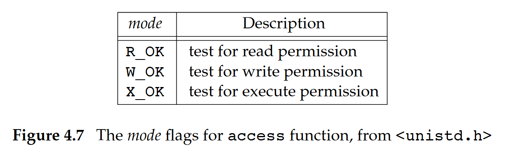
- 若「檔案不存在」，或「查詢的該項權限不被允許」，`access()` 就會回傳錯誤

在這個例子中，雖然 `open` 函式會成功，但這個 set-user-ID 程式仍能判斷「實際使用者」平常無法讀取該檔案：

```c
#include "apue.h"
#include <fcntl.h>
int main(int argc, char *argv[])
{
    if (argc != 2)
        err_quit("usage: a.out <pathname>");

    if (access(argv[1], R_OK) < 0)
        err_ret("access error for %s", argv[1]);
    else
        printf("read access OK\n");

    if (open(argv[1], O_RDONLY) < 0)
        err_ret("open error for %s", argv[1]);
    else
        printf("open for reading OK\n");
    exit(0);
}
```

輸出：

```bash
$ ls -l a.out
-rwxrwxr-x 1 sar 15945 Nov 30 12:10 a.out
$ ./a.out a.out
read access OK
open for reading OK
$ ls -l /etc/shadow
-r-------- 1 root 1315 Jul 17 2002 /etc/shadow
$ ./a.out /etc/shadow
access error for /etc/shadow: Permission denied
open error for /etc/shadow: Permission denied
$ su                   # become superuser
Password:              # enter superuser password
# chown root a.out     # change file’s user ID to root
# chmod u+s a.out      # and turn on set-user-ID bit
# ls -l a.out          # check owner and SUID bit
-rwsrwxr-x 1 root 15945 Nov 30 12:10 a.out
# exit                 # go back to normal user
$ ./a.out /etc/shadow
access error for /etc/shadow: Permission denied
open for reading OK
```

### Function：`umask`

- 行程每次建立新檔案或目錄時，會套用「檔案模式建立遮罩」來剝除部分權限（可用 `umask` 命令查看）
- 這個遮罩的值是九個權限常數的位元或組合，見下圖
  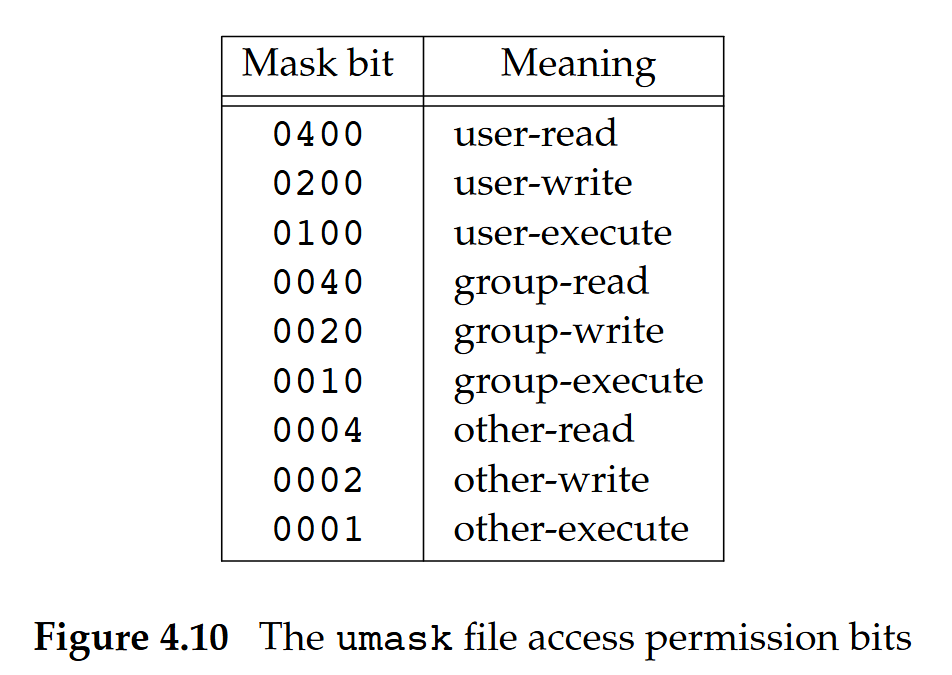
- 在遮罩中為 1 的位元，會在新檔案／目錄的 `st_mode` 中「被關閉」
  - 例如 `int fd = open("foo.txt", O_CREAT | O_WRONLY, 0666);`，此時系統不會直接用你給的 `0666`，而是會套 `umask` 上去：
    ```
    final_mode = requested_mode & ~umask
    ```
    取完 `&` 之後的結果，會成為新檔案/目錄的 `st_mode` 裡的權限部分

```c
#include <sys/stat.h>
// returns previous file mode creation mask
mode_t umask(mode_t cmask);
```

- 行程可以呼叫 `umask()` 來更新檔案模式建立遮罩
- `umask()` 會回傳「更新前」的數值
- `umask()` 的輸入引數是上圖（Figure 4.10）所列九個權限常數的位元或組合

下例（From APUE 3rd Edition Figure 4.9）的程式建立兩個檔案：第一個在 `umask(0)` 下建立，第二個在把群組與其他人的所有權限位元關閉的 `umask` 下建立：

```c
#include "apue.h"
#include <fcntl.h>
#define RWRWRW (S_IRUSR | S_IWUSR | S_IRGRP | S_IWGRP | S_IROTH | S_IWOTH)
int main(void)
{
    umask(0);
    if (creat("foo", RWRWRW) < 0)
        err_sys("creat error for foo");
    umask(S_IRGRP | S_IWGRP | S_IROTH | S_IWOTH);
    if (creat("bar", RWRWRW) < 0)
        err_sys("creat error for bar");
    exit(0);
}
```

輸出：

```bash
$ umask      first print the current file mode creation mask
002
$ ./a.out
$ ls -l foo bar
-rw------- 1 sar 0 Dec 7 21:20 bar
-rw-rw-rw- 1 sar 0 Dec 7 21:20 foo
$ umask      see if the file mode creation mask changed
002
```

每個 process 都有自己的 `umask`，存在 PCB 裡面（`task_struct->fs->umask`），當一個行程被建立時，它會繼承父行程的 `umask` 值，例如

- 你的 shell 有一個 `umask`
- 你在那個 shell 裡執行你的程式，這個程式一開始就帶著同樣的 `umask`

`umask` 可以在 shell 裡面設，也可以在 C program 裡面手動改

### Sticky Bit

- sticky bit 又稱 saved-text bit
  - 常數為 `S_ISVTX`，見 `st_mode` 的設定
- 在早期 Unix 中，若程式設了 sticky bit，第一次執行後在行程結束時，系統會把該程式的程式碼副本保留在記憶體某處
  - 為什麼這有用？
  - 在非常早期的 Unix，I/O 很慢、記憶體很小，而且讀取可執行檔（程式碼段）要從磁碟載入到記憶體再跑。跑完程式後，原則上核心可以把它從記憶體丟掉，之後有人再跑同一個程式，重新從磁碟載一次

    - 但如果某個常用的程式有設 sticky bit（當時叫 saved-text bit）：
    - 核心在程式第一次被執行後，不會馬上把它的程式碼段整個釋放掉

    而是把它留在快取區（例如 swap / core image 之類可以快速載回的位置），讓下一次執行同一個程式時可以更快啟動

    也就是說：sticky bit 當時的意思是「這個程式很常被跑，幫我把它留住，別每次都重讀磁碟」
- 在現代 Unix 中，sticky bit 不再具有保留程式碼的效果
- 如今 sticky bit 用在「目錄」上，提供檔案保護
- 若目錄設了 sticky bit，則只有在同時具備「對該目錄的寫入權限」且滿足下列任一條件時，才能刪除或更名該目錄內的檔案：
  - 使用者是檔案擁有者
  - 使用者是目錄擁有者
  - 使用者是超級使用者
- 問：`/tmp` 給所有人寫入權，是否代表你可以刪 `/tmp` 裡任何檔案？
  - 答：`/tmp` 是 sticky bit 的典型用法，使用者可以在 `/tmp` 中建立文件，但不能刪除或重新命名其他人擁有的文件！

```bash
shell> ls -ld /tmp
drwxrwxrwt 30 root root 20480 Mar 11 14:17 /tmp
```

其中 `drwxrwxrwt` 的 `t` 就為 sticky bit

SUID / SGID / sticky bit 都是把特殊位元疊在 owner/group/others 那三組的 `x` 的位置上顯示：

- 第 4 個字元（owner 權限的 `x` 位置）如果不是 `x` 而是 `s` / `S` → 代表這個檔案有設 SUID
- 第 7 個字元（group 權限的 `x` 位置）如果是 `s` / `S` → 代表有設 SGID
- 第 10 個字元（others 權限的 `x` 位置）如果是 `t` / `T` → 代表有設 sticky bit

### Function：`chmod`、`fchmod`

```c
#include <sys/stat.h>
// returns 0 if OK, -1 on error
int chmod(const char *pathname, mode_t mode);
int fchmod(int fd, mode_t mode);
```

- `chmod()` 與 `fchmod()` 用來修改既有檔案的存取權限
- `chmod()`：透過路徑對指定檔案操作
- `fchmod()`：對一個開啟中的 file descriptor 操作
- mode 以多個檔案模式常數的位元或組合來指定，見 `st_mode` 的設定

下列程式會修改兩個檔案的模式（From APUE 3rd Edition Figure 4.12）：

```c
#include "apue.h"
int main(void)
{
    struct stat statbuf;
    /* turn on set-group-ID and turn off group-execute */
    if (stat("foo", &statbuf) < 0)
        err_sys("stat error for foo");

    if (chmod("foo", (statbuf.st_mode &  ~S_IXGRP) | S_ISGID) < 0)
        err_sys("chmod error for foo");

    /* set absolute mode to "rw-r--r--" */
    if (chmod("bar", S_IRUSR | S_IWUSR | S_IRGRP | S_IROTH) < 0)
        err_sys("chmod error for bar");
    exit(0);
}
```

跑之前：

```
$ ls -l foo bar
-rw------- 1 sar 0 Dec 7 21:20 bar
-rw-rw-rw- 1 sar 0 Dec 7 21:20 foo
```

跑之後：

```
$ ls -l foo bar
-rw-r--r-- 1 sar 0 Dec 7 21:20 bar
-rw-rwSrw- 1 sar 0 Dec 7 21:20 foo
```

大寫 `S` 表示有設 SGID 但沒有執行權限 `x`，提醒你「這其實沒什麼意義」

### Function：`chown`、`fchown`、`lchown`

```c
#include <unistd.h>
// returns 0 if OK, -1 on error
int chown(const char *pathname, uid_t owner, gid_t group);
int fchown(int fd, uid_t owner, gid_t group);
int lchown(const char *pathname, uid_t owner, gid_t group);
```

- 這些 `chown` 系列函式讓行程可以變更檔案的使用者 ID 與群組 ID
  - `chown`：透過路徑對指定檔案操作
  - `fchown`：變更已經開啟之檔案的擁有權
  - `lchown`：與 `chown()` 類似，但當路徑指向符號連結時，`lchown` 會更改「符號連結本身」的擁有權； `chown()` 則會解參照到目標檔案
- 若 `owner` 或 `group` 任一引數為 -1，對應的身分就保持不變
- 備註：呼叫 `chmod` 或 `chown` 的行程必須是超級使用者，或其有效使用者 ID 等於該檔案的擁有者 ID

### 檔案大小

- `stat` 結構中的 `st_size` 成員以位元組記錄檔案大小
  - `st_size` 只對一般檔案、目錄與符號連結有意義
- 不同型態檔案的 `st_size`：
  - 一般檔案：介於 0 到 `off_t` 的最大值
  - 目錄：為 16 或 512 的倍數（依檔案系統實作而異）
  - 符號連結：等於其所儲存之路徑名稱的長度

### File Truncation

```c
#include <unistd.h>
// returns 0 if OK, -1 on error
int truncate(const char *pathname, off_t length);
int ftruncate(int fd, off_t length);
```

- 這兩個截斷函式會把既存（且可寫）的檔案裁成正好 `length` 位元組
  - 若原本檔案比 `length` 大，超出 `length` 之後的資料將無法再存取
  - 若原本檔案比 `length` 小，檔案會被擴張，舊檔尾與新檔尾之間讀到的內容為 0

## 檔案系統（File Systems）

### Unix 的檔案與目錄

- 檔案：一串位元組序列
- 目錄：一種檔案，其內容是如何找到其他檔案的資訊

你可以用 `mount` 命令列出所有已掛載的檔案系統

### File Systems

- 由目錄與檔案組成的階層式結構，自根目錄 `/` 開始
  - 這個結構對應到實體裝置上所存放的檔案與目錄
- 常見的 Unix 檔案系統實作有：UFS、HFS（舊版 macOS 的檔案系統）、ZFS、Ext4 等

我們可以把磁碟機想像成被切成一或多個分割區（partitions）。 每個分割區都可以包含一個檔案系統，如下圖所示。 i-node 是固定長度的項目，其中包含了關於某個檔案的大部分資訊

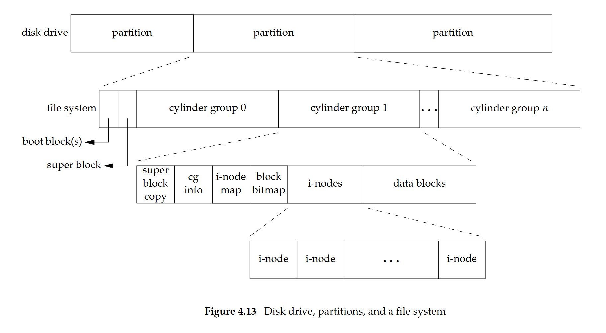

### i-node and i-node links

- i-node：固定大小的表目，保存一個檔案的各種資訊
  - i-node 大小例子：V7 為 64B，4.3+BSD 與 UFS 為 128B 等
  - i-node 包含檔案型態、存取權限位元、檔案大小、資料區塊指標、連結計數等（`stat` 結構中的資訊即取自 i-node）
- i-node 的連結計數（對應 `stat` 的 `st_nlink`）：
  - 記錄指向該 i-node 的目錄項數量（每個都稱為一個硬連結）
  - 只有當連結計數降為 0 時，該 i-node 指涉的檔案才會從檔案系統中被完全刪除
  - POSIX.1 的常數 `LINK_MAX` 規範了連結計數的上限
- 符號連結（Symbolic link）：
  - 其檔案內容儲存被指向檔案的路徑名稱
  - 檔案型態常數：`S_IFLNK`
  - 符號連結的大小就是其內容字串的長度
- 移動檔案（例如 `mv file1 file2`）：
  - 若在同一個檔案系統內，無須搬動磁碟上的資料區塊，只要更新目錄區塊中的目錄項即可：
    - 先新增一個指向既有 i-node 的新目錄項，再把舊目錄項 unlink
  - 移動完成後，檔案的連結計數維持不變

以下翻譯自 APUE 3rd Edition 第 4.14 節

如果我們把某個 cylinder group 裡的 i-node 區塊和資料區塊的部分放大來看，就會得到類似下圖的配置

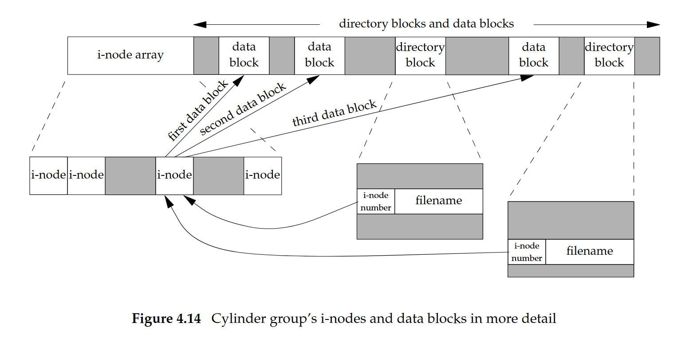

- 兩個目錄項目（directory entry）指向同一個 i-node。 每個 i-node 都有一個「連結計數」（link count），其內容是「有多少個目錄項目指向這個 i-node」。 只有當這個連結計數降到 0 時，這個檔案才可以被刪除（也就是釋放與這個檔案相關聯的資料區塊）

- 這也就是為什麼「unlink 一個檔案」這個動作，並不一定等同於「把這個檔案的資料區塊刪掉」。 也因此，用來移除目錄項目的函式叫做 `unlink`，而不是叫 `delete`。 在 `stat` 結構裡，連結計數被放在 `st_nlink` 這個成員裡。 這個成員的底層系統資料型態是 `nlink_t`。 這類型的連結稱為硬連結（hard link）

- 另一種類型的連結稱為符號連結（symbolic link，也稱為軟連結）。 對於符號連結來說，這個「檔案」本身的真正內容（也就是它的資料區塊）其實是存放「它所指向的檔案名稱」。 在下面的例子裡，目錄項目中的檔名是三個字元的字串 `lib`，而此檔案中那 7 個位元組的內容是 `usr/lib`：

  ```bash
  lrwxrwxrwx 1 root 7 Sep 25 07:14 lib -> usr/lib
  ```

  在這種情況下，該 i-node 裡的檔案型態欄位會是 `S_IFLNK`，用來讓系統知道這是一個符號連結

- i-node 內含了關於檔案的所有資訊：檔案型態、檔案的存取權限位元、檔案大小、指向檔案資料區塊的指標，等等。 `stat` 結構裡的大部分資訊都是從 i-node 取得的。 相對地，目錄項目本身只儲存兩個我們在此關心的東西：檔名，以及 i-node 編號。 其他像「檔名長度」與「這個目錄紀錄本身的長度」在這裡不是重點。 i-node 編號的資料型態是 `ino_t`

- 因為目錄項目中的 i-node 編號只能指向「同一個檔案系統」內的某個 i-node，所以一個目錄項目無法參照不同檔案系統裡的 i-node。 這就是為什麼 `ln(1)` 這個指令（它會建立一個新的目錄項目，指向一個既有檔案）不能跨檔案系統

- 當我們更名（rename）一個檔案，而且沒有跨越檔案系統時，檔案的實際內容並不需要被搬移。 我們只需要新增一個新的目錄項目，讓它指向原本的 i-node，然後把舊的目錄項目做 `unlink` 即可，連結計數會保持不變。 舉例來說，若要把檔案 `/usr/lib/foo` 改名成 `/usr/foo`，而且 `/usr/lib` 和 `/usr` 這兩個目錄位在同一個檔案系統上，那麼檔案 `foo` 的內容不需要真的搬移。 `mv(1)` 指令通常就是這樣運作的

我們前面談的是一般檔案（regular file）的連結計數這個概念，但那目錄的連結計數欄位呢？ 假設我們在目前的工作目錄底下建立一個新目錄，像這樣：

```bash
$ mkdir testdir
```

下圖顯示了結果。 在該圖中，我們特別把「`.`」和「`..`」這兩個項目也畫了出來

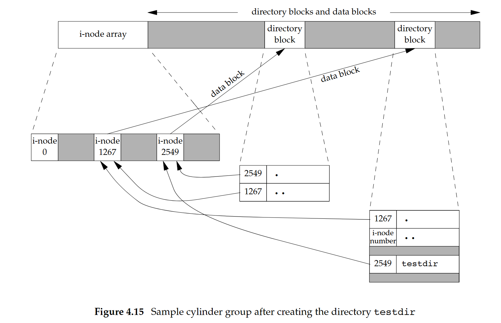

那個 i-node 編號為 2549 的項目，它的型態欄位是「目錄」（directory），而它的連結計數是 2。 任何「葉節點目錄」（leaf directory，也就是不包含其他子目錄的目錄）的連結計數一定為 2。 2 這個值來自兩個來源：一是命名這個目錄本身的那個目錄項目（例如 `testdir` 這個名字），二是這個目錄裡的「`.`」項目。

另外，i-node 編號為 1267 的那個項目，它的型態欄位同樣是「目錄」，而它的連結計數則大於或等於 3。 原因是：最低限度它會被以下幾個項目指到：命名它的那個目錄項目（圖 4.15 沒畫出來）、它自己目錄裡的「`.`」、以及 testdir 目錄裡的「`..`」。 請注意：在某個父目錄底下，每多一個子目錄，父目錄的連結計數就會再增加 1。

### Function：`link` and `unlink`

```c
#include <unistd.h>
// returns 0 if OK, -1 on error
int link(const char *existingpath, const char *newpath);
int unlink(const char *pathname);
```

- `link` 會建立一個新的目錄項 `newpath`，指向既有檔案 `existingpath`，等同幫檔案取了一個新名字，並把連結計數加一
  - 這就是建立一個硬連結
  - 若 `newpath` 已存在則回傳錯誤
- `unlink` 會移除由 `pathname` 指定的目錄項，並將該檔案的連結計數減一，也就是從檔案系統刪除一個名稱
  - 若該名稱是檔案的最後一個連結且沒有行程開啟該檔案，檔案就會被刪除，其占用空間可被重用
- 當 unlink 使連結計數降為 0 時有些細節：
  - 只要仍有行程開啟該檔案，其內容不會被刪除
  - 當檔案被關閉時，核心會先檢查「開啟該檔案的行程數」是否為 0； 若為 0，再檢查連結計數； 若也為 0，才刪除檔案內容
- 備註：
  - 建立或移除連結時，使用者必須對「包含該目錄項的目錄」擁有寫與執行權限，不會檢查目標檔案本身的權限
  - 若目錄設了 sticky bit，欲在該目錄中 unlink 檔案，行程還必須符合 sticky bit 的限制
  - 問題：如果 `pathname` 是符號連結會怎樣？

下例（From APUE 3d Edition Figure 4.16）會開啟一個檔案，再 unlink 它：

```c
#include "apue.h"
#include <fcntl.h>
int main(void)
{
    if (open("tempfile", O_RDWR) < 0)
        err_sys("open error");
    if (unlink("tempfile") < 0)
        err_sys("unlink error");
    printf("file unlinked\n");
    sleep(15);
    printf("done\n");
    exit(0);
}
```

輸出：

```bash
$ ls -l tempfile         # look at how big the file is
-rw-r----- 1 sar 413265408 Jan 21 07:14 tempfile
$ df /home               # check how much free space is available
Filesystem 1K-blocks   Used   Available Use% Mounted on
/dev/hda4 11021440 1956332    9065108  18%  /home
$ ./a.out &             # run the program in Figure 4.16 in the background
1364                    # the shell prints its process ID
$ file unlinked         # the file is unlinked
$ ls -l tempfile        # see if the filename is still there
ls: tempfile: No such file or directory   the directory entry is gone
$ df /home              # see if the space is available yet
Filesystem 1K-blocks   Used   Available Use% Mounted on
/dev/hda4 11021440 1956332    9065108  18%  /home
$ done                  # the program is done, all open files are closed
$ df /home              # now the disk space should be available
Filesystem 1K-blocks   Used   Available Use% Mounted on
/dev/hda4 11021440 1552352    9469088  15%  /home
```

- 硬連結的限制（多數 Unix 檔案系統，ZFS 例外）：
  - `link()` 的兩個路徑必須位於同一檔案系統
  - 一般使用者不可建立或刪除「指向目錄」的硬連結
    - 即便系統支援對目錄的硬連結，也只有超級使用者能對目錄做 link / unlink

### 符號連結 Symbolic (Soft) Links

- 符號連結是指向檔案的間接指標
- 由 4.2BSD 引入，用來解決硬連結的兩項限制：
  - 不可跨檔案系統
  - 無法連結到目錄
- 符號連結的大小等於其所指路徑字串的長度
- 使用以名稱操作檔案的函式時，必須了解該函式是否會「跟隨」符號連結
  - `stat()` / `lstat()`、`chown()` / `lchown()` 等對 symlink 的行為不同，系統呼叫族通常提供「不跟隨」變體以避免誤操作目標

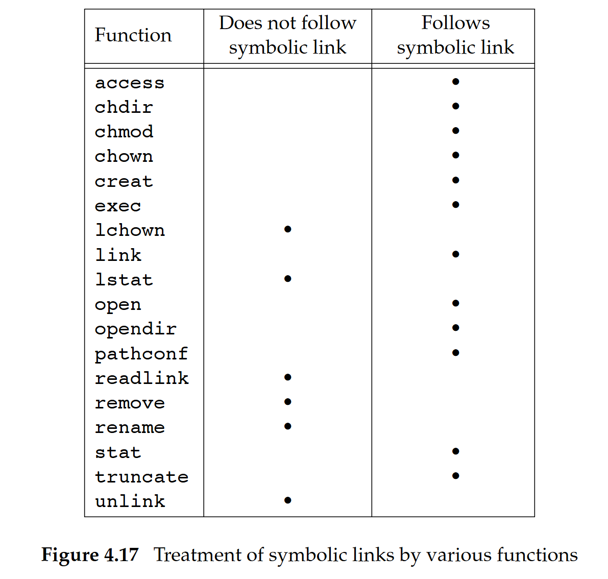

以下翻譯自 APUE 3rd Edition 第 4.17 節

使用符號連結可能在檔案系統中造成「迴圈」。 多數以路徑查找檔案的函式遇到此情況會回傳 `errno` 為 `ELOOP`。 下面的命令示範了建立自我循環的目錄連結：

```bash
$ mkdir foo           make a new directory
$ touch foo/a         create a 0-length file
$ ln -s ../foo foo/testdir   create a symbolic link
$ ls -l foo
total 0
-rw-r----- 1 sar 0 Jan 22 00:16 a
lrwxrwxrwx 1 sar 6 Jan 22 00:16 testdir -> ../foo
```

這會建立一個名為 `foo` 的目錄，其中包含檔案 `a` 以及一個指向 `foo` 的符號連結。 下圖展示了此結構，其中目錄以圓形表示，檔案則以方形表示：

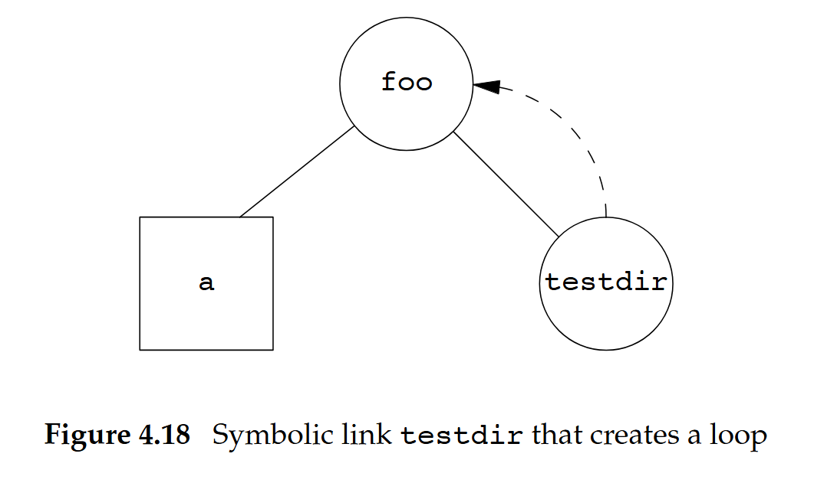

### 硬連結 vs 符號連結（軟連結）

- 硬連結：
  - 現有檔案的另一個名稱，目錄項直接指向該檔案的 i-node
  - 在 `stat` 結構中不會呈現「特別的型態」，因為它與原檔案就是同一個 i-node
  - 每個目錄項都是把某個檔名硬連到同一個 i-node
- 符號連結（軟連結）：
  - 一個內容保存被指向目標的路徑名稱的檔案，類似 Windows 的捷徑，用於簡化存取路徑
    - 常被用來把檔案或整個目錄樹「移到」系統的其他位置
  - 其目的正是為了彌補硬連結的限制
  - 符號連結的檔案型態是 `S_IFLINK`（在 `stat` 結構中指定）
  - 建立一個檔案，裡面放的是它所指向的路徑名稱

### Function：`symlink` and `readlink`

```c
#include <unistd.h>
// returns 0 if OK, -1 on error
int symlink(const char *actualpath, const char *sympath);

// returns the number of bytes read if OK, -1 on error
int readlink(const char *restrict pathname, char *restrict buf, size_t bufsize);
```

- `symlink()` 用來建立符號連結：
  - 產生名為 `sympath` 的符號連結，內容指向 `actualpath`
  - 建立時不要求 `actualpath` 一定存在
- `readlink()` 會把由 `pathname` 指定之符號連結的內容讀入 `buf`（長度為 `bufsize`）：
  - 若緩衝區太小，`readlink` 會把內容截斷到 `bufsize` 長度
  - 放入 `buf` 的內容不會以 NUL 結尾
  - 另有 `readlinkat()`（與 `symlinkat()`）的變體，細節請參考課本
    - 其關係類似 `open()` 對 `openat()`
