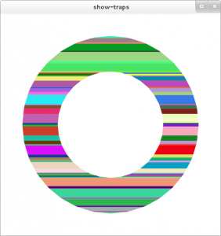
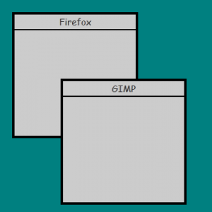
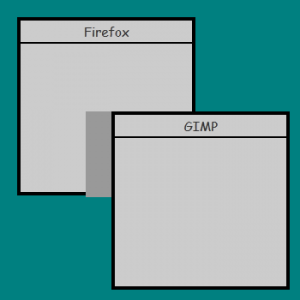

# Clean Rinse Blog 翻譯 & 筆記：The Linux graphics stack 

::: tip  
原文連結：https://blog.mecheye.net/2012/06/the-linux-graphics-stack/

這篇我覺得 big picture 給得比較好，但沒講太多細節，而另一篇 [The Linux graphics stack in a nutshell](https://mes0903.github.io/Linux/linux-graphic-stack/) 就有提到比較多細節的部份，但各個單元依舊沒展開講，這部分我之後再來開另一篇寫

與往常一樣，筆記的部分我會用綠色的 tip block 來寫，而原文的補充我會用藍色的 info block 來寫  
:::

這是一篇介紹性總覽文章，用來說明 Linux 圖形堆疊以及目前整個堆疊是如何組合在一起的。 一開始是為我自己而寫的，因為我曾經和 Owen Taylor、Ray Strode、Adam Jackson 等人談過這個堆疊，結果每隔大約一個月我就得再去找他們，從頭把所有東西重學一次，因為我會把每一塊都忘光

我曾經請他們推薦一份不錯的高階總覽文件，這樣我就不用一直去煩他們。 但他們說不知道有哪一份，於是我就寫了這一篇。 這篇文章後來由 Adam Jackson 和 David Airlie 審閱，他們兩位的工作都與圖形堆疊有關

另外我想說明的是，這個堆疊裡有相當多部分只適用於自由軟體的驅動程式。 這代表你在這裡讀到的很多內容，可能並不適用於 AMD Catalyst 或 NVIDIA 這類專有驅動程式。 它們可能有自己實作的 OpenGL，或是某個內部 fork 的 Mesa。 我在這裡描述的是搭配自由軟體 `radeon`、`nouveau` 和 Intel 驅動程式所使用的那套堆疊

如果你有任何問題，或者在哪個地方覺得不清楚，或者我在某件事上錯得離譜，或者我哪一句話寫得亂七八糟以致於根本看不懂，請在底下的留言區發問或告訴我

我會先把整個 big picture 列在最前面，讓你先從全局大致了解每一個元件在堆疊中的位置。 如果你一開始看不懂也沒關係，閱讀過程中你可以隨時回來對照著看

嚴格來說，實際上有兩條不同的路徑，取決於你在做哪一種類型的算繪：

1. **使用 OpenGL 的 3D 算繪**

   1. 程式啟動後，使用 OpenGL 來繪圖
   2. 名為 Mesa 的函式庫實作了 OpenGL API。 它使用針對顯示卡的專用驅動程式，將這個 API 轉換成硬體特定的形式。 如果驅動程式在內部使用 Gallium，會有一個共用元件把 OpenGL API 轉換成一種共同的中介表示 TGSI。 API 會經過 Gallium，而裝置特定的驅動程式所做的，就是把 TGSI 轉成硬體命令
   3. `libdrm` 使用一些特殊而不公開的、針對顯示卡的 ioctl 與 Linux 核心溝通
   4. Linux 核心因為擁有特殊權限，可以在顯示卡上以及為顯示卡配置記憶體
   5. 回到 Mesa 這一層，Mesa 透過 DRI2 與 Xorg 溝通，以確保緩衝區翻轉與視窗位置等狀態能夠同步

2. **使用 cairo 的 2D 算繪**

   1. 你的程式啟動後，使用 cairo 來繪圖
   2. 你使用漸層色來畫出幾個圓。 cairo 會把這些圓分解成梯形，然後透過 XRender 延伸功能把這些梯形和漸層送給 X server。 如果 X server 不支援 XRender 延伸功能，cairo 會在本地使用 `libpixman` 來繪圖，然後再用其他方法把算繪好的 pixmap 傳給 X server
   3. X server 會確認收到這個 XRender 要求。 Xorg 可以使用多個專門的驅動程式來負責繪圖
      - 在 software fallback 的情況下，或者顯示卡驅動程式無法勝任時，Xorg 會使用 pixman 來做實際的繪圖，做法類似 cairo 在前述情境中的作法
      - 在啟用硬體加速的情況下，Xorg 的驅動程式會透過 `libdrm` 對核心發送請求，以相同方式把紋理與命令送到顯示卡

   至於 Xorg 要如何把畫面內容送上螢幕，Xorg 本身會透過 KMS 以及顯示卡專用驅動程式設定一個 framebuffer，然後把畫面繪製到這個 framebuffer 上

::: tip  
「framebuffer」一詞主要可以代表三個東西：

1. **OpenGL 的 framebuffer（FBO / default framebuffer）**
   - 在 OpenGL 規格裡只是「一組 color / depth / stencil 附著的 render target」的抽象概念。
   - 實作上通常對應到某個 GPU buffer（例如一塊顯示記憶體中的 image）。
   - 在 X11 + GLX / EGL 上，這個 GPU buffer 又會綁到「某個 X window / pixmap」上。

2. **X11 的 render target：window / pixmap**
   - 對 X server 而言，畫圖是畫到 `Window` 或 `Pixmap` 這種物件上。
   - 在有 DRI2/DRI3 時，這些 pixmap 背後也對應到 DRM 的 buffer object（GEM/TTM），必要時可以用 dma-buf 共享

3. **DRM/KMS 的 framebuffer（`struct drm_framebuffer`）**
   - 在 KMS 的語境中被稱為「scanout buffer」，也就是 CRTC 正在掃描送到螢幕的那塊 buffer。
   - 每個 CRTC 的 primary plane 會綁一個 framebuffer，不是全系統永遠只會有一個，而是「每個輸出管線當下有一個正在被掃描的 buffer」

其中 **dma-buf** 是「怎麼在不同 driver / 子系統之間共享同一塊 buffer」的一套 generic 機制，輸出成 file descriptor，方便在 process 間轉交，DRM、V4L2 等都是用這套機制

所以，OpenGL 實際在畫的東西，以「X11 + DRI3 + compositing window manager」這種現代主流組合來說，流程大概是：

1. 你的程式用 GLX/EGL 建一個 context，綁在某個 X window 上。
2. 驅動（Mesa 的 DRI driver）為這個 window 準備幾個 render buffer（back buffer、depth buffer 等），實際上是 GEM buffer object。
3. 在 DRI3 裡，client 自己分配這些 buffer，然後透過 DRI3 extension 把它們當成 dma-buf FD 傳給 X server，X server 把它包裝成 pixmap

因此 OpenGL 畫的是「某個 GPU buffer」，這個 buffer 用 GEM 表示，在需要給 X server / compositor 用的時候，會以 dma-buf FD 形式被拿去交換：

- 從 **OpenGL 角度**：你在畫「default framebuffer」，也就是一個跟 X window 綁在一起的 framebuffer。
- 從 **DRM 角度**：那是一個（或多個）**GEM buffer object**，可以（但不一定每一刻都）透過 dma-buf 匯出。
- dma-buf 本身只是「分享 handle 的方式」，不是一個 buffer 的種類  
  - 詳見 [Buffer Sharing and Synchronization (dma-buf)](https://docs.kernel.org/driver-api/dma-buf.html) 與 [Exchanging pixel buffers](https://docs.kernel.org/userspace-api/dma-buf-alloc-exchange.html)

而 X server（例如 Xorg）主要管：

- X11 object：window / pixmap / gc / colormap 等等
- 哪個 pixmap 對應哪個 window
- 每個 window 的位置、大小、是否被 redirect（Composite extension）、是否被顯示
- 在非 compositing 環境下，負責直接把 window 的內容疊到螢幕 front buffer 上

在 DRI3 之後，對於「GPU 上的實際 buffer」：

- X server 把它們當作 pixmap
- 靠 DRI3 來將 pixmap 跟 DRM buffer 連結起來

所以我們可以說：

- **OpenGL client** 管的是「render buffer（GEM buffer）+ 自己的 GL context」
- **X server** 管的是「這些 buffer 跟 X window / pixmap 的關係，以及最後如何被送去 scanout」

至於最後真的被畫在螢幕上的 buffer，嚴格一點分：

1. **KMS level**：
   - 每個 CRTC 至少有一個 primary plane，primary plane 會指向一個 `drm_framebuffer`。
   - 多螢幕就是多 CRTC，各自有自己的 framebuffer

2. **compositing WM level**：
   - 每個 window 有自己的 off-screen buffer（在 X11 world 通常是 redirected pixmap，背後也是 GPU buffer）
   - compositor 會再把所有 window 的 buffer 合成到自己的「最終畫面」buffer 上

3. **X11 Composite Overlay Window（COW）**：
   - 這是 X Composite extension 定義的一個「覆蓋整個螢幕的特殊 X window」，專門給 compositing manager 畫東西用
   - 它本身還是 X server 眼中的「一個 window」，只是永遠在最上層（但在螢幕保護程式下面）。
   - compositor 把合成後的畫面畫到 COW 對應的 pixmap 上。

最底下要「拿去掃描到螢幕」的，是 KMS 的 `drm_framebuffer`，而不是 COW 本身。 COW 是 X11 這一層的抽象，它的內容最後還是會被 X server 綁到某個 KMS framebuffer 上。

也因此在有 compositing window manager 的 X11 桌面的情況下，不管底下的 application 是用 OpenGL、cairo、XRender、軟體 rasterization，最後都要經由 compositor 這一關

典型 GNOME Shell / KDE / Compiz 這種：

- **compositor（通常同時也是 window manager）** 會：
  - 向 X server 要每個 window 的 buffer（TFP、DRI3/dma-buf 等方式）
  - 用 OpenGL 或其他 API 把這些 buffer 畫成一個場景（含陰影、透明、動畫）；
  - 把合成後的結果畫到 COW 對應的 pixmap 上。
- X server 再把 COW 的內容綁到某個 KMS framebuffer，輸出到螢幕。

這邊針對 KMS 的部分再展開一下，framebuffer 一詞在 DRM/KMS 的語境裡通常指的是：

- `struct drm_framebuffer（framebuffer）`
  - 代表「可以被硬體拿來掃描輸出的圖像資源」。
  - 通常背後是一個或多個 buffer object（GEM/BO），例如一塊 GPU 記憶體。
  - 包含：
    - 寬、高；
    - 像素格式（XRGB8888、ARGB8888、NV12…）；
    - 每個 plane 的 pitch、offset 等。
- scanout buffer
  - 從硬體角度，就是「目前被顯示控制器（display controller）正在掃描送去螢幕的那塊 framebuffer」。
  - 所以很多時候「framebuffer == scanout buffer」，只差在是不是「正在被掃」

所以 framebuffer 是「可以拿來掃」的畫面，當某個 framebuffer 被掛給某個 plane/CRTC 並正在顯示，它就是那條輸出管線的 scanout buffer

其中 plane 是 display controller 裡的東西，概念類似一層「圖層（layer）」，每個 plane 有：

- 一個來源 framebuffer（哪塊 buffer 要貼上去）
- 自己在畫面上的位置（x, y）、大小（w, h）
- 混合模式（alpha、blend、z-order）等屬性

常見類型有：

- primary plane：主要背景圖層（典型就是桌面畫面）
- cursor plane：硬體滑鼠游標
- overlay plane：可以疊在 primary 上面顯示影片之類的

硬體會把同一個 CRTC 下掛的多個 plane 混合成最終畫面，所以：

> plane =「把某個 framebuffer 拉進來 + 指定要放在畫面哪 + 怎麼混合」的單位

而 CRTC（Cathode Ray Tube Controller）是歷史名詞，現在泛指「一條獨立的輸出管線」，一個 CRTC 負責：

- 設定顯示模式（解析度、刷新率、timing）
- 掃描自己的 plane-composition 結果
- 將畫面送到某個 connector（HDMI、DP、eDP 等）

可以把 CRTC 想成「這條管線上搭載了哪些 plane、用什麼 timing 在掃描並送到哪個螢幕」，因此

> 多螢幕 = 多個 CRTC，各自掛自己的 plane / framebuffer / connector

:::

## X Window System、X11、Xlib、Xorg

X11 不只和圖形有關，它和事件傳遞系統、附加在視窗上的屬性等概念，還有很多其他功能也都有關，許多非圖形相關的功能也都建立在它之上，例如剪貼簿與拖放功能

這裡把它列出來只是為了完整性以及當作簡單的例子。 我之後會試著另外寫一篇文章，專門介紹整個 X Window System、X11 以及它所有那些奇特的設計決策

- X11  
  X Window System 所使用的線路協定（wire protocol）
- Xlib  
  X Window System 用戶端一側的參考實作，以及一大堆用來管理 X Window System 視窗的工具，諸如 GTK+ 和 Qt 等支援 X 的工具都會用到它。 不過現在已經很少會在應用程式中直接使用 Xlib 了
- XCB  
  有時候會被提作 Xlib 的替代方案，它實作了 X11 協定中很大一部分。 它的 API 比 Xlib 低階得多，低階到現在的 Xlib 其實是建構在 XCB 之上。 我在這裡提到它只是因為它又是一個縮寫
- Xorg  
  系統伺服端的參考實作

:::info  
我會盡量小心且正確地標示我指的是什麼。 如果我說的是 X server，我指的是一個泛指的 X server，這可能是 Xorg，也可能是 Apple 自己的 X server 實作，或是 Kdrive

如果我說的是 X11 或 X Window System，我指的是整體的協定或系統的設計。 如果我說的是 Xorg，那就表示那是 Xorg 這個實作的細節，Xorg 是使用最廣的 X server，但那些細節也許完全不適用於其他的 X server。 如果我有哪裡只單獨寫了一個 X，那是一個 typo，請再告告訴我  
:::

X11 這個協定在設計時就預期要能擴充，也就是說可以在不建立新協定、也不破壞既有舊用戶端的情況下加入對新功能的支援。 舉例來說，`xeyes` 和 `oclock` 之所以能有那種特殊的形狀，是因為 Shape Extension，這個延伸功能提供了非矩形視窗的支援

這種看起來像魔法的功能無法憑空冒出來，要能使用這個延伸功能，伺服端和用戶端兩邊都必須先加入對它的支援。 核心協定本身提供了一些機制，讓用戶端可以詢問伺服器支援哪些延伸功能，這樣用戶端就知道自己可以使用哪些功能、不能使用哪些功能

X11 也被設計成所謂的 network transparent，這代表我們不能假設 X server 和任何 X 用戶端一定在同一台機器上，所以兩者之間的所有溝通都必須能經過網路。 但實際上，現代的桌面環境並不能直接在這種情境下運作，因為很多行程間通訊（IPI）是透過 X11 以外的系統，例如 DBus

如果是透過網路在交互，這些溝通會變得非常頻繁，產生大量流量。 因此實際上當伺服端和用戶端在同一台機器上時，它們不會經過網路，而是直接透過 UNIX socket 溝通，這樣核心就不需要在不同地方之間複製資料

稍後我們會再回到 X Window System 以及它眾多的延伸功能

## cairo

cairo 是一個繪圖函式庫，可以提供給像 Firefox 這樣的應用程式直接使用，或是透過 GTK+ 之類的函式庫來畫向量圖形，GTK+3 的繪圖模型完全建立在 cairo 之上

如果你曾經用過 HTML5 的 `<canvas>`，cairo 實作的 API 幾乎和它一樣。 雖然 `<canvas>` 最初是由 Apple 開發的，但是這個向量繪圖模型本身早就廣為人知，它就是 PostScript 的向量繪圖模型，而這個模型在其他向量圖形技術與標準中也受到支援，例如 PDF、Flash、SVG、Direct2D、Quartz 2D、OpenVG 等等

cairo 透過 Xlib 後端支援把圖形畫到 X11 的 surface 上

cairo 已經被用在 GTK+ 這類工具中。 在 GTK+ 2 時期加入了選用的功能，可以從 GTK+ 2.8 開始使用 cairo。 GTK+3 的繪圖模型則是必須使用 cairo

## XRender 延伸功能

X11 有一個特殊的延伸功能 XRender，它為抗鋸齒的繪圖基本圖元（primitives）提供支援，因為 X11 原本的圖形是有鋸齒的，另外還支援漸層、矩陣變換等等。 當初的設計目的是讓驅動程式可以為特定的繪圖類型提供專門的加速路徑。 不過由於一些直覺上不太容易理解的理由，實際情況似乎是，直接使用軟體 rasterization 的速度也差不多

XRender 處理的是對齊好的梯形，也就是左右邊緣可以有斜率的長方形。 Carl Worth 和 Keith Packard 提出了一種用軟體 rasterization 來畫梯形的快速方法。 梯形也非常容易被分解成兩個三角形，這樣就可以配合快速的硬體算繪。 cairo 裡面有一個很棒的 `show-traps` 工具，可以讓你稍微看出它如何把圖形細分成梯形

下面我們簡單畫了一個紅色的圓形。 它會被分解成兩組梯形，一組用來畫外框，一組用來填色


由於 `show-traps` 預設給出的圖示不太好理解，我稍微修改了這個工具，讓每個梯形都有不同的顏色。 這裡是用來畫黑色外框的那一組梯形



## pixman

X server 和 cairo 都會在某些時候需要做像素層級的操作。 過去 cairo 和 Xorg 各自有一套自己的實作，處理像是基本的 rasterization 演算法、對特定型態緩衝區（如 ARGB32、RGB24、RGB565）的像素層級存取、漸層、矩陣運算以及很多其他事情

現在 X server 和 cairo 共同使用一個名為 pixman 的低階函式庫來處理這些工作。 pixman 並不是要給外部使用的公開 API，也不是一個繪圖 API，嚴格說它根本算不上 API，而只是用來解決不同元件之間程式碼重複問題的一個方案

## OpenGL、Mesa、gallium

接下來進入有趣的部分，也就是現代的硬體加速，我假設大家已經知道 OpenGL 是什麼。 OpenGL 本身不是一個函式庫，因此不會有一套通用的 `libGL.so` 原始碼，每一家廠商都應該提供自己的 `libGL.so`。 NVIDIA 提供了自己的 OpenGL 實作，並隨之提供自己的 `libGL.so`，這套實作是基於它在 Windows 和 OS X 上的實作而來

如果你使用的是開放原始碼的驅動程式，你的 `libGL.so` 實作很可能來自 Mesa。 Mesa 本身包含許多東西，其中最有名的一項，就是它提供了 OpenGL 的實作。 Mesa 是一套 OpenGL API 的開放原始碼實作，支援多種後端。 Mesa 有三種以 CPU 為主的實作，分別是：

- swrast：舊而過時，不要再用了
- softpipe：較慢
- llvmpipe：有機會跑得相當快

Mesa 也有硬體特定的驅動程式。 Intel 支援 Mesa，為自家晶片組打造了多種驅動程式並隨 Mesa 一起發佈。 Mesa 也支援 `radeon` 和 `nouveau` 的驅動程式，不過它們建立在另一套稱為 gallium 的架構之上

gallium 並不神祕，它只是一組讓實作驅動程式變得容易一點的元件。 它的想法是由一些 state tracker 來實作某種形式的 API，例如 OpenGL、GLSL、Direct3D，然後把這些狀態轉換成一種中介表示，稱為 Tungsten Graphics Shader Infrastructure，也就是 TGSI，接著後端再把這個中介表示轉換成實際交給硬體執行的操作

可惜的是，Intel 的驅動程式並沒有使用 Gallium。 我的同事跟我說，那是因為 Intel 的驅動程式開發者不喜歡在 Mesa 和他們的驅動程式之間多出一層

## 小插曲：更多縮寫

由於有一堆容易搞混的縮寫，我又不想替每個縮寫各開一個標題再寫一整段，所以在這裡一次把它們列出來。 它們多半在今天的世界裡不那麼重要，主要只是當作一個方便的參考，免得你搞糊塗

- GLES  
  OpenGL 針對不同裝置形態有數種不同的 profile。 GLES 是其中一種，依照不同說法可以解釋成 GL Embedded System 或 GL Embedded Subset。 它是針對嵌入式市場的最新做法。 iPhone 支援 GLES 2.0
- GLX  
  OpenGL 本身沒有平台與視窗系統的概念。 因此需要一些繫結層來在 OpenGL 和像 X11 這樣的系統之間做轉換，例如把一個 OpenGL 場景顯示在 X11 視窗裡。 GLX 就是這樣的黏合層
- WGL  
  參考上面的說明，只是把 X11 換成 Windows，也就是那個微軟的作業系統
- EGL  
  EGL 和 GLES 經常被弄混。 EGL 是一個與平台無關的新 API，由 Khronos Group，也就是開發並標準化 OpenGL 的那個組織所制定，用來提供在各種平台上啟動並顯示 OpenGL 場景所需的機制。 和 OpenGL 一樣，EGL 由各家廠商自行實作，它是 WGL 與 GLX 類似那種繫結方式的替代方案，而不是像 GLUT 那樣只是疊在它們上面的函式庫
- fglrx  
  fglrx 是 AMD 專有的 Xorg OpenGL 驅動程式的舊名稱，現在稱為 Catalyst。 這個名字代表 FireGL and Radeon for X。 由於它是專有驅動程式，所以有自己的 `libGL.so` 實作。 我不知道它是否是以 Mesa 為基礎。 在這裡提到它只是因為 fglrx 中同時出現了 GL 和 X 這兩個字母，有時會被誤認為像 AIGLX 或 GLX 這類通用技術
- DIX、DDX  
  Xorg 中處理圖形的部分主要由兩個子系統構成：DIX Driver Independent X 子系統以及 DDX Driver Dependent X 子系統。 當我們談到某個 Xorg 驅動程式時，技術上更精確的稱呼應該是 DDX 驅動程式

## Xorg 驅動程式、DRM、DRI

前面我提過，Xorg 具備根據特定硬體來做加速算繪的能力。 我也要補充說明，這個能力並不是透過把 X11 的繪圖命令翻成 OpenGL 呼叫來實作的。 如果驅動程式是在 Mesa 那邊實作的，那又要怎麼做到這件事，同時不讓 Xorg 變成依賴 Mesa 呢

答案是建立一套新的基礎設施，讓 Mesa 和 Xorg 可以共用。 Mesa 負責實作 OpenGL 的部分，Xorg 負責實作 X11 的繪圖部分，兩邊最後都轉成一組針對顯示卡的專用命令。 這些命令會透過一個稱為 Direct Rendering Manager 的東西上傳到核心，簡稱 DRM

::: tip  
所以做法是：

- Mesa：負責「OpenGL 語意 → GPU 命令串」
- Xorg：負責「X11 繪圖語意 → GPU 命令串」
- 兩者在最後一層「送命令給 GPU」時，共用同一套基礎設施：
  - Linux kernel 裡的 Direct Rendering Manager（DRM）子系統  
:::

接著 `libdrm` 使用一組通用但不公開的 ioctl 與核心溝通，在顯示卡上配置它需要的各種資源，然後把命令與紋理等資料塞進去。 這個 ioctl 介面有兩種形式，一種是 Intel 的 GEM，另一種是 Tungsten Graphics 的 TTM

::: tip  
「通用但不公開的 ioctl」是指這些 ioctl 介面不是給一般應用程式直接使用的穩定 ABI，比較是給 Mesa / Xorg / 驅動相關程式用的「內部介面」，可能會隨 kernel 版本演進而改變  
:::

這兩者之間並沒有明確差異，做的事情其實一樣，只是兩套彼此競爭的實作而已。 歷史上，GEM 當初被設計出來並高調宣稱要成為比 TTM 更簡單的替代方案，不過隨著時間過去，它悄悄長成了與 TTM 差不多複雜的東西，在處理不同方面的問題上各有好處

這表示當你執行像 `glxgears` 這樣的程式時，它會載入 Mesa。 Mesa 本身會載入 `libdrm`，而 `libdrm` 則使用 GEM 或 TTM 直接和核心驅動程式對話。 沒錯，`glxgears` 就是直接和核心驅動程式溝通，只為了在螢幕上畫出幾個旋轉的齒輪，順便嚴肅提醒你不要把這個工具拿來當性能評測的依據

如果你檢查 `ls /usr/lib64/libdrm_*`，會發現裡面有各種硬體專用的驅動程式。 在 GEM 或 TTM 不夠用的情況下，Mesa 和 X server 的驅動程式會另外定義一組私有的 ioctl 來和核心對話，而這些 ioctl 就封裝在這些檔案裡。 `libdrm` 本身不會主動載入這些東西

::: tip  
libdrm 本身提供一套「核心通用部分」的 API，但不同 GPU 廠商有各自特殊需求，因此會有：

- `libdrm_intel.so`
- `libdrm_radeon.so`
- `libdrm_nouveau.so`

等等，這些 per-GPU library 裡通常包含：

- 特定硬體的專用 ioctl 封裝
- 特定的 buffer / tiling / ring submission 相關 helper

原文提「`libdrm` 本身不會主動載入這些東西」的意思是主程式（例如 Mesa 的某個 driver、Xorg 的某個 DDX 驅動）會自己決定要載入哪個 `libdrm_*.so`，而不是 `libdrm` 自己動態去掃「有哪些 GPU library 就全部載入」  
:::

不過 X server 需要知道這裡發生了什麼事情，這樣它才能做像同步這類的工作。 你的 `glxgears`、核心以及 X server 之間的這種同步機制稱為 DRI，更精確地說是 DRI2。 DRI 代表 Direct Rendering Infrastructure，不過這個縮寫有點奇妙。 DRI 一方面指的是把 Mesa 和 Xorg 黏在一起的那個專案，也就是引入 DRM 以及我在本文談到的一堆東西的那個專案，另一方面也指 DRI 協定與函式庫本身。 DRI 1 做得不是很好，所以我們把它丟掉，改用 DRI 2

::: tip  
目前已有 DRI 3 了，從歷史上看，DRI 是一個專案名稱：

- 它定義了「OpenGL 程式如何在 X Window System 裡做硬體加速」的整套框架，
- 涉及 Mesa + X server + kernel DRM 三方的協作。

同時，「DRI」也代表：

- 一組 X 擴充協定（DRI/DRI2/DRI3 extension），
- 一組對應的 函式庫與 API（讓 X client / Mesa 與 X server 協調 buffer、權限與同步）

這裡的「同步」包含：

- 哪個 DRM 裝置 / driver 要用
- 哪些 buffer 是哪個視窗的 render target
- 什麼時候可以呈現到螢幕（swap / blit / vblank 同步）
- 避免 X server 和 direct rendering 的 GL client 彼此踩到對方畫的畫面  
:::

## KMS

順帶一提，假設你正在開發一個新的 X server，或者你想在不用 X server 的情況下，在某個 VT 上顯示圖形，那你就必須設定實際的硬體，才能把圖形畫出去。 在 `libdrm` 和核心裡有一個專門做這件事的子系統，稱為 KMS，也就是 Kernel Mode Setting。 你仍然是透過一組 ioctl 來與之交互，可以設定顯示模式、對映一個 framebuffer 等等，然後直接在某個 TTY 上顯示

以前曾經持續存在著各種硬體專用的 ioctl，後來我們為其建立了一個名為 `libkms` 的共用函式庫，提供了一組共同的 API。 再往後發展，核心層又新增了一組新的 API，字面上就叫做 dumb ioctls。 有了新的 dumb ioctls 之後，現在建議使用這些 dumb ioctls，而不是 `libkms`

雖然這一層非常低階，不過要這樣做完全是可行的。 Plymouth 也就是現代發行版裡整合的開機啟動畫面，就是一個簡單的應用程式範例，它就是透過這種方式在不依賴 X server 的情況下設定圖形顯示

## 「Expose」模型、Redirection、TFP、Compositing、AIGLX

前面我已經使用過 compositing window manager 這個詞，但還沒有真正說明 composite 到底是什麼意思，或是 window manager 到底在做什麼。 回到當年 X Window System 在各種 UNIX 系統上被設計出來的八零年代，很多像 HP、Digital Equipment Corp.、Sun Microsystems、SGI 這類公司也都在開發基於 X Window System 的產品。 X11 在設計時刻意沒有規定任何關於視窗應該如何被控制的基本政策，而是把這項責任交給另一個獨立行程，也就是所謂的 window manager

例如，當時相當流行的環境 CDE 採用一種稱為 focus follows mouse 的機制，也就是當使用者把滑鼠移動到某個視窗上時，焦點就會移到那個視窗。 這和 Windows 與 Mac OS X 預設使用的 click to focus 模型不同，後者是必須點一下視窗才會取得焦點

隨著 window manager 變得越來越複雜，開始出現一些文件來描述不同環境之間如何互通。 不過這些文件本身也不會真的去規定像 click to focus 這樣的政策

::: tip  
X11 一開始刻意「不管視窗政策」，它只提供「畫視窗、收輸入、送事件」這種低階功能，但「視窗怎麼排、誰有焦點、要不要邊框、標題列長什麼樣」全部都丟給另一個獨立的行程決定，這個行程就是 window manager

因此：

- CDE 可以選擇「focus follows mouse」：
  - 滑鼠移到哪個窗，焦點就自動到哪個窗
- Windows / macOS 預設是「click to focus」：
  - 你一定要點一下窗口，它才會拿到焦點。

這種「焦點政策」不是 X server 決定，而是各家 window manager 自己決定，所以不同桌面環境可以長得很不一樣。

後來 window manager 功能越做越多（虛擬桌面、panel、dock、各種特效），社群才開始寫一些規範（如 EWMH 等）只是在協調「怎麼互通」，並不要求一定要用哪一套政策（例如一定要 click to focus）  
:::

另外，在八零年代，許多系統的記憶體容量都很小，無法把所有視窗的像素內容全部存起來。 Windows 和 X11 以同樣的方式解決這個問題，每一個 X11 視窗都被設計成可以是有失真的。 也就是說，當某個視窗被揭開（Expose）時，程式會收到通知

假設有一組像這樣排列的視窗：



現在假設使用者把 GIMP 拖開，深灰色的區域就是被揭開出來的部分：



此時擁有這個視窗的程式會收到一個 ExposeEvent，然後它必須重新繪製內容。 這也是為什麼在某些版本的 Windows 或 Linux 裡，如果某個程式當機，當你拖動其他視窗經過時，它就會一片空白。 再想想在 Windows 當中，桌面本身其實也只是沒有任何特權的另一個程式，同樣可能像其他程式一樣當機，這時你就會得到一份相當棘手的 [bug report](http://mrdoob.com/lab/javascript/effects/ie6/)

::: tip  
八零年代的機器記憶體很小，沒辦法幫每一個視窗都存一份完整的像素內容，所以 X11 和 Windows 當時採取一樣的策略：視窗內容是可以「遺失的（lossy）」

具體來說：

1. 每個視窗自己負責畫自己的內容
2. 當某個視窗被遮住一部分，再被「揭開」時：
  - X server 只會送一個 ExposeEvent 給該視窗的程式。
  - 這個程式必須自己重新把暴露出來的那一塊畫回去。

如果程式掛掉或卡死：

- 它就收不到或不處理 ExposeEvent
- 你拖動其他視窗經過時，那塊就會是空白或殘影  
:::

既然現在的機器通常都擁有大量的記憶體，我們就有機會透過一種稱為 redirection 的機制，讓 X11 視窗變成無遺失的（lossless）。 當我們對某個視窗做 redirection 時，X server 會為每個視窗建立一個 backing pixmap，而不是直接畫到 backbuffer。 這表示視窗本身會完全被藏起來，必須有其他程式負責把記憶體緩衝區裡的像素顯示出來

::: tip  
那個「負責把所有視窗的 pixmap 合成（composite）成最後畫面」的程式，就是 compositing window manager，也常簡稱 compositor  
:::

[Composite 延伸功能](http://www.x.org/releases/X11R7.7/doc/compositeproto/compositeproto.txt)允許一個 compositing window manager（也就是 compositor）建立一個稱為 Composite Overlay Window 的東西，縮寫是 COW。 compositor 擁有這個 COW，可以在上面繪圖。 當你執行 Compiz 或 GNOME Shell 時，這些程式就會使用 OpenGL 把被重導的視窗顯示在螢幕上

::: tip  
X.Org 的 Composite extension 做了幾件事：

1. 允許把視窗「redirection」到 backing pixmap。
2. 允許一個特別的程式（compositor）建立一個「Composite Overlay Window（COW）」：
     - COW 是一個覆蓋在最上層的大視窗。
     - compositor 擁有這個 COW，並且可以在上面畫東西。

在啟用 compositing 的情況下，大致流程變成：

- 一般應用程式：
  - 還是照平常方式「畫自己的視窗」，但實際上畫進的是 backing pixmap。
- compositor：
  - 拿到每個視窗對應的 pixmap。
  - 把這些 pixmap 的內容，畫到 COW 上（通常用 OpenGL）。
  - 你螢幕上看到的畫面，其實就是這個 COW 的內容。

像 Compiz、GNOME Shell 就是這樣透過 OpenGL 把所有視窗貼成 3D 效果、透明、陰影等  
:::

X server 可以透過一個名為 [Texture from Pixmap](https://registry.khronos.org/OpenGL/extensions/EXT/GLX_EXT_texture_from_pixmap.txt) 的 GL 延伸功能（簡稱為 TFP），將視窗內容交給它們。 TFP 讓一個 OpenGL 程式可以把 X11 的 Pixmap 當成 OpenGL 的 Texture 來使用

嚴格說來，compositing window manager 並不一定得使用 TFP 或 OpenGL，只是這樣做是最簡單的方式。 它們也可以用一般方式把視窗的 pixmap 畫到 COW 上，我聽說 `kwin4` 就是直接使用 Qt 來合成視窗

::: tip  
`GLX_EXT_texture_from_pixmap`（TFP）這個 OpenGL 延伸功能做的事很單純：

- 允許一個 OpenGL 程式，直接把 X11 的 Pixmap 綁成 OpenGL 的 Texture 使用

這讓 compositor 可以：

1. 向 X server 要到每個視窗的 backing pixmap。
2. 用 TFP 把這個 pixmap 當成 GPU 上的 texture。
3. 在 OpenGL 場景裡：
    - 把每個視窗貼到對應的矩形上。
    - 再做移動、縮放、旋轉、透明度、模糊等轉換。

嚴格說來，compositing window manager 不一定要用 OpenGL／TFP，也可以用 CPU 軟體繪圖把 pixmap 畫到 COW 上，只是用 OpenGL／TFP 是最實務、效能最好、也是比較常見的方式  
:::

compositing window manager 會透過 TFP 從 X server 抓取 pixmap，然後在 OpenGL 場景中把它畫在正確的位置上，藉此營造出一種錯覺，讓你以為自己點擊的是實際的 X11 視窗

把這形容成錯覺也許聽起來有點奇怪，不過你可以試著在 GNOME Shell 裡玩玩看，調整視窗 actor 的大小或位置，在 looking glass 裡輸入

```c
global.get_window_actors().forEach(function(w) { w.scale_x = w.scale_y = 0.5; })
```

你很快就會看到這個錯覺在眼前崩壞，因為你會發現當你點擊時，其實是直接穿過影片播放器，點到了底下那個真正的視窗。 如果要恢復原狀，把上面那段程式碼裡的 `0.5` 改回 `1.0` 即可

有了上面的背景，我們可以來解釋另一個縮寫，也就是 AIGLX，其為 Accelerated Indirect GLX 的縮寫。 由於 X11 本身是一個網路化的協定，理論上 OpenGL 也必須能在網路上運作。 當 OpenGL 是透過網路在使用時，這稱為 indirect context，和 direct context，也就是所有東西都在同一台機器上的情況相對應。 用在 indirect context 上的那套網路協定其實相當不完整，而且不穩定

要理解 AIGLX 背後的設計決策，你得先知道它想解決的是什麼問題，也就是讓像 Compiz 這樣的 compositing window manager 跑得快一些。 當時 NVIDIA 的專有驅動程式已經透過自訂介面在核心層做記憶體管理，不過開放原始碼堆疊還沒做到這一步。 如果要把 X server 中的視窗紋理拉進顯示卡硬體，就代表每次視窗內容更新時都必須重新複製一次，會很慢

::: tip  
因為 X11 是網路協定：

- 如果 OpenGL 呼叫透過 X11 協定傳到遠端 X server 執行，就叫 indirect context。
- 如果 OpenGL 直接在本機透過 libGL 和 kernel 驅動（DRM）溝通，就叫 direct context。

在早期 compositing 時代的難題是：

- 視窗的 pixmap 掌握在 X server 手上。
- 但 GPU 的記憶體管理又是由 kernel / DRI 那邊掌握。
- 要讓 compositor 高效地取得 pixmap，貼成 texture，需要一套「完整的共享記憶體／buffer 管理」堆疊，當時開源驅動還沒完全建立好  
:::

於是 AIGLX 就當成一個暫時性的 hack，用軟體實作 OpenGL，避免把資料複製進硬體加速的那一端。 由於像 Compiz 這種 compositor 使用的場景並不算複雜，這樣的作法在當時還算堪用。 儘管當年有不少宣傳和 Phoronix 上的文章，AIGLX 已經有一段時間沒有被實際使用了，因為現在我們已經有完整的 DRI 堆疊，可以在不用複製的情況下實作 TFP

可以想見，要複製（更精確地說是取樣）視窗紋理內容「需要複製資料」，以便將其當成 OpenGL 紋理來繪製。 基於這個理由，大多數 window manager 都有一個功能，可以在視窗全螢幕時關閉 redirection

把這稱為 unredirection 聽起來有點古怪，因為那其實是視窗一開始的原始狀態。 不過雖然那是視窗的初始狀態，在現代的 Linux 桌面環境裡，卻不是常態。 這裡的邏輯是，如果某個視窗無論如何都會把整個 COW 蓋滿，而且也不需要任何 compositing 的特效，那就可以放心把它設回不重導。 這項功能就是為了讓像遊戲這樣需要在每秒六十影格下高效運作的程式，可以取得更高的效能

## Wayland

可以看到，我們已經把 X 起初那種單一龐大整體的基礎設施拆出相當多部分。 被拆解的不只這一塊，很多輸入裝置的處理已經透過 evdev 移進核心，而像裝置熱插拔支援這類東西也已經移回 udev

X Window System 至今之所以還存在，主要原因之一只是因為要替換它需要投入龐大心力。 如今 Xorg 已經和當初的樣貌大不相同，許多現代桌面環境所需的功能幾乎全都由延伸功能提供，該怎麼說呢，[X 其實早該退休了](https://www.xkcd.com/963/)

接著登場的是 Wayland，Wayland 重複利用了我們這些年建立起來的大量基礎設施。 它其中一個最具爭議的地方，是完全沒有提供任何 network transparency 或繪圖協定。 X 的 network transparency 在現代已經派不上什麼用場，許多 Linux 功能是建構在像 DBus 這樣的系統上，而不是在 X 上，因此像拖放和剪貼簿支援這類功能，主要還是得透過 X Window System 實現，這僅僅只是為了滿足網路支援的需求，其實有點可惜

Wayland 幾乎可以使用上面提到的整個堆疊，來在你的螢幕上建立並啟動一個 framebuffer。 Wayland 仍然有自己的協定，不過是基於 UNIX socket 和本地資源的。 最大的變化在於，系統裡不會像 `/usr/bin/Xorg` 那樣有一個 `/usr/bin/wayland` 的可執行檔在跑。 相反地，Wayland 採納了現代桌面環境的建議，把所有這些工作都移進 window manager 行程中

這些 window manager 在 Wayland 的用語裡更精確的稱呼是 compositor，它們實際負責透過像 evdev 這樣的系統從核心拉取事件，使用 KMS 和 DRM 設定 framebuffer，然後用自己選擇的任何繪圖堆疊（包括 OpenGL）把視窗顯示在螢幕上

雖然這聽起來需要很多程式碼，不過由於這些子系統早已移到其他地方，真正要完成上述所有事情的程式碼量大概只有兩千到三千行左右。 拿來對照的話，光是 mutter 中實作一套合理的視窗焦點和堆疊政策並把它和 X server 同步，就需要大約四千到五千行左右，這樣你大概也比較能理解為什麼大家會喜歡這種設計

儘管 Wayland 確實提供了一個函式庫，讓用戶端和 compositor 的實作都可以使用，不過它其實只是指定的 Wayland 協定的一個參考實作。 理論上完全可以用 Python 或 Ruby 寫出一個 Wayland compositor，並用純 Python 實作整個協定，而完全不依賴 `libwayland`

Wayland 用戶端會和 compositor 溝通並請求一個緩衝區。 compositor 會回傳一個緩衝區給它們，讓它們可以用 OpenGL、cairo 或任何想用的東西在裡面繪圖。 compositor 則可以依照自己的判斷任意處理這個緩衝區，自由地保留想要的畫面，或刪去不想要的畫面

compositor 同時也掌控輸入與事件處理。 如果你剛才在 GNOME Shell 裡實驗過調整視窗縮放的那個技巧，一開始可能會覺得很困惑，接著才發現你的滑鼠其實對應到的是沒有被縮放之前的視窗。 這是因為我們並沒有真正去改變 X11 視窗本身，而只是改變它被顯示出來的方式。 X server 會記錄視窗所在的位置，而 compositing window manager 則必須把視窗畫在 X server 認為它所在的位置，否則就會產生混亂

由於 Wayland 的 compositor 負責從 evdev 讀取輸入並把事件送給各個視窗，它對於視窗實際位置的掌握會好很多，並且可以在內部完成各種轉換。 這代表我們不只可以暫時把視窗貼到立方體上轉來轉去，還能在立方體上的視窗上進行互動

## 總結

到今天我仍然常聽到有人說 Xorg 的實作非常單一且龐大，這句話雖然還是對的，不過比起很久以前已經不那麼對了。 造成這樣情況並不是因為 Xorg 開發者能力不足，而是有很多歷史包袱是我們不得不繼續支援的，例如硬體加速的 XRender 協定，甚至再往前推一點，像 XPolyFill 這類完全沒有抗鋸齒的繪圖命令也是

雖然 X 遲早會被 Wayland 取代這件事已經相當明顯，我還是想說清楚，這整個過程其實是在 Xorg 與桌面開發者的認知與協助下進行的。 他們既不頑固，也不是無能。 老實說，能在三十年歷史的協定上工作並持續實作它，而且還能架構出新的設計，他們做得非常出色

我也想在這裡向所有參與本文中提到這些技術的人致意，同時特別感謝 Owen Taylor、Ray Strode 和 Adam Jackson 非常有耐心地回答我所有那些笨問題，也感謝 Dave Airlie 和 Adam Jackson 幫忙替這篇文章做技術審閱

雖然我在每一個部分都有稍微深入一些細節，不過如果你有興趣，這裡其實還有非常多面向可以更深入研究。 舉幾個例子，你可以研究 cairo 用來把任意形狀轉換成梯形的幾何演算法與理論，或者研究 Carl Worth 和 Keith Packard 提出的快速梯形軟體算繪演算法，弄清楚它為什麼快

也可以看看 DRI2 的設計，以及它和 DRI1 有哪些不同。 又或者你對硬體本身有興趣，想研究顯示卡架構，翻資料手冊看看要如何對它們進行程式設計。 如果你想在這些領域幫忙，我想前面提到的所有專案都會非常樂意接受你的貢獻

我打算未來再寫更多類似的文章。 現在在 Linux 與 GNOME 社群中使用的許多堆疊，其實都還欠缺一份從高階角度來詳細說明整體架構的良好總覽文件
