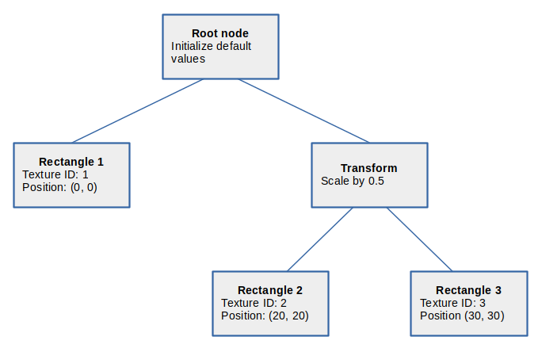

# The Linux graphics stack in a nutshell 翻譯 & 筆記

原文連結：

- [The Linux graphics stack in a nutshell, part 1](https://lwn.net/Articles/955376)
- [The Linux graphics stack in a nutshell, part 2](https://lwn.net/Articles/955708)

## The Linux graphics stack in a nutshell, part 1

當 Linux 圖形開發者談到「現代的 Linux 圖形系統」時，通常指的是多個獨立軟體元件的組合。 它包含了由核心管理的顯示資源、用於合成的 Wayland、加速的 3D 算繪（而非 X11）。 這個系列的兩篇文章會快速地帶你走訪圖形程式碼，看看它是如何把應用程式的資料轉成畫素資料並顯示到螢幕上的。 本文這一篇將聚焦於應用程式算繪、Mesa 的內部運作，以及所需的核心功能

### Application rendering

圖形輸出從應用程式開始，應用程式會處理並保存要視覺化的格式化資料。 用於視覺化的常見資料結構是「[場景圖（scene graph）](https://en.wikipedia.org/wiki/Scene_graph)」：它是一棵樹，其中的每個節點要麼存放三維空間中的模型，要麼存放模型的屬性

模型節點包含要呈現的資料，例如遊戲的場景，或科學模擬的元素； 屬性節點則設定模型的朝向或位置，每個屬性節點都會影響其下方的節點。 為了把場景圖算繪成螢幕上的影像，應用程式會自上而下、由左到右走訪這棵樹，依序設定或清除屬性，並相應地算繪 3D 模型

在下方的範例場景圖裡，算繪從根節點開始，根節點會準備算繪器（renderer）並設定輸出位置。 應用程式先走左側分支，在座標 $(0, 0)$ 算繪「Rectangle 1」，並套用上存放於「Texture 1」裡面的表面圖樣。 接著應用程式回到根節點，改走右側分支，進入名為「Transform」的屬性節點

應用程式以 4×4 矩陣描述各種變換（例如定位或縮放），演算法會在算繪過程中套用這些矩陣。 此例中，該變換節點將其所有子節點等比例縮放為 0.5 倍，因此算繪「Rectangle 2」與「Rectangle 3」時，大小會呈現為原來的一半，位置分別調整為 $(10, 10)$ 與 $(15, 15)$。 這兩個矩形使用了不同的紋理：分別為 2 與 3



為了簡化算繪並利用硬體加速，大多數應用程式會使用標準 API，例如 [OpenGL](https://opengl.org/) 或 [Vulkan](https://vulkan.org/)。 不同 API 的細節各有差異，但它們都提供介面來管理圖形記憶體、把資料寫入其中，並算繪已保存的資訊。 最終會得到一張影像，應用程式可以直接顯示，或再把它當成輸入做後續處理

所有圖形資料都放在「緩衝物件」裡，每個緩衝物件都是一段圖形記憶體，並附有控制代碼或 ID。 例如，3D 模型會存放在對應的「[頂點緩衝物件（vertex-buffer object）](https://en.wikipedia.org/wiki/Vertex_buffer_object)」中，紋理會存放在「[紋理緩衝物件（texture-buffer object）](https://www.khronos.org/opengl/wiki/Texture)」中，物件的[表面法線](https://en.wikipedia.org/wiki/Normal_(geometry))也會放在緩衝物件裡，而輸出的影像本身也[存放在一個緩衝物件裡](https://www.khronos.org/opengl/wiki/Framebuffer_Object)。 因此，圖形算繪在很大程度上其實是記憶體管理的工作

::: tip  
在 OpenGL 名稱裡，VBO（Vertex Buffer Object）是常見的頂點資料容器，它只是「緩衝物件」在作為頂點來源時的慣稱。 紋理一般對應到「紋理物件（texture object）」，另有一種稱為 Buffer Texture / Texture Buffer Object（TBO）的機制，讓紋理直接使用一個緩衝物件作為儲存體、供著色器索引大量資料，因此原文內提到的「紋理緩衝物件」可視為泛指「與紋理相關的（含 TBO 在內的）物件/緩衝」

至於「輸出影像」在實作上可能是附著於 framebuffer 的紋理或 renderbuffer，但要點是一切最終都落在由句柄/控制代碼管理的 GPU 記憶體區塊上，這也是為何圖形程式設計很大一部分在處理資源與記憶體生命週期  
:::

只要圖形[著色器（shader）](https://en.wikipedia.org/wiki/Shader)能處理，應用程式就可以用任何格式提供輸入資料。 著色器是一種程式，其中包含把輸入資料轉換成輸出影像的指令，它由應用程式提供，並由顯示卡來執行

實際的的著色器程式可能會實作複雜的 multi-pass 演算法，但在此範例中只會介紹必要的部分。 著色器中最常見的兩種操作，大概是頂點變換與紋理查詢。 我們可以把頂點想成多邊形的角。 用 [OpenGL Shading Language（GLSL）](https://www.khronos.org/opengl/wiki/OpenGL_Shading_Language)撰寫時，頂點變換看起來像這樣：

```c
uniform mat4 Matrix; // same for all of a rectangles's vertices
in vec4 inVertexCoord; // contains a different vertex coordinate on each invocation

gl_Position = Matrix * inVertexCoord;
```

變數 `inVertexCoord` 是來自應用程式場景圖的輸入座標。 變數 `gl_Position` 則是在應用程式輸出緩衝中的座標。 簡單來說，前者屬於顯示中的場景座標系，後者屬於應用程式視窗內的座標系。 `Matrix` 是描述這兩個座標系之間的變換的 4×4 矩陣

這段著色器操作會對場景圖中的每個頂點執行一次。 在前述的矩形場景圖例子裡，每個矩形的每一個頂點都至少會被 `inVertexCoord` 包含一次。 而矩陣 `Matrix` 會包含該頂點的變換，例如如何把它移到正確的位置，或依照變換節點指定的 0.5 比例進行縮放

當頂點被變換到輸出座標系之後，著色器程式會計算被覆蓋的「片段（fragment）」的各種數值，這是圖形領域的術語，指的是一個帶有 Z 軸深度值與其他資訊的輸出像素。 每個片段都需要顏色，在 GLSL 中，著色器的 `texture()` 函式會像這樣從紋理取回顏色：

```c
uniform sampler2D Tex; // the texture object of the current rectangle
in vec2 vsTexCoord; // interpolated texture coordinate for the fragment

Color = texture(Tex, vsTexCoord);
```

這裡 `Tex` 代表一個紋理緩衝（texture buffer）。 `vsTexCoord` 的值是紋理座標，也就是在紋理中要讀取的位置。 透`texture()` 會回傳一個顏色值，把它指定給 `Color`，就能把一個帶顏色的像素寫入輸出緩衝

為了將像素資料填滿輸出緩衝，這段著色器程式碼會對每個片段各執行一次。 正被繪製的模型會指定要使用的紋理緩衝，而紋理座標則由 OpenGL 的內部計算提供。 以上述的場景圖為例，應用程式會對每個矩形各自呼叫這段程式碼，並使用該矩形所對應的紋理緩衝

把這些著色器指令套用到整棵場景圖之後，就能生成應用程式的完整輸出影像了

### Mesa

到目前為止我們談到的內容都不是特定於 Linux 的，不過這些內容提供了我們檢視實作方式的框架。 在 Linux 上，[Mesa 3D](https://mesa3d.org/) 函式庫（簡稱 Mesa）實作了 3D 算繪的各種介面，並支援多種圖形硬體。 對應用程式來說，它提供了用於桌面圖形的 OpenGL 或 Vulkan、用於行動系統的 [OpenGL ES](https://www.khronos.org/opengles/)，以及用於計算的 [OpenCL](https://www.khronos.org/opencl/)。 至於硬體端，Mesa 替當今多數的圖形硬體實作了驅動程式

Mesa 的驅動通常不會自己從零實作這些應用程式介面，因為 Mesa 內建了大量的協助元件與抽象。 對於像 OpenGL 這類有狀態的介面，Mesa 的 [Gallium3D](https://www.freedesktop.org/wiki/Software/gallium/) 架構會把介面與驅動彼此連接，這被稱為狀態追蹤器（state tracker）。 Mesa 內含了對多個版本的 OpenGL、OpenGL ES 與 OpenCL 的狀態追蹤器。 當應用程式使用某個 API 時，它其實是在修改該介面的狀態追蹤器

Mesa 內的硬體驅動還會把狀態追蹤器的資訊進一步轉成硬體狀態與算繪指令。 舉例來說，OpenGL 的 [glBindTexture()](https://registry.khronos.org/OpenGL-Refpages/gl4/html/glBindTexture.xhtml) 會在 OpenGL 的狀態追蹤器中選定當前的紋理緩衝。 接著硬體驅動會把該紋理緩衝物件載入到圖形記憶體，並把啟用中的著色器程式與之連結，讓紋理能參照該緩衝物件。 在我們前面的例子裡，這個紋理就是該著色器程式中的 `Tex`

::: tip  
這段在講 OpenGL「設定狀態 → 驅動落地」的流程：`glBindTexture()` 等呼叫只是在 API 狀態機裡變更「當前紋理」，真正的資源建立與綁定、以及著色器對取樣器/紋理的關聯，會在驅動端被轉譯為硬體可理解的狀態與命令，再送往 GPU。 這種「由 API 狀態映射到硬體狀態」正是 Gallium 與各廠驅動協作的核心  
:::

Vulkan 用的是一種「無狀態」的介面，因此 Gallium3D 這類驅動並不適用於它，取而代之地 Mesa 提供了 Vulkan 執行環境（[Vulkan runtime](https://docs.mesa3d.org/vulkan/index.html)）來協助其實作。 如果某硬體已有了 Vulkan 驅動，那它可能就完全不需要基於 Gallium3D 的 OpenGL 支援了

[Zink](https://docs.mesa3d.org/drivers/zink.html) 是一個把 Gallium3D 映射到 Vulkan 的 Mesa 驅動。 有了 Zink，OpenGL 的狀態會轉成 Gallium3D 的狀態，然後再透過標準的 Vulkan 介面轉交給硬體。 原則上，這能與任何硬體的 Vulkan 驅動配合。 可以想見，未來 Mesa 內的驅動可能會只實作 Vulkan，並仰賴 Zink 來提供 OpenGL 相容性

::: tip  
官方文件把 Vulkan 驅動放在 Mesa 的 Vulkan runtime 之上，以共用的執行期與工具幫助各廠撰寫 Vulkan 驅動。 另一方面，Zink 這個 Gallium 驅動則把 OpenGL（具狀態）映射到 Vulkan（無狀態）呼叫，以便在「只有 Vulkan」的硬體上提供 OpenGL 相容層，詳見 [https://docs.mesa3d.org/vulkan/index.html](https://docs.mesa3d.org/vulkan/index.html)  
:::

除了 Gallium3D 之外，Mesa 還為硬體驅動提供了許多協助元件，例如 winsys 或 GBM。 winsys 用於把視窗系統的細節包裝起來，GBM（Generic Buffer Manager）則簡化了緩衝物件的配置。 應用程式也可以使用多種著色器語言，例如 GLSL 或 [SPIR-V](https://www.khronos.org/spir/)。 Mesa 會把應用程式提供的著色器程式碼編譯成「New Intermediate Representation（NIR）」，接著 Mesa 的驅動會再把它轉換為硬體指令。 為了讓 Mesa 的硬體加速處理這些著色器與其相關資料，這些緩衝物件必須存放在顯示卡能存取到的記憶體位置

::: tip  
winsys 是把裝置無關的 Gallium 驅動連到不同平台（例如 Linux 上的 DRM、Windows 上的 GDI、X11 的 xlib 等）的橋接層。 GBM 是 Mesa 的「通用緩衝管理器」，負責分配/管理可供掃描輸出與算繪使用的緩衝物件

著色器方面，Mesa 會把 GLSL、SPIR-V 等前端經編譯/轉譯後統一變成 New Intermediate Representation（NIR），再由各硬體驅動把 NIR 轉為對應 GPU 的機器/微碼指令。 這些資源必須配置在 GPU 可直接存取的記憶體區域，才能由硬體單元加速處理  
:::

### Kernel memory management

凡是顯示硬體可存取的記憶體，通常都被統稱為「圖形記憶體」，這是整個圖形軟體堆疊的核心資源，堆疊中的所有元件都會與它互動。 就硬體面而言，圖形記憶體的配置形式有很多種：從獨立顯示卡上的專用記憶體，到系統單晶片（SoC）板上的一般系統記憶體。 介於兩者之間的還包括具有可進行 DMA 的（DMA-able）或[共享的圖形記憶體](https://en.wikipedia.org/wiki/Shared_graphics_memory)的顯示晶片、獨顯裝置上的 [GART（graphics address remapping table）](https://en.wikipedia.org/wiki/Graphics_address_remapping_table)記憶體，以及所謂主機板整合顯示所使用的「stolen graphics memory」

::: tip  
獨顯常有獨立 VRAM； iGPU/SoC 通常直接使用系統的 RAM； 某些平台會以 GART 做位址重映射，讓裝置以連續位址看見分散的實體頁； 而「stolen memory」指韌體/BIOS 啟動時預留給內顯的一塊系統記憶體。 DMA-able 則強調該區域可被裝置以 DMA 直接讀寫  
:::

由於圖形記憶體是全系統範圍的資源，因此由核心的 [Direct Rendering Manager（DRM）](https://en.wikipedia.org/wiki/Direct_Rendering_Manager)子系統負責管理。 為了使用 DRM 的功能，Mesa 會開啟 `/dev/dri` 底下的顯示卡裝置檔，例如 `/dev/dri/renderD128`。 依據其在 user space 的對應需求，DRM 會以「緩衝物件（buffer object）」的形式對外提供圖形記憶體，每個緩衝物件代表可用記憶體中的一段切片

::: tip  
DRM 是 Linux 核心負責圖形/顯示與直接算繪的子系統。 `/dev/dri` 下包含「主要節點」與「render 節點」的裝置檔，Mesa 透過開啟這些節點與 DRM 交握。 對使用者空間而言，最重要的抽象就是「buffer object（BO）」，它是 GPU 可存取的一段記憶體，後續會被著色器、掃描輸出或合成器引用  
:::

DRM 框架針對常見情境提供了多種記憶體管理器。 AMD、NVIDIA、以及（即將）Intel 的獨顯 DRM 驅動會使用 [Translation Table Manager（TTM）](https://docs.kernel.org/gpu/drm-mm.html)。 TTM 支援獨立顯示記憶體、GART 記憶體與系統記憶體。 TTM 可以在這些區域之間搬移緩衝物件，因此當裝置的獨立記憶體滿載時，未使用的緩衝物件就能被換出到系統記憶體

::: tip  
TTM 是早期/泛用的顯示記憶體管理層，提供多「記憶體域」之間的置換/遷移能力（例如 VRAM ↔ GART ↔ 系統 RAM），並維護 page 映射與釘住（pin）的狀態。 這種「驅逐/回收」機制讓 VRAM 可聚焦於熱資料，把冷資料暫置於系統 RAM  
:::

簡單的 framebuffer 裝置的驅動通常會使用 SHMEM 的輔助元件（helpers），它會在共享記憶體裡配置緩衝物件。 在這裡，一般的系統記憶體會充當該裝置的有限資源的「影子緩衝（shadow buffer）」。 圖形驅動的內部會管理裝置的圖形記憶體，但對外則以位於系統記憶體中的緩衝物件來呈現。 這也讓位於 USB 或 I2C 匯流排上的裝置能被記憶體映射其緩衝物件，即便這些匯流排本身不支援裝置記憶體的 page 映射，也能改為映射影子緩衝來達成

::: tip  
SHMEM（shared memory）協助驅動用一般 RAM 做後備存儲，對外提供可 mmap 的區塊。 像 USB/I2C 這類週邊匯流排沒有 MMU 風格的裝置記憶體映射能力，因此會以「影子緩衝」的方式把資料放在可映射的系統 RAM，避免直接對裝置記憶體做 page-level 的映射  
:::

另一個常見的配置器是 DMA helper，它負責管理實體記憶體中位於可進行 DMA 的區域中的緩衝物件。 這種設計常見於 SoC 板上，圖形晶片會透過 DMA 操作來擷取與儲存資料。 當然，若 DRM 驅動有更多需求，也可以擴充現有的記憶體管理器，或自行實作專用的管理器

::: tip  
DMA helper 會挑選「DMA-able」的實體頁（例如經過對齊、可連續、具特定屬性的頁），滿足裝置的 DMA 限制。 SoC 常以「一致性/連續性記憶體（如 CMA）」或特定記憶體區段做影像/視訊/顯示的 DMA 來源/目的地。 若硬體對對齊、快取一致性或 IOMMU 有特殊需求，驅動可自訂配置流程  
:::

用於管理緩衝物件的 `ioctl()` 介面稱為 [Graphics Execution Manager（GEM）](https://docs.kernel.org/gpu/drm-mm.html#the-graphics-execution-manager-gem)。 每個 DRM 驅動都會依其硬體特性與需求來實作 GEM。 GEM 介面允許把緩衝物件的記憶體 page 映射到 user space 或核心位址空間，並允許把這些 page 釘住（pin）在特定位置，或把它們匯出給其他驅動使用

舉例來說，user space 的應用程式可以對 DRM 裝置檔的 file descriptor 以正確的位移呼叫 `mmap()`，來取得某個緩衝物件的記憶體 page 存取權。 這個呼叫最終會落到 DRM 驅動的 GEM 程式碼中，由其建立映射。 我們稍後會看到，這對軟體算繪特別有用

唯一一個 GEM 沒有提供的共通操作是「緩衝配置」。 每個緩衝物件都有特定的使用情境，會影響且受限於它的配置參數、記憶體所在位置或硬體限制。 因此，每個 DRM 驅動都會提供專用的 `ioctl()` 來配置緩衝物件，藉此記錄這些與硬體相關的設定。 Mesa 中對應於該 DRM 驅動的元件就會據此呼叫這個 `ioctl()`

::: tip  
GEM 是 DRM 的共通 `ioctl` 族，處理 BO 的生命週期與映射/釘住/同步等。 常見的還有 dma-buf 的匯出/匯入，讓不同驅動/子系統共享同一塊 BO。 `mmap` 到 user space 能讓 CPU 直接讀寫 BO（例如軟體光柵器 llvmpipe），而 pin 則確保在 DMA/掃描輸出期間實體頁不會被移動

BO 的「建立/配置」通常是驅動自訂的 `ioctl`（例如指定大小、對齊、平鋪/壓縮模式、快取屬性、記憶體域、掃描輸出相容性等）。 Mesa 的驅動前端會依用途（像做 render target、texture、scanout）決定參數後，向核心驅動發出建立請求，建立完成再以通用 GEM/dma-buf 介面做映射與共享  
:::

### Rendering operations

光是擁有用來存放輸出影像、輸入資料與著色器程式的緩衝物件還不夠。 要開始算繪時，Mesa 會指示 DRM 把所有必要的緩衝物件放進圖形記憶體，並啟動目前啟用的著色器程式。 這些流程同樣完全取決於硬體，由各個 DRM 驅動程式分別透過 `ioctl()` 操作提供。 和緩衝配置一樣，Mesa 內的硬體驅動會呼叫 DRM 驅動的 `ioctl()` 操作。 對於基於 Gallium3D 的 Mesa 驅動，這一步發生在驅動把 state tracker 的資訊轉換成硬體狀態的時候

::: tip  
實作面上會涉及：將 BO 置入適當的記憶體域（例如 VRAM/系統記憶體）、建立/更新硬體狀態（綁定著色器、紋理、頂點來源等）、提交「繪圖命令」。 Gallium3D 的 state tracker 會先彙整 API 狀態，再由硬體特定（HW-specific）的 Mesa 驅動把這些狀態轉成底層 `ioctl()` 呼叫與命令緩衝（command buffer），交給 DRM 驅動送往 GPU  
:::

理想情況下，圖形驅動程式只是在 user space 的應用程式與硬體之間充當代理。 硬體算繪器會與圖形堆疊的其餘部分非同步地運作，只有在發生錯誤或成功完成時才回報給驅動。 有點像系統 CPU 在遇到 page fault 或 illegal instructions 時才會通知作業系統，只要沒有需要回報的事情，驅動的額外負擔就很小

不過也有例外，例如較舊型號的 Intel 圖形晶片不支援頂點變換，因此 Mesa 內的驅動必須以軟體來實作。 在 Raspberry Pi 上，由於 VideoCore 4 晶片沒有 I/O MMU 可將著色器與系統隔離，核心的 DRM 驅動必須驗證每個著色器的記憶體存取

::: tip  
GPU 一旦接手命令便獨立執行，通常以中斷/訊號回報完成或錯誤，期間驅動維持低開銷。 若硬體某些階段缺失（如早期 GPU 無頂點變換），Mesa 需以軟體補齊。 若缺乏 I/O MMU，著色器可能任意存取系統記憶體，因此驅動需在提交前檢查著色器的存取範圍以確保系統安全  
:::

### Software rendering

到目前為止，我們都假設有硬體支援圖形算繪。 如果沒有這種支援，或 user space 的應用程式無法使用它，會發生什麼事呢？ 例如，對於某個 user space 的 GUI 工具組，由於像 OpenGL 這樣以硬體為中心的介面不符合它的需求，而可能會偏好使用軟體算繪。 還有在開機時顯示開機標誌並提示輸入磁碟加密密碼的程式 Plymouth，它通常無法使用完整的圖形堆疊。 針對這些情境，DRM 提供了 dumb-buffer 的 `ioctl()` 介面

透過使用 dumb buffer，應用程式會在圖形記憶體中配置緩衝物件，但不具備任何硬體加速支援，因此回傳的緩衝物件只能用於軟體算繪。 像 GUI 工具組或 Plymouth 這類 user space 的應用程式，會把該緩衝物件的 page 映射到自己的位址空間，然後把輸出影像複製進去

::: tip  
dumb buffer 通常是線性、可 `mmap` 的顏色緩衝，沒有平鋪/壓縮與 GPU 特化格式。 CPU 把畫面資料（或由 Mesa 的 llvmpipe/softpipe 產生）寫入其中，再交由顯示路徑取用。 效能有限，但通用性高、依賴少  
:::

Mesa 的軟體算繪器也類似：輸入的緩衝物件都位於系統記憶體，由系統 CPU 來處理著色器指令。 輸出緩衝則是用來存放算繪結果影像的 dumb-buffer 物件。 雖然這既不快也不花俏，但對於不支援加速算繪的簡單硬體，已足以跑起現代的桌面環境

至此，我們已經走完應用程式在算繪方面的圖形堆疊了。 在完成場景圖的走訪之後，應用程式的輸出緩衝物件中就包含了它要顯示的視覺化場景或資料，但這個緩衝還沒有被送上螢幕。 不論是加速或 dumb 的路徑，要把緩衝送上螢幕都需要經過合成（compositing）與模式設定（mode setting），這構成了圖形堆疊的另一半。 在第二部分，我們會談 Wayland 的合成、用 DRM 設定顯示模式，以及圖形堆疊中的其他一些功能

## The Linux graphics stack in a nutshell, part 2

要把應用程式的圖形輸出顯示到螢幕上，必須進行合成（compositing）與模式設定（mode setting），而且要在各個元件之間正確同步，並維持較低的額外開銷。 接下來我們將檢視 Linux 圖形堆疊中的這些元件。 上一章我們沿著圖形流程從應用程式走到了 Mesa，還使用了核心 [Direct Rendering Manager（DRM）](https://en.wikipedia.org/wiki/Direct_Rendering_Manager)子系統的記憶體管理功能。 最終我們得到了存放在輸出緩衝（output buffer）中的應用程式圖形資料，現在是時候將這張影像顯示給使用者了

### Compositing

user space 的應用程式幾乎不會自己把輸出顯示出來，而是交給螢幕合成器來完成。 合成器（compositor）是一個系統服務，它會接收每個應用程式的輸出緩衝，並把它們繪製成螢幕上的影像。 視窗的配置方式取決於合成器的實作，但最常見的是堆疊（[stacking](https://en.wikipedia.org/wiki/Stacking_window_manager)）與平鋪（[tiling](https://en.wikipedia.org/wiki/Tiling_window_manager)）。 合成器也負責收集使用者的輸入，並把輸入轉送給目標應用程式

過去，合成以及圖形堆疊中的幾乎所有其他事情，都由 [X Window System](https://en.wikipedia.org/wiki/X_Window_System) 提供，X 實作了一種用於把圖形顯示到螢幕上的網路協定。 由於「其他事情」包含繪圖、模式設定、螢幕分享，甚至[列印](https://www.x.org/releases/X11R6.8.2/doc/Xprint.7.html)，X 因此承受了軟體臃腫的問題，也難以因應圖形硬體與 Linux 系統的變化，於是需要一個更輕量的替代方案

它的現代接班人是 [Wayland](https://wayland.freedesktop.org/)，其同樣採用了 client‑server 的設計，應用程式會作為用戶端，向合成器所提供的顯示服務提出請求。 Wayland 的參考合成器是 Weston，但實務上更常見的是 GNOME 的 [Mutter](https://gitlab.gnome.org/GNOME/mutter) 或 KDE 的 [KWin](https://invent.kde.org/plasma/kwin)

Wayland 並不提供繪圖或列印，這個[協定](https://wayland-book.com/)僅提供合成所需的功能。 Wayland 的 surface 代表一個應用程式視窗，它是應用程式用來顯示其輸出、並從合成器接收輸入事件的介面。 附掛在 surface 上的是一個 Wayland buffer，其中包含可顯示的像素資料，以及顏色格式與尺寸資訊

這些像素資料位於用戶端應用程式先前算繪完成的輸出緩衝中。 當變更某個 surface 所附掛的緩衝物件或其內容時，應用程式會透過 Wayland 協定送出 surface-damage 訊息給合成器，後者據此更新螢幕上的內容，也可能會改用新緩衝物件的內容。 也就是說，應用程式的輸出緩衝會成為 Wayland 合成器的輸入緩衝

::: tip  
Wayland 把視窗抽象為 surface，把像素載體抽象為 buffer。 應用程式會把已算繪的像素附掛到 surface，並宣告「damage」區域告知哪裡需要重繪。 合成器接到通知後，取用該 buffer（通常為可 zero-copy 共享的 dma-buf），再把它放到合成場景中。 協定不會管要「如何繪圖」，只管「如何交付像素與事件」  
:::

合成器中的算繪流程，與第一章介紹的應用程式算繪完全相同。 合成器會維護一份代表應用程式視窗的 Wayland surface 清單。 這些視窗與合成器自身的介面元素，又會形成另一棵[場景圖](https://en.wikipedia.org/wiki/Scene_graph)。 背景可以是桌布影像、背景圖樣或顏色。 在背景之上，合成器繪製各個應用程式視窗。 實作上最簡單的方式是為每個視窗繪製一個矩形，並將應用程式提供的緩衝區物件當作紋理影像來使用

在應用程式視窗之上，合成器還會繪製它自己的使用者介面，例如讓使用者能與合成器本身互動的工作列。 最後、最上層的是用來指示使用者目前正在互動對象的元素，在桌面系統上通常就是滑鼠指標。 與應用程式一樣，合成器同樣使用一般的 user space 介面進行算繪，例如透過 Mesa 的 OpenGL 或 Vulkan

::: tip  
合成器會把每個視窗視為一個「貼上紋理的矩形」，用 GPU 將它們依疊放/平鋪與 Z 順序、透明度等參數合成出最終畫面，同時也把自身 UI（面板、鼠標、提示等）納入同一場景圖中。 這讓合成器能沿用與應用程式相同的圖形管線與資源管理模式來完成顯示  
:::

讓這一切成真的最後一塊拼圖，是「緩衝物件」的傳輸機制。 與 X 不同，Wayland 應用程式一律會在與其合成器相同的主機上執行。 因此實作上可以針對這種情況做最佳化：不需要任何網路編碼、緩衝壓縮等額外處理

若要傳輸一個位於系統記憶體中的緩衝物件，應用程式會建立一個指向該緩衝記憶體的檔案描述符，透過連線所使用的串流 socket 傳送出去（只需一則低成本的訊息），並讓合成器把這個檔案描述符所對應的記憶體 page 映射到它自己的位址空間

這樣應用程式與合成器之間就建立了低開銷的像素資料交換通道：應用程式把影像畫進共享記憶區，合成器則從該處取用並進行算繪。 實務上也常同時使用多個緩衝物件做雙緩衝。 Wayland 的 surface-damage 訊息則以低開銷的方式扮演同步機制

::: tip  
Wayland 以 `wl_shm` 共享記憶體途徑分享像素：客戶端將一段可共享的記憶體（通常為 `memfd` 或 `shm`）作成 `wl_buffer`，並透過 UNIX domain socket 使用 `SCM_RIGHTS` 把對應的檔案描述元傳給合成器，合成器 `mmap` 該 FD 後即可讀取像素。 這種做法避免了複製與網路序列化，且可配合多重緩衝（雙/三緩衝）與 damage 區域更新以降低重繪成

詳見：

- [Shared memory buffers](https://wayland-book.com/surfaces/shared-memory.html)
- [wl_display](https://wayland.app/protocols/wayland)
- [sockets/scm_rights_send.c](https://man7.org/tlpi/code/online/dist/sockets/scm_rights_send.c.html)  
:::

對於軟體算繪，透過共享記憶體傳輸資料就足以滿足它了，但對高效能的硬體算繪而言還不夠。 因為那種情況下，應用程式必須先在圖形硬體上算繪，然後再透過相對較慢的硬體匯流排把結果回讀到共享記憶體區域

為了避免上述代價，圖形緩衝必須維持在圖形記憶體中。 Wayland 提供了一個協定的擴充，透過 Linux 的 [dma-buf](https://www.kernel.org/doc/html/latest/driver-api/dma-buf.html) 來共享緩衝物件。 dma-buf 代表了一個可在硬體裝置、驅動與 user-space 程式之間共享的記憶體緩衝

應用程式如同第一部分所述，會透過 Mesa 介面以硬體加速算繪其場景圖，但它不是傳遞指向共享記憶體的參照，而是傳送一個指向該緩衝物件（且仍位於圖形記憶體中的）dma-buf 物件。 Wayland 合成器可以直接使用其中的像素資料，而無需經由硬體匯流排把資料回讀出來

::: tip  
`linux-dmabuf` Wayland 擴充允許客戶端把 GPU 端緩衝以 dma-buf（可跨驅動/裝置的共享 FD）形式交給合成器，這樣像素自始至終都留在「GPU/顯示」可直接存取的記憶體範圍，達成 zero-copy 的傳遞。 dma-buf 是 Linux 核心提供的跨裝置緩衝共享/同步框架，被 DRM/顯示子系統廣泛地使用

詳見：

- [Linux DMA-BUF](https://wayland.app/protocols/linux-dmabuf-v1)
- [Buffer Sharing and Synchronization (dma-buf)](https://docs.kernel.org/driver-api/dma-buf.html)
- [Wayland Window System](https://docs.nvidia.com/drive/drive-os-5.2.3.0L/drive-os/index.html#page/DRIVE_OS_Linux_SDK_Development_Guide/Windows%20Systems/window_system_wayland.html)  
:::

硬體加速的算繪本質上是非同步的，因此需要同步機制。 當應用程式把本幀最後的算繪命令交送給 Mesa 之後，並不能保證硬體已經完成算繪了。 這是刻意設計、為了高效能所必需的。 但若合成器在硬體完成前就顯示了緩衝物件的內容，輸出就會出現扭曲

為了避免這種狀況，硬體在完成算繪時會發出訊號，這稱為 fencing，對應的資料結構稱為 fence。 這個 fence 會附加在應用程式傳給合成器的 dma-buf 物件上。 合成器會等到該 fence 發出完成訊號後，才使用結果資料來產生自己的輸出

::: tip  
在 Linux 圖形堆疊裡，這類同步通常以 dma-fence（或透過 DRM syncobj 等機制）來實作：fence 物件附著在共享的 dma-buf 上，表示「當 GPU 完成對此緩衝的寫入時會發出訊號」。 Wayland 也有明確同步的協定擴充，讓客戶端把相關的 fence/同步點隨同緩衝一併傳遞給合成器，確保在正確時機取用像素，避免撕裂/閃爍/破圖  
:::
