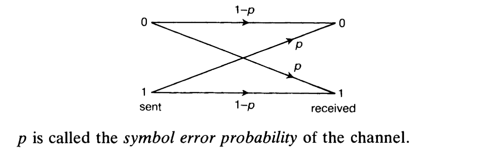

# 編碼學筆記

師大江政融老師的編碼學，好課，習題講解的部分讓我回想起經斅的選修課了，當然沒那麼硬，這堂還挺涼的

課本是 Raymond Hill 的 《A First Course in Coding Theory》

## 1. Introduction to error-correcting codes

> 第一章在做介紹，所以它講的很簡略，用了很多根本沒提到的專有名詞，看不懂的話就跳過吧，後面都會再詳細講的

### q-ary codes & Codewords

q-ary code 是由符號序列所組成的一個給定集合，其中每個符號皆取自集合 $F_q=\{\lambda_1,\lambda_2,\ldots,\lambda_q\}$ 的 $q$ 個彼此不同的元素

- 集合 $F_q$ 稱為 alphabet
- 實務上常直接取模 $q$ 的整數的集合 $Z_q = \{0, 1, 2, \ldots, q-1\}$ 當作 alphabet
  - 因為不需要做代數運算，只把符號當標籤
- 2-ary codes 稱為 binary codes，3-ary codes 稱為 ternary codes

換句話說：

- 如果把 alphabet 記作 $\Sigma$，則 $F_q$、$Z_q$ 與 $\Sigma$ 指同一件事，也就是會出現的符號的集合
  - 因此 $|\Sigma| = q$（所以叫 q-ary）
  - 在 $q = p^h$，其中 $h$ 為質數的時候，常把 $\Sigma$ 取為 order 為 $q$ 的有限體，所以也習慣把 alphabet 寫作 $F_q$
    - 都是符號問題，講義這邊就算不是取有限體作為 alphabet，他也照樣寫作 $F_q$
- $\Sigma^n$：所有「用字母表 $\Sigma$ 拼成、長度剛好是 $n$」的序列的集合，可以理解為一個 span 出來的空間，形式上 $\Sigma^n=\underbrace{\Sigma\times\Sigma\times\cdots\times\Sigma}_{n\ \text{次}}$
- 編碼（Code）：記作 $C$，從 $\Sigma^n$ 裡挑出來的一個子集
- codeword：編碼中的元素
  - 例如取 $\Sigma = {0, 1}$，並定義編碼 $C = \{00000, 11111\}$，則 $00000$ 與 $11111$ 都為 codeword
  - 如果該 code 中的所有 codeword 都是由固定 $n$ 個符號所組成的序列，則會將該 code 稱作長度為 $n$ 的 block code
    - 我們幾乎只討論這類 code，因此此後提到的「code」皆指「block code」

#### Examples of q-ary codes

- 英語裡所有單字所構成的集合，是一個以 26 個字母 alphabet $\{A,B,\ldots,Z\}$ 為基礎的 code
- 英國 Salford 市所有街道名稱所構成的集合，是一個 27-ary code（單字間的空白是第 27 個符號），而且提供了一個「編碼品質不佳」的好例子，例如 `HILLFIELD DRIVE` 與 `MILLFIELD DRIVE`

### Hamming distance

兩個向量 $\mathbf{x}$ 與 $\mathbf{y}$ 在 $(F_q)^n$ 中的（Hamming）距離是它們不同位置的數目，記為 $d(\mathbf{x},\mathbf{y})$。 例如，在 $(F_2)^5$ 中 $d(00111,11001)=4$，而在 $(F_3)^4$ 中 $d(0122,1220)=3$

Hamming distance 是一個合法的距離函數：
- $d(\mathbf{x},\mathbf{y})=0$ 當且僅當 $\mathbf{x}=\mathbf{y}$
- 對所有 $\mathbf{x},\mathbf{y}\in (F_q)^n$，有 $d(\mathbf{x},\mathbf{y})=d(\mathbf{y},\mathbf{x})$
- 對所有 $\mathbf{x},\mathbf{y},\mathbf{z}\in (F_q)^n$，有 $d(\mathbf{x},\mathbf{y})\le d(\mathbf{x},\mathbf{z})+d(\mathbf{z},\mathbf{y})$

### Binary symmetric channel

假設對方傳送了一個我們未知的 codeword $\mathbf{x}$，而我們接收到的可能是被雜訊扭曲過的向量 $\mathbf{y}$。 若要解讀它，較合理的作法是把 $\mathbf{y}$ 解碼成某個 codeword $\mathbf{x'}$（希望是 $\mathbf{x}$），使得 $d(\mathbf{x'},\mathbf{y})$ 盡可能小，這稱為 nearest neighbor decoding

只要對通道滿足下列假設，這個策略確實能最大化解碼器更正錯誤的機率：

- 每個傳送的符號有相同的機率 $p(<0.5)$ 被錯誤接收
- 一旦某個符號被錯誤接收，則有 $q-1$ 種可能的錯誤，它們的可能性相同。 這樣的通道稱為 q-ary symmetric channel

上圖的 $p$ 稱為此通道的 symbol error probability

#### Example of binary symmetric channel

考慮長度為 3 的 binary repetition code

$$
C=\{000,\ 111\}
$$

假設傳送的 codeword 是 000。 在這個 repetition code 中，會被解碼成 000 的接收向量是 000、100、010 與 001。 因此接收向量被正確為 codeword 000 的機率是

$$
(1-p)^3+3p(1-p)^2=(1-p)^2(1+2p)
$$

注意，依對稱性，若傳送的 codeword 是 111，機率也相同。 因此我們可以說，code $C$ 具有一個與實際所傳送的 codeword 無關的 word error probability，記為 $P_{\text{err}}(C)$。 在此例中有

$$
P_{\text{err}}(C)=1-(1-p)^2(1+2p)=3p^2-2p^3
$$

要比較這些用 $p$ 的多項式所給出的機率，可以把 $p$ 指派為合適的數值。 舉例來說，我們可以假設在此通道中平均每 100 個符號中會有 1 個被錯誤接收，也就是 $p=0.01$。 在此情況下

$$
P_{\text{err}}(C)=0.000\,298
$$

因此使用者大約每 3355 個字中會收到 1 個錯誤的編碼

一個衡量 code $C$ 更正錯誤能力好壞的重要參數是 minimum distance，記為 $d(C)$，其定義為不同 codewords 之間距離的最小值，也就是

$$
d(C)=\min \{\, d(x,y)\mid x,y\in C,\ x\ne y \,\}
$$

例如，很容易驗證在第 1.5 節的那些 codes 中有

$$
d(C_1)=1,\quad d(C_2)=2,\quad d(C_3)=3
$$

### Efficient decoding

以暴力法進行解碼的方案，是把接收向量與所有 codewords 比較，並將其解碼為距離最近的那一項。 但對大型 codes 而言，這種方法不切實際，而編碼理論的目標之一，就是找出能比這種方法更快的解碼方法：

1. Linear codes
2. The dual code
3. The parity-check matrix 與 syndrome decoding

### Minimum distance of a code

$$
d(C)=\min \{\, d(x,y)\mid x,y\in C,\ x\ne y \,\}
$$

例如，在前述 “NWES” 的例子裡，可容易驗證

$$
d(C_1)=1,\quad d(C_2)=2,\quad d(C_3)=3
$$

$$
C_1=\left\{
\begin{aligned}
&0\ 0=N\\
&0\ 1=W\\
&1\ 0=E\\
&1\ 1=S
\end{aligned}
\right.
\qquad
C_2=\left\{
\begin{aligned}
&0\ 0\ 0\\
&0\ 1\ 1\\
&1\ 0\ 1\\
&1\ 1\ 0
\end{aligned}
\right.
\qquad
C_3=\left\{
\begin{aligned}
&0\ 0\ 0\ 0\ 0\\
&0\ 1\ 1\ 0\ 1\\
&1\ 0\ 1\ 1\ 0\\
&1\ 1\ 0\ 1\ 1
\end{aligned}
\right.
$$

### 偵測與修正的充分條件

偵測與修正的充分條件：

1. 若 $d(C)=s+1$，則 code $C$ 最多可偵測任一 codeword 中的 $s$ 個錯誤
2. 若 $d(C)=2t+1$，則 code $C$ 最多可更正任一 codeword 中的 $t$ 個錯誤

換句話說，若某個 code $C$ 的 minimum distance 為 $d$，則 $C$ 可以用來

1. 偵測最多 $d-1$ 個錯誤
2. 更正最多 $\lfloor (d-1)/2 \rfloor$ 個錯誤於任一 codeword

### (n, M, d)-code

一個 $(n,M,d)$-code 是長度為 $n$、包含 $M$ 個 codewords、且具有 minimum distance $d$ 的 code

1. 在 “NWES” 的例子中：
   - $C_1$ 是 $(2,4,1)$-code
   - $C_2$ 是 $(3,4,2)$-code
   - $C_3$ 是 $(5,4,3)$-code
2. 長度為 $n$ 的 $q$-ary repetition code 是一個 $(n,q,n)$-code
