# 機率筆記

## 集合（Sets）

- 集合（Set）內含一群物件，而這些物件稱作集合的元素（elements）
  - 若 $x$ 是集合 $S$ 的元素，記作 $x \in S$
  - 否則記作 $x \notin S$
- 沒有任何元素的集合稱為空集合（empty set），記作 $\varnothing$
- 集合的表示方式：
  - 可數有限（countably finite）：$\{1, 2, 3, 4, 5, 6\}$
  - 可數無限（countably infinite）：$\{0, 2, -2, 4, -4, \dots\}$
  - 以條件定義（with a certain property）：
    - $\{k \mid k/2 \text{ is integer}\}$（可數無限）
    - $\{x \mid 0 \le x \le 1\}$（不可數）
- 若集合 $S$ 的每一個元素同時也是集合 $T$ 的元素，則稱 $S$ 是 $T$ 的子集合（subset）
  - 記作 $S \subset T$ 或 $T \supset S$
  - 空集合 $\varnothing$ 是否是任何集合的子集合？
    - 給定任意一個集合 $A$
    - 根據定義，除非在 $\varnothing$ 中存在某個不屬於 $A$ 的元素，否則 $\varnothing$ 是 $A$ 的子集合
      - 若 $\varnothing$ 不是 $A$ 的子集合，則代表 $\varnothing$ 中存在某元素不在 $A$ 中
    - 然而 $\varnothing$ 沒有任何元素，這會導致矛盾。 所以 $\varnothing$ 必定是 $A$ 的子集合
- 若 $T \subset S$ 且 $S \subset T$，則兩者相等（equal）
  - 記作 $T = S$
- 全集（universal set）記作 $\Omega$，它包含在特定語境中所有感興趣的物件
  - 一旦在某語境中指定了全集 $\Omega$，後面做操作時我們只會使用 $\Omega$ 子集合的

## Set Operations

- 補集（Complement）
  - 集合 $S$ 對於全集 $\Omega$ 的補集是 $\{x \in \Omega \mid x \notin S\}$，也就是所有不屬於 $S$ 的元素所組成的集合，記作 $S^c$
  - 全集的補集為 $\Omega^c = \varnothing$
- 聯集（Union）
  - 兩個集合 $S$ 與 $T$ 的聯集是所有屬於 $S$ 或 $T$ 的元素所構成的集合，記作 $S \cup T$
    $$S \cup T = \{x \mid x \in S \text{ or } x \in T\}$$
- 交集（Intersection）
  - 兩個集合 $S$ 與 $T$ 的交集是同時屬於 $S$ 與 $T$ 的所有元素所組成的集合，記作 $S \cap T$
  $$S \cap T = \{x \mid x \in S \text{ and } x \in T\}$$
- 若干（甚至無限多個）集合的聯集或交集可表示為：
  $$
  \bigcup_{n=1}^{\infty} S_n = S_1 \cup S_2 \cup \cdots = \{x \mid x \in S_n \text{ for some } n\}
  $$
  $$
  \bigcap_{n=1}^{\infty} S_n = S_1 \cap S_2 \cap \cdots = \{x \mid x \in S_n \text{ for all } n\}
  $$
- 互斥（Disjoint）
  - 如果兩個集合的交集為空，即 $S \cap T = \varnothing$，則稱它們是互斥的
- 劃分（Partition）
  - 一組集合若彼此互斥，且它們的聯集為集合 $S$，則稱該組集合為 $S$ 的劃分
  - 也就是說這組集合加起來會變成 $S$
- 若 $x$ 與 $y$ 是兩個物件，則以 $(x, y)$ 表示它們的有序對（order pair）
- 實數（scalar）的集合記作 $\mathbb{R}$
- 實數對（或三元組，triplets）所形成的集合，即二維平面（或三維空間），分別記作 $\mathbb{R}^2$（或 $\mathbb{R}^3$）

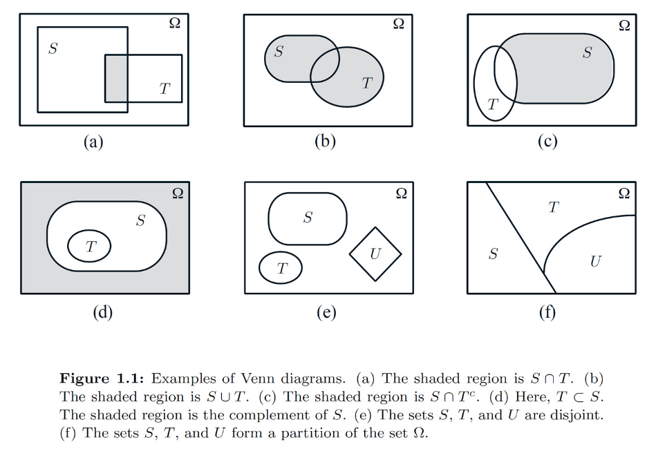

- 以下等式是根據集合及其運算定義所得到的基本結果：
  - 交換律
    $$S \cup T = T \cup S$$
  - 結合律：
    $$S \cup (T \cup U) = (S \cup T) \cup U$$
  - 分配律：
    $$S \cap (T \cup U) = (S \cap T) \cup (S \cap U)$$
    $$S \cup (T \cap U) = (S \cup T) \cap (S \cup U)$$
  - 此外，還有以下性質：
    $$(S^c)^c = S$$
    $$S \cup \Omega = \Omega$$
    $$S \cap S^c = \varnothing$$
    $$S \cap \Omega = S$$

還有兩個來自 De Morgan’s law（迪摩根律）的性質：

$$(\bigcup_n S_n)^c = \bigcap_n S_n^c \quad \Longrightarrow \quad (\bigcap_n S_n)^c = \bigcup_n S_n^c$$

德摩根律推導：

已知

$$(\bigcup_n S_n)^c = \bigcap_n S_n^c$$

要證明

$$(\bigcap_n S_n)^c = \bigcup_n S_n^c$$

因此有

$$(\bigcup_n S_n^c)^c = \bigcap_n S_n \quad (\text{將 } S_n \text{ 以 } S_n^c \text{ 代換，且 } (S_n^c)^c = S_n)$$

對上述等式的兩邊取補集，得到

$$\bigcup_n S_n^c = (\bigcap_n S_n)^c$$

## 機率模型

- 機率模型（probabilistic model）是對不確定情況的數學描述
  - 它必須符合接下來將要介紹的基本框架
- 機率模型的組成要素：
  - 樣本空間（sample space）：  
    所有可能實驗結果所構成的集合
  - 機率律（probability law）：  
    對於一個可能結果的集合 $A$（也稱為一個事件 event），給定一個非負數 $P(A)$（稱為事件 $A$ 的機率，probability of $A$），用以表達我們對 $A$ 中所有結果發生的整體「可能性」的認知或信念

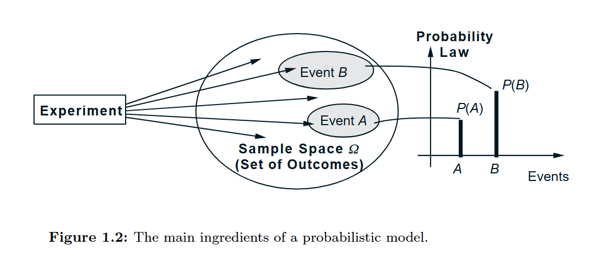

- 每一個機率模型都包含一個基礎過程，稱作實驗（experiment）：
  - 實驗會在多個可能結果之中，產生且僅產生一個結果
  - 所有可能結果的集合稱為該實驗的樣本空間（sample space），記作 $\Omega$
  - 樣本空間的任一子集合（即一組可能結果）稱為一個事件（event）
- 需要特別注意：
  - 在機率模型的建立中，只存在一個實驗
  - 例如，擲三次硬幣視為一次實驗，而非三次獨立的實驗
- 一個實驗的樣本空間可以包含有限或無限多個可能的結果
- 實驗的例子
  - 擲一次硬幣（有限結果）
  - 擲三次兩顆六面骰（有限結果）
  - 無限次擲硬幣的序列（無限結果）
  - 向正方形目標射飛鏢（無限結果）

---

- 樣本空間的性質：
  - 樣本空間的各元素必須互斥（mutually exclusive）：
    - 當實驗進行時，只會產生唯一的一個結果
  - 樣本空間必須是完備（collectively exhaustive）的：
    - 所有可能的結果都應包含在內
  - 樣本空間應具有適當的細緻度（right granularity）：
    - 必須有足夠的細節，以區分模型中所有有意義的結果，同時避免不相關的細節
- **Example 1.1** 考慮兩種不同的遊戲（用來獲得金錢），這兩種遊戲都包含十次連續的擲幣：
  - **Game 1：** 每當出現正面（Head）時，我們獲得 $1
  - **Game 2：** 我們在每次擲幣中都能獲得 $1，直到第一次出現正面為止。 接著，我們在每次擲幣中獲得 $2，直到第二次出現正面為止。 一般而言，每當出現一次正面時，金額就會加倍
  - **Game 1** 包含 11 種可能的結果 $(0,1,\dots,10)$（代表獲得的金額）  
    - 只有正面出現的總次數重要
  - **Game 2** 包含 ?? 種可能的結果（代表獲得的金額）  
    - 需要更細的描述  
    - 例如，每一個結果對應到一個可能的十次擲幣序列
      - 例如 $1, 1, 1, 2, 2, 2, 4, 4, 4, 8$
    - 需要在意正反面的順序
- **另一個針對 Game 2 的例子：** 三次連續擲幣
  - 一個給定的物理情境可以用不同的方式建模，這取決於我們關注的問題類型
  
  

  | Toss Sequence | Result |
  |---------------|---------|
  | T T T | (1 1 1) |
  | T T H | (1 1 2) |
  | T H T | (1 1 2) |
  | T H H | (1 2 2) |
  | H T T | (1 2 2) |
  | H T H | (1 2 4) |
  | H H T | (1 2 4) |
  | H H H | (1 2 4) |

  

## Sequential Probabilistic Models (序列機率模型)

- 許多實驗本質上具有序列性的特徵：
  - 擲硬幣三次
  - 連續五天觀察股票價值
  - 通訊接收端連續接收八個數位信號
- 它們可以用 tree-based sequential description（基於樹狀的序列描述）來表示

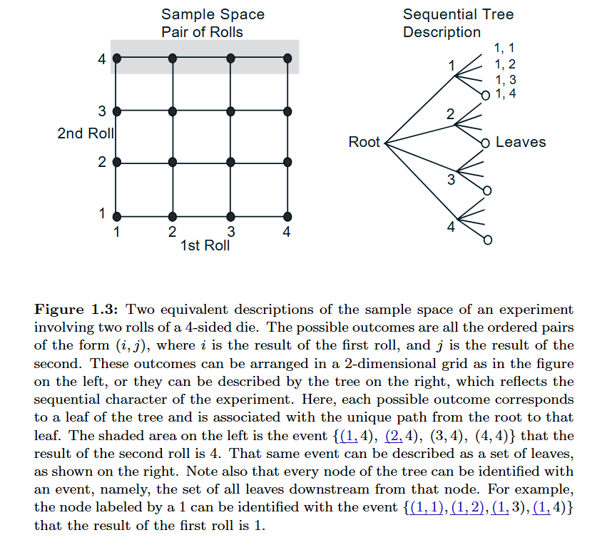

圖中顯示：
- 左側為兩次擲骰的樣本空間 (Sample Space: Pair of Rolls)
- 右側為樹狀描述 (Sequential Tree Description)，從 root 開始，依序展開各個可能結果 $(1,1), (1,2), (1,3), (1,4)$ 等

## Probability Laws (機率法則)

- 當確定一個實驗的樣本空間（Sample Space）後，我們便可以建立一個 **probability law（機率法則）**
  - 用來指定每一個結果（或任意一組結果，即事件）的可能性（likelihood）
  - 更精確地說，我們對每個事件 $A$ 指定一個數值 $P(A)$，稱為事件 $A$ 的機率（probability of A），並且此機率需滿足接下來描述的三個機率公理（three probability axioms）

### Three Probability Axioms (三個機率公理)

1. **Nonnegativity**  
   對於任何事件 $A$，  
   $$
   P(A) > 0
   $$
2. **Additivity**  
   若事件 $A$ 與 $B$ 是互斥的（disjoint events），則它們聯集的機率滿足：
   $$
   P(A \cup B) = P(A) + P(B)
   $$

   更一般地說，若樣本空間包含無限多個元素，且 $A_1, A_2, \dots$ 是一序列的互斥事件，則：
   $$
   P(A_1 \cup A_2 \cup \dots) = P(A_1) + P(A_2) + \dots
   $$

3. **Normalization**  
   整個樣本空間 $\Omega$ 的機率等於 1，即：
   $$
   P(\Omega) = 1
   $$

## Probability Laws for Discrete Models (離散模型的機率法則)

- **Discrete Probability Law（離散機率法則）**  
  若樣本空間由有限個可能結果組成，則機率法則由這些單一事件的機率所決定。 
  對於任意事件 $\{s_1, s_2, \dots, s_n\}$，其機率為各元素機率的總和：

  $$
  P(\{s_1, s_2, \dots, s_n\}) = P(\{s_1\}) + P(\{s_2\}) + \dots + P(\{s_n\})
  = P(s_1) + P(s_2) + \dots + P(s_n)
  $$
- **Discrete Uniform Probability Law（離散均勻機率法則）**  
  若樣本空間包含 $n$ 個等可能的結果（即每個單一事件的機率皆相同），則任意事件 $A$ 的機率為：

  $$
  P(A) = \frac{\text{number of element of } A}{n}
  $$

## An Example Probabilistic Model with a Discrete but Infinite Sample Space  

- 四面骰的範例：

  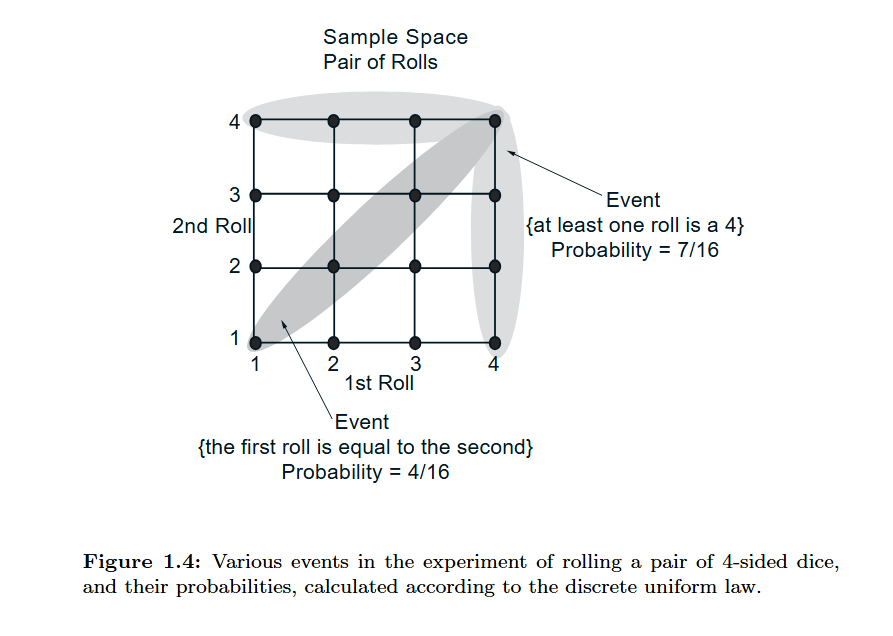

- 具有離散但無限樣本空間的機率模型範例：

  樣本空間：$\{ n = 1, 2, 3, 4, \dots \}$

  已知：
  $$
  P(n) = \frac{1}{2^n}
  $$

  驗證總和是否為 1：

  $$
  \sum_{n=1}^{\infty} P(n)
  = \frac{1}{2} + \frac{1}{4} + \frac{1}{8} + \frac{1}{16} + \dots
  = \frac{1}{2} \sum_{n=0}^{\infty} \frac{1}{2^n}
  = \frac{1}{2} \cdot \frac{1}{1 - \frac{1}{2}}
  = 1
  $$

  接著計算奇數事件的機率：

  $$
  P(n \text{ is odd}) = \frac{1}{2} + \frac{1}{8} + \frac{1}{32} + \dots
  = \frac{1}{2} \cdot \left( 1 + \frac{1}{4} + \frac{1}{16} + \dots \right)
  = \frac{1}{2} \cdot \frac{1}{1 - \frac{1}{4}}
  = \frac{2}{3}
  $$

  因此，

  $$
  P(n \text{ is even}) = \frac{1}{3}
  $$

## Continuous Models (連續模型)

- **Probabilistic models with continuous sample spaces（具有連續樣本空間的機率模型）**
  - 對於單一元素事件，指定其機率是不合適的
  - 對於樣本空間中的任意區間（一維）或面積（二维）指定機率才有意義

- Example 1.5：Romeo 與 Juliet 約好在某個時間見面，兩人到達會合地點的延遲時間皆在 $0$ 到 $1$ 小時之間，且所有延遲時間的組合等可能。 先到的人會等 $15$ 分鐘，若對方仍未到就離開。 問：他們會相遇的機率是多少？
  
  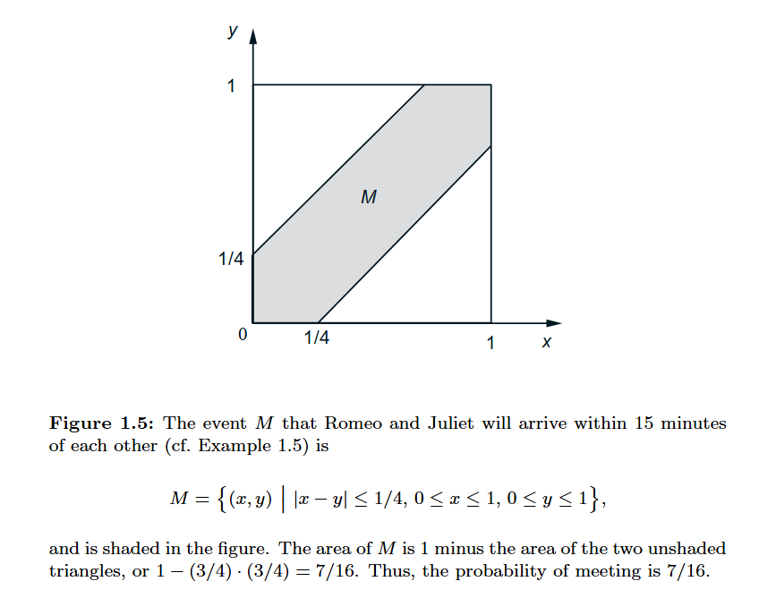

- 符號
  - $x$：Romeo 的到達時間
  - $y$：Juliet 的到達時間
  - $M$：Romeo 與 Juliet 相遇的事件
  - $M = \{(x,y)\mid \lvert x-y\rvert \le \tfrac{1}{4},\ 0 \le x \le 1,\ 0 \le y \le 1\}$

- 機率
  $$1 - \left(\tfrac{3}{4}\right)\left(\tfrac{3}{4}\right) = \tfrac{7}{16}$$

## Properties of Probability Laws

- Probability laws 具有許多可由公理推導出的性質。 以下彙整其中一些
-  給定一個 probability law，設 $A, B, C$ 為事件
   - (a) 若 $A \subset B$，則 $P(A) \le P(B)$
   - (b) $P(A \cup B) = P(A) + P(B) - P(A \cap B)$
   - (c) $P(A \cup B) \le P(A) + P(B) \quad \text{(Union Bound / Boole's Inequality).}$
   - (d) $P(A \cup B \cup C) = P(A) + P(A^{c} \cap B) + P(A^{c} \cap B^{c} \cap C).$
- Bonferroni Inequality
  $$P(A \cap B) \ge P(A) + P(B) - 1$$
  $$P(A_{1} \cap \cdots \cap A_{n}) \ge P(A_{1}) + \cdots + P(A_{n}) - (n-1)$$
  - Proof of Bonferroni Inequality

    $$
    \begin{aligned}
    (A_{1} \cap \cdots \cap A_{n})^{c} 
    &= A_{1}^{c} \cup \cdots \cup A_{n}^{c} \\[4pt]
    \Rightarrow\ 
    P\!\left((A_{1} \cap \cdots \cap A_{n})^{c}\right)
    &= P(A_{1}^{c} \cup \cdots \cup A_{n}^{c})
    \le P(A_{1}^{c}) + \cdots + P(A_{n}^{c}) \\[4pt]
    \therefore\ 
    1 - P(A_{1} \cap \cdots \cap A_{n})
    &\le (1 - P(A_{1})) + \cdots + (1 - P(A_{n})) \\[4pt]
    \Rightarrow\ 
    P(A_{1} \cap \cdots \cap A_{n})
    &\ge P(A_{1}) + \cdots + P(A_{n}) - (n-1)
    \end{aligned}
    $$

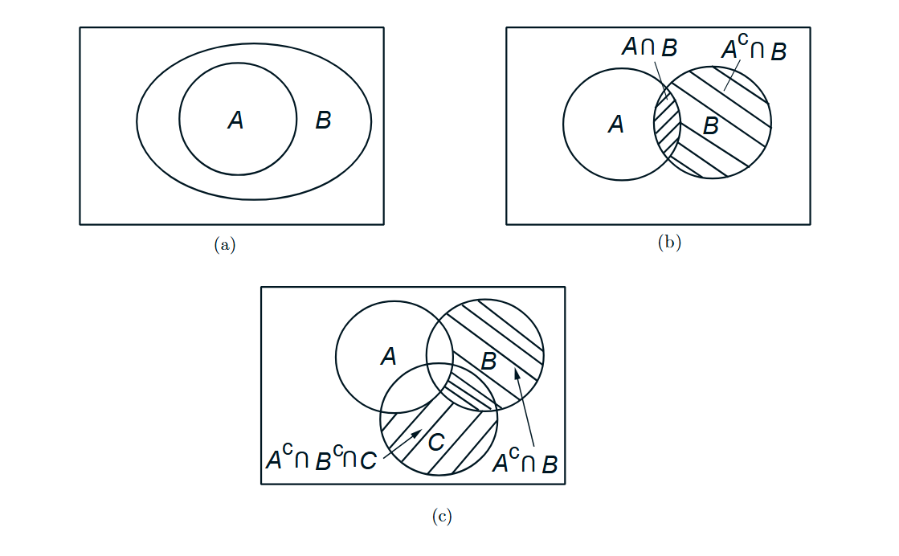

上圖使用 Venn diagrams 對四個 Probability laws 的性質進行視覺化與驗證。 若 $A \subset B$，則 $B$ 可表示為兩個互斥事件 $A$ 與 $A^{c} \cap B$ 的聯集，見圖 (a)。 因此，由 additivity axiom 可得

$$
P(B)=P(A)+P(A^{c}\cap B)\ge P(A) +0 = P(A)
$$

其中不等式來自 nonnegativity axiom，用以驗證性質 (a)

由圖 (b)，我們可以把事件 $A\cup B$ 與 $B$ 表示為互斥事件的聯集：
$$
A\cup B = A\cup (A^{c}\cap B),\qquad
B = (A\cap B)\cup (A^{c}\cap B)
$$

additivity axiom 給出

$$
P(A\cup B)=P(A)+P(A^{c}\cap B),\qquad
P(B)=P(A\cap B)+P(A^{c}\cap B)
$$

把第一個等式減掉第二個等式並重整後，得到

$$
P(A\cup B)=P(A)+P(B)-P(A\cap B)
$$

這驗證了性質 (b)。 再利用 nonnegativity axiom 的事實 $P(A\cap B)\ge 0$，可得

$$
P(A\cup B)\le P(A)+P(B)
$$

驗證性質 (c)

由圖 (c) 可見，事件 $A\cup B\cup C$ 可以表示為三個互斥事件的聯集：

$$
A\cup B\cup C
= A\cup (A^{c}\cap B)\cup (A^{c}\cap B^{c}\cap C)
$$

至此由 additivity axiom 的推得性質 (d) 

## Conditional Probability

- Conditional probability 為我們提供一種在部分資訊下，對實驗結果進行推理的方法
  - 假設結果落在某個已知事件 $B$ 之內，我們希望量化結果同時屬於另一個給定事件 $A$ 的概似性（likelihood）

- 在一個新的 probability law 之下，定義「給定 $B$ 的 $A$ 的 conditional probability」，記作 $P(A\mid B)$，其定義為
  $$
  P(A\mid B)=\frac{P(A\cap B)}{P(B)}
  $$
  - 若 $P(B)=0$，則 $P(A\mid B)$ 未被定義
  - 可以把 $P(A\mid B)$ 理解為：在事件 $B$ 的總機率之中，分配給同時也屬於 $A$ 的可能結果所佔的比例

- 當實驗的所有結果等可能時，conditional probability 亦可定義為
  $$
  P(A\mid B)=\frac{\text{number of elements of }A\cap B}{\text{number of elements of }B}
  $$

- 先驗機率指 $P(A)$ 這種，後驗機率指 $P(A | B)$ 這種在知道某個前提下得出的機率

- 一些與 conditional probability 相關的例子：
  1. 一個涉及連續兩次擲骰的實驗中，已知兩次點數之和為 $9$。 第一顆骰是 $6$ 的 likelihood 多大？
  2. 在猜字遊戲中，單字的第一個字母是 $t$。 第二個字母是 $h$ 的 likelihood 是多少？
  3. 已知某人接受醫學檢測為陰性，他罹患某疾病的 likelihood 有多大？
  4. 雷達螢幕上出現一個光點。 它對應到航空器的 likelihood 有多大？

## Conditional Probabilities Satisfy the Three Axioms

- Nonnegative：
  $$
  P(A\mid B)=\frac{P(A\cap B)}{P(B)}\ge 0
  $$

- Normalization：
  $$
  P(\Omega\mid B)=\frac{P(\Omega\cap B)}{P(B)}=\frac{P(B)}{P(B)}=1
  $$

- Additivity：若 $A_1$ 與 $A_2$ 為兩個互斥事件，
  $$
  \begin{aligned}
  P(A_1\cup A_2\mid B)
  &=\frac{P\big((A_1\cup A_2)\cap B\big)}{P(B)} \quad \text{(distributive)}\\
  &=\frac{P\big((A_1\cap B)\cup(A_2\cap B)\big)}{P(B)} \quad \text{(disjoint sets)}\\
  &=\frac{P(A_1\cap B)+P(A_2\cap B)}{P(B)}\\
  &=P(A_1\mid B)+P(A_2\mid B)
  \end{aligned}
  $$

## Conditional Probabilities Satisfy General Probability Laws

- probability laws 的若干性質（在給定 $B$ 下）：
  - $P(A_1\cup A_2\mid B)=P(A_1\mid B)+P(A_2\mid B)-P(A_1\cap A_2\mid B)$
  - $P(A_1\cup A_2\mid B)\le P(A_1\mid B)+P(A_2\mid B)$
  - …

- Conditional probabilities 也可被視為在新的宇宙 $B$ 上的一個 probability law，因為所有的條件機率都集中於 $B$

  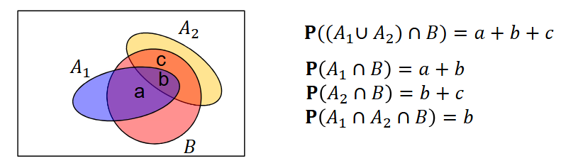

### Example 1.6

我們連續擲一枚公平硬幣三次。 欲求 $P(A\mid B)$，其中

$$
A=\{\text{more heads than tails come up}\},\qquad
B=\{\text{1st toss is a head}\}
$$

樣本空間共有八個序列

$$
\Omega=\{\mathrm{HHH},\,\mathrm{HHT},\,\mathrm{HTH},\,\mathrm{HTT},\,\mathrm{THH},\,\mathrm{THT},\,\mathrm{TTH},\,\mathrm{TTT}\}
$$

假設皆等可能。 事件 $B$ 含有四個元素 $\mathrm{HHH},\mathrm{HHT},\mathrm{HTH},\mathrm{HTT}$，因此

$$
P(B)=\frac{4}{8}
$$

事件 $A\cap B$ 含有三個元素 $\mathrm{HHH},\mathrm{HHT},\mathrm{HTH}$，因此

$$
P(A\cap B)=\frac{3}{8}
$$

由此

$$
P(A\mid B)=\frac{P(A\cap B)}{P(B)}=\frac{\frac{3}{8}}{\frac{4}{8}}=\frac{3}{4}
$$

因所有結果等可能，也可用捷徑計算：以 $A$ 與 $B$ 的共同元素個數 $3$ 除以 $B$ 的元素個數 $4$，同樣得到 $3/4$

### Example 1.7

一顆公平 4 面骰擲兩次，假設所有 $16$ 個可能結果等可能。 令 $X,Y$ 分別為第一次與第二次的結果。 欲求 $P(A\mid B)$，其中

$$
A=\{\max(X,Y)=m\},\qquad
B=\{\min(X,Y)=2\}
$$

且 $m$ 取 $1,2,3,4$

結果：

$$
P(\{\max(X,Y)=m\}\mid B)=
\begin{cases}
\dfrac{2}{5}, & m=3\ \text{or}\ 4\\[6pt]
\dfrac{1}{5}, & m=2\\[6pt]
0, & m=1
\end{cases}
$$

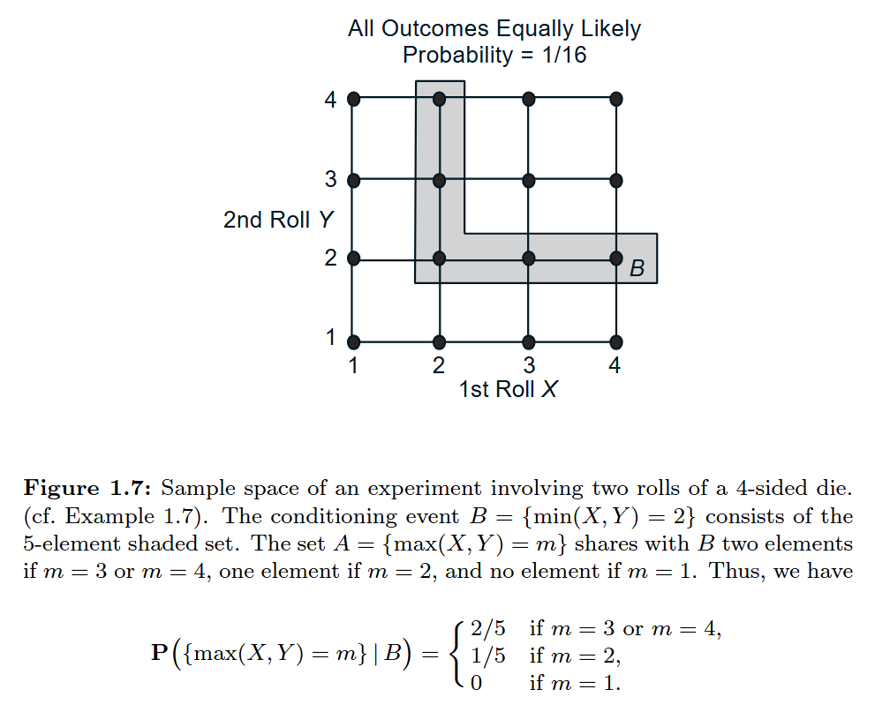

### Example 1.8

一個保守型設計團隊（記為 $C$）與一個創新型設計團隊（記為 $N$），被要求各自於一個月內設計出一項新產品。 根據過去經驗：

- (a) 團隊 $C$ 成功的機率為 $2/3$
- (b) 團隊 $N$ 成功的機率為 $1/2$
- (c) 至少有一個團隊成功的機率為 $3/4$

假設恰好只有一個成功的設計被產出，問：它是由團隊 $N$ 設計的機率是多少？

四種可能結果（兩隊成功/失敗的組合）：

- $SS$：兩隊都成功
- $FF$：兩隊都失敗
- $SF$：$C$ 成功、$N$ 失敗
- $FS$：$C$ 失敗、$N$ 成功

已知這些結果的機率滿足

$$
P(SS)+P(SF)=\frac{2}{3},\qquad
P(SS)+P(FS)=\frac{1}{2},\qquad
P(SF)+P(FS)=\frac{3}{4}
$$

再配合 normalization

$$
P(SS)+P(SF)+P(FS)+P(FF)=1
$$

可解得各結果之機率

$$
P(SS)=\frac{5}{12},\quad
P(SF)=\frac{1}{4},\quad
P(FS)=\frac{1}{12},\quad
P(FF)=\frac{1}{4}
$$

所求的 conditional probability 為

$$
P\big(\{FS\}\,\big|\,\{SF,FS\}\big)
=\frac{\tfrac{1}{12}}{\tfrac{1}{4}+\tfrac{1}{12}}
=\frac{1}{4}
$$

## Using Conditional Probability for Modeling

- 在建模時，先指定 conditional probabilities，然後再用它們來決定 unconditional probabilities，這通常既自然又方便
- 一種等價的 conditional probability 定義表法為
  $$
  P(A\cap B)=P(B)\,P(A\mid B)
  $$

### Example 1.9. Radar detection

如果某區域內確有飛機存在，雷達能以機率 $0.99$ 正確偵測到其存在； 若並不存在，雷達卻會以機率 $0.10$ 誤報有飛機存在。 我們假設飛機存在的先驗機率為 $0.05$。 問：false alarm（錯誤指示飛機存在）的機率，以及 missed detection（實際有飛機但雷達沒有任何顯示）的機率各為何？

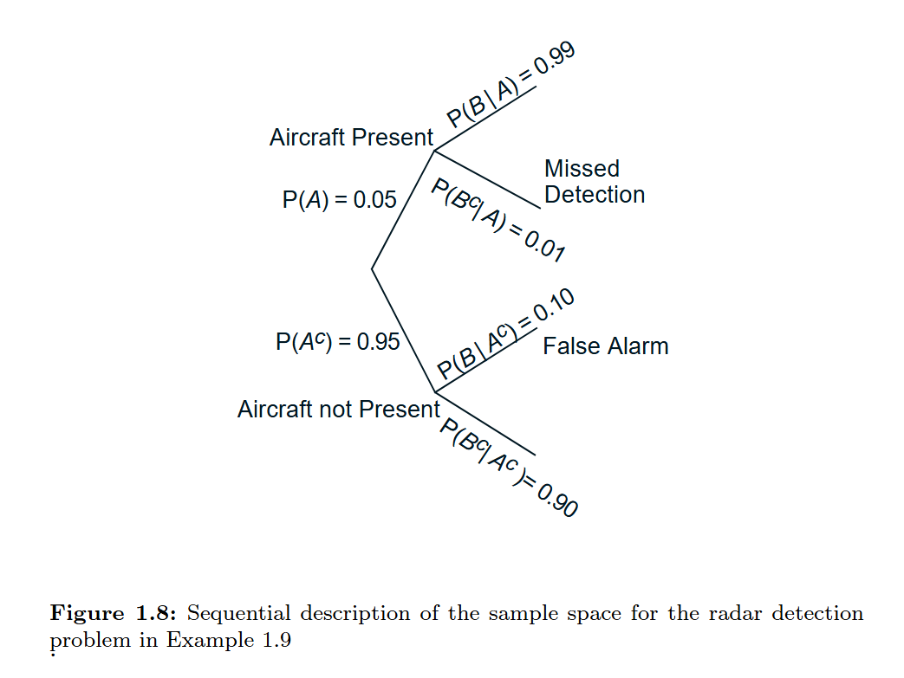

使用 Fig. 1.8 的序列化樣本空間描述。 設事件

$$
A=\{\text{an aircraft is present}\},\qquad
B=\{\text{the radar registers an aircraft presence}\}
$$
並考慮其補事件
$$
A^{c}=\{\text{an aircraft is not present}\},\qquad
B^{c}=\{\text{the radar does not register an aircraft presence}\}
$$

則
$$
P(\text{false alarm})=P(A^{c}\cap B)=P(A^{c})P(B\mid A^{c})=0.95\cdot 0.10=0.095
$$
$$
P(\text{missed detection})=P(A\cap B^{c})=P(A)P(B^{c}\mid A)=0.05\cdot 0.01=0.0005
$$

## Multiplication (Chain) Rule

- 假設所有作為條件的事件都具有正機率，則有
  $$
  P\!\left(\bigcap_{i=1}^{n}A_{i}\right)
  =P(A_{1})\,P(A_{2}\mid A_{1})\,P(A_{3}\mid A_{1}\cap A_{2})\cdots
  P\!\left(A_{n}\ \middle|\ \bigcap_{i=1}^{n-1}A_{i}\right)
  $$

- 驗證方式可寫成
  $$
  P\!\left(\bigcap_{i=1}^{n}A_{i}\right)
  =P(A_{1})
  \frac{\cancel{P(A_{1}\cap A_{2})}}{P(A_{1})}
  \frac{P(A_{1}\cap A_{2}\cap A_{3})}{\cancel{P(A_{1}\cap A_{2})}}
  \cdots
  \frac{P\!\left(\bigcap_{i=1}^{n}A_{i}\right)}
       {P\!\left(\bigcap_{i=1}^{n-1}A_{i}\right)}
  $$

- 當 $n=2$ 時，上述乘法法則正是 conditional probability 的定義：
  $$
  P(A_{1}\cap A_{2})=P(A_{1})\,P(A_{2}\mid A_{1})
  $$

### Example 1.10

從一副標準 $52$ 張撲克牌中不放回抽三張，求三張牌中沒有任何一張是 “heart” 的機率

令 $A_{i}=\{\text{第 }i\text{ 張不是 heart}\}$，$i=1,2,3$。 則
$$
P(A_{1}\cap A_{2}\cap A_{3})
= P(A_{1})\,P(A_{2}\mid A_{1})\,P(A_{3}\mid A_{1}\cap A_{2})
= \frac{39}{52}\cdot\frac{38}{51}\cdot\frac{37}{50}
$$

### Example 1.11

一個班級有 $4$ 位研究生與 $12$ 位大學生，隨機分成 $4$ 個、每組 $4$ 人的分組。 問：每個小組都恰有一名研究生的機率為何？

定義事件

$$
A_{1}=\{\text{graduate students 1 與 2 在不同小組}\}
$$
$$
A_{2}=\{\text{graduate students 1、2、3 在不同小組}\}
$$
$$
A_{3}=\{\text{graduate students 1、2、3、4 在不同小組}\}
$$

則

$$
P(A_{3})=P(A_{1}\cap A_{2}\cap A_{3})
= P(A_{1})\,P(A_{2}\mid A_{1})\,P(A_{3}\mid A_{1}\cap A_{2})
$$

其中

$$
P(A_{1})=\frac{12}{15},\qquad
P(A_{2}\mid A_{1})=\frac{8}{14},\qquad
P(A_{3}\mid A_{1}\cap A_{2})=\frac{4}{13}
$$

因此

$$
P(A_{3})=\frac{12}{15}\cdot\frac{8}{14}\cdot\frac{4}{13}
$$

## Total Probability Theorem

設 $A_{1},\dots,A_{n}$ 為將樣本空間分割（partition）的一組互斥事件，且假設對所有 $i$ 均有 $P(A_{i})>0$。 則對任意事件 $B$，有

$$
P(B)=P(A_{1}\cap B)+\cdots+P(A_{n}\cap B)
=P(A_{1})P(B\mid A_{1})+\cdots+P(A_{n})P(B\mid A_{n})
$$

注意：實驗（樣本空間）的每一個可能結果，恰好屬於事件 $A_{1},\dots,A_{n}$ 的其中之一

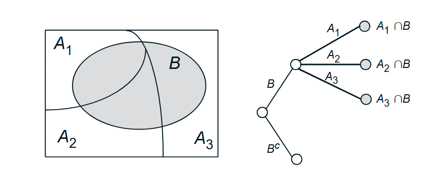

上圖以視覺化方式驗證 Total Probability Theorem。 事件 $A_{1},\dots,A_{n}$ 形成一個樣本空間的分割，因此事件 $B$ 可以分解為它與各 $A_{i}$ 的交集的不相交聯集，即

$$
B=(A_{1}\cap B)\ \cup\ \cdots\ \cup\ (A_{n}\cap B)
$$

由 additivity axiom 可得

$$
P(B)=P(A_{1}\cap B)+\cdots+P(A_{n}\cap B)
$$

又由 conditional probability 的定義

$$
P(A_{i}\cap B)=P(A_{i})\,P(B\mid A_{i})
$$

代入上式得到

$$
P(B)=P(A_{1})P(B\mid A_{1})+\cdots+P(A_{n})P(B\mid A_{n})
$$

### Example 1.13

你參加一場西洋棋賽。 對於一半的選手（type 1），你贏一局的機率是 $0.3$； 對於四分之一的選手（type 2），機率是 $0.4$； 對於剩下四分之一的選手（type 3），機率是 $0.5$。 你將與隨機選中的對手對弈。 問：贏棋的機率是多少？

令 $A_i$ 表示「對手是 type $i$」的事件，則

$$
P(A_1)=0.5,\qquad P(A_2)=0.25,\qquad P(A_3)=0.25
$$

再令 $B$ 為「我贏棋」的事件，則

$$
P(B\mid A_1)=0.3,\qquad P(B\mid A_2)=0.4,\qquad P(B\mid A_3)=0.5
$$

因此由 Total Probability Theorem，

$$
\begin{aligned}
P(B)
&=P(A_1)P(B\mid A_1)+P(A_2)P(B\mid A_2)+P(A_3)P(B\mid A_3)\\
&=0.5\cdot 0.3+0.25\cdot 0.4+0.25\cdot 0.5\\
&=0.375
\end{aligned}
$$

### Example 1.14

擲一顆公平的四面骰。 若第一次結果為 $1$ 或 $2$，則再擲一次； 否則停止。 問：我們兩次點數的總和至少為 $4$ 的機率是多少？

令 $A_i$ 表示「第一次結果為 $i$」的事件，注意對每個 $i$ 都有 $P(A_i)=1/4$。 令 $B$ 為「總和至少為 $4$」的事件。 若發生 $A_1$，則第二次若出現 $3$ 或 $4$（機率 $1/2$），總和至少為 $4$

同理，若發生 $A_2$，則第二次為 $2,3,4$（機率 $3/4$）時總和至少為 $4$； 若發生 $A_3$，我們停止，總和小於 $4$； 若發生 $A_4$，我們停止，且總和至少為 $4$。 因此

$$
P(B\mid A_1)=\tfrac{1}{2},\qquad
P(B\mid A_2)=\tfrac{3}{4},\qquad
P(B\mid A_3)=0,\qquad
P(B\mid A_4)=1
$$

由 Total Probability Theorem，

$$
\begin{aligned}
P(B)
&=\frac14\cdot\frac12+\frac14\cdot\frac34+\frac14\cdot 0+\frac14\cdot 1\\
&=\frac{9}{16}
\end{aligned}
$$

### Example 1.15

Alice 正在修一門機率課； 每週結束時，她要不是 up-to-date，就是落後（behind）。 若某週她是 up-to-date，下一週仍 up-to-date（或變成 behind）的機率分別為 $0.8$（或 $0.2$）； 若某週她是 behind，下一週變為 up-to-date（或仍 behind）的機率分別為 $0.4$（或 $0.6$）。 Alice 在課程開始時（預設）是 up-to-date。 問：三週之後她是 up-to-date 的機率是多少？

記

- $U_i$：第 $i$ 週結束時 up-to-date
- $B_i$：第 $i$ 週結束時 behind

則可以知道

$$
P(U_{i+1})=P(U_i)\cdot 0.8+P(B_i)\cdot 0.4,\quad P(B_{i+1})=P(U_i)\cdot 0.2+P(B_i)\cdot 0.6
$$

因此可知

$$
\begin{aligned}
P(U_3)&=P(U_2)P(U_3\mid U_2)+P(B_2)P(U_3\mid B_2)=P(U_2)\cdot 0.8+P(B_2)\cdot 0.4,\\
P(U_2)&=P(U_1)P(U_2\mid U_1)+P(B_1)P(U_2\mid B_1)=P(U_1)\cdot 0.8+P(B_1)\cdot 0.4,\\
P(B_2)&=P(U_1)P(B_2\mid U_1)+P(B_1)P(B_2\mid B_1)=P(U_1)\cdot 0.2+P(B_1)\cdot 0.6
\end{aligned}
$$

由於 $P(U_1)=0.8,\ P(B_1)=0.2$（$P(U_0)=1$），得

$$
P(U_2)=0.8\cdot 0.8+0.2\cdot 0.4=0.72,\qquad
P(B_2)=0.8\cdot 0.2+0.2\cdot 0.6=0.28
$$

故

$$
P(U_3)=0.72\cdot 0.8+0.28\cdot 0.4=0.688
$$

## Bayes’ Rule

設 $A_1,A_2,\dots,A_n$ 為樣本空間的一組互斥分割，且對所有 $i$ 皆有 $P(A_i)>0$。 對任何使 $P(B)>0$ 的事件 $B$，有

$$
\begin{aligned}
P(A_i\mid B)
&=\frac{P(A_i\cap B)}{P(B)}\\
&=\frac{P(A_i)P(B \mid A_i)}{P(B)} \text{ (Multiplication rule)}\\
&=\frac{P(A_i)\,P(B\mid A_i)}{\sum_{k=1}^{n} P(A_k)\,P(B\mid A_k)} \text{ (Total probability theorem)}\\
&= \frac{\mathbf{P}(A_i)\mathbf{P}(B \mid A_i)}
     {\mathbf{P}(A_1)\mathbf{P}(B \mid A_1) + \cdots + \mathbf{P}(A_n)\mathbf{P}(B \mid A_n)}
\end{aligned}
$$

### Bayes’ Rule and Inference

- 由 Thomas Bayes（約 1701-1761，Presbyterian minister）提出； “Bayes’ theorem” 在其身後發表
- 提供一套從經驗學習並納入新證據的系統化方法
- Bayesian Inference
  - $P(A_i)$：對觀察事件 $B$ 的可能成因 $A_i$ 的先驗機率
  - $P(B\mid A_i)$：在每個 $A_i$ 下建立世界的模型
  - $P(A_i\mid B)$：由觀察結果 $B$ 反推成因的機率

### Inference Using Bayes’ Rule

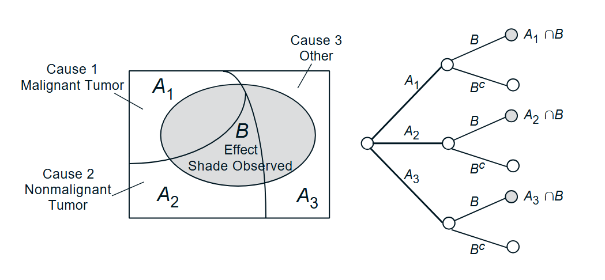

上圖為 Bayes’ rule 隱含的推論情境範例。 我們在某人的 X-ray 上觀察到一個陰影（事件 $B$，即「effect」），欲估計三個互斥且完備的潛在成因的 likelihood：

- 成因 1（事件 $A_1$）為惡性腫瘤（Malignant Tumor）
- 成因 2（事件 $A_2$）為良性腫瘤（Nonmalignant Tumor）
- 成因 3（事件 $A_3$）是非腫瘤的其他原因

我們假定已知 $P(A_i)$ 與 $P(B\mid A_i)$，$i=1,2,3$。 既然看到了陰影（事件 $B$ 發生），Bayes’ rule 給出各成因的條件機率：

$$
P(A_i\mid B)
=\frac{P(A_i)\,P(B\mid A_i)}
       {P(A_1)P(B\mid A_1)+P(A_2)P(B\mid A_2)+P(A_3)P(B\mid A_3)}
\quad i=1,2,3
$$

另一種等價觀點是右圖的序列模型：$P(A_1\mid B)$ 等於高亮葉節點中 $P(A_1\cap B)$ 與其總機率 $P(B)$ 的比值

### Example 1.18. The False-Positive Puzzle

對某疾病的檢測，其正確率假設為 $95\%$：若受檢者確實有病，檢測呈陽性之機率為 $0.95$（$P(B\mid A)=0.95$）； 若受檢者無病，檢測呈陰性之機率為 $0.95$（$P(B^{c}\mid A^{c})=0.95$）。 某族群中，任一人的患病先驗機率為 $0.001$（$P(A)=0.001$）。 已知此人檢測呈陽性，問：他實際患病的機率 $P(A\mid B)$ 為何？

其中

- $A$: 此人有病（$A^{c}$：無病）  
- $B$: 檢測為陽性（$B^{c}$：檢測為陰性）

由 Bayes’ rule，

$$
\begin{aligned}
P(A\mid B)
&=\frac{P(A)P(B\mid A)}{P(B)}\\
&=\frac{P(A)P(B\mid A)}{P(A)P(B\mid A)+P(A^{c})P(B\mid A^{c})}\\
&=\frac{0.001\cdot 0.95}{0.001\cdot 0.95+0.999\cdot 0.05}\\
&=0.0187
\end{aligned}
$$

## Independence（獨立）

- 回顧：條件機率 $P(A\mid B)$ 捕捉了事件 $B$ 對事件 $A$ 所提供的部分資訊
- 有一個特殊情形：當 $B$ 的發生不提供任何資訊，且不改變 $A$ 發生的機率時：
  
  $$
  P(A\mid B)=P(A)
  $$
  
  此時稱 $A$ 與 $B$ 為 independent（$B$ 也與 $A$ independent），由定義可得

  $$
  P(A\mid B)=\frac{P(A\cap B)}{P(B)}=P(A)
  \;\;\Rightarrow\;\;
  P(A\cap B)=P(A)P(B)
  $$

- $A$ 與 $B$ 為 independent 無法推出 $A$ 與 $B$ 為 disjoint（互斥）
  - 若 $A$ 與 $B$ 互斥，則 $P(A\cap B)=0$
  - 然而，若 $P(A)>0$ 且 $P(B)>0$，則
    $$
    P(A\cap B)\neq P(A)P(B)
    $$
  - 因此，independence 並不等於 disjoint（也難以單靠樣本空間圖像來視覺化）

- 兩個互斥且 $P(A)>0$、$P(B)>0$ 的事件永遠不會 independent
- 任一事件與 no outcome 的事件（即 empty event）彼此 independent
- 任一事件與其補事件不為 independent。 實際上，若 $0<P(A)<1$，則
  $$
  P\bigl(A\cap A^{c}\bigr)\neq P(A)P(A^{c})
  $$

### Example 1.19

考慮：擲一個四面骰兩次，共 $16$ 個等可能結果，每一對結果的機率均為 $1/16$

#### (a) 事件

$A_i=\{\text{第 1 次擲得 } i\}$，$B_j=\{\text{第 2 次擲得 } j\}$，是否 independent？

因為各結果等可能：

$$
P(A_i\cap B_j)=\frac{1}{16},\qquad
P(A_i)=\frac{4}{16},\quad
P(B_j)=\frac{4}{16}
$$

故

$$
P(A_i\cap B_j)=P(A_i)P(B_j)
$$

所以 $A_i$ 與 $B_j$ independent

> 若兩事件由兩個獨立且互不作用的物理過程主導，其結果往往會是 independent

#### (b) 事件

$A=\{\text{第 1 次擲出 }1\}$，$B=\{\text{兩次點數和為 }5\}$，是否 independent？

$$
P(A)=\frac{4}{16}\quad(\text{兩次結果為 }(1,1),(1,2),(1,3),(1,4))
$$

$$
P(B)=\frac{4}{16}\quad(\text{兩次結果為 }(1,4),(2,3),(3,2),(4,1))
$$

$$
P(A\cap B)=\frac{1}{16}\quad(\text{唯一同時滿足的是 }(1,4))
$$

因此

$$
P(A\cap B)=P(A)P(B)
$$

故 $A$ 與 $B$ independent

#### (c) 事件

$A=\{\text{兩次點數的最大值為 }2\}$，$B=\{\text{兩次點數的最小值為 }2\}$，是否 independent？

$$
P(A)=\frac{3}{16}\quad(\text{兩次結果為 }(1,2),(2,1),(2,2))
$$

$$
P(B)=\frac{5}{16}\quad(\text{兩次結果為 }(2,2),(2,3),(2,4),(3,2),(4,2))
$$

$$
P(A\cap B)=\frac{1}{16}\quad(\text{唯一同時滿足的是 }(2,2))
$$

因此

$$
P(A\cap B)\neq P(A)P(B)
$$

故 $A$ 與 $B$ dependent

## Independence of Event Complements

若 $A$ 與 $B$ independent，則以下也成立：

- (i) $A$ 與 $B^{c}$ independent
- (ii) $A^{c}$ 與 $B^{c}$ independent
- 我們要如何驗證？（參見 Problem 43）

證明 (i)：若 $A$ 與 $B$ independent，則 $A$ 與 $B^{c}$ 亦 independent

Proof：

$$
A=(A\cap B)\cup(A\cap B^{c})
\;\;\Rightarrow\;\;
P(A)=P(A\cap B)+P(A\cap B^{c})
$$

又因 $A$ 與 $B$ independent，$P(A\cap B)=P(A)P(B)$，故

$$
\begin{aligned}
P(A\cap B^{c})
&=P(A)-P(A\cap B)\\
&=P(A)-P(A)P(B)\\
&=P(A)\bigl(1-P(B)\bigr)\\
&=P(A)P(B^{c})
\end{aligned}
$$

因此，$A$ 與 $B^{c}$ independent

## conditional independence

- 給定事件 $C$，若
  $$
  \mathbf{P}(A\cap B\mid C)=\mathbf{P}(A\mid C)\mathbf{P}(B\mid C)
  $$
  則稱事件 $A$ 和 $B$ 在條件 $C$ 下為 **conditionally independent**

- 我們也知道（乘法律）：
  $$
  \mathbf{P}(A\cap B\mid C)
  =\frac{\mathbf{P}(A\cap B\cap C)}{\mathbf{P}(C)}
  =\frac{\mathbf{P}(C)\mathbf{P}(B\mid C)\mathbf{P}(A\mid B\cap C)}{\mathbf{P}(C)}
  $$

- 若 $\mathbf{P}(B\mid C)>0$，則可用另一種方式表達 **conditional independence**：
  $$
  \mathbf{P}(A\mid B\cap C)=\mathbf{P}(A\mid C)
  $$

- 請注意：就**無條件**機率律而言，$A$ 與 $B$ 的獨立不代表條件獨立，反之亦然
  $$
  \mathbf{P}(A\cap B)=\mathbf{P}(A)\mathbf{P}(B)\not\Leftrightarrow
  \mathbf{P}(A\cap B\mid C)=\mathbf{P}(A\mid C)\mathbf{P}(B\mid C)
  $$

- 思考：若 $A$ 與 $B$ 獨立，當 $C$ 已發生時，$A$ 與 $B$ 是否仍獨立？（未必）

### **Example 1.20.** 

兩次獨立且公平的擲幣，四種結果等可能。 令

- $H_1={\text{第一次為正面}}$，對應 $(H,T),(H,H)$；
- $H_2={\text{第二次為正面}}$，對應 $(T,H),(H,H)$；
- $D={\text{兩次結果不同}}$，對應 $(T,H),(H,T)$

則
$$
\mathbf{P}(H_1\mid D)=\tfrac12,\qquad
\mathbf{P}(H_2\mid D)=\tfrac12
$$
但
$$
\mathbf{P}(H_1\cap H_2\mid D)
=\frac{\mathbf{P}(H_1\cap H_2\cap D)}{\mathbf{P}(D)}
=0\neq \mathbf{P}(H_1\mid D)\mathbf{P}(H_2\mid D)
$$

- 結論：$H_1$ 與 $H_2$ 在條件 $D$ 下是**相依**的（非條件獨立）

### **Example 1.21.**

有兩枚硬幣：一枚 **blue**、一枚 **red**

- 隨機選一枚，機率各為 $1/2$，接著用所選硬幣擲兩次（對所選硬幣而言兩次互相獨立）
- 硬幣有偏：**blue** 的正面機率 $0.99$；**red** 的正面機率 $0.01$
- 令 $B$ 表示「選到 **blue**」，令 $H_i$ 表示「第 $i$ 次為正面」

條件情形（給定選擇的硬幣）：

$$
\mathbf{P}(H_1\cap H_2\mid B)=\mathbf{P}(H_1\mid B)\mathbf{P}(H_2\mid B)
$$

因為給定硬幣後，$H_1, H_2$ 相互獨立

無條件情形：

$$
\mathbf{P}(H_1)=\mathbf{P}(B)\mathbf{P}(H_1\mid B)+\mathbf{P}(B^c)\mathbf{P}\left(H_1\mid B^c\right)=\tfrac12\cdot0.99+\tfrac12\cdot0.01=\tfrac12
$$
$$
\mathbf{P}(H_2)=\mathbf{P}(B)\mathbf{P}(H_2\mid B)+\mathbf{P}(B^c)\mathbf{P}\left(H_2\mid B^c\right)=\tfrac12\cdot0.99+\tfrac12\cdot0.01=\tfrac12
$$
$$
\mathbf{P}(H_1\cap H_2)
=\mathbf{P}(B)\mathbf{P}(H_1\cap H_2\mid B)+\mathbf{P}(B^c)\mathbf{P}\left(H_1\cap H_2\mid B^c\right)
=\tfrac12\cdot0.99\cdot0.99+\tfrac12\cdot0.01\cdot0.01\neq\tfrac14
$$

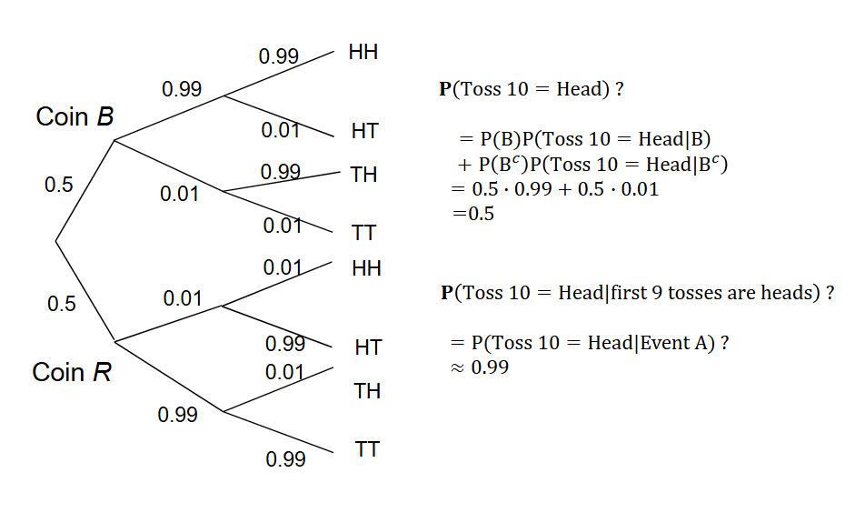

## Independence of a collection of events

- 我們稱事件 $A_1,A_2,\ldots,A_n$ **獨立**，若對於 $\{1,2,\ldots,n\}$ 的任意子集 $S$ 均有
  $$
  \mathbf{P}\left(\bigcap_{i\in S}A_i\right)=\prod_{i\in S}\mathbf{P}(A_i)
  $$

- 例如，三個事件 $A_1,A_2,A_3$ 的獨立需滿足以下四個條件（總數 $2^n-n-1$）：
  $$
  \mathbf{P}(A_1\cap A_2)=\mathbf{P}(A_1)\mathbf{P}(A_2)
  $$
  $$
  \mathbf{P}(A_1\cap A_3)=\mathbf{P}(A_1)\mathbf{P}(A_3)
  $$
  $$
  \mathbf{P}(A_2\cap A_3)=\mathbf{P}(A_2)\mathbf{P}(A_3)
  $$
  $$
  \mathbf{P}(A_1\cap A_2\cap A_3)=\mathbf{P}(A_1)\mathbf{P}(A_2)\mathbf{P}(A_3)
  $$
- 獨立意味著：該集合中**任意數量**事件的發生或不發生，都不會提供關於其餘事件或其補事件的任何資訊
- 若各事件獨立，可得到例如：
  $$
  \mathbf{P}(A_1\cup A_2\mid A_3\cap A_4)=\mathbf{P}(A_1\cup A_2)
  $$
  或
  $$
  \mathbf{P}\left(A_1\cup A_2^{c}\mid A_3^{c}\cap A_4\right)
  =\mathbf{P}(A_1\cup A_2^{c})
  $$

### Example 1.22. Pairwise independence does not imply independence

思考兩次相互獨立且公平的擲幣，以及以下事件：

- $H_1=\{\text{1st toss is a head}\}$，對應樣本點 $(H,T),(H,H)$
- $H_2=\{\text{2nd toss is a head}\}$，對應樣本點 $(T,H),(H,H)$
- $D=\{\text{the two tosses have different results}\}$，對應樣本點 $(T,H),(H,T)$

根據定義，有
$$
P(H_1\cap H_2)=P(H_1)P(H_2)
$$
$$
P(H_1\cap D)=P(H_1)P(D)
$$
$$
P(H_2\cap D)=P(H_2)P(D)
$$
然而，
$$
P(H_1\cap H_2\cap D)=0\neq P(H_1)P(H_2)P(D)
$$

### Example 1.23. The following equality is not enough for independence

$$
P(A_1\cap A_2\cap A_3)=P(A_1)P(A_2)P(A_3)
$$

思考兩次相互獨立的擲六面公平骰，並定義事件：

- $A=\{\text{1st roll is 1, 2, or 3}\}$
- $B=\{\text{1st roll is 3, 4, or 5}\}$
- $C=\{\text{the sum of the two rolls is 9}\}$

計算得到
$$
P(A\cap B\cap C)=\frac{1}{36}=\frac{1}{2}\cdot\frac{1}{2}\cdot\frac{4}{36}=P(A)P(B)P(C)
$$
但是，
$$
P(A\cap B)=\frac{1}{6}\neq \frac{1}{2}\cdot\frac{1}{2}=P(A)P(B)
$$
$$
P(A\cap C)=\frac{1}{36}\neq \frac{1}{2}\cdot\frac{4}{36}=P(A)P(C)
$$
$$
P(B\cap C)=\frac{1}{12}\neq \frac{1}{2}\cdot\frac{4}{36}=P(B)P(C)
$$

### Example 1.24. Network connectivity

一個電腦網路透過中繼節點 $C,D,E,F$ 連接兩個節點 $A$ 與 $B$

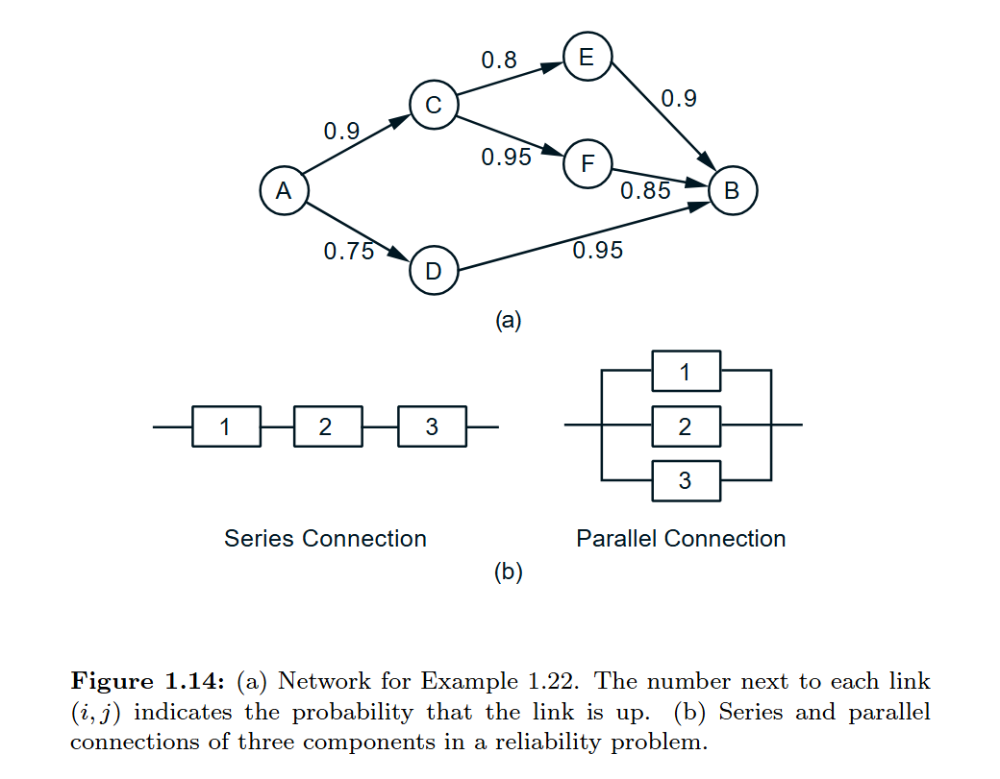

- 對於每一對直接相連的節點（記作 $i$ 與 $j$），連線 $i\to j$ 為「up」的機率為 $p_{ij}$。 假設各連線的失效彼此獨立
- 問：在所有連線皆為 up 的情況下，存在一條連通 $A$ 與 $B$ 的路徑的機率是多少？

對於基本模組：
$$
P(\text{series subsystem succeeds})=p_1p_2\cdots p_n
$$
$$
\begin{aligned}
P(\text{parallel subsystem succeeds})
&=1-P(\text{parallel subsystem fails})\\
&=1-(1-p_1)(1-p_2)\cdots(1-p_n)
\end{aligned}
$$

> 某個子系統的失效不依賴其他子系統

先求從 $C$ 到 $B$ 的成功機率（兩條併聯路徑 $C\to E\to B$ 與 $C\to F\to B$）：

$$
\begin{aligned}
P(C\to B)
&=1-(1-P(C\to E\to B))(1-P(C\to F\to B))\\
&=1-(1-0.8\cdot 0.9)(1-0.95\cdot 0.85)\\
&=0.946
\end{aligned}
$$

再計算兩條從 $A$ 到 $B$ 的路徑（彼此併聯）：
$$
P(A\to C\to B)=P(A\to C)\,P(C\to B)=0.9\cdot 0.946=0.851
$$
$$
P(A\to D\to B)=P(A\to D)\,P(D\to B)=0.75\cdot 0.95=0.712
$$

因此整體 $A\to B$ 連通的機率為

$$
\begin{aligned}
P(A\to B)
&=1-(1-P(A\to C\to B))(1-P(A\to D\to B))\\
&=1-(1-0.851)\,(1-0.712)\\
&=0.957
\end{aligned}
$$

## Recall: Counting in Probability Calculation

- 離散均勻機率律（discrete uniform probability law）的兩個應用
  - 當樣本空間 $\Omega$ 具有有限個且等可能的結果時，任一事件 $A$ 的機率為
    $$
    P(A)=\dfrac{\text{number of elements of }A}{\text{number of elements of }\Omega} 
    $$
  - 當我們要計算事件 $A$ 的機率，且其具有有限個等可能的結果，而每個結果已知機率為 $p$，則 $A$ 的機率為
    $$
    P(A)=p\cdot (\text{number of elements of }A) 
    $$

    例子如擲公平硬幣 $n$ 次，要得到剛好 $k$ 個正面

    - 每一條長度為 $n$ 的正反面序列機率都是 ($p=(1/2)^n$)
    - 符合「有 $k$ 個正面」的序列共有 ($\binom{n}{k}$) 條
      所以
      $$
      P(\text{k 個正面})=\binom{n}{k}(1/2)^n
      $$

    若硬幣正面機率是 $q$，則每條“恰有 $k$ 個正面”的序列機率相同為 $q^k(1-q)^{n-k}$，因此
    $P=\binom{n}{k}q^k(1-q)^{n-k}$

### The Counting Principle

- 考慮一個由 $r$ 個階段組成的過程。 設：
  - (a) 第一個階段有 $n_{1}$ 種可能結果
  - (b) 對於第一個階段的每一種可能結果，第二個階段有 $n_{2}$ 種可能結果
  - (c) 更一般地，對於前 $i-1$ 個階段所有可能結果，第 $i$ 個階段有 $n_{i}$ 種可能結果
- 則此 $r$ 階段過程的所有可能結果總數為 $n_{1}n_{2}\cdots n_{r}$

### Common Types of Counting

- $n$ 個物件的排列（permutations）
  $$
  n!=n\cdot (n-1)\cdot (n-2)\cdots 2\cdot 1 
  $$
- $n$ 個物件中取 $k$ 的排列（$k$-permutations）
  $$
  \dfrac{n!}{(n-k)!} 
  $$
- 從 $n$ 個物件中取 $k$ 的組合（combinations）
  $$
  \binom{n}{k}=\dfrac{n!}{k!(n-k)!} 
  $$
- 將 $n$ 個物件分成 $r$ 組，其中第 $i$ 組有 $n_{i}$ 個物件（multinomial/partitions）
  $$
  \binom{n}{n_{1},n_{2},\ldots ,n_{r}}=\dfrac{n!}{n_{1}!\,n_{2}!\cdots n_{r}!} 
  $$

### Summary of Chapter 1

- 一個機率問題通常可拆成幾個基本步驟：
   1. 描述樣本空間，即某個實驗的所有可能結果集合
   2. （可能是間接地）給出機率律的規定（每個事件的機率）
   3. 計算各種感興趣事件的機率與條件機率

- 三種常見的機率計算方法
  - counting method：若結果數有限且彼此等可能
    $$
    P(A)=\dfrac{\text{number of elements of }A}{\text{number of elements of }\Omega} 
    $$
  - sequential method：使用乘法（chain）法則
    $$
    P\!\left(\bigcap_{i=1}^{n}A_{i}\right)=P(A_{1})P(A_{2}\mid A_{1})P(A_{3}\mid A_{1}\cap A_{2})\cdots P\!\left(A_{n}\mid \bigcap_{i=1}^{n-1}A_{i}\right) 
    $$
  - divide-and-conquer method：根據一組條件機率求得事件的機率
    $$
    P(B)=P(A_{1}\cap B)+\cdots +P(A_{n}\cap B) 
    $$
    $$
    =P(A_{1})P(B\mid A_{1})+\cdots +P(A_{n})P(B\mid A_{n}) 
    $$
    $A_{1},\cdots ,A_{n}$ 是構成樣本空間分割的互斥事件

## 隨機變數（Random Variables）

- 給定一個實驗以及其對應的所有可能結果（樣本空間），**隨機變數**會把**每個**結果對應到一個特定的數字  
  - 這個數字稱為隨機變數的（數值）**取值**  
  - 以數學語言來說，可以說**隨機變數是實驗結果上的一個實值函數**，亦即「以實驗結果為自變數的函數」  

    $$
    X: w \to x 
    $$

  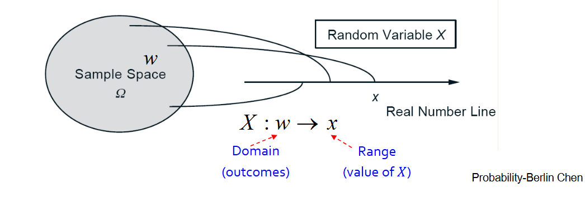

  上圖示意：Domain（結果）在樣本空間 $\Omega$ 中，經由隨機變數 $X$ 對應到實數軸上的 Range（$X$ 的取值）
- 另一個例子
  - 一個實驗由擲兩次四面骰組成，令隨機變數為**兩次擲得點數的最大值**  
    - 若實驗結果是 $(4,2)$，則隨機變數的值為 $4$  
    - 若實驗結果是 $(3,3)$，則隨機變數的值為 $3$  
  - 這種對應可以是「一對一」或「多對一」
    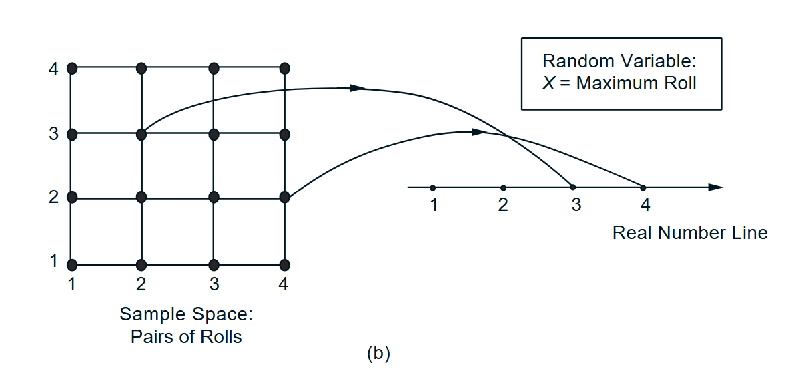

### 與隨機變數相關的主要概念

在一個機率模型中：  

- 隨機變數是實驗結果上的**實值函數**  
  $$
  X: w \to x 
  $$
- **隨機變數的函數**定義出另一個隨機變數  
  $$
  Y=g(X) 
  $$
- 每個隨機變數都可對應一些我們關心的「平均量」，例如 **mean** 與 **variance**  
- 隨機變數可以在某個事件上，或在另一個隨機變數上，進行**條件化**（conditioned）  
- 也有「來自某事件或另一個隨機變數的**獨立性**」這樣的概念

### 離散／連續隨機變數

- 若隨機變數的 **range**（可取的值的集合）是有限或至多可數無限，稱為**離散（discrete）**  
  例如有限：$\{1,2,3,4\}$；可數無限：$\{1,2,\dots\}$  
- 若其 **range** 是不可數無限，則稱為**連續（continuous, 非離散）**  
  - 例：從區間 $[-1,1]$ 中選一點 $a$ 的實驗  
    - 若某隨機變數把結果 $a$ 對應成數值 $a^2$，那它就不是離散的  

### 與離散隨機變數相關的概念

- 在機率模型中：  
  - **離散隨機變數**是實驗結果上的實值函數，能取有限或可數無限多個數值  
  - 離散隨機變數對應一個 **probability mass function（PMF）**，給出該隨機變數每個數值所對應的機率  
    - PMF 可視為某個隨機變數的「**probability law**」或「**probability distribution**」  
  - **隨機變數的函數**會定義另一個隨機變數，而其 PMF 可由原始隨機變數的 PMF 推得  
    - 若 $X$ 是隨機變數且 $g(X)$ 是 $X$ 的函數，則 $g(X)$ 也是隨機變數

## 機率質量函數（PMF）

- 一個（離散）隨機變數 $X$ 可由其可取值的機率來刻畫，這由其 **PMF** 給出，記為  
  $$
  p_X(x) 
  $$
  也可寫作  
  $$
  p_X(x)=\mathsf{P}(\{X=x\})=\mathsf{P}(X=x) 
  $$
- 會導致 $X$ 取成 $x$ 的所有結果之機率總和，等於 $p_X(x)$  
- 慣例：大寫字母（如 $X$）代表隨機變數，小寫字母（如 $x$）代表其數值  
- PMF 在所有可能數值上的總和為 $1$  
  $$
  \sum_x p_X(x)=1 
  $$
  其中各事件 $\{X=x\}$ **兩兩互斥**，且在樣本空間上形成一個**劃分**（partition）

### 如何計算 PMF

- 對於隨機變數 $X$ 的每個可能數值 $x$：  
  1. **蒐集**所有會讓事件 $\{X=x\}$ 發生的可能結果  
  2. **加總**這些結果的機率，得到 $p_X(x)$  
- 例：公平四面骰獨立擲兩次，令 $X$ 為「兩次擲得點數的最大值」的 PMF  
  共有 $16$ 個等可能結果。 當 $X=m$ 時，符合的結果數是 $m^2-(m-1)^2=2m-1$，故  
    $$
    p_X(1)=\frac{1}{16},\quad p_X(2)=\frac{3}{16},\quad p_X(3)=\frac{5}{16},\quad p_X(4)=\frac{7}{16} 
    $$

  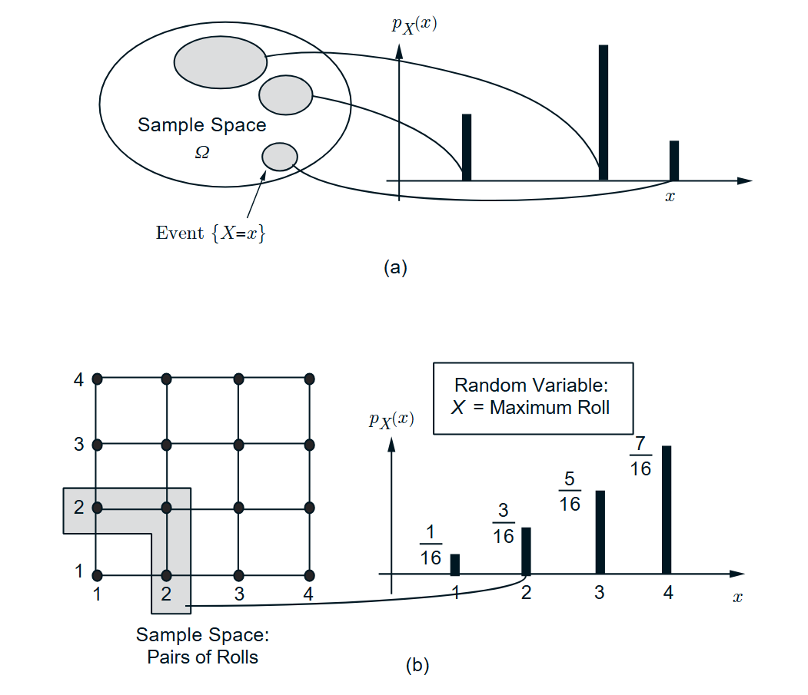

## Bernoulli Random Variable

- 一個 Bernoulli random variable $X$ 只取兩個值 $1$ 與 $0$，其機率分別為 $p$ 與 $1-p$ 
  
  **PMF**：
  
  $$
  p_X(x)=
  \begin{cases}
  p, & \text{if } x=1 \\
  1-p, & \text{if } x=0
  \end{cases}
  $$

- Bernoulli random variable 經常用來刻畫僅有兩種結局的通用機率情境，如：  
  1. 擲硬幣一次（結果：head 與 tail）  
  2. 一次試驗（結果：success 與 failure）  
  3. 電話線路狀態（結果：free 與 busy）  

- **Normalization Property（歸一化性質）**：$p_X(0)+p_X(1)=1$

- Bernoulli 是 Binomial 在 $n=1$ 的特例

- 一個 binomial random variable $X$ 的參數為 $n$ 與 $p$
  
  **PMF**：
  
  $$
  p_X(k)=\mathbf P(X=k)=\binom{n}{k}p^k(1-p)^{\,n-k},\quad k=0,1,\dots,n
  $$

- Bernoulli random variable 可用於建模的例子  
  1. $n$ 次互相獨立擲硬幣中 head 的個數（可能結果：$1,2,\dots,n$），每次擲出 head 的機率為 $p$  
  2. $n$ 次互相獨立試驗中的 success 個數（可能結果：$1,2,\dots,n$），每次成功的機率為 $p$

> 註：此處以及其他地方，我們簡化記號，使用 $k$（而非 $x$）來表示整數值 random variable 的取值

### Normalization Property（Binomial）

$$
\sum_{k=0}^{n}p_X(k)=\sum_{k=0}^{n}\binom{n}{k}p^{\,k}(1-p)^{\,n-k}=1
$$

> 注意：$(a+b)^n=\sum_{k=0}^{n}\binom{n}{k}a^k b^{\,n-k}$

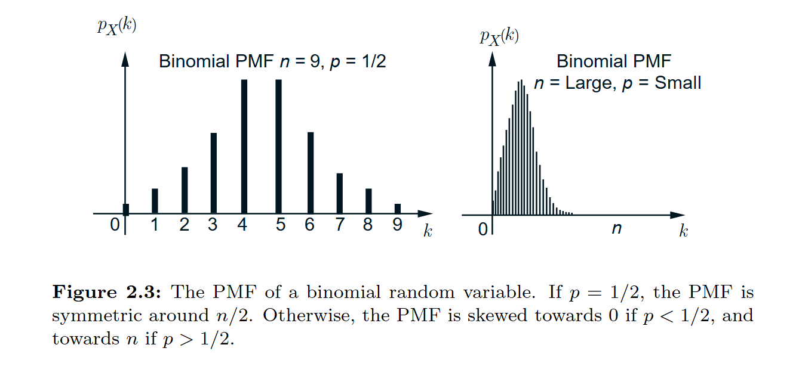

Example：三次互相獨立擲硬幣時 head 的數目

$$
p_X(1)=\mathbf P(X=1)=\mathbf P(HTT)+\mathbf P(THT)+\mathbf P(TTH)=3p(1-p)^2=\binom{3}{1}p(1-p)^2
$$

## Geometric Random Variable

- 一個 geometric random variable $X$ 的參數為 $p$（$0<p<1$）
  
  **PMF**：
  
  $$
  p_X(k)=(1-p)^{k-1}p,\quad k=1,2,\dots
  $$

- 幾個可用 geometric random variable 建模的例子  
  - 第一次出現 head 所需的獨立擲硬幣次數，每次擲出 head 的機率為 $p$  
  - 直到（且包含）第一次 success 所需的獨立試驗次數，每次成功機率為 $p$

- **Normalization Property**
  
  $$
  \sum_{k=1}^{\infty}p_X(k)=\sum_{k=1}^{\infty}(1-p)^{k-1}p
  =p\sum_{k=0}^{\infty}(1-p)^{k}
  =p\cdot\frac{1}{1-(1-p)}=1
  $$

  可以從**無限等比和**簡單推得： $\sum r^{k}=1/(1-r)$（取 $r=1-p$）

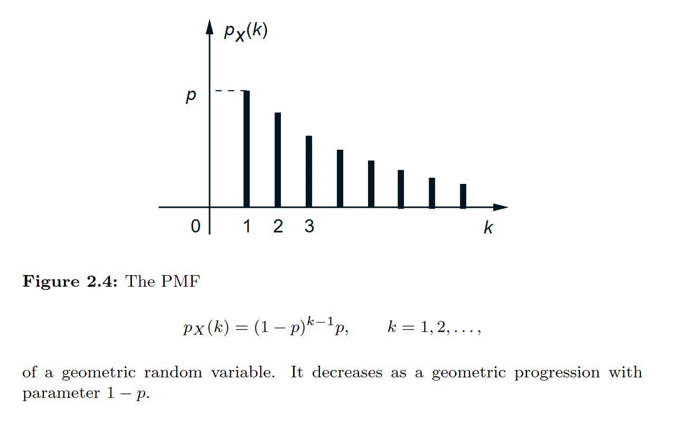

### 等差級數（Arithmetic series）

**定義**：首項 $a_1$，公差 $d$
第 $n$ 項：

$$
a_n=a_1+(n-1)d
$$

**前 $n$ 項和**：

$$
S_n=\frac{n}{2},(a_1+a_n)=\frac{n}{2}\bigl(2a_1+(n-1)d\bigr)
$$

**簡單推導** 

把和式正向、反向相加：

$$
\begin{aligned}
S_n&=(a_1)+(a_1+d)+\cdots+(a_1+(n-1)d)\\
S_n&=(a_1+(n-1)d)+\cdots+(a_1+d)+(a_1)
\end{aligned}
$$

逐項相加得 $2S_n=n(a_1+a_n)$ ⇒ 上式成立

### 等比級數（Geometric series）

**定義**：首項 $a$，公比 $r$

第 $n$ 項：$a r^{n-1}$

**有限和（前 $n$ 項）**：

$$
S_n=a\frac{1-r^n}{1-r}\quad (r\neq 1)
$$

**簡單推導（乘上 $r$ 後相減）**

令 $S_n=a(1+r+\cdots+r^{n-1})$。 則

$$
rS_n=a(r+r^2+\cdots+r^n)
$$

兩式相減得

$$
(1-r)S_n=a(1-r^n)\ \Rightarrow\ S_n=a\frac{1-r^n}{1-r}
$$

**無限等比和（$|r|<1$）**：

$$
\sum_{k=0}^{\infty} ar^k=\frac{a}{1-r}
$$

這是取 $n\to\infty$ 且 $r^n\to 0$ 的結果

## Poisson Random Variable 

- 一個 Poisson random variable $X$ 的參數為 $\lambda$
  
  **PMF**：
  
  $$
  p_X(k)=e^{-\lambda}\frac{\lambda^k}{k!},\quad k=0,1,2,\dots
  $$

- Poisson random variable 的應用例子  
  - 一本書中的錯字數量  
  - 某城市在某一天內涉及車禍的汽車數量

- **Normalization Property**
  
  $$
  \sum_{k=0}^{\infty}p_X(k)=\sum_{k=0}^{\infty}e^{-\lambda}\frac{\lambda^k}{k!}
  =e^{-\lambda}\left(1+\lambda+\frac{\lambda^2}{2!}+\frac{\lambda^3}{3!}+\cdots\right)=1
  $$

  其中 

  $$
  e^{\lambda}=\left(1+\lambda+\frac{\lambda^2}{2!}+\frac{\lambda^3}{3!}+\cdots\right) \text{ (馬克勞林級數)}
  $$
  
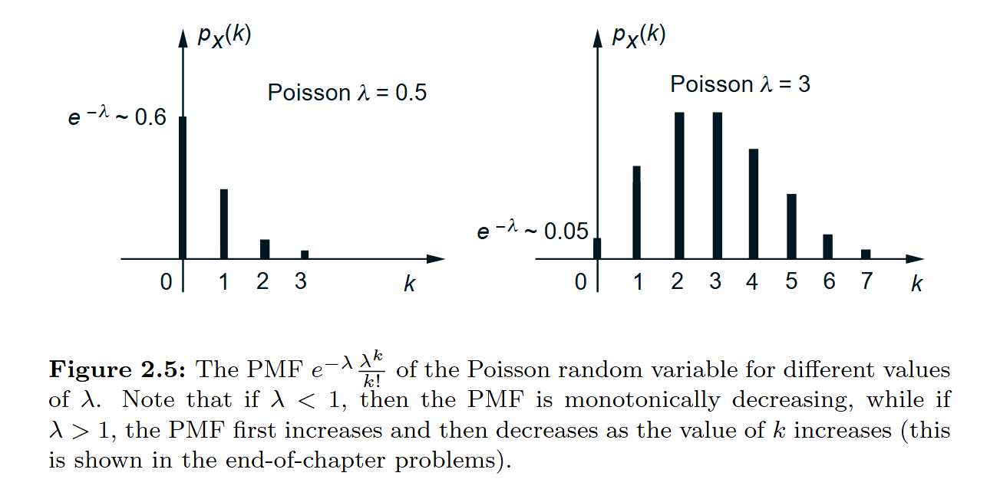

### Relationship between Binomial and Poisson

具有參數 $\lambda$ 的 Poisson PMF 是具有參數 $n$ 與 $p$ 的 binomial PMF 的良好近似，只要 $\lambda=np$、$n$ 非常大且 $p$ 非常小，對於 binomial PMF：

$$
\begin{aligned}
&\lim_{n\to\infty}\binom{n}{k}p^k(1-p)^{\,n-k}\\
&=\lim_{n\to\infty}\frac{n!}{(n-k)!\,k!}\,p^k(1-p)^{\,n-k} \qquad (\because \lambda=np\Rightarrow p=\frac{\lambda}{n})\\
&=\lim_{n\to\infty}\frac{n(n-1)\cdots(n-k+1)}{k!}\left(\frac{\lambda}{n}\right)^k\left(1-\frac{\lambda}{n}\right)^{\,n-k}\\
&=\lim_{n\to\infty}\frac{\lambda^k}{k!}\cdot\frac{n(n-1)\cdots(n-k+1)}{n^k}\cdot\left(1-\frac{\lambda}{n}\right)^{\,n-k}\\
&=\lim_{n\to\infty}\frac{\lambda^k}{k!}\left(\left(\frac{n}{n}\right)\left(\frac{n-1}{n}\right)\cdots\left(\frac{n-k+1}{n}\right)\right)\left(1-\frac{\lambda}{n}\right)^{\,n-k}
\end{aligned}
$$

前面那部分，因為每個因子 $1-\frac{j}{n}\to 1$，且只有有限個（$k$ 個）因子，所以趨近於 1：

$$
\prod_{j=0}^{k-1}\left(1-\frac{j}{n}\right)\xrightarrow[n\to\infty]{} \prod_{j=0}^{k-1} 1 = 1
$$

對於後面那部分：

$$
\left(1-\frac{\lambda}{n}\right)^{n-k}
=\left(1-\frac{\lambda}{n}\right)^{n}\cdot\left(1-\frac{\lambda}{n}\right)^{-k}
\xrightarrow[n\to\infty]{} e^{-\lambda}\cdot 1 = e^{-\lambda}
$$

這裡用到標準極限

$$
\left(1+\frac{t}{n}\right)^{n}\xrightarrow[n\to\infty]{} e^{t}
\quad(\text{取 }t=-\lambda)
$$

把前後的極限相乘： $1\times e^{-\lambda}=e^{-\lambda}$，推得

$$
\lim_{n\to\infty}\frac{\lambda^k}{k!}\left(\cdots\right)
=\frac{\lambda^k}{k!}e^{-\lambda}
$$

因此極限為 $e^{-\lambda}\dfrac{\lambda^k}{k!}$，即 Poisson PMF

## Functions of Random Variables

- 給定一個隨機變數 $X$，透過對 $X$ 施加各種變換，可以產生其他隨機變數  
  
  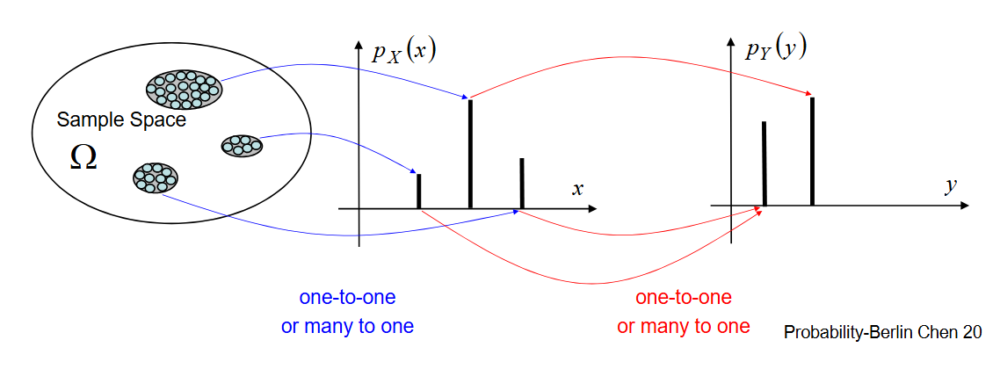
  - 線性  
    $$
    Y=g(X)=aX+b 
    $$
    例：每日溫度以華氏度表示 → 每日溫度以攝氏度表示 
  - 非線性  
    $$
    Y=g(X)=\log X 
    $$

- 映射可以是「一對一」或「多對一」的
- 換言之，若 $Y$ 是 $X$ 的函數（$Y=g(X)$），則 $Y$ 也是隨機變數
- 若 $X$ 是離散的，且其 PMF 為 $p_X(x)$，則 $Y$ 亦為離散的，且其 PMF 可由下式計算  
  $$
  p_Y(y)=\sum_{\{x\,|\,g(x)=y\}} p_X(x) 
  $$

### Example 2.1

令 $Y=|X|$，並將前述 $p_Y$ 的公式應用於下列情形  

$$
p_X(x)=
\begin{cases}
\frac{1}{9}, & \text{若 } x \text{ 為區間 }[-4,4] \text{ 內的整數} \\
0, & \text{otherwise}
\end{cases}
$$

$Y$ 的可能取值為 $y=0,1,2,3,4$。 要計算某個 $y$ 的 $p_Y(y)$，需將所有滿足 $|x|=y$ 的 $x$ 之 $p_X(x)$ 相加。 注意對 $y=0$ 僅有 $x=0$，因此  

$$
p_Y(0)=p_X(0)=\frac{1}{9} 
$$

對 $y=1,2,3,4$，各有兩個對應的 $x$ 值，例： 

$$
p_Y(1)=p_X(-1)+p_X(1)=\frac{2}{9} 
$$

因此 $Y$ 的 PMF 為  

$$
p_Y(y)=
\begin{cases}
\frac{2}{9}, & y=1,2,3,4 \\
\frac{1}{9}, & y=0 \\
0, & \text{otherwise}
\end{cases}
$$

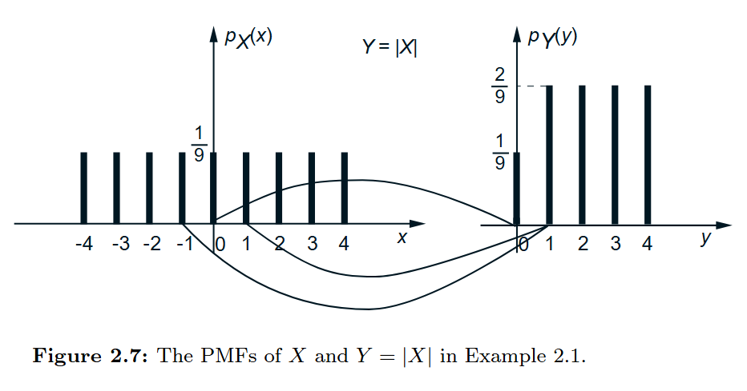

再舉一個相關例子，令 $Z=X^2$。 可將其視為 $X$ 的平方，或視為 $Y$ 的平方。 由公式 

$$
p_Z(z)=\sum_{\{x\,|\,x^2=z\}}p_X(x)
$$ 

或 

$$
p_Z(z)=\sum_{\{y\,|\,y^2=z\}}p_Y(y)
$$

得  

$$
p_Z(z)=
\begin{cases}
\frac{2}{9}, & z=1,4,9,16 \\
\frac{1}{9}, & z=0 \\
0, & \text{otherwise}
\end{cases}
$$

## Expectation, Mean and Variance

- 示意範例：假設你旋轉轉盤 $k$ 次，第 $i$ 種結果出現的次數為 $k_i$，其對應的金額為 $m_i$（共有 $n$ 種不同的結果，$m_1,m_2,\ldots,m_n$）
- 問：「平均每次旋轉」可期望得到多少金額  
  - 收到的總金額為  
    $$
    m_1k_1+m_2k_2+\cdots+m_nk_n 
    $$
  - 每次旋轉平均收到的金額為  
    $$
    M=\frac{m_1k_1+m_2k_2+\cdots+m_nk_n}{k} 
    $$

- 若旋轉次數 $k$ 很大，且我們以相對頻率詮釋機率，則可合理預期第 $i$ 種結果出現的比例約為 $p_i$，且  
  $$
  p_i\approx \frac{k_i}{k} 
  $$
- 因此，每次旋轉的平均金額亦可寫為  
  $$
  M=\frac{m_1k_1+m_2k_2+\cdots+m_nk_n}{k} 
  $$
  $$
  =m_1p_1+m_2p_2+\cdots+m_np_n 
  $$

### Expectation

- 隨機變數 $X$ 的期望值（亦稱 expectation 或 mean），在 PMF 為 $p_X(x)$ 時定義為  
  $$
  \mathbb{E}[X]=\sum_x x\,p_X(x) 
  $$
  可將其解讀為 PMF 的「重心」（或按機率加權的平均），亦即 $X$ 可能取值的加權中心
- 當下列條件成立時，期望值是 well-defined 的  
  $$
  \sum_x |x|\,p_X(x)<\infty 
  $$
  亦即  
  $$
  \sum_x x\,p_X(x) 
  $$  
  收斂到有限值

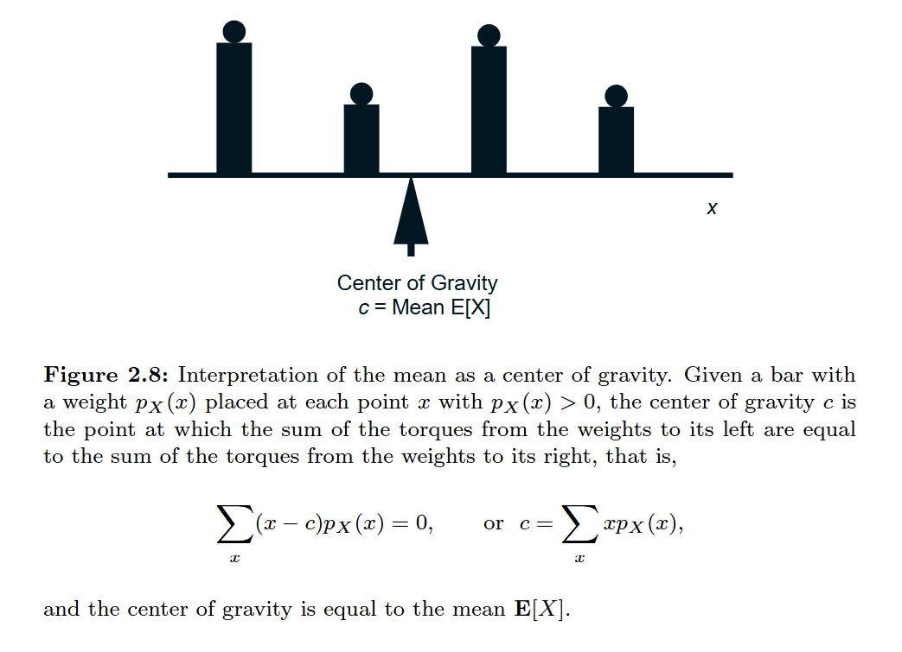

#### Expectation 的一些基本性質

- 若 $X\ge 0$，則 $\,\mathrm{E}[X]\ge 0$

  $$
  \mathrm{E}[X]=\sum_{x} x\cdot p_X(x) 
  $$

- 若 $a\le X\le b$，則 $\,a\le \mathrm{E}[X]\le b$

  $$
  \mathrm{E}[X]=\sum_{x} x\cdot p_X(x)\le \sum_{x} b\cdot p_X(x)=b\cdot \sum_{x} p_X(x)=b 
  $$

  $$
  \mathrm{E}[X]=\sum_{x} x\cdot p_X(x)\ge \sum_{x} a\cdot p_X(x)=a\cdot \sum_{x} p_X(x)=a 
  $$

- 若 $c$ 為常數，則 $\mathrm{E}[c]=c$  

### Moments（動差）

- 隨機變數 $X$ 的第 $n$ 階 moment 是隨機變數 $X^n$（或令 $Y=g(X)=X^n$）的期望值

  $$
  \mathrm{E}\!\left[X^{\,n}\right]=\sum_{x} x^{n}\, p_X(x) 
  $$

- 隨機變數 $X$ 的第一階 moment 就是它的 mean（或 expectation）

- 說明：$X^{n}$ 表示 $X$ 的 $n$ 次方（the $n$-th power）

### 隨機變數函數的期望

- 設 $X$ 為具有 PMF $p_X$ 的隨機變數，且 $g(X)$ 為 $X$ 的一個函數。 則隨機變數 $g(X)$ 的期望值為

  $$
  \mathrm{E}[g(X)]=\sum_{x} g(x)\,p_X(x) 
  $$

- 驗證上述公式：令 $Y=g(X)$，則

  $$
  p_Y(y)=\sum_{ \{x\,|\,g(x)=y\} } p_X(x) 
  $$

  因此
  
  $$
  \begin{aligned}
  &\mathrm{E}[g(X)]=\mathrm{E}[Y]=\sum_{y} y\,p_Y(y)\\
  &=\sum_{y} y \sum_{ \{x\,|\,g(x)=y\} } p_X(x)\\
  &= \sum_y \sum_{ \{x\,|\,g(x)=y\} } g(x)\,p_X(x)\\
  &= \sum_{x} g(x)\,p_X(x) 
  \end{aligned}
  $$

### Variance（變異數）

- 隨機變數 $X$ 的 variance 定義為隨機變數 $(X-\mathrm{E}[X])^{2}$ 的期望值

  $$
  \mathrm{var}(X)=\mathrm{E}\!\left[(X-\mathrm{E}[X])^{2}\right] 
  =\sum_{x} \bigl(x-\mathrm{E}[X]\bigr)^{2}\, p_X(x) 
  $$

- variance 總是非負

- variance 提供 $X$ 圍繞其 mean 的離散程度量測

- 標準差（standard deviation）是另一種離散程度的量測，定義為 variance 的平方根

  $$
  \sigma_X=\sqrt{\mathrm{var}(X)} 
  $$

- 標準差較易解讀，因為它和 $X$ 具有相同單位，能刻畫 $X$ 分佈的大致寬度

### **Example 2.3**  

給定隨機變數 $X$ 的 PMF

$$
p_X(x)=
\begin{cases}
\frac{1}{9}, & \text{若 } x \text{ 為區間 }[-4,4] \text{ 內的整數} \\
0, & \text{其他情形}
\end{cases}
$$

> 這是離散均勻隨機變數

期望值：

$$
\mathrm{E}[X]=\sum_{x} x\,p_X(x)=\frac{1}{9}\sum_{x=-4}^{4} x=0 
$$

變異數：

$$
\mathrm{var}(X)=\mathrm{E}\!\left[(X-\mathrm{E}[X])^{2}\right]=\sum_{x}\bigl(x-\mathrm{E}[X]\bigr)^{2}p_X(x)=\frac{1}{9}\sum_{x=-4}^{4} x^{2}=\frac{60}{9} 
$$

或，令 $Z=(X-\mathrm{E}[X])^{2}=X^{2}$，則

$$
p_Z(z)=
\begin{cases}
\frac{2}{9}, & z\in\{1,4,9,16\} \\
\frac{1}{9}, & z=0 \\
0, & \text{其他情形}
\end{cases}
$$

因此

$$
\mathrm{var}(X)=\mathrm{E}[Z]=\sum_{z} z\,p_Z(z)=\frac{60}{9} 
$$

## Properties of Mean and Variance

- 設 $X$ 為一個隨機變數，並令
  $$
  Y=aX+b
  $$
  為 $X$ 的一個線性函數，其中 $a$ 與 $b$ 是已知常數

  則有
  $$
  \mathbb{E}[Y]=a\,\mathbb{E}[X]+b 
  $$
  $$
  \mathrm{var}(Y)=a^{2}\,\mathrm{var}(X) 
  $$

- 若 $g(X)$ 是 $X$ 的線性函數，則
  $$
  \mathbb{E}[g(X)]=g\!\big(\mathbb{E}[X]\big) 
  $$

  注意：一般情況下，$\mathbb{E}[g(X)]\neq g(\mathbb{E}[X])$  

$$
\mathbb{E}[Y]=\sum_{x}(ax+b)\,p_X(x)=\Big[a\sum_{x}x\,p_X(x)\Big]+\Big[b\sum_{x}p_X(x)\Big] =a\,\mathbb{E}[X]+b
$$
$$
\begin{aligned}
\mathrm{var}(Y)&=\sum_{x}\big(ax+b-\mathbb{E}[aX+b]\big)^{2}p_X(x) \\
&=\sum_{x}\big(ax+b-a\mathbb{E}[X]-b\big)^{2}p_X(x) \\
&=a^{2}\sum_{x}\big(x-\mathbb{E}[X]\big)^{2}p_X(x) \\
&=a^{2}\,\mathrm{var}(X) 
\end{aligned}
$$

## Variance in Terms of Moments Expression

我們也可以將隨機變數 $X$ 的變異數表示為

$$
\mathrm{var}(X)=\mathbb{E}\big[X^{2}\big]-\big(\mathbb{E}[X]\big)^{2} 
$$

推導：

$$
\begin{aligned}
\mathrm{var}(X)&=\sum_{x}\big(x-\mathbb{E}[X]\big)^{2}p_X(x) \\
&=\sum_{x}\big(x^{2}-2x\,\mathbb{E}[X]+\big(\mathbb{E}[X]\big)^{2}\big)p_X(x) \\
&=\Big[\sum_{x}x^{2}p_X(x)\Big]-2\mathbb{E}[X]\Big[\sum_{x}x\,p_X(x)\Big]+\big(\mathbb{E}[X]\big)^{2}\Big[\sum_{x}p_X(x)\Big] \\
&=\mathbb{E}\big[X^{2}\big]-2\big(\mathbb{E}[X]\big)^{2}+\big(\mathbb{E}[X]\big)^{2} \\
&=\mathbb{E}\big[X^{2}\big]-\big(\mathbb{E}[X]\big)^{2} \\
\end{aligned}
$$

### **Example 2.4: Average Speed Versus Average Time.**  

若天氣好（機率 $0.6$），Alice 以 $V=5$ 英里/小時步行 2 英里去上課； 否則她以 $V=30$ 英里/小時騎機車前往。 問抵達教室的期望時間 $\mathbb{E}[T]$ 為何？

$$
p_V(v)=
\begin{cases}
0.6, & \text{if } v=5\\
0.4, & \text{if } v=30
\end{cases}
$$

$$
\mathbb{E}[V]=0.6\times 5+0.4\times 30=15 
$$

令

$$
T=g(V)=\frac{2}{V} 
$$

則

$$
\Rightarrow\quad
p_T(t)=
\begin{cases}
0.6, & \text{if } t=\frac{2}{5}\\
0.4, & \text{if } t=\frac{2}{30}
\end{cases}
$$

$$
\mathbb{E}[T]=0.6\times\frac{2}{5}+0.4\times\frac{2}{30}=\frac{4}{15} 
$$

然而

$$
\mathbb{E}[T]=\mathbb{E}[g(V)]\neq g\big(\mathbb{E}[V]\big)=\frac{2}{15} 
$$

## Bernoulli 的期望值與變異數

**Example 2.5.** 考慮擲一枚有偏硬幣的實驗，正面出現的機率為 $p$、反面為 $1-p$。 令 $X$ 為 Bernoulli 隨機變數，其 PMF 為

$$
p_X(x)=
\begin{cases}
p, & \text{if } x=1\\
1-p, & \text{if } x=0
\end{cases}
$$

$$
\mathbb{E}[X]=\sum_{x}x\,p_X(x)=1\cdot p+0\cdot(1-p)=p 
$$
$$
\mathbb{E}[X^{2}]=\sum_{x}x^{2}p_X(x)=1^{2}\cdot p+0^{2}\cdot(1-p)=p 
$$
$$
\mathrm{var}(X)=\mathbb{E}[X^{2}]-\big(\mathbb{E}[X]\big)^{2}=p-p^{2}=p(1-p) 
$$

（若 $X$ 為 Bernoulli 隨機變數，則 $Y=X^{n}$ 亦為 Bernoulli 隨機變數，且與 $X$ 具有相同的 PMF，亦即 $Y=X$）

## Discrete Uniform 的期望值與變異數

考慮一個離散均勻隨機變數，在區間 $[a,b]$ 內的 PMF 為常數、其他為 $0$

$$
p_X(x)=
\begin{cases}
\dfrac{1}{\,b-a+1\,}, & \text{if } x=a,a+1,\ldots,b\\
0, & \text{otherwise}
\end{cases}
$$

因此

$$
\mathbb{E}[X]=\sum_{x}x\,p_X(x)=\frac{1}{b-a+1}\sum_{x=a}^{b}x=\frac{a+b}{2} 
$$

利用 $\;1^{2}+2^{2}+\cdots+n^{2}=\dfrac{n(n+1)(2n+1)}{6}\;$ 可得

$$
\mathbb{E}[X^{2}]=\frac{1}{b-a+1}\left(\frac{b(b+1)(2b+1)}{6}-\frac{(a-1)a(2a-1)}{6}\right) 
$$

因此

$$
\mathrm{var}(X)=\mathbb{E}[X^{2}]-\big(\mathbb{E}[X]\big)^{2}
=\frac{1}{b-a+1}\cdot\frac{(b-a)(b-a+1)(b-a+2)}{12}
=\frac{(b-a)(b-a+2)}{12} 
$$

## Poisson 的期望值與變異數

考慮一個 Poisson 隨機變數，其 PMF 為

$$
p_X(x)=e^{-\lambda}\frac{\lambda^{x}}{x!},\quad x=0,1,2,\ldots 
$$

期望值：

$$
\mathbb{E}[X]=\sum_{x}x\,p_X(x)=\sum_{x=0}^{\infty}x\,e^{-\lambda}\frac{\lambda^{x}}{x!}
=\lambda\sum_{x=1}^{\infty}e^{-\lambda}\frac{\lambda^{x-1}}{(x-1)!}
=\lambda\underbrace{\sum_{x'=0}^{\infty}e^{-\lambda}\frac{\lambda^{x'}}{x'!}}_1=\lambda 
$$

二階動差：

$$
\begin{aligned}
\mathbb{E}[X^{2}]
&=\sum_{x}x^{2}p_X(x)=\sum_{x=0}^{\infty}x^{2}e^{-\lambda}\frac{\lambda^{x}}{x!}=\lambda\sum_{x=1}^{\infty}xe^{-\lambda}\frac{\lambda^{x-1}}{(x-1)!}\\
&=\lambda\sum_{x'=0}^{\infty}(x'+1)e^{-\lambda}\frac{\lambda^{x'}}{x'!}
=\lambda\Big(\underbrace{\sum_{x'=0}^{\infty}x' e^{-\lambda}\frac{\lambda^{x'}}{x'!}}_{\lambda}
+\underbrace{\sum_{x'=0}^{\infty}e^{-\lambda}\frac{\lambda^{x'}}{x'!}}_{1}\Big)\\
&=\lambda(\mathbb{E}[X]+1)=\lambda^{2}+\lambda 
\end{aligned}
$$

變異數：

$$
\mathrm{var}(X)=\mathbb{E}[X^{2}]-\big(\mathbb{E}[X]\big)^{2}=\lambda^{2}+\lambda-\lambda^{2}=\lambda 
$$

## Binomial 的期望值與變異數

考慮一個 **binomial** 隨機變數，其 PMF 為

$$
p_X(x)=\binom{n}{x}p^x(1-p)^{\,n-x},\quad x=0,1,\ldots,n 
$$

期望值

$$
\begin{aligned}
\mathbb{E}[X]
&=\sum_x x\,p_X(x)
=\sum_{x=0}^{n} x\binom{n}{x}p^x(1-p)^{\,n-x}
=\sum_{x=1}^{n} x\binom{n}{x}p^x(1-p)^{\,n-x}
=\sum_{x=1}^{n} x\frac{n!}{x!(n-x)!}p^x(1-p)^{\,n-x}\\
&=np\sum_{x=1}^{n}\frac{(n-1)!}{(x-1)!(n-x)!}p^{\,x-1}(1-p)^{n-x}
=np\underbrace{\sum_{x'=0}^{n-1}\frac{(n-1)!}{x'!(n-1-x')!}p^{x'}(1-p)^{n-1-x'}}_1=np 
\end{aligned}
$$

為了計算變異數，先利用

$$
\mathbb{E}[X^2]=\mathbb{E}[X^2-X]+\mathbb{E}[X] 
$$

其中

$$
\begin{aligned}
\mathbb{E}[X^2-X] = \mathbb{E}[X(X-1)]
&=\sum_{x=0}^{n}x(x-1)\binom{n}{x}p^x(1-p)^{\,n-x}
=\sum_{x=2}^{n}x(x-1)\binom{n}{x}p^x(1-p)^{\,n-x}\\
&=n(n-1)p^2\underbrace{\sum_{x=2}^n\frac{(n-2)!}{(x-2)!(n-x)!}p^{x-2}(1-p)^{n-x}}_1
=n(n-1)p^2 
\end{aligned}
$$

因此

$$
\begin{aligned}
\operatorname{var}(X)
&=\mathbb{E}[X^2]-\big(\mathbb{E}[X]\big)^2=\mathbb{E}[X^2-X] + \mathbb{E}[X] - (\mathbb{E}[X])^2\\
&=n(n-1)p^2+np-n^2p^2
=np(1-p) 
\end{aligned}
$$

## Geometric 的平均值與變異數

考慮一個 geometric 隨機變數，且其 PMF 如下

$$
p_X(x)=(1-p)^{x-1}\,p,\quad x=1,2,\ldots 
$$

期望值

$$
\begin{aligned}
\mathbb{E}[X]
&=\sum_x x\,p_X(x)=\sum_{x=0}^{\infty}x(1-p)^{x-1}\,p=p\sum_{x=1}^{\infty}xq^{\,x-1}\quad(\text{令 }q=1-p<1)\\
&=p\,\frac{d\Big(\sum_{x=1}^{\infty}q^{\,x}\Big)}{dq}
=p\,\frac{d\Big(\frac{1}{1-q}\Big)}{dq}
=p\,\frac{1}{(1-q)^2}
=\frac{1}{p} 
\end{aligned}
$$

由於

$$
\mathbb{E}[X^2]=\mathbb{E}[X^2-X]+\mathbb{E}[X]
$$

因此

$$
\begin{aligned}
\mathbb{E}[X^2-X]
&=\mathbb{E}[X(X-1)]=\sum_{x=0}^{\infty}x(x-1)(1-p)^{x-1}\,p=pq\sum_{x=2}^{\infty}x(x-1)q^{\,x-2}\quad(\text{令 }q=1-p<1)\\
&=pq\sum_{x=2}^{\infty}x(x-1)q^{\,x-2}
=pq\,\frac{d^2\Big(\frac{1}{1-q}\Big)}{dq^{2}}
=pq\,\frac{2}{(1-q)^3}
=\frac{2(1-p)}{p^{2}} 
\end{aligned}
$$

因此可得

$$
\operatorname{var}(X)=\mathbb{E}[X^{2}]-(\mathbb{E}[X])^{2}
=\mathbb{E}[X^{2}-X]+\mathbb{E}[X]-(\mathbb{E}[X])^{2}
$$
$$
=\frac{2(1-p)}{p^{2}}+\frac{1}{p}-\frac{1}{p^{2}}
=\frac{(1-p)}{p^{2}} 
$$

### **Example 2.3: The Quiz Problem.** 

考慮一個遊戲：某人拿到兩道題目，必須決定先回答哪一題  

- 題目 1 以機率 $0.8$ 作答正確，之後可獲得獎金 $\$100$  
- 題目 2 以機率 $0.5$ 作答正確，之後可獲得獎金 $\$200$  
- 如果先作答的那題答錯，小考立即結束  
- 應該先回答哪一題，才能使總獎金的期望值最大  

> 補充：若把決策的期望報酬視為「在大量試次下的平均收益」，那麼選擇**期望報酬最大的決策**是合理的  

以 $X$ 表示先答題 1 的總獎金，$Y$ 表示先答題 2 的總獎金，有  

$$
P_X(x)=
\begin{cases}
0.2,& x=0\\
0.8\times 0.5,& x=100\\
0.8\times 0.5,& x=300
\end{cases}
\qquad
\mathbb{E}[X]=0.2\times 0+0.4\times 100+0.4\times 300=160 
$$
$$
P_Y(y)=
\begin{cases}
0.5,& y=0\\
0.2\times 0.5,& y=200\\
0.8\times 0.5,& y=300
\end{cases}
\qquad
\mathbb{E}[Y]=0.5\times 0+0.1\times 200+0.4\times 300=140 
$$

## PMF、期望值、變異數小節

考試應該沒空推，背一下

### Bernoulli 

PMF：

$$
p_X(x)=
\begin{cases}
p, & \text{if } x=1\\
1-p, & \text{if } x=0
\end{cases}
$$

期望值 $\mathbb{E}[X]$：$p$

變異數 $\operatorname{var}(X)$：$p(1-p)$

### Discrete Uniform 

考慮一個離散均勻隨機變數，在區間 $[a,b]$ 內的 PMF 為常數、其他為 $0$

$$
p_X(x)=
\begin{cases}
\dfrac{1}{\,b-a+1\,}, & \text{if } x=a,a+1,\ldots,b\\
0, & \text{otherwise}
\end{cases}
$$

期望值 $\mathbb{E}[X]$：$\frac{a+b}{2}$

變異數 $\operatorname{var}(X)$：$\frac{(b-a)(b-a+2)}{12}$

### Poisson

考慮一個 Poisson 隨機變數，其 PMF 為

$$
p_X(x)=e^{-\lambda}\frac{\lambda^{x}}{x!},\quad x=0,1,2,\ldots 
$$

期望值 $\mathbb{E}[X]$：$\lambda$

變異數 $\operatorname{var}(X)$：$\lambda$

### Binomial

考慮一個 **binomial** 隨機變數，其 PMF 為

$$
p_X(x)=\binom{n}{x}p^x(1-p)^{\,n-x},\quad x=0,1,\ldots,n 
$$

期望值 $\mathbb{E}[X]$：$np$

變異數 $\operatorname{var}(X)$：$np(1-p)$

### Geometric

考慮一個 geometric 隨機變數，且其 PMF 如下

$$
p_X(x)=(1-p)^{x-1}\,p,\quad x=1,2,\ldots 
$$

期望值 $\mathbb{E}[X]$：$\frac{1}{p}$

變異數 $\operatorname{var}(X)$：$\frac{(1-p)}{p^{2}}$

## 隨機變數的 Joint PMF

- Motivation（動機）
  - 給定一個實驗，例如：醫學診斷
    - 血液檢查的結果，可以用隨機變數 (X) 的數值來表示
    - 核磁共振成像（MRI，核磁共振攝影）的結果，也可以用另一個隨機變數 (Y) 的數值來表示
  - 我們希望能同時考慮這兩個變數所取到的數值所對應的事件的機率，並研究它們之間是如何互相關聯的
  - 也就是說，我們想研究：
    $$
    \mathbf{P}\big(\{X = x\} \cap \{Y = y\}\big) \ ?
    $$

- 設 $X$ 與 $Y$ 為同一個實驗所對應的隨機變數（亦即相同的樣本空間與機率律），則 $X$ 與 $Y$ 的 joint PMF 定義為  
  $$
  p_{X,Y}(x,y)=\mathbf{P}\big(\{X=x\}\cap\{Y=y\}\big)=\mathbf{P}(X=x,Y=y) 
  $$

- 若事件 $A$ 是所有滿足某一性質的有序對 $(x,y)$ 的集合，則事件 $A$ 的機率可由下式計算  
  $$
  \mathbf{P}\big((X,Y)\in A\big)=\sum_{(x,y)\in A} p_{X,Y}(x,y) 
  $$
  也就是說，$A$ 可以用 $X$ 與 $Y$ 來表述

## 隨機變數的 Marginal PMFs

- 隨機變數 $X$ 與 $Y$ 的 PMFs 可以由其 joint PMF 計算得到  
  $$
  p_X(x)=\sum_{y} p_{X,Y}(x,y),\qquad p_Y(y)=\sum_{x} p_{X,Y}(x,y) 
  $$

- 上述兩式可由下列步驟驗證（marginalization）  
  $$
  p_X(x)=\mathbf{P}(X=x)=\sum_{y}\mathbf{P}(X=x,Y=y)=\sum_{y} p_{X,Y}(x,y) 
  $$

- Tabular Method：已知 $X$ 與 $Y$ 的 joint PMF 以二維表格給出時，某一給定值處 $X$ 或 $Y$ 的 marginal PMF，分別可由加總該值對應之欄或列的所有表格條目得到  

  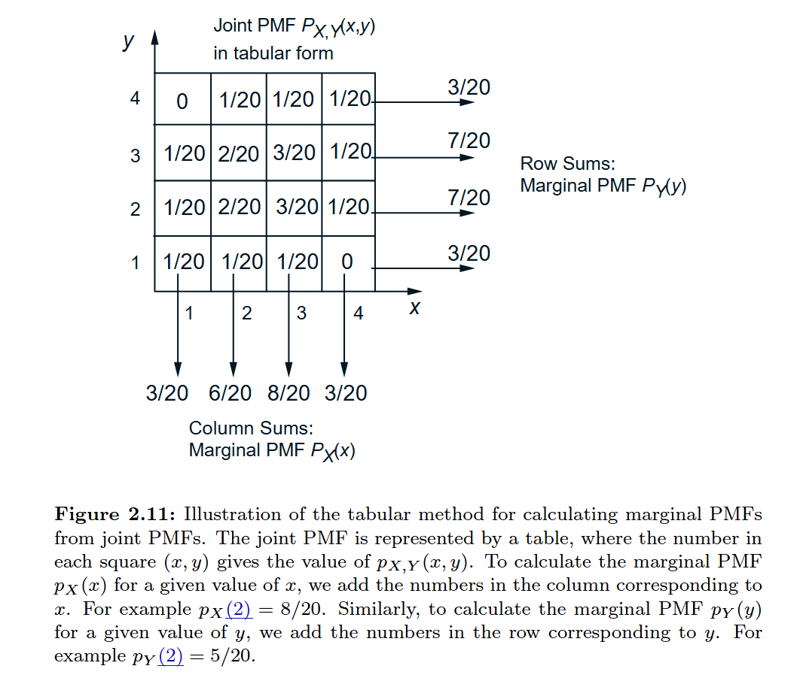

## 多個隨機變數的函數

- 令 $Z=g(X,Y)$ 為隨機變數 $X$ 與 $Y$ 的一個函數，則 $Z$ 也為隨機變數。 其 PMF 可由 joint PMF $p_{X,Y}$ 計算  
  $$
  p_Z(z)=\sum_{\{(x,y)\mid g(x,y)=z\}} p_{X,Y}(x,y) 
  $$

- 對於多個隨機變數之函數的期望值  
  $$
  \mathbf{E}[Z]=\mathbf{E}[g(X,Y)]=\sum_{x}\sum_{y} g(x,y)\,p_{X,Y}(x,y) 
  $$

- 若多個隨機變數的函數為線性，且形式為 $Z=g(X,Y)=aX+bY+c$，則  
  $$
  \mathbf{E}[Z]=a\,\mathbf{E}[X]+b\,\mathbf{E}[Y]+c 
  $$

### 一個示例

回到圖 2.11：

已知上圖給出的 $X$ 與 $Y$ 的 joint（表格形式），並定義新隨機變數 $Z=X+2Y$，計算 $\mathbf{E}[Z]$

**Method 1：**

$$
\mathbf{E}[X]=1\cdot\frac{3}{20}+2\cdot\frac{6}{20}+3\cdot\frac{8}{20}+4\cdot\frac{3}{20}=\frac{51}{20} 
$$
$$
\mathbf{E}[Y]=1\cdot\frac{3}{20}+2\cdot\frac{7}{20}+3\cdot\frac{7}{20}+4\cdot\frac{3}{20}=\frac{50}{20} 
$$
$$
\mathbf{E}[Z]=\mathbf{E}[X]+2\mathbf{E}[Y]=\frac{51}{20}+2\cdot\frac{50}{20}=\frac{151}{20}=7.55 
$$

**Method 2：**

$$
p_Z(z)=\sum_{\{(x,y)\mid x+2y=z\}} p_{X,Y}(x,y) 
$$
$$
p_Z(3)=\frac{1}{20},\quad p_Z(4)=\frac{1}{20},\quad p_Z(5)=\frac{2}{20},\quad p_Z(6)=\frac{2}{20} 
$$
$$
p_Z(7)=\frac{4}{20},\quad p_Z(8)=\frac{3}{20},\quad p_Z(9)=\frac{3}{20},\quad p_Z(10)=\frac{2}{20} 
$$
$$
p_Z(11)=\frac{1}{20},\quad p_Z(12)=\frac{1}{20} 
$$
$$
\therefore\ \mathbf{E}[Z]=3\cdot\frac{1}{20}+4\cdot\frac{1}{20}+5\cdot\frac{2}{20}+6\cdot\frac{2}{20}+7\cdot\frac{4}{20}+8\cdot\frac{3}{20}+9\cdot\frac{3}{20}+10\cdot\frac{2}{20}+11\cdot\frac{1}{20}+12\cdot\frac{1}{20}=7.55 
$$

## 兩個隨機變數以上的 Joint PMF

- 三個隨機變數 $X,\ Y,\ Z$ 的 joint PMF 與上述類似，定義為  
  $$
  p_{X,Y,Z}(x,y,z)=\mathbf{P}(X=x,Y=y,Z=z) 
  $$

- 對應的 marginal PMFs 為  
  $$
  p_{X,Y}(x,y)=\sum_{z} p_{X,Y,Z}(x,y,z) 
  $$
  $$
  p_X(x)=\sum_{y}\sum_{z} p_{X,Y,Z}(x,y,z) 
  $$

- 對於 $X,\ Y,\ Z$ 的函數 $g$，其期望值  
  $$
  \mathbf{E}[g(X,Y,Z)]=\sum_{x}\sum_{y}\sum_{z} g(x,y,z)\,p_{X,Y,Z}(x,y,z) 
  $$

- 若函數為線性且具有形式 $aX+bY+cZ+d$，則  
  $$
  \mathbf{E}[aX+bY+cZ+d]=a\,\mathbf{E}[X]+b\,\mathbf{E}[Y]+c\,\mathbf{E}[Z]+d 
  $$

- 推廣到超過三個隨機變數的情形  
  $$
  \mathbf{E}\big[a_1X_1+a_2X_2+\cdots+a_nX_n\big]=a_1\mathbf{E}[X_1]+a_2\mathbf{E}[X_2]+\cdots+a_n\mathbf{E}[X_n] 
  $$

### **Example 2.10. Mean of the Binomial.** 

你的機率課有 300 位學生，而且每位學生獲得 A 的機率為 $1/3$，且彼此獨立  

問：隨機變數 $X$（得到 A 的學生人數）的 mean 是多少  

令  

$$
\begin{aligned}
&X_i=\begin{cases}
1, & \text{若第 } i \text{ 位學生得到 A} \\
0, & \text{otherwise}
\end{cases}\\
&\Rightarrow\ X_1,X_2,\ldots,X_{300} \text{ 都是 mean 為 p=1/3 的 Bernoulli 隨機變數}
\end{aligned}
$$

它們的和 $X=X_1+X_2+\cdots+X_{300}$ 可以被解讀為一個參數為 $n\,(n=300)$ 與 $p\,(p=1/3)$ 的 binomial 隨機變數。 也就是說，$X$ 是在 $n\,(n=300)$ 次獨立試驗中的成功次數  

因此

$$
\mathrm{E}[X]=\mathrm{E}[X_1+X_2+\cdots+X_{300}]
= \sum_{i=1}^{300}\mathrm{E}[X_i]
=300\cdot \tfrac{1}{3}=100 
$$

## Conditioning

- 回想一下，conditional probability 讓我們能在僅有部分資訊的情況下，對一次實驗的結果進行推理
  - 類似我們在 Chapter 1 的討論，conditional probabilities 可以用來捕捉各種 events（或另一個 random variable 的值）所傳遞的資訊，這些資訊與一個 random variable 可能的不同取值有關
- 以相同的精神，我們可以定義 conditional PMFs，條件是某個 event 發生，或條件是另一個 random variable 的取值
  - 不過實際上，這裡並沒有太多全新的內容，主要是把 Chapter 1 已熟悉的概念加以鋪陳，並配合一些新的記號

### Conditioning a Random Variable on an Event

- random variable $X$ 在特定 event $A$（且 $P(A)>0$）上的 conditional PMF 定義如下（其中 $X$ 與 $A$ 來自同一個 experiment）
  $$
  p_{X\mid A}(x)=P(X=x\mid A)=\frac{P(\{X=x\}\cap A)}{P(A)}
  $$
- Normalization Property
  - 注意，對於不同的 $X$ 取值，$\{X=x\}\cap A$ 這些 events 彼此為 disjoint 的，它們的 union 等於 $A$
    $$
    P(A)=\sum_{x}P(\{X=x\}\cap A) \text{ (Total probability theorem)}
    $$

    $$
    \therefore\ \sum_{x}p_{X\mid A}(x)=\sum_{x}\frac{P(\{X=x\}\cap A)}{P(A)}=\frac{\sum_{x}P(\{X=x\}\cap A)}{P(A)}=\frac{P(A)}{P(A)}=1
    $$

  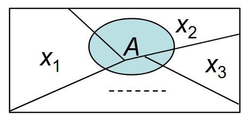

$p_{X\mid A}(x)$ 的取得方式是：對每個 $x$，把落在 $\{X=x\}\cap A$ 的 outcomes 的機率加總，再除以 $P(A)$ 做 normalize

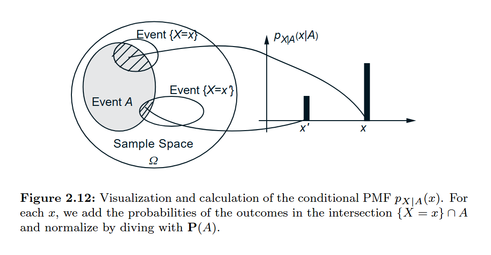

### Illustrative Examples

設 $X$ 是一個 discrete uniform random variable

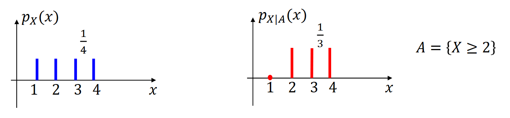

對於 $p_X(x)$：

$$
E[X]=\frac{1+4}{2}=\frac{5}{2}
$$
$$
\operatorname{var}(X)=\frac{(4-1)(4-1+2)}{12}=\frac{5}{4}
$$

對於 $p_{X\mid A}(x)$，$A=\{X\ge 2\}$：

$$
E[X\mid A]=\frac{2+4}{2}=3
$$
$$
\operatorname{var}(X\mid A)=\frac{(4-2)(4-2+2)}{12}=\frac{2}{3}
$$
$$
\bigl(\operatorname{var}(X\mid A)=\tfrac{1}{3}(2-3)^2+\tfrac{1}{3}(3-3)^2+\tfrac{1}{3}(4-3)^2\bigr)
$$

### Example 2.12. 

設 $X$ 為一次公平六面骰的點數，$A$ 為「點數為偶數」這個 event

$$
p_{X\mid A}(x)=P(X=x\mid \text{roll is even})=\frac{P(X=x\ \text{and}\ X\ \text{is even})}{P(X\ \text{is even})}
$$
$$
=\begin{cases}
1/3,& \text{if }x=2,4,6\\
0,& \text{otherwise}
\end{cases}
$$

### Example 2.13. 

一位學生最多會考某測驗 $n$ 次，每次通過的機率為 $p$，且各次嘗試彼此獨立  

問：在「學生最終通過考試」這個條件下，嘗試次數的 PMF 是什麼？

設 $X$ 是參數為 $p$ 的 geometric random variable，表示直到第一次成功出現所需的嘗試次數
$$
p_X(x)=(1-p)^{x-1}p
$$
設 $A$ 為「學生在 $n$ 次以內通過考試」這個 event（$A=\{X\le n\}$）
$$
\therefore\ p_{X\mid A}(x)=
\begin{cases}
\displaystyle\frac{(1-p)^{x-1}p}{\sum_{m=1}^{n}(1-p)^{m-1}p},& \text{if }x=1,2,\ldots,n\\[10pt]
0,& \text{otherwise}
\end{cases}
$$

### More on Geometric Random Variable

Memorylessness Property

- 在前 $n$ 次擲幣皆為 “Tails” 的條件下，直到第一次出現 “Head” 尚需的擲幣次數，服從參數為 $p$ 的 geometric random variable
- 也就是說，若 $X$ 是參數為 $p$ 的 geometric random variable，則在條件 $B=\{X>n\}$ 下，$Y=X-n$ 也同樣是參數為 $p$ 的 geometric random variable

$$
\begin{aligned}
p_{X-n\mid X>n}(k)
&=P(T_{n+1},T_{n+2},\ldots,H_{n+k}\mid B=\{X>n\})\\
&=P(T_{n+1},T_{n+2},\ldots,H_{n+k}) \quad\text{ (X > n 已自動隱含在內)}\\
&=P(T_1,T_2,\ldots,H_k) \quad\text{ (獨立且分布相同)}\\
&=p_X(k)
\end{aligned}
$$

等價的分式推導：

$$
\begin{aligned}
p_{X-n\mid X>n}(k)
&=\frac{P(X-n=k,\ X>n)}{P(X>n)}
=\frac{P(X=n+k,\ X>n)}{P(X>n)}
=\frac{P(X=n+k)}{P(X>n)}\\
&=\frac{(1-p)^{n+k-1}p}{\sum_{x=n+1}^{\infty}(1-p)^{x-1}p}
=\frac{(1-p)^{n+k-1}p}{(1-p)^n\cdot\underbrace{\sum_{x'=1}^{\infty}(1-p)^{x'-1}p}_1} \quad(\text{let }x'=x-n)\\
&=(1-p)^{k-1}p\\
&=p_X(k)
\end{aligned}
$$

## Total Probability Theorem

- 設 $A_1,A_2,\ldots,A_n$ 互斥，並且構成 sample space 的一個 partition
- 於是，我們有
  $$
  p_X(x)=P(A_1)p_{X\mid A_1}(x)+P(A_2)p_{X\mid A_2}(x)+\cdots+P(A_n)p_{X\mid A_n}(x)
  $$
  $$
  E[X]=P(A_1)E[X\mid A_1]+P(A_2)E[X\mid A_2]+\cdots+P(A_n)E[X\mid A_n]
  $$

注意

$$
\operatorname{var}(X)\ne P(A_1)\operatorname{var}(X\mid A_1)+P(A_2)\operatorname{var}(X\mid A_2)+\cdots+P(A_n)\operatorname{var}(X\mid A_n)
$$

## Conditioning a Random Variable on Another

- 設 $X$ 與 $Y$ 是同一個 experiment 下的兩個 random variables。 $X$ 在 $Y$ 給定情況下的 conditional PMF $p_{X\mid Y}$ 定義為
  $$
  p_{X\mid Y}(x\mid y)=P(X=x\mid Y=y)=\frac{P(X=x,Y=y)}{P(Y=y)}
  =\frac{p_{X,Y}(x,y)}{p_Y(y)} \text{ (} Y \text { is fixed on some value } y \text{)}
  $$
- Normalization Property
  $$
  \sum_x p_{X\mid Y}(x\mid y)=1
  $$
- conditional PMF 經常可用於 joint PMF 的計算（multiplication (chain) rule）
  $$
  p_{X,Y}(x,y)=p_Y(y)\,p_{X\mid Y}(x\mid y)\ \ \bigl(=\,p_X(x)\,p_{Y\mid X}(y\mid x)\bigr)
  $$

- conditional PMF 也可以用來計算 marginal PMFs
  $$
  p_X(x)=\sum_y p_{X,Y}(x,y)=\sum_y p_Y(y)\,p_{X\mid Y}(x\mid y)
  $$
- 關於 conditional PMF $p_{X\mid Y}$ 的視覺化，可由下式對應得到
  $$
  p_{X\mid Y}(x\mid y)=\frac{p_{X,Y}(x,y)}{p_Y(y)}=\frac{p_{X,Y}(x,y)}{\sum_x p_{X,Y}(x,y)}
  $$

  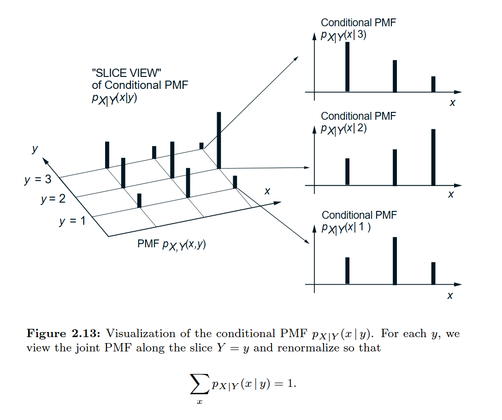

### Example 2.14. 

Professor May B. Right 經常把事實記錯，並且以機率 $1/4$ 錯答每一位學生的問題，且不同問題之間獨立。 每堂課 May 被問到 $0,1,2$ 題的機率皆為 $1/3$

問：她至少答錯一題的機率是多少？

令 $X$ 為被問到的題數，$Y$ 為答錯的題數

$$
\begin{aligned}
P(Y\ge 1)
&=P(Y=1)+P(Y=2)\\
&=P(X=1,Y=1)+P(X=2,Y=1)+P(X=2,Y=2)\\
\therefore\ P(Y\ge 1)
&=P(X=1)P(Y=1\mid X=1)+P(X=2)P(Y=1\mid X=2)+P(X=2)P(Y=2\mid X=2)\\
&=\frac{1}{3}\cdot\frac{1}{4}+\frac{1}{3}\left[\binom{2}{1}\cdot\frac{1}{4}\cdot\frac{3}{4}\right]+\frac{1}{3}\left[\binom{2}{2}\cdot\frac{1}{4}\cdot\frac{1}{4}\right]\\
&=\frac{11}{48}
\end{aligned}
$$

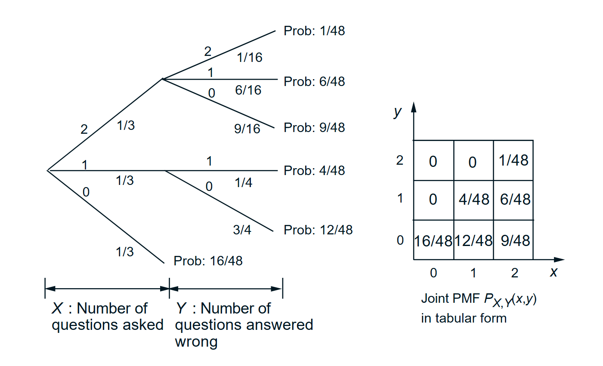

## Two Special Formulas

若 $A_1,\ldots,A_n$ 為互斥且形成 sample space 之 partition 的 events，且對所有 $i$ 都有 $P(A_i)>0$，則對任一 event $B$，且對所有 $i$ 都有 $P(A_i\cap B)>0$，可得

$$
p_{X\mid B}(x)=\sum_{i=1}^{n}P(A_i\mid B)\,p_{X\mid A_i\cap B}(x)
$$

1. 先問：「在 $B$ 發生的情況下，我到底是落在哪一塊 $A_i$ 裡？」  
    這塊的機率就是 $P(A_i \mid B)$
2. 接著問：「一旦我知道我同時滿足 $A_i$ 跟 $B$，那 $X=x$ 的機率是多少？」  
    這就是 $p_{X \mid A_i \cap B}(x)$
3. 把所有可能的 $i$ 都加總，就得到整體在 $B$ 下的 $X$ 的 PMF

這在機率裡就是「條件版混合分佈」

---

推導：

$$
p_{X \mid B}(x) = P(X = x \mid B)
= \frac{P(\{X = x\} \cap B)}{P(B)}
$$

現在，因為 $\{A_i\}$ 是一個 partition，我們可以把 $B$ 裡的東西「細分」到各個 $A_i$ 裡。 具體來說：

$$
\{X = x\} \cap B
= \bigcup_{i=1}^{n} \Big( \{X = x\} \cap A_i \cap B \Big)
$$

而且這些 $\{X=x\} \cap A_i \cap B$ 是互斥的（不同 $i$ 不會重疊，因為 $A_i$ 不重疊）

所以用加法公理（disjoint union 的機率要加）：

$$
P(\{X = x\} \cap B)
= \sum_{i=1}^{n} P(\{X = x\} \cap A_i \cap B)
$$

現在代回條件機率的分子：

$$
P(X = x \mid B)
= \frac{ \sum_{i=1}^{n} P(\{X = x\} \cap A_i \cap B) }{ P(B) }
= \sum_{i=1}^{n} \frac{ P(\{X = x\} \cap A_i \cap B) }{P(B)}
$$

對於每一項，我們把它寫成「乘法」形式（這是關鍵）：

$$
\frac{ P(\{X = x\} \cap A_i \cap B) }{ P(B) }
= \frac{ P(A_i \cap B) }{P(B)} \cdot \frac{ P(\{X = x\} \cap A_i \cap B) }{ P(A_i \cap B) }
$$

這兩個分數其實就是條件機率：

- 第一個 $\frac{P(A_i \cap B)}{P(B)} = P(A_i \mid B)$

- 第二個 $\frac{P(\{X = x\} \cap A_i \cap B)}{P(A_i \cap B)} = P(X = x \mid A_i \cap B) = p_{X \mid A_i \cap B}(x)$

所以整個式子變成：

$$
\begin{aligned}
P(X = x \mid B)
&= \frac{ P(\{X = x\} \cap A_i \cap B) }{ P(B) }
= \frac{ P(A_i \cap B) }{P(B)} \cdot \frac{ P(\{X = x\} \cap A_i \cap B) }{ P(A_i \cap B) }\\
&= \sum_{i=1}^{n} P(A_i \mid B)\, P(X = x \mid A_i \cap B)
= \sum_{i=1}^{n} P(A_i \mid B)\, p_{X \mid A_i \cap B}(x)
\end{aligned}
$$

同理，進一步可得

$$
E[X\mid B]= \sum_x x \cdot p_{X \mid B}(x)=\sum_{i=1}^{n}P(A_i\mid B)\,E[X\mid A_i\cap B]
$$

## Summary of Facts About Conditional Expectations

- 回想一下，可以把 conditional PMF 視為在 conditioning event 所決定的一個新「宇宙」之上的 ordinary PMF
- 以相同的精神，conditional expectation 與 ordinary expectation 相同，只是它參照的是這個新「宇宙」，而所有機率與 PMFs 都以其對應的 conditional 版本取代

- 假設 $X$ 與 $Y$ 是同一個 experiment 下的兩個 random variables
  - 給定 event $A$ 且 $P(A)>0$，$X$ 的 conditional expectation 定義為
    $$
    E[X\mid A]=\sum_x x\,p_{X\mid A}(x)
    $$
  - 對於一個函數 $g(X)$，其對應形式為
    $$
    E[g(X)\mid A]=\sum_x g(x)\,p_{X\mid A}(x)
    $$

## Total Expectation Theorem

- 對於 $Y$ 的某個取值 $y$，$X$ 的 conditional expectation 定義為
  $$
  E[X\mid Y=y]=\sum_{x}x\,p_{X\mid Y}(x\mid y)
  $$
  可得
  $$
  E[X]=\sum_{y}p_Y(y)\,\underbrace{\sum_{x}x\,p_{X\mid Y}(x\mid y)}_{E[X\mid Y=y]}
  $$
- 設 $A_1,\cdots,A_n$ 互斥且形成 sample space 的一個 partition，並假設對所有 $i$ 都有 $P(A_i)>0$。 則
  $$
  E[X]=\sum_{i=1}^{n}P(A_i)\,E[X\mid A_i]
  $$
- 設 $A_1,\cdots,A_n$ 互斥且形成某個 event $B$ 的一個 partition，並假設對所有 $i$ 都有 $P(A_i\cap B)>0$。 則
  $$
  E[X\mid B]=\sum_{i=1}^{n}P(A_i\mid B)\,E[X\mid A_i\cap B]
  $$
- total expectation theorem 的驗證
  $$
  \begin{aligned}
  E[X]
  &=\sum_{x}x\,p_X(x)=\sum_{x}x\sum_{y}p_{X,Y}(x,y)\\
  &=\sum_{x}x\sum_{y}p_Y(y)\,p_{X\mid Y}(x\mid y)\\
  &=\sum_{y}p_Y(y)\sum_{x}x\,p_{X\mid Y}(x\mid y)\\
  &=\sum_{y}p_Y(y)\,E[X\mid Y=y]
  \end{aligned}
  $$

### Example 2.17. Mean and Variance of the Geometric Random Variable

設 $X$ 為 geometric random variable，其 PMF 為 $p_X(x)=(1-p)^{x-1}p,\ x=1,2,\ldots$

設 $A_1$ 為 event $\{X=1\}$，$A_2$ 為 event $\{X>1\}$

我們有

$$
E[X]=P(A_1)E[X\mid A_1]+P(A_2)E[X\mid A_2]
$$

其中 $P(A_1)=p,\ P(A_2)=1-p$ （因為 $\{A_1, A_2\}$ 形成了一個 partition）

先給出條件 PMF

$$
p_{X\mid A_1}(x)=\frac{P(\{X=x\}\cap A_1)}{P(A_1)}=
\begin{cases}
1,& x=1\\
0,& \text{otherwise}
\end{cases}
$$

$$
p_{X\mid A_2}(x)=\frac{P(\{X=x\}\cap A_2)}{P(A_2)}=
\begin{cases}
(1-p)^{x-2}p,& x>1\\
0,& \text{otherwise}
\end{cases}
$$

計算條件期望

$$
E[X\mid A_1]=1\cdot 1+\sum_{x=2}^{\infty}x\cdot 0=1
$$
$$
E[X\mid A_2]=1\cdot 0+\sum_{x=2}^{\infty}x\,(1-p)^{x-2}p
$$

改以 $x'=x-1$ 表示

$$
\begin{aligned}
\sum_{x=2}^{\infty}x\cdot \left[(1-p)^{x-2}p\right]
&=\sum_{x'=1}^{\infty}(x'+1)(1-p)^{x'-1}p\\
&=\left[\sum_{x'=1}^{\infty}x'(1-p)^{x'-1}p\right]+\left[\sum_{x'=1}^{\infty}(1-p)^{x'-1}p\right]\\
&=E[X]+1
\end{aligned}
$$

代回 $E[X]=P(A_1)E[X\mid A_1]+P(A_2)E[X\mid A_2]$

$$
E[X]=p\cdot 1+(1-p)\bigl(E[X]+1\bigr)
$$
$$
\therefore\ E[X]=\frac{1}{p}
$$

以相同方式計算 $E[X^2]$

$$
E[X^2]=P(A_1)E[X^2\mid A_1]+P(A_2)E[X^2\mid A_2]
$$
$$
E[X^2\mid A_1]=1^2\cdot 1+\sum_{x=2}^{\infty}x^2\cdot 0=1
$$
$$
E[X^2\mid A_2]=1^2\cdot 0+\sum_{x=2}^{\infty}x^2(1-p)^{x-2}p
$$

使用恆等式 $x^2=(x-1)^2+2x-1$，將上式拆開

$$
\sum_{x=2}^{\infty}x^2(1-p)^{x-2}p=\left[\sum_{x=2}^{\infty}(x-1)^2(1-p)^{x-2}p\right]+2\left[\sum_{x=2}^{\infty}x(1-p)^{x-2}p\right]-\left[\sum_{x=2}^{\infty}(1-p)^{x-2}p\right]
$$

代入 $x'=x-1$：

$$
\begin{aligned}
&=\left[\sum_{x'=1}^{\infty}x'^2(1-p)^{x'-1}p\right]+2\left[\sum_{x=2}^{\infty}(x-1)(1-p)^{x-2}p\right]+2\left[\sum_{x=2}^{\infty}(1-p)^{x-2}p\right]-\left[\sum_{x=2}^{\infty}(1-p)^{x-2}p\right]\\
&=\left[\sum_{x'=1}^{\infty}x'^2(1-p)^{x'-1}p\right]+2\left[\sum_{x'=1}^{\infty}x'(1-p)^{x'-1}p\right]+\left[\sum_{x'=1}^{\infty}(1-p)^{x'-1}p\right]\\
&
\end{aligned}
$$

再以先前 $\sum_{x=2}^{\infty}x(1-p)^{x-2}p=E[X]+1$ 的結果代入

$$
\begin{aligned}
&=\left[\sum_{x'=1}^{\infty}x'^2(1-p)^{x'-1}p\right]+2\bigl(E[X]+1\bigr)-1\\
&=E[X^2] + 2E[X] + 1
\end{aligned}
$$

因此

$$
E[X^2 \mid A_2]=E[X^2]+2E[X]+1\
$$

將上式代回 $E[X^2]=P(A_1)E[X^2\mid A_1]+P(A_2)E[X^2\mid A_2]$：

$$
E[X^2]=p\cdot 1+(1-p)\left(E[X^2]+2E[X]+1\right)
$$

由前一小節已得 $E[X]=\frac{1}{p}$，整理可得

$$
E[X^2]=\frac{1+2(1-p)E[X]}{p}=\frac{1+2(1-p)\cdot \frac{1}{p}}{p}=\frac{2}{p^2}-\frac{1}{p}
$$

因此

$$
\operatorname{var}(X)=E[X^2]-(E[X])^2=\frac{1}{p^2}-\frac{1}{p}=\frac{1-p}{p^2}
$$

## Independence of a Random Variable from an Event

- 如果對所有 $x$ 都有 $P(X=x\ \text{and}\ A)=P(X=x)P(A)$，則 random variable $X$ 與 event $A$ 為 independent
  - 兩個 events $\{X=x\}$ 與 $A$ 必須對所有 $x$ 皆 independent
- 若 random variable $X$ 與 event $A$ independent 且 $P(A)>0$，則
  $$
  \begin{aligned}
  p_{X\mid A}(x)
  &=\frac{P(X=x\ \text{and}\ A)}{P(A)}\\
  &=\frac{P(X=x)P(A)}{P(A)}\\
  &=P(X=x)\\
  &=p_X(x),\ \ \text{for all }x\\
  \end{aligned}
  $$

### Example 2.19. 

考慮兩次相互獨立的公平擲幣

- 設 random variable $X$ 為正面出現次數
- 設 random variable $Y$：若第一次為 head 則 $Y=0$，若第一次為 tail 則 $Y=1$
- 設 $A$ 為「正面出現次數為偶數」這個 event
- 可能 outcomes 為 $(T,T),(T,H),(H,T),(H,H)$

單變數與條件分佈

$$
p_X(x)=
\begin{cases}
1/4,& \text{if }x=0\\
1/2,& \text{if }x=1\\
1/4,& \text{if }x=2
\end{cases}
\qquad
p_{X\mid A}(x)=\frac{P(X=x\ \text{and}\ A)}{P(A)}=
\begin{cases}
1/2,& \text{if }x=0\\
0,& \text{if }x=1\\
1/2,& \text{if }x=2
\end{cases}
$$

$$
p_{X\mid A}(x)\ne p_X(x)\ \Rightarrow\ X\ \text{and}\ A\ \text{are not independent}
$$
$$
p_Y(y)=
\begin{cases}
1/2,& \text{if }y=0\\
1/2,& \text{if }y=1
\end{cases}
\qquad
p_{Y\mid A}(y)=\frac{P(Y=y\ \text{and}\ A)}{P(A)}=
\begin{cases}
1/2,& \text{if }y=0\\
1/2,& \text{if }y=1
\end{cases}
$$
$$
p_{Y\mid A}(y)=p_Y(y)\ \Rightarrow\ Y\ \text{and}\ A\ \text{are independent}
$$

其中

$$
P(A)=\frac{1}{2}
$$

## Independence of a Random Variables

- 兩個 random variables $X$ 與 $Y$ 若滿足下式，則為 independent
  $$
  p_{X,Y}(x,y)=p_X(x)p_Y(y),\ \ \text{for all }x,y
  $$
  或等價地
  $$
  P(X=x,Y=y)=P(X=x)P(Y=y),\ \ \text{for all }x,y
  $$
- 若 random variable $X$ 與 random variable $Y$ independent，則
  $$
  p_{X\mid Y}(x\mid y)=p_X(x),\ \ \text{for all }y\ \text{with }p_Y(y)>0\ \text{and all }x
  $$
  由定義可得
  $$
  \begin{aligned}
  p_{X\mid Y}(x\mid y)&=\frac{p_{X,Y}(x,y)}{p_Y(y)}\\
  &=\frac{p_X(x)p_Y(y)}{p_Y(y)}\\
  &=p_X(x),\ \ \text{for all }y\ \text{with }p(y)>0\ \text{and all }x
  \end{aligned}
  $$

- 在一個機率為正的 event $A$ 條件下，若
  $$
  p_{X,Y\mid A}(x,y)=p_{X\mid A}(x)\,p_{Y\mid A}(y),\ \ \text{for all }x,y
  $$
  則稱 random variables $X$ 與 $Y$ 為 conditionally independent

  或等價地
    $$
    p_{X\mid Y,A}(x\mid y)=p_{X\mid A}(x),\ \ \text{for all }y\ \text{with }p_{Y\mid A}(y)>0\ \text{and all }x
    $$
- 注意，如同 events 的情況，conditional independence 不必然蘊含 unconditional independence，反之亦然

### Example

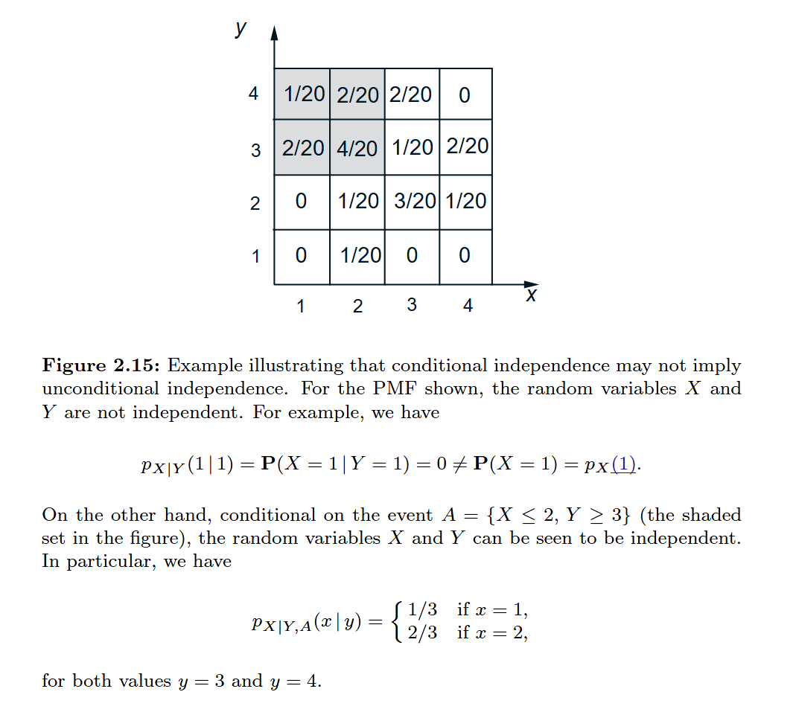

此例說明 conditional independence 不必然蘊含 unconditional independence

- 對圖中所示 PMF，random variables $X$ 與 $Y$ 並不 independent
- 若要證明 $X$ 與 $Y$ 不 independent，我們只需找到一組 $(x,y)$ 使得
  $$
  p_{X\mid Y}(x\mid y)\ne p_X(x)
  $$
- 例如，$X$ 與 $Y$ 並不 independent，因為
  $$
  p_{X\mid Y}(1\mid 1)=0\ne p_X(1)=\frac{3}{20}
  $$
- 若要證明 $X$ 與 $Y$ dependent，必須檢查所有 $(x,y)$ 是否滿足 $p_{X\mid Y}(x\mid y)=p_X(x)$
  
  例如，在 event $A=\{X\le 2,\ Y\ge 3\}$ 的條件下，$X$ 與 $Y$ 為 independent

  $$
  P(A)=\frac{9}{20},\ \ \ 
  p_{X\mid Y,A}(x\mid y)=\frac{P(X=x\cap Y=y\cap A)}{P(Y=y\cap A)}
  $$
  $$
  \begin{aligned}
  &p_{X\mid Y,A}(1\mid 3)=\frac{2/20}{6/20}=\frac{1}{3}&,\ \ \ 
  &p_{X\mid A}(1)=\frac{3/20}{9/20}=\frac{1}{3}\\
  &p_{X\mid Y,A}(1\mid 4)=\frac{1/20}{3/20}=\frac{1}{3}&\\
  &p_{X\mid Y,A}(2\mid 3)=\frac{4/20}{6/20}=\frac{2}{3}&,\ \ \ 
  &p_{X\mid A}(2)=\frac{6/20}{9/20}=\frac{2}{3}\\ 
  &p_{X\mid Y,A}(2\mid 4)=\frac{2/20}{3/20}=\frac{2}{3}
  \end{aligned}
  $$

## Functions of Two Independent Random Variables

已知 $X$ 與 $Y$ 為兩個 independent random variables，令 $g(X)$ 與 $h(Y)$ 分別為 $X$ 與 $Y$ 的兩個函數。 證明 $g(X)$ 與 $h(Y)$ 亦為 independent

令 $U=g(X)$、$V=h(Y)$，則

$$
\begin{aligned}
p_{U,V}(u,v)
&=\sum_{\{(x,y)\mid g(x)=u,\ h(y)=v\}}p_{X,Y}(x,y)\\
&=\sum_{\{(x,y)\mid g(x)=u,\ h(y)=v\}}p_X(x)\,p_Y(y)\\
&=\sum_{\{x\mid g(x)=u\}}p_X(x)\ \sum_{\{y\mid h(y)=v\}}p_Y(y)\\
&=p_U(u)\,p_V(v)
\end{aligned}
$$

## More Factors about Independent Random Variables

- 若 $X$ 與 $Y$ 為 independent random variables，則
  $$
  E[XY]=E[X]E[Y]
  $$
  
  由下列計算可見

  $$
  \begin{aligned}
  E[XY]&=\sum_x\sum_y xy\,p_{X,Y}(x,y)\\
  &=\sum_x\sum_y xy\,p_X(x)p_Y(y)\ \ \text{ (by independence)}\\
  &=\sum_x x\,p_X(x)\left[\sum_y y\,p_Y(y)\right]\\
  &=E[X]E[Y]
  \end{aligned}
  $$
- 同理，若 $X$ 與 $Y$ 為 independent random variables，則
  $$
  E[g(X)h(Y)]=E[g(X)]E[h(Y)]
  $$
- 若 $X$ 與 $Y$ 為 independent random variables，則
  $$
  \operatorname{var}(X+Y)=\operatorname{var}(X)+\operatorname{var}(Y)
  $$

  由下列計算可見

  $$
  \begin{aligned}
  &\operatorname{var}(X+Y)=E\bigl(((X+Y)-E[X+Y])^2\bigr)\\
  &=E\bigl((X+Y)^2-2(X+Y)(E[X]+E[Y])+(E[X]+E[Y])^2\bigr)\\
  &=\left[\sum_{x,y}(x+y)^2\,p_{X,Y}(x,y)\right]-2(E[X]+E[Y])E[X]-2(E[X]+E[Y])E[Y]+(E[X])^2+2E[X]E[Y]+(E[Y])^2\\
  &=\left[\sum_{x,y}x^2\,p_{X,Y}(x,y)\right]+\left[\sum_{x,y}y^2\,p_{X,Y}(x,y)\right]+2\left[\sum_{x,y}xy\,p_{X,Y}(x,y)\right]-(E[X])^2-(E[Y])^2-2E[X]E[Y]\\
  &=\left(E[X^2]-(E[X])^2\right)+\left(E[Y^2]-(E[Y])^2\right)+2\left[\sum_{x,y}xy\,p_{X,Y}(x,y)-E[X]E[Y]\right]\\
  &\text{(若 }X\text{ 與 }Y\text{ independent}\ \Rightarrow\ p_{X,Y}(x,y)=p_X(x)p_Y(y)\ \Rightarrow\ \sum_{x,y}xy\,p_{X,Y}(x,y)=E[X]E[Y]\text{)}\\
  &\therefore\ \operatorname{var}(X+Y)=\left(E[X^2]-(E[X])^2\right)+\left(E[Y^2]-(E[Y])^2\right)=\operatorname{var}(X)+\operatorname{var}(Y)
  \end{aligned}
  $$

## More than Two Random Variables

- Independence of several random variables
  - 三個 random variable $X$、$Y$ 與 $Z$ 若滿足下式則為 independent
    $$
    p_{X,Y,Z}(x,y,z)=p_X(x)p_Y(y)p_Z(z)\ \ \text{for all }x,y,z
    $$
  - Any three random variables of the form $f(X)$、$g(Y)$ 與 $h(Z)$ are also independent

- Variance of the sum of independent random variables
  - 若 $X_1,X_2,\ldots,X_n$ 為 independent random variables，則
    $$
    \operatorname{var}(X_1+X_2+\cdots+X_n)=\operatorname{var}(X_1)+\operatorname{var}(X_2)+\cdots+\operatorname{var}(X_n)
    $$

### Example 2.20. Variance of the Binomial. 

我們考慮 $n$ 次相互獨立的擲幣，每次擲出 head 的機率為 $p$。 對每一個 $i$，令 $X_i$ 為 Bernoulli random variable：若第 $i$ 次為 head 則取 $1$，否則取 $0$

於是，$X=X_1+X_2+\cdots+X_n$ 是一個 binomial random variable

因此

$$
\operatorname{var}(X_i)=p(1-p),\ \ \text{for all }i
$$
$$
\therefore\ \operatorname{var}(X)=\sum_{i=1}^{n}\operatorname{var}(X_i)=np(1-p)\ \ \text{(Note that $X_i$'s are independent)}
$$

### Example 2.21. Mean and Variance of the Sample Mean. 

我們想估計某位總統（記為 B）的支持率。 為此，從選民母體隨機抽樣 $n$ 人，令 $X_i$ 為編碼第 $i$ 位受訪者回應的 random variable：

$$
X_i=\begin{cases}
1,& \text{if the $i$-th person approves B's performance}\\
0,& \text{if the $i$-th person disapproves B's performance}
\end{cases}
$$

假設 $X_i$ 相互 independent，並且為相同的 random variable（Bernoulli），具有共同參數（對 Bernoulli 而言為 $p$），此參數對我們未知

$X_i$ are independent, and identically distributed (i.i.d.)

若 sample mean $S_n$（為一個 random variable）定義為

$$
S_n=\frac{X_1+X_2+\cdots+X_n}{n}
$$

$S_n$ 的 expectation 會等於 $X_i$ 的真實平均

$$
\begin{aligned}
E[S_n]&=E\left[\frac{X_1+X_2+\cdots+X_n}{n}\right]\\
&=\frac{1}{n}\sum_{i=1}^{n}E[X_i]\\
&=E[X_i]\ (=p\ \text{for the Bernoulli we assumed here})
\end{aligned}
$$

當 $n$ 足夠大時，$S_n$ 的 variance 會趨近 $0$

$$
\begin{aligned}
\lim_{n\to\infty}\operatorname{var}(S_n)&=\operatorname{var}\left(\frac{X_1+X_2+\cdots+X_n}{n}\right)\\
&=\lim_{n\to\infty}\frac{\sum_{i=1}^{n}\operatorname{var}(X_i)}{n^2}\\
&=\lim_{n\to\infty}\frac{np(1-p)}{n^2}\\
&=\lim_{n\to\infty}\frac{p(1-p)}{n}=0
\end{aligned}
$$

這表示當 $n$ 足夠大時，$S_n$ 會是 $E[X_i]$ 的良好估計
