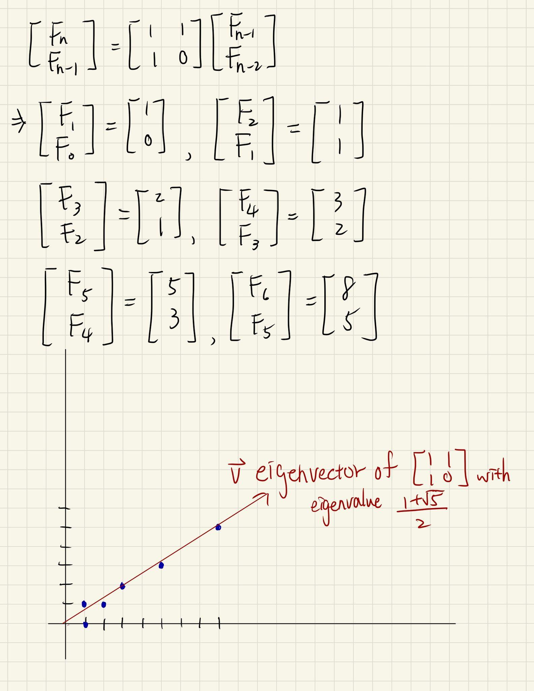
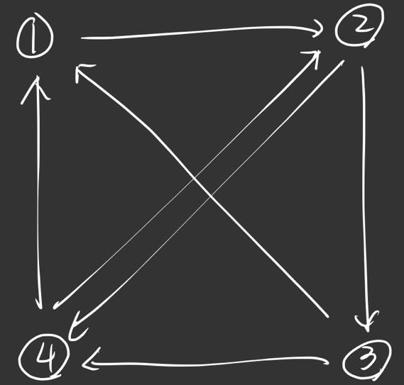
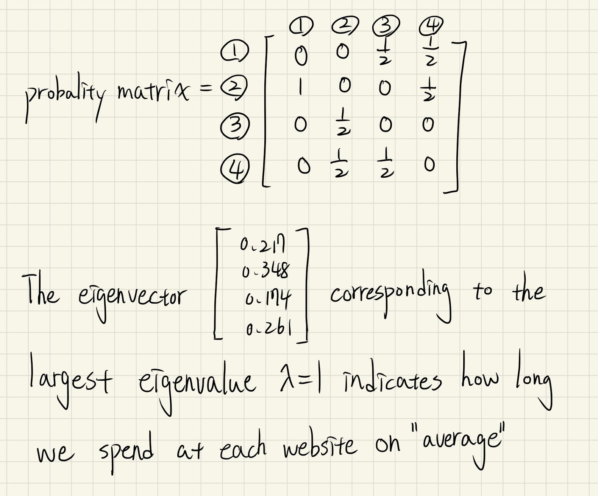
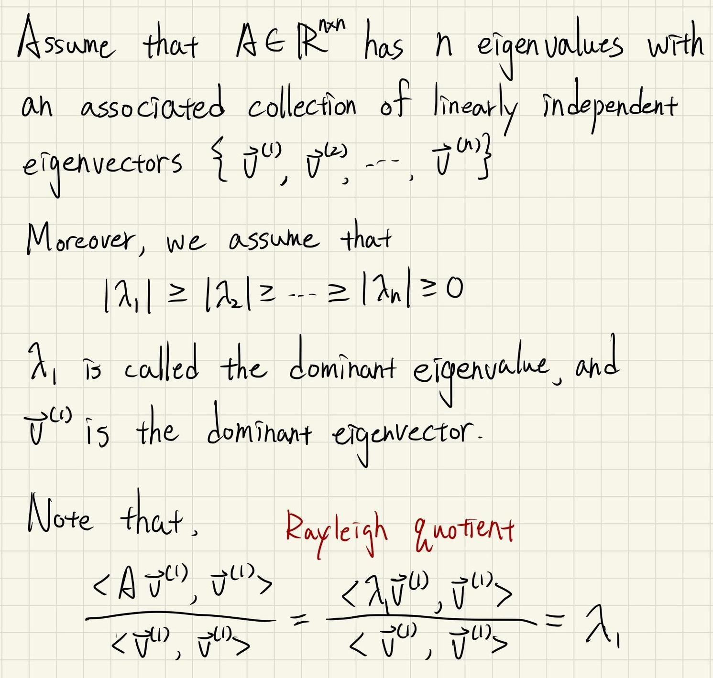
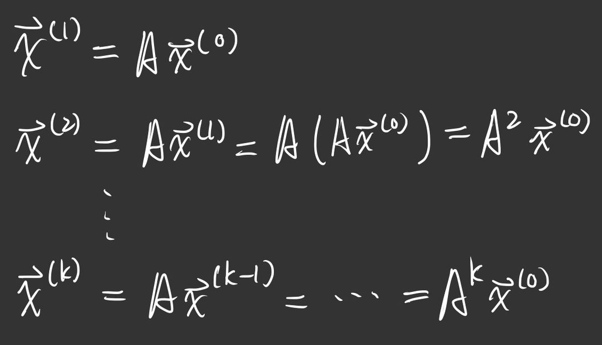
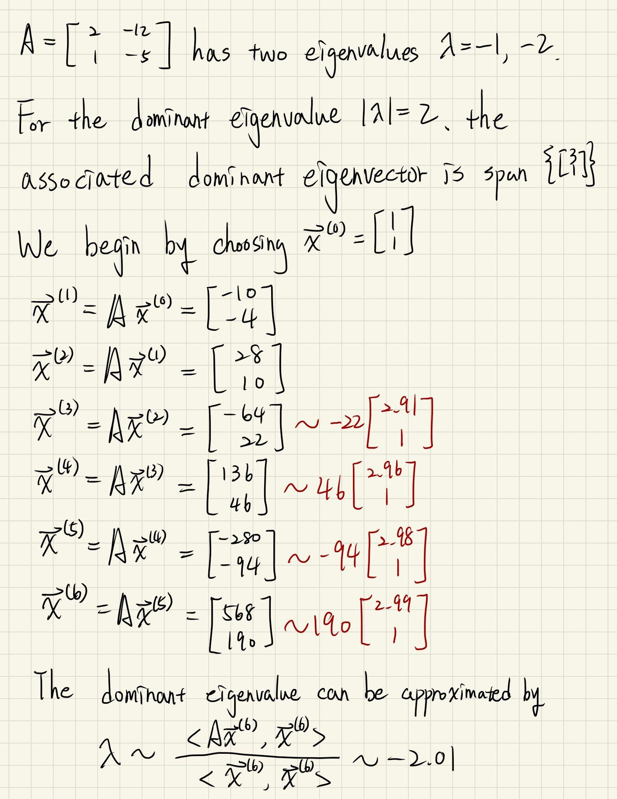
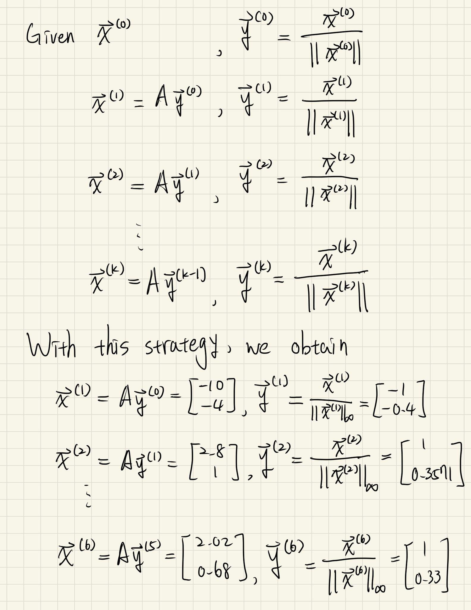
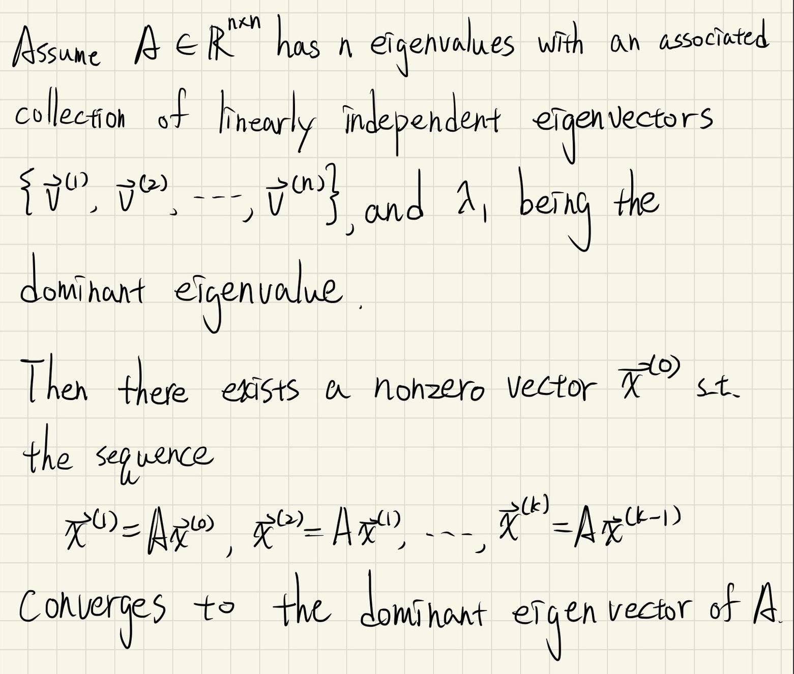
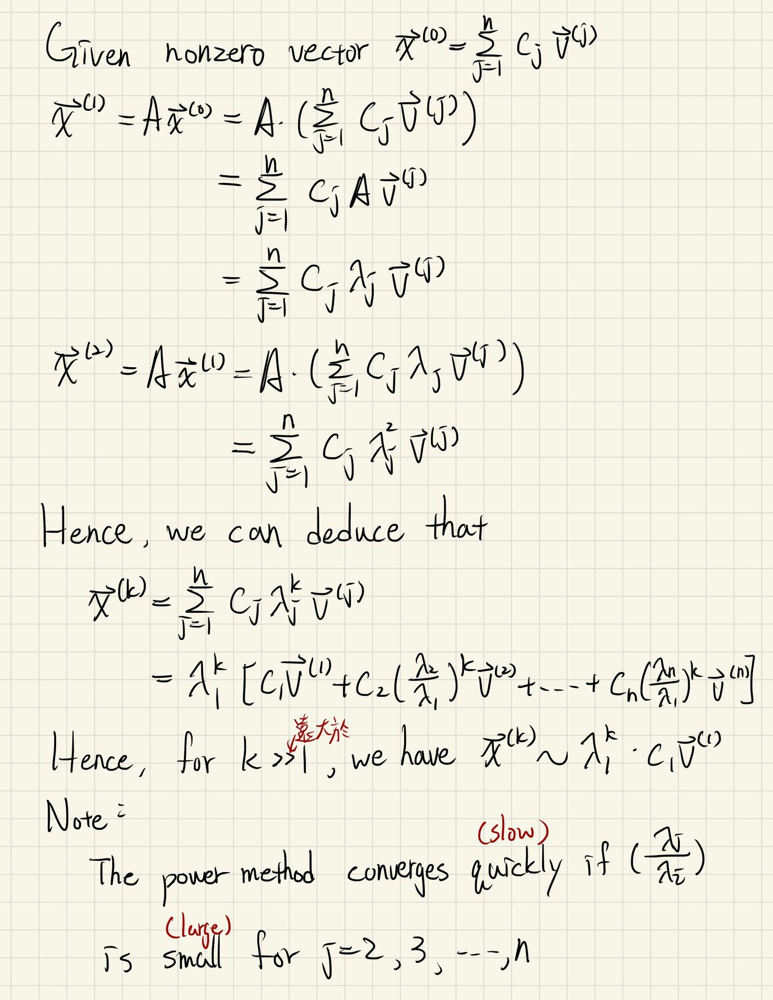

# Power Method

#### Example

看一下費波那契數列 $F_n = F_{n-1} + F_{n-2}$，這個數列長 $\{0,1,1,2,3,5,8,13,21,34,\ ...\}$，我們可以透過矩陣來重寫這個數列：

在這個例子裏面，我們觀察到 eigenvector、eigenvalue 跟長期的外顯行為有關

#### Example

看第二個例子，假設這邊有四個網頁，然後我們常像這樣去瀏覽她：

那麼就會有一個機率矩陣：

#### Thm dominant eigenvalue

#### Prop Power Method

假設 $A \in \mathbb{R}^{n \times n}$ 有 dominant eigenvalue。 給定 initial guess $\vec x$ 且製造一個數列長這樣：

我們希望這個數列能很好的幫助我們去逼近 dominant eigenvalue

#### Example 

這裡我們可以看到 Power Method 會產生一個很大的數字在矩陣前方，這個數字可以透過歸一化之類的方法來消除掉，我們這邊透過 scale down 的方法來做一次，在每步迭代前都先除上自己 norm：

#### Thm dominant eigenvalue

證明：

