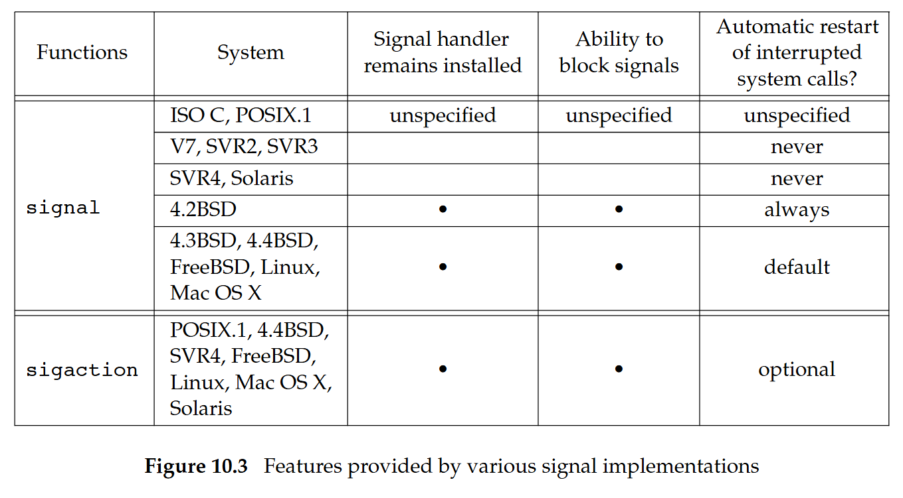
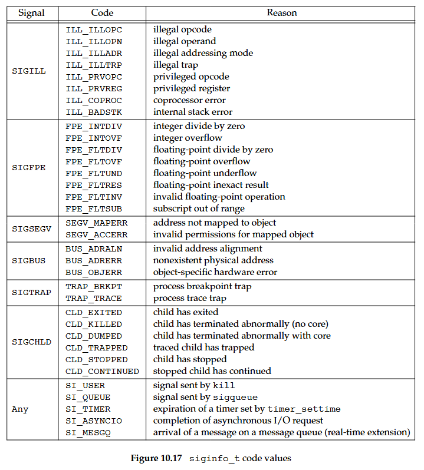
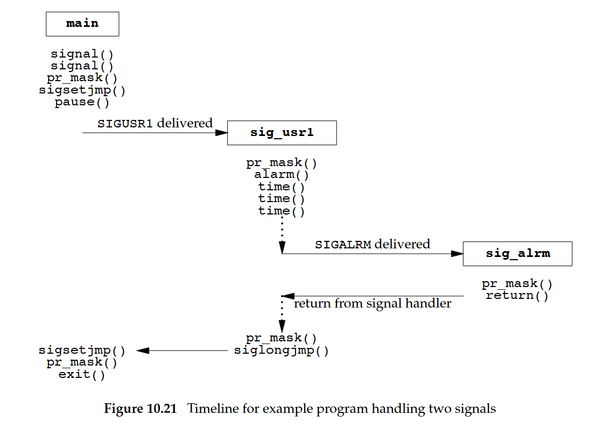
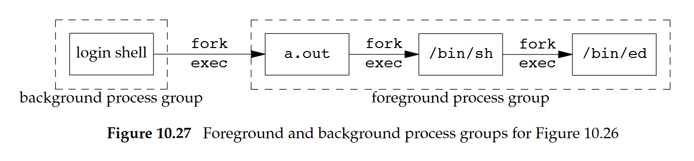

# Shichao's Notes APUE 翻譯 & 筆記：signal

原文連結：https://notes.shichao.io/apue/ch10/

## 10.1 Introduction

信號是軟體中斷，它們提供一種處理非同步事件的方式，大部分比較複雜的應用程式都需要處理信號

### POSIX reliable signals

UNIX 系統的早期版本就已開始提供信號，不過像 Version 7 這類系統所提供的信號模型並不可靠。 信號可能會遺失，而且行程在執行程式碼的關鍵區段時，很難關閉某些選定的信號。 4.3BSD 與 SVR3 都對信號模型做了修改，加入所謂的 reliable signals，然而 Berkeley 與 AT&T 所做的修改彼此不相容，所幸 POSIX.1 將 reliable-signal 常式標準化，而這正是我們在這裡要描述的內容

本章會從信號的總覽與各個信號的一般用途開始說明，接著討論早期實作的問題，因為在看到如何正確實作之前，先理解某個實作出了什麼問題經常是很重要的。 本章內有許多內含些許瑕疵的範例，我們會討論其中的缺陷為何

## 10.2 Signal Concepts

- 每個信號都有一個名稱，而且這些名稱全都以三個字元 `SIG` 開頭。 例如：
  - `SIGABRT` 是當行程呼叫 `abort` 函式時所產生的 abort 信號
  - `SIGALRM` 是當由 `alarm` 函式設定的計時器到期時所產生的 alarm 信號

  FreeBSD 8.0 支援 32 種不同的信號。 Mac OS X 10.6.8 與 Linux 3.2.0 各支援 31 種不同的信號，而 Solaris 10 則支援 40 種不同的信號。 FreeBSD、Linux 與 Solaris 為了支援 real-time applications，還額外支援由應用程式定義的信號

- 所有信號名稱都在標頭檔 `<signal.h>` 中定義為正整數常數（信號編號）
  - 各實作實際上會在不同的標頭檔中定義各個信號，不過 `<signal.h>` 會把這個標頭檔 include 進來
  - 讓核心把只給使用者層級應用程式使用的標頭檔 include 進來不是個好方法，因此如果應用程式與核心都需要相同的定義，相關資訊就會被放在某個核心標頭檔中，接著由使用者層級的標頭檔將它 include 進來
    - `<sys/signal.h>`：FreeBSD 8.0 與 Mac OS X 10.6.8
    - `<bits/signum.h>`：Linux 3.2.0
    - `<sys/iso/signal_iso.h>`：Solaris 10
- `kill` 函式在某個特殊情況下會使用信號編號 0，POSIX.1 把這個值稱為 null signal，除此之外沒有任何信號的編號是 0
- 有許多條件都可能產生信號：
  - 終端機產生的信號會在使用者按下某些終端機按鍵時發生。 在終端機上按下 DELETE 鍵或 Control-C 通常會產生中斷信號（`SIGINT`）
  - 硬體例外狀況會產生信號，例如除以 0 以及無效的記憶體參照。 這些狀況通常由硬體偵測，然後通知核心。 核心接著會為當時正在執行、並在該時間點發生狀況的行程產生適當的信號。 例如，對於執行了無效記憶體參照的行程，就會產生 `SIGSEGV`
  - `kill(2)` 函式允許某個行程將任意信號送給另一個行程或行程群組，但有一些限制：我們必須是收到信號的那個行程的擁有者，或者必須是超級使用者
  - `kill(1)` 命令允許我們把信號送給其他行程。 這個程式只是 `kill` 函式的一個介面。 這個命令經常被用來終止失控的背景行程
  - 當行程需要被通知各種事件時，軟體狀況也能產生信號。 例如：
    - `SIGURG`：當網路連線上有 out-of-band 資料到達時產生
    - `SIGPIPE`：當行程寫入一個沒有讀取端的 pipe 時產生
    - `SIGALRM`：當行程所設定的鬧鐘時間到期時產生

信號是非同步事件的典型例子。 對行程而言，它們會在隨機的時間點發生，行程無法只靠測試某個變數（例如 `errno`）就知道是否發生了信號； 相反地，行程必須告訴核心「當這個信號發生時，就做下面這些事」

### Signal dispositions

我們可以告訴核心在信號發生時要做下列三件事的其中之一，這稱為信號的 disposition，或者是與信號相關聯的動作（[`signal(7)`](http://man7.org/linux/man-pages/man7/signal.7.html)）

1. 忽略信號。 大多數的信號都可以被忽略，但有兩種信號永遠不能被忽略：`SIGKILL` 與 `SIGSTOP`
   - 之所以不能忽略這兩個信號，是為了讓核心與超級使用者一定有方法可以終止或停止任何行程
   - 如果我們忽略某些由硬體例外狀況產生的信號（例如非法記憶體參照或除以 0），行程的行為就會變成未定義
2. 捕捉信號。 要做到這點，我們會告訴核心在某個信號發生時要呼叫我們自己的某個函式。 在這個函式裡，我們可以用任何方式處理這個狀況。 例如：
   - 如果我們正在撰寫一個命令直譯器，當使用者在鍵盤上產生中斷信號時，我們大概會希望終止目前正在替使用者執行的命令，並回到程式的主迴圈
   - 如果我們捕捉到 `SIGCHLD` 信號，就代表有 child 行程已經終止，因此 signal handler 可以呼叫 `waitpid` 來取得 child 的行程 ID 與終止狀態
   - 如果行程建立了暫存檔，我們可能會想為 `SIGTERM` 信號（`kill` 命令預設送出的 termination 信號）撰寫一個 signal handler ，用來清理這些暫存檔
   - 請注意，`SIGKILL` 與 `SIGSTOP` 這兩個信號無法被捕捉
3. 套用預設動作。 每個信號都有一個預設動作，多數信號的預設動作都是終止行程

`SIGKILL` 與 `SIGSTOP` 這兩個信號不能被捕捉、封鎖或忽略（[`signal(7)`](http://man7.org/linux/man-pages/man7/signal.7.html)）

### The core file

<center-panel natural title="（表 10.1 UNIX 系統信號）">

| Name        | 說明                                            | ISO C | SUS  | FreeBSD | Linux | Mac OS X | Solaris | 預設動作                    |
|-------------|-------------------------------------------------|-------|------|---------|-------|----------|---------|-----------------------------|
| `SIGABRT`   | 非正常終止（`abort`）                           | •     | •    | •       | •     | •        | •       | 終止並產生 core             |
| `SIGALRM`   | 計時器到期（`alarm`）                           |       | •    | •       | •     | •        | •       | 終止                        |
| `SIGBUS`    | 硬體錯誤                                        |       | •    | •       | •     | •        | •       | 終止並產生 core             |
| `SIGCANCEL` | 執行緒函式庫內部使用                            |       |      |         |       |          | •       | 忽略                        |
| `SIGCHLD`   | child 狀態變更                                  |       | •    | •       | •     | •        | •       | 忽略                        |
| `SIGCONT`   | 繼續已停止的行程                                |       | •    | •       | •     | •        | •       | 繼續或忽略                  |
| `SIGEMT`    | 硬體錯誤                                        |       |      | •       | •     | •        | •       | 終止並產生 core             |
| `SIGFPE`    | 算術例外                                        | •     | •    | •       | •     | •        | •       | 終止並產生 core             |
| `SIGFREEZE` | checkpoint 凍結                                |       |      |         |       |          | •       | 忽略                        |
| `SIGHUP`    | 掛斷                                            |       | •    | •       | •     | •        | •       | 終止                        |
| `SIGILL`    | 非法指令                                        | •     | •    | •       | •     | •        | •       | 終止並產生 core             |
| `SIGINFO`   | 從鍵盤請求狀態                                  |       |      | •       |       | •        |         | 忽略                        |
| `SIGINT`    | 終端機中斷字元                                  | •     | •    | •       | •     | •        | •       | 終止                        |
| `SIGIO`     | 非同步 I/O                                      |       |      | •       | •     | •        | •       | 終止或忽略                  |
| `SIGIOT`    | 硬體錯誤                                        |       |      | •       | •     | •        | •       | 終止並產生 core             |
| `SIGJVM1`   | Java 虛擬機器內部使用                           |       |      |         |       |          | •       | 忽略                        |
| `SIGJVM2`   | Java 虛擬機器內部使用                           |       |      |         |       |          | •       | 忽略                        |
| `SIGKILL`   | 終止                                            |       | •    | •       | •     | •        | •       | 終止                        |
| `SIGLOST`   | 資源遺失                                        |       |      |         |       |          | •       | 終止                        |
| `SIGLWP`    | 執行緒函式庫內部使用                            |       |      | •       |       |          | •       | 忽略                        |
| `SIGPIPE`   | 向沒有讀取端的 pipe 寫入                        |       | •    | •       | •     | •        | •       | 終止                        |
| `SIGPOLL`   | 可由 `poll` 偵測的事件（`poll`）               |       |      |         | •     |          | •       | 終止                        |
| `SIGPROF`   | 取樣計時鬧鐘（`setitimer`）                     |       |      | •       | •     | •        | •       | 終止                        |
| `SIGPWR`    | 電源失效或重新啟動                              |       |      |         | •     |          | •       | 終止或忽略                  |
| `SIGQUIT`   | 終端機離開字元                                  |       | •    | •       | •     | •        | •       | 終止並產生 core             |
| `SIGSEGV`   | 無效記憶體參照                                  | •     | •    | •       | •     | •        | •       | 終止並產生 core             |
| `SIGSTKFLT` | 協同處理器 stack 錯誤                           |       |      |         | •     |          |         | 終止                        |
| `SIGSTOP`   | 停止                                            |       | •    | •       | •     | •        | •       | 停止行程                    |
| `SIGSYS`    | 無效系統呼叫                                    |       | XSI  | •       | •     | •        | •       | 終止並產生 core             |
| `SIGTERM`   | 終止                                            | •     | •    | •       | •     | •        | •       | 終止                        |
| `SIGTHAW`   | checkpoint 解凍                                |       |      |         |       |          | •       | 忽略                        |
| `SIGTHR`    | 執行緒函式庫內部使用                            |       |      | •       |       |          | •       | 終止                        |
| `SIGTRAP`   | 硬體錯誤                                        |       | XSI  | •       | •     | •        | •       | 終止並產生 core             |
| `SIGTSTP`   | 終端機停止字元                                  |       | •    | •       | •     | •        | •       | 停止行程                    |
| `SIGTTIN`   | 背景從控制終端機讀取                            |       | •    | •       | •     | •        | •       | 停止行程                    |
| `SIGTTOU`   | 背景寫入控制終端機                              |       | •    | •       | •     | •        | •       | 停止行程                    |
| `SIGURG`    | 緊急狀況（sockets）                             |       | •    | •       | •     | •        | •       | 忽略                        |
| `SIGUSR1`   | 使用者自訂信號                                  |       | •    | •       | •     | •        | •       | 終止                        |
| `SIGUSR2`   | 使用者自訂信號                                  |       | •    | •       | •     | •        | •       | 終止                        |
| `SIGVTALRM` | 虛擬時間鬧鐘（`setitimer`）                     |       | XSI  | •       | •     | •        | •       | 終止                        |
| `SIGWAITING`| 執行緒函式庫內部使用                            |       |      |         |       |          | •       | 忽略                        |
| `SIGWINCH`  | 終端機視窗大小變更                              |       |      | •       | •     | •        | •       | 忽略                        |
| `SIGXCPU`   | 超過 CPU 限制（`setrlimit`）                    |       | XSI  | •       | •     | •        | •       | 終止並產生 core/忽略        |
| `SIGXFSZ`   | 超過檔案大小限制（`setrlimit`）                 |       | XSI  | •       | •     | •        | •       | 終止並產生 core/忽略        |
| `SIGXRES`   | 超過資源控制限制                                |       |      |         |       |          | •       | 忽略                        |

</center-panel>

當上面表格中的預設動作標示為 "terminate+core" 時，代表會在該行程當前工作目錄（CWD）中留下名為 `core` 的檔案，其中包含行程的記憶體映象（memory image）。 這個檔案可以搭配大多數 UNIX 系統的偵錯器，用來檢查行程在終止當下的狀態

`core` 檔案的名稱在不同實作之間會有所不同。 在 Mac OS X 10.6.8 上，core 檔案名稱是 core.*pid*，其中 *pid* 為收到信號的那個行程的 ID。 在 Linux 3.2.0 上，名稱則是透過 `/proc/sys/kernel/core_pattern` 來設定（[`core(5)`](http://man7.org/linux/man-pages/man5/core.5.html)）

大多數實作會把 core 檔案留在對應行程的當前工作目錄中； Mac OS X 則會把所有 core 檔案放在 `/cores` 目錄底下

在下列情況下，不會產生 core 檔案：

- 該行程是 set-user-ID，而目前使用者並不是程式檔案的擁有者
- 該行程是 set-group-ID，而目前使用者並不是該檔案的群組擁有者
- 使用者沒有權限在當前工作目錄中寫入
- core 檔案已經存在，而使用者沒有權限寫入它
- 檔案太大（請見[第 7.11 節]()中的 `RLIMIT_CORE` 限制）

core 檔案的權限（假設檔案尚不存在）通常是使用者可讀與使用者可寫，不過 Mac OS X 只設定為使用者可讀

在表格中，說明欄標示為「硬體錯誤」的那些信號對應到實作定義的硬體錯誤

### Detailed description of signals

- `SIGABRT`：呼叫 `abort` 函式時產生。 行程會以非正常方式終止
- `SIGALRM`：
  - 當以 `alarm` 函式設定的計時器到期時會產生這個信號
  - 當以 `setitimer(2)` 函式設定的區間計時器到期時也會產生這個信號
- `SIGBUS`：表示某個實作定義的硬體錯誤。 實作通常會在某些特定型態的記憶體錯誤上產生這個信號
- `SIGCANCEL`：由 Solaris 的 threads 函式庫內部使用。 這個信號不是給一般用途使用的
- `SIGCHLD`：每當某個行程終止或停止時，核心就會送 `SIGCHLD` 信號給它的 parent。 預設情況下，這個信號會被忽略，因此如果 parent 想在 child 狀態變更時得到通知，就必須捕捉這個信號。 signal handler 中典型的動作，是呼叫某個 `wait` 函式來取得 child 的行程 ID 與終止狀態
- `SIGCONT`：核心會在已停止的行程被要求繼續執行時送這個信號給該行程。 預設動作是讓已停止的行程繼續執行，但如果行程本來並沒有被停止，就會忽略這個信號
- `SIGEMT`：表示某個實作定義的硬體錯誤。 不是所有平台都支援這個信號
- `SIGFPE`：表示算術例外，例如除以 0、浮點數溢位等等。 這個名稱源自 "floating-point exception"（[Program Error Signals](http://www.gnu.org/software/libc/manual/html_node/Program-Error-Signals.html)）
- `SIGFREEZE`：只在 Solaris 上定義
- `SIGHUP`：當終端機介面偵測到控制終端機發生連線中斷時，這個信號會送給和該控制終端機有關的 controlling 行程（session leader）
  - 只有在沒有設置終端機的 `CLOCAL` 旗標時，才會針對這個狀況產生這個信號。 終端機的 `CLOCAL` 旗標若被設為開啟，就代表連接的終端機是本地端。 這個旗標會告訴終端機驅動程式忽略所有數據機狀態線
    - 註：終端機驅動程式會透過讀取 status lines 來判斷「遠端連線是否還在」，如果偵測到掛線，就依設定決定要不要產生 `SIGHUP`
  - 收到這個信號的 session leader 可能在背景中（[Figure 9.7](./image/9.7.png)）。 這與一般終端機產生的信號（中斷、離開與暫停）不同，那些信號一律只送給前景行程群組
  - 當 session leader 終止時，也會產生這個信號。 在這種情況下，信號會送給前景行程群組中的每個行程
  - 這個信號常被用來通知 daemon 行程（[第 13 章]()）重新讀取它們的組態檔。 之所以選擇 `SIGHUP` 來做這件事，是因為 daemon 不應該有控制終端機（controlling terminal），因此一般情況下幾乎不會收到這個信號
- `SIGILL`：表示行程執行了非法的硬體指令
  - 4.3BSD 會從 `abort` 函式產生這個信號。 現在則改用 `SIGABRT` 來達成這個用途
- `SIGINFO`：這個 BSD 信號是在我們按下狀態鍵（通常是 Control-T）時由終端機驅動程式產生的，其會送給前景行程群組中的所有行程（[Figure 9.9](./image/9.9.png)），通常用來將前景行程群組中的各個行程的狀態資訊顯示在終端機上。 Linux 並不支援 `SIGINFO`
- `SIGINT`：當我們按下中斷鍵（通常是 DELETE 或 Control-C）時，由終端機驅動程式產生。 這個信號會送給前景行程群組中的所有行程（[Figure 9.9](./image/9.9.png)）。 這個信號經常被用來終止失控程式，特別是在程式在螢幕上產生大量不想要的輸出時
- `SIGIO`：表示某個非同步 I/O 事件
- `SIGIOT`：表示某個實作定義的硬體錯誤。 現在改用 `SIGABRT` 來達成這個用途。 在 FreeBSD 8.0、Linux 3.2.0、Mac OS X 10.6.8 與 Solaris 10 上，`SIGIOT` 與 `SIGABRT` 被定義成了相同的數值
- `SIGJVM1` 與 `SIGJVM2`：保留給 Solaris 上的 Java 虛擬機器使用
- `SIGKILL`：兩個無法被捕捉或忽略的信號之一。 它為系統管理員提供一個確實能終止任何行程的方式
- `SIGLOST`：用來通知在 Solaris NFSv4 用戶端系統上執行的行程，在復原過程中無法重新取得某個鎖
- `SIGPIPE`：如果我們寫入某個 pipeline，但讀取端的行程已經終止了，就會產生 `SIGPIPE`。 當行程寫入某個已不再連線的 `SOCK_STREAM` 類型的 socket 時，也會產生這個信號
- `SIGPOLL`：在 SUSv4 中被標示為已過時，因此在未來版本的標準中可能會被移除。 當某個 pollable 裝置上發生特定事件時，可能會產生這個信號
- `SIGPROF`：在 SUSv4 中被標示為已過時，因此在未來版本的標準中可能會被移除。 當以 `setitimer(2)` 函式設定的 profiling 區間計時器到期時，會產生這個信號
- `SIGPWR`：與系統相關，主要用於具有不斷電系統（UPS）的系統上
  - 如果電力中斷，UPS 會接手，而軟體通常可以獲得通知。 這個時間點不需要做任何事，因為系統仍在電池電力下運作。 但如果電池電量變低，軟體通常會再度被通知，此時系統最好把所有東西都關閉。 收到低電量狀態通知的行程會將 `SIGPWR` 信號送給 `init` 行程，而 `init` 會負責處理系統關機
  - Solaris 10 與某些 Linux 發行版在 `inittab` 檔中有專門用於這個目的的項目：`powerfail` 與 `powerwait`（或 `powerokwait`）
  - `SIGPWR` 的預設動作視系統而定，可能是 "terminate" 或 "ignore"。 在 Linux 上預設是終止行程。 在 Solaris 上，預設會忽略這個信號
- `SIGQUIT`：當我們按下終端機的 quit 鍵（通常是 Control-backslash）時，由終端機驅動程式產生。 這個信號會送給前景行程群組中的所有行程（[Figure 9.9](./image/9.9.png)）。 這個信號不僅會像 `SIGINT` 一樣終止前景行程群組，還會產生一個 `core` 檔案
- `SIGSEGV`：表示行程做出了無效的記憶體參照（這通常代表程式有 bug，例如解參考未初始化的指標）。 名稱 SEGV 代表 "segmentation violation"
- `SIGSTKFLT`：這個信號只在 Linux 上定義。 它出現在最早期的 Linux 版本中，當時打算用於數學協同處理器所產生的 stack faults。 現在，核心已不會產生這個信號了，但其仍被保留下來以維持向後相容性
- `SIGSTOP`：這個工作控制信號會停止某個行程。 它與互動式的停止信號（`SIGTSTP`）類似，但 `SIGSTOP` 無法被捕捉或忽略
- `SIGSYS`：表示無效的系統呼叫。 簡單來說就是無效的 syscall number，行程執行了一條「用來進入 kernel、做系統呼叫」的機器指令，但這條指令所指定的「系統呼叫編號」是無效的。 例如編譯了一個會呼叫「新系統呼叫」的程式，然後拿同一個二進位檔去舊版作業系統上跑，而那個舊系統根本沒有這個系統呼叫，就可能發生這種狀況
- `SIGTERM`：`kill(1)` 命令預設送出的 termination 信號。 由於應用程式可以捕捉它，使用 `SIGTERM` 可以讓程式在結束前先清理再離開，以較為優雅的方式終止（與無法被捕捉或忽略的 `SIGKILL` 不同）
- `SIGTHAW`：只在 Solaris 上定義，用來通知那些在系統從暫停狀態恢復運作後需要做特殊處理的行程
- `SIGTHR`：保留給 FreeBSD 上的 thread 函式庫使用。 它被定義為與 `SIGLWP` 相同的數值
- `SIGTRAP`：表示某個實作定義的硬體錯誤。 這個信號名稱來自 PDP-11 的 TRAP 指令。 實作通常會在執行 breakpoint 指令時使用這個信號，以把控制權轉交給偵錯器
- `SIGTSTP`：這個互動式停止信號是在我們按下終端機 suspend 鍵（通常是 Control-Z）時由終端機驅動程式產生的。 這個信號會送給前景行程群組中的所有行程（[Figure 9.9](./image/9.9.png)）
- `SIGTTIN`：當背景行程群組中的某個行程試圖從它的控制終端機讀取資料時，由終端機驅動程式產生。 如果發生下列任一情況，就不會產生這個信號，取而代之的是讀取作業失敗，並且把 errno 設為 `EIO`：
  - 執行讀取的行程正在忽略或封鎖這個信號
  - 執行讀取的行程所屬的行程群組是孤立的（orphaned process group）
    - 一個 process group，如果裡面所有行程的 parent 都不在同一個 session 裡（也就是說，沒有任何還活著、在同一 session、可以負責 job control 的 parent/shell），那這個 group 就是「孤立」的
- `SIGTTOU`：當背景行程群組中的某個行程試圖寫入它的控制終端機時，由終端機驅動程式產生。 與背景讀取的情況不同，行程可以選擇允許背景對控制終端機的寫入。 如果不允許背景寫入，那麼與 `SIGTTIN` 信號一樣，在發生下列任一情況時就不會產生這個信號，取而代之的是讀取作業失敗，並且把 errno 設為 `EIO`：
  - 執行寫入的行程正在忽略或封鎖這個信號
  - 執行寫入的行程所屬的行程群組是孤立的

  不論是否允許背景寫入，某些終端機操作（除了寫入之外），包含 `tcsetattr`、`tcsendbreak`、`tcdrain`、`tcflush`、`tcflow` 與 `tcsetpgrp` 也都可能產生 `SIGTTOU` 信號

- `SIGURG`：通知行程發生了某個緊急狀況。 當網路連線上收到 [out-of-band 資料](https://en.wikipedia.org/wiki/Out-of-band_data)時，可以選擇性地產生這個信號
- `SIGUSR1` 與 `SIGUSR2`：使用者自訂信號，供應用程式使用
- `SIGVTALRM`：當以 `setitimer(2)` 函式設定的虛擬區間計時器到期時產生
- `SIGWAITING`：由 Solaris 的 threads 函式庫內部使用，不提供給一般用途
- `SIGWINCH`：核心會維護與每個終端機與 pseudo terminal 相關聯的視窗大小。 行程可以透過 `ioctl` 函式取得與設定視窗大小。 如果某個行程使用 `ioctl` 的 set-window-size 命令把視窗大小從先前的數值改成新的數值，核心就會為前景行程群組產生 `SIGWINCH` 信號
- `SIGXCPU`：當行程超過它的 soft CPU 時間限制時產生。 預設動作視作業系統而定。 Single UNIX Specification 要求預設動作必須是讓行程以非正常方式終止
  - Linux 3.2.0 與 Solaris 10 支援「終止並產生 core 檔案」的預設動作
  - FreeBSD 8.0 與 Mac OS X 10.6.8 支援「終止但不產生 core 檔案」的預設動作
- `SIGXFSZ`：當行程超過它的 soft 檔案大小限制時產生。 預設動作視作業系統而定，與 `SIGXCPU` 類似
- `SIGXRES`：只在 Solaris 上定義

## 10.3 `signal` Function

UNIX 系統中用來操作信號的介面當中，最簡單的一個就是 `signal` 函式

```c
#include <signal.h>

/* Returns: previous disposition of signal (see following) if OK, SIG_ERR on error */
void (*signal(int signo, void (*func)(int)))(int);
```

UNIX System V 支援 `signal` 函式，但提供的是舊的、不可靠的信號語意。 新的應用程式不應該再使用這種不可靠信號。 4.4BSD 也提供 `signal` 函式，不過它是用 `sigaction` 函式來定義 `signal`，所以在 4.4BSD 底下使用 `signal` 會得到更新的可靠信號語意。 除了 Solaris 之外，多數目前的系統都採用這個策略

由於不同實作之間的 `signal` 語意彼此不同，我們必須改用 `sigaction` 函式。 我們會提供一個以 `sigaction` 實作的 `signal` 版本（本章稍後會介紹）

引數說明：

- 引數 `signo` 是前一節表格（UNIX System signals）中的信號名稱
- 引數 `func` 的值必須是下列其中之一：
  - 常數 `SIG_IGN`，告訴系統要忽略該信號
  - 常數 `SIG_DFL`，把該信號的動作設定為預設值
  - 當信號發生時要被呼叫的函式位址，藉此「捕捉」該信號。 這個函式稱為 signal handler 或 signal-catching function

`signal` 函式的原型宣告指出，這個函式需要兩個引數，並且會回傳一個「參數為 `int`、回傳 `void` 的函式指標」：

- 第一個引數 `signo` 是一個整數
- 第二個引數 `func` 是一個函式指標，該函式接受一個整數引數並回傳 `void`
- `signal` 的回傳值，是一個函式指標，被回傳的那個函式，同樣接受一個整數引數（最後那個 `int`）

用一般白話來說，這個宣告表示：signal handler 會收到一個整數引數（也就是信號編號），並且不回傳任何值。 我們呼叫 `signal` 來建立某個信號的 handler 時，第二個引數就是該函式的指標。 `signal` 的回傳值則是先前安裝的 signal handler 指標

透過下列 `typedef`，可以把 `signal` 函式的原型大幅簡化：

```c
typedef void Sigfunc(int);
```

如此一來，原型就可以寫成：

```c
Sigfunc *signal(int, Sigfunc *);
```

這個 `typedef` 已包含在 [apue.h](https://github.com/shichao-an/apue.3e/blob/master/include/apue.h#L41) 中，並且會搭配本章中的各個函式一起使用

如果我們去查看系統的 `<signal.h>` 標頭檔，很可能會看到類似下面這樣的巨集宣告：

```c
#define SIG_ERR (void (*)())-1
#define SIG_DFL (void (*)())0
#define SIG_IGN (void (*)())1
```

這些常數可以用來取代第二個引數與回傳值中那種「指向接受一個整數引數並回傳 `void` 的函式指標」型別。 這三個常數的值不一定要是 −1、0 與 1，只要是「不可能成為任何可宣告函式位址」的三個值即可。 大多數 UNIX 系統都使用上面顯示的數值

### 範例

下面這段程式碼示範了一個簡單的 signal handler，它會捕捉兩個使用者自訂信號其中之一，並印出信號編號

```c
#include "apue.h"

static void sig_usr(int); /* one handler for both signals */

int main(void)
{
  if (signal(SIGUSR1, sig_usr) == SIG_ERR)
    err_sys("can't catch SIGUSR1");
  if (signal(SIGUSR2, sig_usr) == SIG_ERR)
    err_sys("can't catch SIGUSR2");
  for (;;)
    pause();
}

static void sig_usr(int signo) /* argument is signal number */
{
  if (signo == SIGUSR1)
    printf("received SIGUSR1\n");
  else if (signo == SIGUSR2)
    printf("received SIGUSR2\n");
  else
    err_dump("received signal %d\n", signo);
}
```

我們讓這個程式在背景執行，接著使用 `kill(1)` 命令來送信號給它。 UNIX 系統中的 kill 這個名稱其實有點誤導。 `kill(1)` 命令與 `kill(2)` 函式只是把信號送給某個行程或行程群組而已。 該信號是否會終止行程，則取決於送出的信號種類，以及行程有沒有設定要捕捉這個信號

執行結果：

```sh
$ ./a.out &                # start process in background
[1] 7216                   # job-control shell prints job number and process ID
$ kill -USR1 7216          # send it SIGUSR1
received SIGUSR1
$ kill -USR2 7216          # send it SIGUSR2
received SIGUSR2
$ kill 7216                # now send it SIGTERM
[1]+ Terminated ./a.out
```

當我們送出 `SIGTERM` 信號時，該行程就會被終止，因為它沒有捕捉這個信號，而且這個信號的預設動作就是終止行程

### Program Start-Up

當某個程式被執行時，所有信號的狀態不是預設就是忽略。 除非呼叫 `exec` 的行程原本就忽略了某個信號，否則所有信號一律都會被設為預設動作

`exec` 類型的函式會把所有原本處於「被捕捉」狀態的信號，其 disposition 全部改回預設動作，並且不改變其他信號的狀態。 原因在於：如果某個信號原本是由呼叫 `exec` 的行程來捕捉的，那麼在新程式裡就不可能由「同一個函式」來捕捉同一個信號，因為在舊程式中那個 signal-catching 函式的位址，在新的可執行檔裡多半已沒有任何意義

在舊式不支援 job control 的 shell 裡，如果我們讓某個程式在背景執行：

```sh
cc main.c &  # 在背景執行 C 編譯器，把 main.c 編譯起來
```

shell 會自動把背景行程中，interrupt 與 quit 這兩個信號的 disposition 設為忽略，看起來可能如下：

```c
signal(SIGINT, SIG_IGN);
signal(SIGQUIT, SIG_IGN);
execve(...);   // 執行 cc main.c
```

這麼做的用意在於，如果我們在終端機上按下 interrupt 字元，它不會影響背景行程。 如果沒有這個動作，一旦使用者按下 interrupt 字元，不只會終止前景行程，連所有背景行程也都會被終止

:::tip  
這裡都是在沒有 job control 情況下的處理方法，到了有 job control 的時代（例如 bash、zsh）：

- shell 可以靠「前景 process group」這個機制讓 Ctrl-C 只影響到前景行程
- 背景行程不需要把 `SIGINT` / `SIGQUIT` 設成忽略也能避免被殺掉

shell 還可以用 `fg` / `bg` / `jobs` 等命令來讓使用者隨時切換、暫停、喚醒  
:::

許多會捕捉這兩個信號的互動式程式，通常會用如下的程式碼來判斷要不要捕捉 `SIGINT` / `SIGQUIT`：

```c
void sig_int(int), sig_quit(int);

if (signal(SIGINT, SIG_IGN) != SIG_IGN)
    signal(SIGINT, sig_int);
if (signal(SIGQUIT, SIG_IGN) != SIG_IGN)
    signal(SIGQUIT, sig_quit);
```

其中的 `signal(SIGINT, SIG_IGN)` 用意在於：

- 把 `SIGINT` 的 disposition 暫時設為 `SIG_IGN`
- 同時回傳「之前的 disposition」

如果回傳值不是 `SIG_IGN`，代表之前並沒有被設定成忽略，這時程式就會再呼叫 `signal(SIGINT, sig_int);` 安裝自己的 handler

照這個做法，只有在某個信號目前「不是被忽略」的情況下，行程才會去捕捉該信號

這邊可以看到 `signal` 函式有一個限制：我們無法在「不改變」某個信號 disposition 的前提下查詢它目前的 disposition。 `sigaction` 函式（本章稍後會介紹）則允許我們在不更動的情況下查出某個信號的 disposition

### Process Creation

當某個行程呼叫 `fork` 時，child 會繼承 parent 的信號 disposition。 在這裡，因為 child 一開始會擁有 parent 記憶體映像的複本，所以 signal-catching 函式的位址在 child 當中仍然是有意義的

## 10.4 Unreliable Signals

在早期版本的 UNIX 系統中，信號是 unreliable 的，也就是說信號有可能會遺失，這代表有時信號明明發生了，但行程卻永遠不會知道

在那些舊版本裡，其中一個問題是「每次信號發生時，該信號的動作都會被重設為預設值」。 常見的程式碼大致如下：

```c
    int sig_int(); /* my signal handling function */
    ...
    signal(SIGINT, sig_int); /* establish handler */
    ...

sig_int()
{
    signal(SIGINT, sig_int); /* reestablish handler for next time */
    ... /* process the signal ... */
}
```

這段程式碼的問題在於：在信號發生之後、但 signal handler 內部尚未呼叫 `signal` 之前，會出現一個空窗期。 在這個空窗期內，如果中斷信號又再發生一次，第二個信號就會觸發預設動作，也就是終止行程

這些早期系統的另一個問題是：行程無法在自己不希望信號發生的時候，暫時把信號關掉。 行程唯一能做的事，就是忽略該信號。 但有時候我們會希望告訴系統：「先不要讓下面這些信號打斷我，不過如果有發生就幫我記起來」。 下面這段程式碼會捕捉某個信號，並且為行程設一個旗標，表示有信號發生：

```c
int sig_int(); /* my signal handling function */
int sig_int_flag; /* set nonzero when signal occurs */

main()
{
    signal(SIGINT, sig_int); /* establish handler */
    ...
    while (sig_int_flag == 0)
        pause(); /* go to sleep, waiting for signal */
    ...
}

sig_int()
{
    signal(SIGINT, sig_int); /* reestablish handler for next time */
    sig_int_flag = 1; /* set flag for main loop to examine */
}
```

行程會呼叫 `pause` 函式，讓自己睡眠直到有信號被捕捉。 當信號被捕捉到時，signal handler 會把旗標 `sig_int_flag` 設為非零。 signal handler 結束返回後，核心會自動把行程喚醒，行程醒來後發現旗標為非零，便進一步做它該做的事

不過在這裡也存在一個空窗期：如果信號是在測試 `sig_int_flag` 之後、呼叫 `pause` 之前發生，那麼行程可能會永遠睡下去（假設之後再也不會產生同一個信號）。 這一次發生的信號就被「吃掉」了

## 10.5 Interrupted System Calls

在早期的 UNIX 系統中，如果行程在執行「慢速」系統呼叫時捕捉到信號，那個系統呼叫就會被中斷。 該系統呼叫會回傳錯誤，並把 `errno` 設為 `EINTR`

這麼做是基於以下假設：既然信號已經發生，而且行程也捕捉了它，那此信號對該行程來說應有特別意義，因此我們應該要喚醒「因系統呼叫而睡在核心裡」的那個行程

### Slow system calls

系統呼叫通常被分成兩類：「慢速」系統呼叫與其他系統呼叫。 慢速系統呼叫是那些可能永遠阻塞呼叫端的呼叫：

- 在某些檔案型態上（pipe、終端機裝置與網路裝置）進行的讀取，如果沒有資料可讀，就可能讓呼叫端永遠被阻塞
- 在相同檔案型態上進行的寫入，如果資料暫時無法被接收，也可能讓呼叫端永遠被阻塞
- 在某些檔案型態上的 `open`，會一直阻塞呼叫端直到某個條件發生（例如對終端機裝置做 open，要等到掛線的數據機接起電話）
- `pause` 函式（依定義就是讓呼叫行程睡眠直到捕捉到信號）與 `wait` 函式
- 某些 `ioctl` 操作
- 一些行程間通訊相關的函式

值得注意的是，disk I/O 相關系統呼叫在這裡屬於例外。 雖然對磁碟檔案做 read 或 write 有可能暫時阻塞呼叫端（例如磁碟驅動程式必須先排入請求佇列，然後執行該請求），但只要沒有硬體錯誤發生，I/O 作業通常都會很快完成，並解除對呼叫端的阻塞

歷史上，POSIX.1 對於「read 與 write 只處理部分資料量」的情況，允許實作自行決定要如何處理。 如果系統是源自 System V，這類系統呼叫會在被打斷時回傳失敗，而源自 BSD 的實作則會回傳「部分成功」的結果。 自從 2001 版 POSIX.1 標準開始，BSD 風格的語意成為了必須遵守的規範

被信號中斷的系統呼叫所帶來的問題，是我們現在必須明確處理這種錯誤回傳。 以 read 為例，我們希望即使 read 被中斷也要重新啟動，那典型的程式碼大概會像這樣：

```c
again:
    if ((n = read(fd, buf, BUFFSIZE)) < 0) {
        if (errno == EINTR)
            goto again; /* just an interrupted system call */
        /* handle other errors */
    }
```

### Automatic restarts of interrupted system calls

為了避免應用程式必須自己處理被中斷的系統呼叫，從 4.2BSD 開始引入了「自動重新啟動」某些被中斷的系統呼叫的機制。 會被自動重新啟動的系統呼叫如下：

- 只在操作慢速裝置時，才會因信號而被中斷的函式：
  - `ioctl`
  - `read`
  - `readv`
  - `write`
  - `writev`
- 只要信號被捕捉，就一律會被中斷的函式：
  - `wait`
  - `waitpid`

有些應用程式不希望在系統呼叫被中斷時自動重新啟動，4.3BSD 允許行程針對個別信號關閉這項功能

#### 在重新啟動行為上，`signal` 與 `sigaction` 的差異

POSIX.1 要求實作在中斷信號的 `SA_RESTART` 旗標為開啟狀態時，才可以（且必須）自動重新啟動系統呼叫。 這個旗標會搭配 `sigaction` 函式使用，讓應用程式可以要求重新啟動被中斷的系統呼叫

歷史上，當使用 `signal` 函式來註冊 signal handler 時，不同實作在處理被中斷的系統呼叫上有不同做法。 System V 從來不會預設重新啟動系統呼叫； 相反地，BSD 在系統呼叫被信號中斷時，會自動重新啟動

在 FreeBSD 8.0、Linux 3.2.0 與 Mac OS X 10.6.8 上，只要是用 `signal` 函式安裝的 signal handler ，系統呼叫在被中斷時就會被重新啟動。 藉由撰寫我們自己的 `signal` 實作，我們就不必面對這些差異

4.2BSD 引入自動重新啟動這個功能的原因之一，是有時候我們根本不知道某次輸入或輸出操作的目標裝置是慢速裝置

下圖整理了各實作提供的信號函式及其語意



在本章稍後，我們會提供自己的 `signal` 函式版本，它會自動嘗試重新啟動被中斷的系統呼叫（`SIGALRM` 信號除外），以及 `signal_intr`，它則會盡量避免重新啟動系統呼叫

## 10.6 Reentrant Functions

當行程捕捉到了某個信號，行程原本正在執行的指令序列會被 signal handler 暫時中斷。 之後行程會繼續執行，但此時會執行 signal handler 內的指令。 如果 signal handler 結束時是以 return 結束（而不是呼叫 `exit` 或 `longjmp`），那麼行程將繼續執行捕捉到信號的當下，行程原本正在執行的那段正常指令序列。 這個過程類似於硬體中斷發生時所發生的事情

然而，在 signal handler 內部，我們無法得知行程在捕捉到信號的那一刻究竟正在執行哪一段程式碼：

- 如果行程當時正使用 `malloc` 在 heap 上配置額外記憶體，而我們又在 signal handler 裡呼叫 `malloc`，會怎麼樣？
  - 行程可能因此陷入混亂，因為 `malloc` 通常會維護一個連結串列來追蹤它已配置的所有區塊，而它當時很可能正好在修改這個串列
- 如果行程當時正在呼叫某個函式，例如 `getpwnam`（見[第 6.2 節]()），而該函式會把結果存放在某個靜態位置，而我們又在 signal handler 裡再呼叫一次同一個函式，會怎麼樣？
  - 原本要回傳給一般呼叫端的資訊，可能會被回傳給 signal handler 的資訊覆寫

Single UNIX Specification 指定了哪些函式可以保證在 signal handler 內呼叫是安全的。 這些函式是可重入的（reentrant），並且在 SUS 中被稱為 async-signal safe。 除了可重入的特性外，當信號傳遞可能導致系統狀態不一致時，這些函式在執行期間還會直接阻斷所有信號

簡單來說，async-signal safe 的函式即使執行到一半被 signal 打斷、又在 handler 裡再次被呼叫了一次，也不會因為共享靜態狀態而壞掉。 而如果「在函式執行過程中被 signal 打斷」會讓狀態不一致，那在 async-signal safe 的函式的執行期間會暫時阻斷相關信號

下表列出了這些 async-signal safe 函式，也就是那些可以在 signal handler 中呼叫的可重入函式：

<center-panel natural>

|                 |               |                     |               |                    |
| --------------- | ------------- | ------------------- | ------------- | ------------------ |
| `abort`         | `faccessat`   | `linkat`            | `select`      | `socketpair`       |
| `accept`        | `fchmod`      | `listen`            | `sem_post`    | `stat`             |
| `access`        | `fchmodat`    | `lseek`             | `send`        | `symlink`          |
| `aio_error`     | `fchown`      | `lstat`             | `sendmsg`     | `symlinkat`        |
| `aio_return`    | `fchownat`    | `mkdir`             | `sendto`      | `tcdrain`          |
| `aio_suspend`   | `fcntl`       | `mkdirat`           | `setgid`      | `tcflow`           |
| `alarm`         | `fdatasync`   | `mkfifo`            | `setpgid`     | `tcflush`          |
| `bind`          | `fexecve`     | `mkfifoat`          | `setsid`      | `tcgetattr`        |
| `cfgetispeed`   | `fork`        | `mknod`             | `setsockopt`  | `tcgetpgrp`        |
| `cfgetospeed`   | `fstat`       | `mknodat`           | `setuid`      | `tcsendbreak`      |
| `cfsetispeed`   | `fstatat`     | `open`              | `shutdown`    | `tcsetattr`        |
| `cfsetospeed`   | `fsync`       | `openat`            | `sigaction`   | `tcsetpgrp`        |
| `chdir`         | `ftruncate`   | `pause`             | `sigaddset`   | `time`             |
| `chmod`         | `futimens`    | `pipe`              | `sigdelset`   | `timer_getoverrun` |
| `chown`         | `getegid`     | `poll`              | `sigemptyset` | `timer_gettime`    |
| `clock_gettime` | `geteuid`     | `posix_trace_event` | `sigfillset`  | `timer_settime`    |
| `close`         | `getgid`      | `pselect`           | `sigismember` | `times`            |
| `connect`       | `getgroups`   | `raise`             | `signal`      | `umask`            |
| `creat`         | `getpeername` | `read`              | `sigpause`    | `uname`            |
| `dup`           | `getpgrp`     | `readlink`          | `sigpending`  | `unlink`           |
| `dup2`          | `getpid`      | `readlinkat`        | `sigprocmask` | `unlinkat`         |
| `execl`         | `getppid`     | `recv`              | `sigqueue`    | `utime`            |
| `execle`        | `getsockname` | `recvfrom`          | `sigset`      | `utimensat`        |
| `execv`         | `getsockopt`  | `recvmsg`           | `sigsuspend`  | `utimes`           |
| `execve`        | `getuid`      | `rename`            | `sleep`       | `wait`             |
| `_Exit`         | `kill`        | `renameat`          | `sockatmark`  | `waitpid`          |
| `_exit`         | `link`        | `rmdir`             | `socket`      | `write`            |

</center-panel>

上表未列入的大多數函式，通常是基於下列原因：

- 它們會使用靜態資料結構
- 它們會呼叫 `malloc` 或 `free`
- 它們是標準 I/O 函式庫的一部分

在使用上表中的那些函式時，需要注意下列事項：

- 大多數標準 I/O 函式庫的實作都會以不可重入的方式使用全域資料結構
- 即使我們在 signal handler 中呼叫上表所列的某個函式，每個執行緒仍然只有一個 `errno` 變數（請回顧[第 1.7 節]()中關於 errno 與執行緒的討論），而且我們很可能會改變它的值
  - 想像一下，`main` 剛設定好 `errno`，這時就立刻觸發了某個 signal handler。 如果 signal handler 呼叫了 `read`，那麼這個呼叫就可能改變 `errno` 的值，把剛剛在 `main` 裡設定的值覆寫掉

  因此，一般而言，只要在 signal handler 中呼叫上表所列的這些函式，就應該先儲存 `errno`，在離開 handler 之前再把它還原。 需要注意的是，最常被捕捉的信號之一是 `SIGCHLD`，而且它的 signal handler 通常會呼叫某個 `wait` 函式。 所有的 `wait` 函式都可能改變 `errno`

- `longjmp`（見[第 7.10 節]()）與 `siglongjmp`（見[第 10.15 節]()）沒有出現在上表之中，原因是當主程序以「不可重入」的方式更新全域資料結構時，可能會觸發信號

  如果我們在 signal handler 中呼叫 `siglongjmp` 而不是從 handler 正常 return，這個全域資料結構可能就會停留在更新到一半的狀態。 應用程式在處理可能觸發 `sigsetjmp` 的信號時，若需更新全域資料結構，則必須在更新期間阻斷相關信號

### Example of calling `getpwnam` from a signal handler

下面的程式碼示範一個情況：程式每秒會呼叫一次 signal handler，而該 handler 裡面會呼叫不可重入的 `getpwnam` 函式。 我們在這裡使用 `alarm` 函式（見[第 10.10 節]()）來每秒產生一次 `SIGALRM` 信號

```c
#include "apue.h"
#include <pwd.h>

static void my_alarm(int signo)
{
  struct passwd *rootptr;

  printf("in signal handler\n");
  if ((rootptr = getpwnam("root")) == NULL)
    err_sys("getpwnam(root) error");
  alarm(1);
}

int main(void)
{
  struct passwd *ptr;

  signal(SIGALRM, my_alarm);
  alarm(1);
  for (;;) {
    if ((ptr = getpwnam("sar")) == NULL)
      err_sys("getpwnam error");
    if (strcmp(ptr->pw_name, "sar") != 0)
      printf("return value corrupted!, pw_name = %s\n", ptr->pw_name);
  }
}
```

這個程式的執行結果是隨機的。 通常在 signal handler 執行幾輪之後，程式會因為 `SIGSEGV` 信號而終止。 檢查 `core` 檔後可以看到：`main` 函式呼叫了 `getpwnam`，但在 `getpwnam` 呼叫 `free` 的過程中，signal handler 把它中斷並呼叫了 `getpwnam`，而 `getpwnam` 又再呼叫一次 `free`

由於 signal handler 間接呼叫 `free` 的當下，`main` 也正在呼叫 `free`，所以 `malloc` 與 `free` 所維護的那些資料結構就被破壞了。 偶爾程式會在崩潰並出現 `SIGSEGV` 錯誤之前，先執行幾秒鐘。 如果 `main` 在捕捉到信號後正常執行，其回傳值有時會被破壞，有時又是正確的

## 10.7 `SIGCLD` Semantics

`SIGCLD` 與 `SIGCHLD` 這兩個信號兩個經常使人困惑。 名稱為 `SIGCLD`（少了 `H` 那個）的是 System V 所定義的，並且與 BSD 的 `SIGCHLD` 信號有不同的語意。 POSIX.1 所定義的則是 `SIGCHLD`

BSD 的 `SIGCHLD` 信號語意比較「正常」，而且它的語意與其他信號相近。 當這個信號發生時，表示某個 child 的狀態已變更，我們必須呼叫某個 `wait` 函式來判斷到底發生了什麼事

然而，System V 一向把 `SIGCLD` 信號當成與其他信號不同的特例：

1. 如果行程明確把 `SIGCLD` 的 disposition 設為 `SIG_IGN`，那麼呼叫端行程所建立的 child 就不會形成 zombie
   - 在 4.4BSD 中，如果忽略 `SIGCHLD`，一律會產生 zombie。 如果我們想避免 zombie，就必須對自己的 child 呼叫 `wait`
2. 如果把 `SIGCLD` 的處理方式設成「捕捉信號」，核心會立刻檢查是否有任何 child 行程已經結束，可以被 `wait` 了。 如果有，就直接呼叫 `SIGCLD` handler
   - FreeBSD 8.0 與 Mac OS X 10.6.8 不會出現這個問題，因為以 BSD 為基礎的系統通常不支援歷史上的 System V `SIGCLD` 語意
   - Linux 3.2.0 也不會有這個問題，因為在行程設定要捕捉 `SIGCHLD` 且 child 已經可被 `wait` 時，即使 `SIGCLD` 與 `SIGCHLD` 被定義為相同數值，也不會自動呼叫 `SIGCHLD` handler
   - Solaris 則是藉由在核心中加入額外程式碼來避免這個問題

在本書提到的四個平台中，只有 Linux 3.2.0 與 Solaris 10 定義了 `SIGCLD`。 在這些平台上，`SIGCLD` 等同於 `SIGCHLD`

## 10.8 Reliable-Signal Terminology and Semantics

本節會定義在討論信號時會用到的一些術語

- 當引發信號的事件發生時，信號就會被「產生（generated）」給某個行程（或送給某個行程）。 當信號被產生時，核心通常會在行程表中某個地方設定旗標。 引發事件可能是：
  - 硬體例外（例如除以 0）
  - 軟體條件（例如 alarm 計時器到期）
  - 終端機產生的信號
  - 呼叫 `kill` 函式
- 當對某個信號採取其對應動作時，我們說這個信號已被「遞送（delivered）」給行程
- 在信號被產生與被遞送之間的這段時間，信號處於「pending」狀態
- 行程可以選擇「封鎖（blocking）」某個信號的遞送。 如果某個被封鎖的信號被產生給行程，而且該信號的 disposition 是預設動作或被捕捉，那麼這個信號就會一直維持在 pending 狀態，直到行程：
  - 解除封鎖該信號，或
  - 把 disposition 改成忽略該信號

  系統會在信號「遞送」的那一刻，而不是「產生」的那一刻，決定要如何處理被封鎖的信號。 這樣一來，行程就能在信號被遞送之前，先改變該信號的動作。 行程可以呼叫 `sigpending` 函式（見[第 10.13 節]()）來查詢有哪些信號目前既被封鎖又處於 pending 狀態

）](./image/terminology.png)

如果在行程解除封鎖某個信號之前，同一個被封鎖的信號被產生了好幾次，POSIX.1 允許系統只遞送一次，也可以遞送多次。 如果系統會遞送多次，我們就說這些信號被「排入佇列（queued）」。 然而通常 UNIX 核心只會遞送一次該信號，大多數 UNIX 系統並不會將信號排入佇列，除非它們支援 POSIX.1 的 real-time 擴充

POSIX.1 並沒有規定系統在遞送多個信號給某個行程時的順序。 不過在 POSIX.1 的 Rationale 中建議，與行程目前狀態較相關的信號應優先遞送，例如 `SIGSEGV` 就是這類信號之一

每個行程都有一個 signal mask，用來定義目前被封鎖、無法遞送到該行程的信號集合。 這個 mask 為每一種可能的信號保留了一個 bit。 如果某個信號的 bit 被設為 1，就代表該信號目前被封鎖。 行程可以呼叫 `sigprocmask`（見[第 10.12 節]()）來檢查與變更自己的 signal mask

由於信號種類的數量可能超過單一整數所能容納的 bit 數量，POSIX.1 定義了一種名為 `sigset_t` 的資料型態，用來表示一個 signal set。 signal mask 就放在某個 signal set 裡。 用來操作 signal set 的五個函式會在[第 10.11 節]()中介紹

## 10.9 `kill` and `raise` Functions

- `kill` 函式會把信號送給某個行程或一個行程群組
- `raise` 函式則讓行程可以把信號送給自己
  - `raise` 函式最初是由 ISO C 定義的。 POSIX.1 把它納入標準，以便與 ISO C 標準一致，不過 POSIX.1 又擴充了 `raise` 的規格來處理執行緒。 由於 ISO C 不處理多行程環境，所以它無法定義像 `kill` 這種需要 process ID 引數的函式

```c
#include <signal.h>

/* Both return: 0 if OK, −1 on error */
int kill(pid_t pid, int signo);
int raise(int signo);
```

呼叫：

```c
raise(signo);
```

等價於：

```c
kill(getpid(), signo);
```

`kill` 的 `pid` 引數有四種不同情況：

- `pid > 0`：送給單一 process。 信號會送給 process ID 為 `pid` 的行程
- `pid == 0`：跟呼叫者同一個 process group 的所有行程。 信號會送給所有「process group ID 等於呼叫者自己的 process group ID，且呼叫者有權送信號給它」的行程
- `pid < 0`：指定 process group 的所有行程。 信號會送給所有「process group ID 等於 `pid` 的絕對值，且呼叫者有權送信號給它」的行程
- `pid == −1`：系統內所有呼叫者有權管的行程。 信號會送給系統上所有「送信號者有權限對其送信號」的行程

需要注意的是，上述條件裡提到的「所有行程」，會排除某些實作自訂的一組系統行程，其中包含核心行程與 `init`（pid 為 1）

行程在把信號送給其他行程前必須通過權限檢查：

- 超級使用者可以送信號給任意行程
- 對於其他使用者而言，送信號者的 real user ID 或 effective user ID 必須等於接收者的 real user ID 或 effective user ID
  - 如果實作支援 `_POSIX_SAVED_IDS`，則改成檢查接收者的 saved set-user-ID，而不是它的 effective user ID。 用來允許某些特權程式在降權後，仍能對自己啟動的子行程送信號
- 權限檢查上還有一個特例：如果送出的信號是 `SIGCONT`，那麼只要在同一個 session 之內，行程就可以把該信號送給任何其他行程
  - process group：一群相關的行程，可以被當成一個單位一起收 signal（例如整個 pipeline 一個 group）
  - session：一個或多個 process group 的集合。 這些 process group 要麼共用同一個控制終端機，要麼完全不連任何終端機

關於 `kill` 函式還有幾點需要注意：

- POSIX.1 把信號編號 0 定義為 null signal。 如果 `signo` 為 0，`kill` 仍會做正常的錯誤檢查，但不會實際送出任何信號。 這種技巧經常用來檢查特定行程是否仍然存在，如果我們送 null signal 給某個行程，而該行程不存在，`kill` 會回傳 −1 並把 `errno` 設為 `ESRCH`

  不過必須注意的是，UNIX 系統會在一段時間之後回收並重新使用 process ID，所以發現某個特定 process ID 的行程存在，並不代表它就是你以為的那個行程
- 檢查行程是否存在這件事並不是原子操作。 當 `kill` 把結果回傳給呼叫端時，被檢查的行程可能已經結束，因此這個結果的參考價值有限
- 如果對 `kill` 的呼叫本身產生了信號給呼叫行程，且該信號沒有被封鎖，那麼在 `kill` 回傳之前，該 `signo` 或任何其他 pending 且未被封鎖的信號，會被遞送給該行程

  意思是，假設你呼叫：

  ```c
  kill(getpid(), SIGUSR1);
  ```

  而且：

  - `SIGUSR1` 沒有被 block
  - 也有安裝 handler（或預設動作是終止）

  則 kernel 有權在 `kill()` 還沒 return 之前，就先把 `SIGUSR1` 送進來：

  1. 先中斷目前執行流程
  2. 執行 `SIGUSR1` 的 handler（或做預設動作）
  3. handler 結束後，再回到 kill 的呼叫點，最後 kill return

  也就是說，由這次 `kill()` 自己觸發的 signal，可以在 `kill()` return 之前就被遞送與處理。 而且同時也可能一併處理其他「當時已在 pending、且未被 block 的 signal」

  在單執行緒程式裡，這表示 `kill()` 這個函式本身不只是「送 signal」，它也可能是「送完之後，順便導致目前 thread 被 signal handler 打斷」的一個切入點

  關於多執行緒環境下更多相關情況，請參考[第 12.8 節]()

## 10.10 `alarm` and `pause` Functions

`alarm` 函式會設定一個計時器，讓它在未來某個指定時間點到期。 當計時器到期時，就會產生 `SIGALRM` 信號。 如果我們忽略或沒有捕捉這個信號，它的預設動作是終止行程

```c
#include <unistd.h>

/* Returns: 0 or number of seconds until previously set alarm */
unsigned int alarm(unsigned int seconds);
```

- 引數 `seconds` 代表信號應在未來多少秒後觸發。 在該時間點一到時，核心就會產生這個信號，不過由於處理器排程延遲，行程真正得到控制權來處理信號時，可能又會多延遲一段時間
- 每個行程只能建立一個這種 `alarm` 計時器。 如果在先前設定的 `alarm` 尚未到期時又呼叫 `alarm`：
  - 這個函式會回傳先前那個 `alarm` 尚未到期所剩下的秒數
  - 先前的 `alarm` 會被新的設定取代
- 如果行程先前已經設定 `alarm` 且尚未到期，且這次呼叫所指定的 `seconds` 為 0，就會取消先前的 `alarm`。 回傳值一樣是原先 `alarm` 尚未到期所剩下的秒數

雖然 `SIGALRM` 的預設動作是終止行程，但大多數使用 `alarm` 的程式都會捕捉這個信號，使得程式在需要時可以在終止前做必要的清理。 只要我們打算捕捉 `SIGALRM`，就必須先安裝對應的 signal handler，然後再呼叫 `alarm`。 如果先呼叫 `alarm`，而在安裝 handler 之前就收到 `SIGALRM`，行程就會直接被終止

`pause` 函式會讓呼叫端行程暫停，直到捕捉到某個信號為止

```c
#include <unistd.h>

/* Returns: −1 with errno set to EINTR */
int pause(void);
```

`pause` 只有在某個 signal handler 被執行，而且該 handler 正常 return 之後才會回傳。 在這種情況下，`pause` 會回傳 −1，並把 `errno` 設為 `EINTR`

### `sleep1` example

利用 `alarm` 與 `pause`，我們可以讓行程睡眠指定的一段時間。 下面這個 `sleep1` 的實作是不完整的，而且存在問題：

```c
#include <signal.h>
#include <unistd.h>

static void sig_alrm(int signo) 
{ 
  /* nothing to do, just return to wake up the pause */ 
}

unsigned int sleep1(unsigned int seconds)
{
  if (signal(SIGALRM, sig_alrm) == SIG_ERR)
    return (seconds);
  alarm(seconds);    /* start the timer */
  pause();           /* next caught signal wakes us up */
  return (alarm(0)); /* turn off timer, return unslept time */
}
```

這個簡單的實作有三個問題：

1. 如果呼叫端原本就已經設定了某個 `alarm`，那個 `alarm` 會在第一次呼叫 `alarm` 時被清掉。 要修正這個問題，我們得查看 `alarm` 的回傳值：
   - 如果先前設定的 `alarm` 還剩下的秒數少於這次呼叫的引數，那我們應該只等待先前那個 `alarm` 到期為止
   - 如果先前設定的 `alarm` 的到期時間晚於這次的設定，那在回傳之前，我們應該把那個 `alarm` 重新設定為原本預定的未來時間
2. 我們改變了 `SIGALRM` 的 disposition。 如果我們正在撰寫的是讓其他人呼叫的函式，就應該在函式被呼叫時先儲存原本的 disposition，等我們做完之後再把它還原。 要修正這點，可以把 `signal` 的回傳值存下來，並在函式回傳前將 disposition 設回原來的值
3. 在第一次呼叫 `alarm` 與隨後呼叫 `pause` 之間存在 race condition。 在系統負載很高的情況下，有可能 `alarm` 已經到期且 signal handler 已經執行完畢，但此時我們還沒來得及呼叫 `pause`。 如果發生這種情況，呼叫端行程就會在 `pause` 中被永久掛住（假設之後再也沒有其他信號被捕捉）

### `sleep2` example：using `setjmp` and `longjmp`

下面的例 10.8 利用 `setjmp` 修正了前一節所述的第三個問題。 這個問題也可以透過 `sigprocmask` 與 `sigsuspend` 來修正，詳細會在[第 10.19 節]()說明

```c
#include <setjmp.h>
#include <signal.h>
#include <unistd.h>

static jmp_buf env_alrm;

static void sig_alrm(int signo) { longjmp(env_alrm, 1); }

unsigned int sleep2(unsigned int seconds)
{
  if (signal(SIGALRM, sig_alrm) == SIG_ERR)
    return (seconds);
  if (setjmp(env_alrm) == 0) {
    alarm(seconds); /* start the timer */
    pause();        /* next caught signal wakes us up */
  }
  return (alarm(0)); /* turn off timer, return unslept time */
}
```

`sleep2` 函式可以避免上述的 race condition。 即使 `pause` 從未真的被執行，一旦發生 `SIGALRM`，`sleep2` 也會正確返回

### `sleep2` 的行為與其他信號之間的互動

`sleep2` 還有另一個較為細膩的問題，與它和其他信號的互動方式有關。 如果 `SIGALRM` 剛好發生在執行其他 signal handler 的期間，那麼當我們呼叫 `longjmp` 時，就會中止該 signal handler，如下例所示：

```c
#include "apue.h"

unsigned int sleep2(unsigned int);
static void sig_int(int);

int main(void)
{
  unsigned int unslept;

  if (signal(SIGINT, sig_int) == SIG_ERR)
    err_sys("signal(SIGINT) error");
  unslept = sleep2(5);
  printf("sleep2 returned: %u\n", unslept);
  exit(0);
}

static void sig_int(int signo)
{
  int i, j;
  volatile int k;
  /*
   * Tune these loops to run for more than 5 seconds
   * on whatever system this test program is run.
   */
  printf("\nsig_int starting\n");
  for (i = 0; i < 300000; i++)
    for (j = 0; j < 4000; j++)
      k += i * j;
  printf("sig_int finished\n");
}
```

設計過的 `SIGINT` handler 裡的迴圈在作者使用的某個系統上會執行超過 5 秒，我們只需要它的執行時間比 `sleep2` 的引數還長即可。 整數變數 `k` 被宣告成 `volatile`，是為了避免最佳化編譯器把這個迴圈當成無效程式碼而刪除

執行這個程式，並在睡眠期間輸入 interrupt 字元：

```sh
$ ./a.out
ˆC                 # we type the interrupt character
sig_int starting
sleep2 returned: 0
```

從 `sleep2` 內部呼叫的 `longjmp` 中斷了另一個尚未結束的 signal handler，也就是 `sig_int`

上述 `sleep1` 與 `sleep2` 的例子展示了如果太過天真地處理信號，會遇到哪些陷阱。 接下來的各節會介紹如何避開這些問題，讓我們可以可靠地處理信號，而不會干擾到其他程式碼

### 使用 `alarm` 實作逾時機制

`alarm` 的常見用途之一（除了用來實作 `sleep` 函式之外），是替可能被阻塞的操作加上時間上限。 例如，如果我們對某個可能阻塞的裝置（如[第 10.5 節]()所描述的「慢速裝置」）做 `read` 操作，就可能希望在經過一段時間後讓該 `read` 逾時。 下面的範例會在有逾時限制的情況下，自標準輸入讀取一行，然後把它寫到標準輸出

```c
#include "apue.h"

static void sig_alrm(int);

int main(void)
{
  int n;
  char line[MAXLINE];

  if (signal(SIGALRM, sig_alrm) == SIG_ERR)
    err_sys("signal(SIGALRM) error");

  alarm(10);
  if ((n = read(STDIN_FILENO, line, MAXLINE)) < 0)
    err_sys("read error");
  alarm(0);

  write(STDOUT_FILENO, line, n);
  exit(0);
}

static void sig_alrm(int signo)
{
  /* nothing to do, just return to interrupt the read */ 
}
```

雖然這樣的寫法在 UNIX 應用程式中很常見，但它有兩個問題：

1. 在第一次呼叫 `alarm` 與接著呼叫的 `read` 之間，存在一個 race condition，情況類似本節前面 `alarm` 搭配 `pause` 的例子（見 sleep1 範例）。 如果核心在這兩次呼叫之間把行程阻塞的時間超過了 alarm 的時間長度，那麼 `read` 可能會被永久阻塞。 不過，這類操作通常會使用很長的 alarm 時間（例如一分鐘或更久），讓這種情況比較不容易發生
2. 如果系統呼叫會被自動重新啟動，當 `SIGALRM` 的 signal handler 返回時，`read` 並不會被中斷。 在這種情況下，逾時機制完全不起作用

### 使用 `alarm` 與 `longjmp` 實作逾時機制

```c
#include "apue.h"
#include <setjmp.h>

static void sig_alrm(int);
static jmp_buf env_alrm;

int main(void)
{
  int n;
  char line[MAXLINE];

  if (signal(SIGALRM, sig_alrm) == SIG_ERR)
    err_sys("signal(SIGALRM) error");
  if (setjmp(env_alrm) != 0)
    err_quit("read timeout");

  alarm(10);
  if ((n = read(STDIN_FILENO, line, MAXLINE)) < 0)
    err_sys("read error");
  alarm(0);

  write(STDOUT_FILENO, line, n);
  exit(0);
}

static void sig_alrm(int signo) { longjmp(env_alrm, 1); }
```

這個版本的行為符合預期，不論系統是否會自動重新啟動被中斷的系統呼叫都沒問題。 然而，我們仍然會遇到前面提過的那種問題：它與其他 signal handler 之間的互動可能出現狀況（見前文 sleep2 與其他信號互動的說明）

如果我們想替某個 I/O 操作設定時間上限，就必須像前面示範的那樣使用 `longjmp`，同時也要意識到它可能會與其他 signal handler 互相干擾。 另一個作法是使用[第 14.4 節]()所介紹的 `select` 或 `poll` 函式

## 10.11 Signal Sets

「signal set」是一種用來表示多個信號的資料型態。 這個資料型態會搭配像 `sigprocmask` 之類的函式來使用，用於告訴核心「不要讓這個集合裡的任何信號被遞送」。 如前所述，信號的種類數量可能會多到超過一個整數所能容納的 bit 數，因此一般來說，「應用程式」不該只用一個整數並以「每個信號一個 bit」的方式來表示整個集合

POSIX.1 定義了 `sigset_t` 這個資料型態來容納一個 signal set，並提供以下五個函式來操作 signal set

```c
#include <signal.h>

/* All four return: 0 if OK, −1 on error */
int sigemptyset(sigset_t *set);
int sigfillset(sigset_t *set);
int sigaddset(sigset_t *set, int signo);
int sigdelset(sigset_t *set, int signo);

/* Returns: 1 if true, 0 if false, −1 on error */
int sigismember(const sigset_t *set, int signo);
```

- `sigemptyset` 會將 `set` 所指向的 signal set 初始化為「不包含任何信號」
- `sigfillset` 會將 signal set 初始化為「包含所有信號」
- `sigaddset` 會把某一個信號加入既有的集合之中
- `sigdelset` 則會從集合中移除某一個信號

所有應用程式在使用某個 signal set 之前，都必須先對該集合呼叫一次 `sigemptyset` 或 `sigfillset`。 我們不能假設 C 對外部變數及靜態變數的初始化值（`0`）會與系統實作 signal set 的方式相符

在所有把 signal set 當成引數的函式中，我們都會把 signal set 的位址（指標）傳入做為參數

### signal set 的實作

如果某個「實作」中的信號數量少於一個整數中的 bit 數，那就可以使用「每個信號對應一個 bit」的方式來實作 signal set。 本節假設某個實作有 31 種信號，而且整數是 32-bit。 `sigemptyset` 函式只要把整數清成 0，`sigfillset` 則是把整數的所有 bit 都設為 1。 這兩個函式可以在 `<signal.h>` 標頭裡，用巨集的方式來實作：

```c
#define sigemptyset(ptr) (*(ptr) = 0)
#define sigfillset(ptr) (*(ptr) = ~(sigset_t)0, 0)
```

要注意的是，`sigfillset` 除了要把 signal set 裡的所有 bit 都設為 1 之外，還要回傳 0，所以我們使用 C 的逗號運算子，逗號運算子會以逗號後面的運算元值做為整個運算式的回傳值

在這樣的實作下，`sigaddset` 會打開某一個 bit，`sigdelset` 會關掉某一個 bit，而 `sigismember` 則是檢查指定的 bit。 由於信號編號從來不會是 0，我們會把信號編號減 1，得到要操作的那個 bit 的位置

```c
#include <errno.h>
#include <signal.h>

/*
 * <signal.h> usually defines NSIG to include signal number 0.
 */
#define SIGBAD(signo) ((signo) <= 0 || (signo) >= NSIG)

int sigaddset(sigset_t *set, int signo)
{
  if (SIGBAD(signo)) {
    errno = EINVAL;
    return (-1);
  }
  *set |= 1 << (signo - 1); /* turn bit on */
  return (0);
}

int sigdelset(sigset_t *set, int signo)
{
  if (SIGBAD(signo)) {
    errno = EINVAL;
    return (-1);
  }
  *set &= ~(1 << (signo - 1)); /* turn bit off */
  return (0);
}

int sigismember(const sigset_t *set, int signo)
{
  if (SIGBAD(signo)) {
    errno = EINVAL;
    return (-1);
  }
  return ((*set & (1 << (signo - 1))) != 0);
}
```

## 10.12 `sigprocmask` 函式

如同在[第 10.8 節]()所討論的，行程的 signal mask 是「目前被封鎖、不會被遞送給該行程的信號集合」。 行程可以呼叫下列函式來檢視自己的 signal mask、修改自己的 signal mask，或在一次呼叫中同時做這兩件事

```c
#include <signal.h>

/* Returns: 0 if OK, −1 on error */
int sigprocmask(int how, const sigset_t *restrict set,
                sigset_t *restrict oset);
```

- 如果 `oset` 是非空指標，函式會透過 `oset` 回傳目前行程的 signal mask
- 如果 `set` 是非空指標，則 `how` 參數會指定要如何修改目前的 signal mask； 如果 `set` 是空指標，行程的 signal mask 就不會被改變，這時會忽略 `how` 的值
- `how` 參數可以是下表之一：

  | `how`         | Description                                                                                                                            |
  | ------------- | -------------------------------------------------------------------------------------------------------------------------------------- |
  | `SIG_BLOCK`   | 行程新的 signal mask 會是「目前 signal mask 與 `set` 所指向 signal set 之聯集」。 也就是說，`set` 包含我們想要額外封鎖的那些信號       |
  | `SIG_UNBLOCK` | 行程新的 signal mask 會是「目前 signal mask 與 `set` 所指向 signal set 之補集的交集」。 也就是說，`set` 包含我們想要解除封鎖的那些信號 |
  | `SIG_SETMASK` | 行程新的 signal mask 會被 `set` 所指向的 signal set 取代                                                                               |

呼叫 `sigprocmask` 之後，如果有任何未被封鎖且處於 pending 狀態的信號存在，則至少會有一個這樣的信號在 `sigprocmask` 返回之前被遞送給行程

需要注意的是，`sigprocmask` 函式只定義在單一執行緒行程上。 在多執行緒行程中，要操作某個執行緒的 signal mask，則會使用[第 12.8 節]()所介紹的另一個函式

下面的範例示範一個函式，會印出呼叫端行程的 signal mask 中目前包含的信號名稱

```c
#include "apue.h"
#include <errno.h>

void pr_mask(const char *str)
{
  sigset_t sigset;
  int errno_save;

  errno_save = errno; /* we can be called by signal handlers */
  if (sigprocmask(0, NULL, &sigset) < 0) {
    err_ret("sigprocmask error");
  }
  else {
    printf("%s", str);
    if (sigismember(&sigset, SIGINT))
      printf(" SIGINT");
    if (sigismember(&sigset, SIGQUIT))
      printf(" SIGQUIT");
    if (sigismember(&sigset, SIGUSR1))
      printf(" SIGUSR1");
    if (sigismember(&sigset, SIGALRM))
      printf(" SIGALRM");

    /* remaining signals can go here  */

    printf("\n");
  }

  errno = errno_save; /* restore errno */
}
```

## 10.13 `sigpending` 函式

`sigpending` 函式會回傳對於呼叫端行程而言「目前被封鎖且處於 pending 狀態」的所有信號集合。 這個信號集合會透過 `set` 參數回傳

```c
#include <signal.h>

/* Returns: 0 if OK, −1 on error */
int sigpending(sigset_t *set);
```

### `sigpending` 與其他信號特性的範例

下面的範例示範了我們前面所描述的許多信號特性

```c
#include "apue.h"

static void sig_quit(int);

int main(void)
{
  sigset_t newmask, oldmask, pendmask;

  if (signal(SIGQUIT, sig_quit) == SIG_ERR)
    err_sys("can't catch SIGQUIT");

  /*
   * Block SIGQUIT and save current signal mask.
   */
  sigemptyset(&newmask);
  sigaddset(&newmask, SIGQUIT);
  if (sigprocmask(SIG_BLOCK, &newmask, &oldmask) < 0)
    err_sys("SIG_BLOCK error");

  sleep(5); /* SIGQUIT here will remain pending */

  if (sigpending(&pendmask) < 0)
    err_sys("sigpending error");
  if (sigismember(&pendmask, SIGQUIT))
    printf("\nSIGQUIT pending\n");

  /*
   * Restore signal mask which unblocks SIGQUIT.
   */
  if (sigprocmask(SIG_SETMASK, &oldmask, NULL) < 0)
    err_sys("SIG_SETMASK error");
  printf("SIGQUIT unblocked\n");

  sleep(5); /* SIGQUIT here will terminate with core file */
  exit(0);
}

static void sig_quit(int signo)
{
  printf("caught SIGQUIT\n");
  if (signal(SIGQUIT, SIG_DFL) == SIG_ERR)
    err_sys("can't reset SIGQUIT");
}
```

執行結果：

```sh
$ ./a.out
ˆ\                    # generate signal once (before 5 seconds are up)
SIGQUIT pending       # pending after return from sleep
caught SIGQUIT        # in signal handler
SIGQUIT unblocked     # after return from sigprocmask
ˆ\Quit(coredump)      # generate signal again
$ ./a.out
ˆ\ˆ\ˆ\ˆ\ˆ\ˆ\ˆ\ˆ\ˆ\ˆ\  # generate signal 10 times (before 5 seconds are up)
SIGQUIT pending
caught SIGQUIT        # signal is generated only once
SIGQUIT unblocked
ˆ\Quit(coredump)      # generate signal again
```

從這個範例可以得到幾個驗證：

- 在封鎖信號時，我們先把舊的 signal mask 存起來。 要解除封鎖時，則透過 `SIG_SETMASK` 把舊的 mask 設回去。 另一種作法是只對當初被我們封鎖的那個信號做 `SIG_UNBLOCK`。 然而要注意的是，如果我們撰寫的是一個會被其他人呼叫的函式，而且在這個函式內需要封鎖某個信號，就不能只用 `SIG_UNBLOCK` 來解除封鎖
  
  在這種情況下，我們必須使用 `SIG_SETMASK`，把 signal mask 還原成呼叫前的值，因為呼叫者有可能在呼叫我們的函式之前，就自己先刻意封鎖了某些信號，包含這個 `SIGQUIT`，此時如果直接將它 unblock，就違反的呼叫者的意圖，因此應該要使用原先儲存的舊 signal mask。 我們會在[第 10.18 節]()的 `system` 函式中看到相關的範例
- 當第二次執行這個程式時，我們在行程睡眠期間一共產生了十次 quit 信號，但在解除封鎖時，該信號只被遞送給行程一次。 這說明在這個系統上，信號並不會被排入佇列

## 10.14 `sigaction` 函式

`sigaction` 函式讓我們可以檢查或修改（或同時檢查與修改）某一個特定信號的處理動作。 這個函式取代了早期 UNIX 系統中的 `signal` 函式。 在本節的最後，我們會展示如何用 `sigaction` 來實作 `signal`

```c
#include <signal.h>

/* Returns: 0 if OK, −1 on error */
int sigaction(int signo, const struct sigaction *restrict act,
              struct sigaction *restrict oact);
```

- 參數 `signo` 是我們要檢查或修改其動作的信號編號
- 如果 `act` 指標不是空指標，就表示我們要修改該信號的處理動作
- 如果 `oact` 指標不是空指標，系統就會透過 `oact` 回傳先前對該信號所設定的處理動作

這個函式會使用下列結構：

```c
struct sigaction {
    void (*sa_handler)(int);  /* addr of signal handler, */
                              /* or SIG_IGN, or SIG_DFL */
    sigset_t sa_mask;         /* additional signals to block */
    int sa_flags;             /* signal options, Table 10.16 */

    /* alternate handler */
    void (*sa_sigaction)(int, siginfo_t *, void *);
};
```

如果 `sa_handler` 欄位裡放的是 signal-catching 函式的位址（而不是 `SIG_IGN` 或 `SIG_DFL`），那麼 `sa_mask` 欄位所指定的 signal set 就會在 signal-catching 函式被呼叫之前，暫時加入行程的 signal mask。 當 signal-catching 函式結束並返回時，行程的 signal mask 就會被還原成呼叫前的值。 這樣一來，只要某個 signal handler 被啟動，我們就可以保證有一組指定的信號會在 handler 執行期間被封鎖

作業系統在呼叫 handler 時，會自動把「正在被遞送的那個信號」也加入 signal mask。 因此，我們可以保證在處理某個信號期間，同一個信號若再度發生，會暫時被封鎖，直到我們處理完第一次的發生為止。 額外發生的同一個信號通常不會被排入佇列（見[第 10.8 節]()），如果某個信號在被封鎖期間發生了五次，那麼在解除封鎖該信號之後，該信號對應的 handler 通常只會被呼叫一次

一旦我們替某個信號安裝了對應的處理動作，這個動作就會一直處於有效狀態，直到我們再次呼叫 `sigaction` 來修改它為止

`act` 結構中的 `sa_flags` 欄位用來指定這個信號在處理時的各種選項。 下表 10.16 說明這些選項在被設定時的意義

`sa_sigaction` 欄位則是在搭配 `SA_SIGINFO` 旗標時，用來指定替代 signal handler 的欄位。 實作上可能會讓 `sa_sigaction` 與 `sa_handler` 共用同一塊儲存空間，因此應用程式一次只能使用其中一個欄位

各信號處理時可設定的選項旗標（`sa_flags`）如下（Table 10.16）：

<center-panel natural>

|Option | SUS | FreeBSD | Linux | Mac OS X | Solaris | Description|
|------ | :-: | :-----: | :---: | :------: | :-----: | -----------|
|`SA_INTERRUPT` |  |  | • |  |  | 被此信號中斷的系統呼叫不會被自動重新啟動（這是 XSI 對 `sigaction` 的預設行為）。 詳見[第 10.5 節]()|
|`SA_NOCLDSTOP` | • | • | • | • | • | 如果 *signo* 是 `SIGCHLD`，當 child 行程被停止（job control）時，不要產生此信號。 但在 child 被終止時，仍然會產生這個信號（但請見下方 `SA_NOCLDWAIT` 選項）<br><br> 如果支援 XSI 選項，當被停止的 child 繼續執行時，若設定了此旗標，也不會送出 `SIGCHLD`|
|`SA_NOCLDWAIT` | • | • | • | • | • | 如果 *signo* 是 `SIGCHLD`，這個選項會防止系統在呼叫端行程的 child 結束時產生 zombie 行程。 如果呼叫端之後再呼叫 `wait`，行程會一直阻塞到它所有的 child 都結束為止，然後 `wait` 會回傳 −1 並把 `errno` 設為 `ECHILD`。 （見[第 10.7 節]()）|
|`SA_NODEFER` | • | • | • | • | • | 當這個信號被捕捉時，在 signal-catching 函式執行期間，系統不會自動封鎖同一個信號（除非該信號同時也包含在 `sa_mask` 中）。 這種行為類似早期「不可靠信號」的作法|
|`SA_ONSTACK` | XSI | • | • | • | • | 如果先前已使用 `sigaltstack(2)` 宣告替代堆疊（alternative stack），那麼此信號遞送給行程時，就會在替代堆疊上執行 handler|
|`SA_RESETHAND` | • | • | • | • | • | 在進入 signal-catching 函式時，會把該信號的 disposition 重設為 `SIG_DFL`，並清除 `SA_SIGINFO` 旗標。 這種行為同樣類似早期「不可靠信號」的作法<br><br> 不過，對 `SIGILL` 與 `SIGTRAP` 這兩個信號而言，其 disposition 不會被自動重設。 設定這個旗標時，實作上也可以選擇讓 `sigaction` 同時表現得如同 `SA_NODEFER` 也被設定了一樣|
|`SA_RESTART` | • | • | • | • | • | 被此信號中斷的系統呼叫會被自動重新啟動（詳見[第 10.5 節]()）|
|`SA_SIGINFO`  | • | • | • | • | • | 這個選項會讓 signal handler 取得額外資訊：一個指向 `siginfo` 結構的指標，與一個用來表示行程內容（process context）的指標|

</center-panel>

一般而言，signal handler 的宣告形式為：

```c
void handler(int signo);
```

如果設定了 `SA_SIGINFO` 旗標，則 signal handler 的宣告形式會變成：

```c
void handler(int signo, siginfo_t *info, void *context);
```

`siginfo` 結構包含了關於「為什麼會產生這個信號」的資訊。 所有符合 POSIX.1 的實作至少必須提供 `si_signo` 與 `si_code` 這兩個成員。 另外，對於符合 XSI 的實作而言，至少還會包含下列欄位：

```c
struct siginfo {
    int si_signo; /* signal number */
    int si_errno; /* if nonzero, errno value from errno.h */
    int si_code; /* additional info (depends on signal) */
    pid_t si_pid; /* sending process ID */
    uid_t si_uid; /* sending process real user ID */
    void *si_addr; /* address that caused the fault */
    int si_status; /* exit value or signal number */
    union sigval si_value; /* application-specific value */
    /* possibly other fields also */
};
```

其中 `sigval` union 包含下列成員：

```c
int sival_int;
void *sival_ptr;
```

應用程式在送出信號時，可以透過 `si_value.sival_int` 傳遞一個整數值，或是透過 `si_value.sival_ptr` 傳遞一個指標值

如果信號是 `SIGCHLD`，那麼 `si_pid`、`si_status` 與 `si_uid` 這幾個欄位就會被設定； 如果信號是 `SIGBUS`、`SIGILL`、`SIGFPE` 或 `SIGSEGV`，則 `si_addr` 會包含造成錯誤的那個位址； `si_errno` 欄位則會包含用來表示產生該信號之錯誤狀況的錯誤編號

下圖顯示 Single UNIX Specification 所定義、對於不同信號而言 `si_code` 可能具有的值：



傳入 signal handler 的 `context` 參數則是一個無型別指標，可以轉型為 `ucontext_t` 結構，用來表示信號遞送當下的行程內容（process context）。 這個結構至少會包含下列欄位：

```c
ucontext_t *uc_link;    /* pointer to context resumed when this context returns */
sigset_t uc_sigmask;    /* signals blocked when this context is active */
stack_t uc_stack;       /* stack used by this context */
mcontext_t uc_mcontext; /* machine-specific representation of saved context */
```

`uc_stack` 欄位描述了目前這個 context 所使用的堆疊。 它至少會包含下列成員：

```c
void *ss_sp; /* stack base or pointer */
size_t ss_size; /* stack size */
int ss_flags; /* flags */
```

當某個實作支援 real-time 信號擴充時，只要是透過 `SA_SIGINFO` 旗標所安裝的 signal handler，就會讓信號可靠地被排入佇列。 同時也會保留一段獨立的信號編號範圍給 real-time 應用程式使用。 應用程式可以透過[第 10.20 節]()所介紹的 `sigqueue` 函式，在送出信號時一併傳遞額外資訊

### 範例：`signal` 函式

下面是使用 `sigaction` 實作 `signal` 函式的程式碼：

```c
#include "apue.h"

/* 使用 POSIX sigaction() 的可靠版本 signal()。 */
Sigfunc *signal(int signo, Sigfunc *func)
{
  struct sigaction act, oact;

  act.sa_handler = func;
  sigemptyset(&act.sa_mask);
  act.sa_flags = 0;
  if (signo == SIGALRM) {
#ifdef SA_INTERRUPT
    act.sa_flags |= SA_INTERRUPT;
#endif
  }
  else {
    act.sa_flags |= SA_RESTART;
  }
  if (sigaction(signo, &act, &oact) < 0)
    return (SIG_ERR);
  return (oact.sa_handler);
}
```

- 我們必須使用 `sigemptyset` 來初始化結構裡的 `sa_mask` 成員，因為無法保證 `act.sa_mask = 0` 會有相同效果
  - 意義是：handler 執行期間，不額外封鎖任何其他信號（只保留核心預設的「封鎖自己本身」行為）
- 我們刻意對 `SIGALRM` 以外的所有信號都設定 `SA_RESTART` 旗標，讓被這些信號中斷的任何系統呼叫都會自動重新啟動
  - 不希望將 `SIGALRM` 啟用重新啟動的理由，是要允許利用它來替 I/O 操作設定逾時時間
- 一些舊系統（例如 SunOS）定義了 `SA_INTERRUPT` 旗標。 這些系統預設會重新啟動被中斷的系統呼叫，因此指定這個旗標會改成讓系統呼叫被中斷，不會重新啟動。 為了相容既有應用程式，Linux 也定義了 `SA_INTERRUPT` 旗標，但當 handler 是用 `sigaction` 安裝時，預設並不會重新啟動系統呼叫。 Single UNIX Specification 規定：如果沒有指定 `SA_RESTART` 旗標，`sigaction` 就不應該重新啟動被中斷的系統呼叫

### 範例：`signal_intr` 函式

下面的程式碼展示了另一個版本的 `signal` 函式，它試圖避免任何被中斷的系統呼叫被重新啟動

```c
#include "apue.h"

Sigfunc *signal_intr(int signo, Sigfunc *func)
{
  struct sigaction act, oact;

  act.sa_handler = func;
  sigemptyset(&act.sa_mask);
  act.sa_flags = 0;
#ifdef SA_INTERRUPT
  act.sa_flags |= SA_INTERRUPT;
#endif
  if (sigaction(signo, &act, &oact) < 0)
    return (SIG_ERR);
  return (oact.sa_handler);
}
```

為了提升可攜性，我們在系統有定義 `SA_INTERRUPT` 的情況下設定此旗標，以避免被中斷的系統呼叫被重新啟動

## 10.15 `sigsetjmp` 與 `siglongjmp` 函式

`setjmp` 與 `longjmp` 函式（[第 7.10 節]()）可以用來做非區域分支（nonlocal branching）。 `longjmp` 經常在 signal handler 裡被呼叫，用來直接跳回程式的主迴圈，而不是從 handler 返回

然而，在呼叫 `longjmp` 時會出現一個問題：當某個信號被捕捉時，行程會進入對應的 signal-catching 函式，且當下這個信號會自動被加入該行程的信號遮罩（signal mask）中，這樣可以防止同一個信號中斷了正在執行的 signal handler。 如果我們從 signal handler 中呼叫 `longjmp` 跳離 handler，那麼接下來行程的信號遮罩會變成什麼，就會依平台而異：

- 在 FreeBSD 8.0 與 Mac OS X 10.6.8 上，`setjmp` 與 `longjmp` 會連同信號遮罩一起儲存與還原
- Linux 3.2.0 與 Solaris 10 則不會儲存與還原信號遮罩，不過 Linux 提供了一個選項，可以讓它行為模擬 BSD
- FreeBSD 與 Mac OS X 另外提供 `_setjmp` 與 `_longjmp` 函式，它們不會儲存與還原信號遮罩

為了同時容納兩種行為，POSIX.1 並沒有規定 `setjmp` 與 `longjmp` 對信號遮罩究竟會造成什麼影響。 取而代之，POSIX.1 定義了兩個新函式 `sigsetjmp` 與 `siglongjmp`。 在從 signal handler 進行跳躍時，應該一律使用這兩個函式

```c
#include <setjmp.h>

/* Returns: 0 if called directly, nonzero if returning from a call to siglongjmp */
int sigsetjmp(sigjmp_buf env, int savemask);

void siglongjmp(sigjmp_buf env, int val);
```

這兩個函式與 `setjmp`、`longjmp` 的唯一差別，在於 `sigsetjmp` 多了一個引數。 如果 `savemask` 非 0，則 `sigsetjmp` 會把行程目前的信號遮罩也儲存在 `env` 裡。 當之後呼叫 `siglongjmp` 時，如果傳入的 `env` 是先前以 `savemask` 非 0 的 `sigsetjmp` 呼叫所儲存的內容，那麼 `siglongjmp` 會一併還原當時儲存下來的信號遮罩

```c
#include "apue.h"
#include <setjmp.h>
#include <time.h>

static void sig_usr1(int);
static void sig_alrm(int);
static sigjmp_buf jmpbuf;
static volatile sig_atomic_t canjump;

int main(void)
{
  if (signal(SIGUSR1, sig_usr1) == SIG_ERR)
    err_sys("signal(SIGUSR1) error");
  if (signal(SIGALRM, sig_alrm) == SIG_ERR)
    err_sys("signal(SIGALRM) error");

  pr_mask("starting main: "); /* {Prog prmask} */

  if (sigsetjmp(jmpbuf, 1)) {
    pr_mask("ending main: ");
    exit(0);
  }
  canjump = 1; /* 現在可以安全地呼叫 sigsetjmp() 了 */

  for (;;)
    pause();
}

static void sig_usr1(int signo)
{
  time_t starttime;

  if (canjump == 0)
    return; /* 非預期的信號，忽略 */

  pr_mask("starting sig_usr1: ");

  alarm(3); /* 3 秒後產生 SIGALRM */
  starttime = time(NULL);
  for (;;) /* 忙碌等待 5 秒 */
    if (time(NULL) > starttime + 5)
      break;

  pr_mask("finishing sig_usr1: ");

  canjump = 0;
  siglongjmp(jmpbuf, 1); /* 跳回 main，而不是從 handler 返回 */
}

static void sig_alrm(int signo) { pr_mask("in sig_alrm: "); }
```

- 我們只有在呼叫 `sigsetjmp` 之後，才會把變數 `canjump` 設為非 0。 這個變數會在 signal handler 中被檢查，而只有當旗標 `canjump` 非 0 時才會呼叫 `siglongjmp`。 這種技巧可以避免 signal handler 在更早或更晚的時間被呼叫到，而那時候 jump buffer 還沒有經過 `sigsetjmp` 初始化
  
  只要是在 signal handler 中呼叫 `siglongjmp`，就應該採取這種寫法，在一般 C 程式碼裡使用 `longjmp` 則不需要這樣的保護。 由於信號可能在任何時間點發生，因此在 signal handler 中就需要這層額外的保護
- 我們使用了資料型態 `sig_atomic_t`，它是 ISO C 定義的一種型態，表示對這種變數的寫入不會被中斷
  - 這表示在具有虛擬記憶體的系統上，這種型態的變數不應跨越分頁邊界，而且應該能以單一機器指令完成存取
  - 我們也一律在這種型態前加上 ISO 的型別修飾詞 `volatile`，因為這個變數會被兩個不同的控制流程存取：`main` 函式與非同步執行的 signal handler

我們可以把下圖分成三個部分：

- 左半部（對應 `main`）
- 中間部分（`sig_usr1`）
- 右半部（`sig_alrm`）

當行程在左半部執行時，它的信號遮罩為 0（沒有封鎖任何信號）。 在中間部分執行時，信號遮罩為 `SIGUSR1`。 在右半部執行時，信號遮罩為 `SIGUSR1`|`SIGALRM`



程式的輸出如下：

```sh
$ ./a.out &             # 在背景啟動行程
starting main:
[1] 531                 # job-control shell 印出行程 ID
$ kill -USR1 531        # 傳送 SIGUSR1 給該行程
starting sig_usr1: SIGUSR1
$ in sig_alrm: SIGUSR1 SIGALRM
finishing sig_usr1: SIGUSR1
ending main:
                        # 按下 ENTER
[1] + Done ./a.out &
```

輸出結果與我們的預期一致：當 signal handler 被呼叫時，正被捕捉的那個信號會被加入行程目前的信號遮罩中； 當 handler 返回時，原本的遮罩會被還原。 此外，`siglongjmp` 也會還原先前由 `sigsetjmp` 所儲存的信號遮罩

## 10.16 `sigsuspend` 函式

前面我們已經看到，如何透過變更行程的信號遮罩來封鎖與解除封鎖特定信號，我們可以利用這項技巧保護不希望被信號中斷的程式關鍵區段。 但如果我們想要「解除封鎖某個信號，然後 `pause`，等待先前被封鎖的那個信號發生」，該怎麼做？ 假設這個信號是 `SIGINT`，以下是寫法錯誤的示範：

```c
  sigset_t newmask, oldmask;

  sigemptyset(&newmask);
  sigaddset(&newmask, SIGINT);

  /* 封鎖 SIGINT，並儲存目前的信號遮罩 */
  if (sigprocmask(SIG_BLOCK, &newmask, &oldmask) < 0)
      err_sys("SIG_BLOCK error");

  /* 程式的關鍵區段 */

  /* 還原信號遮罩，這會同時解除對 SIGINT 的封鎖 */
  if (sigprocmask(SIG_SETMASK, &oldmask, NULL) < 0)
      err_sys("SIG_SETMASK error");

  /* 這裡的空窗期是開放的 */
  pause(); /* 等待信號發生 */

  /* 繼續處理 */
```

如果信號在被封鎖期間傳送給行程，信號的遞送會延遲到解除封鎖的時候。 對應用程式來說，這看起來就像信號是在解除封鎖與 `pause` 之間發生（實際情況會視核心對信號的實作而定）。 如果真的發生這種情況，或者信號確實是在解除封鎖與 `pause` 之間發生的，我們就會遇到問題。 在這個空窗期裡發生的任何信號都會「被浪費掉」，也就是說該信號可能只會發生一次，但我們浪費掉它了，因此 `pause` 就會無限期地阻塞下去。 這是早期不可靠信號模型裡的另一個典型問題

要修正這個問題，我們需要某種方法，能在「一次不可分割的操作」中，既還原信號遮罩又讓行程進入睡眠狀態。 這正是 `sigsuspend` 函式所提供的功能

```c
#include <signal.h>

/* Returns: −1 with errno set to EINTR */
int sigsuspend(const sigset_t *sigmask);
```

`sigsuspend` 會把行程的信號遮罩設成 `sigmask` 所指向的值，隨後行程會被暫停，直到某個信號被捕捉到，或者發生會終止行程的信號。 如果捕捉到了某個信號且對應的 signal handler 成功返回了，那麼 `sigsuspend` 也會返回，此時行程的信號遮罩會被還原為呼叫 `sigsuspend` 之前的值

### 使用 `sigsuspend` 保護關鍵區段的範例

下面的程式碼展示了如何正確地讓某個信號無法中斷特定關鍵區段

```c
#include "apue.h"

static void sig_int(int);

int main(void)
{
  sigset_t newmask, oldmask, waitmask;

  pr_mask("program start: ");

  if (signal(SIGINT, sig_int) == SIG_ERR)
    err_sys("signal(SIGINT) error");
  sigemptyset(&waitmask);
  sigaddset(&waitmask, SIGUSR1);
  sigemptyset(&newmask);
  sigaddset(&newmask, SIGINT);

  /*
   * 封鎖 SIGINT，並儲存目前的信號遮罩
   */
  if (sigprocmask(SIG_BLOCK, &newmask, &oldmask) < 0)
    err_sys("SIG_BLOCK error");

  /*
   * 程式關鍵區段
   */
  pr_mask("in critical region: ");

  /*
   * 進入暫停狀態，允許除了 SIGUSR1 以外的所有信號
   */
  if (sigsuspend(&waitmask) != -1)
    err_sys("sigsuspend error");

  pr_mask("after return from sigsuspend: ");

  /*
   * 還原信號遮罩，這會同時解除對 SIGINT 的封鎖
   */
  if (sigprocmask(SIG_SETMASK, &oldmask, NULL) < 0)
    err_sys("SIG_SETMASK error");

  /*
   * 然後繼續處理 …
   */
  pr_mask("program exit: ");

  exit(0);
}

static void sig_int(int signo) { pr_mask("\nin sig_int: "); }
```

當 `sigsuspend` 返回時，它會把信號遮罩恢復成呼叫前的值，因此此時 `SIGINT` 仍然是被封鎖的，所以我們接著會把信號遮罩還原成先前儲存的 `oldmask`

執行程式會得到以下輸出：

```sh
$ ./a.out
program start:
in critical region: SIGINT
ˆC                          # 輸入 interrupt 字元
in sig_int: SIGINT SIGUSR1
after return from sigsuspend: SIGINT
program exit:
```

### 使用 `sigsuspend` 等待 signal handler 設定全域變數的範例

在下面這個程式中，我們同時捕捉 interrupt 信號與 quit 信號，但只希望在 quit 信號被捕捉到時喚醒主程式

```c
#include "apue.h"

volatile sig_atomic_t quitflag; /* 由 signal handler 設成非 0 */

static void sig_int(int signo) /* 同一個 handler 處理 SIGINT 與 SIGQUIT */
{
  if (signo == SIGINT)
    printf("\ninterrupt\n");
  else if (signo == SIGQUIT)
    quitflag = 1; /* 設定旗標讓主迴圈檢查 */
}

int main(void)
{
  sigset_t newmask, oldmask, zeromask;

  if (signal(SIGINT, sig_int) == SIG_ERR)
    err_sys("signal(SIGINT) error");
  if (signal(SIGQUIT, sig_int) == SIG_ERR)
    err_sys("signal(SIGQUIT) error");

  sigemptyset(&zeromask);
  sigemptyset(&newmask);
  sigaddset(&newmask, SIGQUIT);

  /*
   * 封鎖 SIGQUIT，並儲存目前的信號遮罩
   */
  if (sigprocmask(SIG_BLOCK, &newmask, &oldmask) < 0)
    err_sys("SIG_BLOCK error");

  while (quitflag == 0)
    sigsuspend(&zeromask);

  /*
   * SIGQUIT 已經被捕捉，而且目前處於封鎖狀態；在此可做需要的處理
   */
  quitflag = 0;

  /*
   * 還原信號遮罩，這會同時解除對 SIGQUIT 的封鎖
   */
  if (sigprocmask(SIG_SETMASK, &oldmask, NULL) < 0)
    err_sys("SIG_SETMASK error");

  exit(0);
}
```

此程式的一份範例輸出如下：

```sh
$ ./a.out
ˆC           # 輸入 interrupt 字元
interrupt
ˆC           # 再按一次 interrupt
interrupt
ˆC           # 再按一次
interrupt
ˆ\ $         # 接著輸入 quit 字元結束程式
```

### 以信號同步父行程與子行程的範例

這個範例展示如何使用信號來同步父行程與子行程。 下面程式碼實作了[第 8.9 節]()中所提到的五個函式：`TELL_WAIT`、`TELL_PARENT`、`TELL_CHILD`、`WAIT_PARENT` 與 `WAIT_CHILD`

```c
#include "apue.h"

static volatile sig_atomic_t sigflag; /* 由 signal handler 設成非 0 */
static sigset_t newmask, oldmask, zeromask;

/* 同一個 handler 處理 SIGUSR1 與 SIGUSR2 */
static void sig_usr(int signo) { sigflag = 1; }

void TELL_WAIT(void)
{
  if (signal(SIGUSR1, sig_usr) == SIG_ERR)
    err_sys("signal(SIGUSR1) error");
  if (signal(SIGUSR2, sig_usr) == SIG_ERR)
    err_sys("signal(SIGUSR2) error");
  sigemptyset(&zeromask);
  sigemptyset(&newmask);
  sigaddset(&newmask, SIGUSR1);
  sigaddset(&newmask, SIGUSR2);

  /* 封鎖 SIGUSR1 與 SIGUSR2，並儲存目前的信號遮罩 */
  if (sigprocmask(SIG_BLOCK, &newmask, &oldmask) < 0)
    err_sys("SIG_BLOCK error");
}

void TELL_PARENT(pid_t pid) 
{ 
  kill(pid, SIGUSR2); /* 告訴父行程我們已經完成 */ 
}

void WAIT_PARENT(void)
{
  while (sigflag == 0)
    sigsuspend(&zeromask); /* 並等待父行程的通知 */
  sigflag = 0;

  /* 將信號遮罩還原成原本的值 */
  if (sigprocmask(SIG_SETMASK, &oldmask, NULL) < 0)
    err_sys("SIG_SETMASK error");
}

void TELL_CHILD(pid_t pid)
{ 
  kill(pid, SIGUSR1); /* 告訴子行程我們已經完成 */
}

void WAIT_CHILD(void)
{
  while (sigflag == 0)
    sigsuspend(&zeromask); /* 並等待子行程的通知 */
  sigflag = 0;

  /* 將信號遮罩還原成原本的值 */
  if (sigprocmask(SIG_SETMASK, &oldmask, NULL) < 0)
    err_sys("SIG_SETMASK error");
}
```

在這個範例中，我們使用了兩個使用者自訂信號：父行程用 `SIGUSR1` 傳給子行程，而子行程用 `SIGUSR2` 傳給父行程

如果我們只想在等待信號時進入睡眠狀態，`sigsuspend` 就相當好用。 但如果我們在等待期間還想呼叫其他系統函式，那麼唯一的解法就是使用多執行緒，並另外安排一個專門處理信號的執行緒（[第 12.8 節]()）

如果不使用多執行緒，我們能做的最好做法，就是在 signal handler 中設定一個全域變數。 例如，如果我們要同時捕捉 `SIGINT` 與 `SIGALRM`，並且是使用 `signal_intr` 函式來安裝這些 handler，那麼這些信號會中斷任何被阻塞的慢速系統呼叫。 信號最有可能發生在我們被 `read` 呼叫阻塞、等待慢速裝置輸入的時候（對 `SIGALRM` 尤其如此，因為我們會設定 alarm 時鐘來避免永遠等待輸入）

對應的程式碼大致如下：

```c
    if (intr_flag)      /* 由我們的 SIGINT handler 設定的旗標 */
        handle_intr();
    if (alrm_flag)      /* 由我們的 SIGALRM handler 設定的旗標 */
        handle_alrm();

    /* 在這裡發生的信號會被漏掉 */

    while (read( ... ) < 0) {
        if (errno == EINTR) {
            if (alrm_flag)
                handle_alrm();
            else if (intr_flag)
                handle_intr();
        } else {
            /* 其他錯誤 */
            }
        } else if (n == 0) {
            /* 檔案結尾 */
        } else {
            /* 處理輸入資料 */
    }
```

我們透過兩個旗標 `intr_flag` / `alrm_flag`，表示是否收到了 `SIGINT` 或 `SIGALRM`，並會在呼叫 `read` 之前先檢查這兩個全域旗標，而當 `read` 回傳「系統呼叫被中斷（`errno == EINTR`）」錯誤時，也再次檢查

問題在於，如果兩個 if-statement 與隨後的 `read` 呼叫之間有任一個信號被捕捉到，就會出現我們在註解中所描述的情況：落在這裡的信號會被「漏掉」。 signal handler 的確被呼叫了，它們也會設定對應的全域變數，但 `read` 卻不會返回（除非剛好有資料可以讀）

我們真正希望能做到的，是以下這三個步驟，以固定順序執行：

1. 封鎖 `SIGINT` 與 `SIGALRM`
2. 檢查兩個全域變數，判斷是否已經有信號發生；如果有，就處理對應的狀況
3. 以不可分割的方式呼叫 `read`（或其他系統函式）並解除對這兩個信號的封鎖

`sigsuspend` 只能在第三步是 `pause` 操作時幫得上忙

## 10.17 `abort` 函式

`abort` 函式會造成非正常的程式終止

```c
#include <stdlib.h>

/* 此函式永遠不會返回 */
void abort(void);
```

`abort` 函式會送出 `SIGABRT` 信號給呼叫者。 行程不應該忽略這個信號。 ISO C 指出，呼叫 `abort` 會透過呼叫 `raise(SIGABRT)`，向主機環境送出一個「失敗終止」的通知

在 ISO C 中：

- 如果這個信號被捕捉，而且 signal handler 有返回，`abort` 仍然不會返回到呼叫它的地方。 而如果捕捉了這個信號，要讓 handler 不會返回，唯一的方式是讓 handler 呼叫 `exit`、`_exit`、`_Exit`、`longjmp` 或 `siglongjmp`
- 是否要將輸出串流沖刷（flush），以及是否要刪除暫存檔（[第 5.13 節]()），則交由實作自行決定

在 POSIX.1 裡：

- `abort` 會覆寫行程針對該信號所做的封鎖或忽略設定
- 允許行程捕捉 `SIGABRT` 的用意，是讓它在終止前有機會先做任何想要的清理工作
- 如果行程沒有在 handler 中自行終止，那麼當 handler 返回時，`abort` 會終止行程
- 若 `abort` 會導致行程終止，實作可以在終止之前呼叫 `fclose` 來關閉已開啟的標準 I/O 串流

由於大多數 UNIX 系統在實作 `tmpfile` 時，會在建立檔案後立刻呼叫 `unlink`，因此 ISO C 對暫存檔的警告通常不會造成實際困擾

下面是依照 POSIX.1 規範實作的 `abort` 函式：

```c
#include <signal.h>
#include <stdio.h>
#include <stdlib.h>
#include <unistd.h>

void abort(void) /* 符合 POSIX 風格的 abort() 函式 */
{
  sigset_t mask;
  struct sigaction action;

  /* 呼叫端不可以忽略 SIGABRT；若有忽略就重設為預設動作 */
  sigaction(SIGABRT, NULL, &action);
  if (action.sa_handler == SIG_IGN) {
    action.sa_handler = SIG_DFL;
    sigaction(SIGABRT, &action, NULL);
  }

  if (action.sa_handler == SIG_DFL)
    fflush(NULL); /* 將所有開啟的 stdio 串流全部沖刷 */

  /* 呼叫端不可以封鎖 SIGABRT；確保它是未被封鎖的 */
  sigfillset(&mask);
  sigdelset(&mask, SIGABRT); /* mask 中只有 SIGABRT 這一個 bit 是關閉的 */
  sigprocmask(SIG_SETMASK, &mask, NULL);
  kill(getpid(), SIGABRT); /* 傳送該信號 */

  /* 如果程式執行到這裡，代表行程有捕捉到 SIGABRT 並從 handler 返回 */
  fflush(NULL); /* 再次沖刷所有開啟的 stdio 串流 */
  action.sa_handler = SIG_DFL;
  sigaction(SIGABRT, &action, NULL);     /* 重設為預設動作 */
  sigprocmask(SIG_SETMASK, &mask, NULL); /* 以備萬一 … */
  kill(getpid(), SIGABRT);               /* 再傳送一次信號 */
  exit(1);                               /* 理論上永遠不應該執行到這一行 … */
}
```

- 這個 `abort` 的實作會先檢查是否會採用預設動作，如果是，就先沖刷所有標準 I/O 串流。 這並不等同於對所有開啟的串流呼叫 `fclose`（因為它只會 flush 而不會 close），但在行程終止時，系統會自動關閉所有開啟的檔案
- 如果行程有捕捉這個信號並且從 handler 返回，我們會再一次沖刷所有串流，因為行程在 handler 裡可能又輸出了新的資料
- 唯一沒有處理到的情況，是行程在 handler 中捕捉到信號後改成呼叫 `_exit` 或 `_Exit`。 在這種情況下，記憶體中任何尚未 flush 的標準 I/O buffer 都會被丟棄（我們假設會這樣寫的呼叫端就是不希望 buffer 被 flush）
- 如同在[第 10.9 節]()所提到的，如果呼叫 `kill` 會讓信號產生在呼叫者自身，而且該信號並未被封鎖，那麼在 `kill` 返回之前，該信號（或其他 pending、未封鎖的信號）就一定會被送到行程。 我們在這裡封鎖了除了 `SIGABRT` 以外的所有信號，所以只要 `kill` 呼叫有返回，我們就知道行程已經捕捉到該信號且對應的 handler 已經返回

## 10.18 `system` 函式

[第 8.13 節]()曾經給出過一個 `system` 函式的實作版本，但沒有做任何信號處理。 POSIX.1 要求 `system` 忽略 `SIGINT` 與 `SIGQUIT`，並且封鎖 `SIGCHLD`。 在給出一個能正確處理這些信號的版本之前，我們先來看看為什麼必須考慮信號處理

### `system` 呼叫 `ed` 編輯器的範例

下面這個程式（例 10.26）使用第 8.13 節的 `system` 函式來呼叫 `ed(1)` 編輯器。 這是一個互動式程式，它會捕捉 interrupt 與 quit 信號。 如果在 shell 中啟動 `ed` 並輸入 interrupt 字元，它會捕捉到 interrupt 信號並輸出一個問號。 `ed` 程式也會將 quit 信號的 disposition 設為忽略

```c
#include "apue.h"

static void sig_int(int signo) { printf("caught SIGINT\n"); }
static void sig_chld(int signo) { printf("caught SIGCHLD\n"); }

int main(void)
{
  if (signal(SIGINT, sig_int) == SIG_ERR)
    err_sys("signal(SIGINT) error");
  if (signal(SIGCHLD, sig_chld) == SIG_ERR)
    err_sys("signal(SIGCHLD) error");
  if (system("/bin/ed") < 0)
    err_sys("system() error");
  exit(0);
}
```

這個程式會同時捕捉 `SIGINT` 與 `SIGCHLD`。 如果執行這個程式，我們會看到：

```sh
$ ./a.out
a                         # 把文字附加到 editor 的緩衝區
Here is one line of text
.                         # 單獨一行的句點會結束 append 模式
1,$p                      # 列出緩衝區中第一行到最後一行，看看內容
Here is one line of text
w temp.foo                # 將緩衝區寫到檔案
25                        # editor 表示它寫出了 25 個位元組
q                         # 離開 editor
caught SIGCHLD
```

- 當 editor 結束時，核心會送出 `SIGCHLD` 信號給父行程（`a.out` 行程），而這個信號會被捕捉並由 signal handler 返回。 父行程應該要捕捉 `SIGCHLD`，因為它自己有建立子行程，如此一來就能得知子行程何時結束
- `system` 函式執行期間，在父行程中對 `SIGCHLD` 的信號遞送應該要被封鎖，這是 POSIX.1 的規定。 否則，當由 `system` 所建立的子行程結束時，會讓 `system` 的呼叫者誤以為是自己建立的某個子行程結束了。 呼叫者接著就會呼叫某個 `wait` 函式來取得該子行程的結束狀態，結果反而使得 `system` 函式無法再取得這個子行程的結束狀態來作為自己的回傳值

換句話說，如果父行程（這裡的 `a.out`）在呼叫 `system()` 時，同時又監聽著自己的 child（不是 `system` 建的那個），就會出現這個情況：

- `system()` 自己內部：
  `fork` 出 child `/bin/sh`
  - 再用 `waitpid` 等 `/bin/sh`
- 但如果父行程同時安裝了 `SIGCHLD` handler，甚至在 handler 裡呼叫 `wait()`：
  - 當 `/bin/sh` 結束時，會觸發 `SIGCHLD` 給 `a.out`
  - 若 `sig_chld()` 裡再去 `wait()`，就可能把 `/bin/sh` 這個 child 的退出狀態先拿走
  - 那 `system()` 裡的 `waitpid` 就會拿不到這個 child，導致 `system()` 無法得知子行程的結束狀態（也就無法按規格正確回傳 exit status）

如果我們再執行一次這個程式，這次改成對 editor 送出 interrupt 信號，會得到：

```sh
$ ./a.out
a                # 把文字附加到 editor 的緩衝區
hello, world
.                # 單獨一行的句點會結束 append 模式
1,$p             # 列出第一行到最後一行，看看內容
hello, world
w temp.foo       # 將緩衝區寫到檔案
13               # editor 表示它寫出了 13 個位元組
ˆC               # 輸入 interrupt 字元
?                # editor 捕捉到信號並印出問號
caught SIGINT    # 父行程同樣也捕捉到了信號
q                # 離開 editor
caught SIGCHLD
```

如同在[第 9.6 節]()所述，輸入 interrupt 字元會讓 interrupt 信號傳送給前景行程群組中的所有行程。 下圖顯示 editor 執行時，各行程的關係



在這個例子中 `SIGINT` 會被送給三個前景行程（shell 忽略它），而 `a.out` 行程與 editor 都會捕捉到該信號。 當使用 `system` 來執行另一個程式時，我們不應該讓父行程與子行程同時捕捉端末產生的兩個信號：interrupt 與 quit。 相反地，這兩個信號應該只送給正在執行的那個程式（子行程）

由於 `system` 所執行的命令可能是互動式命令（例如這裡的 `ed`），而且在該命令執行期間，`system` 的呼叫者會放棄控制權並等待其完成，因此 `system` 的呼叫者不應該接收到這兩個端末產生的信號。 基於這個理由，POSIX.1 規定：`system` 函式在等待命令結束期間，必須忽略 `SIGINT` 與 `SIGQUIT` 信號

簡單來說，使用者輸入 Ctrl-C 時，「心裡預期」的是：

- 中斷現在在前景執行的那個外部程式（這裡是 `ed`）
- 但如果父行程（`a.out`）也同時收到並處理 `SIGINT`：
  - 它的 handler 可能：
    - 印錯東西（像這例子會印 `caught SIGINT`）
    - 更糟的是，可能直接 `exit` 或做其他邏輯，導致外部程式還在跑、父程式卻已經亂掉了

而 `system()` 的呼叫者在呼叫 `system("/bin/ed")` 的那段時間：

- 自己其實已經「把控制權交給了 ed」
- 呼叫者這段期間本來就只是乖乖等 ed 結束

因此從「使用者介面」的角度來看，Ctrl-C、Ctrl-\ 這些「端末產生的控制訊號」應該只交給 `ed` 去處理，而不應該讓呼叫 `system()` 的程式也跟著反應

### 具備信號處理的 `system` 實作

下面的程式碼是具有必要信號處理的 `system` 函式實作

```c
#include <errno.h>
#include <signal.h>
#include <sys/wait.h>
#include <unistd.h>

int system(const char *cmdstring) /* with appropriate signal handling */
{
  pid_t pid;
  int status;
  struct sigaction ignore, saveintr, savequit;
  sigset_t chldmask, savemask;

  if (cmdstring == NULL)
    return (1); /* always a command processor with UNIX */

  ignore.sa_handler = SIG_IGN; /* ignore SIGINT and SIGQUIT */
  sigemptyset(&ignore.sa_mask);
  ignore.sa_flags = 0;
  if (sigaction(SIGINT, &ignore, &saveintr) < 0)
    return (-1);
  if (sigaction(SIGQUIT, &ignore, &savequit) < 0)
    return (-1);

  sigemptyset(&chldmask); /* now block SIGCHLD */
  sigaddset(&chldmask, SIGCHLD);
  if (sigprocmask(SIG_BLOCK, &chldmask, &savemask) < 0)
    return (-1);

  if ((pid = fork()) < 0) {
    status = -1; /* probably out of processes */
  }
  else if (pid == 0) { /* child */
    /* restore previous signal actions & reset signal mask */
    sigaction(SIGINT, &saveintr, NULL);
    sigaction(SIGQUIT, &savequit, NULL);
    sigprocmask(SIG_SETMASK, &savemask, NULL);

    execl("/bin/sh", "sh", "-c", cmdstring, (char *)0);
    _exit(127); /* exec error */
  }
  else { /* parent */
    while (waitpid(pid, &status, 0) < 0)
      if (errno != EINTR) {
        status = -1; /* error other than EINTR from waitpid() */
        break;
      }
  }

  /* restore previous signal actions & reset signal mask */
  if (sigaction(SIGINT, &saveintr, NULL) < 0)
    return (-1);
  if (sigaction(SIGQUIT, &savequit, NULL) < 0)
    return (-1);
  if (sigprocmask(SIG_SETMASK, &savemask, NULL) < 0)
    return (-1);

  return (status);
}
```

這個 `system` 的實作與先前有缺陷的版本相比，有以下差異：

1. 當我們輸入 interrupt 或 quit 字元時，不會有任何信號被送給呼叫 `system` 的行程
2. 當 `ed` 指令結束時，不會將 `SIGCHLD` 送給呼叫者。 相反地，這個信號會一直被封鎖，直到 `system` 函式呼叫 `waitpid` 取得子行程的結束狀態之後，在最後一次呼叫 `sigprocmask` 時才解除封鎖

POSIX.1 規定：如果在 `SIGCHLD` 處於 pending 的狀態下，`wait` 或 `waitpid` 回傳了某個子行程的狀態，則除非還有另一個子行程的狀態可用，否則不應再把 `SIGCHLD` 傳給該行程。 FreeBSD 8.0、Mac OS X 10.6.8 與 Solaris 10 都遵守這個語意

但在 Linux 中，當 `system` 呼叫 `waitpid` 之後，`SIGCHLD` 仍然保持 pending 狀態，因此當信號被解除封鎖時，它會被傳給呼叫者。 如果我們在例 10.26 的 `sig_chld` 函式中呼叫 `wait`，在 Linux 上會回傳 −1，且 `errno` 會被設為 `ECHILD`，因為 `system` 函式已經取得該子行程的結束狀態

許多舊的教材會以如下方式示範如何忽略 interrupt 與 quit 信號：

```c
  if ((pid = fork()) < 0) {
      err_sys("fork error");
  } else if (pid == 0) {
    /* child */
    execl(...);
    _exit(127);
  }

  /* parent */
  old_intr = signal(SIGINT, SIG_IGN);
  old_quit = signal(SIGQUIT, SIG_IGN);
  waitpid(pid, &status, 0)
  signal(SIGINT, old_intr);
  signal(SIGQUIT, old_quit);
```

其先做了 `fork`，再在父行程裡把 `SIGINT` / `SIGQUIT` 設為忽略。 這樣的程式序列有一個問題：在 `fork` 之後，無法保證是父行程還是子行程先執行。 如果是子行程先執行，而且父行程過了好一段時間才有機會運行，那麼在父行程把 `SIGINT` 的 disposition 改成忽略之前，interrupt 信號就有可能先被送出。 基於這個理由，在 `system` 的實作中，我們會在 `fork` 之前先修改這兩個信號的 disposition

請注意，我們必須在子行程呼叫 `execl` 之前，將這兩個信號的 disposition 還原。 這樣一來，`execl` 才能根據呼叫端的 disposition 將它們重新設為預設動作，如[第 8.10 節]()所述

### `system` 的回傳值

`system` 的回傳值是 shell 的結束狀態，但這不一定等同於該指令字串本身的結束狀態

執行例 8.24 中的程式，並對正在執行的指令送出幾個信號：

```sh
$ tsys "sleep 30"
ˆCnormal termination, exit status = 130  # 我們按下 interrupt 鍵
$ tsys "sleep 30"
ˆ\sh: 946                                # 我們按下 quit 鍵
normal termination, exit status = 131
```

這裡的情境是：

- `tsys` 程式裡呼叫 `system("sleep 30")`
- `system()` 內部跑 `/bin/sh -c "sleep 30"`
- `/bin/sh` 又再 fork 出 `sleep 30`

當你在前景按：

- Ctrl-C → 送 `SIGINT` (2)
- Ctrl-\ → 送 `SIGQUIT` (3)

預設情況下，這些信號會送給整個前景行程群組，包括：

- shell（`sh -c sleep 30`）
- `sleep 30`

當我們用 interrupt 信號終止 `sleep` 呼叫時，例 8.5 的 `pr_exit` 函式會判定它是正常結束，對於用 quit 鍵終止 `sleep` 的情況也一樣。 這是因為 Bourne shell 有一個文件上較少提及的行為：當它執行的指令（這裡是 `sleep`）因信號終止時，shell 的結束狀態會是 128 加上該信號的編號

再試一個類似的例子，不過這次我們直接對 shell 送信號，觀察 `system` 回傳了什麼：

```sh
$ tsys "sleep 30" &      # 這次在背景啟動
9257
$ ps -f                  # 看看行程 ID
UID PID PPID TTY TIME CMD
sar 9260 949 pts/5 0:00 ps -f
sar 9258 9257 pts/5 0:00 sh -c sleep 30
sar 949 947 pts/5 0:01 /bin/sh
sar 9257 949 pts/5 0:00 tsys sleep 30
sar 9259 9258 pts/5 0:00 sleep 30
$ kill -KILL 9258        # 把 shell 本身砍掉
abnormal termination, signal number = 9
```

可以看到，只有在 shell 本身非正常結束時，`system` 的回傳值才會表示為非正常終止

其他 shell 在處理端末產生的信號（例如 `SIGINT` 與 `SIGQUIT`）時，行為會有所不同。 以 `bash` 與 `dash` 為例，如果按下 interrupt 或 quit 鍵，會得到一個表示「以對應信號非正常結束」的 exit status

然而，如果我們找出當前正在執行 `sleep` 的行程，並直接對它送出信號，使該信號只傳給這個單一行程，而不是整個前景行程群組，我們會發現這些 shell 的行為就會和 Bourne shell 一樣，以 128 加上信號編號的正常結束狀態退出

在撰寫使用 `system` 函式的程式時，要記得回傳值其實是 shell 的結束狀態，而至於 shell 怎麼編碼「指令被 signal 結束」則各家實作不同。 如果你需要精準掌握「那個 command 本身到底是正常結束還是被 signal 結束、exit code 是多少」，最穩定的方法是改成自己呼叫 `fork`、`exec` 與 `wait`，直接看子行程的狀態

## 10.19 `sleep`、`nanosleep` 與 `clock_nanosleep` 函式

```c
#include <unistd.h>

/* Returns: 0 or number of unslept seconds */
unsigned int sleep(unsigned int seconds);
```

`sleep` 函式會讓呼叫它的行程被掛起，直到以下兩種情況之一發生為止：

1. 指定的牆上時間（wall clock time）秒數已經過完。 此時回傳值為 0
2. 行程捕捉到某個信號，且對應的 signal handler 返回。 此時回傳值為剩餘未睡完的秒數（要求時間減去實際睡眠時間）

與 `alarm` 信號類似，由於系統上可能有其他活動，實際返回時間可能會晚於要求的時間

雖然可以利用 `alarm` 函式（[第 10.10 節]()）來實作 `sleep`，但標準並沒有要求一定要這麼做。 如果是用 `alarm` 來實作，就有可能與 `alarm` 的其他用途發生互動。 POSIX.1 對這些互動情況一概不做規範

FreeBSD 8.0、Linux 3.2.0、Mac OS X 10.6.8 與 Solaris 10 都是使用 `nanosleep` 函式來實作 `sleep`，這樣就能讓實作不需要依賴信號與 alarm 的計時器

下面的範例示範了 POSIX.1 的 `sleep` 函式實作。 這個函式是例 10.7 的改寫版本，能夠可靠地處理信號，避免早先實作中 `alarm` 與 `pause` 之間的競賽情況，但不處理與先前設定的 alarm 之間的互動

```c
#include "apue.h"

static void sig_alrm(int signo) { /* nothing to do, just returning wakes up sigsuspend() */ }

unsigned int sleep(unsigned int seconds)
{
  struct sigaction newact, oldact;
  sigset_t newmask, oldmask, suspmask;
  unsigned int unslept;

  /* set our handler, save previous information */
  newact.sa_handler = sig_alrm;
  sigemptyset(&newact.sa_mask);
  newact.sa_flags = 0;
  sigaction(SIGALRM, &newact, &oldact);

  /* block SIGALRM and save current signal mask */
  sigemptyset(&newmask);
  sigaddset(&newmask, SIGALRM);
  sigprocmask(SIG_BLOCK, &newmask, &oldmask);

  alarm(seconds);
  suspmask = oldmask;

  /* make sure SIGALRM isn't blocked */
  sigdelset(&suspmask, SIGALRM);

  /* wait for any signal to be caught */
  sigsuspend(&suspmask);

  /* some signal has been caught, SIGALRM is now blocked */

  unslept = alarm(0);

  /* reset previous action */
  sigaction(SIGALRM, &oldact, NULL);

  /* reset signal mask, which unblocks SIGALRM */
  sigprocmask(SIG_SETMASK, &oldmask, NULL);
  return (unslept);
}
```

這份程式碼沒有使用任何形式的非區域分支（例如例 10.8 中用 `setjmp`/`longjmp` 來避免 `alarm` 與 `pause` 間的競賽），因此在處理 `SIGALRM` 時，不會影響其他 signal handler 的執行

`nanosleep` 函式與 `sleep` 函式類似，但提供了奈秒等級的時間精度

```c
#include <time.h>

/* Returns: 0 if slept for requested time or −1 on error */
int nanosleep(const struct timespec *reqtp, struct timespec *remtp);
```

這個函式會讓呼叫它的行程被掛起，直到請求的時間已過，或是呼叫被信號中斷為止

引數說明：

- `reqtp`：指定要睡眠的時間長度，以秒與奈秒表示
- `remtp`：如果睡眠期間被信號中斷且行程沒有終止，則 `remtp` 所指向的 `timespec` 結構會被設為尚未睡完的時間長度。 如果我們不關心尚未睡完的時間，可以將此參數設為 `NULL`

關於 `nanosleep` 的幾點說明：

- 如果系統不支援奈秒精度，則請求的睡眠時間會被向上取整
- 由於 `nanosleep` 本身不會產生任何信號，因此可以放心使用，而不需要擔心與其他函式在信號處理上的互動

`clock_nanosleep` 函式提供了根據指定時鐘來暫停呼叫執行緒的能力，可以以相對或絕對時間做延遲，並支援多種系統時鐘（[第 6.10 節]()）

```c
#include <time.h>

/* Returns: 0 if slept for requested time or error number on failure */
int clock_nanosleep(clockid_t clock_id, int flags,
                    const struct timespec *reqtp, struct timespec *remtp);
```

引數說明：

- `clock_id`：指定用來衡量延遲時間的時鐘。 各種時鐘識別常數列於圖 6.8
- `flags`：用來控制延遲時間是絕對時間還是相對時間
  - 當 `flags` 設為 0 時，睡眠時間是相對值（也就是要睡多久）
  - 當 `flags` 設為 `TIMER_ABSTIME` 時，睡眠時間是絕對值（也就是要睡到某個絕對時間點）
- `reqtp` 與 `remtp` 參數與 `nanosleep` 中相同，不過：
  - 當使用絕對時間時，不需要 `remtp`，因此它不會被使用
  - 在使用絕對時間的情況下，可以在後續多次呼叫 `clock_nanosleep` 時重複使用同一個 `reqtp` 值，直到時鐘達到指定的絕對時間為止

除了錯誤回傳以外，下列呼叫：

```c
clock_nanosleep(CLOCK_REALTIME, 0, reqtp, remtp);
```

其效果與下面的呼叫相同：

```c
nanosleep(reqtp, remtp);
```

有些應用程式對睡眠時間的精準度要求較高，而使用相對時間的睡眠有可能導致實際睡眠時間比期望更長。 使用絕對時間可以改善精度，即便在時間共享排程器之下，也無法保證行程會在睡眠結束的那一刻立刻得到執行機會

## 10.20 `sigqueue` 函式

如[第 10.8 節]()所述，大多數 UNIX 系統並不會將信號排入佇列。 隨著 POSIX.1 即時擴充（real-time extensions）的加入，有些系統開始支援信號佇列（queued signal）的功能。 在 SUSv4 中，信號佇列的功能已經從即時擴充移到基礎規範中

這些擴充讓應用程式在傳送信號時，可以夾帶更多資訊（[第 10.14 節]()），這些資訊會放在 `siginfo` 結構裡

要使用信號佇列，我們必須做到以下幾點：

1. 在使用 `sigaction` 安裝 signal handler 時，指定 `SA_SIGINFO` 旗標。 如果沒有設定這個旗標，則由實作自行決定是否要使用信號佇列
2. 在 `sigaction` 結構中使用 `sa_sigaction` 成員所指定的 signal handler，而不是使用一般的 `sa_handler` 欄位。 某些實作可能允許仍使用 `sa_handler`，但這樣就沒辦法取得由 `sigqueue` 所傳遞的額外資訊
3. 使用 `sigqueue` 函式來送出信號

```c
#include <signal.h>

/* Returns: 0 if OK, −1 on error */
int sigqueue(pid_t pid, int signo, const union sigval value)
```

`sigqueue` 與 `kill` 函式類似，不同點在於：

- 它只能將信號送給單一行程
- 它可以透過 `value` 參數將一個整數或指標值傳給 signal handler

信號不能無限制地排入佇列，當佇列內的信號數量達到 `SIGQUEUE_MAX` 上限時，`sigqueue` 會失敗並將 `errno` 設為 `EAGAIN`

在即時信號擴充中，`SIGRTMIN` 與 `SIGRTMAX`（含）之間的其他信號編號也可以被排入佇列，且這些信號的預設動作是終止行程

下表總結了不同平台上對信號佇列的支援情形：

<center-panel natural>

| 行為 | SUS | FreeBSD | Linux | Mac OS X | Solaris |
| -------- | --- | ------- | ----- | -------- | ------- |
| 支援 `sigqueue`  | • | • | • | • | • |
| 除了 `SIGRTMIN` 到 `SIGRTMAX` 以外也會將其他信號排入佇列 | optional | • | | | • |
| 即使呼叫端沒有使用 `SA_SIGINFO`，仍會使用信號佇列 | optional | • | • | | |

</center-panel>

## 10.21 工作控制信號（Job-Control Signals）

POSIX.1 認定以下六個信號是工作控制（job control）所用的信號：

<center-panel natural>

|  |  |
| - | - |
| `SIGCHLD` | 子行程已經停止或結束 |
| `SIGCONT` | 若行程處於停止狀態，讓它繼續執行 |
| `SIGSTOP` | 停止行程（無法被捕捉或忽略） |
| `SIGTSTP` | 互動式的停止信號 |
| `SIGTTIN` | 背景行程群組成員嘗試讀取 controlling terminal 時產生 |
| `SIGTTOU` | 背景行程群組成員嘗試寫入 controlling terminal 時產生 |

</center-panel>

下面這個例子展示了當程式處理工作控制時，常見的一般程式流程

```c
#include "apue.h"

#define BUFFSIZE 1024

static void sig_tstp(int signo) /* signal handler for SIGTSTP */
{
  sigset_t mask;

  /* ... 移動游標到左下角、重設 tty 模式等 ... */

  /* 解除封鎖 SIGTSTP，因為在 handler 執行期間它是被封鎖的 */
  sigemptyset(&mask);
  sigaddset(&mask, SIGTSTP);
  sigprocmask(SIG_UNBLOCK, &mask, NULL);

  signal(SIGTSTP, SIG_DFL); /* 將 disposition 重設為預設 */

  kill(getpid(), SIGTSTP); /* 並把該信號送給自己 */

  /* 在收到 SIGCONT 之前，不會從 kill 返回 */

  signal(SIGTSTP, sig_tstp); /* 重新安裝 signal handler */

  /* ... 重設 tty 模式、重繪螢幕 ... */
}

int main(void)
{
  int n;
  char buf[BUFFSIZE];

  /* 只有在以支援工作控制的 shell 啟動時才捕捉 SIGTSTP */
  if (signal(SIGTSTP, SIG_IGN) == SIG_DFL)
    signal(SIGTSTP, sig_tstp);

  while ((n = read(STDIN_FILENO, buf, BUFFSIZE)) > 0)
    if (write(STDOUT_FILENO, buf, n) != n)
      err_sys("write error");

  if (n < 0)
    err_sys("read error");

  exit(0);
}
```

這個程式會做以下幾件事：

- 在程式啟動時，只有當 `SIGTSTP` 的 disposition 是 `SIG_DFL` 時，才會安排去捕捉 `SIGTSTP` 信號。 原因在於：當程式是被不支援工作控制的 shell（例如 `/bin/sh`）啟動時，這個信號的 disposition 理論上應該是 `SIG_IGN`
  
  事實上，shell 並不會主動去忽略這個信號，而是 `init` 會將三個工作控制相關信號（`SIGTSTP`、`SIGTTIN` 與 `SIGTTOU`）的 disposition 設為 `SIG_IGN`，而這個 disposition 會被所有登入 shell 繼承。 之後支援工作控制的 shell 會再把這三個信號的 disposition 重設為 `SIG_DFL`
- 當我們輸入 suspend 字元時，行程會收到 `SIGTSTP` 信號並進入 signal handler。 此時程式會進行與端末相關的處理，例如把游標移到左下角、恢復端末模式等
- 在重設 `SIGTSTP` 的 disposition 為預設值（停止行程）並解除封鎖之後，程式會呼叫 `kill(getpid(), SIGTSTP);` 把 `SIGTSTP` 信號送給自己。 由於我們目前正在處理同一個信號，系統會自動封鎖它，因此必須先解除封鎖
- 接著系統會把行程停止。 只有當行程收到 `SIGCONT` 信號時（通常是 job-control shell 在使用者輸入 `fg` 等互動指令後送出），行程才會繼續執行
- 我們並沒有捕捉 `SIGCONT`，因為它的預設動作就是讓被停止的行程繼續，當此事發生時，程式會像是從 `kill` 函式返回一樣繼續執行。 當程式被繼續執行時，我們會重新安裝 `SIGTSTP` 的 disposition，並做一些端末處理（如註解中所示）

::: tip  
「停止」的效果是：

- 整個 process（包括當前正在跑的 handler）被凍結在這一行之後的點
- 直到 shell 之類的東西對該 job 發 `SIGCONT`（例如你打 `fg`）

也就是說：

- 程式會卡在上例中的 `kill` 裡面
- 一旦收到 `SIGCONT`，process 恢復執行時，會「從 `kill()` 返回之後」繼續往下走  
:::

## 10.22 信號名稱與編號

本節討論如何在信號編號與名稱之間做轉換。 有些系統提供以下陣列：

```c
extern char *sys_siglist[];
```

其中陣列索引是信號編號，對應的元素則是指向描述該信號的字串指標

若要以可移植的方式輸出信號描述字串，可以使用 `psignal` 函式：

```c
#include <signal.h>

void psignal(int signo, const char *msg);
```

字串 `msg`（通常包含程式名稱）會被輸出到標準錯誤輸出，格式為：`msg`、冒號與空白、信號描述字串，最後是一個換行。 如果 `msg` 為 `NULL`，則只會把信號描述輸出到標準錯誤。 這個函式類似於 `perror`

如果你手上有替代 `sigaction` signal handler 所提供的 `siginfo` 結構，可以使用 `psiginfo` 函式輸出信號資訊：

```c
#include <signal.h>

void psiginfo(const siginfo_t *info, const char *msg);
```

如果只需要信號的描述字串，可以使用 `strsignal` 函式。 這個函式類似於 `strerror`

```c
#include <string.h>

/* Returns: a pointer to a string describing the signal */
char *strsignal(int signo);
```
