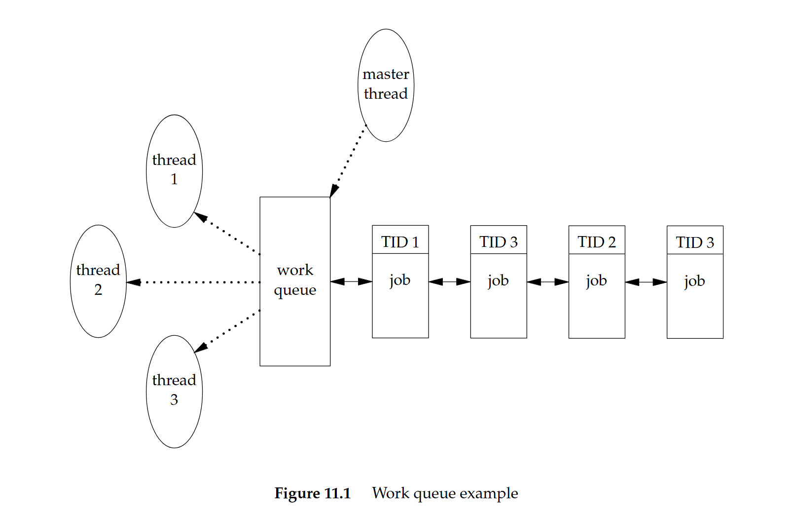

# Shichao's Notes APUE 翻譯 & 筆記：thread

原文連結：https://notes.shichao.io/apue/ch11/

## 11.1 簡介

前幾章已經討論了行程，知道了彼此相關的行程之間可以進行有限度的共享

本章會進一步檢視行程內部，說明如何在單一行程的環境中，利用多個執行緒來執行多個工作。 同一個行程中的所有執行緒都能存取該行程的相同組成元件，例如 file descriptor 與記憶體

本章最後會介紹同步機制，讓多個執行緒在存取它們共享的資源時，不會觀察到資源狀態不一致的情況

## 11.2 執行緒概念

當程式在單一行程中擁有多個執行緒時，就可以同時處理多件事情，每個執行緒各自負責一個獨立的工作。 這種作法可以帶來數個好處：

- 同步程式設計模型遠比非同步模型簡單，所以我們可以透過為每一種非同步事件配置一個獨立的執行緒，來簡化處理非同步事件的程式碼。 每個執行緒就可以用同步的程式設計模型來處理自己的事件
- 多個行程如果要共享記憶體與 file descriptor，必須使用作業系統所提供的複雜機制。 相比之下，執行緒自動就會共用同一個記憶體位址空間與 file descriptor
- 如果各個工作彼此獨立，且不依賴對方的處理結果，我們可以替每個工作配置一個執行緒，讓這些工作的處理交錯進行，如此可以提升整體程式的吞吐量。 單一執行緒行程則必然需要依序執行這些工作
- 互動式程式可以透過多個執行緒改善回應時間，將處理使用者輸入與輸出的部分，與程式其餘部分分離開來

多執行緒程式設計模型不只可以在多處理器或多核心系統上發揮效益，即使在單一處理器系統上也一樣成立。 無論處理器數量多少，我們都可以透過執行緒來簡化程式，因為處理器數量不會改變程式本身的結構。 只要你的程式在依序執行這些工作時會發生阻塞，那這在單一處理器上就依然可以改善回應時間與吞吐量，因為當某些執行緒被阻塞時，其他執行緒可能仍然可以繼續執行

::: tip  
這邊的「依序執行（serializes）」對比於「並行」，不翻成序列話是因為會跟資料結構的序列化搞混  
:::

執行緒由足以表示執行上下文（execution context）所需的資訊組成：

- Thread ID：用來在一個行程內識別一個執行緒
- 一組暫存器內容
- stack
- 排程優先權與排程政策
- 信號遮罩
- 一個 `errno` 變數（見 [第 1.7 節]()）
- 執行緒特定資料（thread-specific data，見 [第 12.6 節]()）

行程中的執行緒可以共享：

- 可執行的程式碼區段（text 區段）
- 程式的全域記憶體與 heap 記憶體
- 各個 stack
- file descriptor

本章介紹的執行緒介面來自 POSIX.1-2001，通常稱為 pthreads（POSIX threads）。 用來測試 POSIX 執行緒功能的 feature-test macro 是 `_POSIX_THREADS`。 應用程式可以在編譯期透過 `#ifdef` 測試這個 macro 來判斷是否支援執行緒，或是在執行期呼叫 `sysconf` 並傳入 `_SC_THREADS` 常數來判斷是否支援執行緒

## 11.3 識別執行緒

與在整個系統中唯一的行程 ID 不同，執行緒 ID 只在其所屬的那個行程範圍內才有意義

執行緒 ID 以 `pthread_t` 資料型別表示。 實作可以使用 struct 來實作 `pthread_t` 這個資料型別，因此可移植的實作不應把它當成整數來處理（行程 ID 使用的 `pid_t` 資料型別是非負整數）。 必須使用 `pthread_equal` 函式（如下）來比較兩個執行緒 ID

不過如果 `pthread_t` 是 struct，我們就沒有可移植的方法可以印出它的值了。 Linux 3.2.0 以 `unsigned long` 整數來實作 `pthread_t` 資料型別。 FreeBSD 8.0 與 Mac OS X 10.6.8 則以指向 `pthread` 結構的指標來表示 `pthread_t`

```c
#include <pthread.h>

/* 回傳：若相等則為非零，否則為 0 */
int pthread_equal(pthread_t tid1, pthread_t tid2);
```

執行緒可以呼叫 `pthread_self` 函式取得自己的執行緒 ID

```c
#include <pthread.h>

/* 回傳：呼叫端執行緒的執行緒 ID */
pthread_t pthread_self(void);
```

當執行緒需要識別帶有自己執行緒 ID 標記的資料結構時，可以配合 `pthread_equal` 一起使用這個函式。 例如，一個 master 執行緒負責把新工作放到工作佇列上，並有三個 worker 執行緒所組成的執行緒池從佇列中取出工作

其中 master 執行緒不該讓每個 worker 執行緒任意處理佇列前端的元素，而是應該要在每個工作結構中標記應處理該工作的執行緒 ID。 如此一來，每個 worker 執行緒就只會取出帶有自己執行緒 ID 的工作。 下圖示意了這種情況：



## 11.4 建立執行緒

傳統 UNIX 行程模型（每個行程只有一條執行緒）在概念上等同於一種以執行緒為基礎的模型，只是其中每個行程都只含有單一執行緒。 在程式執行期間，只要尚未建立額外的執行緒，其行為應與傳統行程沒有差異。 若要建立額外的執行緒，可以呼叫 `pthread_create` 函式：

```c
#include <pthread.h>

/* 回傳：成功則為 0，失敗則為錯誤代碼 */
int pthread_create(pthread_t *restrict tidp,
                   const pthread_attr_t *restrict attr,
                   void *(*start_rtn)(void *), void *restrict arg);
```

- 當 `pthread_create` 成功返回時，`tidp` 所指向的記憶體位置會被設為新建立執行緒的執行緒 ID
- `attr` 引數用來自訂各種執行緒屬性（詳見[第 12.3 節]()）。 本章將它設為 `NULL`，以建立具有預設屬性的執行緒
- 新建立的執行緒會從 `start_rtn` 函式所在的位址開始執行
- `arg` 是一個指標，指向要傳給 `start_rtn` 的單一引數。 如果你需要傳入多個引數給 `start_rtn` 函式，就必須先把這些引數放入一個結構裡，再把該結構的位址放到 `arg` 中傳入

當建立一個執行緒時，我們無法保證是新建立的執行緒會先執行，還是呼叫端執行緒會先執行。 新建立的執行緒可以存取行程的位址空間，並且會繼承呼叫端執行緒的浮點環境（見 [`fenv.h`](http://pubs.opengroup.org/onlinepubs/9699919799/basedefs/fenv.h.html)）與信號遮罩，不過該執行緒的待處理信號集合會被清空

下面的範例（11.2）建立了一個執行緒，並印出了新執行緒與原始執行緒的行程與執行緒 ID：

```c
#include "apue.h"
#include <pthread.h>

pthread_t ntid;

void printids(const char *s)
{
  pid_t pid;
  pthread_t tid;

  pid = getpid();
  tid = pthread_self();
  printf("%s pid %lu tid %lu (0x%lx)\n", s, (unsigned long)pid, (unsigned long)tid, (unsigned long)tid);
}

void *thr_fn(void *arg)
{
  printids("new thread: ");
  return ((void *)0);
}

int main(void)
{
  int err;

  err = pthread_create(&ntid, NULL, thr_fn, NULL);
  if (err != 0)
    err_exit(err, "can't create thread");
  printids("main thread:");
  sleep(1);
  exit(0);
}
```

這個範例如下處理 main 執行緒與新執行緒之間的競爭情況：

- 首先是 main 執行緒裡需要呼叫 `sleep`。 如果沒有這個 `sleep`，main 執行緒可能會先結束，導致整個行程在新執行緒有機會執行之前就被終止。 這種行為會依賴作業系統的執行緒實作與排程演算法
- 其次，新執行緒是透過呼叫 `pthread_self` 來取得自己的執行緒 ID 的，而不是透過讀取共享記憶體，或執行緒啟動函式的引數取得的。 如果新執行緒在 main 執行緒從 `pthread_create` 返回之前就先執行，那麼新執行緒會看到尚未初始化的 `ntid` 內容，而不是正確的執行緒 ID

## 11.5 終止執行緒

如果行程中的任一執行緒呼叫 `exit`、`_Exit` 或 `_exit`，整個行程就會終止。 同樣地，當信號的預設動作是終止行程時，如果信號送達某個執行緒，也會終止整個行程

單一執行緒可以用三種方式結束，而不必終止整個行程：

1. 執行緒可以單純從其啟動函式返回。 返回值會成為該執行緒的結束碼
2. 同一行程中的另一個執行緒可以取消該執行緒
3. 執行緒可以呼叫 `pthread_exit`

### `pthread_exit` 與 `pthread_join` 函式

```c
#include <pthread.h>

void pthread_exit(void *rval_ptr);
```

`rval_ptr` 引數是一個無型別指標，其他執行緒可以透過呼叫 `pthread_join` 取得這個值

```c
#include <pthread.h>

/* 回傳：成功則為 0，失敗則為錯誤代碼 */
int pthread_join(pthread_t thread, void **rval_ptr);
```

呼叫 `pthread_join` 的執行緒會被阻塞，直到指定的那個執行緒呼叫 `pthread_exit`、從其啟動函式返回，或被取消為止。 如果該執行緒只是單純從啟動函式返回，`rval_ptr` 會包含其返回碼。 如果該執行緒被取消，`rval_ptr` 所指向的記憶體位置會被設為 `PTHREAD_CANCELED`

呼叫 `pthread_join` 會自動把被 join 的那個執行緒設為 detached 狀態，讓其資源可以被回收。 如果該執行緒原本就已經是 detached 狀態，`pthread_join` 可能會失敗並回傳 `EINVAL`

如果我們不在意執行緒的返回值，可以把 `rval_ptr` 設為 `NULL`

下面這個範例（11.3）展示了如何從已終止的執行緒中取回結束碼：

```c
#include "apue.h"
#include <pthread.h>

void *thr_fn1(void *arg)
{
  printf("thread 1 returning\n");
  return ((void *)1);
}

void *thr_fn2(void *arg)
{
  printf("thread 2 exiting\n");
  pthread_exit((void *)2);
}

int main(void)
{
  int err;
  pthread_t tid1, tid2;
  void *tret;

  err = pthread_create(&tid1, NULL, thr_fn1, NULL);
  if (err != 0)
    err_exit(err, "can't create thread 1");
  err = pthread_create(&tid2, NULL, thr_fn2, NULL);
  if (err != 0)
    err_exit(err, "can't create thread 2");
  err = pthread_join(tid1, &tret);
  if (err != 0)
    err_exit(err, "can't join with thread 1");
  printf("thread 1 exit code %ld\n", (long)tret);
  err = pthread_join(tid2, &tret);
  if (err != 0)
    err_exit(err, "can't join with thread 2");
  printf("thread 2 exit code %ld\n", (long)tret);
  exit(0);
}
```

傳給 `pthread_create` 與 `pthread_exit` 的無型別指標，可以用來傳遞一個結構的位址，以攜帶更複雜的資訊

要注意，如果這個結構被配置在呼叫端的 stack 上，那麼當我們要使用這個結構時，其內容可能已經被更動過了。 而如果某個執行緒在自己的 stack 上配置一個結構，並把該結構的指標傳給 `pthread_exit`，等到 `pthread_join` 的呼叫端要使用這個結構時，該 stack 可能已經被銷毀，或其記憶體已經被拿去做其他用途了

以下範例（11.4）展示了，使用配置在 stack 上的自動變數當作 `pthread_exit` 的引數會造成問題：

```c
#include "apue.h"
#include <pthread.h>

struct foo {
  int a, b, c, d;
};

void printfoo(const char *s, const struct foo *fp)
{
  printf("%s", s);
  printf("  structure at 0x%lx\n", (unsigned long)fp);
  printf("  foo.a = %d\n", fp->a);
  printf("  foo.b = %d\n", fp->b);
  printf("  foo.c = %d\n", fp->c);
  printf("  foo.d = %d\n", fp->d);
}

void *thr_fn1(void *arg)
{
  struct foo foo = {1, 2, 3, 4};

  printfoo("thread 1:\n", &foo);
  pthread_exit((void *)&foo);
}

void *thr_fn2(void *arg)
{
  printf("thread 2: ID is %lu\n", (unsigned long)pthread_self());
  pthread_exit((void *)0);
}

int main(void)
{
  int err;
  pthread_t tid1, tid2;
  struct foo *fp;

  err = pthread_create(&tid1, NULL, thr_fn1, NULL);
  if (err != 0)
    err_exit(err, "can't create thread 1");
  err = pthread_join(tid1, (void *)&fp);
  if (err != 0)
    err_exit(err, "can't join with thread 1");
  sleep(1);
  printf("parent starting second thread\n");
  err = pthread_create(&tid2, NULL, thr_fn2, NULL);
  if (err != 0)
    err_exit(err, "can't create thread 2");
  sleep(1);
  printfoo("parent:\n", fp);
  exit(0);
}
```

在 Linux 上執行這個程式會得到：

```sh
$ ./a.out
thread 1:
structure at 0x7f2c83682ed0
foo.a = 1
foo.b = 2
foo.c = 3
foo.d = 4
parent starting second thread
thread 2: ID is 139829159933696
parent:
structure at 0x7f2c83682ed0
foo.a = -2090321472
foo.b = 32556
foo.c = 1
foo.d = 0
```

可以看見，等到 main 執行緒可以存取這個結構時（這個結構配置在執行緒 `tid1` 的 stack 上），其內容已經被改變了，第二個執行緒 `tid2` 的 stack 覆寫了第一個執行緒的 stack。 要解決這個問題，我們可以改用 global 結構，或使用 `malloc` 來配置這個結構

### `pthread_cancel` 函式

```c
#include <pthread.h>

int pthread_cancel(pthread_t tid);

/* 回傳：成功則為 0，失敗則為錯誤代碼 */
```

- 預設情況下，`pthread_cancel` 會讓 `tid` 指定的執行緒表現得像是呼叫了 `pthread_exit`，並以 `PTHREAD_CANCELED` 作為引數。 執行緒也可以選擇忽略取消請求，或自行控制要如何被取消
- `pthread_cancel` 不會等待該執行緒終止；它只是在發出取消請求

### `pthread_cleanup_push` 與 `pthread_cleanup_pop` 函式

執行緒可以安排在自己結束時呼叫某些函式，做法類似 `atexit` 函式（見第 7.3 節）。 這些函式稱為執行緒清理處理函式（thread cleanup handlers），一個執行緒可以建立多個清理處理函式，這些處理函式會以 stack 的形式被紀錄，因此會以與註冊時相反的順序被執行

```c
#include <pthread.h>

void pthread_cleanup_push(void (*rtn)(void *), void *arg);
void pthread_cleanup_pop(int execute);
```

`pthread_cleanup_push` 函式會登記一個清理函式 `rtn`，當執行緒執行以下任一動作時，就會以單一引數 `arg` 來呼叫這個清理函式：

- 呼叫 `pthread_exit`
- 回應取消請求
- 呼叫 `pthread_cleanup_pop`，且其 `execute` 引數為非零值。 如果 `execute` 引數設為 0，則不會呼叫清理函式

`pthread_cleanup_pop` 會移除最近一次呼叫 `pthread_cleanup_push` 所建立的清理處理函式

由於這兩個介面可能以巨集實作，因此必須在同一個執行緒的同一個 scope 中成對使用。 `pthread_cleanup_push` 的巨集定義裡可能包含 `{` 字元，與之對應的 `}` 字元則出現在 `pthread_cleanup_pop` 的定義裡

下列範例示範如何使用執行緒清理處理函式。 我們必須讓每一次 `pthread_cleanup_push` 呼叫，都有一個對應的 `pthread_cleanup_pop` 呼叫，否則程式可能無法編譯

```c
#include "apue.h"
#include <pthread.h>

void cleanup(void *arg) { printf("cleanup: %s\n", (char *)arg); }

void *thr_fn1(void *arg)
{
  printf("thread 1 start\n");
  pthread_cleanup_push(cleanup, "thread 1 first handler");
  pthread_cleanup_push(cleanup, "thread 1 second handler");
  printf("thread 1 push complete\n");
  if (arg)
    return ((void *)1);
  pthread_cleanup_pop(0);
  pthread_cleanup_pop(0);
  return ((void *)1);
}

void *thr_fn2(void *arg)
{
  printf("thread 2 start\n");
  pthread_cleanup_push(cleanup, "thread 2 first handler");
  pthread_cleanup_push(cleanup, "thread 2 second handler");
  printf("thread 2 push complete\n");
  if (arg)
    pthread_exit((void *)2);
  pthread_cleanup_pop(0);
  pthread_cleanup_pop(0);
  pthread_exit((void *)2);
}

int main(void)
{
  int err;
  pthread_t tid1, tid2;
  void *tret;

  err = pthread_create(&tid1, NULL, thr_fn1, (void *)1);
  if (err != 0)
    err_exit(err, "can't create thread 1");
  err = pthread_create(&tid2, NULL, thr_fn2, (void *)1);
  if (err != 0)
    err_exit(err, "can't create thread 2");
  err = pthread_join(tid1, &tret);
  if (err != 0)
    err_exit(err, "can't join with thread 1");
  printf("thread 1 exit code %ld\n", (long)tret);
  err = pthread_join(tid2, &tret);
  if (err != 0)
    err_exit(err, "can't join with thread 2");
  printf("thread 2 exit code %ld\n", (long)tret);
  exit(0);
}
```

在 Linux 上執行這個程式會得到以下輸出：

```sh
$ ./a.out
thread 1 start
thread 1 push complete
thread 2 start
thread 2 push complete
cleanup: thread 2 second handler
cleanup: thread 2 first handler
thread 1 exit code 1
thread 2 exit code 2
```

請注意，如果執行緒是透過從其啟動函式直接返回來終止的，則不會呼叫它的清理處理函式

::: tip  
這裡的「啟動函式（start routine）」指的是你在 `pthread_create` 傳進去的那個函式：

```c
pthread_create(&tid1, NULL, thr_fn1, (void *)1);
pthread_create(&tid2, NULL, thr_fn2, (void *)1);
```

- 對 `tid1` 來說，啟動函式是 `thr_fn1`
- 對 `tid2` 來說，啟動函式是 `thr_fn2`

而「透過從其啟動函式直接返回來終止」指的是：在它的啟動函式裡直接 `return` 來結束，而不是呼叫 `pthread_exit` 或被取消，例如

```c
void *thr_fn1(void *arg) {
    ...
    return (void *)1;   // 用 return 結束 thread，而不是 pthread_exit
}
```

這種結束方式，這樣它先前用 `pthread_cleanup_push` 登記的清理處理函式不會被執行  
:::

下表總結了執行緒函式與行程函式之間在功能上的對應關係

<span class = "center-column">

| Process primitive | Thread primitive | 說明 |
| ----------------- | ---------------- | ---- |
| `fork` | `pthread_create` | 建立新的控制流程 |
| `exit` | `pthread_exit` | 讓既有控制流程結束 |
| `waitpid` | `pthread_join` | 取得控制流程的結束狀態 |
| `atexit` | `pthread_cleanup_push` | 登記在控制流程結束時要呼叫的函式 |
| `getpid` | `pthread_self` | 取得控制流程的 ID |
| `abort` | `pthread_cancel` | 要求控制流程非正常終止 |

</span>

### `pthread_detach` 函式

預設情況下，執行緒的終止狀態會被保留，直到我們對該執行緒呼叫 `pthread_join` 為止。 如果執行緒處於 detached 狀態，則在它終止時，其底層儲存空間可以立刻被回收

執行緒一旦被 detached，就不能再用 `pthread_join` 來等待其終止狀態，對 detached 的執行緒呼叫 `pthread_join` 會造成未定義行為。 我們可以透過呼叫 `pthread_detach` 來將某個執行緒設為 detached

```c
#include <pthread.h>

/* 回傳：成功則為 0，失敗則為錯誤代碼 */
int pthread_detach(pthread_t tid);
```

我們也可以在呼叫 `pthread_create` 時，透過修改傳入的執行緒屬性，建立一個一開始就處於 detached 狀態的執行緒。 細節會在下一章說明
