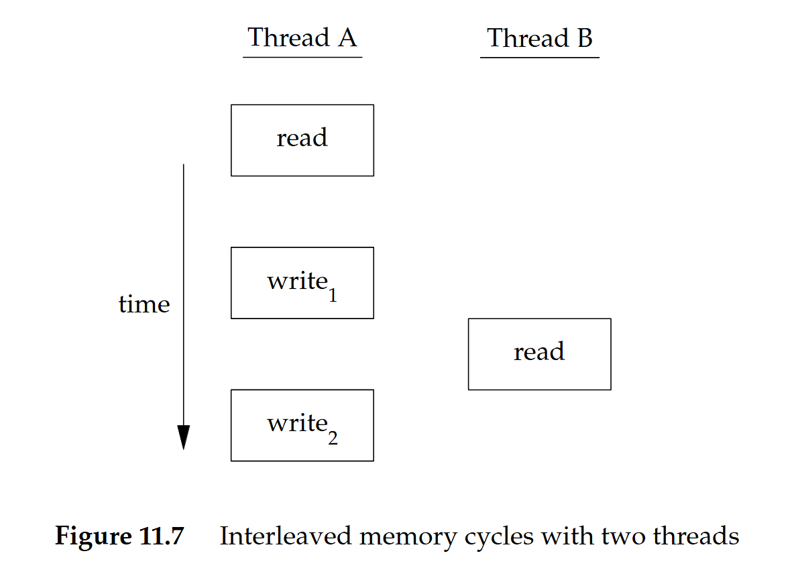
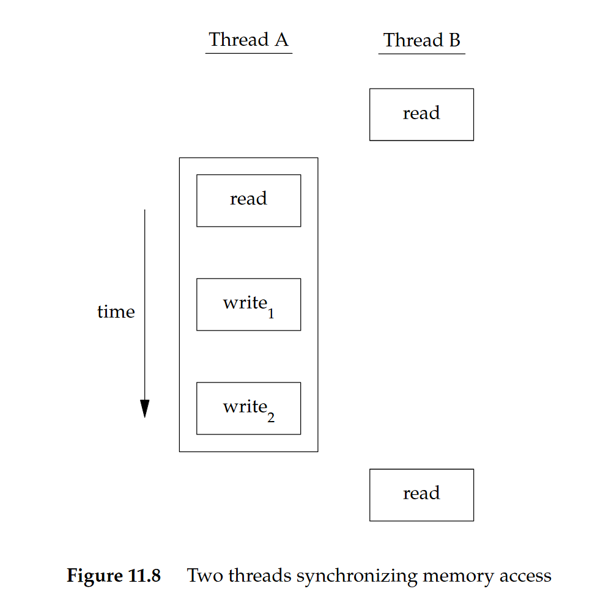
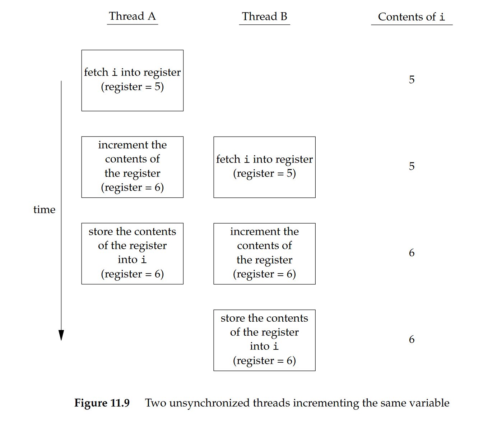

# Shichao's Notes APUE 翻譯 & 筆記：thread

原文連結：https://notes.shichao.io/apue/ch11/

## 11.1 簡介

前幾章已經討論了行程，知道了彼此相關的行程之間可以進行有限度的共享

本章會進一步檢視行程內部，說明如何在單一行程的環境中，利用多個執行緒來執行多個工作。 同一個行程中的所有執行緒都能存取該行程的相同組成元件，例如 file descriptor 與記憶體

本章最後會介紹同步機制，讓多個執行緒在存取它們共享的資源時，不會觀察到資源狀態不一致的情況

## 11.2 執行緒概念

當程式在單一行程中擁有多個執行緒時，就可以同時處理多件事情，每個執行緒各自負責一個獨立的工作。 這種作法可以帶來數個好處：

- 同步程式設計模型遠比非同步模型簡單，所以我們可以透過為每一種非同步事件配置一個獨立的執行緒，來簡化處理非同步事件的程式碼。 每個執行緒就可以用同步的程式設計模型來處理自己的事件
- 多個行程如果要共享記憶體與 file descriptor，必須使用作業系統所提供的複雜機制。 相比之下，執行緒自動就會共用同一個記憶體位址空間與 file descriptor
- 如果各個工作彼此獨立，且不依賴對方的處理結果，我們可以替每個工作配置一個執行緒，讓這些工作的處理交錯進行，如此可以提升整體程式的吞吐量。 單一執行緒行程則必然需要依序執行這些工作
- 互動式程式可以透過多個執行緒改善回應時間，將處理使用者輸入與輸出的部分，與程式其餘部分分離開來

多執行緒程式設計模型不只可以在多處理器或多核心系統上發揮效益，即使在單一處理器系統上也一樣成立。 無論處理器數量多少，我們都可以透過執行緒來簡化程式，因為處理器數量不會改變程式本身的結構。 只要你的程式在依序執行這些工作時會發生阻塞，那這在單一處理器上就依然可以改善回應時間與吞吐量，因為當某些執行緒被阻塞時，其他執行緒可能仍然可以繼續執行

::: tip  
這邊的「依序執行（serializes）」對比於「並行」，不翻成序列話是因為會跟資料結構的序列化搞混  
:::

執行緒由足以表示執行上下文（execution context）所需的資訊組成：

- Thread ID：用來在一個行程內識別一個執行緒
- 一組暫存器內容
- stack
- 排程優先權與排程政策
- 信號遮罩
- 一個 `errno` 變數（見 [第 1.7 節]()）
- 執行緒特定資料（thread-specific data，見 [第 12.6 節]()）

行程中的執行緒可以共享：

- 可執行的程式碼區段（text 區段）
- 程式的全域記憶體與 heap 記憶體
- 各個 stack
- file descriptor

本章介紹的執行緒介面來自 POSIX.1-2001，通常稱為 pthreads（POSIX threads）。 用來測試 POSIX 執行緒功能的 feature-test macro 是 `_POSIX_THREADS`。 應用程式可以在編譯期透過 `#ifdef` 測試這個 macro 來判斷是否支援執行緒，或是在執行期呼叫 `sysconf` 並傳入 `_SC_THREADS` 常數來判斷是否支援執行緒

## 11.3 識別執行緒

與在整個系統中唯一的行程 ID 不同，執行緒 ID 只在其所屬的那個行程範圍內才有意義

執行緒 ID 以 `pthread_t` 資料型別表示。 實作可以使用 struct 來實作 `pthread_t` 這個資料型別，因此可移植的實作不應把它當成整數來處理（行程 ID 使用的 `pid_t` 資料型別是非負整數）。 必須使用 `pthread_equal` 函式（如下）來比較兩個執行緒 ID

不過如果 `pthread_t` 是 struct，我們就沒有可移植的方法可以印出它的值了。 Linux 3.2.0 以 `unsigned long` 整數來實作 `pthread_t` 資料型別。 FreeBSD 8.0 與 Mac OS X 10.6.8 則以指向 `pthread` 結構的指標來表示 `pthread_t`

```c
#include <pthread.h>

/* 回傳：若相等則為非零，否則為 0 */
int pthread_equal(pthread_t tid1, pthread_t tid2);
```

執行緒可以呼叫 `pthread_self` 函式取得自己的執行緒 ID

```c
#include <pthread.h>

/* 回傳：呼叫端執行緒的執行緒 ID */
pthread_t pthread_self(void);
```

當執行緒需要識別帶有自己執行緒 ID 標記的資料結構時，可以配合 `pthread_equal` 一起使用這個函式。 例如，一個 master 執行緒負責把新工作放到工作佇列上，並有三個 worker 執行緒所組成的執行緒池從佇列中取出工作

其中 master 執行緒不該讓每個 worker 執行緒任意處理佇列前端的元素，而是應該要在每個工作結構中標記應處理該工作的執行緒 ID。 如此一來，每個 worker 執行緒就只會取出帶有自己執行緒 ID 的工作。 下圖示意了這種情況：


## 11.4 建立執行緒

傳統 UNIX 行程模型（每個行程只有一條執行緒）在概念上等同於一種以執行緒為基礎的模型，只是其中每個行程都只含有單一執行緒。 在程式執行期間，只要尚未建立額外的執行緒，其行為應與傳統行程沒有差異。 若要建立額外的執行緒，可以呼叫 `pthread_create` 函式：

```c
#include <pthread.h>

/* 回傳：成功則為 0，失敗則為錯誤代碼 */
int pthread_create(pthread_t *restrict tidp,
                   const pthread_attr_t *restrict attr,
                   void *(*start_rtn)(void *), void *restrict arg);
```

- 當 `pthread_create` 成功返回時，`tidp` 所指向的記憶體位置會被設為新建立執行緒的執行緒 ID
- `attr` 引數用來自訂各種執行緒屬性（詳見[第 12.3 節]()）。 本章將它設為 `NULL`，以建立具有預設屬性的執行緒
- 新建立的執行緒會從 `start_rtn` 函式所在的位址開始執行
- `arg` 是一個指標，指向要傳給 `start_rtn` 的單一引數。 如果你需要傳入多個引數給 `start_rtn` 函式，就必須先把這些引數放入一個結構裡，再把該結構的位址放到 `arg` 中傳入

當建立一個執行緒時，我們無法保證是新建立的執行緒會先執行，還是呼叫端執行緒會先執行。 新建立的執行緒可以存取行程的位址空間，並且會繼承呼叫端執行緒的浮點環境（見 [`fenv.h`](http://pubs.opengroup.org/onlinepubs/9699919799/basedefs/fenv.h.html)）與信號遮罩，不過該執行緒的待處理信號集合會被清空

下面的範例（11.2）建立了一個執行緒，並印出了新執行緒與原始執行緒的行程與執行緒 ID：

```c
#include "apue.h"
#include <pthread.h>

pthread_t ntid;

void printids(const char *s)
{
  pid_t pid;
  pthread_t tid;

  pid = getpid();
  tid = pthread_self();
  printf("%s pid %lu tid %lu (0x%lx)\n", s, (unsigned long)pid, (unsigned long)tid, (unsigned long)tid);
}

void *thr_fn(void *arg)
{
  printids("new thread: ");
  return ((void *)0);
}

int main(void)
{
  int err;

  err = pthread_create(&ntid, NULL, thr_fn, NULL);
  if (err != 0)
    err_exit(err, "can't create thread");
  printids("main thread:");
  sleep(1);
  exit(0);
}
```

這個範例如下處理 main 執行緒與新執行緒之間的競爭情況：

- 首先是 main 執行緒裡需要呼叫 `sleep`。 如果沒有這個 `sleep`，main 執行緒可能會先結束，導致整個行程在新執行緒有機會執行之前就被終止。 這種行為會依賴作業系統的執行緒實作與排程演算法
- 其次，新執行緒是透過呼叫 `pthread_self` 來取得自己的執行緒 ID 的，而不是透過讀取共享記憶體，或執行緒啟動函式的引數取得的。 如果新執行緒在 main 執行緒從 `pthread_create` 返回之前就先執行，那麼新執行緒會看到尚未初始化的 `ntid` 內容，而不是正確的執行緒 ID

## 11.5 終止執行緒

如果行程中的任一執行緒呼叫 `exit`、`_Exit` 或 `_exit`，整個行程就會終止。 同樣地，當信號的預設動作是終止行程時，如果信號送達某個執行緒，也會終止整個行程

單一執行緒可以用三種方式結束，而不必終止整個行程：

1. 執行緒可以單純從其啟動函式返回。 返回值會成為該執行緒的結束碼
2. 同一行程中的另一個執行緒可以取消該執行緒
3. 執行緒可以呼叫 `pthread_exit`

### `pthread_exit` 與 `pthread_join` 函式

```c
#include <pthread.h>

void pthread_exit(void *rval_ptr);
```

`rval_ptr` 引數是一個無型別指標，其他執行緒可以透過呼叫 `pthread_join` 取得這個值

```c
#include <pthread.h>

/* 回傳：成功則為 0，失敗則為錯誤代碼 */
int pthread_join(pthread_t thread, void **rval_ptr);
```

呼叫 `pthread_join` 的執行緒會被阻塞，直到指定的那個執行緒呼叫 `pthread_exit`、從其啟動函式返回，或被取消為止。 如果該執行緒只是單純從啟動函式返回，`rval_ptr` 會包含其返回碼。 如果該執行緒被取消，`rval_ptr` 所指向的記憶體位置會被設為 `PTHREAD_CANCELED`

呼叫 `pthread_join` 會自動把被 join 的那個執行緒設為 detached 狀態，讓其資源可以被回收。 如果該執行緒原本就已經是 detached 狀態，`pthread_join` 可能會失敗並回傳 `EINVAL`

如果我們不在意執行緒的返回值，可以把 `rval_ptr` 設為 `NULL`

下面這個範例（11.3）展示了如何從已終止的執行緒中取回結束碼：

```c
#include "apue.h"
#include <pthread.h>

void *thr_fn1(void *arg)
{
  printf("thread 1 returning\n");
  return ((void *)1);
}

void *thr_fn2(void *arg)
{
  printf("thread 2 exiting\n");
  pthread_exit((void *)2);
}

int main(void)
{
  int err;
  pthread_t tid1, tid2;
  void *tret;

  err = pthread_create(&tid1, NULL, thr_fn1, NULL);
  if (err != 0)
    err_exit(err, "can't create thread 1");
  err = pthread_create(&tid2, NULL, thr_fn2, NULL);
  if (err != 0)
    err_exit(err, "can't create thread 2");
  err = pthread_join(tid1, &tret);
  if (err != 0)
    err_exit(err, "can't join with thread 1");
  printf("thread 1 exit code %ld\n", (long)tret);
  err = pthread_join(tid2, &tret);
  if (err != 0)
    err_exit(err, "can't join with thread 2");
  printf("thread 2 exit code %ld\n", (long)tret);
  exit(0);
}
```

傳給 `pthread_create` 與 `pthread_exit` 的無型別指標，可以用來傳遞一個結構的位址，以攜帶更複雜的資訊

要注意，如果這個結構被配置在呼叫端的 stack 上，那麼當我們要使用這個結構時，其內容可能已經被更動過了。 而如果某個執行緒在自己的 stack 上配置一個結構，並把該結構的指標傳給 `pthread_exit`，等到 `pthread_join` 的呼叫端要使用這個結構時，該 stack 可能已經被銷毀，或其記憶體已經被拿去做其他用途了

以下範例（11.4）展示了，使用配置在 stack 上的自動變數當作 `pthread_exit` 的引數會造成問題：

```c
#include "apue.h"
#include <pthread.h>

struct foo {
  int a, b, c, d;
};

void printfoo(const char *s, const struct foo *fp)
{
  printf("%s", s);
  printf("  structure at 0x%lx\n", (unsigned long)fp);
  printf("  foo.a = %d\n", fp->a);
  printf("  foo.b = %d\n", fp->b);
  printf("  foo.c = %d\n", fp->c);
  printf("  foo.d = %d\n", fp->d);
}

void *thr_fn1(void *arg)
{
  struct foo foo = {1, 2, 3, 4};

  printfoo("thread 1:\n", &foo);
  pthread_exit((void *)&foo);
}

void *thr_fn2(void *arg)
{
  printf("thread 2: ID is %lu\n", (unsigned long)pthread_self());
  pthread_exit((void *)0);
}

int main(void)
{
  int err;
  pthread_t tid1, tid2;
  struct foo *fp;

  err = pthread_create(&tid1, NULL, thr_fn1, NULL);
  if (err != 0)
    err_exit(err, "can't create thread 1");
  err = pthread_join(tid1, (void *)&fp);
  if (err != 0)
    err_exit(err, "can't join with thread 1");
  sleep(1);
  printf("parent starting second thread\n");
  err = pthread_create(&tid2, NULL, thr_fn2, NULL);
  if (err != 0)
    err_exit(err, "can't create thread 2");
  sleep(1);
  printfoo("parent:\n", fp);
  exit(0);
}
```

在 Linux 上執行這個程式會得到：

```sh
$ ./a.out
thread 1:
structure at 0x7f2c83682ed0
foo.a = 1
foo.b = 2
foo.c = 3
foo.d = 4
parent starting second thread
thread 2: ID is 139829159933696
parent:
structure at 0x7f2c83682ed0
foo.a = -2090321472
foo.b = 32556
foo.c = 1
foo.d = 0
```

可以看見，等到 main 執行緒可以存取這個結構時（這個結構配置在執行緒 `tid1` 的 stack 上），其內容已經被改變了，第二個執行緒 `tid2` 的 stack 覆寫了第一個執行緒的 stack。 要解決這個問題，我們可以改用 global 結構，或使用 `malloc` 來配置這個結構

### `pthread_cancel` 函式

```c
#include <pthread.h>

int pthread_cancel(pthread_t tid);

/* 回傳：成功則為 0，失敗則為錯誤代碼 */
```

- 預設情況下，`pthread_cancel` 會讓 `tid` 指定的執行緒表現得像是呼叫了 `pthread_exit`，並以 `PTHREAD_CANCELED` 作為引數。 執行緒也可以選擇忽略取消請求，或自行控制要如何被取消
- `pthread_cancel` 不會等待該執行緒終止；它只是在發出取消請求

### `pthread_cleanup_push` 與 `pthread_cleanup_pop` 函式

執行緒可以安排在自己結束時呼叫某些函式，做法類似 `atexit` 函式（見第 7.3 節）。 這些函式稱為執行緒清理處理函式（thread cleanup handlers），一個執行緒可以建立多個清理處理函式，這些處理函式會以 stack 的形式被紀錄，因此會以與註冊時相反的順序被執行

```c
#include <pthread.h>

void pthread_cleanup_push(void (*rtn)(void *), void *arg);
void pthread_cleanup_pop(int execute);
```

`pthread_cleanup_push` 函式會登記一個清理函式 `rtn`，當執行緒執行以下任一動作時，就會以單一引數 `arg` 來呼叫這個清理函式：

- 呼叫 `pthread_exit`
- 回應取消請求
- 呼叫 `pthread_cleanup_pop`，且其 `execute` 引數為非零值。 如果 `execute` 引數設為 0，則不會呼叫清理函式

`pthread_cleanup_pop` 會移除最近一次呼叫 `pthread_cleanup_push` 所建立的清理處理函式

由於這兩個介面可能以巨集實作，因此必須在同一個執行緒的同一個 scope 中成對使用。 `pthread_cleanup_push` 的巨集定義裡可能包含 `{` 字元，與之對應的 `}` 字元則出現在 `pthread_cleanup_pop` 的定義裡

下列範例示範如何使用執行緒清理處理函式。 我們必須讓每一次 `pthread_cleanup_push` 呼叫，都有一個對應的 `pthread_cleanup_pop` 呼叫，否則程式可能無法編譯

```c
#include "apue.h"
#include <pthread.h>

void cleanup(void *arg) { printf("cleanup: %s\n", (char *)arg); }

void *thr_fn1(void *arg)
{
  printf("thread 1 start\n");
  pthread_cleanup_push(cleanup, "thread 1 first handler");
  pthread_cleanup_push(cleanup, "thread 1 second handler");
  printf("thread 1 push complete\n");
  if (arg)
    return ((void *)1);
  pthread_cleanup_pop(0);
  pthread_cleanup_pop(0);
  return ((void *)1);
}

void *thr_fn2(void *arg)
{
  printf("thread 2 start\n");
  pthread_cleanup_push(cleanup, "thread 2 first handler");
  pthread_cleanup_push(cleanup, "thread 2 second handler");
  printf("thread 2 push complete\n");
  if (arg)
    pthread_exit((void *)2);
  pthread_cleanup_pop(0);
  pthread_cleanup_pop(0);
  pthread_exit((void *)2);
}

int main(void)
{
  int err;
  pthread_t tid1, tid2;
  void *tret;

  err = pthread_create(&tid1, NULL, thr_fn1, (void *)1);
  if (err != 0)
    err_exit(err, "can't create thread 1");
  err = pthread_create(&tid2, NULL, thr_fn2, (void *)1);
  if (err != 0)
    err_exit(err, "can't create thread 2");
  err = pthread_join(tid1, &tret);
  if (err != 0)
    err_exit(err, "can't join with thread 1");
  printf("thread 1 exit code %ld\n", (long)tret);
  err = pthread_join(tid2, &tret);
  if (err != 0)
    err_exit(err, "can't join with thread 2");
  printf("thread 2 exit code %ld\n", (long)tret);
  exit(0);
}
```

在 Linux 上執行這個程式會得到以下輸出：

```sh
$ ./a.out
thread 1 start
thread 1 push complete
thread 2 start
thread 2 push complete
cleanup: thread 2 second handler
cleanup: thread 2 first handler
thread 1 exit code 1
thread 2 exit code 2
```

請注意，如果執行緒是透過從其啟動函式直接返回來終止的，則不會呼叫它的清理處理函式

::: tip  
這裡的「啟動函式（start routine）」指的是你在 `pthread_create` 傳進去的那個函式：

```c
pthread_create(&tid1, NULL, thr_fn1, (void *)1);
pthread_create(&tid2, NULL, thr_fn2, (void *)1);
```

- 對 `tid1` 來說，啟動函式是 `thr_fn1`
- 對 `tid2` 來說，啟動函式是 `thr_fn2`

而「透過從其啟動函式直接返回來終止」指的是：在它的啟動函式裡直接 `return` 來結束，而不是呼叫 `pthread_exit` 或被取消，例如

```c
void *thr_fn1(void *arg) {
    ...
    return (void *)1;   // 用 return 結束 thread，而不是 pthread_exit
}
```

這種結束方式，這樣它先前用 `pthread_cleanup_push` 登記的清理處理函式不會被執行  
:::

下表總結了執行緒函式與行程函式之間在功能上的對應關係

<center-panel natural>

| Process primitive | Thread primitive | 說明 |
| ----------------- | ---------------- | ---- |
| `fork` | `pthread_create` | 建立新的控制流程 |
| `exit` | `pthread_exit` | 讓既有控制流程結束 |
| `waitpid` | `pthread_join` | 取得控制流程的結束狀態 |
| `atexit` | `pthread_cleanup_push` | 登記在控制流程結束時要呼叫的函式 |
| `getpid` | `pthread_self` | 取得控制流程的 ID |
| `abort` | `pthread_cancel` | 要求控制流程非正常終止 |

</center-panel>

### `pthread_detach` 函式

預設情況下，執行緒的終止狀態會被保留，直到我們對該執行緒呼叫 `pthread_join` 為止。 如果執行緒處於 detached 狀態，則在它終止時，其底層儲存空間可以立刻被回收

執行緒一旦被 detached，就不能再用 `pthread_join` 來等待其終止狀態，對 detached 的執行緒呼叫 `pthread_join` 會造成未定義行為。 我們可以透過呼叫 `pthread_detach` 來將某個執行緒設為 detached

```c
#include <pthread.h>

/* 回傳：成功則為 0，失敗則為錯誤代碼 */
int pthread_detach(pthread_t tid);
```

我們也可以在呼叫 `pthread_create` 時，透過修改傳入的執行緒屬性，建立一個一開始就處於 detached 狀態的執行緒。 細節會在下一章說明

## 11.6 執行緒同步

當多個執行緒共享同一塊記憶體時，一個執行緒可能會修改某個變數，而其他執行緒也可能讀取或修改它，因此我們需要同步這些執行緒，確保在存取該變數的記憶體內容時，不會使用到無效的值

當一個執行緒修改某個變數時，其他執行緒在讀取這個變數時可能會看到不一致的結果。 在某些處理器架構上，修改一個變數可能需要多個記憶體週期，如果在寫入的這幾個記憶體週期之間穿插了一次記憶體讀取，就可能發生這種情況

在下圖 11.7 中，執行緒 A 先讀取這個變數，然後寫入新值，但這次寫入需要兩個記憶體週期。 如果執行緒 B 在這兩個寫入週期之間讀取了同一個變數，就會看到不一致的值：



為了避免這個問題，執行緒必須使用一把鎖，讓每次只有一個執行緒可以存取這個變數，如下圖 11.8 所示：



- 如果執行緒 B 想要讀取這個變數，就得先取得一把鎖
- 當執行緒 A 更新這個變數時，也得取得同一把鎖。 這樣一來，在執行緒 A 釋放鎖之前，執行緒 B 就無法讀取這個變數

我們同樣需要同步兩個或多個可能會在同一時間修改同一個變數的執行緒

例如，如下圖所示，遞增運算通常會分成三個步驟：

1. 把記憶體位置的值讀入某個暫存器
2. 在暫存器裡把這個值加一
3. 將新的值寫回記憶體位置



如果兩個執行緒在幾乎同一時間對同一個變數做遞增運算，卻沒有彼此同步，則結果可能會不一致

在下列任一假設條件成立時，就不會有競爭情況發生：

- 修改動作是 atomic 的
- 在前一個例子中，遞增只需要一個記憶體週期
- 資料看起來總是具有 [sequentially consistent](https://en.wikipedia.org/wiki/Sequential_consistency) 的特性

當多個執行緒無法在資料上觀察到不一致情形時，我們的操作就是 sequentially consistent。 現代電腦系統中，記憶體存取通常需要多個匯流排週期（bus cycles），而多處理器系統通常會讓多個處理器的匯流排週期交錯進行，因此我們無法保證資料一定具備 sequentially consistent 的特性

除了電腦架構本身之外，程式使用變數的方式也可能產生競爭情況，讓程式在某些地方有機會看到不一致。 例如，我們可能先遞增某個變數，然後再根據這個變數的值做決策，但遞增動作與做決策這兩個步驟合在一起並非 atomic 的，因此中間會有一個空窗期，讓不一致的情況有機會發生

### Mutexes

我們可以使用 pthread 提供的互斥介面來保護資料，並確保在任一時間只有一個執行緒可以存取。 所謂的 [mutex](https://en.wikipedia.org/wiki/Mutual_exclusion) 基本上就是一把鎖，在存取共享資源之前先把它設為上鎖狀態（lock），完成存取後再把它釋放（unlock）

- 當 mutex 處於上鎖狀態時，任何其他試圖對它上鎖的執行緒都會被阻塞，直到我們釋放這把鎖
- 如果在我們解鎖 mutex 時有多個執行緒被阻塞在這把鎖上，這些被阻塞的執行緒都會被標記為「可執行」，其中第一個實際被排程執行的執行緒會成功取得鎖，其他執行緒則會發現 mutex 仍然是上鎖狀態，再次進入等待，直到 mutex 再度可用

透過這種方式，每次就只會有一個執行緒可以繼續執行關鍵區

mutex 變數以 `pthread_mutex_t` 資料型別表示。 在使用 mutex 變數之前，必須先初始化它。 對於靜態配置的 mutex，可以直接把它設為常數 `PTHREAD_MUTEX_INITIALIZER`，或者呼叫 `pthread_mutex_init` 來初始化。 如果我們是動態配置 mutex（例如透過 `malloc`），那麼在釋放記憶體之前要先呼叫 `pthread_mutex_destroy`

```c
#include <pthread.h>

/* 兩者回傳：成功則為 0，失敗則為錯誤代碼 */
int pthread_mutex_init(pthread_mutex_t *restrict mutex,
                       const pthread_mutexattr_t *restrict attr);

int pthread_mutex_destroy(pthread_mutex_t *mutex);
```

如果要用預設屬性初始化 mutex，就把 `attr` 設為 `NULL`（mutex 屬性會在第 12.4 節說明）

要對 mutex 上鎖，可以呼叫 `pthread_mutex_lock`。 如果 mutex 已經被上鎖，呼叫端執行緒就會被阻塞，直到 mutex 被解鎖。 要解鎖 mutex，則呼叫 `pthread_mutex_unlock`

```c
#include <pthread.h>

/* 三者回傳：成功則為 0，失敗則為錯誤代碼 */
int pthread_mutex_lock(pthread_mutex_t *mutex);
int pthread_mutex_trylock(pthread_mutex_t *mutex);
int pthread_mutex_unlock(pthread_mutex_t *mutex);
```

如果某個執行緒不能承受被阻塞，就可以使用 `pthread_mutex_trylock` 來有條件地嘗試上鎖。 如果在呼叫 `pthread_mutex_trylock` 時 mutex 處於未上鎖狀態，`pthread_mutex_trylock` 就會在不阻塞的情況下成功上鎖並回傳 0。 否則，`pthread_mutex_trylock` 會失敗並回傳 `EBUSY`，且不會對 mutex 上鎖

下面這個範例（11.10）示範如何使用 mutex 來保護一個資料結構。 當多個執行緒需要存取某個動態配置的物件時，我們可以在物件中嵌入一個引用計數，確保在所有執行緒都用完之前，不會把它的記憶體釋放掉

```c
#include <pthread.h>
#include <stdlib.h>

struct foo {
  int f_count;
  pthread_mutex_t f_lock;
  int f_id;
  /* ... more stuff here ... */
};

struct foo *foo_alloc(int id) /* allocate the object */
{
  struct foo *fp;

  if ((fp = malloc(sizeof(struct foo))) != NULL) {
    fp->f_count = 1;
    fp->f_id = id;
    if (pthread_mutex_init(&fp->f_lock, NULL) != 0) {
      free(fp);
      return (NULL);
    }
    /* ... continue initialization ... */
  }
  return (fp);
}

void foo_hold(struct foo *fp) /* add a reference to the object */
{
  pthread_mutex_lock(&fp->f_lock);
  fp->f_count++;
  pthread_mutex_unlock(&fp->f_lock);
}

void foo_rele(struct foo *fp) /* release a reference to the object */
{
  pthread_mutex_lock(&fp->f_lock);
  if (--fp->f_count == 0) { /* last reference */
    pthread_mutex_unlock(&fp->f_lock);
    pthread_mutex_destroy(&fp->f_lock);
    free(fp);
  }
  else {
    pthread_mutex_unlock(&fp->f_lock);
  }
}
```

- 在遞增、遞減引用計數（reference count）以及檢查引用計數是否降為 0 之前，我們都會先對 mutex 上鎖
- 在 `foo_alloc` 函式裡把引用計數初始化為 1 時不需要上鎖，因為此時只有配置該物件的執行緒持有這個引用。 注意，假設此時我們直接把該結構放進某個串列中，它就有可能被其他執行緒看見，因此在放入串列之前必須先把它上鎖，類似這樣：

  ```c
  pthread_mutex_lock(&foo_list_lock);
  fp->next = foo_list;
  foo_list = fp;
  pthread_mutex_unlock(&foo_list_lock);
  ```

在使用這個物件之前，各個執行緒都預期會先呼叫 `foo_hold` 來增加引用計數。 當它們使用完畢時，就必須呼叫 `foo_rele` 來釋放引用。 當最後一個引用被釋放時，這個物件所使用的記憶體就會被釋放

在這個範例中，我們並沒有說明執行緒在呼叫 `foo_hold` 之前是如何找到這個物件的。 即使引用計數已經是 0，如果還有另一個執行緒在呼叫 `foo_hold` 時被阻塞在 mutex 上，那麼讓 `foo_rele` 釋放這個物件的記憶體仍然是錯誤的。 為了避免這個問題，我們必須確保在釋放物件記憶體之前，其他執行緒已經無法再看見它。 接下來的範例會說明如何達成這件事

### 避免 Deadlock

如果某個執行緒試圖對同一個 mutex 上鎖兩次，就會讓自己陷入 Deadlock。 使用 mutex 還有一些比較不明顯的方式也可能產生 Deadlock，例如在程式裡使用多個 mutex 時，如果我們允許某個執行緒在持有第一個 mutex 的情況下，被阻塞在第二個 mutex 的上鎖動作，同時另一個執行緒持有第二個 mutex 卻在嘗試對第一個 mutex 上鎖，那麼就會發生 Deadlock。 兩個執行緒都無法繼續，因為它們各自需要的資源都被對方持有著

只要謹慎控制 mutex 上鎖的順序，就可以避免 Deadlock。 例如，假設你有兩個 mutex，A 與 B，需要同時對它們上鎖。 如果所有執行緒都一律先對 mutex A 上鎖，再對 mutex B 上鎖，那麼就不會因為使用這兩個 mutex 而產生 Deadlock（雖然仍可能在其他資源上發生 Deadlock）。 只有當某個執行緒對 mutex 上鎖的順序與另一個執行緒相反時，才會有發生 Deadlock 的可能

當牽涉到很多鎖與資料結構時，前述方法可能難以套用，此時可以採取另一種作法，也就是釋放手上的鎖，之後再重試一次。 這種情況下可以利用 `pthread_mutex_trylock` 介面來避免 Deadlock。 如果你已經持有一些鎖，且 `pthread_mutex_trylock` 成功取得新的鎖，就可以繼續往下執行。 如果 `pthread_mutex_trylock` 無法取得鎖，就釋放目前已持有的鎖，做必要的整理，接著再試一次

#### 兩個 mutex 的範例

在下面這個使用兩個 mutex 的範例（11.11）中，我們透過確保「只要需要同時取得兩個 mutex，就一律以相同順序上鎖」，來避免 Deadlock。 第二個 mutex 保護的是一個 hash list，我們用它來追蹤這些 `foo` 資料結構

因此，`hashlock` 這個 mutex 同時保護 `fh` 這張 hash table，以及 `foo` 結構中的 `f_next` 這個 hash 串鏈欄位。 `foo` 結構裡的 `f_lock` 這個 mutex 則用來保護 `foo` 結構其餘欄位的存取

```c
#include <pthread.h>
#include <stdlib.h>

#define NHASH 29
#define HASH(id) (((unsigned long)id) % NHASH)

struct foo *fh[NHASH];

pthread_mutex_t hashlock = PTHREAD_MUTEX_INITIALIZER;

struct foo {
  int f_count;
  pthread_mutex_t f_lock;
  int f_id;
  struct foo *f_next; /* protected by hashlock */
                      /* ... more stuff here ... */
};

struct foo *foo_alloc(int id) /* allocate the object */
{
  struct foo *fp;
  int idx;

  if ((fp = malloc(sizeof(struct foo))) != NULL) {
    fp->f_count = 1;
    fp->f_id = id;
    if (pthread_mutex_init(&fp->f_lock, NULL) != 0) {
      free(fp);
      return (NULL);
    }
    idx = HASH(id);
    pthread_mutex_lock(&hashlock);
    fp->f_next = fh[idx];
    fh[idx] = fp;
    pthread_mutex_lock(&fp->f_lock);
    pthread_mutex_unlock(&hashlock);
    /* ... continue initialization ... */
    pthread_mutex_unlock(&fp->f_lock);
  }
  return (fp);
}

void foo_hold(struct foo *fp) /* add a reference to the object */
{
  pthread_mutex_lock(&fp->f_lock);
  fp->f_count++;
  pthread_mutex_unlock(&fp->f_lock);
}

struct foo *foo_find(int id) /* find an existing object */
{
  struct foo *fp;

  pthread_mutex_lock(&hashlock);
  for (fp = fh[HASH(id)]; fp != NULL; fp = fp->f_next) {
    if (fp->f_id == id) {
      foo_hold(fp);
      break;
    }
  }
  pthread_mutex_unlock(&hashlock);
  return (fp);
}

void foo_rele(struct foo *fp) /* release a reference to the object */
{
  struct foo *tfp;
  int idx;

  pthread_mutex_lock(&fp->f_lock);
  if (fp->f_count == 1) { /* last reference */
    pthread_mutex_unlock(&fp->f_lock);
    pthread_mutex_lock(&hashlock);
    pthread_mutex_lock(&fp->f_lock);
    /* need to recheck the condition */
    if (fp->f_count != 1) {
      fp->f_count--;
      pthread_mutex_unlock(&fp->f_lock);
      pthread_mutex_unlock(&hashlock);
      return;
    }
    /* remove from list */
    idx = HASH(fp->f_id);
    tfp = fh[idx];
    if (tfp == fp) {
      fh[idx] = fp->f_next;
    }
    else {
      while (tfp->f_next != fp)
        tfp = tfp->f_next;
      tfp->f_next = fp->f_next;
    }
    pthread_mutex_unlock(&hashlock);
    pthread_mutex_unlock(&fp->f_lock);
    pthread_mutex_destroy(&fp->f_lock);
    free(fp);
  }
  else {
    fp->f_count--;
    pthread_mutex_unlock(&fp->f_lock);
  }
}

```

比較例 11.11 與例 11.10，可以看到：

- 配置函式 `foo_alloc` 現在會先鎖住 hash list 的鎖 `hashlock`，把新結構插入某個 hash bucket，然後在釋放 hash list 鎖之前，先鎖住新結構裡的 `f_lock` mutex
  
  由於新結構已經被放到全域的串列上，其他執行緒也可以找到它，因此在我們完成初始化之前，如果其他執行緒嘗試存取這個新結構，就必須先把它們擋在外面
- `foo_find` 函式會鎖住 hash list 的鎖並搜尋指定的結構，如果找到，就遞增引用計數，並回傳指向該結構的指標。 這裡遵守了鎖定順序的規則，也就是在 `foo_find` 中先鎖住 hash list 的 `hashlock`，然後在 `foo_hold` 裡才鎖住 `foo` 結構的 `f_lock` mutex
- 有了兩把鎖之後，`foo_rele` 函式就變得更複雜。 如果這是最後一個引用，我們必須先解開結構上的 `f_lock` mutex，才能去取得 hash list 的鎖 `hashlock`，因為接下來要把結構從 hash list 中移除
  
  之後我們會再次取得結構的 `f_lock` mutex。 由於在上一次持有結構的 `f_lock` 之後，我們可能在取得 `hashlock` 時被阻塞，因此需要重新檢查條件，以判斷是否仍然需要釋放這個結構。 如果在我們為了遵守鎖定順序而被阻塞期間，另一個執行緒找到了這個結構並增加了它的引用計數，那我們就只需要把引用計數遞減，解開所有鎖，然後返回即可

#### 兩個 mutex 的範例（簡化版）

我們可以透過讓 hash list 的鎖同時負責保護結構的引用計數，來大幅簡化前一個範例。 `foo` 結構中的 mutex 則可以專門用來保護 `foo` 結構裡其餘的所有內容

例 11.12：

```c
#include <pthread.h>
#include <stdlib.h>

#define NHASH 29
#define HASH(id) (((unsigned long)id) % NHASH)

struct foo *fh[NHASH];
pthread_mutex_t hashlock = PTHREAD_MUTEX_INITIALIZER;

struct foo {
  int f_count; /* protected by hashlock */
  pthread_mutex_t f_lock;
  int f_id;
  struct foo *f_next; /* protected by hashlock */
                      /* ... more stuff here ... */
};

struct foo *foo_alloc(int id) /* allocate the object */
{
  struct foo *fp;
  int idx;

  if ((fp = malloc(sizeof(struct foo))) != NULL) {
    fp->f_count = 1;
    fp->f_id = id;
    if (pthread_mutex_init(&fp->f_lock, NULL) != 0) {
      free(fp);
      return (NULL);
    }
    idx = HASH(id);
    pthread_mutex_lock(&hashlock);
    fp->f_next = fh[idx];
    fh[idx] = fp;
    pthread_mutex_lock(&fp->f_lock);
    pthread_mutex_unlock(&hashlock);
    /* ... continue initialization ... */
    pthread_mutex_unlock(&fp->f_lock);
  }
  return (fp);
}

void foo_hold(struct foo *fp) /* add a reference to the object */
{
  pthread_mutex_lock(&hashlock);
  fp->f_count++;
  pthread_mutex_unlock(&hashlock);
}

struct foo *foo_find(int id) /* find an existing object */
{
  struct foo *fp;

  pthread_mutex_lock(&hashlock);
  for (fp = fh[HASH(id)]; fp != NULL; fp = fp->f_next) {
    if (fp->f_id == id) {
      fp->f_count++;
      break;
    }
  }
  pthread_mutex_unlock(&hashlock);
  return (fp);
}

void foo_rele(struct foo *fp) /* release a reference to the object */
{
  struct foo *tfp;
  int idx;

  pthread_mutex_lock(&hashlock);
  if (--fp->f_count == 0) { /* last reference, remove from list */
    idx = HASH(fp->f_id);
    tfp = fh[idx];
    if (tfp == fp) {
      fh[idx] = fp->f_next;
    }
    else {
      while (tfp->f_next != fp)
        tfp = tfp->f_next;
      tfp->f_next = fp->f_next;
    }
    pthread_mutex_unlock(&hashlock);
    pthread_mutex_destroy(&fp->f_lock);
    free(fp);
  }
  else {
    pthread_mutex_unlock(&hashlock);
  }
}
```

在這個範例中，我們透過讓同一把鎖同時負責保護 hash list 與引用計數，解決了前面範例中圍繞在 hash list 與引用計數之間的鎖定順序問題。 多執行緒軟體的設計往往需要在這類折衷之間取得平衡：

- 如果鎖定的粒度太粗，會有太多執行緒同時被同一把鎖擋住，導致幾乎無法從並行中獲得效能改善
- 如果鎖定的粒度太細，則會因為過度頻繁的上鎖與解鎖而帶來嚴重的效能負擔，而且程式碼也會變得相當複雜

身為程式設計者，你必須在程式碼複雜度與效能之間找到適當的平衡，同時仍然滿足自己在鎖定上的需求

### `pthread_mutex_timedlock` 函式

`pthread_mutex_timedlock` 函式讓我們可以為執行緒在嘗試取得某個已經被上鎖的 mutex 時，為「被阻塞的時間」設一個上限。 它的行為等價於 `pthread_mutex_lock`，但如果達到 timeout 值，`pthread_mutex_timedlock` 會回傳錯誤代碼 `ETIMEDOUT`，且不會把 mutex 鎖上：

```c
#include <pthread.h>
#include <time.h>

/* Returns: 0 if OK, error number on failure */
int pthread_mutex_timedlock(pthread_mutex_t *restrict mutex,
                            const struct timespec *restrict tsptr);
```

timeout 由 `timespec` 結構（秒與奈秒）來表示，且是[絕對時間（absolute time）](http://pubs.opengroup.org/onlinepubs/9699919799/functions/pthread_mutex_timedlock.html)

下面這個範例（11.13）使用 `pthread_mutex_timedlock` 來避免無限期阻塞：

```c
#include "apue.h"
#include <pthread.h>

int main(void)
{
  int err;
  struct timespec tout;
  struct tm *tmp;
  char buf[64];
  pthread_mutex_t lock = PTHREAD_MUTEX_INITIALIZER;

  pthread_mutex_lock(&lock);
  printf("mutex is locked\n");
  clock_gettime(CLOCK_REALTIME, &tout);
  tmp = localtime(&tout.tv_sec);
  strftime(buf, sizeof(buf), "%r", tmp);
  printf("current time is %s\n", buf);
  tout.tv_sec += 10; /* 10 seconds from now */
  
  /* caution: this could lead to deadlock */
  err = pthread_mutex_timedlock(&lock, &tout);
  clock_gettime(CLOCK_REALTIME, &tout);
  tmp = localtime(&tout.tv_sec);
  strftime(buf, sizeof(buf), "%r", tmp);
  printf("the time is now %s\n", buf);
  if (err == 0)
    printf("mutex locked again!\n");
  else
    printf("can't lock mutex again: %s\n", strerror(err));
  exit(0);
}
```

其輸出如下：

```sh
$ ./a.out
mutex is locked
current time is 11:41:58 AM
the time is now 11:42:08 AM
can’t lock mutex again: Connection timed out
```

這裡我們在同一條執行緒裡，對同一把非遞迴的 mutex 先 `lock` 一次，之後再 `lock` 了第二次，本質上就是一種 deadlock，只是因為現在第二次上鎖加上了時限，所以不會卡死整個程式。 但在實務上，不建議把「加 timeout 的 mutex」當成「避免死鎖的手段」，因為這非常容易導致 deadlock／livelock

Mac OS X 10.6.8 尚未支援 `pthread_mutex_timedlock`，但 FreeBSD 8.0、Linux 3.2.0 與 Solaris 10 則有支援

### 讀寫鎖（Reader–Writer Locks）

一個 mutex 的狀態只有上鎖或未上鎖兩種，且一次只有一個執行緒可以把它鎖上。 讀寫鎖（reader–writer lock，也稱為 shared–exclusive lock）則有三種可能狀態：

- 以讀取模式上鎖（locked in read mode，也稱為 shared mode）
- 以寫入模式上鎖（locked in write mode，也稱為 exclusive mode）
- 未上鎖（unlocked）

在任一時間點，一個 reader–writer 鎖只能被一個執行緒以寫入模式持有，但可以同時被多個執行緒以讀取模式持有

```c
#include <pthread.h>

/* Both return: 0 if OK, error number on failure */
int pthread_rwlock_init(pthread_rwlock_t *restrict rwlock,
                        const pthread_rwlockattr_t *restrict attr);

int pthread_rwlock_destroy(pthread_rwlock_t *rwlock);
```

讀寫鎖透過 `pthread_rwlock_init` 來初始化。 `attr` 為 `NULL` 代表使用預設屬性

在釋放一個讀寫鎖背後所使用的記憶體之前，我們需要先呼叫 `pthread_rwlock_destroy` 來做清理。 如果 `pthread_rwlock_init` 有為這個讀寫鎖配置任何資源，`pthread_rwlock_destroy` 會釋放這些資源。 如果沒有先呼叫 `pthread_rwlock_destroy` 就釋放讀寫鎖背後使用的記憶體，那這個鎖所佔用的資源就會遺失（見 [Resource leak](https://en.wikipedia.org/wiki/Resource_leak)）

讀寫鎖可以透過以下這些函式來加上讀鎖、寫鎖或解鎖：

```c
#include <pthread.h>

/* All return: 0 if OK, error number on failure */
int pthread_rwlock_rdlock(pthread_rwlock_t *rwlock);
int pthread_rwlock_wrlock(pthread_rwlock_t *rwlock);
int pthread_rwlock_unlock(pthread_rwlock_t *rwlock);
```

- 各種實作可能會限制讀寫鎖以 shared 模式被上鎖的次數上限，因此我們必須檢查 `pthread_rwlock_rdlock` 的回傳值
- `pthread_rwlock_wrlock` 與 `pthread_rwlock_unlock` 也都可能回傳錯誤，嚴格來說，我們在呼叫任何可能失敗的函式時都應該檢查錯誤。 不過，如果我們設計鎖定邏輯得當，就不一定需要檢查這些錯誤

SUS 也定義了讀寫鎖的有條件（nonblocking）版本

```c
#include <pthread.h>

/* Both return: 0 if OK, error number on failure */
int pthread_rwlock_tryrdlock(pthread_rwlock_t *rwlock);
int pthread_rwlock_trywrlock(pthread_rwlock_t *rwlock);
```

當鎖可以被取得時，這些函式會回傳 0。 否則，它們會回傳錯誤 `EBUSY`。 在難以遵守鎖定階層（lock hierarchy）的情況下，這些函式可以用來避免 Deadlock

底下的程式示範了讀寫鎖的使用方式。 一個工作請求佇列由單一的讀寫鎖保護。 這個範例也展示了例 11.1 的一種可能實作方式，其中多個 worker 執行緒從單一 master 執行緒指派的工作中取得自己要處理的 job

```c
#include <pthread.h>
#include <stdlib.h>

struct job {
  struct job *j_next;
  struct job *j_prev;
  pthread_t j_id; /* tells which thread handles this job */
                  /* ... more stuff here ... */
};

struct queue {
  struct job *q_head;
  struct job *q_tail;
  pthread_rwlock_t q_lock;
};

/*
 * Initialize a queue.
 */
int queue_init(struct queue *qp)
{
  int err;

  qp->q_head = NULL;
  qp->q_tail = NULL;
  err = pthread_rwlock_init(&qp->q_lock, NULL);
  if (err != 0)
    return (err);
  /* ... continue initialization ... */
  return (0);
}

/*
 * Insert a job at the head of the queue.
 */
void job_insert(struct queue *qp, struct job *jp)
{
  pthread_rwlock_wrlock(&qp->q_lock);
  jp->j_next = qp->q_head;
  jp->j_prev = NULL;
  if (qp->q_head != NULL)
    qp->q_head->j_prev = jp;
  else
    qp->q_tail = jp; /* list was empty */
  qp->q_head = jp;
  pthread_rwlock_unlock(&qp->q_lock);
}

/*
 * Append a job on the tail of the queue.
 */
void job_append(struct queue *qp, struct job *jp)
{
  pthread_rwlock_wrlock(&qp->q_lock);
  jp->j_next = NULL;
  jp->j_prev = qp->q_tail;
  if (qp->q_tail != NULL)
    qp->q_tail->j_next = jp;
  else
    qp->q_head = jp; /* list was empty */
  qp->q_tail = jp;
  pthread_rwlock_unlock(&qp->q_lock);
}

/*
 * Remove the given job from a queue.
 */
void job_remove(struct queue *qp, struct job *jp)
{
  pthread_rwlock_wrlock(&qp->q_lock);
  if (jp == qp->q_head) {
    qp->q_head = jp->j_next;
    if (qp->q_tail == jp)
      qp->q_tail = NULL;
    else
      jp->j_next->j_prev = jp->j_prev;
  }
  else if (jp == qp->q_tail) {
    qp->q_tail = jp->j_prev;
    jp->j_prev->j_next = jp->j_next;
  }
  else {
    jp->j_prev->j_next = jp->j_next;
    jp->j_next->j_prev = jp->j_prev;
  }
  pthread_rwlock_unlock(&qp->q_lock);
}

/*
 * Find a job for the given thread ID.
 */
struct job *job_find(struct queue *qp, pthread_t id)
{
  struct job *jp;

  if (pthread_rwlock_rdlock(&qp->q_lock) != 0)
    return (NULL);

  for (jp = qp->q_head; jp != NULL; jp = jp->j_next)
    if (pthread_equal(jp->j_id, id))
      break;

  pthread_rwlock_unlock(&qp->q_lock);
  return (jp);
}
```

在這個範例中，只要需要把 job 加到佇列中或從佇列移除 job，我們就會以寫入模式鎖住佇列的讀寫鎖。 只要是在搜尋佇列，我們就會以讀取模式取得這把鎖，讓所有 worker 執行緒可以同時搜尋佇列

在這種情況下，只有當執行緒搜尋佇列的頻率遠高於新增或移除 job 的頻率時，使用讀寫鎖才會帶來效能改善。 worker 執行緒只會從佇列中取出執行緒 ID 與自己匹配的 job。 由於每一個 job 結構在任一時間只會被單一執行緒使用，因此不需要額外的鎖來保護 job 結構本身

### 具 timeout 的讀寫鎖定

與 mutex 類似，SUS 也提供了具 timeout 的讀寫鎖定函式，讓應用程式在嘗試取得讀寫鎖時，不至於無限期地阻塞

```c
#include <pthread.h>
#include <time.h>

/* Both return: 0 if OK, error number on failure */
int pthread_rwlock_timedrdlock(pthread_rwlock_t *restrict rwlock,
                               const struct timespec *restrict tsptr);
int pthread_rwlock_timedwrlock(pthread_rwlock_t *restrict rwlock,
                               const struct timespec *restrict tsptr);
```

`tsptr` 引數指向一個 `timespec` 結構，用來指定執行緒應該在何時停止阻塞。 如果無法在 timeout 之前取得鎖，這些函式在 timeout 到期時會回傳錯誤 `ETIMEDOUT`。 與 `pthread_mutex_timedlock` 一樣，這裡的 timeout 指定的是絕對時間，而非相對時間

### 條件變數（Condition Variables）

條件變數是執行緒可用的另一種同步機制，這類同步物件為執行緒提供了一個匯合點。 當與 mutex 一起使用時，條件變數可以讓執行緒以沒有競爭條件的方式，等待任意條件發生

條件本身由一個 mutex 保護，執行緒必須先把該 mutex 上鎖，才能改變條件的狀態。 其他執行緒在取得這個 mutex 之前，都不會察覺這個變化，因為要能檢查條件，就必須先把 mutex 鎖上

條件變數由 `pthread_cond_t` 資料型別表示，其必須先被初始化，初始化的方式有兩種：

- 將常數 `PTHREAD_COND_INITIALIZER` 指派給一個靜態配置的條件變數
- 使用 `pthread_cond_init` 函式來初始化一個動態配置的條件變數

在釋放條件變數背後使用的記憶體之前，要先呼叫 `pthread_cond_destroy` 清理條件變數

```c
#include <pthread.h>

/* Both return: 0 if OK, error number on failure */
int pthread_cond_init(pthread_cond_t *restrict cond,
                      const pthread_condattr_t *restrict attr);
int pthread_cond_destroy(pthread_cond_t *cond);
```

如果不使用非預設屬性，傳給 `pthread_cond_init` 的 `attr` 引數可以設為 `NULL`

我們使用 `pthread_cond_wait` 來等待某個條件為真。 變體 `pthread_cond_timedwait` 則會在條件沒有在指定時間內被滿足時，回傳錯誤碼

```c
#include <pthread.h>

/* Both return: 0 if OK, error number on failure */
int pthread_cond_wait(pthread_cond_t *restrict cond,
                      pthread_mutex_t *restrict mutex);

int pthread_cond_timedwait(pthread_cond_t *restrict cond,
                           pthread_mutex_t *restrict mutex,
                           const struct timespec *restrict tsptr);
```

傳給 `pthread_cond_wait` 的 mutex 用來保護條件。 呼叫端會把已經上鎖的 mutex 傳給這個函式，接著函式會原子性地把呼叫執行緒加入「等待該條件的執行緒清單」中，然後解開 mutex，當 `pthread_cond_wait` 返回時，mutex 會再次被鎖上。 典型用法是：

```c
pthread_mutex_lock(&mutex);
while (!condition) {
    pthread_cond_wait(&cond, &mutex);
}
// 走到這裡時，condition 為真，且 mutex 還是被鎖住的
... // 使用受保護的共享狀態
pthread_mutex_unlock(&mutex);
```

這避免了「檢查條件」與「讓執行緒睡眠等待條件改變」之間的空窗期，避免執行緒錯過條件狀態的變化

`pthread_cond_timedwait` 提供與 `pthread_cond_wait` 相同的功能，只是多了 timeout（`tsptr`）這個參數。 timeout 值指定願意等待多久，並以 `timespec` 結構來表示，採用的是絕對時間，而非相對時間，就像 `pthread_mutex_timedlock` 範例（見前文 `pthread_mutex_timedlock` 函式）一樣

除了使用 `clock_gettime` 函式之外，我們也可以用 `gettimeofday` 函式取得目前時間（以 `timeval` 結構表示），然後再把它換算成 `timespec` 結構。 下面這個函式可以用來取得 timeout 所需的絕對時間值

```c
#include <stdlib.h>
#include <sys/time.h>

void maketimeout(struct timespec *tsp, long minutes)
{
  struct timeval now;

  /* get the current time */
  gettimeofday(&now, NULL);
  tsp->tv_sec = now.tv_sec;
  tsp->tv_nsec = now.tv_usec * 1000; /* usec to nsec */
  /* add the offset to get timeout value */
  tsp->tv_sec += minutes * 60;
}
```

如果在條件發生之前 timeout 到期，`pthread_cond_timedwait` 會重新取得 mutex，並回傳錯誤 `ETIMEDOUT`。 當 `pthread_cond_wait` 或 `pthread_cond_timedwait` 成功返回時，執行緒還是需要重新檢查條件，因為在此期間可能有其他執行緒已經執行過，並且改變了條件

有兩個函式可以用來通知執行緒某個條件已經被滿足。 `pthread_cond_signal` 函式會喚醒至少一個等待該條件的執行緒（POSIX 規格允許 `pthread_cond_signal` 的實作喚醒多於一個執行緒，以簡化實作），而 `pthread_cond_broadcast` 函式則會喚醒所有等待該條件的執行緒

```c
#include <pthread.h>

/* Both return: 0 if OK, error number on failure */
int pthread_cond_signal(pthread_cond_t *cond);
int pthread_cond_broadcast(pthread_cond_t *cond);
```

當我們呼叫 `pthread_cond_signal` 或 `pthread_cond_broadcast` 時，通常會說是在對某個執行緒或條件「發出 signal」。 要注意的是，我們必須在改變條件狀態之後，才去 signal 這些執行緒

下面的範例說明如何把條件變數與 mutex 一起用來同步執行緒

```c
#include <pthread.h>

struct msg {
  struct msg *m_next;
  /* ... more stuff here ... */
};

struct msg *workq;
pthread_cond_t qready = PTHREAD_COND_INITIALIZER;
pthread_mutex_t qlock = PTHREAD_MUTEX_INITIALIZER;

void process_msg(void)
{
  struct msg *mp;

  for (;;) {
    pthread_mutex_lock(&qlock);
    while (workq == NULL)
      pthread_cond_wait(&qready, &qlock);
    mp = workq;
    workq = mp->m_next;
    pthread_mutex_unlock(&qlock);
    /* now process the message mp */
  }
}

void enqueue_msg(struct msg *mp)
{
  pthread_mutex_lock(&qlock);
  mp->m_next = workq;
  workq = mp;
  pthread_mutex_unlock(&qlock);
  pthread_cond_signal(&qready);
}
```

- 這裡的條件是 work queue 的狀態
- 我們用 mutex 來保護這個條件，並且在 `while` 迴圈裡檢查條件
- 當我們把一則訊息放進 work queue 時，必須持有 mutex，但在對等待中的執行緒發出 signal 時，則不需要持有 mutex

只要可以接受「在呼叫 `pthread_cond_signal` 之前，某個執行緒就已經先把訊息從佇列裡取走」這種情況，我們就可以在釋放 mutex 之後再發出 signal。 由於我們是在 `while` 迴圈裡檢查條件，因此這不會造成問題，執行緒被喚醒後，如果發現佇列仍然是空的，就會再回去等待

例如：

1. 某個 worker 執行 `process_msg`，進入 `for (;;) { ... }` 後：
   - 取得 qlock
   - 發現 `workq != NULL`（queue 裡原本就有某些訊息），所以不進 `pthread_cond_wait`，直接取出一則訊息
   - 釋放 qlock，離開 critical section 去處理該訊息

2. 此時另一個 thread 呼叫 `enqueue_msg(mp)`：
   - `pthread_mutex_lock(&qlock);`
   - `mp->m_next = workq; workq = mp;` 把新的訊息放進 queue
   - `pthread_mutex_unlock(&qlock);` 釋放鎖
   - 此時還「尚未」呼叫 `pthread_cond_signal`

3. 在 `enqueue_msg` 解鎖與呼叫 `pthread_cond_signal` 之間的空檔，上一個 worker 已經處理完手上的訊息，又回到 `process_msg`：
   - `pthread_mutex_lock(&qlock);`
   - 這時候 queue 裡有剛才放進來的 mp，所以 workq != NULL
   - 它把 mp 拿走：mp = workq; workq = mp->m_next;（queue 可能又變成空的）
   - pthread_mutex_unlock(&qlock);
   - 繼續處理 mp

4. 接著 enqueue_msg 那邊才繼續往下跑到：
    ```c
    pthread_cond_signal(&qready);
    ```

    這時，可能出現兩種情況：

    - 此刻根本沒有任何 thread 在 `pthread_cond_wait` 上睡覺 → 這個 signal 就等於「空發」，不會喚醒任何人
    - 或是有 thread 在 `pthread_cond_wait` 上睡覺被喚醒，但醒來後搶到 qlock，發現 `workq == NULL`（因為別的 worker 已經先把訊息拿走了），於是重新進入 `while (workq == NULL) pthread_cond_wait(...)` 再睡回去

如果程式碼無法容忍這種競爭情況，那我們就必須在 signal 執行緒時持有 mutex

### Spin Locks

spin lock 的行為類似 mutex，只是它並不是透過「睡眠」來阻塞行程，而是讓行程透過忙等（spinning）來等待鎖變成可以被取得的狀態。 spin lock 適合用在鎖只會被持有很短暫的一段時間，且執行緒不想承受被排程器換出（deschedule）成本的情況下

spin lock 經常被用作實作其他型態鎖的低階原語，它們可以使用 [test-and-set](https://en.wikipedia.org/wiki/Test-and-set) 指令有效率地實作。 儘管如此，它們也可能導致 CPU 資源的浪費：當某個執行緒在 spin、等待鎖變為可用時，CPU 就無法拿去做其他工作。 因此 spin lock 應該只在持有時間較短的情況下使用

- Kernel-space：在不可搶佔的核心中，spin lock 很有用。 除了提供互斥機制之外，它們還會封鎖中斷，這樣中斷處理函式就不會因為嘗試取得已經上鎖的 spin lock 而讓系統陷入 Deadlock（可以把中斷視為另一種形式的搶佔）。 在這類核心裡，中斷處理函式不能睡眠，因此它們唯一能使用的同步原語就是 spin lock
- User-space：在 user space 中，除非你使用的是不允許搶佔的即時（realtime）排程類別，否則 spin lock 就沒有那麼有用。 跑在 time-sharing 排程類別中的使用者層執行緒，當其時間量子用完，或是有一個排程優先權更高的執行緒變成可執行狀態時，都可能被排程器換出。 在這些情況下，如果某個執行緒持有 spin lock，它仍然可能被放到睡眠狀態，而其他被這把鎖擋住的執行緒就會比預期中 spin 更久

很多 mutex 的實作都相當有效率：對應用程式的效能而言，使用 mutex 鎖幾乎等同於使用 spin lock。 有些 mutex 實作在嘗試取得 mutex 時，會先 spin 一段有限的時間，只有在超過 spin 次數門檻之後才會睡眠。 這些因素，加上現代處理器上的 context switch 已經相當快速，使得 spin lock 只在少數情況下才有用

類似 mutex（可以互相替換），我們可以使用 `pthread_spin_init` 函式來初始化一個 spin lock。 要清理 spin lock，則可以呼叫 `pthread_spin_destroy` 函式

```c
#include <pthread.h>

/* Both return: 0 if OK, error number on failure */
int pthread_spin_init(pthread_spinlock_t *lock, int pshared);
int pthread_spin_destroy(pthread_spinlock_t *lock);
```

- spin lock 只定義了一個屬性，只有在平台支援 Thread Process-Shared Synchronization 選項時才有意義
- `pshared` 引數代表 process-shared 屬性，用來指定 spin lock 將會以何種方式被取得
    - 如果設為 `PTHREAD_PROCESS_SHARED`，那麼只要執行緒能存取這把鎖背後的記憶體，就可以取得這把 spin lock，即使這些執行緒屬於不同的行程也沒關係
    - 否則，`pshared` 引數就設為 `PTHREAD_PROCESS_PRIVATE`，此時只有初始化這把鎖的那個行程裡的執行緒可以存取這個 spin lock

要對 spin lock 上鎖，我們可以呼叫下列其中一個函式：

- `pthread_spin_lock`：會一直 spin，直到成功取得這把鎖為止
- `pthread_spin_trylock`：如果無法立刻取得鎖，會回傳錯誤 `EBUSY`。 注意，`pthread_spin_trylock` 並不會 spin

不論是透過哪種方式上鎖，spin lock 都可以透過呼叫 `pthread_spin_unlock` 來解鎖

```c
#include <pthread.h>

/* All return: 0 if OK, error number on failure */
int pthread_spin_lock(pthread_spinlock_t *lock);
int pthread_spin_trylock(pthread_spinlock_t *lock);
int pthread_spin_unlock(pthread_spinlock_t *lock);
```

- 如果 spin lock 目前是未上鎖狀態，那 `pthread_spin_lock` 可以在不需 spin 的情況下直接把它鎖上
- 如果執行緒自己已經持有這把鎖，則再次嘗試上鎖的結果是未定義的。 `pthread_spin_lock` 呼叫可能會以錯誤 `EDEADLK`（或其他錯誤）失敗，也可能會無限期地 spin。 實際行為取決於實作
- 如果我們試圖解開一把目前並未上鎖的 spin lock，其結果同樣是未定義的

只要 `pthread_spin_lock` 或 `pthread_spin_trylock` 回傳 0，表示這把 spin lock 已被鎖上。 在持有 spin lock 的期間，我們必須小心不要呼叫任何可能睡眠的函式，否則其他試圖取得這把鎖的執行緒就會不斷地 spin，浪費 CPU 資源

### Barriers

barrier 是一種用來協調多個平行工作的執行緒的同步機制。 barrier 允許每個執行緒在某個點等待，直到所有合作的執行緒都到達同一個點為止，然後大家再一起繼續往下執行。 `pthread_join` 函式就是一種 barrier，可以讓一個執行緒等待另一個執行緒結束

barrier 物件更為一般化。 它允許任意數量的執行緒在完成自己的工作後等待其他執行緒，但這些執行緒不需要結束，在所有執行緒都到達 barrier 之後它們仍可以繼續執行其他工作

`pthread_barrier_init` 函式用來初始化 barrier，而 `pthread_barrier_destroy` 函式則用來對 barrier 做清理

```c
#include <pthread.h>

/* Both return: 0 if OK, error number on failure */
int pthread_barrier_init(pthread_barrier_t *restrict barrier,
                         const pthread_barrierattr_t *restrict attr,
                         unsigned int count);
int pthread_barrier_destroy(pthread_barrier_t *barrier);
```

- 在呼叫 `pthread_barrier_init` 時，`count` 引數指定必須有多少執行緒到達 barrier，所有執行緒才會被允許繼續執行
- `attr` 引數指定 barrier 物件的屬性（`NULL` 代表使用預設屬性）

如果 `pthread_barrier_init` 有為這個 barrier 配置任何資源，當我們呼叫 `pthread_barrier_destroy` 清理這個 barrier 時，這些資源就會被釋放

`pthread_barrier_wait` 函式表示某個執行緒已經完成它的工作，並準備好要等待所有其他執行緒追上來

```c
#include <pthread.h>

/* Returns: 0 or PTHREAD_BARRIER_SERIAL_THREAD if OK, error number on failure */
int pthread_barrier_wait(pthread_barrier_t *barrier);
```

如果在呼叫 `pthread_barrier_init` 設定的 barrier 計數尚未被滿足，呼叫 `pthread_barrier_wait` 的執行緒就會被放到睡眠狀態。 如果某個執行緒是最後一個呼叫 `pthread_barrier_wait` 的執行緒，並且因此讓 barrier 計數達到門檻，那麼所有執行緒都會被喚醒

對某一個任意的執行緒而言，它會看到 `pthread_barrier_wait` 回傳值是 `PTHREAD_BARRIER_SERIAL_THREAD`，其餘的執行緒看到的回傳值則都會為 0。 這樣設計可以讓其中一個執行緒扮演 master 的角色，負責處理所有其他執行緒工作結果的後續動作

- 一旦 barrier 計數達到門檻且所有執行緒都被解除阻塞，這個 barrier 之後仍可被再次使用
- 如果想變更 barrier 的計數，就必須先呼叫 `pthread_barrier_destroy`，接著再以新的計數值呼叫 `pthread_barrier_init`

下面這個範例（11.16）示範如何利用 barrier 來同步在同一個任務上合作的多個執行緒

```c
#include "apue.h"
#include <limits.h>
#include <pthread.h>
#include <sys/time.h>

#define NTHR 8               /* number of threads */
#define NUMNUM 8000000L      /* number of numbers to sort */
#define TNUM (NUMNUM / NTHR) /* number to sort per thread */

long nums[NUMNUM];
long snums[NUMNUM];

pthread_barrier_t b;

#ifdef SOLARIS
#define heapsort qsort
#else
extern int heapsort(void *, size_t, size_t, int (*)(const void *, const void *));
#endif

/*
 * Compare two long integers (helper function for heapsort)
 */
int complong(const void *arg1, const void *arg2)
{
  long l1 = *(long *)arg1;
  long l2 = *(long *)arg2;

  if (l1 == l2)
    return 0;
  else if (l1 < l2)
    return -1;
  else
    return 1;
}

/*
 * Worker thread to sort a portion of the set of numbers.
 */
void *thr_fn(void *arg)
{
  long idx = (long)arg;

  heapsort(&nums[idx], TNUM, sizeof(long), complong);
  pthread_barrier_wait(&b);

  /*
   * Go off and perform more work ...
   */
  return ((void *)0);
}

/*
 * Merge the results of the individual sorted ranges.
 */
void merge()
{
  long idx[NTHR];
  long i, minidx, sidx, num;

  for (i = 0; i < NTHR; i++)
    idx[i] = i * TNUM;
  for (sidx = 0; sidx < NUMNUM; sidx++) {
    num = LONG_MAX;
    for (i = 0; i < NTHR; i++) {
      if ((idx[i] < (i + 1) * TNUM) && (nums[idx[i]] < num)) {
        num = nums[idx[i]];
        minidx = i;
      }
    }
    snums[sidx] = nums[idx[minidx]];
    idx[minidx]++;
  }
}

int main()
{
  unsigned long i;
  struct timeval start, end;
  long long startusec, endusec;
  double elapsed;
  int err;
  pthread_t tid;

  /*
   * Create the initial set of numbers to sort.
   */
  srandom(1);
  for (i = 0; i < NUMNUM; i++)
    nums[i] = random();

  /*
   * Create 8 threads to sort the numbers.
   */
  gettimeofday(&start, NULL);
  pthread_barrier_init(&b, NULL, NTHR + 1);
  for (i = 0; i < NTHR; i++) {
    err = pthread_create(&tid, NULL, thr_fn, (void *)(i * TNUM));
    if (err != 0)
      err_exit(err, "can't create thread");
  }
  pthread_barrier_wait(&b);
  merge();
  gettimeofday(&end, NULL);

  /*
   * Print the sorted list.
   */
  startusec = start.tv_sec * 1000000 + start.tv_usec;
  endusec = end.tv_sec * 1000000 + end.tv_usec;
  elapsed = (double)(endusec - startusec) / 1000000.0;
  printf("sort took %.4f seconds\n", elapsed);
  for (i = 0; i < NUMNUM; i++)
    printf("%ld\n", snums[i]);
  exit(0);
}
```

在這個範例中：

- 我們使用八個執行緒分工排序 800 萬個數字。 每個執行緒負責排序 100 萬個數字，所用的演算法是 heapsort。 接著 main 執行緒會呼叫一個函式把各段排序結果合併起來
- 我們不需要使用 `pthread_barrier_wait` 的回傳值 `PTHREAD_BARRIER_SERIAL_THREAD` 來決定哪一個執行緒要負責合併結果，因為這個工作是交給 main 執行緒來做的。 這就是為什麼在初始化 barrier 時，我們指定的計數值要比 worker 執行緒的數量多一個：main 執行緒也被算作一個等待者

這個範例展示的是一個簡化情境下的 barrier 用法，其中各執行緒只執行單一工作。 在比較實際的情況中，worker 執行緒在 `pthread_barrier_wait` 返回之後還會繼續執行其他工作
