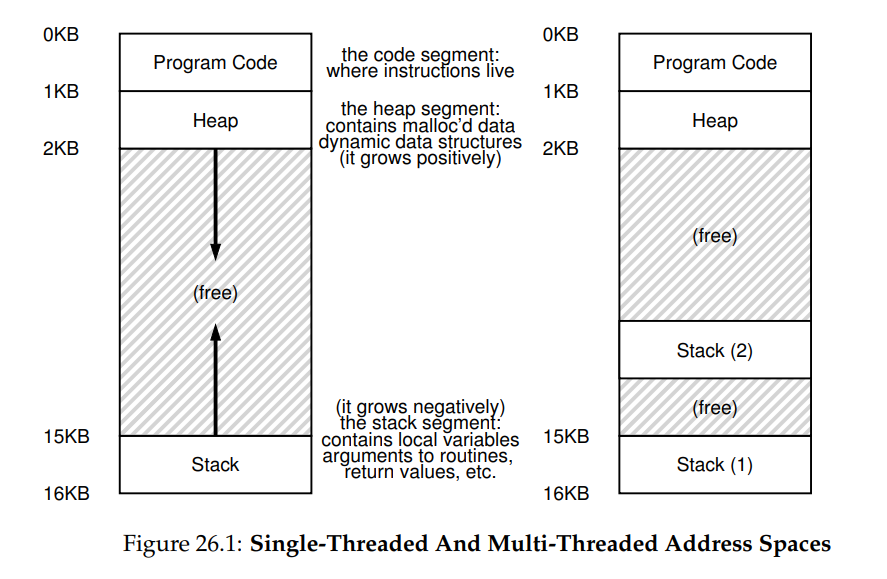
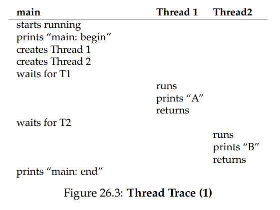
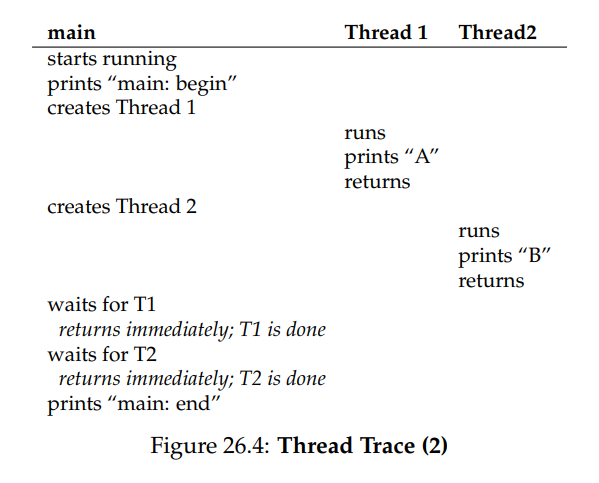
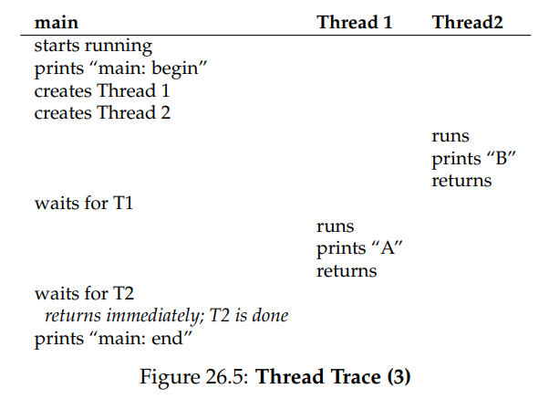
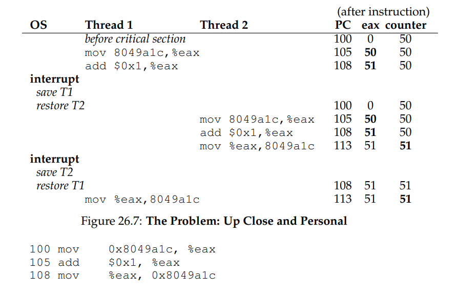

# OSTEP 26：Concurrency and Threads

到目前為止，我們已經了解作業系統所提供的基本抽象層的演進。 我們看過如何把單一實體 CPU 轉變成多個虛擬 CPU，從而營造出多個程式同時執行的錯覺。 我們也了解如何為每個 process 建立一個龐大且私有的 virtual memory 的假象； 這個 address space 的抽象層讓每個程式都能表現得彷彿擁有自己的記憶體，但實際上 OS 正在背地裡把多個 address space multiplex 到同一份 physical memory（有時甚至 multiplex 到 disk）

在本章中，我們會為單一執行中的 process 引入一個新的抽象層：thread。 傳統上，我們認為程序裡只有一個執行點（也就是只有一個 PC 負責抓取並執行指令），而一個 multi-threaded 程式則擁有不只一個執行點（也就是多個 PC，各自抓取並執行指令）。 或者換個說法，你可以把每個 thread 想成一個獨立的 process，唯一的差別是它們共享同一個 address space，因此可以存取相同的資料

因此，單一 thread 的 state 與 process 的 state 非常相似。 它擁有一個 program counter（PC）用來追蹤程式正從哪裡抓取指令。 每個 thread 也都有自己私有的一組用來運算的暫存器； 因此，如果兩個 threads 在同一顆處理器上執行，當系統從執行 T1 切換到執行 T2 時，就必須執行 context switch。 thread 之間的 context switch 與 process 之間的 context switch 十分相像，因為必須先把 T1 的 register state 儲存起來，再將 T2 的 register state 回復，然後才能執行 T2

對於 processes，我們把 state 儲存在 process control block（PCB）中； 現在，我們需要一個或多個 thread control block（TCB）來儲存同一個 process 內所有 threads 的 state。 不過，thread 間的 context switch 與 process 間的 context switch 有一個主要差異：address space 相同（也就是不需要更換我們正在使用的 page table）

另一個 thread 與 process 之間的重要差異與 stack 有關。 在我們對經典 process（現在可以稱為 single-threaded process）address space 的簡化模型中，其只存在一個 stack，通常位於 address space 的最底端（見圖 26.1 左側）

然而，在 multi-threaded process 中，每個 thread 會獨立執行，當然也可能呼叫各種函式來完成手上的工作。 因此 address space 不再只有一個 stack，而是每個 thread 各有一個 stack。 假設一個 multi-threaded process 內含兩個 threads，其 address space 佈局就會變得不一樣（見圖 26.1 右側）



在該圖中，你可以看到兩個 stacks 分散在 process 的 address space 之中。 因此，所有放在 stack 上的變數、參數、回傳值以及其他資料都會被放進所謂的 thread-local storage，也就是對應 thread 的那個 stack

你或許也注意到，這樣的設計破壞了我們原先漂亮的 address space 佈局。 以往 stack 與 heap 可以各自成長，只有在 address space 用盡時才會出問題。 現在，我們不再享有那麼理想的狀況。 幸好通常這沒有太大影響，因為 stack 一般不需要很大（除非程式大量使用遞迴）

## 26.1 Why Use Threads?

在深入討論 thread 的細節以及撰寫 multi-threaded 程式時可能遇到的問題之前，先回答一個更簡單的問題：為什麼要使用 thread 呢？

事實上，至少有兩個主要理由說明為何你應該使用 thread。 第一個理由很直接：parallelism。 想像你正在撰寫一支程式，用來對非常大的 array 進行運算，例如將兩個大型 array 相加，或者把 array 內每個 element 的值加上一個常數。 如果你只在一顆 processor 上執行，做法很單純：逐項執行這些運算就結束了

然而，如果你在一台擁有多顆 processors 的系統上執行這個程式，你就有機會透過讓多顆 processors 各自處理部份工作，大幅加速整個流程。 把傳統 single-threaded 程式轉換成能在多顆 CPU 上分工執行此類工作的程式的過程稱為 parallelization，而採取「於每顆 CPU 上用一個 thread 來完成工作」的策略正是讓程式在現代硬體上跑得更快的自然且常見做法

第二個理由稍微隱晦一些：避免因為緩慢的 I/O 而阻塞程式進度。 想像你正在寫一支程式，需要執行各種 I/O：等待傳送或接收訊息，等待某個明確的 disk I/O 完成，甚至要（隱含地）等待 page fault 處理完畢。 與其空等，你的程式可能想在這段時間做點其他事情，例如利用 CPU 進行運算，甚至再發起更多 I/O 請求

使用 thread 是避免卡住的自然方法； 當程式中的某個 thread 在等待（也就是被阻塞等待 I/O）時，CPU scheduler 可以切換到其他已經準備好、能夠執行並做有用工作的 threads。 threading 讓單一程式內的 I/O 能與其他活動重疊，就像 multiprogramming 能在不同程式之間做到一樣； 因此，許多現代的 server-based applications（web servers、database management systems 等）在實作上都大量使用 threads

當然，在以上兩種情況中，你完全可以用多個 processes 來取代 threads。 不過 thread 共享同一份 address space，因此分享資料變得簡單，這也是撰寫這些程式時選擇 thread 的自然原因。 如果是邏輯上彼此獨立、幾乎不需要在記憶體中共用資料結構的工作，選用 processes 會更恰當

## 26.2 An Example: Thread Creation

讓我們來深入一些細節。 假設我們想要執行一個程式，這個程式會建立兩個 threads，每個 thread 各自做獨立的工作，在這裡分別印出「A」或「B」。 相關程式碼如圖 26.2 所示：

<center-panel natural title="（Figure 26.2：Simple Thread Creation Code（`t0.c`））">

```c
#include <stdio.h>
#include <assert.h>
#include <pthread.h>
#include "common.h"
#include "common_threads.h"

void *mythread(void *arg) {
  printf("%s\n", (char *) arg);
  return NULL;
}

int main(int argc, char *argv[]) {
  pthread_t p1, p2;
  int rc;
  printf("main: begin\n");
  Pthread_create(&p1, NULL, mythread, "A");
  Pthread_create(&p2, NULL, mythread, "B");

  // join waits for the threads to finish
  Pthread_join(p1, NULL);
  Pthread_join(p2, NULL);
  printf("main: end\n");
  return 0;
}
```

</center-panel>

主程式會建立兩個 threads，它們都會執行函式 `mythread()`，但傳入的參數不同（字串 A 或 B）。 thread 一旦建立，可能立刻開始執行（取決於 scheduler 的心情），也有可能被放在「ready」而非「running」狀態，因此尚未執行。 當然，若是在 multiprocessor 上，這些 threads 甚至可能同時執行，但我們暫時先不管這種情況

建立完兩個 threads（我們稱它們為 T1 與 T2）之後，main thread 會呼叫 `pthread_join()` 來等待特定 thread 結束。 它會呼叫兩次，藉此確保 T1 與 T2 都已執行並完成，然後才讓 main thread 再次跑起來；當 main thread 執行時，會印出「main：end」並結束。 整個過程中總共使用了三個 threads：main thread、T1 以及 T2

接下來我們來檢視這個小程式可能的執行順序。 在執行圖（Figure 26.3）中，時間往下增加，每一欄顯示不同 thread（main、Thread 1 或 Thread 2）何時正在執行：



不過，要注意這並不是唯一的執行順序。 事實上，給定同一串指令，仍有相當多種可能，取決於 scheduler 在某個時刻決定執行哪個 thread。 例如，一個 thread 建立後可能立刻開始執行，這就會導致圖 26.4 所示的執行順序：



我們甚至可能先看到印出「B」再看到「A」，舉例來說，即使 Thread 1 較早被建立，scheduler 也有可能先執行 Thread 2，沒有任何理由必須假設先建立的 thread 就會先執行。 圖 26.5 展示了最後這種執行順序，Thread 2 在 Thread 1 之前搶先表現：



你或許已經發現，一種看待 thread 建立的方法是把它想成呼叫函式； 然而，系統並不是先執行該函式再回到呼叫端，而是為被呼叫的 routine 建立一條新的執行緒，該執行緒會獨立於呼叫端運行，有可能在 create 操作返回之前就開始，也可能拖到很久之後才執行。 接下來由哪個 thread 執行取決於 OS 的 scheduler，儘管 scheduler 通常採用合理的演算法，但我們很難預測在任意時刻究竟哪個 thread 會獲得 CPU

你也能從這個例子看出來，threads 會讓事情變複雜：光是想弄清楚何時會執行哪段程式就夠頭痛了。 沒有 concurrency，計算機系統已經很難理解，一旦引入 concurrency，情況只會變得更糟

## 26.3 Why It Gets Worse: Shared Data

前面那個簡單的 thread 範例說明了如何建立 threads，以及它們如何因 scheduler 的決策而以不同順序執行。 不過，這個範例沒有展示 threads 在存取共享資料時會如何互動。 接下來，假設有兩個 threads 想要更新一個全域共享變數。 我們要研究的程式碼列在圖 26.6，如下是一些程式碼說明

<center-panel natural title="（Figure 26.6: Sharing Data: Uh Oh (t1.c)）">

```c
#include <stdio.h>
#include <pthread.h>
#include "common.h"
#include "common_threads.h"

static volatile int counter = 0;

// mythread()
//
// Simply adds 1 to counter repeatedly, in a loop
// No, this is not how you would add 10,000,000 to
// a counter, but it shows the problem nicely.
//
void *mythread(void *arg) {
  printf("%s: begin\n", (char *) arg);
  int i;
  for (i = 0; i < 1e7; i++) {
    counter = counter + 1;
  }

  printf("%s: done\n", (char *) arg);
  return NULL;
}

// main()
//
// Just launches two threads (pthread_create)
// and then waits for them (pthread_join)
//
int main(int argc, char *argv[]) {
  pthread_t p1, p2;
  printf("main: begin (counter = %d)\n", counter);
  Pthread_create(&p1, NULL, mythread, "A");
  Pthread_create(&p2, NULL, mythread, "B");

  // join waits for the threads to finish
  Pthread_join(p1, NULL);
  Pthread_join(p2, NULL);
  printf("main: done with both (counter = %d)\n",
  counter);
  return 0;
}
```

</center-panel>

首先，依照 Stevens 的建議 [SR05]，我們把 thread 的建立與 join 的呼叫簡易包了一層封裝，若失敗便直接結束； 像這麼簡單的程式，至少要能偵測到錯誤發生，但不用做太聰明的處理（例如直接離開）。 因此，`Pthread_create()` 只是呼叫 `pthread_create()` 並確認回傳碼為 0； 若不是 0，`Pthread_create()` 就印出訊息並離開

其次，我們沒有為兩個 worker threads 各寫一份函式，而是讓它們共用同一段程式碼，並透過傳入參數（此處是字串）讓每個 thread 在輸出訊息前印出不同的字母

最後也是最重要的一點，現在我們來看每個 worker 要做的事情：把某個數值加到共享變數 counter 上，並在迴圈中重複 1,000 萬（1e7） 次。 因此預期的最終結果應為 20,000,000

接著我們編譯並執行程式，觀察其行為。 有時候，一切會如預期般運作：

```bash
prompt> gcc -o main main.c -Wall -pthread; ./main
main: begin (counter = 0)
A: begin
B: begin
A: done
B: done
main: done with both (counter = 20000000)
```

遺憾的是，即使只用單顆 processor 執行這段程式碼，我們也不一定能得到預期的結果。 有時候會看到像這樣的輸出：

```bash
prompt> ./main
main: begin (counter = 0)
A: begin
B: begin
A: done
B: done
main: done with both (counter = 19345221)
```

如果你再跑一次，答案還可能會又不一樣

```bash
prompt> ./main
main: begin (counter = 0)
A: begin
B: begin
A: done
B: done
main: done with both (counter = 19221041)
```

因此我們最大的疑問是：為什麼會這樣?

:::info  
熟悉並善用你的工具

你應該持續學習新的工具，以協助撰寫、除錯並理解電腦系統。 在這裡我們使用一個很棒的工具，稱作 disassembler。 當你對可執行檔執行 disassembler 時，它會顯示組成程式的 assembly 指令。 例如，如果想了解更新 counter 的低階程式碼（就像本例那樣），可以在 Linux 上執行 objdump 來查看 assembly 程式碼

```bash
prompt> objdump -d main
```

如此一來就會列出程式中所有指令，並帶有整齊的標籤（特別是在使用 `-g` 旗標編譯時），同時包含程式的 symbol 資訊。 objdump 只是你應該學會使用的眾多工具之一； 像 gdb 這樣的 debugger、valgrind 或 purify 等 memory profiler，以及不可或缺的 compiler，都是值得花時間深入了解的工具。 你越熟練這些工具，就越能打造出優秀的系統  
:::

## 26.4 The Heart Of The Problem: Uncontrolled Scheduling

要弄清楚為什麼會這樣，我們必須先了解編譯器為了更新 counter 所產生的指令序列長怎樣。 在這個例子中，我們只是想把 counter 加 1。 因此，在 x86 上對應的指令序列可能如下：

```asm
mov 0x8049a1c, %eax
add $0x1, %eax
mov %eax, 0x8049a1c
```

此範例假設變數 counter 位於位址 `0x8049a1c`。 在這三條指令中，第一條 x86 的 `mov` 會先取出該位址的記憶體值並放入暫存器 `eax`。 接著執行 `add`，把 `eax` 的內容加 1（`0x1`）。 最後再用 `mov` 把 `eax` 的內容寫回同一個位址的記憶體

想像兩個 threads 當中的 Thread 1 進入了這段程式碼，準備把 counter 加一。 它先把 counter 的值（假設一開始是 50）載入自己的暫存器 `eax`，於是對 Thread 1 而言 `eax = 50`。 接著它把暫存器裡的值加一，因此 `eax = 51`

這時發生了不巧的事：計時器中斷響起； 於是 OS 會把目前正在執行的 thread 的狀態（它的 PC、包含 `eax` 在內的所有暫存器等）儲存到該 thread 的 TCB

更糟的是：OS 選擇讓 Thread 2 執行，它也進入了同一段程式。 它執行第一條指令，把 counter 的值讀到自己的 `eax`（記得：每個 thread 執行時都有自己私有的暫存器； context switch 程式碼會在切換時保存與回復它們）。 此時 counter 仍是 50，因此 Thread 2 的 `eax = 50`。 接下來假設 Thread 2 執行後兩條指令，先把 `eax` 加 1（變成 51），再把 `eax` 的內容寫回 counter（位址 `0x8049a1c`）。 於是全域變數 counter 現在變成 51

最後再次發生 context switch，Thread 1 回到 CPU 繼續執行。 回想它剛執行過 mov 與 add，此刻正要執行最後一條 mov，且 `eax = 51`。 因此最後的 mov 被執行，將值寫回記憶體，counter 再次被設成 51

換句話說，increment counter 的程式碼被執行了兩次，但 counter 從 50 只變成 51。 如果程式正確，counter 應該要變成 52

為了更清楚了解問題，我們來看一段詳細的執行追蹤。 假設在此例中，上述程式碼被載入到記憶體位址 100，排列如下（提醒一下，習慣了 RISC 類指令集的人要注意：x86 指令長度可變； 這條 `mov` 佔用 5 位元組，而 `add` 只佔了 3）

在這些假設下，實際發生的情況如圖 26.7 所示。 假設 counter 初始值為 50，請你仔細追蹤這個範例，確保你理解實際發生了什麼事：



我們這裡展示的現象被稱為 race condition（更具體地說是 data race）：結果會依程式執行的時機點而有所不同。 如果運氣不好（例如在執行的關鍵時刻發生 context switch），我們就會得到錯誤的結果。 事實上，每次執行可能都會出現不同的結果； 也就是說，原本應該是電腦擅長的 deterministic 計算，卻變成了 indeterminate 的狀況，輸出值難以預測，而且極可能每次都不同

由於多個 threads 同時執行這段程式碼會導致 race condition，因此我們稱這段程式碼為 critical section。 critical section 是指一段會存取共享變數（或更廣義地說，存取共享資源）的程式碼區段，必須保證不能同時被多個 thread 執行

對這段程式碼而言，我們真正想要的是 mutual exclusion（互斥）這個特性。 mutual exclusion 能保證：當某個 thread 正在 critical section 裡執行時，其它 threads 一定無法進入

順帶一提，這些術語幾乎全部都是由 Edsger Dijkstra 所創造的。 他是這個領域的先驅，並因這些貢獻與其他相關研究而獲得圖靈獎； 你可以參考他在 1968 年發表的〈Cooperating Sequential Processes〉一文，其中對這個問題有著極為清楚的描述。 在本章接下來的部分，我們還會再多次提到 Dijkstra 的貢獻

:::info  
使用原子操作

原子操作是建構電腦系統時最強大的一種底層技巧，從電腦架構，到 concurrent 程式碼（我們目前的主題），再到檔案系統（很快就會學到）、資料庫管理系統，甚至是 distributed system 都會用到 [L+93]

把一連串動作設計成「原子」的概念可以用一句話來總結：「要嘛全做，要嘛全不做」； 它看起來應該要像是，你想一起執行的所有動作要麼全發生了，要麼完全沒有發生，而不應該出現任何中間的過渡狀態。 有時候，我們會把多個動作合併成單一個原子操作，稱為 transaction（交易），這個概念在資料庫與交易處理的領域中被深入發展 [GR92]

在我們探索 concurrency 的主題中，我們會使用同步原語（synchronization primitives）來把短小的指令序列變成原子執行區段（atomic blocks of execution）； 但「原子性」這個概念其實遠不止如此，接下來你會看到它的更廣泛應用。 例如，檔案系統會用 journaling 或 copy-on-write 等技術來讓硬碟上的狀態轉換具備原子性，這對於在系統故障時維持正確運作至關重要。 如果你現在還無法理解這些沒關係，在後面的章節你就會明白了  
:::

## 26.5 The Wish For Atomicity

解決這個問題的一種方式，是設計更強大的指令，讓我們能在單一步驟中完成所需的所有操作，從而消除中斷發生在不合時宜時刻的可能性。 比方說，假設我們有一條超級指令如下：

```asm
memory-add 0x8049a1c, $0x1
```

假設這條指令會把某個值加到一段記憶體位置，並且硬體保證它的執行具備原子性； 也就是說，當這條指令被執行時，它會如期更新資料，不會在執行過程中被中斷。 這個行為是硬體提供的保證：當中斷發生時，要嘛指令還沒開始執行，要嘛已經完整執行完畢，不會出現任何中間狀態

在這裡，atomically 的意思是「整體作為一個單元」，有時我們會說是「all or none」。 對於剛剛的例子，我們理想上的作法是讓這三條指令一起被原子性地執行：

```asm
mov 0x8049a1c, %eax
add $0x1, %eax
mov %eax, 0x8049a1c
```

就像我們說的，如果有一條單一指令可以做這件事，那只要發出該指令就搞定了，但一般情況下我們不會有這樣的指令。 想像你正在實作一棵 concurrent 的 B-tree，並希望更新它，你真的希望硬體支援一條「原子更新 B-tree」的指令嗎？ 大概不會，至少在一套正常的指令集裡不會這麼設計

因此，我們真正要做的是請硬體提供一些實用的基本指令，讓我們可以在其上構建出一組通用的 synchronization primitives（同步原語）。 結合這些硬體支援與作業系統的協助，我們就能建立出能正確同步存取 critical section 的 multi-threaded 程式碼，從而在面對 concurrent 執行的複雜性時，仍能可靠地產出正確結果，這正是本章接下來要探討的問題

:::info  
要如何支援同步機制？

為了實作實用的同步原語，我們需要硬體提供什麼樣的支援？ 我們又需要作業系統提供哪些協助？ 我們要如何正確且高效地建構這些原語？ 程式又該如何使用它們來達成預期的效果？
:::

## 26.6 One More Problem: Waiting For Another

本章在描述 concurrency 問題時，彷彿只存在一種 thread 間的互動型態，也就是存取共享變數、以及為 critical section 提供原子性支援的需求。 然而實際上還有另一種常見的互動模式：一個 thread 必須等待另一個 thread 完成某項動作才能繼續執行。 例如，當一個 process 執行 disk I/O 而被 OS 強制 sleep 時，當 I/O 完成後，就需要把該 process 從睡眠中喚醒，讓它能夠繼續執行

因此，在接下來的章節中，我們不只會探討如何建構支援原子性所需的同步原語，也會學習如何實作這種「睡眠／喚醒」的機制，這在 multi-threaded 程式中非常常見。 如果你現在還無法理解這段內容沒關係，等你讀到 condition variable 那一章時就會明白了

:::info  
關鍵的並行術語

這四個術語在 concurrent 程式碼中極為核心，因此我們特別把它們獨立出來說明。 有興趣可以參考 Dijkstra 的早期研究 [D65, D68] 以了解更多細節

- Critical Section：指一段程式碼會存取共享資源，通常是變數或資料結構
- Race Condition（或 data race [NM92]）：當多個 threads 幾乎同時進入 critical section，並同時嘗試修改共享資料結構時，就會發生 race condition，可能導致出人意料（甚至錯誤）的結果
- Indeterminate：一個 indeterminate 程式包含一個或多個 race conditions； 它的輸出會隨著每次執行的 thread 執行順序不同而變化，因此結果不是 deterministic 的，這違反我們對電腦系統通常應有的預期
- Mutual Exclusion：為了避免上述問題，threads 應該使用某種 mutual exclusion primitive； 這能保證在任何時間點，最多只有一個 thread 能進入 critical section，從而避免 race condition，並讓程式輸出變得 deterministic
:::

## 26.7 Summary: Why in OS Class?

在結束之前，你可能會有個問題：為什麼我們要在作業系統課程中學這些東西？ 答案可以用一個字來概括：「歷史」。 作業系統是第一個 concurrent 程式，許多相關技術都是為了 OS 而誕生。 後來，隨著 multi-threaded process 的出現，應用程式開發者也不得不開始面對這些問題

舉例來說，想像有兩個 processes 正在執行。 假設它們都呼叫 `write()` 來寫入同一個檔案，並都希望是 append，也就是把資料加到檔案的尾端，使其長度變大。 為了做到這件事，它們都必須配置新的硬碟區塊、更新該檔案 inode 中的區塊位置紀錄，並修改檔案大小來反映新的長度（還有其他細節，我們會在本書第三部分深入討論檔案系統）

由於中斷隨時可能發生，凡是負責更新這些共享結構（像是配置用的 bitmap、或是檔案的 inode）的程式碼都屬於 critical section； 因此，自從中斷這個機制被引入開始，OS 設計者就必須非常小心 OS 如何更新其內部資料結構。 如果中斷發生在不合時宜的時候，就會導致上面所描述的各種問題

因此，也就不令人意外地，像是 page table、process list、檔案系統結構，以及幾乎所有的 kernel data structures 都必須非常小心地存取，並透過適當的同步原語來保證其正確性

## References

- [D65] “Solution of a problem in concurrent programming control” by E. W. Dijkstra.
Communications of the ACM, 8(9):569, September 1965.  
  這是 Dijkstra 首篇探討 mutual exclusion 問題並提出解法的論文，不過該解法在現實中不太常用，因為需要進階的硬體與作業系統支援；我們會在後面幾章看到更多細節

- [D68] “Cooperating sequential processes” by Edsger W. Dijkstra, 1968.  
  可線上查閱：http://www.cs.utexas.edu/users/EWD/ewd01xx/EWD123.PDF。 這篇經典論文提出 multi-threaded 程式設計的整體思路與挑戰，是 Dijkstra 在荷蘭 Eindhoven 理工學院（Technische Hogeschool Eindhoven）所進行的早期工作之一；他當時開發的作業系統就叫做 “THE” OS（拼作 T-H-E，不發音成 “the”）

- [GR92] “Transaction Processing: Concepts and Techniques” by Jim Gray and Andreas Reuter.
出版：Morgan Kaufmann, 1992年9月  
  這是資料庫交易處理的經典聖經，由領域傳奇 Jim Gray 所著。 本書可說是 Jim Gray 將他對資料庫管理系統理解的全部傾囊而出。 可惜 Gray 幾年前不幸去世，對很多人來說是導師與朋友的巨大損失

- [L+93]  “Atomic Transactions” by Nancy Lynch, Michael Merritt, William Weihl, Alan Fekete.
Morgan Kaufmann, August 1993.   
  這是一本關於 distributed systems 中原子交易的理論與實務的好書。 雖然略偏形式化，但內容很紮實

- [NM92] “What Are Race Conditions? Some Issues and Formalizations” by Robert H. B. Netzer and Barton P. Miller. ACM Letters on Programming Languages and Systems, Volume 1:1, March 1992.  
  這篇論文清楚區分並探討 concurrent 程式中 race condition 的不同類型。 本章與接下來幾章會以 data race 為主軸，後面則會拓展到一般性的 race condition

- [SR05] “Advanced Programming in the UNIX Environment” by W. Richard Stevens and Stephen
A. Rago. Addison-Wesley, 2005.  
  正如我們一再強調的那樣：買這本書吧，然後每天睡前讀一點。 它不只會幫助你入睡，更重要的是，它會讓你慢慢成為一位真正的 UNIX 程式設計師
