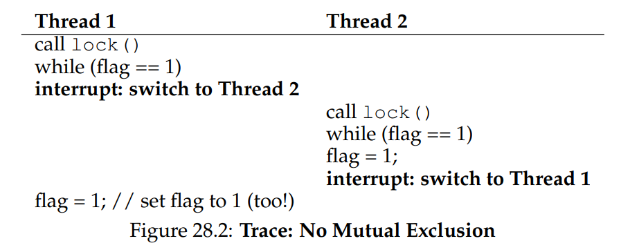

# OSTEP 28：Locks

從 concurrency 的介紹中，我們看到 concurrent programming 中一個最根本的問題：我們希望能夠原子性地執行一連串的指令，但因為單一處理器上會發生 interrupt（中斷），或者在多處理器上有多個 thread 同時執行，我們沒辦法做到這點

因此，在本章中我們會直接處理這個問題，並介紹一種叫做 lock 的東西。 程式設計師會在原始碼中用 lock 來註記，把它包在 critical section（關鍵區段）周圍，這樣就能確保任何這樣的 critical section 都能像一條原子指令一樣被執行

## 28.1 Locks: The Basic Idea

作為一個例子，假設我們的 critical section 看起來像這樣，也就是最典型的共享變數更新：

```c
balance = balance + 1;
```

當然，也可能會有其他種類的 critical section，例如向 linked list 新增元素，或是對共享資料結構做更複雜的更新，不過現在我們先從這個簡單的例子開始。 如果要使用 lock，我們會在 critical section 外圍加上類似下面這段程式碼：

```c
lock_t mutex; // some globally-allocated lock ’mutex’
...
lock(&mutex);
balance = balance + 1;
unlock(&mutex);
```

lock 就是一個變數，所以如果你要使用 lock，就必須宣告一個 lock 變數（像上面的 `mutex`）。 這個變數（簡稱 lock）會儲存目前 lock 的狀態。 lock 的狀態可能是「available」（也就是 unlocked 或 free，代表目前沒有任何 thread 擁有這把 lock），也可能是「acquired」（也就是 locked 或 held，代表有一個 thread 正在持有這把 lock 並可能正處於 critical section 中）。 雖然我們也可以在 lock 的資料結構裡儲存額外的資訊，例如目前是誰持有 lock、或是等待 queue 的順序，但這些資訊對使用者來說都是隱藏的

`lock()` 和 `unlock()` 這兩個函式的語意非常簡單。 當你呼叫 `lock()` 時，就是在嘗試取得那把 lock； 如果目前沒有其他 thread 持有它（也就是它是 free 狀態），那這個 thread 就會成功取得 lock 並進入 critical section。 這個 thread 有時候會被稱為這把 lock 的 owner。 如果之後有另一個 thread 也對同一個 lock（如例子中的 `mutex`）呼叫 `lock()`，它就會卡住不會回傳，直到原本持有 lock 的 thread 解鎖。 這樣就能確保同一時間只有一個 thread 能夠進入 critical section

當 lock 的擁有者呼叫 `unlock()` 時，這把 lock 就會再次變成「available」（free）狀態。 如果此時沒有其他 thread 正在等待這把 lock（也就是沒有人卡在 `lock()` 裡），那它的狀態就單純地被設成 free。 如果有其他 thread 正在等待（也就是卡在 `lock()` 裡），其中一個會（最終）察覺到這個狀態的變化，然後成功取得 lock 並進入 critical section

lock 給了程式設計師一點點控制排程的能力。 一般來說，我們把 thread 看作是由程式設計師建立、但由作業系統依自己方式進行排程的實體。 而 lock 則是把部分控制權交還給程式設計師，透過在某段程式碼外面加上 lock，程式設計師就能保證同一時間最多只有一個 thread 能執行該段程式碼。 換句話說，lock 可以幫助我們把傳統作業系統那種混亂、不可預測的排程行為，轉換成一種較可控的機制

## 28.2 Pthread Locks

POSIX 函式庫中使用的 lock 名稱是 **mutex**，這是因為它是用來在 threads 間提供 mutual exclusion（互斥）的。 換句話說，如果某個 thread 進入了 critical section，它就會排除其他 threads，直到它執行完這段區域

因此當你看到下面這段 POSIX threads 程式碼時，要知道它做的事情跟我們前面討論的一樣（這裡仍使用我們先前的包裝函式，會在 lock 或 unlock 發生錯誤時直接退出）：

```c
pthread_mutex_t lock = PTHREAD_MUTEX_INITIALIZER;

Pthread_mutex_lock(&lock); // wrapper; exits on failure
balance = balance + 1;
Pthread_mutex_unlock(&lock);
```

你可能也注意到，POSIX 的版本會把 lock 變數當作參數傳給 lock 和 unlock，這是因為我們可能會用不同的 locks 來保護不同的變數。 這麼做可以提升 concurrency：與其在任何 critical section 都用一把「大鎖」（稱為 coarse-grained locking，粗粒度鎖），我們更常見的做法是用多把 lock 分別保護不同的資料與資料結構，這樣可以讓更多 threads 同時執行 lock 包圍的程式碼（稱為 fine-grained locking，細粒度鎖）

## 28.3 Building A Lock

到目前為止，你應該已經對 lock 的運作方式有一定程度的了解，至少從程式設計師的角度來看是這樣。 但如果我們想要自己實作一個 lock 呢？ 這需要哪些硬體支援？ 作業系統又需要提供什麼協助？ 這些就是本章剩下部分將要探討的問題

:::info  
如何實作一個 lock

我們要怎麼建構出一個「高效」的 lock 呢？ 高效能的 lock 必須能夠以低成本提供 mutual exclusion，而且最好還具備一些額外的特性（我們後面會提到）。 這需要哪些硬體支援？ 又需要哪些作業系統的幫助？

要實作出一個能正常運作的 lock，我們得仰賴老朋友：硬體，還有另一位好夥伴：作業系統。 這些年來，許多電腦架構的指令集都加入了一些特別的硬體原語（hardware primitive）來支援這類功能； 雖然我們不會深入探討這些指令的底層實作（那是 computer architecture 的範疇），但我們會學習如何「使用」這些指令來實作 mutual exclusion 的基本單元，像是 lock。 我們也會學習作業系統如何參與其中，來補足這整個設計，使我們得以建立出一套完整且先進的 locking 函式庫  
:::

## 28.4 Evaluating Locks

在開始實作 lock 之前，我們應該先釐清目標，也就是要思考該如何評估一個 lock 實作的效果。 要判斷一個 lock 是否運作正常（甚至運作得好），我們必須先建立一些基本的評估標準

第一項標準是這個 lock 是否完成它最基本的任務，也就是提供 mutual exclusion（互斥）。 換句話說，這個 lock 能否確實阻止多個 threads 同時進入 critical section？

第二項標準是 fairness（公平性）。 每個競爭這把 lock 的 thread 是否都有公平的機會可以在 lock 被釋放後成功取得？ 換句話說，我們可以從另一個角度思考：會不會有某個 thread 一直競爭 lock 卻永遠搶不到、最後發生 starvation（飢餓）的情況？

最後一項標準是 performance（效能），也就是使用 lock 所帶來的額外時間成本。 這裡有幾種不同的情境值得考慮。 第一種是沒有 contention（競爭）的情況：如果只有一個 thread 執行，它不斷地取得並釋放 lock，這樣的操作成本有多高？ 第二種是多個 threads 在單一 CPU 上競爭同一把 lock，這時會不會造成效能瓶頸？ 最後一種情況是多顆 CPU，各自有 threads 在競爭同一把 lock，這樣的情況下 lock 的效能表現又會如何？ 透過比較這些不同的情境，我們就能更清楚理解各種 lock 技術在實務上的效能影響（下文將進一步探討）

## 28.5 Controlling Interrupts

最早用來實現 mutual exclusion（互斥）的解法之一，是在 critical section 中關閉中斷。 這種做法是為單核心系統設計的，程式碼可能會像這樣：

```c
void lock() {
    DisableInterrupts();
}

void unlock() {
    EnableInterrupts();
}
```

假設我們的系統只有一個 CPU，這種做法的意思是：在進入 critical section 前關閉中斷（透過某些特殊的硬體指令），這樣可以確保該段程式碼在執行時不會被打斷，看起來就像是以 atomic（不可分割）的方式執行。 執行完畢後，再重新啟用中斷，程式就可以照常繼續進行

這種做法的最大優點就是簡單易懂，你幾乎不需要費什麼腦就能理解它為什麼有效。 只要中斷被關閉，thread 就可以確信自己執行的程式碼會順利跑完，不會被別的 thread 打斷

然而，這種方法的缺點也不少。 第一，這種方法必須讓任何 thread 都能執行一個特權操作（開關中斷），這等於是要信任所有使用這個功能的程式不會濫用。 你應該知道，只要我們必須「信任任意程式」，基本上就準備出事了。 比如，一個貪婪的程式如果一開始就呼叫 `lock()`，它就能壟斷整個 CPU； 更糟的是，一個寫壞或惡意的程式呼叫 `lock()` 後直接進入無窮迴圈，此時作業系統將完全失去對系統的控制權，唯一的解法是「重開機」。 所以，如果把關閉中斷當作一般性的同步方法來使用，那就要求了太多對應用程式的信任

第二，這種方法不適用於多核心（multiprocessor）系統。 如果有多個 threads 分別在不同的 CPU 上執行，即使其中某個 thread 關閉了中斷，也無法阻止其他處理器上的 threads 進入同一個 critical section。 如今 multiprocessor 系統早已普及，所以我們需要一種更好的同步方法

第三，如果中斷被關閉太久，可能會導致某些中斷「被遺漏」，這會造成嚴重的系統問題。 想像一下，如果 CPU 錯過了硬碟裝置發出的「讀取完成」訊號，作業系統該怎麼知道要喚醒等待該讀取的程式？

總結來說，關閉中斷這種方法，現在只在極少數特定情境下才會被拿來當作 mutual exclusion 的工具。 比方說，作業系統在存取自己的資料結構時，有時會暫時關閉中斷，以保證原子性、或避免複雜的中斷處理問題。 這種情境是合理的，因為在 OS 的內部，我們不必再擔心信任問題，OS 本來就只能信任自己執行特權操作

## 28.6 A Failed Attempt: Just Using Loads/Stores

為了擺脫基於關閉中斷的同步方式，我們必須依靠 CPU 的硬體支援與指令集來建立真正的 lock。 在這裡，我們會先嘗試用一個單一的 flag 變數來實作一個簡單的 lock。 雖然這個實作會失敗，但它能幫助我們掌握實作 lock 所需要的基本概念，並讓我們了解為什麼光靠一個變數搭配普通的讀寫操作是遠遠不夠的

這個最初的嘗試（見 Figure 28.1）想法非常單純：用一個簡單的變數（flag）來表示 lock 是否被某個 thread 持有。 第一個進入 critical section 的 thread 會呼叫 `lock()`，它先檢查 flag 是否為 1（這個例子中一開始不是），然後將 flag 設為 1 表示該 thread 成功取得 lock。 執行完 critical section 之後，該 thread 呼叫 `unlock()` 將 flag 清為 0，表示 lock 已被釋放

<div class = "center-column">

```c
typedef struct __lock_t { int flag; } lock_t;

void init(lock_t *mutex) {
  // 0 -> lock is available, 1 -> held
  mutex->flag = 0;
}

void lock(lock_t *mutex) {
  while (mutex->flag == 1) // TEST the flag
    ;                     // spin-wait (do nothing)
  mutex->flag = 1;          // now SET it!
}

void unlock(lock_t *mutex) {
  mutex->flag = 0;
}
```

（Figure 28.1: First Attempt: A Simple Flag）

</div>

如果在第一個 thread 還在 critical section 裡時，另一個 thread 呼叫了 `lock()`，它會在 while 迴圈中 spin-wait（空轉等待），直到第一個 thread 呼叫 `unlock()` 並清除 flag。 一旦 flag 被清除，這個等待中的 thread 就會跳出迴圈，將 flag 設為 1，然後進入 critical section。 不幸的是，這段程式碼存在兩個問題：正確性問題與效能問題

正確性上的問題在你習慣 concurrent 程式設計思維之後會很容易看出來。 請想像如下交錯執行的情境（見 Figure 28.2），假設一開始 flag = 0：

<div class = "center-column">



</div>

從這種交錯中你可以看出，只要中斷發生得剛剛好（或說剛剛不好），我們就能輕易出現這種情況：兩個 thread 都設了 `flag = 1`，然後都進入了 critical section。 這種行為在業界的術語裡叫作「災難性錯誤」—— 我們顯然無法保證 mutual exclusion，連最基本的目標都沒達成

效能上的問題（我們之後還會進一步討論）則是：當某個 lock 已經被持有時，其他 threads 會不斷地檢查 flag 的值，這種方式叫作 spin-waiting，spin-waiting 會浪費大量的時間在等待別的 thread 釋放 lock。 尤其是在單核心（uniprocessor）系統上更是浪費，因為等待中的 thread 所等的那個 thread 根本沒機會執行（除非發生 context switch），因此，當我們繼續發展更進階的解法時，也必須同時思考如何避免這種效能浪費的情況

## 28.7 Building Working Spin Locks with Test-And-Set

由於「關閉中斷」在多處理器系統上無效，而像前面提到的單純使用 load/store 的方法又無法正確地實現 lock，於是系統設計者開始設計硬體級別的同步支援來實作 locking。 最早的多處理器系統，例如 1960 年代初的 Burroughs B5000 [M82]，就已經提供了這類支援； 如今，即便是單核心系統也都具備這類同步原語

最簡單也最基本的硬體同步指令叫作 test-and-set（有時也叫 atomic exchange）。 它的行為可以用以下這段 C 程式碼來模擬：

```c
int TestAndSet(int *old_ptr, int new) {
  int old = *old_ptr; // fetch old value at old_ptr
  *old_ptr = new; // store ’new’ into old_ptr
  return old; // return the old value
}
```

這個指令會回傳舊值，同時將指定記憶體位置的值設為新值。 最關鍵的是，整個操作是 atomic（不可中斷）的。 它之所以被稱為 "test-and-set"，是因為它能夠同時「檢查」舊值（test）並「設定」新值（set）； 事實證明，這個稍微強大的指令已足以打造一把簡單的自旋鎖，見圖 28.3：

```c
typedef struct __lock_t {
    int flag;
} lock_t;

void init(lock_t *lock) {
    // 0: lock is available, 1: lock is held
    lock->flag = 0;
}

void lock(lock_t *lock) {
    while (TestAndSet(&lock->flag, 1) == 1)
        ;                   // spin-wait (do nothing)
}

void unlock(lock_t *lock) {
    lock->flag = 0;
}
```

讓我們來確認為什麼這把鎖能運作。 先想像第一種情況：某個 thread 呼叫 `lock()` 時沒有其他 thread 持有 lock，因此 flag 為 0，此時呼叫 `TestAndSet(flag, 1)` 會回傳 flag 的舊值 0；因此 thread 測試到 0 後不會卡在 while 迴圈，並成功取得 lock，同時它也已原子性地把該值設成 1，表示 lock 現在被持有； 而當 thread 執行完 critical section，便會呼叫 `unlock()` 把 flag 重新設為 0

第二種情況：已經有一個 thread 持有 lock（flag 等於 1），此時另一個 thread 也會呼叫 `lock()`，進而呼叫 `TestAndSet(flag, 1)`，這次 `TestAndSet()` 回傳的是舊值 1，同步地再次把它設成 1； 只要 lock 被別的 thread 持有，`TestAndSet()` 就會一直回傳 1，該 thread 就會一直 spin（自旋）直到 lock 被釋放； 當其他 thread 把 flag 設回 0 時，這個 thread 再次呼叫了 `TestAndSet()`，此時會回傳 0 並原子性地把 flag 設為 1，於是成功取得 lock 進入 critical section

透過把「測試舊值」與「設新值」合併成一個原子操作，我們確保同一時間只有一個 thread 能取得 lock，這就是打造可用互斥原語（mutual exclusion primitive）的方法

你現在應該也能明白為什麼這種鎖通常被稱為自旋鎖，它是最簡單的一種鎖，會透過自旋持續消耗 CPU 週期，直到 lock 可用為止，要讓它在單核心系統上正確運作，必須配合搶佔式排程器（也就是能透過計時器中斷定期切換 thread 的排程器），如果沒有搶佔機制，自旋鎖在單核心上就沒有意義，因為自旋的 thread 會永遠佔住 CPU

:::info  
把並行視為惡意排程器來思考

從這個例子你應該能體會理解並行程式的思考方式，你該做的是假裝自己是一個惡意排程器，專門在最糟糕的時刻中斷 thread，好讓它們建立同步原語的脆弱嘗試全部失敗，雖然這些中斷序列在現實中未必常見，但只要存在可能性，就足以證明某個方法無法保證正確，有時候，用惡意的角度來思考是很有幫助的  
:::

:::info  
Dekker 與 Peterson 的演算法

1960 年代，Dijkstra 把並行問題丟給他的朋友們，其中一位數學家 Theodorus Jozef Dekker 提出了第一個解法 [D68]，與我們現在討論的需要特殊硬體指令甚至 OS 支援的方案不同，Dekker 演算法只用 load 與 store（假設彼此具備原子性，這在早期硬體上成立）

Dekker 的方法後來被 Peterson [P81] 改進，同樣地，它僅用 load 與 store，就能確保兩個 thread 不會同時進入 critical section，下面是 Peterson 的兩執行緒演算法，看看你能否讀懂 flag 與 turn 變數各自負責什麼：

```c
int flag[2];
int turn;

void init() {
    // indicate you intend to hold the lock w/ ’flag’
    flag[0] = flag[1] = 0;
    // whose turn is it? (thread 0 or 1)
    turn = 0;
}

void lock() {
    // ’self’ is the thread ID of caller
    flag[self] = 1;
    // make it other thread’s turn
    turn = 1 - self;
    while ((flag[1-self] == 1) && (turn == 1 - self))
        ; // spin-wait while it’s not your turn
}

void unlock() {
    // simply undo your intent
    flag[self] = 0;
}
```

出於某些原因，當時一度流行研究不依賴特殊硬體的鎖，讓理論學者有大量課題可做。 然而，人們很快意識到只要假設一點硬體支援就能簡化許多事情，而這種支援從最早的多處理器系統就已存在，於是這條研究路線便逐漸失去實用價值。 此外，由於現代硬體採用了較鬆散的記憶體一致性模型，像上述這些演算法在現代系統上已無法保證正確，更加削弱了其用途  
:::

## 28.8 Evaluating Spin Locks

基於我們實作的基本自旋鎖，現在可以依照先前說過的幾個面向來評估它的效果。 鎖最重要的面向是正確性：它是否能提供 mutual exclusion？ 這裡的答案是肯定的：自旋鎖一次僅允許一個 thread 進入 critical section，因而能保證正確性

下一個面向是公平性。 自旋鎖對等待中的 thread 是否公平？ 能否保證處於等待狀態的 thread 終究能進入 critical section？ 很遺憾，答案是否定的：自旋鎖不保證任何公平性。 在競爭情況下，正在自旋的 thread 可能永遠得不到鎖。 因此目前為止討論的簡單自旋鎖並不公平，且可能導致 starvation

最後一個面向是效能。 使用自旋鎖的成本為何？ 若要更細緻地分析，我們建議思考幾種不同情境。 第一種情境是多個 threads 在單顆處理器上爭奪同一把鎖；第二種情境則是假設 threads 分散在多顆 CPU 上

對自旋鎖而言，在單核心情境下的效能開銷可能相當可觀；想像持鎖的 thread 在 critical section 內被排程器搶佔。 排程器接下來可能輪流執行其餘 N − 1 個 threads，而每個 thread 都會嘗試取得鎖。 在這種情況下，每個 thread 都會在自己的 time slice 期間自旋等待，之後才讓出 CPU，導致 CPU 週期被大量浪費

然而，在多核心環境下（且 threads 數量大致等於 CPU 數量時）自旋鎖的表現還算不錯。 直觀的理由是：假設 Thread A 在 CPU 1，Thread B 在 CPU 2，兩者同時競爭同一把鎖。 若 Thread A 取得了鎖，而 Thread B 隨後嘗試取得鎖，B 會在 CPU 2 上自旋等待。 由於 critical section 通常很短，鎖很快就會被釋放，B 也就能立即取得鎖並進入 critical section。 在這種情況下，自旋僅消耗少量週期，因此算是有效的做法

## 28.9 Compare-And-Swap

另一種某些系統提供的硬體原語叫做 compare-and-swap 指令（在 SPARC 上的名稱），在 x86 則稱為 compare-and-exchange。 圖 28.4 給出了這條單一指令的 C 風格偽碼：

<div class = "center-column">

```c
int CompareAndSwap(int *ptr, int expected, int new) {
    int original = *ptr;
    if (original == expected)
        *ptr = new;
    return original;
}
```

（Figure 28.4: Compare-and-swap）

</div>

compare-and-swap 的基本概念是：先檢查由 ptr 指向的記憶體值是否等於 expected； 若相等，就把 new 寫入該位置； 若不相等，則什麼也不做。 無論哪種情況，都會回傳該位置的舊值，讓呼叫 compare-and-swap 的程式碼能得知操作是否成功

利用 compare-and-swap 我們可以用與 test-and-set 類似的方式實作鎖。 例如，只要把前面的 `lock()` 換成下面這段即可

```c
void lock(lock_t *lock) {
    while (CompareAndSwap(&lock->flag, 0, 1) == 1)
        ; // spin
}
```

其餘程式碼和前面的 test-and-set 範例完全相同。 這段實作的運作方式也幾乎一樣：先檢查 flag 是否為 0，若是，就以原子方式將其設為 1 以取得鎖。 當鎖已被持有時，其他嘗試取得鎖的 threads 會持續自旋直到鎖被釋放。 若你想知道如何撰寫一段可從 C 調用、且真正運行於 x86 的 compare-and-swap，參考文獻 [S05] 中的程式碼片段會很有幫助

最後，你或許已經感受到 compare-and-swap 比 test-and-set 更為強大。 日後當我們簡要探討 lock-free 同步等主題 [H91] 時，將會利用到這種指令的威力。 不過，如果僅用它來構建一個簡單的自旋鎖，其行為與前面分析過的自旋鎖完全相同

## 28.10 Load-Linked and Store-Conditional

某些平台提供一對能協同運作的指令，用來構建 critical section。 例如在 MIPS 架構 [H93] 中，你可以結合 load-linked 與 store-conditional 指令來實作鎖與其他並行結構。 這兩條指令的 C 偽碼列在圖 28.5 中，Alpha、PowerPC 與 ARM 也提供了類似的指令 [W09]

<div class = "center-column">

```c
int LoadLinked(int *ptr) {
  return *ptr;
}

int StoreConditional(int *ptr, int value) {
  if (no update to *ptr since LL to this addr) {
    *ptr = value;
    return 1; // success!
  } else {
    return 0; // failed to update
  }
}
```

（Figure 28.5: Load-linked And Store-conditional）

</div>

load-linked 的行為與一般 load 指令類似，僅是從記憶體抓取一個值並放進暫存器。 關鍵差別在 store-conditional：只有當這段期間內沒有其他針對同一位址的 store 發生，store-conditional 才會成功（並更新剛剛 load-linked 的位址）。 若成功，store-conditional 回傳 1 並把 ptr 指向的值改成 value； 若失敗，ptr 的值保持不變且回傳 0

試著自我挑戰：用 load-linked 與 store-conditional 來實作鎖。 完成後再看看下面的程式碼，這是其中一種簡單解答，見圖 28.6：

<div class = "center-column">

```c
void lock(lock_t *lock) {
  while (1) {
    while (LoadLinked(&lock->flag) == 1)
      ; // spin until it’s zero

    if (StoreConditional(&lock->flag, 1) == 1)
      return; // if set-to-1 was success: done
              // otherwise: try again
  }
}

void unlock(lock_t *lock) {
  lock->flag = 0;
}
```

（Figure 28.6: Using LL/SC To Build A Lock）

</div>

這裡 `lock()` 是關鍵。 先讓 thread 自旋等 flag 變成 0（表示鎖未被持有）。 一旦條件符合，thread 便以 store-conditional 嘗試取得鎖； 若成功，它就以原子方式把 flag 設為 1，隨即進入 critical section

舉個 store-conditional 失敗的例子。 Thread A 呼叫 `lock()` 並執行 load-linked，因鎖未持有而得到 0。 它尚未執行 store-conditional 就被排程器中斷，Thread B 進來同樣執行 load-linked 也得到 0。 此時兩個 threads 都完成 load-linked 並準備執行 store-conditional。 由於這對指令的特性，只有一個 thread 能成功把 flag 改成 1 並取得鎖； 另一個 thread 的 store-conditional 會因為 flag 已被改動而失敗，只能重新嘗試取得鎖

幾年前在課堂上，學生 David Capel 提出更精簡的寫法，適合喜歡布林運算短路的人，確實更短：

```c
void lock(lock_t *lock) {
    while (LoadLinked(&lock->flag) ||
          !StoreConditional(&lock->flag, 1))
        ; // spin
}
```

## 28.11 Fetch-And-Add

最後要介紹的一個硬體原語稱為 fetch-and-add 指令，它會以原子方式遞增某個位址的值，同時回傳該位址先前的舊值。 下面是 fetch-and-add 指令的 C 偽碼：

```c
int FetchAndAdd(int *ptr) {
  int old = *ptr;
  *ptr = old + 1;
  return old;
}
```

在本範例中，我們將利用 fetch-and-add 來實作一種更有意思的 ticket lock，這種鎖最早由 Mellor-Crummey 和 Scott 提出 [MS91]。 其 lock 與 unlock 程式碼如圖 28.7 所示

<div class = "center-column">

```c
typedef struct __lock_t {
  int ticket;
  int turn;
} lock_t;

void lock_init(lock_t *lock) {
  lock->ticket = 0;
  lock->turn = 0;
}

void lock(lock_t *lock) {
  int myturn = FetchAndAdd(&lock->ticket);
  while (lock->turn != myturn)
    ; // spin 
}

void unlock(lock_t *lock) {
  lock->turn = lock->turn + 1;
}
```

（Figure 28.7: Ticket Locks）

</div>

這種做法不是只用單一變數，而是結合 ticket 與 turn 兩個變數來構成鎖。 運作流程很簡單：當某個 thread 想取得鎖時，先對 ticket 執行一次原子的 fetch-and-add； 得到的回傳值即成為該 thread 的「號碼牌」(`myturn`)。 系統再透過全域共享的 `lock->turn` 來判斷輪到哪個 thread； 當某個 thread 發現 (`myturn == turn`) 時，就代表輪到它進入 critical section。 釋放鎖時只需把 turn 加一，讓下一個等待中的 thread（若存在）可以進入 critical section

請注意，這個方案與我們之前的嘗試有個重要差異：它保證所有 threads 都能取得進展。 一旦 thread 拿到自己的號碼牌，就能確定未來某個時刻一定輪到它（前面的 thread 通過 critical section 並釋放鎖之後）。 在之前的自旋鎖中則沒有這種保證，例如使用 test-and-set 的 thread 可能會無限自旋，而其他 threads 卻持續取得並釋放鎖

:::info  
程式碼越少越好（Lauer 定律）

程式設計師常常以自己寫了多少程式碼為榮，這種心態其實本末倒置。 真正該引以為傲的應該是：在完成同一件事情時，你寫的程式碼有多精簡。 簡短且易懂的程式碼永遠更好，因為它較易於維護，也較不容易藏有漏洞

正如 Hugh Lauer 在談到 Pilot 作業系統的建置時所說：「如果同樣的人多花一倍時間，他們可以用一半的程式碼做出同樣優秀的系統。」[L81] 我們把這稱為 Lauer 定律，值得牢記。 所以下次當你想炫耀自己為了完成作業寫了多少行程式碼時，先想一想；更好的做法是回去把程式碼重寫得更清晰、更精簡  
:::

## 28.12 Too Much Spinning: What Now?

硬體類型的鎖非常簡單（只需要幾行程式碼）且確實能運作（如果你想的話，可以寫點程式來證明），這兩點都是任何系統或程式碼的極佳特性

然而在某些情況下，這些做法可能相當沒效率。 假設在單顆處理器上執行兩條 threads。 現在想像 thread 0 正在 critical section 內持有鎖，卻不巧被中斷。 於是第二條 thread（thread 1）嘗試取得鎖，卻發現鎖已被佔用，於是開始自旋，再自旋，接著還要繼續自旋。 最終定時器中斷觸發，thread 0 再度執行並釋放鎖，終於（等到 thread 1 下一次獲得 CPU 時）thread 1 不必再自旋那麼久，就能取得鎖

因此只要 thread 落入這種自旋境地，它就會浪費整個 time slice，做的事僅僅是不斷檢查一個暫時不會改變的值。 當有 $N$ 條 thread 爭奪同一把鎖時問題更糟；有 $N − 1$ 個 time slice 可能就這樣被浪費在純自旋與等待單一 thread 釋放鎖

於是出現了下一個問題：如何避免無謂的自旋？ 我們要怎麼設計一種鎖，讓它不會在 CPU 上無謂地自旋浪費時間？

僅靠硬體支援無法解決這個問題。 我們還需要作業系統的協助！ 接下來就來看看該怎麼辦

## 28.13 A Simple Approach: Just Yield, Baby

硬體支援已經讓我們走了很長一段路：鎖可以正常運作，甚至（像 ticket lock 那樣）能在取得鎖時保持公平性。 不過我們仍舊面臨一個問題：如果在 critical section 內發生 context switch，而持鎖的 thread 被中斷，其他 threads 就會開始無止境地自旋，等待那個被打斷（且持有鎖）的 thread 再度執行

我們的第一個嘗試是個簡單又友善的方法：當你即將開始自旋時，不如把 CPU 讓給其他 thread。 用 Al Davis 的話來說，「just yield, baby！」[D91]。 圖 28.8（第 15 頁）展示了這種做法：

<div class = "center-column">

```c
void init() {
  flag = 0;
}

void lock() {
  while (TestAndSet(&flag, 1) == 1)
    yield(); // give up the CPU
}

void unlock() {
  flag = 0;
}
```

（Figure 28.8: Lock With Test-and-set And Yield）

</div>

在這種做法中，我們假設作業系統提供一個基本呼叫 `yield()`，當 thread 想放棄 CPU、讓其他 thread 執行時可以呼叫它。 一條 thread 可能處於三種狀態（running、ready 或 blocked）； `yield` 這個 system call 的功能很單純，就是把呼叫者從 running 狀態移到 ready 狀態，並讓另一條 thread 變成 running。 換言之，呼叫 yield 的 thread 基本上是把自己從排程中摘下

想想兩條 thread 共用一顆 CPU 的例子； 在這種情況下，基於 yield 的做法相當有效。 若某條 thread 呼叫 `lock()` 發現鎖被佔用，它就會直接 yield CPU，於是另一條 thread 便能運行並完成 critical section。 在這樣單純的情境下，yield 策略運作良好

現在來看另一種情況：有很多 thread（假設 100 條）反覆競爭同一把鎖。 在此情境下，若其中一條 thread 取得鎖後在釋放前就被搶佔，其他 99 條 thread 會各自呼叫 `lock()`、發現鎖被佔用，然後 yield CPU。 若排程器採用類似 round-robin 的策略，那麼這 99 條 thread 會輪番執行「運行一小段然後 yield」的模式，直到持鎖的那條 thread 再次獲得 CPU 為止

雖然這種做法比起單純自旋（那會浪費 99 個 time slice）來得好一些，但它仍然代價不小； context switch 的成本相當可觀，因此依舊存在大量浪費。 更糟的是，這種方法並沒有解決 starvation 問題。 某條 thread 可能會陷入無窮無盡的 yield 迴圈，而其他 threads 則不斷進入與離開 critical section

顯然，我們需要一種能直接解決 starvation 的方法

## 28.14 Using Queues: Sleeping Instead Of Spinning

問題的根源在於先前的某些做法（ticket lock 例外）太過聽天由命，需要由排程器決定下一個要執行的 thread； 如果排程器選得不好，執行中的 thread 不是得一直自旋等鎖（第一種做法），就是得立刻把 CPU 讓出（第二種做法），無論哪一種，都可能造成浪費，且無法避免 starvation

因此，我們必須明確控制當前持鎖 thread 釋放後由哪個 thread 來接手鎖。 為了做到這點，需要額外的 OS 支援，還要用一個 queue 追蹤哪些 threads 正在等待取得鎖

為了簡化，我們採用 Solaris 提供的兩個呼叫：`park()` 把呼叫的 thread 掛起睡眠，`unpark(threadID)` 依 threadID 喚醒指定 thread。 利用這兩個函式配合，我們可以實作一把鎖：若 thread 嘗試取得已被持有的鎖，就讓它睡； 當鎖變為可用的時，再喚醒它。 參考圖 28.9 的程式碼了解這些原語的一種用法

<div class = "center-column">

```c
typedef struct __lock_t {
  int flag;
  int guard;
  queue_t *q;
} lock_t;

void lock_init(lock_t *m) {
  m->flag = 0;
  m->guard = 0;
  queue_init(m->q);
}

void lock(lock_t *m) {
  while (TestAndSet(&m->guard, 1) == 1)
    ; //acquire guard lock by spinning

  if (m->flag == 0) {
    m->flag = 1; // lock is acquired
    m->guard = 0;
  } 
  else {
    queue_add(m->q, gettid());
    m->guard = 0;
    park();
  }
}

void unlock(lock_t *m) {
  while (TestAndSet(&m->guard, 1) == 1)
    ; //acquire guard lock by spinning

  if (queue_empty(m->q))
    m->flag = 0; // let go of lock; no one wants it
  else
    unpark(queue_remove(m->q)); // hold lock
                                // (for next thread!)
  m->guard = 0;
}
```

（Figure 28.9: Lock With Queues, Test-and-set, Yield, And Wakeup）

</div>

這個範例裡做了幾件有趣的事。 第一，我們把舊的 test-and-set 概念與 wait queue 結合，打造出了更有效率的鎖。 第二，我們用 queue 來控制下一個取得鎖的 thread，從而避免 starvation

你可以注意到 guard 的用法本質上是包住 flag 與 queue 操作的一把自旋鎖，這意味著我們並沒有完全消除自旋； thread 在取得或釋放鎖時如果被中斷，其他 threads 仍得自旋等它回來，不過自旋時間非常短（因為只花在 lock 與 unlock 的少量指令，而非用戶定義的 critical section），因此此方法仍屬合理

:::tip  
他這邊講的「自旋時間非常短」其實表達得不太好，以下面這個例子來說：

```c
  while (TestAndSet(&m->guard, 1) == 1)
    ; //acquire guard lock by spinning
```

如果 T1 拿到了 guard lock 後馬上被 preempt，那剩下的所有 threads 仍然會需要一直自旋，浪費整個 time slice，這與原先的情況是一樣的，你一樣有 $N − 1$ 個 time slice 可能就這樣被浪費在純自旋與等待單一 thread 釋放鎖

但這邊的好處在於它的 critical section 非常短，因此在由 guard 控制的 critical section 內被 preempt 的機率自然就比較低

而對於原本那種由 flag 管理的較長的 critical section，他就用了 sleep 去處理，因此類似前面 yield 一樣如果是被 flag 卡到，就不會在這邊自旋，而是會馬上把使用權交給下一個人  
:::

你還可以看到，在 `lock()` 中若 thread 拿不到鎖（鎖已被持有），程式會先把自己加入 queue（透過 `gettid()` 取得目前 thread 的 ID），然後把 guard 設回 0，再讓出 CPU

:::info  
提問：如果 guard 的釋放動作放在 `park()` 之後而不是之前，會發生什麼事？ 提示：結果會很糟  
:::

你也會發現，被喚醒的 thread 起來時 flag 並沒有被設回 0 為什麼？ 這不是寫錯，而是必須如此，因為 thread 被喚醒時相當於剛從 `park()` 返回，但此時它並未持有 guard，因此沒辦法嘗試把 flag 設為 1 於是鎖就直接從釋放鎖的 thread 交棒給下一個取得鎖的 thread； 期間 flag 不會被設回 0

最後，你可能注意到在呼叫 `park()` 前似乎存在競爭條件。 如果時機不巧，一條 thread 正準備 park，預期自己要睡到鎖被釋放，此時若切換到另一條 thread（例如持鎖的 thread），而這條 thread 釋放了鎖，接著第一條 thread 調用 `park()` 就可能永遠睡下去，這種問題被稱為 wakeup/waiting race

:::tip  
這邊的意思是，如果 `unpark()` 只是一個單純「喚醒就緒的 thread」的動作，而不記錄任何狀態，那麼當 `unpark()` 發生在 `park()` 之前就會遺失狀態； `park()` 之後再也等不到對應的 `unpark()`：

```swift
T1:   … queue_add(id)      // 已決定要睡
T1:   guard = 0            // 釋放 guard
──────────<被排程搶走>──────────
T0:   … unlock()           // 擁有鎖的 thread
T0:   unpark(T1)           // 嘗試喚醒 T1
T0:   guard = 0
──────────<T1 重新執行>─────────
T1:   park();              // 現在才真正睡下去
```

這邊 T1 就會永久沉睡下去了（lost-wake），整把鎖因此卡死  
:::

Solaris 透過加入第三個系統呼叫 `setpark()` 來解決此問題，thread 呼叫 `setpark()` 表示自己即將 park，如果之後被中斷，且在真正調用 `park()` 前有另一條 thread 呼叫了 `unpark()`，隨後的 `park()` 就會立即返回，而不是去睡

這在 `lock()` 中的修改很小：

```c
queue_add(m->q, gettid());
setpark(); // new code
m->guard = 0;
```

另一種做法是把 guard 鎖權限交給核心，這樣核心就能保證在原子釋放鎖與將執行中的 thread 移出 queue，兩步驟之間不會出問題

:::info  
避免 spin 鎖的另一個重要原因： priority inversion  

避免使用 spin 鎖的一個好理由是效能：如同主文所述，如果一個執行緒在持有鎖時被中斷，其他使用 spin 鎖的執行緒就會花費大量 CPU 時間等待鎖變為可用。 然而在某些系統上，還有另一個有趣的原因要避免使用 spin 鎖：正確性。 這個問題被稱為 priority inversion，不幸的是，它是一種星際禍害，曾在地球 [M15] 與火星 [R97] 發生

假設系統中有兩個執行緒。 執行緒 2（T2）的排程優先權較高，執行緒 1（T1）的優先權較低。 在這個例子中，我們假設 CPU 排程器若兩者都可執行，就總是先執行 T2； 只有當 T2 因某些原因（例如被 I/O 阻塞）暫時無法執行時，才會執行 T1  

現在，問題出現了。 假設 T2 因某些原因被阻塞，執行緒 T1 開始執行，取得 spin 鎖並進入臨界區。 隨後 T2（或許因為 I/O 完成而）解除阻塞，CPU 排程器立刻切換到執行 T2（同時停用 T1）。 T2 嘗試取得鎖，但無法取得（因為 T1 正持有鎖），於是它不斷自旋等待。 由於那把鎖是 spin 鎖，T2 便會無限期自旋，整個系統因此卡住  

然而，僅僅避免使用 spin 鎖並不能解決 priority inversion 問題。 想像有三個執行緒 T1、T2 和 T3，其中 T3 的優先權最高，T1 的優先權最低。 現在假設 T1 先取得了一把鎖，接著 T3 啟動，由於它的優先權高於 T1，因此立即搶下了 CPU（搶佔 T1）。 T3 試圖取得 T1 持有的鎖，卻卡在等待，因為 T1 還沒釋放鎖。 若此時 T2 開始執行，它的優先權也高於 T1，於是它會被執行。 最終更高優先權的 T3 被 T1 卡住，而較低優先權的 T2 卻可能可以享有 CPU

你可以用多種方式來解決 priority inversion 問題。 在因 spin 鎖引起的特定情況下，可以避免使用 spin 鎖（下文將更詳細說明）。 更普遍的作法是，當高優先權執行緒等待較低優先權執行緒時，暫時提升後者的優先權，使其能夠執行並解除反轉，這種技術稱為 priority inheritance。 最簡單的解法則是確保所有執行緒具有相同的優先權  
:::

## 28.15 Different OS, Different Support

到目前為止，我們已經看到作業系統可在執行緒函式庫中提供的一種支援，以構建更高效的鎖。 其他作業系統也提供類似的支援；細節則有所不同。  

例如，Linux 提供了 futex，這與 Solaris 介面相似，但在核心中提供了更多功能。 具體而言，每個 futex 都關聯到一個特定的實體記憶體位置，以及一個對應的核心內隊列。 呼叫者可以使用 futex 函式（如下所述）根據需要進行休眠和喚醒。  

具體來說，有兩個可用的呼叫。 呼叫 `futex_wait(address, expected)` 會讓呼叫執行緒進入休眠，前提是位於 address 的值等於 expected。 如果不相等，該呼叫會立即返回。 `futex_wake(address)` 會喚醒在隊列上等待的其中一個執行緒。 這些呼叫在 Linux mutex 中的使用方式如圖 28.10 所示：

<div class = "center-column">

```c
void mutex_lock(int* mutex)
{
	int v;

	// Bit 31 was clear, we got the mutex (fastpath)
	if (atomic_bit_test_set(mutex, 31) == 0)
		return;

	atomic_increment(mutex);
	while (1) {
		if (atomic_bit_test_set(mutex, 31) == 0) {
			atomic_decrement(mutex);
			return;
		}

		// Have to waitFirst to make sure futex value
		// we are monitoring is negative (locked).
		v = *mutex;
		if (v >= 0)
			continue;
		futex_wait(mutex, v);
	}
}

void mutex_unlock(int* mutex)
{
	// Adding 0x80000000 to counter results in 0 if and
	// only if there are not other interested threads
	if (atomic_add_zero(mutex, 0x80000000))
		return;

	// There are other threads waiting for this mutex,
	// wake one of them up.
	futex_wake(mutex);
}
```

（Figure 28.10: Linux-based Futex Locks）

</div>

這段來自 nptl 函式庫（屬於 GNU libc 函式庫）的 `lowlevellock.h` 原始碼片段 [L09] 有幾個有趣之處。 首先，它使用單一整數同時追蹤鎖是否被佔用（整數的最高位）以及等待鎖的執行緒數量（其他所有位）。 因此，如果整數為負值，則表示鎖已被佔用（因為最高位被設為 1，該位決定了整數的符號）。  

其次，該原始碼片段示範了如何針對常見情況進行優化，特別是在沒有鎖競爭的情況下； 當只有一個執行緒獲取並釋放鎖時，所需的工作量極少（使用 atomic bit TAS 來取得鎖，以及使用原子加法來釋放鎖）

## 28.16 Two-Phase Locks

最後補充一下，Linux 的做法帶有一種已使用多年、斷斷續續的舊方法風格，最早可追溯到 1960 年代初期的 Dahm Locks [M82]，現在則稱為 two-phase lock（二階段鎖）。 二階段鎖意識到自旋在某些情況下是有用的，尤其是在鎖即將釋放時。 因此，在第一階段，鎖會自旋一段時間，期望能取得鎖

然而，如果在第一階段自旋中仍無法取得鎖，就進入第二階段，此時呼叫者會被置於睡眠狀態，僅在鎖稍後釋放時才被喚醒。 上述的 Linux 鎖即屬於此類鎖的一種形式，然而它僅執行一次自旋； 更一般的做法則可在使用 futex 支援進行睡眠前，先進行固定次數或固定時間的迴圈自旋

二階段鎖又是一種混合方法的範例，將兩種優良做法結合起來可能確實能產生更佳效果。 當然，是否如此在很大程度上取決於多種因素，包括硬體環境、執行緒數量以及其他工作負載細節。 和往常一樣，要製作一個通用且適用於所有情境的鎖是一項相當具有挑戰性的任務

## 28.17 Summary  

上述方法展示了現今真實世界中鎖的構建方式：結合了硬體支援（以更強大的指令形式出現）和作業系統支援（例如 Solaris 上的 `park()` 和 `unpark()` 原語，或 Linux 上的 futex）。 當然，細節各有不同，而實際執行這些鎖定操作的程式碼通常經過高度調校。 若想了解更多細節，可以參考 Solaris 或 Linux 的原始碼，讀來相當引人入勝 [L09, S09]。 另可參閱 David 等人的優秀研究，比較了現代多處理器上的各種鎖定策略 [D+13]

## References

- [D91] “Just Win, Baby: Al Davis and His Raiders” by Glenn Dickey. Harcourt, 1991.  
  一本關於 Al Davis 及其著名語錄的書，或者更確切地說，是關於 Al Davis 和他所領導的 Raiders，而非僅僅那句語錄。為了說明，我們並非推薦此書，只是需要一個引用  

- [D+13] “Everything You Always Wanted to Know about Synchronization but Were Afraid to Ask” by Tudor David, Rachid Guerraoui, Vasileios Trigonakis. SOSP ’13, Nemacolin Woodlands Resort, Pennsylvania, November 2013.  
  一篇非常出色的論文，比較了多種使用硬體原語構建鎖的方法，讓人能了解許多想法在現代硬體上的實際效能  

- [D68] “Cooperating sequential processes” by Edsger W. Dijkstra. 1968. Available online here: http://www.cs.utexas.edu/users/EWD/ewd01xx/EWD123.PDF  
  早期的經典論文之一，討論了 Dijkstra 提出的原始並行問題以及 Dekker 的解法  

- [H93] “MIPS R4000 Microprocessor User’s Manual” by Joe Heinrich. Prentice-Hall, June 1993. Available: http://cag.csail.mit.edu/raw/documents/R4400 Uman book Ed2.pdf  
  舊版 MIPS 使用手冊，建議趁尚可下載時儘早取得  

- [H91] “Wait-free Synchronization” by Maurice Herlihy. ACM TOPLAS, Volume 13: 1, January 1991.  
  一篇劃時代論文，介紹了構建並行資料結構的不同方法；由於複雜度較高，這些想法在實際部署中推廣較慢  

- [L81] “Observations on the Development of an Operating System” by Hugh Lauer. SOSP ’81, Pacific Grove, California, December 1981.  
  關於早期 PC 作業系統 Pilot OS 開發歷程的回顧性文章，內容充滿趣味與洞見，必讀  

- [L09] “glibc 2.9 (include Linux pthreads implementation)” by Many authors. Available here: http://ftp.gnu.org/gnu/glibc  
  特別留意 nptl 子目錄，其中包含了現今 Linux 中大部分的 pthread 支援  

- [M82] “The Architecture of the Burroughs B5000: 20 Years Later and Still Ahead of the Times?” by A. Mayer. 1982. Available: www.ajwm.net/amayer/papers/B5000.html  
  描述 RDLK（讀寫不可分割操作，即 test-and-set）的歷史，並提到 Dave Dahm 所創的 “Buzz Locks” 及二階段鎖 “Dahm Locks”  

- [M15] “OSSpinLock Is Unsafe” by J. McCall. mjtsai.com/blog/2015/12/16/osspinlock-is-unsafe  
  指出在 macOS 上使用不同優先權的執行緒時，OSSpinLock 可能導致無限自旋，提醒 Mac 使用者謹慎  

- [MS91] “Algorithms for Scalable Synchronization on Shared-Memory Multiprocessors” by John M. Mellor-Crummey and M. L. Scott. ACM TOCS, Volume 9, Issue 1, February 1991.  
  對各種鎖演算法進行了深入調查與比較，但未使用任何作業系統支援，僅依賴高級硬體指令  

- [P81] “Myths About the Mutual Exclusion Problem” by G.L. Peterson. Information Processing Letters, 12(3), pages 115–116, 1981.  
  在此文中首次介紹了 Peterson 的演算法  

- [R97] “What Really Happened on Mars?” by Glenn E. Reeves. Available on our site at: https://www.ostep.org/Citations/mars.html  
  描述 Mars Pathfinder 任務中的 priority inversion 問題，強調並行程式正確性的重要性  

- [S05] “Guide to porting from Solaris to Linux on x86” by Ajay Sood, April 29, 2005. Available: http://www.ibm.com/developerworks/linux/library/l-solar/  
  介紹如何將 Solaris 程式移植到 x86 上的 Linux，對實務工作有參考價值  

- [S09] “OpenSolaris Thread Library” by Sun. Code: src.opensolaris.org/source/xref/onnv/onnv-gate/usr/src/lib/libc/port/threads/synch.c  
  展示了 Solaris 上的同步原語實作，讀起來相當有趣（感謝 Mike Swift 提供指引）  

- [W09] “Load-Link, Store-Conditional” by Many authors. en.wikipedia.org/wiki/Load-Link/Store-Conditional  
  引用了維基百科，但裡面詳細列出了各種架構的指令，如 Alpha 的 ldl l/stl c、PowerPC 的 lwarx/stwcx、MIPS 的 ll/sc 以及 ARM 的 ldrex/strex，實用又方便  

- [WG00] “The SPARC Architecture Manual: Version 9” by D. Weaver, T. Germond. SPARC International, 2000. http://www.sparc.org/standards/SPARCV9.pdf  
  詳見 developers.sun.com/solaris/articles/atomic_sparc/，了解更多 SPARC 上的原子操作  
