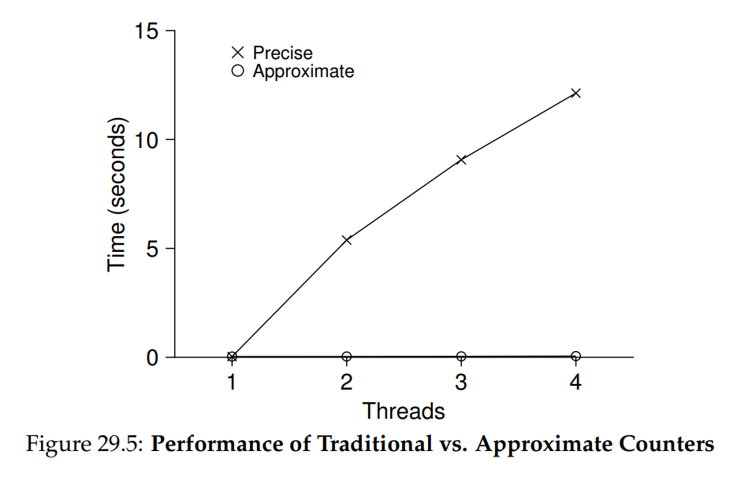
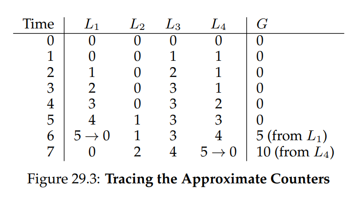
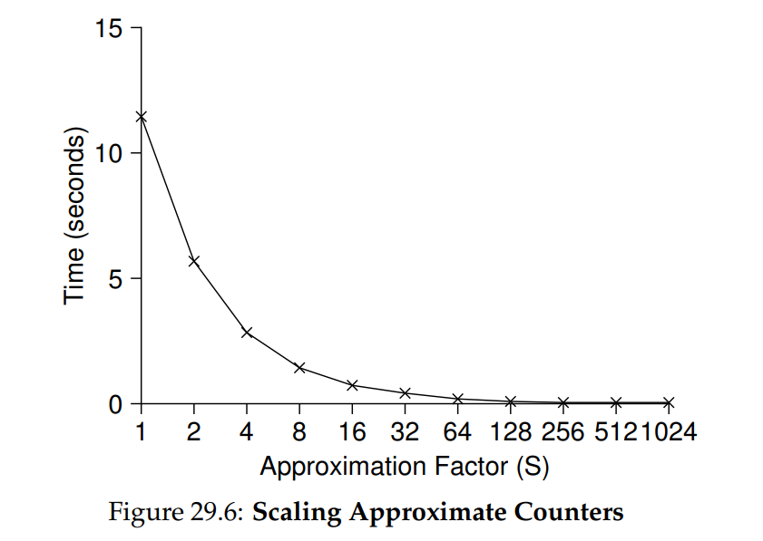
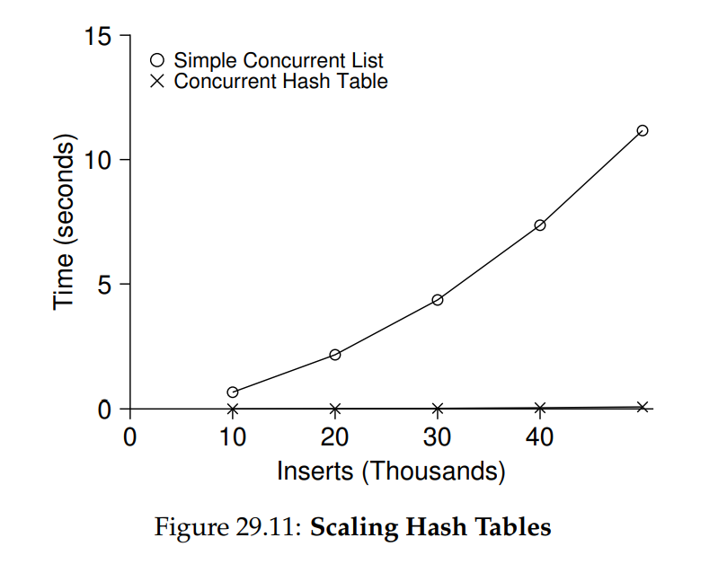

# OSTEP 29：Locked Data Structures

在討論其他主題之前，我們先說明如何在一些常見資料結構中使用鎖。 在資料結構中加入鎖，使其可供多執行緒使用，就能讓該結構具備 thread safe 的特性。 當然，加入鎖的方式會同時決定資料結構的正確性與效能。 因此，我們面臨的挑戰是：  

:::info  
如何向資料結構中加入鎖  

對於特定的資料結構，應該如何加入鎖，才能保證其正確運作？ 更進一步，如何加入鎖才能讓該資料結構具有高效能，使多個執行緒能同時（即並行地）存取它？  
:::

當然，要涵蓋所有資料結構或所有添加並行的方法幾乎不可能，因為這個主題已被研究多年，相關論文多達數千篇（字面上）。 因此，我們希望提供足夠的引導，讓你掌握所需的思考方式，並推薦一些優質資源，供你自行深入探究。 Moir 和 Shavit 的綜述論文是很好的參考資料 [MS04]

## 29.1 Concurrent Counters

最簡單的資料結構之一是計數器。 它是一種常見且介面簡單的結構。 我們在圖 29.1 中定義了一個非並行的簡易計數器：

```c
typedef struct __counter_t {
	int value;
} counter_t;

void init(counter_t* c) 
{
  c->value = 0; 
}

void increment(counter_t* c) 
{
  c->value++; 
}

void decrement(counter_t* c) 
{
  c->value--; 
}

int get(counter_t* c) 
{ 
  return c->value; 
}
```

<div class = "center-column">

（Figure 29.1: A Counter Without Locks）

</div>

### Simple But Not Scalable

如你所見，非同步計數器是極為簡單的資料結構，只需極少程式碼即可實作。 接下來我們面臨的挑戰是：如何讓這段程式碼具備 thread safe？ 圖 29.2 展示了我們的做法：

```c
typedef struct __counter_t {
	int value;
	pthread_mutex_t lock;
} counter_t;

void init(counter_t* c)
{
	c->value = 0;
	Pthread_mutex_init(&c->lock, NULL);
}

void increment(counter_t* c)
{
	Pthread_mutex_lock(&c->lock);
	c->value++;
	Pthread_mutex_unlock(&c->lock);
}

void decrement(counter_t* c)
{
	Pthread_mutex_lock(&c->lock);
	c->value--;
	Pthread_mutex_unlock(&c->lock);
}

int get(counter_t* c)
{
	Pthread_mutex_lock(&c->lock);
	int rc = c->value;
	Pthread_mutex_unlock(&c->lock);
	return rc;
}
```

<div class = "center-column">

（Figure 29.2: A Counter With Locks）

</div>

這個並行的 counter 很簡單，而且能正確運作。 實際上，它遵循了一種最簡單的並行資料結構的設計模式：在操作這個資料結構的 routine 被呼叫時加上一把鎖，然後在從呼叫返回時釋放鎖。 以這種方式，它類似於用 monitor 建構的資料結構 [BH73]，在呼叫與返回 object 方法的同時，自動取得與釋放鎖

此時，你已經擁有一個可運作的並行資料結構。 你可能遇到的問題是效能，如果資料結構過於緩慢，你必須做的就不只是新增一把鎖，還要做優化，這類優化將是本章其餘部分的主題

為了瞭解這種簡單方法的效能代價，我們執行了一個基準測試，讓每個 thread 更新同一個共享計數器固定次數； 接著我們改變 thread 的數量。 圖 29.5 顯示了從一個到四個 thread 同時執行時所需的總時間，每個 thread 各更新計數器一百萬次。 這個實驗在一台搭載四顆 Intel 2.7 GHz i5 CPU 的 iMac 上進行； 我們預期隨著更多 CPU 同時運作，每單位時間內應要完成更多工作：

<div class = "center-column">



（Figure 29.5: Performance of Traditional vs. Approximate Counters）

</div>

從圖中的最上方曲線（標示為 "Precise"）可以看到同步計數器的效能擴展性很差。 單一 thread 完成百萬次計數更新大約只需極短時間（約 0.03 秒），但若讓兩個 thread 同時各更新百萬次，卻會造成極大延遲（超過 5 秒！） 隨著 thread 數量增加，情況只會更糟

理想情況下，你希望多個 processors 上的 thread 完成任務的速度要與單一 thread 在單一 processor 上的速度一樣快。 這個目標被稱為完美擴展（perfect scaling），儘管總工作量增加，但因為並行執行，完成任務所需時間不會增加

### Scalable Counting

研究人員多年間一直在探討如何構建更具擴展性的計數器 [MS04]。 令人驚訝的是，擴展性計數器確實很重要，正如近期在作業系統效能分析中的研究所示 [B+10]； 如果沒有可擴展的計數機制，某些在 Linux 上執行的工作負載在多核心機器上會遭遇嚴重的擴展性問題

為了解決這個問題，人們已經開發出許多技術。 我們將介紹一種稱為 approximate counter 的方法 [C06]

approximate counter 的運作方式是用多個本地實體計數器（每個 CPU core 一個）以及一個 global counter 來表示單一的邏輯計數器。 在配備四顆 CPU 的機器上，會有四個 local counters 和一個 global counter。 除了這些計數器之外，還有對應的鎖：每個 local counter 一把鎖，global counter 也有一把鎖

approximate counting 的基本概念如下。 當執行於某核心上的 thread 想要遞增計數時，它會先遞增自己的 local counter； 對這個 local counter 的存取透過對應的 local lock 同步。 由於每個 CPU 都有自己的 local counter，各 CPU 上的 threads 可以在不互相爭用的情況下更新 local counters，因此這種更新方式具備良好的擴展性

不過，為了讓 global counter 保持最新（以便有 thread 想要讀取其值時能得到正確結果），系統會定期將 local counters 的累積值轉移到 global counter：先獲取 global lock，再以 local counter 的值遞增 global counter，然後將 local counter 重置為 0

local-to-global 轉移的頻率由閾值 S 決定。 S 越小，counter 就越像前面提到的不可擴展方式； S 越大，counter 擴展性越好，但 global counter 的值可能與實際計數相差越多。 當然，也可以按特定順序（以避免 deadlock）一次性獲取所有 local locks 和 global lock 來取得精確值，但這種做法不具擴展性

為了說明這一點，我們來看一個例子（圖 29.3）：

<div class = "center-column">



（Figure 29.3: Tracing the Approximate Counters）

</div>

在這個例子中，閾值 S 設為 5，並且在四個 CPU 上各有一個 thread 更新其 local counters L1 ~ L4。 trace 中也顯示了 global counter 的值 (G)，時間由上向下推移。 在每個時間點，都可能對某個 local counter 進行遞增操作； 一旦 local counter 的值達到閾值 S，就會將其累積值轉移到 global counter，然後將 local counter 重置

圖 29.5 下方的曲線（標為 "Approximate"）顯示了在閾值 S 為 1024 時 approximate counters 的效能表現。 效能非常出色：在四顆處理器上執行四百萬次遞增操作所需的時間幾乎與單顆處理器執行一百萬次的時間相同

圖 29.6 顯示了閾值 S 的重要性：在四個 CPU 上有四個 threads 各自執行一百萬次遞增操作。 如果 S 設得很低，效能會很差（但 global count 始終相當準確）； 如果 S 設得很高，效能會非常好，但 global count 會有所滯後（最多延遲 CPU 數量乘以 S）。 這種精確度與效能之間的取捨正是 approximate counter 所能實現的

<div class = "center-column">



（Figure 29.6: Scaling Approximate Counters）

</div>

在圖 29.4 中可以看到 approximate counter 的一個簡化版本。 建議你閱讀程式碼，或更好地，親自執行一些實驗，以更清楚地理解其運作原理：

```c
typedef struct __counter_t {
	int global;											// global count
	pthread_mutex_t glock;					// global lock
	int local[NUMCPUS];							// per-CPU count
	pthread_mutex_t llock[NUMCPUS]; // ... and locks
	int threshold;									// update freq
} counter_t;

// init: record threshold, init locks, init values
// of all local counts and global count
void init(counter_t* c, int threshold)
{
	c->threshold = threshold;
	c->global = 0;
	pthread_mutex_init(&c->glock, NULL);
	int i;
	for (i = 0; i < NUMCPUS; i++) {
		c->local[i] = 0;
		pthread_mutex_init(&c->llock[i], NULL);
	}
}

// update: usually, just grab local lock and update
// local amount; once it has risen ’threshold’,
// grab global lock and transfer local values to it
void update(counter_t* c, int threadID, int amt)
{
	int cpu = threadID % NUMCPUS;
	pthread_mutex_lock(&c->llock[cpu]);
	c->local[cpu] += amt;
	if (c->local[cpu] >= c->threshold) {
		// transfer to global (assumes amt>0)
		pthread_mutex_lock(&c->glock);
		c->global += c->local[cpu];
		pthread_mutex_unlock(&c->glock);
		c->local[cpu] = 0;
	}
	pthread_mutex_unlock(&c->llock[cpu]);
}

// get: just return global amount (approximate)
int get(counter_t* c)
{
	pthread_mutex_lock(&c->glock);
	int val = c->global;
	pthread_mutex_unlock(&c->glock);
	return val; // only approximate!
}
```

<div class = "center-column">

（Figure 29.4: Approximate Counter Implementation）

</div>

:::info  
更多的並行性並不一定更快

如果你設計的方案帶來大量額外開銷（例如，頻繁獲取並釋放鎖，而非僅一次），那麼更高的並行性可能毫無意義。 簡單的方案通常效果良好，尤其當它們很少使用昂貴的 routine 時，增加過多鎖與複雜度可能會適得其反。 不過，要真正知道誰優誰劣，唯一方法是將兩種方案（簡單但並行性較低，以及複雜但並行性較高）同時實作並進行測量  
:::

## 29.2 Concurrent Linked Lists

接下來，我們研究一個更複雜的結構 —— linked list。 我們再次從基本方法開始，為了簡化起見，我們省略該列表可能具備的一些顯而易見的 routines，僅關注 concurrent insert 和 lookup，刪除等操作留給讀者自行思考

圖 29.7 顯示了這個原始資料結構的程式碼：

```c
// basic node structure
typedef struct __node_t {
	int key;
	struct __node_t* next;
} node_t;

// basic list structure (one used per list)
typedef struct __list_t {
	node_t* head;
	pthread_mutex_t lock;
} list_t;

void List_Init(list_t* L)
{
	L->head = NULL;
	pthread_mutex_init(&L->lock, NULL);
}

int List_Insert(list_t* L, int key)
{
	pthread_mutex_lock(&L->lock);
	node_t* new = malloc(sizeof(node_t));
	if (new == NULL) {
		perror("malloc");
		pthread_mutex_unlock(&L->lock);
		return -1; // fail
	}
	new->key = key;
	new->next = L->head;
	L->head = new;
	pthread_mutex_unlock(&L->lock);
	return 0; // success
}

int List_Lookup(list_t* L, int key)
{
	pthread_mutex_lock(&L->lock);
	node_t* curr = L->head;
	while (curr) {
		if (curr->key == key) {
			pthread_mutex_unlock(&L->lock);
			return 0; // success
		}
		curr = curr->next;
	}
	pthread_mutex_unlock(&L->lock);
	return -1; // failure
}
```

<div class = "center-column">

（Figure 29.7: Concurrent Linked List）

</div>

如你所見，在 insert routine 進入時程式只會獲取一把鎖，並在退出時釋放它。 如果 `malloc()` 恰好失敗，程式就必須在插入失敗前先釋放鎖，這裡就出現了一個棘手的小問題：這類異常控制流程已被證明相當容易出錯； 一項對 Linux kernel patches 的研究發現，幾乎 40% 的 bugs 都出現在這些很少觸發的程式路徑上（事實上，這一發現也引發了我們自己的研究，我們從一個 Linux 檔案系統中移除了所有 memory-failing paths，結果讓系統更穩健了 [S+11]）

因此，挑戰來了：我們能否在保持 insert 和 lookup 在並行插入下依然正確的同時，避免在失敗路徑中還必須呼叫 unlock？ 答案是可以，具體來說，我們可以稍微重新排列程式，使鎖的獲取與釋放僅包圍 insert 程式中真正需要保護的 critical section，並在 lookup 程式中使用統一的退出路徑

前者可行的原因在於 insert 的部分程式其實不需要加鎖，假設 `malloc()` 本身是 thread-safe 的，每個 thread 都可以安全呼叫而不會有競爭條件或其他並行錯誤，只有在更新共享列表時才需要持有鎖。

至於 lookup routine，只需簡單地將搜尋主迴圈跳躍到單一 return 路徑，即可將程式中的鎖獲取/釋放點數量減少，從而降低意外引入錯誤（例如在 return 前忘記 unlock）的機率。 有關這些修改的詳細資料，請參見圖 29.8：

```c
void List_Init(list_t* L)
{
	L->head = NULL;
	pthread_mutex_init(&L->lock, NULL);
}

int List_Insert(list_t* L, int key)
{
	// synchronization not needed
	node_t* new = malloc(sizeof(node_t));
	if (new == NULL) {
		perror("malloc");
		return -1;
	}
	new->key = key;
	// just lock critical section
	pthread_mutex_lock(&L->lock);
	new->next = L->head;
	L->head = new;
	pthread_mutex_unlock(&L->lock);
	return 0; // success
}

int List_Lookup(list_t* L, int key)
{
	int rv = -1;
	pthread_mutex_lock(&L->lock);
	node_t* curr = L->head;
	while (curr) {
		if (curr->key == key) {
			rv = 0;
			break;
		}
		curr = curr->next;
	}
	pthread_mutex_unlock(&L->lock);
	return rv; // now both success and failure
}
```

<div class = "center-column">

（Figure 29.8: Concurrent Linked List: Rewritten）

</div>

### Scaling Linked Lists

儘管我們又回到使用基本的 concurrent linked list，但它在擴展性上仍不理想。 研究人員為了提高 linked list 的並行度，探索了一種稱為 hand-over-hand locking（又稱 lock coupling）的技術 [MS04]。 這個想法相當簡單：不再為整個列表使用單一鎖，而是為列表中的每個節點都加上一把鎖。 在遍歷列表時，程式先獲取下一個節點的鎖，然後再釋放當前節點的鎖（也因此得名 hand-over-hand）

在概念上，hand-over-hand linked list 看起來合理，因為它能在列表操作中提供高度並行度。 但在實際應用中，為列表每個節點反覆獲取與釋放鎖的開銷太大，難以勝過單鎖方案的效能。 即使列表非常大且 threads 數量眾多，允許多重同時遍歷的並行性也不太可能比一次獲取一把鎖、執行操作、然後釋放更快。 也許某種折衷的混合方式（例如每經過若干節點就獲取一次新鎖）值得進一步研究

:::info  
小心控制流程與鎖的結合

這是一條通用的設計建議，無論在並行程式或其他情境都適用：要警惕會直接導致函式 return、exit 或類似錯誤狀況的控制流程變化。 由於許多函式一開始就會獲取鎖、配置記憶體或執行其他帶有狀態的操作，當錯誤發生時，程式必須在 return 前還原所有狀態，這很容易出錯。 因此，最好將程式結構化，以儘量減少這類情況
:::

## 29.3 Concurrent Queues

如你所知，總有一種對並行資料結構的標準做法：加一把大鎖。 對於 queue，我們就略過這種做法，你應該可以自行推敲。 取而代之地，我們來看看由 Michael 和 Scott 設計的一種具備更高並行度的 queue [MS98]。 這個 queue 使用的資料結構與程式碼見圖 29.9：

```c
typedef struct __node_t {
	int value;
	struct __node_t* next;
} node_t;

typedef struct __queue_t {
	node_t* head;
	node_t* tail;
	pthread_mutex_t head_lock, tail_lock;
} queue_t;

void Queue_Init(queue_t* q)
{
	node_t* tmp = malloc(sizeof(node_t));
	tmp->next = NULL;
	q->head = q->tail = tmp;
	pthread_mutex_init(&q->head_lock, NULL);
	pthread_mutex_init(&q->tail_lock, NULL);
}

void Queue_Enqueue(queue_t* q, int value)
{
	node_t* tmp = malloc(sizeof(node_t));
	assert(tmp != NULL);
	tmp->value = value;
	tmp->next = NULL;

	pthread_mutex_lock(&q->tail_lock);
	q->tail->next = tmp;
	q->tail = tmp;
	pthread_mutex_unlock(&q->tail_lock);
}

int Queue_Dequeue(queue_t* q, int* value)
{
	pthread_mutex_lock(&q->head_lock);
	node_t* tmp = q->head;
	node_t* new_head = tmp->next;
	if (new_head == NULL) {
		pthread_mutex_unlock(&q->head_lock);
		return -1; // queue was empty
	}
	*value = new_head->value;
	q->head = new_head;
	pthread_mutex_unlock(&q->head_lock);
	free(tmp);
	return 0;
}
```

<div class = "center-column">

（Figure 29.9: Michael and Scott Concurrent Queue）

</div>

細讀程式碼後，你會發現它使用了兩把鎖，一把保護 queue 的 head，另一把保護 tail。 這兩把鎖的目標是允許 enqueue 與 dequeue 操作並行執行。 在常見情況下，enqueue routine 只會存取 tail 鎖，而 dequeue 只會存取 head 鎖

Michael 和 Scott 採用的一個巧妙手法是在 queue 初始化程式碼中新增一個 dummy node； 這個 dummy 使 head 與 tail 操作能夠分離。 建議你研讀程式碼，或更進一步地，手動輸入、執行並測量，以深入理解其運作原理

Queues 在多執行緒應用中十分常見。 然而，此處使用的那種僅靠鎖實現的 queue，往往無法完全滿足這類程式的需求。 更完善的有界 queue（當 queue 為空或過滿時，能讓 thread 等待）將是下一章 condition variables 深入探討的重點

## 29.4 Concurrent Hash Table

我們的討論以一個簡單且廣泛適用的並行資料結構 —— hash table 作為結尾。 我們將集中介紹一種不會自動擴容的簡易 hash table； 若要處理擴容，則需要額外的實作，我們將這部分留給讀者自行練習

這個並行 hash table（圖 29.10）非常直觀，採用了我們先前建立的 concurrent linked lists 實作而成，且效能極佳。 其優異表現的關鍵在於，它不是對整個結構只使用一把鎖，而是對每個 hash bucket（由列表表示）各自加上一把鎖。 如此一來，就能允許大量並行操作同時進行

```c
#define BUCKETS (101)

typedef struct __hash_t {
	list_t lists[BUCKETS];
} hash_t;

void Hash_Init(hash_t* H)
{
	int i;
	for (i = 0; i < BUCKETS; i++)
		List_Init(&H->lists[i]);
}

int Hash_Insert(hash_t* H, int key) 
{
  return List_Insert(&H->lists[key % BUCKETS], key); 
}

int Hash_Lookup(hash_t* H, int key) 
{
  return List_Lookup(&H->lists[key % BUCKETS], key); 
}
```

<div class = "center-column">

（Figure 29.10: A Concurrent Hash Table）

</div>

圖 29.11 展示了在同一台搭載四顆 CPU 的 iMac 上，四個 threads 分別執行 10,000 到 50,000 次 concurrent updates 時，hash table 的效能表現。 圖中並同時繪製了僅使用單鎖的 linked list 作為比較。 從曲線可以看出，這個簡易的並行 hash table 擴展性極佳； 相較之下，linked list 卻無法有效擴展

<div class = "center-column">



（Figure 29.11: Scaling Hash Tables）

</div>

## 29.5 Summary

我們已經介紹了一系列並行資料結構範例，從 counters，到 lists 和 queues，最後是普及且使用頻繁的 hash table。 在此過程中，我們學到幾項重要經驗：要謹慎處理鎖在控制流程變化周遭的獲取與釋放； 提高並行度不一定能提升效能； 只有在真正出現效能問題時才進行優化。 最後一點 ── 避免過早優化，這對任何關注效能的開發者而言都是核心原則，如果無法改善整體效能，就沒有提速的意義

當然，我們對高效能資料結構的探討才剛剛開始。 欲了解更多資訊及其他來源，請參閱 Moir 和 Shavit 的優秀綜述，以及相關連結 [MS04]。 特別是，你可能會對其他結構（例如 B-tree）感興趣，若要深入此類知識，修習資料庫相關課程是最佳選擇。 你或許也想知道完全不使用傳統鎖的作法；這類 non-blocking 資料結構將在「常見並行錯誤」章節中稍作介紹，不過坦白說，這個主題本身就是一整個領域，需要比本書更深入的學習。 如果你有興趣，請自行深入探究

:::info  
避免過早優化（Knuth 定律）

在構建並行資料結構時，先採用最基本的方法 ── 加一把大鎖以提供同步存取。 這麼做，你很可能會構建出正確的鎖； 若之後發現它出現效能問題，再進行優化，只有在必要時才讓它快速。 正如 Knuth 所言：「過早優化是一切惡的根源」

許多作業系統在最初轉向多處理器時都使用單一鎖，包括 Sun OS 和 Linux。 在 Linux 中，這把鎖甚至有個專有名稱 ── big kernel lock (BKL)。 多年來，這種簡單做法成效不錯； 但當多 CPU 系統成為主流後，內核一次只允許一個 thread 活動便成了效能瓶頸。 因此，終於到了要對這些系統進行並行度優化的時候。 Linux 採用了較直接的方法：將一把鎖換成多把鎖；而 Sun 則做出更激進的決定：從一開始就從根本上整合並行性的全新作業系統 Solaris。 欲了解這些引人入勝的系統更多細節，請參考 Linux 與 Solaris 內核專書 [BC05, MM00]  
:::

## Reference

- [B+10] “An Analysis of Linux Scalability to Many Cores” by Silas Boyd-Wickizer, Austin T. Clements, Yandong Mao, Aleksey Pesterev, M. Frans Kaashoek, Robert Morris, Nickolai Zeldovich. OSDI ’10, Vancouver, Canada, October 2010.  

  這是一項關於 Linux 在多核心機器上效能表現的優秀研究，也提出了幾個簡單解法；文中包含一種巧妙的 sloppy counter 以解決可擴展計數問題

- [BH73] “Operating System Principles” by Per Brinch Hansen. Prentice-Hall, 1973. Available: http://portal.acm.org/citation.cfm?id=540365.  

  這是最早期關於作業系統的經典著作之一，並提出了 monitors 作為並行原語，堪稱領先其時

- [BC05] “Understanding the Linux Kernel (Third Edition)” by Daniel P. Bovet and Marco Cesati. O’Reilly Media, November 2005.  

  這本書是 Linux 核心的經典入門書籍，非常值得閱讀以深入了解內核運作

- [C06] “The Search For Fast, Scalable Counters” by Jonathan Corbet. February 1, 2006. Available: https://lwn.net/Articles/170003.  

  LWN 上關於 Linux 最新技術的短文，簡要介紹了可擴展近似計數器，建議閱讀以掌握 Linux 中的最新進展

- [L+13] “A Study of Linux File System Evolution” by Lanyue Lu, Andrea C. Arpaci-Dusseau, Remzi H. Arpaci-Dusseau, Shan Lu. FAST ’13, San Jose, CA, February 2013.  

  我們的研究論文回顧了近十年來 Linux 檔案系統的所有補丁，發現了許多有趣結果；完成此研究的過程相當艱辛，Lanyue Lu 必須手動檢視每一份補丁以理解其變更

- [MS98] “Nonblocking Algorithms and Preemption-safe Locking on Multiprogrammed Shared-memory Multiprocessors” by M. Michael, M. Scott. Journal of Parallel and Distributed Computing, Vol. 51, No. 1, 1998.  

  Scott 教授與其團隊多年來一直走在並行演算法與資料結構的前沿，建議參閱其網站及相關論文以深入瞭解

- [MS04] “Concurrent Data Structures” by Mark Moir and Nir Shavit. In Handbook of Data Structures and Applications (Editors D. Metha and S. Sahni). Chapman and Hall/CRC Press, 2004. Available: www.ostep.org/Citations/concurrent.pdf.  

  一本簡明卻相對完整的並行資料結構參考手冊，雖因時間較早而缺少部分最新研究，仍極具參考價值

- [MM00] “Solaris Internals: Core Kernel Architecture” by Jim Mauro and Richard McDougall. Prentice Hall, October 2000.  

  這本 Solaris 核心架構專書也是經典之作，若想了解除 Linux 外的其他系統，值得細讀

- [S+11] “Making the Common Case the Only Case with Anticipatory Memory Allocation” by Swaminathan Sundararaman, Yupu Zhang, Sriram Subramanian, Andrea C. Arpaci-Dusseau, Remzi H. Arpaci-Dusseau. FAST ’11, San Jose, CA, February 2011.  

  我們的研究透過在執行前配置所有可能需要的記憶體，移除了 kernel 內路徑中可能失敗的配置呼叫，從而提升系統健壯性  
