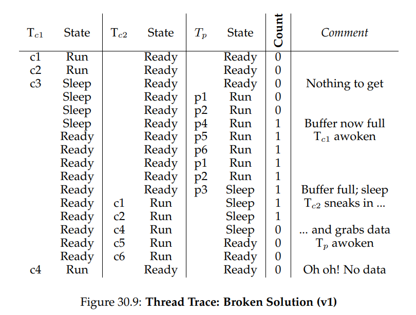
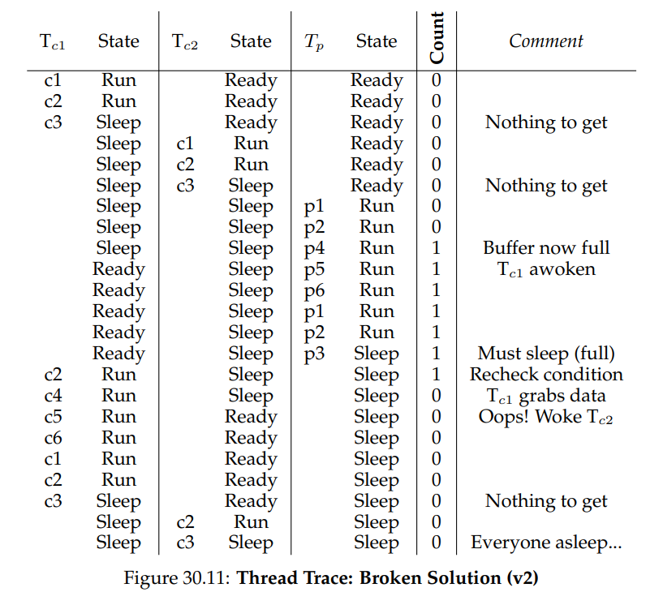

# OSTEP 30：Condition Variables

到目前為止，我們已經建立了鎖的概念，並且瞭解具備適當硬體與 OS 支援時，鎖可以如何正確建構。 可惜的是，鎖並不是編寫 concurrent 程式所需的唯一原語。 特別地，常有 thread 在繼續執行之前希望先檢查某個條件是否成立。 例如，parent thread 可能要等 child thread 執行完畢後才繼續（這通常稱為 `join()`）； 這種等待機制應該如何實作？ 讓我們來看看圖 30.1

<center-panel natural title="（Figure 30.1: A Parent Waiting For Its Child）">

```c
void* child(void* arg)
{
	printf("child\n");
	// XXX how to indicate we are done?
	return NULL;
}

int main(int argc, char* argv[])
{
	printf("parent: begin\n");
	pthread_t c;
	Pthread_create(&c, NULL, child, NULL); // child
	// XXX how to wait for child?
	printf("parent: end\n");
	return 0;
}
```

</center-panel>

我們希望在此看到以下輸出：

```
parent: begin
child
parent: end
```

如圖 30.2 所示，我們可以嘗試使用 shared variable。 這個解法大致上可行，但因為 parent 在自旋而浪費大量 CPU 時間，效率極低。 我們真正想要的是一種機制，能將 parent 置於睡眠狀態，直到所等待的條件（例如 child 執行完畢）成立為止

<center-panel natural title="（Figure 30.2: Parent Waiting For Child: Spin-based Approach）">

```c
int volatile done = 0;

void* child(void* arg)
{
	printf("child\n");
	done = 1;
	return NULL;
}

int main(int argc, char* argv[])
{
	printf("parent: begin\n");
	pthread_t c;
	Pthread_create(&c, NULL, child, NULL); // child
	while (done == 0)
		; // spin
	printf("parent: end\n");
	return 0;
}
```

</center-panel>

:::info  
如何等待條件成立

在 multi-threaded 程式中，thread 在繼續執行前等待某個條件成立往往非常有用。 簡單的做法是讓它一直 busy-wait（spin）直到條件成立，這種方式效率極差且浪費 CPU 週期，有時甚至會導致不正確的行為。 那麼，thread 應該如何等待條件？  
:::

## 30.1 Definition and Routines

要等待某個條件成立，thread 可以使用所謂的 condition variable。 condition variable 是一種顯式的佇列，當執行狀態（即某個條件）不符合預期時，thread 可以將自身加入此佇列（等待）； 當其他 thread 改變了該狀態，就可以透過對 condition 發出 signal，喚醒一個或多個等待中的 thread，讓它們繼續執行。 這個概念最早可追溯到 Dijkstra 提出的「private semaphores」[D68]； 後來 Hoare 在研究 monitor 時，將其命名為 condition variable [H74]

要宣告 condition variable，只需寫：

```c
pthread_cond_t c;
```

即可將 `c` 宣告為 condition variable（注意也要正確初始化）。 condition variable 支援兩個操作：`wait()` 與 `signal()`。 當 thread 想休眠時，就呼叫 `wait()`； 當 thread 在程式中改變了某些狀態，想喚醒等待該 condition 的 thread，就呼叫 `signal()`。 POSIX 定義如下：

```c
pthread_cond_wait(pthread_cond_t *c, pthread_mutex_t *m);  
pthread_cond_signal(pthread_cond_t *c);
```

為簡潔起見，我們通常分別稱之為 `wait()` 和 `signal()`

你會發現 `wait()` 的呼叫還帶了一個 mutex 參數，它假設呼叫時該 mutex 已被鎖定。 `wait()` 的責任是原子性地釋放該鎖，並將呼叫的 thread 置於睡眠； 當該 thread 被其他 thread signal 甦醒後，`wait()` 會在返回前重新獲取鎖。 這層設計複雜度旨在避免 thread 嘗試休眠時產生某些競爭條件。 讓我們看看 join 問題的解法（圖 30.3），以幫助理解：

<center-panel natural title="（Figure 30.3: Parent Waiting For Child: Use A Condition Variable）">

```c
int done = 0;
pthread_mutex_t m = PTHREAD_MUTEX_INITIALIZER;
pthread_cond_t c = PTHREAD_COND_INITIALIZER;

void thr_exit()
{
	Pthread_mutex_lock(&m);
	done = 1;
	Pthread_cond_signal(&c);
	Pthread_mutex_unlock(&m);
}

void* child(void* arg)
{
	printf("child\n");
	thr_exit();
	return NULL;
}

void thr_join()
{
	Pthread_mutex_lock(&m);
	while (done == 0)
		Pthread_cond_wait(&c, &m);
	Pthread_mutex_unlock(&m);
}

int main(int argc, char* argv[])
{
	printf("parent: begin\n");
	pthread_t p;
	Pthread_create(&p, NULL, child, NULL);
	thr_join();
	printf("parent: end\n");
	return 0;
}
```

</center-panel>

有兩種情況要考慮。 第一種情況中，parent 建立 child thread 後，自己繼續執行（假設只有一顆處理器），然後立刻呼叫 `thr_join()` 等待 child 完成。 在這種情況下，parent 會先獲取鎖，檢查 child 是否已完成（尚未完成），接著呼叫 `wait()`（並釋放鎖）將自身休眠

child 隨後執行，印出 `child`，然後呼叫 `thr_exit()` 喚醒 parent； 該程式只需要獲取鎖、設定狀態變數 done，並對 parent 發出 signal，即可將其喚醒。 最後，parent 在 `wait()` 返回時重新持有鎖，接著釋放鎖，並印出最終訊息 `parent: end`

第二種情況中，child 一被建立即刻執行，將 done 設為 1，呼叫 signal 嘗試喚醒等待的 thread（此時無 thread 在睡眠，因此 signal 立即返回），然後結束。 接著 parent 執行，呼叫 `thr_join()`，看到 done 已是 1，因而直接返回，不再等待

最後要注意的是：parent 在判斷是否等待時使用了 while 迴圈，而非單純的 if。 雖然從程式邏輯看似非絕對必要，但這麼做總是較為妥當，後面我們會詳細說明其原因

為了確保你理解 `thr_exit()` 與 `thr_join()` 各段程式碼的重要性，讓我們嘗試幾種替代實作。 首先，你可能好奇是否真的需要狀態變數 done。 如果程式像下面範例（圖 30.4）那樣撰寫，會怎麼樣？

<center-panel natural title="（Figure 30.4: Parent Waiting: No State Variable）">

```c
void thr_exit()
{
	Pthread_mutex_lock(&m);
	Pthread_cond_signal(&c);
	Pthread_mutex_unlock(&m);
}

void thr_join()
{
	Pthread_mutex_lock(&m);
	Pthread_cond_wait(&c, &m);
	Pthread_mutex_unlock(&m);
}
```

</center-panel>

遺憾的是，此作法有缺陷。 試想 child 一執行就立即呼叫 `thr_exit()`； 此時 child 會發出 signal，但因為此時尚無 thread 在等待，signal 不會喚醒任何人。 當 parent 執行到 `wait()` 時，就會直接陷入阻塞，且永遠不會被喚醒。 從此例，你應該體會到狀態變數 done 的重要性：它記錄了 thread 所關注的狀態值，並成為睡眠、喚醒與鎖機制的核心依據

此處（圖 30.5）展示了另一個糟糕的實作範例。 在此範例中，我們假設執行 signal 和 wait 時不需要持有鎖：

<center-panel natural title="（Figure 30.5: Parent Waiting: No Lock）">

```c
void thr_exit()
{
	done = 1;
	Pthread_cond_signal(&c);
}

void thr_join()
{
	if (done == 0)
		Pthread_cond_wait(&c);
}
```

</center-panel>

問題在於一個微妙的競爭條件。 具體而言，若 parent 呼叫 `thr_join()` 後檢查 done 的值，會發現它是 0，於是準備呼叫 wait 進入睡眠； 就在它呼叫 wait 之前被中斷，child 開始執行。 child 將狀態變數 done 設為 1 並呼叫 signal，卻因為此時沒有人在等待，沒有任何 thread 被喚醒。 當 parent 再度執行時，就會永遠在 `wait()` 中卡住，十分糟糕

透過這個簡單的 join 範例，你應該能體會到正確使用 condition variable 的一些基本要件。 為確保你理解，接下來我們將探討更複雜的例子：生產者/消費者（bounded-buffer）問題

:::info  
發出 signal 時務必持有鎖

雖然並非所有情況下都絕對必要，但在使用 condition variable 時，`signal()` 前先持有鎖通常是最簡單且最安全的做法。 上述範例已說明正確性上必須這麼做；雖然在某些情況下不持有鎖也許可行，但仍建議避免這種做法。 因此，為了簡化設計，呼叫 `signal()` 時請先持有鎖  

與此相反的建議 ── 呼叫 `wait()` 時也要持有鎖，這不僅是一條提示，更是 `wait()` 語意中所強制要求的，因為 `wait()` 會

1. 假設呼叫時鎖已被持有
2. 在將呼叫者置於睡眠時釋放該鎖
3. 在返回呼叫者前重新獲取該鎖

因此，這條建議的推廣形式是正確的：呼叫 `signal()` 或 `wait()` 時都請先持有鎖，這樣程式就能保持正確且穩健  
:::

## 30.2 The Producer/Consumer (Bounded Buffer) Problem

接下來我們在本章要面對的同步問題稱為生產者/消費者問題，有時也稱為有界緩衝區問題，最早由 Dijkstra 在 1972 年提出[D72]。 正是這個生產者/消費者問題促使 Dijkstra 及其同事發明了 generalized semaphore（可用作鎖或條件變數）[D01]； 我們稍後會進一步學習有關 semaphore 的內容

設想一個或多個生產者執行緒和一個或多個消費者執行緒。 生產者負責產生資料項並放入緩衝區，消費者則從緩衝區中取出這些資料項並進行處理。 這種模式在許多真實系統中都能看到，舉例來說，在多執行緒網頁伺服器中，生產者將 HTTP 請求放入工作佇列（即有界緩衝區），消費者執行緒再從此佇列取出請求並進行處理

當你將一個程式的輸出透過 pipe 傳給另一個程式時，也會用到有界緩衝區，例如 `grep foo file.txt | wc -l`。 這個例子同時執行兩個程序； `grep` 將 `file.txt` 中含有 `foo` 的每一行寫到標準輸出； UNIX shell 再將其重導向到由 pipe 系統呼叫所建立的 UNIX pipe。 這根 pipe 的另一端接至 `wc` 程序的標準輸入，`wc` 則簡單地計算輸入中的行數並輸出結果。 因此，`grep` 程序為生產者，`wc` 程序為消費者，它們之間由內核中的有界緩衝區相連

由於有界緩衝區是共享資源，我們當然必須對其進行同步存取，以免發生競爭條件。 為了更好地理解此問題，讓我們來檢視一些實際程式碼

首先，我們需要一個共享緩衝區，生產者將資料放入其中，消費者則從中取出資料。 為了簡化，我們先只用一個整數欄位（你當然也可以想像放入一個指向資料結構的指標），並實作兩個內部 routine：將值放入共享緩衝區的 `put()`，以及從緩衝區取值的 `get()`。 詳細內容請參見圖 30.6：

<center-panel natural title="（Figure 30.6: The Put And Get Routines (v1)）">

```c
int buffer;
int count = 0; // initially, empty

void put(int value)
{
	assert(count == 0);
	count = 1;
	buffer = value;
}

int get()
{
	assert(count == 1);
	count = 0;
	return buffer;
}
```

</center-panel>

很簡單，對吧？ `put()` 假定緩衝區為空（並透過 `assert` 確認），然後將值寫入共享緩衝區，並將 count 設為 1 以標記為已填滿。 `get()` 則相反，將緩衝區設為空（即將 count 設為 0），並回傳該值。 當前緩衝區只有單一欄位，稍後我們會將其擴展為可容納多筆資料的佇列，實作會更有趣

接著我們需要實作一些 routine，它們必須知道何時可以存取緩衝區以放入或取出資料。 條件很明顯：只有在 count 為 0（緩衝區為空）時才放入資料，只有在 count 為 1（緩衝區已滿）時才取出資料。 若我們寫出讓生產者在緩衝區已滿時放入資料，或讓消費者在緩衝區為空時取出資料的同步程式碼，就是錯誤的（程式中的 `assert` 會觸發）

這些工作將由兩種類型的執行緒完成，我們稱其中一組為生產者執行緒，另一組為消費者執行緒。 圖 30.7 顯示了生產者執行緒重複多次將整數放入共享緩衝區的程式碼，以及消費者執行緒持續不斷地從緩衝區取出資料並打印出每次取到的資料項的程式碼

<center-panel natural title="（Figure 30.7: Producer/Consumer Threads (v1)）">

```c
void* producer(void* arg)
{
	int i;
	int loops = (int)arg;
	for (i = 0; i < loops; i++) {
		put(i);
	}
}

void* consumer(void* arg)
{
	while (1) {
		int tmp = get();
		printf("%d\n", tmp);
	}
}
```

</center-panel>

### A Broken Solution

假設只有一個生產者和一個消費者。 顯然 `put()` 和 `get()` 這兩個都有包含 critical section，因為 `put()` 會更新緩衝區，`get()` 會從緩衝區讀取資料。 但僅在程式碼周圍加鎖並不足夠，我們需要更進一步的機制

不出所料，這個進階機制就是 condition variable。 在這個（有問題的）初版實作（圖 30.8）中，我們只使用一個 condition variable cond 以及其對應的 mutex

<center-panel natural title="（Figure 30.8: Producer/Consumer: Single CV And If Statement）">

```c
int loops; // must initialize somewhere...
cond_t cond;
mutex_t mutex;

void* producer(void* arg)
{
	int i;
	for (i = 0; i < loops; i++) {
		Pthread_mutex_lock(&mutex);           // p1
		if (count == 1)                       // p2
			Pthread_cond_wait(&cond, &mutex); // p3
		put(i);                               // p4
		Pthread_cond_signal(&cond);           // p5
		Pthread_mutex_unlock(&mutex);         // p6
	}
}

void* consumer(void* arg)
{
	int i;
	for (i = 0; i < loops; i++) {
		Pthread_mutex_lock(&mutex);           // c1
		if (count == 0)                       // c2
			Pthread_cond_wait(&cond, &mutex); // c3
		int tmp = get();                      // c4
		Pthread_cond_signal(&cond);           // c5
		Pthread_mutex_unlock(&mutex);         // c6
		printf("%d\n", tmp);
	}
}
```

</center-panel>

讓我們來檢視生產者與消費者之間的 signaling 邏輯。 當生產者要將資料放入緩衝區時，需要等到緩衝區為空（p1–p3）。 消費者的邏輯則完全相同，只是等待的條件不同，需要等到緩衝區滿了才行（c1–c3）

在只有單一生產者和單一消費者的情況下，圖 30.8 的程式可正常運作。 但若我們擁有多個此類執行緒（例如兩個消費者），此解法就會出現兩個關鍵性問題

讓我們先了解第一個問題，這與 wait 之前的 if 判斷有關。 假設系統中有兩個消費者（$T_{c1}$ 和 $T_{c2}$）以及一個生產者（$T_p$）。 首先，消費者 $T_{c1}$ 執行：先獲取鎖（c1），檢查是否有可供消費的緩衝區（c2），發現沒有後執行 wait（c3），並釋放鎖

接著生產者 $T_p$ 執行：先獲取鎖（p1），檢查所有緩衝區是否已滿（p2），發現尚未滿後執行填充緩衝區（p4）。 然後生產者呼叫 signal，通知緩衝區已填滿（p5）。 關鍵在於，這會將 $T_{c1}$ 從 condition variable 的睡眠狀態移至 Ready 隊列； 此時 $T_{c1}$ 處於可執行狀態（尚未執行）。 生產者再接著執行，直到發現緩衝區已滿，進而執行 sleep（p6, p1–p3）

問題就發生在這裡：另一個消費者 $T_{c2}$ 偷跑進來，消費掉緩衝區中僅有的一筆資料（執行 c1, c2, c4, c5, c6，略過 c3 的 wait，因為緩衝區是滿的）。 現在假設 $T_{c1}$ 開始執行，剛從 wait 返回前，它重新獲取鎖，然後返回。 接著它呼叫 `get()`（c4），卻發現沒有任何資料可供消費，因此觸發了 `assert`，程式並未達到預期效果。 很顯然，我們應該要避免 $T_{c1}$ 嘗試消費，因為 $T_{c2}$ 已經先行消耗了那筆資料。 圖 30.9 顯示了各執行緒的動作，以及隨時間變化的排程器狀態（Ready、Running 或 Sleeping）



這個問題產生的原因很簡單：在生產者將 $T_{c1}$ 喚醒之後，但在 $T_{c1}$ 開始執行前，有界緩衝區的狀態已被 $T_{c2}$ 改變。 而 `signal()` 只負責喚醒執行緒，暗示程式狀態已改變（本例中指資料已被放入緩衝區），卻不保證被喚醒的執行緒執行時狀態仍符合預期

這種 signal 含義的詮釋通常稱為 Mesa semantics，源自最早以此方式構建 condition variable 的研究 [LR80]； 相對的語意稱為 Hoare semantics，較難實作，但能更強烈保證被喚醒的執行緒在被喚醒後會立即執行 [H74]。 但目前幾乎所有的系統都採用 Mesa semantics

### Better, But Still Broken: While, Not If

幸好，要把它修好並不難（見圖 30.10），只要將 if 改為 while 即可。 現在當消費者 $T_{c1}$ 被喚醒時（鎖仍被持有），會立即重新檢查共享變數的狀態（c2）。 如果此時 buffer 為空，消費者就回到睡眠狀態（c3）。 同理，生產者的 if 也該改為 while（p2）

<center-panel natural title="（Figure 30.10: Producer/Consumer: Single CV And While）">

```c
int loops;
cond_t cond;
mutex_t mutex;

void* producer(void* arg)
{
	int i;
	for (i = 0; i < loops; i++) {
		Pthread_mutex_lock(&mutex);           // p1
		while (count == 1)                    // p2
			Pthread_cond_wait(&cond, &mutex); // p3
		put(i);                               // p4
		Pthread_cond_signal(&cond);           // p5
		Pthread_mutex_unlock(&mutex);         // p6
	}
}

void* consumer(void* arg)
{
	int i;
	for (i = 0; i < loops; i++) {
		Pthread_mutex_lock(&mutex);           // c1
		while (count == 0)                    // c2
			Pthread_cond_wait(&cond, &mutex); // c3
		int tmp = get();                      // c4
		Pthread_cond_signal(&cond);           // c5
		Pthread_mutex_unlock(&mutex);         // c6
		printf("%d\n", tmp);
	}
}
```

</center-panel>

由於採用 Mesa semantics，使用 condition variable 時有一條簡單規則：務必總是使用 while 迴圈。 有時候你不必再檢查條件，但這麼做永遠是安全的

然而，這段程式碼仍然有一個缺陷，即前面提到的第二個問題，它與只有一個 condition variable 有關。 問題發生在兩個消費者先後執行（$T_{c1}$ 和 $T_{c2}$）並同時進入睡眠（c3）後。 接著生產者執行，將一筆資料放入 buffer，並喚醒其中一位消費者（假設是 $T_{c1}$）。 生產者隨後重返迴圈（期間釋放並重新獲取鎖），試圖再次放入資料； 由於 buffer 已滿，生產者轉而在 condition 上等待（進入睡眠）。 此時，一位消費者（$T_{c1}$）已就緒，另外兩個執行緒（$T_{c2}$ 與 $T_p$）在 condition 上睡眠

這時問題就發生了，接著消費者 $T_{c1}$ 從 `wait()` 返回被喚醒（c3），重新檢查條件（c2），發現 buffer 仍然為滿，於是消費該筆資料（c4）。 關鍵在於，該消費者接著呼叫 signal（c5），僅喚醒一個正在睡眠的執行緒。 但它到底該喚醒哪一個？ 由於消費者已清空 buffer，顯然應該喚醒生產者。 但若它喚醒另一位消費者 Tc2（取決於等待佇列的管理方式，這是有可能的），就會出問題

具體而言，$T_{c2}$ 被喚醒後，檢查到 buffer 為空（c2），又重新睡去（c3）。 而有待放資料的生產者 $T_p$ 卻仍在睡眠，剛消費完資料的消費者 $T_{c1}$ 也再度睡去。 三個執行緒全部睡死，明顯是個錯誤，詳細步驟請參見圖 30.11



顯然我們需要 signal 機制，但必須更具指向性。 消費者不應喚醒其他消費者，只應喚醒生產者；反之亦然

### The Single Buffer Producer/Consumer Solution

這裡的解法同樣很簡單：使用兩個 condition variables 而不是一個，用以正確地通知何種類型的執行緒在系統狀態改變時該被喚醒。 圖 30.12 展示了最終的程式碼：

<center-panel natural title="（Figure 30.12: Producer/Consumer: Two CVs And While）">

```c
cond_t empty, fill;
mutex_t mutex;

void* producer(void* arg)
{
	int i;
	for (i = 0; i < loops; i++) {
		Pthread_mutex_lock(&mutex);
		while (count == 1)
			Pthread_cond_wait(&empty, &mutex);
		put(i);
		Pthread_cond_signal(&fill);
		Pthread_mutex_unlock(&mutex);
	}
}

void* consumer(void* arg)
{
	int i;
	for (i = 0; i < loops; i++) {
		Pthread_mutex_lock(&mutex);
		while (count == 0)
			Pthread_cond_wait(&fill, &mutex);
		int tmp = get();
		Pthread_cond_signal(&empty);
		Pthread_mutex_unlock(&mutex);
		printf("%d\n", tmp);
	}
}
```

</center-panel>

在程式中，producer threads 在 condition empty 上等待，並對 fill 發出 signal。 相反地，consumer threads 在 fill 上等待，並對 empty 發出 signal。 如此一來，就從設計層面避免了前述的第二個問題：消費者不可能誤喚醒其他消費者，生產者也不可能誤喚醒其他生產者

:::info  
對條件判斷時務必使用 while（不要用 if）

在多執行緒程式中檢查條件時，使用 while 迴圈總是正確的；僅用 if 則視 signal 的語意而定，可能會出錯。 因此，務必都用 while，程式才會如預期般運作

在條件檢查周圍使用 while 迴圈也能處理「虛假喚醒」的情況。 在某些 thread 套件中，因為實作細節，可能只發出一次 signal 卻喚醒了兩個執行緒 [L11]。 虛假喚醒更是提醒我們要再次檢查執行緒正在等待的條件  
:::

### The Correct Producer/Consumer Solution

我們現在已有一個可用的 producer/consumer 解法，而這最後一個修改能讓我們提升並行度與效率； 具體而言，我們增加緩衝區槽位，以便在進入睡眠前可生產多筆資料，同樣地也能在睡眠前消費多筆資料。 僅有單一生產者與單一消費者時，此做法能降低上下文切換，提高效率； 若有多個生產者或消費者（或兩者皆有），更能允許同時執行多重生產或消費動作，進一步提升並行性。 幸運的是，這對現有解法只需做小幅調整

此正確解法的第一項修改在於緩衝區結構本身以及對應的 `put()` 和 `get()`（圖 30.13）：

<center-panel natural title="（Figure 30.13: The Correct Put And Get Routines）">

```c
int buffer[MAX];
int fill_ptr = 0;
int use_ptr = 0;
int count = 0;

void put(int value)
{
	buffer[fill_ptr] = value;
	fill_ptr = (fill_ptr + 1) % MAX;
	count++;
}

int get()
{
	int tmp = buffer[use_ptr];
	use_ptr = (use_ptr + 1) % MAX;
	count--;
	return tmp;
}
```

</center-panel>

同時，我們微調生產者與消費者用以判斷是否該睡眠的條件。 接著示範正確的等待與 signaling 邏輯（圖 30.14）。 生產者僅在所有槽位皆已填滿時才進入睡眠（p2）； 同理，消費者僅在所有槽位皆為空時才睡眠（c2）。 就這樣，我們成功解決了 producer/consumer 問題

<center-panel natural title="（Figure 30.14: The Correct Producer/Consumer Synchronization）">

```c
cond_t empty, fill;
mutex_t mutex;

void* producer(void* arg)
{
	int i;
	for (i = 0; i < loops; i++) {
		Pthread_mutex_lock(&mutex);            // p1
		while (count == MAX)                   // p2
			Pthread_cond_wait(&empty, &mutex); // p3
		put(i);                                // p4
		Pthread_cond_signal(&fill);            // p5
		Pthread_mutex_unlock(&mutex);          // p6
	}
}

void* consumer(void* arg)
{
	int i;
	for (i = 0; i < loops; i++) {
		Pthread_mutex_lock(&mutex);	          // c1
		while (count == 0)                    // c2
			Pthread_cond_wait(&fill, &mutex); // c3
		int tmp = get();                      // c4
		Pthread_cond_signal(&empty);          // c5
		Pthread_mutex_unlock(&mutex);         // c6
		printf("%d\n", tmp);
	}
}
```

</center-panel>

## 30.3 Covering Conditions

我們現在再來看一個 condition variable 的應用範例。 這段程式碼取自 Lampson 與 Redell 關於 Pilot 的論文 [LR80]，正是這群人最先實作了前述的 Mesa 語意（其使用的語言也稱為 Mesa，因此得名）。

他們遇到的問題可用一個簡易範例說明 —— 在一個多執行緒記憶體配置函式庫中會發生此情況。 圖 30.15 展示了可重現該問題的程式碼片段

<center-panel natural title="（Figure 30.15: Covering Conditions: An Example）">

```c
// how many bytes of the heap are free?
int bytesLeft = MAX_HEAP_SIZE;

// need lock and condition too
cond_t c;
mutex_t m;

void* allocate(int size)
{
	Pthread_mutex_lock(&m);
	while (bytesLeft < size)
		Pthread_cond_wait(&c, &m);
	void* ptr = ...; // get mem from heap
	bytesLeft -= size;
	Pthread_mutex_unlock(&m);
	return ptr;
}

void free(void* ptr, int size)
{
	Pthread_mutex_lock(&m);
	bytesLeft += size;
	Pthread_cond_signal(&c); // whom to signal??
	Pthread_mutex_unlock(&m);
}
```

</center-panel>

如程式所示，當某執行緒呼叫記憶體配置程式時，可能得等待以釋出更多可用記憶體； 相反地，當執行緒釋放記憶體時，就會發出 signal 通知有更多記憶體可用。 然而，上述程式有個問題：當有多個執行緒在等待時，我們應該喚醒哪一個？

請考慮以下情境：假設目前沒有可用記憶體，執行緒 $T_a$ 呼叫 `allocate(100)`，隨後執行緒 $T_b$ 呼叫 `allocate(10)`，兩者都因為可用記憶體不足而進入等待並睡眠。 此時，第三個執行緒 $T_c$ 呼叫 `free(50)`

可惜的是，當它發出 signal 喚醒等待中的執行緒時，可能喚醒的是 $T_a$ 而非只需 10 bytes 的 $T_b$； 而 $T_a$ 應該繼續等待，因為尚未有足夠記憶體可用。 因此，此程式無法正常運作，因為負責喚醒的執行緒並不知道該喚醒哪一位

Lampson 與 Redell 建議的解法很直接：將上述程式中的 `pthread_cond_signal()` 呼叫替換為 `pthread_cond_broadcast()`，從而一次喚醒所有等待中的執行緒。 如此一來，所有應被喚醒的執行緒都會甦醒。 當然，這樣做的缺點是效能可能受損，因為我們可能不必要地喚醒許多暫不該甦醒的執行緒

這些執行緒甦醒後會再次檢查條件，若仍不符合就立即再度睡眠。 Lampson 和 Redell 稱這種做法為 covering condition，因為它保守地涵蓋了所有可能需要喚醒的情境； 代價如前所述，即可能喚醒過多執行緒

聰明的讀者或許已注意到，我們也可在先前的情境（僅用單一 condition variable 的生產者/消費者問題）中使用此方法。 不過當時有更好的解法可用，故未採用。 總的來說，若你發現程式只能在將 signal 換成 broadcast 後才正常運作（而你又不認為程式本該如此），那很可能是程式有 bug； 然而，像上述記憶體配置器的情境中，broadcast 可能是最直接可行的解決方案

## 30.4 Summary

我們已經見識到除了鎖之外，另一個重要的同步原語 ── condition variables ── 的引入。 它允許 thread 在程式狀態不符合預期時進入睡眠，從而讓我們能優雅地解決許多重要的同步問題，包括著名（且依然重要）的生產者/消費者問題，以及 covering conditions

## References

- [D68] “Cooperating sequential processes” by Edsger W. Dijkstra. 1968. Available online: http://www.cs.utexas.edu/users/EWD/ewd01xx/EWD123.PDF.  
  另一篇 Dijkstra 的經典著作；閱讀他早期關於並行的論文，能讓你掌握許多基礎且重要的概念  

- [D72] “Information Streams Sharing a Finite Buffer” by E.W. Dijkstra. Information Processing Letters 1: 179–180, 1972. http://www.cs.utexas.edu/users/EWD/ewd03xx/EWD329.PDF.  
  這篇著名論文首次提出了生產者/消費者問題  

- [D01] “My recollections of operating system design” by E.W. Dijkstra. April 2001. Available: http://www.cs.utexas.edu/users/EWD/ewd13xx/EWD1303.PDF.  
  對於有興趣了解業界先驅如何提出「interrupts」甚至「a stack」等基本概念的人非常值得一讀  

- [H74] “Monitors: An Operating System Structuring Concept” by C.A.R. Hoare. Communications of the ACM 17:10, pages 549–557, October 1974.  
  Hoare 在並行理論方面有不少貢獻；但他或許最為人知的，還是他對 Quicksort 的研究 —— 這或許是全世界最酷的排序演算法  

- [L11] “Pthread_cond_signal Man Page” by Mysterious author. March 2011. Available online: http://linux.die.net/man/3/pthread_cond_signal.  
  Linux 手冊頁展示了由於 signal/wakeup 程式碼中的 race condition，thread 可能產生 spurious wakeup 的簡單範例  

- [LR80] “Experience with Processes and Monitors in Mesa” by B.W. Lampson, D.R. Redell. Communications of the ACM 23:2, pages 105–117, February 1980.  
  一篇關於如何在真實系統中實作 signaling 與 condition variables 的經典論文，也由此衍生出「Mesa semantics」一詞；較早由 Hoare [H74] 提出的語意則被稱為「Hoare semantics」  

- [O49] “1984” by George Orwell. Secker and Warburg, 1949.  
  一部必讀經典小說，雖然有點直白，但引用最後一句話似乎也洩了劇透。政府在看嗎？我們覺得政府是「double plus good」  

