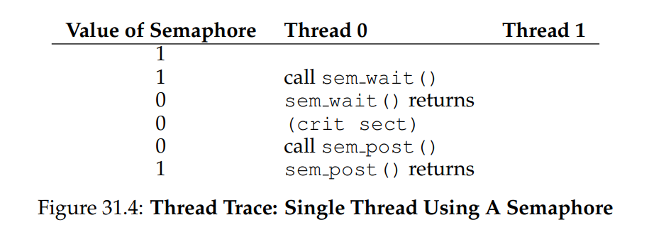
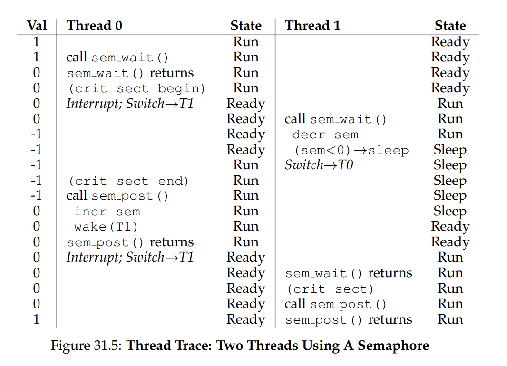
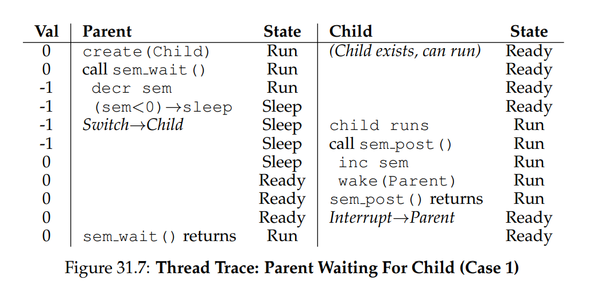
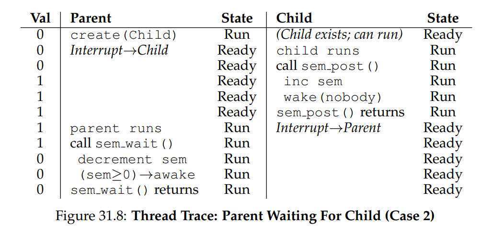
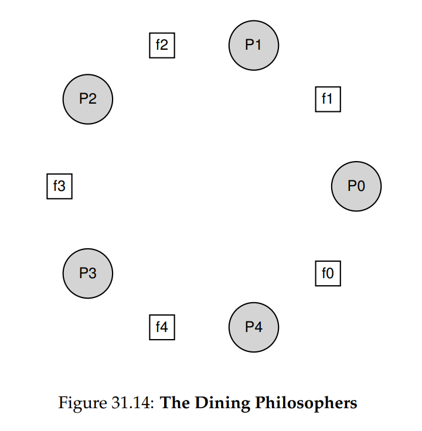

# OSTEP 31：Semaphores

要解決各種相關且有趣的並行問題，既需要鎖也需要 condition variables。 首批意識到此點的人之一是 Edsger Dijkstra（儘管確切歷史難以考證 [GR92]），他因圖論中著名的「最短路徑」演算法 [D59]、早期針對結構化程式的論戰《Goto Statements Considered Harmful》[D68a] 聞名

而在本節要探討的範疇中，他與同事更提出了一種名為 semaphore 的同步原語 [D68b, D72]。 Dijkstra 等人將 semaphore 發明為一個涵蓋所有同步需求的單一原語； 如你將見到的，semaphore 既可作為鎖，也可作為 condition variable 使用

:::info  
如何使用 semaphore

我們如何用 semaphore 取代鎖與 condition variables？ semaphore 的定義是什麼？ 何謂 binary semaphore？ 從鎖與 condition variables 組合而成 semaphore 是否直觀？ 反過來，從 semaphore 構建鎖與 condition variables 又該如何？  
:::

## 31.1 Semaphores: A Definition

semaphore 是一個具有整數值的物件，我們可以透過兩個 routine 來操作它； 在 POSIX 標準中，這兩個 routine 分別是 `sem_wait()` 和 `sem_post()`。 由於 semaphore 的初始值決定其行為，任何與 semaphore 互動的呼叫都必須先進行初始化，正如圖 31.1 中的程式碼所示：

<div class = "center-column">

```c
#include <semaphore.h>
sem_t s;
sem_init(&s, 0, 1);
```

（Figure 31.1: Initializing A Semaphore）

</div>

在上例中，我們宣告了一個 semaphore `s`，並將其初始化為 1（將 1 作為第三個參數傳入）。 在所有範例中，`sem_init()` 的第二個參數都設為 0，這表示該 semaphore 會在同一程序的各執行緒之間共享。 有關 semaphore 其他用途的詳細說明（例如跨程序同步存取），請參閱 man page，這類用法需為第二參數指定不同的值

在 semaphore 初始化後，我們可以呼叫兩個函式之一來操作它：`sem_wait()` 或 `sem_post()`。 這兩個函式的行為如圖 31.2 所示：

<div class = "center-column">

```c
int sem_wait(sem_t* s) 
{
  decrement the value of semaphore 's' by one
  
  wait if value of semaphore 's' is negative 
}

int sem_post(sem_t* s) 
{ 
  increment the value of semaphore 's' by one
  
  if there are one or more threads waiting, wake one
}
```

（Figure 31.2: Semaphore: Definitions Of Wait And Post）

</div>

目前我們暫且不討論這些 routine 的實作細節，這部分確實需要謹慎處理，因為多個執行緒可能同時呼叫 `sem_wait()` 和 `sem_post()`，顯然必須管理這些 critical section。 但我們先專注於如何使用這些原語，稍後或許再談其底層實作方式

首先，`sem_wait()` 要麼立即返回（如果呼叫時 semaphore 的值 ≥ 1），要麼會導致呼叫者被掛起，直到之後有 `sem_post()` 發生。 當然，多個執行緒同時呼叫 `sem_wait()` 時，會排隊等待被喚醒

其次，`sem_post()` 不會像 `sem_wait()` 那樣等待特定條件； 它僅將 semaphore 的值加一，並在有執行緒在等待時，喚醒其中一個

第三，當 semaphore 的值為負時，其絕對值等於正在等待的執行緒數量 [D68b]。 雖然使用者通常不會直接查看此值，但這一不變式值得記住，或許能幫助你理解 semaphore 的行為

暫且不用擔心 semaphore 內部可能存在的競爭條件，先假設這些操作都是以原子方式執行。 我們稍後將使用鎖與 condition variables 來實現這些原子性

:::info  
歷史上，Dijkstra 將 `sem_wait()` 稱為 `P()`、`sem_post()` 稱為 `V()`。 這些縮寫源自荷蘭語； 有趣的是，它們所對應的荷蘭詞彙隨時間曾有不同說法。 最初，`P()` 來自 “passering”（通過），`V()` 來自 “vrijgave”（釋放）； 後來 Dijkstra 又寫道，`P()` 來自 “prolaag”，結合自 “probeer”（嘗試）與 “verlaag”（減少），`V()` 則來自 “verhoog”（增加）。 有時人們也稱之為 down 和 up。 想在朋友面前顯擺或迷惑他們時就用荷蘭語版吧。 詳情請見 https://news.ycombinator.com/item?id=8761539  
:::

## 31.2 Binary Semaphores (Locks)

我們現在準備使用 semaphore。 首先要做的是我們已熟悉的用法：將 semaphore 作為鎖來使用。 請參見圖 31.3 中的程式片段：

<div class = "center-column">

```c
sem_t m;
sem_init(&m, 0, X); // init to X; what should X be?

sem_wait(&m);
// critical section here
sem_post(&m);
```

（Figure 31.3: A Binary Semaphore (That Is, A Lock)）

</div>

你會發現我們只需在欲保護的 critical section 前後各加一對 `sem_wait()`/`sem_post()`。 不過，讓此做法正確運作的關鍵在於 semaphore `m` 的初始值（圖中以 `X` 初始化）。 那麼，`X` 應該設定為多少呢？ 回顧前面對 `sem_wait()` 和 `sem_post()` routine 的定義，可以看出初始值應該為 1

為了說明這一點，我們來設想兩個執行緒的情境。 第一個執行緒（Thread 0）呼叫 `sem_wait()`，它會先將 semaphore 的值減一，變為 0。 接著，因為只有當該值小於 0 時，`sem_wait()` 才會使呼叫者等待，而此時值為 0，因此 `sem_wait()` 會直接返回，呼叫的執行緒繼續執行

Thread 0 現在可以進入 critical section 了。 若在 Thread 0 執行 critical section 期間，沒有其他執行緒嘗試取得鎖，當它呼叫 `sem_post()` 時，就會將 semaphore 的值還原為 1（且不會喚醒任何等待中的執行緒，因為此時沒有人在等待）。 圖 31.4 顯示了此情境的執行追蹤：

<div class = "center-column">



</div>

更有趣的情況是，當 Thread 0 正在「持有鎖」（即已呼叫 `sem_wait()` 但尚未呼叫 `sem_post()`）時，另一個執行緒（Thread 1）呼叫 `sem_wait()` 嘗試進入 critical section。 在此情況下，Thread 1 會將 semaphore 的值減到 –1，然後進入等待（睡眠並讓出處理器）

當 Thread 0 再次執行並呼叫 `sem_post()` 時，會將 semaphore 的值增回 0，並喚醒等待中的執行緒（Thread 1），讓它能夠取得鎖。 Thread 1 執行完畢後，再次呼叫 `sem_post()`，將 semaphore 的值還原為 1

圖 31.5 顯示了此範例的執行過程。 除了各執行緒的動作，圖中還標註了排程器的狀態：Run（正在執行）、Ready（可執行但尚未取得 CPU）和 Sleep（被阻塞）。 注意，當 Thread 1 嘗試取得已被持有的鎖時，會進入 Sleep 狀態； 只有在 Thread 0 再度執行並釋放鎖後，Thread 1 才能被喚醒並有機會再次執行：

<div class = "center-column">



</div>

由此，我們可以將 semaphore 作為鎖來使用。 由於鎖只有兩種狀態（持有或未持有），因此當 semaphore 當作鎖使用時，也常稱為 binary semaphore。 請注意，若你僅將 semaphore 以此 binary 的方式使用，那其實可以比我們此處介紹的 generalized semaphore 實作更為簡易

## 31.3 Semaphores For Ordering

semaphore 也常用於並行程式中為事件排序。 例如，某執行緒希望等到列表變成非空的狀態，以便從中刪除元素。 在這種使用模式中，通常會有一個執行緒等待某件事發生，而另一個執行緒完成該事件後發出 signal，喚醒等待的執行緒。 這裡我們將 semaphore 作為排序原語使用（類似於先前使用 condition variable 的方式）

一個簡單的例子如下，假設一個執行緒建立了另一個執行緒，然後想等待它完成（圖 31.6）：

<div class = "center-column">

```c
sem_t s;

void* child(void* arg)
{
	printf("child\n");
	sem_post(&s); // signal here: child is done
	return NULL;
}

int main(int argc, char* argv[])
{
	sem_init(&s, 0, X); // what should X be?
	printf("parent: begin\n");
	pthread_t c;
	Pthread_create(&c, NULL, child, NULL);
	sem_wait(&s); // wait here for child
	printf("parent: end\n");
	return 0;
}
```

（Figure 31.6: A Parent Waiting For Its Child）

</div>

程式執行後，預期的輸出如下：

```
parent: begin
child
parent: end
```

問題在於，如何使用 semaphore 來達到此效果； 答案其實相對容易，如程式所示，只要 parent 呼叫 `sem_wait()`，child 呼叫 `sem_post()`，以等待 child 執行完成的條件成立即可。 然而，這就引出另一個問題：這個 semaphore 的初始值應該設為多少？

答案當然是將 semaphore 的初始值設為 0，這有兩種情況要考慮。 首先，假設 parent 建立了 child，但 child 尚未執行（即在 Ready 隊列中尚未取得 CPU）。 在此情況下（圖 31.7），parent 會在 child 呼叫 `sem_post()` 之前先執行 `sem_wait()`； 我們希望 parent 因等待 child 執行而被阻塞，而唯一能讓它阻塞的方式，就是 semaphore 的值不大於 0，因此初始值要設為 0

parent 執行，將 semaphore 減 1（變為 –1），然後被阻塞（睡眠）。 當 child 最終執行時，它會呼叫 `sem_post()`，將 semaphore 的值增回 0，並喚醒 parent，parent 隨即從 `sem_wait()` 返回並完成程式

<div class = "center-column">



</div>

第二種情況（圖 31.8）是 child 在 parent 呼叫 `sem_wait()` 之前就已執行完成。 此時，child 首先呼叫 `sem_post()`，將 semaphore 的值從 0 增至 1。 當 parent 得以執行時，它呼叫 `sem_wait()`，發現 semaphore 的值為 1； parent 因此減為 0 並立即從 `sem_wait()` 返回，不會被阻塞，也能達成預期結果

<div class = "center-column">



</div>

## 31.4 The Producer/Consumer (Bounded Buffer) Problem

接下來要討論的問題，稱為生產者/消費者問題，有時也叫有界緩衝區問題 [D72]。 本問題已在前一章的 condition variables 部分詳細介紹，詳情請參見該章

:::info  
設定 semaphore 的初始值

我們已看到兩個初始化 semaphore 的例子。 第一個例子將初始值設為 1，以將 semaphore 用作鎖；第二個例子將初始值設為 0，以將 semaphore 用作排序原語。 那麼，semaphore 初始化的一般規則是什麼？

Perry Kivolowitz 提出一種簡單思考方式：考慮在初始化後你願意立即放出的資源數量。 以鎖為例，放出的資源是 1，因為初始化後鎖就處於已鎖定（放出）狀態。 以排序為例，放出的資源是 0，因為一開始沒有任何資源可放出； 只有當 child thread 完成後，才會創建一個資源，此時將值增至 1。 在未來遇到 semaphore 問題時，不妨試試這種思路，看看是否有助於理解  
:::

### First Attempt

我們的第一版解法引入了兩個 semaphore：`empty` 和 `full`，用以分別表示緩衝區欄位何時被清空或填滿。 put 和 get 的程式碼見圖 31.9：

<div class = "center-column">

```c
int buffer[MAX];
int fill = 0;
int use = 0;

void put(int value)
{
	buffer[fill] = value;    // Line F1
	fill = (fill + 1) % MAX; // Line F2
}

int get()
{
	int tmp = buffer[use]; // Line G1
	use = (use + 1) % MAX; // Line G2
	return tmp;
}
```

（Figure 31.9: The Put And Get Routines）

</div>

而我們對 producer/consumer 問題的初步嘗試則見圖 31.10：

<div class = "center-column">

```c
sem_t empty;
sem_t full;

void* producer(void* arg)
{
	int i;
	for (i = 0; i < loops; i++) {
		sem_wait(&empty); // Line P1
		put(i);           // Line P2
		sem_post(&full);  // Line P3
	}
}

void* consumer(void* arg)
{
	int tmp = 0;
	while (tmp != -1) {
		sem_wait(&full);  // Line C1
		tmp = get();      // Line C2
		sem_post(&empty); // Line C3
		printf("%d\n", tmp);
	}
}

int main(int argc, char* argv[])
{
	// ...
	sem_init(&empty, 0, MAX); // MAX are empty
	sem_init(&full, 0, 0);		// 0 are full
	// ...
}
```

（Figure 31.10: Adding The Full And Empty Conditions）

</div>

在此範例中，producer 會先等待某個緩衝區欄位變空後才放入資料，consumer 則同樣等待某欄位變滿後才取用。 先假設 `MAX=1`（陣列中只有一個欄位），看看此機制是否有效

再設想有兩個執行緒：一個 producer 和一個 consumer，並在單一 CPU 上執行。 假設 consumer 先開始執行，會執行到圖 31.10 的 C1 行並呼叫 `sem_wait(&full)`。 由於 `full` 初始值為 0，此呼叫會將 `full` 減為 –1，阻塞 consumer，並等待其他執行緒對 `full` 呼叫 `sem_post()`

接著 producer 開始執行，會到達 P1 行並呼叫 `sem_wait(&empty)`。 不同於 consumer，producer 能夠通過此呼叫，因為 `empty` 初始化為 `MAX`（此處為 1）。 於是 `empty` 被減為 0，producer 在 buffer 的第 0 號欄位放入資料（P2 行）。 隨後執行到 P3 行呼叫 `sem_post(&full)`，將 `full` 從 –1 增回 0，並喚醒 consumer（從 blocked 移至 ready）

此時會發生兩種情況之一：如果 producer 繼續執行，它會迴圈回到 P1，再次呼叫時會因 `empty` 值為 0 而被阻塞； 如果 producer 被中斷而 consumer 接手執行，consumer 會從 `sem_wait(&full)` 返回（C1 行），發現 buffer 已滿，然後進行消費。 無論哪種情況，都能達到預期行為

你也可以用更多執行緒（例如多個 producer 與多個 consumer）測試同樣範例，應該也要可行

現在假設 `MAX>1`（例如 `MAX=10`），且系統中有多個 producer 與多個 consumer。 此時出現了一個問題：race condition。 你能找出它發生在哪裡嗎？ 如果看不出來，提示：仔細檢查 `put()` 和 `get()` 的程式碼

好，現在來理解這個問題。 設想兩個 producer（$P_a$ 和 $P_b$）幾乎同時呼叫 `put()`。 假設 $P_a$ 先執行並開始在第 0 號欄位填入資料（F1 行時 `fill=0`）。 在 $P_a$ 尚未將 `fill` 增至 1 前被中斷。 接著 $P_b$ 開始執行，也在 F1 行把資料寫入第 0 號欄位，導致先前資料被覆寫！ 我們不希望任何 producer 的資料被遺失，因此這種行為不可被接受

### A Solution: Adding Mutual Exclusion

如你所見，此處我們遺漏了互斥。 填寫緩衝區並遞增緩衝區索引本身即為 critical section，必須謹慎保護。 因此，我們採用 binary semaphore 為鎖，進行保護。 圖 31.11 展示了我們的修改：

<div class = "center-column">

```c
void* producer(void* arg)
{
  int i;
  for (i = 0; i < loops; i++) {
    sem_wait(&mutex); // Line P0 (NEW LINE)
    sem_wait(&empty); // Line P1
    put(i);           // Line P2
    sem_post(&full);  // Line P3
    sem_post(&mutex); // Line P4 (NEW LINE)
  }
}

void* consumer(void* arg)
{
  int i;
  for (i = 0; i < loops; i++) {
    sem_wait(&mutex); // Line C0 (NEW LINE)
    sem_wait(&full);  // Line C1
    int tmp = get();  // Line C2
    sem_post(&empty); // Line C3
    sem_post(&mutex); // Line C4 (NEW LINE)
    printf("%d\n", tmp);
  }
}
```

（Figure 31.11: Adding Mutual Exclusion (Incorrectly)）

</div>

現在我們已在整個 `put()`/`get()` 程式碼區塊周圍加入鎖（對應 `NEW LINE` 標註）。 此舉看似合理，卻依然無法運作。 原因是有 Deadlock，為何會發生 Deadlock？ 請花點時間思考，嘗試找出會造成 Deadlock 的情境，想想要讓程式陷入 deadlock，需要哪些步驟依序發生

### Avoiding Deadlock

設想有兩個執行緒 —— 一個 producer 和一個 consumer。 consumer 先執行，獲取了 mutex（C0 行），然後對 full semaphore 呼叫 `sem_wait()`（C1 行）； 由於尚未有資料，此呼叫會使 consumer 阻塞並放棄 CPU，但重要的是，它仍然持有那把鎖

接著 producer 開始執行。 它有資料要生產，若能正常執行，就能對 consumer 發出 signal，讓其甦醒，一切原本可以正常運作。 可惜，producer 首先需要呼叫 `sem_wait()` 來取得那把 binary mutex（P0 行），但此時鎖已被持有。 因此，producer 也被迫阻塞等待

此處形成了簡單的循環：consumer 持有 mutex，並等待有人對 full 發出 signal； producer 本可對 full 發出 signal，卻在等待 mutex。 如此一來，producer 和 consumer 互相等待，最終陷入典型的 deadlock

### At Last, A Working Solution

為了解決此問題，我們只需縮小鎖的範圍。 圖 31.12 展示了正確的解法：

<div class = "center-column">

```c
void* producer(void* arg)
{
  int i;
  for (i = 0; i < loops; i++) {
    sem_wait(&empty); // Line P1
    sem_wait(&mutex); // Line P1.5 (lock)
    put(i);           // Line P2
    sem_post(&mutex); // Line P2.5 (unlock)
    sem_post(&full);  // Line P3
  }
}

void* consumer(void* arg)
{
  int i;
  for (i = 0; i < loops; i++) {
    sem_wait(&full);  // Line C1
    sem_wait(&mutex); // Line C1.5 (lock)
    int tmp = get();  // Line C2
    sem_post(&mutex); // Line C2.5 (unlock)
    sem_post(&empty); // Line C3
    printf("%d\n", tmp);
  }
}
```

（Figure 31.12: Adding Mutual Exclusion (Correctly)）

</div>

如你所見，我們將 mutex 的取得與釋放僅包圍在真正的 critical section 內，而 full 與 empty 的 wait 與 signal 程式碼則置於外部。 最終，我們就得到一個簡潔且可用的有界緩衝區實作，這是多執行緒程式中常見的設計模式

:::info  
事實上，為了模組化，將 mutex 的獲取與釋放放在 `put()` 和 `get()` 函式內部或許更為直觀  
:::

## 31.5 Reader-Writer Locks

另一個經典問題源於對更靈活的鎖原語的需求 ── 不同的資料結構操作可能需要不同形式的鎖。 例如，我們可能會有多種並行的列表操作，包括 inserts 和簡單的 lookups。 而 inserts 會修改列表狀態（傳統的 critical section），lookups 僅負責讀取資料結構。 此時只要能保證沒有 insert 正在進行，就可以允許多個 lookups 同時執行。 我們現在要介紹的特殊鎖類型稱為 reader-writer lock [CHP71]，其程式碼見圖 31.13：

<div class = "center-column">

```c
typedef struct _rwlock_t {
  sem_t lock;      // binary semaphore (basic lock)
  sem_t writelock; // allow ONE writer/MANY readers
  int readers;     // #readers in critical section
} rwlock_t;

void rwlock_init(rwlock_t* rw)
{
  rw->readers = 0;
  sem_init(&rw->lock, 0, 1);
  sem_init(&rw->writelock, 0, 1);
}

void rwlock_acquire_readlock(rwlock_t* rw)
{
  sem_wait(&rw->lock);
  rw->readers++;
  if (rw->readers == 1) // first reader gets writelock
    sem_wait(&rw->writelock);
  sem_post(&rw->lock);
}

void rwlock_release_readlock(rwlock_t* rw)
{
  sem_wait(&rw->lock);
  rw->readers--;
  if (rw->readers == 0) // last reader lets it go
    sem_post(&rw->writelock);
  sem_post(&rw->lock);
}

void rwlock_acquire_writelock(rwlock_t* rw) { sem_wait(&rw->writelock); }
void rwlock_release_writelock(rwlock_t* rw) { sem_post(&rw->writelock); }
```

（Figure 31.13: A Simple Reader-Writer Lock）

</div>

程式碼相當簡單。 如果某執行緒想要更新指定的資料結構，應呼叫這對新的同步操作：`rwlock_acquire_writelock()` 以取得 write lock，和 `rwlock_release_writelock()` 以釋放它。 在內部，這兩者只是個 writelock semaphore，確保同一時間只有一位 writer 能取得鎖並進入 critical section 來更新該資料結構

更有趣的是那對用於取得與釋放 read lock 的 routines。 在取得 read lock 時，reader 先呼叫 lock，然後將 readers 變數加一，以追蹤當前有多少 reader 正在使用該資料結構。 在 `rwlock_acquire_readlock()` 中的關鍵步驟是：當第一位 reader 取得鎖時，該 reader 同時對 writelock semaphore 呼叫 `sem_wait()`，以取得 write lock，接著再呼叫 `sem_post()` 釋放剛才的 lock

因此，一旦有 reader 獲得 read lock，後續的 reader 也能繼續取得 read lock； 然而，任何想取得 write lock 的執行緒都必須等到所有 readers 完成離開 critical section，最後一位退出的 reader 會對 writelock 呼叫 `sem_post()`，從而讓等待中的 writer 能取得鎖

此方法能達到預期效果，但也有一些缺點，特別是在公平性方面。 具體來說，readers 較容易使 writers 持續得不到機會而產生 starvation。 這已有更複雜的解法被提出，但也許你能想到更好的實作？ 提示：思考如何讓 writer 在等待時防止更多 readers 進入鎖

最後要注意，reader-writer locks 的使用需謹慎。 它們通常會增加額外開銷（尤其是更複雜的實作），因此不見得比使用簡單且快速的鎖原語更能提升效能 [CB08]。 無論如何，它們再次展示了我們如何以有趣且實用的方式使用 semaphores

:::info  
簡單愚蠢有時更勝一籌（Hill’s Law）

永遠不要小看「簡單又愚蠢的做法往往是最好的」這一概念。 在鎖機制方面，有時簡單的 spin lock 反而是最佳選擇，因為它易於實作且速度快。 雖然 reader/writer locks 聽起來很酷，但它們複雜度高，而複雜往往意味著緩慢。 因此，務必先嘗試最簡單、最愚蠢的方案

這種追求簡潔的思想在多處皆見其蹤跡。 早期來源之一是 Mark Hill 的論文 [H87]，他研究如何為 CPU 設計快取。 Hill 發現，簡單的 direct-mapped cache 效能優於花俏的 set-associative 設計（部分原因在於快取需要更快的查找，而設計越簡單，執行越快）。 正如 Hill 簡潔地總結：「Big and dumb is better.」 於是我們將此類建議稱為 Hill’s Law  
:::

## 31.6 The Dining Philosophers

有一個由 Dijkstra 提出並解決的著名並行問題稱為用餐哲學家問題 [D71]。 此題之所以出名，是因其趣味性與一定的智力挑戰，但在實務上的效用其實不高，然而它的知名度使得我們不得不在此一併介紹

問題的基本場景如下（見圖 31.14）：假設有五位「哲學家」圍坐在桌邊，每兩位哲學家之間放一把叉子（共五把）。 哲學家有思考階段，此時不需要叉子，也有進食階段，此時需要同時取得左右兩把叉子。 對這些叉子的爭奪，以及由此產生的同步問題，便是我們在並行程式設計中研究此問題的原因

<div class = "center-column">



</div>

以下是每位哲學家的基本迴圈，假設每個人都有從 0 到 4（含）的唯一執行緒識別碼 p：

```c
while (1) {
  think();
  get_forks(p);
  eat();
  put_forks(p);
}
```

關鍵挑戰在於實作 `get_forks()` 和 `put_forks()`，以保證不會發生 deadlock、沒有哲學家會挨餓無法進食，且並行度高（盡可能多位哲學家同時進食）。 參照 Downey 的解法 [D08]，我們先引入幾個輔助函式：

```c
int left(int p)  { return p; }
int right(int p) { return (p + 1) % 5; }
```

當哲學家 p 想取得左邊的叉子，只需呼叫 `left(p)`； 同理，要取得右邊的叉子，呼叫 `right(p)` 即可，其中的 modulo 處理了最後一位哲學家（`p=4`）需取用編號 0 的叉子的情況。 此外，我們將使用五個 semaphore，對應五把叉子：

```c
sem_t forks[5];
```

### Broken Solution

我們先嘗試第一種解決方案； 假設我們將 `forks` 陣列中每個 semaphore 都初始化為 1，並且假設每位哲學家都知道自己的編號 p。 因此，我們可以撰寫 `get_forks()` 和 `put_forks()`（見圖 31.15）。 這個（有缺陷的）解法背後的直覺很簡單：要取得叉子，就先鎖定左邊的叉子，然後鎖定右邊的叉子。 吃完後，再依序釋放它們

<div class = "center-column">

```c
void get_forks(int p)
{
  sem_wait(&forks[left(p)]);
  sem_wait(&forks[right(p)]);
}

void put_forks(int p)
{
  sem_post(&forks[left(p)]);
  sem_post(&forks[right(p)]);
}
```

（Figure 31.15: The `get forks()` And put `forks()` Routines）

</div>

很簡單，對吧？ 可惜是錯的，問題在於 Deadlock。 如果每位哲學家都先搶到自己左邊的叉子，而沒有人能取得右邊的叉子，就會各自只持有一把叉子，並永遠等待下一把。 具體而言，哲學家 0 搶到叉子 0、哲學家 1 搶到叉子 1、哲學家 2 搶到叉子 2、哲學家 3 搶到叉子 3、哲學家 4 搶到叉子 4。 此時所有叉子都被拿走了，卻每個人卻都在等待另一把已被他人持有的叉子。 我們稍後會更詳細探討 Deadlock，不過目前可以肯定，這並不是可行的解法

### A Solution: Breaking The Dependency

解決此問題最簡單的方法，是讓至少一位哲學家改變拿叉子的順序，這正是 Dijkstra 本人當年的作法。 具體而言，我們假設哲學家 4（編號最高者）先拿右邊的叉子，再拿左邊的叉子（見圖 31.16），`put_forks()` 的程式保持不變。 由於最後一位哲學家反向拿叉，不會出現每位哲學家各自拿到一把叉子後又互相等待的情況，因此等待循環就被打破了。 好好思考此解法的影響，確定它確實有效

<div class = "center-column">

```c
void get_forks(int p)
{
  if (p == 4) {
    sem_wait(&forks[right(p)]);
    sem_wait(&forks[left(p)]);
  }
  else {
    sem_wait(&forks[left(p)]);
    sem_wait(&forks[right(p)]);
  }
}
```

（Figure 31.16: Breaking The Dependency In get `forks()`）

</div>

還有許多類似的「經典」問題，例如香菸抽菸者問題或睡覺的理髮師問題。 它們大多是讓人練習思考並行特性的範例，而且名稱往往十分有趣。 如果你有興趣深入了解，或想多練習並行思維，不妨去查查看 [D08]

## 31.7 Thread Throttling

另一個 semaphore 的簡單應用偶爾會出現，因此在此介紹。 問題是：程式設計師如何防止「過多」執行緒同時做某件事而拖垮系統？ 答案是：先為「過多」訂定一個門檻，然後用 semaphore 限制同時執行該程式碼區段的執行緒數量。 我們稱此做法為 throttling [T99]，可視為一種 admission control

讓我們看一個具體例子。 假設你啟動了數百個執行緒，並行處理某項問題。 但在程式某段中，每個執行緒都需要配置大量記憶體以完成部分計算；我們稱該程式區段為 memory-intensive region。 若所有執行緒同時進入 memory-intensive region，就會使所有記憶體配置需求總和超過機器的實體記憶體容量。 結果，系統便會開始大量換頁（thrashing），整個計算速度就會變得極度緩慢

一個簡單的 semaphore 就能解決此問題。 只要將 semaphore 初始值設為你允許同時進入 memory-intensive region 的最大執行緒數，然後在該區段前後各加上 `sem_wait()` 與 `sem_post()`，即可自然地限制同時進入危險程式區段的執行緒數量

## 31.8 How To Implement Semaphores

最後，我們用底層的同步原語 —— locks 和 condition variables，來自己實作一種 semaphore，稱為 Zemaphores。 如圖 31.17 所示，這項任務相當簡單：

<div class = "center-column">

```c
typedef struct __Zem_t {
  int value;
  pthread_cond_t cond;
  pthread_mutex_t lock;
} Zem_t;

// only one thread can call this
void Zem_init(Zem_t* s, int value)
{
  s->value = value;
  Cond_init(&s->cond);
  Mutex_init(&s->lock);
}

void Zem_wait(Zem_t* s)
{
  Mutex_lock(&s->lock);
  while (s->value <= 0)
    Cond_wait(&s->cond, &s->lock);
  s->value--;
  Mutex_unlock(&s->lock);
}

void Zem_post(Zem_t* s)
{
  Mutex_lock(&s->lock);
  s->value++;
  Cond_signal(&s->cond);
  Mutex_unlock(&s->lock);
}
```

（Figure 31.17: Implementing Zemaphores With Locks And CVs）

</div>

在上述程式中，我們只用了 1 把 lock、1 個 condition variable，以及一個用來追蹤 semaphore 值的 state 變數。 我們的 Zemaphore 與 Dijkstra 所定義的純粹 semaphore 有一個微妙差異：我們不維護「當 semaphore 值為負時，該絕對值等於等待執行緒數」的約束。 實際上，我們的值永遠不會低於 0。 這種行為更容易實作，也符合當前 Linux 的做法

有趣的是，反過來要用 semaphores 來構建 condition variables 卻困難許多。 曾有資深並行程式設計師在 Windows 環境中嘗試過，結果出現了各種不同的 Bug [B04]。 你也可以自己試試，看能否發現為何這個問題比想像中更棘手

## 31.9 Summary

semaphores 是撰寫並行程式的強大又靈活的原語。 有些程式設計師甚至只用 semaphore，而不碰 locks 或 condition variables，因為它們既簡單又實用

在本章中，我們只介紹了幾個經典問題與解法。 若想進一步深入，還有許多參考資料可供研讀。 其中一個很棒且免費的參考書是 Allen Downey 關於並行與 semaphore 程式設計的著作 [D08]。 書中包含大量習題，可幫助你加深對 semaphore 與並行的理解。 要成為真正的並行專家，需要多年努力；超越課堂所學，才是掌握此領域的關鍵

:::info  
慎防過度泛化（generalization）

抽象的泛化技巧在系統設計中確實有用 —— 一個好點子若能稍加擴大，就能解決更多問題。 然而，泛化時要謹慎，正如 Lampson 警告我們：「別泛化；泛化通常是錯的」[L83]

有人或許會把 semaphore 視為 locks 與 condition variables 的泛化； 但這樣的泛化是否真有必要？ 加上要在 semaphore 之上實現 condition variable 的難度，也許這樣的泛化並不像你想像中那麼普遍  
:::

## References

- [B04] “Implementing Condition Variables with Semaphores” by Andrew Birrell. December 2004.  

  探討在 semaphore 基礎上實作 condition variables 的難度，以及作者與同事過程中犯下的錯誤，值得一讀  

- [CB08] “Real-world Concurrency” by Bryan Cantrill, Jeff Bonwick. ACM Queue 6(5), September 2008.  

  由曾供職於 Sun 的核心駭客撰寫，分享實務並行程式碼中所面臨的真實問題  

- [CHP71] “Concurrent Control with Readers and Writers” by P.J. Courtois, F. Heymans, D.L. Parnas. Communications of the ACM 14(10), October 1971.  

  首度提出 reader-writer 問題並給出簡易解法；後續研究則導入更複雜方案，此處略去  

- [D59] “A Note on Two Problems in Connexion with Graphs” by E.W. Dijkstra. Numerische Mathematik 1, 269–271, 1959.  

  早在 1959 年即研究演算法，可想而知人們對計算的熱情；連接圖論中的最短路徑問題即出自此篇  

- [D68a] “Go-to Statement Considered Harmful” by E.W. Dijkstra. CACM 11(3), March 1968.  

  被視為軟體工程領域早期宣言，譴責無限制使用 goto  

- [D68b] “The Structure of the THE Multiprogramming System” by E.W. Dijkstra. CACM 11(5), 1968.  

  最早指出系統建構應採用分層模組化設計的論文之一  

- [D71] “Hierarchical ordering of sequential processes” by E.W. Dijkstra. Information Processing Letters 1, 1972.  

  提出多項並行問題，包括用餐哲學家；可搭配維基百科頁面深入了解  

- [D72] “Information Streams Sharing a Finite Buffer” by E.W. Dijkstra. Information Processing Letters 1, 179–180, 1972.  

  原始發表生產者/消費者（bounded buffer）問題的經典論文  

- [D08] “The Little Book of Semaphores” by A.B. Downey. Available: http://greenteapress.com/semaphores/  

  免費且內容豐富的 semaphore 參考書，內含大量練習題，適合加深理解  

- [GR92] “Transaction Processing: Concepts and Techniques” by Jim Gray, Andreas Reuter. Morgan Kaufmann, September 1992.  

  書中提到「第一批多處理器約在 1960 年具備 test-and-set 指令……雖然 Dijkstra 在多年後才因 semaphore 而聞名」，幽默有趣  

- [H87] “Aspects of Cache Memory and Instruction Buffer Performance” by Mark D. Hill. Ph.D. Dissertation, U.C. Berkeley, 1987.  

  探索早期系統快取設計的量化研究，證明簡單 direct-mapped cache 優於複雜設計  

- [L83] “Hints for Computer Systems Design” by Butler Lampson. ACM Operating Systems Review 15(5), October 1983.  

  Lampson 分享設計系統時的「提示」概念，其中一項即「不要泛化；泛化多半錯誤」  

- [T99] “Re: NT kernel guy playing with Linux” by Linus Torvalds. June 27, 1999. Available: https://yarchive.net/comp/linux/semaphores.html  

  Linus 自述 semaphore 實用性，包括本文提到的 throttling 用例，內容略帶挖苦卻富資訊  
