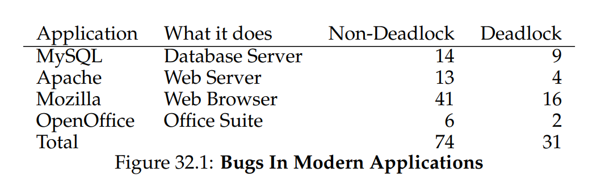
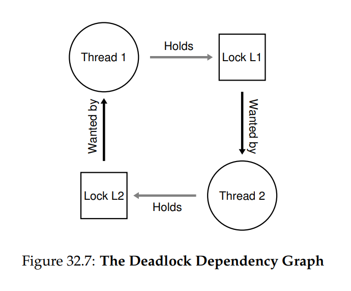
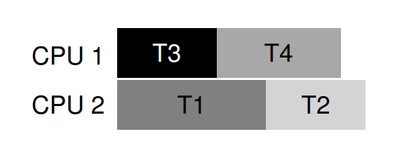
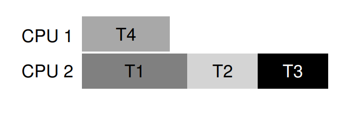

# OSTEP 32：Concurrency Bugs

研究人員多年來投入大量時間與精力研究並行錯誤。 早期研究多聚焦於 deadlock，我們在前章已稍作提及，接下來將深入探討這些主題 [C+71]。 近年則著重於其他常見並行錯誤（即非 deadlock 的錯誤）的研究。 本章將簡要檢視真實程式碼庫中出現的一些並行問題範例，以更清楚了解應注意哪些問題。 因此，本章的核心議題為：

:::info  
如何處理常見的並行錯誤？

並行錯誤通常呈現多種常見模式。 瞭解應警惕哪些模式，是撰寫更穩健且正確並行程式的第一步  
:::

## 32.1 What Types Of Bugs Exist?

首要且最顯而易見的問題是：在複雜的並行程式中，會出現哪些類型的並行錯誤？ 這個問題一般而言很難回答，但幸好已有他人為我們做了研究。 我們特別參考 Lu 等人 [L+08] 的研究，他們深入分析多個流行的並行應用程式，以瞭解實際情況中會出現哪些錯誤

該研究聚焦於四個重要的開源應用程式：MySQL（流行的資料庫管理系統）、Apache（知名的網頁伺服器）、Mozilla（著名的瀏覽器）與 OpenOffice（免費的 Office 套件）。 在研究中，作者檢視了這些程式碼庫中已發現並修復的並行錯誤，並將開發人員的工作轉化為一個量化的錯誤分析； 理解這些結果能幫助你掌握成熟程式碼庫中實際會遇到的問題類型

圖 32.1 彙整了 Lu 等人研究的錯誤統計。 從圖中可見，總共分析了 105 個錯誤，其中大多數（74 個）並非 deadlock，剩下 31 個為 deadlock 錯誤。 此外，圖中還顯示了各應用程式中錯誤的數量； OpenOffice 僅有 8 件並行錯誤，而 Mozilla 則接近 60 件



接下來，我們將更深入探討這兩類錯誤（非 deadlock 與 deadlock）。 對於第一類非 deadlock 錯誤，我們將使用該研究中的實例來展開討論； 至於第二類 deadlock 錯誤，則會介紹過去為預防、避免或處理 deadlock 所做的大量工作

## 32.2 Non-Deadlock Bugs

根據 Lu 的研究，非 deadlock 錯誤佔了並行錯誤的大多數。 但這些錯誤屬於哪些類型？ 它們如何產生？ 又該如何修復？ 現在我們來探討 Lu 等人發現的兩大類非 deadlock 錯誤：atomicity violation bugs 以及 order violation bugs

### Atomicity-Violation Bugs

第一類錯誤稱為 atomicity violation（原子性違反）。 以下是一個在 MySQL 中出現的簡單範例。 在閱讀解說前，你可以先嘗試找出程式中的缺陷

<center-panel natural title="（Figure 32.2: Atomicity Violation (atomicity.c)）">

```c
// Thread 1:

if (thd->proc_info) {
  fputs(thd->proc_info, ...); 
}

// Thread 2:

thd->proc_info = NULL;
```

</center-panel>

在此範例中，兩個不同的執行緒會存取結構 `thd` 的 `proc_info` 欄位。 第一個執行緒檢查該值是不是 non-NULL 的，然後印出它； 第二個執行緒則會將它設成 `NULL`。 顯然，如果第一個執行緒在呼叫 `fputs()` 前完成檢查卻遭中斷，第二個執行緒就可能會在中途將指標設為 `NULL`； 等第一個執行緒恢復執行時，`fputs()` 便會對 `NULL` 指標 dereference 並導致當機

根據 Lu 等人的正式定義，atomicity violation 指的是「多次記憶體存取間預期的可序列化性被破壞（即某段程式區域原本應該是原子性執行的，但在實際執行時並未強制維護原子性）」。 在上述例子中，程式對於 `proc_info` 的非 `NULL` 檢查和緊接著在 `fputs()` 中使用該值，存在原子性假設； 當此假設不成立時，程式就無法正常運作

針對此類問題提出修正通常（但不總是）相對簡單。 你能想出如何修復上面的程式碼嗎？

在此解法（圖 32.3）中，我們只要在共用變數存取處加入鎖，確保每次執行緒要操作 `proc_info` 欄位時，都先取得 `proc_info_lock`。 當然，程式中其他所有存取該結構的程式碼，也都應該先取得此鎖才行

<center-panel natural title="（Figure 32.3: Atomicity Violation Fixed (atomicity fixed.c)）">

```c
pthread_mutex_t proc_info_lock = PTHREAD_MUTEX_INITIALIZER;

// Thread 1:

pthread_mutex_lock(&proc_info_lock);
if (thd->proc_info) {
  fputs(thd->proc_info, ...);
}
pthread_mutex_unlock(&proc_info_lock);

// Thread 2:

pthread_mutex_lock(&proc_info_lock);
thd->proc_info = NULL;
pthread_mutex_unlock(&proc_info_lock);
```

</center-panel>

### Order-Violation Bugs

另一種 Lu 等人發現的非 deadlock 錯誤稱為 order violation（順序違反）。 以下是一個簡單範例，同樣地，先試著看出程式在哪裡出了問題

<center-panel natural title="（Figure 32.4: Ordering Bug (ordering.c)）">

```c
// Thread 1:

void init() 
{
  mThread = PR_CreateThread(mMain, ...); 
}

// Thread 2:

void mMain(...) 
{
  mState = mThread->State; 
}
```

</center-panel>

如你所料，Thread 2 中的程式似乎假設變數 `mThread` 已經完成了初始化（且非 `NULL`）； 但如果 Thread 2 在被建立後立即執行，`mMain()` 存取 `mThread` 時該值尚未被設定，就會因對 `NULL` 指標 dereference 而當機。 請注意，我們假設 `mThread` 的初始值為 `NULL`； 若非如此，Thread 2  dereference 任意記憶體位置時甚至會發生更怪異的錯誤

根據 Lu 等人的正式定義，order violation 指的是「兩個（或多組）記憶體存取之間的預期順序被顛倒（即 A 應始終在 B 之前執行，但在實際執行時並未強制維護此順序）」[L+08]

此類錯誤的修正通常是強制維護順序。 如前所述，使用 condition variables 是向現代程式庫中加入此類同步的簡單且可靠方式。 在上述範例中，我們可將程式重寫為圖 32.5 所示

<center-panel natural title="（Figure 32.5: Fixing The Ordering Violation (ordering fixed.c)）">

```c
pthread_mutex_t mtLock = PTHREAD_MUTEX_INITIALIZER;
pthread_cond_t mtCond = PTHREAD_COND_INITIALIZER;
int mtInit = 0;

// Thread 1:

void init()
{
  ... 
  mThread = PR_CreateThread(mMain, ...);

  // signal that the thread has been created...
  pthread_mutex_lock(&mtLock);
  mtInit = 1;
  pthread_cond_signal(&mtCond);
  pthread_mutex_unlock(&mtLock);
  ...
}

// Thread 2:

void mMain(...)
{
  ...
  // wait for the thread to be initialized...
  pthread_mutex_lock(&mtLock);
  while (mtInit == 0)
    pthread_cond_wait(&mtCond, &mtLock);
  pthread_mutex_unlock(&mtLock);

  mState = mThread->State;
  ...
}
```

</center-panel>

在此修正後的程式中，我們加入了一個 condition variable（`mtCond`）及其對應的鎖（`mtLock`），還有一個用以追蹤狀態的變數 `mtInit`。 當初始化程式執行時，它會將 `mtInit` 設為 1，並對 `mtCond` 發出 signal。 若 Thread 2 在此之前已經執行，它會在等待該 signal 及狀態變更； 若在此之後執行，則會檢查 `mtInit` 並發現初始化已完成（`mtInit` 為 1），便繼續執行。 請注意，為了簡化，我們並未使用 `mThread` 本身作為狀態變數。 當執行緒之間的執行順序至關重要時，condition variables（或 semaphores）就能派上用場

### Non-Deadlock Bugs: Summary

在 Lu 等人研究的非 deadlock 錯誤中，有相當大比例（97%）屬於 atomicity violation 或 order violation。 因此，程式設計師若能針對這兩類錯誤模式進行深入思考，便能更有效地避免它們。 此外，隨著自動化程式檢查工具的發展，開發者應優先針對這兩種錯誤進行檢測，因為它們佔部署中非 deadlock 錯誤的大多數

遺憾的是，並非所有錯誤都像上述範例般易於修復。 有些錯誤需要更深入地理解程式運作原理，或進行較大範圍的程式碼或資料結構重構才能解決。 欲知詳情，請參閱 Lu 等人那篇內容精彩且易讀的論文

## 32.3 Deadlock Bugs

除了前述的並行錯誤外，另一個在具有複雜的鎖協定的並行系統中經常出現的經典問題稱為 deadlock。 deadlock 的典型情況是：執行緒（例如 Thread 1）持有鎖 L1 並等待鎖 L2； 不巧的是，持有鎖 L2 的執行緒（Thread 2）正在等待 L1 被釋放。 以下程式片段展示了可能導致 deadlock 的情境：

<center-panel natural title="（Figure 32.6: Simple Deadlock (deadlock.c)）">

```c
Thread 1:                  Thread 2:
pthread_mutex_lock(L1);    pthread_mutex_lock(L2);
pthread_mutex_lock(L2);    pthread_mutex_lock(L1);
```

</center-panel>

請注意，程式執行時不一定會發生 deadlock； 但若 Thread 1 先取得鎖 L1，接著切換到 Thread 2 執行，Thread 2 再取得 L2 並嘗試取得 L1，便會陷入 deadlock，因為兩者互相等待而無法繼續執行。 圖 32.7 以圖形方式示意此情況：圖中出現的環路即代表 deadlock。 上述說明應該足以讓問題變得清晰。 那麼，程式設計師應如何撰寫程式，才能以某種方式處理 deadlock 呢？



:::info  
如何處理 deadlock？

我們應如何設計系統來預防、避免，或至少偵測並恢復 deadlock？ 這在現今的系統中是否真是個問題？  
:::

### Why Do Deadlocks Occur?

如你所想，上述這類簡單 deadlock 看似很容易避免。 例如，只要 Thread 1 和 2 保持相同的鎖取得順序，就不會發生 deadlock。 那麼，為什麼 deadlock 還是會出現？

其中一個原因是，在大型程式碼庫中，各組件間會產生複雜的相依關係。 以作業系統為例：虛擬記憶體系統可能需要存取檔案系統，將硬碟區塊換入； 而檔案系統又可能需要一頁記憶體來讀取該區塊，進而聯絡虛擬記憶體系統。 因此，在大型系統中設計鎖策略時，必須謹慎考量，以避免程式中自然形成的循環相依導致 deadlock

另一個原因源自封裝（encapsulation）的本質。 作為軟體開發者，我們被教導要隱藏實作細節，以便以模組化方式建構軟體。 可惜，這種模組化與鎖的機制並不相容。 如 Jula 等人所述 [J+08]，某些看似無害的介面幾乎會誘發 deadlock。 例如，Java 中的 Vector 類別及其 `AddAll()` method，使用方式如下：

```c
Vector v1, v2;  
v1.AddAll(v2);  
```

在內部，為了讓此 method 具備多執行緒安全性，必須同時取得目標 vector（v1）與參數 vector（v2）的鎖。 這個 routine 會以某種任意順序（例如先 v1 再 v2）取得鎖，然後將 v2 的內容加入 v1。 若另一個執行緒幾乎同時呼叫 `v2.AddAll(v1)`，便可能發生 deadlock，而這一切對呼叫端來說幾乎毫無察覺

### Conditions for Deadlock

Deadlock 的發生需要以下四個條件同時成立：

- Mutual exclusion：執行緒對其所需的資源（如鎖）擁有排他控制
- Hold-and-wait：執行緒一邊持有已分配給它的資源（如已取得的鎖），一邊等待額外的資源（如想要再取得的鎖）
- No preemption：資源（如鎖）無法被強制從正使用它們的執行緒上移除
- Circular wait：存在一個執行緒環路，每個執行緒都持有下一個執行緒所需要的資源（如鎖）

若以上任一條件不成立，deadlock 就無法發生。 因此，我們首先探討預防 deadlock 的技術； 每種策略都旨在阻止上述某個條件出現，從而作為處理 deadlock 的方法之一

### Prevention

#### Circular Wait

最實用的預防技巧（也是最常被採用的）莫過於在編寫有鎖的程式碼時，保證永不產生 circular wait。 最直接的方法就是對鎖的取得建立 total ordering。 舉例來說，若系統中只有兩把鎖（`L1` 和 `L2`），只要永遠先取得 `L1` 再取得 `L2`，就能避免 deadlock。 如此嚴格的順序能確保不會出現循環等待，因此不會 deadlock

當然，在更複雜的系統中，鎖的數量往往超過兩把，因此要實現 total lock ordering 可能相當困難（甚至不必要）。 此時，partial ordering 就能作為避免 deadlock 的鎖排序問題的策略派上用場。 Linux 的記憶體映射程式碼中 [T+94]（v5.2）有一個真實且出色的 partial lock ordering 範例，原始碼最上方註解列出十組不同的鎖取得順序，包括像 「`i_mutex` before `i_mmap_rwsem`」 這類簡單順序，以及 「`i_mmap_rwsem` before `private_lock` before `swap_lock` before `i_pages_lock`」 這類複雜順序

如你所見，不論是 total 還是 partial ordering，都需要謹慎設計鎖策略並小心實作。 此外，ordering 只是約定俗成的規範，若程式設計師疏忽，仍可能違反協定而引發 deadlock。 最後，鎖的排序還需要對程式庫及各種 routine 的呼叫流程有深入了解，哪怕一處失誤，就可能遇到 deadlock

:::info  
透過鎖的位址強制執行鎖排序

在某些情況下，函數必須同時取得兩把（或更多）鎖，因此我們必須小心，否則可能發生 deadlock。想像一個函數以此方式呼叫：

```c
do_something(mutex_t *m1, mutex_t *m2);
```

若程式總是先鎖 `m1` 再鎖 `m2`（或總是先鎖 `m2` 再鎖 `m1`），就可能發生 deadlock，因為一個執行緒可能呼叫 `do_something(L1, L2)`，而另一個執行緒呼叫 `do_something(L2, L1)`

為避免此問題，聰明的程式設計師可利用鎖的位址作為取鎖的排序依據。 只要按照鎖位址的 high-to-low 或 low-to-high 順序取得鎖，`do_something()` 就能保證鎖的取得順序一致，不受參數傳入順序影響。程式碼示例如下：

```c
if (m1 > m2) { // grab in high-to-low address order
  pthread_mutex_lock(m1);
  pthread_mutex_lock(m2);
} 
else {
  pthread_mutex_lock(m2);
  pthread_mutex_lock(m1);
}
// Code assumes that m1 != m2 (not the same lock)
```

透過這個簡單技巧，程式設計師就能實現簡潔且高效的多鎖取得，並避免 deadlock  
:::

#### Hold-and-wait

要避免 deadlock 的 hold-and-wait 條件，可透過一次性（原子性地）取得所有鎖來實現。 實務上，可參考如下做法：

```c
pthread_mutex_lock(prevention); // begin acquisition  
pthread_mutex_lock(L1);  
pthread_mutex_lock(L2);  
...  
pthread_mutex_unlock(prevention); // end  
```

此程式碼先取得全域鎖 `prevention`，確保在鎖取得過程中不會發生意外的執行緒切換，從而再次避免 deadlock。 當然，這要求任何執行緒每次要取得任何鎖時，都必須先取得 `prevention` 這把全域鎖。 舉例來說，就算另一個執行緒以不同順序嘗試取得 L1 與 L2，也不會有 deadlock，因為它執行時同樣會先持有 `prevention` 這把鎖

請注意，這種解法存在多項問題。 首先，如同先前所述，封裝性（encapsulation）反而成為阻礙：在呼叫的 routine 中，我們必須事先知道並取得所有必要的鎖。 其次，此技術會降低並行度，因為所有鎖都必須一開始就同時取得，而非在真正需要時再動態獲取

#### No Preemption

由於我們通常認為鎖會一直持有到呼叫 unlock 為止，需要取得多把鎖的狀況常常會出問題，因為你在等待一把鎖時可能手上已經持有另一把鎖了，導致互相等待。 許多執行緒函式庫提供更彈性的介面來避免這種情況，具體而言，`pthread_mutex_trylock()` 函式要麼在鎖可用時取得鎖並返回成功，要麼返回錯誤碼表示該鎖已被持有； 在後者情況下，你可以稍後再試一次以取得該鎖

這類介面可用於構建一種既無 deadlock，順序性容錯又很高的取鎖協定，如下所示：

```c
top:
  pthread_mutex_lock(L1);
  if (pthread_mutex_trylock(L2) != 0) {
    pthread_mutex_unlock(L1);
    goto top;
  }
```

請注意，另一個執行緒也可以遵循相同協定，但以相反地順序取得鎖（先 `L2` 再 `L1`），程式依然不會 deadlock。 不過這會產生一個新問題：livelock。 有可能（雖然或許不太常見）兩個執行緒反覆執行這段程式，卻都無法同時取得兩把鎖。 在此情況下，兩者不斷重複跑這段程式（因此這不是 deadlock），卻也沒有任何進展，因而稱為 livelock。 livelock 也有解決的方法：例如在每次重試前加入隨機延遲，以降低競爭執行緒之間的連續干擾機率

不過，這種解法有一點需要注意：它無視了 trylock 方法的難點。 第一個可能出現的問題仍然源自封裝性：若其中一把鎖藏在某個被呼叫的 routine 裡，實作時要在失敗後跳回開頭的難度就更為複雜了（roll back 難度較高）。 若程式在此過程中已取得其他資源（非 `L1`），它必須在無法取得 `L2` 時，同步釋放那些資源； 例如，若在取得 `L1` 後配置了記憶體，就必須在重試前先釋放該記憶體。 不過，在某些受限情境下（如前述的 Java Vector 方法），此做法仍能帶來好處並順利運作

你或許也會注意到，此方法並未真正引入 preemption（強制從持有鎖的執行緒手中奪取鎖），而是透過 trylock 機制，讓開發者能優雅地放棄自己對鎖的持有（即自行 preempt）。 儘管在這方面並不完美，但它確實具有實用性

#### Mutual Exclusion

最後一種預防技巧是徹底避免 mutual exclusion 的需求。 一般而言，我們知道這很困難，因為待執行的程式確實包含 critical section。 那麼，我們該怎麼做？

Herlihy 提出可以在完全不使用鎖的情況下設計各種資料結構 [H91, H93]。 這些 lock-free（及相關的 wait-free）方法的核心思想很簡單：利用強大的硬體指令，以不需顯式加鎖的方式構建資料結構

舉個簡單例子，假設我們有一條 compare-and-swap 指令，你或許還記得它是由硬體提供的原子性指令，其行為如下：

```c
int CompareAndSwap(int *address, int expected, int new) {
  if (*address == expected) {
    *address = new;
    return 1; // success
  }
  return 0; // failure
}
```

假設我們想利用 compare-and-swap 原子性地將某個值增加指定量，就可以寫出下列簡易函式：

```c
void AtomicIncrement(int *value, int amount) {
  do {
    int old = *value;
  } while (CompareAndSwap(value, old, old + amount) == 0);
}
```

我們並非先加鎖再更新後解鎖，而是反覆嘗試用 compare-and-swap 將值更新到新數值。 如此一來，不需要取得任何鎖，也不會產生 deadlock（不過 livelock 仍有可能發生，因此實際可用的解法會比上述簡單程式更複雜）

接著看一個稍微複雜的例子：list 的插入。 以下程式片段示範在 list head 插入節點：

```c
void insert(int value) {
  node_t *n = malloc(sizeof(node_t));
  assert(n != NULL);
  n->value = value;
  n->next = head;
  head = n;
}
```

這段程式完成簡單的插入，但若有多個執行緒「同時」呼叫，就會出現 race condition。 你能說出原因嗎？（想像兩個插入操作同時執行，並以最不利的排程交錯，串列會變成什麼樣子）。 當然，我們可以透過在程式周圍加上取鎖和解鎖來解決：

```c
void insert(int value) {
  node_t *n = malloc(sizeof(node_t));
  assert(n != NULL);
  n->value = value;
  pthread_mutex_lock(listlock); // begin critical section
  n->next = head;
  head = n;
  pthread_mutex_unlock(listlock); // end critical section
}
```

在此解法中，我們採用了傳統的加鎖方式。 下面改成 lock-free 實作，僅使用 compare-and-swap 指令。 其中一種寫法如下：

```c
void insert(int value) {
  node_t *n = malloc(sizeof(node_t));
  assert(n != NULL);
  n->value = value;
  do {
    n->next = head;
  } while (CompareAndSwap(&head, n->next, n) == 0);
}
```

此程式先將新節點的 next 指向當前 head，然後嘗試以 compare-and-swap 將 head 換成新節點。 若此間有其他執行緒已成功換入新 head，則 compare-and-swap 會失敗，本執行緒便重試並帶入新的 head。 當然，要構建實用的串列不僅是單純插入節點； 毫不意外地，要完成能夠插入、刪除與查詢的 lock-free list 並非易事。 如欲深入了解，請參閱豐富的 lock-free 和 wait-free 同步文獻 [H01, H91, H93]

:::info  
精明的讀者或許會好奇，為什麼我們要延遲到插入操作到快完成時才取鎖，而不是一進入 `insert()` 就上鎖？ 你能分析出這樣做為何合理嗎？ 例如，程式對 `malloc()` 有哪些前提假設？

- 首先，`malloc()` 只處理私有記憶體分配，不會接觸共享資料結構，因此可在不持有鎖的情況下安全呼叫
- 其次，插入節點的 value 與 next 欄位都是新配置、未公開給其他執行緒的記憶體，也不需要鎖保護
- 最後，上鎖時間只要涵蓋對 head 與 next 指標的修改即可，這最小化了 critical section 的範圍，提高並行的效能
:::

### Deadlock Avoidance via Scheduling

在某些情境下，我們寧可採用 deadlock avoidance 而非 prevention。 avoidance 需要對各執行緒在執行期間可能取得的鎖有全域性的了解，並以此資訊排程，確保永不發生 deadlock

舉例來說，假設有兩個處理器和四個執行緒必須在其上排程；且我們知道 T1 在執行期間會取得 `L1` 與 `L2`（任意順序）、T2 同樣取得 `L1` 與 `L2`、T3 只取得 `L2`、T4 則不會取得任何鎖。 我們可將這些鎖需求以表格呈現：

<center-panel natural>

| | T1 | T2 | T3 | T4 |
|-|-|-|-|-|
| L1| yes| yes| no| no|
| L2| yes| yes| yes| no|

</center-panel>

聰明的排程器便可計算：只要 T1 和 T2 永不同時執行，就不會有 deadlock。 下列即為一種可行排程：



請注意，（T3 與 T1） 或（T3 與 T2） 同時執行是沒問題的。 儘管 T3 會取得 `L2`，但它僅持有一把鎖，無法與其他執行緒並行時引發 deadlock

再來看另一個例子。 在此例中，對相同資源（即 L1 與 L2）的競爭更激烈，其鎖需求表如下：

<center-panel natural>

| | T1 | T2 | T3 | T4 |
|-|-|-|-|-|
| L1 | yes | yes | yes | no |
| L2 | yes | yes | yes | no |

</center-panel>

具體而言，T1、T2、T3 都會在執行期間取得 `L1` 與 `L2`。 下方是一種可保證永不 deadlock 的排程：



如你所見，靜態排程採取保守策略，將 T1、T2、T3 全部分配到同一處理器，導致整體執行時間大幅增加。 雖然可以考慮同時執行這些工作，但因為怕 deadlock，所以不敢，代價便是效能下降

這類方法的著名範例是 Dijkstra 的 Banker’s Algorithm [D64]，文獻中也有許多類似作法。 遺憾的是，它們僅適用於非常受限的環境，例如嵌入式系統，在那裡我們能完全掌握所有待執行任務及其鎖需求； 更何況，這種方式如前例所示，也會限制並行度。 因此，透過排程避免 deadlock 並非通用的常用解法

:::info  
不必事事完美（Tom West’s Law）

Tom West 以《Soul of a New Machine》[K81] 一書主角身分知名，他的名言是：「Not everything worth doing is worth doing well」，這是一句絕佳的工程格言。 若某件壞事極罕發生，且其後果輕微，就沒必要花大把心力去預防； 但若你在打造太空梭，一旦出了錯就可能爆炸，那麼也許就該無視這句忠告

有讀者可能會抗議：「這聽起來像是在提倡平庸！」或許他們有道理，我們也應謹慎對待此類建議。 不過，根據經驗，在工程領域面對緊迫時程與各種現實問題時，總得取捨哪些部分要高品質完成、哪些可留待日後。 困難之處就在於知道何時該做何種取捨，這只有透過經驗與對手上任務的投入才能獲得  
:::

### Detect and Recover

最後一種常見策略是允許 deadlock 偶爾發生，然後在偵測到 deadlock 後採取對應措施。 例如，如果作業系統一年才凍結一次，你只需重新啟動即可繼續工作。 若 deadlock 非常少見，這樣的「非解決方案」其實相當務實

許多資料庫系統都採用 deadlock 偵測與復原技術。 系統會定期執行 deadlock 偵測器，建構資源圖並檢查其中是否有環路。 若發現環路（deadlock），便需重新啟動系統； 若先前需要更複雜的資料結構修復，則可能由人工介入協助

欲進一步了解資料庫並行性、deadlock 及相關議題，請參考其他文獻 [B+87, K87]。 閱讀這些著作，或者更進一步，修習資料庫課程以深入探究這個豐富且有趣的領域

## 32.4 Summary

在本章中，我們探討了並行程式中會出現的錯誤類型。 第一類為非 deadlock 錯誤，出乎意料地相當常見，但修復起來通常比較容易。 這類錯誤包括 atomicity violation —— 原本應一起執行的指令序列未能維持原子性，以及 order violation —— 兩個執行緒之間的必要順序未被強制維護

我們也簡要討論了 deadlock：它為何發生，以及可採取的對策。 deadlock 問題與並行本身一樣古老，相關論文不計其數。 實務上最佳做法是謹慎行事，制定明確的鎖取得順序，從根本上預防 deadlock。 wait-free 方法也具潛力，因為部分 wait-free 資料結構已經進入常用函式庫和關鍵系統（如 Linux）

然而，這些方法因缺乏通用性且開發新型 wait-free 資料結構複雜，使用範圍可能受限。 或許最理想的解法是發展新的並行程式設計模式：如 Google 的 MapReduce [GD02]，程式設計師可以在完全不使用鎖的情況下描述某些平行計算。 由於鎖的本質上存在問題，我們應儘可能避免使用它們，除非萬不得已

## References

- [B+87] “Concurrency Control and Recovery in Database Systems” by Philip A. Bernstein, Vassos Hadzilacos, Nathan Goodman. Addison-Wesley, 1987.  
  資料庫管理系統中並行控制與復原的經典著作，對資料庫領域的並行、deadlock 與相關議題有深入探討  

- [C+71] “System Deadlocks” by E.G. Coffman, M.J. Elphick, A. Shoshani. ACM Computing Surveys 3(2), June 1971.  
  首度系統化闡述 deadlock 發生條件及處理方法的經典論文，後續研究紛紛引用  

- [D64] “Een algorithme ter voorkoming van de dodelijke omarming” by Edsger Dijkstra. 1964.  
  Dijkstra 最早指出並解決「致命擁抱」（deadly embrace，也即 deadlock）問題的論文  

- [GD02] “MapReduce: Simplified Data Processing on Large Clusters” by Sanjay Ghemawat, Jeff Dean. OSDI ’04, October 2004.  
  開創大規模叢集資料處理時代的 MapReduce 架構論文，提出無需鎖即可完成平行計算的思路  

- [H01] “A Pragmatic Implementation of Non-blocking Linked-lists” by Tim Harris. DISC 2001.  
  較現代的 lock-free 鏈結串列實作範例，展示不使用鎖的複雜性與挑戰  

- [H91] “Wait-free Synchronization” by Maurice Herlihy. ACM TOPLAS 13(1), January 1991.  
  開創 wait-free 同步方法的先驅性論文，提出無鎖且保證有限步驟完成的同步設計  

- [H93] “A Methodology for Implementing Highly Concurrent Data Objects” by Maurice Herlihy. ACM TOPLAS 15(5), November 1993.  
  系統性介紹 lock-free 與 wait-free 資料結構的論文，分別探討兩者的優劣與實作要點  

- [J+08] “Deadlock Immunity: Enabling Systems To Defend Against Deadlocks” by Horatiu Jula, Daniel Tralamazza, Cristian Zamfir, George Candea. OSDI ’08, December 2008.  
  針對系統層面 deadlock 防禦提出創新思路的最新論文，示範如何免於重複陷入相同的 deadlock  

- [K81] “Soul of a New Machine” by Tracy Kidder. Backbay Books, 2000 (reprint of 1980).  
  經典系統開發紀實，描述 Data General 團隊打造新機的點滴，是系統工程師必讀之作  

- [K87] “Deadlock Detection in Distributed Databases” by Edgar Knapp. ACM Computing Surveys 19(4), December 1987.  
  分散式資料庫中 deadlock 偵測與復原技術的綜覽論文，並指引相關研究方向  

- [L+08] “Learning from Mistakes—A Comprehensive Study on Real World Concurrency Bug Characteristics” by Shan Lu, Soyeon Park, Eunsoo Seo, Yuanyuan Zhou. ASPLOS ’08, March 2008.  
  首篇深入研究真實軟體中並行錯誤特性的論文，揭示非 deadlock 錯誤類型並驅動本章討論  

- [T+94] “Linux File Memory Map Code” by Linus Torvalds et al. v5.2 source: mm/filemap.c.  
  Linux 記憶體對映程式碼中的 partial lock ordering 範例，展示實務中鎖策略的複雜性  
