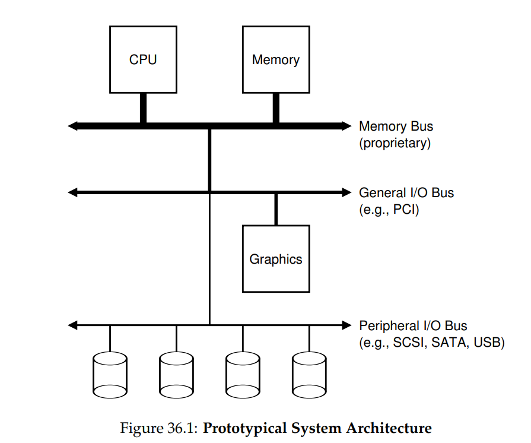
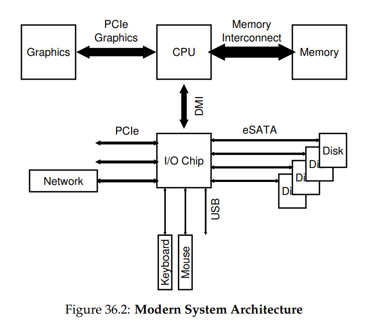
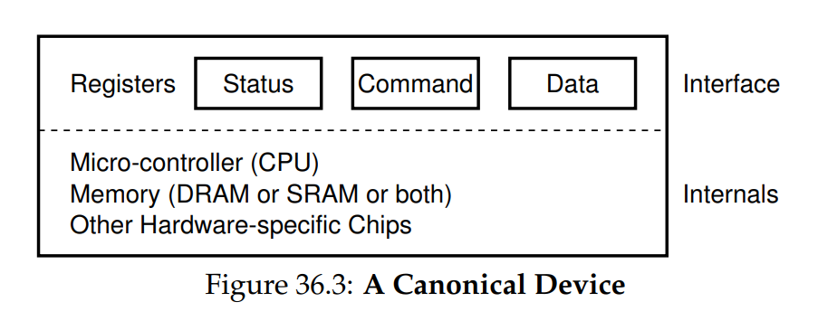
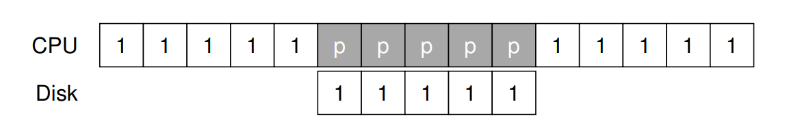
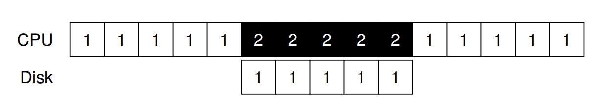
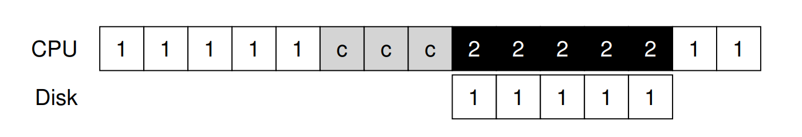
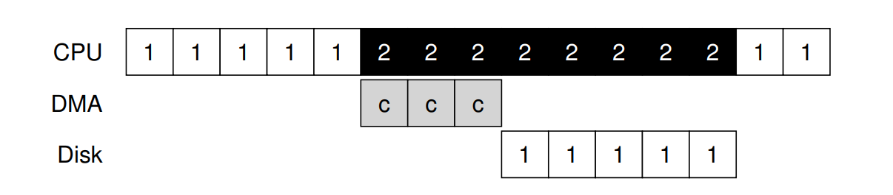
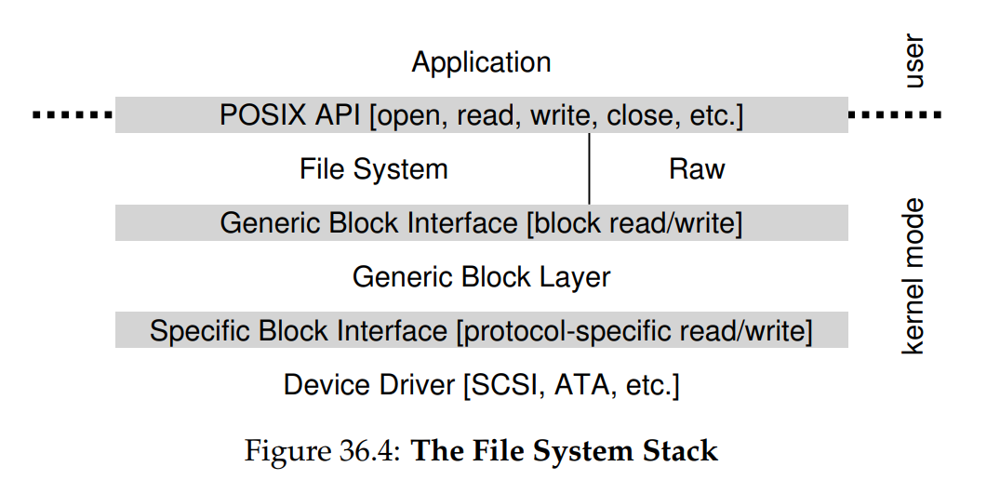

# OSTEP 36：I/O Devices

在深入 persistence 的主要內容之前，我們先介紹 I/O 裝置的概念，並說明作業系統如何與此類實體互動。 I/O 對電腦系統當然至關重要； 想像一個沒有任何輸入的程式（每次都產生相同結果），或是一個沒有任何輸出的程式（它執行的目的何在？）。 明顯地，要使電腦系統具有意義，就必須同時具備輸入與輸出

因此，我們的問題是：如何將 I/O 整合到系統中？ 一般的機制是什麼？ 我們如何讓它們更有效率？

## 36.1 System Architecture

在開始討論之前，讓我們先看一張典型系統的「經典」示意圖（圖 36.1）。 此圖顯示單顆 CPU 透過某種記憶體匯流排（bus）或互聯（interconnect）連接到系統的主記憶體。 有些裝置則透過通用 I/O 匯流排連到系統，在許多現代系統中這通常是 PCI（或其多種衍生版本）； 在此位置可能會找到顯示卡及其他較高效能的 I/O 裝置。 最後，還有更低階的所謂週邊匯流排，例如 SCSI、SATA 或 USB。 這些匯流排用來連接較慢的裝置到系統，包括硬碟、滑鼠與鍵盤



你可能會問：為何需要這樣的階層式結構？ 這主要是物理與成本的考量。 匯流排速度越快，其長度就必須越短； 因此，高效能的記憶體匯流排沒有太多空間可以插接裝置等。 此外，設計高效能匯流排成本相當高昂。 因此，系統設計人員採用了這種階層式方法，將需要高效能的元件（例如顯示卡）放在較貼近 CPU 的位置，效能較低的元件則放得較遠。 將硬碟與其他較慢的裝置放在週邊匯流排上的好處多不勝數，尤其是可放置大量裝置這點

當然，現代系統越來越多地使用專用晶片組與更快速的點對點互聯來提升效能。 圖 36.2 大致展示了 Intel Z270 晶片組的架構 [H17]。 在最上方，CPU 與記憶體系統之間的連線最為緊密，並且還有一條高效能連接提供給顯示卡（以及顯示器），以支援遊戲和其他圖形密集型應用



CPU 透過 Intel 專有的 DMI（Direct Media Interface）連接到一顆 I/O 晶片，其餘裝置則通過多種不同互聯方式連到這顆晶片。 在右方，一顆或多顆硬碟透過 eSATA 介面連接到系統； 過去幾十年儲存介面的也演進了許多，從一開始的 ATA（AT Attachment，指為 IBM PC AT 提供連接）、到後來的 SATA（Serial ATA），再到現在的 eSATA（external SATA），每一次推進都提升了效能以跟上現代儲存裝置的需求

在 I/O 晶片下方有多個 USB（Universal Serial Bus）連接埠，此圖中用來將鍵盤與滑鼠連接到電腦。 在許多現代系統中，USB 會用在這類效能較低的裝置上

最後，在左側，其他較高效能的裝置可透過 PCIe（Peripheral Component Interconnect Express）連接到系統。 在本圖中，一個網路介面連接在此； 另外，一些效能更高的儲存裝置（例如 NVMe 固態儲存設備）通常也連接於此處

## 36.2 A Canonical Device

讓我們現在來看看一個典型的 I/O 裝置（但不真實存在），並利用此裝置來理解如何提高裝置互動的效率。 從圖 36.3 中我們可以看出一個裝置有兩個重要的組成部分。 第一是它向系統其餘部分呈現的硬體介面，就像一般的軟體一樣，硬體也必須呈現某種類型的介面，以便系統軟體能控制其操作。 因此，所有裝置都具有一些指定的介面和典型互動協定

任何裝置的第二部分是其內部結構。 這部分的裝置實作細節具有特定性，並負責實現該裝置向系統呈現的抽象。 非常簡單的裝置會有一個或少數硬體晶片來實作其功能； 更複雜的裝置則會包含一顆簡易 CPU、一些通用記憶體，以及其他裝置專用晶片以完成其工作。 例如，現代 RAID 控制器可能包含數十萬行韌體（即嵌入在硬體裝置內的軟體）來實作其功能



## 36.3 The Canonical Protocol

在上圖中，（簡化的）裝置介面由三個暫存器組成：一個狀態暫存器，可用來讀取裝置當前狀態； 一個命令暫存器，用以告知裝置執行特定工作； 以及一個資料暫存器，用於向裝置傳送資料或從裝置擷取資料。 透過讀寫這些暫存器，作業系統即可控制裝置行為

現在讓我們看看作業系統與裝置的互動，以檢視系統執行操作的典型流程，協定如下：

```c
While (STATUS == BUSY)  
  ; // wait until device is not busy  
Write data to DATA register  
Write command to COMMAND register  
  (starts the device and executes the command)  
While (STATUS == BUSY)  
  ; // wait until device is done with your request  
```

協定包含四個步驟：
1. 第一步，作業系統不斷讀取狀態暫存器，直到裝置準備好接收命令，我們稱此為輪詢（polling）裝置（基本上就是詢問它目前狀況）
2. 第二步，作業系統將資料寫入資料暫存器； 例如，若此裝置為硬碟，可能需要多次寫入才能將一個硬碟區塊（例如 4KB）傳送到裝置。 當主 CPU 有參與資料傳輸（如本範例協定所示）時，我們稱之為 programmed I/O（PIO）
3. 第三步，作業系統將命令寫入命令暫存器； 如此做會隱含地告知裝置資料已就緒，並應開始處理該命令
4. 最後，作業系統再度通過迴圈輪詢裝置，等待其完成（此時可能會取得錯誤代碼以表示成功或失敗）

這個基本協定的優點在於簡單且能正常運作。 然而，它也包含一些低效率與不便之處。您可能首先注意到的問題是輪詢效率不佳； 具體而言，它浪費大量 CPU 時間僅用於等待（可能很慢的）裝置完成作業，而無法切換到其他就緒的程序以更有效地使用 CPU

:::info  
如何避免輪詢成本？

作業系統如何在不頻繁輪詢的情況下檢查裝置狀態，從而降低管理裝置所需的 CPU 開銷？  
:::

## 36.4 Lowering CPU Overhead With Interrupts

多年前，為了改善這種交互，許多工程師想出了一項我們已經見過的發明：中斷。 OS 不必反覆輪詢裝置，而是可以發出請求，將呼叫中的 process 進入睡眠，並 context switch 到另一個任務。 當裝置最終完成操作時，它會引發 hardware interrupt，使 CPU 跳轉到預先設定的 interrupt service routine（ISR），或簡單來說，就是中斷處理程式

該處理程式就如前面章節所述，是一段作業系統程式碼，用來完成請求（例如從裝置讀取資料以及可能的錯誤代碼），並喚醒正在等待 I/O 的 process，使其如預期繼續執行。 中斷因此允許 computation 與 I/O 重疊運作，這對提升利用率至關重要。 以下時間軸用來展示我們的問題：



在圖中，Process 1 在 CPU 上執行一段時間（在 CPU 線上以重複的 "1" 表示），然後向硬碟提出 I/O 請求以讀取一些資料。 如果不使用中斷，系統會一直自旋，反覆輪詢裝置狀態，直到 I/O 完成（以 "p" 表示）。 硬碟處理該請求後，Process 1 最終可以再次執行。 如果改為使用中斷並允許重疊，OS 就可以在等待硬碟期間執行其他工作：



此時 OS 在硬碟服務 Process 1 的請求時，便能於 CPU 上執行 Process 2。 當硬碟請求完成時，就會發生中斷，OS 隨即喚醒 Process 1 並重新執行。 因此，在中間那段時間內，CPU 和硬碟都能被妥善利用。 請注意，使用中斷並不總是最佳解決方案。 例如，假設某個裝置執行任務非常快速：第一次輪詢就會發現裝置已完成。 在這種情況下使用中斷反而會降低系統效能：切換到另一個 process、處理中斷，然後再切回發出請求的 process 都會產生開銷

因此，如果裝置很快，或許直接輪詢較好；如果裝置很慢，則允許重疊的中斷是最佳選擇。 如果無法事先知道裝置速度，或裝置有時快、有時慢，可能最好先輪詢一段時間，若裝置尚未完成再改用中斷。 這種兩階段做法或許能兼顧兩者的優點

在網路中，還有另一個不使用中斷的理由 [MR96]。 如果大量傳入的封包陸續產生中斷，OS 可能會陷入 livelock，也就是只處理中斷而永遠不允許 user-level process 執行並真正處理請求。 例如，想像一個 web server 因為登上 hacker news 而經歷流量突增 [H18]。 在這種情況下，偶爾用輪詢來更好地控制系統狀態，並讓 web server 先服務部分請求，再回到裝置檢查是否有更多封包到達，反而更好

另一種基於中斷的優化技術是合併（coalescing）。 在這種架構中，須要引發中斷的裝置會先等候一段時間，然後再向 CPU 發送中斷。 在等候期間，其他請求可能很快完成，於是多個中斷就能合併成單一中斷，從而減少中斷處理的開銷。 當然，等得太久就會增加請求的延遲，這是系統中的常見權衡。 詳情請參閱 Ahmad 等人 [A+11] 的優秀綜述

:::info  
中斷並不總是比輪詢更好

雖然中斷允許 computation 與 I/O 重疊，但它們只有在裝置較慢時才真正有意義。 否則，中斷處理與 context switching 的開銷可能超過中斷帶來的好處。 也有情況下，大量中斷會使系統不堪負荷並導致 livelock [MR96]；在這些情況下，輪詢能讓 OS 在排程上擁有更多控制權，因而再次派上用場  
:::

## 36.5 More Efficient Data Movement With DMA

不幸地，我們的經典協議還有另一個面向需要關注。 特別是當使用 programmed I/O（PIO） 將大量資料傳送到裝置時， CPU 又一次被繁瑣的工作所壓垮，因此浪費了大量本可用於執行其他 Process 的時間與精力。 下列時間軸說明了這個問題：



在時間軸中，Process 1 正在執行，並希望將一些資料寫入硬碟。 接著它啟動 I/O，必須一次一個 word 地從記憶體將資料複製到裝置（在圖中標示為 `c`）。 當複製完成後，I/O 即在硬碟上開始作業，而 CPU 才能最終用於其他事情

解決這個問題的方法就是我們所謂的 Direct Memory Access（DMA）。 DMA engine 本質上是在系統中一個專用裝置，能夠在 minimal CPU 介入下協調裝置和主記憶體之間的傳輸

DMA 的運作如下。 例如要將資料傳送到裝置時，OS 會將指令寫入 DMA engine，告訴它資料在記憶體中的位置、要複製多少資料，以及要傳送到哪個裝置。 在那之後，OS 就完成了此次傳輸，能夠繼續執行其他工作。 當 DMA 完成時，DMA controller 會引發 interrupt，OS 因此知道傳輸已結束。 下方為修正後的時間軸：



從時間軸可以看出，資料複製現由 DMA controller 處理。 由於在那段時間內 CPU 處於閒置狀態，OS 可以執行其他工作，此處選擇執行 Process 2。 Process 2 因此能在 Process 1 再度執行之前多使用一些 CPU 時間

:::info  
如何降低 PIO 的開銷

使用 PIO 時， CPU 花費過多時間手動在裝置與記憶體之間搬移資料。 我們如何卸載這項工作，讓 CPU 得以更有效率地被利用？  
:::

## 36.6 Methods Of Device Interaction

現在我們已經對執行 I/O 所牽涉的效能問題有了初步了解，但還有一些其他問題需要處理，以便將裝置整合到現代系統中。 迄今為止，你可能已經注意到的一個問題是：我們還沒有真正說明 OS 到底如何與裝置溝通！ 因此，問題如下：

:::info  
如何與裝置通訊

硬體應該如何與裝置溝通？ 應該有顯式指令嗎？ 還是有其他方法？  
:::

隨著時間演進，已經發展出兩種主要的裝置通訊方法。 第一種，也是最古老的方法（IBM 主機多年來使用的方式），就是採用顯式的 I/O 指令。 這些指令可讓 OS 將資料傳送到特定的裝置暫存器，從而能夠構建上述所描述的協定

例如，在 x86 架構上，`in` 和 `out` 指令可用於與裝置通訊。 比方說要傳送資料到某個裝置，呼叫者會指定一個暫存器，裡面放入要傳送的資料，並指定一個命名該裝置的 port。 執行該指令後，便會產生預期的行為

這類指令通常是特權指令。 由於 OS 負責控制裝置，因此只有 OS 才被允許直接與它們通訊。 想像如果任何程式都能讀寫硬碟，那將是個災難，因為任何使用者程式都可以利用這種後門來取得對整部主機的完全控制

與裝置互動的第二種方法稱為 memory-mapped I/O。 採用這種方式時，硬體會將裝置暫存器映射為記憶體位置。 若要存取某個特定的暫存器，OS 就對該位址發出 load（讀取）或 store（寫入）指令； 硬體會將該 load/store 導向裝置，而非導向主記憶體

這兩種方法各無絕對優勢。 memory-mapped 方式的好處在於不需要新增指令即可支援，但事實上至今兩種方法仍然並存應用於現代系統中

## 36.7 Fitting Into The OS: The Device Driver

最後一個問題是：如何將那些具有非常具體的介面的裝置，整合到我們希望儘可能保持通用的 OS 中。 舉例來說，考慮一個檔案系統。 我們想要建立一個可以運作於 SCSI 硬碟、IDE 硬碟、USB keychain 隨身碟等裝置之上的檔案系統，而且我們希望該檔案系統不需要在意如何向這些不同類型的硬碟發出讀寫請求的細節。 因此，我們面臨的問題是：

:::info  
如何構建一個對裝置中立的 OS

我們如何讓 OS 大部分保持對裝置中立，從而將裝置互動的細節隱藏在主要 OS 子系統之外？  
:::

這個問題是透過抽象化來解決的，在最底層，OS 中的一段軟體必須詳細瞭解目標裝置的運作方式。 我們稱這段軟體為裝置驅動程式，所有與裝置互動的具體細節都被封裝在其中。 讓我們透過觀察 Linux 檔案系統的 software stack，來看看這種抽象如何有助於 OS 的設計與實作。 Figure 36.4 是 Linux software organization 給出的大致而粗略地概念圖：



從圖中可以看出，檔案系統（當然還有上層的應用程式）完全不需瞭解它正在使用哪種類別的硬碟細節； 它只要向通用區塊層發出區塊讀取與寫入請求，該層再將請求導向適當的裝置驅動程式，由驅動程式處理發出具體請求的細節。 雖然圖示經過簡化，卻展示了如何將此類細節隱藏於大多數 OS 組件之外

圖中還顯示了一個對裝置的 raw 介面，這使得一些特殊應用（例如稍後描述的 file-system checker [AD14]，或硬碟重組工具）能夠在不使用檔案抽象的情況下，直接讀取與寫入區塊。 大多數系統都提供這種類型的介面，以支援這些低階儲存管理應用

請注意，上述封裝也可能有其缺點。 例如，如果有一個具備許多特殊功能的裝置，卻必須向核心其餘部分呈現通用介面，那些特殊功能就會被閒置而未加利用。 這種情況在 Linux 中的 SCSI 裝置上會發生，因為它們擁有非常豐富的錯誤報告；　但由於其他區塊裝置（例如 ATA/IDE）的錯誤處理相對簡單，較高階的軟體層級所接收到的都只是通用的 EIO（generic IO error）錯誤代碼； 任何 SCSI 可能提供的額外細節就也因此無法傳遞給檔案系統 [G08]

有趣的是，因為不論你插入什麼裝置，都需要相對應的裝置驅動程式，隨著時間推移，驅動程式已占據核心程式碼的極大部分。 研究顯示，在 Linux 核心中，超過 70% 的 OS 程式碼都位於裝置驅動程式之中 [C01]； 對於 Windows 系統，這個比例應該也相當高。 因此，當別人告訴你 OS 有數百萬行程式碼時，他們真正想說的是 OS 具有數百萬行驅動程式的程式碼

當然，對於任何特定組態而言，大多數的程式碼可能並未啟用（也就是，一次只有少數幾個裝置連接到系統）。 更令人沮喪的是，由於驅動程式通常由「業餘人士」撰寫（而非全職核心開發人員），它們往往包含更多 bug，因而成為導致核心異常關鍵因素 [S03]

## 36.8 Case Study: A Simple IDE Disk Driver

我們在此來快速看看一個實際的裝置：IDE 硬碟驅動器 [L94]。 我們根據此參考文獻 [W10] 摘要描述該協定，並且也會查看 xv6 原始碼，以示範一個可運作 IDE 驅動程式的簡單範例 [CK+08]

IDE 硬碟對系統提供了一個簡單介面，由四種暫存器組成：control、command block、status 以及 error。 這些暫存器可透過在特定「I/O 位址」（例如下方的 `0x3F6`）上使用 x86 架構的 `in` 與 `out` I/O 指令進行讀寫。 假設裝置已完成初始化，那與之互動的基本協定如下

- 等待硬碟準備就緒：讀取 Status Register（`0x1F7`），直到硬碟為 `READY` 且不為 `BUSY`
- 將參數寫入 command 暫存器：寫入扇區數量、要存取的扇區的 logical block address（LBA），以及硬碟編號（`master=0x00` 或 `slave=0x10`，因為 IDE 僅允許兩顆硬碟）至 command 暫存器（`0x1F2 ~ 0x1F6`)
- 啟動 I/O：向 command 暫存器（`0x1F7`） 寫入 `READ | WRITE` 指令
- 資料傳輸（寫入時）：等待硬碟狀態為 `READY` 且 `DRQ`（硬碟請求資料），然後將資料寫入 data 埠
- 處理中斷：最簡單的情況是每傳輸一個扇區處理一次中斷； 更複雜的做法則允許批次傳輸，直到整個傳輸完成後再觸發最後一次中斷
- 錯誤處理：每次操作後都讀取 status 暫存器； 若 ERROR 位元為 1，就讀取 error 暫存器以取得詳細資訊

<center-panel natural title="（Figure 36.5: The IDE Interface）">

```asm
Control Register:
  Address 0x3F6 = 0x08 (0000 1RE0): R=reset,
                  E=0 means "enable interrupt"

Command Block Registers:
  Address 0x1F0 = Data Port
  Address 0x1F1 = Error
  Address 0x1F2 = Sector Count
  Address 0x1F3 = LBA low byte
  Address 0x1F4 = LBA mid byte
  Address 0x1F5 = LBA hi byte
  Address 0x1F6 = 1B1D TOP4LBA: B=LBA, D=drive
  Address 0x1F7 = Command/status

Status Register (Address 0x1F7):
   7       6    5      4    3    2    1     0
  BUSY   READY FAULT SEEK  DRQ  CORR IDDEX ERROR

Error Register (Address 0x1F1): (check when ERROR==1)
   7       6    5      4    3    2    1     0
  BBK     UNC   MC   IDNF  MCR  ABRT T0NF  AMNF

  BBK = Bad Block
  UNC = Uncorrectable data error
  MC = Media Changed
  IDNF = ID mark Not Found
  MCR = Media Change Requested
  ABRT = Command aborted
  T0NF = Track 0 Not Found
  AMNF = Address Mark Not Found
```

</center-panel>

大部分這些協定都在 xv6 IDE 驅動程式中實作（見 Figure 36.6）：

<center-panel natural title="（Figure 36.6: The xv6 IDE Disk Driver (Simplified)）">

```c
static int ide_wait_ready()
{
  while (((int r = inb(0x1f7)) & IDE_BSY) || !(r & IDE_DRDY))
    ; // loop until drive isn’t busy
  // return -1 on error, or 0 otherwise
}

static void ide_start_request(struct buf* b)
{
  ide_wait_ready();
  outb(0x3f6, 0);                        // generate interrupt
  outb(0x1f2, 1);                        // how many sectors?
  outb(0x1f3, b->sector & 0xff);         // LBA goes here ...
  outb(0x1f4, (b->sector >> 8) & 0xff);  // ... and here
  outb(0x1f5, (b->sector >> 16) & 0xff); // ... and here!
  outb(0x1f6, 0xe0 | ((b->dev & 1) << 4) | ((b->sector >> 24) & 0x0f));
  if (b->flags & B_DIRTY) {
    outb(0x1f7, IDE_CMD_WRITE);     // this is a WRITE
    outsl(0x1f0, b->data, 512 / 4); // transfer data too!
  }
  else {
    outb(0x1f7, IDE_CMD_READ); // this is a READ (no data)
  }
}

void ide_rw(struct buf* b)
{
  acquire(&ide_lock);
  for (struct buf** pp = &ide_queue; *pp; pp = &(*pp)->qnext)
    ;                     // walk queue
  *pp = b;                // add request to end
  if (ide_queue == b)     // if q is empty
    ide_start_request(b); // send req to disk
  while ((b->flags & (B_VALID | B_DIRTY)) != B_VALID)
    sleep(b, &ide_lock); // wait for completion
  release(&ide_lock);
}

void ide_intr()
{
  struct buf* b;
  acquire(&ide_lock);
  if (!(b->flags & B_DIRTY) && ide_wait_ready() >= 0)
    insl(0x1f0, b->data, 512 / 4); // if READ: get data
  b->flags |= B_VALID;
  b->flags &= ˜B_DIRTY;
  wakeup(b);                       // wake waiting process
  if ((ide_queue = b->qnext) != 0) // start next request
    ide_start_request(ide_queue);  // (if one exists)
  release(&ide_lock);
}
```

</center-panel>

該程式（初始化後）透過四個主要函式運作：

- 第一個是 `ide_rw()`，它會將請求排入佇列（若還有其他請求在待處理），或直接透過 `ide_start_request()` 發送到硬碟； 在任一情況下，此例程都會等待請求完成，並將呼叫的 Process 置於 sleep
- 第二個是 `ide_start_request()`，用來向硬碟發送請求（如果是寫入則同時傳送資料）； 此時會分別呼叫 x86 的 `in` 與 `out` 指令來讀取和寫入裝置暫存器
- `ide_start_request()` 會用到第三個函式 `ide_wait_ready()`，以確保在發出請求前硬碟已經準備就緒
- 最後，當發生中斷時會調用 `ide_intr()`； 此函式在請求為讀取時會從裝置讀取資料，並喚醒等待 I/O 完成的 Process，若 I/O 佇列中還有其他請求，則會透過 `ide_start_request()` 啟動下一次 I/O

## 36.9 Historical Notes

在結束之前，我們來簡單聊一下關於這些基本觀念起源的歷史。 如果你想了解更多，請閱讀 Smotherman 出色的統整[S08]

中斷是一個古老的概念，早在最早期的機器上就已存在。 例如，1950 年代初期的 UNIVAC 擁有某種形式的中斷向量功能，但究竟哪一年開始有此功能尚不清楚[S08]。 可惜的是，即使是在它的萌芽期，計算歷史的起源就已開始逐漸流失

此外，關於哪臺機器首先引入 DMA 的概念也存在一些爭議。 例如，Knuth 等人認為是 DYSEAC（一臺「可移動」的機器，在當時是指可以以拖車運輸），而其他人則認為可能是 IBM SAGE 首創[S08]。 無論如何，到 1950 年代中期，就已存在能與記憶體直接通信並在完成後中斷 CPU 的 I/O 裝置系統

在此的歷史很難追溯，因為這些發明與真實且有時鮮為人知的機器緊密相關。 例如，有人認為 Lincoln Labs 的 TX-2 是最早具有向量中斷功能的機器[S08]，但並不明確

因為這些想法相對直觀 ── 不需要愛因斯坦式的飛躍思考就能想到讓 CPU 在緩慢的 I/O 處理期間做其他事情，或許我們不該關注「誰最先提出？」這個問題。 但至少確定的是：當人們建造這些早期機器時，很快就意識到需要 I/O 支援。 中斷、 DMA 與相關理念都是快速 CPU 與緩慢裝置特性的直接結果； 如果你當時在場，也可能會有類似的想法

## 36.10 Summary

你現在應該對 OS 如何與裝置互動有了非常基本的理解。 本文介紹了兩種技術 ── 中斷與 DMA，以提升裝置效率，並描述了兩種存取裝置暫存器的方法：顯式 I/O 指令與記憶體映射 I/O。 最後介紹了裝置驅動程式的概念，說明 OS 本身如何封裝底層細節，從而更容易以對裝置中立的方式建構 OS 的其他部分

## References

- [A+11] “vIC: Interrupt Coalescing for Virtual Machine Storage Device IO” by Irfan Ahmad, Ajay Gulati, Ali Mashtizadeh. USENIX ’11.  
  對傳統與虛擬化環境中中斷合併技術的優秀調查與分析  

- [AD14] “Operating Systems: Three Easy Pieces” (Chapters: Crash Consistency: FSCK and Journaling and Log-Structured File Systems) by Remzi Arpaci-Dusseau and Andrea Arpaci-Dusseau. Arpaci-Dusseau Books, 2014.  
  關於檔案系統檢查與日誌結構檔案系統運作原理的章節，深入說明如何在低階層級檢測與修復硬碟裝置錯誤  

- [C01] “An Empirical Study of Operating System Errors” by Andy Chou, Junfeng Yang, Benjamin Chelf, Seth Hallem, Dawson Engler. SOSP ’01.  
  首批有系統地探討現代作業系統中錯誤數量的實證研究，顯示裝置驅動程式比核心主線程式碼的錯誤率高約七倍  

- [CK+08] “The xv6 Operating System” by Russ Cox, Frans Kaashoek, Robert Morris, Nickolai Zeldovich. From: http://pdos.csail.mit.edu/6.828/2008/index.html.  
  xv6 作業系統教學範例，IDE 裝置驅動程式（ide.c）提供了簡潔而更完整的實作細節  

- [D07] “What Every Programmer Should Know About Memory” by Ulrich Drepper. November, 2007. Available: http://www.akkadia.org/drepper/cpumemory.pdf.  
  從 DRAM 談起，涵蓋虛擬化與快取優化演算法，對現代記憶體系統機制的精彩介紹  

- [G08] “EIO: Error-handling is Occasionally Correct” by Haryadi Gunawi, Cindy Rubio-Gonzalez, Andrea Arpaci-Dusseau, Remzi Arpaci-Dusseau, Ben Liblit. FAST ’08, February 2008.  
  本團隊針對 Linux 檔案系統中未妥善處理錯誤回傳的程式碼進行檢測，發現了數百個錯誤，且許多已獲修正  

- [H17] “Intel Core i7-7700K review: Kaby Lake Debuts for Desktop” by Joel Hruska. January 3, 2017. www.extremetech.com/extreme/241950-intels-core-i7-7700k-reviewed-kaby-lake-debuts-desktop.  
  對 Intel 最新 Kaby Lake 平台（包含 CPU 與 I/O 子系統）的深入評測報告  

- [H18] “Hacker News” by Many contributors. Available: https://news.ycombinator.com.  
  一個優質的科技新聞彙整平台；2014 年曾一日內獲得百萬次章節下載，顯示其廣大影響力  

- [L94] “AT Attachment Interface for Disk Drives” by Lawrence J. Lamers. Reference number: ANSI X3.221, 1994. Available: ftp://ftp.t10.org/t13/project/d0791r4c-ATA-1.pdf.  
  關於硬碟驅動器介面標準的官方規範文件，內容較為艱澀，但對深入理解裝置介面非常重要  

- [MR96] “Eliminating Receive Livelock in an Interrupt-driven Kernel” by Jeffrey Mogul, K. K. Ramakrishnan. USENIX ’96, January 1996.  
  探討如何消除基於中斷驅動核心中的接收 livelock，可謂網頁伺服器網路效能優化研究的先驅  

- [S08] “Interrupts” by Mark Smotherman. July ’08. Available: http://people.cs.clemson.edu/~mark/interrupts.html.  
  一份豐富的資料寶庫，回溯中斷、DMA 與早期計算概念的發展歷程  

- [S03] “Improving the Reliability of Commodity Operating Systems” by Michael M. Swift, Brian N. Bershad, Henry M. Levy. SOSP ’03.  
  Swift 等人重新點燃了微核心式作業系統設計的研究熱潮，並說明了位址空間保護在現代 OS 中的價值  

- [W10] “Hard Disk Driver” by Washington State Course Homepage. Available: http://eecs.wsu.edu/~cs460/cs560/HDdriver.html.  
  精要總結了簡易 IDE 硬碟驅動程式介面與驅動程式撰寫要點
