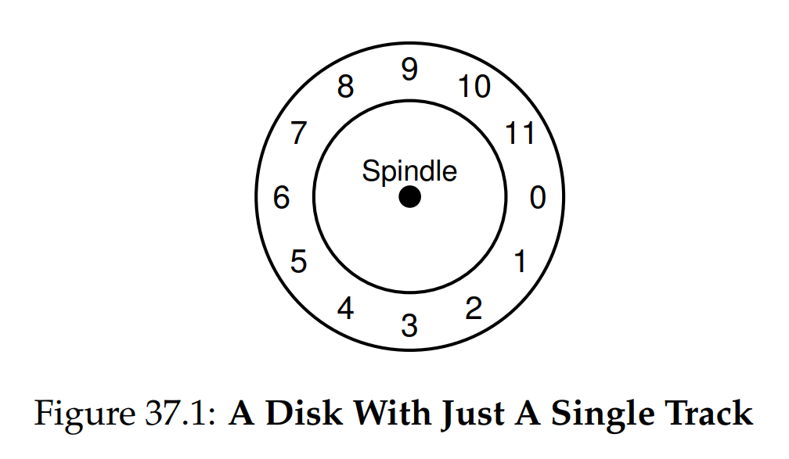
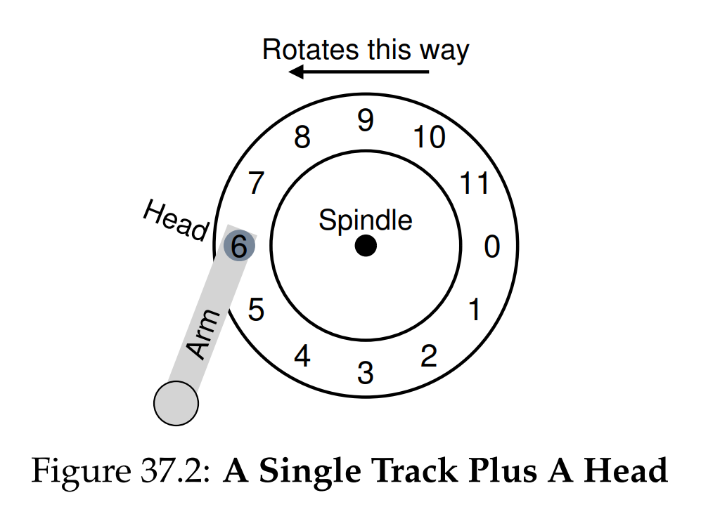
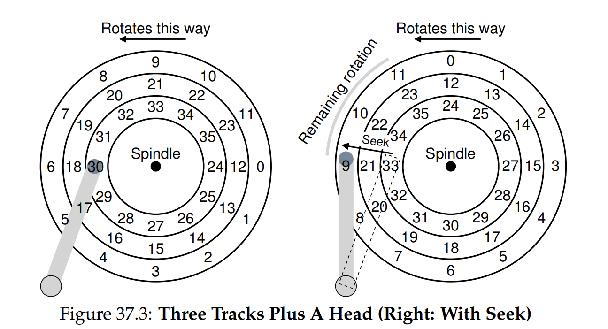
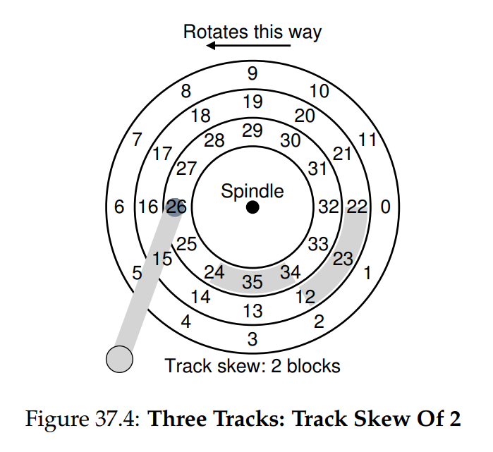
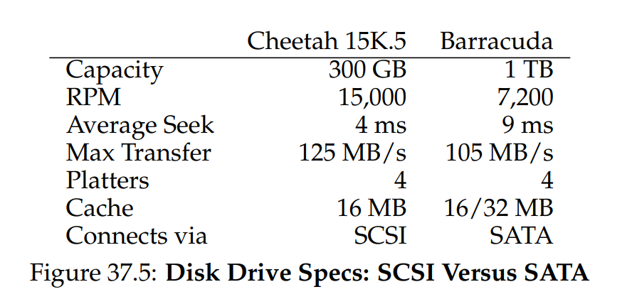
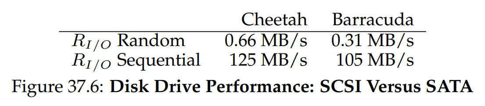
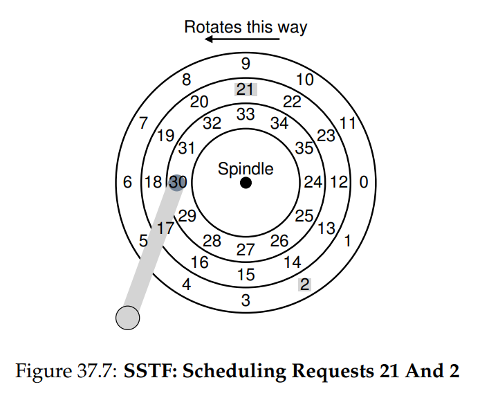
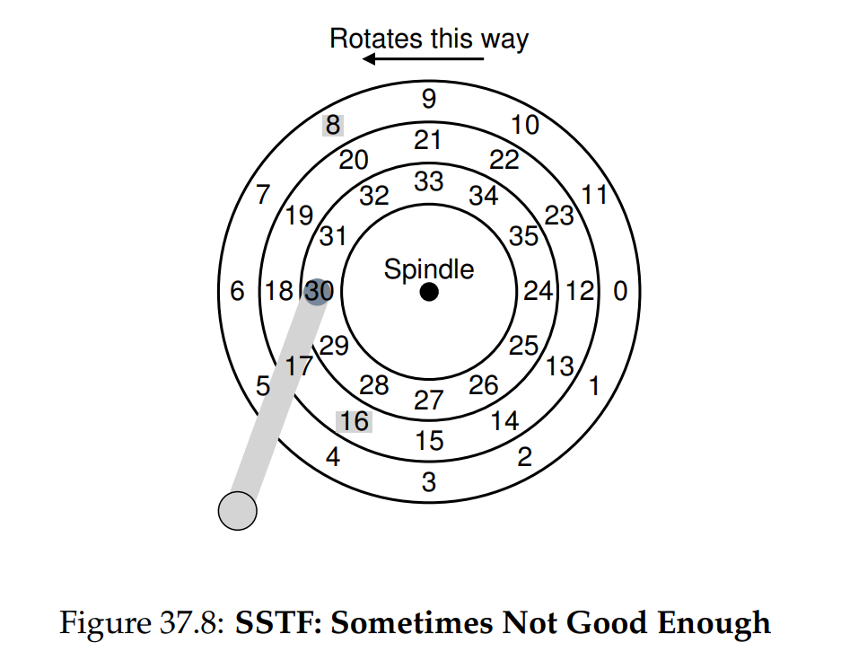

# OSTEP 37：Hard Disk Drives

上一章介紹了 I/O 裝置的基本概念，並說明了作業系統如何與此類裝置互動。 本章我們將深入探討其中一種裝置：硬碟。 幾十年來，硬碟一直是電腦系統中主要的持久性資料儲存方式，而檔案系統技術的許多發展（即將介紹）都依賴於其行為特性。 因此，在編寫負責管理硬碟的檔案系統軟體前，了解硬碟運作細節是非常值得的。 關於這些細節，可參考 Ruemmler 和 Wilkes 的優秀論文 [RW92] 以及 Anderson、Dykes 和 Riedel 的研究 [ADR03]

:::info  
如何在硬碟上儲存與存取資料？

現代硬碟如何儲存資料？其介面為何？ 資料實際是如何佈局並進行存取？硬碟排程又如何提升效能？  
:::

## 37.1 The Interface

讓我們首先了解現代硬碟的介面。所有現代硬碟的基本介面都非常簡單：硬碟由大量扇區（每扇區大小為 512 位元組）組成，每個扇區都可以被讀取或寫入。 若硬碟共有 $n$ 個扇區，則扇區編號為 $0$ 到 $n − 1$。 如此一來，我們可將硬碟視為一個扇區陣列； $0$ 到 $n − 1$ 就是該硬碟的位址空間

多扇區操作是可行的； 實際上，許多檔案系統會一次讀寫 4 KB（或更多）資料。 然而，在更新硬碟時，硬碟製造商只能保證單一 512 位元組的寫入是原子性的（也就是要麼完全成功，要麼完全失敗）； 因此，如果發生突如其來的斷電，較大寫入的一部分可能寫入成功，而其他部分則不會（有時稱為 torn write，撕裂寫入）

有些假設性的前提是大多數硬碟使用者都會預設的，卻並未直接在介面中說明； Schlosser 與 Ganger 將此稱為硬碟的「不成文契約」[SG04]。 具體而言，通常可假設在硬碟位址空間中，相鄰兩個區塊的存取速度會快於彼此相距較遠的兩個區塊。 還可假設以連續區段方式存取區塊（也就是順序讀寫）是最迅速的存取模式，通常遠快於任何更隨機的存取模式

## 37.2 Basic Geometry

讓我們先了解現代硬碟的一些組成部分。 硬碟由一或多片碟片構成，每片碟片是一個圓形的硬質表面，透過在其上產生磁性變化以持久儲存資料。 每片碟片有兩個面，稱為硬碟面。 這些碟片通常由某種硬質材料（例如鋁）製成，然後塗覆一層薄薄的磁性塗層，使硬碟即使在斷電後也能持久存放位元組

所有碟片都裝在同一個主軸上，該主軸連接到一個馬達，當硬碟通電時會以固定速率旋轉。 旋轉速率通常以每分鐘轉數（RPM）來衡量，目前常見值約在 7,200 RPM 至 15,000 RPM 範圍內。 我們經常需要關注單轉所需時間，例如 10,000 RPM 約等於每次旋轉花費 6 毫秒

在每個硬碟面上，資料以許多扇區組成的同心圓方式編碼； 我們將每條同心圓稱為磁道。 單個硬碟面上有成千上萬條磁道緊密排列，數百條磁道僅寬度相當於一根人類頭髮

要從硬碟面讀寫資料，我們需要一個機構來感應（即讀取）硬碟上的磁性模式，或是在其上產生變化（即寫入）。 這個讀寫過程由硬碟讀寫頭完成； 每個硬碟面都有一個相應的讀寫頭。 硬碟讀寫頭連接到一個硬碟臂，硬碟臂會在硬碟面上移動，以將讀寫頭定位到目標磁道

## 37.3 A Simple Disk Drive

現在讓我們逐步建立模型，從單一磁道開始理解硬碟的運作。 假設我們有一個只有一條磁道的簡易硬碟（圖 37.1）。 這條磁道僅包含 12 個扇區，每個扇區大小為 512 位元組（回想一下，這是我們慣用的扇區大小），因此扇區編號為 0 到 11。 這裡的單一碟片繞著主軸旋轉，主軸連接一個馬達

當然，單獨的磁道並不算有趣； 我們需要能夠讀取或寫入這些扇區，因此需要一個硬碟讀寫頭，並將其安裝在硬碟臂上，如圖 37.2 所示。 圖中，讀寫頭安裝在硬碟臂末端，位於扇區 6 之上，而硬碟面正以逆時針方向旋轉

### Single-track Latency: The Rotational Delay

現在來試著理解在我們這個簡易單磁道硬碟上請求的處理方式，假設現在收到一個讀取扇區 0 的請求。 此時硬碟應如何服務這個請求？

在我們的簡易硬碟中，硬碟本身不需要做太多事情，具體而言，只要等待目標扇區轉到讀寫頭下方即可。 這種等待在現代硬碟中相當普遍，且佔據 I/O 服務時間的重要部分，因此有一個專有名稱：旋轉延遲（有時也稱為 rotation delay）。 在此範例中，若一整圈旋轉延遲為 R，硬碟就必須承受約 R/2 的延遲才能等待扇區 0 轉到讀寫頭下方（假設從扇區 6 開始）。 若在這單一磁道上發出最壞情況的請求 —— 讀取扇區 5，則會因為要等到大約整圈旋轉，才得以服務該請求

### Multiple Tracks: Seek Time

到目前為止，我們的硬碟只有一條磁道，並不太符合現實； 現代硬碟當然擁有數百萬條磁道。 因此，我們來看看一個稍微更貼近實際的硬碟片，此例共有三條磁道（圖 37.3 左）。 如圖所示，讀寫頭目前位於最內圈的磁道（包含扇區 24 到 35）； 緊鄰外側的磁道則包含接下來的一組扇區（12 到 23），最外圈的磁道包含最前面的扇區（0 到 11）。

為了理解硬碟如何存取指定的扇區，我們現在追蹤對遠端扇區發出請求時會發生的過程，例如讀取扇區 11。 要服務這個讀取請求，硬碟必須先將硬碟臂移動到正確的磁道（此例為最外圈），這個過程稱為搜尋（seek）。 搜尋動作與碟片旋轉一樣，是最耗費時間的硬碟作業之一

需要注意的是，搜尋動作包含多個階段：首先是硬碟臂的加速階段，讓它開始移動； 接著是以最高速度行進的慣行階段； 然後是減速階段，讓硬碟臂逐漸放慢； 最後是定點階段（settling），讀寫頭必須精準地定位到正確的磁道。 定點的耗時通常相當可觀，例如 0.5 到 2 毫秒，因為硬碟必須確保讀寫頭穩定地落在目標磁道上（要是只靠近而不精準，就會出問題）

完成搜尋後，硬碟臂已將讀寫頭定位到正確的磁道。 圖 37.3（右）展示了這段搜尋過程的示意圖。 如圖所示，在搜尋期間，硬碟臂已移到目標磁道，而碟片也同時旋轉了約 3 個扇區。 因此，扇區 9 即將轉至讀寫頭下方，我們只需稍微等待一段短暫的旋轉延遲，就能立即開始資料傳輸

當扇區 11 轉到讀寫頭下方時，就會進入 I/O 的最後階段 —— 傳輸（transfer），將資料從碟片讀出或寫入。 由此，我們獲得了一個完整的 I/O 時間輪廓：先進行搜尋，然後等待旋轉延遲，最後才是資料傳輸

### Some Other Details

雖然我們不會花過多篇幅討論，但硬碟的運作還有一些有趣的細節。 許多硬碟會使用某種磁道錯位（track skew），以確保即使跨越磁道邊界，順序讀取仍能正確進行。 在我們的簡易範例硬碟中，這種錯位可能如圖 37.4 所示

之所以要對扇區做這種錯位，是因為當讀寫頭從一條磁道切換到另一條磁道（即使只是相鄰磁道）時，仍需要一些時間重新定位。 若沒有這種錯位，讀寫頭移到下一條磁道時，目標扇區可能已經轉過讀寫頭下方，因此硬碟就必須等待幾乎整圈的旋轉延遲才能訪問下一個扇區

另一個現象是外圈磁道的扇區數量通常比內圈多，這是由幾何形狀決定的，外圈空間更寬廣。 這樣的硬碟稱為多區段硬碟（multi-zoned disk drives），硬碟會被分成多個區段（zone），每個區段對應同一個硬碟面上連續的數條磁道。 每個區段內，每條磁道的扇區數量相同，而外圈區段的扇區數比內圈區段多

最後，任何現代硬碟都具備一個快取，歷史上有時會稱其為磁道緩衝區（track buffer）。 這個快取只是一小段記憶體（通常約 8 或 16 MB），硬碟可用它來暫存從硬碟讀取或寫入的資料。 例如，當硬碟讀取某個扇區時，可能會一次將該磁道上所有扇區一併讀入並存放在快取中； 如此一來，硬碟就能迅速回應後續對同一磁道的存取請求

在寫入時，硬碟有兩種選擇：當資料存放到快取中時，就回報寫入完成，或者等到資料實際寫入到硬碟後才回報完成。 前者稱為回寫快取（write-back caching，有時也稱為立即回報），後者稱為直寫（write-through）。 回寫快取有時會讓硬碟看起來「更快」，但也會帶來風險； 若檔案系統或應用程式需要資料按特定順序正確寫入硬碟，回寫快取可能導致順序錯亂而出問題（詳細內容請參閱檔案系統日誌技術章節）

:::info  
量綱分析

還記得在化學課上，你如何透過設定單位相互抵銷，就幾乎能解出所有題目，最後得到答案嗎？ 這種化學魔法被稱為量綱分析（dimensional analysis），事實證明它在電腦系統分析中也非常有用。

讓我們來做一個範例，以了解量綱分析如何運作以及為何有用。 在本例中，假設你必須計算一個硬碟旋轉一圈需要多長時間（以毫秒為單位）。 不幸的是，你只知道硬碟的 RPM（每分鐘旋轉次數）。 假設我們談的是一個 10K RPM 的硬碟（也就是每分鐘旋轉 10,000 次）。 我們該如何設置量綱分析，以便得到「每圈所需時間（毫秒）」？

為此，我們先將欲求的單位寫在左邊； 在此例中，我們希望得到「每圈所需時間（毫秒）」，因此正寫作：

$$
\frac{\text{Time (ms)}}{1\ \text{Rotation}}
$$

接著，我們將已知資訊寫下，並確保在可能時相互抵銷單位。首先，我們知道：

$$
\frac{1\ \text{minute}}{10{,}000\ \text{Rotations}}
$$

（旋轉次數保留在分母，因為它與左邊的「每圈」相對應），然後再將「分鐘」轉換為「秒」：

$$
\frac{60\ \text{seconds}}{1\ \text{minute}}
$$

最後再將「秒」轉換為「毫秒」：

$$
\frac{1000\ \text{ms}}{1\ \text{second}}
$$

最終結果如下（所有單位整齊地相互抵銷）：

$$
\frac{\text{Time (ms)}}{1\ \text{Rot.}}
=
\frac{1\ \cancel{\text{minute}}}{10{,}000\ \text{Rot.}}
\cdot
\frac{60\ \cancel{\text{seconds}}}{1\ \cancel{\text{minute}}}
\cdot
\frac{1000\ \text{ms}}{1\ \cancel{\text{second}}}
=
\frac{60{,}000\ \text{ms}}{10{,}000\ \text{Rot.}}
=
\frac{6\ \text{ms}}{\text{Rotation}}
$$

由此可見，量綱分析能將直覺化的思考轉化為簡單且可重複的程序。 除了上述 RPM 計算，量綱分析在 I/O 分析中也相當實用。 例如，你經常會得到硬碟的傳輸速率，例如 100 MB/second，然後被問道：傳輸一個 512 KB 區塊（以毫秒計）需要多長時間？ 使用量綱分析就能輕鬆解出：

$$
\frac{\text{Time (ms)}}{1\ \text{Request}}
=
\frac{512\ \cancel{\text{KB}}}{1\ \text{Request}}
\cdot
\frac{1\ \cancel{\text{MB}}}{1024\ \cancel{\text{KB}}}
\cdot
\frac{1\ \cancel{\text{second}}}{100\ \cancel{\text{MB}}}
\cdot
\frac{1000\ \text{ms}}{1\ \cancel{\text{second}}}
=
\frac{5\ \text{ms}}{\text{Request}}
$$  
:::

## 37.4 I/O Time: Doing The Math

既然我們已經建立了硬碟的抽象模型，就可以透過簡單分析來更好地理解硬碟效能。 具體而言，我們現在可以將 I/O 時間表示為三大部分之和：

$$
T_{I/O} = T_{\mathrm{seek}} + T_{\mathrm{rotation}} + T_{\mathrm{transfer}} \tag{37.1}
$$

請注意，I/O 速率（$R_{I/O}$）通常在比較不同硬碟時更容易使用（如下文所示），其計算方法很簡單，只要將傳輸量除以所花時間即可：

$$
R_{I/O} = \frac{\mathrm{Size}_{\mathrm{Transfer}}}{T_{I/O}} \tag{37.2}
$$

為了更直觀地了解 I/O 時間，讓我們做以下計算。 假設我們關注兩種工作負載。 第一種稱為隨機工作負載，會對硬碟上的隨機位置執行小量（如 4 KB）讀取。 隨機工作負載在許多重要應用中很常見，包括資料庫管理系統。 第二種稱為順序工作負載，僅對硬碟執行大量連續扇區的讀取，而不隨意跳躍。 順序存取模式也相當普遍，所以同樣很重要

要了解隨機與順序工作負載之間的效能差異，首先必須對硬碟做一些假設。 讓我們看看 Seagate 的兩款現代硬碟。 第一款稱為 Cheetah 15K.5 [S09b]，是一款高效能 SCSI 硬碟； 第二款稱為 Barracuda [S09a]，則是訴求大容量的硬碟。 兩者的詳細參數可見圖 37.5

如你所見，這兩款硬碟的特性截然不同，在許多層面上都代表了硬碟市場的兩大要素。 第一類是「高效能」硬碟市場，硬碟被設計成以盡可能快的轉速運轉、提供低搜尋時間，並迅速傳輸資料； 第二類是「大容量」硬碟市場，以每位元組成本為首要考量，因此硬碟速度較慢，但盡可能在有限空間內塞入最多位元

根據上述參數，我們可以開始計算這兩款硬碟在前述兩種工作負載下的效能。 先來看隨機工作負載，假設每次 4 KB 的讀取都發生在硬碟的隨機位置，我們就能估算每次讀取所需的時間。 以 Cheetah 為例：

$$
T_{\mathrm{seek}} = 4 \text{ ms}, 
\quad
T_{\mathrm{rotation}} = 2 \text{ ms}, 
\quad
T_{\mathrm{transfer}} = 30 \text{ microsecs} \tag{37.3}
$$

平均搜尋時間（4 毫秒）是直接取自製造商報告的； 請注意，若是完整搜尋（從碟面的一端到另一端），可能要花兩到三倍更久。 平均旋轉延遲則直接由 RPM 推算：15000 RPM 等於 250 RPS（每秒轉數），因此每次旋轉需 4 毫秒。 平均來說，硬碟要經過半圈旋轉才會將目標扇區搬到讀寫頭下方，所以旋轉延遲平均為 2 毫秒

最後，傳輸時間僅是傳輸量除以最大傳輸速率； 此處極為微小（30 微秒； 注意 1 毫秒就需要 1000 微秒）。 因此，根據上式，Cheetah 在隨機工作負載下的 $T_{I/O}$ 約為 6 毫秒。 要計算 I/O 速率，只要將傳輸量除以平均時間，就得到 Cheetah 在此負載下的 $R_{I/O}$ 約為 0.66 MB/s。 同樣方法計算 Barracuda，$T_{I/O}$ 約為 13.2 毫秒，速度不到前者一半，對應的速率約為 0.31 MB/s

接下來看順序工作負載。此時我們假設在進行一次很長的傳輸前，僅需一次搜尋和一次旋轉。 為簡化計算，假設傳輸量為 100 MB。 如此一來，Cheetah 與 Barracuda 的 $T_{I/O}$ 分別約為 800 毫秒和 950 毫秒。 其 I/O 速率也就分別幾乎等同於它們的最大傳輸速率，約為 125 MB/s 和 105 MB/s。 這些數據彙整於圖 37.6：

圖中顯示了幾個重要觀點。 首先，也是最重要的，在隨機與順序工作負載之間存在天差地別的效能差距，例如 Cheetah 的差異幾乎是 200 倍，而 Barracuda 更是超過 300 倍。 其次，一個較細微的觀點是，高階「效能」硬碟與入門「大容量」硬碟之間的效能差異也相當可觀。 基於此（以及其他原因），人們通常願意花高價購買前者，同時盡可能以較低成本入手後者

:::info  
以順序的方式使用硬碟

只要有可能，就要以順序方式讀寫硬碟。 若無法做到完全順序，至少要考慮一次傳輸大塊資料：塊越大越好。 如果 I/O 以零散隨機的小片段進行，I/O 效能將大幅下降  
:::

:::info  
計算「平均」搜尋距離

在許多書籍與論文中，你會看到平均硬碟搜尋時間通常被引用為約等於「完整搜尋時間的三分之一」。 這數字是怎麼來的？

事實上，它是源於一個基於平均搜尋距離（而非時間）的簡單計算。 假設將硬碟想像成由磁道組成的集合，磁道編號從 $0$ 到 $N$。 兩條磁道 $x$ 與 $y$ 之間的搜尋距離就定義為它們編號差值的絕對值：$\lvert x - y\rvert$

要計算平均搜尋距離，首先需要將所有可能的搜尋距離加總：

$$
\sum_{x=0}^{N} \sum_{y=0}^{N} \lvert x - y \rvert 
\tag{37.4}
$$

然後，將此和除以可能搜尋的總數，也就是 $N^2$。 為了計算這個總和，我們可以使用積分來近似：

$$
\int_{x=0}^{N} \int_{y=0}^{N} \lvert x - y \rvert  \, dy  \, dx
\tag{37.5}
$$

要計算內層積分，我們先把絕對值拆成兩個部分：

$$
\int_{y=0}^{x} ( \,x - y \,)  \, dy + \int_{y=x}^{N} (y - x \,)  \, dy
\tag{37.6}
$$

計算這兩部分的定積分，得到

$$
\Bigl(x \,y -\tfrac{1}{2} \,y^{2}\Bigr)\Bigl|_{y=0}^{y=x}
+
\Bigl(\tfrac{1}{2} \,y^{2} - x \,y\Bigr)\Bigl|_{y=x}^{y=N}
$$

這可以化簡為

$$
x^{2} - N \,x + \tfrac{1}{2} \,N^{2}\
$$

接著，我們再計算外層積分：

$$
\int_{x=0}^{N} \bigl(x^{2}-N \,x+\tfrac{1}{2}N^{2}\bigr) \,dx
\tag{37.7}
$$

其結果為

$$
\Bigl(\tfrac{1}{3} \,x^{3}
-\tfrac{N}{2} \,x^{2}
+\tfrac{N^{2}}{2} \,x\Bigr)
\Bigl|_{0}^{N} 
=
\tfrac{N^{3}}{3}
\tag{37.8}
$$

最後，別忘了要除以總搜尋次數 $N^{2}$，才能得到平均搜尋距離：

$$
\frac{\tfrac{N^{3}}{3}}{ \,N^{2} \,} = \tfrac{1}{3}N
$$

因此，在考慮所有可能的搜尋情況下，硬碟的平均搜尋距離就是完整距離的三分之一。當你聽到「平均搜尋時間約是一個完整搜尋時間的三分之一」時，就知道它的由來了  
::: 

## 37.5 Disk Scheduling

由於 I/O 操作成本高昂，作業系統不意外地在決定送往硬碟的 I/O 請求次序上扮演重要角色。 更明確地說，當有一組 I/O 請求時，硬碟排程程式會檢視這些請求，然後決定下一步該執行哪一個請求 [SCO90, JW91]

不同於作業排程往往無法預先得知每項工作的長度，在硬碟排程中，我們可以相當準確地估算「工作」（即硬碟請求）需要花費的時間。 透過預估每次請求的搜尋時間以及可能的旋轉延遲，硬碟排程程式就能了解每個請求大約需要多少時間，進而（以貪婪方式）優先挑選執行時間最少的請求。 因此，硬碟排程程式在運作時會嘗試遵循最短工作優先（SJF, shortest job first）的原則

### SSTF: Shortest Seek Time First

一種早期的硬碟排程方法稱為最短搜尋時間優先（SSTF, shortest-seek-time-first）（也稱 shortest-seek-first 或 SSF）。 SSTF 會根據磁道順序排列 I/O 請求佇列，先處理與讀寫頭位置最接近的請求。 例如，假設讀寫頭目前位於最內圈磁道，且佇列裡有扇區 21（中圈磁道）與扇區 2（最外圈磁道）的讀取請求，則排程程式會先送出對扇區 21 的請求，等待它完成，接著再處理對扇區 2 的請求（如圖 37.7 所示）

在此例中，SSTF 表現良好：它先搜尋到中圈磁道，然後才到外圈磁道。 然而，SSTF 並非萬靈丹，原因如下。 第一，作業系統無法直接得知硬碟的幾何結構，它只能看到一堆區塊編號。 幸好，這個問題可以輕鬆解決。與其實作 SSTF，作業系統可以改採「最鄰近區塊優先」（NBF, nearest-block-first），直接排程下一個區塊編號最接近的請求

第二個更根本的問題是飢餓現象（starvation）。 想像在上述例子中，如果源源不斷有請求指向讀寫頭目前所在的內圈磁道，那麼對其他磁道的請求將被純 SSTF 排程方式完全忽略。 這便引出了關鍵問題：

:::info  
如何處理硬碟飢餓？

我們該如何設計出類似 SSTF 的排程演算法，同時避免飢餓現象？  
:::

### Elevator (a.k.a. SCAN or C-SCAN)

這個問題的解法早在多年前就已提出（例如參見 [CKR72]），且相當直接。 該演算法最初稱為 SCAN，它會在硬碟上來回移動，按照磁道順序服務請求。 我們把硬碟從外圈到內圈（或從內圈到外圈）的單次掃描稱為一次「掃掠（sweep）」。 因此，如果某個請求指向的扇區所在磁道已在本次掃掠中被服務過，就不會立即處理，而是排到下一次反方向掃掠時再予以服務

SCAN 有多種變體，作用大同小異。 例如，Coffman 等人提出的 F-SCAN，在進行一次掃掠時會「凍結」待服務佇列 [CKR72]； 也就是說，本次掃掠中新增的請求會全部放到下一次再處理。 如此一來，便能避免較遠磁道的請求因為後進的近距離請求不斷插隊而飢餓

C-SCAN 是另一種常見變體，全名 Circular SCAN。 它不會來回掃掠整張硬碟，而是只從外圈掃到內圈，掃到最內圈後立即跳回到最外圈，然後再度從外圈掃向內圈。 這樣對內圈與外圈磁道更為公平，因為純粹來回的 SCAN 會偏袒中間磁道 —— 在掃完外圈後，SCAN 會兩次經過中間磁道才返回外圈

由於原因顯而易見，SCAN 演算法（以及其變體）有時被稱為「電梯演算法」，因為它的行為就像電梯，只會朝同一方向上下，而不是根據最接近目標樓層來決定暫停。 想像一下，如果你從 10 樓要坐電梯到 1 樓，途中在 3 樓有人按了 4，結果電梯先往上到達 4 樓，因為「4 比 1 更近」，那會有多困擾！ 如你所見，電梯演算法在現實生活中能避免乘客爭吵不休； 在硬碟中，它則能防止磁道請求飢餓

可惜的是，SCAN 與其變體並非最佳排程技術。 尤其是 SCAN（甚至 SSTF）沒辦法像理論上的 SJF 那麼緊密地遵循「最短工作優先」原則，因為它們忽略了旋轉延遲。 這便引出了另一個核心問題：

:::info  
如何考慮硬碟旋轉成本？

我們該如何設計演算法，在同時顧及搜尋與旋轉延遲的前提下，更貼近最短工作優先（SJF）的效果？  
:::

### SPTF: Shortest Positioning Time First

我們問題的解法被稱為最短定位時間優先（SPTF, 有時也稱為最短存取時間優先 SATF）排程，在討論它們之前，讓我們先更深入地了解問題。 圖 37.8 顯示了一個範例：

在這個範例中，讀寫頭目前位於內圈磁道上的扇區 30，因此排程程式必須抉擇：下一個要處理扇區 16（位於中圈磁道）還是扇區 8（位於外圈磁道）？

答案是「視情況而定」。 在工程領域裡，「視情況而定」幾乎永遠是答案，因為權衡取捨是工程師工作的一部分； 但更好的作法是了解原因，這正是我們接下來要探討的

在此案例中，取決於搜尋時間與旋轉延遲之間的相對比重。 若在範例裡搜尋時間遠大於旋轉延遲，SSTF（及其變體）就沒問題。 但若搜尋遠快於硬碟旋轉，則在本例中，相較於只搜尋到中圈磁道再等旋轉到扇區 16，反而到外圈磁道搜尋扇區 8 會更合理，因為扇區 16 還得繞一圈才能到讀寫頭下方

如先前所見，在現代硬碟上搜尋與旋轉延遲大致相當（當然要視具體請求而定），因此 SPTF 非常有用，且能提升效能。 然而，作業系統通常無法得知磁道邊界或讀寫頭當前在硬碟面上的哪個角度，因此要在 OS 層面實作 SPTF 更具挑戰性。 因而，SPTF 通常內建於硬碟韌體中，下文會加以說明

### Other Scheduling Issues

在這段關於基本硬碟運作、排程與相關主題的簡要說明中，還有許多議題尚未涵蓋。其中一項就是：現代系統的硬碟排程到底在哪裡執行？ 在較舊的系統中，作業系統會負責所有排程； 作業系統掃過所有待處理的請求之後，選擇最適合的一筆送往硬碟。 該請求完成後，再從剩餘請求中挑下一筆，如此反覆。 畢竟當年硬碟比較簡單，生活也簡單

在現代系統中，硬碟能夠同時處理多筆待完成請求，並且內建精密的排程器（能夠在硬碟控制器內部準確實作 SPTF，可掌握所有相關細節，包括讀寫頭的精確位置）。 因此，作業系統排程程式通常會先選出它認為最優的幾筆請求（例如 16 筆），然後一併送往硬碟；硬碟再利用其內部的讀寫頭位置與磁道佈局資訊，以最理想的（SPTF）順序服務這些請求

另一項由硬碟排程程式執行的重要相關工作是 I/O 合併。 舉例來說，假設有一連串讀取請求，先後要讀 33、8、34 區塊，如圖 37.8 所示。 在這種情況下，排程程式應該把 33 與 34 區塊的請求合併成一次只需傳輸兩個連續區塊的請求； 任何排程器要做的重排序，都會針對已合併的請求進行。合併在作業系統層級尤其重要，因為它能降低送到硬碟的請求數量，進而減少系統開銷

現代排程程式要解決的最後一個問題是：系統在送 I/O 請求給硬碟前，應該等多久？ 有些人會天真地認為，只要硬碟有任何待處理 I/O，就應該立刻把請求送到硬碟； 這種做法稱為工作保留式（work-conserving），因為只要有請求，硬碟絕不會閒置。 然而，針對預期式硬碟排程的研究顯示，有時稍微等一下反而更好，這種做法稱為非工作保留式（non-work-conserving） [ID01]

透過等待，其更有可能出現一筆新的、更理想的請求讓硬碟一起處理，從而提升整體效率。 當然，要決定「何時等」以及「等多久」並非易事； 詳情請參閱相關論文，或研究 Linux 核心的實作，看看這些想法如何付諸實踐

## 37.6 Summary

我們已經概述了硬碟的運作原理。 這份概要其實是一個詳盡的功能模型，並未涵蓋實體設計中那些驚人的物理學、電子學與材料科學。 若你對這些面向有興趣，建議你選修相關科系（或至少輔修）

## References

- [ADR03] “More Than an Interface: SCSI vs. ATA” by Dave Anderson, Jim Dykes, Erik Riedel. FAST ’03, 2003.  
  關於現代硬碟實際運作原理的頂尖參考文章，無論 SCSI 或 ATA，對想深入瞭解硬碟驅動器細節的人都是必讀之作  

- [CKR72] “Analysis of Scanning Policies for Reducing Disk Seek Times” by E.G. Coffman, L.A. Klimko, B. Ryan. SIAM Journal of Computing, September 1972, Vol. 1 No. 3.  
  早期硬碟排程領域的重要研究，探討各種掃掠（SCAN）策略如何降低硬碟搜尋時間  

- [HK+17] “The Unwritten Contract of Solid State Drives” by Jun He, Sudarsun Kannan, Andrea C. Arpaci-Dusseau, Remzi H. Arpaci-Dusseau. EuroSys ’17, Belgrade, Serbia, April 2017.  
  將「不成文契約」概念延伸到固態硬碟（SSD），詳細探討如何正確使用 SSD，並強調其複雜性通常不亞於旋轉式硬碟  

- [ID01] “Anticipatory Scheduling: A Disk-scheduling Framework To Overcome Deceptive Idleness In Synchronous I/O” by Sitaram Iyer, Peter Druschel. SOSP ’01, October 2001.  
  闡述預期式排程（Anticipatory Scheduling）如何透過短暫等待，以等待更佳請求而提升硬碟排程效能的創新論文  

- [JW91] “Disk Scheduling Algorithms Based On Rotational Position” by D. Jacobson, J. Wilkes. Technical Report HPL-CSP-91-7rev1, Hewlett-Packard, February 1991.  
  針對硬碟排程提出以旋轉位置為基礎的演算法，雖為技術報告而非正式論文，但展現更現代化的排程思路（不久後被 Seltzer 等 [SCO90] 搶先發表）  

- [RW92] “An Introduction to Disk Drive Modeling” by C. Ruemmler, J. Wilkes. IEEE Computer, 27(3), March 1994.  
  優秀的硬碟運作基礎入門介紹文章，部分內容隨著技術演進已稍顯過時，但大多數基本概念依然適用  

- [SCO90] “Disk Scheduling Revisited” by Margo Seltzer, Peter Chen, John Ousterhout. USENIX 1990.  
  探討在硬碟排程中「旋轉延遲」的重要性，為後續各種旋轉式排程演算法奠定理論基礎的經典論文  

- [SG04] “MEMS-based storage devices and standard disk interfaces: A square peg in a round hole?” by Steven W. Schlosser, Gregory R. Ganger. FAST ’04, pp. 87–100, 2004.  
  雖然 MEMS 技術尚未對硬碟介面造成重大影響，但本文提出「檔案系統與硬碟間的不成文契約」批判觀點，為後續 SSD 研究（如 [HK+17]）提供重要啟發  

- [S09a] “Barracuda ES.2 data sheet” by Seagate, Inc. （原網址：http://www.seagate.com/docs/pdf/datasheet/disc/ds_barracuda_es.pdf)  
  Seagate 官方提供之 Barracuda ES.2 系列規格表；屬於資料表文件，須自行承擔閱讀中的枯燥風險  

- [S09b] “Cheetah 15K.5” by Seagate, Inc. （原網址：http://www.seagate.com/docs/pdf/datasheet/disc/ds-cheetah-15k-5-us.pdf)  
  Seagate 官方提供之 Cheetah 15K.5 系列硬碟規格表；同樣屬於資料表文件，閱讀時請備好提神良藥  
