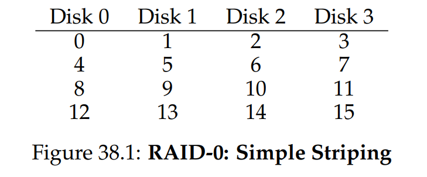
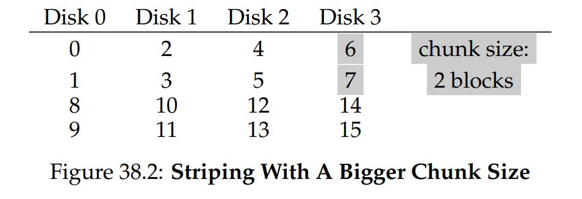
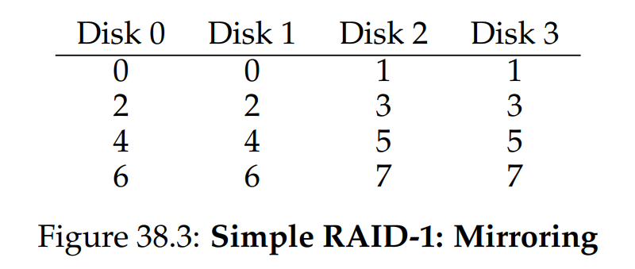
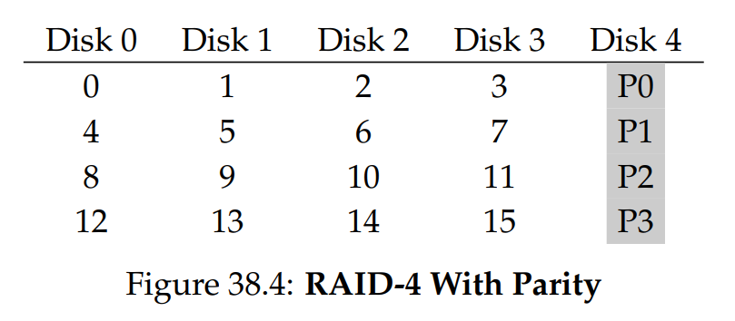
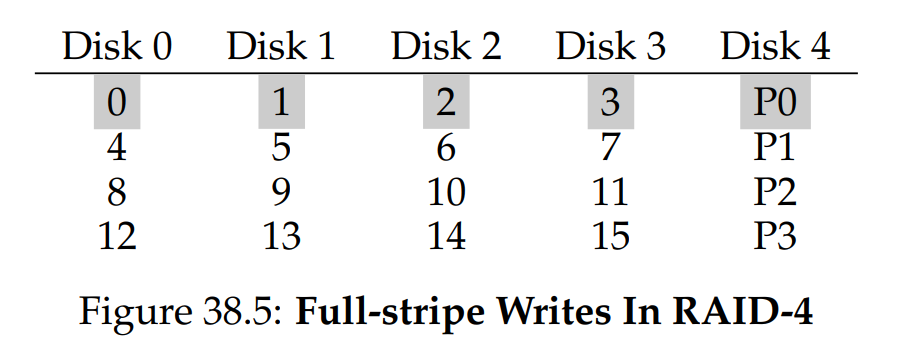
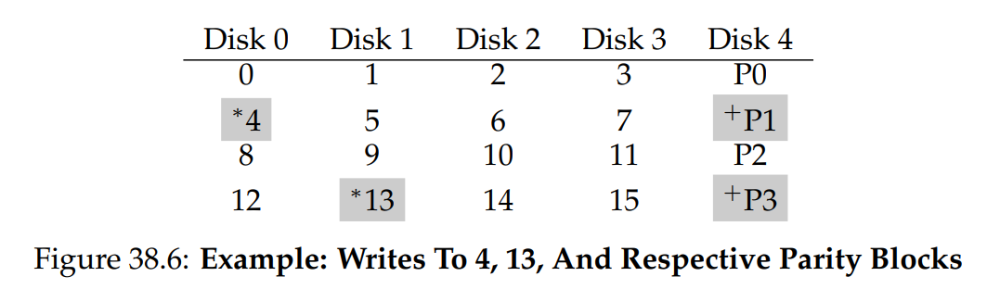
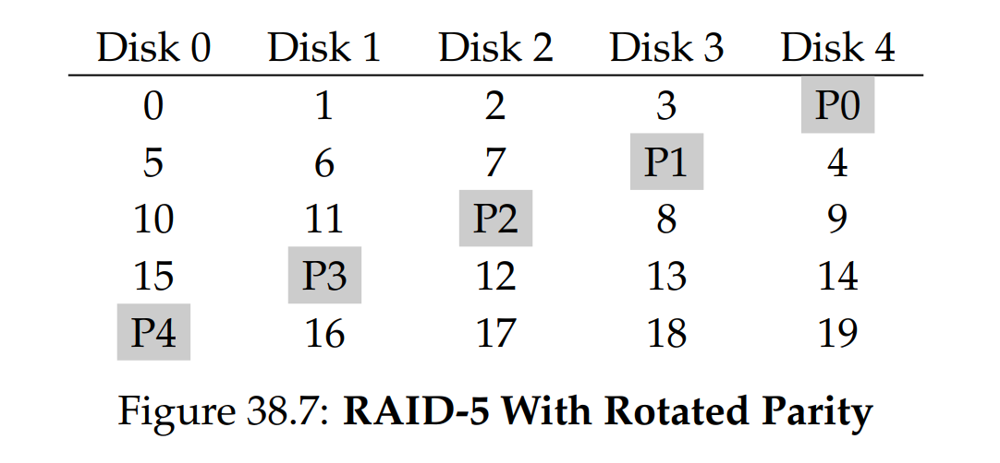
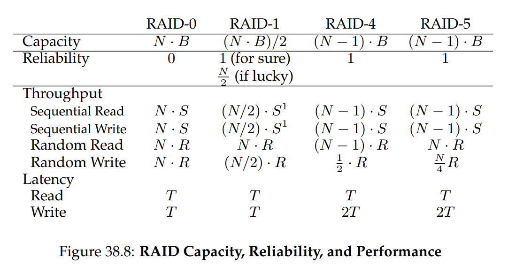

# OSTEP 38：Redundant Disk Arrays (RAID)

當我們使用硬碟時，有時會希望它更快，因為 I/O 操作速度較慢，可能成為整個系統的瓶頸。 有時我們會希望它容量更大，隨著越來越多的資料上線，我們的硬碟變得越來越滿。 還有時候我們會希望它更可靠，若硬碟故障，且資料沒有備份，那些珍貴的資料將化為烏有

因此，我們的問題是：

:::info  
如何打造大容量、高速且可靠的硬碟？

我們該如何構建一個既大容量、又高速且可靠的儲存系統？關鍵技術為何？不同方法之間有哪些取捨？  
:::

在本章中，我們會介紹一個被稱為「Redundant Array of Inexpensive Disks（RAID）」的技術 [P+88]，它透過多顆硬碟協同運作，構建出了更快、更大且更可靠的硬碟系統。 此術語由加州大學柏克萊分校的研究團隊（由 David Patterson 教授、Randy Katz 教授及當時的博士生 Garth Gibson 領導）在 1980 年代末期提出； 大約在同一時期，許多研究者也同時想到了使用多顆硬碟來打造更佳儲存系統的基本構想 [BG88, K86, K88, PB86, SG86]

在外部，RAID 看起來就像是一顆大型硬碟，一樣是一組可供讀寫的區塊。 其內部卻相當複雜，由多顆硬碟、記憶體（含揮發性與非揮發性記憶體）以及一個或多個處理器組成，以管理整個系統。 因此硬體 RAID 非常像一台電腦系統，專門負責管理這群硬碟

相較於單顆硬碟，RAID 提供多項優勢。 其一是效能：並行使用多顆硬碟可大幅提升 I/O 速度。 其二是容量：龐大的資料集往往需要較大容量的硬碟。 最後，RAID 能夠提升可靠性，若不採用 RAID 技術，將資料分散到多顆硬碟上，任何一顆硬碟故障都可能導致資料遺失； 但透過某種保護機制，RAID 能容忍單顆硬碟故障，並在彷彿未出狀況的情況下繼續運作

令人驚訝的是，RAID 對使用它們的系統而言完全透明（不可見），也就是說，主機系統只會把 RAID 當作一顆大型硬碟。 透明設計的美妙之處在於，使用者只要將單顆硬碟更換為 RAID，便不需修改任何一行軟體程式碼； 作業系統和用戶端應用程式可原封不動地繼續運作。 如此一來，透明性大幅提升了 RAID 的可部署性，讓使用者與管理員能在不擔心軟體相容性的情況下直接使用 RAID

接下來，我們將探討 RAID 的一些重要面向。 首先介紹其介面與故障模型，然後說明如何從容量、可靠性與效能這三大方向評估 RAID 的設計。 最後，我們會再提一些對 RAID 的設計與實作來說至關重要的相關議題

:::info  
透明化設計促成部署

在考慮如何為系統新增功能時，應先評估該功能是否能以透明方式加入，而不需對系統其他部分做任何修改。 若必須重寫既有軟體，或對硬體進行大幅度的改動，就會降低新構想的成功機率。 RAID 就是完美範例，其透明性無疑促成了其成功； 管理員只要安裝一組基於 SCSI 的 RAID 儲存陣列，便可取代單顆 SCSI 硬碟，而系統其他部分（主機、作業系統等）完全無須改變就能直接使用。 正是因為解決了可部署性問題，RAID 自第一天起就廣受歡迎  
:::

## 38.1 Interface And RAID Internals

對上層檔案系統而言，RAID 看起來就像一顆大型的高速且可靠的硬碟。 和單顆硬碟一樣，它會將自己呈現為一個線性區塊陣列，檔案系統（或其他客戶端）可對這些區塊進行讀寫

當檔案系統向 RAID 發出一個邏輯 I/O 請求時，RAID 內部必須計算應存取哪一顆（或哪些）硬碟才能完成該請求，然後再發出一個或多個實體 I/O 操作。 這些實體 I/O 的具體方式取決於所屬 RAID 等級，下文將詳細討論。 不過，舉個簡單例子，假設某 RAID 系統對每個區塊都保留了兩份複製（分別儲存在不同硬碟上）； 當針對此鏡像 RAID 系統執行寫入時，RAID 必須為每個邏輯 I/O 操作執行兩次實體 I/O

RAID 系統通常以一個獨立的 hardware box 存在，並透過標準介面（如 SCSI 或 SATA）連接到主機。 但在內部，RAID 的結構相當複雜，包括一顆執行韌體以指揮 RAID 運作的微控制器、用於暫存讀寫區塊的揮發性記憶體（如 DRAM），以及在某些情況下以安全緩衝寫入的非揮發性記憶體，甚至還可能內建用來計算奇偶校驗的專用邏輯（在某些 RAID 等級中非常有用，下文將進一步說明）。 從高層次來看，RAID 非常像一台專門化的電腦系統：它有處理器、記憶體和硬碟； 不同之處在於它運行的是專門負責 RAID 管理的軟體，而非一般應用程式

## 38.2 Fault Model

為了理解 RAID 並比較不同方法，我們必須要有一個故障模型作為基礎。 RAID 被設計用來檢測並從某些類型的硬碟故障中復原； 因此，精確地了解會遇到哪類故障，對於設計可行的系統來說至關重要

我們首先假設的故障模型相當簡單，稱為 fail-stop 故障模型 [S84]。 在此模型中，硬碟只會處於兩種狀態之一：正常運作或已失效。 若硬碟正常運作，則所有區塊皆可讀取或寫入； 相反地，一旦硬碟失效，我們就假設它已永久無法做讀寫了。 fail-stop 模型的一個關鍵在於其對故障偵測的假設，具體而言，當硬碟失效時，我們假設其可以輕易地被偵測到。 例如，在 RAID 陣列中，我們認為 RAID 控制器的硬體（或軟體）可以立刻察覺到某個硬碟已經失效

因此，目前我們不必擔心更複雜的「沉默型」故障，例如硬碟資料毀損。 我們也不需要顧慮單一區塊在硬碟仍正常運作時卻變得無法存取的情況（有時稱為潛在區塊錯誤）。 這些更複雜（且不幸地，更為真實）的硬碟故障，我們將在後續再行討論

## 38.3 How To Evaluate A RAID

正如我們稍後將看到的，構建 RAID 有許多不同方法。 我們將從三個方向來評估每種 RAID 設計。 第一個方向是容量，假設有 $N$ 顆硬碟，每顆硬碟包含 $B$ 個區塊，對 RAID 客戶而言，實際可用容量是多少？ 如果不做任何冗餘（redundancy），那能用的空間會有 $N \cdot B$ 這麼多； 相較之下，若系統對每個區塊都保留兩份複製（稱為鏡像），則實際可用容量為 $(N \cdot B)/2$。 其他方案（例如以奇偶校驗為基礎的）通常介於兩者之間

第二個方向是可靠性。 給定的設計能容忍多少顆硬碟故障？ 與我們先前建立的故障模型一致，我們假設只有整顆硬碟會故障； 在後面的章節（例如關於資料完整性的部分），我們將探討如何應對更複雜的故障模式

最後，第三個方向是效能。 效能評估相當具有挑戰性，因為它在很大程度上取決於送到硬碟陣列的工作負載。 因此，在進行效能評估之前，我們會先介紹一組應該考慮的典型工作負載

接下來，我們將探討三種重要的 RAID 設計：RAID Level 0（條帶化）、RAID Level 1（鏡像）以及 RAID Level 4/5（以奇偶校驗為基礎的冗餘）。 「等級」這個稱呼源自於柏克萊大學 Patterson、Gibson 和 Katz 等人[P+88]

## 38.4 RAID Level 0: Striping

第一種 RAID 等級其實並不算真正的 RAID，因為它沒有任何冗餘機制。 然而，RAID 0，或稱條帶化（striping），可說是在效能與容量方面的理想上限，因此值得我們先行了解

最簡單的條帶化方式會將區塊依序分散到系統中的每顆硬碟上（此處假設為 4 顆硬碟組成的陣列）：



從圖 38.1 中，我們可以看到 RAID 0 的基本概念 ── 把陣列裡的區塊以輪詢（round-robin）的方式分散到各顆硬碟上。 此方法旨在當陣列被順序讀取大塊資料時（例如大型順序讀取），能從多顆硬碟中獲得最大的並行效能。 我們將同一橫列的區塊稱為一個 stripe（條帶）； 因此，上例中的 0、1、2、3 區塊就屬於同一條帶

在上述範例中，我們為了簡化而假設每顆硬碟只放置 1 個區塊（例如 4KB），然後再輪到下一顆硬碟。 然而，實際情況不必如此。 舉例來說，我們可以像圖 38.2 那樣，先在每顆硬碟上放兩個 4KB 區塊，再輪到下一顆硬碟：



在此例中，我們先在每顆硬碟上放置兩個 4KB 區塊，然後才移到下一顆硬碟。 因此，該 RAID 陣列的 chunk（區段）大小為 8KB，每一條帶就由 4 個 chunk 組成，共 32KB 資料

:::info  
RAID 映射問題

在研究 RAID 的容量、可靠性與效能特性之前，我們先來說明所謂的「映射問題」。 此問題存在於所有 RAID 陣列中； 簡單來說，當要讀取或寫入某個邏輯區塊時，RAID 要如何確切知道該對哪顆物理硬碟以及用多少偏移量（offset）進行存取？

對於這些簡易的 RAID 等級，要把邏輯區塊正確映射到物理位置並不需要太複雜的運算。 以上述第一個條帶化範例為例（chunk 大小 = 1，區塊 = 4KB）。 若已知某個邏輯區塊位址 A，RAID 可透過以下兩條簡單公式，輕鬆計算出所需的硬碟編號與偏移量：

```ini
Disk   = A % number_of_disks  
Offset = A / number_of_disks  
```

請注意，以上都是整數運算（例如 4 / 3 = 1，而非 1.33333...）

讓我們透過一個簡單範例來看公式如何運作。 假設在上述第一個 RAID 中，有一筆請求要讀取邏輯區塊 14。 已知總共有 4 顆硬碟，則可算出：

- 硬碟編號 = （14 % 4 = 2） → 第 2 顆硬碟（從 0 開始算）
- 區塊編號 = （14 / 4 = 3） → 第 3 個區塊（從 0 開始算）

也就是說，邏輯區塊 14 正好位於第 3 顆硬碟（disk 2）的第 4 個區塊（block 3），正符合我們的計算結果

你可以思考若要支援不同的 chunk 大小，上述公式該如何修正。 試試看吧！其實並不困難  
:::

### Chunk Sizes

區段大小主要影響硬碟陣列的效能。 例如，較小的區段大小意味著許多檔案會被分散（條帶化）至多顆硬碟，從而提高對單一檔案讀寫的並行度； 然而，同時擷取多顆硬碟上的區塊時，定位時間也會增加，因為整個請求的定位時間是以各硬碟請求中最大的定位時間為準

另一方面，較大的區段大小會降低此類檔案內並行度，因此需要依賴多筆並行請求才能達成高吞吐量。 然而，較大的區段大小反而能減少定位時間； 例如，若某檔案正好剛好放得進一個區段，並被安置於同一顆硬碟上，則存取該檔案時的定位時間僅為單顆硬碟的定位時間

因此，要決定「最適合」的區段大小非常困難，因為這需要對送到硬碟系統的工作負載有深入了解 [CL95]。 在接下來的討論中，我們將假設該陣列使用單一區塊（4KB）的區段大小。 大多數陣列會使用更大的區段大小（例如 64 KB），但在下文探討的議題中，區段大小的精確數值並不影響論述重點； 為簡化起見，我們便以單一區塊作為範例

### Back To RAID-0 Analysis

讓我們來評估條帶化在容量、可靠性與效能方面的表現。 從容量角度看，它是完美的：假設有 $N$ 顆硬碟，每顆硬碟大小為 $B$ 個區塊，則條帶化能提供 $N \cdot B$ 個可用區塊。 從可靠性角度看，也是完美的，不過是壞的方面：只要有任何一顆硬碟故障，就會造成資料遺失。 最後，在效能方面，條帶化表現極佳：所有硬碟都被充分利用，且常常並行運作，以服務使用者的 I/O 請求

### Evaluating RAID Performance

在分析 RAID 效能時，可考慮兩種不同的效能指標。 第一種是單一請求延遲（single-request latency）。 了解 RAID 的單筆 I/O 請求延遲很重要，因為它顯示出在執行一次邏輯 I/O 操作時，可同時並行的程度。 第二種是 RAID 的穩態吞吐量（steady-state throughput），也就是多筆並行請求的總傳輸頻寬。 由於 RAID 經常應用於高效能環境，穩態頻寬至關重要，因此將成為我們分析的主要焦點

若要更深入理解吞吐量，我們需提出幾種常見的工作負載類型。 在本討論中，我們假設有兩種工作負載：順序存取（sequential）與隨機存取（random）。 若是順序存取，我們假設陣列的請求以大段的連續區塊提交； 例如，一次（或多次）請求會連續讀取 1 MB 資料，從區塊 $x$ 讀到區塊（$x + 1$ MB），這就算作順序模式。 順序存取在許多場合非常常見（想想在大型檔案中搜尋關鍵字），因此屬於重要的工作負載

對於隨機工作負載，我們假設每筆請求都相當小，且每次都存取硬碟中不同的隨機位置。 例如，一連串隨機請求可能先在邏輯位址 10 讀取 4KB，接著在邏輯位址 550,000 讀取，然後在 20,100 讀取，依此類推。 某些重要工作負載，如資料庫管理系統（DMBS）的交易型負載，就呈現這種存取模式，因此也很值得關注

當然，實際工作負載並非如此單純，通常會混合順序與隨機兩種模式，並介於兩者之間。 為了簡化，我們僅考慮這兩種極端情況，正如你所見，順序與隨機負載會導致硬碟效能差異極大。 進行順序存取時，硬碟可在最高效率模式運行，在搜尋與等待旋轉的時間很少，大部分時間花在資料傳輸上； 而在隨機存取時則相反：絕大部分時間都在搜尋與等待旋轉，很少將時間用於實際傳輸。 為了分析這種差異，我們假設在順序負載下，硬碟可提供 $S$ MB/s 的傳輸速率，而在隨機負載下，只能提供 $R$ MB/s。 一般而言，$S$ 遠大於 $R$

為了確保我們理解上述差異，現在做個簡單練習。具體來說，請根據下列硬碟參數計算 $S$ 和 $R$。 假設順序傳輸平均大小為 10 MB，隨機傳輸平均大小為 10 KB。 硬碟參數如下：

- 平均搜尋時間 7 ms
- 平均旋轉延遲 3 ms
- 硬碟傳輸速率 50 MB/s

要計算 $S$，我們先算出一次典型的 10 MB 傳輸花費多少時間。 首先花 7 ms 搜尋，接著再花 3 ms 等待旋轉。 最後開始傳輸； 10 MB @ 50 MB/s 需時 200 ms（即五分之一秒）。 因此，每次 10 MB 的請求總共花費 210 ms 完成。 要計算 $S$，只要將下式相除即可：

$$
S \;=\; \frac{\text{Amount of Data}}{\text{Time to access}}
\;=\; \frac{10\text{ MB}}{210\text{ ms}} \;=\; 47.62\text{ MB/s}
$$

如我們所見，由於傳輸資料所需時間極長，$S$ 已經非常接近硬碟的峰值頻寬（搜尋與旋轉成本已分攤）。 我們同樣可以計算 $R$。 搜尋與旋轉時間相同； 接著計算傳輸所需時間，也就是 10 KB @ 50 MB/s，約 0.195 ms：

$$
R \;=\; \frac{\text{Amount of Data}}{\text{Time to access}}
\;=\; \frac{10\text{ KB}}{10.195\text{ ms}} \;=\; 0.981\text{ MB/s}
$$

如我們所見，$R$ 小於 1 MB/s，且 $S/R$ 幾乎達到 50

:::tip  
這邊想表達的是，理論上硬碟的峰值傳輸速率是 50 MB/s，但在隨機存取時，傳輸的資料量太小（10 KB），因此實際大部分時間都花在「搜尋 + 旋轉等待」上，而不是真正的資料傳輸。 結果就是導致隨機讀寫的有效吞吐率只有不到 1 MB/s（約 0.98 MB/s），遠低於峰值

相對地，若是順序讀寫 10 MB，就算有搜尋與旋轉的開銷，但大部分時間都在持續的資料傳輸（200 ms 傳完 10 MB），所以順序吞吐率已經很接近 50 MB/s（約 47.6 MB/s）

因此兩者相除後就接近 50，表示同樣花一次搜尋、旋轉的固定成本，順序傳 10 MB 時，資料量大，傳輸成本（200 ms）比重較高； 但隨機傳 10 KB 時，傳輸時間幾乎可以忽略（0.195 ms），真正的瓶頸是每次都要花 7 ms + 3 ms 去找資料，所以吞吐率很低

換句話說，順序存取比隨機存取快將近 50 倍，這就是 S/R ≈ 50 想傳達的核心觀點  
:::

### Back To RAID-0 Analysis, Again

現在讓我們來評估條帶化的效能，正如先前所述，其表現通常是相當優異的。 舉例來說，從延遲角度看，一次單區塊請求的延遲應該與單顆硬碟幾乎相同； 畢竟，RAID-0 只需將該請求導向其下某顆硬碟即可

在較穩定的順序吞吐量方面，我們預期能獲得整個系統的完整頻寬。 因此，吞吐量等於 $N$（硬碟數量）乘以 $S$（單顆硬碟的順序傳輸頻寬）。 若是大量隨機 I/O，我們同樣可以動用所有硬碟，因此吞吐量為 $N \cdot R$ MB/s。 正如下文所示，這些數值不僅最容易計算，也將作為其他 RAID 等級的比較上限

## 38.5 RAID Level 1: Mirroring

在典型的鏡像系統中，我們假設 RAID 對每個邏輯區塊都保留兩份實體複製。 以下是一個範例：



在此範例中，硬碟 0 與硬碟 1 的內容相同，硬碟 2 與硬碟 3 也是如此； 資料先在每對鏡像硬碟中各自複製，然後再跨鏡像對執行條帶化。 事實上，你可能已經注意到，還有許多不同方式可以將區塊複製分散到多顆硬碟上。 上述佈局是一種常見方式，稱為 RAID-10（或 RAID 1+0，即「先鏡像再條帶」），因為先使用 RAID-1 的鏡像對，然後在其上再執行 RAID-0 的條帶化； 另一種常見佈局是 RAID-01（或 RAID 0+1，即「先條帶再鏡像」），先形成兩組大型 RAID-0 條帶陣列，再對這兩組條帶陣列做 RAID-1 鏡像。 目前，我們先只針對上述佈局來討論鏡像

從鏡像陣列讀取區塊時，RAID 可以自行選擇從哪份複製讀取。 例如，當 RAID 收到對邏輯區塊 5 的讀取請求時，它可以選擇從硬碟 2 或硬碟 3 讀取。 然而，寫入區塊時就沒有選擇的餘地：RAID 必須同時更新兩份複製，以維護可靠性。 需要注意的是，這些寫入操作可以並行執行； 譬如，對邏輯區塊 5 的寫入可以同時發往硬碟 2 與硬碟 3

### RAID-1 Analysis

讓我們來評估 RAID-1。 從容量角度來看，RAID-1 的成本很高； 由於使用了兩份鏡像複製（mirroring level = 2），我們只能獲得可用容量的一半。 假設有 $N$ 顆硬碟、每顆硬碟有 $B$ 個區塊，則 RAID-1 的有效容量為 $(N \cdot B) / 2$

從可靠性角度來說，RAID-1 表現不錯。 它能夠容忍任意一顆硬碟故障。 你或許還會注意到，RAID-1 在某些運氣好的情況下，甚至能比這更好。 想像一下，如果如上圖 38.3 所示，硬碟 0 和硬碟 2 同時失效，這種情況下並不會造成資料遺失！ 更一般地說，一個使用二份鏡像複製的系統（mirroring level = 2）至少能確定容忍 1 顆硬碟失效，甚至在某些硬碟組合失效時，最多可容忍到 $N / 2$ 顆失效

最後，我們來分析效能。 對於單一讀取請求的延遲而言，它與對單顆硬碟的延遲完全相同； RAID-1 唯一要做的，就是把讀取轉發到其中一份鏡像複製即可。 寫入則稍微不同：寫入時必須先完成兩次實體寫入，才能算作完成。 但由於這兩次寫入可並行進行，總所需時間大致等同於單次寫入的時間。 不過，因為邏輯寫入必須等待雙方實體寫入都完成後才算成功，所以要以它這兩次請求中最糟的搜尋與旋轉延遲來計算，因此平均而言，它比對單顆硬碟的寫入延遲還要稍長

要分析穩態吞吐量，讓我們從順序工作負載開始。 當順序寫入至鏡像陣列時，每一次邏輯寫入都必須產生兩次實體寫入； 例如在上圖中，當我們寫入邏輯區塊 0，RAID 內部必須同時將其寫到硬碟 0 和硬碟 1。 所以我們可以推論，對鏡像陣列進行順序寫入時所能取得的最高頻寬為 $(\frac{N}{2} \cdot S)$，也就是峰值頻寬的一半

可惜的是，進行順序讀取時，效能也是一樣的。 有人可能會認為，順序讀取只需要讀取某份複製，而非兩份，應該可以跑得更快； 但我們可以舉個例子來看看為何這並沒有太大幫助，假設需要讀取的區塊為 0、1、2、3、4、5、6、7。 我們可以把 0 的讀請求交給硬碟 0，1 的交給硬碟 2，2 的交給硬碟 1，3 的交給硬碟 3，依此類推，分別把 4、5、6、7 的讀請求交給硬碟 0、2、1、3。 這種安排乍看之下好像充分利用了所有硬碟，就能達到整個陣列的峰值頻寬

然而，若細看單一顆硬碟（例如硬碟 0）收到的請求，首先它要讀 0，接下來是要讀 4（跳過了 2）。 事實上，每顆硬碟只會收到「隔一個區塊」的請求。 當硬碟旋轉經過跳過的區塊時，就無法對使用者提供有效的頻寬。 因此，每顆硬碟實際上只能提供其峰值頻寬的一半。 也就是說，順序讀取最終只能獲得 $(\frac{N}{2} \cdot S)$ MB/s

:::tip  
這裡講的是讀取請求，至於資料的分布還是要參考圖 38.3  
:::

隨機讀取對鏡像 RAID 而言則是最理想的情況。 此時，我們可以把讀請求分散到所有硬碟，從而獲得所有硬碟合計的完整頻寬。 因此，在隨機讀取時，RAID-1 可提供 $N \cdot R$ MB/s。 最後，隨機寫入的表現如同預期為 $\frac{N}{2} \cdot R$ MB/s

RAID-1 的每一次邏輯寫入都必須變成兩次實體寫入，因此雖然所有硬碟都在運作，客戶端還是會覺得可用頻寬減半了。 即使對邏輯區塊 $x$ 的寫入分別向兩顆實體硬碟平行發出，許多小型請求所能達到的頻寬也僅會是條帶化時的一半。 但我們等等會看到，其實能拿到可用頻寬的一半，就已經相當不錯了

:::info  
RAID 一致性更新問題（The RAID Consistent-Update Problem）

在分析 RAID-1 之前，我們先討論一個在任何多顆硬碟 RAID 系統中都會遇到的問題，稱為「一致性更新問題」[DAA05]。 此問題出現在對 RAID 執行單次邏輯寫入時，必須同時更新多顆硬碟的場景。 我們依然以鏡像陣列為例來說明

想像有一筆寫入請求送到 RAID，之後 RAID 決定必須將該資料寫入硬碟 0 和硬碟 1。 RAID 先向硬碟 0 發出寫請求，但在 RAID 還沒來得及向硬碟 1 發送寫請求之前，卻發生斷電（或系統當機）。 在這種不幸情況下，我們假設對硬碟 0 的寫入已經完成（而顯然對硬碟 1 的寫入則未完成，因為從未發出請求）

這樁突如其來的斷電導致兩份複製開始不一致；硬碟 0 上的複製已經是新版本，硬碟 1 上仍是舊版本。 我們期望的是：兩份硬碟上的狀態要麼同時變為新版本，要麼都維持舊版本，也就是原子性更新（atomic）

解決此問題的一般做法，是使用某種預寫式日誌（write-ahead log）的機制，在實際執行更新前，先把 RAID 將要做的動作（例如，把某筆資料同時寫到兩顆硬碟）紀錄下來。 如此一來，即便發生當機，也能透過事後執行一次「重做（replay）所有待處理操作」的復原程序，確保鏡像系統中的兩份複製（在 RAID-1 的情況下）不會出現不同步的狀態

最後要注意，如果每次寫入都要把日誌寫入硬碟，那成本會太高，因此多數 RAID 硬體會內建一小塊非揮發性記憶體（例如帶電池備援的 RAM），用來進行這種日誌紀錄。 因此，RAID 能在不耗費大量硬碟 I/O 的情況下，提供一致性更新機制  
:::

## 38.6 RAID Level 4: Saving Space With Parity

接下來介紹另一種向硬碟陣列中加入冗餘的方法，稱為校驗（parity）。 基於校驗的方案嘗試使用更少的容量，以彌補鏡像系統所付出的巨大空間代價。 但這必然要付出一個代價：效能

以下是一個五顆硬碟組成的 RAID-4 範例（見圖 38.4）。 對每個資料條帶（stripe），我們都加上一個校驗區塊，用來儲存該條帶中各區塊的冗餘資訊。 例如，校驗區塊 P1 就是從區塊 4、5、6、7 計算得出的冗餘資料



為了計算校驗，我們需要使用一種數學函數，能讓我們在丟失任一區塊時還能復原。 事實證明，簡單的 XOR 函數正好能派上用場。 給定一組位元，若其中有偶數個 1，則 XOR 的結果為 0； 若有奇數個 1，則結果為 1。 例如：

<center-panel natural>

|C0 | C1 | C2 | C3 | P |  
|-|-|-|-|-|
|0 | 0 | 1 | 1 | XOR(0,0,1,1) = 0 |  
|0 | 1 | 0 | 0 | XOR(0,1,0,0) = 1 |  

</center-panel>

第一列（0,0,1,1）中有兩個 1（來自 C2、C3），因此所有位元進行 XOR 後得到 0（即校驗位 P）； 同理，第二列內只有一個 1（來自 C1），因此 XOR 結果必須為 1（P）。 你可以這麼記：任何一列的 1 的個數（包括校驗位）都必須是偶數； 維持此不變式，RAID 才能保證校驗正確

從上述例子，你也可以推測如何利用校驗資訊來復原資料。 想像我們遺失了 C2 這一欄，為了算出原本該放哪些位元，只要讀取該列中其他所有位元（包括 XOR 過後的校驗位），然後還原出正確的值。 具體地說，假設第一列在 C2 位置原本是一個 1，但它遺失了； 我們讀取該列其他位元（C0 = 0、C1 = 0、C3 = 1，以及校驗位 P = 0），得到 0、0、1、0。 因為我們知道 XOR 運作下，每列的 1 必須保持偶數個，所以缺失的那個值必須是 1，這就是基於 XOR 的校驗的復原機制。 同時也可以注意到，我們是如何計算出缺失的值的：只要把資料位元與校驗位元一起做 XOR，方式與最初計算校驗時一樣

現在你可能會想：上面講的是要對許多位元做 XOR，但我們知道 RAID 實際上是把 4KB（或更大）區塊放到各顆硬碟上； 那要怎麼對一大塊資料區塊做 XOR 來計算校驗？ 其實也很簡單：只要對各資料區塊中的每一個位元做位元級（bitwise）XOR，然後把 XOR 結果放到校驗區塊對應的位元位置即可。 例如，假設我們用 4 位元大小的「區塊」（雖然跟真正的 4KB 大小還差很遠，但可作為示意），它們可能長得像這樣：

<center-panel natural>

| Block0 | Block1 | Block2 | Block3 | Parity |
|-|-|-|-|-|
| 00 | 10 | 11 | 10 | 11 |
| 10 | 01 | 00 | 01 | 10 |

</center-panel>

從上表中可以看到，我們分別對每個區塊的各位元計算 XOR，然後把 XOR 後的結果放到校驗區塊對應位元的位置

### RAID-4 Analysis

現在讓我們分析 RAID-4。 在容量方面，RAID-4 的每個集群需用 1 顆硬碟來儲存校驗資訊。 因此，對於 $N$ 顆硬碟的陣列，其可用容量為 $(N−1) \cdot B$。 可靠性也很容易理解：RAID-4 僅能容忍 1 顆硬碟故障，若有超過 1 顆硬碟失效，就無法復原遺失的資料

最後，我們來談效能。這次先從穩態吞吐量分析。 順序讀取時，可同時使用除校驗硬碟以外的所有硬碟，因此其峰值有效頻寬為 $(N−1) \cdot S$ MB/s。 要了解順序寫入的效能，我們必須先搞清楚其處理方式。 當寫入一大段資料到硬碟時，RAID-4 可以採用一種稱為「全條帶寫入」（full-stripe write）的簡單優化。 舉例來說，假設要寫入的區塊有 0、1、2、3，如圖 38.5 所示：



在這種情況下，RAID 只要先計算出新的 $P_0$ 值（對區塊 0、1、2、3 做 XOR），然後將所有區塊（包含校驗區塊）同時並行寫入這 5 顆硬碟即可（如圖中灰色區域所示）。 因此，全條帶寫入是 RAID-4 最有效率的寫入方式

理解全條帶寫入後，就可以輕鬆計算 RAID-4 順序寫入的效能； 其有效頻寬同樣是 $(N−1) \cdot S$ MB/s。 儘管校驗硬碟在整個過程中持續運作，但對用戶端而言並不會帶來額外效能

接下來，我們分析隨機讀取效能。 如同上圖所示，一系列單區塊的隨機讀請求會分佈到所有「資料硬碟」上，但不會送到校驗硬碟。 因此，其有效頻寬為 $(N−1) \cdot R$ MB/s

隨機寫入則是最有趣的一種情況。假設我們要覆寫上圖中的區塊 1。 若直接覆蓋，就會出現一個問題：校驗區塊 $P_0$ 不再代表該條帶的正確校驗值； 在此例中，還必須更新 $P_0$。 那麼要怎麼既正確又有效率地更新校驗呢？

有兩種方法，第一種稱為「加法校驗」（additive parity），步驟如下：若要計算新的校驗區塊值，則要先並行讀取該條帶中其他所有資料區塊（此例為區塊 0、2、3），然後拿它們與新區塊（1）做 XOR，所得結果即為新的校驗區塊。 接著，便能並行寫入新資料和新校驗到各自的硬碟

此技術的問題在於，它必須針對硬碟數量做同等次數的讀取，因此若 RAID 規模較大，為了計算校驗就要做大量讀取。 這也是為什麼會有第二種方法 —— 「減法校驗」（subtractive parity）。 舉例來說，想像有以下一行位元（4 個資料位元、1 個校驗位元）：

<center-panel natural>

| C0 | C1 | C2 | C3 | P |
|-|-|-|-|-|
| 0 | 0 | 1 | 1 | XOR(0,0,1,1) = 0 |

</center-panel>

假設我們要把位元 $C2$ 覆寫成新的值，稱作 $C2_{new}$。 減法校驗法分三個步驟進行。 首先，我們要讀取 C2 原本的資料（$C2_{old} = 1$）以及舊的校驗位（$P_{old} = 0$）。 接著，比較舊資料與新資料； 如果它們相同（例如 $C2_{new} = C2_{old}$），則校驗位也會維持不動（即 $P_{new} = P_{old}$）。 然而，若不同，就必須把舊校驗位翻轉，也就是說，如果 $P_{old} == 1$，則 $P_{new}$ 設成 0； 若 $P_{old} == 0$，則 $P_{new}$ 設成 1。 我們可用 XOR 函式來簡潔地表達整個過程（其中 $\oplus$ 表示 XOR 運算）：

$$
P_{\text{new}} = \bigl(C_{\text{old}} \oplus C_{\text{new}}\bigr) \oplus P_{\text{old}}
$$

由於我們是在處理整個區塊，而非單一位元，因此需要對該區塊裡所有位元都做同樣計算（例如，每個區塊有 4096 個位元組，每個位元組 8 個位元）。 因此，大多數情況下，新區塊都與舊區塊不同，對應產生的新校驗區塊也會不同

接下來你應該能判斷何時採用加法校驗法，何時採用減法校驗法。 想一想：需要多少顆硬碟，才能讓加法校驗所需的 I/O 次數少於減法校驗？ 兩者的臨界點（cross-over point）是多少？

在此次效能分析中，我們假設使用的是減法校驗法。 因此，每次寫入需要 RAID 做 4 次實體 I/O（兩次讀取、兩次寫入）。 現在假設有大量寫入請求送往 RAID，RAID-4 能同時處理多少筆？ 讓我們再看一次 RAID-4 的佈局（圖 38.6）：



現在假設同時有兩筆小型寫入請求送往 RAID-4，分別寫入區塊 4 和 13（圖中以 `*` 標示）。 這些資料位於硬碟 0 與 1 上，因此可以並行讀寫資料，這是好事。 問題出在校驗硬碟：兩筆請求都必須先讀取對應的校驗區塊（對 4 讀取 P1，對 13 讀取 P3，圖中以 `+` 標示）

可以想見：在這種工作負載下，校驗硬碟成了瓶頸； 我們有時稱此為基於校驗的 RAID 的「小寫入問題」（small-write problem）。 即便資料硬碟能並行存取，校驗硬碟卻扼殺了所有並行性； 所有寫入都只能「逐筆」執行。 由於校驗硬碟每次邏輯寫入都要做兩次 I/O（一次讀、一次寫），RAID-4 在隨機小寫入工作負載下的效能，僅能達 $\frac{R}{2}$ MB/s。 可以想見，這樣的吞吐量非常糟糕，即使增加硬碟數量，也無法提升效能

最後，我們來分析 RAID-4 的 I/O 延遲。 如你所知，一次讀取（假設無故障）只會映射到單顆硬碟，因此其延遲與該顆硬碟的單次請求延遲相同。 單次寫入則需要先做兩次讀取，再做兩次寫入； 讀取可並行執行，寫入也可並行執行，因此整體延遲大致是單顆硬碟的兩倍（但要注意：這裡需等待兩次讀取都結束，因此會出現最糟搜尋與旋轉延遲； 而之後的兩次寫入不需再搜尋，因此定位時間可能優於平均值）

## 38.7 RAID Level 5: Rotating Parity

為了解決小寫入問題（至少部分地），Patterson、Gibson 與 Katz 提出了 RAID-5。 RAID-5 的運作方式幾乎與 RAID-4 相同，只是在校驗區塊的安置上做了旋轉（見圖 38.7）。 如圖所示，現在每個條帶的校驗區塊會在硬碟之間輪流放置，以消除 RAID-4 中校驗硬碟造成的瓶頸：



### RAID-5 Analysis

對 RAID-5 的大部分分析都與 RAID-4 相同。 例如，兩者的有效容量和容錯能力完全一致，順序讀寫效能也相同，單次請求（讀或寫）的延遲也與 RAID-4 相同

隨機讀取效能稍微更好一些，因為可以動用所有硬碟。 最後，隨機寫入效能比 RAID-4 有明顯提升，因為可跨請求並行處理。 想像對區塊 1 和區塊 10 進行寫入； 這會轉換為對硬碟 1 和硬碟 4（用於區塊 1 及其校驗）以及對硬碟 0 和硬碟 2（用於區塊 10 及其校驗）的請求，因此它們可以同時進行

事實上，我們通常可以假設在大量隨機請求下，能讓所有硬碟大致同時工作。 如果情況如此，那麼小寫入的總頻寬將是 $\frac{N}{4} \cdot R$ MB/s。 之所以會減少到四分之一，是因為每次 RAID-5 寫入仍須產生 4 次 I/O 操作，這正是採用校驗式 RAID 所需付出的成本

由於 RAID-5 在大多數情況下與 RAID-4 幾乎相同，但能在少數場景中表現更佳，因此其幾乎已在市場上完全取代 RAID-4。 唯一例外是某些系統確定永遠只會執行大規模寫入，從而完全避開小寫入問題 [HLM94]； 在此類情况下，有時仍會使用 RAID-4，因為其構建稍微簡單一些

## 38.8 RAID Comparison: A Summary

圖 38.8 總結了 RAID 等級的簡化比較。 請注意，我們為了簡化分析，省略了許多細節。 例如，在鏡像系統中寫入時，平均搜尋時間會比只寫入單一硬碟稍高，因為搜尋時間是兩次搜尋（每個硬碟各一次）中的較大者。 因此，寫入兩個硬碟的隨機寫入效能通常會略低於對單一硬碟的隨機寫入效能

此外，在 RAID-4/5 中更新奇偶校驗硬碟時，第一次讀取舊的奇偶校驗通常會導致完整的搜尋與旋轉，但第二次寫入奇偶校驗則只會產生旋轉。 最後，對鏡像 RAID 進行連續 I/O 時，相較於其他方式，其效能會損失 2 倍



然而，圖 38.8 中的比較確實呈現了本質的差異，對於理解各 RAID 等級之間的抉擇很有幫助。 在延遲分析中，我們簡單地用 $T$ 來表示對單一硬碟請求所需的時間。 總而言之，如果你只追求效能，且不在乎可靠性，則條帶化顯然是最好的選擇。 然而，如果你既想要隨機 I/O 效能又重視可靠性，鏡像是最合適的方案，其代價是容量的損失。 如果容量和可靠性是你的主要目標，那就選擇 RAID-5，其代價是小寫入效能的損失。 最後，如果你總是進行連續 I/O 並想要最大化容量，RAID-5 也最為合理

:::info  
這個 1/2 的效能損失是假設鏡像採用最原始的讀/寫模式。 若採用更進階的方法，對每個鏡像的不同部分發出大型的 I/O 請求，就有可能達到完整的頻寬。 想想看，試著找出其原因  
:::

## 38.9 Other Interesting RAID Issues

在思考 RAID 時，還有很多其他值得探討的有趣想法，以下是我們可能最終會撰寫的幾項內容。 例如，還有許多其他 RAID 設計，包括原始分類法中的第 2 級與第 3 級，以及為了容忍多個硬碟故障而設計的第 6 級 [C+04]。 RAID 在硬碟故障時會有什麼動作也是一項議題； 有時會準備一個熱備碟來替代故障硬碟。 但故障期間效能會如何改變，重建故障硬碟時的效能又會如何？ 想想看

此外，還有更貼近現實的故障模型，需要考量潛在的扇區錯誤或區塊損壞 [B+08]，並且有許多技術可用來處理這類故障（詳情請參閱資料完整性章節）。 最後，你甚至可以將 RAID 作為一個軟體層來建構：這種軟體 RAID 系統成本較低，但會產生其他問題，包括一致性更新問題 [DAA05]

## 38.10 Summary

我們已經討論了 RAID。 RAID 將多個獨立硬碟轉換為一個大型、更具容量且更可靠的單一實體； 更重要的是，它以透明方式進行，因此上層的硬體與軟體對這種改變相對不會察覺

可供選擇的 RAID 級別有很多，實際使用哪個 RAID 級別很大程度取決於最終使用者的需求。 例如，鏡像 RAID 簡單、可靠，且通常能提供良好的效能，但對容量付出很高的成本。 相較之下，RAID-5 也可靠，且在容量方面更具優勢，但當工作負載中存在小型寫入時，其效能會相當差。 為特定工作負載挑選 RAID 並妥善設定其參數（區段大小、硬碟數量等）是一項挑戰，也像是一種藝術而非科學

## References

- [B+08] “An Analysis of Data Corruption in the Storage Stack” by Lakshmi N. Bairavasundaram, Garth R. Goodson, Bianca Schroeder, Andrea C. Arpaci-Dusseau, Remzi H. Arpaci-Dusseau. FAST ’08, San Jose, CA, February 2008  
  我們自己的分析，其在探討硬碟破壞資料的頻率。 雖然不常發生，但有時還是會！ 因此可靠的儲存系統必須考慮這一點

- [BJ88] “Disk Shadowing” by D. Bitton and J. Gray. VLDB 1988  
  第一篇討論鏡像（在文中稱為「shadowing」）的論文之一

- [CL95] “Striping in a RAID level 5 disk array” by Peter M. Chen and Edward K. Lee. SIGMETRICS 1995  
  對 RAID-5 硬碟陣列中一些重要參數的精彩分析

- [C+04] “Row-Diagonal Parity for Double Disk Failure Correction” by P. Corbett, B. English, A. Goel, T. Grcanac, S. Kleiman, J. Leong, S. Sankar. FAST ’04, February 2004  
  雖然不是第一篇探討具有兩個硬碟作為奇偶校驗的 RAID 系統的論文，但它是該想法近期且易於理解的版本，可閱讀以深入了解

- [DAA05] “Journal-guided Resynchronization for Software RAID” by Timothy E. Denehy, A. Arpaci-Dusseau, R. Arpaci-Dusseau. FAST 2005  
  我們自己針對一致性更新問題的工作。 在此，我們透過將檔案系統上層的日誌機制與底層軟體 RAID 整合來為軟體 RAID 解決該問題

- [HLM94] “File System Design for an NFS File Server Appliance” by Dave Hitz, James Lau, Michael Malcolm. USENIX Winter 1994, San Francisco, California, 1994  
  這篇簡短的論文介紹儲存領域的里程碑產品 ── 支援隨處寫入的檔案配置格式（WAFL 檔案系統），它是 NetApp 檔案伺服器的基礎

- [K86] “Synchronized Disk Interleaving” by M.Y. Kim. IEEE Transactions on Computers, Volume C-35: 11, November 1986  
  這裡可以看到最早期的一些 RAID 相關工作

- [K88] “Small Disk Arrays – The Emerging Approach to High Performance” by F. Kurzweil. Presentation at Spring COMPCON ’88, March 1, 1988, San Francisco, California  
  另一篇早期的 RAID 參考文獻

- [P+88] “Redundant Arrays of Inexpensive Disks” by D. Patterson, G. Gibson, R. Katz. SIGMOD 1988  
  此論文被視為 RAID 論文，由知名作者 Patterson、Gibson 和 Katz 撰寫。 該論文後來贏得多項時間考驗獎項，並開啟 RAID 時代，包括 RAID 名稱的由來

- [PB86] “Providing Fault Tolerance in Parallel Secondary Storage Systems” by A. Park, K. Balasubramaniam. Department of Computer Science, Princeton, CS-TR-O57-86, November 1986  
  另一篇早期的 RAID 研究

- [SG86] “Disk Striping” by K. Salem, H. Garcia-Molina. IEEE International Conference on Data Engineering, 1986  
  沒錯，又是一篇早期的 RAID 研究。 當 RAID 論文在 SIGMOD 發表後，這類研究大量湧現

- [S84] “Byzantine Generals in Action: Implementing Fail-Stop Processors” by F.B. Schneider. ACM Transactions on Computer Systems, 2(2):145–154, May 1984  
  最後，這是一篇非關於 RAID 的論文！ 這篇論文實際在探討系統如何失效，以及如何讓系統表現為 fail-stop 模式
