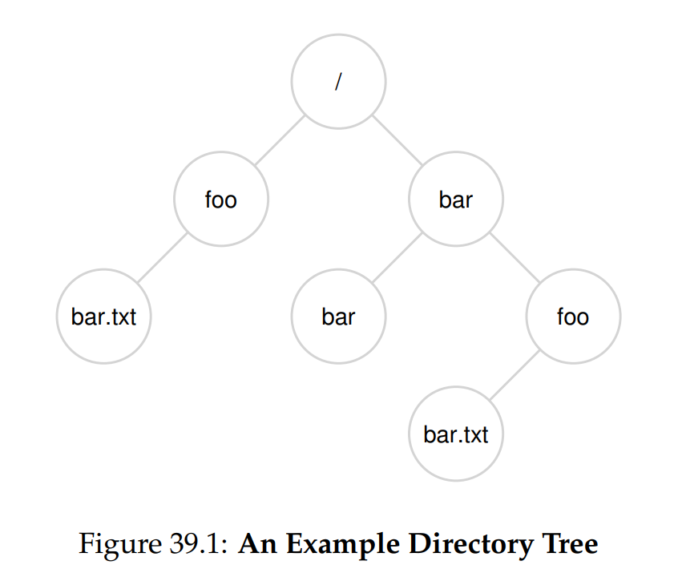
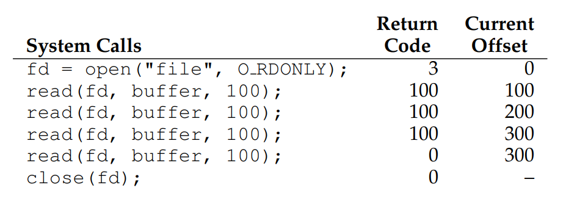
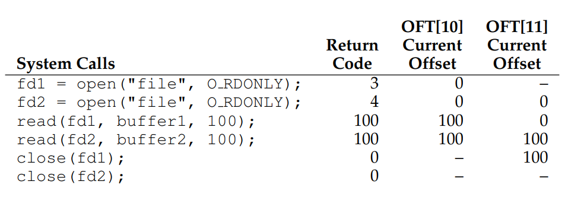
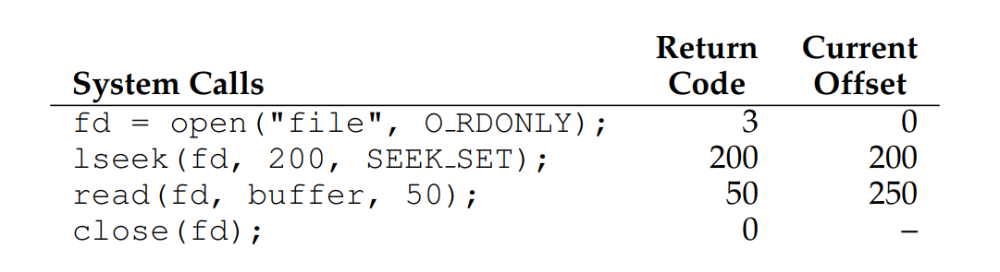
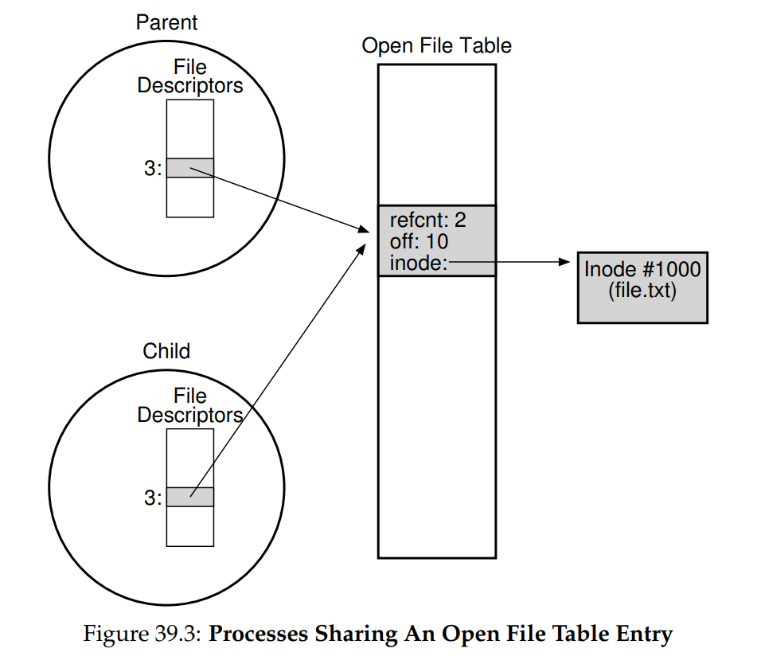

# OSTEP 39：Files and Directories

到目前為止，我們已經見到兩個關鍵的作業系統抽象概念：process，它是對 CPU 的虛擬化，以及 address space，它是對記憶體的虛擬化。 這兩項抽象共同作用，讓程式彷彿運行在自己的私有、隔離世界中，彷彿它擁有自己的處理器（或多個處理器），彷彿它擁有自己的記憶體。 這種幻象讓程式開發大幅簡化，因此這種作法如今不僅在桌上型電腦與伺服器上盛行，也愈來愈多地用在所有可程式化平台，包括行動電話等

在本節中，我們要為虛擬化拼圖再加入一塊關鍵拼圖：持久性儲存。 持久性儲存裝置，例如傳統的硬碟或較新的固態儲存裝置，會將資訊永久儲存（或至少長期保留）。 與電源中斷後內容就會遺失的記憶體不同，持久性儲存裝置可以保持資料完好不變。 因此，作業系統必須對此類裝置格外小心：使用者真正重視的資料就放在這裡

:::info  
如何管理持久性裝置？

作業系統應該如何管理持久性裝置？ API 會是什麼樣子？ 實作上有哪些重要面向？

在接下來的幾章中，我們將探討管理持久性資料的關鍵技術，重點放在提升效能與可靠性的方法。 不過，我們首先會介紹 API 概觀：也就是你在與 UNIX 檔案系統互動時會看到的介面  
:::

## 39.1 Files And Directories

隨著儲存虛擬化的發展，出現了兩個關鍵的抽象概念。 第一個是檔案，檔案就是一個線性位元組陣列，每一個位元組都可以讀取或寫入。 每個檔案都有某種低階名稱，通常是一個編號，而使用者通常並不知道這個名稱。 由於歷史原因，檔案的低階名稱經常被稱為 inode number（i-number）。 接下來的章節中，我們會學到更多關於 inode 的內容； 目前只要假設每個檔案都有對應的 inode number 即可

在大多數系統中，作業系統並不會了解檔案的結構（例如，分辨圖片、文字檔，抑或是 C 程式碼）； 相反地，檔案系統的責任僅在於將這些資料持久地儲存在硬碟上，並確保當你再次請求這些資料時，能取回一開始所放進去的內容。 要做到這點並不像看起來那麼簡單

第二個抽象是目錄，目錄與檔案相同，也有一個低階名稱（也就是 inode number），但目錄的內容相當特別，它包含一組使用者可讀名稱與低階名稱的配對。 例如，假設有一個低階名稱為 “10” 的檔案，並且使用者以 “foo” 這個可讀名稱來指它。 那麼儲存 “foo” 的目錄就會有一個條目（“foo”, “10”），將使用者可讀名稱對映到低階名稱。 目錄中的每個條目可以指向檔案或其他目錄。 透過將目錄放入其他目錄中，使用者可以建構任意的目錄樹（或目錄階層），所有的檔案和目錄都儲存在其中

目錄階層從根目錄開始（在 UNIX 系統中，根目錄簡稱為 `/`），並使用某種分隔符號來為後續的子目錄命名，直到指定到目標檔案或目錄。 例如，如果使用者在根目錄 `/` 中建立了一個名為 `foo` 的目錄，然後在 `foo` 內建立了一個名為 `bar.txt` 的檔案，我們就可以透過其絕對路徑名來參考該檔案，在此情況下就是 `/foo/bar.txt`。 請參考圖 39.1 了解更複雜的目錄樹； 範例中有效的目錄有 `/`、`/foo`、`/bar`、`/bar/bar`、`/bar/foo`； 有效的檔案有 `/foo/bar.txt` 和 `/bar/foo/bar.txt`



只要位於檔案系統樹的不同位置，目錄與檔案可以使用相同的名稱（例如，圖中有兩個名為 `bar.txt` 的檔案，分別是 `/foo/bar.txt` 和 `/bar/foo/bar.txt`）

你可能也注意到，本例中的檔名通常有兩個部分：`bar` 與 `txt`，以句點分隔。 第一部分是任意名稱，第二部分通常用來表明檔案類型，例如它是 C 程式碼（例如 `.c`）、影像（例如 `.jpg`）、或音樂檔（例如 `.mp3`）。 然而，這通常只是慣例：通常並不強制要求名為 `main.c` 的檔案內一定要是 C 原始程式碼

由此可見，檔案系統提供了一項重要功能：為所有感興趣的檔案提供一種方便的命名方式。 命名在系統中非常重要，因為存取任何資源的第一步就是能夠對它進行命名。 在 UNIX 系統中，檔案系統提供了一種統一方式來存取位於硬碟、USB 隨身碟、光碟、許多其他裝置，甚至其他許多東西的檔案，這些都位於同一個目錄樹之下

:::info  
仔細思考命名

命名是電腦系統中重要的一環 [SK09]。 在 UNIX 系統中，幾乎所有你能想到的東西都透過檔案系統進行命名。 不僅是檔案，裝置、pipe，甚至執行緒 [K84] 都可以在看似普通的檔案系統中找到。 這種命名的一致性能使你對系統的概念模型更為簡潔，並且讓系統更簡單、更模組化。 因此，無論何時建立系統或介面，都要仔細斟酌所使用的名稱  
:::

## 39.2 The File System Interface

現在讓我們更詳細地討論檔案系統介面。 我們將從建立、存取和刪除檔案的基本操作開始，過程中我們還會介紹一個用於移除檔案的系統呼叫，稱為 `unlink()`

## 39.3 Creating Files

我們先從最基本的操作開始：建立檔案。 這可以透過 open 系統呼叫來完成； 呼叫 `open()` 並傳遞 `O_CREAT` 標誌，程式就能建立一個新的檔案。 以下是一段範例程式碼，用來在目前工作目錄中建立名為 “foo” 的檔案：

```c
int fd = open("foo", O_CREAT | O_WRONLY | O_TRUNC,S_IRUSR | S_IWUSR);
```

`open()` 接收多種不同的旗標。 在此範例中，第二個參數會在檔案不存在時建立檔案（`O_CREAT`），確保該檔案只能寫入（`O_WRONLY`），並且如果檔案已經存在，則將其截斷為零位元組長度，因此移除任何已存在的內容（`O_TRUNC`）。 第三個參數用來指定權限，此例中讓檔案對擁有者可讀且可寫

`open()` 的一個重要面向是它的回傳值：file descriptor。 file descriptor 是一個整數，每個 process 內部都會有這個成員，在 UNIX 系統中用來存取檔案； 因此，一旦檔案被開啟，就可以使用該 file descriptor 來讀取或寫入檔案，前提是你具有相應的權限。 從這個角度來看，file descriptor 就是一種 capability [L84]，也就是一個不透明的手柄，賦予你執行特定操作的能力。 另一個思考 file descriptor 的方式是，將它視為指向 file 類型物件的指標； 一旦你擁有這樣的物件，就能呼叫其他「方法」來存取檔案，例如 `read()` 和 `write()`（我們稍後將看到如何使用）

如上述所述，file descriptors 由作業系統在每個 process 內部進行管理。 這表示在 UNIX 系統的 proc 結構中會保留某種簡單的結構（例如陣列）。 以下是 xv6 核心中相關的程式碼片段 [CK+08]：

```c
struct proc {
  ...
  struct file *ofile[NOFILE]; // Open files
  ...
};
```

這個簡單的陣列（最多可開啟 `NOFILE` 個檔案），以 file descriptor 為索引，用來追蹤每個 process 已開啟的檔案。 陣列的每個條目實際上只是一個指向 struct file 的指標，用以跟蹤關於正在讀取或寫入的檔案的資訊； 我們稍後會進一步討論此部分

:::info  
`creat()` 系統呼叫

建立檔案的舊方法是呼叫 `creat()`，如下所示：

```c
// option: add second flag to set permissions
int fd = creat("foo");
```

你可以將 `creat()` 視為帶有以下旗標的 `open()`：`O_CREAT | O_WRONLY | O_TRUNC`。 由於 `open()` 能夠建立檔案，因此 `creat()` 的使用已逐漸不再流行（事實上，它可直接實作為開啟 `open()` 的函式庫呼叫）； 然而，它在 UNIX 傳奇中仍佔有特殊地位，之前有人問 Ken Thompson 如果重新設計 UNIX，他會做哪些不同的事時，他回答：「我會把 creat 拼成 c-r-e-a-t-e」  
:::

## 39.4 Reading And Writing Files

一旦我們擁有了一些檔案，當然可能會想要讀取或寫入它們，讓我們先從讀取現有檔案開始。 如果我們在命令列輸入，我們可能會直接使用 cat 程式將檔案內容輸出到螢幕：

```cmd
prompt> echo hello > foo  
prompt> cat foo  
hello  
prompt>  
```

在這段程式碼中，我們將 echo 程式的輸出重新導向到檔案 foo，這樣 foo 就會包含「hello」這個字串。 接著我們使用 cat 來檢視該檔案的內容。 但 cat 程式是如何存取檔案 foo 的？

為了找出這個問題，我們將使用一個非常有用的工具來追蹤程式所呼叫的系統呼叫。 在 Linux 上，此工具稱為 `strace`； 其他系統也有類似的工具（例如在 Mac 上的 `dtruss`，或在某些較舊 UNIX 變體上的 `truss`）。 `strace` 的作用是在程式執行期間追蹤它所發出的每個系統呼叫，並將追蹤結果輸出到螢幕供你查看

以下是一個使用 `strace` 來了解 `cat` 正在做什麼的範例（為了可讀性我們移除了部分呼叫）：

```cmd
prompt> strace cat foo  
...  
open("foo", O_RDONLY|O_LARGEFILE) = 3  
read(3, "hello\n", 4096) = 6  
write(1, "hello\n", 6) = 6  
hello  
read(3, "", 4096) = 0  
close(3) = 0  
...  
prompt>
```

`cat` 做的第一件事是以讀取模式打開該檔案，我們需要注意幾點； 第一，此檔案僅以讀取模式開啟（未以寫入模式開啟），這由 `O_RDONLY` 標誌顯示； 第二，使用了 64 位元的偏移量（`O_LARGEFILE`）； 第三，`open()` 呼叫成功並回傳一個 file descriptor，其值為 3 

為什麼第一次呼叫 `open()` 會回傳 3，而不是像你預期的 0 或 1 呢？ 事實上，每個執行中的 process 已經有三個檔案被打開，分別是標準輸入（process 可透過它讀取輸入）、標準輸出（process 可寫入它以便將資訊輸出到螢幕）以及標準錯誤（process 可寫入它來輸出錯誤訊息）。 這三個分別以 file descriptor 0、1 和 2 來表示。 因此，當你第一次打開另一個檔案（如上述 `cat` 中所示），它幾乎必定會成為 file descriptor 3

在 `open()` 成功之後，`cat` 會使用 `read()` 系統呼叫反覆地從檔案讀取一些位元組。 `read()` 的第一個參數是 file descriptor，告訴檔案系統要讀取哪個檔案； 一個 process 當然可以同時打開多個檔案，因此透過該 descriptor，作業系統才能知道特定的 read 呼叫指向哪個檔案

第二個參數是指向一個緩衝區，`read()` 的結果將存放於此； 在上述的系統呼叫追蹤中，`strace` 顯示了 `read` 的結果（“hello”）。 第三個參數是緩衝區大小，此例中為 4 KB。 `read()` 呼叫也成功回傳，在此回傳它所讀取的位元組數（6，包括 “hello” 這五個字母與一個換行符號）

此時，你會看到 `strace` 的另一個有趣結果：有個單一的 `write()` 系統呼叫，其目標是 file descriptor 1。 如我們先前所述，此 descriptor 被稱為標準輸出，因此用於將「hello」這個字串寫到螢幕上，符合 `cat` 程式的預期行為。 但它是直接呼叫 `write()` 嗎？ 也許是（若程式高度最佳化）。 但如果不是的話，`cat` 可能會呼叫函式庫例程 `printf()`； 在內部，`printf()` 會處理所有傳給它的格式化細節，最終將結果寫入標準輸出，並顯示在螢幕上

接著，`cat` 程式會嘗試從該檔案讀取更多內容，但由於檔案中已經沒有剩餘位元組，`read()` 便回傳 0，程式遂藉此判斷已經讀取完整個檔案。 因此，程式呼叫 `close()`，將對應的 file descriptor 傳入，以表示已經完成對檔案 “foo” 的操作。 該檔案隨即關閉，讀取動作也隨之結束

寫入檔案的操作由類似步驟完成。 首先，以寫入模式打開檔案，接著呼叫 `write()` 系統呼叫（對於較大的檔案可能會重複呼叫），最後呼叫 `close()`。 你可以使用 `strace` 追蹤對檔案的寫入動作，例如追蹤你自己撰寫的程式，或是追蹤 `dd` 工具（例如 `dd if=foo of=bar`）

:::info  
使用 `strace`（以及類似工具）

`strace` 工具提供了一種很棒的方法來觀察程式在做什麼。 執行它後，你可以追蹤程式所呼叫的系統呼叫、檢視參數與回傳代碼，並大致了解系統在運作的狀況

該工具還接受一些相當有用的參數。 例如，`-f` 會追蹤任何被 fork 出來的子程序； `-t` 會在每次呼叫時報告當前時間； `-e trace=open,close,read,write` 只追蹤這些系統呼叫並忽略所有其他呼叫。 旗標還有許多種； 請閱讀 man page，了解如何運用這個出色的工具
:::

:::info  
DATA STRUCTURE — 已開啟檔案表（THE OPEN FILE TABLE）

每個 process 都會維護一個 file descriptor 陣列，其中每個元素都參照系統範圍內的「已開啟檔案表」中的一個條目。 此表中的每個條目都會追蹤該 descriptor 所指向的底層檔案、目前的偏移量，以及其他相關細節（如該檔案是否可讀或可寫）  
:::

## 39.5 Reading And Writing, But Not Sequentially

到目前為止，我們已經討論了如何讀取和寫入檔案，但所有存取都是順序式的； 也就是說，我們要麼從頭到尾讀取檔案，要麼從頭到尾寫入檔案。 然而，有時能夠在檔案內的特定偏移位置讀取或寫入非常有用； 例如，如果你在文字文件上建立索引，並用它來查找特定字詞，你就可能需要從文件中的某些隨機偏移處開始讀取

為此，我們將使用 `lseek()` 系統呼叫。 其函式原型如下：

```c
off_t lseek(int fildes, off_t offset, int whence)
```

第一個參數是熟悉的 file descriptor。 第二個參數是 offset，它將檔案偏移設定位於檔案內的某個位置。 第三個參數名為 whence，出於歷史原因如此命名，它決定了如何執行 seek。 根據 man page：

- 若 whence 為 `SEEK_SET`，則偏移設置為 offset 位元組
- 若 whence 為 `SEEK_CUR`，則偏移設置為當前位置加上 offset 位元組
- 若 whence 為 `SEEK_END`，則偏移設置為檔案大小加上 offset 位元組

由此描述可知，對於每個 process 打開的檔案，OS 都會追蹤一個「目前」的偏移。 其更新方式有兩種：第一種是當執行 N 位元組的讀取或寫入時，就將 N 加到目前偏移； 因此每次讀取或寫入都會隱含地更新偏移。 第二種則是使用 `lseek` 顯式更改偏移，根據上述規則執行

如你所料，偏移值保存在先前提到的 struct file 中，並由 struct proc 所參照。 以下是 xv6 中該結構的（簡化）定義：

```c
struct file {
  int ref;
  char readable;
  char writable;
  struct inode *ip;
  uint off;
}
```

如你在結構中所見，OS 可以利用它來判斷已開啟的檔案是否可讀或可寫（或兩者皆可）、它所參照的底層檔案（由 `struct inode` 的指標 `ip` 所指向）以及目前偏移（`off`）。 此結構還包含一個參考計數（`ref`），我們稍後會進一步探討

這些 file 結構代表系統中所有目前已開啟的檔案； 合在一起，有時稱為「已開啟檔案表」。 xv6 核心將它們當作一個陣列來保存，並為整個表配置一把鎖：

```c
struct {
  struct spinlock lock;
  struct file file[NFILE];
} ftable
```

讓我們透過幾個範例來澄清這個概念。 首先，假設有個 process 打開了一個大小為 300 位元組的檔案，並透過重複呼叫 `read()` 系統呼叫來讀取檔案，每次讀取 100 位元組。 底下列出相關系統呼叫的追蹤結果，以及每個系統呼叫回傳的值，還有針對該檔案存取在已開啟檔案表中的目前偏移值：



從追蹤結果中可以注意到幾項重點。 首先，你可以看到當檔案被開啟時，目前偏移會初始化為零。 接著，你會看到隨著 process 每次呼叫 `read()`，該偏移會遞增； 這讓 process 只要一直呼叫 `read()` 就能輕鬆取得下一段檔案內容。 最後，你可以看到當嘗試在檔案結尾之後執行 `read()` 時會回傳零，藉此告知 process 已經完整地讀取了整個檔案

接下來，我們假設有個 process 先後兩次打開了相同的檔案，並對它們各自執行讀取的情況：



在此範例中，會分別配置兩個 file descriptor（3 和 4），它們各自對應到已開啟檔案表中的不同條目（此例中是條目 10 和 11，如表格標題所示； OFT 代表 Open File Table）。 如果你仔細追蹤，就會看到每個目前偏移都是獨立更新的

在最後一個範例中，process 在讀取之前先使用 `lseek()` 重新設定目前偏移； 在這種情況下，只需要單一的已開啟檔案表條目（就如第一個範例一樣）。 此處，首先呼叫 `lseek()` 將目前偏移設為 200。 隨後的 `read()` 就會讀取接下來的 50 位元組，並相應地更新目前偏移



:::info  
呼叫 `lseek()` 並不會執行硬碟搜尋

`lseek()` 這個名稱不佳的系統呼叫讓許多試圖了解硬碟及其上層檔案系統運作方式的學生感到困惑。 請不要將兩者混淆！ `lseek()` 呼叫僅僅更改 OS 記憶體中的一個變數，用來追蹤特定 process 下一次讀取或寫入將從哪個偏移開始

而硬碟搜尋會在硬碟的讀取或寫入的目標磁道與上次讀寫的磁道不同時發生，此時就需要移動磁頭。 更令人混淆的是，呼叫 `lseek()` 後如果對檔案的隨機位置進行讀寫，確實會導致更多的硬碟搜尋。 因此，呼叫 `lseek()` 可能會導致接下來的讀取或寫入產生搜尋，但它本身絕對不會引起任何硬碟 I/O operations  
:::

## 39.6 Shared File Table Entries: `fork()` And `dup()`

在許多情況下（如上述範例所示），file descriptor 與開啟檔案表中的條目之間是一對一的對應。 例如，當一個 process 執行時，可能會決定打開一個檔案、讀取它，然後關閉它； 在這種情況下，該檔案在開啟檔案表中會擁有唯一的條目。 即使有其他 process 同時讀取同一個檔案，它們也各自會在開啟檔案表中有自己的條目。 透過這種方式，每個對檔案的邏輯讀取或寫入都是獨立的，並且在存取該檔案時，各自都擁有自己的目前偏移

不過，也有一些有趣的情況，讓開啟檔案表中的條目會被共享。其中一種情況發生在父 process 使用 `fork()` 建立子 process 時。 圖 39.2 顯示了一段簡短的程式碼，父 process 建立子 process 後再等待它完成。 子 process 透過呼叫 `lseek()` 調整目前偏移，然後結束。 最後，父 process 在等待子 process 後，檢查目前偏移並將其值輸出：

<center-panel natural title="（Figure 39.2: Shared Parent/Child File Table Entries (fork-seek.c)）">

```c
int main(int argc, char* argv[])
{
  int fd = open("file.txt", O_RDONLY);
  assert(fd >= 0);
  int rc = fork();
  if (rc == 0) {
    rc = lseek(fd, 10, SEEK_SET);
    printf("child: offset %d\n", rc);
  }
  else if (rc > 0) {
    (void)wait(NULL);
    printf("parent: offset %d\n", (int)lseek(fd, 0, SEEK_CUR));
  }
  return 0;
}
```

</center-panel>

當我們執行此程式時，會看到以下輸出：

```cmd
prompt> ./fork-seek
child: offset 10
parent: offset 10
prompt>
```

圖 39.3 顯示了將每個 process 的私有 descriptor 陣列、共享的開啟檔案表條目，以及該條目對底層檔案系統 inode 之參照連結起來的關係。 請注意，我們在此終於實際使用了參考計數。 當某個檔案表條目被共享時，其參考計數會遞增； 只有當兩個 process 都關閉該檔案（或結束）時，該條目才會被移除



在父 process 與子 process 之間共享開啟檔案表條目有時相當有用。 例如，若你建立多個共同協作處理某項任務的 process，它們可以寫入同一個輸出檔案而不需額外協調。 如要進一步了解在呼叫 `fork()` 時 processes 之間會共享什麼，請參閱 man page

另一個有趣且或許更實用的共享案例發生於 `dup()` 系統呼叫（及其親戚 `dup2()` 與 `dup3()`）。 `dup()` 呼叫讓 process 能建立一個新的 file descriptor，該 descriptor 指向與某現有 descriptor 相同的底層已開啟檔案。 圖 39.4 顯示了一段簡短程式碼，說明如何使用 `dup()`：

<center-panel natural title="（Figure 39.4: Shared File Table Entry With dup() (dup.c)）">

```c
int main(int argc, char* argv[])
{
  int fd = open("README", O_RDONLY);
  assert(fd >= 0);
  int fd2 = dup(fd);
  // now fd and fd2 can be used interchangeably
  return 0;
}
```

</center-panel>

`dup()` 呼叫（尤其是 `dup2()`）在撰寫 UNIX shell 並執行像輸出重導向等操作時相當有用； 花點時間想想原因吧！

## 39.7 Writing Immediately With `fsync()`

大多數情況下，當程式呼叫 `write()` 時，它只是告訴檔案系統：請在未來某個時刻，將這些資料寫入持久性儲存。 基於效能考量，檔案系統會將這些寫入先在記憶體中緩衝一段時間（例如 5 秒或 30 秒），之後這些寫入動作才會實際送到儲存裝置。 對於呼叫的應用程式而言，寫入似乎很快就完成了，只有在極少數情況下（例如機器在 `write()` 呼叫之後但在寫入硬碟之前當機）資料才會遺失

然而，有些應用程式需要比這種「最終保證」更多的保障。 例如，在資料庫管理系統（DBMS）中，若要開發正確的復原協定，就需要不時強制將寫入動作同步到硬碟

為了支援這類應用程式，多數檔案系統會提供一些額外的控制 API。 在 UNIX 世界中，提供給應用程式的介面稱為 `fsync(int fd)`。 當一個 process 對特定的 file descriptor 呼叫 `fsync()` 時，檔案系統就會強制將該 file descriptor 所指向的檔案中所有尚未寫入的資料（dirty）同步到硬碟。 `fsync()` 會在所有這些寫入完成後才回傳

以下是一個使用 `fsync()` 的簡單範例程式碼。 該程式先開啟檔案 foo，寫入一個資料區塊，接著呼叫 `fsync()`，以確保寫入立即強制執行到硬碟。 一旦 `fsync()` 回傳，應用程式就可以放心繼續，因為資料已確實被持久化（前提是 `fsync()` 已正確實作）

```c
int fd = open("foo", O_CREAT | O_WRONLY | O_TRUNC, S_IRUSR | S_IWUSR);
assert(fd > -1);
int rc = write(fd, buffer, size);
assert(rc == size);
rc = fsync(fd);
assert(rc == 0);
```

有趣的是，這樣的一連串操作並不保證你所期望的一切； 在某些情況下，你還需要對包含該檔案 `foo` 的目錄執行 `fsync()`。 加入這一步驟可確保不僅只能將該檔案本身寫入硬碟，若該檔案是新建立的，還可以確保它穩定地成為目錄的一部分。 不出所料，這類細節經常被忽略，導致許多應用程式層級的錯誤 [P+13,P+14]

## 39.8 Renaming Files

一旦我們擁有了一個檔案，有時能夠為該檔案給予不同的名稱非常有用。 在命令列輸入時，我們可以使用 `mv` 指令達成此目的； 在此範例中，檔案 `foo` 被重新命名為 `bar`：

```cmd
prompt> mv foo bar
```

使用 `strace`，我們可以看到 `mv` 會呼叫系統呼叫 `rename(char *old, char *new)`，該呼叫僅接受兩個參數：檔案的原始名稱（`old`）與新名稱（`new`）

`rename()` 呼叫提供了一個有趣的保證：在系統當機時，它（通常）會以原子方式實作。 如果系統在重新命名過程中當機，該檔案要麼保留舊名稱，要麼已用新名稱，永遠不會出現奇怪的中間狀態，因此，`rename()` 對於支援需要對檔案狀態進行原子更新的某些應用程式非常關鍵

讓我們更具體一點來說明。 假設你正在使用一個檔案編輯器（例如 emacs），並將一行文字插入到檔案的中間，此範例中，檔案名稱為 `foo.txt`，編輯器可能會透過下列方式更新檔案，以保證新檔案在原始內容之後插入該行文字（此處簡化，不考慮錯誤檢查）：

```c
int fd = open("foo.txt.tmp", O_WRONLY | O_CREAT | O_TRUNC, S_IRUSR | S_IWUSR);
write(fd, buffer, size); // write out new version of file
fsync(fd);
close(fd);
rename("foo.txt.tmp", "foo.txt");
```

此範例中，編輯器所做的動作很簡單：先將檔案的新版本以暫時名稱（`foo.txt.tmp`）寫出，然後呼叫 `fsync()` 強制將其同步到硬碟，當應用程式確定新的檔案內容與元資料已在硬碟上時，再將暫時檔案重新命名為原始檔案名稱。 此最後步驟可原子地將新檔案替換到原位，同時刪除舊版本，從而達成原子性檔案更新

:::info  
`mmap()` 與持久性記憶體（Guest Aside by Terence Kelly）

記憶體映射是一種存取檔案中持久性資料的替代方式，`mmap()` 系統呼叫可在檔案的位元組偏移量與呼叫 process 的虛擬地址之間建立對應； 前者稱為 backing file，後者稱為其在記憶體中的映像

接著，process 可使用 CPU 指令（即 `load` 與 `store`）來存取這個 backing file 的記憶體映像。 透過將檔案的持久性與記憶體的存取語意結合，檔案輔助的記憶體映射支援一種名為 persistent memory 的軟體抽象。 採用 persistent memory 程式設計風格，可消除記憶體與儲存之間不同資料格式的轉換，從而簡化應用程式 [K19]

```c
p = mmap(NULL, file_size, PROT_READ | PROT_WRITE, MAP_SHARED, fd, 0);
assert(p != MAP_FAILED);
for (int i = 1; i < argc; i++) {
  if (strcmp(argv[i], "pop") == 0) { // pop
    if (p->n > 0)                    // stack not empty
      printf("%d\n", p->stack[--p->n]);
  }
  else {                                                          // push
    if (sizeof(pstack_t) + (1 + p->n) * sizeof(int) <= file_size) // stack not full
      p->stack[p->n++] = atoi(argv[i]);
  }
}
```

程式 `pstack.c`（包含於 OSTEP 程式碼 GitHub 倉庫中，上方片段即此程式）會在檔案 `ps.img` 中儲存一個持久性堆疊（stack），該檔案的一開始即為一堆零位元組，這可於命令列中使用 `truncate` 或 `dd` 工具建立

該檔案包含堆疊大小的計數，以及一個存放堆疊內容的整數陣列。 在對 backing file 進行 `mmap()` 映射之後，我們可以使用指向記憶體映像的指標來存取堆疊，例如 `p->n` 可存取堆疊中的項目數量，`p->stack` 即是整數陣列。 由於該堆疊是持久性堆疊，因此一次 `pstack` 執行 `push` 的資料可由下一次執行 `pop`

若在執行 `push` 的遞增與指派之間發生當機，可能會導致我們的持久性堆疊處於不一致狀態。 應用程式可透過使用在面對失敗時能原子性更新持久性記憶體的機制來防止此類損害 [K20]  
:::

## 39.9 Getting Information About Files

超越一般的檔案存取，我們期望檔案系統能保存相當多關於每個檔案的資訊，這些關於檔案的資料通常稱為 metadata。 要查看某個檔案的 metadata，可以使用 `stat()` 或 `fstat()` 這兩個系統呼叫。 這些呼叫會接收一個檔案的路徑名稱（或 file descriptor），並將相關資訊填入如圖 39.5 所示的 `stat` 結構中：

<center-panel natural title="（Figure 39.5 : The stat structure.）">

```c
struct stat {
  dev_t st_dev;         // ID of device containing file
  ino_t st_ino;         // inode number
  mode_t st_mode;       // protection
  nlink_t st_nlink;     // number of hard links
  uid_t st_uid;         // user ID of owner
  gid_t st_gid;         // group ID of owner
  dev_t st_rdev;        // device ID (if special file)
  off_t st_size;        // total size, in bytes
  blksize_t st_blksize; // blocksize for filesystem I/O
  blkcnt_t st_blocks;   // number of blocks allocated
  time_t st_atime;      // time of last access
  time_t st_mtime;      // time of last modification
  time_t st_ctime;      // time of last status change
};
```

</center-panel>

可以看到，關於每個檔案儲存了很多資訊，包括檔案大小（以位元組為單位）、其低階名稱（也就是 inode number）、部分所有權資訊，以及檔案何時被存取或修改的時間等。 若想查看這些資訊，可以使用命令列工具 `stat`。 以下範例中，我們先建立一個名為 file 的檔案，然後使用 `stat` 命令列工具來檢視該檔案的一些資訊

以下是在 Linux 上的輸出範例：

```cmd
prompt> echo hello > file
prompt> stat file
  File: ‘file’
  Size: 6 Blocks: 8 IO Block: 4096 regular file
Device: 811h/2065d Inode: 67158084 Links: 1
Access: (0640/-rw-r-----) Uid: (30686/remzi)
  Gid: (30686/remzi)
Access: 2011-05-03 15:50:20.157594748 -0500
Modify: 2011-05-03 15:50:20.157594748 -0500
Change: 2011-05-03 15:50:20.157594748 -0500
```

每個檔案系統通常會將這類資訊儲存在名為 inode 的結構中。 當我們討論檔案系統實作時，會更深入學習 inodes。 暫且只要將 inode 視為檔案系統保存的持久化資料結構，其中包含上述所見的各種資訊即可。 所有 inode 都存放在硬碟上，活動中的 inode 則通常會快取於記憶體中，以加速存取

## 39.10 Removing Files

到此為止，我們已經知道如何建立檔案並存取它們，不論是順序存取或非順序存取，但要如何刪除檔案呢？ 如果你使用過 UNIX，很可能認為只要執行 `rm` 程式即可，但 `rm` 會呼叫哪個系統呼叫來移除檔案呢？

讓我們再次使用老朋友 `strace` 來找答案。 這裡我們要刪除那個惱人的 foo 檔案：

```cmd
prompt> strace rm foo
...
unlink("foo") = 0
...
```

我們已經從追蹤輸出中去掉了許多無關內容，只留下了 `unlink()`。 如你所見，`unlink()` 只接受要移除檔案的名稱，並在成功時回傳零。 但這就衍生了一個極有趣的謎題：為何這個系統呼叫要命名為 `unlink`，而不是直接叫 `remove` 或 `delete` 呢？ 要解開這個謎題的答案，我們必須了解的不只有檔案，還有目錄

## 39.11 Making Directories

除了檔案之外，一組與目錄相關的系統呼叫允許你建立、讀取和刪除目錄。 請注意，你永遠無法直接寫入目錄。 由於目錄的格式被視為檔案系統的元資料，檔案系統將負責維護目錄資料的完整性； 因此，你只能透過間接方式更新目錄，例如在其內建立檔案、目錄或其他物件類型。 如此一來，檔案系統才可確保目錄內容符合預期

要建立目錄，可使用單一系統呼叫 `mkdir()`。 同名的 `mkdir` 程式可用來建立此類目錄。 讓我們來看看執行 `mkdir` 程式以建立名為 `foo` 的簡單目錄時會發生什麼：

```cmd
prompt> strace mkdir foo
...
mkdir("foo", 0777) = 0
...
prompt>
```

當這樣的目錄被建立後，它被視為是「空的」目錄，儘管它確實包含最基本的內容。 具體來說，空目錄有兩個條目：其中一個條目參照自己，另一個條目參照其父目錄。 前者稱為 “.”（dot）目錄，後者稱為 “..”（dot-dot）目錄。 你可以對 `ls` 程式傳遞 `-a` 旗標來看到這些目錄：

```cmd
prompt> ls -a
./ ../
prompt> ls -al
total 8
drwxr-x--- 2 remzi remzi 6 Apr 30 16:17 ./
drwxr-x--- 26 remzi remzi 4096 Apr 30 16:17 ../
```

:::info  
謹慎使用強大指令

`rm` 程式為我們提供了一個強大指令的經典範例，說明有時候過於強大的權限反而會帶來不良後果。 例如，若要一次刪除大量檔案，你可以輸入：

```cmd
prompt> rm *
```

其中的 `*` 會匹配目前目錄下的所有檔案。 但有時你也想刪除目錄，以及目錄內的所有內容。 你可以讓 `rm` 遞迴地深入每個目錄，並刪除其所有內容：

```cmd
prompt> rm -rf *
```

若你不小心在檔案系統的根目錄執行這條指令，就會刪除其中的所有檔案與目錄，糟糕！ 因此，請記住強大指令具有雙面性； 它們可讓你用少量按鍵執行大量工作，但同時也可能迅速且輕易地造成巨大的傷害
:::

## 39.12 Reading Directories

我們無法像操作檔案一樣直接打開目錄，而是需要使用一組新的呼叫。 以下是一個範例程式，會列印某個目錄的內容。 此程式使用三個呼叫：`opendir()`、`readdir()` 和 `closedir()` 來完成工作，你會發現介面非常簡單； 我們只用一個迴圈，每次讀取一個目錄項目，並印出該檔案的名稱與 inode number

```c
int main(int argc, char* argv[])
{
  DIR* dp = opendir(".");
  assert(dp != NULL);
  struct dirent* d;
  while ((d = readdir(dp)) != NULL) {
    printf("%lu %s\n", (unsigned long)d->d_ino, d->d_name);
  }
  closedir(dp);
  return 0;
}
```

以下的宣告顯示了 struct dirent 資料結構中，每個目錄項目條目內可用的資訊：

```c
struct dirent {
  char d_name[256];        // filename
  ino_t d_ino;             // inode number
  off_t d_off;             // offset to the next dirent
  unsigned short d_reclen; // length of this record
  unsigned char d_type;    // type of file
};
```

由於目錄所包含的資訊很精簡（基本上只是將檔名對映到 inode number，並包含少量其他細節），程式通常會對每個檔案呼叫 `stat()`，以獲得更多資訊，例如檔案長度或其他詳細資訊。 事實上，這正是當你對 `ls` 傳遞 `-l` 參數時它所做的； 你可以使用 `strace` 分別追蹤帶與不帶該參數的 `ls`，以親自觀察其差異

## 39.13 Deleting Directories

最後，你可以透過呼叫 `rmdir()` 來刪除目錄（系統中也有同名程式 `rmdir` 可使用）。 然而，不同於刪除檔案，移除目錄的風險更高，因為一次操作可能刪掉大量資料。 因此，`rmdir()` 有一個要求：目錄必須為空（即僅包含 “.” 和 “..” 這兩個條目）才能被刪除。 如果你嘗試刪除非空目錄，`rmdir()` 呼叫就會失敗

## 39.14 Hard Links

現在讓我們回來看為何刪除檔案要透過 `unlink()`，這要先了解另一種在檔案系統樹中建立條目的方式，即 `link()` 系統呼叫。 `link()` 系統呼叫接受兩個引數：舊路徑名稱和新路徑名稱； 當你將新檔名「連結」到舊檔名時，實際上就是為同一個檔案建立另一個參考方式。 命令列中的 `ln` 程式就能執行此操作，如以下範例所示：

```cmd
prompt> echo hello > file
prompt> cat file
hello
prompt> ln file file2
prompt> cat file2
hello
```

在這裡，我們先建立一個內容為「hello」的檔案，並將其命名為 `file`。 接著使用 `ln` 程式，為同一個檔案建立一個硬連結，名為 `file2`。 此後，你可以透過開啟 `file` 或 `file2` 來檢視同一份檔案

`link()` 的運作方式非常簡單：它會在你指定要建立連結的目錄中，建立一個新的檔名，並將該名稱指向與原始檔案相同的 inode number（也就是低階名稱）。 此操作並不會複製檔案，取而代之的是，你在目錄中會同時擁有兩個可讀的名稱（`file` 和 `file2`），它們都指向相同的檔案。 我們甚至可以在目錄層級觀察到這一點，方法是列印每個檔案的 inode number：

```cmd
prompt> ls -i file file2
67158084 file
67158084 file2
prompt>
```

對 `ls` 使用 `-i` 旗標後，它會同時列出檔案名稱與對應的 inode number。 由此可見 link 所做的事情：僅僅為同一個 inode number（此例中為 67158084）建立了新的參考

現在你應該開始理解為何刪除檔案要叫 `unlink()` 了。 當你建立一個檔案時，實際上同時執行了兩件事。 首先，你要建立一個資料結構（inode），用來追蹤關於該檔案的所有相關資訊，包括檔案大小、在硬碟上的區段位置等等。 其次，你要將人類可讀的檔名與該檔案聯結起來，並將這個連結放入某個目錄中。 因此，當你為同一個檔案建立一個硬連結時，實質上它們都只是指向存放在 inode number 67158084 底層元資料的連結

也因此，若要從檔案系統中刪除檔案，就要呼叫 `unlink()`。 以剛才的範例來說，在你移除名為 `file` 的檔案後，其實仍可正常存取該檔案：

```
prompt> rm file
removed ‘file’
prompt> cat file2
hello
```

之所以能這麼做，是因為當檔案系統執行 `unlink("file")` 時，它會檢查該 inode number 底下的參考計數。 這個參考計數（有時稱為 link count）讓檔案系統得以追蹤有多少不同的檔名連結到同一個 inode。 當呼叫 `unlink()` 時，它會移除該人類可讀檔名（即欲刪除的檔案）與對應 inode number 的連結，並將參考計數減一； 只有當參考計數減到零時，檔案系統才會釋放該 inode 及其相關的資料區塊，從而真正「刪除」該檔案

你當然也可以使用 `stat()` 來查看檔案的參考計數。 讓我們在為同一個檔案建立與刪除硬連結時，觀察參考計數如何變化。 以下範例中，我們為同一個檔案建立三個連結，然後再逐一刪除，看看 link count 如何改變：

```cmd
prompt> echo hello > file
prompt> stat file
... Inode: 67158084 Links: 1 ...
prompt> ln file file2
prompt> stat file
... Inode: 67158084 Links: 2 ...
prompt> stat file2
... Inode: 67158084 Links: 2 ...
prompt> ln file2 file3
prompt> stat file
... Inode: 67158084 Links: 3 ...
prompt> rm file
prompt> stat file2
... Inode: 67158084 Links: 2 ...
prompt> rm file2
prompt> stat file3
... Inode: 67158084 Links: 1 ...
prompt> rm file3
```

## 39.15 Symbolic Links

還有一種非常實用的連結類型，稱為符號連結（有時也叫做軟連結）。 硬連結有一些限制：你無法對目錄建立硬連結（以免在目錄樹中造成循環）； 你也無法對其他硬碟分割中的檔案建立硬連結（因為 inode 號僅在單一檔案系統內部唯一，而非跨檔案系統都一致）；等等。 為此，人們創造了另一種連結，稱為符號連結 [MJLF84]

要建立這種連結，你可以使用同樣的 `ln` 程式，但加上 `-s` 旗標。 以下是一個範例：

```cmd
prompt> echo hello > file
prompt> ln -s file file2
prompt> cat file2
hello
```

如你所見，建立軟連結的方式看起來非常相似，原本的檔案現在既可以透過檔名 `file` 存取，也可以透過符號連結名稱 `file2` 存取。 但在表面相似之下，符號連結與硬連結實際上大相逕庭。 第一個差異在於符號連結本身就是一個檔案，但類型不同。 我們之前談過一般檔案與目錄； 符號連結則是檔案系統認識的第三種型態。 對符號連結執行 `stat`，就能看出端倪：

```cmd
prompt> stat file
  ... regular file ...
prompt> stat file2
  ... symbolic link ...
```

執行 `ls` 也能顯示這點。 如果仔細觀察 `ls` 輸出最左側的第一個字元，你會看到常規檔案前面是 `-`，目錄前面是 `d`，而軟連結前面是 `l`。 你也可以看到符號連結的大小（此例中為 4 位元組）以及該連結指向的目標（即名為 file 的檔案）

```cmd
prompt> ls -al
drwxr-x---  2 remzi remzi   29 May  3 19:10 ./
drwxr-x--- 27 remzi remzi 4096 May  3 15:14 ../
-rw-r-----  1 remzi remzi    6 May  3 19:10 file
lrwxrwxrwx  1 remzi remzi    4 May  3 19:10 file2 -> file
```

`file2` 為何是 4 位元組？ 原因在於符號連結的實作方式：它將被連結到的檔案路徑名稱作為連結檔案的資料儲存。 因為我們連結到名為 `file` 的檔案，所以連結檔 `file2` 很小（4 位元組）。 如果我們連結到較長的路徑名稱，連結檔就會更大：

```cmd
prompt> echo hello > alongerfilename
prompt> ln -s alongerfilename file3
prompt> ls -al alongerfilename file3
-rw-r----- 1 remzi remzi  6 May  3 19:17 alongerfilename
lrwxrwxrwx 1 remzi remzi 15 May  3 19:17 file3 -> alongerfilename
```

最後，由於符號連結的建立方式，會產生一種稱為「懸掛參考（dangling reference）」的情況：

```cmd
prompt> echo hello > file
prompt> ln -s file file2
prompt> cat file2
hello
prompt> rm file
prompt> cat file2
cat: file2: No such file or directory
```

如你在此範例中所見，這與硬連結大不相同：移除名為 `file` 的原始檔案後，符號連結會指向一個已不存在的路徑

## 39.16 Permission Bits And Access Control Lists

process 這個抽象提供了兩個核心的虛擬化：一是 CPU，二是記憶體。 這兩者都讓 process 有種假象，彷彿它擁有自己的獨立 CPU 和獨立記憶體； 但實際上，底層的 OS 會利用各種技術，安全且受控地將有限的實體資源在競爭者之間分享

檔案系統則展現了硬碟的虛擬化，將一堆原始的區塊轉化為更方便使用者理解的檔案與目錄，如本章所述。 然而，這種抽象與 CPU 和記憶體的抽象顯然不同，因為檔案經常會在不同使用者與 process 間共享，並非（總是）是私有的。 因此，檔案系統通常會內建更完整的機制，用來支援各種程度的共享

這類機制的第一種形式就是經典的 UNIX 權限位元。 若要查看檔案 foo.txt 的權限，只需輸入：

```cmd
prompt> ls -l foo.txt
-rw-r--r-- 1 remzi wheel 0 Aug 24 16:29 foo.txt
```

我們只關注輸出中的第一部分，也就是 `-rw-r--r--`。 最左側的第一個字元只是顯示檔案類型：`-` 代表一般檔案（`foo.txt` 屬此類），`d` 代表目錄，`l` 代表符號連結，諸如此類； 但這部分（大多數情況下）並不和權限直接相關，因此目前我們先不理會

我們要留意的是權限位元，由接下來的九個字元（`rw-r--r--`）表示。 這些位元決定對於每個一般檔案、目錄和其他實體，恰好是誰可以用何種方式存取它們。 權限分為三組：第一組代表擁有者（owner）對該檔案的操作能力，第二組代表同組使用者（group）能做什麼，最後一組代表其他使用者（other）能做什麼。 這些使用者可擁有的權限包括可讀（read）、可寫（write）或可執行（execute）

在上述範例中，`ls` 輸出的前三個字元顯示該檔案對擁有者而言可讀且可寫（`rw-`），而對屬於 wheel 群組的成員以及系統中任何其他人僅可讀（`r--` 接著另一個 `r--`）

檔案擁有者可以輕易地變更這些權限，例如使用 `chmod` 指令（修改檔案模式）。 若要移除除了擁有者之外任何人存取該檔案的能力，可以輸入：

```cmd
prompt> chmod 600 foo.txt
```

此指令為擁有者啟用可讀位元（值為 4）和可寫位元（值為 2）（將它們 OR 起來得到 6），但將群組（group）和其他使用者（other）的權限位元都設為 0，因此最終權限為 `rw-------`

可執行位元（execute bit）特別有趣。 對於一般檔案而言，這個位元決定該檔案是否可以被當作程式執行。 例如，若我們有一個簡單的 shell 腳本 `hello.csh`，通常會想輸入：

```cmd
prompt> ./hello.csh
hello, from shell world.
```

但如果未正確設置此檔案的可執行位元，就會出現以下狀況：

```cmd
prompt> chmod 600 hello.csh
prompt> ./hello.csh
./hello.csh: Permission denied
```

對於目錄而言，可執行位元的行為稍有不同。 具體而言，該位元允許使用者（或群組、或所有人）執行如「切換到該目錄」（`cd`）的操作，並可在此位元與可寫位元同時啟用時，在目錄中建立檔案。 要更深入了解，最好的方法就是親自實驗看看！別擔心，你（大概）不會弄壞什麼

除了權限位元之外，一些檔案系統（例如後續章節將討論的分散式檔案系統 AFS）還納入更進階的控制方式。 例如，AFS 以每個目錄對應的存取控制清單（ACL）形式來實現。 存取控制清單提供更通用且更強大的方式，精確地指定哪些使用者可以存取特定資源。 在檔案系統中，此機制允許使用者制定非常具體的名單，列出誰可以或不可以讀取某些檔案，與上述權限位元的擁有者／群組／其他使用者模型相比，更具彈性

例如，以下是以 `fs listacl` 指令顯示的，某位作者在其 AFS 帳戶下私人目錄的存取控制：

```cmd
prompt> fs listacl private
Access list for private is
Normal rights:
  system:administrators rlidwka
  remzi rlidwka
```

此列表顯示，`system:administrators` 群組以及使用者 `remzi` 都可以在此目錄中執行檔案查閱（lookup）、新增（insert）、刪除（delete）與管理（administer）操作，以及對這些檔案進行讀取（read）、寫入（write）與鎖定（lock）

若要讓其他人（此例中為另一位作者 andrea）存取此目錄，使用者 `remzi` 只要輸入以下指令即可：

```cmd
prompt> fs setacl private/ andrea rl
```

:::info  
管理檔案系統的超級使用者

哪位使用者被允許執行特權操作，以協助管理檔案系統？例如，若需要刪除非活動使用者的檔案以釋放空間，誰具備此權限？

在本地檔案系統中，常見預設做法是設置某種超級使用者（即 root），無論檔案權限為何，都能存取所有檔案。 在分散式檔案系統（例如具備存取控制清單的 AFS）中，則會有一個名為 `system:administrators` 的群組，包含被信任執行此類操作的使用者。 在這兩種情況下，這些受信任的使用者本身就是一項潛在的安全風險； 若攻擊者能冒用此類使用者，便可存取系統內的所有資訊，從而違反既定的隱私與保護保證  
:::

## 39.17 Making And Mounting A File System

我們已經介紹了存取檔案、目錄，以及某些特殊連結類型的基本介面，但還有一個主題值得討論：如何將多個底層檔案系統組合成完整的目錄樹。 這項工作分成兩個步驟：先建立檔案系統，然後將它們掛載，使其內容可被存取

要建立檔案系統，大多數檔案系統都提供一個名為 mkfs（讀作 “make fs”）的工具，負責執行這個工作。 其概念如下：將一個裝置（例如硬碟分割 `/dev/sda1`）和一種類型的檔案系統（例如 ext3）作為輸入，mkfs 就會在該分割上寫入一個空的檔案系統，並自動生成根目錄

然而，檔案系統建立完成後，需要將其整合到統一的檔案系統樹中，才能被存取。 這項工作由 mount 程式負責，它會呼叫底層系統呼叫 `mount()` 來執行實際操作。 mount 的作用非常直接：選擇一個已存在的目錄作為掛載點，然後將新建立的檔案系統「貼」到該目錄之下，讓整個目錄樹都可以瀏覽到新檔案系統的內容

下面舉例說明會更清楚。 假設我們有一個尚未掛載的 ext3 檔案系統，它位於硬碟分割 `/dev/sda1` 中，其內容為：根目錄下有兩個子目錄 `a` 和 `b`，而 `a`、`b` 各自都包含一個名為 `foo` 的檔案。 現在我們想把這個檔案系統掛載到掛載點 `/home/users`，指令如下：

```cmd
prompt> mount -t ext3 /dev/sda1 /home/users
```

若命令成功執行，就會讓此新檔案系統可以被存取。 接著若要查看該檔案系統根目錄的內容，就執行：

```cmd
prompt> ls /home/users/
a b
```

如你所見，路徑 `/home/users/` 現在指向剛掛載的檔案系統之根目錄。 同理，可用 `/home/users/a` 和 `/home/users/b` 分別存取 `a`、`b` 目錄，並可用 `/home/users/a/foo` 與 `/home/users/b/foo` 存取那兩個 `foo` 檔案。 這就是 mount 的妙處：不必讓各檔案系統孤立，而是把所有檔案系統整合到同一棵目錄樹下，讓命名和存取都更一致、更方便

若要查看系統上有哪些檔案系統已掛載、掛載到哪些目錄，只要執行 `mount` 指令，就會看到類似以下輸出：

```cmd
/dev/sda1 on / type ext3 (rw)
proc on /proc type proc (rw)
sysfs on /sys type sysfs (rw)
/dev/sda5 on /tmp type ext3 (rw)
/dev/sda7 on /var/vice/cache type ext3 (rw)
tmpfs on /dev/shm type tmpfs (rw)
AFS on /afs type afs (rw)
```

你可以從這個雜亂的掛載列表鐘看見各式各樣的檔案系統 ── 包括 ext3（一種標準的硬碟檔案系統）、proc（用來存取當前 process 資訊的虛擬檔案系統）、tmpfs（只用於臨時檔案的檔案系統），以及 AFS（分散式檔案系統）── 都匯集在同一台機器的檔案系統樹之下

:::info  
警惕 TOCTTOU

1974 年，McPhee 注意到電腦系統中的一個問題。 具體而言，他指出：「如果在有效性檢查與與該檢查相關的操作之間存在一段時間，並且透過多工方式，在這段時間內有效性檢查所依賴的變數被惡意篡改，就可能導致控制程式執行不合法的操作。」我們今天稱之為「檢查時間到使用時間」（Time Of Check To Time Of Use，簡稱 TOCTTOU）問題，不幸的是，此問題至今仍可能發生

Bishop 和 Dilger [BD96] 提供了一個簡單範例，說明使用者如何欺騙更受信任的服務並造成麻煩。 例如，設想某郵件服務以 root 身份執行（因此擁有存取系統上所有檔案的權限）。 該服務會將接收到的新郵件附加到使用者的收件匣檔案，操作步驟如下：首先，它呼叫 `lstat()` 來取得該檔案的資訊，確保它真的是目標使用者擁有的一般檔案，而非某個不該被郵件伺服器更新的連結檔； 檢查通過後，伺服器再將新郵件內容寫入檔案

然而，檢查與更新之間的時間差便產生了漏洞：攻擊者（此處指收信的使用者，擁有收件匣存取權）可在檢查後、更新前，使用 `rename()` 將收件匣檔案切換到指向敏感檔案（例如 `/etc/passwd`）上。 若這個切換時機恰到好處，伺服器就會不加分辨地把郵件內容寫入這個敏感檔案。 此時，攻擊者只要透過寄送郵件，就能寫入該敏感檔案，提升到 root 權限； 進一步修改 `/etc/passwd`，就可能新增一個具有 root 權限的帳號，從而掌控整個系統

目前並沒有簡單而萬無一失的 TOCTTOU 解法 [T+08]。 其中一種作法是減少需要以 root 權限執行的服務數量，能在一定程度上降低風險。 使用 `O_NOFOLLOW` 旗標也有幫助，它讓 `open()` 在目標檔案是符號連結時直接失敗，避開基於符號連結的攻擊。 更激進的做法，如採用交易式檔案系統 [H+18]，雖可從根本解決此問題，但目前幾乎沒有廣泛部署的交易式檔案系統。 因此，通常（雖然有些無力）的建議是：撰寫以高權限執行的程式碼時務必謹慎！  
:::

## 39.18 Summary

UNIX 系統（實際上任何系統）中的檔案系統介面看似相當原始，但若想精通它，還是有許多概念需要理解。 最好的方法當然就是多加使用（使用量越大越好）。 所以請務必多練習！同時也建議多閱讀相關資料； 慣例上，Stevens [SR05] 是最佳的起點

:::info  
關鍵檔案系統術語

- 檔案（file）是一個位元組陣列，可以建立、讀取、寫入與刪除。 它擁有一個低階名稱（也就是一個數字），用來唯一識別該檔案。 此低階名稱通常稱為 inode number（i-number）
- 目錄（directory）是一組二元組的集合，每個二元組包含一個使用者可讀名稱與對應的低階名稱。 每個條目要麼指向另一個目錄，要麼指向檔案。 每個目錄本身也有一個低階名稱（i-number）。 目錄永遠包含兩個特殊條目：「.」條目指向自己，「..」條目指向其父目錄
- 目錄樹（directory tree）或目錄階層（directory hierarchy）將所有檔案與目錄組織成一個以根為起點的大樹
- 若要存取檔案，process 必須呼叫系統呼叫（通常是 `open()`）向作業系統請求權限。 若獲准，作業系統會回傳一個檔案描述符（file descriptor），以供後續的讀取或寫入操作使用，視權限與意圖而定
- 每個 file descriptor 都是每個 process 私有的實體，對應到「已開啟檔案表（open file table）」中的某個條目。 該條目會追蹤此訪問指向哪個檔案、檔案的目前偏移（也就是下一次讀寫會存取到檔案的哪個位置）以及其他相關資訊
- 呼叫 `read()` 與 `write()` 時會自動更新目前偏移； 否則，process 可以使用 `lseek()` 來修改它的值，從而實現對檔案不同部分的隨機存取
- 若要強制將更新寫入持久性媒體，process 必須使用 `fsync()` 或相關呼叫。 然而，要在同時維持高效能的情況下正確執行此操作並不容易 [P+14]，因此使用時須謹慎考量
- 若要讓檔案系統中的多個使用者可讀名稱指向相同的底層檔案，可以使用硬連結（hard links）或符號連結（symbolic links）。 兩者各有適用情境，使用前應權衡其優劣。 並且要記得，刪除檔案其實就是在目錄階層中對它進行最後一次 `unlink()`
- 大多數檔案系統都具備啟用與停用共享的機制。 最原始的控制形式是權限位元（permissions
bits）； 更進階的存取控制清單（access control lists，ACL）則可提供更精確地指定誰能存取與操作資訊的能力  
:::

## References

- [BD96] “Checking for Race Conditions in File Accesses” by Matt Bishop, Michael Dilger. Computing Systems 9:2, 1996. A great description of the TOCTTOU problem and its presence in file systems.  
  檢查檔案存取中的競爭條件問題的精彩描述，介紹了 TOCTTOU 問題及其在檔案系統中的影響

- [CK+08] “The xv6 Operating System” by Russ Cox, Frans Kaashoek, Robert Morris, Nickolai Zeldovich. From: [https://github.com/mit-pdos/xv6-public](https://github.com/mit-pdos/xv6-public). As mentioned before, a cool and simple Unix implementation. We have been using an older version (2012-01-30-1-g1c41342) and hence some examples in the book may not match the latest in the source.  
  xv6 作業系統簡要介紹，提供了簡潔的 Unix 實作； 書中使用舊版（2012-01-30-1-g1c41342），可能與最新程式碼有差異

- [H+18] “TxFS: Leveraging File-System Crash Consistency to Provide ACID Transactions” by Y. Hu, Z. Zhu, I. Neal, Y. Kwon, T. Cheng, V. Chidambaram, E. Witchel. USENIX ATC ’18, June 2018. The best paper at USENIX ATC ’18, and a good recent place to start to learn about transactional file systems.  
  最佳 USENIX ATC ’18 論文，介紹如何利用檔案系統崩潰一致性提供 ACID 交易，是學習交易式檔案系統的近年佳作

- [K19] “Persistent Memory Programming on Conventional Hardware” by Terence Kelly. ACM Queue, 17:4, July/August 2019. A great overview of persistent memory programming; check it out!  
  介紹在傳統硬體上進行持久性記憶體程式設計的概述文章，值得閱讀

- [K20] “Is Persistent Memory Persistent?” by Terence Kelly. Communications of the ACM, 63:9, September 2020. An engaging article about how to test hardware failures in system on the cheaps; who knew breaking things could be so fun?  
  探討如何在低成本系統上測試硬體故障的有趣文章，揭示破壞性測試的樂趣

- [K84] “Processes as Files” by Tom J. Killian. USENIX, June 1984. The paper that introduced the /proc file system, where each process can be treated as a file within a pseudo file system. A clever idea that you can still see in modern UNIX systems.  
  介紹 /proc 檔案系統的開創性論文，將每個 process 處理為虛擬檔案，此設計在現代 UNIX 系統中仍可見其影響

- [L84] “Capability-Based Computer Systems” by Henry M. Levy. Digital Press, 1984. Available: [http://homes.cs.washington.edu/\~levy/capabook](http://homes.cs.washington.edu/~levy/capabook). An excellent overview of early capability-based systems.  
  早期 capability-based 系統的概覽著作，提供深入見解

- [MJLF84] “A Fast File System for UNIX” by Marshall K. McKusick, William N. Joy, Sam J. Leffler, Robert S. Fabry. ACM TOCS, 2:3, August 1984. We’ll talk about the Fast File System (FFS) explicitly later on. Here, we refer to it because of all the other random fun things it introduced, like long file names and symbolic links. Sometimes, when you are building a system to improve one thing, you improve a lot of other things along the way.  
  介紹 Fast File System（FFS） 的經典論文，因其引入長檔名與符號連結等創新而被引用； 強調構建系統時可帶來多重改進

- [P+13] “Towards Efficient, Portable Application-Level Consistency” by Thanumalayan S. Pillai, Vijay Chidambaram, Joo-Young Hwang, Andrea C. Arpaci-Dusseau, and Remzi H. Arpaci-Dusseau. HotDep ’13, November 2013. Our own work that shows how readily applications can make mistakes in committing data to disk; in particular, assumptions about the file system creep into applications and thus make the applications work correctly only if they are running on a specific file system.  
  我們的研究展示應用程式在提交資料到硬碟時容易出錯； 尤其是檔案系統的假設會滲入應用，使其僅在特定檔案系統上正確運作

- [P+14] “All File Systems Are Not Created Equal: On the Complexity of Crafting Crash-Consistent Applications” by Thanumalayan S. Pillai, Vijay Chidambaram, Ramnatthan Alagappan, Samer Al-Kiswany, Andrea C. Arpaci-Dusseau, and Remzi H. Arpaci-Dusseau. OSDI ’14, Broomfield, Colorado, October 2014. The full conference paper on this topic – with many more details and interesting tidbits than the first workshop paper above.  
  完整研討會論文，比上面工作坊文章更詳盡地探討構建崩潰一致性應用的複雜性，並附上更多有趣細節

- [SK09] “Principles of Computer System Design” by Jerome H. Saltzer and M. Frans Kaashoek. Morgan-Kaufmann, 2009. This tour de force of systems is a must-read for anybody interested in the field. It’s how they teach systems at MIT. Read it once, and then read it a few more times to let it all soak in.  
  系統設計原則的經典著作，為對此領域有興趣者必讀；此書乃 MIT 系統課程主要教材，建議多讀幾遍以融會貫通

- [SR05] “Advanced Programming in the UNIX Environment” by W. Richard Stevens and Stephen A. Rago. Addison-Wesley, 2005. We have probably referenced this book a few hundred thousand times. It is that useful to you, if you care to become an awesome systems programmer.  
  UNIX 進階程式設計的權威指南，書中內容極其有價值，對立志成為優秀系統程式設計師的人而言，不可或缺

- [T+08] “Portably Solving File TOCTTOU Races with Hardness Amplification” by D. Tsafrir, T. Hertz, D. Wagner, D. Da Silva. FAST ’08, San Jose, California, 2008. Not the paper that introduced TOCTTOU, but a recent-ish and well-done description of the problem and a way to solve the problem in a portable manner.  
  雖非最早提出 TOCTTOU 的論文，但這篇 FAST ’08 論文對該問題做出最新且完善的描述，並提出具移植性的解決方案
