# OSTEP 40：File System Implementation

在本章中，我們介紹一個名為 vsfs（Very Simple File System，極簡檔案系統）的簡單檔案系統實作。 這個檔案系統是典型 UNIX 檔案系統的簡化版本，因此我們拿來說明幾種基本的硬碟結構、存取方式和各種政策，這些概念在現今許多檔案系統中都能見到

這個檔案系統完全由軟體實現； 不同於先前對 CPU 與記憶體虛擬化的開發，我們不會新增硬體功能來改善檔案系統（當然，我們會注意裝置特性以確保檔案系統運作良好）。 由於在構建檔案系統時有極大的彈性，現今已有許多不同的檔案系統存在，從 AFS（Andrew File System）\[H+88] 到 ZFS（Sun 的 Zettabyte 檔案系統）\[B07]。 各個檔案系統都有不同的資料結構，並在某些方面比同儕更優或更差。 因此，我們學習檔案系統的方式將採取案例研究：首先在本章介紹一個簡單的檔案系統（vsfs）以涵蓋大部分概念，接著針對真實檔案系統進行一系列研究，以了解它們在實務上如何各有差異

:::info  
CRUX：如何實作簡單檔案系統？ 

我們要如何建立一個簡單的檔案系統？ 在硬碟上需要哪些結構？ 它們需要追蹤哪些資訊？ 又該如何存取它們？  
:::

## 40.1 The Way To Think

在思考檔案系統時，我們通常建議從兩個不同面向來思考。 若你能理解這兩個面向，就能大致了解檔案系統的基本運作原理

第一個面向是檔案系統的資料結構。 換句話說，檔案系統採用了哪些硬碟上的結構來組織其資料與 metadata？ 我們將看到的第一批檔案系統（包括下文介紹的 vsfs）使用的是簡單的結構，例如區塊陣列或其他物件陣列，而較複雜的檔案系統，例如 SGI 的 XFS，則會採用更複雜的樹狀結構 \[S+96]

檔案系統的第二個面向是其存取方法。 它如何將 process 所呼叫的函式，如 `open()`, `read()`, `write()` 等，映射到其內部結構？ 在執行特定系統呼叫時，會讀取哪些結構？ 又會寫入哪些？ 所有這些步驟的效率如何？ 

若你能掌握檔案系統的資料結構與存取方法，就可以建立能使其良好運作的抽象模型，而這正是系統思維的關鍵。 隨著我們探討本章的初步實作，請努力發展並完善你的抽象模型

:::info  
ASIDE：檔案系統的抽象模型

如前所述，抽象模型是你在學習系統時真正要建立的認知架構。 對於檔案系統而言，你的抽象模型最終應該回答這些問題：哪些硬碟上的結構用來儲存檔案系統的資料與 metadata？ 當 process 開啟檔案時會發生什麼？ 在執行讀取或寫入時會存取哪些硬碟上的結構？ 透過不斷建構並改進你的抽象模型，你將獲得對系統運作的抽象理解，而不只是試圖理解某段檔案系統程式碼的細節（當然，那也很有用）  
:::

## 40.2 Overall Organization

接著，我們來設計 vsfs（Very Simple File System）在硬碟上的整體結構。 第一步是將硬碟劃分成許多區塊； 簡單的檔案系統通常只使用單一大小的區塊，而這裡我們也採用相同做法，選擇 4 KB 作為區塊大小。 因此，我們對於要建構檔案系統之分割區的視圖很簡單：一連串大小為 4 KB 的區塊。 這些區塊從編號 0 到 N − 1 編址，總共有 N 個 4 KB 區塊。 假設我們使用非常小的硬碟，僅有 64 個區塊：

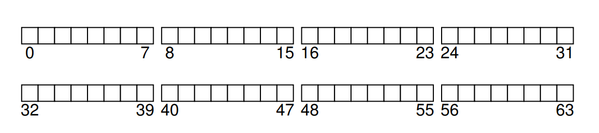

現在來思考要在這些區塊裡存放什麼才算是一個完整的檔案系統。 你第一個想到的可能是「使用者資料」，的確任何檔案系統中大部分的空間都應該用來存放使用者資料。 我們將這部分稱為「資料區域（data region）」。 為了簡化起見，我們就在這個 64 個區塊的硬碟中，固定保留最後 56 個區塊做為資料區域

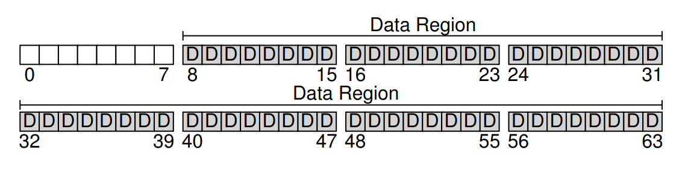

如同上一章稍微提過的，檔案系統必須追蹤每個檔案的相關資訊。 這些資訊屬於重要的 metadata，其中包括了：哪些資料區塊組成了該檔案、檔案大小、擁有者與存取權限、最近存取與修改時間，以及其他類似的資訊

為了儲存這些 metadata，檔案系統通常會使用一種稱為 inode 的資料結構（我們會在下方詳談 inode）。 為了放置 inode，我們還得在硬碟上保留一些空間，這部分被稱為「inode 表（inode table）」，本質上就是一個存放 on-disk inode 的陣列。 假設我們在 64 個硬碟區塊中保留 5 個區塊做 inode（在圖中以 I 標示），那麼硬碟上的結構就如同下圖所示：

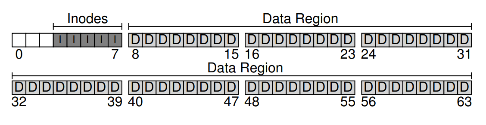

需要注意的是，inode 通常不會很大，可能會是個 128 或 256 之類的位元組大小。 如果每個 inode 使用 256 位元組，那麼一個 4 KB 的區塊可以容納 16 個 inode，而我們先前保留的 5 個區塊就可存放 80 個 inode。 在這個只有 64 個區塊的小型檔案系統中，80 個 inode 就是我們能擁有的最大檔案數量； 不過，如果同樣的檔案系統部署在更大的硬碟上，只要擴增 inode 表的區塊數，就可以支援更多檔案了

目前，我們的檔案系統已有「資料區塊（D）」和「inode（I）」了，但仍缺少了幾個重要元素。 首先是：如何追蹤哪些 inode 或資料區塊是「空閒」的，哪些是「已分配」的。 這種分配追蹤結構是任何檔案系統都必須具備的。 當然，有很多方法可以用來追蹤分配狀態，例如我們可以使用「空閒串列（free list）」，串列中每個元素指向下一個空閒區塊，依此類推

但這邊我們選擇另一種簡單且常見的結構：bitmap（位元圖）。 我們為「資料區域」建立一個資料位元圖（data bitmap），並為「inode 表」建立一個 inode 位元圖（inode bitmap）。 位元圖就是一個陣列，每個位元代表對應的物件／區塊是空閒（0）還是正在使用（1）。 因此，我們的全新硬碟配置現在多包含「inode 位元圖（i）」和「資料位元圖（d）」，如下圖所示：

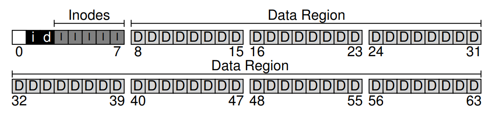

你可能會注意到，為這些位元圖各使用整整一個 4 KB 的區塊有些浪費； 一個 4 KB 的位元圖可以追蹤多達 32 K 個物件的分配狀態，可我們實際只需追蹤 80 個 inode 和 56 個資料區塊。 然而，為了簡化設計，我們仍分別給每個位元圖使用整個 4 KB 區塊

你可能還發現硬碟結構中仍剩下一個區塊未使用。 我們將這最後一個區塊保留給「superblock」（在下圖中以 S 標示）。 superblock 用來儲存整個檔案系統的資訊，例如：檔案系統中有多少個 inode 和資料區塊（本例為 80 和 56）、inode 表從哪個區塊開始（此例為第 3 區塊），依此類推。 它還會包含某種 magic number，以識別檔案系統類型（此處為 vsfs）

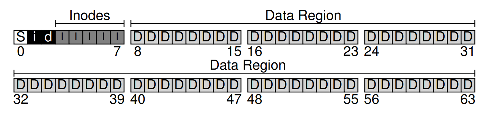

因此，當掛載檔案系統時，作業系統會先讀取 superblock，初始化各項參數，然後才將該檔案系統掛載到整體目錄樹中。 之後，當存取該檔案系統中的任何檔案時，系統就會確切知道要到哪裡尋找所需的硬碟結構

## 40.3 File Organization: The Inode

在檔案系統中，最重要的硬碟結構之一是 inode，幾乎所有檔案系統都有類似的結構。 inode 一詞源自 index node，是在 UNIX [RT74]（甚至可能更早的系統）中給予它的歷史名稱，之所以如此命名，是因為這些節點最初以陣列形式排列，存取特定 inode 時需要透過索引來做對應

每個 inode 都隱含地透過一個編號（稱為 i-number）來引用，我們先前也將它稱作檔案的低階名稱。 在 vsfs（以及其他簡單檔案系統）中，如果擁有一個 i-number，就能直接計算出其對應的 inode 在硬碟上的位置。 例如，假設 vsfs 的 inode 表大小為 20 KB（即五個 4 KB 的區塊），因此包含 80 個 inode（假設每個 inode 大小為 256 位元組）； 再且假設 inode 區域從 12 KB 開始（即 superblock 從 0 KB 開始、inode 位元圖位於 4 KB、資料位元圖位於 8 KB，而 inode 表緊接其後）。 在 vsfs 中，檔案系統分割區開頭的配置（放大視圖）如下

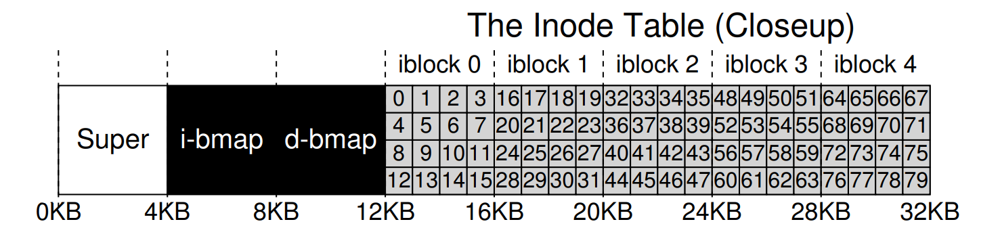

要讀取編號為 32 的 inode，檔案系統會先計算要進入 inode 區域的位移量（`32 * sizeof(inode)` 或 8192），再加上 inode 表在硬碟上的起始位址（`inodeStartAddr = 12 KB`），便可得到所需 inode 區塊的正確位元組位址：20 KB。 請記得，硬碟無法直接以位元組為單位編址，而是由大量可編址的區段（通常為 512 位元組）構成。 因此，要取得包含 inode 32 的那塊區塊，檔案系統會對第 $(20 \times 1024 / 512) = 40$ 號區段發出讀取請求，以取得所需的 inode 區塊。 一般來說，inode 區塊的區段編號 sector 可用下列公式計算：

```c
blk    = (inumber * sizeof(inode_t)) / blockSize;
sector = ((blk * blockSize) + inodeStartAddr) / sectorSize;
```

每個 inode 內部幾乎包含了你對一個檔案所需的所有資訊：其類型（例如一般檔案、目錄等）、檔案大小、分配給它的區塊數量、保護資訊（例如檔案擁有者與可存取對象）、時間資訊，包括檔案何時建立、修改或最後存取，以及檔案的資料區塊在硬碟上的存放位置（例如各種指標）

我們將這些關於檔案的資訊稱為 metadata； 事實上，任何位於檔案系統中，但不屬於純粹使用者資料的部分，都可歸類為 metadata。 下圖 40.11 是 ext2 [P09] 中的一個範例 inode：

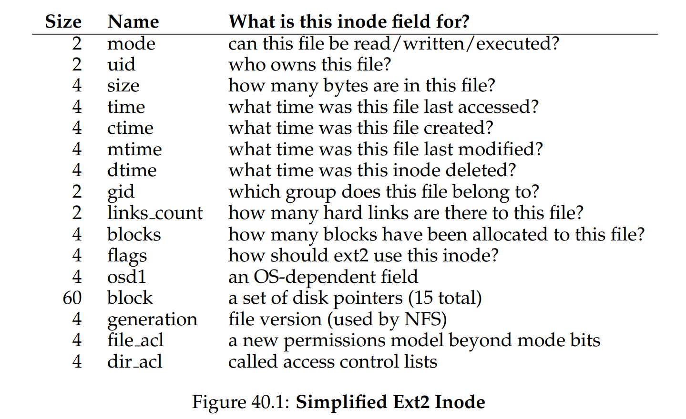

在設計 inode 時，最重要的決策之一是它如何記錄資料區塊的位置。 一種簡單做法是在 inode 內部放置一個或多個「直接指標（disk addresses）」，每個指標對應到一個屬於該檔案的硬碟區塊。 然而此做法有其限制：例如，若要建構一個非常大的檔案（例如，其大小大於「內建直接指標數量 × 區塊大小」），這種方法就無法滿足需求

:::info  
ASIDE：資料結構 — inode  

inode 是許多檔案系統中用來描述儲存給定檔案 metadata（例如檔案長度、權限，以及其各個區塊在硬碟上的位置）的資料結構的統稱。 此名稱至少可追溯到 UNIX（若不是更早出現在 Multics 甚至更早系統），它是 index node 的縮寫，因為 inode 編號會用於索引 on-disk inode 陣列，以找到對應編號的 inode。 如我們稍後會看到，inode 的設計是檔案系統設計的關鍵之一。 大多數現代系統都為其所追蹤的每個檔案採用類似的結構，只是可能名稱不同（例如 dnodes、fnodes 等等）  
:::

### The Multi-Level Index

為了支援更大的檔案，檔案系統設計人員必須在 inode 中引入不同的結構。 一個常見的做法是增加一個稱為間接指標（indirect pointer）的特殊指標。 它不直接指向儲存使用者資料的區塊，而是指向一個包含更多指標的區塊，每個指標都指向使用者資料。 因此，inode 可以有固定數量的直接指標（例如 12 個），以及一個間接指標

若檔案變得夠大，其就會從硬碟的資料區塊區中分配出一個間接區塊，並將 inode 中的間接指標欄位設為指向該區塊。 假設區塊大小為 4 KB，而硬碟地址佔 4 位元組，則這個間接區塊可再包含 1024 個指標； 如此一來，檔案最終可擴展到（12 + 1024） × 4 KB，約 4144 KB

不出所料，使用上述做法後，你可能還會想要再支援更大的檔案，這只需要在 inode 中再增加一個指標：二層間接指標（double indirect pointer）。 此指標指向一個區塊，該區塊內保存指向間接區塊的指標，而每個間接區塊則含有指向資料區塊的指標。 因此，一個二層間接區塊可再擴展 1024 × 1024，即 1 百萬個 4 KB 區塊，換言之能夠支援超過 4 GB 大小的檔案。 當然，你可能還想要更多，我們想你已經猜到下一步：三層間接指標（triple indirect pointer）

這種不平衡的樹狀結構被稱為多層索引（multi-level index）結構，用以指向檔案區塊。 以下用十二個直接指標、以及一個單層間接區塊和一個二層間接區塊為例。 假設區塊大小為 4 KB，指標佔用 4 位元組，該結構可支援一個略大於 4 GB 的檔案（也就是 $(12 + 1024 + 1024^2) × 4 \text{ KB}$）。 那麼，如果再加上一個三層間接區塊，你能算出它能處理多大的檔案嗎？ （提示：非常大）

許多檔案系統採用了多層索引結構，包括常見的 Linux ext2 [P09]、ext3、NetApp 的 WAFL，以及原始 UNIX 檔案系統。 其他檔案系統，例如 SGI XFS 和 Linux ext4，則使用範圍（extents）而非單純指標； 關於基於範圍的方案如何運作，可參考前述的側欄說明（它們類似於在虛擬記憶體討論中的區段）

你可能會想：為何要使用這種不平衡的樹結構？ 為何不採取其他方式？ 事實上，許多研究者已對檔案系統及其使用模式研究許久，並且發現了一些跨年代通用的「真理」。 其中一項發現是：大部分檔案都很小。 這種不平衡的設計反映了這一事實； 若大多數檔案確實較小，那麼針對此情境做優化是合理的

因此，只需少量直接指標（12 是常見數），inode 便可直接指向 48 KB 的資料，若檔案更大就再使用一個（或多個）間接區塊，這方面可參考近期 Agrawal 等人的相關研究 [A+07]，圖 40.2 是這些結果的摘要。 當然，就 inode 設計而言，還有許多其他可能性； 畢竟 inode 只是一個資料結構，任何能儲存相關資訊並有效查詢的資料結構都能勝任。 由於檔案系統軟體易於更換，若工作負載或技術有所變化，很有可能會再出現新的設計

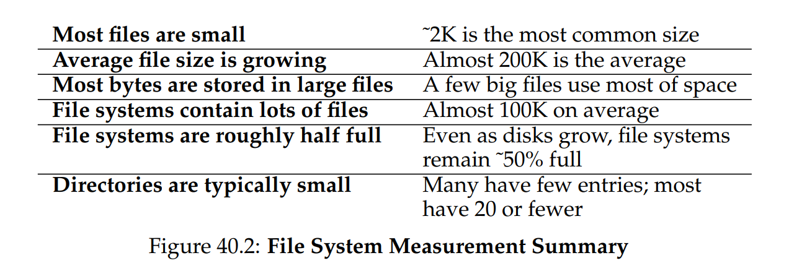

:::info  
TIP：考慮基於範圍（extents）的做法  

另一種做法是使用範圍（extents）而非指標。 範圍僅包含一個硬碟指標與長度（以區塊為單位）； 因此，不再需要為檔案的每一個區塊配置一個指標，只需一個指標加長度，即可指定該檔案在硬碟上的位置。 但僅有一個範圍仍有限制，因為在分配檔案時，可能難以找到一段連續的硬碟空間。 因此，採用範圍做法的檔案系統通常允許多個範圍，以便在分配檔案時提供更大的彈性  

比較這兩種做法時，基於指標的方式彈性最高，但每個檔案須儲存大量 metadata（對於大型檔案尤其如此）。 而基於範圍的方式雖彈性較低，卻更為緊湊； 尤其當硬碟上有足夠空閒空間且檔案能夠連續排列時，它們的效果最好（這也是幾乎所有檔案分配策略的目標）
:::

## 40.4 Directory Organization

在 vsfs（和許多其他檔案系統）中，目錄結構相對簡單； 目錄基本上只包含一份「條目名稱」與「inode number」的對應清單。 對於給定目錄中的每個檔案或子目錄，它的資料區塊中會有一個字串與一個數值。 若名稱長度可變，則可在字串旁再附帶一個長度欄位

舉例來說，假設有一個目錄 dir（inode 編號 5），裡面包含三個檔案：`foo`、`bar`，還有 `foobar_is_a_pretty_longname`，對應的 inode 編號分別是 12、13 和 24，則 dir 在硬碟上的資料可能如下所示：

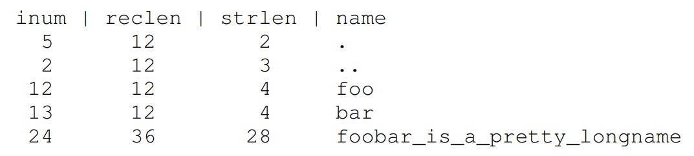

在此範例中，每個條目包含：

1. inode 編號（`inum`）
2. 紀錄長度（`reclen`）：名稱佔用的位元組總數加上任何剩餘空間  
3. 字串長度（`strlen`）：名稱的實際位元組數  
4. 條目名稱（`name`）  
   
請注意，每個目錄都會多出兩個特殊條目：「.（dot）」和「..（dot-dot）」； dot 代表目前目錄（此例為 dir），而 dot-dot 代表其父目錄（此例為根目錄）

另外，刪除檔案（例如呼叫 `unlink()`）可能會在目錄中留下空洞，因此還需要某種方式來標示這類空間（例如使用保留的 inode 編號，如 0）。 這也是為何要有「紀錄長度」欄位：新的條目可以復用舊的、較大的條目，並利用其中多餘的空間

你可能想知道目錄究竟儲存在何處。 通常，檔案系統將目錄視為一種特殊類型的檔案。 因此，目錄本身也有一個 inode，在 inode 表中的某個位置（該 inode 的 type 欄位會標示為「directory」而非「regular file」）。 該目錄由 inode 指向其資料區塊（可能還有間接區塊）； 這些資料區塊位於我們那個簡易檔案系統的資料區塊區域內。 由此，整體硬碟結構並不改變

我們也要再強調一次：這種簡單的線性目錄項目列表並非儲存這類資訊的唯一方式。 正如先前所說，各種資料結構皆可選用。 例如，XFS [S+96] 便以 B-tree 形式儲存目錄，讓建立檔案時（必須確認檔名尚未被使用）比單純掃描整個列表的系統更為快速

:::info  
ASIDE：鏈結式分配法  

在設計 inode 時，還有一種更簡單的做法是使用鏈結串列（linked list）。 如此一來，inode 內只需一個指標，指向該檔案的第一個區塊。 要處理更大的檔案，就在該區塊的末端再加一個指標，如此反覆，就能支援更大的檔案

如你所想，這種鏈結檔案分配法在某些工作負載下效能很差； 想想要讀取檔案的最後一個區塊，或是執行隨機存取時便能體會。 因此，為了改善鏈結式分配，有些系統會保留一張「鏈結資訊表」在記憶體中，而不是把下一個指標存放在資料區塊裡。 該表以資料區塊 D 的地址作為索引，而表中對應的值就是 D 的下一個指標，也就是檔案中緊跟在 D 之後區塊的地址。 若某個區塊為空閒，也可能以 null 或其他標記表示。 使用這種「下一個指標表」後，就能有效地執行隨機存取：先在（記憶體中的）表裡掃描到想要的區塊，再直接向硬碟存取它即可

這張表是否似曾相識？ 我們所描述的，就是俗稱的「檔案配置表（file allocation table）」，也就是 FAT 檔案系統的基本架構，經典的舊式 Windows 檔案系統（NTFS [C94] 之前的版本）就是基於此簡單的鏈結分配法。 此外，它與傳統 UNIX 檔案系統也有其它差異，例如它根本沒有 inode，而是以目錄條目存放檔案 metadata，並直接指向檔案的第一個區塊，於是無法建立硬連結。 更多詳盡但不那麼優雅的細節可見 Brouwer [B02]  
:::

:::info  
ASIDE：空閒空間管理  

管理空閒空間的方法多種多樣； 位元圖（bitmap）只是其中一種。 早期有些檔案系統採用「空閒串列（free list）」，在 superblock 中保留一個指標，指向第一個空閒區塊，而在該區塊內再存放指向下一個空閒區塊的指標，如此便形成一張空閒區塊串列。 當需要分配區塊時，就取出串列頭並更新串列即可  

現代檔案系統則採用更進階的資料結構。 例如，SGI 的 XFS [S+96] 就用某種形式的 B-tree 來精簡地表示哪些硬碟區塊為空閒。 與任何資料結構一樣，各種時間與空間之間的折衷皆有可能  
:::

## 40.5 Free Space Management

檔案系統必須追蹤哪些 inode 與資料區塊是空閒的、哪些不是，才能在配置新檔案或目錄時找到可用空間。 由此可見，空閒空間管理對任何檔案系統都非常重要。  在 vsfs 中，我們使用兩個簡單的位元圖來執行這項工作

例如，當我們建立一個檔案時，就必須為該檔案分配一個 inode。 此時，檔案系統會在 inode 位元圖中搜尋空閒的 inode，並將該 inode 分配給檔案； 接著，檔案系統要將對應位元標示為已使用（設為 1），並最終將正確資訊寫回硬碟上的位元圖。 當分配資料區塊時，也會執行類似的步驟

在為新檔案分配資料區塊時，還可能需要考慮其他因素。 例如，一些 Linux 檔案系統（如 ext2 和 ext3）在建立新檔案並需要資料區塊時，會尋找一連串（例如 8 個）連續的空閒區塊； 透過找到這樣的一段連續空閒區塊並將其分配給新檔案，檔案系統可保證該檔案的部分內容在硬碟上是連續存放的，從而提升效能。 因此，這種預先分配的策略是分配資料區塊時常見的啟發式做法

## 40.6 Access Paths: Reading and Writing

我們已經對檔案和目錄如何儲存在硬碟上有了概念，現在可以開始追蹤讀取或寫入檔案時的操作流程了。 了解在此存取路徑上到底發生了什麼，是建立「檔案系統如何運作」理解的第二個關鍵。 在以下範例中，假設檔案系統已被掛載，因此 superblock 已在記憶體中。 其餘所有結構（例如 inode、目錄）仍然位於硬碟上  

### Reading A File From Disk

在這個簡單範例中，假設你只想開啟一個檔案（例如 `/foo/bar`）、讀取它，然後再關閉它。 為了說明方便，假設該檔案只有 12 KB 大小（也就是 3 個區塊）

當你執行 `open("/foo/bar", O_RDONLY)` 時，檔案系統首先必須找到該檔案 `bar` 的 inode，以取得檔案的基本資訊（如權限、檔案大小等）。 要做到這點，檔案系統必須能找到這個 inode，但目前僅有的是完整路徑名稱。 檔案系統因此需要走訪（traverse）這個路徑，才能定位到目標 inode

所有的走訪都從檔案系統根目錄（`/`）開始，因此檔案系統會先從硬碟中讀取根目錄的 inode。 但是這個 inode 在哪裡？ 要找到 inode，就必須知道它的 i-number。 通常，我們會在該檔案或目錄的父目錄裡找到它的 i-number，但根目錄沒有父目錄（定義如此）。 因此，根目錄的 i-number 必須是「眾所皆知」的，檔案系統在掛載時就需要知道這個值。 在大多數 UNIX 檔案系統中，根目錄的 i-number 是 2。 因此過程開始時，檔案系統會讀取包含 i-number 為 2 的那個區塊（也就是第一個 inode 區塊）

一旦讀入了那個 inode，檔案系統就能查看其中的指標，找到儲存根目錄內容的資料區塊位置。 接著，檔案系統會利用這些硬碟指標逐一讀取目錄區塊，此例中是要尋找名稱為 `foo` 的條目。 透過讀取一個或多個目錄資料區塊，我們就能找到 `foo` 的條目，找到後，檔案系統就能獲得 `foo` 對應的 inode 編號（假設為 44）了

接下來就是遞迴地走訪整個路徑，直到找到目標 inode 為止。 在此範例中，檔案系統先讀取儲存 `foo` 的 inode 的區塊，然後讀取 `foo` 目錄資料，最終找到 `bar` 的 inode 編號。 `open()` 的最後一步是將 `bar` 的 inode 讀到記憶體； 接著，檔案系統會進行最後的權限檢查，並在該 process 的「已開啟檔案表」中分配一個檔案描述符（file descriptor），然後將它傳回給使用者

一旦完成 `open`，程式就能呼叫 `read()` 系統呼叫來讀取檔案。 第一次讀取（若沒先呼叫 `lseek()`，則從偏移量 0 開始）會讀取檔案的第一個區塊，並且參考 inode 找到該區塊在硬碟上的位置； 同時也可能更新 inode 中的「最後存取時間」。 `read()` 還會更新記憶體中「已開啟檔案表」裡這個檔案描述符對應的欄位，把檔案偏移量移到下一個位置，如此下一次 `read()` 就會讀取到第二個檔案區塊，依此類推

相對地，你會發現要關閉該檔案，工作就少很多，只需要釋放掉那個檔案描述符就可以了，此時不會有任何硬碟 I/O 操作。 整個流程可參見圖 40.3，圖中時間由上至下遞增。 開啟檔案時會觸發多次讀取，才能定位到檔案的 inode。 之後，讀取每個區塊都要先查詢 inode，然後讀取該區塊，接著再以寫入方式更新 inode 中的「最後存取時間」

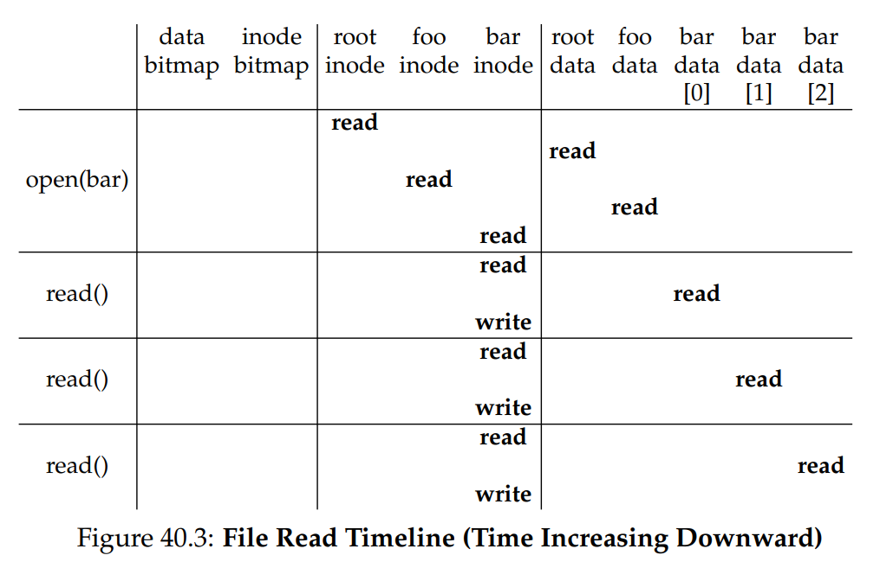

請花些時間理解這些步驟。 另外要注意，open 所產生的 I/O 數量與路徑長度成正比。 路徑中每多一層目錄，就必須讀取該目錄的 inode 及其資料。 若目錄很大，情況會更糟：此例只需讀取一個區塊即可取得目錄內容，但如果目錄內容散落在多個區塊，就可能要讀取多個資料區塊才能找到目標條目。 讀取檔案往往已夠麻煩了，但後面你將發現，寫入檔案（尤其是建立新檔案）則更為複雜

:::info  
ASIDE：讀取時不會存取分配結構  

我們見過許多學生被位元圖等分配結構搞得很困惑。 特別是，很多人常以為只要在讀取檔案而沒有分配新區塊時，仍會去查詢位元圖。 事實並非如此！分配結構（例如位元圖）僅在需要分配時才會被存取。 inodes、目錄和間接區塊本身已包含執行讀取請求所需的所有資訊； 若 inode 已指向該區塊，就不必再確認它是否分配過  
:::

### Writing A File To Disk

寫入檔案的流程與讀取類似。 首先，必須先開啟該檔案（如同上例）。 接著，應用程式可呼叫 `write()` 來將新內容寫入檔案。 最後，將檔案關閉

與讀取不同，寫入檔案可能也需要分配新的區塊（若不是覆寫現有區塊）。 當寫入一個新檔案時，每次的 `write()` 不僅要將資料寫到硬碟，還要先決定要分配哪個區塊給該檔案，並相應更新硬碟上的其他結構（例如資料位元圖和 inode）。 因此，對檔案的每次寫入在邏輯上會產生五次 I/O：

1. 先讀取資料位元圖（並將其標記為已分配）
2. 再將更新過的資料位元圖寫回硬碟
3. 接著讀取 inode
4. 再將包含新區塊位置的 inode 寫回硬碟
5. 最後才真正寫入該資料區塊本身

若考慮到一個簡單且常見的操作 ── 建立檔案，寫入流量會更為龐大。 要建立一個檔案，檔案系統不僅要分配一個 inode，還要在包含新檔案的目錄裡分配空間。 執行這些操作所需的 I/O 數量相當驚人：

1. 讀取 inode 位元圖（尋找空閒 inode）
2. 將 inode 位元圖更新為已分配並寫回
3. 將新 inode 本身寫入硬碟（初始化 inode）
4. 向目錄的資料區塊寫入一筆記錄（將檔案名稱與 inode 編號連結）
5. 讀取並更新目錄的 inode（更新目錄大小或時間）  

若目錄需要擴充以容納新條目，就還要額外執行更多 I/O（例如讀取與更新資料位元圖，以及寫入新的目錄區塊）。 僅僅是為了建立一個檔案，就要做上述這麼多工作！

讓我們看一個具體範例：建立檔案 `/foo/bar`，並對它寫入三個區塊。 圖 40.4 顯示在 `open()`（負責建立檔案）以及三次 4 KB 的 `write()` 期間到底發生了什麼：

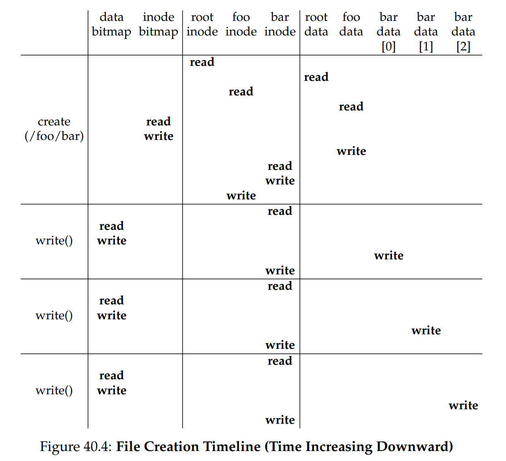

圖中將硬碟的讀/寫作業歸類到觸發它們的系統呼叫下方，並依執行順序由上而下排列。 可以看到建立這個檔案需要做多少工作：本例總共要執行 10 次 I/O，以走訪路徑並最終建立檔案。 你也會看到，每次需分配區塊的寫入都要花 5 次 I/O：先讀取並更新 inode（2 次），再讀取並更新資料位元圖（2 次），最後才將真正的資料寫入（1 次）

那麼，檔案系統要如何在合理的效率下完成這些繁複工作呢？ 

:::info  
CRUX：如何降低檔案系統的 I/O 成本  

即便是最簡單的操作，例如開啟、讀取或寫入檔案，都會產生大量散落在硬碟各處的 I/O 作業。 檔案系統該如何做，才能減少如此龐大的 I/O 成本？   
:::

## 40.7 Caching and Buffering

如同上述範例所示，讀寫檔案可能非常昂貴，會引發大量對（緩慢的）硬碟的 I/O 操作。 為了解決這明顯的效能瓶頸，大多數檔案系統會積極利用系統記憶體（DRAM）來快取重要區塊

試想前述 `open()` 的範例：若不使用快取，每次開啟檔案都需要在目錄階層中的每一層執行至少兩次讀取（一次讀取該目錄的 inode，還要至少一次讀取該目錄的資料）。 若路徑很長（例如 `/1/2/3/.../100/file.txt`），單單開啟檔案就要進行數百次讀取操作！

早期檔案系統因此引入了固定大小的快取，用來存放熱門區塊。 就像虛擬記憶體中所討論的，會採用 LRU（最近最少使用）等策略及其變體來決定哪些區塊保留在快取中。 這個固定大小的快取通常會在開機時配置，大約佔用總記憶體的 10%

然而，這種將記憶體靜態分割的做法可能會導致浪費； 如果在某段時間內檔案系統不需要那麼多記憶體，該怎麼辦？ 採用上述固定大小方式時，快取中未使用的頁面無法被重新分配做其他用途，最終只能被浪費掉

相對地，現代系統採用動態分割的方式。 具體來說，許多現代作業系統將虛擬記憶體頁與檔案系統頁整合到同一個頁面快取 [S00]。 如此一來，系統可依當下虛擬記憶體或檔案系統對記憶體的需求，靈活地分配記憶體

現在想像在前述的開啟檔案範例中加上快取。 第一次開啟檔案時可能會引發大量 I/O 操作，讀取目錄的 inode 與資料，但隨後若再開啟同一個檔案（或在同一個目錄下的其他檔案），大多數操作會命中快取，無需再執行額外 I/O

接著考慮快取對寫入的影響。 雖然夠大的快取可以完全避免讀取 I/O，但寫入流量必須寫到硬碟才能持久化。 因此，快取對寫入流量並不像讀取那樣能充當篩選器。 不過，所謂的寫入緩衝（write buffering）確實有多項效能優勢。 首先，延遲寫入可讓檔案系統將多次更新合併成較少的 I/O； 例如，若建立一個檔案時更新了 inode 位元圖，而稍後又建立了另一個檔案再更新該位元圖，緩衝便可將首次更新的寫入延遲，省下一次 I/O

其次，藉由在記憶體中緩衝多筆寫入，系統便能更有效率地排程後續 I/O，提高效能。 最後，延遲寫入更能完全避免某些寫入； 例如，若某應用程式建立一個檔案，接著又刪除它，若將寫入檔案建立的動作延遲寫到硬碟，就可直接跳過該寫入操作。 這種情況下，對硬碟寫入採取「懶惰」策略反而是一種優勢

基於以上原因，大多數現代檔案系統會將寫入內容在記憶體中緩衝五到三十秒左右，這是一種折衷：若系統在更新尚未寫入硬碟前發生崩潰，更新內容就會丟失； 但若能在記憶體中保留這些寫入更長時間，就能透過批次、排程，甚至直接避免某些寫入，提升效能

有些應用程式（例如資料庫）無法接受這種折衷。 因此，為了避免因寫入緩衝而導致意外資料遺失，它們會強制將寫入寫到硬碟，例如呼叫 `fsync()`、使用繞過快取的直接 I/O 介面，或直接使用原始硬碟介面而完全避開檔案系統。 雖然大多數應用程式都會接受檔案系統所做的折衷，但若預設行為不符合需求，也有足夠的控制機制可讓使用者調整

:::info  
TIP：理解靜態與動態分割  

將資源分配給不同用戶時，可以採用靜態分割或動態分割。 靜態分割只在一開始就將資源劃分成固定比例； 例如，若有兩個使用者要分配記憶體，可以先給使用者 A 一定比例，剩餘部分交給使用者 B。 動態分割則更具彈性，會隨時間調整分配比例； 例如，某段時間內使用者 A 可取得較高比例的硬碟頻寬，之後系統又可改為將更大比例的頻寬分配給使用者 B

兩種方式各有優缺點。靜態分割可確保每個使用者都獲得一部分資源，一般可提供更可預測的效能，而且實作較簡單。動態分割雖可提高資源利用率（讓需要大量資源的使用者使用原本閒置的資源），但實作更為複雜，且可能導致若干使用者的閒置資源被其他人取得後，在需要時只能花很長時間才能再次取得，效能反而變差。正如常見情況，沒有放諸四海皆準的最佳方法； 應視具體問題而定，選擇最合適的做法。實際上，你不應該一直這麼做嗎？  
:::

:::info  
TIP：理解持久性與效能之間的折衷  

儲存系統經常向使用者呈現「持久性／效能」的折衷。 如果使用者希望寫入的資料能立即持久化，系統就必須完整地將新寫入的資料提交到硬碟，因而寫入速度較慢（但安全）。 然而，若使用者可以容忍少量資料遺失，系統就能在記憶體中暫緩寫入，稍後再將它們寫入硬碟（在背景執行）。 這會讓寫入動作顯得很快，進而提高表觀效能

但一旦系統崩潰，尚未寫入硬碟的資料就會遺失，這便是折衷所在。 要正確做出此折衷，最好先瞭解使用該儲存系統的應用需求； 例如，你的瀏覽器下載的最後幾張影像若遺失可能還能接受，但若是銀行帳戶交易的一部分被遺失，就很難接受  
:::

## 40.8 Summary

我們已經看過建構檔案系統所需的基本機制。 每個檔案都必須有一些相關資訊（也就是 metadata），通常儲存在稱為 inode 的結構中。 目錄只是一類特殊的檔案，用來儲存名稱→inode 編號的對應關係。 此外，我們還需要其他結構，例如檔案系統常會使用位元圖（bitmap）之類的結構來追蹤哪些 inode 或資料區塊是空閒或已分配

檔案系統設計的精彩之處在於它的自由度； 我們在接下來章節中探索的檔案系統，都利用這種自由度來優化不同的面向。 此外，還有許多政策性決策尚未探討。 例如，當建立新檔案時，應該將它放置在硬碟的哪裡？ 這樣的政策，以及其他相關議題，也會在後續章節中進一步探討

## References

- [A+07] “A Five-Year Study of File-System Metadata” by Nitin Agrawal, William J. Bolosky, John R. Douceur, Jacob R. Lorch. FAST ’07, San Jose, California, February 2007. An excellent recent analysis of how file systems are actually used. Use the bibliography within to follow the trail of file-system analysis papers back to the early 1980s.  
  對檔案系統實際使用情況的優秀近年分析，書內附有豐富書目，可追溯檔案系統分析論文至 1980 年代初期  

- [B07] “ZFS: The Last Word in File Systems” by Jeff Bonwick and Bill Moore. Available from: http://www.ostep.org/Citations/zfs_last.pdf. One of the most recent important file systems, full of features and awesomeness. We should have a chapter on it, and perhaps soon will.  
  最新且重要的檔案系統之一：功能強大且令人讚嘆。 值得開一章專門討論，或許不久即會成行  

- [B02] “The FAT File System” by Andries Brouwer. September, 2002. Available online at: http://www.win.tue.nl/~aeb/linux/fs/fat/fat.html. A nice clean description of FAT. The file system kind, not the bacon kind. Though you have to admit, bacon fat probably tastes better.  
  對 FAT 檔案系統的清晰說明 

- [C94] “Inside the Windows NT File System” by Helen Custer. Microsoft Press, 1994. A short book about NTFS; there are probably ones with more technical details elsewhere.  
  關於 NTFS 的短篇著作，可能還有其他更技術性詳盡的書籍可參考  

- [H+88] “Scale and Performance in a Distributed File System” by John H. Howard, Michael L. Kazar, Sherri G. Menees, David A. Nichols, M. Satyanarayanan, Robert N. Sidebotham, Michael J. West. ACM TOCS, Volume 6:1, February 1988. A classic distributed file system; we’ll be learning more about it later, don’t worry.  
  經典的分散式檔案系統論文； 稍後我們會深入探討，不用擔心  

- [P09] “The Second Extended File System: Internal Layout” by Dave Poirier. 2009. Available: http://www.nongnu.org/ext2-doc/ext2.html. Some details on ext2, a very simple Linux file system based on FFS, the Berkeley Fast File System. We’ll be reading about it in the next chapter.  
  ext2 檔案系統的內部結構細節說明； ext2 是基於 Berkeley Fast File System（FFS） 的簡易 Linux 檔案系統，下一章將詳述  

- [RT74] “The UNIX Time-Sharing System” by M. Ritchie, K. Thompson. CACM Volume 17:7, 1974. The original paper about UNIX. Read it to see the underpinnings of much of modern operating systems.  
  原始 UNIX 系統論文，閱讀它可了解現代作業系統許多基礎概念  

- [S00] “UBC: An Efficient Unified I/O and Memory Caching Subsystem for NetBSD” by Chuck Silvers. FREENIX, 2000. A nice paper about NetBSD’s integration of file-system buffer caching and the virtual-memory page cache. Many other systems do the same type of thing.  
  關於 NetBSD 把檔案系統 buffer cache 與虛擬記憶體頁面快取整合的優秀論文，許多現代系統皆採用相同做法  

- [S+96] “Scalability in the XFS File System” by Adan Sweeney, Doug Doucette, Wei Hu, Curtis Anderson, Mike Nishimoto, Geoff Peck. USENIX ’96, January 1996, San Diego, California. The first attempt to make scalability of operations, including things like having millions of files in a directory, a central focus. A great example of pushing an idea to the extreme. The key idea behind this file system: everything is a tree. We should have a chapter on this file system too.  
  首個強調作業可擴充性（例如單一目錄內可容納百萬檔案）的 XFS 系統研究。 出色地演示將概念推向極限的做法； 其核心思想：萬物皆樹。 也值得專章介紹  
