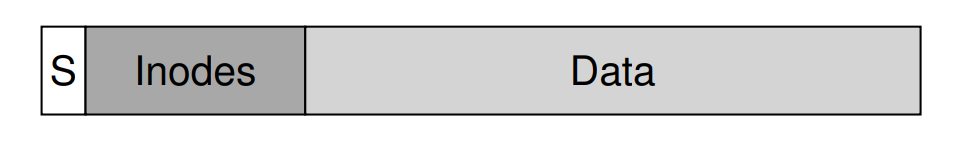
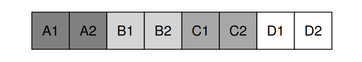
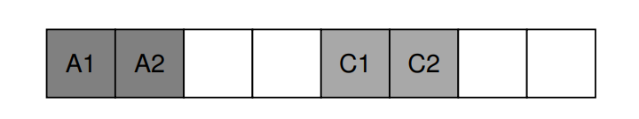
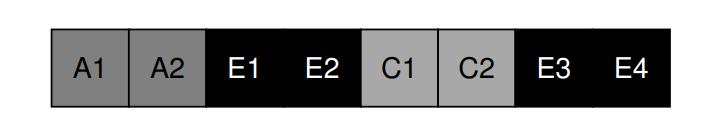
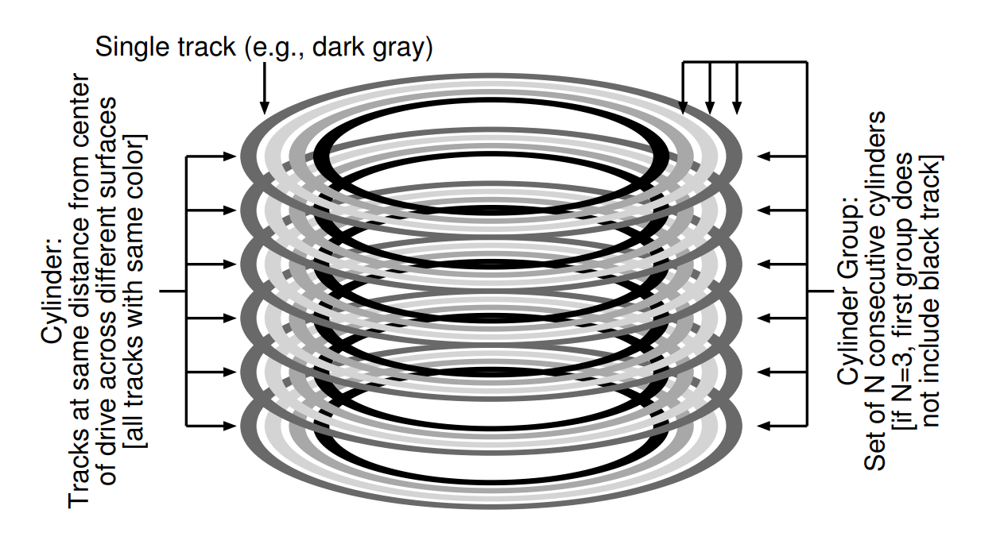
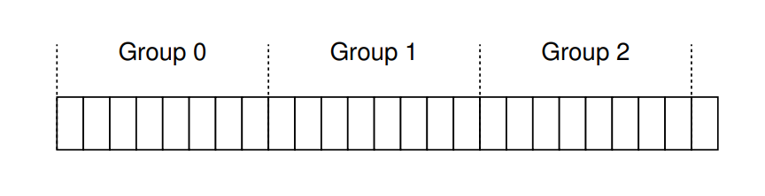
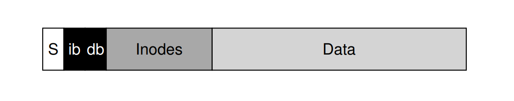
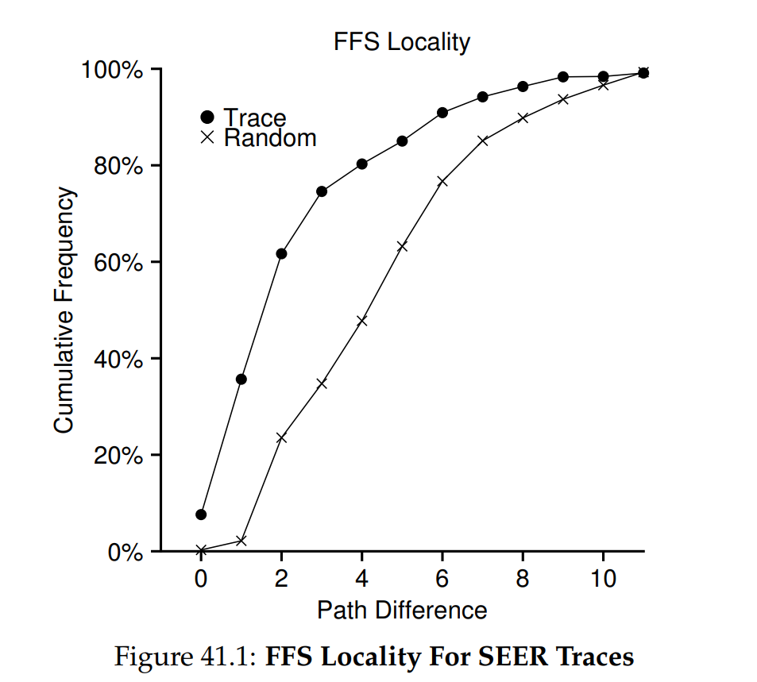
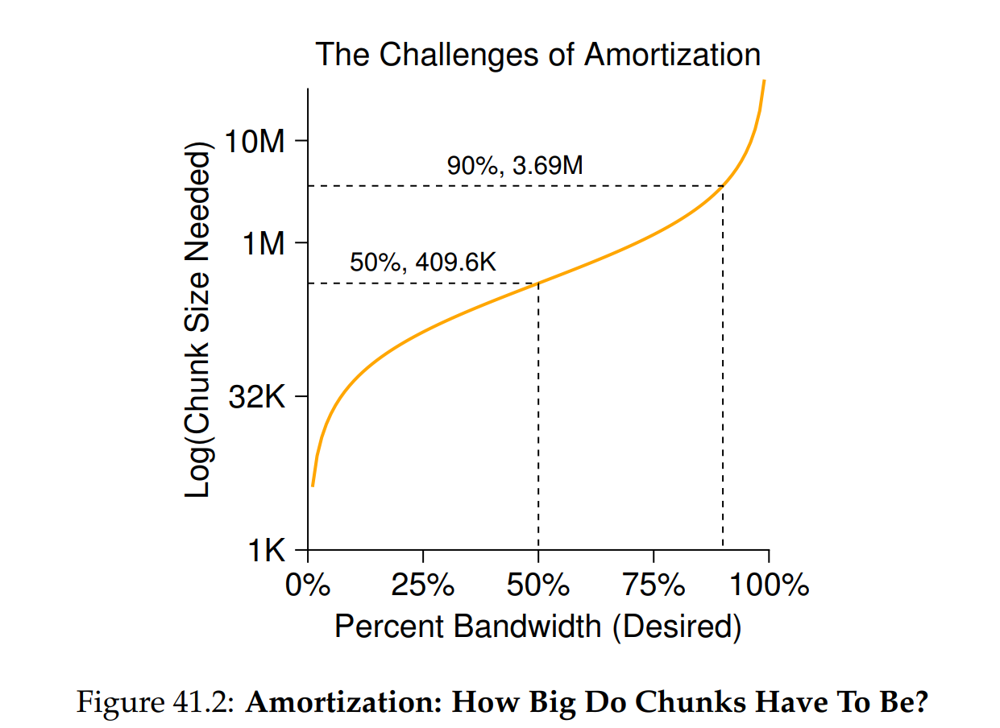
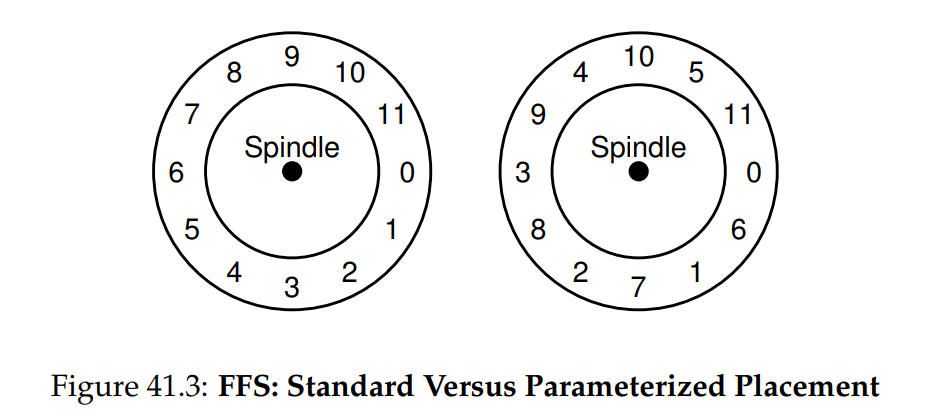

# OSTEP 41：Fast File System (FFS)

在 UNIX 作業系統剛推出時，UNIX 大師 Ken Thompson 親自撰寫了最早的檔案系統。 讓我們稱之為「舊式 UNIX 檔案系統」，它非常簡單。 基本上，硬碟上的資料結構長成下面這樣：

<div class = "center-column">



</div>

super block（S）儲存關於整個檔案系統的容量大小、inode 總數、指向空閒區塊的 link list 起點的指標等資訊。 硬碟上的 inode 區域則包含了該檔案系統的所有 inode。 最後，硬碟的大部分空間都被資料區塊佔據

舊式檔案系統的優點在於它非常簡單，並且支援檔案系統要實現的基本抽象：檔案和目錄階層。 這個易用的系統與過去笨重的記錄式儲存系統相比是一大進步，而目錄階層也比先前僅有單層目錄結構的系統更為先進

## 41.1 The Problem: Poor Performance

它的問題在於效能極差，根據 Berkeley 的 Kirk McKusick 及其同事的量測 [MJLF84]，一開始的效能就很糟，隨著時間推移更是雪上加霜，以致該檔案系統最終只能達到整體硬碟頻寬的 2%

主要原因在於舊式 UNIX 檔案系統將硬碟視為隨機存取記憶體，將資料散布到各處，卻忽略了硬碟本身的定位成本。 例如，檔案的資料區塊往往遠離其 inode，因此每當你先讀取 inode 再讀取檔案資料區塊時，就會觸發一次昂貴的硬碟尋道操作（而且這是相當常見的動作）

更糟的是，由於沒有妥善管理空閒空間，檔案系統最終會變得非常碎片化。 空閒串列會指向散佈在整個硬碟上的各種區塊，而要分配檔案時就直接取出第一個可用區塊。 結果便是，即使某個檔案在邏輯上是連續的，但在實際讀取過程中卻要在硬碟多處跳來跳去，效能因而大幅下降

舉例來說，假設下圖所示的資料區塊區域中包含四個檔案（A、B、C 和 D），每個檔案大小都佔 2 個區塊

<div class = "center-column">



</div>

若刪除 B 與 D，結果會變成下圖這樣

<div class = "center-column">



</div>

如你所見，空閒空間被碎成兩段各兩個區塊，而不是連續的四個區塊。 現在假設要分配一個大小為四個區塊的檔案 E，會看到以下情形

<div class = "center-column">



</div>

可以看到 E 被分散在整個硬碟上，因此在存取 E 時無法達到最佳（順序）效能。 你得先讀取 E1 和 E2，接著尋道，然後再讀取 E3 和 E4。 舊式 UNIX 檔案系統中這種碎片化問題經常出現，嚴重影響效能。 順帶一提：這正是硬碟重組工具的功用所在，它們會重新排列硬碟上的資料，使檔案連續存放，並為連續空間預留空間，同時更新 inode 等結構以反映這些變動

還有一個問題：最初的區塊大小太小（512 位元組），因此從硬碟傳輸資料的效率低下。 雖然較小的區塊能降低內部碎片化（區塊內的浪費），但對於傳輸而言卻不利，因為每個區塊都需要一次定位開銷才能存取。 因此問題就出在：

:::info  
CRUX：如何組織硬碟上的資料以提升效能？ 

我們該如何組織檔案系統的資料結構，才能提升效能？ 在這些資料結構之上，我們需要什麼樣的分配策略？ 要如何讓檔案系統「瞭解」硬碟的特性？  
:::

## 41.2 FFS: Disk Awareness Is The Solution

後來 Berkeley 的一組研究人員決定建構一個更優、更快的檔案系統，他們巧妙地稱之為 Fast File System（FFS）。 他們的構想是設計檔案系統的結構與分配策略，使其具備「硬碟感知」能力，從而提升效能

FFS 至此開啟了檔案系統研究的新時代，它保留了原有檔案系統的介面（相同的 API，包括 `open()`、`read()`、`write()`、`close()` 及其他檔案系統呼叫），但改變了內部實作，為後續檔案系統的創新奠定了基礎，而這項工作至今仍在持續進行

幾乎所有現代檔案系統都遵循這套既有介面（因此能維持與應用程式的相容性），並各自針對其內部效能、可靠性或其他需求進行改良

## 41.3 Organizing Structure: The Cylinder Group

FFS 的第一步是改變硬碟上的結構，其將硬碟劃分為多個柱面群，柱面指的是硬碟上不同碟面的相同軌道位置。 之所以稱為「柱面」，是因為它與幾何學上所說的圓柱形狀非常相似。 FFS 將 N 個連續的柱面聚合成一個群組，因此整個硬碟就可視為多個柱面群的集合。 下圖是一個簡單範例，顯示一個具有六片硬碟的最外側的四條軌道，以及由三個柱面組成的柱面群：

<div class = "center-column">



</div>

請注意，現代硬碟並不會向檔案系統提供足夠的資訊，以讓它真正了解特定柱面是否正被使用。 如先前所述 [AD14a]，硬碟對外只呈現邏輯區塊位址空間，並將幾何細節隱藏了起來。 因此，現代檔案系統（例如 Linux ext2、ext3 與 ext4）改為將硬碟劃分為區塊群，每個群組僅是硬碟位址空間中的一段連續區塊。 下圖說明了每 8 個區塊被劃分到不同區塊群的範例（實際的群組規模會包含更多區塊）：

<div class = "center-column">



</div>

無論稱之為柱面群還是區塊群，這些群組都是 FFS 提高效能的核心機制。 關鍵在於，若將兩個檔案放在同一群組內，FFS 就能確保連續存取它們時不需要跨整個硬碟大幅尋道。 為了利用這些群組來儲存檔案與目錄，FFS 必須具備將檔案和目錄放入群組並追蹤其所有必要資訊的能力。 為此，FFS 在每個群組內都包含了你對檔案系統所期望擁有的所有結構，例如：inode 空間、資料區塊，以及用來追蹤這些區塊是否已分配或仍為空閒的結構。 下圖展示了單一柱面群中所包含的內容：

<div class = "center-column">



</div>

接著，我們來更詳細地檢視這個單一柱面群的組成。 FFS 出於可靠性考量，在每個群組中都保留了一份 super block（S）的副本。 由於在掛載檔案系統時必須讀取 super block，透過多份副本，即使某份損毀，也能藉由使用其他可用的複本來掛載並存取該檔案系統

在每個群組內，FFS 需要追蹤該群組中的 inode 與資料區塊是否已分配。 每組都有一份 inode 位元圖（ib）與資料位元圖（db），分別用來管理各自群組中的 inode 和資料區塊。 位元圖是管理檔案系統空閒空間的絕佳方式，因為可輕易找到一大段空閒區塊並將之分配給檔案，從而避免舊式檔案系統中空閒串列導致的碎片化問題

最後，inode 區域與資料區塊區域的設計與先前那個極簡檔案系統（VSFS）相同。 顧名思義，每個柱面群的大部分空間都由資料區塊構成

:::info  
ASIDE：FFS 檔案建立

試想建立一個新檔案時，必須更新哪些資料結構？ 假設使用者建立 `/foo/bar.txt`，且該檔案僅佔用一個區塊（4 KB）。 由於檔案是新的，所以需要一個新的 inode，這表示必須將 inode 位元圖與新分配的 inode 一併寫回硬碟。 此外，檔案還包含資料，因此也要分配資料區塊，所以要更新資料位元圖並最終將該資料區塊寫入硬碟。 因此，當前柱面群至少要執行四次寫入（記得這些寫入可能會先在記憶體緩衝一段時間）

但事情還沒結束！ 當建立新檔案時，還必須將該檔案放入檔案系統階層中，也就是要更新目錄。 具體而言，必須更新父目錄 `foo`，新增 `bar.txt` 的條目。 這項更新可能能容納在 `foo` 的現有資料區塊內，或者需要分配新區塊（並更新資料位元圖）。 同時，還要更新 `foo` 的 `inode`，以反映目錄的新長度並更新時間欄位（例如最後修改時間）。 總而言之，僅僅建立一個新檔案就要做這麼多工作
:::

## 41.4 Policies: How To Allocate Files and Directories

有了這個群組結構後，FFS 必須決定如何將檔案、目錄以及相關的 metadata 安置在硬碟上以提升效能。 基本準則很簡單：將相關的東西放在一起（相對地，將不相關的東西放得遠一些）

因此，為了遵循這個準則，FFS 必須判斷哪些事物是「相關」的，並將它們放入同一區塊群； 反之，將不相關的項目放到不同的區塊群。 為達到這個目的，FFS 採用了幾項簡單的啟發式規則

第一項是目錄的放置。 FFS 採用簡單做法：選擇已分配目錄數目較少的柱面群（以在群組間平衡目錄數量），且空閒 inode 數目較多的柱面群（這樣後續才能分配更多檔案），並將該目錄的資料和 inode 放在該群組中。 當然，也可以使用其他啟發式規則（例如考慮空閒資料區塊的數量）

對於檔案，FFS 做了兩件事。 首先，（一般情況下）FFS 會確保將檔案的資料區塊與其 inode 分配在同一個群組，從而避免 inode 與資料之間發生長時間的硬碟尋道（就像舊檔案系統那樣）。 其次，FFS 會將同一目錄下的所有檔案放在該目錄所屬的柱面群內。 因此，若使用者建立了四個檔案 `/a/b`、`/a/c`、`/a/d` 和 `/b/f`，FFS 就會嘗試將前三個檔案放在同一個群組中，並將 `/b/f` 放到另一個遠離它們的群組

讓我們以一個範例來說明這樣的分配。 在此範例中，假設每個群組中只有 10 個 inode 和 10 個資料區塊（這兩個數字都不太切實際），並且有三個目錄（根目錄 `/`、`/a` 與 `/b`）及四個檔案（`/a/c`、`/a/d`、`/a/e`、`/b/f`）都依據 FFS 的策略放置在群組中。 假設這些一般檔案的大小都是兩個區塊，而目錄則只有一個資料區塊。 下例中，我們對每個檔案或目錄都使用直觀的符號（例如「`/`」代表根目錄、「`a`」代表 `/a`、「`f`」代表 `/b/f`，依此類推）

```
group inodes     data
    0 /--------- /---------
    1 acde------ accddee---
    2 bf-------- bff-------
    3 ---------- ----------
    4 ---------- ----------
    5 ---------- ----------
    6 ---------- ----------
    7 ---------- ----------
```

請注意，FFS 的策略在兩方面都有正面效果：每個檔案的資料區塊都靠近該檔案的 inode； 而同一目錄內的檔案也會相互靠近（例如 `/a/c`、`/a/d`、`/a/e` 都位於群組 1，而目錄 `/b` 及其檔案 `/b/f` 都位於群組 2）

相較之下，我們來看看另一種 inode 分配策略：僅僅將 inodes 均勻散布到各個群組，試圖確保沒有一個群組的 inode 表會太快被塞滿。 最終的分配結果可能就會像下圖這樣

```
group inodes     data
    0 /--------- /---------
    1 a--------- a---------
    2 b--------- b---------
    3 c--------- cc--------
    4 d--------- dd--------
    5 e--------- ee--------
    6 f--------- ff--------
    7 ---------- ----------
```

從圖中可以看出，這種策略雖然確實讓檔案（和目錄）的資料靠近其對應的 inode，但目錄中的檔案卻隨意散布在整個硬碟上，因此無法保留基於名稱的區域性。 現在存取 `/a/c`、`/a/d` 和 `/a/e` 這三個檔案時，要跨越三個群組，而非像 FFS 方法那樣只需要一個群組

FFS 的這些啟發式策略並非基於大量的檔案系統流量研究或什麼特別精細的分析，而是依靠簡單且老派的常識。 同一目錄下的檔案通常會一起被存取：想像一下編譯一堆檔案，然後再將它們連結成單一可執行檔。 由於存在這種基於命名空間的區域性，FFS 就能經常提升效能，確保相關檔案之間的尋道路徑又短又快

## 41.5 Measuring File Locality

為了更清楚地了解這些啟發式規則是否合理，我們先來分析一些檔案系統存取的追蹤紀錄，看看是否確實存在命名空間區域性。 然而，不知為何，文獻中似乎並沒有關於這個議題的好研究

具體而言，我們使用 SEER 追蹤 [K94]，分析檔案存取在目錄樹中的「相對距離」。 舉例來說，如果追蹤紀錄中先開啟檔案 `f`，接著又再度開啟同一個檔案 `f`（在此期間沒有開啟其他檔案），那麼在目錄樹中的距離就是零（因為是同一個檔案）。 如果先開啟位於目錄 `dir` 下的檔案 `f`（即 `dir/f`），然後接著開啟同一目錄下的檔案 `g`（即 `dir/g`），兩者之間的距離就是一，因為它們共用同一個目錄但不是同一個檔案。 換句話說，我們的距離度量的是，要向上走到什麼層級才能找到兩個檔案的最近共同祖先； 在樹中越靠近，度量值就越低

圖 41.1 顯示了在整個 SEER 叢集所有工作站的追蹤期間，所觀察到的區域性。 圖表的橫軸表示距離度量，而縱軸則顯示對應距離度量的累積開檔百分比。 具體來說，對於 SEER 追蹤（圖中標示為「Trace」），可看到大約 7% 的檔案存取正好是前一次打開的同一檔案，而近 40% 的檔案存取要麼是同一檔案，要麼是位於同一目錄下的檔案（即距離為 0 或 1）。 因此，FFS 所假設的區域性在這些追蹤中似乎是合理的

<div class = "center-column">



</div>

有趣的是，大約 25% 的檔案存取距離為 2。 這種區域性出現在使用者將一組相關目錄以多層結構組織並經常在它們之間切換時。 例如，使用者在 `proj` 目錄底下有一個 `src` 目錄與一個 `obj` 目錄，分別存放原始程式與編譯後的 `.o` 檔，常見的存取模式會是先讀 `proj/src/foo.c`，再讀 `proj/obj/foo.o`。 這兩次存取的距離是 2，因為 `proj` 是它們的共同祖先。 FFS 在其策略中並未考量此類區域性，因此存取時會發生更多尋道

作為比較，圖中也顯示了「Random」追蹤的區域性。 該隨機追蹤是透過在既有的 SEER 追蹤中隨機挑選檔案，並計算這些隨機存取之間的距離度量而產生的。 如你所見，正如預期，隨機追蹤的命名空間區域性較低。 然而，由於最終每個檔案都會有共同祖先（例如根目錄），因此仍存在一些區域性； 因此將其作為比較基準是有意義的

## 41.6 The Large-File Exception

在上面的規則中，有一個針對大型檔案的重要現象：若沒有另外的規則，大型檔案最終會將它最初放置的那個區塊群（甚至可能延伸到其他群組）全部填滿。 如此一來，後續的「相關」檔案就無法再放到同一區塊群，從而破壞檔案存取的區域性

因此，FFS 對大型檔案採取了以下做法：在第一個區塊群內分配了若干個區塊（例如 inode 中可用的 12 個直接指標所指向的 12 個區塊）後，FFS 將檔案的下一段「大型區塊」（例如第一個間接區塊所指向的區塊集合）放到另一個區塊群（可以選擇使用率較低的放）。 接著，再將檔案的下一段放到第三個不同區塊群，如此類推

讓我們透過下例來更清楚地了解這項策略。 如果不考慮大型檔案的例外情況，一個大型檔案會將其所有區塊都放在硬碟的一處。 我們以一個小範例來說明：假設 FFS 設定為每個群組有 10 個 inode、40 個資料區塊，而現在有一個大小為 30 個區塊的檔案 `/a`。 下圖顯示了不使用大型檔案例外時的狀況：

```
group inodes     data
  0   /a-------- /aaaaaaaaa aaaaaaaaaa aaaaaaaaaa a---------
  1   ---------- ---------- ---------- ---------- ----------
  2   ---------- ---------- ---------- ---------- ----------
```

從上例中可以看到，`/a` 在群組 0 中幾乎佔用了所有資料區塊，而其他群組則保持空白。 如果此時在根目錄 (`/`) 下再建立其他檔案，該群組裡就沒有足夠的空間來放置它們的資料

若採用大型檔案例外（此處以每段 5 個區塊為例），FFS 會將檔案分散到多個群組，因此任何單一群組的使用率都不會太高：

```
group inodes     data
  0   /a-------- /aaaaa---- ---------- ---------- ----------
  1   ---------- aaaaa----- ---------- ---------- ----------
  2   ---------- aaaaa----- ---------- ---------- ----------
  3   ---------- aaaaa----- ---------- ---------- ----------
  4   ---------- aaaaa----- ---------- ---------- ----------
  5   ---------- aaaaa----- ---------- ---------- ----------
  6   ---------- ---------- ---------- ---------- ----------
```

你可能會想到，將檔案區塊分散在硬碟上會影響效能，尤其是在相當常見的順序存取情況下（例如使用者或應用程式依序讀取第 0 到第 29 段）。 確實，然而這可以透過謹慎選擇區塊（chunk）大小來解決此問題。 具體而言，若區塊大小足夠大，檔案系統大部分時間會用來從硬碟傳輸資料，只有相對少量時間會用於在區塊段之間尋道。 這種「以較少的尋道次數就做更多資料傳輸」的方式稱為「攤銷」（amortization），是電腦系統中常見的技巧

舉個例子來說：假設硬碟的平均定位時間（也就是包括尋道和旋轉）為 10 毫秒 (ms)，且硬碟的資料傳輸速率為 40 MB/s。 若你的目標是將一半時間用於在區塊段之間尋道，另一半時間用於傳輸資料（從而達到 50% 峰值效能），那麼你就需要在每次 10 ms 的尋道之後，用 10 ms 來傳輸資料。 因此，問題就變成：區塊（chunk）要多大，才能在傳輸上花費 10 ms？ 這很簡單，只要使用我們的好朋友「數學」即可，特別是前面「硬碟」章節 [AD14a] 中提到的量綱分析

$$
\frac{40\ \cancel{\mathrm{MB}}}{\cancel{\mathrm{sec}}} 
\;\cdot\; \frac{1024\ \mathrm{KB}}{1\ \cancel{\mathrm{MB}}} 
\;\cdot\; \frac{1\ \cancel{\mathrm{sec}}}{1000\ \cancel{\mathrm{ms}}} 
\;\cdot\; 10\ \mathrm{ms} 
\;=\; 409.6\ \mathrm{KB}
\tag{41.1}
$$

基本上，這個等式表示：如果以 40 MB/s 的速率傳輸資料，那麼每次尋道後只要傳輸 409.6 KB，就能讓一半的時間用於尋道、一半用於傳輸。 用同樣方式，你可以算出要達到 90% 峰值頻寬所需的區塊大小（約 3.6 MB），甚至要達到 99% 峰值頻寬所需的區塊大小（約 39.6 MB）。 如你所見，越想接近峰值，所需的區塊就越大（請參見圖 41.2 以查看這些數值的繪圖）

<div class = "center-column">



</div>

然而，FFS 並沒有利用上述計算來分散大型檔案到不同群組。 相反地，它採取一種基於 inode 結構的簡單策略：將前 12 個直接區塊放在與該 inode 相同的群組； 每個後續的間接區塊、以及它指向的所有區塊，都放在不同群組。 以 4 KB 的區塊大小和 32 位元硬碟位址為例，這種策略意味著檔案中每 1024 個區塊（4 MB）會被分散到不同群組，唯一例外是由直接指標所指向的檔案最前面 48 KB 仍放在與 inode 相同的群組中

請注意，硬碟機的發展趨勢顯示，雖然製造商能夠在相同硬碟面上塞入更多位元，從而讓傳輸速率快速提升，但與尋道相關的機械部分（例如磁臂速度和旋轉速率）卻進步緩慢 [P98]。 這意味著隨著時間推移，機械開銷相對變得更昂貴，因此為了攤銷這些成本，勢必要在每次尋道之間傳輸更多資料

## 41.7 A Few Other Things About FFS

FFS 還引入了其他一些創新。 設計者特別擔心如何容納小檔案； 事實上，當時很多檔案大約只有 2KB，而使用 4KB 的區塊雖然有利於資料傳輸，但空間效率並不理想。 這種內部碎片化可能導致一般檔案系統會浪費大約一半的硬碟空間

FFS 設計者想到的解決方案既簡單又有效。 他們決定引入子區塊，也就是 512 位元組的小區塊，由檔案系統分配給檔案。 因此，如果你建立一個小檔案（例如 1KB），它只需使用兩個子區塊，而不會浪費整個 4KB 區塊。 隨著檔案增長，檔案系統會持續分配 512 位元組的子區塊給它，直到累積滿 4KB。 此時，FFS 會尋找一個 4KB 區塊，將子區塊內容複製過去，並釋放那些子區塊以供日後使用

你可能會發現這個過程效率不高，會讓檔案系統額外做很多工作（特別是進行複製時要多次 I/O）。 因此，FFS 通常透過修改 libc 函式庫來避免這種最差行為，函式庫會先緩衝寫入，然後以 4KB 為單位一次性提交給檔案系統，從而在大多數情況下完全避免子區塊的最差行為

FFS 引入的第二個巧妙之處是為了效能而優化的硬碟配置。 在那個時代（SCSI 和其他現代裝置介面尚未普及之前），硬碟功能相對簡單，需要主機 CPU 更直接地控制其運作。 當 FFS 將檔案放在硬碟的連續區段上時，就出現了問題，如圖 41.3 左側所示

<div class = "center-column">



</div>

問題出現在順序讀取時，FFS 會先發出讀取區塊 0 的請求； 但當該讀取完成，FFS 接著發出讀取區塊 1 的請求時，就已經太遲了：區塊 1 已經旋轉到磁頭下方，因此讀取區塊 1 時會發生整整一圈的旋轉延遲

FFS 透過不同的配置解決了這個問題，如圖 41.3 右側所示。 藉由隔一個區塊進行布局（在範例中），FFS 有足夠時間在讀取頭經過前發出下一次讀取請求。 實際上，FFS 足夠聰明，能根據特定硬碟計算需要跳過多少個區塊來避免額外旋轉。 這項技術稱為參數化，FFS 會先測定硬碟的效能參數，再據此決定精確的錯位配置方式

你可能會想：這種配置方式似乎並不理想。 事實上，使用這種布局就只能達到 50% 的峰值頻寬，因為你必須繞行每條磁軌兩圈才能讀取一次區塊。 幸運的是，現代硬碟更聰明：它們會將整條磁軌內容預先讀入並緩存在內部硬碟快取（通常稱為磁軌緩衝區）中。 當後續再讀取該磁軌時，硬碟只要將快取中的資料回傳即可。 因此檔案系統再也不用擔心這些極低階的細節，適當設計的抽象與更高階介面反而會是福音

FFS 還加入了其他一些可用性的改進。 它是最早允許長檔名的檔案系統之一，因此檔案系統中的名稱不再限制於傳統固定長度（如 8 個字元），而能更具表達性。 其次，引入了一個新概念，稱為符號連結。 正如前一章所述 [AD14b]，硬連結有其限制：無法指向目錄（以避免在檔案系統階層中產生迴圈），且只能指向有同樣大小的檔案（因為 inode 編號必須仍然有效）。 符號連結允許使用者為系統上的任何檔案或目錄建立「別名」，因此更具彈性。 FFS 還新增了一個原子性的 `rename()` 操作，用於檔案重新命名

:::info  
TIP：讓系統可用

從 FFS 最基本的教訓大概就是：它不僅引入了具概念性優勢的硬碟感知配置，還加入了多項讓系統更易用的功能。 長檔名、符號連結與具原子性的 `rename()` 操作都提升了系統的實用性； 雖然很難針對這些功能寫研究論文，但這些小功能讓 FFS 更有用，並因此更容易被採用。 讓系統可用往往和其深度技術創新一樣或更重要  
:::

## 41.8 Summar

FFS 的推出是檔案系統歷史上的分水嶺，因為它讓人們認清檔案管理問題是作業系統中最有趣的課題之一，並展示了如何著手處理最重要的裝置 —— 硬碟。 從那時起，數以百計的新檔案系統不斷湧現，但至今仍有許多檔案系統借鑒 FFS（例如 Linux ext2 與 ext3）。 當然，所有現代系統都遵循 FFS 的核心教訓：把硬碟當成硬碟來對待

## References

- [AD14a] “Operating Systems: Three Easy Pieces” (Chapter: Hard Disk Drives) by Remzi Arpaci-Dusseau and Andrea Arpaci-Dusseau. Arpaci-Dusseau Books, 2014.  
  如果在深入了解硬碟原理之前就讀 FFS，完全沒有道理

- [AD14b] “Operating Systems: Three Easy Pieces” (Chapter: File System Implementation) by Remzi Arpaci-Dusseau and Andrea Arpaci-Dusseau. Arpaci-Dusseau Books, 2014.  
  同上，如果還沒讀（並且理解）檔案系統實作那章，就讀這章意義不大。 否則我們會拋出像「inode」、「間接區塊」這類術語，你只會一頭霧水

- [K94] “The Design of the SEER Predictive Caching System” by G. H. Kuenning. MOBICOMM ’94, Santa Cruz, California, December 1994.  
  根據 Kuenning 的說法，這是 SEER 專案的最佳概述，而該專案促成了包含這些追蹤紀錄在內的許多成果

- [MJLF84] “A Fast File System for UNIX” by Marshall K. McKusick, William N. Joy, Sam J. Leffler, Robert S. Fabry. ACM TOCS, 2:3, August 1984.  
  McKusick 因 FFS 貢獻獲頒 IEEE Reynold B. Johnson 獎。 他在得獎致詞中提到原始 FFS 只有 1200 行程式碼！ 現代版本已更複雜，例如 BSD 衍生的 FFS 現在約有 5 萬行程式碼

- [P98] “Hardware Technology Trends and Database Opportunities” by David A. Patterson. Keynote Lecture at SIGMOD ’98, June 1998.  
  關於硬碟技術發展趨勢及其隨時間變化的簡潔而出色的概述，非常值得一讀
