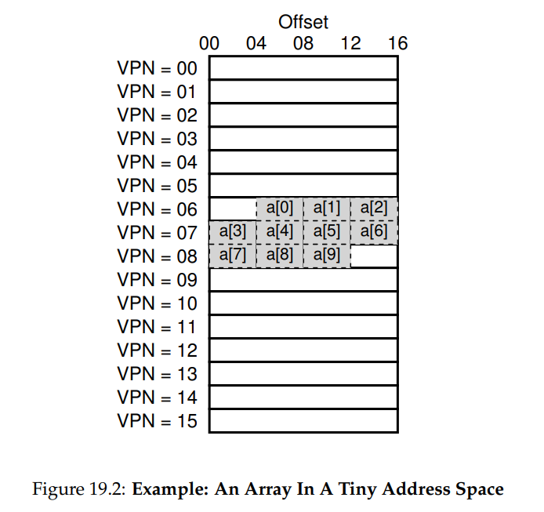
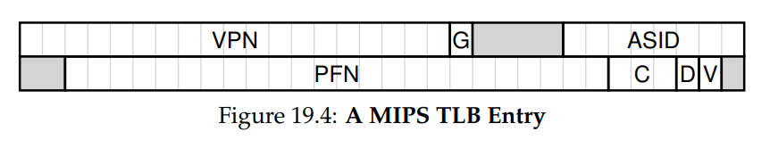

# OSTEP 19：Translation Lookaside Buffers

以 paging 作為支援虛擬記憶體的核心機制，可能會帶來顯著的效能開銷，paging 將位址空間切分為小而固定大小的單位（即 page），因此需要大量的對應資訊來完成轉譯，由於這些對應資訊通常儲存在實體記憶體中，paging 在邏輯上會導致程式每產生一個虛擬位址就要額外查一次記憶體，但在每次 instruction fetch 或明確的 load、store 操作之前，都先去記憶體查一次轉譯資訊，會非常慢，幾乎無法接受

因此，我們面臨的問題是：

- 如何加快 address translation 的速度？
- 如何避免 paging 所帶來的額外 memory reference？
- 這需要哪些硬體支援？
- 作業系統又需要扮演什麼角色？

當我們想讓系統更快時，作業系統通常需要一些幫助。 而這個幫手，常常來自 OS 的老朋友 — 硬體。 為了加速 address translation，我們要引入一種被稱為（出於歷史原因 [CP78]）translation-lookaside buffer（TLB） 的機制 [CG68, C95]

TLB 是 MMU 的一部分，本質上就是一個用來快取常用的 virtual-to-physical address translation 的硬體快取裝置。 因此把它稱為 address-translation cache 其實更貼切

::: tip  
MMU 是 CPU core（RISC-V hart） 的一部分，因此每個 hart 都有自己的 TLB  
:::

每當發生虛擬記憶體存取時，硬體會先檢查 TLB 是否已經有對應的 translation； 如果有，就能快速完成轉譯，而不必去查 page table（內含全部 translation 的來源）。 由於它對效能有極大的影響，可以說 TLB 是真正讓虛擬記憶體成為可能的關鍵 [C95]

## 19.1 TLB Basic Algorithm

Figure 19.1 展示了硬體可能用來處理虛擬位址轉譯的流程，假設使用的是一個簡單的 linear page table，以及硬體自動管理的 TLB（意即硬體負責大部分 page table 存取的任務，後文還會進一步說明）：

```cpp
VPN = (VirtualAddress & VPN_MASK) >> SHIFT
(Success, TlbEntry) = TLB_Lookup(VPN)

if (Success == True) // TLB Hit
  if (CanAccess(TlbEntry.ProtectBits) == True)
    Offset = VirtualAddress & OFFSET_MASK
    PhysAddr = (TlbEntry.PFN << SHIFT) | Offset
    Register = AccessMemory(PhysAddr)
  else
    RaiseException(PROTECTION_FAULT)
else // TLB Miss
  PTEAddr = PTBR + (VPN * sizeof(PTE))
  PTE = AccessMemory(PTEAddr)
  if (PTE.Valid == False)
    RaiseException(SEGMENTATION_FAULT)
  else if (CanAccess(PTE.ProtectBits) == False)
    RaiseException(PROTECTION_FAULT)
  else
    TLB_Insert(VPN, PTE.PFN, PTE.ProtectBits)
    RetryInstruction()
```

::: tip  
原文中這是張圖 — Figure 19.1：TLB Control Flow Algorithm  
:::

這段硬體所執行的演算法如下：

1. 首先，從虛擬位址中擷取出 VPN（如 Figure 19.1 第 1 行）
2. 然後檢查 TLB 中是否已經有對應的轉譯（第 2 行）
    - 如果有，就是 TLB hit，代表 TLB 裡就有我們要的轉譯
      - 這時我們可以從 TLB entry 中取出 PFN，再加上虛擬位址中的 offset，以組成我們要的 physical address（PA），進而完成 memory access（第 5 至 7 行），前提是保護檢查不失敗（第 4 行）
    - 如果沒有在 TLB 中找到對應的轉譯（即 TLB miss）
        - 那就還有更多事要做。 在這個例子中，硬體會去 page table 中查找轉譯資訊（第 11 至 12 行）
        - 如果該記憶體存取是合法且允許的（第 13、15 行），就會將轉譯結果寫入 TLB（第 18 行）
            - 這些操作的成本很高，主要原因是需要額外的記憶體存取才能讀取 page table（第 12 行）
        - 最後，在更新完 TLB 之後，硬體會重新執行該指令；這次，translation 已經存在於 TLB 中，因此能快速完成記憶體存取

TLB 和所有快取一樣，建立在一個基本假設上 — 大部分情況下，translation 都已經在快取中（也就是 hit）。 如果假設成立，那開銷就會非常低，因為 TLB 就設在處理器核心附近，訪問它非常快。 但一旦 miss 發生，就會產生 paging 的高額開銷，系統必須存取 page table 才能找到對應的 translation，這會增加一次甚至多次記憶體存取

如果這種 miss 發生得太頻繁，程式的執行速度會顯著下降，因為 memory access 的開銷相對於大多數 CPU 指令來說都大得多，而 TLB miss 又會導致更多的 memory access。 所以我們的目標就是盡量減少 TLB miss 的發生

## 19.2 Example: Accessing An Array

為了更清楚地說明 TLB 的運作，我們以一個陣列的例子來嘗試追蹤一個虛擬位址，看看 TLB 如何改善效能。 在這個例子中，假設記憶體內有一個包含 10 個 4-byte 整數的陣列，從虛擬位址 `100` 開始。 再假設我們的系統有一個只有 8 bits 的虛擬位址空間，並採用 16-byte 的 page

因此一個虛擬位址會被劃分成兩個部分 — 4 bits 的 VPN（總共 16 個 virtual page）以及 4 bits 的 offset（每個 page 有 16 bytes）

<div class = "center-column">



</div>

圖 19.2 顯示了這個陣列在系統中的 16 個 16-byte page 上的分布情形。 可以看到陣列的第一個元素 `a[0]` 從 **VPN=06**、**offset=04** 開始；只有三個 4-byte 整數可以放在這個 page 上。 陣列接著延伸到下一個 page（**VPN=07**），其中存放了接下來四個元素（`a[3]` 到 `a[6]`）。 最後三個元素（`a[7]` 到 `a[9]`）則位於 **VPN=08** 的 page 上

現在來考慮一個簡單的 C 迴圈，每次存取一個陣列元素：

```c
int i, sum = 0;
for (i = 0; i < 10; i++) {
  sum += a[i];
}
```

為了簡化說明，我們假設這段迴圈只會對陣列進行記憶體存取（忽略變數 `i` 和 `sum`，以及指令本身）。 當第一次存取陣列元素 `a[0]` 時，CPU 會發出一個對虛擬位址 `100` 的讀取。 硬體從這個位址中擷取出 VPN（**VPN=06**），然後用它查詢 TLB 是否已有對應的轉譯。 假設這是程式第一次存取這個陣列，那麼結果會是 TLB miss

接著存取的是 `a[1]`，這次會是 TLB hit，因為第二個元素就在第一個元素旁邊，也位於同一個 page 上，而我們在存取 `a[0]` 時已經讀取過這個 page，轉譯結果已經被載入 TLB 了，因此自然會是 TLB hit。 同理，存取 `a[2]` 也會是 hit，因為它一樣和 `a[0]`、`a[1]` 在同一個 page 上

但當程式存取 `a[3]` 時，又會遇到 TLB miss。 不過接下來的幾個元素 `a[4]` 到 `a[6]` 就都會 hit，因為它們也在同一個 page 上

最後，存取 `a[7]` 又會造成 TLB miss。 硬體會再次查詢 page table，找出這個 virtual page 對應的 page frame，並更新 TLB。 最後兩次存取 `a[8]` 和 `a[9]` 則會因為這次的更新而命中 TLB，因此會是 hit

我們可以總結這 10 次陣列存取的 TLB 行為如下 — miss、hit、hit、miss、hit、hit、hit、miss、hit、hit。 所以 TLB 的 hit rate 是 70%（hit 次數除以總存取次數）。 這不是一個很高的命中率，理想情況我們希望越接近 100% 越好

即便這是程式第一次存取陣列，TLB 仍能因為空間區域性（spatial locality）而改善效能。 由於陣列元素是密集地排列在 page 中的（彼此在記憶體中的距離很近），所以只有第一次進入某個 page 時會產生 TLB miss

另外還要注意 page 的大小，如果 page 的大小是現在的兩倍（32 bytes），那這些陣列存取就會產生更少的 miss。 而實際系統中的 page size 通常是 4KB，對這類密集陣列存取來說，TLB 效能會非常好，每個 page 通常只會造成一次 miss

還有一點要提的是 TLB 的時間區域性（temporal locality） — 如果這段程式碼跑完後不久又再次存取這個陣列，且 TLB 空間夠大，大到可以保留這些轉譯的話，那我們將會看到更好的命中率 — hit、hit、hit、hit、hit、hit、hit、hit、hit、hit，此時 hit rate 就會很高，這正是因為時間區域性，也就是資料在短時間內會被重複使用的特性

就像所有快取一樣，TLB 成功的關鍵是仰賴空間區域性與時間區域性，而這些特性都來自於程式本身的行為。 如果程式具有這些區域性，那 TLB 的命中率通常就會比較高

::: info  
小提醒：能快取就快取

快取是電腦系統中最根本的效能提升技術之一，在各種場景中都不斷被使用，目標就是讓「常見情況跑得快」[HP06]。 硬體快取背後的原理，是要善用指令與資料存取的區域性（locality）。 通常有兩種區域性 — 時間區域性與空間區域性

時間區域性（temporal locality）的概念是 — 最近剛被存取過的資料或指令，很可能在不久的將來會再次被使用，例如，迴圈中的變數或指令，都會一再地被使用

空間區域性（spatial locality）則是 — 如果程式剛存取了位址 `x`，那它很可能很快就會存取接近 `x` 的位址。 想像一下你在跑一個迴圈，從陣列裡逐一讀取元素，每次都從一個位置跳到下一個位置

當然，這些特性取決於實際程式的寫法，所以它們不是硬性法則，而是比較像設計上的經驗法則（rule of thumb）

硬體快取 — 無論是用來快取指令、資料，還是像這裡的 TLB 所做的位址轉譯 — 都是透過將一部分資料複製到小而快的 on-chip 記憶體中來達到加速效果。 與其每次都跑去較慢的主記憶體拿資料，處理器可以先看 cache 裡是否有副本，如果有，就能快速（在幾個 CPU cycle 內）完成資料存取，而不必花數十甚至上百 ns 的時間從主記憶體抓資料

你也許會好奇，既然快取這麼好，為什麼我們不直接造一個超大 cache 把所有資料都放進去？ 可惜這就碰到物理定律的限制了。 如果你想要快的快取，那它就得夠小，因為光速與其他物理限制開始變得重要了。 任何大容量 cache 本質上都會變慢，這樣反而失去了它快取的意義。 因此我們只能擁有小而快的快取，而真正的問題就在於 — 我們如何善用它們來提升系統效能  
:::

## 19.3 Who Handles The TLB Miss?

至此還有個問題 — 誰負責處理 TLB miss？ 答案有兩種可能 — 硬體，或是軟體（OS）負責

早期的硬體架構設計者並不完全信任 OS，當時的處理器多半採用所謂 CISC（Complex Instruction Set Computer）指令集，硬體設計本身就很複雜。 因此他們傾向由硬體來處理 TLB miss

為了實作這點，硬體必須知道 page table 在 memory 的位置（如 PTBR），以及 page table 的精確格式。 在發生 miss 時，硬體會「走訪」page table，找到對應的 PTE，取出正確的 translation，更新 TLB，然後重試該指令。 一個例子是早期的 Intel x86 架構，它使用硬體管理的 multi-level page table，當前的 page table 由 CR3 暫存器指向 [I09]

```cpp
VPN = (VirtualAddress & VPN_MASK) >> SHIFT
(Success, TlbEntry) = TLB_Lookup(VPN)

if (Success == True) // TLB Hit
  if (CanAccess(TlbEntry.ProtectBits) == True)
    Offset = VirtualAddress & OFFSET_MASK
    PhysAddr = (TlbEntry.PFN << SHIFT) | Offset
    Register = AccessMemory(PhysAddr)
  else
    RaiseException(PROTECTION_FAULT)
else // TLB Miss
  RaiseException(TLB_MISS)
```

::: tip  
Figure 19.3: TLB Control Flow Algorithm (OS Handled)  
:::

::: tip  
CR3 是個很有名的暫存器，可以有個印象  
:::

而比較現代的架構，例如 MIPS R10k [H93] 或 Sun 的 SPARC v9 [WG00]（都屬於 RISC 系列）則採用 software-managed TLB。 當發生 TLB miss，硬體只會觸發一個 exception（見圖 19.3 的第 11 行），暫停當前的指令流程、切換到 kernel mode 並跳轉到 trap handler，這段 trap handler 是由 OS 所寫的，專門用來處理 TLB miss

在這個 trap handler 執行期間，OS 會從 page table 查出轉譯結果，並透過特殊的「特權指令」來更新 TLB，然後從 trap 返回；這時硬體會重新執行該指令，這次就會 hit TLB 了

這邊有幾個重要細節：

- 第一，這種 trap 返回指令的行為必須和我們之前處理 system call 時的 trap 返回略有不同
  - 在 system call 的情況下，trap return 應該要回到「trap 指令的下一行」繼續執行，就像函式呼叫之後要接續執行下一個指令
  - 但 TLB miss 的 trap 則不一樣，它的 return 必須重新執行「發生 trap 的那條指令」，這樣才能用剛剛新插入的 TLB entry 成功完成該指令
  - 也因此，硬體在觸發 trap 時必須保存不同的 PC，才能讓 trap return 時 resume 正確位置
- 第二，在執行 TLB miss handler 時，OS 必須特別小心，不要讓自己陷入無限遞迴的 TLB miss。 這可以透過一些技巧避免：
  - 將 TLB miss handler 所在的程式碼與資料常駐在 physical memory 中（不做轉譯）
  - 或是在 TLB 中保留一些「永久有效」的 translation slot，讓 handler 使用這些 slot
    - 這些被固定住的 translation 稱為 wired entries，它們永遠會 hit TLB，因此不會造成額外的 TLB miss

採用 software-managed TLB 的最大優勢在於彈性 — OS 可以使用任意資料結構來實作 page table，而不需要硬體配合改動格式。 另一個優點是簡潔性 — 在圖 19.3 的控制流程中，硬體只要做一件事 — raise exception，然後交由 OS handler 處理即可。 圖 19.1 中，硬體要自己從第 11 行走到第 19 行，相較之下交給 OS 明顯簡化很多

::: info
補充：TLB 的 valid bit 不等於 page table 的 valid bit

這兩者表示的是完全不同的意義，小心不要搞混：

- page table 中的 valid bit 是用來標記該 page 是否由 process 分配過，若無效，代表程式不該碰它，若有 access 就會造成 page fault，最終 process 被 kill
- 而 TLB 中的 valid bit 則單純表示該 entry 是否包含有效的 translation

舉例來說，系統剛開機時，TLB 的初始狀態會將所有 entry 標為 invalid，因為這時還沒快取任何 translation。 隨著虛擬記憶體功能啟用，程式開始執行並訪問位址空間，TLB 會逐漸被填滿有效的 entry

這個 bit 在 context switch 時也很有用，OS 可以直接暴力的把所有 TLB entries 標為 invalid，確保接下來要執行的 process 不會誤用上一個 process 的 translation
:::

::: info
補充：RISC vs. CISC

1980 年代，在電腦架構界曾經爆發過一場激烈的論戰。 一邊是 CISC 陣營（Complex Instruction Set Computing），另一邊是 RISC 陣營（Reduced Instruction Set Computing）[PS81]

RISC 的代表人物包括 UC Berkeley 的 David Patterson 和 Stanford 的 John Hennessy（他們也是經典書籍的作者 [HP06]），而最早提出 RISC 概念的 John Cocke 則因此獲得了圖靈獎 [CM00]

CISC 的理念是將指令設計成高階操作，每條指令功能強大，舉例來說可能有像是 "string copy" 這樣的指令，一次就能完成字串的複製。 這樣做的目的是讓組合語言更容易撰寫，同時讓程式碼更精簡

RISC 則主張相反的觀點。 他們觀察到：指令集其實是給編譯器用的，而編譯器最需要的是一些簡單一致的指令 primitive，好讓它們產生高效能的機器碼。 因此 RISC 的主張就是：把硬體裡不必要的東西（尤其是 microcode）通通拿掉，留下來的要簡單、統一、而且快

當時 RISC CPU 迅速崛起，效能明顯領先 [BC91]，因此學界與業界紛紛投入，大量研究論文與新創公司出現（如 MIPS、Sun）

但後來 CISC 廠商（像 Intel）也逐漸在他們的處理器核心中加入 RISC 的技巧，例如在 pipeline 的早期階段就將複雜指令轉換成更簡單的微指令，這些指令後段再以類似 RISC 的方式處理。 加上晶片上的電晶體數量不斷增加，使得 CISC 架構仍能維持競爭力

最終結果就是這場論戰逐漸淡化，現代處理器不論是 RISC 還是 CISC 都可以做得非常快  
:::

## 19.4 TLB Contents: What’s In There?

現在讓我們更詳細地看看硬體 TLB 的內容。 一個典型的 TLB 可能會有 32、64 或 128 個 entries，並採用所謂 fully associative 的設計，這代表任何 translation 都可以存在 TLB 的任意位置，硬體會以平行方式搜尋整個 TLB，以找出所需的 translation

一個 TLB entry 可能長這樣：

$$
\text{VPN}\ |\ \text{PFN}\ |\ \text{other bits}
$$

注意每個 entry 都同時包含 VPN 和 PFN，因為任何轉譯都可能出現在任意位置。 硬體會平行比對所有 entries，以找出是否有 match

比較有趣的是 "other bits" 的部分。 例如，TLB 通常會有一個 valid bit，這表示該 entry 是否有有效的 translation。 也很常見的是 protection bits，用來決定某個 page 如何被存取（就像在 page table 中一樣），舉例來說，code page 可能會被標記為可讀與可執行，而 heap page 可能被標記為可讀與可寫。 還可能會有一些其他欄位，例如 address-space identifier（ASID）、dirty bit 等等，詳細資訊會在下文介紹

## 19.5 TLB Issue: Context Switches

有了 TLB 之後，當在 processes（也就是 address spaces）之間切換時，就會產生新的問題。 具體來說，TLB 內包含的是針對當前執行中的 process 有效的 virtual-to-physical translations；這些 translation 對於其他 processes 是無意義的。 因此，當從一個 process 切換到另一個時，硬體或 OS（或兩者）必須特別小心，確保即將執行的 process 不會誤用前一個 process 留下來的 translations

為了更清楚地理解這種情況，我們來看個例子。 當一個 process（$P1$）在執行時，它會假設 TLB 可能快取了一些對它有效的 translations，也就是 $P1$ 的 page table 的內容。 假設在這個例子中，$P1$ 的第 10 個 virtual page 被映射到 physical frame 100

接著假設有另一個 process（$P2$），OS 等等會透過 context switch 去執行它。 假設在這裡，$P2$ 的第 10 個 virtual page 被映射到 physical frame 170。 如果兩個 process 的 entry 都在 TLB 中，那 TLB 的內容會長這樣：

<div class = "center-column">

| VPN | PFN | valid | prot |
|-----|-----|-------|------|
| 10  | 100 | 1     | rwx  |
| ... | ... | ...   | ...  |
| 10  | 170 | 1     | rwx  |
| ... | ... | ...   | ...  |

</div>

這個 TLB 有個問題 — VPN 10 會被轉譯為 PFN 100（$P1$）或 PFN 170（$P2$），但硬體無法區分哪一個 entry 是屬於哪一個 process 的。 因此，我們需要做些額外的處理，讓 TLB 可以正確且有效率地支援多個 process 的虛擬化

這個問題有幾種可能的解法。 一種方法是在 context switch 時直接 flush 掉 TLB，也就是在執行下一個 process 之前把它清空。 如果是 software-based 的系統，可以使用明確且只有特權模式能執行的硬體指令來達成； 如果是 hardware-managed TLB，則可以在變更 PTBR 時觸發 flush。 不管是哪種做法，flush 操作都會把所有 valid bits 設為 0，也就是清除整個 TLB 的內容

::: info  
注意 OS 在 context switch 時無論如何都要變更 PTBR  
:::

這樣一來 process 就永遠不會誤用到其他 process 的 translation 了。 不過這樣的做法也有代價：每次一個 process 開始執行時，它都會在存取資料與指令時遭遇 TLB miss。 如果 OS 經常進行 context switch，這個成本會變得很高

為了減少這個開銷，有些系統加入了硬體支援，讓 TLB 在 context switch 時也可以共享使用。 例如，有些硬體在 TLB 中加入了 address space identifier（ASID）欄位。 你可以把 ASID 想像成一種 process identifier（PID），不過通常它的位元數比較少（例如 ASID 是 8 bits，而 PID 是 32 bits）

如果我們拿剛才的 TLB 範例來加上 ASID 欄位，用 ASID 欄位來區分這些原本看起來一模一樣的 translations，就可以看到不同 process 的 translation 同時存在於 TLB 中了：

<div class = "center-column">

| VPN | PFN | valid | prot | ASID |
|-----|-----|-------|------|-----|
| 10  | 100 | 1     | rwx  | 1   |
| ... | ... | ...   | ...  | ... |
| 10  | 170 | 1     | rwx  | 2   |
| ... | ... | ...   | ...  | ... |

</div>

有了 ASID，TLB 就可以同時保存多個不同 process 的 translation 而不產生混淆。 當然，硬體也必須知道當前執行的是哪個 process，才能正確進行轉譯。 因此 OS 在 context switch 時，必須把目前的 ASID 設定到某個特權暫存器中

順帶一提，你可能還想到另一種情況，就是 TLB 中有兩個不同 process 的 entries，它們的 VPN 不同，但都指向相同的 page frame：

<div class = "center-column">

| VPN | PFN | valid | prot | ASID |
|-----|-----|-------|------|-----|
| 10  | 101 | 1     | r-x  | 1   |
| ... | ... | ...   | ...  | ... |
| 50  | 101 | 1     | r-x  | 2   |
| ... | ... | ...   | ...  | ... |

</div>

這種情況可能會發生在兩個 process 共用某個 page（例如 code page）時。 在上例中，$P1$ 與 $P2$ 共享 page frame 101；$P1$ 把這個 page 映射到它位址空間的第 10 個 page，而 $P2$ 則把它映射到第 50 個。 共用 code pages（不論是 binary 或 shared library）很有用，因為它可以減少所需的 page frame 數量，進而降低記憶體開銷

## 19.6  Issue: Replacement Policy

就像任何快取機制一樣，TLB 也會面臨快取替換的問題。 具體來說，當我們要在 TLB 中插入一個新的 entry，就必須將某個舊的 entry 替換掉，問題來了 — 應該替換哪一個？ 

當我們後面討論到如何將 page swap 到硬碟時，會更深入探討這類策略。 這裡我們先簡單介紹幾個典型的替換策略 

一個常見的方法是替換最久未使用（least-recently-used，LRU）的 entry。 LRU 利用記憶體存取中的 locality，將最近沒被使用的 entry 當作合適的淘汰候選者

另一個常見的方法是使用隨機策略（random policy），也就是隨機挑一個 TLB mapping 替換。 這種策略的優點是簡單，且能避免某些 corner-case 行為，例如當一個程式在一個大小為 `n` 的 TLB 上，來回訪問 `n + 1` 個 page 時，LRU 策略會在每次存取時都 miss，而隨機策略反而表現得更好 

## 19.7 A Real TLB Entry

最後我們來快速看看一個真實世界中的 TLB。 這個例子來自 MIPS R4000 [H93]，這是一個使用 software-managed TLB 的現代系統。 圖 19.4 展示了一個簡化版的 MIPS TLB entry：

<div class = "center-column">



</div>

MIPS R4000 支援一個 32-bit 的位址空間，每個 page 大小為 4KB。 因此，一個典型的虛擬位址應該會有 20-bit 的 VPN 與 12-bit 的 offset。 然而如圖所示，TLB 中只有 19-bit 的 VPN。 這是因為 user address 只使用一半的位址空間（另一半保留給 kernel），所以只需要 19-bit 的 VPN 

VPN 會對應到最多 24-bit 的 PFN，因此最大能支援 64GB 的實體記憶體（$2^{24}$ 個 4KB pages） 

MIPS TLB 中還有其他有趣的欄位：
- global bit（`G`）
  - 用於標記該 page 是否為多個 process 共享
  - 如果該 bit 為 1，則會忽略 ASID
  - 這裡有個問題留給你思考：如果同時有超過 256（$2^8$）個 process 在跑時，OS 該怎麼辦？ 
- 3 個 Coherence bit（`C`）
  - 用來控制該 page 如何被硬體快取（這部分超出本文範圍） 
- dirty bit
  - 當 page 被寫入時會被標記，後面我們會介紹其用途
- valid bit
  - 用於告訴硬體這個 entry 是否有合法轉譯資訊 

此外還有一個 page mask 欄位（圖中未顯示），它支援多種 page 大小。 稍後我們會解釋為什麼較大的 page 可能會更有效率。 TLB 的總長度為 64-bit，圖中還可以看到有些 bit 是沒被使用的（圖中以灰色表示） 

MIPS TLB 通常有 32 或 64 個這樣的 entry，大多數會被 user process 使用。 不過 MIPS 提供一個叫 wired register 的暫存器，讓 OS 可以保留其中的幾個自己用。 這些保留的 entry 可用來存取關鍵時刻的程式碼與資料，確保在這些情況下不會發生 TLB miss（例如 TLB miss handler 本身）

因為 MIPS 的 TLB 是由 software 管理的，因此需要特殊指令來操作 TLB。 MIPS 提供四個指令：

- TLBP（查詢某個轉譯是否存在）
- TLBR（從 TLB 讀取一個 entry 到暫存器）
- TLBWI（寫入指定位置的 entry）
- TLBWR（寫入隨機位置的 entry）

OS 使用這些指令來管理 TLB 的內容

::: info  
這些指令自然是特權指令  
:::

::: info 
TIP：RAM 並不總是 RAM（Culler 定律）

"random-access memory"（RAM）這個詞暗示你可以任意存取記憶體的任一部份，並且速度都一樣。 雖然在概念上這樣理解沒錯，但實際上因為像 TLB 這樣的硬體／作業系統機制，有時候存取某個 page 會很慢，尤其是該 page 當下沒被映射進 TLB 的時候 

因此這裡提供一個設計建議 — RAM 並不總是 RAM。 有時候你隨機訪問 address space，尤其是當你訪問的 page 數超過 TLB 的覆蓋範圍時，會導致嚴重的效能損失 

因為原作者的一位老師 David Culler 總是指出 TLB 是許多效能問題的根源，所以原作者以他的名字來命名這條定律 — Culler’s Law 
:::

## 19.8 Summary

我們已經看過硬體如何協助加快 address translation。 透過設計一個小型的、位於晶片上的 TLB 作為 address-translation cache，大多數的記憶體存取都可以在不接觸 page table 的情況下完成。 這讓大多數情況下，程式的效能表現幾乎就像沒有使用 virtual memory 一樣，對於作業系統來說，這是非常理想的目標，也讓 paging 得以在現代系統中廣泛使用 

然而，TLB 並不是萬靈丹。 若程式在短時間內存取的 page 數量超過 TLB 能容納的數量，那麼它將產生大量的 TLB miss，導致整體效能顯著下降。 這種現象我們稱為超出 TLB 覆蓋範圍（exceeding TLB coverage），對某些程式而言會是很嚴重的問題 

一個解法是支援較大的 page 大小。 透過將關鍵資料結構映射到較大的 page 中，能讓 TLB 有效地涵蓋更多的位址範圍。 這在像是資料庫管理系統（DBMS）這類有大量隨機存取的大型資料結構的程式中特別常見 

還有一個值得提的問題是 — TLB access 本身可能會成為 CPU pipeline 的瓶頸。 尤其當系統使用所謂的 physically-indexed cache 時，在快取被存取之前，必須先完成 address translation，這會拖慢整體速度

為了避免這種情況，有些設計會使用 virtual address 來訪問快取，也就是所謂的 virtually-indexed cache，這樣就能跳過 translation 的步驟（如果命中快取的話）。 這種做法雖然改善了一些效能問題，但也為硬體設計引入了新的挑戰。 詳細內容可參考 Wiggins 所寫的出色調查 [W03]

## References

- [BC91] 「Performance from Architecture: Comparing a RISC and a CISC with Similar Hardware Organization」 by D. Bhandarkar and Douglas W. Clark. Communications of the ACM, September 1991. 一篇針對 RISC 與 CISC 進行公平比較的好文章。結論是 — 在相同硬體條件下，RISC 的效能大約是 CISC 的三倍

- [CM00] 「The evolution of RISC technology at IBM」 by John Cocke, V. Markstein. IBM Journal of Research and Development, 44:1/2. 這篇文章概述了 IBM 801 背後的構想與發展，許多人認為它是第一個真正的 RISC 微處理器

- [C95] 「The Core of the Black Canyon Computer Corporation」 by John Couleur. IEEE Annals of History of Computing, 17:4, 1995. 在這篇有趣的歷史回顧中，Couleur 討論了他在 GE 任職期間，如何於 1964 年發明 TLB，以及這項發明如何促成了與 MIT Project MAC 團隊的合作

- [CG68] 「Shared-access Data Processing System」 by John F. Couleur, Edward L. Glaser. Patent 3412382, November 1968. 這篇專利介紹了一種用來儲存位址轉譯資訊的關聯式記憶體（associative memory）的構想。據 Couleur 所說，這個想法是在 1964 年產生的

- [CP78] 「The architecture of the IBM System/370」 by R.P. Case, A. Padegs. Communications of the ACM. 21:1, 73-96, January 1978. 可能是第一篇使用 translation lookaside buffer 這個術語的文章。這個名稱來自於 cache 的歷史名稱 lookaside buffer，該名稱是當初參與 Atlas 系統開發的曼徹斯特大學團隊所提出；當這種快取被用來儲存 address translation 時，就被稱作 translation lookaside buffer。即使 lookaside buffer 這個詞後來被淘汰，TLB 這個縮寫卻沿用至今

- [H93] 「MIPS R4000 Microprocessor User’s Manual」 by Joe Heinrich. Prentice-Hall, June 1993. 可從 http://cag.csail.mit.edu/raw/ . documents/R4400 Uman book Ed2.pdf 取得。這本手冊出乎意料地好讀（還是說其實沒有？）

- [HP06] 「Computer Architecture: A Quantitative Approach」 by John Hennessy and David Patterson. Morgan-Kaufmann, 2006. 一本關於電腦架構的經典好書。我們特別鍾愛它的第一版

- [I09] 「Intel 64 and IA-32 Architectures Software Developer’s Manuals」 by Intel, 2009. Available: http://www.intel.com/products/processor/manuals. 特別注意其中的 Volume 3A: System Programming Guide Part 1 和 Volume 3B: System Programming Guide Part 2

- [PS81] 「RISC-I: A Reduced Instruction Set VLSI Computer」 by D.A. Patterson and C.H. Sequin. ISCA ’81, Minneapolis, May 1981. 本文首次提出 RISC 這個術語，並掀起了精簡化電腦架構的研究浪潮

- [SB92] 「CPU Performance Evaluation and Execution Time Prediction Using Narrow Spectrum Benchmarking」 by Rafael H. Saavedra-Barrera. EECS Department, University of California, Berkeley. Technical Report No. UCB/CSD-92-684, February 1992. 一本很棒的博士論文，說明如何將應用程式分解為多個部分，並計算每個部分的成本來預測整體執行時間。裡面對 cache hierarchy 的分析工具特別值得一看（在第 5 章有介紹），圖也畫得很漂亮

- [W03] 「A Survey on the Interaction Between Caching, Translation and Protection」 by Adam Wiggins. University of New South Wales TR UNSW-CSE-TR-0321, August, 2003. 一篇優秀的調查報告，探討 TLB 與其他 CPU pipeline 元件（如硬體快取）之間的交互關係

- [WG00] 「The SPARC Architecture Manual: Version 9」 by David L. Weaver and Tom Germond. SPARC International, San Jose, California, September 2000.  
  可從 www.sparc.org/standards/SPARCV9.pdf 取得。又是一本手冊。你本來是不是希望最後有一個比較有趣的引用文來結尾

