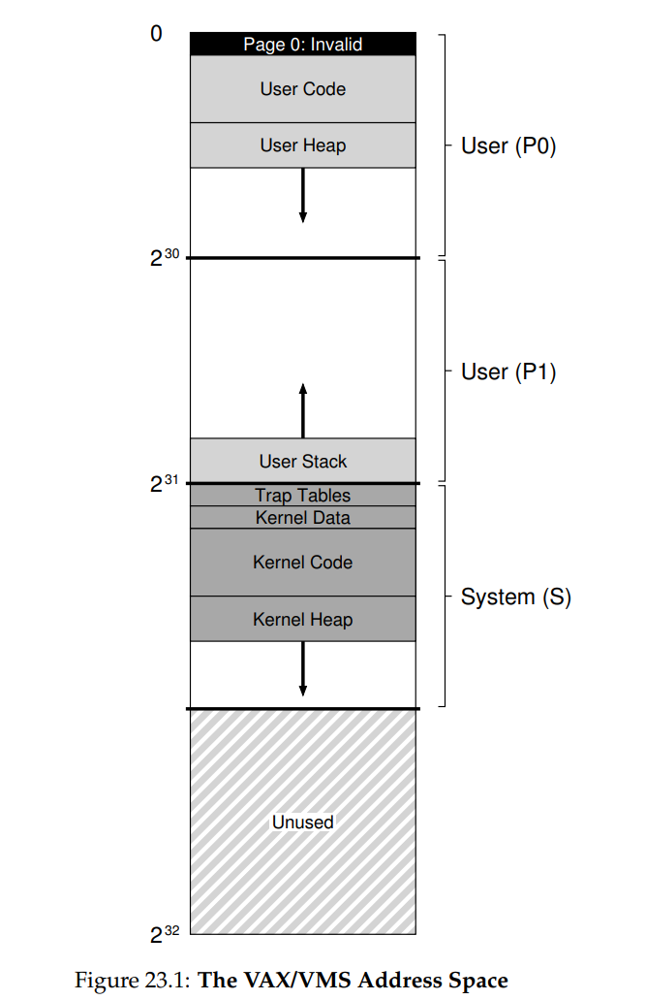
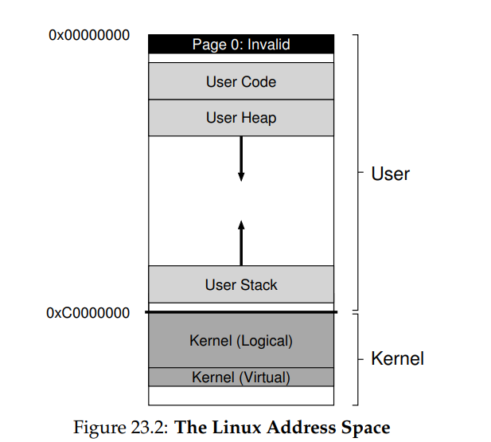
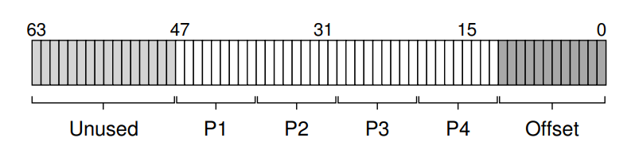

# OSTEP 23：Complete VM Systems

在結束對 virtual memory 虛擬化的章節前，讓我們來更深入地看看整個 virtual memory 系統是如何組合起來的。 我們已經看過這些系統中的關鍵元素，包括許多不同設計的 page table、與 TLB 的互動（有時甚至是由 OS 自己處理的）、以及用來決定哪些 page 保留在記憶體、哪些要被踢出去的策略。 然而，要組成一個完整的 virtual memory 系統還有許多其他特性，包括為了效能、功能性與安全性所設計的各種功能

::: info
因此，我們的核心問題為：如何建立一個完整的 VM 系統?

要實現一個完整的 virtual memory 系統，需要具備哪些特性？這些特性如何提升效能、增加安全性，或以其他方式改善系統？
:::

我們會透過介紹兩個系統來討論這個問題，第一個是早期具有「現代」virtual memory 管理概念的例子，也就是 VAX/VMS 作業系統 [LL82]，它於 1970 年代與 1980 年代初開發，許多來自這個系統的技術與做法至今仍然存在，因此非常值得學習

第二個例子是 Linux，原因應該不言而喻，Linux 是一個被廣泛使用的系統，從手機等小型低效能裝置，到現代資料中心內高可擴展的多核心系統上都可以有效運行。 因此，它的 VM 系統必須足夠有彈性，以在這些情境中都維持良好表現。 我們會討論這兩個系統，來展示前幾章中提出的概念是如何在完整的 memory manager 中融合運作的

## 23.1 VAX/VMS Virtual Memory

VAX-11 小型電腦架構是由 Digital Equipment Corporation（DEC）在 1970 年代末期提出的。 在小型電腦的時代，DEC 是電腦產業中的巨擘；但由於一連串錯誤決策與個人電腦的興起，DEC 最終慢慢走向衰敗 [C03]。 這個架構有多種實作，包括 VAX-11/780 與較低階的 VAX-11/750

這個系統的作業系統被稱為 VAX/VMS（簡稱 VMS），其主要架構師之一是 Dave Cutler，他後來也主導了 Microsoft Windows NT 的開發 [C93]。 VMS 面臨的通用問題是它會被部署到非常廣泛的機器上，包括廉價的 VAXen（這是正確的複數用法）到架構相同但非常高階的機器。 因此，作業系統必須具備在這些機器上都能良好運作的機制與策略

另外一點，VMS 是個很好例子，展示了如何用軟體創新來彌補架構本身的缺陷。 雖然 OS 通常依賴硬體來構建有效率的抽象與錯覺，但硬體設計者也有沒把事情做對做對的時候，我們會在 VAX 硬體中看到一些例子，並探討 VMS 是如何在硬體有缺陷的情況下建出一個有效的系統的

### Memory Management Hardware

VAX-11 為每個 process 提供一個 32-bit 的 virtual address space，使用 512-byte 的 page。 因此，一個 virtual address 包含 23-bit 的 VPN 與 9-bit 的 offset。 此外，VPN 的高兩位元用來分辨該 page 所屬的 segment； 因此，這個系統是我們之前看過的 paging 與 segmentation 混合模型

位址空間的下半部稱為「process space」，是每個 process 獨有的。 在 process space 的前半段（P0）中有使用者的程式與往下增長的 heap。 在後半段（P1）則有往上增長的 stack。 位址空間的上半部稱為 system space（S），不過只有其中一半會使用。受保護的 OS code 與資料就放在這裡，OS 也因此能跨 process 共享

VMS 設計者的一大擔憂是 VAX 硬體中的 page 太小（只有 512 bytes）。 這個歷史原因導致簡單的 linear page table 變得過大。 因此，VMS 設計者的首要目標之一就是避免 page table 吃掉太多記憶體

VMS 用兩種方式減輕 page table 對記憶體的壓力。 第一是將 user address space 分成兩段，VAX-11 為每個 process 提供 P0 與 P1 各一張 page table，這樣位於 stack 與 heap 之間未使用的空間就不需要配置 page table。 base 與 bounds register 的使用方式一樣，base register 存放該 segment 的 page table 起始位址，bounds 則存放大小（即 page-table entry 的數量）

第二是 OS 進一步將 user 的 page tables（P0 與 P1）放入 kernel virtual memory 中。 這樣在配置或擴展 page table 時，kernel 就從自己的 virtual memory 中分配空間，也就是 segment S。 如果記憶體壓力太大，kernel 還可以把這些 page table 的 page swap 到硬碟，釋放出 physical memory

將 page table 放入 kernel virtual memory 會使得 address translation 更為複雜。 例如，要轉換 P0 或 P1 中的 virtual address 時，硬體要先去找對應的 PTE（在該 process 的 P0 或 P1 表中）；但要做到這點，硬體可能要先查 system page table（位於 physical memory），完成後才能知道 page table 本身在哪裡，最後再完成目標記憶體位置的查詢。 所幸這整個流程大多可由 VAX 的硬體 TLB 加速

### A Real Address Space

研究 VMS 有個很棒的地方是可以看到一個真實的 address space 是怎麼構成的（Figure 23.1）。 到目前為止，我們假設的 address space 都很簡單，只有 user code、data、heap，但實際上如上所示的 address space 要複雜得多



舉例來說，code segment 絕不會從 page 0 開始，因為 page 0 會被標記為不可存取，用來協助偵測 null-pointer 的存取。 因此，在設計 address space 時，一個考量點是要方便除錯，而這個不可用的 zero page 正好提供了某種幫助

相同的 kernel 結構會被映射進所有的 user address space 中，在 context switch 時，OS 會改變 P0 與 P1 的 register，使它們指向即將被執行的 process 的 page tables，但 OS 並不會更改 S 的 base 與 bound。 因此每個 process 的 user address space 內其實都含有共用的 kernel virtual address space（其資料結構與程式碼）

::: tip  
小整理一下，在 VAX-11 的架構中，每個 process 的三段記憶體（P0、P1、S）分別有三組 page tables，但是只有 P0 和 P1 是 per-process 的，S 是 shared 的

當 context switch 發生時：

- OS 只要換掉 P0 和 P1 的 base/bounds register
- S 的 base/bounds register 保持一樣

這樣：

- User-space 部分（程式、heap、stack）會變成新 process 的
- Kernel-space 部分（系統函式、IO、記憶體管理資料）保持一樣
:::

將 kernel 映射進每個 address space 有多個理由。 這種做法讓 kernel 的運作更容易，舉例來說，當 OS 接收到 user program 傳進來的 pointer（例如 `write()` system call）時，要從該 pointer 複製資料到 kernel 的結構就變得容易。 OS 的程式碼也能在不必擔心資料來自哪裡的情況下撰寫與編譯

反過來說，如果 kernel 完全放在 physical memory 中，要做類似將 page table swap 出硬碟的操作會變得非常麻煩，若 kernel 有自己的 address space，從 user app 與 kernel 之間搬資料也會變得困難與痛苦。 透過這種設計（如今已普遍使用），kernel 幾乎就像是應用程式的一個受保護函式庫

關於這個 address space 的最後一點是保護機制。 顯然 OS 不希望 user app 任意存取 OS 的資料或程式碼，因此，硬體必須支援 page 的不同保護層級來達成這點。 VAX 會透過 page table 中的 protection bits 來指定存取某個 page 所需的 CPU 權限等級。 系統資料與程式碼會設成較高的保護等級，user code 嘗試存取這些內容時會觸發 trap 進入 OS，通常就會終止該 process

::: info  
ASIDE：為什麼 NULL pointer 會造成 seg fault

你現在應該能理解 null-pointer dereference 到底發生了什麼。 某個 process 產生了 virtual address 0，例如這樣的程式碼：

```cpp
int *p = NULL; // 設定 p = 0
*p = 10; // 嘗試將 10 存入 virtual address 0
```

硬體會查找 VPN（此處為 0）是否在 TLB 中，結果 miss。 接著查 page table，發現 VPN 0 的 entry 是無效的。 這就構成了非法存取，控制權轉交給 OS，通常就會終止該 process（在 UNIX 系統中，會送出 signal 給該 process，讓它有機會處理；若未捕捉，則直接被 kill）  
:::

::: info  
ASIDE：通用性的詛咒

作業系統經常面臨所謂通用性的詛咒（curse of generality），也就是它們需要為一大類不同的應用與系統提供一般性支援。 這樣的結果是，OS 不太可能對任何單一環境有最好的支援。 以 VMS 為例，這個詛咒很真實，因為 VAX-11 架構有許多不同的實作。 直到今天這詛咒依然存在，因為我們期望 Linux 同時在你的手機、電視盒、筆電、桌電、甚至在雲端資料中心跑成千上萬個 process 的高階伺服器上都要跑得很好
:::

### Page Replacement

VAX 中的 PTE 包含以下幾個位元，一個 valid bit、一個 4-bit 的 protection 欄位、一個 modify（或 dirty）bit、一個保留給作業系統使用的 5-bit 欄位，最後是一個 physical frame number（PFN），用來儲存該 page 在 physical memory 中的位置。 眼尖的讀者可能會注意到，沒有 reference bit！因此，VMS 的 replacement 演算法必須在沒有硬體協助判斷哪些 pages 是活躍的情況下運作

開發者同時也擔心所謂的 memory hogs，也就是那些佔用大量記憶體、導致其他程式難以執行的應用程式。 到目前為止我們看過的大多數策略都會受到這種 hogging 的影響，舉例來說，LRU 就是一種 global policy，無法在不同 processes 之間公平分配記憶體

為了解決這兩個問題，開發者提出了 segmented FIFO replacement policy [RL81]。 想法很簡單，每個 process 都有一個最多可保留在記憶體中的 page 數量上限，稱為其 resident set size（RSS）。 這些 pages 都會被維護在一個 FIFO list 上，當某個 process 超過其 RSS 時，就會淘汰最早進來的 page。 FIFO 顯然不需要硬體支援，因此很容易實作

當然，如我們前面所見，純粹的 FIFO 效能並不特別好。 為了改善 FIFO 的效能，VMS 引入了兩個 second-chance lists，pages 在被逐出記憶體前會先放到這些 list 中，分別是 global clean-page free list 與 dirty-page list。 當某個 process P 超過其 RSS 時，會從其 per-process FIFO 中移除一個 page，若是乾淨的（未被修改），就放到 clean-page list 的末端，若是髒的（已被修改），就放到 dirty-page list 的末端

若另一個 process Q 需要一個 free page，就從 global clean list 的開頭拿一個。 不過，如果原本的 process P 在該 page 被回收前又發生 page fault，P 就能從 free list 或 dirty list 中把該 page 搶回來，從而避免一次昂貴的 disk access。 這些 global second-chance list 越大，segmented FIFO 的效能就越接近 LRU [RL81]

VMS 使用的另一個最佳化方式，也有助於克服其小 page size 的缺點。 具體來說，因為 page 太小，swap 時的 disk I/O 容易變得效率低落，畢竟硬碟在進行大型傳輸時效率比較好。 為了提升 swap 時的 I/O 效率，VMS 加入了數個最佳化手法，其中最重要的是 clustering

透過 clustering，VMS 可以從 global dirty list 中一次抓出一大批 pages 並同時寫到硬碟（讓它們變成 clean 的）。 clustering 在現代系統中也很常見，因為 OS 可以在 swap space 中隨意安排 pages 的位置，從而將 pages 分群、減少寫入次數、增加單次寫入量，進而提升效能

::: info  
ASIDE: EMULATING REFERENCE BITS

事實上，你不需要硬體的 reference bit 也可以了解哪些 pages 正在被使用。 1980 年代初，Babaoglu 和 Joy 就證明 VAX 的 protection bits 可用來模擬 reference bits [BJ81]。 基本想法如下，若你想知道系統中哪些 pages 是活躍的，就把 page table 中所有的 pages 都標為 inaccessible（但同時保留那些實際上該被允許的權限資訊，也許存在 PTE 中 "reserved OS field" 的部份）

當 process 存取某個 page 時，就會觸發一次 trap 到 OS，OS 會檢查該 page 是否真的應該能被存取，若可以，就把該 page 的權限恢復成正常狀態（例如 read-only 或 read-write）。 到了 replacement 時，OS 可以檢查哪些 pages 仍然是 inaccessible 的，藉此了解哪些 pages 最近沒有被使用

這種模擬 reference bit 的方式，關鍵在於要兼顧 overhead 與使用資訊的取得。 OS 不能太積極地將 pages 設為 inaccessible，否則會造成太多 trap，overhead 過高；但也不能太被動，否則所有 pages 最終都會被存取過一輪，OS 又失去了辨別該淘汰誰的依據  
:::

### Other Neat Tricks

VMS 還有兩個現在已經變成標準的技巧 ― demand zeroing 與 copy-on-write。 我們現在來描述這兩個 lazy 最佳化手法。 其中一種 VMS（以及現代系統）所使用的 lazy 行為是 pages 的 demand zeroing，為了更容易理解，想像一下你要在 heap 中新增一個 page

以正常的做法來說，OS 在接到新增 page 的請求後，會先找出一個 physical page、將其清零（否則你可能會看到別的 process 留下的資料）、然後把它 map 到你的 address space 中（也就是把 PTE 設好，對應到那個 physical page）。 但如果該 page 最後根本沒被使用，這一連串動作就顯得浪費

而透過 demand zeroing，OS 在將 page 加入你的 address space 時，幾乎什麼都不做，只會在 page table 中加上一條 entry，標記該 page 為 inaccessible。 如果 process 稍後試圖讀寫這個 page，就會觸發 trap 到 OS。 OS 在處理該 trap 時，會發現（通常透過 "reserved for OS" 欄位的某些位元）該 page 是 demand-zero page

此時，OS 會執行必要的動作，例如找出一個 physical page、將其清零，並將其 map 到該 process 的 address space 中。 如果 process 根本沒存取該 page，整個清零和配置的過程就完全不會發生，這就是 demand zeroing 的好處

另一個在 VMS 中（幾乎每個現代 OS 也都有）的很酷的最佳化是 copy-on-write（簡稱 COW）。 這個點子最早可追溯到 TENEX OS [BB+72]。 想法非常簡單，當 OS 需要將某個 page 從一個 address space 複製到另一個時，它其實不用真的複製資料，只需要把該 page 同時 map 到兩個 address space，並將兩邊都設為 read-only。 如果兩個 address space 都只是讀取該 page，那麼就什麼事也不需要做，OS 完成了一次快速的 copy 而沒搬任何資料

但如果其中一個 address space 嘗試寫入該 page，就會觸發 trap 到 OS。 OS 會察覺該 page 是 COW page，此時才會真的配置一個新的 page、把舊的資料複製進去、然後把這個新 page map 到 faulting process 的 address space。 之後該 process 接著繼續執行，並擁有該 page 的私有副本

COW 有許多用途。 舉例來說，共用函式庫可以透過 COW 的方式 map 到多個 process 的 address space 裡面，節省寶貴的記憶體空間。 在 UNIX 系統中，COW 更是不可或缺，因為它與 `fork()` 與 `exec()` 的語意緊密相關

你可能還記得，`fork()` 會建立一個 caller address space 的完整複製，但如果這個 address space 很大，這種複製動作會很慢、資料搬移量也大。 更糟的是，大部分內容馬上會被接下來的 `exec()` 覆蓋掉。 透過改用 copy-on-write `fork()`，OS 就可以避免做太多無意義的複製，同時保留正確語意，提升效能

::: info  
TIP: BE LAZY

偷懶在生活和作業系統中都可以是一種美德。 延後處理一些工作，有時會對 OS 帶來很多好處。 第一，延後工作可以減少目前操作的 latency，提升反應速度，例如 OS 通常會馬上回報檔案寫入成功，但其實只是把資料存在記憶體中，稍後才真的寫入硬碟

第二，延後工作有時會讓某些工作變得根本不需要做，例如如果某個檔案在寫入前就被刪除了，那就不用寫入了。 偷懶在生活中也有幫助，例如你拖延你的 OS 專題，可能會發現同學已經幫你發現 spec 中的 bug。 不過，要是你太懶，專題就趕不出來，分數會變差，老師會變得難過。不要讓老師難過  
:::

## 23.2 The Linux Virtual Memory System

我們現在要來討論 Linux VM 系統中一些比較有趣的面向。 Linux 的發展是由實際工程師為了解決生產環境中遇到的真實問題所推動，因此在這個完整且功能豐富的 virtual memory 系統中，已經逐步整合了大量的功能

雖然我們無法涵蓋 Linux VM 的所有細節，但我們會提到其中最重要的部分，特別是它在某些方面超越了像 VAX/VMS 這類經典 VM 系統的地方。我們也會試著指出 Linux 和早期系統之間的共通性

本章的討論會聚焦於運行在 Intel x86 上的 Linux。 雖然 Linux 可以運行在許多不同的處理器架構上，但 x86 是 Linux 最主流、最重要的部署平台，因此是我們關注的重點

### The Linux Address Space

和其他現代作業系統一樣，也像 VAX/VMS 一樣，一個 Linux 的 virtual address space1 包含了 user 部分（存放 user program 的 code、stack、heap 與其他結構）以及 kernel 部分（存放 kernel code、stacks、heap 與其他結構）

像其他系統一樣，context switch 發生時，會更換目前正在執行的 process 的 user 部分，而 kernel 部分在各個 processes 之間是共用的。 同樣地，在 user mode 執行的程式無法存取 kernel 的 virtual pages，必須透過 trap 進入 kernel 並切換成 privileged mode 才能存取該記憶體

在經典的 32-bit Linux 中（也就是擁有 32-bit virtual address space 的 Linux），user 與 kernel 的地址空間分界點是 `0xC0000000`，也就是整個地址空間的四分之三處。 因此從 `0` 到 `0xBFFFFFFF` 的 virtual addresses 是屬於 user 的，剩下的地址（`0xC0000000` 到 `0xFFFFFFFF`）則是屬於 kernel 的 virtual address space。 64-bit Linux 也有類似的分界，只是位置稍有不同

Figure 23.2 顯示了一個典型（簡化後）的地址空間示意圖：



Linux 中一個稍微有趣的特點是它有兩種不同的 kernel virtual address。 第一種稱為 kernel logical addresses [O16]，這是一般認知的 kernel virtual address space，要取得這種記憶體，kernel code 只需呼叫 kmalloc。 大多數 kernel data structures（像是 page tables、per-process 的 kernel stacks 等）都存放在這裡。 與系統中大多數其他記憶體不同，kernel logical memory 無法被換出到 disk

kernel logical addresses 最有趣的地方在於它們與 physical memory 之間的關聯，具體來說，kernel logical addresses 與 physical memory 的第一段之間有直接映射。 因此，kernel logical address `0xC0000000` 對應到 physical address `0x00000000`，`0xC0000FFF` 對應到 `0x00000FFF`，等等

這種直接對應有兩個用意，第一，kernel logical address 和 physical address 之間的轉換很簡單，因此這些地址常被直接視為 physical address。 第二，如果一段記憶體在 kernel logical address space 中是連續的，那它在 physical memory 中也是連續的，這讓 kernel address space 所配置的記憶體很適合用在需要連續 physical memory 的地方，例如透過 direct memory access（DMA） 與設備之間進行資料傳輸（這部分我們會在本書的第三部分學到）

另一種 kernel address 是 kernel virtual address。 要取得這種記憶體，kernel code 會呼叫另一個 allocator，也就是 vmalloc，它會回傳一段 virtual 連續的記憶體區塊指標。 不同於 kernel logical memory，kernel virtual memory 通常不是 physical 上連續的，每一個 kernel virtual page 可能對應到的是不連續的 physical pages（因此不適合用於 DMA）。 然而這類記憶體比較容易配置，因此適合用來配置大型 buffer，畢竟要找出一大塊連續 physical memory 是很困難的事

在 32-bit Linux 中，kernel virtual addresses 存在的另一個理由是它讓 kernel 能夠存取超過大約 1 GB 的記憶體。 多年前，機器的記憶體遠小於這個數量，因此能不能存取超過 1 GB 並不是問題，但科技進步後，kernel 需要存取更多記憶體。 kernel virtual addresses 因為與 physical memory 並不是一對一對應的，因此能達成這個目的。 不過在進入 64-bit Linux 時，這樣的需求就比較不急迫了，因為 kernel 不再受限於 virtual address space 的最後 1 GB

### Page Table Structure

因為我們專注於 x86 架構的 Linux，因此討論的重點會放在 x86 所提供的 page table 結構上，畢竟這會決定 Linux 能做什麼與不能做什麼。 如之前所述，x86 提供的是一個由硬體管理的 multi-level page table 結構，每個 process 都有自己的 page table，OS 只需要在記憶體中建立這些對應，然後將一個特權用的暫存器設為指向 page directory 的起始位置，接下來的轉譯工作就由硬體處理

OS 在以下時機會參與其中：建立與刪除 process，以及 context switch 發生時，這些時候 OS 會確保正確的 page table 被 hardware MMU 使用來進行轉譯

這幾年最大的變化，大概就是從 32-bit x86 移轉到 64-bit x86，如前面簡單提過的。就像我們在 VAX/VMS 系統中看到的那樣，32-bit address space 已經存在許多年，隨著技術進步，這個限制對程式來說變得真實了起來。virtual memory 讓系統程式設計變得簡單，但當今的系統動輒有好幾 GB 的記憶體，而 32-bit 已經不夠用來對應所有這些空間了，因此 OS 勢必要繼續前進

切換到 64-bit address 對 x86 的 page table 結構產生了預期中的影響。 由於 x86 採用 multi-level page table，目前的 64-bit 系統使用的是四層 page table，不過目前還沒有使用整個 64-bit 的 address space，而是只使用了最下面的 48 bits

因此，一個 virtual address 可以這麼理解：



如圖所示，virtual address 的最高 16 bits 並未使用（因此不參與轉譯），最底下的 12 bits（因為 page 大小為 4 KB）是 offset（因此會直接使用，不需轉譯），中間的 36 bits 則會參與轉譯過程。 P1 部分用來 index 最頂層的 page directory，之後轉譯就一路往下，到最後由 P4 指定的 page table page，找到對應的 page table entry。 隨著系統記憶體變得越來越大，這個龐大的 address space 將會啟用更多範圍，進而使用五層甚至六層的 page-table

### Large Page Support

Intel x86 支援使用多種 page 大小，不只有標準的 4KB page。 具體來說，近代的設計在硬體上支援 2MB 甚至 1GB 的 page。 隨著時間演進，Linux 已發展出允許應用程式使用這些 huge page（在 Linux 世界裡的稱法）

如前所述，使用 huge page 帶來許多好處。 如同在 VAX/VMS 所看到的，它減少了 page table 中需要的映射數量，page 越大，所需的 mapping 越少。 然而，減少 PTE 的數量並不是 huge page 的驅動力，真正的優勢在於更好的 TLB 行為與相關的效能提升

當一個 process 積極使用大量記憶體時，它會很快把 TLB 填滿。 如果這些 translation 都是針對 4KB 的 page，那麼只能在不產生 TLB miss 的情況下存取很少量的記憶體。 對於現代那些搭載數 GB 記憶體的機器上執行的「大記憶體」工作負載來說，這會造成顯著的效能損耗，近期研究顯示某些應用在 TLB miss 上就花了 10% 的 cycles [B+13]

Huge page 允許一個 process 使用較少的 TLB entry 就能存取大量記憶體，這就是其主要優勢。 然而，還有其他好處，例如 TLB miss 發生時的處理路徑比較短，也就是說處理 TLB miss 的速度更快。 此外，在某些情境下，配置記憶體也能變得非常快，雖然這個好處比較小，但有時仍然很重要

Linux 支援 huge page 的方式有趣的一點是它是逐步實作的。 一開始，Linux 開發者知道只有少數應用（像是對效能要求很高的大型資料庫）才需要這項支援。 因此，他們決定讓應用程式可以透過特殊手段（例如呼叫 `mmap()` 或 `shmget()`）來要求配置 large page。 這樣的作法不會影響大多數應用（它們仍然使用 4KB page），少數對效能有要求的應用則必須改寫來使用這些介面，但對它們來說這是值得的痛苦

最近，隨著越來越多應用需要更好的 TLB 行為，Linux 開發者加入了 transparent huge page 支援。 啟用這個功能後，作業系統會自動尋找機會來配置 huge page（通常是 2MB，但在某些系統上是 1GB），而不需要修改應用程式

Huge page 並非沒有代價。最大潛在代價是內部碎片，也就是說一個 page 雖然很大但實際上只用了很少一部分。 這種浪費可能導致記憶體被一些用量很低的 large page 填滿。 如果系統啟用了 swapping，huge page 也常會讓 I/O 大量增加，這會讓 swap 的效能變差

在某些情況下，配置記憶體的 overhead 也可能變高。 總而言之，有一點很清楚，那個曾經在系統上運行良好的 4KB page size，已經不再是萬靈丹，隨著記憶體容量的增加，我們必須將 large page 與其他解法納入 VM 系統必要演進的一部分。 Linux 對這種硬體技術的緩慢採用，正是這場變革即將到來的證明

::: info  
TIP: CONSIDER INCREMENTALISM

人生中你常被鼓勵去當個革命者。 他們總說「想大一點！」、「改變世界！」，你也能理解這些口號的吸引力，在某些情況下，確實需要大改變，因此積極推動是合理的

然而，在很多情況下，慢一點、更漸進的方式可能才是對的。 Linux huge page 的例子就是一個工程上逐步實作的例子，開發者沒有像基本教義派一樣堅持 large page 是未來唯一的道路，而是採取了審慎的做法，先引入專用的支援機制，學習其優劣，只有當真的有需求時，才擴大支援範圍到所有應用

逐步實作雖然常常被人看不起，但它往往帶來穩健、深思熟慮且合理的進展。 在建構系統時，這種方法可能正是你需要的。 事實上，人生中可能也是如此  
:::

### The Page Cache

為了減少存取永久儲存設備的成本（這是本書第三部的主題），大多數系統會使用激進的快取子系統，把常用的資料保留在記憶體中。 在這方面，Linux 和傳統作業系統沒什麼不同

Linux 的 page cache 是 unified 的，會把三種主要來源的 page 保留在記憶體中：memory-mapped file、裝置的 file 資料與 metadata（通常透過 `read()` 和 `write()` 呼叫檔案系統來存取），以及構成每個 process 的 heap 與 stack page（有時稱為 anonymous memory，因為它們底下並沒有具名的 file，而是用 swap 空間來支撐）。 這些項目都保存在一個 page cache hash table 中，以便在需要資料時可以快速查找

Page cache 會追蹤每個 entry 是乾淨的（讀取過但沒被修改）還是髒的（已被 modified）。 髒資料會定期被 background thread（稱為 pdflush）寫回到 backing store（也就是 file 資料對應的具體檔案，或 anonymous 區域對應的 swap 空間），從而確保修改過的資料最終會寫回永久儲存裝置。 這些 background 活動每隔一段時間就會發生，或是有太多 page 是髒的時也會發生（這些都是可設定的參數）

在某些情況下，系統會記憶體不足，Linux 就得決定要把哪些 page 踢出記憶體來釋放空間。 為了做到這點，Linux 使用一種修改過的 2Q replacement 演算法 [JS94]，下面會介紹

想法很簡單，標準的 LRU replacement 很有效，但可能會被某些常見的存取模式破壞。 例如，若某個 process 重複存取一個大型檔案（尤其是大小幾乎跟記憶體一樣大，甚至更大），LRU 會把所有其他檔案踢出記憶體。 更糟的是，就算把這個檔案的部分內容留在記憶體中也沒用，因為它們在被踢出前從未被重新存取過

Linux 版本的 2Q replacement 演算法解決了這個問題，它維護兩個 list，並把記憶體分配到這兩個 list 上。 當某個 page 第一次被存取時，它會被放到其中一個 queue（在原始論文中叫 A1，在 Linux 中叫 inactive list）。 當它被再次存取時，會被升級到另一個 queue（原始中叫 Aq，在 Linux 中叫 active list）。 當需要進行 replacement 時，候選者會從 inactive list 裡挑出。 Linux 也會定期把 active list 底部的 page 移到 inactive list，並且讓 active list 大約佔整個 page cache 的三分之二 [G04]

理想情況下，Linux 會用完美的 LRU 來管理這些 list，但如前幾章所討論，那樣成本太高。 因此，和許多作業系統一樣，Linux 採用了類似 clock replacement 的 LRU approximation

這個 2Q 方法整體上和 LRU 行為非常相似，但它特別能處理循環性大檔案存取的情況，它會把這些 page 局限在 inactive list 裡。 由於這些 page 在被踢出前不會被再次存取，它們就不會把 active list 裡那些有用的 page 給沖掉

::: info  
ASIDE: THE UBIQUITY OF MEMORY-MAPPING

Memory mapping 的概念比 Linux 更早就存在，也廣泛用於 Linux 與其他現代系統之中。 概念很簡單，透過對已開啟的檔案描述符呼叫 `mmap()`，process 可以取得一段虛擬記憶體的指標，這段區域看起來就像是檔案的內容存在其中。 之後，該 process 就可以用簡單的 pointer dereference 來存取檔案的任意部分

對於還沒被載入到記憶體的記憶體對映檔案部分，存取時會觸發 page fault，這時 OS 會把相對應的資料從儲存裝置載入，並更新 process 的 page table，使這段記憶體可用（也就是 demand paging）

即使 `main()` 裡的程式碼沒有直接呼叫 `mmap()`，每個 regular Linux process 都還是會使用 memory-mapped file，這是因為 Linux 載入執行檔與 shared library 時用的就是 memory-mapping。 以下是 pmap 命令行工具的（高度簡化）輸出，它會顯示一個正在執行的程式（這裡以 shell，也就是 tcsh 為例）的虛擬記憶體映射組成

輸出有四欄：該 mapping 的虛擬位址、大小、保護位元，以及這段記憶體對應的來源：

```shell
0000000000400000 372K r-x-- tcsh
00000000019d5000 1780K rw--- [anon ]
00007f4e7cf06000 1792K r-x-- libc-2.23.so
00007f4e7d2d0000 36K r-x-- libcrypt-2.23.so
00007f4e7d508000 148K r-x-- libtinfo.so.5.9
00007f4e7d731000 152K r-x-- ld-2.23.so
00007f4e7d932000 16K rw--- [stack ]
```

從這份輸出你可以看到，tcsh 執行檔的 code、libc、libcrypt、libtinfo，以及 dynamic linker（ld.so）的 code 都被 map 到了位址空間中。 還有兩段 anonymous 區域：heap（第二列，標記為 anon）與 stack（標記為 stack）。 Memory-mapped file 提供了作業系統一種簡單又有效率的方式來建構現代位址空間  
:::

### Security And Buffer Overflows

現代的 VM 系統（如 Linux、Solaris 或 BSD 系列）和早期的系統（如 VAX/VMS）之間最大的差異之一，可能就是對於安全性的重視程度。 保護機制對於作業系統來說一直是個嚴肅的議題，但在現今機器比以往更加互聯的時代，開發者們實作了各種防禦性對策來阻止狡猾的駭客控制系統，這也就不足為奇了

其中一種主要威脅是 buffer overflow 攻擊，可以針對一般使用者程式，甚至是 kernel 本身。 這種攻擊的基本思路是找到目標系統中的 bug，讓攻擊者可以將任意資料注入到目標的位址空間中。 這種漏洞有時是因為開發者誤以為某個輸入不會過長，於是就放心地把這個輸入拷貝到一個 buffer 中，然而實際上輸入太長，導致 buffer overflow，進而覆寫目標的記憶體。 像這樣看似無害的程式碼就可能是問題的根源：

```cpp
int some_function(char *input) {
  char dest_buffer[100];
  strcpy(dest_buffer, input); // oops, unbounded copy!
}
```

在很多情況下，這種 overflow 不至於造成災難，例如使用者程式或作業系統收到不良輸入可能會當掉，但也僅止於此。 然而惡意程式設計師可以精心構造 overflow 的輸入，將自己的程式碼注入到目標系統，讓他們可以接管系統並為所欲為

如果攻擊成功的是一個與網路連接的使用者程式，攻擊者就可以在受害系統上任意運行程式，甚至用來出租運算資源，如果攻擊成功的是作業系統本身，那麼攻擊者就可以獲得更多資源存取權限，這種情況稱為權限升級（privilege escalation，也就是使用者程式碼取得 kernel 等級的存取權限）。 不用我說，你也知道這些都是壞事

防止 buffer overflow 的第一個也是最簡單的防禦方法，是禁止執行某些地址區域內的程式碼（例如 stack 區域）。 NX bit（No-eXecute，意即禁止執行）是 AMD 在其 x86 架構中導入的，Intel 也提供了類似的 XD bit，這是其中一項防禦技術，它禁止執行任何 PTE 中設定為不可執行的頁面。 這種方法可以防止攻擊者注入的程式碼在 target 的 stack 中被執行，從而減輕問題

然而即使無法直接注入程式碼，攻擊者也可以透過惡意程式執行任意的程式碼序列。 這種技巧被稱為 return-oriented programming（ROP），真的非常巧妙。 ROP 的觀察是：在任何程式的位址空間中（尤其是用 C 撰寫並鏈接大量 C 函式庫的程式），都有大量程式碼片段（在 ROP 中稱為 gadgets）

攻擊者可以覆寫 stack，使目前正在執行的函式的 return address 指向某個他想執行的 gadget（也就是某條指令或一小段程式碼），該 gadget 執行完會 return。 攻擊者就這樣把多個 gadgets 串接起來（確保每次 return 都跳到下一個 gadget），就可以組成任意程式碼來執行

為了對抗 ROP（還有它早期的形式 return-to-libc attack），Linux（以及其他系統）又加了一道防線，稱為 address space layout randomization（ASLR）。 這種做法不再把 code、stack 和 heap 放在固定的虛擬位址位置，而是隨機放置，因此要寫出一組精密 gadget sequence 變得非常困難。 大多數針對易受攻擊程式的攻擊會導致程式 crash，但無法成功奪取執行控制權

你其實可以很輕易地觀察到這種隨機化的效果。 以下是一段簡單程式碼，可以在現代 Linux 系統中展示：

```cpp
int main(int argc, char *argv[]) {
  int stack = 0;
  printf("%p\n", &stack);
  return 0;
}
```

這段程式只會輸出 stack 上變數的（虛擬）地址。 在沒有 ASLR 的舊系統中，每次輸出的位址都一樣。但你可以看到下面的輸出結果，每次執行的地址都不同：

```shell
prompt> ./random
0x7ffd3e55d2b4
prompt> ./random
0x7ffe1033b8f4
prompt> ./random
0x7ffe45522e94
```

ASLR 對於使用者程式來說是非常實用的防線，所以也被納入 kernel，成為 kernel address space layout randomization（KASLR）。 然而實際上 kernel 可能還面臨更嚴重的問題，接著我們就要來討論

### Other Security Problems: Meltdown And Spectre

截至目前（2018 年 8 月），系統安全領域因為兩個新攻擊技術而翻天覆地。 第一個叫做 Meltdown，第二個是 Spectre。 它們幾乎同時被四個不同的研究團隊/工程團隊發現，引發了大家對電腦硬體與作業系統所提供保護機制的深刻質疑。 你可以前往 spectreattack.com 閱讀每篇攻擊細節論文，其中 Spectre 被認為是兩者中更棘手的那一個

這兩種攻擊所利用的共通弱點在於：現代 CPU 為了效能會偷偷做很多瘋狂的事情。 其中一種技巧就是 speculative execution，也就是 CPU 預測下一步將會執行哪些指令，然後預先開始執行。 如果猜對了，程式會跑更快；如果猜錯了，CPU 就會把這些 speculative 執行的效果從架構狀態（例如 register）中撤銷，然後走正確的路徑重來

問題在於 speculative execution 雖然會撤銷對架構狀態的影響，但卻會在系統其他部位留下痕跡，例如 cache、分支預測器等等。 這就是問題所在，讓攻擊者發現這些狀態，便可能讓記憶體的內容變得有機可乘，即使這些記憶體是我們原本以為受到 MMU 保護的

其中一個提高 kernel 保護的方法是：把 kernel address space 盡可能從每個使用者程序中移除，改為讓 kernel 大多數資料使用獨立的 page table，這稱為 kernel pagetable isolation（KPTI）。 也就是說，OS 不再把 kernel 的 code 和資料結構對映到每個使用者程序中，而是只保留最基本的最小單元，當進入 kernel 時，就切換到 kernel 的 page table。 這樣可以提高安全性、避免某些攻擊手法，但代價就是效能下降，切換 page table 是昂貴的操作。 安全的代價，就是便利性和效能

但很可惜，KPTI 並無法解決上述所有安全問題，只能擋下一部分。 而像是「關掉 speculative execution」這種簡單解法根本行不通，因為這樣系統會變得極慢，可能慢上數千倍。 因此，如果你對系統安全有興趣，現在真是一個特別有趣的時代

要真正了解這些攻擊，你可能還得先學很多東西。 從學習現代計算機架構開始，去研究 speculative execution 及其實作所需的機制。 在上述網站上閱讀 Meltdown 與 Spectre 攻擊說明，它們也有附一份對 speculative 的簡要介紹，也許是個不錯的起點。 還有，繼續研究作業系統可能潛在的漏洞。誰知道還有哪些問題尚未浮現？

## 23.3 Summary

你現在已經看完兩套 virtual memory 系統由上到下的回顧。 希望大部分的細節都不難理解，因為你應該已經對基本的機制和政策有了不錯的認識。 更多關於 VAX/VMS 的細節可以在 Levy 和 Lipman 寫的那篇很棒（而且很短）的論文 [LL82] 中看到。 我們鼓勵你去讀一下，這是一個很棒的方式可以了解這幾章背後的原始資料長什麼樣子

你也學到了一些關於 Linux 的知識。 雖然它是一個龐大且複雜的系統，但它繼承了許多來自過去的好點子，其中很多我們沒辦法在這裡詳細說明。 例如，Linux 在 `fork()` 時會做 lazy copy-on-write，以此降低額外負擔並避免不必要的複製

Linux 也會用 memory-mapping `/dev/zero` 的方式來做 demand zeroing，並且有一個背景的 swap daemon（swapd）會把 pages swap 到 disk 以減少記憶體壓力。 確實，Linux 的 VM 裡充滿了從過去繼承來的好點子，也包括它自己發明的許多創新

想學更多的話，可以看看這些還不錯（但可惜已經過時）的書籍 [BC05,G04]。 我們鼓勵你自己去讀，畢竟我們只能提供一滴水，而這其實是整片複雜海洋。 不過你總得從某個地方開始，而且海洋是什麼呢？不過就是無數滴水的集合而已 [M04]

## References

- [B+13] “Efficient Virtual Memory for Big Memory Servers” by A. Basu, J. Gandhi, J. Chang, M. D. Hill, M. M. Swift. ISCA ’13, June 2013, Tel-Aviv, Israel. 一篇近期的研究顯示 TLB 很重要，在大型記憶體 workload 中佔了 10% 的 cycle。解法：一個巨大的 segment 來容納大量資料。我們往後退，是為了能往前走！

- [BB+72] “TENEX, A Paged Time Sharing System for the PDP-10” by D. G. Bobrow, J. D. Burchfiel, D. L. Murphy, R. S. Tomlinson. CACM, Volume 15, March 1972. 一個早期的 time-sharing OS，提出了很多好點子。Copy-on-write 只是其中之一，也啟發了現代系統中的其他概念，像是 process 管理、virtual memory 和 file system

- [BJ81] “Converting a Swap-Based System to do Paging in an Architecture Lacking Page-Reference Bits” by O. Babaoglu, W. N. Joy. SOSP ’81, Pacific Grove, California, December 1981. 解釋如何利用現有的 protection 機制模擬 reference bits，由 Berkeley 一群人提出，他們當時正在開發 BSD。這個團隊在 virtual memory、file system 和 networking 的發展中有很大貢獻

- [BC05] “Understanding the Linux Kernel” by D. P. Bovet, M. Cesati. O’Reilly Media, November 2005. 眾多關於 Linux 的書之一，雖然過時了，但仍值得一讀

- [C03] “The Innovator’s Dilemma” by Clayton M. Christenson. Harper Paperbacks, January 2003. 一本很棒的書，討論硬碟機產業與創新如何顛覆既有勢力。對商學院學生和電腦科學家都很有啟發性。說明了大型成功企業是如何徹底失敗的

- [C93] “Inside Windows NT” by H. Custer, D. Solomon. Microsoft Press, 1993. 一本非常詳細地從頭到尾說明 Windows NT 系統的書。內容很多，但確實是一本不錯的書

- [G04] “Understanding the Linux Virtual Memory Manager” by M. Gorman. Prentice Hall, 2004. 一本深入探討 Linux VM 的書，但可惜也有點過時了

- [G+17] “KASLR is Dead: Long Live KASLR” by D. Gruss, M. Lipp, M. Schwarz, R. Fellner, C. Maurice, S. Mangard. Engineering Secure Software and Systems, 2017. 可見：https://gruss.cc/files/kaiser.pdf 提供了關於 KASLR、KPTI 等主題的精彩說明

- [JS94] “2Q: A Low Overhead High Performance Buffer Management Replacement Algorithm” by T. Johnson, D. Shasha. VLDB ’94, Santiago, Chile. 一個簡單但有效的 page replacement 方法

- [LL82] “Virtual Memory Management in the VAX/VMS Operating System” by H. Levy, P. Lipman. IEEE Computer, Volume 15:3, March 1982. 原始資料幾乎都來自這篇論文。如果你想念研究所，讀論文是基本技能：讀論文、工作、再讀論文、繼續工作、最後寫一篇論文、然後再工作

- [M04] “Cloud Atlas” by D. Mitchell. Random House, 2004. 要選一本最愛的書真的很難，因為太多了！每一本書都有其獨特的美。不過如果非選不可，作者們可能會選「Cloud Atlas」，這是一部關於人類處境的壯闊史詩，這章最後那句話就引用自它。如果你夠聰明——我們相信你是——就別再讀這些冷門註解了，去讀「Cloud Atlas」吧，你會感謝我們的

- [O16] “Virtual Memory and Linux” by A. Ott. Embedded Linux Conference, April 2016. https://events.static.linuxfound.org/sites/events/files/slides/elc 2016 mem.pdf 一份有用的投影片，概述了 Linux VM

- [RL81] “Segmented FIFO Page Replacement” by R. Turner, H. Levy. SIGMETRICS ’81, Las Vegas, Nevada, September 1981. 一篇短文，說明對某些 workload 而言 segmented FIFO 能接近 LRU 的效能

- [S07] “The Geometry of Innocent Flesh on the Bone: Return-into-libc without Function Calls (on the x86)” by H. Shacham. CCS ’07, October 2007. 對 return-to-libc 的概念做了推廣。我們引用電影《第六感追緝令》中 Dr. Beth Garner 的話：「她瘋了！但她很聰明！」我們對 ROP 的想法也差不多

- [S+04] “On the Effectiveness of Address-space Randomization” by H. Shacham, M. Page, B. Pfaff, E. J. Goh, N. Modadugu, D. Boneh. CCS ’04, October 2004. 描述 return-to-libc 攻擊與其限制。 開始讀吧，不過小心：系統安全的兔子洞很深...
