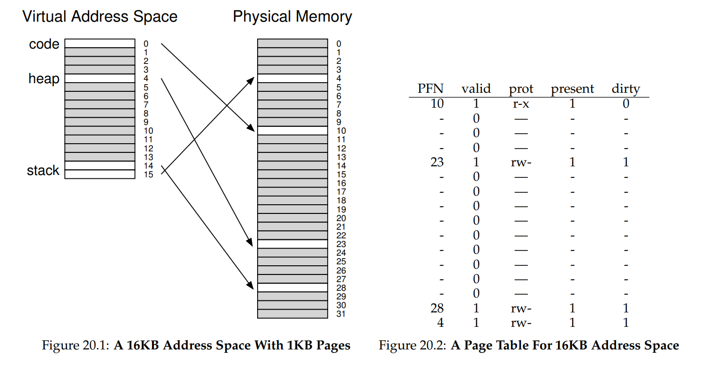
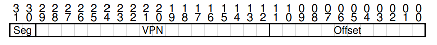
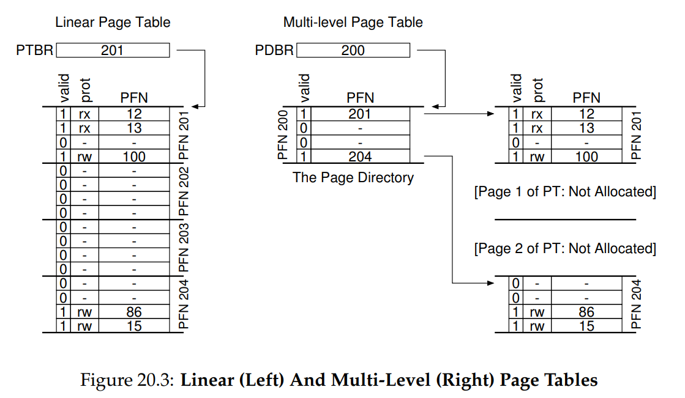
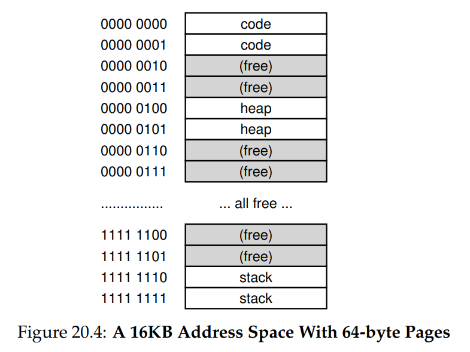
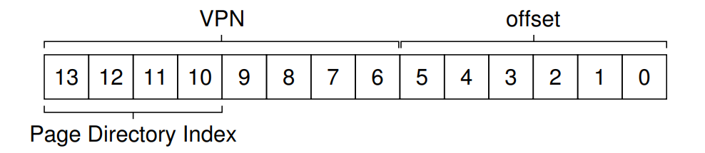
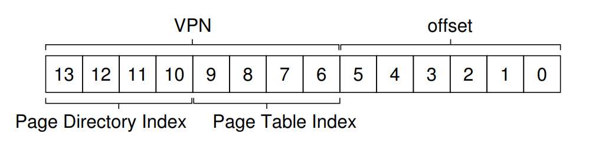

我們現在要處理 paging 所帶來的第二個問題：page table 太大了，因此會佔用過多的記憶體。 讓我們從 linear page table 開始說起，你可能還記得 linear page table 會變得非常大

假設一個 32-bit 的位址空間（$2^{32}$ bytes），配上 4KB（$2^{12}$ bytes）大小的 page，以及一個 4-byte 大小的 PTE。 這樣的 address space 大約會有一百萬個 virtual page（$\frac{2^{32}}{2^{12}}$），乘上每個 PTE 的大小，你會發現 page table 的大小是 4MB 

而且通常系統中每個 process 都會有自己的 page table，如果系統上有一百個 active process，那我們光是為了這些 page table 就要分配幾百 MB 的記憶體，因此我們需要一些技術來減輕這個沉重的負擔，方法很多，接下來就一個一個來看

:::info  
關鍵問題：如何讓 page table 更小？

簡單的 array-based page table（通常稱為 linear page table）太大了，會在典型系統中佔用太多記憶體。 我們要如何讓 page table 變小？ 其中有哪些核心觀念？ 而使用這些新資料結構後，會帶來什麼樣的效率問題？  
:::

## 20.1 簡單的解法：更大的 page

我們可以用一種簡單的方法來減少 page table 的大小：使用更大的 page。 一樣假設 32-bit 位址空間，但這次我們假設 page 大小為 16KB。 那麼虛擬位址會有 18-bit 的 VPN 和 14-bit 的 offset。 假設每個 PTE 的大小仍是 4 bytes，這樣 linear page table 就只需要 $2^{18}$ 個 entry，共 1MB，因此 page table 的大小減少了四倍（剛好反映 page 大小增大四倍）

但這個方法最大的問題在於：大的 page 會導致每個 page 內部的浪費（internal fragmentation）。 應用程式可能只用到 page 的一小部份，卻整個分配下來，結果記憶體很快就會被這些過大的 page 填滿

因此，大多數系統在一般情況下還是會傾向使用相對較小的 page size，例如 x86 中的 4KB 或 SPARCv9 的 8KB，所以還要再找其他方法

:::info
補充：多種 page 大小

順帶一提，許多架構（例如 MIPS、SPARC、x86-64）現在都支援多種 page 大小。 通常預設會用一個小 page（例如 4KB 或 8KB），但如果有應用程式提出需求，系統可以讓它為特定的 address space 區段分配一個大的 page（例如 4MB 大小）。 這樣就能把一個經常使用（而且很大）的資料結構放在這個區段中，而且只佔用一個 TLB entry

這種大 page 的使用方式常見於資料庫系統與其他高階商業應用中。 使用多種 page 大小的主要原因不是為了節省 page table 空間，而是為了減輕 TLB 的負擔，讓一個程式能存取更多 address space 而不會產生太多 TLB miss

不過如研究者所指出 [N+02]，使用多種 page 大小會讓作業系統的虛擬記憶體管理變得更加複雜。 因此，大 page 有時最簡單的用法是直接提供新的介面給應用程式，讓它們直接要求分配大的 page
:::

## 20.2 混合式方法：Paging 結合 Segmentation

當你在生活中遇到兩種合理但不同的方法時，你應該試著看看能否將這兩者結合起來，從而取其優點，捨其缺點，我們稱這種結合為 hybrid。 多年以前，Multics 的開發者（特別是 Jack Dennis）在設計 Multics 虛擬記憶體系統時就提出了這樣的想法。 具體來說，Dennis 想到了將 paging 和 segmentation 結合，以降低 page table 所造成的記憶體負擔

我們可以從一個典型的 linear page table 的細節來理解這點。 假設我們的 address space 中，heap 和 stack 使用的部分都很小。 在這個例子中，我們使用一個只有 16KB 的位址空間，每個 page 大小是 1KB（如 Figure 20.1 所示），這樣的 page table 如 Figure 20.2 所示

<div class = "center-column">



</div>

上例假設單一個 code page（VPN 0）對應到 page frame 10，單一個 heap page（VPN 4）對應到 page frame 23，而 stack 的兩個 page（VPN 14 和 15）則對應到 page frame 28 和 4。 你從圖中可以看到，這個 page table 大部分都是空閒 page，充滿了無效的 entry。 這還只是小小的 16KB 位址空間。 如果是 32-bit 的 address space，那 page table 裡面可能浪費的空間又會更多

所以我們提出 hybrid 方法：與其為整個 address space 用一個 page table，不如為每個邏輯 segment 各自配一個 page table。 這樣在這個例子中，我們可以為 code、heap、stack 各自設置一張 page table

回想 segmentation 的做法，我們會使用 base register 表示 segment 在 physical memory 的位置，bound 或 limit register 表示 segment 的大小。 在這個 hybrid 方法中，我們仍然在 MMU 中保有這些結構，但 base register 指向的不是 segment 本體，而是該 segment 的 page table 的物理位址。 bounds register 則用來表示該 page table 的結尾（即有幾個 valid page）

舉個例子，假設有一個 32-bit 的虛擬位址空間，每個 page 大小是 4KB，而位址空間被分為四個 segments，我們只使用其中三個：code、heap、stack

為了知道一個位址屬於哪個 segment，我們可以使用虛擬位址的最高兩個 bit。假設 `00` 代表未使用的 segment，`01` 是 code，`10` 是 heap，`11` 是 stack

此時虛擬位址會長這樣：

<div class = "center-column">



</div>

在硬體上，會有三組 base/bounds register，分別對應 code、heap、stack。 當一個 process 在執行時，每個 segment 的 base register 會包含該 segment page table 的物理位址。 也就是說，每個 process 現在有三張 page table。 當發生 context switch 時，這些 register 會被更新成新 process 的 page table 位址

在 TLB miss 的情況下（假設是 hardware-managed TLB），硬體會使用虛擬位址中的 segment bits（`SN`）決定該用哪一組 base 和 bounds register。 接著使用該 register 內的物理位址，加上 VPN，來組合出目標 PTE 的位置：

```cpp
SN = (VirtualAddress & SEG_MASK) >> SN_SHIFT
VPN = (VirtualAddress & VPN_MASK) >> VPN_SHIFT
AddressOfPTE = Base[SN] + (VPN * sizeof(PTE))
```

這整個過程應該看起來很眼熟，和 linear page table 的方法幾乎一模一樣，唯一的差別是我們從三個 segment base register 中挑一個，而不是從唯一的 PTBR 開始

這個 hybrid 方法的關鍵在於每個 segment 有自己的 bounds register，這些 bounds register 告訴硬體該 segment 最多有幾個 valid page，例如 code segment 只用了前三個 page（0、1、2），那 code segment 的 page table 就只需要三個 entry，因此將 bounds register 設為 3

如果存取超出範圍，就會產生 exception，可能會讓該 process 被終止。 這樣我們就比 linear page table 更節省記憶體，因為不再需要為 stack 和 heap 中間那些空閒區段浪費 page table 空間

但你可能也注意到這方法不是萬靈丹。 首先，它還是需要 segmentation，但 segmentation 的彈性不夠高，因為它假設了某種 address space 的使用模式。 如果我們的 heap 又大又稀疏，還是會有大量的 page table 空間被浪費

其次，這種 hybrid 方法又重新引入了 external fragmentation 的問題。 雖然大多數記憶體是以 page 為單位管理，但 page table 現在的大小可以是任意的（以 PTE 為單位的倍數），因此要為它們找空間就變得困難得多。 基於這些理由，人們仍持續尋找更有效率的 page table 實作方式

## 20.3 Multi-level Page Tables

另一種不依賴 segmentation 的做法是 multi-level page table，它把 linear page table 改造成像是樹狀的結構。 這種作法非常有效，以致於許多現代系統（例如 x86 [BOH10]）都使用這種方法

multi-level page table 的核心概念很簡單。 首先，將 page table 切成相同大小的不同單位，每個單位都是一個小的 page table，接下來我會簡稱這些小 page table 為頁（page），因為它們也是一個固定大小的記憶體區段。 如果某一整頁的 PTE 全部都是無效的，那就不要配置這一頁了

> 我很不喜歡把 page 翻成頁，但這邊的用詞實在很容易混淆，因此就將頁拿來專指這些小 page table 了

為了追蹤某一頁是否有效（以及如果有效，它在哪裡），我們引入一個新的結構，稱為 page directory。 page directory 可以告訴我們 page table 的某一頁存放在哪，又或是整頁都沒有有效的 page

Figure 20.3 的左邊是經典的 linear page table，即使中間那段 address space 完全沒有被用到，我們還是得為這些區段配置 page table 空間（也就是 page table 的中間兩頁）。 而右邊則是 multi-level page table，當中 page directory 僅標記第一頁與最後一頁有效，因此只有這兩頁實際存在於記憶體中

<div class = "center-column">



</div>

你可以這樣想像 multi-level page table 的作用：它讓 linear page table 的一部分「消失」，從而釋放這些 page frame 給其他用途，並透過 page directory 來追蹤 page table 中有哪些頁被配置了

> 以上圖來說其把一個大 page table 分成了四個小 page table，並用 page directory 來管理這四個小 page table。 原先因為它們都屬於一個大 page table，不可分割，因此配置記憶體時需要一次性的配置整張 page table，切成小 page table 會使這四個區塊的記憶體配置相互獨立，我可以只配置其中兩個小 page table，不配置另外兩個小的 page table，以達到節省記憶體的效果，這也是為什麼原文會用「消失」來描述這一行為

在簡單的 two-level page table 中，page directory 為 page table 的每一頁配置一個 entry，稱為 page directory entry（PDE），一個 PDE 至少包含一個 valid bit 和一個 PFN，與 PTE 類似

但如前所述，這個 valid bit 的含義稍有不同：如果一個 PDE 是有效的，代表它指向的那一頁內至少有一個有效的 PTE，也就是說該頁至少有一個 virtual page 被配置了；如果 PDE 是無效的（也就是 0），則 PDE 的其餘部分沒有定義

multi-level page table 相對於我們之前見過的方法有一些明顯的優點。 首先 multi-level page table 的大小只會依據實際使用的 address space 比例進行配置，因此它通常較節省空間，適合稀疏使用的位址空間

其次，只要設計得當，每個頁都能完整塞進一個 virtual page 裡，這能簡化記憶體的管理：當 OS 需要配置或擴充 page table 時，只要抓一個空閒 page 來用就好。 反觀 linear page table，它就是一個以 VPN 為 index 的 PTE 陣列，因此整個 linear page table 必須連續地放在實體記憶體中 

對於一個很大的 page table（例如 4MB），要找到這麼大塊的連續未使用實體記憶體是個問題。 而使用 multi-level 結構後，我們透過 page directory 增加了一層 indirection，讓我們可以把 page table 的各頁放在實體記憶體中的任意位置

但要注意的是，multi-level page table 是有成本的。 在發生 TLB miss 時，我們需要從記憶體中載入兩次才能取得正確的轉譯資訊（一次讀 page directory，一次讀 PTE），相比於 linear page table 只需要一次記憶體存取來說，這是個 trade-off。 multi-level page table 是一個很好的時間與空間之間的取捨例子，我們希望能減少 page table 的大小（我們確實做到了），但代價就是在發生 TLB miss 時會有額外開銷。 雖然在一般情況下（TLB hit）效能完全相同，但一旦發生 miss，multi-level page table 的成本就會比較高

另一個明顯的缺點是複雜度，無論是由硬體還是作業系統負責處理 page table 查詢（發生 TLB miss 時），這都會比 simple linear page table 複雜不少。 當然，我們常常願意用更高的複雜度來換取更好的效能或更低的開銷； multi-level page table 就是一個讓我們在查表變複雜的情況下，換得寶貴記憶體節省的例子

:::info  
這邊我補充一下，multi-level page table 節省記憶體開銷的前提是 page table 內有配置的 virtual page 的分布符合預期，例如 Figure 20.3 中你可以看到使用的 virtual page 集中在第 1、4 個小 page table 中，因此可以節省兩個小 page table 的記憶體開銷

如果你的 virtual page 剛好分散在四個小 page table 中，那你還是需要分配一整個 page table 的記憶體給它，而且你還需要多花一個 page directory 的記憶體，因此整體記憶體的用量反而上升了

使用 multi-level page table 的重點在於它可以讓你不需要找到一整塊的連續未使用記憶體，就像前面講的，如果不分層，你需要找到一塊連續未使用的 4MB 記憶體，如果分層，你就可以把這 4MB 切成 4 個 1MB，此時只需找到 4 個連續未使用的 1MB 記憶體空間即可

在你用滿整個 page table 的情況下，你是無法節省記憶體的，此時你還會需要額外付出 page directory 的記憶體開銷。 你分越多層，代表 page directory 越多，需要付出的額外記憶體開銷就越大，但同時也代表你需要的連續空間越小，可以把它們打散在各處  
:::

### A Detailed Multi-Level Example

為了更好地理解 multi-level page table 的概念，我們來看一個具體的例子。 假設有一個 16KB 大小的位址空間，每個 page 為 64 bytes。 這樣我們有一個 14-bit 的虛擬位址空間，其中 8 個 bit 是 VPN，6 個 bit 是 offset。 linear page table 會有 $2^8$（256）個 entry，即使實際使用的位址空間只有很小一部份也如此

Figure 20.4 展示了一個這樣的位址空間例子：

<div class = "center-column">



</div>

在這個例子中，virtual page 0 和 1 被用作 code，virtual page 4 和 5 被用作 heap，virtual page 254 和 255 則是 stack；其餘的 page 都未被使用 

我們現在要為這個位址空間建立一個 two-level page table，首先我們從完整的 linear page table 開始，並把它拆成 page 大小的區塊。 此例中我們有 256 個 entry，每個 PTE 是 4 bytes，所以 page table 的總大小是 1KB（256 × 4 bytes）。 考慮到每個 page 是 64 bytes，我們可以把 page table 分成 16 個 page；每個 page 能容納 16 個 PTE 

接下來我們想將 VPN 作為 index 訪問 page directory，進一步找到 page table 中的目標 entry。 由於 page directory 和 page table 都是 entry 的 array，所以我們需要從 VPN 中切出對應的 index bit 

首先要從 VPN 中取出作為 page directory 的 index 部分，由於 page table 有 256 個 entry，分布在 16 個 page 中，因此每個 page directory 會有 16 個 entry，因此 VPN 的前 4 個 bit 為 page directory 的 index：

<div class = "center-column">



</div>

一旦取得 page-directory index（簡稱 PDIndex），我們就可以用簡單的公式找到 page-directory entry（PDE）的位置：

```cpp
PDEAddr = PageDirBase + (PDIndex * sizeof(PDE)) 
```

這樣就可以得到對應的 page directory，然後繼續做 address translation。 如果這個 PDE 是 invalid 的，那我們就知道這個 access 是無效的，因此會 raise 一個 exception。 如果 PDE 是 valid 的，我們就要從 PDE 所指向的頁中找到對應的 PTE，這能透過把 VPN 剩下的 bit 作為 index 來訪問頁得到：

<div class = "center-column">



</div>

這個 page-table index（簡稱 PTIndex）可作為頁的 index，讓我們得到目標 PTE 的位址：

```cpp
PTEAddr = (PDE.PFN << SHIFT) + (PTIndex * sizeof(PTE)) 
```

注意從 PDE 取得的 PFN 需要先左移到正確的位置，再與 page-table index 相加，才能得到正確的 PTE 位址 

為了檢驗這整個流程，我們來實際操作一次 translation。 看 Figure 20.5（左側是 page directory），可以看到每個 PDE 都代表一個 page table 的 page。 這個例子中 address space 只有開頭和結尾有有效的 page，其它則是 invalid 

假設 physical page 100 裡面是 page table 的第 0 頁，它包含了 VPN 0 到 15 的 PTE（見 Figure 20.5 中間部分）。 其中 VPN 0、1 是 code，VPN 4、5 是 heap，其它則是 invalid 

<div class = "center-column">

| Page Directory |        | Page of PT (@PFN:100) |     |     | Page of PT (@PFN:101) |     |
|----------------|--------|------------------------|-----|-----|------------------------|-----|
| PFN            | valid? | PFN                    | valid | prot | PFN                  | valid | prot |
| 100            | 1      | 10                     | 1     | r-x  | –                    | 0     | –    |
| –              | 0      | 23                     | 1     | r-x  | –                    | 0     | –    |
| –              | 0      | –                      | 0     | –    | –                    | 0     | –    |
| –              | 0      | –                      | 0     | –    | –                    | 0     | –    |
| –              | 0      | 80                     | 1     | rw-  | –                    | 0     | –    |
| –              | 0      | 59                     | 1     | rw-  | –                    | 0     | –    |
| –              | 0      | –                      | 0     | –    | –                    | 0     | –    |
| –              | 0      | –                      | 0     | –    | –                    | 0     | –    |
| –              | 0      | –                      | 0     | –    | –                    | 0     | –    |
| –              | 0      | –                      | 0     | –    | –                    | 0     | –    |
| –              | 0      | –                      | 0     | –    | –                    | 0     | –    |
| –              | 0      | –                      | 0     | –    | –                    | 0     | –    |
| –              | 0      | –                      | 0     | –    | –                    | 0     | –    |
| –              | 0      | –                      | 0     | –    | –                    | 0     | –    |
| –              | 0      | –                      | 0     | –    | 55                   | 1     | rw-  |
| –              | 0      | –                      | 0     | –    | 45                   | 1     | rw-  |
| 101            | 1      |                        |       |      |                      |       |      |

(Figure 20.5: A Page Directory, And Pieces Of Page Table)

</div>

另一個有效的 page table page 位於 PFN 101，對應 VPN 240 到 255 的 PTE（見 Figure 20.5 右側）。 其中 VPN 254 和 255 是 stack，有效，其餘 invalid 

從這個例子可以清楚看到，multi-level page table 可以節省大量空間。 原本 linear page table 需要分配 16 個 page，現在只需要三個：一個 page directory，加上兩個實際用到的 page table page。 如果是更大的位址空間（如 32-bit 或 64-bit），節省的空間會更加驚人 

現在讓我們來做一次實際的 translation，看看這整個流程怎麼跑。 假設有一個 virtual address 指向 VPN 254 的第 0 個 byte，也就是 `0x3F80`，二進位是 `11 1111 1000 0000` 

我們先用 VPN 的前 4 bit（1111）去 index page directory，找到第 15 個 PDE，該 entry 指向 page table page 位於 PFN 101。 接下來用 VPN 的後 4 bit（1110）去 index 該 page，得到第 14 個 PTE，它告訴我們 VPN 254 對應的 PFN 是 55（hex 是 0x37） 

最後把 PFN=55 和 offset=000000 合併，得到目標物理位址：

```cpp
PhysAddr = (PTE.PFN << SHIFT) + offset = 00 1101 1100 0000 = 0x0DC0 
```

現在你應該對如何建立一個 two-level page table 有基本的認識了，page directory 負責指向 page table，而 page table 則提供實際的 PFN。 不過可惜的是，我們的工作還沒結束，因為有時候兩層還是不夠用

