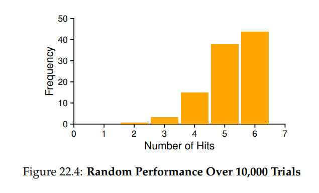
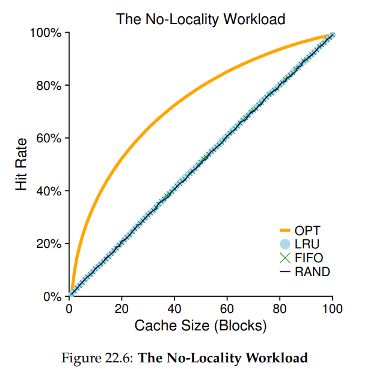
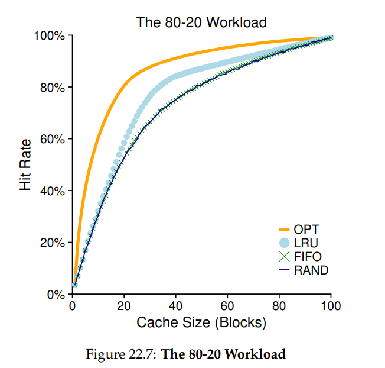
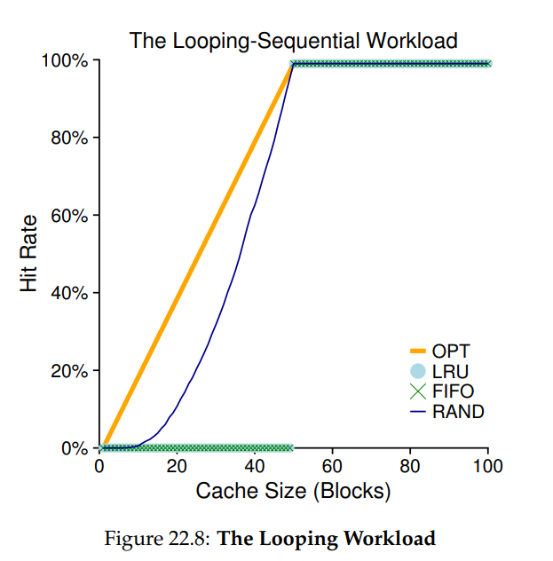
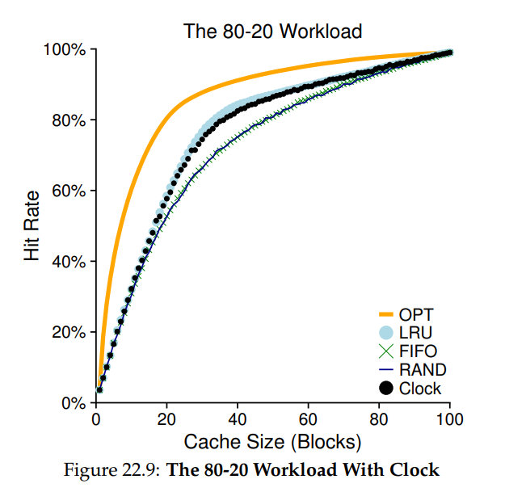

# OSTEP 22：Swapping Policies

在 virtual memory manager 裡，如果有很多 free memory，事情就簡單多了。發生 page fault，你就在 free-page list 裡找到一個空的 page，把它分配給 faulting page。嘿，作業系統，恭喜你！你又做到了

但不幸的是，當可用記憶體很少時，事情就變得比較有趣了。在這種情況下，memory pressure 會迫使 OS 開始把某些 page paging out，以空出空間給正在使用的 page。決定要把哪一個（或哪幾個） page evict 掉，就是 OS 的 replacement policy 所要處理的事；在歷史上，這是早期 virtual memory 系統中最重要的決策之一，因為早期的系統實體記憶體都非常小。至少，這是一組值得多了解一點的有趣策略集合。而我們的問題就是：

::: tip  
關鍵：如何決定要 evict 哪一個 page

OS 要如何決定要把哪一個（或哪幾個） page 從記憶體中移除？這個決定是由系統的 replacement policy 做出的，它通常會依據一些通用原則（如下所述），但也會加上一些小技巧來避免某些邊界情況的行為  
:::

## 22.1 Cache Management

在深入各種策略之前，我們先更仔細描述一下我們要解決的問題。因為 main memory 只存放了系統中一部分的 page，所以它本質上可以被視為整個系統中 virtual memory page 的一個 cache。因此，我們選擇 replacement policy 的目標，就是要讓這個 cache 的 miss 數量最小化，也就是盡量減少從 disk 抓 page 的次數

換個角度看，我們的目標也可以說是要讓 cache hit 的次數最大化，也就是讓存取的 page 儘量能在記憶體裡就找到

知道 hit 與 miss 的次數，可以讓我們計算某個程式的平均記憶體存取時間（AMAT），這是電腦架構師用來衡量硬體 cache 效能的一個指標 [HP06]。具體來說，我們可以這樣算出 AMAT：

$$
AMAT = T_M + (P_{Miss} \cdot T_D)
$$

其中 $T_M$ 代表存取記憶體的成本，$T_D$ 是存取硬碟的成本，$P_{Miss}$ 是沒在 cache 裡找到資料的機率（miss 機率）；$P{Miss}$ 的範圍是 0.0 到 1.0，有時候我們也會用百分比的 miss rate 來表示（例如 10% 的 miss rate 意思就是 $P_{Miss}$ = 0.10）。注意你一定會付 memory access 的成本；但如果 miss，你還得額外付出從 disk 抓資料的成本

舉個例子，假設有一台機器的位址空間非常小：4KB，使用 256-byte 的 page。因此 virtual address 會有兩個部分：一個 4-bit 的 VPN（最高位元），以及一個 8-bit 的 offset（最低位元）。所以在這個例子中，一個 process 可以存取 2 的 4 次方，也就是總共 16 個 virtual page

再假設這個 process 產生以下記憶體參照（也就是 virtual address）：0x000, 0x100, 0x200, 0x300, 0x400, 0x500, 0x600, 0x700, 0x800, 0x900。這些 virtual address 分別對應到前十個 page 的第一個 byte（page number 就是每個 virtual address 的第一個十六進位數字）

我們再假設除了 virtual page 3 以外，其他 page 都已經在記憶體裡。因此這組 memory access 的行為會是：hit, hit, hit, miss, hit, hit, hit, hit, hit, hit。我們可以算出 hit rate（也就是命中率）：90%，因為有 9 次是命中。miss rate 就是 10%（$P_{Miss}$ = 0.1）。一般來說，$P_{Hit} + P_{Miss} = 1.0$，也就是命中率加上失誤率等於 100%

為了計算 AMAT，我們還需要知道 memory access 與 disk access 的成本。假設 memory access（$T_M$）大約是 100 奈秒，disk access（$T_D$）大約是 10 毫秒，那麼我們有以下的 AMAT：100ns + 0.1 · 10ms，也就是 100ns + 1ms，也就是 1.0001ms，差不多是一毫秒。如果我們的 hit rate 是 99.9%（$P_miss$ = 0.001），結果就會差很多：AMAT 是 10.1 微秒，差不多快了 100 倍。當 hit rate 趨近於 100% 時，AMAT 就會趨近於 100 奈秒

但很不幸的是，就像這個例子裡顯示的，現代系統中 disk access 的成本太高了，就算只有很小的 miss rate，也會很快主導整體 AMAT。很明顯地，我們必須儘量避免 miss，不然就會像是以 disk 的速度在跑程式。有一個方法可以幫助改善這個問題，就是好好設計一個聰明的策略，而這正是我們接下來要做的事

## 22.2 The Optimal Replacement Policy

為了更深入了解某個 replacement policy 是怎麼運作的，能夠把它拿來和最佳的 replacement policy 比較是件好事。事實上，這樣的最佳策略是由 Belady 很多年前提出的 [B66]（他原本稱它為 MIN）。最佳 replacement policy 能夠達到最少的 miss 數量。Belady 證明了一個簡單（但可惜很難實作！）的方法，也就是把「未來最久之後才會被使用的 page」替換掉，會是最佳策略，能讓 cache miss 數量最少

希望這個最佳策略背後的直覺你能理解。這樣想：如果你一定要把某個 page 丟掉，為什麼不丟那個最久之後才會被用到的呢？這樣做等於你在說 cache 裡的其他 page 都比這個遙遠的 page 更重要。這是真的，因為你會在未來先存取其他 page，再存取那個最遙遠的 page

我們來追蹤一個簡單的例子來理解最佳策略會做出的選擇。假設一個程式會依序存取以下的 virtual page：0, 1, 2, 0, 1, 3, 0, 3, 1, 2, 1。Figure 22.1 展示了在 cache 容納三個 page 的情況下，最佳策略的行為

| Access | Hit/Miss? | Evict | Resulting Cache State |
|--------|-----------|--------|------------------------|
|   0    | Miss      |        | 0                      |
|   1    | Miss      |        | 0, 1                   |
|   2    | Miss      |        | 0, 1, 2                |
|   0    | Hit       |        | 0, 1, 2                |
|   1    | Hit       |        | 0, 1, 2                |
|   3    | Miss      | 2      | 0, 1, 3                |
|   0    | Hit       |        | 0, 1, 3                |
|   3    | Hit       |        | 0, 1, 3                |
|   1    | Hit       |        | 0, 1, 3                |
|   2    | Miss      | 3      | 0, 1, 2                |
|   1    | Hit       |        | 0, 1, 2                |

(Figure 22.2: Tracing The FIFO Policy)

在圖中你可以看到以下行為。不意外地，前面三個存取會 miss，因為 cache 一開始是空的；這種 miss 有時被稱為 cold-start miss（或 compulsory miss）。然後我們再度存取 page 0 和 1，這兩次都會 hit。接下來遇到 page 3 的 miss，但這次 cache 已滿；所以必須替換某個 page！這就引出了問題：該替換哪一個 page？根據最佳策略，我們會查看目前在 cache 中的每個 page（0, 1, 和 2）未來會在什麼時候被使用。我們看到 0 很快會再被使用，1 稍晚一點，2 是最晚才會被用到的。因此最佳策略會選擇 evict 掉 page 2，這樣 cache 就會是 0, 1, 和 3。接下來的三次存取會是 hit，但然後我們又遇到 page 2，它之前已經被替換出去了，所以又發生一次 miss。這時最佳策略會再次查看目前在 cache 裡的 page（0, 1, 和 3），發現只要不要把 page 1 踢掉（它馬上就會被存取），就沒問題。這個例子裡顯示 evict 掉的是 page 3，但 page 0 其實也可以。最後我們命中 page 1，整個 trace 結束

我們也可以計算這個 cache 的 hit rate：有 6 次 hit 和 5 次 miss，所以 hit rate 是 Hits / (Hits + Misses)，也就是 6 / (6 + 5)，等於 54.5%。你也可以計算扣掉 compulsory miss 的命中率（也就是忽略每個 page 第一次出現的 miss），那會是 85.7%

但很遺憾地，就像我們在排程策略那章看到的，未來一般來說是無法預測的；你不能為一般用途的作業系統建構最佳策略。因此，當我們要開發真正能部署的策略時，就會轉向其他方式來決定該 evict 哪個 page。最佳策略就只當作一個對照點，讓我們知道自己離「完美」還有多遠

::: tip  
TIP: COMPARING AGAINST OPTIMAL IS USEFUL

雖然最佳策略在實務上不太實用，但在模擬或其他研究中作為對照是非常有價值的。單純說你的新演算法 hit rate 有 80% 沒什麼意義；但如果你說最佳策略是 82%，你的方法已經非常接近最佳，就更有說服力、也更有參考價值。因此，在你做的任何研究裡，知道最佳策略的表現如何，能幫你做出更好的比較，展示還有多少改進空間，也知道什麼時候可以停止再去優化，因為你已經夠接近理想了 [AD03]  
:::

::: tip  
ASIDE: TYPES OF CACHE MISSES

在 computer architecture 領域中，架構師們有時會把 miss 分類成三種情況：compulsory、capacity 和 conflict miss，也就是所謂的 Three C’s [H87]。compulsory miss（或 cold-start miss [EF78]）是因為 cache 一開始是空的，這是第一次參照這個項目；相對地，capacity miss 是因為 cache 容量不夠，必須 evict 一個項目才能加入新項目。第三種 miss（conflict miss）只出現在硬體中，是因為硬體 cache 在項目可放置的位置上有限制，這叫做 set-associativity；這種情況不會出現在 OS 的 page cache，因為 page cache 是 fully-associative，也就是說 page 可以被放在記憶體中的任何地方。詳細內容請見 H&P [HP06]  
:::

## 22.3 A Simple Policy: FIFO

許多早期系統為了避免接近最佳策略所需的複雜性，而採用了非常簡單的 replacement policy。舉例來說，有些系統使用 FIFO（first-in, first-out）替換策略，page 進入系統時會被放進一個佇列中；當發生替換時，就把佇列尾端的那個 page（也就是「最先進來」的 page）踢出去。FIFO 有一個很大的優點：它實作起來非常簡單

我們來看看 FIFO 在我們那個經典參照序列上的表現（見 Figure 22.2，第 5 頁）。我們同樣從三個 compulsory miss（page 0、1、2）開始，接著對 page 0 和 1 都是 hit。下一個被存取的是 page 3，會造成 miss；根據 FIFO，很簡單地替換「最早進來」的 page（圖中 cache 狀態按照 FIFO 順序排列，最早的在左邊），也就是 page 0。不幸的是，下一個參照又是 page 0，這會再度 miss 並替換 page 1。然後我們 hit 到 page 3，但 page 1 和 2 都 miss，最後再 hit 到 page 1

拿 FIFO 和最佳策略比較，FIFO 的表現明顯比較差：只有 36.4% 的 hit rate（或扣除 compulsory miss 後是 57.1%）。FIFO 完全沒辦法判斷 block 的重要性：就算 page 0 被使用了很多次，FIFO 還是會把它踢出去，因為它是最早進來的那個

::: tip  
ASIDE: BELADY’S ANOMALY

Belady（最佳策略的提出者）和他的同事們發現了一個有趣的參照序列，行為有點出乎意料 [BNS69]。這個記憶體參照序列是：1, 2, 3, 4, 1, 2, 5, 1, 2, 3, 4, 5。他們研究的替換策略是 FIFO。有趣的地方在於：當 cache 大小從 3 提高到 4 時，cache hit rate 反而變差了

一般來說，我們會預期 cache 越大，hit rate 應該會變高（或至少不會變差）。但這個例子中，使用 FIFO 時反而變得更差！你可以自己算算看 hit 和 miss。這種奇怪的行為通常被稱為 Belady’s Anomaly（讓他的共同作者們很不是滋味）

有些其他策略，如 LRU，就不會出現這種問題。你能猜出為什麼嗎？原來 LRU 有一種特性，稱為 stack property [M+70]。對於擁有這個特性的演算法，cache size 是 N+1 的時候，內容自然會包含 size 是 N 的 cache。因此當 cache 增加時，hit rate 只會維持不變或變得更好。FIFO 和 Random（還有其他一些）顯然不具備 stack property，所以容易出現這種異常行為
:::

## 22.4 Another Simple Policy: Random

另一個類似的替換策略是 Random，它在記憶體壓力下會隨機選一個 page 替換。Random 和 FIFO 有類似的特性：實作簡單，但選擇要 evict 的 block 時並不聰明。我們來看看 Random 在我們的經典參照序列上的表現（見 Figure 22.3）

| Access | Hit/Miss? | Evict | Resulting Cache State |
|--------|-----------|--------|------------------------|
|   0    | Miss      |        | 0                      |
|   1    | Miss      |        | 0, 1                   |
|   2    | Miss      |        | 0, 1, 2                |
|   0    | Hit       |        | 0, 1, 2                |
|   1    | Hit       |        | 0, 1, 2                |
|   3    | Miss      | 0      | 1, 2, 3                |
|   0    | Miss      | 1      | 2, 3, 0                |
|   3    | Hit       |        | 2, 3, 0                |
|   1    | Miss      | 3      | 2, 0, 1                |
|   2    | Hit       |        | 2, 0, 1                |
|   1    | Hit       |        | 2, 0, 1                |

(Figure 22.3: Tracing The Random Policy)

當然，Random 的表現完全取決於它選得有多「幸運」或「倒楣」。在上面的例子中，Random 的表現比 FIFO 好一點、比最佳策略差一點。事實上，我們可以讓 Random 的實驗跑上幾千次，看看整體的表現如何。

Figure 22.4 顯示 Random 在 10,000 次試驗中所達到的 hit 數，每次使用不同的 random seed。你可以看到有些時候（大約 40% 的時間）Random 表現跟最佳策略一樣好，在這個例子中就是達到 6 次 hit；但也有時候非常糟，只命中 2 次或更少。Random 的好壞全靠運氣

## 22.5 Using History: LRU

不幸的是，像 FIFO 或 Random 這種簡單策略通常會有個通病：它可能會踢掉一個很重要、即將再被使用的 page。FIFO 會踢掉最早進來的 page；如果那頁剛好是裝了重要程式碼或資料結構的 page，它還是會被踢掉，即使它很快就會再被 swap 回來。因此 FIFO、Random 與類似策略通常無法接近最佳，需要一些更聰明的做法

就像我們在 scheduling policy 那章做的那樣，為了更好地預測未來，我們再次依賴過去，拿歷史資料來做判斷。例如，如果某個程式最近才使用過某個 page，那它可能很快又會用到它

page-replacement policy 可以使用的一種歷史資訊是頻率；如果某個 page 被存取過很多次，也許它就不該被替換，因為顯然它有其價值。但更常用的是一種叫「最近存取時間」的屬性；某個 page 越是最近被用到，就越可能會再被用到

這一類策略都基於所謂的 locality 原則 [D70]，這其實就是一個關於程式行為的觀察。這個原則很簡單地指出，程式傾向於重複存取某些 code sequence（例如在 loop 裡的指令）和 data structure（例如 loop 裡會存取的 array）；因此我們應該使用歷史來判斷哪些 page 是重要的，在要踢 page 時，把這些 page 留下來

就這樣，一整族簡單的歷史型演算法誕生了。Least-Frequently-Used（LFU）策略會在必須替換時，踢掉最少被存取過的 page。同樣地，Least-Recently-Used（LRU）策略會踢掉最久沒被使用的 page。這些演算法很容易記：名字一看你就知道它的行為，這點非常好

| Access | Hit/Miss? | Evict | Resulting Cache State |
|--------|-----------|--------|------------------------|
|   0    | Miss      |        | LRU→ 0                 |
|   1    | Miss      |        | LRU→ 0, 1              |
|   2    | Miss      |        | LRU→ 0, 1, 2           |
|   0    | Hit       |        | LRU→ 1, 2, 0           |
|   1    | Hit       |        | LRU→ 2, 0, 1           |
|   3    | Miss      | 2      | LRU→ 0, 1, 3           |
|   0    | Hit       |        | LRU→ 1, 3, 0           |
|   3    | Hit       |        | LRU→ 1, 0, 3           |
|   1    | Hit       |        | LRU→ 0, 3, 1           |
|   2    | Miss      | 0      | LRU→ 3, 1, 2           |
|   1    | Hit       |        | LRU→ 3, 2, 1           |

(Figure 22.5: Tracing The LRU Policy)

為了更好地理解 LRU，我們來看看 LRU 在我們的例子參照序列上的表現。Figure 22.5（第 7 頁）顯示了結果。從圖中你可以看到，LRU 如何透過歷史資訊來優於那些無狀態的策略，例如 Random 或 FIFO。在這個例子中，LRU 第一次必須替換 page 時，選擇的是 page 2，因為 page 0 和 1 最近被使用過。接著它替換掉 page 0，因為 page 1 和 3 最近有被用。這兩次替換 LRU 的判斷都正確，下一次的參照都命中。因此在這個例子中，LRU 的表現和最佳策略一樣好

我們也應該注意到，這些演算法還有「反過來」的版本：Most-Frequently-Used（MFU）和 Most-Recently-Used（MRU）。大多數情況下（不是全部！）這些策略效果不佳，因為它們忽略了大多數程式表現出來的 locality，而不是去善加利用它

::: tip  
ASIDE: TYPES OF LOCALITY

程式通常會展現兩種 locality。第一種稱為 spatial locality，它表示如果你存取了某個 page P，那麼 P 附近的 page（例如 P − 1 或 P + 1）也可能會被存取。第二種稱為 temporal locality，它表示最近被存取過的 page，未來也可能會再次被存取

這兩種 locality 的存在假設，在硬體系統的 cache hierarchy 設計中扮演了重要角色。這些系統會設計多層的指令快取、資料快取與位址轉譯快取，當 locality 存在時，能加快程式執行速度

當然，locality 原則（通常就叫做 principle of locality）並不是硬性規定所有程式都得遵守。事實上，有些程式會以幾乎隨機的方式存取記憶體（或硬碟），在其 access stream 中幾乎沒什麼 locality。因此，雖然在設計任何 cache（不論是硬體還是軟體）時考慮 locality 是件好事，但這不代表一定會成功。它比較像是一種經常能發揮作用的設計經驗法則  
:::

## 22.6 Workload Examples

我們來看幾個額外的例子，以更深入了解這些策略的實際行為。在這裡我們會分析較複雜的 workload，而不是簡單的參照序列。不過，即使是這些 workload，也都經過了大幅簡化；若要做得更好，應該使用真實應用程式的 trace

我們的第一個 workload 完全沒有 locality，也就是說每一次的記憶體參照都是隨機從一組 page 中選出。在這個簡單的例子中，workload 隨機存取了 100 個獨立的 page，總共存取了 10,000 次。在這個實驗中，我們讓 cache 的大小從非常小（只有 1 個 page）變化到可以裝下全部 100 個 page，觀察各種策略在不同 cache 大小下的行為

Figure 22.6 畫出了這個實驗的結果，包含 optimal、LRU、Random 和 FIFO。圖中的 y 軸代表各策略達成的 hit rate，x 軸則是上述的 cache 大小

我們可以從圖中得出幾個結論。首先，當 workload 沒有 locality 時，你使用哪一種 realistic 策略其實沒什麼差；LRU、FIFO、Random 的表現一樣，hit rate 完全由 cache 大小決定。第二，當 cache 大到可以裝下所有 page 時，你用什麼策略也無關緊要；所有策略（即使是 Random）都會收斂到 100% 的 hit rate。最後，你可以看到 optimal 的表現明顯優於 realistic 策略；如果能偷看未來，替換策略會更有效

接下來我們要看的 workload 是所謂的「80-20」workload，也就是帶有 locality 的例子：80% 的參照會落在 20% 的 page 上（這些是 hot page）；其餘 20% 的參照則落在剩下的 80% page 上（cold page）。在這個 workload 中，我們仍然使用 100 個獨立的 page；因此，大部分時間會存取 hot page，剩下的時間則存取 cold page。Figure 22.7（第 10 頁）展示了這些策略在這個 workload 下的表現

從圖中可以看到，雖然 random 和 FIFO 表現也不錯，LRU 表現得更好，因為它更有可能把 hot page 留在記憶體裡；這些 page 在過去常常被存取，也很可能在不久的將來再被存取。optimal 再次表現得更好，說明 LRU 的歷史資訊還是有限的

你現在可能會想問：LRU 相較於 Random 和 FIFO 的改善真的很重要嗎？答案一如往常是：「要看情況」如果每次 miss 的代價都很高（這很常見），那麼就算是 hit rate 的小幅提升（也就是 miss rate 的小幅下降），也會對效能造成巨大影響。如果 miss 的成本不高，那麼 LRU 帶來的好處當然就沒那麼重要

我們來看最後一個 workload。我們稱它為「looping sequential」workload，意思是它會循序存取 page：從 0 開始，接著是 1、2，一直到 49，然後再從頭開始重複，總共進行 10,000 次參照，page 數量為 50。最後的圖（Figure 22.8）展示了各種策略在這個 workload 下的行為

這個 workload 在很多應用程式中都很常見（包括重要的商業應用如資料庫 [CD85]），但它卻是 LRU 和 FIFO 的 worst-case。在 looping-sequential 的 workload 中，這些策略會踢掉舊的 page；不幸的是，由於 workload 是循環的，那些舊 page 很快就又會被用到，而那些策略偏好保留的 page 反而用不到。實際上，即使 cache 有 49 個格子，而循環的 page 數是 50，hit rate 仍然會是 0%。有趣的是，Random 的表現比它們都好，雖然沒有接近 optimal，但至少能達到非零的 hit rate。看來 Random 確實有些不錯的特性，其中一個就是不會出現奇怪的 corner case 行為

## 22.7 Implementing Historical Algorithms

你可以看到，像 LRU 這種策略通常比 FIFO 或 Random 更有效，因為後者可能會隨便把重要的 page 踢掉。不過，歷史型策略也帶來了新的挑戰：我們要怎麼實作它們？

我們拿 LRU 當例子來看。若要完全正確地實作 LRU，我們需要做很多事。具體來說，每一次的 page access（也就是每次 memory access，不論是指令讀取還是 load 或 store），我們都必須更新某個資料結構，把這個 page 移到清單的最前面（也就是 MRU 的位置）。相比之下，FIFO 的清單只有在 page 被 evict（移除最早進來的 page）或有新 page 被加入時（放在清單尾端）才會更新。為了追蹤哪些 page 最近被用過、哪些最久沒用，系統必須在每次 memory access 時進行某種記帳動作。很明顯地，如果不小心處理，這些記帳動作可能會嚴重影響效能

有一種方法可以加快這個過程，那就是加一點硬體支援。例如，機器可以在每次 page 被存取時，自動更新記憶體中的一個時間欄位（例如這欄位可以存在每個 process 的 page table 中，或存在記憶體中的某個獨立陣列中，每個 physical page 對應一個 entry）。這樣，當某個 page 被存取時，硬體就會把它對應的時間欄位設為目前時間。之後當要替換 page 時，OS 就可以掃描整個系統中的所有時間欄位，找到那個最久沒被用的 page

但不幸的是，當系統中的 page 數量變多，要掃描一大堆時間欄位來找最久沒被用的那頁，成本會變得非常高。想像一下某台現代機器有 4GB 記憶體，每個 page 是 4KB。這樣會有一百萬個 page，即使在現代 CPU 上，要找出最久沒用的那一頁也會花上不少時間

這就引出一個問題：我們真的需要找出那個「最老的」 page 嗎？我們能不能只要做個近似版本就行？

::: tip  
關鍵：如何實作 LRU 替換策略

既然要完全實作正確的 LRU 代價太高，我們能不能用某種方式近似它，並且仍然得到我們想要的行為？  
:::

## 22.8 Approximating LRU

事實證明，答案是肯定的：從計算開銷的角度來看，近似 LRU 更加可行，這也是許多現代系統所採取的做法。這個想法需要一些硬體支援，具體來說就是 use bit（有時也叫 reference bit），這個機制最早出現在支援 paging 的第一套系統，也就是 Atlas one-level store [KE+62]。系統中每個 page 都有一個 use bit，這些 bit 存在記憶體中某個地方（例如可以存在每個 process 的 page table 中，或是某個 array 裡）。每當某個 page 被參照（無論是讀或寫），硬體就會把它的 use bit 設為 1。不過，硬體並不會主動把這個 bit 清為 0；這是 OS 的責任

那麼 OS 要如何利用 use bit 來近似 LRU 呢？這其實可以有很多方法，其中一種簡單的方式是 clock algorithm [C69]。想像一下系統中的所有 page 被排成一個圓形清單。一支指針（clock hand）指向某個 page 開始（從哪一頁開始其實無所謂）。當要做 replacement 時，OS 就會檢查指到的那頁 P 的 use bit 是 1 還是 0。如果是 1，代表這個 page 最近才被使用過，因此不是一個好的被替換對象。於是我們把 P 的 use bit 清為 0，然後把 clock hand 移到下一頁（P + 1）。這個演算法會一直重複，直到找到 use bit 是 0 的 page，表示這頁最近沒被用過（或者最糟情況下，所有 page 都被用過，我們掃過整個圓圈並清掉了全部的 bit）

要注意，這種做法不是唯一使用 use bit 近似 LRU 的方式。事實上，只要能定期清除 use bit，然後利用哪一頁的 use bit 是 1 或 0 來做替換決策的方式都可以。Corbato 提出的 clock algorithm 是早期一個成功的例子，它有個不錯的特性：不需要不斷地掃描整個記憶體找「沒被用到的 page」

Figure 22.9 展示了一個 clock algorithm 變形版本的行為。這個變形版本在做替換時會隨機掃描 page；當它遇到一個 reference bit 是 1 的 page，就把該 bit 清為 0；當它找到 reference bit 是 0 的 page，就把它當作犧牲對象。你可以看到，雖然它無法做到像完美 LRU 一樣好，但它的表現比那些完全不考慮歷史的策略要好

## 22.9 Considering Dirty Pages

對 clock algorithm 有個常見的小修改（也是最早由 Corbato 提出 [C69]）就是額外考慮某個 page 在記憶體中是否曾經被修改過。這麼做的理由是：如果某個 page 曾經被修改，也就是 dirty，那麼在把它 evict 時就必須寫回硬碟，這會很耗費資源。如果它沒有被修改（也就是 clean），那麼 eviction 就是免費的；這個 physical frame 可以直接拿來做其他用途，不需要額外的 I/O。因此有些 VM 系統會優先 evict clean page 而不是 dirty page

為了支援這種行為，硬體應該提供一個 modified bit（又稱 dirty bit）。只要 page 被寫入，這個 bit 就會被設起來，因此可以被納入 page-replacement 策略的考量。舉例來說，clock algorithm 就可以改成先掃描那些 unused 且 clean 的 page 來 evict；如果找不到，再考慮那些 unused 且 dirty 的 page，依此類推

## 22.10 Other VM Policies

page replacement 並不是 VM 子系統中唯一的策略（雖然可能是最重要的那個）。舉例來說，OS 還必須決定什麼時候要把某個 page 載入記憶體。這種策略有時候被稱為 page selection policy（這個名稱最早是 Denning 提出的 [D70]），它讓 OS 有幾種不同的選擇

對大多數的 page，OS 採用的是 demand paging，也就是當 page 被存取時，OS 才會把它載入記憶體，也就是所謂的「on demand」。當然，OS 也可以預測某個 page 即將被使用，並提前載入它；這種行為稱為 prefetching，應該只有在成功機率高的情況下才執行。例如，有些系統會假設如果 code page P 被載入記憶體，那麼 code page P + 1 也很可能馬上就會被使用，因此也把它一起載入

另一種策略是決定 OS 要如何把 page 寫回硬碟。當然，它們可以一個一個寫回去；不過很多系統會先把一堆待寫回的 page 暫存在記憶體中，然後一次性地寫回硬碟，這樣比較有效率。這種做法通常稱為 clustering，或簡稱為 grouping of writes，它之所以有效，是因為硬碟本身在做大筆寫入時的效率，比做許多小筆寫入高很多

## 22.11 Thrashing

在結束前，我們來討論最後一個問題：當記憶體資源過度使用，也就是系統中所有正在執行的 process 所需的記憶體總量超過了實體記憶體，OS 應該怎麼辦？這種情況下，系統會不停地進行 paging，我們稱之為 thrashing [D70]

有些早期的作業系統有相當複雜的機制來偵測與應對 thrashing。舉例來說，當面對一組 process 時，系統可以選擇暫時不執行其中一部分 process，希望剩下這些 process 的 working set（它們目前活躍使用的 page）能夠 fit 進記憶體中，這樣它們就可以順利繼續執行。這種作法一般稱為 admission control，它的精神是：有時候寧可少做一點但做得好，也不要什麼都做但每樣都做不好。這種情況不只在電腦系統，在我們現實生活中也常發生（可悲的是）

有些現代系統則採取更極端的方式來應對記憶體超載。例如，某些版本的 Linux 會在記憶體爆掉時啟動一個叫做 out-of-memory killer 的東西；這個 daemon 會挑出一個非常吃記憶體的 process 把它殺掉，以此減少記憶體壓力。雖然這樣做確實能減輕壓力，但也可能帶來問題，例如它不小心把 X server 殺了，結果就是任何需要圖形介面的應用程式都不能用了

## 22.12 Summary

我們已經介紹了許多 page-replacement（以及其他）策略，它們都是現代作業系統中 VM 子系統的一部分。現代系統會在基本的 LRU 近似策略上做些改良，例如 clock；像是 scan resistance 就是很多現代演算法中重要的一環，例如 ARC [MM03]。這類 scan-resistant 演算法通常與 LRU 類似，但會試圖避免 LRU 的 worst-case 行為，就像我們在 looping-sequential workload 中看到的那樣。因此，page-replacement 演算法仍持續演化中

多年來，replacement 演算法的重要性有所下降，因為 memory access 和 disk access 之間的速度差距太大。具體來說，因為 paging to disk 的成本太高，頻繁 paging 的代價非常驚人；簡單說就是，不管你的 replacement 演算法多好，只要系統不斷在換頁，它就會慢得難以忍受。因此最好的解法就是個簡單（但在理論上讓人不太滿意）的答案：買更多記憶體

不過，最近更快的儲存裝置（像是 flash-based SSD）的出現又改變了這種效能比，使得 page-replacement 演算法再次受到重視。參見 [SS10, W+21]，有一些近期關於這方面的研究

## References

- [AD03] “Run-Time Adaptation in River” by Remzi H. Arpaci-Dusseau. ACM TOCS, 21:1, February 2003. 這篇是作者 Remzi 博士論文工作的摘要，他在 River 系統中發現：與理想模型做比較，是系統設計者的重要技巧

- [B66] “A Study of Replacement Algorithms for Virtual-Storage Computer” by Laszlo A. Belady. IBM Systems Journal 5(2): 78-101, 1966. 提出 MIN 演算法的經典論文，提供計算最理想策略行為的簡單方法

- [BNS69] “An Anomaly in Space-time Characteristics of Certain Programs Running in a Paging Machine” by L. A. Belady, R. A. Nelson, G. S. Shedler. Communications of the ACM, 12:6, June 1969. 引入了知名的 Belady’s Anomaly 記憶體參照序列。我們也很好奇 Nelson 和 Shedler 對這個名字有什麼感想？

- [CD85] “An Evaluation of Buffer Management Strategies for Relational Database Systems” by Hong-Tai Chou, David J. DeWitt. VLDB ’85, Stockholm, Sweden, August 1985. 資料庫領域中的知名論文，探討在常見資料庫存取模式下該使用哪些 buffer 管理策略。更普遍的教訓是：如果你知道 workload 的特性，就能設計出比 OS 的通用策略還要更有效的對應策略

- [C69] “A Paging Experiment with the Multics System” by F.J. Corbato. 收錄於 MIT Press 出版的一本獻給 Morse 教授的紀念文集中，1969 年出版。這是 clock 演算法的原始出處之一（但不是 use bit 的首次使用）。感謝 MIT 的 H. Balakrishnan 幫我們找出這篇罕見的論文

- [D70] “Virtual Memory” by Peter J. Denning. Computing Surveys, Vol. 2, No. 3, September 1970. Denning 關於 virtual memory 系統的早期經典綜述

- [EF78] “Cold-start vs. Warm-start Miss Ratios” by Malcolm C. Easton, Ronald Fagin. Communications of the ACM, 21:10, October 1978. 討論 cold-start 和 warm-start miss 差異的好文章

- [FP89] “Electrochemically Induced Nuclear Fusion of Deuterium” by Martin Fleischmann, Stanley Pons. Journal of Electroanalytical Chemistry, Volume 26, Number 2, Part 1, April, 1989. 這篇論文聲稱可以從水和金屬產生近乎無限的能源，原本可能顛覆世界，但結果無法複現，因此作者最後聲名狼藉（也被嘲笑）。唯一幸運的大概是 Marvin Hawkins，他雖參與研究卻沒被列名，從而避免與這個 20 世紀最大的科學糗事之一有所關聯

- [HP06] “Computer Architecture: A Quantitative Approach” by John Hennessy and David Patterson. Morgan-Kaufmann, 2006. 一本極棒的電腦架構書，值得一讀！

- [H87] “Aspects of Cache Memory and Instruction Buffer Performance” by Mark D. Hill. Ph.D. Dissertation, U.C. Berkeley, 1987. Mark Hill 在博士論文中提出 Three C’s 概念，後來因為出現在 H&P [HP06] 中而廣為人知。其中的名言：「我發現將 miss 分成三種型態很有幫助... 根據 miss 的成因來直覺地劃分（第 49 頁）」

- [KE+62] “One-level Storage System” by T. Kilburn, D.B.G. Edwards, M.J. Lanigan, F.H. Sumner. IRE Trans. EC-11:2, 1962. 雖然 Atlas 系統有 use bit，但因為 page 數量少，所以他們沒有處理大記憶體中 use bit 掃描的問題

- [M+70] “Evaluation Techniques for Storage Hierarchies” by R. L. Mattson, J. Gecsei, D. R. Slutz, I. L. Traiger. IBM Systems Journal, Volume 9:2, 1970. 這篇主要討論如何有效模擬 cache 階層，是這方面的經典論文，也深入說明了各種替換策略的特性。你能想出 stack property 如何幫助模擬不同大小的 cache 嗎？

- [MM03] “ARC: A Self-Tuning, Low Overhead Replacement Cache” by Nimrod Megiddo and Dharmendra S. Modha. FAST 2003, February 2003, San Jose, California. 這篇現代替換策略的優秀論文提出 ARC 策略，已被一些系統採用。在 FAST ’14 大會中獲頒 “Test of Time” 獎

- [SS10] “FlashVM: Virtual Memory Management on Flash” by Mohit Saxena, Michael M. Swift. USENIX ATC ’10, June, 2010, Boston, MA. 來自威斯康辛大學同事的早期優秀論文，探討如何用 Flash 來實作 paging。其中一個有趣點是必須考量 Flash 設備的磨損特性。如果你對 Flash-based SSD 有興趣，本書後面還會有相關章節

- [W+21] “The Storage Hierarchy is Not a Hierarchy: Optimizing Caching on Modern Storage Devices with Orthus” by Kan Wu, Zhihan Guo, Guanzhou Hu, Kaiwei Tu, Ramnatthan Alagappan, Rathijit Sen, Kwanghyun Park, Andrea Arpaci-Dusseau, Remzi Arpaci-Dusseau. FAST ’21, held virtually – thanks, COVID-19. 我們自己在現代儲存設備上設計 caching 策略的研究；這和 page replacement 直接相關嗎？也許沒有。但絕對是篇有趣的文章
