# Red Hat Virtio 介紹文的翻譯 & 筆記

算是還蠻有名，寫得蠻好的一篇介紹文，原文連結：

- [Virtio devices and drivers overview: The headjack and the phone](https://www.redhat.com/en/blog/virtio-devices-and-drivers-overview-headjack-and-phone)
- [Virtqueues and virtio ring: How the data travels](https://www.redhat.com/en/blog/virtqueues-and-virtio-ring-how-data-travels)
- [Packed virtqueue: How to reduce overhead with virtio](https://www.redhat.com/en/blog/packed-virtqueue-how-reduce-overhead-virtio)

## Virtio devices and drivers overview: The headjack and the phone

這個系列文有三篇，將帶你了解 virtio 資料平面（data plane）的兩種主要佈局：split virtqueue 與 packed virtqueue。 這些是 host 與虛擬環境（例如 guest 或 container）之間通訊的基礎。 要解釋這些做法的一大挑戰，在於文件稀少且涉及許多術語。 此系列文將嘗試為你揭開 virtio 資料平面的神祕面紗，並以簡單清楚的方式說明各個概念

這是一篇技術向的深度內容，適合對底層「位元與位元組」有興趣的讀者。 文中會詳述不同 virtio 組成部分之間的通訊格式，以及資料平面的協定

雖然為了提升效能與簡化實作，兩種 virtqueue 版本持續地加入了擴充、最佳化與新功能，但其運作核心依然相同，這是因為當初設計時就考量了擴充性。 為了補足 split virtqueue，packed virtqueue 併入了 [virtio 1.1](https://docs.oasis-open.org/virtio/virtio/v1.1/cs01/virtio-v1.1-cs01.html) 規格，並已在模擬裝置（qemu、virtio_net、dpdk）與實體裝置上成功實作

我們會先對 virtio 裝置、驅動程式與它們在資料平面上的互動做個總覽，接著說明 split virtqueue 內 ring 的佈局細節，之後再概覽 packed ring 的佈局，以及它相較於 split virtqueue 的優勢

### Virtio 裝置與驅動程式總覽：誰是誰

本節將簡要地總覽 virtio 裝置、virtio 驅動程式、可採用的不同架構範例與各個組件。 若你已熟悉這些主題，或已經讀過 [virtio 網路系列文章](https://www.redhat.com/en/blog/virtio-networking-first-series-finale-and-plans-2020)，你可以直接跳到下一節（聚焦於 virtio ring）

#### virtio 裝置：進出虛擬世界

virtio 裝置是對軟體提供 virtio 介面、以便進行管理與資訊交換的裝置。 它可以透過 PCI、Memory-Mapped I/O（MMIO，也就是把裝置映射到某段記憶體），以及 S/390 的 Channel I/O，提供給模擬／虛擬環境。 像是裝置探索這類通訊的一部分，必須交由上述這些機制來處理

它的主要任務，是把虛擬環境以外（例如 VM、container 等）所見到的訊號格式，轉換成能透過 virtio 資料平面交換的格式，反之亦然。 這個訊號可能是實體的（例如 NIC 上的電訊號或光訊號），也可能已經是虛擬的（例如 host 端對某個網路封包的軟體表示）

virtio 介面包含下列幾個部分（[virtio 1.1](https://docs.oasis-open.org/virtio/virtio/v1.1/cs01/virtio-v1.1-cs01.html#x1-90002) 規格）：

- 裝置狀態欄位（Device status field）
- 特徵位元（Feature bits）
- 通知（Notifications）
- 一個或多個 virtqueue

接下來我們會分別補充各部分的細節，並說明裝置與驅動程式要如何利用它們開始通訊

#### 裝置狀態欄位（Device status field）：一切都 OK 嗎？

裝置狀態欄位是一連串位元，供裝置與驅動程式在初始化期間使用。 你可以把它想成主控台上的號誌燈，雙方透過設定或清除各個位元，來表示各自的狀態

guest（或驅動程式）會在裝置狀態欄位中設定 `ACKNOWLEDGE`（0x1）位元，表示它已識別到裝置，再設定 `DRIVER`（0x2）位元，表示正在進行初始化。 接著，透過特徵位元展開功能協議（稍後會再談），並設定 `DRIVER_OK`（0x4）與 `FEATURES_OK`（0x8）來確認功能已就緒，如此便能開始通訊。 若裝置想表示發生了致命失敗，它可以設定 `DEVICE_NEEDS_RESET`（0x40），而驅動程式也可以用 `FAILED`（0x80）來表示同樣的狀態

裝置會用各自 transport 特定的方法來告知這些位元所在的位置，例如透過 PCI 掃描，或透過已知的 MMIO 位址

#### 特徵位元（Feature bits）：設定通訊協議的共識點

裝置的特徵位元用來告知它支援哪些功能，並與驅動程式就實際要使用哪些功能達成共識。 這些位元可以是「裝置通用」或「裝置特定」的。 前者的例子如：某一個位元用來表明是否支援 SR-IOV、或可使用哪種記憶體模式； 後者的例子如（如果該裝置是網路介面卡），能執行哪些 offload，如 checksumming 或 scatter-gather

在前一節所述的裝置初始化完成後，驅動程式會讀取裝置提供的特徵位元，並回傳它可以處理的子集合。 若雙方對此達成共識，驅動程式便會配置並告知裝置相關的 virtqueue，以及其他需要的設定

#### 通知（Notifications）：你有工作要處理

裝置與驅動程式必須在有資訊要交換時，透過「通知」來彼此告知。 雖然其語義由標準規範，但實作細節因 transport 而異，例如使用 PCI 的中斷，或寫入特定記憶體位置。 裝置與驅動程式至少需要提供一種通知方法。 稍後章節我們會進一步說明

#### 一個或多個 virtqueue：通訊的載體

virtqueue 基本上就是一個由 guest 提供緩衝區、而 host 端消費（讀取或寫入）後再歸還給 guest 的佇列。 現行的 virtqueue 記憶體佈局是環狀的 ring（circular ring），因此它經常被稱為 virtring 或 vring

它們會是下一節〈Virtqueues and virtio ring〉的主題，目前先有上述定義即可

### virtio 驅動程式：軟體化身

virtio 驅動程式是在虛擬環境中、依據 virtio 規格的相關部分，與 virtio 裝置進行溝通的軟體組件

一般來說，它在 virtio 控制平面上的任務包括：

- 尋找裝置
- 在 guest 端配置用於通訊的共享記憶體
- 依〈Virtio devices〉中的協定啟動裝置

#### 裝置與驅動程式的互動：幾種情境

在本節中，我們會把各個 virtio 網路元件（裝置、驅動程式，以及通訊如何運作）放到三種不同的架構中來說明，既提供解釋 virtio 資料平面的共同框架，也展示它的高度適應性。 若你先前已閱讀過我們的 virtio-net 系列文章，本節可以略過，也可以把那些文章當作參考資料，以更好地理解本節內容

在〈[Introduction to virtio-networking and vhost-net](https://www.redhat.com/en/blog/introduction-virtio-networking-and-vhost-net)〉中，我們展示了這樣的一個環境：QEMU 建立一個模擬的網路裝置，並將它提供給 guest 的 virtio-net 驅動程式

在此環境中，驅動程式的通知會（依 guest 可見的方法，通常是 PCI）被轉送為 KVM 的中斷，暫停 guest 的處理器並把控制權交還給 host（vmexit）。 相對地，裝置端的通知則是 host 送給 KVM 裝置的一個特殊 ioctl（vCPU IRQ）。 QEMU 可以透過共享記憶體來存取 virtqueue 的資訊

請注意 virtio ring 的共享記憶體觀念所隱含的意義：驅動程式與裝置所存取的是 RAM 裡面的同一個 page，而不是兩塊需要靠某種協定彼此同步的獨立區域

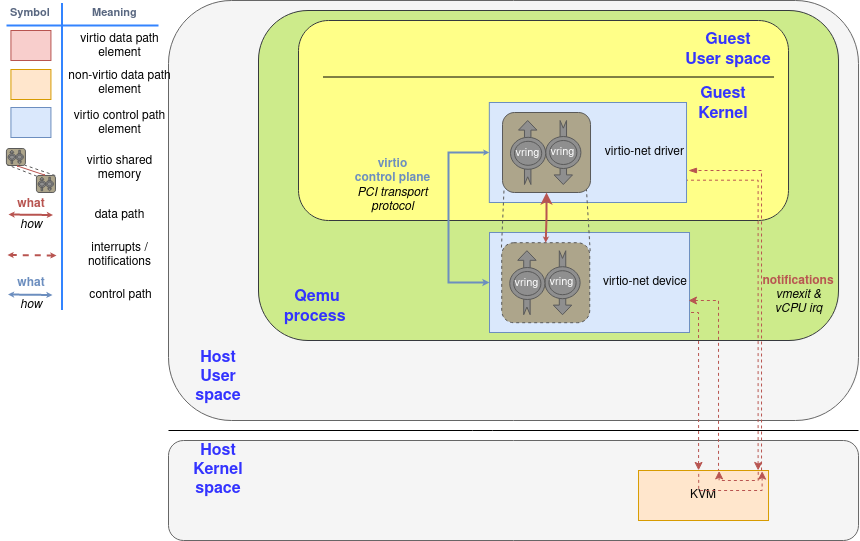

由於通知現在需要從 guest（KVM）傳遞到 QEMU，再到 kernel，才能由後者轉送網路封包，因此我們可以在 kernel 中建立一個 thread，讓它能存取 guest 的共享記憶體映射，並直接處理 virtio 資料平面

為了提升效能，我們建立了一個位於 kernel 內的 virtio-net 裝置（稱為 vhost-net），把資料平面直接卸載到 kernel 端進行封包轉發。 在這個情境下，QEMU 會使用 virtio 資料平面來初始化裝置，然後把 virtio 的裝置狀態轉交給 vhost-net，將資料平面的工作委派給它。 在此情境中，KVM 會使用 eventfd 來傳遞裝置的中斷，並再曝露另一個 eventfd 以接收 CPU 的中斷。 guest 不需要知道這項變更，它的運作方式與前一種情境相同

::: tip  
控制面（裝置啟動）仍由 QEMU 發動，但資料面（封包處理與 virtqueue 消費）交給 kernel 的 vhost-net。 KVM 以 eventfd 作為通知橋樑：一個負責把裝置側事件（device interrupts/kicks）送入 KVM，另一個讓 KVM 向對方發送 vCPU 相關的事件  
:::

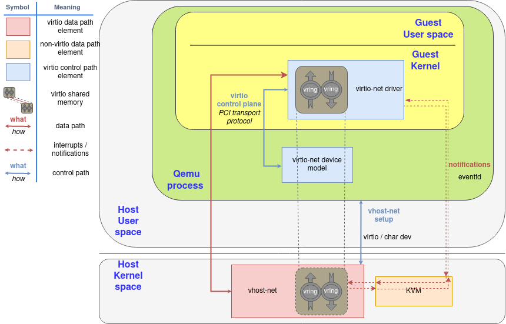

接著，我們把 virtio 裝置從 kernel 移到 host 上的一個 user space 行程（相關內容見〈[A journey to the vhost-users realm](https://www.redhat.com/en/blog/journey-vhost-users-realm)〉），讓它能執行像 DPDK 這樣的封包轉發框架。 用來完成這整套設定的協定被稱為 virtio-user

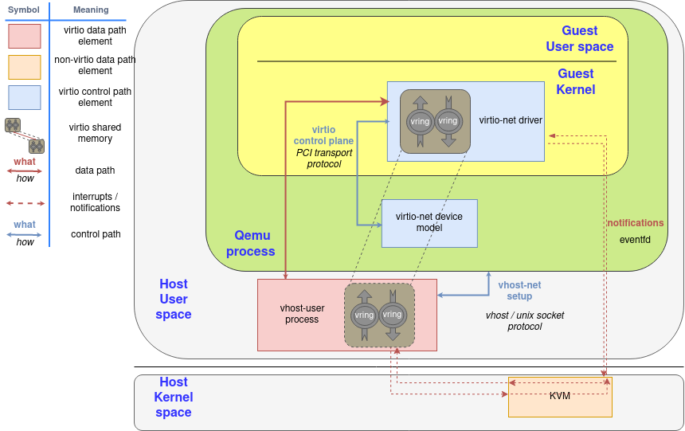

它甚至允許 guest 在其 user space 中執行 virtio 驅動程式，而不是在 kernel 中！ 在這種情況下，virtio 所稱的 driver 其實指的是那個負責管理記憶體與 virtqueue 的行程，而不是執行於 guest 內的 kernel 程式碼

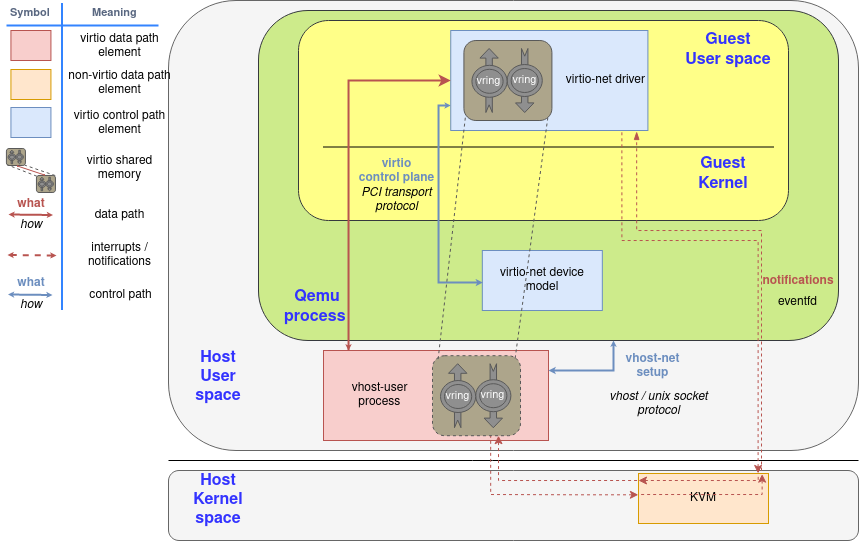

最後，只要硬體允許，我們可以直接進行 virtio 裝置直通（passthrough）。 如果該 NIC 支援 virtio 資料平面，就能透過適合的硬體（如 IOMMU 裝置，能在 guest 與裝置的實體位址之間做轉譯）與軟體（如 VFIO Linux driver，讓 host 能把某個 PCI 裝置的控制權直接交給 guest）配合下，將它直接曝露給 guest。 此時裝置會使用典型的硬體訊號作為通知基礎設施，例如 PCI 與 CPU 的中斷（IRQ）

若某張實體 NIC 想採用這種方式，最簡便的做法是把它的驅動程式建立在 [vDPA](https://www.redhat.com/en/blog/achieving-network-wirespeed-open-standard-manner-introducing-vdpa) 之上，這點在本系列先前的文章中也解釋過

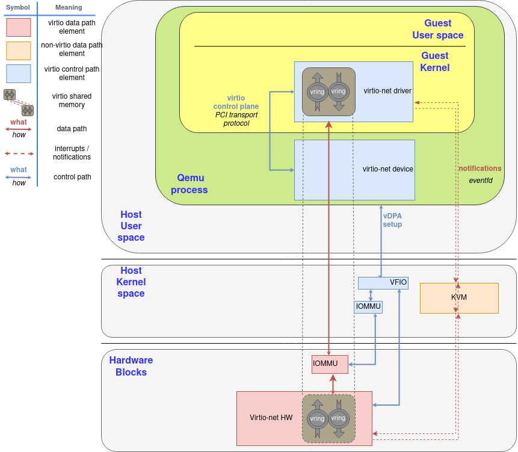

接下來的章節中，我們會說明資料平面通訊內部實際發生的事情

多虧在標準化上的長期投入，無論上述情境採用何種方式、或使用何種 transport，virtio 的資料平面都能保持一致。 交換訊息的格式相同，不同的裝置或驅動程式則可依其特性，透過前述的特徵位元來協議不同的能力或功能。 如此一來，virtqueue 只需作為一層共通而輕薄的 device-driver 通訊層，就能降低開發與部署的投入成本

如[本系列先前文章](https://www.redhat.com/en/virtio-networking-series)所述，這項標準化的目標，是在虛擬環境與外界之間建立一層精簡的通訊層（而非模擬完整的硬體），藉此讓在不同的虛擬化技術或硬體之間的正確性驗證變得更容易

## Virtqueues and virtio ring: How the data travels

在前一章我們已經解釋了整體情境，現在讓我們來進入重點：資料是如何在 virtio 裝置與驅動程式之間來回流動的？

### Buffers 與通知（notifications）：工作流程

如先前所述，virtqueue 就是由 guest 提供、供 host 消費的一串緩衝區（buffers），host 會讀取或寫入它們。 從裝置（device）的觀點來看，一個 buffer 要麼是唯讀，要麼是唯寫的，絕不會同時可讀又可寫

描述符（descriptors）可以串接，訊息的封裝（framing）可以依方便性而分散。 舉例來說，要傳 2000 位元組的訊息，你可以用一個 2000 位元組的單一 buffer，或用兩個各 1000 位元組的 buffer，兩者對裝置而言不應有差別

此外，virtio 也提供由驅動程式通知裝置的機制（doorbell），用來告知「佇列中新增了一個或多個 buffer」。 反之亦然，裝置也會中斷（interrupt）驅動程式來表示「有已用的 buffer 可處理」。 至於實際如何送出通知，取決於底層（underlying）的實作方式，例如透過 PCI 中斷或寫入特定記憶體位置等，virtqueue 只規範其語義，而非實作細節

::: tip  
driver → device 稱為「kick/doorbell」，device → driver 通常以中斷回報 used-buffer  
:::

如前所述，driver 與 device 都可以建議對方暫時不要發出通知，以降低通知分派的開銷。 由於這是一種非同步的操作，我們會在後續章節說明具體做法

### Split virtqueue：簡潔之美

split 版的 virtqueue 把結構分成三個區域，而且每個區域只允許 driver 或 device 其中一方寫入，另一方僅能讀取：

- Descriptor Area：用來描述 buffers
- Driver Area：由 driver 提供給 device 的資料，也稱為 avail virtqueue（available ring）
- Device Area：由 device 提供給 driver 的資料，也稱為 used virtqueue（used ring）

這些區域需要配置在 driver 的記憶體中，讓 driver 能直接存取。 buffer 的位址以 driver 的視角儲存，因此 device 需要做位址轉譯。 依照裝置本身的性質不同，device 有多種方式可以存取這些記憶體：

- 對於在 hypervisor 內的模擬裝置（例如 QEMU），guest 的位址就位於它自己的行程記憶體空間中
- 對於其他形式的模擬裝置，例如 vhost-net 或 vhost-user，則需要建立記憶體映射（類似 POSIX 共享記憶體）。 指向該共享記憶體的檔案描述符會透過 vhost 協定共享出去
- 對於實體裝置，必須進行硬體層級的位址轉譯，通常透過 IOMMU 來完成

::: tip  
- QEMU 以行程的方式代表整台虛擬機，guest RAM 通常映射到該行程的虛擬位址空間，因此模擬裝置可直接以指標存取對應頁面。 這讓 QEMU 能以最低成本讀寫 vring 與緩衝內容，但也要求嚴格的同步與記憶體屏障以避免競態（特別在多執行緒或 vCPU 環境）  
- vhost 家族把資料平面移出了 QEMU 主行程：vhost-net 在 kernel 內，vhost-user 在 host 的 user space。 兩者都需要拿到 guest 的共享記憶體映射，常見做法是以 file descriptor（如 memfd、hugetlbfs）與 mmap 建立共享，再用 vhost 通道（ioctl 或 Unix socket）傳遞 FD 與 ring 參數，讓資料平面能直接操作 vring
- 實體 NIC／加速卡要能直接存取 guest RAM，需要安全且正確的 DMA 位址轉換。 其中 IOMMU 扮演了關鍵角色：它把 guest 的 I/O 虛擬位址（IOVA）轉成主機實體位址，並施加存取控制，避免裝置任意 DMA 至不該觸及的記憶體。 這樣 device 便能以 DMA 方式讀寫 vring 與 buffers，同時維持隔離與安全性  
:::

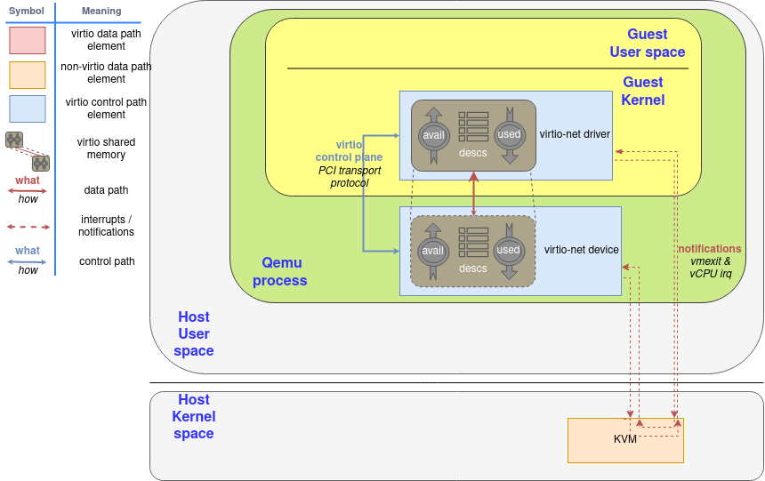

#### Descriptor ring：我的資料在哪裡？

descriptor area（或 descriptor ring）是最先需要理解的部分。 它內含一個陣列，記錄了多個以 guest 位址表示的 buffers 以及各自對應的長度。 每個描述符還有一組對應的旗標，用來提供更多資訊。 舉例來說：如果設了位元 `0x1`，表示這個 buffer 會在下一個描述符中繼續； 如果設了位元 `0x2`，則表示對裝置而言此 buffer 是唯寫的（write-only）； 若清除該位元，則代表唯讀的（read-only）

以下是一個 Split virtqueue 的描述符的佈局。 我們以 `leN` 表示「N 位元、little-endian 格式」：

```c
struct virtq_desc { 
    le64 addr;
    le32 len;
    le16 flags;
    le16 next; // 將在〈Chained descriptors〉一節再說明
};
```

#### Avail ring：把資料交給裝置

接下來要看的結構是 driver area，也就是 avail ring，它是驅動程式放置「裝置之後要消費的描述符索引」的地方。 要注意的是，把某個 buffer 的索引放進這裡，並不代表裝置需要立刻消費它，例如在 virtio-net 中，driver 會預先放入一批用於收包的描述符，只有當封包真的抵達時，裝置才會取用，在此之前它們都只是處於「隨時可被消費」的狀態

avail ring 有兩個關鍵欄位 `idx` 與 `flags`，其只能由 driver 寫入，對 device 來說它是唯讀的。 `idx` 表示 driver 下一筆要寫入 avail ring 的位置（對 ring 大小取模）。 另一方面，`flags` 的最低有效位元（LSB）表示 driver 是否希望收到通知（稱為 `VIRTQ_AVAIL_F_NO_INTERRUPT`）

在這兩個欄位之後，是一個整數陣列，長度與 descriptor ring 相同。 因此，avail virtqueue 的佈局如下：

```c
struct virtq_avail {
    le16 flags;
    le16 idx;
    le16 ring[ /* Queue Size */ ];
};
```

Figure 1 顯示了一張描述符表，其中有一個起始位址為 `0x8000`、長度為 2000 位元組的 buffer，而此時的 avail ring 內尚未有任何項目。 完成所有步驟後，會有一張元件示意圖強調 descriptor area 的更新。 對 driver 而言，第一步需要配置並填入該 buffer（這是下圖〈Process to make a buffer available〉中的步驟 1），接著需要在 descriptor area 中把它標記為可用的（步驟 2）

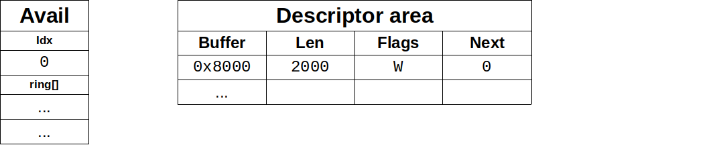

在填好描述符之後，driver 會透過 avail ring 進行告知：它把描述符索引 `#0` 寫入 avail ring 的第一個項目，並相應地更新 `idx`，其結果如 Figure 2 所示。 若提交的是「串接的 buffers」，則只需要把「鏈的頭節點」的描述符索引加入 avail ring，`idx` 也只會增加 1，這對應到圖中的步驟 3

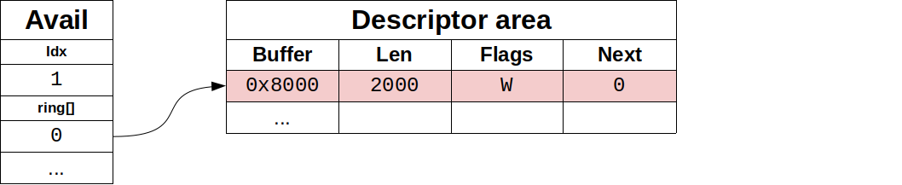

從這一刻起，driver 就不能再修改這個已宣告可用的描述符或其對應的 buffer 了：它已經交由 device 控制了。 接著，如果此時 device 有啟用通知，driver 需要對 device 發出通知（關於 device 如何管理通知，稍後會再說明）。 這是圖中的最後一步（步驟 4）


avail ring 的容量必須能容納與 descriptor area 相同數量的項目，而 descriptor area 的大小必須是 2 的冪，這樣 `idx` 會在某個點自然循環回來。 舉例來說，若 ring 的大小是 256 個項目，則 `idx` 為 1、257、513... 的項目都會對應到同一個槽位。 此外，`idx` 也會在 16 位元的邊界上環繞，如此一來，雙方都不必擔心某個 `idx` 是無效的，它們在環狀結構中皆為有效值

::: tip  
固定大小（2 的冪）可讓實作用位元遮罩快速取模（`pos = idx & (size-1)`），減少除法成本，並簡化邏輯。 `idx` 的位寬通常為 16 位元，因而會在 0..65535 間循環。 avail/used 會各自維護自己的 `idx`，並觀察對方的 `idx`，雙方藉由比較差值來判斷新增或已處理的項目數，在環狀空間下依舊單調推進、無需額外「無效索引」判斷  
:::

請注意，描述符可以用任意順序加入至 avail ring，你不必從描述符表的第 0 格開始，也不需按下一個描述符的索引依序加入它

#### Chained descriptors：向裝置提供大型資料

driver 也可以藉由描述符的成員 `next` 把多個描述符串接起來。 若某個描述符的 `NEXT`（0x1）旗標被設為 1，表示資料會利用另一個 buffer 延續下去，因而形成一條描述符鏈。 要注意的是，同一條鏈上的描述符並不會共用旗標：有些描述符可以是唯讀的，有些可以是唯寫的。 在這種情況下，唯寫（write-only）的描述符必須排在所有唯讀（read-only）的描述符之後

例如，若 driver 在第一次操作就將描述符表索引 0 與 1 串成一條鏈並送出，device 端所看到的情況會如 Figure 3，而流程會再次回到步驟 2

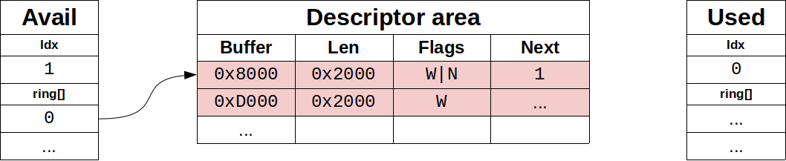

#### Used ring：當裝置處理完資料之後

device 會使用 used ring 將已使用（讀取或寫入過）的 buffers 交還給 driver。 和 avail ring 一樣，它也有 `flags` 與 `idx` 這兩個欄位，它們的佈局與用途相同，不過通知相關的旗標在這裡名為 `VIRTQ_USED_F_NO_NOTIFY`

在這兩個欄位之後，used ring 維護了一個「已用描述符」的陣列。 device 在這個陣列中回報的不僅有描述符的索引，如果有寫入，還會回報實際使用（寫入）的總長度

```c
struct virtq_used {
    le16 flags;
    le16 idx;
    struct virtq_used_elem ring[ /* Queue Size */];
};

struct virtq_used_elem {
    /* 已用描述符鏈的起始索引（head） */
    le32 id;
    /* 該描述符鏈被使用（寫入）的總長度 */
    le32 len;
};
```

如果回報的是一條描述符鏈，device 只會回傳該鏈的「頭節點」索引 `id`，以及整條鏈（如果有寫入）累計的總寫入長度（在讀取資料時，不會增加這個數值）。 描述符表本身不會被修改，對 device 而言它是唯讀的，這對應到下圖〈Process to make a buffer as used〉內的步驟 5。 假如 device 使用的是〈Chained descriptors〉一節所示的那條鏈，則：

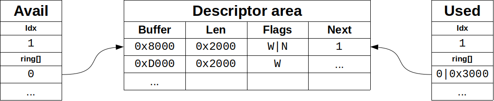

::: tip  
上圖的 `0x3000` 是 used ring 裡 `virtq_used_elem.len` 的值，代表總共寫入了 `0x3000` 位元組，不過總共有 `0x2000` 的 buffer，可見它沒有寫滿  
:::


最後，device 會檢查 used queue 的旗標，若發現 driver 希望被通知，便會通知 driver（步驟 6）

#### Indirect descriptors：一次提供大量資料給裝置

間接描述符是一種批量傳送更多描述符，以增加 ring 的容量的方法。 driver 會在記憶體的任意位置儲存一張「間接描述符表」（其佈局與一般描述符相同），接著在 virtqueue 中插入一個設定了 `VIRTQ_DESC_F_INDIRECT`（0x4）旗標的主描述符。 此主描述符的位址與長度欄位，分別對應到間接表本身的位址與大小

如果我們想把〈Chained descriptors〉一節的那條鏈放進一張間接表，driver 會先配置可容納 2 筆項目的記憶體區域（32 位元組），以存放該表（在圖中這是步驟 2，步驟 1 則是先配置各 buffer）：

<span class = "center-column">

| Buffer | Len    | Flags | Next |
| - | - | - | - |
| 0x8000 | 0x2000 | W\|N   | 1 |
| 0xD000 | 0x2000 | W     | ... |

（Figure 4: Indirect table for indirect descriptors）

</span>

假設這張間接表被配置在位址 `0x2000`，且它是第一個被宣告可用的描述符。 照慣例，第一步要把它放進 Descriptor area（圖中的步驟 3），因此看起來會是：

<span class = "center-column">

| Descriptor Area | | | |
|-|-|-|-|
| Buffer | Len | Flags | Next |
| 0x2000 | 32 | I | ... |

（Figure 5: Add indirect table to Descriptor area）

</span>

之後的步驟就與一般描述符相同：driver 把該帶有該旗標的描述符索引（本例為 #0）寫入 avail ring（圖中的步驟 4），並照常通知 device（步驟 5）

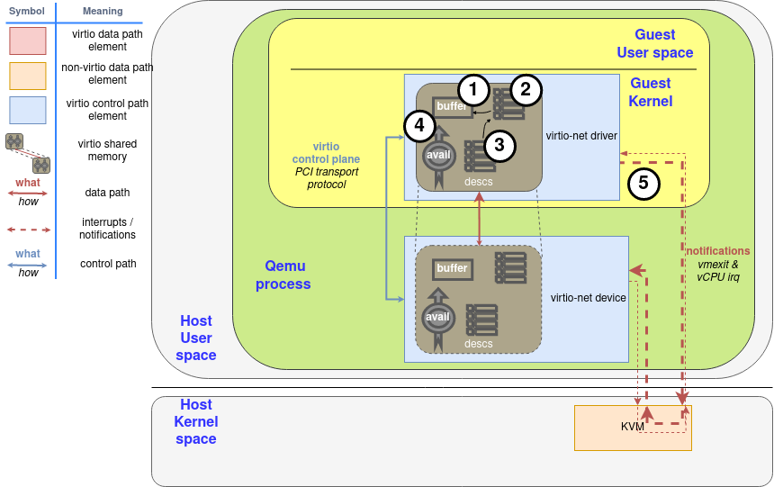

為了讓裝置使用其資料，裝置會用相同的記憶體位址回傳總計 `0x3000` bytes（亦即 `0x8000–0x9FFF` 與 `0xD000–0xDFFF` 全部，對應步驟 6 與 7，與一般描述符的流程相同）。 一旦裝置使用完畢，驅動程式就可以釋放該間接表用到的記憶體，或像對待一般 buffer 那樣任意處置

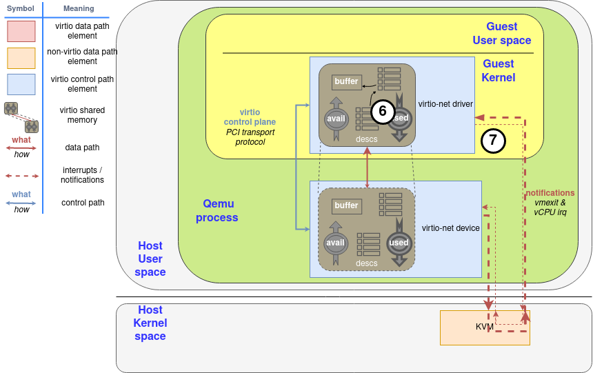

帶有 `INDIRECT` 旗標的描述符不能同時設定 `NEXT` 或 `WRITE` 旗標，所以你不能在主描述符表中把「間接描述符」再鏈接起來（不能表 A 串表 B）。 此外，間接表所能包含的描述符數量，最多與主描述符表相同

#### Notifications：「請勿打擾」模式

在許多系統中，針對 used 與 available buffer 的通知都會帶來不小的開銷。 為了緩解此問題，每個 vring 都會維護一個旗標，表示它何時希望被通知。 請記住：driver 端的那個旗標對 device 而言是唯讀的，反之亦然，device 端的旗標對 driver 而言也是唯讀的

這些我們已經知道了，使用方式也相當直接。 唯一要留意的是它的非同步本質：啟用或停用通知的一方，無法保證對方會立刻得知變更，因此可能會有漏掉通知，或收到多於預期的通知的情況

::: tip  
因為 driver 與 device 透過共享記憶體與鬆散同步來協調狀態，寫入旗標與對端讀到該旗標之間，存在時間差與重排的可能。 實作上通常需要在更新 ring/索引之後、發通知之前置入記憶體屏障（memory barrier），並以「檢查 → 提交 → 再檢查」的序列降低 race 風險，但在邊界情況下仍可能出現少報或多報，設計上需容忍並正確處理  
:::

若裝置與驅動程式協議後啟用了 `VIRTIO_F_EVENT_IDX` 特徵位元，就能用更有效的方式來切換通知：不再只是二元地關閉／開啟，而是由雙方指定一個特定的描述符索引作為門檻，表示對方在進度尚未越過該索引前，暫時不必通知。 這個索引透過在結構尾端新增一個型別為 `le16` 的成員對外公布，於是結構會變成下面這樣：

```c
struct virtq_avail {              struct virtq_used {
  le16 flags;                       le16 flags;
  le16 idx;                         le16 idx;
  le16 ring[ /* Queue Size */ ];    struct virtq_used_elem ring[Q. size];
  le16 used_event;                  le16 avail_event;
};                                };
```

因此，每當 driver 想把某個 buffer 宣告為可用的時，就需要去檢查 used ring 上的 `avail_event`：如果 driver 的 `idx` 欄位等於 `avail_event`，那就到了該發出通知的時候，此時應忽略 used ring 的最低位元的旗標（`VIRTQ_USED_F_NO_NOTIFY`）

同理，若已協議 `VIRTIO_F_EVENT_IDX`，device 會檢查 `used_event` 以判斷是否需要發出通知。 這對於維持「供 device 寫入」的 virtqueue（例如 virtio-net 的接收佇列）特別有效

在下章中，我們會做個總結，並檢視數種建立於兩種 ring 佈局之上的最佳化技巧，這些技巧取決於通訊／裝置的類型，以及各方的具體實作方式
