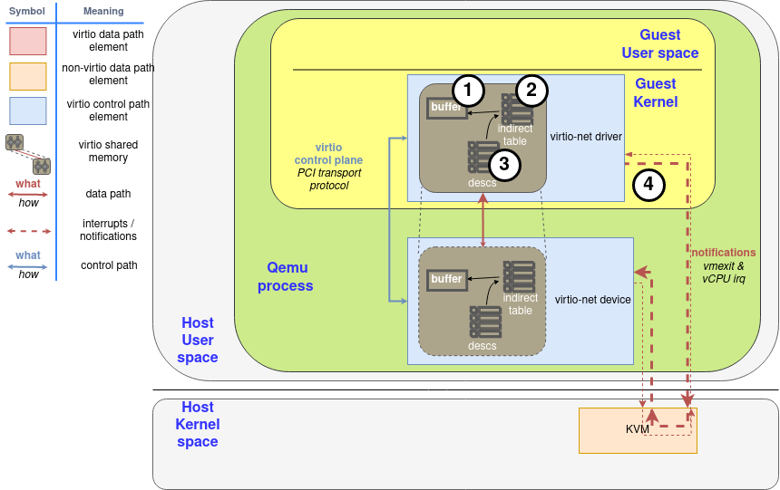

# Red Hat Virtio 介紹文的翻譯 & 筆記

算是還蠻有名，寫得蠻好的一篇介紹文，原文連結：

- [Virtio devices and drivers overview: The headjack and the phone](https://www.redhat.com/en/blog/virtio-devices-and-drivers-overview-headjack-and-phone)
- [Virtqueues and virtio ring: How the data travels](https://www.redhat.com/en/blog/virtqueues-and-virtio-ring-how-data-travels)
- [Packed virtqueue: How to reduce overhead with virtio](https://www.redhat.com/en/blog/packed-virtqueue-how-reduce-overhead-virtio)

但因為第三部分原文寫得有問題（已與作者確認過），因此本文的 WIP 會一直掛到確認原文修復（但作者好像太忙了沒有辦法去修），儘管如此，前兩部分也在我一開始接觸 Virtio 時幫了我許多，所以建議可以閱讀看看

## Virtio devices and drivers overview: The headjack and the phone

這個系列文有三篇，將帶你了解 virtio 資料平面（data plane）的兩種主要佈局：split virtqueue 與 packed virtqueue。 這些是 host 與虛擬環境（例如 guest 或 container）之間通訊的基礎。 要解釋這些做法的一大挑戰，在於文件稀少且涉及許多術語。 此系列文將嘗試為你揭開 virtio 資料平面的神祕面紗，並以簡單清楚的方式說明各個概念

這是一篇技術向的深度內容，適合對底層「位元與位元組」有興趣的讀者。 文中會詳述不同 virtio 組成部分之間的通訊格式，以及資料平面的協定

雖然為了提升效能與簡化實作，兩種 virtqueue 版本持續地加入了擴充、最佳化與新功能，但其運作核心依然相同，這是因為當初設計時就考量了擴充性。 為了補足 split virtqueue，packed virtqueue 併入了 [virtio 1.1](https://docs.oasis-open.org/virtio/virtio/v1.1/cs01/virtio-v1.1-cs01.html) 規格，並已在模擬裝置（qemu、virtio_net、dpdk）與實體裝置上成功實作

我們會先對 virtio 裝置、驅動程式與它們在資料平面上的互動做個總覽，接著說明 split virtqueue 內 ring 的佈局細節，之後再概覽 packed ring 的佈局，以及它相較於 split virtqueue 的優勢

### Virtio 裝置與驅動程式總覽：誰是誰

本節將簡要地總覽 virtio 裝置、virtio 驅動程式、可採用的不同架構範例與各個組件。 若你已熟悉這些主題，或已經讀過 [virtio 網路系列文章](https://www.redhat.com/en/blog/virtio-networking-first-series-finale-and-plans-2020)，你可以直接跳到下一節（聚焦於 virtio ring）

#### virtio 裝置：進出虛擬世界

virtio 裝置是對軟體提供 virtio 介面，以便進行管理與資訊交換的裝置。 它可以透過 PCI、Memory-Mapped I/O（MMIO，也就是把裝置映射到某段記憶體），以及 S/390 的 Channel I/O，提供給模擬／虛擬環境。 像是「裝置探索」這類通訊功能的一部分，就必須交由上述這些機制來處理

它的主要任務，是把虛擬環境以外（例如 VM、container 等）所見到的訊號格式，轉換成能透過 virtio 資料平面交換的格式，反之亦然。 這個訊號可能是實體的（例如 NIC 上的電訊號或光訊號），也可能已經是虛擬的（例如 host 端對某個網路封包的軟體表示）

virtio 介面包含下列幾個部分（[virtio 1.1](https://docs.oasis-open.org/virtio/virtio/v1.1/cs01/virtio-v1.1-cs01.html#x1-90002) 規格）：

- 裝置狀態欄位（Device status field）
- 特徵位元（Feature bits）
- 通知（Notifications）
- 一個或多個 virtqueue

接下來我們會分別補充各部分的細節，並說明裝置與驅動程式要如何利用它們開始通訊

#### 裝置狀態欄位（Device status field）：一切都 OK 嗎？

裝置狀態欄位是一連串位元，供裝置與驅動程式在初始化期間使用。 你可以把它想成主控台上的號誌燈，雙方透過設定或清除各個位元，來表示各自的狀態

guest（或驅動程式）會在裝置狀態欄位中設定 `ACKNOWLEDGE`（0x1）位元，表示它已識別到裝置，再設定 `DRIVER`（0x2）位元，表示正在進行初始化。 接著，透過特徵位元展開功能協議（稍後會再談），並設定 `DRIVER_OK`（0x4）與 `FEATURES_OK`（0x8）來確認功能已就緒，如此便能開始通訊。 若裝置想表示發生了致命失敗，它可以設定 `DEVICE_NEEDS_RESET`（0x40），而驅動程式也可以用 `FAILED`（0x80）來表示同樣的狀態

裝置會用各自 transport 特定的方法來告知這些位元所在的位置，例如透過 PCI 掃描，或透過已知的 MMIO 位址

#### 特徵位元（Feature bits）：設定通訊協議的共識點

裝置的特徵位元用來告知它支援哪些功能，並與驅動程式就實際要使用哪些功能達成共識。 這些位元可以是「裝置通用」或「裝置特定」的。 前者的例子如：某一個位元用來表明是否支援 SR-IOV，或可使用哪種記憶體模式； 後者的例子如（如果該裝置是網路介面卡），能執行哪些 offload，如 checksumming 或 scatter-gather

在前一節所述的裝置初始化完成後，驅動程式會讀取裝置提供的特徵位元，並回傳它可以處理的子集合。 若雙方對此達成共識，驅動程式便會配置並告知裝置相關的 virtqueue，以及其他需要的設定

#### 通知（Notifications）：你有工作要處理

裝置與驅動程式必須在有資訊要交換時，透過「通知」來彼此告知。 雖然其語義由標準規範，但實作細節因 transport 而異，例如使用 PCI 的中斷，或寫入特定記憶體位置。 裝置與驅動程式至少需要提供一種通知方法。 稍後章節我們會進一步說明

#### 一個或多個 virtqueue：通訊的載體

virtqueue 基本上就是一個由 guest 提供緩衝區，而 host 端消費（讀取或寫入）後再歸還給 guest 的佇列。 現行的 virtqueue 記憶體佈局是環狀的 ring（circular ring），因此它經常被稱為 virtring 或 vring

它們會是下一節〈Virtqueues and virtio ring〉的主題，目前先有上述定義即可

### virtio 驅動程式：軟體化身

virtio 驅動程式是在虛擬環境中，依據 virtio 規格的相關部分，與 virtio 裝置進行溝通的軟體組件

一般來說，它在 virtio 控制平面上的任務包括：

- 尋找裝置
- 在 guest 端配置用於通訊的共享記憶體
- 依〈virtio 裝置〉中的協定啟動裝置

#### 裝置與驅動程式的互動：幾種情境

在本節中，我們會把各個 virtio 網路元件（裝置、驅動程式，以及通訊如何運作）放到三種不同的架構中來說明，這既能用來解釋 virtio 資料平面的共同框架，也能展示它的高度適應性。 若你先前已閱讀過我們的 virtio-net 系列文章，本節可以略過，也可以把那些文章當作參考資料，以更好地理解本節內容

在〈[Introduction to virtio-networking and vhost-net](https://www.redhat.com/en/blog/introduction-virtio-networking-and-vhost-net)〉中，我們展示了這樣的一個環境：QEMU 建立一個模擬的網路裝置，並將它提供給 guest 的 virtio-net 驅動程式

在此環境中，驅動程式的通知會（依 guest 可見的方法，通常是 PCI）被轉送為 KVM 的中斷，暫停 guest 的處理器並把控制權交還給 host（vmexit）。 相對地，裝置端的通知則是 host 送給 KVM 裝置的一個特殊 ioctl（vCPU IRQ）。 QEMU 可以透過共享記憶體來存取 virtqueue 的資訊

請注意 virtio ring 的共享記憶體觀念所隱含的意義：驅動程式與裝置所存取的是 RAM 裡面的同一個 page，而不是兩塊需要靠某種協定彼此同步的獨立區域


由於通知現在需要從 guest（KVM）傳遞到 QEMU，再到 kernel，才能由後者轉送網路封包，因此我們可以在 kernel 中建立一個 thread，讓它能存取 guest 的共享記憶體映射，並直接處理 virtio 資料平面

為了提升效能，我們建立了一個位於 kernel 內的 virtio-net 裝置（稱為 vhost-net），把資料平面直接卸載到 kernel 端進行封包轉發。 在這個情境下，QEMU 會使用 virtio 資料平面來初始化裝置，然後把 virtio 的裝置狀態轉交給 vhost-net，將資料平面的工作委派給它。 在此情境中，KVM 會使用 eventfd 來傳遞裝置的中斷，並再曝露另一個 eventfd 以接收 CPU 的中斷。 guest 不需要知道這項變更，它的運作方式與前一種情境相同

::: tip  
控制面（裝置啟動）仍由 QEMU 發動，但資料面（封包處理與 virtqueue 消費）交給 kernel 的 vhost-net。 KVM 以 eventfd 作為通知橋樑：一個負責把裝置側事件（device interrupts/kicks）送入 KVM，另一個讓 KVM 向對方發送 vCPU 相關的事件  
:::


接著，我們把 virtio 裝置從 kernel 移到 host 上的一個 user space 行程（相關內容見〈[A journey to the vhost-users realm](https://www.redhat.com/en/blog/journey-vhost-users-realm)〉），讓它能執行像 DPDK 這樣的封包轉發框架。 用來完成這整套設定的協定被稱為 virtio-user


它甚至允許 guest 在其 user space 中執行 virtio 驅動程式，而不是在 kernel 中！ 在這種情況下，virtio 所稱的 driver 其實指的是那個負責管理記憶體與 virtqueue 的行程，而不是執行於 guest 內的 kernel 程式碼


最後，只要硬體允許，我們可以直接進行 virtio 裝置直通（passthrough）。 如果該 NIC 支援 virtio 資料平面，就能透過適合的硬體（如 IOMMU 裝置，能在 guest 與裝置的實體位址之間做轉譯）與軟體（如 VFIO Linux driver，讓 host 能把某個 PCI 裝置的控制權直接交給 guest）配合下，將它直接曝露給 guest。 此時裝置會使用典型的硬體訊號作為通知基礎設施，例如 PCI 與 CPU 的中斷（IRQ）

若某張實體 NIC 想採用這種方式，最簡便的做法是把它的驅動程式建立在 [vDPA](https://www.redhat.com/en/blog/achieving-network-wirespeed-open-standard-manner-introducing-vdpa) 之上，這點在本系列先前的文章中也解釋過


接下來的章節中，我們會說明資料平面通訊內部實際發生的事情

多虧在標準化上的長期投入，無論上述情境採用何種方式，或使用何種 transport，virtio 的資料平面都能保持一致。 交換訊息的格式相同，不同的裝置或驅動程式則可依其特性，透過前述的特徵位元來協議不同的能力或功能。 如此一來，virtqueue 只需作為一層共通而輕薄的 device-driver 通訊層，就能降低開發與部署的投入成本

如[本系列先前文章](https://www.redhat.com/en/virtio-networking-series)所述，這項標準化的目標，是在虛擬環境與外界之間建立一層精簡的通訊層（而非模擬完整的硬體），藉此讓在不同的虛擬化技術或硬體之間的正確性驗證變得更容易

## Virtqueues and virtio ring: How the data travels

在前一章我們已經解釋了整體情境，現在讓我們來進入重點：資料是如何在 virtio 裝置與驅動程式之間來回流動的？

### Buffers 與通知（notifications）：工作流程

如先前所述，virtqueue 就是由 guest 提供，供 host 消費的一串緩衝區（buffers），host 會讀取或寫入它們。 從裝置（device）的觀點來看，一個 buffer 要麼是唯讀的，要麼是唯寫的，絕不會同時可讀又可寫

描述符（descriptors）可以串接，而訊息的封裝（framing）則可以依方便性而將其分散開來。 舉例來說，要傳 2000 位元組的訊息，你可以用一個 2000 位元組的單一 buffer，或用兩個各 1000 位元組的 buffer，兩者對裝置而言不應有差別

此外，virtio 也提供由驅動程式通知裝置的機制（doorbell），用來告知「佇列中新增了一個或多個 buffer」。 反之亦然，裝置也會中斷（interrupt）驅動程式來表示「有 used buffer 可處理」。 至於實際如何送出通知，取決於底層（underlying）的實作方式，例如透過 PCI 中斷或寫入特定記憶體位置等，virtqueue 只規範其語義，而非實作細節

::: tip  
driver → device 稱為「kick/doorbell」，device → driver 通常以中斷回報 used-buffer  
:::

如前所述，driver 與 device 都可以建議對方暫時不要發出通知，以降低通知分派的開銷。 由於這是一種非同步的操作，我們會在後續章節說明具體做法

### Split virtqueue：簡潔之美

split 版的 virtqueue 把結構分成三個區域，而且每個區域只允許 driver 或 device 其中一方寫入，另一方僅能讀取：

- Descriptor Area：用來描述 buffers
- Driver Area：由 driver 提供給 device 的資料，也稱為 avail virtqueue（available ring）
- Device Area：由 device 提供給 driver 的資料，也稱為 used virtqueue（used ring）

這些區域需要配置在 driver 的記憶體中，讓 driver 能直接存取。 buffer 的位址以 driver 的視角儲存，因此 device 需要做位址轉譯。 依照裝置本身的性質不同，device 有多種方式可以存取這些記憶體：

- 對於在 hypervisor 內的模擬裝置（例如 QEMU），guest 的位址就位於它自己的行程記憶體空間中
- 對於其他形式的模擬裝置，例如 vhost-net 或 vhost-user，則需要建立記憶體映射（類似 POSIX 共享記憶體）。 指向該共享記憶體的檔案描述符會透過 vhost 協定共享出去
- 對於實體裝置，必須進行硬體層級的位址轉譯，通常透過 IOMMU 來完成

::: tip  
- QEMU 以行程的方式代表整台虛擬機，guest RAM 通常映射到該行程的虛擬位址空間，因此模擬裝置可直接以指標存取對應頁面。 這讓 QEMU 能以最低成本讀寫 vring 與緩衝內容，但也要求嚴格的同步與記憶體屏障以避免競態（特別在多執行緒或 vCPU 環境）  
- vhost 家族把資料平面移出了 QEMU 主行程：vhost-net 在 kernel 內，vhost-user 在 host 的 user space。 兩者都需要拿到 guest 的共享記憶體映射，常見做法是以 file descriptor（如 memfd、hugetlbfs）與 mmap 建立共享，再用 vhost 通道（ioctl 或 Unix socket）傳遞 FD 與 ring 參數，讓資料平面能直接操作 vring
- 實體 NIC／加速卡要能直接存取 guest RAM，需要安全且正確的 DMA 位址轉換。 其中 IOMMU 扮演了關鍵角色：它把 guest 的 I/O 虛擬位址（IOVA）轉成主機實體位址，並施加存取控制，避免裝置任意 DMA 至不該觸及的記憶體。 這樣 device 便能以 DMA 方式讀寫 vring 與 buffers，同時維持隔離與安全性  
:::


#### Descriptor ring：我的資料在哪裡？

descriptor area（或 descriptor ring）是最先需要理解的部分。 它內含一個陣列，記錄了多個以 guest 位址表示的 buffers 以及各自對應的長度。 每個描述符還有一組對應的旗標，用來提供更多資訊。 舉例來說：如果設了位元 `0x1`，表示這個 buffer 會在下一個描述符中繼續； 如果設了位元 `0x2`，則表示對裝置而言此 buffer 是唯寫的（write-only）； 若清除該位元，則代表唯讀的（read-only）

以下是一個 Split virtqueue 的描述符的佈局。 我們以 `leN` 表示「N 位元的 little-endian 格式」：

```c
struct virtq_desc { 
    le64 addr;
    le32 len;
    le16 flags;
    le16 next; // 將在〈Chained descriptors〉一節再說明
};
```

#### Avail ring：把資料交給裝置

接下來要看的結構是 driver area，也就是 avail ring，它是驅動程式放置「裝置之後要消費的描述符索引」的地方。 要注意的是，把某個 buffer 的索引放進這裡，並不代表裝置需要立刻消費它，例如在 virtio-net 中，driver 會預先放入一批用於收包的描述符，只有當封包真的抵達時，裝置才會取用，在此之前它們都只是處於「隨時可被消費」的狀態

avail ring 有兩個關鍵欄位 `idx` 與 `flags`，其只能由 driver 寫入，對 device 來說它是唯讀的。 `idx` 表示 driver 下一筆要寫入 avail ring 的位置（對 ring 大小取模）。 另一方面，`flags` 的最低有效位元（LSB）表示 driver 是否希望收到通知（稱為 `VIRTQ_AVAIL_F_NO_INTERRUPT`）

在這兩個欄位之後，是一個整數陣列，長度與 descriptor ring 相同。 因此，avail virtqueue 的佈局如下：

```c
struct virtq_avail {
    le16 flags;
    le16 idx;
    le16 ring[ /* Queue Size */ ];
};
```

Figure 1 顯示了一張描述符表，其中有一個起始位址為 `0x8000`，長度為 2000 位元組的 buffer，而此時的 avail ring 內尚未有任何項目。 完成所有步驟後，會有一張元件示意圖強調 descriptor area 的更新。 對 driver 而言，第一步需要配置並填入該 buffer（這是下圖〈Process to make a buffer available〉中的步驟 1），接著需要在 descriptor area 中把它標記為 available（步驟 2）


在填好描述符之後，driver 會透過 avail ring 進行告知：它把描述符索引 `#0` 寫入 avail ring 的第一個項目，並相應地更新 `idx`，其結果如 Figure 2 所示。 若提交的是「串接的 buffers」，則只需要把「鏈的頭節點」的描述符索引加入 avail ring，`idx` 也只會增加 1，這對應到圖中的步驟 3


從這一刻起，driver 就不能再修改這個已宣告為 available 的描述符或其對應的 buffer 了：它已經交由 device 控制了。 接著，如果此時 device 有啟用通知，driver 需要對 device 發出通知（關於 device 如何管理通知，稍後會再說明）。 這是圖中的最後一步（步驟 4）


avail ring 的容量必須能容納與 descriptor area 相同數量的項目，而 descriptor area 的大小必須是 2 的冪，這樣 `idx` 會在某個點自然循環回來。 舉例來說，若 ring 的大小是 256 個項目，則 `idx` 為 1、257、513... 的項目都會對應到同一個槽位。 此外，`idx` 也會在 16 位元的邊界上循環，如此一來，雙方都不必擔心某個 `idx` 是無效的，它們在環狀結構中皆為有效值

::: tip  
固定大小（2 的冪）可讓實作用位元遮罩快速取模（`pos = idx & (size-1)`），減少除法成本，並簡化邏輯。 `idx` 的位寬通常為 16 位元，因而會在 0..65535 間循環。 avail/used 會各自維護自己的 `idx`，並觀察對方的 `idx`，雙方藉由比較差值來判斷新增或已處理的項目數，在環狀空間下依舊單調推進，無需額外「無效索引」判斷  
:::

請注意，描述符可以用任意順序加入至 avail ring，不必從描述符表的第 0 個欄位開始，也不需依序按描述符的索引加入它們

#### Chained descriptors：向裝置提供大型資料

driver 也可以藉由描述符的成員 `next` 把多個描述符串接起來。 若某個描述符的 `NEXT`（0x1）旗標被設為 1，表示資料會利用另一個 buffer 延續下去，因而形成一條描述符鏈。 要注意的是，同一條鏈上的描述符並不會共用旗標：有些描述符可以是唯讀的，有些可以是唯寫的。 在這種情況下，唯寫（write-only）的描述符必須排在所有唯讀（read-only）的描述符之後

例如，若 driver 在第一次操作就將描述符表索引 0 與 1 串成一條鏈並送出，device 端所看到的情況會如 Figure 3，而流程會再次回到步驟 2


#### Used ring：當裝置處理完資料之後

device 會使用 used ring 將已使用（讀取或寫入過）的 buffers 交還給 driver。 和 avail ring 一樣，它也有 `flags` 與 `idx` 這兩個欄位，它們的佈局與用途相同，不過通知相關的旗標在這裡名為 `VIRTQ_USED_F_NO_NOTIFY`

在這兩個欄位之後，used ring 維護了一個「used 描述符」的陣列。 device 在這個陣列中回報的不僅有描述符的索引，如果有寫入，還會回報實際使用（寫入）的總長度

```c
struct virtq_used {
    le16 flags;
    le16 idx;
    struct virtq_used_elem ring[ /* Queue Size */];
};

struct virtq_used_elem {
    /* used 描述符鏈的起始索引（head） */
    le32 id;
    /* 該描述符鏈被使用（寫入）的總長度 */
    le32 len;
};
```

如果回報的是一條描述符鏈，device 只會回傳該鏈的「頭節點」索引 `id`，以及整條鏈（如果有寫入）累計的總寫入長度（在讀取資料時，不會增加這個數值）。 描述符表本身不會被修改，對 device 而言它是唯讀的，這對應到下圖〈Process to make a buffer as used〉內的步驟 5。 假如 device 使用的是〈Chained descriptors〉一節所示的那條鏈，則：


::: tip  
上圖的 `0x3000` 是 used ring 裡 `virtq_used_elem.len` 的值，代表總共寫入了 `0x3000` 位元組，不過總共有 `0x2000` 的 buffer，可見它沒有寫滿  
:::


最後，device 會檢查 used queue 的旗標，若發現 driver 希望被通知，便會通知 driver（步驟 6）

#### Indirect descriptors：一次提供大量資料給裝置

間接描述符是一種批量傳送更多描述符，以增加 ring 的容量的方法。 driver 會在記憶體的任意位置儲存一張「間接描述符表」（其佈局與一般描述符相同），接著在 virtqueue 中插入一個設定了 `VIRTQ_DESC_F_INDIRECT`（0x4）旗標的主描述符。 此主描述符的位址與長度欄位，分別對應到間接表本身的位址與大小

如果我們想把〈Chained descriptors〉一節的那條鏈放進一張間接表，driver 會先配置可容納 2 筆項目的記憶體區域（32 位元組），以存放該表（在圖中這是步驟 2，步驟 1 則是先配置各 buffer）：

<center-panel natural title="（Figure 4: Indirect table for indirect descriptors）">

| Buffer | Len    | Flags | Next |
| - | - | - | - |
| 0x8000 | 0x2000 | W \| N   | 1 |
| 0xD000 | 0x2000 | W     | ... |

</center-panel>

假設這張間接表被配置在位址 `0x2000`，且它是第一個被宣告為 available 的描述符。 照慣例，第一步要把它放進 Descriptor area（圖中的步驟 3），因此看起來會是：

<center-panel natural title="（Figure 5: Add indirect table to Descriptor area）">

| Descriptor Area | | | |
|-|-|-|-|
| Buffer | Len | Flags | Next |
| 0x2000 | 32 | I | ... |

</center-panel>

之後的步驟就與一般描述符相同：driver 把該帶有該旗標的描述符索引（本例為 `#0`）寫入 avail ring（圖中的步驟 4），並照常通知 device（步驟 5）


為了讓裝置使用其資料，裝置會用相同的記憶體位址回傳總計 `0x3000` bytes（亦即 `0x8000–0x9FFF` 與 `0xD000–0xDFFF` 全部，對應步驟 6 與 7，與一般描述符的流程相同）。 一旦裝置使用完畢，驅動程式就可以釋放該間接表用到的記憶體，或像對待一般 buffer 那樣任意處置


帶有 `INDIRECT` 旗標的描述符不能同時設定 `NEXT` 或 `WRITE` 旗標，所以你不能在主描述符表中把「間接描述符」再鏈接起來（不能表 A 串表 B）。 此外，間接表所能包含的描述符數量，最多與主描述符表相同

#### Notifications：「請勿打擾」模式

在許多系統中，針對 used 與 available buffer 的通知都會帶來不小的開銷。 為了緩解此問題，每個 vring 都會維護一個旗標，表示它何時希望被通知。 記住：driver 端的旗標對 device 而言是唯讀的，反之亦然，device 端的旗標對 driver 而言也是唯讀的

這些我們已經知道了，使用方式也相當直接。 唯一要留意的是它的非同步本質：啟用或停用通知的一方，無法保證對方會立刻得知變更，因此可能會有漏掉通知，或收到多於預期的通知的情況

::: tip  
因為 driver 與 device 透過共享記憶體與鬆散同步來協調狀態，寫入旗標與對端讀到該旗標之間，存在時間差與重排（reorder）的可能。 實作上通常需要在更新 ring/索引之後，發通知之前置入記憶體屏障（memory barrier），並以「檢查 → 提交 → 再檢查」的序列降低 race 風險，但在邊界情況下仍可能出現少報或多報，設計上需容忍並正確處理  
:::

若裝置與驅動程式協議後啟用了 `VIRTIO_F_EVENT_IDX` 特徵位元，就能用更有效的方式來切換通知：不再只是二元地關閉／開啟，而是由雙方指定一個特定的描述符索引作為門檻，表示對方在進度尚未越過該索引前，暫時不必通知。 這個索引透過在結構尾端新增一個型別為 `le16` 的成員對外公布，於是結構會變成下面這樣：

```c
struct virtq_avail {              struct virtq_used {
  le16 flags;                       le16 flags;
  le16 idx;                         le16 idx;
  le16 ring[ /* Queue Size */ ];    struct virtq_used_elem ring[Q. size];
  le16 used_event;                  le16 avail_event;
};                                };
```

因此，每當 driver 想把某個 buffer 宣告為 available 時，就需要去檢查 used ring 上的 `avail_event`：如果 driver 的 `idx` 欄位等於 `avail_event`，那就到了該發出通知的時候，此時應忽略 used ring 的最低位元的旗標（`VIRTQ_USED_F_NO_NOTIFY`）

同理，若已協議 `VIRTIO_F_EVENT_IDX`，device 會檢查 `used_event` 以判斷是否需要發出通知。 這對於維持「供 device 寫入」的 virtqueue（例如 virtio-net 的接收佇列）特別有效

在下章中，我們會做個總結，並檢視數種建立於兩種 ring 佈局之上的最佳化技巧，這些技巧取決於通訊／裝置的類型，以及各方的具體實作方式

## Packed virtqueue: How to reduce overhead with virtio

### Split virtqueue 的問題：繞太多圈

雖然 split virtqueue 以設計簡潔著稱，但它有一個根本問題：avail 與 used 的循環會以非常零散的方式使用記憶體。 這會對 CPU 快取的使用造成壓力，而對於硬體，這通常意味著每個描述符會需要發起多次 PCI 的交互

Packed virtqueue 透過把三個 ring 合併到虛擬環境的 guest 記憶體中的同一處來進行了修正。 乍看之下好像更複雜，但你如果有意識到 driver 的資料在被裝置讀過後，其實是可以被丟棄並覆寫的（反之亦然），那就能明白這其實是很自然的修正

::: tip  
在同一台機器、同一個 VM、甚至同一個 virtio 裝置裡，可以有多個 virtqueue，它們彼此獨立，各自有自己的 ring/表格與中斷。 對於每一個 virtqueue，它們各自擁有獨立的一組結構：

- split：descriptor ring + avail ring + used ring（各一個）
- packed：一張 descriptor table，外加兩個事件抑制的小結構（driver area / device area，用來設定通知門檻/關閉）

一個請求由一組 buffers（descriptors）組成，一個 descriptor ring 裡面可以包含多個請求的 descriptor，其以 `id` 來區分不同請求  
:::

#### 把描述符交給裝置：如何填裝置的待辦清單

在完成第一節〈feature bits〉內所述的初始化流程，並就 `RING_PACKED` 特徵旗標達成共識之後，driver 與 device 會在 guest 記憶體中的一個約定位置，共同擁有一張空白的描述符表，其長度也需要雙方協議（最多到 2<sup>15</sup> 個項目）。 packed virtqueue 描述符的記憶體佈局如下：

```c
struct virtq_desc { 
    le64 addr;
    le32 len;
    le16 id;
    le16 flags;
};
```

這邊 `id` 欄位不再是裝置用來尋找 buffer 的索引了，大部分情況下裝置會忽略 `id` 欄位，僅在寫回 used descriptor 時會用到它，以供 driver 知道完成的是哪筆請求，因此基本上只有 driver 會使用到 `id` 欄位。 driver 還會維護一個內部的 1-bit 的 wrap 計數器，初始值為 1（set）。 每當 driver 將 ring 中的最後一個描述符標示為 available 時，就會翻轉這個計數器的值

::: tip  
wrap 計數器用來解決「同一槽位被循環重用」時，如何區分「這是這一輪的 available」與「上一輪的殘留」的問題。 每繞一圈就翻轉，搭配 `AVAIL`/`USED` 位元即可辨識新舊世代。 device 也需追蹤對方的 wrap，才能正確判讀 available 屬性  
:::

與 split 的描述符一樣，第一步需要寫入各欄位：位址、長度、id 與旗標。 不過，packed 的描述符會考量兩個新的旗標：`AVAIL`（0x7）與 `USED`（0x15）。 要把描述符標成 available 時，driver 會把 `AVAIL`（0x7）設成與自身 wrap 計數器相同的值，並把 `USED` 設為相反值。 雖然只用一個 1-bit 的旗標來代表 avail/used 會更好實作，但那會阻礙稍後要介紹的一些最佳化

::: tip  
`AVAIL` 在 bit 7、`USED` 在 bit 15，其值應與 wrap 計數器同步（`AVAIL` 跟 wrap、`USED` 取反）以表新舊世代。 如此 device 能以單一表判讀：當 `AVAIL` 與它追蹤到的 wrap 相等時，表示這格是新的提交，而如果 `USED` 與它期望的值相等，表示裝置已處理完成。 這種設計也為 event-idx、合併處理等優化預留空間  
:::

舉例來說，若 driver 在圖中的步驟 1 於位址 `0x80000000` 配置了一個 `0x1000` bytes 的可寫 buffer，並在步驟 2 將其設為第一個 available 描述符，同時將 `AVAIL` 旗標設成與內部 wrap 計數器相同的值（本例中為 1），則描述符表會如下：

<center-panel natural title="（Figure: Descriptor table after add the first buffer）">

| Avail idx | Address | Length | ID | Flags | Used idx |
| -: | - | - | - | - | - |
| | 0x80000000 | 0x1000 | 0 | W \| A | ← |
| → | ... | | | | |

</center-panel>

請注意：表格中的 avail idx 與 used idx 欄只用來輔助說明，它們並不存在於描述符表中。 雙方都應該各自維護內部的計數器，用來知道下一個要輪詢或寫入的位置。 此外，device 也必須追蹤 driver 的 wrap 計數器。 最後，與 used virtqueue 的情況一樣，若裝置已啟用通知，driver 也會通知裝置（圖中的步驟 3）

::: tip  
因此，裝置與驅動會各自維護一個 index，用來知道下一個要讀寫的位置，還有一個 wrap counter，用來判斷新舊世代  
:::

接下來是常見的更新流程圖。 請留意，這裡已經沒有 avail 與 used 這兩個 ring 了，現在只需要描述符表即可：


#### 回填 used 描述符：裝置如何填滿「已完成」清單

和驅動程式一樣，裝置也維護了一個 1-bit 的 ring wrap 計數器（初始值為 1），並且其知道驅動端同樣有自己的 wrap 計數器。 當裝置第一次要找出驅動提供的第一個描述符時，它會從 ring 的第一個項目開始輪詢，尋找「avail 旗標與驅動端內部 wrap 計數器相等（本例中為 1）」的那一個項目

如同 used ring 的語義，裝置會回報「實際寫入的長度」（若有寫入）以及該 used 描述符的 id。 最後，裝置會把該列的 `AVAIL`（A）與 `USED`（U）兩個旗標都設成與裝置端內部 wrap 計數器相同的值

沿用前面的例子，裝置更新後的描述符表如 Figure 6。 裝置知道該 buffer 已被「歸還」，因為 `USED` 與 `AVAIL` 旗標的值相同，且等於裝置在寫入該描述符時的內部 wrap 值。 回報時實際的位址並不重要，只有 ID 才重要

<center-panel natural title="（Figure: Descriptor table after add the first buffer）">

| Avail idx | Address | Length | ID | Flags | Used idx |
| -: | - | - | - | - | - |
| | 0x80000000 | 0x1000 | 0 | W \| A \| U | |
| → | ... | | | | ← |

</center-panel>


#### Wrapping the descriptor ring：如何維持各通道的分離？

當驅動把整張描述符表都填滿後，便會繞回來並翻轉自身的 Driver Ring Wrap。 因此在第二輪中，新的 available 描述符的 `AVAIL` 與 `USED` 旗標都會被清 0，裝置在繞回來讀取描述符時，必須輪詢以尋找此狀態。 底下用一個完整的例子來說明各種情況

若描述符表只有兩個項目，且 Driver Ring Wrap Counter 目前為 1，當驅動在操作開始時就會把兩個 buffer 都標示為 available，之後會把內部 wrap 計數器翻轉為清除狀態（0）。 此時的狀態如下所示：

<center-panel natural title="（Figure: Full two-entries descriptor table）">

| Avail idx | Address    | Length | ID | Flags  | Used idx |
| ---------:| ---------- | ------ | -- | ------ | -------- |
| →         | 0x80000000 | 0x1000 | 0  | W \| A | ←        |
|           | 0x81000000 | 0x1000 | 1  | W \| A |          |

</center-panel>

接著，裝置判斷 ID `#0` 與 `#1` 兩筆皆可用：因為驅動在寫入時 wrap 為 1，兩列的 `AVAIL` 都有被設置，`USED` 皆被清除。 若裝置先使用 ID `#1`，那麼表格會變成圖 8 所示，此時 `#0` 仍屬於裝置可用的項目

<center-panel natural title="（Figure: Using first buffer out of order）">

| Avail idx | Address    | Length | ID | Flags       | Used idx |
| ---------:| ---------- | ------ | -- | ----------- | -------- |
| →         | 0x80000000 | 0x1000 | 1  | W \| A \| U |          |
|           | 0x81000000 | 0x1000 | 1  | W \| A      | ←        |

</center-panel>

::: tip  
Descriptor table 並不是用來記錄「所有描述符的狀態」的，它只是一塊環狀的共用記憶體，拿來放給彼此的通知的。 因此當對方讀完該描述符後，那個項目就沒用了，可以被回收、覆寫。 這就是為什麼上方兩個欄位的 ID 都是 1，至於 Address 沒有變，是因為裝置寫回欄位時會忽略 Address 這欄，驅動在讀「used descriptor」的時候也會忽略它

裝置與驅動程式需要各自在內部保有自己的表格以追蹤描述符的狀態。 嚴格來說，它們不需要追蹤所有描述符狀態，例如，如果是逐一處理描述符，那就只需要追蹤處理中的描述符的狀態。 但總之驅動端和裝置端各自都需要追蹤它們自己在乎的描述符的狀態，而不是紀錄在 Descriptor table 中

因此，這邊更具體的動作是這樣的：

1. 驅動程式配置兩個緩衝區，並在描述符表中填入兩個項目
2. 裝置從描述符表的第一個項目開始輪詢
3. 裝置發現 `#0` 可用，將其記錄在自身的內部狀態表中，但尚未處理，並繼續輪詢
4. 裝置發現 `#1` 可用，並將其記錄於內部狀態表
   - 此時，描述符表中的兩個項目皆不再需要了，可以被覆寫
5. 裝置處理 `#1`
6. 裝置處理完成後，由於 Used idx 指向第一個項目，裝置便將 `#1` 的完成狀態寫回第一個項目

至於「裝置判斷 ID `#0` 與 `#1` 兩筆皆可用」這件事，它判斷的依據是驅動需要「依序」寫入項目，因此裝置會知道驅動一開始寫入時的 wrap 為何，具體來說，就是項目 0 的 avail flag（`A`）。 接著當驅動持續寫入，把整個表格都填滿時，裝置便會知道驅動繞回表頭了，但這次驅動會清除 avail flag，而不是去 set 它，因此裝置會去依照此狀態來找下一個 avail 描述符

對於 buffer 的使用，如果有需要，裝置是會將回應的資料放入 buffer 的，但像 tx frames 這種不需要 reply 的就不會寫回 buffer，只會讀它。 buffer 的內容取決於裝置和佇列的類型，以網路裝置為例，慣例上偶數編號是接收（RX）佇列，奇數編號是傳送（TX）佇列，而這兩種佇列裡「buffer 在被裝置使用前」的內容狀態並不相同

當驅動把 RX 的 buffer 掛到佇列上讓裝置使用時，這些 buffer 一開始是空的（沒有封包資料），本質上只是「預先準備好的記憶體空間」。 當封包到達時，裝置會把「收到的封包」寫進這些空 buffer，並在開頭填上一段 metadata，用完後，裝置在 used 端回報實際寫入長度，驅動再依 `id` / `len` 去取出資料

奇數佇列（TX）則用來送封包。 驅動先把要送的資料準備好，這通常是一條描述符鏈：`virtio_net_hdr`（metadata）+ 封包 payload（可能是多段 scatter-gather）。 裝置從這些 buffer 讀出資料送到網路上，TX 路徑一般不會把資料寫回 buffer  
:::

此時驅動察覺到 `#1` 已被使用：因為 `AVAIL` 與 `USED` 旗標相同（為 1），且等於裝置在寫回時的內部 wrap 值。 若裝置接著處理 ID `#0`，表格會變成下面這樣：

<center-panel natural title="（Figure: Using second buffer out of order）">

| Avail idx | Address    | Length | ID | Flags       | Used idx |
| ---------:| ---------- | ------ | -- | ----------- | -------- |
| →         | 0x80000000 | 0x1000 | 1  | W \| A \| U | ←        |
|           | 0x81000000 | 0x1000 | 0  | W \| A \| U |          |

</center-panel>

更有趣的情況是：從「先取用第二筆（不照順序）」的狀態開始，驅動會再次把 `#1` 重新標示為 available。 這種情況下，描述符表會直接從「Using first buffer out of order」的樣貌，跳到下一張表「Full two-entries descriptor table」

<center-panel natural title="（Figure: Full two-entries descriptor table）">

| Avail idx | Address    | Length | ID | Flags          | Used idx |
| ---------:| ---------- | ------ | -- | -------------- | -------- |
|           | 0x81000000 | 0x1000 | 1  | W \| (!A) \| U | ←        |
| →         | 0x81000000 | 0x1000 | 1  | W \| A         |          |

</center-panel>

請注意，繞回來之後，驅動需要清掉 `AVAIL` 旗標，並把 `USED` 設為相反值。 當裝置在繞回來後尋找 available buffer 時，理所當然地也要改用這組新的條件，因此它會停在表中的索引 1，因為該列呈現的是上一輪的「可用」組合，而不是這一輪的。 此時 `#0` 與 `#1` 都對裝置可用，而裝置也確實可能再度取用 `#1`！

#### Chained descriptors：不再需要跳躍（jump）了

描述符鏈在這裡的運作方式與之前相同：鏈上的每一節都緊接在下一個位置，因此不需要在鏈頭（或任一後續節點）使用 `next` 欄位來尋找下一節。 不過有一件事不一樣：在 split 的 used ring 中，你只需回報鏈頭的 `id` 即可，而在 packed 中則只需要回報鏈尾的 `id`

回到 used ring 的觀點：每當使用描述符鏈時，used 的索引就會落後於 avail 的索引。 對裝置來說，會同時有多個描述符被標成 available，但回報給驅動時，我們卻只會回傳一筆 used 描述符。 這在 split 模式中不是問題，但在 packed 模式下可能會導致描述符項目被耗盡

較直接的解法是讓裝置把鏈上的每個描述符都標為 used。 不過這樣成本很高，因為那需要頻繁修改共享記憶體，可能引發快取抖動（cache bounces）

而由於驅動本來就知道這條鏈的結構，因此只要收到「最後一個 id」就能一次略過整條鏈。 這也是為什麼必須把 used／avail 的旗標與 driver／device 的 wrap 計數器一起比較：如果只有單一的 available／used 二元旗標，在繞回（wrap）起點之後，我們就無法分辨下一個描述符是屬於這一輪，還是下一輪的了

例如，在一個有四個項目的 ring 中，driver 提交了一條由三個描述符組成的鏈：

<center-panel natural title="（Figure: Three chained descriptors available）">

| Avail idx | Address    | Length |  ID |  Flags   | Used idx |
|  -------: | :--------- | :----: | :-: | :------: | :------  |
|           | 0x80000000 | 0x1000 |  0  |  W \| A  |     ←    |
|           | 0x81000000 | 0x1000 |  1  |  W \| A  |          |
|           | 0x82000000 | 0x1000 |  2  |  W \| A  |          |
|     →     |            |        |     |  0       |          |

</center-panel>

接著，裝置從位置 0 開始輪詢，發現這是一條鏈，於是將其標記為 used，但只會覆寫位置 0，完全跳過位置 1 與 2。 當驅動輪詢 used 項目時，也會一併略過它們，因為它知道這是一條長度為三個描述符的鏈：

<center-panel natural title="（Figure: Using the descriptor chain）">

| Avail idx | Address    | Length |  ID | Flags       | Used idx |
|  -------: | :--------- | :----: | :-: | ----------- | :------  |
|           | 0x80000000 | 0x1000 |  2  | W \| A \| U |          |
|           | 0x81000000 | 0x1000 |  1  | W \| A      |          |
|           | 0x82000000 | 0x1000 |  2  | W \| A      |          |
|     →     |            |        |     | 0           |     ←    |

</center-panel>

之後，driver 再提交一條長度為兩個描述符的鏈，並且必須考量到環繞（wrap）回起點的情況：

<center-panel natural title="（Figure: Make available another descriptor chain）">

| Avail idx | Address    | Length |  ID |   Flags        | Used idx |
|  -------: | :--------- | :----: | :-: | ------         | :------  |
|           | 0x81000000 | 0x1000 |  1  | W \| (!A) \| U |          |
|     →     | 0x81000000 | 0x1000 |  1  |    W \| A      |          |
|           | 0x82000000 | 0x1000 |  2  |    W \| A      |          |
|           | 0x80000000 | 0x1000 |  0  |    W \| A      |     ←    |

</center-panel>

接著裝置把這條鏈標記為 used，因此只需要更新鏈的第一個位置（在表中的第 4 列）

<center-panel natural title="（Figure: Using another descriptor chain）">

| Avail idx | Address    | Length |  ID |   Flags        | Used idx |
|  -------: | :--------- | :----: | :-: |   ------       | :------  |
|           | 0x81000000 | 0x1000 |  1  | W \| (!A) \| U |          |
|     →     | 0x81000000 | 0x1000 |  1  | W \| A         |     ←    |
|           | 0x82000000 | 0x1000 |  2  | W \| A         |          |
|           | 0x80000000 | 0x1000 |  0  | W \| A \| U    |          |

</center-panel>

雖然看起來下一個描述子（第二個）看起來是可用的，因為 avail 與 used 旗標不同，但裝置知道它其實不可用：根據它掌握的 Driver Wrap Counter，這一輪正確的可用組合應該是清除 avail，設定 used 的，也就是 `(!A) | U`

#### Indirect descriptors：當「鏈」無法滿足需求的時候

間接描述符的運作和 split 情況相同。 首先，driver 會在記憶體的某處配置一張「間接描述符表」，其中每一個間接描述符的佈局與一般的 packed 描述符相同。 接著，它把這張間接表裡的每一個項目都指到自己要提供給裝置使用的 buffer（步驟 1–2），然後在 virtqueue 中放入一個帶有 `VIRTQ_DESC_F_INDIRECT` （0x4） 旗標的描述符（步驟 3）。 這個主描述符的位址與長度欄位，就對應到那張間接表的位址與大小

在 packed 佈局中，間接表裡的 buffers 必須依順序排列，且 ID 欄位會完全被忽略。 此外，對間接表項目而言，唯一有效的旗標是 `VIRTQ_DESC_F_WRITE`，其他旗標都是保留的，裝置會忽略。 照慣例，若滿足通知條件，driver 會發出通知（步驟 4）



例如，如果要建立一張包含 3 個描述符的間接表，driver 需要配置一張 48 bytes 的表：

<center-panel natural title="（Figure: Three descriptor long indirect packed table）">

| Address    | Length |  ID   | Flags |
| :--------- | :----: | :-:   | :---: |
| 0x80000000 | 0x1000 |  ...  |   W   |
| 0x81000000 | 0x1000 |  ...  |   W   |
| 0x82000000 | 0x1000 |  ...  |   W   |

</center-panel>

接著，如果把這張間接表作為主描述符表中的第一個項目提交（假設間接表配置在位址 `0x83000000`），則主描述符表如下：

<center-panel natural title="（Figure: Drivers makes an indirect table available）">

| Avail idx | Address    | Length |  ID | Flags   | Used idx |
|  -------: | :--------- | :----: | :-: | :---:   | :------  |
|           | 0x80000000 |   48   |  0  |  A \| I |     ←    |
|     →     | ...        |        |     |         |          |

</center-panel>

在消費完這批間接 buffers 之後，裝置需要在 used descriptor 中寫回這筆間接請求的 id（本例為 0）。 整體看起來就與「回報第一個 buffer 完成」類似，只是會帶上間接（`I`）的旗標：

<center-panel natural title="（Figure: Device makes an indirect table used）">

| Avail idx | Address    | Length |  ID | Flags       | Used idx |
|  -------: | :--------- | :----: | :-: | :---:       | :------  |
|           | 0x80000000 |   48   |  0  | A \| U \| I |          |
|     →     | …          |        |     |             |     ←    |

</center-panel>

之後，除非 driver 再次把它標示為 available，否則裝置無法再存取這張記憶體表，因此 driver 可以將其釋放或重新使用它

#### Notifications：該如何管理中斷？

就像在 used ring 中一樣，通訊的兩端會各自維護兩份相同的結構，用來控制 driver 與 device 之間的通知。 driver 這一份對 device 而言是唯讀的，反之 device 這一份對 driver 也是唯讀的

其結構如下：

```c
struct pvirtq_event_suppress { 
    le16 desc;
    le16 flags; 
};
```

`flags` 欄位可以取下列值：

- 0：啟用通知
- 1：停用通知
- 2：僅在特定描述符上啟用通知，該描述符由 `desc` 成員指定

如果 `flags` 為 2，對端僅在下列條件同時成立時才會通知：其一，wrap 計數器與 `desc` 的最高位相符； 其二，將該最高位去除後所得到的索引位置，已被設為 used／available。 要使用這種模式，必須在第一節〈feature bits〉內所述的階段就協商啟用 `VIRTIO_F_RING_EVENT_IDX`

::: tip  
也就是說，desc 其實同時編碼了「世代（最高位）」與「索引（其餘位）」。只有當「世代」與目前觀察到的 wrap 一致，且「索引處的條目」達成條件時，才需要發通知  
:::

這些機制都不是 100% 可靠的，因為在我們設定這些值的當下，對方可能早已送出通知，因此即使設定為停用，也應該要預期可能會再收到一些通知

另外要注意的是，packed 的 descriptor ring 大小不像 split 版本那樣強制為 2 的冪。 因此通知用的結構可以和描述符表放在同一個 page 裡。 對某些實作來說，這樣的佈局更有利

## Summary

在這個系列文章中，我們帶你了解了各種 virtio 資料平面的佈局，以及其 virtqueue 的具體實作。 這些機制是 virtio 裝置與 virtio 驅動交換資訊的方式

我們先介紹了較為簡單，最佳化較少的 split virtqueue 佈局。 這種佈局相對容易實作與除錯，因此很適合作為學習 virtio 資料平面基礎的入門

接著，我們探討了 virtio 1.1 所規範的 packed virtqueue 佈局。 它透過更緊湊的描述符表示法來交換請求，避免資料與中繼資訊分散在記憶體各處所帶來的開銷，減少快取競爭（cache contention），並在實體硬體的情境下降低 PCI 的交互次數

我們也介紹了多項建立在這兩種 ring 佈局之上的最佳化做法，它們會依通訊／裝置的型態或各方的實作而有所不同。 這些最佳化主要著眼於降低像是通知與記憶體存取方面的通訊開銷。 Virtio 提供了一套簡潔的協定，讓雙方能協調各自支援的功能與最佳化，以便達成資料交換方式的一致，並具備良好的前瞻性

本系列涵蓋了 virtio 資料面的精華，並提供你分析與開發自家 virtio 裝置與驅動所需的工具。 需要注意的是，本文僅為規格相關章節的摘要，如需更多資訊，請以 virtio 規格為準

接下來的文章將回到 vDPA，內容包括核心框架、實作演練，以及在 Kubernetes 中使用 vDPA 的主題
