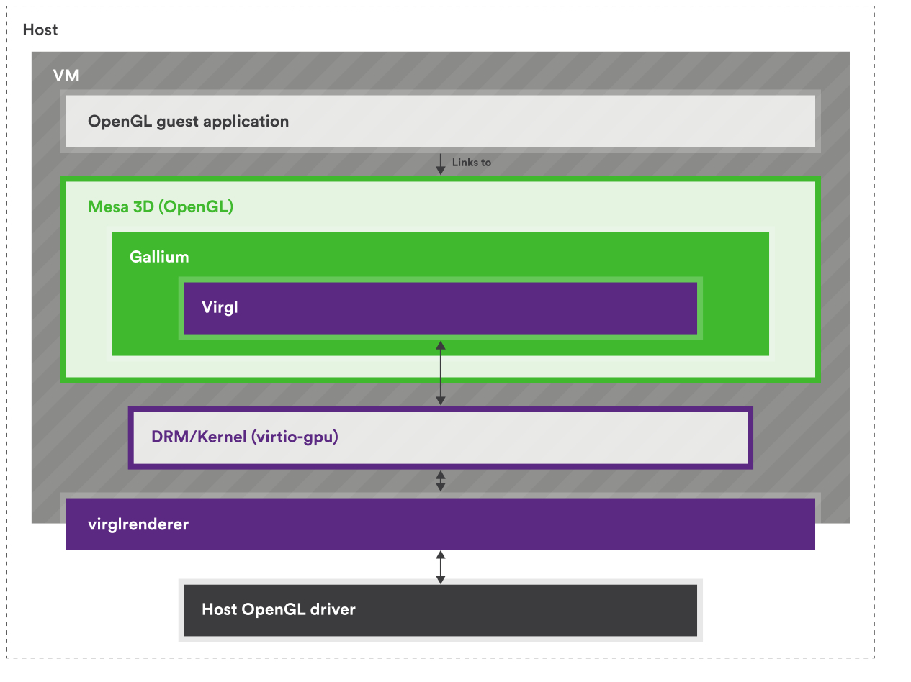
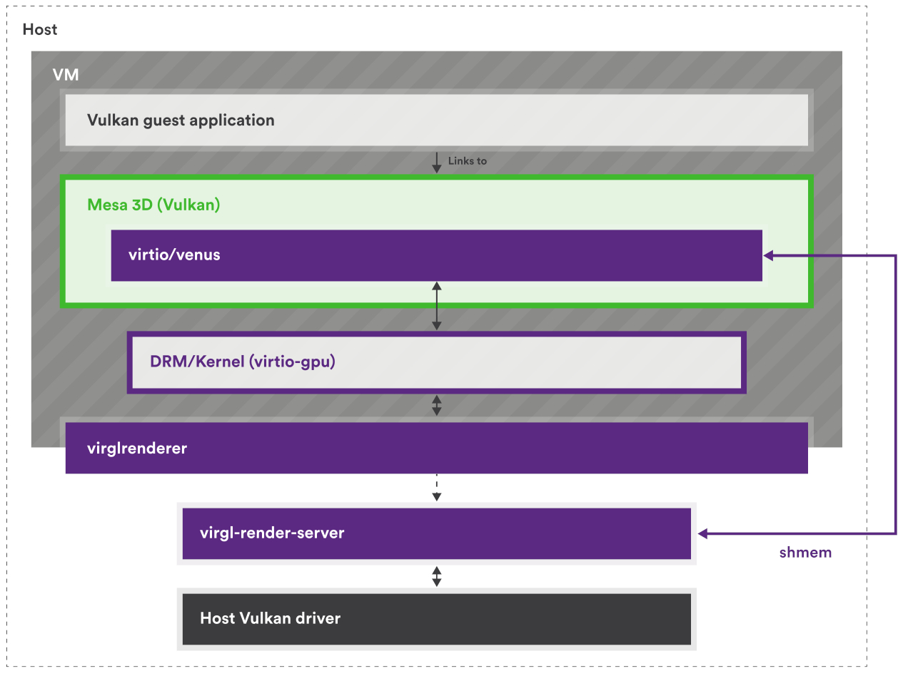
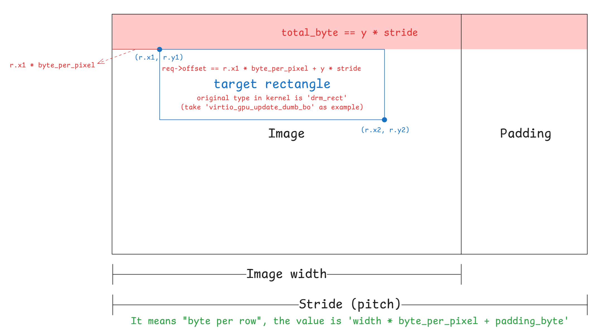
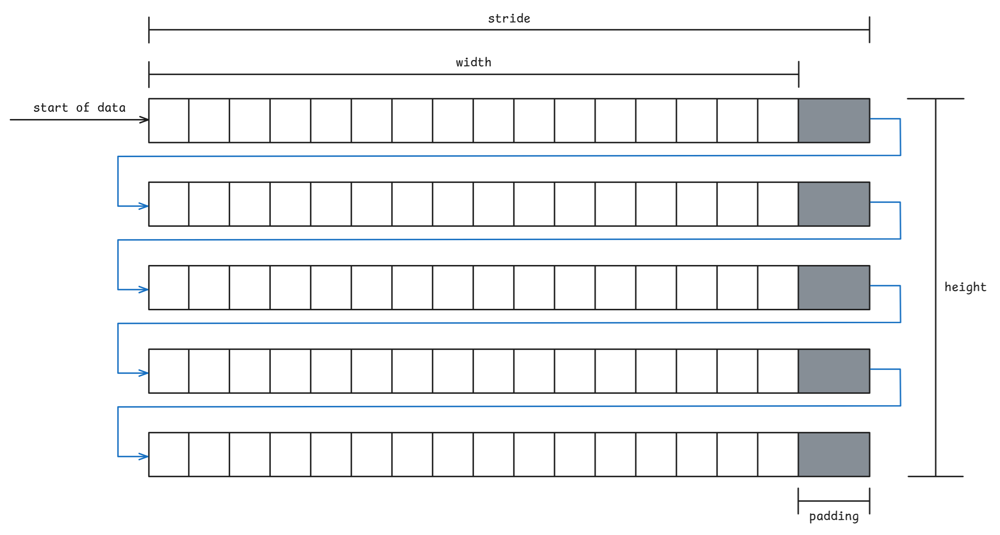
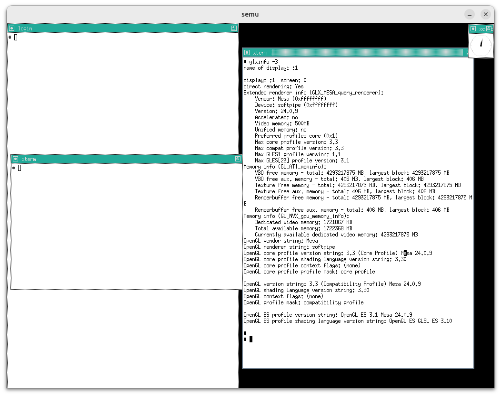

# VirtIO-GPU in semu

專題，預期產出是

- 最低限度在 semu 支援 virtio 2D (with SDL)
- 支援 virtio-gpu 及 virtio-input
- 實作 host-GL accelerated path，讓 virtio-gpu 得以 passthrough

目前已將 2D 的部分閱讀與整理完畢，剛將 commit 整理完畢，重新編譯沒問題後就 rebase 並發送 PR

材料部份，目前已初步閱讀完 spec 中 virtqueue（ch1 & 2）、PCI（4.1）與 GPU（5.7）的部分。 另外也閱讀了一些還閱讀了一些 graphic stack 的東西，因此寫了一些筆記

- [Red Hat Virtio 介紹文的翻譯 & 筆記](https://mes0903.github.io/VM/redhat_virtio/)
- [Virtual I/O Device (VIRTIO) Version 1.3 翻譯 & 筆記](https://mes0903.github.io/VM/virtio_spec/)
- [The Linux graphics stack in a nutshell 翻譯 & 筆記](https://mes0903.github.io/Linux/linux-graphic-stack/)

還有一些尚在進行中的筆記，集中在 DRM/KMS 的部分，底下是針對目前 semu 中 vgpu 2D 部分的實作的筆記，3D 部分尚未開始

後面有紀錄了一些遇到的問題，和做 trace code 的過程，但是我仍然不是很熟悉 Mesa 與 X11，如果有寫錯的部分，麻煩再告知我，謝謝

## 有關 VirGL

以下片段翻譯自 [Do Nvidia GPUs require Mesa? (re: what is Mesa vs proprietary drivers?)](https://www.reddit.com/r/linux_gaming/comments/9firc7/do_nvidia_gpus_require_mesa_re_what_is_mesa_vs/)：

在 Linux 當中，所有硬體的驅動程式都會以某種形式被包含在核心裡面，這當然也包含了 GPU 驅動。 每一張 GPU 都需要一個核心驅動（或說 kernel module 模組）才能運作

但核心驅動只負責最低層級的硬體操作。 像 OpenGL、Vulkan、OpenCL 這些 API 的實作太龐大，無法放進核心驅動中，因此被放在 userspace，透過系統呼叫與核心互動

要使用任何圖形 API，你都需要有對應的使用者空間函式庫。 AMD 與 NVIDIA 的專有驅動都有提供每一個 API 的封閉原始碼版本，而 Mesa 則是試圖提供這些 API 的開源替代實作

專有驅動通常也會附帶它們自己專有的核心驅動／模組，用來和它們的使用者空間函式庫溝通。 但對於 AMD 的新 GPU 來說，情況稍有不同：他們的專有與開源驅動會共用同一個核心模組。 換句話說，若你使用的是 Radeon R9 285（GCN 3） 之後的 GPU，你可以在相同的 AMDGPU 核心驅動 下，選擇搭配 Mesa（開源函式庫）或 AMD 專有函式庫

---

再來以 Collabora 的這兩張圖來說，VirGL 是適用於 virtio-gpu 的 OpenGL 驅動，Venus 是 virtio-gpu 的 Vulkan 驅動，這兩者都實作在 Mesa 中：




但因為 virtio-gpu 只定義了要有哪些行為，例如建立 context、建立 BLOB 資源或提交 3D 指令之類的，所以實際填入 virtqueue 的內容（payload）是由實作方決定的

具體來說要填入的內容是能讓 host 端轉譯器看懂的 payload，因此格式是以實作自己的協定來定義的，現在主流的實作是 Virgl 與 Venus（近年有新的叫 vDRM），他們在 host 端配合的轉譯器是 virglrenderer，用來解碼 VirGL/Venus 與 vDRM 的命令，再把這些命令轉成 host 端的 OpenGL/Vulkan 呼叫

所以 virtio-gpu 決定封包的格式，而實作本身決定封包內容要怎麼解讀

實作用的協定本身不一定有 spec（神奇），VirGL 就沒有，所以要直接看實作（[VirGL](https://gitlab.freedesktop.org/mesa/mesa/-/blob/main/src/gallium/drivers/virgl/virgl_encode.c?ref_type=heads)、[virglrenderer](https://gitlab.freedesktop.org/virgl/virglrenderer/-/blob/main/src/virgl_protocol.h)），但 Venus 有（[venus-protocol](https://gitlab.freedesktop.org/virgl/venus-protocol)）

## Big Picture

### Resource 資料結構

#### `vgpu_resource_2d` 與 `display_info`

每個 2D resource 使用 `struct vgpu_resource_2d` 表示（定義於 virtio-gpu.h:19）：

```c
struct vgpu_resource_2d {
    uint32_t scanout_id;      // 綁定的 scanout ID
    uint32_t resource_id;     // 資源 ID
    uint32_t format;          // 像素格式（如 ARGB8888）
    uint32_t width;           // 寬度
    uint32_t height;          // 高度
    uint32_t stride;          // 每行的位元組數
    uint32_t bits_per_pixel;  // 每像素位元數
    uint32_t *image;          // Host 端的圖像 buffer
    size_t page_cnt;          // Guest 提供的記憶體頁數
    struct iovec *iovec;      // Guest 記憶體頁的位址與長度
    struct list_head list;    // 連結串列節點
};
```

所有的 2D resource 以連結串列方式管理，串列頭為 `vgpu_res_2d_list`（virtio-gpu.c:54）

而 `display_info` 是 SDL 視窗後端層的狀態結構（定義在 window-sw.c:18-40）：

```c
struct display_info {
    int render_type;
    struct vgpu_resource_2d resource;     // 主平面資源
    uint32_t primary_sdl_format;
    SDL_Texture *primary_texture;
    struct vgpu_resource_2d cursor;       // 鼠標平面資源
    uint32_t cursor_sdl_format;
    uint32_t *cursor_img;
    SDL_Rect cursor_rect;
    SDL_Texture *cursor_texture;
    SDL_mutex *img_mtx;
    SDL_cond *img_cond;
    SDL_Thread *win_thread;
    SDL_Thread *ev_thread;
    SDL_Window *window;
    SDL_Renderer *renderer;
};
```

兩者屬於不同層次的資料結構：`vgpu_resource_2d` 是「virtio-gpu 裝置模型（device model）層」的資源物件； `display_info` 是「SDL 視窗後端（render backend）層」的每個 scanout 視窗狀態，內含兩個 plane（primary/cursor）要用來算繪的資源快照與 SDL 物件

`vgpu_resource_2d` 在 semu 內代表一個 virtio-gpu 的 2D resource（以 `resource_id` 為 key 來管理），它同時承載：

- 協定層會出現的概念
  - `resource_id`：guest 用來參考（refer）的 handle
  - `format/width/height`
  - `scanout_id`：目前被 `SET_SCANOUT` 綁定到哪個 scanout（semu 的做法是直接存到 resource 上）
- semu 內部實作需要的狀態（host-private）
  - `iovec/page_cnt`：`RESOURCE_ATTACH_BACKING` 後，記住 guest backing pages 對應到 host pointer 的 scatter-gather 描述
  - `image/stride/bits_per_pixel`：semu SW path 額外維護的一份「連續」影像緩衝區（staging/render buffer），方便 SDL 以單一 surface/texture 取用
  - `list`：放進資源串列以做查找與生命週期管理

`display_info` 則是 SDL 視窗後端的「每個 scanout 的算繪狀態」（render-side state），會為每個 scanout 維護一個 SDL window/thread，並提供兩個 plane 的算繪資源：

- Primary plane
  - `struct vgpu_resource_2d resource;`
  - `primary_sdl_format`, `primary_texture`
- Cursor plane
  - `struct vgpu_resource_2d cursor;`
  - `cursor_img`（cursor 專用的像素複本）
  - `cursor_rect`, `cursor_texture`
- 同步與執行緒/SDL 物件
  - `img_mtx`/`img_cond`：通知 window thread 有更新要重畫
  - `win_thread/ev_thread/window/renderer`

`display_info` 會引用或複製 `vgpu_resource_2d` 的內容來做算繪，以 2D 的 software backend（`window_thread` 函式）來說：

1. Primary plane：shallow copy metadata，直接引用同一塊 image

   `window_flush_sw(scanout_id, res_id)` 會做：
   - `resource = vgpu_get_resource_2d(res_id)` 取回 resource list 裡的 canonical resource
   - `memcpy(&display->resource, resource, sizeof(struct vgpu_resource_2d))`
  
   這個 memcpy 會把指標欄位也複製進去，所以 `display->resource.image` 會指向同一塊 `resource->image`（也就是 `TRANSFER_TO_HOST_2D` 寫入的那塊連續 buffer）

   接著 window thread 會用 `SDL_CreateRGBSurfaceWithFormatFrom(resource->image, ..., pitch=stride, ...)` 把這塊記憶體包成 surface，再建 texture
2. Cursor plane：deep copy 像素到 `cursor_img`，避免後續資源改動影響游標

    `cursor_update_sw()` 的做法不同：

    - 先 `memcpy(&display->cursor, resource, sizeof(...))` 複製 metadata
    - 但隨後分配 `display->cursor_img`，並 `memcpy(display->cursor_img, resource->image, pixels_size)`
    - 再把 `display->cursor.image = display->cursor_img`

    因此 cursor plane 的像素在 `display_info` 內有自己的一份副本，後續即使原本的 resource 更新，也不會影響目前 cursor 的 texture

詳細見後方章節與原始碼

#### Virtqueue 相關

semu 中使用的是 split virtqueue，其中只有 descriptor table 有特別寫結構體定義出來：

```c
PACKED(struct virtq_desc {
    uint64_t addr;
    uint32_t len;
    uint16_t flags;
    uint16_t next;
});
```

而在規格中，對於 avail ring 與 used ring 的佈局示例如下：

```c
struct virtq_avail { 
#define VIRTQ_AVAIL_F_NO_INTERRUPT  1 
    le16 flags; 
    le16 idx; /* driver 已經把多少個「可用的 ring entry」放進了 avail ring */
    le16 ring[ /* Queue Size */ ]; 
    le16 used_event; /* 只有在 VIRTIO_F_EVENT_IDX 協商成功時才存在 */ 
};

struct virtq_used { 
#define VIRTQ_USED_F_NO_NOTIFY  1 
    le16 flags; 
    le16 idx; /* device 已經完成並回報了多少個 used entries */
    struct virtq_used_elem ring[ /* Queue Size */]; 
    le16 avail_event; /* 只有在 VIRTIO_F_EVENT_IDX 協商成功時才存在 */ 
}; 

/* 這裡 id 使用 le32 是為了填補（padding）的考量。 */ 
struct virtq_used_elem { 
    /* 已用描述符鏈的頭節點索引 */ 
    le32 id; 
    /* 裝置對該描述符鏈中屬於「裝置可寫」部分實際寫入的位元組數 */ 
    le32 len; 
};
```

但在 semu 中，avail ring 與 used ring 都是透過直接操作記憶體（`vinput->ram`）來讀取的，相關結構如下（以 virtio gpu 為例）：

```c
typedef struct {
    uint32_t QueueNum;      // Queue 的大小
    uint32_t QueueDesc;     // Descriptor Table 的起始索引
    uint32_t QueueAvail;    // Available Ring 的起始索引
    uint32_t QueueUsed;     // Used Ring 的起始索引
    uint16_t last_avail;    // Device 已處理了幾個 buffer
    bool ready;             // Queue 是否就緒
} virtio_gpu_queue_t;

typedef struct {
    /* feature negotiation */
    uint32_t DeviceFeaturesSel;
    uint32_t DriverFeatures;
    uint32_t DriverFeaturesSel;
    /* queue config */
    uint32_t QueueSel;
    virtio_gpu_queue_t queues[2];
    /* status */
    uint32_t Status;
    uint32_t InterruptStatus;
    /* supplied by environment */
    uint32_t *ram;
    /* implementation-specific */
    void *priv;
} virtio_gpu_state_t;
```

`virtio_gpu_state_t` 中的 `queues` 是一個 virtqueue 的陣列，有兩個元素，代表 virtio-gpu 使用了兩個 virtqueue，在 spec 中分別名為 controlq 與 cursorq：

- controlq：用於傳送控制命令的佇列
- cursorq：用於傳送游標更新的佇列

`virtio_gpu_queue_t` 內的元素用來幫助讀取 virtqueue 的內容，`QueueDesc`、`QueueAvail`、`QueueUsed` 的值代表的是索引，會搭配 `virtio_xxx_state_t` 結構體內的 `ram` 成員使用，其中 `ram` 與 `emu->ram` 指向相同的記憶體區塊（main 裡面 malloc 的那塊 guest memory）

由於 avail ring 與 used ring 中的 `flags` 與 `idx` 欄位都是 `le16`，而 `ram` 是 `uint32_t*`，因此以 avail ring 為例，其在 `ram` 中的佈局看起來會類似下面這樣：

```
┌─────────────────────────────────┬──────────────────────────┐
│     ram[queue->QueueAvail]      │ flags (low) | idx (high) │  ← Header
├─────────────────────────────────┼──────────────────────────┤
│   ram[queue->QueueAvail + 1]    │    ring[0]  |  ring[1]   │  ← Entries 0 & 1
│   ram[queue->QueueAvail + 2]    │    ring[2]  |  ring[3]   │  ← Entries 2 & 3
│   ram[queue->QueueAvail + 3]    │    ring[4]  |  ring[5]   │  ← Entries 4 & 5
└─────────────────────────────────┴──────────────────────────┘
```

其中 `QueueAvail` 等值在對應的 `virtio_xxx_reg_write` 中設定：

```c
static inline uint32_t vinput_preprocess(virtio_input_state_t *vinput,
                                         uint32_t addr)
{
    // 1. 檢查地址是否在 RAM 範圍內
    if (addr >= RAM_SIZE)
        return virtio_input_set_fail(vinput), 0;
    
    // 2. 檢查地址是否 4-byte 對齊
    if (addr & 0b11)  // 檢查最低 2 bits
        return virtio_input_set_fail(vinput), 0;

    // 3. 將「字節地址」轉換為「uint32_t 索引」
    return addr >> 2;  // 除以 4
}

...

static bool virtio_input_reg_write(virtio_input_state_t *vinput,
                                   uint32_t addr,
                                   uint32_t value)
{
...
case _(QueueDriverLow):
    VINPUT_QUEUE.QueueAvail = vinput_preprocess(vinput, value);
    return true;
...
}
```

因此如果 Guest 寫入的地址為 `0x80100000`，則 `QueueAvail` 為 `0x20040000`。 也因為 `vinput->ram` 的型態為 `uint32_t*`，所以在訪問的時候該段記憶體的時候是用 `ram[0x80100000 >> 2]` 而非 `ram[0x80100000]`，所以才說 `QueueAvail` 是索引：

```
字節視圖 (uint8_t*):       Word 視圖 (uint32_t*):
┌────┬────┬────┬────┐     ┌──────────────┐
│ 0  │ 1  │ 2  │ 3  │  →  │   ram[0]     │
├────┼────┼────┼────┤     ├──────────────┤
│ 4  │ 5  │ 6  │ 7  │  →  │   ram[1]     │
├────┼────┼────┼────┤     ├──────────────┤
│ 8  │ 9  │ 10 │ 11 │  →  │   ram[2]     │
└────┴────┴────┴────┘     └──────────────┘

字節地址 / 4 = uint32_t 索引
```

以 `virtio_input_desc_handler` 為例子來看一些使用範例

1. 讀取 avail 與 used ring 的 `idx` 欄位
    ```c
    uint32_t *ram = vinput->ram;
    uint16_t new_avail = ram[queue->QueueAvail] >> 16; /* virtq_avail.idx (le16) */
    uint16_t new_used = ram[queue->QueueUsed] >> 16; /* virtq_used.idx (le16) */
    ```
2. 讀取 avail ring 內的第 `buffer_idx` 個元素
    ```c
    uint16_t queue_idx = queue->last_avail % queue->QueueNum;
    uint16_t buffer_idx = ram[queue->QueueAvail + 1 + queue_idx / 2] >>
                          (16 * (queue_idx % 2));
    ```
    這邊 `last_avail` 代表已處理過的 buffer 數量，由於 avail ring 是環形的，所以取模以得到下一個目標 buffer 的索引
    
    接下來的 `queue->QueueAvail + 1` 代表 avail ring 內 `ring` 的起始位址（`+1` 是為了跳過 header）； `queue_idx / 2` 用來找到目標 buffer 在 `ram` 的哪個元素內（見上方 avail ring 在 `ram` 中的示意圖）； 最後用 `16 * (queue_idx % 2)` 來找到對應的元素（一個 `ram` 的元素中有兩個 `ring` 的元素）

    因此整個 `buffer_idx` 的計算其實是在讀取 `ring[queue_idx]` 的值，而該值代表的是目標 descriptor 的索引，所以變數名稱才會是 `buffer_idx`
3. 讀取 Descriptor
    ```c
    uint32_t *desc;
    desc = &vinput->ram[queue->QueueDesc + buffer_idx * 4];
    vq_desc.addr = desc[0];  // buffer 的物理地址
    uint32_t addr_high = desc[1]; // 目前只支援 32-bit addressing，因此應為 0
    vq_desc.len = desc[2];   // buffer 大小
    vq_desc.flags = desc[3] & 0xFFFF;  // flags
    ```
    `*4` 是因為每個 descriptor 佔 4 個 `uint32_t`，而算 `flags` 時取 `& 0xFFFF` 是因為 flags 在 `desc[3]` 的低 16 位
4. 寫入事件到 Guest Buffer
    ```c
    ev = (struct virtio_input_event *)((uintptr_t)vinput->ram + vq_desc.addr);
    ev->type = input_ev[i].type;
    ev->code = input_ev[i].code;
    ev->value = input_ev[i].value;
    ```
    注意這邊 `vinput->ram` 是 host virtual address，其值的意義是 guest memory 在 semu 中的起始位址（`malloc` 出來的一塊記憶體），而 `vq_desc.addr` 是 guest physical address，因此相加就可以得到目標 `virtio_input_event`（descriptor 指向的 buffer）的 host virtual address，後續便可以直接操作該 buffer
5. 更新 used ring
    ```c
    uint32_t vq_used_addr = queue->QueueUsed + 1 + (new_used % queue->QueueNum) * 2;
    ram[vq_used_addr] = buffer_idx;
    ram[vq_used_addr + 1] = sizeof(struct virtio_input_event);
    ```
    與上方一樣，`new_used % queue->QueueNum` 是在計算目標 used ring entry 的索引，`*2` 是因為每個 used ring entry 佔 2 個 `uint32_t`（`id` + `len`）； 接著就依序填入目標 used ring entry 的 `id` 與 `len` 欄位

總體來說，virtqueue 操作的流程大致如下：

1. Linux 分配 virtqueue 記憶體  
   - `vring_create_virtqueue()`
   - 在 guest RAM 中分配 descriptor table, avail ring, used ring

2. Linux 寫入 MMIO registers (通過 `writel`)，見 `vm_setup_vq`：
   - `writel(addr_low, base + 0x080)`：`QUEUE_DESC_LOW`
   - `writel(addr_high, base + 0x084)`：`QUEUE_DESC_HIGH`
   - `writel(addr_low, base + 0x090)`：`QUEUE_AVAIL_LOW  `
   - `writel(addr_high, base + 0x094)`：`QUEUE_AVAIL_HIGH`
   - `writel(addr_low, base + 0x0a0)`：`QUEUE_USED_LOW`
   - `writel(addr_high, base + 0x0a4)`：`QUEUE_USED_HIGH`
   - `writel(1, base + 0x044)`：`QUEUE_READY`

3. SEMU 接收 MMIO write (`virtio_xxx_reg_write`)
   - `case QueueDescLow`：儲存 descriptor table 位址
   - `case QueueDriverLow`：儲存 available ring 位址
   - `case QueueDeviceLow`：儲存 used ring 位址
   - `case QueueReady`：標記 queue 就緒

4. 之後 SEMU 就可以通過這些位址訪問 guest 的 virtqueue 了
   - `ram[queue->QueueDesc + offset]`
   - `ram[queue->QueueAvail + offset]`
   - `ram[queue->QueueUsed + offset]`

### 算繪流程

以下是一個 semu 裡面的 GPU 算繪流程：

1. **初始化階段**（在 main.c 中執行）
   - 呼叫 `virtio_gpu_init` 初始化 VirtIO-GPU 裝置
   - 呼叫 `virtio_gpu_add_scanout` 新增 scanout
   - 呼叫 `g_window.window_init` 初始化 SDL 並建立視窗執行緒
     - event handling thread（`window_events_thread`）不是在 `window_init_sw` 內直接建立的，而是 在 `window_thread` 建好 SDL window/renderer 後才建立的（也就是 per-scanout 的 window thread 內會再開一條 event thread）

2. **Guest OS 啟動後查詢顯示資訊**
   - Guest 透過 MMIO 讀取 VirtIO-GPU 暫存器，發現裝置
   - Guest 發送 `VIRTIO_GPU_CMD_GET_DISPLAY_INFO` 指令
   - `virtio_gpu_get_display_info_handler` 回傳 scanout 的寬高資訊

3. **建立 framebuffer**
   - Guest 發送 `VIRTIO_GPU_CMD_RESOURCE_CREATE_2D` 建立 2D resource
   - `virtio_gpu_resource_create_2d_handler` 分配 `res_2d->image` buffer
   - Guest 發送 `VIRTIO_GPU_CMD_RESOURCE_ATTACH_BACKING` 附加 Guest 記憶體
   - `virtio_gpu_cmd_resource_attach_backing_handler` 記錄 Guest 記憶體頁到 `res_2d->iovec`

4. **綁定 scanout**
   - Guest 發送 `VIRTIO_GPU_CMD_SET_SCANOUT` 將 resource 綁定到 scanout
   - `virtio_gpu_cmd_set_scanout_handler` 設定 `res_2d->scanout_id`

5. **更新畫面**
   - Guest 將圖像資料寫入自己的 framebuffer（backing memory）
   - Guest 發送 `VIRTIO_GPU_CMD_TRANSFER_TO_HOST_2D` 傳輸像素資料
   - `virtio_gpu_cmd_transfer_to_host_2d_handler` 呼叫 `iov_to_buf` 從 Guest 記憶體複製資料到 `res_2d->image`
   - Guest 發送 `VIRTIO_GPU_CMD_RESOURCE_FLUSH` 請求顯示更新
   - `virtio_gpu_cmd_resource_flush_handler` 呼叫 `window_flush_sw`
   - `window_flush_sw` 喚醒視窗執行緒
   - `window_thread` 從 `res_2d->image` 建立 SDL texture 並算繪到視窗

### 函式呼叫關係總結

以下整理各函式的呼叫關係：

- **初始化流程**
  - `main` → `virtio_gpu_init`
  - `main` → `virtio_gpu_add_scanout` → `window_add_sw`
  - `main` → `g_window.window_init` → `window_init_sw` → `window_thread`

- **暫存器存取**
  - MMIO load → `virtio_gpu_read` → `virtio_gpu_reg_read`
  - MMIO store → `virtio_gpu_write` → `virtio_gpu_reg_write`
  - `virtio_gpu_reg_write` (QueueNotify) → `virtio_queue_notify_handler`

- **指令處理**
  - `virtio_queue_notify_handler` → `virtio_gpu_desc_handler`
  - `virtio_gpu_desc_handler` → `g_vgpu_backend.*` (各指令處理函式)

- **2D 資源管理**
  - `virtio_gpu_resource_create_2d_handler` → `vgpu_create_resource_2d`
  - 各指令處理函式 → `vgpu_get_resource_2d`
  - `virtio_gpu_cmd_resource_unref_handler` → `vgpu_destory_resource_2d`

- **畫面算繪**
  - `virtio_gpu_cmd_resource_flush_handler` → `window_flush_sw` → SDL_CondSignal
  - `window_thread` 收到訊號 → `SDL_CreateRGBSurfaceWithFormatFrom` → `SDL_RenderPresent`

- **鼠標處理**
  - `virtio_gpu_cmd_update_cursor_handler` → `cursor_update_sw` → SDL_CondSignal
  - `virtio_gpu_cmd_move_cursor_handler` → `cursor_move_sw` → SDL_CondSignal

## VirtIO-GPU 2D 運作流程

VirtIO-GPU 是一個基於 VirtIO 協定的虛擬圖形裝置，為 Guest OS 提供 GPU 功能。 本節以 semu 的實作為例，說明 VirtIO-GPU 2D 的運作流程，包含初始化、記憶體管理、指令處理以及畫面算繪等核心機制

### VirtIO-GPU 架構概述

VirtIO-GPU 在 semu 中採用分層設計，主要包含以下三個層次：

1. **VirtIO 層** (virtio-gpu.c)：處理 VirtIO 裝置的通用邏輯，包括裝置初始化、暫存器讀寫、VirtQueue 管理等
2. **GPU 指令處理層** (virtio-gpu-sw.c)：實作各種 GPU 指令的處理函式，如建立 2D 資源、綁定 scanout、flush 畫面等
3. **視窗後端層** (window-sw.c, window-events.c)：負責與 SDL 互動，處理實際的畫面算繪與事件輸入

### VirtIO-GPU 初始化流程

#### virtio_gpu_init

在 main.c 中，模擬器初始化時會呼叫 `virtio_gpu_init`：

```c
// main.c:905
emu->vgpu.ram = emu->ram;
virtio_gpu_init(&(emu->vgpu));
virtio_gpu_add_scanout(&(emu->vgpu), 1024, 768);
g_window.window_init();
```

`virtio_gpu_init` 定義於 virtio-gpu.c:696，其作用為初始化 VirtIO-GPU 裝置的私有資料結構：

```c
void virtio_gpu_init(virtio_gpu_state_t *vgpu)
{
    memset(&virtio_gpu_data, 0, sizeof(virtio_gpu_data_t));
    vgpu->priv = &virtio_gpu_data;
}
```

這裡將 `virtio_gpu_data_t` 清空並指派給 `vgpu->priv`，該結構記錄了所有 scanout 的資訊（寬度、高度、啟用狀態）

#### virtio_gpu_add_scanout

接著呼叫 `virtio_gpu_add_scanout` 來新增一個 scanout（顯示輸出），定義於 virtio-gpu.c:702：

```c
void virtio_gpu_add_scanout(virtio_gpu_state_t *vgpu,
                            uint32_t width,
                            uint32_t height)
{
    int scanout_num = vgpu_configs.num_scanouts;

    // 檢查是否超過最大 scanout 數量
    if (scanout_num >= VIRTIO_GPU_MAX_SCANOUTS) {
        fprintf(stderr, "%s(): exceeded scanout maximum number\n", __func__);
        exit(2);
    }

    // 設定 scanout 的屬性
    PRIV(vgpu)->scanouts[scanout_num].width = width;
    PRIV(vgpu)->scanouts[scanout_num].height = height;
    PRIV(vgpu)->scanouts[scanout_num].enabled = 1;

    // 通知視窗後端新增視窗
    g_window.window_add(width, height);

    vgpu_configs.num_scanouts++;
}
```

此函式會呼叫 `window_add_sw`（定義於 window-sw.c:155），該函式會記錄 display 的寬高資訊，但不會立即建立 SDL 視窗，而是等到 `window_init_sw` 被呼叫時才會建立

#### window_init_sw

`window_init_sw` 定義於 window-sw.c:138，負責初始化 SDL 並為每個 scanout 建立對應的視窗執行緒：

```c
void window_init_sw(void)
{
    // 初始化 SDL 視訊子系統
    if (SDL_Init(SDL_INIT_VIDEO) < 0) {
        fprintf(stderr, "%s(): failed to initialize SDL\n", __func__);
        exit(2);
    }

    // 為每個 display 建立執行緒
    for (int i = 0; i < display_cnt; i++) {
        displays[i].img_mtx = SDL_CreateMutex();
        displays[i].img_cond = SDL_CreateCond();

        displays[i].win_thread =
            SDL_CreateThread(window_thread, NULL, (void *) &displays[i]);
        SDL_DetachThread(displays[i].win_thread);
    }
}
```

每個 `window_thread` 會建立 SDL 視窗和 renderer，並進入一個無窮迴圈等待算繪請求

### VirtIO 暫存器讀寫

Guest OS 透過 MMIO 與 VirtIO-GPU 裝置互動，當 Guest 執行 load/store 指令存取 VirtIO-GPU 的記憶體區域時，會觸發 `virtio_gpu_read` 或 `virtio_gpu_write`

#### virtio_gpu_read

定義於 virtio-gpu.c:652，負責處理暫存器讀取：

```c
void virtio_gpu_read(hart_t *vm,
                     virtio_gpu_state_t *vgpu,
                     uint32_t addr,
                     uint8_t width,
                     uint32_t *value)
{
    switch (width) {
    case RV_MEM_LW:
        if (!virtio_gpu_reg_read(vgpu, addr >> 2, value))
            vm_set_exception(vm, RV_EXC_LOAD_FAULT, vm->exc_val);
        break;
    // ... 其他寬度的處理
    }
}
```

實際讀取邏輯在 `virtio_gpu_reg_read`（virtio-gpu.c:488），該函式根據暫存器位址回傳對應的值，例如：

- `VIRTIO_MagicValue`：回傳 0x74726976（"virt"）
- `VIRTIO_DeviceID`：回傳 16（GPU 裝置編號）
- `VIRTIO_DeviceFeatures`：回傳支援的功能位元（如 EDID 支援）
- `VIRTIO_Config`：回傳 GPU 設定，如 scanout 數量

#### virtio_gpu_write

定義於 virtio-gpu.c:675，負責處理暫存器寫入：

```c
void virtio_gpu_write(hart_t *vm,
                      virtio_gpu_state_t *vgpu,
                      uint32_t addr,
                      uint8_t width,
                      uint32_t value)
{
    switch (width) {
    case RV_MEM_SW:
        if (!virtio_gpu_reg_write(vgpu, addr >> 2, value))
            vm_set_exception(vm, RV_EXC_STORE_FAULT, vm->exc_val);
        break;
    // ... 其他寬度的處理
    }
}
```

`virtio_gpu_reg_write`（virtio-gpu.c:566）會根據暫存器位址執行不同操作，其中要注意在 `VIRTIO_QueueNotify` 的情況下，Guest 寫入此暫存器表示有新的指令需要處理，因此會呼叫 `virtio_queue_notify_handler`

### VirtQueue 處理流程

#### virtio_queue_notify_handler

定義於 virtio-gpu.c:427，當 Guest 通知有新指令時被呼叫：

```c
static void virtio_queue_notify_handler(virtio_gpu_state_t *vgpu, int index)
{
    uint32_t *ram = vgpu->ram;
    virtio_gpu_queue_t *queue = &vgpu->queues[index];

    // 檢查裝置狀態
    if (vgpu->Status & VIRTIO_STATUS__DEVICE_NEEDS_RESET)
        return;

    if (!((vgpu->Status & VIRTIO_STATUS__DRIVER_OK) && queue->ready))
        return virtio_gpu_set_fail(vgpu);

    // 檢查新的 available buffers
    uint16_t new_avail = ram[queue->QueueAvail] >> 16;
    if (new_avail - queue->last_avail > (uint16_t) queue->QueueNum)
        return (fprintf(stderr, "%s(): size check failed\n", __func__),
                virtio_gpu_set_fail(vgpu));

    if (queue->last_avail == new_avail)
        return;

    // 處理每一個可用的 buffer
    uint16_t new_used = ram[queue->QueueUsed] >> 16;
    while (queue->last_avail != new_avail) {
        uint16_t queue_idx = queue->last_avail % queue->QueueNum;
        uint16_t buffer_idx = ram[queue->QueueAvail + 1 + queue_idx / 2] >>
                              (16 * (queue_idx % 2));

        // 處理 descriptor
        uint32_t len = 0;
        int result = virtio_gpu_desc_handler(vgpu, queue, buffer_idx, &len);
        if (result != 0)
            return virtio_gpu_set_fail(vgpu);

        // 將結果寫回 used queue
        uint32_t vq_used_addr =
            queue->QueueUsed + 1 + (new_used % queue->QueueNum) * 2;
        ram[vq_used_addr] = buffer_idx;  /* virtq_used_elem.id */
        ram[vq_used_addr + 1] = len;     /* virtq_used_elem.len */
        queue->last_avail++;
        new_used++;
    }

    // 更新 used queue index
    vgpu->ram[queue->QueueUsed] &= MASK(16);
    vgpu->ram[queue->QueueUsed] |= ((uint32_t) new_used) << 16;

    // 發送中斷（除非設定 VIRTQ_AVAIL_F_NO_INTERRUPT）
    if (!(ram[queue->QueueAvail] & 1))
        vgpu->InterruptStatus |= VIRTIO_INT__USED_RING;
}
```

此函式會從 available queue 中取出 descriptor，並呼叫 `virtio_gpu_desc_handler` 處理

#### virtio_gpu_desc_handler

定義於 virtio-gpu.c:361，負責解析 descriptor chain 並分發指令：

```c
static int virtio_gpu_desc_handler(virtio_gpu_state_t *vgpu,
                                   const virtio_gpu_queue_t *queue,
                                   uint32_t desc_idx,
                                   uint32_t *plen)
{
    struct virtq_desc vq_desc[3];

    // 收集 descriptor chain（最多 3 個）
    for (int i = 0; i < 3; i++) {
        uint32_t *desc = &vgpu->ram[queue->QueueDesc + desc_idx * 4];
        vq_desc[i].addr = desc[0];
        vq_desc[i].len = desc[2];
        vq_desc[i].flags = desc[3];
        desc_idx = desc[3] >> 16;

        if (!(vq_desc[i].flags & VIRTIO_DESC_F_NEXT))
            break;
    }

    // 取得指令 header
    struct vgpu_ctrl_hdr *header =
        vgpu_mem_guest_to_host(vgpu, vq_desc[0].addr);

    // 根據指令類型分發處理
    switch (header->type) {
        VGPU_CMD(GET_DISPLAY_INFO, get_display_info)
        VGPU_CMD(RESOURCE_CREATE_2D, resource_create_2d)
        VGPU_CMD(RESOURCE_UNREF, resource_unref)
        VGPU_CMD(SET_SCANOUT, set_scanout)
        VGPU_CMD(RESOURCE_FLUSH, resource_flush)
        VGPU_CMD(TRANSFER_TO_HOST_2D, trasfer_to_host_2d)
        VGPU_CMD(RESOURCE_ATTACH_BACKING, resource_attach_backing)
        // ... 其他指令
    default:
        virtio_gpu_cmd_undefined_handler(vgpu, vq_desc, plen);
        break;
    }

    return 0;
}
```

`VGPU_CMD` 巨集會展開為呼叫 `g_vgpu_backend` 中對應的處理函式

### 2D 資源管理

#### vgpu_create_resource_2d

定義於 virtio-gpu.c:99，用於建立新的 2D resource：

```c
struct vgpu_resource_2d *vgpu_create_resource_2d(int resource_id)
{
    struct vgpu_resource_2d *res = malloc(sizeof(struct vgpu_resource_2d));
    if (!res)
        return NULL;

    memset(res, 0, sizeof(*res));
    res->resource_id = resource_id;
    list_push(&res->list, &vgpu_res_2d_list);
    return res;
}
```

當 host 端收到 `VIRTIO_GPU_CMD_RESOURCE_CREATE_2D` 命令時會間接呼叫此函式，此時：

- 在 semu 裡會配置/初始化一個 `struct vgpu_resource_2d`，放進 `vgpu_res_2d_list`，以 `resource_id` 作 key
- 這個內部物件是 host-private 的實作細節，guest 看不到其位址，也不能直接讀寫它的欄位

Guest 端在協定層只擁有：

- `resource_id`（一個 32-bit 整數 handle）
- 以及它自己分配的 backing storage（像素所在的 guest RAM）
- 並透過 controlq 發送命令去操作該 `resource_id` 對應的資源：
	- `RESOURCE_ATTACH_BACKING`
	- `TRANSFER_TO_HOST_2D`
	- `SET_SCANOUT`
	- `RESOURCE_FLUSH`
	- `RESOURCE_UNREF`
	- 等等

#### vgpu_get_resource_2d

定義於 virtio-gpu.c:111，根據 resource ID 查找對應的資源：

```c
struct vgpu_resource_2d *vgpu_get_resource_2d(uint32_t resource_id)
{
    struct vgpu_resource_2d *res_2d;
    list_for_each_entry (res_2d, &vgpu_res_2d_list, list) {
        if (res_2d->resource_id == resource_id)
            return res_2d;
    }
    return NULL;
}
```

此函式會在各種需要存取 resource 的指令處理函式中被呼叫

#### vgpu_destory_resource_2d

定義於 virtio-gpu.c:122，用於銷毀 2D resource：

```c
int vgpu_destory_resource_2d(uint32_t resource_id)
{
    struct vgpu_resource_2d *res_2d = vgpu_get_resource_2d(resource_id);

    if (!res_2d)
        return -1;

    // 釋放資源
    free(res_2d->image);
    list_del(&res_2d->list);
    free(res_2d->iovec);
    free(res_2d);

    return 0;
}
```

此函式被 `virtio_gpu_cmd_resource_unref_handler` 呼叫

### GPU 指令處理

所有的 GPU 指令處理函式都定義在 virtio-gpu-sw.c 中，並透過 `g_vgpu_backend` 結構體註冊（virtio-gpu-sw.c:365）

#### VIRTIO_GPU_CMD_GET_DISPLAY_INFO

`virtio_gpu_get_display_info_handler` 定義於 virtio-gpu.c:212，回傳顯示器資訊：

```c
void virtio_gpu_get_display_info_handler(virtio_gpu_state_t *vgpu,
                                         struct virtq_desc *vq_desc,
                                         uint32_t *plen)
{
    struct vgpu_resp_disp_info *response =
        vgpu_mem_guest_to_host(vgpu, vq_desc[1].addr);

    memset(response, 0, sizeof(*response));
    response->hdr.type = VIRTIO_GPU_RESP_OK_DISPLAY_INFO;

    // 填寫每個 scanout 的資訊
    int scanout_num = vgpu_configs.num_scanouts;
    for (int i = 0; i < scanout_num; i++) {
        response->pmodes[i].r.width = PRIV(vgpu)->scanouts[i].width;
        response->pmodes[i].r.height = PRIV(vgpu)->scanouts[i].height;
        response->pmodes[i].enabled = PRIV(vgpu)->scanouts[i].enabled;
    }

    *plen = sizeof(*response);
}
```

此函式在 Guest OS 查詢顯示器資訊時被呼叫，其中 `vgpu_resp_disp_info` 的定義為：

```c
PACKED(struct vgpu_resp_disp_info {
    struct vgpu_ctrl_hdr hdr;
    struct virtio_gpu_display_one {
        struct vgpu_rect r;
        uint32_t enabled;
        uint32_t flags;
    } pmodes[VIRTIO_GPU_MAX_SCANOUTS];
});
```

對應到 spec 裡面的 `virtio_gpu_display_one`

#### VIRTIO_GPU_CMD_RESOURCE_CREATE_2D

`virtio_gpu_resource_create_2d_handler` 定義於 virtio-gpu-sw.c:13，用於建立 2D resource：

```c
static void virtio_gpu_resource_create_2d_handler(virtio_gpu_state_t *vgpu,
                                                  struct virtq_desc *vq_desc,
                                                  uint32_t *plen)
{
    // 讀取請求
    struct vgpu_res_create_2d *request =
        vgpu_mem_guest_to_host(vgpu, vq_desc[0].addr);

    // Resource ID 不能為 0
    if (request->resource_id == 0) {
        *plen = virtio_gpu_write_response(
            vgpu, vq_desc[1].addr, VIRTIO_GPU_RESP_ERR_INVALID_RESOURCE_ID);
        return;
    }

    // 建立 2D resource
    struct vgpu_resource_2d *res_2d =
        vgpu_create_resource_2d(request->resource_id);

    // 根據格式設定 bits_per_pixel
    uint32_t bits_per_pixel;
    switch (request->format) {
    case VIRTIO_GPU_FORMAT_B8G8R8A8_UNORM:
        bits_per_pixel = 32;
        break;
    // ... 其他格式
    }

    uint32_t bytes_per_pixel = bits_per_pixel / 8;

    // 設定 resource 屬性
    res_2d->width = request->width;
    res_2d->height = request->height;
    res_2d->format = request->format;
    res_2d->bits_per_pixel = bits_per_pixel;
    res_2d->stride = request->width * (bits_per_pixel / 8);
    res_2d->image = malloc(res_2d->stride * request->height);

    // 回傳成功
    *plen = virtio_gpu_write_response(vgpu, vq_desc[1].addr,
                                      VIRTIO_GPU_RESP_OK_NODATA);
    virtio_gpu_set_response_fencing(vgpu, &request->hdr, vq_desc[1].addr);
}
```

此函式會分配 host 端的圖像 buffer（`res_2d->image`），用於存放實際的像素資料

#### VIRTIO_GPU_CMD_RESOURCE_ATTACH_BACKING

在 VirtIO-GPU 的設計中，有兩個分離的概念：

1. Resource（資源）：一個 2D 圖像資源的 metadata
    - 由 `RESOURCE_CREATE_2D` 建立
    - 有寬度、高度、格式等屬性
    - 但還沒有實際的記憶體來存放像素資料
2. Backing Storage（後端儲存）：實際存放像素資料的記憶體
    - Guest OS 分配的記憶體頁面
    - 透過 `RESOURCE_ATTACH_BACKING` 附加到 resource

`virtio_gpu_cmd_resource_attach_backing_handler` 定義於 virtio-gpu-sw.c:265，用於將 Guest 記憶體附加到 resource：

```c
static void virtio_gpu_cmd_resource_attach_backing_handler(
    virtio_gpu_state_t *vgpu,
    struct virtq_desc *vq_desc,
    uint32_t *plen)
{
    // 讀取請求
    struct vgpu_res_attach_backing *backing_info =
        vgpu_mem_guest_to_host(vgpu, vq_desc[0].addr);
    struct vgpu_mem_entry *pages =
        vgpu_mem_guest_to_host(vgpu, vq_desc[1].addr);

    // 取得 resource
    struct vgpu_resource_2d *res_2d =
        vgpu_get_resource_2d(backing_info->resource_id);
    if (!res_2d) {
        fprintf(stderr, "%s(): invalid resource id %d\n", __func__,
                backing_info->resource_id);
        *plen = virtio_gpu_write_response(
            vgpu, vq_desc[2].addr, VIRTIO_GPU_RESP_ERR_INVALID_RESOURCE_ID);
        return;
    }
    
    // 分配 iovec 陣列
    res_2d->page_cnt = backing_info->nr_entries;
    res_2d->iovec = malloc(sizeof(struct iovec) * backing_info->nr_entries);
    if (!res_2d->iovec) {
        fprintf(stderr, "%s(): failed to allocate io vector\n", __func__);
        virtio_gpu_set_fail(vgpu);
        return;
    }
    
    // 將每個 Guest 記憶體頁的位址轉換為 Host 位址
    struct vgpu_mem_entry *mem_entries = (struct vgpu_mem_entry *) pages;
    for (size_t i = 0; i < backing_info->nr_entries; i++) {
        res_2d->iovec[i].iov_base =
            vgpu_mem_guest_to_host(vgpu, mem_entries[i].addr);
        res_2d->iovec[i].iov_len = mem_entries[i].length;
    }

    *plen = virtio_gpu_write_response(vgpu, vq_desc[2].addr,
                                      VIRTIO_GPU_RESP_OK_NODATA);
    virtio_gpu_set_response_fencing(vgpu, &backing_info->hdr, vq_desc[2].addr);
}
```

此函式將 Guest 提供的記憶體頁記錄到 `res_2d->iovec`，後續 transfer 操作會從這些頁中讀取像素資料

- `backing_info`：包含 `resource_id` 和 `nr_entries`（頁面數量）
- `pages`：一個陣列，每個元素描述一個 guest memory 頁面

其中

- `struct vgpu_res_attach_backing` 等價於規格的 `struct virtio_gpu_resource_attach_backing`
- `struct vgpu_mem_entry[]` 等價於規格的 `struct virtio_gpu_mem_entry`

定義如下：

```c
PACKED(struct vgpu_res_attach_backing {
    struct vgpu_ctrl_hdr hdr;
    uint32_t resource_id;    // 要附加到哪個 resource
    uint32_t nr_entries;     // 有多少個記憶體頁面
});

PACKED(struct vgpu_mem_entry {
    uint64_t addr;           // Guest 記憶體位址
    uint32_t length;         // 這個頁面的大小
    uint32_t padding;
});
```

#### VIRTIO_GPU_CMD_TRANSFER_TO_HOST_2D

`virtio_gpu_cmd_transfer_to_host_2d_handler` 定義於 virtio-gpu-sw.c:216，用於將 Guest 記憶體的像素資料傳輸到 Host：

```c
static void virtio_gpu_cmd_transfer_to_host_2d_handler(
    virtio_gpu_state_t *vgpu,
    struct virtq_desc *vq_desc,
    uint32_t *plen)
{
    // 讀取請求
    struct vgpu_trans_to_host_2d *req =
        vgpu_mem_guest_to_host(vgpu, vq_desc[0].addr);

    // 取得 resource
    struct vgpu_resource_2d *res_2d = vgpu_get_resource_2d(req->resource_id);
    if (!res_2d) {
        fprintf(stderr, "%s(): invalid resource id %d\n", __func__,
                req->resource_id);
        *plen = virtio_gpu_write_response(
            vgpu, vq_desc[1].addr, VIRTIO_GPU_RESP_ERR_INVALID_RESOURCE_ID);
        return;
    }

    // 檢查邊界
    if (req->r.x > res_2d->width || req->r.y > res_2d->height ||
        req->r.width > res_2d->width || req->r.height > res_2d->height ||
        req->r.x + req->r.width > res_2d->width ||
        req->r.y + req->r.height > res_2d->height) {
        *plen = virtio_gpu_write_response(
            vgpu, vq_desc[1].addr, VIRTIO_GPU_RESP_ERR_INVALID_PARAMETER);
        return;
    }

    uint32_t width =
        (req->r.width < res_2d->width) ? req->r.width : res_2d->width;
    uint32_t height =
        (req->r.height < res_2d->height) ? req->r.height : res_2d->height;

    // 傳輸圖像資料
    if (width == CURSOR_WIDTH && height == CURSOR_HEIGHT)
        virtio_gpu_cursor_image_copy(res_2d);
    else
        virtio_gpu_copy_image_from_pages(req, res_2d);

    *plen = virtio_gpu_write_response(vgpu, vq_desc[1].addr,
                                      VIRTIO_GPU_RESP_OK_NODATA);
    virtio_gpu_set_response_fencing(vgpu, &req->hdr, vq_desc[1].addr);
}
```

此函式會呼叫 `virtio_gpu_copy_image_from_pages`（virtio-gpu-sw.c:184），逐行從 Guest 記憶體複製像素資料到 `res_2d->image`

其中 `vgpu_trans_to_host_2d` 對應到規格中的 `virtio_gpu_transfer_to_host_2d`，定義為

```c
PACKED(struct vgpu_trans_to_host_2d {
    struct vgpu_ctrl_hdr hdr;
    struct vgpu_rect r;      // 要傳輸的矩形區域 (x, y, width, height)
    uint64_t offset;         // Guest backing storage 的偏移量
    uint32_t resource_id;    // 目標 resource ID
    uint32_t padding;
});
```

##### `virtio_gpu_copy_image_from_pages`

這個函式是 `virtio_gpu_cmd_transfer_to_host_2d_handler` 的核心部分，用來將圖像資料從 guest OS 的記憶體頁面（scatter-gather iovec）複製到 host 的資源緩衝區

```c
static void virtio_gpu_copy_image_from_pages(struct vgpu_trans_to_host_2d *req,
                                             struct vgpu_resource_2d *res_2d)
{
    uint32_t stride = res_2d->stride;          // 每一列的位元組數（寬度 × 每像素位元組）
    uint32_t bpp = res_2d->bits_per_pixel / 8; // Bytes per pixel (例如 RGBA32 = 4)

    // 最小寬度與高度
    uint32_t width =
        (req->r.width < res_2d->width) ? req->r.width : res_2d->width;
    uint32_t height =
        (req->r.height < res_2d->height) ? req->r.height : res_2d->height;
    void *img_data = (void *) res_2d->image;

    /* Copy image by row */
    for (uint32_t h = 0; h < height; h++) {
        /* Note that source offset is in the image coordinate. The address to
         * copy from is the page base address plus with the offset
         */
        size_t src_offset = req->offset + stride * h;
        size_t dest_offset = (req->r.y + h) * stride + (req->r.x * bpp);
        void *dest = (void *) ((uintptr_t) img_data + dest_offset);
        size_t total = width * bpp;

        iov_to_buf(res_2d->iovec, res_2d->page_cnt, src_offset, dest, total);
    }
}
```

其中參數的部分為：

- `req`：guest 傳來的傳輸請求，包含要傳輸的矩形區域資訊（x、y、width、height）與 offset
- `res_2d`：host 端的 2d 資源，包含完整的 framebuffer（`image` 指標）和 guest memory pages（`iovec`）

注意 `TRANSFER_TO_HOST_2D` 這個命令允許只更新（transfer）framebuffer/resource 的一個矩形子區域（dirty rectangle），而不是每次都搬整張 buffer

在 DRM/KMS 裡，非 tiled 的情況下可以把 framebuffer 的儲存方式理解為一個邏輯上的一維陣列（不保證物理連續），因此在 kernel 中需要 `pitch` 與 `offsets` 這兩個參數來把 2D 座標對應到 1D 位址

- `pitch`（或稱為 stride）：同一個 plane 中，相鄰兩列（row）的起點在記憶體中相差多少 bytes
  - 等價地說：記憶體中每一列實際佔用了多少 bytes（包含列尾端的 padding）
  - 第 `y` 列的起點位址：`base + y * pitch`
  - 下一列 `y+1` 的起點位址：`base + (y+1) * pitch`
  - 硬體/driver 通常會要求每列起點要做對齊（例如 64/128/256 bytes 對齊），所以一列末端會有 padding
  - 在 kernel 中為 `drm_framebuffer` 結構體的成員：
    ```c
    /**
    * @pitches: Line stride per buffer. For userspace created object this
    * is copied from drm_mode_fb_cmd2.
    */
    unsigned int pitches[DRM_FORMAT_MAX_PLANES];
    ```
- `offsets`：從該 plane 所在 buffer object（BO）為起點，到「該 plane 的第一個有效像素資料」的 byte offset
  - 因此 
    ```
    實體記憶體位址 = GEM object 基底位址 (dma_addr)
                  + plane 偏移 (fb->offsets[plane])
                  + Y 座標偏移 (fb->pitches[plane] * y)
                  + X 座標偏移 (fb->format->cpp[plane] * x)
    ```
  - 跟我們程式碼中的 offset 語意不同，我們用不到，kernel 送請求過來時就處理好了

`virtio_gpu_copy_image_from_pages` 中的 for loop 用來逐 row 複製圖像資料，參考了 [QEMU 的實作](https://github.com/qemu/qemu/blob/master/hw/display/virtio-gpu.c#L473)

其中，對於 `src_offset = req->offset + stride * h;` 的部分：

- `req->offset`：guest 傳來的起始偏移量（這次搬運從 backing store 的哪個 byte 開始）
  - 可以視為 `req->offset = fb->offsets[0] + y * fb->pitches[0] + x * fb->format->cpp[0]`
    - `fb->offsets[0]`：plane base（dumb BO 會是 0）
    - `y * pitches[0]`：往下走 `y` 列（每列 `pitch` bytes）
    - `x * cpp[0]`：往右走 `x` 個像素（每像素 `cpp` bytes）
    - kernel code：
      ```c
      static void virtio_gpu_update_dumb_bo(struct virtio_gpu_device *vgdev,
                    struct drm_plane_state *state,
                    struct drm_rect *rect)
      {
        struct virtio_gpu_object *bo =
          gem_to_virtio_gpu_obj(state->fb->obj[0]);
        struct virtio_gpu_object_array *objs;
        uint32_t w = rect->x2 - rect->x1;
        uint32_t h = rect->y2 - rect->y1;
        uint32_t x = rect->x1;
        uint32_t y = rect->y1;
        uint32_t off = x * state->fb->format->cpp[0] +
          y * state->fb->pitches[0];

        objs = virtio_gpu_array_alloc(1);
        if (!objs)
          return;
        virtio_gpu_array_add_obj(objs, &bo->base.base);

        virtio_gpu_cmd_transfer_to_host_2d(vgdev, off, w, h, x, y,
                  objs, NULL);
      }
      ```
- `stride*h`：每往下一行，偏移量就會增加一個完整的 stride
- 因此 `req->offset + stride * h;` 表示第 h 個 row 的起始位址

而對於 `dest_offset = (req->r.y + h) * stride + (req->r.x * bpp);` 的部分：

- `(req->r.y + h)`：目標 Y 座標 + 當前行數
- `* stride`：轉換成位元組偏移
- `+ (req->r.x * bpp)`：加上 X 座標的偏移
- 理論上值會等於 `src_dest`（`stride` 的值相同）
  - 我也不確定為什麼要算兩次，想到的只有為了表明
    - `src_offset`：來源 backing（pages/iovec） 的「讀取起點」
    - `dest_offset`：目的 image（res_2d->image） 的「寫入起點」

    這件事而已
  - 最後把偏移量加上 base（`img_data`）就可以得到寫入起點位址了

#### VIRTIO_GPU_CMD_SET_SCANOUT

`virtio_gpu_cmd_set_scanout_handler` 定義於 virtio-gpu-sw.c:123，用於將 resource 綁定到 scanout：

```c
static void virtio_gpu_cmd_set_scanout_handler(virtio_gpu_state_t *vgpu,
                                               struct virtq_desc *vq_desc,
                                               uint32_t *plen)
{
    // 讀取請求
    struct vgpu_set_scanout *request =
        vgpu_mem_guest_to_host(vgpu, vq_desc[0].addr);

    // Resource ID 為 0 表示停止顯示
    if (request->resource_id == 0) {
        g_window.window_clear(request->scanout_id);
        goto leave;
    }

    // 取得 resource
    struct vgpu_resource_2d *res_2d =
        vgpu_get_resource_2d(request->resource_id);

    // 綁定 scanout 與 resource
    res_2d->scanout_id = request->scanout_id;

leave:
    *plen = virtio_gpu_write_response(vgpu, vq_desc[1].addr,
                                      VIRTIO_GPU_RESP_OK_NODATA);
}
```

此指令會將 resource 與特定的 scanout 關聯，後續 flush 操作會將該 resource 的內容顯示在對應的視窗上

#### VIRTIO_GPU_CMD_RESOURCE_FLUSH

`virtio_gpu_cmd_resource_flush_handler` 定義於 virtio-gpu-sw.c:157，用於將 resource 的內容顯示到螢幕：

```c
static void virtio_gpu_cmd_resource_flush_handler(virtio_gpu_state_t *vgpu,
                                                  struct virtq_desc *vq_desc,
                                                  uint32_t *plen)
{
    // 讀取請求
    struct vgpu_res_flush *request =
        vgpu_mem_guest_to_host(vgpu, vq_desc[0].addr);

    // 取得 resource
    struct vgpu_resource_2d *res_2d =
        vgpu_get_resource_2d(request->resource_id);

    // 觸發顯示更新
    g_window.window_flush(res_2d->scanout_id, request->resource_id);

    *plen = virtio_gpu_write_response(vgpu, vq_desc[1].addr,
                                      VIRTIO_GPU_RESP_OK_NODATA);
}
```

此函式會呼叫 `window_flush_sw`，將圖像資料傳送給視窗執行緒進行算繪

### 視窗算繪機制

#### window_flush_sw

定義於 window-sw.c:303，負責將 resource 的圖像資料傳送給視窗執行緒：

```c
static void window_flush_sw(int scanout_id, int res_id)
{
    struct display_info *display = &displays[scanout_id];
    struct vgpu_resource_2d *resource = vgpu_get_resource_2d(res_id);

    // 將 virtio-gpu 的像素格式轉換成 SDL 的像素格式
    uint32_t sdl_format;
    bool legal_format = virtio_gpu_to_sdl_format(resource->format, &sdl_format);
    if (!legal_format) {
        fprintf(stderr, "%s(): invalid resource format\n", __func__);
        return;
    }

    // 進入臨界區
    window_lock_mutex(scanout_id);

    // 更新 primary plane 資源
    display->primary_sdl_format = sdl_format;
    memcpy(&display->resource, resource, sizeof(struct vgpu_resource_2d));

    // 觸發算繪
    display->render_type = FLUSH_PRIMARY_PLANE;
    SDL_CondSignal(display->img_cond);

    // 離開臨界區
    window_unlock_mutex(scanout_id);
}
```

此函式將 resource 資料複製到 `display->resource`，並設定 `render_type` 為 `FLUSH_PRIMARY_PLANE`，然後喚醒視窗執行緒

如同開頭說的，這邊的 `memcpy` 主要做的是 shallow copy，`display->resource` 與 `resource` 兩者內部的 `image`、`iovec` 與 `list` 等指標都還是指向相同的記憶體區塊。 但如 `width` 這種 metadata 就是很一般的複製進去為複本了

#### window_thread

定義於 window-sw.c:45，是視窗執行緒的主迴圈：

<details> <summary><span class = "yellow"><strong> 展開程式碼片段 </strong></span></summary>

```c
static int window_thread(void *data)
{
    struct display_info *display = (struct display_info *) data;
    struct vgpu_resource_2d *resource = &display->resource;
    struct vgpu_resource_2d *cursor = &display->cursor;

    // 建立 SDL 視窗
    display->window = SDL_CreateWindow("semu", SDL_WINDOWPOS_UNDEFINED,
                                       SDL_WINDOWPOS_UNDEFINED, resource->width,
                                       resource->height, SDL_WINDOW_SHOWN);

    // 建立 SDL renderer
    display->renderer =
        SDL_CreateRenderer(display->window, -1, SDL_RENDERER_ACCELERATED);

    // 清除畫面為黑色
    SDL_SetRenderDrawColor(display->renderer, 0, 0, 0, 255);
    SDL_RenderClear(display->renderer);
    SDL_RenderPresent(display->renderer);

    // 建立事件處理執行緒
    ((struct display_info *) data)->ev_thread =
        SDL_CreateThread(window_events_thread, NULL, data);

    SDL_Surface *surface;

    while (1) {
        SDL_LockMutex(display->img_mtx);
        // 等待算繪請求
        while (SDL_CondWaitTimeout(display->img_cond, display->img_mtx,
                                   SDL_COND_TIMEOUT))
            ;

        // 根據 render_type 處理
        if (display->render_type == CLEAR_PRIMARY_PLANE) {
            SDL_SetRenderDrawColor(display->renderer, 0, 0, 0, 255);
        } else if (display->render_type == FLUSH_PRIMARY_PLANE) {
            // 從圖像資料建立 SDL surface
            surface = SDL_CreateRGBSurfaceWithFormatFrom(
                resource->image, resource->width, resource->height,
                resource->bits_per_pixel, resource->stride,
                display->primary_sdl_format);

            // 建立 texture
            SDL_DestroyTexture(display->primary_texture);
            display->primary_texture =
                SDL_CreateTextureFromSurface(display->renderer, surface);
            SDL_FreeSurface(surface);
        } else if (display->render_type == UPDATE_CURSOR_PLANE) {
            // 處理鼠標更新
            // ...
        } else if (display->render_type == CLEAR_CURSOR_PLANE) {
            SDL_DestroyTexture(display->cursor_texture);
            display->cursor_texture = NULL;
        }

        // 算繪畫面
        SDL_RenderClear(display->renderer);
        if (display->primary_texture)
            SDL_RenderCopy(display->renderer, display->primary_texture, NULL, NULL);
        if (display->cursor_texture)
            SDL_RenderCopy(display->renderer, display->cursor_texture, NULL,
                           &display->cursor_rect);
        SDL_RenderPresent(display->renderer);

        SDL_UnlockMutex(display->img_mtx);
    }
}
```

</details><br>

視窗執行緒會不斷等待條件變數 `img_cond`，當收到訊號後根據 `render_type` 執行對應的算繪操作，最後呼叫 `SDL_RenderPresent` 將畫面顯示到螢幕

`window_flush_sw` 與 `window_thread` 這兩個函式是一起使用的，前者為生產者，後者為消費者：

- `window_flush_sw`（生產者）：
  - 準備好資料
  - 設置 `render_type = FLUSH_PRIMARY_PLANE`
  - 發送信號來喚醒算繪執行緒
- `window_thread`（消費者）：
  - 在迴圈中等待條件變數（`SDL_CondWaitTimeout`）
  - 收到信號後檢查 `render_type`
  - 如果是 `FLUSH_PRIMARY_PLANE`，則建立 SDL surface 與 texture
  - 最後將畫面輸出

### Cursor（鼠標）處理

VirtIO-GPU 支援硬體鼠標，允許 Guest OS 更新鼠標的圖像和位置

#### VIRTIO_GPU_CMD_UPDATE_CURSOR

`virtio_gpu_cmd_update_cursor_handler` 定義於 virtio-gpu-sw.c:320，用於更新鼠標：

```c
static void virtio_gpu_cmd_update_cursor_handler(virtio_gpu_state_t *vgpu,
                                                 struct virtq_desc *vq_desc,
                                                 uint32_t *plen)
{
    // 讀取請求
    struct virtio_gpu_update_cursor *cursor =
        vgpu_mem_guest_to_host(vgpu, vq_desc[0].addr);

    // 取得 cursor resource
    struct vgpu_resource_2d *res_2d = vgpu_get_resource_2d(cursor->resource_id);

    if (res_2d) {
        g_window.cursor_update(cursor->pos.scanout_id, cursor->resource_id,
                               cursor->pos.x, cursor->pos.y);
    } else if (cursor->resource_id == 0) {
        g_window.cursor_clear(cursor->pos.scanout_id);
    }

    *plen = virtio_gpu_write_response(vgpu, vq_desc[1].addr,
                                      VIRTIO_GPU_RESP_OK_NODATA);
}
```

此函式會呼叫 `cursor_update_sw`（window-sw.c:228），將鼠標資源複製到 display 的 cursor plane，並設定鼠標位置，然後觸發算繪

#### VIRTIO_GPU_CMD_MOVE_CURSOR

`virtio_gpu_cmd_move_cursor_handler` 定義於 virtio-gpu-sw.c:349，用於移動鼠標位置：

```c
static void virtio_gpu_cmd_move_cursor_handler(virtio_gpu_state_t *vgpu,
                                               struct virtq_desc *vq_desc,
                                               uint32_t *plen)
{
    // 讀取請求
    struct virtio_gpu_update_cursor *cursor =
        vgpu_mem_guest_to_host(vgpu, vq_desc[0].addr);

    // 移動鼠標
    g_window.cursor_move(cursor->pos.scanout_id, cursor->pos.x, cursor->pos.y);

    *plen = virtio_gpu_write_response(vgpu, vq_desc[1].addr,
                                      VIRTIO_GPU_RESP_OK_NODATA);
}
```

此函式會呼叫 `cursor_move_sw`（window-sw.c:270），更新鼠標位置並觸發算繪

### 輔助函式

#### vgpu_mem_guest_to_host

定義於 virtio-gpu.c:139，用於將 Guest 物理位址轉換為 Host 虛擬位址：

```c
void *vgpu_mem_guest_to_host(virtio_gpu_state_t *vgpu, uint32_t addr)
{
    return (void *) ((uintptr_t) vgpu->ram + addr);
}
```

- `vgpu->ram`：指向 guest RAM 在 host 記憶體空間中的起始位址
- `addr`：guest RAM 中的位址

由於模擬器的 RAM 是一塊連續的記憶體區域，因此只需將基底位址加上偏移即可，相加後就可以得到 host 能直接 dereference 的指標

#### iov_to_buf

定義於 virtio-gpu.c:56，用於從 scatter-gather 列表（iovec 陣列）複製資料到 buffer：

```c
size_t iov_to_buf(const struct iovec *iov,
                  const unsigned int iov_cnt,
                  size_t offset,
                  void *buf,
                  size_t bytes)
{
    size_t done = 0;

    for (unsigned int i = 0; i < iov_cnt; i++) {
        // 跳過空頁面
        if (iov[i].iov_base == 0 || iov[i].iov_len == 0)
            continue;

        if (offset < iov[i].iov_len) {
            // 計算可從當前頁面複製的資料量
            size_t remained = bytes - done;    // 還需要複製多少
            size_t page_avail = iov[i].iov_len - offset;    // 當前頁還有多少
            size_t len = (remained < page_avail) ? remained : page_avail;    // 取較小值

            // 複製到 buffer
            void *src = (void *) ((uintptr_t) iov[i].iov_base + offset);
            void *dest = (void *) ((uintptr_t) buf + done);
            memcpy(dest, src, len);

            // 下一頁從頭開始讀取
            offset = 0;
            done += len;

            if (done >= bytes)
                break;
        } else {
            offset -= iov[i].iov_len;
        }
    }

    return done;
}
```

- `iov`：iovec 陣列的指標，每個 iovec 描述一個記憶體區段
  - `iov[i].iov_base`：該區段的起始地址
  - `iov[i].iov_len`：該區段的長度
- `iov_cnt`：iovec 陣列的元素數量
- `offset`：從 iovec 陣列的哪個位置開始讀取（可能跨越多個 iovec）
- `buf`：目標緩衝區
- `bytes`：要複製的總位元組數

此函式在 `virtio_gpu_copy_image_from_pages` 中被使用，從分散不連續的 Guest 記憶體頁複製像素資料到連續的 Host buffer，被呼叫的形式如前所述：

```c
/* Copy image by row */
for (uint32_t h = 0; h < height; h++) {
    /* Note that source offset is in the image coordinate. The address to
      * copy from is the page base address plus with the offset
      */
    size_t src_offset = req->offset + stride * h;
    size_t dest_offset = (req->r.y + h) * stride + (req->r.x * bpp);
    void *dest = (void *) ((uintptr_t) img_data + dest_offset);
    size_t total = width * bpp;

    iov_to_buf(res_2d->iovec, res_2d->page_cnt, src_offset, dest, total);
}
```

### 問題 1：vgpu 2d resource 的創建 & stride 如何被計算的

如前面所述：

- `pitch`（或稱為 stride）：同一個 plane 中，相鄰兩列（row）的起點在記憶體中相差多少 bytes
  - 等價地說：記憶體中每一列實際佔用了多少 bytes（包含列尾端的 padding）
  - 第 `y` 列的起點位址：`base + y * pitch`
  - 下一列 `y+1` 的起點位址：`base + (y+1) * pitch`
  - 硬體/driver 通常會要求每列起點要做對齊（例如 64/128/256 bytes 對齊），所以一列末端會有 padding
  - 在 kernel 中為 `drm_framebuffer` 結構體的成員：
    ```c
    /**
    * @pitches: Line stride per buffer. For userspace created object this
    * is copied from drm_mode_fb_cmd2.
    */
    unsigned int pitches[DRM_FORMAT_MAX_PLANES];
    ```
- `offsets`：從該 plane 所在 buffer object（BO）為起點，到「該 plane 的第一個有效像素資料」的 byte offset
  - 因此 
    ```
    實體記憶體位址 = GEM object 基底位址 (dma_addr)
                  + plane 偏移 (fb->offsets[plane])
                  + Y 座標偏移 (fb->pitches[plane] * y)
                  + X 座標偏移 (fb->format->cpp[plane] * x)
    ```
  - 跟我們程式碼中的 offset 語意不同，我們用不到，kernel 送請求過來時就處理好了

示意圖如下：



因此在 memory 中的 layout 通常如下：



但在 vgpu 2d 中有個問題是，協定中沒有欄位使 guest 傳遞 `stride` 給 host（但 3D 有），因此我們無法直接知道 guest 的 `stride` 的數值，接下來我們先以 [QEMU](https://github.com/qemu/qemu) 與 [ACRN](https://github.com/projectacrn/acrn-hypervisor) 這兩個模擬器來更好的理解為何要關心 stride 的計算

在 qemu 中，對於 vgpu 2d 有分純 [software backend](https://github.com/qemu/qemu/blob/cf3e71d8fc8ba681266759bb6cb2e45a45983e3e/hw/display/virtio-gpu.c) 與 [virglrenderer backend](https://github.com/qemu/qemu/blob/cf3e71d8fc8ba681266759bb6cb2e45a45983e3e/hw/display/virtio-gpu-virgl.c) 兩種版本

讓我們先看前者，其對於 2d resource 的 stride 的計算始於 [`virtio_gpu_resource_create_2d`](https://github.com/qemu/qemu/blob/cf3e71d8fc8ba681266759bb6cb2e45a45983e3e/hw/display/virtio-gpu.c#L242) 內，該函式會呼叫 [`calc_image_hostmem`](https://github.com/qemu/qemu/blob/cf3e71d8fc8ba681266759bb6cb2e45a45983e3e/hw/display/virtio-gpu.c#L230) 來計算 stride，並將其作為參數傳入 [`qemu_pixman_image_new_shareable`](https://github.com/qemu/qemu/blob/cf3e71d8fc8ba681266759bb6cb2e45a45983e3e/ui/qemu-pixman.c#L313) 以分配 image buffer：

```c
static uint32_t calc_image_hostmem(pixman_format_code_t pformat,
                                   uint32_t width, uint32_t height)
{
    /* Copied from pixman/pixman-bits-image.c, skip integer overflow check.
     * pixman_image_create_bits will fail in case it overflow.
     */

    int bpp = PIXMAN_FORMAT_BPP(pformat);
    int stride = ((width * bpp + 0x1f) >> 5) * sizeof(uint32_t);
    return height * stride;
}

static void virtio_gpu_resource_create_2d(VirtIOGPU *g,
                                          struct virtio_gpu_ctrl_command *cmd)
{
...
    res->hostmem = calc_image_hostmem(pformat, c2d.width, c2d.height);
    if (res->hostmem + g->hostmem < g->conf_max_hostmem) {
        if (!qemu_pixman_image_new_shareable(
                &res->image,
                &res->share_handle,
                "virtio-gpu res",
                pformat,
                c2d.width,
                c2d.height,
                c2d.height ? res->hostmem / c2d.height : 0,
                &err)) {
            warn_report_err(err);
            goto end;
        }
    }
...
}
```

而在 [`qemu_pixman_image_new_shareable`](https://github.com/qemu/qemu/blob/cf3e71d8fc8ba681266759bb6cb2e45a45983e3e/ui/qemu-pixman.c#L313) 會利用 [`qemu_pixman_shareable_alloc`](https://github.com/qemu/qemu/blob/cf3e71d8fc8ba681266759bb6cb2e45a45983e3e/ui/qemu-pixman.c#L275) 來分配 image buffer，並利用 `pixman_image_create_bits` 將 `image` 這個指標指向該 buffer：

```c
bool
qemu_pixman_image_new_shareable(pixman_image_t **image,
                                qemu_pixman_shareable *handle,
                                const char *name,
                                pixman_format_code_t format,
                                int width,
                                int height,
                                int rowstride_bytes,
                                Error **errp)
{
    ERRP_GUARD();
    size_t size = height * rowstride_bytes;
    void *bits = NULL;

    g_return_val_if_fail(image != NULL, false);
    g_return_val_if_fail(handle != NULL, false);

    bits = qemu_pixman_shareable_alloc(name, size, handle, errp);
    if (!bits) {
        return false;
    }
    
    *image = pixman_image_create_bits(format, width, height, bits, rowstride_bytes);
    if (!*image) {
        error_setg(errp, "Failed to allocate image");
        qemu_pixman_shareable_free(*handle, bits, size);
        return false;
    }

    pixman_image_set_destroy_function(*image,
                                      qemu_pixman_shared_image_destroy,
                                      SHAREABLE_TO_PTR(*handle));

    return true;
}
```

注意這裡 `rowstride_bytes` 的值為 `virtio_gpu_resource_create_2d` 中的

```c
c2d.height ? res->hostmem / c2d.height : 0
```

如果 `c2d.height` 不是 0，則 `rowstride_bytes` 的值就為 `calc_image_hostmem` 中計算的

```c
((width * bpp + 0x1f) >> 5) * sizeof(uint32_t)
```

否則為 `0`

接著 qemu 會根據 [`CONFIG_PIXMAN`](https://github.com/qemu/qemu/blob/cf3e71d8fc8ba681266759bb6cb2e45a45983e3e/include/ui/qemu-pixman.h#L9) 這個 macro 來決定要使用其[內建的 `pixman_image_create_bits`](https://github.com/qemu/qemu/blob/cf3e71d8fc8ba681266759bb6cb2e45a45983e3e/include/ui/pixman-minimal.h#L155) 還是[外部的 `pixman_image_create_bits`](https://github.com/servo/pixman/blob/958bd334b3c17f529c80f2eeef4224f45c62f292/pixman/pixman-bits-image.c#L1787)：

```c
#ifdef CONFIG_PIXMAN
#include <pixman.h>
#else
#include "pixman-minimal.h"
#endif
```

無論是呼叫到哪個 `pixman_image_create_bits` 函式，底下最後都會根據 `rowstride_bytes` 的值來決定是否要呼叫 `create_bits` 這個函式，若為 `rowstride_bytes == 0` 就會呼叫（詳細見下方完整 call graph），否則就如上所述將傳入 `image` 指標指向傳入的 image buffer

`create_bits` 這個函式一樣有[外部](https://github.com/servo/pixman/blob/958bd334b3c17f529c80f2eeef4224f45c62f292/pixman/pixman-bits-image.c#L1667)和[內部](https://github.com/qemu/qemu/blob/cf3e71d8fc8ba681266759bb6cb2e45a45983e3e/include/ui/pixman-minimal.h#L116)的版本，內容都差不多，都是重新計算 `stride` 的值並重新嘗試分配一次 image buffer，以 [pixman lib](https://github.com/servo/pixman/blob/958bd334b3c17f529c80f2eeef4224f45c62f292/pixman/pixman-bits-image.c#L1667) 的版本為例：

```c
static uint32_t *
create_bits (pixman_format_code_t format,
             int                  width,
             int                  height,
             int *		  rowstride_bytes,
	     pixman_bool_t	  clear)
{
    int stride;
    size_t buf_size;
    int bpp;

    /* what follows is a long-winded way, avoiding any possibility of integer
     * overflows, of saying:
     * stride = ((width * bpp + 0x1f) >> 5) * sizeof (uint32_t);
     */

    bpp = PIXMAN_FORMAT_BPP (format);
    if (_pixman_multiply_overflows_int (width, bpp))
	return NULL;

    stride = width * bpp;
    if (_pixman_addition_overflows_int (stride, 0x1f))
	return NULL;

    stride += 0x1f;
    stride >>= 5;

    stride *= sizeof (uint32_t);

    if (_pixman_multiply_overflows_size (height, stride))
	return NULL;

    buf_size = (size_t)height * stride;

    if (rowstride_bytes)
	*rowstride_bytes = stride;

    if (clear)
	return calloc (buf_size, 1);
    else
	return malloc (buf_size);
}
```

可以看見他計算 `stride` 的方法與 qemu 內部是一致的，都是 

```c
stride = ((width * bpp + 0x1f) >> 5) * sizeof (uint32_t);
```

另外，從 `virtio_gpu_resource_create_2d` 裡面可以發現，在 vgpu 2d 的情況下，除非 2d resource 的 `height` 為 `0`，否則傳入的 `rowstride_bytes` 都是在 qemu 的 `calc_image_hostmem` 函式內計算出來的「非 0 值」

整體的 call graph 如下：

<details> <summary><span class = "yellow"><strong>展開 call graph</strong></span></summary>


```callgraph
[virtio-gpu.c:242] virtio_gpu_resource_create_2d()
  ↓
[virtio-gpu.c:230-239] calc_image_hostmem()
  ==============================================================
    計算 STRIDE 的地方
  ==============================================================
    stride = ((width * bpp + 0x1f) >> 5) * sizeof(uint32_t)
    hostmem = height * stride
  ↓
[virtio-gpu.c:287] res->hostmem = calc_image_hostmem(pformat, c2d.width, c2d.height)
  ↓
[virtio-gpu.c:296] rowstride_bytes = c2d.height ? res->hostmem / c2d.height : 0
  計算結果: rowstride_bytes = stride (透過 hostmem / height 反推)
  ↓
[virtio-gpu.c:289] qemu_pixman_image_new_shareable(..., rowstride_bytes)
  ↓
[qemu-pixman.c:329] bits = qemu_pixman_shareable_alloc(name, size, handle, errp)
  ==============================================================
  QEMU 首次自己嘗試分配 image buffer，若此處 `size`（height * rowstride_bytes）為 0，
  則 `bits` 為 `NULL`（`mmap` 的 `size` 參數為 0），並會在後續的 
  `pixman_image_create_bits` 中重新嘗試計算 `stride` 與分配 image buffer
  ==============================================================
  size = height * rowstride_bytes
  ↓
[qemu-pixman.c:334] pixman_image_create_bits(format, width, height, bits, rowstride_bytes)
  傳入: bits != NULL, rowstride_bytes = stride
  ↓
[pixman-bits-image.c:1005] _pixman_bits_image_init(image, format, width, height, bits, rowstride_bytes / sizeof(uint32_t), clear)
  ↓
[pixman-bits-image.c:951] if (!bits && width && height)
    通常 bits != NULL，因此不會調用 create_bits()，也不會重新計算 stride
  ↓
[pixman-bits-image.c:973] image->bits.rowstride = rowstride
  直接使用傳入的 rowstride
```

</details>

可以看見其中的 `pixman_image_create_bits` 函式內會檢查傳入的 `stride` 是否為 `0`，並決定是否要在該函式中建立 image buffer。 這是因為該函式的 `stride` 參數有特殊意義，當設為 `0` 時，表示要交由該函式來負責計算 `stride` 與分配 buffer，原呼叫者尚未處理這件事，例如 qemu 中的 `vnc_update_server_surface` 就有這種用法：

```c
static void vnc_update_server_surface(VncDisplay *vd)
{
    int width, height;

    qemu_pixman_image_unref(vd->server);
    vd->server = NULL;

    if (QTAILQ_EMPTY(&vd->clients)) {
        return;
    }

    width = vnc_width(vd);
    height = vnc_height(vd);
    vd->true_width = vnc_true_width(vd);
    vd->server = pixman_image_create_bits(VNC_SERVER_FB_FORMAT,
                                          width, height,
                                          NULL, 0);

    memset(vd->guest.dirty, 0x00, sizeof(vd->guest.dirty));
    vnc_set_area_dirty(vd->guest.dirty, vd, 0, 0,
                       width, height);
}
```

再來 [ACRN](https://github.com/projectacrn/acrn-hypervisor/tree/master) 中在[建立 2d resource](https://github.com/projectacrn/acrn-hypervisor/blob/37b1c13f95696ddf543d6d77e4aed5641692672e/devicemodel/hw/pci/virtio/virtio_gpu.c#L715) 時也是這種用法：

```c
static void
virtio_gpu_cmd_resource_create_2d(struct virtio_gpu_command *cmd)
{
	struct virtio_gpu_resource_create_2d req;
	struct virtio_gpu_ctrl_hdr resp;
	struct virtio_gpu_resource_2d *r2d;

	memcpy(&req, cmd->iov[0].iov_base, sizeof(req));
	memset(&resp, 0, sizeof(resp));

	r2d = virtio_gpu_find_resource_2d(cmd->gpu, req.resource_id);
...
	r2d->resource_id = req.resource_id;
	r2d->width = req.width;
	r2d->height = req.height;
	r2d->format = virtio_gpu_get_pixman_format(req.format);
	r2d->image = pixman_image_create_bits(
			r2d->format, r2d->width, r2d->height, NULL, 0);
...
}
```

現在回過頭看 `stride` 的算式：

```c
stride = ((width * bpp + 0x1f) >> 5) * sizeof (uint32_t);
```

這裡在做的是：

- `width * bpp`：計算總 bits 數，其中的 `bpp` 為「bit」per pixel
- `+ 0x1f` 與 `>> 5`：
  - `+ 0x1f`：等同於 `+31`
  - `>> 5`：等同於除以 32
  - 整個一起看就是在做以 32 為單位的向上取整（需要多少個 32）
    - 算出來的結果是「一個 row 需要多少個 32-bit word」
  - 對任意整數 `x`，`(x + 31) / 32` 等於 `ceil(x/32)`（整數除法）
    - 因此 `((width * bpp + 31) >> 5)` 等價於 `ceil((width * bpp) / 32)`
- `* sizeof(uint32_t)`：
  - 用來把 32-bit word 的個數換算成 bytes，也就是 stride（一個 row 多少 bytes）
  - `sizeof(uint32_t)` 通常是 4 bytes

換句話說，就是把算出來的 bytes 數以 4-bytes 做對齊。 看個例子，以 RGB888 來說 `bpp` 是 24，假設 `width = 5`，則 `width * bpp` 為 120 bits，也就是 15 bytes； 然而 `(width * bpp + 0x1f) >> 5` 的值為 `151 / 32`，也就是 4，代表 4 個 4 bytes，因此乘起來後就為 16 bytes 了，成功做到以 4-bytes 對齊

到這邊我們已經知道 QEMU 在 software backend 的路徑下，以及 ACRN 是如何計算 stride 的了。 至於 virglrenderer 的路徑，stride 的計算位於 OpenGL 的 driver 裡面，這邊以 softpipe 為例子做了一段 trace code，其對於 stride 的計算為：

```c
stride = util_format_get_nblocksx(format, width) * util_format_get_blocksize(format)
       = ((width + blockwidth - 1) / blockwidth) * (block_bits / 8)
```

`((width + blockwidth - 1) / blockwidth)` 的部分是在算一個 row 需要幾個 block，後面再將其乘上 bpp，因此與前面不一樣，這邊沒有做 padding。 在 Mesa softpipe 裡面會在 submit 時再計算一次有做 padding 的 stride，並根據兩個數值的差異來用不同的方式複製 image buffer

::: tip  
這裡指的是 resource layout 的 stride，而非 GL unpack 的來源 stride。 來源 stride 其實才是我們的目標，這部分處於 virglrenderer 裡面，見下方第二部分  
:::

具體 call graph 很長，我就把它摺疊起來了：

<details> <summary><span class = "yellow"><strong>展開 call graph</strong></span></summary>

create 2d resource：

```callgraph
Guest Kernel
============
[virtgpu_vq.c:594] virtio_gpu_cmd_create_resource()
  發送 VIRTIO_GPU_CMD_RESOURCE_CREATE_2D 到 host
  ↓
  ↓ [透過 virtqueue 傳遞到 QEMU]
  ↓

QEMU (Host)
===========
[virtio-gpu-virgl.c:891] virtio_gpu_virgl_process_cmd()
  case VIRTIO_GPU_CMD_RESOURCE_CREATE_2D:
      virgl_cmd_create_resource_2d(g, cmd);
  ↓
[virtio-gpu-virgl.c:196] virgl_cmd_create_resource_2d()
  │
  │  // 從 guest 讀取命令參數
  │  VIRTIO_GPU_FILL_CMD(c2d);
  │
  │  // 建立 QEMU 端的資源追蹤結構
  │  res = g_new0(struct virtio_gpu_virgl_resource, 1);
  │  res->base.width = c2d.width;
  │  res->base.height = c2d.height;
  │  res->base.format = c2d.format;
  │
  │  // 準備 virglrenderer 參數
  │  args.handle = c2d.resource_id;
  │  args.target = 2;           // PIPE_TEXTURE_2D
  │  args.format = c2d.format;
  │  args.width = c2d.width;
  │  args.height = c2d.height;
  │
  │  virgl_renderer_resource_create(&args, NULL, 0);
  ↓

Virglrenderer
=============
[virglrenderer.c:125] virgl_renderer_resource_create()
  ↓
[virglrenderer.c:81] virgl_renderer_resource_create_internal()
  │
  │  // 複製參數到 vrend_args
  │  vrend_args.target = args->target;
  │  vrend_args.format = args->format;
  │  vrend_args.width = args->width;
  │  vrend_args.height = args->height;
  │
  │  pipe_res = vrend_renderer_resource_create(&vrend_args, image);
  │  res = virgl_resource_create_from_pipe(args->handle, pipe_res, iov, num_iovs);
  ↓
  ↓ (pipe_res 部分: vrend_renderer_resource_create)
  ↓
[vrend_renderer.c:8877] vrend_renderer_resource_create()
  │
  │  gr = vrend_resource_create(args);
  │  ret = vrend_resource_alloc_texture(gr, format, image_oes);
  │  return &gr->base;
  ↓
[vrend_renderer.c:8849] vrend_resource_create()
  │
  │  // 檢查參數有效性
  │  check_resource_valid(args, error_string);
  │
  │  // 分配 vrend_resource 結構
  │  gr = CALLOC_STRUCT(vrend_texture);
  │
  │  // 複製參數
  │  vrend_renderer_resource_copy_args(args, gr);
  │     ↓
  │     [vrend_renderer.c:8415] vrend_renderer_resource_copy_args()
  │        gr->base.width0 = args->width;
  │        gr->base.height0 = args->height;
  │        gr->base.format = args->format;
  │        gr->base.target = args->target;
  │
  │  gr->storage_bits = VREND_STORAGE_GUEST_MEMORY;
  │  return gr;
  ↓
[vrend_renderer.c:8656] vrend_resource_alloc_texture()
  │
  │  // 設定 GL target
  │  gr->target = tgsitargettogltarget(pr->target, pr->nr_samples);
  │  gr->storage_bits |= VREND_STORAGE_GL_TEXTURE;
  │
  │  // 建立 OpenGL texture
  │  glGenTextures(1, &gr->gl_id);
  │  glBindTexture(gr->target, gr->gl_id);
  │
  │  // 根據格式和大小分配 texture 儲存
  │  if (format_can_texture_storage) {
  │      glTexStorage2D(gr->target, pr->last_level + 1, 
  │                     internalformat, pr->width0, pr->height0);
  │  } else {
  │      glTexImage2D(gr->target, level, internalformat,
  │                   mwidth, mheight, 0, glformat, gltype, NULL);
  │  }
  │
  │  // ⚠️ OpenGL 函式沒有 stride 參數
  │  // ⚠️ Texture 內部佈局由 OpenGL driver 決定（見下方）
  │
  │  return 0;
  ↓
  ↓ (virgl_renderer_resource_create_internal 內的 res 部分: virgl_resource_create_from_pipe)
  ↓
[virgl_resource.c:111] virgl_resource_create_from_pipe()
  │
  │  res = virgl_resource_create(res_id);
  │     ↓
  │     [virgl_resource.c:86] virgl_resource_create()
  │        res = calloc(1, sizeof(*res));
  │        util_hash_table_set(virgl_resource_table, res_id, res);
  │        res->res_id = res_id;
  │
  │  res->pipe_resource = pres;  // 指向 vrend_resource
  │  res->iov = iov;
  │  res->iov_count = iov_count;
  │  return res;
```

可以看到完全沒有計算 stride，該計算被丟入了 host 的 OpenGL driver 中了，這邊 `glTexImage2D` 的部分以 Mesa softpipe 的實作為例：

```callgraph
glTexImage2D(GL_TEXTURE_2D, 0, GL_RGBA, width, height, 0, GL_RGBA, GL_UNSIGNED_BYTE, pixels)
  ↓

Mesa GL Frontend
================
[teximage.c:3395] _mesa_TexImage2D()
  ↓
[teximage.c:3324] teximage_err()
  ↓
[teximage.c:3100] teximage()
  │
  │  // 選擇 texture 格式
  │  texFormat = _mesa_choose_texture_format(ctx, texObj, target, level,
  │                                          internalFormat, format, type);
  │
  │  // 初始化 texImage 欄位
  │  _mesa_init_teximage_fields(ctx, texImage, width, height, depth,
  │                             border, internalFormat, texFormat);
  │
  │  // 呼叫 driver 函式
  │  st_TexImage(ctx, dims, texImage, format, type, pixels, unpack);
  ↓

Mesa State Tracker
==================
[st_cb_texture.c:2412] st_TexImage()
  │
  │  // 分配 texture buffer
  │  st_AllocTextureImageBuffer(ctx, texImage);
  │
  │  // 上傳資料
  │  st_TexSubImage(ctx, dims, texImage, ...);
  ↓
[st_cb_texture.c:1176] st_AllocTextureImageBuffer()
  │
  │  // 嘗試在現有 texture object 中分配
  │  if (!guess_and_alloc_texture(st, stObj, stImage)) {
  │      // 或建立新的臨時 texture
  │      stImage->pt = st_texture_create(st, ...);
  │  }
  ↓
[st_texture.c:56] st_texture_create()
  │
  │  // 準備 pipe_resource template
  │  memset(&pt, 0, sizeof(pt));
  │  pt.target = target;           // PIPE_TEXTURE_2D
  │  pt.format = format;           // 例如 PIPE_FORMAT_R8G8B8A8_UNORM
  │  pt.width0 = width0;
  │  pt.height0 = height0;
  │  pt.depth0 = depth0;
  │
  │  // 呼叫 Gallium driver 建立資源
  │  newtex = screen->resource_create(screen, &pt);
  ↓

Softpipe Driver (Gallium)
=========================
[sp_texture.c:192] softpipe_resource_create()
  ↓
[sp_texture.c:155] softpipe_resource_create_front()
  │
  │  // 分配 softpipe_resource 結構
  │  spr = CALLOC_STRUCT(softpipe_resource);
  │  spr->base = *templat;  // 複製 pipe_resource
  │
  │  // 計算 layout（包含 stride）
  │  softpipe_resource_layout(screen, spr, true);
  ↓
[sp_texture.c:55] softpipe_resource_layout()
  │
  │  // ⚠️ 一直到這裡才計算 stride
  │
  │  for (level = 0; level <= pt->last_level; level++) {
  │      nblocksy = util_format_get_nblocksy(pt->format, height);
  │
  │      // ⚠️ 計算 stride
  │      spr->stride[level] = util_format_get_stride(pt->format, width);
  │         │
  │         ↓
  │         [u_format.h:990] util_format_get_stride()
  │            return util_format_get_nblocksx(format, width) 
  │                   * util_format_get_blocksize(format);
  │            │
  │            │  util_format_get_nblocksx(format, width):
  │            │     blockwidth = util_format_get_blockwidth(format);  // 通常 = 1
  │            │     return (width + blockwidth - 1) / blockwidth;     // = width
  │            │
  │            │  util_format_get_blocksize(format):
  │            │     return format_desc->block.bits / 8;  // 例如 RGBA = 32/8 = 4
  │            │
  │            │  // 結果：stride = width * 4（對於 RGBA8），沒有做對齊
  │
  │      // 計算每個 image 的 stride
  │      spr->img_stride[level] = spr->stride[level] * nblocksy;
  │
  │      // ⚠️ 累計 buffer 大小
  │      buffer_size += spr->img_stride[level] * slices;
  │
  │      // 下一個 mipmap level
  │      width = u_minify(width, 1);
  │      height = u_minify(height, 1);
  │  }
  │
  │  // 分配記憶體
  │  spr->data = align_malloc(buffer_size, 64);  // ⚠️ 64 byte 對齊（整個 buffer）
  │
  │  return true;
```

這就是 qemu 在 virglrenderer backend 下，vgpu 2d 的 create 2d resource 內 stride 具體的計算過程。 實際上由於 softpipe 是在沒有 GPU 的環境下使用的，所以除非你在沒有 GPU 的環境下運行 QEMU，否則正常來說是會走到對應的 OpenGL driver 的，上面的路徑只是給個具體的例子

::: tip  
上面的 stride 決定的是 OpenGL texture 的內部 storage layout。 對來源像素資料的 row 解讀方式是由 virglrenderer 決定/補齊，並透過 PixelStore state 交給 OpenGL，OpenGL/Mesa 再依該 state 計算 `_mesa_image_row_stride()` 等實際 copy 行為  
:::

接著是 transfer 的部分，這個底層會呼叫到 submit，一樣以 softpipe 為例：

```callgraph
QEMU (Host)
===========
[virtio-gpu-virgl.c:490] virgl_cmd_transfer_to_host_2d()
  │
  │  virgl_renderer_transfer_write_iov(
  │      t2d.resource_id,
  │      0,              // ⚠️ ctx_id = 0
  │      0,              // level
  │      0,              // stride = 0
  │      0,              // layer_stride = 0
  │      &box, t2d.offset, NULL, 0);
  ↓

Virglrenderer
=============
[virglrenderer.c:307] virgl_renderer_transfer_write_iov()
  │
  │  transfer_info.stride = stride;  // = 0
  │
  │  // ctx_id == 0，進入 else 分支
  │  if (ctx_id) {
  │      ... 
  │  } else {
  │      return vrend_renderer_transfer_pipe(res->pipe_resource, 
  │                                          &transfer_info,
  │                                          VIRGL_TRANSFER_TO_HOST);
  │  }
  ↓
[vrend_renderer.c:10060] vrend_renderer_transfer_pipe()
  │
  │  struct vrend_resource *res = (struct vrend_resource *)pres;
  │  return vrend_renderer_transfer_internal(vrend_state.ctx0, res, info,
  │                                          transfer_mode);
  ↓
[vrend_renderer.c:9978] vrend_renderer_transfer_internal()
  │
  │  // 9993-9999: 取得 iov
  │  if (info->iovec && info->iovec_cnt) {
  │      iov = info->iovec;
  │      num_iovs = info->iovec_cnt;
  │  } else {
  │      iov = res->iov;        // 使用 resource 綁定的 iov
  │      num_iovs = res->num_iovs;
  │  }
  │
  │  // 10022-10024: 根據 transfer_mode 分發
  │  switch (transfer_mode) {
  │  case VIRGL_TRANSFER_TO_HOST:
  │      return vrend_renderer_transfer_write_iov(ctx, res, iov, num_iovs, info);
  │  }
  ↓
[vrend_renderer.c:9275] vrend_renderer_transfer_write_iov()
  │
  │  // 這裡跟之前分析的一樣
  │  int elsize = util_format_get_blocksize(res->base.format);
  │  uint32_t stride = info->stride;  // = 0
  │  ...
  │  if (!stride)
  │      stride = util_format_get_nblocksx(...) * elsize; // 這裡計算來源 stride
  │  ...
  │  glPixelStorei(GL_UNPACK_ROW_LENGTH, stride / elsize);
  │  glPixelStorei(GL_UNPACK_ALIGNMENT, 4);
  │  ...
  │  glTexSubImage2D(...);
  ↓

Mesa GL Frontend
================
[teximage.c:4075] _mesa_TexSubImage2D()
  │
  │  texsubimage_err(ctx, 2, target, level, ...
  │                  format, type, pixels, "glTexSubImage2D");
  ↓
[teximage.c:3822] texsubimage_err()
  │
  │  texObj = _mesa_get_current_tex_object(ctx, target);
  │  texImage = _mesa_select_tex_image(texObj, target, level);
  │  texture_sub_image(ctx, dims, texObj, texImage, ...);
  ↓
[teximage.c:3771] texture_sub_image()
  │
  │  _mesa_lock_texture(ctx, texObj);
  │  st_TexSubImage(ctx, dims, texImage, xoffset, yoffset, zoffset,
  │                 width, height, depth, format, type, pixels,
  │                 &ctx->Unpack);  // 傳入 Unpack 設定
  ↓

Mesa State Tracker
==================
[st_cb_texture.c:2128] st_TexSubImage()
  │
  │  // 2181: ⚠️ 計算來源 stride（使用先前 GL_UNPACK 的設定）
  │  stride = _mesa_image_row_stride(unpack, width, format, type);
  │     │
  │     ↓
  │     [image.c:295] _mesa_image_row_stride()
  │        │
  │        │  bytesPerPixel = _mesa_bytes_per_pixel(format, type);  // e.g. 4
  │        │
  │        │  // 315-320: 使用 RowLength（由 GL_UNPACK_ROW_LENGTH 設定）
  │        │  if (packing->RowLength == 0)
  │        │      bytesPerRow = bytesPerPixel * width;
  │        │  else
  │        │      bytesPerRow = bytesPerPixel * packing->RowLength;
  │        │
  │        │  // 323-326: ⚠️ 根據 Alignment 做 padding
  │        │  remainder = bytesPerRow % packing->Alignment;
  │        │  if (remainder > 0)
  │        │      bytesPerRow += (packing->Alignment - remainder);
  │        │
  │        │  return bytesPerRow;
  │
  │  // 2200-2202: 呼叫 Gallium texture_subdata
  │  u_box_3d(xoffset, yoffset, zoffset + dstz, width, height, depth, &box);
  │  pipe->texture_subdata(pipe, dst, dst_level, 0,
  │                        &box, data, stride, layer_stride);
  ↓

Gallium Auxiliary
=================
[u_transfer.c:74] u_default_texture_subdata()
  │
  │  // 95-99: Map texture 取得目的地指標和 stride
  │  map = pipe->texture_map(pipe, resource, level, usage, box, &transfer);
  │     │
  │     ↓
  │     [sp_texture.c:342] softpipe_transfer_map()
  │        │
  │        │  spt = CALLOC_STRUCT(softpipe_transfer);
  │        │  pt = &spt->base;
  │        │
  │        │  // 411-412: ⚠️ 設定目的地 stride（create 時計算好的）
  │        │  pt->stride = spr->stride[level];
  │        │  pt->layer_stride = spr->img_stride[level];
  │        │
  │        │  // 目的地 stride 來自 softpipe_resource_layout (line 79):
  │        │  // spr->stride[level] = util_format_get_stride(pt->format, width);
  │        │  // = util_format_get_nblocksx(format, width) * util_format_get_blocksize(format)
  │        │  // = width * 4 (對於 RGBA8)，⚠️ 無 padding
  │        │
  │        │  // 426: 返回 texture data 指標
  │        │  map = spr->data;
  │        │  return map + spt->offset;
  │
  │  // 103-114: 複製資料，處理 stride 差異
  │  util_copy_box(map,
  │                resource->format,
  │                transfer->stride,      // 目的地 stride
  │                transfer->layer_stride,
  │                0, 0, 0,
  │                box->width, box->height, box->depth,
  │                src_data,
  │                stride,                // 來源 stride
  │                layer_stride,
  │                0, 0, 0);
  ↓
[u_surface.c:67] util_copy_box()
  │
  │  for (z = 0; z < depth; ++z) {
  │      util_copy_rect(dst, format, dst_stride, dst_x, dst_y,
  │                     width, height, src, src_stride, src_x, src_y);
  │      dst += dst_slice_stride;
  │      src += src_slice_stride;
  │  }
  ↓
[u_format.c:48] util_copy_rect()
  │
  │  blocksize = util_format_get_blocksize(format);  // e.g. 4
  │  width *= blocksize;  // 實際要複製的 bytes per row
  │
  │  // 87-98: 逐行複製，處理不同 stride
  │  if (width == dst_stride && width == src_stride) {
  │      // 快速路徑：stride 相同，一次 memcpy
  │      memcpy(dst, src, height * width);
  │  } else {
  │      // 慢速路徑：逐行複製
  │      for (i = 0; i < height; i++) {
  │          memcpy(dst, src, width);  // 只複製有效像素
  │          dst += dst_stride;        // 跳過目的地 padding
  │          src += src_stride;        // 跳過來源 padding
  │      }
  │  }
```

</details>

---

至此，我們已經初步知道在一般 `VIRTIO_GPU_CMD_RESOURCE_CREATE_2D` 的路徑下，QEMU 與 ACRN 是如何計算 stride 的了，可以看到從頭到尾都是 qemu 自己在做計算，並沒有從 guest 得到任何有關 stride 的資訊

而 stride 之所以重要，是因為它關乎我們該如何解讀 backing storage 內的位元組，因此這邊就出現了一個問題：「<span class = "yellow">虛擬機器怎麼確保自己計算的 stride 與 guest 使用的 stride 一致？</span>」

這個問題的答案，我並沒有找到，spec 裡面也沒寫，但是就我個人推測，由於 vgpu 2d 是一個相對 legacy 的協議，主要都是在 3D 的部分，因此他們都是直接基於現有的 code 直接假設 guest 使用的是一樣的解讀方式  

::: tip  
一開始我以為 qemu 所計算的 stride 是需要跟 kernel 那邊開 buffer 時計算的 stride 相等，因此花了很多時間在翻閱 kernel 建立 buffer 部分的 code，但是花了一段時間後我發現 kernel 只有 dumb buffer 的路徑下才會計算 stride (bpp 綁定 32)，其他路徑都沒有計算 stride，所以卡了很久

如上所述，這個問題的核心其實是「誰在解讀這塊記憶體的 row layout（stride/pitch）」。 後來我的理解是 guest kernel 不需要解讀 pixel rows，它主要是做：

- 配置/管理 GEM 記憶體（shmem / dma-buf attach）
- 把命令與 backing（scatter-gather entries）送到 host

真正決定 stride 的數值，並且依此去寫入/讀取 buffer 的是 guest userspace（Xorg/modesetting、Mesa）

所以需要一致的對象，是「寫入 backing storage 的 userspace program ↔ host 端 copy/scanout 的實作」，而不是「guest kernel ↔ host」

上面很輕描淡寫地寫了過去，但是這個問題我認為沒這麼容易，我到現在也還不是很確定，只能先把已閱讀到的材料記錄下來

另外有關 dumb buffer 路徑下做的計算，最近似乎有 patch 在做修改，有興趣的可以看看：[[PATCH v2 00/25] drm/dumb-buffers: Fix and improve buffer-size calculation](https://lore.freedesktop.org/nouveau/20250109150310.219442-21-tzimmermann@suse.de/T/)  
:::

底下記錄了我 trace code 的過程，首先我們想知道虛擬機器（如 QEMU）、Mesa、virglrenderer 與 guest linux 到底是怎麼交互的，還有想知道到底有哪些操作會進到虛擬機器，哪些只會在 guest 中自己完成。 後來我發現重點在於：QEMU 只會看到 virtio-gpu 協定層（ctrlq/cursorq）的命令，而在 guest 裡，只有 kernel 的 `virtio_gpu` DRM driver 會送這些命令

所以就 Mesa 來說，在沒有 `VIRTIO_GPU_F_VIRGL` 的前提下，Mesa 會落到軟體 Gallium driver（通常是 llvmpipe，其次為 softpipe）執行 rasterization 與 shader，此時：

- `glDraw*`、shader compile、pipeline state、texture sampling、FBO render 等，都是由 Mesa 直接在 guest 中用 CPU 完成的
- 涉及的記憶體多是 process address space（一般的 malloc / aligned alloc）或 Mesa 自己的資源管理
- 不會產生 virtio-gpu 的 `VIRTIO_GPU_CMD_*`，所以不會直接觸發 QEMU virtio-gpu device 的命令處理

會進到 qemu 的是如 Present / Scanout（顯示輸出）階段的操作，因為螢幕最終輸出一定是走 KMS/DRM（Xorg 與 Wayland compositor 都是 KMS client）。 在純 vGPU 2D 環境，Xorg 通常是使用 modesetting driver，因此：

- llvmpipe/softpipe 可能把結果先畫進 X server / compositor 管的 client buffer
- 之後由 KMS client 把內容更新到 scanout buffer（DRM framebuffer / dumb buffer / blob resource）
- 而 scanout buffer 的建立、設定、更新會觸發 virtio-gpu 2D 命令（因此進到 QEMU）

因此在做 code trace 時我觀察的重點在於：

1. 看 guest userspace 中是誰在呼叫 DRM/KMS ioctl
2. 看 guest kernel 的 `virtio_gpu_cmd_*` 函式何時被呼叫

而後面我是以目前 [PR#121](https://github.com/sysprog21/semu/pull/121) 的環境為基準來做 code trace，其 `glxinfo` 的結果如下：



重點在於：

- `OpenGL renderer string: softpipe`
- `Accelerated: no`

這代表 Mesa 目前使用的是 softpipe，可以初步驗證 OpenGL draw calls 的算繪計算（rasterization / shader）只在 guest userspace（softpipe）內完成的想法

::: tip  
注意這邊指的是 guest linux 使用 softpipe，與 host 使用的 OpenGL driver 無關  
:::

接著再確認一下是否有使用 modesetting：

<details> <summary><span class = "yellow"><strong>展開 log</strong></span></summary>

```log
# LOG=/var/log/Xorg.0.0.log
# grep -nE 'LoadModule: "modesetting"|modesetting_drv\.so|modesetting: Driver|modeset\(0\)' "$LOG"
62:[    25.377] (II) LoadModule: "modesetting"
63:[    25.384] (II) Loading /usr/lib/xorg/modules/drivers/modesetting_drv.so
71:[    25.413] (II) modesetting: Driver for Modesetting Kernel Drivers: kms
75:[    25.419] (II) modeset(0): using drv /dev/dri/card0
77:[    25.424] (II) modeset(0): Creating default Display subsection in Screen section
79:[    25.425] (==) modeset(0): Depth 24, (==) framebuffer bpp 32
80:[    25.426] (==) modeset(0): RGB weight 888
81:[    25.426] (==) modeset(0): Default visual is TrueColor
82:[    25.427] (II) modeset(0): No glamor support in the X Server
83:[    25.427] (II) modeset(0): ShadowFB: preferred NO, enabled NO
84:[    25.438] (II) modeset(0): Output Virtual-1 has no monitor section
85:[    25.446] (II) modeset(0): EDID for output Virtual-1
86:[    25.446] (II) modeset(0): Manufacturer: TWN  Model: 0  Serial#: 0
87:[    25.447] (II) modeset(0): Year: 2023  Week: 0
88:[    25.447] (II) modeset(0): EDID Version: 1.4
89:[    25.448] (II) modeset(0): Digital Display Input
90:[    25.448] (II) modeset(0): 8 bits per channel
91:[    25.449] (II) modeset(0): Digital interface is DisplayPort
92:[    25.449] (II) modeset(0): Indeterminate output size
93:[    25.449] (II) modeset(0): Gamma: 1.01
94:[    25.450] (II) modeset(0): No DPMS capabilities specified
95:[    25.450] (II) modeset(0): Supported color encodings: RGB 4:4:4 
96:[    25.451] (II) modeset(0): Default color space is primary color space
97:[    25.451] (II) modeset(0): First detailed timing is preferred mode
98:[    25.451] (II) modeset(0): Preferred mode is native pixel format and refresh rate
99:[    25.452] (II) modeset(0): redX: 0.000 redY: 0.000   greenX: 0.000 greenY: 0.000
100:[    25.453] (II) modeset(0): blueX: 0.000 blueY: 0.000   whiteX: 0.000 whiteY: 0.000
101:[    25.453] (II) modeset(0): Supported established timings:
102:[    25.454] (II) modeset(0): 1024x768@60Hz
103:[    25.454] (II) modeset(0): Manufacturer's mask: 0
104:[    25.454] (II) modeset(0): EDID (in hex):
105:[    25.455] (II) modeset(0): 	00ffffffffffff0052ee000000000000
106:[    25.456] (II) modeset(0): 	00210104a50000010600000000000000
107:[    25.457] (II) modeset(0): 	00000000080000000000000000000000
108:[    25.457] (II) modeset(0): 	00000000000000000000000000000000
109:[    25.458] (II) modeset(0): 	00000000000000000000000000000000
110:[    25.459] (II) modeset(0): 	00000000000000000000000000000000
111:[    25.459] (II) modeset(0): 	00000000000000000000000000000000
112:[    25.460] (II) modeset(0): 	000000000000000000000000000000ec
113:[    25.462] (II) modeset(0): Printing probed modes for output Virtual-1
114:[    25.463] (II) modeset(0): Modeline "1024x768"x60.0   65.00  1024 1048 1184 1344  768 771 777 806 -hsync -vsync (48.4 kHz e)
115:[    25.464] (II) modeset(0): Output Virtual-1 connected
116:[    25.464] (II) modeset(0): Using exact sizes for initial modes
117:[    25.465] (II) modeset(0): Output Virtual-1 using initial mode 1024x768 +0+0
118:[    25.465] (==) modeset(0): Using gamma correction (1.0, 1.0, 1.0)
119:[    25.466] (==) modeset(0): DPI set to (96, 96)
123:[    25.594] (==) modeset(0): Backing store disabled
124:[    25.595] (==) modeset(0): Silken mouse enabled
125:[    25.605] (II) modeset(0): Initializing kms color map for depth 24, 8 bpc.
126:[    25.613] (==) modeset(0): DPMS enabled
156:[    26.609] (II) modeset(0): Damage tracking initialized
157:[    26.610] (II) modeset(0): Setting screen physical size to 270 x 203
210:[   145.002] (II) modeset(0): EDID vendor "TWN", prod id 0
211:[   145.003] (II) modeset(0): Printing DDC gathered Modelines:
212:[   145.003] (II) modeset(0): Modeline "1024x768"x0.0   65.00  1024 1048 1184 1344  768 771 777 806 -hsync -vsync (48.4 kHz e)
213:[   145.045] (II) modeset(0): EDID vendor "TWN", prod id 0
214:[   145.046] (II) modeset(0): Printing DDC gathered Modelines:
215:[   145.046] (II) modeset(0): Modeline "1024x768"x0.0   65.00  1024 1048 1184 1344  768 771 777 806 -hsync -vsync (48.4 kHz e)
# grep -nE 'LoadModule: "(fbdev|vesa|intel|amdgpu|nouveau)"' "$LOG"
68:[    25.395] (II) LoadModule: "fbdev"
```

</details>

從這邊可以明確判定目前 Xorg 使用的是 `modesetting` DDX，而且綁定在 `/dev/dri/card0`：

- `(II) LoadModule: "modesetting"` + `(II) Loading ... modesetting_drv.so`
- `(II) modesetting: Driver for Modesetting Kernel Drivers: kms`
- `(II) modeset(0): using drv /dev/dri/card0`

另外並沒有啟用 glamor：

- `(II) modeset(0): No glamor support in the X Server`

::: tip  
GLAMOR 函式庫使用 OpenGL 實作了大部分的 2D 繪圖操作，用來達到「不依賴特定硬體」的 2D 繪圖的加速。 目前 GLAMOR 已經被包含在 Xorg 內了

詳見：[Trying to understand DRM, DRI, Mesa, Radeon, Gallium, RadeonSI, Glamor, AMDGPU, AMDGPU-PRO and whatnot](https://www.reddit.com/r/archlinux/comments/6la6n5/trying_to_understand_drm_dri_mesa_radeon_gallium/)  
:::

接著來從 Xorg log 反查 GLX/DRI 以再次確認實際載入了哪個 DRI driver：

```
# grep -nE 'AIGLX|GLX|DRI2|DRI3|swrast|llvmpipe|softpipe' "$LOG"
144:[    25.628] (II) Initializing extension DRI3
148:[    25.632] (II) Initializing extension GLX
149:[    25.633] (II) AIGLX: Screen 0 is not DRI2 capable
150:[    26.598] (II) IGLX: Loaded and initialized swrast
151:[    26.598] (II) GLX: Initialized DRISWRAST GL provider for screen 0
155:[    26.601] (II) Initializing extension DRI2
```

可以看見 GLX 退回使用 swrast（軟體 rasterizer），並以 DRISWRAST provider 形式在 X server 端提供 GLX

---

接下來我們就以這個環境，觀察 2d resource 到底是如何被建立的，還有 guest program 到底是如何計算 stride 的

首先如一開始所述，Resource 一詞代表的是 device 端可引用的一個「resource_id → 物件」映射，本身並不等於記憶體，本質是一個可以被 set_scanout / transfer / flush 指向的 handle。 真正的記憶體被稱為 Backing (storage)，在 2D 的情況下會利用 `VIRTIO_GPU_CMD_RESOURCE_ATTACH_BACKING` 把一串 guest 的 memory entries（shmem pages 或 dma-buf sgt）與指定的 `resource_id` 綁定，讓 device 端能存取該 resource 的內容

在 Linux DRM 角度，attach backing 要的是一個 GEM 物件對應的頁面/sgt（shmem pages 或 dma-buf sgt），kernel driver 會把它轉成 virtio 的 `virtio_gpu_mem_entry[]` 丟給 device

而在 vGPU 2D 的情況下，resource 有分兩種，一種為 2d resource，一種為 blob resource（見 [virtio-gpu: add resource create blob](https://groups.oasis-open.org/communities/community-home/digestviewer/viewthread?GroupId=3973&MessageKey=f6fd6fe6-ed03-4f3f-af39-40f157eaca3b&CommunityKey=2f26be99-3aa1-48f6-93a5-018dce262226&hlmlt=VT#bmf6fd6fe6-ed03-4f3f-af39-40f157eaca3b)），兩種的操作方式差很多：

- 2d resource：
  - 以 `VIRTIO_GPU_CMD_RESOURCE_CREATE_2D` 建立
  - 利用 `VIRTIO_GPU_CMD_RESOURCE_ATTACH_BACKING` 與 backing storage 綁定
  - stride 在 create 期間設定，由於協議中沒有 stride 欄位，因此虛擬機器會以上述的方法自行計算 stride
  - 更新序列：
     1. `RESOURCE_CREATE_2D`（建立 2D 語意的 resource）
     2. `RESOURCE_ATTACH_BACKING`（掛上 guest backing）
     3. `SET_SCANOUT`（接到顯示輸出）
     4. 每次更新：`TRANSFER_TO_HOST_2D`（宣告更新區域）→ `RESOURCE_FLUSH`（把更新反映到輸出）
- blob resource：
  - 以 `VIRTIO_GPU_CMD_RESOURCE_CREATE_BLOB` 建立
  - 但在該命令所指定的請求資料的結構裡，擁有 `nr_entries` 欄位與對應的 `virtio_gpu_mem_entry[]`，因此其自帶了 attach 的語意，除非 `nr_entries` 為 0，不然在 create blob 時就會自動 attach 了
  - 本質上是「unstructured memory」，所以 stride 通常不是在 `CREATE_BLOB` 階段設定的，而是在 scanout / framebuffer（例如 `SET_SCANOUT_BLOB` 帶 strides/offsets）或上層 API（如 `drmModeAddFB2()` 的 pitches）設定的
  - 更新序列：
     1. `RESOURCE_CREATE_BLOB`（建立 blob resource）
     2. `SET_SCANOUT_BLOB`（提供 format/stride/offset 等 layout，接到 scanout）
        - 若 `nr_entries` 為 0，則再另外做 `RESOURCE_ATTACH_BACKING`
     3. 每次更新：是否需要額外 `TRANSFER_*` / `FLUSH` 依賴於 device 實作策略（如 QEMU 不會進行 `TRANSFER`，而是直接 `FLUSH`）

在 QEMU 中這兩個 create 的命令有各自對應的 handler。 而在 guest 端，Linux DRM 提供了四個 IOCTL 入口給 userspace，其底層會依情況發出這兩個 create 的命令：

| 路徑 | IOCTL | guest linux 的入口函數 | 對應的 virtio-gpu 命令|
|------|-------|---------| - |
| A | `DRM_IOCTL_MODE_CREATE_DUMB` | `virtio_gpu_mode_dumb_create()` （見 [virtgpu_gem.c:61](https://github.com/torvalds/linux/tree/0f61b1860cc3f52aef9036d7235ed1f017632193/drivers/gpu/drm/virtio/virtgpu_gem.c#L61)） |  依 feature 選擇 `CREATE_2D` 或 `CREATE_BLOB` |
| B | `DRM_IOCTL_VIRTGPU_RESOURCE_CREATE` | `virtio_gpu_resource_create_ioctl()` （見 [virtgpu_ioctl.c:129](https://github.com/torvalds/linux/tree/0f61b1860cc3f52aef9036d7235ed1f017632193/drivers/gpu/drm/virtio/virtgpu_ioctl.c#L129)） |  依 feature 選擇 `CREATE_2D` 或 `CREATE_3D` |
| C | `DRM_IOCTL_VIRTGPU_RESOURCE_CREATE_BLOB` | `virtio_gpu_resource_create_blob_ioctl()` （見 [virtgpu_ioctl.c:495](https://github.com/torvalds/linux/tree/0f61b1860cc3f52aef9036d7235ed1f017632193/drivers/gpu/drm/virtio/virtgpu_ioctl.c#L495)） | `CREATE_BLOB` |
| D | `DRM_IOCTL_PRIME_FD_TO_HANDLE` | `virtgpu_gem_prime_import()` （見 [virtgpu_prime.c:294](https://github.com/torvalds/linux/tree/0f61b1860cc3f52aef9036d7235ed1f017632193/drivers/gpu/drm/virtio/virtgpu_prime.c#L294)） | 特定條件下發 `CREATE_BLOB`<br><br> 其他情況不建立 resource |

這四個路徑的差異，很多其實反映在 backing 來源、是否需要 import、是否允許 mmap、是否共享等語意上，這邊先不展開

再來，具體使用哪條路徑取決於兩個因素：

1. Userspace 呼叫哪個 IOCTL（應用程式決定）
2. QEMU 提供的 virtio-gpu feature flags（runtime 協商）

在 [virtgpu_kms.c:162-176](https://github.com/torvalds/linux/tree/0f61b1860cc3f52aef9036d7235ed1f017632193/drivers/gpu/drm/virtio/virtgpu_kms.c#L162-L176) 可以看到：

```c
#ifdef __LITTLE_ENDIAN
if (virtio_has_feature(vgdev->vdev, VIRTIO_GPU_F_VIRGL))
    vgdev->has_virgl_3d = true;
#endif

if (virtio_has_feature(vgdev->vdev, VIRTIO_GPU_F_RESOURCE_BLOB))
    vgdev->has_resource_blob = true;
```

這些 flags 是 **runtime 與 QEMU 協商取得的**，由 QEMU 啟動參數決定（例如 `-device virtio-gpu-pci,virgl=on`）

後面就看一下這四個路徑中的：

1. 具體 call graph
2. stride 是如何計算的
3. userspace process 是怎麼使用 ioctl 的

#### 路徑 A: Dumb Buffer (DRM_IOCTL_MODE_CREATE_DUMB)

給 KMS clients（modetest、weston、Xorg DDX）用於創建 framebuffer 的傳統 ABI，是 DRM framebuffer 使用的標準路徑：

- 必然建立一個 GEM buffer（KMS framebuffer 常用的 dumb buffer）
- virtio-gpu driver 會依 feature/模式選擇：
  - 走傳統 2D：建立 `RESOURCE_CREATE_2D`，再 `ATTACH_BACKING`
  - 走 blob：建立 `RESOURCE_CREATE_BLOB`（guest mem），在 create blob 時就把 mem entries 連同建立命令一起送出

<details> <summary><span class = "yellow"><strong>展開 call graph</strong></span></summary>

```callgraph
Guest Userspace (e.g., modetest, KMS clients)
==============================================
ioctl(fd, DRM_IOCTL_MODE_CREATE_DUMB, &args)
  │
  ↓

Guest Linux Kernel - DRM Core
==============================
[drm_dumb_buffers.c] drm_mode_create_dumb_ioctl()
  │
  │  // DRM core 調用 driver 的 dumb_create callback
  │  driver->dumb_create(file, dev, args)
  ↓

Guest Linux Kernel - virtio-gpu driver
=======================================
[virtgpu_gem.c:61] virtio_gpu_mode_dumb_create()
  │
  │  // 71-72: 強制 32bpp
  │  if (args->bpp != 32) return -EINVAL;
  │
  │  // 74-76: 計算 pitch 和 size
  │  pitch = args->width * 4;
  │  args->size = pitch * args->height;
  │  args->size = ALIGN(args->size, PAGE_SIZE);
  │
  │  // 95: 回填 pitch 給 userspace（在 gem_create 成功後）
  │  args->pitch = pitch;
  │
  │  // 78: 轉換格式為 VIRTIO_GPU_FORMAT_B8G8R8X8_UNORM
  │  params.format = virtio_gpu_translate_format(DRM_FORMAT_HOST_XRGB8888);
  │  params.width = args->width;
  │  params.height = args->height;
  │  params.size = args->size;
  │  params.dumb = true;
  │
  │  // 84-88: ⚠️ 關鍵判斷：如果支持 blob 且非 3D，使用 blob 路徑
  │  if (vgdev->has_resource_blob && !vgdev->has_virgl_3d) {
  │      params.blob_mem = VIRTGPU_BLOB_MEM_GUEST;
  │      params.blob_flags = VIRTGPU_BLOB_FLAG_USE_SHAREABLE;
  │      params.blob = true;
  │  }
  │
  │  virtio_gpu_gem_create(file_priv, dev, &params, &gobj, &args->handle);
  ↓
[virtgpu_gem.c:31] virtio_gpu_gem_create()
  │
  │  virtio_gpu_object_create(vgdev, params, &obj, NULL);
  │  drm_gem_handle_create(file, &obj->base.base, &handle);
  ↓
[virtgpu_object.c:205] virtio_gpu_object_create()
  │
  │  // 220: 創建 shmem 對象
  │  shmem_obj = drm_gem_shmem_create(vgdev->ddev, params->size);
  │  bo = gem_to_virtio_gpu_obj(&shmem_obj->base);
  │
  │  // 225: 獲取 resource ID
  │  virtio_gpu_resource_id_get(vgdev, &bo->hw_res_handle);
  │
  │  // 231: 初始化 shmem，獲取 scatter-gather 列表
  │  virtio_gpu_object_shmem_init(vgdev, bo, &ents, &nents);
  │     │
  │     ↓
  │     [virtgpu_object.c:161] virtio_gpu_object_shmem_init()
  │        │
  │        │  // 171: 獲取頁面的 scatter-gather table
  │        │  pages = drm_gem_shmem_get_pages_sgt(&bo->base);
  │        │
  │        │  // 180-200: 構建 virtio_gpu_mem_entry 陣列
  │        │  for_each_sgtable_dma_sg(pages, sg, si) {
  │        │      (*ents)[si].addr = cpu_to_le64(sg_dma_address(sg));
  │        │      (*ents)[si].length = cpu_to_le32(sg_dma_len(sg));
  │        │  }
  │
  │  // 247-261: ⚠️ 根據 params 選擇命令類型
  │  if (params->blob) {
  │      // 使用 BLOB 命令
  │      virtio_gpu_cmd_resource_create_blob(vgdev, bo, params, ents, nents);
  │         │
  │         ↓
  │         [virtgpu_vq.c:1431] virtio_gpu_cmd_resource_create_blob()
  │             │
  │             │  cmd_p->hdr.type = VIRTIO_GPU_CMD_RESOURCE_CREATE_BLOB;
  │             │  cmd_p->resource_id = bo->hw_res_handle;
  │             │  cmd_p->blob_mem = params->blob_mem;      // VIRTGPU_BLOB_MEM_GUEST
  │             │  cmd_p->blob_flags = params->blob_flags;  // VIRTGPU_BLOB_FLAG_USE_SHAREABLE
  │             │  cmd_p->size = params->size;
  │             │  cmd_p->nr_entries = nents;
  │             │  vbuf->data_buf = ents;  // scatter-gather 列表包含在命令中
  │             │
  │             │  virtio_gpu_queue_ctrl_buffer(vgdev, vbuf);
  │             │     │
  │             │     ↓
  │             │     virtio_gpu_queue_fenced_ctrl_buffer(vgdev, vbuf, NULL);
  │           
  │  } else if (params->virgl) {
  │      // 3D 路徑 (不走這裡)
  │      virtio_gpu_cmd_resource_create_3d(...);
  │  } else {
  │      // 經典 2D 路徑
  │      virtio_gpu_cmd_create_resource(vgdev, bo, params, objs, fence);
  │         │
  │         ↓
  │         [virtgpu_vq.c:594] virtio_gpu_cmd_create_resource()
  │             │
  │             │  cmd_p->hdr.type = VIRTIO_GPU_CMD_RESOURCE_CREATE_2D;
  │             │  cmd_p->resource_id = bo->hw_res_handle;
  │             │  cmd_p->format = params->format;
  │             │  cmd_p->width = params->width;
  │             │  cmd_p->height = params->height;
  │             │
  │             │  virtio_gpu_queue_fenced_ctrl_buffer(vgdev, vbuf, fence);
  │
  │      virtio_gpu_object_attach(vgdev, bo, ents, nents);
  │         │
  │         ↓
  │         [virtgpu_vq.c:779] virtio_gpu_cmd_resource_attach_backing()
  │             │
  │             │  cmd_p->hdr.type = VIRTIO_GPU_CMD_RESOURCE_ATTACH_BACKING;
  │             │  cmd_p->resource_id = resource_id;
  │             │  cmd_p->nr_entries = nents;
  │             │  vbuf->data_buf = ents;  // scatter-gather 列表
  │             │
  │             │  virtio_gpu_queue_fenced_ctrl_buffer(vgdev, vbuf, fence);
  │  }
  ↓

發送到 virtqueue
===========================
[virtgpu_vq.c:455] virtio_gpu_queue_fenced_ctrl_buffer()
  │
  │  // 命令本體（必有）
  │  sg_init_one(&vcmd, vbuf->buf, vbuf->size);
  │
  │  // data payload（只在需要附帶資料時才存在）
  │  // 例如：ATTACH_BACKING 需要帶 virtio_gpu_mem_entry[]
  │  //       CREATE_BLOB (guest blob) 也會把 mem entries 放在命令 payload 內
  │  //       但 RESOURCE_CREATE_2D 不帶 data payload
  │  if (vbuf->data_buf)
  │      sg_init_one(&vout, vbuf->data_buf, vbuf->data_size);
  │
  │  // 回覆 buffer（必有）
  │  sg_init_one(&vresp, vbuf->resp_buf, vbuf->resp_size);
  ↓
[virtgpu_vq.c:372] virtio_gpu_queue_ctrl_sgs()
  │
  │  virtqueue_add_sgs(vq, sgs, outcnt, incnt, vbuf, GFP_ATOMIC);
  │  vbuf->seqno = ++vgdev->ctrlq.seqno;
  │  atomic_inc(&vgdev->pending_commands);
  ↓
[virtgpu_vq.c:525] virtio_gpu_notify()
  │
  │  virtqueue_kick_prepare(vgdev->ctrlq.vq);
  │  virtqueue_notify(vgdev->ctrlq.vq);
  ↓
[virtio_ring.c:2485] virtqueue_notify()
  │
  │  vq->notify(vq);
  ↓

呼叫建立 vq 時註冊的 callback
============================
[virtio_pci_common.c:51] vp_notify(vq)  // virtio-pci transport
  │
  │  iowrite16(vq->index, (void __iomem *)vq->priv);  // 寫入 PCI BAR 的 notify 暫存器
  ↓
或
[virtio_mmio.c:264] vm_notify(vq)  // virtio-mmio transport
  │
  │  writel(vq->index, vm_dev->base + VIRTIO_MMIO_QUEUE_NOTIFY);  // 寫入 MMIO 偏移 0x50
  ↓
=== guest 對 notify 暫存器的寫入 → 觸發 QEMU 的 handler ===
  ↓

QEMU Host - virtio-gpu 設備
============================
[virtio-gpu.c:1103] virtio_gpu_handle_ctrl()
  │
  │  cmd = virtqueue_pop(vq, sizeof(struct virtio_gpu_ctrl_command));
  │  QTAILQ_INSERT_TAIL(&g->cmdq, cmd, next);
  ↓
[virtio-gpu.c:1033] virtio_gpu_process_cmdq()
  │
  │  vgc->process_cmd(g, cmd);  // = virtio_gpu_simple_process_cmd
  ↓
[virtio-gpu.c:961] virtio_gpu_simple_process_cmd()
  │
  │  switch (cmd->cmd_hdr.type)
  │
  │  case VIRTIO_GPU_CMD_RESOURCE_CREATE_2D:
  │      ↓
  │      [virtio-gpu.c:242] virtio_gpu_resource_create_2d()
  │         │
  │         │  // 255-268: 驗證 resource_id
  │         │  // 277-285: 獲取 pixman 格式
  │         │  pformat = virtio_gpu_get_pixman_format(c2d.format);
  │         │
  │         │  // 287-301: 創建 pixman image
  │         │  res->hostmem = calc_image_hostmem(pformat, width, height);
  │         │  qemu_pixman_image_new_shareable(&res->image, ...);
  │         │
  │         │  // 313: 加入資源列表
  │         │  QTAILQ_INSERT_HEAD(&g->reslist, res, next);
  │
  │  case VIRTIO_GPU_CMD_RESOURCE_CREATE_BLOB:
  │      ↓
  │      [virtio-gpu.c:317] virtio_gpu_resource_create_blob()
  │         │
  │         │  // 335-341: 驗證 blob_mem 來自於 GUEST
  │         │
  │         │  // 354-361: 創建 guest 記憶體映射
  │         │  virtio_gpu_create_mapping_iov(g, nr_entries, sizeof(cblob),
  │         │                                cmd, &res->addrs, &res->iov, &res->iov_cnt);
  │         │     │
  │         │     ↓
  │         │     [virtio-gpu.c:801] virtio_gpu_create_mapping_iov()
  │         │        │
  │         │        │  // 遍歷每個 mem_entry
  │         │        │  for (e = 0; e < nr_entries; e++) {
  │         │        │      a = le64_to_cpu(ents[e].addr);  // guest 物理地址
  │         │        │      l = le32_to_cpu(ents[e].length);
  │         │        │
  │         │        │      // 842-844: 映射 guest 記憶體到 QEMU 地址空間
  │         │        │      map = dma_memory_map(VIRTIO_DEVICE(g)->dma_as, a, &len,
  │         │        │                           DMA_DIRECTION_TO_DEVICE, ...);
  │         │        │
  │         │        │      (*iov)[v].iov_base = map;
  │         │        │      (*iov)[v].iov_len = len;
  │         │        │  }
  │         │
  │         │  // 363-364: 初始化 udmabuf (如果支持)
  │         │  virtio_gpu_init_udmabuf(res);
  │         │  QTAILQ_INSERT_HEAD(&g->reslist, res, next);
  │
  │  case VIRTIO_GPU_CMD_RESOURCE_ATTACH_BACKING:
  │      ↓
  │      [virtio-gpu.c:909] virtio_gpu_resource_attach_backing()
  │         │
  │         │  res = virtio_gpu_find_resource(g, ab.resource_id);
  │         │  virtio_gpu_create_mapping_iov(..., &res->iov, &res->iov_cnt);
```

</details>

其中 userspace 所呼叫的 ioctl，有像是 Xorg modesetting driver 的調用：

```callgraph
[drmmode_display.c:4436] drmmode_create_initial_bos()
  │
  │  drmmode_create_bo(pScrn, &ms->front_bo, ...)
  ↓
[drmmode_display.c:4449] drmmode_create_bo()
  │
  │  dumb_bo_create(drmmode->fd, width, height, bpp)
  ↓
[dumb_bo.c:40] dumb_bo_create()
  │
  │  struct drm_mode_create_dumb arg;
  │  arg.width = width;
  │  arg.height = height;
  │  arg.bpp = bpp;
  │
  │  drmIoctl(fd, DRM_IOCTL_MODE_CREATE_DUMB, &arg)
  │  bo->pitch = arg.pitch  ← kernel 回填的 stride
  ↓
[drmmode_display.c:1101] drmModeAddFB(..., drmmode_bo_get_pitch(bo), ...)
  │
  │  kernel 保存 pitch 到 drm_framebuffer->pitches[0]
```

或如 Mesa kms-dri winsys 的調用：

```callgraph
[kms_dri_sw_winsys.c:160] kms_sw_displaytarget_create()
  │
  │  memset(&create_req, 0, sizeof(create_req));
  │  create_req.bpp = util_format_get_blocksizebits(format);
  │  create_req.width = width;
  │  create_req.height = height;
  │
  │  drmIoctl(kms_sw->fd, DRM_IOCTL_MODE_CREATE_DUMB, &create_req)
  │  kms_sw_dt->size = create_req.size
  │  kms_sw_dt->handle = create_req.handle
  │  *stride = create_req.pitch;  ← kernel 回填的 stride
```

此路徑中，stride 由 kernel 計算並回傳：

```c
// 74-76: 計算 pitch 和 size
pitch = args->width * 4;
args->size = pitch * args->height;
args->size = ALIGN(args->size, PAGE_SIZE);

// 95: 回填 pitch 給 userspace（在 gem_create 成功後）
args->pitch = pitch;
```

調用者直接使用 kernel 填回的 stride：

```
// Xorg modesetting (dumb_bo.c:63):
bo->pitch = arg.pitch;      // 直接使用 kernel 回填的值

// Mesa kms-dri (kms_dri_sw_winsys.c:213):
*stride = create_req.pitch; // 直接使用 kernel 回填的值
```

因此如前所述：

- Guest kernel 計算 `pitch = args->width * 4`（強制 32bpp）
- QEMU 計算 `stride = ((width * bpp + 0x1f) >> 5) * sizeof(uint32_t)`

對於 bpp=32 的情況：

- `stride = ((width * 32 + 31) >> 5) * 4`
- `= ((width * 32 + 31) / 32) * 4`
- 由於 `width * 32` 總是 32 的倍數，加 31 後除以 32 取整等於 width
- 因此 `stride = width * 4`

兩者計算結果相同，皆為 `width * 4`。 至此，我們便可確認 vgpu 2d 最經典的情況下 qemu 的 stride 與 guest 使用的 stride 是一致的了

#### 路徑 B: Resource Create IOCTL (DRM_IOCTL_VIRTGPU_RESOURCE_CREATE)

較少見，在 userspace program 直接創建 2d resource 的情況下使用：

- 這個 IOCTL 的語意就是「建立 virtio-gpu resource + 建一個對應的 GEM 物件」
- 在 2D 情境，為 `RESOURCE_CREATE_2D` + `ATTACH_BACKING`

<details> <summary><span class = "yellow"><strong>展開 call graph</strong></span></summary>

```callgraph
Guest Userspace
===============
ioctl(fd, DRM_IOCTL_VIRTGPU_RESOURCE_CREATE, &rc)
  ↓

Guest Linux Kernel - virtio-gpu driver
=======================================
[virtgpu_ioctl.c:129] virtio_gpu_resource_create_ioctl()
  │
  │  // 151-161: 非 3D 模式時的約束檢查（限制只能建立 2D/非 array/非 multisample 的資源）
  │  if (!vgdev->has_virgl_3d) {
  │      if (rc->depth > 1)        return -EINVAL;  // 允許 0 或 1
  │      if (rc->nr_samples > 1)   return -EINVAL;  // 允許 0 或 1
  │      if (rc->last_level > 1)   return -EINVAL;  // 允許 0 或 1
  │      if (rc->target != 2)      return -EINVAL;  // 必須是 2（2D texture）
  │      if (rc->array_size > 1)   return -EINVAL;  // 允許 0 或 1
  │  }
  │
  │  // 170-178: 設置 params
  │  params.format = rc->format;
  │  params.width = rc->width;
  │  params.height = rc->height;
  │  params.size = rc->size ? rc->size : PAGE_SIZE;
  │  params.virgl = false;  // ⚠️ 2D 模式
  │  params.blob = false;
  │
  │  virtio_gpu_object_create(vgdev, &params, &obj, fence);
  ↓
  (同路徑 A 中的 virtio_gpu_object_create)
```

</details>

但此路徑在純 2D 模式下不會被 Mesa 使用，只有在 virgl winsys 的路徑中有看到 Mesa 使用了此 ioctl，但 mesa 的 virgl winsys 只在 3D 模式下才會被啟用：

在 [virgl_drm_winsys.c:1237-1238](https://gitlab.freedesktop.org/mesa/mesa/-/tree/f9c646670b9d1f373ec330b9f539f94de7ed31e4/src/gallium/winsys/virgl/drm/virgl_drm_winsys.c#L1237-L1238) 中：

```c
if (!params[param_3d_features].value)
   return NULL;
```

這代表：

- 若 QEMU 未啟用 virgl（沒有 `VIRTIO_GPU_F_VIRGL` feature），`VIRTGPU_PARAM_3D_FEATURES` 會是 0
- `virgl_drm_winsys_create()` 會返回 NULL
- Mesa **不會**使用 virgl winsys，而是退回到 softpipe/llvmpipe + kms-dri winsys
- 此時 Mesa 走的是**路徑 A**（`DRM_IOCTL_MODE_CREATE_DUMB`），不是路徑 B

而我也看了一下 Xorg 的 code，也是沒找到有使用這個 ioctl 的地方，因此我認為，雖然 kernel 端的 `virtio_gpu_resource_create_ioctl()` 在 2D 模式下也可以處理此 ioctl（會做額外的限制檢查），但在純 2D 的環境下，此路徑實際上不會被走到（userspace process 自行呼叫除外）

#### 路徑 C: Blob Resource Create IOCTL (DRM_IOCTL_VIRTGPU_RESOURCE_CREATE_BLOB)

較新的 blob 資源創建路徑，由支援 blob 的 userspace process（mesa virgl、crosvm stack）呼叫：

- 語意是「建立 blob resource + 建對應的 GEM」
- 是否需要獨立 `ATTACH_BACKING` 取決於 blob 類型：
  - guest memory blob：建立時就把 backing 的 mem entries 帶上去
  - 其他 `blob_mem` 類型：語意不同（可能是 host 側配置、或 host3d 相關），不一定走同樣 attach 模式
- QEMU 必須支援 `VIRTIO_GPU_F_RESOURCE_BLOB`

底下 call graph 為 `blob_mem = VIRTGPU_BLOB_MEM_GUEST` 的情境。 Blob ioctl 本身支援多種 `blob_mem` 類型（`GUEST`、`HOST3D_GUEST`、`HOST3D`），不同類型會走不同的後續路徑

<details> <summary><span class = "yellow"><strong>展開 call graph</strong></span></summary>

```callgraph
Guest Userspace
===============
ioctl(fd, DRM_IOCTL_VIRTGPU_RESOURCE_CREATE_BLOB, &rc_blob)
  ↓

Guest Linux Kernel - virtio-gpu driver
=======================================
[virtgpu_ioctl.c:495] virtio_gpu_resource_create_blob_ioctl()
  │
  │  // 驗證 blob 參數
  │  // blob_mem: VIRTGPU_BLOB_MEM_GUEST (2D 模式)
  │  // blob_flags: 共享標誌等
  │
  │  params.blob = true;
  │  params.blob_mem = rc_blob->blob_mem;
  │  params.blob_flags = rc_blob->blob_flags;
  │  params.size = rc_blob->size;
  │
  │  virtio_gpu_object_create(vgdev, &params, &obj, fence);
  ↓
  (走 virtio_gpu_cmd_resource_create_blob 路徑)
```

</details>

與路徑 B 相同，我只有在 virgl winsys 的路徑中有看到使用了此 ioctl。 在 2D 模式下，kms-dri winsys 與 Xorg modesetting 都沒有使用此 ioctl，只用 dumb buffer

#### 路徑 D: DMA-BUF Import (DRM_IOCTL_PRIME_FD_TO_HANDLE)

這是跨設備/跨程序共享 buffer 的路徑：

- 這個 IOCTL 本質不是「建立資源」，而是「把外部 dma-buf 變成我這張卡的 GEM handle」
- virtio-gpu driver 的實作會依情況：
  - 不支援 blob 或在 3D 模式：退回 generic import（只取得 GEM handle，不建立 virtio resource）
  - 2D + blob guest memory 條件成立：會建立一個對應的 blob resource（讓 host 端也認得這塊外部 buffer），並把 dma-buf 的 sgt 作為 backing

<details> <summary><span class = "yellow"><strong>展開 call graph</strong></span></summary>

```callgraph
Guest Userspace
===============
ioctl(fd, DRM_IOCTL_PRIME_FD_TO_HANDLE, &args)
  │
  │  // 將其他設備導出的 dma-buf fd 轉換成本設備的 GEM handle
  ↓

DRM Core
========
drm_prime_fd_to_handle_ioctl()
  │
  ↓
drm_gem_prime_fd_to_handle()
  │
  │  driver->gem_prime_import(dev, dma_buf)
  ↓

Guest Linux Kernel - virtio-gpu driver
=======================================
[virtgpu_prime.c:294] virtgpu_gem_prime_import()
  │
  │  // 303-313: 如果是自己導出的 dma-buf，直接返回原對象
  │  if (buf->ops == &virtgpu_dmabuf_ops.ops) {
  │      obj = buf->priv;
  │      if (obj->dev == dev) {
  │          drm_gem_object_get(obj);
  │          return obj;
  │      }
  │  }
  │
  │  // 315-316: ⚠️ 關鍵判斷
  │  // 如果沒有 blob 支持或是 3D 模式，使用預設流程（不創建 virtio-gpu resource）
  │  if (!vgdev->has_resource_blob || vgdev->has_virgl_3d)
  │      return drm_gem_prime_import(dev, buf);
  │
  │  // 318-325: 2D + blob 模式：創建 virtio_gpu_object
  │  bo = kzalloc(sizeof(*bo), GFP_KERNEL);
  │  obj->funcs = &virtgpu_gem_dma_buf_funcs;
  │  drm_gem_private_object_init(dev, obj, buf->size);
  │
  │  // 327-332: 動態 attach dma-buf
  │  attach = dma_buf_dynamic_attach(buf, dev->dev,
  │                                  &virtgpu_dma_buf_attach_ops, obj);
  │
  │  // 337: 初始化並創建 virtio-gpu resource
  │  virtgpu_dma_buf_init_obj(dev, bo, attach);
  ↓
[virtgpu_prime.c:228] virtgpu_dma_buf_init_obj()
  │
  │  // 239: 獲取 resource ID
  │  virtio_gpu_resource_id_get(vgdev, &bo->hw_res_handle);
  │
  │  // 245-253: 從 dma-buf 導入 scatter-gather table
  │  dma_resv_lock(resv, NULL);
  │  dma_buf_pin(attach);
  │  virtgpu_dma_buf_import_sgt(&ents, &nents, bo, attach);
  │     │
  │     ↓
  │     [virtgpu_prime.c:146] virtgpu_dma_buf_import_sgt()
  │        │
  │        │  sgt = dma_buf_map_attachment(attach, DMA_BIDIRECTIONAL);
  │        │
  │        │  for_each_sgtable_dma_sg(sgt, sl, i) {
  │        │      (*ents)[i].addr = cpu_to_le64(sg_dma_address(sl));
  │        │      (*ents)[i].length = cpu_to_le32(sg_dma_len(sl));
  │        │  }
  │
  │  // 255-261: 設置 blob 參數並創建 resource
  │  params.blob = true;
  │  params.blob_mem = VIRTGPU_BLOB_MEM_GUEST;
  │  params.blob_flags = VIRTGPU_BLOB_FLAG_USE_SHAREABLE;
  │  params.size = attach->dmabuf->size;
  │
  │  // ⚠️ 創建 virtio-gpu blob resource
  │  virtio_gpu_cmd_resource_create_blob(vgdev, bo, &params, ents, nents);
  │  bo->guest_blob = true;
  ↓
  (後續同路徑 A 的 BLOB 路徑，發送 VIRTIO_GPU_CMD_RESOURCE_CREATE_BLOB 到 QEMU)
```

DMA-BUF Import 行為總結：

| 場景 | `virtgpu_gem_prime_import` 行為 |
|-----|--------------------------------|
| 純 2D (無 blob) | 退回到 `drm_gem_prime_import()`，**不創建** virtio-gpu resource |
| 2D + blob | 調用 `virtio_gpu_cmd_resource_create_blob()`，**會創建** resource |
| 3D (virgl) | 退回到 `drm_gem_prime_import()`，**不創建** virtio-gpu resource |

> **注意**：分流條件為 `!vgdev->has_resource_blob || vgdev->has_virgl_3d`。 在某些版本/配置下，import 可能退回到通用 prime import；但在 guest blob 模式下，`virtgpu_dma_buf_init_obj()` 會走 `RESOURCE_CREATE_BLOB`

</details>

Mesa kms-dri winsys 的調用（DMA-BUF import 路徑）：

```callgraph
Guest Userspace - Mesa sw winsys (kms-dri)
==========================================
[kms_dri_sw_winsys.c:458] kms_sw_displaytarget_from_handle()
  │
  │  // 處理 WINSYS_HANDLE_TYPE_FD 類型（DMA-BUF fd）
  │  switch(whandle->type) {
  │  case WINSYS_HANDLE_TYPE_FD:
  │      kms_sw_displaytarget_add_from_prime(kms_sw, whandle->handle,
  │                                          templ->format, templ->width0,
  │                                          templ->height0,
  │                                          whandle->stride,    // ⚠️ stride 從 whandle 取得
  │                                          whandle->offset);
  ↓
[kms_dri_sw_winsys.c:372] kms_sw_displaytarget_add_from_prime()
  │
  │  // 382: 將 prime fd 轉換為本地 handle
  │  ret = drmPrimeFDToHandle(kms_sw->fd, fd, &handle);
  │
  │  // 387-393: 檢查是否已有相同 handle 的 displaytarget
  │  kms_sw_dt = kms_sw_displaytarget_find_and_ref(kms_sw, handle);
  │  if (kms_sw_dt) {
  │      plane = get_plane(kms_sw_dt, format, width, height, stride, offset);
  │      return plane;
  │  }
  │
  │  // 396-417: 建立新的 displaytarget
  │  kms_sw_dt = CALLOC_STRUCT(kms_sw_displaytarget);
  │  kms_sw_dt->size = lseek(fd, 0, SEEK_END);  // 從 fd 取得 buffer 大小
  │  kms_sw_dt->handle = handle;
  │
  │  // 413: 建立 plane，使用傳入的 stride
  │  plane = get_plane(kms_sw_dt, format, width, height, stride, offset);
  │
  │  return plane;
  ↓
[kms_dri_sw_winsys.c:136] get_plane()
  │
  │  plane = CALLOC_STRUCT(kms_sw_plane);
  │  plane->width = width;
  │  plane->height = height;
  │  plane->stride = stride;  // ⚠️ 直接使用傳入的 stride
  │  plane->offset = offset;
  │  return plane;

另一個路徑 - 帶有映射記憶體的建立：
=====================================
[kms_dri_sw_winsys.c:225] kms_sw_displaytarget_create_mapped()
  │
  │  // 傳入參數包含 stride 和 data（已映射的記憶體）
  │  kms_sw_dt = CALLOC_STRUCT(kms_sw_displaytarget);
  │  kms_sw_dt->mapped = data;  // 直接使用傳入的映射
  │
  │  // 251-252: 計算 size
  │  nblocksy = util_format_get_nblocksy(format, height);
  │  size = stride * nblocksy;
  │
  │  // 255: 建立 plane，使用傳入的 stride
  │  plane = get_plane(kms_sw_dt, format, width, height, stride, 0);
  │
  │  // 264-268: 若有 whandle，轉換 fd 為 handle
  │  if (whandle) {
  │      drmPrimeFDToHandle(kms_sw->fd, whandle->handle, &handle);
  │      kms_sw_dt->handle = handle;
  │  }
```

或是 Xorg modesetting driver 的調用：

```callgraph
Guest Userspace - Xorg modesetting
==================================
[dumb_bo.c:118] dumb_get_bo_from_fd()
  │
  │  // 從 DMA-BUF fd import buffer
  │  // 參數：fd, handle (prime fd), pitch, size
  │
  │  bo = calloc(1, sizeof(*bo));
  │
  │  // 128: 將 prime fd 轉換為本地 GEM handle
  │  ret = drmPrimeFDToHandle(fd, handle, &bo->handle);
  │
  │  // 133-134: pitch 從參數取得（由導出方指定）
  │  bo->pitch = pitch;  // ⚠️ stride 從呼叫者傳入
  │  bo->size = size;
  │
  │  return bo;
```

此路徑中 stride 從外部傳入（whandle->stride 或呼叫者參數）

```c
// Mesa virgl winsys: virgl_drm_winsys.c:503-508
if (whandle->type == WINSYS_HANDLE_TYPE_FD) {
   *stride = whandle->stride;        // 直接使用傳入的 stride
   *plane_offset = whandle->offset;
   *modifier = whandle->modifier;
}

// Xorg modesetting (2D): dumb_bo.c:118
dumb_get_bo_from_fd(int fd, int handle, int pitch, int size)
{
   // pitch 作為參數傳入
   bo->pitch = pitch;
}
```

Stride 來源：

1. 這個 ioctl 只做 fd → handle 轉換，不計算 stride
2. stride 來自「導出這個 buffer 的那一方」
   - 可能是另一個 GPU driver
   - 可能是外部 allocator (如 minigbm)
   - 通過 `winsys_handle` 結構傳遞

#### 小節 & code link

經過這一串的 trace code，我是認為基本上 vgpu 2d 的情況下 userspace program（Mesa/X11）都是走 dumb buffer，因此 stride 就是 kernel 裡面計算的 `width * 4`。 雖然 kernel 那邊在 2D 的情況下也支援路徑 B 與 C 的操作（可以看到有找到完整 call graph），但是在 Mesa 與 Xorg 中我都沒有看到對應的 code，所以才有這個推測

Wayland 我沒有去看，但以目前的實驗環境來說，我認為這個推測的可信度還是挺高的

底下為相關連結

<details> <summary><span class = "yellow"><strong>展開 </strong></span></summary>

##### Guest Linux Kernel (virtio-gpu driver)

- [virtgpu_gem.c](https://github.com/torvalds/linux/tree/0f61b1860cc3f52aef9036d7235ed1f017632193/drivers/gpu/drm/virtio/virtgpu_gem.c) - Dumb buffer/GEM 創建
- [virtgpu_gem.c:61](https://github.com/torvalds/linux/tree/0f61b1860cc3f52aef9036d7235ed1f017632193/drivers/gpu/drm/virtio/virtgpu_gem.c#L61) - `virtio_gpu_mode_dumb_create()`
- [virtgpu_gem.c:31](https://github.com/torvalds/linux/tree/0f61b1860cc3f52aef9036d7235ed1f017632193/drivers/gpu/drm/virtio/virtgpu_gem.c#L31) - `virtio_gpu_gem_create()`
- [virtgpu_object.c](https://github.com/torvalds/linux/tree/0f61b1860cc3f52aef9036d7235ed1f017632193/drivers/gpu/drm/virtio/virtgpu_object.c) - 對象創建核心
- [virtgpu_object.c:205](https://github.com/torvalds/linux/tree/0f61b1860cc3f52aef9036d7235ed1f017632193/drivers/gpu/drm/virtio/virtgpu_object.c#L205) - `virtio_gpu_object_create()`
- [virtgpu_object.c:161](https://github.com/torvalds/linux/tree/0f61b1860cc3f52aef9036d7235ed1f017632193/drivers/gpu/drm/virtio/virtgpu_object.c#L161) - `virtio_gpu_object_shmem_init()`
- [virtgpu_ioctl.c](https://github.com/torvalds/linux/tree/0f61b1860cc3f52aef9036d7235ed1f017632193/drivers/gpu/drm/virtio/virtgpu_ioctl.c) - ioctl 處理
- [virtgpu_ioctl.c:129](https://github.com/torvalds/linux/tree/0f61b1860cc3f52aef9036d7235ed1f017632193/drivers/gpu/drm/virtio/virtgpu_ioctl.c#L129) - `virtio_gpu_resource_create_ioctl()`
- [virtgpu_ioctl.c:495](https://github.com/torvalds/linux/tree/0f61b1860cc3f52aef9036d7235ed1f017632193/drivers/gpu/drm/virtio/virtgpu_ioctl.c#L495) - `virtio_gpu_resource_create_blob_ioctl()`
- [virtgpu_vq.c](https://github.com/torvalds/linux/tree/0f61b1860cc3f52aef9036d7235ed1f017632193/drivers/gpu/drm/virtio/virtgpu_vq.c) - virtqueue 命令
- [virtgpu_vq.c:594](https://github.com/torvalds/linux/tree/0f61b1860cc3f52aef9036d7235ed1f017632193/drivers/gpu/drm/virtio/virtgpu_vq.c#L594) - `virtio_gpu_cmd_create_resource()`
- [virtgpu_vq.c:779](https://github.com/torvalds/linux/tree/0f61b1860cc3f52aef9036d7235ed1f017632193/drivers/gpu/drm/virtio/virtgpu_vq.c#L779) - `virtio_gpu_cmd_resource_attach_backing()`
- [virtgpu_vq.c:1431](https://github.com/torvalds/linux/tree/0f61b1860cc3f52aef9036d7235ed1f017632193/drivers/gpu/drm/virtio/virtgpu_vq.c#L1431) - `virtio_gpu_cmd_resource_create_blob()`
- [virtgpu_vq.c:648](https://github.com/torvalds/linux/tree/0f61b1860cc3f52aef9036d7235ed1f017632193/drivers/gpu/drm/virtio/virtgpu_vq.c#L648) - `virtio_gpu_cmd_set_scanout()`
- [virtgpu_vq.c:748](https://github.com/torvalds/linux/tree/0f61b1860cc3f52aef9036d7235ed1f017632193/drivers/gpu/drm/virtio/virtgpu_vq.c#L748) - `virtio_gpu_cmd_transfer_to_host_2d()`
- [virtgpu_vq.c:693](https://github.com/torvalds/linux/tree/0f61b1860cc3f52aef9036d7235ed1f017632193/drivers/gpu/drm/virtio/virtgpu_vq.c#L693) - `virtio_gpu_cmd_resource_flush()`
- [virtgpu_vq.c:372](https://github.com/torvalds/linux/tree/0f61b1860cc3f52aef9036d7235ed1f017632193/drivers/gpu/drm/virtio/virtgpu_vq.c#L372) - `virtio_gpu_queue_ctrl_sgs()`
- [virtgpu_vq.c:525](https://github.com/torvalds/linux/tree/0f61b1860cc3f52aef9036d7235ed1f017632193/drivers/gpu/drm/virtio/virtgpu_vq.c#L525) - `virtio_gpu_notify()`
- [virtgpu_vq.c:455](https://github.com/torvalds/linux/tree/0f61b1860cc3f52aef9036d7235ed1f017632193/drivers/gpu/drm/virtio/virtgpu_vq.c#L455) - `virtio_gpu_queue_fenced_ctrl_buffer()`
- [virtgpu_vq.c:541](https://github.com/torvalds/linux/tree/0f61b1860cc3f52aef9036d7235ed1f017632193/drivers/gpu/drm/virtio/virtgpu_vq.c#L541) - `virtio_gpu_queue_ctrl_buffer()`
- [virtgpu_plane.c](https://github.com/torvalds/linux/tree/0f61b1860cc3f52aef9036d7235ed1f017632193/drivers/gpu/drm/virtio/virtgpu_plane.c) - Plane 更新與 scanout 設置
- [virtgpu_plane.c:232](https://github.com/torvalds/linux/tree/0f61b1860cc3f52aef9036d7235ed1f017632193/drivers/gpu/drm/virtio/virtgpu_plane.c#L232) - `virtio_gpu_primary_plane_update()`
- [virtgpu_plane.c:157](https://github.com/torvalds/linux/tree/0f61b1860cc3f52aef9036d7235ed1f017632193/drivers/gpu/drm/virtio/virtgpu_plane.c#L157) - `virtio_gpu_update_dumb_bo()`
- [virtgpu_plane.c:198](https://github.com/torvalds/linux/tree/0f61b1860cc3f52aef9036d7235ed1f017632193/drivers/gpu/drm/virtio/virtgpu_plane.c#L198) - `virtio_gpu_resource_flush()` (plane 層)
- [virtgpu_display.c](https://github.com/torvalds/linux/tree/0f61b1860cc3f52aef9036d7235ed1f017632193/drivers/gpu/drm/virtio/virtgpu_display.c) - Display/CRTC 管理
- [virtgpu_display.c:128](https://github.com/torvalds/linux/tree/0f61b1860cc3f52aef9036d7235ed1f017632193/drivers/gpu/drm/virtio/virtgpu_display.c#L128) - `virtio_gpu_crtc_atomic_flush()`
- [virtio_ring.c:2485](https://github.com/torvalds/linux/tree/0f61b1860cc3f52aef9036d7235ed1f017632193/drivers/virtio/virtio_ring.c#L2485) - `virtqueue_notify()` (通用 virtqueue 操作)
- [virtio_pci_common.c:51](https://github.com/torvalds/linux/tree/0f61b1860cc3f52aef9036d7235ed1f017632193/drivers/virtio/virtio_pci_common.c#L51) - `vp_notify()` (virtio-pci notify callback)
- [virtio_mmio.c:264](https://github.com/torvalds/linux/tree/0f61b1860cc3f52aef9036d7235ed1f017632193/drivers/virtio/virtio_mmio.c#L264) - `vm_notify()` (virtio-mmio notify callback)

##### QEMU (virtio-gpu device)

- [virtio-gpu.c](https://github.com/qemu/qemu/tree/b254e486242466dad881fc2bbfa215f1b67cd30f/hw/display/virtio-gpu.c) - 主設備實現
- [virtio-gpu.c:1103](https://github.com/qemu/qemu/tree/b254e486242466dad881fc2bbfa215f1b67cd30f/hw/display/virtio-gpu.c#L1103) - `virtio_gpu_handle_ctrl()`
- [virtio-gpu.c:1033](https://github.com/qemu/qemu/tree/b254e486242466dad881fc2bbfa215f1b67cd30f/hw/display/virtio-gpu.c#L1033) - `virtio_gpu_process_cmdq()`
- [virtio-gpu.c:961](https://github.com/qemu/qemu/tree/b254e486242466dad881fc2bbfa215f1b67cd30f/hw/display/virtio-gpu.c#L961) - `virtio_gpu_simple_process_cmd()`
- [virtio-gpu.c:242](https://github.com/qemu/qemu/tree/b254e486242466dad881fc2bbfa215f1b67cd30f/hw/display/virtio-gpu.c#L242) - `virtio_gpu_resource_create_2d()`
- [virtio-gpu.c:317](https://github.com/qemu/qemu/tree/b254e486242466dad881fc2bbfa215f1b67cd30f/hw/display/virtio-gpu.c#L317) - `virtio_gpu_resource_create_blob()`
- [virtio-gpu.c:801](https://github.com/qemu/qemu/tree/b254e486242466dad881fc2bbfa215f1b67cd30f/hw/display/virtio-gpu.c#L801) - `virtio_gpu_create_mapping_iov()`
- [virtio-gpu.c:909](https://github.com/qemu/qemu/tree/b254e486242466dad881fc2bbfa215f1b67cd30f/hw/display/virtio-gpu.c#L909) - `virtio_gpu_resource_attach_backing()`
- [virtio-gpu.c:685](https://github.com/qemu/qemu/tree/b254e486242466dad881fc2bbfa215f1b67cd30f/hw/display/virtio-gpu.c#L685) - `virtio_gpu_set_scanout()`
- [virtio-gpu.c:608](https://github.com/qemu/qemu/tree/b254e486242466dad881fc2bbfa215f1b67cd30f/hw/display/virtio-gpu.c#L608) - `virtio_gpu_do_set_scanout()`
- [virtio-gpu.c:433](https://github.com/qemu/qemu/tree/b254e486242466dad881fc2bbfa215f1b67cd30f/hw/display/virtio-gpu.c#L433) - `virtio_gpu_transfer_to_host_2d()`
- [virtio-gpu.c:490](https://github.com/qemu/qemu/tree/b254e486242466dad881fc2bbfa215f1b67cd30f/hw/display/virtio-gpu.c#L490) - `virtio_gpu_resource_flush()`

##### Xorg modesetting driver

- [dumb_bo.c](https://gitlab.freedesktop.org/xorg/xserver/-/tree/37f59e1a4d2c4bc8a377894102606c214066d0ad/hw/xfree86/drivers/modesetting/dumb_bo.c) - Dumb buffer 管理
- [dumb_bo.c:35](https://gitlab.freedesktop.org/xorg/xserver/-/tree/37f59e1a4d2c4bc8a377894102606c214066d0ad/hw/xfree86/drivers/modesetting/dumb_bo.c#L35) - `dumb_bo_create()`
- [dumb_bo.c:71](https://gitlab.freedesktop.org/xorg/xserver/-/tree/37f59e1a4d2c4bc8a377894102606c214066d0ad/hw/xfree86/drivers/modesetting/dumb_bo.c#L71) - `dumb_bo_map()`
- [drmmode_display.c](https://gitlab.freedesktop.org/xorg/xserver/-/tree/37f59e1a4d2c4bc8a377894102606c214066d0ad/hw/xfree86/drivers/modesetting/drmmode_display.c) - KMS mode setting
- [drmmode_display.c:4436](https://gitlab.freedesktop.org/xorg/xserver/-/tree/37f59e1a4d2c4bc8a377894102606c214066d0ad/hw/xfree86/drivers/modesetting/drmmode_display.c#L4436) - `drmmode_create_initial_bos()`
- [drmmode_display.c:4449](https://gitlab.freedesktop.org/xorg/xserver/-/tree/37f59e1a4d2c4bc8a377894102606c214066d0ad/hw/xfree86/drivers/modesetting/drmmode_display.c#L4449) - `drmmode_create_bo()`

##### Mesa (Softpipe driver)

- [sp_texture.c](https://gitlab.freedesktop.org/mesa/mesa/-/tree/f9c646670b9d1f373ec330b9f539f94de7ed31e4/src/gallium/drivers/softpipe/sp_texture.c) - Texture/Resource 管理
- [sp_texture.c:154](https://gitlab.freedesktop.org/mesa/mesa/-/tree/f9c646670b9d1f373ec330b9f539f94de7ed31e4/src/gallium/drivers/softpipe/sp_texture.c#L154) - `softpipe_resource_create_front()`
- [sp_texture.c:192](https://gitlab.freedesktop.org/mesa/mesa/-/tree/f9c646670b9d1f373ec330b9f539f94de7ed31e4/src/gallium/drivers/softpipe/sp_texture.c#L192) - `softpipe_resource_create()`
- [sp_texture.c:54](https://gitlab.freedesktop.org/mesa/mesa/-/tree/f9c646670b9d1f373ec330b9f539f94de7ed31e4/src/gallium/drivers/softpipe/sp_texture.c#L54) - `softpipe_resource_layout()`
- [sp_texture.c:342](https://gitlab.freedesktop.org/mesa/mesa/-/tree/f9c646670b9d1f373ec330b9f539f94de7ed31e4/src/gallium/drivers/softpipe/sp_texture.c#L342) - `softpipe_transfer_map()`

##### Mesa (GL Frontend)

- [teximage.c:3395](https://gitlab.freedesktop.org/mesa/mesa/-/tree/f9c646670b9d1f373ec330b9f539f94de7ed31e4/src/mesa/main/teximage.c#L3395) - `_mesa_TexImage2D()`
- [teximage.c:3324](https://gitlab.freedesktop.org/mesa/mesa/-/tree/f9c646670b9d1f373ec330b9f539f94de7ed31e4/src/mesa/main/teximage.c#L3324) - `teximage_err()`
- [teximage.c:3100](https://gitlab.freedesktop.org/mesa/mesa/-/tree/f9c646670b9d1f373ec330b9f539f94de7ed31e4/src/mesa/main/teximage.c#L3100) - `teximage()`
- [teximage.c:4075](https://gitlab.freedesktop.org/mesa/mesa/-/tree/f9c646670b9d1f373ec330b9f539f94de7ed31e4/src/mesa/main/teximage.c#L4075) - `_mesa_TexSubImage2D()`
- [teximage.c:3822](https://gitlab.freedesktop.org/mesa/mesa/-/tree/f9c646670b9d1f373ec330b9f539f94de7ed31e4/src/mesa/main/teximage.c#L3822) - `texsubimage_err()`
- [teximage.c:3771](https://gitlab.freedesktop.org/mesa/mesa/-/tree/f9c646670b9d1f373ec330b9f539f94de7ed31e4/src/mesa/main/teximage.c#L3771) - `texture_sub_image()`
- [image.c:295](https://gitlab.freedesktop.org/mesa/mesa/-/tree/f9c646670b9d1f373ec330b9f539f94de7ed31e4/src/mesa/main/image.c#L295) - `_mesa_image_row_stride()`

##### Mesa (State Tracker)

- [st_cb_texture.c:2412](https://gitlab.freedesktop.org/mesa/mesa/-/tree/f9c646670b9d1f373ec330b9f539f94de7ed31e4/src/mesa/state_tracker/st_cb_texture.c#L2412) - `st_TexImage()`
- [st_cb_texture.c:1176](https://gitlab.freedesktop.org/mesa/mesa/-/tree/f9c646670b9d1f373ec330b9f539f94de7ed31e4/src/mesa/state_tracker/st_cb_texture.c#L1176) - `st_AllocTextureImageBuffer()`
- [st_cb_texture.c:2128](https://gitlab.freedesktop.org/mesa/mesa/-/tree/f9c646670b9d1f373ec330b9f539f94de7ed31e4/src/mesa/state_tracker/st_cb_texture.c#L2128) - `st_TexSubImage()`
- [st_texture.c:56](https://gitlab.freedesktop.org/mesa/mesa/-/tree/f9c646670b9d1f373ec330b9f539f94de7ed31e4/src/mesa/state_tracker/st_texture.c#L56) - `st_texture_create()`

##### Mesa (Gallium Auxiliary - Transfer/Format)

- [u_transfer.c:74](https://gitlab.freedesktop.org/mesa/mesa/-/tree/f9c646670b9d1f373ec330b9f539f94de7ed31e4/src/gallium/auxiliary/util/u_transfer.c#L74) - `u_default_texture_subdata()`
- [u_surface.c:67](https://gitlab.freedesktop.org/mesa/mesa/-/tree/f9c646670b9d1f373ec330b9f539f94de7ed31e4/src/gallium/auxiliary/util/u_surface.c#L67) - `util_copy_box()`
- [u_format.c:48](https://gitlab.freedesktop.org/mesa/mesa/-/tree/f9c646670b9d1f373ec330b9f539f94de7ed31e4/src/gallium/auxiliary/util/u_format.c#L48) - `util_copy_rect()`
- [u_format.h:990](https://gitlab.freedesktop.org/mesa/mesa/-/tree/f9c646670b9d1f373ec330b9f539f94de7ed31e4/src/gallium/auxiliary/util/u_format.h#L990) - `util_format_get_stride()`

##### Virglrenderer (3D/Virgl 路徑)

- [virglrenderer.c:125](https://gitlab.freedesktop.org/virgl/virglrenderer/-/tree/960bd6674a25a438da2aac8a/src/virglrenderer.c#L125) - `virgl_renderer_resource_create()`
- [virglrenderer.c:81](https://gitlab.freedesktop.org/virgl/virglrenderer/-/tree/960bd6674a25a438da2aac8a/src/virglrenderer.c#L81) - `virgl_renderer_resource_create_internal()`
- [virglrenderer.c:307](https://gitlab.freedesktop.org/virgl/virglrenderer/-/tree/960bd6674a25a438da2aac8a/src/virglrenderer.c#L307) - `virgl_renderer_transfer_write_iov()`
- [vrend_renderer.c:8877](https://gitlab.freedesktop.org/virgl/virglrenderer/-/tree/960bd6674a25a438da2aac8a/src/vrend_renderer.c#L8877) - `vrend_renderer_resource_create()`
- [vrend_renderer.c:8849](https://gitlab.freedesktop.org/virgl/virglrenderer/-/tree/960bd6674a25a438da2aac8a/src/vrend_renderer.c#L8849) - `vrend_resource_create()`
- [vrend_renderer.c:8415](https://gitlab.freedesktop.org/virgl/virglrenderer/-/tree/960bd6674a25a438da2aac8a/src/vrend_renderer.c#L8415) - `vrend_renderer_resource_copy_args()`
- [vrend_renderer.c:8656](https://gitlab.freedesktop.org/virgl/virglrenderer/-/tree/960bd6674a25a438da2aac8a/src/vrend_renderer.c#L8656) - `vrend_resource_alloc_texture()`
- [vrend_renderer.c:10060](https://gitlab.freedesktop.org/virgl/virglrenderer/-/tree/960bd6674a25a438da2aac8a/src/vrend_renderer.c#L10060) - `vrend_renderer_transfer_pipe()`
- [vrend_renderer.c:9978](https://gitlab.freedesktop.org/virgl/virglrenderer/-/tree/960bd6674a25a438da2aac8a/src/vrend_renderer.c#L9978) - `vrend_renderer_transfer_internal()`
- [vrend_renderer.c:9275](https://gitlab.freedesktop.org/virgl/virglrenderer/-/tree/960bd6674a25a438da2aac8a/src/vrend_renderer.c#L9275) - `vrend_renderer_transfer_write_iov()`
- [virgl_resource.c:111](https://gitlab.freedesktop.org/virgl/virglrenderer/-/tree/960bd6674a25a438da2aac8a/src/virgl_resource.c#L111) - `virgl_resource_create_from_pipe()`
- [virgl_resource.c:86](https://gitlab.freedesktop.org/virgl/virglrenderer/-/tree/960bd6674a25a438da2aac8a/src/virgl_resource.c#L86) - `virgl_resource_create()`

##### QEMU (virtio-gpu-virgl)

- [virtio-gpu-virgl.c:891](https://github.com/qemu/qemu/tree/b254e486242466dad881fc2bbfa215f1b67cd30f/hw/display/virtio-gpu-virgl.c#L891) - `virtio_gpu_virgl_process_cmd()`
- [virtio-gpu-virgl.c:196](https://github.com/qemu/qemu/tree/b254e486242466dad881fc2bbfa215f1b67cd30f/hw/display/virtio-gpu-virgl.c#L196) - `virgl_cmd_create_resource_2d()`
- [virtio-gpu-virgl.c:490](https://github.com/qemu/qemu/tree/b254e486242466dad881fc2bbfa215f1b67cd30f/hw/display/virtio-gpu-virgl.c#L490) - `virgl_cmd_transfer_to_host_2d()`

##### Mesa (KMS DRI Software Winsys)

- [kms_dri_sw_winsys.c:160](https://gitlab.freedesktop.org/mesa/mesa/-/tree/f9c646670b9d1f373ec330b9f539f94de7ed31e4/src/gallium/winsys/sw/kms-dri/kms_dri_sw_winsys.c#L160) - `kms_sw_displaytarget_create()`
- [kms_dri_sw_winsys.c:458](https://gitlab.freedesktop.org/mesa/mesa/-/tree/f9c646670b9d1f373ec330b9f539f94de7ed31e4/src/gallium/winsys/sw/kms-dri/kms_dri_sw_winsys.c#L458) - `kms_sw_displaytarget_from_handle()`
- [kms_dri_sw_winsys.c:372](https://gitlab.freedesktop.org/mesa/mesa/-/tree/f9c646670b9d1f373ec330b9f539f94de7ed31e4/src/gallium/winsys/sw/kms-dri/kms_dri_sw_winsys.c#L372) - `kms_sw_displaytarget_add_from_prime()`
- [kms_dri_sw_winsys.c:136](https://gitlab.freedesktop.org/mesa/mesa/-/tree/f9c646670b9d1f373ec330b9f539f94de7ed31e4/src/gallium/winsys/sw/kms-dri/kms_dri_sw_winsys.c#L136) - `get_plane()`
- [kms_dri_sw_winsys.c:225](https://gitlab.freedesktop.org/mesa/mesa/-/tree/f9c646670b9d1f373ec330b9f539f94de7ed31e4/src/gallium/winsys/sw/kms-dri/kms_dri_sw_winsys.c#L225) - `kms_sw_displaytarget_create_mapped()`

##### Guest Linux Kernel (virtio-gpu DMA-BUF/Prime)

- [virtgpu_prime.c](https://github.com/torvalds/linux/tree/0f61b1860cc3f52aef9036d7235ed1f017632193/drivers/gpu/drm/virtio/virtgpu_prime.c) - DMA-BUF import/export
- [virtgpu_prime.c:294](https://github.com/torvalds/linux/tree/0f61b1860cc3f52aef9036d7235ed1f017632193/drivers/gpu/drm/virtio/virtgpu_prime.c#L294) - `virtgpu_gem_prime_import()`
- [virtgpu_prime.c:228](https://github.com/torvalds/linux/tree/0f61b1860cc3f52aef9036d7235ed1f017632193/drivers/gpu/drm/virtio/virtgpu_prime.c#L228) - `virtgpu_dma_buf_init_obj()`
- [virtgpu_prime.c:146](https://github.com/torvalds/linux/tree/0f61b1860cc3f52aef9036d7235ed1f017632193/drivers/gpu/drm/virtio/virtgpu_prime.c#L146) - `virtgpu_dma_buf_import_sgt()`
- [virtgpu_prime.c:105](https://github.com/torvalds/linux/tree/0f61b1860cc3f52aef9036d7235ed1f017632193/drivers/gpu/drm/virtio/virtgpu_prime.c#L105) - `virtgpu_gem_prime_export()`
- [virtgpu_drv.c:242](https://github.com/torvalds/linux/tree/0f61b1860cc3f52aef9036d7235ed1f017632193/drivers/gpu/drm/virtio/virtgpu_drv.c#L242) - driver 結構中的 `.gem_prime_import` 設置
- [virtgpu_display.c:64](https://github.com/torvalds/linux/tree/0f61b1860cc3f52aef9036d7235ed1f017632193/drivers/gpu/drm/virtio/virtgpu_display.c#L64) - `virtio_gpu_fb_funcs`（包含 `.dirty = drm_atomic_helper_dirtyfb`）

##### 相關連結：

- [Re: [Qemu-devel] [RfC PATCH 06/15] virtio-gpu/2d: add virtio gpu core co](https://lists.libreplanet.org/archive/html/qemu-devel/2015-02/msg05292.html)
- [virtio-gpu: backing store stride unspecified?](https://forum.osdev.org/viewtopic.php?t=56332)

</details>

### 問題 2：OpenGL call 和 DRM Framebuffer 的處理差異

如上方所述，只有 vgpu DRM ioctl 會進到 QEMU，而 **Softpipe 的 draw call 不會直接產生 virtio-gpu 命令**，只有在 Xorg modesetting 在更新 scanout 時，才會透過 DRM/virtio-gpu 命令與 QEMU 同步：

#### OpenGL (Softpipe) 路徑：完全在 Guest 內處理

<details> <summary><span class = "yellow"><strong>展開 call graph</strong></span></summary>

```callgraph
Guest Application
=================
glDrawArrays(GL_TRIANGLES, 0, 3)
  ↓

Mesa GL Frontend
================
[draw.c:1369] _mesa_DrawArrays()
  │
  │  _mesa_draw_arrays(ctx, mode, start, count, 1, 0, NULL);
  ↓
[st_draw.c:93] st_draw_gallium()
  │
  │  cso_draw_vbo(st->cso_context, ...);
  ↓

Softpipe Driver
===============
[sp_draw_arrays.c:61] softpipe_draw_vbo()
  │
  │  struct softpipe_context *sp = softpipe_context(pipe);
  │
  │  // 76-108: Map vertex buffers (從 Guest memory)
  │  for (i = 0; i < sp->num_vertex_buffers; i++) {
  │      const void *buf = sp->vertex_buffer[i].is_user_buffer ?
  │                           sp->vertex_buffer[i].buffer.user : NULL;
  │      if (!buf) {
  │          buf = softpipe_resource_data(sp->vertex_buffer[i].buffer.resource);
  │      }
  │      draw_set_mapped_vertex_buffer(draw, i, buf, size);
  │  }
  │
  │  // 110-122: Map index buffer（如果有）
  │  if (info->index_size) {
  │      mapped_indices = info->has_user_indices ? info->index.user : NULL;
  │      if (!mapped_indices)
  │          mapped_indices = softpipe_resource_data(info->index.resource);
  │      draw_set_indexes(draw, mapped_indices, info->index_size, available_space);
  │  }
  │
  │  // 91-93: 更新 derived state
  │  sp->reduced_api_prim = u_reduced_prim(info->mode);
  │  if (sp->dirty)
  │      softpipe_update_derived(sp, sp->reduced_api_prim);
  │
  │  // 144: 呼叫 draw module
  │  draw_vbo(draw, info, drawid_offset, indirect, draws, num_draws, 0);
  ↓
Draw Module (Gallium auxiliary)
================================
[draw_pt.c:507] draw_vbo()
  │
  │  // 526-527: 設置 FP 狀態（D3D10 要求 denorm 視為 0）
  │  draw->fpstate = util_fpstate_get();
  │  util_fpstate_set_denorms_to_zero(draw->fpstate);
  │
  │  // 541-553: 設置 index 範圍與 draw ID
  │  draw->pt.user.min_index = use_info->index_bounds_valid ? use_info->min_index : 0;
  │  draw->pt.user.max_index = use_info->index_bounds_valid ? use_info->max_index : ~0;
  │  draw->pt.user.eltSize = use_info->index_size ? draw->pt.user.eltSizeIB : 0;
  │  draw->pt.user.drawid = drawid_offset;
  │
  │  // 622-629: 遍歷 view（多視圖算繪）並繪製實例
  │  if (draw->viewmask) {
  │      u_foreach_bit(i, draw->viewmask) {
  │          draw->pt.user.viewid = i;
  │          draw_instances(draw, drawid_offset, use_info, use_draws, num_draws);
  │      }
  │  } else {
  │      draw_instances(draw, drawid_offset, use_info, use_draws, num_draws);
  │  }
  ↓
[draw_pt.c:469] draw_instances()
  │
  │  // 477-496: 遍歷所有實例
  │  for (instance = 0; instance < info->instance_count; instance++) {
  │      draw->instance_id = instance;
  │      draw_new_instance(draw);
  │
  │      if (info->primitive_restart) {
  │          draw_pt_arrays_restart(draw, info, draws, num_draws);
  │      } else {
  │          draw_pt_arrays(draw, info->mode, info->index_bias_varies,
  │                         draws, num_draws);
  │      }
  │  }
  ↓
[draw_pt.c:58] draw_pt_arrays()
  │
  │  // 66-69: 決定輸出 primitive 類型
  │  enum mesa_prim out_prim = prim;
  │  if (draw->gs.geometry_shader)
  │      out_prim = draw->gs.geometry_shader->output_primitive;
  │  else if (draw->tes.tess_eval_shader)
  │      out_prim = get_tes_output_prim(draw->tes.tess_eval_shader);
  │
  │  // 71-84: 決定 pipeline 選項
  │  unsigned opt = PT_SHADE;
  │  if (draw_need_pipeline(draw, draw->rasterizer, out_prim))
  │      opt |= PT_PIPELINE;
  │  if ((draw->clip_xy || draw->clip_z || draw->clip_user) && !draw->pt.test_fse)
  │      opt |= PT_CLIPTEST;
  │
  │  // 86-94: 選擇 middle-end（處理 vertex shader）
  │  struct draw_pt_middle_end *middle;
  │  if (draw->pt.middle.llvm)
  │      middle = draw->pt.middle.llvm;  // LLVM JIT 路徑
  │  else if (opt == PT_SHADE && !draw->pt.no_fse)
  │      middle = draw->pt.middle.fetch_shade_emit;  // 優化路徑
  │  else
  │      middle = draw->pt.middle.general;  // 通用路徑
  │
  │  // 117-127: 準備 front-end（vertex splitting）
  │  frontend = draw->pt.front.vsplit;
  │  frontend->prepare(frontend, prim, middle, opt);
  │
  │  // 135-165: 遍歷所有 draw calls
  │  for (i = 0; i < num_draws; i++) {
  │      // 144-145: 處理 patch primitives
  │      draw_pt_split_prim(prim, &first, &incr);
  │      unsigned count = draw_pt_trim_count(draw_info[i].count, first, incr);
  │
  │      // 161: 執行 front-end → middle-end → back-end
  │      frontend->run(frontend, draw_info[i].start, count);
  │         │
  │         │  // Front-end: 切分大型 primitive 批次
  │         │  // Middle-end: Vertex Fetch → Vertex Shader → Clipping
  │         │  // Back-end: 發射到 Softpipe rasterizer
  │         ↓
  │  }
  ↓
Softpipe Rasterizer
===================
[sp_prim_vbuf.c] (vbuf render stage)
  │
  │  // 接收來自 draw module 的 post-transform vertices
  │  // 根據 primitive 類型調用對應的 setup 函數
  ↓
[sp_setup.c:747] sp_setup_tri()  (以三角形為例)
  │
  │  // 762-764: 檢查是否跳過光柵化
  │  if (sp_debug & SP_DBG_NO_RAST || setup->softpipe->rasterizer->rasterizer_discard)
  │      return;
  │
  │  // 766: 計算三角形面積的行列式（用於背面剔除和屬性插值）
  │  det = calc_det(v0, v1, v2);
  │
  │  // 776: 排序頂點（確保一致的掃描線順序）
  │  if (!setup_sort_vertices(setup, det, v0, v1, v2))
  │      return;  // degenerate triangle
  │
  │  // 779-780: 計算三角形係數（用於屬性插值）
  │  setup_tri_coefficients(setup);
  │  setup_tri_edges(setup);
  │
  │  // 802-813: 光柵化三角形（分成上下兩個子三角形）
  │  if (setup->oneoverarea < 0.0) {
  │      // emaj 在左邊
  │      subtriangle(setup, &setup->emaj, &setup->ebot, setup->ebot.lines, viewport_index);
  │      subtriangle(setup, &setup->emaj, &setup->etop, setup->etop.lines, viewport_index);
  │  } else {
  │      // emaj 在右邊
  │      subtriangle(setup, &setup->ebot, &setup->emaj, setup->ebot.lines, viewport_index);
  │      subtriangle(setup, &setup->etop, &setup->emaj, setup->etop.lines, viewport_index);
  │  }
  │
  │  // 815: Flush 剩餘的 spans
  │  flush_spans(setup);
  ↓
[sp_setup.c:650] subtriangle()
  │
  │  // 656-660: 取得 scissor/clip 矩形
  │  const int minx = cliprect->minx;
  │  const int maxx = cliprect->maxx;
  │  const int miny = cliprect->miny;
  │  const int maxy = cliprect->maxy;
  │
  │  // 683-710: 逐 scanline 光柵化
  │  for (y = start_y; y < finish_y; y++) {
  │      // 691-692: 計算這條 scanline 的左右邊界
  │      int left = (int)(eleft->sx + y * eleft->dxdy);
  │      int right = (int)(eright->sx + y * eright->dxdy);
  │
  │      // 694-698: 套用 scissor clip
  │      if (left < minx) left = minx;
  │      if (right > maxx) right = maxx;
  │
  │      // 700-709: 記錄這條 scanline 的 span
  │      if (left < right) {
  │          int _y = sy + y;
  │          if (block(_y) != setup->span.y) {
  │              flush_spans(setup);  // 當跨越 tile 邊界時 flush
  │              setup->span.y = block(_y);
  │          }
  │          setup->span.left[_y&1] = left;
  │          setup->span.right[_y&1] = right;
  │      }
  │  }
  ↓
[sp_setup.c:200] flush_spans()
  │
  │  struct quad_stage *pipe = setup->softpipe->quad.first;
  │
  │  // 214-253: 以 2x2 quad 為單位處理像素
  │  for (x = minleft; x < maxright; x += step) {
  │      // 計算 mask（哪些像素在三角形內）
  │      unsigned mask0 = ~skipmask_left0 & ~skipmask_right0;
  │      unsigned mask1 = ~skipmask_left1 & ~skipmask_right1;
  │
  │      if (mask0 | mask1) {
  │          do {
  │              unsigned quadmask = (mask0 & 3) | ((mask1 & 3) << 2);
  │              if (quadmask) {
  │                  // 236-241: 設置 quad 輸入
  │                  setup->quad[q].input.x0 = lx;
  │                  setup->quad[q].input.y0 = setup->span.y;
  │                  setup->quad[q].input.facing = setup->facing;
  │                  setup->quad[q].inout.mask = quadmask;
  │                  setup->quad_ptrs[q] = &setup->quad[q];
  │                  q++;
  │              }
  │              mask0 >>= 2; mask1 >>= 2;
  │              lx += 2;
  │          } while (mask0 | mask1);
  │
  │          // 252: 執行 quad pipeline（shade → depth → blend）
  │          pipe->run(pipe, setup->quad_ptrs, q);
  │      }
  │  }
  ↓
Quad Pipeline
=============
[sp_quad_pipe.c:43] sp_build_quad_pipeline()
  │
  │  // Pipeline 構建順序（依 early_depth_test 決定）：
  │  // Early-Z:  depth_test → shade → blend
  │  // Late-Z:   shade → depth_test → blend
  │
  │  sp->quad.first = sp->quad.blend;
  │  if (early_depth_test) {
  │      insert_stage_at_head(sp, sp->quad.shade);
  │      insert_stage_at_head(sp, sp->quad.depth_test);
  │  } else {
  │      insert_stage_at_head(sp, sp->quad.depth_test);
  │      insert_stage_at_head(sp, sp->quad.shade);
  │  }
  ↓
[sp_quad_fs.c:103] shade_quads()  (quad.shade stage)
  │
  │  struct tgsi_exec_machine *machine = softpipe->fs_machine;
  │
  │  // 112-113: 設置常數緩衝區
  │  tgsi_exec_set_constant_buffers(machine, PIPE_MAX_CONSTANT_BUFFERS,
  │                                  softpipe->mapped_constants[MESA_SHADER_FRAGMENT]);
  │
  │  // 115: 設置插值係數
  │  machine->InterpCoefs = quads[0]->coef;
  │
  │  // 117-134: 對每個 quad 執行 fragment shader
  │  for (i = 0; i < nr; i++) {
  │      if (!shade_quad(qs, quads[i]) && i > 0)
  │          continue;  // quad 被 kill
  │      quads[nr_quads++] = quads[i];
  │  }
  │
  │  // 136-137: 傳遞給下一個 stage
  │  if (nr_quads)
  │      qs->next->run(qs->next, quads, nr_quads);
  ↓
[sp_quad_fs.c:62] shade_quad()
  │
  │  // 74-75: 執行 fragment shader（TGSI interpreter）
  │  machine->flatshade_color = softpipe->rasterizer->flatshade;
  │  return softpipe->fs_variant->run(softpipe->fs_variant, machine, quad, softpipe->early_depth);
  │     │
  │     │  // TGSI interpreter 執行 shader bytecode
  │     │  // 計算每個 fragment 的輸出顏色
  │     │  // 結果存入 quad->output.color[]
  │     ↓
  ↓
[sp_quad_depth_test.c] (quad.depth_test stage)
  │
  │  // 執行深度測試和模板測試
  │  // 更新 quad->inout.mask（剔除失敗的 fragments）
  ↓
[sp_quad_blend.c:1174] single_output_color()  (quad.blend stage，無混合情況)
  │
  │  // 1181-1184: 取得目標 tile（tile cache）
  │  struct softpipe_cached_tile *tile
  │      = sp_get_cached_tile(qs->softpipe->cbuf_cache[0],
  │                           quads[0]->input.x0,
  │                           quads[0]->input.y0, quads[0]->input.layer);
  │
  │  // 1186-1206: 對每個 quad 寫入顏色
  │  for (q = 0; q < nr; q++) {
  │      struct quad_header *quad = quads[q];
  │      float (*quadColor)[4] = quad->output.color[0];
  │      const int itx = (quad->input.x0 & (TILE_SIZE-1));  // tile 內 x 偏移
  │      const int ity = (quad->input.y0 & (TILE_SIZE-1));  // tile 內 y 偏移
  │
  │      // 1197-1205: 寫入每個 fragment
  │      for (j = 0; j < TGSI_QUAD_SIZE; j++) {  // TGSI_QUAD_SIZE = 4 (2x2)
  │          if (quad->inout.mask & (1 << j)) {
  │              int x = itx + (j & 1);
  │              int y = ity + (j >> 1);
  │              for (i = 0; i < 4; i++)  // RGBA
  │                  tile->data.color[y][x][i] = quadColor[i][j];
  │          }
  │      }
  │  }
  ↓
寫入 Tile Cache (Guest Memory)
==============================
  │
  │  tile->data.color[y][x][i] = quadColor[i][j];
  │
  │  ⚠️ 此時數據只在 Softpipe 的 tile cache 中（Guest 記憶體）
  │  ⚠️ QEMU 完全不知道這些操作
  │
  │  // Tile cache 會在以下情況 flush 到 framebuffer：
  │  //  - glFlush() / glFinish()
  │  //  - eglSwapBuffers()
  │  //  - 需要讀取 framebuffer 時
  │  //  - tile cache 滿時
  ↓
[sp_tile_cache.c:405] sp_flush_tile_cache()  (當需要 flush 時)
  │
  │  // 411-420: 遍歷所有 dirty tiles
  │  for (pos = 0; pos < ARRAY_SIZE(tc->entries); pos++) {
  │      struct softpipe_cached_tile *tile = tc->entries[pos];
  │      if (!tile) continue;
  │      sp_flush_tile(tc, pos);
  │  }
  ↓
[sp_tile_cache.c:377] sp_flush_tile()
  │
  │  // 388-394: 將 tile 數據寫回 framebuffer resource
  │  if (!tc->depth_stencil) {
  │      pipe_put_tile_rgba(tc->transfer[layer], tc->transfer_map[layer],
  │                         tc->tile_addrs[pos].bits.x * TILE_SIZE,
  │                         tc->tile_addrs[pos].bits.y * TILE_SIZE,
  │                         TILE_SIZE, TILE_SIZE,
  │                         tc->surface.format,
  │                         tc->entries[pos]->data.color);
  │  }
  │
  │  ⚠️ 數據現在在 framebuffer resource（仍是 Guest 記憶體）
  │  ⚠️ 仍然需要透過 DRM/virtio-gpu 才能讓 QEMU 看到
```

</details>

**關鍵點：Softpipe 的所有算繪都在 Guest 記憶體中完成**

Softpipe 創建的 texture/buffer 有兩種：

1. **Display Target** (`PIPE_BIND_DISPLAY_TARGET`)：通過 winsys 創建，最終會觸發顯示更新
2. **普通 Texture**：使用 `align_malloc()` 在 Guest 記憶體中分配，不會進到 QEMU

```
Softpipe Resource 創建路徑
===========================
[sp_texture.c:154] softpipe_resource_create_front()
  │
  │  // 173-178: 判斷是否是 display target
  │  if (spr->base.bind & (PIPE_BIND_DISPLAY_TARGET |
  │                        PIPE_BIND_SCANOUT |
  │                        PIPE_BIND_SHARED)) {
  │      // Display target：通過 winsys
  │      softpipe_displaytarget_layout(screen, spr, map_front_private);
  │  } else {
  │      // 普通 texture：直接 malloc
  │      softpipe_resource_layout(screen, spr, true);
  │         │
  │         ↓
  │         [sp_texture.c:101]
  │         spr->data = align_malloc(buffer_size, 64);
  │         // ⚠️ 只操作 Guest 記憶體，不會進 QEMU
  │  }
```

#### GLX SwapBuffers 路徑：從 Softpipe 到 X Server

在 Direct Rendering + Softpipe 環境下，當應用程式呼叫 `glXSwapBuffers()` 時，算繪結果需要從 Softpipe 的 display target 傳遞到 X server，最終寫入 modesetting 的 dumb buffer。 以下是完整的呼叫路徑：

<details> <summary><span class = "yellow"><strong>展開 call graph</strong></span></summary>

```callgraph
Guest Application
=================
glXSwapBuffers(dpy, drawable)
  ↓

Mesa libGL (glxcmds.c)
======================
[glxcmds.c:656] glXSwapBuffers()
  │
  │  // 673-684: Direct Rendering 路徑
  │  __GLXDRIdrawable *pdraw = GetGLXDRIDrawable(dpy, drawable);
  │  if (pdraw != NULL) {
  │      Bool flush = gc != &dummyContext && drawable == gc->currentDrawable;
  │      pdraw->psc->driScreen.swapBuffers(pdraw, 0, 0, 0, flush);
  │      return;
  │  }
  ↓

DRISW GLX Layer (drisw_glx.c)
=============================
[drisw_glx.c:551] driswSwapBuffers()
  │
  │  // 564-566: 如果需要 flush，先呼叫 glFlush()
  │  if (flush) {
  │      CALL_Flush(GET_DISPATCH(), ());
  │  }
  │
  │  // 568: 呼叫 DRI swap buffers
  │  driSwapBuffers(pdraw->dri_drawable);
  ↓

DRI Util Layer (dri_util.c)
===========================
[dri_util.c:853] driSwapBuffers()
  │
  │  drawable->swap_buffers(drawable);  // = drisw_swap_buffers
  ↓

DRISW Frontend (drisw.c)
========================
[drisw.c:226] drisw_swap_buffers_with_damage()
  │
  │  // 235-240: 獲取當前 context
  │  struct dri_context *ctx = dri_get_current();
  │  if (!ctx) return;
  │
  │  // 245: 等待 glthread 完成（避免多執行緒衝突）
  │  _mesa_glthread_finish(ctx->st->ctx);
  │
  │  // 247: 獲取 back buffer texture
  │  ptex = drawable->textures[ST_ATTACHMENT_BACK_LEFT];
  │
  │  // 258: ⚠️ 關鍵：觸發 Softpipe flush
  │  st_context_flush(ctx->st, ST_FLUSH_FRONT, &fence, NULL, NULL);
  │
  │  // 267-269: 等待 fence 完成
  │  screen->base.screen->fence_finish(screen->base.screen, ctx->st->pipe,
  │                                    fence, OS_TIMEOUT_INFINITE);
  │  screen->base.screen->fence_reference(screen->base.screen, &fence, NULL);
  │
  │  // 270: 將 back buffer 複製到 front（觸發 display）
  │  drisw_copy_to_front(ctx->st->pipe, drawable, ptex, 0, NULL);
  ↓
[drisw.c:211] drisw_copy_to_front()
  │
  │  drisw_present_texture(pipe, drawable, ptex, nboxes, boxes);
  │  drisw_invalidate_drawable(drawable);
  ↓
[drisw.c:191] drisw_present_texture()
  │
  │  // 199: ⚠️ 呼叫 Gallium screen 的 flush_frontbuffer
  │  screen->base.screen->flush_frontbuffer(screen->base.screen, pipe, ptex,
  │                                         0, 0, drawable, nrects, sub_box);
  ↓

Softpipe Screen (sp_screen.c)
=============================
[sp_screen.c:404] softpipe_flush_frontbuffer()
  │
  │  struct softpipe_screen *screen = softpipe_screen(_screen);
  │  struct sw_winsys *winsys = screen->winsys;
  │  struct softpipe_resource *texture = softpipe_resource(resource);
  │
  │  // 417-418: 呼叫 winsys 的 displaytarget_display
  │  assert(texture->dt);
  │  if (texture->dt)
  │      winsys->displaytarget_display(winsys, texture->dt, context_private,
  │                                    nboxes, sub_box);
  ↓

DRI Software Winsys (dri_sw_winsys.c)
=====================================
[dri_sw_winsys.c:346] dri_sw_displaytarget_display()
  │
  │  struct dri_sw_winsys *dri_sw_ws = dri_sw_winsys(ws);
  │  struct dri_sw_displaytarget *dri_sw_dt = dri_sw_displaytarget(dt);
  │  struct dri_drawable *dri_drawable = (struct dri_drawable *)context_private;
  │
  │  // 357: 檢查是否使用 SHM
  │  bool is_shm = dri_sw_dt->shmid != -1;
  │
  │  // 362-371: 全畫面更新
  │  if (!nboxes) {
  │      width = dri_sw_dt->stride / blsize;
  │      height = dri_sw_dt->height;
  │      if (is_shm)
  │          // 使用 SHM 路徑
  │          dri_sw_ws->lf->put_image_shm(dri_drawable, dri_sw_dt->shmid,
  │                                       dri_sw_dt->data, 0, 0,
  │                                       0, 0, width, height, dri_sw_dt->stride);
  │      else
  │          // 使用普通記憶體複製
  │          dri_sw_ws->lf->put_image(dri_drawable, dri_sw_dt->data, width, height);
  │      return;
  │  }
  │
  │  // 372-389: 部分區域更新（damage rects）
  │  for (unsigned i = 0; i < nboxes; i++) {
  │      // ... 計算 offset 和區域 ...
  │      if (is_shm) {
  │          dri_sw_ws->lf->put_image_shm(dri_drawable, ...);
  │      } else {
  │          dri_sw_ws->lf->put_image2(dri_drawable, data, x, y, width, height, stride);
  │      }
  │  }
  ↓

Mesa GLX Client-side SWRAST Loader (drisw_glx.c)
================================================
  │  // 這邊是 Mesa client-side 的實現，不是 X server 內的 glxdriswrast.c
  │  // loader function (put_image/put_image_shm) 指向 Mesa 的 swrastPutImage 等函數
  ↓
[drisw_glx.c:277] swrastPutImage() / [drisw_glx.c:232] swrastPutImageShm()
  │
  │  // 都會呼叫 swrastXPutImage()
  ↓
[drisw_glx.c:197] swrastXPutImage()
  │
  │  struct drisw_drawable *pdp = loaderPrivate;
  │  Display *dpy = pdraw->psc->dpy;
  │  Drawable drawable = pdraw->xDrawable;
  │  XImage *ximage = pdp->ximage;
  │  GC gc = pdp->gc;
  │
  │  // 216-220: 設置 XImage 參數
  │  ximage->bytes_per_line = stride ? stride : bytes_per_line(...);
  │  ximage->data = data;
  │  ximage->width = ...;
  │  ximage->height = h;
  │
  │  // 222-227: ⚠️ 透過 Xlib 發送 X11 request 到 X server
  │  if (pdp->shminfo.shmid >= 0) {
  │      XShmPutImage(dpy, drawable, gc, ximage, srcx, srcy, x, y, w, h, False);
  │      XSync(dpy, False);  // 等待完成
  │  } else {
  │      XPutImage(dpy, drawable, gc, ximage, srcx, srcy, x, y, w, h);
  │  }
  ↓

===== X11 Protocol Boundary =====
  │  // XShmPutImage / XPutImage 透過 X11 protocol 將圖像數據發送到 X server
  │  // 對於 SHM：X server 直接讀取共享記憶體
  │  // 對於非 SHM：數據透過 socket 傳輸
  ↓

X Server - 處理 PutImage Request
================================
  │  // X server 收到 PutImage/ShmPutImage request
  │  // 透過 GC 的 PutImage 操作寫入目標 drawable
  ↓
[fbimage.c:30] fbPutImage()  (fb 層實現)
  │
  │  // 40-41: 轉換座標
  │  x += pDrawable->x;
  │  y += pDrawable->y;
  │
  │  // 68-72: ZPixmap 格式（最常見）
  │  case ZPixmap:
  │      srcStride = PixmapBytePad(w, pDrawable->depth) / sizeof(FbStip);
  │      fbPutZImage(pDrawable, fbGetCompositeClip(pGC),
  │                  pGC->alu, pPriv->pm, x, y, w, h, src, srcStride);
  ↓
[fbimage.c:76] fbPutZImage()
  │
  │  // 91: 獲取目標 pixmap 的記憶體指標
  │  fbGetStipDrawable(pDrawable, dst, dstStride, dstBpp, dstXoff, dstYoff);
  │
  │  // 93-116: 遍歷 clip rects，執行 blit
  │  for (nbox = RegionNumRects(pClip), pbox = RegionRects(pClip); nbox--; pbox++) {
  │      // ... 計算交集區域 ...
  │      fbBltStip(src + ..., srcStride, ...,
  │                dst + ..., dstStride, ...,
  │                (x2 - x1) * dstBpp, (y2 - y1), alu, pm, dstBpp);
  │  }
  │
  │  // ⚠️ 數據現在在 X server 的 screen pixmap 中
  │  // ⚠️ 對於 modesetting，這就是 mmap 到 dumb buffer 的記憶體
  ↓

X Server Damage Tracking
========================
  │  // X server 會追蹤 drawable 的 damage region
  │  // 當有 damage 時，會在 BlockHandler 中處理
  ↓

Modesetting BlockHandler (driver.c)
===================================
[driver.c:880] msBlockHandler()
  │
  │  // 892-893: ⚠️ 只有當 dirty_enabled 為真時才會走這條路徑
  │  // 否則可能改走其他更新/呈現機制（如 page flip）
  │  if (ms->dirty_enabled)
  │      dispatch_dirty(pScreen);
  ↓
[driver.c:730] dispatch_dirty()
  │
  │  // 739-762: 遍歷所有 CRTC
  │  for (c = 0; c < xf86_config->num_crtc; c++) {
  │      xf86CrtcPtr crtc = xf86_config->crtc[c];
  │      drmmode_crtc_get_fb_id(crtc, &fb_id, &x, &y);
  │      ret = dispatch_dirty_region(scrn, crtc, pmap, ms->damage, fb_id, x, y);
  │  }
  ↓
[driver.c:644] dispatch_dirty_region()
  │
  │  return dispatch_damages(scrn, crtc, DamageRegion(damage), ...);
  ↓
[driver.c:589] dispatch_damages()
  │
  │  // 599-622: 構建 dirty clips 並通知 DRM
  │  if (num_cliprects) {
  │      drmModeClip *clip = xallocarray(num_cliprects, sizeof(drmModeClip));
  │      // ... 填充 clip rects ...
  │
  │      // 622: ⚠️ 呼叫 DRM dirty FB ioctl
  │      ret = drmModeDirtyFB(ms->fd, fb_id, clip, c);
  │  }
  ↓

Guest Linux Kernel - DRM Core
=============================
DRM_IOCTL_MODE_DIRTYFB
  │
  │  drm_mode_dirtyfb_ioctl()
  │     │
  │     │  fb->funcs->dirty(fb, ...)
  │     ↓
  │  [virtgpu_display.c:67] drm_atomic_helper_dirtyfb()
  │     │
  │     │  // 透過 atomic helper 觸發一次 atomic 更新流程
  │     ↓
  │  virtio_gpu_primary_plane_update()
  │     │
  │     │  // 對 dumb buffer 執行 TRANSFER_TO_HOST_2D
  │     │  // 並對 resource 做 RESOURCE_FLUSH
  │     │  // 見下方 "DRM Framebuffer 路徑" 的詳細描述
```

</details>

關鍵點：

1. `glXSwapBuffers` 觸發整個顯示更新流程
2. `Softpipe flush_frontbuffer` 將算繪結果傳遞給 winsys
3. `dri_sw_displaytarget_display` 呼叫 loader function（Mesa client-side 實現）
4. `swrastXPutImage` 透過 Xlib 的 `XShmPutImage` / `XPutImage` 發送 X11 request 到 X server
5. X server 的 `fbPutImage` 將數據寫入 screen pixmap（即 dumb buffer 的 mmap 區域）
6. 若 modesetting 啟用了 `dirty_enabled`，`BlockHandler` 會呼叫 `drmModeDirtyFB`
7. `virtio-gpu driver` 經由 `drm_atomic_helper_dirtyfb` 觸發 atomic 更新，最終執行 `TRANSFER_TO_HOST_2D` + `RESOURCE_FLUSH`

#### DRM Framebuffer 路徑：必須進到 QEMU

當 framebuffer 需要顯示時，必須通知 QEMU。 以下以 **Xorg modesetting driver** 為例：

<details> <summary><span class = "yellow"><strong> 展開 call graph</strong></span></summary>

```callgraph
Xorg modesetting driver (Guest Userspace)
==========================================
1. 創建 dumb buffer
   [dumb_bo.c:35] dumb_bo_create()
     │
     │  struct drm_mode_create_dumb arg;
     │  arg.width = width;
     │  arg.height = height;
     │  arg.bpp = bpp;
     │  drmIoctl(fd, DRM_IOCTL_MODE_CREATE_DUMB, &arg);
     │     → 進入 Guest kernel → 進入 QEMU (見上方)
     │
     │  bo->handle = arg.handle;  // GEM buffer handle
     │  bo->pitch = arg.pitch;    // stride in bytes
     │  bo->size = arg.size;
     ↓
   [dumb_bo.c:71] dumb_bo_map()  (如果需要 CPU 存取)
     │
     │  drmIoctl(fd, DRM_IOCTL_MODE_MAP_DUMB, &arg);
     │  mmap(0, bo->size, PROT_READ | PROT_WRITE, MAP_SHARED, fd, arg.offset);
     │     → 取得可供 CPU 讀寫的記憶體映射

2. 註冊 framebuffer
   [drmmode_display.c:1060] drmmode_bo_import()
     │
     │  // 有 modifier 支援時：
     │  drmModeAddFB2WithModifiers(fd, width, height, format,
     │                             handles, strides, offsets, modifiers,
     │                             &fb_id, DRM_MODE_FB_MODIFIERS);
     │  // 或 legacy 方式：
     │  drmModeAddFB(fd, width, height, depth, bpp, pitch, handle, &fb_id);
     │     → Guest kernel 內部操作（建立 drm_framebuffer 與 GEM 物件的關聯）
     │
     │  返回 fb_id (KMS framebuffer ID)

3. Page Flip / Atomic Commit
   [drmmode_display.c:940] drmmode_crtc_flip()
     │
     │  if (ms->atomic_modeset) {
     │      // Atomic 路徑
     │      drmModeAtomicReq *req = drmModeAtomicAlloc();
     │      plane_add_props(req, crtc, fb_id, x, y);
     │         │
     │         │  [drmmode_display.c:463] plane_add_props()
     │         │     // 設置 plane 屬性
     │         │     plane_add_prop(req, crtc, DRMMODE_PLANE_FB_ID, fb_id);
     │         │     plane_add_prop(req, crtc, DRMMODE_PLANE_CRTC_ID, crtc_id);
     │         │     plane_add_prop(req, crtc, DRMMODE_PLANE_SRC_X, x << 16);
     │         │     plane_add_prop(req, crtc, DRMMODE_PLANE_SRC_Y, y << 16);
     │         │     plane_add_prop(req, crtc, DRMMODE_PLANE_SRC_W, width << 16);
     │         │     plane_add_prop(req, crtc, DRMMODE_PLANE_SRC_H, height << 16);
     │         │     // ...
     │
     │      drmModeAtomicCommit(fd, req, flags, data);
     │         → ioctl(fd, DRM_IOCTL_MODE_ATOMIC, ...)
     │  } else {
     │      // Legacy Page Flip 路徑
     │      drmModePageFlip(fd, crtc_id, fb_id, flags, data);
     │         → ioctl(fd, DRM_IOCTL_MODE_PAGE_FLIP, ...)
     │  }
     ↓

DRM Core - Atomic Commit
========================
drm_atomic_commit()
  │
  │  drm_atomic_helper_commit()
  ↓

Guest Linux Kernel - virtio-gpu driver
=======================================
[virtgpu_plane.c:232] virtio_gpu_primary_plane_update()
  │
  │  // 264-265: 如果是 dumb buffer，先 transfer 到 host
  │  if (bo->dumb)
  │      virtio_gpu_update_dumb_bo(vgdev, plane->state, &rect);
  │         │
  │         ↓
  │         [virtgpu_plane.c:157] virtio_gpu_update_dumb_bo()
  │            │
  │            │  virtio_gpu_cmd_transfer_to_host_2d(vgdev, off, w, h, x, y, objs, NULL);
  │
  │  // 283-298: 設置 scanout（如果 fb/位置變化或需要 modeset）
  │  if (bo->host3d_blob || bo->guest_blob) {
  │      virtio_gpu_cmd_set_scanout_blob(...);
  │  } else {
  │      virtio_gpu_cmd_set_scanout(vgdev, output->index, bo->hw_res_handle, ...);
  │  }
  │
  │  // 301-305: 通知 host flush
  │  virtio_gpu_resource_flush(plane, rect.x1, rect.y1, ...);
  ↓
[virtgpu_vq.c:648] virtio_gpu_cmd_set_scanout()
  │
  │  cmd_p->hdr.type = VIRTIO_GPU_CMD_SET_SCANOUT;
  │  cmd_p->resource_id = resource_id;
  │  cmd_p->scanout_id = scanout_id;
  │  cmd_p->r.width = width;
  │  cmd_p->r.height = height;
  │  ...
  │  virtio_gpu_queue_ctrl_buffer(vgdev, vbuf);
  │     │
  │     ↓
  │     virtio_gpu_queue_fenced_ctrl_buffer(vgdev, vbuf, NULL);
  ↓
=====
（見上方路徑 A 中的 virtio_gpu_queue_fenced_ctrl_buffer 描述）
=====
  │
  ↓
=== guest 對 notify 暫存器的寫入 → 觸發 QEMU 的 handler ===
  │
  ↓
[virtio-gpu.c:961] virtio_gpu_simple_process_cmd
  │
  ↓
[virtio-gpu.c:685] virtio_gpu_set_scanout()
  │
  │  res = virtio_gpu_find_resource(g, ss.resource_id);
  │
  │  // 設置 framebuffer 信息
  │  fb.format = pixman_image_get_format(res->image);
  │  fb.stride = pixman_image_get_stride(res->image);
  │
  │  virtio_gpu_do_set_scanout(g, ss.scanout_id, &fb, res, &ss.r, ...);
  ↓
[virtio-gpu.c:608] virtio_gpu_do_set_scanout()
  │
  │  // 創建 display surface
  │  rect = pixman_image_create_bits(fb->format, r->width, r->height, ...);
  │  scanout->ds = qemu_create_displaysurface_pixman(rect);
  │
  │  // 替換 console 的 surface
  │  dpy_gfx_replace_surface(scanout->con, scanout->ds);
```

</details>

其中的 `virtio_gpu_cmd_transfer_to_host_2d` 與 `virtio_gpu_resource_flush` 也各自都會進到 QEMU

- `virtio_gpu_cmd_transfer_to_host_2d`：
  <details> <summary><span class = "yellow"><strong>展開 call graph</strong></span></summary>

  ```callgraph
  [virtgpu_vq.c:748] virtio_gpu_cmd_transfer_to_host_2d()
    │
    │  cmd_p->hdr.type = VIRTIO_GPU_CMD_TRANSFER_TO_HOST_2D;
    │  cmd_p->resource_id = bo->hw_res_handle;
    │  cmd_p->offset = offset;
    │  cmd_p->r.width = width;
    │  cmd_p->r.height = height;
    |  ...
    │  virtio_gpu_queue_fenced_ctrl_buffer(vgdev, vbuf, fence);
    ↓
  =====
  （見上方路徑 A 中的 virtio_gpu_queue_fenced_ctrl_buffer 描述）
  =====
    │
    ↓
  === guest 對 notify 暫存器的寫入 → 觸發 QEMU 的 handler ===
    │
    ↓
  [virtio-gpu.c:961] virtio_gpu_simple_process_cmd
    │
    ↓
  [virtio-gpu.c:433] virtio_gpu_transfer_to_host_2d()
    │
    │  // 從 guest 記憶體複製到 QEMU 的 pixman image
    │  // 使用先前 attach_backing 建立的 iov 映射
    │
    │  // 472-487: 根據傳輸區域決定複製方式
    │  if (t2d.r.x || t2d.r.width != pixman_image_get_width(res->image)) {
    │      // 子矩形：逐列複製 r.width * bpp
    │      for (h = 0; h < t2d.r.height; h++) {
    │          src_offset = t2d.offset + stride * h;
    │          dst_offset = (t2d.r.y + h) * stride + (t2d.r.x * bpp);
    │          iov_to_buf(res->iov, res->iov_cnt, src_offset,
    │                     (uint8_t *)img_data + dst_offset,
    │                     t2d.r.width * bpp);
    │      }
    │  } else {
    │      // 完整寬度（x=0 且 width=image width）：一次複製 stride * height
    │      iov_to_buf(res->iov, res->iov_cnt, t2d.offset,
    │                 (uint8_t *)img_data + t2d.r.y * stride,
    │                 stride * t2d.r.height);
    │  }
  ```

  </details>
- `virtio_gpu_resource_flush`：
  <details> <summary><span class = "yellow"><strong>展開 call graph</strong></span></summary>

  ```callgraph
  [virtgpu_plane.c:198] virtio_gpu_resource_flush()
    │
    │  virtio_gpu_cmd_resource_flush(vgdev, bo->hw_res_handle, x, y, width, height, ...);
    │  virtio_gpu_notify(vgdev);
    ↓
  [virtgpu_vq.c:693] virtio_gpu_cmd_resource_flush()
    │
    │  cmd_p->hdr.type = VIRTIO_GPU_CMD_RESOURCE_FLUSH;
    │  cmd_p->resource_id = resource_id;
    │  cmd_p->r.width = width;
    │  cmd_p->r.height = height;
    |  ...
    │  virtio_gpu_queue_fenced_ctrl_buffer(vgdev, vbuf, fence);
    ↓
  =====
  （見上方路徑 A 中的 virtio_gpu_queue_fenced_ctrl_buffer 描述）
  =====
    │
    ↓
  === guest 對 notify 暫存器的寫入 → 觸發 QEMU 的 handler ===
    │
    ↓
  [virtio-gpu.c:961] virtio_gpu_simple_process_cmd
    │
    ↓
  [virtio-gpu.c:490] virtio_gpu_resource_flush()
    │
    │  res = virtio_gpu_find_check_resource(g, rf.resource_id, ...);
    │
    │  // 512-541: 處理 blob resource
    │  if (res->blob) {
    │      // 遍歷所有 scanout，檢查 flush 區域是否與其重疊
    │      for (i = 0; i < g->parent_obj.conf.max_outputs; i++) {
    │          scanout = &g->parent_obj.scanout[i];
    │          if (scanout->resource_id == res->resource_id && 區域重疊) {
    │              within_bounds = true;
    │              if (console_has_gl(scanout->con)) {
    │                  dpy_gl_update(scanout->con, 0, 0, scanout->width, scanout->height);
    │                  update_submitted = true;
    │              }
    │          }
    │      }
    │      if (update_submitted) return;
    │      if (!within_bounds) { cmd->error = VIRTIO_GPU_RESP_ERR_INVALID_PARAMETER; return; }
    │  }
    │
    │  // 543-556: 非 blob resource 的邊界檢查
    │  if (!res->blob && (flush 區域超出 resource 邊界)) {
    │      cmd->error = VIRTIO_GPU_RESP_ERR_INVALID_PARAMETER;
    │      return;
    │  }
    │
    │  // 558-576: 遍歷所有 scanout，計算交集並更新顯示
    │  qemu_rect_init(&flush_rect, rf.r.x, rf.r.y, rf.r.width, rf.r.height);
    │  for (i = 0; i < g->parent_obj.conf.max_outputs; i++) {
    │      if (!(res->scanout_bitmask & (1 << i))) continue;
    │      scanout = &g->parent_obj.scanout[i];
    │
    │      qemu_rect_init(&rect, scanout->x, scanout->y, scanout->width, scanout->height);
    │
    │      // 計算 flush 區域與 scanout 的交集
    │      if (qemu_rect_intersect(&flush_rect, &rect, &rect)) {
    │          qemu_rect_translate(&rect, -scanout->x, -scanout->y);
    │          dpy_gfx_update(scanout->con, rect.x, rect.y, rect.width, rect.height);
    │             │
    │             ↓
    │             [console.c:775] dpy_gfx_update()
    │      }
    │  }
    ↓
  [console.c:775] dpy_gfx_update()
    │
    │  // 邊界裁剪
    │  x = MAX(x, 0); y = MAX(y, 0);
    │  x = MIN(x, width); y = MIN(y, height);
    │  w = MIN(w, width - x); h = MIN(h, height - y);
    │
    │  if (!qemu_console_is_visible(con)) return;
    │
    │  // 更新 texture（如果有 GL context）
    │  dpy_gfx_update_texture(con, con->surface, x, y, w, h);
    │
    │  // 通知所有註冊的 DisplayChangeListener
    │  QLIST_FOREACH(dcl, &s->listeners, next) {
    │      if (con != dcl->con) continue;
    │      if (dcl->ops->dpy_gfx_update) {
    │          dcl->ops->dpy_gfx_update(dcl, x, y, w, h);
    │             │
    │             ↓
    │             // 根據 display backend 不同，調用不同的更新函數
    │             // GTK: gd_update()
    │             // SDL: sdl2_2d_update()
    │             // VNC: vnc_dpy_update()
    │             // SPICE: display_update()
    │             // 等等...
    │      }
    │  }
    ↓
  [gtk.c:386] gd_update()  (以 GTK backend 為例)
    │
    │  // 如果需要格式轉換
    │  if (vc->gfx.convert) {
    │      pixman_image_composite(PIXMAN_OP_SRC, vc->gfx.ds->image,
    │                             NULL, vc->gfx.convert,
    │                             fbx, fby, 0, 0, fbx, fby, fbw, fbh);
    │  }
    │
    │  // 計算縮放後的座標
    │  wx1 = floor(fbx * vc->gfx.scale_x);
    │  wy1 = floor(fby * vc->gfx.scale_y);
    │  wx2 = ceil(fbx * vc->gfx.scale_x + fbw * vc->gfx.scale_x);
    │  wy2 = ceil(fby * vc->gfx.scale_y + fbh * vc->gfx.scale_y);
    │
    │  // 請求 GTK 重繪指定區域
    │  gtk_widget_queue_draw_area(vc->gfx.drawing_area,
    │                             wx_offset + wx1, wy_offset + wy1,
    │                             (wx2 - wx1), (wy2 - wy1));
    │
    │  // → GTK 會在下一次 main loop iteration 觸發 expose/draw 事件
    │  // → 最終將 pixman image 內容繪製到視窗
    ↓
  [sdl2-2d.c:31] sdl2_2d_update()  (以 SDL backend 為例)
    │
    │  // 計算 surface 內的偏移
    │  surface_data_offset = surface_bytes_per_pixel(surf) * x +
    │                        surface_stride(surf) * y;
    │
    │  // 更新 SDL texture 的指定區域
    │  SDL_UpdateTexture(scon->texture, &rect,
    │                    surface_data(surf) + surface_data_offset,
    │                    surface_stride(surf));
    │
    │  // 清除並重繪
    │  SDL_RenderClear(scon->real_renderer);
    │  SDL_RenderCopy(scon->real_renderer, scon->texture, NULL, NULL);
    │  SDL_RenderPresent(scon->real_renderer);
    │
    │  // → SDL 將 texture 內容呈現到視窗
  ```
  
  </details>

#### code link

<details> <summary><span class = "yellow"><strong>展開 </strong></span></summary>

##### Mesa (GL Frontend - Draw Entry)

- [draw.c:1369](https://gitlab.freedesktop.org/mesa/mesa/-/tree/f9c646670b9d1f373ec330b9f539f94de7ed31e4/src/mesa/main/draw.c#L1369) - `_mesa_DrawArrays()`
- [st_draw.c:93](https://gitlab.freedesktop.org/mesa/mesa/-/tree/f9c646670b9d1f373ec330b9f539f94de7ed31e4/src/mesa/state_tracker/st_draw.c#L93) - `st_draw_gallium()`

##### Mesa (Softpipe Driver - Drawing)

- [sp_draw_arrays.c:61](https://gitlab.freedesktop.org/mesa/mesa/-/tree/f9c646670b9d1f373ec330b9f539f94de7ed31e4/src/gallium/drivers/softpipe/sp_draw_arrays.c#L61) - `softpipe_draw_vbo()`
- [sp_setup.c:747](https://gitlab.freedesktop.org/mesa/mesa/-/tree/f9c646670b9d1f373ec330b9f539f94de7ed31e4/src/gallium/drivers/softpipe/sp_setup.c#L747) - `sp_setup_tri()`
- [sp_setup.c:650](https://gitlab.freedesktop.org/mesa/mesa/-/tree/f9c646670b9d1f373ec330b9f539f94de7ed31e4/src/gallium/drivers/softpipe/sp_setup.c#L650) - `subtriangle()`
- [sp_setup.c:200](https://gitlab.freedesktop.org/mesa/mesa/-/tree/f9c646670b9d1f373ec330b9f539f94de7ed31e4/src/gallium/drivers/softpipe/sp_setup.c#L200) - `flush_spans()`
- [sp_quad_pipe.c:43](https://gitlab.freedesktop.org/mesa/mesa/-/tree/f9c646670b9d1f373ec330b9f539f94de7ed31e4/src/gallium/drivers/softpipe/sp_quad_pipe.c#L43) - `sp_build_quad_pipeline()`
- [sp_quad_fs.c:103](https://gitlab.freedesktop.org/mesa/mesa/-/tree/f9c646670b9d1f373ec330b9f539f94de7ed31e4/src/gallium/drivers/softpipe/sp_quad_fs.c#L103) - `shade_quads()`
- [sp_quad_fs.c:62](https://gitlab.freedesktop.org/mesa/mesa/-/tree/f9c646670b9d1f373ec330b9f539f94de7ed31e4/src/gallium/drivers/softpipe/sp_quad_fs.c#L62) - `shade_quad()`
- [sp_quad_blend.c:1174](https://gitlab.freedesktop.org/mesa/mesa/-/tree/f9c646670b9d1f373ec330b9f539f94de7ed31e4/src/gallium/drivers/softpipe/sp_quad_blend.c#L1174) - `single_output_color()`
- [sp_tile_cache.c:405](https://gitlab.freedesktop.org/mesa/mesa/-/tree/f9c646670b9d1f373ec330b9f539f94de7ed31e4/src/gallium/drivers/softpipe/sp_tile_cache.c#L405) - `sp_flush_tile_cache()`
- [sp_tile_cache.c:377](https://gitlab.freedesktop.org/mesa/mesa/-/tree/f9c646670b9d1f373ec330b9f539f94de7ed31e4/src/gallium/drivers/softpipe/sp_tile_cache.c#L377) - `sp_flush_tile()`
- [sp_texture.c:154](https://gitlab.freedesktop.org/mesa/mesa/-/tree/f9c646670b9d1f373ec330b9f539f94de7ed31e4/src/gallium/drivers/softpipe/sp_texture.c#L154) - `softpipe_resource_create_front()`
- [sp_screen.c:404](https://gitlab.freedesktop.org/mesa/mesa/-/tree/f9c646670b9d1f373ec330b9f539f94de7ed31e4/src/gallium/drivers/softpipe/sp_screen.c#L404) - `softpipe_flush_frontbuffer()`

##### Mesa (Draw Module)

- [draw_pt.c:507](https://gitlab.freedesktop.org/mesa/mesa/-/tree/f9c646670b9d1f373ec330b9f539f94de7ed31e4/src/gallium/auxiliary/draw/draw_pt.c#L507) - `draw_vbo()`
- [draw_pt.c:469](https://gitlab.freedesktop.org/mesa/mesa/-/tree/f9c646670b9d1f373ec330b9f539f94de7ed31e4/src/gallium/auxiliary/draw/draw_pt.c#L469) - `draw_instances()`
- [draw_pt.c:58](https://gitlab.freedesktop.org/mesa/mesa/-/tree/f9c646670b9d1f373ec330b9f539f94de7ed31e4/src/gallium/auxiliary/draw/draw_pt.c#L58) - `draw_pt_arrays()`

##### Mesa (GLX / DRI Software Rendering)

- [glxcmds.c:656](https://gitlab.freedesktop.org/mesa/mesa/-/tree/f9c646670b9d1f373ec330b9f539f94de7ed31e4/src/glx/glxcmds.c#L656) - `glXSwapBuffers()`
- [drisw_glx.c:551](https://gitlab.freedesktop.org/mesa/mesa/-/tree/f9c646670b9d1f373ec330b9f539f94de7ed31e4/src/glx/drisw_glx.c#L551) - `driswSwapBuffers()`
- [drisw_glx.c:277](https://gitlab.freedesktop.org/mesa/mesa/-/tree/f9c646670b9d1f373ec330b9f539f94de7ed31e4/src/glx/drisw_glx.c#L277) - `swrastPutImage()`
- [drisw_glx.c:232](https://gitlab.freedesktop.org/mesa/mesa/-/tree/f9c646670b9d1f373ec330b9f539f94de7ed31e4/src/glx/drisw_glx.c#L232) - `swrastPutImageShm()`
- [drisw_glx.c:197](https://gitlab.freedesktop.org/mesa/mesa/-/tree/f9c646670b9d1f373ec330b9f539f94de7ed31e4/src/glx/drisw_glx.c#L197) - `swrastXPutImage()`
- [drisw_glx.c:363](https://gitlab.freedesktop.org/mesa/mesa/-/tree/f9c646670b9d1f373ec330b9f539f94de7ed31e4/src/glx/drisw_glx.c#L363) - `swrastLoaderExtension_shm`
- [dri_util.c:853](https://gitlab.freedesktop.org/mesa/mesa/-/tree/f9c646670b9d1f373ec330b9f539f94de7ed31e4/src/gallium/frontends/dri/dri_util.c#L853) - `driSwapBuffers()`
- [drisw.c:226](https://gitlab.freedesktop.org/mesa/mesa/-/tree/f9c646670b9d1f373ec330b9f539f94de7ed31e4/src/gallium/frontends/dri/drisw.c#L226) - `drisw_swap_buffers_with_damage()`
- [drisw.c:211](https://gitlab.freedesktop.org/mesa/mesa/-/tree/f9c646670b9d1f373ec330b9f539f94de7ed31e4/src/gallium/frontends/dri/drisw.c#L211) - `drisw_copy_to_front()`
- [drisw.c:191](https://gitlab.freedesktop.org/mesa/mesa/-/tree/f9c646670b9d1f373ec330b9f539f94de7ed31e4/src/gallium/frontends/dri/drisw.c#L191) - `drisw_present_texture()`
- [dri_sw_winsys.c:346](https://gitlab.freedesktop.org/mesa/mesa/-/tree/f9c646670b9d1f373ec330b9f539f94de7ed31e4/src/gallium/winsys/sw/dri/dri_sw_winsys.c#L346) - `dri_sw_displaytarget_display()`

##### X Server (FB Layer)

- [fbimage.c:30](https://gitlab.freedesktop.org/xorg/xserver/-/tree/37f59e1a4d2c4bc8a377894102606c214066d0ad/fb/fbimage.c#L30) - `fbPutImage()`
- [fbimage.c:76](https://gitlab.freedesktop.org/xorg/xserver/-/tree/37f59e1a4d2c4bc8a377894102606c214066d0ad/fb/fbimage.c#L76) - `fbPutZImage()`
- [fbgc.c:39](https://gitlab.freedesktop.org/xorg/xserver/-/tree/37f59e1a4d2c4bc8a377894102606c214066d0ad/fb/fbgc.c#L39) - `fbGCOps`

##### Xorg modesetting Driver (Damage / Dirty FB)

- [driver.c:880](https://gitlab.freedesktop.org/xorg/xserver/-/tree/37f59e1a4d2c4bc8a377894102606c214066d0ad/hw/xfree86/drivers/modesetting/driver.c#L880) - `msBlockHandler()`
- [driver.c:730](https://gitlab.freedesktop.org/xorg/xserver/-/tree/37f59e1a4d2c4bc8a377894102606c214066d0ad/hw/xfree86/drivers/modesetting/driver.c#L730) - `dispatch_dirty()`
- [driver.c:644](https://gitlab.freedesktop.org/xorg/xserver/-/tree/37f59e1a4d2c4bc8a377894102606c214066d0ad/hw/xfree86/drivers/modesetting/driver.c#L644) - `dispatch_dirty_region()`
- [driver.c:589](https://gitlab.freedesktop.org/xorg/xserver/-/tree/37f59e1a4d2c4bc8a377894102606c214066d0ad/hw/xfree86/drivers/modesetting/driver.c#L589) - `dispatch_damages()`
- [drmmode_display.c:463](https://gitlab.freedesktop.org/xorg/xserver/-/tree/37f59e1a4d2c4bc8a377894102606c214066d0ad/hw/xfree86/drivers/modesetting/drmmode_display.c#L463) - `plane_add_props()`
- [drmmode_display.c:940](https://gitlab.freedesktop.org/xorg/xserver/-/tree/37f59e1a4d2c4bc8a377894102606c214066d0ad/hw/xfree86/drivers/modesetting/drmmode_display.c#L940) - `drmmode_crtc_flip()`
- [drmmode_display.c:1060](https://gitlab.freedesktop.org/xorg/xserver/-/tree/37f59e1a4d2c4bc8a377894102606c214066d0ad/hw/xfree86/drivers/modesetting/drmmode_display.c#L1060) - `drmmode_bo_import()`

##### Guest Linux Kernel (virtio-gpu Driver - Plane/Display)

- [virtgpu_plane.c:232](https://github.com/torvalds/linux/tree/0f61b1860cc3f52aef9036d7235ed1f017632193/drivers/gpu/drm/virtio/virtgpu_plane.c#L232) - `virtio_gpu_primary_plane_update()`
- [virtgpu_plane.c:157](https://github.com/torvalds/linux/tree/0f61b1860cc3f52aef9036d7235ed1f017632193/drivers/gpu/drm/virtio/virtgpu_plane.c#L157) - `virtio_gpu_update_dumb_bo()`
- [virtgpu_plane.c:198](https://github.com/torvalds/linux/tree/0f61b1860cc3f52aef9036d7235ed1f017632193/drivers/gpu/drm/virtio/virtgpu_plane.c#L198) - `virtio_gpu_resource_flush()`
- [virtgpu_vq.c:748](https://github.com/torvalds/linux/tree/0f61b1860cc3f52aef9036d7235ed1f017632193/drivers/gpu/drm/virtio/virtgpu_vq.c#L748) - `virtio_gpu_cmd_transfer_to_host_2d()`
- [virtgpu_vq.c:693](https://github.com/torvalds/linux/tree/0f61b1860cc3f52aef9036d7235ed1f017632193/drivers/gpu/drm/virtio/virtgpu_vq.c#L693) - `virtio_gpu_cmd_resource_flush()`
- [virtgpu_vq.c:648](https://github.com/torvalds/linux/tree/0f61b1860cc3f52aef9036d7235ed1f017632193/drivers/gpu/drm/virtio/virtgpu_vq.c#L648) - `virtio_gpu_cmd_set_scanout()`

##### QEMU (virtio-gpu Device - Command Processing)

- [virtio-gpu.c:961](https://github.com/qemu/qemu/tree/b254e486242466dad881fc2bbfa215f1b67cd30f/hw/display/virtio-gpu.c#L961) - `virtio_gpu_simple_process_cmd()`
- [virtio-gpu.c:433](https://github.com/qemu/qemu/tree/b254e486242466dad881fc2bbfa215f1b67cd30f/hw/display/virtio-gpu.c#L433) - `virtio_gpu_transfer_to_host_2d()`
- [virtio-gpu.c:490](https://github.com/qemu/qemu/tree/b254e486242466dad881fc2bbfa215f1b67cd30f/hw/display/virtio-gpu.c#L490) - `virtio_gpu_resource_flush()`
- [virtio-gpu.c:685](https://github.com/qemu/qemu/tree/b254e486242466dad881fc2bbfa215f1b67cd30f/hw/display/virtio-gpu.c#L685) - `virtio_gpu_set_scanout()`
- [virtio-gpu.c:608](https://github.com/qemu/qemu/tree/b254e486242466dad881fc2bbfa215f1b67cd30f/hw/display/virtio-gpu.c#L608) - `virtio_gpu_do_set_scanout()`

##### QEMU (Display Console)

- [console.c:775](https://github.com/qemu/qemu/tree/b254e486242466dad881fc2bbfa215f1b67cd30f/ui/console.c#L775) - `dpy_gfx_update()`
- [console.c:253](https://github.com/qemu/qemu/tree/b254e486242466dad881fc2bbfa215f1b67cd30f/ui/console.c#L253) - `dpy_gfx_update_texture()`
- [console.c:811](https://github.com/qemu/qemu/tree/b254e486242466dad881fc2bbfa215f1b67cd30f/ui/console.c#L811) - `dpy_gfx_replace_surface()`

##### QEMU (Display Backends)

- [gtk.c:386](https://github.com/qemu/qemu/tree/b254e486242466dad881fc2bbfa215f1b67cd30f/ui/gtk.c#L386) - `gd_update()`
- [gtk.c:557](https://github.com/qemu/qemu/tree/b254e486242466dad881fc2bbfa215f1b67cd30f/ui/gtk.c#L557) - GTK 2D ops (`dcl_ops`)
- [sdl2-2d.c:31](https://github.com/qemu/qemu/tree/b254e486242466dad881fc2bbfa215f1b67cd30f/ui/sdl2-2d.c#L31) - `sdl2_2d_update()`
- [vnc.c:3427](https://github.com/qemu/qemu/tree/b254e486242466dad881fc2bbfa215f1b67cd30f/ui/vnc.c#L3427) - `vnc_dpy_update()`
- [spice-display.c:789](https://github.com/qemu/qemu/tree/b254e486242466dad881fc2bbfa215f1b67cd30f/ui/spice-display.c#L789) - `display_update()`

</details>
