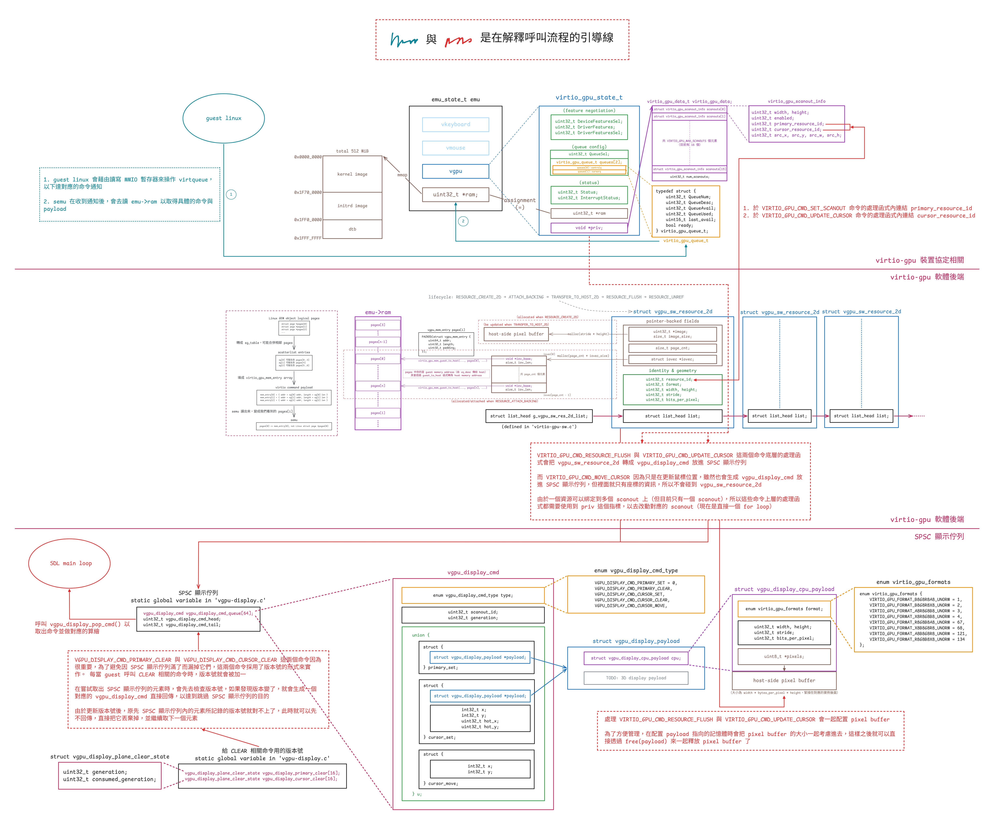

# semu 的 VirtIO-GPU（2D）& VirtIO-Input 開發紀錄

專題，預期產出是

- 最低限度在 semu 支援 virtio 2D（搭配 SDL）
- 支援 virtio-gpu 及 virtio-input
- 實作 host-GL 加速路徑，讓 virtio-gpu 得以使用 API remoting 功能

本文整理 semu 目前 virtio-gpu 2D 與 virtio-input 的實作，重點放在 guest Linux、virtqueue、MMIO、SDL 視窗後端與 SPSC 輸入/顯示佇列之間的資料流

材料部分包含規格中 virtqueue（ch1 & 2）、PCI（4.1）、GPU（5.7）與 Input（5.8）的部分。 另外也讀了一些圖形堆疊相關資料，因此整理了一些筆記

- [Red Hat Virtio 介紹文的翻譯 & 筆記](https://mes0903.github.io/VM/redhat_virtio/)
- [Virtual I/O Device（VIRTIO）Version 1.3 翻譯 & 筆記](https://mes0903.github.io/VM/virtio_spec/)
- [The Linux graphics stack in a nutshell 翻譯 & 筆記](https://mes0903.github.io/Linux/linux-graphic-stack/)

另外還有一些仍在進行中的筆記，主要集中在 DRM/KMS。 底下這篇則是針對 semu 中 vgpu 2D 部分實作的筆記，3D 部分尚未開始

後面有紀錄了一些遇到的問題，以及追蹤程式碼的過程，但是我仍然不是很熟悉 Mesa、X11 與 DRM/KMS，如果有寫錯的部分，麻煩再告知我，謝謝

## 目前整理出來的 TODO

把各節零星提到的限制集中起來，大概有四項：

1. 輸入事件目前有兩個會丟事件的位置：`virtio-input-event.c` 的 SPSC 輸入佇列滿了會丟掉最新的 SDL 事件，`virtio-input.c` 的 eventq 沒有足夠的 guest buffer 時，也會丟掉該批已翻成 evdev 的事件。 後者已經留了 TODO 的註解，但目前還沒有額外的 host 暫存區，也沒有後續重送機制
2. statusq 在 `QueueNotify` 時會由 `virtio_input_drain_statusq()` 把 guest 送來的 outbuf 完整消費掉，但 LED 狀態目前只是被消費掉，還沒有反映在 host 鍵盤上（SDL 沒有可移植的 LED 控制 API）
3. `virtio-input-event.c` 裡的 `vinput_sdl_scancode_to_linux_key()` 目前是線性搜尋，這應該可以改成透過一些查表的方法來做
4. `.ci/test-vinput.sh` 目前只驗證裝置節點與 guest 枚舉結果，還沒有覆蓋 host 事件注入的行為，但這應該有辦法做

另外，目前每個 frame data 在 semu 這邊都會有兩份複製，一份位於裝置協定層的 `vgpu_sw_resource_2d->image` 裡面，一份位於 `vgpu_display_cpu_payload->pixels` 裡面。 前者的用途是供 guest linux 把它算好的 frame data 傳送過來儲存用的，後者則用來提供給 SDL 進行算繪

會有兩份複製的原因是，如果在算繪時直接使用 `vgpu_sw_resource_2d->image`，就必須要上 lock，因為你不會曉得 guest linux 什麼時候會寫它； 另外就是架構問題，直接使用的話會讓算繪後端跟 virtio-gpu 後端的耦合度很高。 但問題是 guest linux 自己在算繪的時候也會持有一份 frame data（位於 `emu->ram` 裡面），而 SDL 算繪的時候也會再把它複製到自己的儲存空間（`SDL_UpdateTexture(... frame->pixels ...)`）

因此，同一份 frame data 現在被複製了<span class = "yellow">四次</span>，就算我們不用現在這個架構，改回舊版耦合度很高的方法，也仍然需要三次（算繪端變為使用一個指標指向 2D 資源內的 buffer），可見這邊還有很大的改進空間，但我目前沒想到更好的架構，也許等我規畫完 SMP 的實作之後這邊會再迎來第四次重構

但不管怎麼說，現在的實作已經是一個精簡且可用的實作了

## 有關 VirGL

以下片段翻譯自 [Do Nvidia GPUs require Mesa? (re: what is Mesa vs proprietary drivers?)](https://www.reddit.com/r/linux_gaming/comments/9firc7/do_nvidia_gpus_require_mesa_re_what_is_mesa_vs/)：

在 Linux 當中，所有硬體的驅動程式都會以某種形式被包含在核心裡面，這當然也包含了 GPU 驅動。 每一張 GPU 都需要對應的核心驅動（或說 kernel module 模組）才能運作

但核心驅動只負責最低層級的硬體操作。 像 OpenGL、Vulkan、OpenCL 這些 API 的實作太龐大，無法放進核心驅動中，因此會放在 user-space，透過系統呼叫與核心互動

要使用任何圖形 API，你都需要有對應的 user-space 函式庫。 AMD 與 NVIDIA 的專有驅動都有提供每一個 API 的封閉原始程式碼版本，而 Mesa 則是試圖提供這些 API 的開源替代實作

專有驅動通常也會附帶它們自己專有的核心驅動／模組，用來和它們的 user-space 函式庫溝通。 但對於 AMD 的新 GPU 來說，情況稍有不同：他們的專有與開源驅動會共用同一套核心模組。 換句話說，若你使用的是 Radeon R9 285（GCN 3）之後的 GPU，你可以在相同的 AMDGPU 核心驅動下，選擇搭配開源函式庫 Mesa 或 AMD 的專有函式庫

---

再來以 Collabora 的這兩張圖來說，VirGL 是適用於 virtio-gpu 的 OpenGL 驅動，Venus 是 virtio-gpu 的 Vulkan 驅動，這兩者都實作在 Mesa 中：


但因為 virtio-gpu 只定義了要有哪些行為，例如建立 context、建立 BLOB 資源或提交 3D 指令之類的，所以實際填入 virtqueue 的資料內容（payload）是由實作方決定的

具體來說，要填入的是能讓 host 端轉譯器看懂的資料內容，因此格式會由各實作自己的協定來定義。 現在主流的實作是 Virgl 與 Venus（近年有新的叫 vDRM），它們在 host 端配合的轉譯器是 virglrenderer，用來解碼 VirGL/Venus 與 vDRM 的命令，再把這些命令轉成 host 端的 OpenGL/Vulkan 呼叫

所以 virtio-gpu 決定封包的格式，而實作本身決定封包內容要怎麼解讀

實作用的協定本身不一定有正式規格（神奇），VirGL 就沒有，所以要直接看實作（[Mesa VirGL encode](https://gitlab.freedesktop.org/mesa/mesa/-/tree/e34fa5951d9c8f5e37831520eb9184da0db88548/src/gallium/drivers/virgl/virgl_encode.c)、[virglrenderer protocol](https://gitlab.freedesktop.org/virgl/virglrenderer/-/tree/8263ab2835a00ecc4d3e538cfb61dcda2a0877c2/src/virgl_protocol.h)），但 Venus 有獨立的 venus-protocol

## Big Picture

這篇文章會整理 semu 裡的 virtio-gpu、virtio-input 與 SDL 視窗後端之間是怎麼協作的，把 semu 自己的裝置模型、資料結構、控制流程說清楚，主要的幾個檔案如下：

- `main.c`：虛擬機器的核心邏輯與裝置接線
  - 把 MMIO 位址區間映射到各個裝置
  - 初始化 scanout、視窗後端與輸入裝置
  - 建立虛擬機器執行緒與主執行緒的分工
  - 在執行迴圈裡同步各裝置的中斷狀態
- `virtio-gpu.c`：VirtIO-GPU 協定層，負責處理裝置模型的核心邏輯
  - 處理 MMIO 暫存器讀寫
  - 維護 controlq / cursorq 的 virtqueue 狀態
  - 解析 guest 提供的 descriptor chain
  - 回覆 EDID / 顯示資訊
  - 把各種 GPU 命令分派給 backend handler
- `vgpu-display.c` 與 `vgpu-display.h`：VirtIO-GPU 的中間層
  - 將 virtio-gpu 協定層的東西轉成中間的資料形式
  - 定義了 virtio-gpu 後端與 SDL 後端之間的 SPSC 顯示佇列
  - 定義了操作 SPSC 顯示佇列的函式
- `virtio-gpu-sw.c`：VirtIO-GPU 的 2D 軟體後端
  - 建立與銷毀 `vgpu_sw_resource_2d`
  - 處理 `RESOURCE_ATTACH_BACKING` / `RESOURCE_DETACH_BACKING`
  - 執行 `TRANSFER_TO_HOST_2D`，把 guest backing 複製到 host image buffer
  - 處理 `SET_SCANOUT`、`RESOURCE_FLUSH` 與鼠標命令
  - 透過 `vgpu_display_publish_*()` 把要算繪的命令推進 SPSC 顯示佇列，等 SDL 後端取走
- `virtio-input.c`：VirtIO-Input 協定層，負責處理裝置模型的核心邏輯
  - 處理鍵盤 / 滑鼠兩個 MMIO 裝置的暫存器讀寫
  - 維護 eventq / statusq 的 virtqueue 狀態
  - 回覆對裝置組態空間的查詢，例如裝置名稱、事件位圖與 ABS 資訊
  - 從 `virtio-input-event.c` 的 SPSC 輸入佇列取出事件，將其轉成 evdev 的形式寫入 guest 提供的 eventq buffer，並更新 used ring / 中斷
- `virtio-input-event.c` 與 `virtio-input-event.h`：VirtIO-Input 的中間層
  - 負責將 SDL 的輸入轉成中間的資料形式
  - 定義了 virtio-input 後端與 SDL 後端之間的 SPSC 輸入佇列（鍵盤與滑鼠各一個）
  - 定義了操作 SPSC 輸入佇列的函式
- `window-sw.c`：SDL 視窗後端
  - 負責初始化 SDL、建立視窗與執行 SDL 的主迴圈
  - 從 SPSC 顯示佇列取出命令，並轉成 SDL 後端能使用的格式來做算繪
  - 把 SDL 鍵盤滑鼠事件轉成中間的資料形式，推進 SPSC 輸入佇列

從執行方向來看，這套實作主要有兩條路徑：一條是 guest 把畫面送到 host 視窗，另一條是 host 把輸入事件送進 guest：

1. 畫面輸出路徑：
   1. guest 的 DRM / virtio-gpu 驅動程式建立 2D 資源
   2. guest 對這個 2D 資源送出 `RESOURCE_ATTACH_BACKING`
   3. guest 送出 `TRANSFER_TO_HOST_2D`，`virtio-gpu-sw.c` 把 guest backing 的像素資料複製到 host 的 `vgpu_sw_resource_2d.image`
   4. guest 再送出 `RESOURCE_FLUSH`
   5. `virtio-gpu-sw.c` 依目前 scanout 快照建出中間的命令格式，並將其推進 SPSC 顯示佇列
   6. SDL 事件迴圈裡取出命令，轉成 SDL 紋理後進行算繪
2. 輸入事件送入 guest 的路徑：
   1. host 產生 SDL 鍵盤或滑鼠事件
   2. 把它轉成 `struct vinput_cmd`，並將 payload 推進 SPSC 輸入佇列
   3. 虛擬機器執行緒從 `poll()` 醒來，`virtio-input.c` 把事件取出來
   4. `virtio-input.c` 把 payload 轉成 evdev 的形式，寫入 guest 提供的 eventq buffer，並更新 used ring / 中斷

因此共有三個不同的裝置實例：

```c
typedef struct {
    /* ... */
#if SEMU_HAS(VIRTIOINPUT)
    virtio_input_state_t vkeyboard;
    virtio_input_state_t vmouse;
#endif
#if SEMU_HAS(VIRTIOGPU)
    virtio_gpu_state_t vgpu;
#endif
    /* ... */
} emu_state_t;
```

- `emu.vgpu`：一個 virtio-gpu 裝置的實例，負責 guest 的顯示輸出
- `emu.vkeyboard`：一個 virtio-input 鍵盤裝置的實例
- `emu.vmouse`：一個 virtio-input 滑鼠裝置的實例

它們都掛在同一個 `emu_state_t` 下面，但會各自維護自己的 virtqueue 狀態、裝置狀態與中斷狀態。 之後會再透過 `g_window` 這層 SDL 後端介面把這些裝置串到 host 視窗系統上

## 資料結構

### Virtqueue 相關

semu 目前使用的是 split virtqueue，其中只有 descriptor table 有特別寫結構體定義出來：

```c
PACKED(struct virtq_desc {
    uint64_t addr;
    uint32_t len;
    uint16_t flags;
    uint16_t next;
});
```

而在規格中，對於 avail ring 與 used ring 的佈局示例如下：

```c
struct virtq_avail {
#define VIRTQ_AVAIL_F_NO_INTERRUPT  1
    le16 flags;
    le16 idx; /* number of available ring entries posted by the driver */
    le16 ring[ /* Queue Size */ ];
    le16 used_event; /* only present when VIRTIO_F_EVENT_IDX is negotiated */
};

struct virtq_used {
#define VIRTQ_USED_F_NO_NOTIFY  1
    le16 flags;
    le16 idx; /* number of used entries completed by the device */
    struct virtq_used_elem ring[ /* Queue Size */];
    le16 avail_event; /* only present when VIRTIO_F_EVENT_IDX is negotiated */
};

/* le32 is used here for padding. */
struct virtq_used_elem {
    /* head descriptor index of the used chain */
    le32 id;
    /* bytes actually written by the device to writable buffers */
    le32 len;
};
```

但在 semu 中，avail ring 與 used ring 都是透過直接操作 guest RAM（`emu->ram`）來讀取的，相關結構如下：

```c
typedef struct {
    uint32_t QueueNum;      // Queue size
    uint32_t QueueDesc;     // Descriptor table base index
    uint32_t QueueAvail;    // Available ring base index
    uint32_t QueueUsed;     // Used ring base index
    uint16_t last_avail;    // Number of buffers already consumed by the device
    bool ready;             // Whether the queue is ready
} virtio_gpu_queue_t;

typedef struct {
    /* feature negotiation */
    uint32_t DeviceFeaturesSel;
    uint32_t DriverFeatures;
    uint32_t DriverFeaturesSel;
    /* queue config */
    uint32_t QueueSel;
    virtio_gpu_queue_t queues[2];
    /* status */
    uint32_t Status;
    uint32_t InterruptStatus;
    /* supplied by environment */
    uint32_t *ram;
    /* implementation-specific */
    void *priv;
} virtio_gpu_state_t;
```

`virtio_gpu_state_t` 中的 `queues` 是一個 virtqueue 的陣列，有兩個元素，代表 virtio-gpu 使用了兩個 virtqueue，在規格中分別被稱為 controlq 與 cursorq：

- controlq：用於傳送控制命令的 virtqueue
- cursorq：用於傳送鼠標更新的 virtqueue

`virtio_gpu_queue_t` 內的元素用來幫助讀取 virtqueue 的內容，`QueueDesc`、`QueueAvail`、`QueueUsed` 的值代表的是索引，會搭配 `virtio_xxx_state_t` 結構體內的 `ram` 成員使用。 其中 `emu->ram` 是 `mmap()` 出來的 guest RAM，所有裝置的 `virtio_xxx_state_t.ram` 都會指向它，所以 `vgpu->ram[index]` 跟 `vinput->ram[index]` 看到的是同一塊記憶體

由於 avail ring 與 used ring 中的 `flags` 與 `idx` 欄位都是 `le16`，而 `ram` 是 `uint32_t*`，因此以 avail ring 為例，其在 `ram` 中的佈局看起來會類似下面這樣：

```
┌─────────────────────────────────┬──────────────────────────┐
│     ram[queue->QueueAvail]      │ flags (low) | idx (high) │  ← Header
├─────────────────────────────────┼──────────────────────────┤
│   ram[queue->QueueAvail + 1]    │    ring[0]  |  ring[1]   │  ← Entries 0 & 1
│   ram[queue->QueueAvail + 2]    │    ring[2]  |  ring[3]   │  ← Entries 2 & 3
│   ram[queue->QueueAvail + 3]    │    ring[4]  |  ring[5]   │  ← Entries 4 & 5
└─────────────────────────────────┴──────────────────────────┘
```

其中 `QueueDesc`、`QueueAvail`、`QueueUsed` 等值在對應的 `virtio_xxx_reg_write` 中設定：

```c
static inline uint32_t virtio_input_preprocess(virtio_input_state_t *vinput,
                                               uint32_t addr)
{
    // 1. Check whether the address is within RAM
    if (addr >= RAM_SIZE)
        return virtio_input_set_fail(vinput), 0;

    // 2. Check whether the address is 4-byte aligned
    if (addr & 0b11)  // Check the lowest 2 bits
        return virtio_input_set_fail(vinput), 0;

    // 3. Convert the byte address to a uint32_t index
    return addr >> 2;  // Divide by 4
}

...

static bool virtio_input_reg_write(virtio_input_state_t *vinput,
                                   uint32_t addr,
                                   uint32_t value)
{
...
case _(QueueDriverLow):
    VIRTIO_INPUT_QUEUE.QueueAvail = virtio_input_preprocess(vinput, value);
    return true;
...
}
```

這會先檢查 guest 給的位址是否落在 RAM 範圍內，而且必須是 4-byte 對齊，這主要是因為 `emu->ram` 是 word array，但 guest 給的 `QueueDesc`、`QueueAvail`、`QueueUsed` 都是 byte address，要 `>> 2` 才能當 index 用

舉例來說，假設記憶體實際長這樣：


此時 guest 說 `QueueDesc = 4`，意思是「virtqueue 在 byte 4 的位置」。 但如果我們直接寫 `ram[4]`，C 語言會跳到第 4 個 `uint32_t`，也就是 byte 16，跳過頭了，所以要做 `4 >> 2 = 1`，用 `ram[1]` 才對得上 byte 4

<center-panel natural>

| guest 說的 byte address |   `>> 2` 後 |  `ram[]` index |
| :---------------------: | :---------: | :-----------: |
|         0               |     0       |    `ram[0]`   |
|         4               |     1       |    `ram[1]`   |
|         8               |     2       |    `ram[2]`   |
|        12               |     3       |    `ram[3]`   |

</center-panel>

位址檢查完成後，`virtio_xxx_preprocess()` 會把這個 byte address 轉成對應的 word index。 因此後面 `QueueDesc`、`QueueAvail`、`QueueUsed` 存下來的是 semu 之後拿來直接索引 `ram[]` 的位置，不是 host pointer：

```c
static inline uint32_t virtio_gpu_preprocess(virtio_gpu_state_t *vgpu, uint32_t addr)
{
    if ((addr >= RAM_SIZE) || (addr & 0b11))
        return virtio_gpu_set_fail(vgpu), 0;

    return addr >> 2;
}
```

因此如果 guest 寫入的位址為 `0x00100000`，則 `QueueAvail` 會變成 `0x00040000`。 也因為 `vinput->ram` 的型態是 `uint32_t *`，所以之後存取這段記憶體時會用 `ram[0x00100000 >> 2]`，而不是 `ram[0x00100000]`，所以才會說 `QueueAvail` 保存的是索引：

```
字節視圖 (uint8_t*):       Word 視圖 (uint32_t*):
┌────┬────┬────┬────┐     ┌──────────────┐
│ 0  │ 1  │ 2  │ 3  │  →  │   ram[0]     │
├────┼────┼────┼────┤     ├──────────────┤
│ 4  │ 5  │ 6  │ 7  │  →  │   ram[1]     │
├────┼────┼────┼────┤     ├──────────────┤
│ 8  │ 9  │ 10 │ 11 │  →  │   ram[2]     │
└────┴────┴────┴────┘     └──────────────┘

字節地址 / 4 = uint32_t 索引
```

讓我們以 `virtio_input_desc_handler` 為例子來看一些使用範例：

1. 讀取 avail 與 used ring 的 `idx` 欄位
    ```c
    uint32_t *ram = vinput->ram;
    uint16_t new_avail = ram[queue->QueueAvail] >> 16; /* virtq_avail.idx (le16) */
    uint16_t new_used = ram[queue->QueueUsed] >> 16; /* virtq_used.idx (le16) */
    ```
2. 讀取 avail ring 內的第 `buffer_idx` 個元素
    ```c
    uint16_t queue_idx = queue->last_avail % queue->QueueNum;
    uint16_t buffer_idx = ram[queue->QueueAvail + 1 + queue_idx / 2] >>
                          (16 * (queue_idx % 2));
    ```
    這邊 `last_avail` 代表已處理過的 buffer 數量，由於 avail ring 是環形的，所以要藉由取模以得到下一個目標 buffer 的索引

    接下來的 `queue->QueueAvail + 1` 代表 avail ring 內 `ring` 的起始位址，`+1` 是為了跳過標頭。 `queue_idx / 2` 用來找到目標 buffer 在 `ram` 的哪個元素內，見上方 avail ring 在 `ram` 中的示意圖。 最後用 `16 * (queue_idx % 2)` 來找到對應的元素，一個 `ram` 的元素中有兩個 `ring` 的元素

    因此整個 `buffer_idx` 的計算其實是在讀取 `ring[queue_idx]` 的值，而該值代表的是目標 descriptor index，所以變數名稱才會是 `buffer_idx`
3. 讀取 descriptor
    ```c
    uint32_t *desc;
    desc = &vinput->ram[queue->QueueDesc + buffer_idx * 4];
    vq_desc.addr = desc[0];  // Physical address of the buffer
    uint32_t addr_high = desc[1]; // Only 32-bit addressing is supported, so this must be 0
    vq_desc.len = desc[2];   // Buffer length
    vq_desc.flags = desc[3] & 0xFFFF;  // Flags
    ```
    `*4` 是因為每個 descriptor 佔 4 個 `uint32_t`，而算 `flags` 時取 `& 0xFFFF` 是因為 flags 在 `desc[3]` 的低 16 位
4. 寫入事件到 guest buffer
    ```c
    ev = (struct virtio_input_event *)((uintptr_t)vinput->ram + vq_desc.addr);
    ev->type = input_ev[i].type;
    ev->code = input_ev[i].code;
    ev->value = input_ev[i].value;
    ```
    注意這邊 `vinput->ram` 是 host 的虛擬位址，其意義是 guest 記憶體在 semu 中的起始位址（用 `mmap()` 建出的一塊記憶體），而 `vq_desc.addr` 是 guest 的實體位址，因此相加就可以得到目標 `virtio_input_event`（descriptor 指向的 buffer）的 host 虛擬位址，後續便可以直接操作該 buffer
5. 更新 used ring
    ```c
    uint32_t vq_used_addr = queue->QueueUsed + 1 + (new_used % queue->QueueNum) * 2;
    ram[vq_used_addr] = buffer_idx;
    ram[vq_used_addr + 1] = sizeof(struct virtio_input_event);
    ```
    與上方一樣，`new_used % queue->QueueNum` 是在計算目標 used ring entry 的索引，`*2` 是因為每個 used ring entry 佔 2 個 `uint32_t`（`id` + `len`）。 接著就依序填入目標 used ring entry 的 `id` 與 `len` 欄位

總而言之，virtqueue 操作的流程大致如下：

1. Linux 配置 virtqueue 記憶體
   - [`vring_create_virtqueue()`](https://github.com/torvalds/linux/blob/3aae9383f42f687221c011d7ee87529398e826b3/drivers/virtio/virtio_ring.c#L3260)
   - 在 guest RAM 中配置 descriptor table, avail ring, used ring
2. Linux 寫入 MMIO 暫存器（透過 `writel`），見 `vm_setup_vq`：
   - `writel(addr_low, base + 0x080)`：`QUEUE_DESC_LOW`
   - `writel(addr_high, base + 0x084)`：`QUEUE_DESC_HIGH`
   - `writel(addr_low, base + 0x090)`：`QUEUE_AVAIL_LOW`
   - `writel(addr_high, base + 0x094)`：`QUEUE_AVAIL_HIGH`
   - `writel(addr_low, base + 0x0a0)`：`QUEUE_USED_LOW`
   - `writel(addr_high, base + 0x0a4)`：`QUEUE_USED_HIGH`
   - `writel(1, base + 0x044)`：`QUEUE_READY`
3. SEMU 接收 MMIO 的寫入（`virtio_xxx_reg_write`）
   - `case QueueDescLow`：儲存 descriptor table 位址
   - `case QueueDriverLow`：儲存 available ring 位址
   - `case QueueDeviceLow`：儲存 used ring 位址
   - `case QueueReady`：標記 virtqueue 已就緒
4. 之後 SEMU 就可以藉由這些位址存取 guest 的 virtqueue 了
   - `ram[queue->QueueDesc + offset]`
   - `ram[queue->QueueAvail + offset]`
   - `ram[queue->QueueUsed + offset]`

#### 與 Linux virtqueue 的對應

如果和 Linux guest 驅動程式對照，Linux 端通常不會直接碰 `avail->ring[]` 或 `used->ring[]` 這些欄位，而是透過 [`struct virtqueue *`](https://github.com/torvalds/linux/blob/3aae9383f42f687221c011d7ee87529398e826b3/include/linux/virtio.h#L34) 與 virtio core 提供的輔助函式來操作 virtqueue

以 `virtgpu_vq.c` 為例，驅動程式端平常做的是把 scatterlist 交給 [`virtqueue_add_sgs()`](https://github.com/torvalds/linux/blob/3aae9383f42f687221c011d7ee87529398e826b3/drivers/virtio/virtio_ring.c#L2819)，必要時用 [`virtqueue_kick_prepare()`](https://github.com/torvalds/linux/blob/3aae9383f42f687221c011d7ee87529398e826b3/drivers/virtio/virtio_ring.c#L3012) / [`virtqueue_notify()`](https://github.com/torvalds/linux/blob/3aae9383f42f687221c011d7ee87529398e826b3/drivers/virtio/virtio_ring.c#L3028) 通知裝置，之後再用 [`virtqueue_get_buf()`](https://github.com/torvalds/linux/blob/3aae9383f42f687221c011d7ee87529398e826b3/drivers/virtio/virtio_ring.c#L3090) 收回完成的 buffer：

```c
static int virtio_gpu_queue_ctrl_sgs(struct virtio_gpu_device *vgdev,
                                     struct virtio_gpu_vbuffer *vbuf,
                                     ...)
{
    struct virtqueue *vq = vgdev->ctrlq.vq;
    ...
    ret = virtqueue_add_sgs(vq, sgs, outcnt, incnt, vbuf, GFP_ATOMIC);
    ...
}

void virtio_gpu_notify(struct virtio_gpu_device *vgdev)
{
    ...
    notify = virtqueue_kick_prepare(vgdev->ctrlq.vq);
    ...
    if (notify)
        virtqueue_notify(vgdev->ctrlq.vq);
}

static void reclaim_vbufs(struct virtqueue *vq, struct list_head *reclaim_list)
{
    ...
    while ((vbuf = virtqueue_get_buf(vq, &len))) {
        ...
    }
}
```

在 Linux 驅動程式這一層，[`struct virtqueue`](https://github.com/torvalds/linux/blob/3aae9383f42f687221c011d7ee87529398e826b3/include/linux/virtio.h#L34) 代表的是一條已初始化的 virtqueue 實例，驅動程式可以透過它看到 virtqueue 的編號、剩餘空間與 callback 這些執行期資訊，但 split virtqueue 的實際記憶體佈局並不是直接在這一層展開的：

```c
struct virtqueue {
  struct list_head list;
  void (*callback)(struct virtqueue *vq);
  const char *name;
  struct virtio_device *vdev;
  unsigned int index;
  unsigned int num_free;
  unsigned int num_max;
  bool reset;
  void *priv;
};

int virtqueue_add_sgs(struct virtqueue *vq, ...);
bool virtqueue_kick(struct virtqueue *vq);
void *virtqueue_get_buf(struct virtqueue *vq, unsigned int *len);
```

[`struct virtqueue`](https://github.com/torvalds/linux/blob/3aae9383f42f687221c011d7ee87529398e826b3/include/linux/virtio.h#L34) 內並沒有三個 split virtqueue ring 的成員。 Linux 驅動程式手上拿到的是公開的 [`struct virtqueue *`](https://github.com/torvalds/linux/blob/3aae9383f42f687221c011d7ee87529398e826b3/include/linux/virtio.h#L34)。 當驅動程式呼叫 [`virtqueue_add_sgs()`](https://github.com/torvalds/linux/blob/3aae9383f42f687221c011d7ee87529398e826b3/drivers/virtio/virtio_ring.c#L2819)、[`virtqueue_get_buf()`](https://github.com/torvalds/linux/blob/3aae9383f42f687221c011d7ee87529398e826b3/drivers/virtio/virtio_ring.c#L3090) 這類輔助函式，控制流程進入 `virtio_ring.c` 之後，virtio core 會先利用 [`to_vvq(_vq)`](https://github.com/torvalds/linux/blob/3aae9383f42f687221c011d7ee87529398e826b3/drivers/virtio/virtio_ring.c#L282) 與這個指標回推出外層的 [`struct vring_virtqueue`](https://github.com/torvalds/linux/blob/3aae9383f42f687221c011d7ee87529398e826b3/drivers/virtio/virtio_ring.c#L192)

如果借用資料結構的術語，這裡可以把它看成一種 intrusive 的佈局：[`struct virtqueue`](https://github.com/torvalds/linux/blob/3aae9383f42f687221c011d7ee87529398e826b3/include/linux/virtio.h#L34) 不會被獨立配置，只會在 [`struct vring_virtqueue`](https://github.com/torvalds/linux/blob/3aae9383f42f687221c011d7ee87529398e826b3/drivers/virtio/virtio_ring.c#L192) 內作為成員 `vq` 出現。 而 [`to_vvq(_vq)`](https://github.com/torvalds/linux/blob/3aae9383f42f687221c011d7ee87529398e826b3/drivers/virtio/virtio_ring.c#L282) 則是搭配的 `container_of` 慣用法，可以從成員 `vq` 的實例位址回推出外層 [`struct vring_virtqueue`](https://github.com/torvalds/linux/blob/3aae9383f42f687221c011d7ee87529398e826b3/drivers/virtio/virtio_ring.c#L192) 結構本體的起始位址：

```c
struct vring_virtqueue_split {
    struct vring vring;
    ...
};

struct vring_virtqueue {
    struct virtqueue vq;
    bool packed_ring;
    ...
    union {
        struct vring_virtqueue_split split;
        ...
    };
};

#define to_vvq(_vq) container_of_const(_vq, struct vring_virtqueue, vq)
```

接著 virtio core 會看 `packed_ring` 這個旗標，判斷這條 virtqueue 目前使用的是 packed ring 還是 split ring。 若是 split ring，後續實際使用的就是 `union` 裡的 `split` 成員，也就是 `vq->split`

而這個 `vq->split.vring` 才是實際指向三個 ring 的地方，而 [`struct vring`](https://github.com/torvalds/linux/blob/3aae9383f42f687221c011d7ee87529398e826b3/include/uapi/linux/virtio_ring.h#L155) 本身只是把 split virtqueue 的三塊記憶體收在一起：

```c
struct vring {
    unsigned int num;
    vring_desc_t *desc;
    vring_avail_t *avail;
    vring_used_t *used;
};
```

整體的對應關係如下：

<details> <summary><span class = "yellow">展開呼叫流程圖</span></summary>

```callgraph
[include/linux/virtio.h:34] struct virtqueue *
  │
  │  Linux 驅動程式手上拿到的公開 virtqueue handle
  ↓
[drivers/virtio/virtio_ring.c:282] to_vvq(_vq)
  │
  │  container_of_const(_vq, struct vring_virtqueue, vq)
  │  從成員 vq 的位址回推出外層 struct vring_virtqueue
  ↓
[drivers/virtio/virtio_ring.c:192] struct vring_virtqueue
  │
  │  內含 struct virtqueue vq;
  │  再依 packed_ring 決定要走 packed 還是 split
  ↓
[drivers/virtio/virtio_ring.c:106] vq->split / struct vring_virtqueue_split
  │
  │  split ring 版本的私有狀態
  │  vq->split.vring 指向實際 ring 佈局
  ↓
[include/uapi/linux/virtio_ring.h:155] struct vring
  │
  │  收住三個 ring 的指標
  ↓
[include/uapi/linux/virtio_ring.h:104] struct vring_desc
[include/uapi/linux/virtio_ring.h:111] struct vring_avail
[include/uapi/linux/virtio_ring.h:128] struct vring_used
```

</details>

[`struct vring`](https://github.com/torvalds/linux/blob/3aae9383f42f687221c011d7ee87529398e826b3/include/uapi/linux/virtio_ring.h#L155) 指向的三塊 split virtqueue 記憶體佈局如下：

```c
struct vring_desc {
    __virtio64 addr;
    __virtio32 len;
    __virtio16 flags;
    __virtio16 next;
};

struct vring_avail {
    __virtio16 flags;
    __virtio16 idx;
    __virtio16 ring[];
};

struct vring_used_elem {
    __virtio32 id;
    __virtio32 len;
};

struct vring_used {
    __virtio16 flags;
    __virtio16 idx;
    vring_used_elem_t ring[];
};
```

1. descriptor table：真正描述 buffer 的地方。 每個 [`struct vring_desc`](https://github.com/torvalds/linux/blob/3aae9383f42f687221c011d7ee87529398e826b3/include/uapi/linux/virtio_ring.h#L104) 都含有一段 guest buffer 的位址與長度。 如果 `flags` 帶有 `VRING_DESC_F_NEXT`，則會沿著 `next` 把多個 descriptor 串成一條鏈
2. avail ring：驅動程式會把「哪一條 descriptor chain 可以讓裝置使用」寫到 [`struct vring_avail`](https://github.com/torvalds/linux/blob/3aae9383f42f687221c011d7ee87529398e826b3/include/uapi/linux/virtio_ring.h#L111)。 `avail->ring[]` 裡放的是 descriptor head index，也就是一條鏈的起點。 `avail->idx` 則表示驅動程式目前總共公開了多少筆可用工作
3. used ring：裝置做完之後，把「哪一條 descriptor chain 已經完成」寫到 [`struct vring_used`](https://github.com/torvalds/linux/blob/3aae9383f42f687221c011d7ee87529398e826b3/include/uapi/linux/virtio_ring.h#L128)。 `used->ring[]` 裡的每個元素是 [`struct vring_used_elem`](https://github.com/torvalds/linux/blob/3aae9383f42f687221c011d7ee87529398e826b3/include/uapi/linux/virtio_ring.h#L118)，裡面記的是 head descriptor 的 `id` 與實際處理長度 `len`。 `used->idx` 則表示裝置目前總共完成了多少筆工作

如果把一筆 split virtqueue 請求的操作順序攤開，大致會是下面這樣：

1. 驅動程式先在 descriptor table 裡準備好一條 descriptor chain。 這條鏈描述的是「request buffer 在哪裡、response buffer 在哪裡、哪些是裝置可寫的 buffer」
2. 這條鏈準備好之後，驅動程式不會把整條鏈複製到 avail ring，它只會把 head descriptor 的 index 寫進 `avail->ring[avail->idx % num]`，因此 avail ring 裡存的是「descriptor chain 的起點編號」，不是 descriptor 的內容本身
3. 接著驅動程式增加 `avail->idx`，表示又多公開了一筆工作給裝置。 必要時再透過 [`virtqueue_kick_prepare()`](https://github.com/torvalds/linux/blob/3aae9383f42f687221c011d7ee87529398e826b3/drivers/virtio/virtio_ring.c#L3012) / [`virtqueue_notify()`](https://github.com/torvalds/linux/blob/3aae9383f42f687221c011d7ee87529398e826b3/drivers/virtio/virtio_ring.c#L3028) 通知裝置
4. 裝置看到 `avail->idx` 前進之後，會到 `avail->ring[]` 取出這筆工作的 head index，再回到 descriptor table，沿著 `next` 走完整條 descriptor chain
5. 當裝置做完這筆工作之後，它會把同一個 head index 寫進 `used->ring[used->idx % num].id`，再把實際處理長度寫進 `used->ring[used->idx % num].len`
6. 最後裝置增加 `used->idx`。 驅動程式之後只要發現 `used->idx` 比自己上次看到的大，就知道又有新的完成項目可以回收

因此 descriptor table 類似是靜態記錄 buffer 位址與長度的區域，而負責「排隊等待裝置消費」的是 avail ring，負責「回報哪些工作已經完成」的則是 used ring。 avail / used 兩邊都只會交換 index，不會直接搬動 descriptor 的內容

Linux 的 virtio core 會替驅動程式處理這些細節。 把 buffer 放進 virtqueue 時，[`virtqueue_add_split()`](https://github.com/torvalds/linux/blob/3aae9383f42f687221c011d7ee87529398e826b3/drivers/virtio/virtio_ring.c#L599) 會先填好 descriptor，再把 head index 寫進 `avail->ring[avail_idx_shadow % num]`，最後才增加 `avail->idx`：

```c
static inline int virtqueue_add_split(struct vring_virtqueue *vq, ...)
{
    ...
    avail = vq->split.avail_idx_shadow & (vq->split.vring.num - 1);
    vq->split.vring.avail->ring[avail] =
        cpu_to_virtio16(vq->vq.vdev, head);
    ...
    vq->split.avail_idx_shadow++;
    vq->split.vring.avail->idx =
        cpu_to_virtio16(vq->vq.vdev, vq->split.avail_idx_shadow);
    ...
}
```

而把完成結果取回來時，[`virtqueue_get_buf_ctx_split()`](https://github.com/torvalds/linux/blob/3aae9383f42f687221c011d7ee87529398e826b3/drivers/virtio/virtio_ring.c#L917) 會透過 [`more_used_split()`](https://github.com/torvalds/linux/blob/3aae9383f42f687221c011d7ee87529398e826b3/drivers/virtio/virtio_ring.c#L904) 這個輔助函式判斷 `used->idx` 是否有前進：

```c
static bool virtqueue_poll_split(const struct vring_virtqueue *vq,
         unsigned int last_used_idx)
{
  return (u16)last_used_idx != virtio16_to_cpu(vq->vq.vdev,
      vq->split.vring.used->idx);
}

...

static bool more_used_split(const struct vring_virtqueue *vq)
{
    return virtqueue_poll_split(vq, vq->last_used_idx);
}
```

再從 `used->ring[last_used_idx % num]` 取出完成的 head index 與長度：

```c
static void *virtqueue_get_buf_ctx_split(struct vring_virtqueue *vq,
                                         unsigned int *len,
                                         void **ctx)
{
    ...
    if (!more_used_split(vq)) {
        ...
        return NULL;
    }
    ...
    last_used = (vq->last_used_idx & (vq->split.vring.num - 1));
    i = virtio32_to_cpu(vq->vq.vdev,
                        vq->split.vring.used->ring[last_used].id);
    *len = virtio32_to_cpu(vq->vq.vdev,
                           vq->split.vring.used->ring[last_used].len);
    ...
    vq->last_used_idx++;
    ...
}
```

把 [`virtqueue_add_split()`](https://github.com/torvalds/linux/blob/3aae9383f42f687221c011d7ee87529398e826b3/drivers/virtio/virtio_ring.c#L599)、[`more_used_split()`](https://github.com/torvalds/linux/blob/3aae9383f42f687221c011d7ee87529398e826b3/drivers/virtio/virtio_ring.c#L904) 與 [`virtqueue_get_buf_ctx_split()`](https://github.com/torvalds/linux/blob/3aae9383f42f687221c011d7ee87529398e826b3/drivers/virtio/virtio_ring.c#L917) 放在一起看，split virtqueue 裡的 `idx` 可以這樣理解：

1. `avail->idx` 與 `used->idx` 都是持續遞增的累計計數器，不是 ring array 的直接索引。 前者表示驅動程式目前總共公開了多少筆工作，後者表示裝置目前總共完成了多少筆工作
2. 真正落到 ring array 的位置，要用 `idx % QueueNum` 去取模。 Linux virtio core 內部常寫成 `& (num - 1)`（virtqueue size 需要是 2 的冪次）

到了 semu，還會再看到幾個和這套規則對應的實作：

1. `queue->last_avail` 是 semu 自己維護的裝置端處理進度，表示 host 已經處理到第幾筆 avail entry。 只要 `last_avail != avail->idx`，就代表 avail ring 裡還有新的工作沒被消費
2. `queue_idx` 會把 `last_avail` 對 `QueueNum` 取模之後，得到這一筆工作目前落在 avail ring 的哪一個 slot
3. `buffer_idx` 則是從 `avail->ring[queue_idx]` 取出的 descriptor head index，它指向 descriptor table 裡哪一條 descriptor chain，和 `queue_idx` 這種 ring slot 編號不是同一件事

如前所述，目前 semu 沒有像 linux virtio core 一樣的函式，而是直接做位址的計算。 因為 `QueueAvail`、`QueueUsed` 存的是 guest RAM 裡的 word index，所以：

1. `ram[queue->QueueAvail]` 的低 16 位是 `virtq_avail.flags`，高 16 位是 `virtq_avail.idx`
2. `ram[queue->QueueUsed]` 的低 16 位是 `virtq_used.flags`，高 16 位是 `virtq_used.idx`
3. `avail->ring[]` 的每個元素是 16-bit descriptor index，因此讀取時要用 `queue->QueueAvail + 1 + queue_idx / 2` 找到對應的 32-bit word，再用 `>> (16 * (queue_idx % 2))` 取出高半部或低半部
4. `used->ring[]` 的每個元素由兩個 32-bit 的欄位組成：`id` 和 `len`，所以 semu 寫回時會用 `queue->QueueUsed + 1 + slot * 2` 當起點，連續寫兩個 word

semu 的 descriptor table 的結構定義在 `virtio.h`：

```c
PACKED(struct virtq_desc {
    uint64_t addr;
    uint32_t len;
    uint16_t flags;
    uint16_t next;
});
```

### `virtio_gpu_state_t` 與 `virtio_gpu_queue_t`


:::warning
確認這張圖是否過時

這張圖只呈現 `virtio_gpu_state_t`、`virtio_gpu_queue_t` 與 `virtio_gpu_data_t.scanouts[]` 的狀態關係。 `vgpu_sw_resource_2d` 由 2D 軟體後端另外維護，不直接掛在 `emu_state_t` 這張圖裡
:::

對應的結構定義如下（`device.h`）：

```c
typedef struct {
    uint32_t QueueNum;
    uint32_t QueueDesc;
    uint32_t QueueAvail;
    uint32_t QueueUsed;
    uint16_t last_avail;
    bool ready;
} virtio_gpu_queue_t;

typedef struct {
    uint32_t DeviceFeaturesSel;
    uint32_t DriverFeatures;
    uint32_t DriverFeaturesSel;
    uint32_t QueueSel;
    virtio_gpu_queue_t queues[2];
    uint32_t Status;
    uint32_t InterruptStatus;
    uint32_t *ram;
    void *priv;
} virtio_gpu_state_t;
```

`virtio_gpu_state_t` 是 semu 用來保存 virtio-gpu MMIO 暫存器狀態的結構。 具體來說：

- `DeviceFeaturesSel`、`DriverFeatures`、`DriverFeaturesSel`：對應 feature 協商相關的暫存器
- `QueueSel`：表示 guest 目前正在設定哪一條 virtqueue
- `queues[2]`：保存 `controlq` 與 `cursorq` 各自的 virtqueue 佈局與執行進度
  - `queues[0]` 對應到 `controlq`
  - `queues[1]` 對應到 `cursorq`
- `Status`、`InterruptStatus`：保存裝置狀態與待處理的中斷
- `ram`：指向 guest RAM，讓裝置可以直接讀寫 descriptor table 與 avail/used ring
- `priv`：指向 `virtio_gpu_data_t`，保存 scanout 相關的 host 資訊

`virtio_gpu_queue_t` 則是 semu 追蹤單一 virtqueue 所需的狀態。 具體來說：

- `QueueNum`：這條 virtqueue 的 ring 大小
- `QueueDesc`：descriptor table 在 guest RAM 裡的起點
- `QueueAvail`：avail ring 在 guest RAM 裡的起點
- `QueueUsed`：used ring 在 guest RAM 裡的起點
- `last_avail`：裝置上次已經處理到哪個 avail index
- `ready`：guest 是否已完成這條 virtqueue 的配置，並把它設成可用

如前所述，目前的設計內沒有另外維護一份 host 的 virtqueue 物件，semu 現在直接把 `QueueDesc` / `QueueAvail` / `QueueUsed` 當成 guest RAM 裡的索引來使用，然後靠 `vgpu->ram` 直接讀 descriptor table 與 avail/used ring

`virtio_gpu_state_t` 中的 `ram` 一樣會指向 guest RAM，所以存取 descriptor table、avail ring、used ring 時，全部都會回到這塊記憶體上

而 `priv` 則指向 `virtio_gpu_data_t`，裡面保存每個 scanout 的 host 中繼資料，包含寬高、啟用狀態，以及目前綁到這個 scanout 的主平面（primary plane）的資源 id 與來源矩形。 其對應的結構本體定義在 `virtio-gpu.h`：

```c
struct virtio_gpu_scanout_info {
    uint32_t width, height;
    uint32_t enabled;
    uint32_t primary_resource_id;
    uint32_t cursor_resource_id;
    uint32_t src_x, src_y, src_w, src_h;
};

typedef struct {
    struct virtio_gpu_scanout_info scanouts[VIRTIO_GPU_MAX_SCANOUTS];
    uint32_t num_scanouts;
} virtio_gpu_data_t;
```

兩者之間的關係是：

- `virtio_gpu_state_t`
  - 保存 guest 驅動程式透過 MMIO 改動的暫存器、virtqueue 與中斷的相關狀態
- `virtio_gpu_data_t`
  - 保存每個 scanout 的尺寸、啟用狀態，以及最近一次 `SET_SCANOUT` 設下的主平面資源 id 與來源矩形
  - 其中 scanout 與啟用狀態的資訊不會因為 `vgpu_sw_reset()` 而消失，但主平面資源 id 與來源矩形會消失

`main.c` 初始化 virtio-gpu 時，每條 scanout 都會藉由 `virtio_gpu_register_scanout()` 登記到 `scanouts[]` 這張表裡面：

```c
uint32_t virtio_gpu_register_scanout(virtio_gpu_state_t *vgpu,
                                     uint32_t width,
                                     uint32_t height)
{
    int scanout_num = PRIV(vgpu)->num_scanouts;
    ...
    PRIV(vgpu)->scanouts[scanout_num].width = width;
    PRIV(vgpu)->scanouts[scanout_num].height = height;
    PRIV(vgpu)->scanouts[scanout_num].enabled = 1;
    PRIV(vgpu)->scanouts[scanout_num].primary_resource_id = 0;
    PRIV(vgpu)->scanouts[scanout_num].cursor_resource_id = 0;
    PRIV(vgpu)->scanouts[scanout_num].src_x = 0;
    PRIV(vgpu)->scanouts[scanout_num].src_y = 0;
    PRIV(vgpu)->scanouts[scanout_num].src_w = 0;
    PRIV(vgpu)->scanouts[scanout_num].src_h = 0;

    PRIV(vgpu)->num_scanouts++;

    return (uint32_t) scanout_num;
}
```

回傳的 `scanout_num` 就是 guest 看到的 `scanout_id`，後續 `SET_SCANOUT` / `GET_EDID` 會用這個 id 回頭索引同一張 `scanouts[]` 表

像 `1024x768` 這種初始的輸出尺寸，不會放在 `vgpu_sw_resource_2d` 或 virtqueue 狀態裡。 semu 會先透過 `priv` 把它登記到 `virtio_gpu_data_t.scanouts[]`，等 guest 驅動程式在偵測裝置並送出 `GET_DISPLAY_INFO` 命令時，再從這張表把資料回傳給 guest：

```c
void virtio_gpu_get_display_info_handler(virtio_gpu_state_t *vgpu,
                                         struct virtq_desc *vq_desc,
                                         uint32_t *plen)
{
    ...
    int scanout_num = PRIV(vgpu)->num_scanouts;
    for (int i = 0; i < scanout_num; i++) {
        response->pmodes[i].r.width = PRIV(vgpu)->scanouts[i].width;
        response->pmodes[i].r.height = PRIV(vgpu)->scanouts[i].height;
        response->pmodes[i].enabled = PRIV(vgpu)->scanouts[i].enabled;
    }
    ...
}
```

從上面這段 `GET_DISPLAY_INFO` 的程式碼可以看出 scanout 的規格資料是從 `priv` ⭢ `virtio_gpu_data_t` ⭢ `scanouts[]` 這條路徑提供給 guest 的

為了避免把不同來源的狀態混在一起，這裡可以把資料分成三類：

- `virtio_gpu_data_t.scanouts[]`：每個 scanout 的尺寸、啟用狀態、目前綁定的主平面資源 id、鼠標資源 id 與主平面來源矩形
- `virtio_gpu_queue_t`：描述 guest 要如何透過 virtqueue 把命令送進來
- `vgpu_sw_resource_2d`：軟體後端保存的 2D 資源本體，包含格式、尺寸、backing 與 host image buffer。 不負責處理 scanout 的綁定

由於 `priv` 和 `ram` 都是 host 提供給裝置的基礎設施指標，不屬於可重設的裝置狀態，所以在重置時它們會被保存下來。 相對地，virtqueue 的狀態、feature 協商與中斷狀態這些都屬於可重設的裝置狀態，所以和 `ram`、`priv` 不一樣，會隨著 guest 重置一起被清掉

另外，`g_vgpu_sw_res_2d_list` 保存的 2D 資源也屬於執行期狀態：軟體後端重置時會逐一釋放這條串列上的 `vgpu_sw_resource_2d`，並把 `scanouts[]` 裡的主平面綁定清零、發出 `PRIMARY_CLEAR` / `CURSOR_CLEAR` 讓視窗後端同步清畫面

所以在重置時，軟體後端會先把 2D 資源、scanout 主平面綁定等執行期狀態釋放掉，再做通用的 `memset` 清零裝置暫存器，最後把 `ram` / `priv` 還原回去：

```c
// virtio-gpu-sw.c
static void vgpu_sw_reset(virtio_gpu_state_t *vgpu)
{
    for (uint32_t i = 0; i < PRIV(vgpu)->num_scanouts; i++) {
        PRIV(vgpu)->scanouts[i].primary_resource_id = 0;
        PRIV(vgpu)->scanouts[i].cursor_resource_id = 0;
        PRIV(vgpu)->scanouts[i].src_x = 0;
        PRIV(vgpu)->scanouts[i].src_y = 0;
        PRIV(vgpu)->scanouts[i].src_w = 0;
        PRIV(vgpu)->scanouts[i].src_h = 0;
        vgpu_display_publish_primary_clear(i);
        vgpu_display_publish_cursor_clear(i);
    }

    struct list_head *curr, *next;
    list_for_each_safe (curr, next, &g_vgpu_sw_res_2d_list) {
        struct vgpu_sw_resource_2d *res_2d =
            list_entry(curr, struct vgpu_sw_resource_2d, list);

        vgpu_sw_destroy_resource_2d(res_2d);
    }
}

// virtio-gpu.c
static void virtio_gpu_update_status(virtio_gpu_state_t *vgpu, uint32_t status)
{
    vgpu->Status |= status;
    if (status)
        return;

    if (g_virtio_gpu_backend.reset)
        g_virtio_gpu_backend.reset(vgpu);

    /* Reset VirtIO device state (feature negotiation, queue descriptors,
     * avail/used rings, status and interrupt registers). 'ram' and 'priv' are
     * infrastructure pointers provided by the host, not device state, so
     * they are saved and restored across the memset.
     *
     * 'vgpu->priv' (virtio_gpu_data_t) is intentionally NOT reset here.
     * It holds host-configured scanout info (display dimensions / enabled
     * flags) set up before the guest driver probes the device. The guest
     * re-queries this via CMD_GET_DISPLAY_INFO after each reset, so it must
     * survive. Renderer-specific bindings and resources live behind the
     * backend hook and are reset before the generic device state is cleared.
     */
    uint32_t *ram = vgpu->ram;
    void *priv = vgpu->priv;
    memset(vgpu, 0, sizeof(*vgpu));
    vgpu->ram = ram;
    vgpu->priv = priv;
}
```

對於 virtqueue 狀態之類的資訊，目前是透過 MMIO 的寫入來逐步建立起來的。 這會在 `virtio_gpu_reg_write()` 內處理，guest 對 virtqueue 的操作會在這裡分派：

```c
case _(QueueSel):
    if (value < ARRAY_SIZE(vgpu->queues))
        vgpu->QueueSel = value;
    else
        virtio_gpu_set_fail(vgpu);
    return true;
case _(QueueNum):
    if (value > 0 && value <= VIRTIO_GPU_QUEUE_NUM_MAX)
        VIRTIO_GPU_QUEUE.QueueNum = value;
    else
        virtio_gpu_set_fail(vgpu);
    return true;
case _(QueueReady):
    VIRTIO_GPU_QUEUE.ready = value & 1;
    if (value & 1) {
        /* Validate that the full rings fit in guest RAM before allowing
         * the queue to go live. virtio_gpu_preprocess() only checked the
         * base addresses. Here we verify the end of each ring region.
         * All addresses are word indices (byte address >> 2).
         */
        uint32_t qnum = VIRTIO_GPU_QUEUE.QueueNum;
        uint32_t ram_words = RAM_SIZE / sizeof(uint32_t);

        /* Desc table: QueueNum entries * 4 words each */
        uint32_t desc_end = VIRTIO_GPU_QUEUE.QueueDesc + qnum * 4;
        /* Avail ring: 1 word (flags+idx) + ceil(QueueNum/2) entry words */
        uint32_t avail_end =
            VIRTIO_GPU_QUEUE.QueueAvail + 1 + (qnum + 1) / 2;
        /* Used ring: 1 word (flags+idx) + QueueNum * 2 words (used_elem) */
        uint32_t used_end = VIRTIO_GPU_QUEUE.QueueUsed + 1 + qnum * 2;

        if (!qnum || desc_end > ram_words || avail_end > ram_words ||
            used_end > ram_words) {
            VIRTIO_GPU_QUEUE.ready = false;
            return virtio_gpu_set_fail(vgpu), true;
        }
        VIRTIO_GPU_QUEUE.last_avail =
            vgpu->ram[VIRTIO_GPU_QUEUE.QueueAvail] >> 16;
    }
    return true;
case _(QueueDescLow):
    VIRTIO_GPU_QUEUE.QueueDesc = virtio_gpu_preprocess(vgpu, value);
    return true;
case _(QueueDriverLow):
    VIRTIO_GPU_QUEUE.QueueAvail = virtio_gpu_preprocess(vgpu, value);
    return true;
case _(QueueDeviceLow):
    VIRTIO_GPU_QUEUE.QueueUsed = virtio_gpu_preprocess(vgpu, value);
    return true;
```

`QueueSel` 負責決定 guest 目前要配置哪一條 virtqueue，而 `VIRTIO_GPU_QUEUE` 這個巨集用來把後續的 `QueueNum`、`QueueDesc`、`QueueAvail`、`QueueUsed` 都導向 `queues[QueueSel]`，定義如下：

```c
#define VIRTIO_GPU_QUEUE (vgpu->queues[vgpu->QueueSel])
```

接著等到 guest 寫 `QueueNotify` 時，這些欄位才會真正被消費掉：

```c
static void virtio_gpu_queue_notify_handler(virtio_gpu_state_t *vgpu, int index)
{
    /* Guard: if the device has been pushed into NEEDS_RESET, do not consume
     * any descriptor; guest is expected to reset before continuing.
     */
    if (vgpu->Status & VIRTIO_STATUS__DEVICE_NEEDS_RESET)
        return;

    uint32_t *ram = vgpu->ram;
    virtio_gpu_queue_t *queue = &vgpu->queues[index];

    /* Guard: only consume when DRIVER_OK and the queue is fully configured. */
    if (!((vgpu->Status & VIRTIO_STATUS__DRIVER_OK) && queue->ready))
        return virtio_gpu_set_fail(vgpu);

    uint16_t new_avail = ram[queue->QueueAvail] >> 16;
    /* Guard: avail delta cannot exceed the ring size, otherwise guest is
     * mis-publishing avail entries.
     */
    uint16_t avail_delta = (uint16_t) (new_avail - queue->last_avail);
    if (avail_delta > (uint16_t) queue->QueueNum) {
        fprintf(stderr,
                VIRTIO_GPU_LOG_PREFIX
                "%s(): queue %d avail index advanced by %u entries, exceeds "
                "queue size %u\n",
                __func__, index, (unsigned) avail_delta,
                (unsigned) queue->QueueNum);
        virtio_gpu_set_fail(vgpu);
        return;
    }

    /* Guard: no new avail entries -> just return, do not raise USED_RING. */
    if (queue->last_avail == new_avail)
        return;

    uint16_t new_used = ram[queue->QueueUsed] >> 16;
    while (queue->last_avail != new_avail) {
        uint16_t queue_idx = queue->last_avail % queue->QueueNum;
        uint16_t buffer_idx = ram[queue->QueueAvail + 1 + queue_idx / 2] >>
                              (16 * (queue_idx % 2));

        uint32_t len = 0;
        int result =
            virtio_gpu_desc_handler(vgpu, queue, index, buffer_idx, &len);
        if (result != 0)
            return;

        uint32_t vq_used_addr =
            queue->QueueUsed + 1 + (new_used % queue->QueueNum) * 2;
        ram[vq_used_addr] = buffer_idx;
        ram[vq_used_addr + 1] = len;
        queue->last_avail++;
        new_used++;
    }
}
```

從這段可以看出 `virtio_gpu_queue_t` 的欄位分工很直接：

- `QueueNum`：決定 ring buffer 的大小與取模方式
- `QueueAvail`：指到 avail ring 的起點，讓裝置知道 guest 放了哪些 descriptor index
- `QueueUsed`：指到 used ring 的起點，讓裝置把完成結果寫回去
- `QueueDesc`：指到 descriptor table，讓裝置可以沿著 descriptor chain 讀 request/response buffer
- `last_avail`：記住裝置上次處理到哪裡，避免重複消費同一批 avail entry
- `ready`：表示 guest 是否已完成這條 virtqueue 的配置，還沒 ready 時，`QueueNotify` 會直接失敗

對於 virtqueue 相關的資訊，上一節已經很詳細地講過了，這邊就不再次展開

### `vgpu_sw_resource_2d` 與 SPSC 顯示佇列的 payload


semu 內的每個 2D 資源都用 `struct vgpu_sw_resource_2d` 表示，由軟體後端自己管理，定義在 `virtio-gpu-sw.c`：

```c
struct vgpu_sw_resource_2d {
    uint32_t resource_id;     // Resource ID
    uint32_t format;          // Pixel format, e.g. ARGB8888
    uint32_t width, height;   // Width and height
    uint32_t stride;          // Bytes per row
    uint32_t bits_per_pixel;  // Bits per pixel
    uint32_t *image;          // Host-side image buffer
    size_t image_size;        // Size of image buffer
    size_t page_cnt;          // Number of guest-provided memory pages
    struct iovec *iovec;      // Guest page addresses and lengths
    struct list_head list;    // Linked-list node
};
```

這個結構把目前 2D 路徑最核心的幾件事放在了一起：

- `resource_id` 是 guest 看到的資源的 handle
- `format`、`width`、`height`、`stride` 與 `bits_per_pixel` 決定 host 要怎麼解讀像素
- `image` 是 semu 自己配置的一段連續 host buffer
- `page_cnt` 與 `iovec` 則是完成 `RESOURCE_ATTACH_BACKING` 之後，對應到 guest backing pages 的 host 映射資訊

如前所述，這份結構不記錄資源綁到哪個 scanout。 scanout 端的綁定狀態（`primary_resource_id`、`src_x/y/w/h`）集中保存在 `virtio_gpu_data_t.scanouts[]` 裡，由 `SET_SCANOUT` 直接寫進去。 這樣做的目的是讓 scanout 狀態跟資源本體解耦：同一個資源可以在多個 scanout 上作為主平面，而資源自己不需要知道這件事

如果對照 Linux guest 的 virtio-gpu 驅動程式，`vgpu_sw_resource_2d` 其實是在 semu 內把幾個原本分散在 DRM/GEM/virtio-gpu 驅動程式裡的概念整合成了一個 host 資源物件

在 Linux 那一側，若要找最接近「資源本體」的結構，應該要看 [`struct virtio_gpu_object`](https://github.com/torvalds/linux/blob/3aae9383f42f687221c011d7ee87529398e826b3/drivers/gpu/drm/virtio/virtgpu_drv.h#L89)：

```c
struct virtio_gpu_object {
    struct drm_gem_shmem_object base;
    struct sg_table *sgt;
    uint32_t hw_res_handle;
    bool dumb;
    bool created;
    bool attached;
    bool host3d_blob, guest_blob;
    uint32_t blob_mem, blob_flags;
};
```

這裡的 `hw_res_handle` 就是 guest 驅動程式後續送給裝置的 `resource_id`。 Linux 驅動程式建立 object 之後，會在 [`virtio_gpu_cmd_create_resource()`](https://github.com/torvalds/linux/blob/3aae9383f42f687221c011d7ee87529398e826b3/drivers/gpu/drm/virtio/virtgpu_vq.c#L594) 裡把格式與尺寸封裝成 `RESOURCE_CREATE_2D`：

```c
void virtio_gpu_cmd_create_resource(struct virtio_gpu_device *vgdev,
                                    struct virtio_gpu_object *bo,
                                    struct virtio_gpu_object_params *params,
                                    struct virtio_gpu_object_array *objs,
                                    struct virtio_gpu_fence *fence)
{
    cmd_p->hdr.type = cpu_to_le32(VIRTIO_GPU_CMD_RESOURCE_CREATE_2D);
    cmd_p->resource_id = cpu_to_le32(bo->hw_res_handle);
    cmd_p->format = cpu_to_le32(params->format);
    cmd_p->width = cpu_to_le32(params->width);
    cmd_p->height = cpu_to_le32(params->height);
}
```

也就是說，在 Linux 端這幾件事情其實分散在不同層：

- [`struct virtio_gpu_object`](https://github.com/torvalds/linux/blob/3aae9383f42f687221c011d7ee87529398e826b3/drivers/gpu/drm/virtio/virtgpu_drv.h#L89)
  - 持有 `hw_res_handle`
  - 持有 backing memory 的 GEM/shmem 狀態與 `sg_table`
- [`struct virtio_gpu_framebuffer`](https://github.com/torvalds/linux/blob/3aae9383f42f687221c011d7ee87529398e826b3/drivers/gpu/drm/virtio/virtgpu_drv.h#L191)：表示 DRM/KMS 看到的 framebuffer
- [`struct virtio_gpu_output`](https://github.com/torvalds/linux/blob/3aae9383f42f687221c011d7ee87529398e826b3/drivers/gpu/drm/virtio/virtgpu_drv.h#L176) / 平面的狀態：表示 scanout、主平面與鼠標平面（cursor plane）的輸出狀態

到了 semu 這邊，因為裝置端不需要重建完整的 DRM 物件模型，所以 `vgpu_sw_resource_2d` 直接把裝置真正需要追蹤的資訊整合在一起了：

- 協定層會直接出現的資源資訊
  - `resource_id`
  - `format / width / height`
- semu 內部實作需要的 host 私有狀態
  - `iovec / page_cnt`
  - `image / stride / bits_per_pixel`
  - `list`

在虛擬機器與 guest Linux 協作時，guest 那邊需要決定「哪一個資源要顯示到哪一個 scanout」以及「要取 source buffer 的哪個矩形區域」，這組資訊可以拆成下面幾點來看：

- 在 Linux guest，這組資訊不是 `virtio_gpu_object` 內的某個欄位，`virtio_gpu_object` 只知道自己是哪個資源（透過 `hw_res_handle`）
- 「這個資源現在要顯示到哪個 scanout、用多大的矩形、從 source buffer 的哪個區域取資料」這些資訊，是放在 KMS 的 output / crtc 狀態 / 平面狀態裡的
- 等到 atomic update 真正提交時，驅動程式才把這些狀態組成 `SET_SCANOUT` 命令，排進 virtqueue

對 Linux 的 2D 路徑而言，主平面更新的關鍵路徑在 [`virtio_gpu_primary_plane_update()`](https://github.com/torvalds/linux/blob/3aae9383f42f687221c011d7ee87529398e826b3/drivers/gpu/drm/virtio/virtgpu_plane.c#L232)。 底下只節錄和 2D/dumb buffer、`SET_SCANOUT` 最相關的部分：

```c
static void virtio_gpu_primary_plane_update(struct drm_plane *plane,
                                            struct drm_atomic_state *state)
{
    struct drm_plane_state *old_state = ...;
    struct virtio_gpu_device *vgdev = ...;
    struct virtio_gpu_output *output = NULL;
    struct virtio_gpu_object *bo;
    struct drm_rect rect;

    ...

    if (plane->state->crtc)
        output = drm_crtc_to_virtio_gpu_output(plane->state->crtc);

    bo = gem_to_virtio_gpu_obj(plane->state->fb->obj[0]);

    if (bo->dumb)
        virtio_gpu_update_dumb_bo(vgdev, plane->state, &rect);

    if (plane->state->fb != old_state->fb ||
        plane->state->src_w != old_state->src_w ||
        plane->state->src_h != old_state->src_h ||
        plane->state->src_x != old_state->src_x ||
        plane->state->src_y != old_state->src_y ||
        output->needs_modeset) {
        output->needs_modeset = false;

        if (bo->host3d_blob || bo->guest_blob) {
            virtio_gpu_cmd_set_scanout_blob(...);
        } else {
            virtio_gpu_cmd_set_scanout(vgdev, output->index,
                                       bo->hw_res_handle,
                                       plane->state->src_w >> 16,
                                       plane->state->src_h >> 16,
                                       plane->state->src_x >> 16,
                                       plane->state->src_y >> 16);
        }
    }

    virtio_gpu_resource_flush(plane, rect.x1, rect.y1,
                              rect.x2 - rect.x1, rect.y2 - rect.y1);
}
```

這段流程可以拆成下面幾步：

1. 先從 `plane->state->crtc` 找到目前綁定的 `output`
2. `output->index` 就是 scanout id
3. 再從 framebuffer 往下找到 `virtio_gpu_object`
4. 如果這是 2D 的 dumb buffer（我們的情況），先經過 [`virtio_gpu_update_dumb_bo()`](https://github.com/torvalds/linux/blob/3aae9383f42f687221c011d7ee87529398e826b3/drivers/gpu/drm/virtio/virtgpu_plane.c#L157) 排入 `TRANSFER_TO_HOST_2D`
5. 當 framebuffer、來源矩形或 modeset 狀態改變時，再把 `SET_SCANOUT` 排入
6. 最後呼叫 [`virtio_gpu_resource_flush()`](https://github.com/torvalds/linux/blob/3aae9383f42f687221c011d7ee87529398e826b3/drivers/gpu/drm/virtio/virtgpu_plane.c#L198)，在這一步才會真正通知裝置，把前面排進去的命令送出去

換句話說，Linux 端將「資源本體」與「顯示綁定」分到了不同層處理。 [`virtio_gpu_object`](https://github.com/torvalds/linux/blob/3aae9383f42f687221c011d7ee87529398e826b3/drivers/gpu/drm/virtio/virtgpu_drv.h#L89) 只保存這個 GPU object 自己的狀態，例如 `hw_res_handle`、GEM/shmem backing、是否為 dumb buffer，以及資源的 created / attached 狀態

至於「哪個資源要顯示到哪個 scanout」、「來源矩形要取哪一塊」，則留在 KMS 的 output、crtc 與平面狀態裡。 到了 [`virtio_gpu_primary_plane_update()`](https://github.com/torvalds/linux/blob/3aae9383f42f687221c011d7ee87529398e826b3/drivers/gpu/drm/virtio/virtgpu_plane.c#L232)，驅動程式才根據目前的 `plane->state`，將 `output->index`、`bo->hw_res_handle` 與來源矩形整理成送給裝置的命令

對 2D dumb buffer 的主平面路徑來說，上述的具體流程會是：

1. dumb buffer 對應到一個 `virtio_gpu_object`
2. [`virtio_gpu_update_dumb_bo()`](https://github.com/torvalds/linux/blob/3aae9383f42f687221c011d7ee87529398e826b3/drivers/gpu/drm/virtio/virtgpu_plane.c#L157) 把 `TRANSFER_TO_HOST_2D` 加進 controlq
3. 若 framebuffer、來源矩形或 modeset 狀態有變，則 [`virtio_gpu_cmd_set_scanout()`](https://github.com/torvalds/linux/blob/3aae9383f42f687221c011d7ee87529398e826b3/drivers/gpu/drm/virtio/virtgpu_vq.c#L648) 會把 `SET_SCANOUT` 加進 controlq
4. 最後由 [`virtio_gpu_resource_flush()`](https://github.com/torvalds/linux/blob/3aae9383f42f687221c011d7ee87529398e826b3/drivers/gpu/drm/virtio/virtgpu_plane.c#L198) 把 `RESOURCE_FLUSH` 加進 controlq，並呼叫 [`virtio_gpu_notify()`](https://github.com/torvalds/linux/blob/3aae9383f42f687221c011d7ee87529398e826b3/drivers/gpu/drm/virtio/virtgpu_vq.c#L525) 通知裝置

:::tip
framebuffer 是 KMS 層級的顯示物件，dumb buffer 則是 GEM / BO 層級的物件，兩者層級不同，不能混為一談。 這裡說「使用 dumb buffer」，意思是「framebuffer 背後的 BO 是 dumb buffer」，不代表 dumb buffer 就是 framebuffer
:::

因此，Linux 不會在資源物件上直接記 `scanout_id`。 等 KMS 狀態決定了「資源、來源矩形與 output」這組綁定後，驅動程式才會用 `output->index` 作為 scanout id，用 `bo->hw_res_handle` 作為資源 id，封裝成 `SET_SCANOUT` 送到裝置端

從 semu 裝置端來看，收到的 `SET_SCANOUT` 已經帶有 `resource_id`、`scanout_id` 與來源矩形的資訊了。 `vgpu_sw_cmd_set_scanout_handler()` 會用 `scanout_id` 選到對應的 `scanouts[]`，藉由 `primary_resource_id` 與 `src_x/y/w/h` 來記錄主平面的綁定

建立 2D 資源時，`RESOURCE_CREATE_2D` handler 會先 `calloc` 出 `vgpu_sw_resource_2d`，寫入 `resource_id`、`format`、尺寸、`stride` 與 image buffer。 成功配置 image buffer 後，這個資源會被 `list_push()` 放進 `g_vgpu_sw_res_2d_list` 串列

之後其他 handler 會透過 `vgpu_sw_get_resource_2d(resource_id)` 線性查找這份 host 資源。 最後，`RESOURCE_UNREF` 與重置路徑會用 `vgpu_sw_destroy_resource_2d()` 將此 2D 資源從串列移除並釋放

裝置端資源本體和「送去給視窗後端算繪」的資料分別為 `vgpu_sw_resource_2d` 與 `vgpu_display_payload`，後者定義在 `vgpu-display.h`：

```c
struct vgpu_display_cpu_payload {
    enum virtio_gpu_formats format;
    uint32_t width, height;
    uint32_t stride;
    uint32_t bits_per_pixel;
    uint8_t *pixels;
};

struct vgpu_display_payload {
    struct vgpu_display_cpu_payload cpu;
    /* TODO: gl payload for 3D */
};
```

這裡的設計差異可以這樣看：

- `vgpu_sw_resource_2d`：軟體後端自己保存的 host 資源，仍然是 guest 更新與讀取的主體，長期保存，隨 guest 更新
- `vgpu_display_payload`：裝置送進 SPSC 顯示佇列的一次性快照，只包含這一幀給視窗後端用的像素與格式資訊，由虛擬機器執行緒建立，並由主執行緒消費後 `free()`

如果把這套快照模型與 Linux DRM/KMS 做比較，Linux 內同樣沒有一個結構會把主平面/鼠標平面的像素一起打包送出去，比較接近的是幾個結構各自配合：

```c
struct virtio_gpu_output {
    int index;
    struct drm_crtc crtc;
    struct drm_connector conn;
    struct drm_encoder enc;
    struct virtio_gpu_display_one info;
    struct virtio_gpu_update_cursor cursor;
    bool needs_modeset;
};

struct virtio_gpu_framebuffer {
    struct drm_framebuffer base;
    struct virtio_gpu_fence *fence;
};
```

這也呼應了前面和 Linux DRM/KMS 的對照：Linux 端把資源本體、framebuffer、scanout / output 與鼠標狀態分到了不同層。 semu 這邊則會在裝置端另外建立 payload，把某個 scanout 當下要交給視窗後端的像素、格式、尺寸與 stride 打包成一次性的跨執行緒資料

SPSC 顯示佇列內的命令本體是 `vgpu_display_cmd`，用來告訴視窗後端要做哪種更新：

```c
enum vgpu_display_cmd_type {
    VGPU_DISPLAY_CMD_PRIMARY_SET = 0,
    VGPU_DISPLAY_CMD_PRIMARY_CLEAR,
    VGPU_DISPLAY_CMD_CURSOR_SET,
    VGPU_DISPLAY_CMD_CURSOR_CLEAR,
    VGPU_DISPLAY_CMD_CURSOR_MOVE,
};

struct vgpu_display_cmd {
    enum vgpu_display_cmd_type type;
    uint32_t scanout_id;
    uint32_t generation;
    union {
        struct {
            struct vgpu_display_payload *payload;
        } primary_set;
        struct {
            struct vgpu_display_payload *payload;
            int32_t x;
            int32_t y;
            uint32_t hot_x;
            uint32_t hot_y;
        } cursor_set;
        struct {
            int32_t x;
            int32_t y;
        } cursor_move;
    } u;
};
```

虛擬機器執行緒會藉由 `vgpu_display_publish_primary_set()` / `vgpu_display_publish_cursor_set()` 這組 API 來發布命令，主執行緒則靠 `vgpu_display_pop_cmd()` 取出命令，處理完後用 `vgpu_display_release_cmd()` 釋放掉 payload

其中 `generation` 用來過濾過期的 frame / move 命令。 `PRIMARY_CLEAR` 與 `CURSOR_CLEAR` 不會進入有限大小的 SPSC 顯示佇列：生產者端呼叫 `vgpu_display_publish_primary_clear()` / `vgpu_display_publish_cursor_clear()` 時，只會遞增對應 scanout 的 clear generation。 消費者端呼叫 `vgpu_display_pop_cmd()` 時，會先比較 `generation` 與 `consumed_generation`，若發現尚未消費的 clear generation，就直接合成一筆 clear 命令回傳。 這讓 clear 不會因為 frame / move 的 SPSC 顯示佇列滿了而被丟掉，同時 SPSC 顯示佇列中帶著舊 generation 的 frame / move 命令會在 pop 時被判定為 stale，釋放 payload 後跳過

在目前的設計裡，虛擬機器執行緒在發布之前會先將 `vgpu_sw_resource_2d.image` deep copy 成 payload，因此視窗後端不會直接讀 image buffer 的本體。 以主平面為例，軟體後端由 `vgpu_sw_create_window_payload()` 負責這件事：它根據 `scanouts[scanout_id]` 裡的 `src_x/y/w/h` 先重新算出來源矩形，再一次性地配置大小為 `sizeof(struct vgpu_display_payload) + pixels_size` 的記憶體：

```c
size_t alloc_size = sizeof(struct vgpu_display_payload) + pixels_size;
struct vgpu_display_payload *payload = malloc(alloc_size);
...
payload->cpu.format = res_2d->format;
payload->cpu.width = width;
payload->cpu.height = height;
payload->cpu.stride = (uint32_t) row_bytes;
payload->cpu.bits_per_pixel = res_2d->bits_per_pixel;
payload->cpu.pixels = (uint8_t *) (payload + 1);

/* The cropped view is contiguous only when the source stride matches this
 * snapshot's row size. Otherwise each source row still carries padding or
 * untouched pixels outside the requested view, so the snapshot must be
 * packed row by row.
 */
const uint8_t *src_pixels = (const uint8_t *) res_2d->image +
                            (size_t) src_y * res_2d->stride +
                            (size_t) src_x * bytes_per_pixel;
if (res_2d->stride == row_bytes) {
    memcpy(payload->cpu.pixels, src_pixels, pixels_size);
} else {
    for (uint32_t y = 0; y < height; y++) {
        memcpy(payload->cpu.pixels + (size_t) y * row_bytes,
                src_pixels + (size_t) y * res_2d->stride, row_bytes);
    }
}
```

之後根據來源的 stride 是否和本次快照的 row size 相等，分別藉由 `memcpy` 或逐列 `memcpy` 的方式來把 guest 更新過的像素搬進 payload。 完成後再透過 `vgpu_display_publish_primary_set(scanout_id, payload)` 把命令推進 SPSC 顯示佇列

鼠標路徑沿用同一個 `vgpu_sw_create_window_payload()`，只是在發布端改為呼叫 `vgpu_display_publish_cursor_set()`，並帶上 hotspot 與座標

雖然採用了這種快照後再發布的模型，但資源的正式狀態仍然以 `vgpu_sw_resource_2d` 為準。 這樣做的好處是可以讓 semu 自己的後端與 guest Linux 解耦。 即使 guest 在視窗後端還沒消費命令時又改寫了 `vgpu_sw_resource_2d.image`，主執行緒讀到的也都是發布當下定格的那份像素副本。 若不這麼做，兩者就會同時使用到同一份資源，進而引入同步問題。 但壞處就是每一個 frame 都要做一次 deep copy

### `virtio_input_state_t`、`struct vinput_data` 與 `virtio_input_config`


virtio-input 與 virtio-gpu 差不多，也是把 MMIO 的可見狀態、virtqueue 的狀態與 host 私有資料拆開來放，主要差別在於：

1. semu 會建兩個獨立的 virtio-input 裝置實例，而不是只有一個輸入裝置
2. 每個裝置都有兩條 virtqueue，分別對應規格裡的 eventq 與 statusq

先看 virtqueue 和狀態的本體，對應原始程式碼如下（`device.h` 與 `virtio-input.c`）：

```c
enum {
    VINPUT_KEYBOARD_ID = 0,
    VINPUT_MOUSE_ID = 1,
    VINPUT_DEV_CNT,
};

enum {
    VIRTIO_INPUT_EVENTQ = 0,
    VIRTIO_INPUT_STATUSQ = 1,
};

#define VIRTIO_INPUT_QUEUE (vinput->queues[vinput->QueueSel])
```

```c
typedef struct {
    uint32_t QueueNum;
    uint32_t QueueDesc;
    uint32_t QueueAvail;
    uint32_t QueueUsed;
    uint16_t last_avail;
    bool ready;
} virtio_input_queue_t;

typedef struct {
    uint32_t DeviceFeaturesSel;
    uint32_t DriverFeatures;
    uint32_t DriverFeaturesSel;
    uint32_t QueueSel;
    virtio_input_queue_t queues[2];
    uint32_t Status;
    uint32_t InterruptStatus;
    uint32_t *ram;
    void *priv;
} virtio_input_state_t;
```

`virtio_input_state_t` 的欄位分工和 `virtio_gpu_state_t` 類似，但這裡保存的是輸入裝置的狀態：

- `DeviceFeaturesSel`、`DriverFeatures`、`DriverFeaturesSel`：對應 feature 協商相關暫存器
- `QueueSel`：表示 guest 目前正在設定哪一條 virtqueue
- `queues[2]`：保存 eventq 與 statusq 各自的 virtqueue 佈局與處理進度
  - `queues[VIRTIO_INPUT_EVENTQ]`：對應到 eventq，裝置用來把鍵盤 / 滑鼠事件送進 guest 的 virtqueue
  - `queues[VIRTIO_INPUT_STATUSQ]`：對應到 statusq，guest 用來把 LED 之類的狀態回饋送給裝置的 virtqueue
- `Status`、`InterruptStatus`：保存裝置狀態與待處理的中斷
- `ram`：指向 guest RAM，讓裝置可以直接讀 descriptor table 與 avail/used ring
- `priv`：指向每個輸入裝置自己的 `struct vinput_data`

`virtio_input_queue_t` 的欄位語意和前面的 `virtio_gpu_queue_t` 相同：

- `QueueNum`：這條 virtqueue 的 ring 大小
- `QueueDesc`：descriptor table 在 guest RAM 裡的起點
- `QueueAvail`：avail ring 在 guest RAM 裡的起點
- `QueueUsed`：used ring 在 guest RAM 裡的起點
- `last_avail`：裝置上次已處理到哪個 avail index
- `ready`：guest 是否已完成這條 virtqueue 的配置

但 virtio-input 這邊要特別多看一層 virtqueue 身分。 `QueueSel` 會配合 `VIRTIO_INPUT_QUEUE` 這個巨集，把同一組 MMIO 暫存器映射到 eventq 或 statusq：

```c
case _(QueueSel):
    if (value < ARRAY_SIZE(vinput->queues))
        vinput->QueueSel = value;
    else
        virtio_input_set_fail(vinput);
    return true;
case _(QueueNum):
    if (value > 0 && value <= VIRTIO_INPUT_QUEUE_NUM_MAX)
        VIRTIO_INPUT_QUEUE.QueueNum = value;
    else
        virtio_input_set_fail(vinput);
    return true;
case _(QueueReady):
    VIRTIO_INPUT_QUEUE.ready = value & 1;
    if (VIRTIO_INPUT_QUEUE.ready) {
        uint32_t qnum = VIRTIO_INPUT_QUEUE.QueueNum;
        uint32_t ram_words = RAM_SIZE / 4;

        if (qnum == 0 ||
            VIRTIO_INPUT_QUEUE.QueueAvail + 1 + (qnum - 1) / 2 >= ram_words ||
            VIRTIO_INPUT_QUEUE.QueueDesc + qnum * 4 > ram_words ||
            VIRTIO_INPUT_QUEUE.QueueUsed + qnum * 2 >= ram_words) {
            virtio_input_set_fail(vinput);
            return true;
        }

        VIRTIO_INPUT_QUEUE.last_avail =
            vinput->ram[VIRTIO_INPUT_QUEUE.QueueAvail] >> 16;
    }
    return true;
```

和 virtio-gpu 一樣，virtio-input 目前也是直接把 virtqueue 位置保存成 guest RAM 的索引，要送事件時會在 `ram` 上直接做位址的計算，沒有另外包一個 host virtqueue 物件

eventq 和 statusq 的推進時機不同。 eventq 不會在 `QueueNotify` 當下消費 descriptor，而是在 host 有輸入事件時由 `virtio_input_update_eventq()` 檢查 guest 是否已經提供了可寫的 buffer。 statusq 則會在 guest 對 statusq 寫 `QueueNotify` 時由 `virtio_input_drain_statusq()` 直接消費 guest 送來的 outbuf，寫回 used ring，並在需要時設定 `VIRTIO_INT__USED_RING`。 目前 semu 會消費掉這些 LED 狀態事件，但不會把 LED 的狀態反映到 host 鍵盤上

這個設計也反映在重置邏輯上。 `virtio_input_update_status()` 會把 virtqueue 狀態和協商狀態清掉，但保留 `ram` 與 `priv`：

```c
static void virtio_input_update_status(virtio_input_state_t *vinput,
                                       uint32_t status)
{
    vinput->Status |= status;
    if (status)
        return;

    uint32_t *ram = vinput->ram;
    void *priv = vinput->priv;
    int dev_id = PRIV(vinput)->type;
    vinput_reset_host_events(dev_id);
    memset(vinput, 0, sizeof(*vinput));
    vinput->ram = ram;
    vinput->priv = priv;
}
```

這裡和 virtio-gpu 的差別是，virtio-input 沒有像 `g_vgpu_sw_res_2d_list` 那樣需要額外釋放的執行期資源串列。 在重置時它會呼叫 `vinput_reset_host_events(dev_id)`，把 SPSC 輸入佇列中尚未取出的 `vinput_cmd` 全部丟掉，但不會影響到另一個輸入裝置的 virtqueue

重置之後會被保留下來的狀態主要是：

- `ram`：host 提供的 guest 記憶體基底指標
- `priv`：這個輸入裝置對應到哪一個 host `struct vinput_data`

接著再看 `priv` 指到的資料。 對應的結構如下：

```c
PACKED(struct virtio_input_absinfo {
    uint32_t min;
    uint32_t max;
    uint32_t fuzz;
    uint32_t flat;
    uint32_t res;
});

PACKED(struct virtio_input_devids {
    uint16_t bustype;
    uint16_t vendor;
    uint16_t product;
    uint16_t version;
});

PACKED(struct virtio_input_config {
    uint8_t select;
    uint8_t subsel;
    uint8_t size;
    uint8_t reserved[5];
    union {
        char string[128];
        uint8_t bitmap[128];
        struct virtio_input_absinfo abs;
        struct virtio_input_devids ids;
    } u;
});

struct vinput_data {
    virtio_input_state_t *vinput;
    struct virtio_input_config cfg;
    int type; /* VINPUT_KEYBOARD_ID or VINPUT_MOUSE_ID */
};

static struct vinput_data vinput_dev[VINPUT_DEV_CNT];
```

其中 `struct vinput_data` 是 semu 在 host 真正拿來區分鍵盤 / 滑鼠的資料物件。 和 virtio-gpu 那邊 `priv -> virtio_gpu_data_t` 的用法相比，這裡的 `priv` 更直接：

- `vinput`：指向對應的 `virtio_input_state_t`
- `cfg`：保存「這次查詢組態的結果」
- `type`：指出這個裝置到底是鍵盤還是滑鼠

和 virtio-gpu 相比，virtio-input 在「資訊怎麼取得」與「virtqueue 拿來做什麼」這兩件事上都不同，這裡最好先分開看

1. 資訊取得方式不同

   virtio-input 主要是透過查詢裝置組態欄位（`virtio_input_config`）來取得裝置資訊的，不走 virtqueue

   但 virtio-gpu 則不一樣，它裝置組態欄位（`virtio_gpu_config`）的內容很少，真正重要的資訊，如顯示資訊或 EDID 等，是透過 controlq 的 `GET_DISPLAY_INFO`、`GET_EDID` 等命令來取得的

2. virtqueue 的語意不同

   virtio-input 的兩條 virtqueue 是 eventq 與 statusq。 eventq 用來把裝置產生的輸入事件送進 guest，statusq 則保留給 guest 回傳 LED 或其他狀態更新，所以它們承載的是事件與狀態，不負責查詢裝置資訊

   virtio-gpu 的 `controlq` / `cursorq` 則是命令 virtqueue，guest 會把 `RESOURCE_CREATE_2D`、`SET_SCANOUT`、`TRANSFER_TO_HOST_2D`、`GET_DISPLAY_INFO`、`GET_EDID` 這類請求放進 virtqueue，再由裝置透過 response descriptor 回覆結果

guest 的 virtio-input 驅動程式需要先知道這個裝置會產生哪些 evdev 的事件型態與事件號碼（event code），才能在 guest 作業系統內宣告對應的輸入裝置能力，並正確解讀後續從 eventq 收到的 `type`、`code`、`value`

其中 `struct virtio_input_config` 不會一次把所有資訊都放在裝置組態欄位裡，而是做成一個「查詢介面」。 驅動程式每次想要某一類資訊時，就先把 `select` 與 `subsel` 寫進去，裝置再把對應的資料放進 `union u`，並用 `size` 告訴你這次回覆了多少位元組

`union u` 是「承載該次回覆資料的容器」，同一時間只有一個 `union` 成員有意義。 對於同一個 `virtio_input_config` 的實例，驅動程式透過 `select` 與 `subsel` 的不同組合來指定查詢項目後，裝置會把不同型態的資料寫入 `union` 的某個成員，並用 `size` 指出這次回覆的有效位元組數：

- `u.string[128]`
  放名稱或序號這類字串資訊，實際長度看 `size`
- `u.bitmap[128]`
  放位元集合，常見用法是用 bit 表示是否支援某個功能/事件。 位元對應規則通常是直接將事件號碼對應到 bit 的位置，例如要看是否支援事件號碼為 30 的特性，就看第 30 個 bit 是否為 1
- `u.abs`
  放絕對軸參數，對應 evdev 的 ABS 軸資訊語意
- `u.ids`
  放裝置識別資訊，對應 evdev 常見的裝置 ID 語意

但 virtio-gpu 的 `virtio_gpu_config` 中沒有 `union u` 這種「承載回覆資料的容器」，它在裝置組態欄位裡放的是固定欄位：

```c
PACKED(struct virtio_gpu_config {
    uint32_t events_read;
    uint32_t events_clear;
    uint32_t num_scanouts;
    uint32_t num_capsets;
});
```

如果要拿更完整的顯示資訊，它沒有辦法只是「改 selector 之後從同一塊裝置組態欄位把資料讀出來」。 對 virtio-gpu 來說，這需要 guest 送 controlq 命令（如 `GET_DISPLAY_INFO` 或 `GET_EDID` 等）來查，然後由裝置再用對應的 response struct 回覆，例如 `struct virtio_gpu_resp_disp_info` 或 `struct virtio_gpu_resp_edid` 等

回到 virtio-input，這邊 `vinput_data.cfg` 扮演的角色，是 guest 讀取 `struct virtio_input_config` 時的 host 暫存區。 當 guest 透過 `select` 與 `subsel` 指定要查哪一項資訊後，semu 會把這次查詢的結果寫進這個結構，後續 guest 再去讀裝置組態欄位的對應位址時，實際上讀到的就是這塊 `cfg` 記憶體

底下的 `virtio_input_reg_write()` / `virtio_input_reg_read()` 涵蓋了 guest 查詢這份組態時會命中的幾個分支：

```c
case VIRTIO_INPUT_REG_SELECT:
    PRIV(vinput)->cfg.select = value;
    return true;
case VIRTIO_INPUT_REG_SUBSEL:
    PRIV(vinput)->cfg.subsel = value;
    return true;
case VIRTIO_INPUT_REG_SIZE:
    virtio_input_cfg_read(PRIV(vinput)->type);
    *value = PRIV(vinput)->cfg.size;
    return true;
default:
    ...
    off_t offset = addr - VIRTIO_INPUT_REG_SELECT;
    uint8_t *reg = (uint8_t *) ((uintptr_t) &PRIV(vinput)->cfg + offset);
    *value = 0;
    memcpy(value, reg, size);
    return true;
```

如果把 guest 查一次組態的存取順序還原出來，大致會是：

1. guest 先寫 `select`，決定要查哪一類組態
2. 如果該類組態底下還需要細分，就再寫 `subsel`
3. guest 讀 `SIZE` 時，semu 才真正呼叫 `virtio_input_cfg_read()`，把同一個 `cfg` 結構改寫成這次查詢的結果
4. 後續 guest 再去讀裝置組態空間的其他位址時，讀到的其實就是剛剛填進 `cfg` 的內容

而 `virtio_input_cfg_read()` 本身做的，就是根據 `type + select + subsel` 去改寫 `cfg`：

```c
static void virtio_input_cfg_read(int dev_id)
{
    struct virtio_input_config *cfg = &vinput_dev[dev_id].cfg;
    memset(&cfg->u, 0, sizeof(cfg->u));
    cfg->size = 0;

    switch (cfg->select) {
    case VIRTIO_INPUT_CFG_UNSET:
        return;
    case VIRTIO_INPUT_CFG_ID_NAME:
        strcpy(cfg->u.string, vinput_dev_name[dev_id]);
        cfg->size = strlen(vinput_dev_name[dev_id]);
        return;
    case VIRTIO_INPUT_CFG_ID_SERIAL:
        strcpy(cfg->u.string, VINPUT_SERIAL);
        cfg->size = strlen(VINPUT_SERIAL);
        return;
    case VIRTIO_INPUT_CFG_ID_DEVIDS:
        cfg->u.ids.bustype = BUS_VIRTUAL;
        cfg->u.ids.vendor = 0;
        cfg->u.ids.product = 0;
        cfg->u.ids.version = 1;
        cfg->size = sizeof(struct virtio_input_devids);
        return;
    case VIRTIO_INPUT_CFG_PROP_BITS:
        virtio_input_properties(dev_id);
        return;
    case VIRTIO_INPUT_CFG_EV_BITS:
        virtio_input_fill_ev_bits(dev_id, cfg->subsel);
        return;
    case VIRTIO_INPUT_CFG_ABS_INFO:
        virtio_input_fill_abs_info(dev_id, cfg->subsel);
        return;
    ...
    }
}
```

如前所述，`cfg` 在不同時間點承載的是不同型態的資料：

- 查 `ID_NAME` 時：`cfg->u.string` 會被填成裝置名稱
- 查 `ID_SERIAL` 時：`cfg->u.string` 目前固定會被填成 `None`
- 查 `ID_DEVIDS` 時：`cfg->u.ids` 會被填成 bus/vendor/product/version
- 查 `PROP_BITS` 或 `EV_BITS` 時：`cfg->u.bitmap` 會被填成 capability bitmap
- 查 `ABS_INFO` 時：`cfg->u.abs` 會被填成某個 absolute axis 的範圍資訊

`vinput_dev[]` 這個靜態陣列有兩個元素，每個元素都是一個 `struct vinput_data` 的實例，這邊對應到我們的鍵盤與滑鼠，`virtio_input_init()` 會初始化它們：

```c
void virtio_input_init(virtio_input_state_t *vinput)
{
    if (vinput_dev_cnt >= VINPUT_DEV_CNT) {
        fprintf(stderr, ...);
        exit(2);
    }

    vinput->priv = &vinput_dev[vinput_dev_cnt];
    PRIV(vinput)->type = vinput_dev_cnt;
    PRIV(vinput)->vinput = vinput;
    vinput_dev_cnt++;
}
```

在 semu 的 `main` 函式中會固定建立兩個獨立的 virtio-input 裝置實例，然後用初始化順序把它們分別對應到 `vinput_dev[]` 中預設代表鍵盤與滑鼠的兩個項目：

```c
emu->vkeyboard.ram = emu->ram;
virtio_input_init(&(emu->vkeyboard));

emu->vmouse.ram = emu->ram;
virtio_input_init(&(emu->vmouse));
```

這個順序對照到了 `type` 的值，使其與初始化的順序相同：

- 第一次 `virtio_input_init()`：`type == VINPUT_KEYBOARD_ID`（0）
- 第二次 `virtio_input_init()`：`type == VINPUT_MOUSE_ID`（1）

而上方 `virtio_input_config` 的實作內也可以看到，我們會根據 `type` 的值（`dev_id` 參數）來調整要回傳的組態

總的來說，這幾個結構的分工可以整理成：

- `virtio_input_state_t`：保存 MMIO / virtqueue 狀態
- `struct vinput_data`：保存裝置實例身分與目前的組態回覆內容
- `virtio_input_config`：guest 透過裝置組態欄位實際讀到的資料格式
  - 規格層面：佈局必須和規格的組態區塊一致，guest 才能按位址讀取
  - semu 層面：它同時也是每個輸入裝置的查詢結果的暫存區

## 流程

### 初始化流程

這節會來討論 guest 和 host 之間的畫面與輸入資料，到底是怎麼穿過 `main.c`、MMIO、virtqueue、SDL 後端的。 對目前的 semu 而言，這條路徑的第一個分流點是 `feature.h` 裡透過 Makefile 來設定的編譯期 feature 巨集：

```c
#ifndef SEMU_FEATURE_VIRTIOGPU
#define SEMU_FEATURE_VIRTIOGPU 1
#endif

#ifndef SEMU_FEATURE_VIRTIOINPUT
#define SEMU_FEATURE_VIRTIOINPUT 1
#endif

#define SEMU_HAS(x) SEMU_FEATURE_##x
```

`main.c` 內所有和視窗、輸入、IRQ 接線有關的分支，幾乎都包在 `#if SEMU_HAS(VIRTIOGPU)` 或 `#if SEMU_HAS(VIRTIOINPUT)` 裡，需要啟用它們才有辦法使用後面提的 `emu->vgpu`、`emu->vkeyboard`、`emu->vmouse`

#### `semu_init()` 內的裝置建立順序

在 `main.c` 中：

```c
emu_state_t emu;
ret = semu_init(&emu, argc, argv);
```

接著在 `semu_init` 中：

```c
#if SEMU_HAS(VIRTIOINPUT)
    emu->vkeyboard.ram = emu->ram;
    virtio_input_init(&(emu->vkeyboard));

    emu->vmouse.ram = emu->ram;
    virtio_input_init(&(emu->vmouse));
#endif

#if SEMU_HAS(VIRTIOGPU)
    emu->vgpu.ram = emu->ram;
    virtio_gpu_init(&(emu->vgpu));
    uint32_t scanout_id =
        virtio_gpu_register_scanout(&(emu->vgpu), SCREEN_WIDTH, SCREEN_HEIGHT);
    vgpu_display_set_scanout_count(scanout_id + 1U);
#endif

#if SEMU_HAS(VIRTIOINPUT) || SEMU_HAS(VIRTIOGPU)
    g_window.window_init(headless, SCREEN_WIDTH, SCREEN_HEIGHT);
    emu->wake_fd[0] = emu->wake_fd[1] = -1;
    ...
#endif
```

這裡可以直接看出三件事：

1. 所有 VirtIO 裝置共用的 guest RAM 入口都是 `emu->ram`。 `virtio_gpu_state_t.ram` 和 `virtio_input_state_t.ram` 都只是 guest RAM 的 host 起點。 virtqueue descriptor table、avail ring、used ring，以及 event buffer/response buffer 都會經由這個指標直接讀寫 guest RAM

2. scanout 的預設規格會由 `virtio_gpu_register_scanout()` 根據 `device.h` 裡的 `SCREEN_WIDTH` / `SCREEN_HEIGHT` 先建好，guest 並不負責設定這組初值：

   ```c
   #define SCREEN_WIDTH 1024
   #define SCREEN_HEIGHT 768
   ```

   也就是說，guest 在偵測 virtio-gpu 裝置時讀到的第一組顯示能力，實際上來自 host 在 `semu_init()` 裡設定好的 scanout 規格，而不是從某個執行期資源反推回來的

3. `g_window.window_init(headless, SCREEN_WIDTH, SCREEN_HEIGHT)` 會初始化目前的視窗後端，建立 scanout 對應的 `SDL_Window` 與 `SDL_Renderer`，這層抽象介面本身定義在 `window.h`：

   ```c
   struct window_backend {
       void (*window_init)(bool headless, uint32_t width, uint32_t height);
       void (*window_main_loop)(void);
       void (*window_shutdown)(void);
       void (*window_cleanup)(void);
       bool (*window_is_closed)(void);
       void (*window_set_wake_fd)(int fd);
       void (*window_wake_backend)(void);
   #if SEMU_HAS(VIRTIOINPUT)
       void (*window_set_mouse_grab)(bool grabbed);
       bool (*window_is_mouse_grabbed)(void);
   #endif
   };
   ```

  `virtio-gpu-sw.c` 會把 `vgpu_display_cmd` 放進 SPSC 顯示佇列，接著 `window-sw.c` 再在主執行緒自行取出命令、更新 SDL 紋理並做算繪

#### `virtio_input_init()` 不會動態建立新的輸入裝置物件

virtio-input 這邊的初始化表面上很短，但語意和 virtio-gpu 不太一樣。 不像 `virtio_gpu_register_scanout()` 會替顯示裝置登記一個新的 scanout 規格，`virtio_input_init()` 不會動態建立新的輸入裝置物件，而是把 `main.c` 裡既有的兩個 `virtio_input_state_t`，接到 `virtio-input.c` 內預先準備好的靜態 host 狀態，這些靜態狀態一開始就已經宣告好了：

```c
#define VINPUT_KEYBOARD_NAME "VirtIO Keyboard"
#define VINPUT_MOUSE_NAME "VirtIO Mouse"
...
static struct vinput_data vinput_dev[VINPUT_DEV_CNT];

static const char *vinput_dev_name[VINPUT_DEV_CNT] = {
    VINPUT_KEYBOARD_NAME,
    VINPUT_MOUSE_NAME,
};
```

之後在 `semu_init()` 內會把 `ram` 指標塞進兩個 `virtio_input_state_t`，然後各自呼叫一次 `virtio_input_init()`：

```c
#if SEMU_HAS(VIRTIOINPUT)
    emu->vkeyboard.ram = emu->ram;
    virtio_input_init(&(emu->vkeyboard));

    emu->vmouse.ram = emu->ram;
    virtio_input_init(&(emu->vmouse));
#endif
```

接著 `virtio_input_init()` 再把這兩個 MMIO 的可見狀態依序掛到 `vinput_dev[]`：

```c
void virtio_input_init(virtio_input_state_t *vinput)
{
    static int vinput_dev_cnt = 0;
    if (vinput_dev_cnt >= VINPUT_DEV_CNT) {
        ...
    }

    vinput->priv = &vinput_dev[vinput_dev_cnt];
    PRIV(vinput)->type = vinput_dev_cnt;
    PRIV(vinput)->vinput = vinput;
    vinput_dev_cnt++;
}
```

如果把這段程式碼拆開來看，它實際上做了三件事：

- `vinput->priv = &vinput_dev[vinput_dev_cnt];`
  - 把這個 MMIO 裝置狀態接到對應的 host slot
- `PRIV(vinput)->type = vinput_dev_cnt;`
  - 用 slot 的編號決定這個裝置在 semu 內部代表鍵盤還是滑鼠
- `PRIV(vinput)->vinput = vinput;`
  - 讓 `struct vinput_data` 之後能反向找到自己的 `virtio_input_state_t`

因此初始化完成後，`main.c` 會同時握有三個彼此平行的 VirtIO 裝置狀態：

- `emu.vgpu`
- `emu.vkeyboard`
- `emu.vmouse`

其中 `emu.vkeyboard` 和 `emu.vmouse` 雖然都走 `virtio-input.c`，但它們是兩個獨立的 MMIO 裝置實例，各自有自己的 virtqueue、`InterruptStatus` 與組態讀寫路徑。 另一方面，`vinput_dev[]` 並不是另外再模擬出兩顆新的 VirtIO 裝置，比較像是這兩個裝置背後各自對應的一份 host 暫存狀態，可以回到前面去看架構圖來幫助理解

換句話說，初始化之後的配對關係可以寫成：

- `emu->vkeyboard` <-> `vinput_dev[0]`
- `emu->vmouse` <-> `vinput_dev[1]`

後面不管是 `virtio_input_cfg_read()` 要回傳 `ID_NAME`、`EV_BITS`，還是 `virtio_input_update_eventq()` 要把事件寫進 eventq，都是先透過 `dev_id` 找到 `vinput_dev[]` 內對應的元素，再從 `vinput_dev[dev_id].vinput` 找到 `emu->vkeyboard` 或 `emu->vmouse` 實例

#### `main()` 與 `emu_thread_func()` 的執行緒模型

如果啟用了 virtio-gpu 或 virtio-input，`main()` 就不會直接在主執行緒呼叫 `semu_run()`，而是會建立虛擬機器執行緒執行 `semu_run()`，主執行緒跑 SDL 事件迴圈：

```c
static void *emu_thread_func(void *arg)
{
    emu_state_t *emu = (emu_state_t *) arg;

    if (emu->debug)
        semu_run_debug(emu);
    else
        semu_run(emu);

    if (g_window.window_shutdown)
        g_window.window_shutdown();

    return NULL;
}

int main(int argc, char **argv)
{
    ...
#if SEMU_HAS(VIRTIOINPUT) || SEMU_HAS(VIRTIOGPU)
    if (g_window.window_main_loop) {
        pthread_t emu_thread;

        if (emu.wake_fd[1] >= 0)
            g_window.window_set_wake_fd(emu.wake_fd[1]);

        if (pthread_create(&emu_thread, NULL, emu_thread_func, &emu) != 0) {
            fprintf(stderr, "Failed to create emulator thread\n");
            semu_close_wake_pipe(&emu);
            g_window.window_cleanup();
            return 1;
        }

        g_window.window_main_loop();

        pthread_join(emu_thread, NULL);
    } else
#endif
    {
        ...
    }

#if SEMU_HAS(VIRTIOINPUT) || SEMU_HAS(VIRTIOGPU)
    semu_close_wake_pipe(&emu);
    g_window.window_cleanup();
#endif
}
```

這麼做的原因是大部分的 SDL 事件都需要在主執行緒上執行，對 GUI 相關的函式更是如此，且這一點在 macOS 上尤為嚴格。 整體架構採用這個模型：主執行緒持有 SDL 視窗生命週期，虛擬機器執行緒則執行 `semu_run()`、跑 guest 指令、更新 MMIO 與中斷，最後再把結果寫進 `emu->exit_code`

具體呼叫流程圖如下：

<details> <summary><span class = "yellow">展開呼叫流程圖</span></summary>

```callgraph
[main.c:1936] main()
  │
  ├─ [main.c:864] semu_init()
  │    │
  │    ├─ 配置 RAM，載入 kernel / dtb / initrd，建立 hart 與 VM
  │    │
  │    ├─ #if SEMU_HAS(VIRTIOINPUT)
  │    │    ↓
  │    │  [virtio-input.c:935] virtio_input_init()
  │    │    初始化 emu.vkeyboard / emu.vmouse
  │    │
  │    ├─ #if SEMU_HAS(VIRTIOGPU)
  │    │    ↓
  │    │  [virtio-gpu.c:1123] virtio_gpu_init()
  │    │    ↓
  │    │  [virtio-gpu.c:1139] virtio_gpu_register_scanout()
  │    │    使用 [device.h] SCREEN_WIDTH / SCREEN_HEIGHT 建立預設 scanout
  │    │    ↓
  │    │  [vgpu-display.c:91] vgpu_display_set_scanout_count()
  │    │
  │    └─ #if SEMU_HAS(VIRTIOINPUT) || SEMU_HAS(VIRTIOGPU)
  │         ↓
  │       [window-sw.c:507] window_init_sw(headless, width, height)
  │         建立 SDL 視窗與 renderer
  │
  ├─ [main.c:1979] pthread_create(..., emu_thread_func, ...)
  │
  ├─ 主執行緒
  │    ↓
  │  [window-sw.c:454] window_main_loop_sw()
  │    主執行緒處理 SDL 視窗與事件
  │
  └─ 虛擬機器執行緒
       ↓
     [main.c:1919] emu_thread_func()
       ↓
     [main.c:1405] semu_run() / [main.c:1874] semu_run_debug()
       虛擬機器執行緒執行 guest 指令與周邊裝置更新
```

</details>

把這張圖和前半段的資料結構一起看，會更容易把角色分開：`virtio_gpu_state_t` / `virtio_input_state_t` 是裝置可見的狀態，`virtio_gpu_data_t` / `struct vinput_data` 是 host 替它加上一些管理資訊的狀態，而 `g_window` 則是 host 視窗與輸入事件後端的介面

主執行緒掌管 SDL 視窗生命週期，虛擬機器執行緒負責 `semu_run()` 與 guest/周邊裝置的執行。 至於 virtio-gpu、virtio-input 各自何時更新 `InterruptStatus`，以及 `main.c` 怎麼把這些 bit 映射成 PLIC line，會在後面的畫面流程、輸入流程與中斷流程再分別展開

### MMIO 與執行模型

`main.c` 內不只負責位址的解碼，也同時決定了裝置狀態要放在哪裡、IRQ 什麼時候同步到 PLIC、SDL 主迴圈和虛擬機器的執行迴圈怎麼分工。 這邊讓我們來具體看一下 `device.h` 裡那幾個 `virtio_gpu_state_t` / `virtio_input_state_t` / `plic_state_t` 是怎麼被串起來的

先看 MMIO 的映射，在 `0xF_______` 這段 MMIO 的位址空間裡，每個裝置都占用了一段 1 MiB（= 2^20 位元組）大小的位址範圍，因此對於這段空間，我們首先想要的是位址的第 `[27:20]` 位元

所以只要 guest 碰到 `0xF_______` 區間，`mem_load()` / `mem_store()` 就會先做 `(addr >> 20) & MASK(8)` 把裝置內部的偏移量去掉，再保留最低的 8 位元，這樣取出來的值剛好就是：

- `0x49`：`emu.vkeyboard`
- `0x4A`：`emu.vmouse`
- `0x4B`：`emu.vgpu`

以達到將請求分派給各裝置的目的，對應的 MMIO 分派程式碼片段如下：

```c
static void mem_load(hart_t *hart,
                     uint32_t addr,
                     uint8_t width,
                     uint32_t *value)
{
    ...
    if ((addr >> 28) == 0xF) {
        switch ((addr >> 20) & MASK(8)) {
        ...
        case 0x49:
            virtio_input_read(hart, &data->vkeyboard, addr & 0xFFFFF, width,
                              value);
            return;
        case 0x4A:
            virtio_input_read(hart, &data->vmouse, addr & 0xFFFFF, width,
                              value);
            return;
        case 0x4B:
            virtio_gpu_read(hart, &data->vgpu, addr & 0xFFFFF, width, value);
            return;
        ...
        }
    }
    ...
}

static void mem_store(hart_t *hart,
                      uint32_t addr,
                      uint8_t width,
                      uint32_t value)
{
    ...
    if ((addr >> 28) == 0xF) {
        switch ((addr >> 20) & MASK(8)) {
        ...
        case 0x49:
            virtio_input_write(hart, &data->vkeyboard, addr & 0xFFFFF, width,
                               value);
            emu_update_vinput_keyboard_interrupts(hart->vm);
            return;
        case 0x4A:
            virtio_input_write(hart, &data->vmouse, addr & 0xFFFFF, width,
                               value);
            emu_update_vinput_mouse_interrupts(hart->vm);
            return;
        case 0x4B:
            virtio_gpu_write(hart, &data->vgpu, addr & 0xFFFFF, width, value);
            emu_update_vgpu_interrupts(hart->vm);
            return;
        ...
        }
    }
    ...
}
```

#### MMIO 存取規則本身就帶有裝置語意

virtio-gpu 和 virtio-input 現在雖然都是使用 VirtIO MMIO 的介面，但兩邊對暫存器讀寫寬度的限制並不完全一樣。 `virtio-gpu.c` 採用的是最保守的 32-bit 模型：只有 `LW` / `SW` 合法，`LB` / `LH` 這類較窄的存取一律視為未對齊。 virtqueue 位址的高 32 位元也必須是 `0`，否則 `virtio_gpu_set_fail()` 會把裝置推進 `DEVICE_NEEDS_RESET`

virtio-input 則把兩段位址分開處理。 `virtio_input_read()` / `virtio_input_write()` 會先判斷這次碰到的是不是裝置組態空間（`0x100`），再套用不同的對齊規則：

- `0x100` 之前的通用暫存器：只允許對齊的 32-bit `LW` / `SW`
- `0x100` 與之後的裝置組態空間：允許 8/16/32-bit，只要符合自然對齊即可

這個差異直接關係到 `virtio_input_config` 能不能滿足規格要求的逐位元組、逐 halfword 讀取的行為，在程式碼裡寫得很直接：

```c
void virtio_input_read(hart_t *vm,
                       virtio_input_state_t *vinput,
                       uint32_t addr,
                       uint8_t width,
                       uint32_t *value)
{
    ...
    bool is_cfg = virtio_input_is_config_access(addr, access_size);

    if (!is_cfg) {
        if (access_size != 4 || (addr & 0x3)) {
            vm_set_exception(vm, RV_EXC_LOAD_MISALIGN, vm->exc_val);
            return;
        }
    } else {
        if (addr & (access_size - 1)) {
            vm_set_exception(vm, RV_EXC_LOAD_MISALIGN, vm->exc_val);
            return;
        }
    }
    ...
}
```

由於所有讀寫 guest-visible 的 virtio-input 狀態的函式都只在虛擬機器執行緒執行：主執行緒只負責把事件推進 SPSC 輸入佇列，後續再由虛擬機器執行緒呼叫 `virtio_input_drain_host_events()` 消費。 因此這裡不需要有鎖

### Guest 畫面輸出流程

畫面輸出的流程有很明確的主軸：guest 先透過 controlq 建立 `resource_id`，再用 `RESOURCE_ATTACH_BACKING` 把 guest 實際承載像素資料的 backing pages 掛到這個資源上，接著用 `TRANSFER_TO_HOST_2D` 把像素搬進 host 的 `vgpu_sw_resource_2d.image`。 最後再藉由 `SET_SCANOUT` 與 `RESOURCE_FLUSH` 建立 `vgpu_display_payload` 快照，並透過 SPSC 顯示佇列把它交給 SDL 後端



#### controlq 入口：`QueueNotify` 到 `virtio_gpu_desc_handler()`

在協定層的實作中，guest 會先透過 MMIO 暫存器把這條 virtqueue 的 `QueueNum`、`QueueDesc`、`QueueAvail`、`QueueUsed` 與 `QueueReady` 設好。 接著當 `QueueReady` 被設為 1 時，`virtio_gpu_reg_write()` 會檢查 descriptor table、avail ring、used ring 的完整範圍是否仍落在 guest RAM 內，並把 `last_avail` 初始化成目前的 `avail.idx`。 之後在 guest 對 controlq 或 cursorq 寫入 `QueueNotify` 時，virtio-gpu 便會開始處理 virtqueue 內的新請求：

```c
PACKED(struct virtq_desc {
    uint64_t addr;
    uint32_t len;
    uint16_t flags;
    uint16_t next;
});
...
#define VIRTIO_DESC_F_NEXT 1
#define VIRTIO_DESC_F_WRITE 2
...
case _(QueueNotify):
    if (value < ARRAY_SIZE(vgpu->queues))
        virtio_gpu_queue_notify_handler(vgpu, value);
    else
        virtio_gpu_set_fail(vgpu);
    return true;
```

這會呼叫 `virtio_gpu_queue_notify_handler()`，裡面會先檢查裝置與 virtqueue 的狀態，並用 `avail.idx - last_avail` 判斷是否有新工作，若沒有，函式會直接返回，不會設 `VIRTIO_INT__USED_RING`

確認有新工作後，handler 會從 `avail->ring[last_avail % QueueNum]` 取出 head descriptor index，交給 `virtio_gpu_desc_handler()`，再將其回傳的 `len` 寫進 used ring，再更新 `virtq_used.idx`，最後依 `VIRTQ_AVAIL_F_NO_INTERRUPT` 決定是否設 `VIRTIO_INT__USED_RING`：

```c
static void virtio_gpu_queue_notify_handler(virtio_gpu_state_t *vgpu, int index)
{
    uint32_t *ram = vgpu->ram;
    virtio_gpu_queue_t *queue = &vgpu->queues[index];
    ...

    uint16_t new_avail = ram[queue->QueueAvail] >> 16;
    uint16_t avail_delta = (uint16_t) (new_avail - queue->last_avail);
    if (avail_delta > (uint16_t) queue->QueueNum) {
        fprintf(stderr,
                VIRTIO_GPU_LOG_PREFIX
                "%s(): queue %d avail index advanced by %u entries, exceeds "
                "queue size %u\n",
                __func__, index, (unsigned) avail_delta,
                (unsigned) queue->QueueNum);
        virtio_gpu_set_fail(vgpu);
        return;
    }

    if (queue->last_avail == new_avail)
        return;

    uint16_t new_used = ram[queue->QueueUsed] >> 16;
    while (queue->last_avail != new_avail) {
        uint16_t queue_idx = queue->last_avail % queue->QueueNum;
        uint16_t buffer_idx = ram[queue->QueueAvail + 1 + queue_idx / 2] >>
                              (16 * (queue_idx % 2));

        uint32_t len = 0;
        int result =
            virtio_gpu_desc_handler(vgpu, queue, index, buffer_idx, &len);
        if (result != 0)
            return;

        uint32_t vq_used_addr =
            queue->QueueUsed + 1 + (new_used % queue->QueueNum) * 2;
        ram[vq_used_addr] = buffer_idx;
        ram[vq_used_addr + 1] = len;
        queue->last_avail++;
        new_used++;
    }

    ram[queue->QueueUsed] &= MASK(16);
    ram[queue->QueueUsed] |= ((uint32_t) new_used) << 16;

    if (!(ram[queue->QueueAvail] & 1))
        vgpu->InterruptStatus |= VIRTIO_INT__USED_RING;
}
```

一開始的 `virtq_desc` 來自 `virtio.h`，而 split virtqueue 的 ring 索引計算則沿用前半段已經說過的 `uint32_t *ram` 視角：`buffer_idx` 是 avail ring 裡的 head descriptor index，`vq_used_addr` 則是 used ring 中本次完成項目應該落到的 slot。 這個外層 handler 不知道命令是 `RESOURCE_FLUSH`、`UPDATE_CURSOR` 還是其他 GPU 命令，它只負責把 virtqueue entry 消費掉，並把完成訊號寫回 used ring

descriptor chain 的處理則在 `virtio_gpu_desc_handler()` 內完成。 目前 `virtio-gpu.h` 明確把 `VIRTIO_GPU_MAX_DESC` 設成 3，對應 Linux 常見的「request header + optional data buffer + response buffer」佈局。 如前所述，這不是 virtio-gpu 協定的通用限制，如果 Linux 的 [`virtio_gpu_queue_fenced_ctrl_buffer()`](https://github.com/torvalds/linux/blob/3aae9383f42f687221c011d7ee87529398e826b3/drivers/gpu/drm/virtio/virtgpu_vq.c#L455) 因 `vout` 落在 vmalloc 區而把它展開成多個 scatter-gather entry，descriptor 的數量就可能會超過 semu 現在接受的佈局：

```c
static int virtio_gpu_desc_handler(virtio_gpu_state_t *vgpu,
                                   const virtio_gpu_queue_t *queue,
                                   int queue_index,
                                   uint32_t desc_idx,
                                   uint32_t *plen)
{
    struct virtq_desc vq_desc[VIRTIO_GPU_MAX_DESC] = {0};

    for (int i = 0; i < VIRTIO_GPU_MAX_DESC; i++) {
        if (desc_idx >= queue->QueueNum) {
            virtio_gpu_set_fail(vgpu);
            return -1;
        }

        uint32_t desc_offset = queue->QueueDesc + desc_idx * 4;
        uint32_t *desc = &vgpu->ram[desc_offset];

        if (desc[1] != 0) {
            virtio_gpu_set_fail(vgpu);
            return -1;
        }

        vq_desc[i].addr = desc[0];
        vq_desc[i].len = desc[2];
        vq_desc[i].flags = desc[3];
        desc_idx = desc[3] >> 16;

        if (!(vq_desc[i].flags & VIRTIO_DESC_F_NEXT))
            break;
    }
    ...
}
```

`virtio_gpu_desc_handler()` 收完 descriptor 後，會先讀出 `struct virtio_gpu_ctrl_hdr.type`，再檢查命令是否有送到正確的 virtqueue：`UPDATE_CURSOR` / `MOVE_CURSOR` 必須走 cursorq，其餘 GPU 命令必須走 controlq

目前 semu 也會明確處理 descriptor chain 超過三段的情況：若第三段仍帶 `VIRTIO_DESC_F_NEXT`，會嘗試找可用的 response descriptor 並回 `VIRTIO_GPU_RESP_ERR_UNSPEC`，若連 response descriptor 都不可用，才會把裝置推進錯誤路徑：

```c
struct virtio_gpu_ctrl_hdr *header = virtio_gpu_get_request(
    vgpu, vq_desc, sizeof(struct virtio_gpu_ctrl_hdr));
if (!header) {
    virtio_gpu_set_fail(vgpu);
    return -1;
}

bool is_cursor_cmd = header->type == VIRTIO_GPU_CMD_UPDATE_CURSOR ||
                     header->type == VIRTIO_GPU_CMD_MOVE_CURSOR;
if ((queue_index == VIRTIO_GPU_CONTROLQ && is_cursor_cmd) ||
    (queue_index == VIRTIO_GPU_CURSORQ && !is_cursor_cmd)) {
    virtio_gpu_set_fail(vgpu);
    return -1;
}

if (vq_desc[VIRTIO_GPU_MAX_DESC - 1].flags & VIRTIO_DESC_F_NEXT) {
    int resp_idx = virtio_gpu_get_response_desc(
        vq_desc, VIRTIO_GPU_MAX_DESC, sizeof(struct virtio_gpu_ctrl_hdr));
    if (resp_idx < 0) {
        virtio_gpu_set_fail(vgpu);
        return -1;
    }

    *plen = virtio_gpu_write_ctrl_response(vgpu, header, &vq_desc[resp_idx],
                                           VIRTIO_GPU_RESP_ERR_UNSPEC);
    if (!*plen) {
        virtio_gpu_set_fail(vgpu);
        return -1;
    }

    return 0;
}
```

經過這些 guard 後，`virtio_gpu_desc_handler()` 便會依命令的種類分派到 `g_virtio_gpu_backend`。 virtio-gpu 相關的錯誤訊息這邊統一用了 `VIRTIO_GPU_LOG_PREFIX` 以加上 `[SEMU VGPU]` 前綴，方便和其他裝置的 log 區分：

```c
switch (header->type) {
    VIRTIO_GPU_CMD_CASE(GET_DISPLAY_INFO, get_display_info)
    VIRTIO_GPU_CMD_CASE(RESOURCE_CREATE_2D, resource_create_2d)
    VIRTIO_GPU_CMD_CASE(RESOURCE_UNREF, resource_unref)
    VIRTIO_GPU_CMD_CASE(SET_SCANOUT, set_scanout)
    VIRTIO_GPU_CMD_CASE(RESOURCE_FLUSH, resource_flush)
    VIRTIO_GPU_CMD_CASE(TRANSFER_TO_HOST_2D, transfer_to_host_2d)
    VIRTIO_GPU_CMD_CASE(RESOURCE_ATTACH_BACKING, resource_attach_backing)
    VIRTIO_GPU_CMD_CASE(RESOURCE_DETACH_BACKING, resource_detach_backing)
    ...
    VIRTIO_GPU_CMD_CASE(UPDATE_CURSOR, update_cursor)
    VIRTIO_GPU_CMD_CASE(MOVE_CURSOR, move_cursor)
default:
    virtio_gpu_cmd_undefined_handler(vgpu, vq_desc, plen);
    return -1;
}
```

具體呼叫流程圖如下：

<details> <summary><span class = "yellow">展開呼叫流程圖</span></summary>

```callgraph
VirtIO-GPU QueueNotify 與 interrupt 路徑
=======================================
guest 寫入 MMIO：QueueNotify
  ↓
[virtio-gpu.c:972] virtio_gpu_reg_write()
  ↓
[virtio-gpu.c:735] virtio_gpu_queue_notify_handler()
  │
  ├─ 1. 若裝置已在 DEVICE_NEEDS_RESET
  │       ↓
  │     直接返回，不消費 descriptor，也不更新 InterruptStatus
  │
  ├─ 2. 若 DRIVER_OK / queue->ready / avail_delta 檢查失敗
  │       ↓
  │     [virtio-gpu.c:79] virtio_gpu_set_fail()
  │       ├─ Status |= DEVICE_NEEDS_RESET
  │       └─ 若 Status 已含 DRIVER_OK：
  │            └─ vgpu->InterruptStatus |= VIRTIO_INT__CONF_CHANGE
  │
  ├─ 3. 若沒有新的 avail entry
  │       ↓
  │     直接返回，不更新 InterruptStatus
  │
  ├─ 4. 若真的消費到請求
  │       ├─ 從 avail ring 取出 head descriptor index
  │       ├─ [virtio-gpu.c:610] virtio_gpu_desc_handler()
  │       │    ├─ 收最多 VIRTIO_GPU_MAX_DESC 個 descriptor（3 個）
  │       │    ├─ 檢查 32-bit guest address 與 controlq/cursorq 命令歸屬
  │       │    └─ 依 ctrl_hdr.type 分派到 g_virtio_gpu_backend
  │       ├─ 寫回 used ring：id = head descriptor, len = handler 回報長度
  │       └─ 若 guest 沒設 VIRTQ_AVAIL_F_NO_INTERRUPT
  │            ↓
  │           vgpu->InterruptStatus |= VIRTIO_INT__USED_RING
  ↓

寫入 QueueNotify MMIO 以返回平台層
================================
控制流程返回 [main.c:358] mem_store()
  ↓
[main.c:149] emu_update_vgpu_interrupts()
  ├─ InterruptStatus != 0 → data->plic.active |= IRQ_VGPU_BIT
  └─ InterruptStatus == 0 → data->plic.active &= ~IRQ_VGPU_BIT
  ↓
[plic.c:7] plic_update_interrupts()
```

</details>

這張呼叫流程圖的重點是：virtio-gpu 的 controlq / cursorq 是標準的命令 virtqueue。 guest 寫 `QueueNotify` 後，只要裝置狀態、virtqueue 狀態與 avail ring 都通過檢查，裝置就會立刻往下消費 descriptor chain。 這和後面的 virtio-input eventq 不同，virtio-input 的 eventq 是 guest 先提供可寫的 buffer，之後在 host 真的收到輸入事件時才會把它消費掉

同一條 QueueNotify 路徑也決定了 virtio-gpu 的 `VIRTIO_INT__USED_RING` 何時有資格被設起來。 這段處理可以分成兩層看：

1. 第一層發生在裝置自己的實作裡

   `virtio-gpu.c` 負責維護標準 VirtIO 暫存器狀態，會在適當的時機更新 `InterruptStatus`。 以 virtio-gpu 來說，guest 寫 `QueueNotify` 之後會進到 `virtio_gpu_reg_write()`，並呼叫 `virtio_gpu_queue_notify_handler()`。 如果真的從 avail ring 取到新請求、消費 descriptor chain、寫回 used ring，且 guest 沒有設 `VIRTQ_AVAIL_F_NO_INTERRUPT`，就會設 `VIRTIO_INT__USED_RING`

   如果 `QueueNotify` 進來時沒有新的 avail entry，函式會直接返回，不更新 `InterruptStatus`。 如果裝置進入錯誤路徑，則會由 `virtio_gpu_set_fail()` 依 `DRIVER_OK` 狀態決定是否要設 `VIRTIO_INT__CONF_CHANGE`

2. 第二層發生在平台 IRQ 更新輔助函式裡

   `emu_update_vgpu_interrupts()`、`emu_update_vinput_keyboard_interrupts()`、`emu_update_vinput_mouse_interrupts()` 會讀取各自裝置狀態上的 `InterruptStatus`，再把這個狀態映射到 `data->plic.active` 內對應的 bit，最後呼叫 `plic_update_interrupts()`

也就是說，畫面與輸入裝置本身不會直接改動 PLIC。 它們只更新自己的 VirtIO interrupt bit，真正把這些 bit 轉成平台中斷來源的是上面這三個 IRQ 更新函式。 後面的中斷章節會再詳細提這三個輔助函式和 `InterruptACK`

#### 資源建立與 backing：從 `resource_id` 走到 `iovec[]`

2D 資源的生命週期是從 `RESOURCE_CREATE_2D` 開始的，這一步（`vgpu_sw_resource_create_2d_handler()`）會先建立 `vgpu_sw_resource_2d`、決定像素格式、計算 stride，並配置一塊連續的 host image buffer：

```c
static void vgpu_sw_resource_create_2d_handler(virtio_gpu_state_t *vgpu,
                                               struct virtq_desc *vq_desc,
                                               uint32_t *plen)
{
    ...
    struct vgpu_sw_resource_2d *res_2d = calloc(1, sizeof(*res_2d));
    ...
    switch (request->format) {
    case VIRTIO_GPU_FORMAT_B8G8R8A8_UNORM:
    case VIRTIO_GPU_FORMAT_B8G8R8X8_UNORM:
    case VIRTIO_GPU_FORMAT_A8R8G8B8_UNORM:
    case VIRTIO_GPU_FORMAT_X8R8G8B8_UNORM:
    case VIRTIO_GPU_FORMAT_R8G8B8A8_UNORM:
    case VIRTIO_GPU_FORMAT_X8B8G8R8_UNORM:
    case VIRTIO_GPU_FORMAT_A8B8G8R8_UNORM:
    case VIRTIO_GPU_FORMAT_R8G8B8X8_UNORM:
        bits_per_pixel = 32;
        break;
    default:
        ...
        return;
    }

    /* Set 2D resource */
    res_2d->width = request->width;
    res_2d->height = request->height;
    res_2d->format = request->format;
    res_2d->bits_per_pixel = bits_per_pixel;
    ...
    size_t stride =
        (((size_t) res_2d->width * res_2d->bits_per_pixel + 0x1f) >> 5) *
        sizeof(uint32_t);
    ...
    size_t image_size = (size_t) res_2d->stride * res_2d->height;
    ...
    res_2d->image = calloc(1, image_size);
    ...
    res_2d->image_size = image_size;
    g_vgpu_sw_hostmem += image_size;
    list_push(&res_2d->list, &g_vgpu_sw_res_2d_list);

    *plen = virtio_gpu_write_ctrl_response(vgpu, &request->hdr, response_desc,
                                           VIRTIO_GPU_RESP_OK_NODATA);
}
```

省略的部分有做一些檢查，簡單提幾個：

- `resource_id == 0` 會被拒絕，因為 `SET_SCANOUT` 用 `resource_id = 0` 表示停用 scanout
- 寬或高為 0 會被拒絕
- 重複使用已存在的 `resource_id` 會被拒絕，避免舊的資源變為 orphan
- 目前軟體後端只接受 32-bpp packed formats
- stride 先用 `size_t` 計算，確認不會超過 `UINT32_MAX` 後才寫回 `res_2d->stride`
- `stride * height` 會做 overflow 檢查，且整體 host 影像記憶體受 `VGPU_SW_MAX_HOSTMEM` 限制

建立成功後，資源會被加進 `g_vgpu_sw_res_2d_list`，之後其他 handler 都會用 `vgpu_sw_get_resource_2d(resource_id)` 來線性查找這個串列：

```c
static struct vgpu_sw_resource_2d *vgpu_sw_get_resource_2d(uint32_t resource_id)
{
    struct vgpu_sw_resource_2d *res_2d;
    list_for_each_entry (res_2d, &g_vgpu_sw_res_2d_list, list) {
        if (res_2d->resource_id == resource_id)
            return res_2d;
    }

    return NULL;
}
```

下一個命令是 `RESOURCE_ATTACH_BACKING`，它會把 guest 提供的 `virtio_gpu_mem_entry[]` 轉成 host 可重複使用的 `iovec[]`：

```c
static void vgpu_sw_cmd_resource_attach_backing_handler(
    virtio_gpu_state_t *vgpu,
    struct virtq_desc *vq_desc,
    uint32_t *plen)
{
    ...
    struct virtio_gpu_res_attach_backing *backing_info = virtio_gpu_get_request(
        vgpu, vq_desc, sizeof(struct virtio_gpu_res_attach_backing));
    ...
    size_t entries_size =
        sizeof(struct virtio_gpu_mem_entry) * backing_info->nr_entries;
    ...
    struct virtio_gpu_mem_entry *pages = virtio_gpu_mem_guest_to_host(
        vgpu, vq_desc[1].addr, (uint32_t) entries_size);
    ...
    res_2d->page_cnt = backing_info->nr_entries;
    res_2d->iovec = malloc(sizeof(struct iovec) * backing_info->nr_entries);
    ...
    for (size_t i = 0; i < backing_info->nr_entries; i++) {
        ...
        res_2d->iovec[i].iov_base = virtio_gpu_mem_guest_to_host(
            vgpu, (uint32_t) pages[i].addr, pages[i].length);
        res_2d->iovec[i].iov_len = pages[i].length;
        ...
    }
    ...
}
```

把這個 handler 的轉換拆開來看，可以分成四步：

1. guest 先在 `RESOURCE_ATTACH_BACKING` 請求裡提供 `nr_entries`，表示這個資源後面要接多少個 backing entry。 每個 entry 都是一組 `(addr, length)`，對 semu 而言，這些欄位代表 guest RAM 裡哪幾段記憶體要拿來當這個資源的像素來源
2. `vgpu_sw_cmd_resource_attach_backing_handler()` 會先讓 `pages` 指向從 descriptor 讀出的 `struct virtio_gpu_mem_entry[]`。 這時候 `pages[i].addr` 仍然只是 guest 位址，還不是 host 可以直接解參考的指標
3. 接著 handler 依照 `nr_entries` 配置 `res_2d->iovec`，再逐項做轉換。 對每個 `pages[i]`，它會呼叫 `virtio_gpu_mem_guest_to_host(vgpu, pages[i].addr, pages[i].length)`，把 guest 位址轉成 host 可存取的位址，填進 `res_2d->iovec[i].iov_base`。 原本的 `pages[i].length` 則直接放進 `res_2d->iovec[i].iov_len`
4. 完成後，`res_2d->iovec[]` 就成為這個資源在 host 的 scatter-gather 視圖。 `page_cnt` 記住總共有幾段，`iov_base` 指向每一段 backing entry 對應的 host 位址，`iov_len` 記住每一段的長度

這一步只是在 host 建立 backing memory 的索引。 到這裡為止，`res_2d->image` 仍然是 semu 自己配置的 staging buffer。 等到後面的 `TRANSFER_TO_HOST_2D` 透過 `vgpu_sw_iov_to_buf()` 從指定的位元組偏移量讀這組 `iovec[]` 時，才會把 guest 像素搬進 `res_2d->image`

這裡要先把 VirtIO-GPU 規格的請求資料形狀和 Linux 實際送進 virtqueue 的 descriptor 佈局分開來看。 規格對 `RESOURCE_ATTACH_BACKING` 的請求資料規定原文是：

> Request data is `struct virtio_gpu_resource_attach_backing`, followed by `struct virtio_gpu_mem_entry entries`.

因此規格只規定了請求資料的內容順序：前半段是 [`struct virtio_gpu_resource_attach_backing`](https://github.com/torvalds/linux/blob/3aae9383f42f687221c011d7ee87529398e826b3/include/uapi/linux/virtio_gpu.h#L222)，後面接 [`struct virtio_gpu_mem_entry`](https://github.com/torvalds/linux/blob/3aae9383f42f687221c011d7ee87529398e826b3/include/uapi/linux/virtio_gpu.h#L215) entry array。 但這是 payload 內容順序，不是 descriptor chain 的固定切法，因此它並沒有規定這些資料在 virtqueue 裡一定是兩個 descriptor：同一段請求資料可以只落在一個 descriptor 內，也可以被 scatter-gather 展開成多個 descriptor

semu 的軟體 2D 後端現在會直接從 `vq_desc[0]` 讀命令標頭，從 `vq_desc[1]` 讀 backing entry array，response descriptor 則由 `vgpu_sw_get_response_desc()` 從最多 `VIRTIO_GPU_MAX_DESC` 個 descriptor 中找出。 如前所述，這個模型對齊的是 Linux 的實作：[`virtio_gpu_cmd_resource_attach_backing()`](https://github.com/torvalds/linux/blob/3aae9383f42f687221c011d7ee87529398e826b3/drivers/gpu/drm/virtio/virtgpu_vq.c#L780) 會先配置命令標頭並寫進 `cmd_p`，再把 `ents` 放進 `vbuf->data_buf`：

```c
static void
virtio_gpu_cmd_resource_attach_backing(struct virtio_gpu_device *vgdev,
                                       uint32_t resource_id,
                                       struct virtio_gpu_mem_entry *ents,
                                       uint32_t nents,
                                       struct virtio_gpu_fence *fence)
{
    struct virtio_gpu_resource_attach_backing *cmd_p;
    struct virtio_gpu_vbuffer *vbuf;

    cmd_p = virtio_gpu_alloc_cmd(vgdev, &vbuf, sizeof(*cmd_p));
    memset(cmd_p, 0, sizeof(*cmd_p));

    cmd_p->hdr.type = cpu_to_le32(VIRTIO_GPU_CMD_RESOURCE_ATTACH_BACKING);
    cmd_p->resource_id = cpu_to_le32(resource_id);
    cmd_p->nr_entries = cpu_to_le32(nents);

    vbuf->data_buf = ents;
    vbuf->data_size = sizeof(*ents) * nents;

    virtio_gpu_queue_fenced_ctrl_buffer(vgdev, vbuf, fence);
}
```

接著 [`virtio_gpu_queue_fenced_ctrl_buffer()`](https://github.com/torvalds/linux/blob/3aae9383f42f687221c011d7ee87529398e826b3/drivers/gpu/drm/virtio/virtgpu_vq.c#L455) 會把 control buffer 拆成三類 scatter-gather slot：`vcmd` 是命令標頭，`vout` 是附帶的裝置可讀的 payload，`vresp` 是 response buffer。 這就是 semu 固定讀 `vq_desc[0]` / `vq_desc[1]` / response descriptor 的主要依據：

```c
static int virtio_gpu_queue_fenced_ctrl_buffer(struct virtio_gpu_device *vgdev,
                                               struct virtio_gpu_vbuffer *vbuf,
                                               struct virtio_gpu_fence *fence)
{
    struct scatterlist *sgs[3], vcmd, vout, vresp;
    ...

    sg_init_one(&vcmd, vbuf->buf, vbuf->size);
    sgs[outcnt] = &vcmd;
    outcnt++;

    if (vbuf->data_size) {
        ...
        sg_init_one(&vout, vbuf->data_buf, vbuf->data_size);
        sgs[outcnt] = &vout;
        outcnt++;
    }

    if (vbuf->resp_size) {
        sg_init_one(&vresp, vbuf->resp_buf, vbuf->resp_size);
        sgs[outcnt + incnt] = &vresp;
        incnt++;
    }
    ...
}
```

這段邏輯只覆蓋 Linux 常見的三段式形狀，仍未完整解析 VirtIO descriptor chain。 同一個 [`virtio_gpu_queue_fenced_ctrl_buffer()`](https://github.com/torvalds/linux/blob/3aae9383f42f687221c011d7ee87529398e826b3/drivers/gpu/drm/virtio/virtgpu_vq.c#L455) 也會呼叫 [`is_vmalloc_addr()`](https://github.com/torvalds/linux/blob/3aae9383f42f687221c011d7ee87529398e826b3/mm/vmalloc.c#L79) 檢查 `vbuf->data_buf`。 如果 `ents` 落在 vmalloc 區，Linux 就不會把整段 `virtio_gpu_mem_entry[]` 當成一個 `sg_init_one(&vout, ...)`，而是改為呼叫 [`vmalloc_to_sgt()`](https://github.com/torvalds/linux/blob/3aae9383f42f687221c011d7ee87529398e826b3/drivers/gpu/drm/virtio/virtgpu_vq.c#L305)：

```c
static int virtio_gpu_queue_fenced_ctrl_buffer(struct virtio_gpu_device *vgdev,
                                               struct virtio_gpu_vbuffer *vbuf,
                                               struct virtio_gpu_fence *fence)
{
    ...

    if (vbuf->data_size) {
        if (is_vmalloc_addr(vbuf->data_buf)) {
            int sg_ents;

            sgt = vmalloc_to_sgt(vbuf->data_buf, vbuf->data_size, &sg_ents);
            ...
            elemcnt += sg_ents;
            sgs[outcnt] = sgt->sgl;
        } else {
            sg_init_one(&vout, vbuf->data_buf, vbuf->data_size);
            elemcnt++;
            sgs[outcnt] = &vout;
        }
        outcnt++;
    }
    ...
}
```

[`vmalloc_to_sgt()`](https://github.com/torvalds/linux/blob/3aae9383f42f687221c011d7ee87529398e826b3/drivers/gpu/drm/virtio/virtgpu_vq.c#L305) 會先用 `DIV_ROUND_UP(size, PAGE_SIZE)` 算出需要幾個 scatter-gather entry，再逐頁用 `vmalloc_to_page(data)` 找到 backing page，最後用 `sg_set_page()` 填進 `sg_table`：

```c
static struct sg_table *vmalloc_to_sgt(char *data, uint32_t size, int *sg_ents)
{
    ...
    *sg_ents = DIV_ROUND_UP(size, PAGE_SIZE);
    ret = sg_alloc_table(sgt, *sg_ents, GFP_KERNEL);
    ...
    for_each_sgtable_sg(sgt, sg, i) {
        pg = vmalloc_to_page(data);
        ...
        s = min_t(int, PAGE_SIZE, size);
        sg_set_page(sg, pg, s, 0);

        size -= s;
        data += s;
    }
    ...
}
```

這代表 `virtio_gpu_mem_entry[]` 在請求資料內容上仍然是一段連續的 entry array，但送到 virtqueue 這一層時，承載它的 scatter-gather list 可能已經被拆成多段了。 `ents` 的來源則在 [`virtio_gpu_object_shmem_init()`](https://github.com/torvalds/linux/blob/3aae9383f42f687221c011d7ee87529398e826b3/drivers/gpu/drm/virtio/virtgpu_object.c#L161)，它會依照 shmem sg table 算出 entry 數量，再用 [`kvmalloc_objs()`](https://github.com/torvalds/linux/blob/3aae9383f42f687221c011d7ee87529398e826b3/include/linux/slab.h#L1049) 配置 `struct virtio_gpu_mem_entry` array：

```c
static int virtio_gpu_object_shmem_init(struct virtio_gpu_device *vgdev,
                                        struct virtio_gpu_object *bo,
                                        struct virtio_gpu_mem_entry **ents,
                                        unsigned int *nents)
{
    ...

    if (use_dma_api)
        *nents = pages->nents;
    else
        *nents = pages->orig_nents;

    *ents = kvmalloc_objs(struct virtio_gpu_mem_entry, *nents);
    ...
}
```

綜上所述，descriptor 的數量會受下面幾個條件影響：

1. [`virtio_gpu_object_shmem_init()`](https://github.com/torvalds/linux/blob/3aae9383f42f687221c011d7ee87529398e826b3/drivers/gpu/drm/virtio/virtgpu_object.c#L161) 先依 shmem 的 sg table 算出需要多少個 [`struct virtio_gpu_mem_entry`](https://github.com/torvalds/linux/blob/3aae9383f42f687221c011d7ee87529398e826b3/include/uapi/linux/virtio_gpu.h#L215)，再用 [`kvmalloc_objs()`](https://github.com/torvalds/linux/blob/3aae9383f42f687221c011d7ee87529398e826b3/include/linux/slab.h#L1049) 配置 `ents`
2. `kvmalloc_objs()` 背後走的是 kvmalloc 系列配置。 當 `ents` 可以用 kmalloc 類型的連續配置承載時，後面的 [`virtio_gpu_queue_fenced_ctrl_buffer()`](https://github.com/torvalds/linux/blob/3aae9383f42f687221c011d7ee87529398e826b3/drivers/gpu/drm/virtio/virtgpu_vq.c#L455) 會把 `vbuf->data_buf` 當成一段 `vout`，用 `sg_init_one(&vout, vbuf->data_buf, vbuf->data_size)` 放進 `sgs[outcnt]`
3. 如果 [`is_vmalloc_addr(vbuf->data_buf)`](https://github.com/torvalds/linux/blob/3aae9383f42f687221c011d7ee87529398e826b3/mm/vmalloc.c#L79) 發現 `ents` 落在 vmalloc 區，Linux 就會改走 [`vmalloc_to_sgt()`](https://github.com/torvalds/linux/blob/3aae9383f42f687221c011d7ee87529398e826b3/drivers/gpu/drm/virtio/virtgpu_vq.c#L305)，把原本邏輯上連續的 `virtio_gpu_mem_entry[]` 轉成 `sg_table`
4. 因此對 `RESOURCE_ATTACH_BACKING` 來說，`virtio_gpu_mem_entry[]` 在請求資料內容上仍然是一段 entry array，但送進 virtqueue 時，承載它的 descriptor 可能不只一個

而 semu 目前只支援 Linux 常見的 `vcmd + vout + vresp` 形式，這個限制在 semu 的 descriptor parser 裡也很明確：`virtio_gpu_desc_handler()` 只收最多 `VIRTIO_GPU_MAX_DESC` 個 descriptor，目前這個值是 3。 response descriptor 的 lookup 也配合這個固定形狀，只在這 3 個 descriptor 裡找第一個長度足夠的可寫的 descriptor：

```c
static const struct virtq_desc *vgpu_sw_get_response_desc(
    struct virtq_desc *vq_desc,
    size_t response_size,
    uint32_t *plen)
{
    int resp_idx = virtio_gpu_get_response_desc(vq_desc, VIRTIO_GPU_MAX_DESC,
                                                response_size);
    if (resp_idx >= 0)
        return &vq_desc[resp_idx];

    *plen = 0;
    return NULL;
}

int virtio_gpu_get_response_desc(struct virtq_desc *vq_desc,
                                 int max_desc,
                                 size_t response_size)
{
    ...
    for (int i = 1; i < max_desc; i++) {
        if (!(vq_desc[i].flags & VIRTIO_DESC_F_WRITE))
            continue;

        if (vq_desc[i].len < response_size)
            return -1;

        return i;
    }

    return -1;
}
```

如果 guest 把 backing entry array 進一步拆成更多 descriptor，就超出目前的支援範圍了。 這邊就有個 TODO，因為這件事情其實應該再開另一個 virtqueue 工具層來做，像是 QEMU 也是這麼做的，但我們現在是各裝置自行去撰寫 virtqueue 的處理邏輯，因此同樣的 virtqueue 解析功能就到處都是，之後需要把這部分統整一下

#### `TRANSFER_TO_HOST_2D`：把分散的 backing pages 集合成 host 影像

這一步是 2D 路徑資料搬移的重點，`vgpu_sw_cmd_transfer_to_host_2d_handler()` 負責通用的 2D 傳輸，流程是：

1. 透過 `vgpu_sw_get_resource_2d()` 找到 `resource_id`
2. 確認資源已接上 backing
3. 用 `vgpu_sw_rect_fits()` 檢查目的矩形是否落在資源範圍內，避免 32-bit 加法 wrap
4. 用 `vgpu_sw_transfer_source_fits()` 檢查來源位元組範圍不會超出 backing 總長度
5. 呼叫 `vgpu_sw_copy_image_from_pages()`，將 backing pages 的資料寫進 `res_2d->image`

對應的實作如下：

```c
static void vgpu_sw_cmd_transfer_to_host_2d_handler(virtio_gpu_state_t *vgpu,
                                                    struct virtq_desc *vq_desc,
                                                    uint32_t *plen)
{
    const struct virtq_desc *response_desc = vgpu_sw_get_response_desc(
        vq_desc, sizeof(struct virtio_gpu_ctrl_hdr), plen);
    if (!response_desc)
        return;

    struct virtio_gpu_trans_to_host_2d *req = virtio_gpu_get_request(
        vgpu, vq_desc, sizeof(struct virtio_gpu_trans_to_host_2d));
    if (!req) {
        ...
        return;
    }

    struct vgpu_sw_resource_2d *res_2d =
        vgpu_sw_get_resource_2d(req->resource_id);
    if (!res_2d) {
        ...
        return;
    }

    if (!res_2d->iovec) {
        ...
        return;
    }

    if (!vgpu_sw_rect_fits(res_2d->width, res_2d->height, &req->r)) {
        ...
        return;
    }

    if (!vgpu_sw_transfer_source_fits(req, res_2d)) {
        ...
        return;
    }

    if (!vgpu_sw_copy_image_from_pages(req, res_2d)) {
        ...
        return;
    }

    *plen = virtio_gpu_write_ctrl_response(vgpu, &req->hdr, response_desc,
                                           VIRTIO_GPU_RESP_OK_NODATA);
}
```

其中 `vgpu_sw_copy_image_from_pages()` 內會呼叫 `vgpu_sw_iov_to_buf()` 這個輔助函式，這是跨越多段 backing memory 來做複製的地方。 它會從指定的位元組偏移量開始，沿著 `iovec[]` 把需要的資料複製到連續的目的 buffer。 這可以分成 full-width 快速路徑與逐列複製兩種情況：

```c
static bool vgpu_sw_copy_image_from_pages(
    struct virtio_gpu_trans_to_host_2d *req,
    struct vgpu_sw_resource_2d *res_2d)
{
    uint32_t stride = res_2d->stride;
    uint32_t bpp = res_2d->bits_per_pixel / 8; /* Bytes per pixel */
    uint32_t width = req->r.width;
    uint32_t height = req->r.height;

    if (req->r.x == 0 && (size_t) width * bpp == stride) {
        void *dest =
            (void *) ((uintptr_t) res_2d->image + (size_t) req->r.y * stride);
        size_t bytes = (size_t) stride * height;
        return vgpu_sw_iov_to_buf(res_2d->iovec, res_2d->page_cnt,
                                  (size_t) req->offset, dest, bytes) == bytes;
    }

    for (uint32_t h = 0; h < height; h++) {
        size_t src_offset = req->offset + (size_t) stride * h;
        size_t dest_offset =
            ((size_t) req->r.y + h) * stride + (size_t) req->r.x * bpp;
        void *dest = (void *) ((uintptr_t) res_2d->image + dest_offset);
        size_t total = (size_t) width * bpp;

        if (vgpu_sw_iov_to_buf(res_2d->iovec, res_2d->page_cnt, src_offset,
                               dest, total) != total)
            return false;
    }

    return true;
}
```

這裡幾個欄位要分開理解：

1. `stride = res_2d->stride`

   這裡的 `stride` 是 host 把這個 2D 資源視為線性影像時，每一列佔的位元組大小。 後面不管來源位移 `src_offset`，還是目的地位移 `dest_offset`，都以這個值作為「往下一列」要跳的距離

   要提一句的是，在 2D 的協定中並沒有傳遞 stride 的資訊，因此這邊的數值是 host 在 `vgpu_sw_resource_create_2d_handler()` 內自己算的，同樣是基於 Linux kernel 的實作所定的數值

   詳見下方的「問題 1」一節
2. `bpp = res_2d->bits_per_pixel / 8`

   `TRANSFER_TO_HOST_2D` 的矩形用像素為單位描述，但實際複製時要換成位元組數。 目前軟體後端只接受 32bpp packed formats，所以常見情況下 `bpp` 是 4
3. 整列複製的快速路徑

   如果 `req->r.x == 0`，且本次傳輸寬度乘上每像素位元組數剛好等於 `stride`，則代表來源與目的地在每列之間都沒有要跳過的 padding。 這種情況會直接從 `req->offset` 開始複製 `stride * height` 個位元組到 `res_2d->image + req->r.y * stride`。 這涵蓋鼠標的像素傳輸、整個畫面的更新，以及從第 0 欄開始、寬度等於一整列的 dirty band 等情境
4. 部分寬度逐列路徑

   其他情況則會做逐列複製。 第 `h` 列的來源位移是 `req->offset + stride * h`，目的地位移是 `((req->r.y + h) * stride) + req->r.x * bpp`，每列只搬 `width * bpp` 個位元組。 因此它不會把整列像素都覆蓋掉，只會覆蓋矩形內指定的橫向區段
5. short copy 會讓傳輸失敗

   `vgpu_sw_iov_to_buf()` 會回傳實際複製的位元組數。 逐列路徑要求每列都剛好複製 `total`，快速路徑則要求一次複製 `bytes`。 任何 short copy 都會讓 `vgpu_sw_copy_image_from_pages()` 回 `false`，外層 handler 目前會回 `VIRTIO_GPU_RESP_ERR_UNSPEC`

因此 `vgpu_sw_copy_image_from_pages()` 的責任是把來源矩形轉成一連串的位元組範圍複製。 它內部還會呼叫 `vgpu_sw_iov_to_buf()`，用來解析 guest 提供的 backing pages 的佈局，以把分散 backing 視為一條連續的位元組串流：

```c
static size_t vgpu_sw_iov_to_buf(const struct iovec *iov,
                                 unsigned int iov_cnt,
                                 size_t offset,
                                 void *buf,
                                 size_t bytes)
{
    size_t done = 0;

    if (bytes == 0)
        return 0;

    for (unsigned int i = 0; i < iov_cnt; i++) {
        if (iov[i].iov_len == 0)
            continue;
        assert(iov[i].iov_base != NULL);

        if (offset < iov[i].iov_len) {
            size_t remained = bytes - done;
            size_t page_avail = iov[i].iov_len - offset;
            size_t len = (remained < page_avail) ? remained : page_avail;
            void *src = (void *) ((uintptr_t) iov[i].iov_base + offset);
            void *dest = (void *) ((uintptr_t) buf + done);

            memcpy(dest, src, len);
            offset = 0;
            done += len;

            if (done >= bytes)
                break;
        } else {
            offset -= iov[i].iov_len;
        }
    }

    return done;
}
```

因此 `RESOURCE_ATTACH_BACKING` 會先驗證 backing entry 並轉成 `res_2d->iovec[]`。 `vgpu_sw_iov_to_buf()` 再負責沿著這組 `iovec[]` 從指定偏移量複製資料。 這段流程可以拆成下面幾步：

1. 迴圈每次會先看目前這一段 `iov[i]` 能不能覆蓋到目標 `offset`。 如果還不行，就把 `offset` 扣掉 `iov[i].iov_len`，直接往下一段走
2. 一旦 `offset` 落進某一段 `iov[i]` 的範圍內，函式就會算出這一段目前最多還能提供多少資料，也就是 `page_avail = iov[i].iov_len - offset`
3. 接著再拿 `page_avail` 和這次還沒複製完的需求量 `remained` 做比較，決定這一輪實際要複製多少位元組 `len`
4. `src` 用的是 `iov[i].iov_base + offset`，`dest` 用的是 `buf + done`。 因此來源端可能是從某一段 backing memory 的中間開始讀，然後從 `buf + done` 這個位址開始連續往後寫
5. 如果這一段 `iov[i]` 已經用完了，但整個複製還沒結束，函式會把 `offset` 重設成 `0`，代表下一輪要從下一段 `iov[j]` 的起點接著讀

所以 SDL 後端不需要理解 guest 提供的 backing pages 佈局。 guest 分散的 backing memory 會先在 `TRANSFER_TO_HOST_2D` 被組成連續的 `res_2d->image`，後面的 display bridge 與 SDL 平面只處理這份 host 快照

可以搭配以下示意圖一起看：


#### `SET_SCANOUT` 與 `RESOURCE_FLUSH`：從 2D 資源走到 display bridge

`SET_SCANOUT` 設下的 scanout 綁定狀態集中保存在 `virtio_gpu_data_t.scanouts[]` 裡面。 `vgpu_sw_cmd_set_scanout_handler()` 會先找出目標 `struct virtio_gpu_scanout_info`，再依 `resource_id` 決定要清掉主平面，還是把某個 2D 資源綁到這個 scanout：

```c
static void vgpu_sw_cmd_set_scanout_handler(virtio_gpu_state_t *vgpu,
                                            struct virtq_desc *vq_desc,
                                            uint32_t *plen)
{
    ...
    struct virtio_gpu_scanout_info *scanout =
        vgpu_sw_get_scanout(vgpu, request->scanout_id);
    ...
    if (request->resource_id == 0) {
        scanout->primary_resource_id = 0;
        scanout->src_x = scanout->src_y = 0;
        scanout->src_w = scanout->src_h = 0;
        vgpu_display_publish_primary_clear(request->scanout_id);
        goto leave;
    }
    struct vgpu_sw_resource_2d *res_2d =
        vgpu_sw_get_resource_2d(request->resource_id);
    ...

    if (!vgpu_sw_rect_fits(res_2d->width, res_2d->height, &request->r)) {
        ...
    }
    if (request->r.width > scanout->width ||
        request->r.height > scanout->height) {
        ...
    }

    scanout->primary_resource_id = res_2d->resource_id;
    scanout->src_x = request->r.x;
    scanout->src_y = request->r.y;
    scanout->src_w = request->r.width;
    scanout->src_h = request->r.height;

leave:
    *plen = virtio_gpu_write_ctrl_response(vgpu, &request->hdr, response_desc,
                                           VIRTIO_GPU_RESP_OK_NODATA);
}
```

這裡的重點是，`SET_SCANOUT` 不會把像素送到視窗後端，它只更新 scanout 的主平面資源綁定與來源矩形。 其中 `resource_id == 0` 代表要停用主平面，因此 semu 會清掉該 scanout 的主平面資源，並透過 display bridge 發出主平面 clear

`RESOURCE_FLUSH` 則會先驗證 `request->r` 是否落在資源範圍內，再找出所有目前將該資源設為主平面的 scanout。 每個符合條件的 scanout 都會先檢查 display bridge 能不能收新的畫面，再建立一次性的 payload 快照，最後呼叫 `vgpu_display_publish_primary_set()`：

```c
static void vgpu_sw_cmd_resource_flush_handler(virtio_gpu_state_t *vgpu,
                                               struct virtq_desc *vq_desc,
                                               uint32_t *plen)
{
    ...
    struct vgpu_sw_resource_2d *res_2d =
        vgpu_sw_get_resource_2d(request->resource_id);
    ...

    if (!vgpu_sw_rect_fits(res_2d->width, res_2d->height, &request->r)) {
        ...
    }

    for (uint32_t i = 0; i < PRIV(vgpu)->num_scanouts; i++) {
        struct virtio_gpu_scanout_info *scanout = &PRIV(vgpu)->scanouts[i];

        if (!scanout->enabled ||
            scanout->primary_resource_id != request->resource_id)
            continue;

        if (!vgpu_display_can_publish())
            continue;

        struct vgpu_display_payload *payload =
            vgpu_sw_create_window_payload(res_2d, scanout, "primary");
        if (!payload)
            continue;

        vgpu_display_publish_primary_set(i, payload);
    }

    *plen = virtio_gpu_write_ctrl_response(vgpu, &request->hdr, response_desc,
                                           VIRTIO_GPU_RESP_OK_NODATA);
}
```

實際送到視窗後端的 payload 由 `SET_SCANOUT` 記錄的來源矩形決定。 `vgpu_sw_create_window_payload()` 會把來源矩形的像素複製成 `vgpu_display_payload`，讓主執行緒之後只碰這份快照，不直接持有 guest-facing 資源內部的 `image` 指標：

```c
static struct vgpu_display_payload *vgpu_sw_create_window_payload(
    const struct vgpu_sw_resource_2d *res_2d,
    const struct virtio_gpu_scanout_info *scanout,
    const char *plane_name)
{
    ...
    uint32_t src_x = 0;
    uint32_t src_y = 0;
    uint32_t width = res_2d->width;
    uint32_t height = res_2d->height;
    if (scanout) {
        src_x = scanout->src_x;
        src_y = scanout->src_y;
        width = scanout->src_w;
        height = scanout->src_h;
    }
    ...
    payload->cpu.format = res_2d->format;
    payload->cpu.width = width;
    payload->cpu.height = height;
    payload->cpu.stride = (uint32_t) row_bytes;
    payload->cpu.bits_per_pixel = res_2d->bits_per_pixel;
    payload->cpu.pixels = (uint8_t *) (payload + 1);

    const uint8_t *src_pixels = (const uint8_t *) res_2d->image +
                                (size_t) src_y * res_2d->stride +
                                (size_t) src_x * bytes_per_pixel;
    if (res_2d->stride == row_bytes) {
        memcpy(payload->cpu.pixels, src_pixels, pixels_size);
    } else {
        for (uint32_t y = 0; y < height; y++) {
            memcpy(payload->cpu.pixels + (size_t) y * row_bytes,
                   src_pixels + (size_t) y * res_2d->stride, row_bytes);
        }
    }

    return payload;
}
```

SDL 後端會在 `window_drain_display_queue()` 內去消費這些命令。 clear 命令負責更新 `generation`，frame / move 命令則走有限大小的 SPSC 顯示佇列：

```c
static void window_drain_display_queue(void)
{
    bool dirty_scanouts[VIRTIO_GPU_MAX_SCANOUTS] = {0};
    struct vgpu_display_cmd cmd;

    while (vgpu_display_pop_cmd(&cmd)) {
        struct sdl_scanout_info *scanout = &sdl_scanouts[cmd.scanout_id];
        ...

        switch (cmd.type) {
        case VGPU_DISPLAY_CMD_PRIMARY_CLEAR:
            sdl_plane_info_reset(&scanout->primary_plane);
            dirty_scanouts[cmd.scanout_id] = true;
            break;
        case VGPU_DISPLAY_CMD_PRIMARY_SET:
            dirty_scanouts[cmd.scanout_id] |= sdl_plane_info_update_texture(
                scanout->renderer, &scanout->primary_plane,
                cmd.u.primary_set.payload, "primary");
            break;
        ...
        }

        vgpu_display_release_cmd(&cmd);
    }

    for (uint32_t i = 0; i < VIRTIO_GPU_MAX_SCANOUTS; i++) {
        if (!dirty_scanouts[i] || !sdl_scanouts[i].window ||
            !sdl_scanouts[i].renderer)
            continue;
        sdl_scanout_render(&sdl_scanouts[i]);
    }
}
```

當中 SPSC 顯示佇列所使用的命令如下：

- `VGPU_DISPLAY_CMD_PRIMARY_CLEAR`：重置主平面紋理
- `VGPU_DISPLAY_CMD_PRIMARY_SET`：用 payload 的 format/width/height/stride 建立或重建 SDL 紋理，然後 `SDL_UpdateTexture()`
- `VGPU_DISPLAY_CMD_CURSOR_CLEAR`：重置鼠標平面與鼠標矩形
- `VGPU_DISPLAY_CMD_CURSOR_SET`：更新鼠標平面紋理，記錄 hotspot，算繪時經過 `sdl_cursor_rect_update_position()` 以 `x - hot_x` / `y - hot_y` 計算 SDL 矩形
- `VGPU_DISPLAY_CMD_CURSOR_MOVE`：只更新鼠標矩形，不重傳像素，同樣會先檢查座標是否落在 SDL `int` 範圍

SDL 主迴圈 `window_main_loop_sw()` 在處理完輸入事件後會呼叫 `window_drain_display_queue()`，因此建立紋理、`SDL_UpdateTexture()` 與 `SDL_RenderPresent()` 都處於主執行緒中：

```c
static void window_main_loop_sw(void)
{
    ...
    while (!window_is_closed_sw()) {
        if (vinput_handle_events()) {
            /* User closed the window. Set the flag so 'window_shutdown_sw()'
             * (called from the emulator thread) does not race with us, then
             * return normally so 'main()' can 'pthread_join()' the emulator
             * thread and collect its exit code.
             */
            window_shutdown_sw();
            return;
        }
        ...
#if SEMU_HAS(VIRTIOGPU)
        window_drain_display_queue();
#endif
    }
}
```

具體呼叫流程圖如下：

<details> <summary><span class = "yellow">展開呼叫流程圖</span></summary>

```callgraph
controlq 主平面 2D 路徑
==============================
guest 寫入 MMIO：QueueNotify(controlq)
  ↓
[virtio-gpu.c:972] virtio_gpu_reg_write()
  ↓
[virtio-gpu.c:735] virtio_gpu_queue_notify_handler()
  │
  ├─ 驗證 DEVICE_NEEDS_RESET / DRIVER_OK / virtqueue ready / avail_delta
  ├─ 從 avail ring 取出 head descriptor index
  ├─ [virtio-gpu.c:610] virtio_gpu_desc_handler()
  │    │
  │    ├─ 收最多 VIRTIO_GPU_MAX_DESC 個 descriptor
  │    ├─ 檢查 32-bit guest address 與 controlq/cursorq 命令歸屬
  │    ├─ 依 ctrl_hdr.type 分派到 g_virtio_gpu_backend
  │    │
  │    ├─ RESOURCE_CREATE_2D
  │    │    ↓
  │    │  [virtio-gpu-sw.c:385] vgpu_sw_resource_create_2d_handler()
  │    │    │
  │    │    ├─ 建立 struct vgpu_sw_resource_2d
  │    │    ├─ 依 format 決定 bits_per_pixel
  │    │    ├─ 算出 host staging buffer 的 stride / image_size
  │    │    ├─ 配置 res_2d->image
  │    │    └─ 掛到 g_vgpu_sw_res_2d_list，之後用 resource_id 查回
  │    │
  │    ├─ RESOURCE_ATTACH_BACKING
  │    │    ↓
  │    │  [virtio-gpu-sw.c:870] vgpu_sw_cmd_resource_attach_backing_handler()
  │    │    │
  │    │    ├─ 讀取 guest 提供的 virtio_gpu_mem_entry[]
  │    │    ├─ 每個 backing entry 都用 virtio_gpu_mem_guest_to_host() 轉成 host 位址
  │    │    └─ 寫成 res_2d->iovec[] / page_cnt，供傳輸路徑重複使用
  │    │
  │    ├─ TRANSFER_TO_HOST_2D
  │    │    ↓
  │    │  [virtio-gpu-sw.c:788] vgpu_sw_cmd_transfer_to_host_2d_handler()
  │    │    │
  │    │    ├─ 確認資源已建立且已接上 backing
  │    │    ├─ 檢查傳輸矩形與 req->offset 對應的 backing 範圍
  │    │    └─ [virtio-gpu-sw.c:157] vgpu_sw_copy_image_from_pages()
  │    │          │
  │    │          ├─ 用 req->offset / 矩形 / stride 算每次複製的位元組範圍
  │    │          ├─ 從 res_2d->iovec[] 讀取 guest 像素
  │    │          └─ 寫入 host staging buffer res_2d->image
  │    │
  │    ├─ SET_SCANOUT
  │    │    ↓
  │    │  [virtio-gpu-sw.c:613] vgpu_sw_cmd_set_scanout_handler()
  │    │    │
  │    │    ├─ resource_id == 0 時清掉主平面
  │    │    ├─ 驗證來源矩形落在資源與 scanout 範圍內
  │    │    ├─ 記錄 scanouts[scanout_id].primary_resource_id
  │    │    └─ 記錄 scanouts[scanout_id] 要顯示的 source rectangle
  │    │
  │    └─ RESOURCE_FLUSH
  │         ↓
  │       [virtio-gpu-sw.c:711] vgpu_sw_cmd_resource_flush_handler()
  │         │
  │         ├─ 驗證 flush 矩形落在資源範圍內
  │         ├─ 找出目前綁到這個資源的 scanout
  │         ├─ [vgpu-display.c:220] vgpu_display_can_publish()
  │         │    └─ SPSC 顯示佇列滿了就跳過本次 lossy frame
  │         ├─ [virtio-gpu-sw.c:244] vgpu_sw_create_window_payload()
  │         │    │
  │         │    ├─ 依 SET_SCANOUT 記錄的來源矩形決定輸出範圍
  │         │    ├─ 建立一次性的 vgpu_display_payload
  │         │    └─ deep copy 主平面像素，主執行緒不直接持有 res_2d->image
  │         └─ [vgpu-display.c:226] vgpu_display_publish_primary_set()
  │              │
  │              ├─ 包成 VGPU_DISPLAY_CMD_PRIMARY_SET
  │              └─ [vgpu-display.c:126] vgpu_display_push_cmd()
  │                   │
  │                   └─ 推入 SPSC 顯示佇列
  │
  │              非同步觸發條件：主執行緒下一輪消費 SPSC 顯示佇列
  │                   ↓
  │                 [window-sw.c:454] window_main_loop_sw()
  │                        │
  │                        └─ [window-sw.c:387] window_drain_display_queue()
  │                             │
  │                             ├─ [vgpu-display.c:174] vgpu_display_pop_cmd()
  │                             │    └─ 取出 clear 命令或有效的 queued frame 命令
  │                             ├─ [window-sw.c:420] sdl_plane_info_update_texture(..., "primary")
  │                             │    │
  │                             │    ├─ 依 payload format / width / height / stride 建立或重用 SDL 紋理
  │                             │    └─ SDL_UpdateTexture() 上傳主平面像素
  │                             └─ [window-sw.c:372] sdl_scanout_render()
  │                                  │
  │                                  ├─ SDL_RenderClear()
  │                                  ├─ SDL_RenderCopy(主平面紋理)
  │                                  ├─ SDL_RenderCopy(鼠標平面紋理)
  │                                  └─ SDL_RenderPresent()
  │
  ├─ 寫回 used ring：id = head descriptor, len = handler 回報長度
  └─ 若 guest 沒設 VIRTQ_AVAIL_F_NO_INTERRUPT
       ↓
      vgpu->InterruptStatus |= VIRTIO_INT__USED_RING
```

</details>

### Guest 鼠標更新流程

這條路徑和主平面最大的差別是，主平面關心的是「scanout 目前在使用哪個資源，以及什麼時候要 flush 到主畫面」，但鼠標平面關心的則是「哪個資源會被當成鼠標影像，以及它目前的座標為何」

先看一下這段會碰到的命令與 virtqueue：

- 鼠標影像本身仍然是一個 2D 資源，所以建立與填圖會先走 controlq：
  - `RESOURCE_CREATE_2D` 由 `vgpu_sw_resource_create_2d_handler()` 建立資源
  - `RESOURCE_ATTACH_BACKING` 由 `vgpu_sw_cmd_resource_attach_backing_handler()` 接上 guest backing
  - `TRANSFER_TO_HOST_2D` 再由 `vgpu_sw_cmd_transfer_to_host_2d_handler()` 把像素複製到 `res_2d->image`
- cursorq 只承載鼠標命令：
  - `UPDATE_CURSOR` 由 `vgpu_sw_cmd_update_cursor_handler()` 處理，用來指定鼠標資源、座標與 hotspot。 若 `resource_id == 0`，則代表清掉鼠標平面
    - 在 SPSC 顯示佇列中對應到 `VGPU_DISPLAY_CMD_CURSOR_SET` 與 `VGPU_DISPLAY_CMD_CURSOR_CLEAR`
  - `MOVE_CURSOR` 由 `vgpu_sw_cmd_move_cursor_handler()` 處理。 它不會重傳鼠標像素，只更新既有鼠標的位置
    - 在 SPSC 顯示佇列中對應到 `VGPU_DISPLAY_CMD_CURSOR_MOVE`

:::tip
`UPDATE_CURSOR` 在程式碼中為 `VIRTIO_GPU_CMD_UPDATE_CURSOR`，`MOVE_CURSOR` 在程式碼中為 `VIRTIO_GPU_CMD_MOVE_CURSOR`，剩下的幾個同理。 為了避免篇幅過長，這邊 virtio gpu 協定層的命令我就不把它的前綴寫出來了，只為 SPSC 佇列內的命令特別標註，以區分兩者
:::

這兩條 virtqueue 的外層入口一樣是 `QueueNotify` ⭢ `virtio_gpu_queue_notify_handler()` ⭢ `virtio_gpu_desc_handler()`。 `virtio_gpu_desc_handler()` 會檢查命令的種類，避免鼠標命令走 controlq，也避免一般 controlq 命令走 cursorq

比較不一樣的是鼠標命令本身通常不帶 response descriptor。 `UPDATE_CURSOR` / `MOVE_CURSOR` handler 最後都會把 `*plen` 設成 0，因此 guest 只要看到 used ring 前進就可以去回收 descriptor 了，不需要再解析 response buffer

`virtio_gpu_queue_notify_handler()` 的部分與一般情況一樣會先從 avail ring 取出 `buffer_idx`，呼叫 `virtio_gpu_desc_handler()`，再把 handler 回報的 `len` 寫進 used ring。 差別只在鼠標 handler 的成功路徑不會找可寫的 response descriptor，因此 `len` 固定是 0：

```c
static void virtio_gpu_queue_notify_handler(virtio_gpu_state_t *vgpu, int index)
{
    ...
    while (queue->last_avail != new_avail) {
        uint16_t queue_idx = queue->last_avail % queue->QueueNum;
        uint16_t buffer_idx = ram[queue->QueueAvail + 1 + queue_idx / 2] >>
                              (16 * (queue_idx % 2));

        uint32_t len = 0;
        int result =
            virtio_gpu_desc_handler(vgpu, queue, index, buffer_idx, &len);
        if (result != 0)
            return;

        uint32_t vq_used_addr =
            queue->QueueUsed + 1 + (new_used % queue->QueueNum) * 2;
        ram[vq_used_addr] = buffer_idx; /* 'virtq_used_elem.id'  (le32) */
        ram[vq_used_addr + 1] = len;    /* 'virtq_used_elem.len' (le32) */
        queue->last_avail++;
        new_used++;
    }
    ...
}
```

所以 guest 看到的鼠標完成訊號主要是一個「這筆鼠標 descriptor 已被裝置消費」的訊號：`GET_DISPLAY_INFO` 或 `RESOURCE_FLUSH` 這類 controlq 命令會把 response payload 寫進 guest buffer，但 cursorq 的 `UPDATE_CURSOR` / `MOVE_CURSOR` 則只會推進 used ring

`UPDATE_CURSOR` 的部分由 `vgpu_sw_cmd_update_cursor_handler()` 處理，其行為如下：

- 讀出 `struct virtio_gpu_update_cursor`
- 驗證 `scanout_id`
- `resource_id == 0` 時，清掉 `scanout->cursor_resource_id`，並呼叫 `vgpu_display_publish_cursor_clear(scanout_id)`
- `resource_id != 0` 時，確認資源存在，且鼠標資源寬高非 0、沒有超過 scanout 尺寸
- 若 display bridge 可以發布，呼叫 `vgpu_sw_create_window_payload(res_2d, NULL, "cursor")` 建立鼠標 payload，接著用 `vgpu_sw_decode_cursor_coord()` 把 `cursor->pos.x/y` 從 wire 上的 `uint32_t` 解成 signed `int32_t`，再用 `vgpu_display_publish_cursor_set(scanout_id, payload, x, y, hot_x, hot_y)` 送到 SDL 後端
- 最後把 `scanout->cursor_resource_id` 記成目前鼠標資源

:::tip
目前如果命令有帶 `VIRTIO_GPU_FLAG_FENCE`，semu 只會印 warning。 因為 Linux 的 [`virtio_gpu_queue_cursor()`](https://github.com/torvalds/linux/blob/3aae9383f42f687221c011d7ee87529398e826b3/drivers/gpu/drm/virtio/virtgpu_vq.c#L547) 這條路徑不走 fence response
:::

對應的 handler 會直接從 cursorq 請求讀 `struct virtio_gpu_update_cursor`。 cursorq 成功路徑沒有 response descriptor，所以每個出口最後都以 `*plen = 0` 回到外層 used-ring 完成訊號：

```c
static void vgpu_sw_cmd_update_cursor_handler(virtio_gpu_state_t *vgpu,
                                              struct virtq_desc *vq_desc,
                                              uint32_t *plen)
{
    struct virtio_gpu_update_cursor *cursor = virtio_gpu_get_request(
        vgpu, vq_desc, sizeof(struct virtio_gpu_update_cursor));
    ...

    if (cursor->hdr.flags & VIRTIO_GPU_FLAG_FENCE)
        fprintf(stderr, ...);

    struct virtio_gpu_scanout_info *scanout =
        vgpu_sw_get_scanout(vgpu, cursor->pos.scanout_id);
    ...

    if (cursor->resource_id == 0) {
        scanout->cursor_resource_id = 0;
        vgpu_display_publish_cursor_clear(cursor->pos.scanout_id);
        *plen = 0;
        return;
    }

    struct vgpu_sw_resource_2d *res_2d =
        vgpu_sw_get_resource_2d(cursor->resource_id);
    ...

    if (!vgpu_display_can_publish()) {
        *plen = 0;
        return;
    }

    struct vgpu_display_payload *payload =
        vgpu_sw_create_window_payload(res_2d, NULL, "cursor");
    ...

    scanout->cursor_resource_id = cursor->resource_id;
    vgpu_display_publish_cursor_set(cursor->pos.scanout_id, payload,
                                    vgpu_sw_decode_cursor_coord(cursor->pos.x),
                                    vgpu_sw_decode_cursor_coord(cursor->pos.y),
                                    cursor->hot_x, cursor->hot_y);

    *plen = 0;
}
```

`MOVE_CURSOR` 由 `vgpu_sw_cmd_move_cursor_handler()` 處理，它更單純，只會驗證 scanout 是否存在，解碼 `cursor->pos.x/y`，然後呼叫 `vgpu_display_publish_cursor_move(scanout_id, x, y)`。 它不重新讀資源，也不重傳像素

```c
static void vgpu_sw_cmd_move_cursor_handler(virtio_gpu_state_t *vgpu,
                                            struct virtq_desc *vq_desc,
                                            uint32_t *plen)
{
    struct virtio_gpu_update_cursor *cursor = virtio_gpu_get_request(
        vgpu, vq_desc, sizeof(struct virtio_gpu_update_cursor));
    ...

    if (cursor->hdr.flags & VIRTIO_GPU_FLAG_FENCE)
        fprintf(stderr, ...);

    if (!vgpu_sw_get_scanout(vgpu, cursor->pos.scanout_id)) {
        *plen = 0;
        return;
    }

    vgpu_display_publish_cursor_move(
        cursor->pos.scanout_id, vgpu_sw_decode_cursor_coord(cursor->pos.x),
        vgpu_sw_decode_cursor_coord(cursor->pos.y));

    *plen = 0;
}
```

因此 `UPDATE_CURSOR` 會同時指定「哪個資源是鼠標影像」、「鼠標現在在哪裡」以及「hotspot 在 image 內的哪個位置」。 `MOVE_CURSOR` 則只會調整既有鼠標平面的位置

這裡的 signed decode 是為了配合 Linux 鼠標平面的行為：[`virtio_gpu_cursor_plane_update()`](https://github.com/torvalds/linux/blob/3aae9383f42f687221c011d7ee87529398e826b3/drivers/gpu/drm/virtio/virtgpu_plane.c#L425) 會把 signed `crtc_x` / `crtc_y` 放進 virtio-gpu 的 unsigned 32-bit wire 欄位

接著視窗後端這邊會去取出並消費掉 SPSC 顯示佇列內的命令：

- `VGPU_DISPLAY_CMD_CURSOR_SET` 會更新鼠標平面紋理、hotspot 與要算繪的矩形
- `VGPU_DISPLAY_CMD_CURSOR_MOVE` 則根據既有 hotspot 重新計算矩形範圍

具體的實作位於 `window_drain_display_queue()` 當中：

```c
static void window_drain_display_queue(void)
{
    ...
    switch (cmd.type) {
    ...
    case VGPU_DISPLAY_CMD_CURSOR_SET:
        /* Use '|=' to keep earlier dirty state for this scanout. */
        dirty_scanouts[cmd.scanout_id] |= sdl_scanout_apply_cursor_frame(
            scanout, cmd.u.cursor_set.payload, cmd.u.cursor_set.x,
            cmd.u.cursor_set.y, cmd.u.cursor_set.hot_x,
            cmd.u.cursor_set.hot_y);
        break;
    case VGPU_DISPLAY_CMD_CURSOR_MOVE:
        if (!sdl_cursor_rect_update_position(
                &scanout->cursor_rect, cmd.u.cursor_move.x,
                cmd.u.cursor_move.y, scanout->cursor_hot_x,
                scanout->cursor_hot_y))
            break;
        dirty_scanouts[cmd.scanout_id] = true;
        break;
    }
    ...
}
```

在做算繪時，SDL 後端一樣會把主平面和鼠標平面分開處理。 `sdl_scanout_render()` 會先用主平面紋理畫滿整個目標（render target），再用 `cursor_rect` 疊上鼠標平面紋理：

```c
static void sdl_scanout_render(const struct sdl_scanout_info *scanout)
{
    SDL_RenderClear(scanout->renderer);

    if (scanout->primary_plane.texture)
        SDL_RenderCopy(scanout->renderer, scanout->primary_plane.texture, NULL,
                       NULL);

    if (scanout->cursor_plane.texture)
        SDL_RenderCopy(scanout->renderer, scanout->cursor_plane.texture, NULL,
                       &scanout->cursor_rect);

    SDL_RenderPresent(scanout->renderer);
}
```

具體呼叫流程圖如下：

<details> <summary><span class = "yellow">展開呼叫流程圖</span></summary>

```callgraph
VirtIO-GPU 鼠標 overlay 路徑
==============================

鼠標資源準備
===========================
鼠標資源準備階段
  │
  ├─ RESOURCE_CREATE_2D
  ├─ RESOURCE_ATTACH_BACKING
  ├─ TRANSFER_TO_HOST_2D
  |    │
  |    └─ res_2d->image 內已有鼠標像素
  ↓

後續觸發條件：guest 準備好鼠標 framebuffer 後，送 UPDATE_CURSOR / MOVE_CURSOR 到 cursorq
  ↓
cursorq 命令路徑
====================
guest 寫入 MMIO：QueueNotify(cursorq)
  ↓
[virtio-gpu.c:972] virtio_gpu_reg_write()
  ↓
[virtio-gpu.c:735] virtio_gpu_queue_notify_handler()
  │
  ├─ 驗證 cursorq virtqueue 狀態並取出 head descriptor index
  ├─ [virtio-gpu.c:610] virtio_gpu_desc_handler()
  │    │
  │    ├─ 檢查鼠標命令只能走 cursorq
  │    ├─ 依 ctrl_hdr.type 分派到 g_virtio_gpu_backend
  │    │
  │    ├─ VIRTIO_GPU_CMD_UPDATE_CURSOR
  │    │    ↓
  │    │  [virtio-gpu-sw.c:1076] vgpu_sw_cmd_update_cursor_handler()
  │    │    │
  │    │    ├─ resource_id == 0
  │    │    │    └─ [vgpu-display.c:109] vgpu_display_publish_cursor_clear()
  │    │    └─ resource_id != 0
  │    │         ├─ [virtio-gpu-sw.c:244] vgpu_sw_create_window_payload(..., "cursor")
  │    │         ├─ [virtio-gpu-sw.c:1063] vgpu_sw_decode_cursor_coord()
  │    │         └─ [vgpu-display.c:245] vgpu_display_publish_cursor_set()
  │    │              └─ 推入 SPSC 顯示佇列
  │    │
  │    └─ VIRTIO_GPU_CMD_MOVE_CURSOR
  │         ↓
  │       [virtio-gpu-sw.c:1161] vgpu_sw_cmd_move_cursor_handler()
  │         │
  │         ├─ [virtio-gpu-sw.c:1063] vgpu_sw_decode_cursor_coord()
  │         └─ [vgpu-display.c:275] vgpu_display_publish_cursor_move()
  │              └─ 推入 SPSC 顯示佇列
  │
  ├─ 寫回 used ring：id = head descriptor, len = 0
  ├─ 若 guest 沒設 VIRTQ_AVAIL_F_NO_INTERRUPT
  │    ↓
  │  vgpu->InterruptStatus |= VIRTIO_INT__USED_RING
  ↓

非同步觸發條件：handler 只把鼠標命令推入 SPSC 顯示佇列，主執行緒後續消費 SPSC 顯示佇列時才更新紋理與位置
  ↓
主執行緒
====================
[window-sw.c:454] window_main_loop_sw()
  │
  └─ [window-sw.c:387] window_drain_display_queue()
       │
       ├─ VGPU_DISPLAY_CMD_CURSOR_SET
       │    └─ [window-sw.c:337] sdl_scanout_apply_cursor_frame()
       │         ├─ [window-sw.c:313] sdl_cursor_rect_update_position()
       │         └─ [window-sw.c:268] sdl_plane_info_update_texture(..., "cursor")
       ├─ VGPU_DISPLAY_CMD_CURSOR_MOVE
       │    └─ [window-sw.c:313] sdl_cursor_rect_update_position()
       ├─ VGPU_DISPLAY_CMD_CURSOR_CLEAR
       │    └─ 重置鼠標平面
       └─ [window-sw.c:372] sdl_scanout_render()
            ├─ SDL_RenderCopy(主平面紋理)
            ├─ SDL_RenderCopy(鼠標平面紋理)
            └─ SDL_RenderPresent()
```

</details>

總而言之，主平面由 `SET_SCANOUT` 記錄資源綁定，再由 `RESOURCE_FLUSH` 發布快照。 鼠標平面則由 `UPDATE_CURSOR` 同時指定資源、座標與 hotspot，由 `MOVE_CURSOR` 只調整既有鼠標的位置。 兩者最後都會進入同一條 display bridge，讓 SDL 後端在主執行緒更新紋理與算繪

### host 輸入事件送入 guest 的流程


如果把這條路徑簡化成「SDL 事件送進 guest」，會漏掉 virtio-input 最關鍵的協定差異。 virtio-gpu 的 controlq / cursorq 是用來傳送命令的 virtqueue，顯示資訊、EDID、資源操作與鼠標更新大多會透過這兩條 virtqueue 送命令進來。 而 virtio-input 的運作方式則不一樣：

- 裝置資訊主要透過 `virtio_input_config` 這組裝置組態欄位查詢
  - 例如裝置名稱、event bits、裝置 ID 等
- 真正的輸入事件本體走 eventq
  - guest 會先提供可寫的 event buffer，等 host 真的有輸入事件時再填資料
- statusq 是 guest 回報 LED 等狀態用的 virtqueue，不承載 host 輸入事件
  - statusq `QueueNotify` 會用 `virtio_input_drain_statusq()` 消費掉 guest 提供的 status buffer，避免 statusq 卡住，但目前不會把 Caps Lock / Num Lock / Scroll Lock 狀態套用到 host 鍵盤

因此 virtio-gpu 的 controlq / cursorq 主要承載「請裝置做某件事」的命令。 virtio-input 的 eventq 則更像「請 guest 先提供可寫的 event buffer，等 host 有事件時再填進去」的模型

#### SDL 事件先被翻成 SPSC 輸入命令

SDL 事件入口是 `vinput_handle_events()`，由 SDL 的主迴圈呼叫。 這個函式會把 SDL scancode / 滑鼠按鍵轉成 Linux evdev 的事件號碼，並把事件包成 `struct vinput_cmd` 丟進各裝置的 SPSC 輸入佇列

這些 evdev 的事件號碼定義在 `virtio-input-codes.h`。 目前滑鼠裝置使用相對座標事件，因此除了 `SEMU_EV_KEY` 之外，也會用 `SEMU_EV_REL`、`SEMU_REL_X`、`SEMU_REL_Y`、`SEMU_REL_HWHEEL` 與 `SEMU_REL_WHEEL`：

```c
#define SEMU_EV_SYN 0x00
#define SEMU_EV_KEY 0x01
#define SEMU_EV_REL 0x02
#define SEMU_EV_ABS 0x03
#define SEMU_EV_LED 0x11
#define SEMU_EV_REP 0x14

#define SEMU_SYN_REPORT 0

#define SEMU_BTN_LEFT 0x110
#define SEMU_BTN_RIGHT 0x111
#define SEMU_BTN_MIDDLE 0x112

#define SEMU_REL_X 0x00
#define SEMU_REL_Y 0x01
#define SEMU_REL_HWHEEL 0x06
#define SEMU_REL_WHEEL 0x08
```

`struct vinput_cmd` 是 SPSC 輸入佇列內的命令格式，用來讓主執行緒與虛擬機器執行緒溝通：

```c
enum vinput_cmd_type {
    VINPUT_CMD_KEYBOARD_KEY = 0,
    VINPUT_CMD_MOUSE_BUTTON,
    VINPUT_CMD_MOUSE_MOTION,
    VINPUT_CMD_MOUSE_WHEEL,
};

struct vinput_cmd {
    enum vinput_cmd_type type;
    union {
        struct {
            uint32_t key;
            uint32_t value;
        } keyboard_key;
        struct {
            uint32_t button;
            bool pressed;
        } mouse_button;
        struct {
            int32_t dx;
            int32_t dy;
        } mouse_motion;
        struct {
            int32_t dx;
            int32_t dy;
        } mouse_wheel;
    } u;
};
```

主迴圈內會呼叫 `vinput_handle_events()` 來將輸入事件推入 SPSC 輸入佇列，主要判斷如下：

- `SDL_QUIT` 會讓 `vinput_handle_events()` 回傳 `true`，`window_main_loop_sw()` 看到後呼叫 `window_shutdown_sw()` 並正常 return
- `SDL_WINDOWEVENT_FOCUS_LOST` 會解除滑鼠的抓取
- 滑鼠按鍵按下會先呼叫 `g_window.window_set_mouse_grab(true)`，讓後續滑鼠移動事件走 SDL 相對滑鼠模式
- 已經抓住滑鼠時，`Ctrl+Alt+G` 會解除滑鼠的抓取
- `SDL_KEYDOWN` 會丟掉 host autorepeat，因為裝置已宣告 `SEMU_EV_REP`，key repeat 交給 guest kernel
- `SDL_MOUSEMOTION` 只在滑鼠已抓取且 `xrel` / `yrel` 非 0 時才推送 `VINPUT_CMD_MOUSE_MOTION`
- `SDL_MOUSEWHEEL` 會處理 `SDL_MOUSEWHEEL_FLIPPED`，再推送 `VINPUT_CMD_MOUSE_WHEEL`

對應到程式碼時，`vinput_handle_events()` 會先把 SDL event 轉成 Linux evdev 的事件號碼，再包成 `struct vinput_cmd` 送進 SPSC 輸入佇列：

```c
bool vinput_handle_events(void)
{
    ...
    switch (e.type) {
    ...
    case SDL_KEYDOWN:
        if (g_window.window_is_mouse_grabbed() &&
            e.key.keysym.scancode == SDL_SCANCODE_G &&
            (e.key.keysym.mod & KMOD_CTRL) &&
            (e.key.keysym.mod & KMOD_ALT)) {
            g_window.window_set_mouse_grab(false);
            break;
        }
        if (e.key.repeat)
            break;
        linux_key = vinput_sdl_scancode_to_linux_key(e.key.keysym.scancode);
        if (linux_key >= 0) {
            struct vinput_cmd event = {
                .type = VINPUT_CMD_KEYBOARD_KEY,
                .u.keyboard_key = {.key = (uint32_t) linux_key, .value = 1},
            };
            vinput_push_cmd(VINPUT_KEYBOARD_ID, &event);
        }
        break;
    case SDL_MOUSEMOTION: {
        if (!g_window.window_is_mouse_grabbed() ||
            (e.motion.xrel == 0 && e.motion.yrel == 0))
            break;
        struct vinput_cmd event = {
            .type = VINPUT_CMD_MOUSE_MOTION,
            .u.mouse_motion = {.dx = e.motion.xrel, .dy = e.motion.yrel},
        };
        vinput_push_cmd(VINPUT_MOUSE_ID, &event);
    } break;
    case SDL_MOUSEWHEEL: {
        int dx = e.wheel.x;
        int dy = e.wheel.y;
        if (e.wheel.direction == SDL_MOUSEWHEEL_FLIPPED) {
            dx = -dx;
            dy = -dy;
        }
        struct vinput_cmd event = {
            .type = VINPUT_CMD_MOUSE_WHEEL,
            .u.mouse_wheel = {.dx = dx, .dy = dy},
        };
        vinput_push_cmd(VINPUT_MOUSE_ID, &event);
        break;
    }
    ...
    }
    ...
}
```

`SDL_QUIT` 的回傳值所代表的是：`vinput_handle_events()` 回傳 `true` 給 `window_main_loop_sw()`，由後者呼叫 `window_shutdown_sw()` 後正常返回。 這讓主執行緒退出時，可以沿用視窗後端一般的關閉與資源釋放流程

目前鍵盤的映射是線性搜尋。 相關的表與函式定義在 `virtio-input-event.c`，分別為 `vinput_key_map[]`、`vinput_sdl_scancode_to_linux_key()` 與 `vinput_sdl_button_to_linux_key()`。 目前映射的輔助函式如下，滑鼠按鍵走 `switch`，鍵盤 scancode 仍然逐項掃 `vinput_key_map[]`：

```c
static int vinput_sdl_button_to_linux_key(int sdl_button)
{
    switch (sdl_button) {
    case SDL_BUTTON_LEFT:
        return SEMU_BTN_LEFT;
    case SDL_BUTTON_RIGHT:
        return SEMU_BTN_RIGHT;
    case SDL_BUTTON_MIDDLE:
        return SEMU_BTN_MIDDLE;
    default:
        return -1;
    }
}

static int vinput_sdl_scancode_to_linux_key(int sdl_scancode)
{
    unsigned long key_cnt =
        sizeof(vinput_key_map) / sizeof(struct vinput_key_map_entry);
    for (unsigned long i = 0; i < key_cnt; i++)
        if (sdl_scancode == vinput_key_map[i].sdl_scancode)
            return vinput_key_map[i].linux_key;

    return -1;
}
```

SDL 主迴圈利用 `vinput_push_cmd()` 來將事件推入 SPSC 輸入佇列，它會刻意保持非阻塞，在 SPSC 輸入佇列被填滿時它會直接丟掉最新事件。 成功推入後，它用 `vinput_cmd_wake_pending` 合併 wakeup，喚醒虛擬機器執行緒：

```c
static bool vinput_push_cmd(int dev_id, const struct vinput_cmd *event)
{
    struct vinput_cmd_queue *queue = &vinput_cmd_queues[dev_id];
    uint32_t head = __atomic_load_n(&queue->head, __ATOMIC_RELAXED);
    uint32_t tail = __atomic_load_n(&queue->tail, __ATOMIC_ACQUIRE);
    uint32_t next = (head + 1U) & VINPUT_CMD_QUEUE_MASK;

    if (next == tail)
        return false;

    queue->entries[head] = *event;
    __atomic_store_n(&queue->head, next, __ATOMIC_RELEASE);

    if (!__atomic_exchange_n(&vinput_cmd_wake_pending, true, __ATOMIC_SEQ_CST))
        g_window.window_wake_backend();

    return true;
}
```

這裡的分工重點是：SDL 後端不碰 guest RAM、virtqueue、`InterruptStatus` 或 `virtio_input_config`，它只會往 SPSC 輸入佇列推送命令。 後續真正寫 eventq 的動作，一律回到虛擬機器執行緒那邊做

#### 把 eventq 看成 guest 預留的 event buffer pool

SPSC 輸入佇列只解決跨執行緒問題，真正的 virtio-input eventq 仍然是 guest 預先供應的可寫的 buffer 池。 虛擬機器執行緒會在 `emu_tick_peripherals()` 裡先用 `vinput_may_have_pending_cmds()` 做成本較低的檢查，若 SDL 後端已發布了待處理的工作，就呼叫 `virtio_input_drain_host_events()` 消費所有 SPSC 輸入佇列內的命令：

```c
static inline void emu_tick_peripherals(emu_state_t *emu)
{
    ...
#if SEMU_HAS(VIRTIOINPUT)
    if (vinput_may_have_pending_cmds())
        virtio_input_drain_host_events();

    if (virtio_input_irq_pending(&emu->vkeyboard))
        emu_update_vinput_keyboard_interrupts(vm);

    if (virtio_input_irq_pending(&emu->vmouse))
        emu_update_vinput_mouse_interrupts(vm);
#endif
}
```

`virtio_input_drain_host_events()` 會先消費鍵盤的 SPSC 輸入佇列，再消費滑鼠的 SPSC 輸入佇列。 但這不是 round-robin，因為跨裝置可見順序取決於 guest 從 PLIC 取出待處理 IRQ 時，是先拿到鍵盤 IRQ 還是滑鼠 IRQ，而不是交由這個消費迴圈決定。 消費完一輪後，`vinput_rearm_cmd_wake()` 會清掉 wake gate 並重新檢查是否有生產者同時發布命令，若仍有資料，就繼續消費，不回到 poll：

```c
void virtio_input_drain_host_events(void)
{
    for (;;) {
        struct vinput_cmd event;

        while (vinput_pop_cmd(VINPUT_KEYBOARD_ID, &event)) {
            if (event.type == VINPUT_CMD_KEYBOARD_KEY)
                virtio_input_update_key(event.u.keyboard_key.key,
                                        event.u.keyboard_key.value);
        }

        while (vinput_pop_cmd(VINPUT_MOUSE_ID, &event)) {
            switch (event.type) {
            case VINPUT_CMD_MOUSE_BUTTON:
                virtio_input_update_mouse_button_state(
                    event.u.mouse_button.button, event.u.mouse_button.pressed);
                break;
            case VINPUT_CMD_MOUSE_MOTION:
                virtio_input_update_mouse_motion(event.u.mouse_motion.dx,
                                                 event.u.mouse_motion.dy);
                break;
            case VINPUT_CMD_MOUSE_WHEEL:
                virtio_input_update_scroll(event.u.mouse_wheel.dx,
                                           event.u.mouse_wheel.dy);
                break;
            default:
                break;
            }
        }

        if (vinput_rearm_cmd_wake())
            break;
    }
}
```

最後的 `vinput_rearm_cmd_wake()` 是 wake gate 的收尾。 它先清掉 `vinput_cmd_wake_pending`，再檢查所有 SPSC 輸入佇列是否都已經空了。 如果生產者在消費期間又發布了新命令，這次檢查會回傳 `false`，讓 `virtio_input_drain_host_events()` 留在同一個 `for (;;)` 迴圈裡繼續消費：

```c
bool vinput_rearm_cmd_wake(void)
{
    __atomic_store_n(&vinput_cmd_wake_pending, false, __ATOMIC_SEQ_CST);
    return vinput_all_queues_empty();
}

bool vinput_may_have_pending_cmds(void)
{
    return __atomic_load_n(&vinput_cmd_wake_pending, __ATOMIC_RELAXED);
}
```

從 `vinput_cmd` 轉成 guest 看見的 evdev event，目前有四個內部入口：

- `virtio_input_update_key()`：產生 `SEMU_EV_KEY + SYN_REPORT`，目標是鍵盤 eventq
- `virtio_input_update_mouse_button_state()`：產生 `SEMU_EV_KEY + SYN_REPORT`，目標是滑鼠 eventq
- `virtio_input_update_mouse_motion()`：依非 0 的 `dx` / `dy` 產生 `SEMU_EV_REL` 的 `SEMU_REL_X` / `SEMU_REL_Y`，再補 `SYN_REPORT`
- `virtio_input_update_scroll()`：依非 0 的 wheel delta 產生 `SEMU_REL_HWHEEL` / `SEMU_REL_WHEEL`，再補 `SYN_REPORT`

滑鼠裝置使用相對座標事件：滑鼠移動會產生 `SEMU_EV_REL` 的 `SEMU_REL_X/Y`，滾輪輸入則會產生 `SEMU_REL_HWHEEL/WHEEL`，每批事件最後都會補上 `SYN_REPORT`。 guest 看到的會是這些訊號

實際打包時，每一批事件最後仍然用 `SEMU_EV_SYN / SEMU_SYN_REPORT` 收尾。 對 evdev 來說，這個 `SYN_REPORT` 是一筆完整 report 的邊界。 對 semu 來說，`SYN_REPORT` 也會佔用一個 eventq buffer。 因此 `virtio_input_desc_handler()` 會先檢查 guest 提供的可寫的 descriptor 數量是否足夠，只有數量足夠時才整批寫入，否則就直接整批丟棄，以避免 guest 收到少了 `SYN_REPORT` 的事件：

```c
static void virtio_input_update_key(uint32_t key, uint32_t ev_value)
{
    struct virtio_input_event input_ev[] = {
        {.type = SEMU_EV_KEY, .code = key, .value = ev_value},
        {.type = SEMU_EV_SYN, .code = SEMU_SYN_REPORT, .value = 0},
    };

    size_t ev_cnt = ARRAY_SIZE(input_ev);
    virtio_input_update_eventq(VINPUT_KEYBOARD_ID, input_ev, ev_cnt);
}

static void virtio_input_update_mouse_motion(int32_t dx, int32_t dy)
{
    struct virtio_input_event input_ev[3];
    uint32_t ev_cnt = 0;

    if (dx)
        input_ev[ev_cnt++] = (struct virtio_input_event) {
            .type = SEMU_EV_REL, .code = SEMU_REL_X, .value = (uint32_t) dx};
    if (dy)
        input_ev[ev_cnt++] = (struct virtio_input_event) {
            .type = SEMU_EV_REL, .code = SEMU_REL_Y, .value = (uint32_t) dy};
    if (!ev_cnt)
        return;

    input_ev[ev_cnt++] = (struct virtio_input_event) {
        .type = SEMU_EV_SYN, .code = SEMU_SYN_REPORT, .value = 0};

    virtio_input_update_eventq(VINPUT_MOUSE_ID, input_ev, ev_cnt);
}

static void virtio_input_update_scroll(int32_t dx, int32_t dy)
{
    struct virtio_input_event input_ev[3];
    uint32_t ev_cnt = 0;

    if (dx)
        input_ev[ev_cnt++] =
            (struct virtio_input_event) {.type = SEMU_EV_REL,
                                         .code = SEMU_REL_HWHEEL,
                                         .value = (uint32_t) dx};
    if (dy)
        input_ev[ev_cnt++] =
            (struct virtio_input_event) {.type = SEMU_EV_REL,
                                         .code = SEMU_REL_WHEEL,
                                         .value = (uint32_t) dy};
    if (!ev_cnt)
        return;

    input_ev[ev_cnt++] = (struct virtio_input_event) {
        .type = SEMU_EV_SYN, .code = SEMU_SYN_REPORT, .value = 0};

    virtio_input_update_eventq(VINPUT_MOUSE_ID, input_ev, ev_cnt);
}
```

因此如果 guest 要收到一個按下按鍵的事件，至少要提供兩個 eventq buffer：一個給 `SEMU_EV_KEY`，一個給 `SYN_REPORT`。 滑鼠移動的事件若同時有 X/Y 位移，最多會需要三個 buffer。 滾輪在同時有水平與垂直位移時也是三個 buffer

實際送進 guest buffer 的共用入口是 `virtio_input_update_eventq()`：

```c
static void virtio_input_update_eventq(int dev_id,
                                       struct virtio_input_event *input_ev,
                                       uint32_t ev_cnt)
{
    virtio_input_state_t *vinput = vinput_dev[dev_id].vinput;
    if (!vinput)
        return;

    int index = VIRTIO_INPUT_EVENTQ;
    uint32_t *ram = vinput->ram;
    virtio_input_queue_t *queue = &vinput->queues[index];

    if (vinput->Status & VIRTIO_STATUS__DEVICE_NEEDS_RESET)
        return;

    if (!((vinput->Status & VIRTIO_STATUS__DRIVER_OK) && queue->ready))
        return;

    uint16_t new_avail = ram[queue->QueueAvail] >> 16;
    uint16_t avail_delta = (uint16_t) (new_avail - queue->last_avail);
    if (avail_delta > (uint16_t) queue->QueueNum) {
        virtio_input_set_fail(vinput);
        return;
    }

    if (queue->last_avail == new_avail)
        return;

    bool wrote_events =
        virtio_input_desc_handler(vinput, input_ev, ev_cnt, queue);

    if (wrote_events && !(ram[queue->QueueAvail] & 1))
        vinput->InterruptStatus |= VIRTIO_INT__USED_RING;
}
```

eventq 相關更新集中在虛擬機器執行緒執行：`virtio_input_update_eventq()`、`virtio_input_desc_handler()`、guest 對 MMIO 的讀取/寫入和 `InterruptStatus` 更新都在虛擬機器執行緒上執行，SDL 這端只會碰到 SPSC 輸入佇列

其中負責把事件寫進 guest buffer、更新 used ring 的工作由 `virtio_input_desc_handler()` 處理。 它會先看 `new_avail` 是否至少能容納整批 `input_ev[]`，若 guest 只提供部分 buffer，例如只夠寫 `KEY` 但不夠寫後面的 `SYN_REPORT`，這批事件就不會被拆開寫入，而是直接回傳 `false`。 若 descriptor index、`VIRTIO_DESC_F_WRITE` flag、長度或 RAM 範圍不合法，則進入錯誤路徑：

```c
static bool virtio_input_desc_handler(virtio_input_state_t *vinput,
                                      struct virtio_input_event *input_ev,
                                      uint32_t ev_cnt,
                                      virtio_input_queue_t *queue)
{
    ...
    uint32_t end = queue->last_avail + ev_cnt;
    uint32_t flattened_avail_idx = new_avail;
    if (new_avail < queue->last_avail)
        flattened_avail_idx += (1U << 16);

    if (flattened_avail_idx < end)
        return false;

    for (uint32_t i = 0; i < ev_cnt; i++) {
        uint16_t queue_idx = queue->last_avail % queue->QueueNum;
        uint16_t buffer_idx = ram[queue->QueueAvail + 1 + queue_idx / 2] >>
                              (16 * (queue_idx % 2));
        ...
        const uint32_t event_size =
            (uint32_t) sizeof(struct virtio_input_event);
        if (addr_high != 0 || !(vq_desc.flags & VIRTIO_DESC_F_WRITE) ||
            vq_desc.len < event_size || vq_desc.addr > RAM_SIZE - event_size) {
            virtio_input_set_fail(vinput);
            return false;
        }

        ev = (struct virtio_input_event *) ((uintptr_t) ram + vq_desc.addr);
        ev->type = input_ev[i].type;
        ev->code = input_ev[i].code;
        ev->value = input_ev[i].value;

        uint32_t vq_used_addr =
            queue->QueueUsed + 1 + (new_used % queue->QueueNum) * 2;
        ram[vq_used_addr] = buffer_idx;
        ram[vq_used_addr + 1] = sizeof(struct virtio_input_event);

        new_used++;
        queue->last_avail++;
    }

    uint16_t *used_hdr = (uint16_t *) &ram[queue->QueueUsed];
    used_hdr[0] = 0;
    used_hdr[1] = new_used;

    return true;
}
```

因此 guest 驅動程式若想收完整的一組 `KEY + SYN_REPORT`、`REL_X/REL_Y + SYN_REPORT` 或 `REL_WHEEL + SYN_REPORT`，就必須先準備足夠數量的 eventq buffer。 只有在整批事件真的寫入、used ring 真的前進，而且 guest 沒有設 `VIRTQ_AVAIL_F_NO_INTERRUPT` 時，semu 才會把 `VIRTIO_INT__USED_RING` 設起來

從這個角度回頭看 `virtio_input_reg_write()` 裡的 `QueueNotify`，它的語意就會很清楚。 對 `VIRTIO_INPUT_EVENTQ` 來說，guest kick 只代表 eventq 可能已經補了 buffer，但 semu 不會立刻消費，真正消費要等 SPSC 輸入命令到來。 對 `VIRTIO_INPUT_STATUSQ` 來說，semu 會在 `QueueNotify` 當下呼叫 `virtio_input_drain_statusq()`，把 guest 的 LED status buffer 放回 used ring：

```c
static bool virtio_input_reg_write(virtio_input_state_t *vinput,
                                   uint32_t addr,
                                   uint32_t value)
{
    ...
    switch (addr) {
    ...
    case _(QueueNotify):
        if (value >= ARRAY_SIZE(vinput->queues)) {
            virtio_input_set_fail(vinput);
            return true;
        }
        if (value == VIRTIO_INPUT_STATUSQ)
            virtio_input_drain_statusq(vinput);
        return true;
    ...
    }
}
```

因為 semu 沒有控制 host LED 的流程，所以 `virtio_input_drain_statusq()` 目前不會解析 LED value，只把 descriptor 以 `used.len = 0` 還給 guest，若真的消費了 buffer，且 guest 沒設 no-interrupt，就同樣設 `VIRTIO_INT__USED_RING`：

```c
static void virtio_input_drain_statusq(virtio_input_state_t *vinput)
{
    virtio_input_queue_t *queue = &vinput->queues[VIRTIO_INPUT_STATUSQ];
    ...
    while (queue->last_avail != new_avail) {
        uint16_t queue_idx = queue->last_avail % queue->QueueNum;
        uint16_t buffer_idx = ram[queue->QueueAvail + 1 + queue_idx / 2] >>
                              (16 * (queue_idx % 2));
        ...
        if (desc_addr_high != 0 || (desc_flags & VIRTIO_DESC_F_WRITE) ||
            desc_len < event_size || desc_addr > RAM_SIZE - event_size) {
            virtio_input_set_fail(vinput);
            return;
        }

        uint32_t vq_used_addr =
            queue->QueueUsed + 1 + (new_used % queue->QueueNum) * 2;
        ram[vq_used_addr] = buffer_idx;
        ram[vq_used_addr + 1] = 0;
        new_used++;
        queue->last_avail++;
        consumed = true;
    }

    if (consumed) {
        uint16_t *used_hdr = (uint16_t *) &ram[queue->QueueUsed];
        used_hdr[0] = 0;
        used_hdr[1] = new_used;
        if (!(ram[queue->QueueAvail] & 1))
            vinput->InterruptStatus |= VIRTIO_INT__USED_RING;
    }
}
```

具體呼叫流程圖如下：

<details> <summary><span class = "yellow">展開呼叫流程圖</span></summary>

```callgraph
host 輸入事件路徑
==================
[window-sw.c:454] window_main_loop_sw()
  │
  ├─ [virtio-input-event.c:289] vinput_handle_events()
  |    │
  |    ├─ SDL_KEYDOWN / SDL_KEYUP
  |    │    ├─ [virtio-input-event.c:208] vinput_sdl_scancode_to_linux_key()
  |    │    └─ [virtio-input-event.c:144] vinput_push_cmd(VINPUT_KEYBOARD_ID)
  |    ├─ SDL_MOUSEBUTTONDOWN / SDL_MOUSEBUTTONUP
  |    │    ├─ [virtio-input-event.c:191] vinput_sdl_button_to_linux_key()
  |    │    └─ [virtio-input-event.c:144] vinput_push_cmd(VINPUT_MOUSE_ID)
  |    ├─ SDL_MOUSEMOTION / SDL_MOUSEWHEEL
  |    │    └─ [virtio-input-event.c:144] vinput_push_cmd(VINPUT_MOUSE_ID)
  |    └─ [window-sw.c:71] window_wake_backend_sw()
  |         └─ 喚醒虛擬機器執行緒盡快消費 SPSC 輸入佇列
  ↓

非同步觸發條件：window_wake_backend_sw() 喚醒虛擬機器執行緒。 下一次 peripheral tick 才消費 SPSC 輸入佇列
  ↓
虛擬機器執行緒下一次 peripheral tick
======================================
  ↓
[main.c:219] emu_tick_peripherals()
  │
  ├─ [virtio-input-event.c:253] vinput_may_have_pending_cmds()
  │    └─ 若沒有 pending work，這輪不消費 SPSC 輸入佇列
  │
  └─ 若有 pending work
       └─ [virtio-input.c:472] virtio_input_drain_host_events()
            │
            ├─ [virtio-input-event.c:219] vinput_pop_cmd(VINPUT_KEYBOARD_ID)
            │    └─ [virtio-input.c:387] virtio_input_update_key()
            │         └─ [virtio-input.c:337] virtio_input_update_eventq()
            └─ [virtio-input-event.c:219] vinput_pop_cmd(VINPUT_MOUSE_ID)
                 ├─ [virtio-input.c:403] virtio_input_update_mouse_button_state()
                 │    └─ [virtio-input.c:337] virtio_input_update_eventq()
                 ├─ [virtio-input.c:419] virtio_input_update_mouse_motion()
                 │    └─ [virtio-input.c:337] virtio_input_update_eventq()
                 └─ [virtio-input.c:442] virtio_input_update_scroll()
                      └─ [virtio-input.c:337] virtio_input_update_eventq()
                           │
                           └─ [virtio-input.c:255] virtio_input_desc_handler()
                                ├─ 從 eventq 的可寫的 descriptor 取 buffer
                                ├─ 寫入 struct virtio_input_event
                                ├─ 更新 used ring
                                └─ 視情況設 VIRTIO_INT__USED_RING
```

</details>

#### `virtio_input_config` 的查詢路徑

另一部分則是 `virtio_input_config` 這組裝置組態空間。 guest 驅動程式在初始化鍵盤/滑鼠兩個 virtio-input 裝置、查詢其能力時，不會經過 virtqueue，而是透過 `select` / `subsel` / `size` 這條 MMIO 組態的介面來讀回資料的

而裝置的組態型態是 `struct vinput_data`：

```c
PACKED(struct virtio_input_config {
    uint8_t select;
    uint8_t subsel;
    uint8_t size;
    uint8_t reserved[5];
    union {
        char string[VIRTIO_INPUT_CFG_PAYLOAD_SIZE];
        uint8_t bitmap[VIRTIO_INPUT_CFG_PAYLOAD_SIZE];
        struct virtio_input_absinfo abs;
        struct virtio_input_devids ids;
    } u;
});
...
struct vinput_data {
    virtio_input_state_t *vinput;
    struct virtio_input_config cfg;
    int type; /* VINPUT_KEYBOARD_ID or VINPUT_MOUSE_ID */
};
```

整個流程的第一步是 guest 先寫入 MMIO 來選定這次要查哪一類資料。 在 VirtIO MMIO 的佈局中，裝置專屬組態區間從 `0x100` 開始，因此 `select` 位於 `0x100`，`subsel` 位於 `0x101`：

```c
enum {
    VIRTIO_INPUT_REG_SELECT = 0x100,
    VIRTIO_INPUT_REG_SUBSEL = 0x101,
    VIRTIO_INPUT_REG_SIZE = 0x102,
};
...
static bool virtio_input_reg_write(virtio_input_state_t *vinput,
                                   uint32_t addr,
                                   uint32_t value)
{
    ...
    switch (addr) {
    ...
    case _(Status):
        virtio_input_update_status(vinput, value);
        return true;
    case _(SHMSel):
        return true;
    case VIRTIO_INPUT_REG_SELECT: // 0x100，從這裡開始屬於組態空間
        PRIV(vinput)->cfg.select = value;
        return true;
    case VIRTIO_INPUT_REG_SUBSEL:
        PRIV(vinput)->cfg.subsel = value;
        return true;
    ...
    }
}
```

其中：

1. `select` 是這次組態查詢的主類別。 例如 `VIRTIO_INPUT_CFG_ID_NAME` 代表查裝置名稱，`VIRTIO_INPUT_CFG_ID_DEVIDS` 代表查裝置 id，`VIRTIO_INPUT_CFG_EV_BITS` 則代表查 event bitmap
2. `subsel` 是主類別底下的第二層索引，不是每一類查詢都會用到它。 以 `VIRTIO_INPUT_CFG_EV_BITS` 為例，它會指定要查哪一種 event type，例如 `SEMU_EV_KEY`、`SEMU_EV_REL` 或 `SEMU_EV_LED`
3. `cfg` 是 semu 端替這個 virtio-input 裝置保留的回覆暫存區。 guest 寫 `select` / `subsel` 時，只是在這個暫存區裡留下查詢條件，還沒有把 `union u` 裡的回覆資料填好
4. `size` 是這次回覆 payload 的有效位元組數。 guest 先讀 `size`，知道後面的 payload 有多長，再從組態區間的其他位址把內容讀回去

設定好要查詢的種類後，guest 會去讀取 `VIRTIO_INPUT_REG_SIZE`，此時 `virtio_input_reg_read()` 會呼叫 `virtio_input_cfg_read()`，填好 `cfg` 並回傳 `cfg.size`：

```c
static bool virtio_input_reg_read(virtio_input_state_t *vinput,
                                  uint32_t addr,
                                  uint32_t *value,
                                  size_t size)
{
    ...
    switch (addr) {
    ...
    case VIRTIO_INPUT_REG_SIZE:
        virtio_input_cfg_read(PRIV(vinput)->type);
        *value = PRIV(vinput)->cfg.size;
        return true;
    ...
    }
}
```

`virtio_input_cfg_read()` 目前支援：

- `VIRTIO_INPUT_CFG_UNSET`：不填資料，`size = 0`
- `VIRTIO_INPUT_CFG_ID_NAME`：回傳 `"VirtIO Keyboard"` 或 `"VirtIO Mouse"`
- `VIRTIO_INPUT_CFG_ID_SERIAL`：回傳 `"None"`
- `VIRTIO_INPUT_CFG_ID_DEVIDS`：回傳 `BUS_VIRTUAL`、vendor/product 0、version 1
- `VIRTIO_INPUT_CFG_PROP_BITS`：鍵盤 size 為 0，滑鼠設 `SEMU_INPUT_PROP_POINTER`
- `VIRTIO_INPUT_CFG_EV_BITS`：依裝置與 `subsel` 呼叫 `virtio_input_fill_ev_bits()`
- `VIRTIO_INPUT_CFG_ABS_INFO`：目前滑鼠是 relative pointer，因此 `virtio_input_fill_abs_info()` 一律給 `size = 0`

```c
static void virtio_input_cfg_read(int dev_id)
{
    struct virtio_input_config *cfg = &vinput_dev[dev_id].cfg;
    memset(&cfg->u, 0, sizeof(cfg->u));
    cfg->size = 0;

    switch (cfg->select) {
    case VIRTIO_INPUT_CFG_ID_NAME:
        strcpy(cfg->u.string, vinput_dev_name[dev_id]);
        cfg->size = strlen(vinput_dev_name[dev_id]);
        return;
    case VIRTIO_INPUT_CFG_ID_SERIAL:
        strcpy(cfg->u.string, VINPUT_SERIAL);
        cfg->size = strlen(VINPUT_SERIAL);
        return;
    case VIRTIO_INPUT_CFG_ID_DEVIDS:
        cfg->u.ids.bustype = BUS_VIRTUAL;
        cfg->u.ids.vendor = 0;
        cfg->u.ids.product = 0;
        cfg->u.ids.version = 1;
        cfg->size = sizeof(struct virtio_input_devids);
        return;
    case VIRTIO_INPUT_CFG_PROP_BITS:
        virtio_input_properties(dev_id);
        return;
    case VIRTIO_INPUT_CFG_EV_BITS:
        virtio_input_fill_ev_bits(dev_id, cfg->subsel);
        return;
    case VIRTIO_INPUT_CFG_ABS_INFO:
        virtio_input_fill_abs_info(dev_id, cfg->subsel);
        return;
    default:
        return;
    }
}
```

對 event bits 來說，鍵盤路徑由 `virtio_input_fill_keyboard_ev_bits()` 處理：`SEMU_EV_KEY` 會回報 `vinput_key_map[]` 實際能產生的 key bitmap，`SEMU_EV_LED` 會回報 Num Lock / Caps Lock / Scroll Lock，`SEMU_EV_REP` 會回報 repeat delay / period。 滑鼠路徑則由 `virtio_input_fill_mouse_ev_bits()` 處理：`SEMU_EV_KEY` 回報三個滑鼠按鍵，`SEMU_EV_REL` 回報 `REL_X`、`REL_Y`、`REL_HWHEEL`、`REL_WHEEL`：

```c
static void virtio_input_fill_keyboard_ev_bits(int dev_id, uint8_t event)
{
    struct virtio_input_config *cfg = &vinput_dev[dev_id].cfg;
    memset(cfg->u.bitmap, 0, VIRTIO_INPUT_CFG_PAYLOAD_SIZE);

    switch (event) {
    case SEMU_EV_KEY:
        /* Only advertise key codes that key_map[] actually generates. */
        cfg->size = (uint8_t) virtio_input_fill_ev_key_bitmap(
            cfg->u.bitmap, VIRTIO_INPUT_CFG_PAYLOAD_SIZE);
        break;
    case SEMU_EV_LED:
        vinput_bitmap_set_bit(cfg->u.bitmap, SEMU_LED_NUML);
        vinput_bitmap_set_bit(cfg->u.bitmap, SEMU_LED_CAPSL);
        vinput_bitmap_set_bit(cfg->u.bitmap, SEMU_LED_SCROLLL);
        cfg->size = (uint8_t) vinput_bitmap_get_size(
            cfg->u.bitmap, VIRTIO_INPUT_CFG_PAYLOAD_SIZE);
        break;
    case SEMU_EV_REP:
        vinput_bitmap_set_bit(cfg->u.bitmap, SEMU_REP_DELAY);
        vinput_bitmap_set_bit(cfg->u.bitmap, SEMU_REP_PERIOD);
        cfg->size = (uint8_t) vinput_bitmap_get_size(
            cfg->u.bitmap, VIRTIO_INPUT_CFG_PAYLOAD_SIZE);
        break;
    default:
        cfg->size = 0;
    }
}

static void virtio_input_fill_mouse_ev_bits(int dev_id, uint8_t event)
{
    struct virtio_input_config *cfg = &vinput_dev[dev_id].cfg;
    memset(cfg->u.bitmap, 0, VIRTIO_INPUT_CFG_PAYLOAD_SIZE);

    switch (event) {
    case SEMU_EV_KEY:
        vinput_bitmap_set_bit(cfg->u.bitmap, SEMU_BTN_LEFT);
        vinput_bitmap_set_bit(cfg->u.bitmap, SEMU_BTN_RIGHT);
        vinput_bitmap_set_bit(cfg->u.bitmap, SEMU_BTN_MIDDLE);
        cfg->size = (uint8_t) vinput_bitmap_get_size(
            cfg->u.bitmap, VIRTIO_INPUT_CFG_PAYLOAD_SIZE);
        break;
    case SEMU_EV_REL:
        vinput_bitmap_set_bit(cfg->u.bitmap, SEMU_REL_X);
        vinput_bitmap_set_bit(cfg->u.bitmap, SEMU_REL_Y);
        vinput_bitmap_set_bit(cfg->u.bitmap, SEMU_REL_HWHEEL);
        vinput_bitmap_set_bit(cfg->u.bitmap, SEMU_REL_WHEEL);
        cfg->size = (uint8_t) vinput_bitmap_get_size(
            cfg->u.bitmap, VIRTIO_INPUT_CFG_PAYLOAD_SIZE);
        break;
    default:
        cfg->size = 0;
    }
}

static void virtio_input_fill_ev_bits(int dev_id, uint8_t event)
{
    switch (dev_id) {
    case VINPUT_KEYBOARD_ID:
        virtio_input_fill_keyboard_ev_bits(dev_id, event);
        break;
    case VINPUT_MOUSE_ID:
        virtio_input_fill_mouse_ev_bits(dev_id, event);
        break;
    }
}
```

在讀完 `VIRTIO_INPUT_REG_SIZE` 之後，guest 通常會開始把剛才準備好的內容一段一段取回去。 以 virtio-input 來說，從偏移量 `0x100` 的地方開始會對應到整個 `struct virtio_input_config`，其前 8 位元組是 `select`、`subsel`、`size` 與 `reserved`，再往後才是 `cfg.u` 這個 union，裡面可能是 `string[128]`、`bitmap[128]`、`ids` 或 `abs`

`virtio_input_reg_read()` 的處理方法仍然是：先確認讀取範圍落在 `struct virtio_input_config` 內，接著用 `addr - VIRTIO_INPUT_REG_SELECT` 算出 `cfg` 內偏移量，再從 `PRIV(vinput)->cfg` 複製資料。 因為 guest 可能用 byte、halfword、word 三種方式讀組態空間，這條路徑會先把 `*value` 清零，再用 `memcpy(value, reg, size)` 填低位元組，避免部分讀取留下高位殘值：

```c
static bool virtio_input_reg_read(virtio_input_state_t *vinput,
                                  uint32_t addr,
                                  uint32_t *value,
                                  size_t size)
{
    ...
    switch (addr) {
    ...
    default:
        /* Invalid address which exceeded the range */
        if (!RANGE_CHECK(addr, _(Config), sizeof(struct virtio_input_config)))
            return false;

        /* Read virtio-input specific registers */
        uint32_t offset = addr - VIRTIO_INPUT_REG_SELECT;
        uint8_t *reg = (uint8_t *) ((uintptr_t) &PRIV(vinput)->cfg + offset);

        /* Clear value first to avoid returning dirty high bits on partial reads
         */
        *value = 0;
        memcpy(value, reg, size);

        return true;
    }
}
```

到這邊應該很清楚這兩條路徑的流程了：`virtio_input_config` 負責讓 guest 查詢裝置能力，eventq 才是 host 真正把按鍵/按鈕/相對指標/滾輪資料寫進 guest 的地方

具體呼叫流程圖如下：

<details> <summary><span class = "yellow">展開呼叫流程圖</span></summary>

```callgraph
VirtIO-input 組態查詢路徑
==============================
guest 驅動程式
  │
  ├─ 寫入 MMIO：VIRTIO_INPUT_REG_SELECT / VIRTIO_INPUT_REG_SUBSEL
  │    ↓
  │  [virtio-input.c:717] virtio_input_reg_write()
  │    └─ 設定 struct vinput_data.cfg.select / subsel 以選取要讀的組態種類
  │
  ├─ 讀取 MMIO：VIRTIO_INPUT_REG_SIZE
  │    ↓
  │  [virtio-input.c:654] virtio_input_reg_read()
  │    │
  │    ├─ [virtio-input.c:616] virtio_input_cfg_read(dev_id)
  │    │    │
  │    │    ├─ ID_NAME / ID_SERIAL / ID_DEVIDS
  │    │    │    └─ 直接填入 cfg.u 與 cfg.size
  │    │    ├─ [virtio-input.c:520] virtio_input_properties()
  │    │    ├─ [virtio-input.c:593] virtio_input_fill_ev_bits()
  │    │    │    ├─ [virtio-input.c:538] virtio_input_fill_keyboard_ev_bits()
  │    │    │    └─ [virtio-input.c:567] virtio_input_fill_mouse_ev_bits()
  │    │    └─ [virtio-input.c:605] virtio_input_fill_abs_info()
  │    └─ 回傳 cfg.size
  │
  └─ 讀取 MMIO：組態區間其他位址
       ↓
     [virtio-input.c:654] virtio_input_reg_read()
       │
       ├─ 計算 offset = addr - VIRTIO_INPUT_REG_SELECT
       ├─ memcpy(value, &cfg + offset, size)
       └─ guest 讀回 u.string / u.bitmap / u.ids / u.abs
```

</details>

### 中斷流程

現行實作將中斷處理拆成了兩段：第一段由裝置維護標準的 VirtIO 暫存器狀態，第二段再由 `main.c` 把這份狀態映射成 `device.h` 裡對應的 PLIC source bit。 這種分層讓 virtio-gpu 與 virtio-input 雖然內部行為不同，對外卻能共享同一套平台中斷接線

為了後續討論，可以先把這兩個層次分成：

- 裝置協定層

  指的是 `virtio-gpu.c`、`virtio-input.c` 這些裝置模型自己維護的狀態，例如 `Status`、`InterruptStatus`、virtqueue 狀態與組態空間。 這一層負責決定「裝置現在有沒有待處理的中斷」
- 平台層

  指的是 `main.c` 與 PLIC 這一層接線，負責把裝置內紀錄的待處理中斷反映到 PLIC 上。 它會讀取裝置上的 `InterruptStatus`，再透過 `emu_update_vgpu_interrupts()`、`emu_update_vinput_*interrupts()` 改寫 `plic_state_t.active`，最後由 `plic_update_interrupts()` 把結果送到 guest 能看見的外部中斷線

簡單來說，它們分別負責這兩件事：

- virtio 裝置自己有沒有待處理的中斷
  - 也就是 `device->InterruptStatus`
- PLIC 有沒有看到這條 IRQ 線上的有效訊號
  - 也就是 `plic.active |= IRQ_xxx_BIT`，再呼叫 `plic_update_interrupts()`

#### VirtIO 裝置中斷狀態與平台 IRQ（PLIC）

virtio-gpu 與 virtio-input 共用的中斷介面，主要是兩個欄位：

- `InterruptStatus`

  裝置端維護的待處理中斷的暫存器。 virtio-gpu、virtio-input 會把目前待處理的中斷類型記在這裡，平台層之後再依這個欄位決定是否要將對應的 PLIC source bit 設為有效的。 以 semu 目前的實作來看，它雖然是一個 32-bit register，但實際只用了最低兩個 bit：

  - `bit 0 = VIRTIO_INT__USED_RING`

    代表某條 virtqueue 的 used ring 已經前進，guest 現在可以去驗收完成的結果。 對應到 virtqueue 完成訊號
  - `bit 1 = VIRTIO_INT__CONF_CHANGE`

    代表裝置設定狀態出現變化，guest 需要重新查詢或重設裝置。 semu 目前主要把它用在錯誤路徑
- `InterruptACK`

  guest 會藉由寫入這個 MMIO 暫存器來清除中斷。 驅動程式在 ISR 裡處理完事件後，會往 `InterruptACK` 內寫入對應的 bitmask。 它本身只做通知用，因此 semu 收到這筆寫入後，會用收到的 `InterruptACK` bitmask 將 `InterruptStatus` 裡對應的 bit 清掉

因此各裝置會先更新自己的 VirtIO MMIO 中斷狀態，把目前待處理的中斷類型記在 `InterruptStatus`，之後再由平台層讀取這個欄位，決定是否要改寫對應的 PLIC source bit。 這種兩段式的模型可以先從錯誤路徑開始看：

```c
void virtio_gpu_set_fail(virtio_gpu_state_t *vgpu)
{
    vgpu->Status |= VIRTIO_STATUS__DEVICE_NEEDS_RESET;
    if (vgpu->Status & VIRTIO_STATUS__DRIVER_OK)
        vgpu->InterruptStatus |= VIRTIO_INT__CONF_CHANGE;
}

static void virtio_input_set_fail(virtio_input_state_t *vinput)
{
    vinput->Status |= VIRTIO_STATUS__DEVICE_NEEDS_RESET;
    if (vinput->Status & VIRTIO_STATUS__DRIVER_OK)
        vinput->InterruptStatus |= VIRTIO_INT__CONF_CHANGE;
}
```

可以看見它們會先把 `VIRTIO_STATUS__DEVICE_NEEDS_RESET` 寫進 `Status`，表示裝置已經進入錯誤狀態，接著若驅動程式已完成初始化，就再把 `VIRTIO_INT__CONF_CHANGE` 記到 `InterruptStatus`。 也就是說，錯誤路徑會先更新裝置端的 VirtIO 狀態，再決定是否要對 guest 宣告一筆組態變更的中斷

至於這些 `InterruptStatus` 之後會怎麼被接到 PLIC，放到後面的 `PLIC 相關` 小節再一起看。 先把裝置協定層自己怎麼設 `InterruptStatus` 釐清，整體脈絡會更順

#### `USED_RING`：通知 guest 到 used ring 取回完成結果

`VIRTIO_INT__USED_RING` 在 virtio-gpu 與 virtio-input 的觸發時機不同，但含義一致。 對 `virtio-gpu.c` 來說，這個 bit 通常出現在 `virtio_gpu_queue_notify_handler()` 成功處理 controlq / cursorq、把 used ring 寫回 RAM 之後：

```c
static void virtio_gpu_queue_notify_handler(virtio_gpu_state_t *vgpu, int index)
{
    ...
    /* Update virtq_used.idx (keep `virtq_used.flags` in low 16 bits) */
    ram[queue->QueueUsed] &= MASK(16); /* clear high 16 bits (idx) */
    ram[queue->QueueUsed] |= ((uint32_t) new_used) << 16; /* set idx */

    /* Send interrupt, unless VIRTQ_AVAIL_F_NO_INTERRUPT is set */
    if (!(ram[queue->QueueAvail] & 1))
        vgpu->InterruptStatus |= VIRTIO_INT__USED_RING;
}
```

而對 `virtio-input.c` 來說，eventq 路徑是在 `virtio_input_update_eventq()` 真的把 host 事件寫進 guest buffer、推進 used ring 之後才會設 `USED_RING`。 在前面講 virtio-input 的流程時有提到這條路徑要拆成兩步看：`virtio_input_desc_handler()` 先把事件與 used ring 寫回 guest RAM，外層的 `virtio_input_update_eventq()` 再依 `wrote_events` 的結果決定要不要設 `VIRTIO_INT__USED_RING`：

```c
static bool virtio_input_desc_handler(virtio_input_state_t *vinput,
                                      struct virtio_input_event *input_ev,
                                      uint32_t ev_cnt,
                                      virtio_input_queue_t *queue)
{
    ...
    ram[vq_used_addr] = buffer_idx;
    ram[vq_used_addr + 1] = sizeof(struct virtio_input_event);
    ...
    used_hdr[1] = new_used; /* virtq_used.idx */
    return true;
}

static void virtio_input_update_eventq(int dev_id,
                                       struct virtio_input_event *input_ev,
                                       uint32_t ev_cnt)
{
    ...
    /* Try to write events to used ring */
    bool wrote_events =
        virtio_input_desc_handler(vinput, input_ev, ev_cnt, queue);

    /* Send interrupt only if we actually wrote events, unless
     * VIRTQ_AVAIL_F_NO_INTERRUPT is set */
    if (wrote_events && !(ram[queue->QueueAvail] & 1))
        vinput->InterruptStatus |= VIRTIO_INT__USED_RING;
}
```

statusq 也可能會設 `USED_RING`。 `virtio_input_drain_statusq()` 會在 statusq `QueueNotify` 時把 guest 提供的 LED status buffer 放回 used ring，若真的消費到 buffer 且 guest 沒有設 no-interrupt，也會把 `vinput->InterruptStatus |= VIRTIO_INT__USED_RING` 設起來

這幾條路徑的共通點，在於 used ring 已經前進了，而不在於呼叫了某個 handler。 注意這裡的順序：裝置端會先把 used ring 與 `virtq_used.idx` 寫回 RAM，然後才把 `VIRTIO_INT__USED_RING` 設起來，所以等 guest 驅動真的看到這個 bit 時，對應的完成資訊已經可以讀了

#### `CONF_CHANGE`：通知 guest 重新檢查裝置狀態

另一個會用到的 bit 是 `VIRTIO_INT__CONF_CHANGE`。 目前 semu 對 GPU 與輸入裝置採用同一套策略：只有裝置已經進到 `DRIVER_OK`，之後又碰上錯誤路徑時，才會把 `DEVICE_NEEDS_RESET` 與 `CONF_CHANGE` 一起設起來

先看錯誤路徑本身：

```c
/* virtio-gpu.c */
void virtio_gpu_set_fail(virtio_gpu_state_t *vgpu)
{
    vgpu->Status |= VIRTIO_STATUS__DEVICE_NEEDS_RESET;
    if (vgpu->Status & VIRTIO_STATUS__DRIVER_OK)
        vgpu->InterruptStatus |= VIRTIO_INT__CONF_CHANGE;
}

/* virtio-input.c */
static void virtio_input_set_fail(virtio_input_state_t *vinput)
{
    vinput->Status |= VIRTIO_STATUS__DEVICE_NEEDS_RESET;
    if (vinput->Status & VIRTIO_STATUS__DRIVER_OK)
        vinput->InterruptStatus |= VIRTIO_INT__CONF_CHANGE;
}
```

這正好對上 `virtio_gpu_update_status()` / `virtio_input_update_status()` 的重置行為：virtqueue 狀態、status 與中斷暫存器會被清空，但 `ram`、`priv` 這些 host 提供的基礎設施仍會保留下來

對應的 reset 路徑在兩邊則長這樣：

```c
/* virtio-gpu.c */
static void virtio_gpu_update_status(virtio_gpu_state_t *vgpu, uint32_t status)
{
    vgpu->Status |= status;
    if (status)
        return;
    ...
    uint32_t *ram = vgpu->ram;
    void *priv = vgpu->priv;
    memset(vgpu, 0, sizeof(*vgpu));
    vgpu->ram = ram;
    vgpu->priv = priv;
    ...
}

/* virtio-input.c */
static void virtio_input_update_status(virtio_input_state_t *vinput,
                                       uint32_t status)
{
    vinput->Status |= status;
    if (status)
        return;
    ...
    uint32_t *ram = vinput->ram;
    void *priv = vinput->priv;
    int dev_id = PRIV(vinput)->type;
    vinput_reset_host_events(dev_id);
    memset(vinput, 0, sizeof(*vinput));
    vinput->ram = ram;
    vinput->priv = priv;
}
```

所以對 guest 驅動而言，`CONF_CHANGE` 不屬於一般資料面通知，它更接近「這個裝置狀態已經不可信，請重置或重新偵測它」的訊號

#### PLIC 相關

真正讓 guest hart 看見平台中斷的，是

- `emu_update_vgpu_interrupts()`
- `emu_update_vinput_keyboard_interrupts()`
- `emu_update_vinput_mouse_interrupts()`

這三個輔助函式。 它們會讀取各裝置的待處理狀態，再把對應的 `IRQ_VGPU_BIT`、`IRQ_VINPUT_KEYBOARD_BIT`、`IRQ_VINPUT_MOUSE_BIT` 設到 `plic.active`，最後呼叫 `plic_update_interrupts()`。 GPU 輔助函式會直接看 `data->vgpu.InterruptStatus`，input 輔助函式則有另外包一個 `virtio_input_irq_pending()` 函式，但一樣是在讀 `vinput->InterruptStatus`：

```c
static void emu_update_vgpu_interrupts(vm_t *vm)
{
    emu_state_t *data = PRIV(vm->hart[0]);
    if (data->vgpu.InterruptStatus)
        data->plic.active |= IRQ_VGPU_BIT;
    else
        data->plic.active &= ~IRQ_VGPU_BIT;
    plic_update_interrupts(vm, &data->plic);
}

static void emu_update_vinput_keyboard_interrupts(vm_t *vm)
{
    emu_state_t *data = PRIV(vm->hart[0]);
    if (virtio_input_irq_pending(&data->vkeyboard))
        data->plic.active |= IRQ_VINPUT_KEYBOARD_BIT;
    else
        data->plic.active &= ~IRQ_VINPUT_KEYBOARD_BIT;
    plic_update_interrupts(vm, &data->plic);
}

/* mouse variant is identical except for &data->vmouse / IRQ_VINPUT_MOUSE_BIT */
```

:::tip
當時為了強調 irq pending 的語意包了一個 wrapper，現在回頭看又發現其實好像不該包這層 wrapper，問題果然都會在意想不到的地方出現
:::

而在 semu 中有兩個時機會去呼叫這些輔助函式：

1. guest 自己寫 vinput/vgpu MMIO 的時候，`mem_store()` 會在裝置寫入後立刻跑一次 `emu_update_*interrupts()`
    - `mem_load()` 因為都只是在讀狀態，並不會去改到中斷的狀態，所以不會去呼叫 `emu_update_*interrupts()`
2. host 事件或排程器自己改動了裝置狀態時，由 `emu_tick_peripherals()` 定期把 pending 的狀態同步到 PLIC。 例如 `emu_tick_peripherals()` 內會檢查 SPSC 輸入佇列內是否有待處理的輸入事件，有的話會把它們消費掉並推入 eventq，然後更新 PLIC

接下來讓我們分別看一下這兩條路徑

##### 路徑 1：guest 寫入 MMIO 後立即更新 PLIC

第一條路徑比較直觀，當 guest 自己去寫裝置的 MMIO 暫存器時，`mem_store()` 會在 device handler 跑完之後，立刻呼叫對應的 `emu_update_*interrupts()`。 以最常見的寫入路徑為例：

```c
static void mem_store(hart_t *hart,
                      uint32_t addr,
                      uint8_t width,
                      uint32_t value)
{
    ...
    if ((addr >> 28) == 0xF) {
        switch ((addr >> 20) & MASK(8)) {
        case 0x49: /* virtio-input keyboard */
            virtio_input_write(hart, &data->vkeyboard, addr & 0xFFFFF, width,
                               value);
            emu_update_vinput_keyboard_interrupts(hart->vm);
            return;
        case 0x4A: /* virtio-input mouse */
            virtio_input_write(hart, &data->vmouse, addr & 0xFFFFF, width,
                               value);
            emu_update_vinput_mouse_interrupts(hart->vm);
            return;
        case 0x4B: /* virtio-gpu */
            virtio_gpu_write(hart, &data->vgpu, addr & 0xFFFFF, width, value);
            emu_update_vgpu_interrupts(hart->vm);
            return;
        ...
        }
    }
}
```

而 `mem_load()` 因為都只是在讀狀態，並不會去改到 `InterruptStatus`，所以就不需要去呼叫 `emu_update_*interrupts()` 了

這條路徑也負責中斷的收尾。 因為 `InterruptACK` 本身就是一次 MMIO 的寫入，所以 guest 在 ISR 裡清 bit 時，會自然地再走回同一條路徑：

```c
static bool virtio_gpu_reg_write(virtio_gpu_state_t *vgpu,
                                 uint32_t addr,
                                 uint32_t value)
{
    ...
    case _(InterruptACK):
        vgpu->InterruptStatus &= ~value;
        return true;
    ...
}

static bool virtio_input_reg_write(virtio_input_state_t *vinput,
                                   uint32_t addr,
                                   uint32_t value)
{
    ...
    case _(InterruptACK):
        vinput->InterruptStatus &= ~value;
        return true;
    ...
}
```

如前所述，guest 在 ISR 中處理完事件後，只要把對應的 bit 寫回 `InterruptACK`，裝置端的 `InterruptStatus` 就會先被清掉。 控制流程返回 `mem_store()` 後，再沿著同一條 MMIO 的寫入路徑呼叫對應的 `emu_update_*interrupts()`，但該次呼叫中輔助函式讀到的 `InterruptStatus` 會是 `0`，因此會把 `plic.active` 裡對應的 `IRQ_VGPU_BIT`、`IRQ_VINPUT_KEYBOARD_BIT` 或 `IRQ_VINPUT_MOUSE_BIT` 清掉，再呼叫 `plic_update_interrupts()`

具體呼叫流程圖如下：

<details> <summary><span class = "yellow">展開呼叫流程圖</span></summary>

```callgraph
InterruptACK 路徑
=================
guest ISR 寫回 InterruptACK
  ↓
[main.c:358] mem_store()
  │
  ├─ address decode: 0x4B（virtio-gpu）
  │    ↓
  │  [virtio-gpu.c:972] virtio_gpu_reg_write()
  │    └─ [virtio-gpu.c:1071] case InterruptACK
  │         └─ vgpu->InterruptStatus &= ~value
  │              ↓
  │            [main.c:149] emu_update_vgpu_interrupts()
  │              ├─ InterruptStatus == 0 時清掉 IRQ_VGPU_BIT
  │              └─ [plic.c:7] plic_update_interrupts()
  │
  ├─ address decode: 0x49（virtio-input keyboard）
  │    ↓
  │  [virtio-input.c:717] virtio_input_reg_write()
  │    └─ [virtio-input.c:809] case InterruptACK
  │         └─ vinput->InterruptStatus &= ~value
  │              ↓
  │            [main.c:127] emu_update_vinput_keyboard_interrupts()
  │              ├─ InterruptStatus == 0 時清掉 IRQ_VINPUT_KEYBOARD_BIT
  │              └─ [plic.c:7] plic_update_interrupts()
  │
  └─ address decode: 0x4A（virtio-input mouse）
       ↓
     [virtio-input.c:717] virtio_input_reg_write()
       └─ [virtio-input.c:809] case InterruptACK
            └─ vinput->InterruptStatus &= ~value
                 ↓
               [main.c:137] emu_update_vinput_mouse_interrupts()
                 ├─ InterruptStatus == 0 時清掉 IRQ_VINPUT_MOUSE_BIT
                 └─ [plic.c:7] plic_update_interrupts()
```

</details>

從裝置協定層與平台層的分工來看，這一步做的事情很明確：`InterruptACK` 先把裝置端的中斷來源關掉，避免平台層之後又因為舊的 `InterruptStatus` 把同一筆中斷重新掛回 PLIC，而 PLIC 自己那一側，還要等 guest 走完「取出待處理 IRQ / 設置完成訊號」的流程，這條外部中斷才會完全結束

##### 路徑 2：排程器週期性把狀態帶到 PLIC

第二條路徑與

- `semu_run()`
- `semu_step()`
- `hart_exec_loop()`
- `emu_tick_peripherals()`

這四個函式有關。 對本文的 virtio-gpu / virtio-input 範圍來說，這條週期性路徑目前是 virtio-input 特有的補充路徑：鍵盤或滑鼠事件會先由 SDL 後端推進 SPSC 輸入佇列，再由虛擬機器執行緒在 `emu_tick_peripherals()` 中呼叫 `virtio_input_drain_host_events()`，把事件寫入 eventq 並更新 `vinput->InterruptStatus`。 guest 那邊不一定會立刻重新去讀寫這顆裝置的 MMIO 暫存器，所以需要靠 `emu_tick_peripherals()` 把輸入裝置狀態更新傳遞給 PLIC

:::tip
virtio-gpu 的 `InterruptStatus` 目前是在 guest 寫入 GPU MMIO 後，由前面的 MMIO 的寫入路徑直接同步到 PLIC 的。 目前 `emu_tick_peripherals()` 沒有另外週期性檢查 `emu->vgpu.InterruptStatus`，原因如下

剛剛提到中斷的處理可以分成兩部分：

- virtio 裝置自己有沒有待處理的中斷
  - 也就是裝置上的 `InterruptStatus`
- PLIC 有沒有看到這條 IRQ 線上的有效訊號
  - 也就是 `plic.active |= IRQ_xxx_BIT`，再呼叫 `plic_update_interrupts()`

`emu_update_vgpu_interrupts()` 做的是第 2 件事：

```c
if (data->vgpu.InterruptStatus)
    data->plic.active |= IRQ_VGPU_BIT;
else
    data->plic.active &= ~IRQ_VGPU_BIT;

plic_update_interrupts(vm, &data->plic);
```

所以問題在於：vgpu 的 `InterruptStatus` 什麼時候會改變？

對 vgpu 來說，目前幾乎都是 guest 主動 MMIO 觸發：

<details> <summary><span class = "yellow">展開呼叫流程圖</span></summary>

```callgraph
virtio-gpu QueueNotify IRQ raise 路徑
=====================================
guest 驅動程式填好 controlq / cursorq virtqueue
  │
  └─ guest 寫入 MMIO：QueueNotify
       ↓
     [main.c:358] mem_store()
       │
       ├─ address decode: 0x4B（virtio-gpu）
       │    ↓
       │  [virtio-gpu.c:1098] virtio_gpu_write()
       │    ↓
       │  [virtio-gpu.c:972] virtio_gpu_reg_write()
       │    │
       │    └─ [virtio-gpu.c:1065] case QueueNotify
       │         ↓
       │       [virtio-gpu.c:735] virtio_gpu_queue_notify_handler()
       │         ├─ 消費 virtqueue descriptor chain
       │         ├─ 寫回 used ring / used.idx
       │         └─ [virtio-gpu.c:804] vgpu->InterruptStatus |= VIRTIO_INT__USED_RING
       │
       └─ [main.c:149] emu_update_vgpu_interrupts()
            ├─ data->plic.active |= IRQ_VGPU_BIT
            └─ [plic.c:7] plic_update_interrupts()
```

</details>

也就是說，vgpu 的中斷是在 guest 寫 `QueueNotify` 的同一條 call stack 裡產生的，`mem_store()` 後面馬上就會呼叫：

```c
case 0x4B: /* virtio-gpu */
    virtio_gpu_write(...);
    emu_update_vgpu_interrupts(hart->vm);
    return;
```

所以不需要等 `emu_tick_peripherals()` 來補通知 PLIC

對於 guest 要清中斷也一樣：

<details> <summary><span class = "yellow">展開呼叫流程圖</span></summary>

```callgraph
virtio-gpu InterruptACK IRQ clear 路徑
======================================
guest 寫入 ISR MMIO：InterruptACK
  ↓
[main.c:358] mem_store()
  │
  ├─ address decode: 0x4B（virtio-gpu）
  │    ↓
  │  [virtio-gpu.c:1098] virtio_gpu_write()
  │    ↓
  │  [virtio-gpu.c:972] virtio_gpu_reg_write()
  │    └─ [virtio-gpu.c:1071] case InterruptACK
  │         └─ vgpu->InterruptStatus &= ~value
  │
  └─ [main.c:149] emu_update_vgpu_interrupts()
       ├─ InterruptStatus == 0 時清掉 IRQ_VGPU_BIT
       └─ [plic.c:7] plic_update_interrupts()
```

</details>

所以 vgpu 的 raise / clear 都是 guest MMIO 當下直接同步更新 PLIC 的。 但 vinput 不一樣

virtio-input 的事件來源來自 host 實際按鍵或移動滑鼠，不靠 guest 主動送命令產生。 這些事件可能發生在 guest 完全沒有 MMIO 存取的時候：

<details> <summary><span class = "yellow">展開呼叫流程圖</span></summary>

```callgraph
virtio-input host 輸入事件的 IRQ 路徑
==================================
使用者按鍵 / 移滑鼠
  ↓
[window-sw.c:454] window_main_loop_sw()
  ↓
[virtio-input-event.c:289] vinput_handle_events()
  │
  ├─ SDL_KEYDOWN / SDL_KEYUP
  │    └─ [virtio-input-event.c:144] vinput_push_cmd(VINPUT_KEYBOARD_ID)
  │         └─ [window-sw.c:71] window_wake_backend_sw()
  └─ SDL_MOUSEBUTTONDOWN / SDL_MOUSEBUTTONUP / SDL_MOUSEMOTION / SDL_MOUSEWHEEL
       └─ [virtio-input-event.c:144] vinput_push_cmd(VINPUT_MOUSE_ID)
            └─ [window-sw.c:71] window_wake_backend_sw()
                 └─ 喚醒虛擬機器執行緒，guest 這時不一定有任何 MMIO 存取
                      ↓

非同步觸發條件：window_wake_backend_sw() 喚醒虛擬機器執行緒。 下一次周邊裝置 tick 才消費 SPSC 輸入佇列
  ↓
虛擬機器執行緒下一次周邊裝置 tick
======================================
  ↓
[main.c:219] emu_tick_peripherals()
  │
  ├─ [virtio-input-event.c:253] vinput_may_have_pending_cmds()
  ├─ 若有待處理的工作
  │    └─ [virtio-input.c:472] virtio_input_drain_host_events()
  │         ├─ [virtio-input-event.c:219] vinput_pop_cmd(VINPUT_KEYBOARD_ID)
  │         │    └─ [virtio-input.c:387] virtio_input_update_key()
  │         │         └─ [virtio-input.c:337] virtio_input_update_eventq()
  │         └─ [virtio-input-event.c:219] vinput_pop_cmd(VINPUT_MOUSE_ID)
  │              ├─ [virtio-input.c:403] virtio_input_update_mouse_button_state()
  │              │    └─ [virtio-input.c:337] virtio_input_update_eventq()
  │              ├─ [virtio-input.c:419] virtio_input_update_mouse_motion()
  │              │    └─ [virtio-input.c:337] virtio_input_update_eventq()
  │              └─ [virtio-input.c:442] virtio_input_update_scroll()
  │                   └─ [virtio-input.c:337] virtio_input_update_eventq()
  │                        ├─ 寫入 guest 預留的 eventq buffer
  │                        ├─ 推進 used ring
  │                        └─ 設置 vinput->InterruptStatus
  │
  ├─ 若鍵盤 InterruptStatus 有待處理狀態
  │    └─ [main.c:127] emu_update_vinput_keyboard_interrupts()
  │         └─ [plic.c:7] plic_update_interrupts()
  └─ 若滑鼠 InterruptStatus 有待處理狀態
       └─ [main.c:137] emu_update_vinput_mouse_interrupts()
            └─ [plic.c:7] plic_update_interrupts()
```

</details>

如果只在 `virtio_input_write()` 後面更新 PLIC，就會漏掉這種情況，因為事件進來時沒有 guest 的寫入可以順便呼叫 `emu_update_vinput_*_interrupts()`，所以才會在 `emu_tick_peripherals()` 裡面定期檢查是否有鍵盤滑鼠的事件，並更新 PLIC

關鍵差異在於 vgpu 的中斷是由 guest 的 `QueueNotify` 同步產生的，但 vinput 的中斷可能是由 host 的 SDL event 非同步產生的
:::

現在回來看那四個函式，先從最外層的 `semu_run()` 開始。 單 hart 的一般執行路徑會反覆呼叫 `semu_run_chunk()`。 debug/gdbstub 路徑則會經過 `semu_step()` / `semu_service_hart_step()`。 多 hart 時，外層則會變成以 coroutine 為基礎的排程器，用 `poll()` 搭配 `timerfd` / `kqueue`，並視情況監看 UART fd 與 window/wake pipe，決定何時要喚醒各 hart：

```c
static void semu_run(emu_state_t *emu)
{
    ...
    if (vm->n_hart > 1) {
        ...
        while (!emu->stopped) {
            ...
            poll(pfds, pfd_count, poll_timeout);

            for (uint32_t i = 0; i < vm->n_hart; i++)
                coro_resume_hart(i);
        }
        ...
        emu->exit_code = 0;
        return;
    }

    while (!emu->stopped) {
        ret = semu_run_chunk(emu, SEMU_SINGLE_SLICE_STEPS);
        if (ret) {
            emu->exit_code = ret;
            return;
        }
    }
}
```

這裡和中斷相關的點在於排程器會持續地把 hart 拉回來執行。 只要 hart 還會往前走，`emu_tick_peripherals()` 就有機會消費 SPSC 輸入佇列，並把 virtio-input 的待處理狀態補送到 PLIC

單 hart 時，一般執行路徑會透過 `semu_run_chunk()` 進到 `emu_tick_peripherals()`：

```c
static int semu_run_chunk(emu_state_t *emu, int steps)
{
    hart_t *hart = emu->vm.hart[0];

    emu_tick_peripherals(emu);
    emu_update_timer_interrupt(hart);
    emu_update_swi_interrupt(hart);
    return semu_step_chunk(emu, hart, steps);
}
```

多 hart 時，則是透過 `hart_exec_loop()` 來呼叫 `emu_tick_peripherals()`，而且這發生在每批指令前面：

```c
static void hart_exec_loop(void *arg)
{
    ...
    while (!emu->stopped) {
        if (hart->hsm_status != SBI_HSM_STATE_STARTED) {
            emu_tick_peripherals(emu);
            ...
            coro_yield();
            continue;
        }

        for (int i = 0; i < 64; i += SEMU_SMP_SLICE_STEPS) {
            emu_tick_peripherals(emu);
            ...
            semu_step_chunk(emu, hart, SEMU_SMP_SLICE_STEPS);
            ...
        }

        coro_yield();
    }
}
```

每個 hart 在往前執行的過程中，會反覆經過 `emu_tick_peripherals()` 這個同步點，因此只要虛擬機器還在推進 hart，這條週期性的維護路徑就一直有機會將裝置上的中斷狀態同步給 PLIC

不過要注意，由於 `emu_tick_peripherals()` 會被頻繁呼叫，而且還會在多個地方被呼叫，因此它不會每次都去檢查輸入事件與視窗狀態。 這會藉由 `peripheral_update_ctr` 這個計數器來控制，第一次會讓檢查立即發生，之後每次檢查完都會把計數器設為 `64`，代表中間會跳過 64 次呼叫，等下一次計數器歸零時再檢查：

```c
static inline void emu_tick_peripherals(emu_state_t *emu)
{
    vm_t *vm = &emu->vm;

    if (emu->peripheral_update_ctr-- == 0) {
        emu->peripheral_update_ctr = 64;
        ...
#if SEMU_HAS(VIRTIOINPUT)
        /* The empty path is common during CI and boot workloads, so only
         * drain the host-side queue after the window thread has published
         * pending work for the emulator thread.
         */
        if (vinput_may_have_pending_cmds())
            virtio_input_drain_host_events();

        if (virtio_input_irq_pending(&emu->vkeyboard))
            emu_update_vinput_keyboard_interrupts(vm);

        if (virtio_input_irq_pending(&emu->vmouse))
            emu_update_vinput_mouse_interrupts(vm);
#endif
#if SEMU_HAS(VIRTIOINPUT) || SEMU_HAS(VIRTIOGPU)
        if (g_window.window_is_closed())
            emu->stopped = true;
#endif
    }
}
```

而對應的 `emu_update_*interrupts` 前面已經提過了，裡面會依裝置的待處理狀態更新 `plic.active`，再呼叫 `plic_update_interrupts`

##### 中斷送到 hart 之後：`plic_update_interrupts()` 與 `wfi_handler()`

`plic_update_interrupts()` 會做兩件事：先把目前仍然有效的 source 併進 PLIC 內部的 pending 狀態，再依各 hart 的 `ie[i]` 決定是否要把外部中斷寫進 `sip`，若真的有寫入中斷，會再把 `in_wfi` 清成 `false`：

```c
void plic_update_interrupts(vm_t *vm, plic_state_t *plic)
{
    plic->ip |= plic->active & ~plic->masked;
    plic->masked |= plic->active;

    for (uint32_t i = 0; i < vm->n_hart; i++) {
        if (plic->ip & plic->ie[i]) {
            vm->hart[i]->sip |= RV_INT_SEI_BIT;
            vm->hart[i]->in_wfi = false;
        } else {
            vm->hart[i]->sip &= ~RV_INT_SEI_BIT;
        }
    }
}
```

到這一步，前面一路談的 `InterruptStatus`、PLIC source bit、`plic.active`，才會真正落到 hart 自己看得見的待處理中斷狀態上。 此時 guest 就能看見這個待處理的中斷，接下來只要中斷啟用條件成立，執行流程就可以轉進 guest 的中斷或 trap routine 了

除了 `sip` 之外，這裡還會碰到另一個欄位 `in_wfi`，它是 semu 額外維護的 hart 旗標，用來記錄「這個 hart 目前是否因為 WFI 停在等待中」。 在 RISC-V 中，WFI 是 `Wait For Interrupt` 指令，guest 在暫時沒有工作可做時會利用它讓 hart 進入等待，直到有可處理的中斷出現，而 `in_wfi` 這個旗標與 guest 無關，單純用來控制 semu 在模擬 WFI 時要等待多久：

```c
static void semu_run(emu_state_t *emu)
{
    ...
    while (!emu->stopped) {
        ...
        int poll_timeout = 0;
        uint32_t started_harts = 0;
        uint32_t idle_harts = 0;
        for (uint32_t i = 0; i < vm->n_hart; i++) {
            if (vm->hart[i]->hsm_status == SBI_HSM_STATE_STARTED) {
                started_harts++;
                if (vm->hart[i]->in_wfi ||
                    (emu->uart.has_waiting_hart &&
                     emu->uart.waiting_hart_id == i)) {
                    idle_harts++;
                }
            }
        }

        ...
        if (pfd_count > 0 &&
            (started_harts == 0 || idle_harts == started_harts)) {
            poll_timeout = -1;
        } else if (idle_harts > 0) {
            poll_timeout = 10;
        } else {
            poll_timeout = 0;
        }

        poll(pfds, pfd_count, poll_timeout);
        ...
    }
}
```

這個旗標是由 `wfi_handler()` 設為 `true` 的，該函式會在 guest 執行到 WFI 時被呼叫：

```c
static void op_privileged(hart_t *vm, uint32_t insn)
{
    ...
    switch (decode_i_unsigned(insn)) {
    ...
    case 0b000100000101: /* PRIV_WFI */
        /* Call the WFI callback if available */
        if (vm->wfi)
            vm->wfi(vm); // call wfi_handler()
        break;
    ...
    }
}
```

`wfi_handler()` 內會去檢查 `hart->sip` 和 `hart->sie`，前者是已經送到這個 hart 的待處理中斷的 bit，後者是目前開啟的中斷遮罩。 兩者合起來就代表從 guest 當下的視角來看，是否存在著一個可見、而且可處理的中斷：

```c
static void wfi_handler(hart_t *hart)
{
    bool interrupt_pending = (hart->sip & hart->sie) != 0;

    if (!interrupt_pending) {
        ...
        if (vm->n_hart > 1) {
            hart->in_wfi = true;
            coro_yield();
        }
    } else {
        hart->in_wfi = false;
    }
}
```

如果 `interrupt_pending` 是 `false`，代表前面的路徑尚未讓這個 hart 看見任何可處理的中斷。 這時候 `wfi_handler()` 在 SMP 模式下會把 `hart->in_wfi` 設成 `true`，再呼叫 `coro_yield()` 把控制權交回外層排程器

但 `interrupt_pending` 為 `true` 時，就代表現在有一個對該 hart 可見，且符合 `sie` 遮罩的待處理中斷。 這表示前面那條 `InterruptStatus` ⭢ `PLIC` ⭢ `sip` 的路徑已經走完了，此時 `wfi_handler()` 會把 `in_wfi` 清成 `false`，然後直接返回，不進入等待。 之後 guest 從 WFI 返回，在指令執行邊界檢查待處理的中斷時，若 global interrupt / privilege 條件與 `(sip & sie)` 都成立，便會進入 trap routine

具體呼叫流程圖如下：

<details> <summary><span class = "yellow">展開呼叫流程圖</span></summary>

```callgraph
Interrupt delivery in semu
==========================
VirtIO 裝置協定層：先更新 InterruptStatus
  ├─ [virtio-gpu.c:735] virtio_gpu_queue_notify_handler()
  │    └─ vgpu->InterruptStatus |= VIRTIO_INT__USED_RING
  ├─ [virtio-input.c:337] virtio_input_update_eventq()
  │    └─ vinput->InterruptStatus |= VIRTIO_INT__USED_RING
  ├─ [virtio-input.c:174] virtio_input_drain_statusq()
  │    └─ vinput->InterruptStatus |= VIRTIO_INT__USED_RING
  ├─ [virtio-gpu.c:79] virtio_gpu_set_fail()
  │    └─ vgpu->InterruptStatus |= VIRTIO_INT__CONF_CHANGE
  ├─ [virtio-input.c:136] virtio_input_set_fail()
  │    └─ vinput->InterruptStatus |= VIRTIO_INT__CONF_CHANGE
  ↓
平台層：把 InterruptStatus 映射到 PLIC
  ├─ 路徑 1：guest 寫入 MMIO
  │    └─ [main.c:358] mem_store()
  │         └─ address decode: 0x49 / 0x4A / 0x4B
  │              ├─ [main.c:127] emu_update_vinput_keyboard_interrupts()
  │              ├─ [main.c:137] emu_update_vinput_mouse_interrupts()
  │              └─ [main.c:149] emu_update_vgpu_interrupts()
  ├─ 路徑 2：週期性維護
  │    ├─ 單 hart
  │    │    └─ [main.c:1241] semu_run_chunk()
  │    │         └─ [main.c:219] emu_tick_peripherals()
  │    │              ├─ [virtio-input.c:472] virtio_input_drain_host_events()
  │    │              ├─ [main.c:127] emu_update_vinput_keyboard_interrupts()
  │    │              └─ [main.c:137] emu_update_vinput_mouse_interrupts()
  │    └─ SMP
  │         ├─ [main.c:1096] semu_init()
  │         │    └─ coro_create_hart(..., hart_exec_loop, ...)
  │         └─ [main.c:1405] semu_run()
  │              └─ [main.c:1694] coro_resume_hart(i)
  │                   └─ [main.c:1178] hart_exec_loop()
  │                        └─ [main.c:219] emu_tick_peripherals()
  │                             ├─ [virtio-input.c:472] virtio_input_drain_host_events()
  │                             ├─ [main.c:127] emu_update_vinput_keyboard_interrupts()
  │                             └─ [main.c:137] emu_update_vinput_mouse_interrupts()
  ↓
[plic.c:7] plic_update_interrupts()
  │
  ├─ plic->ip |= plic->active & ~plic->masked
  ├─ plic->masked |= plic->active
  ├─ if (plic->ip & plic->ie[i])
  │    ├─ hart->sip |= RV_INT_SEI_BIT
  │    └─ hart->in_wfi = false
  ↓
hart 端看到待處理中斷
  ├─ 若 guest 接下來執行到 WFI
  │    └─ [riscv.c:1054] op_privileged()
  │         └─ [riscv.c:1074] case PRIV_WFI
  │              └─ [main.c:1133] wfi_handler()
  │                   ├─ sip & sie != 0：直接返回，不進入等待
  │                   └─ sip & sie == 0：in_wfi = true，coro_yield()
  └─ 若中斷條件成立
       └─ guest 進入 trap / ISR
            └─ guest 寫入 MMIO：InterruptACK
                 ├─ [main.c:358] mem_store()
                 │    └─ address decode: 0x49 / 0x4A / 0x4B
                 │         ├─ [virtio-gpu.c:1071] case InterruptACK
                 │         │    └─ vgpu->InterruptStatus &= ~value
                 │         └─ [virtio-input.c:809] case InterruptACK
                 │              └─ vinput->InterruptStatus &= ~value
                 ↓
               回到路徑 1，再次呼叫 emu_update_*interrupts()
                 ├─ [main.c:127] emu_update_vinput_keyboard_interrupts()
                 ├─ [main.c:137] emu_update_vinput_mouse_interrupts()
                 └─ [main.c:149] emu_update_vgpu_interrupts()
                 ↓
               撤掉 PLIC line
```

</details>

## 一些開發遇到的問題

### 問題 1：vgpu 2D 資源的建立 & stride 是如何被計算的

如前面所述：

- `pitch`（或稱為 stride）：同一個平面中，相鄰兩列的起點在記憶體中相差多少位元組
  - 等價地說：記憶體中每一列實際佔用了多少位元組（包含列尾端的 padding）
  - 第 `y` 列的起點位址：`base + y * pitch`
  - 下一列 `y+1` 的起點位址：`base + (y+1) * pitch`
  - 硬體/驅動程式通常會要求每列起點要做對齊（例如 64/128/256 bytes 對齊），所以一列末端會有 padding
  - 在 kernel 中為 `drm_framebuffer` 結構體的成員：
    ```c
    /**
    * @pitches: Line stride per buffer. For userspace created object this
    * is copied from drm_mode_fb_cmd2.
    */
    unsigned int pitches[DRM_FORMAT_MAX_PLANES];
    ```
- `offsets`：從該平面所在 buffer object（BO）為起點，到「該平面的第一個有效像素資料」的位元組偏移量
  - 因此
    ```
    buffer 內位移 = 平面偏移量 (fb->offsets[plane])
                 + Y 座標偏移 (fb->pitches[plane] * y)
                 + X 座標偏移 (fb->format->cpp[plane] * x)
    ```
  - 這個位移之後會落到 guest backing 對應的 `virtio_gpu_mem_entry[]` / iov 上
  - 這裡的 `offsets[]` 是 DRM framebuffer / scanout 層的平面起點偏移量，不會作為獨立欄位送到 semu 的 2D 路徑。 semu 在 `TRANSFER_TO_HOST_2D` handler 裡看到的是 virtio-gpu 請求內的 `offset` 欄位，與這個 `offsets[]` 不是同一個東西

示意圖如下：


因此在記憶體中的佈局通常如下：


但 vgpu 2D 有個限制在於 2D 的協定本身沒有欄位讓 guest 傳遞 `stride` 給 host（3D 路徑另有資料結構），所以 host 無法直接從 2D 命令得知 guest 的 `stride` 數值。 接下來先以 [QEMU](https://gitlab.com/qemu-project/qemu/-/tree/770f50c14f098717fd40ae6e826a495681152447) 與 [ACRN](https://github.com/projectacrn/acrn-hypervisor/tree/37b1c13f95696ddf543d6d77e4aed5641692672e) 這兩個虛擬機器為例，說明為什麼要關心 stride 的計算

在 QEMU 中，vgpu 2D 有純 [軟體後端](https://gitlab.com/qemu-project/qemu/-/blob/770f50c14f098717fd40ae6e826a495681152447/hw/display/virtio-gpu.c) 與 [virglrenderer 後端](https://gitlab.com/qemu-project/qemu/-/blob/770f50c14f098717fd40ae6e826a495681152447/hw/display/virtio-gpu-virgl.c) 兩種版本

先看軟體後端。 它對 2D 資源的 stride 計算始於 [`virtio_gpu_resource_create_2d`](https://gitlab.com/qemu-project/qemu/-/blob/770f50c14f098717fd40ae6e826a495681152447/hw/display/virtio-gpu.c#L247)，該函式會呼叫 [`calc_image_hostmem`](https://gitlab.com/qemu-project/qemu/-/blob/770f50c14f098717fd40ae6e826a495681152447/hw/display/virtio-gpu.c#L230) 來同時計算 `hostmem` 與 `rowstride_bytes`，再把 `rowstride_bytes` 傳入 [`qemu_pixman_image_new_shareable`](https://gitlab.com/qemu-project/qemu/-/blob/770f50c14f098717fd40ae6e826a495681152447/ui/qemu-pixman.c#L313) 以配置 image buffer：

```c
static bool calc_image_hostmem(pixman_format_code_t pformat,
                               uint32_t width, uint32_t height,
                               uint32_t *hostmem, uint32_t *rowstride_bytes)
{
    uint64_t bpp = PIXMAN_FORMAT_BPP(pformat);
    uint64_t stride = (((uint64_t)width * bpp + 0x1f) >> 5) * sizeof(uint32_t);
    uint64_t size = (uint64_t)height * stride;

    if (size > UINT32_MAX) {
        return false;
    }

    *hostmem = size;
    *rowstride_bytes = stride;
    return true;
}

static void virtio_gpu_resource_create_2d(VirtIOGPU *g,
                                          struct virtio_gpu_ctrl_command *cmd)
{
...
    if (!calc_image_hostmem(pformat, c2d.width, c2d.height,
                            &hostmem, &rowstride_bytes)) {
        qemu_log_mask(LOG_GUEST_ERROR, "%s: image dimensions overflow\n",
                      __func__);
        goto end;
    }
    res->hostmem = hostmem;
    if (res->hostmem + g->hostmem < g->conf_max_hostmem) {
        if (!qemu_pixman_image_new_shareable(
                &res->image,
                &res->share_handle,
                "virtio-gpu res",
                pformat,
                c2d.width,
                c2d.height,
                rowstride_bytes,
                &err)) {
            warn_report_err(err);
            goto end;
        }
    }
...
}
```

而 [`qemu_pixman_image_new_shareable`](https://gitlab.com/qemu-project/qemu/-/blob/770f50c14f098717fd40ae6e826a495681152447/ui/qemu-pixman.c#L313) 會利用 [`qemu_pixman_shareable_alloc`](https://gitlab.com/qemu-project/qemu/-/blob/770f50c14f098717fd40ae6e826a495681152447/ui/qemu-pixman.c#L275) 來配置 image buffer，並利用 [`pixman_image_create_bits()`](https://github.com/servo/pixman/blob/958bd334b3c17f529c80f2eeef4224f45c62f292/pixman/pixman-bits-image.c#L1787) 將 `image` 這個指標指向該 buffer：

```c
bool
qemu_pixman_image_new_shareable(pixman_image_t **image,
                                qemu_pixman_shareable *handle,
                                const char *name,
                                pixman_format_code_t format,
                                int width,
                                int height,
                                int rowstride_bytes,
                                Error **errp)
{
    ERRP_GUARD();
    size_t size = height * rowstride_bytes;
    void *bits = NULL;

    g_return_val_if_fail(image != NULL, false);
    g_return_val_if_fail(handle != NULL, false);

    bits = qemu_pixman_shareable_alloc(name, size, handle, errp);
    if (!bits) {
        return false;
    }

    *image = pixman_image_create_bits(format, width, height, bits, rowstride_bytes);
    if (!*image) {
        error_setg(errp, "Failed to allocate image");
        qemu_pixman_shareable_free(*handle, bits, size);
        return false;
    }

    pixman_image_set_destroy_function(*image,
                                      qemu_pixman_shared_image_destroy,
                                      SHAREABLE_TO_PTR(*handle));

    return true;
}
```

因此這裡 `rowstride_bytes` 的值已經由 [`virtio_gpu_resource_create_2d()`](https://gitlab.com/qemu-project/qemu/-/blob/770f50c14f098717fd40ae6e826a495681152447/hw/display/virtio-gpu.c#L247) 內的 [`calc_image_hostmem()`](https://gitlab.com/qemu-project/qemu/-/blob/770f50c14f098717fd40ae6e826a495681152447/hw/display/virtio-gpu.c#L230) 直接算出來了：

```c
((width * bpp + 0x1f) >> 5) * sizeof(uint32_t)
```

接著 QEMU 會根據 [`CONFIG_PIXMAN`](https://gitlab.com/qemu-project/qemu/-/blob/770f50c14f098717fd40ae6e826a495681152447/include/ui/qemu-pixman.h#L9) 這個巨集來決定要使用哪個 `pixman_image_create_bits()`：內建版本見 [QEMU pixman-minimal.h](https://gitlab.com/qemu-project/qemu/-/blob/770f50c14f098717fd40ae6e826a495681152447/include/ui/pixman-minimal.h#L155)，外部版本見 [pixman bits-image.c](https://github.com/servo/pixman/blob/958bd334b3c17f529c80f2eeef4224f45c62f292/pixman/pixman-bits-image.c#L1787)：

```c
#ifdef CONFIG_PIXMAN
#include <pixman.h>
#else
#include "pixman-minimal.h"
#endif
```

無論是呼叫到哪個 `pixman_image_create_bits()` 函式，重點都在於：若呼叫者已經提供 `bits`，pixman 會使用那塊 buffer，若 `bits == NULL`，pixman 才會進入 [`create_bits()`](https://github.com/servo/pixman/blob/958bd334b3c17f529c80f2eeef4224f45c62f292/pixman/pixman-bits-image.c#L1667) 自行配置 buffer。 `rowstride_bytes == 0` 的語意是讓 pixman 在自行配置時同時計算 rowstride，不是 QEMU 軟體後端 2D 資源的常態路徑

[`create_bits()`](https://github.com/servo/pixman/blob/958bd334b3c17f529c80f2eeef4224f45c62f292/pixman/pixman-bits-image.c#L1667) 這個函式一樣有[外部](https://github.com/servo/pixman/blob/958bd334b3c17f529c80f2eeef4224f45c62f292/pixman/pixman-bits-image.c#L1667)和[內部](https://gitlab.com/qemu-project/qemu/-/blob/770f50c14f098717fd40ae6e826a495681152447/include/ui/pixman-minimal.h#L116)的版本，內容都差不多，都是重新計算 `stride` 的值並重新嘗試配置一次 image buffer，以 [pixman lib](https://github.com/servo/pixman/blob/958bd334b3c17f529c80f2eeef4224f45c62f292/pixman/pixman-bits-image.c#L1667) 的版本為例：

```c
static uint32_t *
create_bits (pixman_format_code_t format,
             int                  width,
             int                  height,
             int *		  rowstride_bytes,
       pixman_bool_t	  clear)
{
    int stride;
    size_t buf_size;
    int bpp;

    /* what follows is a long-winded way, avoiding any possibility of integer
     * overflows, of saying:
     * stride = ((width * bpp + 0x1f) >> 5) * sizeof (uint32_t);
     */

    bpp = PIXMAN_FORMAT_BPP (format);
    if (_pixman_multiply_overflows_int (width, bpp))
  return NULL;

    stride = width * bpp;
    if (_pixman_addition_overflows_int (stride, 0x1f))
  return NULL;

    stride += 0x1f;
    stride >>= 5;

    stride *= sizeof (uint32_t);

    if (_pixman_multiply_overflows_size (height, stride))
  return NULL;

    buf_size = (size_t)height * stride;

    if (rowstride_bytes)
  *rowstride_bytes = stride;

    if (clear)
  return calloc (buf_size, 1);
    else
  return malloc (buf_size);
}
```

可以看見它計算 `stride` 的方法與 QEMU 內部一致，都是

```c
stride = ((width * bpp + 0x1f) >> 5) * sizeof (uint32_t);
```

另外，從 [`virtio_gpu_resource_create_2d()`](https://gitlab.com/qemu-project/qemu/-/blob/770f50c14f098717fd40ae6e826a495681152447/hw/display/virtio-gpu.c#L247) 裡面可以發現，在 QEMU 軟體後端的 `RESOURCE_CREATE_2D` 路徑下，傳入 [`qemu_pixman_image_new_shareable()`](https://gitlab.com/qemu-project/qemu/-/blob/770f50c14f098717fd40ae6e826a495681152447/ui/qemu-pixman.c#L313) 的 `rowstride_bytes` 由 [`calc_image_hostmem()`](https://gitlab.com/qemu-project/qemu/-/blob/770f50c14f098717fd40ae6e826a495681152447/hw/display/virtio-gpu.c#L230) 算出

整體呼叫流程圖如下：

<details> <summary><span class = "yellow">展開呼叫流程圖</span></summary>

```callgraph
QEMU software 2D 資源 stride 路徑
=====================================
[virtio-gpu.c:247] virtio_gpu_resource_create_2d()
  │
  ├─ 讀取 RESOURCE_CREATE_2D 的 width / height / format
  ├─ [virtio-gpu.c:230] calc_image_hostmem()
  │    │
  │    ├─ bpp = PIXMAN_FORMAT_BPP(format)
  │    ├─ stride = ((width * bpp + 0x1f) >> 5) * sizeof(uint32_t)
  │    ├─ hostmem = height * stride
  │    └─ rowstride_bytes = stride
  │
  ├─ [virtio-gpu.c:299] res->hostmem = hostmem
  └─ [virtio-gpu.c:301] call qemu_pixman_image_new_shareable(..., rowstride_bytes)
       │
       └─ [qemu-pixman.c:313] qemu_pixman_image_new_shareable()
            │
            ├─ [qemu-pixman.c:275] qemu_pixman_shareable_alloc()
            │    ├─ size = height * rowstride_bytes
            │    └─ 先由 QEMU 配置 shareable image buffer
            │
            └─ [pixman-bits-image.c:1787] pixman_image_create_bits(..., bits, rowstride_bytes)
                 │
                 └─ [pixman-bits-image.c:1710] _pixman_bits_image_init()
                      ├─ bits != NULL 時不呼叫 create_bits()
                      └─ image->bits.rowstride = rowstride
```

</details>

可以看見其中的 [`pixman_image_create_bits()`](https://github.com/servo/pixman/blob/958bd334b3c17f529c80f2eeef4224f45c62f292/pixman/pixman-bits-image.c#L1787) 函式內會檢查傳入的 `bits` 是否為 `NULL`，並在呼叫者沒有提供 buffer 時自行建立 image buffer。 `stride` 參數設為 `0` 時，則表示要由 pixman 重新計算 rowstride。 QEMU 的 [`virtio_gpu_resource_create_2d()`](https://gitlab.com/qemu-project/qemu/-/blob/770f50c14f098717fd40ae6e826a495681152447/hw/display/virtio-gpu.c#L247) 則不走這個配置模式，例如 QEMU 中的 [`vnc_update_server_surface()`](https://gitlab.com/qemu-project/qemu/-/blob/770f50c14f098717fd40ae6e826a495681152447/ui/vnc.c#L791) 才有這種直接把 `bits = NULL, rowstride = 0` 傳給 [`pixman_image_create_bits()`](https://github.com/servo/pixman/blob/958bd334b3c17f529c80f2eeef4224f45c62f292/pixman/pixman-bits-image.c#L1787) 的用法：

```c
static void vnc_update_server_surface(VncDisplay *vd)
{
    int width, height;

    qemu_pixman_image_unref(vd->server);
    vd->server = NULL;

    if (QTAILQ_EMPTY(&vd->clients)) {
        return;
    }

    width = vnc_width(vd);
    height = vnc_height(vd);
    vd->true_width = vnc_true_width(vd);
    vd->server = pixman_image_create_bits(VNC_SERVER_FB_FORMAT,
                                          width, height,
                                          NULL, 0);

    memset(vd->guest.dirty, 0x00, sizeof(vd->guest.dirty));
    vnc_set_area_dirty(vd->guest.dirty, vd, 0, 0,
                       width, height);
}
```

再來 [ACRN](https://github.com/projectacrn/acrn-hypervisor/tree/37b1c13f95696ddf543d6d77e4aed5641692672e) 中在[建立 2D 資源](https://github.com/projectacrn/acrn-hypervisor/blob/37b1c13f95696ddf543d6d77e4aed5641692672e/devicemodel/hw/pci/virtio/virtio_gpu.c#L715) 時也是這種用法：

```c
static void
virtio_gpu_cmd_resource_create_2d(struct virtio_gpu_command *cmd)
{
  struct virtio_gpu_resource_create_2d req;
  struct virtio_gpu_ctrl_hdr resp;
  struct virtio_gpu_resource_2d *r2d;

  memcpy(&req, cmd->iov[0].iov_base, sizeof(req));
  memset(&resp, 0, sizeof(resp));

  r2d = virtio_gpu_find_resource_2d(cmd->gpu, req.resource_id);
...
  r2d->resource_id = req.resource_id;
  r2d->width = req.width;
  r2d->height = req.height;
  r2d->format = virtio_gpu_get_pixman_format(req.format);
  r2d->image = pixman_image_create_bits(
      r2d->format, r2d->width, r2d->height, NULL, 0);
...
}
```

現在回過頭來看 `stride` 的算式：

```c
stride = ((width * bpp + 0x1f) >> 5) * sizeof (uint32_t);
```

這裡在做的是：

- `width * bpp`：計算總位元數，其中的 `bpp` 為每像素的位元數
- `+ 0x1f` 與 `>> 5`：
  - `+ 0x1f`：等同於 `+31`
  - `>> 5`：等同於除以 32
  - 整個一起看就是在做以 32 為單位的向上取整（需要多少個 32）
    - 算出來的結果是「一列需要多少個 32-bit word」
  - 對任意整數 `x`，`(x + 31) / 32` 等於 `ceil(x/32)`（整數除法）
    - 因此 `((width * bpp + 31) >> 5)` 等價於 `ceil((width * bpp) / 32)`
- `* sizeof(uint32_t)`：
  - 用來把 32-bit word 的個數換算成 bytes，也就是 stride（一列多少 bytes）
  - `sizeof(uint32_t)` 通常是 4 bytes

換句話說，就是把算出來的 bytes 數以 4-bytes 做對齊。 看個例子，以 RGB888 來說 `bpp` 是 24，假設 `width = 5`，則 `width * bpp` 為 120 bits，也就是 15 bytes。 然而 `(width * bpp + 0x1f) >> 5` 的值為 `151 / 32`，也就是 4，代表 4 個 4 bytes，因此乘起來後就為 16 bytes 了，成功做到以 4-bytes 對齊

到這裡可以看出 QEMU 軟體後端與 ACRN 都會在 host 自行計算 stride

至於 virglrenderer / 3D 路徑，stride 要拆開看。 softpipe 一般資源佈局會在 [`softpipe_resource_layout()`](https://gitlab.freedesktop.org/mesa/mesa/-/tree/e34fa5951d9c8f5e37831520eb9184da0db88548/src/gallium/drivers/softpipe/sp_texture.c#L55) 內把 `spr->stride[level]` 設成 [`util_format_get_stride()`](https://gitlab.freedesktop.org/mesa/mesa/-/tree/e34fa5951d9c8f5e37831520eb9184da0db88548/src/util/format/u_format.h#L990) 的結果：

```c
stride = util_format_get_nblocksx(format, width) * util_format_get_blocksize(format)
       = ((width + blockwidth - 1) / blockwidth) * (block_bits / 8)
```

`((width + blockwidth - 1) / blockwidth)` 的部分是在算一列需要幾個 block，後面再將其乘上 bpp，因此與前面不一樣，這個一般資源佈局算式本身沒有額外做 4-byte 以外的 pitch padding。 Display target 則走 [`softpipe_displaytarget_layout()`](https://gitlab.freedesktop.org/mesa/mesa/-/tree/e34fa5951d9c8f5e37831520eb9184da0db88548/src/gallium/drivers/softpipe/sp_texture.c#L130)，由 winsys 的 `displaytarget_create(..., 64, ..., &spr->stride[0])` 填回實際的 stride。 後面的傳輸 / 複製路徑才會依來源 stride 與目的 stride 的差異決定每列怎麼複製 image buffer

:::tip
這裡指的是資源佈局的 stride，而非 GL unpack 的來源 stride。 本文關心的是來源 stride，這部分處於 virglrenderer 裡面，見下方第二部分
:::

具體呼叫流程圖如下（很長）：

<details> <summary><span class = "yellow">展開呼叫流程圖</span></summary>

create 2D 資源：

```callgraph
Virgl 2D 資源 create 路徑
=============================
guest Linux kernel
  ↓
[virtgpu_vq.c:594] virtio_gpu_cmd_create_resource()
  傳送 VIRTIO_GPU_CMD_RESOURCE_CREATE_2D 到 host
  ↓
  
virtqueue 命令分派
==========================
觸發條件：guest notify virtqueue 後，QEMU 從 controlq 取出 VIRTIO_GPU_CMD_RESOURCE_CREATE_2D
  ↓
QEMU (host)
===========
[virtio-gpu-virgl.c:1027] virtio_gpu_virgl_process_cmd()
  case VIRTIO_GPU_CMD_RESOURCE_CREATE_2D:
      virgl_cmd_create_resource_2d(g, cmd);
  ↓
[virtio-gpu-virgl.c:312] virgl_cmd_create_resource_2d()
  │
  │  // 從 guest 讀取命令參數
  │  VIRTIO_GPU_FILL_CMD(c2d);
  │
  │  // 建立 QEMU 端的資源追蹤結構
  │  res = g_new0(struct virtio_gpu_virgl_resource, 1);
  │  res->base.width = c2d.width;
  │  res->base.height = c2d.height;
  │  res->base.format = c2d.format;
  │
  │  // 準備 virglrenderer 參數
  │  args.handle = c2d.resource_id;
  │  args.target = 2;           // PIPE_TEXTURE_2D
  │  args.format = c2d.format;
  │  args.width = c2d.width;
  │  args.height = c2d.height;
  │
  │  virgl_renderer_resource_create(&args, NULL, 0);
  ↓

Virglrenderer
=============
[virglrenderer.c:125] virgl_renderer_resource_create()
  ↓
[virglrenderer.c:81] virgl_renderer_resource_create_internal()
  │
  │  // 複製參數到 vrend_args
  │  vrend_args.target = args->target;
  │  vrend_args.format = args->format;
  │  vrend_args.width = args->width;
  │  vrend_args.height = args->height;
  │
  │  pipe_res = vrend_renderer_resource_create(&vrend_args, image);
  │  res = virgl_resource_create_from_pipe(args->handle, pipe_res, iov, num_iovs);
  ↓
  ↓ (pipe_res 部分: vrend_renderer_resource_create)
  ↓
[vrend/vrend_renderer.c:8880] vrend_renderer_resource_create()
  │
  │  gr = vrend_resource_create(args);
  │  ret = vrend_resource_alloc_texture(gr, format, image_oes);
  │  return &gr->base;
  ↓
[vrend/vrend_renderer.c:8852] vrend_resource_create()
  │
  │  // 檢查參數有效性
  │  check_resource_valid(args, error_string);
  │
  │  // 配置 vrend_resource 結構
  │  gr = CALLOC_STRUCT(vrend_texture);
  │
  │  // 複製參數
  │  vrend_renderer_resource_copy_args(args, gr);
  │     ↓
  │     [vrend/vrend_renderer.c:8418] vrend_renderer_resource_copy_args()
  │        gr->base.width0 = args->width;
  │        gr->base.height0 = args->height;
  │        gr->base.format = args->format;
  │        gr->base.target = args->target;
  │
  │  gr->storage_bits = VREND_STORAGE_GUEST_MEMORY;
  │  return gr;
  ↓
[vrend/vrend_renderer.c:8659] vrend_resource_alloc_texture()
  │
  │  // 設定 GL target
  │  gr->target = tgsitargettogltarget(pr->target, pr->nr_samples);
  │  gr->storage_bits |= VREND_STORAGE_GL_TEXTURE;
  │
  │  // 建立 OpenGL 紋理
  │  glGenTextures(1, &gr->gl_id);
  │  glBindTexture(gr->target, gr->gl_id);
  │
  │  // 根據格式和大小配置紋理儲存
  │  if (format_can_texture_storage) {
  │      glTexStorage2D(gr->target, pr->last_level + 1,
  │                     internalformat, pr->width0, pr->height0);
  │  } else {
  │      glTexImage2D(gr->target, level, internalformat,
  │                   mwidth, mheight, 0, glformat, gltype, NULL);
  │  }
  │
  │  // OpenGL 函式沒有 stride 參數
  │  // 紋理內部佈局由 OpenGL 驅動程式決定（見下方）
  │
  │  return 0;
  ↓
  ↓ (virgl_renderer_resource_create_internal 內的 res 部分: virgl_resource_create_from_pipe)
  ↓
[virgl_resource.c:111] virgl_resource_create_from_pipe()
  │
  │  res = virgl_resource_create(res_id);
  │     ↓
  │     [virgl_resource.c:86] virgl_resource_create()
  │        res = calloc(1, sizeof(*res));
  │        util_hash_table_set(virgl_resource_table, res_id, res);
  │        res->res_id = res_id;
  │
  │  res->pipe_resource = pres;  // 指向 vrend_resource
  │  res->iov = iov;
  │  res->iov_count = iov_count;
  │  return res;
```

</details>

可以看到完全沒有計算 stride，該計算被丟入了 host 的 OpenGL 驅動程式中。 這邊 `glTexImage2D` 的部分以 Mesa softpipe 的實作為例：

<details> <summary><span class = "yellow">展開呼叫流程圖</span></summary>

```callgraph
Mesa softpipe 紋理儲存路徑
==========================
glTexImage2D(GL_TEXTURE_2D, 0, GL_RGBA, width, height, 0, GL_RGBA, GL_UNSIGNED_BYTE, pixels)
  ↓
Mesa GL Frontend
  ↓
[teximage.c:3395] _mesa_TexImage2D()
  ↓
[teximage.c:3324] teximage_err()
  ↓
[teximage.c:3100] teximage()
  │
  │  // 選擇紋理格式
  │  texFormat = _mesa_choose_texture_format(ctx, texObj, target, level,
  │                                          internalFormat, format, type);
  │
  │  // 初始化 texImage 欄位
  │  _mesa_init_teximage_fields(ctx, texImage, width, height, depth,
  │                             border, internalFormat, texFormat);
  │
  │  // 呼叫驅動程式函式
  │  st_TexImage(ctx, dims, texImage, format, type, pixels, unpack);
  ↓

Mesa State Tracker
==================
[st_cb_texture.c:2411] st_TexImage()
  │
  │  // 配置紋理 buffer
  │  st_AllocTextureImageBuffer(ctx, texImage);
  │
  │  // 上傳資料
  │  st_TexSubImage(ctx, dims, texImage, ...);
  ↓
[st_cb_texture.c:1176] st_AllocTextureImageBuffer()
  │
  │  // 1197-1222: 若 image 可放進紋理物件，
  │  // 先嘗試 guess_and_alloc_texture()，失敗會 flush 後重試
  │
  │  // 1232-1260: 若 image 不放進紋理物件，才建立新的臨時紋理
  │  stImage->pt = st_texture_create(st, ...);
  ↓
[st_texture.c:56] st_texture_create()
  │
  │  // 準備 pipe_resource template
  │  memset(&pt, 0, sizeof(pt));
  │  pt.target = target;           // PIPE_TEXTURE_2D
  │  pt.format = format;           // 例如 PIPE_FORMAT_R8G8B8A8_UNORM
  │  pt.width0 = width0;
  │  pt.height0 = height0;
  │  pt.depth0 = depth0;
  │
  │  // 呼叫 Gallium 驅動程式建立資源
  │  newtex = screen->resource_create(screen, &pt);
  ↓

Softpipe Driver (Gallium)
=========================
[sp_texture.c:192] softpipe_resource_create()
  ↓
[sp_texture.c:155] softpipe_resource_create_front()
  │
  │  // 配置 softpipe_resource 結構
  │  spr = CALLOC_STRUCT(softpipe_resource);
  │  spr->base = *templat;  // 複製 pipe_resource
  │
  │  // 計算佈局（包含 stride）
  │  softpipe_resource_layout(screen, spr, true);
  ↓
[sp_texture.c:55] softpipe_resource_layout()
  │
  │  // 一直到這裡才計算 stride
  │
  │  for (level = 0; level <= pt->last_level; level++) {
  │      nblocksy = util_format_get_nblocksy(pt->format, height);
  │
  │      // 計算 stride
  │      spr->stride[level] = util_format_get_stride(pt->format, width);
  │         │
  │         ↓
  │         [u_format.h:990] util_format_get_stride()
  │            return util_format_get_nblocksx(format, width)
  │                   * util_format_get_blocksize(format);
  │            │
  │            │  util_format_get_nblocksx(format, width):
  │            │     blockwidth = util_format_get_blockwidth(format);  // 通常 = 1
  │            │     return (width + blockwidth - 1) / blockwidth;     // = width
  │            │
  │            │  util_format_get_blocksize(format):
  │            │     return format_desc->block.bits / 8;  // 例如 RGBA = 32/8 = 4
  │            │
  │            │  // 結果：stride = width * 4（對於 RGBA8），沒有做對齊
  │
  │      // 計算每個 image 的 stride
  │      spr->img_stride[level] = spr->stride[level] * nblocksy;
  │
  │      // 累計 buffer size
  │      buffer_size += spr->img_stride[level] * slices;
  │
  │      // 下一個 mipmap level
  │      width = u_minify(width, 1);
  │      height = u_minify(height, 1);
  │  }
  │
  │  // 配置記憶體
  │  spr->data = align_malloc(buffer_size, 64);  // 64 位元組對齊（整個 buffer）
  │
  │  return true;
```

</details>

這段 softpipe 呼叫流程圖說明了 Mesa/Gallium 軟體驅動程式在資源佈局上如何計算 stride。 但在 QEMU 的 virglrenderer 後端中，實際使用哪個 Gallium/OpenGL 驅動程式取決於你 host 的 EGL/GL stack，這裡只是因為 softpipe 較方便閱讀而拿它來做為具體的例子，並非 QEMU + virgl 的唯一實際路徑

:::tip
OpenGL 紋理本身的儲存佈局由紋理格式與尺寸決定，上面的 stride 就是在描述這個紋理內部每列資料如何排列

但來源像素資料的解讀則是另一件事。 當 virglrenderer 要把來源 buffer 上傳到 OpenGL 紋理時，會用 OpenGL 的 PixelStore unpack 狀態告訴它：來源資料每列怎麼對齊、每列有多長、要從哪個位置開始讀。 Mesa 後續才會依這些狀態，在 [`_mesa_image_row_stride()`](https://gitlab.freedesktop.org/mesa/mesa/-/tree/e34fa5951d9c8f5e37831520eb9184da0db88548/src/mesa/main/image.c#L295) 這類路徑中計算實際讀取下一列時要跨過多少位元組
:::

:::tip
這裡有兩種不同用途的 stride

第一種是 OpenGL 紋理內部的 stride。 表示建立紋理後，OpenGL/Mesa/driver 在 host 端怎麼安排這張紋理的記憶體：每一列像素在紋理的儲存佈局裡佔多少位元組、下一列從哪裡開始。 這是目的地紋理的內部佈局

第二種是來源像素資料的 stride。 表示 virglrenderer 要把一塊來源 buffer 上傳給 OpenGL 紋理時，OpenGL 要怎麼讀這塊來源記憶體：每列有多長、每列怎麼對齊、是不是有 padding、從哪個偏移量開始讀。 用來決定來源資料的解讀規則

OpenGL 的 `glTexImage2D()` / `glTexSubImage2D()` 這類 API 本身沒有直接傳 stride 參數，所以 virglrenderer 會透過 PixelStore state 設定，例如：

```
glPixelStorei(GL_UNPACK_ROW_LENGTH, ...);
glPixelStorei(GL_UNPACK_ALIGNMENT, ...);
glPixelStorei(GL_UNPACK_IMAGE_HEIGHT, ...);
```

這些 `GL_UNPACK_*` 狀態就是在告訴 OpenGL：等等你從來源 buffer 讀像素時，每列要怎麼跳
:::

接著是傳輸的部分，這個底層會呼叫到 submit，一樣以 softpipe 為例：

<details> <summary><span class = "yellow">展開呼叫流程圖</span></summary>

```callgraph
Virgl 把資料傳到 host 的路徑
=============================
QEMU (host)
  ↓
[virtio-gpu-virgl.c:632] virgl_cmd_transfer_to_host_2d()
  │
  │  virgl_renderer_transfer_write_iov(
  │      t2d.resource_id,
  │      0,              // ctx_id = 0
  │      0,              // level
  │      0,              // stride = 0
  │      0,              // layer_stride = 0
  │      &box, t2d.offset, NULL, 0);
  ↓

Virglrenderer
=============
[virglrenderer.c:307] virgl_renderer_transfer_write_iov()
  │
  │  transfer_info.stride = stride;  // = 0
  │
  │  // ctx_id == 0，進入 else 分支
  │  if (ctx_id) {
  │      ...
  │  } else {
  │      return vrend_renderer_transfer_pipe(res->pipe_resource,
  │                                          &transfer_info,
  │                                          VIRGL_TRANSFER_TO_HOST);
  │  }
  ↓
[vrend/vrend_renderer.c:10063] vrend_renderer_transfer_pipe()
  │
  │  struct vrend_resource *res = (struct vrend_resource *)pres;
  │  return vrend_renderer_transfer_internal(vrend_state.ctx0, res, info,
  │                                          transfer_mode);
  ↓
[vrend/vrend_renderer.c:9981] vrend_renderer_transfer_internal()
  │
  │  // 9993-9999: 取得 iov
  │  if (info->iovec && info->iovec_cnt) {
  │      iov = info->iovec;
  │      num_iovs = info->iovec_cnt;
  │  } else {
  │      iov = res->iov;        // 使用資源綁定的 iov
  │      num_iovs = res->num_iovs;
  │  }
  │
  │  // 10022-10024: 根據 transfer_mode 分發
  │  switch (transfer_mode) {
  │  case VIRGL_TRANSFER_TO_HOST:
  │      return vrend_renderer_transfer_write_iov(ctx, res, iov, num_iovs, info);
  │  }
  ↓
[vrend/vrend_renderer.c:9278] vrend_renderer_transfer_write_iov()
  │
  │  // 依傳輸資訊與資源狀態決定複製佈局
  │  int elsize = util_format_get_blocksize(res->base.format);
  │  uint32_t stride = info->stride;  // = 0
  │  ...
  │  if (!stride)
  │      stride = util_format_get_nblocksx(...) * elsize; // 這裡計算來源 stride
  │  ...
  │  glPixelStorei(GL_UNPACK_ROW_LENGTH, stride / elsize);
  │  glPixelStorei(GL_UNPACK_IMAGE_HEIGHT, layer_stride / stride);
  │  glPixelStorei(GL_UNPACK_ALIGNMENT, alignment chosen from elsize: 1/2/4/8);
  │  ...
  │  glTexSubImage2D(...);
  ↓

Mesa GL Frontend
================
[teximage.c:4075] _mesa_TexSubImage2D()
  │
  │  texsubimage_err(ctx, 2, target, level, ...
  │                  format, type, pixels, "glTexSubImage2D");
  ↓
[teximage.c:3822] texsubimage_err()
  │
  │  texObj = _mesa_get_current_tex_object(ctx, target);
  │  texImage = _mesa_select_tex_image(texObj, target, level);
  │  texture_sub_image(ctx, dims, texObj, texImage, ...);
  ↓
[teximage.c:3771] texture_sub_image()
  │
  │  _mesa_lock_texture(ctx, texObj);
  │  st_TexSubImage(ctx, dims, texImage, xoffset, yoffset, zoffset,
  │                 width, height, depth, format, type, pixels,
  │                 &ctx->Unpack);  // 傳入 Unpack 設定
  ↓

Mesa State Tracker
==================
[st_cb_texture.c:2127] st_TexSubImage()
  │
  │  // 2181: 計算來源 stride（使用先前 GL_UNPACK 的設定）
  │  stride = _mesa_image_row_stride(unpack, width, format, type);
  │     │
  │     ↓
  │     [image.c:295] _mesa_image_row_stride()
  │        │
  │        │  bytesPerPixel = _mesa_bytes_per_pixel(format, type);  // e.g. 4
  │        │
  │        │  // 315-320: 使用 RowLength（由 GL_UNPACK_ROW_LENGTH 設定）
  │        │  if (packing->RowLength == 0)
  │        │      bytesPerRow = bytesPerPixel * width;
  │        │  else
  │        │      bytesPerRow = bytesPerPixel * packing->RowLength;
  │        │
  │        │  // 323-326: 根據 Alignment 做 padding
  │        │  remainder = bytesPerRow % packing->Alignment;
  │        │  if (remainder > 0)
  │        │      bytesPerRow += (packing->Alignment - remainder);
  │        │
  │        │  return bytesPerRow;
  │
  │  // 2200-2202: 呼叫 Gallium texture_subdata
  │  u_box_3d(xoffset, yoffset, zoffset + dstz, width, height, depth, &box);
  │  pipe->texture_subdata(pipe, dst, dst_level, 0,
  │                        &box, data, stride, layer_stride);
  ↓

Gallium Auxiliary
=================
[u_transfer.c:74] u_default_texture_subdata()
  │
  │  // 95-99: 映射紋理，取得目的地指標和 stride
  │  map = pipe->texture_map(pipe, resource, level, usage, box, &transfer);
  │     │
  │     ↓
  │     [sp_texture.c:296] softpipe_transfer_map()
  │        │
  │        │  spt = CALLOC_STRUCT(softpipe_transfer);
  │        │  pt = &spt->base;
  │        │
  │        │  // 365-366: 設定目的地 stride（create 時計算好的）
  │        │  pt->stride = spr->stride[level];
  │        │  pt->layer_stride = spr->img_stride[level];
  │        │
  │        │  // 目的地 stride 來自 softpipe_resource_layout (line 79):
  │        │  // spr->stride[level] = util_format_get_stride(pt->format, width);
  │        │  // = util_format_get_nblocksx(format, width) * util_format_get_blocksize(format)
  │        │  // = width * 4 (對於 RGBA8)，無 padding
  │        │
  │        │  // 426: 返回紋理資料指標
  │        │  map = spr->data;
  │        │  return map + spt->offset;
  │
  │  // 103-114: 複製資料，處理 stride 差異
  │  util_copy_box(map,
  │                resource->format,
  │                transfer->stride,      // 目的地 stride
  │                transfer->layer_stride,
  │                0, 0, 0,
  │                box->width, box->height, box->depth,
  │                src_data,
  │                stride,                // 來源 stride
  │                layer_stride,
  │                0, 0, 0);
  ↓
[u_surface.c:67] util_copy_box()
  │
  │  for (z = 0; z < depth; ++z) {
  │      util_copy_rect(dst, format, dst_stride, dst_x, dst_y,
  │                     width, height, src, src_stride, src_x, src_y);
  │      dst += dst_slice_stride;
  │      src += src_slice_stride;
  │  }
  ↓
[u_format.c:48] util_copy_rect()
  │
  │  blocksize = util_format_get_blocksize(format);  // e.g. 4
  │  width *= blocksize;  // 實際要複製的每列位元組數
  │
  │  // 87-98: 逐行複製，處理不同 stride
  │  if (width == dst_stride && width == src_stride) {
  │      // 快速路徑：stride 相同，一次 memcpy
  │      memcpy(dst, src, height * width);
  │  } else {
  │      // 慢速路徑：逐行複製
  │      for (i = 0; i < height; i++) {
  │          memcpy(dst, src, width);  // 只複製有效像素
  │          dst += dst_stride;        // 跳過目的地 padding
  │          src += src_stride;        // 跳過來源 padding
  │      }
  │  }
```

</details>

至此可以初步確認，在一般 `VIRTIO_GPU_CMD_RESOURCE_CREATE_2D` 的路徑下，QEMU 與 ACRN 會自行計算 stride，並沒有從 guest 取得 stride 資訊

stride 之所以重要，是因為它關係到 backing 儲存區內的位元組該如何解讀，因此會出現一個問題：<span class = "yellow">虛擬機器怎麼確保自己計算的 stride 與 guest 使用的 stride 一致？</span>

這個問題的答案，我並沒有找到，規格裡面也沒寫，但是就我個人推測，由於 vgpu 2D 是一個相對 legacy 的協定，後續發展主要都落在 3D 的部分，因此 2D 這邊就直接假設 guest 使用的是一樣的解讀方式，並基於既有的程式碼來實作了

:::tip
我一開始以為 QEMU 計算的 stride 必須等於 kernel 配置 buffer 時計算的 stride，因此花了很多時間在翻閱 kernel 建立 buffer 部分的程式碼。 但後來我發現 kernel 只有在使用 dumb buffer 的路徑會明確計算 stride（bpp 綁定為 32），其他路徑都沒有計算 stride

如上所述，這個問題的核心其實是「誰在解讀這塊記憶體每一列的佈局（stride/pitch）」。 儘管 guest kernel 會去計算 stride 的值，但它不需要去解讀像素的內容。 在本文追的 2D dumb 路徑中，它主要是做：

- 配置/管理 GEM 記憶體（shmem / dma-buf attach）
- 把命令與 backing（scatter-gather entries）送到 host
- 在更新平面時，使用 DRM framebuffer 的中繼資料計算 `TRANSFER_TO_HOST_2D` 的 `offset`

真正決定 stride 的數值，並且依此去寫入/讀取 buffer 的是 guest user-space（Xorg/modesetting、Mesa）

所以需要一致的對象，是「寫入 backing 儲存區的 user-space 程式」與「host 複製/scanout 的實作」這一對，而不是「guest kernel」與「host」

另外有關 dumb buffer 路徑下做的計算，最近似乎有 patch 在做修改，有興趣的可以看看：[PATCH v2 00/25: drm/dumb-buffers: Fix and improve buffer-size calculation](https://lore.freedesktop.org/nouveau/20250109150310.219442-21-tzimmermann@suse.de/T/)
:::

底下記錄了我追蹤程式碼的過程，用來釐清虛擬機器（如 QEMU）、Mesa、virglrenderer 與 guest Linux 到底是怎麼交互的，以及哪些操作會進到虛擬機器、哪些只會在 guest 中完成。 QEMU 只會看到 virtio-gpu 協定層（ctrlq/cursorq）的命令，而在 guest 裡，只有 kernel 的 `virtio_gpu` DRM 驅動程式會送這些命令

所以就 Mesa 來說，在沒有 `VIRTIO_GPU_F_VIRGL` 的前提下，Mesa 會落到軟體 Gallium 驅動程式（這通常是 llvmpipe，其次為 softpipe）執行 rasterization 與 shader，此時：

- `glDraw*`、shader 編譯、pipeline state、紋理取樣、FBO 算繪等，都是由 Mesa 直接在 guest 中用 CPU 完成的
- 涉及的記憶體多是 guest user-space 程式自己的虛擬位址空間，或 Mesa 自己管理的資源
- 不會產生 virtio-gpu 的 `VIRTIO_GPU_CMD_*`，所以不會直接觸發 QEMU virtio-gpu device 的命令處理

會進到 QEMU 的是顯示輸出（Present / Scanout）階段的操作，因為螢幕最終輸出一定是走 KMS/DRM（Xorg 與 Wayland compositor 都是 KMS client）。 在純 vGPU 2D 環境，Xorg 通常是使用 modesetting 驅動程式，因此：

- llvmpipe/softpipe 可能把結果先畫進 X server / compositor 管的 client buffer
- 之後由 KMS client 把內容更新到 scanout buffer（DRM framebuffer / dumb buffer / blob 資源）
- 而 scanout buffer 的建立、設定、更新會觸發 virtio-gpu 2D 命令（因此進到 QEMU）

因此在做程式碼追蹤時我觀察的重點在於：

1. 看 guest user-space 中是誰在呼叫 DRM/KMS ioctl
2. 看 guest kernel 的 `virtio_gpu_cmd_*` 函式何時被呼叫

後面的程式碼追蹤以 [PR#133](https://github.com/sysprog21/semu/pull/133) 對應的實驗環境為基準。 這個環境的 `glxinfo` 結果如下：


重點在於：

- `OpenGL renderer string: softpipe`
- `Accelerated: no`

這代表 Mesa 目前使用的是 softpipe，可以初步驗證 OpenGL draw calls 的算繪計算（rasterization / shader）只在 guest user-space（softpipe）內完成的想法

:::tip
注意這邊指的是 guest Linux 使用 softpipe，與 host 使用的 OpenGL 驅動程式無關
:::

接著再確認一下是否有使用 modesetting：

<details> <summary><span class = "yellow">展開 log</span></summary>

```log
# LOG=/var/log/Xorg.0.0.log
# grep -nE 'LoadModule: "modesetting"|modesetting_drv\.so|modesetting: Driver|modeset\(0\)' "$LOG"
62:[    25.377] (II) LoadModule: "modesetting"
63:[    25.384] (II) Loading /usr/lib/xorg/modules/drivers/modesetting_drv.so
71:[    25.413] (II) modesetting: Driver for Modesetting Kernel Drivers: kms
75:[    25.419] (II) modeset(0): using drv /dev/dri/card0
77:[    25.424] (II) modeset(0): Creating default Display subsection in Screen section
79:[    25.425] (==) modeset(0): Depth 24, (==) framebuffer bpp 32
80:[    25.426] (==) modeset(0): RGB weight 888
81:[    25.426] (==) modeset(0): Default visual is TrueColor
82:[    25.427] (II) modeset(0): No glamor support in the X Server
83:[    25.427] (II) modeset(0): ShadowFB: preferred NO, enabled NO
84:[    25.438] (II) modeset(0): Output Virtual-1 has no monitor section
85:[    25.446] (II) modeset(0): EDID for output Virtual-1
86:[    25.446] (II) modeset(0): Manufacturer: TWN  Model: 0  Serial#: 0
87:[    25.447] (II) modeset(0): Year: 2023  Week: 0
88:[    25.447] (II) modeset(0): EDID Version: 1.4
89:[    25.448] (II) modeset(0): Digital Display Input
90:[    25.448] (II) modeset(0): 8 bits per channel
91:[    25.449] (II) modeset(0): Digital interface is DisplayPort
92:[    25.449] (II) modeset(0): Indeterminate output size
93:[    25.449] (II) modeset(0): Gamma: 1.01
94:[    25.450] (II) modeset(0): No DPMS capabilities specified
95:[    25.450] (II) modeset(0): Supported color encodings: RGB 4:4:4
96:[    25.451] (II) modeset(0): Default color space is primary color space
97:[    25.451] (II) modeset(0): First detailed timing is preferred mode
98:[    25.451] (II) modeset(0): Preferred mode is native pixel format and refresh rate
99:[    25.452] (II) modeset(0): redX: 0.000 redY: 0.000   greenX: 0.000 greenY: 0.000
100:[    25.453] (II) modeset(0): blueX: 0.000 blueY: 0.000   whiteX: 0.000 whiteY: 0.000
101:[    25.453] (II) modeset(0): Supported established timings:
102:[    25.454] (II) modeset(0): 1024x768@60Hz
103:[    25.454] (II) modeset(0): Manufacturer's mask: 0
104:[    25.454] (II) modeset(0): EDID (in hex):
105:[    25.455] (II) modeset(0): 	00ffffffffffff0052ee000000000000
106:[    25.456] (II) modeset(0): 	00210104a50000010600000000000000
107:[    25.457] (II) modeset(0): 	00000000080000000000000000000000
108:[    25.457] (II) modeset(0): 	00000000000000000000000000000000
109:[    25.458] (II) modeset(0): 	00000000000000000000000000000000
110:[    25.459] (II) modeset(0): 	00000000000000000000000000000000
111:[    25.459] (II) modeset(0): 	00000000000000000000000000000000
112:[    25.460] (II) modeset(0): 	000000000000000000000000000000ec
113:[    25.462] (II) modeset(0): Printing probed modes for output Virtual-1
114:[    25.463] (II) modeset(0): Modeline "1024x768"x60.0   65.00  1024 1048 1184 1344  768 771 777 806 -hsync -vsync (48.4 kHz e)
115:[    25.464] (II) modeset(0): Output Virtual-1 connected
116:[    25.464] (II) modeset(0): Using exact sizes for initial modes
117:[    25.465] (II) modeset(0): Output Virtual-1 using initial mode 1024x768 +0+0
118:[    25.465] (==) modeset(0): Using gamma correction (1.0, 1.0, 1.0)
119:[    25.466] (==) modeset(0): DPI set to (96, 96)
123:[    25.594] (==) modeset(0): Backing store disabled
124:[    25.595] (==) modeset(0): Silken mouse enabled
125:[    25.605] (II) modeset(0): Initializing kms color map for depth 24, 8 bpc.
126:[    25.613] (==) modeset(0): DPMS enabled
156:[    26.609] (II) modeset(0): Damage tracking initialized
157:[    26.610] (II) modeset(0): Setting screen physical size to 270 x 203
210:[   145.002] (II) modeset(0): EDID vendor "TWN", prod id 0
211:[   145.003] (II) modeset(0): Printing DDC gathered Modelines:
212:[   145.003] (II) modeset(0): Modeline "1024x768"x0.0   65.00  1024 1048 1184 1344  768 771 777 806 -hsync -vsync (48.4 kHz e)
213:[   145.045] (II) modeset(0): EDID vendor "TWN", prod id 0
214:[   145.046] (II) modeset(0): Printing DDC gathered Modelines:
215:[   145.046] (II) modeset(0): Modeline "1024x768"x0.0   65.00  1024 1048 1184 1344  768 771 777 806 -hsync -vsync (48.4 kHz e)
# grep -nE 'LoadModule: "(fbdev|vesa|intel|amdgpu|nouveau)"' "$LOG"
68:[    25.395] (II) LoadModule: "fbdev"
```

</details>

從這邊可以明確判定目前 Xorg 使用的是 `modesetting` DDX，而且綁定在 `/dev/dri/card0`：

- `(II) LoadModule: "modesetting"` + `(II) Loading ... modesetting_drv.so`
- `(II) modesetting: Driver for Modesetting Kernel Drivers: kms`
- `(II) modeset(0): using drv /dev/dri/card0`

另外並沒有啟用 glamor：

- `(II) modeset(0): No glamor support in the X Server`

:::tip
GLAMOR 函式庫使用 OpenGL 實作了大部分的 2D 繪圖操作，用來達到「不依賴特定硬體」的 2D 繪圖的加速。 目前 GLAMOR 已經被包含在 Xorg 內了

詳見：[Trying to understand DRM, DRI, Mesa, Radeon, Gallium, RadeonSI, Glamor, AMDGPU, AMDGPU-PRO and whatnot](https://www.reddit.com/r/archlinux/comments/6la6n5/trying_to_understand_drm_dri_mesa_radeon_gallium/)
:::

接著來從 Xorg log 反查 GLX/DRI 以再次確認實際載入了哪個 DRI 驅動程式：

```
# grep -nE 'AIGLX|GLX|DRI2|DRI3|swrast|llvmpipe|softpipe' "$LOG"
144:[    25.628] (II) Initializing extension DRI3
148:[    25.632] (II) Initializing extension GLX
149:[    25.633] (II) AIGLX: Screen 0 is not DRI2 capable
150:[    26.598] (II) IGLX: Loaded and initialized swrast
151:[    26.598] (II) GLX: Initialized DRISWRAST GL provider for screen 0
155:[    26.601] (II) Initializing extension DRI2
```

可以看見 GLX 退回使用 swrast（軟體 rasterizer），並以 DRISWRAST provider 形式在 X server 端提供 GLX

---

接下來我們就以這個環境為基準，觀察 2D 資源是如何被建立的，以及 guest user-space 程式如何計算 stride

:::tip
本文驗證的行為是基於 no-blob 2D 路徑的，後面不會一直重複提醒這件事，要注意一下  
:::

首先資源一詞代表的是裝置端可引用的一個「resource_id → 物件」映射，本身並不等於記憶體，本質是一個可以被 `SET_SCANOUT` / `TRANSFER_TO_HOST_2D` / `RESOURCE_FLUSH` 指向的 handle。 真正的記憶體被稱為 backing（storage），在 2D 的情況下會利用 `VIRTIO_GPU_CMD_RESOURCE_ATTACH_BACKING` 把一串 guest 的 memory entries（shmem pages 或 dma-buf sgt）與指定的 `resource_id` 綁定，讓裝置端能存取該資源的內容

在 Linux DRM 角度，attach backing 要的是一個 GEM 物件對應的頁面/sgt（shmem pages 或 dma-buf sgt），kernel 驅動程式會把它轉成 virtio 的 `virtio_gpu_mem_entry[]` 丟給裝置

而在 vGPU 2D 的情況下，資源有分兩種，一種為 2D 資源，一種為 blob 資源（見 [virtio-gpu: add resource create blob](https://groups.oasis-open.org/communities/community-home/digestviewer/viewthread?GroupId=3973&MessageKey=f6fd6fe6-ed03-4f3f-af39-40f157eaca3b&CommunityKey=2f26be99-3aa1-48f6-93a5-018dce262226&hlmlt=VT#bmf6fd6fe6-ed03-4f3f-af39-40f157eaca3b)），兩種的操作方式差很多：

- 2D 資源：
  - 以 `VIRTIO_GPU_CMD_RESOURCE_CREATE_2D` 建立
  - 利用 `VIRTIO_GPU_CMD_RESOURCE_ATTACH_BACKING` 與 backing 儲存區綁定
  - stride 在 create 期間設定，由於協定中沒有 stride 欄位，因此虛擬機器會以上述的方法自行計算 stride
  - 更新序列：
     1. `RESOURCE_CREATE_2D`（建立 2D 語意的資源）
     2. `RESOURCE_ATTACH_BACKING`（接上 guest backing）
     3. `SET_SCANOUT`（接到顯示輸出）
     4. 每次更新：`TRANSFER_TO_HOST_2D`（宣告更新區域）→ `RESOURCE_FLUSH`（把更新反映到輸出）
- blob 資源：
  - 以 `VIRTIO_GPU_CMD_RESOURCE_CREATE_BLOB` 建立
  - 該命令指定的請求資料由固定的 blob-create 請求與 `virtio_gpu_mem_entry[]` 組成，因此它本身就帶有 attach 語意。 除非 `nr_entries` 為 0，不然在 create blob 時就會自動做 attach 了
  - 本質上是「raw buffer」，尚未宣告它的 framebuffer 佈局。 所以 stride 通常會在 `SET_SCANOUT_BLOB` 或上層 API（如 `drmModeAddFB2()` 的 pitches）裡面一起處理，而不是在 `CREATE_BLOB` 的階段設定
  - 更新序列：
     1. `RESOURCE_CREATE_BLOB`（建立 blob 資源）
     2. `SET_SCANOUT_BLOB`（提供 format/stride/偏移量等佈局，接到 scanout）
        - 若 `nr_entries` 為 0，則再另外做 `RESOURCE_ATTACH_BACKING`
     3. 每次更新：是否需要額外 `TRANSFER_*` / `FLUSH` 依賴於裝置實作策略（如 QEMU 不會進行 `TRANSFER`，而是直接 `FLUSH`）

在 QEMU 中這兩個 create 命令有各自對應的 handler。 而在 guest，Linux DRM 提供了四個 IOCTL 入口給 user-space，其底層會依情況發出這兩個 create 命令：

| 路徑 | IOCTL | guest Linux 的入口函式 | 對應的 virtio-gpu 命令|
|------|-------|----------------|--------------------|
| A | `DRM_IOCTL_MODE_CREATE_DUMB` | [`virtio_gpu_mode_dumb_create()`](https://github.com/torvalds/linux/blob/3aae9383f42f687221c011d7ee87529398e826b3/drivers/gpu/drm/virtio/virtgpu_gem.c#L61) |  依 feature 選擇 `CREATE_2D` 或 `CREATE_BLOB` |
| B | `DRM_IOCTL_VIRTGPU_RESOURCE_CREATE` | [`virtio_gpu_resource_create_ioctl()`](https://github.com/torvalds/linux/blob/3aae9383f42f687221c011d7ee87529398e826b3/drivers/gpu/drm/virtio/virtgpu_ioctl.c#L129) |  依 feature 選擇 `CREATE_2D` 或 `CREATE_3D` |
| C | `DRM_IOCTL_VIRTGPU_RESOURCE_CREATE_BLOB` | [`virtio_gpu_resource_create_blob_ioctl()`](https://github.com/torvalds/linux/blob/3aae9383f42f687221c011d7ee87529398e826b3/drivers/gpu/drm/virtio/virtgpu_ioctl.c#L495) | `CREATE_BLOB` |
| D | `DRM_IOCTL_PRIME_FD_TO_HANDLE` | [`virtgpu_gem_prime_import()`](https://github.com/torvalds/linux/blob/3aae9383f42f687221c011d7ee87529398e826b3/drivers/gpu/drm/virtio/virtgpu_prime.c#L292) | 特定條件下發 `CREATE_BLOB`<br><br>其他情況不建立資源 |

這四個路徑的差異，很多其實反映在 backing 來源、是否需要 import、是否允許 mmap、是否共享等語意上，這邊先不展開

再來，具體使用哪條路徑取決於兩個因素：

1. 應用程式在 user-space 呼叫哪個 IOCTL
2. QEMU 提供的 virtio-gpu feature flags（於執行期協商）

在 [`virtgpu_kms.c:162-176`](https://github.com/torvalds/linux/blob/3aae9383f42f687221c011d7ee87529398e826b3/drivers/gpu/drm/virtio/virtgpu_kms.c#L162-L176) 可以看到：

```c
#ifdef __LITTLE_ENDIAN
if (virtio_has_feature(vgdev->vdev, VIRTIO_GPU_F_VIRGL))
    vgdev->has_virgl_3d = true;
#endif

if (virtio_has_feature(vgdev->vdev, VIRTIO_GPU_F_RESOURCE_BLOB))
    vgdev->has_resource_blob = true;
```

這些 flags 是執行期與 QEMU 做 feature 協商來取得的，由 QEMU 的啟動參數決定（例如 `-device virtio-gpu-pci,virgl=on`）

後面就看一下這四個路徑中的：

1. 具體呼叫流程圖
2. stride 是如何計算的
3. user-space 程式是怎麼使用 ioctl 的

#### 路徑 A：Dumb buffer（`DRM_IOCTL_MODE_CREATE_DUMB`）

給 KMS clients（modetest、weston、Xorg DDX）用於建立 framebuffer 的傳統 ABI，是 DRM framebuffer 使用的標準路徑：

- 必然建立一個 GEM buffer（KMS framebuffer 常用的 dumb buffer）
- virtio-gpu 驅動程式會依 feature/模式選擇：
  - 走傳統 2D：建立 `RESOURCE_CREATE_2D`，再 `ATTACH_BACKING`
  - 走 blob：建立 `RESOURCE_CREATE_BLOB`（guest mem），在 create blob 時就把 mem entries 連同建立命令一起送出

<details> <summary><span class = "yellow">展開呼叫流程圖</span></summary>

```callgraph
Dumb buffer 建立路徑：user-space 到 QEMU
=========================================
guest user-space (e.g., modetest, KMS clients)
  ↓
ioctl(fd, DRM_IOCTL_MODE_CREATE_DUMB, &args)
  │
  ↓

guest Linux kernel - DRM core
==============================
[drm_dumb_buffers.c:230] drm_mode_create_dumb_ioctl()
  │
  │  // DRM core 呼叫驅動程式的 dumb_create callback
  │  driver->dumb_create(file, dev, args)
  ↓

guest Linux kernel - virtio-gpu 驅動程式
=======================================
[virtgpu_gem.c:61] virtio_gpu_mode_dumb_create()
  │
  │  // 71-72: 強制 32bpp
  │  if (args->bpp != 32) return -EINVAL;
  │
  │  // 74-76: 計算 pitch 和 size
  │  pitch = args->width * 4;
  │  args->size = pitch * args->height;
  │  args->size = ALIGN(args->size, PAGE_SIZE);
  │
  │  // 95: 回傳 pitch 給 user-space（在 gem_create 成功後）
  │  args->pitch = pitch;
  │
  │  // 78: 轉換格式為 VIRTIO_GPU_FORMAT_B8G8R8X8_UNORM
  │  params.format = virtio_gpu_translate_format(DRM_FORMAT_HOST_XRGB8888);
  │  params.width = args->width;
  │  params.height = args->height;
  │  params.size = args->size;
  │  params.dumb = true;
  │
  │  // 84-88: 關鍵判斷：如果支援 blob 且非 3D，使用 blob 路徑
  │  if (vgdev->has_resource_blob && !vgdev->has_virgl_3d) {
  │      params.blob_mem = VIRTGPU_BLOB_MEM_GUEST;
  │      params.blob_flags = VIRTGPU_BLOB_FLAG_USE_SHAREABLE;
  │      params.blob = true;
  │  }
  │
  │  virtio_gpu_gem_create(file_priv, dev, &params, &gobj, &args->handle);
  ↓
[virtgpu_gem.c:31] virtio_gpu_gem_create()
  │
  │  virtio_gpu_object_create(vgdev, params, &obj, NULL);
  │  drm_gem_handle_create(file, &obj->base.base, &handle);
  ↓
[virtgpu_object.c:203] virtio_gpu_object_create()
  │
  │  // 217-221: 建立 shmem GEM 物件
  │  shmem_obj = drm_gem_shmem_create(vgdev->ddev, params->size);
  │  bo = gem_to_virtio_gpu_obj(&shmem_obj->base);
  │
  │  // 223-225: 取得資源 ID
  │  virtio_gpu_resource_id_get(vgdev, &bo->hw_res_handle);
  │
  │  // 229-231: 初始化 shmem，取得 scatter-gather entries
  │  virtio_gpu_object_shmem_init(vgdev, bo, &ents, &nents);
  │     │
  │     ↓
  │     [virtgpu_object.c:161] virtio_gpu_object_shmem_init()
  │        │
  │        │  // 171: 獲取頁面的 scatter-gather table
  │        │  pages = drm_gem_shmem_get_pages_sgt(&bo->base);
  │        │
  │        │  // 180-200: 構建 virtio_gpu_mem_entry 陣列
  │        │  for_each_sgtable_dma_sg(pages, sg, si) {
  │        │      (*ents)[si].addr = cpu_to_le64(sg_dma_address(sg));
  │        │      (*ents)[si].length = cpu_to_le32(sg_dma_len(sg));
  │        │  }
  │
  │  // 245-258: 根據 params 選擇 CREATE_BLOB / CREATE_3D / CREATE_2D + ATTACH_BACKING
  │  if (params->blob) {
  │      // 使用 BLOB 命令
  │      virtio_gpu_cmd_resource_create_blob(vgdev, bo, params, ents, nents);
  │         │
  │         ↓
  │         [virtgpu_vq.c:1428] virtio_gpu_cmd_resource_create_blob()
  │             │
  │             │  cmd_p->hdr.type = VIRTIO_GPU_CMD_RESOURCE_CREATE_BLOB;
  │             │  cmd_p->resource_id = bo->hw_res_handle;
  │             │  cmd_p->blob_mem = params->blob_mem;      // VIRTGPU_BLOB_MEM_GUEST
  │             │  cmd_p->blob_flags = params->blob_flags;  // VIRTGPU_BLOB_FLAG_USE_SHAREABLE
  │             │  cmd_p->size = params->size;
  │             │  cmd_p->nr_entries = nents;
  │             │  vbuf->data_buf = ents;  // scatter-gather 列表包含在命令中
  │             │
  │             │  virtio_gpu_queue_ctrl_buffer(vgdev, vbuf);
  │             │     │
  │             │     ↓
  │             │     virtio_gpu_queue_fenced_ctrl_buffer(vgdev, vbuf, NULL);
  │
  │  } else if (params->virgl) {
  │      // 3D 路徑 (不走這裡)
  │      virtio_gpu_cmd_resource_create_3d(...);
  │  } else {
  │      // 經典 2D 路徑
  │      virtio_gpu_cmd_create_resource(vgdev, bo, params, objs, fence);
  │         │
  │         ↓
  │         [virtgpu_vq.c:594] virtio_gpu_cmd_create_resource()
  │             │
  │             │  cmd_p->hdr.type = VIRTIO_GPU_CMD_RESOURCE_CREATE_2D;
  │             │  cmd_p->resource_id = bo->hw_res_handle;
  │             │  cmd_p->format = params->format;
  │             │  cmd_p->width = params->width;
  │             │  cmd_p->height = params->height;
  │             │
  │             │  virtio_gpu_queue_fenced_ctrl_buffer(vgdev, vbuf, fence);
  │
  │      virtio_gpu_object_attach(vgdev, bo, ents, nents);
  │         │
  │         ↓
  │         [virtgpu_vq.c:780] virtio_gpu_cmd_resource_attach_backing()
  │             │
  │             │  cmd_p->hdr.type = VIRTIO_GPU_CMD_RESOURCE_ATTACH_BACKING;
  │             │  cmd_p->resource_id = resource_id;
  │             │  cmd_p->nr_entries = nents;
  │             │  vbuf->data_buf = ents;  // scatter-gather 列表
  │             │
  │             │  virtio_gpu_queue_fenced_ctrl_buffer(vgdev, vbuf, fence);
  │  }
  ↓
排入 controlq，累積待處理命令
====================================
[virtgpu_vq.c:455] virtio_gpu_queue_fenced_ctrl_buffer()
  │
  │  // 命令本體（必有）
  │  sg_init_one(&vcmd, vbuf->buf, vbuf->size);
  │
  │  // data payload（只在需要附帶資料時才存在）
  │  // 例如：ATTACH_BACKING 需要帶 virtio_gpu_mem_entry[]
  │  //       CREATE_BLOB (guest blob) 也會把 mem entries 放在 command payload 內
  │  //       但 RESOURCE_CREATE_2D 不帶 data payload
  │  if (vbuf->data_buf)
  │      sg_init_one(&vout, vbuf->data_buf, vbuf->data_size);
  │
  │  // 回覆 buffer（必有）
  │  sg_init_one(&vresp, vbuf->resp_buf, vbuf->resp_size);
  ↓
[virtgpu_vq.c:372] virtio_gpu_queue_ctrl_sgs()
  │
  │  virtqueue_add_sgs(vq, sgs, outcnt, incnt, vbuf, GFP_ATOMIC);
  │  vbuf->seqno = ++vgdev->ctrlq.seqno;
  │  atomic_inc(&vgdev->pending_commands);
  ↓

後續呼叫 virtio_gpu_notify() 時通知裝置
======================================
[virtgpu_vq.c:525] virtio_gpu_notify()
  │
  │  if (!atomic_read(&vgdev->pending_commands))
  │      return;
  │  atomic_set(&vgdev->pending_commands, 0);
  │  notify = virtqueue_kick_prepare(vgdev->ctrlq.vq);
  │  if (notify)
  │      virtqueue_notify(vgdev->ctrlq.vq);
  ↓
[virtio_ring.c:3028] virtqueue_notify()
  │
  │  vq->notify(vq);
  ↓
virtio-mmio 層的 notify callback
================================
vq->notify(vq)
  │
  ├─ virtio-pci: [virtio_pci_common.c:51] vp_notify(vq)
  │    └─ iowrite16(vq->index, (void __iomem *)vq->priv)
  │       寫入 PCI BAR 的 notify 暫存器
  │
  ├─ virtio-mmio: [virtio_mmio.c:264] vm_notify(vq)
  |    └─ writel(vq->index, vm_dev->base + VIRTIO_MMIO_QUEUE_NOTIFY)
  |       寫入 MMIO 偏移 0x50
  ↓

guest 寫入 notify 暫存器後，QEMU 開始處理 controlq
================================================
[virtio-gpu.c:1115] virtio_gpu_handle_ctrl()
  │
  │  cmd = virtqueue_pop(vq, sizeof(struct virtio_gpu_ctrl_command));
  │  QTAILQ_INSERT_TAIL(&g->cmdq, cmd, next);
  ↓
[virtio-gpu.c:1045] virtio_gpu_process_cmdq()
  │
  │  vgc->process_cmd(g, cmd);  // = virtio_gpu_simple_process_cmd
  ↓
[virtio-gpu.c:973] virtio_gpu_simple_process_cmd()
  │
  │  switch (cmd->cmd_hdr.type)
  │
  │  case VIRTIO_GPU_CMD_RESOURCE_CREATE_2D:
  │      ↓
  │      [virtio-gpu.c:247] virtio_gpu_resource_create_2d()
  │         │
  │         │  // 261-274: 驗證 resource_id
  │         │  // 283-290: 獲取 pixman 格式
  │         │  pformat = virtio_gpu_get_pixman_format(c2d.format);
  │         │
  │         │  // 293-309: 計算 hostmem/rowstride 並建立 pixman image
  │         │  calc_image_hostmem(pformat, width, height, &hostmem, &rowstride_bytes);
  │         │  res->hostmem = hostmem;
  │         │  qemu_pixman_image_new_shareable(&res->image, ..., rowstride_bytes, ...);
  │         │
  │         │  // 325: 加入資源列表
  │         │  QTAILQ_INSERT_HEAD(&g->reslist, res, next);
  │
  │  case VIRTIO_GPU_CMD_RESOURCE_CREATE_BLOB:
  │      ↓
  │      [virtio-gpu.c:329] virtio_gpu_resource_create_blob()
  │         │
  │         │  // 347-353: 依 QEMU 目前條件檢查 blob_mem / blob_flags 組合
  │         │
  │         │  // 366-368: 建立 guest 記憶體映射
  │         │  virtio_gpu_create_mapping_iov(g, nr_entries, sizeof(cblob),
  │         │                                cmd, &res->addrs, &res->iov, &res->iov_cnt);
  │         │     │
  │         │     ↓
  │         │     [virtio-gpu.c:813] virtio_gpu_create_mapping_iov()
  │         │        │
  │         │        │  // 走訪每個 mem_entry
  │         │        │  for (e = 0; e < nr_entries; e++) {
  │         │        │      a = le64_to_cpu(ents[e].addr);  // guest 實體位址
  │         │        │      l = le32_to_cpu(ents[e].length);
  │         │        │
  │         │        │      // 852-856: 映射 guest 記憶體到 QEMU 位址空間
  │         │        │      map = dma_memory_map(VIRTIO_DEVICE(g)->dma_as, a, &len,
  │         │        │                           DMA_DIRECTION_TO_DEVICE, ...);
  │         │        │
  │         │        │      (*iov)[v].iov_base = map;
  │         │        │      (*iov)[v].iov_len = len;
  │         │        │  }
  │         │
  │         │  // 375-376: 初始化 udmabuf (如果支援) 並加入資源清單
  │         │  virtio_gpu_init_udmabuf(res);
  │         │  QTAILQ_INSERT_HEAD(&g->reslist, res, next);
  │
  │  case VIRTIO_GPU_CMD_RESOURCE_ATTACH_BACKING:
  │      ↓
  │      [virtio-gpu.c:922] virtio_gpu_resource_attach_backing()
  │         │
  │         │  res = virtio_gpu_find_resource(g, ab.resource_id);
  │         │  virtio_gpu_create_mapping_iov(..., &res->iov, &res->iov_cnt);
```

</details>

其中 user-space 所呼叫的 ioctl，有像是 Xorg modesetting 驅動程式的呼叫：X server 的 modesetting DDX 中會先透過 GBM 建 BO，在沒有 glamor、或 GBM fallback 到 dumb 後端的組態下，最後會由 Mesa GBM 的 [`create_dumb()`](https://gitlab.freedesktop.org/mesa/mesa/-/tree/e34fa5951d9c8f5e37831520eb9184da0db88548/src/gbm/backends/dri/gbm_dri.c#L828) 呼叫 `DRM_IOCTL_MODE_CREATE_DUMB`：

<details> <summary><span class = "yellow">展開呼叫流程圖</span></summary>

```callgraph
Xorg modesetting dumb BO 路徑
=============================
[driver.c:1995] ScreenInit()
  │
  ├─ gbm_create_device(ms->drmmode.fd)
  └─ 若一般 GBM backend 不可用，改用 gbm_create_device_by_name(..., "dumb")
       ↓
     [drmmode_display.c:4838] drmmode_create_initial_bos()
       │
       └─ [drmmode_bo.c:272] gbm_create_best_bo()
            ↓
          [drmmode_bo.c:196] gbm_create_front_bo()
            ↓
          [drmmode_bo.c:174] gbm_bo_create_and_map_with_flag_list()
            ↓
          [drmmode_bo.c:142] gbm_bo_create_and_map()
            │
            └─ gbm_bo_create(...)
                 ↓
               [gbm_dri.c:828] create_dumb()
                 │
                 ├─ 填入 struct drm_mode_create_dumb
                 ├─ drmIoctl(..., DRM_IOCTL_MODE_CREATE_DUMB, &create_arg)
                 └─ bo->base.v0.stride = create_arg.pitch
                      ↓
                    [drmmode_bo.c:341] drmmode_bo_import()
                      │
                      ├─ drmModeAddFB(..., gbm_bo_get_stride(bo), ...)
                      └─ kernel 保存 pitch 到 drm_framebuffer->pitches[0]
```

</details>

或如 Mesa kms-dri winsys 的呼叫：

<details> <summary><span class = "yellow">展開呼叫流程圖</span></summary>

```callgraph
kms-dri dumb displaytarget 路徑
===============================
[kms_dri_sw_winsys.c:165] kms_sw_displaytarget_create()
  │
  ├─ 填入 struct drm_mode_create_dumb
  │    ├─ bpp = util_format_get_blocksizebits(format)
  │    ├─ width = width
  │    └─ height = height
  ├─ drmIoctl(kms_sw->fd, DRM_IOCTL_MODE_CREATE_DUMB, &create_req)
  ├─ kms_sw_dt->size = create_req.size
  ├─ kms_sw_dt->handle = create_req.handle
  └─ *stride = create_req.pitch
```

</details>

此路徑中，stride 由 kernel 計算並回傳：

```c
int virtio_gpu_mode_dumb_create(struct drm_file *file_priv,
                                struct drm_device *dev,
                                struct drm_mode_create_dumb *args)
{
    ...
    /* 74-76: 計算 pitch 和 size */
    pitch = args->width * 4;
    args->size = pitch * args->height;
    args->size = ALIGN(args->size, PAGE_SIZE);

    ...
    ret = virtio_gpu_gem_create(file_priv, dev, &params, &gobj,
                                &args->handle);
    ...

    /* 95: 回傳 pitch 給 user-space（在 gem_create 成功後） */
    args->pitch = pitch;
    return ret;
    ...
}
```

呼叫者直接使用 kernel 填回的 stride：

```
// Xorg modesetting + Mesa GBM dumb 路徑 (gbm_dri.c:864):
bo->base.v0.stride = create_arg.pitch; // 直接使用 kernel 寫入的值

// Mesa kms-dri (kms_dri_sw_winsys.c:213):
*stride = create_req.pitch; // 直接使用 kernel 寫入的值
```

因此如前所述：

- guest kernel 計算 `pitch = args->width * 4`（強制 32bpp）
- QEMU 計算 `stride = ((width * bpp + 0x1f) >> 5) * sizeof(uint32_t)`

對於 bpp=32 的情況：

- `stride = ((width * 32 + 31) >> 5) * 4`
- `= ((width * 32 + 31) / 32) * 4`
- 由於 `width * 32` 總是 32 的倍數，加 31 後除以 32 取整等於 width
- 因此 `stride = width * 4`

兩者計算結果相同，皆為 `width * 4`。 因此在 vgpu 2D 最典型的 dumb buffer 路徑中，QEMU 的 stride 與 guest 使用的 stride 會一致

#### 路徑 B：建立資源的 ioctl（`DRM_IOCTL_VIRTGPU_RESOURCE_CREATE`）

較少見，在 user-space 程式直接建立 2D 資源的情況下使用：

- 這個 IOCTL 的語意就是「建立 virtio-gpu 資源 + 建一個對應的 GEM 物件」
- 在 2D 情境，為 `RESOURCE_CREATE_2D` + `ATTACH_BACKING`

<details> <summary><span class = "yellow">展開呼叫流程圖</span></summary>

```callgraph
建立資源的 ioctl 路徑
===========================
Guest user-space
  │
  └─ ioctl(fd, DRM_IOCTL_VIRTGPU_RESOURCE_CREATE, &rc)
       ↓
     [virtgpu_ioctl.c:129] virtio_gpu_resource_create_ioctl()
       │
       ├─ 非 3D 模式下限制 depth / samples / level / target / array_size
       ├─ params.format = rc->format
       ├─ params.width = rc->width
       ├─ params.height = rc->height
       ├─ params.virgl = false
       ├─ params.blob = false
       └─ [virtgpu_object.c:203] virtio_gpu_object_create()
            └─ 走 RESOURCE_CREATE_2D + ATTACH_BACKING
```

</details>

但此路徑在純 2D 模式下不會被 Mesa 使用，我只有在 virgl winsys 的路徑中看到 Mesa 使用了此 ioctl，但 Mesa 的 virgl winsys 只有在 3D 模式下才會被啟用：

在 [`virgl_drm_winsys_create()`](https://gitlab.freedesktop.org/mesa/mesa/-/tree/e34fa5951d9c8f5e37831520eb9184da0db88548/src/gallium/winsys/virgl/drm/virgl_drm_winsys.c#L1226) 中：

```c
static struct virgl_winsys *
virgl_drm_winsys_create(int drmFD)
{
   ...
   if (!params[param_3d_features].value)
      return NULL;
   ...
}
```

因此若 QEMU 未啟用 virgl（沒有 `VIRTIO_GPU_F_VIRGL` feature），`VIRTGPU_PARAM_3D_FEATURES` 會是 0，這代表：

- [`virgl_drm_winsys_create()`](https://gitlab.freedesktop.org/mesa/mesa/-/tree/e34fa5951d9c8f5e37831520eb9184da0db88548/src/gallium/winsys/virgl/drm/virgl_drm_winsys.c#L1226) 會返回 NULL
- Mesa 不會使用 virgl winsys，而是退回到 softpipe/llvmpipe + kms-dri winsys
- 此時 Mesa 走的是路徑 A（`DRM_IOCTL_MODE_CREATE_DUMB`），不是路徑 B

而我也看了一下 Xorg 的程式碼，也是沒找到有使用這個 ioctl 的地方。 因此我認為，雖然 kernel 端的 [`virtio_gpu_resource_create_ioctl()`](https://github.com/torvalds/linux/blob/3aae9383f42f687221c011d7ee87529398e826b3/drivers/gpu/drm/virtio/virtgpu_ioctl.c#L129) 在 2D 模式下也可以處理此 ioctl（會做額外的限制檢查），但在純 2D 的環境下，此路徑實際上不會被走到（除非 user-space 程式自行呼叫）

#### 路徑 C：建立 Blob 資源的 ioctl（`DRM_IOCTL_VIRTGPU_RESOURCE_CREATE_BLOB`）

較新的建立 blob 資源的路徑，由支援 blob 的 user-space 程式（Mesa virgl、crosvm stack）呼叫：

- 語意是「建立 blob 資源 + 建對應的 GEM」
- 是否需要獨立 `ATTACH_BACKING` 取決於 blob 類型：
  - guest memory blob：建立時就把 backing 的 mem entries 帶上去
  - 其他 `blob_mem` 類型：語意不同（可能是 host 側配置、或 host3d 相關），不一定走同樣 attach 模式
- QEMU 必須支援 `VIRTIO_GPU_F_RESOURCE_BLOB`

底下呼叫流程圖為 `blob_mem = VIRTGPU_BLOB_MEM_GUEST` 的情境。 Blob ioctl 本身支援多種 `blob_mem` 類型（`GUEST`、`HOST3D_GUEST`、`HOST3D`），不同類型會走不同的後續路徑

<details> <summary><span class = "yellow">展開呼叫流程圖</span></summary>

```callgraph
建立 Blob 資源的 ioctl 路徑
===========================
Guest user-space
  │
  └─ ioctl(fd, DRM_IOCTL_VIRTGPU_RESOURCE_CREATE_BLOB, &rc_blob)
       ↓
     [virtgpu_ioctl.c:495] virtio_gpu_resource_create_blob_ioctl()
       │
       ├─ 驗證 blob 支援 / blob_mem / blob_flags / host3d 等條件
       ├─ params.blob = true
       ├─ params.blob_mem = rc_blob->blob_mem
       ├─ params.blob_flags = rc_blob->blob_flags
       ├─ params.size = rc_blob->size
       └─ [virtgpu_object.c:203] virtio_gpu_object_create()
            └─ [virtgpu_vq.c:1428] virtio_gpu_cmd_resource_create_blob()
                 ↓
            （後續同路徑 A 的 BLOB 路徑，傳送 VIRTIO_GPU_CMD_RESOURCE_CREATE_BLOB 到 QEMU）
```

</details>

與路徑 B 相同，我只有在 virgl winsys 的路徑中有看到使用了此 ioctl。 在 2D 模式下，kms-dri winsys 與 Xorg modesetting 都沒有使用此 ioctl，只用 dumb buffer

#### 路徑 D：DMA-BUF import（`DRM_IOCTL_PRIME_FD_TO_HANDLE`）

這是跨裝置/跨行程共享 buffer 的路徑：

- 這個 IOCTL 的本質是「把外部 dma-buf 變成目前 DRM 裝置的 GEM handle」，重點不在建立資源
- virtio-gpu 驅動程式的實作會依情況：
  - 不支援 blob 或在 3D 模式：退回 DRM core 的 PRIME import 預設流程（只取得 GEM handle，不建立 virtio-gpu 資源）
  - 2D + blob guest memory 條件成立：會建立一個對應的 blob 資源（讓 host 也認得這塊外部 buffer），並把 dma-buf 的 sgt 作為 backing

<details> <summary><span class = "yellow">展開呼叫流程圖</span></summary>

```callgraph
DMA-BUF import 路徑
===================
guest user-space
  ↓
ioctl(fd, DRM_IOCTL_PRIME_FD_TO_HANDLE, &args)
  │
  │  // 將其他裝置匯出的 dma-buf fd 轉換成本裝置的 GEM handle
  ↓

DRM Core
========
[drm_prime.c:362] drm_prime_fd_to_handle_ioctl()
  │
  ↓
[drm_prime.c:292] drm_gem_prime_fd_to_handle()
  │
  │  driver->gem_prime_import(dev, dma_buf)
  ↓

guest Linux kernel - virtio-gpu 驅動程式
=======================================
[virtgpu_prime.c:292] virtgpu_gem_prime_import()
  │
  │  // 303-313: 如果是自己匯出的 dma-buf，直接返回原物件
  │  if (buf->ops == &virtgpu_dmabuf_ops.ops) {
  │      obj = buf->priv;
  │      if (obj->dev == dev) {
  │          drm_gem_object_get(obj);
  │          return obj;
  │      }
  │  }
  │
  │  // 315-316: 關鍵判斷
  │  // 如果沒有 blob 支援或是 3D 模式，使用預設流程（不建立 virtio-gpu 資源）
  │  if (!vgdev->has_resource_blob || vgdev->has_virgl_3d)
  │      return drm_gem_prime_import(dev, buf);
  │
  │  // 318-325: 2D + blob 模式：建立 virtio_gpu_object
  │  bo = kzalloc(sizeof(*bo), GFP_KERNEL);
  │  obj->funcs = &virtgpu_gem_dma_buf_funcs;
  │  drm_gem_private_object_init(dev, obj, buf->size);
  │
  │  // 327-332: 動態 attach dma-buf
  │  attach = dma_buf_dynamic_attach(buf, dev->dev,
  │                                  &virtgpu_dma_buf_attach_ops, obj);
  │
  │  // 337: 初始化並建立 virtio-gpu 資源
  │  virtgpu_dma_buf_init_obj(dev, bo, attach);
  ↓
[virtgpu_prime.c:226] virtgpu_dma_buf_init_obj()
  │
  │  // 239: 取得資源 ID
  │  virtio_gpu_resource_id_get(vgdev, &bo->hw_res_handle);
  │
  │  // 245-253: 從 dma-buf 導入 scatter-gather table
  │  dma_resv_lock(resv, NULL);
  │  dma_buf_pin(attach);
  │  virtgpu_dma_buf_import_sgt(&ents, &nents, bo, attach);
  │     │
  │     ↓
  │     [virtgpu_prime.c:146] virtgpu_dma_buf_import_sgt()
  │        │
  │        │  sgt = dma_buf_map_attachment(attach, DMA_BIDIRECTIONAL);
  │        │
  │        │  for_each_sgtable_dma_sg(sgt, sl, i) {
  │        │      (*ents)[i].addr = cpu_to_le64(sg_dma_address(sl));
  │        │      (*ents)[i].length = cpu_to_le32(sg_dma_len(sl));
  │        │  }
  │
  │  // 255-261: 設置 blob 參數並建立資源
  │  params.blob = true;
  │  params.blob_mem = VIRTGPU_BLOB_MEM_GUEST;
  │  params.blob_flags = VIRTGPU_BLOB_FLAG_USE_SHAREABLE;
  │  params.size = attach->dmabuf->size;
  │
  │  // 建立 virtio-gpu blob 資源
  │  virtio_gpu_cmd_resource_create_blob(vgdev, bo, &params, ents, nents);
  │  bo->guest_blob = true;
  ↓
  (後續同路徑 A 的 BLOB 路徑，傳送 VIRTIO_GPU_CMD_RESOURCE_CREATE_BLOB 到 QEMU)
```

</details>

DMA-BUF Import 行為總結：

| 情境 | [`virtgpu_gem_prime_import()`](https://github.com/torvalds/linux/blob/3aae9383f42f687221c011d7ee87529398e826b3/drivers/gpu/drm/virtio/virtgpu_prime.c#L292) 行為 |
|-----|--------------------------------|
| 純 2D（無 blob）| 退回到 `drm_gem_prime_import()`，不建立 virtio-gpu 資源 |
| 2D + blob | 呼叫 `virtio_gpu_cmd_resource_create_blob()`，會建立資源 |
| 3D（virgl）| 退回到 `drm_gem_prime_import()`，不建立 virtio-gpu 資源 |

注意這邊的分流條件為 `!vgdev->has_resource_blob || vgdev->has_virgl_3d`。 在某些版本/配置下，import 可能退回到 `drm_gem_prime_import()`，但在 guest blob 模式下，`virtgpu_dma_buf_init_obj()` 會走 `RESOURCE_CREATE_BLOB`


Mesa kms-dri winsys 的呼叫（DMA-BUF import 路徑）：

<details> <summary><span class = "yellow">展開呼叫流程圖</span></summary>

```callgraph
Mesa kms-dri DMA-BUF displaytarget 路徑
=======================================
[kms_dri_sw_winsys.c:459] kms_sw_displaytarget_from_handle()
  │
  ├─ WINSYS_HANDLE_TYPE_FD
  │    ↓
  │  [kms_dri_sw_winsys.c:373] kms_sw_displaytarget_add_from_prime()
  │    │
  │    ├─ drmPrimeFDToHandle(kms_sw->fd, fd, &handle)
  │    ├─ 若 handle 已有 displaytarget
  │    │    └─ [kms_dri_sw_winsys.c:131] get_plane(..., stride, offset)
  │    └─ 若 handle 還沒有 displaytarget
  │         ├─ 建立 struct kms_sw_displaytarget
  │         ├─ size = lseek(fd, 0, SEEK_END)
  │         └─ [kms_dri_sw_winsys.c:131] get_plane(..., stride, offset)
  │              ├─ plane->stride = stride
  │              └─ plane->offset = offset
  │
  └─ 已映射記憶體建立
       ↓
     [kms_dri_sw_winsys.c:226] kms_sw_displaytarget_create_mapped()
       │
       ├─ kms_sw_dt->mapped = data
       ├─ size = stride * util_format_get_nblocksy(format, height)
       ├─ [kms_dri_sw_winsys.c:131] get_plane(..., stride, 0)
       └─ 若有 whandle，drmPrimeFDToHandle() 取得 handle
```

</details>

目前 Xorg modesetting 的 BO 管理走 GBM wrapper。 若是已經拿到 [`struct gbm_bo`](https://gitlab.freedesktop.org/mesa/mesa/-/tree/e34fa5951d9c8f5e37831520eb9184da0db88548/src/gbm/main/gbm_backend_abi.h#L198)，modesetting 會在建立 framebuffer 時直接取 GBM BO 的 stride / handle：

<details> <summary><span class = "yellow">展開呼叫流程圖</span></summary>

```callgraph
Xorg modesetting framebuffer import 路徑
========================================
[drmmode_bo.c:341] drmmode_bo_import()
  │
  ├─ modifier 路徑
  │    ├─ strides[i] = gbm_bo_get_stride_for_plane(bo, i)
  │    ├─ offsets[i] = gbm_bo_get_offset(bo, i)
  │    └─ drmModeAddFB2WithModifiers(..., handles, strides, offsets, modifiers, ...)
  └─ legacy 路徑
       ├─ stride = gbm_bo_get_stride(bo)
       ├─ handle = gbm_bo_get_handle(bo).u32
       └─ drmModeAddFB(..., stride, handle, ...)
```

</details>

Mesa virgl winsys 匯入 FD handle 時，會直接採用 `whandle->stride`，匯入時不會重新計算 stride。 Xorg modesetting 建立 framebuffer 時，則是從 GBM BO 讀 stride。 若這顆 GBM BO 是 Mesa GBM 的 [`create_dumb()`](https://gitlab.freedesktop.org/mesa/mesa/-/tree/e34fa5951d9c8f5e37831520eb9184da0db88548/src/gbm/backends/dri/gbm_dri.c#L828) 建出來的，`create_dumb()` 會把 `DRM_IOCTL_MODE_CREATE_DUMB` 寫入的 `pitch` 存進 `bo->base.v0.stride`，所以後面 Xorg 讀到的 GBM stride 可以回溯到這個 `pitch`：

```c
static struct virgl_hw_res *
virgl_drm_winsys_resource_create_handle(...)
{
   ...
   if (whandle->type == WINSYS_HANDLE_TYPE_FD) {
      *stride = whandle->stride;
      *plane_offset = whandle->offset;
      *modifier = whandle->modifier;
   }
   ...
}

static struct gbm_bo *
create_dumb(...)
{
   ...
   ret = drmIoctl(dri->base.v0.fd, DRM_IOCTL_MODE_CREATE_DUMB, &create_arg);
   ...
   bo->base.v0.stride = create_arg.pitch;
   ...
}

int
drmmode_bo_import(...)
{
   ...
   strides[i] = gbm_bo_get_stride_for_plane(bo, i);
   ...
   return drmModeAddFB(..., gbm_bo_get_stride(bo), ...);
}
```

Stride 來源：

1. 這個 ioctl 只做 fd → handle 轉換，不計算 stride
2. stride 來自「匯出這個 buffer 的那一方」
   - 可能是另一個 GPU 驅動程式
   - 可能是外部 allocator（如 minigbm）
   - 藉由 `winsys_handle` 結構傳遞

#### 小節與程式碼連結

經過這一串的追蹤程式碼，我認為基本上 vgpu 2D 的情況下 user-space 程式（Mesa/X11）都是走 dumb buffer，因此 stride 就是 kernel 裡面計算的 `width * 4`。 雖然 kernel 那邊在 2D 的情況下也支援其他路徑的操作（我們至少有找到一條完整的呼叫流程圖），但是在 Mesa 與 Xorg 中我都沒有看到對應的程式碼，所以才有這個推測

Wayland compositor 路徑不在本文 trace 範圍內，因此這裡的結論只套用在本文驗證過的 Xorg/KMS 路徑

底下為相關連結

<details> <summary><span class = "yellow">展開</span></summary>

##### guest Linux kernel（virtio-gpu 驅動程式）

- [virtgpu_gem.c](https://github.com/torvalds/linux/blob/3aae9383f42f687221c011d7ee87529398e826b3/drivers/gpu/drm/virtio/virtgpu_gem.c) - Dumb buffer/GEM 建立
- [`virtio_gpu_mode_dumb_create()`](https://github.com/torvalds/linux/blob/3aae9383f42f687221c011d7ee87529398e826b3/drivers/gpu/drm/virtio/virtgpu_gem.c#L61) - virtgpu_gem.c:61
- [`virtio_gpu_gem_create()`](https://github.com/torvalds/linux/blob/3aae9383f42f687221c011d7ee87529398e826b3/drivers/gpu/drm/virtio/virtgpu_gem.c#L31) - virtgpu_gem.c:31
- [virtgpu_object.c](https://github.com/torvalds/linux/blob/3aae9383f42f687221c011d7ee87529398e826b3/drivers/gpu/drm/virtio/virtgpu_object.c) - 物件建立核心
- [`virtio_gpu_object_create()`](https://github.com/torvalds/linux/blob/3aae9383f42f687221c011d7ee87529398e826b3/drivers/gpu/drm/virtio/virtgpu_object.c#L203) - virtgpu_object.c:203
- [`virtio_gpu_object_shmem_init()`](https://github.com/torvalds/linux/blob/3aae9383f42f687221c011d7ee87529398e826b3/drivers/gpu/drm/virtio/virtgpu_object.c#L161) - virtgpu_object.c:161
- [virtgpu_ioctl.c](https://github.com/torvalds/linux/blob/3aae9383f42f687221c011d7ee87529398e826b3/drivers/gpu/drm/virtio/virtgpu_ioctl.c) - ioctl 處理
- [`virtio_gpu_resource_create_ioctl()`](https://github.com/torvalds/linux/blob/3aae9383f42f687221c011d7ee87529398e826b3/drivers/gpu/drm/virtio/virtgpu_ioctl.c#L129) - virtgpu_ioctl.c:129
- [`virtio_gpu_resource_create_blob_ioctl()`](https://github.com/torvalds/linux/blob/3aae9383f42f687221c011d7ee87529398e826b3/drivers/gpu/drm/virtio/virtgpu_ioctl.c#L495) - virtgpu_ioctl.c:495
- [virtgpu_vq.c](https://github.com/torvalds/linux/blob/3aae9383f42f687221c011d7ee87529398e826b3/drivers/gpu/drm/virtio/virtgpu_vq.c) - virtqueue 命令
- [`virtio_gpu_cmd_create_resource()`](https://github.com/torvalds/linux/blob/3aae9383f42f687221c011d7ee87529398e826b3/drivers/gpu/drm/virtio/virtgpu_vq.c#L594) - virtgpu_vq.c:594
- [`virtio_gpu_cmd_resource_attach_backing()`](https://github.com/torvalds/linux/blob/3aae9383f42f687221c011d7ee87529398e826b3/drivers/gpu/drm/virtio/virtgpu_vq.c#L780) - virtgpu_vq.c:780
- [`virtio_gpu_cmd_resource_create_blob()`](https://github.com/torvalds/linux/blob/3aae9383f42f687221c011d7ee87529398e826b3/drivers/gpu/drm/virtio/virtgpu_vq.c#L1428) - virtgpu_vq.c:1428
- [`virtio_gpu_cmd_set_scanout()`](https://github.com/torvalds/linux/blob/3aae9383f42f687221c011d7ee87529398e826b3/drivers/gpu/drm/virtio/virtgpu_vq.c#L648) - virtgpu_vq.c:648
- [`virtio_gpu_cmd_transfer_to_host_2d()`](https://github.com/torvalds/linux/blob/3aae9383f42f687221c011d7ee87529398e826b3/drivers/gpu/drm/virtio/virtgpu_vq.c#L748) - virtgpu_vq.c:748
- [`virtio_gpu_cmd_resource_flush()`](https://github.com/torvalds/linux/blob/3aae9383f42f687221c011d7ee87529398e826b3/drivers/gpu/drm/virtio/virtgpu_vq.c#L693) - virtgpu_vq.c:693
- [`virtio_gpu_queue_ctrl_sgs()`](https://github.com/torvalds/linux/blob/3aae9383f42f687221c011d7ee87529398e826b3/drivers/gpu/drm/virtio/virtgpu_vq.c#L372) - virtgpu_vq.c:372
- [`virtio_gpu_notify()`](https://github.com/torvalds/linux/blob/3aae9383f42f687221c011d7ee87529398e826b3/drivers/gpu/drm/virtio/virtgpu_vq.c#L525) - virtgpu_vq.c:525
- [`virtio_gpu_queue_fenced_ctrl_buffer()`](https://github.com/torvalds/linux/blob/3aae9383f42f687221c011d7ee87529398e826b3/drivers/gpu/drm/virtio/virtgpu_vq.c#L455) - virtgpu_vq.c:455
- [`virtio_gpu_queue_ctrl_buffer()`](https://github.com/torvalds/linux/blob/3aae9383f42f687221c011d7ee87529398e826b3/drivers/gpu/drm/virtio/virtgpu_vq.c#L541) - virtgpu_vq.c:541
- [virtgpu_plane.c](https://github.com/torvalds/linux/blob/3aae9383f42f687221c011d7ee87529398e826b3/drivers/gpu/drm/virtio/virtgpu_plane.c) - Plane 更新與 scanout 設定
- [`virtio_gpu_primary_plane_update()`](https://github.com/torvalds/linux/blob/3aae9383f42f687221c011d7ee87529398e826b3/drivers/gpu/drm/virtio/virtgpu_plane.c#L232) - virtgpu_plane.c:232
- [`virtio_gpu_update_dumb_bo()`](https://github.com/torvalds/linux/blob/3aae9383f42f687221c011d7ee87529398e826b3/drivers/gpu/drm/virtio/virtgpu_plane.c#L157) - virtgpu_plane.c:157
- [`virtio_gpu_resource_flush()`](https://github.com/torvalds/linux/blob/3aae9383f42f687221c011d7ee87529398e826b3/drivers/gpu/drm/virtio/virtgpu_plane.c#L198) - virtgpu_plane.c:198（平面層）
- [virtgpu_display.c](https://github.com/torvalds/linux/blob/3aae9383f42f687221c011d7ee87529398e826b3/drivers/gpu/drm/virtio/virtgpu_display.c) - Display/CRTC 管理
- [`virtio_gpu_crtc_atomic_flush()`](https://github.com/torvalds/linux/blob/3aae9383f42f687221c011d7ee87529398e826b3/drivers/gpu/drm/virtio/virtgpu_display.c#L128) - virtgpu_display.c:128
- [`virtqueue_notify()`](https://github.com/torvalds/linux/blob/3aae9383f42f687221c011d7ee87529398e826b3/drivers/virtio/virtio_ring.c#L3028) - virtio_ring.c:3028（通用 virtqueue 操作）
- [`vp_notify()`](https://github.com/torvalds/linux/blob/3aae9383f42f687221c011d7ee87529398e826b3/drivers/virtio/virtio_pci_common.c#L51) - virtio_pci_common.c:51 (virtio-pci notify callback)
- [`vm_notify()`](https://github.com/torvalds/linux/blob/3aae9383f42f687221c011d7ee87529398e826b3/drivers/virtio/virtio_mmio.c#L264) - virtio_mmio.c:264 (virtio-mmio notify callback)

##### QEMU (virtio-gpu device)

- [virtio-gpu.c](https://gitlab.com/qemu-project/qemu/-/blob/770f50c14f098717fd40ae6e826a495681152447/hw/display/virtio-gpu.c) - 主裝置實作
- [`virtio_gpu_handle_ctrl()`](https://gitlab.com/qemu-project/qemu/-/blob/770f50c14f098717fd40ae6e826a495681152447/hw/display/virtio-gpu.c#L1115) - virtio-gpu.c:1115
- [`virtio_gpu_process_cmdq()`](https://gitlab.com/qemu-project/qemu/-/blob/770f50c14f098717fd40ae6e826a495681152447/hw/display/virtio-gpu.c#L1045) - virtio-gpu.c:1045
- [`virtio_gpu_simple_process_cmd()`](https://gitlab.com/qemu-project/qemu/-/blob/770f50c14f098717fd40ae6e826a495681152447/hw/display/virtio-gpu.c#L973) - virtio-gpu.c:973
- [`virtio_gpu_resource_create_2d()`](https://gitlab.com/qemu-project/qemu/-/blob/770f50c14f098717fd40ae6e826a495681152447/hw/display/virtio-gpu.c#L247) - virtio-gpu.c:247
- [`virtio_gpu_resource_create_blob()`](https://gitlab.com/qemu-project/qemu/-/blob/770f50c14f098717fd40ae6e826a495681152447/hw/display/virtio-gpu.c#L329) - virtio-gpu.c:329
- [`virtio_gpu_create_mapping_iov()`](https://gitlab.com/qemu-project/qemu/-/blob/770f50c14f098717fd40ae6e826a495681152447/hw/display/virtio-gpu.c#L813) - virtio-gpu.c:813
- [`virtio_gpu_resource_attach_backing()`](https://gitlab.com/qemu-project/qemu/-/blob/770f50c14f098717fd40ae6e826a495681152447/hw/display/virtio-gpu.c#L922) - virtio-gpu.c:922
- [`virtio_gpu_set_scanout()`](https://gitlab.com/qemu-project/qemu/-/blob/770f50c14f098717fd40ae6e826a495681152447/hw/display/virtio-gpu.c#L697) - virtio-gpu.c:697
- [`virtio_gpu_do_set_scanout()`](https://gitlab.com/qemu-project/qemu/-/blob/770f50c14f098717fd40ae6e826a495681152447/hw/display/virtio-gpu.c#L620) - virtio-gpu.c:620
- [`virtio_gpu_transfer_to_host_2d()`](https://gitlab.com/qemu-project/qemu/-/blob/770f50c14f098717fd40ae6e826a495681152447/hw/display/virtio-gpu.c#L445) - virtio-gpu.c:445
- [`virtio_gpu_resource_flush()`](https://gitlab.com/qemu-project/qemu/-/blob/770f50c14f098717fd40ae6e826a495681152447/hw/display/virtio-gpu.c#L502) - virtio-gpu.c:502

##### Xorg modesetting 驅動程式

- [`ScreenInit()`](https://github.com/X11Libre/xserver/blob/a6a8bc9464f7d787e91f63957357547e7c85c81f/hw/xfree86/drivers/video/modesetting/driver.c#L1995) - driver.c:1995 建立 GBM 裝置，必要時 fallback 到 `"dumb"` 後端
- [`drmmode_create_initial_bos()`](https://github.com/X11Libre/xserver/blob/a6a8bc9464f7d787e91f63957357547e7c85c81f/hw/xfree86/drivers/video/modesetting/drmmode_display.c#L4838) - drmmode_display.c:4838
- [`gbm_create_best_bo()`](https://github.com/X11Libre/xserver/blob/a6a8bc9464f7d787e91f63957357547e7c85c81f/hw/xfree86/drivers/video/modesetting/drmmode_bo.c#L272) - drmmode_bo.c:272
- [`drmmode_bo_import()`](https://github.com/X11Libre/xserver/blob/a6a8bc9464f7d787e91f63957357547e7c85c81f/hw/xfree86/drivers/video/modesetting/drmmode_bo.c#L341) - drmmode_bo.c:341
- [`create_dumb()`](https://gitlab.freedesktop.org/mesa/mesa/-/tree/e34fa5951d9c8f5e37831520eb9184da0db88548/src/gbm/backends/dri/gbm_dri.c#L828) - gbm_dri.c:828，Mesa GBM dumb 路徑

##### Mesa（Softpipe 驅動程式）

- [sp_texture.c](https://gitlab.freedesktop.org/mesa/mesa/-/tree/e34fa5951d9c8f5e37831520eb9184da0db88548/src/gallium/drivers/softpipe/sp_texture.c) - 紋理/資源管理
- [`softpipe_resource_create_front()`](https://gitlab.freedesktop.org/mesa/mesa/-/tree/e34fa5951d9c8f5e37831520eb9184da0db88548/src/gallium/drivers/softpipe/sp_texture.c#L155) - sp_texture.c:155
- [`softpipe_resource_create()`](https://gitlab.freedesktop.org/mesa/mesa/-/tree/e34fa5951d9c8f5e37831520eb9184da0db88548/src/gallium/drivers/softpipe/sp_texture.c#L192) - sp_texture.c:192
- [`softpipe_resource_layout()`](https://gitlab.freedesktop.org/mesa/mesa/-/tree/e34fa5951d9c8f5e37831520eb9184da0db88548/src/gallium/drivers/softpipe/sp_texture.c#L55) - sp_texture.c:55
- [`softpipe_transfer_map()`](https://gitlab.freedesktop.org/mesa/mesa/-/tree/e34fa5951d9c8f5e37831520eb9184da0db88548/src/gallium/drivers/softpipe/sp_texture.c#L296) - sp_texture.c:296

##### Mesa (GL Frontend)

- [`_mesa_TexImage2D()`](https://gitlab.freedesktop.org/mesa/mesa/-/tree/e34fa5951d9c8f5e37831520eb9184da0db88548/src/mesa/main/teximage.c#L3395) - teximage.c:3395
- [`teximage_err()`](https://gitlab.freedesktop.org/mesa/mesa/-/tree/e34fa5951d9c8f5e37831520eb9184da0db88548/src/mesa/main/teximage.c#L3324) - teximage.c:3324
- [`teximage()`](https://gitlab.freedesktop.org/mesa/mesa/-/tree/e34fa5951d9c8f5e37831520eb9184da0db88548/src/mesa/main/teximage.c#L3100) - teximage.c:3100
- [`_mesa_TexSubImage2D()`](https://gitlab.freedesktop.org/mesa/mesa/-/tree/e34fa5951d9c8f5e37831520eb9184da0db88548/src/mesa/main/teximage.c#L4075) - teximage.c:4075
- [`texsubimage_err()`](https://gitlab.freedesktop.org/mesa/mesa/-/tree/e34fa5951d9c8f5e37831520eb9184da0db88548/src/mesa/main/teximage.c#L3822) - teximage.c:3822
- [`texture_sub_image()`](https://gitlab.freedesktop.org/mesa/mesa/-/tree/e34fa5951d9c8f5e37831520eb9184da0db88548/src/mesa/main/teximage.c#L3771) - teximage.c:3771
- [`_mesa_image_row_stride()`](https://gitlab.freedesktop.org/mesa/mesa/-/tree/e34fa5951d9c8f5e37831520eb9184da0db88548/src/mesa/main/image.c#L295) - image.c:295

##### Mesa (State Tracker)

- [`st_TexImage()`](https://gitlab.freedesktop.org/mesa/mesa/-/tree/e34fa5951d9c8f5e37831520eb9184da0db88548/src/mesa/state_tracker/st_cb_texture.c#L2411) - st_cb_texture.c:2411
- [`st_AllocTextureImageBuffer()`](https://gitlab.freedesktop.org/mesa/mesa/-/tree/e34fa5951d9c8f5e37831520eb9184da0db88548/src/mesa/state_tracker/st_cb_texture.c#L1176) - st_cb_texture.c:1176
- [`st_TexSubImage()`](https://gitlab.freedesktop.org/mesa/mesa/-/tree/e34fa5951d9c8f5e37831520eb9184da0db88548/src/mesa/state_tracker/st_cb_texture.c#L2127) - st_cb_texture.c:2127
- [`st_texture_create()`](https://gitlab.freedesktop.org/mesa/mesa/-/tree/e34fa5951d9c8f5e37831520eb9184da0db88548/src/mesa/state_tracker/st_texture.c#L56) - st_texture.c:56

##### Mesa (Gallium Auxiliary - Transfer/Format)

- [`u_default_texture_subdata()`](https://gitlab.freedesktop.org/mesa/mesa/-/tree/e34fa5951d9c8f5e37831520eb9184da0db88548/src/gallium/auxiliary/util/u_transfer.c#L74) - u_transfer.c:74
- [`util_copy_box()`](https://gitlab.freedesktop.org/mesa/mesa/-/tree/e34fa5951d9c8f5e37831520eb9184da0db88548/src/gallium/auxiliary/util/u_surface.c#L67) - u_surface.c:67
- [`util_copy_rect()`](https://gitlab.freedesktop.org/mesa/mesa/-/tree/e34fa5951d9c8f5e37831520eb9184da0db88548/src/util/format/u_format.c#L48) - u_format.c:48
- [`util_format_get_stride()`](https://gitlab.freedesktop.org/mesa/mesa/-/tree/e34fa5951d9c8f5e37831520eb9184da0db88548/src/util/format/u_format.h#L990) - u_format.h:990

##### Virglrenderer（3D/Virgl 路徑）

- [`virgl_renderer_resource_create()`](https://gitlab.freedesktop.org/virgl/virglrenderer/-/tree/8263ab2835a00ecc4d3e538cfb61dcda2a0877c2/src/virglrenderer.c#L125) - virglrenderer.c:125
- [`virgl_renderer_resource_create_internal()`](https://gitlab.freedesktop.org/virgl/virglrenderer/-/tree/8263ab2835a00ecc4d3e538cfb61dcda2a0877c2/src/virglrenderer.c#L81) - virglrenderer.c:81
- [`virgl_renderer_transfer_write_iov()`](https://gitlab.freedesktop.org/virgl/virglrenderer/-/tree/8263ab2835a00ecc4d3e538cfb61dcda2a0877c2/src/virglrenderer.c#L307) - virglrenderer.c:307
- [`vrend_renderer_resource_create()`](https://gitlab.freedesktop.org/virgl/virglrenderer/-/tree/8263ab2835a00ecc4d3e538cfb61dcda2a0877c2/src/vrend/vrend_renderer.c#L8880) - vrend/vrend_renderer.c:8880
- [`vrend_resource_create()`](https://gitlab.freedesktop.org/virgl/virglrenderer/-/tree/8263ab2835a00ecc4d3e538cfb61dcda2a0877c2/src/vrend/vrend_renderer.c#L8852) - vrend/vrend_renderer.c:8852
- [`vrend_renderer_resource_copy_args()`](https://gitlab.freedesktop.org/virgl/virglrenderer/-/tree/8263ab2835a00ecc4d3e538cfb61dcda2a0877c2/src/vrend/vrend_renderer.c#L8418) - vrend/vrend_renderer.c:8418
- [`vrend_resource_alloc_texture()`](https://gitlab.freedesktop.org/virgl/virglrenderer/-/tree/8263ab2835a00ecc4d3e538cfb61dcda2a0877c2/src/vrend/vrend_renderer.c#L8659) - vrend/vrend_renderer.c:8659
- [`vrend_renderer_transfer_pipe()`](https://gitlab.freedesktop.org/virgl/virglrenderer/-/tree/8263ab2835a00ecc4d3e538cfb61dcda2a0877c2/src/vrend/vrend_renderer.c#L10063) - vrend/vrend_renderer.c:10063
- [`vrend_renderer_transfer_internal()`](https://gitlab.freedesktop.org/virgl/virglrenderer/-/tree/8263ab2835a00ecc4d3e538cfb61dcda2a0877c2/src/vrend/vrend_renderer.c#L9981) - vrend/vrend_renderer.c:9981
- [`vrend_renderer_transfer_write_iov()`](https://gitlab.freedesktop.org/virgl/virglrenderer/-/tree/8263ab2835a00ecc4d3e538cfb61dcda2a0877c2/src/vrend/vrend_renderer.c#L9278) - vrend/vrend_renderer.c:9278
- [`virgl_resource_create_from_pipe()`](https://gitlab.freedesktop.org/virgl/virglrenderer/-/tree/8263ab2835a00ecc4d3e538cfb61dcda2a0877c2/src/virgl_resource.c#L111) - virgl_resource.c:111
- [`virgl_resource_create()`](https://gitlab.freedesktop.org/virgl/virglrenderer/-/tree/8263ab2835a00ecc4d3e538cfb61dcda2a0877c2/src/virgl_resource.c#L86) - virgl_resource.c:86

##### QEMU (virtio-gpu-virgl)

- [`virtio_gpu_virgl_process_cmd()`](https://gitlab.com/qemu-project/qemu/-/blob/770f50c14f098717fd40ae6e826a495681152447/hw/display/virtio-gpu-virgl.c#L1027) - virtio-gpu-virgl.c:1027
- [`virgl_cmd_create_resource_2d()`](https://gitlab.com/qemu-project/qemu/-/blob/770f50c14f098717fd40ae6e826a495681152447/hw/display/virtio-gpu-virgl.c#L312) - virtio-gpu-virgl.c:312
- [`virgl_cmd_transfer_to_host_2d()`](https://gitlab.com/qemu-project/qemu/-/blob/770f50c14f098717fd40ae6e826a495681152447/hw/display/virtio-gpu-virgl.c#L632) - virtio-gpu-virgl.c:632

##### Mesa (KMS DRI Software Winsys)

- [`kms_sw_displaytarget_create()`](https://gitlab.freedesktop.org/mesa/mesa/-/tree/e34fa5951d9c8f5e37831520eb9184da0db88548/src/gallium/winsys/sw/kms-dri/kms_dri_sw_winsys.c#L165) - kms_dri_sw_winsys.c:165
- [`kms_sw_displaytarget_from_handle()`](https://gitlab.freedesktop.org/mesa/mesa/-/tree/e34fa5951d9c8f5e37831520eb9184da0db88548/src/gallium/winsys/sw/kms-dri/kms_dri_sw_winsys.c#L459) - kms_dri_sw_winsys.c:459
- [`kms_sw_displaytarget_add_from_prime()`](https://gitlab.freedesktop.org/mesa/mesa/-/tree/e34fa5951d9c8f5e37831520eb9184da0db88548/src/gallium/winsys/sw/kms-dri/kms_dri_sw_winsys.c#L373) - kms_dri_sw_winsys.c:373
- [`get_plane()`](https://gitlab.freedesktop.org/mesa/mesa/-/tree/e34fa5951d9c8f5e37831520eb9184da0db88548/src/gallium/winsys/sw/kms-dri/kms_dri_sw_winsys.c#L131) - kms_dri_sw_winsys.c:131
- [`kms_sw_displaytarget_create_mapped()`](https://gitlab.freedesktop.org/mesa/mesa/-/tree/e34fa5951d9c8f5e37831520eb9184da0db88548/src/gallium/winsys/sw/kms-dri/kms_dri_sw_winsys.c#L226) - kms_dri_sw_winsys.c:226

##### guest Linux kernel（virtio-gpu DMA-BUF/Prime）

- [virtgpu_prime.c](https://github.com/torvalds/linux/blob/3aae9383f42f687221c011d7ee87529398e826b3/drivers/gpu/drm/virtio/virtgpu_prime.c) - DMA-BUF import/export
- [`virtgpu_gem_prime_import()`](https://github.com/torvalds/linux/blob/3aae9383f42f687221c011d7ee87529398e826b3/drivers/gpu/drm/virtio/virtgpu_prime.c#L292) - virtgpu_prime.c:292
- [`virtgpu_dma_buf_init_obj()`](https://github.com/torvalds/linux/blob/3aae9383f42f687221c011d7ee87529398e826b3/drivers/gpu/drm/virtio/virtgpu_prime.c#L226) - virtgpu_prime.c:226
- [`virtgpu_dma_buf_import_sgt()`](https://github.com/torvalds/linux/blob/3aae9383f42f687221c011d7ee87529398e826b3/drivers/gpu/drm/virtio/virtgpu_prime.c#L146) - virtgpu_prime.c:146
- [`virtgpu_gem_prime_export()`](https://github.com/torvalds/linux/blob/3aae9383f42f687221c011d7ee87529398e826b3/drivers/gpu/drm/virtio/virtgpu_prime.c#L105) - virtgpu_prime.c:105
- [virtgpu_drv.c:242](https://github.com/torvalds/linux/blob/3aae9383f42f687221c011d7ee87529398e826b3/drivers/gpu/drm/virtio/virtgpu_drv.c#L242) - 驅動程式結構中的 `.gem_prime_import` 設定
- [`virtio_gpu_fb_funcs.dirty = drm_atomic_helper_dirtyfb`](https://github.com/torvalds/linux/blob/3aae9383f42f687221c011d7ee87529398e826b3/drivers/gpu/drm/virtio/virtgpu_display.c#L67) - virtgpu_display.c:67
</details>

#### 相關連結：

- [Re: [Qemu-devel] [RfC PATCH 06/15] virtio-gpu/2d: add virtio gpu core co](https://lists.libreplanet.org/archive/html/qemu-devel/2015-02/msg05292.html)
- [virtio-gpu: backing store stride unspecified?](https://forum.osdev.org/viewtopic.php?t=56332)

### 問題 2：OpenGL call 和 DRM Framebuffer 的處理差異

如問題 1 所述，guest 裡的 Softpipe draw call 只會修改 guest 內的 framebuffer，不會直接送命令給 QEMU。 QEMU 只有在 Xorg modesetting 透過 DRM/KMS 更新 scanout 或刷新 framebuffer 時，才會收到 virtio-gpu 的命令並同步顯示內容

#### OpenGL（Softpipe）路徑：完全在 Guest 內處理

<details> <summary><span class = "yellow">展開呼叫流程圖</span></summary>

```callgraph
Softpipe draw call 路徑
=======================
Guest Application
  ↓
glDrawArrays(GL_TRIANGLES, 0, 3)
  ↓

Mesa GL Frontend
================
[draw.c:1369] _mesa_DrawArrays()
  │
  │  _mesa_draw_arrays(ctx, mode, start, count, 1, 0);
  ↓
[st_draw.c:93] st_draw_gallium()
  │
  │  cso_draw_vbo(st->cso_context, ...);
  ↓

Softpipe 驅動程式
===============
[sp_draw_arrays.c:61] softpipe_draw_vbo()
  │
  │  struct softpipe_context *sp = softpipe_context(pipe);
  │
  │  // 89-95: 更新 derived state
  │  sp->reduced_api_prim = u_reduced_prim(info->mode);
  │  if (sp->dirty)
  │      softpipe_update_derived(sp, sp->reduced_api_prim);
  │
  │  // 110-142: map vertex buffers（從 guest 記憶體）
  │  for (i = 0; i < sp->num_vertex_buffers; i++) {
  │      const void *buf = sp->vertex_buffer[i].is_user_buffer ?
  │                           sp->vertex_buffer[i].buffer.user : NULL;
  │      if (!buf) {
  │          buf = softpipe_resource_data(sp->vertex_buffer[i].buffer.resource);
  │      }
  │      draw_set_mapped_vertex_buffer(draw, i, buf, size);
  │  }
  │
  │  // 接著 Map index buffer（如果有）
  │  if (info->index_size) {
  │      mapped_indices = info->has_user_indices ? info->index.user : NULL;
  │      if (!mapped_indices)
  │          mapped_indices = softpipe_resource_data(info->index.resource);
  │      draw_set_indexes(draw, mapped_indices, info->index_size, available_space);
  │  }
  │
  │  // 144: 呼叫 draw module
  │  draw_vbo(draw, info, drawid_offset, indirect, draws, num_draws, 0);
  ↓
Draw Module (Gallium auxiliary)
================================
[draw_pt.c:507] draw_vbo()
  │
  │  // 526-527: 設置 FP 狀態（D3D10 要求 denorm 視為 0）
  │  draw->fpstate = util_fpstate_get();
  │  util_fpstate_set_denorms_to_zero(draw->fpstate);
  │
  │  // 541-553: 設置 index 範圍與 draw ID
  │  draw->pt.user.min_index = use_info->index_bounds_valid ? use_info->min_index : 0;
  │  draw->pt.user.max_index = use_info->index_bounds_valid ? use_info->max_index : ~0;
  │  draw->pt.user.eltSize = use_info->index_size ? draw->pt.user.eltSizeIB : 0;
  │  draw->pt.user.drawid = drawid_offset;
  │
  │  // 622-629: 走訪 view（多視圖算繪）並繪製實例
  │  if (draw->viewmask) {
  │      u_foreach_bit(i, draw->viewmask) {
  │          draw->pt.user.viewid = i;
  │          draw_instances(draw, drawid_offset, use_info, use_draws, num_draws);
  │      }
  │  } else {
  │      draw_instances(draw, drawid_offset, use_info, use_draws, num_draws);
  │  }
  ↓
[draw_pt.c:469] draw_instances()
  │
  │  // 477-496: 走訪所有實例
  │  for (instance = 0; instance < info->instance_count; instance++) {
  │      draw->instance_id = instance;
  │      draw_new_instance(draw);
  │
  │      if (info->primitive_restart) {
  │          draw_pt_arrays_restart(draw, info, draws, num_draws);
  │      } else {
  │          draw_pt_arrays(draw, info->mode, info->index_bias_varies,
  │                         draws, num_draws);
  │      }
  │  }
  ↓
[draw_pt.c:58] draw_pt_arrays()
  │
  │  // 66-69: 決定輸出 primitive 類型
  │  enum mesa_prim out_prim = prim;
  │  if (draw->gs.geometry_shader)
  │      out_prim = draw->gs.geometry_shader->output_primitive;
  │  else if (draw->tes.tess_eval_shader)
  │      out_prim = get_tes_output_prim(draw->tes.tess_eval_shader);
  │
  │  // 71-84: 決定 pipeline 選項
  │  unsigned opt = PT_SHADE;
  │  if (draw_need_pipeline(draw, draw->rasterizer, out_prim))
  │      opt |= PT_PIPELINE;
  │  if ((draw->clip_xy || draw->clip_z || draw->clip_user) && !draw->pt.test_fse)
  │      opt |= PT_CLIPTEST;
  │
  │  // 86-94: 選擇 middle-end（處理 vertex shader）
  │  struct draw_pt_middle_end *middle;
  │  if (draw->pt.middle.llvm)
  │      middle = draw->pt.middle.llvm;  // LLVM JIT 路徑
  │  else if (opt == PT_SHADE && !draw->pt.no_fse)
  │      middle = draw->pt.middle.fetch_shade_emit;  // 優化路徑
  │  else
  │      middle = draw->pt.middle.general;  // 通用路徑
  │
  │  // 96-123: 先嘗試重用 cached frontend
  │  frontend = draw->pt.frontend;
  │  if (!frontend || frontend->middle != middle || frontend->opt != opt) {
  │      frontend = draw->pt.front.vsplit;
  │      frontend->prepare(frontend, prim, middle, opt);
  │  }
  │
  │  // 135-165: 走訪所有 draw calls
  │  for (i = 0; i < num_draws; i++) {
  │      // 144-145: 處理 patch primitives
  │      draw_pt_split_prim(prim, &first, &incr);
  │      unsigned count = draw_pt_trim_count(draw_info[i].count, first, incr);
  │
  │      // 160-161: count >= first 時，執行 front-end → middle-end → back-end
  │      if (count >= first)
  │          frontend->run(frontend, draw_info[i].start, count);
  │         │
  │         │  // Front-end: 切分大型 primitive 批次
  │         │  // Middle-end: Vertex Fetch → Vertex Shader → Clipping
  │         │  // Back-end: 發射到 Softpipe rasterizer
  │         ↓
  │  }
  ↓
Softpipe Rasterizer
===================
[sp_prim_vbuf.c] (vbuf render stage)
  │
  │  // 接收來自 draw module 的 post-transform vertices
  │  // 根據 primitive 類型呼叫對應的 setup 函數
  ↓
[sp_setup.c:747] sp_setup_tri()  (以三角形為例)
  │
  │  // 762-764: 檢查是否跳過光柵化
  │  if (sp_debug & SP_DBG_NO_RAST || setup->softpipe->rasterizer->rasterizer_discard)
  │      return;
  │
  │  // 766: 計算三角形面積的行列式（用於背面剔除和屬性插值）
  │  det = calc_det(v0, v1, v2);
  │
  │  // 776: 排序頂點（確保一致的掃描線順序）
  │  if (!setup_sort_vertices(setup, det, v0, v1, v2))
  │      return;  // degenerate triangle
  │
  │  // 779-780: 計算三角形係數（用於屬性插值）
  │  setup_tri_coefficients(setup);
  │  setup_tri_edges(setup);
  │
  │  // 802-813: 光柵化三角形（分成上下兩個子三角形）
  │  if (setup->oneoverarea < 0.0) {
  │      // emaj 在左邊
  │      subtriangle(setup, &setup->emaj, &setup->ebot, setup->ebot.lines, viewport_index);
  │      subtriangle(setup, &setup->emaj, &setup->etop, setup->etop.lines, viewport_index);
  │  } else {
  │      // emaj 在右邊
  │      subtriangle(setup, &setup->ebot, &setup->emaj, setup->ebot.lines, viewport_index);
  │      subtriangle(setup, &setup->etop, &setup->emaj, setup->etop.lines, viewport_index);
  │  }
  │
  │  // 815: Flush 剩餘的 spans
  │  flush_spans(setup);
  ↓
[sp_setup.c:650] subtriangle()
  │
  │  // 656-660: 取得 scissor/clip 矩形
  │  const int minx = cliprect->minx;
  │  const int maxx = cliprect->maxx;
  │  const int miny = cliprect->miny;
  │  const int maxy = cliprect->maxy;
  │
  │  // 683-710: 逐 scanline 光柵化
  │  for (y = start_y; y < finish_y; y++) {
  │      // 691-692: 計算這條 scanline 的左右邊界
  │      int left = (int)(eleft->sx + y * eleft->dxdy);
  │      int right = (int)(eright->sx + y * eright->dxdy);
  │
  │      // 694-698: 套用 scissor clip
  │      if (left < minx) left = minx;
  │      if (right > maxx) right = maxx;
  │
  │      // 700-709: 記錄這條 scanline 的 span
  │      if (left < right) {
  │          int _y = sy + y;
  │          if (block(_y) != setup->span.y) {
  │              flush_spans(setup);  // 當跨越 tile 邊界時 flush
  │              setup->span.y = block(_y);
  │          }
  │          setup->span.left[_y&1] = left;
  │          setup->span.right[_y&1] = right;
  │      }
  │  }
  ↓
[sp_setup.c:200] flush_spans()
  │
  │  struct quad_stage *pipe = setup->softpipe->quad.first;
  │
  │  // 214-253: 以 2x2 quad 為單位處理像素
  │  for (x = minleft; x < maxright; x += step) {
  │      // 計算 mask（哪些像素在三角形內）
  │      unsigned mask0 = ~skipmask_left0 & ~skipmask_right0;
  │      unsigned mask1 = ~skipmask_left1 & ~skipmask_right1;
  │
  │      if (mask0 | mask1) {
  │          do {
  │              unsigned quadmask = (mask0 & 3) | ((mask1 & 3) << 2);
  │              if (quadmask) {
  │                  // 236-241: 設置 quad 輸入
  │                  setup->quad[q].input.x0 = lx;
  │                  setup->quad[q].input.y0 = setup->span.y;
  │                  setup->quad[q].input.facing = setup->facing;
  │                  setup->quad[q].inout.mask = quadmask;
  │                  setup->quad_ptrs[q] = &setup->quad[q];
  │                  q++;
  │              }
  │              mask0 >>= 2; mask1 >>= 2;
  │              lx += 2;
  │          } while (mask0 | mask1);
  │
  │          // 252: 從 setup->softpipe->quad.first 開始執行 quad pipeline
  │          pipe->run(pipe, setup->quad_ptrs, q);
  │      }
  │  }
  ↓

Quad Pipeline setup-time construction（draw 前已完成）
====================================================
[sp_quad_pipe.c:43] sp_build_quad_pipeline()
  │
  │  bool early_depth_test = ...;
  │
  │  sp->quad.first = sp->quad.blend;
  │  if (early_depth_test) {
  │      insert_stage_at_head(sp, sp->quad.shade);
  │      insert_stage_at_head(sp, sp->quad.depth_test);
  │  } else {
  │      insert_stage_at_head(sp, sp->quad.depth_test);
  │      insert_stage_at_head(sp, sp->quad.shade);
  │  }
  │
  ├─ early_depth_test == true
  │    └─ sp->quad.first → depth_test → shade → blend
  ├─ early_depth_test == false
  |    └─ sp->quad.first → shade → depth_test → blend
  ↓

後續觸發條件：draw runtime 的 flush_spans() 呼叫 pipe->run() 時，才沿著 sp->quad.first dispatch
  ↓
Quad Pipeline runtime dispatch
==============================
[sp_setup.c:252] pipe->run(pipe, setup->quad_ptrs, q)
  │
  └─ 進入 sp_build_quad_pipeline() 建好的 sp->quad.first
       ↓

Late-Z 路徑細節
==================
[sp_quad_fs.c:104] shade_quads()  (quad.shade stage)
  │
  │  struct tgsi_exec_machine *machine = softpipe->fs_machine;
  │
  │  // 112-113: 設定 constant buffer
  │  tgsi_exec_set_constant_buffers(machine, PIPE_MAX_CONSTANT_BUFFERS,
  │                                  softpipe->mapped_constants[MESA_SHADER_FRAGMENT]);
  │
  │  // 115: 設置插值係數
  │  machine->InterpCoefs = quads[0]->coef;
  │
  │  // 117-134: 對每個 quad 執行 fragment shader
  │  for (i = 0; i < nr; i++) {
  │      if (!shade_quad(qs, quads[i]) && i > 0)
  │          continue;  // quad 被 kill
  │      quads[nr_quads++] = quads[i];
  │  }
  │
  │  // 136-137: 傳遞給下一個 stage
  │  if (nr_quads)
  │      qs->next->run(qs->next, quads, nr_quads);
  ↓
[sp_quad_fs.c:63] shade_quad()
  │
  │  // 74-75: 執行 fragment shader（TGSI interpreter）
  │  machine->flatshade_color = softpipe->rasterizer->flatshade;
  │  return softpipe->fs_variant->run(softpipe->fs_variant, machine, quad, softpipe->early_depth);
  │     │
  │     │  // TGSI interpreter 執行 shader bytecode
  │     │  // 計算每個 fragment 的輸出顏色
  │     │  // 結果存入 quad->output.color[]
  │     ↓
  ↓
[sp_quad_depth_test.c] (quad.depth_test stage)
  │
  │  // 執行深度測試和模板測試
  │  // 更新 quad->inout.mask（剔除失敗的 fragments）
  ↓
[sp_quad_blend.c:1174] single_output_color()  (quad.blend stage，無混合情況)
  │
  │  // 1181-1184: 取得目標 tile（tile cache）
  │  struct softpipe_cached_tile *tile
  │      = sp_get_cached_tile(qs->softpipe->cbuf_cache[0],
  │                           quads[0]->input.x0,
  │                           quads[0]->input.y0, quads[0]->input.layer);
  │
  │  // 1186-1206: 對每個 quad 寫入顏色
  │  for (q = 0; q < nr; q++) {
  │      struct quad_header *quad = quads[q];
  │      float (*quadColor)[4] = quad->output.color[0];
  │      const int itx = (quad->input.x0 & (TILE_SIZE-1));  // tile 內 x 偏移
  │      const int ity = (quad->input.y0 & (TILE_SIZE-1));  // tile 內 y 偏移
  │
  │      // 1197-1205: 寫入每個 fragment
  │      for (j = 0; j < TGSI_QUAD_SIZE; j++) {  // TGSI_QUAD_SIZE = 4 (2x2)
  │          if (quad->inout.mask & (1 << j)) {
  │              int x = itx + (j & 1);
  │              int y = ity + (j >> 1);
  │              for (i = 0; i < 4; i++)  // RGBA
  │                  tile->data.color[y][x][i] = quadColor[i][j];
  │          }
  │      }
  │  }
  ↓
寫入 tile cache（guest 記憶體）
==============================
  │
  │  tile->data.color[y][x][i] = quadColor[i][j];
  │
  │  此時資料只在 Softpipe 的 tile cache 中（guest 記憶體）
  │  QEMU 完全不知道這些操作
  │
  │  // Tile cache 會在以下情況 flush 到 framebuffer：
  │  //  - glFlush() / glFinish()
  │  //  - eglSwapBuffers()
  │  //  - 需要讀取 framebuffer 時
  │  //  - tile cache 滿時
  ↓

觸發條件：上述任一 flush 事件發生時才呼叫 sp_flush_tile_cache()
  ↓
[sp_tile_cache.c:405] sp_flush_tile_cache()  (當需要 flush 時)
  │
  │  // 411-420: 走訪所有 dirty tiles
  │  for (pos = 0; pos < ARRAY_SIZE(tc->entries); pos++) {
  │      struct softpipe_cached_tile *tile = tc->entries[pos];
  │      if (!tile) continue;
  │      sp_flush_tile(tc, pos);
  │  }
  ↓
[sp_tile_cache.c:377] sp_flush_tile()
  │
  │  // 388-394: 將 tile 資料寫回 framebuffer resource
  │  if (!tc->depth_stencil) {
  │      pipe_put_tile_rgba(tc->transfer[layer], tc->transfer_map[layer],
  │                         tc->tile_addrs[pos].bits.x * TILE_SIZE,
  │                         tc->tile_addrs[pos].bits.y * TILE_SIZE,
  │                         TILE_SIZE, TILE_SIZE,
  │                         tc->surface.format,
  │                         tc->entries[pos]->data.color);
  │  }
  │
  │  資料現在在 framebuffer resource（仍是 guest 記憶體）
  │  仍然需要透過 DRM/virtio-gpu 才能讓 QEMU 看到
```

</details>

關鍵在於 Softpipe 的所有算繪都在 guest 記憶體中完成

Softpipe 建立的紋理/buffer 有兩種：

1. Display target（`PIPE_BIND_DISPLAY_TARGET`）：透過 winsys 建立，最終會觸發顯示更新
2. 普通紋理：使用 `align_malloc()` 在 guest 記憶體中配置，不會進到 QEMU

```
Softpipe Resource 建立路徑
===========================
[sp_texture.c:155] softpipe_resource_create_front()
  │
  │  // 173-178: 判斷是否是 display target
  │  if (spr->base.bind & (PIPE_BIND_DISPLAY_TARGET |
  │                        PIPE_BIND_SCANOUT |
  │                        PIPE_BIND_SHARED)) {
  │      // Display target：透過 winsys
  │      softpipe_displaytarget_layout(screen, spr, map_front_private);
  │  } else {
  │      // 普通紋理：直接 malloc
  │      softpipe_resource_layout(screen, spr, true);
  │         │
  │         ↓
  │         [sp_texture.c:102]
  │         spr->data = align_malloc(buffer_size, 64);
  │         // 只操作 guest 記憶體，不會進 QEMU
  │  }
```

#### GLX SwapBuffers 路徑：從 Softpipe 到 X Server

在 Direct Rendering + Softpipe 環境下，當應用程式呼叫 `glXSwapBuffers()` 時，算繪結果需要從 Softpipe 的 display target 傳遞到 X server，最終寫入 modesetting 的 dumb buffer。 以下是完整的呼叫路徑：

:::tip
這條呼叫流程圖限定在 `driswSwapBuffers()` 的非 `kopper` 路徑。 目前 Mesa 這個函式若 `psc->kopper` 為 true，會改走 `kopperSwapBuffers()`，那是另一條 loader / winsys 路徑，不是本文這裡追的 Softpipe → DRISW → XPutImage 路徑
:::

<details> <summary><span class = "yellow">展開呼叫流程圖</span></summary>

```callgraph
GLX SwapBuffers display 路徑
============================
Guest Application
  ↓
glXSwapBuffers(dpy, drawable)
  ↓

Mesa libGL (glxcmds.c)
======================
[glxcmds.c:656] glXSwapBuffers()
  │
  │  // 673-684: Direct Rendering 路徑
  │  __GLXDRIdrawable *pdraw = GetGLXDRIDrawable(dpy, drawable);
  │  if (pdraw != NULL) {
  │      Bool flush = gc != &dummyContext && drawable == gc->currentDrawable;
  │      pdraw->psc->driScreen.swapBuffers(pdraw, 0, 0, 0, flush);
  │      return;
  │  }
  ↓

DRISW GLX Layer (drisw_glx.c)
=============================
[drisw_glx.c:553] driswSwapBuffers()
  │
  │  // 566-568: 如果需要 flush，先呼叫 glFlush()
  │  if (flush) {
  │      CALL_Flush(GET_DISPATCH(), ());
  │  }
  │
  │  // 570: 呼叫 DRI swap buffers
  │  driSwapBuffers(pdraw->dri_drawable);
  ↓

DRI Util Layer (dri_util.c)
===========================
[dri_util.c:853] driSwapBuffers()
  │
  │  drawable->swap_buffers(drawable);  // = drisw_swap_buffers
  ↓

DRISW Frontend (drisw.c)
========================
[drisw.c:279] drisw_swap_buffers()
  │
  │  drisw_swap_buffers_with_damage(drawable, 0, NULL);
  ↓
[drisw.c:226] drisw_swap_buffers_with_damage()
  │
  │  // 235-240: 獲取目前 context
  │  struct dri_context *ctx = dri_get_current();
  │  if (!ctx) return;
  │
  │  // 245: 等待 glthread 完成（避免多執行緒衝突）
  │  _mesa_glthread_finish(ctx->st->ctx);
  │
  │  // 247: 取得 back buffer 紋理
  │  ptex = drawable->textures[ST_ATTACHMENT_BACK_LEFT];
  │
  │  // 258: 關鍵：觸發 Softpipe flush
  │  st_context_flush(ctx->st, ST_FLUSH_FRONT, &fence, NULL, NULL);
  │
  │  // 267-269: 等待 fence 完成
  │  screen->base.screen->fence_finish(screen->base.screen, ctx->st->pipe,
  │                                    fence, OS_TIMEOUT_INFINITE);
  │  screen->base.screen->fence_reference(screen->base.screen, &fence, NULL);
  │
  │  // 270: 將 back buffer 複製到 front（觸發 display）
  │  drisw_copy_to_front(ctx->st->pipe, drawable, ptex, 0, NULL);
  ↓
[drisw.c:211] drisw_copy_to_front()
  │
  │  drisw_present_texture(pipe, drawable, ptex, nboxes, boxes);
  │  drisw_invalidate_drawable(drawable);
  ↓
[drisw.c:191] drisw_present_texture()
  │
  │  // 199: 呼叫 Gallium screen 的 flush_frontbuffer
  │  screen->base.screen->flush_frontbuffer(screen->base.screen, pipe, ptex,
  │                                         0, 0, drawable, nrects, sub_box);
  ↓

Softpipe Screen (sp_screen.c)
=============================
[sp_screen.c:403] softpipe_flush_frontbuffer()
  │
  │  struct softpipe_screen *screen = softpipe_screen(_screen);
  │  struct sw_winsys *winsys = screen->winsys;
  │  struct softpipe_resource *texture = softpipe_resource(resource);
  │
  │  // 415-417: 呼叫 winsys 的 displaytarget_display
  │  assert(texture->dt);
  │  if (texture->dt)
  │      winsys->displaytarget_display(winsys, texture->dt, context_private,
  │                                    nboxes, sub_box);
  ↓

DRI Software Winsys (dri_sw_winsys.c)
=====================================
[dri_sw_winsys.c:350] dri_sw_displaytarget_display()
  │
  │  struct dri_sw_winsys *dri_sw_ws = dri_sw_winsys(ws);
  │  struct dri_sw_displaytarget *dri_sw_dt = dri_sw_displaytarget(dt);
  │  struct dri_drawable *dri_drawable = (struct dri_drawable *)context_private;
  │
  │  // 361: 檢查是否使用 SHM
  │  bool is_shm = dri_sw_dt->shmid != -1;
  │
  │  // 366-374: 全畫面更新
  │  if (!nboxes) {
  │      width = dri_sw_dt->stride / blsize;
  │      height = dri_sw_dt->height;
  │      if (is_shm)
  │          // 使用 SHM 路徑
  │          dri_sw_ws->lf->put_image_shm(dri_drawable, dri_sw_dt->shmid,
  │                                       dri_sw_dt->data, 0, 0,
  │                                       0, 0, width, height, dri_sw_dt->stride);
  │      else
  │          // 使用普通記憶體複製
  │          dri_sw_ws->lf->put_image(dri_drawable, dri_sw_dt->data, width, height);
  │      return;
  │  }
  │
  │  // 376-391: 部分區域更新（damage rects）
  │  for (unsigned i = 0; i < nboxes; i++) {
  │      // ... 計算 offset 和區域 ...
  │      if (is_shm) {
  │          dri_sw_ws->lf->put_image_shm(dri_drawable, ...);
  │      } else {
  │          dri_sw_ws->lf->put_image2(dri_drawable, data, x, y, width, height, stride);
  │      }
  │  }
  ↓

Mesa GLX Client-side SWRAST Loader (drisw_glx.c)
================================================
  │  // 這邊是 Mesa client-side 的實作，不是 X server 內的 glxdriswrast.c
  │  // loader 函式 (put_image/put_image_shm) 指向 Mesa 的 swrastPutImage 等函數
  ↓
[drisw_glx.c:279] swrastPutImage() / [drisw_glx.c:234] swrastPutImageShm()
  │
  │  // 都會呼叫 swrastXPutImage()
  ↓
[drisw_glx.c:199] swrastXPutImage()
  │
  │  struct drisw_drawable *pdp = loaderPrivate;
  │  Display *dpy = pdraw->psc->dpy;
  │  Drawable drawable = pdraw->xDrawable;
  │  XImage *ximage = pdp->ximage;
  │  GC gc = pdp->gc;
  │
  │  // 216-222: 設置 XImage 參數
  │  ximage->bytes_per_line = stride ? stride : bytes_per_line(...);
  │  ximage->data = data;
  │  ximage->width = ...;
  │  ximage->height = h;
  │
  │  // 224-229: 透過 Xlib 傳送 X11 請求到 X server
  │  if (pdp->shminfo.shmid >= 0) {
  │      XShmPutImage(dpy, drawable, gc, ximage, srcx, srcy, x, y, w, h, False);
  │      XSync(dpy, False);  // 等待完成
  │  } else {
  │      XPutImage(dpy, drawable, gc, ximage, srcx, srcy, x, y, w, h);
  │  }
  ↓

X11 Protocol Boundary
=====================
XShmPutImage / XPutImage 透過 X11 protocol 將圖像資料傳送到 X server
  │
  ├─ SHM：X server 直接讀取共享記憶體
  ├─ 非 SHM：資料透過 socket 傳輸
  |
  ↓

後續觸發條件：X server 收到 PutImage / ShmPutImage 請求

X Server - 處理 PutImage 請求
================================
  │  // X server 收到 PutImage/ShmPutImage 請求
  │  // 透過 GC 的 PutImage 操作寫入目標 drawable
  ↓
[fbimage.c:30] fbPutImage()  (fb 層實作)
  │
  │  // 40-41: 轉換座標
  │  x += pDrawable->x;
  │  y += pDrawable->y;
  │
  │  // 68-72: ZPixmap 格式（最常見）
  │  case ZPixmap:
  │      srcStride = PixmapBytePad(w, pDrawable->depth) / sizeof(FbStip);
  │      fbPutZImage(pDrawable, fbGetCompositeClip(pGC),
  │                  pGC->alu, pPriv->pm, x, y, w, h, src, srcStride);
  ↓
[fbimage.c:76] fbPutZImage()
  │
  │  // 91: 獲取目標 pixmap 的記憶體指標
  │  fbGetStipDrawable(pDrawable, dst, dstStride, dstBpp, dstXoff, dstYoff);
  │
  │  // 93-116: 走訪 clip rects，執行 blit
  │  for (nbox = RegionNumRects(pClip), pbox = RegionRects(pClip); nbox--; pbox++) {
  │      // ... 計算交集區域 ...
  │      fbBltStip(src + ..., srcStride, ...,
  │                dst + ..., dstStride, ...,
  │                (x2 - x1) * dstBpp, (y2 - y1), alu, pm, dstBpp);
  │  }
  │
  │  // 資料現在在 X server 的 screen pixmap 中
  │  // 對於 modesetting，這就是 mmap 到 dumb buffer 的記憶體
  ↓

X Server Damage Tracking
========================
  │  // X server 會追蹤 drawable 的 damage region
  │  // 當有 damage 時，會在 BlockHandler 中處理
  ↓

後續觸發條件：X server 進入 BlockHandler，且 modesetting 的 dirty_enabled 為真
  ↓
Modesetting BlockHandler (driver.c)
===================================
[driver.c:930] msBlockHandler()
  │
  │  // 940-943: 非 GPU offload 且非 tearfree 路徑時，dirty_enabled 為真才會走這條路徑
  │  // 否則可能改走其他更新/呈現機制（如 page flip）
  │  if (ms->dirty_enabled)
  │      dispatch_dirty(pScreen);
  ↓
[driver.c:776] dispatch_dirty()
  │
  │  // 785-801: 走訪所有 CRTC
  │  for (c = 0; c < xf86_config->num_crtc; c++) {
  │      xf86CrtcPtr crtc = xf86_config->crtc[c];
  │      drmmode_crtc_get_fb_id(crtc, &fb_id, &x, &y);
  │      ret = dispatch_dirty_region(scrn, crtc, pmap, ms->damage, fb_id, x, y);
  │  }
  ↓
[driver.c:690] dispatch_dirty_region()
  │
  │  return dispatch_damages(scrn, crtc, DamageRegion(damage), ...);
  ↓
[driver.c:635] dispatch_damages()
  │
  │  // 645-668: 構建 dirty clips 並通知 DRM
  │  if (num_cliprects) {
  │      drmModeClip *clip = xallocarray(num_cliprects, sizeof(drmModeClip));
  │      // ... 填充 clip rects ...
  │
  │      // 668: 呼叫 DRM dirty FB ioctl
  │      ret = drmModeDirtyFB(ms->fd, fb_id, clip, c);
  │  }
  ↓

guest Linux kernel - DRM core
============================
DRM_IOCTL_MODE_DIRTYFB
  │
  │  [drm_framebuffer.c:711] drm_mode_dirtyfb_ioctl()
  │     │
  │     │  fb->funcs->dirty(fb, ...)
  │     ↓
  │  [virtgpu_display.c:67] virtio_gpu_fb_funcs.dirty = drm_atomic_helper_dirtyfb
  │     │
  │     │  // 透過 atomic 輔助函式觸發一次 atomic 更新流程
  │     ↓
  │  virtio_gpu_primary_plane_update()
  │     │
  │     │  // 對 dumb buffer 執行 TRANSFER_TO_HOST_2D
  │     │  // 並對資源做 RESOURCE_FLUSH
  │     │  // 見下方 "DRM Framebuffer 路徑" 的詳細描述
```

</details>

關鍵點：

1. `glXSwapBuffers` 觸發整個顯示更新流程
2. `Softpipe flush_frontbuffer` 將算繪結果傳遞給 winsys
3. `dri_sw_displaytarget_display` 呼叫 loader 函式（Mesa client-side 實作）
4. `swrastXPutImage` 透過 Xlib 的 `XShmPutImage` / `XPutImage` 傳送 X11 請求到 X server
5. X server 的 `fbPutImage` 將資料寫入 screen pixmap（即 dumb buffer 的 mmap 區域）
6. 若 modesetting 啟用了 `dirty_enabled`，且未走 GPU offload / tearfree 分支，`BlockHandler` 會呼叫 `drmModeDirtyFB`
7. virtio-gpu 驅動程式經由 `drm_atomic_helper_dirtyfb` 觸發 atomic 更新，最終執行 `TRANSFER_TO_HOST_2D` + `RESOURCE_FLUSH`

#### DRM Framebuffer 路徑：必須進到 QEMU

當需要顯示 framebuffer 時，必須通知 QEMU。 以下以 Xorg modesetting 驅動程式為例：

<details> <summary><span class = "yellow">展開呼叫流程圖</span></summary>

```callgraph
更新 DRM framebuffer 的路徑
============================
Xorg modesetting 驅動程式（guest user-space）
  │
  ├─ 建立 GBM BO
  │    │
  │    │  no glamor / dumb 後端路徑會落到 Mesa GBM 的 dumb buffer 建立
  │    ↓
  │  [driver.c:1995] ScreenInit()
  │    │
  │    │  ms->drmmode.gbm = gbm_create_device(ms->drmmode.fd);
  │    │  if (!ms->drmmode.gbm)
  │    │      ms->drmmode.gbm = gbm_create_device_by_name(ms->drmmode.fd, "dumb");
  │    ↓
  │  [drmmode_display.c:4838] drmmode_create_initial_bos()
  │    │
  │    │  drmmode->front_bo =
  │    │      gbm_create_best_bo(drmmode, !drmmode->glamor, width, height,
  │    │                         DRMMODE_FRONT_BO);
  │    ↓
  │  [drmmode_bo.c:272] gbm_create_best_bo()
  │    ↓
  │  [drmmode_bo.c:196] gbm_create_front_bo()
  │    ↓
  │  [drmmode_bo.c:174] gbm_bo_create_and_map_with_flag_list()
  │    ↓
  │  [drmmode_bo.c:142] gbm_bo_create_and_map()
  │    │
  │    │  gbm_bo_create(...)
  │    ↓
  │  [gbm_dri.c:828] create_dumb()  // Mesa GBM dumb 路徑
  │    │
  │    │  struct drm_mode_create_dumb create_arg;
  │    │  create_arg.width = width;
  │    │  create_arg.height = height;
  │    │  create_arg.bpp = 32;
  │    │  drmIoctl(dri->base.v0.fd, DRM_IOCTL_MODE_CREATE_DUMB, &create_arg);
  │    │     → 進入 Guest kernel，建立 GEM / virtio-gpu 資源命令並排入 controlq
  │    │     → 後續 notify 時，QEMU 便會處理這些待處理命令
  │    │
  │    │  bo->base.v0.handle.u32 = create_arg.handle;  // GEM buffer handle
  │    │  bo->base.v0.stride = create_arg.pitch;       // 以位元組為單位的 stride
  │    │  bo->size = create_arg.size;
  │    ↓
  │  [drmmode_bo.c:102] gbm_bo_map_all() / [drmmode_bo.c:129] gbm_bo_map_or_free()
  │    │
  │    └─ 如果需要 CPU 存取，透過 GBM map 取得 mapping，dumb backend 內部再走 MAP_DUMB / mmap
  │
  ├─ 註冊 framebuffer
  │    │
  │    ↓
  │  [drmmode_bo.c:341] drmmode_bo_import()
  │    │
  │    │  // 有 modifier 支援時：
  │    │  drmModeAddFB2WithModifiers(fd, width, height, format,
  │    │                             handles, strides, offsets, modifiers,
  │    │                             &fb_id, DRM_MODE_FB_MODIFIERS);
  │    │  // 或 legacy 方式：
  │    │  drmModeAddFB(fd, width, height, depth, bpp, pitch, handle, &fb_id);
  │    │     → Guest kernel 內部操作（建立 drm_framebuffer 與 GEM 物件的關聯）
  │    │
  │    └─ 返回 fb_id (KMS framebuffer ID)
  │
  └─ Page Flip / Atomic Commit
       │
       ↓
     [drmmode_display.c:968] drmmode_crtc_flip()
       │
       │  if (ms->atomic_modeset) {
       │      // Atomic 路徑
       │      drmModeAtomicReq *req = drmModeAtomicAlloc();
       │      plane_add_props(req, crtc, fb_id, x, y);
       │         │
       │         │  [drmmode_display.c:489] plane_add_props()
       │         │     // 設定平面屬性
       │         │     plane_add_prop(req, crtc, DRMMODE_PLANE_FB_ID, fb_id);
       │         │     plane_add_prop(req, crtc, DRMMODE_PLANE_CRTC_ID, crtc_id);
       │         │     plane_add_prop(req, crtc, DRMMODE_PLANE_SRC_X, x << 16);
       │         │     plane_add_prop(req, crtc, DRMMODE_PLANE_SRC_Y, y << 16);
       │         │     plane_add_prop(req, crtc, DRMMODE_PLANE_SRC_W, width << 16);
       │         │     plane_add_prop(req, crtc, DRMMODE_PLANE_SRC_H, height << 16);
       │         │     // ...
       │
       │      drmModeAtomicCommit(fd, req, flags, data);
       │         → ioctl(fd, DRM_IOCTL_MODE_ATOMIC, ...)
       │  } else {
       │      // Legacy Page Flip 路徑
       │      drmModePageFlip(fd, crtc_id, fb_id, flags, data);
       │         → ioctl(fd, DRM_IOCTL_MODE_PAGE_FLIP, ...)
       │  }
       ↓

DRM Core - Atomic Commit
========================
[drm_atomic.c:1760] drm_atomic_commit()
  │
  │  [drm_atomic_helper.c:2245] drm_atomic_helper_commit()
  ↓

guest Linux kernel - virtio-gpu 驅動程式
======================================
[virtgpu_plane.c:232] virtio_gpu_primary_plane_update()
  │
  │  // 264-265: 如果是 dumb buffer，先送出 TRANSFER_TO_HOST_2D，把像素資料傳到 host
  │  if (bo->dumb)
  │      virtio_gpu_update_dumb_bo(vgdev, plane->state, &rect);
  │         │
  │         ↓
  │         [virtgpu_plane.c:157] virtio_gpu_update_dumb_bo()
  │            │
  │            │  virtio_gpu_cmd_transfer_to_host_2d(vgdev, off, w, h, x, y, objs, NULL);
  │
  │  // 283-298: 設置 scanout（如果 fb/位置變化或需要 modeset）
  │  if (bo->host3d_blob || bo->guest_blob) {
  │      virtio_gpu_cmd_set_scanout_blob(...);
  │  } else {
  │      virtio_gpu_cmd_set_scanout(vgdev, output->index, bo->hw_res_handle, ...);
  │  }
  │
  │  // 301-305: 通知 host flush
  │  virtio_gpu_resource_flush(plane, rect.x1, rect.y1, ...);
  ↓
[virtgpu_vq.c:648] virtio_gpu_cmd_set_scanout()
  │
  │  cmd_p->hdr.type = VIRTIO_GPU_CMD_SET_SCANOUT;
  │  cmd_p->resource_id = resource_id;
  │  cmd_p->scanout_id = scanout_id;
  │  cmd_p->r.width = width;
  │  cmd_p->r.height = height;
  │  ...
  │  virtio_gpu_queue_ctrl_buffer(vgdev, vbuf);
  │     │
  │     ↓
  │     virtio_gpu_queue_fenced_ctrl_buffer(vgdev, vbuf, NULL);

共用 enqueue 輔助函式區塊
==========================
  ├─ （見上方路徑 A 中的 virtio_gpu_queue_fenced_ctrl_buffer 描述）
  |
  ↓

enqueue 結果
============
SET_SCANOUT 先排入 controlq，等待後續 notify

後續觸發條件：RESOURCE_FLUSH 呼叫 virtio_gpu_notify()，QEMU 收到 QueueNotify 後才處理前面 pending 的 SET_SCANOUT
  ↓

QEMU 處理已送出的 SET_SCANOUT 命令
==================================
[virtio-gpu.c:973] virtio_gpu_simple_process_cmd
  │
  ↓
[virtio-gpu.c:697] virtio_gpu_set_scanout()
  │
  │  res = virtio_gpu_find_resource(g, ss.resource_id);
  │
  │  // 設置 framebuffer 的資訊
  │  fb.format = pixman_image_get_format(res->image);
  │  fb.stride = pixman_image_get_stride(res->image);
  │
  │  virtio_gpu_do_set_scanout(g, ss.scanout_id, &fb, res, &ss.r, ...);
  ↓
[virtio-gpu.c:620] virtio_gpu_do_set_scanout()
  │
  │  // 建立顯示 surface
  │  rect = pixman_image_create_bits(fb->format, r->width, r->height, ...);
  │  scanout->ds = qemu_create_displaysurface_pixman(rect);
  │
  │  // 替換 console 的 surface
  │  dpy_gfx_replace_surface(scanout->con, scanout->ds);
```

</details>

其中的 `virtio_gpu_cmd_transfer_to_host_2d` 與 `virtio_gpu_resource_flush` 也都會排進 controlq，並在 `virtio_gpu_notify()` 之後由 QEMU 依序處理

- `virtio_gpu_cmd_transfer_to_host_2d`：
  <details> <summary><span class = "yellow">展開呼叫流程圖</span></summary>

  ```callgraph
  TRANSFER_TO_HOST_2D 送到 QEMU 的路徑
  ======================================
  [virtgpu_vq.c:748] virtio_gpu_cmd_transfer_to_host_2d()
    │
    │  cmd_p->hdr.type = VIRTIO_GPU_CMD_TRANSFER_TO_HOST_2D;
    │  cmd_p->resource_id = bo->hw_res_handle;
    │  cmd_p->offset = offset;
    │  cmd_p->r.width = width;
    │  cmd_p->r.height = height;
    │  ...
    │  virtio_gpu_queue_fenced_ctrl_buffer(vgdev, vbuf, fence);
    ↓

  共用 enqueue 輔助函式區塊
  ==========================
    ├─ （見上方路徑 A 中的 virtio_gpu_queue_fenced_ctrl_buffer 描述）
    │
    ↓

  後續 RESOURCE_FLUSH 通知 controlq
  =================================
  觸發條件：RESOURCE_FLUSH 呼叫 virtio_gpu_notify()，QEMU 收到 QueueNotify 後才處理 pending 的 TRANSFER_TO_HOST_2D
  guest 寫入 MMIO：QueueNotify
    │
    ↓
  [virtio-gpu.c:973] virtio_gpu_simple_process_cmd()
    │
    ↓
  [virtio-gpu.c:445] virtio_gpu_transfer_to_host_2d()
    │
    │  // 從 guest 記憶體複製到 QEMU 的 pixman image
    │  // 使用先前由 RESOURCE_ATTACH_BACKING 建立的 iov 映射
    │
    │  // 484-498: 根據傳輸區域決定複製方式
    │  if (t2d.r.x || t2d.r.width != pixman_image_get_width(res->image)) {
    │      // 子矩形：逐列複製 r.width * bpp
    │      for (h = 0; h < t2d.r.height; h++) {
    │          src_offset = t2d.offset + stride * h;
    │          dst_offset = (t2d.r.y + h) * stride + (t2d.r.x * bpp);
    │          iov_to_buf(res->iov, res->iov_cnt, src_offset,
    │                     (uint8_t *)img_data + dst_offset,
    │                     t2d.r.width * bpp);
    │      }
    │  } else {
    │      // 完整寬度（x=0 且 width=image width）：一次複製 stride * height
    │      iov_to_buf(res->iov, res->iov_cnt, t2d.offset,
    │                 (uint8_t *)img_data + t2d.r.y * stride,
    │                 stride * t2d.r.height);
    │  }
    │
  ```

  </details>
- `virtio_gpu_resource_flush`：
  <details> <summary><span class = "yellow">展開呼叫流程圖</span></summary>

  ```callgraph
  RESOURCE_FLUSH 觸發後，QEMU 更新顯示的路徑
  =========================================
  [virtgpu_plane.c:198] virtio_gpu_resource_flush()
    │
    ├─ 排入 RESOURCE_FLUSH 命令
    │    │
    │    │  virtio_gpu_cmd_resource_flush(vgdev, bo->hw_res_handle, x, y, width, height, ...);
    │    ↓
    │  [virtgpu_vq.c:693] virtio_gpu_cmd_resource_flush()
    │    │
    │    │  cmd_p->hdr.type = VIRTIO_GPU_CMD_RESOURCE_FLUSH;
    │    │  cmd_p->resource_id = resource_id;
    │    │  cmd_p->r.width = width;
    │    │  cmd_p->r.height = height;
    │    │  ...
    │    │  virtio_gpu_queue_fenced_ctrl_buffer(vgdev, vbuf, fence);
    │    ↓
    │  共用 enqueue 輔助函式區塊
    │    └─ （見上方路徑 A 中的 virtio_gpu_queue_fenced_ctrl_buffer 描述）
    │
    └─ notify controlq
         │
         │  virtio_gpu_notify(vgdev);
         ↓
  guest 寫入 MMIO：QueueNotify
    │
    ↓
  [virtio-gpu.c:973] virtio_gpu_simple_process_cmd()
    │
    ↓
  [virtio-gpu.c:502] virtio_gpu_resource_flush()
    │
    │  res = virtio_gpu_find_check_resource(g, rf.resource_id, ...);
    │
    │  // 524-552: 處理 blob 資源
    │  if (res->blob) {
    │      // 走訪所有 scanout，檢查 flush 區域是否與其重疊
    │      for (i = 0; i < g->parent_obj.conf.max_outputs; i++) {
    │          scanout = &g->parent_obj.scanout[i];
    │          if (scanout->resource_id == res->resource_id && 區域重疊) {
    │              within_bounds = true;
    │              if (console_has_gl(scanout->con)) {
    │                  dpy_gl_update(scanout->con, 0, 0, scanout->width, scanout->height);
    │                  update_submitted = true;
    │              }
    │          }
    │      }
    │      if (update_submitted) return;
    │      if (!within_bounds) { cmd->error = VIRTIO_GPU_RESP_ERR_INVALID_PARAMETER; return; }
    │  }
    │
    │  // 555-568: 非 blob 資源的邊界檢查
    │  if (!res->blob && (flush 區域超出資源邊界)) {
    │      cmd->error = VIRTIO_GPU_RESP_ERR_INVALID_PARAMETER;
    │      return;
    │  }
    │
    │  // 570-586: 走訪所有 scanout，計算交集並更新顯示
    │  qemu_rect_init(&flush_rect, rf.r.x, rf.r.y, rf.r.width, rf.r.height);
    │  for (i = 0; i < g->parent_obj.conf.max_outputs; i++) {
    │      if (!(res->scanout_bitmask & (1 << i))) continue;
    │      scanout = &g->parent_obj.scanout[i];
    │
    │      qemu_rect_init(&rect, scanout->x, scanout->y, scanout->width, scanout->height);
    │
    │      // 計算 flush 區域與 scanout 的交集
    │      if (qemu_rect_intersect(&flush_rect, &rect, &rect)) {
    │          qemu_rect_translate(&rect, -scanout->x, -scanout->y);
    │          dpy_gfx_update(scanout->con, rect.x, rect.y, rect.width, rect.height);
    │             │
    │             ↓
    │             [console.c:775] dpy_gfx_update()
    │      }
    │  }
    ↓
  [console.c:775] dpy_gfx_update()
    │
    │  // 邊界裁剪
    │  x = MAX(x, 0); y = MAX(y, 0);
    │  x = MIN(x, width); y = MIN(y, height);
    │  w = MIN(w, width - x); h = MIN(h, height - y);
    │
    │  if (!qemu_console_is_visible(con)) return;
    │
    │  // 更新紋理（如果有 GL context）
    │  dpy_gfx_update_texture(con, con->surface, x, y, w, h);
    │
    │  // 通知所有註冊的 DisplayChangeListener
    │  QLIST_FOREACH(dcl, &s->listeners, next) {
    │      if (con != dcl->con) continue;
    │      if (dcl->ops->dpy_gfx_update) {
    │          dcl->ops->dpy_gfx_update(dcl, x, y, w, h);
    │             │
    │             ↓
    │             // 根據顯示後端不同，呼叫該 listener 註冊的更新函數
    │             // 例如 GTK / SDL / VNC / SPICE 後端會各自註冊 callback
    │      }
    │  }
    ↓
  dcl->ops->dpy_gfx_update(dcl, x, y, w, h)
    │
    ├─ GTK 後端: [gtk.c:386] gd_update()
    │    │
    │    │  // 如果需要格式轉換
    │    │  if (vc->gfx.convert) {
    │    │      pixman_image_composite(PIXMAN_OP_SRC, vc->gfx.ds->image,
    │    │                             NULL, vc->gfx.convert,
    │    │                             fbx, fby, 0, 0, fbx, fby, fbw, fbh);
    │    │  }
    │    │
    │    │  // 請求 GTK 重繪指定區域
    │    │  gtk_widget_queue_draw_area(vc->gfx.drawing_area, ...);
    │    │  // → GTK 會在下一次 main loop iteration 繪製到視窗
    │
    └─ SDL 後端: [sdl2-2d.c:31] sdl2_2d_update()
         │
         │  // 更新 SDL 紋理的指定區域
         │  SDL_UpdateTexture(scon->texture, &rect,
         │                    surface_data(surf) + surface_data_offset,
         │                    surface_stride(surf));
         │
         │  SDL_RenderClear(scon->real_renderer);
         │  SDL_RenderCopy(scon->real_renderer, scon->texture, NULL, NULL);
         │  SDL_RenderPresent(scon->real_renderer);
         │  // → SDL 將紋理內容呈現到視窗
  ```

  </details>

#### 程式碼連結

<details> <summary><span class = "yellow">展開</span></summary>

##### Mesa (GL Frontend - Draw Entry)

- [`_mesa_DrawArrays()`](https://gitlab.freedesktop.org/mesa/mesa/-/tree/e34fa5951d9c8f5e37831520eb9184da0db88548/src/mesa/main/draw.c#L1369) - draw.c:1369
- [`st_draw_gallium()`](https://gitlab.freedesktop.org/mesa/mesa/-/tree/e34fa5951d9c8f5e37831520eb9184da0db88548/src/mesa/state_tracker/st_draw.c#L93) - st_draw.c:93

##### Mesa（Softpipe 驅動程式 - Drawing）

- [`softpipe_draw_vbo()`](https://gitlab.freedesktop.org/mesa/mesa/-/tree/e34fa5951d9c8f5e37831520eb9184da0db88548/src/gallium/drivers/softpipe/sp_draw_arrays.c#L61) - sp_draw_arrays.c:61
- [`sp_setup_tri()`](https://gitlab.freedesktop.org/mesa/mesa/-/tree/e34fa5951d9c8f5e37831520eb9184da0db88548/src/gallium/drivers/softpipe/sp_setup.c#L747) - sp_setup.c:747
- [`subtriangle()`](https://gitlab.freedesktop.org/mesa/mesa/-/tree/e34fa5951d9c8f5e37831520eb9184da0db88548/src/gallium/drivers/softpipe/sp_setup.c#L650) - sp_setup.c:650
- [`flush_spans()`](https://gitlab.freedesktop.org/mesa/mesa/-/tree/e34fa5951d9c8f5e37831520eb9184da0db88548/src/gallium/drivers/softpipe/sp_setup.c#L200) - sp_setup.c:200
- [`sp_build_quad_pipeline()`](https://gitlab.freedesktop.org/mesa/mesa/-/tree/e34fa5951d9c8f5e37831520eb9184da0db88548/src/gallium/drivers/softpipe/sp_quad_pipe.c#L43) - sp_quad_pipe.c:43
- [`shade_quads()`](https://gitlab.freedesktop.org/mesa/mesa/-/tree/e34fa5951d9c8f5e37831520eb9184da0db88548/src/gallium/drivers/softpipe/sp_quad_fs.c#L104) - sp_quad_fs.c:104
- [`shade_quad()`](https://gitlab.freedesktop.org/mesa/mesa/-/tree/e34fa5951d9c8f5e37831520eb9184da0db88548/src/gallium/drivers/softpipe/sp_quad_fs.c#L63) - sp_quad_fs.c:63
- [`single_output_color()`](https://gitlab.freedesktop.org/mesa/mesa/-/tree/e34fa5951d9c8f5e37831520eb9184da0db88548/src/gallium/drivers/softpipe/sp_quad_blend.c#L1174) - sp_quad_blend.c:1174
- [`sp_flush_tile_cache()`](https://gitlab.freedesktop.org/mesa/mesa/-/tree/e34fa5951d9c8f5e37831520eb9184da0db88548/src/gallium/drivers/softpipe/sp_tile_cache.c#L405) - sp_tile_cache.c:405
- [`sp_flush_tile()`](https://gitlab.freedesktop.org/mesa/mesa/-/tree/e34fa5951d9c8f5e37831520eb9184da0db88548/src/gallium/drivers/softpipe/sp_tile_cache.c#L377) - sp_tile_cache.c:377
- [`softpipe_resource_create_front()`](https://gitlab.freedesktop.org/mesa/mesa/-/tree/e34fa5951d9c8f5e37831520eb9184da0db88548/src/gallium/drivers/softpipe/sp_texture.c#L155) - sp_texture.c:155
- [`softpipe_flush_frontbuffer()`](https://gitlab.freedesktop.org/mesa/mesa/-/tree/e34fa5951d9c8f5e37831520eb9184da0db88548/src/gallium/drivers/softpipe/sp_screen.c#L403) - sp_screen.c:403

##### Mesa (Draw Module)

- [`draw_vbo()`](https://gitlab.freedesktop.org/mesa/mesa/-/tree/e34fa5951d9c8f5e37831520eb9184da0db88548/src/gallium/auxiliary/draw/draw_pt.c#L507) - draw_pt.c:507
- [`draw_instances()`](https://gitlab.freedesktop.org/mesa/mesa/-/tree/e34fa5951d9c8f5e37831520eb9184da0db88548/src/gallium/auxiliary/draw/draw_pt.c#L469) - draw_pt.c:469
- [`draw_pt_arrays()`](https://gitlab.freedesktop.org/mesa/mesa/-/tree/e34fa5951d9c8f5e37831520eb9184da0db88548/src/gallium/auxiliary/draw/draw_pt.c#L58) - draw_pt.c:58

##### Mesa (GLX / DRI Software Rendering)

- [`glXSwapBuffers()`](https://gitlab.freedesktop.org/mesa/mesa/-/tree/e34fa5951d9c8f5e37831520eb9184da0db88548/src/glx/glxcmds.c#L656) - glxcmds.c:656
- [`driswSwapBuffers()`](https://gitlab.freedesktop.org/mesa/mesa/-/tree/e34fa5951d9c8f5e37831520eb9184da0db88548/src/glx/drisw_glx.c#L553) - drisw_glx.c:553
- [`swrastPutImage()`](https://gitlab.freedesktop.org/mesa/mesa/-/tree/e34fa5951d9c8f5e37831520eb9184da0db88548/src/glx/drisw_glx.c#L279) - drisw_glx.c:279
- [`swrastPutImageShm()`](https://gitlab.freedesktop.org/mesa/mesa/-/tree/e34fa5951d9c8f5e37831520eb9184da0db88548/src/glx/drisw_glx.c#L234) - drisw_glx.c:234
- [`swrastXPutImage()`](https://gitlab.freedesktop.org/mesa/mesa/-/tree/e34fa5951d9c8f5e37831520eb9184da0db88548/src/glx/drisw_glx.c#L199) - drisw_glx.c:199
- [`swrastLoaderExtension_shm`](https://gitlab.freedesktop.org/mesa/mesa/-/tree/e34fa5951d9c8f5e37831520eb9184da0db88548/src/glx/drisw_glx.c#L365) - drisw_glx.c:365
- [`driSwapBuffers()`](https://gitlab.freedesktop.org/mesa/mesa/-/tree/e34fa5951d9c8f5e37831520eb9184da0db88548/src/gallium/frontends/dri/dri_util.c#L853) - dri_util.c:853
- [`drisw_swap_buffers_with_damage()`](https://gitlab.freedesktop.org/mesa/mesa/-/tree/e34fa5951d9c8f5e37831520eb9184da0db88548/src/gallium/frontends/dri/drisw.c#L226) - drisw.c:226
- [`drisw_copy_to_front()`](https://gitlab.freedesktop.org/mesa/mesa/-/tree/e34fa5951d9c8f5e37831520eb9184da0db88548/src/gallium/frontends/dri/drisw.c#L211) - drisw.c:211
- [`drisw_present_texture()`](https://gitlab.freedesktop.org/mesa/mesa/-/tree/e34fa5951d9c8f5e37831520eb9184da0db88548/src/gallium/frontends/dri/drisw.c#L191) - drisw.c:191
- [`dri_sw_displaytarget_display()`](https://gitlab.freedesktop.org/mesa/mesa/-/tree/e34fa5951d9c8f5e37831520eb9184da0db88548/src/gallium/winsys/sw/dri/dri_sw_winsys.c#L350) - dri_sw_winsys.c:350

##### X Server (FB Layer)

- [`fbPutImage()`](https://github.com/X11Libre/xserver/blob/a6a8bc9464f7d787e91f63957357547e7c85c81f/fb/fbimage.c#L30) - fbimage.c:30
- [`fbPutZImage()`](https://github.com/X11Libre/xserver/blob/a6a8bc9464f7d787e91f63957357547e7c85c81f/fb/fbimage.c#L76) - fbimage.c:76
- [`fbGCOps`](https://github.com/X11Libre/xserver/blob/a6a8bc9464f7d787e91f63957357547e7c85c81f/fb/fbgc.c#L39) - fbgc.c:39

##### Xorg modesetting Driver (Damage / Dirty FB)

- [`msBlockHandler()`](https://github.com/X11Libre/xserver/blob/a6a8bc9464f7d787e91f63957357547e7c85c81f/hw/xfree86/drivers/video/modesetting/driver.c#L930) - driver.c:930
- [`dispatch_dirty()`](https://github.com/X11Libre/xserver/blob/a6a8bc9464f7d787e91f63957357547e7c85c81f/hw/xfree86/drivers/video/modesetting/driver.c#L776) - driver.c:776
- [`dispatch_dirty_region()`](https://github.com/X11Libre/xserver/blob/a6a8bc9464f7d787e91f63957357547e7c85c81f/hw/xfree86/drivers/video/modesetting/driver.c#L690) - driver.c:690
- [`dispatch_damages()`](https://github.com/X11Libre/xserver/blob/a6a8bc9464f7d787e91f63957357547e7c85c81f/hw/xfree86/drivers/video/modesetting/driver.c#L635) - driver.c:635
- [`plane_add_props()`](https://github.com/X11Libre/xserver/blob/a6a8bc9464f7d787e91f63957357547e7c85c81f/hw/xfree86/drivers/video/modesetting/drmmode_display.c#L489) - drmmode_display.c:489
- [`drmmode_crtc_flip()`](https://github.com/X11Libre/xserver/blob/a6a8bc9464f7d787e91f63957357547e7c85c81f/hw/xfree86/drivers/video/modesetting/drmmode_display.c#L968) - drmmode_display.c:968
- [`drmmode_bo_import()`](https://github.com/X11Libre/xserver/blob/a6a8bc9464f7d787e91f63957357547e7c85c81f/hw/xfree86/drivers/video/modesetting/drmmode_bo.c#L341) - drmmode_bo.c:341

##### guest Linux kernel（virtio-gpu 驅動程式 - Plane/Display）

- [`virtio_gpu_primary_plane_update()`](https://github.com/torvalds/linux/blob/3aae9383f42f687221c011d7ee87529398e826b3/drivers/gpu/drm/virtio/virtgpu_plane.c#L232) - virtgpu_plane.c:232
- [`virtio_gpu_update_dumb_bo()`](https://github.com/torvalds/linux/blob/3aae9383f42f687221c011d7ee87529398e826b3/drivers/gpu/drm/virtio/virtgpu_plane.c#L157) - virtgpu_plane.c:157
- [`virtio_gpu_resource_flush()`](https://github.com/torvalds/linux/blob/3aae9383f42f687221c011d7ee87529398e826b3/drivers/gpu/drm/virtio/virtgpu_plane.c#L198) - virtgpu_plane.c:198
- [`virtio_gpu_cmd_transfer_to_host_2d()`](https://github.com/torvalds/linux/blob/3aae9383f42f687221c011d7ee87529398e826b3/drivers/gpu/drm/virtio/virtgpu_vq.c#L748) - virtgpu_vq.c:748
- [`virtio_gpu_cmd_resource_flush()`](https://github.com/torvalds/linux/blob/3aae9383f42f687221c011d7ee87529398e826b3/drivers/gpu/drm/virtio/virtgpu_vq.c#L693) - virtgpu_vq.c:693
- [`virtio_gpu_cmd_set_scanout()`](https://github.com/torvalds/linux/blob/3aae9383f42f687221c011d7ee87529398e826b3/drivers/gpu/drm/virtio/virtgpu_vq.c#L648) - virtgpu_vq.c:648

##### QEMU（virtio-gpu 裝置 - 命令處理）

- [`virtio_gpu_simple_process_cmd()`](https://gitlab.com/qemu-project/qemu/-/blob/770f50c14f098717fd40ae6e826a495681152447/hw/display/virtio-gpu.c#L973) - virtio-gpu.c:973
- [`virtio_gpu_transfer_to_host_2d()`](https://gitlab.com/qemu-project/qemu/-/blob/770f50c14f098717fd40ae6e826a495681152447/hw/display/virtio-gpu.c#L445) - virtio-gpu.c:445
- [`virtio_gpu_resource_flush()`](https://gitlab.com/qemu-project/qemu/-/blob/770f50c14f098717fd40ae6e826a495681152447/hw/display/virtio-gpu.c#L502) - virtio-gpu.c:502
- [`virtio_gpu_set_scanout()`](https://gitlab.com/qemu-project/qemu/-/blob/770f50c14f098717fd40ae6e826a495681152447/hw/display/virtio-gpu.c#L697) - virtio-gpu.c:697
- [`virtio_gpu_do_set_scanout()`](https://gitlab.com/qemu-project/qemu/-/blob/770f50c14f098717fd40ae6e826a495681152447/hw/display/virtio-gpu.c#L620) - virtio-gpu.c:620

##### QEMU（Display Console）

- [`dpy_gfx_update()`](https://gitlab.com/qemu-project/qemu/-/blob/770f50c14f098717fd40ae6e826a495681152447/ui/console.c#L775) - console.c:775
- [`dpy_gfx_update_texture()`](https://gitlab.com/qemu-project/qemu/-/blob/770f50c14f098717fd40ae6e826a495681152447/ui/console.c#L253) - console.c:253
- [`dpy_gfx_replace_surface()`](https://gitlab.com/qemu-project/qemu/-/blob/770f50c14f098717fd40ae6e826a495681152447/ui/console.c#L811) - console.c:811

##### QEMU（顯示後端）

- [`gd_update()`](https://gitlab.com/qemu-project/qemu/-/blob/770f50c14f098717fd40ae6e826a495681152447/ui/gtk.c#L386) - gtk.c:386
- [gtk.c:555](https://gitlab.com/qemu-project/qemu/-/blob/770f50c14f098717fd40ae6e826a495681152447/ui/gtk.c#L555) - GTK 2D ops (`dcl_ops`)
- [`sdl2_2d_update()`](https://gitlab.com/qemu-project/qemu/-/blob/770f50c14f098717fd40ae6e826a495681152447/ui/sdl2-2d.c#L31) - sdl2-2d.c:31
- [`vnc_dpy_update()`](https://gitlab.com/qemu-project/qemu/-/blob/770f50c14f098717fd40ae6e826a495681152447/ui/vnc.c#L667) - vnc.c:667
- [`display_update()`](https://gitlab.com/qemu-project/qemu/-/blob/770f50c14f098717fd40ae6e826a495681152447/ui/spice-display.c#L721) - spice-display.c:721

</details>

### 問題 3：鼠標 X-Format Alpha

#### 現象

目前建立鼠標平面的紋理時，會依資源格式轉成 SDL 格式。 鼠標平面若遇到 XRGB/XBGR/RGBX/BGRX 這類沒有 alpha 語意但位元組佈局相容的格式，會改用對應的支援 alpha 的 SDL 格式，並啟用 `SDL_BLENDMODE_BLEND`：

```c
static bool sdl_plane_info_get_sdl_format(
    const struct sdl_plane_info *plane,
    const struct vgpu_display_payload *payload,
    uint32_t *sdl_format)
{
    ...
    if (!vgpu_format_to_sdl_format(frame->format, sdl_format)) {
        ...
        return false;
    }

    if (plane->alpha_blend) {
        switch (*sdl_format) {
        case SDL_PIXELFORMAT_XRGB8888:
            *sdl_format = SDL_PIXELFORMAT_ARGB8888;
            break;
        case SDL_PIXELFORMAT_BGRX8888:
            *sdl_format = SDL_PIXELFORMAT_BGRA8888;
            break;
        case SDL_PIXELFORMAT_RGBX8888:
            *sdl_format = SDL_PIXELFORMAT_RGBA8888;
            break;
        case SDL_PIXELFORMAT_XBGR8888:
            *sdl_format = SDL_PIXELFORMAT_ABGR8888;
            break;
        default:
            break;
        }
    }

    return true;
}
```

若直接使用轉換後的 `SDL_PIXELFORMAT_XRGB8888` 建立鼠標平面紋理，螢幕上的鼠標會變成不透明黑色方塊：


因此視窗後端把「資源格式的通道佈局」和「鼠標平面需要 alpha」分開處理：`sdl_plane_info_get_sdl_format()` 會先把 virtio-gpu 格式轉成對應的 SDL 格式，若目前的平面是鼠標平面且轉出來的是 XRGB/XBGR/BGRX/RGBX，就切到相同位元組佈局的支援 alpha 的 SDL 格式

建立紋理時，若該平面設有 `alpha_blend`，才會啟用 `SDL_BLENDMODE_BLEND`。 目前 semu 只有把鼠標平面的 `alpha_blend` 設為 `true`，主平面不啟用 blending：

```c
static SDL_Texture *sdl_plane_info_create_texture(
    SDL_Renderer *renderer,
    const struct sdl_plane_info *plane,
    const struct vgpu_display_cpu_payload *frame,
    uint32_t sdl_format)
{
    SDL_Texture *texture =
        SDL_CreateTexture(renderer, sdl_format, SDL_TEXTUREACCESS_STREAMING,
                          frame->width, frame->height);
    ...

    if (plane->alpha_blend) {
        if (SDL_SetTextureBlendMode(texture, SDL_BLENDMODE_BLEND) < 0) {
            ...
        }
    }

    return texture;
}
```

#### 原因

guest 驅動程式送來的鼠標資源格式是 `VIRTIO_GPU_FORMAT_B8G8R8X8_UNORM`，對應到 `SDL_PIXELFORMAT_XRGB8888`

由於 SDL 的 X 系列格式沒有 alpha 通道，因此第四個位元組會被視為 padding，進而遺失了透明的語意，所有像素都會以「不透明」的方式顯示。 鼠標圖像的透明背景區域中，alpha 位元組通常會被設為 `0x00`（透明），但 RGB 三個位元組同時為 `0x00` 的話卻是代表黑色，因此當 alpha 被忽略時，這些像素就會以黑色方塊的形式呈現出來：

| 格式                         | SDL 如何讀第 4 個位元組 | 透明區域常見內容                 | 結果          |
| -------------------------- | --------------- | ------------------------ | ----------- |
| `SDL_PIXELFORMAT_ARGB8888` | alpha 通道       | A=0x00（且常見 RGB=0x00）    | 鼠標正常        |
| `SDL_PIXELFORMAT_XRGB8888` | 忽略（padding）    | A=0x00 被忽略（RGB=0x00 仍生效）| 全不透明 → 黑色方塊 |

##### `XRGB8888` 的來源：dumb buffer

前面有提到，2D 路徑下絕大部分都是走 dumb buffer 路徑，因此資源的格式是在 dumb buffer 建立時就決定的。 [`virtio_gpu_mode_dumb_create()`](https://github.com/torvalds/linux/blob/3aae9383f42f687221c011d7ee87529398e826b3/drivers/gpu/drm/virtio/virtgpu_gem.c#L61-L85) 中（[virtgpu_gem.c:78](https://github.com/torvalds/linux/blob/3aae9383f42f687221c011d7ee87529398e826b3/drivers/gpu/drm/virtio/virtgpu_gem.c#L78)）：

```c
int virtio_gpu_mode_dumb_create(struct drm_file *file_priv,
                                struct drm_device *dev,
                                struct drm_mode_create_dumb *args)
{
    ...
    params.format = virtio_gpu_translate_format(DRM_FORMAT_HOST_XRGB8888);
    ...
}
```

`DRM_FORMAT_HOST_XRGB8888` 在 little-endian 下會展開為 `DRM_FORMAT_XRGB8888`，在 big-endian 下則展開為 `DRM_FORMAT_BGRX8888`（見 [drm_fourcc.h:47-53](https://github.com/torvalds/linux/blob/3aae9383f42f687221c011d7ee87529398e826b3/include/drm/drm_fourcc.h#L47-L53)）。 semu 模擬的是 RISC-V（little-endian），因此會展開為 `DRM_FORMAT_XRGB8888`

接著其會透過 [`virtio_gpu_translate_format()`](https://github.com/torvalds/linux/blob/3aae9383f42f687221c011d7ee87529398e826b3/drivers/gpu/drm/virtio/virtgpu_plane.c#L45-L62) 轉為 `VIRTIO_GPU_FORMAT_B8G8R8X8_UNORM`（[virtgpu_plane.c:50-52](https://github.com/torvalds/linux/blob/3aae9383f42f687221c011d7ee87529398e826b3/drivers/gpu/drm/virtio/virtgpu_plane.c#L50-L52)）。 從這裡你可以看到所有 dumb buffer 的格式都會被寫死為 `B8G8R8X8_UNORM`，不管這個 buffer 之後是被用在主平面還是鼠標平面都一樣

:::tip
這邊討論的是走 `VIRTIO_GPU_CMD_RESOURCE_CREATE_2D` 的情況，blob 資源的路徑後續還會再做更動
:::

到達 semu 的裝置端後，如果我們直接將 `B8G8R8X8_UNORM` 轉為 `SDL_PIXELFORMAT_XRGB8888`，由於這是無 alpha 的格式，就會引發黑色方塊問題。 因此目前 `window-sw.c` 建立鼠標平面紋理時會把 `B8G8R8X8_UNORM` 對應到支援 alpha 的 `SDL_PIXELFORMAT_ARGB8888`，讓同一個 32-bit 佈局內的 high byte 作為 alpha。 這個處理只套在 `plane->alpha_blend` 的鼠標平面，主平面仍照資源格式使用無 alpha 的 XRGB 紋理

##### Dumb buffer 與平面格式的關係

與 2D 不同，3D 的部分並不總是走 dumb buffer 的路徑，所以這邊提前做個紀錄，方便後續討論

在 DRM 架構中，「GEM 物件/資源」和「framebuffer」是兩個不同的層級：

1. GEM 物件（virtio-gpu 資源）：由 `DRM_IOCTL_MODE_CREATE_DUMB` 建立，這會決定送往裝置的資源格式。 在 virtio-gpu 中，[`virtio_gpu_mode_dumb_create()`](https://github.com/torvalds/linux/blob/3aae9383f42f687221c011d7ee87529398e826b3/drivers/gpu/drm/virtio/virtgpu_gem.c#L78) 先把格式設成 `XRGB8888` 對應的 `B8G8R8X8_UNORM`，若裝置沒有啟用 blob 資源，後續 `VIRTIO_GPU_CMD_RESOURCE_CREATE_2D` 中的格式就是這個值。 semu 屬於這條路徑

2. DRM framebuffer：由 `DRM_IOCTL_MODE_ADDFB2` 建立，它只是對 GEM 物件的一層包裝，user-space 在此指定像素格式（例如 `ARGB8888`）。 [`virtio_gpu_user_framebuffer_create()`](https://github.com/torvalds/linux/blob/3aae9383f42f687221c011d7ee87529398e826b3/drivers/gpu/drm/virtio/virtgpu_display.c#L319-L335) 只檢查格式是否為 `XRGB8888` 或 `ARGB8888`（[virtgpu_display.c:328-329](https://github.com/torvalds/linux/blob/3aae9383f42f687221c011d7ee87529398e826b3/drivers/gpu/drm/virtio/virtgpu_display.c#L328-L329)），然後把 GEM 物件包進 framebuffer，不會修改底層資源的格式

3. 平面格式列表：由 [`virtio_gpu_plane_init()`](https://github.com/torvalds/linux/blob/3aae9383f42f687221c011d7ee87529398e826b3/drivers/gpu/drm/virtio/virtgpu_plane.c#L576-L600) 在初始化時設定。 鼠標平面的格式列表只有 `ARGB8888`（[virtgpu_plane.c:41-43](https://github.com/torvalds/linux/blob/3aae9383f42f687221c011d7ee87529398e826b3/drivers/gpu/drm/virtio/virtgpu_plane.c#L41-L43)），主平面只有 `XRGB8888`（[virtgpu_plane.c:37-39](https://github.com/torvalds/linux/blob/3aae9383f42f687221c011d7ee87529398e826b3/drivers/gpu/drm/virtio/virtgpu_plane.c#L37-L39)）。 這個列表約束的是「哪些 framebuffer format 可以指定給這個平面使用」，由 DRM core 的 `drm_atomic_plane_check()` 在 atomic commit 時檢查

關鍵在於：鼠標平面的格式約束是作用在 framebuffer format（中繼資料層級）上的，但裝置端看到的卻是資源格式（GEM/資源層級）。 而在 dumb 路徑下資源格式固定為 XRGB，若 host 依資源格式的「是否帶 alpha」語意解讀鼠標像素，就會失去 alpha 語意

Framebuffer 只是一層中繼資料包裝層，不會改變資源的格式。 所以在 semu 目前的 2D dumb、non-blob 路徑下，裝置端收到的 `RESOURCE_CREATE_2D` 格式始終會是 `B8G8R8X8_UNORM`（無 alpha）。 即使 framebuffer layer 聲稱自己是 `ARGB8888`，framebuffer wrapper 也不會把底層資源改成 alpha 格式

##### 呼叫流程圖：鼠標資源建立到算繪的完整流程

<details> <summary><span class = "yellow">展開呼叫流程圖</span></summary>

```callgraph
註冊鼠標平面格式
=====================
[virtgpu_display.c:274] vgdev_output_init()
  │
  ├─ 建立主平面
  │    └─ [virtgpu_plane.c:576] virtio_gpu_plane_init(DRM_PLANE_TYPE_PRIMARY)
  │         ├─ formats = virtio_gpu_formats
  │         └─ 註冊 {DRM_FORMAT_HOST_XRGB8888}
  ├─ 建立鼠標平面
  │    └─ [virtgpu_plane.c:576] virtio_gpu_plane_init(DRM_PLANE_TYPE_CURSOR)
  │         ├─ formats = virtio_gpu_cursor_formats
  │         └─ 註冊 {DRM_FORMAT_HOST_ARGB8888}
  └─ drm_crtc_init_with_planes(dev, crtc, primary, cursor, ...)
       └─ format 列表約束 framebuffer format，不會改變資源格式
```

</details>

[`virtio_gpu_plane_init()`](https://github.com/torvalds/linux/blob/3aae9383f42f687221c011d7ee87529398e826b3/drivers/gpu/drm/virtio/virtgpu_plane.c#L576) 註冊的 format 列表會在後續 `DRM_IOCTL_MODE_ATOMIC` 時被用到：

- user-space 呼叫 `DRM_IOCTL_MODE_ATOMIC`，指定鼠標平面使用這個 framebuffer
- DRM core 在 [`drm_atomic_plane_check()`](https://github.com/torvalds/linux/blob/3aae9383f42f687221c011d7ee87529398e826b3/drivers/gpu/drm/drm_atomic.c#L703) 中呼叫 [`drm_plane_has_format()`](https://github.com/torvalds/linux/blob/3aae9383f42f687221c011d7ee87529398e826b3/drivers/gpu/drm/drm_plane.c#L916)，走訪 `plane->format_types[]`（即 [`virtio_gpu_plane_init()`](https://github.com/torvalds/linux/blob/3aae9383f42f687221c011d7ee87529398e826b3/drivers/gpu/drm/virtio/virtgpu_plane.c#L576) 註冊的列表），檢查 framebuffer format 是否在其中：
  ```c
  // drm_atomic.c:738
  if (!drm_plane_has_format(plane, fb->format->format, fb->modifier)) {
      return -EINVAL;
  }
  ```

  ```c
  // drm_plane.c:921-926
  for (i = 0; i < plane->format_count; i++) {
      if (format == plane->format_types[i])
          break;
  }
  if (i == plane->format_count)
      return false;
  ```
- 對於鼠標平面，`format_types[] = {ARGB8888}`。 如果 framebuffer format 是 `ARGB8888` 則會被接受，`XRGB8888` 則會被拒絕
- 但這裡檢查的是 framebuffer format（由 `DRM_IOCTL_MODE_ADDFB2` 時 user-space 指定），不是底層資源格式（由 [`virtio_gpu_mode_dumb_create()`](https://github.com/torvalds/linux/blob/3aae9383f42f687221c011d7ee87529398e826b3/drivers/gpu/drm/virtio/virtgpu_gem.c#L61) 硬編碼的 `XRGB8888`）

後續的使用如下：

<details> <summary><span class = "yellow">展開呼叫流程圖</span></summary>

```callgraph
鼠標資源到 SDL 算繪路徑
=======================
guest user-space (e.g. X11 cursor)
  ↓
DRM_IOCTL_MODE_CREATE_DUMB
  ↓

guest kernel：建立 GEM 物件 / virtio-gpu 資源
===================================================
[virtgpu_gem.c:61] virtio_gpu_mode_dumb_create()
  │
  │  params.format = virtio_gpu_translate_format(DRM_FORMAT_HOST_XRGB8888);
  │  //                                          ^^^^^^^^^^^^^^^^^^^^^^^^
  │  //                                          硬編碼 XRGB，不分主平面/鼠標平面
  │  params.width = args->width;
  │  params.height = args->height;
  │  params.dumb = true;
  │
  │  virtio_gpu_gem_create(file_priv, dev, &params, &gobj, &args->handle);
  ↓
[virtgpu_gem.c:31] virtio_gpu_gem_create()
  │
  │  virtio_gpu_object_create(vgdev, params, &obj, NULL);
  ↓
[virtgpu_object.c:203] virtio_gpu_object_create()
  │
  │  // 在 semu 組態下 params->blob == false、params->virgl == false
  │  // 若裝置宣告 RESOURCE_BLOB 且沒有 virgl，目前 Linux 會改走 blob 路徑
  │  virtio_gpu_cmd_create_resource(vgdev, bo, params, objs, fence);
  │  virtio_gpu_object_attach(vgdev, bo, ents, nents);
  ↓
[virtgpu_vq.c:594] virtio_gpu_cmd_create_resource()
  │
  │  cmd_p->hdr.type = VIRTIO_GPU_CMD_RESOURCE_CREATE_2D;
  │  cmd_p->format = params->format;   // ← B8G8R8X8_UNORM（來自 dumb_create 硬編碼）
  │  cmd_p->width = params->width;
  │  cmd_p->height = params->height;
  │
  │  virtio_gpu_queue_fenced_ctrl_buffer(vgdev, vbuf, fence);
  ↓

觸發條件：guest notify controlq 後，semu 從 virtqueue 取出 VIRTIO_GPU_CMD_RESOURCE_CREATE_2D
  ↓
controlq 命令分派
  ↓
semu (host)：建立資源
============================
[virtio-gpu-sw.c:385] vgpu_sw_resource_create_2d_handler()
  │
  │  res_2d->format = request->format;   // ← B8G8R8X8_UNORM
  │  res_2d->width = request->width;
  │  res_2d->height = request->height;
  │  res_2d->image = calloc(...);
  │
  │  // 格式被原樣存入資源，後續鼠標 payload 也會帶著這個格式
  ↓

後續觸發條件：guest 另外送 RESOURCE_ATTACH_BACKING / TRANSFER_TO_HOST_2D
  ↓
controlq 資源資料路徑
===========================
省略段：RESOURCE_ATTACH_BACKING / TRANSFER_TO_HOST_2D
  │
  └─ 這裡沿用前面已展開的 RESOURCE_ATTACH_BACKING / TRANSFER_TO_HOST_2D 流程

後續觸發條件：user-space 對同一個 GEM handle 呼叫 DRM_IOCTL_MODE_ADDFB2

guest user-space
===============
DRM_IOCTL_MODE_ADDFB2 (pixel_format = DRM_FORMAT_ARGB8888)
  ↓

guest kernel：建立 framebuffer（不影響資源格式）
=======================================================
[virtgpu_display.c:319] virtio_gpu_user_framebuffer_create()
  │
  │  // 只檢查 format 是 XRGB 或 ARGB（都接受）
  │  if (mode_cmd->pixel_format != DRM_FORMAT_HOST_XRGB8888 &&
  │      mode_cmd->pixel_format != DRM_FORMAT_HOST_ARGB8888)
  │      return ERR_PTR(-ENOENT);
  │
  │  // 把 GEM 物件包進 framebuffer，不改變資源格式
  │  virtio_gpu_framebuffer_init(dev, virtio_gpu_fb, info, mode_cmd, obj);
  │  // framebuffer format = ARGB8888（user-space 指定）
  │  // resource format    = B8G8R8X8_UNORM（dumb_create 時已決定，不變）
  ↓

後續觸發條件：user-space 用 fb_id 發 DRM_IOCTL_MODE_ATOMIC，指定鼠標平面使用這個 framebuffer
  ↓
guest user-space
===============
DRM_IOCTL_MODE_ATOMIC（指定鼠標平面使用 framebuffer）
  ↓

guest kernel：檢查並更新鼠標平面的 atomic 狀態
================================================
[drm_atomic.c:703] drm_atomic_plane_check()
  │
  │  // 檢查 framebuffer format 是否被此平面支援
  │  drm_plane_has_format(plane, fb->format->format, fb->modifier);
  ↓
[drm_plane.c:916] drm_plane_has_format()
  │
  │  // 走訪 plane->format_types[]（來自 virtio_gpu_plane_init 註冊的列表）
  │  for (i = 0; i < plane->format_count; i++) {
  │      if (format == plane->format_types[i])  // ARGB8888 == ARGB8888
  │          break;
  │  }
  │  // ✓ 檢查成功（fb 格式 = ARGB8888 在鼠標平面的列表中）
  │  // 注意：這裡檢查的是 framebuffer format，不是資源格式
  ↓
[virtgpu_plane.c:425] virtio_gpu_cursor_plane_update()
  │
  │  vgfb = to_virtio_gpu_framebuffer(plane->state->fb);
  │  bo = gem_to_virtio_gpu_obj(vgfb->base.obj[0]);
  │  handle = bo->hw_res_handle;
  │
  │  // dumb 鼠標資源：先送出 TRANSFER_TO_HOST_2D，把像素資料傳到 host
  │  if (bo->dumb && fb changed) {
  │      virtio_gpu_cmd_transfer_to_host_2d(...);
  │      dma_fence_wait(...);
  │  }
  │
  │  // 傳送 UPDATE_CURSOR（只帶 resource_id，不帶 format）
  │  output->cursor.hdr.type = VIRTIO_GPU_CMD_UPDATE_CURSOR;
  │  output->cursor.resource_id = handle;
  │  output->cursor.hot_x = plane->state->hotspot_x;
  │  output->cursor.hot_y = plane->state->hotspot_y;
  │
  │  virtio_gpu_cursor_ping(vgdev, output);
  ↓
[virtgpu_vq.c:1296] virtio_gpu_cursor_ping()
  │
  │  // 透過 cursorq 傳送 VIRTIO_GPU_CMD_UPDATE_CURSOR
  │  virtio_gpu_queue_cursor(vgdev, vbuf);
  ↓

觸發條件：virtio_gpu_cursor_ping() 通知 cursorq。 semu 收到 QueueNotify 後處理 UPDATE_CURSOR
  ↓
semu cursorq 命令分派
  ↓
semu (host)：處理鼠標的更新
=================================
[virtio-gpu-sw.c:1076] vgpu_sw_cmd_update_cursor_handler()
  │
  │  res_2d = vgpu_sw_get_resource_2d(cursor->resource_id);
  │  payload = vgpu_sw_create_window_payload(res_2d, NULL, "cursor");
  │  x = vgpu_sw_decode_cursor_coord(cursor->pos.x);
  │  y = vgpu_sw_decode_cursor_coord(cursor->pos.y);
  │  vgpu_display_publish_cursor_set(scanout_id, payload, x, y, hot_x, hot_y);
  ↓
[vgpu-display.c:245] vgpu_display_publish_cursor_set()
  │
  │  // payload 是 deep copy，主執行緒之後再消費命令
  │  vgpu_display_push_cmd(&cmd);
  ↓

非同步觸發條件：主執行緒下一輪消費 SPSC 顯示佇列
=================================
[window-sw.c:387] window_drain_display_queue()
  ↓
[window-sw.c:337] sdl_scanout_apply_cursor_frame()
  ↓
[window-sw.c:268] sdl_plane_info_update_texture()
  ↓
[window-sw.c:201] sdl_plane_info_get_sdl_format()
  │
  │  // 先依資源格式轉換：
  │  vgpu_format_to_sdl_format(frame->format, &sdl_format);
  │  // B8G8R8X8_UNORM → SDL_PIXELFORMAT_XRGB8888
  │
  │  // 鼠標平面設有 alpha_blend，X 格式會改成相同位元組佈局的 alpha 格式：
  │  switch (*sdl_format) {
  │  case SDL_PIXELFORMAT_XRGB8888: *sdl_format = SDL_PIXELFORMAT_ARGB8888; break;
  │  case SDL_PIXELFORMAT_BGRX8888: *sdl_format = SDL_PIXELFORMAT_BGRA8888; break;
  │  case SDL_PIXELFORMAT_RGBX8888: *sdl_format = SDL_PIXELFORMAT_RGBA8888; break;
  │  case SDL_PIXELFORMAT_XBGR8888: *sdl_format = SDL_PIXELFORMAT_ABGR8888; break;
  │  }
  │
  ↓
[window-sw.c:243] sdl_plane_info_create_texture()
  │
  │  SDL_CreateTexture(renderer, sdl_format, SDL_TEXTUREACCESS_STREAMING, ...);
  │  SDL_SetTextureBlendMode(plane->texture, SDL_BLENDMODE_BLEND);
  ↓
[window-sw.c:294] SDL_UpdateTexture()
  ↓
[window-sw.c:372] sdl_scanout_render()
  │
  │  SDL_RenderCopy(renderer, scanout->cursor_plane.texture, NULL,
  │                 &scanout->cursor_rect);
```

</details>

#### QEMU 的處理方法

QEMU 的做法很簡單粗暴：鼠標的跨層資料結構沒有資源格式欄位，裝置後端只把 32-bit 鼠標像素複製進 `QEMUCursor->data`，顯示後端則依 `QEMUCursor` 的 alpha 語意建立 host 鼠標。 就目前檢查的 2D、GL/virgl、rutabaga 裝置後端來看，鼠標資料路徑都沒有回頭讀 virtio-gpu 資源格式

##### 1. QEMU virtio-gpu 架構

QEMU 的 virtio-gpu 實作分為兩層：裝置後端和顯示後端

裝置後端（`hw/display/`）負責模擬 virtio-gpu 裝置、處理 guest 發來的 virtio 命令。 QEMU 使用 QOM（QEMU Object Model）繼承體系來組織不同的裝置後端：

- [`virtio-gpu.c`](https://gitlab.com/qemu-project/qemu/-/blob/770f50c14f098717fd40ae6e826a495681152447/hw/display/virtio-gpu.c)：`TYPE_VIRTIO_GPU`，純 2D 軟體實作。 定義了 `VirtIOGPUClass` 的虛擬方法表，包括 `handle_ctrl`、`process_cmd`、`update_cursor_data` 等（[virtio-gpu.c:1738-1741](https://gitlab.com/qemu-project/qemu/-/blob/770f50c14f098717fd40ae6e826a495681152447/hw/display/virtio-gpu.c#L1738-L1741)）。 2D 的命令處理實作也在這個檔案內（`virtio_gpu_simple_process_cmd`）
- [`virtio-gpu-gl.c`](https://gitlab.com/qemu-project/qemu/-/blob/770f50c14f098717fd40ae6e826a495681152447/hw/display/virtio-gpu-gl.c)：`TYPE_VIRTIO_GPU_GL`，繼承自 `TYPE_VIRTIO_GPU`（[virtio-gpu-gl.c:231-235](https://gitlab.com/qemu-project/qemu/-/blob/770f50c14f098717fd40ae6e826a495681152447/hw/display/virtio-gpu-gl.c#L231-L235)）。 這是 3D 加速的 QOM class，它覆寫了父類的虛擬方法（[virtio-gpu-gl.c:219-224](https://gitlab.com/qemu-project/qemu/-/blob/770f50c14f098717fd40ae6e826a495681152447/hw/display/virtio-gpu-gl.c#L219-L224)）
- [`virtio-gpu-virgl.c`](https://gitlab.com/qemu-project/qemu/-/blob/770f50c14f098717fd40ae6e826a495681152447/hw/display/virtio-gpu-virgl.c)：定位上更接近 `virtio-gpu-gl.c` 的命令處理支援檔，不定義獨立的 virtio-gpu 裝置後端 class。 它提供 [`virtio_gpu_virgl_process_cmd()`](https://gitlab.com/qemu-project/qemu/-/blob/770f50c14f098717fd40ae6e826a495681152447/hw/display/virtio-gpu-virgl.c#L1027) 給 `virtio-gpu-gl.c` 的 `vgc->process_cmd` 使用（[virtio-gpu-gl.c:221](https://gitlab.com/qemu-project/qemu/-/blob/770f50c14f098717fd40ae6e826a495681152447/hw/display/virtio-gpu-gl.c#L221)）。 它只提供 virgl 命令的輔助函式，以及 hostmem 輔助函式的 `TypeInfo`，沒有獨立的 virtio-gpu `class_init`，也沒有任何鼠標的處理
- [`virtio-gpu-rutabaga.c`](https://gitlab.com/qemu-project/qemu/-/blob/770f50c14f098717fd40ae6e826a495681152447/hw/display/virtio-gpu-rutabaga.c)：`TYPE_VIRTIO_GPU_RUTABAGA`，同樣繼承自 `TYPE_VIRTIO_GPU`（[virtio-gpu-rutabaga.c:1130-1133](https://gitlab.com/qemu-project/qemu/-/blob/770f50c14f098717fd40ae6e826a495681152447/hw/display/virtio-gpu-rutabaga.c#L1130-L1133)）

顯示後端（`ui/`）負責把裝置後端產出的畫面顯示到 host 螢幕。 兩層之間透過 `dpy_*` API 溝通（如 [`dpy_cursor_define()`](https://gitlab.com/qemu-project/qemu/-/blob/770f50c14f098717fd40ae6e826a495681152447/ui/console.c#L961)），裝置後端傳遞 `QEMUCursor` 給顯示後端：

- [`ui/sdl2.c`](https://gitlab.com/qemu-project/qemu/-/blob/770f50c14f098717fd40ae6e826a495681152447/ui/sdl2.c)：SDL2
- [`ui/gtk.c`](https://gitlab.com/qemu-project/qemu/-/blob/770f50c14f098717fd40ae6e826a495681152447/ui/gtk.c)：GTK
- `ui/spice*.c`：SPICE
- `ui/dbus.c`：D-Bus

##### 2. 鼠標的跨層流程

鼠標的處理跨越兩層。 當 virtio cursorq 收到 `VIRTIO_GPU_CMD_UPDATE_CURSOR` 時，會進到 [`update_cursor()`](https://gitlab.com/qemu-project/qemu/-/blob/770f50c14f098717fd40ae6e826a495681152447/hw/display/virtio-gpu.c#L78)（定義在 `virtio-gpu.c`，GL 與 rutabaga 子類只 override `update_cursor_data`，不改這個共用入口）。 關鍵兩步在 [virtio-gpu.c:103-106](https://gitlab.com/qemu-project/qemu/-/blob/770f50c14f098717fd40ae6e826a495681152447/hw/display/virtio-gpu.c#L103-L106)：

```c
vgc->update_cursor_data(g, s, cursor->resource_id);  // (1) 裝置後端取像素資料
dpy_cursor_define(s->con, s->current_cursor);          // (2) 通知 matching display listener
```

1. `vgc->update_cursor_data` 是裝置後端的虛擬方法，由各子類各自實作，負責從資源中取出像素資料寫入 `QEMUCursor->data`
2. [`dpy_cursor_define()`](https://gitlab.com/qemu-project/qemu/-/blob/770f50c14f098717fd40ae6e826a495681152447/ui/console.c#L961) 在 console 可見時走訪已註冊的 `DisplayChangeListener`，但只通知同一個 console 且實作了 `dpy_cursor_define` 的 listener

三個裝置後端的 `update_cursor_data` 實作都把鼠標當成固定的 32-bit 像素資料處理，不會去讀取 virtio-gpu 資源格式：

| 裝置後端 | 函式 | 資料來源 |
|------|------|---------|
| 2D (`virtio-gpu.c`) | [`virtio_gpu_update_cursor_data()`](https://gitlab.com/qemu-project/qemu/-/blob/770f50c14f098717fd40ae6e826a495681152447/hw/display/virtio-gpu.c#L45) | [`pixman_image_get_data()`](https://github.com/servo/pixman/blob/958bd334b3c17f529c80f2eeef4224f45c62f292/pixman/pixman-image.c#L841) 或 `res->blob` |
| 3D/GL (`virtio-gpu-gl.c`) | [`virtio_gpu_gl_update_cursor_data()`](https://gitlab.com/qemu-project/qemu/-/blob/770f50c14f098717fd40ae6e826a495681152447/hw/display/virtio-gpu-gl.c#L29) | [`virgl_renderer_get_cursor_data()`](https://gitlab.freedesktop.org/virgl/virglrenderer/-/tree/8263ab2835a00ecc4d3e538cfb61dcda2a0877c2/src/virglrenderer.c#L724) |
| rutabaga | [`virtio_gpu_rutabaga_update_cursor()`](https://gitlab.com/qemu-project/qemu/-/blob/770f50c14f098717fd40ae6e826a495681152447/hw/display/virtio-gpu-rutabaga.c#L32) | [`rutabaga_resource_transfer_read()`](https://gitlab.com/qemu-project/qemu/-/blob/770f50c14f098717fd40ae6e826a495681152447/hw/display/virtio-gpu-rutabaga.c#L61) |

以 2D 路徑為例（[virtio-gpu.c:73-75](https://gitlab.com/qemu-project/qemu/-/blob/770f50c14f098717fd40ae6e826a495681152447/hw/display/virtio-gpu.c#L73-L75)）：

```c
pixels = s->current_cursor->width * s->current_cursor->height;
memcpy(s->current_cursor->data, data, pixels * sizeof(uint32_t));
```

3D/GL 路徑（[virtio-gpu-gl.c:52-53](https://gitlab.com/qemu-project/qemu/-/blob/770f50c14f098717fd40ae6e826a495681152447/hw/display/virtio-gpu-gl.c#L52-L53)）完全相同：

```c
pixels = s->current_cursor->width * s->current_cursor->height;
memcpy(s->current_cursor->data, data, pixels * sizeof(uint32_t));
```

##### 3. QEMUCursor：無 format 欄位

`QEMUCursor` 結構（[console.h:158](https://gitlab.com/qemu-project/qemu/-/blob/770f50c14f098717fd40ae6e826a495681152447/include/ui/console.h#L158)）沒有 format 欄位，註解直接寫死：

```c
/* cursor data format is 32bit RGBA */
typedef struct QEMUCursor {
    uint16_t            width, height;
    int                 hot_x, hot_y;
    int                 refcount;
    uint32_t            data[];
} QEMUCursor;
```

##### 4. SDL2 後端：硬編碼 ARGB channel mask

[`sdl_mouse_define()`](https://gitlab.com/qemu-project/qemu/-/blob/770f50c14f098717fd40ae6e826a495681152447/ui/sdl2.c#L757-L771) 建立 surface 時硬編碼 ARGB 的 channel masks：

```c
guest_sprite_surface =
    SDL_CreateRGBSurfaceFrom(c->data, c->width, c->height, 32, c->width * 4,
                             0xff0000, 0x00ff00, 0xff, 0xff000000);
//                           Rmask    Gmask    Bmask  Amask（硬編碼）
```

這四個 mask 的意義：

- `0x00ff0000`：R 在 bits 16-23
- `0x0000ff00`：G 在 bits 8-15
- `0x000000ff`：B 在 bits 0-7
- `0xff000000`：A 在 bits 24-31（強制有 alpha）

##### 5. GTK 後端：硬編碼 `has_alpha=true`

[`gd_cursor_define()`](https://gitlab.com/qemu-project/qemu/-/blob/770f50c14f098717fd40ae6e826a495681152447/ui/gtk.c#L469) 也硬編碼 alpha：

```c
pixbuf = gdk_pixbuf_new_from_data((guchar *)(c->data),
                                  GDK_COLORSPACE_RGB, true, 8, ...);
//                                             ^^^^
//                                    has_alpha = true（硬編碼）
```

### 問題 4：為什麼 virtio-input 的 QueueNotify 幾乎什麼都沒做

#### 現象

前面在 eventq 那節提過，semu 的 `virtio_input_reg_write()` 對 eventq 的 `QueueNotify` 不會立刻消費 descriptor。 statusq 則會在 `QueueNotify` 時被 drain：

```c
static bool virtio_input_reg_write(virtio_input_state_t *vinput,
                                   uint32_t addr,
                                   uint32_t value)
{
    ...
    case _(QueueNotify):
        if (value >= ARRAY_SIZE(vinput->queues)) {
            virtio_input_set_fail(vinput);
            return true;
        }
        /* EVENTQ: actual buffer availability is checked lazily in
         * virtio_input_update_eventq() when the next event arrives.
         * STATUSQ: drain LED-state buffers from the guest immediately so
         * the driver's status queue never runs out of available entries.
         */
        if (value == VIRTIO_INPUT_STATUSQ)
            virtio_input_drain_statusq(vinput);
        return true;
    ...
}
```

eventq 的部分很容易讓人覺得 virtio-input 少了一個 eventq handler。 要理解這點，需要把 eventq 與 statusq 分開看：eventq 是 guest 預先給裝置可寫的 buffer，host 有輸入事件時才消費，statusq 是 guest 主動送出 LED 等狀態，裝置在 kick 時就能消費

#### Linux kernel 這邊實際怎麼用

Linux 的 [`virtinput_probe()`](https://github.com/torvalds/linux/blob/3aae9383f42f687221c011d7ee87529398e826b3/drivers/virtio/virtio_input.c#L222-L328) 是驅動程式的初始化入口，負責配置 `virtio_input` 結構、建立 virtqueue、從組態空間讀取裝置名稱與各類 event bits，並向 Linux input 子系統完成登記。 該函式會呼叫 [`virtinput_init_vqs()`](https://github.com/torvalds/linux/blob/3aae9383f42f687221c011d7ee87529398e826b3/drivers/virtio/virtio_input.c#L189-L204) 把兩條 virtqueue 建起來：

```c
static int virtinput_probe(struct virtio_device *vdev)
{
  struct virtio_input *vi;
  ...
  vi = kzalloc_obj(*vi);
  if (!vi)
    return -ENOMEM;

  vdev->priv = vi;
  vi->vdev = vdev;
  spin_lock_init(&vi->lock);

  err = virtinput_init_vqs(vi);
  ...
}
```

其中 events virtqueue 會接到 [`virtinput_recv_events()`](https://github.com/torvalds/linux/blob/3aae9383f42f687221c011d7ee87529398e826b3/drivers/virtio/virtio_input.c#L36-L57)，status virtqueue 則接到 [`virtinput_recv_status()`](https://github.com/torvalds/linux/blob/3aae9383f42f687221c011d7ee87529398e826b3/drivers/virtio/virtio_input.c#L109-L120)：

```c
static int virtinput_init_vqs(struct virtio_input *vi)
{
    struct virtqueue_info vqs_info[] = {
        { "events", virtinput_recv_events },
        { "status", virtinput_recv_status },
    };
    ...
    vi->evt = vqs[0];
    vi->sts = vqs[1];
}
```

[`virtinput_probe()`](https://github.com/torvalds/linux/blob/3aae9383f42f687221c011d7ee87529398e826b3/drivers/virtio/virtio_input.c#L222-L328) 的尾段會依序呼叫 [`virtio_device_ready(vdev)`](https://github.com/torvalds/linux/blob/3aae9383f42f687221c011d7ee87529398e826b3/include/linux/virtio_config.h#L343-L372) 啟用裝置、再透過 [`input_register_device(vi->idev)`](https://github.com/torvalds/linux/blob/3aae9383f42f687221c011d7ee87529398e826b3/include/linux/input.h#L398) 向 Linux input 子系統完成登記、最後預先填入 eventq 的 empty buffer：

```c
static int virtinput_probe(struct virtio_device *vdev)
{
    ...
    virtio_device_ready(vdev); // 設置裝置 status 中的 DRIVER_OK
    vi->ready = true;
    err = input_register_device(vi->idev); // 把 input_dev 註冊到 Linux input core
    ...
    virtinput_fill_evt(vi);  // 預先填入 eventq 的 empty buffer
    return 0;

err_input_register:
    ...
}
```

其中 [`virtinput_fill_evt()`](https://github.com/torvalds/linux/blob/3aae9383f42f687221c011d7ee87529398e826b3/drivers/virtio/virtio_input.c#L207-L220) 負責把一批空的 [`virtio_input_event`](https://github.com/torvalds/linux/blob/3aae9383f42f687221c011d7ee87529398e826b3/include/uapi/linux/virtio_input.h#L70-L74) buffer 掛到 eventq，讓裝置在有事件要送時，avail ring 裡會有可寫的 buffer 可以直接填入：

```c
static void virtinput_fill_evt(struct virtio_input *vi)
{
    ...
    for (i = 0; i < size; i++)
        virtinput_queue_evtbuf(vi, &vi->evts[i]);
    virtqueue_kick(vi->evt);
}
```

其中 [`virtinput_queue_evtbuf()`](https://github.com/torvalds/linux/blob/3aae9383f42f687221c011d7ee87529398e826b3/drivers/virtio/virtio_input.c#L27-L34) 是把 buffer 掛進 eventq 的輔助函式

而最後的 [`virtqueue_kick()`](https://github.com/torvalds/linux/blob/3aae9383f42f687221c011d7ee87529398e826b3/drivers/virtio/virtio_ring.c#L3056-L3061) 會先經過 [`virtqueue_kick_prepare()`](https://github.com/torvalds/linux/blob/3aae9383f42f687221c011d7ee87529398e826b3/drivers/virtio/virtio_ring.c#L3012-L3018)，再走到 [`virtqueue_notify()`](https://github.com/torvalds/linux/blob/3aae9383f42f687221c011d7ee87529398e826b3/drivers/virtio/virtio_ring.c#L3028-L3042)，最後經由 virtio-mmio 的 [`vm_notify()`](https://github.com/torvalds/linux/blob/3aae9383f42f687221c011d7ee87529398e826b3/drivers/virtio/virtio_mmio.c#L264-L271) 對 `VIRTIO_MMIO_QUEUE_NOTIFY` 寫入 virtqueue index：

```c
bool virtqueue_kick(struct virtqueue *vq)
{
    if (virtqueue_kick_prepare(vq))
        return virtqueue_notify(vq);
    return true;
}

static bool vm_notify(struct virtqueue *vq)
{
    ...
    writel(vq->index, vm_dev->base + VIRTIO_MMIO_QUEUE_NOTIFY);
    return true;
}
```

這個 notify 代表的是「avail ring 更新了，eventq 裡有新的可寫的 buffer」。 從 guest 視角來看，這個 kick 的作用只是告知裝置目前 avail ring 的狀態，裝置端不需要消費任何 descriptor

等到裝置把輸入事件填進 event buffer 並觸發中斷後，[`virtinput_recv_events()`](https://github.com/torvalds/linux/blob/3aae9383f42f687221c011d7ee87529398e826b3/drivers/virtio/virtio_input.c#L36-L57) 會被 virtqueue 中斷路徑呼叫。 它的工作是：先用 [`virtqueue_get_buf()`](https://github.com/torvalds/linux/blob/3aae9383f42f687221c011d7ee87529398e826b3/drivers/virtio/virtio_ring.c#L3090-L3094) 從 used ring 取出已填好的 event buffer，再呼叫 [`input_event()`](https://github.com/torvalds/linux/blob/3aae9383f42f687221c011d7ee87529398e826b3/drivers/input/input.c#L391-L399) 將事件送進 Linux input core（由 input core 負責分派到 `/dev/input/event*`），接著把同一塊 buffer 透過 [`virtinput_queue_evtbuf()`](https://github.com/torvalds/linux/blob/3aae9383f42f687221c011d7ee87529398e826b3/drivers/virtio/virtio_input.c#L27-L34) 補回 avail ring，維持 buffer pool 不耗盡，最後再 [`virtqueue_kick(vq)`](https://github.com/torvalds/linux/blob/3aae9383f42f687221c011d7ee87529398e826b3/drivers/virtio/virtio_ring.c#L3056-L3061) 一次通知裝置：

```c
static void virtinput_recv_events(struct virtqueue *vq)
{
    ...
    while ((event = virtqueue_get_buf(vi->evt, &len)) != NULL) {
        input_event(vi->idev,
                    le16_to_cpu(event->type),
                    le16_to_cpu(event->code),
                    le32_to_cpu(event->value));
        virtinput_queue_evtbuf(vi, event);
    }
    virtqueue_kick(vq);
}
```

所以 Linux 驅動程式對 eventq 的重點一直都在維持 buffer pool，notify 本身只是在告訴裝置 virtqueue 狀態更新了

statusq 這邊則是另一條路。 [`virtinput_status()`](https://github.com/torvalds/linux/blob/3aae9383f42f687221c011d7ee87529398e826b3/drivers/virtio/virtio_input.c#L122-L128) 是 `input_dev.event` callback 的實作，由 Linux input core 在需要把輸出事件（例如 LED 控制）送回給裝置時呼叫，在 probe 時被指定為 `vi->idev->event`：

```c
vi->idev->event = virtinput_status;
```

接著 [`virtinput_send_status()`](https://github.com/torvalds/linux/blob/3aae9383f42f687221c011d7ee87529398e826b3/drivers/virtio/virtio_input.c#L63-L107) 負責實際傳送：它用 `kzalloc_obj(*stsbuf, GFP_ATOMIC)` 配出一個 [`virtio_input_event`](https://github.com/torvalds/linux/blob/3aae9383f42f687221c011d7ee87529398e826b3/include/uapi/linux/virtio_input.h#L70-L74)，填入事件資料後透過 [`virtqueue_add_outbuf()`](https://github.com/torvalds/linux/blob/3aae9383f42f687221c011d7ee87529398e826b3/drivers/virtio/virtio_ring.c#L2841-L2860) 把 buffer 掛進 `vi->sts`，再呼叫 [`virtqueue_kick(vi->sts)`](https://github.com/torvalds/linux/blob/3aae9383f42f687221c011d7ee87529398e826b3/drivers/virtio/virtio_ring.c#L3056-L3061) 通知裝置：

```c
static int virtinput_status(struct input_dev *idev, unsigned int type,
                            unsigned int code, int value)
{
    struct virtio_input *vi = input_get_drvdata(idev);
    return virtinput_send_status(vi, type, code, value);
}

static int virtinput_send_status(struct virtio_input *vi,
                                 u16 type, u16 code, s32 value)
{
    ...
    rc = virtqueue_add_outbuf(vi->sts, sg, 1, stsbuf, GFP_ATOMIC);
    virtqueue_kick(vi->sts);
    ...
}
```

這一段裡，`virtinput_status()` 透過 [`input_get_drvdata()`](https://github.com/torvalds/linux/blob/3aae9383f42f687221c011d7ee87529398e826b3/include/linux/input.h#L388-L391) 拿到 `vi` 指標。 [`virtqueue_add_outbuf()`](https://github.com/torvalds/linux/blob/3aae9383f42f687221c011d7ee87529398e826b3/drivers/virtio/virtio_ring.c#L2841-L2860) 是這條 statusq 路徑使用的通用 outbuf API，用來把 guest 的 outbuf（裝置可讀的 descriptor）掛進 avail ring，讓裝置在收到 QueueNotify 後取出狀態事件

具體呼叫流程圖如下：

<details> <summary><span class = "yellow">展開呼叫流程圖</span></summary>

```callgraph
Linux virtio-input 驅動程式路徑
==============================
[virtio_input.c:222] virtinput_probe()
  │
  ├─ virtinput_init_vqs(vi)
  │    ├─ eventq callback = virtinput_recv_events
  │    └─ statusq callback = virtinput_recv_status
  │
  ├─ virtio_device_ready(vdev)
  ├─ input_register_device(vi->idev)
  │
  └─ [virtio_input.c:207] virtinput_fill_evt()
       │
       ├─ 依 virtqueue_get_vring_size(vi->evt) 預填 event buffer
       ├─ virtinput_queue_evtbuf(vi, &vi->evts[i])
       │    └─ sg_init_one + virtqueue_add_inbuf_cache_clean
       └─ [virtio_ring.c:3056] virtqueue_kick()
            │
            └─ [virtio_ring.c:3028] virtqueue_notify()
                 └─ [virtio_mmio.c:264] vm_notify()
                      └─ writel(vq->index, VIRTIO_MMIO_QUEUE_NOTIFY)

Host 中斷後的 eventq 接收
  │
  └─ virtio-mmio 層 → vring_interrupt() → eventq callback
       ↓
     [virtio_input.c:36] virtinput_recv_events()
       │
       ├─ [virtio_ring.c:3090] virtqueue_get_buf()
       ├─ input_event(vi->idev, type, code, value)
       ├─ virtinput_queue_evtbuf(vi, event)
       │    └─ 取回後立刻補回 avail ring，維持 event buffer pool
       └─ [virtio_ring.c:3056] virtqueue_kick()
            └─ 通知裝置 eventq 又有新的可寫的 descriptor

Linux input core（LED 狀態改變）
  │
  └─ [virtio_input.c:122] virtinput_status()
       ↓
     [virtio_input.c:63] virtinput_send_status()
       │
       ├─ 配置 statusq outbuf
       ├─ 填入 EV_LED / LED_NUML 等狀態事件
       ├─ virtqueue_add_outbuf(vi->sts, sg, 1, stsbuf, GFP_ATOMIC)
       └─ [virtio_ring.c:3056] virtqueue_kick()
            └─ 告知裝置 statusq 有新的 outbuf 待取
```

</details>

#### QEMU 的對照

QEMU 把這個差異寫得很直白。 [`virtio_input_device_realize()`](https://gitlab.com/qemu-project/qemu/-/blob/770f50c14f098717fd40ae6e826a495681152447/hw/input/virtio-input.c#L234-L264) 是 [`VirtIOInput`](https://gitlab.com/qemu-project/qemu/-/blob/770f50c14f098717fd40ae6e826a495681152447/include/hw/virtio/virtio-input.h#L56-L72) 裝置的實作函式，它透過 [`virtio_add_queue()`](https://gitlab.com/qemu-project/qemu/-/blob/770f50c14f098717fd40ae6e826a495681152447/hw/virtio/virtio.c#L2558-L2577) 把兩條 virtqueue 直接接到不同的 callback：

```c
vinput->evt = virtio_add_queue(vdev, 64, virtio_input_handle_evt);
vinput->sts = virtio_add_queue(vdev, 64, virtio_input_handle_sts);
```

eventq 對應的 [`virtio_input_handle_evt()`](https://gitlab.com/qemu-project/qemu/-/blob/770f50c14f098717fd40ae6e826a495681152447/hw/input/virtio-input.c#L72-L75) 是空函式，因為 eventq 是裝置 → guest 的方向，guest 的 QueueNotify 只是告知 avail ring 有新 buffer，QEMU 不需要在這裡消費 descriptor：

```c
static void virtio_input_handle_evt(VirtIODevice *vdev, VirtQueue *vq)
{
    /* nothing */
}
```

statusq 對應的 [`virtio_input_handle_sts()`](https://gitlab.com/qemu-project/qemu/-/blob/770f50c14f098717fd40ae6e826a495681152447/hw/input/virtio-input.c#L77-L101) 負責消費 statusq 裡的 descriptor：它會逐一把 guest 送來的輸出事件 pop 出來，讀取資料後交給 class hook [`handle_status`](https://gitlab.com/qemu-project/qemu/-/blob/770f50c14f098717fd40ae6e826a495681152447/include/hw/virtio/virtio-input.h#L82) 處理，最後把用完的 descriptor 寫回 used ring 並通知 guest

函式用到三個主要型態。 [`VirtIOInputClass`](https://gitlab.com/qemu-project/qemu/-/blob/770f50c14f098717fd40ae6e826a495681152447/include/hw/virtio/virtio-input.h#L74-L83) 是 QOM class object，持有 `handle_status` 虛擬方法（由子類別覆寫）。 [`VirtIOInput`](https://gitlab.com/qemu-project/qemu/-/blob/770f50c14f098717fd40ae6e826a495681152447/include/hw/virtio/virtio-input.h#L56-L72) 是裝置本體。 [`VirtQueueElement`](https://gitlab.com/qemu-project/qemu/-/blob/770f50c14f098717fd40ae6e826a495681152447/include/hw/virtio/virtio.h#L66-L79) 封裝從 avail ring 取出的 descriptor chain，其中 `out_sg` 是 guest 寫入的 scatter-gather list（對應 statusq outbuf，即 guest 送來的事件資料）

```c
static void virtio_input_handle_sts(VirtIODevice *vdev, VirtQueue *vq)
{
    VirtIOInputClass *vic = VIRTIO_INPUT_GET_CLASS(vdev);
    VirtIOInput *vinput = VIRTIO_INPUT(vdev);
    virtio_input_event event;
    VirtQueueElement *elem;
    int len;

    for (;;) {
        elem = virtqueue_pop(vinput->sts, sizeof(VirtQueueElement));
        if (!elem) break;

        memset(&event, 0, sizeof(event));
        len = iov_to_buf(elem->out_sg, elem->out_num, 0, &event, sizeof(event));
        if (vic->handle_status) {
            vic->handle_status(vinput, &event);
        }
        virtqueue_push(vinput->sts, elem, len);
        g_free(elem);
    }
    virtio_notify(vdev, vinput->sts);
}
```

其中：

- [`virtqueue_pop()`](https://gitlab.com/qemu-project/qemu/-/blob/770f50c14f098717fd40ae6e826a495681152447/hw/virtio/virtio.c#L2030-L2040) 會從 avail ring 取出一個 descriptor chain
- [`iov_to_buf()`](https://gitlab.com/qemu-project/qemu/-/blob/770f50c14f098717fd40ae6e826a495681152447/include/qemu/iov.h#L55-L65) 把 `out_sg` 的資料複製到 host 側的 `event` 結構
- 呼叫 `vic->handle_status` 後，[`virtqueue_push()`](https://gitlab.com/qemu-project/qemu/-/blob/770f50c14f098717fd40ae6e826a495681152447/hw/virtio/virtio.c#L1222-L1228) 把已處理的 element 推進 used ring
- 所有 element 處理完後，[`virtio_notify()`](https://gitlab.com/qemu-project/qemu/-/blob/770f50c14f098717fd40ae6e826a495681152447/hw/virtio/virtio.c#L2730-L2740) 依 virtqueue notification 條件通知 guest

在 HID 鍵盤那層，[`VirtIOInputHID`](https://gitlab.com/qemu-project/qemu/-/blob/770f50c14f098717fd40ae6e826a495681152447/include/hw/virtio/virtio-input.h#L85-L92) 是 [`VirtIOInput`](https://gitlab.com/qemu-project/qemu/-/blob/770f50c14f098717fd40ae6e826a495681152447/include/hw/virtio/virtio-input.h#L56-L72) 的子類別，代表符合 HID 規範的輸入裝置（鍵盤、滑鼠、tablet）。 [`virtio_input_hid_class_init()`](https://gitlab.com/qemu-project/qemu/-/blob/770f50c14f098717fd40ae6e826a495681152447/hw/input/virtio-input-hid.c#L243-L253) 是它的 QOM class 初始化函式，負責填入 class vtable，其中就會把 `handle_status` 覆寫為 [`virtio_input_hid_handle_status()`](https://gitlab.com/qemu-project/qemu/-/blob/770f50c14f098717fd40ae6e826a495681152447/hw/input/virtio-input-hid.c#L209-L236)。 這個函式接到 statusq 事件後，會根據 `event->type` 分派處理，`EV_LED` 類別的事件會被轉成 [`kbd_put_ledstate()`](https://gitlab.com/qemu-project/qemu/-/blob/770f50c14f098717fd40ae6e826a495681152447/ui/input-legacy.c#L246-L253) 呼叫，更新 host LED 狀態：

```c
static void virtio_input_hid_handle_status(VirtIOInput *vinput,
                                           virtio_input_event *event)
{
    ...
    case EV_LED:
        ...
        kbd_put_ledstate(vhid->ledstate);
        break;
}
```

這一段正好對照到 semu 目前和 QEMU 的差異：semu 在 statusq `QueueNotify` 時消費 guest 送來的 LED-state buffer，避免 Linux 驅動程式的 statusq 耗盡，但沒有等同 QEMU [`kbd_put_ledstate()`](https://gitlab.com/qemu-project/qemu/-/blob/770f50c14f098717fd40ae6e826a495681152447/ui/input-legacy.c#L246) 的 host LED 套用路徑

QEMU 送事件的那端也很值得一起看。 [`virtio_input_send()`](https://gitlab.com/qemu-project/qemu/-/blob/770f50c14f098717fd40ae6e826a495681152447/hw/input/virtio-input.c#L23-L70) 會負責往 guest 注入 host 的輸入事件，採用的是批次傳送的策略：每次呼叫先把事件累積到 [`VirtIOInput`](https://gitlab.com/qemu-project/qemu/-/blob/770f50c14f098717fd40ae6e826a495681152447/include/hw/virtio/virtio-input.h#L56-L72) 的 `queue` 陣列，等到收到 `EV_SYN` / `SYN_REPORT` 這筆同步事件時才真正嘗試傳送整批事件。 這個設計讓一組相關的輸入事件（例如一次按鍵對應的多個 `EV_KEY` 加上收尾的 `EV_SYN`）可以整批送到 guest，而不是一個一個分開傳

傳送前，函式會為本批的每個事件各透過 [`virtqueue_pop()`](https://gitlab.com/qemu-project/qemu/-/blob/770f50c14f098717fd40ae6e826a495681152447/hw/virtio/virtio.c#L2030-L2040) 從 eventq avail ring 取一個 buffer，若中途發現 buffer 不夠，則會呼叫 [`virtqueue_unpop()`](https://gitlab.com/qemu-project/qemu/-/blob/770f50c14f098717fd40ae6e826a495681152447/hw/virtio/virtio.c#L914-L922) 把已取出的 element 一一放回 avail ring，然後丟棄整批事件並重置 `qindex`：

```c
void virtio_input_send(VirtIOInput *vinput, virtio_input_event *event)
{
    ...
     /* ... until we see a report sync ... */
    if (event->type != cpu_to_le16(EV_SYN) ||
        event->code != cpu_to_le16(SYN_REPORT)) {
        return;
    }

    /* ... then check available space ... */
    for (i = 0; i < vinput->qindex; i++) {
        elem = virtqueue_pop(vinput->evt, sizeof(VirtQueueElement));
        if (!elem) {
            while (--i >= 0) {
                virtqueue_unpop(vinput->evt, vinput->queue[i].elem, 0);
            }
            vinput->qindex = 0;
            return;
        }
    }
    ...
}
```

若空間充足，則會使用 [`iov_from_buf()`](https://gitlab.com/qemu-project/qemu/-/blob/770f50c14f098717fd40ae6e826a495681152447/include/qemu/iov.h#L42-L50) 把每個事件的資料寫入對應 element 的 `in_sg`（裝置可寫的 descriptor），然後透過 [`virtqueue_push()`](https://gitlab.com/qemu-project/qemu/-/blob/770f50c14f098717fd40ae6e826a495681152447/hw/virtio/virtio.c#L1222-L1228) 把 element 推進 used ring，最後呼叫 [`virtio_notify()`](https://gitlab.com/qemu-project/qemu/-/blob/770f50c14f098717fd40ae6e826a495681152447/hw/virtio/virtio.c#L2730-L2740) 依 virtqueue notification 條件通知 guest 有新的事件可取：

```c
    /* ... and finally pass them to the guest */
    for (i = 0; i < vinput->qindex; i++) {
        elem = vinput->queue[i].elem;
        len = iov_from_buf(elem->in_sg, elem->in_num,
                           0, &vinput->queue[i].event, sizeof(virtio_input_event));
        virtqueue_push(vinput->evt, elem, len);
        g_free(elem);
    }
    virtio_notify(VIRTIO_DEVICE(vinput), vinput->evt);
    vinput->qindex = 0;
```

這和 semu 內 `virtio_input_desc_handler()` 的批次語意是一致的

具體呼叫流程圖如下：

<details> <summary><span class = "yellow">展開呼叫流程圖</span></summary>

```callgraph
QEMU virtio-input event/status virtqueue 路徑
==============================================

QEMU host 輸入事件 callback
==============================
[virtio-input-hid.c:81] virtio_input_handle_event()
  │
  ├─ EV_KEY / EV_REL / EV_ABS 等一般事件
  │    └─ [virtio-input.c:23] virtio_input_send()
  │         └─ 先累積到 vinput->queue[]
  ↓

後續觸發條件：host 輸入後端送 EV_SYN / SYN_REPORT 時，QEMU 才走 .sync callback
  ↓
QEMU host 輸入同步 callback
=============================
[virtio-input-hid.c:170] virtio_input_handle_sync()  // .sync callback
  │
  ├─ EV_SYN / SYN_REPORT
  |    └─ [virtio-input.c:23] virtio_input_send()
  |         │
  |         ├─ 逐一 [virtio.c:2030] virtqueue_pop(vinput->evt, ...)
  |         ├─ buffer 不足
  |         │    ├─ [virtio.c:914] virtqueue_unpop()
  |         │    └─ 丟棄本批事件並重置 qindex
  |         └─ buffer 足夠
  |              ├─ [iov.h:42] iov_from_buf()
  |              ├─ [virtio.c:1222] virtqueue_push()
  |              ├─ [virtio.c:2730] virtio_notify()  // 依 notification 條件通知 guest
  |              └─ vinput->qindex = 0
  ↓

guest statusq QueueNotify 路徑
=============================
guest 驅動程式呼叫 virtqueue_kick(vi->sts)
  │
  └─ QEMU virtio 核心觸發 statusq QueueNotify callback
       ↓
     [virtio-input.c:77] virtio_input_handle_sts()
       │
       ├─ [virtio.c:2030] virtqueue_pop(vinput->sts, ...)
       ├─ [iov.h:55] iov_to_buf(elem->out_sg, ...)
       ├─ vic->handle_status(vinput, &event)
       │    └─ [virtio-input-hid.c:209] virtio_input_hid_handle_status()
       │         └─ EV_LED 時更新 vhid->ledstate
       ├─ [virtio.c:1222] virtqueue_push()
       └─ [virtio.c:2730] virtio_notify()  // 依 notification 條件通知 guest
```

</details>

## 一些已知的未處理問題（Known Pending Issues）

這邊是開發過程中發現的一些 issue，但因為處理起來的成本較高，或是它們觸發的機率很低，而尚未去解的一些 issue。 順便讓 LLM 幫我研究了一下 QEMU 為什麼沒有這樣的問題，並做了簡單的記錄

### Issue 1：debug 模式下關閉 SDL 視窗後端會讓關閉流程卡住

#### 問題摘要

在啟用 `-g`，且 SDL 視窗後端由主執行緒負責執行 `window_main_loop()` 的組態下，使用者關閉視窗後，`semu` 可能不會結束。 只要是「主執行緒跑視窗、虛擬機器執行緒負責執行 guest CPU 與裝置模型」的模型，就會碰到這個 debugger 關閉的問題

目前主執行緒在 `main.c:1970` 看到 `g_window.window_main_loop` 後會建立虛擬機器執行緒，接著在 `main.c:1989` 進入視窗主迴圈。 視窗關閉後，主執行緒會從 `window_main_loop()` 返回，但下一步是 `main.c:1992` 的 `pthread_join(emu_thread, NULL)`。 因此關閉流程是否能完成，取決於虛擬機器執行緒能不能自己離開 `semu_run_debug()`

問題在於 `semu_run_debug()` 裡負責讓 debugger 收發資料的流程有兩個會阻塞的點，但目前關閉 SDL 視窗不會中斷它們：

<details> <summary><span class = "yellow">展開呼叫流程圖</span></summary>

```callgraph
semu debug window-close hang 路徑
==================================

主執行緒
===========
[main.c:1970] if (g_window.window_main_loop)
  ├─ [main.c:1976] pthread_create(..., emu_thread_func, &emu)
  ├─ [main.c:1989] g_window.window_main_loop()
  └─ 使用者關閉 SDL 視窗後返回
       └─ [main.c:1992] pthread_join(emu_thread, NULL)

虛擬機器執行緒，GDB 尚未連線
=============================
[main.c:1916] emu_thread_func()
  └─ [main.c:1921] semu_run_debug(emu)
       └─ [main.c:1893] gdbstub_init(...)
            └─ [gdbstub.c:111] conn_init(...)
                 └─ [conn.c:82] accept(conn->listen_fd, NULL, NULL)

虛擬機器執行緒，GDB 已連線但 stub 正在等下一個 packet
=======================================================
[main.c:1916] emu_thread_func()
  └─ [main.c:1921] semu_run_debug(emu)
       └─ [main.c:1905] gdbstub_run(...)
            └─ [gdbstub.c:690] conn_recv_packet(...)
                 └─ [conn.c:98] socket_readable(conn->socket_fd, -1)
                      └─ [conn.c:21] poll(&pfd, 1, -1)
```

</details>

#### 為什麼目前的關閉路徑沒有解決它

`semu_cont()` 雖然已經有一段防護了：在 `main.c:1822` 的 continue loop 中，它會同時檢查 `semu_is_interrupt(emu)` 與 `g_window.window_is_closed()`。 如果視窗已經關閉，`main.c:1839` 會回傳 `ACT_SHUTDOWN`，讓 `gdbstub_run()` 乾淨地離開。 但這個防護只在 GDB 已經送出 `continue`，且 guest 程式碼真的進入 `semu_cont()` 後才有效

它無法處理兩個更早的阻塞等待：

- GDB 尚未連線時，虛擬機器執行緒仍停在 `conn_init()` 裡的 `accept()`
- GDB 已連線但 stub 閒置時，虛擬機器執行緒仍停在 `conn_recv_packet()` 裡的 `poll(-1)`

換句話說，現在的關閉訊號停在 SDL/window 層，沒有穿透到 `mini-gdbstub` 的連線層。 `semu` 在多執行緒視窗路徑中雖然有 wake pipe，用來叫醒虛擬機器執行緒自己的 `poll()` 迴圈，但這條 wake pipe 沒有被 `conn_init()` 或 `conn_recv_packet()` 一起等待

#### QEMU 的架構對照

QEMU system-mode gdbstub 的切法不同。 vCPU 執行路徑不需要直接卡在一個私有的阻塞 `accept()` / `poll(-1)` 上。 gdbstub 會接到 QEMU 的 chardev 與主事件迴圈

[`gdbserver_start()`](https://gitlab.com/qemu-project/qemu/-/blob/770f50c14f098717fd40ae6e826a495681152447/gdbstub/system.c#L333-L407) 會建立 chardev，然後透過 [`qemu_chr_fe_set_handlers()`](https://gitlab.com/qemu-project/qemu/-/blob/770f50c14f098717fd40ae6e826a495681152447/gdbstub/system.c#L400-L405) 註冊 `gdb_chr_receive()` 與 `gdb_chr_event()`。 資料進來時，callback 走 [`gdb_chr_receive()`](https://gitlab.com/qemu-project/qemu/-/blob/770f50c14f098717fd40ae6e826a495681152447/gdbstub/system.c#L268-L274)，逐位元組呼叫 [`gdb_read_byte()`](https://gitlab.com/qemu-project/qemu/-/blob/770f50c14f098717fd40ae6e826a495681152447/gdbstub/gdbstub.c#L2330-L2375)

UI 關閉則走另一條顯式的關閉請求。 以 SDL2 後端為例，QEMU 在 [`sdl2.c:640-648`](https://gitlab.com/qemu-project/qemu/-/blob/770f50c14f098717fd40ae6e826a495681152447/ui/sdl2.c#L640-L648) 處理 `SDL_WINDOWEVENT_CLOSE`，在允許關閉時呼叫 `qemu_system_shutdown_request(SHUTDOWN_CAUSE_HOST_UI)`。 同一檔案的 [`SDL_QUIT`](https://gitlab.com/qemu-project/qemu/-/blob/770f50c14f098717fd40ae6e826a495681152447/ui/sdl2.c#L688-L695) 也走相同的關閉請求

之後 [`qemu_system_shutdown_request()`](https://gitlab.com/qemu-project/qemu/-/blob/770f50c14f098717fd40ae6e826a495681152447/system/runstate.c#L835-L844) 設定 `shutdown_requested` 並呼叫 `qemu_notify_event()`，主迴圈再於 [`main_loop_should_exit()`](https://gitlab.com/qemu-project/qemu/-/blob/770f50c14f098717fd40ae6e826a495681152447/system/runstate.c#L881-L905) 消費這個請求

可以把 QEMU 的相關路徑簡化成這樣：

<details> <summary><span class = "yellow">展開呼叫流程圖</span></summary>

```callgraph
QEMU system gdbstub 與 UI 關閉路徑
=========================================

GDB 收發資料流程
================
[gdbstub/system.c:333] gdbserver_start()
  ├─ [gdbstub/system.c:376] qemu_chr_new_noreplay("gdb", ...)
  └─ [gdbstub/system.c:402] qemu_chr_fe_set_handlers(...)
       ├─ [gdbstub/system.c:268] gdb_chr_receive()
       │    └─ [gdbstub/system.c:273] gdb_read_byte()
       └─ [gdbstub/system.c:85] gdb_chr_event()
            └─ [gdbstub/system.c:100] vm_stop(RUN_STATE_PAUSED)

SDL window close
================
[ui/sdl2.c:640] SDL_WINDOWEVENT_CLOSE
  └─ [ui/sdl2.c:647] qemu_system_shutdown_request(SHUTDOWN_CAUSE_HOST_UI)
       └─ [runstate.c:835] qemu_system_shutdown_request()
            ├─ shutdown_requested = reason
            └─ qemu_notify_event()

Main loop
=========
[runstate.c:881] main_loop_should_exit()
  └─ [runstate.c:892] qemu_shutdown_requested()
       └─ [runstate.c:443] qatomic_xchg(&shutdown_requested, SHUTDOWN_CAUSE_NONE)
```

</details>

因此可以看到，QEMU system-mode 會讓 debugger 收發資料的流程走 chardev callback，UI 視窗關閉則透過 runstate 請求改變 VM 狀態。 相較之下，semu 目前會讓主執行緒等待虛擬機器執行緒，如果虛擬機器執行緒正卡在私有的 gdbstub socket 上等待資料，主執行緒就無法完成關閉流程

#### 後續可能的修正方向

較完整的修法，是讓 `mini-gdbstub` 提供明確的 interrupt API，例如 `gdbstub_interrupt()`，並讓 `conn_init()` 與 `conn_recv_packet()` 同時等待 GDB socket 和 interrupt fd。 如果短期不想修改 submodule，另一個 workaround 是在關閉視窗時對虛擬機器執行緒送 signal，讓 `accept()` / `poll()` 以 `EINTR` 返回，再由 `gdbstub_init()` / `gdbstub_run()` 明確辨識關閉。 但 signal-based workaround 的語意比較分散，長期仍應把負責讓 debugger 收發資料的流程做成可中斷且可測試的 API

### Issue 2：視窗關閉可能蓋掉致命錯誤的結束狀態

#### 問題摘要

Issue 1 是「視窗關閉後虛擬機器執行緒可能停不下來」。 Issue 2 則是另一個關閉生命週期的問題：即使虛擬機器執行緒停下來了，`semu` 目前仍可能因為 `emu->stopped` 沒有保存停止原因，而把致命錯誤誤判成正常使用者關閉

在多執行緒 SDL 視窗路徑中，`emu->stopped` 只是一個「要停了」的 bool。 `emu_tick_peripherals()` 在看到 `g_window.window_is_closed()` 時，會直接把 `emu->stopped` 設成 `true`

另一方面，guest hart 如果遇到致命錯誤，`semu_step_chunk()` 會先呼叫 `vm_error_report(hart)`，再回傳 `2`。 SMP scheduling branch 收到錯誤時，同樣會把 `emu->stopped` 設成 `true`

清理階段才是問題發生的位置，現在 `main.c` 的邏輯是：

```c
/* A closed window is a normal user action, not an error. */
#if SEMU_HAS(VIRTIOINPUT) || SEMU_HAS(VIRTIOGPU)
if (emu->stopped && !g_window.window_is_closed())
#else
if (emu->stopped)
#endif
{
    emu->exit_code = 1;
    return;
}

emu->exit_code = 0;
return;
```

如果致命錯誤已經發生，但使用者也把 SDL 視窗關掉，`emu->stopped` 仍然只會告訴清理階段「有停止要求」，而 `window_is_closed()` 又會讓清理階段把這次停止視為正常的關閉狀態。 對外層 CI、script 或 harness 來說，這可能會把本來應該失敗的 VM error 變成正常的結束狀態 `0`

#### 根本原因

問題在於關閉狀態模型不夠完整，`emu->stopped` 把至少三種不同語意混在一起：

- 使用者關閉視窗，屬於經由 host 前端關閉的正常行為
- guest 或 hart 執行期間發生致命錯誤，應該讓行程以失敗的狀態結束
- 其他路徑提出停止要求，例如 signal 或內部關閉

只要這些路徑最後都寫成同一個 bool，清理階段就只能事後再用 `window_is_closed()` 反推停止原因。 但這個反推在「視窗關閉和致命錯誤同時存在」時資訊不足，因此會出錯

<details> <summary><span class = "yellow">展開呼叫流程圖</span></summary>

```callgraph
semu stop-cause conflation
==========================

Window close 路徑
=================
[main.c:272] if (g_window.window_is_closed())
  └─ [main.c:273] emu->stopped = true

致命錯誤路徑
================
[main.c:1268] vm_error_report(hart)
  └─ [main.c:1269] return 2
       └─ [main.c:1202] if (semu_step_chunk(...))
            └─ [main.c:1203] emu->stopped = true

Cleanup
=======
[main.c:1714] if (emu->stopped && !g_window.window_is_closed())
  ├─ true  -> [main.c:1719] emu->exit_code = 1
  └─ false -> [main.c:1723] emu->exit_code = 0
```

</details>

#### QEMU 的架構對照

QEMU 擁有 runstate / 關閉原因 / 結束碼的分層架構

`ShutdownCause` 是 QAPI enum，[`run-state.json`](https://gitlab.com/qemu-project/qemu/-/blob/770f50c14f098717fd40ae6e826a495681152447/qapi/run-state.json#L65-L102) 直接把 `host-ui`、`host-error`、`host-signal`、`guest-shutdown`、`guest-panic` 等停止來源拆開。 runstate 層則保留 `shutdown_requested` 與 `shutdown_exit_code`，可在 [`runstate.c:406-409`](https://gitlab.com/qemu-project/qemu/-/blob/770f50c14f098717fd40ae6e826a495681152447/system/runstate.c#L406-L409) 看到這些欄位

如果某條路徑需要指定行程的結束碼，QEMU 走 [`qemu_system_shutdown_request_with_code()`](https://gitlab.com/qemu-project/qemu/-/blob/770f50c14f098717fd40ae6e826a495681152447/system/runstate.c#L828-L832)，先保存 `shutdown_exit_code`，再提出關閉請求。 主迴圈於 [`main_loop_should_exit()`](https://gitlab.com/qemu-project/qemu/-/blob/770f50c14f098717fd40ae6e826a495681152447/system/runstate.c#L881-L905) 收到請求時，會先檢查 `shutdown_exit_code != EXIT_SUCCESS`，再處理 guest panic 的失敗策略

UI 關閉的原因也在 SDL event 當下就以 `SHUTDOWN_CAUSE_HOST_UI` 送進 runstate 層，不需要等清理階段再用「視窗現在是否關閉」反推

#### 後續修正方向

semu 可以參考 QEMU 的資料模型：停止原因應該在發生當下被保存，結束狀態應該是停止原因的結果，而不是清理階段再用前端狀態倒推出來

如此一來就需要把 `emu->stopped` 拆成「是否要停」與「為什麼停」。 一種直接做法是新增 `emu->stop_reason`，例如 `SEMU_STOP_NONE`、`SEMU_STOP_HOST_WINDOW_CLOSE`、`SEMU_STOP_GUEST_FATAL`、`SEMU_STOP_SIGNAL`

寫入 stop reason 時要有明確的優先順序：致命錯誤不能被後續使用者關閉降級成正常結束。 清理階段則只讀 `stop_reason` 和 `exit_code`，這樣就不用再透過 `window_is_closed()` 反推這次停止的原因了

### Issue 4：高速滑鼠移動可能讓 virtio-input 鍵盤與點擊長時間延遲

#### 問題摘要

這個問題目前仍成立，只是因為前面引入了 `semu_run_chunk()` 的加速，所以現在比較看不出這個問題了。 semu 目前已經做了幾個防護：主執行緒接收輸入的部分有 `VINPUT_SDL_EVENT_BURST_LIMIT == 64`，host 事件還會各自進到對應裝置的 SPSC 輸入佇列，而且虛擬機器執行緒在 `virtio_input_drain_host_events()` 中會先消費鍵盤事件，再消費滑鼠事件

剩下的問題是幾層行為疊在一起：

```text
single SEI
+ semu PLIC 取出待處理 IRQ 時偏向較大 IRQ ID 的 bug
+ host 輸入消費流程沒有處理上限
+ Linux virtio-input 一路消費到空的循環
```

它的可觀察結果是：同時啟用 virtio-input 與 virtio-gpu 時，如果 host 持續高速送入滑鼠移動事件，鼠標位置會持續反映使用者的操作，但鍵盤輸入、滑鼠點擊的可見效果，以及部分鼠標更新會一直被延後不被處理，直到滑鼠不再移動為止。 實際可見程度仍取決於 SDL 事件速率、guest 排程、X server 輸入處理，以及 virtio-gpu 顯示/鼠標路徑的成本

#### 根因 1：PLIC 取出待處理 IRQ 時偏向較大的 IRQ ID

semu 目前的 PLIC 沒有優先順序的模型，註解也寫明「32 interrupts, no priority」。 在這個模型下，如果多個中斷來源同時 pending，它們的效果會像是同優先順序一樣。 根據 PLIC 規格，同時 pending 時的選擇規則應該選較低 interrupt ID，但 semu 目前是用 `ilog2(candidates)` 選 bit index，因此會選最高 pending interrupt ID

這剛好對 virtio-input 不利。 目前 semu 把鍵盤設成 IRQ 7，並把滑鼠設成 IRQ 8。 鍵盤和滑鼠都掛在 supervisor external interrupt 這條路上，兩者同時 pending 時，`ilog2(candidates)` 會先選 IRQ 8。 發出完成訊號後，如果滑鼠的中斷來源仍然有效，`plic_update_interrupts()` 就可能會再次把 IRQ 8 放回 pending 集合

<details> <summary><span class = "yellow">展開呼叫流程圖</span></summary>

```callgraph
semu PLIC 取出待處理 IRQ 的路徑
================================

[plic.c:51] candidates = plic->ip & plic->ie[context]
  └─ [plic.c:53] *value = ilog2(candidates)
       ├─ candidates 同時包含 IRQ 7 鍵盤
       └─ candidates 同時包含 IRQ 8 滑鼠
            └─ ilog2(...) 回傳 8
```

</details>

#### 根因 2：host 輸入消費流程沒有處理上限或滑鼠移動事件合併

`emu_tick_peripherals()` 目前在看到 SPSC 輸入佇列可能有待處理工作時，會呼叫 `virtio_input_drain_host_events()`。 這個函式目前的設計是一直消費到各裝置的 SPSC 輸入佇列為空

內層順序雖然是先消費鍵盤事件，再消費滑鼠事件，但滑鼠的 SPSC 輸入佇列目前沒有每個 tick 的處理上限，也不會合併連續的滑鼠移動事件。 如果 SDL 主執行緒在消費期間繼續補入大量滑鼠移動事件，單次周邊裝置 tick 可能花很多時間在輸入事件消費流程上

這裡要分清楚兩件事：

- 鍵盤優先的消費順序可以避免 host 輸入消費流程本身固定偏向滑鼠
- 但它不能改變 PLIC 取出待處理 IRQ 時對同時 pending IRQ 的選擇規則，也無法限制單次消費滑鼠移動事件的總量

#### 根因 3：Linux guest 直到 virtqueue 為空前都會持續消費的行為會放大症狀

前面「為什麼 virtio-input 的 QueueNotify 幾乎什麼都沒做」已經追蹤過 Linux virtio-input eventq 路徑了。 Linux `virtinput_recv_events()` 在中斷 handler 裡會持續 `virtqueue_get_buf()`，直到 eventq 沒有更多 used buffer，接著把 buffer 補回 avail ring

但對 semu 目前的 host 路徑來說，這會讓滑鼠事件的處理形成循環：guest 很快回收 eventq buffer，host 下一輪 tick 又有空間繼續塞滑鼠移動事件，然後 PLIC 取出待處理 IRQ 時又會偏向 IRQ 8。 因此高速滑鼠移動事件不只是在 SPSC 輸入佇列裡壓住鍵盤事件，也會因為導致「guest 回收 eventq buffer」和「PLIC 下一次取出待處理 IRQ 時再次選中滑鼠 IRQ」而一起放大延遲

#### QEMU 的架構對照

QEMU 有兩個地方值得看一下。 第一個是 PLIC，QEMU 的 SiFive PLIC 在 [`sifive_plic_claimed()`](https://gitlab.com/qemu-project/qemu/-/blob/770f50c14f098717fd40ae6e826a495681152447/hw/intc/sifive_plic.c#L75-L112) 會從低 word、低 bit 開始掃 pending/enabled/not-claimed sources，並且只有在 `prio > max_prio` 時才替換目前候選

因為條件是 `>` 而不是 `>=`，同優先順序的較低 IRQ 會保留為候選。 這正好避免 semu 目前 `ilog2()` 造成的 high-ID-first 選擇規則

<details> <summary><span class = "yellow">展開呼叫流程圖</span></summary>

```callgraph
QEMU SiFive PLIC 取出待處理 IRQ 時的同優先順序選擇規則
=======================================================

[sifive_plic.c:75] sifive_plic_claimed()
  ├─ [sifive_plic.c:82] for each pending word, low to high
  ├─ [sifive_plic.c:100] for each bit j, low to high
  └─ [sifive_plic.c:105] if (enabled && prio > max_prio)
       └─ 同優先順序不會覆蓋已選到的較低 IRQ
```

</details>

第二個是 virtio-input 事件批次處理。 QEMU 的 [`virtio_input_send()`](https://gitlab.com/qemu-project/qemu/-/blob/770f50c14f098717fd40ae6e826a495681152447/hw/input/virtio-input.c#L23-L70) 會先把事件累積到 `vinput->queue[]`，直到 `EV_SYN` / `SYN_REPORT` 才嘗試把整批事件送進 guest eventq

傳送前，它會為本批每個事件透過 [`virtqueue_pop()`](https://gitlab.com/qemu-project/qemu/-/blob/770f50c14f098717fd40ae6e826a495681152447/hw/virtio/virtio.c#L2030-L2040) 取得 buffer。 如果中途發現 buffer 不足，會用 [`virtqueue_unpop()`](https://gitlab.com/qemu-project/qemu/-/blob/770f50c14f098717fd40ae6e826a495681152447/hw/virtio/virtio.c#L914-L922) 把已 pop 的 element 放回去，丟棄本批並重置 `qindex`

這段 QEMU virtio-input 的設計可以作為 semu 建立背壓點（backpressure）的參考。 QEMU 不會把 host 端收到的每一筆輸入事件立刻寫進 guest eventq，而是先累積成一批，等到 `EV_SYN` / `SYN_REPORT` 時才嘗試為整批事件取得 virtqueue element

如果 guest 提供的 buffer 不足，QEMU 會把這次已經取出的 virtqueue element 放回 eventq，然後丟棄尚未送出的事件批次並重置內部批次狀態

換句話說，事件能不能進入 guest，取決於 eventq 裡是否真的有足夠 buffer，used ring 寫回與通知也都發生在這個邊界之後。 這讓 virtqueue element 成為 host 輸入路徑上的背壓點，避免大量滑鼠移動事件不受限制地轉成 guest 可見的 evdev 事件

#### 後續修正方向

修法應分層處理。 第一優先是修正 PLIC 取出待處理 IRQ 時的選擇規則：在目前無優先順序的模型下，應選最低 pending interrupt ID。 如果未來加入優先順序，也應該在同優先順序之間保留低 interrupt ID 優先

接著是輸入路徑的公平性：在 host 端合併滑鼠移動事件，並考慮替 `virtio_input_drain_host_events()` 加上每個 tick 的處理上限，並確保鍵盤按鍵、按鍵按下/放開、滾輪這類離散事件不會被大量滑鼠移動事件長時間壓住，也不會在溢位時任意丟掉放開邊緣事件

### Issue 8：多個 VirtIO 裝置沒有完整支援 Linux multi-SG descriptor chain

#### 問題摘要

前面的 `RESOURCE_ATTACH_BACKING` 章節已經追蹤過 virtio-gpu 相關的流程了：Linux `virtio_gpu_queue_fenced_ctrl_buffer()` 使用 `sgs[3]`，但那三個元素是頂層的 scatterlist heads，不是 virtqueue descriptor 的上限。 `vcmd` 是命令標頭，`vout` 是附帶的裝置可讀的 payload，`vresp` 是 response buffer。 如果 `vout` 本身是一串 scatter-gather entries，最後仍會展開成更多 descriptor

因此，Issue 8 要記錄的是一個專案層級簡化：semu 目前仍有多個 VirtIO device handler 假設 descriptor count 或位置固定。 以本文主題最相關的 virtio-gpu 來說，目前只會配置 `struct virtq_desc vq_desc[VIRTIO_GPU_MAX_DESC]`，且最多走訪 3 個 descriptor。 如果第三個 descriptor 仍帶 `VIRTIO_DESC_F_NEXT`，則會把它視為超出支援長度，盡量寫回 `VIRTIO_GPU_RESP_ERR_UNSPEC` 或把裝置推進錯誤狀態

<details> <summary><span class = "yellow">展開呼叫流程圖</span></summary>

```callgraph
semu virtio-gpu 固定 descriptor 契約
=====================================

[virtio-gpu.c:610] virtio_gpu_desc_handler()
  ├─ [virtio-gpu.c:616] struct virtq_desc vq_desc[VIRTIO_GPU_MAX_DESC]
  ├─ [virtio-gpu.c:619] for (i = 0; i < VIRTIO_GPU_MAX_DESC; i++)
  │    └─ 最多收集 3 個 descriptor
  ├─ [virtio-gpu.c:650] virtio_gpu_get_request(...)
  └─ [virtio-gpu.c:670] if (vq_desc[2].flags & VIRTIO_DESC_F_NEXT)
       └─ descriptor chain 超出支援長度
```

</details>

對目前常見的小 framebuffer 2D 啟動/顯示路徑來說，backing-entry 陣列通常不大，Linux 多半會讓 `vout` 維持在一個連續的記憶體區域，因此目前 semu 的簡化路徑與測試程式可以正常運作

Linux `virtio_gpu_object_shmem_init()` 會用 [`kvmalloc_objs()`](https://github.com/torvalds/linux/blob/3aae9383f42f687221c011d7ee87529398e826b3/include/linux/slab.h#L1049-L1050) 配置 `virtio_gpu_mem_entry[]`。 當資料落在 vmalloc 區時，[`virtio_gpu_queue_fenced_ctrl_buffer()`](https://github.com/torvalds/linux/blob/3aae9383f42f687221c011d7ee87529398e826b3/drivers/gpu/drm/virtio/virtgpu_vq.c#L455-L505) 會用 `is_vmalloc_addr()` 偵測，改走 [`vmalloc_to_sgt()`](https://github.com/torvalds/linux/blob/3aae9383f42f687221c011d7ee87529398e826b3/drivers/gpu/drm/virtio/virtgpu_vq.c#L305-L343)，把同一段命令資料拆成逐頁的 SG entries

#### 根本原因

根因是 semu 把「payload 的邏輯順序」和「descriptor chain 的實體切法」綁在一起。 以 `RESOURCE_ATTACH_BACKING` 為例，VirtIO-GPU 規格規定請求資料是 `struct virtio_gpu_resource_attach_backing` 後面接 `struct virtio_gpu_mem_entry entries`

這是位元組串流內容順序，不是 descriptor index 契約。 guest 驅動程式可以把這段位元組串流放在一個 descriptor，也可以讓它跨多個 descriptor

固定索引的 parser 在簡化情境下很直覺，但一旦 guest 使用 multi-SG，它就會失去兩個能力：

- 不能把多個可讀的 descriptor 聚合成同一段命令位元組串流
- 不能把多個可寫的 descriptor 視為同一段回應位元組串流

這也是為什麼同一類問題會出現在其他裝置上。 例如 `virtio-fs.c` 的 FUSE 請求形狀本來就可能包含多組輸入引數（in args）、輸出引數（out args）與由頁面承載的引數（page-backed args）。 `virtio-blk.c` 目前因為 semu 沒有宣告 `VIRTIO_BLK_F_SEG_MAX`，Linux 會把 `sg_elems` 限成 1，所以它的 3-descriptor 假設目前有 feature 協商支撐。 但 virtio-gpu 沒有等價的 feature 協商限制，可以要求 Linux 永遠把 `vout` 維持成單一 descriptor

#### QEMU 的架構對照

QEMU 由通用的 virtqueue 層處理 descriptor-chain 解析，device handler 不需要自己猜 descriptor index。 [`VirtQueueElement`](https://gitlab.com/qemu-project/qemu/-/blob/770f50c14f098717fd40ae6e826a495681152447/include/hw/virtio/virtio.h#L66-L79) 會保存 `out_num`、`in_num`、`out_sg` 與 `in_sg`

[`virtqueue_pop()`](https://gitlab.com/qemu-project/qemu/-/blob/770f50c14f098717fd40ae6e826a495681152447/hw/virtio/virtio.c#L2030-L2040) 從 virtqueue 取出一條 descriptor chain 後，映射成 iovec-like 視圖。 相關映射入口可對照 [`virtqueue_map()`](https://gitlab.com/qemu-project/qemu/-/blob/770f50c14f098717fd40ae6e826a495681152447/hw/virtio/virtio.c#L1704-L1708)

在 QEMU virtio-gpu 中，controlq handler [`virtio_gpu_handle_ctrl()`](https://gitlab.com/qemu-project/qemu/-/blob/770f50c14f098717fd40ae6e826a495681152447/hw/display/virtio-gpu.c#L1115-L1133) 直接透過 `virtqueue_pop(vq, sizeof(struct virtio_gpu_ctrl_command))` 取得 `struct virtio_gpu_ctrl_command`。 這個命令結構內嵌 [`VirtQueueElement elem`](https://gitlab.com/qemu-project/qemu/-/blob/770f50c14f098717fd40ae6e826a495681152447/include/hw/virtio/virtio-gpu.h#L138-L144)，所以後面的裝置命令 parser 看到的是 `cmd->elem.out_sg/out_num` 與 `cmd->elem.in_sg/in_num`，不是固定三個 descriptor

對命令標頭，QEMU 用 [`VIRTIO_GPU_FILL_CMD`](https://gitlab.com/qemu-project/qemu/-/blob/770f50c14f098717fd40ae6e826a495681152447/include/hw/virtio/virtio-gpu.h#L302-L307) 從 `cmd->elem.out_sg` 讀出固定大小的標頭

對 `RESOURCE_ATTACH_BACKING` 後面的 entries，QEMU 在 [`virtio_gpu_create_mapping_iov()`](https://gitlab.com/qemu-project/qemu/-/blob/770f50c14f098717fd40ae6e826a495681152447/hw/display/virtio-gpu.c#L813-L836) 用 `iov_to_buf(cmd->elem.out_sg, cmd->elem.out_num, offset, ents, esize)` 從整段 out SG 位元組串流中讀資料。 回應時，QEMU 則在 [`virtio_gpu_ctrl_response()`](https://gitlab.com/qemu-project/qemu/-/blob/770f50c14f098717fd40ae6e826a495681152447/hw/display/virtio-gpu.c#L160-L178) 用 `iov_from_buf(cmd->elem.in_sg, cmd->elem.in_num, ...)` 寫入可寫的 SG

下面是它的分層資料流圖，它描述的是同一個 `VirtQueueElement` 先由通用 virtqueue 層建好，接著由 virtio-gpu 的不同命令輔助函式依用途讀寫同一組 `out_sg` / `in_sg`：

<details> <summary><span class = "yellow">展開資料流圖</span></summary>

```text
QEMU virtio-gpu descriptor-chain abstraction
============================================

Generic virtqueue layer
-----------------------
[virtio-gpu.c:1115] virtio_gpu_handle_ctrl()
  └─ [virtio-gpu.c:1124] virtqueue_pop(vq, sizeof(struct virtio_gpu_ctrl_command))
       └─ [virtio.h:66] struct VirtQueueElement
            ├─ out_sg / out_num：裝置可讀的位元組串流
            └─ in_sg / in_num：裝置可寫的位元組串流

VirtIO-GPU 裝置命令層
-------------------------------
struct virtio_gpu_ctrl_command cmd
  ├─ 讀命令標頭
  │    └─ [virtio-gpu.h:302] VIRTIO_GPU_FILL_CMD(out)
  │         └─ [iov.h:55] iov_to_buf(cmd->elem.out_sg, cmd->elem.out_num, 0, ...)
  │
  ├─ 讀命令 payload，例如 RESOURCE_ATTACH_BACKING entries
  │    └─ [virtio-gpu.c:813] virtio_gpu_create_mapping_iov()
  │         └─ [virtio-gpu.c:832] iov_to_buf(cmd->elem.out_sg,
  │                                          cmd->elem.out_num,
  │                                          offset,
  │                                          ...)
  │
  └─ 寫回應
       └─ [virtio-gpu.c:160] virtio_gpu_ctrl_response()
            └─ [virtio-gpu.c:173] iov_from_buf(cmd->elem.in_sg,
                                               cmd->elem.in_num,
                                               ...)
```

</details>

這個分層的重點有兩個：virtqueue 層負責 descriptor chain、direction 與 scatter-gather mapping。 裝置層負責解析命令位元組串流。 只要這個邊界成立，裝置 handler 就不需要知道 guest 這次剛好用了幾個 descriptor

#### 後續修正方向

semu 長期應該新增共用 descriptor-chain parser，讓需要支援 multi-SG 的 VirtIO 裝置不再直接硬編 `vq_desc[0]`、`vq_desc[1]` 或固定 descriptor count。 parser 至少要做四件事：

- 完整走訪 descriptor chain
- 檢查 descriptor direction
- 把可讀/可寫的範圍聚合成 iovec-like 檢視
- 提供 `read_from_out_sg(offset, len)` / `write_to_in_sg(offset, len)` 這類位元組串流輔助函式

virtio-gpu、virtio-fs 和其他固定數量 controlq 可以再各自把命令專屬的驗證放在這層之上

不過我覺得可以直接考慮像 QEMU 那樣把 virtqueue 相關的 utility 做完整一點
