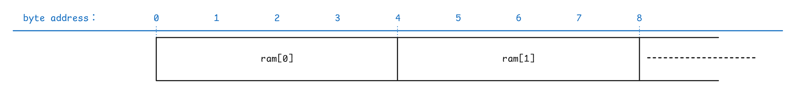
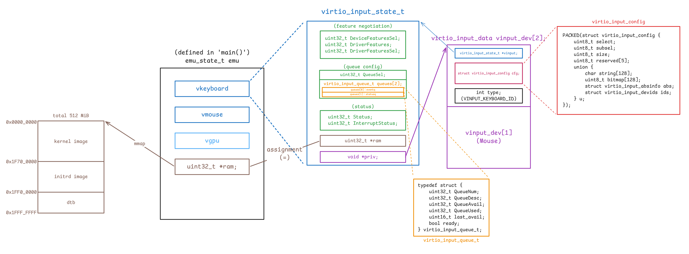
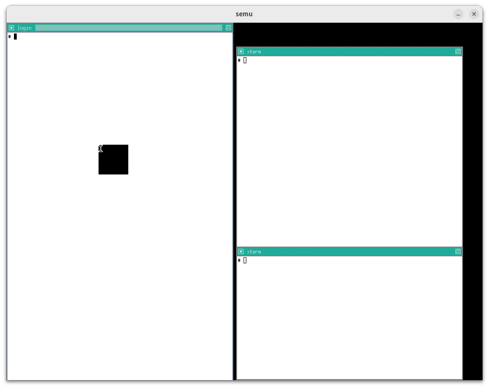

# VirtIO-GPU（2D）& VirtIO-Input in semu

專題，預期產出是

- 最低限度在 semu 支援 virtio 2D (with SDL)
- 支援 virtio-gpu 及 virtio-input
- 實作 host-GL accelerated path，讓 virtio-gpu 得以 passthrough

目前已將 2D 的部分閱讀與整理完畢，也剛把 commit 整理好。 確認重新編譯沒有問題後，就會 rebase 並送出 PR

材料部分，目前已初步讀完 spec 中 virtqueue（ch1 & 2）、PCI（4.1）、GPU（5.7）與 Input（5.8）的部分。 另外也讀了一些 graphic stack 相關資料，因此整理了一些筆記

- [Red Hat Virtio 介紹文的翻譯 & 筆記](https://mes0903.github.io/VM/redhat_virtio/)
- [Virtual I/O Device (VIRTIO) Version 1.3 翻譯 & 筆記](https://mes0903.github.io/VM/virtio_spec/)
- [The Linux graphics stack in a nutshell 翻譯 & 筆記](https://mes0903.github.io/Linux/linux-graphic-stack/)

另外還有一些仍在進行中的筆記，主要集中在 DRM/KMS。 底下這篇則是針對目前 semu 中 vgpu 2D 部分實作的筆記，3D 部分尚未開始

後面有紀錄了一些遇到的問題，和做 trace code 的過程，但是我仍然不是很熟悉 Mesa、X11 與 DRM/KMS，如果有寫錯的部分，麻煩再告知我，謝謝

## 目前整理出來的 TODO

把各節零星提到的限制集中起來，大概有五項：

1. eventq buffer 不足時，semu 目前直接丟掉這批 host 事件。 `virtio-input.c` 裡已經留了 `TODO: Consider buffering events instead of dropping them`，但目前還沒有額外的 host 端暫存區，也沒有後續重送機制
2. statusq 還沒有裝置端消費路徑。 guest 可以把 statusq 配好，也能送出 LED 類型的狀態事件，但 semu 目前沒有對應 `virtio_input_handle_sts()` 或 `virtio_input_hid_handle_status()` 這樣的邏輯
3. `window-events.c` 裡的 `sdl_scancode_to_linux_key()` 還是線性搜尋，這是前面 input 事件章節提過的另一個已知 TODO。 功能上不會錯，但在設計上還算明顯的待清理項
4. `.ci/test-vinput.sh` 目前只驗證裝置節點與 guest 枚舉結果，還沒有覆蓋 host 事件注入、eventq 掉事件行為，或 statusq / LED 回饋這幾條路徑
5. `display_info` 的架構問題，詳見問題 5 一節

## 有關 VirGL

以下片段翻譯自 [Do Nvidia GPUs require Mesa? (re: what is Mesa vs proprietary drivers?)](https://www.reddit.com/r/linux_gaming/comments/9firc7/do_nvidia_gpus_require_mesa_re_what_is_mesa_vs/)：

在 Linux 當中，所有硬體的驅動程式都會以某種形式被包含在核心裡面，這當然也包含了 GPU 驅動。 每一張 GPU 都需要一個核心驅動（或說 kernel module 模組）才能運作

但核心驅動只負責最低層級的硬體操作。 像 OpenGL、Vulkan、OpenCL 這些 API 的實作太龐大，無法放進核心驅動中，因此會放在使用者空間，透過系統呼叫與核心互動

要使用任何圖形 API，你都需要有對應的使用者空間函式庫。 AMD 與 NVIDIA 的專有驅動都有提供每一個 API 的封閉原始碼版本，而 Mesa 則是試圖提供這些 API 的開源替代實作

專有驅動通常也會附帶它們自己專有的核心驅動／模組，用來和它們的使用者空間函式庫溝通。 但對於 AMD 的新 GPU 來說，情況稍有不同：他們的專有與開源驅動會共用同一個核心模組。 換句話說，若你使用的是 Radeon R9 285（GCN 3） 之後的 GPU，你可以在相同的 AMDGPU 核心驅動下，選擇搭配 Mesa（開源函式庫）或 AMD 專有函式庫

---

再來以 Collabora 的這兩張圖來說，VirGL 是適用於 virtio-gpu 的 OpenGL 驅動，Venus 是 virtio-gpu 的 Vulkan 驅動，這兩者都實作在 Mesa 中：


但因為 virtio-gpu 只定義了要有哪些行為，例如建立 context、建立 BLOB 資源或提交 3D 指令之類的，所以實際填入 virtqueue 的資料內容（payload）是由實作方決定的

具體來說，要填入的是能讓 host 端轉譯器看懂的資料內容，因此格式會由各實作自己的協定來定義。 現在主流的實作是 Virgl 與 Venus（近年有新的叫 vDRM），它們在 host 端配合的轉譯器是 virglrenderer，用來解碼 VirGL/Venus 與 vDRM 的命令，再把這些命令轉成 host 端的 OpenGL/Vulkan 呼叫

所以 virtio-gpu 決定封包的格式，而實作本身決定封包內容要怎麼解讀

實作用的協定本身不一定有正式規格（神奇），VirGL 就沒有，所以要直接看實作（[VirGL](https://gitlab.freedesktop.org/mesa/mesa/-/blob/main/src/gallium/drivers/virgl/virgl_encode.c?ref_type=heads)、[virglrenderer](https://gitlab.freedesktop.org/virgl/virglrenderer/-/blob/main/src/virgl_protocol.h)），但 Venus 有（[venus-protocol](https://gitlab.freedesktop.org/virgl/venus-protocol)）

## Big Picture

這篇文章會整理 semu 裡的 virtio-gpu、virtio-input，以及 SDL 視窗後端之間怎麼協作，把 semu 自己的裝置模型、資料結構、控制流程與近期架構調整說清楚，這主要可以分成五個部分：

- `main.c` 負責虛擬機器核心與裝置接線：
  - 把 MMIO 位址區間映射到各個裝置
  - 初始化 scanout、視窗後端與輸入裝置
  - 建立虛擬機器執行緒與 SDL 主執行緒的分工
  - 在執行迴圈裡同步各裝置的中斷狀態
- `virtio-gpu.c` 負責 VirtIO-GPU 裝置模型的核心邏輯：
  - 處理 MMIO 暫存器讀寫
  - 維護 controlq / cursorq 的 virtqueue 狀態
  - 解析 guest 提供的 descriptor 鏈
  - 回覆 EDID / display info
  - 把各種 GPU 命令分派給後端處理函式
- `virtio-gpu-sw.c` 負責 2D 軟體後端的命令處理函式：
  - 建立與銷毀 `vgpu_resource_2d`
  - 處理 attach backing / detach backing
  - 執行 `TRANSFER_TO_HOST_2D`，把 guest backing 複製到 host image buffer
  - 處理 `SET_SCANOUT`、`RESOURCE_FLUSH` 與鼠標命令
- `virtio-input.c` 負責 VirtIO-Input 裝置模型：
  - 處理鍵盤 / 滑鼠兩個 MMIO 裝置的暫存器讀寫
  - 維護 eventq / statusq 的 virtqueue 狀態
  - 回覆對裝置組態空間的查詢，例如裝置名稱、事件位圖與 ABS 資訊
  - 把 host 端輸入事件寫進 guest 提供的事件緩衝區，並更新 used ring / 中斷
- `window-sw.c` 與 `window-events.c` 負責 SDL 視窗與 host 端輸入事件：
  - 把 guest framebuffer 與鼠標影像轉成 SDL 紋理
  - 維護每個 scanout 的算繪端快照
  - 在主執行緒處理 SDL 視窗事件的迴圈
  - 把 SDL 鍵盤滑鼠事件送進 guest 的 virtio-input 的事件佇列

從執行方向來看，這套實作主要有兩條路徑：一條是 guest 把畫面送到 host 視窗，另一條是 host 把輸入事件送進 guest：

1. 畫面輸出路徑：
   1. guest 端的 DRM / virtio-gpu 驅動建立 2D resource
   2. guest 替這個 2D resource attach backing
   3. guest 送出 `TRANSFER_TO_HOST_2D`，semu 在 `virtio-gpu-sw.c` 中把 guest backing 的像素資料複製到 host 端的 `vgpu_resource_2d.image`
   4. guest 再送出 `RESOURCE_FLUSH`
   5. `window-sw.c` 把目前的 scanout 快照轉成 SDL 紋理，並畫到視窗上
2. 輸入事件送入 guest 的路徑：
   1. host 端產生 SDL 鍵盤或滑鼠事件
   2. `window-events.c` 把它轉成 Linux input code 與對應的事件組合
   3. `virtio_input_update_key()`、`virtio_input_update_mouse_button_state()` 或 `virtio_input_update_cursor()` 接手整理事件
   4. `virtio-input.c` 把事件寫進 guest 提供的 eventq 緩衝區
   5. 裝置更新 used ring，並在需要時設定中斷

雖然這兩條路徑最後都會碰到 SDL 視窗與 `main.c` 的虛擬機器狀態，但中間走的是兩套不同的裝置協定。 可以拆成四點來看：

- 畫面輸出路徑
  - guest 端的畫面相關命令會透過 virtio-gpu 的 controlq 與 cursorq 送進 semu
  - guest 送來的是 `RESOURCE_CREATE_2D`、`TRANSFER_TO_HOST_2D`、`RESOURCE_FLUSH`、`UPDATE_CURSOR` 這類 GPU 命令
  - semu 由 `emu.vgpu` 保存裝置狀態、queue 的位置與中斷狀態
  - 真正的處理由 `virtio-gpu.c` 與 `virtio-gpu-sw.c` 分工完成
- 輸入事件路徑
  - 不只有一個 virtio-input 裝置，而是有兩個獨立的裝置實例
    - `emu.vkeyboard` 負責鍵盤，`emu.vmouse` 負責滑鼠
  - guest 不會透過 virtio-gpu 接收鍵盤滑鼠事件
  - 鍵盤與滑鼠各自擁有自己的 MMIO 暫存器、eventq / statusq、裝置組態空間與 `InterruptStatus`
- 兩條路徑共享的部分
  - 它們不共用 descriptor 格式、queue 的處理邏輯或命令集合
  - 它們共享的是比較外層的基礎設施，例如 `main.c` 的 MMIO dispatch、PLIC 中斷的更新、guest RAM 的指標與 SDL 事件迴圈
- `g_window` 的角色
  - `g_window` 不是 VirtIO 協定的一部分
  - 它是 semu 自己定義的 host 端後端 API
  - `virtio-gpu-sw.c` 透過 `g_window.window_flush()`、`g_window.cursor_update()` 等函式把畫面資料交給 SDL
  - `main()` 則透過 `g_window.window_init()`、`g_window.window_main_loop()` 啟動與維護視窗系統

直接對照 `main.c` 裡的虛擬機器狀態，會更清楚它的分工：

```c
typedef struct {
    /* ... */
#if SEMU_HAS(VIRTIOGPU)
    virtio_gpu_state_t vgpu;
#endif
#if SEMU_HAS(VIRTIOINPUT)
    virtio_input_state_t vkeyboard;
    virtio_input_state_t vmouse;
#endif
    /* ... */
} emu_state_t;
```

這裡可以把它理解成三個平行的裝置實例：

- `emu.vgpu`：一個 virtio-gpu 裝置的實例，負責 guest 的顯示輸出
- `emu.vkeyboard`：一個 virtio-input 鍵盤裝置的實例
- `emu.vmouse`：一個 virtio-input 滑鼠裝置的實例

它們都掛在同一個 `emu_state_t` 下面，但各自維護自己的 queue、status 與中斷狀態。 之後 `g_window` 這層 semu 內部後端抽象介面會再把這些裝置接到 host 視窗系統上

## 資料結構

### Virtqueue 相關

semu 中使用的是 split virtqueue，其中只有 descriptor table 有特別寫結構體定義出來：

```c
PACKED(struct virtq_desc {
    uint64_t addr;
    uint32_t len;
    uint16_t flags;
    uint16_t next;
});
```

而在規格中，對於 avail ring 與 used ring 的佈局示例如下：

```c
struct virtq_avail { 
#define VIRTQ_AVAIL_F_NO_INTERRUPT  1 
    le16 flags; 
    le16 idx; /* number of available ring entries posted by the driver */
    le16 ring[ /* Queue Size */ ]; 
    le16 used_event; /* only present when VIRTIO_F_EVENT_IDX is negotiated */ 
};

struct virtq_used { 
#define VIRTQ_USED_F_NO_NOTIFY  1 
    le16 flags; 
    le16 idx; /* number of used entries completed by the device */
    struct virtq_used_elem ring[ /* Queue Size */]; 
    le16 avail_event; /* only present when VIRTIO_F_EVENT_IDX is negotiated */ 
}; 

/* le32 is used here for padding. */ 
struct virtq_used_elem { 
    /* head descriptor index of the used chain */ 
    le32 id; 
    /* bytes actually written by the device to writable buffers */ 
    le32 len; 
};
```

但在 semu 中，avail ring 與 used ring 都是透過直接操作記憶體（`vinput->ram`）來讀取的，相關結構如下（以 virtio gpu 為例）：

```c
typedef struct {
    uint32_t QueueNum;      // Queue size
    uint32_t QueueDesc;     // Descriptor table base index
    uint32_t QueueAvail;    // Available ring base index
    uint32_t QueueUsed;     // Used ring base index
    uint16_t last_avail;    // Number of buffers already consumed by the device
    bool ready;             // Whether the queue is ready
} virtio_gpu_queue_t;

typedef struct {
    /* feature negotiation */
    uint32_t DeviceFeaturesSel;
    uint32_t DriverFeatures;
    uint32_t DriverFeaturesSel;
    /* queue config */
    uint32_t QueueSel;
    virtio_gpu_queue_t queues[2];
    /* status */
    uint32_t Status;
    uint32_t InterruptStatus;
    /* supplied by environment */
    uint32_t *ram;
    /* implementation-specific */
    void *priv;
} virtio_gpu_state_t;
```

`virtio_gpu_state_t` 中的 `queues` 是一個 virtqueue 的陣列，有兩個元素，代表 virtio-gpu 使用了兩個 virtqueue，在 spec 中分別名為 controlq 與 cursorq：

- controlq：用於傳送控制命令的佇列
- cursorq：用於傳送鼠標更新的佇列

`virtio_gpu_queue_t` 內的元素用來幫助讀取 virtqueue 的內容，`QueueDesc`、`QueueAvail`、`QueueUsed` 的值代表的是索引，會搭配 `virtio_xxx_state_t` 結構體內的 `ram` 成員使用，其中 `ram` 與 `emu->ram` 指向相同的記憶體區塊（`main.c` 裡用 `mmap()` 建出的那塊 guest RAM），這部分後面會再詳細提到

由於 avail ring 與 used ring 中的 `flags` 與 `idx` 欄位都是 `le16`，而 `ram` 是 `uint32_t*`，因此以 avail ring 為例，其在 `ram` 中的佈局看起來會類似下面這樣：

```
┌─────────────────────────────────┬──────────────────────────┐
│     ram[queue->QueueAvail]      │ flags (low) | idx (high) │  ← Header
├─────────────────────────────────┼──────────────────────────┤
│   ram[queue->QueueAvail + 1]    │    ring[0]  |  ring[1]   │  ← Entries 0 & 1
│   ram[queue->QueueAvail + 2]    │    ring[2]  |  ring[3]   │  ← Entries 2 & 3
│   ram[queue->QueueAvail + 3]    │    ring[4]  |  ring[5]   │  ← Entries 4 & 5
└─────────────────────────────────┴──────────────────────────┘
```

其中 `QueueAvail` 等值在對應的 `virtio_xxx_reg_write` 中設定：

```c
static inline uint32_t vinput_preprocess(virtio_input_state_t *vinput,
                                         uint32_t addr)
{
    // 1. Check whether the address is within RAM
    if (addr >= RAM_SIZE)
        return virtio_input_set_fail(vinput), 0;
    
    // 2. Check whether the address is 4-byte aligned
    if (addr & 0b11)  // Check the lowest 2 bits
        return virtio_input_set_fail(vinput), 0;

    // 3. Convert the byte address to a uint32_t index
    return addr >> 2;  // Divide by 4
}

...

static bool virtio_input_reg_write(virtio_input_state_t *vinput,
                                   uint32_t addr,
                                   uint32_t value)
{
...
case _(QueueDriverLow):
    VINPUT_QUEUE.QueueAvail = vinput_preprocess(vinput, value);
    return true;
...
}
```

其中 `vgpu_preprocess()` 會先檢查 guest 給的位址是否落在 RAM 範圍內，而且必須是 4-byte 對齊，這主要是因為 `emu->ram` 是 word array，但 guest 給的 `QueueDesc`、`QueueAvail`、`QueueUsed` 都是 byte address，要 `>> 2` 才能當 index 用

舉例來說，假設記憶體實際長這樣：



此時 Guest 說 `QueueDesc = 4`，意思是「queue 在 byte 4 的位置」。 但如果我們直接寫 `ram[4]`，C 語言會跳到第 4 個 `uint32_t`，也就是 byte 16，跳過頭了，所以要做 `4 >> 2 = 1`，用 `ram[1]` 才對得上 byte 4

<span class = "center-column">

| guest 說的 byte address |   `>> 2` 後 |  `ram[]` index |
| :---------------------: | :---------: | :-----------: |
|         0               |     0       |    `ram[0]`   |
|         4               |     1       |    `ram[1]`   |
|         8               |     2       |    `ram[2]`   |
|        12               |     3       |    `ram[3]`   |

</span>

位址的檢查通過後，`vgpu_preprocess()` 會把這個 byte address 轉成對應的 word index。 因此後面 `QueueDesc`、`QueueAvail`、`QueueUsed` 存下來的都不是 host pointer，而是 semu 之後拿來直接索引 `ram[]` 的位置：

```c
static inline uint32_t vgpu_preprocess(virtio_gpu_state_t *vgpu, uint32_t addr)
{
    if ((addr >= RAM_SIZE) || (addr & 0b11))
        return virtio_gpu_set_fail(vgpu), 0;

    return addr >> 2;
}
```

因此如果 guest 寫入的地址為 `0x00100000`，則 `QueueAvail` 會變成 `0x00040000`。 也因為 `vinput->ram` 的型態是 `uint32_t *`，所以之後存取這段記憶體時會用 `ram[0x00100000 >> 2]`，而不是 `ram[0x00100000]`，這也是為什麼這裡說 `QueueAvail` 保存的是索引：

```
字節視圖 (uint8_t*):       Word 視圖 (uint32_t*):
┌────┬────┬────┬────┐     ┌──────────────┐
│ 0  │ 1  │ 2  │ 3  │  →  │   ram[0]     │
├────┼────┼────┼────┤     ├──────────────┤
│ 4  │ 5  │ 6  │ 7  │  →  │   ram[1]     │
├────┼────┼────┼────┤     ├──────────────┤
│ 8  │ 9  │ 10 │ 11 │  →  │   ram[2]     │
└────┴────┴────┴────┘     └──────────────┘

字節地址 / 4 = uint32_t 索引
```

讓我們以 `virtio_input_desc_handler` 為例子來看一些使用範例：

1. 讀取 avail 與 used ring 的 `idx` 欄位
    ```c
    uint32_t *ram = vinput->ram;
    uint16_t new_avail = ram[queue->QueueAvail] >> 16; /* virtq_avail.idx (le16) */
    uint16_t new_used = ram[queue->QueueUsed] >> 16; /* virtq_used.idx (le16) */
    ```
2. 讀取 avail ring 內的第 `buffer_idx` 個元素
    ```c
    uint16_t queue_idx = queue->last_avail % queue->QueueNum;
    uint16_t buffer_idx = ram[queue->QueueAvail + 1 + queue_idx / 2] >>
                          (16 * (queue_idx % 2));
    ```
    這邊 `last_avail` 代表已處理過的 buffer 數量，由於 avail ring 是環形的，所以取模以得到下一個目標 buffer 的索引
    
    接下來的 `queue->QueueAvail + 1` 代表 avail ring 內 `ring` 的起始位址，`+1` 是為了跳過 header。 `queue_idx / 2` 用來找到目標 buffer 在 `ram` 的哪個元素內，見上方 avail ring 在 `ram` 中的示意圖。 最後用 `16 * (queue_idx % 2)` 來找到對應的元素，一個 `ram` 的元素中有兩個 `ring` 的元素

    因此整個 `buffer_idx` 的計算其實是在讀取 `ring[queue_idx]` 的值，而該值代表的是目標 descriptor 的索引，所以變數名稱才會是 `buffer_idx`
3. 讀取 Descriptor
    ```c
    uint32_t *desc;
    desc = &vinput->ram[queue->QueueDesc + buffer_idx * 4];
    vq_desc.addr = desc[0];  // Physical address of the buffer
    uint32_t addr_high = desc[1]; // Only 32-bit addressing is supported, so this must be 0
    vq_desc.len = desc[2];   // Buffer length
    vq_desc.flags = desc[3] & 0xFFFF;  // Flags
    ```
    `*4` 是因為每個 descriptor 佔 4 個 `uint32_t`，而算 `flags` 時取 `& 0xFFFF` 是因為 flags 在 `desc[3]` 的低 16 位
4. 寫入事件到 Guest Buffer
    ```c
    ev = (struct virtio_input_event *)((uintptr_t)vinput->ram + vq_desc.addr);
    ev->type = input_ev[i].type;
    ev->code = input_ev[i].code;
    ev->value = input_ev[i].value;
    ```
    注意這邊 `vinput->ram` 是 host virtual address，其意義是 guest memory 在 semu 中的起始位址（用 `mmap()` 建出的一塊記憶體），而 `vq_desc.addr` 是 guest physical address，因此相加就可以得到目標 `virtio_input_event`（descriptor 指向的 buffer）的 host virtual address，後續便可以直接操作該 buffer
5. 更新 used ring
    ```c
    uint32_t vq_used_addr = queue->QueueUsed + 1 + (new_used % queue->QueueNum) * 2;
    ram[vq_used_addr] = buffer_idx;
    ram[vq_used_addr + 1] = sizeof(struct virtio_input_event);
    ```
    與上方一樣，`new_used % queue->QueueNum` 是在計算目標 used ring entry 的索引，`*2` 是因為每個 used ring entry 佔 2 個 `uint32_t`（`id` + `len`）。 接著就依序填入目標 used ring entry 的 `id` 與 `len` 欄位

總而言之，virtqueue 操作的流程大致如下：

1. Linux 分配 virtqueue 記憶體  
   - `vring_create_virtqueue()`
   - 在 guest RAM 中分配 descriptor table, avail ring, used ring

2. Linux 寫入 MMIO registers (通過 `writel`)，見 `vm_setup_vq`：
   - `writel(addr_low, base + 0x080)`：`QUEUE_DESC_LOW`
   - `writel(addr_high, base + 0x084)`：`QUEUE_DESC_HIGH`
   - `writel(addr_low, base + 0x090)`：`QUEUE_AVAIL_LOW  `
   - `writel(addr_high, base + 0x094)`：`QUEUE_AVAIL_HIGH`
   - `writel(addr_low, base + 0x0a0)`：`QUEUE_USED_LOW`
   - `writel(addr_high, base + 0x0a4)`：`QUEUE_USED_HIGH`
   - `writel(1, base + 0x044)`：`QUEUE_READY`

3. SEMU 接收 MMIO write (`virtio_xxx_reg_write`)
   - `case QueueDescLow`：儲存 descriptor table 位址
   - `case QueueDriverLow`：儲存 available ring 位址
   - `case QueueDeviceLow`：儲存 used ring 位址
   - `case QueueReady`：標記 queue 就緒

4. 之後 SEMU 就可以通過這些位址訪問 guest 的 virtqueue 了
   - `ram[queue->QueueDesc + offset]`
   - `ram[queue->QueueAvail + offset]`
   - `ram[queue->QueueUsed + offset]`

### `virtio_gpu_state_t` 與 `virtio_gpu_queue_t`


對應的結構定義如下（`device.h`）：

```c
typedef struct {
    uint32_t QueueNum;
    uint32_t QueueDesc;
    uint32_t QueueAvail;
    uint32_t QueueUsed;
    uint16_t last_avail;
    bool ready;
} virtio_gpu_queue_t;

typedef struct {
    uint32_t DeviceFeaturesSel;
    uint32_t DriverFeatures;
    uint32_t DriverFeaturesSel;
    uint32_t QueueSel;
    virtio_gpu_queue_t queues[2];
    uint32_t Status;
    uint32_t InterruptStatus;
    uint32_t *ram;
    void *priv;
} virtio_gpu_state_t;
```

`virtio_gpu_state_t` 是 semu 用來保存 virtio-gpu MMIO 暫存器狀態的核心結構。 具體來說：

- `DeviceFeaturesSel`、`DriverFeatures`、`DriverFeaturesSel`：對應 feature negotiation 相關的暫存器
- `QueueSel`：表示 guest 目前正在設定哪一條 queue
- `queues[2]`：保存 `controlq` 與 `cursorq` 各自的 queue layout 與執行進度
  - `queues[0]` 對應到 `controlq`
  - `queues[1]` 對應到 `cursorq`
- `Status`、`InterruptStatus`：保存裝置狀態與待處理的中斷
- `ram`：指向 guest RAM，讓裝置可以直接讀寫 descriptor table 與 avail/used ring
- `priv`：指向 `virtio_gpu_data_t`，保存 scanout 相關的 host 端資訊

`virtio_gpu_queue_t` 則是 semu 追蹤單一 virtqueue 所需的狀態。 具體來說：

- `QueueNum`：這條 queue 的 ring 大小
- `QueueDesc`：descriptor table 在 guest RAM 裡的起點
- `QueueAvail`：avail ring 在 guest RAM 裡的起點
- `QueueUsed`：used ring 在 guest RAM 裡的起點
- `last_avail`：裝置上次已經處理到哪個 avail index
- `ready`：guest 是否已完成這條 queue 的配置，並把它設成可用

目前的設計內沒有另外維護一份 host 端的 queue 物件，semu 現在直接把 `QueueDesc` / `QueueAvail` / `QueueUsed` 當成 guest RAM 裡的索引來使用，然後靠 `vgpu->ram` 直接讀 descriptor table 與 avail/used ring

`virtio_gpu_state_t` 中的 `ram` 是 guest RAM 的基底指標，所以存取 descriptor table、avail ring、used ring、裝置組態空間時，全部都會回到這塊記憶體上

而 `priv` 則指向 `virtio_gpu_data_t`，裡面存的是 scanout 的寬高與 enable 狀態，屬於 host 在 guest 驅動偵測裝置之前就準備好的裝置資訊。 其對應的結構本體定義在 `virtio-gpu.h`：

```c
struct vgpu_scanout_info {
    uint32_t width;
    uint32_t height;
    uint32_t enabled;
};

typedef struct {
    struct vgpu_scanout_info scanouts[VIRTIO_GPU_MAX_SCANOUTS];
} virtio_gpu_data_t;
```

這裡可以把它理解成「scanout 的靜態裝置資訊表」。 `virtio_gpu_state_t` 保存的是 MMIO 暫存器、virtqueue 與中斷的相關狀態，`virtio_gpu_data_t` 則另外保存每個 scanout 的寬、高與 enable 狀態。 兩者之間的關係是：

- `virtio_gpu_state_t`
  - 保存 guest 驅動透過 MMIO 改動的暫存器與 queue 狀態
- `virtio_gpu_data_t`
  - 保存 host 端事先準備好的 scanout 資訊
  - 這些資訊不會因為 queue reset 而消失

`main.c` 初始化 virtio-gpu 時，scanout 的基本資料會透過 `virtio_gpu_add_scanout()` 寫進這張表：

```c
void virtio_gpu_add_scanout(virtio_gpu_state_t *vgpu,
                            uint32_t width,
                            uint32_t height)
{
    int scanout_num = vgpu_configs.num_scanouts++;
    ...
    PRIV(vgpu)->scanouts[scanout_num].width = width;
    PRIV(vgpu)->scanouts[scanout_num].height = height;
    PRIV(vgpu)->scanouts[scanout_num].enabled = 1;
    ...
}
```

也就是說，像 `1024x768` 這種初始的輸出尺寸，不會放在 `vgpu_resource_2d` 或 queue 狀態裡。 semu 會先透過 `priv` 把它登記到 `virtio_gpu_data_t.scanouts[]`，等 guest 驅動偵測裝置、送 `GET_DISPLAY_INFO` 時，再從這張表把資料回傳給 guest：

```c
void virtio_gpu_get_display_info_handler(virtio_gpu_state_t *vgpu,
                                         struct virtq_desc *vq_desc,
                                         uint32_t *plen)
{
    ...
    int scanout_num = vgpu_configs.num_scanouts;
    for (int i = 0; i < scanout_num; i++) {
        response->pmodes[i].r.width = PRIV(vgpu)->scanouts[i].width;
        response->pmodes[i].r.height = PRIV(vgpu)->scanouts[i].height;
        response->pmodes[i].enabled = PRIV(vgpu)->scanouts[i].enabled;
    }
    ...
}
```

從上面這段 `GET_DISPLAY_INFO` 的 code 可以看出 scanout 的規格資料是從 `priv -> virtio_gpu_data_t -> scanouts[]` 這條路徑提供給 guest 的，並不是放在 `vgpu_resource_2d` 裡，也不是放在 virtqueue 的狀態裡

為了避免把不同來源的狀態混在一起，這裡可以把資料分成三類：

- `virtio_gpu_data_t.scanouts[]`：描述裝置宣告自己有幾個 scanout、每個 scanout 的尺寸與 enable 狀態
- `virtio_gpu_queue_t`：描述 guest 如何透過 virtqueue 把命令送進來
- `vgpu_resource_2d`：描述 guest 真正建立出來的 2D resource，以及它後來被綁到哪個 scanout

由於 `priv` 和 `ram` 都是 host 提供給裝置的基礎設施指標，不屬於可重設的裝置狀態，所以在 reset 時它們會被保存下來：

```c
static void virtio_gpu_update_status(virtio_gpu_state_t *vgpu, uint32_t status)
{
    vgpu->Status |= status;
    if (status)
        return;

    uint32_t *ram = vgpu->ram;
    void *priv = vgpu->priv;
    memset(vgpu, 0, sizeof(*vgpu));
    vgpu->ram = ram;
    vgpu->priv = priv;

    /* Release all 2D resources */
    ...
}
```

相對地，queue 的狀態、feature 的協商與中斷狀態這些都屬於可重設的裝置狀態，所以和 `ram`、`priv` 不一樣，會隨著 guest reset 一起被清掉。 另外像 `res_2d->scanout_id` 這種描述資源目前綁到哪個 scanout 的執行期狀態，也不放在 `virtio_gpu_data_t` 裡，而是跟著 `vgpu_res_2d_list` 裡的 2D resource 一起管理，因此同樣會在 reset 時一併釋放

對於 queue 狀態這類的資訊，目前是透過 MMIO 的寫入來逐步建立起來的。 這會在 `virtio_gpu_reg_write()` 內處理，guest 設 queue 的操作會在這裡做 dispatch：

```c
case _(QueueSel):
    if (value < ARRAY_SIZE(vgpu->queues))
        vgpu->QueueSel = value;
    else
        virtio_gpu_set_fail(vgpu);
    return true;
case _(QueueNum):
    if (value > 0 && value <= VGPU_QUEUE_NUM_MAX)
        VGPU_QUEUE.QueueNum = value;
    else
        virtio_gpu_set_fail(vgpu);
    return true;
case _(QueueReady):
    VGPU_QUEUE.ready = value & 1;
    if (value & 1)
        VGPU_QUEUE.last_avail = vgpu->ram[VGPU_QUEUE.QueueAvail] >> 16;
    return true;
case _(QueueDescLow):
    VGPU_QUEUE.QueueDesc = vgpu_preprocess(vgpu, value);
    return true;
case _(QueueDriverLow):
    VGPU_QUEUE.QueueAvail = vgpu_preprocess(vgpu, value);
    return true;
case _(QueueDeviceLow):
    VGPU_QUEUE.QueueUsed = vgpu_preprocess(vgpu, value);
    return true;
```

`QueueSel` 負責決定 guest 目前要配置哪一條 queue，而 `VGPU_QUEUE` 這個 macro 用來把後續的 `QueueNum`、`QueueDesc`、`QueueAvail`、`QueueUsed` 都導向 `queues[QueueSel]`，定義如下：

```c
#define VGPU_QUEUE (vgpu->queues[vgpu->QueueSel])
```

接著等到 guest 寫 `QueueNotify` 時，這些欄位才會真正被消費掉：

```c
static void virtio_queue_notify_handler(virtio_gpu_state_t *vgpu, int index)
{
    uint32_t *ram = vgpu->ram;
    virtio_gpu_queue_t *queue = &vgpu->queues[index];

    uint16_t new_avail = ram[queue->QueueAvail] >> 16;
    ...

    while (queue->last_avail != new_avail) {
        uint16_t queue_idx = queue->last_avail % queue->QueueNum;
        uint16_t buffer_idx = ram[queue->QueueAvail + 1 + queue_idx / 2] >>
                              (16 * (queue_idx % 2));

        uint32_t len = 0;
        int result = virtio_gpu_desc_handler(vgpu, queue, buffer_idx, &len);
        if (result != 0)
            return;

        uint32_t vq_used_addr =
            queue->QueueUsed + 1 + (new_used % queue->QueueNum) * 2;
        ram[vq_used_addr] = buffer_idx;
        ram[vq_used_addr + 1] = len;
        queue->last_avail++;
        new_used++;
    }
}
```

從這段可以看出 `virtio_gpu_queue_t` 的欄位分工很直接：

- `QueueNum`：決定 ring buffer 的大小與取模方式
- `QueueAvail`：指到 avail ring 的起點，讓裝置知道 guest 放了哪些 descriptor index
- `QueueUsed`：指到 used ring 的起點，讓裝置把完成結果寫回去
- `QueueDesc`：指到 descriptor table，讓裝置可以沿著 descriptor 鏈讀 request / response buffer
- `last_avail`：記住裝置上次處理到哪裡，避免重複消費同一批 avail entry
- `ready`：表示 guest 是否已完成這條 queue 的配置，還沒 ready 時，`QueueNotify` 會直接失敗

具體的使用方法，在一開始的「Virtqueue 相關」一節中已經詳細解釋了

如果和 Linux guest 驅動對照，Linux 端通常不會直接碰 `avail->ring[]` 或 `used->ring[]` 這些欄位，而是透過 [`struct virtqueue *`](https://github.com/torvalds/linux/blob/0f61b1860cc3f52aef9036d7235ed1f017632193/include/linux/virtio.h#L34) 與 virtio core 提供的 helper 來操作 queue

以 `virtgpu_vq.c` 為例，驅動端平常做的是把 scatterlist 交給 [`virtqueue_add_sgs()`](https://github.com/torvalds/linux/blob/0f61b1860cc3f52aef9036d7235ed1f017632193/drivers/virtio/virtio_ring.c#L2303)，必要時用 [`virtqueue_kick_prepare()`](https://github.com/torvalds/linux/blob/0f61b1860cc3f52aef9036d7235ed1f017632193/drivers/virtio/virtio_ring.c#L2468) / [`virtqueue_notify()`](https://github.com/torvalds/linux/blob/0f61b1860cc3f52aef9036d7235ed1f017632193/drivers/virtio/virtio_ring.c#L2485) 通知裝置，之後再用 [`virtqueue_get_buf()`](https://github.com/torvalds/linux/blob/0f61b1860cc3f52aef9036d7235ed1f017632193/drivers/virtio/virtio_ring.c#L2548) 收回完成的 buffer：

```c
static int virtio_gpu_queue_ctrl_sgs(struct virtio_gpu_device *vgdev,
                                     struct virtio_gpu_vbuffer *vbuf,
                                     ... )
{
    struct virtqueue *vq = vgdev->ctrlq.vq;
    ...
    ret = virtqueue_add_sgs(vq, sgs, outcnt, incnt, vbuf, GFP_ATOMIC);
    ...
}

void virtio_gpu_notify(struct virtio_gpu_device *vgdev)
{
    ...
    notify = virtqueue_kick_prepare(vgdev->ctrlq.vq);
    ...
    if (notify)
        virtqueue_notify(vgdev->ctrlq.vq);
}

static void reclaim_vbufs(struct virtqueue *vq, struct list_head *reclaim_list)
{
    ...
    while ((vbuf = virtqueue_get_buf(vq, &len))) {
        ...
    }
}
```

在 Linux 驅動這一層，[`struct virtqueue`](https://github.com/torvalds/linux/blob/0f61b1860cc3f52aef9036d7235ed1f017632193/include/linux/virtio.h#L34) 代表的是一條已初始化的 virtqueue 實例，驅動端可以透過它看到 queue 的編號、剩餘空間與 callback 這些執行期資訊，但 split virtqueue 的實際記憶體佈局並不是直接在這一層展開的：

```c
struct virtqueue {
	struct list_head list;
	void (*callback)(struct virtqueue *vq);
	const char *name;
	struct virtio_device *vdev;
	unsigned int index;
	unsigned int num_free;
	unsigned int num_max;
	bool reset;
	void *priv;
};

int virtqueue_add_sgs(struct virtqueue *vq, ...);
bool virtqueue_kick(struct virtqueue *vq);
void *virtqueue_get_buf(struct virtqueue *vq, unsigned int *len);
```

[`struct virtqueue`](https://github.com/torvalds/linux/blob/0f61b1860cc3f52aef9036d7235ed1f017632193/include/linux/virtio.h#L34) 內並沒有三個 split virtqueue ring 的成員。 Linux 驅動手上拿到的是公開的 [`struct virtqueue *`](https://github.com/torvalds/linux/blob/0f61b1860cc3f52aef9036d7235ed1f017632193/include/linux/virtio.h#L34)。 當驅動呼叫 [`virtqueue_add_sgs()`](https://github.com/torvalds/linux/blob/0f61b1860cc3f52aef9036d7235ed1f017632193/drivers/virtio/virtio_ring.c#L2303)、[`virtqueue_get_buf()`](https://github.com/torvalds/linux/blob/0f61b1860cc3f52aef9036d7235ed1f017632193/drivers/virtio/virtio_ring.c#L2548) 這類 helper，控制流程進入 `virtio_ring.c` 之後，virtio core 會先利用 [`to_vvq(_vq)`](https://github.com/torvalds/linux/blob/0f61b1860cc3f52aef9036d7235ed1f017632193/drivers/virtio/virtio_ring.c#L232) 與這個指標回推出外層的 [`struct vring_virtqueue`](https://github.com/torvalds/linux/blob/0f61b1860cc3f52aef9036d7235ed1f017632193/drivers/virtio/virtio_ring.c#L162)

如果借用資料結構的術語，這裡可以把它看成一種 intrusive 的佈局：[`struct virtqueue`](https://github.com/torvalds/linux/blob/0f61b1860cc3f52aef9036d7235ed1f017632193/include/linux/virtio.h#L34) 不會被獨立配置，只會在 [`struct vring_virtqueue`](https://github.com/torvalds/linux/blob/0f61b1860cc3f52aef9036d7235ed1f017632193/drivers/virtio/virtio_ring.c#L162) 內作為成員 `vq` 出現。 而 [`to_vvq(_vq)`](https://github.com/torvalds/linux/blob/0f61b1860cc3f52aef9036d7235ed1f017632193/drivers/virtio/virtio_ring.c#L232) 則是搭配的 `container_of` 慣用法，可以從成員 `vq` 的實例位址回推出外層 [`struct vring_virtqueue`](https://github.com/torvalds/linux/blob/0f61b1860cc3f52aef9036d7235ed1f017632193/drivers/virtio/virtio_ring.c#L162) 結構本體的起始位址：

```c
struct vring_virtqueue_split {
    struct vring vring;
    ...
};

struct vring_virtqueue {
    struct virtqueue vq;
    bool packed_ring;
    ...
    union {
        struct vring_virtqueue_split split;
        ...
    };
};

#define to_vvq(_vq) container_of_const(_vq, struct vring_virtqueue, vq)
```

接著 virtio core 會看 `packed_ring` 這個旗標，判斷這條 queue 目前使用的是 packed ring 還是 split ring。 若是 split ring，後續實際使用的就是 `union` 裡的 `split` 成員，也就是 `vq->split`

其中 `vq->split.vring` 才是實際指向三個 ring 的地方，而 [`struct vring`](https://github.com/torvalds/linux/blob/0f61b1860cc3f52aef9036d7235ed1f017632193/include/uapi/linux/virtio_ring.h#L158) 本身只是把 split virtqueue 的三塊記憶體收在一起：

```c
struct vring {
    unsigned int num;
    vring_desc_t *desc;
    vring_avail_t *avail;
    vring_used_t *used;
};
```

整體的對應關係如下：

<details> <summary><span class = "yellow"><strong>展開 call graph</strong></span></summary>

```callgraph
[include/linux/virtio.h:34] struct virtqueue *
  │
  │  Linux 驅動手上拿到的公開 queue handle
  ↓
[drivers/virtio/virtio_ring.c:232] to_vvq(_vq)
  │
  │  container_of_const(_vq, struct vring_virtqueue, vq)
  │  從成員 `vq` 的位址回推出外層 `struct vring_virtqueue`
  ↓
[drivers/virtio/virtio_ring.c:162] struct vring_virtqueue
  │
  │  內含 `struct virtqueue vq;`
  │  再依 `packed_ring` 決定要走 `packed` 還是 `split`
  ↓
[drivers/virtio/virtio_ring.c:97] vq->split / struct vring_virtqueue_split
  │
  │  split ring 版本的私有狀態
  │  `vq->split.vring` 指向實際 ring layout
  ↓
[include/uapi/linux/virtio_ring.h:158] struct vring
  │
  │  收住三個 ring 的指標
  ↓
[include/uapi/linux/virtio_ring.h:107] struct vring_desc
[include/uapi/linux/virtio_ring.h:114] struct vring_avail
[include/uapi/linux/virtio_ring.h:131] struct vring_used
```

</details>

[`struct vring`](https://github.com/torvalds/linux/blob/0f61b1860cc3f52aef9036d7235ed1f017632193/include/uapi/linux/virtio_ring.h#L158) 指向的三塊 split virtqueue 記憶體佈局如下：

```c
struct vring_desc {
    __virtio64 addr;
    __virtio32 len;
    __virtio16 flags;
    __virtio16 next;
};

struct vring_avail {
    __virtio16 flags;
    __virtio16 idx;
    __virtio16 ring[];
};

struct vring_used_elem {
    __virtio32 id;
    __virtio32 len;
};

struct vring_used {
    __virtio16 flags;
    __virtio16 idx;
    vring_used_elem_t ring[];
};
```

1. descriptor table：真正描述 buffer 的地方。 每個 [`struct vring_desc`](https://github.com/torvalds/linux/blob/0f61b1860cc3f52aef9036d7235ed1f017632193/include/uapi/linux/virtio_ring.h#L107) 指出一段 guest buffer 的位址與長度。 如果 `flags` 帶有 `VRING_DESC_F_NEXT`，則會沿著 `next` 把多個 descriptor 串成一條鏈
2. avail ring：驅動會把「哪一條 descriptor 鏈可以讓裝置使用」寫到 [`struct vring_avail`](https://github.com/torvalds/linux/blob/0f61b1860cc3f52aef9036d7235ed1f017632193/include/uapi/linux/virtio_ring.h#L114) 這裡。 `avail->ring[]` 裡放的是 descriptor head index，也就是一條鏈的起點。 `avail->idx` 則表示驅動目前總共公開了多少筆可用工作
3. used ring：裝置做完之後，把「哪一條 descriptor 鏈已經完成」寫到 [`struct vring_used`](https://github.com/torvalds/linux/blob/0f61b1860cc3f52aef9036d7235ed1f017632193/include/uapi/linux/virtio_ring.h#L131) 這裡。 `used->ring[]` 裡的每個元素是 [`struct vring_used_elem`](https://github.com/torvalds/linux/blob/0f61b1860cc3f52aef9036d7235ed1f017632193/include/uapi/linux/virtio_ring.h#L121)，裡面記的是 head descriptor 的 `id` 與實際處理長度 `len`。 `used->idx` 則表示裝置目前總共完成了多少筆工作

如果把一筆 split virtqueue request 的操作順序攤開，大致會是下面這樣：

1. 驅動先在 descriptor table 裡準備好一條 descriptor 鏈。 這條鏈描述的是「request buffer 在哪裡、response buffer 在哪裡、哪些 buffer 是裝置可寫入的」
2. 這條鏈準備好之後，驅動不會把整條鏈複製到 avail ring，它只會把 head descriptor 的 index 寫進 `avail->ring[avail->idx % num]`，因此 avail ring 裡存的是「descriptor 鏈的起點編號」，不是 descriptor 內容本身
3. 接著驅動增加 `avail->idx`，表示又多公開了一筆工作給裝置。 必要時再透過 `virtqueue_kick_prepare()` / `virtqueue_notify()` 通知裝置
4. 裝置看到 `avail->idx` 前進之後，會到 `avail->ring[]` 取出這筆工作的 head index，再回到 descriptor table，沿著 `next` 把整條 descriptor 鏈走完
5. 當裝置做完這筆工作之後，它會把同一個 head index 寫進 `used->ring[used->idx % num].id`，再把實際處理長度寫進 `used->ring[used->idx % num].len`
6. 最後裝置增加 `used->idx`。 驅動之後只要發現 `used->idx` 比自己上次看到的大，就知道又有新的完成項目可以回收

descriptor table 比較像是靜態的 buffer 描述區，真正負責「排隊等待裝置消費」的是 avail ring，負責「回報哪些工作已經完成」的是 used ring。 avail / used 兩邊都只會交換 index，而不是直接搬動 descriptor 內容

Linux 的 virtio core 會替驅動處理這些細節。 把 buffer 放進 queue 時，[`virtqueue_add_split()`](https://github.com/torvalds/linux/blob/0f61b1860cc3f52aef9036d7235ed1f017632193/drivers/virtio/virtio_ring.c#L533) 會先填好 descriptor，再把 head index 寫進 `avail->ring[avail_idx_shadow % num]`，最後才增加 `avail->idx`：

```c
static inline int virtqueue_add_split(struct virtqueue *_vq, ...)
{
    ...
    avail = vq->split.avail_idx_shadow & (vq->split.vring.num - 1);
    vq->split.vring.avail->ring[avail] =
        cpu_to_virtio16(_vq->vdev, head);
    ...
    vq->split.avail_idx_shadow++;
    vq->split.vring.avail->idx =
        cpu_to_virtio16(_vq->vdev, vq->split.avail_idx_shadow);
    ...
}
```

而把完成結果取回來時，[`virtqueue_get_buf_ctx_split()`](https://github.com/torvalds/linux/blob/0f61b1860cc3f52aef9036d7235ed1f017632193/drivers/virtio/virtio_ring.c#L815) 會透過 [`more_used_split()`](https://github.com/torvalds/linux/blob/0f61b1860cc3f52aef9036d7235ed1f017632193/drivers/virtio/virtio_ring.c#L809) 這個 helper 判斷 `used->idx` 是否有前進：

```c
static bool more_used_split(const struct vring_virtqueue *vq)
{
    return vq->last_used_idx != virtio16_to_cpu(vq->vq.vdev,
            vq->split.vring.used->idx);
}
```

再從 `used->ring[last_used_idx % num]` 取出完成的 head index 與長度：

```c
static void *virtqueue_get_buf_ctx_split(struct virtqueue *_vq,
                                         unsigned int *len,
                                         void **ctx)
{
    ...
    if (!more_used_split(vq)) {
        ...
        return NULL;
    }
    ...
    last_used = (vq->last_used_idx & (vq->split.vring.num - 1));
    i = virtio32_to_cpu(_vq->vdev,
                        vq->split.vring.used->ring[last_used].id);
    *len = virtio32_to_cpu(_vq->vdev,
                           vq->split.vring.used->ring[last_used].len);
    ...
    vq->last_used_idx++;
    ...
}
```

把 [`virtqueue_add_split()`](https://github.com/torvalds/linux/blob/0f61b1860cc3f52aef9036d7235ed1f017632193/drivers/virtio/virtio_ring.c#L533)、[`more_used_split()`](https://github.com/torvalds/linux/blob/0f61b1860cc3f52aef9036d7235ed1f017632193/drivers/virtio/virtio_ring.c#L809) 與 [`virtqueue_get_buf_ctx_split()`](https://github.com/torvalds/linux/blob/0f61b1860cc3f52aef9036d7235ed1f017632193/drivers/virtio/virtio_ring.c#L815) 一起看，split virtqueue 裡的 `idx` 可以這樣理解：

1. `avail->idx` 與 `used->idx` 都是持續遞增的累計計數器，不是 ring array 的直接索引。 前者表示驅動目前總共公開了多少筆工作，後者表示裝置目前總共完成了多少筆工作
2. 真正落到 ring array 的位置，要用 `idx % QueueNum` 去取模。 Linux virtio core 內部常寫成 `& (num - 1)`（queue size 需要是 2 的冪次）

到了 semu，還會再看到幾個和這套規則對應的實作變數：

1. `queue->last_avail` 是 semu 自己維護的裝置端處理進度，表示 host 已經處理到第幾筆 avail entry。 只要 `last_avail != avail->idx`，就代表 avail ring 裡還有新的工作沒被消費
2. `queue_idx` 是把 `last_avail` 對 `QueueNum` 取模之後，得到這一筆工作目前落在 avail ring 的哪一個 slot
3. `buffer_idx` 則是從 `avail->ring[queue_idx]` 取出的 descriptor head index，它指向 descriptor table 裡哪一條 descriptor 鏈，和 `queue_idx` 這種 ring slot 編號不是同一件事

在設計上，目前 semu 沒有像 linux virtio core 一樣的函式，而是直接在 `virtio_gpu_state_t` / `virtio_gpu_queue_t` 與 `uint32_t *ram` 等地方直接做位址的計算。 因為 `QueueAvail`、`QueueUsed` 存的是 guest RAM 裡的 word index，所以：

1. `ram[queue->QueueAvail]` 的低 16 位是 `virtq_avail.flags`，高 16 位是 `virtq_avail.idx`
2. `ram[queue->QueueUsed]` 的低 16 位是 `virtq_used.flags`，高 16 位是 `virtq_used.idx`
3. `avail->ring[]` 的每個元素是 16-bit descriptor index，因此讀取時要用 `queue->QueueAvail + 1 + queue_idx / 2` 找到對應的 32-bit word，再用 `>> (16 * (queue_idx % 2))` 取出高半部或低半部
4. `used->ring[]` 的每個元素由兩個 32-bit 的欄位組成：`id` 和 `len`，所以 semu 寫回時會用 `queue->QueueUsed + 1 + slot * 2` 當起點，連續寫兩個 word

semu 的 descriptor table 的結構定義在 `virtio.h`：

```c
PACKED(struct virtq_desc {
    uint64_t addr;
    uint32_t len;
    uint16_t flags;
    uint16_t next;
});
```

但 avail ring 與 used ring 沒有另外包成 host 端結構，設計上會直接在 `uint32_t *ram` 上做位址計算。 這也是為什麼 `virtio_gpu_queue_t` / `virtio_input_queue_t` 裡存的 `QueueDesc`、`QueueAvail`、`QueueUsed` 都是 guest RAM 上的索引，而不是 host pointer

以 `virtio_input_desc_handler()` 為例，讀取下一個 available descriptor 的方式如下：

```c
uint16_t queue_idx = queue->last_avail % queue->QueueNum;
uint16_t buffer_idx = ram[queue->QueueAvail + 1 + queue_idx / 2] >>
                      (16 * (queue_idx % 2));

desc = &ram[queue->QueueDesc + buffer_idx * 4];
vq_desc.addr = desc[0];
uint32_t addr_high = desc[1];
vq_desc.len = desc[2];
vq_desc.flags = desc[3] & 0xFFFF;
```

而事件寫回 guest buffer 與 used ring 的方式則是：

```c
ev = (struct virtio_input_event *) ((uintptr_t) ram + vq_desc.addr);
ev->type = input_ev[i].type;
ev->code = input_ev[i].code;
ev->value = input_ev[i].value;

uint32_t vq_used_addr =
    queue->QueueUsed + 1 + (new_used % queue->QueueNum) * 2;
ram[vq_used_addr] = buffer_idx;
ram[vq_used_addr + 1] = sizeof(struct virtio_input_event);
```

因此目前 semu 是直接把 `uint32_t *ram` 視角下的 ring 的佈局與位移計算出來。 後面無論是 `virtio_queue_notify_handler()`、`virtio_gpu_desc_handler()`，或 `virtio_input_desc_handler()`，都是用同一套思路在處理 guest 提供的 descriptor 鏈

### `vgpu_resource_2d` 與 `display_info`


每個 2D resource 都用 `struct vgpu_resource_2d` 表示（定義於 `virtio-gpu.h`）：

```c
struct vgpu_resource_2d {
    uint32_t scanout_id;      // Bound scanout ID
    uint32_t resource_id;     // Resource ID
    uint32_t format;          // Pixel format, e.g. ARGB8888
    uint32_t width, height;   // Width and height
    uint32_t stride;          // Bytes per row
    uint32_t bits_per_pixel;  // Bits per pixel
    uint32_t *image;          // Host-side image buffer
    size_t page_cnt;          // Number of guest-provided memory pages
    struct iovec *iovec;      // Guest page addresses and lengths
    struct list_head list;    // Linked-list node
};
```

這個結構本身把目前 2D 路徑最核心的幾件事放在了一起：

- `resource_id` 是 guest 看到的資源的 handle
- `format`、`width`、`height`、`stride` 與 `bits_per_pixel` 決定 host 要怎麼解讀像素
- `image` 是 semu 自己配置的 host 端的連續 buffer
- `page_cnt` 與 `iovec` 則是 attach backing 之後，對應到 guest backing pages 的 host 端映射資訊

如果對照 Linux guest 端的 virtio-gpu 驅動，`vgpu_resource_2d` 其實是在 semu 內把幾個原本分散在 DRM/GEM/virtio-gpu 驅動裡的概念整合成一個 host 端的資源物件

在 Linux 那一側，若要找最接近「資源本體」的結構，應該要看 [`struct virtio_gpu_object`](https://github.com/torvalds/linux/blob/0f61b1860cc3f52aef9036d7235ed1f017632193/drivers/gpu/drm/virtio/virtgpu_drv.h#L89)：

```c
struct virtio_gpu_object {
    struct drm_gem_shmem_object base;
    struct sg_table *sgt;
    uint32_t hw_res_handle;
    bool dumb;
    bool created;
    bool attached;
    bool host3d_blob, guest_blob;
    uint32_t blob_mem, blob_flags;
};
```

這裡的 `hw_res_handle` 就是 guest 驅動後續送給裝置的 `resource_id`。 Linux 驅動建立 object 之後，會在 [`virtio_gpu_cmd_create_resource()`](https://github.com/torvalds/linux/blob/0f61b1860cc3f52aef9036d7235ed1f017632193/drivers/gpu/drm/virtio/virtgpu_vq.c#L594) 裡把格式與尺寸封裝成 `RESOURCE_CREATE_2D`：

```c
void virtio_gpu_cmd_create_resource(struct virtio_gpu_device *vgdev,
                                    struct virtio_gpu_object *bo,
                                    struct virtio_gpu_object_params *params,
                                    struct virtio_gpu_object_array *objs,
                                    struct virtio_gpu_fence *fence)
{
    cmd_p->hdr.type = cpu_to_le32(VIRTIO_GPU_CMD_RESOURCE_CREATE_2D);
    cmd_p->resource_id = cpu_to_le32(bo->hw_res_handle);
    cmd_p->format = cpu_to_le32(params->format);
    cmd_p->width = cpu_to_le32(params->width);
    cmd_p->height = cpu_to_le32(params->height);
}
```

也就是說，在 Linux 端這幾件事情其實分散在不同層：

- [`struct virtio_gpu_object`](https://github.com/torvalds/linux/blob/0f61b1860cc3f52aef9036d7235ed1f017632193/drivers/gpu/drm/virtio/virtgpu_drv.h#L89)
  - 持有 `hw_res_handle`
  - 持有 backing memory 的 GEM/shmem 狀態與 `sg_table`
- [`struct virtio_gpu_framebuffer`](https://github.com/torvalds/linux/blob/0f61b1860cc3f52aef9036d7235ed1f017632193/drivers/gpu/drm/virtio/virtgpu_drv.h#L191)：表示 DRM/KMS 看到的 framebuffer
- [`struct virtio_gpu_output`](https://github.com/torvalds/linux/blob/0f61b1860cc3f52aef9036d7235ed1f017632193/drivers/gpu/drm/virtio/virtgpu_drv.h#L176) / plane 的狀態：表示 scanout、primary plane、cursor plane 的輸出狀態

到了 semu 這邊，裝置端不需要重建完整的 DRM 物件模型，所以 `vgpu_resource_2d` 直接把裝置真正需要追蹤的資訊收在一起：

- 協定層會直接出現的資源資訊
  - `resource_id`
  - `format / width / height`
  - `scanout_id`
- semu 內部實作需要的 host 端私有狀態
  - `iovec / page_cnt`
  - `image / stride / bits_per_pixel`
  - `list`

在 Linux guest 端，真正需要決定的是「哪一個資源要顯示到哪一個 scanout，以及要取 source buffer 的哪個矩形區域」這組資訊，而這組資訊可以拆成下面幾點來看：

- 在 Linux guest 端，這組資訊不是 `virtio_gpu_object` 內的某個欄位
- `virtio_gpu_object` 只知道自己是哪個資源（透過 `hw_res_handle`）
- 「這個資源現在要顯示到哪個 scanout、用多大的矩形、從 source buffer 的哪個區域取資料」這些資訊，是放在 KMS 的 output / crtc 狀態 / plane 狀態裡的
- 等到 atomic update 真正提交時，驅動才把這些狀態組成 `SET_SCANOUT` 命令，排進 virtqueue

對 Linux 的 2D path 而言，primary plane update 的關鍵路徑在 [`virtio_gpu_primary_plane_update()`](https://github.com/torvalds/linux/blob/0f61b1860cc3f52aef9036d7235ed1f017632193/drivers/gpu/drm/virtio/virtgpu_plane.c#L232)。 底下只節錄和 2D/dumb buffer、`SET_SCANOUT` 最相關的部分：

```c
static void virtio_gpu_primary_plane_update(struct drm_plane *plane,
                                            struct drm_atomic_state *state)
{
    struct drm_plane_state *old_state = ...;
    struct virtio_gpu_device *vgdev = ...;
    struct virtio_gpu_output *output = NULL;
    struct virtio_gpu_object *bo;
    struct drm_rect rect;

    ...

    if (plane->state->crtc)
        output = drm_crtc_to_virtio_gpu_output(plane->state->crtc);

    bo = gem_to_virtio_gpu_obj(plane->state->fb->obj[0]);

    if (bo->dumb)
        virtio_gpu_update_dumb_bo(vgdev, plane->state, &rect);

    if (plane->state->fb != old_state->fb ||
        plane->state->src_w != old_state->src_w ||
        plane->state->src_h != old_state->src_h ||
        plane->state->src_x != old_state->src_x ||
        plane->state->src_y != old_state->src_y ||
        output->needs_modeset) {
        output->needs_modeset = false;

        if (bo->host3d_blob || bo->guest_blob) {
            virtio_gpu_cmd_set_scanout_blob(...);
        } else {
            virtio_gpu_cmd_set_scanout(vgdev, output->index,
                                       bo->hw_res_handle,
                                       plane->state->src_w >> 16,
                                       plane->state->src_h >> 16,
                                       plane->state->src_x >> 16,
                                       plane->state->src_y >> 16);
        }
    }

    virtio_gpu_resource_flush(plane, rect.x1, rect.y1,
                              rect.x2 - rect.x1, rect.y2 - rect.y1);
}
```

這段流程可以拆成下面幾步：

1. 先從 `plane->state->crtc` 找到目前綁定的 `output`
2. `output->index` 就是 scanout id
3. 再從 framebuffer 往下找到 `virtio_gpu_object`
4. 如果這是 2D 的 dumb buffer（我們的情況），先經過 [`virtio_gpu_update_dumb_bo()`](https://github.com/torvalds/linux/blob/0f61b1860cc3f52aef9036d7235ed1f017632193/drivers/gpu/drm/virtio/virtgpu_plane.c#L157) 佇列化 `TRANSFER_TO_HOST_2D`
5. 當 framebuffer、source rectangle 或 modeset 狀態改變時，再把 `SET_SCANOUT` 佇列化
6. 最後呼叫 [`virtio_gpu_resource_flush()`](https://github.com/torvalds/linux/blob/0f61b1860cc3f52aef9036d7235ed1f017632193/drivers/gpu/drm/virtio/virtgpu_plane.c#L198)，在這一步才會真正通知裝置，把前面排進去的命令送出去

換句話說，在 Linux 那邊：

- 資源本身只是一個可被引用的 GPU object
- 2D 的 dumb buffer 路徑會先把 `TRANSFER_TO_HOST_2D` 排進 controlq
- scanout 設定是 display pipeline 狀態的一部分
- 到 plane update / modeset 時，資源 ID、scanout ID 與 source rectangle 才會被組合成 `SET_SCANOUT`
- 這些命令在常見路徑下會等到後面的 `RESOURCE_FLUSH` 一起被通知送出

真正送出去的 helper 是 [`virtio_gpu_cmd_set_scanout()`](https://github.com/torvalds/linux/blob/0f61b1860cc3f52aef9036d7235ed1f017632193/drivers/gpu/drm/virtio/virtgpu_vq.c#L648)：

```c
void virtio_gpu_cmd_set_scanout(struct virtio_gpu_device *vgdev,
                                uint32_t scanout_id, uint32_t resource_id,
                                uint32_t width, uint32_t height,
                                uint32_t x, uint32_t y)
{
    cmd_p->hdr.type = cpu_to_le32(VIRTIO_GPU_CMD_SET_SCANOUT);
    cmd_p->resource_id = cpu_to_le32(resource_id);
    cmd_p->scanout_id = cpu_to_le32(scanout_id);
    cmd_p->r.width = cpu_to_le32(width);
    cmd_p->r.height = cpu_to_le32(height);
    cmd_p->r.x = cpu_to_le32(x);
    cmd_p->r.y = cpu_to_le32(y);
}
```

因此，Linux 不會在資源物件上直接記 `scanout_id`，通常要等 KMS 狀態真的決定了「資源 + source rectangle + output」這組綁定之後，才把 `output->index` 和 `bo->hw_res_handle` 一起封裝成命令。 對 2D 的 dumb buffer 來說，常見路徑其實是：

1. dumb buffer 對應到 `virtio_gpu_object`
2. [`virtio_gpu_update_dumb_bo()`](https://github.com/torvalds/linux/blob/0f61b1860cc3f52aef9036d7235ed1f017632193/drivers/gpu/drm/virtio/virtgpu_plane.c#L157) 先把 `TRANSFER_TO_HOST_2D` 排進 queue
3. 如果 scanout 綁定或 source rectangle 有變，再把 `SET_SCANOUT` 排進 queue
4. 最後做 `RESOURCE_FLUSH`，並在這一步通知裝置

更精確地說，Linux 端會先把「目前這個資源顯示到哪個 scanout」保存在顯示管線的狀態裡，不會直接寫進資源物件。 這些狀態主要出現在 [`struct virtio_gpu_output`](https://github.com/torvalds/linux/blob/0f61b1860cc3f52aef9036d7235ed1f017632193/drivers/gpu/drm/virtio/virtgpu_drv.h#L176)、crtc 狀態、plane 狀態這一層，之後才被整理成 `SET_SCANOUT` 命令送到裝置

從 semu 裝置端收到的資訊來看，`SET_SCANOUT` 已經把 `resource_id` 和 `scanout_id` 配對好了，因此 semu 在處理這個命令時，會直接把 `scanout_id` 寫回 `vgpu_resource_2d`。 換句話說，Linux 那邊原本分散保存在顯示管線狀態裡的各個資訊，到了 semu 這一側，就被統一放進了 `vgpu_resource_2d` 這個資源物件裡

對應的實作就是：

```c
/* Bind scanout with resource */
res_2d->scanout_id = request->scanout_id;
```

接著到了 `RESOURCE_FLUSH`，semu 就可以直接從 `res_2d` 取回 `scanout_id`：

```c
struct vgpu_resource_2d *res_2d =
    vgpu_get_resource_2d(request->resource_id);

g_window.window_flush(res_2d->scanout_id, request->resource_id);
```

雖然從 guest 端來看，「資源對應到哪個 scanout」原本是靠 KMS 顯示狀態決定的，但從 semu 這個裝置模型來看，這份對應資訊在收到 `SET_SCANOUT` 之後，就被保存到 `vgpu_resource_2d` 裡，後續 `RESOURCE_FLUSH` 或鼠標更新都可以直接使用

所有 2D resource 都掛在 `vgpu_res_2d_list` 上，由 `vgpu_create_resource_2d()` 建立並插入串列：

```c
struct vgpu_resource_2d *vgpu_create_resource_2d(uint32_t resource_id)
{
    struct vgpu_resource_2d *res = calloc(1, sizeof(struct vgpu_resource_2d));
    if (!res)
        return NULL;
    res->resource_id = resource_id;
    list_push(&res->list, &vgpu_res_2d_list);
    return res;
}
```

而 SDL 視窗後端層真正用來算繪的狀態則是 `display_info`（定義於 `window-sw.c`）：

```c
struct display_info {
    /* Primary plane */
    enum primary_op primary_pending;
    struct vgpu_resource_2d primary_res;
    uint32_t primary_sdl_format;
    uint32_t *primary_img;
    SDL_Texture *primary_texture;

    /* Cursor plane */
    enum cursor_op cursor_pending;
    struct vgpu_resource_2d cursor_res;
    uint32_t *cursor_img;
    SDL_Rect cursor_rect;
    SDL_Texture *cursor_texture;

    SDL_mutex *img_mtx;
    SDL_cond *img_cond;
    SDL_Window *window;
    SDL_Renderer *renderer;
};
```

這兩個結構屬於不同層次：

- `vgpu_resource_2d` 是裝置模型層的標準資源
- `display_info` 是 SDL 後端層的算繪端快照

::: tip  
這裡的標準資源，可以理解成裝置模型裡那份能「當作標的」的資源狀態，大家要以它為準。 像 `resource_id`、格式、尺寸、backing 與 `image` buffer 都會以 `vgpu_resource_2d` 為準，其他模組如果要使用這個資源，通常是從這份狀態出發，而不是各自再維護另一份資源狀態
:::

如果將 `display_info` 與 Linux 那邊做對照，會更容易理解它的角色。 Linux DRM/KMS 並沒有一個完全等價於 `display_info` 的結構，比較接近的是幾個東西一起配合：

```c
struct virtio_gpu_output {
    int index;
    struct drm_crtc crtc;
    struct drm_connector conn;
    struct drm_encoder enc;
    struct virtio_gpu_display_one info;
    struct virtio_gpu_update_cursor cursor;
    bool needs_modeset;
};

struct virtio_gpu_framebuffer {
    struct drm_framebuffer base;
    struct virtio_gpu_fence *fence;
};
```

也就是說，Linux 端把「資源本體」、「framebuffer」、「scanout/output」、「鼠標狀態」拆到了不同層做處理。 但目前 semu 的 `display_info` 則把「某個 scanout 現在要拿來畫 primary plane 與鼠標平面的資料」集中到了同一個結構裡

`display_info` 主要提供三類東西：

- Primary plane
  - `struct vgpu_resource_2d primary_res`
  - `primary_sdl_format`
  - `primary_img`
  - `primary_texture`
- Cursor plane
  - `struct vgpu_resource_2d cursor_res`
  - `cursor_img`
  - `cursor_rect`
  - `cursor_texture`
- 同步與 SDL 物件
  - `img_mtx` / `img_cond`
  - `window` / `renderer`

在目前的設計裡，SDL 後端不會直接依賴標準資源的 `image` 指標，而是把 primary plane 與鼠標平面都各自 deep copy 成 `primary_img` / `cursor_img`。 如此一來，算繪執行緒讀到的會是自己持有的一份像素副本，因此當 guest 在更新 `vgpu_resource_2d.image` 時，它就不會讀到更新中的內容

primary plane 的 `window_flush_sw()` 如下：

```c
display->primary_sdl_format = sdl_format;
memcpy(&display->primary_res, primary_res, sizeof(struct vgpu_resource_2d));

size_t pixels_size = (size_t) primary_res->stride * primary_res->height;
uint32_t *new_img = realloc(display->primary_img, pixels_size);
display->primary_img = new_img;
display->primary_res.image = new_img;
memcpy(new_img, primary_res->image, pixels_size);

display->primary_pending = PRIMARY_FLUSH;
SDL_CondSignal(display->img_cond);
```

鼠標平面 的 `cursor_update_sw()` 也一樣會複製 metadata，再把像素 copy 到 `cursor_img`：

```c
memcpy(&display->cursor_res, cursor_res, sizeof(struct vgpu_resource_2d));
size_t pixels_size = (size_t) cursor_res->stride * cursor_res->height;
uint32_t *new_cursor_img = realloc(display->cursor_img, pixels_size);
display->cursor_img = new_cursor_img;
display->cursor_res.image = display->cursor_img;
memcpy(display->cursor_img, cursor_res->image, pixels_size);

display->cursor_pending = CURSOR_UPDATE;
SDL_CondSignal(display->img_cond);
```

但資源的正式狀態仍然以 `vgpu_resource_2d` 為準，`display_info` 只是 SDL 端為了算繪而保留的快照與副本。 換句話說，雖然 SDL 這邊使用的像素資料生命週期是由 `display_info` 管理的，但資源的身分、格式、尺寸、backing 與原始 image buffer 仍然由標準資源管理

### `virtio_input_state_t`、`virtio_input_data` 與 `virtio_input_config`



virtio-input 與 virtio-gpu 差不多，也是把 MMIO 的可見狀態、queue 的狀態與 host 端的私有資料拆開來放，主要差別在於：

1. semu 會建兩個獨立的 virtio-input 裝置實例，而不是只有一個輸入裝置
2. 每個裝置都有兩條 queue，分別對應 spec 裡的 eventq 與 statusq

先看 queue 和狀態的本體，對應原始碼如下（`device.h` 與 `virtio-input.c`）：

```c
enum {
    VINPUT_KEYBOARD_ID = 0,
    VINPUT_MOUSE_ID = 1,
    VINPUT_DEV_CNT,
};

enum {
    EVENTQ = 0,
    STATUSQ = 1,
};

#define VINPUT_QUEUE (vinput->queues[vinput->QueueSel])
```

```c
typedef struct {
    uint32_t QueueNum;
    uint32_t QueueDesc;
    uint32_t QueueAvail;
    uint32_t QueueUsed;
    uint16_t last_avail;
    bool ready;
} virtio_input_queue_t;

typedef struct {
    uint32_t DeviceFeaturesSel;
    uint32_t DriverFeatures;
    uint32_t DriverFeaturesSel;
    uint32_t QueueSel;
    virtio_input_queue_t queues[2];
    uint32_t Status;
    uint32_t InterruptStatus;
    uint32_t *ram;
    void *priv;
} virtio_input_state_t;
```

`virtio_input_state_t` 的欄位分工和 `virtio_gpu_state_t` 類似，但這裡保存的是 input 裝置的狀態：

- `DeviceFeaturesSel`、`DriverFeatures`、`DriverFeaturesSel`：對應 feature negotiation 相關暫存器
- `QueueSel`：表示 guest 目前正在設定哪一條 queue
- `queues[2]`：保存 eventq 與 statusq 各自的 queue layout 與處理進度
  - `queues[EVENTQ]`：對應到 eventq，裝置用來把鍵盤 / 滑鼠事件送進 guest 的 queue
  - `queues[STATUSQ]`：對應到 statusq，guest 用來把 LED 之類的狀態回饋送給裝置的 queue
- `Status`、`InterruptStatus`：保存裝置狀態與待處理的中斷
- `ram`：指向 guest RAM，讓裝置可以直接讀 descriptor table 與 avail/used ring
- `priv`：指向每個 input 裝置自己的 `virtio_input_data`

`virtio_input_queue_t` 的欄位語意和前面的 `virtio_gpu_queue_t` 相同：

- `QueueNum`：這條 queue 的 ring 大小
- `QueueDesc`：descriptor table 在 guest RAM 裡的起點
- `QueueAvail`：avail ring 在 guest RAM 裡的起點
- `QueueUsed`：used ring 在 guest RAM 裡的起點
- `last_avail`：裝置上次已處理到哪個 avail index
- `ready`：guest 是否已完成這條 queue 的配置

但 input 這邊要特別多看一層 queue 身分。 `QueueSel` 會配合 `VINPUT_QUEUE` 這個 macro，把同一組 MMIO register 映射到 eventq 或 statusq：

```c
case _(QueueSel):
    if (value < ARRAY_SIZE(vinput->queues))
        vinput->QueueSel = value;
    else
        virtio_input_set_fail(vinput);
    return true;
case _(QueueNum):
    if (value > 0 && value <= VINPUT_QUEUE_NUM_MAX)
        VINPUT_QUEUE.QueueNum = value;
    else
        virtio_input_set_fail(vinput);
    return true;
case _(QueueReady):
    VINPUT_QUEUE.ready = value & 1;
    if (value & 1)
        VINPUT_QUEUE.last_avail =
            vinput->ram[VINPUT_QUEUE.QueueAvail] >> 16;
    return true;
```

和 virtio-gpu 一樣，virtio-input 也沒有另外包一個 host 端的 queue 物件，而是直接把 queue 位置保存成 guest RAM 的索引，等到真正要送事件時再回到 `ram` 上做位址的計算

不過目前 semu 真正主動使用的是 eventq。 statusq 這條 queue 雖然有完整的 MMIO / queue 狀態欄位，也能被 guest 配置，但目前這個最小實作還沒有去消費 guest 送回來的狀態事件

這個設計也反映在 reset 邏輯上。 `virtio_input_update_status()` 會把 queue 狀態和 negotiation 狀態清掉，但保留 `ram` 與 `priv`：

```c
static void virtio_input_update_status(virtio_input_state_t *vinput,
                                       uint32_t status)
{
    vinput->Status |= status;
    if (status)
        return;

    uint32_t *ram = vinput->ram;
    void *priv = vinput->priv;
    memset(vinput, 0, sizeof(*vinput));
    vinput->ram = ram;
    vinput->priv = priv;
}
```

這裡和 virtio-gpu 的差別是，virtio-input 沒有像 `vgpu_res_2d_list` 那樣需要額外釋放的執行期資源串列。 reset 之後保留下來的主要就是：

- `ram`：host 提供的 guest memory 基底指標
- `priv`：這個 input 裝置對應到哪一個 host 端的 `virtio_input_data`

接著再看 `priv` 指到的資料。 對應的結構如下：

```c
PACKED(struct virtio_input_absinfo {
    uint32_t min;
    uint32_t max;
    uint32_t fuzz;
    uint32_t flat;
    uint32_t res;
});

PACKED(struct virtio_input_devids {
    uint16_t bustype;
    uint16_t vendor;
    uint16_t product;
    uint16_t version;
});

PACKED(struct virtio_input_config {
    uint8_t select;
    uint8_t subsel;
    uint8_t size;
    uint8_t reserved[5];
    union {
        char string[128];
        uint8_t bitmap[128];
        struct virtio_input_absinfo abs;
        struct virtio_input_devids ids;
    } u;
});

struct virtio_input_data {
    virtio_input_state_t *vinput;
    struct virtio_input_config cfg;
    int type; /* VINPUT_KEYBOARD_ID or VINPUT_MOUSE_ID */
};

static struct virtio_input_data vinput_dev[VINPUT_DEV_CNT];
```

其中 `virtio_input_data` 是 semu 在 host 端真正拿來區分鍵盤 / 滑鼠的資料物件。 和 virtio-gpu 那邊 `priv -> virtio_gpu_data_t` 的用法相比，這裡的 `priv` 更直接：

- `vinput`：指向對應的 `virtio_input_state_t`
- `cfg`：保存「目前這次 config 查詢的結果」
- `type`：指出這個裝置到底是鍵盤還是滑鼠

和 virtio-gpu 相比，virtio-input 在「資訊怎麼取得」與「queue 拿來做什麼」這兩件事上都不同，這裡最好先分開看

1. 資訊取得方式不同

   virtio-input 主要是透過查詢裝置組態欄位（`virtio_input_config`）來取得裝置資訊的，不走 virtqueue
   
   但 virtio-gpu 則不一樣，它裝置組態欄位（`virtio_gpu_config`）的內容很少，真正重要的顯示資訊，例如 display info 或 EDID 等，是透過 controlq 的 `GET_DISPLAY_INFO`、`GET_EDID` 等命令來取得的

2. virtqueue 的語意不同

   virtio-input 的兩條 queue 是 eventq 與 statusq。 eventq 用來把裝置產生的輸入事件送進 guest，statusq 則保留給 guest 回傳 LED 或其他狀態更新，所以它們承載的是事件與狀態，不負責查詢裝置資訊
   
   virtio-gpu 的 `controlq` / `cursorq` 則是命令佇列，guest 會把 `RESOURCE_CREATE_2D`、`SET_SCANOUT`、`TRANSFER_TO_HOST_2D`、`GET_DISPLAY_INFO`、`GET_EDID` 這類請求放進 queue，再由裝置透過 response descriptor 回覆結果

guest 端的 virtio-input 驅動程式需要先知道這個裝置會產生哪些 evdev 事件型別與事件代碼，才能在 guest 作業系統內建立對應的 input 裝置能力宣告，並正確解讀後續從 eventq 收到的 `type`、`code`、`value`

其中 `struct virtio_input_config` 不會一次把所有資訊都放在裝置組態欄位裡，而是做成一個「查詢介面」。 驅動程式每次想要某一類資訊時，就先把 `select` 與 `subsel` 寫進去，裝置再把對應的資料放進 `union u`，並用 `size` 告訴你這次回覆了多少 bytes

`union u` 是「承載該次回覆資料的容器」，同一時間只有一個 union 成員有意義。 對於同一個 `virtio_input_config` 的實例，驅動透過 `select` 與 `subsel` 的不同組合來指定查詢項目後，裝置會把不同型態的資料寫入 `union` 的某個成員，並用 `size` 指出這次回覆的有效位元組數：

- `u.string[128]`  
  放名稱或序號這類字串資訊，實際長度看 `size`
- `u.bitmap[128]`  
  放位元集合，常見用法是用 bit 表示是否支援某個 property 或 event code。 位元對應規則通常是 code 值直接對應 bit 位置，例如 code 為 30 就看第 30 個 bit 是否為 1
- `u.abs`  
  放絕對軸參數，對應 evdev 的 ABS 軸資訊語意
- `u.ids`
  放裝置識別資訊，對應 evdev 常見的裝置 ID 語意  

但 virtio-gpu 的 `virtio_gpu_config` 中沒有 `union u` 這種「承載回覆資料的容器」，它在裝置組態欄位裡放的是固定欄位：

```c
PACKED(struct vgpu_config {
    uint32_t events_read;
    uint32_t events_clear;
    uint32_t num_scanouts;
    uint32_t num_capsets;
});
```

如果要拿更完整的顯示資訊，它沒有辦法只是「改 selector 之後從同一塊裝置組態欄位把資料讀出來」。 對 virtio-gpu 來說，這需要 guest 送 controlq 命令（如 `GET_DISPLAY_INFO` 或 `GET_EDID` 等）來查，然後由裝置再用對應的 response struct 回覆，例如 `struct vgpu_resp_disp_info` 或 `struct vgpu_resp_edid` 等

回到 virtio-input，這邊 `virtio_input_data.cfg` 扮演的角色，是 guest 讀取 `struct virtio_input_config` 時的 host 端暫存區。 當 guest 透過 `select` 與 `subsel` 指定要查哪一項資訊後，semu 會把這次查詢的結果寫進這個結構，後續 guest 再去讀裝置組態欄位的對應位址時，實際上讀到的就是這塊 `cfg` 記憶體

底下的 `virtio_input_reg_write()` / `virtio_input_reg_read()` 涵蓋了 guest 查詢這份 config 時會命中的幾個分支：

```c
case VIRTIO_INPUT_REG_SELECT:
    PRIV(vinput)->cfg.select = value;
    return true;
case VIRTIO_INPUT_REG_SUBSEL:
    PRIV(vinput)->cfg.subsel = value;
    return true;
case VIRTIO_INPUT_REG_SIZE:
    if (!virtio_input_cfg_read(PRIV(vinput)->type))
        return false;
    *value = PRIV(vinput)->cfg.size;
    return true;
default:
    ...
    off_t offset = addr - VIRTIO_INPUT_REG_SELECT;
    uint8_t *reg = (uint8_t *) ((uintptr_t) &PRIV(vinput)->cfg + offset);
    *value = 0;
    memcpy(value, reg, size);
    return true;
```

如果把 guest 查一次 config 的存取順序還原出來，大致會是：

1. guest 先寫 `select`，決定要查哪一大類 config
2. 如果這個大類還需要細分，就再寫 `subsel`
3. guest 讀 `SIZE` 時，semu 才真正呼叫 `virtio_input_cfg_read()`，把同一個 `cfg` 結構改寫成這次查詢的結果
4. 後續 guest 再去讀裝置組態空間的其他位址時，讀到的其實就是剛剛填進 `cfg` 的內容

而 `virtio_input_cfg_read()` 本身做的，就是根據 `type + select + subsel` 去改寫 `cfg`：

```c
static bool virtio_input_cfg_read(int dev_id)
{
    struct virtio_input_config *cfg = &vinput_dev[dev_id].cfg;

    switch (cfg->select) {
    case VIRTIO_INPUT_CFG_ID_NAME:
        strcpy(cfg->u.string, vinput_dev_name[dev_id]);
        cfg->size = strlen(vinput_dev_name[dev_id]);
        return true;
    case VIRTIO_INPUT_CFG_ID_DEVIDS:
        cfg->u.ids.bustype = BUS_VIRTUAL;
        cfg->u.ids.vendor = 0;
        cfg->u.ids.product = 0;
        cfg->u.ids.version = 1;
        cfg->size = sizeof(struct virtio_input_devids);
        return true;
    case VIRTIO_INPUT_CFG_PROP_BITS:
        virtio_input_properties(dev_id);
        return true;
    case VIRTIO_INPUT_CFG_EV_BITS:
        virtio_input_support_events(dev_id, cfg->subsel);
        return true;
    case VIRTIO_INPUT_CFG_ABS_INFO:
        virtio_input_abs_range(dev_id, cfg->subsel);
        return true;
    ...
    }
}
```

如前所述，`cfg` 在不同時間點承載的是不同型態的資料：

- 查 `ID_NAME` 時：`cfg->u.string` 會被填成裝置名稱
- 查 `ID_DEVIDS` 時：`cfg->u.ids` 會被填成 bus/vendor/product/version
- 查 `PROP_BITS` 或 `EV_BITS` 時：`cfg->u.bitmap` 會被填成 capability bitmap
- 查 `ABS_INFO` 時：`cfg->u.abs` 會被填成某個 absolute axis 的範圍資訊

`vinput_dev[]` 這個靜態陣列有兩個元素，每個元素都是一個 `virtio_input_data` 的實例，這邊對應到我們的鍵盤與滑鼠，`virtio_input_init()` 會初始化它們：

```c
void virtio_input_init(virtio_input_state_t *vinput)
{
    if (vinput_dev_cnt >= VINPUT_DEV_CNT) {
        fprintf(stderr, ...);
        exit(2);
    }

    vinput->priv = &vinput_dev[vinput_dev_cnt];
    PRIV(vinput)->type = vinput_dev_cnt;
    PRIV(vinput)->vinput = vinput;
    vinput_dev_cnt++;
}
```

在 semu 的 `main` 函式中會固定建立兩個獨立的 virtio-input 裝置實例，然後用初始化順序把它們分別對應到 `vinput_dev[]` 中預設代表鍵盤與滑鼠的兩個項目：

```c
emu->vkeyboard.ram = emu->ram;
virtio_input_init(&(emu->vkeyboard));

emu->vmouse.ram = emu->ram;
virtio_input_init(&(emu->vmouse));
```

這個順序對照到了 `type` 的值，使其與初始化的順序相同：

- 第一次 `virtio_input_init()`：`type == VINPUT_KEYBOARD_ID`（0）
- 第二次 `virtio_input_init()`：`type == VINPUT_MOUSE_ID`（1）

而上方 `virtio_input_config` 的實作內也可以看到，我們會根據 `type` 的值（`dev_id` 參數）來調整要回傳的 config

總的來說，這幾個結構的分工可以整理成：

- `virtio_input_state_t`：保存 MMIO / virtqueue 狀態
- `virtio_input_data`：保存裝置實例身分與目前的 config 回覆內容
- `virtio_input_config`：guest 透過裝置組態欄位實際讀到的資料格式
- `virtio_input_config` 的 spec 面：layout 必須和 spec 的 config 區塊一致，guest 才能按位址讀取
- `virtio_input_config` 的 semu 面：它同時也是每個輸入裝置的查詢結果快取

## 流程

### 初始化流程

這節會來討論 guest 和 host 之間的畫面與輸入資料，到底是怎麼穿過 `main.c`、MMIO、virtqueue、SDL 後端的。 對目前的 semu 而言，這條路徑的第一個分流點是 `feature.h` 裡透過 Makefile 來設定的編譯期 feature macro：

```c
#ifndef SEMU_FEATURE_VIRTIOGPU
#define SEMU_FEATURE_VIRTIOGPU 1
#endif

#ifndef SEMU_FEATURE_VIRTIOINPUT
#define SEMU_FEATURE_VIRTIOINPUT 1
#endif

#define SEMU_HAS(x) SEMU_FEATURE_##x
```

`main.c` 內所有和視窗、輸入、IRQ 接線有關的分支，幾乎都包在 `#if SEMU_HAS(VIRTIOGPU)` 或 `#if SEMU_HAS(VIRTIOINPUT)` 裡，需要啟用它們才有辦法使用後面提的 `emu->vgpu`、`emu->vkeyboard`、`emu->vmouse`

#### `semu_init()` 內的裝置建立順序

在 `main.c` 中：

```c
emu_state_t emu;
ret = semu_init(&emu, argc, argv);
```

接著在 `semu_init` 中：

```c
#if SEMU_HAS(VIRTIOGPU)
    emu->vgpu.ram = emu->ram;
    virtio_gpu_init(&(emu->vgpu));
    virtio_gpu_add_scanout(&(emu->vgpu), SCREEN_WIDTH, SCREEN_HEIGHT);

    g_window.window_init();
#endif
#if SEMU_HAS(VIRTIOINPUT)
    emu->vkeyboard.ram = emu->ram;
    virtio_input_init(&(emu->vkeyboard));

    emu->vmouse.ram = emu->ram;
    virtio_input_init(&(emu->vmouse));
#endif
```

這裡可以直接看出三件事：

1. 所有 VirtIO 裝置的狀態最先被注入的共同環境，都是 `emu->ram`。 `virtio_gpu_state_t.ram` 和 `virtio_input_state_t.ram` 都只是 guest RAM 的 host 端起點。 之後不管是 queue descriptor 或 config 的讀寫，還是 event buffer / response buffer 的讀寫，最終都是在操作這塊記憶體

2. scanout 的預設規格會由 `virtio_gpu_add_scanout()` 根據 `device.h` 裡的 `SCREEN_WIDTH` / `SCREEN_HEIGHT` 先建好，guest 端並不負責設定這組初值：

   ```c
   #define SCREEN_WIDTH 1024
   #define SCREEN_HEIGHT 768
   ```

   也就是說，guest 在偵測 virtio-gpu 裝置時讀到的第一組顯示能力，實際上來自 host 端在 `semu_init()` 裡設定好的 scanout 規格，而不是從某個執行期資源反推回來的

3. `g_window.window_init()` 出現在 `virtio_gpu_add_scanout()` 之後。 `window-sw.c` 的 `window_init_sw()` 會依照目前已有的 `display_cnt` 建立每個 scanout 的 `SDL_Window`、`SDL_Renderer`、`img_mtx`、`img_cond`。 因此它需要在 scanout 已經宣告完畢之後，才能正確地建立視窗後端。 這層抽象介面本身定義在 `window.h`：

   ```c
   struct window_backend {
       void (*window_init)(void);
       void (*window_add)(uint32_t width, uint32_t height);
       void (*window_set_scanout)(int scanout_id, uint32_t texture_id);
       void (*window_clear)(int scanout_id);
       void (*window_flush)(int scanout_id, int res_id);
       void (*cursor_clear)(int scanout_id);
       void (*cursor_update)(int scanout_id, int res_id, int x, int y);
       void (*cursor_move)(int scanout_id, int x, int y);
       void (*window_main_loop)(void);
       void (*window_shutdown)(void);
   };
   ```

  把這個介面和前半段的 `display_info` 放在一起看，就能看出目前的分工：`virtio-gpu-sw.c` 處理的是裝置模型語意，而真正的 SDL 視窗、紋理與事件迴圈都被藏在 `g_window` 後面

#### `virtio_input_init()` 不會動態建立新的輸入裝置物件

virtio-input 這邊的初始化表面上很短，但語意和 virtio-gpu 不太一樣。 不像 `virtio_gpu_add_scanout()` 會替顯示裝置登記一個新的 scanout 規格，`virtio_input_init()` 不會動態建立新的輸入裝置物件，而是把 `main.c` 裡既有的兩個 `virtio_input_state_t`，接到 `virtio-input.c` 內預先準備好的靜態 host 端狀態，這些靜態狀態一開始就已經宣告好了：

```c
#define VINPUT_KEYBOARD_NAME "VirtIO Keyboard"
#define VINPUT_MOUSE_NAME "VirtIO Mouse"
...
static struct virtio_input_data vinput_dev[VINPUT_DEV_CNT];

static char *vinput_dev_name[VINPUT_DEV_CNT] = {
    VINPUT_KEYBOARD_NAME,
    VINPUT_MOUSE_NAME,
};
```

之後在 `semu_init()` 內會把 `ram` 指標塞進兩個 `virtio_input_state_t`，然後各自呼叫一次 `virtio_input_init()`：

```c
#if SEMU_HAS(VIRTIOINPUT)
    emu->vkeyboard.ram = emu->ram;
    virtio_input_init(&(emu->vkeyboard));

    emu->vmouse.ram = emu->ram;
    virtio_input_init(&(emu->vmouse));
#endif
```

接著 `virtio_input_init()` 再把這兩個 MMIO 的可見狀態依序掛到 `vinput_dev[]`：

```c
void virtio_input_init(virtio_input_state_t *vinput)
{
    static int vinput_dev_cnt = 0;
    if (vinput_dev_cnt >= VINPUT_DEV_CNT) {
        ...
    }

    vinput->priv = &vinput_dev[vinput_dev_cnt];
    PRIV(vinput)->type = vinput_dev_cnt;
    PRIV(vinput)->vinput = vinput;
    vinput_dev_cnt++;
}
```

如果把這段 code 拆開來看，它實際上做了三件事：

- `vinput->priv = &vinput_dev[vinput_dev_cnt];`
  - 把這個 MMIO 裝置狀態接到對應的 host 端 slot
- `PRIV(vinput)->type = vinput_dev_cnt;`
  - 用 slot 的編號決定這個裝置在 semu 內部代表鍵盤還是滑鼠
- `PRIV(vinput)->vinput = vinput;`
  - 讓 `virtio_input_data` 之後能反向找到自己的 `virtio_input_state_t`

因此初始化完成後，`main.c` 會同時握有三個彼此平行的 VirtIO 裝置狀態：

- `emu.vgpu`
- `emu.vkeyboard`
- `emu.vmouse`

其中 `emu.vkeyboard` 和 `emu.vmouse` 雖然都走 `virtio-input.c`，但它們是兩個獨立的 MMIO 裝置實例，各自有自己的 queue、`InterruptStatus` 與 config 讀寫路徑。 另一方面，`vinput_dev[]` 並不是另外再模擬出兩顆新的 VirtIO 裝置，比較像是這兩個裝置背後各自對應的一份 host 端的暫存狀態，可以回到前面去看架構圖來幫助理解

換句話說，初始化之後的配對關係可以寫成：

- `emu->vkeyboard` <-> `vinput_dev[0]`
- `emu->vmouse` <-> `vinput_dev[1]`

後面不管是 `virtio_input_cfg_read()` 要回傳 `ID_NAME`、`EV_BITS`，還是 `virtio_queue_event_update()` 要把事件寫進 eventq，都是先透過 `dev_id` 找到 `vinput_dev[]` 內對應的元素，再從 `vinput_dev[dev_id].vinput` 找到 `emu->vkeyboard` 或 `emu->vmouse` 實例

#### `main()` 與 `emu_thread_func()` 的主執行緒模型

如果啟用了 virtio-gpu，`main()` 就不直接在主執行緒呼叫 `semu_run()`，而是會在背景執行緒跑虛擬機器，主執行緒跑 SDL 事件迴圈：

```c
static void *emu_thread_func(void *arg)
{
    emu_state_t *emu = (emu_state_t *) arg;
    int ret;

    if (emu->debug)
        ret = semu_run_debug(emu);
    else
        ret = semu_run(emu);

    if (g_window.window_shutdown)
        g_window.window_shutdown();

    return (void *) (intptr_t) ret;
}

int main(int argc, char **argv)
{
    ...
#if SEMU_HAS(VIRTIOGPU)
    if (g_window.window_main_loop) {
        pthread_t emu_thread;
        void *thread_ret;

        if (pthread_create(&emu_thread, NULL, emu_thread_func, &emu) != 0) {
            fprintf(stderr, "Failed to create emulator thread\n");
            return 1;
        }

        g_window.window_main_loop();

        pthread_join(emu_thread, &thread_ret);
        ret = (int) (intptr_t) thread_ret;
    } else
#endif
    {
        ...
    }
}
```

這麼做的原因是大部分的 SDL 事件都需要在主執行緒上執行，對 GUI 相關的函式更是如此，且這一點在 macOS 上尤為嚴格。 現在整體架構已經統一採用了這個模型：主執行緒持有 SDL 視窗生命週期，背景執行緒則執行 `semu_run()`、跑 guest 指令、更新 MMIO 與中斷

具體 call graph 如下：

<details> <summary><span class = "yellow"><strong>展開 call graph</strong></span></summary>

```callgraph
[main.c:1653] main()
  │
  ├─ [main.c:785] semu_init()
  │    │
  │    ├─ 配置 RAM，載入 kernel / dtb / initrd，建立 hart 與 VM
  │    │
  │    ├─ #if SEMU_HAS(VIRTIOGPU)
  │    │    ↓
  │    │  [virtio-gpu.c:804] virtio_gpu_init()
  │    │    ↓
  │    │  [virtio-gpu.c:809] virtio_gpu_add_scanout()
  │    │    使用 [device.h] SCREEN_WIDTH / SCREEN_HEIGHT 建立預設 scanout
  │    │    ↓
  │    │  [window-sw.c:179] window_init_sw()
  │    │    透過 g_window.window_init() 建立 SDL window / renderer / mutex / cond
  │    │
  │    └─ #if SEMU_HAS(VIRTIOINPUT)
  │         ↓
  │       [virtio-input.c:731] virtio_input_init()
  │         初始化 emu.vkeyboard
  │         初始化 emu.vmouse
  │
  ├─ [main.c:1674] pthread_create(..., emu_thread_func, ...)
  │
  ├─ main thread
  │    ↓
  │  [window-sw.c:51] window_main_loop_sw()
  │    主執行緒處理 SDL 視窗與事件
  │
  └─ background thread
       ↓
     [main.c:1636] emu_thread_func()
       ↓
     [main.c:1195] semu_run() / semu_run_debug()
       背景執行緒執行 guest 指令與 peripheral 更新
```

</details>

把這張圖和前半段的資料結構一起看，會更容易把角色分開：`virtio_gpu_state_t` / `virtio_input_state_t` 是裝置可見的狀態，`virtio_gpu_data_t` / `virtio_input_data` 則是 host 端裝置補充狀態，而 `g_window` 則是把 virtio-gpu 的結果接到 SDL 後端的介面

這一節的重點先到執行緒模型為止：主執行緒掌管 SDL 視窗生命週期，背景執行緒負責 `semu_run()` 與 guest/peripheral 執行。 至於 virtio-gpu、virtio-input 各自何時更新 `InterruptStatus`，以及 `main.c` 怎麼把這些 bit 映射成 PLIC line，會在後面的畫面流程、輸入流程與中斷流程再分別展開

### MMIO 與執行模型

`main.c` 內不只負責 address decode，也同時決定了裝置狀態要放在哪裡、IRQ 什麼時候同步到 PLIC、SDL 主迴圈和虛擬機器的執行迴圈怎麼分工。 這邊讓我們來具體看一下 `device.h` 裡那幾個 `virtio_gpu_state_t` / `virtio_input_state_t` / `plic_state_t` 是怎麼被串起來的

先看 MMIO mapping，在 `0xF_______` 這段 MMIO 的位址空間裡，每個裝置都占用了一段 1 MiB（= 2^20 bytes）大小的位址範圍，因此對於這段空間，我們首先想要的是位址的 bits `[27:20]`

所以只要 guest 碰到 `0xF_______` 區間，`mem_load()` / `mem_store()` 就會先做 `(addr >> 20) & MASK(8)` 把裝置內部的偏移量去掉，再保留最低的 8 bit，這樣取出來的值剛好就是：

- `0x49`：`emu.vgpu`
- `0x50`：`emu.vkeyboard`
- `0x51`：`emu.vmouse`

以達到將請求分派給各裝置的目的，對應的 MMIO dispatch code 片段如下：

```c
static void mem_load(hart_t *hart,
                     uint32_t addr,
                     uint8_t width,
                     uint32_t *value)
{
    ...
    if ((addr >> 28) == 0xF) {
        switch ((addr >> 20) & MASK(8)) {
        case 0x49:
            virtio_gpu_read(hart, &data->vgpu, addr & 0xFFFFF, width, value);
            emu_update_vgpu_interrupts(hart->vm);
            return;
        case 0x50:
            virtio_input_read(hart, &data->vkeyboard, addr & 0xFFFFF, width,
                              value);
            emu_update_vinput_keyboard_interrupts(hart->vm);
            return;
        case 0x51:
            virtio_input_read(hart, &data->vmouse, addr & 0xFFFFF, width,
                              value);
            emu_update_vinput_mouse_interrupts(hart->vm);
            return;
        ...
        }
    }
    ...
}

static void mem_store(hart_t *hart,
                      uint32_t addr,
                      uint8_t width,
                      uint32_t value)
{
    ...
    if ((addr >> 28) == 0xF) {
        switch ((addr >> 20) & MASK(8)) {
        case 0x49:
            virtio_gpu_write(hart, &data->vgpu, addr & 0xFFFFF, width, value);
            emu_update_vgpu_interrupts(hart->vm);
            return;
        case 0x50:
            virtio_input_write(hart, &data->vkeyboard, addr & 0xFFFFF, width,
                               value);
            emu_update_vinput_keyboard_interrupts(hart->vm);
            return;
        case 0x51:
            virtio_input_write(hart, &data->vmouse, addr & 0xFFFFF, width,
                               value);
            emu_update_vinput_mouse_interrupts(hart->vm);
            return;
        ...
        }
    }
    ...
}
```

#### MMIO access 規則本身就帶有裝置語意

virtio-gpu 和 virtio-input 雖然都掛在 VirtIO MMIO transport 上，但兩邊對暫存器讀寫寬度的限制並不完全一樣。 `virtio-gpu.c` 採用的是最保守的 32-bit 模型：只有 `LW` / `SW` 合法，`LB` / `LH` 這類較窄的存取一律視為未對齊。 queue address 的高 32 bit 也必須是 `0`，否則 `virtio_gpu_set_fail()` 會把裝置推進 `DEVICE_NEEDS_RESET`

virtio-input 則把兩段位址分開處理。 `virtio_input_read()` / `virtio_input_write()` 會先判斷這次碰到的是不是裝置組態空間（`0x100`），再套用不同的對齊規則：

- `0x100` 之前的通用暫存器：只允許對齊的 32-bit `LW` / `SW`
- `0x100` 與之後的裝置組態空間：允許 8/16/32-bit，只要符合自然對齊即可

這個差異直接關係到 `virtio_input_config` 能不能滿足規格要求的逐 byte、逐 halfword 讀取的行為，在 code 裡寫得很直接：

```c
void virtio_input_read(hart_t *vm,
                       virtio_input_state_t *vinput,
                       uint32_t addr,
                       uint8_t width,
                       uint32_t *value)
{
    ...
    pthread_mutex_lock(&virtio_input_mutex);
    ...
    is_cfg = vinput_is_config_access(addr, access_size);

    if (!is_cfg) {
        if (access_size != 4 || (addr & 0x3)) {
            vm_set_exception(vm, RV_EXC_LOAD_MISALIGN, vm->exc_val);
            goto out;
        }
    } else {
        if (addr & (access_size - 1)) {
            vm_set_exception(vm, RV_EXC_LOAD_MISALIGN, vm->exc_val);
            goto out;
        }
    }
    ...
out:
    pthread_mutex_unlock(&virtio_input_mutex);
}
```

另外，因為 guest 查詢裝置組態空間的過程，和 host 注入輸入事件的過程，都可能同時碰到同一份 `virtio_input_data`，所以這邊用了 `virtio_input_mutex` 把這兩邊一起保護起來

### Guest 畫面輸出流程

畫面輸出的流程有很明確的主軸：guest 先透過 controlq 建立一個以 `resource_id` 識別的 2D resource，讓裝置知道這塊畫面資源的格式、寬高與後續要操作的對象，接著再用 `RESOURCE_ATTACH_BACKING` 把 guest 端實際承載像素資料的 backing pages 掛到這個資源上

等這兩步都完成之後，裝置才會把像素資料搬到 host 端的 `vgpu_resource_2d.image`，最後再透過 `SET_SCANOUT` / `RESOURCE_FLUSH` 讓 SDL 後端看到這份新影像

#### controlq 入口：`QueueNotify` 到 `virtio_gpu_desc_handler()`

在 transport 層，guest 會先透過 MMIO register 把這條 queue 的 `QueueNum`、`QueueDesc`、`QueueAvail`、`QueueUsed` 與 `QueueReady` 設好。 之後在 guest 對 controlq 發起 `QueueNotify` 的請求時，virtio-gpu 便會開始處理 queue 內的請求：

```c
PACKED(struct virtq_desc {
    uint64_t addr;
    uint32_t len;
    uint16_t flags;
    uint16_t next;
});

#define VIRTIO_DESC_F_NEXT 1
#define VIRTIO_DESC_F_WRITE 2

case _(QueueNotify):
    if (value < ARRAY_SIZE(vgpu->queues))
        virtio_queue_notify_handler(vgpu, value);
    else
        virtio_gpu_set_fail(vgpu);
    return true;
```

接著 `virtio_queue_notify_handler()` 會從 avail ring 取出 head descriptor index，回頭沿著 descriptor table 組出一條最多三段的 descriptor 鏈，最後交給 `virtio_gpu_desc_handler()`：

```c
static void virtio_queue_notify_handler(virtio_gpu_state_t *vgpu, int index)
{
    ...
    while (queue->last_avail != new_avail) {
        uint16_t queue_idx = queue->last_avail % queue->QueueNum;
        uint16_t buffer_idx = ram[queue->QueueAvail + 1 + queue_idx / 2] >>
                              (16 * (queue_idx % 2));

        uint32_t len = 0;
        int result = virtio_gpu_desc_handler(vgpu, queue, buffer_idx, &len);
        if (result != 0)
            return;

        uint32_t vq_used_addr =
            queue->QueueUsed + 1 + (new_used % queue->QueueNum) * 2;
        ram[vq_used_addr] = buffer_idx;
        ram[vq_used_addr + 1] = len;
        queue->last_avail++;
        new_used++;
    }
    ...
}
```

這裡的 `virtq_desc` 來自 `virtio.h`，而 split virtqueue 的 ring 索引計算則完全沿用前半段已經說過的 `uint32_t *ram` 視角：`buffer_idx` 是 avail ring 裡的 head descriptor index，`vq_used_addr` 則是 used ring 中本次完成項目應該落到的 slot

`virtio_gpu_desc_handler()` 本身沒有區分初始化命令、畫面命令與鼠標命令，它只負責看 `header->type`，再把控制權交給 `g_vgpu_backend`：

```c
switch (header->type) {
    VGPU_CMD(GET_DISPLAY_INFO, get_display_info)
    VGPU_CMD(RESOURCE_CREATE_2D, resource_create_2d)
    VGPU_CMD(RESOURCE_UNREF, resource_unref)
    VGPU_CMD(SET_SCANOUT, set_scanout)
    VGPU_CMD(RESOURCE_FLUSH, resource_flush)
    VGPU_CMD(TRANSFER_TO_HOST_2D, transfer_to_host_2d)
    VGPU_CMD(RESOURCE_ATTACH_BACKING, resource_attach_backing)
    VGPU_CMD(RESOURCE_DETACH_BACKING, resource_detach_backing)
    ...
    VGPU_CMD(UPDATE_CURSOR, update_cursor)
    VGPU_CMD(MOVE_CURSOR, move_cursor)
default:
    virtio_gpu_cmd_undefined_handler(vgpu, vq_desc, plen);
    return -1;
}
```

具體 call graph 如下：

<details> <summary><span class = "yellow"><strong>展開 call graph</strong></span></summary>

```callgraph
VirtIO-GPU 中斷路徑
========================
guest MMIO write: QueueNotify
  ↓
[virtio-gpu.c:673] virtio_gpu_reg_write()
  ↓
[virtio-gpu.c:534] virtio_queue_notify_handler()
  │
  ├─ 1. 若沒有新的 avail entry
  │       ↓
  │     直接返回，不更新 InterruptStatus
  ├─ 2. 若真的消費到請求
  │       ├─ 消費 avail ring / descriptor 鏈
  │       ├─ 呼叫 [virtio-gpu.c:449] virtio_gpu_desc_handler()
  │       ├─ 寫回 used ring
  │       └─ 若未設 VIRTQ_AVAIL_F_NO_INTERRUPT
  │            ↓
  │          vgpu->InterruptStatus |= VIRTIO_INT__USED_RING
  ├─ 3. 若進到 fail path
  │       ↓
  │     [virtio-gpu.c:168] virtio_gpu_set_fail()
  │       ↓
  │     vgpu->InterruptStatus |= VIRTIO_INT__CONF_CHANGE
  ↓
後續由 [main.c:111] emu_update_vgpu_interrupts() 讀取 InterruptStatus
  ↓
data->plic.active |= IRQ_VGPU_BIT
  ↓
plic_update_interrupts()
```

</details>

這張 call graph 的重點是：在 virtio-gpu 裡，queue 是標準的命令佇列。 guest 一旦寫 `QueueNotify`，裝置就會立刻往下消費 descriptor 鏈。 與後面我們會看到的 virtio-input 不一樣，它的 eventq 是由 host 事件來主動推進的

同一條 controlq path 也決定了 virtio-gpu 的 `VIRTIO_INT__USED_RING` 何時有資格被設起來，它的處理可以分兩段來看：

1. 第一段發生在裝置自己的實作裡
   - `virtio-gpu.c` 只負責維護標準 VirtIO 暫存器狀態，會在適當的時機設置 `InterruptStatus`
   - 以 virtio-gpu 來說，guest 寫 `QueueNotify` 之後會進到 `virtio_gpu_reg_write()`，並呼叫 `virtio_queue_notify_handler()`，如果真的有從 avail ring 取到新的請求、消費 descriptor 鏈、寫回 used ring，就會設置 `VIRTIO_INT__USED_RING`
     - 如果 `QueueNotify` 進來時其實沒有新的 avail entry，函式會直接返回，不會更新 `InterruptStatus`
     - 即使真的完成了一筆請求，如果 guest 設了 `VIRTQ_AVAIL_F_NO_INTERRUPT`，也不會設 `VIRTIO_INT__USED_RING`
     - 如果裝置進入 fail path，則會由 `virtio_gpu_set_fail()` 設 `VIRTIO_INT__CONF_CHANGE`

2. 第二段發生在幾個 helper 裡，負責把 VirtIO 裝置的中斷狀態映射到 semu 的 PLIC 中斷控制器
   - `emu_update_vgpu_interrupts()`、`emu_update_vinput_keyboard_interrupts()`、`emu_update_vinput_mouse_interrupts()` 會讀取各自裝置狀態上的 `InterruptStatus`
   - 接著把這個狀態映射到 `data->plic.active` 內對應的 bit，最後呼叫 `plic_update_interrupts()`
   - 也就是說，畫面與輸入裝置本身不會直接改動 PLIC，它們只更新自己的 VirtIO interrupt bit，真正把這些 bit 轉成平台中斷來源的是上面這三個 IRQ 更新函式

有關這三個函式，後面講中斷的時候會再詳細提它

#### 資源建立與 backing：從 `resource_id` 走到 `iovec[]`

2D 路徑的資源生命週期是從 `RESOURCE_CREATE_2D` 開始的，這一步會先建立 `vgpu_resource_2d`、決定像素格式、計算 stride，並配置一塊 host 端的連續影像緩衝區：

```c
static void virtio_gpu_resource_create_2d_handler(virtio_gpu_state_t *vgpu,
                                                  struct virtq_desc *vq_desc,
                                                  uint32_t *plen)
{
    ...
    struct vgpu_resource_2d *res_2d =
        vgpu_create_resource_2d(request->resource_id);
    ...
    switch (request->format) {
    case VIRTIO_GPU_FORMAT_B8G8R8A8_UNORM:
    case VIRTIO_GPU_FORMAT_B8G8R8X8_UNORM:
    case VIRTIO_GPU_FORMAT_A8R8G8B8_UNORM:
    case VIRTIO_GPU_FORMAT_X8R8G8B8_UNORM:
    case VIRTIO_GPU_FORMAT_R8G8B8A8_UNORM:
    case VIRTIO_GPU_FORMAT_X8B8G8R8_UNORM:
    case VIRTIO_GPU_FORMAT_A8B8G8R8_UNORM:
    case VIRTIO_GPU_FORMAT_R8G8B8X8_UNORM:
        bits_per_pixel = 32;
        break;
    default:
        ...
    }

    res_2d->width = request->width;
    res_2d->height = request->height;
    res_2d->format = request->format;
    res_2d->bits_per_pixel = bits_per_pixel;
    res_2d->stride =
        ((request->width * bits_per_pixel + 0x1f) >> 5) * sizeof(uint32_t);
    ...
    res_2d->image = malloc(image_size);
    ...
}
```

這裡的 `vgpu_create_resource_2d()` 會把新物件掛進 `vgpu_res_2d_list`，而這條 list 的基本操作來自 `utils.h` 的 Linux-like list helper。 因此建好資源之後，後面所有用 `resource_id` 找對應 `vgpu_resource_2d` 的操作，都是沿著這條 host 端的 linked list 在做的

接著 `RESOURCE_ATTACH_BACKING` 會把 guest 提供的 page list 轉成 `iovec[]`：

```c
static void virtio_gpu_cmd_resource_attach_backing_handler(
    virtio_gpu_state_t *vgpu,
    struct virtq_desc *vq_desc,
    uint32_t *plen)
{
    ...
    struct vgpu_res_attach_backing *backing_info = vgpu_mem_guest_to_host(
        vgpu, vq_desc[0].addr, sizeof(struct vgpu_res_attach_backing));
    ...
    struct vgpu_mem_entry *pages = vgpu_mem_guest_to_host(
        vgpu, vq_desc[1].addr,
        sizeof(struct vgpu_mem_entry) * backing_info->nr_entries);
    ...
    res_2d->page_cnt = backing_info->nr_entries;
    res_2d->iovec = malloc(sizeof(struct iovec) * backing_info->nr_entries);
    ...
    for (size_t i = 0; i < backing_info->nr_entries; i++) {
        res_2d->iovec[i].iov_base =
            vgpu_mem_guest_to_host(vgpu, pages[i].addr, pages[i].length);
        res_2d->iovec[i].iov_len = pages[i].length;
        ...
    }
    ...
}
```

這裡要先注意一點。 spec 中的原文是：

> Request data is `struct virtio_gpu_resource_attach_backing`, followed by `struct virtio_gpu_mem_entry entries`.
 
因此 spec 只規定了 request data 的內容順序：前半段是 `virtio_gpu_resource_attach_backing`，後面接 `virtio_gpu_mem_entry[]`，它並沒有規定這些資料在 virtqueue 裡一定是兩個 descriptor，這段請求資料完全有可能只花一個 descriptor 或多個 descriptor

semu 這裡直接讀 `vq_desc[0]` 和 `vq_desc[1]`，對齊的是 Linux kernel 內 `RESOURCE_ATTACH_BACKING` 這條路徑的實作。 Linux 在 [`virtio_gpu_cmd_resource_attach_backing()`](https://github.com/torvalds/linux/blob/0f61b1860cc3f52aef9036d7235ed1f017632193/drivers/gpu/drm/virtio/virtgpu_vq.c#L779) 中，它先把 command header 寫進了 `cmd_p`，再把 `ents` 放進 `vbuf->data_buf`：

```c
static void
virtio_gpu_cmd_resource_attach_backing(struct virtio_gpu_device *vgdev,
				       uint32_t resource_id,
				       struct virtio_gpu_mem_entry *ents,
				       uint32_t nents,
				       struct virtio_gpu_fence *fence)
{
    struct virtio_gpu_resource_attach_backing *cmd_p;
    struct virtio_gpu_vbuffer *vbuf;

    cmd_p = virtio_gpu_alloc_cmd(vgdev, &vbuf, sizeof(*cmd_p));
    memset(cmd_p, 0, sizeof(*cmd_p));

    cmd_p->hdr.type = cpu_to_le32(VIRTIO_GPU_CMD_RESOURCE_ATTACH_BACKING);
    cmd_p->resource_id = cpu_to_le32(resource_id);
    cmd_p->nr_entries = cpu_to_le32(nents);

    vbuf->data_buf = ents;
    vbuf->data_size = sizeof(*ents) * nents;

    virtio_gpu_queue_fenced_ctrl_buffer(vgdev, vbuf, fence);
}
```

接著在 [`virtio_gpu_queue_fenced_ctrl_buffer()`](https://github.com/torvalds/linux/blob/0f61b1860cc3f52aef9036d7235ed1f017632193/drivers/gpu/drm/virtio/virtgpu_vq.c#L455) 中，又分別用 `sg_init_one(&vcmd, vbuf->buf, vbuf->size)` 和 `sg_init_one(&vout, vbuf->data_buf, vbuf->data_size)` 建出兩段請求資料的 scatter-gather 項目，另外再加一段用來寫回回應的 scatter-gather 項目：

```c
static int virtio_gpu_queue_fenced_ctrl_buffer(struct virtio_gpu_device *vgdev,
                                               struct virtio_gpu_vbuffer *vbuf,
                                               struct virtio_gpu_fence *fence)
{
    struct scatterlist *sgs[3], vcmd, vout, vresp;
    ...

    /* set up vcmd */
    sg_init_one(&vcmd, vbuf->buf, vbuf->size);
    sgs[outcnt] = &vcmd;
    outcnt++;

    /* set up vout */
    if (vbuf->data_size) {
        ...
        sg_init_one(&vout, vbuf->data_buf, vbuf->data_size);
        sgs[outcnt] = &vout;
        outcnt++;
    }

    /* set up vresp */
    if (vbuf->resp_size) {
        sg_init_one(&vresp, vbuf->resp_buf, vbuf->resp_size);
        sgs[outcnt + incnt] = &vresp;
        incnt++;
    }
    ...
}
```

從這條路徑可以看出，在 Linux kernel 處理 `RESOURCE_ATTACH_BACKING` 的常見做法裡，request header 和 `virtio_gpu_mem_entry[]` 會分開放進兩段 request descriptor

這裡還有一個值得多看一眼的分支：如果 `vbuf->data_buf` 落在 vmalloc 區，Linux 就不再直接用 `sg_init_one(&vout, ...)` 把整段 `virtio_gpu_mem_entry[]` 視為一個連續的資料區塊，而是會先把這塊 vmalloc 的記憶體拆成 `sg_table`。 原因在於 vmalloc 配置出來的虛擬位址雖然在 CPU 看起來是連續的，但背後對應的實體頁面不一定連續，因此送進 virtqueue 之前，要先把它還原成一段一段以 page 為單位的 scatter-gather 項目

對應的 Linux code 在 [`vmalloc_to_sgt()`](https://github.com/torvalds/linux/blob/0f61b1860cc3f52aef9036d7235ed1f017632193/drivers/gpu/drm/virtio/virtgpu_vq.c#L305) 裡會這樣做：

```c
static struct sg_table *vmalloc_to_sgt(char *data, uint32_t size, int *sg_ents)
{
    ...
    *sg_ents = DIV_ROUND_UP(size, PAGE_SIZE);
    ret = sg_alloc_table(sgt, *sg_ents, GFP_KERNEL);
    ...

    for_each_sgtable_sg(sgt, sg, i) {
        pg = vmalloc_to_page(data);
        ...
        s = min_t(int, PAGE_SIZE, size);
        sg_set_page(sg, pg, s, 0);

        size -= s;
        data += s;
    }
    ...
}
```

這裡 Linux 先根據 `size` 算出總共需要幾個 scatter-gather 項目，接著逐頁呼叫 `vmalloc_to_page(data)` 找出目前這一段 vmalloc 位址對應到哪個 page，再用 `sg_set_page()` 把 `(page, length)` 寫進 `sg_table`。 因此，雖然邏輯上 `vbuf->data_buf` 仍然只是一整段 `virtio_gpu_mem_entry[]`，但到了 virtqueue 這一層，它可能已經被拆成了多個 scatter-gather 項目

也正因如此，後面的 [`virtio_gpu_queue_fenced_ctrl_buffer()`](https://github.com/torvalds/linux/blob/0f61b1860cc3f52aef9036d7235ed1f017632193/drivers/gpu/drm/virtio/virtgpu_vq.c#L455) 才會在 vmalloc 分支裡把 `elemcnt` 加上 `sg_ents`，並把 `sgs[outcnt]` 指向 `sgt->sgl`。 換句話說，對 `RESOURCE_ATTACH_BACKING` 而言，`virtio_gpu_mem_entry[]` 在資料內容這一層仍然只是一段資料，但在實際送進 virtqueue 時，它有可能對應到多個 descriptor

至於 Linux 何時會出現這種情況，可以把 [`virtio_gpu_object_shmem_init()`](https://github.com/torvalds/linux/blob/0f61b1860cc3f52aef9036d7235ed1f017632193/drivers/gpu/drm/virtio/virtgpu_object.c#L161)、[`kvmalloc_array()`](https://github.com/torvalds/linux/blob/0f61b1860cc3f52aef9036d7235ed1f017632193/include/linux/slab.h#L1129)、[`virtio_gpu_queue_fenced_ctrl_buffer()`](https://github.com/torvalds/linux/blob/0f61b1860cc3f52aef9036d7235ed1f017632193/drivers/gpu/drm/virtio/virtgpu_vq.c#L455)、[`is_vmalloc_addr()`](https://github.com/torvalds/linux/blob/0f61b1860cc3f52aef9036d7235ed1f017632193/mm/vmalloc.c#L79) 與 [`vmalloc_to_sgt()`](https://github.com/torvalds/linux/blob/0f61b1860cc3f52aef9036d7235ed1f017632193/drivers/gpu/drm/virtio/virtgpu_vq.c#L305) 這幾個函式串起來看：

- Linux 在 `virtio_gpu_object_shmem_init()` 裡用 `kvmalloc_array()` 配置 `ents`
- `kvmalloc_array()` 會先嘗試 `kmalloc`，只有當 `ents` 太大、無法維持這種配置方式時，才會退回 vmalloc
- 到了 `virtio_gpu_queue_fenced_ctrl_buffer()`，只要 `is_vmalloc_addr(vbuf->data_buf)` 發現 `vbuf->data_buf` 已經落在 vmalloc 區，驅動就會改走 `vmalloc_to_sgt()`，把原本整段 `virtio_gpu_mem_entry[]` 轉成 `sg_table`
- 因此對 `RESOURCE_ATTACH_BACKING` 而言，`virtio_gpu_mem_entry[]` 在資料內容這一層仍然只是一段資料，但在實際送進 virtqueue 時，承載它的 descriptor 可能不只一個

但目前 semu 假設了它走的是用 2 個 descriptor 的路徑，因此如果 guest 把 `virtio_gpu_mem_entry[]` 再拆成更多 data descriptor，這個 handler 就不會把整條鏈完整收進來

更進一步地說，目前 virtio-gpu 在處理 descriptor 時，最多只會操作 descriptor 鏈內的前 3 個節點，例如處理 `QueueNotify` 的 `virtio_gpu_desc_handler()`：

```c
static int virtio_gpu_desc_handler(virtio_gpu_state_t *vgpu,
                                   const virtio_gpu_queue_t *queue,
                                   uint32_t desc_idx,
                                   uint32_t *plen)
{
    /* virtio-gpu uses 3 virtqueue descriptors at most */
    struct virtq_desc vq_desc[3] = {0};

    /* Collect descriptors */
    for (int i = 0; i < 3; i++) {
        ...
        vq_desc[i].addr = desc[0];
        vq_desc[i].len = desc[2];
        vq_desc[i].flags = desc[3];
        desc_idx = desc[3] >> 16;

        if (!(vq_desc[i].flags & VIRTIO_DESC_F_NEXT))
            break;
    }
    ...
}
```

或是 virtio-gpu 的各處在呼叫 `virtio_gpu_find_response_desc()` 時：

```c
/* Find the response descriptor index (first descriptor with WRITE flag).
 * Returns -1 if no writable descriptor is found.
 */
int virtio_gpu_find_response_desc(struct virtq_desc *vq_desc, int max_desc)
{
    for (int i = 0; i < max_desc; i++) {
        if (vq_desc[i].flags & VIRTIO_DESC_F_WRITE)
            return i;
    }
    return -1;
}
```

`max_desc` 的部分都是傳 `3` 進去，例如 `virtio_gpu_get_display_info_handler()`：

```c
void virtio_gpu_get_display_info_handler(virtio_gpu_state_t *vgpu,
                                         struct virtq_desc *vq_desc,
                                         uint32_t *plen)
{
    int resp_idx = virtio_gpu_find_response_desc(vq_desc, 3);
    ...
    struct vgpu_resp_disp_info *response = vgpu_mem_guest_to_host(
        vgpu, vq_desc[resp_idx].addr, sizeof(struct vgpu_resp_disp_info));
    ...
    memset(response, 0, sizeof(*response));
    response->hdr.type = VIRTIO_GPU_RESP_OK_DISPLAY_INFO;

    int scanout_num = vgpu_configs.num_scanouts;
    for (int i = 0; i < scanout_num; i++) {
        response->pmodes[i].r.width = PRIV(vgpu)->scanouts[i].width;
        response->pmodes[i].r.height = PRIV(vgpu)->scanouts[i].height;
        response->pmodes[i].enabled = PRIV(vgpu)->scanouts[i].enabled;
    }

    *plen = sizeof(*response);
}
```

這裡的只操作前 3 個節點的決策也是基於 Linux kernel 的假設：

- 在 [`virtio_gpu_queue_fenced_ctrl_buffer()`](https://github.com/torvalds/linux/blob/0f61b1860cc3f52aef9036d7235ed1f017632193/drivers/gpu/drm/virtio/virtgpu_vq.c#L455) 中，驅動先把 control buffer 拆成 `vcmd`、`vout`、`vresp` 三組 scatter-gather list，並用 `sgs[3]` 來承接這三個位置，因此目前才會基於「request header、一段資料段、一段回應段」的假設
- 但在 [`virtio_gpu_object_shmem_init()`](https://github.com/torvalds/linux/blob/0f61b1860cc3f52aef9036d7235ed1f017632193/drivers/gpu/drm/virtio/virtgpu_object.c#L161) 內用 [`kvmalloc_array()`](https://github.com/torvalds/linux/blob/0f61b1860cc3f52aef9036d7235ed1f017632193/include/linux/slab.h#L1129) 配好的 `ents` 退回到 vmalloc 的情況下，[`virtio_gpu_queue_fenced_ctrl_buffer()`](https://github.com/torvalds/linux/blob/0f61b1860cc3f52aef9036d7235ed1f017632193/drivers/gpu/drm/virtio/virtgpu_vq.c#L455) 會透過 [`is_vmalloc_addr()`](https://github.com/torvalds/linux/blob/0f61b1860cc3f52aef9036d7235ed1f017632193/mm/vmalloc.c#L79) 改走 [`vmalloc_to_sgt()`](https://github.com/torvalds/linux/blob/0f61b1860cc3f52aef9036d7235ed1f017632193/drivers/gpu/drm/virtio/virtgpu_vq.c#L305)，把原本那一組 `vout` 再展開成多個 scatter-gather 項目，一旦展開之後，實際 descriptor 數量就可能超過 semu 目前的假設

把 descriptor layout 釐清之後，`virtio_gpu_cmd_resource_attach_backing_handler()` 內的轉換就可以直接拆成四步來看：

1. guest 先在 `RESOURCE_ATTACH_BACKING` 的 request 裡提供 `nr_entries`，表示這個資源後面要接多少個 backing entry。 每個 entry 都是一組 `(addr, length)`，對 semu 而言，這些欄位代表著 guest RAM 裡的哪幾段記憶體要拿來當這個資源的像素來源
2. `virtio_gpu_cmd_resource_attach_backing_handler()` 會先讓 `pages` 指向從 descriptor 裡讀出來的 `struct vgpu_mem_entry[]` 陣列。 這時候 `pages[i].addr` 仍然只是 guest address，還不是 host 可以直接解參考的指標
3. 接著 handler 依照 `nr_entries` 配置 `res_2d->iovec`，然後逐項做轉換：對每個 `pages[i]`，呼叫 `vgpu_mem_guest_to_host(vgpu, pages[i].addr, pages[i].length)`，把 guest address 轉成 host 端可存取的位址，再填進 `res_2d->iovec[i].iov_base`。 原本的 `pages[i].length` 則直接放進 `res_2d->iovec[i].iov_len`
4. 完成之後，`res_2d->iovec[]` 就成為了這個資源在 host 端的 scatter-gather 視圖：`page_cnt` 記住總共有幾段，`iov_base` 指向每一段 backing entry 對應的 host 位址，`iov_len` 記住每一段的長度

因此這一步的功能，是先把 guest 提供的分散 backing 記憶體整理成 host 之後能反覆使用的一組 `iovec[]`。 到這一步為止，`res_2d->image` 仍然是 host 端自己的 staging buffer，真正把 guest 像素搬進 `res_2d->image`，要等到下一步 `TRANSFER_TO_HOST_2D` 透過 `iov_to_buf()` 按 byte offset 去讀這組 `iovec[]` 才會做

#### `TRANSFER_TO_HOST_2D`：把分散的 backing pages 集合成 host 影像

這一步是 2D path 資料搬移的重點，`virtio_gpu_cmd_transfer_to_host_2d_handler()` 會先驗證資源是否存在、是否已 attach backing、區域是否越界，然後根據目標的種類決定要走哪種 copy path：

```c
static void virtio_gpu_cmd_transfer_to_host_2d_handler(
    virtio_gpu_state_t *vgpu,
    struct virtq_desc *vq_desc,
    uint32_t *plen)
{
    ...
    struct vgpu_resource_2d *res_2d = vgpu_get_resource_2d(req->resource_id);
    if (!res_2d) {
        ...
    }

    if (!res_2d->iovec) {
        ...
    }

    if (req->r.x > res_2d->width || req->r.y > res_2d->height ||
        req->r.width > res_2d->width || req->r.height > res_2d->height ||
        req->r.x + req->r.width > res_2d->width ||
        req->r.y + req->r.height > res_2d->height) {
        ...
    }

    if (req->r.width == CURSOR_WIDTH && req->r.height == CURSOR_HEIGHT)
        virtio_gpu_cursor_image_copy(res_2d);
    else
        virtio_gpu_copy_image_from_pages(req, res_2d);
    ...
}
```

這裡用了 `window.h` 裡的 `CURSOR_WIDTH` / `CURSOR_HEIGHT` 去猜測是否走鼠標的快速路徑：

```c
#define CURSOR_WIDTH 64
#define CURSOR_HEIGHT 64
```

這只是 heuristic 的做法，它能動是因為目前 Linux guest 端的鼠標資源恰好是 `64x64`，不是協定的一部分

而真正逐列 copy 的邏輯位於 `virtio_gpu_copy_image_from_pages()`：

```c
static void virtio_gpu_copy_image_from_pages(struct vgpu_trans_to_host_2d *req,
                                             struct vgpu_resource_2d *res_2d)
{
    uint32_t stride = res_2d->stride;
    uint32_t bpp = res_2d->bits_per_pixel / 8;
    uint32_t width =
        (req->r.width < res_2d->width) ? req->r.width : res_2d->width;
    uint32_t height =
        (req->r.height < res_2d->height) ? req->r.height : res_2d->height;
    for (uint32_t h = 0; h < height; h++) {
        size_t src_offset = req->offset + (size_t) stride * h;
        size_t dest_offset =
            ((size_t) req->r.y + h) * stride + (size_t) req->r.x * bpp;
        void *dest = (void *) ((uintptr_t) res_2d->image + dest_offset);
        size_t total = (size_t) width * bpp;

        iov_to_buf(res_2d->iovec, res_2d->page_cnt, src_offset, dest, total);
    }
}
```

這段其實就是把 `TRANSFER_TO_HOST_2D` 指定的矩形區域，一列一列地從 backing memory 搬到 `res_2d->image` 中對應的位置。 裡面的幾個欄位可以分開看：

1. `stride = res_2d->stride`

   這裡的 `stride` 是 host 端把這個 2D resource 視為線性影像時，每一列佔的位元組大小。 後面不管來源位移還是目的地位移，都以這個值作為「往下一列」要跳的距離

   要提一句的是，在 2D 的協定中並沒有傳遞 stride 的資訊，因此這邊的數值是 host 端在 `virtio_gpu_resource_create_2d_handler` 內自己算的，同樣是基於 linux kernel 的實作所定的數值

   詳見下方的「問題 1」一節
2. `bpp = res_2d->bits_per_pixel / 8`

   `TRANSFER_TO_HOST_2D` 的矩形資訊是用像素單位表示，但真正做 `memcpy` 時必須換成位元組。 這邊的 `bpp` 就代表每個像素佔多少 byte，例如 `ARGB8888` 會是 `4`
3. `width` 和 `height`

   這兩個值會先和 `res_2d->width` / `res_2d->height` 做一次 `min()`，以把本次傳輸的矩形限制在資源自己的尺寸內
4. `src_offset = req->offset + stride * h`

   這是第 `h` 列在來源 backing memory 視角下的距離起點的偏移量。 `req->offset` 是整個傳輸區塊的 base offset，而 `stride * h` 則會把它往下推到第 `h` 列
5. `dest_offset = ((req->r.y + h) * stride) + req->r.x * bpp`

   這是第 `h` 列在 `res_2d->image` 中的目標起點位移。 前半段 `((req->r.y + h) * stride)` 先定位到目的地第幾列，後半段 `req->r.x * bpp` 再定位到該列中第幾個像素開始寫。 這一輪實際做的事，是把來源端從 `src_offset` 開始的 `total` 個位元組，寫到目的地 `image + dest_offset` 對應的位置

6. `total = width * bpp`

   每一輪迴圈只搬一整列裡真正需要的那一段，不會整個 `stride` 全搬。 因此真正 copy 的長度是「這次矩形的寬度乘上每像素位元組數」，只覆蓋矩形內那一小段 scanline

把 `src_offset` 和 `dest_offset` 這兩個位移一起看，整個函式的控制流就很清楚了：外層 `for (h = 0; h < height; h++)` 先逐列往下走，每一列先算出來源在 backing memory 中的 byte offset，再算出目的地在 `res_2d->image` 中的 byte offset，最後把「這一列需要的 `width * bpp` 位元組」交給 `iov_to_buf()`

因此 `virtio_gpu_copy_image_from_pages()` 負責決定矩形範圍與列位移，而真正跨越多段 `iovec[]` 去把資料拼回來的細節，才是 `iov_to_buf()` 的工作

`iov_to_buf()` 會把 `res_2d->iovec[]` 這組 host 端的 scatter-gather view 複製到 host 端連續的 `res_2d->image`。 因此後面的 SDL 後端並不需要自己理解 guest page layout，它只要看 `vgpu_resource_2d.image` 這塊連續緩衝區就夠了

這個 helper 本身也值得拆開看一下，它會帶著 `offset` 和 `bytes` 這兩個參數，沿著整組 scatter-gather view 直接往前走，並把需要的資料區間逐步複製到輸出 buffer：

```c
size_t iov_to_buf(const struct iovec *iov,
                  const unsigned int iov_cnt,
                  size_t offset,
                  void *buf,
                  size_t bytes)
{
    size_t done = 0;

    for (unsigned int i = 0; i < iov_cnt; i++) {
        if (iov[i].iov_base == NULL || iov[i].iov_len == 0)
            continue;

        if (offset < iov[i].iov_len) {
            size_t remained = bytes - done;
            size_t page_avail = iov[i].iov_len - offset;
            size_t len = (remained < page_avail) ? remained : page_avail;

            void *src = (void *) ((uintptr_t) iov[i].iov_base + offset);
            void *dest = (void *) ((uintptr_t) buf + done);
            memcpy(dest, src, len);

            offset = 0;
            done += len;

            if (done >= bytes)
                break;
        } else {
            offset -= iov[i].iov_len;
        }
    }

    return done;
}
```

這段流程可以拆成下面幾步：

1. 迴圈每次會先看目前這一段 `iov[i]` 能不能覆蓋到目標 `offset`。 如果還不行，就把 `offset` 扣掉 `iov[i].iov_len`，直接往下一段走
2. 一旦 `offset` 落進某一段 `iov[i]` 的範圍內，函式就會算出這一段目前最多還能提供多少資料，也就是 `page_avail = iov[i].iov_len - offset`
3. 接著再拿 `page_avail` 和這次還沒 copy 完的需求量 `remained` 做比較，決定這一輪實際要複製多少位元組 `len`
4. `src` 用的是 `iov[i].iov_base + offset`，`dest` 用的是 `buf + done`。 因此來源端可能是從某一段 backing memory 的中間開始讀，然後從 `buf + done` 這個位址開始連續往後寫
5. 如果這一段 `iov[i]` 已經用完了，但整個 copy 還沒結束，函式會把 `offset` 重設成 `0`，代表下一輪要從下一段 `iov[j]` 的起點接著讀

可以搭配以下示意圖一起看，比較好理解：


#### `SET_SCANOUT` 與 `RESOURCE_FLUSH`：從標準資源走到 SDL 紋理

對 semu 來說，`SET_SCANOUT` 的作用非常單純：把「這個資源現在屬於哪個 scanout」寫回 `res_2d->scanout_id`

```c
static void virtio_gpu_cmd_set_scanout_handler(virtio_gpu_state_t *vgpu,
                                               struct virtq_desc *vq_desc,
                                               uint32_t *plen)
{
    ...
    if (request->resource_id == 0) {
        g_window.window_clear(request->scanout_id);
        goto leave;
    }

    struct vgpu_resource_2d *res_2d =
        vgpu_get_resource_2d(request->resource_id);
    if (!res_2d) {
        ...
    }

    res_2d->scanout_id = request->scanout_id;
leave:
    ...
}
```

`RESOURCE_FLUSH` 則會利用剛剛設定好的 `scanout_id`，把這個 2D resource 交給 SDL 後端：

```c
static void virtio_gpu_cmd_resource_flush_handler(virtio_gpu_state_t *vgpu,
                                                  struct virtq_desc *vq_desc,
                                                  uint32_t *plen)
{
    ...
    struct vgpu_resource_2d *res_2d =
        vgpu_get_resource_2d(request->resource_id);
    if (!res_2d) {
        ...
    }

    g_window.window_flush(res_2d->scanout_id, request->resource_id);
    ...
}
```

在 2D 的路徑中，`g_window.window_flush` 會去呼叫 `window_flush_sw()`，這時才會把標準資源變成真正可算繪的 SDL 資源：

```c
static void window_flush_sw(int scanout_id, int res_id)
{
    ...
    struct display_info *display = &displays[scanout_id];
    struct vgpu_resource_2d *primary_res = vgpu_get_resource_2d(res_id);
    ...
    bool legal_format =
        virtio_gpu_to_sdl_format(primary_res->format, &sdl_format);
    ...
    display->primary_sdl_format = sdl_format;
    memcpy(&display->primary_res, primary_res, sizeof(struct vgpu_resource_2d));

    size_t pixels_size = (size_t) primary_res->stride * primary_res->height;
    uint32_t *new_img = realloc(display->primary_img, pixels_size);
    ...
    display->primary_img = new_img;
    display->primary_res.image = new_img;
    memcpy(new_img, primary_res->image, pixels_size);

    display->primary_pending = PRIMARY_FLUSH;
    SDL_CondSignal(display->img_cond);
    ...
}
```

這裡把前半段 `display_info` 的角色完全落實出來了：SDL 真正讀到的是 `window_flush_sw()` deep copy 到 `display->primary_img` 的副本，不會直接碰標準資源裡原本那個 `image` 指標。 接著 `window_main_loop_sw()` 才把它包成 `SDL_Surface`、建立 `SDL_Texture`、最後 `SDL_RenderPresent()`：

```c
if (display->primary_pending == PRIMARY_FLUSH) {
    surface = SDL_CreateRGBSurfaceWithFormatFrom(
        primary_res->image, primary_res->width, primary_res->height,
        primary_res->bits_per_pixel, primary_res->stride,
        display->primary_sdl_format);

    if (surface) {
        SDL_DestroyTexture(display->primary_texture);
        display->primary_texture = SDL_CreateTextureFromSurface(
            display->renderer, surface);
        SDL_FreeSurface(surface);
    }
    display->primary_pending = PRIMARY_NONE;
}
...
if (any_update) {
    SDL_RenderClear(display->renderer);
    if (display->primary_texture)
        SDL_RenderCopy(display->renderer, display->primary_texture, NULL, NULL);
    ...
    SDL_RenderPresent(display->renderer);
}
```

具體 call graph 如下：

<details> <summary><span class = "yellow"><strong>展開 call graph</strong></span></summary>

```callgraph
controlq
  ↓
QueueNotify
  ↓
[virtio-gpu.c:534] virtio_queue_notify_handler()
  ↓
[virtio-gpu.c:449] virtio_gpu_desc_handler()
  │
  ├─ RESOURCE_CREATE_2D
  │    ↓
  │  [virtio-gpu-sw.c:12] virtio_gpu_resource_create_2d_handler()
  │    ↓
  │  [virtio-gpu.c:98] vgpu_create_resource_2d()
  │
  ├─ RESOURCE_ATTACH_BACKING
  │    ↓
  │  [virtio-gpu-sw.c:389] virtio_gpu_cmd_resource_attach_backing_handler()
  │    建立 res_2d->iovec[] / page_cnt
  │
  ├─ TRANSFER_TO_HOST_2D
  │    ↓
  │  [virtio-gpu-sw.c:307] virtio_gpu_cmd_transfer_to_host_2d_handler()
  │    ↓
  │  [virtio-gpu-sw.c:276] virtio_gpu_copy_image_from_pages()
  │    把 guest backing 複製到 res_2d->image
  │
  ├─ SET_SCANOUT
  │    ↓
  │  [virtio-gpu-sw.c:167] virtio_gpu_cmd_set_scanout_handler()
  │    寫入 res_2d->scanout_id
  │
  └─ RESOURCE_FLUSH
       ↓
     [virtio-gpu-sw.c:229] virtio_gpu_cmd_resource_flush_handler()
       ↓
     [window.h:13] g_window.window_flush()
       ↓
     [window-sw.c:450] window_flush_sw() // 通知後端
       │
       ├─ [virtio-gpu.c:108] vgpu_get_resource_2d(res_id)
       │
       ├─ [window-sw.c:274] virtio_gpu_to_sdl_format(primary_res->format)
       │
       ├─ memcpy(display->primary_res, primary_res)
       │
       ├─ deep copy: display->primary_img <- primary_res->image
       │
       ├─ display->primary_pending = PRIMARY_FLUSH
       │
       └─ SDL_CondSignal(display->img_cond)
            ↓
          [window-sw.c:51] window_main_loop_sw()
            │
            ├─ SDL_CreateRGBSurfaceWithFormatFrom()
            ├─ SDL_CreateTextureFromSurface()
            ├─ SDL_RenderCopy()
            └─ SDL_RenderPresent()
```

</details>

這樣 controlq 這條路徑就很清楚了：前半段在做協定 / 資源 / backing，後半段才是 SDL 算繪。 也正因如此，雖然 `virtio-gpu-sw.c` 和 `window-sw.c` 都參與了畫面輸出，但它們實際處於不同層的抽象上

### Guest 鼠標流程

這條路徑主要橫跨了 `virtio-gpu.c`、`virtio-gpu-sw.c` 與 `window-sw.c`。 和 primary plane 最大的差別是，primary plane 關心的是「scanout 目前在使用哪個資源，以及什麼時候要 flush 到主畫面」，但鼠標平面關心的則是「哪個資源會被當成鼠標影像，以及它目前的座標為何」

不過 `controlq` 與 `cursorq` 共用了同一套 `virtio_queue_notify_handler()` 與 used-ring 的消費邏輯。 這代表 handler 仍然要用 `*plen` 回報這次實際寫回 guest 的長度，再由 `virtio_queue_notify_handler()` 把這個值寫進 used ring 的 `virtq_used_elem.len`：

```c
static void virtio_queue_notify_handler(virtio_gpu_state_t *vgpu, int index)
{
    ...
    uint32_t len = 0;
    int result = virtio_gpu_desc_handler(vgpu, queue, buffer_idx, &len);
    ...
    ram[vq_used_addr] = buffer_idx; /* virtq_used_elem.id  (le32) */
    ram[vq_used_addr + 1] = len;    /* virtq_used_elem.len (le32) */
    ...
}
```

所以像 `GET_DISPLAY_INFO`、`RESOURCE_CREATE_2D`、`RESOURCE_FLUSH` 這類 controlq 命令，handler 通常會去找 writable response descriptor，然後呼叫 `virtio_gpu_write_response()`。 此時 `*plen` 會等於實際寫進 guest response buffer 的長度，這通常至少有一個 `struct vgpu_ctrl_hdr`。 guest 驅動之後看到 used ring 前進，除了知道這筆命令處理完了，也能從 response buffer 讀到回覆內容

鼠標命令的情況則不同。 `UPDATE_CURSOR` / `MOVE_CURSOR` 這兩個命令的 handler 都只會從 `vq_desc[0]` 讀 request，不像上面那類的 controlq 命令還要再找 writable response descriptor，將回覆資料寫回 `virtio_gpu_ctrl_hdr`，因此只需要把 host 端的鼠標狀態更新好，像是呼叫 `g_window.cursor_update()`、`g_window.cursor_move()` 或 `g_window.cursor_clear()` 即可

因為這兩條路徑都沒有額外的回應資料，所以 handler 最後都會把 `*plen` 設成 `0`。 這樣一來，之後當 guest 驅動看到 used ring 前進且 `len = 0` 時，就可以知道這筆 queue entry 已經被消費掉了，而且這次沒有額外的回覆資料

從 guest 的角度看，鼠標命令在 used ring 上主要提供的是 completion 訊號與回收 descriptor 的時機。 驅動看到 used ring 前進之後，就知道這筆鼠標更新已經處理完了，可以繼續送下一筆命令，而不需要像一般 controlq response 那樣再去解析一塊回覆結構

```c
static void virtio_gpu_cmd_update_cursor_handler(virtio_gpu_state_t *vgpu,
                                                 struct virtq_desc *vq_desc,
                                                 uint32_t *plen)
{
    ...
    struct virtio_gpu_update_cursor *cursor = vgpu_mem_guest_to_host(
        vgpu, vq_desc[0].addr, sizeof(struct virtio_gpu_update_cursor));
    ...

    struct vgpu_resource_2d *res_2d = vgpu_get_resource_2d(cursor->resource_id);
    if (res_2d) {
        g_window.cursor_update(cursor->pos.scanout_id, cursor->resource_id,
                               cursor->pos.x, cursor->pos.y);
    } else if (cursor->resource_id == 0) {
        g_window.cursor_clear(cursor->pos.scanout_id);
    } else {
        ...
    }

    *plen = 0;
}

static void virtio_gpu_cmd_move_cursor_handler(virtio_gpu_state_t *vgpu,
                                               struct virtq_desc *vq_desc,
                                               uint32_t *plen)
{
    ...
    struct virtio_gpu_update_cursor *cursor = vgpu_mem_guest_to_host(
        vgpu, vq_desc[0].addr, sizeof(struct virtio_gpu_update_cursor));
    ...

    g_window.cursor_move(cursor->pos.scanout_id, cursor->pos.x, cursor->pos.y);
    *plen = 0;
}
```

這裡 `UPDATE_CURSOR` 有兩種語意：

- `resource_id != 0`：把某個資源綁成鼠標平面，並同時更新座標
- `resource_id == 0`：清掉目前 scanout 的鼠標

對於前者，鼠標的像素資料一樣要先經過 `RESOURCE_CREATE_2D -> RESOURCE_ATTACH_BACKING -> TRANSFER_TO_HOST_2D`，落到 `vgpu_resource_2d.image` 裡，然後才會到這裡把既有的資源綁到某個 scanout 的鼠標平面

`MOVE_CURSOR` 則完全不碰像素資料，只更新座標。 因此它雖然也是鼠標命令，但行為上更接近對現有的鼠標平面做位置修正

::: warning  
這條資源 / backing / transfer 路徑，前面講 `TRANSFER_TO_HOST_2D` 的時候已經詳細展開了，但對於鼠標來說有一點要注意：semu 目前會用 `CURSOR_WIDTH` / `CURSOR_HEIGHT` 的 64x64 條件，決定是否要走鼠標的專用路徑

對應的關鍵片段如下：

```c
static void virtio_gpu_cmd_transfer_to_host_2d_handler(
    virtio_gpu_state_t *vgpu,
    struct virtq_desc *vq_desc,
    uint32_t *plen)
{
    ...
    struct vgpu_resource_2d *res_2d = vgpu_get_resource_2d(req->resource_id);
    ...

    if (req->r.x > res_2d->width || req->r.y > res_2d->height ||
        req->r.width > res_2d->width || req->r.height > res_2d->height ||
        req->r.x + req->r.width > res_2d->width ||
        req->r.y + req->r.height > res_2d->height) {
        ...
        return;
    }

    if (req->r.width == CURSOR_WIDTH && req->r.height == CURSOR_HEIGHT)
        virtio_gpu_cursor_image_copy(res_2d);
    else
        virtio_gpu_copy_image_from_pages(req, res_2d);

    *plen = virtio_gpu_write_response(...);
}
```

重點在最後那個分支。 目前的設計會利用 `64x64` 這個尺寸條件來判斷是否要走鼠標專用的快速路徑，這會把常見的鼠標資源導到 `virtio_gpu_cursor_image_copy()` 這條針對鼠標做過優化的路徑：

```c
static void virtio_gpu_cursor_image_copy(struct vgpu_resource_2d *res_2d)
{
    iov_to_buf(res_2d->iovec, res_2d->page_cnt, 0, res_2d->image,
               (size_t) res_2d->stride * res_2d->height);
}
```

但是這邊有個問題是，對於剛好是 `64×64` 的一般資源，它也會被誤判為鼠標並走進快速路徑，此時會：

- 忽略 `req->offset`（強制從 0 讀）
- 忽略 `req->r.x` / `req->r.y`（強制寫到 image 起始位置）

導致有 bug

但因為基本上不會有 `64x64` 的一般資源，所以這算是一個暫時還站得住腳的假設。 如果未來發現有問題，再把它拔掉就好，因為 `virtio_gpu_copy_image_from_pages` 的邏輯本來就相容於鼠標  
:::

最後這些 handler 一樣會進到 SDL 處理的後端。 Primary plane 的 bind 和 flush 是分開的兩個命令，但在鼠標這邊則會一次做完：

- Bind：把鼠標資源的資料 deep copy 進 `display->cursor_res` / `cursor_img`
- Flush：設 `cursor_pending = CURSOR_UPDATE`，喚醒算繪執行緒

這兩件事都在 `cursor_update_sw` 中處理。 它會先更新 `cursor_rect`，再把鼠標資源的資料 deep copy 進 `cursor_res` 與 `cursor_img`，最後把 `cursor_pending` 設成 `CURSOR_UPDATE`：

```c
static void cursor_update_sw(int scanout_id, int res_id, int x, int y)
{
    ...
    struct display_info *display = &displays[scanout_id];
    struct vgpu_resource_2d *cursor_res = vgpu_get_resource_2d(res_id);
    ...
    /* Start of the critical section */
    if (SDL_LockMutex(display->img_mtx) != 0) {
      ...
    }

    /* Update cursor information */
    display->cursor_rect.x = x;
    display->cursor_rect.y = y;
    display->cursor_rect.w = cursor_res->width;
    display->cursor_rect.h = cursor_res->height;

    /* Cursor resource update */
    memcpy(&display->cursor_res, cursor_res, sizeof(struct vgpu_resource_2d));
    size_t pixels_size = (size_t) cursor_res->stride * cursor_res->height;
    uint32_t *new_cursor_img = realloc(display->cursor_img, pixels_size);
    if (!new_cursor_img) {
        fprintf(stderr, "%s(): failed to allocate cursor image\n", __func__);
        SDL_UnlockMutex(display->img_mtx);
        return;
    }
    display->cursor_img = new_cursor_img;
    display->cursor_res.image = display->cursor_img;
    memcpy(display->cursor_img, cursor_res->image, pixels_size);

    /* Trigger cursor rendering */
    display->cursor_pending = CURSOR_UPDATE;
    SDL_CondSignal(display->img_cond);

    /* End of the critical section */
    SDL_UnlockMutex(display->img_mtx);
}
```

這裡和前面 primary plane 一樣採用 deep copy，原因很明確：把 SDL 主執行緒看到的鼠標影像與 `vgpu_resource_2d.image` 分開，避免 guest 下一次 `TRANSFER_TO_HOST_2D` 直接覆寫正在被 SDL 使用的緩衝區。 因為 `display->cursor_res` 與 `display->cursor_img` 都在這裡更新，所以算繪執行緒醒來時，拿到的是一份獨立於 guest 資源的鼠標快照

`cursor_move_sw()` 只改 `cursor_rect`：

```c
static void cursor_move_sw(int scanout_id, int x, int y)
{
    if (headless_mode)
        return;

    struct display_info *display = &displays[scanout_id];
    if (SDL_LockMutex(display->img_mtx) != 0)
        return;

    display->cursor_rect.x = x;
    display->cursor_rect.y = y;
    display->cursor_pending = CURSOR_MOVE;
    SDL_CondSignal(display->img_cond);
    SDL_UnlockMutex(display->img_mtx);
}
```

因此 `MOVE_CURSOR` 的成本特別低，它不會重建 `cursor_img`，也不會重新複製像素，只是把鼠標疊加層（overlay）的座標往前推，讓 SDL 主迴圈在下一輪算繪時用新的 `cursor_rect` 畫出同一張紋理

`cursor_clear_sw()` 則把 `cursor_res` 清零、釋放 `cursor_img`，最後送出 `CURSOR_CLEAR`：

```c
static void cursor_clear_sw(int scanout_id)
{
    if (headless_mode)
        return;

    struct display_info *display = &displays[scanout_id];
    if (SDL_LockMutex(display->img_mtx) != 0)
        return;

    memset(&display->cursor_rect, 0, sizeof(SDL_Rect));
    memset(&display->cursor_res, 0, sizeof(struct vgpu_resource_2d));
    free(display->cursor_img);
    display->cursor_img = NULL;

    display->cursor_pending = CURSOR_CLEAR;
    SDL_CondSignal(display->img_cond);
    SDL_UnlockMutex(display->img_mtx);
}
```

所以 `cursor_update_sw()`、`cursor_move_sw()` 與 `cursor_clear_sw()` 雖然都會喚醒 SDL 主迴圈，但它們對 `display_info` 的修改幅度其實很不一樣：`UPDATE` 會更新整份鼠標快照，`MOVE` 只改座標，`CLEAR` 則把目前的鼠標平面狀態整個清掉

後面 `window_main_loop_sw()` 內真正在算繪鼠標的時候，又會再和 primary plane 分流一次。 primary plane 會先經過 `virtio_gpu_to_sdl_format()`，依資源格式轉成對應的 SDL pixel format，鼠標平面則固定用 `SDL_PIXELFORMAT_ARGB8888` 建紋理，詳細原因見下方「問題 3」一節

對應的算繪路徑片段如下：

```c
if (display->cursor_pending == CURSOR_UPDATE) {
    struct vgpu_resource_2d *cursor_res = &display->cursor_res;
    surface = SDL_CreateRGBSurfaceWithFormatFrom(
        cursor_res->image, cursor_res->width, cursor_res->height,
        cursor_res->bits_per_pixel, cursor_res->stride,
        SDL_PIXELFORMAT_ARGB8888);

    if (surface) {
        SDL_DestroyTexture(display->cursor_texture);
        display->cursor_texture = SDL_CreateTextureFromSurface(
            display->renderer, surface);
        SDL_FreeSurface(surface);
    }
    display->cursor_pending = CURSOR_NONE;
} else if (display->cursor_pending == CURSOR_CLEAR) {
    SDL_DestroyTexture(display->cursor_texture);
    display->cursor_texture = NULL;
    display->cursor_pending = CURSOR_NONE;
} else if (display->cursor_pending == CURSOR_MOVE) {
    display->cursor_pending = CURSOR_NONE;
}

if (display->cursor_texture)
    SDL_RenderCopy(display->renderer, display->cursor_texture, NULL,
                   &display->cursor_rect);
```

具體 call graph 如下：

<details> <summary><span class = "yellow"><strong>展開 call graph</strong></span></summary>

```callgraph
VirtIO-GPU cursor overlay path
==============================
guest 先準備鼠標資源
  ├─ RESOURCE_CREATE_2D
  ├─ RESOURCE_ATTACH_BACKING
  └─ TRANSFER_TO_HOST_2D
       ↓
     [virtio-gpu-sw.c] virtio_gpu_cmd_transfer_to_host_2d_handler()
       ↓
     vgpu_resource_2d.image 內已有鼠標的像素

==============================
guest MMIO write: QueueNotify(通常是 cursorq)
  ↓
[virtio-gpu.c] virtio_gpu_reg_write()
  ↓
[virtio-gpu.c] virtio_queue_notify_handler()
  ├─ 1. 從 avail ring 取出 buffer_idx
  ├─ 2. 呼叫 [virtio-gpu.c] virtio_gpu_desc_handler()
  │       ├─ UPDATE_CURSOR
  │       │    ↓
  │       │  [virtio-gpu-sw.c] virtio_gpu_cmd_update_cursor_handler()
  │       │    ├─ resource_id != 0
  │       │    │    ↓
  │       │    │  [window.h] g_window.cursor_update(scanout_id, resource_id, x, y)
  │       │    └─ resource_id == 0
  │       │         ↓
  │       │       [window.h] g_window.cursor_clear(scanout_id)
  │       └─ MOVE_CURSOR
  │            ↓
  │          [virtio-gpu-sw.c] virtio_gpu_cmd_move_cursor_handler()
  │            ↓
  │          [window.h] g_window.cursor_move(scanout_id, x, y)
  ├─ 3. 寫 used ring
  │       ├─ virtq_used_elem.id  = buffer_idx
  │       └─ virtq_used_elem.len = 0
  ├─ 4. 若 guest 沒有設 VIRTQ_AVAIL_F_NO_INTERRUPT
  │       ↓
  │      vgpu->InterruptStatus |= VIRTIO_INT__USED_RING
  │
[window.h] g_window.cursor_update() / g_window.cursor_move() / g_window.cursor_clear()
  ↓
[window-sw.c] cursor_update_sw() / cursor_move_sw() / cursor_clear_sw()
  ├─ UPDATE
  │    ├─ 更新 display->cursor_rect
  │    ├─ deep copy 到 display->cursor_res / display->cursor_img
  │    └─ display->cursor_pending = CURSOR_UPDATE
  ├─ MOVE
  │    ├─ 更新 display->cursor_rect
  │    └─ display->cursor_pending = CURSOR_MOVE
  ├─ CLEAR
  │    ├─ 清空 display->cursor_res
  │    ├─ 釋放 display->cursor_img
  │    └─ display->cursor_pending = CURSOR_CLEAR
  ↓
[window-sw.c] window_main_loop_sw()
  ├─ CURSOR_UPDATE
  │    ├─ SDL_CreateRGBSurfaceWithFormatFrom(..., SDL_PIXELFORMAT_ARGB8888)
  │    └─ SDL_CreateTextureFromSurface()
  ├─ CURSOR_MOVE
  │    └─ 沿用既有 cursor_texture，只改 render 位置
  ├─ CURSOR_CLEAR
  │    └─ SDL_DestroyTexture(cursor_texture)
  │
  └─ if (display->cursor_texture)
       SDL_RenderCopy(display->renderer, display->cursor_texture, NULL,
                      &display->cursor_rect)
```

</details>

前半段是把鼠標資源準備好，讓 `vgpu_resource_2d.image` 先持有像素。 後半段是 `UPDATE_CURSOR` / `MOVE_CURSOR` 這組鼠標疊加層控制命令。 `UPDATE_CURSOR` 會決定目前哪個資源被綁到鼠標平面上，`MOVE_CURSOR` 則只調整現有鼠標平面的位置。 兩者最後都會回到同一套 used-ring completion 與中斷邏輯，因此 guest 看見的仍然是一筆標準的 VirtIO queue 完成事件

總而言之，鼠標平面有自己獨立的疊加層路徑。 與 primary plane 不同，primary plane 需要 `SET_SCANOUT` 與 `RESOURCE_FLUSH` 這組語意把資源和 display 綁起來，而鼠標平面則是先把資源的像素準備好，再用 `UPDATE_CURSOR` / `MOVE_CURSOR` 直接控制疊加層的內容與座標

### Host 輸入事件送入 guest 的流程

如果把這條路徑簡化成「SDL 事件送進 guest」，會漏掉 virtio-input 最關鍵的協定差異。 virtio-gpu 的主角是命令佇列。 display info、EDID、資源操作、鼠標更新，大多數都透過 controlq/cursorq 送命令進來，而 virtio-input 則不一樣：

- 裝置資訊主要透過 `virtio_input_config` 這組裝置組態欄位查詢
  - 例如裝置名稱、event bits、ABS range 等
- 真正的輸入事件本體走 eventq
  - guest 會先提供可寫入的事件緩衝區，等 host 真的有輸入事件時再填資料
- statusq 是 guest 回報 LED 等狀態用的 queue，不是命令佇列
  - 目前 `STATUSQ` 雖然也在 `queues[2]` 內有自己的狀態，但 semu 不會去處理它

因此 virtio-gpu 的 queue 比較像用來「請裝置做某件事」，但 virtio-input 的 eventq 則更像「請 guest 先提供可寫入的事件緩衝區，等 host 有事件時再填進去」的模型

#### SDL 事件如何先被翻成 evdev code

這條路徑的最前面是 `window-sw.c` 主執行緒內的 `handle_window_events()`。 它不是直接產生 VirtIO 事件，而是先把 SDL 事件轉成 semu 內部採用的 Linux evdev 代碼。 這些代碼定義在 `virtio-input-codes.h`：

```c
#define SEMU_EV_SYN 0x00
#define SEMU_EV_KEY 0x01
#define SEMU_EV_ABS 0x03
#define SEMU_EV_REP 0x14

#define SEMU_SYN_REPORT 0

#define SEMU_KEY_ESC 1
#define SEMU_KEY_1 2
#define SEMU_KEY_2 3
#define SEMU_KEY_3 4
...
```

這些值刻意對齊了 Linux evdev ABI，所以 guest kernel 不需要再做一層轉換，`window-events.c` 只要負責從 SDL scancode / 滑鼠按鈕轉到這組 code 即可：

```c
bool handle_window_events(void)
{
    SDL_Event e;
    int linux_key;
    bool quit = false;

    while (SDL_WaitEventTimeout(&e, SDL_COND_TIMEOUT)) {
        switch (e.type) {
        case SDL_QUIT:
            quit = true;
            break;
        case SDL_KEYDOWN:
            linux_key = sdl_scancode_to_linux_key(e.key.keysym.scancode);
            if (linux_key >= 0)
                virtio_input_update_key(linux_key, 1);
            break;
        case SDL_KEYUP:
            linux_key = sdl_scancode_to_linux_key(e.key.keysym.scancode);
            if (linux_key >= 0)
                virtio_input_update_key(linux_key, 0);
            break;
        case SDL_MOUSEBUTTONDOWN:
            linux_key = sdl_button_to_linux_key(e.button.button);
            if (linux_key >= 0)
                virtio_input_update_mouse_button_state(linux_key, true);
            break;
        case SDL_MOUSEBUTTONUP:
            linux_key = sdl_button_to_linux_key(e.button.button);
            if (linux_key >= 0)
                virtio_input_update_mouse_button_state(linux_key, false);
            break;
        case SDL_MOUSEMOTION:
            virtio_input_update_cursor(e.motion.x, e.motion.y);
            break;
        }
    }

    return quit;
}
```

這裡還有一個重點，`handle_window_events()` 不只負責鍵盤與滑鼠事件，它還會回報 `SDL_QUIT`。 `window_main_loop_sw()` 中一旦看到 `handle_window_events()` 回傳 `true` 時，就會把 `should_exit` 拉起來並結束主迴圈：

```c
static void window_main_loop_sw(void)
{
    ...
    while (!should_exit) {
#if SEMU_HAS(VIRTIOINPUT)
        if (handle_window_events()) {
            should_exit = true;
            exit(0);
        }
#endif
        ...
    }
}
```

因此這個 return value 其實就是整條 SDL 主執行緒生命週期的退出訊號之一，其他地方也有可能會設到這個 `should_exit` 的旗標，但這邊是最主要的地方

另外現在鍵盤的映射會對 `key_map[]` 做線性搜尋，所以這裡目前留著一個相當明顯的 `O(n)` TODO，討論後決定之後再改：

```c
#define DEF_KEY_MAP(_sdl_scancode, _linux_key)                 \
    {                                                          \
        .sdl_scancode = _sdl_scancode, .linux_key = _linux_key \
    }

struct key_map_entry {
    int sdl_scancode;
    int linux_key;
};

static struct key_map_entry key_map[] = {
    /* Keyboard */
    DEF_KEY_MAP(SDL_SCANCODE_ESCAPE, SEMU_KEY_ESC),
    DEF_KEY_MAP(SDL_SCANCODE_1, SEMU_KEY_1),
    DEF_KEY_MAP(SDL_SCANCODE_2, SEMU_KEY_2),
    DEF_KEY_MAP(SDL_SCANCODE_3, SEMU_KEY_3),
    ...
    DEF_KEY_MAP(SDL_SCANCODE_INSERT, SEMU_KEY_INSERT),
    DEF_KEY_MAP(SDL_SCANCODE_DELETE, SEMU_KEY_DELETE),
};


/* Mouse button mapping uses SDL button IDs, not scancodes */
static int sdl_button_to_linux_key(int sdl_button)
{
    switch (sdl_button) {
    case SDL_BUTTON_LEFT:
        return SEMU_BTN_LEFT;
    case SDL_BUTTON_RIGHT:
        return SEMU_BTN_RIGHT;
    case SDL_BUTTON_MIDDLE:
        return SEMU_BTN_MIDDLE;
    default:
        return -1;
    }
}

/* TODO: The current implementation has an O(n) time complexity, which should be
 * optimizable using a hash table or some lookup table.
 */
static int sdl_scancode_to_linux_key(int sdl_scancode)
{
    unsigned long key_cnt = sizeof(key_map) / sizeof(struct key_map_entry);
    for (unsigned long i = 0; i < key_cnt; i++)
        if (sdl_scancode == key_map[i].sdl_scancode)
            return key_map[i].linux_key;

    return -1;
}
```

#### 把 eventq 看成 guest 預留的 event buffer pool

SDL 事件一旦被翻成 evdev code，接下來就會由 `virtio_input_update_*()` 打包成一串 `virtio_input_event`。 這三個入口都很有代表性：

- `virtio_input_update_key()` 送出 `SEMU_EV_KEY + SYN_REPORT`
- `virtio_input_update_mouse_button_state()` 送出 `SEMU_BTN_* + SYN_REPORT`
- `virtio_input_update_cursor()` 送出 `SEMU_ABS_X + SEMU_ABS_Y + SYN_REPORT`

最後這個 `SYN_REPORT` 很重要，它負責把前面累積的輸入欄位收束成一筆完整的 evdev 事件報告，讓 guest 端讀到一組語意完整的輸入更新

實際打包的 code 很直接：

```c
void virtio_input_update_key(uint32_t key, uint32_t ev_value)
{
    /* ev_value follows Linux evdev: 0=release, 1=press, 2=repeat */
    struct virtio_input_event input_ev[] = {
        {.type = SEMU_EV_KEY, .code = key, .value = ev_value},
        {.type = SEMU_EV_SYN, .code = SEMU_SYN_REPORT, .value = 0},
    };

    size_t ev_cnt = ARRAY_SIZE(input_ev);
    virtio_queue_event_update(VINPUT_KEYBOARD_ID, input_ev, ev_cnt);
}

void virtio_input_update_mouse_button_state(uint32_t button, bool pressed)
{
    struct virtio_input_event input_ev[] = {
        {.type = SEMU_EV_KEY, .code = button, .value = pressed},
        {.type = SEMU_EV_SYN, .code = SEMU_SYN_REPORT, .value = 0},
    };

    size_t ev_cnt = ARRAY_SIZE(input_ev);
    virtio_queue_event_update(VINPUT_MOUSE_ID, input_ev, ev_cnt);
}

void virtio_input_update_cursor(uint32_t x, uint32_t y)
{
    struct virtio_input_event input_ev[] = {
        {.type = SEMU_EV_ABS, .code = SEMU_ABS_X, .value = x},
        {.type = SEMU_EV_ABS, .code = SEMU_ABS_Y, .value = y},
        {.type = SEMU_EV_SYN, .code = SEMU_SYN_REPORT, .value = 0},
    };

    size_t ev_cnt = ARRAY_SIZE(input_ev);
    virtio_queue_event_update(VINPUT_MOUSE_ID, input_ev, ev_cnt);
}
```

接著 `virtio_queue_event_update()` 會嘗試把事件寫進 guest 的 eventq 緩衝區，它會先從 `vinput_dev[dev_id].vinput` 找到對應的 keyboard 或 mouse 的實例，再鎖住 `virtio_input_mutex`，確認 `DRIVER_OK`、`QueueReady`、avail index 都合法，最後呼叫 `virtio_input_desc_handler()`：

```c
static void virtio_queue_event_update(int dev_id,
                                      struct virtio_input_event *input_ev,
                                      uint32_t ev_cnt)
{
    virtio_input_state_t *vinput = vinput_dev[dev_id].vinput;
    int index = EVENTQ;

    pthread_mutex_lock(&virtio_input_mutex);

    uint32_t *ram = vinput->ram;
    virtio_input_queue_t *queue = &vinput->queues[index];
    if (vinput->Status & VIRTIO_STATUS__DEVICE_NEEDS_RESET)
        goto out;
    if (!((vinput->Status & VIRTIO_STATUS__DRIVER_OK) && queue->ready))
        goto out;

    uint16_t new_avail = ram[queue->QueueAvail] >> 16;
    if (new_avail - queue->last_avail > (uint16_t) queue->QueueNum)
        goto fail;
    if (queue->last_avail == new_avail)
        goto out;

    bool wrote_events =
        virtio_input_desc_handler(vinput, input_ev, ev_cnt, queue);
    if (wrote_events && !(ram[queue->QueueAvail] & 1))
        vinput->InterruptStatus |= VIRTIO_INT__USED_RING;
    goto out;

fail:
    virtio_input_set_fail(vinput);
out:
    pthread_mutex_unlock(&virtio_input_mutex);
}
```

真正把事件寫進 guest buffer、更新 used ring 的工作，落在 `virtio_input_desc_handler()`。 它會先確認這次 `avail` 裡累積的 descriptor 數量，是否足夠容納整批 `input_ev[]`，接著逐一取出 writable descriptor，把 `{type, code, value}` 寫進 guest buffer，同步更新 used ring，並把 `queue->last_avail` 往前推進：

```c
static bool virtio_input_desc_handler(virtio_input_state_t *vinput,
                                      struct virtio_input_event *input_ev,
                                      uint32_t ev_cnt,
                                      virtio_input_queue_t *queue)
{
    uint32_t *desc;
    struct virtq_desc vq_desc;
    struct virtio_input_event *ev;

    uint32_t *ram = vinput->ram;
    uint16_t new_avail =
        ram[queue->QueueAvail] >> 16; /* virtq_avail.idx (le16) */
    uint16_t new_used = ram[queue->QueueUsed] >> 16; /* virtq_used.idx (le16) */

    /* For checking if the event buffer has enough space to write */
    uint32_t end = queue->last_avail + ev_cnt;
    uint32_t flattened_avail_idx = new_avail;

    /* Handle if the available index has overflowed and returned to the
     * beginning */
    if (new_avail < queue->last_avail)
        flattened_avail_idx += (1U << 16);

    /* Check if need to wait until the driver supplies new buffers */
    if (flattened_avail_idx < end)
        return false;

    for (uint32_t i = 0; i < ev_cnt; i++) {
        /* Obtain the available ring index */
        uint16_t queue_idx = queue->last_avail % queue->QueueNum;
        uint16_t buffer_idx = ram[queue->QueueAvail + 1 + queue_idx / 2] >>
                              (16 * (queue_idx % 2));

        if (buffer_idx >= queue->QueueNum) {
            virtio_input_set_fail(vinput);
            return false;
        }

        desc = &ram[queue->QueueDesc + buffer_idx * 4];
        vq_desc.addr = desc[0];
        uint32_t addr_high = desc[1];
        vq_desc.len = desc[2];
        vq_desc.flags = desc[3] & 0xFFFF;

        /* Validate descriptor: 32-bit addressing only, WRITE flag set,
         * buffer large enough, and address within RAM bounds.
         */
        if (addr_high != 0 || !(vq_desc.flags & VIRTIO_DESC_F_WRITE) ||
            vq_desc.len < sizeof(struct virtio_input_event) ||
            vq_desc.addr + sizeof(struct virtio_input_event) > RAM_SIZE) {
            virtio_input_set_fail(vinput);
            return false;
        }

        /* Write event into guest buffer directly */
        ev = (struct virtio_input_event *) ((uintptr_t) ram + vq_desc.addr);
        ev->type = input_ev[i].type;
        ev->code = input_ev[i].code;
        ev->value = input_ev[i].value;

        /* Update used ring */
        uint32_t vq_used_addr =
            queue->QueueUsed + 1 + (new_used % queue->QueueNum) * 2;
        ram[vq_used_addr] = buffer_idx;
        ram[vq_used_addr + 1] = sizeof(struct virtio_input_event);

        new_used++;
        queue->last_avail++;
    }

    /* Update used ring header */
    uint16_t *used_hdr = (uint16_t *) &ram[queue->QueueUsed];
    used_hdr[0] = 0;        /* virtq_used.flags */
    used_hdr[1] = new_used; /* virtq_used.idx */

    return true;
}
```

::: tip  
裡面那些零碎的位移與遮罩運算已經在資料結構的「Virtqueue 相關」一節中解釋了，忘記的可以回去看一下  
:::

因此 guest 驅動若想收完整的一組 `KEY + SYN_REPORT` 或 `ABS_X + ABS_Y + SYN_REPORT`，就必須先準備足夠數量的事件緩衝區

只有在這一步真的寫入了事件、used ring 真的前進，而且 guest 沒有設 `VIRTQ_AVAIL_F_NO_INTERRUPT` 時，semu 才會把 `VIRTIO_INT__USED_RING` 設起來。 這也讓 virtio-input 與 virtio-gpu 共享同一個基本順序：先更新 RAM 裡的 used ring，再決定是否設置中斷狀態。 不同之處在於，virtio-gpu 的推進者是 guest 命令，virtio-input 則是 host 端真的發生了輸入事件

從這個角度回頭看 `virtio_input_reg_write()` 裡的 `QueueNotify`，它的語意就會很清楚。 對 semu 來說，這個 write 主要是在確認 queue index 合法，至於 eventq 是否已準備好，真正看的還是 `QueueReady` 與 `DRIVER_OK`。 實際去消費 descriptor、寫入輸入事件的動作，仍然要等後面的 host 端事件路徑來推進

這在設計上與 virtio-gpu 不同，virtio-gpu 是 guest 寫 `QueueNotify` 後，裝置立刻消費 queue。 virtio-input 則是 guest 先準備好 eventq 的可寫緩衝區，等 host 這邊真的有 SDL 事件時，`virtio_queue_event_update()` 才主動去檢查 avail ring 是否有空間。 也正因如此，`virtio_input_reg_write()` 裡的 `QueueNotify` case 幾乎什麼都不會做：

```c
case _(QueueNotify):
    /* QueueNotify is just a "kick" signal - actual buffer availability
     * is checked via avail.idx in virtio_queue_event_update() */
    if (value >= ARRAY_SIZE(vinput->queues))
        virtio_input_set_fail(vinput);
    return true;
```

::: tip  
這在 QEMU 裡面也是一樣的做法，詳見問題 4 一節  
:::

順帶一提，`STATUSQ` 雖然也在 `queues[2]` 內有自己的狀態，但目前這條 host 端事件注入路徑完全只碰 `EVENTQ`。 因此在現在的 semu 裡，statusq 主要仍然是協定介面的一部分，SDL 事件路徑實際走的還是 `EVENTQ`

具體 call graph 如下：

<details> <summary><span class = "yellow"><strong>展開 call graph</strong></span></summary>

```callgraph
SDL 事件
  ↓
[window-events.c:151] handle_window_events()
  │
  ├─ [window-events.c:141] sdl_scancode_to_linux_key()
  │
  ├─ [window-events.c:124] sdl_button_to_linux_key()
  │
  ├─ [virtio-input.c:303] virtio_input_update_key()
  │    產生 KEY + SYN_REPORT
  │
  ├─ [virtio-input.c:315] virtio_input_update_mouse_button_state()
  │    產生 BTN_* + SYN_REPORT
  │
  ├─ [virtio-input.c:326] virtio_input_update_cursor()
  │    產生 ABS_X + ABS_Y + SYN_REPORT
  ↓
[virtio-input.c:248] virtio_queue_event_update()
  檢查 eventq ready / DRIVER_OK / avail idx
  ↓
[virtio-input.c:173] virtio_input_desc_handler()
  從 eventq 的 writable descriptor 取 buffer
  ↓
寫入 virtio_input_event
  ↓
更新 used ring
  ↓
視情況設 VIRTIO_INT__USED_RING
```

</details>

#### `virtio_input_config` 的查詢路徑

另一部分則是 `virtio_input_config` 這組裝置組態空間。 guest 驅動在初始化這兩個 virtio-input 裝置、查詢其能力時，不會經過 queue，而是會透過 `select` / `subsel` / `size` 這條 MMIO config path 來讀回資料

之後 `virtio_input_cfg_read()` 會依照 selector 來動態改寫 `cfg->u`，把裝置名稱、`virtio_input_devids`、支援的事件位元與 ABS 範圍等內容寫入 `virtio_input_data.cfg` 的對應欄位

整個流程的第一步是 guest 先用 MMIO write 選定這次要查哪一類資料：

```c
static bool virtio_input_reg_write(virtio_input_state_t *vinput,
                                   uint32_t addr,
                                   uint32_t value)
{
    switch (addr) {
    case _(DeviceFeaturesSel):
        vinput->DeviceFeaturesSel = value;
        return true;
    ...
    case VIRTIO_INPUT_REG_SELECT:
        PRIV(vinput)->cfg.select = value;
        return true;
    case VIRTIO_INPUT_REG_SUBSEL:
        PRIV(vinput)->cfg.subsel = value;
        return true;
    default:
        return false;
    }
}
```

真正把 `cfg` 內容準備好的時機，發生在 guest 讀 `VIRTIO_INPUT_REG_SIZE` 的那一刻。 `virtio_input_reg_read()` 會先呼叫 `virtio_input_cfg_read()`：

```c
static bool virtio_input_reg_read(virtio_input_state_t *vinput,
                                  uint32_t addr,
                                  uint32_t *value,
                                  size_t size)
{
    switch (addr) {
    ...
    case VIRTIO_INPUT_REG_SIZE:
        if (!virtio_input_cfg_read(PRIV(vinput)->type))
            return false;
        *value = PRIV(vinput)->cfg.size;
        return true;
    ...
    }
}
```

`virtio_input_cfg_read()` 會依照目前的 `cfg.select` / `cfg.subsel` 更新 `virtio_input_data.cfg` 內對應的欄位：

```c
static bool virtio_input_cfg_read(int dev_id)
{
    struct virtio_input_config *cfg = &vinput_dev[dev_id].cfg;

    switch (cfg->select) {
    ...
    case VIRTIO_INPUT_CFG_ID_NAME:
        strcpy(cfg->u.string, vinput_dev_name[dev_id]);
        cfg->size = strlen(vinput_dev_name[dev_id]);
        return true;
    ...
    case VIRTIO_INPUT_CFG_ID_DEVIDS:
        cfg->u.ids.bustype = BUS_VIRTUAL;
        ...
        cfg->size = sizeof(struct virtio_input_devids);
        return true;
    case VIRTIO_INPUT_CFG_PROP_BITS:
        virtio_input_properties(dev_id);
        return true;
    case VIRTIO_INPUT_CFG_EV_BITS:
        virtio_input_support_events(dev_id, cfg->subsel);
        return true;
    case VIRTIO_INPUT_CFG_ABS_INFO:
        virtio_input_abs_range(dev_id, cfg->subsel);
        return true;
    default:
        return false;
    }
}
```

在讀完 `VIRTIO_INPUT_REG_SIZE` 之後，guest 通常會開始把剛才準備好的內容一段一段取回去。 以 virtio-input 來說，從偏移量 `0x100` 的地方開始會對應到整個 `struct virtio_input_config`，如前所述其前 8 bytes 是 `select`、`subsel`、`size` 與 `reserved`，再往後才是 `cfg.u` 這個 union，裡面可能是 `string[128]`、`bitmap[128]`、`ids` 或 `abs`

::: tip  
與 MMIO 相關的操作，在「MMIO 與執行模型」一節中已經提到了  
:::

所以 guest 在設定好 `select/subsel`、讀完 `size` 之後，會再去讀 `0x108` 之後那一段真正承載資料的位址。 例如查裝置名稱時，guest 會從 `cfg.u.string` 對應的位址把字串分段讀回。 查 support bitmap 或 ABS info 時，則會改去讀 `cfg.u.bitmap` 或 `cfg.u.abs` 那一段

`virtio_input_reg_read()` 的處理方法很直接：它先確認這次讀取的位址是否還落在 `struct virtio_input_config` 的範圍內，接著用 `addr - VIRTIO_INPUT_REG_SELECT` 算出「這次要讀的是 `cfg` 內的第幾個 byte」，再找出 host 端 `PRIV(vinput)->cfg` 裡的對應位置

另外，因為 guest 可能用 byte、halfword、word 三種方式來讀這塊 config space，所以這條路徑必須支援 8/16/32-bit 存取。 在函式中我們會利用 `memcpy(value, reg, size)` 把這個位置開始的 `1`、`2` 或 `4` bytes 複製到回傳值裡：

```c
static bool virtio_input_reg_read(virtio_input_state_t *vinput,
                                  uint32_t addr,
                                  uint32_t *value,
                                  size_t size)
{
    ...
    switch (addr) {
    ...
    default:
      if (!RANGE_CHECK(addr, _(Config), sizeof(struct virtio_input_config)))
          return false;

      off_t offset = addr - VIRTIO_INPUT_REG_SELECT;
      uint8_t *reg = (uint8_t *) ((uintptr_t) &PRIV(vinput)->cfg + offset);

      *value = 0;
      memcpy(value, reg, size);
      return true;
    }
    ...
}
```

其中先做 `*value = 0;` 的原因是，當 guest 只做 1-byte 或 2-byte 讀取時，`memcpy()` 只會覆蓋 `value` 的低位元組，先清零可以避免高位殘留舊資料，讓回傳結果符合 partial read 的語意

到這邊應該很清楚這兩條路徑的流程了：`virtio_input_config` 負責讓 guest 查詢裝置能力，eventq 才是 host 真正把 key / button / pointer 資料寫進 guest 的地方

具體 call graph 如下：

<details> <summary><span class = "yellow"><strong>展開 call graph</strong></span></summary>

```callgraph
guest 驅動
  │
  ├─ MMIO write: VIRTIO_INPUT_REG_SELECT / VIRTIO_INPUT_REG_SUBSEL
  │    ↓
  │  [virtio-input.c:542] virtio_input_reg_write()
  │    ↓
  │  改寫 virtio_input_data.cfg.select / subsel
  │
  ├─ MMIO read: VIRTIO_INPUT_REG_SIZE
  │    ↓
  │  [virtio-input.c:479] virtio_input_reg_read()
  │    ↓
  │  [virtio-input.c:440] virtio_input_cfg_read(dev_id)
  │       ├─ switch case 內直接處理，或是透過如下的函式處理
  │       ├─ [virtio-input.c:338] virtio_input_properties()
  │       ├─ [virtio-input.c:400] virtio_input_support_events()
  │       └─ [virtio-input.c:412] virtio_input_abs_range()
  │            ↓
  │          改寫 virtio_input_data.cfg
  │
  └─ MMIO read: config window 其他位址
       ↓
     [virtio-input.c:479] virtio_input_reg_read()
       ↓
     memcpy(value, &cfg + offset, size)
       ↓
     guest 讀回 u.string / u.bitmap / u.ids / u.abs
```

</details>

### 中斷流程

現行實作將 Interrupt 的處理拆成了兩段：第一段由裝置維護標準的 VirtIO 暫存器狀態，第二段再由 `main.c` 把這份狀態映射成 `device.h` 裡對應的 PLIC source bit。 這種分層讓 virtio-gpu 與 virtio-input 雖然內部行為不同，對外卻能共享同一套平台中斷接線

這裡我為這兩個層次簡單取了個名字，方便後面討論：

- 裝置層

  指的是 `virtio-gpu.c`、`virtio-input.c` 這些裝置模型自己維護的狀態，例如 `Status`、`InterruptStatus`、queue 狀態與 config space。 這一層負責決定「裝置現在有沒有待處理的中斷」
- 平台層

  指的是 `main.c` 與 PLIC 這一層接線。 它會讀取裝置上的 `InterruptStatus`，再透過 `emu_update_vgpu_interrupts()`、`emu_update_vinput_*interrupts()` 改寫 `plic_state_t.active`，最後由 `plic_update_interrupts()` 把結果送到 guest 真正看見的外部中斷線

#### 先是 VirtIO 中斷狀態，之後才是平台 IRQ

virtio-gpu 與 virtio-input 共用的中斷介面，主要是兩個欄位：

- `InterruptStatus`

  裝置端維護的待處理中斷的暫存器。 virtio-gpu、virtio-input 會把目前待處理的中斷類型記在這裡，平台層之後再依這個欄位決定是否要將對應的 PLIC source bit 設為 active。 以 semu 目前的實作來看，它雖然是一個 32-bit register，但實際只用了最低兩個 bit：

  - `bit 0 = VIRTIO_INT__USED_RING`

    代表某條 queue 的 used ring 已經前進，guest 現在可以回頭收完成的結果。 它對應的是 queue completion notification
  - `bit 1 = VIRTIO_INT__CONF_CHANGE`

    代表裝置設定狀態出現變化，guest 需要重新查詢或重設裝置。 semu 目前主要把它用在 fail path
- `InterruptACK`

  guest 用來清除中斷的 MMIO write register。 驅動在 ISR 裡處理完事件後，會往 `InterruptACK` 內寫入對應的 bitmask。 它本身只做通知用，因此 semu 收到這筆寫入後，不會另外用個變數保存 `InterruptACK` 的值，而是用收到的 bitmask 將 `InterruptStatus` 裡對應的 bit 清掉

因此各裝置會先更新自己的 VirtIO MMIO 中斷狀態，把目前待處理的中斷類型記在 `InterruptStatus`，之後再由平台層讀取這個欄位，決定是否改寫對應的 PLIC source bit。 這種兩段式的模型可以先從 fail path 看起：

```c
void virtio_gpu_set_fail(virtio_gpu_state_t *vgpu)
{
    vgpu->Status |= VIRTIO_STATUS__DEVICE_NEEDS_RESET;
    if (vgpu->Status & VIRTIO_STATUS__DRIVER_OK)
        vgpu->InterruptStatus |= VIRTIO_INT__CONF_CHANGE;
}

static void virtio_input_set_fail(virtio_input_state_t *vinput)
{
    vinput->Status |= VIRTIO_STATUS__DEVICE_NEEDS_RESET;
    if (vinput->Status & VIRTIO_STATUS__DRIVER_OK)
        vinput->InterruptStatus |= VIRTIO_INT__CONF_CHANGE;
}
```

可以看見它們會先把 `VIRTIO_STATUS__DEVICE_NEEDS_RESET` 寫進 `Status`，表示裝置已經進入錯誤狀態，接著若驅動已完成初始化，就再把 `VIRTIO_INT__CONF_CHANGE` 記到 `InterruptStatus`。 也就是說，fail path 會先更新裝置端的 VirtIO 狀態，再決定是否要對 guest 宣告一筆 configuration change 的中斷

至於這些 `InterruptStatus` 之後會怎麼被接到 PLIC，放到後面的 `PLIC 相關` 小節再一起看。 先把裝置層自己怎麼設 `InterruptStatus` 釐清，整體脈絡會更順

#### `USED_RING`：兩條路徑不同，但語意一致

`VIRTIO_INT__USED_RING` 在 virtio-gpu 與 virtio-input 的觸發時機不同，但含義一致。 對 `virtio-gpu.c` 來說，這個 bit 通常出現在 `virtio_queue_notify_handler()` 成功處理 controlq / cursorq、把 used ring 寫回 RAM 之後：

```c
static void virtio_queue_notify_handler(virtio_gpu_state_t *vgpu, int index)
{
    ...
    /* Update virtq_used.idx (keep `virtq_used.flags` in low 16 bits) */
    ram[queue->QueueUsed] &= MASK(16); /* clear high 16 bits (idx) */
    ram[queue->QueueUsed] |= ((uint32_t) new_used) << 16; /* set idx */

    /* Send interrupt, unless VIRTQ_AVAIL_F_NO_INTERRUPT is set */
    if (!(ram[queue->QueueAvail] & 1))
        vgpu->InterruptStatus |= VIRTIO_INT__USED_RING;
}
```

對 `virtio-input.c` 來說，則是 `virtio_queue_event_update()` 真的把 host 端事件寫進 guest buffer、推進 used ring 之後。 在前面講 virtio-input 的流程時有提到這條路徑要拆成兩步看：`virtio_input_desc_handler()` 先把事件與 used ring 寫回 guest RAM，外層的 `virtio_queue_event_update()` 再依 `wrote_events` 的結果決定要不要設 `VIRTIO_INT__USED_RING`：

```c
static bool virtio_input_desc_handler(...)
{
    ...
    ram[vq_used_addr] = buffer_idx;
    ram[vq_used_addr + 1] = sizeof(struct virtio_input_event);
    ...
    used_hdr[1] = new_used; /* virtq_used.idx */
    return true;
}

static void virtio_queue_event_update(int dev_id,
                                      struct virtio_input_event *input_ev,
                                      uint32_t ev_cnt)
{
    ...
    /* Try to write events to used ring */
    bool wrote_events =
        virtio_input_desc_handler(vinput, input_ev, ev_cnt, queue);

    /* Send interrupt only if we actually wrote events, unless
     * VIRTQ_AVAIL_F_NO_INTERRUPT is set */
    if (wrote_events && !(ram[queue->QueueAvail] & 1))
        vinput->InterruptStatus |= VIRTIO_INT__USED_RING;
}
```

兩條路徑的共通點，在於 used ring 已經前進了，而不在於呼叫了某個 handler。 注意這裡的順序：裝置端會先把 used ring 與 `virtq_used.idx` 寫回 RAM，然後才把 `VIRTIO_INT__USED_RING` 設起來，所以等 guest 驅動真的看到這個 bit 時，對應的完成資訊已經可以讀了

#### `CONF_CHANGE`：只有 fail path 才會走到這個 bit

另一個比較重要的 bit 是 `VIRTIO_INT__CONF_CHANGE`。 目前 semu 對 GPU 與 input 採用同一套策略：只有裝置已經進到 `DRIVER_OK`，之後又碰上 fail path 時，才會把 `DEVICE_NEEDS_RESET` 與 `CONF_CHANGE` 一起設起來

先看 fail path 本身：

```c
/* virtio-gpu.c */
void virtio_gpu_set_fail(virtio_gpu_state_t *vgpu)
{
    vgpu->Status |= VIRTIO_STATUS__DEVICE_NEEDS_RESET;
    if (vgpu->Status & VIRTIO_STATUS__DRIVER_OK)
        vgpu->InterruptStatus |= VIRTIO_INT__CONF_CHANGE;
}

/* virtio-input.c */
static void virtio_input_set_fail(virtio_input_state_t *vinput)
{
    vinput->Status |= VIRTIO_STATUS__DEVICE_NEEDS_RESET;
    if (vinput->Status & VIRTIO_STATUS__DRIVER_OK)
        vinput->InterruptStatus |= VIRTIO_INT__CONF_CHANGE;
}
```

這正好對上 `virtio_gpu_update_status()` / `virtio_input_update_status()` 的 reset 行為：queue、status 與中斷暫存器會被清空，但 `ram`、`priv` 這些 host 提供的基礎設施仍會保留下來，具體請回去看前面資料結構的章節

對應的 reset 路徑在兩邊則長這樣：

```c
/* virtio-gpu.c */
static void virtio_gpu_update_status(virtio_gpu_state_t *vgpu, uint32_t status)
{
    vgpu->Status |= status;
    if (status)
        return;
    ...
    uint32_t *ram = vgpu->ram;
    void *priv = vgpu->priv;
    memset(vgpu, 0, sizeof(*vgpu));
    vgpu->ram = ram;
    vgpu->priv = priv;
    ...
}

/* virtio-input.c */
static void virtio_input_update_status(virtio_input_state_t *vinput,
                                       uint32_t status)
{
    vinput->Status |= status;
    if (status)
        return;
    ...
    uint32_t *ram = vinput->ram;
    void *priv = vinput->priv;
    memset(vinput, 0, sizeof(*vinput));
    vinput->ram = ram;
    vinput->priv = priv;
}
```

所以對 guest 驅動而言，`CONF_CHANGE` 不屬於一般資料面通知，它更接近「這個裝置狀態已經不可信，請重置或重新偵測它」的訊號

#### PLIC 相關

真正讓 guest hart 看見平台中斷的，是

- `emu_update_vgpu_interrupts()`
- `emu_update_vinput_keyboard_interrupts()`
- `emu_update_vinput_mouse_interrupts()`

這三個 helper。 它們會讀取各裝置的 `InterruptStatus`，再把對應的 `IRQ_VGPU_BIT`、`IRQ_VINPUT_KEYBOARD_BIT`、`IRQ_VINPUT_MOUSE_BIT` 設到 `plic.active`，最後呼叫 `plic_update_interrupts()`：

```c
static void emu_update_vgpu_interrupts(vm_t *vm)
{
    emu_state_t *data = PRIV(vm->hart[0]);
    if (data->vgpu.InterruptStatus)
        data->plic.active |= IRQ_VGPU_BIT;
    else
        data->plic.active &= ~IRQ_VGPU_BIT;
    plic_update_interrupts(vm, &data->plic);
}

/* keyboard / mouse variants are identical except for the IRQ bit */
```

而在 semu 中有兩個時機會去呼叫這些 helper：

1. guest 自己碰 MMIO 的時候，`mem_load()` / `mem_store()` 會在裝置 read/write 之後立刻跑一次 `emu_update_*interrupts()`
2. host 事件或排程器自己推進裝置狀態時，`emu_tick_peripherals()` 會定期把 `InterruptStatus` 重新映射到 PLIC

接下來就讓我們來詳細的看一下這兩條路徑

##### 路徑 1：guest MMIO access 後立即更新 PLIC

第一條路徑比較直觀，當 guest 自己去讀寫裝置的 MMIO 暫存器時，`mem_load()` / `mem_store()` 會在裝置 handler 跑完之後，立刻呼叫對應的 `emu_update_*interrupts()`。 以最常見的 write path 為例：

```c
static void mem_store(hart_t *hart,
                      uint32_t addr,
                      uint8_t width,
                      uint32_t value)
{
    ...
    if ((addr >> 28) == 0xF) {
        switch ((addr >> 20) & MASK(8)) {
        case 0x49:
            virtio_gpu_write(hart, &data->vgpu, addr & 0xFFFFF, width, value);
            emu_update_vgpu_interrupts(hart->vm);
            return;
        case 0x50:
            virtio_input_write(hart, &data->vkeyboard, addr & 0xFFFFF, width,
                               value);
            emu_update_vinput_keyboard_interrupts(hart->vm);
            return;
        case 0x51:
            virtio_input_write(hart, &data->vmouse, addr & 0xFFFFF, width,
                               value);
            emu_update_vinput_mouse_interrupts(hart->vm);
            return;
        ...
        }
    }
}
```

`mem_load()` 的讀路徑也是同樣的模式：先把 access 分派給對應裝置，再立刻做一次 `emu_update_*interrupts()`。 從中斷流程來看，這代表 guest 只要碰到這些裝置的 MMIO register，平台層就會順手把目前的 `InterruptStatus` 重新反映到 PLIC

這條路徑也負責中斷的收尾。 因為 `InterruptACK` 本身就是一次 MMIO write，所以 guest 在 ISR 裡清 bit 時，會自然地再走回同一條路徑：

```c
/* virtio_gpu_reg_write() */
case _(InterruptACK):
    vgpu->InterruptStatus &= ~value;
    return true;

/* virtio_input_reg_write() */
case _(InterruptACK):
    vinput->InterruptStatus &= ~value;
    return true;
```

如前所述，guest 在 ISR 中處理完事件後，只要把對應的 bit 寫回 `InterruptACK`，裝置端的 `InterruptStatus` 就會先被清掉。 接著控制流程接著回到 `mem_store()`，再沿著同一條 MMIO write path 呼叫對應的 `emu_update_*interrupts()`，但該次呼叫中 helper 讀到的 `InterruptStatus` 會是 `0`，因此會把 `plic.active` 裡對應的 `IRQ_VGPU_BIT`、`IRQ_VINPUT_KEYBOARD_BIT` 或 `IRQ_VINPUT_MOUSE_BIT` 清掉，再呼叫 `plic_update_interrupts()`：

```callgraph
guest ISR
  ↓
guest MMIO write: InterruptACK
  ↓
[main.c:333] mem_store()
  ↓
  address decode: 0x49 / 0x50 / 0x51 ...
  │
  ├─ 0x49
  │    ↓
  │  [virtio-gpu.c:673] virtio_gpu_reg_write()
  │    ↓
  │  [virtio-gpu.c:733] case InterruptACK
  │    ↓
  │  vgpu->InterruptStatus &= ~value
  │    ↓
  │  [main.c:111] emu_update_vgpu_interrupts()
  │    ↓
  │  清掉 `plic.active` 裡的 `IRQ_VGPU_BIT`
  │　  ↓
  │　[plic.c:7] plic_update_interrupts()
  │　  ↓
  │　hart 看見的外部中斷狀態更新
  │
  └─ 0x50 和 0x51 等其他位址同理
```

從裝置層與平台層的分工來看，這一步做的事情很明確：`InterruptACK` 先把裝置端的中斷來源關掉，避免平台層之後又因為舊的 `InterruptStatus` 把同一筆中斷重新掛回 PLIC，而 PLIC 自己那一側，還要等 guest 把 claim / completion 流程走完，這條外部中斷才會完全結束

##### 路徑 2：排程器週期性把狀態帶到 PLIC

第二條路徑與 

- `semu_run()`
- `semu_step()`
- `hart_exec_loop()`
- `emu_tick_peripherals()`

這四個函式有關。 這條路徑對 virtio-input 特別重要，因為鍵盤或滑鼠的事件可能會先在 host 端把 `vinput->InterruptStatus` 設起來，但 guest 那邊不會立刻重新去讀寫這顆裝置的 MMIO 暫存器。 這種情況下，就要靠 `emu_tick_peripherals()` 把這筆狀態更新傳遞給 PLIC

先看最外層的 `semu_run()`。 單 hart 時，它反覆呼叫 `semu_step()`。 多 hart 時，外層則會變成以 coroutine 為基礎的排程器，用 `poll()` 搭配 `timerfd` / `kqueue` 與 UART fd 決定何時喚回各 hart：

```c
static int semu_run(emu_state_t *emu)
{
    ...
    if (vm->n_hart > 1) {
        ...
        while (!emu->stopped) {
            ...
            poll(pfds, pfd_count, poll_timeout);

            for (uint32_t i = 0; i < vm->n_hart; i++)
                coro_resume_hart(i);
        }
        ...
        return 0;
    }

    while (!emu->stopped) {
        ret = semu_step(emu);
        if (ret)
            return ret;
    }
}
```

這裡和中斷相關的點在於排程器會持續把 hart 拉回來執行。 只要 hart 還會往前走，`emu_tick_peripherals()` 就有機會再次檢查 GPU / input 的 `InterruptStatus`，把先前尚未送到 PLIC 的狀態補上去

單 hart 時，這條路徑會透過 `semu_step()` 進到 `emu_tick_peripherals()`：

```c
static int semu_step(emu_state_t *emu)
{
    ...
    for (uint32_t i = 0; i < vm->n_hart; i++) {
        emu_tick_peripherals(emu);
        ...
        vm_step(vm->hart[i]);
        ...
    }
}
```

多 hart 時，則是透落 `hart_exec_loop()` 呼叫 `emu_tick_peripherals()`，而且這發生在每批指令前面：

```c
static void hart_exec_loop(void *arg)
{
    ...
    while (!emu->stopped) {
        if (hart->hsm_status != SBI_HSM_STATE_STARTED) {
            emu_tick_peripherals(emu);
            ...
            coro_yield();
            continue;
        }

        for (int i = 0; i < 64; i++) {
            emu_tick_peripherals(emu);
            ...
            vm_step(hart);
            ...
        }

        coro_yield();
    }
}
```

每個 hart 在往前執行的過程中，會反覆經過 `emu_tick_peripherals()` 這個同步點，因此只要虛擬機器還在推進 hart，這條週期性的維護路徑就一直有機會把裝置上的中斷狀態往 PLIC 傳下去

不過要注意，由於 `emu_tick_peripherals()` 會被頻繁呼叫，而且還會在多個地方被呼叫，因此它不會每次都去檢查裝置的中斷狀態，而是每 `64` 次呼叫檢查一次：

```c
static inline void emu_tick_peripherals(emu_state_t *emu)
{
    vm_t *vm = &emu->vm;

    if (emu->peripheral_update_ctr-- == 0) {
        emu->peripheral_update_ctr = 64;
        ...
#if SEMU_HAS(VIRTIOGPU)
        if (emu->vgpu.InterruptStatus)
            emu_update_vgpu_interrupts(vm);
#endif
#if SEMU_HAS(VIRTIOINPUT)
        if (emu->vkeyboard.InterruptStatus)
            emu_update_vinput_keyboard_interrupts(vm);
        if (emu->vmouse.InterruptStatus)
            emu_update_vinput_mouse_interrupts(vm);
#endif
    }
}
```

::: tip  
`peripheral_update_ctr` 的初始值為 `0`，所以第一次呼叫也會立即檢查一次  
:::

而對應的 `emu_update_*interrupts` 前面已經提過了，裡面會配置好 `InterruptStatus` 後呼叫 `plic_update_interrupts`：

```c
static void emu_update_vgpu_interrupts(vm_t *vm)
{
    emu_state_t *data = PRIV(vm->hart[0]);
    if (data->vgpu.InterruptStatus)
        data->plic.active |= IRQ_VGPU_BIT;
    else
        data->plic.active &= ~IRQ_VGPU_BIT;
    plic_update_interrupts(vm, &data->plic);
}

/* keyboard / mouse variants are identical except for the IRQ bit */
```

##### 中斷送到 hart 之後：`plic_update_interrupts()` 與 `wfi_handler()`

`plic_update_interrupts()` 會做兩件事：先把目前仍為 active 的 source 併進 PLIC 內部的 pending 狀態，再依各 hart 的 `ie[i]` 決定是否把外部中斷寫進 `sip`，若真的有寫入中斷，會再把 `in_wfi` 清成 `false`：

```c
void plic_update_interrupts(vm_t *vm, plic_state_t *plic)
{
    plic->ip |= plic->active & ~plic->masked;
    plic->masked |= plic->active;

    for (uint32_t i = 0; i < vm->n_hart; i++) {
        if (plic->ip & plic->ie[i]) {
            vm->hart[i]->sip |= RV_INT_SEI_BIT;
            vm->hart[i]->in_wfi = false;
        } else {
            vm->hart[i]->sip &= ~RV_INT_SEI_BIT;
        }
    }
}
```

到這一步，前面一路談的 `InterruptStatus`、PLIC source bit、`plic.active`，才會真正落到 hart 自己看得見的待處理中斷狀態上。 此時 guest 就能看見這個待處理的中斷，接下來只要中斷啟用條件成立，執行流程就可以轉進 guest 的中斷／trap routine 了

除了 `sip` 之外，這裡還會碰到另一個欄位 `in_wfi`，它是 semu 額外維護的 hart 旗標，用來記錄「這個 hart 目前是否因為 WFI 停在等待中」。 在 RISC-V 中，WFI 是 `Wait For Interrupt` 指令，guest 在暫時沒有工作可做時會利用它讓 hart 進入等待，直到有可處理的中斷出現，而 `in_wfi` 這個旗標與 guest 無關，單純是用來控制 semu 在模擬 WFI 時要等待多久：

```c
static int semu_run(emu_state_t *emu)
{
    ...
    while (!emu->stopped) {
        ...
        int poll_timeout = 0;
        uint32_t started_harts = 0;
        uint32_t idle_harts = 0;
        for (uint32_t i = 0; i < vm->n_hart; i++) {
            if (vm->hart[i]->hsm_status == SBI_HSM_STATE_STARTED) {
                started_harts++;
                if (vm->hart[i]->in_wfi ||
                    (emu->uart.has_waiting_hart &&
                     emu->uart.waiting_hart_id == i)) {
                    idle_harts++;
                }
            }
        }

        ...
        if (pfd_count > 0 &&
            (started_harts == 0 || idle_harts == started_harts)) {
            poll_timeout = -1;
        } else if (idle_harts > 0) {
            poll_timeout = 10;
        } else {
            poll_timeout = 0;
        }

        poll(pfds, pfd_count, poll_timeout);
        ...
    }
}
```

這個旗標是由 `wfi_handler()` 設為 `true` 的，該函式會在 guest 執行到 WFI 時被呼叫：

```c
static void op_privileged(hart_t *vm, uint32_t insn)
{
    ...
    switch (decode_i_unsigned(insn)) {
    ...
    case 0b000100000101: /* PRIV_WFI */
        /* Call the WFI callback if available */
        if (vm->wfi)
            vm->wfi(vm); // call wfi_handler()
        break;
    ...
    }
}
```

`wfi_handler()` 內會去檢查 `hart->sip` 和 `hart->sie`，前者是已經送到這個 hart 的待處理中斷的 bit，後者是目前開啟的中段遮罩。 兩者合起來就代表從 guest 當下的視角來看，是否存在著一個可見、而且可處理的中斷：

```c
static void wfi_handler(hart_t *hart)
{
    bool interrupt_pending = (hart->sip & hart->sie) != 0;

    if (!interrupt_pending) {
        ...
        if (vm->n_hart > 1) {
            hart->in_wfi = true;
            coro_yield();
        }
    } else {
        hart->in_wfi = false;
    }
}
```

如果 `interrupt_pending` 是 `false`，代表前面的路徑尚未讓這個 hart 看見任何可處理的中斷。 這時候 `wfi_handler()` 會在 SMP 模式下把 `hart->in_wfi` 設成 `true`，再呼叫 `coro_yield()` 把控制權交回外層排程器

但 `interrupt_pending` 為 `true` 時，就代表現在有一個可見且可被處理的中斷，這意味著前面那條 `InterruptStatus -> PLIC -> sip` 的路徑已經走完了，這個 hart 現在有事情需要處理，此時 `wfi_handler()` 會把 `in_wfi` 清成 `false`，然後直接返回，不進入等待。 接著 guest 從 WFI 出來，看見這個待處理中斷，就可以進入 IRQ routine 了

具體 call graph 如下：

<details> <summary><span class = "yellow"><strong>展開 call graph</strong></span></summary>

```callgraph
Interrupt delivery in semu
==========================
裝置層：先更新 VirtIO 中斷狀態
  ├─ [virtio-gpu.c:534] virtio_queue_notify_handler()
  │    └─ vgpu->InterruptStatus |= VIRTIO_INT__USED_RING
  ├─ [virtio-input.c:248] virtio_queue_event_update()
  │    └─ vinput->InterruptStatus |= VIRTIO_INT__USED_RING
  ├─ [virtio-gpu.c:168] virtio_gpu_set_fail()
  │    └─ vgpu->InterruptStatus |= VIRTIO_INT__CONF_CHANGE
  ├─ [virtio-input.c:123] virtio_input_set_fail()
  │    └─ vinput->InterruptStatus |= VIRTIO_INT__CONF_CHANGE
  ↓
平台層：把 InterruptStatus 映射到 PLIC
  ├─ 路徑 1：guest MMIO access
  │    └─ [main.c:252] mem_load() / [main.c:333] mem_store()
  │         └─ address decode: 0x49 / 0x50 / 0x51
  │              ├─ [main.c:111] emu_update_vgpu_interrupts()
  │              ├─ [main.c:123] emu_update_vinput_keyboard_interrupts()
  │              └─ [main.c:133] emu_update_vinput_mouse_interrupts()
  ├─ 路徑 2：週期性維護
  |    ├─ 單 hart
  |    │    └─ [main.c:1068] semu_step()
  |    │         └─ [main.c:203] emu_tick_peripherals()
  |    │              └─ 對應的 emu_update_*interrupts()
  |    └─ SMP
  |         └─ [main.c:1195] semu_run()
  |              └─ [main.c:1009] hart_exec_loop()
  |                   └─ [main.c:203] emu_tick_peripherals()
  |                        └─ 對應的 emu_update_*interrupts()
  ↓
[plic.c:7] plic_update_interrupts()
  |    ├─ plic->ip |= plic->active & ~plic->masked
  |    ├─ plic->masked |= plic->active
  |    └─ if(plic->ip & plic->ie[i])
  |         ├─ hart->sip |= RV_INT_SEI_BIT
  |         └─ hart->in_wfi = false
  ↓
hart 端看到待處理中斷
  ├─ 若 guest 接下來執行到 WFI
  │    └─ [main.c:964] wfi_handler()
  │         ├─ `sip & sie != 0`：直接返回，不進入等待
  │         └─ `sip & sie == 0`：`in_wfi = true`，`coro_yield()`
  └─ 若中斷條件成立
       └─ guest 進入 trap / ISR
            └─ guest MMIO write: InterruptACK
                 ├─ [main.c:333] mem_store()
                 |    └─ address decode: 0x49 / 0x50 / 0x51
                 |         ├─ [virtio-gpu.c:733] case InterruptACK
                 |         │    └─ vgpu->InterruptStatus &= ~value
                 |         └─ [virtio-input.c:603] case InterruptACK
                 |              └─ vinput->InterruptStatus &= ~value
                 ↓
               回到路徑 1，再次呼叫 `emu_update_*interrupts()`
                 ↓
               撤掉 PLIC line
```

</details>

## Spec 對照：VirtIO-GPU 2D 與 VirtIO-Input

前面幾節已經把 semu 的資料結構和一些重要的流程拆開講完了，這節我們做個總結，把焦點放在兩件事上：

- spec 裡的命令與 selector，在 semu 裡是由哪個 handler 實作的
- spec 定義的語意，到了 semu 之後是如何對應到目前這條 2D 與 input 路徑的

為了讓條目能和 spec 對起來，底下的 `paragraph` 採用這個規則：

- section 編號使用 spec 的章節層級，例如 `5.7.6.8`
- paragraph 編號是該 subsection 內自上而下計算的正文 / 條列說明段落序號，忽略中間的 code listing

### VirtIO-GPU 2D

就目前 semu 的 2D 路徑來說，這一塊 spec 可以先拆成四組：

- controlq / cursorq 的 queue 入口
- 查詢類命令，例如 `GET_DISPLAY_INFO` 與 `GET_EDID`
- 資源與 scanout 相關命令，例如 `RESOURCE_CREATE_2D`、`ATTACH_BACKING`、`TRANSFER_TO_HOST_2D`、`SET_SCANOUT` 與 `RESOURCE_FLUSH`
- cursorq 的疊加層命令，也就是 `UPDATE_CURSOR` 與 `MOVE_CURSOR`

真正的進入點在 `virtio_queue_notify_handler()` 與 `virtio_gpu_desc_handler()`。 guest 對 `QueueNotify` 做 MMIO write 之後，semu 先把 descriptor 鏈取出，再依 `struct vgpu_ctrl_hdr.type` 分派到 `g_vgpu_backend`：

```c
static int virtio_gpu_desc_handler(virtio_gpu_state_t *vgpu,
                                   virtio_gpu_queue_t *queue,
                                   uint32_t buffer_idx,
                                   uint32_t *plen)
{
    ...
    switch (header->type) {
        VGPU_CMD(GET_DISPLAY_INFO, get_display_info)
        VGPU_CMD(RESOURCE_CREATE_2D, resource_create_2d)
        VGPU_CMD(RESOURCE_UNREF, resource_unref)
        VGPU_CMD(SET_SCANOUT, set_scanout)
        VGPU_CMD(RESOURCE_FLUSH, resource_flush)
        VGPU_CMD(TRANSFER_TO_HOST_2D, transfer_to_host_2d)
        VGPU_CMD(RESOURCE_ATTACH_BACKING, resource_attach_backing)
        VGPU_CMD(RESOURCE_DETACH_BACKING, resource_detach_backing)
        VGPU_CMD(GET_EDID, get_edid)
        ...
        VGPU_CMD(UPDATE_CURSOR, update_cursor)
        VGPU_CMD(MOVE_CURSOR, move_cursor)
    default:
        virtio_gpu_cmd_undefined_handler(vgpu, vq_desc, plen);
        return -1;
    }
}

case _(QueueNotify):
    if (value < ARRAY_SIZE(vgpu->queues))
        virtio_queue_notify_handler(vgpu, value);
    else
        virtio_gpu_set_fail(vgpu);
    return true;
```

這個 dispatch 入口和 spec 的 `controlq` / `cursorq` 描述是對得上的：spec 定義命令型別與資料佈局，semu 則是在這裡把 queue entry 轉成實際 handler 呼叫

#### 查詢類命令

這一組命令的共同點是，request 幾乎只負責指定查詢類型，真正重要的是回應資料要怎麼被組出來。 對 semu 而言，這兩條查詢都會落到各自的 handler，先找到 writable response descriptor，再把固定的 response struct 寫回 guest buffer

##### `VIRTIO_GPU_CMD_GET_DISPLAY_INFO`

spec 原文：

> `VIRTIO_GPU_CMD_GET_DISPLAY_INFO`: Retrieve the current output configuration. No request data (just bare `struct virtio_gpu_ctrl_hdr`). Response type is `VIRTIO_GPU_RESP_OK_DISPLAY_INFO`, response data is `struct virtio_gpu_resp_display_info`.<br><br>
>
> The response contains a list of per-scanout information. The info contains whether the scanout is enabled and what its preferred position and size is.<br><br>
>
> The size (fields `width` and `height`) is similar to the native panel resolution in EDID display information, except that in the virtual machine case the size can change when the host window representing the guest display gets resized.<br><br>
>
> The position (fields `x` and `y`) describe how the displays are arranged. The `enabled` field is set when the user enabled the display, and is roughly the same as the connected state of a physical display connector.

對應的實作函式是 `virtio_gpu_get_display_info_handler()`。 這裡只保留最核心的回覆邏輯：

```c
void virtio_gpu_get_display_info_handler(virtio_gpu_state_t *vgpu,
                                         struct virtq_desc *vq_desc,
                                         uint32_t *plen)
{
    int resp_idx = virtio_gpu_find_response_desc(vq_desc, 3);
    ...
    struct vgpu_resp_disp_info *response = vgpu_mem_guest_to_host(
        vgpu, vq_desc[resp_idx].addr, sizeof(struct vgpu_resp_disp_info));
    ...
    memset(response, 0, sizeof(*response));
    response->hdr.type = VIRTIO_GPU_RESP_OK_DISPLAY_INFO;

    int scanout_num = vgpu_configs.num_scanouts;
    for (int i = 0; i < scanout_num; i++) {
        response->pmodes[i].r.width = PRIV(vgpu)->scanouts[i].width;
        response->pmodes[i].r.height = PRIV(vgpu)->scanouts[i].height;
        response->pmodes[i].enabled = PRIV(vgpu)->scanouts[i].enabled;
    }

    *plen = sizeof(*response);
}
```

- 先用 `virtio_gpu_find_response_desc()` 找 writable response descriptor，確認 guest 確實準備了 response buffer
- 回覆資料型別是 `struct vgpu_resp_disp_info`，`hdr.type` 會被設成 `VIRTIO_GPU_RESP_OK_DISPLAY_INFO`
- `pmodes[i]` 的 `width`、`height` 與 `enabled` 直接來自 `PRIV(vgpu)->scanouts[i]`
- spec 額外提到的 `x` / `y` 佈局資訊，semu 目前沒有額外填值，因此維持 `memset()` 後的 `0`

##### `VIRTIO_GPU_CMD_GET_EDID`

spec 原文：

> `VIRTIO_GPU_CMD_GET_EDID`: Retrieve the EDID data for a given scanout. Request data is `struct virtio_gpu_get_edid`. Response type is `VIRTIO_GPU_RESP_OK_EDID`, response data is `struct virtio_gpu_resp_edid`. Support is optional and negotiated using the `VIRTIO_GPU_F_EDID` feature flag.<br><br>
>
> The response contains the EDID display data blob (as specified by VESA) for the scanout.

對應的實作函式是 `virtio_gpu_get_edid_handler()`。 實作重點如下：

```c
void virtio_gpu_get_edid_handler(virtio_gpu_state_t *vgpu,
                                 struct virtq_desc *vq_desc,
                                 uint32_t *plen)
{
    int resp_idx = virtio_gpu_find_response_desc(vq_desc, 3);
    ...
    struct vgpu_resp_edid edid = {
        .hdr = {.type = VIRTIO_GPU_RESP_OK_EDID},
        .size = 128
    };
    virtio_gpu_generate_edid((uint8_t *) edid.edid, 0, 0);

    struct vgpu_resp_edid *response = vgpu_mem_guest_to_host(
        vgpu, vq_desc[resp_idx].addr, sizeof(struct vgpu_resp_edid));
    ...
    memcpy(response, &edid, sizeof(struct vgpu_resp_edid));
    *plen = sizeof(*response);
}
```

- 一樣先找 writable response descriptor，再把 response 直接寫進 guest 提供的 buffer
- semu 會建立一份固定大小為 `128` bytes 的 `struct vgpu_resp_edid`，`hdr.type` 設成 `VIRTIO_GPU_RESP_OK_EDID`
- EDID 資料由 `virtio_gpu_generate_edid()` 產生，然後整份複製到 guest response buffer

#### 資源與 backing 命令

前兩個查詢命令的 request 都不長，它們的重點在回應資料。 從這裡開始，controlq 就進入資源的生命週期與顯示路徑的本體了。 對 semu 而言，這一組命令最後都會落到同一個標準資源結構：`struct vgpu_resource_2d`

##### `VIRTIO_GPU_CMD_RESOURCE_CREATE_2D`

spec 原文：

> `VIRTIO_GPU_CMD_RESOURCE_CREATE_2D`: Create a 2D resource on the host. Request data is `struct virtio_gpu_resource_create_2d`. Response type is `VIRTIO_GPU_RESP_OK_NODATA`.<br><br>
>
> This creates a 2D resource on the host with the specified `width`, `height` and `format`. The resource ids are generated by the guest.

對應的實作函式是 `virtio_gpu_resource_create_2d_handler()`，前面的「Guest 畫面輸出流程」已經把這條路徑展開過，這裡只列出幾個對照點：

```c
static void virtio_gpu_resource_create_2d_handler(virtio_gpu_state_t *vgpu,
                                                  struct virtq_desc *vq_desc,
                                                  uint32_t *plen)
{
    ...
    struct vgpu_res_create_2d *request = vgpu_mem_guest_to_host(
        vgpu, vq_desc[0].addr, sizeof(struct vgpu_res_create_2d));
    ...
    struct vgpu_resource_2d *res_2d =
        vgpu_create_resource_2d(request->resource_id);
    ...
    res_2d->width = request->width;
    res_2d->height = request->height;
    res_2d->format = request->format;
    res_2d->stride =
        ((request->width * bits_per_pixel + 0x1f) >> 5) * sizeof(uint32_t);
    res_2d->image = malloc(image_size);
    ...
}
```

- guest 提供的 `resource_id` 會交給 `vgpu_create_resource_2d()`，建立一個新的 `struct vgpu_resource_2d`
- `width`、`height`、`format` 直接寫進這個標準資源
- semu 目前只接受一批固定的 32-bit pixel formats，並在這裡推導 `bits_per_pixel` 與 `stride`
- `image` buffer 會在這一步配置完成，後面的 `TRANSFER_TO_HOST_2D` 才能把 guest backing pages 轉成 host 端影像
- 成功後回 `VIRTIO_GPU_RESP_OK_NODATA`，如果 request 帶了 fencing flag，`virtio_gpu_set_response_fencing()` 也會在這裡補上 fenced response

##### `VIRTIO_GPU_CMD_RESOURCE_UNREF`

spec 原文：

> `VIRTIO_GPU_CMD_RESOURCE_UNREF`: Destroy a resource. Request data is `struct virtio_gpu_resource_unref`. Response type is `VIRTIO_GPU_RESP_OK_NODATA`.<br><br>
>
> This informs the host that a resource is no longer required by the guest.

對應的實作函式是 `virtio_gpu_cmd_resource_unref_handler()`。 這裡保留最精簡的 code：

```c
static void virtio_gpu_cmd_resource_unref_handler(virtio_gpu_state_t *vgpu,
                                                  struct virtq_desc *vq_desc,
                                                  uint32_t *plen)
{
    int resp_idx = virtio_gpu_find_response_desc(vq_desc, 3);
    ...
    struct vgpu_res_unref *request = vgpu_mem_guest_to_host(
        vgpu, vq_desc[0].addr, sizeof(struct vgpu_res_unref));
    ...
    int result = vgpu_destroy_resource_2d(request->resource_id);
    ...
    *plen = virtio_gpu_write_response(vgpu, vq_desc[resp_idx].addr,
                                      vq_desc[resp_idx].len,
                                      VIRTIO_GPU_RESP_OK_NODATA);
}
```

- request 本體只有 `resource_id`，semu 會把它交給 `vgpu_destroy_resource_2d()`
- 成功時代表標準資源、`image` 與 backing `iovec` 都已經被釋放，guest 只會拿到一筆 `OK_NODATA`

#### 顯示輸出命令

在 spec 裡，`SET_SCANOUT`、`RESOURCE_FLUSH` 與 `TRANSFER_TO_HOST_2D` 是三個分開的命令，在 semu 中這三個對應的 handler 分別負責「把資源綁到 scanout」、「把資源的目前內容交給視窗後端」與「把 guest backing pages 轉成 host 影像」

這裡的段落順序會依 spec 條目排列，而非 guest 常見的送出順序，真正的 runtime 順序在前面「Guest 畫面輸出流程」已經討論過了

##### `VIRTIO_GPU_CMD_SET_SCANOUT`

spec 原文：

> `VIRTIO_GPU_CMD_SET_SCANOUT`: Set the scanout parameters for a single output. Request data is `struct virtio_gpu_set_scanout`. Response type is `VIRTIO_GPU_RESP_OK_NODATA`.<br><br>
>
> This sets the scanout parameters for a single scanout. The `resource_id` is the resource to be scanned out from, along with a rectangle.<br><br>
>
> Scanout rectangles must be completely covered by the underlying resource. Overlapping (or identical) scanouts are allowed, typical use case is screen mirroring. The driver can use `resource_id = 0` to disable a scanout.

對應的實作函式是 `virtio_gpu_cmd_set_scanout_handler()`，前面的畫面輸出章節已經講過了，這裡只保留對照重點：

```c
static void virtio_gpu_cmd_set_scanout_handler(virtio_gpu_state_t *vgpu,
                                               struct virtq_desc *vq_desc,
                                               uint32_t *plen)
{
    ...
    struct vgpu_set_scanout *request = vgpu_mem_guest_to_host(
        vgpu, vq_desc[0].addr, sizeof(struct vgpu_set_scanout));
    ...
    if (request->resource_id == 0) {
        g_window.window_clear(request->scanout_id);
        goto leave;
    }
    ...
    res_2d->scanout_id = request->scanout_id;
leave:
    ...
}
```

- `resource_id == 0` 時，直接呼叫 `g_window.window_clear()` 停用對應 scanout
- `resource_id != 0` 時，透過 `vgpu_get_resource_2d()` 找到標準資源，再把 `scanout_id` 記到 `res_2d->scanout_id`
- TODO：semu 目前沒有在這個 handler 內實作 spec 提到的 rectangle coverage 檢查，它主要把「哪個 scanout 綁到哪個資源」這件事先記下來

##### `VIRTIO_GPU_CMD_RESOURCE_FLUSH`

spec 原文：

> `VIRTIO_GPU_CMD_RESOURCE_FLUSH`: Flush a scanout resource. Request data is `struct virtio_gpu_resource_flush`. Response type is `VIRTIO_GPU_RESP_OK_NODATA`.<br><br>
>
> This flushes a resource to screen. It takes a rectangle and a resource id, and flushes any scanouts the resource is being used on.

對應的實作函式是 `virtio_gpu_cmd_resource_flush_handler()`，前面的章節已經講過它如何把資源狀態交給 SDL 後端，這裡只保留對照重點：

```c
static void virtio_gpu_cmd_resource_flush_handler(virtio_gpu_state_t *vgpu,
                                                  struct virtq_desc *vq_desc,
                                                  uint32_t *plen)
{
    ...
    struct vgpu_res_flush *request = vgpu_mem_guest_to_host(
        vgpu, vq_desc[0].addr, sizeof(struct vgpu_res_flush));
    ...
    struct vgpu_resource_2d *res_2d =
        vgpu_get_resource_2d(request->resource_id);
    ...
    g_window.window_flush(res_2d->scanout_id, request->resource_id);
    ...
}
```

- request 帶的是 `resource_id` 與 flush rectangle，semu 會先把對應的 `vgpu_resource_2d` 找出來
- 實際送到後端的動作是 `g_window.window_flush(res_2d->scanout_id, request->resource_id)`
- spec 的語意是 flush 這個資源目前掛上的所有 scanout，但 semu 目前只在 `vgpu_resource_2d` 裡保存一個 `scanout_id`，因此 flush path 實際上只會更新這個 scanout

##### `VIRTIO_GPU_CMD_TRANSFER_TO_HOST_2D`

spec 原文：

> `VIRTIO_GPU_CMD_TRANSFER_TO_HOST_2D`: Transfer from guest memory to host resource. Request data is `struct virtio_gpu_transfer_to_host_2d`. Response type is `VIRTIO_GPU_RESP_OK_NODATA`.<br><br>
>
> This takes a resource id along with a destination offset into the resource, and a box to transfer to the host backing for the resource.

對應的實作函式是 `virtio_gpu_cmd_transfer_to_host_2d_handler()`，這條路徑在前面講 `TRANSFER_TO_HOST_2D` 時已經展開過，這裡只保留幾個對照點：

```c
static void virtio_gpu_cmd_transfer_to_host_2d_handler(
    virtio_gpu_state_t *vgpu,
    struct virtq_desc *vq_desc,
    uint32_t *plen)
{
    ...
    struct vgpu_trans_to_host_2d *req = vgpu_mem_guest_to_host(
        vgpu, vq_desc[0].addr, sizeof(struct vgpu_trans_to_host_2d));
    ...
    struct vgpu_resource_2d *res_2d = vgpu_get_resource_2d(req->resource_id);
    ...
    if (req->r.width == CURSOR_WIDTH && req->r.height == CURSOR_HEIGHT)
        virtio_gpu_cursor_image_copy(res_2d);
    else
        virtio_gpu_copy_image_from_pages(req, res_2d);
    ...
}
```

- request 會帶 `resource_id`、destination offset 與 transfer box，semu 會先驗證資源、backing 與 rectangle 邊界
- 真正的搬移工作由 `virtio_gpu_copy_image_from_pages()` 完成，把 guest backing pages 複製到 `res_2d->image`
- 如果 transfer 區域剛好是 `CURSOR_WIDTH` / `CURSOR_HEIGHT`，semu 會改走 `virtio_gpu_cursor_image_copy()` 這條鼠標快速路徑
- 成功後回 `VIRTIO_GPU_RESP_OK_NODATA`，必要時再透過 `virtio_gpu_set_response_fencing()` 補 fenced response

##### `VIRTIO_GPU_CMD_RESOURCE_ATTACH_BACKING`

spec 原文：

> `VIRTIO_GPU_CMD_RESOURCE_ATTACH_BACKING`: Assign backing pages to a resource. Request data is `struct virtio_gpu_resource_attach_backing`, followed by `struct virtio_gpu_mem_entry` entries. Response type is `VIRTIO_GPU_RESP_OK_NODATA`.<br><br>
>
> This assign an array of guest pages as the backing store for a resource. These pages are then used for the transfer operations for that resource from that point on.

對應的實作函式是 `virtio_gpu_cmd_resource_attach_backing_handler()`，這條路徑前面已經在畫面輸出流程展開過，這裡只保留對照重點：

```c
static void virtio_gpu_cmd_resource_attach_backing_handler(
    virtio_gpu_state_t *vgpu,
    struct virtq_desc *vq_desc,
    uint32_t *plen)
{
    ...
    struct vgpu_res_attach_backing *backing_info = vgpu_mem_guest_to_host(
        vgpu, vq_desc[0].addr, sizeof(struct vgpu_res_attach_backing));
    struct vgpu_mem_entry *pages = vgpu_mem_guest_to_host(
        vgpu, vq_desc[1].addr,
        sizeof(struct vgpu_mem_entry) * backing_info->nr_entries);
    ...
    res_2d->page_cnt = backing_info->nr_entries;
    res_2d->iovec = malloc(sizeof(struct iovec) * backing_info->nr_entries);
    for (size_t i = 0; i < backing_info->nr_entries; i++) {
        res_2d->iovec[i].iov_base =
            vgpu_mem_guest_to_host(vgpu, pages[i].addr, pages[i].length);
        res_2d->iovec[i].iov_len = pages[i].length;
    }
    ...
}
```

- request 後面會接一串 `struct vgpu_mem_entry`，semu 會把它們轉成 `res_2d->iovec`
- 這份 `iovec` 之後就成為 `TRANSFER_TO_HOST_2D` 的 backing 頁面來源
- `nr_entries` 會記到 `res_2d->page_cnt`，讓後續 copy helper 依這份 page array 做 scatter-gather 讀取
- 成功後回 `VIRTIO_GPU_RESP_OK_NODATA`，如果 request 帶 fencing flag，也是在這一步補 fenced response

##### `VIRTIO_GPU_CMD_RESOURCE_DETACH_BACKING`

spec 原文：

> `VIRTIO_GPU_CMD_RESOURCE_DETACH_BACKING`: Detach backing pages from a resource. Request data is `struct virtio_gpu_resource_detach_backing`. Response type is `VIRTIO_GPU_RESP_OK_NODATA`.<br><br>
>
> This detaches any backing pages from a resource, to be used in case of guest swapping or object destruction.

對應的實作函式是 `virtio_gpu_cmd_resource_detach_backing_handler()`。 這裡保留最精簡的 code：

```c
static void virtio_gpu_cmd_resource_detach_backing_handler(
    virtio_gpu_state_t *vgpu,
    struct virtq_desc *vq_desc,
    uint32_t *plen)
{
    int resp_idx = virtio_gpu_find_response_desc(vq_desc, 3);
    ...
    struct vgpu_res_detach_backing *request = vgpu_mem_guest_to_host(
        vgpu, vq_desc[0].addr, sizeof(struct vgpu_res_detach_backing));
    ...
    struct vgpu_resource_2d *res_2d =
        vgpu_get_resource_2d(request->resource_id);
    ...
    free(res_2d->iovec);
    res_2d->iovec = NULL;
    res_2d->page_cnt = 0;

    *plen = virtio_gpu_write_response(vgpu, vq_desc[resp_idx].addr,
                                      vq_desc[resp_idx].len,
                                      VIRTIO_GPU_RESP_OK_NODATA);
}
```

- 先用 `resource_id` 找到對應的標準資源
- `detach` 的實作很直接：`free(res_2d->iovec)`，再把 `iovec = NULL`、`page_cnt = 0`
- 這表示後面的 transfer 路徑不再能從這個資源讀到 backing pages
- 成功時一樣回 `VIRTIO_GPU_RESP_OK_NODATA`

#### Cursorq 命令

到了 cursorq，spec 在這裡主要定義的是 `virtio_gpu_update_cursor` 這個 request 型別，以及 `UPDATE_CURSOR` / `MOVE_CURSOR` 這兩個命令

真正怎麼更新疊加層、什麼時候清掉鼠標平面，則交給實作者決定。 semu 在這裡把兩者都集中到 `g_window.cursor_update()`、`g_window.cursor_move()` 與 `g_window.cursor_clear()` 這組後端介面

##### `VIRTIO_GPU_CMD_UPDATE_CURSOR`

spec 原文：

> `VIRTIO_GPU_CMD_UPDATE_CURSOR`: Update cursor. Request data is `struct virtio_gpu_update_cursor`. Response type is `VIRTIO_GPU_RESP_OK_NODATA`.<br><br>
>
> Full cursor update. Cursor will be loaded from the specified `resource_id` and will be moved to `pos`.<br><br>
>
> The driver must transfer the cursor into the resource beforehand (using control queue commands) and make sure the commands to fill the resource are actually processed (using fencing).

對應的實作函式是 `virtio_gpu_cmd_update_cursor_handler()`。 前面的「Guest 鼠標流程」已經貼過完整的 handler 程式碼，這裡只整理語意重點：

```c
static void virtio_gpu_cmd_update_cursor_handler(virtio_gpu_state_t *vgpu,
                                                 struct virtq_desc *vq_desc,
                                                 uint32_t *plen)
{
    ...
    struct virtio_gpu_update_cursor *request = vgpu_mem_guest_to_host(
        vgpu, vq_desc[0].addr, sizeof(struct virtio_gpu_update_cursor));
    ...
    if (request->resource_id)
        g_window.cursor_update(request->scanout_id, request->resource_id,
                               request->pos.x, request->pos.y);
    else
        g_window.cursor_clear(request->scanout_id);
    *plen = 0;
}
```

- 先驗證 request 長度與 `scanout_id`
- `resource_id != 0` 時，透過 `g_window.cursor_update()` 把現有資源綁到鼠標平面
- `resource_id == 0` 時，透過 `g_window.cursor_clear()` 清掉鼠標平面
- `*plen = 0`，因此 used ring 這裡承載的是 completion 訊號，不另外攜帶回應資料

##### `VIRTIO_GPU_CMD_MOVE_CURSOR`

spec 原文：

> `VIRTIO_GPU_CMD_MOVE_CURSOR`: Move cursor. Request data is `struct virtio_gpu_update_cursor`. Response type is `VIRTIO_GPU_RESP_OK_NODATA`.<br><br>
>
> Move cursor to the place specified in `pos`. The other fields are not used and will be ignored by the device.

對應的實作函式是 `virtio_gpu_cmd_move_cursor_handler()`。 前面的「Guest 鼠標流程」同樣已經貼過完整的 handler 程式碼，這裡只保留重點：

```c
static void virtio_gpu_cmd_move_cursor_handler(virtio_gpu_state_t *vgpu,
                                               struct virtq_desc *vq_desc,
                                               uint32_t *plen)
{
    ...
    struct virtio_gpu_update_cursor *request = vgpu_mem_guest_to_host(
        vgpu, vq_desc[0].addr, sizeof(struct virtio_gpu_update_cursor));
    ...
    g_window.cursor_move(request->scanout_id, request->pos.x, request->pos.y);
    *plen = 0;
}
```

- 同樣先驗證 request 長度與 `scanout_id`
- 只呼叫 `g_window.cursor_move()` 更新座標
- `*plen = 0`，語意和 `UPDATE_CURSOR` 一樣，used ring 只表達「這筆命令已完成」

### VirtIO-Input

virtio-input 在 spec 裡沒有像 virtio-gpu 那樣的 opcode 命令表。 它的控制面主要分成兩部分：

- config space 查詢：`select` / `subsel`
- eventq / statusq 上的 `virtio_input_event`

放回 semu 的實作來看，這剛好對應到兩條路徑：

- `virtio_input_cfg_read()`、`virtio_input_reg_read()` 與 `virtio_input_reg_write()` 負責查詢 config
- `virtio_queue_event_update()`、`virtio_input_desc_handler()` 負責 eventq

#### config selector：字串與裝置識別

先看最固定的一組 selector。 這幾條查詢的資料內容都很簡短，重點在於 semu 怎麼把 keyboard / mouse 的靜態裝置身分寫進 `virtio_input_data.cfg`

##### `VIRTIO_INPUT_CFG_ID_NAME`

spec 原文：

> `VIRTIO_INPUT_CFG_ID_NAME`: `subsel` is zero. Returns the name of the device, in `u.string`.<br><br>
>
> Similar to `EVIOCGNAME` ioctl for Linux evdev devices.

對應的實作分支在 `virtio_input_cfg_read()` 裡的 `VIRTIO_INPUT_CFG_ID_NAME` case。 這裡先引用和三個固定識別 selector 直接相關的片段：

```c
case VIRTIO_INPUT_CFG_ID_NAME:
    strcpy(cfg->u.string, vinput_dev_name[dev_id]);
    cfg->size = strlen(vinput_dev_name[dev_id]);
    return true;
case VIRTIO_INPUT_CFG_ID_SERIAL:
    strcpy(cfg->u.string, VIRTIO_INPUT_SERIAL);
    cfg->size = strlen(VIRTIO_INPUT_SERIAL);
    return true;
case VIRTIO_INPUT_CFG_ID_DEVIDS:
    cfg->u.ids.bustype = BUS_VIRTUAL;
    cfg->u.ids.vendor = 0;
    cfg->u.ids.product = 0;
    cfg->u.ids.version = 1;
    cfg->size = sizeof(struct virtio_input_devids);
    return true;
```

- `ID_NAME` 直接回 `vinput_dev_name[dev_id]`，因此 keyboard 與 mouse 的差異都靠 `dev_id` 這個裝置實例來區分
- `cfg->size` 會寫成字串長度，讓 guest 依 spec 先看 `size` 再決定要讀多少 bytes

##### `VIRTIO_INPUT_CFG_ID_SERIAL`

spec 原文：

> `VIRTIO_INPUT_CFG_ID_SERIAL`: `subsel` is zero. Returns the serial number of the device, in `u.string`.

對應的實作分支同樣在 `virtio_input_cfg_read()`：

```c
case VIRTIO_INPUT_CFG_ID_SERIAL:
    strcpy(cfg->u.string, VIRTIO_INPUT_SERIAL);
    cfg->size = strlen(VIRTIO_INPUT_SERIAL);
    return true;
```

- semu 對 keyboard 與 mouse 都回同一個 `VIRTIO_INPUT_SERIAL` 常數
- `cfg->size` 會設成這個序號字串的長度

##### `VIRTIO_INPUT_CFG_ID_DEVIDS`

spec 原文：

> `VIRTIO_INPUT_CFG_ID_DEVIDS`: `subsel` is zero. Returns ID information of the device, in `u.ids`.<br><br>
>
> Similar to `EVIOCGID` ioctl for Linux evdev devices.

對應的實作分支也在 `virtio_input_cfg_read()`：

```c
case VIRTIO_INPUT_CFG_ID_DEVIDS:
    cfg->u.ids.bustype = BUS_VIRTUAL;
    cfg->u.ids.vendor = 0;
    cfg->u.ids.product = 0;
    cfg->u.ids.version = 1;
    cfg->size = sizeof(struct virtio_input_devids);
    return true;
```

- semu 把 `u.ids.bustype` 設成 `BUS_VIRTUAL`，其餘 `vendor`、`product` 目前都是 `0`，`version` 則固定為 `1`
- `cfg->size` 會設成 `sizeof(struct virtio_input_devids)`，讓 guest 以固定 struct 大小取回這份識別資料

上面這三個 selector 都屬於「回一份固定資料」的查詢：`ID_NAME` 回裝置名稱，`ID_SERIAL` 回固定序號字串，`ID_DEVIDS` 回 `struct virtio_input_devids`

##### `VIRTIO_INPUT_CFG_PROP_BITS`

spec 原文：

> `VIRTIO_INPUT_CFG_PROP_BITS`: `subsel` is zero. Returns input properties of the device, in `u.bitmap`.<br><br>
>
> Individual bits in the bitmap correspond to `INPUT_PROP_*` constants used by the underlying evdev implementation.<br><br>
>
> Similar to `EVIOCGPROP` ioctl for Linux evdev devices.

對應的實作函式是 `virtio_input_properties()`：

```c
static void virtio_input_properties(int dev_id)
{
    struct virtio_input_config *cfg = &vinput_dev[dev_id].cfg;

    memset(cfg->u.bitmap, 0, 128);

    switch (dev_id) {
    case VINPUT_KEYBOARD_ID:
        cfg->size = 0;
        break;
    case VINPUT_MOUSE_ID:
        bitmap_set_bit(cfg->u.bitmap, SEMU_INPUT_PROP_POINTER);
        bitmap_set_bit(cfg->u.bitmap, SEMU_INPUT_PROP_DIRECT);
        cfg->size = 128;
        break;
    }
}
```

- `virtio_input_cfg_read()` 在 `select == VIRTIO_INPUT_CFG_PROP_BITS` 時會呼叫這個 helper
- keyboard 的 `cfg->size` 直接設成 `0`，等於告訴 guest 這顆裝置沒有額外的 input property bits
- mouse 則會在 `u.bitmap` 裡設 `SEMU_INPUT_PROP_POINTER` 與 `SEMU_INPUT_PROP_DIRECT`，並把 `size` 設成 `128` bytes

##### `VIRTIO_INPUT_CFG_EV_BITS`

spec 原文：

> `VIRTIO_INPUT_CFG_EV_BITS`: `subsel` specifies the event type using `EV_*` constants in the underlying evdev implementation.<br><br>
>
> If `size` is non-zero the event type is supported and a bitmap of supported event codes is returned in `u.bitmap`. Individual bits in the bitmap correspond to implementation-defined input event codes, for example keys or pointing device axes.<br><br>
>
> Similar to `EVIOCGBIT` ioctl for Linux evdev devices.

對應的實作函式是 `virtio_input_support_events()`，它會再依 `dev_id` 分派到 `virtio_keyboard_support_events()` 或 `virtio_mouse_support_events()`：

```c
static void virtio_input_support_events(int dev_id, uint8_t event)
{
    switch (dev_id) {
    case VINPUT_KEYBOARD_ID:
        virtio_keyboard_support_events(dev_id, event);
        break;
    case VINPUT_MOUSE_ID:
        virtio_mouse_support_events(dev_id, event);
        break;
    }
}

static void virtio_keyboard_support_events(int dev_id, uint8_t event)
{
    struct virtio_input_config *cfg = &vinput_dev[dev_id].cfg;
    memset(cfg->u.bitmap, 0, 128);

    switch (event) {
    case SEMU_EV_KEY:
        memset(cfg->u.bitmap, 0xff, 128);
        cfg->size = 128;
        break;
    case SEMU_EV_REP:
        bitmap_set_bit(cfg->u.bitmap, SEMU_REP_DELAY);
        bitmap_set_bit(cfg->u.bitmap, SEMU_REP_PERIOD);
        cfg->size = 128;
        break;
    default:
        cfg->size = 0;
    }
}

static void virtio_mouse_support_events(int dev_id, uint8_t event)
{
    struct virtio_input_config *cfg = &vinput_dev[dev_id].cfg;
    memset(cfg->u.bitmap, 0, 128);

    switch (event) {
    case SEMU_EV_KEY:
        bitmap_set_bit(cfg->u.bitmap, SEMU_BTN_LEFT);
        bitmap_set_bit(cfg->u.bitmap, SEMU_BTN_RIGHT);
        bitmap_set_bit(cfg->u.bitmap, SEMU_BTN_MIDDLE);
        cfg->size = 128;
        break;
    case SEMU_EV_ABS:
        bitmap_set_bit(cfg->u.bitmap, SEMU_ABS_X);
        bitmap_set_bit(cfg->u.bitmap, SEMU_ABS_Y);
        cfg->size = 128;
        break;
    default:
        cfg->size = 0;
    }
}
```

- keyboard 端目前支援兩組 `subsel`：`SEMU_EV_KEY` 與 `SEMU_EV_REP`
- mouse 端目前支援 `SEMU_EV_KEY` 與 `SEMU_EV_ABS`
- 只要某個事件型別受支援，semu 就把對應 code bitmap 寫進 `u.bitmap`，並把 `cfg->size` 設成非零值
- 不支援的 `subsel` 會把 `cfg->size` 設成 `0`，這正好對應 spec 的 unsupported combination 規則

##### `VIRTIO_INPUT_CFG_ABS_INFO`

spec 原文：

> `VIRTIO_INPUT_CFG_ABS_INFO`: `subsel` specifies the absolute axis using `ABS_*` constants in the underlying evdev implementation.<br><br>
>
> Information about the axis will be returned in `u.abs`.<br><br>
>
> Similar to `EVIOCGABS` ioctl for Linux evdev devices.

對應的實作函式是 `virtio_input_abs_range()`：

```c
static void virtio_input_abs_range(int dev_id, uint8_t code)
{
    struct virtio_input_config *cfg = &vinput_dev[dev_id].cfg;

    switch (code) {
    case SEMU_ABS_X:
        cfg->u.abs.min = 0;
        cfg->u.abs.max = SCREEN_WIDTH - 1;
        cfg->u.abs.fuzz = 0;
        cfg->u.abs.flat = 0;
        cfg->u.abs.res = 1;
        cfg->size = sizeof(struct virtio_input_absinfo);
        break;
    case SEMU_ABS_Y:
        cfg->u.abs.min = 0;
        cfg->u.abs.max = SCREEN_HEIGHT - 1;
        cfg->u.abs.fuzz = 0;
        cfg->u.abs.flat = 0;
        cfg->u.abs.res = 1;
        cfg->size = sizeof(struct virtio_input_absinfo);
        break;
    default:
        cfg->size = 0;
    }
}
```

- 這條路徑只會在 `select == VIRTIO_INPUT_CFG_ABS_INFO` 時被呼叫
- semu 目前只回 `SEMU_ABS_X` 與 `SEMU_ABS_Y`，而且範圍直接綁到 `SCREEN_WIDTH - 1` / `SCREEN_HEIGHT - 1`
- `u.abs.min`、`max`、`fuzz`、`flat`、`res` 都在這裡一次填完，`cfg->size` 則設成 `sizeof(struct virtio_input_absinfo)`
- 其他 axis code 目前一律回 `size = 0`

上面這三個 selector 真正決定的是 guest 最後會看到哪些 evdev capability。 semu 目前對 keyboard 與 mouse 採用的是固定的最小組合：

- `PROP_BITS` 主要讓滑鼠宣告 `POINTER` 與 `DIRECT`
- `EV_BITS` 決定 keyboard / mouse 分別支援哪些 `SEMU_EV_*` 與對應 code bitmap
- `ABS_INFO` 把滑鼠的 `ABS_X` / `ABS_Y` 直接綁到 `SCREEN_WIDTH` / `SCREEN_HEIGHT`

#### 查詢 config 的 MMIO 入口

spec 原文：

> A driver MUST set both `select` and `subsel` when querying device configuration, in any order. A driver MUST NOT write to configuration fields other than `select` and `subsel`.<br><br>
>
> A driver SHOULD check the `size` field before accessing the configuration information.<br><br>
>
> A device MUST set the `size` field to zero if it doesn’t support a given `select` and `subsel` combination.

這裡可以直接對照前面「`virtio_input_config` 的查詢路徑」那一節。 spec 在這裡要求的是 access protocol：驅動會先設定 `select` / `subsel`，再透過 config space 把結果讀回來，semu 則把這個 protocol 實作成 `virtio_input_data.cfg` 這塊 host 端暫存區

對應的實作函式是 `virtio_input_reg_write()`、`virtio_input_reg_read()` 與 `virtio_input_cfg_read()`，前面的「`virtio_input_config` 的查詢路徑」已經完整展開過，這裡只整理幾個對照點：

```c
case VIRTIO_INPUT_REG_SELECT:
    PRIV(vinput)->cfg.select = value;
    return true;
case VIRTIO_INPUT_REG_SUBSEL:
    PRIV(vinput)->cfg.subsel = value;
    return true;
...
case VIRTIO_INPUT_REG_SIZE:
    if (!virtio_input_cfg_read(PRIV(vinput)->type))
        return false;
    *value = PRIV(vinput)->cfg.size;
    return true;
```

- guest 先對 `VIRTIO_INPUT_REG_SELECT` / `VIRTIO_INPUT_REG_SUBSEL` 做 MMIO write，semu 只是把值記到 `virtio_input_data.cfg.select` / `subsel`
- guest 讀 `VIRTIO_INPUT_REG_SIZE` 時，`virtio_input_reg_read()` 會先呼叫 `virtio_input_cfg_read()`，把這次查詢對應的資料寫進 host 端的 `cfg`
- 如果某個 `select` / `subsel` 組合不支援，semu 會讓 `cfg->size = 0`，對齊 spec 要求
- 後續 guest 再讀 config space 其他位址時，`virtio_input_reg_read()` 只是把這份 `cfg` 視為一塊可位移讀取的記憶體，按位址切出對應 bytes

#### eventq / statusq 與 `virtio_input_event`

spec 原文：

> Input events such as press and release events for keys and buttons, and motion events for pointing devices are sent from the device to the driver using the eventq. Status feedback such as keyboard LED updates are sent from the driver to the device using the statusq. Both queues use the same `virtio_input_event` struct.<br><br>
>
> `type`, `code` and `value` are filled according to the Linux input layer (evdev) interface, except that the fields are in little endian byte order whereas the evdev ioctl interface uses native endian-ness.

這一段和 spec 的對照關係很直觀：兩條 queue 共用同一個事件結構，而 semu 目前完整實作的是 eventq 這條資料面路徑。 statusq 仍然有自己的 queue 狀態，但現階段還沒有 host 端邏輯來處理 guest 回送的狀態事件

對應的實作函式是 `virtio_queue_event_update()`、`virtio_input_desc_handler()` 與三個 host 端的事件 helper：`virtio_input_update_key()`、`virtio_input_update_mouse_button_state()`、`virtio_input_update_cursor()`。 前面的「把 eventq 看成 guest 預留的事件緩衝區池」與「Host 輸入事件送入 guest 的流程」已經把這條路徑展開過，這裡只保留與 spec 做對照的重點：

```c
PACKED(struct virtio_input_event {
    uint16_t type;
    uint16_t code;
    uint32_t value;
});

void virtio_input_update_cursor(uint32_t x, uint32_t y)
{
    struct virtio_input_event input_ev[] = {
        {.type = SEMU_EV_ABS, .code = SEMU_ABS_X, .value = x},
        {.type = SEMU_EV_ABS, .code = SEMU_ABS_Y, .value = y},
        {.type = SEMU_EV_SYN, .code = SEMU_SYN_REPORT, .value = 0},
    };
    ...
    virtio_queue_event_update(VINPUT_MOUSE_ID, input_ev, ev_cnt);
}
```

- `struct virtio_input_event` 在 semu 內就是 `{ type, code, value }` 這三個欄位，版型和 spec 一致
- keyboard、mouse button 與鼠標移動，最後都會被整理成一串 `virtio_input_event`，再寫進 guest 的 eventq 緩衝區
- semu 目前是直接使用 `uint16_t` / `uint32_t` 欄位把資料寫回 guest RAM，因此在目前常見的 little-endian host 上，會和 spec 對欄位 endianness 的要求一致

#### eventq 緩衝區不足時可丟事件

spec 原文：

> A device MAY drop input events if the eventq does not have enough available buffers.<br><br>
>
> It SHOULD NOT drop individual input events if they are part of a sequence forming one input device update. For example, a pointing device update typically consists of several input events, one for each axis, and a terminating `EV_SYN` event. A device SHOULD either buffer or drop the entire sequence.

對應的實作函式是 `virtio_queue_event_update()`。 前面的 eventq 章節已經講過有關丟棄事件的策略，這裡只整理幾個對照點：

```c
static void virtio_queue_event_update(int dev_id,
                                      struct virtio_input_event *input_ev,
                                      uint32_t ev_cnt)
{
    ...
    uint16_t new_avail = ram[queue->QueueAvail] >> 16;
    if (queue->last_avail == new_avail) {
        /* TODO: Consider buffering events instead of dropping them */
        goto out;
    }
    ...
}
```

- semu 如果發現 eventq 沒有可用 descriptor，現在的做法是直接 `goto out`，也就是丟掉這次 host 端事件
- 如果 eventq 不是完全沒空間，而是 descriptor 數量不足以容納整組事件，`virtio_input_desc_handler()` 也會直接返回 `false`，不會只寫入其中一部分
- keyboard 會以 `KEY + SYN_REPORT` 成對送出，鼠標更新則是 `ABS_X + ABS_Y + SYN_REPORT` 一組送出。 semu 實際上也是一次把整組事件陣列丟給 `virtio_queue_event_update()`
- 因此目前的 drop 單位是整次 helper 呼叫帶進來的那一組 events，這點和 spec 對「不要只丟一半序列」的建議方向是一致的
- TODO：目前沒有額外的 host 端 buffer

## 一些開發遇到的問題

### 問題 1：vgpu 2d resource 的創建 & stride 如何被計算的

如前面所述：

- `pitch`（或稱為 stride）：同一個 plane 中，相鄰兩列（row）的起點在記憶體中相差多少 bytes
  - 等價地說：記憶體中每一列實際佔用了多少 bytes（包含列尾端的 padding）
  - 第 `y` 列的起點位址：`base + y * pitch`
  - 下一列 `y+1` 的起點位址：`base + (y+1) * pitch`
  - 硬體/driver 通常會要求每列起點要做對齊（例如 64/128/256 bytes 對齊），所以一列末端會有 padding
  - 在 kernel 中為 `drm_framebuffer` 結構體的成員：
    ```c
    /**
    * @pitches: Line stride per buffer. For userspace created object this
    * is copied from drm_mode_fb_cmd2.
    */
    unsigned int pitches[DRM_FORMAT_MAX_PLANES];
    ```
- `offsets`：從該 plane 所在 buffer object（BO）為起點，到「該 plane 的第一個有效像素資料」的 byte offset
  - 因此 
    ```
    實體記憶體位址 = GEM object 基底位址 (dma_addr)
                  + plane 偏移 (fb->offsets[plane])
                  + Y 座標偏移 (fb->pitches[plane] * y)
                  + X 座標偏移 (fb->format->cpp[plane] * x)
    ```
  - 跟我們程式碼中的 offset 語意不同，我們用不到，kernel 送請求過來時就處理好了

示意圖如下：


因此在 memory 中的 layout 通常如下：


但在 vgpu 2d 中有個問題是，協定中沒有欄位使 guest 傳遞 `stride` 給 host（但 3D 有），因此我們無法直接知道 guest 的 `stride` 的數值，接下來我們先以 [QEMU](https://github.com/qemu/qemu) 與 [ACRN](https://github.com/projectacrn/acrn-hypervisor) 這兩個虛擬機器來更好的理解為何要關心 stride 的計算

在 qemu 中，對於 vgpu 2d 有分純 [software backend](https://github.com/qemu/qemu/blob/cf3e71d8fc8ba681266759bb6cb2e45a45983e3e/hw/display/virtio-gpu.c) 與 [virglrenderer backend](https://github.com/qemu/qemu/blob/cf3e71d8fc8ba681266759bb6cb2e45a45983e3e/hw/display/virtio-gpu-virgl.c) 兩種版本

讓我們先看前者，其對於 2d resource 的 stride 的計算始於 [`virtio_gpu_resource_create_2d`](https://github.com/qemu/qemu/blob/cf3e71d8fc8ba681266759bb6cb2e45a45983e3e/hw/display/virtio-gpu.c#L242) 內，該函式會呼叫 [`calc_image_hostmem`](https://github.com/qemu/qemu/blob/cf3e71d8fc8ba681266759bb6cb2e45a45983e3e/hw/display/virtio-gpu.c#L230) 來計算 stride，並將其作為參數傳入 [`qemu_pixman_image_new_shareable`](https://github.com/qemu/qemu/blob/cf3e71d8fc8ba681266759bb6cb2e45a45983e3e/ui/qemu-pixman.c#L313) 以分配 image buffer：

```c
static uint32_t calc_image_hostmem(pixman_format_code_t pformat,
                                   uint32_t width, uint32_t height)
{
    /* Copied from pixman/pixman-bits-image.c, skip integer overflow check.
     * pixman_image_create_bits will fail in case it overflow.
     */

    int bpp = PIXMAN_FORMAT_BPP(pformat);
    int stride = ((width * bpp + 0x1f) >> 5) * sizeof(uint32_t);
    return height * stride;
}

static void virtio_gpu_resource_create_2d(VirtIOGPU *g,
                                          struct virtio_gpu_ctrl_command *cmd)
{
...
    res->hostmem = calc_image_hostmem(pformat, c2d.width, c2d.height);
    if (res->hostmem + g->hostmem < g->conf_max_hostmem) {
        if (!qemu_pixman_image_new_shareable(
                &res->image,
                &res->share_handle,
                "virtio-gpu res",
                pformat,
                c2d.width,
                c2d.height,
                c2d.height ? res->hostmem / c2d.height : 0,
                &err)) {
            warn_report_err(err);
            goto end;
        }
    }
...
}
```

而在 [`qemu_pixman_image_new_shareable`](https://github.com/qemu/qemu/blob/cf3e71d8fc8ba681266759bb6cb2e45a45983e3e/ui/qemu-pixman.c#L313) 會利用 [`qemu_pixman_shareable_alloc`](https://github.com/qemu/qemu/blob/cf3e71d8fc8ba681266759bb6cb2e45a45983e3e/ui/qemu-pixman.c#L275) 來分配 image buffer，並利用 `pixman_image_create_bits` 將 `image` 這個指標指向該 buffer：

```c
bool
qemu_pixman_image_new_shareable(pixman_image_t **image,
                                qemu_pixman_shareable *handle,
                                const char *name,
                                pixman_format_code_t format,
                                int width,
                                int height,
                                int rowstride_bytes,
                                Error **errp)
{
    ERRP_GUARD();
    size_t size = height * rowstride_bytes;
    void *bits = NULL;

    g_return_val_if_fail(image != NULL, false);
    g_return_val_if_fail(handle != NULL, false);

    bits = qemu_pixman_shareable_alloc(name, size, handle, errp);
    if (!bits) {
        return false;
    }
    
    *image = pixman_image_create_bits(format, width, height, bits, rowstride_bytes);
    if (!*image) {
        error_setg(errp, "Failed to allocate image");
        qemu_pixman_shareable_free(*handle, bits, size);
        return false;
    }

    pixman_image_set_destroy_function(*image,
                                      qemu_pixman_shared_image_destroy,
                                      SHAREABLE_TO_PTR(*handle));

    return true;
}
```

注意這裡 `rowstride_bytes` 的值為 `virtio_gpu_resource_create_2d` 中的

```c
c2d.height ? res->hostmem / c2d.height : 0
```

如果 `c2d.height` 不是 0，則 `rowstride_bytes` 的值就為 `calc_image_hostmem` 中計算的

```c
((width * bpp + 0x1f) >> 5) * sizeof(uint32_t)
```

否則為 `0`

接著 qemu 會根據 [`CONFIG_PIXMAN`](https://github.com/qemu/qemu/blob/cf3e71d8fc8ba681266759bb6cb2e45a45983e3e/include/ui/qemu-pixman.h#L9) 這個 macro 來決定要使用其[內建的 `pixman_image_create_bits`](https://github.com/qemu/qemu/blob/cf3e71d8fc8ba681266759bb6cb2e45a45983e3e/include/ui/pixman-minimal.h#L155) 還是[外部的 `pixman_image_create_bits`](https://github.com/servo/pixman/blob/958bd334b3c17f529c80f2eeef4224f45c62f292/pixman/pixman-bits-image.c#L1787)：

```c
#ifdef CONFIG_PIXMAN
#include <pixman.h>
#else
#include "pixman-minimal.h"
#endif
```

無論是呼叫到哪個 `pixman_image_create_bits` 函式，底下最後都會根據 `rowstride_bytes` 的值來決定是否要呼叫 `create_bits` 這個函式，若為 `rowstride_bytes == 0` 就會呼叫（詳細見下方完整 call graph），否則就如上所述將傳入 `image` 指標指向傳入的 image buffer

`create_bits` 這個函式一樣有[外部](https://github.com/servo/pixman/blob/958bd334b3c17f529c80f2eeef4224f45c62f292/pixman/pixman-bits-image.c#L1667)和[內部](https://github.com/qemu/qemu/blob/cf3e71d8fc8ba681266759bb6cb2e45a45983e3e/include/ui/pixman-minimal.h#L116)的版本，內容都差不多，都是重新計算 `stride` 的值並重新嘗試分配一次 image buffer，以 [pixman lib](https://github.com/servo/pixman/blob/958bd334b3c17f529c80f2eeef4224f45c62f292/pixman/pixman-bits-image.c#L1667) 的版本為例：

```c
static uint32_t *
create_bits (pixman_format_code_t format,
             int                  width,
             int                  height,
             int *		  rowstride_bytes,
	     pixman_bool_t	  clear)
{
    int stride;
    size_t buf_size;
    int bpp;

    /* what follows is a long-winded way, avoiding any possibility of integer
     * overflows, of saying:
     * stride = ((width * bpp + 0x1f) >> 5) * sizeof (uint32_t);
     */

    bpp = PIXMAN_FORMAT_BPP (format);
    if (_pixman_multiply_overflows_int (width, bpp))
	return NULL;

    stride = width * bpp;
    if (_pixman_addition_overflows_int (stride, 0x1f))
	return NULL;

    stride += 0x1f;
    stride >>= 5;

    stride *= sizeof (uint32_t);

    if (_pixman_multiply_overflows_size (height, stride))
	return NULL;

    buf_size = (size_t)height * stride;

    if (rowstride_bytes)
	*rowstride_bytes = stride;

    if (clear)
	return calloc (buf_size, 1);
    else
	return malloc (buf_size);
}
```

可以看見他計算 `stride` 的方法與 qemu 內部是一致的，都是 

```c
stride = ((width * bpp + 0x1f) >> 5) * sizeof (uint32_t);
```

另外，從 `virtio_gpu_resource_create_2d` 裡面可以發現，在 vgpu 2d 的情況下，除非 2d resource 的 `height` 為 `0`，否則傳入的 `rowstride_bytes` 都是在 qemu 的 `calc_image_hostmem` 函式內計算出來的「非 0 值」

整體的 call graph 如下：

<details> <summary><span class = "yellow"><strong>展開 call graph</strong></span></summary>


```callgraph
[virtio-gpu.c:242] virtio_gpu_resource_create_2d()
  ↓
[virtio-gpu.c:230-239] calc_image_hostmem()
  ==============================================================
    計算 STRIDE 的地方
  ==============================================================
    stride = ((width * bpp + 0x1f) >> 5) * sizeof(uint32_t)
    hostmem = height * stride
  ↓
[virtio-gpu.c:287] res->hostmem = calc_image_hostmem(pformat, c2d.width, c2d.height)
  ↓
[virtio-gpu.c:296] rowstride_bytes = c2d.height ? res->hostmem / c2d.height : 0
  計算結果: rowstride_bytes = stride (透過 hostmem / height 反推)
  ↓
[virtio-gpu.c:289] qemu_pixman_image_new_shareable(..., rowstride_bytes)
  ↓
[qemu-pixman.c:329] bits = qemu_pixman_shareable_alloc(name, size, handle, errp)
  ==============================================================
  QEMU 首次自己嘗試分配 image buffer，若此處 `size`（height * rowstride_bytes）為 0，
  則 `bits` 為 `NULL`（`mmap` 的 `size` 參數為 0），並會在後續的 
  `pixman_image_create_bits` 中重新嘗試計算 `stride` 與分配 image buffer
  ==============================================================
  size = height * rowstride_bytes
  ↓
[qemu-pixman.c:334] pixman_image_create_bits(format, width, height, bits, rowstride_bytes)
  傳入: bits != NULL, rowstride_bytes = stride
  ↓
[pixman-bits-image.c:1005] _pixman_bits_image_init(image, format, width, height, bits, rowstride_bytes / sizeof(uint32_t), clear)
  ↓
[pixman-bits-image.c:951] if (!bits && width && height)
    通常 bits != NULL，因此不會調用 create_bits()，也不會重新計算 stride
  ↓
[pixman-bits-image.c:973] image->bits.rowstride = rowstride
  直接使用傳入的 rowstride
```

</details>

可以看見其中的 `pixman_image_create_bits` 函式內會檢查傳入的 `stride` 是否為 `0`，並決定是否要在該函式中建立 image buffer。 這是因為該函式的 `stride` 參數有特殊意義，當設為 `0` 時，表示要交由該函式來負責計算 `stride` 與分配 buffer，原呼叫者尚未處理這件事，例如 qemu 中的 `vnc_update_server_surface` 就有這種用法：

```c
static void vnc_update_server_surface(VncDisplay *vd)
{
    int width, height;

    qemu_pixman_image_unref(vd->server);
    vd->server = NULL;

    if (QTAILQ_EMPTY(&vd->clients)) {
        return;
    }

    width = vnc_width(vd);
    height = vnc_height(vd);
    vd->true_width = vnc_true_width(vd);
    vd->server = pixman_image_create_bits(VNC_SERVER_FB_FORMAT,
                                          width, height,
                                          NULL, 0);

    memset(vd->guest.dirty, 0x00, sizeof(vd->guest.dirty));
    vnc_set_area_dirty(vd->guest.dirty, vd, 0, 0,
                       width, height);
}
```

再來 [ACRN](https://github.com/projectacrn/acrn-hypervisor/tree/master) 中在[建立 2d resource](https://github.com/projectacrn/acrn-hypervisor/blob/37b1c13f95696ddf543d6d77e4aed5641692672e/devicemodel/hw/pci/virtio/virtio_gpu.c#L715) 時也是這種用法：

```c
static void
virtio_gpu_cmd_resource_create_2d(struct virtio_gpu_command *cmd)
{
	struct virtio_gpu_resource_create_2d req;
	struct virtio_gpu_ctrl_hdr resp;
	struct virtio_gpu_resource_2d *r2d;

	memcpy(&req, cmd->iov[0].iov_base, sizeof(req));
	memset(&resp, 0, sizeof(resp));

	r2d = virtio_gpu_find_resource_2d(cmd->gpu, req.resource_id);
...
	r2d->resource_id = req.resource_id;
	r2d->width = req.width;
	r2d->height = req.height;
	r2d->format = virtio_gpu_get_pixman_format(req.format);
	r2d->image = pixman_image_create_bits(
			r2d->format, r2d->width, r2d->height, NULL, 0);
...
}
```

現在回過頭看 `stride` 的算式：

```c
stride = ((width * bpp + 0x1f) >> 5) * sizeof (uint32_t);
```

這裡在做的是：

- `width * bpp`：計算總 bits 數，其中的 `bpp` 為「bit」per pixel
- `+ 0x1f` 與 `>> 5`：
  - `+ 0x1f`：等同於 `+31`
  - `>> 5`：等同於除以 32
  - 整個一起看就是在做以 32 為單位的向上取整（需要多少個 32）
    - 算出來的結果是「一個 row 需要多少個 32-bit word」
  - 對任意整數 `x`，`(x + 31) / 32` 等於 `ceil(x/32)`（整數除法）
    - 因此 `((width * bpp + 31) >> 5)` 等價於 `ceil((width * bpp) / 32)`
- `* sizeof(uint32_t)`：
  - 用來把 32-bit word 的個數換算成 bytes，也就是 stride（一個 row 多少 bytes）
  - `sizeof(uint32_t)` 通常是 4 bytes

換句話說，就是把算出來的 bytes 數以 4-bytes 做對齊。 看個例子，以 RGB888 來說 `bpp` 是 24，假設 `width = 5`，則 `width * bpp` 為 120 bits，也就是 15 bytes。 然而 `(width * bpp + 0x1f) >> 5` 的值為 `151 / 32`，也就是 4，代表 4 個 4 bytes，因此乘起來後就為 16 bytes 了，成功做到以 4-bytes 對齊

到這邊我們已經知道 QEMU 在 software backend 的路徑下，以及 ACRN 是如何計算 stride 的了。 至於 virglrenderer 的路徑，stride 的計算位於 OpenGL 的 driver 裡面，這邊以 softpipe 為例子做了一段 trace code，其對於 stride 的計算為：

```c
stride = util_format_get_nblocksx(format, width) * util_format_get_blocksize(format)
       = ((width + blockwidth - 1) / blockwidth) * (block_bits / 8)
```

`((width + blockwidth - 1) / blockwidth)` 的部分是在算一個 row 需要幾個 block，後面再將其乘上 bpp，因此與前面不一樣，這邊沒有做 padding。 在 Mesa softpipe 裡面會在 submit 時再計算一次有做 padding 的 stride，並根據兩個數值的差異來用不同的方式複製 image buffer

::: tip  
這裡指的是 resource layout 的 stride，而非 GL unpack 的來源 stride。 來源 stride 其實才是我們的目標，這部分處於 virglrenderer 裡面，見下方第二部分  
:::

具體 call graph 很長，我就把它摺疊起來了：

<details> <summary><span class = "yellow"><strong>展開 call graph</strong></span></summary>

create 2d resource：

```callgraph
Guest Kernel
============
[virtgpu_vq.c:594] virtio_gpu_cmd_create_resource()
  發送 VIRTIO_GPU_CMD_RESOURCE_CREATE_2D 到 host
  ↓
  ↓ [透過 virtqueue 傳遞到 QEMU]
  ↓

QEMU (Host)
===========
[virtio-gpu-virgl.c:891] virtio_gpu_virgl_process_cmd()
  case VIRTIO_GPU_CMD_RESOURCE_CREATE_2D:
      virgl_cmd_create_resource_2d(g, cmd);
  ↓
[virtio-gpu-virgl.c:196] virgl_cmd_create_resource_2d()
  │
  │  // 從 guest 讀取命令參數
  │  VIRTIO_GPU_FILL_CMD(c2d);
  │
  │  // 建立 QEMU 端的資源追蹤結構
  │  res = g_new0(struct virtio_gpu_virgl_resource, 1);
  │  res->base.width = c2d.width;
  │  res->base.height = c2d.height;
  │  res->base.format = c2d.format;
  │
  │  // 準備 virglrenderer 參數
  │  args.handle = c2d.resource_id;
  │  args.target = 2;           // PIPE_TEXTURE_2D
  │  args.format = c2d.format;
  │  args.width = c2d.width;
  │  args.height = c2d.height;
  │
  │  virgl_renderer_resource_create(&args, NULL, 0);
  ↓

Virglrenderer
=============
[virglrenderer.c:125] virgl_renderer_resource_create()
  ↓
[virglrenderer.c:81] virgl_renderer_resource_create_internal()
  │
  │  // 複製參數到 vrend_args
  │  vrend_args.target = args->target;
  │  vrend_args.format = args->format;
  │  vrend_args.width = args->width;
  │  vrend_args.height = args->height;
  │
  │  pipe_res = vrend_renderer_resource_create(&vrend_args, image);
  │  res = virgl_resource_create_from_pipe(args->handle, pipe_res, iov, num_iovs);
  ↓
  ↓ (pipe_res 部分: vrend_renderer_resource_create)
  ↓
[vrend_renderer.c:8877] vrend_renderer_resource_create()
  │
  │  gr = vrend_resource_create(args);
  │  ret = vrend_resource_alloc_texture(gr, format, image_oes);
  │  return &gr->base;
  ↓
[vrend_renderer.c:8849] vrend_resource_create()
  │
  │  // 檢查參數有效性
  │  check_resource_valid(args, error_string);
  │
  │  // 分配 vrend_resource 結構
  │  gr = CALLOC_STRUCT(vrend_texture);
  │
  │  // 複製參數
  │  vrend_renderer_resource_copy_args(args, gr);
  │     ↓
  │     [vrend_renderer.c:8415] vrend_renderer_resource_copy_args()
  │        gr->base.width0 = args->width;
  │        gr->base.height0 = args->height;
  │        gr->base.format = args->format;
  │        gr->base.target = args->target;
  │
  │  gr->storage_bits = VREND_STORAGE_GUEST_MEMORY;
  │  return gr;
  ↓
[vrend_renderer.c:8656] vrend_resource_alloc_texture()
  │
  │  // 設定 GL target
  │  gr->target = tgsitargettogltarget(pr->target, pr->nr_samples);
  │  gr->storage_bits |= VREND_STORAGE_GL_TEXTURE;
  │
  │  // 建立 OpenGL texture
  │  glGenTextures(1, &gr->gl_id);
  │  glBindTexture(gr->target, gr->gl_id);
  │
  │  // 根據格式和大小分配 texture 儲存
  │  if (format_can_texture_storage) {
  │      glTexStorage2D(gr->target, pr->last_level + 1, 
  │                     internalformat, pr->width0, pr->height0);
  │  } else {
  │      glTexImage2D(gr->target, level, internalformat,
  │                   mwidth, mheight, 0, glformat, gltype, NULL);
  │  }
  │
  │  // ⚠️ OpenGL 函式沒有 stride 參數
  │  // ⚠️ Texture 內部佈局由 OpenGL driver 決定（見下方）
  │
  │  return 0;
  ↓
  ↓ (virgl_renderer_resource_create_internal 內的 res 部分: virgl_resource_create_from_pipe)
  ↓
[virgl_resource.c:111] virgl_resource_create_from_pipe()
  │
  │  res = virgl_resource_create(res_id);
  │     ↓
  │     [virgl_resource.c:86] virgl_resource_create()
  │        res = calloc(1, sizeof(*res));
  │        util_hash_table_set(virgl_resource_table, res_id, res);
  │        res->res_id = res_id;
  │
  │  res->pipe_resource = pres;  // 指向 vrend_resource
  │  res->iov = iov;
  │  res->iov_count = iov_count;
  │  return res;
```

可以看到完全沒有計算 stride，該計算被丟入了 host 的 OpenGL driver 中了，這邊 `glTexImage2D` 的部分以 Mesa softpipe 的實作為例：

```callgraph
glTexImage2D(GL_TEXTURE_2D, 0, GL_RGBA, width, height, 0, GL_RGBA, GL_UNSIGNED_BYTE, pixels)
  ↓

Mesa GL Frontend
================
[teximage.c:3395] _mesa_TexImage2D()
  ↓
[teximage.c:3324] teximage_err()
  ↓
[teximage.c:3100] teximage()
  │
  │  // 選擇 texture 格式
  │  texFormat = _mesa_choose_texture_format(ctx, texObj, target, level,
  │                                          internalFormat, format, type);
  │
  │  // 初始化 texImage 欄位
  │  _mesa_init_teximage_fields(ctx, texImage, width, height, depth,
  │                             border, internalFormat, texFormat);
  │
  │  // 呼叫 driver 函式
  │  st_TexImage(ctx, dims, texImage, format, type, pixels, unpack);
  ↓

Mesa State Tracker
==================
[st_cb_texture.c:2412] st_TexImage()
  │
  │  // 分配 texture buffer
  │  st_AllocTextureImageBuffer(ctx, texImage);
  │
  │  // 上傳資料
  │  st_TexSubImage(ctx, dims, texImage, ...);
  ↓
[st_cb_texture.c:1176] st_AllocTextureImageBuffer()
  │
  │  // 嘗試在現有 texture object 中分配
  │  if (!guess_and_alloc_texture(st, stObj, stImage)) {
  │      // 或建立新的臨時 texture
  │      stImage->pt = st_texture_create(st, ...);
  │  }
  ↓
[st_texture.c:56] st_texture_create()
  │
  │  // 準備 pipe_resource template
  │  memset(&pt, 0, sizeof(pt));
  │  pt.target = target;           // PIPE_TEXTURE_2D
  │  pt.format = format;           // 例如 PIPE_FORMAT_R8G8B8A8_UNORM
  │  pt.width0 = width0;
  │  pt.height0 = height0;
  │  pt.depth0 = depth0;
  │
  │  // 呼叫 Gallium driver 建立資源
  │  newtex = screen->resource_create(screen, &pt);
  ↓

Softpipe Driver (Gallium)
=========================
[sp_texture.c:192] softpipe_resource_create()
  ↓
[sp_texture.c:155] softpipe_resource_create_front()
  │
  │  // 分配 softpipe_resource 結構
  │  spr = CALLOC_STRUCT(softpipe_resource);
  │  spr->base = *templat;  // 複製 pipe_resource
  │
  │  // 計算 layout（包含 stride）
  │  softpipe_resource_layout(screen, spr, true);
  ↓
[sp_texture.c:55] softpipe_resource_layout()
  │
  │  // ⚠️ 一直到這裡才計算 stride
  │
  │  for (level = 0; level <= pt->last_level; level++) {
  │      nblocksy = util_format_get_nblocksy(pt->format, height);
  │
  │      // ⚠️ 計算 stride
  │      spr->stride[level] = util_format_get_stride(pt->format, width);
  │         │
  │         ↓
  │         [u_format.h:990] util_format_get_stride()
  │            return util_format_get_nblocksx(format, width) 
  │                   * util_format_get_blocksize(format);
  │            │
  │            │  util_format_get_nblocksx(format, width):
  │            │     blockwidth = util_format_get_blockwidth(format);  // 通常 = 1
  │            │     return (width + blockwidth - 1) / blockwidth;     // = width
  │            │
  │            │  util_format_get_blocksize(format):
  │            │     return format_desc->block.bits / 8;  // 例如 RGBA = 32/8 = 4
  │            │
  │            │  // 結果：stride = width * 4（對於 RGBA8），沒有做對齊
  │
  │      // 計算每個 image 的 stride
  │      spr->img_stride[level] = spr->stride[level] * nblocksy;
  │
  │      // ⚠️ 累計 buffer 大小
  │      buffer_size += spr->img_stride[level] * slices;
  │
  │      // 下一個 mipmap level
  │      width = u_minify(width, 1);
  │      height = u_minify(height, 1);
  │  }
  │
  │  // 分配記憶體
  │  spr->data = align_malloc(buffer_size, 64);  // ⚠️ 64 byte 對齊（整個 buffer）
  │
  │  return true;
```

這就是 qemu 在 virglrenderer backend 下，vgpu 2d 的 create 2d resource 內 stride 具體的計算過程。 實際上由於 softpipe 是在沒有 GPU 的環境下使用的，所以除非你在沒有 GPU 的環境下運行 QEMU，否則正常來說是會走到對應的 OpenGL driver 的，上面的路徑只是給個具體的例子

::: tip  
上面的 stride 決定的是 OpenGL texture 的內部 storage layout。 對來源像素資料的 row 解讀方式是由 virglrenderer 決定/補齊，並透過 PixelStore state 交給 OpenGL，OpenGL/Mesa 再依該 state 計算 `_mesa_image_row_stride()` 等實際 copy 行為  
:::

接著是 transfer 的部分，這個底層會呼叫到 submit，一樣以 softpipe 為例：

```callgraph
QEMU (Host)
===========
[virtio-gpu-virgl.c:490] virgl_cmd_transfer_to_host_2d()
  │
  │  virgl_renderer_transfer_write_iov(
  │      t2d.resource_id,
  │      0,              // ⚠️ ctx_id = 0
  │      0,              // level
  │      0,              // stride = 0
  │      0,              // layer_stride = 0
  │      &box, t2d.offset, NULL, 0);
  ↓

Virglrenderer
=============
[virglrenderer.c:307] virgl_renderer_transfer_write_iov()
  │
  │  transfer_info.stride = stride;  // = 0
  │
  │  // ctx_id == 0，進入 else 分支
  │  if (ctx_id) {
  │      ... 
  │  } else {
  │      return vrend_renderer_transfer_pipe(res->pipe_resource, 
  │                                          &transfer_info,
  │                                          VIRGL_TRANSFER_TO_HOST);
  │  }
  ↓
[vrend_renderer.c:10060] vrend_renderer_transfer_pipe()
  │
  │  struct vrend_resource *res = (struct vrend_resource *)pres;
  │  return vrend_renderer_transfer_internal(vrend_state.ctx0, res, info,
  │                                          transfer_mode);
  ↓
[vrend_renderer.c:9978] vrend_renderer_transfer_internal()
  │
  │  // 9993-9999: 取得 iov
  │  if (info->iovec && info->iovec_cnt) {
  │      iov = info->iovec;
  │      num_iovs = info->iovec_cnt;
  │  } else {
  │      iov = res->iov;        // 使用 resource 綁定的 iov
  │      num_iovs = res->num_iovs;
  │  }
  │
  │  // 10022-10024: 根據 transfer_mode 分發
  │  switch (transfer_mode) {
  │  case VIRGL_TRANSFER_TO_HOST:
  │      return vrend_renderer_transfer_write_iov(ctx, res, iov, num_iovs, info);
  │  }
  ↓
[vrend_renderer.c:9275] vrend_renderer_transfer_write_iov()
  │
  │  // 這裡跟之前分析的一樣
  │  int elsize = util_format_get_blocksize(res->base.format);
  │  uint32_t stride = info->stride;  // = 0
  │  ...
  │  if (!stride)
  │      stride = util_format_get_nblocksx(...) * elsize; // 這裡計算來源 stride
  │  ...
  │  glPixelStorei(GL_UNPACK_ROW_LENGTH, stride / elsize);
  │  glPixelStorei(GL_UNPACK_ALIGNMENT, 4);
  │  ...
  │  glTexSubImage2D(...);
  ↓

Mesa GL Frontend
================
[teximage.c:4075] _mesa_TexSubImage2D()
  │
  │  texsubimage_err(ctx, 2, target, level, ...
  │                  format, type, pixels, "glTexSubImage2D");
  ↓
[teximage.c:3822] texsubimage_err()
  │
  │  texObj = _mesa_get_current_tex_object(ctx, target);
  │  texImage = _mesa_select_tex_image(texObj, target, level);
  │  texture_sub_image(ctx, dims, texObj, texImage, ...);
  ↓
[teximage.c:3771] texture_sub_image()
  │
  │  _mesa_lock_texture(ctx, texObj);
  │  st_TexSubImage(ctx, dims, texImage, xoffset, yoffset, zoffset,
  │                 width, height, depth, format, type, pixels,
  │                 &ctx->Unpack);  // 傳入 Unpack 設定
  ↓

Mesa State Tracker
==================
[st_cb_texture.c:2128] st_TexSubImage()
  │
  │  // 2181: ⚠️ 計算來源 stride（使用先前 GL_UNPACK 的設定）
  │  stride = _mesa_image_row_stride(unpack, width, format, type);
  │     │
  │     ↓
  │     [image.c:295] _mesa_image_row_stride()
  │        │
  │        │  bytesPerPixel = _mesa_bytes_per_pixel(format, type);  // e.g. 4
  │        │
  │        │  // 315-320: 使用 RowLength（由 GL_UNPACK_ROW_LENGTH 設定）
  │        │  if (packing->RowLength == 0)
  │        │      bytesPerRow = bytesPerPixel * width;
  │        │  else
  │        │      bytesPerRow = bytesPerPixel * packing->RowLength;
  │        │
  │        │  // 323-326: ⚠️ 根據 Alignment 做 padding
  │        │  remainder = bytesPerRow % packing->Alignment;
  │        │  if (remainder > 0)
  │        │      bytesPerRow += (packing->Alignment - remainder);
  │        │
  │        │  return bytesPerRow;
  │
  │  // 2200-2202: 呼叫 Gallium texture_subdata
  │  u_box_3d(xoffset, yoffset, zoffset + dstz, width, height, depth, &box);
  │  pipe->texture_subdata(pipe, dst, dst_level, 0,
  │                        &box, data, stride, layer_stride);
  ↓

Gallium Auxiliary
=================
[u_transfer.c:74] u_default_texture_subdata()
  │
  │  // 95-99: Map texture 取得目的地指標和 stride
  │  map = pipe->texture_map(pipe, resource, level, usage, box, &transfer);
  │     │
  │     ↓
  │     [sp_texture.c:342] softpipe_transfer_map()
  │        │
  │        │  spt = CALLOC_STRUCT(softpipe_transfer);
  │        │  pt = &spt->base;
  │        │
  │        │  // 411-412: ⚠️ 設定目的地 stride（create 時計算好的）
  │        │  pt->stride = spr->stride[level];
  │        │  pt->layer_stride = spr->img_stride[level];
  │        │
  │        │  // 目的地 stride 來自 softpipe_resource_layout (line 79):
  │        │  // spr->stride[level] = util_format_get_stride(pt->format, width);
  │        │  // = util_format_get_nblocksx(format, width) * util_format_get_blocksize(format)
  │        │  // = width * 4 (對於 RGBA8)，⚠️ 無 padding
  │        │
  │        │  // 426: 返回 texture data 指標
  │        │  map = spr->data;
  │        │  return map + spt->offset;
  │
  │  // 103-114: 複製資料，處理 stride 差異
  │  util_copy_box(map,
  │                resource->format,
  │                transfer->stride,      // 目的地 stride
  │                transfer->layer_stride,
  │                0, 0, 0,
  │                box->width, box->height, box->depth,
  │                src_data,
  │                stride,                // 來源 stride
  │                layer_stride,
  │                0, 0, 0);
  ↓
[u_surface.c:67] util_copy_box()
  │
  │  for (z = 0; z < depth; ++z) {
  │      util_copy_rect(dst, format, dst_stride, dst_x, dst_y,
  │                     width, height, src, src_stride, src_x, src_y);
  │      dst += dst_slice_stride;
  │      src += src_slice_stride;
  │  }
  ↓
[u_format.c:48] util_copy_rect()
  │
  │  blocksize = util_format_get_blocksize(format);  // e.g. 4
  │  width *= blocksize;  // 實際要複製的 bytes per row
  │
  │  // 87-98: 逐行複製，處理不同 stride
  │  if (width == dst_stride && width == src_stride) {
  │      // 快速路徑：stride 相同，一次 memcpy
  │      memcpy(dst, src, height * width);
  │  } else {
  │      // 慢速路徑：逐行複製
  │      for (i = 0; i < height; i++) {
  │          memcpy(dst, src, width);  // 只複製有效像素
  │          dst += dst_stride;        // 跳過目的地 padding
  │          src += src_stride;        // 跳過來源 padding
  │      }
  │  }
```

</details>

---

至此，我們已經初步知道在一般 `VIRTIO_GPU_CMD_RESOURCE_CREATE_2D` 的路徑下，QEMU 與 ACRN 是如何計算 stride 的了，可以看到從頭到尾都是 qemu 自己在做計算，並沒有從 guest 得到任何有關 stride 的資訊

而 stride 之所以重要，是因為它關乎我們該如何解讀 backing storage 內的位元組，因此這邊就出現了一個問題：「<span class = "yellow">虛擬機器怎麼確保自己計算的 stride 與 guest 使用的 stride 一致？</span>」

這個問題的答案，我並沒有找到，spec 裡面也沒寫，但是就我個人推測，由於 vgpu 2d 是一個相對 legacy 的協議，主要都是在 3D 的部分，因此他們都是直接基於現有的 code 直接假設 guest 使用的是一樣的解讀方式  

::: tip  
一開始我以為 qemu 所計算的 stride 是需要跟 kernel 那邊開 buffer 時計算的 stride 相等，因此花了很多時間在翻閱 kernel 建立 buffer 部分的 code，但是花了一段時間後我發現 kernel 只有 dumb buffer 的路徑下才會計算 stride (bpp 綁定 32)，其他路徑都沒有計算 stride，所以卡了很久

如上所述，這個問題的核心其實是「誰在解讀這塊記憶體的 row layout（stride/pitch）」。 後來我的理解是 guest kernel 不需要解讀 pixel rows，它主要是做：

- 配置/管理 GEM 記憶體（shmem / dma-buf attach）
- 把命令與 backing（scatter-gather entries）送到 host

真正決定 stride 的數值，並且依此去寫入/讀取 buffer 的是 guest userspace（Xorg/modesetting、Mesa）

所以需要一致的對象，是「寫入 backing storage 的 userspace program ↔ host 端 copy/scanout 的實作」，而不是「guest kernel ↔ host」

上面很輕描淡寫地寫了過去，但是這個問題我認為沒這麼容易，我到現在也還不是很確定，只能先把已閱讀到的材料記錄下來

另外有關 dumb buffer 路徑下做的計算，最近似乎有 patch 在做修改，有興趣的可以看看：[[PATCH v2 00/25] drm/dumb-buffers: Fix and improve buffer-size calculation](https://lore.freedesktop.org/nouveau/20250109150310.219442-21-tzimmermann@suse.de/T/)  
:::

底下記錄了我 trace code 的過程，首先我們想知道虛擬機器（如 QEMU）、Mesa、virglrenderer 與 guest linux 到底是怎麼交互的，還有想知道到底有哪些操作會進到虛擬機器，哪些只會在 guest 中自己完成。 後來我發現重點在於：QEMU 只會看到 virtio-gpu 協定層（ctrlq/cursorq）的命令，而在 guest 裡，只有 kernel 的 `virtio_gpu` DRM driver 會送這些命令

所以就 Mesa 來說，在沒有 `VIRTIO_GPU_F_VIRGL` 的前提下，Mesa 會落到軟體 Gallium driver（通常是 llvmpipe，其次為 softpipe）執行 rasterization 與 shader，此時：

- `glDraw*`、shader compile、pipeline state、texture sampling、FBO render 等，都是由 Mesa 直接在 guest 中用 CPU 完成的
- 涉及的記憶體多是 process address space（一般的 malloc / aligned alloc）或 Mesa 自己的資源管理
- 不會產生 virtio-gpu 的 `VIRTIO_GPU_CMD_*`，所以不會直接觸發 QEMU virtio-gpu device 的命令處理

會進到 qemu 的是如 Present / Scanout（顯示輸出）階段的操作，因為螢幕最終輸出一定是走 KMS/DRM（Xorg 與 Wayland compositor 都是 KMS client）。 在純 vGPU 2D 環境，Xorg 通常是使用 modesetting driver，因此：

- llvmpipe/softpipe 可能把結果先畫進 X server / compositor 管的 client buffer
- 之後由 KMS client 把內容更新到 scanout buffer（DRM framebuffer / dumb buffer / blob resource）
- 而 scanout buffer 的建立、設定、更新會觸發 virtio-gpu 2D 命令（因此進到 QEMU）

因此在做 code trace 時我觀察的重點在於：

1. 看 guest userspace 中是誰在呼叫 DRM/KMS ioctl
2. 看 guest kernel 的 `virtio_gpu_cmd_*` 函式何時被呼叫

而後面我是以目前 [PR#121](https://github.com/sysprog21/semu/pull/121) 的環境為基準來做 code trace，其 `glxinfo` 的結果如下：


重點在於：

- `OpenGL renderer string: softpipe`
- `Accelerated: no`

這代表 Mesa 目前使用的是 softpipe，可以初步驗證 OpenGL draw calls 的算繪計算（rasterization / shader）只在 guest userspace（softpipe）內完成的想法

::: tip  
注意這邊指的是 guest linux 使用 softpipe，與 host 使用的 OpenGL driver 無關  
:::

接著再確認一下是否有使用 modesetting：

<details> <summary><span class = "yellow"><strong>展開 log</strong></span></summary>

```log
# LOG=/var/log/Xorg.0.0.log
# grep -nE 'LoadModule: "modesetting"|modesetting_drv\.so|modesetting: Driver|modeset\(0\)' "$LOG"
62:[    25.377] (II) LoadModule: "modesetting"
63:[    25.384] (II) Loading /usr/lib/xorg/modules/drivers/modesetting_drv.so
71:[    25.413] (II) modesetting: Driver for Modesetting Kernel Drivers: kms
75:[    25.419] (II) modeset(0): using drv /dev/dri/card0
77:[    25.424] (II) modeset(0): Creating default Display subsection in Screen section
79:[    25.425] (==) modeset(0): Depth 24, (==) framebuffer bpp 32
80:[    25.426] (==) modeset(0): RGB weight 888
81:[    25.426] (==) modeset(0): Default visual is TrueColor
82:[    25.427] (II) modeset(0): No glamor support in the X Server
83:[    25.427] (II) modeset(0): ShadowFB: preferred NO, enabled NO
84:[    25.438] (II) modeset(0): Output Virtual-1 has no monitor section
85:[    25.446] (II) modeset(0): EDID for output Virtual-1
86:[    25.446] (II) modeset(0): Manufacturer: TWN  Model: 0  Serial#: 0
87:[    25.447] (II) modeset(0): Year: 2023  Week: 0
88:[    25.447] (II) modeset(0): EDID Version: 1.4
89:[    25.448] (II) modeset(0): Digital Display Input
90:[    25.448] (II) modeset(0): 8 bits per channel
91:[    25.449] (II) modeset(0): Digital interface is DisplayPort
92:[    25.449] (II) modeset(0): Indeterminate output size
93:[    25.449] (II) modeset(0): Gamma: 1.01
94:[    25.450] (II) modeset(0): No DPMS capabilities specified
95:[    25.450] (II) modeset(0): Supported color encodings: RGB 4:4:4 
96:[    25.451] (II) modeset(0): Default color space is primary color space
97:[    25.451] (II) modeset(0): First detailed timing is preferred mode
98:[    25.451] (II) modeset(0): Preferred mode is native pixel format and refresh rate
99:[    25.452] (II) modeset(0): redX: 0.000 redY: 0.000   greenX: 0.000 greenY: 0.000
100:[    25.453] (II) modeset(0): blueX: 0.000 blueY: 0.000   whiteX: 0.000 whiteY: 0.000
101:[    25.453] (II) modeset(0): Supported established timings:
102:[    25.454] (II) modeset(0): 1024x768@60Hz
103:[    25.454] (II) modeset(0): Manufacturer's mask: 0
104:[    25.454] (II) modeset(0): EDID (in hex):
105:[    25.455] (II) modeset(0): 	00ffffffffffff0052ee000000000000
106:[    25.456] (II) modeset(0): 	00210104a50000010600000000000000
107:[    25.457] (II) modeset(0): 	00000000080000000000000000000000
108:[    25.457] (II) modeset(0): 	00000000000000000000000000000000
109:[    25.458] (II) modeset(0): 	00000000000000000000000000000000
110:[    25.459] (II) modeset(0): 	00000000000000000000000000000000
111:[    25.459] (II) modeset(0): 	00000000000000000000000000000000
112:[    25.460] (II) modeset(0): 	000000000000000000000000000000ec
113:[    25.462] (II) modeset(0): Printing probed modes for output Virtual-1
114:[    25.463] (II) modeset(0): Modeline "1024x768"x60.0   65.00  1024 1048 1184 1344  768 771 777 806 -hsync -vsync (48.4 kHz e)
115:[    25.464] (II) modeset(0): Output Virtual-1 connected
116:[    25.464] (II) modeset(0): Using exact sizes for initial modes
117:[    25.465] (II) modeset(0): Output Virtual-1 using initial mode 1024x768 +0+0
118:[    25.465] (==) modeset(0): Using gamma correction (1.0, 1.0, 1.0)
119:[    25.466] (==) modeset(0): DPI set to (96, 96)
123:[    25.594] (==) modeset(0): Backing store disabled
124:[    25.595] (==) modeset(0): Silken mouse enabled
125:[    25.605] (II) modeset(0): Initializing kms color map for depth 24, 8 bpc.
126:[    25.613] (==) modeset(0): DPMS enabled
156:[    26.609] (II) modeset(0): Damage tracking initialized
157:[    26.610] (II) modeset(0): Setting screen physical size to 270 x 203
210:[   145.002] (II) modeset(0): EDID vendor "TWN", prod id 0
211:[   145.003] (II) modeset(0): Printing DDC gathered Modelines:
212:[   145.003] (II) modeset(0): Modeline "1024x768"x0.0   65.00  1024 1048 1184 1344  768 771 777 806 -hsync -vsync (48.4 kHz e)
213:[   145.045] (II) modeset(0): EDID vendor "TWN", prod id 0
214:[   145.046] (II) modeset(0): Printing DDC gathered Modelines:
215:[   145.046] (II) modeset(0): Modeline "1024x768"x0.0   65.00  1024 1048 1184 1344  768 771 777 806 -hsync -vsync (48.4 kHz e)
# grep -nE 'LoadModule: "(fbdev|vesa|intel|amdgpu|nouveau)"' "$LOG"
68:[    25.395] (II) LoadModule: "fbdev"
```

</details>

從這邊可以明確判定目前 Xorg 使用的是 `modesetting` DDX，而且綁定在 `/dev/dri/card0`：

- `(II) LoadModule: "modesetting"` + `(II) Loading ... modesetting_drv.so`
- `(II) modesetting: Driver for Modesetting Kernel Drivers: kms`
- `(II) modeset(0): using drv /dev/dri/card0`

另外並沒有啟用 glamor：

- `(II) modeset(0): No glamor support in the X Server`

::: tip  
GLAMOR 函式庫使用 OpenGL 實作了大部分的 2D 繪圖操作，用來達到「不依賴特定硬體」的 2D 繪圖的加速。 目前 GLAMOR 已經被包含在 Xorg 內了

詳見：[Trying to understand DRM, DRI, Mesa, Radeon, Gallium, RadeonSI, Glamor, AMDGPU, AMDGPU-PRO and whatnot](https://www.reddit.com/r/archlinux/comments/6la6n5/trying_to_understand_drm_dri_mesa_radeon_gallium/)  
:::

接著來從 Xorg log 反查 GLX/DRI 以再次確認實際載入了哪個 DRI driver：

```
# grep -nE 'AIGLX|GLX|DRI2|DRI3|swrast|llvmpipe|softpipe' "$LOG"
144:[    25.628] (II) Initializing extension DRI3
148:[    25.632] (II) Initializing extension GLX
149:[    25.633] (II) AIGLX: Screen 0 is not DRI2 capable
150:[    26.598] (II) IGLX: Loaded and initialized swrast
151:[    26.598] (II) GLX: Initialized DRISWRAST GL provider for screen 0
155:[    26.601] (II) Initializing extension DRI2
```

可以看見 GLX 退回使用 swrast（軟體 rasterizer），並以 DRISWRAST provider 形式在 X server 端提供 GLX

---

接下來我們就以這個環境，觀察 2d resource 到底是如何被建立的，還有 guest program 到底是如何計算 stride 的

首先如一開始所述，Resource 一詞代表的是裝置端可引用的一個「resource_id → 物件」映射，本身並不等於記憶體，本質是一個可以被 set_scanout / transfer / flush 指向的 handle。 真正的記憶體被稱為 Backing (storage)，在 2D 的情況下會利用 `VIRTIO_GPU_CMD_RESOURCE_ATTACH_BACKING` 把一串 guest 的 memory entries（shmem pages 或 dma-buf sgt）與指定的 `resource_id` 綁定，讓裝置端能存取該 resource 的內容

在 Linux DRM 角度，attach backing 要的是一個 GEM 物件對應的頁面/sgt（shmem pages 或 dma-buf sgt），kernel driver 會把它轉成 virtio 的 `virtio_gpu_mem_entry[]` 丟給 device

而在 vGPU 2D 的情況下，resource 有分兩種，一種為 2d resource，一種為 blob resource（見 [virtio-gpu: add resource create blob](https://groups.oasis-open.org/communities/community-home/digestviewer/viewthread?GroupId=3973&MessageKey=f6fd6fe6-ed03-4f3f-af39-40f157eaca3b&CommunityKey=2f26be99-3aa1-48f6-93a5-018dce262226&hlmlt=VT#bmf6fd6fe6-ed03-4f3f-af39-40f157eaca3b)），兩種的操作方式差很多：

- 2d resource：
  - 以 `VIRTIO_GPU_CMD_RESOURCE_CREATE_2D` 建立
  - 利用 `VIRTIO_GPU_CMD_RESOURCE_ATTACH_BACKING` 與 backing storage 綁定
  - stride 在 create 期間設定，由於協議中沒有 stride 欄位，因此虛擬機器會以上述的方法自行計算 stride
  - 更新序列：
     1. `RESOURCE_CREATE_2D`（建立 2D 語意的 resource）
     2. `RESOURCE_ATTACH_BACKING`（掛上 guest backing）
     3. `SET_SCANOUT`（接到顯示輸出）
     4. 每次更新：`TRANSFER_TO_HOST_2D`（宣告更新區域）→ `RESOURCE_FLUSH`（把更新反映到輸出）
- blob resource：
  - 以 `VIRTIO_GPU_CMD_RESOURCE_CREATE_BLOB` 建立
  - 但在該命令所指定的請求資料的結構裡，擁有 `nr_entries` 欄位與對應的 `virtio_gpu_mem_entry[]`，因此其自帶了 attach 的語意，除非 `nr_entries` 為 0，不然在 create blob 時就會自動 attach 了
  - 本質上是「unstructured memory」，所以 stride 通常會在 scanout / framebuffer（例如 `SET_SCANOUT_BLOB` 帶 strides/offsets）或上層 API（如 `drmModeAddFB2()` 的 pitches）設定，而不是在 `CREATE_BLOB` 階段設定
  - 更新序列：
     1. `RESOURCE_CREATE_BLOB`（建立 blob resource）
     2. `SET_SCANOUT_BLOB`（提供 format/stride/offset 等 layout，接到 scanout）
        - 若 `nr_entries` 為 0，則再另外做 `RESOURCE_ATTACH_BACKING`
     3. 每次更新：是否需要額外 `TRANSFER_*` / `FLUSH` 依賴於 device 實作策略（如 QEMU 不會進行 `TRANSFER`，而是直接 `FLUSH`）

在 QEMU 中這兩個 create 的命令有各自對應的 handler。 而在 guest 端，Linux DRM 提供了四個 IOCTL 入口給 userspace，其底層會依情況發出這兩個 create 的命令：

| 路徑 | IOCTL | guest linux 的入口函數 | 對應的 virtio-gpu 命令|
|------|-------|---------| - |
| A | `DRM_IOCTL_MODE_CREATE_DUMB` | `virtio_gpu_mode_dumb_create()` （見 [virtgpu_gem.c:61](https://github.com/torvalds/linux/tree/0f61b1860cc3f52aef9036d7235ed1f017632193/drivers/gpu/drm/virtio/virtgpu_gem.c#L61)） |  依 feature 選擇 `CREATE_2D` 或 `CREATE_BLOB` |
| B | `DRM_IOCTL_VIRTGPU_RESOURCE_CREATE` | `virtio_gpu_resource_create_ioctl()` （見 [virtgpu_ioctl.c:129](https://github.com/torvalds/linux/tree/0f61b1860cc3f52aef9036d7235ed1f017632193/drivers/gpu/drm/virtio/virtgpu_ioctl.c#L129)） |  依 feature 選擇 `CREATE_2D` 或 `CREATE_3D` |
| C | `DRM_IOCTL_VIRTGPU_RESOURCE_CREATE_BLOB` | `virtio_gpu_resource_create_blob_ioctl()` （見 [virtgpu_ioctl.c:495](https://github.com/torvalds/linux/tree/0f61b1860cc3f52aef9036d7235ed1f017632193/drivers/gpu/drm/virtio/virtgpu_ioctl.c#L495)） | `CREATE_BLOB` |
| D | `DRM_IOCTL_PRIME_FD_TO_HANDLE` | `virtgpu_gem_prime_import()` （見 [virtgpu_prime.c:294](https://github.com/torvalds/linux/tree/0f61b1860cc3f52aef9036d7235ed1f017632193/drivers/gpu/drm/virtio/virtgpu_prime.c#L294)） | 特定條件下發 `CREATE_BLOB`<br><br> 其他情況不建立 resource |

這四個路徑的差異，很多其實反映在 backing 來源、是否需要 import、是否允許 mmap、是否共享等語意上，這邊先不展開

再來，具體使用哪條路徑取決於兩個因素：

1. Userspace 呼叫哪個 IOCTL（應用程式決定）
2. QEMU 提供的 virtio-gpu feature flags（runtime 協商）

在 [virtgpu_kms.c:162-176](https://github.com/torvalds/linux/tree/0f61b1860cc3f52aef9036d7235ed1f017632193/drivers/gpu/drm/virtio/virtgpu_kms.c#L162-L176) 可以看到：

```c
#ifdef __LITTLE_ENDIAN
if (virtio_has_feature(vgdev->vdev, VIRTIO_GPU_F_VIRGL))
    vgdev->has_virgl_3d = true;
#endif

if (virtio_has_feature(vgdev->vdev, VIRTIO_GPU_F_RESOURCE_BLOB))
    vgdev->has_resource_blob = true;
```

這些 flags 是 **runtime 與 QEMU 協商取得的**，由 QEMU 啟動參數決定（例如 `-device virtio-gpu-pci,virgl=on`）

後面就看一下這四個路徑中的：

1. 具體 call graph
2. stride 是如何計算的
3. userspace process 是怎麼使用 ioctl 的

#### 路徑 A: Dumb Buffer (DRM_IOCTL_MODE_CREATE_DUMB)

給 KMS clients（modetest、weston、Xorg DDX）用於創建 framebuffer 的傳統 ABI，是 DRM framebuffer 使用的標準路徑：

- 必然建立一個 GEM buffer（KMS framebuffer 常用的 dumb buffer）
- virtio-gpu driver 會依 feature/模式選擇：
  - 走傳統 2D：建立 `RESOURCE_CREATE_2D`，再 `ATTACH_BACKING`
  - 走 blob：建立 `RESOURCE_CREATE_BLOB`（guest mem），在 create blob 時就把 mem entries 連同建立命令一起送出

<details> <summary><span class = "yellow"><strong>展開 call graph</strong></span></summary>

```callgraph
Guest Userspace (e.g., modetest, KMS clients)
==============================================
ioctl(fd, DRM_IOCTL_MODE_CREATE_DUMB, &args)
  │
  ↓

Guest Linux Kernel - DRM Core
==============================
[drm_dumb_buffers.c] drm_mode_create_dumb_ioctl()
  │
  │  // DRM core 調用 driver 的 dumb_create callback
  │  driver->dumb_create(file, dev, args)
  ↓

Guest Linux Kernel - virtio-gpu driver
=======================================
[virtgpu_gem.c:61] virtio_gpu_mode_dumb_create()
  │
  │  // 71-72: 強制 32bpp
  │  if (args->bpp != 32) return -EINVAL;
  │
  │  // 74-76: 計算 pitch 和 size
  │  pitch = args->width * 4;
  │  args->size = pitch * args->height;
  │  args->size = ALIGN(args->size, PAGE_SIZE);
  │
  │  // 95: 回填 pitch 給 userspace（在 gem_create 成功後）
  │  args->pitch = pitch;
  │
  │  // 78: 轉換格式為 VIRTIO_GPU_FORMAT_B8G8R8X8_UNORM
  │  params.format = virtio_gpu_translate_format(DRM_FORMAT_HOST_XRGB8888);
  │  params.width = args->width;
  │  params.height = args->height;
  │  params.size = args->size;
  │  params.dumb = true;
  │
  │  // 84-88: ⚠️ 關鍵判斷：如果支持 blob 且非 3D，使用 blob 路徑
  │  if (vgdev->has_resource_blob && !vgdev->has_virgl_3d) {
  │      params.blob_mem = VIRTGPU_BLOB_MEM_GUEST;
  │      params.blob_flags = VIRTGPU_BLOB_FLAG_USE_SHAREABLE;
  │      params.blob = true;
  │  }
  │
  │  virtio_gpu_gem_create(file_priv, dev, &params, &gobj, &args->handle);
  ↓
[virtgpu_gem.c:31] virtio_gpu_gem_create()
  │
  │  virtio_gpu_object_create(vgdev, params, &obj, NULL);
  │  drm_gem_handle_create(file, &obj->base.base, &handle);
  ↓
[virtgpu_object.c:205] virtio_gpu_object_create()
  │
  │  // 220: 創建 shmem 對象
  │  shmem_obj = drm_gem_shmem_create(vgdev->ddev, params->size);
  │  bo = gem_to_virtio_gpu_obj(&shmem_obj->base);
  │
  │  // 225: 獲取 resource ID
  │  virtio_gpu_resource_id_get(vgdev, &bo->hw_res_handle);
  │
  │  // 231: 初始化 shmem，獲取 scatter-gather 列表
  │  virtio_gpu_object_shmem_init(vgdev, bo, &ents, &nents);
  │     │
  │     ↓
  │     [virtgpu_object.c:161] virtio_gpu_object_shmem_init()
  │        │
  │        │  // 171: 獲取頁面的 scatter-gather table
  │        │  pages = drm_gem_shmem_get_pages_sgt(&bo->base);
  │        │
  │        │  // 180-200: 構建 virtio_gpu_mem_entry 陣列
  │        │  for_each_sgtable_dma_sg(pages, sg, si) {
  │        │      (*ents)[si].addr = cpu_to_le64(sg_dma_address(sg));
  │        │      (*ents)[si].length = cpu_to_le32(sg_dma_len(sg));
  │        │  }
  │
  │  // 247-261: ⚠️ 根據 params 選擇命令類型
  │  if (params->blob) {
  │      // 使用 BLOB 命令
  │      virtio_gpu_cmd_resource_create_blob(vgdev, bo, params, ents, nents);
  │         │
  │         ↓
  │         [virtgpu_vq.c:1431] virtio_gpu_cmd_resource_create_blob()
  │             │
  │             │  cmd_p->hdr.type = VIRTIO_GPU_CMD_RESOURCE_CREATE_BLOB;
  │             │  cmd_p->resource_id = bo->hw_res_handle;
  │             │  cmd_p->blob_mem = params->blob_mem;      // VIRTGPU_BLOB_MEM_GUEST
  │             │  cmd_p->blob_flags = params->blob_flags;  // VIRTGPU_BLOB_FLAG_USE_SHAREABLE
  │             │  cmd_p->size = params->size;
  │             │  cmd_p->nr_entries = nents;
  │             │  vbuf->data_buf = ents;  // scatter-gather 列表包含在命令中
  │             │
  │             │  virtio_gpu_queue_ctrl_buffer(vgdev, vbuf);
  │             │     │
  │             │     ↓
  │             │     virtio_gpu_queue_fenced_ctrl_buffer(vgdev, vbuf, NULL);
  │           
  │  } else if (params->virgl) {
  │      // 3D 路徑 (不走這裡)
  │      virtio_gpu_cmd_resource_create_3d(...);
  │  } else {
  │      // 經典 2D 路徑
  │      virtio_gpu_cmd_create_resource(vgdev, bo, params, objs, fence);
  │         │
  │         ↓
  │         [virtgpu_vq.c:594] virtio_gpu_cmd_create_resource()
  │             │
  │             │  cmd_p->hdr.type = VIRTIO_GPU_CMD_RESOURCE_CREATE_2D;
  │             │  cmd_p->resource_id = bo->hw_res_handle;
  │             │  cmd_p->format = params->format;
  │             │  cmd_p->width = params->width;
  │             │  cmd_p->height = params->height;
  │             │
  │             │  virtio_gpu_queue_fenced_ctrl_buffer(vgdev, vbuf, fence);
  │
  │      virtio_gpu_object_attach(vgdev, bo, ents, nents);
  │         │
  │         ↓
  │         [virtgpu_vq.c:779] virtio_gpu_cmd_resource_attach_backing()
  │             │
  │             │  cmd_p->hdr.type = VIRTIO_GPU_CMD_RESOURCE_ATTACH_BACKING;
  │             │  cmd_p->resource_id = resource_id;
  │             │  cmd_p->nr_entries = nents;
  │             │  vbuf->data_buf = ents;  // scatter-gather 列表
  │             │
  │             │  virtio_gpu_queue_fenced_ctrl_buffer(vgdev, vbuf, fence);
  │  }
  ↓

發送到 virtqueue
===========================
[virtgpu_vq.c:455] virtio_gpu_queue_fenced_ctrl_buffer()
  │
  │  // 命令本體（必有）
  │  sg_init_one(&vcmd, vbuf->buf, vbuf->size);
  │
  │  // data payload（只在需要附帶資料時才存在）
  │  // 例如：ATTACH_BACKING 需要帶 virtio_gpu_mem_entry[]
  │  //       CREATE_BLOB (guest blob) 也會把 mem entries 放在命令 payload 內
  │  //       但 RESOURCE_CREATE_2D 不帶 data payload
  │  if (vbuf->data_buf)
  │      sg_init_one(&vout, vbuf->data_buf, vbuf->data_size);
  │
  │  // 回覆 buffer（必有）
  │  sg_init_one(&vresp, vbuf->resp_buf, vbuf->resp_size);
  ↓
[virtgpu_vq.c:372] virtio_gpu_queue_ctrl_sgs()
  │
  │  virtqueue_add_sgs(vq, sgs, outcnt, incnt, vbuf, GFP_ATOMIC);
  │  vbuf->seqno = ++vgdev->ctrlq.seqno;
  │  atomic_inc(&vgdev->pending_commands);
  ↓
[virtgpu_vq.c:525] virtio_gpu_notify()
  │
  │  virtqueue_kick_prepare(vgdev->ctrlq.vq);
  │  virtqueue_notify(vgdev->ctrlq.vq);
  ↓
[virtio_ring.c:2485] virtqueue_notify()
  │
  │  vq->notify(vq);
  ↓

呼叫建立 vq 時註冊的 callback
============================
[virtio_pci_common.c:51] vp_notify(vq)  // virtio-pci transport
  │
  │  iowrite16(vq->index, (void __iomem *)vq->priv);  // 寫入 PCI BAR 的 notify 暫存器
  ↓
或
[virtio_mmio.c:264] vm_notify(vq)  // virtio-mmio transport
  │
  │  writel(vq->index, vm_dev->base + VIRTIO_MMIO_QUEUE_NOTIFY);  // 寫入 MMIO 偏移 0x50
  ↓
=== guest 對 notify 暫存器的寫入 → 觸發 QEMU 的 handler ===
  ↓

QEMU Host - virtio-gpu 設備
============================
[virtio-gpu.c:1103] virtio_gpu_handle_ctrl()
  │
  │  cmd = virtqueue_pop(vq, sizeof(struct virtio_gpu_ctrl_command));
  │  QTAILQ_INSERT_TAIL(&g->cmdq, cmd, next);
  ↓
[virtio-gpu.c:1033] virtio_gpu_process_cmdq()
  │
  │  vgc->process_cmd(g, cmd);  // = virtio_gpu_simple_process_cmd
  ↓
[virtio-gpu.c:961] virtio_gpu_simple_process_cmd()
  │
  │  switch (cmd->cmd_hdr.type)
  │
  │  case VIRTIO_GPU_CMD_RESOURCE_CREATE_2D:
  │      ↓
  │      [virtio-gpu.c:242] virtio_gpu_resource_create_2d()
  │         │
  │         │  // 255-268: 驗證 resource_id
  │         │  // 277-285: 獲取 pixman 格式
  │         │  pformat = virtio_gpu_get_pixman_format(c2d.format);
  │         │
  │         │  // 287-301: 創建 pixman image
  │         │  res->hostmem = calc_image_hostmem(pformat, width, height);
  │         │  qemu_pixman_image_new_shareable(&res->image, ...);
  │         │
  │         │  // 313: 加入資源列表
  │         │  QTAILQ_INSERT_HEAD(&g->reslist, res, next);
  │
  │  case VIRTIO_GPU_CMD_RESOURCE_CREATE_BLOB:
  │      ↓
  │      [virtio-gpu.c:317] virtio_gpu_resource_create_blob()
  │         │
  │         │  // 335-341: 驗證 blob_mem 來自於 GUEST
  │         │
  │         │  // 354-361: 創建 guest 記憶體映射
  │         │  virtio_gpu_create_mapping_iov(g, nr_entries, sizeof(cblob),
  │         │                                cmd, &res->addrs, &res->iov, &res->iov_cnt);
  │         │     │
  │         │     ↓
  │         │     [virtio-gpu.c:801] virtio_gpu_create_mapping_iov()
  │         │        │
  │         │        │  // 遍歷每個 mem_entry
  │         │        │  for (e = 0; e < nr_entries; e++) {
  │         │        │      a = le64_to_cpu(ents[e].addr);  // guest 物理地址
  │         │        │      l = le32_to_cpu(ents[e].length);
  │         │        │
  │         │        │      // 842-844: 映射 guest 記憶體到 QEMU 地址空間
  │         │        │      map = dma_memory_map(VIRTIO_DEVICE(g)->dma_as, a, &len,
  │         │        │                           DMA_DIRECTION_TO_DEVICE, ...);
  │         │        │
  │         │        │      (*iov)[v].iov_base = map;
  │         │        │      (*iov)[v].iov_len = len;
  │         │        │  }
  │         │
  │         │  // 363-364: 初始化 udmabuf (如果支持)
  │         │  virtio_gpu_init_udmabuf(res);
  │         │  QTAILQ_INSERT_HEAD(&g->reslist, res, next);
  │
  │  case VIRTIO_GPU_CMD_RESOURCE_ATTACH_BACKING:
  │      ↓
  │      [virtio-gpu.c:909] virtio_gpu_resource_attach_backing()
  │         │
  │         │  res = virtio_gpu_find_resource(g, ab.resource_id);
  │         │  virtio_gpu_create_mapping_iov(..., &res->iov, &res->iov_cnt);
```

</details>

其中 userspace 所呼叫的 ioctl，有像是 Xorg modesetting driver 的調用：

```callgraph
[drmmode_display.c:4436] drmmode_create_initial_bos()
  │
  │  drmmode_create_bo(pScrn, &ms->front_bo, ...)
  ↓
[drmmode_display.c:4449] drmmode_create_bo()
  │
  │  dumb_bo_create(drmmode->fd, width, height, bpp)
  ↓
[dumb_bo.c:40] dumb_bo_create()
  │
  │  struct drm_mode_create_dumb arg;
  │  arg.width = width;
  │  arg.height = height;
  │  arg.bpp = bpp;
  │
  │  drmIoctl(fd, DRM_IOCTL_MODE_CREATE_DUMB, &arg)
  │  bo->pitch = arg.pitch  ← kernel 回填的 stride
  ↓
[drmmode_display.c:1101] drmModeAddFB(..., drmmode_bo_get_pitch(bo), ...)
  │
  │  kernel 保存 pitch 到 drm_framebuffer->pitches[0]
```

或如 Mesa kms-dri winsys 的調用：

```callgraph
[kms_dri_sw_winsys.c:160] kms_sw_displaytarget_create()
  │
  │  memset(&create_req, 0, sizeof(create_req));
  │  create_req.bpp = util_format_get_blocksizebits(format);
  │  create_req.width = width;
  │  create_req.height = height;
  │
  │  drmIoctl(kms_sw->fd, DRM_IOCTL_MODE_CREATE_DUMB, &create_req)
  │  kms_sw_dt->size = create_req.size
  │  kms_sw_dt->handle = create_req.handle
  │  *stride = create_req.pitch;  ← kernel 回填的 stride
```

此路徑中，stride 由 kernel 計算並回傳：

```c
// 74-76: 計算 pitch 和 size
pitch = args->width * 4;
args->size = pitch * args->height;
args->size = ALIGN(args->size, PAGE_SIZE);

// 95: 回填 pitch 給 userspace（在 gem_create 成功後）
args->pitch = pitch;
```

調用者直接使用 kernel 填回的 stride：

```
// Xorg modesetting (dumb_bo.c:63):
bo->pitch = arg.pitch;      // 直接使用 kernel 回填的值

// Mesa kms-dri (kms_dri_sw_winsys.c:213):
*stride = create_req.pitch; // 直接使用 kernel 回填的值
```

因此如前所述：

- Guest kernel 計算 `pitch = args->width * 4`（強制 32bpp）
- QEMU 計算 `stride = ((width * bpp + 0x1f) >> 5) * sizeof(uint32_t)`

對於 bpp=32 的情況：

- `stride = ((width * 32 + 31) >> 5) * 4`
- `= ((width * 32 + 31) / 32) * 4`
- 由於 `width * 32` 總是 32 的倍數，加 31 後除以 32 取整等於 width
- 因此 `stride = width * 4`

兩者計算結果相同，皆為 `width * 4`。 至此，我們便可確認 vgpu 2d 最經典的情況下 qemu 的 stride 與 guest 使用的 stride 是一致的了

#### 路徑 B: Resource Create IOCTL (DRM_IOCTL_VIRTGPU_RESOURCE_CREATE)

較少見，在 userspace program 直接創建 2d resource 的情況下使用：

- 這個 IOCTL 的語意就是「建立 virtio-gpu resource + 建一個對應的 GEM 物件」
- 在 2D 情境，為 `RESOURCE_CREATE_2D` + `ATTACH_BACKING`

<details> <summary><span class = "yellow"><strong>展開 call graph</strong></span></summary>

```callgraph
Guest Userspace
===============
ioctl(fd, DRM_IOCTL_VIRTGPU_RESOURCE_CREATE, &rc)
  ↓

Guest Linux Kernel - virtio-gpu driver
=======================================
[virtgpu_ioctl.c:129] virtio_gpu_resource_create_ioctl()
  │
  │  // 151-161: 非 3D 模式時的約束檢查（限制只能建立 2D/非 array/非 multisample 的資源）
  │  if (!vgdev->has_virgl_3d) {
  │      if (rc->depth > 1)        return -EINVAL;  // 允許 0 或 1
  │      if (rc->nr_samples > 1)   return -EINVAL;  // 允許 0 或 1
  │      if (rc->last_level > 1)   return -EINVAL;  // 允許 0 或 1
  │      if (rc->target != 2)      return -EINVAL;  // 必須是 2（2D texture）
  │      if (rc->array_size > 1)   return -EINVAL;  // 允許 0 或 1
  │  }
  │
  │  // 170-178: 設置 params
  │  params.format = rc->format;
  │  params.width = rc->width;
  │  params.height = rc->height;
  │  params.size = rc->size ? rc->size : PAGE_SIZE;
  │  params.virgl = false;  // ⚠️ 2D 模式
  │  params.blob = false;
  │
  │  virtio_gpu_object_create(vgdev, &params, &obj, fence);
  ↓
  (同路徑 A 中的 virtio_gpu_object_create)
```

</details>

但此路徑在純 2D 模式下不會被 Mesa 使用，只有在 virgl winsys 的路徑中有看到 Mesa 使用了此 ioctl，但 mesa 的 virgl winsys 只在 3D 模式下才會被啟用：

在 [virgl_drm_winsys.c:1237-1238](https://gitlab.freedesktop.org/mesa/mesa/-/tree/f9c646670b9d1f373ec330b9f539f94de7ed31e4/src/gallium/winsys/virgl/drm/virgl_drm_winsys.c#L1237-L1238) 中：

```c
if (!params[param_3d_features].value)
   return NULL;
```

這代表：

- 若 QEMU 未啟用 virgl（沒有 `VIRTIO_GPU_F_VIRGL` feature），`VIRTGPU_PARAM_3D_FEATURES` 會是 0
- `virgl_drm_winsys_create()` 會返回 NULL
- Mesa **不會**使用 virgl winsys，而是退回到 softpipe/llvmpipe + kms-dri winsys
- 此時 Mesa 走的是**路徑 A**（`DRM_IOCTL_MODE_CREATE_DUMB`），不是路徑 B

而我也看了一下 Xorg 的 code，也是沒找到有使用這個 ioctl 的地方，因此我認為，雖然 kernel 端的 `virtio_gpu_resource_create_ioctl()` 在 2D 模式下也可以處理此 ioctl（會做額外的限制檢查），但在純 2D 的環境下，此路徑實際上不會被走到（userspace process 自行呼叫除外）

#### 路徑 C: Blob Resource Create IOCTL (DRM_IOCTL_VIRTGPU_RESOURCE_CREATE_BLOB)

較新的 blob 資源創建路徑，由支援 blob 的 userspace process（mesa virgl、crosvm stack）呼叫：

- 語意是「建立 blob resource + 建對應的 GEM」
- 是否需要獨立 `ATTACH_BACKING` 取決於 blob 類型：
  - guest memory blob：建立時就把 backing 的 mem entries 帶上去
  - 其他 `blob_mem` 類型：語意不同（可能是 host 側配置、或 host3d 相關），不一定走同樣 attach 模式
- QEMU 必須支援 `VIRTIO_GPU_F_RESOURCE_BLOB`

底下 call graph 為 `blob_mem = VIRTGPU_BLOB_MEM_GUEST` 的情境。 Blob ioctl 本身支援多種 `blob_mem` 類型（`GUEST`、`HOST3D_GUEST`、`HOST3D`），不同類型會走不同的後續路徑

<details> <summary><span class = "yellow"><strong>展開 call graph</strong></span></summary>

```callgraph
Guest Userspace
===============
ioctl(fd, DRM_IOCTL_VIRTGPU_RESOURCE_CREATE_BLOB, &rc_blob)
  ↓

Guest Linux Kernel - virtio-gpu driver
=======================================
[virtgpu_ioctl.c:495] virtio_gpu_resource_create_blob_ioctl()
  │
  │  // 驗證 blob 參數
  │  // blob_mem: VIRTGPU_BLOB_MEM_GUEST (2D 模式)
  │  // blob_flags: 共享標誌等
  │
  │  params.blob = true;
  │  params.blob_mem = rc_blob->blob_mem;
  │  params.blob_flags = rc_blob->blob_flags;
  │  params.size = rc_blob->size;
  │
  │  virtio_gpu_object_create(vgdev, &params, &obj, fence);
  ↓
  (走 virtio_gpu_cmd_resource_create_blob 路徑)
```

</details>

與路徑 B 相同，我只有在 virgl winsys 的路徑中有看到使用了此 ioctl。 在 2D 模式下，kms-dri winsys 與 Xorg modesetting 都沒有使用此 ioctl，只用 dumb buffer

#### 路徑 D: DMA-BUF Import (DRM_IOCTL_PRIME_FD_TO_HANDLE)

這是跨設備/跨程序共享 buffer 的路徑：

- 這個 IOCTL 的本質是「把外部 dma-buf 變成我這張卡的 GEM handle」，重點不在建立資源
- virtio-gpu driver 的實作會依情況：
  - 不支援 blob 或在 3D 模式：退回 generic import（只取得 GEM handle，不建立 virtio resource）
  - 2D + blob guest memory 條件成立：會建立一個對應的 blob resource（讓 host 端也認得這塊外部 buffer），並把 dma-buf 的 sgt 作為 backing

<details> <summary><span class = "yellow"><strong>展開 call graph</strong></span></summary>

```callgraph
Guest Userspace
===============
ioctl(fd, DRM_IOCTL_PRIME_FD_TO_HANDLE, &args)
  │
  │  // 將其他設備導出的 dma-buf fd 轉換成本設備的 GEM handle
  ↓

DRM Core
========
drm_prime_fd_to_handle_ioctl()
  │
  ↓
drm_gem_prime_fd_to_handle()
  │
  │  driver->gem_prime_import(dev, dma_buf)
  ↓

Guest Linux Kernel - virtio-gpu driver
=======================================
[virtgpu_prime.c:294] virtgpu_gem_prime_import()
  │
  │  // 303-313: 如果是自己導出的 dma-buf，直接返回原對象
  │  if (buf->ops == &virtgpu_dmabuf_ops.ops) {
  │      obj = buf->priv;
  │      if (obj->dev == dev) {
  │          drm_gem_object_get(obj);
  │          return obj;
  │      }
  │  }
  │
  │  // 315-316: ⚠️ 關鍵判斷
  │  // 如果沒有 blob 支持或是 3D 模式，使用預設流程（不創建 virtio-gpu resource）
  │  if (!vgdev->has_resource_blob || vgdev->has_virgl_3d)
  │      return drm_gem_prime_import(dev, buf);
  │
  │  // 318-325: 2D + blob 模式：創建 virtio_gpu_object
  │  bo = kzalloc(sizeof(*bo), GFP_KERNEL);
  │  obj->funcs = &virtgpu_gem_dma_buf_funcs;
  │  drm_gem_private_object_init(dev, obj, buf->size);
  │
  │  // 327-332: 動態 attach dma-buf
  │  attach = dma_buf_dynamic_attach(buf, dev->dev,
  │                                  &virtgpu_dma_buf_attach_ops, obj);
  │
  │  // 337: 初始化並創建 virtio-gpu resource
  │  virtgpu_dma_buf_init_obj(dev, bo, attach);
  ↓
[virtgpu_prime.c:228] virtgpu_dma_buf_init_obj()
  │
  │  // 239: 獲取 resource ID
  │  virtio_gpu_resource_id_get(vgdev, &bo->hw_res_handle);
  │
  │  // 245-253: 從 dma-buf 導入 scatter-gather table
  │  dma_resv_lock(resv, NULL);
  │  dma_buf_pin(attach);
  │  virtgpu_dma_buf_import_sgt(&ents, &nents, bo, attach);
  │     │
  │     ↓
  │     [virtgpu_prime.c:146] virtgpu_dma_buf_import_sgt()
  │        │
  │        │  sgt = dma_buf_map_attachment(attach, DMA_BIDIRECTIONAL);
  │        │
  │        │  for_each_sgtable_dma_sg(sgt, sl, i) {
  │        │      (*ents)[i].addr = cpu_to_le64(sg_dma_address(sl));
  │        │      (*ents)[i].length = cpu_to_le32(sg_dma_len(sl));
  │        │  }
  │
  │  // 255-261: 設置 blob 參數並創建 resource
  │  params.blob = true;
  │  params.blob_mem = VIRTGPU_BLOB_MEM_GUEST;
  │  params.blob_flags = VIRTGPU_BLOB_FLAG_USE_SHAREABLE;
  │  params.size = attach->dmabuf->size;
  │
  │  // ⚠️ 創建 virtio-gpu blob resource
  │  virtio_gpu_cmd_resource_create_blob(vgdev, bo, &params, ents, nents);
  │  bo->guest_blob = true;
  ↓
  (後續同路徑 A 的 BLOB 路徑，發送 VIRTIO_GPU_CMD_RESOURCE_CREATE_BLOB 到 QEMU)
```

DMA-BUF Import 行為總結：

| 場景 | `virtgpu_gem_prime_import` 行為 |
|-----|--------------------------------|
| 純 2D (無 blob) | 退回到 `drm_gem_prime_import()`，**不創建** virtio-gpu resource |
| 2D + blob | 調用 `virtio_gpu_cmd_resource_create_blob()`，**會創建** resource |
| 3D (virgl) | 退回到 `drm_gem_prime_import()`，**不創建** virtio-gpu resource |

> **注意**：分流條件為 `!vgdev->has_resource_blob || vgdev->has_virgl_3d`。 在某些版本/配置下，import 可能退回到通用 prime import，但在 guest blob 模式下，`virtgpu_dma_buf_init_obj()` 會走 `RESOURCE_CREATE_BLOB`

</details>

Mesa kms-dri winsys 的調用（DMA-BUF import 路徑）：

```callgraph
Guest Userspace - Mesa sw winsys (kms-dri)
==========================================
[kms_dri_sw_winsys.c:458] kms_sw_displaytarget_from_handle()
  │
  │  // 處理 WINSYS_HANDLE_TYPE_FD 類型（DMA-BUF fd）
  │  switch(whandle->type) {
  │  case WINSYS_HANDLE_TYPE_FD:
  │      kms_sw_displaytarget_add_from_prime(kms_sw, whandle->handle,
  │                                          templ->format, templ->width0,
  │                                          templ->height0,
  │                                          whandle->stride,    // ⚠️ stride 從 whandle 取得
  │                                          whandle->offset);
  ↓
[kms_dri_sw_winsys.c:372] kms_sw_displaytarget_add_from_prime()
  │
  │  // 382: 將 prime fd 轉換為本地 handle
  │  ret = drmPrimeFDToHandle(kms_sw->fd, fd, &handle);
  │
  │  // 387-393: 檢查是否已有相同 handle 的 displaytarget
  │  kms_sw_dt = kms_sw_displaytarget_find_and_ref(kms_sw, handle);
  │  if (kms_sw_dt) {
  │      plane = get_plane(kms_sw_dt, format, width, height, stride, offset);
  │      return plane;
  │  }
  │
  │  // 396-417: 建立新的 displaytarget
  │  kms_sw_dt = CALLOC_STRUCT(kms_sw_displaytarget);
  │  kms_sw_dt->size = lseek(fd, 0, SEEK_END);  // 從 fd 取得 buffer 大小
  │  kms_sw_dt->handle = handle;
  │
  │  // 413: 建立 plane，使用傳入的 stride
  │  plane = get_plane(kms_sw_dt, format, width, height, stride, offset);
  │
  │  return plane;
  ↓
[kms_dri_sw_winsys.c:136] get_plane()
  │
  │  plane = CALLOC_STRUCT(kms_sw_plane);
  │  plane->width = width;
  │  plane->height = height;
  │  plane->stride = stride;  // ⚠️ 直接使用傳入的 stride
  │  plane->offset = offset;
  │  return plane;

另一個路徑 - 帶有映射記憶體的建立：
=====================================
[kms_dri_sw_winsys.c:225] kms_sw_displaytarget_create_mapped()
  │
  │  // 傳入參數包含 stride 和 data（已映射的記憶體）
  │  kms_sw_dt = CALLOC_STRUCT(kms_sw_displaytarget);
  │  kms_sw_dt->mapped = data;  // 直接使用傳入的映射
  │
  │  // 251-252: 計算 size
  │  nblocksy = util_format_get_nblocksy(format, height);
  │  size = stride * nblocksy;
  │
  │  // 255: 建立 plane，使用傳入的 stride
  │  plane = get_plane(kms_sw_dt, format, width, height, stride, 0);
  │
  │  // 264-268: 若有 whandle，轉換 fd 為 handle
  │  if (whandle) {
  │      drmPrimeFDToHandle(kms_sw->fd, whandle->handle, &handle);
  │      kms_sw_dt->handle = handle;
  │  }
```

或是 Xorg modesetting driver 的調用：

```callgraph
Guest Userspace - Xorg modesetting
==================================
[dumb_bo.c:118] dumb_get_bo_from_fd()
  │
  │  // 從 DMA-BUF fd import buffer
  │  // 參數：fd, handle (prime fd), pitch, size
  │
  │  bo = calloc(1, sizeof(*bo));
  │
  │  // 128: 將 prime fd 轉換為本地 GEM handle
  │  ret = drmPrimeFDToHandle(fd, handle, &bo->handle);
  │
  │  // 133-134: pitch 從參數取得（由導出方指定）
  │  bo->pitch = pitch;  // ⚠️ stride 從呼叫者傳入
  │  bo->size = size;
  │
  │  return bo;
```

此路徑中 stride 從外部傳入（whandle->stride 或呼叫者參數）

```c
// Mesa virgl winsys: virgl_drm_winsys.c:503-508
if (whandle->type == WINSYS_HANDLE_TYPE_FD) {
   *stride = whandle->stride;        // 直接使用傳入的 stride
   *plane_offset = whandle->offset;
   *modifier = whandle->modifier;
}

// Xorg modesetting (2D): dumb_bo.c:118
dumb_get_bo_from_fd(int fd, int handle, int pitch, int size)
{
   // pitch 作為參數傳入
   bo->pitch = pitch;
}
```

Stride 來源：

1. 這個 ioctl 只做 fd → handle 轉換，不計算 stride
2. stride 來自「導出這個 buffer 的那一方」
   - 可能是另一個 GPU driver
   - 可能是外部 allocator (如 minigbm)
   - 通過 `winsys_handle` 結構傳遞

#### 小節 & code link

經過這一串的 trace code，我是認為基本上 vgpu 2d 的情況下 userspace program（Mesa/X11）都是走 dumb buffer，因此 stride 就是 kernel 裡面計算的 `width * 4`。 雖然 kernel 那邊在 2D 的情況下也支援路徑 B 與 C 的操作（可以看到有找到完整 call graph），但是在 Mesa 與 Xorg 中我都沒有看到對應的 code，所以才有這個推測

Wayland 我沒有去看，但以目前的實驗環境來說，我認為這個推測的可信度還是挺高的

底下為相關連結

<details> <summary><span class = "yellow"><strong>展開 </strong></span></summary>

##### Guest Linux Kernel (virtio-gpu driver)

- [virtgpu_gem.c](https://github.com/torvalds/linux/tree/0f61b1860cc3f52aef9036d7235ed1f017632193/drivers/gpu/drm/virtio/virtgpu_gem.c) - Dumb buffer/GEM 創建
- [virtgpu_gem.c:61](https://github.com/torvalds/linux/tree/0f61b1860cc3f52aef9036d7235ed1f017632193/drivers/gpu/drm/virtio/virtgpu_gem.c#L61) - `virtio_gpu_mode_dumb_create()`
- [virtgpu_gem.c:31](https://github.com/torvalds/linux/tree/0f61b1860cc3f52aef9036d7235ed1f017632193/drivers/gpu/drm/virtio/virtgpu_gem.c#L31) - `virtio_gpu_gem_create()`
- [virtgpu_object.c](https://github.com/torvalds/linux/tree/0f61b1860cc3f52aef9036d7235ed1f017632193/drivers/gpu/drm/virtio/virtgpu_object.c) - 對象創建核心
- [virtgpu_object.c:205](https://github.com/torvalds/linux/tree/0f61b1860cc3f52aef9036d7235ed1f017632193/drivers/gpu/drm/virtio/virtgpu_object.c#L205) - `virtio_gpu_object_create()`
- [virtgpu_object.c:161](https://github.com/torvalds/linux/tree/0f61b1860cc3f52aef9036d7235ed1f017632193/drivers/gpu/drm/virtio/virtgpu_object.c#L161) - `virtio_gpu_object_shmem_init()`
- [virtgpu_ioctl.c](https://github.com/torvalds/linux/tree/0f61b1860cc3f52aef9036d7235ed1f017632193/drivers/gpu/drm/virtio/virtgpu_ioctl.c) - ioctl 處理
- [virtgpu_ioctl.c:129](https://github.com/torvalds/linux/tree/0f61b1860cc3f52aef9036d7235ed1f017632193/drivers/gpu/drm/virtio/virtgpu_ioctl.c#L129) - `virtio_gpu_resource_create_ioctl()`
- [virtgpu_ioctl.c:495](https://github.com/torvalds/linux/tree/0f61b1860cc3f52aef9036d7235ed1f017632193/drivers/gpu/drm/virtio/virtgpu_ioctl.c#L495) - `virtio_gpu_resource_create_blob_ioctl()`
- [virtgpu_vq.c](https://github.com/torvalds/linux/tree/0f61b1860cc3f52aef9036d7235ed1f017632193/drivers/gpu/drm/virtio/virtgpu_vq.c) - virtqueue 命令
- [virtgpu_vq.c:594](https://github.com/torvalds/linux/tree/0f61b1860cc3f52aef9036d7235ed1f017632193/drivers/gpu/drm/virtio/virtgpu_vq.c#L594) - `virtio_gpu_cmd_create_resource()`
- [virtgpu_vq.c:779](https://github.com/torvalds/linux/tree/0f61b1860cc3f52aef9036d7235ed1f017632193/drivers/gpu/drm/virtio/virtgpu_vq.c#L779) - `virtio_gpu_cmd_resource_attach_backing()`
- [virtgpu_vq.c:1431](https://github.com/torvalds/linux/tree/0f61b1860cc3f52aef9036d7235ed1f017632193/drivers/gpu/drm/virtio/virtgpu_vq.c#L1431) - `virtio_gpu_cmd_resource_create_blob()`
- [virtgpu_vq.c:648](https://github.com/torvalds/linux/tree/0f61b1860cc3f52aef9036d7235ed1f017632193/drivers/gpu/drm/virtio/virtgpu_vq.c#L648) - `virtio_gpu_cmd_set_scanout()`
- [virtgpu_vq.c:748](https://github.com/torvalds/linux/tree/0f61b1860cc3f52aef9036d7235ed1f017632193/drivers/gpu/drm/virtio/virtgpu_vq.c#L748) - `virtio_gpu_cmd_transfer_to_host_2d()`
- [virtgpu_vq.c:693](https://github.com/torvalds/linux/tree/0f61b1860cc3f52aef9036d7235ed1f017632193/drivers/gpu/drm/virtio/virtgpu_vq.c#L693) - `virtio_gpu_cmd_resource_flush()`
- [virtgpu_vq.c:372](https://github.com/torvalds/linux/tree/0f61b1860cc3f52aef9036d7235ed1f017632193/drivers/gpu/drm/virtio/virtgpu_vq.c#L372) - `virtio_gpu_queue_ctrl_sgs()`
- [virtgpu_vq.c:525](https://github.com/torvalds/linux/tree/0f61b1860cc3f52aef9036d7235ed1f017632193/drivers/gpu/drm/virtio/virtgpu_vq.c#L525) - `virtio_gpu_notify()`
- [virtgpu_vq.c:455](https://github.com/torvalds/linux/tree/0f61b1860cc3f52aef9036d7235ed1f017632193/drivers/gpu/drm/virtio/virtgpu_vq.c#L455) - `virtio_gpu_queue_fenced_ctrl_buffer()`
- [virtgpu_vq.c:541](https://github.com/torvalds/linux/tree/0f61b1860cc3f52aef9036d7235ed1f017632193/drivers/gpu/drm/virtio/virtgpu_vq.c#L541) - `virtio_gpu_queue_ctrl_buffer()`
- [virtgpu_plane.c](https://github.com/torvalds/linux/tree/0f61b1860cc3f52aef9036d7235ed1f017632193/drivers/gpu/drm/virtio/virtgpu_plane.c) - Plane 更新與 scanout 設置
- [virtgpu_plane.c:232](https://github.com/torvalds/linux/tree/0f61b1860cc3f52aef9036d7235ed1f017632193/drivers/gpu/drm/virtio/virtgpu_plane.c#L232) - `virtio_gpu_primary_plane_update()`
- [virtgpu_plane.c:157](https://github.com/torvalds/linux/tree/0f61b1860cc3f52aef9036d7235ed1f017632193/drivers/gpu/drm/virtio/virtgpu_plane.c#L157) - `virtio_gpu_update_dumb_bo()`
- [virtgpu_plane.c:198](https://github.com/torvalds/linux/tree/0f61b1860cc3f52aef9036d7235ed1f017632193/drivers/gpu/drm/virtio/virtgpu_plane.c#L198) - `virtio_gpu_resource_flush()` (plane 層)
- [virtgpu_display.c](https://github.com/torvalds/linux/tree/0f61b1860cc3f52aef9036d7235ed1f017632193/drivers/gpu/drm/virtio/virtgpu_display.c) - Display/CRTC 管理
- [virtgpu_display.c:128](https://github.com/torvalds/linux/tree/0f61b1860cc3f52aef9036d7235ed1f017632193/drivers/gpu/drm/virtio/virtgpu_display.c#L128) - `virtio_gpu_crtc_atomic_flush()`
- [virtio_ring.c:2485](https://github.com/torvalds/linux/tree/0f61b1860cc3f52aef9036d7235ed1f017632193/drivers/virtio/virtio_ring.c#L2485) - `virtqueue_notify()` (通用 virtqueue 操作)
- [virtio_pci_common.c:51](https://github.com/torvalds/linux/tree/0f61b1860cc3f52aef9036d7235ed1f017632193/drivers/virtio/virtio_pci_common.c#L51) - `vp_notify()` (virtio-pci notify callback)
- [virtio_mmio.c:264](https://github.com/torvalds/linux/tree/0f61b1860cc3f52aef9036d7235ed1f017632193/drivers/virtio/virtio_mmio.c#L264) - `vm_notify()` (virtio-mmio notify callback)

##### QEMU (virtio-gpu device)

- [virtio-gpu.c](https://github.com/qemu/qemu/tree/b254e486242466dad881fc2bbfa215f1b67cd30f/hw/display/virtio-gpu.c) - 主設備實現
- [virtio-gpu.c:1103](https://github.com/qemu/qemu/tree/b254e486242466dad881fc2bbfa215f1b67cd30f/hw/display/virtio-gpu.c#L1103) - `virtio_gpu_handle_ctrl()`
- [virtio-gpu.c:1033](https://github.com/qemu/qemu/tree/b254e486242466dad881fc2bbfa215f1b67cd30f/hw/display/virtio-gpu.c#L1033) - `virtio_gpu_process_cmdq()`
- [virtio-gpu.c:961](https://github.com/qemu/qemu/tree/b254e486242466dad881fc2bbfa215f1b67cd30f/hw/display/virtio-gpu.c#L961) - `virtio_gpu_simple_process_cmd()`
- [virtio-gpu.c:242](https://github.com/qemu/qemu/tree/b254e486242466dad881fc2bbfa215f1b67cd30f/hw/display/virtio-gpu.c#L242) - `virtio_gpu_resource_create_2d()`
- [virtio-gpu.c:317](https://github.com/qemu/qemu/tree/b254e486242466dad881fc2bbfa215f1b67cd30f/hw/display/virtio-gpu.c#L317) - `virtio_gpu_resource_create_blob()`
- [virtio-gpu.c:801](https://github.com/qemu/qemu/tree/b254e486242466dad881fc2bbfa215f1b67cd30f/hw/display/virtio-gpu.c#L801) - `virtio_gpu_create_mapping_iov()`
- [virtio-gpu.c:909](https://github.com/qemu/qemu/tree/b254e486242466dad881fc2bbfa215f1b67cd30f/hw/display/virtio-gpu.c#L909) - `virtio_gpu_resource_attach_backing()`
- [virtio-gpu.c:685](https://github.com/qemu/qemu/tree/b254e486242466dad881fc2bbfa215f1b67cd30f/hw/display/virtio-gpu.c#L685) - `virtio_gpu_set_scanout()`
- [virtio-gpu.c:608](https://github.com/qemu/qemu/tree/b254e486242466dad881fc2bbfa215f1b67cd30f/hw/display/virtio-gpu.c#L608) - `virtio_gpu_do_set_scanout()`
- [virtio-gpu.c:433](https://github.com/qemu/qemu/tree/b254e486242466dad881fc2bbfa215f1b67cd30f/hw/display/virtio-gpu.c#L433) - `virtio_gpu_transfer_to_host_2d()`
- [virtio-gpu.c:490](https://github.com/qemu/qemu/tree/b254e486242466dad881fc2bbfa215f1b67cd30f/hw/display/virtio-gpu.c#L490) - `virtio_gpu_resource_flush()`

##### Xorg modesetting driver

- [dumb_bo.c](https://gitlab.freedesktop.org/xorg/xserver/-/tree/37f59e1a4d2c4bc8a377894102606c214066d0ad/hw/xfree86/drivers/modesetting/dumb_bo.c) - Dumb buffer 管理
- [dumb_bo.c:35](https://gitlab.freedesktop.org/xorg/xserver/-/tree/37f59e1a4d2c4bc8a377894102606c214066d0ad/hw/xfree86/drivers/modesetting/dumb_bo.c#L35) - `dumb_bo_create()`
- [dumb_bo.c:71](https://gitlab.freedesktop.org/xorg/xserver/-/tree/37f59e1a4d2c4bc8a377894102606c214066d0ad/hw/xfree86/drivers/modesetting/dumb_bo.c#L71) - `dumb_bo_map()`
- [drmmode_display.c](https://gitlab.freedesktop.org/xorg/xserver/-/tree/37f59e1a4d2c4bc8a377894102606c214066d0ad/hw/xfree86/drivers/modesetting/drmmode_display.c) - KMS mode setting
- [drmmode_display.c:4436](https://gitlab.freedesktop.org/xorg/xserver/-/tree/37f59e1a4d2c4bc8a377894102606c214066d0ad/hw/xfree86/drivers/modesetting/drmmode_display.c#L4436) - `drmmode_create_initial_bos()`
- [drmmode_display.c:4449](https://gitlab.freedesktop.org/xorg/xserver/-/tree/37f59e1a4d2c4bc8a377894102606c214066d0ad/hw/xfree86/drivers/modesetting/drmmode_display.c#L4449) - `drmmode_create_bo()`

##### Mesa (Softpipe driver)

- [sp_texture.c](https://gitlab.freedesktop.org/mesa/mesa/-/tree/f9c646670b9d1f373ec330b9f539f94de7ed31e4/src/gallium/drivers/softpipe/sp_texture.c) - Texture/Resource 管理
- [sp_texture.c:154](https://gitlab.freedesktop.org/mesa/mesa/-/tree/f9c646670b9d1f373ec330b9f539f94de7ed31e4/src/gallium/drivers/softpipe/sp_texture.c#L154) - `softpipe_resource_create_front()`
- [sp_texture.c:192](https://gitlab.freedesktop.org/mesa/mesa/-/tree/f9c646670b9d1f373ec330b9f539f94de7ed31e4/src/gallium/drivers/softpipe/sp_texture.c#L192) - `softpipe_resource_create()`
- [sp_texture.c:54](https://gitlab.freedesktop.org/mesa/mesa/-/tree/f9c646670b9d1f373ec330b9f539f94de7ed31e4/src/gallium/drivers/softpipe/sp_texture.c#L54) - `softpipe_resource_layout()`
- [sp_texture.c:342](https://gitlab.freedesktop.org/mesa/mesa/-/tree/f9c646670b9d1f373ec330b9f539f94de7ed31e4/src/gallium/drivers/softpipe/sp_texture.c#L342) - `softpipe_transfer_map()`

##### Mesa (GL Frontend)

- [teximage.c:3395](https://gitlab.freedesktop.org/mesa/mesa/-/tree/f9c646670b9d1f373ec330b9f539f94de7ed31e4/src/mesa/main/teximage.c#L3395) - `_mesa_TexImage2D()`
- [teximage.c:3324](https://gitlab.freedesktop.org/mesa/mesa/-/tree/f9c646670b9d1f373ec330b9f539f94de7ed31e4/src/mesa/main/teximage.c#L3324) - `teximage_err()`
- [teximage.c:3100](https://gitlab.freedesktop.org/mesa/mesa/-/tree/f9c646670b9d1f373ec330b9f539f94de7ed31e4/src/mesa/main/teximage.c#L3100) - `teximage()`
- [teximage.c:4075](https://gitlab.freedesktop.org/mesa/mesa/-/tree/f9c646670b9d1f373ec330b9f539f94de7ed31e4/src/mesa/main/teximage.c#L4075) - `_mesa_TexSubImage2D()`
- [teximage.c:3822](https://gitlab.freedesktop.org/mesa/mesa/-/tree/f9c646670b9d1f373ec330b9f539f94de7ed31e4/src/mesa/main/teximage.c#L3822) - `texsubimage_err()`
- [teximage.c:3771](https://gitlab.freedesktop.org/mesa/mesa/-/tree/f9c646670b9d1f373ec330b9f539f94de7ed31e4/src/mesa/main/teximage.c#L3771) - `texture_sub_image()`
- [image.c:295](https://gitlab.freedesktop.org/mesa/mesa/-/tree/f9c646670b9d1f373ec330b9f539f94de7ed31e4/src/mesa/main/image.c#L295) - `_mesa_image_row_stride()`

##### Mesa (State Tracker)

- [st_cb_texture.c:2412](https://gitlab.freedesktop.org/mesa/mesa/-/tree/f9c646670b9d1f373ec330b9f539f94de7ed31e4/src/mesa/state_tracker/st_cb_texture.c#L2412) - `st_TexImage()`
- [st_cb_texture.c:1176](https://gitlab.freedesktop.org/mesa/mesa/-/tree/f9c646670b9d1f373ec330b9f539f94de7ed31e4/src/mesa/state_tracker/st_cb_texture.c#L1176) - `st_AllocTextureImageBuffer()`
- [st_cb_texture.c:2128](https://gitlab.freedesktop.org/mesa/mesa/-/tree/f9c646670b9d1f373ec330b9f539f94de7ed31e4/src/mesa/state_tracker/st_cb_texture.c#L2128) - `st_TexSubImage()`
- [st_texture.c:56](https://gitlab.freedesktop.org/mesa/mesa/-/tree/f9c646670b9d1f373ec330b9f539f94de7ed31e4/src/mesa/state_tracker/st_texture.c#L56) - `st_texture_create()`

##### Mesa (Gallium Auxiliary - Transfer/Format)

- [u_transfer.c:74](https://gitlab.freedesktop.org/mesa/mesa/-/tree/f9c646670b9d1f373ec330b9f539f94de7ed31e4/src/gallium/auxiliary/util/u_transfer.c#L74) - `u_default_texture_subdata()`
- [u_surface.c:67](https://gitlab.freedesktop.org/mesa/mesa/-/tree/f9c646670b9d1f373ec330b9f539f94de7ed31e4/src/gallium/auxiliary/util/u_surface.c#L67) - `util_copy_box()`
- [u_format.c:48](https://gitlab.freedesktop.org/mesa/mesa/-/tree/f9c646670b9d1f373ec330b9f539f94de7ed31e4/src/gallium/auxiliary/util/u_format.c#L48) - `util_copy_rect()`
- [u_format.h:990](https://gitlab.freedesktop.org/mesa/mesa/-/tree/f9c646670b9d1f373ec330b9f539f94de7ed31e4/src/gallium/auxiliary/util/u_format.h#L990) - `util_format_get_stride()`

##### Virglrenderer (3D/Virgl 路徑)

- [virglrenderer.c:125](https://gitlab.freedesktop.org/virgl/virglrenderer/-/tree/960bd6674a25a438da2aac8a/src/virglrenderer.c#L125) - `virgl_renderer_resource_create()`
- [virglrenderer.c:81](https://gitlab.freedesktop.org/virgl/virglrenderer/-/tree/960bd6674a25a438da2aac8a/src/virglrenderer.c#L81) - `virgl_renderer_resource_create_internal()`
- [virglrenderer.c:307](https://gitlab.freedesktop.org/virgl/virglrenderer/-/tree/960bd6674a25a438da2aac8a/src/virglrenderer.c#L307) - `virgl_renderer_transfer_write_iov()`
- [vrend_renderer.c:8877](https://gitlab.freedesktop.org/virgl/virglrenderer/-/tree/960bd6674a25a438da2aac8a/src/vrend_renderer.c#L8877) - `vrend_renderer_resource_create()`
- [vrend_renderer.c:8849](https://gitlab.freedesktop.org/virgl/virglrenderer/-/tree/960bd6674a25a438da2aac8a/src/vrend_renderer.c#L8849) - `vrend_resource_create()`
- [vrend_renderer.c:8415](https://gitlab.freedesktop.org/virgl/virglrenderer/-/tree/960bd6674a25a438da2aac8a/src/vrend_renderer.c#L8415) - `vrend_renderer_resource_copy_args()`
- [vrend_renderer.c:8656](https://gitlab.freedesktop.org/virgl/virglrenderer/-/tree/960bd6674a25a438da2aac8a/src/vrend_renderer.c#L8656) - `vrend_resource_alloc_texture()`
- [vrend_renderer.c:10060](https://gitlab.freedesktop.org/virgl/virglrenderer/-/tree/960bd6674a25a438da2aac8a/src/vrend_renderer.c#L10060) - `vrend_renderer_transfer_pipe()`
- [vrend_renderer.c:9978](https://gitlab.freedesktop.org/virgl/virglrenderer/-/tree/960bd6674a25a438da2aac8a/src/vrend_renderer.c#L9978) - `vrend_renderer_transfer_internal()`
- [vrend_renderer.c:9275](https://gitlab.freedesktop.org/virgl/virglrenderer/-/tree/960bd6674a25a438da2aac8a/src/vrend_renderer.c#L9275) - `vrend_renderer_transfer_write_iov()`
- [virgl_resource.c:111](https://gitlab.freedesktop.org/virgl/virglrenderer/-/tree/960bd6674a25a438da2aac8a/src/virgl_resource.c#L111) - `virgl_resource_create_from_pipe()`
- [virgl_resource.c:86](https://gitlab.freedesktop.org/virgl/virglrenderer/-/tree/960bd6674a25a438da2aac8a/src/virgl_resource.c#L86) - `virgl_resource_create()`

##### QEMU (virtio-gpu-virgl)

- [virtio-gpu-virgl.c:891](https://github.com/qemu/qemu/tree/b254e486242466dad881fc2bbfa215f1b67cd30f/hw/display/virtio-gpu-virgl.c#L891) - `virtio_gpu_virgl_process_cmd()`
- [virtio-gpu-virgl.c:196](https://github.com/qemu/qemu/tree/b254e486242466dad881fc2bbfa215f1b67cd30f/hw/display/virtio-gpu-virgl.c#L196) - `virgl_cmd_create_resource_2d()`
- [virtio-gpu-virgl.c:490](https://github.com/qemu/qemu/tree/b254e486242466dad881fc2bbfa215f1b67cd30f/hw/display/virtio-gpu-virgl.c#L490) - `virgl_cmd_transfer_to_host_2d()`

##### Mesa (KMS DRI Software Winsys)

- [kms_dri_sw_winsys.c:160](https://gitlab.freedesktop.org/mesa/mesa/-/tree/f9c646670b9d1f373ec330b9f539f94de7ed31e4/src/gallium/winsys/sw/kms-dri/kms_dri_sw_winsys.c#L160) - `kms_sw_displaytarget_create()`
- [kms_dri_sw_winsys.c:458](https://gitlab.freedesktop.org/mesa/mesa/-/tree/f9c646670b9d1f373ec330b9f539f94de7ed31e4/src/gallium/winsys/sw/kms-dri/kms_dri_sw_winsys.c#L458) - `kms_sw_displaytarget_from_handle()`
- [kms_dri_sw_winsys.c:372](https://gitlab.freedesktop.org/mesa/mesa/-/tree/f9c646670b9d1f373ec330b9f539f94de7ed31e4/src/gallium/winsys/sw/kms-dri/kms_dri_sw_winsys.c#L372) - `kms_sw_displaytarget_add_from_prime()`
- [kms_dri_sw_winsys.c:136](https://gitlab.freedesktop.org/mesa/mesa/-/tree/f9c646670b9d1f373ec330b9f539f94de7ed31e4/src/gallium/winsys/sw/kms-dri/kms_dri_sw_winsys.c#L136) - `get_plane()`
- [kms_dri_sw_winsys.c:225](https://gitlab.freedesktop.org/mesa/mesa/-/tree/f9c646670b9d1f373ec330b9f539f94de7ed31e4/src/gallium/winsys/sw/kms-dri/kms_dri_sw_winsys.c#L225) - `kms_sw_displaytarget_create_mapped()`

##### Guest Linux Kernel (virtio-gpu DMA-BUF/Prime)

- [virtgpu_prime.c](https://github.com/torvalds/linux/tree/0f61b1860cc3f52aef9036d7235ed1f017632193/drivers/gpu/drm/virtio/virtgpu_prime.c) - DMA-BUF import/export
- [virtgpu_prime.c:294](https://github.com/torvalds/linux/tree/0f61b1860cc3f52aef9036d7235ed1f017632193/drivers/gpu/drm/virtio/virtgpu_prime.c#L294) - `virtgpu_gem_prime_import()`
- [virtgpu_prime.c:228](https://github.com/torvalds/linux/tree/0f61b1860cc3f52aef9036d7235ed1f017632193/drivers/gpu/drm/virtio/virtgpu_prime.c#L228) - `virtgpu_dma_buf_init_obj()`
- [virtgpu_prime.c:146](https://github.com/torvalds/linux/tree/0f61b1860cc3f52aef9036d7235ed1f017632193/drivers/gpu/drm/virtio/virtgpu_prime.c#L146) - `virtgpu_dma_buf_import_sgt()`
- [virtgpu_prime.c:105](https://github.com/torvalds/linux/tree/0f61b1860cc3f52aef9036d7235ed1f017632193/drivers/gpu/drm/virtio/virtgpu_prime.c#L105) - `virtgpu_gem_prime_export()`
- [virtgpu_drv.c:242](https://github.com/torvalds/linux/tree/0f61b1860cc3f52aef9036d7235ed1f017632193/drivers/gpu/drm/virtio/virtgpu_drv.c#L242) - driver 結構中的 `.gem_prime_import` 設置
- [virtgpu_display.c:64](https://github.com/torvalds/linux/tree/0f61b1860cc3f52aef9036d7235ed1f017632193/drivers/gpu/drm/virtio/virtgpu_display.c#L64) - `virtio_gpu_fb_funcs`（包含 `.dirty = drm_atomic_helper_dirtyfb`）

##### 相關連結：

- [Re: [Qemu-devel] [RfC PATCH 06/15] virtio-gpu/2d: add virtio gpu core co](https://lists.libreplanet.org/archive/html/qemu-devel/2015-02/msg05292.html)
- [virtio-gpu: backing store stride unspecified?](https://forum.osdev.org/viewtopic.php?t=56332)

</details>

### 問題 2：OpenGL call 和 DRM Framebuffer 的處理差異

如上方所述，只有 vgpu DRM ioctl 會進到 QEMU，而 **Softpipe 的 draw call 不會直接產生 virtio-gpu 命令**，只有在 Xorg modesetting 在更新 scanout 時，才會透過 DRM/virtio-gpu 命令與 QEMU 同步：

#### OpenGL (Softpipe) 路徑：完全在 Guest 內處理

<details> <summary><span class = "yellow"><strong>展開 call graph</strong></span></summary>

```callgraph
Guest Application
=================
glDrawArrays(GL_TRIANGLES, 0, 3)
  ↓

Mesa GL Frontend
================
[draw.c:1369] _mesa_DrawArrays()
  │
  │  _mesa_draw_arrays(ctx, mode, start, count, 1, 0, NULL);
  ↓
[st_draw.c:93] st_draw_gallium()
  │
  │  cso_draw_vbo(st->cso_context, ...);
  ↓

Softpipe Driver
===============
[sp_draw_arrays.c:61] softpipe_draw_vbo()
  │
  │  struct softpipe_context *sp = softpipe_context(pipe);
  │
  │  // 76-108: Map vertex buffers (從 Guest memory)
  │  for (i = 0; i < sp->num_vertex_buffers; i++) {
  │      const void *buf = sp->vertex_buffer[i].is_user_buffer ?
  │                           sp->vertex_buffer[i].buffer.user : NULL;
  │      if (!buf) {
  │          buf = softpipe_resource_data(sp->vertex_buffer[i].buffer.resource);
  │      }
  │      draw_set_mapped_vertex_buffer(draw, i, buf, size);
  │  }
  │
  │  // 110-122: Map index buffer（如果有）
  │  if (info->index_size) {
  │      mapped_indices = info->has_user_indices ? info->index.user : NULL;
  │      if (!mapped_indices)
  │          mapped_indices = softpipe_resource_data(info->index.resource);
  │      draw_set_indexes(draw, mapped_indices, info->index_size, available_space);
  │  }
  │
  │  // 91-93: 更新 derived state
  │  sp->reduced_api_prim = u_reduced_prim(info->mode);
  │  if (sp->dirty)
  │      softpipe_update_derived(sp, sp->reduced_api_prim);
  │
  │  // 144: 呼叫 draw module
  │  draw_vbo(draw, info, drawid_offset, indirect, draws, num_draws, 0);
  ↓
Draw Module (Gallium auxiliary)
================================
[draw_pt.c:507] draw_vbo()
  │
  │  // 526-527: 設置 FP 狀態（D3D10 要求 denorm 視為 0）
  │  draw->fpstate = util_fpstate_get();
  │  util_fpstate_set_denorms_to_zero(draw->fpstate);
  │
  │  // 541-553: 設置 index 範圍與 draw ID
  │  draw->pt.user.min_index = use_info->index_bounds_valid ? use_info->min_index : 0;
  │  draw->pt.user.max_index = use_info->index_bounds_valid ? use_info->max_index : ~0;
  │  draw->pt.user.eltSize = use_info->index_size ? draw->pt.user.eltSizeIB : 0;
  │  draw->pt.user.drawid = drawid_offset;
  │
  │  // 622-629: 遍歷 view（多視圖算繪）並繪製實例
  │  if (draw->viewmask) {
  │      u_foreach_bit(i, draw->viewmask) {
  │          draw->pt.user.viewid = i;
  │          draw_instances(draw, drawid_offset, use_info, use_draws, num_draws);
  │      }
  │  } else {
  │      draw_instances(draw, drawid_offset, use_info, use_draws, num_draws);
  │  }
  ↓
[draw_pt.c:469] draw_instances()
  │
  │  // 477-496: 遍歷所有實例
  │  for (instance = 0; instance < info->instance_count; instance++) {
  │      draw->instance_id = instance;
  │      draw_new_instance(draw);
  │
  │      if (info->primitive_restart) {
  │          draw_pt_arrays_restart(draw, info, draws, num_draws);
  │      } else {
  │          draw_pt_arrays(draw, info->mode, info->index_bias_varies,
  │                         draws, num_draws);
  │      }
  │  }
  ↓
[draw_pt.c:58] draw_pt_arrays()
  │
  │  // 66-69: 決定輸出 primitive 類型
  │  enum mesa_prim out_prim = prim;
  │  if (draw->gs.geometry_shader)
  │      out_prim = draw->gs.geometry_shader->output_primitive;
  │  else if (draw->tes.tess_eval_shader)
  │      out_prim = get_tes_output_prim(draw->tes.tess_eval_shader);
  │
  │  // 71-84: 決定 pipeline 選項
  │  unsigned opt = PT_SHADE;
  │  if (draw_need_pipeline(draw, draw->rasterizer, out_prim))
  │      opt |= PT_PIPELINE;
  │  if ((draw->clip_xy || draw->clip_z || draw->clip_user) && !draw->pt.test_fse)
  │      opt |= PT_CLIPTEST;
  │
  │  // 86-94: 選擇 middle-end（處理 vertex shader）
  │  struct draw_pt_middle_end *middle;
  │  if (draw->pt.middle.llvm)
  │      middle = draw->pt.middle.llvm;  // LLVM JIT 路徑
  │  else if (opt == PT_SHADE && !draw->pt.no_fse)
  │      middle = draw->pt.middle.fetch_shade_emit;  // 優化路徑
  │  else
  │      middle = draw->pt.middle.general;  // 通用路徑
  │
  │  // 117-127: 準備 front-end（vertex splitting）
  │  frontend = draw->pt.front.vsplit;
  │  frontend->prepare(frontend, prim, middle, opt);
  │
  │  // 135-165: 遍歷所有 draw calls
  │  for (i = 0; i < num_draws; i++) {
  │      // 144-145: 處理 patch primitives
  │      draw_pt_split_prim(prim, &first, &incr);
  │      unsigned count = draw_pt_trim_count(draw_info[i].count, first, incr);
  │
  │      // 161: 執行 front-end → middle-end → back-end
  │      frontend->run(frontend, draw_info[i].start, count);
  │         │
  │         │  // Front-end: 切分大型 primitive 批次
  │         │  // Middle-end: Vertex Fetch → Vertex Shader → Clipping
  │         │  // Back-end: 發射到 Softpipe rasterizer
  │         ↓
  │  }
  ↓
Softpipe Rasterizer
===================
[sp_prim_vbuf.c] (vbuf render stage)
  │
  │  // 接收來自 draw module 的 post-transform vertices
  │  // 根據 primitive 類型調用對應的 setup 函數
  ↓
[sp_setup.c:747] sp_setup_tri()  (以三角形為例)
  │
  │  // 762-764: 檢查是否跳過光柵化
  │  if (sp_debug & SP_DBG_NO_RAST || setup->softpipe->rasterizer->rasterizer_discard)
  │      return;
  │
  │  // 766: 計算三角形面積的行列式（用於背面剔除和屬性插值）
  │  det = calc_det(v0, v1, v2);
  │
  │  // 776: 排序頂點（確保一致的掃描線順序）
  │  if (!setup_sort_vertices(setup, det, v0, v1, v2))
  │      return;  // degenerate triangle
  │
  │  // 779-780: 計算三角形係數（用於屬性插值）
  │  setup_tri_coefficients(setup);
  │  setup_tri_edges(setup);
  │
  │  // 802-813: 光柵化三角形（分成上下兩個子三角形）
  │  if (setup->oneoverarea < 0.0) {
  │      // emaj 在左邊
  │      subtriangle(setup, &setup->emaj, &setup->ebot, setup->ebot.lines, viewport_index);
  │      subtriangle(setup, &setup->emaj, &setup->etop, setup->etop.lines, viewport_index);
  │  } else {
  │      // emaj 在右邊
  │      subtriangle(setup, &setup->ebot, &setup->emaj, setup->ebot.lines, viewport_index);
  │      subtriangle(setup, &setup->etop, &setup->emaj, setup->etop.lines, viewport_index);
  │  }
  │
  │  // 815: Flush 剩餘的 spans
  │  flush_spans(setup);
  ↓
[sp_setup.c:650] subtriangle()
  │
  │  // 656-660: 取得 scissor/clip 矩形
  │  const int minx = cliprect->minx;
  │  const int maxx = cliprect->maxx;
  │  const int miny = cliprect->miny;
  │  const int maxy = cliprect->maxy;
  │
  │  // 683-710: 逐 scanline 光柵化
  │  for (y = start_y; y < finish_y; y++) {
  │      // 691-692: 計算這條 scanline 的左右邊界
  │      int left = (int)(eleft->sx + y * eleft->dxdy);
  │      int right = (int)(eright->sx + y * eright->dxdy);
  │
  │      // 694-698: 套用 scissor clip
  │      if (left < minx) left = minx;
  │      if (right > maxx) right = maxx;
  │
  │      // 700-709: 記錄這條 scanline 的 span
  │      if (left < right) {
  │          int _y = sy + y;
  │          if (block(_y) != setup->span.y) {
  │              flush_spans(setup);  // 當跨越 tile 邊界時 flush
  │              setup->span.y = block(_y);
  │          }
  │          setup->span.left[_y&1] = left;
  │          setup->span.right[_y&1] = right;
  │      }
  │  }
  ↓
[sp_setup.c:200] flush_spans()
  │
  │  struct quad_stage *pipe = setup->softpipe->quad.first;
  │
  │  // 214-253: 以 2x2 quad 為單位處理像素
  │  for (x = minleft; x < maxright; x += step) {
  │      // 計算 mask（哪些像素在三角形內）
  │      unsigned mask0 = ~skipmask_left0 & ~skipmask_right0;
  │      unsigned mask1 = ~skipmask_left1 & ~skipmask_right1;
  │
  │      if (mask0 | mask1) {
  │          do {
  │              unsigned quadmask = (mask0 & 3) | ((mask1 & 3) << 2);
  │              if (quadmask) {
  │                  // 236-241: 設置 quad 輸入
  │                  setup->quad[q].input.x0 = lx;
  │                  setup->quad[q].input.y0 = setup->span.y;
  │                  setup->quad[q].input.facing = setup->facing;
  │                  setup->quad[q].inout.mask = quadmask;
  │                  setup->quad_ptrs[q] = &setup->quad[q];
  │                  q++;
  │              }
  │              mask0 >>= 2; mask1 >>= 2;
  │              lx += 2;
  │          } while (mask0 | mask1);
  │
  │          // 252: 執行 quad pipeline（shade → depth → blend）
  │          pipe->run(pipe, setup->quad_ptrs, q);
  │      }
  │  }
  ↓
Quad Pipeline
=============
[sp_quad_pipe.c:43] sp_build_quad_pipeline()
  │
  │  // Pipeline 構建順序（依 early_depth_test 決定）：
  │  // Early-Z:  depth_test → shade → blend
  │  // Late-Z:   shade → depth_test → blend
  │
  │  sp->quad.first = sp->quad.blend;
  │  if (early_depth_test) {
  │      insert_stage_at_head(sp, sp->quad.shade);
  │      insert_stage_at_head(sp, sp->quad.depth_test);
  │  } else {
  │      insert_stage_at_head(sp, sp->quad.depth_test);
  │      insert_stage_at_head(sp, sp->quad.shade);
  │  }
  ↓
[sp_quad_fs.c:103] shade_quads()  (quad.shade stage)
  │
  │  struct tgsi_exec_machine *machine = softpipe->fs_machine;
  │
  │  // 112-113: 設置常數緩衝區
  │  tgsi_exec_set_constant_buffers(machine, PIPE_MAX_CONSTANT_BUFFERS,
  │                                  softpipe->mapped_constants[MESA_SHADER_FRAGMENT]);
  │
  │  // 115: 設置插值係數
  │  machine->InterpCoefs = quads[0]->coef;
  │
  │  // 117-134: 對每個 quad 執行 fragment shader
  │  for (i = 0; i < nr; i++) {
  │      if (!shade_quad(qs, quads[i]) && i > 0)
  │          continue;  // quad 被 kill
  │      quads[nr_quads++] = quads[i];
  │  }
  │
  │  // 136-137: 傳遞給下一個 stage
  │  if (nr_quads)
  │      qs->next->run(qs->next, quads, nr_quads);
  ↓
[sp_quad_fs.c:62] shade_quad()
  │
  │  // 74-75: 執行 fragment shader（TGSI interpreter）
  │  machine->flatshade_color = softpipe->rasterizer->flatshade;
  │  return softpipe->fs_variant->run(softpipe->fs_variant, machine, quad, softpipe->early_depth);
  │     │
  │     │  // TGSI interpreter 執行 shader bytecode
  │     │  // 計算每個 fragment 的輸出顏色
  │     │  // 結果存入 quad->output.color[]
  │     ↓
  ↓
[sp_quad_depth_test.c] (quad.depth_test stage)
  │
  │  // 執行深度測試和模板測試
  │  // 更新 quad->inout.mask（剔除失敗的 fragments）
  ↓
[sp_quad_blend.c:1174] single_output_color()  (quad.blend stage，無混合情況)
  │
  │  // 1181-1184: 取得目標 tile（tile cache）
  │  struct softpipe_cached_tile *tile
  │      = sp_get_cached_tile(qs->softpipe->cbuf_cache[0],
  │                           quads[0]->input.x0,
  │                           quads[0]->input.y0, quads[0]->input.layer);
  │
  │  // 1186-1206: 對每個 quad 寫入顏色
  │  for (q = 0; q < nr; q++) {
  │      struct quad_header *quad = quads[q];
  │      float (*quadColor)[4] = quad->output.color[0];
  │      const int itx = (quad->input.x0 & (TILE_SIZE-1));  // tile 內 x 偏移
  │      const int ity = (quad->input.y0 & (TILE_SIZE-1));  // tile 內 y 偏移
  │
  │      // 1197-1205: 寫入每個 fragment
  │      for (j = 0; j < TGSI_QUAD_SIZE; j++) {  // TGSI_QUAD_SIZE = 4 (2x2)
  │          if (quad->inout.mask & (1 << j)) {
  │              int x = itx + (j & 1);
  │              int y = ity + (j >> 1);
  │              for (i = 0; i < 4; i++)  // RGBA
  │                  tile->data.color[y][x][i] = quadColor[i][j];
  │          }
  │      }
  │  }
  ↓
寫入 Tile Cache (Guest Memory)
==============================
  │
  │  tile->data.color[y][x][i] = quadColor[i][j];
  │
  │  ⚠️ 此時數據只在 Softpipe 的 tile cache 中（Guest 記憶體）
  │  ⚠️ QEMU 完全不知道這些操作
  │
  │  // Tile cache 會在以下情況 flush 到 framebuffer：
  │  //  - glFlush() / glFinish()
  │  //  - eglSwapBuffers()
  │  //  - 需要讀取 framebuffer 時
  │  //  - tile cache 滿時
  ↓
[sp_tile_cache.c:405] sp_flush_tile_cache()  (當需要 flush 時)
  │
  │  // 411-420: 遍歷所有 dirty tiles
  │  for (pos = 0; pos < ARRAY_SIZE(tc->entries); pos++) {
  │      struct softpipe_cached_tile *tile = tc->entries[pos];
  │      if (!tile) continue;
  │      sp_flush_tile(tc, pos);
  │  }
  ↓
[sp_tile_cache.c:377] sp_flush_tile()
  │
  │  // 388-394: 將 tile 數據寫回 framebuffer resource
  │  if (!tc->depth_stencil) {
  │      pipe_put_tile_rgba(tc->transfer[layer], tc->transfer_map[layer],
  │                         tc->tile_addrs[pos].bits.x * TILE_SIZE,
  │                         tc->tile_addrs[pos].bits.y * TILE_SIZE,
  │                         TILE_SIZE, TILE_SIZE,
  │                         tc->surface.format,
  │                         tc->entries[pos]->data.color);
  │  }
  │
  │  ⚠️ 數據現在在 framebuffer resource（仍是 Guest 記憶體）
  │  ⚠️ 仍然需要透過 DRM/virtio-gpu 才能讓 QEMU 看到
```

</details>

**關鍵點：Softpipe 的所有算繪都在 Guest 記憶體中完成**

Softpipe 創建的 texture/buffer 有兩種：

1. **Display Target** (`PIPE_BIND_DISPLAY_TARGET`)：通過 winsys 創建，最終會觸發顯示更新
2. **普通 Texture**：使用 `align_malloc()` 在 Guest 記憶體中分配，不會進到 QEMU

```
Softpipe Resource 創建路徑
===========================
[sp_texture.c:154] softpipe_resource_create_front()
  │
  │  // 173-178: 判斷是否是 display target
  │  if (spr->base.bind & (PIPE_BIND_DISPLAY_TARGET |
  │                        PIPE_BIND_SCANOUT |
  │                        PIPE_BIND_SHARED)) {
  │      // Display target：通過 winsys
  │      softpipe_displaytarget_layout(screen, spr, map_front_private);
  │  } else {
  │      // 普通 texture：直接 malloc
  │      softpipe_resource_layout(screen, spr, true);
  │         │
  │         ↓
  │         [sp_texture.c:101]
  │         spr->data = align_malloc(buffer_size, 64);
  │         // ⚠️ 只操作 Guest 記憶體，不會進 QEMU
  │  }
```

#### GLX SwapBuffers 路徑：從 Softpipe 到 X Server

在 Direct Rendering + Softpipe 環境下，當應用程式呼叫 `glXSwapBuffers()` 時，算繪結果需要從 Softpipe 的 display target 傳遞到 X server，最終寫入 modesetting 的 dumb buffer。 以下是完整的呼叫路徑：

<details> <summary><span class = "yellow"><strong>展開 call graph</strong></span></summary>

```callgraph
Guest Application
=================
glXSwapBuffers(dpy, drawable)
  ↓

Mesa libGL (glxcmds.c)
======================
[glxcmds.c:656] glXSwapBuffers()
  │
  │  // 673-684: Direct Rendering 路徑
  │  __GLXDRIdrawable *pdraw = GetGLXDRIDrawable(dpy, drawable);
  │  if (pdraw != NULL) {
  │      Bool flush = gc != &dummyContext && drawable == gc->currentDrawable;
  │      pdraw->psc->driScreen.swapBuffers(pdraw, 0, 0, 0, flush);
  │      return;
  │  }
  ↓

DRISW GLX Layer (drisw_glx.c)
=============================
[drisw_glx.c:551] driswSwapBuffers()
  │
  │  // 564-566: 如果需要 flush，先呼叫 glFlush()
  │  if (flush) {
  │      CALL_Flush(GET_DISPATCH(), ());
  │  }
  │
  │  // 568: 呼叫 DRI swap buffers
  │  driSwapBuffers(pdraw->dri_drawable);
  ↓

DRI Util Layer (dri_util.c)
===========================
[dri_util.c:853] driSwapBuffers()
  │
  │  drawable->swap_buffers(drawable);  // = drisw_swap_buffers
  ↓

DRISW Frontend (drisw.c)
========================
[drisw.c:226] drisw_swap_buffers_with_damage()
  │
  │  // 235-240: 獲取當前 context
  │  struct dri_context *ctx = dri_get_current();
  │  if (!ctx) return;
  │
  │  // 245: 等待 glthread 完成（避免多執行緒衝突）
  │  _mesa_glthread_finish(ctx->st->ctx);
  │
  │  // 247: 獲取 back buffer texture
  │  ptex = drawable->textures[ST_ATTACHMENT_BACK_LEFT];
  │
  │  // 258: ⚠️ 關鍵：觸發 Softpipe flush
  │  st_context_flush(ctx->st, ST_FLUSH_FRONT, &fence, NULL, NULL);
  │
  │  // 267-269: 等待 fence 完成
  │  screen->base.screen->fence_finish(screen->base.screen, ctx->st->pipe,
  │                                    fence, OS_TIMEOUT_INFINITE);
  │  screen->base.screen->fence_reference(screen->base.screen, &fence, NULL);
  │
  │  // 270: 將 back buffer 複製到 front（觸發 display）
  │  drisw_copy_to_front(ctx->st->pipe, drawable, ptex, 0, NULL);
  ↓
[drisw.c:211] drisw_copy_to_front()
  │
  │  drisw_present_texture(pipe, drawable, ptex, nboxes, boxes);
  │  drisw_invalidate_drawable(drawable);
  ↓
[drisw.c:191] drisw_present_texture()
  │
  │  // 199: ⚠️ 呼叫 Gallium screen 的 flush_frontbuffer
  │  screen->base.screen->flush_frontbuffer(screen->base.screen, pipe, ptex,
  │                                         0, 0, drawable, nrects, sub_box);
  ↓

Softpipe Screen (sp_screen.c)
=============================
[sp_screen.c:404] softpipe_flush_frontbuffer()
  │
  │  struct softpipe_screen *screen = softpipe_screen(_screen);
  │  struct sw_winsys *winsys = screen->winsys;
  │  struct softpipe_resource *texture = softpipe_resource(resource);
  │
  │  // 417-418: 呼叫 winsys 的 displaytarget_display
  │  assert(texture->dt);
  │  if (texture->dt)
  │      winsys->displaytarget_display(winsys, texture->dt, context_private,
  │                                    nboxes, sub_box);
  ↓

DRI Software Winsys (dri_sw_winsys.c)
=====================================
[dri_sw_winsys.c:346] dri_sw_displaytarget_display()
  │
  │  struct dri_sw_winsys *dri_sw_ws = dri_sw_winsys(ws);
  │  struct dri_sw_displaytarget *dri_sw_dt = dri_sw_displaytarget(dt);
  │  struct dri_drawable *dri_drawable = (struct dri_drawable *)context_private;
  │
  │  // 357: 檢查是否使用 SHM
  │  bool is_shm = dri_sw_dt->shmid != -1;
  │
  │  // 362-371: 全畫面更新
  │  if (!nboxes) {
  │      width = dri_sw_dt->stride / blsize;
  │      height = dri_sw_dt->height;
  │      if (is_shm)
  │          // 使用 SHM 路徑
  │          dri_sw_ws->lf->put_image_shm(dri_drawable, dri_sw_dt->shmid,
  │                                       dri_sw_dt->data, 0, 0,
  │                                       0, 0, width, height, dri_sw_dt->stride);
  │      else
  │          // 使用普通記憶體複製
  │          dri_sw_ws->lf->put_image(dri_drawable, dri_sw_dt->data, width, height);
  │      return;
  │  }
  │
  │  // 372-389: 部分區域更新（damage rects）
  │  for (unsigned i = 0; i < nboxes; i++) {
  │      // ... 計算 offset 和區域 ...
  │      if (is_shm) {
  │          dri_sw_ws->lf->put_image_shm(dri_drawable, ...);
  │      } else {
  │          dri_sw_ws->lf->put_image2(dri_drawable, data, x, y, width, height, stride);
  │      }
  │  }
  ↓

Mesa GLX Client-side SWRAST Loader (drisw_glx.c)
================================================
  │  // 這邊是 Mesa client-side 的實現，不是 X server 內的 glxdriswrast.c
  │  // loader function (put_image/put_image_shm) 指向 Mesa 的 swrastPutImage 等函數
  ↓
[drisw_glx.c:277] swrastPutImage() / [drisw_glx.c:232] swrastPutImageShm()
  │
  │  // 都會呼叫 swrastXPutImage()
  ↓
[drisw_glx.c:197] swrastXPutImage()
  │
  │  struct drisw_drawable *pdp = loaderPrivate;
  │  Display *dpy = pdraw->psc->dpy;
  │  Drawable drawable = pdraw->xDrawable;
  │  XImage *ximage = pdp->ximage;
  │  GC gc = pdp->gc;
  │
  │  // 216-220: 設置 XImage 參數
  │  ximage->bytes_per_line = stride ? stride : bytes_per_line(...);
  │  ximage->data = data;
  │  ximage->width = ...;
  │  ximage->height = h;
  │
  │  // 222-227: ⚠️ 透過 Xlib 發送 X11 request 到 X server
  │  if (pdp->shminfo.shmid >= 0) {
  │      XShmPutImage(dpy, drawable, gc, ximage, srcx, srcy, x, y, w, h, False);
  │      XSync(dpy, False);  // 等待完成
  │  } else {
  │      XPutImage(dpy, drawable, gc, ximage, srcx, srcy, x, y, w, h);
  │  }
  ↓

===== X11 Protocol Boundary =====
  │  // XShmPutImage / XPutImage 透過 X11 protocol 將圖像數據發送到 X server
  │  // 對於 SHM：X server 直接讀取共享記憶體
  │  // 對於非 SHM：數據透過 socket 傳輸
  ↓

X Server - 處理 PutImage Request
================================
  │  // X server 收到 PutImage/ShmPutImage request
  │  // 透過 GC 的 PutImage 操作寫入目標 drawable
  ↓
[fbimage.c:30] fbPutImage()  (fb 層實現)
  │
  │  // 40-41: 轉換座標
  │  x += pDrawable->x;
  │  y += pDrawable->y;
  │
  │  // 68-72: ZPixmap 格式（最常見）
  │  case ZPixmap:
  │      srcStride = PixmapBytePad(w, pDrawable->depth) / sizeof(FbStip);
  │      fbPutZImage(pDrawable, fbGetCompositeClip(pGC),
  │                  pGC->alu, pPriv->pm, x, y, w, h, src, srcStride);
  ↓
[fbimage.c:76] fbPutZImage()
  │
  │  // 91: 獲取目標 pixmap 的記憶體指標
  │  fbGetStipDrawable(pDrawable, dst, dstStride, dstBpp, dstXoff, dstYoff);
  │
  │  // 93-116: 遍歷 clip rects，執行 blit
  │  for (nbox = RegionNumRects(pClip), pbox = RegionRects(pClip); nbox--; pbox++) {
  │      // ... 計算交集區域 ...
  │      fbBltStip(src + ..., srcStride, ...,
  │                dst + ..., dstStride, ...,
  │                (x2 - x1) * dstBpp, (y2 - y1), alu, pm, dstBpp);
  │  }
  │
  │  // ⚠️ 數據現在在 X server 的 screen pixmap 中
  │  // ⚠️ 對於 modesetting，這就是 mmap 到 dumb buffer 的記憶體
  ↓

X Server Damage Tracking
========================
  │  // X server 會追蹤 drawable 的 damage region
  │  // 當有 damage 時，會在 BlockHandler 中處理
  ↓

Modesetting BlockHandler (driver.c)
===================================
[driver.c:880] msBlockHandler()
  │
  │  // 892-893: ⚠️ 只有當 dirty_enabled 為真時才會走這條路徑
  │  // 否則可能改走其他更新/呈現機制（如 page flip）
  │  if (ms->dirty_enabled)
  │      dispatch_dirty(pScreen);
  ↓
[driver.c:730] dispatch_dirty()
  │
  │  // 739-762: 遍歷所有 CRTC
  │  for (c = 0; c < xf86_config->num_crtc; c++) {
  │      xf86CrtcPtr crtc = xf86_config->crtc[c];
  │      drmmode_crtc_get_fb_id(crtc, &fb_id, &x, &y);
  │      ret = dispatch_dirty_region(scrn, crtc, pmap, ms->damage, fb_id, x, y);
  │  }
  ↓
[driver.c:644] dispatch_dirty_region()
  │
  │  return dispatch_damages(scrn, crtc, DamageRegion(damage), ...);
  ↓
[driver.c:589] dispatch_damages()
  │
  │  // 599-622: 構建 dirty clips 並通知 DRM
  │  if (num_cliprects) {
  │      drmModeClip *clip = xallocarray(num_cliprects, sizeof(drmModeClip));
  │      // ... 填充 clip rects ...
  │
  │      // 622: ⚠️ 呼叫 DRM dirty FB ioctl
  │      ret = drmModeDirtyFB(ms->fd, fb_id, clip, c);
  │  }
  ↓

Guest Linux Kernel - DRM Core
=============================
DRM_IOCTL_MODE_DIRTYFB
  │
  │  drm_mode_dirtyfb_ioctl()
  │     │
  │     │  fb->funcs->dirty(fb, ...)
  │     ↓
  │  [virtgpu_display.c:67] drm_atomic_helper_dirtyfb()
  │     │
  │     │  // 透過 atomic helper 觸發一次 atomic 更新流程
  │     ↓
  │  virtio_gpu_primary_plane_update()
  │     │
  │     │  // 對 dumb buffer 執行 TRANSFER_TO_HOST_2D
  │     │  // 並對 resource 做 RESOURCE_FLUSH
  │     │  // 見下方 "DRM Framebuffer 路徑" 的詳細描述
```

</details>

關鍵點：

1. `glXSwapBuffers` 觸發整個顯示更新流程
2. `Softpipe flush_frontbuffer` 將算繪結果傳遞給 winsys
3. `dri_sw_displaytarget_display` 呼叫 loader function（Mesa client-side 實現）
4. `swrastXPutImage` 透過 Xlib 的 `XShmPutImage` / `XPutImage` 發送 X11 request 到 X server
5. X server 的 `fbPutImage` 將數據寫入 screen pixmap（即 dumb buffer 的 mmap 區域）
6. 若 modesetting 啟用了 `dirty_enabled`，`BlockHandler` 會呼叫 `drmModeDirtyFB`
7. `virtio-gpu driver` 經由 `drm_atomic_helper_dirtyfb` 觸發 atomic 更新，最終執行 `TRANSFER_TO_HOST_2D` + `RESOURCE_FLUSH`

#### DRM Framebuffer 路徑：必須進到 QEMU

當 framebuffer 需要顯示時，必須通知 QEMU。 以下以 **Xorg modesetting driver** 為例：

<details> <summary><span class = "yellow"><strong> 展開 call graph</strong></span></summary>

```callgraph
Xorg modesetting driver (Guest Userspace)
==========================================
1. 創建 dumb buffer
   [dumb_bo.c:35] dumb_bo_create()
     │
     │  struct drm_mode_create_dumb arg;
     │  arg.width = width;
     │  arg.height = height;
     │  arg.bpp = bpp;
     │  drmIoctl(fd, DRM_IOCTL_MODE_CREATE_DUMB, &arg);
     │     → 進入 Guest kernel → 進入 QEMU (見上方)
     │
     │  bo->handle = arg.handle;  // GEM buffer handle
     │  bo->pitch = arg.pitch;    // stride in bytes
     │  bo->size = arg.size;
     ↓
   [dumb_bo.c:71] dumb_bo_map()  (如果需要 CPU 存取)
     │
     │  drmIoctl(fd, DRM_IOCTL_MODE_MAP_DUMB, &arg);
     │  mmap(0, bo->size, PROT_READ | PROT_WRITE, MAP_SHARED, fd, arg.offset);
     │     → 取得可供 CPU 讀寫的記憶體映射

2. 註冊 framebuffer
   [drmmode_display.c:1060] drmmode_bo_import()
     │
     │  // 有 modifier 支援時：
     │  drmModeAddFB2WithModifiers(fd, width, height, format,
     │                             handles, strides, offsets, modifiers,
     │                             &fb_id, DRM_MODE_FB_MODIFIERS);
     │  // 或 legacy 方式：
     │  drmModeAddFB(fd, width, height, depth, bpp, pitch, handle, &fb_id);
     │     → Guest kernel 內部操作（建立 drm_framebuffer 與 GEM 物件的關聯）
     │
     │  返回 fb_id (KMS framebuffer ID)

3. Page Flip / Atomic Commit
   [drmmode_display.c:940] drmmode_crtc_flip()
     │
     │  if (ms->atomic_modeset) {
     │      // Atomic 路徑
     │      drmModeAtomicReq *req = drmModeAtomicAlloc();
     │      plane_add_props(req, crtc, fb_id, x, y);
     │         │
     │         │  [drmmode_display.c:463] plane_add_props()
     │         │     // 設置 plane 屬性
     │         │     plane_add_prop(req, crtc, DRMMODE_PLANE_FB_ID, fb_id);
     │         │     plane_add_prop(req, crtc, DRMMODE_PLANE_CRTC_ID, crtc_id);
     │         │     plane_add_prop(req, crtc, DRMMODE_PLANE_SRC_X, x << 16);
     │         │     plane_add_prop(req, crtc, DRMMODE_PLANE_SRC_Y, y << 16);
     │         │     plane_add_prop(req, crtc, DRMMODE_PLANE_SRC_W, width << 16);
     │         │     plane_add_prop(req, crtc, DRMMODE_PLANE_SRC_H, height << 16);
     │         │     // ...
     │
     │      drmModeAtomicCommit(fd, req, flags, data);
     │         → ioctl(fd, DRM_IOCTL_MODE_ATOMIC, ...)
     │  } else {
     │      // Legacy Page Flip 路徑
     │      drmModePageFlip(fd, crtc_id, fb_id, flags, data);
     │         → ioctl(fd, DRM_IOCTL_MODE_PAGE_FLIP, ...)
     │  }
     ↓

DRM Core - Atomic Commit
========================
drm_atomic_commit()
  │
  │  drm_atomic_helper_commit()
  ↓

Guest Linux Kernel - virtio-gpu driver
=======================================
[virtgpu_plane.c:232] virtio_gpu_primary_plane_update()
  │
  │  // 264-265: 如果是 dumb buffer，先 transfer 到 host
  │  if (bo->dumb)
  │      virtio_gpu_update_dumb_bo(vgdev, plane->state, &rect);
  │         │
  │         ↓
  │         [virtgpu_plane.c:157] virtio_gpu_update_dumb_bo()
  │            │
  │            │  virtio_gpu_cmd_transfer_to_host_2d(vgdev, off, w, h, x, y, objs, NULL);
  │
  │  // 283-298: 設置 scanout（如果 fb/位置變化或需要 modeset）
  │  if (bo->host3d_blob || bo->guest_blob) {
  │      virtio_gpu_cmd_set_scanout_blob(...);
  │  } else {
  │      virtio_gpu_cmd_set_scanout(vgdev, output->index, bo->hw_res_handle, ...);
  │  }
  │
  │  // 301-305: 通知 host flush
  │  virtio_gpu_resource_flush(plane, rect.x1, rect.y1, ...);
  ↓
[virtgpu_vq.c:648] virtio_gpu_cmd_set_scanout()
  │
  │  cmd_p->hdr.type = VIRTIO_GPU_CMD_SET_SCANOUT;
  │  cmd_p->resource_id = resource_id;
  │  cmd_p->scanout_id = scanout_id;
  │  cmd_p->r.width = width;
  │  cmd_p->r.height = height;
  │  ...
  │  virtio_gpu_queue_ctrl_buffer(vgdev, vbuf);
  │     │
  │     ↓
  │     virtio_gpu_queue_fenced_ctrl_buffer(vgdev, vbuf, NULL);
  ↓
=====
（見上方路徑 A 中的 virtio_gpu_queue_fenced_ctrl_buffer 描述）
=====
  │
  ↓
=== guest 對 notify 暫存器的寫入 → 觸發 QEMU 的 handler ===
  │
  ↓
[virtio-gpu.c:961] virtio_gpu_simple_process_cmd
  │
  ↓
[virtio-gpu.c:685] virtio_gpu_set_scanout()
  │
  │  res = virtio_gpu_find_resource(g, ss.resource_id);
  │
  │  // 設置 framebuffer 信息
  │  fb.format = pixman_image_get_format(res->image);
  │  fb.stride = pixman_image_get_stride(res->image);
  │
  │  virtio_gpu_do_set_scanout(g, ss.scanout_id, &fb, res, &ss.r, ...);
  ↓
[virtio-gpu.c:608] virtio_gpu_do_set_scanout()
  │
  │  // 創建 display surface
  │  rect = pixman_image_create_bits(fb->format, r->width, r->height, ...);
  │  scanout->ds = qemu_create_displaysurface_pixman(rect);
  │
  │  // 替換 console 的 surface
  │  dpy_gfx_replace_surface(scanout->con, scanout->ds);
```

</details>

其中的 `virtio_gpu_cmd_transfer_to_host_2d` 與 `virtio_gpu_resource_flush` 也各自都會進到 QEMU

- `virtio_gpu_cmd_transfer_to_host_2d`：
  <details> <summary><span class = "yellow"><strong>展開 call graph</strong></span></summary>

  ```callgraph
  [virtgpu_vq.c:748] virtio_gpu_cmd_transfer_to_host_2d()
    │
    │  cmd_p->hdr.type = VIRTIO_GPU_CMD_TRANSFER_TO_HOST_2D;
    │  cmd_p->resource_id = bo->hw_res_handle;
    │  cmd_p->offset = offset;
    │  cmd_p->r.width = width;
    │  cmd_p->r.height = height;
    |  ...
    │  virtio_gpu_queue_fenced_ctrl_buffer(vgdev, vbuf, fence);
    ↓
  =====
  （見上方路徑 A 中的 virtio_gpu_queue_fenced_ctrl_buffer 描述）
  =====
    │
    ↓
  === guest 對 notify 暫存器的寫入 → 觸發 QEMU 的 handler ===
    │
    ↓
  [virtio-gpu.c:961] virtio_gpu_simple_process_cmd
    │
    ↓
  [virtio-gpu.c:433] virtio_gpu_transfer_to_host_2d()
    │
    │  // 從 guest 記憶體複製到 QEMU 的 pixman image
    │  // 使用先前 attach_backing 建立的 iov 映射
    │
    │  // 472-487: 根據傳輸區域決定複製方式
    │  if (t2d.r.x || t2d.r.width != pixman_image_get_width(res->image)) {
    │      // 子矩形：逐列複製 r.width * bpp
    │      for (h = 0; h < t2d.r.height; h++) {
    │          src_offset = t2d.offset + stride * h;
    │          dst_offset = (t2d.r.y + h) * stride + (t2d.r.x * bpp);
    │          iov_to_buf(res->iov, res->iov_cnt, src_offset,
    │                     (uint8_t *)img_data + dst_offset,
    │                     t2d.r.width * bpp);
    │      }
    │  } else {
    │      // 完整寬度（x=0 且 width=image width）：一次複製 stride * height
    │      iov_to_buf(res->iov, res->iov_cnt, t2d.offset,
    │                 (uint8_t *)img_data + t2d.r.y * stride,
    │                 stride * t2d.r.height);
    │  }
  ```

  </details>
- `virtio_gpu_resource_flush`：
  <details> <summary><span class = "yellow"><strong>展開 call graph</strong></span></summary>

  ```callgraph
  [virtgpu_plane.c:198] virtio_gpu_resource_flush()
    │
    │  virtio_gpu_cmd_resource_flush(vgdev, bo->hw_res_handle, x, y, width, height, ...);
    │  virtio_gpu_notify(vgdev);
    ↓
  [virtgpu_vq.c:693] virtio_gpu_cmd_resource_flush()
    │
    │  cmd_p->hdr.type = VIRTIO_GPU_CMD_RESOURCE_FLUSH;
    │  cmd_p->resource_id = resource_id;
    │  cmd_p->r.width = width;
    │  cmd_p->r.height = height;
    |  ...
    │  virtio_gpu_queue_fenced_ctrl_buffer(vgdev, vbuf, fence);
    ↓
  =====
  （見上方路徑 A 中的 virtio_gpu_queue_fenced_ctrl_buffer 描述）
  =====
    │
    ↓
  === guest 對 notify 暫存器的寫入 → 觸發 QEMU 的 handler ===
    │
    ↓
  [virtio-gpu.c:961] virtio_gpu_simple_process_cmd
    │
    ↓
  [virtio-gpu.c:490] virtio_gpu_resource_flush()
    │
    │  res = virtio_gpu_find_check_resource(g, rf.resource_id, ...);
    │
    │  // 512-541: 處理 blob resource
    │  if (res->blob) {
    │      // 遍歷所有 scanout，檢查 flush 區域是否與其重疊
    │      for (i = 0; i < g->parent_obj.conf.max_outputs; i++) {
    │          scanout = &g->parent_obj.scanout[i];
    │          if (scanout->resource_id == res->resource_id && 區域重疊) {
    │              within_bounds = true;
    │              if (console_has_gl(scanout->con)) {
    │                  dpy_gl_update(scanout->con, 0, 0, scanout->width, scanout->height);
    │                  update_submitted = true;
    │              }
    │          }
    │      }
    │      if (update_submitted) return;
    │      if (!within_bounds) { cmd->error = VIRTIO_GPU_RESP_ERR_INVALID_PARAMETER; return; }
    │  }
    │
    │  // 543-556: 非 blob resource 的邊界檢查
    │  if (!res->blob && (flush 區域超出 resource 邊界)) {
    │      cmd->error = VIRTIO_GPU_RESP_ERR_INVALID_PARAMETER;
    │      return;
    │  }
    │
    │  // 558-576: 遍歷所有 scanout，計算交集並更新顯示
    │  qemu_rect_init(&flush_rect, rf.r.x, rf.r.y, rf.r.width, rf.r.height);
    │  for (i = 0; i < g->parent_obj.conf.max_outputs; i++) {
    │      if (!(res->scanout_bitmask & (1 << i))) continue;
    │      scanout = &g->parent_obj.scanout[i];
    │
    │      qemu_rect_init(&rect, scanout->x, scanout->y, scanout->width, scanout->height);
    │
    │      // 計算 flush 區域與 scanout 的交集
    │      if (qemu_rect_intersect(&flush_rect, &rect, &rect)) {
    │          qemu_rect_translate(&rect, -scanout->x, -scanout->y);
    │          dpy_gfx_update(scanout->con, rect.x, rect.y, rect.width, rect.height);
    │             │
    │             ↓
    │             [console.c:775] dpy_gfx_update()
    │      }
    │  }
    ↓
  [console.c:775] dpy_gfx_update()
    │
    │  // 邊界裁剪
    │  x = MAX(x, 0); y = MAX(y, 0);
    │  x = MIN(x, width); y = MIN(y, height);
    │  w = MIN(w, width - x); h = MIN(h, height - y);
    │
    │  if (!qemu_console_is_visible(con)) return;
    │
    │  // 更新 texture（如果有 GL context）
    │  dpy_gfx_update_texture(con, con->surface, x, y, w, h);
    │
    │  // 通知所有註冊的 DisplayChangeListener
    │  QLIST_FOREACH(dcl, &s->listeners, next) {
    │      if (con != dcl->con) continue;
    │      if (dcl->ops->dpy_gfx_update) {
    │          dcl->ops->dpy_gfx_update(dcl, x, y, w, h);
    │             │
    │             ↓
    │             // 根據 display backend 不同，調用不同的更新函數
    │             // GTK: gd_update()
    │             // SDL: sdl2_2d_update()
    │             // VNC: vnc_dpy_update()
    │             // SPICE: display_update()
    │             // 等等...
    │      }
    │  }
    ↓
  [gtk.c:386] gd_update()  (以 GTK backend 為例)
    │
    │  // 如果需要格式轉換
    │  if (vc->gfx.convert) {
    │      pixman_image_composite(PIXMAN_OP_SRC, vc->gfx.ds->image,
    │                             NULL, vc->gfx.convert,
    │                             fbx, fby, 0, 0, fbx, fby, fbw, fbh);
    │  }
    │
    │  // 計算縮放後的座標
    │  wx1 = floor(fbx * vc->gfx.scale_x);
    │  wy1 = floor(fby * vc->gfx.scale_y);
    │  wx2 = ceil(fbx * vc->gfx.scale_x + fbw * vc->gfx.scale_x);
    │  wy2 = ceil(fby * vc->gfx.scale_y + fbh * vc->gfx.scale_y);
    │
    │  // 請求 GTK 重繪指定區域
    │  gtk_widget_queue_draw_area(vc->gfx.drawing_area,
    │                             wx_offset + wx1, wy_offset + wy1,
    │                             (wx2 - wx1), (wy2 - wy1));
    │
    │  // → GTK 會在下一次 main loop iteration 觸發 expose/draw 事件
    │  // → 最終將 pixman image 內容繪製到視窗
    ↓
  [sdl2-2d.c:31] sdl2_2d_update()  (以 SDL backend 為例)
    │
    │  // 計算 surface 內的偏移
    │  surface_data_offset = surface_bytes_per_pixel(surf) * x +
    │                        surface_stride(surf) * y;
    │
    │  // 更新 SDL texture 的指定區域
    │  SDL_UpdateTexture(scon->texture, &rect,
    │                    surface_data(surf) + surface_data_offset,
    │                    surface_stride(surf));
    │
    │  // 清除並重繪
    │  SDL_RenderClear(scon->real_renderer);
    │  SDL_RenderCopy(scon->real_renderer, scon->texture, NULL, NULL);
    │  SDL_RenderPresent(scon->real_renderer);
    │
    │  // → SDL 將 texture 內容呈現到視窗
  ```
  
  </details>

#### code link

<details> <summary><span class = "yellow"><strong>展開</strong></span></summary>

##### Mesa (GL Frontend - Draw Entry)

- [draw.c:1369](https://gitlab.freedesktop.org/mesa/mesa/-/tree/f9c646670b9d1f373ec330b9f539f94de7ed31e4/src/mesa/main/draw.c#L1369) - `_mesa_DrawArrays()`
- [st_draw.c:93](https://gitlab.freedesktop.org/mesa/mesa/-/tree/f9c646670b9d1f373ec330b9f539f94de7ed31e4/src/mesa/state_tracker/st_draw.c#L93) - `st_draw_gallium()`

##### Mesa (Softpipe Driver - Drawing)

- [sp_draw_arrays.c:61](https://gitlab.freedesktop.org/mesa/mesa/-/tree/f9c646670b9d1f373ec330b9f539f94de7ed31e4/src/gallium/drivers/softpipe/sp_draw_arrays.c#L61) - `softpipe_draw_vbo()`
- [sp_setup.c:747](https://gitlab.freedesktop.org/mesa/mesa/-/tree/f9c646670b9d1f373ec330b9f539f94de7ed31e4/src/gallium/drivers/softpipe/sp_setup.c#L747) - `sp_setup_tri()`
- [sp_setup.c:650](https://gitlab.freedesktop.org/mesa/mesa/-/tree/f9c646670b9d1f373ec330b9f539f94de7ed31e4/src/gallium/drivers/softpipe/sp_setup.c#L650) - `subtriangle()`
- [sp_setup.c:200](https://gitlab.freedesktop.org/mesa/mesa/-/tree/f9c646670b9d1f373ec330b9f539f94de7ed31e4/src/gallium/drivers/softpipe/sp_setup.c#L200) - `flush_spans()`
- [sp_quad_pipe.c:43](https://gitlab.freedesktop.org/mesa/mesa/-/tree/f9c646670b9d1f373ec330b9f539f94de7ed31e4/src/gallium/drivers/softpipe/sp_quad_pipe.c#L43) - `sp_build_quad_pipeline()`
- [sp_quad_fs.c:103](https://gitlab.freedesktop.org/mesa/mesa/-/tree/f9c646670b9d1f373ec330b9f539f94de7ed31e4/src/gallium/drivers/softpipe/sp_quad_fs.c#L103) - `shade_quads()`
- [sp_quad_fs.c:62](https://gitlab.freedesktop.org/mesa/mesa/-/tree/f9c646670b9d1f373ec330b9f539f94de7ed31e4/src/gallium/drivers/softpipe/sp_quad_fs.c#L62) - `shade_quad()`
- [sp_quad_blend.c:1174](https://gitlab.freedesktop.org/mesa/mesa/-/tree/f9c646670b9d1f373ec330b9f539f94de7ed31e4/src/gallium/drivers/softpipe/sp_quad_blend.c#L1174) - `single_output_color()`
- [sp_tile_cache.c:405](https://gitlab.freedesktop.org/mesa/mesa/-/tree/f9c646670b9d1f373ec330b9f539f94de7ed31e4/src/gallium/drivers/softpipe/sp_tile_cache.c#L405) - `sp_flush_tile_cache()`
- [sp_tile_cache.c:377](https://gitlab.freedesktop.org/mesa/mesa/-/tree/f9c646670b9d1f373ec330b9f539f94de7ed31e4/src/gallium/drivers/softpipe/sp_tile_cache.c#L377) - `sp_flush_tile()`
- [sp_texture.c:154](https://gitlab.freedesktop.org/mesa/mesa/-/tree/f9c646670b9d1f373ec330b9f539f94de7ed31e4/src/gallium/drivers/softpipe/sp_texture.c#L154) - `softpipe_resource_create_front()`
- [sp_screen.c:404](https://gitlab.freedesktop.org/mesa/mesa/-/tree/f9c646670b9d1f373ec330b9f539f94de7ed31e4/src/gallium/drivers/softpipe/sp_screen.c#L404) - `softpipe_flush_frontbuffer()`

##### Mesa (Draw Module)

- [draw_pt.c:507](https://gitlab.freedesktop.org/mesa/mesa/-/tree/f9c646670b9d1f373ec330b9f539f94de7ed31e4/src/gallium/auxiliary/draw/draw_pt.c#L507) - `draw_vbo()`
- [draw_pt.c:469](https://gitlab.freedesktop.org/mesa/mesa/-/tree/f9c646670b9d1f373ec330b9f539f94de7ed31e4/src/gallium/auxiliary/draw/draw_pt.c#L469) - `draw_instances()`
- [draw_pt.c:58](https://gitlab.freedesktop.org/mesa/mesa/-/tree/f9c646670b9d1f373ec330b9f539f94de7ed31e4/src/gallium/auxiliary/draw/draw_pt.c#L58) - `draw_pt_arrays()`

##### Mesa (GLX / DRI Software Rendering)

- [glxcmds.c:656](https://gitlab.freedesktop.org/mesa/mesa/-/tree/f9c646670b9d1f373ec330b9f539f94de7ed31e4/src/glx/glxcmds.c#L656) - `glXSwapBuffers()`
- [drisw_glx.c:551](https://gitlab.freedesktop.org/mesa/mesa/-/tree/f9c646670b9d1f373ec330b9f539f94de7ed31e4/src/glx/drisw_glx.c#L551) - `driswSwapBuffers()`
- [drisw_glx.c:277](https://gitlab.freedesktop.org/mesa/mesa/-/tree/f9c646670b9d1f373ec330b9f539f94de7ed31e4/src/glx/drisw_glx.c#L277) - `swrastPutImage()`
- [drisw_glx.c:232](https://gitlab.freedesktop.org/mesa/mesa/-/tree/f9c646670b9d1f373ec330b9f539f94de7ed31e4/src/glx/drisw_glx.c#L232) - `swrastPutImageShm()`
- [drisw_glx.c:197](https://gitlab.freedesktop.org/mesa/mesa/-/tree/f9c646670b9d1f373ec330b9f539f94de7ed31e4/src/glx/drisw_glx.c#L197) - `swrastXPutImage()`
- [drisw_glx.c:363](https://gitlab.freedesktop.org/mesa/mesa/-/tree/f9c646670b9d1f373ec330b9f539f94de7ed31e4/src/glx/drisw_glx.c#L363) - `swrastLoaderExtension_shm`
- [dri_util.c:853](https://gitlab.freedesktop.org/mesa/mesa/-/tree/f9c646670b9d1f373ec330b9f539f94de7ed31e4/src/gallium/frontends/dri/dri_util.c#L853) - `driSwapBuffers()`
- [drisw.c:226](https://gitlab.freedesktop.org/mesa/mesa/-/tree/f9c646670b9d1f373ec330b9f539f94de7ed31e4/src/gallium/frontends/dri/drisw.c#L226) - `drisw_swap_buffers_with_damage()`
- [drisw.c:211](https://gitlab.freedesktop.org/mesa/mesa/-/tree/f9c646670b9d1f373ec330b9f539f94de7ed31e4/src/gallium/frontends/dri/drisw.c#L211) - `drisw_copy_to_front()`
- [drisw.c:191](https://gitlab.freedesktop.org/mesa/mesa/-/tree/f9c646670b9d1f373ec330b9f539f94de7ed31e4/src/gallium/frontends/dri/drisw.c#L191) - `drisw_present_texture()`
- [dri_sw_winsys.c:346](https://gitlab.freedesktop.org/mesa/mesa/-/tree/f9c646670b9d1f373ec330b9f539f94de7ed31e4/src/gallium/winsys/sw/dri/dri_sw_winsys.c#L346) - `dri_sw_displaytarget_display()`

##### X Server (FB Layer)

- [fbimage.c:30](https://gitlab.freedesktop.org/xorg/xserver/-/tree/37f59e1a4d2c4bc8a377894102606c214066d0ad/fb/fbimage.c#L30) - `fbPutImage()`
- [fbimage.c:76](https://gitlab.freedesktop.org/xorg/xserver/-/tree/37f59e1a4d2c4bc8a377894102606c214066d0ad/fb/fbimage.c#L76) - `fbPutZImage()`
- [fbgc.c:39](https://gitlab.freedesktop.org/xorg/xserver/-/tree/37f59e1a4d2c4bc8a377894102606c214066d0ad/fb/fbgc.c#L39) - `fbGCOps`

##### Xorg modesetting Driver (Damage / Dirty FB)

- [driver.c:880](https://gitlab.freedesktop.org/xorg/xserver/-/tree/37f59e1a4d2c4bc8a377894102606c214066d0ad/hw/xfree86/drivers/modesetting/driver.c#L880) - `msBlockHandler()`
- [driver.c:730](https://gitlab.freedesktop.org/xorg/xserver/-/tree/37f59e1a4d2c4bc8a377894102606c214066d0ad/hw/xfree86/drivers/modesetting/driver.c#L730) - `dispatch_dirty()`
- [driver.c:644](https://gitlab.freedesktop.org/xorg/xserver/-/tree/37f59e1a4d2c4bc8a377894102606c214066d0ad/hw/xfree86/drivers/modesetting/driver.c#L644) - `dispatch_dirty_region()`
- [driver.c:589](https://gitlab.freedesktop.org/xorg/xserver/-/tree/37f59e1a4d2c4bc8a377894102606c214066d0ad/hw/xfree86/drivers/modesetting/driver.c#L589) - `dispatch_damages()`
- [drmmode_display.c:463](https://gitlab.freedesktop.org/xorg/xserver/-/tree/37f59e1a4d2c4bc8a377894102606c214066d0ad/hw/xfree86/drivers/modesetting/drmmode_display.c#L463) - `plane_add_props()`
- [drmmode_display.c:940](https://gitlab.freedesktop.org/xorg/xserver/-/tree/37f59e1a4d2c4bc8a377894102606c214066d0ad/hw/xfree86/drivers/modesetting/drmmode_display.c#L940) - `drmmode_crtc_flip()`
- [drmmode_display.c:1060](https://gitlab.freedesktop.org/xorg/xserver/-/tree/37f59e1a4d2c4bc8a377894102606c214066d0ad/hw/xfree86/drivers/modesetting/drmmode_display.c#L1060) - `drmmode_bo_import()`

##### Guest Linux Kernel (virtio-gpu Driver - Plane/Display)

- [virtgpu_plane.c:232](https://github.com/torvalds/linux/tree/0f61b1860cc3f52aef9036d7235ed1f017632193/drivers/gpu/drm/virtio/virtgpu_plane.c#L232) - `virtio_gpu_primary_plane_update()`
- [virtgpu_plane.c:157](https://github.com/torvalds/linux/tree/0f61b1860cc3f52aef9036d7235ed1f017632193/drivers/gpu/drm/virtio/virtgpu_plane.c#L157) - `virtio_gpu_update_dumb_bo()`
- [virtgpu_plane.c:198](https://github.com/torvalds/linux/tree/0f61b1860cc3f52aef9036d7235ed1f017632193/drivers/gpu/drm/virtio/virtgpu_plane.c#L198) - `virtio_gpu_resource_flush()`
- [virtgpu_vq.c:748](https://github.com/torvalds/linux/tree/0f61b1860cc3f52aef9036d7235ed1f017632193/drivers/gpu/drm/virtio/virtgpu_vq.c#L748) - `virtio_gpu_cmd_transfer_to_host_2d()`
- [virtgpu_vq.c:693](https://github.com/torvalds/linux/tree/0f61b1860cc3f52aef9036d7235ed1f017632193/drivers/gpu/drm/virtio/virtgpu_vq.c#L693) - `virtio_gpu_cmd_resource_flush()`
- [virtgpu_vq.c:648](https://github.com/torvalds/linux/tree/0f61b1860cc3f52aef9036d7235ed1f017632193/drivers/gpu/drm/virtio/virtgpu_vq.c#L648) - `virtio_gpu_cmd_set_scanout()`

##### QEMU (virtio-gpu Device - Command Processing)

- [virtio-gpu.c:961](https://github.com/qemu/qemu/tree/b254e486242466dad881fc2bbfa215f1b67cd30f/hw/display/virtio-gpu.c#L961) - `virtio_gpu_simple_process_cmd()`
- [virtio-gpu.c:433](https://github.com/qemu/qemu/tree/b254e486242466dad881fc2bbfa215f1b67cd30f/hw/display/virtio-gpu.c#L433) - `virtio_gpu_transfer_to_host_2d()`
- [virtio-gpu.c:490](https://github.com/qemu/qemu/tree/b254e486242466dad881fc2bbfa215f1b67cd30f/hw/display/virtio-gpu.c#L490) - `virtio_gpu_resource_flush()`
- [virtio-gpu.c:685](https://github.com/qemu/qemu/tree/b254e486242466dad881fc2bbfa215f1b67cd30f/hw/display/virtio-gpu.c#L685) - `virtio_gpu_set_scanout()`
- [virtio-gpu.c:608](https://github.com/qemu/qemu/tree/b254e486242466dad881fc2bbfa215f1b67cd30f/hw/display/virtio-gpu.c#L608) - `virtio_gpu_do_set_scanout()`

##### QEMU (Display Console)

- [console.c:775](https://github.com/qemu/qemu/tree/b254e486242466dad881fc2bbfa215f1b67cd30f/ui/console.c#L775) - `dpy_gfx_update()`
- [console.c:253](https://github.com/qemu/qemu/tree/b254e486242466dad881fc2bbfa215f1b67cd30f/ui/console.c#L253) - `dpy_gfx_update_texture()`
- [console.c:811](https://github.com/qemu/qemu/tree/b254e486242466dad881fc2bbfa215f1b67cd30f/ui/console.c#L811) - `dpy_gfx_replace_surface()`

##### QEMU (Display Backends)

- [gtk.c:386](https://github.com/qemu/qemu/tree/b254e486242466dad881fc2bbfa215f1b67cd30f/ui/gtk.c#L386) - `gd_update()`
- [gtk.c:557](https://github.com/qemu/qemu/tree/b254e486242466dad881fc2bbfa215f1b67cd30f/ui/gtk.c#L557) - GTK 2D ops (`dcl_ops`)
- [sdl2-2d.c:31](https://github.com/qemu/qemu/tree/b254e486242466dad881fc2bbfa215f1b67cd30f/ui/sdl2-2d.c#L31) - `sdl2_2d_update()`
- [vnc.c:3427](https://github.com/qemu/qemu/tree/b254e486242466dad881fc2bbfa215f1b67cd30f/ui/vnc.c#L3427) - `vnc_dpy_update()`
- [spice-display.c:789](https://github.com/qemu/qemu/tree/b254e486242466dad881fc2bbfa215f1b67cd30f/ui/spice-display.c#L789) - `display_update()`

</details>

### 問題 3：Cursor X-Format Alpha

#### 現象

在 commit `9ce4c60`（Track primary and cursor plane ops independently）中，cursor surface 的建立使用硬編碼的 `SDL_PIXELFORMAT_ARGB8888`：

```c
/* Generate cursor plane texture */
surface = SDL_CreateRGBSurfaceWithFormatFrom(
    cursor->image, cursor->width, cursor->height,
    CURSOR_BPP * 8, CURSOR_STRIDE,
    SDL_PIXELFORMAT_ARGB8888);
```

後來 AI 提到：

> Cursor rendering ignores the negotiated SDL pixel format and always treats cursor data as ARGB8888. Use the cursor resource’s bits_per_pixel/stride and the converted SDL format so non-ARGB cursor resources render correctly.

由於原先也有用來檢查 cursor format 的 code（`virtio_gpu_to_sdl_format`），所以後來就重構改為使用 `display->cursor_sdl_format`，該值由 `virtio_gpu_to_sdl_format()` 根據 guest 宣告的 resource format 轉換而來：

```c
surface = SDL_CreateRGBSurfaceWithFormatFrom(
    cursor->image, cursor->width, cursor->height,
    cursor->bits_per_pixel, cursor->stride,
    display->cursor_sdl_format);
```

結果改完後，螢幕上的滑鼠鼠標變成了一個不透明的黑色方塊：



所以後來決定保持原本的行為，並將下面研究出來的相關資訊整理一下加到註解中就好

#### 原因

Guest driver 送來的 cursor resource format 是 `VIRTIO_GPU_FORMAT_B8G8R8X8_UNORM`，對應到 `SDL_PIXELFORMAT_XRGB8888`

由於 SDL 的 X 系列格式沒有 alpha channel —— 第 4 個 byte 被視為 padding，透明語意不會被使用，因此所有 pixel 都會以「不透明」方式顯示。 鼠標圖像的透明背景區域在實務上通常會把 alpha byte 設為 0x00，而且 RGB 三個 byte 也常見同時為 0x00（黑色）。 當 alpha 被忽略時，這些像素就會以不透明黑色顯示，形成黑色方塊：

| 格式                         | SDL 如何讀第 4 byte | 透明區域常見內容                 | 結果          |
| -------------------------- | --------------- | ------------------------ | ----------- |
| `SDL_PIXELFORMAT_ARGB8888` | alpha channel   | A=0x00（且常見 RGB=0x00）     | 鼠標正常        |
| `SDL_PIXELFORMAT_XRGB8888` | 忽略（padding）     | A=0x00 被忽略（RGB=0x00 仍生效） | 全不透明 → 黑色方塊 |

##### `XRGB8888` 的來源：dumb buffer

前面有提到，2D 的路徑下絕大部分都是走 dumb buffer 的路徑，因此 Resource 的 format 是在 dumb buffer 建立時就決定的。 [`virtio_gpu_mode_dumb_create()`](https://github.com/torvalds/linux/tree/0f61b1860cc3f52aef9036d7235ed1f017632193/drivers/gpu/drm/virtio/virtgpu_gem.c#L61-L99) 中（[virtgpu_gem.c:78](https://github.com/torvalds/linux/tree/0f61b1860cc3f52aef9036d7235ed1f017632193/drivers/gpu/drm/virtio/virtgpu_gem.c#L78)）：

```c
params.format = virtio_gpu_translate_format(DRM_FORMAT_HOST_XRGB8888);
```

`DRM_FORMAT_HOST_XRGB8888` 在 little-endian 下會展開為 `DRM_FORMAT_XRGB8888`，在 big-endian 下則展開為 `DRM_FORMAT_BGRX8888`（見 [drm_fourcc.h:42-54](https://github.com/torvalds/linux/tree/0f61b1860cc3f52aef9036d7235ed1f017632193/include/drm/drm_fourcc.h#L42-L54)）。 semu 模擬的是 RISC-V（little-endian），因此展開為 `DRM_FORMAT_XRGB8888`

接著其會透過 [`virtio_gpu_translate_format()`](https://github.com/torvalds/linux/tree/0f61b1860cc3f52aef9036d7235ed1f017632193/drivers/gpu/drm/virtio/virtgpu_plane.c#L45-L72) 轉為 `VIRTIO_GPU_FORMAT_B8G8R8X8_UNORM`（[virtgpu_plane.c:53-54](https://github.com/torvalds/linux/tree/0f61b1860cc3f52aef9036d7235ed1f017632193/drivers/gpu/drm/virtio/virtgpu_plane.c#L53-L54)）。 因此可見所有 dumb buffer 的 resource format 都被硬編碼成了 `B8G8R8X8_UNORM`，不管這個 buffer 之後會被用在 primary plane 還是 cursor plane

到達 semu 的裝置端後，`virtio_gpu_to_sdl_format()` 將 `B8G8R8X8_UNORM` 轉為了 `SDL_PIXELFORMAT_XRGB8888`，而這是無 alpha 的格式，因此導致了黑色方塊問題

##### Dumb buffer 與 plane format 的關係

與 2D 不同，3D 的部分並不總是走 dumb buffer 的路徑，所以這邊提前做個紀錄，方便後續討論

在 DRM 架構中，「GEM object / resource」和「framebuffer」是兩個不同的層級：

1. **GEM object（virtio-gpu resource）**：由 `DRM_IOCTL_MODE_CREATE_DUMB` 建立，這會決定送往 device 的 resource format。 在 virtio-gpu 中，[`virtio_gpu_mode_dumb_create()`](https://github.com/torvalds/linux/tree/0f61b1860cc3f52aef9036d7235ed1f017632193/drivers/gpu/drm/virtio/virtgpu_gem.c#L78) 硬編碼為 `XRGB8888`，因此 `VIRTIO_GPU_CMD_RESOURCE_CREATE_2D` 中的 format 一律是 `B8G8R8X8_UNORM`

2. **DRM framebuffer**：由 `DRM_IOCTL_MODE_ADDFB2` 建立，它只是對 GEM object 的一層包裝（wrapper），userspace 在此指定 pixel format（例如 `ARGB8888`）。 [`virtio_gpu_user_framebuffer_create()`](https://github.com/torvalds/linux/tree/0f61b1860cc3f52aef9036d7235ed1f017632193/drivers/gpu/drm/virtio/virtgpu_display.c#L319-L351) 只檢查 format 是否為 `XRGB8888` 或 `ARGB8888`（[virtgpu_display.c:328-329](https://github.com/torvalds/linux/tree/0f61b1860cc3f52aef9036d7235ed1f017632193/drivers/gpu/drm/virtio/virtgpu_display.c#L328-L329)），然後把 GEM object 包進 framebuffer，**不會修改底層 resource 的 format**

3. **Plane format 列表**：由 [`virtio_gpu_plane_init()`](https://github.com/torvalds/linux/tree/0f61b1860cc3f52aef9036d7235ed1f017632193/drivers/gpu/drm/virtio/virtgpu_plane.c#L576-L608) 在初始化時設定。 Cursor plane 的 format 列表只有 `ARGB8888`（[virtgpu_plane.c:41-43](https://github.com/torvalds/linux/tree/0f61b1860cc3f52aef9036d7235ed1f017632193/drivers/gpu/drm/virtio/virtgpu_plane.c#L41-L43)），primary plane 只有 `XRGB8888`（[virtgpu_plane.c:37-39](https://github.com/torvalds/linux/tree/0f61b1860cc3f52aef9036d7235ed1f017632193/drivers/gpu/drm/virtio/virtgpu_plane.c#L37-L39)）。 這個列表約束的是「哪些 framebuffer format 可以 attach 到這個 plane」，由 `drm_atomic_helper_check_plane_state()` 在 atomic commit 時檢查

關鍵在於：鼠標平面的格式約束是作用在 framebuffer format（metadata 層級）上的，但 裝置端看到的卻是 resource format（GEM/resource 層級）。 而在 dumb 路徑下 resource format 固定為 XRGB，若 host 端依 resource format 解讀鼠標像素，就會失去 alpha 語意

Framebuffer 只是一層 metadata wrapper，不會改變 resource 的 format。 所以裝置端收到的 resource format 始終是 `B8G8R8X8_UNORM`（無 alpha），即使 framebuffer 層級聲稱自己是 `ARGB8888`

##### Callgraph：Cursor resource 建立到渲染的完整流程

```callgraph
Guest Kernel：Driver probe 時初始化 plane（早於所有 userspace 操作）
===================================================================
[virtgpu_display.c:274] vgdev_output_init()
  │
  │  // 為每個 output 建立 primary 和 cursor plane
  │  primary = virtio_gpu_plane_init(vgdev, DRM_PLANE_TYPE_PRIMARY, index);
  │  cursor  = virtio_gpu_plane_init(vgdev, DRM_PLANE_TYPE_CURSOR, index);
  │  drm_crtc_init_with_planes(dev, crtc, primary, cursor, ...);
  ↓
[virtgpu_plane.c:576] virtio_gpu_plane_init()
  │
  │  if (type == DRM_PLANE_TYPE_CURSOR) {
  │      formats = virtio_gpu_cursor_formats;   // {DRM_FORMAT_HOST_ARGB8888}
  │  } else {
  │      formats = virtio_gpu_formats;          // {DRM_FORMAT_HOST_XRGB8888}
  │  }
  │
  │  // 將 format 列表註冊到 DRM plane
  │  drmm_universal_plane_alloc(dev, ..., formats, nformats, ...);
  │
  │  // ⚠️ 此列表只約束 framebuffer format，不影響 resource format

==================================================================
```

`virtio_gpu_plane_init()` 註冊的 format 列表會在後續 `DRM_IOCTL_MODE_ATOMIC` 時被用到：

- Userspace 呼叫 `DRM_IOCTL_MODE_ATOMIC` 將 framebuffer attach 到 cursor plane
- DRM core 在 [`drm_atomic_plane_check()`](https://github.com/torvalds/linux/tree/0f61b1860cc3f52aef9036d7235ed1f017632193/drivers/gpu/drm/drm_atomic.c#L672) 中呼叫 [`drm_plane_has_format()`](https://github.com/torvalds/linux/tree/0f61b1860cc3f52aef9036d7235ed1f017632193/drivers/gpu/drm/drm_plane.c#L916)，遍歷 `plane->format_types[]`（即 `virtio_gpu_plane_init()` 註冊的列表），檢查 framebuffer 的 format 是否在其中：
  ```c
  // drm_atomic.c:707
  if (!drm_plane_has_format(plane, fb->format->format, fb->modifier)) {
      return -EINVAL;
  }
  ```

  ```c
  // drm_plane.c:921-926
  for (i = 0; i < plane->format_count; i++) {
      if (format == plane->format_types[i])
          break;
  }
  if (i == plane->format_count)
      return false;
  ```
- 對於 cursor plane，`format_types[] = {ARGB8888}`。 如果 framebuffer format 是 `ARGB8888` 則通過，`XRGB8888` 則會被拒絕
- 但這裡檢查的是 **framebuffer format**（由 `DRM_IOCTL_MODE_ADDFB2` 時 userspace 指定），不是底層 **resource format**（由 `virtio_gpu_mode_dumb_create()` 硬編碼的 `XRGB8888`）

後續的使用如下：

<details> <summary><span class = "yellow"><strong>展開 call graph</strong></span></summary>

```callgraph
Guest Userspace (e.g. X11 cursor)
=================================
DRM_IOCTL_MODE_CREATE_DUMB
  ↓

Guest Kernel：建立 GEM object / virtio-gpu resource
====================================================
[virtgpu_gem.c:61] virtio_gpu_mode_dumb_create()
  │
  │  params.format = virtio_gpu_translate_format(DRM_FORMAT_HOST_XRGB8888);
  │  //                                          ^^^^^^^^^^^^^^^^^^^^^^^^
  │  //                                          硬編碼 XRGB，不分 primary/cursor
  │  params.width = args->width;
  │  params.height = args->height;
  │  params.dumb = true;
  │
  │  virtio_gpu_gem_create(file_priv, dev, &params, &gobj, &args->handle);
  ↓
[virtgpu_gem.c:31] virtio_gpu_gem_create()
  │
  │  virtio_gpu_object_create(vgdev, params, &obj, NULL);
  ↓
[virtgpu_object.c:205] virtio_gpu_object_create()
  │
  │  // params->blob == false, params->virgl == false (2D dumb path)
  │  virtio_gpu_cmd_create_resource(vgdev, bo, params, objs, fence);
  │  virtio_gpu_object_attach(vgdev, bo, ents, nents);
  ↓
[virtgpu_vq.c:594] virtio_gpu_cmd_create_resource()
  │
  │  cmd_p->hdr.type = VIRTIO_GPU_CMD_RESOURCE_CREATE_2D;
  │  cmd_p->format = params->format;   // ← B8G8R8X8_UNORM（來自 dumb_create 硬編碼）
  │  cmd_p->width = params->width;
  │  cmd_p->height = params->height;
  │
  │  virtio_gpu_queue_fenced_ctrl_buffer(vgdev, vbuf, fence);
  ↓
  ↓ [透過 controlq 傳遞到 semu]
  ↓

semu (Host)：建立 resource
============================
[virtio-gpu-sw.c:12] virtio_gpu_resource_create_2d_handler()
  │
  │  res_2d->format = request->format;   // ← B8G8R8X8_UNORM
  │  res_2d->width = request->width;
  │  res_2d->height = request->height;
  │  res_2d->image = malloc(...);
  │
  │  // format 被原樣存入 resource，後續 cursor_update 時會用到
  ↓

==================================================================
[中間省略 RESOURCE_ATTACH_BACKING / TRANSFER_TO_HOST_2D 步驟]
==================================================================

Guest Userspace
===============
DRM_IOCTL_MODE_ADDFB2 (pixel_format = DRM_FORMAT_ARGB8888)
  ↓

Guest Kernel：建立 framebuffer（不影響 resource format）
========================================================
[virtgpu_display.c:319] virtio_gpu_user_framebuffer_create()
  │
  │  // 只檢查 format 是 XRGB 或 ARGB（都接受）
  │  if (mode_cmd->pixel_format != DRM_FORMAT_HOST_XRGB8888 &&
  │      mode_cmd->pixel_format != DRM_FORMAT_HOST_ARGB8888)
  │      return ERR_PTR(-ENOENT);
  │
  │  // 把 GEM object 包進 framebuffer，不改變 resource format
  │  virtio_gpu_framebuffer_init(dev, virtio_gpu_fb, info, mode_cmd, obj);
  │  // framebuffer format = ARGB8888（userspace 指定）
  │  // resource format    = B8G8R8X8_UNORM（dumb_create 時已決定，不變）
  ↓

Guest Userspace
===============
DRM_IOCTL_MODE_ATOMIC (attach framebuffer to cursor plane)
  ↓

Guest Kernel：cursor plane atomic check & update
=================================================
[drm_atomic.c:672] drm_atomic_plane_check()
  │
  │  // 檢查 framebuffer format 是否被此 plane 支援
  │  drm_plane_has_format(plane, fb->format->format, fb->modifier);
  ↓
[drm_plane.c:916] drm_plane_has_format()
  │
  │  // 遍歷 plane->format_types[]（來自 virtio_gpu_plane_init 註冊的列表）
  │  for (i = 0; i < plane->format_count; i++) {
  │      if (format == plane->format_types[i])  // ARGB8888 == ARGB8888
  │          break;
  │  }
  │  // ✓ 通過（fb format = ARGB8888 在 cursor plane 的列表中）
  │  // ⚠️ 注意：這裡檢查的是 framebuffer format，不是 resource format
  ↓
[virtgpu_plane.c:425] virtio_gpu_cursor_plane_update()
  │
  │  vgfb = to_virtio_gpu_framebuffer(plane->state->fb);
  │  bo = gem_to_virtio_gpu_obj(vgfb->base.obj[0]);
  │  handle = bo->hw_res_handle;
  │
  │  // dumb cursor: 先 transfer pixel data 到 host
  │  if (bo->dumb && fb changed) {
  │      virtio_gpu_cmd_transfer_to_host_2d(...);
  │      dma_fence_wait(...);
  │  }
  │
  │  // 發送 UPDATE_CURSOR（只帶 resource_id，不帶 format）
  │  output->cursor.hdr.type = VIRTIO_GPU_CMD_UPDATE_CURSOR;
  │  output->cursor.resource_id = handle;
  │  output->cursor.hot_x = plane->state->hotspot_x;
  │  output->cursor.hot_y = plane->state->hotspot_y;
  │
  │  virtio_gpu_cursor_ping(vgdev, output);
  ↓
[virtgpu_vq.c:1299] virtio_gpu_cursor_ping()
  │
  │  // 透過 cursorq 發送 VIRTIO_GPU_CMD_UPDATE_CURSOR
  │  virtio_gpu_queue_cursor(vgdev, vbuf);
  ↓
  ↓ [透過 cursorq 傳遞到 semu]
  ↓

semu (Host)：處理 cursor update
=================================
[virtio-gpu-sw.c:471] virtio_gpu_cmd_update_cursor_handler()
  │
  │  res_2d = vgpu_get_resource_2d(cursor->resource_id);
  │  g_window.cursor_update(scanout_id, resource_id, x, y);
  ↓
[window-sw.c:341] cursor_update_sw()
  │
  │  resource = vgpu_get_resource_2d(res_id);
  │
  │  // ⚠️ 這裡讀取的是 resource format（B8G8R8X8_UNORM）
  │  virtio_gpu_to_sdl_format(resource->format, &sdl_format);
  │  //                       ^^^^^^^^^^^^^^^^
  │  //                       B8G8R8X8_UNORM → SDL_PIXELFORMAT_XRGB8888（無 alpha）
  │
  │  display->cursor_sdl_format = sdl_format;
  │  memcpy(display->cursor_img, resource->image, pixels_size);
  │  display->cursor_pending = CURSOR_UPDATE;
  ↓
[window-sw.c:110] main loop：CURSOR_UPDATE 處理
  │
  | // 直接使用 SDL_PIXELFORMAT_XRGB8888 → 鼠標有黑色正方形
  │ surface = SDL_CreateRGBSurfaceWithFormatFrom(
  |     cursor->image, cursor->width, cursor->height,
  |     cursor->bits_per_pixel, cursor->stride,
  |     display->cursor_sdl_format);
```

</details>

#### QEMU 的處理方法

QEMU 的做法很簡單粗暴，它完全不看 resource 的 format，一律把 cursor 當 ARGB 處理。 這個行為在所有 device backend 和 display backend 下完全一致

##### 1. QEMU virtio-gpu 架構

QEMU 的 virtio-gpu 實現分為兩層：**device backend** 和 **display backend**

**Device backend**（`hw/display/`）負責模擬 virtio-gpu 裝置、處理 guest 發來的 virtio 命令。 QEMU 使用 QOM（QEMU Object Model）繼承體系來組織不同的 device backend：

- [`virtio-gpu.c`](https://github.com/qemu/qemu/tree/b254e486242466dad881fc2bbfa215f1b67cd30f/hw/display/virtio-gpu.c)：`TYPE_VIRTIO_GPU`，純 2D 軟體實現。 定義了 `VirtIOGPUClass` 的 virtual method table，包括 `handle_ctrl`、`process_cmd`、`update_cursor_data` 等（[virtio-gpu.c:1706-1708](https://github.com/qemu/qemu/tree/b254e486242466dad881fc2bbfa215f1b67cd30f/hw/display/virtio-gpu.c#L1706-L1708)）。 2D 的命令處理實現也在這個檔案內（`virtio_gpu_simple_process_cmd`）
- [`virtio-gpu-gl.c`](https://github.com/qemu/qemu/tree/b254e486242466dad881fc2bbfa215f1b67cd30f/hw/display/virtio-gpu-gl.c)：`TYPE_VIRTIO_GPU_GL`，繼承自 `TYPE_VIRTIO_GPU`（[virtio-gpu-gl.c:204-205](https://github.com/qemu/qemu/tree/b254e486242466dad881fc2bbfa215f1b67cd30f/hw/display/virtio-gpu-gl.c#L204-L205)）。 這是 3D 加速的 QOM class，它 override 了父類的 virtual methods（[virtio-gpu-gl.c:192-195](https://github.com/qemu/qemu/tree/b254e486242466dad881fc2bbfa215f1b67cd30f/hw/display/virtio-gpu-gl.c#L192-L195)）
- [`virtio-gpu-virgl.c`](https://github.com/qemu/qemu/tree/b254e486242466dad881fc2bbfa215f1b67cd30f/hw/display/virtio-gpu-virgl.c)：定位上更接近 `virtio-gpu-gl.c` 的命令處理函式庫，並不是獨立的 device backend。 它提供 [`virtio_gpu_virgl_process_cmd()`](https://github.com/qemu/qemu/tree/b254e486242466dad881fc2bbfa215f1b67cd30f/hw/display/virtio-gpu-virgl.c#L875) 給 `virtio-gpu-gl.c` 的 `vgc->process_cmd` 使用（[virtio-gpu-gl.c:194](https://github.com/qemu/qemu/tree/b254e486242466dad881fc2bbfa215f1b67cd30f/hw/display/virtio-gpu-gl.c#L194)）。 它本身不定義 QOM class，沒有 `class_init`，也沒有任何鼠標的處理
- [`virtio-gpu-rutabaga.c`](https://github.com/qemu/qemu/tree/b254e486242466dad881fc2bbfa215f1b67cd30f/hw/display/virtio-gpu-rutabaga.c)：`TYPE_VIRTIO_GPU_RUTABAGA`，同樣繼承自 `TYPE_VIRTIO_GPU`（[virtio-gpu-rutabaga.c:1131-1132](https://github.com/qemu/qemu/tree/b254e486242466dad881fc2bbfa215f1b67cd30f/hw/display/virtio-gpu-rutabaga.c#L1131-L1132)）

**Display backend**（`ui/`）負責把 device backend 產出的畫面顯示到 host 螢幕。 兩層之間透過 `dpy_*` API 溝通（如 [`dpy_cursor_define()`](https://github.com/qemu/qemu/tree/b254e486242466dad881fc2bbfa215f1b67cd30f/ui/console.c#L961)），device backend 傳遞 `QEMUCursor` 給 display backend：

- [`ui/sdl2.c`](https://github.com/qemu/qemu/tree/b254e486242466dad881fc2bbfa215f1b67cd30f/ui/sdl2.c)：SDL2
- [`ui/gtk.c`](https://github.com/qemu/qemu/tree/b254e486242466dad881fc2bbfa215f1b67cd30f/ui/gtk.c)：GTK
- `ui/spice*.c`：SPICE
- `ui/dbus.c`：D-Bus

##### 2. Cursor 的跨層流程

Cursor 的處理跨越兩層。 當 virtio cursorq 收到 `VIRTIO_GPU_CMD_UPDATE_CURSOR` 時，不管是哪個 device backend，都會進到同一個 [`update_cursor()`](https://github.com/qemu/qemu/tree/b254e486242466dad881fc2bbfa215f1b67cd30f/hw/display/virtio-gpu.c#L78)（定義在 `virtio-gpu.c`，子類不 override）。 關鍵兩步在 [virtio-gpu.c:104-106](https://github.com/qemu/qemu/tree/b254e486242466dad881fc2bbfa215f1b67cd30f/hw/display/virtio-gpu.c#L104-L106)：

```c
vgc->update_cursor_data(g, s, cursor->resource_id);  // (1) device backend 取 pixel data
dpy_cursor_define(s->con, s->current_cursor);          // (2) 廣播給所有 display backend
```

1. `vgc->update_cursor_data` 是 device backend 的 virtual method，由各子類各自實現，負責從 resource 中取出 pixel data 寫入 `QEMUCursor->data`
2. `dpy_cursor_define()` 遍歷所有已註冊的 display backend，呼叫各自的 `dcl->ops->dpy_cursor_define` 傳遞 `QEMUCursor`

三個 device backend 的 `update_cursor_data` 實現都是 blind memcpy，不讀取 resource format：

| Device backend | 函式 | 資料來源 |
|------|------|---------|
| **2D** (`virtio-gpu.c`) | [`virtio_gpu_update_cursor_data()`](https://github.com/qemu/qemu/tree/b254e486242466dad881fc2bbfa215f1b67cd30f/hw/display/virtio-gpu.c#L45) | `pixman_image_get_data(res->image)` 或 `res->blob` |
| **3D/GL** (`virtio-gpu-gl.c`) | [`virtio_gpu_gl_update_cursor_data()`](https://github.com/qemu/qemu/tree/b254e486242466dad881fc2bbfa215f1b67cd30f/hw/display/virtio-gpu-gl.c#L28) | `virgl_renderer_get_cursor_data()` |
| **rutabaga** | [`virtio_gpu_rutabaga_update_cursor()`](https://github.com/qemu/qemu/tree/b254e486242466dad881fc2bbfa215f1b67cd30f/hw/display/virtio-gpu-rutabaga.c#L32) | `rutabaga_resource_transfer_read()` |

以 2D 路徑為例（[virtio-gpu.c:73-75](https://github.com/qemu/qemu/tree/b254e486242466dad881fc2bbfa215f1b67cd30f/hw/display/virtio-gpu.c#L73-L75)）：

```c
pixels = s->current_cursor->width * s->current_cursor->height;
memcpy(s->current_cursor->data, data, pixels * sizeof(uint32_t));
```

3D/GL 路徑（[virtio-gpu-gl.c:51-52](https://github.com/qemu/qemu/tree/b254e486242466dad881fc2bbfa215f1b67cd30f/hw/display/virtio-gpu-gl.c#L51-L52)）完全相同：

```c
pixels = s->current_cursor->width * s->current_cursor->height;
memcpy(s->current_cursor->data, data, pixels * sizeof(uint32_t));
```

##### 3. QEMUCursor：無 format 欄位

`QEMUCursor` 結構（[console.h:158](https://github.com/qemu/qemu/tree/b254e486242466dad881fc2bbfa215f1b67cd30f/include/ui/console.h#L158)）沒有 format 欄位，註解直接寫死：

```c
/* cursor data format is 32bit RGBA */
typedef struct QEMUCursor {
    uint16_t            width, height;
    int                 hot_x, hot_y;
    int                 refcount;
    uint32_t            data[];
} QEMUCursor;
```

##### 4. SDL2 backend：硬編碼 ARGB masks

[`sdl_mouse_define()`](https://github.com/qemu/qemu/tree/b254e486242466dad881fc2bbfa215f1b67cd30f/ui/sdl2.c#L748-L762) 建立 surface 時硬編碼 ARGB 的 channel masks：

```c
guest_sprite_surface =
    SDL_CreateRGBSurfaceFrom(c->data, c->width, c->height, 32, c->width * 4,
                             0xff0000, 0x00ff00, 0xff, 0xff000000);
//                           Rmask    Gmask    Bmask  Amask（硬編碼）
```

這四個 mask 的意義：
- `0x00ff0000`：R 在 bits 16-23
- `0x0000ff00`：G 在 bits 8-15
- `0x000000ff`：B 在 bits 0-7
- `0xff000000`：A 在 bits 24-31（強制有 alpha）

##### 5. GTK backend：硬編碼 has_alpha=true

[`gd_cursor_define()`](https://github.com/qemu/qemu/tree/b254e486242466dad881fc2bbfa215f1b67cd30f/ui/gtk.c#L469) 也硬編碼 alpha：

```c
pixbuf = gdk_pixbuf_new_from_data((guchar *)(c->data),
                                  GDK_COLORSPACE_RGB, true, 8, ...);
//                                             ^^^^
//                                    has_alpha = true（硬編碼）
```

### 問題 4：為什麼 virtio-input 的 QueueNotify 幾乎什麼都沒做

#### 現象

前面在 eventq 那節提過，semu 的 `virtio_input_reg_write()` 對 `QueueNotify` 的處理非常短：

```c
case _(QueueNotify):
    /* QueueNotify is just a "kick" signal - actual buffer availability
     * is checked via avail.idx in virtio_queue_event_update() */
    if (value >= ARRAY_SIZE(vinput->queues))
        virtio_input_set_fail(vinput);
    return true;
```

很容易覺得 virtio-input 好像少了一個 queue handler。 所以這邊來看一下 Linux driver 內的實作和 QEMU 的處理

#### Linux kernel 這邊實際怎麼用

Linux 的 [`virtinput_probe()`](https://github.com/torvalds/linux/tree/0f61b1860cc3f52aef9036d7235ed1f017632193/drivers/virtio/virtio_input.c#L219-L325) 是 driver 的初始化入口，負責分配 `virtio_input` 結構、建立 virtqueue、從 config space 讀取裝置名稱與各類 event bits，並向 Linux input 子系統完成登記。 該函式會呼叫 [`virtinput_init_vqs()`](https://github.com/torvalds/linux/tree/0f61b1860cc3f52aef9036d7235ed1f017632193/drivers/virtio/virtio_input.c#L186-L201) 把兩條 queue 建起來：

```c
static int virtinput_probe(struct virtio_device *vdev)
{
	struct virtio_input *vi;
  ...
	vi = kzalloc(sizeof(*vi), GFP_KERNEL);
	if (!vi)
		return -ENOMEM;

	vdev->priv = vi;
	vi->vdev = vdev;
	spin_lock_init(&vi->lock);

	err = virtinput_init_vqs(vi);
  ...
}
```

其中 events queue 會接到 [`virtinput_recv_events()`](https://github.com/torvalds/linux/tree/0f61b1860cc3f52aef9036d7235ed1f017632193/drivers/virtio/virtio_input.c#L33-L54)，status queue 則接到 [`virtinput_recv_status()`](https://github.com/torvalds/linux/tree/0f61b1860cc3f52aef9036d7235ed1f017632193/drivers/virtio/virtio_input.c#L106-L116)：

```c
static int virtinput_init_vqs(struct virtio_input *vi)
{
    struct virtqueue_info vqs_info[] = {
        { "events", virtinput_recv_events },
        { "status", virtinput_recv_status },
    };
    ...
    vi->evt = vqs[0];
    vi->sts = vqs[1];
}
```

[`virtinput_probe()`](https://github.com/torvalds/linux/tree/0f61b1860cc3f52aef9036d7235ed1f017632193/drivers/virtio/virtio_input.c#L219-L325) 的尾段會依序呼叫 [`virtio_device_ready(vdev)`](https://github.com/torvalds/linux/tree/0f61b1860cc3f52aef9036d7235ed1f017632193/include/linux/virtio_config.h#L343-L347) 啟用裝置、再透過 [`input_register_device(vi->idev)`](https://github.com/torvalds/linux/tree/0f61b1860cc3f52aef9036d7235ed1f017632193/include/linux/input.h#L398) 向 Linux input 子系統完成登記、最後預先填入 eventq 的空 buffer：

```c
static int virtinput_probe(struct virtio_device *vdev)
{
    ...
    virtio_device_ready(vdev); // 設置 device status 中的 DRIVER_OK
    vi->ready = true;
    err = input_register_device(vi->idev); // 把 input_dev 註冊到 Linux input core
    ...
    virtinput_fill_evt(vi);  // 預先填入 eventq 的空 buffer
    return 0;

err_input_register:
    ...
}
```

其中 [`virtinput_fill_evt()`](https://github.com/torvalds/linux/tree/0f61b1860cc3f52aef9036d7235ed1f017632193/drivers/virtio/virtio_input.c#L204-L216) 負責把一批空的 [`virtio_input_event`](https://github.com/torvalds/linux/tree/0f61b1860cc3f52aef9036d7235ed1f017632193/include/uapi/linux/virtio_input.h#L70-L74) buffer 掛到 eventq，讓裝置在有事件要送時，avail ring 裡會有可寫的 buffer 可以直接填入：

```c
static void virtinput_fill_evt(struct virtio_input *vi)
{
    ...
    for (i = 0; i < size; i++)
        virtinput_queue_evtbuf(vi, &vi->evts[i]);
    virtqueue_kick(vi->evt);
}
```

其中 [`virtinput_queue_evtbuf()`](https://github.com/torvalds/linux/tree/0f61b1860cc3f52aef9036d7235ed1f017632193/drivers/virtio/virtio_input.c#L24-L31)
 是把 buffer 掛進 eventq 的 helper

而最後的 [`virtqueue_kick()`](https://github.com/torvalds/linux/tree/0f61b1860cc3f52aef9036d7235ed1f017632193/drivers/virtio/virtio_ring.c#L2513-L2517) 會先經過 [`virtqueue_kick_prepare()`](https://github.com/torvalds/linux/tree/0f61b1860cc3f52aef9036d7235ed1f017632193/drivers/virtio/virtio_ring.c#L2468-L2475)，再走到 [`virtqueue_notify()`](https://github.com/torvalds/linux/tree/0f61b1860cc3f52aef9036d7235ed1f017632193/drivers/virtio/virtio_ring.c#L2485-L2499)，最後經由 virtio-mmio 的 [`vm_notify()`](https://github.com/torvalds/linux/tree/0f61b1860cc3f52aef9036d7235ed1f017632193/drivers/virtio/virtio_mmio.c#L264-L271) 對 `VIRTIO_MMIO_QUEUE_NOTIFY` 寫入 queue index：

```c
bool virtqueue_kick(struct virtqueue *vq)
{
    if (virtqueue_kick_prepare(vq))
        return virtqueue_notify(vq);
    return true;
}

static bool vm_notify(struct virtqueue *vq)
{
    ...
    writel(vq->index, vm_dev->base + VIRTIO_MMIO_QUEUE_NOTIFY);
    return true;
}
```

這個 notify 代表的是「avail ring 更新了，eventq 裡有新的可寫 buffer」。 從 guest 視角來看，這個 kick 的作用只是告知裝置目前 avail ring 的狀態，裝置端不需要消費任何 descriptor

等到裝置把輸入事件填進 eventq buffer 並觸發中斷後，[`virtinput_recv_events()`](https://github.com/torvalds/linux/tree/0f61b1860cc3f52aef9036d7235ed1f017632193/drivers/virtio/virtio_input.c#L33-L54) 會被 virtqueue 中斷路徑呼叫。 它的工作是：先用 [`virtqueue_get_buf()`](https://github.com/torvalds/linux/tree/0f61b1860cc3f52aef9036d7235ed1f017632193/drivers/virtio/virtio_ring.c#L2548-L2552) 從 used ring 取出已填好的事件 buffer，再呼叫 [`input_event()`](https://github.com/torvalds/linux/tree/0f61b1860cc3f52aef9036d7235ed1f017632193/drivers/input/input.c#L391-L406) 將事件送進 Linux input core（由 input core 負責分派到 `/dev/input/event*`），接著把同一塊 buffer 透過 [`virtinput_queue_evtbuf()`](https://github.com/torvalds/linux/tree/0f61b1860cc3f52aef9036d7235ed1f017632193/drivers/virtio/virtio_input.c#L24-L31) 補回 avail ring，維持 buffer pool 不耗盡，最後再 [`virtqueue_kick(vq)`](https://github.com/torvalds/linux/tree/0f61b1860cc3f52aef9036d7235ed1f017632193/drivers/virtio/virtio_ring.c#L2513-L2517) 一次通知裝置：

```c
static void virtinput_recv_events(struct virtqueue *vq)
{
    ...
    while ((event = virtqueue_get_buf(vi->evt, &len)) != NULL) {
        input_event(vi->idev,
                    le16_to_cpu(event->type),
                    le16_to_cpu(event->code),
                    le32_to_cpu(event->value));
        virtinput_queue_evtbuf(vi, event);
    }
    virtqueue_kick(vq);
}
```

所以 Linux driver 對 eventq 的重點一直都在維持 buffer pool，notify 本身只是在告訴裝置 queue 狀態更新了

statusq 這邊則是另一條路。 [`virtinput_status()`](https://github.com/torvalds/linux/tree/0f61b1860cc3f52aef9036d7235ed1f017632193/drivers/virtio/virtio_input.c#L119-L124) 是 `input_dev.event` callback 的實作，由 Linux input core 在需要把輸出事件（LED 控制、force feedback 等）送回給裝置時呼叫，在 probe 時被指定為 `vi->idev->event`：

```c
vi->idev->event = virtinput_status;
```

接著 [`virtinput_send_status()`](https://github.com/torvalds/linux/tree/0f61b1860cc3f52aef9036d7235ed1f017632193/drivers/virtio/virtio_input.c#L60-L103) 負責實際傳送：它用 `kzalloc` 配出一個 [`virtio_input_event`](https://github.com/torvalds/linux/tree/0f61b1860cc3f52aef9036d7235ed1f017632193/include/uapi/linux/virtio_input.h#L70-L74)，填入事件資料後透過 [`virtqueue_add_outbuf()`](https://github.com/torvalds/linux/tree/0f61b1860cc3f52aef9036d7235ed1f017632193/drivers/virtio/virtio_ring.c#L2337-L2344) 把 buffer 掛進 `vi->sts`，再呼叫 [`virtqueue_kick(vi->sts)`](https://github.com/torvalds/linux/tree/0f61b1860cc3f52aef9036d7235ed1f017632193/drivers/virtio/virtio_ring.c#L2513-L2517) 通知裝置：

```c
static int virtinput_status(struct input_dev *idev, unsigned int type,
                            unsigned int code, int value)
{
    struct virtio_input *vi = input_get_drvdata(idev);
    return virtinput_send_status(vi, type, code, value);
}

static int virtinput_send_status(struct virtio_input *vi,
                                 u16 type, u16 code, s32 value)
{
    ...
    rc = virtqueue_add_outbuf(vi->sts, sg, 1, stsbuf, GFP_ATOMIC);
    virtqueue_kick(vi->sts);
    ...
}
```

這一段裡，`virtinput_status()` 透過 [`input_get_drvdata()`](https://github.com/torvalds/linux/tree/0f61b1860cc3f52aef9036d7235ed1f017632193/include/linux/input.h#L388-L391) 拿到 `vi` 指標。 [`virtqueue_add_outbuf()`](https://github.com/torvalds/linux/tree/0f61b1860cc3f52aef9036d7235ed1f017632193/drivers/virtio/virtio_ring.c#L2337-L2344) 則是 statusq 方向特有的 API，用來把 guest 端的 outbuf（device-readable descriptor）掛進 avail ring，讓裝置在收到 QueueNotify 後取出狀態事件。

具體 call graph 如下：

<details> <summary><span class = "yellow"><strong>展開 call graph</strong></span></summary>

```callgraph
Linux driver（初始化）：probe → eventq buffer 預填 → QueueNotify
==================================================================
[virtio_input.c:219] virtinput_probe()
  │
  │  virtinput_init_vqs(vi);
  │  // → eventq callback = virtinput_recv_events
  │  // → statusq callback = virtinput_recv_status
  │
  │  virtio_device_ready(vdev);        // 啟用裝置，允許開始操作
  │  vi->ready = true;
  │  input_register_device(vi->idev);  // 向 Linux input 子系統完成登記
  │
  │  virtinput_fill_evt(vi);
  ↓
[virtio_input.c:204] virtinput_fill_evt()
  │
  │  size = virtqueue_get_vring_size(vi->evt);
  │  for (i = 0; i < size; i++)
  │      virtinput_queue_evtbuf(vi, &vi->evts[i]);
  │      // → sg_init_one + virtqueue_add_inbuf
  │      // → 把空的 virtio_input_event buffer 掛進 avail ring（可寫 descriptor）
  │
  │  virtqueue_kick(vi->evt);
  ↓
[virtio_ring.c:2513] virtqueue_kick()
  │
  │  // 檢查 vring 的 notification suppression 狀態，判斷這次是否需要真正 notify
  │  if (virtqueue_kick_prepare(vq))   
  │      return virtqueue_notify(vq);
  ↓
[virtio_ring.c:2485] virtqueue_notify()  →  [virtio_mmio.c:264] vm_notify()
  │
  │  writel(vq->index, vm_dev->base + VIRTIO_MMIO_QUEUE_NOTIFY);
  │  // → semu QueueNotify case：僅檢查 queue index 合法性，不消費 descriptor

==================================================================
Linux driver（執行期）：IRQ → eventq 事件接收
==============================================
Host 中斷（semu 設 VIRTIO_INT__USED_RING）
  ↓
virtio-mmio transport → vring_interrupt() → eventq callback
  ↓
[virtio_input.c:33] virtinput_recv_events()
  │
  │  while ((event = virtqueue_get_buf(vi->evt, &len)) != NULL) {
  │      input_event(vi->idev, le16_to_cpu(event->type),
  │                            le16_to_cpu(event->code),
  │                            le32_to_cpu(event->value));
  │      // → 送進 Linux input core，分派到 /dev/input/event*
  │
  │      virtinput_queue_evtbuf(vi, event);
  │      // → 取回後立刻補回 avail ring，維持 buffer pool
  │  }
  │
  │  virtqueue_kick(vq);
  │  // → 通知裝置有新的可寫 buffer（再次觸發 semu 的 QueueNotify）
  ↓
[virtio_ring.c:2548] virtqueue_get_buf()

==================================================================
Linux driver（執行期）：statusq 送出（guest → 裝置，以鍵盤 LED 為例）
=====================================================================
Linux input core（LED 狀態改變）
  ↓
[virtio_input.c:119] virtinput_status()
  │
  │  return virtinput_send_status(vi, type, code, value);
  ↓
[virtio_input.c:60] virtinput_send_status()
  │
  │  stsbuf = kzalloc(sizeof(*stsbuf), GFP_ATOMIC);
  │  stsbuf->type  = cpu_to_le16(type);   // e.g. EV_LED
  │  stsbuf->code  = cpu_to_le16(code);   // e.g. LED_NUML
  │  stsbuf->value = cpu_to_le32(value);
  │
  │  rc = virtqueue_add_outbuf(vi->sts, sg, 1, stsbuf, GFP_ATOMIC);
  │  virtqueue_kick(vi->sts);
  │  // → 告知裝置 statusq 有新的 outbuf 待取
```

</details>

#### QEMU 的對照

QEMU 把這個差異寫得很直白。 [`virtio_input_device_realize()`](https://github.com/qemu/qemu/tree/b254e486242466dad881fc2bbfa215f1b67cd30f/hw/input/virtio-input.c#L234-L264) 是 [`VirtIOInput`](https://github.com/qemu/qemu/tree/b254e486242466dad881fc2bbfa215f1b67cd30f/include/hw/virtio/virtio-input.h#L56-L72) 裝置的實現函式，它透過 [`virtio_add_queue()`](https://github.com/qemu/qemu/tree/b254e486242466dad881fc2bbfa215f1b67cd30f/hw/virtio/virtio.c#L2550-L2556) 把兩條 queue 直接接到不同的 callback：

```c
vinput->evt = virtio_add_queue(vdev, 64, virtio_input_handle_evt);
vinput->sts = virtio_add_queue(vdev, 64, virtio_input_handle_sts);
```

eventq 對應的 [`virtio_input_handle_evt()`](https://github.com/qemu/qemu/tree/b254e486242466dad881fc2bbfa215f1b67cd30f/hw/input/virtio-input.c#L72-L75) 是空函式，因為 eventq 是裝置→ guest 的方向，guest 的 QueueNotify 只是告知 avail ring 有新 buffer，QEMU 不需要在這裡消費 descriptor：

```c
static void virtio_input_handle_evt(VirtIODevice *vdev, VirtQueue *vq)
{
    /* nothing */
}
```

statusq 對應的 [`virtio_input_handle_sts()`](https://github.com/qemu/qemu/tree/b254e486242466dad881fc2bbfa215f1b67cd30f/hw/input/virtio-input.c#L77-L100) 負責消費 statusq 裡的 descriptor：它會逐一把 guest 送來的輸出事件 pop 出來，讀取資料後交給 class hook [`handle_status`](https://github.com/qemu/qemu/tree/b254e486242466dad881fc2bbfa215f1b67cd30f/include/hw/virtio/virtio-input.h#L82) 處理，最後把用完的 descriptor 寫回 used ring 並通知 guest。

函式用到三個主要型別。 [`VirtIOInputClass`](https://github.com/qemu/qemu/tree/b254e486242466dad881fc2bbfa215f1b67cd30f/include/hw/virtio/virtio-input.h#L74-L83) 是 QOM class object，持有 `handle_status` 虛擬方法（由子類別覆寫）。 [`VirtIOInput`](https://github.com/qemu/qemu/tree/b254e486242466dad881fc2bbfa215f1b67cd30f/include/hw/virtio/virtio-input.h#L56-L72) 是裝置本體。 [`VirtQueueElement`](https://github.com/qemu/qemu/tree/b254e486242466dad881fc2bbfa215f1b67cd30f/include/hw/virtio/virtio.h#L66-L79) 封裝從 avail ring 取出的 descriptor chain，其中 `out_sg` 是 guest 寫入的 scatter-gather list（對應 statusq outbuf，即 guest 送來的事件資料）。

```c
static void virtio_input_handle_sts(VirtIODevice *vdev, VirtQueue *vq)
{
    VirtIOInputClass *vic = VIRTIO_INPUT_GET_CLASS(vdev);
    VirtIOInput *vinput = VIRTIO_INPUT(vdev);
    virtio_input_event event;
    VirtQueueElement *elem;
    int len;

    for (;;) {
        elem = virtqueue_pop(vinput->sts, sizeof(VirtQueueElement));
        if (!elem) break;

        memset(&event, 0, sizeof(event));
        len = iov_to_buf(elem->out_sg, elem->out_num, 0, &event, sizeof(event));
        if (vic->handle_status) {
            vic->handle_status(vinput, &event);
        }
        virtqueue_push(vinput->sts, elem, len);
        g_free(elem);
    }
    virtio_notify(vdev, vinput->sts);
}
```

其中：

- [`virtqueue_pop()`](https://github.com/qemu/qemu/tree/b254e486242466dad881fc2bbfa215f1b67cd30f/hw/virtio/virtio.c#L2022-L2028) 會從 avail ring 取出一個 descriptor chain
- [`iov_to_buf()`](https://github.com/qemu/qemu/tree/b254e486242466dad881fc2bbfa215f1b67cd30f/include/qemu/iov.h#L54-L65) 把 `out_sg` 的資料複製到 host 側的 `event` 結構
- 呼叫 `vic->handle_status` 後，[`virtqueue_push()`](https://github.com/qemu/qemu/tree/b254e486242466dad881fc2bbfa215f1b67cd30f/hw/virtio/virtio.c#L1214-L1218) 把已處理的 element 推進 used ring
- 所有 element 處理完後，[`virtio_notify()`](https://github.com/qemu/qemu/tree/b254e486242466dad881fc2bbfa215f1b67cd30f/hw/virtio/virtio.c#L2722-L2728) 觸發 guest 中斷

在 HID 鍵盤那層，[`VirtIOInputHID`](https://github.com/qemu/qemu/tree/b254e486242466dad881fc2bbfa215f1b67cd30f/include/hw/virtio/virtio-input.h#L85-L93) 是 [`VirtIOInput`](https://github.com/qemu/qemu/tree/b254e486242466dad881fc2bbfa215f1b67cd30f/include/hw/virtio/virtio-input.h#L56-L72) 的子類別，代表符合 HID 規範的輸入裝置（鍵盤、滑鼠、tablet）。 [`virtio_input_hid_class_init()`](https://github.com/qemu/qemu/tree/b254e486242466dad881fc2bbfa215f1b67cd30f/hw/input/virtio-input-hid.c#L245-L254) 是它的 QOM class 初始化函式，負責填入 class vtable，其中就會把 `handle_status` 覆寫為 [`virtio_input_hid_handle_status()`](https://github.com/qemu/qemu/tree/b254e486242466dad881fc2bbfa215f1b67cd30f/hw/input/virtio-input-hid.c#L211-L232)。 這個函式接到 statusq 事件後，會根據 `event->type` 分派處理，`EV_LED` 類別的事件會被轉成 [`kbd_put_ledstate()`](https://github.com/qemu/qemu/tree/b254e486242466dad881fc2bbfa215f1b67cd30f/ui/input-legacy.c#L246-L252) 呼叫，更新 host 端的 LED 狀態：

```c
static void virtio_input_hid_handle_status(VirtIOInput *vinput,
                                           virtio_input_event *event)
{
    ...
    case EV_LED:
        ...
        kbd_put_ledstate(vhid->ledstate);
        break;
}
```

這一段正好就是 semu 目前還沒有接上的部分

QEMU 送事件的那端也很值得一起看。 [`virtio_input_send()`](https://github.com/qemu/qemu/tree/b254e486242466dad881fc2bbfa215f1b67cd30f/hw/input/virtio-input.c#L23-L69) 會負責往 guest 注入 host 的輸入事件，採用的是批次傳送的策略：每次呼叫先把事件累積到 [`VirtIOInput`](https://github.com/qemu/qemu/tree/b254e486242466dad881fc2bbfa215f1b67cd30f/include/hw/virtio/virtio-input.h#L56-L72) 的 `queue` 陣列，等到收到 `EV_SYN` 或 `SYN_REPORT` 時才真正嘗試傳送整批事件。 這個設計讓一組相關的輸入事件（例如一次按鍵對應的多個 `EV_KEY` 加上收尾的 `EV_SYN`）可以整批送到 guest，而不是一個一個分開傳。

傳送前，函式會為本批的每個事件各透過 [`virtqueue_pop()`](https://github.com/qemu/qemu/tree/b254e486242466dad881fc2bbfa215f1b67cd30f/hw/virtio/virtio.c#L2022-L2028) 從 eventq avail ring 取一個 buffer，若中途發現 buffer 不夠，則會呼叫 [`virtqueue_unpop()`](https://github.com/qemu/qemu/tree/b254e486242466dad881fc2bbfa215f1b67cd30f/hw/virtio/virtio.c#L906-L912) 把已取出的 element 一一放回 avail ring，然後丟棄整批事件並重置 `qindex`：

```c
void virtio_input_send(VirtIOInput *vinput, virtio_input_event *event)
{
    ...
     /* ... until we see a report sync ... */
    if (event->type != cpu_to_le16(EV_SYN) ||
        event->code != cpu_to_le16(SYN_REPORT)) {
        return;
    }

    /* ... then check available space ... */
    for (i = 0; i < vinput->qindex; i++) {
        elem = virtqueue_pop(vinput->evt, sizeof(VirtQueueElement));
        if (!elem) {
            while (--i >= 0) {
                virtqueue_unpop(vinput->evt, vinput->queue[i].elem, 0);
            }
            vinput->qindex = 0;
            return;
        }
    }
    ...
}
```

若空間充足，則會使用 [`iov_from_buf()`](https://github.com/qemu/qemu/tree/b254e486242466dad881fc2bbfa215f1b67cd30f/include/qemu/iov.h#L42-L50) 把每個事件的資料寫入對應 element 的 `in_sg`（device-writable descriptor），然後透過 [`virtqueue_push()`](https://github.com/qemu/qemu/tree/b254e486242466dad881fc2bbfa215f1b67cd30f/hw/virtio/virtio.c#L1214-L1218) 把 element 推進 used ring，最後呼叫 [`virtio_notify()`](https://github.com/qemu/qemu/tree/b254e486242466dad881fc2bbfa215f1b67cd30f/hw/virtio/virtio.c#L2722-L2728) 一次觸發 guest 中斷，通知 guest 有新的事件可取：

```c
    /* ... and finally pass them to the guest */
    for (i = 0; i < vinput->qindex; i++) {
        elem = vinput->queue[i].elem;
        len = iov_from_buf(elem->in_sg, elem->in_num,
                           0, &vinput->queue[i].event, sizeof(virtio_input_event));
        virtqueue_push(vinput->evt, elem, len);
        g_free(elem);
    }
    virtio_notify(VIRTIO_DEVICE(vinput), vinput->evt);
    vinput->qindex = 0;
```

這和 semu `virtio_input_desc_handler()` 的批次語意是一致的

具體 call graph 如下：

<details> <summary><span class = "yellow"><strong>展開 call graph</strong></span></summary>

```callgraph
QEMU：eventq 事件注入路徑（host → guest，SYN_REPORT 觸發批次傳送）
===================================================================
[virtio-input-hid.c] virtio_input_hid_handle_event()
  │
  │  // 每個事件先呼叫一次 virtio_input_send（非 SYN_REPORT 時只入佇列）
  │  virtio_input_send(vinput, &event);   // EV_KEY / EV_REL / EV_ABS ...
  │  ...
  │  virtio_input_send(vinput, &syn_event);   // EV_SYN/SYN_REPORT，觸發傳送
  ↓
[virtio-input.c:23] virtio_input_send()
  │
  │  // 非 SYN_REPORT：累積到 queue，直接 return
  │  vinput->queue[vinput->qindex++].event = *event;
  │  if (!is_syn_report) return;
  │
  │  // SYN_REPORT：嘗試從 eventq 逐一取出足夠的 buffer
  │  for (i = 0; i < vinput->qindex; i++) {
  │      elem = virtqueue_pop(vinput->evt, sizeof(VirtQueueElement));
  │      if (!elem) {
  │          // buffer 不足 → 整批 unpop 回去並丟棄本輪事件
  │          while (--i >= 0)
  │              virtqueue_unpop(vinput->evt, vinput->queue[i].elem, 0);
  │          vinput->qindex = 0;
  │          return;
  │      }
  │  }
  │
  │  // 有足夠 buffer → 依序寫入並 push 到 used ring
  │  for (i = 0; i < vinput->qindex; i++) {
  │      iov_from_buf(elem->in_sg, elem->in_num, 0,
  │                   &vinput->queue[i].event, sizeof(virtio_input_event));
  │      virtqueue_push(vinput->evt, elem, len);
  │  }
  │  virtio_notify(VIRTIO_DEVICE(vinput), vinput->evt);
  │  vinput->qindex = 0;

==================================================================
QEMU：statusq 接收路徑（guest → host，以鍵盤 LED 為例）
========================================================
Guest driver 呼叫 virtqueue_kick(vi->sts)（statusq 有新的 outbuf）
  ↓
QEMU virtio 核心 → 觸發 statusq 的 QueueNotify callback
  ↓
[virtio-input.c:77] virtio_input_handle_sts()
  │
  │  for (;;) {
  │      elem = virtqueue_pop(vinput->sts, sizeof(VirtQueueElement));
  │      if (!elem) break;
  │
  │      // 從 outbuf 讀取 guest 送來的狀態事件
  │      iov_to_buf(elem->out_sg, elem->out_num, 0, &event, sizeof(event));
  │
  │      if (vic->handle_status)
  │          vic->handle_status(vinput, &event);   // ↓ class hook
  │
  │      virtqueue_push(vinput->sts, elem, len);
  │  }
  │  virtio_notify(vdev, vinput->sts);
  ↓
[virtio-input-hid.c:211] virtio_input_hid_handle_status()
  │
  │  switch (event->type) {
  │  case EV_LED:
  │      if (event->code == LED_NUML)   ledbit = QEMU_NUM_LOCK_LED;
  │      if (event->code == LED_CAPSL)  ledbit = QEMU_CAPS_LOCK_LED;
  │      vhid->ledstate |= (or &= ~) ledbit;
  │      kbd_put_ledstate(vhid->ledstate);   // host 端 LED 狀態更新
  │      break;
  │  }
```

</details>

### 問題 5：`display_info` 直接複製了整個 `vgpu_resource_2d`

#### 現象

先回憶一下 `display_info` 的架構圖：


可以看見 `display_info` 內直接放了兩份 `vgpu_resource_2d`：

```c
struct display_info {
    struct vgpu_resource_2d primary_res;
    uint32_t *primary_img;

    struct vgpu_resource_2d cursor_res;
    uint32_t *cursor_img;
    ...
};
```

而在 flush primary plane 與 cursor plane 時，程式會先從 2D resource 的 linked list 用 `vgpu_get_resource_2d()` 找到目標資源，再把整個結構 `memcpy` 進 `display_info`：

```c
/* in window_flush_sw() */
memcpy(&display->primary_res, primary_res, sizeof(struct vgpu_resource_2d));
...
display->primary_res.image = display->primary_img;

memcpy(&display->cursor_res, cursor_res, sizeof(struct vgpu_resource_2d));
...
display->cursor_res.image = display->cursor_img;
```

因此目前同一份 2D resource 會同時存在兩個版本：

- heap 上的那份主資源，掛在 `vgpu_res_2d_list` 裡
- `displays[]` 內的副本，位在靜態儲存區，供 SDL 算繪執行緒使用

更糟的是這兩份結構並不完全獨立，在 flush 時它會把 `displays[i]` 內的副本的 `image` 指標指向新開的 buffer，同時將內部的 `primary_img` 或 `cursor_img` 指標也指向它：

```c
/* in window_flush_sw() */
uint32_t *new_img = realloc(display->primary_img, pixels_size);
if (!new_img) {
    fprintf(stderr, "%s(): failed to allocate primary image\n", __func__);
    SDL_UnlockMutex(display->img_mtx);
    return;
}
display->primary_img = new_img;
display->primary_res.image = display->primary_img;
memcpy(display->primary_img, primary_res->image, pixels_size);
```

因此雖然 `displays[i]` 內的 2D resource 是從 `vgpu_res_2d_list` 複製來的，但他們內部的 `image` 指標卻指向了不同的 buffer。 再來現在在 SDL 後端在算繪的時候並不是用 `primary_img` 與 `cursor_img` 指標，而是這個副本內的 `image` 指標：

```c
/* in window_main_loop_sw() */
else if (display->primary_pending == PRIMARY_FLUSH) {
  /* Generate primary plane texture */
  struct vgpu_resource_2d *primary_res = &display->primary_res;
  surface = SDL_CreateRGBSurfaceWithFormatFrom(
      primary_res->image, primary_res->width, primary_res->height,
      primary_res->bits_per_pixel, primary_res->stride,
      display->primary_sdl_format);
...
```

我推測原先應該是為了方便，而將整個 2D resource 複製進來，並主要使用 `primary_img` 與 `cursor_img` 這種由 `display_info` 管理的指標。 然而因為實際上像是寬高之類的 metadata 都還是存在 `primary_res` 這種副本裡，因此在使用時為了統一使用一個實例，就還是直接用了副本內的 `image` 指標，這導致 `primary_img` 與 `cursor_img` 目前只在釋放記憶體時有被用到，沒有其他被使用的地方：

```c
/* in window_clear_sw() */
memset(&display->primary_res, 0, sizeof(struct vgpu_resource_2d));
free(display->primary_img);
display->primary_img = NULL;
```

所以 `displays[]` 內的 2D resource 的同一份 buffer 目前有兩個指標管理（`primary_img` 與 `primary_res.image`）

由於 `vgpu_resource_2d` 這個結構本來是 semu 裝置層的標準資源，因此裡面不只包含 SDL 算繪需要的資料，也包含了 linked list 與 guest backing 的管理資訊：

```c
struct vgpu_resource_2d {
    uint32_t scanout_id;
    uint32_t resource_id;
    uint32_t format;
    uint32_t width, height;
    uint32_t stride;
    uint32_t bits_per_pixel;
    uint32_t *image;
    size_t page_cnt;
    struct iovec *iovec;
    struct list_head list;
};
```

但對 SDL 這端來說，真正會用到的大致只有：

- `format`
- `width` / `height`
- `stride`
- `bits_per_pixel`
- `image`

但目前一起被帶進 `display_info` 的還有：

- `struct iovec *iovec`
- `size_t page_cnt`
- `struct list_head list`

這幾個欄位都和算繪端沒有直接關係。 `iovec` 指向的是 guest backing 的 host view，`list` 則帶著原本 linked list 的 `next` / `prev`。 當它們被整份複製進 `display_info` 之後，就導致現在 SDL 後端拿來算繪的資源還同時擁有著一些殘留下來的指標，而且這些指標還真的會指向像是 `vgpu_res_2d_list` 這類的管理架構上，`iovec` 也同理會指向 `emu->ram` 中的位址

因此雖然現在 `displays[]` 內的副本只拿來做算繪，但它還掌握了許多管理用的資源，我擔心這會增加後續的維護成本：

- 看到 `display->primary_res` 或 `display->cursor_res` 時，很容易誤以為這就是完整可操作的資源物件
- 如果後續有人對這份副本動到 `iovec`、`page_cnt` 或 `list`，就可能碰到原本只該由裝置模型層管理的狀態
- `list` 欄位被複製後，副本裡仍然保存 linked list 節點指標。 這些指標對 SDL 算繪沒有價值，卻讓 `display_info` 和主鏈上的資源物件之間多了一層不必要的連結

所以我認為主因在於部分欄位已經和主資源分離了，但又有些欄位仍然與主資源共用，而且實際上還用不到

我覺得可以直接弄一個 SDL 後端用來算繪的資料結構，只保留實際需要的欄位，例如：

```c
/* 算繪端的平面快照，不攜帶任何裝置層管理資料 */
struct sdl_plane_info {
    uint32_t sdl_format;      /* 已轉換的 SDL pixel format */
    uint32_t width;
    uint32_t height;
    uint32_t stride;
    uint32_t bits_per_pixel;
    uint32_t *image;          /* 由 display_info 獨佔持有的 buffer */
};
```

而 `display_info` 就改成：

```c
struct display_info {
    enum primary_op  primary_pending;
    struct sdl_plane_info primary_plane;   /* 取代 primary_res + primary_img */

    enum cursor_op   cursor_pending;
    struct sdl_plane_info cursor_plane;    /* 取代 cursor_res + cursor_img */
    SDL_Rect cursor_rect;

    SDL_mutex   *img_mtx;
    SDL_cond    *img_cond;
    SDL_Window  *window;
    SDL_Renderer *renderer;
};
```

這樣 `sdl_plane_info.image` 就是 buffer 的唯一擁有者，不再有兩個指標管理一個資源的情況，同時 `iovec`、`page_cnt` 與 `list` 等管理資訊也會從 `display_info` 的生命週期中完全消失，這樣讀到 `display->primary_plane` 時，語意就很明確了：這是算繪用的快照，不是可操作的裝置資源
