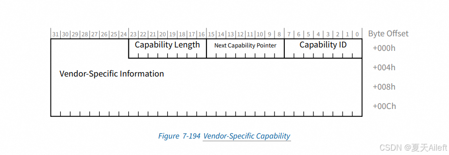

## 1 Introduction

本文件描述了「virtio」裝置家族的規格。 這些裝置雖然存在於虛擬環境中，但設計上它們在虛擬機內對 guest 來說，看起來就像實體裝置（同時本文件也直接將其視為實體裝置）。 這種相似性使得 guest 能夠使用標準的驅動程式與探索機制

virtio 及本規格的目的在於讓虛擬環境與 guest 能夠透過一個直接、有效率、標準且可擴充的機制來使用虛擬裝置，而不是依賴每個環境或作業系統特製化的機制

- 直接：  
  Virtio 裝置使用中斷與 DMA 等常見的匯流排機制，撰寫裝置驅動程式的人應該不陌生。 Virtio 裝置並沒有使用 page-flipping 或 COW（Copy-On-Write）等特殊的機制，它就是一個普通的裝置
- 高效：  
  Virtio 裝置由輸入與輸出的描述符的環（ring）組成，這些環被整齊地排列，以避免驅動程式與裝置同時寫入同一快取列時所產生的快取效應
- 標準：  
  除了需要支援裝置所連接的匯流排以外，Virtio 對其運作環境沒有其他要求。 本規格中，virtio 裝置透過 MMIO、Channel I/O 與 PCI 匯流排傳輸來實作，早期的草稿曾在其他匯流排上實作過，但未收錄於此
- 可擴充：  
  Virtio 裝置包含旗標，guest 作業系統在裝置初始化時會確認這些位元。 這機制允許向前與向後相容：裝置會提供所有它支援的功能，而驅動程式則會確認它支援且想要使用的部分

### 1.1 Normative References

- [RFC2119] Bradner S., “Key words for use in RFCs to Indicate Requirement Levels”, BCP 14, RFC 2119, March 1997. http://www.ietf.org/rfc/rfc2119.txt
- [RFC4122] Leach, P., Mealling, M., and R. Salz, “A Universally Unique IDentifier (UUID) URN Namespace”, RFC 4122, DOI 10.17487/RFC4122, July 2005.
http://www.ietf.org/rfc/rfc4122.txt
- [S390 PoP] z/Architecture Principles of Operation, IBM Publication SA22-7832,
https://www.ibm.com/docs/en/SSQ2R2_15.0.0/com.ibm.tpf.toolkit.hlasm.doc/dz9zr006.pdf, and any future revisions
- [S390 Common I/O] ESA/390 Common I/O-Device and Self-Description, IBM Publication SA22-7204,
https://www.ibm.com/resources/publications/OutputPubsDetails?PubID=SA22720401, and any future revisions
- [PCI] Conventional PCI Specifications,
http://www.pcisig.com/specifications/conventional/, PCI-SIG
- [PCIe] PCI Express Specifications
http://www.pcisig.com/specifications/pciexpress/, PCI-SIG
- [IEEE 802] IEEE Standard for Local and Metropolitan Area Networks: Overview and Architecture,
http://www.ieee802.org/, IEEE
- [SAM] SCSI Architectural Model,
http://www.t10.org/cgi-bin/ac.pl?t=f&f=sam4r05.pdf
- [SCSI MMC] SCSI Multimedia Commands,
http://www.t10.org/cgi-bin/ac.pl?t=f&f=mmc6r00.pdf
- [FUSE] Linux FUSE interface,
https://git.kernel.org/pub/scm/linux/kernel/git/torvalds/linux.git/tree/include/uapi/linux/fuse.h
- [errno] Linux error names and numbers,
https://git.kernel.org/pub/scm/linux/kernel/git/torvalds/linux.git/tree/include/uapi/asm-generic/errno-base.h
- [eMMC] eMMC Electrical Standard (5.1), JESD84-B51,
http://www.jedec.org/sites/default/files/docs/JESD84-B51.pdf
- [HDA] High Definition Audio Specification,
https://www.intel.com/content/dam/www/public/us/en/documents/product-specifications/high-definition-audio-specification.pdf
- [I2C] I2C-bus specification and user manual,
https://www.nxp.com/docs/en/user-guide/UM10204.pdf
- [SCMI] Arm System Control and Management Interface, DEN0056,
https://developer.arm.com/docs/den0056/c, version C and any future revisions
- [RFC3447] J. Jonsson.,“Public-Key Cryptography Standards (PKCS) #1: RSA Cryptography”, February 2003.
https://www.ietf.org/rfc/rfc3447.txt
- [FIPS186-3] National Institute of Standards and Technology (NIST), FIPS Publication 180-3: Secure Hash Standard, October 2008.
https://csrc.nist.gov/csrc/media/publications/fips/186/3/archive/2009-06-25/documents/fips_186-3.pdf
- [RFC5915] “Elliptic Curve Private Key Structure”, June 2010.
https://www.rfc-editor.org/rfc/rfc5915
- [RFC6025] C.Wallace., “ASN.1 Translation”, October 2010.
https://www.ietf.org/rfc/rfc6025.txt
- [RFC3279] W.Polk., “Algorithms and Identifiers for the Internet X.509 Public Key Infrastructure Certificate and Certificate Revocation List (CRL) Profile”, April 2002.
https://www.ietf.org/rfc/rfc3279.txt
- [SEC1] Standards for Efficient Cryptography Group(SECG), “SEC1: Elliptic Cureve Cryptography”, Version 1.0, September 2000.
https://www.secg.org/sec1-v2.pdf
- [RFC2784] Generic Routing Encapsulation. This protocol is only specified for IPv4 and used as either the payload or delivery protocol.
https://datatracker.ietf.org/doc/rfc2784/
- [RFC2890] Key and Sequence Number Extensions to GRE. This protocol describes extensions by which two fields, Key and Sequence Number, can be optionally carried in the GRE Header.
https://www.rfc-editor.org/rfc/rfc2890
- [RFC7676] IPv6 Support for Generic Routing Encapsulation (GRE). This protocol is specified for IPv6 and used as either the payload or delivery protocol. Note that this does not change the GRE header format or any behaviors specified by RFC 2784 or RFC 2890.
https://datatracker.ietf.org/doc/rfc7676/
- [GRE-in-UDP] GRE-in-UDP Encapsulation. This specifies a method of encapsulating network protocol packets within GRE and UDP headers. This protocol is specified for IPv4 and IPv6, and used as either the payload or delivery protocol.
https://www.rfc-editor.org/rfc/rfc8086
- [VXLAN] Virtual eXtensible Local Area Network.
https://datatracker.ietf.org/doc/rfc7348/
- [VXLAN-GPE] Generic Protocol Extension for VXLAN. This protocol describes extending Virtual eXtensible Local Area Network (VXLAN) via changes to the VXLAN header.
https://www.ietf.org/archive/id/draft-ietf-nvo3-vxlan-gpe-12.txt
- [GENEVE] Generic Network Virtualization Encapsulation.
https://datatracker.ietf.org/doc/rfc8926/
- [IPIP] IP Encapsulation within IP.
https://www.rfc-editor.org/rfc/rfc2003
- [NVGRE] NVGRE: Network Virtualization Using Generic Routing Encapsulation
https://www.rfc-editor.org/rfc/rfc7637.html
- [IP] INTERNET PROTOCOL
https://www.rfc-editor.org/rfc/rfc791
- [UDP] User Datagram Protocol
https://www.rfc-editor.org/rfc/rfc768
- [TCP] TRANSMISSION CONTROL PROTOCOL
https://www.rfc-editor.org/rfc/rfc793
- [RFC8174] Leiba, B., "Ambiguity of Uppercase vs Lowercase in RFC 2119 Key Words", BCP 14, RFC 8174, DOI 10.17487/RFC8174, May 2017
http://www.ietf.org/rfc/rfc8174.txt

### 1.2 Non-Normative References

- [Virtio PCI Draft] Virtio PCI Draft Specification. http://ozlabs.org/~rusty/virtio-spec/virtio-0.9.5.pdf

### 1.3 Terminology

本文件中的關鍵字「MUST」、「MUST NOT」、「REQUIRED」、「SHALL」、「SHALL NOT」、「SHOULD」、「SHOULD NOT」、「RECOMMENDED」、「NOT RECOMMENDED」、「MAY」、「OPTIONAL」在出現全大寫時，必須依 [[RFC2119]](https://docs.oasis-open.org/virtio/virtio/v1.3/csd01/virtio-v1.3-csd01.html#x1-3001r1) 與 [RFC8174] 的定義來解釋

#### 1.3.1 Legacy Interface: Terminology

在本規格 1.0 版本之前的規格草案（例如見 [[Virtio PCI Draft]](https://docs.oasis-open.org/virtio/virtio/v1.3/csd01/virtio-v1.3-csd01.html#x1-4001r2)）定義了一種與本規格相似但不同的驅動程式與裝置之間的介面。 由於這些已被廣泛部署，本規格納入了「選用（OPTIONAL）」功能，以簡化從這些早期草案介面過渡的工作

具體而言，裝置與驅動程式可能支援：

- Legacy 介面  
  指的是由本規格較早的草案（1.0 之前）所規定的介面
- Legacy 裝置  
  指在本規格發布之前實作，且在 host 端實作 Legacy 介面的裝置
- Legacy 驅動程式  
  指在本規格發布之前實作，且在 guest 端實作 Legacy 介面的驅動程式

Legacy 裝置與 Legacy 驅動程式不符合本規格。 為了簡化從這些早期草案介面的過渡，裝置可能會實作：

- Transitional 裝置  
  同時支援符合本規格的驅動程式，並允許 Legacy 驅動程式的裝置

同樣地，驅動程式可能會實作：

- Transitional 驅動程式  
  同時支援符合本規格的裝置，以及 Legacy 裝置的驅動程式

注意：Legacy 介面不是必需的，也就是說，除非你需要向後相容性，否則不要實作它們！ 不具有任何 Legacy 相容性的裝置或驅動程式，分別稱為 non-transitional 裝置與 non-transitional 驅動程式

#### 1.3.2 Transition from earlier specification drafts

對於已經實作 legacy 介面的裝置與驅動程式，為了支援本規格，可能需要進行一些修改。 在這種情況下，讀者可能會受益於章節標題中標示為「Legacy Interface」的部分。 這些段落凸顯了自早期草稿以來所做的更動

### 1.4 結構規格

許多裝置與驅動程式的「記憶體內」結構配置使用 C 的 `struct` 語法來描述。 所有結構預設都不包含額外的填充（padding）。 為了強調這點，在已知一般 C 編譯器可能在結構內插入額外填充的情況，會以 GNU C 的 `__attribute__((packed))` 語法加以標示

在結構定義中使用的整數資料型別，遵循以下慣例：

- u8、u16、u32、u64  
  指定長度（位元）的無號整數
- le16、le32、le64  
  指定長度（位元）、以小端序（little-endian）位元組順序儲存的無號整數
- be16、be32、be64  
  指定長度（位元）、以大端序（big-endian）位元組順序儲存的無號整數

本規格中有些欄位不會從位元組邊界開始，或不會在位元組邊界結束。 這類欄位被稱為 bit-fields。 一組 bit-fields 必定是某個整數型別欄位的 sub-division

列出整數欄位內的 bit-fields 時一律會從最低有效位（LSB）到最高有效位（MSB）依序列出。 bit-fields 被視為指定寬度的無號整數，並且保留位元由低到高的相鄰順序關係

例如：

```c
struct S { 
    be16 { 
        A : 15; 
        B : 1; 
    } x; 
    be16 y; 
};
```

這段描述表示：`A` 的值存放在 `x` 的低 15 位元，`B` 的值存放在 `x` 的最高 1 位元。 而 16 位元的 `x` 本身，以大端序儲存在結構 `S` 的起始位置，接著緊鄰其後的是無號整數 `y`，同樣以大端序儲存，位於自結構起始位置算起的 2 位元組（16 位元）偏移處

請注意，此種記法與 C 的 bitfield 語法有些相似，但在可攜式（portable）程式碼中不應天真地轉換為 C 的 bitfield：它與 C 編譯器在小端架構上的 bitfield 打包方式相符，但不符合 C 編譯器在大端架構上的打包方式

::: tip  
不同端序與不同編譯器對 C bitfield 的配置（位序、填充）可能不一致。 規格採用自有的「描述性記法」，而非直接要求用 C bitfield，避免因編譯器實作差異導致跨平台不一致  
:::

假設 `CPU_TO_BE16` 會把本機端序的 16 位元整數轉換為大端序的位元組順序，那麼要產生要寫入 `x` 的值，其可攜式的 C 語言寫法如下：

```c
CPU_TO_BE16(B << 15 | A)
```

### 1.5 常數規格

在許多情況下，裝置與驅動程式之間介面所使用的數值，會以 C 的 `#define` 搭配 `/* ... */` 註解語法來描述。 多個相關的數值會以共同名稱作為前綴，並以底線 `_` 作為分隔。 以 `_XXX` 作為後綴時，表示該群組中的全部數值。 例如：

```c
/* Field Fld value A description */ 
#define VIRTIO_FLD_A        (1 << 0) 
/* Field Fld value B description */ 
#define VIRTIO_FLD_B        (1 << 1)
```

這段為欄位 `Fld` 定義了兩個數值：`Fld=1` 代表 `A`，`Fld=2` 代表 `B`。 注意，`<<` 表示左移運算

此外，在此例中，`VIRTIO_FLD_A` 與 `VIRTIO_FLD_B` 分別對應 `Fld` 的數值 1 與 2。 進一步地，`VIRTIO_FLD_XXX` 代表該群組中的任一個（亦即 `VIRTIO_FLD_A` 或 `VIRTIO_FLD_B`）

## 2 Virtio 裝置的基本機制

Virtio 裝置的枚舉／識別方式取決於其所連接的匯流排（見各匯流排專節：[4.1 Virtio Over PCI Bus](https://docs.oasis-open.org/virtio/virtio/v1.3/csd01/virtio-v1.3-csd01.html#x1-1300001)、[4.2 Virtio Over MMIO](https://docs.oasis-open.org/virtio/virtio/v1.3/csd01/virtio-v1.3-csd01.html#x1-1800002) 與 [4.3 Virtio Over Channel I/O](https://docs.oasis-open.org/virtio/virtio/v1.3/csd01/virtio-v1.3-csd01.html#x1-1940003)）

每個裝置都包含了下列幾個部分：

- 裝置狀態欄位（Device status field）
- 旗標（Feature bits）
- 通知（Notifications）
- 裝置組態空間（Device Configuration space）
- 一個或多個 virtqueue

### 2.1 裝置狀態欄位

當驅動程式初始化裝置時，會依 [3.1](https://docs.oasis-open.org/virtio/virtio/v1.3/csd01/virtio-v1.3-csd01.html#x1-1220001) 所指定的一連串步驟來進行

裝置狀態欄位提供了這個流程中針對「已完成步驟」的簡單狀態指示。 可以把它想像成主控台上的號誌燈（紅綠燈），用來顯示每個裝置的狀態。 定義的位元如下（以下列出它們典型的設定順序）：

- `ACKNOWLEDGE`（1）  
  表示 guest 作業系統已找到該裝置，並辨識其為有效的 virtio 裝置
- `DRIVER`（2）  
  表示 guest 作業系統知道如何驅動此裝置。 注意：在設定此位元前，可能會有顯著（甚至無限期）的延遲，例如在 Linux 中，驅動程式可能是可載入模組
- `FAILED`（128）  
  表示 guest 發生了問題，並且已放棄了這個裝置。 可能的原因包含內部錯誤、驅動程式因某種理由拒絕該裝置，或在裝置操作期間發生致命錯誤等
- `FEATURES_OK`（8）  
  表示驅動程式已確認所有它支援的功能，功能協商已完成
- `DRIVER_OK`（4）  
  表示驅動程式已設定完成，準備好驅動該裝置了
- `DEVICE_NEEDS_RESET`（64）  
  表示裝置遭遇了無法自行復原的錯誤

裝置狀態欄位初始為 0，在重置期間，裝置也會把它重新設為 0

#### 2.1.1 驅動程式需求：裝置狀態欄位

驅動程式必須更新裝置狀態，依 [3.1](https://docs.oasis-open.org/virtio/virtio/v1.3/csd01/virtio-v1.3-csd01.html#x1-1220001) 所述的初始化流程，設定各位元以表示已完成的步驟。 驅動程式不能清除任何裝置狀態位元。 若驅動程式設定了 `FAILED` 位元，則在嘗試重新初始化之前，必須先對裝置進行重置（reset）

當 `DEVICE_NEEDS_RESET` 被設為 1 時，驅動程式不應該依賴裝置操作的完成。 例如，若 `DEVICE_NEEDS_RESET` 已設為 1，驅動程式既不能假設「進行中的請求會完成」，也不能假設「它們尚未完成」。 良好的實作應嘗試透過重置來復原

#### 2.1.2 裝置需求：裝置狀態欄位

在 `DRIVER_OK` 之前，裝置不能取用（consume）任何緩衝區，亦不得向驅動程式送出任何「已用緩衝區（used buffer）」的通知

當裝置進入需要重置才能復原的錯誤狀態時，裝置應要設定 `DEVICE_NEEDS_RESET`。 若此時 `DRIVER_OK` 已被設為 1，則在設定 `DEVICE_NEEDS_RESET` 之後，裝置必須向驅動程式送出裝置組態的變更通知

### 2.2 旗標（Feature Bits）

每個 virtio 裝置會提供它支援的所有特性。 在裝置初始化期間，驅動程式會讀取這些特性，並告訴裝置它所接受的子集合。 要重新協商，只能重置該裝置

這能讓系統具有向前與向後的相容性：如果裝置新增了一個旗標，較舊的驅動程式不會把那個旗標回寫給裝置。 同樣地，如果驅動程式新增了一個裝置不支援的功能，驅動程式也能知道該裝置沒有提供此新功能

旗標的配置如下：

- 0 到 23，以及 50 到 127：  
  用於特定裝置型別的旗標
- 24 到 41：  
  保留給 virtqueue 與功能協商機制的擴充用旗標
- 42 到 49，以及 128 與以上：  
  保留給未來擴充使用的旗標

注意：例如，對網路裝置（也就是 Device ID 1）而言，旗標 0 表示該裝置支援封包的 checksum。 而對於裝置組態空間（device configuration space），如果有了新欄位，則需要搭配一個新的旗標來表示

要讓功能協商機制保持可擴充的重點在於：裝置不應提供那些在驅動程式接受後，裝置本身無法處理的旗標（雖然依照本規格，驅動程式本就不該接受任何未定義、保留或不受支援的特徵）。 同理，驅動程式也不應接受自己不知道如何處理的旗標（雖然依照本規格，裝置本就不該主動提供未定義、保留或不受支援的特徵）。 對於保留或非預期的特徵，首選的處理方式是由驅動程式將其忽略

對僅限於特定 transport 的功能而言，上述原則更為重要，因為若未來規格將這些功能擴大到更多的 transport 上，很可能需要驅動程式與裝置改變既有行為。 支援多種 transport 的驅動程式與裝置，必須謹慎維護每個 transport 各自允許的功能清單

#### 2.2.1 驅動程式需求：旗標

驅動程式不能接受裝置未提供的功能，也不能接受一個需要其他尚未被接受的功能所依賴的功能

驅動程式必須驗證裝置所提供的旗標。 對於下列任一情形的旗標，驅動程式必須忽略且不能接受：

- 未在本規格中描述的
- 標記為保留（reserved）的
- 不適用於該特定 transport 的
- 未為該裝置型別所定義的

如果裝置沒有提供某個驅動程式所支援的功能，驅動程式應要切換到向後相容模式，否則就必須將裝置狀態的 `FAILED` 位元設為 1，並停止初始化

相對地，驅動程式不能僅僅因為裝置提供了一個驅動程式不支援的功能，就宣告失敗

#### 2.2.2 裝置需求：旗標

裝置不能提供一個依賴於其他尚未被提供的功能的特徵。 裝置應該接受驅動程式所接受的功能中的任何有效子集合，否則當驅動程式寫入時，裝置必須讓裝置狀態欄位中的 `FEATURES_OK` 位元設定失敗

裝置不能提供那些即使驅動程式接受了，裝置本身也無法支援的旗標（即便本規格禁止驅動接受這些旗標）。 為求明確，這裡指的是：本規格未描述的旗標、被標記為保留（reserved）的旗標、對特定 transport 或特定裝置型別而言被保留或不受支援的旗標。 不過，若未來版本的本規格允許裝置支援相對應功能，則依該未來規格撰寫的裝置當然不在此限

若某裝置曾成功協商過一組功能（在裝置初始化期間接受了裝置狀態欄位中的 `FEATURES_OK` 位元），那麼在裝置或系統重置之後，對於相同的一組功能，它不應該在重新協商時失敗。 否則會影響從暫停（suspend）恢復以及錯誤復原的流程

#### 2.2.3 Legacy 介面：旗標說明

Transitional 驅動程式必須透過檢測旗標 `VIRTIO_F_VERSION_1` 有沒有被提供，來偵測 Legacy 裝置。 Transitional 裝置必須透過檢測 `VIRTIO_F_VERSION_1` 有沒有被驅動程式確認，來偵測 Legacy 驅動程式。 在此情形下，將透過 Legacy 介面來使用該裝置

對 Legacy 介面的支援是選用的。 因此，transitional 與 non-transitional 的裝置與驅動程式，皆符合本規格

當透過 Legacy 介面使用裝置時，transitional 裝置與 transitional 驅動程式必須依照這些 Legacy 介面章節中所記載的需求來運作。 這些章節的規範文字，一般不適用於 non-transitional 裝置

### 2.3 通知（Notifications）

在本規格中，傳送通知（從驅動程式到裝置，或從裝置到驅動程式）的概念扮演重要角色。 通知的運作方式（modus operandi）取決於所使用的 transport

通知有三種類型：

- 組態變更（configuration change notification）
- 可用緩衝區（available buffer notification）
- 已用緩衝區（used buffer notification）

configuration change 與 used buffer 這兩種通知由裝置送出，由驅動程式接收。 configuration change 通知表示裝置組態空間（device configuration space）發生了變更，used buffer 通知表示在該通知所指定的 virtqueue 上，可能有緩衝區被標記為已用的（used）

available buffer 通知由驅動程式送出，由裝置接收。 此類通知表示在該通知所指定的 virtqueue 上，可能有緩衝區被標記為可用的（available）

不同通知的語義、各 transport 的實作方式，以及其他重要面向，將在後續章節中詳細規範

多數 transport 會以中斷（interrupts）來實作由裝置送往驅動程式的通知。 因此，在先前版本的規格中，這類通知經常被稱為「中斷」。 本規格中有些名稱仍保留這種「中斷」的術語，偶爾也會以 event 一詞來指稱某個通知或其接收行為

### 2.4 裝置重置（Device Reset）

驅動程式可能會在不同時機主動發起裝置重置。 特別是在裝置初始化與裝置清理時，其必須執行重置。 驅動程式用來啟動重置的機制，取決於其使用的 transport

#### 2.4.1 裝置需求：裝置重置

裝置在收到重置之後，必須將裝置狀態欄位重新初始化為 0

當裝置透過把裝置狀態欄位重新設為 0 來表示重置已完成之後，在驅動程式重新初始化裝置之前，裝置不能送出通知，亦不能與各個佇列（queues）互動

#### 2.4.2 驅動程式需求：裝置重置

當驅動程式讀到裝置狀態欄位為 0 時，驅動程式應該視其所發起的重置已經完成

### 2.5 裝置組態空間（Device Configuration Space）

裝置組態空間通常用於很少改變，或只在初始化時期使用的參數。 對於選用的組態欄位，會用旗標來指示其是否存在，未來版本的本規格很可能會在組態空間的尾端加入額外欄位以擴充。 注意：裝置組態空間中的多位元組欄位使用小端序（little-endian）格式

每種 transport 都會為裝置組態空間提供一個世代計數（generation count），只要存在兩次存取可能讀到不同版本內容的情況，這個值就會改變

::: tip  
從驅動程式的角度看，裝置組態空間（Device Configuration Space）就是一小段、可被程式讀/寫的暫存器/記憶體映射區，專門用來放「裝置的參數與狀態」，而且這些參數通常是初始化時要讀、或很少變動的那種。 它不是拿來搬大宗資料的（那是 virtqueue 的工作），而是控制面（control plane）的資訊面板

其內容是由 virtio 裝置暴露給驅動程式的一小段「欄位集合」，用來放各種裝置特定的設定/能力/狀態，驅動透過讀取它來決定要怎麼啟用裝置、配多少資源、是否開哪些功能，例如 virtio-net（網路）內存放了：

- MAC 位址（若裝置宣告 `VIRTIO_NET_F_MAC`）
- MTU（`VIRTIO_NET_F_MTU`）
- 最大佇列對數（`VIRTIO_NET_F_MQ`，多佇列能力）

由於你可能一次要連續讀多個欄位（有的還是 64-bit），裝置可能在你讀到一半時被更新（例如容量剛被管理端調整）。 為了避免拼出的資訊是「前半新、後半舊」的混合體，transport 會提供 generation count。 透過「先讀一次 generation → 讀欄位們 → 再讀一次 generation」，若前後讀到的 generation 相等，就代表這次讀到的是一致快照，反之就重讀  
:::

#### 2.5.1 驅動程式需求：裝置組態空間

驅動程式不能假設寬度大於 32 位元的欄位讀取是原子操作，也不能假設跨多個欄位的讀取是原子操作。 驅動程式應該如下讀取裝置組態空間欄位：

```c
u32 before, after; 
do { 
    before = get_config_generation(device); 
    // 讀取一個或多個組態項目 
    after = get_config_generation(device); 
} while (after != before);
```

::: tip  
大於 32-bit 欄位的讀取不保證原子性，跨欄位更不保證原子性。 建議的樣板是以 generation 計數循環讀取，確保前後一致  
:::

對於選用的組態空間欄位，驅動程式必須先檢查對應的特徵是否已由裝置提供，然後才可存取該組態區段。 功能協商的細節請見第 [3.1](https://docs.oasis-open.org/virtio/virtio/v1.3/csd01/virtio-v1.3-csd01.html#x1-1220001) 節

驅動程式不能預先限制結構大小或裝置組態空間大小。 相反地，驅動程式應該只檢查裝置組態空間是否足以包含裝置運作所需的欄位。 例如，若規格說明組態空間「包含一個 8 位元的欄位」，則應理解為組態空間的末端可能還有任意長度的尾端 padding，因此只要組態空間大於或等於該 8 位元的大小，都應接受

#### 2.5.2 裝置需求：裝置組態空間

在驅動程式設定 `FEATURES_OK` 之前，裝置必須允許驅動讀取任何裝置特定的組態欄位。 這也包含那些取決於旗標的欄位，只要這些旗標已由裝置提供即可

#### 2.5.3 Legacy 介面：裝置組態空間的端序說明

對於 legacy 介面，裝置組態空間通常採用 guest 的原生端序，而非 PCI 的小端序。 各裝置正確的端序在其對應的章節中另有記載

#### 2.5.4 Legacy 介面：裝置組態空間

Legacy 裝置沒有「組態世代（generation）」的欄位，因此在組態被更新時容易遭遇競態（race conditions）。 這會影響到像是區塊容量（block capacity，見 [5.2.4](https://docs.oasis-open.org/virtio/virtio/v1.3/csd01/virtio-v1.3-csd01.html#x1-3100004)）與網路 MAC（見 [5.1.4](https://docs.oasis-open.org/virtio/virtio/v1.3/csd01/virtio-v1.3-csd01.html#x1-2400004)）等欄位。 在使用 legacy 介面時，驅動程式應該連續多次讀取，直到兩次的讀值一致為止

### 2.6 Virtqueues

在 virtio 裝置上用於大量資料傳輸的機制被稱為 virtqueue。 每個裝置可以有 0 至 65536 個 virtqueue，並以索引值來識別，索引值範圍為 0 到 65535。 例如，最簡單的網路設備會有一個用於傳送的 virtqueue 和一個用於接收的 virtqueue

驅動程式會透過把可用緩衝區（available buffer）加入佇列（把描述該請求的緩衝區加入某個 virtqueue），讓裝置取得請求。 必要時還可以觸發驅動端事件（driver event），亦即向裝置送出可用緩衝區的通知

裝置負責執行請求，並在完成時把已用緩衝區（used buffer）加入佇列（將緩衝區標記為 used），以通知驅動。 之後裝置可以觸發裝置端事件（device event），亦即向驅動送出已用緩衝區的通知

裝置會回報它實際寫入至每個被使用的緩衝區的記憶體的位元組數，稱為「used length」。 一般來說，裝置不需要按照驅動程式提供緩衝區的順序來使用它們

::: tip  
virtqueue 是進行大量（bulk）I/O 的核心抽象。 它把「要處理的資料緩衝」排成可供裝置消費的佇列，由驅動與裝置協同操作。 設計上允許一個裝置擁有多個佇列，以支援並行處理

「將請求加入佇列」意旨把一段描述 I/O 的記憶體區塊（buffer/descriptor）掛到 virtqueue。 是否會同時「通知」裝置，依策略決定：

- 高吞吐時可能抑制（coalesce）通知，一次加入多筆後再通知，以減少中斷／MMIO 次數
- 低延遲時則每筆都通知，加速裝置開工。 這與 2.3 的通知機制呼應：driver → device 的是「available buffer」通知

裝置完成處理後會回填狀態／長度等資訊，並更新「已用」結構。 同樣可以彈性地選擇是否要立刻通知驅動，以在延遲與中斷負載間取捨（例如批次完成、多筆合併一次中斷）

used length 是由裝置回報的實際產出長度，與原先驅動提供的 buffer 容量不同。 驅動需據此判斷：

- 資料是否截斷（如通常不允許 used length > 預期容量，可能需丟棄）
- 收到的有效資料大小（例如網路 RX 長度、區塊 I/O 回傳的 bytes）。 這也常被用來驅動「分段處理」或「下一步解析」

這個流程預設允許亂序完成：裝置可依內部排程（大小排序、併發執行、硬體管線）選取可用的 buffer，因此驅動不可假設 FIFO。 這能提升效能與資源利用，但驅動的完成處理必須能對應「任意順序」的回報（例如根據 cookie/descriptor id 對應請求）  
:::

有些裝置總是按照緩衝區被提供的順序來使用描述符（descriptor）。 這類裝置可以提供 `VIRTIO_F_IN_ORDER` 特徵，若成功協商，這項資訊可能允許進一步最佳化，或簡化驅動與／或裝置端的程式碼

::: tip  
`VIRTIO_F_IN_ORDER` 是「保證順序」的合約：

- 對驅動，省去額外的亂序對應結構（如 hash table）與紀錄
- 對裝置，則須放棄某些重排最佳化。 是否啟用取決於場景（低複雜度 vs. 高吞吐需求）。 若未協商此特徵，驅動必須按亂序路徑實作  
:::

每個 virtqueue 最多可以由 3 個部分組成：

- Descriptor Area：用於描述緩衝區
- Driver Area：由驅動程式提供給裝置的額外資料
- Device Area：由裝置提供給驅動程式的額外資料

::: tip  
- Descriptor Area：載明每個 buffer 的位址、長度、方向等（例如 readable/writable）
- Driver Area：驅動傳遞控制資訊給裝置（如「哪些描述符現已可用」、available 索引等）
- Device Area：裝置把完成資訊傳回驅動（如 used 索引、used length、狀態碼）

實際的具體結構與佈局，取決於 Split 或 Packed 兩種格式  
:::

先前版本（見 [2.7](https://docs.oasis-open.org/virtio/virtio/v1.3/csd01/virtio-v1.3-csd01.html#x1-350007) 之後）對這些部分使用了不同名稱：

- Descriptor Table（對應 Descriptor Area）
- Available Ring（對應 Driver Area）
- Used Ring（對應 Device Area）

virtqueue 支援兩種格式：Split Virtqueues（見 [2.7](https://docs.oasis-open.org/virtio/virtio/v1.3/csd01/virtio-v1.3-csd01.html#x1-350007)）與 Packed Virtqueues（見 [2.8](https://docs.oasis-open.org/virtio/virtio/v1.3/csd01/virtio-v1.3-csd01.html#x1-720008)）。 每個驅動與裝置至少會支援其中一種（Packed 或 Split），也可能兩者都支援

#### 2.6.1 Virtqueue 重置（Virtqueue Reset）

當 `VIRTIO_F_RING_RESET` 成功協商後，驅動程式可以個別重置某個 virtqueue。 如何重置 virtqueue 取決於各 transport 的規定。 virtqueue 的重置分成兩個步驟：驅動程式先重置該佇列，之後可以選擇性地將其重新啟用（re-enable）

::: tip  
Re-enable ≈ 重新初始化單一佇列：

- 驅動端：重新配置描述符區、Driver/Device Area、更新可用索引並（視需求）開啟通知，還可以調整參數（如 queue size，用於降級或升級吞吐）
- 裝置端：必須按照驅動最新設定運作，避免使用舊的佇列長度或過期的 DMA 位址。 這一來可在不中斷整個裝置的情況下，針對單佇列完成錯誤復原或容量調整
:::

##### 2.6.1.1 Virtqueue 重置

###### 2.6.1.1.1 裝置需求：Virtqueue 重置

在佇列被驅動程式重置之後，裝置不能再從該 virtqueue 執行任何請求，也不能就此 virtqueue 通知驅動程式。 裝置必須把該 virtqueue 的所有狀態重置為預設值，包括 available 狀態與 used 狀態

::: tip  
- 靜默：不再消費、亦不再發送通知，避免與驅動在重建資料結構期間產生 race condition
- 清空狀態：可用／已用索引、wrap counter（於 packed）、暫存指標等回到初始值，確保後續 re-enable 從乾淨狀態開始  
:::

###### 2.6.1.1.2 驅動程式需求：Virtqueue 重置

當驅動程式要求裝置重置某個佇列後，驅動程式必須驗證該佇列是否已成功被重置。 在佇列成功重置之後，驅動程式可以釋放與該 virtqueue 相關的任何資源

###### 2.6.1.2 Virtqueue 重新啟用（Re-enable）

此流程與整體裝置初始化期間、針對單一佇列的初始化流程相同

###### 2.6.1.2.1 裝置需求：Virtqueue 重新啟用

裝置必須遵從任何可能已被驅動程式變更的佇列組態，例如最大佇列大小等

###### 2.6.1.2.2 驅動程式需求：Virtqueue 重新啟用

在重新啟用佇列時，驅動程式必須如同初次發現該 virtqueue 時那樣配置佇列資源，但也可以採用與先前不同的參數

### 2.7 Split Virtqueues

在本標準 1.0（含更早）的版本中只支援 Split 形式的 virtqueue。 Split 形式會把一個 virtqueue 拆成多個部分，其中每一部分只允許驅動程式或裝置其中之一寫入，而不會同時由雙方寫入。 當把緩衝區標記為可用、或把它標記為已用時，必須更新多個部分，以及（或）同一部分中的多個位置

::: tip  
Split 的核心理念是「所有權分離」來降低 cache line 爭用與同步成本：

- Driver Area 只由驅動寫（提供可用描述符）
- Device Area 只由裝置寫（回報完成）
- Descriptor Area 雙方都能讀，但不能同時寫同一格

因此在「投遞」與「完成」時，需要跨多個區塊更新（例如把索引寫進 Available Ring，完成時把索引寫進 Used Ring），這就是 Split 的操作模式  
:::

每個佇列都有一個 16 位元的 queue size 參數，用來設定表列項目的數量，並由此決定整個佇列的總大小

virtqueue 由三個部分組成：

- Descriptor Table（佔用 Descriptor Area）
- Available Ring（佔用 Driver Area）
- Used Ring（佔用 Device Area）

每一部分在 guest 記憶體中都必須是實體連續（physically-contiguous）的，並且各自有不同的對齊要求。 各部分的記憶體對齊與大小如下：

<span class = "center-column">

| Virtqueue 部分     | 對齊（bytes） |              大小（bytes） |
| ---------------- | --------: | ---------------------: |
| Descriptor Table |        16 |    `16 × (Queue Size)` |
| Available Ring   |         2 | `6 + 2 × (Queue Size)` |
| Used Ring        |         4 | `6 + 8 × (Queue Size)` |

</span>

其中對齊欄給出每個部分所需的最小對齊，大小欄給出該部分的總位元組數

Queue Size 對應於一個 virtqueue 中所能容納的最大緩衝區數量，例如，如果佇列大小為 4，則最多只能有 4 個緩衝區被排入佇列。 Queue Size 的取值一律為 2 的冪次，其最大值為 32768。 這個數值的提供方式由各匯流排特定的規範決定

當驅動程式要把緩衝區送交裝置時，會在 Descriptor Table 中填入一個項目（或把多個描述符串鍊起來），接著把描述符索引寫入 Available Ring，然後通知裝置。 當裝置處理完該緩衝區後，會把描述符索引寫入 Used Ring，並送出 used buffer 通知

::: tip  
所謂的描述符就是 Descriptor Table 裡面的元素，它是 metadata，負責描述「一段實體連續的記憶體」。 實際存放資料的位置被稱為緩衝區（buffer），在 2.7.5 的示意中描述符會以 `addr` 紀錄緩衝區的位址

一個請求可能會包含多個緩衝區，也因此要有多個描述符來記錄這些緩衝區，他是以 list 的方式來記錄的，被稱為描述符鏈。 鏈上的每一個描述符一樣都存在 Descriptor table 中，但在 Available ring 與 Used ring 內只會紀錄 list head，用的時候要從頭一個一個找到目標

個人覺得規格這部分寫得很亂，有時候還會將「緩衝區」與「請求」混用。 可以先看看以下材料幫助理解，再回來看規格：

- [I/O 虚拟化（一）：Split Virtqueue](https://nxw.name/2023/virtqueue)
- [Virtqueues and virtio ring: How the data travels](https://www.redhat.com/en/blog/virtqueues-and-virtio-ring-how-data-travels)
- [Introduction to VirtIO](https://blogs.oracle.com/linux/post/introduction-to-VirtIO)  
:::

#### 2.7.1 驅動程式需求：Virtqueues

驅動程式必須確保每一個 virtqueue 部分（Descriptor/Available/Used）的首個位元組的實體位址都是上表內的對齊值的整數倍

#### 2.7.2 Legacy 介面：Virtqueue 佈局說明

在 Legacy 介面下，virtqueue 的佈局有額外限制。 每個 virtqueue 會佔用兩個或更多個實體連續的頁面（通常一頁是 4096 bytes，但會依 transport 而異，以下稱作 Queue Align），並由三個部分構成：

<span class = "center-column">

| Descriptor Table |　Available Ring（...padding...）　| Used Ring |
|-|-|-|

</span>

::: tip  
Legacy 要求「以頁對齊的大區塊」配置，三者按順序排在同一片連續區域，中間以 padding 補到 Queue Align 邊界，接著才放 Used Ring，以便舊硬體/舊驅動一次性地映射整個 virtqueue 區塊  
:::

控制整個 virtqueue 總位元組數的是匯流排特定的 Queue Size 欄位。 在使用 Legacy 介面時，transitional 驅動程式必須從裝置讀取該 Queue Size，並且必須依照下列公式配置整個 virtqueue 的總大小（其中 Queue Align 記作 `qalign`，Queue Size 記作 `qsz`）：

```c
#define ALIGN(x) (((x) + qalign) & qalign)
static inline unsigned virtq_size(unsigned int qsz) 
{ 
    return ALIGN(sizeof(struct virtq_desc)*qsz + sizeof(u16)*(3 + qsz)) 
        + ALIGN(sizeof(u16)*3 + sizeof(struct virtq_used_elem)*qsz); 
}
```

::: tip  
這段把 Descriptor Table + Available Ring 先對齊到 `qalign` 邊界，再加上 Used Ring，並再對齊到 `qalign`，但這邊少了典型的「`-1 / ~(qalign-1)`」遮罩動作）

舉個例子：若 `qalign = 4096`、`qsz = 256`，你先算出前兩塊大小，向上取 4096 邊界，再加上 Used Ring 的大小並向上取 4096 邊界，得到最終配置大小

此作法在 Legacy 下保證 Used Ring 必定從新的頁對齊邊界開始，符合當年的硬體／驅動假設  
:::

這會因 padding 而浪費一些空間。 使用 Legacy 介面時，transitional 裝置與驅動程式必須使用下列這個 virtqueue 佈局結構，來定位 virtqueue 中的各元素：

```c
struct virtq { 
    // 每個描述符 16 bytes 
    struct virtq_desc desc[ Queue Size ]; 

    // 可用描述符頭的環（遞增索引） 
    struct virtq_avail avail; 

    // 補到下一個 Queue Align 邊界 
    u8 pad[ Padding ]; 

    // 已用描述符頭的環（遞增索引） 
    struct virtq_used used; 
};
```

::: tip  
- `desc[]`、`avail`、`used` 的排列與前述「Descriptor Table → Available Ring →（padding）→ Used Ring」對應
- `avail`/`used` 的「遞增索引（free-running index）」表示索引會不斷地向前遞增（16-bit wrap），配合 `qsz` 的 2 的冪性質，只需遮罩即可計算環上的位置  
:::

#### 2.7.3 Legacy 介面：Virtqueue 的端序說明

請注意，使用 Legacy 介面時，transitional 裝置與驅動程式必須以 guest 的原生端序作為欄位與 virtqueue 的端序，這與本標準對非 Legacy 介面規定的「小端序」不同。 另外需假定 host 端已知 guest 的端序

::: tip  
- 非 Legacy（現行）統一採 little-endian，便於跨平台互通。 Legacy 保留了「照 guest 架構來」的慣例
- 若同時支援 Legacy 與非 Legacy，驅動需針對資料結構的讀寫做對應轉換，以免索引、長度等欄位解讀錯誤  
:::

#### 2.7.4 訊息框架（Message Framing）

用描述符（descriptor）對訊息進行框架化（framing）的方法，與緩衝區內容本身無關。 例如，一個網路傳送緩衝區由 12 位元組的表頭（header）加上後面的網路資料包組成。 最簡單的做法，是在 Descriptor Table 中放一個 12 位元組的輸出（output）描述符，接著再放一個 1514 位元組的輸出描述符

但若 header 與資料包在記憶體中相鄰，也可以用一個 1526 位元組的單一輸出描述符來表示，甚至也可以用三個或更多描述符（只是那樣可能會降低效率）

::: tip  
這邊在說如何把一筆 I/O 請求「切成」一個或多個描述符，這完全取決於驅動的 framing 策略，裝置不應對「切法」做假設

以網路的例子來說，常見的做法是把可由裝置讀取的 header 與 payload 分別以一或多個「device-readable」描述符表達。 若兩者記憶體相鄰，可合併為一個更大的描述符，以降低 ring 更新與 DMA 映射開銷  
:::

請注意，有些裝置實作對「描述符總數／總長度」設有寬鬆但合理的限制（例如基於 host 作業系統中的 `IOV_MAX`）。 實務上這不是問題：如果驅動把一個網路封包切成 1500 個、每個 1 位元組的描述符這種不合理的大小，實作有權拒絕它

::: tip  
`IOV_MAX` 是許多作業系統對單次 scatter-gather I/O 的向量數量上限。 裝置端（或 vhost/host）通常也會沿用或設置類似限制

規格雖允許彈性 framing，但驅動不應濫用，否則實作有權拒絕或退化處理。 良好的實作會在「延遲 vs. 吞吐 vs. CPU 負載」間取得平衡，例如為網卡選用數個描述符以涵蓋 header + payload + optional metadata  
:::

##### 2.7.4.1 裝置需求：訊息框架

裝置不能對描述符的具體排列方式做任何假設。 裝置可以針對一串（chain）描述符的長度設定合理上限

##### 2.7.4.2 驅動程式需求：訊息框架

驅動程式必須把所有裝置可寫（device-writable）的描述符元素，放在所有裝置可讀（device-readable）的描述符元素之後

驅動程式不應該用過多的描述符來描述同一個緩衝區

::: tip  
確保裝置先讀完它需要的指令/表頭資料，再在鏈尾寫入回應／狀態，以避免讀寫區塊交錯引發的同步與安全風險（例如裝置尚未讀 header 就先寫 status）  
:::

##### 2.7.4.3 Legacy 介面：訊息框架

遺憾的是，早期驅動實作採用了過於簡單的版型，儘管本規格已經文字上避免此事，但裝置端逐漸依賴那些簡化的版型。 此外，`virtio_blk` 的 SCSI 命令規格還要求根據框架邊界（frame boundaries）推斷欄位長度（見 [5.2.6.3 Legacy Interface: Device Operation](https://docs.oasis-open.org/virtio/virtio/v1.3/csd01/virtio-v1.3-csd01.html#x1-3190003)）

因此，在使用 Legacy 介面時，`VIRTIO_F_ANY_LAYOUT` 特徵用來告知裝置與驅動：雙方對 framing 不做任何假設。 若未協商到此特徵，各裝置章節會列出 transitional 驅動程式需要遵守的額外要求

#### 2.7.5 Virtqueue 的 Descriptor Table

Descriptor Table 指向驅動程式要提供給裝置使用的各個緩衝區。 `addr` 是實體位址，各緩衝區可透過 `next` 串鍊起來。 單個描述符能夠描述一塊對裝置而言唯讀（device-readable）或唯寫（device-writable）的緩衝區，但一串描述符可以同時包含可讀與可寫的緩衝區

提供給裝置的記憶體內容，取決於裝置型別。 最常見的形式是：資料以一個表頭（header）開頭（其中欄位採小端序），供裝置讀取，並在尾端加上一個狀態尾部（status trailer），供裝置寫入：

```c
struct virtq_desc { 
    /* Address (guest-physical). */ 
    le64 addr; 
    /* Length. */ 
    le32 len; 

/* This marks a buffer as continuing via the next field. */ 
#define VIRTQ_DESC_F_NEXT   1 
/* This marks a buffer as device write-only (otherwise device read-only). */ 
#define VIRTQ_DESC_F_WRITE     2 
/* This means the buffer contains a list of buffer descriptors. */ 
#define VIRTQ_DESC_F_INDIRECT   4 
    /* The flags as indicated above. */ 
    le16 flags; 
    /* Next field if flags & NEXT */ 
    le16 next; 
};
```

表中描述符的數量由此 virtqueue 的 queue size 決定：它也代表描述符鏈可能的最大長度

若已協商 `VIRTIO_F_IN_ORDER`，驅動程式會依「環狀順序」使用描述符：從表格的偏移量 0 開始，走到表尾再繞回表頭。 注意：舊版 [[Virtio PCI Draft]](https://docs.oasis-open.org/virtio/virtio/v1.3/csd01/virtio-v1.3-csd01.html#x1-4001r2) 把本結構稱為 `vring_desc`，並把常數命名為 `VRING_DESC_F_NEXT` 等，但佈局與數值相同

##### 2.7.5.1 裝置需求：Descriptor Table

裝置不能寫入裝置可讀的緩衝區，裝置也不應該讀取裝置可寫的緩衝區（除非為了除錯或診斷，裝置可以這麼做）。 裝置不能寫入任何 Descriptor Table 的表項

::: tip  
- 方向約束保障資料與狀態的一致性與安全性：讀區不可被覆寫。 寫區若被讀，多半僅為偵錯
- 不可改寫表：Descriptor Table 由驅動擁有，裝置若改寫，會破壞鏈完整性與系統安全（可能被視為裝置故障）  
:::

##### 2.7.5.2 驅動程式需求：Descriptor Table

驅動程式不能建立總長度超過 2<sup>32</sup> 位元組的描述符鏈，這也意味著禁止環狀循環的描述符鏈

若已協商 `VIRTIO_F_IN_ORDER`，當驅動在表格偏移量 `x` 的描述符上設置 `VRING_DESC_F_NEXT` 並將其提供給裝置時：對於表中最後一個描述符（`x = queue_size − 1`），驅動必須把 `next` 設為 0，對於其他描述符，必須把 `next` 設為 `x + 1`

##### 2.7.5.3 間接描述符（Indirect Descriptors）

有些裝置能從同時派發大量且巨大的請求中受益。 `VIRTIO_F_INDIRECT_DESC` 特徵允許這樣的作法（見附錄 [A：virtio_queue.h](https://docs.oasis-open.org/virtio/virtio/v1.3/csd01/virtio-v1.3-csd01.html#x1-760000A)）。 為了提升 ring 的承載量，驅動程式可以把一張間接描述符表放在記憶體的任意處，並在主 virtqueue 中插入一個描述符（其 `flags & VIRTQ_DESC_F_INDIRECT` 為 1）指向承載該「間接描述符表」的緩衝區，此時 `addr` 與 `len` 分別是該間接表的位址與位元組長度

::: tip  
主 ring 的 `qsz` 有上限，當單筆請求需要非常多 SG 片段時，把「描述符們」搬到外部表，可以大幅減少主 ring 佔用，提升並行度。 主 ring 上只會放 1 個 `INDIRECT` 節點，裝置循著它到外部表，遍歷裡面的 `virtq_desc[]` 以取得整筆請求的所有片段  
:::

間接表的結構如下（`len` 是指向本表之那個描述符的長度。 這是變數，因此下列程式碼不能直接編譯）：

```c
struct indirect_descriptor_table { 
    /* 每個描述符 16 位元組 */ 
    struct virtq_desc desc[len / 16]; 
};
```

第一個間接描述符位於間接表的起始處（索引 0），剩下的間接描述符會透過 `next` 串接。 當某個間接描述符的 `flags & VIRTQ_DESC_F_NEXT` 為 0 時，表示鏈結在此終止。 單一間接描述符表中，可以同時包含裝置可讀與裝置可寫的描述符

若已協商 `VIRTIO_F_IN_ORDER`，間接描述符必須依序使用連續索引：0、1、2、...，依此類推

###### 2.7.5.3.1 驅動程式需求：間接描述符

除非已協商 `VIRTIO_F_INDIRECT_DESC`，否則驅動程式不能設置 `VIRTQ_DESC_F_INDIRECT` 旗標。 驅動程式不能在間接表內的描述符再次設置 `VIRTQ_DESC_F_INDIRECT`（也就是說，每個描述符最多只指向一張間接表）。 驅動程式不能建立長度超過裝置 Queue Size 的描述符鏈

驅動程式不能同時在 flags 中設置 `VIRTQ_DESC_F_INDIRECT` 與 `VIRTQ_DESC_F_NEXT`

若已協商 `VIRTIO_F_IN_ORDER`，間接描述符必須以連續順序出現，對第一個描述符，`next` 取值為 1，第二個為 2，依此類推

::: tip  
- 禁止間接的間接：避免遞迴／多層 indirection 造成複雜度與攻擊面暴增
- 不能同時 INDIRECT + NEXT：一個主表節點要麼指向「資料／鏈的下一段」，要麼指向「一張間接表」，不能兩者兼具以免歧義
- 鏈長限制：即便使用間接表，總鏈長仍受 Queue Size 約束，避免無界遍歷  
:::

###### 2.7.5.3.2 裝置需求：間接描述符

對於指向間接表的那個描述符，裝置必須忽略其 `flags & VIRTQ_DESC_F_WRITE`（write-only）旗標。 裝置必須能處理「零個或多個一般鏈結的描述符，接著是一個 `flags & VIRTQ_DESC_F_INDIRECT` 的描述符」這種情況。 注意：雖然少見（多數實作要麼全用一般描述符，要麼只用單一間接元素），但這種版型是有效的

::: tip  
- 忽略 WRITE 的原因：指向間接表的主表節點只是個指標，本身不承載資料讀/寫語義，因此 WRITE 在此無意義
- 混合版型：允許「先來幾段普通描述符（例如固定 header），最後再用一張間接表（包含大量 payload 片段）」的組合，裝置需能正確遍歷兩段式結構，提升彈性與擴充性  
:::

#### 2.7.6 Virtqueue 的 Available Ring

Available Ring 的佈局如下：

```c
struct virtq_avail { 
#define VIRTQ_AVAIL_F_NO_INTERRUPT      1 
    le16 flags; 
    le16 idx; 
    le16 ring[ /* Queue Size */ ]; 
    le16 used_event; /* 只有在 VIRTIO_F_EVENT_IDX 協商成功時才存在 */ 
};
```

驅動程式利用 Available Ring 來把緩衝區提供給裝置：環中的每個項目都指向一條描述符鏈（descriptor chain）的頭節點。 這個結構只會由驅動程式寫入，並由裝置讀取

`idx` 欄位表示驅動程式下一個要寫入環的位置（以 queue size 取模），它從 0 起算並遞增。 注意：舊版 [[Virtio PCI Draft]](https://docs.oasis-open.org/virtio/virtio/v1.3/csd01/virtio-v1.3-csd01.html#x1-4001r2) 將此結構稱為 `vring_avail`，並將常數命名為 `VRING_AVAIL_F_NO_INTERRUPT`，但其佈局與數值皆相同

::: tip  
Available Ring 是「投遞佇列」。 驅動在 Descriptor Table 填好描述符（或串鍊）後，把頭節點索引寫入 `ring[idx & (qsz-1)]`，再遞增 `idx`。 因 queue size 為 2 的冪，可用位元遮罩快速取模。 `flags` 可用來提示裝置「是否希望被通知」（未協商 `EVENT_IDX` 的情況下），若協商了 `EVENT_IDX`，`used_event` 會出現，用更精細的門檻值控制「用到哪一格再通知」。 這個結構的單向寫入權（driver-only write）降低了 cache line 爭用與同步需求  
:::

##### 2.7.6.1 驅動程式需求：Available Ring

驅動程式不能讓某個 virtqueue 的 available `idx` 倒退（i.e. 無法「收回」已曝光的緩衝區）

#### 2.7.7 已用緩衝區通知的抑制（Used Buffer Notification Suppression）

若未協商 `VIRTIO_F_EVENT_IDX`，驅動程式可透過 Available Ring 的 flags 提供一種較「陽春」的機制，告知裝置在緩衝區被標記為已用時不必通知。 若已協商 `VIRTIO_F_EVENT_IDX`，則可改用效能更好的 `used_event`，由驅動指定裝置可前進到哪個進度才需要通知

這兩種抑制通知的方法都不可靠，因為它們並未與裝置同步，但作為最佳化仍然有用

::: tip  
通知抑制是提示而非強制承諾，目標是減少中斷或 MMIO 次數，換取更高吞吐。 `flags` 僅能「要或不要」通知，`used_event` 則能設定「水位」，例如告知「用到索引 N 才發一次通知」

由於裝置與驅動可能在不同 CPU／時間線上並行，抑制條件與實際完成時序可能錯開，所以規格要求雙方都要容忍「多發」或「漏發」而不致錯亂  
:::

##### 2.7.7.1 驅動程式需求：已用緩衝區通知的抑制

若未協商 `VIRTIO_F_EVENT_IDX`：

- 驅動程式必須將 `flags` 設為 0 或 1
- 驅動程式可以把 `flags` 設為 1，以告知裝置「不需要通知」

若已協商 `VIRTIO_F_EVENT_IDX`：

- 驅動程式必須將 `flags` 設為 0
- 驅動程式可以使用 `used_event` 告知裝置：在裝置把索引等於 `used_event` 的項目寫入 Used Ring 之前（等價地說，直到 Used Ring 的 `idx` 達到 `used_event + 1` 之前），都不必發送通知
- 驅動程式必須能處理來自裝置的虛假（spurious）通知

##### 2.7.7.2 裝置需求：已用緩衝區通知的抑制

若未協商 `VIRTIO_F_EVENT_IDX`：

- 裝置必須忽略 `used_event` 的值
- 當裝置把描述符索引寫入 Used Ring 之後：
  - 若 flags 為 1，裝置不應該發送通知
  - 若 flags 為 0，裝置必須發送通知

若已協商 `VIRTIO_F_EVENT_IDX`：

- 裝置必須忽略 flags 的最低位
- 當裝置把描述符索引寫入 Used Ring 之後：
  - 若 Used Ring 的 `idx`（決定該索引寫入位置的那個值）等於 `used_event`，裝置必須發送通知
  - 否則裝置不應該發送通知

注意：例如，若 `used_event` 為 0，使用 `VIRTIO_F_EVENT_IDX` 的裝置會在第一個緩衝區被使用後向驅動發送通知（接著在第 65536 個之後再次通知，依此類推）

#### 2.7.8 Virtqueue 的 Used Ring

Used Ring 的佈局如下：

```c
struct virtq_used { 
#define VIRTQ_USED_F_NO_NOTIFY  1 
    le16 flags; 
    le16 idx; 
    struct virtq_used_elem ring[ /* Queue Size */]; 
    le16 avail_event; /* 只有在 VIRTIO_F_EVENT_IDX 協商成功時才存在 */ 
}; 

/* 這裡 id 使用 le32 是為了填補（padding）的考量。 */ 
struct virtq_used_elem { 
    /* 已用描述符鏈的頭節點索引 */ 
    le32 id; 
    /* 裝置對該描述符鏈中屬於「裝置可寫」部分實際寫入的位元組數 */ 
    le32 len; 
};
```

Used Ring 是裝置在完成後歸還緩衝區的位置：它只會由裝置寫入，並由驅動程式讀取

環中的項目都是一組的：`id` 指出描述該緩衝區的描述符鏈之頭節點索引（對應先前 guest 放進 Available Ring 的那一筆），`len` 是實際寫入緩衝區的位元組總數。 注意：對於使用不可信的緩衝區的驅動而言，`len` 特別有用：如果驅動不知道裝置實際寫入了多少，就必須事先把整個緩衝區清零，才能避免資料外洩

例如，網路驅動可能把接收的緩衝區直接交給無特權的使用者空間應用程式。 若網路裝置沒有覆寫該緩衝區中原本的所有位元組，就可能把其他行程釋放的記憶體內容洩露給應用程式

`idx` 欄位表示裝置下一個要寫入環的位置（以 queue size 取模），它從 0 開始並逐漸遞增。 注意：舊版 [[Virtio PCI Draft]](https://docs.oasis-open.org/virtio/virtio/v1.3/csd01/virtio-v1.3-csd01.html#x1-4001r2) 將這兩個結構稱為 `vring_used` 與 `vring_used_elem`，並將常數命名為 `VRING_USED_F_NO_NOTIFY`，但其佈局與數值皆相同

##### 2.7.8.1 Legacy 介面：Used Ring

從歷史上看，以前許多驅動都忽略了 `len` 的值，結果許多裝置也都沒有正確地設定 `len` 值。 因此，在使用 Legacy 介面時，若情況允許，一般建議忽略 Used Ring 項目中的 `len`。 各裝置型別的特定已知問題，會在各自章節列出

##### 2.7.8.2 裝置需求：Used Ring

裝置在更新 Used `idx` 之前，必須先設定 `len`

裝置在更新 Used `idx` 之前，必須從第一個裝置可寫的緩衝區開始，至少寫入 `len` 個位元組到描述符

裝置可以寫入多於 `len` 個位元組到描述符。 注意：在某些錯誤情況下，裝置可能無法準確得知緩衝區的哪些部分已被寫入。 這也是為何要允許寫入多於 `len` 個的位元組：這比「讓驅動誤以為有未初始化記憶體被覆寫了」還好

::: tip  
先填 `len` 再遞增 `idx` 可確保驅動在看到完成項目時，`len` 已就緒。 「至少 `len` 個位元組」是對資料最小成功量的承諾，允許「多於 `len` 個位元組」是為了讓裝置在不確定的情況下保守回報，避免有資料外洩的假象。 對於含多段可寫區塊的鏈，寫入的起點與長度計算需遵循鏈內部順序與邊界  
:::

##### 2.7.8.3 驅動程式需求：Used Ring

驅動程式不能對裝置可寫緩衝區中超過前 `len` 位元組的資料作出任何假設，並且應該忽略該部分的資料

::: tip  
由於裝置保證「至少寫了 `len` 個有效位元組」，但不保證 `len` 之外還有多少是真的寫過的，驅動只能信前 `len` 個位元組，把後面的當成垃圾資料直接忽略  
:::

#### 2.7.9 描述符的 in-order 使用

有些裝置總是按照描述符被提供的相同順序來使用它們。 此類裝置可以提供 `VIRTIO_F_IN_ORDER` 特徵，若成功協商，裝置可藉由只寫入單一個 used ring 項目，來通知驅動程式有一個批次（batch）緩衝區已被使用，該 used ring 項目的 `id` 會對應此批次中最後一個緩衝區之描述符鏈的頭節點索引

::: tip  
`VIRTIO_F_IN_ORDER` 成立時，裝置保證「投遞順序 = 使用順序」。 因此裝置無需對每一筆完成都各寫一個 used 項目，可以把連續的多筆完成合併成一次回報，僅寫回此批次最後一筆的 `id`。 驅動知道 in-order，便能從「上一批末端」一路推定到此 `id` 之間的所有請求都已完成，達成批次完成通知  
:::

接著，裝置會依批次大小在環上往前跳過相應的距離。 相對地，它也會把 used 的 `idx` 依該批次大小遞增。 驅動程式需要查出該 used 的 `id`，並計算此批次的大小，才能把自身的進度推進到裝置下一次將寫入 used ring 項目的位置

如此一來，used ring 上所寫入的那個項目，其偏移會對應到該批次的第一個 available ring 項目的偏移，而下一個批次的 used 項目，也會對應到下一批次的第一個 available 項目的偏移，依此類推

被跳過的那些緩衝區（亦即沒有對應的 used ring 項目者），會被視為裝置已完整使用（讀取或寫入）完畢

#### 2.7.10 可用緩衝區通知的抑制

裝置可以用與 [2.7.7](https://docs.oasis-open.org/virtio/virtio/v1.3/csd01/virtio-v1.3-csd01.html#x1-510007) 中驅動抑制「已用緩衝區」通知類似的方式，來抑制「可用緩衝區」通知。 也就是說，裝置在 used ring 中操作 `flags` 或 `avail_event`，其方式等同於驅動在 available ring 中操作 `flags` 或 `used_event`

##### 2.7.10.1 驅動程式需求：可用緩衝區通知的抑制

驅動程式在配置 used ring 時，必須把其中的 `flags` 初始化為 0

若未協商 `VIRTIO_F_EVENT_IDX`：

- 驅動程式必須忽略 `avail_event` 的值
- 在驅動把描述符索引寫入 available ring 之後：
  - 若 `flags` 為 1，驅動程式不應該送出通知
  - 若 `flags` 為 0，驅動程式必須送出通知

若已協商 `VIRTIO_F_EVENT_IDX`：

- 驅動程式必須忽略 `flags` 的最低位
- 在驅動把描述符索引寫入 available ring 之後：
  - 若 available ring 的 `idx`（決定該索引放置位置的那個值）等於 `avail_event`，驅動程式必須送出通知
  - 否則，驅動程式不應該送出通知

##### 2.7.10.2 裝置需求：可用緩衝區通知的抑制

若未協商 `VIRTIO_F_EVENT_IDX`：

- 裝置必須把 `flags` 設為 0 或 1
- 裝置可以把 `flags` 設為 1，告知驅動「不需要通知」

若已協商 `VIRTIO_F_EVENT_IDX`：

- 裝置必須把 `flags` 設為 0
- 裝置可以使用 `avail_event` 告知驅動：在驅動把索引等於 `avail_event` 的項目寫入 available ring 之前（等價地說，直到 available ring 的 `idx` 達到 `avail_event + 1` 之前），都不需要通知
- 裝置必須能處理來自驅動的虛假（spurious）通知

#### 2.7.11 操作 virtqueue 的輔助工具

Linux 核心原始碼在 `include/uapi/linux/virtio_ring.h` 中，提供了上述定義與更易用的輔助 routine。 該檔案由 IBM 與 Red Hat 以 BSD 三條款授權（3-clause BSD）明確釋出，因而可自由供其他專案使用，其內容也（略有差異地）重製於[附錄 A 的 virtio_queue.h](https://docs.oasis-open.org/virtio/virtio/v1.3/csd01/virtio-v1.3-csd01.html#x1-760000A) 中

#### 2.7.12 Virtqueue 的操作

Virtqueue 的操作分成兩個部分：向裝置供給新的可用緩衝區，以及處理來自裝置的已用緩衝區。 注意：例如，最簡單的 virtio 網路裝置擁有兩個 virtqueue：傳送（transmit）與接收（receive）。 驅動把要送出的封包（裝置可讀）加入傳送 virtqueue，並在它們被使用後釋放。 同樣地，把接收用的緩衝區（裝置可寫）加入接收 virtqueue，並在它們被使用後加以處理

下面將在 Split 形式的 virtqueue 下，分別詳述這兩部分的需求

#### 2.7.13 將緩衝區提供給裝置（Supplying Buffers to The Device）

驅動程式把緩衝區提供給裝置的某個 virtqueue，流程如下：

1. 驅動程式把緩衝區放入 Descriptor Table 中的可用描述符裡，必要時進行串鍊（見 [2.7.5](https://docs.oasis-open.org/virtio/virtio/v1.3/csd01/virtio-v1.3-csd01.html#x1-430005)）
2. 驅動程式把該描述符鏈頭節點的索引，寫入 Available Ring 的下一個項目（entry）
3. 若可進行批次（batch），則可以重複步驟 1 與 2
4. 驅動程式執行合適的記憶體欄柵（memory barrier），以確保裝置在進入下一步之前，能看到更新過的 Descriptor Table 與 Available Ring
5. 把 Available 的 `idx` 依「本次加入 Available Ring 的頭節點數」來遞增
6. 驅動程式再次執行合適的記憶體欄柵，確保它先完成對 `idx` 欄位的更新，再去檢查通知抑制條件
7. 若通知沒有被抑制，驅動程式就向裝置送出「available buffer」通知

請注意，以上流程沒有額外處理 Available Ring 緩衝的「繞回」：因為 Ring 與 Descriptor Table 大小相同，步驟（1）會阻止這種情況發生

此外，Queue Size 的最大值為 32768（16 位元內可表示的最高 2 的冪），因此 16 位元的 `idx` 值永遠能區分環是滿的還是空的。 接下來將更詳細說明每一個階段的需求

##### 2.7.13.1 把緩衝區放入 Descriptor Table

一個緩衝區由 0 個或多個裝置可讀且實體連續的元素，接在 0 個或多個裝置可寫且實體連續的元素之後所構成（兩側各自至少有一個元素）。 以下演算法會把它映射到 Descriptor Table，形成一條描述符鏈：

對每個緩衝區元素 `b`：

1. 取得下一個可用的描述符表項 `d`
2. 把 `d.addr` 設為 `b` 的起始實體位址
3. 把 `d.len` 設為 `b` 的長度
4. 若 `b` 是裝置可寫，則把 `d.flags` 設為 `VIRTQ_DESC_F_WRITE`，否則設為 0
5. 若後面還有下一個元素：
   - (a) 把 `d.next` 設為下一個可用描述符的索引
   - (b) 在 `d.flags` 中設置 `VIRTQ_DESC_F_NEXT` 位元

實務上，`d.next` 平時也會拿來把空閒描述符串成 free list。 開始映射前，通常會先用一個「剩餘可用數量」的計數來檢查是否足夠

##### 2.7.13.2 更新 Available Ring

描述符鏈的頭就是前述演算法中的第一個 `d`，也就是指向此緩衝區第一段的描述符索引。 最樸素的作法可以這樣寫（假設已做正確的小端序轉換）：

```c
avail->ring[avail->idx % qsz] = head;
```

但一般而言，驅動可能會在更新 `idx` 之前，先加入多條描述符鏈（在更新 `idx` 的那一刻才對裝置可見），因此常見的寫法是維持一個「已加入計數」：

```c
avail->ring[(avail->idx + added++) % qsz] = head;
```
##### 2.7.13.3 更新 `idx`

`idx` 會遞增，並在 65536 處自然繞回：

```c
avail->idx += added;
```

只要驅動更新了 Available 的 `idx`，就等於曝光了對應的描述符與其內容。 裝置可以立刻取用這些描述符鏈與其所參照的記憶體

###### 2.7.13.3.1 驅動程式需求：更新 `idx`

在更新 `idx` 之前，驅動程式必須執行合適的記憶體欄柵，以確保裝置看到的是最新的內容

##### 2.7.13.4 通知裝置

通知裝置的方法是匯流排特定的，但一般成本都不低。 因此若不需要，裝置可以依 [2.7.10](https://docs.oasis-open.org/virtio/virtio/v1.3/csd01/virtio-v1.3-csd01.html#x1-5900010) 的機制抑制這類通知。 驅動必須要注意：要先讓新的 `idx` 值對外可見，再去檢查通知是否被抑制

###### 2.7.13.4.1 驅動程式需求：通知裝置

在讀取 `flags` 或 `avail_event` 之前，驅動程式必須執行合適的記憶體欄柵，以避免錯失通知

#### 2.7.14 從裝置接收已用緩衝區

當裝置操作完描述符所指涉的緩衝區時（依 virtqueue 與裝置型別，可能是讀、寫或兩者的部分組合），它會依 [2.7.7](https://docs.oasis-open.org/virtio/virtio/v1.3/csd01/virtio-v1.3-csd01.html#x1-510007) 的說明向驅動程式送出「used buffer」通知

為了最佳化效能，驅動程式在處理 Used Ring 時可以暫時關閉「used buffer」通知，但要小心：在「清空環」與「重新開啟通知」之間，可能會遺漏通知。 通常可在重新啟用通知後，再次檢查是否還有新的已用緩衝區來處理此問題，例如：

```c
virtq_disable_used_buffer_notifications(vq); 
 
for (;;) { 
    if (vq->last_seen_used != le16_to_cpu(virtq->used.idx)) { 
        virtq_enable_used_buffer_notifications(vq); 
        mb(); 

        if (vq->last_seen_used != le16_to_cpu(virtq->used.idx)) 
            break; 

        virtq_disable_used_buffer_notifications(vq); 
    } 

    struct virtq_used_elem *e = virtq.used->ring[vq->last_seen_used%vsz]; 
    process_buffer(e); 
    vq->last_seen_used++; 
}
```

### 2.8 Packed Virtqueues

Packed virtqueue 是一種替代性的、較為緊湊的 virtqueue 佈局，它使用可讀可寫的記憶體，該記憶體由 host 與 guest 兩邊共用，且雙方都可做讀寫。 是否使用 packed virtqueue 由 `VIRTIO_F_RING_PACKED` 旗標（feature bit）協商決定，每個 packed virtqueue 最多支援 2<sup>15</sup> 個項目（entries）

在目前的各種 transport 中，virtqueue 位於驅動程式配置的 guest 記憶體內。 每個 packed virtqueue 由三個部分構成：

- Descriptor Ring —— 佔用 Descriptor Area
- Driver Event Suppression —— 佔用 Driver Area
- Device Event Suppression —— 佔用 Device Area

其中，Descriptor Ring 由多個描述符組成，每個描述符可以包含下列部分：

- Buffer ID
- Element Address
- Element Length
- Flags

一個緩衝區由零個或多個「裝置可讀、且物理上連續」的元素，接在零個或多個「裝置可寫、且物理上連續」的元素所構成（每個緩衝區至少要有一個元素）

::: tip  
記得 virtio 的「readable → writable」分段慣例：先列出裝置可讀的區塊，再列出可寫的區塊，兩類各自可以是多段且各自要物理連續，這樣裝置處理時可以先消費輸入，再產生輸出  
:::

當驅動程式要把這個緩衝區送給裝置時，它會將至少一個「可用」的描述符寫入 Descriptor Ring，用以描述該緩衝區的元素。 描述符是透過其中存放的 Buffer ID 與緩衝區建立關係的

接著，驅動程式會通知裝置。 當裝置處理完該緩衝區後，它會把包含該 Buffer ID 的「已用」裝置描述符寫回 Descriptor Ring（覆寫先前驅動程式所提供的描述符），並送出「已用」事件的通知

Descriptor Ring 以環狀的方式被使用：驅動程式依序將描述符寫入環中。 到達環的末端後，下一個描述符會放回環的開頭。 一旦環中被驅動程式的描述符填滿，驅動程式就會停止送出新請求，等待裝置處理並寫回一些「已用」描述符之後，才會再提供新的驅動程式描述符

同樣地，裝置會按順序從環中讀取描述符，並偵測到已由驅動程式標記為可用的描述符。 當完成對描述符的處理後，裝置會把「已用」描述符寫回環中

注意：裝置雖然會按順序讀取驅動程式的描述符並依順序做處理，但實際完成的順序可能不同步（非按順序完成）。 因此，裝置會依「實際完成」的順序來寫入「已用」描述符

Device Event Suppression 資料結構對裝置來說是唯寫的，它包含用來降低「裝置事件」數量的資訊，也就是讓「送往裝置的可用緩衝區通知」變得更少。 Driver Event Suppression 資料結構對裝置來說是唯讀的，它包含用來降低「驅動程式事件」數量的資訊，也就是讓「送往驅動程式的已用緩衝區通知」變得更少

::: tip  
- Device Event Suppression（位在 Device Area）：由 device 寫、driver 讀，用來減少 driver → device 的 kick（也就是「available/kick 通知」）
- Driver Event Suppression（位在 Driver Area）：由 driver 寫、device 讀，用來減少 device → driver 的中斷（也就是「used 通知」）
:::

#### 2.8.1 驅動程式與裝置的環繞回計數器（Ring Wrap Counter）

驅動程式與裝置各自都需在內部維護一個單一位元的環繞回計數器，初始值為 1

由驅動程式維護的計數器稱為 Driver Ring Wrap Counter，每當驅動程式把環中的「最後一個」描述符標記為可用之後，它就會切換（翻轉）此計數器的值。 由裝置維護的計數器稱為 Device Ring Wrap Counter，每當裝置把環中的「最後一個」描述符標記為已用之後，它就會切換（翻轉）此計數器的值

可以很容易地看出：當驅動程式與裝置在處理同一個描述符，或當所有可用描述符都已被使用時，兩者的環繞回計數器會相互一致

::: tip  
同一圈、同一格時，兩端的 counter 理當一致。 當沒有尚未處理的可用描述符時，雙方應該都處於相同的 wrap 狀態  
:::

要把描述符標記為可用或已用，驅動程式與裝置都會使用下列兩個旗標：

```c
#define VIRTQ_DESC_F_AVAIL     (1 << 7)
#define VIRTQ_DESC_F_USED      (1 << 15)
```

要把描述符標記為「可用」時，驅動程式會把 Flags 中的 `VIRTQ_DESC_F_AVAIL` 設成與內部 Driver Ring Wrap Counter 相同的值，同時把 `VIRTQ_DESC_F_USED` 設成相反的值（與內部的 Driver Ring Wrap Counter 不同的值）

當要把描述符標記為「已用」時，裝置會把 Flags 中的 `VIRTQ_DESC_F_USED` 設成與內部 Device Ring Wrap Counter 相同的值，同時把 `VIRTQ_DESC_F_AVAIL` 也設成相同的值

因此，對「可用」的描述符而言，`VIRTQ_DESC_F_AVAIL` 與 `VIRTQ_DESC_F_USED` 兩個位元會是不同的值。 對「已用」的描述符而言，兩個位元會是相同的值

注意：上述觀察主要用於健全性檢查（sanity-checking），因為那只是必要條件而非充分條件，例如，所有描述符在初始階段的值都會是零。 為了正確偵測已用與可用，驅動程式與裝置可以記錄上一次觀察到的 `VIRTQ_DESC_F_USED`／`VIRTQ_DESC_F_AVAIL` 的值。 其他用來偵測 `VIRTQ_DESC_F_AVAIL`／`VIRTQ_DESC_F_USED` 位元變化的技術也可能可行

#### 2.8.2 對可用與已用描述符的輪詢

裝置與驅動程式對描述符的寫入可以做重排序（reorder），但雙方只需輪詢（或測試）記憶體中的單一位置：也就是在環狀順序裡，位於先前處理過的描述符之後的下一個裝置描述符

::: tip  
「可以重排序」提醒你要配合記憶體屏障確保可見性。 不過為了效率，雙方不需要掃描整個環，只要看「下一格」就好。 對驅動而言，這是在觀察裝置是否把下一格改成已用的了； 對裝置而言，這是在觀察驅動是否把下一格改成可用的了  
:::

有時候，裝置在處理了一批多個可用描述符之後，只需要寫出單一個「已用」描述符。 更詳細的情況會在後文解釋，例如使用描述符鏈（descriptor chaining）或按順序（in-order）使用時會發生此情形。 此時，裝置會寫出一個已用描述符，其 Buffer ID 為這一組裡最後一個描述符的 ID。 處理完這個已用描述符之後，裝置與驅動程式都會在環上向前跳過該群組內其餘描述符的數量，直到處理（對驅動是讀取、對裝置是寫入）到下一個已用描述符為止

#### 2.8.3 Write 旗標

在可用描述符中，Flags 內的 `VIRTQ_DESC_F_WRITE` 位元用來標記該描述符所對應的緩衝區是唯寫（write-only）的還是唯讀（read-only）的

```c
/* 這會把描述符標成「裝置唯寫」的（否則為「裝置唯讀」的）。 */
#define VIRTQ_DESC_F_WRITE     2
```

在已用描述符中，這個位元則用來表示「裝置是否已經對該緩衝區的任一部分寫入過資料了」

#### 2.8.4 元素位址與長度

在可用描述符中，Element Address 對應到該緩衝元素的實體位址，元素的長度則儲存在 Element Length 中。 緩衝元素應為物理連續的

::: tip  
如同前面 2.7 一開始所述，規格混用了名詞，這邊的緩衝元素就是指單個 buffer，一個 descriptor 對應到一個 buffer。 後面看到「緩衝」這個詞的時候要自己判斷一下他是指單個 buffer，還是指整個請求的 buffer  
:::

在已用描述符中，Element Address 不被使用。 Element Length 則用來表示裝置已經初始化（寫入）的緩衝區長度。 對於未設 `VIRTQ_DESC_F_WRITE` 旗標的已用描述符，Element Length 不被使用，驅動程式應忽略它

#### 2.8.5 Scatter-Gather 支援

有些驅動需要在一個請求中提供多個緩衝元素的清單（亦稱 scatter/gather list）。 有兩種功能支援這點：描述符鏈（descriptor chaining）與間接描述符（indirect descriptors）

若驅動未使用這兩種功能，則每個緩衝區都是物理上連續的，且為唯讀或唯寫的，並可由單一描述符完整描述

::: tip  
未使用這兩種功能就代表緩衝區內只有一個元素，因此會有後續的那些特徵  
:::

雖然少見（多數實作要麼只使用非間接的描述符來建立所有清單，要麼只使用單一間接元素），但若兩種功能皆已協商，則在同一個 ring 中混用「間接」與「非間接」描述符是合法的，只要每一份清單本身只含單一類型的描述符即可

Scatter/gather 清單只可用於可用描述符，對應的已用描述符則以單一項目代表整份清單

裝置會透過與 transport 或裝置本身相關的限制值來限制清單中的描述符數量。 若未加限制，清單可包含的最大描述符數量等於 virtqueue 的大小

#### 2.8.6 Next 旗標：描述符鏈接

在 packed ring 格式中，驅動可以用多個描述符來提供一份 scatter/gather 清單，這會為除了最後一個可用描述符之外，其餘的每個可用描述符的 Flags 欄位設定 `VIRTQ_DESC_F_NEXT`

```c
/* 這表示該緩衝會「接續於下一個」。 */
#define VIRTQ_DESC_F_NEXT 1
```

Buffer ID 會放在清單中的最後一個描述符裡

驅動一定要在把清單的其餘描述符都寫入 ring 之後，才能將這份清單的第一個描述符標為可用的。 這能保證裝置在 ring 上永遠不會看到「部分寫入」的 scatter/gather 清單

注意：清單中的所有描述符都必須正確設置／清除所有旗標，包括 `VIRTQ_DESC_F_AVAIL`、`VIRTQ_DESC_F_USED`、`VIRTQ_DESC_F_WRITE`，而不是只有第一個要設定

裝置只會為整份清單寫出單一個已用描述符，之後它會依清單中描述符的數量在 ring 上向前跳過。 為了能跳到裝置寫入下一個已用描述符的位置，驅動需要記住每個 Buffer ID 所對應清單的大小

例如，若描述符的使用順序和它被標記為可用的順序相同，則結果會是：已用描述符會覆寫該清單中的「第一個」可用描述符，下一份清單的已用描述符會覆寫下一份清單的第一個可用描述符，如此類推

`VIRTQ_DESC_F_NEXT` 在已用描述符中不被使用，驅動應忽略它

#### 2.8.7 Indirect 旗標：Scatter-Gather 支援

有些裝置可以透過同時派發大量且巨大的請求來獲益，而 `VIRTIO_F_INDIRECT_DESC` 旗標允許了這種作法。 為了提升 ring 的容量，驅動可以在記憶體中的任意位置儲存一張「間接描述符表」（對裝置為唯讀的），並在主 virtqueue 中插入一個描述符（其 Flags 設 `VIRTQ_DESC_F_INDIRECT`）去引用一個緩衝元素，而該元素中包含這張間接描述符表，`addr` 與 `len` 分別指向間接表的位址與其位元組長度

```c
/* 表示該元素中裝的是一張描述符表。 */
#define VIRTQ_DESC_F_INDIRECT 4
```

間接表的佈局如下（`len` 為引用這張表的描述符的 Buffer Length，屬可變長度）：

```c
struct pvirtq_indirect_descriptor_table {
    /* 真正的描述符結構（每個為 struct pvirtq_desc） */
    struct pvirtq_desc desc[len / sizeof(struct pvirtq_desc)];
};
```

第一個描述符位於間接描述符表的起始位置，後續的間接描述符緊接其後。 對於間接表中的描述符，旗標位中只有 `VIRTQ_DESC_F_WRITE` 是有效的，其餘皆不被使用，Buffer ID 也不被使用，裝置應忽略它們

而對於在主 virtqueue 上帶有 `VIRTQ_DESC_F_INDIRECT` 的那個描述符而言，其 `VIRTQ_DESC_F_WRITE` 也不被使用，裝置應忽略它

#### 2.8.8 按序（In-order）使用描述符

有些裝置總是以與描述符被標記為可用的相同順序來使用它們，這些裝置可以提供 `VIRTIO_F_IN_ORDER` 特徵。 若已協商，裝置便可只寫出一個已用描述符（其 Buffer ID 對應到該批次中最後一個描述符），來通知驅動該批次緩衝已被使用

::: tip  
`VIRTIO_F_IN_ORDER` 讓裝置承諾「完成順序 ＝ 提交順序」，因此允許用「最後一個的 Buffer ID」代表整批完成，降低寫回與通知次數  
:::

之後，裝置會依該批次的大小在 ring 上向前跳過，驅動需要查出該已使用的 Buffer ID，計算這一批的大小，才能推進到裝置將寫入下一個已用描述符的位置

這將導致該批次的已用描述符會覆寫該批次中第一個可用描述符，下一批的已用描述符則覆寫下一批的第一個可用描述符，依此類推

那些被跳過（未寫出已用描述符）的緩衝，會被當作已被裝置完整使用（讀或寫）了

::: tip  
驅動端的工作是：看見代表性的已用項目後，能復原該批的大小（例如以事先記錄的鏈長或批次資訊），並一次性把 ring 的消費指標跳到下一個代表項目的位置

這種批次覆寫規則與 2.8.6 的「清單首項被覆寫」相呼應，只是這裡的「批」未必是透過 NEXT 串接，而是由按序特性與驅動的分組策略來界定  
:::

#### 2.8.9 多緩衝請求

有些裝置會把多個緩衝合併起來，一起處理為單一個請求。 這些裝置會在將請求中的其他描述符（對應其餘緩衝）都被標記為已用並寫回環之後，才把對應到第一個緩衝的描述符標記為已用。 這能保證驅動程式在環上不會看到「部分完成」的請求

#### 2.8.10 驅動與裝置的事件抑制

在許多系統中，對「已用／可用」緩衝的通知會帶來可觀的額外開銷。 為了降低這些開銷，每個 virtqueue 都包含兩個相同的結構，用來控制裝置與驅動之間的通知

Driver Event Suppression 結構對裝置而言是唯讀的，用來控制「裝置送往驅動」的已用緩衝通知
Device Event Suppression 結構對驅動而言是唯讀的，用來控制「驅動送往裝置」的可用緩衝通知

這兩個事件抑制結構都包含下列欄位：

- Descriptor Ring Change Event Flags  
  其取值如下：
  ```c
  /* Enable events */ 
  #define RING_EVENT_FLAGS_ENABLE 0x0 
  /* Disable events */ 
  #define RING_EVENT_FLAGS_DISABLE 0x1 
  /* 
  * Enable events for a specific descriptor 
  * (as specified by Descriptor Ring Change Event Offset/Wrap Counter). 
  * Only valid if VIRTIO_F_EVENT_IDX has been negotiated. 
  */ 
  #define RING_EVENT_FLAGS_DESC 0x2 
  /* The value 0x3 is reserved */
  ```
- Descriptor Ring Change Event Offset  
  當事件旗標設定為「特定描述符事件」時：此欄位為環內的偏移量（以描述符大小為單位）。 只有當該描述符分別被標記為可用／已用時，事件才會觸發
- Descriptor Ring Change Event Wrap Counter  
  當事件旗標設定為「特定描述符事件」時：此欄位用於匹配環繞回計數器的值。 只有在計數器匹配且描述符被標記為可用／已用時，事件才會觸發

在寫出一些描述符後，裝置與驅動都應該要查閱對應的事件抑制結構，以判斷是否需要送出相應的已用或可用緩衝通知

##### 2.8.10.1 結構大小與對齊

virtqueue 的各部分在 guest 記憶體中都必須是物理連續的，且有不同的對齊需求。 各部分的記憶體對齊與大小需求（單位為位元組）如下表：

<span class = "center-column">

| Virtqueue Part | Alignment | Size |
| - | - | - |
| Descriptor Ring | 16 | 16∗(Queue Size) |
| Device Event Suppression | 4 | 4 |
| Driver Event Suppression | 4 | 4 |

</span>

「Alignment」欄顯示了 virtqueue 每個部分所需的最小對齊需求。 「Size」欄顯示了每個部分的總位元組數。 Queue Size 對應於該 virtqueue 中描述符的最大數量，例如，若佇列大小為 4，則在任何特定時間最多可將 4 個緩衝區佇列。 Queue Size 不一定要是 2 的冪次

#### 2.8.11 驅動需求：Virtqueue

驅動程式必須確保 virtqueue 每個部分的「第一個位元組」的實體位址，是上述表格內所列的對齊值的整數倍

#### 2.8.12 裝置需求：Virtqueue

裝置必須「依環上出現的順序」處理驅動的描述符。 裝置必須「依實際完成的順序」把裝置端的描述符寫回環中。 裝置在「開始寫入描述符之後」可以重新排序描述符寫入的順序

#### 2.8.13 Virtqueue 描述符格式

可用描述符指向驅動要交給裝置的緩衝，`addr` 為實體位址，而描述符透過 `id` 欄位與緩衝建立關係：

```c
struct pvirtq_desc {
    /* 緩衝位址 */
    le64 addr;
    /* 緩衝長度 */
    le32 len;
    /* 緩衝 ID */
    le16 id;
    /* 視描述符類型而定的旗標 */
    le16 flags;
};
```

描述符環以全零初始化

#### 2.8.14 事件抑制結構格式

以下這個結構用於減少驅動與裝置之間的通知數量：

```c
struct pvirtq_event_suppress {
    le16 {
      desc_event_off  : 15; /* 描述符環變更事件偏移量 */
      desc_event_wrap : 1;  /* 描述符環變更事件的環繞回計數器 */
    } desc; /* 當 desc_event_flags 設為 RING_EVENT_FLAGS_DESC 時生效 */

    le16 {
      desc_event_flags : 2, /* 描述符環變更事件旗標 */
      reserved         : 14; /* 保留，設為 0 */
    } flags;
};
```

#### 2.8.15 裝置需求：Virtqueue 描述符表

裝置不得對「裝置可讀」的緩衝進行寫入，且裝置不應讀取「裝置可寫」的緩衝。 除非觀察到旗標中的 `VIRTQ_DESC_F_AVAIL` 位元發生了變化（例如相較於初始的零值），否則裝置不得使用該描述符。 改變了旗標中的 `VIRTQ_DESC_F_USED` 位元之後，裝置不得再更動該描述符

#### 2.8.16 驅動需求：Virtqueue 描述符表

除非觀察到旗標中的 `VIRTQ_DESC_F_USED` 位元發生了變化，否則驅動不得更動描述符。 驅動在改變旗標中的 `VIRTQ_DESC_F_AVAIL` 位元之後，不得再更動該描述符。 在通知裝置時，驅動必須把 `next_off` 與 `next_wrap` 以匹配尚未提供給裝置的下一個描述符。 驅動可以在未提供任何新描述符的情況下，傳送多次可用緩衝區的通知

#### 2.8.17 驅動需求：Scatter-Gather 支援

驅動不得建立超過裝置允許長度的描述符清單。 驅動不得建立長度超過 Queue Size 的描述符清單，這意味著描述符清單中禁止存在環狀迴路

驅動必須把所有「裝置可寫」的描述符元素放在所有「裝置可讀」元素之後。 驅動不得指望裝置會多用描述符來寫出整份清單，在把清單的第一個描述符標記為可用之前，驅動必須確保環中有足夠空間容納整份清單。 驅動不得在清單中所有後續描述符都被標記為可用之前，就先把清單的第一個描述符設為可用的

#### 2.8.18 裝置需求：Scatter-Gather 支援

對於以 `VIRTQ_DESC_F_NEXT` 旗標鏈接的清單，裝置必須依照驅動標記為可用的順序來使用其中的描述符。 
裝置可以限制一份清單所允許包含的緩衝數量

#### 2.8.19 驅動需求：間接描述符

若為協商 `VIRTIO_F_INDIRECT_DESC` 特徵，驅動不得自行設定 `VIRTQ_DESC_F_INDIRECT` 旗標。 對於間接描述符表中的描述符，驅動除了 `VIRTQ_DESC_F_WRITE` 外，不得設定任何其他旗標

驅動不得建立長度超過裝置允許的描述符鏈。 在由 `VIRTQ_DESC_F_NEXT` 鏈接的 scatter-gather 清單中，驅動不得在「直接描述符」上設置 `VIRTQ_DESC_F_INDIRECT` 旗標

#### 2.8.20 Virtqueue 運作

virtqueue 的運作分成兩部分：向裝置提供新的可用緩衝，以及處理來自裝置的已用緩衝。 以下將在 packed virtqueue 格式下，分別詳述這兩部分的需求

#### 2.8.21 向裝置提供緩衝

驅動向裝置的某個 virtqueue 提供緩衝的流程如下：

1. 驅動把緩衝放入 Descriptor Ring 中的可用空描述符
2. 驅動執行適當的記憶體屏障，確保在檢查通知抑制之前，已經完成對描述符的更新
3. 若通知未被抑制，驅動就通知裝置有新的可用緩衝

接下來會更詳細說明上述每個階段的需求

##### 2.8.21.1 將可用緩衝放入描述符環

對於每個緩衝元素 `b`：

1. 取得下一個描述符表項目 `d`
2. 取得下一個可用的 buffer id 值
3. 將 `d.addr` 設為 `b` 開頭的實體位址
4. 將 `d.len` 設為 `b` 的長度
5. 將 `d.id` 設為該 buffer id
6. 依下列方式計算 `flags`：
   - (a) 若 `b` 為裝置可寫，將 `VIRTQ_DESC_F_WRITE` 位設為 1，否則設為 0
   - (b) 將 `VIRTQ_DESC_F_AVAIL` 設為當前 Driver Ring Wrap Counter 的值
   - (c) 將 `VIRTQ_DESC_F_USED` 設為與當前 Driver Ring Wrap Counter 相反的值
7. 執行記憶體屏障，以確保描述符已完成初始化
8. 將 `d.flags` 設為計算出的 `flags` 值
9. 若 `d` 是環中的最後一個描述符，則切換 Driver Ring Wrap Counter
10. 否則，將 `d` 前進到下一個描述符

上述流程會讓「單一描述符的緩衝」變成可用的。 然而一般來說，驅動程式可能會將一批描述符作為單一請求的一部分。 在那種情況下，驅動程式會延後更新第一個描述子的 `flags`（以及先前的記憶體屏障），直至其餘描述符都完成了初始化之後

一旦驅動更新了描述符的 `flags` 欄位，就等於公開了該描述符及其內容。 裝置可以立即存取該描述符、驅動所建立的任何後續描述符，以及它們所參考的記憶體

###### 2.8.21.1.1 驅動需求：更新 flags

在更新 `flags` 之前，驅動必須執行適當的記憶體屏障，以確保裝置能看到最新版本的資料

#### 2.8.21.2 傳送可用緩衝通知

實際的裝置通知方法依匯流排而定，但通常成本不低。 因此，若裝置不需要通知，可以使用第 [2.8.14](https://docs.oasis-open.org/virtio/virtio/v1.3/csd01/virtio-v1.3-csd01.html#x1-8700014) 節所述、位於 Device Area 的事件抑制結構，來抑制這類通知

驅動在檢查通知是否被抑制之前，必須先公開（寫出）新的 `flags` 值

#### 2.8.21.3 實作範例

以下是驅動程式碼的範例。 它沒有嘗試降低可用緩衝通知的次數，也不支援 `VIRTIO_F_EVENT_IDX` 特徵：

```c
/* 注意：vq->avail_wrap_count 的初始值為 1 */
/* 注意：vq->sgs 是與 ring 同大小的陣列 */

d = alloc_id(vq); 
 
first = vq->next_avail; 
sgs = 0; 
for (each buffer element b) { 
    sgs++; 

    vq->ids[vq->next_avail] = -1; 
    vq->desc[vq->next_avail].address = get_addr(b); 
    vq->desc[vq->next_avail].len = get_len(b); 

    avail = vq->avail_wrap_count ? VIRTQ_DESC_F_AVAIL : 0; 
    used = !vq->avail_wrap_count ? VIRTQ_DESC_F_USED : 0; 
    f = get_flags(b) | avail | used; 
    if (b is not the last buffer element) { 
        f |= VIRTQ_DESC_F_NEXT; 
    } 

    /* 在全部就緒前，不要把第一個描述符標記為可用 */
    if (vq->next_avail == first) { 
        flags = f; 
    } else { 
        vq->desc[vq->next_avail].flags = f; 
    } 

    last = vq->next_avail; 

    vq->next_avail++; 

    if (vq->next_avail >= vq->size) { 
        vq->next_avail = 0; 
        vq->avail_wrap_count ^= 1; 
    } 
} 

vq->sgs[id] = sgs; 
/* 在清單中的最後一個描述符寫入 ID */
vq->desc[last].id = id; 
write_memory_barrier(); 
vq->desc[first].flags = flags; 
 
memory_barrier(); 
 
if (vq->device_event.flags != RING_EVENT_FLAGS_DISABLE) { 
    notify_device(vq); 
}
```

##### 2.8.21.3.1 驅動需求：傳送可用緩衝通知

在讀取位於 Device Area 的事件抑制結構之前，驅動必須執行適當的記憶體屏障。 若未這麼做，可能導致本應送出的可用緩衝通知未被送出

#### 2.8.22 從裝置接收已用緩衝

一旦裝置使用了描述符所參考的緩衝（依 virtqueue 與裝置性質，可能是讀、寫，或兩者的部分），它會依第 [2.8.14](https://docs.oasis-open.org/virtio/virtio/v1.3/csd01/virtio-v1.3-csd01.html#x1-8700014) 節所述向驅動送出「已用緩衝通知」

注意：為了最佳效能，驅動在處理已用緩衝時可以暫時停用已用通知，但要小心在清空環與重新啟用通知之間遺漏通知的問題。 一般做法是在重新啟用通知之後，再次檢查是否還有更多已用緩衝：

```c
/* 注意：vq->used_wrap_count 的初值為 1 */

vq->driver_event.flags = RING_EVENT_FLAGS_DISABLE;

for (;;) {
    struct pvirtq_desc *d = vq->desc[vq->next_used];

    /*
    * 檢查：
    * 1. 該描述符已被標記為可用。 若驅動在另一執行緒並行提供新描述符，
    *    這個檢查就有必要。 也可用其他方式檢查，例如追蹤未處理的可用
    *    描述符／緩衝數是否非 0
    * 2. 該描述符已被裝置使用
    */
    flags = d->flags;
    bool avail = flags & VIRTQ_DESC_F_AVAIL;
    bool used = flags & VIRTQ_DESC_F_USED;
    if (avail != vq->used_wrap_count || used != vq->used_wrap_count) {
        vq->driver_event.flags = RING_EVENT_FLAGS_ENABLE;
        memory_barrier();

        /*
        * 重新測試：以防驅動在並行路徑又提供了新的描述符，
        * 或裝置在驅動啟用事件之前又使用了更多描述符
        */
        flags = d->flags;
        bool avail = flags & VIRTQ_DESC_F_AVAIL;
        bool used = flags & VIRTQ_DESC_F_USED;
        if (avail != vq->used_wrap_count || used != vq->used_wrap_count) {
            break;
        }

        vq->driver_event.flags = RING_EVENT_FLAGS_DISABLE;
    }

    read_memory_barrier();

    /* 依下一個緩衝，跳過其餘描述符 */
    id = d->id;
    assert(id < vq->size);
    sgs = vq->sgs[id];
    vq->next_used += sgs;
    if (vq->next_used >= vq->size) {
        vq->next_used -= vq->size;
        vq->used_wrap_count ^= 1;
    }

    free_id(vq, id);

    process_buffer(d);
}
```

### 2.9 驅動端通知

驅動有時需要向裝置送出「可用緩衝通知」。 在未協商 `VIRTIO_F_NOTIFICATION_DATA` 的情況下，如果也沒有協商 `VIRTIO_F_NOTIF_CONFIG_DATA`，則通知內容為 virtqueue 索引，若有協商 `VIRTIO_F_NOTIF_CONFIG_DATA`，則為裝置提供的 virtqueue 通知組態資料。 通知的方法與提供該類通知組態資料的方式，依 transport 而定

然而，如果裝置能在「不讀取記憶體中的 virtqueue」的情況下得知佇列的可用資料量，就會更有效率，或有助於除錯。 為了協助這些最佳化，當協商了 `VIRTIO_F_NOTIFICATION_DATA` 時，驅動送給裝置的通知會包含下列資訊：

- `vq_index` 或 `vq_notif_config_data`  
  對應到某個 virtqueue 的「virtqueue 索引」或「裝置提供的佇列通知組態資料」
- `next_off`  
  環中「下一個可用描述符將被寫入的位置（偏移量）」。 未協商 `VIRTIO_F_RING_PACKED` 時，指可用索引（available index）的低 15 位； 協商了 `VIRTIO_F_RING_PACKED` 時，指「描述符環內」下一個可用描述符的位置偏移量（以描述符項目為單位）
- `next_wrap`
  環繞回計數器（Wrap Counter）。 協商了 `VIRTIO_F_RING_PACKED` 時，這是下一個可用描述符所對應的 wrap counter； 未協商時，指可用索引的最高位（bit 15）

注意：即使沒有提供更多緩衝區，驅動仍可發送多次通知。 在協商了 `VIRTIO_F_NOTIFICATION_DATA` 的情況下，這些通知的 `next_off` 與 `next_wrap` 值會相同

::: tip  
這裡區分了有／沒有 `VIRTIO_F_NOTIFICATION_DATA` 的兩種承載格式。 未協商時，只能用傳統的 queue 索引或裝置提供的固定組態塊。 實際怎麼寫入寄存器或 MMIO 都由各 transport（PCI、MMIO 等）定義

在有協商 `VIRTIO_F_NOTIFICATION_DATA` 的情況下，就可以做上述的最佳化，裝置可少一次讀記憶體，其中

- `next_off`/`next_wrap` 讓裝置不用碰記憶體就能知道「驅動下一步要寫哪裡」
- 非 packed 模式用 avail index 的低 15 位與最高位分別扮演 `off`/`wrap` 的角色，packed 模式則直接用偏移量與獨立的 wrap bit 來表示
:::

### 2.10 共享記憶體區域

共享記憶體區域是供裝置使用的額外功能，能建立一塊在裝置與驅動之間「持續共享」的記憶體，而不用像 virtqueue 元素那樣在雙方之間來回傳遞。 範例用法包括共享快取，以及針對具版本的資料結構而設的版本池

該記憶體區域由裝置配置，並提供給驅動使用。 當裝置以軟體方式在 host 上實作時，這種配置允許該記憶體區域由 host 上的函式庫配置，不過該裝置可能無法完全控制該函式庫

一個裝置可能有多個與之關聯的共享記憶體區域。 每個區域都有一個 shmid 用以識別其身分，其意義由裝置自行定義

共享記憶體區域的列舉與定位，依 transport 的規定進行。 記憶體一致性的規則會依區域與裝置而異，這由各裝置在需要時另行指定

#### 2.10.1 區域內的定址

對共享記憶體區域的引用以「自區域起點算起的偏移量」表示，而不是絕對記憶體位址。 這些偏移量可用於「共享記憶體中的結構之間的引用」，也可以用於「virtqueue 中引用共享記憶體的請求」。 shmid 可以顯式給出，也可以由引用的語境推斷出來

#### 2.10.2 裝置需求：共享記憶體區域

共用記憶體區域不得暴露用於控制裝置操作或用於串流資料的共用記憶體區域

### 2.11 匯出物件

當一個 virtio 裝置建立的物件需要跟另一個獨立的 virtio 裝置共享時，前者可以產生一個 UUID 來「匯出」它，然後把這個 UUID 交給後者用來識別該物件

至於「什麼叫物件、如何匯出、如何匯入」，則由各裝置型別自己定義。 建議依 [[RFC4122]](https://docs.oasis-open.org/virtio/virtio/v1.3/csd01/virtio-v1.3-csd01.html#x1-3001r1) 產生第 4 版 UUID

### 2.12 裝置群組

有時候，讓一個裝置去控制另一組裝置會很有用。 以下是在這種情況下所用到的術語：

- Device group（裝置群組，或簡稱 group）  
  包含零個或多個裝置
- Owner device（擁有者裝置，或簡稱 owner）  
  控制該群組的裝置
- Member device（成員裝置）  
  群組內的裝置。 擁有者裝置本身並不是該群組的成員
- Member identifier（成員識別碼）  
  每個成員都具有此識別碼，它在群組內唯一，並用於透過擁有者裝置來定址該成員
- Group type identifier（群組型別識別碼）  
  用來指定群組中有哪些型別的成員裝置、如何解讀成員識別碼，以及擁有者擁有哪些控制權。 一個特定的擁有者可以控制多個不同型別的群組，但對於同一型別只能控制一個群組，因此「型別 + 擁有者」共同決定（唯一識別）此群組

  即便某些群組類型僅支援特定 transport，群組型別識別碼仍為全域性的，而非 transport 特定的，不應出現大量的新群組類型

::: tip  
一個 owner（擁有者裝置）負責管理同群組內的多個成員裝置，每個成員以群組內唯一的成員識別碼被定址。 為了區分不同的群組種類，還有「群組型別識別碼」。 同一個 owner 對「同一型別」的群組只能有一個，因此（owner, type）這對組合就能唯一決定那個群組  
:::

註：每個裝置只有單一個驅動程式，因此在本節語境中，未特別說明時 “the driver” 一般指的是擁有者裝置的驅動程式。 若有歧義，則以 “owner driver” 指稱擁有者裝置的驅動程式，“member driver” 指稱成員裝置的驅動程式

目前規範的群組型別及其識別碼如下：

- SR-IOV 群組型別（0x1）  

  此裝置群組以 PCI Single Root I/O Virtualization (SR-IOV) 的實體功能（PF）裝置作為擁有者，並把其所有 SR-IOV 虛擬功能（VF）作為成員（參見 [[PCIe]](https://docs.oasis-open.org/virtio/virtio/v1.3/csd01/virtio-v1.3-csd01.html#x1-3001r1)）

  這個群組的群組型別識別碼為 0x1，PF 裝置本身不是該群組的成員

  此群組的成員識別碼可具有從 0x1 到 NumVFs 的值（由擁有者裝置的 SR-IOV 擴充功能指定），其數值等於該成員裝置的 SR-IOV VF 編號。 僅當擁有者裝置的 SR-IOV 擴充能力之 SR-IOV 控制暫存器中的 VF Enable 位元被設為 1 時，此群組才存在（參見 [[PCIe]](https://docs.oasis-open.org/virtio/virtio/v1.3/csd01/virtio-v1.3-csd01.html#x1-3001r1)）

  此群組型別中的擁有者與成員裝置都使用 Virtio PCI 傳輸（見 [4.1](https://docs.oasis-open.org/virtio/virtio/v1.3/csd01/virtio-v1.3-csd01.html#x1-1300001)）

  ::: tip  
  SR-IOV 會將一個 PCIe PF（實體功能）切分出多個 VF（虛擬功能）。 host OS 的 PF 驅動把 SR-IOV 的 VF Enable 打開並設定 NumVFs 後，這些 VF 會被枚舉出來。 hypervisor 可用 IOMMU/VFIO 把某些 VF 直通給 VM，VM 內的 OS 會把該 VF 視為一張獨立裝置

  這裡把 PF 當成 owner，所有 VF 都是同一個群組的成員。 為了避免自我管理循環，PF 不算作成員。 成員識別碼直接對應 VF 號碼（1..NumVFs），而且群組存在的前提是 PF 的 SR-IOV 功能已啟動（VF Enable）。 由於是 Virtio 規範中的案例，PF 與 VF 之間透過 Virtio PCI transport 溝通與管理
  :::

#### 2.12.1 群組管理命令

驅動程式會把群組管理命令送到某個群組的擁有者裝置，以控制該群組內的成員裝置。 舉例來說，在某成員裝置被其驅動程式初始化之前，就可以透過這種機制先進行組態設定

所有群組管理命令都採用下列形式：

```c
struct virtio_admin_cmd { 
    /* Device-readable part */ 
    le16 opcode; 
    /* 
    * 1       - SR-IOV 
    * 2-65535 - reserved 
    */ 
    le16 group_type; 
    /* unused, reserved for future extensions */ 
    u8 reserved1[12]; 
    le64 group_member_id; 
    le64 command_specific_data[]; 

    /* Device-writable part */ 
    le16 status; 
    le16 status_qualifier; 
    /* unused, reserved for future extensions */ 
    u8 reserved2[4]; 
    u8 command_specific_result[]; 
};
```

對所有命令而言，`opcode`、`group_type`，以及（若需要）`group_member_id` 與 `command_specific_data` 由驅動程式填入。 擁有者裝置則會回填 `status`，並在需要時填入 `status_qualifier` 與 `command_specific_result`

一般來說，任何未使用的「裝置可讀」欄位都由驅動程式設為 0，裝置會忽略它們。 任何未使用的「裝置可寫」欄位都由裝置設為 0，驅動程式會忽略它們

`opcode` 指定命令種類。 `opcode` 的有效數值如下表所示：

<span class = "center-column">

| opcode          | 名稱                                             | 命令描述                                                         |
| --------------- | ---------------------------------------------- | ------------------------------------------------------------ |
| 0x0000          | VIRTIO\_ADMIN\_CMD\_LIST\_QUERY                | 向驅動程式提供此群組型別所支援的命令清單                                        |
| 0x0001          | VIRTIO\_ADMIN\_CMD\_LIST\_USE                  | 向裝置提供此群組型別實際要使用的命令清單                                        |
| 0x0002          | VIRTIO\_ADMIN\_CMD\_LEGACY\_COMMON\_CFG\_WRITE | 寫入傳統（legacy）common 組態結構                                      |
| 0x0003          | VIRTIO\_ADMIN\_CMD\_LEGACY\_COMMON\_CFG\_READ  | 從傳統（legacy）common 組態結構讀取                                     |
| 0x0004          | VIRTIO\_ADMIN\_CMD\_LEGACY\_DEV\_CFG\_WRITE    | 寫入傳統（legacy）device 組態結構                                      |
| 0x0005          | VIRTIO\_ADMIN\_CMD\_LEGACY\_DEV\_CFG\_READ     | 從傳統（legacy）device 組態結構讀取 |
| 0x0006          | VIRTIO\_ADMIN\_CMD\_LEGACY\_NOTIFY\_INFO       | 查詢通知（notification）區域資訊                                       |
| 0x0007 - 0x7FFF | -                                              | 使用 `struct virtio_admin_cmd` 的命令                             |
| 0x8000 - 0xFFFF | -                                              | 保留給未來命令（可能使用不同結構）                                            |

</span>

`group_type` 用來指定群組型別識別碼，`group_member_id` 則用來指定群組內的成員識別碼。 關於群組型別識別碼與成員識別碼的定義，請參見 [2.12](https://docs.oasis-open.org/virtio/virtio/v1.3/csd01/virtio-v1.3-csd01.html#x1-10600012) 節

`status` 以較抽象的形式來描述命令結果與（可能的）失敗原因，適合轉發給應用程式。 `status_qualifier` 則以較低階、特定於 virtio 的形式描述失敗情形，方便除錯。 下表列出了可能的 `status` 值，為了簡化常見實作，這些值刻意與常見的 Linux 錯誤名稱與代碼相對應：

<span class = "center-column">

| 狀態（十進位） | 名稱                            | 描述       |
| ------- | ----------------------------- | -------- |
| 00      | VIRTIO\_ADMIN\_STATUS\_OK     | 成功完成     |
| 11      | VIRTIO\_ADMIN\_STATUS\_EAGAIN | 請重試      |
| 12      | VIRTIO\_ADMIN\_STATUS\_ENOMEM | 資源不足     |
| 22      | VIRTIO\_ADMIN\_STATUS\_EINVAL | 無效的命令    |
| other   | -                             | 群組管理命令錯誤 |

</span>

當 `status` 為 `VIRTIO_ADMIN_STATUS_OK` 時，`status_qualifier` 為保留位，裝置會把它設為 0。 下表列出了可能的 `status_qualifier` 值：

| 狀態          | 名稱                                         | 描述                                  |
| ----------- | ------------------------------------------ | ----------------------------------- |
| 0x00        | VIRTIO\_ADMIN\_STATUS\_Q\_OK               | 與 `VIRTIO_ADMIN_STATUS_OK` 搭配使用     |
| 0x01        | VIRTIO\_ADMIN\_STATUS\_Q\_INVALID\_COMMAND | 命令錯誤：沒有額外資訊                         |
| 0x02        | VIRTIO\_ADMIN\_STATUS\_Q\_INVALID\_OPCODE  | 不支援或無效的 `opcode`                    |
| 0x03        | VIRTIO\_ADMIN\_STATUS\_Q\_INVALID\_FIELD   | `command_specific_data` 中有不支援或無效的欄位 |
| 0x04        | VIRTIO\_ADMIN\_STATUS\_Q\_INVALID\_GROUP   | 不支援或無效的 `group_type`                |
| 0x05        | VIRTIO\_ADMIN\_STATUS\_Q\_INVALID\_MEMBER  | 不支援或無效的 `group_member_id`           |
| 0x06        | VIRTIO\_ADMIN\_STATUS\_Q\_NORESOURCE       | 裝置內部資源不足：可嘗試重試                      |
| 0x07        | VIRTIO\_ADMIN\_STATUS\_Q\_TRYAGAIN         | 命令阻塞時間過長：應該重試                       |
| 0x08–0xFFFF | -                                          | 保留作未來使用                             |

每種命令都使用不同的 `command_specific_data` 與 `command_specific_result` 結構，兩者的長度取決於各自的結構，會另行描述，或由該結構的說明隱含而得

在驅動程式向裝置發送任何群組管理命令之前，必須先告訴裝置「打算使用哪些命令」。 在初始狀態（重置之後），預設只會使用兩個命令：`VIRTIO_ADMIN_CMD_LIST_QUERY` 與 `VIRTIO_ADMIN_CMD_LIST_USE`

在針對某一群組的任何成員發送其他命令之前，驅動程式需先透過 `VIRTIO_ADMIN_CMD_LIST_QUERY` 查詢所支援的命令，並以 `VIRTIO_ADMIN_CMD_LIST_USE` 告知裝置其能夠使用的命令

`VIRTIO_ADMIN_CMD_LIST_QUERY` 與 `VIRTIO_ADMIN_CMD_LIST_USE` 均使用下列結構來描述命令的操作碼集合：

```c
struct virtio_admin_cmd_list { 
    /* Indicates which of the below fields were returned */
    le64 device_admin_cmd_opcodes[]; 
};
```

此結構是以小端序儲存的 64 位元整數陣列，被支援的 `opcode` 命令，對應的位元會被設為 1。 也就是說，`device_admin_cmd_opcodes[0]`（第一個 64-bit 元素）對應 opcode 0–63，`device_admin_cmd_opcodes[1]` 對應 64–127，依此類推

例如，若陣列長度為 2，且 `device_admin_cmd_opcodes[0] = 0x3`、`device_admin_cmd_opcodes[1] = 0x1`，則表示僅支援 opcode 0、1 與 64

陣列長度取決於支援的 opcode 範圍，其必須足以涵蓋所有被設為 1 的位元，換句話說陣列長度可由「最大支援的 `opcode` + 1，除以 64，向上取整」計算求得

對 `VIRTIO_ADMIN_CMD_LIST_QUERY` 與 `VIRTIO_ADMIN_CMD_LIST_USE` 而言，`command_specific_result` 與 `command_specific_data` 的長度分別為 `DIV_ROUND_UP(max_cmd,64) * 8`，其中 `DIV_ROUND_UP` 表示向上取整的整數除法，而 `max_cmd` 是最大的可用 `opcode` 命令

該陣列允許比實際所需更大，並可在尾端附加任意數量的全零元素。 因此，由 `VIRTIO_ADMIN_CMD_LIST_QUERY` 回傳的 `device_admin_cmd_opcodes[0]` 中，對應 `opcode` 0（`VIRTIO_ADMIN_CMD_LIST_QUERY`）與 1（`VIRTIO_ADMIN_CMD_LIST_USE`）的位元 0 與 1 必定會被設為 1

:::tip  
因為預設只會使用兩個命令：`VIRTIO_ADMIN_CMD_LIST_QUERY` 與 `VIRTIO_ADMIN_CMD_LIST_USE`  
:::

對於 `VIRTIO_ADMIN_CMD_LIST_QUERY` 命令，`opcode` 會被設為 0x0，`group_member_id` 不被使用（由驅動設為 0）。 此命令無命令特定資料，若成功，裝置會在 `command_specific_result` 中，以 `struct virtio_admin_cmd_list` 的格式回傳結果，描述由 `group_type` 指定之群組型別所支援的群組管理命令清單

對於 `VIRTIO_ADMIN_CMD_LIST_USE` 命令，`opcode` 會被設為 0x1，`group_member_id` 不使用（由驅動設為 0）。 其 `command_specific_data` 以 `struct virtio_admin_cmd_list` 的格式提供資料，描述驅動程式針對由 `group_type` 指定之群組型別「要使用」的群組管理命令清單。 本命令沒有命令特定的回傳結果

::: tip  
1. 外層：`virtio_admin_cmd`
   所有「群組管理命令」都用同一個外層結構送來送去。 它用 `opcode`（外層的 admin cmd opcode）表示「我要執行哪一種管理命令」（例如 `LIST_QUERY`=0x0、`LIST_USE`=0x1...），並帶著兩個可變長度的欄位：
    - `command_specific_data`（driver → device 的命令參數）
    - `command_specific_result`（device → driver 的命令結果）

2. 內層：各命令專屬的 payload 版型
   每一種管理命令，都自己定義「`command_specific_data/result` 的格式」。 對 `LIST_QUERY` 和 `LIST_USE` 這兩個命令而言，內層格式就是：

    ```c
    struct virtio_admin_cmd_list {
        /* Indicates which of the below fields were returned */
        le64 device_admin_cmd_opcodes[];  // 位圖(bitset)陣列
    };
    ```

也就是說 `virtio_admin_cmd_list` 是這兩個命令的 payload 結構。 規範用一個 `struct` 來描述其版面與對齊，而裡面實質上就是一個 `le64` 位圖陣列

其中位圖的一個 bit 就對應到一個命令 `opcode`：

- 外層 `virtio_admin_cmd.opcode`：指出正在執行哪一種管理命令（例如現在是 `LIST_QUERY` 或 `LIST_USE`）
- 內層 `device_admin_cmd_opcodes[]` 位圖：用 bit 來列出哪些「管理命令 opcode」被支援／要使用
  - bit 的索引用來管理命令的 `opcode` 值（例如 bit 0 代表 `LIST_QUERY`、bit 1 代表 `LIST_USE`、bit 2 代表 `LEGACY_COMMON_CFG_WRITE`...）

而 `LIST_QUERY` / `LIST_USE` 的資料流如下：

- `LIST_QUERY`（外層 `opcode=0x0`）
  - driver → device：`command_specific_data` 為空（長度 0）
  - device → driver：在 `command_specific_result` 回傳一個 `virtio_admin_cmd_list`，其中位圖（bitset）指出「這個群組型別支援哪些管理命令」
  - 規範要求回來的位圖中，bit0/bit1（對應 `LIST_QUERY`/`LIST_USE`）一定要被設為 1
- `LIST_USE`（外層 `opcode=0x1`）
  - driver → device：在 `command_specific_data` 送一個 `virtio_admin_cmd_list`，位圖列出「driver 打算用哪些命令」（必須是剛查到清單的子集）
  - device → driver：沒有 `command_specific_result`（空），只用 `status` 告訴它 OK 或 `INVALID_FIELD` 等

因為 `device_admin_cmd_opcodes[]` 是 le64 位圖陣列，要能覆蓋到「最大的那個被提到的 opcode」，就需要：

```
長度（bytes） = ceil((max_cmd + 1) / 64) × 8
```

這份「位圖陣列」就是 `LIST_QUERY` 回來的 `command_specific_result`，以及 `LIST_USE` 送出的 `command_specific_data` 的實際長度

```
[driver]                              [device(owner)]
┌───────────────────────────────────┐
│ virtio_admin_cmd (envelope)       │
│  opcode = 0x0 (LIST_QUERY)        │
│  command_specific_data = empty    │
└───────────────────────────────────┘
                              ─────────►（裝置回覆）
                                     ┌──────────────────────────────────┐
                                     │ virtio_admin_cmd (envelope)      │
                                     │  status = OK                     │
                                     │  command_specific_result =       │
                                     │    virtio_admin_cmd_list {       │
                                     │      le64 opcodes[]  // 位圖     │
                                     │    }                             │
                                     └──────────────────────────────────┘

接著 driver 選擇子集：
   ┌───────────────────────────────────┐
   │ virtio_admin_cmd (envelope)       │
   │  opcode = 0x1 (LIST_USE)          │
   │  command_specific_data =          │
   │    virtio_admin_cmd_list {        │
   │      le64 opcodes[]  // 位圖子集   │
   │    }                              │
   └───────────────────────────────────┘
                         ─────────►（裝置只回 status，無 result）
```  
:::

驅動程式會先發出 `VIRTIO_ADMIN_CMD_LIST_QUERY`，以查詢對該群組有效的命令清單，然後才會對群組中的成員發送其他命令。 接著，驅動程式會從 `VIRTIO_ADMIN_CMD_LIST_QUERY` 回傳的清單中擇一子集合，亦即「驅動理解且會使用」的那部分，以 `VIRTIO_ADMIN_CMD_LIST_USE` 命令送交裝置啟用

若裝置支援驅動程式所宣告要使用的命令清單，則裝置會以 `VIRTIO_ADMIN_STATUS_OK` 完成該命令。 若裝置不支援該清單（例如驅動無法使用某些必要命令），則裝置會以 `VIRTIO_ADMIN_STATUS_INVALID_FIELD` 完成該命令

注意：若驅動程式不熟悉某命令 `opcode` 的使用方式，則應預設它不會在 `device_admin_cmd_opcodes` 中把對應位元設為 1，因為裝置可能在不同命令 `opcode` 之間存在相依性

應預設同一個群組中的所有成員會支援並使用相同的命令清單。 不過，若某擁有者裝置同時支援多種群組型別，則不同群組型別之間，支援的命令清單可能會不同

##### 2.12.1.1 傳統（legacy）介面

在某些系統裡，即使某個裝置不直接支援傳統（legacy）介面，系統仍需要搭配 legacy driver 使用。 遇到這種情況時，群組的擁有者裝置可以替群組內的成員裝置提供 legacy 介面的功能。 這樣擁有者裝置的驅動程式便能代表成員裝置的 legacy 驅動程式，去存取該成員裝置的 legacy 介面

::: tip  
這段定義了「代管」的概念：member 沒有 legacy 介面，但 owner 代為出面，讓外界仍以 legacy 方式操作。 從軟體路徑看，真正下命令的是 owner 的驅動，它接受來自 legacy 驅動的意圖，再轉譯成群組管理命令去觸達 member。 這讓沒有 legacy 介面的硬體，也能在受限環境（如舊軟體或 VM）裡被使用。 重點是「介面轉接」而非改變成員本體  
:::

例如，在 SR-IOV 的群組型別中，群組成員（VF）無法如傳統 PCI 驅動程式所期待的那樣，於 BAR0 的 I/O BAR 呈現 legacy 介面。 若在虛擬機中執行 legacy driver，負責執行該虛擬機的 hypervisor 可以提供一個在 BAR0 具備 I/O BAR 的虛擬裝置。 hypervisor 會攔截 legacy driver 對這個 I/O BAR 的存取，並以群組管理命令把它們轉送到群組的擁有者裝置（PF）

下列命令用來支援上述的 legacy 介面功能：

- 傳統（legacy）Common 組態寫入命令
- 傳統（legacy）Common 組態讀取命令
- 傳統（legacy）Device 組態寫入命令
- 傳統（legacy）Device 組態讀取命令

目前這些命令只有針對 SR-IOV 群組型別來定義。 整體而言，它們帶來的效果與第 [4.1.4.10](https://docs.oasis-open.org/virtio/virtio/v1.3/csd01/virtio-v1.3-csd01.html#x1-16000010) 節所列、透過傳統介面對成員裝置進行存取的效果相同，只是這裡一律假定採用小端序（little-endian）格式

###### 2.12.1.1.1 傳統（legacy）Common 組態寫入命令

此命令的效果，等同於透過傳統介面對 virtio 的 common 組態結構進行寫入。 `command_specific_data` 採用 `struct virtio_admin_cmd_legacy_common_cfg_wr_data` 的格式，描述要執行的存取

```c
struct virtio_admin_cmd_legacy_common_cfg_wr_data {
    u8 offset; /* Starting byte offset within the common configuration structure to write */
    u8 reserved[7];
    u8 data[];
};
```

對於 `VIRTIO_ADMIN_CMD_LEGACY_COMMON_CFG_WRITE`，`opcode` 會被設為 `0x2`。 `group_member_id` 指向要存取的成員裝置。 `offset` 指在 virtio common 組態結構（不含裝置特定組態）內要寫入的位置偏移量。 要寫入的資料長度就是 `data` 的長度

對 `offset` 與 `data` 的長度，規格沒有對長度或對齊施加任何限制，但其結果必須指向單一欄位，且完全落在 virtio 的 common 組態結構之內（不含裝置特定組態）

此命令沒有命令特定的回傳結果

::: tip  
寫入通常只回 `status`／`status_qualifier`，不回資料 payload。 驅動若要確認值，應再發讀取命令，這也是多數控制暫存器寫入的常見設計  
:::

###### 2.12.1.1.2 傳統（legacy）Common 組態讀取命令

此命令的效果，等同於透過傳統介面從 virtio 的 common 組態結構讀取。 `command_specific_data` 採用 `struct virtio_admin_cmd_legacy_common_cfg_rd_data` 的格式，描述要執行的存取

```c
struct virtio_admin_cmd_legacy_common_cfg_rd_data {
    u8 offset; /* Starting byte offset within the common configuration structure to read */
};
```

對於 `VIRTIO_ADMIN_CMD_LEGACY_COMMON_CFG_READ`，`opcode` 設為 `0x3`。 `group_member_id` 指向要存取的成員裝置。 `offset` 代表在 virtio common 組態結構（不含裝置特定組態）內要讀取的位置偏移量

```c
struct virtio_admin_cmd_legacy_common_cfg_rd_result {
    u8 data[];
};
```

對 `offset` 與 `data` 的長度，規格沒有對長度或對齊施加任何限制，但其結果必須指向單一欄位，且完全落在 virtio 的 common 組態結構之內（不含裝置特定組態）

當命令成功完成時，裝置會以 `struct virtio_admin_cmd_legacy_common_cfg_rd_result` 的格式回傳 `command_specific_result`。 讀到的資料長度，就是 `data` 的長度

###### 2.12.1.1.3 傳統（legacy）Device 組態寫入命令

此命令的效果，等同於透過傳統介面對 virtio 的裝置特定組態進行寫入。 `command_specific_data` 採用 `struct virtio_admin_cmd_legacy_dev_reg_wr_data `的格式，描述要執行的存取

```c
struct virtio_admin_cmd_legacy_dev_reg_wr_data {
    u8 offset; /* Starting byte offset within the device-specific configuration to write */
    u8 reserved[7];
    u8 data[];
};
```

對於 `VIRTIO_ADMIN_CMD_LEGACY_DEV_CFG_WRITE`，`opcode` 設為 0x4。 `group_member_id` 指向要存取的成員裝置。 `offset` 代表在 virtio 的裝置特定組態內要寫入的位置偏移量。 要寫入的資料長度，就是 `data` 的長度

對 `offset` 與 `data` 的長度，規格沒有對長度或對齊施加任何限制，但其結果必須指向單一欄位，且完全落在裝置特定組態之內

此命令沒有命令特定的回傳結果

###### 2.12.1.1.4 傳統（legacy）Device 組態讀取命令

此命令的效果，等同於透過傳統介面從 virtio 的裝置特定組態讀取。 `command_specific_data` 採用 `struct virtio_admin_cmd_legacy_common_cfg_rd_data` 的格式，描述要執行的存取

```c
struct virtio_admin_cmd_legacy_dev_cfg_rd_data {
        u8 offset; /* 要讀取的 device-specific 組態內之起始位元組偏移量 */
};
```

對於 `VIRTIO_ADMIN_CMD_LEGACY_DEV_CFG_READ`，`opcode` 設為 0x5。 `group_member_id` 指向要存取的成員裝置。 `offset` 代表在 virtio 的裝置特定組態中要讀取的位置偏移量

```c
struct virtio_admin_cmd_legacy_dev_reg_rd_result {
    u8 data[];
};
```

對 `offset` 與 `data` 的長度，規格沒有對長度或對齊施加任何限制，但其結果必須指向單一欄位，且完全落在裝置特定組態之內

當命令成功完成時，裝置會以 `struct virtio_admin_cmd_legacy_dev_reg_rd_result` 的格式回傳 `command_specific_result`。 讀到的資料長度，就是 `data` 的長度

###### 2.12.1.1.5 傳統（legacy）驅動程式通知

擁有者裝置的驅動程式，能透過執行 `VIRTIO_ADMIN_CMD_LEGACY_COMMON_CFG_WRITE`，以 `offset` 對應 Queue Notify，並在 `data` 放入要通知的 16 位元 virtqueue 索引，來向使用 legacy 介面運作的成員裝置發送驅動程式通知

然而，由於 `VIRTIO_ADMIN_CMD_LEGACY_COMMON_CFG_WRITE` 也會用在較慢的路徑（slow path）的組態上，擁有者裝置可以另行提供一個專用機制，專門用於把這類驅動程式通知送給成員裝置。 對於 SR-IOV 群組型別，可選的 `VIRTIO_ADMIN_CMD_LEGACY_NOTIFY_INFO` 命令可滿足此需求：它會回傳一個或多個可用於發送這類通知的地址。 回傳的通知地址可以位於裝置的記憶體空間（PCI BAR 或 VF BAR）中

在此替代做法中，驅動程式通知的發送方式是：以小端序（little-endian）將要通知的 16 位元 virtqueue 索引，寫到 `VIRTIO_ADMIN_CMD_LEGACY_NOTIFY_INFO` 回傳的通知位址

透過該通知位址送出的任何驅動程式通知，其效果與使用 `VIRTIO_ADMIN_CMD_LEGACY_COMMON_CFG_WRITE`、並以 `offset` 對應 Queue Notify 的作法相同

此命令僅針對 SR-IOV 群組型別有定義

對於 `VIRTIO_ADMIN_CMD_LEGACY_NOTIFY_INFO`，`opcode` 設為 0x6。 `group_member_id` 指向要存取的成員裝置。 本命令不使用 `command_specific_data`

當裝置支援 `VIRTIO_ADMIN_CMD_LEGACY_NOTIFY_INFO` 命令時，群組擁有者裝置會在 SR-IOV 擴充能力（Extended Capability）中，將 VF 的 BAR0 固定為 0

```c
struct virtio_pci_legacy_notify_info { 
    u8 flags;  /* 0 = end of list, 1 = owner device, 2 = member device */ 
    u8 bar;    /* BAR of the member or the owner device */ 
    u8 padding[6]; 
    le64 offset; /* Offset within bar. */ 
}; 
 
struct virtio_admin_cmd_legacy_notify_info_result { 
    struct virtio_pci_legacy_notify_info entries[4]; 
};
```

`flags` 為 0x1 表示該通知位址屬於擁有者裝置；為 0x2 表示該通知位址屬於成員裝置，為 0x0 則表示自該項起之後的所有項目，皆為 `entries` 陣列中的無效項目。 `flags` 的其他數值保留不用

`bar` 的數值 0x1 至 0x5 分別指定 BAR1 至 BAR5：當 `flags` 為 0x1 時，所指為裝置 PCI 標頭（PCI header）中的 Base Address Registers。 當 flags 為 0x2 時，所指為裝置 SR-IOV 擴充能力中的 VF BARn

`offset` 表示相對於 bar 指定之 BAR 的通知位址偏移量，此值需要以 2-byte 對齊

當命令成功完成時，`command_specific_result` 會採用 `struct virtio_admin_cmd_legacy_notify_info_result` 的格式。 裝置最多可提供 4 筆各異的通知位址。 在此情況下，驅動程式可使用任一筆項目。 項目的順序對驅動程式而言具有偏好提示的意義，期望驅動程式優先使用陣列中較前面的項目。 驅動程式也應忽略任何無效的項目，包含（若存在）清單結尾項目及其後所有項目

###### 2.12.1.1.6 裝置需求：Legacy 介面

裝置對下列命令必須採「全有或全無」的支援：`VIRTIO_ADMIN_CMD_LEGACY_COMMON_CFG_WRITE`、`VIRTIO_ADMIN_CMD_LEGACY_COMMON_CFG_READ`、`VIRTIO_ADMIN_CMD_LEGACY_DEV_CFG_WRITE`、`VIRTIO_ADMIN_CMD_LEGACY_DEV_CFG_READ`。 對上述四個命令，裝置在解碼與編碼 `data` 的值時，必須使用小端序（little-endian）格式

對 `VIRTIO_ADMIN_CMD_LEGACY_COMMON_CFG_WRITE` 與 `VIRTIO_ADMIN_CMD_LEGACY_COMMON_CFG_READ`，若 `offset` 與 `data` 長度所對應的存取不是單一欄位，或未完全落在 virtio 的 common 組態（且不含裝置特定組態）之內，裝置必須讓該命令失敗

對 `VIRTIO_ADMIN_CMD_LEGACY_DEV_CFG_WRITE` 與 `VIRTIO_ADMIN_CMD_LEGACY_DEV_CFG_READ`，若 `offset` 與 `data` 長度所對應的存取不是單一欄位，或未完全落在 virtio 的裝置特定組態之內，裝置必須讓該命令失敗

`VIRTIO_ADMIN_CMD_LEGACY_COMMON_CFG_WRITE` 命令的效果，必須等同於透過傳統介面寫入 virtio 的 common 組態結構

`VIRTIO_ADMIN_CMD_LEGACY_COMMON_CFG_READ` 命令的效果，必須等同於透過傳統介面讀取 virtio 的 common 組態結構

`VIRTIO_ADMIN_CMD_LEGACY_DEV_CFG_WRITE` 命令的效果，必須等同於透過傳統介面寫入 virtio 的裝置特定組態

`VIRTIO_ADMIN_CMD_LEGACY_DEV_CFG_READ` 命令的效果，必須等同於透過傳統介面讀取 virtio 的裝置特定組態

對於 SR-IOV 群組型別，當擁有者裝置支援 `VIRTIO_ADMIN_CMD_LEGACY_COMMON_CFG_READ`、`VIRTIO_ADMIN_CMD_LEGACY_COMMON_CFG_WRITE`、`VIRTIO_ADMIN_CMD_LEGACY_DEV_CFG_READ`、`VIRTIO_ADMIN_CMD_LEGACY_DEV_CFG_WRITE` 與 `VIRTIO_ADMIN_CMD_LEGACY_NOTIFY_INFO` 等命令時：

- 擁有者裝置與群組成員裝置應遵循第 4.1.2 節所記載、非轉換式（non-transitional）裝置的 PCI Revision ID 與 Subsystem Device ID 規則
- 擁有者裝置應遵循第 4.1.2 節所記載、非轉換式裝置的 PCI Device ID 規則
- 裝置在任何由 `VIRTIO_ADMIN_CMD_LEGACY_NOTIFY_INFO` 命令回傳之通知位址收到的任何驅動程式通知，必須等同於該通知係透過 `VIRTIO_ADMIN_CMD_LEGACY_COMMON_CFG_WRITE`、且以 `offset` 對應 Queue Notify 所送達的效果

若裝置支援 `VIRTIO_ADMIN_CMD_LEGACY_NOTIFY_INFO` 命令，則：

- 裝置必須同時支援 `VIRTIO_ADMIN_CMD_LEGACY_COMMON_CFG_WRITE`、`VIRTIO_ADMIN_CMD_LEGACY_COMMON_CFG_READ`、`VIRTIO_ADMIN_CMD_LEGACY_DEV_CFG_WRITE`、`VIRTIO_ADMIN_CMD_LEGACY_DEV_CFG_READ` 等所有命令
- 在 `VIRTIO_ADMIN_CMD_LEGACY_NOTIFY_INFO` 的命令結果中，最後一個 `struct virtio_pci_legacy_notify_info` 條目必須令 flags 為 0
- 在該命令結果中，任何有效條目必須具有未被硬接為 0 的 bar
- 在該命令結果中，任何有效條目必須具有 2 位元組對齊的 offset
- 裝置可以在結果中提供擁有者裝置的條目、成員裝置的條目，或兩者皆有
- 針對 SR-IOV 群組型別，群組擁有者裝置必須在 SR-IOV 擴充能力中，將 VF 的 BAR0 硬接為 0

###### 2.12.1.1.7 驅動程式需求：Legacy 介面

對於 `VIRTIO_ADMIN_CMD_LEGACY_COMMON_CFG_WRITE`、`VIRTIO_ADMIN_CMD_LEGACY_COMMON_CFG_READ`、`VIRTIO_ADMIN_CMD_LEGACY_DEV_CFG_WRITE` 與 `VIRTIO_ADMIN_CMD_LEGACY_DEV_CFG_READ` 這些命令，驅動程式在編碼與解碼 `data` 的值時，必須使用小端序（little-endian）格式

對 `VIRTIO_ADMIN_CMD_LEGACY_COMMON_CFG_WRITE` 與 `VIRTIO_ADMIN_CMD_LEGACY_COMMON_CFG_READ` 而言，驅動程式應當設定 `offset` 與 `data` 長度，使其只對應到 virtio common 組態結構中的單一欄位，且不包含裝置特定組態

對 `VIRTIO_ADMIN_CMD_LEGACY_DEV_CFG_WRITE` 與 `VIRTIO_ADMIN_CMD_LEGACY_DEV_CFG_READ` 而言，驅動程式應當設定 `offset` 與 `data` 長度，使其只對應到裝置特定組態中的單一欄位

若支援 `VIRTIO_ADMIN_CMD_LEGACY_NOTIFY_INFO` 命令，驅動程式應當使用該命令提供的通知位址，將所有驅動程式通知送達裝置

若 `VIRTIO_ADMIN_CMD_LEGACY_NOTIFY_INFO` 回傳的 `struct virtio_admin_cmd_legacy_notify_info_result` 中，某一個 `struct virtio_pci_legacy_notify_info` 條目的 `flags` 值為 0x0，則驅動程式必須忽略該條目以及其後所有條目。 另針對其餘條目，驅動程式必須驗證下列事項：

- `flags` 的值為 0x1 或 0x2
- `bar` 依 `flags` 指示，對應到擁有者或成員裝置的一個有效 BAR
- `offset` 具備 2 位元組對齊，且對應到 bar 所指定的 BAR 範圍內的一個位址

驅動程式必須忽略它不符合上述條件的條目

##### 2.12.1.2 裝置需求：群組管理命令

裝置必須檢核 `opcode`、`group_type` 與 `group_member_id`。 若其中任一為無效或不支援，則將 `status` 設為 `VIRTIO_ADMIN_STATUS_EINVAL`，並相應設定 `status_qualifier`：

- 若 `group_type` 無效，`status_qualifier` 必須設為 `VIRTIO_ADMIN_STATUS_Q_INVALID_GROUP`；
- 否則，若 `opcode` 無效，`status_qualifier` 必須設為 `VIRTIO_ADMIN_STATUS_Q_INVALID_OPCODE`；
- 否則，若特定命令會用到 `group_member_id` 而其值無效，`status_qualifier` 必須設為 `VIRTIO_ADMIN_STATUS_Q_INVALID_MEMBER`

若命令成功完成，裝置必須將 `status` 設為 `VIRTIO_ADMIN_STATUS_OK`。 若命令失敗，裝置必須將 `status` 設為不同於 `VIRTIO_ADMIN_STATUS_OK` 的值

若 `status` 設為 `VIRTIO_ADMIN_STATUS_EINVAL`，裝置狀態不可改變。 也就是說，該命令不得對裝置產生任何副作用，特別是裝置不得因此命令而進入錯誤狀態。 命令失敗時，裝置狀態一般而言不應改變，能不改變就盡量不改變

裝置可以對驅動欲使用的 `opcode` 強制額外限制與相依關係，若驅動所宣告的命令清單違反了裝置內部的相依性，則可以讓 `VIRTIO_ADMIN_CMD_LIST_USE` 命令失敗，接著將 `status` 設為 `VIRTIO_ADMIN_STATUS_EINVAL`，將 `status_qualifier` 設為 `VIRTIO_ADMIN_STATUS_Q_INVALID_FIELD` 並回報

若裝置支援多種群組型別，則各群組型別的命令必須彼此獨立運作。 特別是，裝置可以針對不同群組型別，回傳不同的 `VIRTIO_ADMIN_CMD_LIST_QUERY` 結果

在重置之後，若裝置支援某一群組型別，且尚未收到該群組型別的 `VIRTIO_ADMIN_CMD_LIST_USE`，裝置必須假定驅動可使用的合法命令清單僅包含 `VIRTIO_ADMIN_CMD_LIST_QUERY` 與 `VIRTIO_ADMIN_CMD_LIST_USE` 這兩個命令

成功完成 `VIRTIO_ADMIN_CMD_LIST_USE` 之後，裝置必須將驅動可使用的合法命令清單，更新為該命令之 `command_specific_data` 所提供的清單

裝置必須依據驅動所用的清單來檢核命令；對於不在清單中的任何命令，必須讓其失敗，接著將 `status` 設為 `VIRTIO_ADMIN_STATUS_EINVAL`，將 `status_qualifier` 設為 `VIRTIO_ADMIN_STATUS_Q_INVALID_OPCODE` 並回報

裝置回報的「支援命令清單」不得縮減（但可以擴大）：一旦透過 `VIRTIO_ADMIN_CMD_LIST_QUERY` 回報某命令為「支援」，之後不可再回報為「不支援」。 另外，當某一組命令已被使用（曾成功執行 `VIRTIO_ADMIN_CMD_LIST_USE`），在裝置或系統重置後，裝置應當對於隨後以相同清單進行的 `VIRTIO_ADMIN_CMD_LIST_USE` 呼叫予以成功完成

若重置後該呼叫失敗，裝置不得僅僅因為「所用的命令清單」而讓其失敗。 否則會干擾系統從暫停恢復與錯誤復原。 若系統組態能保證驅動不快取先前 `VIRTIO_ADMIN_CMD_LIST_USE` 的值（如韌體升降級情境），則可以有例外

在處理 SR-IOV 群組型別的命令時，若裝置沒有 SR-IOV 擴充能力（Extended Capability），或 VF Enable 為清除狀態，則裝置必須讓所有命令失敗，接著將 `status` 設為 `VIRTIO_ADMIN_STATUS_EINVAL`，將 `status_qualifier` 設為 `VIRTIO_ADMIN_STATUS_Q_INVALID_GROUP` 並回報

否則，若 `group_member_id` 不在 1 到 NumVFs（含）之間，裝置必須讓所有命令失敗，接著將 `status` 設為 `VIRTIO_ADMIN_STATUS_EINVAL`，將 `status_qualifier` 設為 `VIRTIO_ADMIN_STATUS_Q_INVALID_MEMBER` 並回報。 NumVFs、VF Migration Capable 與 VF Enable 皆指 [[PCIe]](https://docs.oasis-open.org/virtio/virtio/v1.3/csd01/virtio-v1.3-csd01.html#x1-3001r1) 所規定之 SR-IOV 擴充能力中的暫存器

##### 2.12.1.3 驅動程式需求：群組管理命令

驅動程式可以透過送出 `VIRTIO_ADMIN_CMD_LIST_QUERY`（帶入相符的 `group_type`），來確認裝置是否支援某個特定的群組型別

在發出任何其他命令之前（初始的 `VIRTIO_ADMIN_CMD_LIST_QUERY` 與 `VIRTIO_ADMIN_CMD_LIST_USE` 除外），驅動程式必須先送出 `VIRTIO_ADMIN_CMD_LIST_USE`，並等待其以 `VIRTIO_ADMIN_STATUS_OK` 完成

驅動程式可以多次送出 `VIRTIO_ADMIN_CMD_LIST_USE`，但若裝置上還有其他命令已提交且尚未處理完成，則不得送出 `VIRTIO_ADMIN_CMD_LIST_USE`

若驅動程式不熟悉某個命令 `opcode` 的使用方式，則在 `device_admin_cmd_opcodes` 中不應設定其位元，因為命令之間可能存在相依關係

驅動程式不得要求（透過 `VIRTIO_ADMIN_CMD_LIST_USE`）使用任何尚未在相同 `group_type` 下、由 `VIRTIO_ADMIN_CMD_LIST_QUERY` 回報為支援的命令

在送出包含正確命令位元清單與群組型別的 `VIRTIO_ADMIN_CMD_LIST_USE` 之前，驅動程式不得對該群組型別使用任何命令

驅動程式可以透過送出 `VIRTIO_ADMIN_CMD_LIST_USE`，並在其 `command_specific_data` 中清除相應位元，來「封鎖」`VIRTIO_ADMIN_CMD_LIST_QUERY` 與 `VIRTIO_ADMIN_CMD_LIST_USE` 的使用

對於具有保留（reserved）`status` 值的命令錯誤，驅動程式必須比照 `VIRTIO_ADMIN_STATUS_EINVAL` 的方式處理（但可在錯誤回報／診斷訊息上有所區別）

對於具有保留（reserved）`status_qualifier` 值的命令錯誤，驅動程式必須比照 `VIRTIO_ADMIN_STATUS_Q_INVALID_COMMAND` 的方式處理（但可在錯誤回報／診斷訊息上有所區別）

當以 SR-IOV 群組型別送出命令時，驅動程式須為 `group_member_id` 指定介於 1 與 NumVFs（含）之間的值。 另外，驅動程式必須確保：只要任何此類命令仍未完成，VF Migration Capable 維持為清除（clear），且 VF Enable 維持為設置（set）。 NumVFs、VF Migration Capable 與 VF Enable 皆指 [[PCIe]](https://docs.oasis-open.org/virtio/virtio/v1.3/csd01/virtio-v1.3-csd01.html#x1-3001r1) 所規定之 SR-IOV 擴充能力中的暫存器

### 2.13 管理（Administration）Virtqueue

擁有者裝置的「管理 virtqueue」用來提交群組管理命令。 單一擁有者裝置可以擁有一個以上的管理 virtqueue

如果已協商出 `VIRTIO_F_ADMIN_VQ` 功能，擁有者裝置會公開一個或多個管理 virtqueue。 管理 virtqueue 的數量與位置，會由擁有者裝置依各傳輸層的特定方式來公開

驅動程式把請求排入任一條管理 virtqueue，而裝置就從同一條 virtqueue 取用這些請求。 由於裝置取用時沒有順序上的約束，必須由驅動程式負責確保命令之間的嚴格順序。 例如，如果需要一致性，驅動可以在第一個命令處理完成之前，等待其結果，再送出依賴於第一個命令的後續命令

管理 virtqueue 的使用方式如下：

- 驅動程式以 `struct virtio_admin_cmd` 結構提交命令，並使用由兩部分組成的緩衝區：前段為裝置可讀，後段為裝置可寫
- 裝置可讀的部分包含從 `opcode` 到 `command_specific_data` 的欄位
- 裝置可寫的緩衝區則包含從 `status` 到 `command_specific_result`（含）的欄位

對每一種命令，本規範都會描述 `command_specific_data` 與 `command_specific_result` 的專屬格式；這兩個欄位的長度視命令而定

然而，為了確保前向相容：

- 允許驅動程式提交比裝置預期更長的緩衝區（也就是，長於 `opcode` 到 `command_specific_data` 的長度）。 這讓驅動即便有些結構欄位未被裝置使用，仍可維持單一格式結構
- 允許驅動程式提交比裝置預期更短的緩衝區（也就是，短於 `status` 到 `command_specific_result` 的長度）。 這讓裝置即便有些結構欄位未被驅動使用，仍可維持單一格式結構

裝置會把驅動提交的兩個部分（裝置可讀與裝置可寫）的長度，與自身預期相比較，然後默默地截斷成「驅動提交的長度」與「本規範描述的長度」兩者較短者。 落在較短長度之外的資料，裝置一律無聲忽略。 任何缺漏的欄位，一律視為值為 0

同理，驅動會把裝置回報的「已使用緩衝區長度」與自身預期相比較，然後默默地截斷結構到該已使用長度。 落在裝置回報之已使用長度之外的資料，驅動一律無聲忽略。 任何缺漏的欄位，一律視為值為 0

這樣簡化了驅動與裝置的實作：雙方只要為某個命令及其結果維持一份「較大的單一結構」（例如一個 C 結構）即可。 當新版本規範出現時，可以把新欄位加在結構的尾端，而驅動與裝置可直接使用完整結構，而不必過度在意版本差異

#### 2.13.1 裝置需求：群組管理命令

裝置必須支援比本規範所述更短的「裝置可讀／裝置可寫」緩衝區，其行為為：

1. 對於落在裝置可讀緩衝區之外、原本會被讀取的資料，一律視為值為 0
2. 對於落在指定的裝置可寫緩衝區之外的資料，一律丟棄

裝置必須支援比本規範所述更長的「裝置可讀／裝置可寫」緩衝區，其行為為：

1. 對裝置可讀緩衝區中、超出預期長度的資料，一律忽略
2. 在裝置可寫緩衝區中，僅寫入規範所預期的結構內容，忽略多出的緩衝區，並以位元組為單位回報實際寫入的長度作為「已使用長度」

裝置應當把裝置可寫緩衝區初始化到「本規範所描述之結構長度」與「驅動所提供之緩衝區長度」兩者中的較短者（即使該緩衝區內容全為 0 也一樣）

僅因為提供的緩衝區比本規範所述更短或更長，裝置不得讓命令失敗。 裝置必須初始化 `struct virtio_admin_cmd` 中裝置可寫的那一部分，且其大小需為 64 位元的整數倍。 裝置必須在 `struct virtio_admin_cmd` 中初始化 `status` 與 `status_qualifier`

在同一條管理 virtqueue 上，裝置必須按照命令被排入佇列的順序來處理。 如果已配置多條管理 virtqueue，裝置可以在不同的 virtqueue 之間處理命令而不施加任何順序約束

如果裝置把 `status` 設為 `VIRTIO_ADMIN_STATUS_EAGAIN` 或 `VIRTIO_ADMIN_STATUS_ENOMEM`，則該命令不得產生任何副作用，使其可安全地重試

#### 2.13.2 驅動程式需求：群組管理命令

驅動程式可以提供比本規範所述更長的 `struct virtio_admin_cmd` 裡的「裝置可讀／裝置可寫」部分。 驅動程式應當提供的「裝置可讀」部分，其大小至少要等於本規範所描述的結構大小（即使整段內容全為 0 也可以）

驅動程式必須讓 `struct virtio_admin_cmd` 的「裝置可讀」與「裝置可寫」兩部分，其長度皆為 64 位元的整數倍

（語境疑似應為 driver）`struct virtio_admin_cmd` 的「裝置可讀」與「裝置可寫」兩部分，其長度必須皆大於 0。 不過，`command_specific_data` 與 `command_specific_result` 可以為 0 長度，除非該命令另有規定

驅動程式不得假設裝置會依規範把整個「裝置可寫」部分完全初始化，相反地，驅動必須把落在裝置實際使用範圍之外的結構，視為其值為 0

如果配置了多條管理 virtqueue，驅動程式必須為放在不同管理 virtqueue 上的命令自行確保順序

對於以 `VIRTIO_ADMIN_STATUS_EAGAIN` 完成的命令，驅動程式應當重試

## 3 一般初始化與裝置操作

本節先總覽裝置的初始化流程，接著再展開裝置細節，以及各步驟如何執行。 閱讀本節時，最好同時參考各「匯流排特定」章節，以了解與特定裝置通訊的方式

### 3.1 裝置初始化

#### 3.1.1 驅動程式需求：裝置初始化

驅動程式必須依照下列順序初始化裝置：

- 重置（reset）裝置
- 設定 `ACKNOWLEDGE` 狀態位元：表示客體作業系統已注意到裝置
- 設定 `DRIVER` 狀態位元：表示客體作業系統知道如何驅動該裝置
- 讀取裝置的特徵位元，並把作業系統與驅動程式可理解的特徵位元子集寫回裝置。 在此步驟中，驅動可以讀取（但不得寫入）裝置特定的組態欄位，以在接受裝置之前檢查是否能支援該裝置
- 設定 `FEATURES_OK` 狀態位元。 驅動在此步驟之後不得再接受新的特徵位元
- 重新讀取裝置狀態，確認 `FEATURES_OK` 仍為設置狀態：否則表示裝置不支援我們所選的功能子集，該裝置不可用
- 執行裝置特定的設定，包括為裝置探測 virtqueue、進行可選的匯流排層設定、讀取與可能寫入裝置的 virtio 組態空間，以及填入（populate）各 virtqueue
- 設定 `DRIVER_OK` 狀態位元。 此時裝置視為「已上線（live）」

若上述任何步驟發生無法復原的錯誤，驅動程式應當設定 `FAILED` 狀態位元以表示已放棄該裝置（必要時可稍後重置裝置以重新啟動流程）。 在此情況下，驅動不得繼續初始化

在設定 `DRIVER_OK` 之前，驅動程式不得向裝置送出「緩衝區可用」通知

#### 3.1.2 傳統（Legacy）介面：裝置初始化

傳統裝置不支援 `FEATURES_OK` 狀態位元，因此沒有優雅的方法讓裝置表明「功能組合不被支援」。 它們也沒有明確的機制來結束功能協商，導致裝置往往在首次使用時才最終確定功能，而且無法引入會徹底改變裝置初始行為的新功能

傳統驅動實作常在設定 `DRIVER_OK` 之前就開始使用裝置，有時甚至在把特徵位元寫入裝置之前就使用

結果是第 5 與第 6 步被省略，而第 4、7、8 步被合併混在一起

因此，當使用傳統介面時：

- 過渡型（transitional）驅動必須依 3.1 的初始化順序執行，但省略第 5 與第 6 步
- 過渡型裝置必須支援驅動在第 4 步之前就寫入裝置的組態欄位
- 過渡型裝置必須支援驅動在第 8 步之前就使用裝置

### 3.2 裝置操作

在裝置運作期間，裝置組態空間中的各欄位，可能由驅動或由裝置本身改變

只要有由裝置觸發的組態變更，驅動便會被通知。 這使驅動可以快取裝置組態，除非收到通知，否則無需進行昂貴的組態讀取

#### 3.2.1 裝置組態變更的通知

對於那些「裝置特定」組態資訊可能變動的裝置，當發生此類變更時，會送出「組態變更通知」

此外，當裝置把 `DEVICE_NEEDS_RESET` 設為設置狀態（見 [2.1.2](https://docs.oasis-open.org/virtio/virtio/v1.3/csd01/virtio-v1.3-csd01.html#x1-130002)）時，也會觸發此通知

### 3.3 裝置清理

一旦驅動程式設定了 `DRIVER_OK` 狀態位元，裝置上所有已配置的 virtqueue 都被視為「已上線（live）」。 而只要裝置被重置，該裝置的所有 virtqueue 就都不再是 live

#### 3.3.1 驅動程式需求：裝置清理由

在 live 的 virtqueue 上，對於已暴露（exposed）的緩衝區，也就是那些已被提供給裝置、但尚未被裝置使用的緩衝區——驅動程式不得修改其 virtqueue 項目

因此，在移除這些已暴露的緩衝區之前，驅動程式必須先確保該 virtqueue 不再是 live（例如透過裝置重置）

## 4 Virtio 傳輸選項

Virtio 可以使用多種不同的匯流排，為此本標準將 Virtio 的通用章節，以及各匯流排的專屬章節拆分成了不同的章節

### 4.1 以 PCI 匯流排承載的 Virtio

PCI 裝置是常見的 Virtio 裝置的實作形式。 Virtio 裝置可以實作成任一類型的 PCI 裝置：傳統 PCI（Conventional PCI）或 PCI Express（PCIe）。 為了確保設計符合最新層級的要求，請參閱 PCI-SIG 首頁（http://www.pcisig.com）所公布的變更

#### 4.1.1 裝置需求：以 PCI 匯流排承載的 Virtio

使用「以 PCI 匯流排承載的 Virtio」的 Virtio 裝置，必須向 guest 暴露一個符合相應 PCI 規格要求的介面：這分別有 [[PCI]](https://docs.oasis-open.org/virtio/virtio/v1.3/csd01/virtio-v1.3-csd01.html#x1-3001r1) 與 [[PCIe]](https://docs.oasis-open.org/virtio/virtio/v1.3/csd01/virtio-v1.3-csd01.html#x1-3001r1)

#### 4.1.2 PCI 裝置發現

任何具有 PCI Vendor ID 0x1AF4，且 PCI Device ID 介於 0x1000 到 0x107F（含）之間的 PCI 裝置，都是 virtio 裝置，此範圍內的實際數值，表示該裝置支援哪一種 virtio 裝置。 依第 [5](https://docs.oasis-open.org/virtio/virtio/v1.3/csd01/virtio-v1.3-csd01.html#x1-2330005) 節說明，PCI Device ID 的計算方式是把 0x1040 加到 Virtio Device ID 上。 另依裝置類型不同，裝置也可以使用過渡（Transitional）PCI Device ID 的範圍 0x1000 到 0x103F

::: tip  
Device ID 有兩種來源：現代（非過渡）裝置用「Virtio Device ID + 0x1040」、早期相容（過渡）裝置落在 0x1000–0x103F

「哪個 virtio 類型」由數值決定，例如網路、區塊、9P 等  
:::

##### 4.1.2.1 裝置需求：發現 PCI 裝置

裝置必須具有 PCI Vendor ID 0x1AF4。 裝置必須滿足下列其一：依第 [5](https://docs.oasis-open.org/virtio/virtio/v1.3/csd01/virtio-v1.3-csd01.html#x1-2330005) 節所示，將 0x1040 加到 Virtio Device ID 以得到 PCI Device ID； 或依裝置類型使用過渡（Transitional）PCI Device ID，對應如下：

<span class = "center-column">

| Transitional PCI Device ID | Virtio 裝置 | 
| - | - |
| 0x1000 | 網路裝置 |
| 0x1001 | 區塊裝置 |
| 0x1002 | memory ballooning（傳統） |
| 0x1003 | console（主控台） |
| 0x1004 | SCSI 主機端 |
| 0x1005 | entropy source（熵來源） |
| 0x1009 | 9P 傳輸 |

</span>

例如，Virtio Device ID 為 1 的網路裝置，其 PCI Device ID 為 0x1041； 或在過渡情況下，為 0x1000

PCI Subsystem Vendor ID 與 PCI Subsystem Device ID 可以反映所在環境的 PCI Vendor 與 Device ID（供驅動程式作資訊用途）

::: tip  
Subsystem ID 通常描述「實際載體」或平臺封裝的出處，例如主機板/OEM。 驅動不應僅依 Subsystem ID 做相容性判斷，但可用來記錄/診斷。 在虛擬化情境，Subsystem ID 可能被設為用戶端平台或管理程式的資訊。 因此規範標註為「可以」：可提供，但不作為嚴格配對依據  
:::

非過渡裝置應該使用 0x1040 到 0x107f 範圍內的 PCI Device ID。 非過渡裝置應該具有 1 或更高的 PCI Revision ID。 非過渡裝置的 PCI Subsystem Device ID 應該為 0x40 或更高。 這是為了降低舊版驅動程式試圖去驅動該裝置的機率

##### 4.1.2.2 驅動程式需求：發現 PCI 裝置

驅動程式必須配對 Vendor ID 為 0x1AF4，且 PCI Device ID 介於 0x1040 至 0x107f 的裝置，該 Device ID 依第 [5](https://docs.oasis-open.org/virtio/virtio/v1.3/csd01/virtio-v1.3-csd01.html#x1-2330005) 節為「Virtio Device ID + 0x1040」

對於第 [4.1.2](https://docs.oasis-open.org/virtio/virtio/v1.3/csd01/virtio-v1.3-csd01.html#x1-1320002) 節所列的裝置類型，驅動程式也必須配對 Vendor ID 為 0x1AF4、且具有第 [4.1.2](https://docs.oasis-open.org/virtio/virtio/v1.3/csd01/virtio-v1.3-csd01.html#x1-1320002) 節所示的過渡 PCI Device ID 的裝置

驅動程式必須接受任意 PCI Revision ID 值。 驅動程式可以接受任意「PCI Subsystem Vendor ID」與「PCI Subsystem Device ID」值

#### 4.1.2.3 舊制介面：關於發現 PCI 裝置的說明

過渡裝置的 PCI Revision ID 必須為 0。 過渡裝置的 PCI Subsystem Device ID 必須與 Virtio Device ID 一致（見第 [5](https://docs.oasis-open.org/virtio/virtio/v1.3/csd01/virtio-v1.3-csd01.html#x1-2330005) 節）。 過渡裝置必須使用 0x1000 到 0x103f 範圍內的過渡 PCI Device ID。 這是為了與舊版驅動程式相互匹配

#### 4.1.3 PCI 裝置配置佈局

裝置透過 I/O 與（或）記憶體區域進行設定（關於透過 PCI 配置空間的存取，見 [4.1.4.9](https://docs.oasis-open.org/virtio/virtio/v1.3/csd01/virtio-v1.3-csd01.html#x1-1570009)），其方式由「Virtio 結構的 PCI 能力」一節所定

裝置組態區域中包含不同大小的欄位。 所有 64 位元、32 位元與 16 位元的欄位皆為小端序。 對於 64 位元的欄位，須視為兩個 32 位元的欄位：低 32 位元在前，接著是高 32 位元

::: tip  
virtio-pci 會用到 BAR 映射出的 I/O 或 memory-mapped 區域來暴露裝置組態空間。 此外，部分欄位也可經由 PCI 配置空間能力結構來間接存取（見後文 4.1.4.9）

端序固定為小端序，這對跨平台（x86、ARM、RISC-V）的一致性很重要。 把 64 位欄位拆成兩個 32 位順序寫讀，是為了相容某些匯流排的對齊與原子性限制  
:::

##### 4.1.3.1 驅動程式需求：PCI 裝置配置佈局

在存取裝置組態時，驅動程式必須：對 8 位元的欄位使用 8 位元寬的存取； 對 16 位元的欄位使用 16 位元寬且對齊的存取； 對 32 位元與 64 位元的欄位使用 32 位元寬且對齊的存取。 對於 64 位元的欄位，驅動程式可以獨立地存取該欄位的低位與高位兩個 32 位元的部分

##### 4.1.3.2 裝置需求：PCI 裝置配置佈局

對於 64 位元的裝置組態欄位，裝置必須允許驅動程式獨立地存取該欄位的高位與低位兩個 32 位元的部分

#### 4.1.4 Virtio 結構的 PCI 能力（Capabilities）

virtio 裝置組態的佈局包含數個結構：

- Common configuration
- Notifications
- ISR Status
- Device-specific configuration（可選）
- PCI configuration access

每個結構都可以藉由該功能（function）所屬的 Base Address register（BAR）來映射，或是透過 PCI 配置空間中的特殊欄位 `VIRTIO_PCI_CAP_PCI_CFG` 來存取

每個結構的位置，都使用 PCI 裝置的配置空間「能力清單（capability list）」內的一個廠商特定（vendor-specific）的 PCI 能力來指定。 此 virtio 結構能力使用小端序，除非另有說明，否則對驅動程式而言所有欄位都是唯讀的：

```c
struct virtio_pci_cap {
    u8 cap_vndr;    /* 通用 PCI 欄位：PCI_CAP_ID_VNDR */
    u8 cap_next;    /* 通用 PCI 欄位：下一個能力的指標 */
    u8 cap_len;     /* 通用 PCI 欄位：能力長度 */
    u8 cfg_type;    /* 識別此結構的種類 */
    u8 bar;         /* 指出在哪個 BAR */
    u8 id;          /* 同類型能力的多重實例識別 */
    u8 padding[2];  /* 填充至完整 dword */
    le32 offset;    /* 在該 BAR 內的偏移量 */
    le32 length;    /* 結構長度（位元組） */
};
```

::: tip  
PCI Capability 是 PCIe spec 裡面定義的名詞，用來識別 PCIe 裝置的功能。 而 `struct virtio_pci_cap` 是 virtio 規格（virtio-pci 傳輸）自己定義的資料格式，用來放在 PCI/PCIe 的 Vendor-Specific Capability（ID=0x09）裡，告訴驅動「各個 virtio 結構（common/notify/ISR/device-specific/PCI-cfg/shared-memory）的欄位在 BAR 的哪裡（bar/offset/length）」

Vendor-Specific Capability 的結構如下（取自 PCIe spec）：


:::

依 `cfg_type` 的不同，該結構之後可以接額外資料。 `virtio_pci_cap` 內各欄位的意義如下：

- `cap_vndr`  
  `0x09`，表示這是一個廠商特定（vendor-specific）的能力
- `cap_next`  
  指向 PCI 配置空間中能力清單的下一個能力
- `cap_len`  
  此能力結構的長度，包含整個 `struct virtio_pci_cap`，以及（若存在）其後的額外資料。 此長度可以包含填充，或驅動程式未使用的欄位  
- `cfg_type`
  用於識別結構的種類，其值如下：
  ```c
  /* Common configuration */
  #define VIRTIO_PCI_CAP_COMMON_CFG        1
  /* Notifications */
  #define VIRTIO_PCI_CAP_NOTIFY_CFG        2
  /* ISR Status */
  #define VIRTIO_PCI_CAP_ISR_CFG           3
  /* Device specific configuration */
  #define VIRTIO_PCI_CAP_DEVICE_CFG        4
  /* PCI configuration access */
  #define VIRTIO_PCI_CAP_PCI_CFG           5
  /* Shared memory region */
  #define VIRTIO_PCI_CAP_SHARED_MEMORY_CFG 8
  /* Vendor-specific data */
  #define VIRTIO_PCI_CAP_VENDOR_CFG        9
  ```

  其他的任何數值都保留以供未來使用。 下文會逐一詳細說明各個結構

  裝置可以為一個類型提供多個結構，這讓裝置可以對驅動程式暴露多種介面。 能力清單中的排列順序，表示裝置建議的偏好順序。 裝置也可以指定 `id` 欄位來覆寫這個排序機制

  例如在某些 hypervisor 上，透過 IO 存取的通知比透過記憶體存取更快。 在此情形下，裝置會暴露兩個 `cfg_type` 為 `VIRTIO_PCI_CAP_NOTIFY_CFG` 的能力：第一個指向 I/O BAR，第二個指向記憶體 BAR。 在這個例子裡，如果 I/O 資源可用，驅動會使用 I/O BAR，若 I/O 資源不可用，則退而改用記憶體 BAR
- `bar`  
  數值 0x0 到 0x5 用來指定一個 Base Address register（BAR），該 BAR 屬於「位於 PCI 配置空間內從 0x10h 起的功能」，用來把該結構映射到記憶體空間或 I/O 空間。 BAR 可以是 32-bit 或 64-bit，且可映射至記憶體空間或 I/O 空間
  
  其他任何值保留以供未來使用
- `id`  
  供某些裝置類型用來唯一地識別同一種類型的多個能力。 如果該裝置類型未對此欄位賦予意義，則其內容為未定義
- `offset`  
  表示該結構相對於該 BAR 基底位址的起始位置。 `offset` 的對齊要求會在各結構的專屬章節中說明
- `length`  
  表示該結構的長度。 `length` 可以包含填充、驅動程式未使用的欄位，或未來的擴充。 例如，未來的裝置可能會給出有數個 MB 的大型結構。 由於目前的裝置並不會使用超過 4KB 的結構，驅動程式可以將映射的結構大小限制為（例如）4KB（因此忽略超過前 4KB 的部分），以在不喪失功能、也不浪費資源的前提下，對此類裝置保有前向相容性

對於需要大於 4 GiB 的 `offset` 或 `length` 的能力，標準定義了一個此型別的變體 `struct virtio_pci_cap64`：

```c
struct virtio_pci_cap64 {
    struct virtio_pci_cap cap;
    u32 offset_hi;
    u32 length_hi;
};
```

由於 `cap.length` 與 `cap.offset` 僅有 32 位，因此額外的 `offset_hi` 與 `length_hi` 欄位能提供整體 64 位 `offset` 與 `length` 的最高有效 32 位，它們共同描述位於 `cap.bar` 所指定 BAR 內的偏移量與長度

##### 4.1.4.1 驅動程式需求：Virtio 結構的 PCI 能力

驅動程式必須忽略 `cfg_type` 為保留值（reserved）的廠商特定能力結構

對於每一種自己可支援的 virtio 結構型別，驅動程式應該優先使用能力清單內第一個出現的實例

驅動程式必須接受大於此處所指定的 `cap_len` 值

驅動程式必須忽略 `bar` 為保留值的廠商特定能力結構

驅動程式應該只映射足以讓裝置運作所需的那部分組態結構。 驅動程式必須能處理比預期更大的 `length`，但可以檢查該長度是否足夠裝置運作所需

驅動程式不得寫入能力結構中的任何欄位，除非 `cfg_type` 為 `VIRTIO_PCI_CAP_PCI_CFG`，此時依 [4.1.4.9.2](https://docs.oasis-open.org/virtio/virtio/v1.3/csd01/virtio-v1.3-csd01.html#x1-1590002) 的細節另有例外

##### 4.1.4.2 裝置需求：Virtio 結構的 PCI 能力

裝置必須把所有額外資料（從 `cap_vndr` 欄位的起始點到額外資料欄位的結尾）計入 `cap_len`。 除此之外，裝置可以在任何結構後面附加額外資料或填充（padding）

若裝置為一個類型提供了多個結構，應該依最佳到次佳的順序排列它們，最佳者在前，最不佳者在後

##### 4.1.4.3 Common configuration 結構的佈局

Common configuration 結構位於 `VIRTIO_PCI_CAP_COMMON_CFG` 能力內 BAR 與 offset 所指示的位址，其佈局如下：

```c
struct virtio_pci_common_cfg { 
    /* About the whole device. */ 
    le32 device_feature_select;     /* read-write */ 
    le32 device_feature;            /* read-only for driver */ 
    le32 driver_feature_select;     /* read-write */ 
    le32 driver_feature;            /* read-write */ 
    le16 config_msix_vector;        /* read-write */ 
    le16 num_queues;                /* read-only for driver */ 
    u8 device_status;               /* read-write */ 
    u8 config_generation;           /* read-only for driver */ 
 
    /* About a specific virtqueue. */ 
    le16 queue_select;              /* read-write */ 
    le16 queue_size;                /* read-write */ 
    le16 queue_msix_vector;         /* read-write */ 
    le16 queue_enable;              /* read-write */ 
    le16 queue_notify_off;          /* read-only for driver */ 
    le64 queue_desc;                /* read-write */ 
    le64 queue_driver;              /* read-write */ 
    le64 queue_device;              /* read-write */ 
    le16 queue_notif_config_data;   /* read-only for driver */ 
    le16 queue_reset;               /* read-write */ 
 
    /* About the administration virtqueue. */ 
    le16 admin_queue_index;         /* read-only for driver */ 
    le16 admin_queue_num;           /* read-only for driver */ 
};
```

- `device_feature_select`  
  驅動程式用這個欄位選擇 `device_feature` 要呈現的特徵位元範圍。 值 0x0 代表第 0–31 位元，0x1 代表第 32–63 位元，依此類推
- `device_feature`
  裝置用此欄位回報它提供給驅動程式的特徵位元，驅動會寫入 `device_feature_select` 以選擇要呈現的特徵位元頁面
- `driver_feature_select`  
  驅動程式用這個欄位選擇 `driver_feature` 要顯示的特徵位元範圍。 值 0x0 代表第 0–31 位元，0x1 代表第 32–63 位元，依此類推
- `driver_feature`  
  驅動程式寫入此欄位以接受裝置所提供的特徵位元。 實際被設定的是 `driver_feature_select` 所選擇的那一組特徵位元
- `config_msix_vector`  
  由驅動程式設定，用於「組態變更通知」的 MSI-X 向量
- `num_queues`  
  裝置在此指定支援的 virtqueue 最大數量。 不包含（若有）administration virtqueue
- `device_status`  
  驅動程式在此寫入裝置狀態（見 [2.1](https://docs.oasis-open.org/virtio/virtio/v1.3/csd01/virtio-v1.3-csd01.html#x1-110001)）。 往此欄位寫入 0 會重置裝置
- `config_generation`  
  組態原子性值。 每當組態發生可感知的變更時，裝置就會改變這個值
- `queue_select`  
  選擇佇列。 驅動程式用來選定後續欄位所參照的是哪個 virtqueue
- `queue_size`  
  佇列大小。 重置時，此欄位表示裝置支援的最大佇列大小。 驅動程式可以調小以降低記憶體需求。 0 代表該佇列不可用
- `queue_msix_vector`  
  由驅動程式設定，用於該 virtqueue 通知（notification）的 MSI-X 向量
- `queue_enable`  
  驅動程式用來選擇性地允許或禁止裝置處理此 virtqueue 的請求。 1 表示啟用，0 表示停用
- `queue_notify_off`  
  驅動程式讀取此值以計算該 virtqueue 在 Notification 結構起始處的偏移量。 注意：此偏移量不以位元組為單位。 詳見 [4.1.4.4](https://docs.oasis-open.org/virtio/virtio/v1.3/csd01/virtio-v1.3-csd01.html#x1-1450004)
- `queue_desc`  
  驅動程式在此寫入 Descriptor Area 的實體位址。 見 [2.6](https://docs.oasis-open.org/virtio/virtio/v1.3/csd01/virtio-v1.3-csd01.html#x1-270006) 節
- `queue_driver`  
  驅動程式在此寫入 Driver Area 的實體位址。 見 [2.6](https://docs.oasis-open.org/virtio/virtio/v1.3/csd01/virtio-v1.3-csd01.html#x1-270006) 節
- `queue_device`  
  驅動程式在此寫入 Device Area 的實體位址。 見 [2.6](https://docs.oasis-open.org/virtio/virtio/v1.3/csd01/virtio-v1.3-csd01.html#x1-270006) 節
- `queue_notif_config_data`  
  此欄位僅在協商了 `VIRTIO_F_NOTIF_CONFIG_DATA` 時存在。 當驅動程式向裝置發送「可用緩衝區通知」時會用到這個值，詳見 [4.1.5.2](https://docs.oasis-open.org/virtio/virtio/v1.3/csd01/virtio-v1.3-csd01.html#x1-1720002)

  此欄位讓裝置能夠決定在「可用緩衝區通知」中要如何引用各個 virtqueue。 最簡單的情況是把 `queue_notif_config_data` 設為 virtqueue 索引。 一些裝置可能更適合提供其他值，例如內部的 virtqueue 識別碼，或相對於 virtqueue 索引的內部偏移

  此欄位先前被稱為 `queue_notify_data`
- `queue_reset`  
  驅動程式可以用此欄位選擇性地重置該佇列。 此欄位僅在協商了 `VIRTIO_F_RING_RESET` 時存在（見 [2.6.1](https://docs.oasis-open.org/virtio/virtio/v1.3/csd01/virtio-v1.3-csd01.html#x1-280001)）
- `admin_queue_index`  
  裝置用此欄位回報第一個 administration virtqueue 的索引。 僅在協商了 `VIRTIO_F_ADMIN_VQ` 時有效
- `admin_queue_num`  
  裝置用此欄位回報支援的 administration virtqueue 數量。 索引介於 `admin_queue_index` 與 `admin_queue_index + admin_queue_num - 1`（含）之間的 virtqueue，皆為 administration virtqueue。 0 值表示不支援任何 administration virtqueue。 此欄位僅在協商了 `VIRTIO_F_ADMIN_VQ` 時有效

###### 4.1.4.3.1 裝置需求：Common configuration 結構的佈局

`offset` 必須以 4-byte 對齊。 裝置必須至少提供一個 common configuration 能力

裝置必須在 `device_feature` 內呈現它所提供的特徵位元，其起始位元的位置為 `device_feature_select × 32`（因此會由驅動程式所寫入的 `device_feature_select` 值決定）。 注意：由於此處定義的特徵不超過 63，因此當 `device_feature_select` 為 0 或 1 以外的值時，裝置會呈現 0

裝置必須在 `driver_feature` 內呈現驅動程式所寫入的「有效」特徵位元，起始位元位置為 `driver_feature_select × 32`（因此由驅動程式所寫入的 `driver_feature_select` 值決定）。 「有效」特徵位元指的是「對應到 `device_feature` 位元的子集合」。 裝置可以呈現驅動寫入的「無效」位元

也就是說，對於裝置從未提供的特徵，裝置可以忽略驅動的寫入，並在讀取時呈現 0，或直接鏡像（mirror）驅動所寫入的值（但在驅動設置 `FEATURES_OK` 時仍必須檢查它們）。 注意：依 [3.1.1](https://docs.oasis-open.org/virtio/virtio/v1.3/csd01/virtio-v1.3-csd01.html#x1-1230001)，驅動本來就不應寫入無效位元，此處只是描述裝置端的容錯行為

當驅動程式在讀取了裝置特定的組態之後，如果該值自上次讀取時有任何部份發生了變化，裝置必須顯示「已改變」的 `config_generation`。 由於 `config_generation` 是 8-bit 值，若每次組態變更時都只單純遞增它，那可能會因為溢位而違反此要求。 較佳的做法是在變更時設置內部旗標，當驅動讀取裝置特定組態時若發現此旗標已被立起，就遞增 `config_generation` 並清除此旗標

當 `device_status` 被寫入 0 時，裝置必須執行重置，並在完成後將 `device_status` 呈現為 0

在重置時，裝置必須讓 `queue_enable` 呈現為 0

若已協商 `VIRTIO_F_RING_RESET`，裝置在重置時必須讓 `queue_reset` 呈現為 0

若已協商 `VIRTIO_F_RING_RESET`，在以 `queue_enable` 啟用該 virtqueue 之後，裝置必須讓 `queue_reset` 呈現為 0

當 `queue_reset` 被寫入 1 時，裝置必須對該佇列進行重置。 在佇列重置進行期間，裝置必須讓 `queue_reset` 持續呈現為 1。 當佇列重置完成時，裝置必須讓 `queue_reset` 與 `queue_enable` 皆呈現為 0（見 [2.6.1](https://docs.oasis-open.org/virtio/virtio/v1.3/csd01/virtio-v1.3-csd01.html#x1-280001)）

若當前 `queue_select` 所對應的 virtqueue 不可用，裝置必須讓 `queue_size` 呈現為 0

若未協商 `VIRTIO_F_RING_PACKED`，裝置必須讓 `queue_size` 呈現為 0 或 2 的次方值

若已協商 `VIRTIO_F_ADMIN_VQ`，`admin_queue_index` 的值必須大於或等於 `num_queues`。 同時，`admin_queue_num` 必須小於或等於 `0x10000 - admin_queue_index`，以確保有效的管理佇列索引位於所有其他 virtqueue 之後，並能落在 16-bit 的範圍內

###### 4.1.4.3.2 驅動程式需求：Common configuration 結構的佈局

驅動程式不得寫入 `device_feature`、`num_queues`、`config_generation`、`queue_notify_off` 或 `queue_notif_config_data`

若已協商 `VIRTIO_F_RING_PACKED`，驅動程式不得將 `queue_size` 寫為 0。 若未協商 `VIRTIO_F_RING_PACKED`，驅動程式不得將非 2 的次方值寫入 `queue_size`

驅動程式在以 `queue_enable` 啟用 virtqueue 之前，必須先完成其他與該 virtqueue 相關欄位的設定

在將 `device_status` 寫入 0 之後，驅動程式必須等待讀回的 device_status 為 0，然後才能重新初始化裝置

驅動程式不得將 `queue_enable` 寫為 0

::: tip  
停用佇列應由裝置端流程或重置動作來達成，而非驅動直接寫 0  
:::

若已協商 `VIRTIO_F_RING_RESET`，在驅動程式將 `queue_reset` 寫為 1 以重置佇列之後，在從 `queue_reset` 讀回 0 之前，驅動程式不得視為佇列重置已完成。 驅動程式在確認其他與該 virtqueue 相關欄位已正確設定後，可以將 `queue_enable` 寫為 1 以重新啟用佇列。 驅動程式可以在重置後，將可由驅動寫入的佇列組態值設定為與重置前不同的值（見 [2.6.1](https://docs.oasis-open.org/virtio/virtio/v1.3/csd01/virtio-v1.3-csd01.html#x1-280001)）

若已協商 `VIRTIO_F_ADMIN_VQ`，且驅動程式要配置 administration virtqueue，則驅動程式必須使用介於 `admin_queue_index` 與 `admin_queue_index + admin_queue_num - 1`（含）之間的索引來配置這些管理佇列。 驅動程式可以配置少於裝置所支援數量的管理佇列

##### 4.1.4.4 Notification 結構的佈局

通知區的位置可透過 `VIRTIO_PCI_CAP_NOTIFY_CFG` 能力取得。 此能力後面緊接著一個額外欄位，如下所示：

```c
struct virtio_pci_notify_cap {
    struct virtio_pci_cap cap;
    le32 notify_off_multiplier; /* 用於乘上 queue_notify_off 的倍數因子。 */
};
```

`notify_off_multiplier` 會與 `queue_notify_off` 相結合，以推導出某個 virtqueue 在某個 BAR 內的 Queue Notify 位址：

```c
cap.offset + queue_notify_off * notify_off_multiplier
```

其中 `cap.offset` 與 `notify_off_multiplier` 取自上面的 Notification 能力結構，`queue_notify_off` 則取自 Common configuration 結構。 注意：例如，若 `notify_off_multiplier` 為 0，則裝置會對所有佇列使用相同的 Queue Notify 位址

###### 4.1.4.4.1 裝置需求：Notification 能力

裝置必須至少提供一個 Notification 能力

對於未提供 `VIRTIO_F_NOTIFICATION_DATA` 的裝置：

- `cap.offset` 必須以 2-byte 對齊
- 裝置必須將 `notify_off_multiplier` 設為 2 的偶次方，或設為 0
- 裝置所呈現的 `cap.length` 值必須至少為 2，且必須足以支援所有受支援佇列在所有可能組態下的通知偏移量
- 對於所有佇列，裝置所呈現的 `cap.length` 必須滿足：
  ```c
  cap.length >= queue_notify_off * notify_off_multiplier + 2
  ```

對於有提供 `VIRTIO_F_NOTIFICATION_DATA` 的裝置：

- 裝置必須將 `notify_off_multiplier` 設為「既是 2 的次方、又是 4 的倍數」的數值，或設為 0
- `cap.offset` 必須以 4-byte 對齊
- 裝置所呈現的 `cap.length` 值必須至少為 4，且必須足以支援所有受支援佇列在所有可能組態下的通知偏移量
- 對於所有佇列，裝置所呈現的 `cap.length` 必須滿足：
  ```c
  cap.length >= queue_notify_off * notify_off_multiplier + 4
  ```

##### 4.1.4.5 ISR status 能力

`VIRTIO_PCI_CAP_ISR_CFG` 能力至少會對應到一個位元組，包含 8-bit 的 ISR status 欄位，供處理 `INT#x` 中斷時使用

ISR status 的 `offset` 沒有對齊要求

ISR 的各位元使驅動能夠區分「裝置特定組態變更中斷」與「一般 virtqueue 中斷」：

<span class = "center-column">

| Bits     | 0                 | 1                      |   2 ~ 31 |
| - | - | - | - |
| Purpose  | Queue Interrupt   | Device Configuration   |   保留|

</span>

::: tip  
ISR status 能力提供簡單的「中斷來源區分」：位元 0 表示佇列事件，位元 1 表示組態變更，其餘保留  
:::

為了避免額外存取，只要讀取這個暫存器，便會把它重置為 0，並使裝置解除（de-assert）該中斷。 換句話說，驅動讀取 ISR status 會導致裝置解除中斷。 關於實際使用方式，請見 [4.1.5.3](https://docs.oasis-open.org/virtio/virtio/v1.3/csd01/virtio-v1.3-csd01.html#x1-1740003) 與 [4.1.5.4](https://docs.oasis-open.org/virtio/virtio/v1.3/csd01/virtio-v1.3-csd01.html#x1-1760004) 章節

###### 4.1.4.5.1 裝置需求：ISR status 能力

裝置必須至少提供一個 `VIRTIO_PCI_CAP_ISR_CFG` 能力。 在向驅動程式發送「裝置組態變更通知」之前，裝置必須先在 ISR status 中設置「Device Configuration Interrupt」位元

若 MSI-X 能力被停用，裝置在向驅動程式發送 virtqueue 通知之前，必須先在 ISR status 中設置「Queue Interrupt」位元

若 MSI-X 能力被停用，裝置必須把其 PCI 組態標頭（PCI Configuration Header）中的 PCI Status 暫存器的「Interrupt Status」位元，設為裝置的 ISR status 中所有位元的邏輯 OR。 之後，裝置依照 PCI 標準規則 [[PCI]](https://docs.oasis-open.org/virtio/virtio/v1.3/csd01/virtio-v1.3-csd01.html#x1-3001r1) 對 `INT#x` 中斷進行 assert/de-assert（除非被遮蔽）

當驅動程式讀取 ISR status 時，裝置必須將其重置為 0

###### 4.1.4.5.2 驅動程式需求：ISR status 能力

若已啟用 MSI-X 能力，當偵測到 Queue Interrupt 時，驅動程式不應該去讀取 ISR status

::: tip  
MSI-X 提供每個向量對應的中斷來源區隔，因此通常不再需要透過 ISR status 來判斷。 避免多餘的 MMIO/I/O 存取有助於降低延遲與提升吞吐  
:::

##### 4.1.4.6 Device-specific 組態

凡是有「裝置特定組態」的裝置類型，裝置必須至少提供一個 `VIRTIO_PCI_CAP_DEVICE_CFG` 能力

###### 4.1.4.6.1 裝置需求：Device-specific 組態

Device-specific 組態的 `offset` 必須以 4-byte 對齊

##### 4.1.4.7 Shared memory 能力

Shared memory 區域（見 [2.10](https://docs.oasis-open.org/virtio/virtio/v1.3/csd01/virtio-v1.3-csd01.html#x1-10200010)）在 PCI 傳輸上，會以一系列的 `VIRTIO_PCI_CAP_SHARED_MEMORY_CFG` 能力來枚舉，每個區域各有一個能力

此能力以 `struct virtio_pci_cap64` 定義，並利用 `cap.id` 允許每個裝置擁有多個 Shared memory 區域。 `cap.id` 中的識別碼不表示任何偏好順序，它僅用於唯一地識別某一個區域

###### 4.1.4.7.1 裝置需求：Shared memory 能力

由 `cap.offset`、`offset_hi` 與 `cap.length`、`length_hi` 共同定義的該區域，必須完全包含於 `cap.bar` 所指定的 BAR 之內。 對於任一裝置實例，`cap.id` 必須是唯一的

##### 4.1.4.8 Vendor data 能力

選用的 Vendor data 能力，允許裝置向驅動程式呈現廠商特定的資料，用於除錯與／或回報，且不與標準功能互相衝突

此能力是對標準的 PCI Subsystem Device ID 與 PCI Subsystem Vendor ID 欄位（位於 PCI 組態空間標頭的偏移量 0x2C 與 0x2E，見 [[PCI]](https://docs.oasis-open.org/virtio/virtio/v1.3/csd01/virtio-v1.3-csd01.html#x1-3001r1)）的補充，但不取代它們

在 PCI 傳輸上，Vendor data 能力以 `VIRTIO_PCI_CAP_VENDOR_CFG` 的能力進行枚舉

::: tip  
也就是說，Vendor data 以一個特定的 virtio 能力類型被宣告。 驅動在能力清單中找到 `VIRTIO_PCI_CAP_VENDOR_CFG` 後，便可解析其內容。 這延續前面「以 vendor-specific capability 傳遞座標／資訊」的模式。 其實務意義是：同一裝置可同時暴露多種能力，包含這個 Vendor data  
:::

此能力的結構如下：

```c
struct virtio_pci_vndr_data { 
    u8 cap_vndr;    /* Generic PCI field: PCI_CAP_ID_VNDR */ 
    u8 cap_next;    /* Generic PCI field: next ptr. */ 
    u8 cap_len;     /* Generic PCI field: capability length */ 
    u8 cfg_type;    /* Identifies the structure. */ 
    u16 vendor_id;  /* Identifies the vendor-specific format. */ 
  /* For Vendor Definition */ 
  /* Pads structure to a multiple of 4 bytes */ 
  /* Reads must not have side effects */ 
};
```

其中 `vendor_id` 以 [[PCI]](https://docs.oasis-open.org/virtio/virtio/v1.3/csd01/virtio-v1.3-csd01.html#x1-3001r1) 規定的 PCI-SIG 指派的 Vendor ID 來識別廠商。 請注意，此能力的大小必須是 4 的倍數。 為了讓一般驅動能安全地讀取此能力，對該能力的讀取不得產生任何副作用

###### 4.1.4.8.1 裝置需求：Vendor data 能力

裝置可以提供與 PCI Vendor ID 或 PCI Subsystem Vendor ID 不相符的 `vendor_id`。 裝置可以提供多個 Vendor data 能力，`vendor_id` 可以彼此不同，也可以相同

`vendor_id` 的值不得等於 0x1AF4

Vendor data 能力的大小必須為 4 位元組的倍數

驅動程式對 Vendor data 能力的讀取不得產生任何副作用

###### 4.1.4.8.2 驅動程式需求：Vendor data 能力

除了除錯與報告用途之外，驅動程式不應該使用 Vendor data 能力。 驅動程式在解讀或寫入 Vendor data 能力之前，必須先檢驗 `vendor_id`

##### 4.1.4.9 PCI configuration access 能力

`VIRTIO_PCI_CAP_PCI_CFG` 能力建立了一種替代（且可能不那麼理想）的存取方式，用於 common configuration、notification、ISR 與 device-specific configuration 這些區域

::: tip  
這提供「經由 PCI 配置空間」間接讀寫那些組態區的管道。 雖然方便，但通常效能與延遲都比直接透過 BAR 映射差  
:::

此能力之後緊接著一個額外欄位，如下：

```c
struct virtio_pci_cfg_cap {
    struct virtio_pci_cap cap;
    u8 pci_cfg_data[4]; /* 用於 BAR 存取的資料窗格 */
};
```

欄位 `cap.bar`、`cap.length`、`cap.offset` 與 `pci_cfg_data` 對驅動程式而言皆為可讀寫（RW）的

驅動程式透過寫入該能力結構（也就是 PCI 組態空間內）來存取某個裝置區域，如下：

- 驅動把欲存取的 BAR 寫入 `cap.bar`
- 驅動把存取的大小（1、2 或 4）寫入 `cap.length`
- 驅動把該 BAR 內的偏移量寫入 `cap.offset`

此時，`pci_cfg_data` 就會提供一個大小為 `cap.length` 的窗格（window），對應到 `cap.bar` 的 `cap.offset` 位置

###### 4.1.4.9.1 裝置需求：PCI configuration access 能力

裝置必須至少提供一個 `VIRTIO_PCI_CAP_PCI_CFG` 能力。 當偵測到驅動對 `pci_cfg_data` 的寫入時，裝置必須在由 `cap.bar` 指定的 BAR 與 `cap.offset` 指定的偏移量組合起來的位址，使用 `pci_cfg_data` 的前 `cap.length` 個位元組，執行一次寫入存取

當偵測到驅動對 `pci_cfg_data` 的讀取時，裝置必須在由 `cap.bar` 指定的 BAR 與 `cap.offset` 指定的偏移量組合起來的位址，執行一次長度為 `cap.length` 的讀取，並把讀得的前 `cap.length` 個位元組存回 `pci_cfg_dat`

###### 4.1.4.9.2 驅動程式需求：PCI configuration access 能力

驅動程式不得把 `cap.offset` 寫成非 `cap.length` 的整數倍（也就是所有存取必須對齊）。 
除非 `cap.bar`、`cap.length` 與 `cap.offset` 共同指向位於由「非 `VIRTIO_PCI_CAP_PCI_CFG` 類型」的其他 Virtio 結構的 PCI 能力所指定的 BAR 範圍內的 `cap.length` 位元組，否則驅動程式不得讀寫 `pci_cfg_data`

##### 4.1.4.10 舊制介面：關於 PCI 裝置佈局的說明

Transitional 裝置必須在 PCI 裝置的第一個 I/O 區域的 BAR0 中，以下文所述的 legacy configuration 結構來呈現一部分的組態暫存器。 使用 legacy 介面時，transitional 驅動程式必須使用 PCI 裝置第一個 I/O 區域的 BAR0 中，如下文所述的 legacy configuration 結構

使用 legacy 介面時，驅動程式可以用任意寬度來存取 device-specific configuration 區域，而 transitional 裝置則必須呈現與「自然」存取方式（亦即 32 位的欄位要用 32 位存取，等等）相同的結果

請注意，這之所以可行，是因為雖然 virtio 的 common configuration 結構是 PCI（也就是小端序），但在使用 legacy 介面時，device-specific configuration 區域是以 guest 的原生端序來編碼的（在可區分端序的平臺上）

透過 legacy 介面使用時，virtio 的 common configuration 結構如下：

<span class = "center-column">

| Bits | Read / Write | Purpose                   |
| ---: | :----------: | ------------------------- |
|   32 |       R      | Device Features bits 0:31 |
|   32 |      R+W     | Driver Features bits 0:31 |
|   32 |      R+W     | Queue Address             |
|   16 |       R      | queue\_size               |
|   16 |      R+W     | queue\_select             |
|   16 |      R+W     | Queue Notify              |
|    8 |      R+W     | Device Status             |
|    8 |       R      | ISR Status                |

</span>

若裝置啟用了 MSI-X，則在此標頭之後會緊接兩個欄位：

<span class = "center-column">

| Bits | Read/Write | Purpose (MSI-X)      |
| ---: | :--------: | -------------------- |
|   16 |     R+W    | config\_msix\_vector |
|   16 |     R+W    | queue\_msix\_vector  |

</span>

注意：當啟用了 MSI-X 能力時，device-specific configuration 在 virtio common configuration 結構中的起始偏移量為 24 位元組。 當未啟用 MSI-X 能力時，device-specific configuration 在 virtio 標頭中的起始偏移量為 20 位元組。 也就是說，一旦你在裝置上啟用 MSI-X，其他欄位的位置會往後移，如果再次關閉，它們又會移回原處！

任何 device-specific configuration 空間都緊接在這些通用標頭之後：

<span class = "center-column">

| Bits            | Read / Write    | Purpose         |
| --------------- | --------------- | --------------- |
| Device Specific | Device Specific | Device Specific |

</span>

在使用 legacy 介面存取 device-specific configuration 空間時，transitional 驅動程式必須以位於緊接一般標頭之後的偏移量處來存取該空間

使用 legacy 介面時，transitional 裝置若有 device-specific configuration 空間，必須把它放在緊接一般標頭之後的偏移量處

請注意，透過 Legacy 介面僅能存取 Feature Bits 0 ~ 31。 透過 Legacy 介面使用時，Transitional 裝置必須假定 Driver 不會承認 Feature Bits 32 ~ 63

由於 legacy 裝置沒有 `config_generation` 欄位，相關因應作法請參見 [2.5.4〈Legacy Interface: Device Configuration Space〉](https://docs.oasis-open.org/virtio/virtio/v1.3/csd01/virtio-v1.3-csd01.html#x1-260004)

##### 4.1.4.11 非過渡裝置配上舊版驅動：關於 PCI 裝置佈局的說明

已知的 legacy 驅動都會檢查 PCI Revision 或 Device 與 Vendor IDs，因此不會嘗試去驅動非過渡（non-transitional）的裝置

某些有缺陷的 legacy 驅動可能會誤嘗試去驅動非過渡裝置。 若需要支援這類驅動（而不是修正該錯誤），建議以下列方式偵測並處理。 注意：目前並無已知在生產環境使用的此類瑕疵驅動

###### 4.1.4.11.0.1 裝置需求：非過渡裝置配上舊版驅動

在某些平臺上，若已知曾存在「具有相同 ID（包含 PCI Revision、Device 與 Vendor IDs）」的 legacy 裝置之舊版驅動，非過渡裝置應該採取下列步驟，使該 legacy 驅動在嘗試驅動它們時能夠優雅地失敗：

1. 在 BAR0 呈現一個 I/O BAR
2. 當在 BAR0 的偏移量 18（對應於 legacy 佈局中的 Device Status 暫存器）收到單位元組的 0 寫入時，以在所有 BAR 上呈現 0、並忽略寫入的方式做出回應

#### 4.1.5 PCI 特定的初始化與裝置運作

##### 4.1.5.1 裝置初始化

這裡記載的是在裝置初始化期間，針對 PCI 的特定步驟

###### 4.1.5.1.1 Virtio 裝置組態佈局偵測

作為裝置初始化的前置步驟，驅動程式會掃描 PCI 的能力清單，並依 [4.1.4](https://docs.oasis-open.org/virtio/virtio/v1.3/csd01/virtio-v1.3-csd01.html#x1-1390004) 所述，利用「Virtio 結構的 PCI 能力」來偵測 virtio 的組態佈局

###### 4.1.5.1.1.1 舊制介面：關於裝置佈局偵測的說明

Legacy 驅動會略過「裝置佈局偵測」這一步，無條件地假設在 I/O 空間的 BAR0 具有 legacy 的裝置組態空間。 Legacy 裝置的能力清單中沒有 Virtio PCI Capability

因此：

- Transitional 裝置必須在 I/O 空間的 BAR0 暴露 Legacy 介面
- Transitional 驅動程式必須在能力清單中尋找 Virtio PCI Capabilities。 若不存在，驅動必須假定它是 legacy 裝置，並透過 legacy 介面使用它
- Non-transitional 驅動程式必須在能力清單中尋找 Virtio PCI Capabilities。 若不存在，驅動必須假定它是 legacy 裝置，並且要優雅地失敗（fail gracefully）

###### 4.1.5.1.2 MSI-X 向量設定

當裝置具備並啟用了 MSI-X 能力（透過標準 PCI 組態空間），`config_msix_vector` 與 `queue_msix_vector` 用來把「組態變更」與「佇列事件」對應到 MSI-X 向量。 在此情況下，ISR Status 不會被使用

將合法的 MSI-X 表（Table）的項目編號（0 到 0x7FF）寫入 `config_msix_vector`／`queue_msix_vector`，即可分別把「組態變更」／「所選佇列」的中斷事件映射到對應的 MSI-X 向量。 若要停用某類事件的中斷，驅動可寫入特殊的 `NO_VECTOR` 值來取消映射：

```c
/* Vector value used to disable MSI for queue */ 
#define VIRTIO_MSI_NO_VECTOR            0xffff
```

請注意，把事件映射到某個向量可能會要求裝置配置內部資源，因此可能失敗

###### 4.1.5.1.2.1 裝置需求：MSI-X 向量設定

具備 MSI-X 能力的裝置，應該支援至少 2 個，至多 0x800 個 MSI-X 向量。 裝置必須依 [[PCI]](https://docs.oasis-open.org/virtio/virtio/v1.3/csd01/virtio-v1.3-csd01.html#x1-3001r1) 所述，在 MSI-X 能力中的 Table Size 欄位回報其支援的向量數量。 裝置應該把回報的 MSI-X Table Size 限制在有助於系統效能的數值。 例如那些預期不會高頻率送出中斷的裝置，可能就只會宣告 2 個 MSI-X 向量

裝置必須支援把任何事件類型映射到任一有效的向量（0 到 MSI-X Table Size）。 裝置必須支援取消映射任何事件類型

裝置在讀取 `config_msix_vector`／`queue_msix_vector` 時，必須回報對應於該事件的向量（若未映射則為 `NO_VECTOR`）。 裝置在重置時必須讓所有佇列與組態變更事件處於未映射的狀態

裝置不應該讓事件映射到向量的操作失敗，除非裝置不可能滿足該請求。 裝置必須在讀取相關的 `config_msix_vector`／`queue_msix_vector` 欄位時，以回傳 `NO_VECTOR` 的方式回報映射失敗

###### 4.1.5.1.2.2 驅動程式需求：MSI-X 向量設定

驅動程式必須支援任何 MSI-X Table Size（0 到 0x7FF）的裝置。 對於僅支援一個 MSI-X 向量（Table Size = 0）的裝置，驅動可以退回去使用 `INT#x` 中斷。 驅動可以把 Table Size 視為裝置的為「使用的 MSI-X 向量數量」提供的建議

驅動程式不得嘗試把事件映射到超出裝置所支援的 MSI-X 表格範圍之外的向量，該範圍由 MSI-X 能力中的 Table Size 提供

在完成映射後，驅動必須透過讀回 Vector 欄位來驗證是否成功：成功時會回傳先前寫入的值，失敗時會回傳 `NO_VECTOR`。 若偵測到映射失敗，驅動可以嘗試改用較少的向量重新映射、停用 MSI-X，或回報裝置故障

###### 4.1.5.1.3 Virtqueue 設定

由於裝置可能為大量資料傳輸配置零個或多個 virtqueue，驅動程式需要把它們作為裝置特定組態的一部分來設定。 對於裝置擁有的每個 virtqueue，驅動通常按下列方式進行：

1. 將該 virtqueue 的索引寫入 `queue_select`
2. 從 `queue_size` 讀取該 virtqueue 的大小。 這個值決定 virtqueue 的規模（見 [2.6〈Virtqueues〉](https://docs.oasis-open.org/virtio/virtio/v1.3/csd01/virtio-v1.3-csd01.html#x1-270006)）。 若此欄位為 0，表示該 virtqueue 不存在
3. （選用）選擇較小的佇列大小並寫回 `queue_size`
4. 在連續的實體記憶體中，為該 virtqueue 配置並清零 Descriptor Table、Available 與 Used 這三個 ring
5. （選用）若裝置具備並啟用了 MSI-X 能力，選擇用於該 virtqueue 事件中斷的向量。 把對應的 MSI-X 表項編號寫入 `queue_msix_vector`。 隨後讀取 `queue_msix_vector`：成功時會回傳先前寫入的值，失敗時會回傳 `NO_VECTOR`

###### 4.1.5.1.3.1 舊制介面：關於 Virtqueue 設定的說明

使用 legacy 介面時，佇列佈局遵循 [2.7.2〈Legacy Interfaces: A Note on Virtqueue Layout〉](https://docs.oasis-open.org/virtio/virtio/v1.3/csd01/virtio-v1.3-csd01.html#x1-370002)，並採用 4096 的對齊。 驅動程式把實體位址除以 4096 後寫入 Queue Address 欄位。 當時沒有協商佇列大小的機制

##### 4.1.5.2 可用緩衝區通知（Available Buffer Notifications）

當尚未協商 `VIRTIO_F_NOTIFICATION_DATA` 時，驅動程式會只把 16-bit 的通知值寫入該 virtqueue 的 Queue Notify 位址，來向裝置發送「可用緩衝區通知」。 通知值取決於是否有協商 `VIRTIO_F_NOTIF_CONFIG_DATA`

如果已協商 `VIRTIO_F_NOTIFICATION_DATA`，驅動程式會將以下這個 32-bit 的值寫入 Queue Notify 位址，來發送「可用緩衝區通知」：

```c
le32 {
  union {
    vq_index: 16;               /* 未協商 VIRTIO_F_NOTIF_CONFIG_DATA 時使用 */
    vq_notif_config_data: 16;   /* 已協商 VIRTIO_F_NOTIF_CONFIG_DATA 時使用 */
  };
  next_off  : 15;
  next_wrap : 1;
};
```

- 當未協商 `VIRTIO_F_NOTIF_CONFIG_DATA` 時，`vq_index` 設為該 virtqueue 的索引
- 當已協商 `VIRTIO_F_NOTIFICATION_DATA` 時，`vq_notif_config_data` 設為 `queue_notif_config_data`

各組成欄位的定義請見 [2.9〈Driver Notifications〉](https://docs.oasis-open.org/virtio/virtio/v1.3/csd01/virtio-v1.3-csd01.html#x1-1010009)。 Queue Notify 位址的計算方式，請參見 [4.1.4.4](https://docs.oasis-open.org/virtio/virtio/v1.3/csd01/virtio-v1.3-csd01.html#x1-1450004)

###### 4.1.5.2.1 驅動程式需求：可用緩衝區通知

若未協商 `VIRTIO_F_NOTIFICATION_DATA`，驅動所送出的通知必須是 16-bit。 若已協商 `VIRTIO_F_NOTIFICATION_DATA`，驅動所送出的通知必須是 32-bit

若未協商 `VIRTIO_F_NOTIF_CONFIG_DATA`：

- 若未協商 `VIRTIO_F_NOTIFICATION_DATA`，驅動必須將通知值設為 virtqueue 索引
- 若已協商 `VIRTIO_F_NOTIFICATION_DATA`，驅動必須在 32-bit 結構中的 `vq_index` 欄位填入 virtqueue 索引

若已協商 `VIRTIO_F_NOTIF_CONFIG_DATA`：

- 若未協商 `VIRTIO_F_NOTIFICATION_DATA`，驅動必須將通知值設為 `queue_notif_config_data`
- 若已協商 `VIRTIO_F_NOTIFICATION_DATA`，驅動必須將 `vq_notif_config_data` 欄位設為 `queue_notif_config_data` 的值

##### 4.1.5.3 已用緩衝區通知（Used Buffer Notifications）

當某個 virtqueue 需要已用緩衝區通知時，裝置通常會如下動作：

- 若 MSI-X 能力被停用：
  1. 設定裝置之 ISR Status 欄位的最低位元
  2. 發送對應的 PCI 中斷
- 若 MSI-X 能力被啟用：
  1. 若 `queue_msix_vector` 非 `NO_VECTOR`，則為裝置請求對應的 MSI-X 中斷訊息。 `queue_msix_vector` 指定了 MSI-X 表項編號

###### 4.1.5.3.1 裝置需求：已用緩衝區通知

若啟用了 MSI-X 能力，且某 virtqueue 的 `queue_msix_vector` 為 `NO_VECTOR`，則裝置不得為該 virtqueue 送出中斷

##### 4.1.5.4 裝置組態變更的通知

某些 virtio PCI 裝置會改變其裝置組態狀態，並反映在裝置的 device-specific configuration 區域。 此時：

- 若 MSI-X 能力被停用：
  1. 設定裝置之 ISR Status 欄位的次低位元
  2. 發送對應的 PCI 中斷
- 若 MSI-X 能力被啟用：
  1. 若 `config_msix_vector` 非 `NO_VECTOR`，則為裝置請求對應的 MSI-X 中斷訊息。 `config_msix_vector` 指定 MSI-X 表項編號

單一中斷可以同時表示「一個或多個 virtqueue 已被使用」以及「組態空間已變更」

###### 4.1.5.4.1 裝置需求：裝置組態變更的通知

若啟用了 MSI-X 能力，且 `config_msix_vector` 為 `NO_VECTOR`，裝置不得對「裝置組態空間變更」送出中斷

###### 4.1.5.4.2 驅動程式需求：裝置組態變更的通知

當同一個中斷同時用來表示「裝置組態空間變更」與「一個或多個 virtqueue 被使用」時，驅動程式必須能正確處理它們

##### 4.1.5.5 驅動程式處理中斷

驅動程式的中斷處理常見流程如下：

- 若 MSI-X 能力被停用：
  - 讀取 ISR Status 欄位（此動作會把它重置為 0）
  - 若最低位元被設為 1：檢查裝置的所有 virtqueue，檢查是否有需要服務的進度
  - 若次低位元被設為 1：重新檢查組態空間，查看有哪些變更
- 若 MSI-X 能力被啟用：
  - 檢查映射到該 MSI-X 向量的所有 virtqueue，檢查是否有需要服務的進度
  - 若該 MSI-X 向量等於 `config_msix_vector`，則重新檢查組態空間以查看變更

### 5.7 GPU 裝置

virtio-gpu 是一個基於 virtio 的顯示配接器，它可以在 2D 模式與 3D 模式下運作。 3D 模式會把繪圖的 rendering 操作卸載到主機端的 GPU，因此主機必須具備支援 3D 的 GPU

在 2D 模式下，virtio-gpu 裝置支援 ARGB 硬體游標，以及多個 scanout（亦稱 heads）

#### 5.7.1 裝置 ID

16

#### 5.7.2 Virtqueue

- 0：controlq，用於傳送控制命令的佇列
- 1：cursorq，用於傳送游標更新的佇列

兩個佇列的格式相同。 每個請求與每個回應都含有固定的標頭，後面接著各命令專屬的資料欄位。 獨立的游標佇列是游標命令（`VIRTIO_GPU_CMD_UPDATE_CURSOR` 與 `VIRTIO_GPU_CMD_MOVE_CURSOR`）的「快速通道」，因此它們不會被 control 佇列中耗時的命令拖延到時間

#### 5.7.3 特徵位元（Feature bits）

- `VIRTIO_GPU_F_VIRGL` (0)  
  支援 virgl 3D 模式
- `VIRTIO_GPU_F_EDID` (1)  
  支援 EDID
- `VIRTIO_GPU_F_RESOURCE_UUID` (2)  
  支援為資源指定 UUID（通用唯一識別碼），以匯出給其他 virtio 裝置
- `VIRTIO_GPU_F_RESOURCE_BLOB` (3)  
  支援建立與使用以大小為基礎的 blob 資源
- `VIRTIO_GPU_F_CONTEXT_INIT` (4)  
  支援多種 context 類型與同步時間軸，需要 `VIRTIO_GPU_F_VIRGL`

#### 5.7.4 裝置組態佈局

GPU 裝置組態使用以下的結構與定義：

```c
#define VIRTIO_GPU_EVENT_DISPLAY (1 << 0)

struct virtio_gpu_config {
    le32 events_read;
    le32 events_clear;
    le32 num_scanouts;
    le32 num_capsets;
};
```

##### 5.7.4.1 裝置組態欄位

- `events_read`  
  向驅動程式表示掛起中的事件。 驅動不得寫入此欄位
- `events_clear`  
  清除裝置中的掛起事件。 對某個位元寫入 1 會清除 `events_read` 中對應的位元，模擬「寫入即清除」的行為
- `num_scanouts`  
  指定裝置所支援的 scanout 最大數量。 最小值為 1，最大值為 16
- `num_capsets`  
  指定裝置所支援的 capability set 最大數量。 最小值為 0

##### 5.7.4.2 事件

- `VIRTIO_GPU_EVENT_DISPLAY`  
  顯示組態已變更。 驅動程式應該使用 `VIRTIO_GPU_CMD_GET_DISPLAY_INFO` 命令，從裝置擷取相關資訊。 若已協商 EDID 支援（`VIRTIO_GPU_F_EDID` 特徵位元），驅動程式也應該使用 `VIRTIO_GPU_CMD_GET_EDID` 命令擷取更新後的 EDID blob

#### 5.7.5 裝置需求：裝置初始化

驅動程式應該使用 `VIRTIO_GPU_CMD_GET_DISPLAY_INFO` 命令，向裝置查詢顯示資訊，並用這些資訊完成初始的 scanout 設定。 若已協商 EDID 支援（`VIRTIO_GPU_F_EDID` 特徵位元），驅動程式也應該使用 `VIRTIO_GPU_CMD_GET_EDID` 命令擷取 EDID 資訊。 若沒有可用資訊，或所有顯示皆被停用，驅動可以採用退而求其次的預設，例如在顯示器 0 上使用 1024×768

驅動程式應該要查詢裝置所支援的所有 shared memory 區域。 若裝置支援 shared memory，某個區域的 shmid 必須（見 [2.10〈Shared Memory Regions〉](https://docs.oasis-open.org/virtio/virtio/v1.3/csd01/virtio-v1.3-csd01.html#x1-10200010)）是下列之一：

```c
enum virtio_gpu_shm_id {
    VIRTIO_GPU_SHM_ID_UNDEFINED = 0,
    VIRTIO_GPU_SHM_ID_HOST_VISIBLE = 1,
};
```

`VIRTIO_GPU_SHM_ID_HOST_VISIBLE` 的 shared memory 區域稱為「主機可見記憶體區域（host visible memory region）」。 若此區域可用，裝置必須支援 `VIRTIO_GPU_CMD_RESOURCE_MAP_BLOB` 與 `VIRTIO_GPU_CMD_RESOURCE_UNMAP_BLOB`

#### 5.7.6 裝置運作

virtio-gpu 的設計以 host 私有的資源（resources）為核心概念，除非支援 shared memory 區域，否則 guest 必須透過 DMA 將資料傳輸到這些資源中。 這是為了能與未來的 3D 繪圖對接而訂定的設計要求。 在未加速的 2D 模式下，不支援從資源進行 DMA 傳輸，只支援傳輸到資源

資源在初始狀態是簡單的 2D 資源，由寬度、長度、像素格式與識別碼組成。 接著 guest 必須為資源掛接 backing store，才能使 DMA 傳輸運作。 這類似於實體 GPU 中的 GART

##### 5.7.6.1 裝置運作：建立 framebuffer 並設定 scanout

- 使用 `VIRTIO_GPU_CMD_RESOURCE_CREATE_2D` 建立 host 資源
- 從 guest RAM 配置一個 framebuffer，並使用 `VIRTIO_GPU_CMD_RESOURCE_ATTACH_BACKING` 把它附加為剛建立之資源的 backing storage。 支援 scatter lists，因此該 framebuffer 不必在 guest 實體記憶體中連續配置
- 使用 `VIRTIO_GPU_CMD_SET_SCANOUT` 將該 framebuffer 連結到某個顯示的 scanout

##### 5.7.6.2 裝置運作：更新 framebuffer 與 scanout

- 在你的 framebuffer 記憶體中進行繪製
- 使用 `VIRTIO_GPU_CMD_TRANSFER_TO_HOST_2D`，把 guest 記憶體中的更新內容同步到 host 資源
- 使用 `VIRTIO_GPU_CMD_RESOURCE_FLUSH`，把已更新的資源刷新到顯示器上

##### 5.7.6.3 裝置運作：使用 pageflip

可以建立多個 framebuffer，透過 `VIRTIO_GPU_CMD_SET_SCANOUT` 與 `VIRTIO_GPU_CMD_RESOURCE_FLUSH` 在它們之間進行翻頁（flip），並用 `VIRTIO_GPU_CMD_TRANSFER_TO_HOST_2D` 去更新目前不可見的那個 framebuffer

##### 5.7.6.4 裝置運作：多螢幕（multihead）設定

當存在兩個以上的顯示器時，有多種設定方式：

- 建立單一 framebuffer，並把它連到所有顯示器（鏡像）
- 為每個顯示器建立一個 framebuffer
- 建立一個大型 framebuffer，再分別設定各個 scanout 顯示其中不同的矩形區域

##### 5.7.6.5 裝置需求：裝置運作——命令生命週期與 fencing

裝置可以非同步（asynchronously）地處理 controlq 的命令，並在處理完成之前先把它們回傳給驅動。 若驅動需要得知處理何時完成，可以在請求中設置 `VIRTIO_GPU_FLAG_FENCE` 旗標。 此時裝置必須在回傳命令之前完成該處理

注意：目前 qemu 僅在 3D 模式、且把處理卸載給 host GPU 時，才進行非同步處理

##### 5.7.6.6 裝置運作：設定滑鼠游標

滑鼠游標影像本質上也是一般的資源，只是其大小必須是 64×64。 驅動程式必須建立並填入該資源（使用常見的 `VIRTIO_GPU_CMD_RESOURCE_CREATE_2D`、`VIRTIO_GPU_CMD_RESOURCE_ATTACH_BACKING` 與 `VIRTIO_GPU_CMD_TRANSFER_TO_HOST_2D` 這些 controlq 命令），並確保它們已完成（使用 `VIRTIO_GPU_FLAG_FENCE`）

接著可向 cursorq 傳送 `VIRTIO_GPU_CMD_UPDATE_CURSOR`，以設定指標的形狀與位置。 若只需移動指標而不更新形狀，則改用 `VIRTIO_GPU_CMD_MOVE_CURSOR`

##### 5.7.6.7 裝置運作：請求表頭

所有在 virt 佇列上的請求與回應都使用固定表頭，結構與定義如下：

```c
enum virtio_gpu_ctrl_type {
    /* 2D 指令 */
    VIRTIO_GPU_CMD_GET_DISPLAY_INFO = 0x0100,
    VIRTIO_GPU_CMD_RESOURCE_CREATE_2D,
    VIRTIO_GPU_CMD_RESOURCE_UNREF,
    VIRTIO_GPU_CMD_SET_SCANOUT,
    VIRTIO_GPU_CMD_RESOURCE_FLUSH,
    VIRTIO_GPU_CMD_TRANSFER_TO_HOST_2D,
    VIRTIO_GPU_CMD_RESOURCE_ATTACH_BACKING,
    VIRTIO_GPU_CMD_RESOURCE_DETACH_BACKING,
    VIRTIO_GPU_CMD_GET_CAPSET_INFO,
    VIRTIO_GPU_CMD_GET_CAPSET,
    VIRTIO_GPU_CMD_GET_EDID,
    VIRTIO_GPU_CMD_RESOURCE_ASSIGN_UUID,
    VIRTIO_GPU_CMD_RESOURCE_CREATE_BLOB,
    VIRTIO_GPU_CMD_SET_SCANOUT_BLOB,

    /* 3D 指令 */
    VIRTIO_GPU_CMD_CTX_CREATE = 0x0200,
    VIRTIO_GPU_CMD_CTX_DESTROY,
    VIRTIO_GPU_CMD_CTX_ATTACH_RESOURCE,
    VIRTIO_GPU_CMD_CTX_DETACH_RESOURCE,
    VIRTIO_GPU_CMD_RESOURCE_CREATE_3D,
    VIRTIO_GPU_CMD_TRANSFER_TO_HOST_3D,
    VIRTIO_GPU_CMD_TRANSFER_FROM_HOST_3D,
    VIRTIO_GPU_CMD_SUBMIT_3D,
    VIRTIO_GPU_CMD_RESOURCE_MAP_BLOB,
    VIRTIO_GPU_CMD_RESOURCE_UNMAP_BLOB,

    /* 游標指令 */
    VIRTIO_GPU_CMD_UPDATE_CURSOR = 0x0300,
    VIRTIO_GPU_CMD_MOVE_CURSOR,

    /* 成功回應 */
    VIRTIO_GPU_RESP_OK_NODATA = 0x1100,
    VIRTIO_GPU_RESP_OK_DISPLAY_INFO,
    VIRTIO_GPU_RESP_OK_CAPSET_INFO,
    VIRTIO_GPU_RESP_OK_CAPSET,
    VIRTIO_GPU_RESP_OK_EDID,
    VIRTIO_GPU_RESP_OK_RESOURCE_UUID,
    VIRTIO_GPU_RESP_OK_MAP_INFO,

    /* 錯誤回應 */
    VIRTIO_GPU_RESP_ERR_UNSPEC = 0x1200,
    VIRTIO_GPU_RESP_ERR_OUT_OF_MEMORY,
    VIRTIO_GPU_RESP_ERR_INVALID_SCANOUT_ID,
    VIRTIO_GPU_RESP_ERR_INVALID_RESOURCE_ID,
    VIRTIO_GPU_RESP_ERR_INVALID_CONTEXT_ID,
    VIRTIO_GPU_RESP_ERR_INVALID_PARAMETER,
};

#define VIRTIO_GPU_FLAG_FENCE (1 << 0)
#define VIRTIO_GPU_FLAG_INFO_RING_IDX (1 << 1)

struct virtio_gpu_ctrl_hdr {
    le32 type;
    le32 flags;
    le64 fence_id;
    le32 ctx_id;
    u8   ring_idx;
    u8   padding[3];
};
```

每個請求中的固定表頭 `struct virtio_gpu_ctrl_hdr` 包含了下列欄位：

- `type`  
  指定驅動請求（`VIRTIO_GPU_CMD_*`）或裝置回應（`VIRTIO_GPU_RESP_*`）的類型
- `flags`  
  請求／回應的旗標
- `fence_id`  
  如果驅動在請求的 flags 中設置了 `VIRTIO_GPU_FLAG_FENCE` 位元，裝置必須：
  - 在回應中也設置 `VIRTIO_GPU_FLAG_FENCE`
  - 將 `fence_id` 欄位的內容從請求內複製到回應中
  - 僅在命令處理完成後才送出回應
- `ctx_id`  
  渲染 context（僅用於 3D 模式）
- `ring_idx`  
  - 若支援 `VIRTIO_GPU_F_CONTEXT_INIT`，驅動可以在請求的 `flags` 中設置 `VIRTIO_GPU_FLAG_INFO_RING_IDX`。 此時：
    - `ring_idx` 表示某個 context 專屬的 ring 索引值。 其最小值為 0，最大值為 63（含）
    - 若設置了 `VIRTIO_GPU_FLAG_FENCE`，`fence_id` 充當由 `ctx_id` 與該 ring 索引所定義之同步時間軸上的序號
    - 若設置了 `VIRTIO_GPU_FLAG_FENCE`，且與該 `fence_id` 關聯的命令已完成，裝置必須在同一條同步時間軸上，對所有序號小於或等於 `fence_id` 的待處理命令送出回應

成功時，若沒有負載，裝置會回傳 `VIRTIO_GPU_RESP_OK_NODATA`，否則 type 欄位會指出負載的種類。 發生錯誤時，裝置會回傳某個 `VIRTIO_GPU_RESP_ERR_*` 錯誤碼

##### 5.7.6.8 裝置運作：controlq

對於任何座標，(0,0) 位於左上角，x 向右越大，y 向下越大

- `VIRTIO_GPU_CMD_GET_DISPLAY_INFO`  
  擷取目前的輸出組態。 請求沒有額外資料（僅有 `struct virtio_gpu_ctrl_hdr` 表頭）。 回應類型為 `VIRTIO_GPU_RESP_OK_DISPLAY_INFO`，回應資料為 `struct virtio_gpu_resp_display_info`

  ```c
  #define VIRTIO_GPU_MAX_SCANOUTS 16

  struct virtio_gpu_rect {
      le32 x;
      le32 y;
      le32 width;
      le32 height;
  };

  struct virtio_gpu_resp_display_info {
      struct virtio_gpu_ctrl_hdr hdr;
      struct virtio_gpu_display_one {
          struct virtio_gpu_rect r;
          le32 enabled;
          le32 flags;
      } pmodes[VIRTIO_GPU_MAX_SCANOUTS];
  };
  ```

  回應包含每個 scanout 的資訊清單。 內容包含該 scanout 是否啟用，以及其偏好的位置與尺寸

  尺寸（`width` 與 `height` 欄位）類似於 EDID 顯示資訊中的原生面板解析度，但在虛擬機情境下，當代表 guest 顯示的 host 視窗被重新調整大小時，此尺寸可能會改變

  位置（`x` 與 `y` 欄位）描述顯示器的排列方式（例如哪一個是左側的顯示器）

  當使用者啟用顯示器時，`enabled` 欄位會被設為 1。 它大致等同於實體顯示連接器的「已連接」狀態
- `VIRTIO_GPU_CMD_GET_EDID`  
  擷取指定 scanout 的 EDID 資料。 請求資料為 `struct virtio_gpu_get_edid`。 回應類型為 `VIRTIO_GPU_RESP_OK_EDID`，回應資料為 `struct virtio_gpu_resp_edid`。 此功能是選用的，需透過 `VIRTIO_GPU_F_EDID` 特徵位元協商

  ```c
  struct virtio_gpu_get_edid {
      struct virtio_gpu_ctrl_hdr hdr;
      le32 scanout;
      le32 padding;
  };

  struct virtio_gpu_resp_edid {
      struct virtio_gpu_ctrl_hdr hdr;
      le32 size;
      le32 padding;
      u8 edid[1024];
  };
  ```

  回應包含該 scanout 輸出的顯示器 EDID 資料區塊（依 VESA 規範）
- `VIRTIO_GPU_CMD_RESOURCE_CREATE_2D`  
  在 host 上建立一個 2D 資源。 請求資料為 `struct virtio_gpu_resource_create_2d`。 回應類型為 `VIRTIO_GPU_RESP_OK_NODATA`

  ```c
  enum virtio_gpu_formats {
      VIRTIO_GPU_FORMAT_B8G8R8A8_UNORM  = 1,
      VIRTIO_GPU_FORMAT_B8G8R8X8_UNORM  = 2,
      VIRTIO_GPU_FORMAT_A8R8G8B8_UNORM  = 3,
      VIRTIO_GPU_FORMAT_X8R8G8B8_UNORM  = 4,

      VIRTIO_GPU_FORMAT_R8G8B8A8_UNORM  = 67,
      VIRTIO_GPU_FORMAT_X8B8G8R8_UNORM  = 68,

      VIRTIO_GPU_FORMAT_A8B8G8R8_UNORM  = 121,
      VIRTIO_GPU_FORMAT_R8G8B8X8_UNORM  = 134,
  };

  struct virtio_gpu_resource_create_2d {
      struct virtio_gpu_ctrl_hdr hdr;
      le32 resource_id;
      le32 format;
      le32 width;
      le32 height;
  };
  ```

  這會在 host 上依指定的寬度、高度與格式建立一個 2D 資源。 `resource_id` 由 guest 來生成
- `VIRTIO_GPU_CMD_RESOURCE_UNREF`  
  銷毀一個資源。 請求資料為 `struct virtio_gpu_resource_unref`。 回應類型為 `VIRTIO_GPU_RESP_OK_NODATA`

  ```c
  struct virtio_gpu_resource_unref {
      struct virtio_gpu_ctrl_hdr hdr;
      le32 resource_id;
      le32 padding;
  };
  ```

  這會告知 host 端：guest 已不再需要該資源了
- `VIRTIO_GPU_CMD_SET_SCANOUT`  
  設定單一輸出的 scanout 參數。 請求資料為 `struct virtio_gpu_set_scanout`。 回應類型為 `VIRTIO_GPU_RESP_OK_NODATA`

  ```c
  struct virtio_gpu_set_scanout {
      struct virtio_gpu_ctrl_hdr hdr;
      struct virtio_gpu_rect r;
      le32 scanout_id;
      le32 resource_id;
  };
  ```

  這會為單一 scanout 設定參數。 `resource_id` 指定 scanout 的來源資源，並附帶一個矩形區域

  scanout 的矩形必須完全被底層資源覆蓋。 允許重疊（或相同）的多個 scanout，典型用例是螢幕鏡像

  驅動可以使用 `resource_id = 0` 來停用某個 scanout
- `VIRTIO_GPU_CMD_RESOURCE_FLUSH`  
  刷新（flush）某個用於 scanout 的資源。 請求資料為 `struct virtio_gpu_resource_flush`。 回應類型為 `VIRTIO_GPU_RESP_OK_NODATA`

  ```c
  struct virtio_gpu_resource_flush {
      struct virtio_gpu_ctrl_hdr hdr;
      struct virtio_gpu_rect r;
      le32 resource_id;
      le32 padding;
  };
  ```

  此操作會把資源刷新到螢幕。 它帶有矩形與資源 ID，並會刷新所有使用該資源的 scanout
- `VIRTIO_GPU_CMD_TRANSFER_TO_HOST_2D`  
  從 guest 記憶體傳輸到 host 資源。 請求資料為 `struct virtio_gpu_transfer_to_host_2d`。 回應類型為 `VIRTIO_GPU_RESP_OK_NODATA`

  ```c
  struct virtio_gpu_transfer_to_host_2d {
      struct virtio_gpu_ctrl_hdr hdr;
      struct virtio_gpu_rect r;
      le64 offset;
      le32 resource_id;
      le32 padding;
  };
  ```
  
  此操作帶有資源 ID、資源內的目的偏移量，以及要傳輸的矩形區域，用以把資料傳到該資源在 host 端的 backing
- `VIRTIO_GPU_CMD_RESOURCE_ATTACH_BACKING`  
  為資源指派 backing 的頁面。 請求資料為 `struct virtio_gpu_resource_attach_backing`，後面接著多筆 `struct virtio_gpu_mem_entry`。 回應類型為 `VIRTIO_GPU_RESP_OK_NODATA`

  ```c
  struct virtio_gpu_resource_attach_backing {
      struct virtio_gpu_ctrl_hdr hdr;
      le32 resource_id;
      le32 nr_entries;
  };

  struct virtio_gpu_mem_entry {
      le64 addr;
      le32 length;
      le32 padding;
  };
  ```

  此操作會把一組 guest pages 指定為某資源的 backing store。 之後這些 pages 將用於該資源的傳輸操作
- `VIRTIO_GPU_CMD_RESOURCE_DETACH_BACKING`  
  自資源移除 backing 的 pages。 請求資料為 `struct virtio_gpu_resource_detach_backing`。 回應類型為 `VIRTIO_GPU_RESP_OK_NODATA`

  ```c
  struct virtio_gpu_resource_detach_backing {
    struct virtio_gpu_ctrl_hdr hdr;
    le32 resource_id;
    le32 padding;
  };
  ```

  這會將任何 backing pages 從資源中分離，供 guest 在換 page 或物件銷毀時使用
- `VIRTIO_GPU_CMD_GET_CAPSET_INFO`  
  取得指定 `capset_index` 相關的資訊，該索引必須小於裝置組態所定義的 `num_capsets`。 請求資料為 `struct virtio_gpu_get_capset_info`。 回應類型為 `VIRTIO_GPU_RESP_OK_CAPSET_INFO`

  成功時，`struct virtio_gpu_resp_capset_info` 會包含該 capset 的 `capset_id`、`capset_max_version`、`capset_max_size`
  
  欄位 `capset_id` 必須是下列之一（值見定義）：

  - [`VIRTIO_GPU_CAPSET_VIRGL`](https://gitlab.freedesktop.org/virgl/virglrenderer/-/blob/master/src/virgl_hw.h#L526)：Virgl（Gallium OpenGL）協定第一版
  - [`VIRTIO_GPU_CAPSET_VIRGL2`](https://gitlab.freedesktop.org/virgl/virglrenderer/-/blob/master/src/virgl_hw.h#L550)：修正 capset 後的 Virgl（Gallium OpenGL）協定第二版
  - [`VIRTIO_GPU_CAPSET_GFXSTREAM`](https://android.googlesource.com/device/generic/vulkan-cereal/+/refs/heads/master/protocols/)：gfxstream 的（多為）自動產生之 GLES/Vulkan 串流協定
  - [`VIRTIO_GPU_CAPSET_VENUS`](https://gitlab.freedesktop.org/olv/venus-protocol)：Mesa 的（多為）自動產生之 Vulkan 協定
  - [`VIRTIO_GPU_CAPSET_CROSS_DOMAIN`](https://chromium.googlesource.com/chromiumos/platform/crosvm/+/refs/heads/main/rutabaga_gfx/src/cross_domain/cross_domain_protocol.rs)：透過 Wayland 代理進行顯示虛擬化的協定
  
  ```c
  struct virtio_gpu_get_capset_info {
      struct virtio_gpu_ctrl_hdr hdr;
      le32 capset_index;
      le32 padding;
  };

  #define VIRTIO_GPU_CAPSET_VIRGL 1
  #define VIRTIO_GPU_CAPSET_VIRGL2 2
  #define VIRTIO_GPU_CAPSET_GFXSTREAM 3
  #define VIRTIO_GPU_CAPSET_VENUS 4
  #define VIRTIO_GPU_CAPSET_CROSS_DOMAIN 5

  struct virtio_gpu_resp_capset_info {
      struct virtio_gpu_ctrl_hdr hdr;
      le32 capset_id;
      le32 capset_max_version;
      le32 capset_max_size;
      le32 padding;
  };
  ```
- `VIRTIO_GPU_CMD_GET_CAPSET`  
  取得指定 `capset_id` 與 `capset_version` 的 capset 內容。 請求資料為 `struct virtio_gpu_get_capset`。 回應類型為 `VIRTIO_GPU_RESP_OK_CAPSET`

  ```c
  struct virtio_gpu_get_capset {
      struct virtio_gpu_ctrl_hdr hdr;
      le32 capset_id;
      le32 capset_version;
  };

  struct virtio_gpu_resp_capset {
      struct virtio_gpu_ctrl_hdr hdr;
      u8 capset_data[];
  };
  ```
- `VIRTIO_GPU_CMD_RESOURCE_ASSIGN_UUID`  
  從一個資源建立可匯出的物件。 請求資料為 `struct virtio_gpu_resource_assign_uuid`。 回應型別為 `VIRTIO_GPU_RESP_OK_RESOURCE_UUID`，回應資料為 `struct virtio_gpu_resp_resource_uuid`。 此功能是選用的，並透過 `VIRTIO_GPU_F_RESOURCE_UUID` 功能旗標協商啟用

  ```c
  struct virtio_gpu_resource_assign_uuid {
    struct virtio_gpu_ctrl_hdr hdr;
    le32 resource_id;
    le32 padding;
  };

  struct virtio_gpu_resp_resource_uuid {
      struct virtio_gpu_ctrl_hdr hdr;
      u8 uuid[16];
  };
  ```

  回應包含一個 UUID，用來識別由 host 私有資源所建立的匯出物件。 請注意：如果該資源已附有 backing，其他裝置透過匯出物件對 host 私有資源所做的修改，不會立即在附加的 backing 中可見，直到這些變更被傳輸進該 backing 為止
- `VIRTIO_GPU_CMD_RESOURCE_CREATE_BLOB`  
  建立一個 virtio-gpu 的 blob 資源。 請求資料為 `struct virtio_gpu_resource_create_blob`，後面接續多筆 `struct virtio_gpu_mem_entry`。 回應型別為 `VIRTIO_GPU_RESP_OK_NODATA`。 此功能是選用的，並透過 `VIRTIO_GPU_F_RESOURCE_BLOB` 功能旗標協商

  ```c
  #define VIRTIO_GPU_BLOB_MEM_GUEST             0x0001
  #define VIRTIO_GPU_BLOB_MEM_HOST3D            0x0002
  #define VIRTIO_GPU_BLOB_MEM_HOST3D_GUEST      0x0003

  #define VIRTIO_GPU_BLOB_FLAG_USE_MAPPABLE     0x0001
  #define VIRTIO_GPU_BLOB_FLAG_USE_SHAREABLE    0x0002
  #define VIRTIO_GPU_BLOB_FLAG_USE_CROSS_DEVICE 0x0004

  struct virtio_gpu_resource_create_blob {
      struct virtio_gpu_ctrl_hdr hdr;
      le32 resource_id;
      le32 blob_mem;
      le32 blob_flags;
      le32 nr_entries;
      le64 blob_id;
      le64 size;
  };
  ```

  blob 資源作為容器，可承載下列其中一個：

  - 由 guest 配置的記憶體（稱為「guest-only blob resource」）
  - 由 host 配置的記憶體（稱為「host-only blob resource」）
  - 同時包含 guest 與 host 記憶體配置（稱為「default blob resource」）
  
  blob 資源的記憶體屬性必須由 `blob_mem` 描述，且其值必須為非零值

  對於「default」與「guest-only」blob 資源，可以將 `nr_entries` 筆 guest 記憶體項目指派給該資源。 對於「default」blob（也就是 `blob_mem = VIRTIO_GPU_BLOB_MEM_HOST3D_GUEST`）而言，這些條目會作為 host 記憶體的陰影緩衝（shadow buffer）
  
  為了方便支援換入/換出（swap-in/out）的驅動，`nr_entries` 可以為 0，之後再使用 `VIRTIO_GPU_CMD_RESOURCE_ATTACH_BACKING` 指派，也可以用 `VIRTIO_GPU_CMD_RESOURCE_DETACH_BACKING` 取消指派

  只有在支援 `VIRTIO_GPU_F_VIRGL` 時，`blob_mem` 才能為 `VIRTIO_GPU_BLOB_MEM_HOST3D` 或 `VIRTIO_GPU_BLOB_MEM_HOST3D_GUEST`。 `VIRTIO_GPU_BLOB_MEM_GUEST` 則不論是否支援 `VIRTIO_GPU_F_VIRGL` 都是有效的

  對於 `VIRTIO_GPU_BLOB_MEM_HOST3D` 與 `VIRTIO_GPU_BLOB_MEM_HOST3D_GUEST`，virtio-gpu 資源必須由以 `blob_id` 識別的渲染 context 本地物件建立。 實際的配置透過 `VIRTIO_GPU_CMD_SUBMIT_3D` 執行

  如果 blob 資源將用於記憶體存取、在多個驅動實例之間共享、與/或與其他裝置共享，driver 必須告知裝置，此資訊透過 `blob_flags` 欄位來傳達

  如果啟用了 `VIRTIO_GPU_F_VIRGL`，`VIRTIO_GPU_CMD_TRANSFER_TO_HOST_3D` 與 `VIRTIO_GPU_CMD_TRANSFER_FROM_HOST_3D` 都可以用來更新該資源。 driver 對 blob 資源的影像/緩衝視圖並無限制
- `VIRTIO_GPU_CMD_SET_SCANOUT_BLOB`  
  為 blob 資源設定 scanout 參數。 請求資料為 `struct virtio_gpu_set_scanout_blob`。 回應型別為 `VIRTIO_GPU_RESP_OK_NODATA`。 此功能為選用，並透過 `VIRTIO_GPU_F_RESOURCE_BLOB` 功能旗標協商

  ```c
  struct virtio_gpu_set_scanout_blob {
    struct virtio_gpu_ctrl_hdr hdr;
    struct virtio_gpu_rect r;
    le32 scanout_id;
    le32 resource_id;
    le32 width;
    le32 height;
    le32 format;
    le32 padding;
    le32 strides[4];
    le32 offsets[4];
  };
  ```

  矩形 `r` 代表所顯示的 blob 資源區段。 其餘欄位則是該 blob 資源的中繼資料。 format 必須為 `enum virtio_gpu_formats` 之一。 該格式可以是具表頭與資料平面的壓縮格式

##### 5.7.6.9 裝置運作：controlq（3D）

當啟用了 `VIRTIO_GPU_F_VIRGL` 功能旗標時，裝置才會支援以下命令

- `VIRTIO_GPU_CMD_CTX_CREATE`  
  建立一個用於提交不透明命令串流的 context。 請求資料為 `struct virtio_gpu_ctx_create`。 回應型別為 `VIRTIO_GPU_RESP_OK_NODATA`

  ```c
  #define VIRTIO_GPU_CONTEXT_INIT_CAPSET_ID_MASK 0x000000ff;
  struct virtio_gpu_ctx_create {
        struct virtio_gpu_ctrl_hdr hdr;
        le32 nlen;
        le32 context_init;
        char debug_name[64];
  };
  ```

  實作必須根據表頭中的 `ctx_id` 建立對應的 context。 為了除錯用途，driver 會提供 `debug_name` 以及它的長度 `nlen`。 如果支援 `VIRTIO_GPU_F_CONTEXT_INIT`，則 `context_init` 的低 8 位元可以包含與該 context 關聯的 `capset_id`。 在此情況下，裝置必須建立可以處理該指定命令串流的 context

  如果 `context_init` 的低 8 位元為零，則 context 的類型由裝置來決定
- `VIRTIO_GPU_CMD_CTX_DESTROY`、`VIRTIO_GPU_CMD_CTX_ATTACH_RESOURCE`、`VIRTIO_GPU_CMD_CTX_DETACH_RESOURCE`  
  用於管理 virtio-gpu 的 3D context
- `VIRTIO_GPU_CMD_RESOURCE_CREATE_3D`  
  建立 virtio-gpu 的 3D 資源
- `VIRTIO_GPU_CMD_TRANSFER_TO_HOST_3D`、`VIRTIO_GPU_CMD_TRANSFER_FROM_HOST_3D`  
  在 virtio-gpu 的 3D 資源之間進行資料上傳與下載
- `VIRTIO_GPU_CMD_SUBMIT_3D`  
  提交一段不透明的命令串流。 該命令串流的型別在建立 context 時已決定
- `VIRTIO_GPU_CMD_RESOURCE_MAP_BLOB`  
  把一個「host-only」的 blob 資源映射到「host visible memory region」中的某個偏移量。 請求資料為 `struct virtio_gpu_resource_map_blob`。 driver 不得對已經被映射的 blob 資源再次映射。 回應型別為 `VIRTIO_GPU_RESP_OK_MAP_INFO`
  
  此功能是選用的，需協商 `VIRTIO_GPU_F_RESOURCE_BLOB`，且必須存在 host visible memory region

  ```c
  struct virtio_gpu_resource_map_blob {
      struct virtio_gpu_ctrl_hdr hdr;
      le32 resource_id;
      le32 padding;
      le64 offset;
  };

  #define VIRTIO_GPU_MAP_CACHE_MASK      0x0f
  #define VIRTIO_GPU_MAP_CACHE_NONE      0x00
  #define VIRTIO_GPU_MAP_CACHE_CACHED    0x01
  #define VIRTIO_GPU_MAP_CACHE_UNCACHED  0x02
  #define VIRTIO_GPU_MAP_CACHE_WC        0x03

  struct virtio_gpu_resp_map_info {
      struct virtio_gpu_ctrl_hdr hdr;
      u32 map_info;
      u32 padding;
  };
  ```
- `VIRTIO_GPU_CMD_RESOURCE_UNMAP_BLOB`
  將「host-only」的 blob 資源自「host visible memory region」解除映射。 請求資料為 `struct virtio_gpu_resource_unmap_blob`。 回應型別為 `VIRTIO_GPU_RESP_OK_NODATA`。 此功能是選用的，需協商 `VIRTIO_GPU_F_RESOURCE_BLOB`，且必須存在 host visible memory region

  ```c
  struct virtio_gpu_resource_unmap_blob {
      struct virtio_gpu_ctrl_hdr hdr;
      le32 resource_id;
      le32 padding;
  };
  ```

#### 5.7.6.10 裝置運作：cursorq

兩個 cursorq 命令共用同一個命令結構：

```c
struct virtio_gpu_cursor_pos {
    le32 scanout_id;
    le32 x;
    le32 y;
    le32 padding;
};

struct virtio_gpu_update_cursor {
    struct virtio_gpu_ctrl_hdr hdr;
    struct virtio_gpu_cursor_pos pos;
    le32 resource_id;
    le32 hot_x;
    le32 hot_y;
    le32 padding;
};
```

- `VIRTIO_GPU_CMD_UPDATE_CURSOR`  
  更新游標。 請求資料為 `struct virtio_gpu_update_cursor`。 回應型別為 `VIRTIO_GPU_RESP_OK_NODATA`
  
  完整的游標更新。 其會從指定的 `resource_id` 載入游標影像，並移動至 `pos`。 driver 必須事先（透過 control 佇列命令）把游標資料傳入該資源，並以 fencing 確保這些填充資源的命令已經完成
- `VIRTIO_GPU_CMD_MOVE_CURSOR`  
  移動游標。 請求資料為 `struct virtio_gpu_update_cursor`。 回應型別為 `VIRTIO_GPU_RESP_OK_NODATA`

  將游標移動到 `pos` 指定的位置。 其他欄位不會被使用，裝置會忽略它們

#### 5.7.7 VGA 相容性

僅適用於「Virtio Over PCI」。 GPU 裝置可能具備或不具備 VGA 相容性。 若具備 VGA 相容性，PCI 類別應為 `DISPLAY_VGA`，否則為 `DISPLAY_OTHER`

在 VGA 相容模式下：PCI 區域 0 含有線性 framebuffer，並提供標準 VGA 暫存器。 設定 scanout（`VIRTIO_GPU_CMD_SET_SCANOUT`）會把裝置從 VGA 相容模式切換到原生的 virtio 模式，執行重置（reset）則會把它切回 VGA 相容模式

注意：qemu 的實作同時提供 Bochs dispi 介面的 I/O 連接埠與位於 PCI 區域 1 的 MMIO BAR，因此可完全相容 qemu 的 stdvga（請見 qemu 原始碼樹中的 [docs/specs/standard-vga.txt](https://git.qemu-project.org/?p=qemu.git;a=blob;f=docs/specs/standard-vga.txt;hb=HEAD)）
