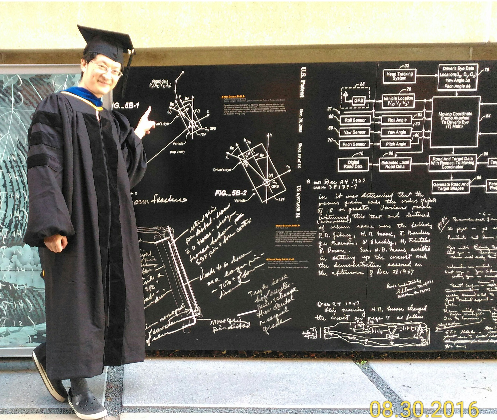

# Reflections on OSS-NA 2026

<!-- markdownlint-disable-file MD013 MD025 -->

Here are some notes from OSSNA. Sheng-Wen also wrote a recap after the event, and his notes cover the talks in much more detail than mine — most of what's here is just a record of each day's schedule XD

- [Open Source Summit North America 2026 recap](https://hackmd.io/@shengwen/ossna2026)
- [OSSNA + ELC 2026 photo album](https://www.flickr.com/photos/linuxfoundation/albums/72177720333089343/)

## May 16 (Saturday)

The last time I went abroad was to Japan with friends, so this was only my second time out of the country, and somehow I jumped straight into a long-haul flight. The day before, I'd stayed up all night cramming on the slides, and didn't start packing until about five hours before leaving. As soon as I finished packing, it was time to head out, and I went straight to the airport.

I went to check in with my passport, itinerary, and documents. The staff asked whether I had any unresolved military service obligations. I figured I hadn't received any draft notice, so probably not? Then I got stopped at immigration LMAO. Luckily I could apply for permission on the spot. As expected, security was also a hassle for me. My laptop is too heavy and the battery life isn't great either, so the whole trip I kept wondering whether I should buy a Mac when I got back. But I'm really not used to Macs or their keyboards.

Once we boarded, the three of us basically fell asleep on the spot XD Turns out Jserv does sleep after all (duh), and he didn't sleep as little as I'd imagined — it looked like he still got six or seven hours. Sleeping on a plane means waking up on and off the whole time, but I was so tired that I slept through most of it, only getting up briefly for meals, and then we arrived in San Francisco.

It was 6:30 a.m. when we got to San Francisco. Once we were through immigration, we picked up our luggage and sent it through security again, but for some reason we didn't have to go through security ourselves — once we'd handed over the bags, we could walk straight in. Since our flight wasn't until 4:20, we sat in the hall for a very long time. Jserv kept dozing off during that wait, which is when I realized he really does sleep more than I'd imagined. I'd always thought he was the kind of superhuman who averages three hours of sleep a day XD

Around 11:30, we got ready to catch the domestic flight to Minnesota, which was when we went through security again. The checkpoint had two lanes in the middle that looked like they were just for crowd control, but for some reason the side I picked didn't require taking my laptop out, so I had to scramble to shove it back in XD. After security, we grabbed a quick sandwich — extremely expensive at 18 USD. It was cold, but it came with some yellow mustard, so it was actually pretty good. After eating, I noticed Jserv was sleeping again, and I woke him up around 4. While waiting for the plane, I was of course still cramming on the script XD

After boarding the flight to Minnesota, I took another short nap — I hadn't slept the day before and was really tired. After landing, we met up with senior Sheng-Wen Cheng, who carried us through the whole trip: booking the hotel, calling Ubers, finding restaurants, looking up places to visit — all of it. His English is great, and his Japanese seems pretty good too. Whenever I didn't understand something, whether it was a talk or a server speaking too fast for me to catch, I'd just ask him. He's also very extroverted, can chat with all kinds of people, and is good at starting conversations. As a deeply introverted person, all I could do was admire him XD

After meeting up, Sheng-Wen called an Uber to our hotel. This time the four of us shared a single room. I don't know how other people's conference trips are organized, but I get the feeling very few people end up sharing a room with their advisor — it made the whole thing feel more like a vacation than a conference trip XD. After getting to the hotel, we revised the talk a bit, and around 2 or 3 in the morning, we finally went to sleep.

## May 17 (Sunday)

The next day we woke up around 8. Sheng-Wen found a breakfast spot and we all went together — a very traditional American breakfast with scrambled eggs, potatoes, toast, and a meat patty. It was pretty great. One thing I noticed on this trip is that they really know how to do potatoes in the U.S. — almost every meal has potatoes in some form, including but not limited to mashed potatoes, fries, pan-fried potato chunks or patties, and chips XD

After eating, we went back to the hotel. I was actually pretty nervous on the way — I hadn't even started the slides at this point, and the talk was the next day. I'd only just finalized the script the day before. As soon as we got back, I dove straight into the slides. Since this talk was about the basic architecture, existing tutorials didn't really provide a complete diagram, and they also didn't walk through the full flow that happens once you launch an application. So this time my focus was entirely on diagrams for those two parts.

First, I turned the script content into bullet points for the slides — Codex helped with this part. Codex can generate `.pptx` files directly, which is pretty convenient. I asked it to first produce a bare-bones deck with no styling, just a plain white background, purely for organizing the structure. After going back and forth with Codex maybe five or six times, I moved the result onto the slide template OSSNA had provided.

The most painful part was drawing the diagrams, since I hadn't done any of them yet — I'd only left notes in the script about how each one should look. As you can imagine, I nearly died drawing diagrams that day, working from morning till night. The whole loop was basically: tweak slide content → draw a diagram → tweak slide content → draw a diagram, over and over. At the end I cleaned up the script a bit more and pasted it into the speaker notes.

Around 10 that night, I asked Sheng-Wen to look the slides over first, since we'd left the virtio-gpu 3D intro and demo at the end for him to present on stage. He started making a lot of changes as he read through it XD. I was panicking on the inside, wondering whether this meant I'd have to do a major rewrite of my script too. Thankfully, I gritted my teeth and pushed through the revisions. My slides at that point were mainly designed to support the script — without hearing me speak, they wouldn't make much sense on their own. He reworked them so people could follow along just by reading the deck, since there would be a recording and it'd be easier for others to revisit later.

Looking back, his version was definitely better than the original, but at the time it made me feel completely hopeless XD. Luckily I still finished around 5 or 6 in the morning, so it more or less worked out XD

By the way, dinner that day was at a Turkish restaurant, I think. I ordered a steak-and-bread combo. The first few bites were great — the sauce was rich and flavorful — but it got a little heavy toward the end.

## May 18 (Monday)

Then I slept for about two hours and got up to head to the venue. They had breakfast ready there. Day one was scones with chocolate chips inside, which I really liked. I don't know why they're harder to find in Taiwan, and when you do find them they're expensive — often 70 or 80 NTD each. Breakfast at the venue came with coffee, and on the first day I didn't know there was milk available, so I drank it black. Pain...

After breakfast, we went to catch the Opening. Around 10, we headed over to our room a bit early and ran through the talk once. That's when I realized my English was super halting — am I really this bad at English? Fortunately, during the actual talk I slowed my pace down a little and it got much smoother. And oddly enough, the timing still came out about right.

The talk itself wasn't that nerve-racking for me. My past experience helping teach classes at NCU CS had gotten me used to being on stage. As for the English, I just barely got by with the script. So the most stressful part of the whole trip was actually cramming on the slides — I was genuinely worried I wouldn't finish in time XD

People gradually filtered in and sat down. There were actually quite a few of them — maybe more than thirty, filling over half the seats. At 11:20 I started on time. The whole thing was basically me reading from the script, occasionally glancing up at the audience. After I finished, I noticed no one asked any questions, which was a little surprising. Jserv told me that in situations like this it's best to have someone you know in the audience help kick things off with a question. Lesson learned XD

After the talk, two people came over to chat. The first was Hiroyuki Ishii from Linux Foundation JP — I really wanted to talk with him more afterward. They have a project called Unified HMI, a virtio-gpu module for native Linux built on a client-server architecture. Before leaving Taiwan, 徐柏揚 and I had been discussing whether this kind of architecture could work, and then I immediately ran into a real example of it here — what a coincidence. The second person worked at Blender. It was a bit of a pity we didn't exchange contact info. Later in the venue I'd see him chatting with others about rendering-related stuff, which was very cool.

After the talk it was almost lunchtime, so we headed to the main hall to grab lunch boxes — cold sandwiches with coffee, again. After eating, we walked around the booths. I'd hoped to find something related to game consoles, but no luck XD Still, watching Sheng-Wen and Jserv chat happily with the folks there was pretty interesting.

After that, we caught some other talks. Over the three days, I mostly heard about new things without fully understanding how they were actually built — though Sheng-Wen would explain them to me. I also realized I have a really hard time keeping up with some speakers' English accents, so I decided I'd go back later and watch the recordings with subtitles. There was also a talk by one of Jserv's friends about multikernel during this stretch. The speaker was Cong Wang, and he radiated kernel-expert energy from head to toe. After his talk, we chatted with him briefly and then headed to the next session.

Sometime after 5, there was a reception, but by then I was already about to fall asleep XD. When we got to the hall, most people were standing — there didn't seem to be many seats. The middle of the venue had a spread of different foods you could help yourself to, buffet-style. The lines for meat and rice were pretty long. After grabbing a bit of each, I found a corner seat and sat down. Once I'd eaten, I pulled out my laptop to organize my schedule and work on a side project for a bit, then went outside with Sheng-Wen to walk around and take in the scenery.

A little after 8, there was a drone show, but it was already drizzling by then. The rain got really heavy later on, so we had to head back indoors and sit for a while. In the end, we took the shuttle to a stop near the venue, walked back to the hotel, showered, and went straight to sleep (around 10:30 XD).

That night, Jserv also helped me write an email to Mr. Hiroyuki Ishii to see if there might be a chance to follow up further, but I haven't heard back yet.

## May 19 (Tuesday)

Waking up that day felt great — finally a day where I'd actually had enough sleep. For the previous few weeks back in Taipei I'd also been cramming on the script and felt constantly sleep-deprived. At last, I got some proper sleep here XD

The schedule was roughly the same. We headed to the venue first for breakfast — muffins that day, which were also really good. This was also the day I discovered that milk was available, so breakfast evolved from coffee to coffee with milk. Much better XD

That day I caught a talk about debugging the kernel with LLMs. The speaker was from Cloudflare. Internally, they use a tool called kdoc that can help analyze the causes of kernel panics and even automatically fix them and prepare patches. I thought it was amazing, but I couldn't find anything about it on my phone afterward. Turns out they hadn't released it yet and were still going through internal processes. Pain.

Cong Wang also had a talk that day, also LLM-related. He'd designed a file system for LLMs called [branchfs](https://github.com/multikernel/branchfs), which lets agents work on multiple patches at the same time and then use a commit-like operation to bring those changes back onto the main files. It looks like it's still being prepared for upstreaming. Since it's also relevant to my own use case, I went over to chat with him for a bit.

Jserv and Rota also gave talks that day. After their sessions, Cong Wang invited us and Mark, another speaker from China, out to dinner. We picked a Chinese restaurant, and it was pretty tasty — and there was white rice. I didn't expect to be this moved by eating white rice abroad. Finally, no more cold sandwiches. Unexpectedly, the Chinese food I had in the U.S. was all pretty good, though very salty.

After dinner, we wandered around UMN and unexpectedly stumbled onto the spot where Kuo-Shih Tseng (my former leader in MCL) had taken his graduation photo.

Before coming, I'd already thought about restaging the photo, but I didn't expect to find the spot this easily. After taking a few shots, I sent them to the MCL group chat — that was pretty fun. It was still bright out there at 8:30 p.m., and the sun would come back up around 5 a.m. — pretty nice. It felt like the days stretched on forever. I wonder if I'll find it strange once I'm back in Taiwan.

After walking around, we headed back to the hotel. Then, as usual, I wrote some side project code, showered, and went to bed.

## May 20 (Wednesday)

Breakfast that day suddenly turned really odd: energy bars and bananas. I'd been looking forward to whatever new pastries might show up, so this was a major letdown. I grabbed two energy bars, thought they were a little too sweet, but still polished them off with coffee with milk.

During the Opening that day, I saw Linus Torvalds in person. I listened to him talk a bit about his views on AI, which lined up pretty closely with my own thinking. I'll probably write a short note about it later, like that previous article, The mind behind Linux.

There were some topics I'd really wanted to catch that day, but when I checked, almost all of them were given in accents I struggled to follow. After thinking it over, I decided to wander into other sessions instead. In the end I didn't hear anything especially interesting, which was a bit of a pity.

After the day's sessions, Sheng-Wen said he wanted to walk around Mall of America (MOA). On the way over, we noticed there were more people on the streets than usual. I'm not sure why — maybe because it was around 7, right when people were getting off work. On the way, we ran into someone who looked like he might've been on drugs, yelling at us. After shouting for a while, he even started following us and yelling, which scared me to death. We walked away quickly and pretended nothing had happened, but in hindsight, it was actually a little dangerous LOL.

When we got there, we'd originally thought MOA was a single building, so we spent a long time looking around. We eventually realized the name referred to that whole street. But by the time we figured it out, all the shops seemed to be closed, so we did one loop and headed back. On the way, I kept worrying we'd run into that guy again XD

Back in the room, I opened my laptop as usual and wrote some code. That day, Kuo-Shih finally got back to me and said I could head to UMN to grab souvenirs and then check out the art museum, so we decided to buy souvenirs the next day.

For dinner, we ordered Wendy's through Uber Eats and found it was only about 8 USD. Other meals usually ran around 15 or 20 dollars. I'm not sure whether fast food in the U.S. is really that much cheaper. After eating, we rested a bit, then showered and went to bed.

## May 21 (Thursday)

That day was basically the last day of the conference. It was the RISC-V co-located event, mornings only, but it required a separate payment and there was no breakfast — I only got a cup of coffee with milk XD

I heard about a cool thing that day called [SAIL](https://github.com/riscv/sail-riscv), which seems to be usable for formal verification of RISC-V. Pretty cool.

After the meeting wrapped up, we first had lunch with Mark and listened to him and Jserv talk about RISC-V. I also added Mark on WeChat. After that, Sheng-Wen and I headed back to UMN again. On Tuesday we hadn't known there was a souvenir shop, so we'd only walked around briefly and left. This time we stuck around longer. Honestly we still didn't really know where we were, but we did manage to find the souvenir shop.

Inside there were some clothes, hats, and the like, along with little charms and everyday items. In total I bought an umbrella, a water bottle, some charms, two shirts, and two coasters. I figured I could bring one of the coasters back for Kuo-Shih XD

On campus we also ran into a group of turkeys — four of them, and they were huge. When taking photos, I was afraid they might charge at me and beat me up, so I kept my distance. We later asked passersby, and they said these are very common on campus and run around everywhere. So I guess they're sort of like the big derpy birds we have back home. Super cool.

After walking around, we found a cafe and sat down. I noticed they had green tea, so I ordered a cup. Drinking green tea after so long made me happy, and it was actually pretty good — not the overly astringent kind. While we were there, I kept listening to Sheng-Wen share his thoughts on investing, which reminded me of  my high school classmate Xian. I feel like I should read up on finance at some point, otherwise I'll never have any money XD

After going back to the hotel, I worked on projects as usual. Sheng-Wen and the others went to lie down first, but by past 11 they still hadn't gotten up. I wanted to sleep too, so I just showered and went to bed without dinner.

## May 22 (Friday)

The whole day was open. We headed to MOA first and had a pretty good breakfast — I ordered eggs Benedict, toast, stewed beef, and hash browns. It felt like a standard American breakfast. I really love this kind of American breakfast platter.

Everyone else ordered burgers, and they were huge. I definitely wouldn't have been able to finish one, so it's a good thing I didn't follow their lead. After eating, we called a car to the sculpture garden — a large park with a huge cherry sculpture in the middle and smaller sculptures scattered around. Then we headed to MIA, the art museum. At the entrance we ran into Mr. Hiroyuki Ishii again. Hope he gets back to me eventually.

The museum was pretty big. The second floor had a lot of old pottery, porcelain, sculptures, and the like, while the third floor was dedicated to oil paintings. Looking at oil paintings, as always, put me in a good mood. After the museum, we went to a national park to see a waterfall and walked around. The river there seemed to be the Mississippi — I'd only heard of it in geography textbooks before, and now I was finally seeing it in person. While walking, there was also a warning sign at one entrance that seemed to mention wolves, which was a little scary.

After one loop around, it was already past 5, so we called a car back to the hotel. Then a little after 7, I went back out with Sheng-Wen and the others for dinner.

Since it was the last day, we picked a steakhouse. I ordered a bowl of onion soup and a steak with fries. The onion soup was crazy salty lol, but it had a lot of cheese and bread in it, and the onions had soaked up the flavor well — so it was actually pretty good, as long as I kept drinking water.

For the steak, they'd intentionally charred the surface a bit to bring out a smoky aroma, while the doneness in the middle was just right. It was pretty good. The sauce on the side was cheese sauce, though, and honestly I didn't really get the pairing. I ended up just sprinkling some salt on the steak instead.

After dinner, we went back to the hotel. As usual, I wrote a bit of code, packed up, then showered and went to sleep.

## May 23 (Saturday)

Since Sheng-Wen had another conference to attend afterward, he didn't leave with us. This time I called the Uber myself, and that's when I realized how expensive they were — a single ride cost 46.74 USD. All I can say is that U.S. prices really opened my eyes.

When we got to the airport, the counter staff hadn't even started work yet. All the counters were empty, so we couldn't check in, and our tickets didn't seem to support online check-in either. So we sat at the airport until 11:30 before heading over.

After checking in, we went through security and bought a sandwich. This time I deliberately picked a hot one lol — I really didn't want another cold sandwich.

Then we boarded. One cool thing was that we sat in the first row this time, so we could watch the flight attendants prepare drinks and so on. During the flight, since an older Chinese woman didn't understand English, I even got called over to translate. The domestic flight didn't serve any proper meals, just some small cookies and drinks. I'm not sure if all domestic flights are like this.

After landing, the awkward part was that during our first check-in they'd only given us the Sun Country boarding pass, so we still had to head to the EVA Air counter to check in again. But before that, we first had to confirm whether we needed to take our luggage through security a second time. So we started looking for Sun Country staff — all the counters were empty. We finally tracked one down, but he didn't seem to know the situation either.

So we hung around baggage claim and waited it out. In the end, none of our luggage showed up, so we decided to head to the EVA Air counter to check in and clarify at the same time. We spent more time navigating the airport and finally found the EVA Air counter, only to find there was no one there either XD. It was around 5:30, and the sign said they wouldn't start work until 9:20. So we found another spot to sit and once again settled in for a long wait.

At some point I got hungry and went to find something to eat. As usual, it was expensive.

Around 9, we could finally check in. After that, we had to go through security again. For some reason, once again I didn't need to take out my laptop, so I had to scramble to shove it back in.

In the end, same routine as before — I slept a bit at the gate, kept sleeping after boarding, and slept almost the whole flight except for meals. When I finally woke up, there were about four hours left before landing in Taiwan. I opened GAMES101 on my tablet (I'd downloaded it earlier) and reviewed it for a bit. Then after the in-flight meal, we landed in Taiwan, and the trip ended smoothly.

## Reflections and Future Work

The prep for this trip was really far too rushed. After all, I'd only just finished 2D, and then the topic became 3D. Looking back, I think the main reason was that I spent too long writing the development notes. But honestly, if I hadn't written those first, I probably wouldn't have been able to produce the talk script either. I can only say this kind of thing really takes time.

This trip left me with a lot more ideas. Together with the study group from a while back, I feel like there might be ways to combine the two — for example, maybe building a management interface like virt-manager (cross-platform if possible), or a client-server architecture like Unified HMI. Hopefully it can eventually work alongside box64 and Wine to actually run games on a virtual machine.

Also, Marty recently released the code for Kiln, and I want to pull it in and try it out. So maybe I'll first build a KVM version in C++ myself as my own testbench. If I have time, I'd also like to look at the RISC-V instruction implementation and those parts of box64 (assuming I actually have the time...).

But all of this has to wait until SMP is done. SMP will significantly affect what the VM architecture should look like, so I need to wait until it's finished before I can align the architectures of our different virtual machines.

Another important takeaway this time was how to market myself. It sounds like LinkedIn needs to be actively maintained, and I should keep my resume up to date. Maybe the blog should also have English and Japanese versions — I'll probably start with this article. But I can already clearly feel that having skills alone isn't enough XD

Finally, I'm really grateful to Jserv for offering such a great opportunity and letting us come along on a trip like this to meet people in the field. That's especially meaningful because I'm not even a student at NCKU — I just kept working on the project and somehow got pulled along for the ride. Substantive conversations like these are rare in themselves. This reminds me of when I was writing Cpp Miner, around 2020 or so, back when LLMs weren't yet that powerful. The first article I wrote was [value category](https://mes0903.github.io/Cpp-Miner/Miner_main/Value_Categories/). At the time, there was basically no Chinese-language material on the topic, so I had to slowly dig through English blogs and CppCon recordings.

In the end, it was only after watching [a recording from a study group in Ireland](https://www.youtube.com/watch?v=liAnuOfc66o) that I roughly understood what the thing was. The speaker was named Kris. I emailed him with tons of questions — really, a lot — and pestered him for about two weeks straight. He patiently answered every single one, one by one. Only then did I finally manage to write that first Cpp Miner article.

Take the later [Concept article](https://mes0903.github.io/Cpp-Miner/Miner_main/Concept_SFINAE_DetectionIdiom/) I wrote as another example — I had no idea what it was about when I first saw it. At the time, there was no Chinese material on it either. I kept pestering senior Zhang Jiahua about it, listened to his explanations, and he even dug up implementations for me to look at. Only then did I slowly start to understand it, and that also took more than a month. Later, when I wrote the [dereference null pointer](https://mes0903.github.io/Cpp-Miner/Miner_BlackMagic/Indirect_through_null_pointer/) article, I had to read committee papers on my own, slowly work through the WG21 mailing lists, and piece together the conclusion about UB bit by bit.

But later, after attending the C++ study group at Aoyi, I realized there are actually plenty of people who do understand these things — you just can't find the information online. Most of those who do understand are too busy to write things up and share, or they're not great at writing in the first place. What you get instead are scattered short blog posts. The content is good, but never quite comprehensive enough.

And everything above was just about reading one programming language. Last year, when I was talking with people from Open Source Dungeon, I also realized you basically can't find BSP tutorials in the Chinese-speaking community these days.

Over my time working with Jserv, I've found that as long as I'm willing to put in the time, he'll go out of his way to find opportunities and share information. For example, when I used to write articles, I'd consult him, and he'd offer suggestions I'd never have thought of, and even take the initiative to set up time to discuss them. When I asked him about project topics, he could readily suggest ones that matched my needs and were slightly above my ability. This time, while writing and working on things, I suddenly got a week in the U.S. on public funding. I'm deeply humbled.

Along the way, I'd often walk into projects knowing nothing. The first time I looked at semu's code, I couldn't even understand the project's Makefile. The first time I heard about ACLINT, I didn't even know what it was trying to do under the hood, and I got chewed out in meetings for the first three weeks. This time, on virtio-gpu, I'd never read anything about the graphics stack going in either.

Jserv often doesn't directly give me answers to the questions I ask — honestly, I'd prefer it if he just gave me the answers XD — and instead he throws a pile of materials at me and tells me to read them.

The key point, though, is that I've received this much help despite not even being his student. I originally met Jserv only because I was working as a research assistant and had written a [ROS tutorial article](https://mes0903.github.io/ROS/ROS_Tutorial_Introduction/). From then until now, we've basically only interacted online. I doubt you could find a second person willing to give this much help to an internet stranger who "knows nothing." I'm truly grateful to him.

Anyway, let's keep going. Karnage said he hopes to run his Vulkan program on a VM someday. Looks like I still have a lot to do XD
