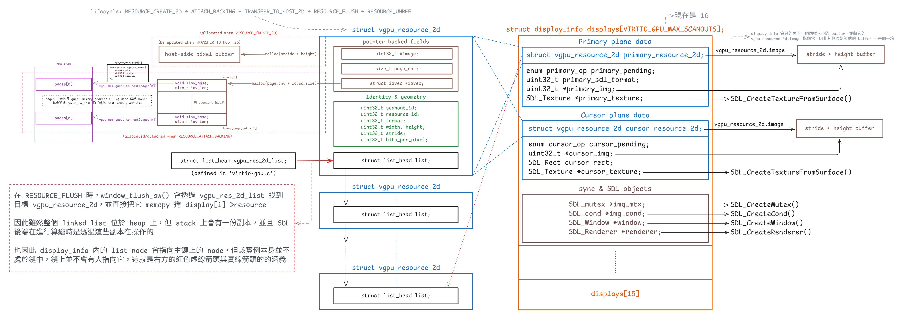
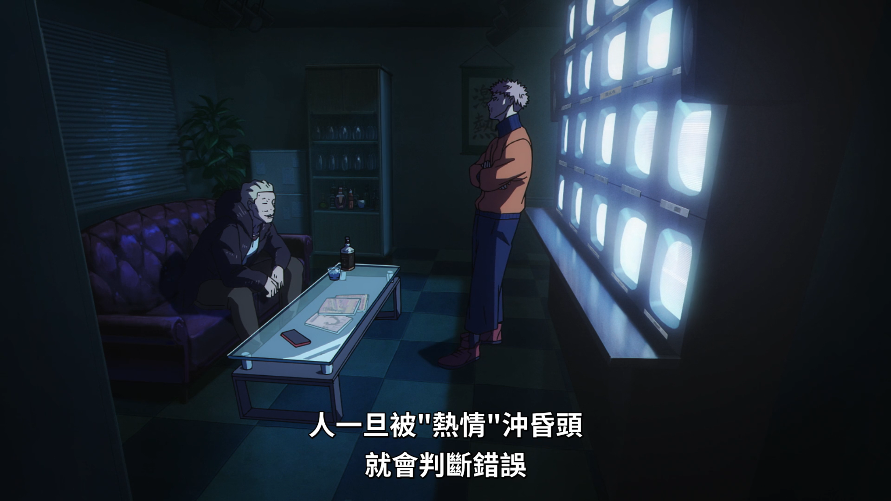

# 執著所帶來的收益

）](image/stubborn.jpg)

想寫這篇有一段時間了，上次在 YT 看到一個 lofi 風格的 JPOP，一開始聽還蠻好聽的，但是幾首播下來發現幾乎都長一樣，聽久還感覺有點怪，一查發現是 AI 做的，是真他媽噁心到我了，加上最近版上一堆 AI 幹圖，看了實在是很躁，所以就覺得該來寫一下雜記了

好久沒寫雜記，但又覺得這種寫 code 上的感觸放 IG 怪怪的，所以就丟 BLOG 上吧，剛好很久沒更新了。 最近都在弄 vGPU 的 PR，剛好又有幸投上了 OSSNA，也在這邊順手紀錄一下心路歷程。 不過我還沒做簡報，搞不好到時候報完又可以再寫一篇，聽說那邊現在治安不是很好，其實有點小害怕，畢竟是第一次去

感覺不久前還在寫那篇有關翻譯的心得，實際上好像也就是去年七月底的事，才過半年左右，但大概在今年年初，我開始為翻譯建了一套 LLM 的環境，測試起來效果還不錯，雖然還有一些地方需要調整，但整體來說速度和翻譯的品質比之前好了不少。 不過說是環境，其實就是把一大堆的 prompt 都塞到某個資料夾內，然後翻譯時叫他先進去裡面讀一些範本和要求而已。 與以前主要的差別在於，因為有 codex 與 claude code 等工具，所以現在我也不用再手動給他原文了，他自己就能去看，或是用 `pdftotext` 等工具生出它可以接受的 input

AI 進步的好快，前陣子版面滑到[一部影片](https://www.facebook.com/share/v/1GZo1s1SSd/)，真的挺腦殘的笑死，真實到有點荒謬。 這次弄 vGPU 的期間，根本沒有手寫到一行程式碼，手寫的部分全是文件和註解（幸好還有我可以手寫的地方），開發過程的心情是既噁心又感嘆，我負責講架構、同步要怎麼做、流程要長怎樣等，完全是出一張嘴，spec 也是 clone 下來叫他自己看，然後我再去檢查成品

感嘆的部分在於，它太熟語法了，而且還能活用，過程中我甚至發現以前 Jserv 老師寫的 code 有部分錯誤的地方，對現有架構我也覺得仍有巨大的改進空間。 所幸我還能針對它產出的程式碼做多輪的修正要求，這都是以前的執著所造就出來的 sense，當時那些通霄嗑 spec 的日子，還有那些為了無聊的潔癖，[堅持要用 MVC 架構寫一個小垃圾的日子](https://github.com/Mes0903/Mase)，都成了我現在還能看出程式碼有問題的基石

但也就是這種無聊透頂的驕傲，讓我在寫的時候對這東西感到噁心。 開發期間，心流可以說基本上是 0，以前在寫那些小垃圾的時候，每個小單元的工作流程都大概是「寫 code」⭢「發現有坑」⭢「stackoverflow / Discord 問」⭢「改 code」⭢「寫 code」⭢「兩個片段合在一起後，發現有更好的寫法，重構」。 現在卻變成了「它生 code」⭢「我檢查」⭢「它生 code」⭢「兩個片段合在一起後，發現有更好的寫法，重構」

看起來很像，但整個心境就不一樣了，以前一個小單元，我大概會花 20 小時做這一整套流程，期間我可以完全不吃飯，不睡覺，就是坐在電腦前面寫。 而這次開發 vGPU 的期間，同樣的單元，時間大概可以縮到 2 小時左右。 我覺得這主要會導致兩個問題

首先是思考的時間碎片化了。 以前我是 20 小時不間斷的在思考，但現在用了 LLM 上去後，在它寫 code 的期間，我的思考就斷了，因此雖然看起來流程很像，但思考的時間完全不一樣，模型也不一樣，前者是很連續的，但後者中間多了很多洞，也因此完全沒辦法進心流的狀態

說實話，現在這對我最大的影響就是，我很難進入狀態，我覺得我真正在思考的時間變得很少，這是因為較機械化的地方，我已經可以完全外包出去了，例如在實作一些 MMIO register handler 時，這種東西的需求基本上就是從某個 memory address 讀 payload 出來，然後套上 spec 裡面定義的 bitshift 來取得你要的目標，接著做完對應的讀寫後再照 spec 要求的 layout 把目標要的結構包好傳回去給它

這種需求以前我需要自己慢慢看 spec，把 spec 要求的項目一條一條列出來，然後寫 code 時要自己算 bitmask 和 bitshift，接著再自己慢慢 debug 去看有沒有錯誤。 但現在的話，這種東西直接丟給 LLM 基本上不會有錯，完全可以 one-shot 解決，過程賊快，你都還沒意識到這個 register 的功能是什麼，就寫完了

就產出來說沒問題，對我們來說效率可以快十倍以上，但以前那種「熱機」的過程不見了。 這也是開始用 LLM 後我才發現的，以前的日子裡，邊手敲 `#include <iostream>` 邊思考實作方式的過程有一種儀式感，能讓自己快速進入狀態，進入狀態之後思考的速度和品質都會好很多，這我想大家都可以體會那種極度專注地情境

但這種情境現在消失了，這次開發的過程我很少進入這種狀態，而且都是在進行範圍較大的 code review 時才會發生。 基本上因為它生 code 的速度太快了，在等待期間我也沒辦法看什麼東西，所以通常都是滑滑 FB 或看些烤肉（最近很愛 VSPO 的蝶屋はなび）

這就要進到我的第二個問題，也就是「單元的上下限變高了」，這導致了重構變得極其頻繁。 LLM 生出來的程式碼品質的上下限其實很高，有時候它可以生出讓我有些驚豔的程式碼，寫得很漂亮，但更多時候它就是生一個堪用的東西出來。 但問題在於，只停在「堪用」的程度，往往會缺乏大局觀，因此之後在進行單元與單元的整合時，就會有一堆坑冒出來

以前我寫 code 時，因為過程比較慢，所以在寫的過程中往往可以邊思考之後這個東西要怎麼與別的單元協作，甚至有時候一個單元還沒寫完，就會先跑去把另一邊的雛型先寫出來，接著再繼續寫原本的單元。 也就是說以前在寫的時候往往會把視野拉到多個單元的層級，但現在由於寫一個單元的時間太快了，所以這種情況大幅下降了

我是有在開發前先畫過架構圖的，但是這種階段所規劃的東西，顆粒度肯定很粗，而且就算是想先想好兩個較大的單元之間該如何協作，當中的很多細節都還是會被遺漏掉，更不用說上述的情況大部分都是發生在小單元之間。 因此小範圍的重構會不斷地發生，接著造成大範圍的重構

以開發 vGPU 的過程來說，我先想好了要分 window 與 vGPU device 這兩個組件，前者負責做 host 端上的算繪；後者則負責處理 vGPU 相關指令，以及將算繪需要的資料交給 window。 因此這是兩個執行緒，一開始我先透過 LLM 很快速的寫好了 vGPU 指令的功能。 接著我又弄了一套 2D resource 的架構。 最後就是讓 handler 裡面去呼叫 window 那邊的 API，將 2D resource 的指標傳過去

接著 window API 的實作內會先上 lock，接著把裡面的 frame data 做一次 deep copy，再 unlock 並發 signal 給算繪的主迴圈，讓其可以看到新的 frame data，具體可以看我[原本的文件](https://github.com/Mes0903/MesBlog/blob/e50696dab8b6f45778e735ec6c18da17cb8e09f9/src/VM/semu-vgpu-2D/README.md)，那邊寫得很詳細。 搞完後覺得還不錯，發了 PR，但因為老師剛好最近比較忙，review 比較慢，所以我就有了更多的時間自己做更多更多更多次的 review

現在回頭看，其實這就是前面所說的「堪用」。 這邊有個問題在於我們傳了 2D resource 的指標，它裡面含了很多 SDL 做算繪不需要用到的資料，而當中就有一些成員是與 vGPU 狀態有關的，例如這個 2D resource 實際上存在 guest memory 的哪幾個 page。 因此很顯然地我就覺得這種非必要的資訊不應該給 window 這端拿到，而且這甚至是很重要的資料，因此就開始了第一次重構

此時我的想法非常直接，那就搞一個算繪專用的結構，然後 vGPU device 這邊傳的時候先轉成算繪用的結構，再丟過去就好，這樣既不用 lock，又可以避免擁有多於資料的問題。 為了避免 vGPU device 這邊充斥著 SDL 相關的程式碼，我將 SDL 需要的東西整理成了一個 scanout view 的結構，成功將這個問題解掉了，但是此時光是一個 scanout，就有三個對應的結構：device 端、用來轉換的 view、最後 SDL 用的 scanout

但總之我還是先 push 上去了，結果我發現 CI test 竟然 timeout 了，追蹤後發現了第二個問題：那個 lock 因為 reflush 的操作很頻繁，這樣上鎖解鎖效率會很差。 原先只是因為 runner 比較快所以剛好沒事，這次的 runner 比較慢，所以就找到了這個問題。 因為這個問題，還有有三個 scanout 結構的問題，我決定開始第二次重構

此時我想了想，發現這邊只有一個 producer 和一個 consumer，所以就套了 SPSC queue 上去，交給 LLM 實作真的很快，這個需求一跟它講，大概跑個五分鐘就出來了。 問題在於 scanout 結構是設計上的問題，後來就重新為每個檔案的職責做了更嚴格的切割，把 scanout 統一成只剩下唯一的一個結構，這個過程就十分漫長了，LLM 沒有辦法直接解決這個問題，架構需要人工來設計

可見整個過程最痛的在於那個 scanout 的結構，這就是前面一直保持「堪用」的後果。 一開始我沒看見各個小單元的協作，因此有了第一次資訊沒切割好的問題。 而修完後我又因為 vGPU device 和 render window 這兩個大組件的協作沒設計好，導致了第二個重構，且成本明顯比前一次更貴，花了我整整兩周多

雖說如此，但這樣來來回回總共只花了我一個月左右，如果是以前的工作模式，那肯定會花更久，可是重構的次數肯定會比較少，而且也不會有這麼大的重構，畢竟我在寫那個 lock 的時候大概就會想到可以套 SPSC queue 了

從工程上來講，這當然是好事，但對我們的學習來說這是好事嗎？ 我還真不曉得，我的確是有學到東西，但我覺得如果是以前的模式我可以學到更多，因為會踩到更多的坑

以前計概老師都說不要用 `goto`，我嗤之以鼻的覺得 linux 裡面有一堆的 `goto`，怎麼可能不要用它？ 因此在後來的資結考試寫了一堆大便出來，流程越寫越複雜。 我很好奇現在的學生會有這種經歷嗎XD？ 如果都是用 LLM 直接生 code，那根本就不會寫出這種糞 code，但是這種寫糞 code 的過程恰恰提供了思考的機會，因為它會害你跌倒，會痛，所以會怕，會想預防

後來我開始寫一些自己的小玩具，漸漸地就有了自己的執著，或者該說潔癖，進而就慢慢地有了自己的見解，還有熱情。 雖然執著過頭會帶來一些坑，例如上面想要用 `goto` 的場景，或是碰到一些新技術的時候都會有這種情況，但這也又帶來了新的思考，從而變成一個正向的循環

沒有這種寫過糞 code 過程，還會有熱情嗎？ 還是單純只是在享受「成功產出東西」的快感？ 這還挺有趣的，這讓我想到以前只是為了成績而讀書的那種痛苦日子，如果可以一鍵拿到及格分，那滿地的及格分會帶來什麼結果？ 我覺得現在滿地的 shit code 應該可以給出一種答案

很慶幸我有以往那個寫過糞 code 的時期、自己生一堆小垃圾玩具的時期，還有因為一些奇怪的語法而去翻 C/C++ spec 和 proposal 的時期。 我從 GPT 剛推出的時候就開始用了，看著它越來越猛心情真的很複雜，只能放下那無聊透頂的驕傲繼續去學這噁心的東西，不然哪天我搞不好就變成被芙蘭梅一砲轟死的那些魔族了

希望這篇看起來不會太卡，很久沒直接手打整篇文了，高中很喜歡寫作，但完全沒想過這為我帶來的好處會這麼大
