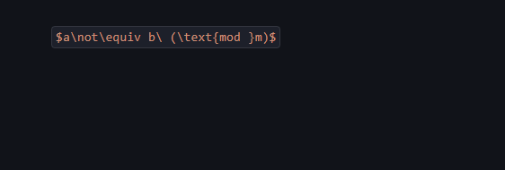
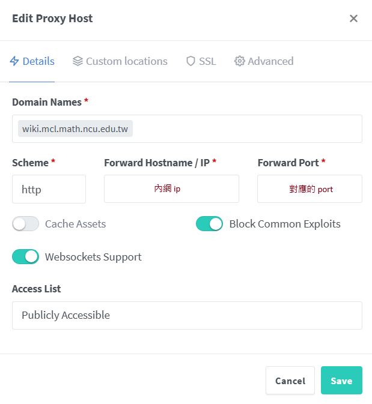
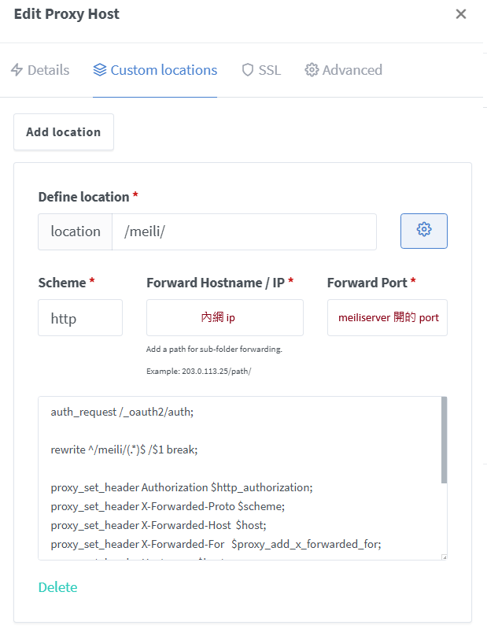

# 內部 wiki 的架設

## 需求

因為有些不方便公開的文件（~~怕被告~~），所以就想著來架個 wiki page，讓自己內部的人可以一起看，像是 CS 自學指南那樣，加上之前 book stack 看起來沒在用，現在有這個需求剛好來搞一下，結果發現符合需求的東西其實不太好找阿

我的需求大概如下：

1. 可以解析 markdown 和 latex
2. 可以上傳附件、圖片
   - 最好是可以自己調整 storage directory 的結構，例如在每個主題底下都建一個 image folder，單獨放那個主題的圖片
3. 可以有個 tag 分類一下文章
4. 可以串我們自己的 keycloak（SSO）
5. 跨頁文內搜尋
6. 最好直接上傳整個目錄就能夠把文件 Migrate 進去，不然還要一個一個慢慢複製

## 嘗試過的服務

前面有試了幾個：

1. bookstack 
   - 整體來說都還不錯，但它 latex 的解析賊爛，很多東西跑不出來
2. wiki.js 
   - 需求都符合，但介面賊難用。 那個 markdown editor 超難用，我光打一篇簡單的 Intro 就快中風了。 再來上傳檔案的地方還要慢慢選資料夾，資料夾建錯了我還沒辦法砍，它沒有 File manager ==?? （很瞎）
   - 然後寫的時候，圖片不能直接複製貼上真的是大缺點，我從 repo 上搬運過去的時候要一個一個慢慢按上傳 -> 插入。 因為它有自己的 DB 所以我還不能直接整個把我 repo 上的整個 image 目錄複製過去，因為這點所以讓我決定換其他服務用
3. codimd 
   - 沒辦法上傳附件，也沒有跨頁文內搜。 再來這也不好統整，當初本來就是給個人寫筆記用的，沒有針對分享用途做太多處理
4. outline
   - 第 6 點做不到，後面細講
5. Grav
   - 看起來符合需求，而且可以線上編輯文件，但架的時候遇到很多坑，看起來是還沒太成熟，所以就先放棄了（架不太起來）
6. web generator
   - 現在用的是這個方法，串 oauth2 來達到第 4 點，接 meilisearch 來達到第 5 點
   - 前面還試過 mkdoc，但踩到 latex 的坑（會跑版），所以就換回我熟悉的 vuepress theme hope 了

## 為什麼又不用 outline 了?

本來在 AJ 的推薦下先試用了 [outline](https://github.com/outline)，發現基本上可以滿足所有需求，已知的優點和缺點如下：

1. 它可以上傳附件、圖片，也能在 mount 出來的目錄內看到原始檔案，但是沒辦法自己調整目錄架構
   - 也因此，沒辦法直接上傳整個 project folder 讓他讀，文內的圖片要一張一張複製過來
     - 這點就比一般的 web generator 差，會讓我想用回 web generator，因為我會想要直接 import submodule 就可以完全套用上我們的網頁
2. 沒辦法自訂 CSS
   - 目前的行距有點小，還有底線跟 link 分不太清楚，再來我喜歡標題有顏色，比較好分辨段落
   - 但這可以靠各位自己的瀏覽器插件解決，所以我覺得不是大問題
3. latex parsing 其實也是有小問題
   - 在 issue list 看到的，但我把我整個編碼學的筆記 migrate 上來後沒有踩到，所以我覺得應該是很特殊的情況
   - 再來目前已知，直接複製 latex 進網頁端的編輯器時，如果 latex 的內文有類似 `\n` 之類的特殊字，像是 `$\not$`，那他會把 `\n` 解析成換行
     - 我覺得問題出在他的 Parser 跟一般的 markdown 編輯器長得不一樣，所以它對 `\n` 做了特殊處理，導致了這個 bug
     - 但總之要手動慢慢修
     - 可以先打 `$$`，然後貼上你的 latex plaintext（不含 `$`），再補上 `$$`：
        <center-panel natural>
        
        
        
        </center-panel>
4. 內建編輯器其實沒很好用
   - 它好像是仿照 notion 在做的？ 我沒用過 notion 所以不確定，但我覺得它沒辦法看到 markdown 的原始碼很不方便（WYSIWYG 風格）
     - 目前就是勉強能用，但還是比 wiki.js 好很多
   - 但理論上主要還是會在 vscode 等編輯器上撰寫，如果是不方便公開的東西才會整份丟過來
     - 所以這邊應當只會拿來修格式而已，或是頂多寫些小東西
     - 因此我覺得是可接受的，至少我這篇寫得不會太卡，我有一半的內文是直接在網頁上編輯的
5. 但是它其他的功能做得很好，例如
   1. SSO 的整合很簡單，馬上就能串好
   2. 可以強制設定所有的文章都無法生成公開的 link，因此一定要登 SSO 才能看到
   3. 文件的分類系統做的看起來還不錯
   4. 預設介面不難看

但是最後讓我受不了的痛點是：

1. 無法直接批量的上傳已經寫好的 markdown 內的圖片
   - 如果 markdown 內有圖片，沒辦法直接把文件本身配上圖片上傳上去，因為這類網頁不一定是直接存 markdown
   - 這是個不小的痛點，如果我寫完一份文件，要搬過去的時候還要一張圖片一張圖片慢慢複製貼上過去
2. 無法調整 CSS
   - 看久了還是覺得很不好閱讀
3. 內建的編輯器沒有好用到如 hackmd 那樣可以以網頁端為主來寫網頁
   - 就算是 hackmd，我也因為同樣的圖片問題，而不把它當主要平台了

## web generator

所以我後來還是用回了 web generator，因為可以直接丟目錄上去真的是一個很大的優點，而這個方法的難處主要就在第四和第五點，第四點可以靠 oauth2 + nginx 的設定解掉，而第五點可以自己架 meilisearch 解掉

總之發現現在要能直接解析 markdown 的話，基本上還是 web generator 做得比較好，其中 latex 的解析又是個很大的問題，我現在這個 vuepress theme hope 是額外引入了 plugin，而不是直接套 mathjax 的 jss 上去，換了那麼多 web generator，我覺得這個還是最好用的

再來要滿足我們的需求，主要就是兩個選項

1. 「oauth2 + nginx」或是「直接架 NAT + 跳板機」來滿足隱私性，後面看要弄哪種 wiki 網站自己決定
   - 如前所述，因為想要直接整個目錄丟上去就可以生成文件，所以這邊還是選了 web generator
   - 不管是 wiki.js，還是 outline，對這個功能的支援度都沒那麼高，或說對目錄結構與檔名有一些要求，還是不太方便
2. 整包包好的網站，像是 outline 那樣

後者通常會有可以線上編輯的優點，因為它就已經幫你功能都包好了，但是也是因為這樣，它就很難支援整個目錄丟上去的操作，因為像 outline 會把文件、圖片之類的存在自己的 DB 裡面，而不是存我們打上去的 markdown 檔案； 至於 wiki.js 甚至沒有 File manager。 所以他們都還是有一些結構來支援線上編輯的功能，但也因此其他方面有所欠缺，而這個缺點又大到我覺得無法正常使用

## 遇到的其他坑

這次整個搞完發現還是直接架 NAT 比較方便，在串 meilisearch 的時候，它要先爬你整個網站的文章來建 DB，建出來的 DB 會存各個文章的網址與對應的關鍵字（?），但因為有 oauth2 把網頁的存取擋住了，所以沒有辦法直接爬外網的網址，需要爬內網的網址或是用 docker network（我用後者），導致後面我還要手動弄個 script 把整個 DB 裡面的網址改成外網的，不然搜尋到文章後點下去會跳到一個訪問不了的網址

再來搜尋的請求也是個問題，search 按下去的 request 也要走 oauth2 + nginx，但 meilisearch server 是不同的服務所以有另一個 port，他們又在同一個網域下，我這次是用 custom location 解掉了，途中還踩到一個 [nginx proxy manager 的 bug](https://github.com/NginxProxyManager/nginx-proxy-manager/issues/3474#issuecomment-1902790528)，找了很久才發現這個 issue 裡面提到的解法，只能說這東西還是要固定升版本比較好

最後附一下目前 Nginx Proxy Manager 的設定，但因為我不是這方面的專家，所以設的可能有點怪怪的就是了，總之它能動：





其中 custom location 的展開部分為：

```
auth_request /_oauth2/auth;

rewrite ^/meili/(.*)$ /$1 break;

proxy_set_header Authorization $http_authorization; 
proxy_set_header X-Forwarded-Proto $scheme;
proxy_set_header X-Forwarded-Host  $host;
proxy_set_header X-Forwarded-For   $proxy_add_x_forwarded_for;
proxy_set_header Host              $host;

proxy_buffer_size       128k;
proxy_buffers           4 256k;
proxy_busy_buffers_size 256k;
proxy_read_timeout      300s;
```

而服務 Advanced 的部分為：

```
proxy_set_header X-Forwarded-Proto $scheme;
proxy_set_header X-Forwarded-For   $proxy_add_x_forwarded_for;
proxy_set_header X-Forwarded-Host  $host;
proxy_set_header Host              $host;

proxy_buffer_size          128k;
proxy_buffers              4 256k;
proxy_busy_buffers_size    256k;

proxy_read_timeout         300s;

location = /_oauth2/auth {
  internal;
  proxy_pass http://<內網 ip>/oauth2/auth;
  proxy_set_header X-Forwarded-Uri   $request_uri;
  proxy_set_header X-Forwarded-Host  $host;
  proxy_set_header X-Forwarded-Proto $scheme;
  proxy_set_header Host              $host;
  proxy_pass_request_body off;
  proxy_set_header Content-Length "";
}
location @oauth2_signin {
  return 302 https://wiki.mcl.math.ncu.edu.tw/oauth2/start?rd=$request_uri;
}
error_page 401 = @oauth2_signin;
error_page 403 = @oauth2_signin;
```

底下是 docker compose 的 yml（我還有串 [meilisearch UI](https://github.com/riccox/meilisearch-ui) 方便視覺化）：

```yml
services:
  docs:
    image: nginx:alpine
    container_name: docs
    restart: always
    volumes:
      - ./docs/src/.vuepress/dist:/usr/share/nginx/html:ro
    expose: ["80"]
    networks: [sso-net]

  oauth2-proxy:
    image: quay.io/oauth2-proxy/oauth2-proxy:v7.6.0
    container_name: oauth2-proxy
    restart: always
    ports:
      - "<內網 ip>:<內網開的 port>:4180"
    environment:
      OAUTH2_PROXY_PROVIDER: keycloak-oidc
      OAUTH2_PROXY_PROVIDER_DISPLAY_NAME: Keycloak
      OAUTH2_PROXY_OIDC_ISSUER_URL: https://<你的 SSO 服務網址>/auth/realms/master
      OAUTH2_PROXY_CLIENT_ID: mcl-wiki
      OAUTH2_PROXY_CLIENT_SECRET: <SECRET KEY>
      OAUTH2_PROXY_REDIRECT_URL: https://wiki.mcl.math.ncu.edu.tw/oauth2/callback
      OAUTH2_PROXY_COOKIE_SECRET: <另一組 KEY>
      OAUTH2_PROXY_EMAIL_DOMAINS: "*"
      OAUTH2_PROXY_SET_XAUTHREQUEST: "true"
      OAUTH2_PROXY_PASS_USER_HEADERS: "true"
      OAUTH2_PROXY_COOKIE_DOMAIN: wiki.mcl.math.ncu.edu.tw
      OAUTH2_PROXY_PASS_ACCESS_TOKEN: "false"
      OAUTH2_PROXY_COOKIE_SECURE: "true"
      OAUTH2_PROXY_COOKIE_SAMESITE: lax
    command:
      - --http-address=0.0.0.0:4180
      - --skip-provider-button=true
      - --scope=openid profile email
      - --upstream=http://docs:80
      - --insecure-oidc-allow-unverified-email=true
      - --reverse-proxy=true
      # - --show-debug-on-error=true
    networks: [sso-net]

  meilisearch:
    image: getmeili/meilisearch:latest
    container_name: meilisearch
    restart: unless-stopped
    ports:
      - "<內網 ip>:<meilisearch 內網開的 port>:7700"
    environment:
      MEILI_ENV: "production"
      MEILI_MASTER_KEY: "${MEILI_MASTER_KEY}"
      MEILI_NO_ANALYTICS: "true"
      MEILI_DB_PATH: "/meili_data/data.ms"
      MEILI_DUMP_DIR: "/meili_data/dumps"
      MEILI_SNAPSHOT_DIR: "/meili_data/snapshots"
      MEILI_CORS_ALLOW_ORIGIN: "https://wiki.mcl.math.ncu.edu.tw,http://<內網 ip>:<meili-ui 內網開的 port>"
      MEILI_SCHEDULE_SNAPSHOT: ""
    networks: [sso-net]
    volumes:
      - ./meili_data:/meili_data

  meili-ui:
    image: riccoxie/meilisearch-ui:latest
    container_name: meili-ui
    restart: unless-stopped
    networks: [sso-net]
    ports:
      - "<內網 ip>:<meili-ui 內網開的 port>:24900"
    environment:
      BASE_PATH: /
      SINGLETON_MODE: "true"
      SINGLETON_HOST: <內網 ip>:<meilisearch 內網開的 port>
      SINGLETON_API_KEY: ${MEILI_MASTER_KEY}

networks:
  sso-net:
    driver: bridge
```

vuepress theme hope 的 theme.ts 內 plugin 的部分：

```yml
meilisearch: {
  host: "https://wiki.mcl.math.ncu.edu.tw/meili",
  apiKey: <SEARCH KEY>,
  indexUid: "mcl_docs_index",
},
```

用來改 DB 裡面的網址的 script：

```sh
#!/usr/bin/env bash
set -Eeuo pipefail

H="${H:-http://<內網 ip>:<meili-ui 內網開的 port>}"
IDX="${IDX:-mcl_docs_index}"
KEY="${KEY:-<你的 MASTER KEY>}"
NEW_ORIGIN="${NEW_ORIGIN:-<你要改的目標網址>}"
STEP="${STEP:-500}"

wait_task(){ local id="$1" s
  while :; do
    s=$(curl -fsS -H "Authorization: Bearer $KEY" "$H/tasks/$id" | jq -r .status)
    [ "$s" = succeeded ] && return 0
    [ "$s" = failed ] && { echo "task $id failed"; return 1; }
    sleep 0.2
  done
}

off=0
while :; do
  # 抓「完整文件」（不要用 fields=objectID,url，否則回寫會洗掉欄位）
  resp=$(curl -sS -H "Authorization: Bearer $KEY" \
           -w '\n%{http_code}' \
           "$H/indexes/$IDX/documents?limit=$STEP&offset=$off")
  body="${resp%$'\n'*}"; code="${resp##*$'\n'}"
  [ "$code" = "200" ] || { echo "GET http=$code"; echo "$body"; exit 1; }

  arr=$(printf '%s' "$body" | jq -c '(.results // .)')
  n=$(printf '%s' "$arr" | jq 'length')
  (( n==0 )) && break

  # 只挑需要改的文件，且保留其餘欄位；就地把 .url 換掉
  payload=$(printf '%s' "$arr" | jq --arg o "$NEW_ORIGIN" -c '
    [ .[]
      | select(.url? and (.url|type)=="string" and (.url | test("^https?://docs(/|$)")))
      | (.url |= sub("^https?://docs"; $o))
    ]')

  m=$(printf '%s' "$payload" | jq 'length')
  if (( m>0 )); then
    upd=$(printf '%s' "$payload" | curl -sS -X POST "$H/indexes/$IDX/documents" \
            -w '\n%{http_code}' \
            -H "Authorization: Bearer $KEY" -H "Content-Type: application/json" \
            --data-binary @-)
    ubody="${upd%$'\n'*}"; ucode="${upd##*$'\n'}"
    [ "$ucode" = "202" ] || { echo "POST http=$ucode"; echo "$ubody"; exit 1; }
    tid=$(printf '%s' "$ubody" | jq -r '.taskUid // .uid')
    wait_task "$tid"
    echo "patched $m docs at offset=$off"
  else
    echo "no-change at offset=$off"
  fi

  off=$((off+STEP))
done

# 抽查
curl -fsS -H "Authorization: Bearer $KEY" \
  "$H/indexes/$IDX/search" -H 'Content-Type: application/json' \
  --data '{"q":"","limit":10,"attributesToRetrieve":["url","anchor","hierarchy_lvl0"]}' \
| jq .
```

Keycloak 除了要設 Mappers 以外沒什麼特別的，就不特別提了

## TODO

現在還沒串 CI/CD 上去，所以每次改東西，都要 push 到 git 上，然後 ssh 進去 server 手動 pull，接著：

1. 關服務
2. 砍 DB
3. 開服務
4. 建 DB
5. 改 DB 裡面的 link
6. 把 key 給 vuepress 那邊，重新編一次網頁

還沒有找到不關服務的方法，meilisearch 用的 DB 在這之前我完全沒有聽過，完全不會用XD 

之後再研究，累了XD
