# 2026 OSS-NA 参加記

<!-- markdownlint-disable-file MD013 MD025 -->

OSSNA のことを少し記録しておく。先輩も会後記録を書いていて、発表の部分はそちらのほうがずっと詳しい。自分のほうはだいたい毎日の行程を残しているだけ。

- [Open Source Summit North America 2026 会後記録](https://hackmd.io/@shengwen/ossna2026)
- [OSSNA + ELC 2026 写真集](https://www.flickr.com/photos/linuxfoundation/albums/72177720333089343/)

## 5/16（土）

前回の海外は友だちと日本へ行ったときで、今回は人生二回目の海外だった。それなのにいきなりこういう長距離フライトになった。当日も寝ずに PPT を追い込んでいて、出発のだいたい五時間前になってようやく荷造りを始めた。荷造りが終わったところでちょうど出発時間になり、そのまま空港へ向かった。

空港に着いて、パスポート、旅程表、自分の資料を持ってチェックインした。兵役関係の問題はあるかと聞かれて、兵役通知みたいなものは来ていないし、たぶん大丈夫だろうと思っていた。ところが出国審査でそのまま止められてしまって笑った。幸い、その場で申請できた。保安検査も予想どおりばたばたで、ノート PC が重すぎるし、バッテリー持ちもあまりよくないので、旅の間ずっと帰ったら Mac を買うべきか考えていた。ただ、Mac の操作とキーボードには全然慣れていない。

飛行機に乗ると、三人ともそのまま爆睡した。そこで初めて、Jserv も寝るのだと知った。いや当たり前なのだけど、想像していたほど睡眠時間が短いわけでもなく、見た感じ六、七時間くらいは寝ていそうだった。ただ機内で寝ると何度も途切れ途切れに起きてしまう。それでも自分は疲れすぎていたので、食事のときだけ少し起きた以外はずっと寝ていて、そのままサンフランシスコに着いた。

サンフランシスコに着いたのは朝六時半だった。入国後、まず荷物を受け取り、荷物だけもう一度保安検査に回した。なぜか人間のほうは再検査なしで、荷物を渡したらそのまま中へ入れた。その後、次の便が四時二十分だったので、ロビーでかなり長く座って待った。その間、先生もずっと寝ていて、先生は自分が思っていたより本当にたくさん寝るのだと気づいた。もともとは平均一日三時間睡眠の超人みたいな人だと思っていた。

十一時半ごろ、国内線でミネソタへ向かう準備をした。このときまた保安検査を通った。検査場には二つのレーンがあって、単なる分流に見えたのだけど、なぜか自分が選んだほうはノート PC を取り出さなくてよかった。そのせいで慌ててまた PC をかばんに押し戻すことになった。保安検査のあと、簡単にサンドイッチを食べた。かなり高くて 18 ドルだった。冷たかったけれど、黄マスタードが付いていて、実はけっこうおいしかった。食べ終わると先生はまた寝ていたので、四時ごろに自分が起こした。待っている間、自分はもちろん原稿の続きを追い込んでいた。

ミネソタ行きの飛行機に乗ってからも少し寝た。前日から寝ていなかったので、さすがにかなり疲れていた。飛行機を降りたあと、鄭聖文先輩と合流した。先輩はこの旅全体で本当に頼もしくて、ホテルの予約、Uber の手配、レストラン探し、観光地探しなど、全部先輩がやってくれた。英語がとても上手で、日本語もかなりできるようだった。会議の内容でも、店員さんに何か聞かれたときでも、速すぎて自分が聞き取れないものは基本的に先輩に聞いていた。それに先輩はとても外向的で、いろいろな人と話せるし、話題を振るのも上手だった。大 I の自分としては、ただただ尊敬だった。

合流後、先輩が Uber を呼んでくれてホテルへ向かった。今回は四人で一部屋に泊まった。他の人たちの会議参加がどういうふうに組まれているのかは知らないけれど、先生と同じ部屋に泊まる人はかなり少ないのではないかと思う。全体的に見ると、かなり旅行に来た感じがあった。ホテルに着いてから少し発表原稿を直し、だいたい二、三時すぎにようやく寝た。

## 5/17（日）

翌日はだいたい八時ごろ起きた。先輩が朝食の店を探してくれて、みんなで食べに行った。とても伝統的なアメリカの朝食で、スクランブルエッグ、じゃがいも、トースト、肉のパティがあった。味はかなりよかった。この旅で気づいたのだけど、アメリカのじゃがいも料理はどれもおいしいし、ほぼ毎食じゃがいもが出てくる。マッシュポテト、フライドポテト、焼いたじゃがいもの塊やパティ、ポテトチップスなど、形はいろいろだった。

食べ終わったあと、いったんホテルに戻った。実はこのときかなり焦っていた。PPT はまだまったく作り始めていないのに、発表は翌日だったからだ。原稿も前日にようやく確定したばかりだった。ホテルに戻ってすぐ PPT 作りを始めた。今回は基礎的なアーキテクチャの話だったのだけど、既存の教材には十分にまとまった図がなく、アプリケーションを起動したあと、その下で全体の流れがどうなるのかをきちんと説明しているものもなかった。なので今回は、その二つの部分の図に重点を置くことにした。

まずは原稿の内容を PPT の箇条書きに整理した。この部分は Codex に手伝ってもらった。Codex は直接 `.pptx` ファイルを生成できるので、かなり便利だった。最初に何の加工もしていない、背景が全部白の、構成整理用だけの PPT を作らせた。前後で Codex と五、六回くらいやり取りして、最後にそれを OSSNA が提供しているスライドテンプレートへ移した。

一番面倒だったのは図を描くことだった。当時はまだ図をまったく描いておらず、原稿の中に「この図はこう描く」とメモしていただけだった。なので想像どおり、その日は朝から晩までひたすら図を描いていて、かなり追い込まれた。流れとしては、PPT の内容を調整し、図を描き、また PPT の内容を調整し、また図を描く、という繰り返しだった。最後に原稿を少し整理して、PPT のノート欄に貼った。

十時ごろ、先輩に先に PPT を見てもらった。後半の virtio-gpu 3D の紹介と demo の部分は先輩に登壇して話してもらう予定だったからだ。すると、先輩は見ながら多くの部分を直し始めた。当時の自分はかなり焦っていて、これは原稿も大改修する必要があるのでは、と思っていた。幸い、その後なんとか気合いで修正しきった。もともと自分の PPT は発表原稿を補助する形式で作っていたので、話を聞かずに PPT だけを見ると内容がわからないものだった。先輩はそれを、PPT だけ見ても理解できる形に調整してくれた。記録として残るので、後から他の人が見るときにはそのほうが便利だからだ。

後から見ると、確かに元よりずっとよくなっていたと思う。ただ、そのときの自分にはなかなか絶望感があった。幸い、朝五、六時ごろにはどうにか直し終わったので、結果としては丸く収まったと思う。

ちなみに、この日の夕食はトルコ料理店のようだった。自分は牛肉とパンのセットを頼んだ。食べ始めはけっこうおいしく、ソースも濃厚だったけれど、後半は少し重く感じた。

## 5/18（月）

その後、だいたい二時間だけ寝て起き、会場へ向かった。会場には朝食が用意されていて、初日はスコーンのようなものだった。中にチョコチップが入っているタイプで、けっこう好きだった。なぜか台湾ではこのタイプを見つけにくく、見つけても高いことが多い。一つ七、八十元くらいする。会場の朝食にはコーヒーも付いていた。初日は牛乳を足せることを知らなかったので、そのままブラックコーヒーを飲んだ。ものすごく苦かった。

朝食後は Opening を少し聞き、それから十時ごろに先に会場へ行ってリハーサルを一回した。この時点で自分の英語がかなり詰まり、まずい、自分の英語はそんなにだめだったのか、と思った。幸い本番では話す速度を少し落としたらかなりましになった。しかも時間もだいたい合っていて、不思議だった。

実は発表そのものは、自分にとってそこまで緊張するものではなかった。昔、中央大学の数学系で授業を手伝っていた経験があって、登壇には少し慣れていたからだ。英語の部分も、原稿を見ることでなんとか対応できた。なので、この旅で一番緊張したのは PPT を追い込んでいるときだった。本当に終わらないのではないかと怖かった。

その後、少しずつ人が入ってきて座り始めた。実は人数はそれほど少なくなく、三十数人くらいはいたようで、座席の半分以上は埋まっていた。十一時二十分になり、時間どおりに始めた。全体としては基本的に原稿を読み、たまに顔を上げて下の人を見る、という感じだった。終わったあと、誰からも質問が出なかったのが少し不思議だった。先生からは、こういうときは下に知り合いを置いて質問してもらうのが一番いい、と教わった。学びだった。

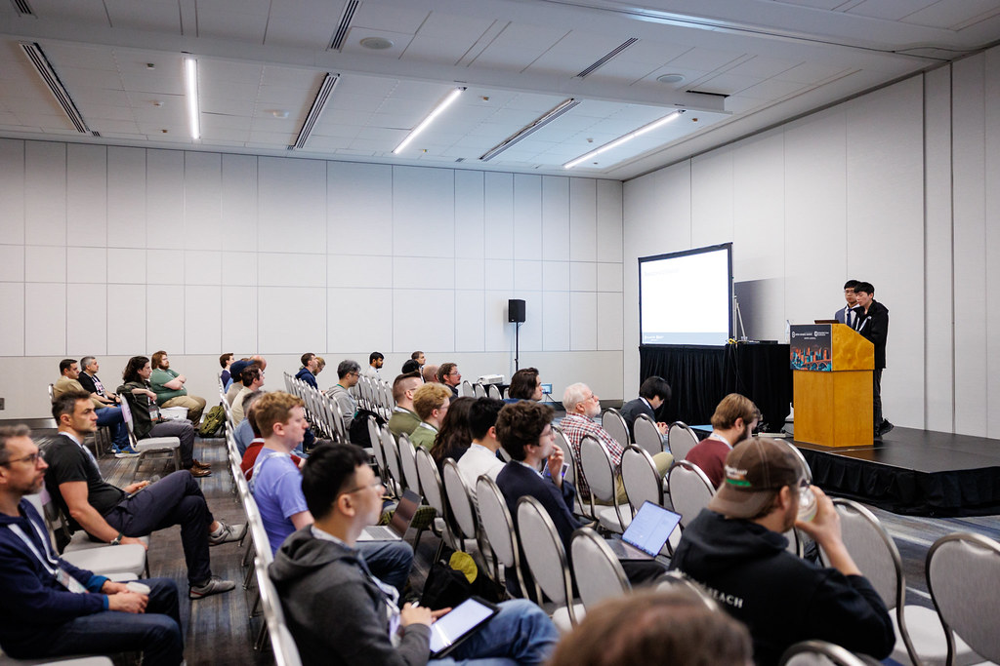

終了後、二人が話しかけに来てくれた。一人目は Linux Foundation JP の Hiroyuki Ishii さんだった。後でぜひ話してみたいと思っていた。彼らには Unified HMI というプロジェクトがあり、native Linux 用の virtio-gpu module で、しかも client-server 形式で作られている。出発前に徐伯楊と、この形式で作れるのではないかと話していたので、ここですぐ実例を見られたのは本当に偶然だった。二人目は Blender で働いている人だった。連絡先を交換できなかったのは少し残念だった。後で会場でも、彼が他の人と rendering 関連の話をしているのを見かけて、かなりかっこよかった。

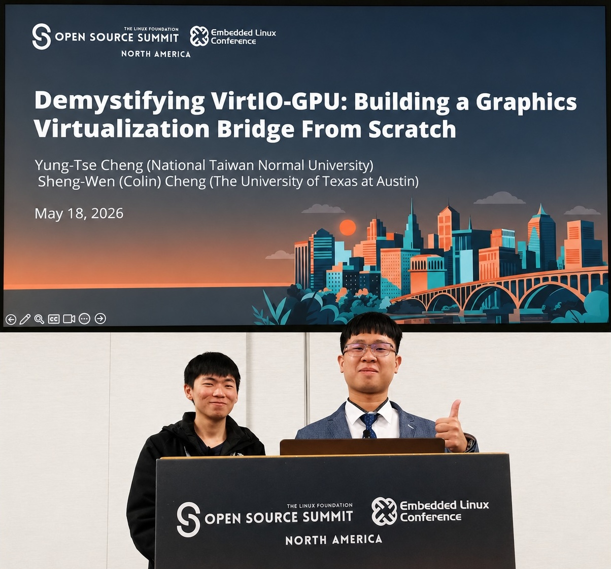

発表が終わると、ちょうど昼食の時間になったので、会場のホールへ弁当を取りに行った。また冷たいサンドイッチとコーヒーだった。食べ終わったあと、ブースを一周した。自分はゲーム機関連のものがないか探したかったけれど、なかった。ただ、先輩と先生が出展者たちと楽しそうに話していて、それはそれで面白かった。

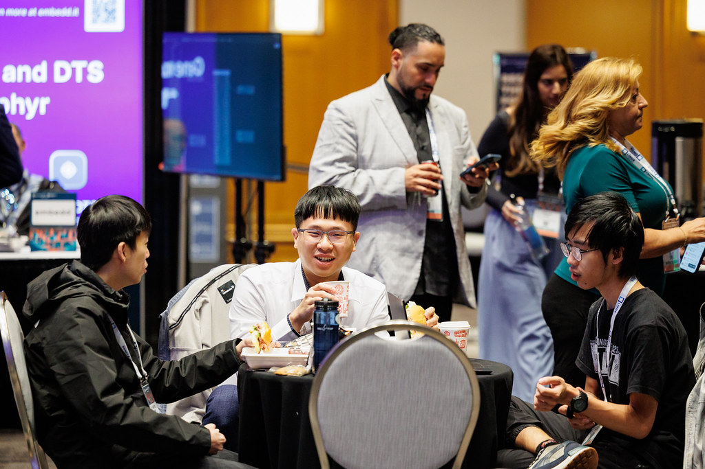

その後は他の発表をいくつか聞いた。三日間を通して、主に新しいものをいろいろ聞けたけれど、実際にどう作っているのかはあまり理解できなかった。そこは先輩が説明してくれた。また、自分は一部の発表者の英語アクセントについていくのが本当に難しいことにも気づいたので、後で動画を字幕付きで見直すことにした。ただ、その間に先生の友人の発表が一つあり、multikernel について話していた。発表者は王聰さんで、全身から kernel 強者の気配が出ていた。発表後、少しだけ彼と話してから次のセッションへ向かった。

五時すぎごろにレセプションがあったが、この時点で自分はかなり眠くなっていた。ホールに着くと、ほとんどの人が立っていて、座席はあまり多くないようだった。会場中央にはいろいろな食べ物が置かれていて、buffet のように自分で取りに行ける。肉類とご飯類の列はかなり長かった。少しずつ取ったあと、隅の席を見つけて座った。食べ終わった後はノート PC を出して schedule を整理し、ついでに side project を少し進めた。それから先輩と外へ一周し、景色を見た。

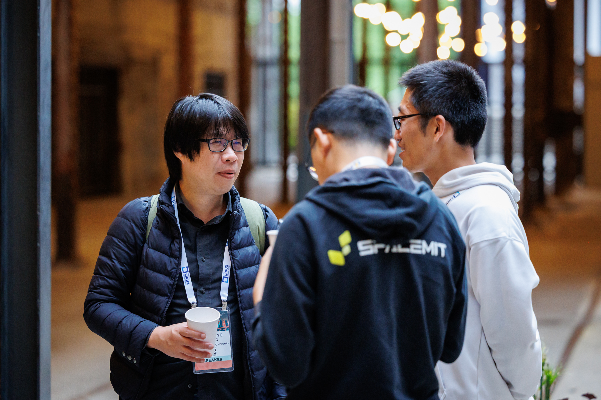

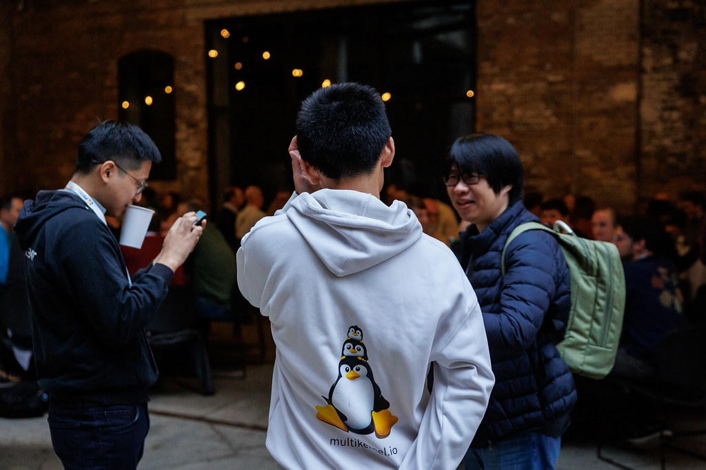

八時すぎごろにドローンショーがあった。ただ、その頃にはすでに小雨が降っていて、後半にはかなり強い雨になったので、室内に戻ってもう少し座ることにした。最後にシャトルバスで会場付近まで戻り、ホテルまで歩いて帰って、シャワーを浴びてそのまま寝た。だいたい十時半ごろだった。

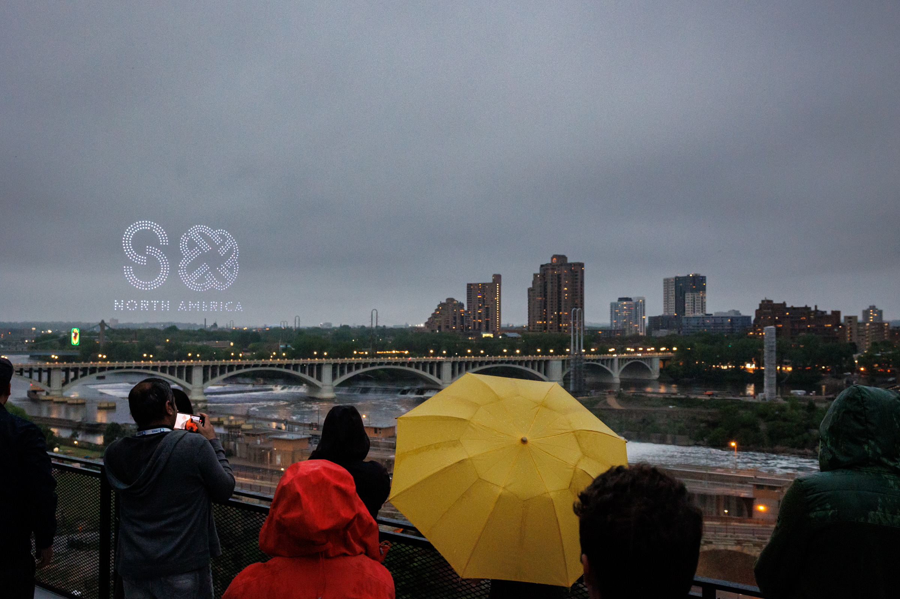

夜、先生が Hiroyuki Ishii さん宛てにメールも書いてくれた。何か交流の機会がないかという内容だったけれど、今のところ返事はまだ来ていない。

## 5/19（火）

この日は起きた時点でかなり楽だった。ようやく一日ちゃんと寝られた。前の数週間は台北でもずっと原稿を追い込んでいて、常に寝不足感があったので、この時点でやっと正常な睡眠を得た感じがした。

行程はだいたい同じで、まず会場へ行って朝食を食べた。この日の朝食はマフィンで、これもおいしかった。そしてこの日、牛乳を入れられることに気づいたので、朝食のコーヒーはコーヒー牛乳へ進化した。ずっと飲みやすくなった。

この日は debug kernel with LLM についての発表を聞いた。発表者は Cloudflare の人で、社内で kdoc という skill を使っているらしい。kernel panic の原因分析などを手伝えて、さらに自動で修正して patch を準備することもできるとのことだった。聞き終わって、これはすごすぎると思ったのに、スマホで調べてもまったく見つからなかった。後で、まだ公開されておらず、社内手続き中だとわかった。つらい。

この日も王聰さんの発表があり、内容も LLM に関係していた。彼は LLM が使うための file system として [branchfs](https://github.com/multikernel/branchfs) を設計していた。agent が複数の patch を同時に進め、最後に commit に似た操作でそれらの変更を主ファイルへ戻せるようにするものだった。まだ upstream の準備中に見えた。自分の利用シーンとも関係があったので、彼にも少し話を聞いた。

この日は先生と麒升も発表した。聞き終わったあと、王聰さんが自分たちと Mark さん、中国から来た別の発表者を夕食に誘ってくれた。選んだのは中華料理の店で、かなりおいしかった。しかも白米があった。外で白米を食べられることにここまで感動するとは思わなかった。ようやく冷たいサンドイッチではなくなった。意外にも、アメリカで食べた中華料理はどれもけっこうおいしかった。ただ、かなりしょっぱかった。

夕食後、UMN を少し歩いた。すると偶然にも、国師先生が卒業写真を撮った場所を見つけた。

来る前から、少し cosplay できたらいいなと思っていたのだけど、こんなに簡単に見つかるとは思わなかった。少し写真を撮って MCL のグループに投げた。かなり面白かった。このあたりは夜八時半ごろでもまだ明るいのに、朝五時ごろにはもう明るくなる。なかなかよい。昼が長くなった感じがして、台湾に戻ったあと急に慣れなくならないか少し気になった。

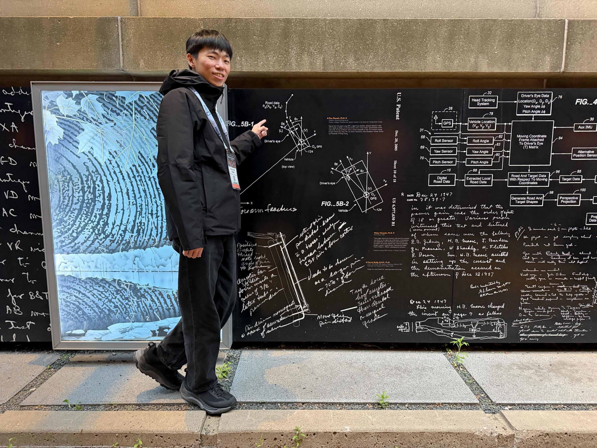

一周したあとホテルへ戻った。その後はいつものように side project を少し書き、シャワーを浴びて寝た。

## 5/20（水）

この日の朝食は急に不思議な感じになり、エナジーバーとバナナだった。この日はまた新しい焼き菓子があるのではと少し期待していたので、かなりがっかりした。エナジーバーを二本取った。少し甘いと思ったけれど、コーヒー牛乳と一緒に食べきった。

この日の Opening で Linus Torvalds 本人を見た。AI に対する考えを少し聞けて、自分の理解とも近かった。以前の The mind behind Linux の記事のように、後で簡単な記録を一篇書くかもしれない。

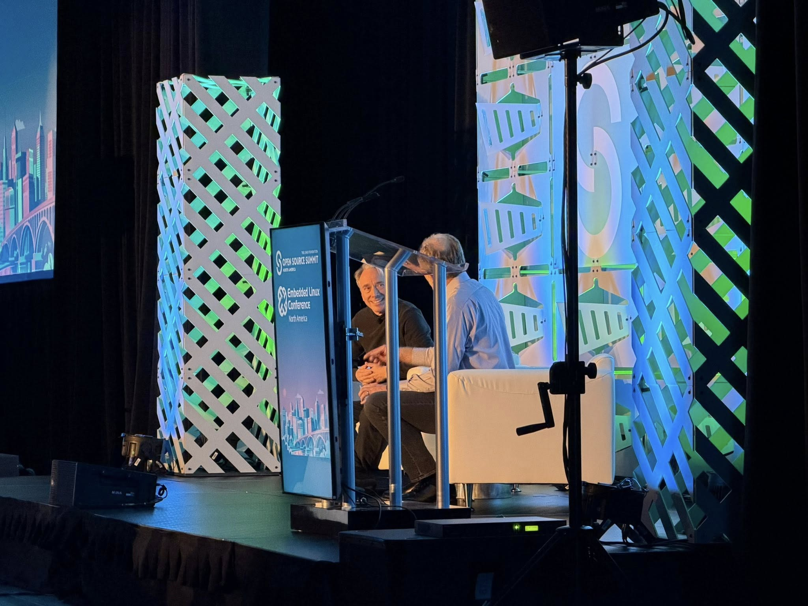

この日はもともととても聞きたいテーマがあった。ただ、見てみると、自分にはかなり追いにくい英語アクセントの発表が多そうだった。少し考えた結果、別のセッションを回ることにした。ただ、その後も特に強く興味を引かれるものには出会えず、少し残念だった。

終了後、先輩が Mall of America、つまり MOA を少し見に行きたいと言った。向かう途中、その日の道には普段より人が多いことに気づいた。理由はよくわからない。七時ごろで、ちょうどみんなが退勤する時間だったのかもしれない。向かう途中で、薬をやっていそうに見える人がこちらに向かって叫んできた。しばらく叫んだあと、後ろについてきて大声を出し始めたので、かなり怖かった。後で早足で離れ、何もなかったことにしたが、今考えると少し危なかった気もする。

目的地に着いたあと、最初は一つの建物だと思っていたので、そのあたりでかなり探した。後になって、これはその通り全体を指しているのだとわかった。ただ、着いたころには店がほとんど閉まっていたようで、一周してまた戻ってきた。帰り道では、またあの人に会わないか少し怖かった。

部屋に戻ると、いつもどおりノート PC を開いて code を書いた。この日、国師先生がようやく返事をくれて、UMN で記念品を買ったり、美術館を見たりするといいと教えてくれた。なので翌日に記念品を買いに行くことにした。

夕食は Uber Eats で Wendy's を注文した。だいたい 8 ドルくらいで、他の食事はだいたい 15 ドルから 20 ドルくらいだったので、アメリカのファストフードは本当に特別安いのかもしれないと思った。食べ終わったあと少し休み、シャワーを浴びて寝た。

## 5/21（木）

この日は会議の最終日と言ってよく、RISC-V の専用セッションの日だった。午前中だけだったが、別料金で、しかも朝食はなかった。自分はコーヒー牛乳を一杯飲んだだけだった。

この日、SAIL という面白いものを聞いた。RISC-V の形式検証に使えるらしい。かなり面白かった。

会議終了後、まず Mark さんと昼食を食べた。彼と先生が RISC-V の話をするのを聞きつつ、ついでに Mark さんの WeChat を追加した。その後、自分と先輩はまた UMN へ戻った。火曜日は記念品店があることを知らなかったので、簡単に一周して帰っただけだった。今回はもう少し長く見て回った。実際、自分たちがどこにいるのかはあまりわかっていなかったが、とにかく記念品店は見つけた。

中には服や帽子などのものがあり、小さなキーホルダーや生活用品もあった。自分は合計で傘、水筒、いくつかのキーホルダー、服二着、コースター二枚を買った。国師先生にコースターを持って帰れるなと思った。

キャンパス内では七面鳥の群れにも会った。四羽いて、ものすごく大きかった。写真を撮るとき、突進して殴られないか怖かったので、かなり遠くから撮った。後で通行人に聞くと、キャンパス内ではよく見かけるらしい。あちこち走り回るとのことなので、台湾でいう大笨鳥みたいな存在なのかもしれない。かなり面白い。

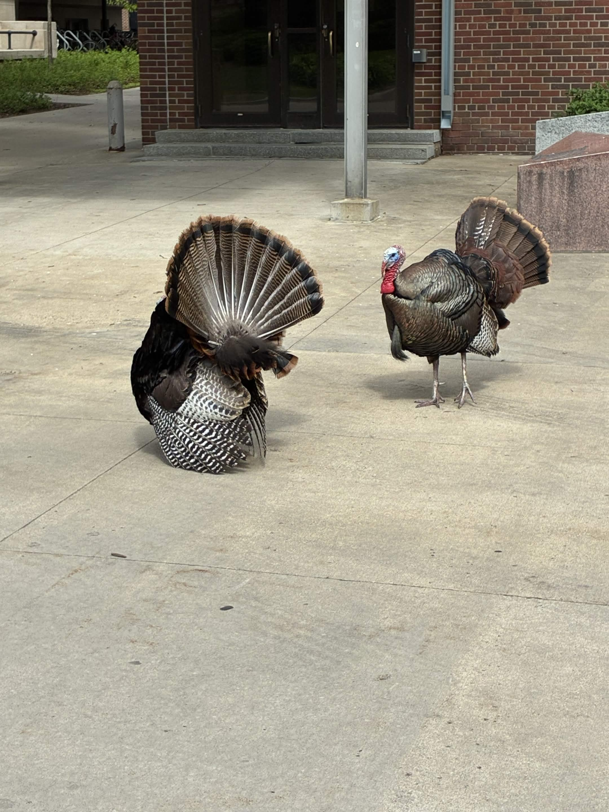

歩き終わったあと、カフェを見つけて座った。入ってみると緑茶があったので、一杯頼んだ。久しぶりの緑茶はうれしかったし、味も悪くなかった。渋すぎるタイプではなかった。その間、先輩が投資についていろいろな心得を話してくれて、憲哥のことを思い出した。自分もそのうち金融系のものを少し読んだほうがいいのかもしれない。そうしないとお金がない。

ホテルに戻ったあと、いつものように project を書いた。先輩たちは先に少し横になると言っていたが、十一時すぎになっても起きてこなかった。自分も眠くなってきたので、そのままシャワーを浴びて寝た。夕食は食べなかった。

## 5/22（金）

この日は一日まるごと空いていた。まず MOA へ行って、なかなかよい朝食を食べた。自分はエッグベネディクト、トースト、ビーフシチュー、ハッシュブラウンを頼んだ。標準的なアメリカンブレックファストという感じで、自分は本当にこういうアメリカ式の朝食プレートが好きだと思った。

他の人たちはみんなハンバーガーを頼んでいた。ものすごく大きくて、自分なら絶対に食べきれなかったと思う。つられて頼まなくてよかった。食べ終わったあと、車を呼んで彫刻公園へ行った。大きな公園で、中央に大きなチェリーの彫刻があり、他の場所にも小さな彫刻がいろいろ置かれていた。続いて MIA 美術館へ行った。入口でまた Hiroyuki Ishii さんに会った。ぜひ後で返事をくれるといいのだけど。

美術館はかなり大きかった。二階には昔の陶器、磁器、彫刻などがたくさんあり、三階は油絵関連だった。油絵を見ると、いつもどおり気分がよくなる。美術館を見終わったあと、国立公園へ滝を見に行き、一周した。中にある川はミシシッピ川らしい。昔は地理の教科書でしか聞いたことがなかったので、今回ようやく本体を見たことになる。歩いている途中、入口の一つに警告看板があり、狼が出るようなことが書いてあった気がして、少し怖かった。

一周した時点でだいたい五時すぎになっていたので、車を呼んでホテルへ戻った。その後、七時すぎごろに自分と先輩たちはまた夕食を食べに出た。

最後の日だったので、ステーキハウスを選んだ。自分はオニオンスープと、ステーキとフライドポテトのセットを頼んだ。オニオンスープはものすごくしょっぱくて笑ってしまった。ただ、中にはチーズとパンがたくさん入っていて、玉ねぎにも味がしみていたので、けっこうおいしかった。水をたくさん飲む必要はあったけれど。

ステーキは表面をわざと少し焦がしていて、香ばしさが出ていた。中の焼き加減はちょうどよく、かなりよかった。ただ、付属のソースはチーズソースで、自分にはよくわからなかった。後半はそのまま塩を少し振って食べていた。

食べ終わってホテルに戻り、いつものように少し code を書き、荷物を整理してからシャワーを浴びて寝た。

## 5/23（土）

先輩はこの後さらに別の会議に参加する予定だったので、今回は自分たちとは一緒に帰らなかった。この日は自分が Uber を呼んだのだけど、そこで初めてかなり高いことに気づいた。この一回で 46.74 ドルだった。アメリカの物価には本当に目を開かされた。

空港に着くと、カウンターのスタッフがまだ出勤していないことに気づいた。カウンターは全部空で、check-in できなかった。自分たちのチケットもオンライン check-in ができないようだったので、まず空港で十一時半まで座って待った。

check-in が終わってから保安検査を通り、サンドイッチを買って食べた。今回はあえて温かいものを選んだ。もう冷たいサンドイッチは本当に食べたくなかった。

その後、飛行機に乗った。面白かったのは、今回は一列目の席で、客室乗務員が飲み物を準備している様子などが見えたことだった。途中、中国人のおばさんが英語を理解できなかったため、自分が通訳として呼ばれた。この国内線の機内では食事らしい食事は出ず、小さなお菓子と飲み物だけだった。国内線はだいたいこうなのかもしれない。

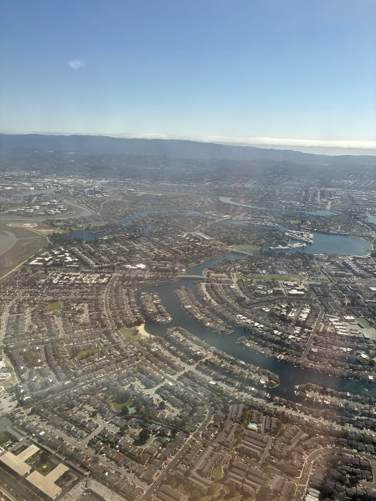

飛行機を降りたあと少し困ったのは、最初の check-in では Sun Country の搭乗券しかもらっていなかったことだった。そのため、EVA Air のカウンターであらためて check-in する必要があった。ただ、その前に、荷物を受け取ってもう一度保安検査に通す必要があるのか確認しなければならなかった。そこで Sun Country のカウンタースタッフを探し始めたのだけど、なんと全部空だった。ようやく一人スタッフを見つけたが、その人も状況をよくわかっていなさそうだった。

結局、荷物受取所でゆっくり待つことにした。最後まで待っても自分たちの荷物は出てこなかったので、EVA Air のカウンターで check-in しながら確認することにした。そこからまたしばらく迷いながら進み、ようやく EVA Air のカウンターを見つけたのだけど、やはり誰もいなかった。この時点でだいたい五時半ごろで、表示には九時二十分から業務開始と書いてあった。なのでまた座れる場所を探し、長い待ち時間が再び始まった。

途中でお腹が空いたので食べ物を探しに行った。相変わらず高かった。

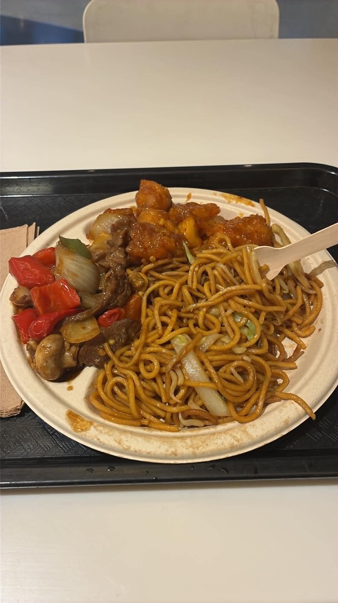

九時ごろになってようやく check-in できた。完了後、また保安検査を通る必要があった。なぜか今回もノート PC を取り出さなくてよかったので、また慌ててしまって、取り出しかけたものをしまうことになった。

最後はいつもどおり、搭乗口で少し寝て、飛行機に乗ってからも寝続けた。食事以外はほとんど寝ていた。最後に起きたとき、台湾到着まで残り四時間くらいだったので、タブレットに入れてあった GAMES101 を開いて少し復習した。その後、機内食を食べて台湾に到着した。無事終了。

## 感想と Future Work

今回の準備は本当に急ぎすぎた。2D が終わったばかりだったのに、テーマは 3D だった。振り返ってみると、主な原因は開発記録を書くのに時間をかけすぎたことだと思う。ただ正直なところ、先にそれを書いておかないと、発表原稿もたぶん出てこなかった。この手のものはどうしても時間がかかる。

今回交流して、また多くのアイデアが増えた。少し前の読書会も含めると、両方を組み合わせられそうなものがある気がする。たとえば virt-manager のような管理インターフェイスを作るとか、cross-platform にできるか見てみるとか、Unified HMI のような client-server アーキテクチャにするとか。最後には box64 と Wine と組み合わせて、仮想マシン上で本当にゲームを動かせるようにできたらいい。

それから少し前に Marty がついに Kiln のコードを公開したので、自分も導入して試してみたい。なので、もしかすると今後まずは自分で C++ の KVM 版を作り、自分用の testbench として試すかもしれない。時間があれば、RISC-V の命令実装や box64 のいくつかの部分も見てみたい。前提として時間があれば、だけど。

ただ、これらは全部 SMP が終わってからになる。SMP は仮想マシンのアーキテクチャを大きく左右するので、それが終わるのを待たないと、自分たちの各仮想マシンの構成をそろえられない。

また、今回の一番大きな収穫は、自分の見せ方だったと思う。聞いた感じ、LinkedIn はちゃんと運用する必要があり、履歴書も継続的に更新していく必要があるらしい。もしかすると blog も英語版と日本語版を少し書いたほうがよさそうだ。たぶんこの文章から始めることになると思う。ただ、実力だけでは足りないのだと、かなりはっきり感じてしまった。

最後に、先生には本当に感謝している。こんなによい機会を提供してくれて、自分たちがこうやって外へ出て交流できた。特に自分は成大の学生ですらなく、プロジェクトをやっているうちに連れてきてもらっただけだ。質の高い交流そのものがとても貴重なことだと思う。これは昔、だいたい 2020 年ごろ、LLM がまだ今ほど強くなかった時期に Cpp Miner を書いていたことを思い出させる。最初の記事は [value category](https://mes0903.github.io/Cpp-Miner/Miner_main/Value_Categories/) だった。当時この内容は中国語の情報がまったくなく、英語の blog や CppCon の録画を少しずつ探して見るしかなかった。

最後に[アイルランドのある読書会の録画](https://www.youtube.com/watch?v=liAnuOfc66o)を見て、ようやくこの概念がだいたい何をしているのかわかった。この発表者は Kris という人で、自分はメールでたくさん質問した。本当にたくさんで、二週間くらい続けて質問し続けた。彼はすべて一つずつ丁寧に答えてくれて、最後にやっと最初の Cpp Miner を書き上げられた。

その後に書いた [Concept の記事](https://mes0903.github.io/Cpp-Miner/Miner_main/Concept_SFINAE_DetectionIdiom/) を例にしても、初めて見たときはまったく理解できなかった。当時これも中国語の情報がまったくなく、自分は張家華先輩にしつこく質問し、説明を聞き、さらに彼が実装まで探して見せてくれたことで、ようやく少しずつ理解した。これにも一か月以上かかった。さらに後で [dereference null pointer](https://mes0903.github.io/Cpp-Miner/Miner_BlackMagic/Indirect_through_null_pointer/) の記事を書いたときも、自分で committee paper を読み、WG21 のリストを少しずつ追って、ようやく UB の結論を組み立てた。

ただ、後で奥義の C++ 読書会に参加して初めて、実はこういうことを理解している人はたくさんいるのだと気づいた。ただ、ネット上では情報を見つけられないだけだった。わかっている人の多くは忙しすぎて、文書を書いて共有する時間がない。あるいは文書を書くのが得意ではない。断片的で短い Blog 記事はいくつかあり、内容は良いのだけど、いつも十分に包括的ではない。

そして上に書いたものですら、ただ一つの言語を読むだけの話だ。去年、開源地下城の人たちと話していたときも、今は中国語圏で BSP に関する教材をほとんど見つけられないことに気づいた。

先生と関わるようになってから、自分が時間を投入する気さえあれば、先生は基本的にたくさんの機会や情報を探してくれるのだとわかった。昔、文章を書くときに先生へ相談すると、自分では考えたこともない意見をくれて、さらに自分から時間を取って議論してくれた。テーマについて質問すると、自分の需要に合っていて、しかも自分の能力より少し上くらいの題目を直接投げてくれた。今回も書いているうちに、突然公費でアメリカ一週間旅行に来られるようになってしまった。恐縮しかない。

この過程で、自分はよく何も知らない状態でプロジェクトに入っている。初めて semu の code を見たとき、プロジェクトの Makefile すら読めなかった。次に ACLINT を初めて聞いたときも、それが背後で何をしたいのかすら知らず、最初の三週間のミーティングではずっと怒られていた。今回 virtio-gpu をやり始めたときも、最初は graphic stack のことをまったく読んだことがなかった。

自分の質問に対して、先生はたいてい直接答えをくれるわけではない。正直、自分としては直接答えがほしいのだけど。その代わりに、たくさんの資料を投げてきて、これを読めと言う。

それでも重要なのは、これほど多くの助けを受けている自分が、先生の学生ですらないということだ。自分と先生は、最初は自分が研究助手として [ROS のチュートリアル記事](https://mes0903.github.io/ROS/ROS_Tutorial_Introduction/) を書いたことがきっかけで知り合っただけで、昔から今まで基本的にはネット上で交流しているだけだった。「何も知らない」ネット上の知り合いにここまで多くの助けを提供してくれる人は、そうそう二人目はいないと思う。本当に先生には感謝している。

とにかく頑張ろう。Karnage は、そのうち VM 上で彼の Vulkan プログラムを動かしたいと言っていた。どうやら自分にはまだやることが山ほどありそうだ。
