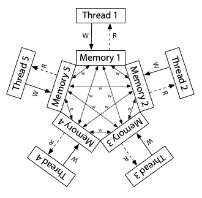
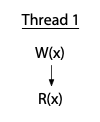
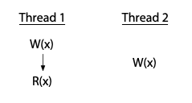
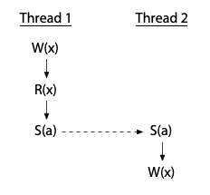
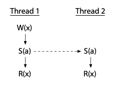
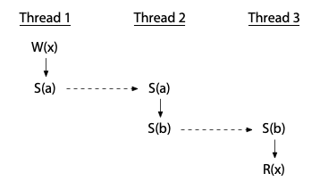
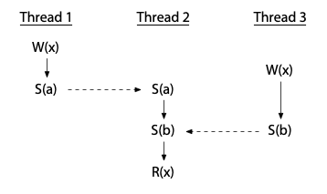

# Memory Model

<div class = "center-column">


詩音畢業了嗚嗚嗚，鹽寶...... 我的鹽寶......（[圖片取自鹽寶的 Twitter](https://x.com/murasakishionch/status/1916085213568110734/photo/1)）

</div>

此篇為 Russ Cox 所寫的 [Hardware Memory Models](https://research.swtch.com/hwmm) 與 [Programming Language Memory Models](https://research.swtch.com/plmm) 的翻譯與筆記，進行了小幅度的修改與增減。 與原文相同，本文依據 [Creative Commons Attribution 4.0 International License](https://creativecommons.org/licenses/by/4.0/) 發佈

本文內所有例子中的變數一開始都被初始化為 0

## Hardware Memory Models

這裡有一個簡單的 C 類語言範例：

```cpp
// Thread 1           // Thread 2
x = 1;                while(done == 0) { /* loop */ }
done = 1;             print(x);
```

思考一下，如果 Thread 1 與 Thread 2 各自運行在獨立的處理器上，並且都有執行完成，那麼這個程式有可能輸出 0 嗎?

這取決於硬體與編譯器，如果是逐行直譯成組合語言並在 x86 多處理器上執行，那它的輸出永遠為 1；但如果同樣是逐行直譯成組合語言，並在 ARM 或 POWER 的多處理器上執行，則可能會輸出 0。 此外不論底層硬體為何，標準的編譯器最佳化也可能讓這段程式碼輸出 0，或者陷入無限迴圈

但顯然「這要看情況」不是一個令人滿意的答案，軟體設計師往往需要明確的答案，知道他們的程式是否能在新的硬體與新的編譯器下繼續正常運作，而硬體設計師與編譯器開發者也需要明確的規範，說明當執行特定程式時，硬體與編譯後的程式可以有怎樣的具體行為

因為這裡的核心問題是「對記憶體中資料變動的可見性與一致性」，所以這個規範被稱為記憶體一致性模型（memory consistency model），或簡稱為 memory model

最初，記憶體模型的目標是定義「硬體對於撰寫組合語言的程式設計師所提供的保證」，在這種情況下並不會有編譯器的介入。 大約在 25 年前，人們開始嘗試為 Java 或 C++ 這樣的高階語言制定記憶體模型，用來為軟體設計師定義對於這些語言的保證，而一旦將編譯器考慮進來，定義一個合理的模型就變得更加複雜

這篇文章會分別討論「硬體記憶體模型」與「程式語言記憶體模型」，原作者寫這篇文章的目標是為了探討 Go 語言的記憶體模型，但第三篇我應該是不會翻，畢竟對 Golang 沒有什麼涉略，但之後可能會為 C++ 再開一篇礦坑講就是了，第三篇的原文在這裡：[Updating the Go Memory Model](https://research.swtch.com/gomm)

### Sequential Consistency（SC）

Leslie Lamport 在 1979 年的論文[〈How to Make a Multiprocessor Computer That Correctly Executes Multiprocess Programs〉](https://www.microsoft.com/en-us/research/publication/make-multiprocessor-computer-correctly-executes-multiprocess-programs/)中引入了順序一致性（sequential consistency）的概念：

> 對於這類電腦而言，設計與證明多處理器演算法正確性的慣用方法，是假設下列條件成立：<br><br>
> 
> 任一執行結果看起來就像是所有處理器的操作是在某種順序下被執行的，而且每個處理器自身的操作在這個順序中，出現的先後完全符合該處理器程式碼中指定的順序。 滿足這個條件的多處理器系統，將被稱作順序一致（sequentially consistent）

如今，我們談論順序一致性時，不只涵蓋電腦硬體，也包括程式語言本身對此性質的保證，也就是說，程式的所有可能執行結果都可視為「將各執行緒的操作交錯插入某個單一序列化執行」所形成的結果

順序一致性通常被視為理想模型，本文會稱其為 SC 模型，是對程式設計師來說最自然也最直觀的模型。 它讓你能夠假設程式會按照你所撰寫的順序執行，而每個執行緒的執行步驟只是「按照某種順序」地交錯在了一起，<span class = "yellow">不會有額外的重新排列</span>

回到前面的這個範例：

```cpp
// Thread 1           // Thread 2
x = 1;                while(done == 0) { /* loop */ }
done = 1;             print(x);
```

為了讓這段程式更容易分析，我們先去除 `loop` 與 `print`，然後來考慮在讀取共享變數後會得到哪些結果：

```cpp
Litmus Test: Message Passing
Can this program see r1 = 1, r2 = 0?

// Thread 1           // Thread 2
x = 1                 r1 = y
y = 1                 r2 = x
```

如同一開始講的，我們假設所有範例一開始都將變數初始化為 0。 而由於我們的目的是確定硬體允許進行哪些操作，我們假設每個執行緒都運行在自己的專用處理器上，而且沒有編譯器介入，不會對執行緒中的操作進行任何重排，因此你看到的指令列表就是處理器實際執行的指令序列

`rN` 是指執行緒內部使用的暫存器，而非共享變數。 這裡，我們的問題是，在執行結束後，某個特定的暫存器值的組合是否有可能出現? 對於這個例子來說，就是我們想知道 Thread 2 是否有可能會看到 `r1 = 1, r2 = 0`?

這種針對範例程式的執行結果所提出的問題，被稱為試金石測試（litmus test），這種問題的答案是二元的 — 結果有可能/不可能發生。 因此我們可以利用試金石測試來明確區分不同的記憶體模型，如果某個記憶體模型允許某種執行結果，而另一個模型不允許，那這兩個模型顯然就是不同的

如果這個試金石測試的執行是順序一致的，那麼就只會有六種可能的交錯執行（interleaving）的方式：

<div class = "center-column">


</div>

你可以看到，沒有任何一種交錯執行會導致 `r1 = 1, r2 = 0` 的結果，因此不會出現這個結果，也就是說，在順序一致性的硬體上，對這個試金石測試 — 「這個程式有可能出現 `r1 = 1, r2 = 0` 嗎?」的答案是「不可能」

對於順序一致的模型，你可以想像所有處理器都直接連接到同一塊共享記憶體，而這塊記憶體每次只能服務一個執行緒的讀或寫請求，且這裡<span class = "yellow">沒有快取（cache）</span>的存在。 因此每當處理器需要讀取或寫入記憶體時，該請求就會直接送往共享記憶體。 這種「一次只能被一人使用」的共享記憶體，自然會對所有記憶體的存取操作強加了一個執行順序，這就是順序一致性：

<div class = "center-column">


</div>

::: info  
本篇文章中的三張記憶體模型硬體示意圖，改編自 Maranget 等人的[〈A Tutorial Introduction to the ARM and POWER Relaxed Memory Models〉](https://www.cl.cam.ac.uk/~pes20/ppc-supplemental/test7.pdf)  
:::

這張圖是一種順序一致性（SC）機器的模型，但它並不是實作這種機器的唯一方式，順序一致性的機器也可以用其他方式建構，例如使用多個共享記憶體模組與快取來協助預測記憶體讀取的結果，但只要被稱作「順序一致性」，那麼該機器的行為就必須與此模型無法區分。 這個模型的好處在於，如果我們只是想理解什麼是順序一致的執行，那麼我們可以忽略那些實作上的複雜情形，單純以這個模型來思考即可

然而放棄嚴格的順序一致性可以讓硬體更快地執行程式，因此所有現代硬體在某些方面都偏離了順序一致性模型，而要準確定義「某個硬體在記憶體模型上是如何偏離順序一致性的」是非常困難的，本文用了兩種記憶體模型作為例子，它們都存在於當今廣泛使用的硬體中，分別是 x86 架構的記憶體模型，以及 ARM 與 POWER 處理器家族的記憶體模型

### x86 Total Store Order (x86-TSO)

下圖這種硬體架構模型對應到現代 x86 系統的記憶體模型：

<div class = "center-column">


</div>

所有處理器仍然連接到同一塊共享記憶體，但每個處理器都有一個 local 的寫入佇列（write queue），將寫入操作先暫存在這裡，處理器可以在寫入尚未完成時繼續執行新的指令，而這些寫入會逐步傳送到共享記憶體中。 當某個處理器進行記憶體讀取時，會先查詢自己 local 的寫入佇列，然後才查詢主記憶體，但它無法看到其他處理器的寫入佇列

這代表「一個處理器會比其他處理器更早看到它自己做的寫入」，但是所有的處理器對於「寫入何時抵達共享記憶體」這件事，會有一致的順序認知，因此這個模型被稱為 Total Store Order（TSO，全域寫入順序）。 當某次寫入抵達共享記憶體的那一刻，任何處理器之後的讀取操作都會看到該值並能夠使用它，直到該值被更後面的寫入覆蓋掉

這個寫入佇列是一個標準的 FIFO 佇列，寫入操作被送出到共享記憶體的順序，與它們在處理器中實際執行的順序是一致的。 由於寫入佇列保留了寫入順序，而其他處理器在寫入送達共享記憶體時可以立刻看到這些寫入，因此，我們之前討論過的 message passing 試金石測試會有跟先前一樣的結果，`r1 = 1, r2 = 0` 依然是不可能出現的：

```cpp
Litmus Test: Message Passing
Can this program see r1 = 1, r2 = 0?

// Thread 1           // Thread 2
x = 1                 r1 = y
y = 1                 r2 = x

On sequentially consistent hardware: no.
On x86 (or other TSO): no.
```

寫入佇列保證 Thread 1 會先將 `x` 寫入記憶體，然後才寫入 `y`，而系統整體對記憶體寫入順序所建立的一致共識，也進一步保證 Thread 2 在得知 `y` 的新值之前，必定會先看到 `x` 的新值，因此 `r1 = y` 如果讀到的是 `y` 的新值，就不可能出現 `r2 = x` 還沒看到 `x` 的新值的情況

這裡的關鍵在於寫入順序（store order），Thread 1 是先寫入 `x` 再寫入 `y` 的，因此 Thread 2 不可能在看到 `x` 的更新之前就看到 `y` 的更新。 在這個例子中，順序一致性（SC）與 TSO（Total Store Order）模型的結果是相同的，但在其他試金石測試中，這兩者會有不同的結果

舉例來說，這是最常用來區分 SC 與 TSO 模型的經典例子（Write Queue）：

```cpp
Litmus Test: Write Queue (also called Store Buffer)
Can this program see r1 = 0, r2 = 0?

// Thread 1           // Thread 2
x = 1                 y = 1
r1 = y                r2 = x

On sequentially consistent hardware: no.
On x86 (or other TSO): yes!
```

對於 SC，`x = 1` 與 `y = 1` 必有一個會先發生，接著另一個執行緒的讀取必定能觀察到這次寫入，因此，`r1 = 0, r2 = 0` 是不可能發生的。 但在 TSO（Total Store Order）系統上，有可能發生 Thread 1 和 Thread 2 都將寫入操作暫存在各自的 write buffer 中，接著各從主記憶體進行讀取，因為此時這些寫入都還沒真正寫入到共享記憶體中，因此兩邊的讀取都會看到初始值 0

雖然這個例子可能看起來有點刻意，但使用兩個同步變數的情境實際上常見於知名的同步演算法中，例如 [Dekker's algorithm](https://en.wikipedia.org/wiki/Dekker%27s_algorithm) 與 [Peterson's algorithm](https://en.wikipedia.org/wiki/Peterson%27s_algorithm)，以及一些臨時設計的同步策略，如果某個執行緒無法看到另一個執行緒的所有寫入操作，這些演算法就會失效

為了修復這種依賴較強記憶體排序保證的演算法，在這些非順序一致性的硬體上，會提供明確的指令，稱作記憶體屏障（memory barrier）或 fence，用來強制控制記憶體操作的順序。 我們可以透過加入一個記憶體屏障指令，來確保每個執行緒都會先把前面的寫入操作送到共享記憶體，然後才執行它的讀取操作：

```cpp
// Thread 1           // Thread 2
x = 1                 y = 1
barrier               barrier
r1 = y                r2 = x
```

加入記憶體屏障之後，`r1 = 0, r2 = 0` 就不可能會發生了，此時 Dekker 或 Peterson 的演算法就能正確運作。 記憶體屏障有很多種類，各系統的細節不盡相同，但這已超出本文的討論範圍，重點在於記憶體屏障程式設計師或語言實作者提供了一種可以在程式中強制實現順序一致的方法

最後再舉一個例子，來強調為什麼這個模型被稱為「全域寫入順序（total store order）」，在這個模型中，有 local 的寫入佇列，但在讀取路徑上沒有快取，一旦某次寫入抵達主記憶體，所有處理器不僅會一致認為這個值已經存在，還會一致認同這次寫入相對於其他處理器寫入的到達順序

來看看下面這個試金石測試（IRIW）：

```cpp
Litmus Test: Independent Reads of Independent Writes (IRIW)
Can this program see r1 = 1, r2 = 0, r3 = 1, r4 = 0?
(Can Threads 3 and 4 see x and y change in different orders?)

// Thread 1    // Thread 2    // Thread 3    // Thread 4
x = 1          y = 1          r1 = x         r3 = y
                              r2 = y         r4 = x

On sequentially consistent hardware: no.
On x86 (or other TSO): no.
```

試想，如果 Thread 3 觀察到 `x` 的變化早於 `y`，那麼 Thread 4 有可能看到 `y` 的變化早於 `x` 嗎? 換句話說，`r1 = 1, r2 = 0, r3 = 1, r4 = 0` 可能發生嗎?

對於 x86 和其他採用 TSO 模型的機器來說，答案是「不可能」，因為所有寫入到主記憶體的操作都遵循一個「全域」的順序，且所有處理器都會遵循這個順序，唯一的例外是處理器本身會在它自己的寫入抵達主記憶體之前就知道它寫了什麼（因為在 local 寫入佇列裡面）

### The Path to x86-TSO

x86 的 TSO 模型看起來相當簡潔明瞭，但發展到這個樣子的過程充滿了障礙與錯誤的轉折。 在 1990 年代，當時針對最早期 x86 多處理器的說明文件，幾乎沒有說明硬體所提供的記憶體模型，以其中一個實際問題為例 ― Plan 9 作業系統，其不依賴全域核心鎖（global kernel lock），且能在 x86 架構上執行

在 1997 年移植到多處理器架構的 Pentium Pro 時，開發者遇到了一個出乎意料的行為，最終追溯到的原因就是我們前面提到的 Write Queue 試金石測試，其中有一段極其細微的同步程式碼假設 `r1 = 0, r2 = 0` 是不可能發生的，但實際上它卻發生了，更糟的是，當時的 Intel 的官方手冊對記憶體模型的細節描述得非常模糊

當時有人於郵件論壇上建議「與其相信硬體設計師會如我們所預期地運作，不如在鎖的使用上採取保守策略」，對於這個問題，一位 Plan 9 的開發者做出了精彩的回應說明：

> 我完全同意多處理器系統中會出現越來越鬆散的操作順序，問題是硬體設計師心中預期的「保守」到底是什麼? 在一個 lock section 的開頭與結尾都強制插入鎖存機制（interlock）對我來說已經算是相當保守了，但我顯然還不夠有想像力<br><br>
>
> Pentium Pro 的手冊對於快取機制與一致性維護描述得鉅細靡遺，詳細說明了快取與一致性（coherence）的實作方式，卻對執行順序與讀取順序幾乎隻字未提。 現在的事實是我們根本無法確定自己的做法是否已經「夠保守」了

在這場討論中，一位 Intel 的架構師非正式地解釋了記憶體模型的實際情況，他指出，理論上就連早期的 486 與 Pentium 多處理器系統，都可能會出現 `r1 = 0, r2 = 0` 的結果，而 Pentium Pro 只是因為有更大的管線（pipeline）與寫入佇列，因此才更容易觀察到這種行為

那位 Intel 架構師還寫道：

> 這表示系統中任何一個處理器所發出的事件，其順序在其他處理器看來永遠是一致的，但不同的觀察者之間可能會不一致，對於來自兩個或更多處理器的事件交錯順序可以有不同看法，未來的 Intel 處理器將會實作相同的記憶體排序模型

「不同觀察者可以對兩個或以上處理器事件的交錯順序有不同看法」這個說法，其實是在表示剛剛在 x86 上 IRIW 試金石測試的答案可能是「Yes」，即便我們在前一節才看到 x86 給的答案是「No」。 這似乎是因為，雖然 Intel 處理器實際上從未對那個試金石測試出現過「Yes」的結果，但當時 Intel 的架構師不願對未來的處理器行為做出任何保證

而當時架構說明書中僅有的那幾段文字，幾乎沒有提供任何明確保證，導致開發者很難針對這種行為正確地撰寫程式。 Plan 9 的討論也不是唯一的例子，從 1999 年 11 月下旬開始，Linux 核心的開發者們也在他們的郵件論壇上，花了超過百則訊息，圍繞著類似的困惑，討論 Intel 處理器到底提供了什麼記憶體模型上的保證

接下來十年間越來越多人遭遇這類困難的情況，為了解決這個問題，Intel 的一群架構師開始著手撰寫有用的處理器行為保證，這些保證針對現有處理器與未來處理器都適用。 第一份成果是 2007 年 8 月發表的[《Intel® 64 Architecture Memory Ordering White Paper》](https://www.cs.cmu.edu/~410-f10/doc/Intel_Reordering_318147.pdf)，其目標是「讓軟體開發者能清楚理解不同記憶體存取指令序列可能產生的結果」

同年稍晚，AMD 也發布了類似的說明，收錄於[《AMD64 Architecture Programmer’s Manual revision 3.14.》](https://courses.cs.washington.edu/courses/cse351/12wi/supp-docs/AMD%20Vol%201.pdf)中。 這些說明是基於一種稱作「全域鎖順序 + 因果一致性（TLO+CC）」的模型，這個模型刻意設計得比 TSO 還要弱。 在公開演講中，Intel 架構師表示 TLO+CC 是「需要多強就多強，但不會更強」的模型，這個模型還特別保留了 x86 處理器在 IRIW 試金石測試中回應「Yes」的權利

然而遺憾的是，當時記憶體屏障的定義還不夠強大，不足以恢復順序一致的記憶體語意，即使在每條指令後面都插入一個記憶體屏障也做不到，更糟的是，研究人員還觀察到實際的 Intel x86 硬體違反了 TLO+CC 模型，例如這個例子：

```cpp
Litmus Test: n6 (Paul Loewenstein)
Can this program end with r1 = 1, r2 = 0, x = 1?

// Thread 1    // Thread 2
x = 1          y = 1
r1 = x         x = 2
r2 = y

On sequentially consistent hardware: no.
On x86 TLO+CC model (2007): no.
On actual x86 hardware: yes!
On x86 TSO model: yes! (Example from x86-TSO paper.)
```

在 2008 年稍晚，Intel 與 AMD 的規格文件皆進行了修訂，這些修訂保證 IRIW 試金石測試的結果為「No」，並且加強了記憶體屏障的語意，但仍然允許了一些出人意料的行為，這些行為看起來不太合理，例如這個例子：

```cpp
Litmus Test: n5
Can this program end with r1 = 2, r2 = 1?

// Thread 1    // Thread 2
x = 1          x = 2
r1 = x         r2 = x

On sequentially consistent hardware: no.
On x86 specification (2008): yes!
On actual x86 hardware: no.
On x86 TSO model: no. (Example from x86-TSO paper.)
```

為了解決這些問題，Owens 等人提出了 x86-TSO 模型，該模型是建立在先前的 SPARCv8 TSO 模型基礎之上。 當時他們聲稱「據我們所知，x86-TSO 是一個正確的模型，它的強度足以支撐上層程式設計，並且大致符合硬體廠商的原始意圖」。 幾個月之後，Intel 和 AMD 釋出了新的技術手冊，廣泛採用了這個 x86-TSO 模型，看起來，所有 Intel 處理器從一開始就是依據 x86-TSO 來實作的，儘管 Intel 花了整整十年才正式承認這一點

回顧過去可以發現，Intel 與 AMD 的架構師們當時正在掙扎於該如何撰寫一個記憶體模型，既要為未來處理器的最佳化留出空間，又要對編譯器開發者與組合語言程式設計師提供實用的行為保證，所謂「需要多強就多強，但不更強」是一場極其困難的平衡挑戰

### ARM/POWER Relaxed Memory Model

現在我們來看看一個更加鬆散的記憶體模型，也就是 ARM 與 POWER 處理器所採用的模型。 在實作層面上，這兩個系統之間有很多差異，但它們所保證的記憶體一致性模型大致相似，而且比 x86-TSO，甚至比 x86-TLO+CC 都要弱不少。 對於 ARM 與 POWER 系統來說，其想法是，每個處理器會對自己擁有的完整記憶體副本進行讀寫，而每次寫入都會獨立地傳播到其他處理器，在這個傳播過程中，允許重新排序（reordering）：

<div class = "center-column">



</div>

在這裡，不存在全域寫入順序（total store order）。 雖然圖中沒有畫出來，但每個處理器也被允許延後讀取操作，直到真的需要該結果為止，也就是說，某次讀取可以被延後到「後面的某次寫入之後」才執行。 在這種鬆散的模型中，我們之前看過的所有試金石測試，其答案在這裡都是「Yes」

以最初的 message passing 試金石測試為例，單一處理器的寫入重排序（reordering）代表著 Thread 1 的寫入操作可能不會以相同的順序被其他執行緒觀察到：

```cpp
Litmus Test: Message Passing
Can this program see r1 = 1, r2 = 0?

// Thread 1           // Thread 2
x = 1                 r1 = y
y = 1                 r2 = x

On sequentially consistent hardware: no.
On x86 (or other TSO): no.
On ARM/POWER: yes!
```

在 ARM/POWER 的模型中，我們可以想像 Thread 1 和 Thread 2 各自擁有一份獨立的記憶體副本，而這些寫入操作在副本之間以任意順序進行傳播。 如果 Thread 1 的記憶體先把 `y` 的更新傳給 Thread 2，再傳送 `x` 的更新，而 Thread 2 剛好在這兩次更新之間執行，那它就會看到 `r1 = 1, r2 = 0` 這個結果

這個結果顯示出 ARM/POWER 的記憶體模型比 TSO 更加鬆散，它對硬體的行為施加的限制更少，但 ARM/POWER 模型也允許那些 TSO 模型已經接受的重排序（reordering）行為：

```cpp
Litmus Test: Store Buffering
Can this program see r1 = 0, r2 = 0?

// Thread 1           // Thread 2
x = 1                 y = 1
r1 = y                r2 = x

On sequentially consistent hardware: no.
On x86 (or other TSO): yes!
On ARM/POWER: yes!
```

在 ARM/POWER 架構中，對 `x` 和 `y` 的寫入操作可能已經寫入到各自的本地記憶體，但在對側的執行緒讀取時，這些寫入可能尚未被傳播過去，下面這個試金石測試展示了 x86 擁有「全域寫入順序（total store order）」是什麼意思：

```cpp
Litmus Test: Independent Reads of Independent Writes (IRIW)
Can this program see r1 = 1, r2 = 0, r3 = 1, r4 = 0?
(Can Threads 3 and 4 see x and y change in different orders?)

// Thread 1    // Thread 2    // Thread 3    // Thread 4
x = 1          y = 1          r1 = x         r3 = y
                              r2 = y         r4 = x

On sequentially consistent hardware: no.
On x86 (or other TSO): no.
On ARM/POWER: yes!
```

在 ARM/POWER 架構中，不同的執行緒可能會以不同的順序得知不同的寫入操作。 它們無法保證對於寫入操作抵達主記憶體的總體順序有一致共識，因此這裡 Thread 3 可能會先看到 `x` 的變化再看到 `y`，而 Thread 4 則可能反過來先看到 `y` 再看到 `x`

再舉一個例子來說，ARM/POWER 系統在記憶體讀取方面會出現可見的緩衝或重排序，這點可以從以下這個試金石測試中觀察到：

```cpp
Litmus Test: Load Buffering
Can this program see r1 = 1, r2 = 1?
(Can each thread’s read happen after the other thread’s write?)

// Thread 1    // Thread 2
r1 = x         r2 = y
y = 1          x = 1

On sequentially consistent hardware: no.
On x86 (or other TSO): no.
On ARM/POWER: yes!
```

任何順序一致性（SC）下的交錯執行都必須從 Thread 1 的 `r1 = x` 或 Thread 2 的 `r2 = y` 開始，而那次的讀取必定會讀到 0，因此 `r1 = 1, r2 = 1` 這種結果是不可能發生的。 然而，在 ARM/POWER 的記憶體模型中，處理器允許延後讀取操作，直到指令序列中較晚的寫入執行之後才執行讀取，因此可能會變成 `y = 1` 和 `x = 1` 先於這兩個讀取被執行

儘管 ARM 與 POWER 的記憶體模型都允許這種結果發生，但 Maranget 等人在 2012 年的報告中指出，他們只能在 ARM 系統上實際觀察到這種行為，而從未在 POWER 上觀察到。 這裡可以看到模型與現實行為之間的差異開始產生影響

正如我們先前探討 Intel x86 時所見，硬體若實作了一個比其技術規格更強的記憶體模型，會讓程式開發者不自覺地依賴這種更強的行為，這也意味著，如果未來有較弱的硬體出現，可能會讓現有程式無法正常運作，不管這樣的改變在規範上是否合理

ARM 與 POWER 也有提供記憶體屏障，就像 TSO 系統一樣，我們可以在上述範例中插入這些屏障，以強制執行順序一致性的行為。 但有個問題是，在沒有任何屏障的情況下，ARM/POWER 是否會排除某些行為發生? 有沒有哪一個試金石測試的結果可能是「No」的?

答案是有，只關注一個記憶體位置即可，以下是一個即使在 ARM 和 POWER 上，答案都為「No」的試金石測試：

```cpp
Litmus Test: Coherence
Can this program see r1 = 1, r2 = 2, r3 = 2, r4 = 1?
(Can Thread 3 see x = 1 before x = 2 while Thread 4 sees the reverse?)

// Thread 1    // Thread 2    // Thread 3    // Thread 4
x = 1          x = 2          r1 = x         r3 = x
                              r2 = x         r4 = x

On sequentially consistent hardware: no.
On x86 (or other TSO): no.
On ARM/POWER: no.
```

這個試金石測試與前一個類似，但這次是兩個執行緒都對同一個變數 `x` 進行寫入，而不是針對兩個不同的變數 `x` 和 `y`。 Thread 1 與 Thread 2 分別對 `x` 寫入互相衝突的數值 1 與 2，而 Thread 3 和 Thread 4 則各自對 `x` 讀取兩次，如果 Thread 3 觀察到 `x = 1` 被 `x = 2` 覆蓋，Thread 4 有可能觀察到相反的順序嗎?

答案是不可能的，即便是在 ARM 或 POWER 上也是如此，系統中的所有執行緒對於針對同一記憶體位置的寫入操作，必須有一致的全域順序（total order）認知，也就是說，執行緒必須一致認定是哪一次寫入覆蓋了另一個寫入，這個特性被稱為 coherence。 如果沒有 coherence 這個屬性，處理器之間就會對記憶體的最終內容產生不一致的認知，或是會觀察到某個記憶體位置在不同值之間反覆跳動，從一個值變成另一個，又再變回來

::: tip  
對於 coherence，本文會盡量保持原文，因為它的中文也翻作一致性，但與前面的順序一致性（SC）指的是完全不同的東西，英文也不一樣，前者是 coherence，後者是 consistency

所謂的 coherence 代表，對於每一個「單一的」記憶體位置（變數），所有執行緒都必須同意它的寫入順序（write order），它<span class = "yellow">只針對個別變數看，不考慮跨變數操作的順序</span>

但對於 SC，它的要求更嚴格，整個系統的行為必須像是所有操作都是依照某個「全域交錯順序（global interleaving）」執行的一樣，而且每個執行緒的操作順序都保留，<span class = "yellow">不能做重排序（reordering）</span>，包含 compiler 和 hardware 的 reorder 都是  
:::

在這樣的系統上寫程式會非常困難，我們這邊刻意省略了 ARM 與 POWER 弱記憶體模型中的許多細節與微妙之處，若想深入了解，可以參考 [Peter Sewell 在這個主題上的相關論文](https://www.cl.cam.ac.uk/~pes20/papers/topics.html#Power_and_ARM)，此外，ARMv8 透過引入「多副本原子性（multicopy atomic）」來[加強了記憶體模型](https://www.cl.cam.ac.uk/~pes20/armv8-mca/armv8-mca-draft.pdf)，但這裡我們不會花篇幅詳解它的具體含義

這裡有兩個重點，第一，這裡面有非常多極為細緻且複雜的內容，這些內容已經是極具毅力與智慧的學者們研究超過十年的課題，我自己也完全不敢說能夠全部理解，這不是我們應該期望能向一般程式設計師解釋清楚的東西，也不是我們能在除錯日常程式時清楚掌握的東西

第二，被允許的行為與實際觀察到的行為，兩者之間的落差，常常會帶來不幸的驚喜（bug），如果當前的硬體沒有展現出所有被允許的行為，特別是當「什麼是被允許的」一開始就難以被掌握時，那麼最終就難免會出現程式不小心依賴了硬體較為保守（限制較多）行為的情況

### Weak Ordering and Data-Race-Free Sequential Consistency

看到這裡，我希望你已經意識到硬體的細節是既複雜又微妙的，這些細節並不是你每次寫程式時都會想要去處理的東西，取而代之的，你應該是要去設計一些簡化規則，只要你遵守這些簡單的規則，你的程式行為就會如同某種順序一致的交錯執行結果一樣（這裡我們仍然在討論硬體層面，所以說的是組合語言指令的交錯執行）

Sarita Adve 和 Mark Hill 在他們的研究中正是提出了這種方法，發表於 1990 年的論文[《Weak Ordering – A New Definition》](https://citeseerx.ist.psu.edu/document?repid=rep1&type=pdf&doi=b44dabaabb42c0586b20cec31122ef738af98436)中，他們對「弱排序（weak ordering）」的定義如下：

> 假設同步模型（synchronization model）是對記憶體存取的一組約束，這些約束定義了同步需要「如何做」以及「何時做」的規則。 如果某個硬體在某個同步模型之下是弱排序的，那麼「只要遵守該同步模型的軟體觀察起來都是順序一致的」，也就是說，所有遵守這個同步模型的軟體，都會觀察到順序一致的行為

雖然他們的論文當時是為了描述那個年代的硬體設計（並不是針對 x86、ARM 或 POWER），但他們的討論並不只限於特定架構層級，因此這篇論文至今仍具參考價值。 之前提到「有效的最佳化不應改變有效程式的行為」，而這些規則就定義了什麼樣的程式算是「有效的」，任何硬體最佳化都必須確保那些程式仍然能夠正確運作，就像它們在順序一致（SC）的機器上運行一樣

當然，有趣的細節其實就是這些規則本身，也就是用來定義一個程式是否合法的那些約束條件。 Adve 與 Hill 提出了一種同步模型，他們稱之為「無資料競爭（data-race-free, DRF）」模型，這個模型假設硬體提供了與普通記憶體讀寫操作不同的「記憶體同步操作」，這些同步操作是獨立於一般讀寫指令之外的，在兩個同步操作之間，一般的記憶體讀寫是可以被重新排序的，但它們不能跨越同步操作進行重排序

也就是說，同步操作同時也充當了重排序的屏障，若以理想的順序一致執行，對於任意來自不同執行緒、針對同一個記憶體位置的兩次普通存取操作，只要它們不是兩個都是讀取，就必須被同步操作分隔，強制其中一個發生在另一個之前，則這個程式就被認為是 DRF 的

讓我們來看幾個範例，這些例子取自 Adve 與 Hill 的論文（為了簡報而重新繪製），這是一個單一執行緒的範例，其先寫入變數 `x`，再讀取相同的變數 `x`：

<div class = "center-column">



</div>

圖中的垂直箭頭表示單一執行緒中的執行順序，先執行寫入，接著執行讀取。 這個程式中不存在 data race，因為所有操作都發生在同一個執行緒內，相比之下，在以下這個雙執行緒的程式中就出現了 data race：

<div class = "center-column">



</div>

在這裡，如果 Thread 2 在沒有與 Thread 1 協調的情況下寫入變數 `x`，「Thread 2 的寫入」就會與「Thread 1 的寫入與讀取」產生 race； 如果 Thread 2 不是寫入 `x`，而是讀取 `x`，則這個程式只會有一個 race，發生於「Thread 1 的寫入」與「Thread 2 的讀取」之間。 要注意的是，每個 race 都至少會涉及到一次的「寫入」操作，兩個沒有同步機制的「讀取」行為並不會產生 race

為了避免 race，我們必須加入同步操作（synchronization operations），這些操作會強制規範不同執行緒對共享同步變數的操作順序。 如果我們使用同步操作 `S(a)`（針對變數 `a` 的同步，下圖以虛線箭頭標示），強制讓「Thread 2 的寫入」發生在「Thread 1 完成」之後，那麼這個 race 就會被消除掉：

<div class = "center-column">



</div>

如此一來，「Thread 2 的寫入」便不會與 Thread 1 的操作同時發生了

如果 Thread 2 只是讀取，那就只需要與「Thread 1 的寫入」同步即可，兩次的讀取操作仍然可以同時進行：

<div class = "center-column">



</div>

執行緒之間可以透過一連串的同步操作來建立順序，甚至可以藉由中介的執行緒來達成這種順序，如下所示，這個例子中不存在 data race：

<div class = "center-column">



</div>

另一方面，如果僅僅是使用同步變數本身，並不保證能消除 data race，因為同步變數可能會被錯用，下例中存在 data race：

<div class = "center-column">



</div>

上例中 Thread 2 的讀取操作雖然有正確地與其他執行緒的寫入進行同步（它發生在兩個寫入之後），但這兩個寫入之間並沒有被同步，所以這個例子中仍存在 data race（not DRF）

Adve 與 Hill 將弱排序（weak ordering）視為「軟體與硬體之間的一種約定」，具體來說，只要軟體能避免 data race，那麼硬體就會表現得像是具有順序一致性一樣，這種行為確實比我們先前討論的那些模型更容易推理與理解，但硬體要怎麼滿足這個約定呢?

Adve 與 Hill 提出了一個證明，指出只要硬體滿足一組基本要求，那麼對於所有 DRF 的程式來說，硬體的行為就會像是順序一致的，這種行為被稱作「DRF 推導的弱排序（weakly ordered by DRF）」，這裡我們不會詳述那些細節

重點在於，在 Adve 與 Hill 的論文之後，硬體設計者就有了一份有證明支持的實用指南，只要照著做，他們就可以保證其硬體對於 DRF 的程式而言會表現得像是順序一致的。 而事實上，在論文出來之前，只要有正確實作同步操作，大多數較寬鬆的記憶體模型硬體也確實都是這樣運作的

Adve 與 Hill 當時關注的對象是 VAX 系統，但其實 x86、ARM 和 POWER 等架構也都能滿足這些約束條件。 這個系統保證「對所有 DRF 的程式而言，其執行行為等同於順序一致性（SC）」的概念，通常被簡稱為 DRF-SC（Data-Race-Free implies Sequential Consistency）

DRF-SC 是硬體記憶體模型的一個轉捩點，針對那些使用組合語言撰寫軟體的人來說，它為硬體設計者與軟體開發者都提供了一條明確的策略路線，在下一節我們會看到，對於高階程式語言來說要如何設計記憶體模型這個問題，就沒有這麼簡潔的答案了

## Programming Language Memory Models

程式語言的記憶體模型用來回答一個問題：平行程式在多個執行緒之間共享記憶體時，有哪些行為是被保證的。 舉個例子，考慮以下這段用類 C 語言寫的程式，其中變數 `x` 和 `done` 一樣都被初始化為 0：

```cpp
// Thread 1           // Thread 2
x = 1;                while(done == 0) { /* loop */ }
done = 1;             print(x);
```

這個程式試圖從 Thread 1 將一個訊息（message）透過 `x` 傳送到 Thread 2，並以 `done` 作為訊息「已就緒」的同步信號，若 Thread 1 與 Thread 2 分別在各自的處理器上執行並順利結束，這個程式是否保證會正常結束並輸出 1 呢?

這類問題的答案，就由程式語言的記憶體模型來決定，儘管各種程式語言在細節上有所不同，但對於現代多執行緒語言（包括 C、C++、Go、Java、JavaScript、Rust 和 Swift）來說，以下幾點原則基本上都是適用的：

- 第一，如果 `x` 和 `done` 都是普通變數，那麼 Thread 2 的迴圈可能永遠不會結束。 這是因為常見的編譯器最佳化策略會在首次使用該變數時，將其載入暫存器中，並在後續的存取中反覆使用這個暫存器，因此如果 Thread 2 在 Thread 1 執行之前就已經把 `done` 複製到暫存器裡了，那它可能在整個迴圈中都會持續使用該暫存器的值，進而完全察覺不到 Thread 1 之後對 `done` 所做的修改
- 第二，即便 Thread 2 的迴圈確實停止了（也就是觀察到 `done == 1`），它仍然有可能認為 `x == 0`。 這是因為編譯器常常會根據最佳化策略對程式的讀寫順序進行重排，甚至有時只是因為在產生程式碼時，某些雜湊表或中介資料結構的走訪順序所致。 舉例來說，Thread 1 編譯後的程式碼可能會在寫入 `done` 之後才寫入 `x`，而不是照原始碼那樣先寫 `x` 再寫 `done`，又或者 Thread 2 編譯後的程式碼可能會在進入迴圈之前就先讀取了 `x`

為了解決這個問題，現代程式語言提供了特別的機制，例如原子變數（atomic variables）或原子操作（atomic operations），讓程式可以在執行緒間進行同步。 如果我們把 `done` 改成原子變數（或者在某些語言中會以原子操作來存取它），那麼這個程式就能保證會正確結束，並輸出 1

將 `done` 設為原子變數會產生多種影響：

- Thread 1 編譯後的程式碼必須確保，在 `done` 的寫入對其他執行緒可見之前，`x` 的寫入就已經完成，且對其他執行緒可見
- Thread 2 編譯後的程式碼必須在每次迴圈執行時重新讀取 `done` 的值
- Thread 2 編譯後的程式碼必須確保讀取 `x` 的操作發生在讀取 `done` 之後
- 編譯器必須採取必要的措施來抑制硬體層級的最佳化，避免重新引入上述任何問題

把 `done` 設為原子變數能讓程式按照我們期望的方式執行，成功地將 `x` 的值從 Thread 1 傳遞到 Thread 2。 在原本的程式中，經過編譯器重排指令之後，`x` 有可能在被 Thread 1 寫入的同時被 Thread 2 讀取，進而產生 data race。 在修正後的程式中，原子變數 `done` 起到了同步 `x` 存取的作用，現在不可能再發生 Thread 1 在寫 x 時，Thread 2 同時在讀取 `x` 的情況，因此修改後的程式是 DRF 的

一般而言，現代程式語言保證所有 DRF 的程式都會以順序一致的方式執行，就好像各個執行緒的操作被任意交錯地排進單一處理器中執行，但不會發生重排序，等同於硬體記憶體模型中的 DRF-SC 性質，被應用到了程式語言的語意定義中

順帶一提，這些原子變數或原子操作更準確地說，應該被稱為「同步原子操作（synchronizing atomics）」。 這些操作允許讀寫同時進行，但會表現得像是某種順序下依序執行的一樣，在普通變數上會發生 data race 的情況，在使用原子操作時就不會發生。 但更重要的是，原子操作可以對程式中的其他部分起到同步的作用，也就是它提供了一種方法，來消除非原子資料上的 race

儘管如此，標準術語仍然只是簡單地稱作「atomic」，所以本文也沿用這個詞，只要記得，除非另有說明，否則「atomic」就等同於「同步原子操作」

程式語言的記憶體模型明確規定了對程式設計師與編譯器的具體要求。 作為兩者之間的約定，上面所提到的一般性特徵在幾乎所有現代程式語言中都是成立的。 但其實直到近年來，大家才逐漸達成這個共識，在 2000 年代初期，語言之間的記憶體模型還存在著顯著的差異，即使在今天，各語言對於一些「次級問題」仍然有相當大的差異，例如：

- 對於原子變數本身，語言提供了什麼樣的順序保證?
- 一個變數可以同時被原子操作與非原子操作存取嗎?
- 除了原子操作之外，語言是否還提供其他同步機制?
- 是否存在不具同步語意的原子操作?
- 對於含有 data race 的程式，語言是否還提供任何執行語意上的保證?

在介紹一些基本背景後，這篇文章接下來會探討不同語言是如何回答這些問題與相關議題的，然後再帶一點歷史，本文也會同時指出這些過程中曾出現的各種錯誤起點，以強調我們仍在持續摸索什麼設計是可行的、什麼是不可行的

::: tip  
這裡原文多了一節「Hardware, Litmus Tests, Happens Before, and DRF-SC」來回顧前面的內容，但因為這裡我已經把兩篇文合成一篇文了，就不再贅述，以節省篇幅  
:::

### Compilers and Optimizations

我們之前已經提過幾次，編譯器在產生可執行檔時，可能會對原始程式碼中的操作進行重排序，現在讓我們更深入地探討這個問題，以及其他可能導致問題的最佳化行為。 通常只要不改變單執行緒下的可觀察行為，編譯器幾乎可以隨意地對一般的記憶體讀寫操作進行重排序，換句話說，這些重排序不會改變單一執行緒執行程式時的觀察結果，看個例子：

```cpp
w = 1
x = 2
r1 = y
r2 = z
```

由於 `w`、`x`、`y` 和 `z` 彼此是不同的變數，因此這四個語句可以由編譯器依照其判定的最佳順序任意重排執行。 重排記憶體讀寫操作會使編譯後的程式的記憶體模型，至少與 ARM/POWER 的鬆散記憶體模型一樣弱，因為編譯後的程式在 message passing 類型的試金石測試中會失敗：

```cpp
Litmus Test: Message Passing
Can this program see r1 = 1, r2 = 0?

// Thread 1           // Thread 2
x = 1                 r1 = y
y = 1                 r2 = x

On sequentially consistent hardware: no.
On x86 (or other TSO): no.
On ARM/POWER: yes!
In any modern compiled language using ordinary variables: yes!
```

而事實上，編譯程式的語意保證甚至會比那更弱。 在先前討論硬體時，我們曾以 ARM/POWER 架構所保證的行為之一來說明 coherence：

```cpp
Litmus Test: Coherence
Can this program see r1 = 1, r2 = 2, r3 = 2, r4 = 1?
(Can Thread 3 see x = 1 before x = 2 while Thread 4 sees the reverse?)

// Thread 1    // Thread 2    // Thread 3    // Thread 4
x = 1          x = 2          r1 = x         r3 = x
                              r2 = x         r4 = x

On sequentially consistent hardware: no.
On x86 (or other TSO): no.
On ARM/POWER: no.
In any modern compiled language using ordinary variables: yes!
```

所有現代硬體都保證「coherence」，這也可以被視為操作單一記憶體位置的順序一致性。 在這段程式中，其中一個寫入操作必須覆蓋掉另一個，而整個系統必須對「哪個覆蓋了哪個」有一致的看法。 但實際上，由於編譯期間的重排序，現代語言甚至無法保證 coherence。 假設編譯器將 Thread 4 中的兩個讀取操作重排序，那麼整個執行就可能呈現如下的交錯順序：

```cpp
// Thread 1    // Thread 2    // Thread 3    // Thread 4
                                             // (reordered)
(1) x = 1                     (2) r1 = x     (3) r4 = x
               (4) x = 2      (5) r2 = x     (6) r3 = x
```

這樣的執行結果是 `r1 = 1`、`r2 = 2`、`r3 = 2`、`r4 = 1`，這在組合語言的程式中是不可能出現的結果，但在高階語言中卻是可能發生的，從這個角度來看，程式語言的記憶體模型甚至比最鬆散的硬體記憶體模型還要弱

但程式語言還是有提供一些基本的保證，所有語言都一致認同必須提供 DRF-SC 的保證，這表示禁止進行那些會額外引入新的讀寫操作的最佳化，就算那些最佳化在單執行緒程式中原本是合法的也一樣，看個例子：

```cpp
if(c) {
  x++;
} 
else {
  ... lots of code ...
}
```

這段程式中有個 if-statement，else 區塊裡有很多程式碼，而 if 區塊裡只有一個 `x++`。 為了減少分支，完全省略 if 區塊可能會更高效，我們可以先在 if 判斷前就執行 `x++`，如果條件不成立，再在 else 區塊裡加個 `x--` 來修正，也就是說，編譯器可能會將原始程式碼改寫成如下形式：

```cpp
x++;
if(!c) {
  x--;
  ... lots of code ...
}
```

在單執行緒的程式中，這是安全的最佳化，但若是在多執行緒程式中，當 `x` 會與其他執行緒共享且 `c` 為 `false` 時，那就不安全了，這個最佳化會導致 `x` 產生原本程式中不存在的 data race。 這個範例改編自 Hans Boehm 在 2004 年發表的論文[《Threads Cannot Be Implemented As a Library》](https://dl.acm.org/doi/10.1145/1064978.1065042)，該論文主張語言本身不能對多執行緒執行的語意保持沉默

程式語言的記憶體模型正是為了明確回答這些問題而提出的，哪些最佳化是允許的，哪些是不被允許的，透過回顧過去二十年間記憶體模型的發展歷史，我們可以了解哪些方法有效、哪些無效，並掌握未來可能的發展方向

### Original Java Memory Model (1996)

Java 是第一個嘗試對多執行緒程式進行規範的主流語言，它引入了 mutex（互斥鎖），並定義了 mutex 所隱含的記憶體順序需求； 它也引入了「volatile」這類原子變數，對 volatile 變數的所有讀寫操作都必須依照程式的順序，直接在主記憶體中執行，進而使對 volatile 變數的操作呈現出順序一致性的行為

最後，Java 也規範了（或至少試圖規範）含有 data race 的程式的行為，其中的一部分，是對一般變數強制要求某種形式的 coherence，我們接下來會進一步探討這一點

然而，在 1996 年發表的[《Java Language Specification》](https://titanium.cs.berkeley.edu/doc/java-langspec-1.0.pdf)中，這項嘗試至少有兩個嚴重的缺陷，以我們現在掌握的背景知識來看，這些問題其實不難解釋，但在當時這並不那麼顯而易見

#### Atomics need to synchronize

第一個缺陷是 volatile 原子變數並不是同步的，因此它們無法協助消除程式中其他部分的 data race。 我們先前討論過的 message passing 程式，如果寫成 Java 版本會長這樣：

```cpp
int x;
volatile int done;

// Thread 1           // Thread 2
x = 1;                while(done == 0) { /* loop */ }
done = 1;             print(x);
```

由於 `done` 被宣告為 `volatile`，所以可以保證這個迴圈會結束，編譯器不能把它快取到暫存器中，進而導致無限迴圈。 然而這個程式不保證一定會印出 1，因為編譯器並沒有被禁止重排序對 `x` 和 `done` 的存取，也沒有被要求去禁止底層硬體進行相同的重排序。 由於 Java 中的 volatile 屬於「非同步」的原子操作，因此你無法利用它們來構建新的同步原語（synchronization primitives）

::: tip  
「你無法利用它們來構建新的同步原語」這句話的意思是，在當時，你沒有辦法用 Java 中的 volatile 去實作像是 `mutex`、`lock`、`condition variable` 等同步工具

如前面所述，Java 在最初版本中（1996），volatile 只保證「這個變數的讀寫會發生在主記憶體、不可被快取」，但它本身不具備同步性。 也就是說，它不會建立 happens-before 關係，也不會讓其他變數的讀寫順序受到約束

這也是為什麼 Java 後來在 JSR-133（2004）全面重寫了記憶體模型，讓 volatile 成為具同步語意的原子操作（synchronizing atomic），使它能安全用來實作更複雜的同步結構，本文後面會再提到  
:::

#### Coherence is incompatible with compiler optimizations

原始的 Java 記憶體模型也過於嚴格，它強制要求了「coherence」，一旦某個執行緒讀取了一個記憶體位置的新值，之後就不可以再讀到舊值，這樣的規定會禁止掉一些基本的編譯器最佳化

我們先前已經看過讀取重排序會如何破壞 coherence，但你可能會想：「那就不要重排讀取就好了啊」，但 coherence 還有一種更隱晦的破壞方式，那就是「公共子運算式消除（common subexpression elimination, CSE）」這項最佳化，來看看這段 Java 程式碼：

```cpp
// p and q may or may not point at the same object.
int i = p.x;
// ... maybe another thread writes p.x at this point ...
int j = q.x;
int k = p.x;
```

在這段程式中，CSE 會發現 `p.x` 被計算了兩次，進而將最後一行最佳化成 `k = i`，但如果 `p` 和 `q` 指向的是同一個物件，且在將 `p.x` 讀入 `i` 和 `j` 之間，另一個執行緒對 `p.x` 進行了寫入，那麼重複使用 `i` 的舊值作為 `k`，就會違反 coherence，因為讀入 `i` 的操作看到的是舊值，讀入 `j` 的操作看到的是新值，但最後將 `i` 的值指派給 `k` 時又再一次回到了舊值，如果無法消除這類重複的讀取操作，將會大大限制大多數編譯器的最佳化能力，讓產生的程式碼變慢

對硬體而言，提供 coherence 要比編譯器容易得多，因為硬體可以套用動態的最佳化策略，它可以根據實際讀寫記憶體時涉及的位址來動態調整最佳化的路徑。 相比之下，編譯器只能進行靜態最佳化，它們必須事先產生一段對所有可能的位址與值都正確的指令序列。 在這個例子中，編譯器無法輕易根據 `p` 和 `q` 是否剛好指向同一個物件來改變行為，除非額外生成兩種對應情況的程式碼，但很顯然這會導致顯著的時間與空間開銷

由於編譯器無法完全掌握記憶體位址之間可能存在的別名（aliasing），如上方的 `p` 與 `q`，因此在這種情況下，若要真正提供 coherence，就必須放棄一些根本性的最佳化手段。 Bill Pugh 在他 1999 年的論文[《Fixing the Java Memory Model》](https://dl.acm.org/doi/pdf/10.1145/304065.304106)中指出了這個問題以及其他相關問題

### New Java Memory Model (2004)

由於這些問題，加上當時 Java 的記憶體模型連專家都難以理解，因此 Pugh 和其他人開始著手為 Java 設計一套新的記憶體模型，這個模型最終成為 JSR-133，並在 2004 年隨 Java 5.0 被採納。 該模型的權威參考文獻是 2005 年由 Jeremy Manson、Bill Pugh 和 Sarita Adve 撰寫並發表的[〈The Java Memory Model〉](https://rsim.cs.uiuc.edu/Pubs/popl05.pdf)，更多細節則可見於 [Manson 的博士論文](https://drum.lib.umd.edu/bitstream/handle/1903/1949/umi-umd-1898.pdf;jsessionid=4A616CD05E44EA7D47B6CF4A91B6F70D?sequence=1)中（這個連結好像壞了，但我找不到替代的）

這個新模型採用了 DRF-SC 的方法，也就是說，只要是 DRF 的 Java 程式，就能保證被以順序一致性的方式執行

#### Synchronizing atomics and other operations

如我們先前所見，為了撰寫一個 DRF 的程式，程式設計師需要使用能夠建立 happens-before 關係的同步操作，以確保某個執行緒在寫入一個非原子變數時，不會與其他執行緒的讀寫行為同時發生

::: tip  
所謂的 happens-beffore，代表前一個操作的結果對後續的操作是可見的，如前面的這個例子：

<div class = "center-column">


</div>

Thread 1 和 Thread 2 會執行同步指令 `S(a)`，這兩個 `S(a)` 會建立一個從 Thread 1 到 Thread 2 的 happens-before 關係，因此 Thread 1 中 `W(x)` 的結果能夠被 Thread 2 中的 `R(x)` 看見  
:::


在 Java 中，主要的同步操作有：

- 執行緒的建立會形成一條 happens-before 關係，指向該執行緒中的第一個動作
- 對 mutex `m` 的 unlock 操作會發生在任何後續對 `m` 的 lock 操作之前，形成一條 happens-before 關係
- 對 volatile 變數 `v` 的寫入操作會發生在任何後續對 `v` 的讀取操作之前，形成 happens-before 關係

::: tip  
這三點實在很難翻，因為 happens-before 實際上是專有名詞，但若要保留專有名詞的原文，又難以表達原意，因此這邊附上原文，建議交叉看，因為「發生在...之前」與「前一個操作的結果對後續的操作是可見的」，這兩者其實是有些許差異的，並不完全相同，而後者才是 happens-before 的原意

原文：

- The creation of a thread happens before the first action in the thread.
- An unlock of mutex `m` happens before any subsequent lock of `m`.
- A write to volatile variable `v` happens before any subsequent read of `v`.  
:::

Java 定義所有的 lock、unlock 和對 volatile 變數的存取，行為上看起來就像是發生在某個順序一致性的交錯執行中，如此便能在整個程式中對這些操作建立一個全域順序（total order）。 上述的「後續（subsequent）」指的就是在這個全域順序中較晚發生的那一個操作，或者說在這個全域順序中較後的位置

也就是說 lock、unlock 及 volatile 存取所組成的全域順序，定義了「後續」的意義，而這個「後續」進一步定義了在某次具體執行中會產生哪些 happens-before 關係，最後這些 happens-before 關係將定義該次執行是否存在 data race，如果沒有race，那麼該執行會表現得就像在順序一致性模型下執行一樣

由於 volatile 變數的存取行為必須看起來像是發生在某個全域順序之中，這代表在 store buffer 這個試金石測試中，你不可能得到 `r1 = 0, r2 = 0` 的結果：

```cpp
Litmus Test: Store Buffering
Can this program see r1 = 0, r2 = 0?

// Thread 1           // Thread 2
x = 1                 y = 1
r1 = y                r2 = x

On sequentially consistent hardware: no.
On x86 (or other TSO): yes!
On ARM/POWER: yes!
On Java using volatiles: no.
```

::: tip  
這裡的意思是，Java 規定 volatile 操作之間必須有一個全域一致的執行順序（即順序一致性），因此在像 store buffer 這種測試中，會禁止硬體或編譯器導致 `r1` 與 `r2` 都為 0 的執行結果，這違反了 happens-before 關係與全域順序的要求  
:::

在 Java 中，對於 volatile 變數 `x` 和 `y`，它們的讀寫操作不能被重排序，其中一個寫入必須發生在另一個之後，而隨後的讀取必須能夠觀察到前一個寫入的結果。 如果我們沒有順序一致性的要求，例如只要求 volatile 變數具有 coherence（對單一位置一致），那麼這兩個讀取操作就可能都會看不到對應的寫入

這裡有一個重點，所有同步操作之間的 total order 是一回事，而 happens-before 關係則是另一回事，這兩者是分開定義的。 即使 Java 要求所有 lock、unlock 和 volatile 操作必須整體上符合一個 total order，你也不能因此認為這些操作彼此之間都存在 happens-before 關係； 如果有一個執行緒寫入 volatile 變數，另一個執行緒之後讀取到了那個值，這對 read/write 才會建立 happens-before 關係

舉例來說，儘管這些操作整體上仍需表現得像是某個順序一致性的交錯執行，但對於兩個不同的 mutex 的 lock 和 unlock 操作之間，其並沒有 happens-before 關係；對於兩個不同 volatile 變數的存取操作之間也是如此

::: tip  
這裡的重點在於 "total order" 和 "happens-before" 之間的關係

total order 是 Java 對所有同步操作（lock/unlock/volatile）施加的全域順序規範，這些操作必須看起來像是在某個單一處理器上依序發生的。 但這不代表每對同步操作之間都會建立 happens-before 的關係。 只有在某次讀取實際觀察到某次寫入結果時，這兩者之間才會構成 happens-before 關係

換句話說，不是所有在 total order 中的先後關係都構成 happens-before

這點非常重要，因為 happens-before 是 Java 記憶體模型中用來判定是否有 data race 和保證順序一致性行為的關鍵依據，而不是單靠 total order 來推論所有同步效果  
:::

#### Semantics for racy programs

DRF-SC 只會對 DRF 的程式提供順序一致性的保證，新的 Java 記憶體模型（JMM），和舊版一樣，也定義了有關 data race 的行為，這樣做有幾個理由：

- 為了支援 Java 的整體安全性的保證
- 方便 Debug，增加可讀性
- 降低 data race 造成的破壞範圍，進而讓攻擊者更難濫用這些錯誤

新的 JMM 不再依賴 coherence 作為定義依據，而是重複利用 happens-before 關係（這原本就已經是判定程式有無 race 的依據），來決定在發生 data race 時，某次讀取可以觀察到哪次寫入的值

針對 Java 中 word-sized 或更小的變數，一次完整的讀取必須要觀察到某次對 `x` 單一寫入的結果；而如果某次的讀取 `r` 沒有 happen-before 在對 `x` 的單一寫入 `w` 之前，則 `r` 可以觀察到 `w`。 換句話說，`r` 可以觀察到：

- 發生在 `r` 之前、且在 `r` 執行前沒有被覆蓋的寫入
- 或是與 `r` 同時 race 的寫入

透過這種方式使用 happens-before，加上可以建立新的 happens-before edge 的同步原子操作（如 volatile），相較於舊版 Java 記憶體模型，JMM 取得了一個重大的進步，它為程式設計師提供了更有用的語意保證，也明確允許了許多重要的編譯器最佳化，這個設計一直沿用到今天，仍是目前 Java 的記憶體模型。 儘管如此，它仍然不完全正確，因為用 happens-before 來定義含有 data race 的程式語意，仍存在一些問題

#### Happens-before does not rule out incoherence

在用 happens-before 定義程式語意時，第一個問題與 coherence 有關，以下這個範例取自 Jaroslav Ševčík 和 David Aspinall 於 2007 年發表的論文[《On the Validity of Program Transformations in the Java Memory Model》](https://www.semanticscholar.org/paper/On-Validity-of-Program-Transformations-in-the-Java-Sevc%C3%ADk-Aspinall/3d802a3254a1a532f080bc8e713d970ea8796db5)

下面是一個包含三個執行緒的程式，假設 Thread 1 和 Thread 2 在 Thread 3 開始執行之前就會結束：

```cpp
// Thread 1           // Thread 2           // Thread 3
lock(m1)              lock(m2)
x = 1                 x = 2
unlock(m1)            unlock(m2)
                                            lock(m1)
                                            lock(m2)
                                            r1 = x
                                            r2 = x
                                            unlock(m2)
                                            unlock(m1)
```

這裡 Thread 1 在持有互斥鎖 `m1` 的情況下執行 `x = 1`，Thread 2 在持有另一個互斥鎖 `m2` 的情況下執行 `x = 2`，由於這是兩個不同的鎖，因此這兩次寫入是會有 race 的。 不過只有 Thread 3 會讀取 `x`，而且是在持有兩把 mutex（`m1` 和 `m2`）之後才讀取的，因此第一次讀取（存入 `r1`）可以讀到 `x = 1` 或 `x = 2`，因為兩次寫入都「happen-before」這次讀取，而且沒有哪一個明確覆蓋掉另一個

同樣地，第二次讀取（存入 `r2`）也可以觀察到任一個寫入，但嚴格來說，Java 記憶體模型中並沒有規定這兩次讀取一定要讀到相同的值，技術上來說，`r1` 和 `r2` 是被允許觀察到不同的 `x` 值的，也就是說，這個程式可能會以 `r1 ≠ r2` 的狀態結束

當然，實際的 JVM 實作中，`r1` 和 `r2` 是不會讀到不同值的，因為 mutual exclusion（互斥）保證了這兩次讀取中間沒有其他寫入發生，所以它們必會讀到相同的值。 但記憶體模型理論上允許不同的讀取結果，這說明 Java 的記憶體模型在技術細節上，並沒有精確對應實際 JVM 的實作行為

如果我們在兩次讀取之間加入一行新的指令 `x = r1`，會發生什麼事呢：

```cpp
// Thread 1           // Thread 2           // Thread 3
lock(m1)              lock(m2)
x = 1                 x = 2
unlock(m1)            unlock(m2)
                                            lock(m1)
                                            lock(m2)
                                            r1 = x
                                            x = r1   // !?
                                            r2 = x
                                            unlock(m2)
                                            unlock(m1)
```

現在很明顯地，`r2 = x` 的讀取必定會觀察到剛剛那行 `x = r1` 寫入的值，因此程式最後 `r1` 和 `r2` 的值必定會相同，而且是在語意上被保證會相等。 但這兩個程式的差異，對編譯器來說造成了問題，如果一個編譯器看到程式中有 `r1 = x`，接著是 `x = r1`，它很可能會想要刪除第二行的賦值，因為這一行「顯然」是多餘的，這是典型的常見最佳化，稱為 copy propagation 或 redundant store elimination

但這樣的「最佳化」會把第二個程式改寫成第一個程式，而原本第二個程式是保證 `r1 == r2` 的，但第一個程式在技術上是允許 `r1 ≠ r2` 的，因此，根據 Java 記憶體模型的語意，這個最佳化在技術上是「非法」的，也就是說，它改變了程式的語意，就算實際 JVM 不會出錯，最佳化仍然不被模型允許

這項最佳化在任何實際的 JVM 上都不會改變程式的實際行為，但不知為何，Java 記憶體模型卻不允許這種合理的最佳化，這表示這個模型還有更多語意上的問題待解釋，若想進一步了解這個範例與更多相關議題，請參考 Ševčík 和 Aspinall 的論文

#### Happens-before does not rule out acausality

上一個範例其實算是個比較簡單的問題，這裡有一個更棘手的問題。 考慮這個試金石測試，其使用的是普通（非 volatile）的 Java 變數：

```cpp
Litmus Test: Racy Out Of Thin Air Values
Can this program see r1 = 42, r2 = 42?

// Thread 1           // Thread 2
r1 = x                r2 = y
y = r1                x = r2

(Obviously not!)
```

就像前面的例子一樣，這個程式中的所有變數一開始都是 0，接著其中一個執行緒做 `y = x`，另一個執行緒做 `x = y`，那麼，`x` 和 `y` 有可能最後都變成 42 嗎?

在現實中，這顯然不可能發生，實際的 JVM 或硬體都不會突然讓變數變成憑空出現的值，但問題在於 Java 的記憶體模型其實「沒有禁止」這個結果。 假設 `r1 = x` 真的不知為何讀到了 42，那麼 `y = r1` 就會把 42 寫進 `y`，這樣一 race 條件下的 `r2 = y` 也就可能會讀到 42，進而讓 `x = r2` 把 42 寫回 `x`，這個 `x = r2` 的寫入和最一開始的 `r1 = x` 構成 race，因此「在語意上可以觀察到」，看起來好像「合理化了」最初的假設，這整個推論是一個循環因果的邏輯謬誤，但記憶體模型卻無法禁止它

在這個範例中，這個 42 被稱為「out-of-thin-air value（憑空出現的值）」，因為它沒有來源，卻透過一個自我循環的邏輯合理化了自己。 假如記憶體中曾經在 0 之前儲存過 42，而硬體錯誤地預測（speculate）它現在仍然是 42，那這種預測就可能成為「自我實現的預言」，流程為推測為 True → 寫出 → 被觀察到 → 真的變成 True 了

這個推論在 [Spectre 等相關攻擊](https://spectreattack.com/)出現之前，還看起來有些天馬行空，但並不是不可能發生，不過目前還沒有任何硬體真的會這樣捏造出憑空出現的值就是了

很顯然這個程式（在常識上）不可能以 `r1 = r2 = 42` 結束，但光靠 happens-before 的關係，無法解釋為什麼這是不可能的，這表示 happens-before 雖然強大，但不足以排除所有語意錯誤，目前的模型在語意上仍存在某種「不完整性」，新的 Java 記憶體模型（JMM）花了很多功夫在處理這個問題，接下來會詳細說明

這個程式是有 data race 的，其實 `x` 和 `y` 的讀取和另一個執行緒的寫入彼此會產生 race，所以我們也許可以退一步說這個程式是不正確的（有 race 的），但下面是一個沒有 race 卻仍可能出現「憑空值」的例子，從而挑戰 DRF-SC 的合理性：

```cpp
Litmus Test: Non-Racy Out Of Thin Air Values
Can this program see r1 = 42, r2 = 42?

// Thread 1           // Thread 2
r1 = x                r2 = y
if (r1 == 42)         if (r2 == 42)
    y = r1                x = r2

(Obviously not!)
```

由於 `x` 和 `y` 初始都是 0，任何符合 sequential consistency（順序一致性）的執行都不會進入到寫入的路徑，因此，這段程式不會有任何寫入，也就不存在 data race。 但同樣地，單憑 happens-before 關係無法排除一種假設性的情況：r1 = x 可能會「觀察到一個尚未真正發生的寫入」，接著基於這個假設，兩個條件都不知為何的成立了，因此 `x` 和 `y` 最後都變成了 42

這是另一種類型的 out-of-thin-air value，但這次是在一個沒有 data race 的程式中發生的，任何保證 DRF-SC 的模型，都必須保證這段程式在結束時只能看到全是 0 的狀態，但 happens-before 本身無法解釋為什麼會是這樣。 Java 記憶體模型為了排除這類非因果（acausal） 的假設，寫了大量文字加以說明（這裡我們略過）

然而，在五年後 Sarita Adve 和 Hans Boehm 對這套記憶體模型的評價如下：

> 要在不妨礙其他重要最佳化的前提下禁止這種違反因果律的行為，結果出乎意料地困難。 經過多次提案和長達五年的激烈討論，目前這個模型被視為最佳的折衷方案。 不幸的是，這個模型非常複雜，已知會出現一些令人意外的行為，而且最近甚至被發現有 bug <br><br>
>
> （引自 Adve 和 Boehm 的[〈Memory Models: A Case For Rethinking Parallel Languages and Hardware〉](https://dl.acm.org/doi/10.1145/1787234.1787255)，2010 年 8 月）

### C++11 Memory Model (2011)

我們先把 Java 擱在一邊，來看看 C++ 的情況。 受到 JMM 的啟發，許多同樣參與過 Java 記憶體模型的人開始著手為 C++ 定義類似的記憶體模型，這套模型最終在 C++11 中被採納。 相較於 Java，C++ 在兩個重要方面採取了不同做法：

- 第一，C++ 對於具有 data race 的程式完全不提供任何行為保證
- 第二，C++ 提供了三種 atomic（原子）操作：
  - 強同步（即「sequentially consistent」語意）
  - 弱同步（「acquire/release」語意，僅保證 coherence）
  - 不帶同步的「relaxed」操作（用來掩蓋 race）

第三點的 relaxed atomic 操作重新引入了 Java 那些與定義「類似競爭程式行為」相關的所有複雜問題，結果 C++ 的記憶體模型變得比 Java 的更複雜，但對程式設計師來說卻更難以使用與理解，C++11 也定義了 atomic fence（記憶體屏障）作為 atomic 變數的替代方案，但這類操作並不常用，因此本文不會深入探討

#### DRF-SC or Catch Fire

不同於 Java，C++ 對具有 data race 的程式不提供任何保證，只要程式中的任何地方出現 data race，就會被視為「未定義行為（undefined behavior）」，哪怕是程式執行初期那幾微秒內的某個競爭存取，其後果也被允許導致數小時、數天後才出現的任意錯誤行為

這種策略通常被稱為「DRF-SC 或 Catch Fire」，如果程式是 data-race-free 的，那麼它會以 sequentially consistent 的方式執行；如果不是，那它就可能做出任何行為，程式結果完全不可預期。 若想更深入了解「DRF-SC 或 Catch Fire」的論點，可參閱 Boehm 於 2007 年寫的[〈Memory Model Rationales〉](https://open-std.org/jtc1/sc22/wg21/docs/papers/2007/n2176.html#undefined)與 Boehm 和 Adve 於 2008 年的論文[《Foundations of the C++ Concurrency Memory Model》](https://dl.acm.org/doi/10.1145/1375581.1375591)

簡單來說，支持這種立場的常見理由有以下四點：

- C 和 C++ 本來就充滿未定義行為，語言中有許多區塊是編譯器最佳化橫行的領域，使用者最好避開。 再多一個 undefined behavior 又何妨?
- 現有的編譯器和函式庫原本就沒考慮到多執行緒，因此會以不可預期的方式破壞有 race 的程式。 而且要找出並修正這些問題太困難了，另外也不曉得這些未修正的編譯器和函式庫要如何處理 relaxed atomic
- 那些真的知道自己在做什麼、且想避免 undefined behavior 的程式設計師可以使用 relaxed atomics
- 將 data race 的語意設為未定義行為，可以讓實作偵測到 race 時直接停止執行（即支援 race detector）

不過也有人認為，這完全可以只說「允許使用 race detector」，而不必說「只因整個程式中某個整數有 race 就能讓整個程式無效」。 以下是一個來自〈Memory Model Rationales〉的範例，我認為它能充分展現 C++ 記憶體模型的核心精神與其中的問題，這段程式碼會用到全域變數 `x`：

```cpp
unsigned i = x;

if (i < 2) {
    foo: ...
    switch (i) {
    case 0:
        ...;
        break;
    case 1:
        ...;
        break;
    }
}
```

這裡的說法是，編譯器原本可能會將變數 `i` 暫存在暫存器中，但如果 `foo` 標籤處的程式碼過於複雜，則可能需要重新使用這些暫存器。 與其將目前暫存在暫存器中的 `i` 值寫回（spill）到堆疊上，編譯器可能會選擇在進入 switch statement 的地方再次從全域變數 `x` 中載入 `i` 的值，這會導致在 if 區塊執行到一半時，原本為 `True` 的條件 `i < 2` 可能突然變成不成立的了（因為 `x` 被另一個執行緒改寫了）

如果編譯器將 `switch` 編譯成透過 `i` 為索引的跳躍表（computed jump），那麼這段程式碼就可能跳躍到跳躍表外部的位址，導致任意會造成程式壞掉的行為發生（例如跳到隨機記憶體執行未定義指令）。 根據這個例子與其他類似案例，C++ 記憶體模型的制定者認為任何發生 data race 的存取，都可能會對程式後續的執行造成無限制的損害（即 undefined behavior 的範疇）

但就本文作者來說，他的結論是，在多執行緒的程式中，編譯器不應該假設它可以藉由重新執行初始化 `i` 的讀取操作，來取得 `i` 的值。 或許對那些原本設計給單執行緒世界的 C++ 編譯器來說，要求它們去發現並修正這類的程式碼產生問題並不實際，但對於新語言來說，應該是可以訂立更高的目標的（例如更合理且嚴謹的記憶體模型設計）

#### Digression: Undefined behavior in C and C++

順帶一提，C 和 C++ 對於「編譯器在遇到程式錯誤時可以做出任意惡劣行為」的這一立場，導致了某些荒謬至極的結果。 舉例來說，看看下面這段程式碼，[它在 2017 年曾經在 Twitter 上引發討論](https://kristerw.blogspot.com/2017/09/why-undefined-behavior-may-call-never.html)：

```cpp
#include <cstdlib>

typedef int (*Function)();

static Function Do;

static int EraseAll() {
    return system("rm -rf slash");
}

void NeverCalled() {
    Do = EraseAll;
}

int main() {
    return Do();
}
```

::: tip  
這篇討論好像還有後續，不過我沒特別去看了：[Follow-up on “Why undefined behavior may call a never-called function”](https://kristerw.blogspot.com/2017/09/follow-up-on-why-undefined-behavior-may.html)  
:::

現代的 C++ 編譯器（例如 Clang）可能會這樣思考這段程式碼：

- 在 `main` 裡，很明顯 `Do` 這個函式指標要嘛是 `null`，要嘛就是指向 `EraseAll`
- 如果 `Do` 指向 `EraseAll`，那麼執行 `Do()` 就等同於呼叫 `EraseAll()`
- 如果 `Do` 是 `null`，那麼執行 `Do()` 就是 undefined behavior，根據 C++ 的語意，我（編譯器）可以任意實作這段程式，包括「不管如何都執行 `EraseAll()`」這種行為
- 因此，我可以將這個間接呼叫的 `Do()` 最佳化成直接呼叫 `EraseAll()`
- 既然如此，乾脆把 `EraseAll()` 也內嵌（inline）進來好了

最終，Clang 會把整個程式最佳化成：

```cpp
int main() {
    return system("rm -rf slash");
}
```

跟上面那個例子相比，在 `if (i < 2)` 的區塊執行到一半時，區域變數 `i` 突然不再小於 `2`，這件事看起來也就不那麼突兀了。 本質上，現代的 C 和 C++ 編譯器假設「沒有人膽敢寫出包含 undefined behavior 的程式」。 一個程式設計師會寫出有 bug 的程式? [簡直是天方夜譚](https://www.youtube.com/watch?v=qhXjcZdk5QQ)！

就像前面所說的，在新的語言中我們應該設定更高的目標

::: tip  
一般來說這種偏搞笑的段落我會把它刪掉以節省篇幅，但這段真的太好笑了所以我把它留著XD

另外，這個例子是個很有名的例子（應該吧 XD?），jserv 在台大的高等編譯器中也有提到這個例子的變形過，如果我沒記錯，每當老師在講編譯器優化時也都會把它拿出來講一次  
:::

#### Acquire/release atomics

C++ 採用了與新版 Java 中 `volatile` 變數非常類似的 sequentially consistent atomic 變數（注意，這與 C++ 裡的 `volatile` 無關）

在我們的 message passing 範例中，我們可以這樣宣告 `done`：

```cpp
atomic<int> done;
```

然後就可以像 Java 裡一樣，把 `done` 當作普通變數來使用。 或者我們也可以先宣告普通的 `int done;`，然後使用下列 atomic 操作：

```cpp
atomic_store(&done, 1);
```

讀取的話就：

```cpp
while(atomic_load(&done) == 0) { /* loop */ }
```

不論哪種方式，這些對 `done` 的操作，不管是 `atomic_store`、`atomic_load` 還是 `atomic<int> done;`，都會被視為整個程式中所有 atomic 操作中的一部分，並且它們的執行順序會被納入一個單一、全域一致的順序（sequentially consistent total order）之中，並同步整個程式中其他對共享變數的操作

C++ 還加入了更弱的 atomic 操作，這些操作可以透過 `atomic_store_explicit` 和 `atomic_load_explicit` 來進行，並附帶一個額外的記憶體排序參數（memory ordering argument），如果使用 `memory_order_seq_cst`，這些顯式操作就和前面較簡潔的版本等效，都符合順序一致性

這些較弱的 atomic 稱為 acquire/release 型的 atomic。 當某個 release 被之後的 acquire 觀察到時，會在兩者之間產生一條 happens-before edge。 這種術語借用自 mutex 的概念，release 就像解鎖 mutex，acquire 就像上鎖該 mutex

release 之前的所有寫入，必須能被後面 acquire 所做的讀取看見，就如同在解 mutex 前所做的寫入，會被之後加鎖該 mutex 的操作所觀察到一樣。 若要使用這種較弱的 atomic 操作，我們可以把原來的 message-passing 範例改寫如下：

```cpp
atomic_store(&done, 1, memory_order_release);
```

讀取就這樣寫：

```cpp
while(atomic_load(&done, memory_order_acquire) == 0) { /* loop */ }
```

這樣寫基本上是正確的，但不是所有程式都適用

回想一下，順序一致性的 atomic 要求程式中所有 atomic 操作的行為都要符合某個「全域交錯順序（global interleaving）」，也就是所有操作可被排序在一個全域順序上。 acquire/release 型的 atomic 則沒有這個要求，它們只需要在單一記憶體位置上的操作符合順序一致性，也就是說其只保證 coherence

結果就是，如果一個程式使用 acquire/release atomic 在多個記憶體位置上操作，可能會觀察到無法用「順序一致性交錯順序」來解釋的行為，從某種角度來說，這其實是違反 DRF-SC 的。 為了說明兩者差異，這裡再來看一次 store buffer 的例子：

```cpp
Litmus Test: Store Buffering
Can this program see r1 = 0, r2 = 0?

// Thread 1           // Thread 2
x = 1                 y = 1
r1 = y                r2 = x

On sequentially consistent hardware: no.
On x86 (or other TSO): yes!
On ARM/POWER: yes!
On Java (using volatiles): no.
On C++11 (sequentially consistent atomics): no.
On C++11 (acquire/release atomics): yes!
```

C++ 中的 sequentially consistent atomic 對應於 Java 的 `volatile` 變數，但 acquire-release atomic 並不會在變數 `x` 和 `y` 的操作順序之間建立任何關係，具體來說，這種原子操作容許程式的行為看起來像是 `r1 = y` 發生在 `y = 1` 之前，同時 `r2 = x` 發生在 `x = 1` 之前，這樣就可能出現 `r1 = 0, r2 = 0` 的結果，這與整個程式的順序一致性假設相矛盾

::: tip  
換言之，對「不同變數」來說，acquire-release 並不保證它們的操作有一致的全域排序，其只要求對每一個單獨的變數來說，操作要能排成一條順序，使針對單個變數的操作看起來是順序一致的，但不保證跨變數的情況

以上面的例子來說，如果是 SC，那你看不到 `r1 = 0, r2 = 0`，因為其不允許 reorder，所以你無法同時讓兩個 store 發生在兩個 load 之後，因此至少有一個 load 會看到對方的 store

但如果只保證 coherence，那就只會保證「對於每一個特定的變數（記憶體位置），所有執行緒都要有一個統一的寫入順序」。 這表示對單一變數（例如 `x` 或 `y`），大家要同意誰的寫入先、誰的寫入後，但「不同變數」之間的操作順序可以不一致、甚至被重排，因此就會看到 `r1 = 0, r2 = 0` 的結果  
:::

另外，因為 x86 天生提供比 acquire-release 更強的記憶體一致性，因此這些弱化的原子操作仍然能正確執行，在 x86 上實作它們「不需要額外成本」，所以這類行為可能會被允許

如果已經確定某些讀取觀察到了特定的寫入，那麼無論是 C++ 的 SC atomics（`memory_order_seq_cst`）還是 acquire-release atomics，它們都會建立一樣的 happens-before edge。 兩者的差異在於，有些特定的讀取與寫入的配對（某些讀觀察到某些寫），在 sequentially consistent atomic 中是被禁止的，但在 acquire/release atomic 中則是被允許的，其中一個例子就是 store buffer 測試中產生的那組 `r1 = 0, r2 = 0` 的結果

#### A real example of the weakness of acquire/release

在實務上，acquire/release atomics 的實用性比提供 sequential consistency 的 atomics 還要低。 以下是一個例子，假設我們有一個新的同步原語（synchronization primitive），其是一個僅可使用一次的 condition variable，並提供兩個方法：Notify 和 Wait

為了簡化討論，我們假設只有一個 thread 會呼叫 Notify，也只有一個 thread 會呼叫 Wait。 我們希望設計一種方式，使得在另一個 thread 還沒呼叫 Wait 時，Notify 可以是 lock-free 的，我們可以透過一對 atomic 的整數來實現這個設計：

```cpp
class Cond {
    atomic<int> done;
    atomic<int> waiting;
    ...
};

void Cond::notify() {
    done = 1;
    if (!waiting)
        return;
    // ... wake up waiter ...
}

void Cond::wait() {
    waiting = 1;
    if(done)
        return;
    // ... sleep ...
}
```

這段程式碼的關鍵在於，`notify` 在檢查 `waiting` 之前會先設定 `done`，而 `wait` 則是在檢查 `done` 之前先設定 `waiting`，這樣設計是為了避免在 `notify` 和 `wait` 同時呼叫的情況下，發生 `notify` 馬上結束、而 `wait` 仍然進入睡眠的情形

但如果使用 C++ 的 acquire/release atomics，這樣的情況就有可能發生，而且可能只會在少數的時候發生，使得這個 bug 非常難以重現和診斷。 更糟的是，在某些架構上，例如 64-bit ARM，實作 acquire/release atomics 的最佳方式反而是用 sequentially consistent 的 atomics，然而這可能會讓你寫出在 64-bit ARM 上運作正常，但在移植到其他系統時才發現存在不正確的程式碼

在這樣的理解下，「acquire/release」對這類 atomics 而言其實是個令人遺憾的命名，因為 sequentially consistent 的 atomics 其實也做了一樣的 acquire 和 release 行為。 它們的差異只在於失去了 sequential consistency 而已，也許叫它們「coherence atomics」會比較貼切，但現在已經太晚了

#### Relaxed atomics

C++ 並未僅僅停留在提供具備 coherence 性質的 acquire/release atomics，它還引入了一種非同步化的 atomics，稱為 relaxed atomics（對應的記憶體順序為 `memory_order_relaxed`），這類 atomics 完全沒有同步效果，它們不會建立任何 happens-before 關係，也完全不保證任何操作順序

事實上，relaxed atomic 的讀寫操作與普通的讀寫操作之間並無差異，唯一的差別是，如果在 relaxed atomics 上發生 race，它不會被視為 data race，也不會觸發 undefined behavior（也就是不會 “catch fire”）。 新版 Java 記憶體模型的複雜性，大部分都來自於要定義包含 data race 的程式該如何運作，如果 C++ 採用 DRF-SC 或 “Catch Fire” 原則，實質上就是禁止 data race 程式運行，這能讓我們拋棄先前那些奇怪的例子，並讓 C++ 語言規範比 Java 簡單

但很可惜的是，因為引入 relaxed atomics，那些令人頭痛的問題依然存在，導致 C++11 的規範最終並不比 Java 的簡單。 和 Java 的記憶體模型一樣，C++11 的記憶體模型最終也被證實是錯誤的，來回顧一下先前提到的那個沒有 data race 的程式：

```cpp
Litmus Test: Non-Racy Out Of Thin Air Values
Can this program see r1 = 42, r2 = 42?

// Thread 1           // Thread 2
r1 = x                r2 = y
if (r1 == 42)         if (r2 == 42)
    y = r1                x = r2

(Obviously not!)
C++11 (ordinary variables): no.
C++11 (relaxed atomics): yes!
```

在 2015 年的論文[《Common Compiler Optimisations are Invalid in the C11 Memory Model and what we can do about it》](https://fzn.fr/readings/c11comp.pdf)中，Viktor Vafeiadis 等人指出，根據 C++11 的規範，如果變數 `x` 和 `y` 是普通變數，這段程式最後的結果必須是 `x` 和 `y` 都為 0。 但如果 `x` 和 `y` 是 relaxed atomic 的話，那麼嚴格來說，C++11 的規範並未排除一種可能：`r1` 和 `r2` 最後都變成 42

詳細內容請參見原論文，大致上，C++11 規範中有一些形式化規則，試圖禁止 out-of-thin-air（無中生有）值的出現，並搭配了一些模糊語句來「勸阻」其他有問題的值，但這些形式化的規則本身就是問題的根源，因此 C++14 乾脆把它們刪掉，只保留模糊的敘述。 官方刪除這些規則時所給出的理由是：C++11 的寫法「既不充分，因為幾乎無法對使用 `memory_order_relaxed` 的程式進行理性推導；又有害，因為它在某種程度上禁止了幾乎所有在 ARM 與 POWER 架構上對 `memory_order_relaxed` 的合理實作」

總結一下，Java 嘗試形式化地排除所有非因果的執行結果，但失敗了；後來 C++11 借鑑了 Java 的經驗，只試圖排除部分非因果結果，仍然失敗；最後 C++14 乾脆完全不再做形式化定義，但這樣的發展方向顯然不太對勁。 事實上，Mark Batty 等人在 2015 年的論文[《The Problem of Programming Language Concurrency Semantics》](https://www.cl.cam.ac.uk/~jp622/the_problem.pdf)中給出了令人警醒的評價：

> 令人不安的是，自從第一個支援 relaxed memory 的硬體（IBM 370/158MP）問世至今已超過 40 年，學界至今仍無法提出一個可靠的定義，來描述任何支援高效能共享記憶體並行原語（concurrency primitives）的通用高階語言的並行語意

即使只是單純地定義弱順序（weakly-ordered）硬體的語意（不考慮軟體與編譯器優化的複雜性），情況也不太樂觀，Sizhuo Zhang 等人在 2018 年的論文[《Constructing a Weak Memory Model》](https://arxiv.org/abs/1805.07886)中整理了這些近期的進展：

> Sarkar 等人在 2011 年提出了 POWER 架構的操作語意模型，Mador-Haim 等人則於 2012 年發表了與該模型形式等價的公理語意模型，然而到了 2014 年，Alglave 等人指出這些模型無法解釋 POWER 機器上新觀察到的一種行為，再後來，2016 年 Flur 等人提出了 ARM 的操作語意模型，但沒有對應的公理模型<br><br>
> 
> 一年後，ARM 發表新的 ISA 規範，明確禁止了 Flur 模型所允許的某些行為，因此又出現了另一個 ARM 記憶體模型的提案。 顯然，以經驗性方法去形式化弱記憶體模型非常容易出錯，而且極具挑戰性

這些過去十年間努力定義並形式化這些語意的研究人員，無一不是極其聰明、才華洋溢且堅持不懈的專家；我在指出這些模型的不足之處時，絕無貶低他們努力與成果的意思。 我只是從這些事實中得出一個結論：即使排除掉 data race，要精確地描述多執行緒程式的行為，依然是一個極度微妙而困難的問題，直到今天，即便是最優秀的研究者們似乎也還沒能完全掌握這個問題，即使能夠掌握，一個程式語言的定義若要真正發揮作用，應當是讓一般開發者能夠理解的，而不是得花十年研究並行語意才能搞懂

### C, Rust and Swift Memory Models

C11 也採用了 C++11 的記憶體模型，因此現在常被合稱為 C/C++11 記憶體模型。 Rust 在 2015 年推出的 [1.0.0 版本](https://doc.rust-lang.org/std/sync/atomic/)，以及 Swift 在 2020 年的 [5.3 版本](https://github.com/swiftlang/swift-evolution/blob/main/proposals/0282-atomics.md)，都完整採用了 C/C++ 的記憶體模型，包括 DRF-SC 或 Catch Fire 的原則，以及所有的 atomic types 與 atomic fences

這兩種語言會選擇 C/C++ 的模型並不令人意外，畢竟它們建立在 C/C++ 編譯工具鏈（LLVM）上，並且強調與 C/C++ 程式碼的緊密整合

### Hardware Digression: Efficient Sequentially Consistent Atomics

早期的多處理器架構各自提供了不同的同步機制與記憶體模型，這些機制的可用性也大不相同，在這種多樣性之下，各種同步抽象的效率取決於它們與底層硬體機制的相容程度。 要實作「sequentially consistent 的 atomic 變數」這種抽象，有時候唯一的辦法是使用那些功能過多、成本過高的記憶體屏障，尤其是在 ARM 和 POWER 平台上

既然 C、C++ 和 Java 都提供了這種「sequentially consistent 且具同步效果的 atomic 操作」抽象，那麼硬體設計者有義務讓這種抽象能有效率地執行。 ARMv8 架構（包括 32 位與 64 位版本）引入了 `ldar` 和 `stlr` 等 load/store 指令，直接支援了這種抽象的實作

在 2017 年的一場演講中，Herb Sutter 表示 [IBM 曾授權他轉述](https://www.youtube.com/watch?v=KeLBd2EJLOU&t=3432s)：未來的 POWER 實作也會加入更有效率的支援，以實現順序一致的 atomic 操作，讓程式設計師「更少需要使用 relaxed atomics」，不過我不清楚 IBM 是否真的這麼做了，畢竟到了 2021 年，POWER 架構已遠不如 ARMv8 那樣重要了

這種趨勢帶來的效果是：sequentially consistent atomic 操作已經被廣泛理解，並且能在所有主流硬體平台上有效實作，因此它們成為了程式語言記憶體模型中理想的目標抽象

### JavaScript Memory Model (2017)

你可能會以為 JavaScript 是一門出了名的單執行緒語言，因此不需要去煩惱在多核心處理器上平行執行程式碼時的記憶體模型問題，但實際上 JavaScript 有 Web Worker，可以讓程式在另一個執行緒中執行。 最初的設計是 worker 和主執行緒只透過明確的訊息複製來溝通，由於沒有共用的可寫記憶體，也就不需要考慮 data race 這類問題

然而，ECMAScript 2017（ES2017）中加入了 `SharedArrayBuffer` 物件，允許主執行緒與 worker 共享一塊可寫的記憶體。 根據[最早期的提案草稿](https://github.com/tc39/ecmascript_sharedmem/blob/master/historical/Spec_JavaScriptSharedMemoryAtomicsandLocks.pdf)，首要理由是為了能將多執行緒的 C++ 程式碼編譯成 JavaScript

當然，一旦有了共用可寫記憶體，就必須定義原子操作來實現同步，並且建立記憶體模型，JavaScript 在三個重要方面和 C++ 有所不同：

- 第一，JavaScript 將 atomic 操作限制為僅提供順序一致的原子操作。 其他類型的 atomic 操作可以轉譯為順序一致的 atomic 操作，這可能會犧牲一點效率，但不會影響正確性，只保留這一種形式也能簡化整個系統的設計
- 第二，JavaScript 沒有採用「DRF-SC or Catch Fire」的做法。 相反地，它像 Java 一樣，仔細定義了當程式發生 data race 時可能的結果。 這背後的理由與 Java 類似，特別是基於安全性考量。 如果允許發生 race 時的讀取可以返回任意值，那麼實作可能就會（甚至可能會被鼓勵）返回無關的資料，這可能會導致執行時洩漏私人資料
- 第三，正因為 JavaScript 有明確定義 racy 程式的語意，它也定義了當 atomic 操作與非 atomic 操作同時用於同一記憶體位置時的行為，以及當同一記憶體位置被不同大小的操作（例如 byte vs int32）讀寫時的情況。

精確地定義 racy 程式的行為，不可避免地會帶來 relaxed memory semantics 的複雜性，例如要如何禁止從無中生有（out-of-thin-air）的讀取值。 除了這些與其他語言共通的挑戰之外，ES2017 的記憶體模型還有兩個有趣的錯誤，這些錯誤來自於它與 ARMv8 新增的原子指令語意不一致，你可以在 Conrad Watt 等人在 2020 年發表的論文[《Repairing and Mechanising the JavaScript Relaxed Memory Model》](https://www.cl.cam.ac.uk/~jp622/repairing_javascript.pdf)中看到一些例子

如前面所述，ARMv8 新增了 `ldar` 與 `stlr` 指令，提供順序一致的 atomic load/store。 這些指令主要是為了 C++ 設計的，而 C++ 並沒有定義有資料競爭時程式的行為，因此這些指令在 racy 程式中的行為與 ES2017 作者的預期不符也就不令人意外了，尤其是無法滿足 ES2017 對 racy 程式行為的需求：

```cpp
Litmus Test: ES2017 racy reads on ARMv8
Can this program (using atomics) see r1 = 0, r2 = 1?

// Thread 1           // Thread 2
x = 1                 y = 1
r1 = y                x = 2 (non-atomic)
                      r2 = x

C++: yes (data race, can do anything at all).
Java: the program cannot be written.
ARMv8 using ldar/stlr: yes.
ES2017: no! (contradicting ARMv8)
```

在這段程式碼中，除了 `x = 2` 之外，其餘的所有讀寫操作都是使用順序一致的原子操作，Thread 1 使用原子操作將 `x` 設為 1，而 Thread 2 則用非原子的寫入方式將 `x` 設為 2。 在 C++ 中，這構成了一個 data race，因此什麼結果都有可能發生；在 Java 中，這種程式根本寫不出來，變數 `x` 要嘛就是被宣告為 `volatile`，要嘛就不是，你不能讓它有時候是 `atomic`、有時候又不是

對於這個例子，ES2017 中的記憶體模型並不允許出現 `r1 = 0, r2 = 1` 的結果。 如果 `r1 = y` 讀到的是 0，表示 Thread 1 尚未完成，Thread 2 便已開始執行，在這種情況下，非原子的 `x = 2` 理應發生在 atomic 的 `x = 1` 之後，並覆蓋它，因此 atomic 的 `r2 = x` 應該會讀到 2。 這樣的推論看起來合情合理，但實際上 ARMv8 處理器的行為並不是這樣

事實上，對應的 ARMv8 指令序列允許將對 `x` 的非原子寫入重排序到對 `y` 的原子寫入之前，因此這段程式確實可能產生 `r1 = 0, r2 = 1` 的結果。 在 C++ 中這不成問題，因為只要有 data race，程式可以做出任何行為；但這對 ES2017 是個問題，因為它對發生 race 的情況有特定限制，這個結果不在允許的行為集合中

由於 ES2017 明確的目標之一就是使用 ARMv8 的指令來實作順序一致的 atomic 操作，Watt 等人報告說他們建議的修正將會納入標準的下一個版本，這些修正會稍微放寬對 race 行為的限制，以允許出現這種結果（不確定當時所說的「下一個版本」是指 ES2020 還是 ES2021）

Watt 等人提出的修改還包括對第二個錯誤的修正，這個錯誤最早是由 Watt、Andreas Rossberg 與 Jean Pichon-Pharabod 發現的，問題在於，一段 data-race-free 的程式，根據 ES2017 的定義，竟然沒有被賦予順序一致的語意，該程式如下：

```cpp
Litmus Test: ES2017 data-race-free program
Can this program (using atomics) see r1 = 1, r2 = 2?

// Thread 1           // Thread 2
x = 1                 x = 2
                      r1 = x
                      if (r1 == 1) {
                          r2 = x // non-atomic
                      }

On sequentially consistent hardware: no.
C++: I’m not enough of a C++ expert to say for sure.
Java: the program cannot be written.
ES2017: yes! (violating DRF-SC).
```

在這段程式中，除了 `r2 = x` 之外，所有的讀寫操作都是順序一致的原子操作。 這是一個 DRF 的程式，那個非原子的讀取操作 `r2 = x`，若要構成 race，必須在沒有適當同步的情況下與其他操作同時發生。 但它只會在 `r1 = 1` 時執行，而這表示 Thread 1 的 `x = 1` 已經發生，且早於 `r1 = x`，因此也早於 `r2 = x`。 根據 DRF-SC，這樣的程式必須以順序一致的方式執行，因此 `r1 = 1, r2 = 2` 是不可能的，但 ES2017 的記憶體模型卻允許這種結果發生

因此，ES2017 的程式語意定義同時出現了過強與過弱的問題。 它過強，因為它不允許 ARMv8 上在 racy 程式中實際可能出現的行為；但它也過弱，因為它允許一個應該是順序一致的 DRF 程式產生非順序一致的行為。 正如前面所述，這些錯誤後來都已經被修正

儘管如此，這再次提醒我們，要精確地使用 happens-before 關係來定義 data-race-free 與有 race 程式的語意，是極度微妙的事情。 而要讓語言的記憶體模型與底層硬體的記憶體模型相互對應，也同樣充滿細節與挑戰

值得鼓舞的是，至少目前為止，JavaScript 沒有加入順序一致原子操作以外的 atomics，也沒有採用 “DRF-SC or Catch Fire” 的策略。這使得它的記憶體模型不僅可以作為 C/C++ 的編譯目標（具有足夠的表達力），同時也更接近 Java 的記憶體模型設計

### Conclusions

綜觀 C、C++、Java、JavaScript、Rust 和 Swift，我們可以得出以下幾點觀察：

- 它們都提供了順序一致的同步原子操作（sequentially consistent synchronizing atomics），以協調平行程式中非原子區段的執行
- 它們都致力於保證：若程式經由正確的同步方式消除了 data race，那麼執行結果就應該如同在順序一致的模型下執行般可預測
- Java 過去一直拒絕加入較弱的同步原子操作（acquire/release atomics），直到 Java 9 才透過 `VarHandle` 引入。 截至原文撰寫時（2021-07-06），JavaScript 仍尚未加入這些較弱的原子操作
- 這些語言都提供了某種機制，允許程式「有意識地」執行 data race，而不會導致整個程式語意崩潰或無定義行為
- 目前沒有任何語言能夠從形式語意上排除 out-of-thin-air（無中生有）這種悖論行為，但大家都在語意上「非正式地」不允許它發生

同時，處理器製造商似乎也開始接受「順序一致的同步原子操作是一個重要抽象，值得有效率地實作」，像 ARMv8 和 RISC-V 都已經提供了對此的原生支援

最後，已有大量形式化驗證與模型分析的研究工作致力於釐清這些系統的正確語意。 特別令人振奮的是，Watt 等人在 2020 年為 JavaScript 的一個重要子集建立了形式化模型，並使用定理證明器（theorem prover）驗證了將其編譯至 ARM、POWER、RISC-V 與 x86-TSO 的正確性

自第一版 Java 記憶體模型問世至今已 25 年，經過無數人世紀的努力，我們或許終於開始能夠形式化整個記憶體模型，也許有一天，我們終能完全理解它們

## Acknowledgements

原作者於原文中的致謝，我就保留原文了：

> This series of posts benefited greatly from discussions with and feedback from a long list of engineers I am lucky to work with at Google. My thanks to them. I take full responsibility for any mistakes or unpopular opinions.

這篇筆記原本是為了貢獻 [rv32emu](https://github.com/sysprog21/rv32emu) 所做的額外閱讀，由於本人的糟糕大腦，不寫筆記就記不起東西，因而寫了此文做紀錄，也感謝 jserv 老師提供了許多資源與合作機會，讓我成長許多

原文撰寫於 2021，礙於本人能力受限與時間因素，我並不確定到目前（2025-05-06）為止是否有什麼東西又有了新的改動或更新，如果你發現本文的資訊有所欠缺，又或者有資訊已過時，請再聯絡告知（可於 Blog 首頁看見聯絡資訊）

最後，如同一開始所說的，作者還有第三篇專講 Go 語言記憶體模型的文章：[Updating the Go Memory Model](https://research.swtch.com/gomm)，由於我對 Golang 一竅不通，這邊就不做翻譯了
