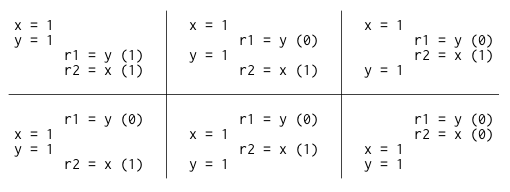
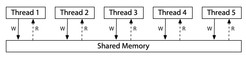
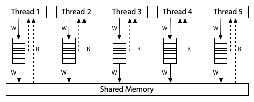

# Memory Ordering

此篇為 Russ Cox 所寫的 [Hardware Memory Models](https://research.swtch.com/hwmm) 與 [Programming Language Memory Models](https://research.swtch.com/plmm) 的翻譯與筆記

本文內所有例子中的變數一開始都被初始化為 0

## Hardware Memory Models

這裡有一個簡單的 C 類語言範例：

```cpp
// Thread 1           // Thread 2
x = 1;                while(done == 0) { /* loop */ }
done = 1;             print(x);
```

思考一下，如果 Thread 1 與 Thread 2 各自運行在獨立的處理器上，並且都有執行完成，那麼這個程式有可能輸出 0 嗎?

這取決於硬體與編譯器，如果是逐行直譯成組合語言並在 x86 多處理器上執行，那它的輸出永遠為 1；但如果同樣是逐行直譯成組合語言，並在 ARM 或 POWER 的多處理器上執行，則可能會輸出 0。 此外不論底層硬體為何，標準的編譯器最佳化也可能讓這段程式碼輸出 0，或者陷入無限迴圈

但顯然「這要看情況」不是一個令人滿意的答案，軟體設計師往往需要明確的答案，知道他們的程式是否能在新的硬體與新的編譯器下繼續正常運作，而硬體設計師與編譯器開發者也需要明確的規範，說明當執行特定程式時，硬體與編譯後的程式可以有怎樣的具體行為

因為這裡的核心問題是「對記憶體中資料變動的可見性與一致性」，所以這個規範被稱為記憶體一致性模型（memory consistency model），或簡稱為 memory model

最初，記憶體模型的目標是定義「硬體對於撰寫組合語言的程式設計師所提供的保證」，在這種情況下並不會有編譯器的介入。 大約在 25 年前，人們開始嘗試為 Java 或 C++ 這樣的高階語言制定記憶體模型，用來為軟體設計師定義對於這些語言的保證，而一旦將編譯器考慮進來，定義一個合理的模型就變得更加複雜

這篇文章會分別討論「硬體記憶體模型」與「程式語言記憶體模型」，原作者寫這篇文章的目標是為了探討 Go 語言的記憶體模型，但第三篇我應該是不會翻，畢竟對 Golang 沒有什麼涉略，但之後可能會為 C++ 再開一篇礦坑講就是了，第三篇的原文在這裡：[Updating the Go Memory Model](https://research.swtch.com/gomm)

### Sequential Consistency（SC）

Leslie Lamport 在 1979 年的論文[〈How to Make a Multiprocessor Computer That Correctly Executes Multiprocess Programs〉](https://www.microsoft.com/en-us/research/publication/make-multiprocessor-computer-correctly-executes-multiprocess-programs/)中引入了順序一致性（sequential consistency）的概念：

> 對於這類電腦而言，設計與證明多處理器演算法正確性的慣用方法，是假設下列條件成立：<br><br>
> 
> 任一執行結果看起來就像是所有處理器的操作是在某種順序下被執行的，而且每個處理器自身的操作在這個順序中，出現的先後完全符合該處理器程式碼中指定的順序。 滿足這個條件的多處理器系統，將被稱作順序一致（sequentially consistent）

如今，我們談論順序一致性時，不只涵蓋電腦硬體，也包括程式語言本身對此性質的保證，也就是說，程式的所有可能執行結果都可視為「將各執行緒的操作交錯插入某個單一序列化執行」所形成的結果

順序一致性通常被視為理想模型，本文會稱其為 SC 模型，是對程式設計師來說最自然也最直觀的模型。 它讓你能夠假設程式會按照你所撰寫的順序執行，而每個執行緒的執行步驟只是「按照某種順序」地交錯在了一起，不會有額外的重新排列

回到前面的這個範例：

```cpp
// Thread 1           // Thread 2
x = 1;                while(done == 0) { /* loop */ }
done = 1;             print(x);
```

為了讓這段程式更容易分析，我們先去除 `loop` 與 `print`，然後來考慮在讀取共享變數後會得到哪些結果：

```cpp
Litmus Test: Message Passing
Can this program see r1 = 1, r2 = 0?

// Thread 1           // Thread 2
x = 1                 r1 = y
y = 1                 r2 = x
```

如同一開始講的，我們假設所有範例一開始都將變數初始化為 0。 而由於我們的目的是確定硬體允許進行哪些操作，我們假設每個執行緒都運行在自己的專用處理器上，而且沒有編譯器介入，不會對執行緒中的操作進行任何重排，因此你看到的指令列表就是處理器實際執行的指令序列

`rN` 是指執行緒內部使用的暫存器，而非共享變數。 這裡，我們的問題是，在執行結束後，某個特定的暫存器值的組合是否有可能出現? 對於這個例子來說，就是我們想知道 Thread 2 是否有可能會看到 `r1 = 1, r2 = 0`?

這種針對範例程式的執行結果所提出的問題，被稱為試金石測試（litmus test），這種問題的答案是二元的 — 結果有可能/不可能發生。 因此我們可以利用試金石測試來明確區分不同的記憶體模型，如果某個記憶體模型允許某種執行結果，而另一個模型不允許，那這兩個模型顯然就是不同的

如果這個試金石測試的執行是順序一致的，那麼就只會有六種可能的交錯執行（interleaving）的方式：

<div class = "center-column">



</div>

你可以看到，沒有任何一種交錯執行會導致 `r1 = 1, r2 = 0` 的結果，因此不會出現這個結果，也就是說，在順序一致性的硬體上，對這個試金石測試 — 「這個程式有可能出現 `r1 = 1, r2 = 0` 嗎?」的答案是「不可能」

對於順序一致的模型，你可以想像所有處理器都直接連接到同一塊共享記憶體，而這塊記憶體每次只能服務一個執行緒的讀或寫請求，且這裡<span class = "yellow">沒有快取（cache）</span>的存在。 因此每當處理器需要讀取或寫入記憶體時，該請求就會直接送往共享記憶體。 這種「一次只能被一人使用」的共享記憶體，自然會對所有記憶體的存取操作強加了一個執行順序，這就是順序一致性：

<div class = "center-column">



</div>

::: info  
本篇文章中的三張記憶體模型硬體示意圖，改編自 Maranget 等人的[〈A Tutorial Introduction to the ARM and POWER Relaxed Memory Models〉](https://www.cl.cam.ac.uk/~pes20/ppc-supplemental/test7.pdf)  
:::

這張圖是一種順序一致性（SC）機器的模型，但它並不是實作這種機器的唯一方式，順序一致性的機器也可以用其他方式建構，例如使用多個共享記憶體模組與快取來協助預測記憶體讀取的結果，但只要被稱作「順序一致性」，那麼該機器的行為就必須與此模型無法區分。 這個模型的好處在於，如果我們只是想理解什麼是順序一致的執行，那麼我們可以忽略那些實作上的複雜情形，單純以這個模型來思考即可

然而放棄嚴格的順序一致性可以讓硬體更快地執行程式，因此所有現代硬體在某些方面都偏離了順序一致性模型，而要準確定義「某個硬體在記憶體模型上是如何偏離順序一致性的」是非常困難的，本文用了兩種記憶體模型作為例子，它們都存在於當今廣泛使用的硬體中，分別是 x86 架構的記憶體模型，以及 ARM 與 POWER 處理器家族的記憶體模型

### x86 Total Store Order (x86-TSO)

下圖這種硬體架構模型對應到現代 x86 系統的記憶體模型：

<div class = "center-column">



</div>

所有處理器仍然連接到同一塊共享記憶體，但每個處理器都有一個 local 的寫入佇列（write queue），將寫入操作先暫存在這裡，處理器可以在寫入尚未完成時繼續執行新的指令，而這些寫入會逐步傳送到共享記憶體中。 當某個處理器進行記憶體讀取時，會先查詢自己 local 的寫入佇列，然後才查詢主記憶體，但它無法看到其他處理器的寫入佇列

這代表「一個處理器會比其他處理器更早看到它自己做的寫入」，但是所有的處理器對於「寫入何時抵達共享記憶體」這件事，會有一致的順序認知，因此這個模型被稱為 Total Store Order（TSO，全域寫入順序）。 當某次寫入抵達共享記憶體的那一刻，任何處理器之後的讀取操作都會看到該值並能夠使用它，直到該值被更後面的寫入覆蓋掉

這個寫入佇列是一個標準的 FIFO 佇列，寫入操作被送出到共享記憶體的順序，與它們在處理器中實際執行的順序是一致的。 由於寫入佇列保留了寫入順序，而其他處理器在寫入送達共享記憶體時可以立刻看到這些寫入，因此，我們之前討論過的 message passing 試金石測試會有跟先前一樣的結果，`r1 = 1, r2 = 0` 依然是不可能出現的：

```cpp
Litmus Test: Message Passing
Can this program see r1 = 1, r2 = 0?

// Thread 1           // Thread 2
x = 1                 r1 = y
y = 1                 r2 = x
On sequentially consistent hardware: no.
On x86 (or other TSO): no.
```

寫入佇列保證 Thread 1 會先將 `x` 寫入記憶體，然後才寫入 `y`，而系統整體對記憶體寫入順序所建立的一致共識，也進一步保證 Thread 2 在得知 `y` 的新值之前，必定會先看到 `x` 的新值，因此 `r1 = y` 如果讀到的是 `y` 的新值，就不可能出現 `r2 = x` 還沒看到 `x` 的新值的情況

這裡的關鍵在於寫入順序（store order），Thread 1 是先寫入 `x` 再寫入 `y` 的，因此 Thread 2 不可能在看到 `x` 的更新之前就看到 `y` 的更新。 在這個例子中，順序一致性（SC）與 TSO（Total Store Order）模型的結果是相同的，但在其他試金石測試中，這兩者會有不同的結果

舉例來說，這是最常用來區分 SC 與 TSO 模型的經典例子（Write Queue）：

```cpp
Litmus Test: Write Queue (also called Store Buffer)
Can this program see r1 = 0, r2 = 0?

// Thread 1           // Thread 2
x = 1                 y = 1
r1 = y                r2 = x
On sequentially consistent hardware: no.
On x86 (or other TSO): yes!
```

對於 SC，`x = 1` 與 `y = 1` 必有一個會先發生，接著另一個執行緒的讀取必定能觀察到這次寫入，因此，`r1 = 0, r2 = 0` 是不可能發生的。 但在 TSO（Total Store Order）系統上，有可能發生 Thread 1 和 Thread 2 都將寫入操作暫存在各自的 write buffer 中，接著各從主記憶體進行讀取，因為此時這些寫入都還沒真正寫入到共享記憶體中，因此兩邊的讀取都會看到初始值 0

雖然這個例子可能看起來有點刻意，但使用兩個同步變數的情境實際上常見於知名的同步演算法中，例如 [Dekker's algorithm](https://en.wikipedia.org/wiki/Dekker%27s_algorithm) 與 [Peterson's algorithm](https://en.wikipedia.org/wiki/Peterson%27s_algorithm)，以及一些臨時設計的同步策略，如果某個執行緒無法看到另一個執行緒的所有寫入操作，這些演算法就會失效

為了修復這種依賴較強記憶體排序保證的演算法，在這些非順序一致性的硬體上，會提供明確的指令，稱作記憶體屏障（memory barrier）或 fence，用來強制控制記憶體操作的順序。 我們可以透過加入一個記憶體屏障指令，來確保每個執行緒都會先把前面的寫入操作送到共享記憶體，然後才執行它的讀取操作：

```cpp
// Thread 1           // Thread 2
x = 1                 y = 1
barrier               barrier
r1 = y                r2 = x
```

加入記憶體屏障之後，`r1 = 0, r2 = 0` 就不可能會發生了，此時 Dekker 或 Peterson 的演算法就能正確運作。 記憶體屏障有很多種類，各系統的細節不盡相同，但這已超出本文的討論範圍，重點在於記憶體屏障程式設計師或語言實作者提供了一種可以在程式中強制實現順序一致的方法

最後再舉一個例子，來強調為什麼這個模型被稱為「全域寫入順序（total store order）」，在這個模型中，有 local 的寫入佇列，但在讀取路徑上沒有快取，一旦某次寫入抵達主記憶體，所有處理器不僅會一致認為這個值已經存在，還會一致認同這次寫入相對於其他處理器寫入的到達順序

來看看下面這個試金石測試（IRIW）：

```cpp
Litmus Test: Independent Reads of Independent Writes (IRIW)
Can this program see r1 = 1, r2 = 0, r3 = 1, r4 = 0?
(Can Threads 3 and 4 see x and y change in different orders?)

// Thread 1    // Thread 2    // Thread 3    // Thread 4
x = 1          y = 1          r1 = x         r3 = y
                              r2 = y         r4 = x
On sequentially consistent hardware: no.
On x86 (or other TSO): no.
```

試想，如果 Thread 3 觀察到 `x` 的變化早於 `y`，那麼 Thread 4 有可能看到 `y` 的變化早於 `x` 嗎? 換句話說，`r1 = 1, r2 = 0, r3 = 1, r4 = 0` 可能發生嗎?

對於 x86 和其他採用 TSO 模型的機器來說，答案是「不可能」，因為所有寫入到主記憶體的操作都遵循一個「全域」的順序，且所有處理器都會遵循這個順序，唯一的例外是處理器本身會在它自己的寫入抵達主記憶體之前就知道它寫了什麼（因為在 local 寫入佇列裡面）

### The Path to x86-TSO

x86 的 TSO 模型看起來相當簡潔明瞭，但發展到這個樣子的過程充滿了障礙與錯誤的轉折。 在 1990 年代，當時針對最早期 x86 多處理器的說明文件，幾乎沒有說明硬體所提供的記憶體模型，以其中一個實際問題為例 ― Plan 9 作業系統，其不依賴全域核心鎖（global kernel lock），且能在 x86 架構上執行

在 1997 年移植到多處理器架構的 Pentium Pro 時，開發者遇到了一個出乎意料的行為，最終追溯到的原因就是我們前面提到的 Write Queue 試金石測試，其中有一段極其細微的同步程式碼假設 `r1 = 0, r2 = 0` 是不可能發生的，但實際上它卻發生了，更糟的是，當時的 Intel 的官方手冊對記憶體模型的細節描述得非常模糊

當時有人於郵件論壇上建議「與其相信硬體設計師會如我們所預期地運作，不如在鎖的使用上採取保守策略」，對於這個問題，一位 Plan 9 的開發者做出了精彩的回應說明：

> 我完全同意多處理器系統中會出現越來越鬆散的操作順序，問題是硬體設計師心中預期的「保守」到底是什麼? 在一個 lock section 的開頭與結尾都強制插入鎖存機制（interlock）對我來說已經算是相當保守了，但我顯然還不夠有想像力<br><br>
>
> Pentium Pro 的手冊對於快取機制與一致性維護描述得鉅細靡遺，詳細說明了快取與一致性（coherence）的實作方式，卻對執行順序與讀取順序幾乎隻字未提。 現在的事實是我們根本無法確定自己的做法是否已經「夠保守」了

在這場討論中，一位 Intel 的架構師非正式地解釋了記憶體模型的實際情況，他指出，理論上就連早期的 486 與 Pentium 多處理器系統，都可能會出現 `r1 = 0, r2 = 0` 的結果，而 Pentium Pro 只是因為有更大的管線（pipeline）與寫入佇列，因此才更容易觀察到這種行為

那位 Intel 架構師還寫道：

> 這表示系統中任何一個處理器所發出的事件，其順序在其他處理器看來永遠是一致的，但不同的觀察者之間可能會不一致，對於來自兩個或更多處理器的事件交錯順序可以有不同看法，未來的 Intel 處理器將會實作相同的記憶體排序模型

「不同觀察者可以對兩個或以上處理器事件的交錯順序有不同看法」這個說法，其實是在表示剛剛在 x86 上 IRIW 試金石測試的答案可能是「Yes」，即便我們在前一節才看到 x86 給的答案是「No」。 這似乎是因為，雖然 Intel 處理器實際上從未對那個試金石測試出現過「Yes」的結果，但當時 Intel 的架構師不願對未來的處理器行為做出任何保證

而當時架構說明書中僅有的那幾段文字，幾乎沒有提供任何明確保證，導致開發者很難針對這種行為正確地撰寫程式。 Plan 9 的討論也不是唯一的例子，從 1999 年 11 月下旬開始，Linux 核心的開發者們也在他們的郵件論壇上，花了超過百則訊息，圍繞著類似的困惑，討論 Intel 處理器到底提供了什麼記憶體模型上的保證

接下來十年間越來越多人遭遇這類困難的情況，為了解決這個問題，Intel 的一群架構師開始著手撰寫有用的處理器行為保證，這些保證針對現有處理器與未來處理器都適用。 第一份成果是 2007 年 8 月發表的[《Intel® 64 Architecture Memory Ordering White Paper》](https://www.cs.cmu.edu/~410-f10/doc/Intel_Reordering_318147.pdf)，其目標是「讓軟體開發者能清楚理解不同記憶體存取指令序列可能產生的結果」

同年稍晚，AMD 也發布了類似的說明，收錄於[《AMD64 Architecture Programmer’s Manual revision 3.14.》](https://courses.cs.washington.edu/courses/cse351/12wi/supp-docs/AMD%20Vol%201.pdf)中。 這些說明是基於一種稱作「全域鎖順序 + 因果一致性（TLO+CC）」的模型，這個模型刻意設計得比 TSO 還要弱。 在公開演講中，Intel 架構師表示 TLO+CC 是「需要多強就多強，但不會更強」的模型，這個模型還特別保留了 x86 處理器在 IRIW 試金石測試中回應「Yes」的權利

然而遺憾的是，當時記憶體屏障的定義還不夠強大，不足以恢復順序一致的記憶體語意，即使在每條指令後面都插入一個記憶體屏障也做不到，更糟的是，研究人員還觀察到實際的 Intel x86 硬體違反了 TLO+CC 模型，例如這個例子：

```cpp
Litmus Test: n6 (Paul Loewenstein)
Can this program end with r1 = 1, r2 = 0, x = 1?

// Thread 1    // Thread 2
x = 1          y = 1
r1 = x         x = 2
r2 = y
On sequentially consistent hardware: no.
On x86 TLO+CC model (2007): no.
On actual x86 hardware: yes!
On x86 TSO model: yes! (Example from x86-TSO paper.)
```

在 2008 年稍晚，Intel 與 AMD 的規格文件皆進行了修訂，這些修訂保證 IRIW 試金石測試的結果為「No」，並且加強了記憶體屏障的語意，但仍然允許了一些出人意料的行為，這些行為看起來不太合理，例如這個例子：

```cpp
Litmus Test: n5
Can this program end with r1 = 2, r2 = 1?

// Thread 1    // Thread 2
x = 1          x = 2
r1 = x         r2 = x
On sequentially consistent hardware: no.
On x86 specification (2008): yes!
On actual x86 hardware: no.
On x86 TSO model: no. (Example from x86-TSO paper.)
```

為了解決這些問題，Owens 等人提出了 x86-TSO 模型，該模型是建立在先前的 SPARCv8 TSO 模型基礎之上。 當時他們聲稱「據我們所知，x86-TSO 是一個正確的模型，它的強度足以支撐上層程式設計，並且大致符合硬體廠商的原始意圖」。 幾個月之後，Intel 和 AMD 釋出了新的技術手冊，廣泛採用了這個 x86-TSO 模型，看起來，所有 Intel 處理器從一開始就是依據 x86-TSO 來實作的，儘管 Intel 花了整整十年才正式承認這一點

回顧過去可以發現，Intel 與 AMD 的架構師們當時正在掙扎於該如何撰寫一個記憶體模型，既要為未來處理器的最佳化留出空間，又要對編譯器開發者與組合語言程式設計師提供實用的行為保證，所謂「需要多強就多強，但不更強」是一場極其困難的平衡挑戰

### ARM/POWER Relaxed Memory Model

現在我們來看看一個更加鬆散的記憶體模型，也就是 ARM 與 POWER 處理器所採用的模型。 在實作層面上，這兩個系統之間有很多差異，但它們所保證的記憶體一致性模型大致相似，而且比 x86-TSO，甚至比 x86-TLO+CC 都要弱不少。 對於 ARM 與 POWER 系統來說，其想法是，每個處理器會對自己擁有的完整記憶體副本進行讀寫，而每次寫入都會獨立地傳播到其他處理器，在這個傳播過程中，允許重新排序（reordering）：

<div class = "center-column">


</div>

在這裡，不存在全域寫入順序（total store order）。 雖然圖中沒有畫出來，但每個處理器也被允許延後讀取操作，直到真的需要該結果為止，也就是說，某次讀取可以被延後到「後面的某次寫入之後」才執行。 在這種鬆散的模型中，我們之前看過的所有試金石測試，其答案在這裡都是「Yes」

以最初的 message passing 試金石測試為例，單一處理器的寫入重排序（reordering）代表著 Thread 1 的寫入操作可能不會以相同的順序被其他執行緒觀察到：

```cpp
Litmus Test: Message Passing
Can this program see r1 = 1, r2 = 0?

// Thread 1           // Thread 2
x = 1                 r1 = y
y = 1                 r2 = x
On sequentially consistent hardware: no.
On x86 (or other TSO): no.
On ARM/POWER: yes!
```

在 ARM/POWER 的模型中，我們可以想像 Thread 1 和 Thread 2 各自擁有一份獨立的記憶體副本，而這些寫入操作在副本之間以任意順序進行傳播。 如果 Thread 1 的記憶體先把 `y` 的更新傳給 Thread 2，再傳送 `x` 的更新，而 Thread 2 剛好在這兩次更新之間執行，那它就會看到 `r1 = 1, r2 = 0` 這個結果

這個結果顯示出 ARM/POWER 的記憶體模型比 TSO 更加鬆散，它對硬體的行為施加的限制更少，但 ARM/POWER 模型也允許那些 TSO 模型已經接受的重排序（reordering）行為：

```cpp
Litmus Test: Store Buffering
Can this program see r1 = 0, r2 = 0?

// Thread 1           // Thread 2
x = 1                 y = 1
r1 = y                r2 = x
On sequentially consistent hardware: no.
On x86 (or other TSO): yes!
On ARM/POWER: yes!
```

在 ARM/POWER 架構中，對 `x` 和 `y` 的寫入操作可能已經寫入到各自的本地記憶體，但在對側的執行緒讀取時，這些寫入可能尚未被傳播過去，下面這個試金石測試展示了 x86 擁有「全域寫入順序（total store order）」是什麼意思：

```cpp
Litmus Test: Independent Reads of Independent Writes (IRIW)
Can this program see r1 = 1, r2 = 0, r3 = 1, r4 = 0?
(Can Threads 3 and 4 see x and y change in different orders?)

// Thread 1    // Thread 2    // Thread 3    // Thread 4
x = 1          y = 1          r1 = x         r3 = y
                              r2 = y         r4 = x
On sequentially consistent hardware: no.
On x86 (or other TSO): no.
On ARM/POWER: yes!
```

在 ARM/POWER 架構中，不同的執行緒可能會以不同的順序得知不同的寫入操作。 它們無法保證對於寫入操作抵達主記憶體的總體順序有一致共識，因此這裡 Thread 3 可能會先看到 `x` 的變化再看到 `y`，而 Thread 4 則可能反過來先看到 `y` 再看到 `x`

再舉一個例子來說，ARM/POWER 系統在記憶體讀取方面會出現可見的緩衝或重排序，這點可以從以下這個試金石測試中觀察到：

```cpp
Litmus Test: Load Buffering
Can this program see r1 = 1, r2 = 1?
(Can each thread’s read happen after the other thread’s write?)

// Thread 1    // Thread 2
r1 = x         r2 = y
y = 1          x = 1
On sequentially consistent hardware: no.
On x86 (or other TSO): no.
On ARM/POWER: yes!
```

任何順序一致性（SC）下的交錯執行都必須從 Thread 1 的 `r1 = x` 或 Thread 2 的 `r2 = y` 開始，而那次的讀取必定會讀到 0，因此 `r1 = 1, r2 = 1` 這種結果是不可能發生的。 然而，在 ARM/POWER 的記憶體模型中，處理器允許延後讀取操作，直到指令序列中較晚的寫入執行之後才執行讀取，因此可能會變成 `y = 1` 和 `x = 1` 先於這兩個讀取被執行

儘管 ARM 與 POWER 的記憶體模型都允許這種結果發生，但 Maranget 等人在 2012 年的報告中指出，他們只能在 ARM 系統上實際觀察到這種行為，而從未在 POWER 上觀察到。 這裡可以看到模型與現實行為之間的差異開始產生影響

正如我們先前探討 Intel x86 時所見，硬體若實作了一個比其技術規格更強的記憶體模型，會讓程式開發者不自覺地依賴這種更強的行為，這也意味著，如果未來有較弱的硬體出現，可能會讓現有程式無法正常運作，不管這樣的改變在規範上是否合理

ARM 與 POWER 也有提供記憶體屏障，就像 TSO 系統一樣，我們可以在上述範例中插入這些屏障，以強制執行順序一致性的行為。 但有個問題是，在沒有任何屏障的情況下，ARM/POWER 是否會排除某些行為發生? 有沒有哪一個試金石測試的結果可能是「No」的?

答案是有，只關注一個記憶體位置即可，以下是一個即使在 ARM 和 POWER 上，答案都為「No」的試金石測試：

```cpp
Litmus Test: Coherence
Can this program see r1 = 1, r2 = 2, r3 = 2, r4 = 1?
(Can Thread 3 see x = 1 before x = 2 while Thread 4 sees the reverse?)

// Thread 1    // Thread 2    // Thread 3    // Thread 4
x = 1          x = 2          r1 = x         r3 = x
                              r2 = x         r4 = x
On sequentially consistent hardware: no.
On x86 (or other TSO): no.
On ARM/POWER: no.
```

這個試金石測試與前一個類似，但這次是兩個執行緒都對同一個變數 `x` 進行寫入，而不是針對兩個不同的變數 `x` 和 `y`。 Thread 1 與 Thread 2 分別對 `x` 寫入互相衝突的數值 1 與 2，而 Thread 3 和 Thread 4 則各自對 `x` 讀取兩次，如果 Thread 3 觀察到 `x = 1` 被 `x = 2` 覆蓋，Thread 4 有可能觀察到相反的順序嗎？

答案是不可能的，即便是在 ARM 或 POWER 上也是如此，系統中的所有執行緒對於針對同一記憶體位置的寫入操作，必須有一致的全域順序（total order）認知，也就是說，執行緒必須一致認定是哪一次寫入覆蓋了另一個寫入，這個特性被稱為一致性（coherence）。 如果沒有一致性這個屬性，處理器之間就會對記憶體的最終內容產生不一致的認知，或是會觀察到某個記憶體位置在不同值之間反覆跳動，從一個值變成另一個，又再變回來

在這樣的系統上寫程式會非常困難，我們這邊刻意省略了 ARM 與 POWER 弱記憶體模型中的許多細節與微妙之處，若想深入了解，可以參考 [Peter Sewell 在這個主題上的相關論文](https://www.cl.cam.ac.uk/~pes20/papers/topics.html#Power_and_ARM)，此外，ARMv8 透過引入「多副本原子性（multicopy atomic）」來[加強了記憶體模型](https://www.cl.cam.ac.uk/~pes20/armv8-mca/armv8-mca-draft.pdf)，但這裡我們不會花篇幅詳解它的具體含義

這裡有兩個重點，第一，這裡面有非常多極為細緻且複雜的內容，這些內容已經是極具毅力與智慧的學者們研究超過十年的課題，我自己也完全不敢說能夠全部理解，這不是我們應該期望能向一般程式設計師解釋清楚的東西，也不是我們能在除錯日常程式時清楚掌握的東西

第二，被允許的行為與實際觀察到的行為，兩者之間的落差，常常會帶來不幸的驚喜（bug），如果當前的硬體沒有展現出所有被允許的行為，特別是當「什麼是被允許的」一開始就難以被掌握時，那麼最終就難免會出現程式不小心依賴了硬體較為保守（限制較多）行為的情況

### Weak Ordering and Data-Race-Free Sequential Consistency

看到這裡，我希望你已經意識到硬體的細節是既複雜又微妙的，這些細節並不是你每次寫程式時都會想要去處理的東西，取而代之的，你應該是要去設計一些簡化規則，只要你遵守這些簡單的規則，你的程式行為就會如同某種順序一致的交錯執行結果一樣（這裡我們仍然在討論硬體層面，所以說的是組合語言指令的交錯執行）

Sarita Adve 和 Mark Hill 在他們的研究中正是提出了這種方法，發表於 1990 年的論文[《Weak Ordering – A New Definition》](https://citeseerx.ist.psu.edu/document?repid=rep1&type=pdf&doi=b44dabaabb42c0586b20cec31122ef738af98436)中，他們對「弱排序（weak ordering）」的定義如下：

> 假設同步模型（synchronization model）是對記憶體存取的一組約束，這些約束定義了同步需要「如何做」以及「何時做」的規則。 如果某個硬體在某個同步模型之下是弱排序的，那麼「只要遵守該同步模型的軟體觀察起來都是順序一致的」，也就是說，所有遵守這個同步模型的軟體，都會觀察到順序一致的行為

雖然他們的論文當時是為了描述那個年代的硬體設計（並不是針對 x86、ARM 或 POWER），但他們的討論並不只限於特定架構層級，因此這篇論文至今仍具參考價值。 之前提到「有效的最佳化不應改變有效程式的行為」，而這些規則就定義了什麼樣的程式算是「有效的」，任何硬體最佳化都必須確保那些程式仍然能夠正確運作，就像它們在順序一致（SC）的機器上運行一樣

當然，有趣的細節其實就是這些規則本身，也就是用來定義一個程式是否合法的那些約束條件。 Adve 與 Hill 提出了一種同步模型，他們稱之為「無資料競爭（data-race-free, DRF）」模型，這個模型假設硬體提供了與普通記憶體讀寫操作不同的「記憶體同步操作」，這些同步操作是獨立於一般讀寫指令之外的，在兩個同步操作之間，一般的記憶體讀寫是可以被重新排序的，但它們不能跨越同步操作進行重排序

也就是說，同步操作同時也充當了重排序的屏障，若以理想的順序一致執行，對於任意來自不同執行緒、針對同一個記憶體位置的兩次普通存取操作，只要它們不是兩個都是讀取，就必須被同步操作分隔，強制其中一個發生在另一個之前，則這個程式就被認為是 DRF 的

讓我們來看幾個範例，這些例子取自 Adve 與 Hill 的論文（為了簡報而重新繪製），這是一個單一執行緒的範例，其先寫入變數 `x`，再讀取相同的變數 `x`：

<div class = "center-column">


</div>

圖中的垂直箭頭表示單一執行緒中的執行順序，先執行寫入，接著執行讀取。 這個程式中不存在 race condition，因為所有操作都發生在同一個執行緒內，相比之下，在以下這個雙執行緒的程式中就出現了 race condition：

<div class = "center-column">


</div>

在這裡，如果 Thread 2 在沒有與 Thread 1 協調的情況下寫入變數 `x`，「Thread 2 的寫入」就會與「Thread 1 的寫入與讀取」產生競爭（race）； 如果 Thread 2 不是寫入 `x`，而是讀取 `x`，則這個程式只會有一個競爭，發生於「Thread 1 的寫入」與「Thread 2 的讀取」之間。 要注意的是，每個競爭都至少會涉及到一次的「寫入」操作，兩個沒有同步機制的「讀取」行為並不會產生競爭

為了避免競爭，我們必須加入同步操作（synchronization operations），這些操作會強制規範不同執行緒對共享同步變數的操作順序。 如果我們使用同步操作 `S(a)`（針對變數 `a` 的同步，下圖以虛線箭頭標示），強制讓「Thread 2 的寫入」發生在「Thread 1 完成」之後，那麼這個競爭就會被消除掉：

<div class = "center-column">


</div>

如此一來，「Thread 2 的寫入」便不會與 Thread 1 的操作同時發生了

如果 Thread 2 只是讀取，那就只需要與「Thread 1 的寫入」同步即可，兩次的讀取操作仍然可以同時進行：

<div class = "center-column">


</div>

執行緒之間可以透過一連串的同步操作來建立順序，甚至可以藉由中介的執行緒來達成這種順序，如下所示，這個例子中不存在 race condition：

<div class = "center-column">


</div>

另一方面，如果僅僅是使用同步變數本身，並不保證能消除 race condition，因為同步變數可能會被錯用，下例中存在 race condition：

<div class = "center-column">


</div>

上例中 Thread 2 的讀取操作雖然有正確地與其他執行緒的寫入進行同步（它發生在兩個寫入之後），但這兩個寫入之間並沒有被同步，所以這個例子中仍存在 race condition（not DRF）

Adve 與 Hill 將弱排序（weak ordering）視為「軟體與硬體之間的一種約定」，具體來說，只要軟體能避免 race condition，那麼硬體就會表現得像是具有順序一致性一樣，這種行為確實比我們先前討論的那些模型更容易推理與理解，但硬體要怎麼滿足這個約定呢?

Adve 與 Hill 提出了一個證明，指出只要硬體滿足一組基本要求，那麼對於所有 DRF 的程式來說，硬體的行為就會像是順序一致的，這種行為被稱作「DRF 推導的弱排序（weakly ordered by DRF）」，這裡我們不會詳述那些細節

重點在於，在 Adve 與 Hill 的論文之後，硬體設計者就有了一份有證明支持的實用指南，只要照著做，他們就可以保證其硬體對於 DRF 的程式而言會表現得像是順序一致的。 而事實上，在論文出來之前，只要有正確實作同步操作，大多數較寬鬆的記憶體模型硬體也確實都是這樣運作的

Adve 與 Hill 當時關注的對象是 VAX 系統，但其實 x86、ARM 和 POWER 等架構也都能滿足這些約束條件。 這個系統保證「對所有 DRF 的程式而言，其執行行為等同於順序一致性（SC）」的概念，通常被簡稱為 DRF-SC（Data-Race-Free implies Sequential Consistency）

DRF-SC 是硬體記憶體模型的一個轉捩點，針對那些使用組合語言撰寫軟體的人來說，它為硬體設計者與軟體開發者都提供了一條明確的策略路線，在下一節我們會看到，對於高階程式語言來說要如何設計記憶體模型這個問題，就沒有這麼簡潔的答案了
