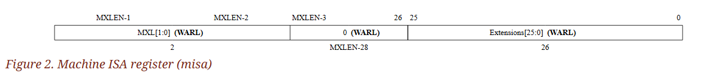

# 3. Machine-Level ISA, Version 1.13

本篇為 RISC-V Machine-Level ISA（Version 20241101）的中文翻譯與筆記，原文可於[官方 github](https://github.com/riscv/riscv-isa-manual/tree/main) 的第 3 章中看到。 大部分的情況下我會直接直譯，但有些地方我覺得文件實在寫得很繞，那種地方我就會直接用我自己的話寫了，或是多補一個 Tips Block 做解釋

本篇內的 Info block 為原文中的補充段落，我全部都有翻，但會依照前後文的語境來決定要不要安插 Info block 進來，也就是說雖然本文中有些段落不在藍色的 Info 區塊內，但在原文中其屬於補充段落。 至於綠色的 Tips block 則是我個人的補充筆記

## 3.1. Machine-Level CSRs

除了本節所描述的 machine-level 的 CSR 外，M-mode 的程式碼也可以存取所有較低權限等級的 CSR

### 3.1.1. Machine ISA (`misa`) Register

`misa` 這個 CSR 是一個 WARL 類型的可讀寫暫存器，用來回報該 hart 所支援的 ISA。 每個實作都要確保這個暫存器可以被讀取。 如果其回傳 0，代表 `misa` 暫存器未被實作，這種情況下需要透過額外的非標準機制來判斷 CPU 的能力。 misa CSR 的寬度為 MXLEN 位元（見下一段）



MXL（Machine XLEN）欄位會編碼這顆 hart 所使用的整數基礎 ISA 的寬度，如表 9 所示。 MXL 是唯讀欄位。 若 `misa` 的值不為 0，則 MXL 欄位代表 M-mode 下的有效 XLEN，這個值會被稱為 MXLEN。 XLEN 永遠不會大於 MXLEN，但在較低權限的模式中，XLEN 可能小於 MXLEN

<span class = "center-column">

| MXL | XLEN |
| - | - |
| 1 | 32 |
| 2 | 64 |
| 3 | Reserved |

（Table 9. Encoding of MXL field in `misa`）

</span>

::: tip  
如同 S-mode ISA 裡面提到的，XLEN 是 CPU 處理整數時的位元寬度，可能是 32、64 或 128。 而 MXL 會告訴你 M-mode 底下的實際位寬是什麼，這對後續要解碼其他 CSR 或資料有幫助  
:::

::: info  
我們可以透過檢查讀取到的 `misa` 值的正負號，或是透過將該值左移一位並再檢查一次正負號，來判斷基礎位寬。 這些檢查可以用組合語言寫，不需要事先知道該 hart 的 register 寬度（MXLEN）。 基礎位寬的公式是 $MXLEN = 2^{MXL + 4}$  

如果 `misa` 為 0，也可以用另一種方法來推得基礎位寬：將立即數 2 放入一個暫存器，然後將其左移 31 位元。 若結果為 0，則該 hart 是 RV32；否則就是 RV64  
:::

Extensions 欄位用來代表標準 extension 是否存在，每個英文字母對應一個 bit（bit 0 表示 extension "A" 是否存在，bit 1 表示 "B"，一直到 bit 25 表示 "Z"）。 例如，RV32I 或 RV64I 的 base ISA，"I" 這個 bit 會被設成 1； 而 RV32E 或 RV64E，則 "E" 會被設成 1。 Extensions 欄位是 WARL 類型的欄位，如果實作上允許修改所支援的 ISA，這些 bit 就可以被寫入。 在 reset 時，Extensions 欄位應該要包含該 hart 所支援的最大 extension 集合，且當 "I" 與 "E" 同時可用時，應該選擇 "I"

當在 `misa` 中把某個標準 extension 對應的 bit 清除（設為 0）時，該 extension 所定義或修改的指令與 CSR 會回復為其預設或保留的行為，就好像該 extension 根本沒有被實作一樣

::: info  
對於一個給定的 RISC-V 執行環境，是否實作某個指令、extension，或其他 RISC-V ISA 的特性，通常是根據該環境中可觀察到的執行行為來判斷。 例如，只有當 RISC-V Unprivileged ISA 中為 F extension 所定義的指令能如規範所述執行時，F extension 才能算是有在該執行環境中被實作

根據上述對「實作」的定義，若在 `misa` 中清除某個 extension 對應的 bit，該 extension 在 M-mode 中就會被視為「未實作」。 例如，把 `misa.F` 設成 0，就代表在 M-mode 中 F extension 沒有被實作，因為 F extension 的指令將不會依照 Unprivileged ISA 的要求執行，反而可能會觸發 illegal-instruction exception

將「實作」這個詞定義為完全根據可觀察的執行行為，可能會與一般常見的用法產生衝突。 特別是，一般說法可能會接受「實作了但停用」這種說法，但在本文件中，這被視為詞義上的矛盾，因為「停用」代表該功能的執行行為不會如其規範所要求，因此不能算是「實作」。 同樣地，「已實作且啟用」在這裡也是多餘的說法，用「實作」就已經包含其啟用的意思  
:::

::: tip  
在這份文件中，「implemented（實作）」這個詞是非常嚴格的，只要功能沒有依照規範執行，就不算實作。 所以你不能說「我有實作但現在把它關掉了」，在這邊這會被視為語意上的矛盾

而 `misa` 只是表達你「打算」支援哪些 extension，一旦你把某個 bit 清掉（即使電路還在），它的指令行為就不是照規範走，因此就不算有「實作」該 extension。 比如把 `misa.F` 清掉後，即使硬體能跑浮點指令，CPU 也會當作這些指令是非法的，這就是「未實作」。 這讓 `misa` 不只是資訊回報用途，也可以讓實作端支援切換功能  
:::

<span class = "center-column">

| Bit | Character | Description                                                |
| --: | :-------: | ---------------------------------------------------------- |
|   0 |     A     | Atomic extension                                           |
|   1 |     B     | B extension                                                |
|   2 |     C     | Compressed extension                                       |
|   3 |     D     | Double-precision floating-point extension                  |
|   4 |     E     | RV32E/64E base ISA                                         |
|   5 |     F     | Single-precision floating-point extension                  |
|   6 |     G     | *Reserved*                                                 |
|   7 |     H     | Hypervisor extension                                       |
|   8 |     I     | RV32I/64I base ISA                                         |
|   9 |     J     | *Reserved*                                                 |
|  10 |     K     | *Reserved*                                                 |
|  11 |     L     | *Reserved*                                                 |
|  12 |     M     | Integer Multiply/Divide extension                          |
|  13 |     N     | *Tentatively reserved for User-Level Interrupts extension* |
|  14 |     O     | *Reserved*                                                 |
|  15 |     P     | *Tentatively reserved for Packed-SIMD extension*           |
|  16 |     Q     | Quad-precision floating-point extension                    |
|  17 |     R     | *Reserved*                                                 |
|  18 |     S     | Supervisor mode implemented                                |
|  19 |     T     | *Reserved*                                                 |
|  20 |     U     | User mode implemented                                      |
|  21 |     V     | Vector extension                                           |
|  22 |     W     | *Reserved*                                                 |
|  23 |     X     | Non-standard extensions present                            |
|  24 |     Y     | *Reserved*                                                 |
|  25 |     Z     | *Reserved*                                                 |

（Table 10. Encoding of Extensions field in `misa`. All bits that are reserved for future use must return zero when read.）

</span>

- 若「X」這個 bit 為 1，表示有非標準的 extension 被實作，像是廠商自訂的功能之類的
- 若「B」這個 bit 為 1，表示該實作支援 Zba、Zbb 和 Zbs 這些 extension 所定義的指令。 若「B」是 0，則表示該實作可能不支援其中一個或多個 Zba、Zbb、Zbs extension
- 若「M」這個 bit 是 1，表示該實作支援 M extension 中所有乘法與除法指令。 若「M」是 0，則表示該實作可能不支援這些指令。 不過如果有支援 Zmmul extension，那麼該 extension 所定義的乘法指令仍然會被支援，不管「M」這個 bit 是多少
- 若「S」這個 bit 是 1，表示該實作支援 supervisor mode。 若「S」是 0，則表示該實作可能不支援 supervisor mode
- 若「U」這個 bit 是 1，表示該實作支援 user mode。 若「U」是 0，則表示該實作可能不支援 user mode

::: info  
`misa` 這個 CSR 向 machine-mode 程式碼提供一個簡單的 CPU 功能目錄。 若要取得更詳細的資訊，可以在 machine mode 中去探查其他 machine 級的暫存器，並在開機過程中檢查系統中其他 ROM 區域的內容

我們要求較低權限等級的程式不要直接讀取 CPU 暫存器來判斷可用的功能，而是應透過 environment call 來取得資訊。 這樣可以讓虛擬化層能夠改變各層級所觀察到的 ISA，並支援更豐富的指令介面，同時不會增加硬體設計的負擔  
:::

::: tip
「environment call」指的是 `ecall` 指令，例如 user-mode 要詢問「這個 CPU 有沒有支援浮點運算」，不能直接讀 `misa`，而應該下 `ecall` 給 OS。 這樣虛擬機器（hypervisor）或 OS 可以偽裝或限制 guest OS / user 看到的 CPU 能力（例如安全考量）

若允許低權限程式直接讀 CSR，就很難在虛擬化環境中實現資源隔離或靈活管理，這個設計讓 hardware 不需要在各層提供多份資訊，而由 software/OS 控制資訊揭露方式，讓系統更有彈性  
:::

「E」這個 bit 是唯讀的。 除非整個 `misa` 都是唯讀且為 0，否則「E」的讀取值永遠會是「I」bit 的補數。 若某個執行環境同時支援 RV32E 和 RV32I，軟體可以透過清除「I」bit 來選擇使用 RV32E

若某個 ISA 功能 `x` 依賴於另一個功能 y，當你嘗試啟用 `x` 而關閉 `y` 時，這兩個功能都會被關閉。 例如，若將「F」設為 0 而「D」設為 1，則「F」與「D」都會被清除。 同樣地，若將「U」設為 0 而「S」設為 1，則「U」與「S」也會一併被清除

某些實作可能會對多個 `misa` 欄位的組合設定施加額外限制，在這種情況下，這些欄位會被當作一個整體的 WARL 欄位來處理。 若你嘗試寫入一組不被支援的組合，這些欄位會被改寫成某個支援的組合

寫入 `misa` 有可能會增加 IALIGN，例如當你關閉「C」這個 extension 時。 如果某個指令打算寫入 `misa`，且這次寫入會使 IALIGN 增加，而下一條指令的位址又沒有對齊到新的 IALIGN 值，那這次寫入就會被取消，`misa` 保持不變

::: tip  
C extension 代表壓縮指令（16-bit），打開 C 時 IALIGN = 16，關掉 C 就要對齊到 32-bit。 如果你在某個位址寫 `misa` 並關掉 C，但下一條指令不是 32-bit 對齊的，就會有問題。 所以為了保證行為一致性，硬體會自動取消這次 `misa` 的修改  
:::

當軟體重新啟用先前被關閉的某個 extension 時，該 extension 所獨有的所有狀態都會變成未定義（`UNSPECIFIED`），除非該 extension 另有明確說明

::: info  
雖然當 `misa` 中第 0 到 25 位中的某個 bit 被設為 1 時，代表對應的功能有被實作，但反過來不一定成立，某個 bit 被清除（為 0），並不一定代表對應的功能沒有被實作。 這是因為，當某個功能沒有被實作時，對應的 opcode 和 CSR 只是變成「保留」，而不一定會是「非法」  
:::

### 3.1.2. Machine Vendor ID (`mvendorid`) Register

`mvendorid` 是一個 32 位元的唯讀 CSR，用來提供這顆核心供應商的 JEDEC 製造商代碼。 每個實作都要確保這個暫存器可以被讀取。 如果其回傳 0，表示該欄位未被實作，或是這是一個非商業用途的實作


JEDEC 製造商 ID 通常會被編碼成一串 1-byte 的 continuation code（`0x7f`），以一個不等於 `0x7f` 的 1-byte ID 作結尾，每個 byte 的最高位會帶有奇數 parity bit。 `mvendorid` 中的 Bank 欄位會記錄 continuation code 的個數，Offset 欄位則記錄結尾的那個 byte，並捨棄 parity bit。 例如，JEDEC 的 ID 若是 `0x7f` `0x7f` ...（12 次）... `0x8a`（也就是 12 個 `0x7f` 再接一個 `0x8a`），則會被編碼成 `0x60a` 寫入 `mvendorid` CSR

::: info  
在 JEDEC 的定義中，bank 編號是「continuation code 的數量再加一」； 因此，`mvendorid` 中的 Bank 欄位所記錄的值，會比 JEDEC 的 bank 編號少 1

早期原本打算由 RISC-V International 分配 vendor ID，但這樣的做法會與 JEDEC 維護製造商 ID 標準的工作重複。 根據目前的規定，向 JEDEC 註冊一組製造商 ID 的費用為一次性 500 美元
:::

::: tip
- JEDEC 是一個標準制定組織，為記憶體、半導體等硬體產業定義了一系列標準，其中包括廠商 ID
- `mvendorid` 利用一種壓縮的方式，把 JEDEC ID 的結構用兩個欄位（Bank、Offset）表示：
  - Bank：記錄有幾個 continuation code（`0x7f`）
  - Offset：記錄最後那個非 `0x7f` 的 byte（去掉 parity）
- 上面提到的 `0x60a` 是這樣來的：
  - `Bank = 12` => `Bank field = 0xC`
  - `Offset = 0x8a & 0x7F = 0x0a`
  - `mvendorid = (0xC << 7) | 0x0a = 0x60a `

這段說明主要是幫助作業系統或其他軟體辨識 CPU 的製造商與出處，類似於 x86 中的 CPUID identifier  
:::

### 3.1.3. Machine Architecture ID (`marchid`) Register

`marchid` 是一個 MXLEN 位元寬的唯讀 CSR，用來編碼該 hart 所使用的基本微架構。 所有實作都必須確保這個暫存器能被讀取。 如果其回傳 0，表示該欄位未實作。 `mvendorid` 與 `marchid` 的組合應能唯一識別該 hart 所實作的微架構類型


開源專案的微架構 ID 是由 RISC-V International 全球分配的，其值為非零，且最高位元（MSB）為 0。 商業微架構 ID 則由各商業供應商自行分配，但其最高位元必須為 1，且其餘 MXLEN-1 個位元中不得包含 0

::: info  
微架構 ID 的設計目的是要表示開發活動所圍繞的微架構專案，而非特定的組織。 商業上針對開源設計所進行的製造，應該（並且可能在授權條款中被要求）保留原本的微架構 ID。 這有助於降低碎片化與工具支援成本，同時也能給予原始專案適當的歸屬。 開源微架構 ID 由 RISC-V International 管理，僅會分配給已經發佈且可運作的開源專案。 商業微架構 ID 則可由任何已註冊的供應商自行管理，但必須與開源 ID 保持不重複（即需設 MSB 為 1），以防供應商同時使用開源與封閉原始碼微架構時發生衝突

後面提到的 Implementation 欄位慣例可以用來區分同一微架構設計的不同分支，包括依據組織進行區分。 `misa` 暫存器也有助於辨別設計上的不同變體  
:::

### 3.1.4. Machine Implementation ID (`mimpid`) Register

`mimpid` CSR 提供一個用來編碼該處理器實作版本的唯一值。 所有實作都必須保證能讀取這個暫存器。 如果其回傳 0，表示該欄位未被實作。 Implementation 的值應該反映的是 RISC-V 處理器本身的設計版本，而不是與其周邊相關的系統


::: info  
這個欄位的格式由微架構原始碼提供者自行決定，但標準工具通常會將其以十六進位字串顯示，且不會有前導或尾端的 0，因此 Implementation 的值可以採用左對齊（也就是從最高有效位的 nibble 開始填入），並將各個子欄位對齊至 nibble 的邊界，以便於人閱讀  
:::

::: tip  
一個 nibble 是 4 個 bit（半個 byte）

從最高有效位的 nibble 開始填入的意思是，當你把一個 `mimpid` 的值寫進去時，是從左到右填 hex 數字，像這樣：

```
mimpid = 0x12345678
         ↑        ↑
       MS nibble   LS nibble
```

這樣稱為「從 most-significant nibble 向下填（nibble down）」。 相對的，「right-justified」就是從最小有效位（右邊）往左填  
:::

### 3.1.5. Hart ID (`mhartid`) Register

`mhartid` 是一個 MXLEN 位元寬的唯讀 CSR，裡面存放的是正在執行該程式碼的硬體執行緒（hart）的整數 ID。 所有實作都必須能讀取這個暫存器。 在多核心系統中，hart ID 不一定是連號的，但至少必須有一個 hart 的 ID 是 0。 hart ID 在整個執行環境中必須是唯一的


::: info  
在某些情況下，我們必須保證只有一個 hart 執行特定程式碼（例如在重置時），因此要求至少要有一個 hart 的 ID 是已知的 0。 為了效能考量，系統實作者應該盡量減少系統中所使用的最大 hart ID 數值大小  
:::

### 3.1.6. Machine Status (`mstatus` and `mstatush`) Registers

`mstatus` 是一個 MXLEN 位元寬的可讀寫暫存器，其格式在 RV32 中如圖 7 所示，在 RV64 中如圖 8 所示。 `mstatus` 用來記錄並控制該 hart 當前的作業狀態。 在 S-level ISA 中，`mstatus` 的受限版本被稱為 `sstatus` 暫存器


僅對 RV32 而言，`mstatush` 是一個 32 位元的可讀寫暫存器，其格式如圖 9 所示。 `mstatush` 的第 30 到 4 位通常對應到 RV64 中 `mstatus` 的第 62 到 36 位所包含的欄位。 欄位 SD、SXL 和 UXL 在 `mstatush` 中並不存在


#### 3.1.6.1. Privilege and Global Interrupt-Enable Stack in `mstatus` register

M-mode 和 S-mode 各自提供了全域中斷啟用位元 ``MIE`` 和 `SIE`。 這些位元主要用來保證在目前的權限模式下 ISR 的原子性

::: tip
這裡的「原子性」是指在進入或退出中斷處理的過程中，不會發生中斷重入或競爭條件。 透過這些位元，可以保證一次只會處理一個中斷來源  
:::

::: info  
全域的 `xIE` 位元位於 `mstatus` 的低位，因此可以用單一的 CSR 指令來原子性地設定或清除  
:::

當某個 hart 正在以權限模式 `x` 執行時，若 `xIE`=1 則在該模式中中斷為全域啟用，反之若 `xIE`=0 則中斷為全域停用。 在此情況下權限等級低於 `x` 的模式（`w` < `x`）的中斷，總是全域停用的，不論那些模式的 `wIE` 是否設為 1。 權限等級高於 `x` 的模式（`y` > `x`）的中斷則總是全域啟用，不論高權限模式中的 `yIE` 位元如何設定。 高權限模式的程式可以透過個別中斷的啟用位元，來停用某些特定的高權限中斷，再將控制權交給較低權限模式。 若系統未實作 supervisor mode，則 `SIE` 與 `SPIE` 會是唯讀的 0

::: tip  
`xIE` 控制當前模式是否允許中斷進入（e.g. ``MIE``, `SIE`, `UIE`）  
:::

高權限模式 `y` 可以在將控制權交給低權限模式之前，關閉所有屬於它的中斷，但這種做法很少見，因為這樣會讓該 hart 只能透過同步 trap、不可屏蔽中斷（NMI），或重置，來重新奪回控制權

::: tip  
如果你完全關閉高權限模式的中斷來源（例如在 M-mode 把所有 `mie` bit 關掉），那當你跳進 S-mode 後：

- 沒有中斷能打斷 S-mode 的執行
- M-mode 將無法再重新取得控制權，除非：
  - 有 exception（trap）
  - 發生 NMI（non-maskable interrupt）
  - 系統被 reset

這種狀況通常不會是你想要的  
:::

為了支援巢狀的 trap，每個能響應中斷的權限模式 `x` 都會有一個兩層的堆疊（stack），分別用來儲存中斷啟用位元與先前的權限模式。 `xPIE` 儲存 trap 發生前 `xIE` 的值，而 `xPP` 儲存 trap 發生前的權限模式。 `xPP` 欄位只能記錄小於等於 `x` 的權限模式，因此 MPP 是 2 位元寬，而 SPP 是 1 位元寬。 當從權限模式 `y` 進入權限模式 `x` 的 trap 時，會將 `xPIE` 設為當前 `xIE` 的值，然後將 `xIE` 設為 0，`xPP` 則設為 `y`

對於低權限模式而言，無論是同步或非同步的 trap，通常都會被導向較高權限模式來處理，且在進入時會先關閉中斷。 較高權限的 trap handler 會根據儲存在堆疊中的資訊來處理並返回，或是在尚未返回中斷點前先儲存 privilege stack，然後再重新開啟中斷，這樣每個堆疊僅需儲存一筆資料即可

::: tip  
- trap handler 在進入時會先把中斷 disable（`xIE` = 0），然後處理事件
- 如果 handler 要花較久時間，或可能會被其他中斷中斷，它必須先把目前的狀態「另存」，再開中斷，才能避免破壞上一次 trap 的資訊
- 因為有 `xPIE` 和 `xPP` 作為「兩層堆疊」，每次中斷只要存一筆就夠了  
:::

用 MRET 或 SRET 指令分別用來從 M-mode 或 S-mode 的 trap 返回。 當執行 `xRET` 指令時，若 `xPP` 的值為 y，則會將 `xIE` 設為 `xPIE`，切換回權限模式 `y`，將 `xPIE` 設為 1，並把 `xPP` 設為最低支援的權限模式（若有實作 U-mode 則為 U，否則為 M）。若 `y` ≠ `M`，`xRET` 還會將 MPRV 設為 0

::: tip  
MPRV 是 memory access privilege override 位元，用來讓 M-mode 程式以較低權限模擬記憶體存取。 為了防止亂用，當你透過 sret 回到 S-mode 時，就會關掉 MPRV  
:::

::: info  
在執行 `xRET` 時將 `xPP` 設為系統支援的最低權限模式，有助於偵測軟體在管理兩層權限堆疊時的錯誤

在 trap handler 儲存處理與回復 trap 所需的關鍵狀態資訊這個階段內，不應啟用中斷或引發例外。 若在這個關鍵階段發生例外或中斷，可能會觸發新的 trap 並覆蓋掉先前的重要狀態，導致無法從原本的 trap 正確回復。 此外，若例外發生在 trap 處理流程中所依賴的路徑上，也可能導致陷入無限的 trap 迴圈。 為避免這些情況，trap handler 的設計必須極為謹慎，能夠識別並妥善處理自身流程中的例外  
:::

`xPP` 欄位是 WARL 類型，只能儲存權限模式 `x` 或比 `x` 更低的已實作模式。 若系統未實作權限模式 `x`，則 `xPP` 必須是唯讀的 0

:::info  
M-mode 的軟體可以透過將某個權限模式寫入 `MPP` 再讀回來的方式，判斷該模式是否有被實作。 若系統僅實作 U-mode 與 M-mode，那麼在硬體中只需要一個位元就能用來表示 `MPP` 是 00（U-mode）還是 11（M-mode）  
:::

#### 3.1.6.2. Double Trap Control in `mstatus` Register

double trap 通常發生在 trap 處理流程中的敏感階段，也就是當例外或中斷發生時，trap handler（負責處理這些事件的元件）處於非可重入狀態（non-reentrant）的時候。 這種非重入狀態通常出現在 trap handler 的初始階段，這時候它還沒有儲存足以處理與回復 trap 的必要狀態。 若此時再發生 trap，就可能覆寫掉關鍵狀態資訊，導致無法從原始 trap 中正確復原

這類在關鍵階段發生並導致錯誤的 trap，稱為 unexpected trap。 為了避免這種情況，trap handler 在這個階段不得啟用中斷或引發例外。 但對於硬體錯誤（Hardware-Error）例外的處理則更具挑戰性，因為這些錯誤是不可預測的，會提高發生 double trap 的風險

`MDT`（M-mode-disable-trap）位元是一個 WARL 欄位，由 Smdbltrp extension 所引入。 當系統重置時，`MDT` 的預設值為 1。 當透過明確的 CSR 寫入將 `MDT` 設為 1 時，`MIE`（Machine Interrupt Enable）位元會被清為 0。 在 RV64 中，即使同一個 CSR 寫入動作中對 `MIE` 設定了其他值，只要 `MDT` 設為 1，`MIE` 仍會被清為 0。 只有當 `MDT` 原本已經是 0，或在 RV64 中同一次寫入動作將其設為 0 時，才允許透過 CSR 寫入將 `MIE` 設為 1（在 RV32 中，`MDT` 位於 `mstatush`，而 `MIE` 位於 `mstatus`）

當系統要進入 M-mode 來處理 trap 時，如果 `MDT` 當前為 0，則會將其設為 1，並如預期一樣處理該 trap。 但如果 `MDT` 已經是 1，則該 trap 為非預期的 trap。 若系統實作了 Smrnmi extension，不論 `MDT` 是什麼狀態，RNMI（非遮蔽中斷）所引發的 trap 都不會被視為非預期 trap，且 RNMI 所引發的 trap 也不會設 `MDT` 為 1。 但如果是在 M-mode 中執行，且 `mnstatus.NMIE` 為 0 的情況下發生 trap，則此 trap 就是非預期的 trap

::: tip  
WARL（Write Any Read Legal）意味著實作可以拒絕不合法的寫入（例如你不能在 `MDT=1` 時設 `MIE=1`）。 而上方提到的機制會用來防止在 M-mode 還在處理 trap 的關鍵階段時又啟用了中斷，導致 double trap，所以：

- `MDT=1` → 自動強制關閉 `MIE`
- 你要開啟 `MIE` 前，必須先把 `MDT` 設為 0，表示已經離開非重入階段

而在處理 trap 時 `MDT` 會自動被設為 1，防止再有中斷進來，如果已經是 1，又發生了新的 trap，那代表你還沒準備好就被中斷了，所以是非預期的 trap

但 RNMI（像 NMI 一樣不能被遮蔽）例外處理不算是錯誤的 trap，因此不會更動 `MDT`，以允許在緊急情況下穿越防護機制。 而如果明明是 M-mode，但你還把 `mnstatus.NMIE` 關掉，代表你不允許 RNMI，卻又發生了 trap，那就是非法狀況了（unexpected）  
:::

當發生非預期 trap 時，其處理方式如下：

- 當實作了 Smrnmi extension 且 `mnstatus.NMIE` 為 1 時，hart 會跳入 RNMI handler。 為了送出這個 trap，系統會將原本該非預期 trap 要寫入 `mepc` 和 `mcause` 的值，改為寫入 `mnepc` 和 `mncause`。 `mnstatus` 暫存器中的權限模式欄位會被設為 M-mode，而其 `NMIE` 欄位則會被設為 0，以表示現在處於 M-mode 的 RNMI 處理流程中

  此規範的結果是：當發生 double trap 時，RNMI handler 不會取得原本應由 trap 報告的 `mtval` 與 `mtval2` 暫存器的資訊。 若需要這些資訊，RNMI handler 必須透過解碼 `mnepc` 所指向的指令，並檢查其來源暫存器的內容來取得
- 若系統未實作 Smrnmi extension，或已實作但 `mnstatus.NMIE` 為 0，則當發生非預期的 trap 時，hart 會進入 critical-error 狀態，且不會更新任何架構狀態（包含程式計數器 PC）。 此狀態下，該 hart 會停止執行，關閉所有中斷（包含 NMI），並向平台送出一個 critical-error 的訊號

  當 hart 送出 critical-error 訊號後，平台的應對行為取決於具體實作。 可能的處置包含重新啟動該 hart，或是重新啟動整個平台等

::: tip  
- Smrnmi 提供了一套機制來處理 double trap（unexpected trap），將其轉交給特殊的 RNMI handler
- `mnepc` / `mncause` 是 RNMI 專用的替代暫存器，不會覆蓋原本的 `mepc` / `mcause`
- `mnstatus.NMIE = 1` 表示允許接收 RNMI； 一旦觸發，系統會自動將其設為 0（防止再進入）
- `mnstatus` 也會註明：現在處於 M-mode 的 RNMI 處理流程中
- `mtval` / `mtval2` 通常記錄 fault 的附加資訊（像是錯誤指令位址、存取錯誤位址等）
  - 但因為 RNMI handler 不是「正規」 trap 流程，所以這兩個暫存器不會被填入資料
  - 想要知道是什麼出錯，只能自己從 `mnepc` 指向的指令反推出原因（例如是一條非法記憶體存取指令）
- 若沒有 Smrnmi 保護機制，那 double trap 就是「無解錯誤」
  - 為了安全，系統會馬上凍結該 hart，不再執行任何指令，且中斷全關
  - critical-error 是一種硬體訊號，讓整個 SoC 或系統知道有嚴重錯誤發生  
:::

當在 M-mode 執行 `MRET` 或 `SRET` 指令時，會將 `MDT` 位元設為 0。 若新的權限模式為 U、VS 或 VU，則 `sstatus.SDT` 也會被設為 0。 此外，若新的模式是 VU，則 `vsstatus.SDT` 也會被設為 0

`MNRET` 指令（由 Smrnmi extension 提供）會在新的權限模式不是 M 的情況下，將 `MDT` 位元設為 0。 若新的模式是 U、VS 或 VU，則 `sstatus.SDT` 也會設為 0。 此外，若新模式是 VU，則 `vsstatus.SDT` 也會設為 0

::: tip  
將 `xDT` 設為 0 的用意在於表示該權限下的 trap critical 區段已結束，可以重新允許中斷  
:::

#### 3.1.6.3. Base ISA Control in `mstatus` Register

對於 RV64 的 hart，`SXL` 與 `UXL` 欄位是 WARL 的欄位，分別用來控制 S-mode 與 U-mode 的 XLEN 值。 這些欄位的編碼方式與 `misa` 中的 `MXL` 欄位相同（見上方表 9）。 S-mode 與 U-mode 中實際生效的 XLEN 被稱為 SXLEN 與 UXLEN

當 MXLEN 的值為 32 時，`SXL` 與 `UXL` 欄位不存在，此時 SXLEN 為 32、UXLEN 也為 32。 當 MXLEN 為 64 時，若系統不支援 S-mode，則 `SXL` 是唯讀的 0。 否則，`SXL` 是 WARL 的欄位，用來編碼目前的 SXLEN 值。 某些實作可能會讓 `SXL` 成為唯讀欄位，並保證 SXLEN 與 MXLEN 相等

當 MXLEN 為 64 時，若系統不支援 U-mode，則 `UXL` 是唯讀的 0。 否則，`UXL` 是 WARL 的欄位，用來編碼目前的 UXLEN 值。 某些實作可能會讓 `UXL` 成為唯讀欄位，並保證 `UXLEN=MXLEN` 或 `UXLEN=SXLEN`。 若實作中有支援 S-mode，則 `UXL` 欄位所允許的合法值不能使 UXLEN 大於 SXLEN

當任何模式的 XLEN 被設為小於該 hart 所支援的最大位元寬度時，所有操作都必須忽略來源暫存器中超出 XLEN 的位元，並且必須將運算結果做符號延伸（sign-extend）填滿整個最大位元寬度的目的暫存器。 同樣地，超出 XLEN 的 `pc` 位元也會被忽略，而當寫入 `pc` 時，也必須做符號延伸填滿最大支援的 XLEN

::: tip  
- XLEN 是該 mode 下的寄存器與地址的位數
- `SXL=1` 表示 `SXLEN=32`，`SXL=2` 表示 `SXLEN=64`（與 MXL 的編碼一致）
  - 若不支援 S-mode，硬體就會讓 `SXL=0`（即沒有 S-mode）
- U-mode 可設為 32 或 64-bit，但不能高於上層模式
  - 以防止低權限模式處理比高權限模式更寬的資料，避免潛在風險
  - 為了安全與一致性，有些實作會讓 U-mode 永遠跟 S 或 M 的位數相同

第四段是在說，假設在 RV64 下以 32-bit 模式執行時：

- 所有運算只看低 32-bit 的輸入
- 結果要延伸為 64-bit（保留正負號）
- `pc` 也一樣：忽略高位、寫入時延伸  
:::

::: info  
標準要求所有操作必須將底層硬體暫存器的整個寬度填入定義好的值，以避免產生實作定義的行為。 為了降低硬體複雜度，實作的架構可能不會強制檢查低權限模式的 XLEN 是否小於或等於其上層權限模式的 XLEN。 實務上，這種設定幾乎都是軟體錯誤，但就算出現這種情況，機器的行為依然有明確定義  
:::

某些 HINT 指令被編碼成整數運算指令時，會將目的暫存器覆寫為其當前值，例如 `c.addi x8, 0`。 當這類 HINT 在 `XLEN < MXLEN` 的情況下執行，且目的暫存器的 `MXLEN..XLEN` 這段位元不是全都等於第 `XLEN-1` 位時，實作可以選擇是否要保留 `MXLEN..XLEN` 這段位元不變，或以第 `XLEN-1` 位元的複本覆蓋

::: info  
這種定義允許實作在某些 HINT 指令上略過寫回暫存器的動作，同時也允許它們用與其他整數運算指令相同的方式來執行其他 HINT。 這種實作選擇只會被 XLEN 設定比目前模式更寬的高權限模式觀察到，對當前權限模式是不可見的  
:::

::: tip  
HINT 指令是一種「無作用指令」，常用來對 CPU 下 hint 或佔位。 上方在說的是，假設於 RV64 上用 32-bit 模式執行，那暫存器中高 32 位的處理方式可能會有所不同，有些實作可能忽略高位（保留原值），有些可能會做 sign-extension

系統可以選擇省略 HINT 的實際寫入行為來節省功耗，但對更高權限的模式來說，它可能會觀察到暫存器高位是否有所變化。 但對執行該 HINT 的 mode 本身來說，這不會造成行為差異（故合法）  
:::

#### 3.1.6.4. Memory Privilege in `mstatus` Register

`MPRV`（Modify PRiVilege）位元會改變 load 和 store 指令的實際執行權限等級。 當 `MPRV=0` 時，load 和 store 會依照當前權限模式來執行對應的位址轉換與保護機制。 當 `MPRV=1` 時，load 和 store 的記憶體位址會以 `MPP` 所指定的權限模式進行位址轉換、保護與位元端序處理，而非當前權限模式。 指令的位址轉換與保護則不受 `MPRV` 的影響。 若不支援 U-mode，`MPRV` 為唯讀的 0。 當 `MRET` 或 `SRET` 指令將權限模式切換為低於 M-mode 的模式時，也會將 `MPRV` 設為 0

::: tip  
`MPRV=1` 時，即便程式目前在 M-mode，load/store 會用 `MPP`（可能是 S 或 U）的權限執行，這可用來模擬 user-mode 行為，像是 kernel 模擬存取使用者資料，但指令的 fetch 還是會用目前權限模式來處理，不會因 `MPRV` 改變  
:::

`MXR`（Make eXecutable Readable）位元會改變 load 指令對虛擬記憶體的存取判定。 當 `MXR=0` 時，只有標記為可讀（`R=1`）的 page 能被成功讀取。 當 `MXR=1` 時，標記為可讀或可執行（`R=1` 或 `X=1`）的 page 都能被成功讀取。 當系統沒有啟用以 page 為基礎的虛擬記憶體機制時，`MXR` 沒有作用。 若系統不支援 S-mode，`MXR` 為唯讀的 0

::: info  
`MPRV` 與 `MXR` 機制的設計目的是為了提升 M-mode routine 模擬硬體缺失功能（例如未對齊的 load/store）時的效率。 `MPRV` 省去了在軟體中手動做位址轉換的需求，`MXR` 則允許從僅標記為可執行的 page 讀取指令內容

目前的權限模式與 `MPP` 所指定的權限模式可能有不同的 XLEN 設定。 當 `MPRV=1` 時，load 和 store 的記憶體位址會依照 `MPP` 模式下的 XLEN 來處理，遵循第 3.1.6.3 節中的規則
:::

`SUM`（permit Supervisor User Memory access）位元會改變 S-mode 在執行 load 和 store 時對虛擬記憶體的存取權限判定。 當 `SUM=0` 時，S-mode 若要存取 U-mode 可存取的 page（即該 page 的 U 位為 1）會發生 fault。 當 `SUM=1` 時，這類存取則會被允許。 若系統未啟用以 page 為基礎的虛擬記憶體，則 `SUM` 沒有作用。 需要注意的是，雖然 `SUM` 通常在不處於 S-mode 執行時會被忽略，但當 `MPRV=1` 且 `MPP=S` 時，SUM 依然會生效。 若系統不支援 S-mode，或 `satp.MODE` 為唯讀的 0，則 SUM 為唯讀的 0

`MXR` 與 `SUM` 機制僅影響如何解讀 page table entry 中編碼的權限位元，它們不會影響是否因為 `PMA` 或 `PMP` 而觸發 access-fault 例外

::: tip  
- 通常 supervisor mode 不應隨意存取 user page，除非刻意允許。 開啟 `SUM=1` 可以讓 kernel 直接訪問使用者記憶體（例如在執行 `copy_from_user()` 時）； 但關閉 `SUM=0` 可以增加安全性，避免 kernel 不小心碰到使用者記憶體而導致漏洞
- page table 的權限 ≠ 整體權限。 `MXR`/`SUM` 只管 `PTE` 裡的 `R`/`X`/`U` 權限位如何判定，不影響硬體層的其他權限保護
- PMA（Physical Memory Attribute）與 PMP（Physical Memory Protection）是較底層的機制，即便 page-table 說可以讀，如果 PMP 說不行，那還是會產生 fault  
:::

#### 3.1.6.5. Endianness Control in `mstatus` and `mstatush` Registers

`mstatus` 和 `mstatush` 中的 `MBE`、`SBE`、`UBE` 位元是 WARL 的欄位，用來控制「非 instruction fetch」的記憶體存取的位元端序（endianness）。 instruction fetch 始終是用 little-endian

`MBE` 用來控制當處於 M-mode（且 `mstatus.MPRV=0`）時，非指令抓取的記憶體存取是使用 little-endian (`MBE=0`) 還是 big-endian (`MBE=1`)； 若系統不支援 S-mode，則 `SBE` 為唯讀的 0。 否則，`SBE` 用來控制當處於 S-mode 時，明確執行的 load 與 store 指令是採用 little-endian (`SBE=0`) 還是 big-endian (`SBE=1`)； 若系統不支援 U-mode，則 `UBE` 為唯讀的 0。 否則，`UBE` 用來控制當處於 U-mode 時，明確執行的 load 與 store 指令是採用 little-endian (`UBE=0`) 還是 big-endian (`UBE=1`)

對於如 page table 等 supervisor-level 的記憶體管理資料結構所進行的「隱式存取」，其端序始終由 `SBE` 控制。 由於變更 `SBE` 會改變硬體對這些資料結構的解讀方式，若在 `SBE` 變更期間仍有這些資料結構在使用中，M-mode 軟體必須在變更 `SBE` 後執行 `SFENCE.VMA x0, x0` 指令

::: info  
只有在刻意構造的情境中，某一記憶體管理資料結構才會同時以 little-endian 與 big-endian 兩種方式來解讀。 實務上，`SBE` 僅會在執行「world switch」（如不同 OS 間切換）時於執行期變更，此時並不會重新以不同的端序解讀原本或新的資料結構。 因此除了 world switch 本來就需要執行的 `SFENCE.VMA` 外，不需額外執行一次  
:::

::: tip
「world switch」類似 hypervisor 切換 guest OS，可能需改變端序以配合不同作業系統。 為效能考量，標準允許這種「只在切換時改變」而非中途變更資料解讀方式的情境  
:::

若系統支援 S-mode，則實作可以讓 `SBE` 成為 `MBE` 的唯讀複本。 若系統支援 U-mode，則實作可以讓 `UBE` 成為 `MBE` 或 `SBE` 的唯讀複本

:::: info  
若 `MBE`、`SBE`、`UBE` 皆為唯讀的 0，則表示該實作僅支援 little-endian 記憶體存取。 若 `MBE` 為唯讀的 1，且在支援 S-mode 與 U-mode 的情況下 `SBE` 與 `UBE` 也皆為唯讀的 1，則表示該實作僅支援 big-endian 記憶體存取（指令抓取除外）

Volume I 將 hart 的位址空間定義為一個大小為 $2^{\text{XLEN}}$ bytes 且位址連續的環狀序列。 位址與 byte location 之間的對應關係是固定的，不會受到端序模式的影響。 端序模式只會決定多位元組資料（例如 halfword、word 等）在記憶體中位元組的映射順序

::: tip  
換句話說，地址編號不會變，只有「同一個數值在記憶體中是從高位放前還是後」會變。 這定義可確保 CPU 對所有記憶體地址行為一致，只有資料解釋方式不同  
:::

標準的 RISC-V ABI 預期僅支援 pure little-endian 或 pure big-endian，不支援混合端序。 不過，架構仍定義了端序控制機制，允許例如一個使用某種端序的作業系統執行另一種端序的 user-mode 程式。 設計上也考慮到了某些非標準用途，例如讓軟體依需求動態切換記憶體存取的端序

RISC-V 的指令格式固定為 little-endian，目的是將指令編碼與當前的端序設定解耦，這對硬體與軟體皆有好處。 否則，例如 assembler 或 disassembler 就必須隨時知道目前的端序模式，即使執行期間該端序可能會動態變更。 相對地，若指令端序固定，就能讓某些經過特別撰寫的軟體在二進位層級達到端序無關的效果，類似位置無關（position-independent）的程式碼

然而，將指令固定為 little-endian 的設計對於需編碼或解碼指令的 RISC-V 軟體仍有影響。 在 big-endian 模式下，這類軟體必須注意，顯式執行的 load 與 store 的端序會與指令的端序相反，因此可能需要在 load 後與 store 前進行位元組順序的轉換  
::::
