# 3. Machine-Level ISA, Version 1.13

本篇為 RISC-V Machine-Level ISA（Version 20241101）的中文翻譯與筆記，原文可於[官方 github](https://github.com/riscv/riscv-isa-manual/tree/main) 的第 3 章中看到。 大部分的情況下我會直接直譯，但有些地方我覺得文件實在寫得很繞，那種地方我就會直接用我自己的話寫了，或是多補一個 Tips Block 做解釋

本篇內的 Info block 為原文中的補充段落，我全部都有翻，但會依照前後文的語境來決定要不要安插 Info block 進來，也就是說雖然本文中有些段落不在藍色的 Info 區塊內，但在原文中其屬於補充段落。 至於綠色的 Tips block 則是我個人的補充筆記

## 3.1. Machine-Level CSRs

除了本節所描述的 machine-level 的 CSR 外，M-mode 的程式碼也可以存取所有較低權限等級的 CSR

### 3.1.1. Machine ISA (`misa`) Register

`misa` 這個 CSR 是一個 WARL 類型的可讀寫暫存器，用來回報該 hart 所支援的 ISA。 每個實作都要確保這個暫存器可以被讀取。 如果其回傳 0，代表 `misa` 暫存器未被實作，這種情況下需要透過額外的非標準機制來判斷 CPU 的能力。 misa CSR 的寬度為 MXLEN 位元（見下一段）


MXL（Machine XLEN）欄位會編碼這顆 hart 所使用的整數基礎 ISA 的寬度，如表 9 所示。 MXL 是唯讀欄位。 若 `misa` 的值不為 0，則 MXL 欄位代表 M-mode 下的有效 XLEN，這個值會被稱為 MXLEN。 XLEN 永遠不會大於 MXLEN，但在較低權限的模式中，XLEN 可能小於 MXLEN

<span class = "center-column">

| MXL | XLEN |
| - | - |
| 1 | 32 |
| 2 | 64 |
| 3 | Reserved |

（Table 9. Encoding of MXL field in `misa`）

</span>

::: tip  
如同 S-mode ISA 裡面提到的，XLEN 是 CPU 處理整數時的位元寬度，可能是 32、64 或 128。 而 MXL 會告訴你 M-mode 底下的實際位寬是什麼，這對後續要解碼其他 CSR 或資料有幫助  
:::

::: info  
我們可以透過檢查讀取到的 `misa` 值的正負號，或是透過將該值左移一位並再檢查一次正負號，來判斷基礎位寬。 這些檢查可以用組合語言寫，不需要事先知道該 hart 的 register 寬度（MXLEN）。 基礎位寬的公式是 <code>MXLEN = 2<sup>MXL + 4</sup></code>  

如果 `misa` 為 0，也可以用另一種方法來推得基礎位寬：將立即數 2 放入一個暫存器，然後將其左移 31 位元。 若結果為 0，則該 hart 是 RV32；否則就是 RV64  
:::

Extensions 欄位用來代表標準 extension 是否存在，每個英文字母對應一個 bit（bit 0 表示 extension "A" 是否存在，bit 1 表示 "B"，一直到 bit 25 表示 "Z"）。 例如，RV32I 或 RV64I 的 base ISA，"I" 這個 bit 會被設成 1； 而 RV32E 或 RV64E，則 "E" 會被設成 1。 Extensions 欄位是 WARL 類型的欄位，如果實作上允許修改所支援的 ISA，這些 bit 就可以被寫入。 在 reset 時，Extensions 欄位應該要包含該 hart 所支援的最大 extension 集合，且當 "I" 與 "E" 同時可用時，應該選擇 "I"

當在 `misa` 中把某個標準 extension 對應的 bit 清除（設為 0）時，該 extension 所定義或修改的指令與 CSR 會回復為其預設或保留的行為，就好像該 extension 根本沒有被實作一樣

::: info  
對於一個給定的 RISC-V 執行環境，是否實作某個指令、extension，或其他 RISC-V ISA 的特性，通常是根據該環境中可觀察到的執行行為來判斷。 例如，只有當 RISC-V Unprivileged ISA 中為 F extension 所定義的指令能如規範所述執行時，F extension 才能算是有在該執行環境中被實作

根據上述對「實作」的定義，若在 `misa` 中清除某個 extension 對應的 bit，該 extension 在 M-mode 中就會被視為「未實作」。 例如，把 `misa.F` 設成 0，就代表在 M-mode 中 F extension 沒有被實作，因為 F extension 的指令將不會依照 Unprivileged ISA 的要求執行，反而可能會觸發 illegal-instruction exception

將「實作」這個詞定義為完全根據可觀察的執行行為，可能會與一般常見的用法產生衝突。 特別是，一般說法可能會接受「實作了但停用」這種說法，但在本文件中，這被視為詞義上的矛盾，因為「停用」代表該功能的執行行為不會如其規範所要求，因此不能算是「實作」。 同樣地，「已實作且啟用」在這裡也是多餘的說法，用「實作」就已經包含其啟用的意思  
:::

::: tip  
在這份文件中，「implemented（實作）」這個詞是非常嚴格的，只要功能沒有依照規範執行，就不算實作。 所以你不能說「我有實作但現在把它關掉了」，在這邊這會被視為語意上的矛盾

而 `misa` 只是表達你「打算」支援哪些 extension，一旦你把某個 bit 清掉（即使電路還在），它的指令行為就不是照規範走，因此就不算有「實作」該 extension。 比如把 `misa.F` 清掉後，即使硬體能跑浮點指令，CPU 也會當作這些指令是非法的，這就是「未實作」。 這讓 `misa` 不只是資訊回報用途，也可以讓實作端支援切換功能  
:::

<span class = "center-column">

| Bit | Character | Description                                                |
| --: | :-------: | ---------------------------------------------------------- |
|   0 |     A     | Atomic extension                                           |
|   1 |     B     | B extension                                                |
|   2 |     C     | Compressed extension                                       |
|   3 |     D     | Double-precision floating-point extension                  |
|   4 |     E     | RV32E/64E base ISA                                         |
|   5 |     F     | Single-precision floating-point extension                  |
|   6 |     G     | *Reserved*                                                 |
|   7 |     H     | Hypervisor extension                                       |
|   8 |     I     | RV32I/64I base ISA                                         |
|   9 |     J     | *Reserved*                                                 |
|  10 |     K     | *Reserved*                                                 |
|  11 |     L     | *Reserved*                                                 |
|  12 |     M     | Integer Multiply/Divide extension                          |
|  13 |     N     | *Tentatively reserved for User-Level Interrupts extension* |
|  14 |     O     | *Reserved*                                                 |
|  15 |     P     | *Tentatively reserved for Packed-SIMD extension*           |
|  16 |     Q     | Quad-precision floating-point extension                    |
|  17 |     R     | *Reserved*                                                 |
|  18 |     S     | Supervisor mode implemented                                |
|  19 |     T     | *Reserved*                                                 |
|  20 |     U     | User mode implemented                                      |
|  21 |     V     | Vector extension                                           |
|  22 |     W     | *Reserved*                                                 |
|  23 |     X     | Non-standard extensions present                            |
|  24 |     Y     | *Reserved*                                                 |
|  25 |     Z     | *Reserved*                                                 |

（Table 10. Encoding of Extensions field in `misa`. All bits that are reserved for future use must return zero when read.）

</span>

- 若「X」這個 bit 為 1，表示有非標準的 extension 被實作，像是廠商自訂的功能之類的
- 若「B」這個 bit 為 1，表示該實作支援 Zba、Zbb 和 Zbs 這些 extension 所定義的指令。 若「B」是 0，則表示該實作可能不支援其中一個或多個 Zba、Zbb、Zbs extension
- 若「M」這個 bit 是 1，表示該實作支援 M extension 中所有乘法與除法指令。 若「M」是 0，則表示該實作可能不支援這些指令。 不過如果有支援 Zmmul extension，那麼該 extension 所定義的乘法指令仍然會被支援，不管「M」這個 bit 是多少
- 若「S」這個 bit 是 1，表示該實作支援 supervisor mode。 若「S」是 0，則表示該實作可能不支援 supervisor mode
- 若「U」這個 bit 是 1，表示該實作支援 user mode。 若「U」是 0，則表示該實作可能不支援 user mode

::: info  
`misa` 這個 CSR 向 M-mode 程式碼提供一個簡單的 CPU 功能目錄。 若要取得更詳細的資訊，可以在 machine mode 中去探查其他 machine 級的暫存器，並在開機過程中檢查系統中其他 ROM 區域的內容

我們要求較低權限等級的程式不要直接讀取 CPU 暫存器來判斷可用的功能，而是應透過 environment call 來取得資訊。 這樣可以讓虛擬化層能夠改變各層級所觀察到的 ISA，並支援更豐富的指令介面，同時不會增加硬體設計的負擔  
:::

::: tip
「environment call」指的是 `ecall` 指令，例如 U-mode 要詢問「這個 CPU 有沒有支援浮點運算」，不能直接讀 `misa`，而應該下 `ecall` 給 OS。 這樣虛擬機器（hypervisor）或 OS 可以偽裝或限制 guest OS / user 看到的 CPU 能力（例如安全考量）

若允許低權限程式直接讀 CSR，就很難在虛擬化環境中實現資源隔離或靈活管理，這個設計讓 hardware 不需要在各層提供多份資訊，而由 software/OS 控制資訊揭露方式，讓系統更有彈性  
:::

「E」這個 bit 是唯讀的。 除非整個 `misa` 都是唯讀且為 0，否則「E」的讀取值永遠會是「I」bit 的補數。 若某個執行環境同時支援 RV32E 和 RV32I，軟體可以透過清除「I」bit 來選擇使用 RV32E

若某個 ISA 功能 `x` 依賴於另一個功能 y，當你嘗試啟用 `x` 而關閉 `y` 時，這兩個功能都會被關閉。 例如，若將「F」設為 0 而「D」設為 1，則「F」與「D」都會被清除。 同樣地，若將「U」設為 0 而「S」設為 1，則「U」與「S」也會一併被清除

某些實作可能會對多個 `misa` 欄位的組合設定施加額外限制，在這種情況下，這些欄位會被當作一個整體的 WARL 欄位來處理。 若你嘗試寫入一組不被支援的組合，這些欄位會被改寫成某個支援的組合

寫入 `misa` 有可能會增加 IALIGN，例如當你關閉「C」這個 extension 時。 如果某個指令打算寫入 `misa`，且這次寫入會使 IALIGN 增加，而下一條指令的位址又沒有對齊到新的 IALIGN 值，那這次寫入就會被取消，`misa` 保持不變

::: tip  
C extension 代表壓縮指令（16-bit），打開 C 時 IALIGN = 16，關掉 C 就要對齊到 32-bit。 如果你在某個位址寫 `misa` 並關掉 C，但下一條指令不是 32-bit 對齊的，就會有問題。 所以為了保證行為一致性，硬體會自動取消這次 `misa` 的修改  
:::

當軟體重新啟用先前被關閉的某個 extension 時，該 extension 所獨有的所有狀態都會變成未定義（`UNSPECIFIED`），除非該 extension 另有明確說明

::: info  
雖然當 `misa` 中第 0 到 25 位中的某個 bit 被設為 1 時，代表對應的功能有被實作，但反過來不一定成立，某個 bit 被清除（為 0），並不一定代表對應的功能沒有被實作。 這是因為，當某個功能沒有被實作時，對應的 opcode 和 CSR 只是變成「保留」，而不一定會是「非法」  
:::

### 3.1.2. Machine Vendor ID (`mvendorid`) Register

`mvendorid` 是一個 32 位元的唯讀 CSR，用來提供這顆核心供應商的 JEDEC 製造商代碼。 每個實作都要確保這個暫存器可以被讀取。 如果其回傳 0，表示該欄位未被實作，或是這是一個非商業用途的實作


JEDEC 製造商 ID 通常會被編碼成一串 1-byte 的 continuation code（`0x7f`），以一個不等於 `0x7f` 的 1-byte ID 作結尾，每個 byte 的最高位會帶有奇數 parity bit。 `mvendorid` 中的 Bank 欄位會記錄 continuation code 的個數，Offset 欄位則記錄結尾的那個 byte，並捨棄 parity bit。 例如，JEDEC 的 ID 若是 `0x7f` `0x7f` ...（12 次）... `0x8a`（也就是 12 個 `0x7f` 再接一個 `0x8a`），則會被編碼成 `0x60a` 寫入 `mvendorid` CSR

::: info  
在 JEDEC 的定義中，bank 編號是「continuation code 的數量再加一」； 因此，`mvendorid` 中的 Bank 欄位所記錄的值，會比 JEDEC 的 bank 編號少 1

早期原本打算由 RISC-V International 分配 vendor ID，但這樣的做法會與 JEDEC 維護製造商 ID 標準的工作重複。 根據目前的規定，向 JEDEC 註冊一組製造商 ID 的費用為一次性 500 美元
:::

::: tip
- JEDEC 是一個標準制定組織，為記憶體、半導體等硬體產業定義了一系列標準，其中包括廠商 ID
- `mvendorid` 利用一種壓縮的方式，把 JEDEC ID 的結構用兩個欄位（Bank、Offset）表示：
  - Bank：記錄有幾個 continuation code（`0x7f`）
  - Offset：記錄最後那個非 `0x7f` 的 byte（去掉 parity）
- 上面提到的 `0x60a` 是這樣來的：
  - `Bank = 12` => `Bank field = 0xC`
  - `Offset = 0x8a & 0x7F = 0x0a`
  - `mvendorid = (0xC << 7) | 0x0a = 0x60a `

這段說明主要是幫助作業系統或其他軟體辨識 CPU 的製造商與出處，類似於 x86 中的 CPUID identifier  
:::

### 3.1.3. Machine Architecture ID (`marchid`) Register

`marchid` 是一個 MXLEN 位元寬的唯讀 CSR，用來編碼該 hart 所使用的基本微架構。 所有實作都必須確保這個暫存器能被讀取。 如果其回傳 0，表示該欄位未實作。 `mvendorid` 與 `marchid` 的組合應能唯一識別該 hart 所實作的微架構類型


開源專案的微架構 ID 是由 RISC-V International 全球分配的，其值為非零，且最高位元（MSB）為 0。 商業微架構 ID 則由各商業供應商自行分配，但其最高位元必須為 1，且其餘 MXLEN-1 個位元中不得包含 0

::: info  
微架構 ID 的設計目的是要表示開發活動所圍繞的微架構專案，而非特定的組織。 商業上針對開源設計所進行的製造，應該（並且可能在授權條款中被要求）保留原本的微架構 ID。 這有助於降低碎片化與工具支援成本，同時也能給予原始專案適當的歸屬。 開源微架構 ID 由 RISC-V International 管理，僅會分配給已經發佈且可運作的開源專案。 商業微架構 ID 則可由任何已註冊的供應商自行管理，但必須與開源 ID 保持不重複（即需設 MSB 為 1），以防供應商同時使用開源與封閉原始碼微架構時發生衝突

後面提到的 Implementation 欄位慣例可以用來區分同一微架構設計的不同分支，包括依據組織進行區分。 `misa` 暫存器也有助於辨別設計上的不同變體  
:::

### 3.1.4. Machine Implementation ID (`mimpid`) Register

`mimpid` CSR 提供一個用來編碼該處理器實作版本的唯一值。 所有實作都必須保證能讀取這個暫存器。 如果其回傳 0，表示該欄位未被實作。 Implementation 的值應該反映的是 RISC-V 處理器本身的設計版本，而不是與其周邊相關的系統


::: info  
這個欄位的格式由微架構原始碼提供者自行決定，但標準工具通常會將其以十六進位字串顯示，且不會有前導或尾端的 0，因此 Implementation 的值可以採用左對齊（也就是從最高有效位的 nibble 開始填入），並將各個子欄位對齊至 nibble 的邊界，以便於人閱讀  
:::

::: tip  
一個 nibble 是 4 個 bit（半個 byte）

從最高有效位的 nibble 開始填入的意思是，當你把一個 `mimpid` 的值寫進去時，是從左到右填 hex 數字，像這樣：

```
mimpid = 0x12345678
         ↑        ↑
       MS nibble   LS nibble
```

這樣稱為「從 most-significant nibble 向下填（nibble down）」。 相對的，「right-justified」就是從最小有效位（右邊）往左填  
:::

### 3.1.5. Hart ID (`mhartid`) Register

`mhartid` 是一個 MXLEN 位元寬的唯讀 CSR，裡面存放的是正在執行該程式碼的硬體執行緒（hart）的整數 ID。 所有實作都必須能讀取這個暫存器。 在多核心系統中，hart ID 不一定是連號的，但至少必須有一個 hart 的 ID 是 0。 hart ID 在整個執行環境中必須是唯一的


::: info  
在某些情況下，我們必須保證只有一個 hart 執行特定程式碼（例如在重置時），因此要求至少要有一個 hart 的 ID 是已知的 0。 為了效能考量，系統實作者應該盡量減少系統中所使用的最大 hart ID 數值大小  
:::

### 3.1.6. Machine Status (`mstatus` and `mstatush`) Registers

`mstatus` 是一個 MXLEN 位元寬的可讀寫暫存器，其格式在 RV32 中如圖 7 所示，在 RV64 中如圖 8 所示。 `mstatus` 用來記錄並控制該 hart 當前的作業狀態。 在 S-level ISA 中，`mstatus` 的受限版本被稱為 `sstatus` 暫存器


僅對 RV32 而言，`mstatush` 是一個 32 位元的可讀寫暫存器，其格式如圖 9 所示。 `mstatush` 的第 30 到 4 位通常對應到 RV64 中 `mstatus` 的第 62 到 36 位所包含的欄位。 欄位 SD、SXL 和 UXL 在 `mstatush` 中並不存在


#### 3.1.6.1. Privilege and Global Interrupt-Enable Stack in `mstatus` register

M-mode 和 S-mode 各自提供了全域中斷啟用位元 ``MIE`` 和 `SIE`。 這些位元主要用來保證在目前的權限模式下 ISR 的原子性

::: tip
這裡的「原子性」是指在進入或退出中斷處理的過程中，不會發生中斷重入或競爭條件。 透過這些位元，可以保證一次只會處理一個中斷來源  
:::

::: info  
全域的 `xIE` 位元位於 `mstatus` 的低位，因此可以用單一的 CSR 指令來原子性地設定或清除  
:::

當某個 hart 正在以權限模式 `x` 執行時，若 `xIE`=1 則在該模式中中斷為全域啟用，反之若 `xIE`=0 則中斷為全域停用。 在此情況下權限等級低於 `x` 的模式（`w` < `x`）的中斷，總是全域停用的，不論那些模式的 `wIE` 是否設為 1。 權限等級高於 `x` 的模式（`y` > `x`）的中斷則總是全域啟用，不論高權限模式中的 `yIE` 位元如何設定。 高權限模式的程式可以透過個別中斷的啟用位元，來停用某些特定的高權限中斷，再將控制權交給較低權限模式。 若系統未實作 supervisor mode，則 `SIE` 與 `SPIE` 會是唯讀的 0

::: tip  
`xIE` 控制當前模式是否允許中斷進入（e.g. ``MIE``, `SIE`, `UIE`）  
:::

高權限模式 `y` 可以在將控制權交給低權限模式之前，關閉所有屬於它的中斷，但這種做法很少見，因為這樣會讓該 hart 只能透過同步 trap、不可屏蔽中斷（NMI），或重置，來重新奪回控制權

::: tip  
如果你完全關閉高權限模式的中斷來源（例如在 M-mode 把所有 `mie` bit 關掉），那當你跳進 S-mode 後：

- 沒有中斷能打斷 S-mode 的執行
- M-mode 將無法再重新取得控制權，除非：
  - 有 exception（trap）
  - 發生 NMI（non-maskable interrupt）
  - 系統被 reset

這種狀況通常不會是你想要的  
:::

為了支援巢狀的 trap，每個能響應中斷的權限模式 `x` 都會有一個兩層的堆疊（stack），分別用來儲存中斷啟用位元與先前的權限模式。 `xPIE` 儲存 trap 發生前 `xIE` 的值，而 `xPP` 儲存 trap 發生前的權限模式。 `xPP` 欄位只能記錄小於等於 `x` 的權限模式，因此 MPP 是 2 位元寬，而 SPP 是 1 位元寬。 當從權限模式 `y` 進入權限模式 `x` 的 trap 時，會將 `xPIE` 設為當前 `xIE` 的值，然後將 `xIE` 設為 0，`xPP` 則設為 `y`

對於低權限模式而言，無論是同步或非同步的 trap，通常都會被導向較高權限模式來處理，且在進入時會先關閉中斷。 較高權限的 trap handler 會根據儲存在堆疊中的資訊來處理並返回，或是在尚未返回中斷點前先儲存 privilege stack，然後再重新開啟中斷，這樣每個堆疊僅需儲存一筆資料即可

::: tip  
- trap handler 在進入時會先把中斷 disable（`xIE` = 0），然後處理事件
- 如果 handler 要花較久時間，或可能會被其他中斷中斷，它必須先把目前的狀態「另存」，再開中斷，才能避免破壞上一次 trap 的資訊
- 因為有 `xPIE` 和 `xPP` 作為「兩層堆疊」，每次中斷只要存一筆就夠了  
:::

用 MRET 或 SRET 指令分別用來從 M-mode 或 S-mode 的 trap 返回。 當執行 `xRET` 指令時，若 `xPP` 的值為 y，則會將 `xIE` 設為 `xPIE`，切換回權限模式 `y`，將 `xPIE` 設為 1，並把 `xPP` 設為最低支援的權限模式（若有實作 U-mode 則為 U，否則為 M）。若 `y` ≠ `M`，`xRET` 還會將 MPRV 設為 0

::: tip  
MPRV 是 memory access privilege override 位元，用來讓 M-mode 程式以較低權限模擬記憶體存取。 為了防止亂用，當你透過 sret 回到 S-mode 時，就會關掉 MPRV  
:::

::: info  
在執行 `xRET` 時將 `xPP` 設為系統支援的最低權限模式，有助於偵測軟體在管理兩層權限堆疊時的錯誤

在 trap handler 儲存處理與回復 trap 所需的關鍵狀態資訊這個階段內，不應啟用中斷或引發例外。 若在這個關鍵階段發生例外或中斷，可能會觸發新的 trap 並覆蓋掉先前的重要狀態，導致無法從原本的 trap 正確回復。 此外，若例外發生在 trap 處理流程中所依賴的路徑上，也可能導致陷入無限的 trap 迴圈。 為避免這些情況，trap handler 的設計必須極為謹慎，能夠識別並妥善處理自身流程中的例外  
:::

`xPP` 欄位是 WARL 類型，只能儲存權限模式 `x` 或比 `x` 更低的已實作模式。 若系統未實作權限模式 `x`，則 `xPP` 必須是唯讀的 0

:::info  
M-mode 的軟體可以透過將某個權限模式寫入 `MPP` 再讀回來的方式，判斷該模式是否有被實作。 若系統僅實作 U-mode 與 M-mode，那麼在硬體中只需要一個位元就能用來表示 `MPP` 是 00（U-mode）還是 11（M-mode）  
:::

#### 3.1.6.2. Double Trap Control in `mstatus` Register

double trap 通常發生在 trap 處理流程中的敏感階段，也就是當例外或中斷發生時，trap handler（負責處理這些事件的元件）處於非可重入狀態（non-reentrant）的時候。 這種非重入狀態通常出現在 trap handler 的初始階段，這時候它還沒有儲存足以處理與回復 trap 的必要狀態。 若此時再發生 trap，就可能覆寫掉關鍵狀態資訊，導致無法從原始 trap 中正確復原

這類在關鍵階段發生並導致錯誤的 trap，稱為 unexpected trap。 為了避免這種情況，trap handler 在這個階段不得啟用中斷或引發例外。 但對於硬體錯誤（Hardware-Error）例外的處理則更具挑戰性，因為這些錯誤是不可預測的，會提高發生 double trap 的風險

`MDT`（M-mode-disable-trap）位元是一個 WARL 欄位，由 Smdbltrp extension 所引入。 當系統重置時，`MDT` 的預設值為 1。 當透過明確的 CSR 寫入將 `MDT` 設為 1 時，`MIE`（Machine Interrupt Enable）位元會被清為 0。 在 RV64 中，即使同一個 CSR 寫入動作中對 `MIE` 設定了其他值，只要 `MDT` 設為 1，`MIE` 仍會被清為 0。 只有當 `MDT` 原本已經是 0，或在 RV64 中同一次寫入動作將其設為 0 時，才允許透過 CSR 寫入將 `MIE` 設為 1（在 RV32 中，`MDT` 位於 `mstatush`，而 `MIE` 位於 `mstatus`）

當系統要進入 M-mode 來處理 trap 時，如果 `MDT` 當前為 0，則會將其設為 1，並如預期一樣處理該 trap。 但如果 `MDT` 已經是 1，則該 trap 為非預期的 trap。 若系統實作了 Smrnmi extension，不論 `MDT` 是什麼狀態，RNMI（非遮蔽中斷）所引發的 trap 都不會被視為非預期 trap，且 RNMI 所引發的 trap 也不會設 `MDT` 為 1。 但如果是在 M-mode 中執行，且 `mnstatus.NMIE` 為 0 的情況下發生 trap，則此 trap 就是非預期的 trap

::: tip  
WARL（Write Any Read Legal）意味著實作可以拒絕不合法的寫入（例如你不能在 `MDT=1` 時設 `MIE=1`）。 而上方提到的機制會用來防止在 M-mode 還在處理 trap 的關鍵階段時又啟用了中斷，導致 double trap，所以：

- `MDT=1` → 自動強制關閉 `MIE`
- 你要開啟 `MIE` 前，必須先把 `MDT` 設為 0，表示已經離開非重入階段

而在處理 trap 時 `MDT` 會自動被設為 1，防止再有中斷進來，如果已經是 1，又發生了新的 trap，那代表你還沒準備好就被中斷了，所以是非預期的 trap

但 RNMI（像 NMI 一樣不能被遮蔽）例外處理不算是錯誤的 trap，因此不會更動 `MDT`，以允許在緊急情況下穿越防護機制。 而如果明明是 M-mode，但你還把 `mnstatus.NMIE` 關掉，代表你不允許 RNMI，卻又發生了 trap，那就是非法狀況了（unexpected）  
:::

當發生非預期 trap 時，其處理方式如下：

- 當實作了 Smrnmi extension 且 `mnstatus.NMIE` 為 1 時，hart 會跳入 RNMI handler。 為了送出這個 trap，系統會將原本該非預期 trap 要寫入 `mepc` 和 `mcause` 的值，改為寫入 `mnepc` 和 `mncause`。 `mnstatus` 暫存器中的權限模式欄位會被設為 M-mode，而其 `NMIE` 欄位則會被設為 0，以表示現在處於 M-mode 的 RNMI 處理流程中

  此規範的結果是：當發生 double trap 時，RNMI handler 不會取得原本應由 trap 報告的 `mtval` 與 `mtval2` 暫存器的資訊。 若需要這些資訊，RNMI handler 必須透過解碼 `mnepc` 所指向的指令，並檢查其來源暫存器的內容來取得
- 若系統未實作 Smrnmi extension，或已實作但 `mnstatus.NMIE` 為 0，則當發生非預期的 trap 時，hart 會進入 critical-error 狀態，且不會更新任何架構狀態（包含程式計數器 PC）。 此狀態下，該 hart 會停止執行，關閉所有中斷（包含 NMI），並向平台送出一個 critical-error 的訊號

  當 hart 送出 critical-error 訊號後，平台的應對行為取決於具體實作。 可能的處置包含重新啟動該 hart，或是重新啟動整個平台等

::: tip  
- Smrnmi 提供了一套機制來處理 double trap（unexpected trap），將其轉交給特殊的 RNMI handler
- `mnepc` / `mncause` 是 RNMI 專用的替代暫存器，不會覆蓋原本的 `mepc` / `mcause`
- `mnstatus.NMIE = 1` 表示允許接收 RNMI； 一旦觸發，系統會自動將其設為 0（防止再進入）
- `mnstatus` 也會註明：現在處於 M-mode 的 RNMI 處理流程中
- `mtval` / `mtval2` 通常記錄 fault 的附加資訊（像是錯誤指令位址、存取錯誤位址等）
  - 但因為 RNMI handler 不是「正規」 trap 流程，所以這兩個暫存器不會被填入資料
  - 想要知道是什麼出錯，只能自己從 `mnepc` 指向的指令反推出原因（例如是一條非法記憶體存取指令）
- 若沒有 Smrnmi 保護機制，那 double trap 就是「無解錯誤」
  - 為了安全，系統會馬上凍結該 hart，不再執行任何指令，且中斷全關
  - critical-error 是一種硬體訊號，讓整個 SoC 或系統知道有嚴重錯誤發生  
:::

當在 M-mode 執行 `MRET` 或 `SRET` 指令時，會將 `MDT` 位元設為 0。 若新的權限模式為 U、VS 或 VU，則 `sstatus.SDT` 也會被設為 0。 此外，若新的模式是 VU，則 `vsstatus.SDT` 也會被設為 0

`MNRET` 指令（由 Smrnmi extension 提供）會在新的權限模式不是 M 的情況下，將 `MDT` 位元設為 0。 若新的模式是 U、VS 或 VU，則 `sstatus.SDT` 也會設為 0。 此外，若新模式是 VU，則 `vsstatus.SDT` 也會設為 0

::: tip  
將 `xDT` 設為 0 的用意在於表示該權限下的 trap critical 區段已結束，可以重新允許中斷  
:::

#### 3.1.6.3. Base ISA Control in `mstatus` Register

對於 RV64 的 hart，`SXL` 與 `UXL` 欄位是 WARL 的欄位，分別用來控制 S-mode 與 U-mode 的 XLEN 值。 這些欄位的編碼方式與 `misa` 中的 `MXL` 欄位相同（見上方表 9）。 S-mode 與 U-mode 中實際生效的 XLEN 被稱為 SXLEN 與 UXLEN

當 MXLEN 的值為 32 時，`SXL` 與 `UXL` 欄位不存在，此時 SXLEN 為 32、UXLEN 也為 32。 當 MXLEN 為 64 時，若系統不支援 S-mode，則 `SXL` 是唯讀的 0。 否則，`SXL` 是 WARL 的欄位，用來編碼目前的 SXLEN 值。 某些實作可能會讓 `SXL` 成為唯讀欄位，並保證 SXLEN 與 MXLEN 相等

當 MXLEN 為 64 時，若系統不支援 U-mode，則 `UXL` 是唯讀的 0。 否則，`UXL` 是 WARL 的欄位，用來編碼目前的 UXLEN 值。 某些實作可能會讓 `UXL` 成為唯讀欄位，並保證 `UXLEN=MXLEN` 或 `UXLEN=SXLEN`。 若實作中有支援 S-mode，則 `UXL` 欄位所允許的合法值不能使 UXLEN 大於 SXLEN

當任何模式的 XLEN 被設為小於該 hart 所支援的最大位元寬度時，所有操作都必須忽略來源暫存器中超出 XLEN 的位元，並且必須將運算結果做符號延伸（sign-extend）填滿整個最大位元寬度的目的暫存器。 同樣地，超出 XLEN 的 `pc` 位元也會被忽略，而當寫入 `pc` 時，也必須做符號延伸填滿最大支援的 XLEN

::: tip  
- XLEN 是該 mode 下的寄存器與地址的位數
- `SXL=1` 表示 `SXLEN=32`，`SXL=2` 表示 `SXLEN=64`（與 MXL 的編碼一致）
  - 若不支援 S-mode，硬體就會讓 `SXL=0`（即沒有 S-mode）
- U-mode 可設為 32 或 64-bit，但不能高於上層模式
  - 以防止低權限模式處理比高權限模式更寬的資料，避免潛在風險
  - 為了安全與一致性，有些實作會讓 U-mode 永遠跟 S 或 M 的位數相同

第四段是在說，假設在 RV64 下以 32-bit 模式執行時：

- 所有運算只看低 32-bit 的輸入
- 結果要延伸為 64-bit（保留正負號）
- `pc` 也一樣：忽略高位、寫入時延伸  
:::

::: info  
標準要求所有操作必須將底層硬體暫存器的整個寬度填入定義好的值，以避免產生實作定義的行為。 為了降低硬體複雜度，實作的架構可能不會強制檢查低權限模式的 XLEN 是否小於或等於其上層權限模式的 XLEN。 實務上，這種設定幾乎都是軟體錯誤，但就算出現這種情況，機器的行為依然有明確定義  
:::

某些 HINT 指令被編碼成整數運算指令時，會將目的暫存器覆寫為其當前值，例如 `c.addi x8, 0`。 當這類 HINT 在 `XLEN < MXLEN` 的情況下執行，且目的暫存器的 `MXLEN..XLEN` 這段位元不是全都等於第 `XLEN-1` 位時，實作可以選擇是否要保留 `MXLEN..XLEN` 這段位元不變，或以第 `XLEN-1` 位元的複本覆蓋

::: info  
這種定義允許實作在某些 HINT 指令上略過寫回暫存器的動作，同時也允許它們用與其他整數運算指令相同的方式來執行其他 HINT。 這種實作選擇只會被 XLEN 設定比目前模式更寬的高權限模式觀察到，對當前權限模式是不可見的  
:::

::: tip  
HINT 指令是一種「無作用指令」，常用來對 CPU 下 hint 或佔位。 上方在說的是，假設於 RV64 上用 32-bit 模式執行，那暫存器中高 32 位的處理方式可能會有所不同，有些實作可能忽略高位（保留原值），有些可能會做 sign-extension

系統可以選擇省略 HINT 的實際寫入行為來節省功耗，但對更高權限的模式來說，它可能會觀察到暫存器高位是否有所變化。 但對執行該 HINT 的 mode 本身來說，這不會造成行為差異（故合法）  
:::

#### 3.1.6.4. Memory Privilege in `mstatus` Register

`MPRV`（Modify PRiVilege）位元會改變 load 和 store 指令的實際執行權限等級。 當 `MPRV=0` 時，load 和 store 會依照當前權限模式來執行對應的位址轉換與保護機制。 當 `MPRV=1` 時，load 和 store 的記憶體位址會以 `MPP` 所指定的權限模式進行位址轉換、保護與位元端序處理，而非當前權限模式。 指令的位址轉換與保護則不受 `MPRV` 的影響。 若不支援 U-mode，`MPRV` 為唯讀的 0。 當 `MRET` 或 `SRET` 指令將權限模式切換為低於 M-mode 的模式時，也會將 `MPRV` 設為 0

::: tip  
`MPRV=1` 時，即便程式目前在 M-mode，load/store 會用 `MPP`（可能是 S 或 U）的權限執行，這可用來模擬 U-mode 行為，像是 kernel 模擬存取使用者資料，但指令的 fetch 還是會用目前權限模式來處理，不會因 `MPRV` 改變  
:::

`MXR`（Make eXecutable Readable）位元會改變 load 指令對虛擬記憶體的存取判定。 當 `MXR=0` 時，只有標記為可讀（`R=1`）的 page 能被成功讀取。 當 `MXR=1` 時，標記為可讀或可執行（`R=1` 或 `X=1`）的 page 都能被成功讀取。 當系統沒有啟用以 page 為基礎的虛擬記憶體機制時，`MXR` 沒有作用。 若系統不支援 S-mode，`MXR` 為唯讀的 0

::: info  
`MPRV` 與 `MXR` 機制的設計目的是為了提升 M-mode routine 模擬硬體缺失功能（例如未對齊的 load/store）時的效率。 `MPRV` 省去了在軟體中手動做位址轉換的需求，`MXR` 則允許從僅標記為可執行的 page 讀取指令內容

目前的權限模式與 `MPP` 所指定的權限模式可能有不同的 XLEN 設定。 當 `MPRV=1` 時，load 和 store 的記憶體位址會依照 `MPP` 模式下的 XLEN 來處理，遵循第 3.1.6.3 節中的規則
:::

`SUM`（permit Supervisor User Memory access）位元會改變 S-mode 在執行 load 和 store 時對虛擬記憶體的存取權限判定。 當 `SUM=0` 時，S-mode 若要存取 U-mode 可存取的 page（即該 page 的 U 位為 1）會發生 fault。 當 `SUM=1` 時，這類存取則會被允許。 若系統未啟用以 page 為基礎的虛擬記憶體，則 `SUM` 沒有作用。 需要注意的是，雖然 `SUM` 通常在不處於 S-mode 執行時會被忽略，但當 `MPRV=1` 且 `MPP=S` 時，SUM 依然會生效。 若系統不支援 S-mode，或 `satp.MODE` 為唯讀的 0，則 SUM 為唯讀的 0

`MXR` 與 `SUM` 機制僅影響如何解讀 page table entry 中編碼的權限位元，它們不會影響是否因為 `PMA` 或 `PMP` 而觸發 access-fault 例外

::: tip  
- 通常 supervisor mode 不應隨意存取 user page，除非刻意允許。 開啟 `SUM=1` 可以讓 kernel 直接訪問使用者記憶體（例如在執行 `copy_from_user()` 時）； 但關閉 `SUM=0` 可以增加安全性，避免 kernel 不小心碰到使用者記憶體而導致漏洞
- page table 的權限 ≠ 整體權限。 `MXR`/`SUM` 只管 `PTE` 裡的 `R`/`X`/`U` 權限位如何判定，不影響硬體層的其他權限保護
- PMA（Physical Memory Attribute）與 PMP（Physical Memory Protection）是較底層的機制，即便 page-table 說可以讀，如果 PMP 說不行，那還是會產生 fault  
:::

#### 3.1.6.5. Endianness Control in `mstatus` and `mstatush` Registers

`mstatus` 和 `mstatush` 中的 `MBE`、`SBE`、`UBE` 位元是 WARL 的欄位，用來控制「非 instruction fetch」的記憶體存取的位元端序（endianness）。 instruction fetch 始終是用 little-endian

`MBE` 用來控制當處於 M-mode（且 `mstatus.MPRV=0`）時，非指令抓取的記憶體存取是使用 little-endian (`MBE=0`) 還是 big-endian (`MBE=1`)； 若系統不支援 S-mode，則 `SBE` 為唯讀的 0。 否則，`SBE` 用來控制當處於 S-mode 時，明確執行的 load 與 store 指令是採用 little-endian (`SBE=0`) 還是 big-endian (`SBE=1`)； 若系統不支援 U-mode，則 `UBE` 為唯讀的 0。 否則，`UBE` 用來控制當處於 U-mode 時，明確執行的 load 與 store 指令是採用 little-endian (`UBE=0`) 還是 big-endian (`UBE=1`)

對於如 page table 等 supervisor-level 的記憶體管理資料結構所進行的「隱式存取」，其端序始終由 `SBE` 控制。 由於變更 `SBE` 會改變硬體對這些資料結構的解讀方式，若在 `SBE` 變更期間仍有這些資料結構在使用中，M-mode 軟體必須在變更 `SBE` 後執行 `SFENCE.VMA x0, x0` 指令

::: info  
只有在刻意構造的情境中，某一記憶體管理資料結構才會同時以 little-endian 與 big-endian 兩種方式來解讀。 實務上，`SBE` 僅會在執行「world switch」（如不同 OS 間切換）時於執行期變更，此時並不會重新以不同的端序解讀原本或新的資料結構。 因此除了 world switch 本來就需要執行的 `SFENCE.VMA` 外，不需額外執行一次  
:::

::: tip
「world switch」類似 hypervisor 切換 guest OS，可能需改變端序以配合不同作業系統。 為效能考量，標準允許這種「只在切換時改變」而非中途變更資料解讀方式的情境  
:::

若系統支援 S-mode，則實作可以讓 `SBE` 成為 `MBE` 的唯讀複本。 若系統支援 U-mode，則實作可以讓 `UBE` 成為 `MBE` 或 `SBE` 的唯讀複本

:::: info  
若 `MBE`、`SBE`、`UBE` 皆為唯讀的 0，則表示該實作僅支援 little-endian 記憶體存取。 若 `MBE` 為唯讀的 1，且在支援 S-mode 與 U-mode 的情況下 `SBE` 與 `UBE` 也皆為唯讀的 1，則表示該實作僅支援 big-endian 記憶體存取（指令抓取除外）

Volume I 將 hart 的位址空間定義為一個大小為 2<sup>XLEN</sup> bytes 且位址連續的環狀序列。 位址與 byte location 之間的對應關係是固定的，不會受到端序模式的影響。 端序模式只會決定多位元組資料（例如 halfword、word 等）在記憶體中位元組的映射順序

::: tip  
換句話說，地址編號不會變，只有「同一個數值在記憶體中是從高位放前還是後」會變。 這定義可確保 CPU 對所有記憶體地址行為一致，只有資料解釋方式不同  
:::

標準的 RISC-V ABI 預期僅支援 pure little-endian 或 pure big-endian，不支援混合端序。 不過，架構仍定義了端序控制機制，允許例如一個使用某種端序的作業系統執行另一種端序的 U-mode 程式。 設計上也考慮到了某些非標準用途，例如讓軟體依需求動態切換記憶體存取的端序

RISC-V 的指令格式固定為 little-endian，目的是將指令編碼與當前的端序設定解耦，這對硬體與軟體皆有好處。 否則，例如 assembler 或 disassembler 就必須隨時知道目前的端序模式，即使執行期間該端序可能會動態變更。 相對地，若指令端序固定，就能讓某些經過特別撰寫的軟體在二進位層級達到端序無關的效果，類似位置無關（position-independent）的程式碼

然而，將指令固定為 little-endian 的設計對於需編碼或解碼指令的 RISC-V 軟體仍有影響。 在 big-endian 模式下，這類軟體必須注意，顯式執行的 load 與 store 的端序會與指令的端序相反，因此可能需要在 load 後與 store 前進行位元組順序的轉換  
::::

#### 3.1.6.6. Virtualization Support in `mstatus` Register

`TVM`（Trap Virtual Memory）是個 WARL 的欄位，用來攔截 supervisor 的虛擬記憶體管理操作。 當 `TVM=1` 時，若在 S-mode 執行期間嘗試讀寫 `satp` CSR，或執行 `SFENCE.VMA` 或 `SINVAL.VMA` 指令，會觸發 illegal-instruction exception。 當 `TVM=0` 時，這些操作在 S-mode 是被允許的。若系統不支援 S-mode，`TVM` 為唯讀的 0

::: tip
- `satp` CSR 是用來設定虛擬記憶體的 page table base address 與模式的控制暫存器
- `TVM` 這個位元讓 hypervisor 可以攔截 guest OS 針對虛擬記憶體的操作，例如修改 `satp` 或執行 TLB flush。 透過這種方式，hypervisor 可以控制 guest OS 對 page table 的管理，以便延遲或同步更新 shadow page table
:::

:::: info  
TVM 機制透過允許 guest OS 執行於 S-mode 上（而非傳統上使用 U-mode 虛擬化）來提升虛擬化效能。 這種方式免除了大多數攔截 S-mode CSR 存取的需求

透過攔截對 `satp` 的存取，以及攔截 `SFENCE.VMA` 與 `SINVAL.VMA` 這兩個指令，便能夠提供延遲建立 shadow page table 的切入點

::: tip  
- Shadow page table 是 hypervisor 管理虛擬記憶體的一種技巧，它將 guest 的虛擬記憶體對應到 host 的實體記憶體
- Lazy populate 表示「延遲填入」，直到 guest OS 嘗試切換記憶體上下文時才動態建立對應的 shadow page table
- 當 guest OS 要寫 `satp` 或做 TLB 同步操作時，就會觸發 trap，hypervisor 可以在那時建立或更新 shadow page table  
:::  
::::

`TW`（Timeout Wait）位元是個 WARL 的欄位，用來攔截 `WFI` 指令（詳見第 3.3.3 節）。 當 `TW=0` 時，除非有其他原因禁止，否則在低權限模式下仍可執行 `WFI`。 當 `TW=1` 時，若在低權限模式下執行 `WFI`，且在實作所定義的有限時間內未完成，該指令會觸發 illegal-instruction exception。 某些實作在 `TW=1` 時，可能會選擇讓所有低權限下的 `WFI` 都立即觸發 exception，即使當下由於中斷被全域禁止（`xIE=0`），而有正在等待觸發地中斷也一樣。 若系統中沒有比 M-mode 更低的權限模式，則 `TW` 為唯讀的 0

::: tip
> 即使當下由於中斷被全域禁止（`xIE=0`），而有正在等待觸發地中斷也一樣

如果有中斷源觸發中斷，但 `xIE = 0`，此時中斷會被「暫時擱置（pending）」，不會馬上進入 trap handler。 而這句話的意思是，在 `WFI` 執行的當下，即使有某個中斷事件發生，但因為全域中斷 enable 的位元（如 `MIE`）是關掉的，導致那中斷可能等等才會被處理，在這種情況下，`WFI` 一樣會觸發 illegal-instruction exception（如果 `TW=1`）  
:::

::: info  
攔截 `WFI` 指令可用來觸發 world switch（世界切換）到另一個 guest OS，而非讓目前的 guest 白白空轉  
:::

當系統實作有支援 S-mode 時，在 U-mode 下執行 `WFI` 指令會導致 illegal-instruction exception，除非該指令能在實作定義的某個有限時間內完成。 未來的版本可能會加入某個功能，以允許 S-mode 能夠選擇性地允許 U-mode 執行 `WFI`，但這種功能只有在 `TW = 0` 時才會生效

`TSR`（Trap SRET）位是一個 WARL 的欄位，用來支援攔截 S-mode 的例外返回指令 `SRET`。 當 `TSR = 1` 時，在 S-mode 執行 `SRET` 會觸發 illegal-instruction exception。 當 `TSR = 0` 時，S-mode 可以正常執行 `SRET`。 若系統不支援 S-mode，則 TSR 為唯讀的 0

::: info  
在不支援 hypervisor extension 的實作中，攔截 `SRET` 是模擬 hypervisor 功能所必需的  
:::

#### 3.1.6.7. Extension Context Status in `mstatus` Register

支援大量擴充功能是 RISC-V 的主要目標之一，因此我們定義了一個標準介面，讓特權模式下的程式碼（特別是 supervisor 等級的作業系統）在不需修改的情況下，就能支援任意的 U-mode 狀態擴充

::: info  
截至目前，V extension（向量擴充）是唯一一個在 floating-point CSR 與資料暫存器之外，還額外定義狀態的標準擴充  
:::

`FS[1:0]` 和 `VS[1:0]` 是 WARL 的欄位，`XS[1:0]` 是唯讀的欄位，它們的目的是透過追蹤目前 floating-point 單元與其他 U-mode 擴充的狀態來減少 context save/restore 的成本。 `FS` 欄位編碼了浮點單元的狀態，包括 `f0–f31` 的浮點暫存器，以及 `fcsr`、`frm`、`fflags` 這三個 CSR。 `VS` 欄位編碼了 vector 擴充的狀態，包括 `v0–v31` 的向量暫存器，以及 `vcsr`、`vxrm`、`vxsat`、`vstart`、`vl`、`vtype`、`vlenb` 這些 CSR。 `XS` 欄位編碼了其他 U-mode 擴充及其對應狀態的狀態資訊

::: tip  
每次發生 context switch（如中斷或 task 切換）時 OS 都需要儲存/還原使用者狀態，透過 `FS` 和 `VS` 欄位可以知道這些狀態是否被使用過，如果沒被使用就可以省略 save/restore 動作。 `XS` 用來代表其他自訂 U-mode 擴充的狀態是否有作用  
:::

這些欄位可供 context switch routine 查閱，以快速判斷是否需要進行狀態的儲存或還原。 若需要儲存/還原，則通常會需要額外的指令或 CSRs 來完成或優化這個流程。

::: info  
這個設計預期大多數的 context switch 不需要儲存/還原 floating-point 的單元或其他擴充的狀態，因此提供了一個 `SD` 位元（State Dirty）作為快速檢查用途  
:::

`FS`、`VS`、與 `XS` 這三個欄位都使用與 Table 11 相同的狀態編碼，其有四種可能的狀態值，分別是 `Off`、`Initial`、`Clean`、與 `Dirty`：

<span class = "center-column">

| Status | FS and VS Meaning | XS Meaning                              |
|--------|-------------------|-----------------------------------------|
| 0      | Off               | All off                                 |
| 1      | Initial           | None dirty or clean, some on            |
| 2      | Clean             | None dirty, some clean                  |
| 3      | Dirty             | Some dirty                              |

（Table 11. Encoding of FS[1:0], VS[1:0], and XS[1:0] status fields）

</span>

如果實作支援 F extension，那麼 `FS` 欄位不能是唯讀的 0。 如果系統同時不支援 F extension 與 S-mode，那麼 `FS` 為唯讀的 0。 如果有支援 S-mode 但沒支援 F extension，那麼 `FS` 欄位可以選擇是否要為唯讀的 0

:::: info  
對於支援 S-mode 但不支援 F extension 的實作，標準允許（但不強制）將 `FS` 設為唯讀的 0。 有些實作會選擇不把 `FS` 設成唯讀的 0，這樣才能讓 S-mode 和 U-mode 透過進入 M-mode 的「invisible trap」來模擬 F extension

::: tip  
這樣的設計可以讓作業系統以為有 F extension，實際上所有浮點操作都會進 trap 交給 M-mode 模擬，此時 OS 仍需要追蹤 `FS` 的狀態變化，因此 `FS` 就不能是唯讀的 0  
:::  
::::

如果實作中有提供向量暫存器 `v`，那麼 `VS` 欄位就不能是唯讀的 0。 如果系統中既沒有暫存器 `v`，也不支援 S-mode，那麼 `VS` 為唯讀的 0。 如果有 S-mode 但沒有暫存器 `v`，那麼 `VS` 可以選擇是否要為唯讀的 0

在沒有額外 U-mode 擴充（需要保存狀態）的 hart 中，`XS` 欄位是唯讀的 0。 每個具有狀態的額外擴充都會提供一個 CSR 欄位，來編碼與 `XS` 對應的狀態。 `XS` 是用來彙總所有這些擴充狀態的摘要資訊，如上方 Table 11 所示

::: info  
`XS` 欄位的值會反映所有 user 擴充狀態中最高的狀態等級（例如只要有 `Dirty` 就是 `Dirty`）。 不過個別的擴充可以用和 `XS` 不同的編碼格式來表示自己的狀態  
:::

`SD` 位元是一個唯讀的位元，用來總結 `FS`、`VS` 或 `XS` 中是否有任何一個欄位為 dirty 的狀態，必須將擴充的 user context 儲存到記憶體中。 若 `FS`、`VS`、`XS` 全部都是唯讀的 0，那麼 `SD` 也必定是 0

當某個 extension 的狀態被設為 `Off` 時，任何試圖讀寫該 extension 狀態的指令都會觸發 illegal-instruction exception。 當狀態是 `Initial` 時，該 extension 的狀態應該具有某個預設常數值。 若為 `Clean`，表示目前的狀態可能已與初始值不同，但與上次儲存 context 時的值一致。 若為 `Dirty`，代表自從上次儲存 context 後，狀態可能已經被改變了

::: tip
每次 context switch，作業系統會根據 `FS`/`VS`/`XS` 等欄位來決定是否要儲存那些 extension 的狀態（像浮點暫存器、vector 暫存器等等）。 因此當你的 context 被 switch out 的時候：

- 若狀態是 `Dirty` → 代表你這段期間有「改動」那塊 extension 的狀態
  - 所以當要把你「切出去」（context save）時，要把你「改過的內容」儲存下來，如 `f0`~`f31`
- 若狀態是 `Clean` → 表示你沒有動那塊狀態，自上次儲存以來都沒改過
  - 所以你在這次被切出去時就不需要再重新儲存（因為上次儲存的版本就還有效）  
:::

在儲存 context 時，只有當狀態為 `Dirty` 時，負責的高權限程式碼才需要將該狀態寫入記憶體，然後可以把 extension 狀態重設為 `Clean`。 在還原 context 時，只有當狀態是 `Clean` 時才需要從記憶體載入狀態（在還原階段，狀態不應該是 `Dirty`）。 如果狀態是 `Initial`，為了避免安全性問題，還原 context 時必須將其設為初始常數值，但這不需要存取記憶體，舉例來說，可以將浮點暫存器全部初始化為立即值 0

高權限程式碼會在儲存 context 前讀取 `FS` 與 `XS` 欄位。 在回復 user context 時，高權限程式碼會直接設定 `FS`，而 `XS` 是透過寫入各個 extension 的狀態暫存器時間接設定的。 無論當下的權限模式為何，這些狀態欄位也都可能會在執行指令期間自動更新

U-mode ISA 的擴充常常會包含額外的 U-mode 狀態，這些狀態可能遠比基本的整數暫存器多，而且可能只有某些應用才會使用這些擴充，或只會在某些短暫的階段用到。 為了提升效能，U-mode 擴充可以定義額外的指令，讓 U-mode 軟體可以將單元重設為初始狀態，甚至直接關閉該單元

例如，一個 coprocessor 使用前可能需要先被 configure，用完之後則可以 unconfigure。 unconfigure 狀態在 context 儲存時會被視為 `Initial`。 如果在 unconfigure 和下一次 configure 的期間，執行的還是同一個應用程式，那就不需要真的在 unconfigure 時初始化狀態，因為這些狀態對那個 process 來說是本地的。 也就是說，設定為 `Initial` 只會導致 context restore 時將 coprocessor 狀態設為常數值，而不需要在每次 unconfigure 時都初始化

::: tip  
「unconfigure」會把 coprocessor 狀態標記成 `Initial`。 按照 RISC-V 的設計，`Initial` 表示「這個狀態在 context restore 時才需要被初始化為固定常數值（例如 0）」，但如果程式本身沒被切出去，還在持續跑，那就不需要真的花時間去 reset，因為狀態還會繼續被使用  
:::

當執行一條 U-mode 的指令將某個單元（如浮點或向量單元）關閉並將其設為 Off 的狀態後，若之後有其他指令試圖在這單元尚未重新啟用前使用它，則會觸發 illegal-instruction exception。 若某個 U-mode 指令要重新開啟這個單元，也必須確保該單元的狀態已正確初始化，因為在這段期間內可能已經有其他 context 使用過這個單元了

修改 `FS` 的設定不會影響浮點暫存器狀態的內容。 具體來說，把 `FS` 設成 Off 並不會抹除暫存器的內容，把 `FS` 設成 `Initial` 也不會清除它。 `VS` 的設定也同樣不會影響向量暫存器的內容。 不過對於其他的 extension，在設為 Off 時其可能會選擇不保留其狀態

實作上可以用不精確地方式來追蹤浮點暫存器的 `Dirty` 狀態，例如即使其內容沒有被修改，也直接將其標記為 `Dirty`。 某些實作中，即便是沒改變浮點狀態的指令，也可能會導致狀態從 `Initial` 或 `Clean` 轉變為 `Dirty`。 而有些實作甚至完全不追蹤 `Dirty` 狀態，此時 `FS` 僅會出現 `Off` 和 `Dirty` 兩種狀態，若試圖把 `FS` 設為 `Initial` 或 `Clean`，實際上會變成 `Dirty`

::: info  
`FS` 可能會因為錯誤的 speculative execution 而被意外寫成 `Dirty`。 有些平台會選擇禁止 speculative execution 對 `FS` 進行寫入操作，以防潛在的 side channel  
:::

若 `FS` 是 `Initial` 或 `Clean` 的，此時如果某指令對浮點暫存器或 `fcsr` 進行了明確或隱式的寫入，但其實沒有改變內容，則實作可以自行定義是否要讓 `FS` 轉變為 `Dirty`

對向量暫存器的 `Dirty` 狀態，實作也可以採用類似不精確的方式來追蹤，例如在軟體試圖將 `VS` 設為 `Initial` 或 `Clean` 時，實際上會直接將其設成 `Dirty` 等。 當 `VS` 為 `Initial` 或 `Clean` 時，若某個指令寫入了向量暫存器或 CSR，但沒改變其內容，則實作也可以自行定義是否要讓 `VS` 轉變為 `Dirty`

表格 12 顯示了 `FS`、`VS` 和 `XS` 狀態位元的所有可能狀態轉移。 注意，標準的浮點與向量 extension 並不支援 U-mode 的 unconfigure 或 enable/disable 等用來切換狀態的指令：

<span class = "center-column">

| <span class = "purple">**Current State / Action**</span> | <span class = "purple">**Off**</span>     | <span class = "purple">**Initial**</span> | <span class = "purple">**Clean**</span>   | <span class = "purple">**Dirty**</span>   |
|----------------------------|-------------|-------------|-------------|-------------|
| <span class = "purple">**At context save in privileged code**</span> |||||
| Save state?                | No          | No          | No          | Yes         |
| Next state                 | Off         | Initial     | Clean       | Clean       |
| <span class = "purple">**At context restore in privileged code**</span> |||||
| Restore state?            | No          | Yes, to initial | Yes, from memory | N/A      |
| Next state                | Off         | Initial     | Clean       | N/A         |
| <span class = "purple">**Execute instruction to read state**</span> |||||
| Action?                   | Exception   | Execute     | Execute     | Execute     |
| Next state                | Off         | Initial     | Clean       | Dirty       |
| <span class = "purple">**Execute instruction that possibly modifies state, including configuration**</span> |||||
| Action?                   | Exception   | Execute     | Execute     | Execute     |
| Next state                | Off         | Dirty       | Dirty       | Dirty       |
| <span class = "purple">**Execute instruction to unconfigure unit**</span> |||||
| Action?                   | Exception   | Execute     | Execute     | Execute     |
| Next state                | Off         | Initial     | Initial     | Initial     |
| <span class = "purple">**Execute instruction to disable unit**</span> |||||
| Action?                   | Execute     | Execute     | Execute     | Execute     |
| Next state                | Off         | Off         | Off         | Off         |
| <span class = "purple">**Execute instruction to enable unit**</span> |||||
| Action?                   | Execute     | Execute     | Execute     | Execute     |
| Next state                | Initial     | Initial     | Initial     | Initial     |

（Table 12. `FS`, `VS`, and `XS` state transitions）

</span>

系統提供標準的特權指令來初始化、儲存與還原 extension 狀態，透過將該狀態視為不透明物件的方式，使 S-mode 的程式碼不需要了解所新增 extension 狀態的細節。 

:::: info
許多 coprocessor extension 只會於有限的情境中被使用，因此軟體可以在使用完後安全地取消設定，甚至停用這些單元。 這能減少大型、有狀態的 coprocessor 所帶來的 context switch 負擔

::: tip  
「取消設定（unconfigure）」與「停用（disable）」是指讓這些單元進入 `Initial` 或 `Off` 狀態，如此可以避免在 context switch 時不必要地儲存與還原這些不再使用的狀態  
:::

標準將浮點狀態與其他 extension 狀態區分開來，是因為當系統有浮點單元時，浮點暫存器是標準呼叫慣例的一部分，其不能像其他 extension 一樣輕易地被停用，因此 U-mode 的軟體無法得知何時可以安全地停用浮點單元  
::::

`XS` 欄位提供所有新增 extension 狀態的總結資訊，但 extension 本身可能會維護額外的微架構位元，以進一步減少 context 儲存與還原的負擔。 `SD` 是唯讀位元，當 `FS`、`VS` 或 `XS` 中任一欄位處於 `Dirty` 的狀態（例如 `SD = (FS == 0b11 OR XS == 0b11 OR VS == 0b11)`）時，`SD` 會被設為 1。 這讓 privileged code 可以快速判斷是否要儲存除了整數暫存器與 `pc` 以外的 context

浮點單元的狀態總是透過標準指令（`F`、`D` 和/或 `Q`）來初始化、儲存與還原，而 privileged code 必須知道 FLEN 的值，以決定每個 `f` 暫存器應保留多少空間

::: tip  
FLEN 表示浮點暫存器的實體寬度（例如 32、64、128）  
:::

Machine mode 和 Supervisor mode 共用同一組 `FS`、`VS` 與 `XS` 位元。 Supervisor-level 的軟體通常會直接使用這些欄位來紀錄那些和它所儲存的 context 對應的狀態。 而 Machine-level 的軟體在儲存與還原其對應版本的 extension 狀態時，必須採取更保守的作法

:::: info  
在任何合理的使用情境中，user 與 supervisor 之間的 context switch 次數應該遠多於切換到其他特權層的次數。 請注意，coprocessor 不應要求在處理非同步中斷時儲存與還原其 context，除非該中斷會導致 user-level context 的切換

:::  tip  
對於第二句話，是因為大部分中斷的處理不會影響使用者層的執行狀態。 許多中斷（像是硬體計時器、I/O 完成中斷）只是要求 OS 執行一些簡單的管理任務，例如更新排程器、收發資料或清除旗標等。 這些任務通常不會直接切換到另一個 user process，也不需要觸及 U-mode extension（像是浮點暫存器、vector 暫存器等）

加上這些 extension 的狀態都屬於 user process 的 context，只要中斷結束後還是回到原本的 user process，那 extension 狀態根本不用動。 所以第二句話才說如果只是處理中斷，不用切出 user process，那就不要動 extension 的狀態； 而如果中斷導致了 process 的切換，那才會需要依照 `FS`、`VS`、`XS` 的 Dirty 狀態來判斷要不要儲存 extension 的狀態  
:::  
::::

#### 3.1.6.8. Previous Expected Landing Pad (ELP) State in `mstatus` Register

Zicfilp extension 新增了 `SPELP` 和 `MPELP` 欄位，這兩個欄位會記錄之前的 `ELP`，並根據第 22.1.2 節中的說明進行更新。 `xPELP` 欄位的編碼如下：

- `0`：`NO_LP_EXPECTED`，預期接下來「不」會有 landing pad 指令
- `1`：`LP_EXPECTED`，預期接下來會有 landing pad 指令

### 3.1.7. Machine Trap-Vector Base-Address (`mtvec`) Register

`mtvec` 暫存器是一個 MXLEN-bit 的 WARL 類型可讀寫暫存器，用來儲存 trap vector 的設定，包含一個向量基底位址（BASE）以及向量模式（MODE）

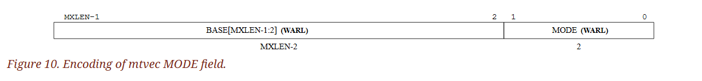

`mtvec` 暫存器必須被實作，但其內容可以被設為唯讀的。 若該暫存器可寫，其可接受的值範圍會依照實作而有所不同。 BASE 欄位的值必須對齊至 4-byte 邊界，而 MODE 的設定可能會對 BASE 的對齊提出更嚴格的限制。 請注意，CSR 中只包含 BASE 位址的第 `XLEN-1` 到第 `2` 位元。 實際作為位址使用時，最低的兩個位元會自動補 0，以形成一個符合 4-byte 對齊要求的 XLEN-bit 位址

::: info  
標準在 trap vector 基底位址的設計上提供了高度的彈性。 一方面，我們不希望低階實作需要儲存太多額外狀態； 另一方面，我們也希望保有對大型系統的靈活支援能力
:::

<span class = "center-column">

| Value | Name     | Description                                               |
|-------|----------|-----------------------------------------------------------|
| 0     | Direct   | All traps set `pc` to BASE                                |
| 1     | Vectored | Asynchronous interrupts set `pc` to BASE + 4 × cause      |
| ≥2    | ---      | *Reserved*                                                |

（Table 13. Encoding of mtvec MODE field.）

</span>

MODE 欄位的編碼方式如表 13 所示。 當 MODE 設為 `Direct` 時，所有進入 machine mode 的 trap 都會把 `pc` 設定為 BASE 欄位中的位址。 而當 MODE 設為 `Vectored` 時，所有同步例外依然會跳到 BASE，但中斷則會跳到 BASE 加上中斷原因編號乘以 4 的偏移位址。 例如，一個 machine mode 的 timer 中斷（見表 14）會讓 `pc` 被設為 `BASE + 0x1c`

不同的實作可能會對不同的模式有不一樣的對齊要求。 特別是 `Vectored` 模式可能會比 `Direct` 模式要求更嚴格的對齊

::: info  
在 `Vectored` 模式中採用較粗的對齊，可以讓 vectoring 的實作在硬體上不需要加法器。 Reset 和 NMI 的向量位址則由平台規格來指定  
:::

::: tip  
RISC-V 處理 trap（包含例外與中斷）時，會根據 `mtvec` 的設定來決定要跳到哪裡執行 trap handler。 而這個跳躍方式由 `mtvec` 的 MODE 欄位所控制：

- `MODE = 0`（Direct）：無論是同步例外還是中斷，都跳到 BASE 指定的同一個位址
- `MODE = 1`（Vectored）：
  - 同步例外（exception）仍跳到 BASE
  - 中斷（interrupt）會跳到 `BASE + 4 × cause`（cause 為中斷原因的編號）

所以這是設計 trap handler 分派機制的方式，目的是給作業系統一個機制來處理不同中斷來源的函式（類似 interrupt vector table 的概念）

而因為 `Vectored` 模式會跳到 `BASE + 4 × cause`，所以硬體會把 BASE 當成一個跳躍表的起點，每個 entry 間隔 4 bytes。 如果 BASE 本身不是某種對齊的話，可能會讓硬體在實作上變複雜，需要額外的加法器來做位址計算。 
因此，RISC-V 規範才允許不同的實作針對不同的 MODE 設計出「不同的對齊限制」。

例如：

- `Direct` 模式只需要 BASE 是 4-byte 對齊就夠了（因為就跳去那裡執行）
- `Vectored` 模式可能會要求 BASE 是 128-byte 對齊，這樣就可以用簡單的移位運算而非加法器來找出第 n 個 handler 的位址（`cause << 2`）  
:::

### 3.1.8. Machine Trap Delegation (`medeleg` and `mideleg`) Registers

預設情況下，所有 privilege level 所產生的 trap 都會由 machine mode 處理。 不過 M-mode 的 handler 可以透過 `MRET` 指令（見 3.3.2 節）將 trap 回傳給對應的低權限層級。 為了提升效能，實作上可以提供 `medeleg` 和 `mideleg` 這兩個具有個別讀寫位元的暫存器，用來指定哪些例外或中斷可以直接由較低權限層級處理。 machine exception delegation 暫存器（`medeleg`）是 64-bit 的可讀寫暫存器，而 machine interrupt delegation 暫存器（`mideleg`）則是 MXLEN 位元的可讀寫暫存器

在支援 S-mode 的 hart 中，`medeleg` 和 `mideleg` 這兩個暫存器是必要的。 只要設定對應的位元，當 S-mode 或 U-mode 發生對應的 trap，就會被轉交給 S-mode 的 trap handler 處理。 而在不支援 S-mode 的 hart 中，這兩個暫存器就不應該存在

::: tip
delegation 是讓 machine mode 把 trap 權限下放給 S-mode 的機制。 所以如果一個 hart 根本沒支援 S-mode，那麼 `medeleg` 和 `mideleg` 就沒有存在的必要，甚至在硬體上也應該被省略。 注意這裡也提到即使 trap 是在 U-mode 發生的，只要有對應的 delegation，它仍會跳到 S-mode，而不是直接給 U-mode handler  
:::

:::: info  
在版本 1.9.1 與更早的版本中，這些暫存器即便存在，在只有 M-mode，或只有 M/U 而沒有 N 個 hart 的情況下，其值也會固定為零。 但其實沒有必要強制這些情況下的值一定為零，因為 `misa` 暫存器已經能夠指出這些暫存器是否存在

::: tip  
在舊版中，這些暫存器即使存在，也不能改值（等於硬體焊死為 0）。 但後來標準放寬了這個限制，因為是否支援 delegation，可以直接從 `misa` 暫存器查出，而不必限制 `medeleg`/`mideleg` 一定要回傳 0，以讓硬體實作更有彈性  
:::  
::::

當 trap 被委託給 S-mode 時，`scause` 暫存器會寫入 trap 的原因，`sepc` 會寫入觸發 trap 的指令的虛擬位址，`stval` 會寫入與例外相關的額外資訊； `mstatus` 中的 `SPP` 欄位會記錄當下的權限模式，`SPIE` 會寫入當時 `SIE` 的值，而 `SIE` 本身會被清除。 而 `mcause`、`mepc`、`mtval` 以及 `mstatus` 中的 `MPP` 與 `MPIE` 欄位則不會被更新

實作可以選擇只支援部分可委託的 trap。 要確認支援了哪些 bit，可以嘗試把 `medeleg` 或 `mideleg` 的每個位元都設為 1，然後讀回來看哪些位元仍然是 1，就能知道哪些 trap 是可以被委託的

實作上不可以讓 `medeleg` 中的任何位元是唯讀的 1，也就是說，只要是可委託的同步 trap，都必須支援能將其設為「不委託」的狀況。 同樣地，`mideleg` 中對應到 machine-level 中斷的位元，也不能被設成唯讀的 1（但對於較低層級的中斷則可以）

::: tip  
這段是對硬體實作的限制：即使 trap 可以被委託，也必須允許「選擇不委託」，這樣作業系統才能保有控制權。 不能硬把某些中斷永遠委託下去（唯讀的 1），否則會限制 OS 的彈性  
:::

::: info  
在版本 1.11 及更早的版本中，`mideleg` 中的所有位元都被禁止設為唯讀的 1。 另外，平台規範仍可以額外加上自己的限制  
:::

trap 永遠不會從高權限層級轉移給低權限層級處理。 舉例來說，即使 M-mode 已經把 illegal-instruction 的例外委託給 S-mode，當 M-mode 自己執行了非法指令時，這個 trap 還是會在 M-mode 被處理，而不會被委託給 S-mode。 相反地，trap 可以「水平處理」。 同樣的例子中，如果 S-mode 軟體執行了非法指令，那這個 trap 就會在 S-mode 被處理

::: tip  
trap delegation 只能從 machine mode 向下轉交下層權限的 trap，但不能逆向（往下層回傳）。 也就是說，當某個權限層級自己出錯（觸發 exception），它必須自己處理，不會「往下委託」。 但如果是一個較低層級（例如 S-mode 或 U-mode）觸發的 trap，那麼可以透過 `medeleg`/`mideleg` 的設定，決定是否讓該層直接處理，或轉交給 M-mode  
:::

當中斷被委託時，委託者所在的權限層級將會對該中斷進行遮蔽（mask）。 例如，若 supervisor timer interrupt（STI）已透過設定 `mideleg[5]` 委託給 S-mode，那麼在 M-mode 執行期間就不會接收到 STI。 相反地，若 `mideleg[5]` 為清除狀態（未委託），那 STI 就可以在任一權限層級被觸發，並會統一交由 M-mode 處理

::: tip  
這裡說明 delegation 的副作用：一旦將某中斷委託給 S-mode，M-mode 就再也不會接收到這個中斷了。 這是一種設計保證，避免不同層級重複處理同一個 trap。 所以若你將 `mideleg[5]` 設為 1，表示 STI 被委託給 S-mode，那麼即使當下是 M-mode，也會忽略這個中斷  
:::


`medeleg` 對應每一種同步例外（如表 14 所示）都分配一個位元位置，這個位元的位置與 `mcause` 暫存器回傳的值相同（例如設定第 8 位元，就代表允許將 U-mode 的環境呼叫交給較低權限的 trap handler 處理）。 當 `XLEN=32` 時，`medelegh` 是一個 32-bit 的可讀寫暫存器，對應到 `medeleg` 的第 63 到 32 位元。 當 `XLEN=64` 時，`medelegh` 不存在


`mideleg` 儲存的是各個中斷類型的委託設定位元，其位元排列方式與 mip 暫存器相同（例如 STIP 中斷的委託控制位元位於第 5 位）。 對於不可能在低權限模式發生的例外，其對應的 `medeleg` 位元應該是唯讀的 0。 特別是 `medeleg[11]` 要是唯讀的 0； `medeleg[16]` 也要是唯讀的 0，因為 double trap 是不可委託的

::: tip  
`mcause = 11` 是 M-mode 的 `ecall`，U/S-mode 根本不會觸發這個例外，所以 `medeleg[11]` 被設計成硬體保證為 0  
:::

### 3.1.9. Machine Interrupt (`mip` and `mie`) Registers

`mip` 暫存器是一個 MXLEN 位元的可讀寫暫存器，用來表示目前有哪些中斷已被掛起（pending）； 而 `mie` 是對應的可讀寫暫存器，用來控制各中斷是否啟用。 中斷原因編號 `i`（可參考 `mcause`，見第 3.1.15 節）對應到 `mip` 與 `mie` 中的第 `i` 個位元。 位元 0 到 15 保留給標準中斷使用，而第 16 位以上則保留給平台定義使用

::: info  
保留給平台使用的中斷可以由平台自行定義用途，也可以指定為自訂用途  
:::


一個會讓處理器陷入 M-mode（也就是切換到 M-mode 處理）的中斷 `i` 需滿足下列所有條件：
- (a) 當前權限模式是 M 且 `mstatus` 中的 `MIE` 位元為 1，或當前處於比 M-mode 更低的權限層級
- (b) 中斷編號 `i` 的位元在 `mip` 與 `mie` 中都被設為 1
- (c) 若存在 `mideleg` 暫存器，則 `i` 的對應位元在 `mideleg` 中必須是 0（表示未委託）

::: tip  
1. 權限狀態允許中斷：
    - 若已在 M-mode，還必須 `mstatus.MIE = 1`（中斷總開關）才會進入中斷
    - 若目前在 S-mode 或 U-mode，那就不需要檢查 `mstatus.MIE`，因為中斷都會先升權限進 M-mode 或 S-mode
2. 中斷來源條件成立：
    - `mip[i] = 1` → 中斷來源已經掛起
    - `mie[i] = 1` → 允許該中斷來源
3. 委託情況：
    - 若有 `mideleg[i] = 1`，那這個中斷就會被委託給 S-mode，而不是進 M-mode
    - 反過來說，只有 `mideleg[i] = 0`，才會由 M-mode 處理  
:::

上述中斷 trap 成立的條件，必須在中斷來源在 `mip` 中變成掛起或取消掛起的固定時間內被評估，也必須在執行 `xRET` 指令之後，或對相關 CSR（像是 `mip`、`mie`、`mstatus`、`mideleg`）進行寫入後立即重新評估。 針對 M-mode 的中斷會優先於所有針對較低權限層級的中斷

`mip` 暫存器中的每個位元都可能是可寫的，也可能是唯讀的。 當 `mip` 的第 `i` 位是可寫的時，可以透過寫入 0 來清除中斷 `i` 的掛起狀態。 若中斷 `i` 被掛起，但其在 `mip` 中的對應位元是唯讀的，實作上必須提供其他機制來清除該中斷的掛起狀態

只要某個中斷可能會進入掛起狀態，那麼其對應的 `mie` 位元就必須是可寫的。 那些不可寫的 `mie` 位元必須是唯讀的 0，表示永遠不能啟用該中斷。 `mip` 與 `mie` 暫存器中標準定義的部分（第 0 到 15 位元）格式如圖 15 與圖 16 所示


:::: info  
machine-level 的中斷暫存器負責處理少數幾個核心中斷來源，這些來源被指派了固定的服務優先順序以簡化設計。 而外部中斷控制器則可以實作更複雜的優先排序機制，對大量中斷來源進行管理，最後再將它們多工輸入到 machine-level 的中斷來源中

::: tip  
machine-level (`mip`, `mie`) 處理的是「根中斷來源」，如軟體、timer、外部中斷。 外部中斷控制器（如 PLIC）可以管理更多中斷來源（例如 GPIO、UART、Ethernet），PLIC 會根據內部設定的優先權做 arbitration，然後把最高優先權的中斷送到 `MEIP`，這樣 machine-level 就只需要處理一個外部中斷來源了  
:::

不可遮蔽中斷（non-maskable interrupt, NMI）不會透過 `mip` 暫存器顯示，因為在執行 NMI 的 trap handler 時，處理器就會隱含地知道 NMI 已經發生了  
::::

`mip.MEIP` 與 `mie.MEIE` 分別是 machine-level 外部中斷的掛起與啟用位元。 `MEIP` 在 `mip` 中是唯讀的，由平台特定的外部中斷控制器負責設定與清除

`mip.MTIP` 與 `mie.MTIE` 分別是 M-mode timer 中斷的掛起與啟用位元。 `MTIP` 在 `mip` 中是唯讀的，並透過寫入 memory-mapped M-mode timer compare 暫存器來清除

`mip.MSIP` 與 `mie.MSIE` 分別是 machine-level 軟體中斷的掛起與啟用位元。 `MSIP` 在 `mip` 中是唯讀的，透過存取記憶體映射的控制暫存器來設定，通常由其他 hart 用來觸發 machine-level 的跨核心中斷（IPI）。 同一個 hart 也可以透過這個記憶體映射的控制暫存器寫入自己的 `MSIP`。 如果系統只有一個 hart，或平台改用外部中斷（`MEI`）提供跨核心中斷，那麼 `mip.MSIP` 與 `mie.MSIE` 可以是唯讀的 0

如果系統沒有實作 supervisor mode，則 `mip` 中的 `SEIP`、`STIP`、`SSIP` 與 `mie` 中的 `SEIE`、`STIE``、SSIE` 這幾個位元都會是唯讀的 0。 若系統實作了 supervisor mode，則 `mip.SEIP` 與 `mie.SEIE` 分別是 supervisor-level 外部中斷的掛起與啟用位元。 `SEIP` 在 `mip` 中是可寫的，M-mode 軟體可以寫入該位元，藉此通知 S-mode 有外部中斷掛起。 此外，平台級的中斷控制器也可以產生 supervisor-level 外部中斷

該中斷的掛起狀態由兩個來源的 logical-OR 操作決定：一是由軟體可寫的 `SEIP` 位元，二是中斷控制器送出的訊號。 在使用 CSR 指令讀取 `mip` 時，所讀到的 `SEIP` 值會是這兩者的 OR 結果； 但在對 `SEIP` 寫入值時，則不會考慮控制器送出的訊號。 只有軟體可寫的 `SEIP` 位元會參與 `CSRRS`/`CSRRC` 等 CSR 指令的讀寫流程

::: info  
舉例來說，若我們將軟體可寫的 `SEIP` bit 稱為 `B`，而外部中斷控制器送入的訊號稱為 `E`，那麼執行 `csrrs t0, mip, t1` 時，`t0[9]` 會被設為 `B || E`，接著 `B` 被寫為 `B || t1[9]`。 若執行 `csrrw t0, mip, t1`，那 `t0[9]` 一樣會設為 `B || E`，而 `B` 則被寫為 `t1[9]`。 在這兩種情況下，`B` 的值都不會受到 `E` 的影響

`SEIP` 的這種行為設計，是為了讓較高權限層級能夠安全地模擬外部中斷，而不會導致真實的外部中斷被忽略。 為此，CSR 指令在處理 `SEIP` 時的行為也針對這個需求做了些微修改
:::

::: tip  
`SEIP` 是一個由兩個來源組成的虛擬位元（OR 結果）。 `mip.SEIP` 可由 M-mode 軟體手動設定（模擬中斷），同時外部中斷控制器也可能送入訊號（真實中斷）。 當你讀取 `mip.SEIP` 時，會看到這兩者的 OR 結果，但當你修改 `mip.SEIP` 時（用 CSR 指令），你只能影響軟體可寫的那個 bit，而無法修改控制器送進來的訊號，這讓 M-mode 可以安全地「模擬」S-mode 中斷，不會蓋掉真實的外部中斷  
:::

若系統支援 supervisor mode，則 `mip.STIP` 與 `mie.STIE` 分別為 S-mode timer 中斷的掛起與啟用位元。 `STIP` 是可寫的，M-mode 軟體可以透過寫入該位元，將 timer 中斷送給 S-mode

若系統支援 supervisor mode，則 `mip.SSIP` 與 `mie.SSIE` 分別為 S-mode 軟體中斷的掛起與啟用位元。 `SSIP` 是可寫的，也可以由平台特定的中斷控制器設為 1

若系統實作了 Sscofpmf 擴充指令集，則 `mip.LCOFIP` 與 `mie.LCOFIE` 為本地計數器溢位中斷的掛起與啟用位元。 `mip.LCOFIP` 是可讀寫的，會在任何一個 `mhpmeventn.OF` 位元被設為 1 時反映中斷請求。 若未實作 Sscofpmf 擴充，則這兩個位元為唯讀的 0

當多個中斷同時指向 M-mode 處理時，它們的優先順序如下（由高到低）：`MEI`、`MSI`、`MTI`、`SEI`、`SSI`、`STI`、`LCOFI`

::: info  
machine-level 中斷的固定優先順序是根據以下原則所設計的：

- 高權限模式的中斷必須比低權限模式的中斷優先處理，以支援搶佔（preemption）
- 位於第 16 位以上的 machine-level 平台特定中斷來源，其優先順序由平台定義，但通常會被設為最高優先，以支援極快速的本地向量化中斷（local vectored interrupts）
- 外部中斷優先於內部中斷（如 timer 與 software），因為外部中斷通常來自需要低延遲服務的裝置
- 軟體中斷優先於內部 timer 中斷，因為 timer 中斷通常用於分時（time slicing），精確度不是最重要； 而軟體中斷則常用於多核心間的訊息傳遞。 當需要高精度計時時，可以避免使用軟體中斷，或將高精度 timer 中斷經由其他中斷路徑傳送。 此外，軟體中斷被放在 `mip` 的最低四個位元，是為了方便軟體操作，能在單一 CSR 指令中以 5-bit 立即數設定  
:::

在 supervisor mode 中，`mip` 與 `mie` 暫存器的受限視圖（restricted views）分別對應為 `sip` 與 `sie` 暫存器。 當某個中斷被設定在 `mideleg` 中委託給 S-mode 時，它會在 `sip` 中變得可見，並且可以透過 `sie` 來控制是否啟用。 否則，對應的位元在 `sip` 與 `sie` 中都會是唯讀的 0

::: tip  
`mip`/`mie` 是 M-mode 全域可見的中斷狀態，而 `sip`/`sie` 是 S-mode 的視角（受限版本）：

- `sip`：只顯示 S-mode 有權處理的中斷來源（依 `mideleg` 設定）
- `sie`：只允許 S-mode 啟用/關閉自己能處理的中斷

換句話說，這兩個暫存器的內容是從 `mip`/`mie`「根據 mideleg 過濾出來」的可見子集  
:::

### 3.1.10. Hardware Performance Monitor

M-mode 提供了一組基本的硬體效能監控功能。 `mcycle` CSR 用來記錄當前 hart 所在的處理器核心所執行過的時鐘週期數； `minstret` CSR 則記錄該 hart 已完成（retired）的指令數。 在所有 RV32 與 RV64 架構中，`mcycle` 與 `minstret` 都為 64 位元的精度

這些計數器暫存器在 hart 被重設後，其初始值為未定，但可以由軟體寫入特定值。 任何對 CSR 的寫入，會在該指令本身執行完成後才生效。 `mcycle` CSR 在某些情況下可能由同一個處理器核心上的多個 hart 共同持有，此時寫入 `mcycle` 的內容將對這些 hart 來說都是可見的。 平台應提供一種機制，來指出哪些 hart 共享同一個 `mcycle` CSR

::: tip
計數器一開機不保證初始為 0，軟體（如 OS）若要準確統計，應主動歸零。 若一個核心有多個 hart（例如 SMT 多執行緒核心），這些 hart 可能共用同一個 `mcycle`，這可能會造成統計交疊，所以平台（如 SBI 或 device tree）應提供是否共用的資訊給 OS（否則 OS 無法判斷計數器準確性）  
:::

硬體效能監控系統還包含額外的 29 個 64-bit 的事件計數器，分別為 `mhpmcounter3` 到 `mhpmcounter31`。 每個計數器都對應一個事件選擇器 CSR，稱為 `mhpmevent3` 到 `mhpmevent31`，這些都是 64-bit 的 WARL 暫存器，用來控制該計數器會對哪一種事件進行計數。 事件的意義由平台定義，但事件編號 0 被定義為「不計數」。 所有計數器原則上都應被實作，但實作可以透過讓該計數器與對應事件選擇器都固定為唯讀的 0 以符合合法的定義

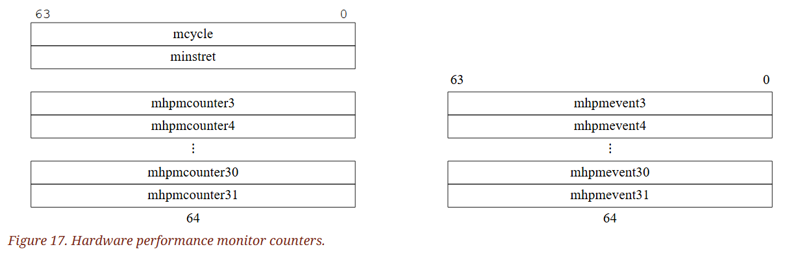

`mhpmcounter` 系列是 WARL 類型的暫存器，在 RV32 與 RV64 架構下皆支援最多 64-bit 精度

當 XLEN 為 32 時，對 `mcycle`、`minstret`、`mhpmcountern` 與 `mhpmeventn` 這些 CSR 的讀取會傳回對應暫存器的第 31–0 位元，而寫入則僅會改變第 31–0 位元； 對應的高位元部分可以透過 `mcycleh`、`minstreth`、`mhpmcounternh` 與 `mhpmeventnh` CSR 來讀寫，這些會回傳對應暫存器的第 63–32 位元。 `mhpmeventnh` CSR 只有在實作了 Sscofpmf 擴充時才會提供

::: tip  
即使在 32-bit 系統下，這些暫存器的實際寬度仍是 64-bit，只是要透過分開存取（上下半部）。 這是 32-bit 架構下存取 64-bit CSR 的典型設計方式：

- `mcycle`、`mhpmcounterN`：低 32 bit（bits 0–31）
- `mcycleh`、`mhpmcounterNh`：高 32 bit（bits 32–63）

要注意操作順序：應先讀高位、再讀低位； 或先寫低位、再寫高位，以避免跨越溢位時讀取不一致。 這對統計精度非常關鍵，尤其是高頻率事件（如 clock cycles）極易溢位  
:::

### 3.1.11. Machine Counter-Enable (`mcounteren`) Register

`mcounteren` 是一個 32-bit 的暫存器，用來控制硬體效能監控計數器是否開放讓下一個較低的權限模式存取。 這個暫存器的設定僅影響存取權限。 讀寫 `mcounteren` 並不會影響底層的計數器，它們會持續累積計數，即使當前無法被存取

::: tip  
`mcounteren`（machine counter enable）只存在於 M-mode 中，它的目的是讓 M-mode 軟體（如 hypervisor 或 kernel）決定是否讓 S-mode 或 U-mode 讀到計數器值。 即使你禁止 U-mode 或 S-mode 存取 `cycle`、`instret` 等，它們還是照樣在背景中遞增  
:::


當 `mcounteren` 中的 `CY`、`TM`、`IR` 或 `HPMn` 位元為 0 時，在 S-mode 或 U-mode 中讀取 `cycle`、`time`、`instret` 或 `hpmcountern` 時會觸發 illegal-instruction 例外。 若這些位元為 1，則對應的暫存器在下一層實作的權限模式中是可讀的（若有實作 S-mode，則為 S-mode，否則為 U-mode）

::: info  
這些 counter-enable 位元能以最少的硬體支援兩種常見情境：
- 對於不需要高效能計時器與計數器的 hart，M-mode 軟體可以攔截存取並用軟體實作所有功能
- 對於需要高效能計數但又不需隱藏底層硬體資訊的 hart，可以直接開放低權限模式存取這些計數器  
:::

`cycle`、`instret` 和 `hpmcountern` 這些 CSR 是 `mcycle`、`minstret` 和 `mhpmcountern` 的唯讀鏡像（shadow）。 `time` CSR 是 memory-mapped `mtime` 暫存器的唯讀鏡像。 同樣地，當 XLEN 為 32 時，`cycleh`、`instreth` 與 `hpmcounternh` 是 `mcycleh`、`minstreth` 與 `mhpmcounternh` 的唯讀鏡像； 而 `timeh` 是 memory-mapped `mtime` 的上半部（高 32 位元）的唯讀鏡像，而 `time` 則是下半部分（低 32 位元）的唯讀鏡像

:::: info  
實作可以將對 `time` 與 `timeh` CSR 的讀取轉換成對 memory-mapped `mtime` 的讀取，也可以由 M-mode 軟體模擬此功能，提供給低權限模式使用

::: tip
`time` 並不是一個真正的硬體 CSR，而是對 `mtime`（一個 memory-mapped 的 64-bit register）的代理：

- 若平台支援，可以讓 CPU 直接從 `mtime` 讀資料回來 → CSR 讀取是快速的
- 若平台不支援，則 M-mode 需要 trap 並模擬這個行為 → 延遲較大，但能保持一致性  

另外上方我將 shadow 翻為鏡像，它的語意是「反映出來但無法直接修改的版本」，也可以理解為 view  
:::  
::::

若 hart 有實作 U-mode，則必須提供 `mcounteren` 暫存器，但其中所有欄位都屬於 WARL，可設定為唯讀的 0，表示當在較低權限模式中讀取對應計數器時會觸發 illegal-instruction 例外。 若 hart 未實作 U-mode，則不應存在 `mcounteren` 暫存器

### 3.1.12. Machine Counter-Inhibit (`mcountinhibit`) Register


`mcountinhibit` 是一個 32-bit 的 WARL 暫存器，用來控制哪些硬體效能監控計數器會遞增。 這個暫存器的設定只影響計數器是否遞增，不會影響它們的可存取性。 當 `mcountinhibit` 中的 `CY`、`IR` 或 `HPMn` 位元為 0 時，`mcycle`、`minstret` 或 `mhpmcountern` 會照常遞增。 當這些位元為 1 時，對應的計數器將停止遞增

若同一個 core 上的多個 hart 共用 `mcycle` CSR，則 `mcountinhibit` 的 `CY` 欄位也會在這些 hart 間共用，因此其他的 hart 是能看見對 `mcountinhibit.CY` 的寫入的

若實作中未提供 `mcountinhibit` 暫存器，則視為該暫存器的所有位元皆為 0（正常遞增）

::: info  
當不需要 `mcycle` 與 `minstret` 計數器時，最好能有條件地抑制它們，以降低能耗。 將所有計數器的抑制功能集中在單一 CSR 中，也讓這些計數器能被原子性地取樣（be atomically sampled）

由於 `mtime` 計數器可以在多個 core 間共用，因此無法透過 `mcountinhibit` 機制來抑制  
:::

### 3.1.13. Machine Scratch (`mscratch`) Register

`mscratch` 是一個 MXLEN 位元的可讀寫暫存器，專門保留給 machine mode 使用。 一般來說，它用來存放一個指向 M-mode 下 hart 本地 context 區域的指標，並會在進入 M-mode trap handler 時與使用者暫存器進行交換

::: tip  
`mscratch` 就像是 OS trap handler 專用的小筆記本，用來在 trap 發生時臨時儲存使用者狀態、指標或 context。 因為每個 hart 都有自己一份 `mscratch`，所以你可以安全地儲存與 hart 相關的資料，而不需要一開始就開堆疊空間或找備用暫存器

上方講的「使用者暫存器（user register）」是指在 U-mode 下可使用的一般暫存器（general-purpose registers），也就是我們常講的那些 x0-x31 的暫存器  
:::

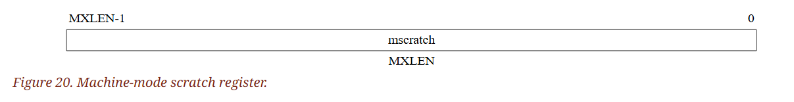

::: info  
MIPS ISA 為作業系統保留了兩個使用者暫存器（`k0`/`k1`）。 雖然這種方式實作起來快速簡單，但也會減少使用者可用的暫存器，且不容易擴充到更多權限層級或處理巢狀 trap。 此外，在回到使用者模式前，還可能需要清除這兩個暫存器，才能避免潛在的安全漏洞並提供可預期的除錯行為

RISC-V 的使用者 ISA 被設計來支援多種不同的特權系統環境，因此我們不想讓任何與作業系統相關的特性污染使用者層級的 ISA。 RISC-V 提供 CSR swap 指令，可以快速地將值儲存或還原到 `mscratch` 暫存器。 和 MIPS 設計不同，作業系統可以在使用者 context 執行期間，持續在 `mscratch` 中保留值  
:::

### 3.1.14. Machine Exception Program Counter (`mepc`) Register

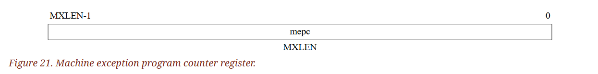

`mepc` 是一個 MXLEN 位元的可讀寫暫存器，其格式如圖 21 所示。 `mepc` 的最低位元（`mepc[0]`）總是為 0。 若實作僅支援 `IALIGN=32`，則最低兩個位元（`mepc[1:0]`）總是為 0

若某個實作允許 IALIGN 為 16 或 32（例如透過改變 CSR `misa`），那麼只要 IALIGN 為 32，讀取 `mepc` 時就會遮蔽 `mepc[1]`，讓它看起來為 0。 這個遮蔽也適用於 MRET 指令所隱式進行的讀取。 即使被遮蔽，在 `IALIGN=32` 時仍然可以寫入 `mepc[1]`

::: tip  
在支援壓縮指令（`IALIGN=16`）的系統中，`mepc` 可能會有位址不是 4-byte 對齊的情況（例如對齊到 2-byte 即可）。 但當 IALIGN 被設定為 32 時（即禁用壓縮指令），所有指令必須 4-byte 對齊，這時：

- 讀出 `mepc` 時會強制將 `mepc[1]` 遮蔽為 0
- 但你還是可以寫入 `mepc[1]`，只是讀的時候會被遮掉，不會造成錯誤

這樣做的目的是為了保證 MRET 回去的 `pc` 是合法對齊的，即使 `mepc` 裡面有暫時不合法的位元  
:::

`mepc` 是一個 WARL 類型的暫存器，其必須能夠儲存所有合法的虛擬位址，但不需要能儲存所有可能的非法位址。 在寫入 `mepc` 之前，實作可以將非法位址轉換成 `mepc` 可容納的另一個非法位址再寫入

:::: info  
當未啟用 address translation 時，虛擬位址與實體位址相等。 因此，`mepc` 能夠表示的位址集合，必須包含那些可作為合法 PC 或有效位址的實體位址

::: tip  
這邊只是在表達，如果虛擬位址等於實體位址（如沒開 paging），則 `mepc` 要能記住實體指令的位置  
:::  
::::

當 trap 發生並進入 M-mode 時，`mepc` 會被寫入發生中斷或例外的那條指令的虛擬位址。 除此之外，實作不會主動寫入 `mepc`，但軟體可以明確地寫入它

::: tip  
每當 trap 發生（例外、interrupt），系統會把「正在執行那條指令的位址」存進 `mepc`，通常這個值會用來在 trap handler 執行完之後，透過 `mret` 回到原本程式位置，但軟體（例如 OS 或 hypervisor）也可以自己寫入 `mepc`，讓 `mret` 回到指定位置（例如 context switch 時）  
:::

### 3.1.15. Machine Cause (`mcause`) Register

`mcause` 是一個 MXLEN 位元的可讀寫暫存器，其格式如圖 22 所示。 當 trap 發生並進入 M-mode 時，`mcause` 會被寫入一個表示該 trap 事件原因的代碼。 除此之外，實作不會主動寫入 `mcause`，但軟體可以自行明確地寫入它


如果 trap 是由中斷所引起的，則 `mcause` 暫存器中的 Interrupt 位元會被設為 1。 Exception Code 欄位則包含一個代碼，用以標示最近一次的例外或中斷。 表 14 列出了所有可能的 machine-level 例外代碼。 Exception Code 是一個 WLRL 欄位，因此只能保證能正確儲存被支援的例外代碼

load 與 load-reserved 指令會產生 load 類型的例外，而 store、store-conditional 與 AMO 指令則會產生 store/AMO 類型的例外

::: info  
可以透過檢查 `mcause` 的符號位元來快速將中斷與其他 trap 區分開。 左移一次可以去除 interrupt bit，並將 Exception Code 做為索引使用，用於查詢 trap vector table

我們並不區分特權指令例外與非法指令例外。 這簡化了整體架構，也能隱藏某些高特權指令是否被實作的細節。 負責處理 trap 的特權層可以自行決定是否需要區分這些情況，以及要視某個目標 opcode 為非法還是特權的  
:::

<span class = "center-column">

| Interrupt | Exception Code | Description                            |
|-----------|----------------|----------------------------------------|
| 1         | 0              | *Reserved*                             |
| 1         | 1              | Supervisor software interrupt          |
| 1         | 2              | *Reserved*                             |
| 1         | 3              | Machine software interrupt             |
| 1         | 4              | *Reserved*                             |
| 1         | 5              | Supervisor timer interrupt             |
| 1         | 6              | *Reserved*                             |
| 1         | 7              | Machine timer interrupt                |
| 1         | 8              | *Reserved*                             |
| 1         | 9              | Supervisor external interrupt          |
| 1         | 10             | *Reserved*                             |
| 1         | 11             | Machine external interrupt             |
| 1         | 12             | *Reserved*                             |
| 1         | 13             | Counter-overflow interrupt             |
| 1         | 14–15          | *Reserved*                             |
| 1         | ≥16            | *Designated for platform use*          |
| 0         | 0              | Instruction address misaligned         |
| 0         | 1              | Instruction access fault               |
| 0         | 2              | Illegal instruction                    |
| 0         | 3              | Breakpoint                             |
| 0         | 4              | Load address misaligned                |
| 0         | 5              | Load access fault                      |
| 0         | 6              | Store/AMO address misaligned           |
| 0         | 7              | Store/AMO access fault                 |
| 0         | 8              | Environment call from U-mode           |
| 0         | 9              | Environment call from S-mode           |
| 0         | 10             | *Reserved*                             |
| 0         | 11             | Environment call from M-mode           |
| 0         | 12             | Instruction page fault                 |
| 0         | 13             | Load page fault                        |
| 0         | 14             | *Reserved*                             |
| 0         | 15             | Store/AMO page fault                   |
| 0         | 16             | Double trap                            |
| 0         | 17             | *Reserved*                             |
| 0         | 18             | Software check                         |
| 0         | 19             | Hardware error                         |
| 0         | 20–23          | *Reserved*                             |
| 0         | 24–31          | *Designated for custom use*            |
| 0         | 32–47          | *Reserved*                             |
| 0         | 48–63          | *Designated for custom use*            |
| 0         | ≥64            | *Reserved*                             |

（Table 14. Machine cause (`mcause`) register values after trap.）

</span>

<span class = "center-column">

| Priority  | Exc.Code      | Description                                                                 |
|-----------|---------------|-----------------------------------------------------------------------------|
| *Highest* | 3             | Instruction address breakpoint                                              |
|           | 12, 1         | During instruction address translation: First encountered page fault or access fault |
|           | 1             | With physical address for instruction: Instruction access fault             |
|           | 2             | Illegal instruction                                                         |
|           | 0             | Instruction address misaligned                                              |
|           | 8, 9, 11      | Environment call                                                            |
|           | 3             | Environment break                                                           |
|           | 3             | Load/store/AMO address breakpoint                                           |
|           | 4, 6          | Optionally: Load/store/AMO address misaligned                               |
|           | 13, 15, 5, 7  | During address translation for an explicit memory access: First encountered page fault or access fault |
|           | 5, 7          | With physical address for an explicit memory access: Load/store/AMO access fault |
| *Lowest*  | 4, 6          | If not higher priority: Load/store/AMO address misaligned                   |

（Table 15. Synchronous exception priority in decreasing priority order）

</span>

當虛擬位址被轉換為實體位址時，位址轉譯演算法會決定要觸發哪一種例外。 load/store/AMO 的 address-misaligned 例外，可能比 page fault 或 access fault 優先，也可能較晚發生

::: info  
load/store/AMO 的 misaligned 與 page fault 例外的相對優先順序由實作自行決定，以因應兩種設計情境的需求。 若某實作完全不支援 misaligned 存取，那麼在不執行位址轉譯與存取保護檢查的情況下，其可直接觸發 misaligned 例外。 反之，若只在部分實體位址上支援 misaligned 存取，則實作必須先進行位址轉譯與檢查，確定是否允許這次 misaligned 存取，這種情況下觸發 page fault 或 access fault 是較合適的

指令位址的 breakpoint 例外與資料位址的 breakpoint（也稱為 watchpoint），以及由 EBREAK 指令觸發的 environment break 例外，雖然擁有相同的 cause 編號，但其優先順序不同

instruction address-misaligned 例外是由控制流程指令（如 jump、call）跳往未對齊的目標位址時觸發的，而不是在抓取指令時觸發的。 因此，這類例外的優先順序低於其他 instruction address 類型的例外

software-check exception 是一種同步例外，當執行違反了某些由 ISA 擴充定義的檢查或斷言條件時會觸發，這些檢查的目的在於保障軟體資產的完整性，例如控制流程或記憶體存取的約束。 當此例外發生時，`xtval` 暫存器會被設為 0，或是設為該擴充定義的具體值。 這類例外的優先順序依其原因而定，由對應的擴充規範決定

hardware-error exception 是一種同步例外，當指令（無論是顯式或隱式）存取到損毀或無法修復的資料時便會觸發。 這裡的「資料」泛指 RISC-V hart 中所使用的所有資訊。 當此例外發生時，`xepc` 暫存器會記錄導致存取錯誤的指令位址，而 `xtval` 則會被設為 0，或是記錄該次指令抓取、load、store 所嘗試存取的虛擬位址。 hardware-error 例外的優先順序由實作自行定義，但通常會在發現錯誤時的那個階段觸發  
:::

### 3.1.16. Machine Trap Value (`mtval`) Register

`mtval` 是一個 MXLEN 位元的可讀寫暫存器，其格式如圖 23 所示。 當 trap 發生並進入 M-mode 時，`mtval` 會被設為 0，或是被寫入某些與例外相關的資訊，協助軟體處理該 trap。 除此之外，實作本身不會寫入 `mtval`，但軟體可以自行寫入。 哪些例外需要將 `mtval` 寫入具意義的資訊、哪些必須無條件設為 0、哪些可以兩者皆可，會由硬體平台規範決定。 如果硬體平台規定所有例外都不會讓 `mtval` 寫入非零值，則 `mtval` 是唯讀的 0


如果在指令擷取（fetch）、load 或 store 時發生了 breakpoint、位址未對齊、access fault 或 page fault 等例外，且 `mtval` 被寫入了非零值，那麼 `mtval` 會記錄觸發例外的虛擬位址。 當啟用基於 page 的虛擬記憶體時，即使是實體記憶體的 access-fault 例外，也會將觸發錯誤的虛擬位址寫入 `mtval`。 這樣的設計可以降低多數實作（尤其是有硬體 page-table walker 的）資料路徑成本

若某次 misaligned 的 load 或 store 導致 access fault 或 page fault，而 `mtval` 被寫入非零值，則 `mtval` 會記錄觸發錯誤的那個存取區段的虛擬位址

::: tip  
Misaligned access 通常會跨越多個位址範圍（例如跨兩個 page），如果其中一段合法、另一段違規，那 `mtval` 會記錄「違規」的那段虛擬位址，用來幫助錯誤分析時釐清是 load/store 哪一部分出錯  
:::

若在支援可變長度指令的 hart 上發生 instruction access-fault 或 page-fault，而 `mtval` 被寫入非零值，那麼 `mtval` 將包含造成錯誤的那段指令的虛擬位址，而 `mepc` 則會指向該指令的起始位址

在 illegal-instruction 例外時，`mtval` 也可以選擇性地用來回傳觸發錯誤的指令位元內容（此時 `mepc` 指向該指令在記憶體中的位址）。 如果 `mtval` 被寫入非零值，它會記錄以下三個中最短者：

- 實際造成錯誤的整條指令
- 該指令的前 ILEN 位
- 該指令的前 MXLEN 位

此時寫入 `mtval` 的內容會靠右對齊，其餘高位補 0

::: tip  
RISC-V 指令為定長或變長（16、32、48、64 bits 以上）的，若遇到非法指令，可以選擇把那段錯誤的 opcode 填入 `mtval` 來幫助除錯系統分析錯誤指令，若長度超過 MXLEN，也會截斷並右對齊。 這段機制是「可選的」，不是所有實作都會這樣做  
:::

::: info  
在 `mtval` 中記錄出錯的指令可以降低指令模擬（emulation）的開銷，特別是在指令未對齊時，能避免多次部分讀取指令的情況，也可能避免資料快取未命中或從未快取的記憶體中慢速地讀取指令。 此外，若有其他 agent 正在修改指令記憶體（例如在動態翻譯系統中可能發生），則還會有原子性問題

此機制要求在觸發 trap 前，必須先將整段指令（或至少前 MXLEN 個位元）抓取進 `mtval`。 這個要求不會造成實作上的限制，因為實作通常在解碼前就會先抓整段指令，這也能讓軟體 handler 的邏輯更簡單。

如果 `mtval` 的值為 0，可能表示不支援該功能，或是抓到了一條非法的全零指令。 可透過從 `mepc` 所指位置的記憶體讀取指令來判斷是哪一種情況（或者，也可以在執行前透過系統設定資訊判斷該如何安裝正確的 trap handler）  
:::

當 trap 是由 software-check 例外引起時，`mtval` 會記錄導致例外的原因。 下列是已定義的編碼：

- `0`：無資訊提供
- `2`：Landing Pad Fault，由 Zicfilp extension 定義（見 22.1 節）
- `3`：Shadow Stack Fault，由 Zicfiss extension 定義（見 22.2 節）

::: tip  
software-check exception 是軟體保護機制（如 CFI、shadow stack）檢查失敗時發出的例外，這段設計給安全性相關 extension 用，會以 `mtval` 記錄是哪種失敗（例如 call-return 不匹配、非法跳躍）。 「landing pad」與「shadow stack」都與 control flow integrity 有關  
:::

對於其他的 trap，`mtval` 會被設為 0，但未來的標準可能會重新定義其他 trap 的 `mtval` 寫入行為

若 `mtval` 不是唯讀的 0，那它是個 WARL 暫存器，必須能表示所有有效的虛擬位址與 0，但不需要能表示所有不合法的位址。 在寫入 `mtval` 前，實作可以把一個不合法的位址轉換成另一個 `mtval` 能接受的不合法位址。 如果系統實作了回傳錯誤指令內容的功能，則 `mtval` 也必須能表示從 0 到 2<sup>N</sup> 之間所有的值，其中 `N` 是 MXLEN 和 ILEN 中較小者

::: tip  
`mtval` 至少要能裝下：

- 所有合法虛擬位址（例外位址）
- 所有 MXLEN/ILEN 長度內的 opcode（若支援回報指令內容）

不需要支援完整 64-bit 地址空間內的所有值，只要能報錯就好  
:::

### 3.1.17. Machine Configuration Pointer (`mconfigptr`) Register

`mconfigptr` 是一個 MXLEN 位元寬的唯讀 CSR，如圖 24 所示，其內容為某個設定資料結構的實體位址。 軟體可以透過這個資料結構來取得 hart、平台以及相關設定的資訊。 `mconfigptr` 必須要被實作，但其值可以為 0，表示設定資料結構不存在，或是必須透過其他機制來取得該資料結構的位置


這個指標的位元對齊程度必須不少於 MXLEN。 也就是說，如果 MXLEN 是 $8 \times n$，則 `mconfigptr` 的第 $log_2{n–1}$ 位元到第 0 位元必須為 0

::: info  
設定資料結構（configuration data structure）的格式與結構尚未標準化。 某些實作中，`mconfigptr` 可能會是硬編碼的固定值； 也有可能允許設定其內容，使其在 CSR 讀取時回傳不同的值。 舉例來說，`mconfigptr` 可能會對應到某個記憶體映射的暫存器，而該暫存器會在開機過程中由平台或 M-mode 軟體設定  
:::

### 3.1.18. Machine Environment Configuration (`menvcfg`) Register

`menvcfg` 是一個 64-bit 的可讀寫 CSR，如圖 25 所示，用來控制低於 M-mode（如 S-mode 或 U-mode）所處的執行環境的某些特性


如果 `menvcfg` 中的 `FIOM`（Fence of I/O implies Memory）位元被設為 1，那麼在低於 M-mode 的模式下執行的 FENCE 指令時，原本「只針對 device I/O」的存取順序要求會同時套用到主記憶體的存取順序上，加強順序的約束。 表 16 詳細說明了在 `FIOM=1` 的情況下，FENCE 指令中的 `PI`、`PO`、`SI`、`SO` 這些欄位在低權限模式下的改變

同樣地，當 `FIOM=1` 時，如果某個低於 M-mode 的環境中，有 atomic 指令存取的是被視為 device I/O 的區域，且該指令設有 `aq`（acquire）與/或 `rl`（release）位元，則該指令的存取順序會同時套用到 device I/O 與主記憶體上

如果不支援 S-mode，或是 `satp.MODE` 為唯讀的 0（即永遠是 Bare 模式），則實作可以將 `FIOM` 設為唯讀的 0

<span class = "center-column">

| Instruction bit | Meaning when set                                                         |
|------------------|-------------------------------------------------------------------------|
| PI               | Predecessor device input and memory reads (PR implied)                  |
| PO               | Predecessor device output and memory writes (PW implied)                |
| SI               | Successor device input and memory reads (SR implied)                    |
| SO               | Successor device output and memory writes (SW implied)                  |

（Table 16. Modified interpretation of FENCE predecessor and successor sets for modes less privileged than M when `FIOM=1`）

</span>

::: info  
`menvcfg` 中的 `FIOM` 位元之所以存在，是為了讓 M-mode 可以模擬第 21 章中的 hypervisor extension，而該 extension 中的 hypervisor CSR henvcfg 也有相對應的 FIOM 位元  
:::

`PBMTE` 位元控制是否允許在 S-mode 與 G-stage 位址轉譯中使用 Svpbmt 擴充功能（即對 `satp` 或 `hgatp` 所指向的 page table 使用）。 當 `PBMTE=1` 時，Svpbmt 在 S-mode 與 G-stage 位址轉譯中可用。 當 `PBMTE=0` 時，實作會視同 Svpbmt 未被實作。 若 Svpbmt 本身就未實作，則 `PBMTE` 為唯讀的 0。 此外，若實作支援 hypervisor 擴充，當 `menvcfg.PBMTE` 為 0 時，`henvcfg.PBMTE` 也是唯讀的 0

修改 `menvcfg.PBMTE` 之後，在 `rs1=x0` 且 `rs2=x0` 的狀況下執行 `SFENCE.VMA`，便能夠根據 page table entries 中與 `PBMT` 欄位相關的位址轉譯快取。 若實作支援 hypervisor 擴充，請參見第 21.5.3 節的其他同步需求

若系統實作了 Svadu 擴充，則 `ADUE` 位元會控制是否啟用硬體對 PTE 中 `A`/`D`（Accessed/Dirty）位元的自動更新功能。 當 `ADUE=1` 時，在 S-mode 位址轉譯期間會啟用硬體自動更新 `A`/`D` 位元，並且實作會視同 S-mode 位址轉譯中的 Svade 擴充未被實作

若有實作 hypervisor 擴充，當 `ADUE=1` 時，G-stage 位址轉譯期間也會啟用硬體 `A`/`D` 位元更新，並且實作會視同 G-stage 中的 Svade 擴充未被實作

當 `ADUE=0` 時，實作會視同 S-mode 與 G-stage 位址轉譯中的 Svade 擴充已被實作。 若未實作 Svadu，則 `ADUE` 為唯讀的 0。 此外，若實作了 hypervisor 擴充，當 `menvcfg.ADUE` 為 0 時，`henvcfg.ADUE` 也是唯讀的 0

::: tip  
- Svadu：代表硬體支援自動更新 `A`/`D` bits 的能力
- Svade：表示不支援硬體更新，每次需要更新 `A`/`D` bits 時都會觸發 page fault，交由軟體處理

這兩個擴充是互斥的，也就是說一個系統只能啟用其中之一：

- 當 `ADUE = 1`，表示使用 Svadu 模式
- 當 `ADUE = 0`，表示使用 Svade 模式

在某些平台或應用中，硬體不支援自動設定 `A`/`D` bits，或是出於簡化硬體、增強安全性或 debug 的目的，會選擇不讓硬體直接更新 page table。 此時便會使用 Svade 擴充，強迫在需要更新 `A`/`D` bits 時觸發 page fault 讓軟體（OS）來處理

這樣軟體可以完全掌控 page table 的狀態，避免未授權的硬體寫入，以實作例如「唯讀的頁面」在第一次存取後才變為有效的策略（例如延遲分配）。 缺點是效能會受到影響，因為每次需要更新 `A`/`D` bits 都要陷入 OS 處理一次 page fault

有些系統支援 Svadu 和 Svade 兩種行為，因此需要一個方式來控制目前使用哪種行為。 而這就是 `menvcfg.ADUE` 所扮演的角色

當 `ADUE = 1`：

- 使用 Svadu，硬體會自動更新 A/D 位元
- Svade 被視為未實作（即不會發生 page fault）

當 `ADUE = 0`：

- 使用 Svade，A/D bits 不會被硬體寫入，每次更新都要透過 page fault
- Svadu 被視為未實作  
:::

::: info  
Svade 擴充要求在需要設定 PTE 的 `A`/`D` 位元時觸發 page fault，因此當 `ADUE=0` 時，表示已實作 Svade 擴充  
:::

若系統實作了 Smcdeleg 擴充，則 `CDE`（Counter Delegation Enable）欄位用來控制是否允許將 Zicntr 與 Zihpm 計數器委派（delegate）給 S-mode 使用。 當 `CDE=1` 時，Smcdeleg 擴充啟用（詳見第 9 章）。 當 `CDE=0` 時，Smcdeleg 與 Ssccfg 擴充被視為未實作的。 若未實作 Smcdeleg 擴充，則 `CDE` 為唯讀的 0

- `STCE` 欄位的定義由 Sstc 擴充提供
- `CBZE` 欄位的定義由 Zicboz 擴充提供
- `CBCFE` 與 `CBIE` 欄位的定義由 Zicbom 擴充提供
- `PMM` 欄位的定義由 Smnpm 擴充提供 

Zicfilp 擴充在 `menvcfg` 中新增了 `LPE` 欄位。 當 `LPE=1` 且系統實作了 S-mode 時，Zicfilp 會在 S-mode 中啟用。 若 `LPE=1` 且未實作 S-mode，則會在 U-mode 中啟用。 當 `LPE=0` 時，Zicfilp 不會在 S-mode 中啟用，而下面兩條規則將適用於 S-mode。 若 S-mode 未實作，則下面兩條規則適用於 U-mode：

- hart 不會更新 `ELP`（Expected Landing Pad）的狀態； 其狀態維持為 `NO_LP_EXPECTED`
- `LPAD` 指令會作為 no-op（空操作）執行

Zicfiss 擴充在 `menvcfg` 中新增了 `SSE` 欄位。 當 `SSE=1` 時，Zicfiss 擴充會在 S-mode 中啟用。 當 `SSE=0` 時，以下規則將適用於所有低於 M-mode 的權限模式（即 S-mode 與 U-mode）：

- 32-bit 的 Zicfiss 指令會退回為 Zimop 所定義的行為
- 16-bit 的 Zicfiss 指令則依據 Zcmop（compressed instruction markers for opcodes）來解釋
- 在虛擬機層的 page table（VS/S-stage）中的編碼 `pte.xwr=010b` 會被視為「保留（reserved）」的意涵
- `SSAMOSWAP.W/D` 會觸發 illegal-instruction exception

當 `menvcfg.SSE` 為 0 時，`henvcfg.SSE` 與 `senvcfg.SSE` 欄位為唯讀的 0

Ssdbltrp 擴充在 `menvcfg` 中新增了 double-trap-enable（`DTE`）欄位。 當 `menvcfg.DTE` 為 0 時，實作的行為等同於未實作 Ssdbltrp。 當 Ssdbltrp 未被實作時，`sstatus.SDT`、`vsstatus.SDT`、與 `henvcfg.DTE` 位元為唯讀的 0

當 `XLEN=32` 時，`menvcfgh` 是一個 32 位元的讀寫暫存器，對應到 `menvcfg` 的第 63 至 32 位元。 當 `XLEN=64` 時，`menvcfgh` 暫存器不存在

若不支援 U-mode，則 `menvcfg` 與 `menvcfgh` 暫存器都不存在

### 3.1.19. Machine Security Configuration (`mseccfg`) Register

`mseccfg` 是一個選用的 64 位元讀寫暫存器，其格式如圖 26 所示，用於控制安全性功能


- `SSEED` 與 `USEED` 欄位的定義由 entropy-source 擴充 Zkr 提供
- `RLB`、`MMWP`、與 `MML` 欄位的定義由 PMP-enhancement 擴充 Smepmp 提供
- `PMM` 欄位的定義由 Smmpm 擴充提供

Zicfilp 擴充在 `mseccfg` 中新增了 `MLPE` 欄位。 當 `MLPE` 欄位為 1 時，Zicfilp 擴充會在 M-mode 中啟用。 當 `MLPE` 欄位為 0 時，Zicfilp 擴充不會在 M-mode 中啟用，且以下規則將適用於 M-mode：

- hart 不會更新 `ELP` 狀態； 其狀態維持為 `NO_LP_EXPECTED`
- `LPAD` 指令將作為 no-op（空操作）執行

僅當 `XLEN=32` 時，`mseccfgh` 是一個 32 位元的讀寫暫存器，對應 `mseccfg` 的第 63 至 32 位元。 當 `XLEN=64` 時，`mseccfgh` 暫存器不存在

## 3.2. Machine-Level Memory-Mapped Registers

### 3.2.1. Machine Timer (`mtime` and `mtimecmp`) Registers

平台會提供一個 real-time 的計數器，這個計數器會以記憶體映射（memory-mapped）的方式暴露為一個可由 M-mode 讀寫的暫存器 `mtime`。 `mtime` 必須以固定頻率遞增，平台也必須提供一種機制，用來確定 `mtime` 的每次遞增（tick）所代表的時間週期。 當計數溢位時，`mtime` 暫存器會回繞（wrap around）

::: tip  
「wrap around」是因為硬體資源有限，當暫存器達到其位數所能表示的最大值時，就會重新從零開始  
:::

在所有 RV32 與 RV64 系統上，`mtime` 暫存器都為 64-bit 的精度。 平台也會提供一個 64-bit 的、以記憶體映射方式實作的 M-mode 計時比較暫存器 `mtimecmp`。 當 `mtime` 的值大於或等於 `mtimecmp` 時，就會有一個 machine timer interrupt 成為 pending 狀態（這些值被當成無號整數來比較）。 這個中斷會持續維持 posted 狀態，直到 `mtimecmp` 的值大於 `mtime`（通常是因為寫入 `mtimecmp` 而造成的）。 只有在啟用中斷且 `mie` 暫存器中的 `MTIE` 位元被設成 1 時，這個中斷才會真正地被處理（taken）

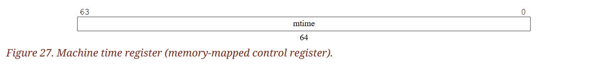

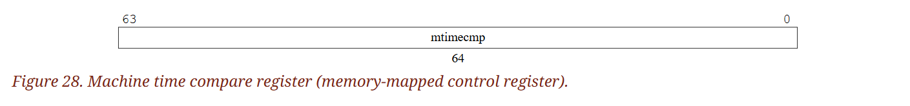

::: info  
這套 timer 的機制使用的是 wall-clock time，而不是 cycle counter，目的是支援現代處理器採用動態電壓與頻率調整（DVFS），透過時脈頻率高度變動的情況來節省能源

提供準確的實時時鐘（RTC）相對成本較高（需要石英或 MEMS 振盪器），而且即使系統其他部分關機時，它也必須持續運作，因此系統中通常只會有一個 RTC，並且位於與處理器不同的時脈/電壓的領域中。 因此，這個 RTC 必須被系統中所有的 hart 共用，對 RTC 的存取可能會產生電壓層級轉換與時脈領域切換的代價。 因此，將 `mtime` 設計為記憶體映射的暫存器，會比做成 CSR 更為自然

較低權限等級（如 S-mode 或 U-mode）沒有自己專屬的 `timecmp` 暫存器。 相對地，M-mode 的軟體可以透過將下一次的 timer 中斷時間寫入 `mtimecmp`，來實作任意數量的虛擬計時器

在簡單的固定頻率系統中，可以用同一個時鐘同時作為 cycle counting 與 wall-clock time 的依據  
:::

當 `mtime` 和 `mtimecmp` 之間的比較結果改變時，其變化最終一定會反映在 `MTIP` 上，但不一定會立即反映 

:::: info  
若一個中斷處理函式將 `mtimecmp` 加一之後立刻返回，可能會發生一次非預期（spurious）的 timer interrupt，因為在這之間 `MTIP` 可能還沒被清除。 所有軟體都應該假設可能會發生這種情況，但大多數軟體可以假設這種情況極為罕見。 與其持續輪詢（poll）`MTIP` 直到它清除，大多時候更有效率的做法是偶爾容忍一次 spurious timer interrupt

::: tip  
當更新 `mtimecmp` 的時候，有可能還沒等硬體取消中斷 pending 狀態（清除 `MTIP`），處理器就又跳回原本程式，結果觸發了額外一次中斷。 雖然這是「非預期」的行為，但不會造成致命問題，只要 handler 設計妥當即可。 這也是許多實時系統允許某些「假中斷」存在的原因  
:::  
::::

在 RV32 的系統中，每次對記憶體映射的 `mtimecmp` 寫入只能更新 64-bit 中的其中一個 32-bit 區段。 當系統是 RV64 的架構時，可以對 `mtime` 和 `mtimecmp` 暫存器進行 64-bit 自然對齊的記憶體存取，這些操作同時具備原子性（atomic）

以下這段程式碼示範在 RV32 的系統中如何正確設定一個 64-bit 的 `mtimecmp` 值，避免在寫入過程中產生中間狀態，進而觸發非預期的 timer interrupt。 假設系統採用 little-endian 且這些暫存器位於具有強順序保證的 I/O 區域中。 先將 `-1` 寫入 `mtimecmp` 的低 32 位元，能避免在設定過程中產生中間值，使 `mtimecmp` 短暫變得比原始值與新值中較小者還小，進而觸發非預期的 timer interrupt：

```asm
# New comparand is in a1:a0.
li t0, -1
la t1, mtimecmp
sw t0, 0(t1)     # No smaller than old value.
sw a1, 4(t1)     # No smaller than new value.
sw a0, 0(t1)     # New value.
```

::: tip  
有這種寫入順序是因為在 RV32 的架構中，一次只能寫入 32-bit，而 `mtimecmp` 是個 64-bit 的暫存器，這代表你必須分兩次寫入上下位元，這就會產生一個問題：

- 當你寫完低位（32-bit）但還沒寫完高位時，`mtimecmp` 會處於一個「不完整」的中間值
- 如果這個中間值剛好小於目前 `mtime` 的值，那麼硬體會誤判為「時間到了」，並觸發一個 timer interrupt

因此上面先把低位寫成了最大值（`-1 = 0xFFFFFFFF`）：這樣不管高位是什麼，整個 `mtimecmp` 都會暫時變成一個極大值，比 `mtime` 大很多，不會觸發中斷。 接著寫入高位（a1），如此暫存器就有了正確的高 32-bit，且低位還是 `0xFFFFFFFF`，整體仍然比 `mtime` 大。 最後再寫回真正的低位（a0），這樣就成功形成新的 `mtimecmp` 值了  
:::

`time` 這個 CSR 是 `mtime` 記憶體映射暫存器的唯讀鏡像（shadow）。 當 XLEN 為 32 時，`timeh` CSR 是 `mtime` 高 32 位元的唯讀鏡像，而 `time` 則對應 `mtime` 的低 32 位元。 當 `mtime` 改變時，這些變化最終一定會反映在 `time` 與 `timeh` 上，但不一定會立即反映

## 3.3. M-mode Privileged Instructions

### 3.3.1. Environment Call and Breakpoint

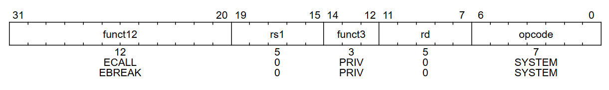

`ECALL` 指令用來向支援的執行環境提出請求。當它在 U-mode、S-mode 或 M-mode 中執行時，分別會觸發 `environment-call-from-U-mode`、`environment-call-from-S-mode` 或 `environment-call-from-M-mode` 的例外，指令本身不會執行任何其他操作

::: info  
`ECALL` 針對不同特權模式產生不同的例外，讓系統能夠選擇性地委派處理這些 environment call 例外。 以類 Unix 作業系統為例，常見的做法是將 `environment-call-from-U-mode` 例外委派給 S-mode 處理，而不委派其他類型  
:::

`EBREAK` 指令通常由除錯器使用，用來將控制權轉回除錯環境。 除非外部除錯環境另行接管，否則 `EBREAK` 會觸發一個 breakpoint 例外，並不執行其他任何操作

::: info  
如本手冊第 I 卷中 "C" 標準壓縮指令擴充所描述，`C.EBREAK` 指令的操作與 `EBREAK` 指令相同  
:::

`ECALL` 與 `EBREAK` 會將目標特權模式的 `epc` 暫存器設為該指令本身的位址，而不是下一條指令的位址。 由於 `ECALL` 與 `EBREAK` 所觸發的是同步例外（synchronous exception），因此它們不會被視為已完成（retired）的指令，也不應增加 `minstret` CSR 的計數

### 3.3.2. Trap-Return Instructions

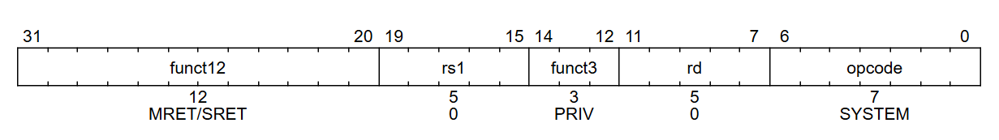

用來從 trap 返回的指令都被編碼在 `PRIV` 這個次分類的指令編碼範圍（minor opcode）

為了在處理完 trap 後返回原本的執行流程，每個特權層級都有各自的 trap return 指令：`MRET` 與 `SRET`。 其中系統一定要提供 `MRET`； 而若系統支援 supervisor mode，則也必須提供 `SRET`。 否則，執行 `SRET` 應該要觸發 illegal-instruction 例外。 當 `mstatus` 中的 `TSR` 位元為 1 時，執行 `SRET` 也應觸發 illegal-instruction 例外，如第 3.1.6.6 節所述

::: tip  
`TSR=1`（Trap SRET bit）表示不允許從 S-mode 使用 `SRET` 返回，因此也要觸發非法指令例外  
:::

`xRET` 指令可以在其對應的特權模式 `x` 或更高模式中執行。執行低特權模式的 `xRET` 指令時，會從暫存的中斷允許狀態與特權模式堆疊中回復（pop）相應的值。 若試圖在低於 `x` 的特權模式下執行 `xRET` 指令，則會觸發 illegal-instruction 例外。 除了如第 3.1.6.1 節所述操作特權堆疊之外，`xRET` 還會將 `pc` 設為對應 `xepc` 暫存器中儲存的位址

若系統支援 A 擴充（Atomic extension），則 `xRET` 指令可以清除任何未完成的 `LR` 位址保留，但不強制必須清除。 若 trap handler 需要清除保留，應該在執行 `xRET` 前明確地這麼做（例如透過執行一個假的 `SC` 指令）

::: tip  
在 RISC-V 的原子操作中，`LR`/`SC`（Load-Reserved / Store-Conditional）搭配使用，用來實作 atomic CAS 等功能。 `LR` 會建立一個地址保留區，之後的 `SC` 只有在這個區域沒有被其他 CPU 或 trap 影響過的情況下才會成功

問題是，如果中間發生 trap 而跳出該流程，這個保留區仍可能繼續存在。 這裡說的是：`xRET` 可以幫忙清掉這個保留，但不一定會清，因此如果你要保證清除，要自己在 handler 中用 `SC` 把它清掉，否則可能會造成之後的 `SC` 意外成功或失敗  
:::

:::: info  
如果 `xRET` 指令總是清除 `LR` 的保留，那麼就無法使用除錯器逐步執行 `LR`/`SC` 的序列了

::: tip  
如果 `xRET` 會自動清掉 `LR` 保留區，那麼開發者在用 debugger 單步執行程式時，每經過一次 trap 返回（例如中斷或除錯點），`SC` 就會失敗，因為 `LR` 的狀態每次都被清掉了  
:::  
::::

### 3.3.3. Wait for Interrupt

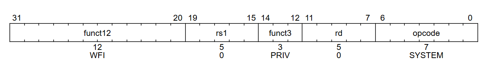

`WFI`（Wait for Interrupt）指令會通知硬體實作，目前這個 hart 可以暫停執行，直到有中斷可能需要被處理再回來繼續。 執行 `WFI` 也可以讓硬體平台知道，應優先將合適的中斷導向這個 hart。 `WFI` 可以在所有的特權模式中使用，也可以選擇性地開放給 U-mode 使用。 當 `mstatus` 中的 `TW` 位元為 1 時，執行這條指令可能會觸發 illegal-instruction 例外，如第 3.1.6.6 節所述

當 hart 處於暫停狀態時，只要有已啟用的中斷進入了 pending 狀態，或之後變為 pending 狀態，則由 interrupt trap 就會在 `WFI` 的下一條指令發生。 也就是說，執行會跳進中 interrupt handler，並將 `mepc` 設為 `pc + 4`

:::: info  
interrupt trap 會發生在 `WFI` 指令的下一條指令上，因此從 trap handler 簡單返回後，會繼續執行 WFI 之後的程式碼

::: tip  
這邊的 interrupt trap 指的是由 interrupt 觸發的 trap，其實我覺得可以直接寫成 interrupt，但它應該是想強調不是 exception 才這樣寫？

`WFI` 被視為「同步指令」，但不會馬上導致跳轉。 當中斷來了，硬體會讓 trap 發生在下一條指令，而不是打斷 `WFI` 這條指令本身，因此 `mepc` 指向的是 `WFI` 的下一條指令（`pc + 4`），這樣從 trap handler 返回後就可以直接繼續執行 `WFI` 之後的程式了  
:::  
::::

即使沒有任何啟用中的中斷變成 pending 狀態，實作上也允許在任何理由下離開 `WFI` 恢復執行。 因此，將 `WFI` 指令實作成一條 NOP（空指令）也是合法的

:::: info  
如果實作在執行 `WFI` 時沒有讓 hart 暫停，那麼中斷就會在 idle loop 中的某條指令上發生 trap，而從 handler 簡單返回後，idle loop 將會繼續執行

::: tip  
`WFI` 通常要搭配一個 idle loop 使用，以達到節省電量之類的效果，所以這邊才會提到 idle loop  
:::
::::

`WFI` 指令也可以在中斷被停用的情況下執行。 它的運作不應受到 `mstatus` 中全域中斷位元（`MIE`、`SIE`）或 `mideleg` 委派暫存器的影響，也就是說，只要有本地啟用的中斷變成 pending，即使該中斷已被委派到較低的特權模式，hart 仍必須恢復執行； 但它應該要尊重個別中斷的啟用狀態（例如 `MTIE`），換句話說若中斷已 pending 但尚未被個別啟用，實作應避免讓 hart 恢復執行。 無論各特權模式中的全域中斷啟用狀態為何，只要有本地啟用的中斷進入 pending，`WFI` 就必須恢復執行

如果喚醒 hart 的事件沒有導致 interrupt trap，則執行將從 `pc + 4` 繼續，這時軟體必須自行判斷接下來要做什麼，包括在沒有可處理事件時回到 `WFI` 繼續重複等待

::: tip  
不是所有喚醒都會跳進 trap handler，有些只是「喚醒但沒有中斷可處理」，此時 `WFI` 後的程式必須自己判斷狀況，例如查看 `mip` 或 `sip` 是否有有效中斷。 如果什麼都沒有，就可以 `jump` 回 `WFI`，形成 idle loop  
:::

:::: info  
允許在中斷停用時喚醒 hart，可以讓系統透過另一個進入點呼叫中斷處理程序，而不必儲存目前的執行狀態，因為這段狀態可以在執行 `WFI` 之前就被儲存或捨棄

::: tip  
意思是你可以預先儲存（或捨棄）上下文，再進入 `WFI`，之後喚醒時直接執行處理程式，而不需要進入 trap handler 做標準的上下文切換，以省下上下文保存開銷  
:::

由於實作可以將 `WFI` 實作為 `NOP`，軟體在 `WFI` 之後必須主動檢查是否有 pending 但尚未啟用的中斷，若沒有適合的中斷，應回到 `WFI` 繼續等待。 這可以透過查詢 `mip` 或 `sip` 暫存器來確認在 machine mode 或 supervisor mode 下是否有中斷存在

`WFI` 的運作不受中斷委派暫存器的設定影響。 `WFI` 的設計允許實作在執行該指令時，立即或延遲地進入較高特權模式，例如讓系統從目前狀態進入 machine mode，以進一步進入低功耗狀態

::: tip  
這是留給平台電源管理（power management）功能使用的設計彈性。 當系統看到 `WFI`，可能會選擇跳到 M-mode 中的某段程式碼來進行節能控制，例如關閉時鐘、進入睡眠模式等。 這可以用在支援 PMU（Power Management Unit）的 SoC 上  
:::

這種「等待事件」的指令模式也可以應用在未來的擴充，例如等待記憶體位置改變或等待訊息抵達  
::::

### 3.3.4. Custom SYSTEM Instructions

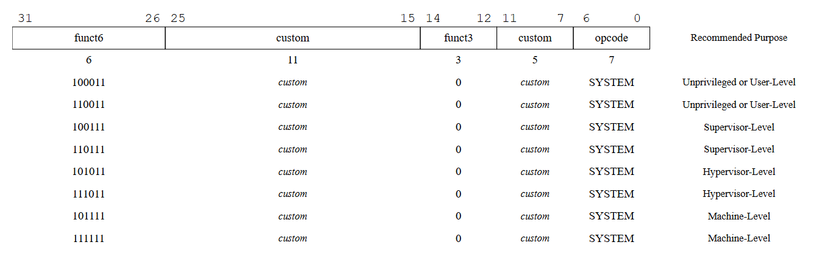

如圖 29 所示，`SYSTEM` 的 major opcode 的某個子區段被保留作為自訂用途。 標準建議這些自訂指令也使用第 29、28 位元來指定所需的最低特權模式，就像其他 `SYSTEM` 指令一樣

::: tip  
opcode 為 `1110011` 的指令屬於 `SYSTEM` 指令，你可以在 [RV32/64G Instruction Set Listings
](https://github.com/riscv/riscv-isa-manual/blob/main/src/rv-32-64g.adoc) 中直接搜尋 `1110011` 看看具體有哪些指令，最常見的如 `ECALL` 和 `EBREAK` 都是 `SYSTEM` 指令，還有 Zicsr Standard Extension 內的指令也都是  
:::

## 3.4. Reset

當系統重置（reset）時，每個 hart 的特權模式都會被設為 M-mode。 `mstatus` 暫存器中的 `MIE` 與 `MPRV` 欄位會被重設為 `0`。 若系統支援 little-endian 的記憶體存取，則 `mstatus` 或 `mstatush` 中的 `MBE` 欄位也會被重設為 `0`。 `misa` 暫存器則會被重設為啟用該實作支援的所有擴充指令集，如第 3.1.1 節所述。 若實作支援 "A" 標準擴充，則在重置後不會有任何有效的 load reservation（任何 `LR` 建立的保留狀態會在 reset 被清除）

程式計數器 `pc` 會被設為實作定義的重置向量位址。 `mcause` 暫存器會設為一個表示重置原因的值。 所有可寫的 PMP 暫存器中的 `A` 與 `L` 欄位會被重設為 0，除非平台對某些 PMP 暫存器的 `A` 或 `L` 欄位定義了不同的重設值。 若實作包含 hypervisor 擴充，則 `hgatp.MODE` 與 `vsatp.MODE` 欄位會被設為 0。 若實作包含 Smrnmi 擴充，則 `mnstatus.NMIE` 欄位會被設為 0。 若實作包含 Zicfilp 擴充，則 `mseccfg.MLPE` 欄位會被設為 0。 所有其他的 hart 狀態在重置後都為未指定（UNSPECIFIED）。 所有 WARL 欄位在重置後都不應包含非法值

::: tip  
這段說明當一個 RISC-V hart 被 reset 時它的各種暫存器和狀態應該被設為什麼。 重點摘要如下：

- 特權與中斷控制初始化
  - hart 一開始一定是 M-mode，這樣能保證從開機開始，OS 或 bootloader 有完整控制權
  - `MIE = 0`：中斷關閉
  - `MPRV = 0`：表示後續記憶體存取不會使用之前保存的特權模式
- 終端模式、擴充與大小端設定
  - 若支援 little-endian，`MBE = 0` 表示使用 little-endian
  - `misa` 設定為當前實作支援的最大指令集組合（A/I/M/F/D/V...等），但不是用來限制，而是用來反映硬體功能
  - `pc` 是重置後程式的起點，但具體位址由硬體廠商定義（實作定義）
- 關於原子操作與 load reservation
  - 若支援 "A"（atomic）擴充，任何 `LR` 建立的保留狀態會在 reset 被清除
- 安全與虛擬化
  - PMP（Physical Memory Protection）欄位 A（模式）與 L（lock）會清除為 0，避免上鎖狀態殘留
  - 若支援 hypervisor，`hgatp` / `vsatp`（虛擬記憶體管理暫存器）會重設為無效狀態
  - 若支援 Smrnmi（非 maskable 中斷），`NMIE` 會清除為 0，確保初始化時不會進入 NMI
  - 若支援 Zicfilp（code integrity control），`MLPE`（low privilege execution）會設為 0
- WARL 設定合法性
  - 所有 WARL（Write Any, Read Legal）欄位都必須包含一個合法值
- 其他狀態未定義
  - 除以上明確列出的暫存器外，所有其他狀態皆為未指定（UNSPECIFIED），即軟體不得依賴其初始值  
:::

`mcause` 暫存器在重置後的值由實作決定。 若實作不區分不同的重置情況，則應回傳 0。 若實作有區分不同的重置情況，則應僅在「最完整的重置」中回傳 0

::: info  
有些設計可能會有多種不同的重置原因（例如：開機重置、外部硬體重置、電壓過低、watchdog 超時、從睡眠模式喚醒等），而 M-mode 的軟體或除錯工具可能需要辨識這些原因

`mcause` 在 reset 時的取值可能會與同步例外發生時的 `mcause` 值重複。 但這種重疊不會造成混淆，因為 reset 時的 `pc` 通常會被設為與其他 trap 不同的位址  
:::

## 3.5. Non-Maskable Interrupts

不可屏蔽中斷（NMI）僅用於處理硬體錯誤情況，其會無視 hart 中斷啟用位元的狀態，立即跳躍至實作定義的 NMI 向量位址，於 M-mode 中執行。 `mepc` 暫存器會被寫入當時被中斷的指令的虛擬位址，而 `mcause` 則會被設定為一個表示該 NMI 來源的值。 由於如此，NMI 可能會覆寫當前 M-mode interrupt handler 中的暫存器狀態

::: tip  
NMI（Non-Maskable Interrupt）是一種特別的中斷，不能被遮蔽（mask）或關閉，即使 `MIE`、`SIE` 等中斷啟用位元是 0，也照樣會觸發。 它通常只用來處理致命的硬體錯誤，例如 ECC 錯誤、電源異常、clock fault 等

NMI 跳躍到的處理器程式碼位置是實作定義的向量（NMI vector），不同硬體平台可以有不同的設計。 即使當下已經正在執行 M-mode 的中 interrupt handler，NMI 還是可以強行進來並覆蓋（可能破壞）原本的 `mepc`、`mcause` 等狀態  
:::

NMI 所寫入的 `mcause` 值由實作決定。 `mcause` 的最高位元（Interrupt bit）應該被設為 1，以表明這是一個中斷。 Exception Code 的值 0 被保留用來表示「未知原因」，而那些不區分 NMI 來源的實作，應將 Exception Code 設為 0

與 reset 不同，NMI 不會重設處理器狀態，因此可以進行錯誤診斷、錯誤回報，甚至有可能限制硬體錯誤的影響範圍

## 3.6. Physical Memory Attributes

一個完整系統的實體記憶體映射包含了多個不同的位址範圍，其中有些對應到記憶體區段，有些則對應到記憶體映射的控制暫存器，而這些區段中有些可能是無法存取的。 某些記憶體區段可能不支援讀取、寫入或執行； 有些可能不支援 subword 或 subblock 存取； 有些可能不支援原子操作； 也有些區段可能不具備快取一致性或採用了不同的記憶體模型

記憶體映射的控制暫存器在存取寬度、是否支援原子操作、以及讀寫是否具有副作用（side effect）等方面也有所不同。 在 RISC-V 系統中，這些機器的實體位址空間中每個區段的屬性與能力，被稱為 physical memory attributes（PMAs）。 本節將說明 RISC-V 中 PMA 的術語，以及系統如何實作與檢查這些屬性

::: tip  
PMA 描述的是系統中每個實體記憶體位址區段的硬體屬性。 這些屬性會決定：

- 這個位址能不能讀寫或執行
- 是否能用 byte / halfword / word 存取
- 是否能執行原子操作（像 `AMO`, `LR`/`SC`）
- 是否有快取一致性（cache coherence）
- 存取時是否有副作用（例如某些控制暫存器寫入後會觸發硬體動作）

舉例來說：

- 一段 ROM 不能被寫入或執行原子操作
- 一段 I/O 暫存器可能只能支援 word 存取，且寫入會有副作用
- 某段記憶體可能只能用 uncached 模式存取

這些屬性就是 PMA，其是在系統設計時（chip、board 或 boot time）決定的，不像軟體設定的 PMP 或 page table 那樣可隨時變更  
:::

PMA 是底層硬體的內建屬性，在系統執行過程中通常不會變化。 與第 3.7 節所描述的實體記憶體保護（PMP）值不同，PMA 不會隨著執行環境的改變而改變。 某些記憶體區段的 PMA 是在晶片設計階段就固定下來的，例如內建的 ROM； 其他則是在電路板設計階段決定，例如取決於哪些裝置接到了晶片外部匯流排上

而外部匯流排所接的裝置可能在每次開機時都不一樣（cold pluggable），甚至可能在系統運行中做動態插拔（hot pluggable）。 也有些裝置可以在執行期間重新設定使用方式，而這也會間接改變其 PMA，例如某段內建的 scratchpad RAM，在某些應用中會被某顆核心以私有快取的方式存取，而在其他應用中則可能以共用、非快取的方式使用

::: tip  
- 晶片階段：像 ROM、SRAM 這種內建資源，PMA 是固定的
- 板子階段：看有接哪些 peripheral，例如 SPI Flash、DRAM、PCIe 裝置等等
- 熱插拔 / 冷插拔：像 USB 裝置、SD 卡這類，有可能在開機前或開機後連接，PMAs 也會變動
- 動態組態：某些硬體可以在 runtime 改變功能，如 SoC 裡的 RAM 既可以當快取、也可以關閉快取用作共享區域，這會讓同一段位址在不同情境下有不同 PMA  
:::

大多數系統都需要在指令執行流程後期（當實體位址已知時），由硬體動態地檢查某些 PMA，因為不是所有操作都能套用在所有實體記憶體位址上，而某些操作還需要知道當下 PMA 的組態設定。 在其他架構中，部分 PMA 通常會被指定在虛擬記憶體的 page table 裡，並透過 TLB 提供給 pipeline 參考，但這種做法會將與平台綁定的資訊注入虛擬化層中，若每個 page-table entry 沒正確初始化對應的屬性，可能會造成系統錯誤。 此外，page table 支援的頁面大小可能不適合描述實體記憶體中的屬性區段，導致位址空間碎裂，並浪費寶貴的 TLB 項目

在 RISC-V 架構中，PMA 的定義與檢查是由一個獨立的硬體元件稱為 PMA 檢查器（PMA checker）來負責的。 在許多情況下，各個實體位址區段的屬性會在系統設計階段就被確定，並且可以直接以硬體邏輯寫入 PMA 檢查器中。 若某些區段的屬性可於執行期間被調整，則平台可以提供對應的 memory-mapped 控制暫存器，依照各區段所需的粒度來設定這些屬性（例如：一段 on-chip SRAM 可根據應用需求靈活配置為可快取或不可快取區段）

對所有實體記憶體的存取操作，無論是否經過虛擬記憶體轉換（即使已完成虛實位址轉換），都必須進行 PMA 檢查。 為了輔助系統除錯，我們強烈建議在可行情況下，RISC-V 處理器需能對違反 PMA 的實體存取的動作進行精確的 trap

::: tip  
這邊的「精確」與 precise exception/interrupt 指的是同樣的意思。 在這邊表示當 trap 被拋出時，處理器保證：

- 在發生故障的指令之前，所有指令都已完全執行（retired）並更新了架構狀態
- 故障之後的所有指令都還沒有開始、或即使開始也沒有對架構狀態留下任何副作用
- 保存的程式計數器 (`PC`) 精確指向引發 trap 的那條指令（若 trap 是同步的）

換句話說，從軟體觀點來看，程式執行到發生 trap 的那條指令時就「暫停」下來了，之前的都算數、之後的都沒發生，好像在一條完美的順序化機器上執行一樣  
:::

這類精確的 PMA 違規會表現為指令、載入或儲存的 access-fault 例外，並與虛擬記憶體的 page-fault 例外有所區別。 不過，在某些情況下是無法做到精確的 trap 的，例如在存取某些舊式匯流排架構時，這些架構會將「存取失敗」視為裝置探測的一部分。 此時，來自周邊裝置的錯誤回應會以不精確的 bus-error 中斷來報告

::: tip  
PMA 不是軟體管理的資料結構（不像 page table），而是有獨立的硬體「PMA 檢查器」負責實體位址的屬性驗證。 由於絕大多數記憶體區段的屬性（可讀寫、可執行、可快取）在系統設計階段就已知，因此可以寫死在電路中（hardwire），但如果是執行期可組態的區段，像是 SRAM 分成 cacheable / uncacheable，用戶端就可以透過 memory-mapped registers 動態設定

所有實體記憶體的存取（包括已經經過虛擬地址轉換的）都會通過 PMA 檢查。 若違規（例如：對不支援原子操作的區段執行 AMO），理想情況下應該要精確地發出 trap，產生類似 access-fault 的例外（這不同於 page-fault，是完全實體層的錯）

但有些老舊的系統（legacy bus）沒辦法做到這麼精準，例如裝置探測時故意去「試探」不支援的地址，這種情況下就只好以不精確（imprecise）的 bus-error 中斷來報告  
:::

軟體也必須能讀取 PMA，以便正確存取特定裝置，或正確設定其他會存取記憶體的硬體元件（例如 DMA 引擎）。 由於 PMA 是與特定實體平台的結構密切綁定的，因此許多細節都具有平台特定性，軟體用來獲得 PMA 資訊的方式也同樣具有平台特定性。 某些裝置（尤其是老舊匯流排）無法提供 PMA 探測機制，因此若嘗試進行不被支援的存取，則會回應錯誤或逾時。 通常，平台特定的 M-mode 程式碼會負責解析 PMA，並最終將這些資訊以某種標準格式提供給較低權限層級的軟體

若平台支援動態重新配置 PMA，則會提供一個介面，讓使用者將屬性設定請求傳遞給 M-mode 的驅動程式，由其正確地重新配置平台。 例如，對某些記憶體區段切換其快取屬性時，可能會涉及平台特定的操作（例如快取清除），而這些操作只有在 M-mode 下才能執行

### 3.6.1. Main Memory versus I/O Regions

判斷一段記憶體位址範圍最重要的依據是：它是否屬於一般主記憶體，還是屬於 I/O 裝置。 標準有規定一些一般主記憶體需要符合的屬性（後文會詳述），而 I/O 裝置則可以具有更廣泛的屬性。 那些不符合一般主記憶體定義的記憶體區段（例如裝置專用的 scratchpad RAM）會被歸類為 I/O 區段

::: info  
在早期版本的規格中，所謂的 vacant regions（空區段）已不再是獨立分類； 現在會將它們描述為「不可存取的 I/O 區段」（也就是不具備讀、寫、或執行權限的 I/O 區段）。 同樣地，主記憶體區段若無法被存取也是被允許的  
:::

### 3.6.2. Supported Access Type PMAs

Access type（存取類型）會定義系統支援哪些存取寬度，從 8-bit 的 byte 到多個 word 組成的長度較大的 burst 存取，並且也會指定每種寬度是否支援未對齊的存取

::: info  
雖然執行於 RISC-V hart 上的軟體無法直接對記憶體產生 burst 存取，但軟體可能需要設定 DMA 引擎以操作 I/O 裝置，因此仍需要知道系統支援哪些存取大小  
:::

主記憶體區段一定要支援連接裝置所需的所有存取寬度的讀寫操作，此外也可以指定是否支援 instruction fetch

:::: info  
某些平台可能規定主記憶體的所有區段都必須支援 instruction fetch，而其他平台則可能禁止從某些主記憶體區段做 instruction fetch

::: tip  
這是 platform-specific 的行為，像一般電腦系統，幾乎所有 DRAM 區段都允許程式碼執行； 但在嵌入式或安全性需求高的系統中，有些區段可能專門用來做資料暫存，不允許被當成可執行區  
:::

在某些情況下，處理器或裝置雖然支援其他的存取寬度，但它們仍必須能夠以主記憶體所支援的類型正常運作

::: tip  
比如某 CPU 支援 128-bit 存取，但該系統的主記憶體僅支援 64-bit 寬度。 此時 CPU 必須降級操作（可能透過兩次 64-bit 存取）來配合記憶體的特性  
:::  
::::

I/O 區段可以指定它支援哪些資料寬度的讀、寫或執行組合。 對於採用 page-based 的虛擬記憶體的系統，I/O 區段與記憶體區段可以進一步指定它們是否支援硬體進行 page-table 的讀寫操作

::: tip  
如果硬體需要走 page-table（例如 MMU 執行 page walk），它就必須能讀取 page table 所在的記憶體。 但某些區段（例如 I/O）可能不允許硬體自動進行 page-table 操作，因此系統設計上需在記憶體屬性中明確指定是否允許 page walk 涉及這段區域  
:::

::: info  
類 Unix 的作業系統通常會要求所有可快取的主記憶體區段都必須支援 page-table walk  
:::

### 3.6.3. Atomicity PMAs

Atomicity 類型的 PMA（實體記憶體屬性）會描述某段位址區域支援哪些原子性操作指令。 對於原子指令的支援可以分為兩大類：`LR`/`SC`（Load-Reserved/Store-Conditional）與 `AMOs`（Atomic Memory Operations）

::: info  
有些平台可能會規定，所有可快取的主記憶體區段都必須支援 attached processors 所需的所有原子操作  
:::

#### 3.6.3.1. AMO PMA

在 AMO（Atomic Memory Operation）中，支援程度可以分為四個等級：AMONone、AMOSwap、AMOLogical 與 AMOArithmetic

- AMONone 表示該記憶體區段不支援任何 AMO 指令
- AMOSwap 表示只支援 `amoswap` 指令
- AMOLogical 表示除了支援 `amoswap` 外，也支援所有邏輯型 AMO 指令（如 `amoand`, `amoor`, `amoxor`）
- AMOArithmetic 則表示支援 RISC-V 所有的 AMO 指令

對於每個支援等級，只要底層記憶體區段支援該寬度的讀寫操作，就支援該寬度的自然對齊 AMO。 主記憶體與 I/O 區段可以只支援處理器所支援的原子操作中的一部分，或甚至完全不支援

::: info  
建議在可能的情況下，I/O 區段至少提供 AMOLogical 的支援
:::

<span class = "center-column">

| AMO Class       | Supported Operations                                                                      |
|----------------|--------------------------------------------------------------------------------------------|
| AMONone        | *None*                                                                                     |
| AMOSwap        | `amoswap`                                                                                  |
| AMOLogical     | above + `amoand`, `amoor`, `amoxor`                                                        |
| AMOArithmetic  | above + `amoadd`, `amomin`, `amomax`, `amominu`, `amomaxu`                                 |

（Table 17. Classes of AMOs supported by I/O regions.）

</span>

#### 3.6.3.2. Reservability PMA

對於 `LR`/`SC`（Load-Reserved / Store-Conditional）操作，有三種支援等級，反映記憶體區域對「可保留性（reservability）」與「最終成功性（eventuality）」的支援組合：RsrvNone、RsrvNonEventual、與 RsrvEventual

- RsrvNone 表示該區段不支援任何 `LR`/`SC` 操作（這個位置無法保留）
- RsrvNonEventual 表示支援 `LR`/`SC` 操作（位置可保留），但不保證按照非特權 ISA 規範中所述的「eventual success」執行
- RsrvEventual 表示支援 `LR`/`SC`，並且保證最終成功，如 ISA 規範所述

::: info  
我們建議主記憶體區段在可能的情況下應該提供 RsrvEventual 等級的支援。 大多數 I/O 區段不會支援 `LR`/`SC` 存取，因為這類操作通常需要建構在快取一致性（cache-coherence）的機制上，但有些 I/O 區段可能支援 RsrvNonEventual 或 RsrvEventual

當軟體在支援等級為 RsrvNonEventual 的記憶體位置上使用 `LR`/`SC` 操作時，若偵測到操作無法順利進行，應提供替代的備援機制  
:::

### 3.6.4. Misaligned Atomicity Granule PMA

misaligned atomicity granule 這種 PMA 提供對「未對齊 AMO」的有限支援。 若系統有定義這項 PMA，則會指定一個 misaligned atomicity granule 的大小，這個大小是「自然對齊的 2 的冪次方位元組數」。 支援的值以 `MAGNN` 表示，例如 `MAG16` 表示此 granule 的大小至少為 16 個位元組

::: tip  
granule 是「最小單位」的意思。 misaligned atomicity granule 就是 允許 misaligned 原子性操作的最小對齊區塊大小。 舉例來說，若平台支援 MAG16（也就是 16 bytes granule），那代表只要你這次的記憶體操作「所有被存取的 byte 都落在同一個 16-byte 區塊內」，那麼就可以：

- 不用強制對齊
- 可以保證原子性

因為 MAG 是「自然對齊、2 的次方大小」的單位，`MAG16` 就是每 16 bytes 一個區塊，而這些區塊會以自然對齊方式切開：

- 第 1 個 granule 是從 0x00 開始，到 0x0F（共 16 個位元組）
- 第 2 個 granule 是從 0x10 開始，到 0x1F
- 第 3 個 granule 是從 0x20 開始，到 0x2F
- 以此類推，每次跳 16 個 bytes

此時如果你的 AMO、load/store 指令存取的是落在同一個 granule 內的位元組，例如你用了 0x03 ~ 0x0A（8 bytes），那就會有上面的保證； 但如果跨了不同的 granule，例如 0x0B ~ 0x12，那就不行  
:::

misaligned atomicity granule 這項 PMA 僅適用於：基本 ISA 所定義的 AMO、load 與 store 指令，以及在 F、D、Q 擴充中定義的、大小不超過 XLEN 的 load 與 store 指令。 如果這些指令所存取的所有位元組都落在同一個 misaligned atomicity granule 內，該指令就不會因位址未對齊而觸發例外，而且就 RVWMO 記憶體一致性模型而言，這筆操作會視為一個原子性的記憶體操作

若某個未對齊 AMO 存取了一段未定義 misaligned atomicity granule PMA 的區域，或是存取的位元組未全部落在同一個 granule 內，那麼該指令就會觸發 exception。 對於一般的 load 與 store 指令，若存取這類區域或其位元組跨越了多個 granule，也可能會觸發例外，或者雖然操作成功但不保證具備原子性。 某些平台會在這類情況下觸發 access-fault，而不是 address-misaligned exception，代表該指令不應被 trap handler 模擬

::: tip  
RISC-V 的設計哲學是「軟體可替代硬體」，所以理論上，如果處理器不支援某個行為，它可以拋出 trap 交給 OS 用軟體模擬完成這個行為。 這也是為什麼有 alignment fault：這是一個可以透過 trap 轉交給 OS 做的事，例如 Linux 中就有 [`do_trap_load_misaligned`](https://elixir.bootlin.com/linux/v6.15.6/source/arch/riscv/kernel/traps.c#L242) 來處理

所以這邊特別提說是 access-fault 而不是 address-misaligned exception，就是想強調這條指令連模擬都不允許，整條根本不合法。 這種情況常發生在：

- 特定記憶體區域（像是 memory-mapped I/O）根本不接受這種存取方式
- 這筆存取跨越了 atomic granule（例如你用 AMO 指令跨過了 MAG16 邊界）
- 平台設計時就不打算支援某些 misaligned 行為，連模擬都不提供  
:::

::: info  
- `LR`/`SC` 指令不受此 PMA 影響，因此只要未對齊就一定會觸發例外
- 向量記憶體存取（vector memory access）也不受影響，即使位元組落在同一個 granule 裡，也不保證具有原子性
- 隱式的記憶體存取（implicit accesses） 同樣不受此 PMA 影響  
:::

### 3.6.5. Memory-Ordering PMAs

位址空間的區域會被分類為「主記憶體」或「I/O」其中一種，這是為了讓 FENCE 指令以及原子指令的排序位元能進行正確的存取順序控制

某個 hart 對主記憶體區域的存取，不僅可被其他 harts 觀察到，也可被能存取主記憶體的其他裝置（如 DMA 引擎）觀察到。 具一致性的主記憶體區域必定符合 RVWMO 或 RVTSO 記憶體模型； 而不具一致性的主記憶體區域則使用實作自定的記憶體模型

某個 hart 對 I/O 區域的存取，不僅可被其他 harts 與匯流排仲裁（Bus mastering）觀察到，也可被目標 I/O 裝置觀察到。 I/O 區域可使用「鬆散順序（relaxed ordering）」或「強順序（strong ordering）」來存取。 使用 relaxed ordering 的 I/O 區域，其存取順序的觀察方式大致上類似於 RVWMO 的主記憶體存取行為（詳見 Volume I 附錄中的 I/O Ordering 節）。 相反地，使用 strong ordering 的 I/O 區域，其存取順序通常會以程式碼中的原始順序被其他 hart 與匯流排仲裁觀察到

每個強順序的 I/O 區域會指定一個有編號的「順序通道（ordering channel）」，這是用來在不同 I/O 區域間提供順序保證的機制。 通道 0 表示僅限「點對點（point-to-point）」的強順序，即僅對該 hart 存取的單一 I/O 區域提供強順序

通道 1 用來在所有 I/O 區域之間提供「全域強順序」。 任何 hart 對 channel 1 所屬的 I/O 區域的存取，對所有其他 harts 與 I/O 裝置來說，都只能以程式順序來觀察。 這個順序性甚至延伸到該 hart 對 relaxed I/O 區域或不同 channel 編號的強順序 I/O 區域的存取。 換句話說，對 channel 1 區域的每次存取等價於在該指令前後各執行一次 `fence io, io` 指令

其他更大的通道編號則用來保證該 hart 對所有具有相同通道編號的 I/O 區域之存取操作會依照程式順序執行。 系統也可以支援對每個記憶體區域的順序屬性進行動態配置

::: tip  
「順序通道（ordering channel）」是一種軟體可觀察的抽象概念，用來控制跨區域的順序行為

- Channel 0 適用於單一 hart 和單一 I/O 裝置之間，只要這條通訊通道本身是 in-order 的就能提供強順序
- Channel 1 代表一種全域的 ordering 設定。 比起 channel 0，這種設定更嚴格，能保證所有觀察者都會看到完全一致的順序。 它模擬出「每次 I/O 操作都用 `fence io,io` 包起來」的效果，但不需要實際寫出指令
- 其他 channel 允許彈性地將一組 I/O 區域綁定為同一 ordering domain，讓它們之間的操作順序一致。 這適用於需要一致性但不需要全域順序的中間需求場景，例如某些子系統內部的 I/O

實作上可以在執行階段變更一個區域的 ordering 行為，例如透過某些 CSR 或 MMU 屬性去修改，以支援不同作業系統或不同的驅動等  
:::

:::: info  
強順序可以用來提高與舊版裝置驅動程式的相容性，或者在已知系統不會進行重排序的情況下，取代顯式地插入順序指令，以提高效能

本地強順序（通道 0）是預設的強順序形式，因為當 hart 與 I/O 裝置之間只有單一路徑且具備順序性時，實作上通常比較簡單。 一般來說，若多個強順序 I/O 區域共用同一條不會重排序的互連通道，它們就可以共用相同的順序通道編號，而無需額外的順序硬體

::: tip  
老舊驅動程式可能假設 I/O 操作一定是有順序的，因此提供強順序有助於相容。 而當硬體本身保證了順序，也可以藉由設定區域屬性來避免不必要的 `fence` 指令，提高效能

而通道 0 被當作預設是因為它不需要額外邏輯就能實作，只要 CPU 和 I/O 間的傳輸不會重排序即可。 而最後一句話是指，只要這些 I/O 裝置共用的是不重排序的傳輸路徑（例如某個總線或 bridge），那麼這些區域可以用同一個 channel 來標示順序行為，無須為每個區域單獨加硬體來維持順序  
:::  
::::

### 3.6.6. Coherence and Cacheability PMAs

一致性（Coherence）是針對單一實體位址定義的屬性，它表示：由某個 agent（處理器或裝置）對該位址的寫入，最終會被系統中其他具一致性支援的 agent 所看到。 一致性不應與記憶體一致性模型（memory consistency model）混淆，後者定義的是：在整體記憶體系統中，某次讀取操作在給定過去讀寫歷史的前提下，可能讀出哪些值。 在 RISC-V 平台中，不鼓勵使用硬體不具一致性（hardware-incoherent）的區域，因為它可能會增加軟體複雜度、降低效能並增加能耗

::: tip  
- Coherence：針對「單一實體位址」的保證：不同 agent（如 CPU、DMA）對某個位址所看到的值最終會一致。 換句話說就是「我寫了某地址，其他人最終會看到這個值」
- Consistency Model：針對「所有記憶體操作的順序語義」而定義的：當有多個記憶體操作時，從不同 agent 的觀點來看，它們看到的結果可能會不一樣，這由系統定義的 memory model（如 RVWMO、TSO、SC）來規範

舉例來說：

- Coherence 關注點：若 Core A 寫入地址 `0x80000000`，Core B 是否最終也會看到該值？
- Consistency 關注點：如果 Core A 分別寫入 x 和 y，Core B 會先看到哪個？ 這涉及整體順序問題  
:::

記憶體區域是否可被快取（cacheable），不應影響軟體對該區域的看法，除了那些已反映在其他 PMA 中的差異，例如主記憶體與 I/O 的分類、記憶體順序行為、支援的存取方式與原子操作，以及一致性等。 因此，我們將「快取性（cacheability）」視為僅由 machine-mode 軟體所管理的平臺層級設定

::: tip  
「是否可快取」不應該被應用層或 S-mode 軟體看到的記憶體語意所影響。 換句話說，就算改變了快取設置，只要其他 PMA 不變，程式就不應該觀察到不同行為  
:::

若平台支援對某個記憶體區域的快取性進行設定，則其會透過平台專屬的 machine-mode 例程來改變該設定，並在需要時清空快取。 如此一來，系統僅會在變更快取性設定的過渡期間處於不一致的狀態，這段過渡狀態對較低特權等級（如 S-mode 或 U-mode）來說應不可見

::: tip  
當平台支援動態切換 cacheable/un-cacheable 時，其必須由 M-mode 控制（例如透過自定義 CSR 或 page table 屬性）。 切換時需要：

- flush cache，以清除舊資料（避免資料遺毒）
- 確保該區域所有 agent 的視角保持一致（例如 I/O 裝置與 CPU cache 的一致性）

但此過渡期不該讓 OS 或 user-mode 程式感知到，以維持程式語意一致性與安全性，並避免產生 race condition  
:::

:::: info  
對於沒有被任何 agent 快取的共享記憶體區域，一致性的實現非常簡單。 這類區域的 PMA 只需指出「該區域不應被快取到任何私有或共享的快取中」即可。 換句話說，既然大家都不快取這個區域，那麼所有讀寫都會直接走主記憶體，不會發生快取副本不一致的情況

對於唯讀區域，一致性也很容易保證。 因為多個 agent 可以安全地快取這些資料而無需使用快取一致性機制。 這類區域的 PMA 會標示它是可快取的，但不支援寫入操作

某些可讀寫的區域可能僅會被單一 agent 存取，這種情況下，該 agent 可以將其私下快取，而無需使用一致性機制。 這類區域的 PMA 會表示它是可快取的。 這些資料也可以存放於共享快取中，因為其他 agent 不應存取這個區域

若某個 agent 快取了某個可讀寫的區域，而該區域又可以被其他 agent 存取（不論他們是否有快取它），那就必須使用某種快取一致性機制，以避免讀取到過時的資料（stale values）。 在不具硬體快取一致性的區域中，快取一致性可以完全由軟體實現。 但軟體一致性機制難以正確實作，且由於必須保守地清除快取，往往會嚴重影響效能。 硬體快取一致性機制雖然需要更複雜的硬體，並可能因一致性探測（probe）而略微影響效能，但對軟體而言則是完全透明的

::: tip  
當 A 核心寫入某資料，B 核心也能讀寫該資料，且其中有快取，那就必須做同步：

- 硬體實作： 如 MESI / MOESI 協議，會透過 snooping 或 directory-based coherence 維護一致性
- 軟體實作： OS 需手動執行 fence、flush、invalidate，管理複雜、且容易出錯

硬體一致性較快但成本高，軟體一致性可省硬體但犧牲效能與穩定性  
:::

對於每個支援硬體快取一致性的區域，PMA 會指出該區域具備一致性，並標示系統應使用哪個快取一致性控制器（若系統中存在多個）。 在某些系統中，一致性控制器可能是一個較外層的共享快取，而該快取可能又進一步存取更外層的快取一致性控制器，形成階層式架構

::: tip  
在多層快取系統中（如：L1 → L2 → LLC），可能存在多層次的 coherence domain，某些區域可能僅需 L2 coherence，有些則可能須要穿越 NUMA node 與 LLC coherence

而 PMA 中會指定哪個區域是 coherent 的，還有其對應的 coherence controller  
:::

在同一個平台中，大多數記憶體區域對軟體而言都是一致的，因為這些區域會被固定設為：未快取、唯讀、硬體快取一致，或僅由一個 agent 存取  
::::

若某個 PMA 標示該區域為不可快取的，則對該區域的存取必須直接由記憶體本體提供，不由任何快取提供

:::: info  
對於具備快取控制機制的實作而言，可能會出現這樣的情況：程式對某個目前存在於快取中的位址進行了非快取存取（uncacheable access）。 在這種情況下，必須忽略該快取副本，這樣的限制是為了避免更高特權模式的投機性快取填充（speculative cache refill）影響到較低特權模式對不可快取區域的存取行為

::: tip  
高權限模式（如 M-mode）可能提前預取某些資料進 cache。 若 U-mode 指定 uncacheable 地存取這些位址，就不能從 cache 回應  
:::  
::::

### 3.6.7. Idempotency PMAs

Idempotency PMA（冪等性物理記憶體屬性）描述某個位址區域的讀寫操作是否具備冪等性。 通常主記憶體區域會被假設為具冪等性。而對於 I/O 區域，讀與寫的冪等性可以分別指定（例如：讀取是冪等的，但寫入不是）。 如果某區域的存取操作是非冪等的，也就是說每次讀取或寫入都可能產生副作用，那麼就必須避免 speculative（推測性）或 redundant（重複性）存取

::: tip  
冪等性（Idempotency）指的是多次對同一個位址做同樣操作，其結果（或副作用）是否與只執行一次相同，例如：

- `read(x)` 多次 → 結果一致，無副作用 ⇒ 冪等
- `write(x, v)` 多次 → 覆蓋相同資料，結果相同 ⇒ 冪等

非冪等範例：

- 讀取 I/O 裝置的資料會導致狀態改變（如：UART 資料輸出隊列被清空）
- 寫入某些裝置暫存器會觸發硬體事件

在這種非冪等區域中：

- 推測性（speculative）存取：CPU 為了提早準備資料而偷偷讀或寫
- 重複性（redundant）存取：例如 loop unrolling、store forwarding 造成額外的記憶體動作

這些都可能觸發副作用，所以在這些 PMA 上必須完全禁止  
:::

在定義冪等性 PMA 時，由重複存取所造成的「可觀察記憶體順序變化」不被視為副作用

:::: info  
雖然在設計硬體時應避免對非冪等區域進行推測性或重複性存取，但同樣也需要確保軟體或編譯器最佳化不會對這些區域產生虛假的存取操作

非冪等區域可能不支援未對齊存取（misaligned access）。 對這些區域進行未對齊存取時，應該觸發 access-fault（存取錯誤）例外，而不是 address-misaligned（位址未對齊）例外。 這樣的設計意圖是告訴軟體不要用多次小型存取來模擬未對齊操作，因為這可能會導致意料之外的副作用

::: tip  
正常情況下，對 `misaligned` 存取（如：讀 32-bit 但位址不是 4-byte 對齊）會產生 `misaligned` 例外。 但在非冪等區域中，這樣的處理不夠安全，多次小讀/寫可能各自有副作用（如多次讀取 UART），因此標準建議直接報 access-fault，拒絕了這種模擬行為  
:::  
::::

對於非冪等區域，不得提前或以推測方式進行隱式讀寫（implicit reads/writes），但以下情況例外：

- 當執行非推測性的隱式讀取時，實作允許額外讀取該讀取位址所在的自然對齊的 2 的次方大小區域內的其他位元組
- 當執行非推測性的指令抓取（instruction fetch）時，實作允許額外讀取下一個相同大小的自然對齊 2 的次方區域（位址以 2<sup>XLEN</sup> 為模）。 這些額外的讀取結果可用來滿足之後的提前或推測性隱式讀取。 這些自然對齊的 2 的次方區域大小由實作決定，但在使用 page-based 的虛擬記憶體系統中，其大小不得超過最小支援的頁面大小

::: tip  
複習一些的背景知識：
- 隱式存取：CPU 在執行一條顯式指令之外，自動完成的讀／寫動作，如
  - 指令抓取（IF stage）
  - TLB walk 讀 page table
  - 系統軟體寫 CSR 造成的 Side‐effect
- 推測性存取：CPU 為了提早準備資料，在還不確定最終需要之前就先行存取，如
	- 分支預測走錯路時抓的 cache line
  - 亂數 prefetcher 拉進來的資料
- 提前（non-speculative early）存取：這筆存取肯定會用到，但時間點被硬體提早（如合併、重排序）	，如
  - Cache 把兩次貼近的讀合成一次 burst

但在非冪等區域中，如果 CPU「多做一次」讀/寫，就可能重複觸發副作用（例如重設裝置、向 FIFO 讀走新數據）。 所以原則上是不准做「多餘」地存取，但由於

- 現代處理器基本單位是 cache line/burst  
  一次 8 bytes 的讀對硬體來說其實會帶回整條 32 bytes/64 bytes 的 line； 禁止額外位元組會使需要硬體額外做貴得多的窄總線存取
- 指令抓取 pipeline 需要前瞻  
  若只能抓恰好 4 bytes 指令，頻寬利用率極低。 而多抓「下一塊」可填 FIFO，仍屬非推測性（因為程式計數器必然會走過去）

因此規格允許「一次合法讀」→「順手再抓同一對齊區塊或下一塊」，但只能在確定需要的那一刻（非推測性）才做，且區塊大小有限制  
:::

## 3.7. Physical Memory Protection

為了強化安全性並隔離錯誤，理想的作法是限制同一顆 hart 上的軟體可存取的實體位址範圍。 選配的 PMP（physical memory protection）單元為每顆 hart 提供了 machine-mode 控制暫存器，可針對每個實體記憶體區域指定讀、寫、執行的權限。 PMP 的權限檢查會與第 3.6 節描述的 PMA 檢查並行進行

PMP 權限設定的粒度（region size）隨平台而異； 標準編碼可支援最小 4 byte 的區段。 一些區域的權限也可以被硬體「焊死」，例如某些位址範圍可能只能由 M-mode 存取，永遠不會向較低特權層開放

::: info  
各種平台對「實體記憶體保護」的需求差異極大，因此有些平台可能會增補或替換本節介紹的 PMP 機制，使用其他形式的保護結構  
:::

PMP 檢查適用於所有「有效特權模式」為 S 或 U 的存取，例如：

- S/U 模式的指令抓取與資料存取
- 當 `mstatus.MPRV=1` 且 `mstatus.MPP` 指向 S 或 U 時，M-mode 代其他模式執行的資料存取
- page table 的遍歷（其有效模式為 S）

平台還能讓 PMP 進一步套用到 M-mode 的存取（可選），此時 PMP 暫存器會被鎖定，除非重新上電，否則連 M-mode 軟體也無法修改。 簡單來說，PMP 可以「給」原本沒有權限的 S/U 模式存取能力，也可以「拿走」原本全能的 M-mode 權限

任何違反 PMP 地操作都會在處理器端「精確地」觸發例外

::: tip  
- PMA 面向「硬體性能與正確性」，像是快取、對齊、總線序等物理屬性。 可能在匯流排仲裁器/MMC/AXI slave 等裡面硬編，對軟體完全透明
- PMP 則面向「安全與隔離」，像是哪個 privilege、哪段程式能碰哪塊記憶體等。 做在每顆核內的 CSR + 比較器，與核心 pipeline 同步，比較容易標準化  
:::

### 3.7.1. Physical Memory Protection CSRs

每一個 PMP 項目由一個 8 位元的組態暫存器（configuration register）與一個 MXLEN 位元的位址暫存器（address register）描述

- 有些 PMP 設定可能會使用「前一個 PMP 項目」的位址暫存器
- 架構最多支援 64 個 PMP 項目。 實作可以選擇提供 0、16 或 64 個項目，但必須從編號最小的項目開始實作
- 所有 PMP 相關的 CSR 欄位都是 WARL，也可能是唯讀的零
  - 這些 CSR 只允許 M-mode 存取

為了減少行程切換的開銷，PMP 的組態暫存器會被緊密地打包進 CSR：

- 在 RV32 中，使用 16 個 CSR（`pmpcfg0` ~ `pmpcfg15`）來存放 `pmp0cfg` ~ `pmp63cfg` 這 64 個 PMP 設定，如圖 30 所示
- 在 RV64 中，使用 8 個偶數編號的 CSR（`pmpcfg0`、`pmpcfg2` ... `pmpcfg14`） 來存放跟上方一樣的 64 組 PMP 設定，如圖 31 所示
- 在 RV64 中，奇數編號的組態暫存器 `pmpcfg1`、`pmpcfg3` ... `pmpcfg15` 是非法的（不存在）

::: info  
在 RV64 中，項目 `8` ~ `15` 的組態存放於 `pmpcfg2`（而不是 `pmpcfg1`）。 這樣的設計可降低同時支援不同 MXLEN（32 與 64 位元）時的成本，因為在 RV32 與 RV64 裡，項目 `8` ~ `11` 的設定都位於 `pmpcfg2` 的低 32 位元（bits 31:0）  
:::

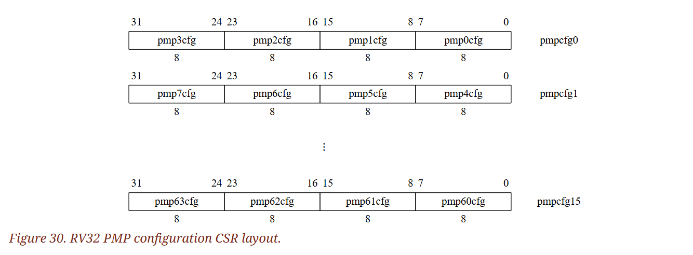

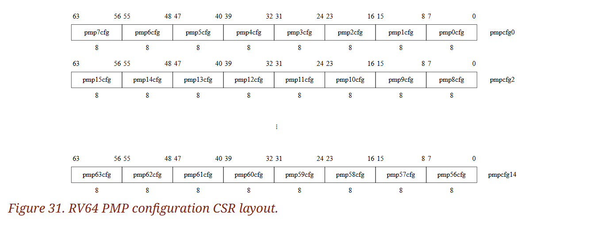

PMP 位址暫存器為 CSR，名稱為 `pmpaddr0` ~ `pmpaddr63`：

- 在 RV32 中，每一個 `pmpaddr` 暫存器對應到 34 位元實體位址的第 33:2 位（如圖 32）
- 在 RV64 中，每一個 `pmpaddr` 暫存器對應到 56 位元實體位址的第 55:2 位（如圖 33）

由於部分實體位址位元可能未實作，因此 `pmpaddr` 為 WARL 欄位

::: tip  
位址暫存器用來保存「這一條 PMP 項目要保護的實體位址範圍」，讓硬體在執行階段能快速判斷某次存取是否落在受限區域內，具體編碼方式見後方章節  
:::

::: info  
第 12.3 節介紹的 Sv32 page base 虛擬記憶體方案在 RV32 上支援 34 位元的實體位址，因此 PMP 也必須支援超過 XLEN 位元的位址寬度。 第 12.4 與 12.5 節介紹的 Sv39 與 Sv48 則支援 56 位元實體位址，因此 RV64 的 PMP 位址暫存器亦以 56 位元為上限  
:::

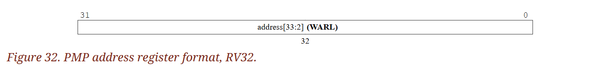

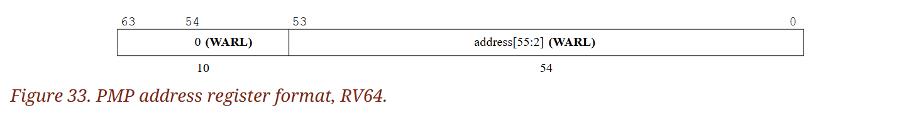

圖 34 顯示了 PMP 組態暫存器的格式：

- 如果設置了 `R`、`W`、`X` 位，其分別表示該 PMP 項目允許讀取、寫入、指令執行
- 任一位清零，即代表拒絕對應的存取型別
- `R`、`W`、`X` 合起來是一個 WARL 欄位； 其中 `R = 0` 且 `W = 1` 的組合保留不使用

另外兩個欄位 `A` 與 `L` 會在後續小節說明

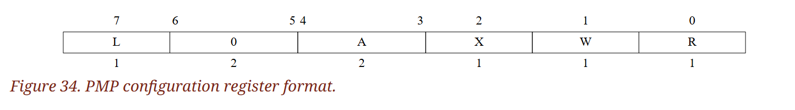

- 若嘗試從未獲得執行權限的 PMP 區域抓取指令，處理器會拋出 instruction access-fault 例外
- 若執行 load 或 load-reserved 指令去存取一個無讀取權限的 PMP 區域，會拋出 load access-fault 例外
- 若執行 store、store-conditional 或 AMO 指令去存取一個無寫入權限的 PMP 區域，則會拋出 store access-fault 例外

::: tip  
這些 fault 都是精確例外，`pc` 會停在造成違規的那條指令，方便作業系統處理  
:::

#### 3.7.1.1. Address Matching

PMP 組態暫存器中的 `A` 欄位用來編碼對應 PMP 位址暫存器的位址比對模式，其編碼如表 18

- 當 `A = 0` 時，該 PMP 項目被停用，不會對應任何位址
- 另外還支援兩種模式：
  - 自然對齊的 2 的冪次範圍（naturally aligned power-of-2 regions，簡稱 NAPOT），其中包含特殊個案 NA4（自然對齊的 4 位元組範圍）
  - 任意範圍的上界（top boundary of an arbitrary range，簡稱 TOR）
  - 這些模式都可達到 4 byte 的粒度

<span class = "center-column">

| A | Name  | Description                                      |
|---|-------|--------------------------------------------------|
| 0 | OFF   | Null region (disabled)                           |
| 1 | TOR   | Top of range                                     |
| 2 | NA4   | Naturally aligned four-byte region               |
| 3 | NAPOT | Naturally aligned power-of-two region, ≥8 bytes  |

（Table 18. Encoding of A field in PMP configuration registers）

</span>

::: tip  
位址暫存器並不一定是直接存著一段位址範圍，其會利用 `A` 欄位來表示：「這顆位址暫存器如何描述一段範圍？」，然後再依規則把位址範圍解析出來  
:::

NAPOT 會利用相關的位址暫存器的低位元來編碼其區域大小，如表 19 所示：

<span class = "center-column">

| pmpaddr           | pmpcfg.A | Match type and size                |
|-------------------|----------|------------------------------------|
| yyyy...​yyyy       | NA4      | 4-byte NAPOT range                 |
| yyyy...​yyy0       | NAPOT    | 8-byte NAPOT range                 |
| yyyy...​yy01       | NAPOT    | 16-byte NAPOT range                |
| yyyy...​y011       | NAPOT    | 32-byte NAPOT range                |
| ...               | ...      | ...                                |
| yy01...​1111       | NAPOT    | 2<sup>XLEN</sup>-byte NAPOT range            |
| y011...​1111       | NAPOT    | 2<sup>(XLEN+1)</sup>-byte NAPOT range        |
| 0111...​1111       | NAPOT    | 2<sup>(XLEN+2)</sup>-byte NAPOT range        |
| 1111...​1111       | NAPOT    | 2<sup>(XLEN+3)</sup>-byte NAPOT range        |

（Table 19. NAPOT range encoding in PMP address and configuration registers）

</span>

::: tip  
把位址暫存器最後出現的「連續 1」的數目當作要的區塊範圍。 有 N 個連續的 1 → 大小為 2<sup>(N+3)</sup>，而起點為上表中 `y` 的部分。 舉個例子，假設 `XLEN = 32`，如果我們想要用 NAPOT 表示 `0x2040_0000` ~ `0x2080_0000`（4 MiB 區段），則：

- 4 MiB 是 2<sup>22</sup> bit，因此 N 為 19
- 由於要對齊到 2<sup>k</sup> Bytes，因此起始位址的最後 k bit 一定都是 0
  - 例如大小為 2<sup>22</sup> = 4 MiB 時，起始位址的末 22 bit 皆為 0
  - 以這邊來說，`0x2040_0000 = 0b0010_0000_0100_0000_0000_0000_0000_0000`
  - 因此 significant bit 的部分為 `0b0010_0000_01`（去掉 trailing 0）
- 直接把 significant bit 的部分填入上表中的 `y`，與 19 個 trailing 1 組合後可以得到 `0b1000_0001_0111_1111_1111_1111_1111`，也就是 `0x817ffff`
- [reddit](https://www.reddit.com/r/RISCV/comments/ypu6kx/how_to_convert_a_range_of_memory_to_pmpaddrx_for/) 上看到了一個推導後的公式，為 `(base >> 2) + (size >> 3) - 1`
- 由於我們有 34-bit 的 address space，但只有 32-bit 的暫存器，因此在 NAPOT 模式下沒有辦法使用小於 8 bytes 的區域
  - 最小的 region 編碼為 `yyyy...​yyy0` 這組，base address 有 31-bit，因此大小至少會有 2<sup>34 - 31</sup> bytes  
:::

當 TOR 模式被選取時，相關的位址暫存器表示範圍的上界，而前一個 PMP 的位址暫存器則表示下界。 若第 i 項的 `A` 被設為 TOR，則它會比對所有滿足 <code>pmpaddr<sub>i-1</sub> ≤ y < pmpaddr<sub>i</sub></code> 的位址（不論 <code>pmpcfg<sub>i-1</sub></code> 的內容）。 若項目 0 的 `A` 被設為 TOR（<code>pmpcfg<sub>i</sub>.A = 1</code>），則視下界為 0，因此比對條件為 <code>y < pmpaddr<sub>0</sub></code>

::: info  
若滿足 <code>pmpaddr<sub>i-1</sub> ≥ pmpaddr<sub>i</sub></code> 且 <code>pmpcfg<sub>i</sub>.A = TOR</code>，則第 i 個 PMP 項目不會匹配任何位址  
:::

雖然 PMP 最小可支援 4 位元組的區域，但平台可以指定更粗（coarser）的 PMP 區域。 一般而言，PMP 的基本粒度為 2<sup>G + 2</sup> 位元組，且所有 PMP 區域的粒度必須一致

- 當 G ≥ 1 時，NA4 模式不可使用
- 當 G ≥ 2 且 <code>pmpcfg<sub>i</sub>.A[1] = 1</code>（即 NAPOT 模式）時，<code>pmpaddr<sub>i</sub>[G-2:0]</code> 應全為 1
- 當 G ≥ 1 且 <code>pmpcfg<sub>i</sub>.A[1] = 0</code>（即 OFF 或 TOR 模式）時，<code>pmpaddr<sub>i</sub>[G-1:0]</code> 應全為 0
- 位元 <code>pmpaddr<sub>i</sub>[G-1:0]</code> 不影響 TOR 的地址比對
- 改變 <code>pmpcfg<sub>i</sub>.A[1]</code> 雖會改變從 <code>pmpaddr<sub>i</sub></code> 讀出的值，但不會改動暫存於該暫存器的實際資料，尤其是 <code>pmpaddr<sub>i</sub>[G-1]</code> 在 NAPOT → TOR/OFF → NAPOT 的切換過程中仍會維持原始值

::: info  
軟體可透過下列流程取得 PMP 的實際粒度：

1. 往 `pmp0cfg` 寫 0
2. 將 `pmpaddr0` 全寫入 1
3. 再讀回 `pmpaddr0`

若讀回值中「最低位的 1（least-significant bit set）」位於索引 G，則 PMP 的粒度為 2<sup>G + 2</sup> 位元組  
:::

#### 3.7.1.2. Locking and Privilege Mode

`L` 位元表示這個 PMP 項目已被鎖定，此時對組態暫存器以及相關位址暫存器的寫入都會被忽略。 直到該 hart 重新啟動之前，被鎖定的 PMP 項目都會保持在鎖定狀態。 若第 i 個 PMP 項目處於鎖定狀態，則對 <code>pmp<sub>i</sub>cfg</code> 與 <code>pmpaddr<sub>i</sub></code> 的寫入都無效。 另外，如果第 i 個 PMP 項目已鎖定且 <code>pmp<sub>i</sub>cfg.A</code> 被設為 TOR，則對 <code>pmpaddr<sub>i-1</sub></code> 的寫入也同樣無效

::: tip  
首先對於組態的設定，spec 中用 <code>pmp<sub>i</sub>cfg</code> 來表示第 i 個區域的設定，並用 <code>pmpcfg<sub>i</sub></code> 來表示第 i 個組態暫存器。 前者為設定的內容，會依照前面講述的規則存在對應的組態暫存器中

再來「鎖定」的效果不只會保護 <code>pmp<sub>i</sub>cfg</code>，連同對應的位址暫存器也會被一起凍結。 只要 `L` 位元被設成 1，就算是最高權限的 M-mode 也改不了。 而在 TOR 模式下還會把上一個位址暫存器（<code>pmpaddr<sub>i-1</sub></code>）一併鎖住，因為 TOR 需要成對的上下界來描述一個區段  
:::

::: info  
即使 `A` 欄位被設為 OFF，只要把 `L` 位元設定為 1，該 PMP 項目仍會被鎖定  
:::

除了鎖定 PMP 項目之外，`L` 位元還能決定是否要強制套用 `R`/`W`/`X` 的權限到 M-mode 的存取上。 當 `L` 位元為 1 時，所有特權模式都必須遵守這些權限。 當 `L` 位元為 0 時，凡是符合該 PMP 項目的 M-mode 存取都會被允許，此時 `R`/`W`/`X` 權限僅限制 S 與 U 模式

#### 3.7.1.3. Priority and Matching Logic

PMP 項目具有固定的優先順序，硬體會按編號由小到大進行比對。 如果存取的位元組被某些 PMP 項目命中了，則當中編號最小的項目會決定這次存取是否成功。 該項目還必須同時覆蓋這筆存取的所有位元組，否則無論 `L`、`R`、`W`、`X` 位元為何，存取都會失敗。 例如：假設要對 `0x8 ~ 0xF`（8 bytes）進行存取，若所有能命中這些位址的項目中，擁有最高優先順序（編號最小）的 PMP 項目的比對位址為 `0xC ~ 0xF`（4 bytes），則該存取將會失敗

對於目標存取範圍，如果存在符合上方條件的 PMP 項目，則由其 `L`、`R`、`W`、`X` 位元決定該次存取是否成功。 若 `L` 為 0 且該存取處於 M-mode，則存取直接成功； 反之，只要 `L` 為 1，或該存取處於 S-mode 或 U-mode，則對應類型的 `R`、`W` 或 `X` 位元需為 1，存取才會成功

::: tip  
PMP 比對是按編號由小到大來決定的，在多區段重疊時，系統會從第 0 個開始掃描，只要某位元組被該項目涵蓋便會停止檢查，使較後面的項目沒有機會介入。 比對還必須一次涵蓋整筆存取的所有位元組，否則存取會被拒絕，即便 `R`/`W`/`X` 權限允許也一樣

當某 PMP 項目涵蓋一次存取的所有位元組且為符合條件的最小編號後，才由 `L`、`R`、`W`、`X` 位元決定此存取是否成功  
:::

若沒有任何 PMP 項目符合該次 M-mode 存取，該存取仍會被允許； 但如果沒有項目符合該次 S-mode 或 U-mode 存取，且系統有至少實作了一個 PMP 項目，則該存取會被拒絕

:::: info  
若系統實作了至少一個 PMP 項目，但所有項目的 `A` 欄位都被設為 OFF，就會使 S-mode 與 U-mode 的所有記憶體存取全部失敗

::: tip  
這代表硬體偵測到 PMP 的存在，卻沒有任何啟用中的項目。 對 S/U 來說，相當於整機被鎖死了，需等 M-mode 韌體設定好項目後才能開放存取  
:::  
::::

存取失敗會觸發指令、讀取或寫入的 access-fault 例外。 一條指令可能會被拆成多次存取，彼此間不一定具備原子性； 只要其中一次存取失敗，就會產生 access-fault 例外，儘管同一條指令的其他存取可能已執行成功並留下了可見的副作用。 要注意，涉及虛擬記憶體的指令都會被分解為多次存取

在某些實作中，不對齊的讀取、寫入與指令擷取也可能會被拆分為多次存取，其中部分存取可能會在 access-fault 例外產生前就已成功。 舉例來說，一筆不對齊的寫入中，只要其中一段通過 PMP 檢查，即便另一段因檢查失敗而被阻擋，成功的那一段也可能會先被寫入記憶體並對外可見。 同樣的情況也可能出現在寬度超過 XLEN 的寫入中（例如 RV32D 的 FSD 指令），就算其寫入位址已自然對齊也一樣
