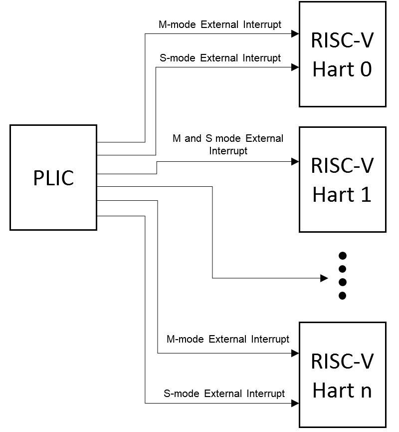
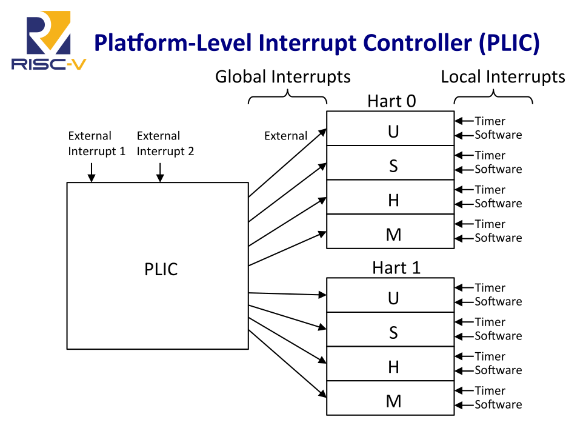
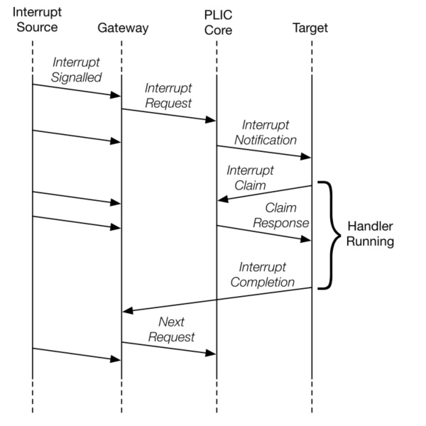

# RISC-V PLIC

- spec：https://github.com/riscv/riscv-plic-spec/blob/master/riscv-plic.adoc

## Introduction

### 1. Interrupt Targets and Hart Contexts

 
原文

> Interrupt targets are usually hart contexts, where a hart context is a given privilege mode on a given hart (though there are other possible interrupt targets, such as DMA engines). For example, in an 4-core system with 2-way SMT, you have 8 harts and probably at least two privilege modes per hart: machine mode and supervisor mode (Ref).  

所謂的 hart context 是指在一個給定的 hart 上的特權模式，而在 RISC-V 內，中斷目標通常是 hart context，也就是說是以 hart + 特權模式為目標在執行中斷的，每個 hart 在每個特權模式下都有一個獨立的 hart context

在一個 2-way SMT 的 4-core 系統中，每個 core 可以同時執行兩個硬體執行緒，因此我們有 8 個 harts，每個 hart 可能至少有 M mode 與 S mode 這兩個特權模式，因此共有 8x2 = 16 個 hart context

 
原文

> Not all hart contexts need be interrupt targets, in particular, if a processor core does not support delegating external interrupts to lower-privilege modes, then the lower-privilege hart contexts will not be interrupt targets. Interrupt notifications generated by the PLIC appear in the meip/seip bits of the mip/sip registers for M/S modes respectively.  
>
> The notification only appear in lower-privilege xip registers if external interrupts have been delegated to the lower-privilege modes.

並非所有的 hart context 都「需要」是中斷目標，特別是如果處理器核心不支援將外部中斷代理（delegate）給較低的特權模式時，此時較低特權模式的 hart context 就不會是中斷目標

PLIC 產生的中斷通知（Interrupt notifications）會分別出現在 M/S mode 下的 `mip`/`sip` 暫存器中的 `meip`/`seop` bits

如果外部中斷已被代理給較低的特權模式，則該中斷通知只會出現在較低權限的 xip 暫存器中

 
原文

> Previous versions of this specification indicated that the PLIC supports U-mode interrupts. This text was removed because the privileged architecture does not define U-mode interrupts. If a future privileged architecture specifies U-mode interrupts, this PLIC specification can be straightforwardly extended to support them.

舊版本的 spec 表明 PLIC 支援 U mode 中斷，該片段已被刪除，因為特權架構未定義 U 模式中斷。 如果未來的特權架構指定了 U 模式中斷，則可以直接擴展此 PLIC 規範以支援它們

 
原文

> Each processor core must define a policy on how simultaneous active interrupts are taken by multiple hart contexts on the core. For the simple case of a single stack of hart contexts, one for each supported privileged mode, interrupts for higher-privilege contexts can preempt execution of interrupt handlers for lower-privilege contexts. A multithreaded processor core could run multiple independent interrupt handlers on different hart contexts at the same time. A processor core could also provide hart contexts that are only used for interrupt handling to reduce interrupt service latency, and these might preempt interrupt handlers for other harts on the same core.

每個處理器核心必須定義多個 hart context 同時發起中斷時該如何處理。 在只有一個 hart 的情況下，每個 hart contexts 各有一個 stack，在這種情況下，高特權模式的中斷可以搶占（preempt）低特權模式的中斷處理程序（Interrupt Handler）

而對於多執行緒的處理器核心，可以在不同的 hart context 上同時運行多個獨立的中斷處理程序。 此外，處理器核心還可以提供專門用於中斷處理的 hart context，以降低中斷服務延遲（interrupt service latency），這些專用的 hart context 可能會搶占同一核心上其他 hart 的中斷處理程序

 
原文

> The PLIC treats each interrupt target independently and does not take into account any interrupt prioritization scheme used by a component that contains multiple interrupt targets. As a result, the PLIC provides no concept of interrupt preemption or nesting so this must be handled by the cores hosting multiple interrupt target contexts.

PLIC 會獨立處理每個中斷目標，不會考慮不同中斷目標的元件內所使用的任何中斷優先級（interrupt prioritization）。 因此 PLIC 不提供中斷搶占或嵌套（nesting）的概念，這要由承載多個中斷目標的處理器核心來處理

(Figure 1. RISC-V PLIC Interrupt Architecture Block Diagram)

(img src: [Tuesday @ 0900 RISC V Interrupts Krste Asanović, UC Berkeley & SiFive Inc](https://www.youtube.com/watch?v=iPbaG_wnNJY))
  

### 2. Interrupt Gateways （中斷閘道）

 
原文

> The interrupt gateways are responsible for converting global interrupt signals into a common interrupt request format, and for controlling the flow of interrupt requests to the PLIC core. At most one interrupt request per interrupt source can be pending in the PLIC core at any time, indicated by setting the source’s IP bit. The gateway only forwards a new interrupt request to the PLIC core after receiving notification that the interrupt handler servicing the previous interrupt request from the same source has completed.

中斷閘道負責將全域的中斷信號（global interrupt signals）轉換為通用的中斷請求格式，並將中斷請求轉送給 PLIC 核心。 每個中斷源（interrupt source）最多只能在 PLIC 核心中有一個待處理的中斷請求，這是通過設置該中斷源的 IP 位來指示的。 當中斷處理程序完成先前的中斷請求時，會回送一個通知（就是種 ack），閘道在收到通知後才會將新的中斷請求轉發給 PLIC 核心

 
原文

> If the global interrupt source uses level-sensitive interrupts, the gateway will convert the first assertion of the interrupt level into an interrupt request, but thereafter the gateway will not forward an additional interrupt request until it receives an interrupt completion message. On receiving an interrupt completion message, if the interrupt is level-triggered and the interrupt is still asserted, a new interrupt request will be forwarded to the PLIC core. The gateway does not have the facility to retract an interrupt request once forwarded to the PLIC core. If a level-sensitive interrupt source deasserts the interrupt after the PLIC core accepts the request and before the interrupt is serviced, the interrupt request remains present in the IP bit of the PLIC core and will be serviced by a handler, which will then have to determine that the interrupt device no longer requires service.

如果全域中斷來源使用的是電平觸發（level-sensitive）的中斷，閘道會將第一次觸發的中斷訊號轉換成中斷請求，之後直到收到中斷完成訊息（interrupt completion message）前都不會再轉發額外的中斷請求。 當收到中斷完成訊息時，如果該中斷是電平觸發且中斷訊號仍然保持觸發狀態，則會將新的中斷請求轉發給 PLIC 核心

閘道無法在中斷請求已經被轉發到 PLIC 核心後撤回該請求。 如果電平觸發的中斷來源在 PLIC 核心接受了請求，且中斷尚未被處理之前取消了中斷（deasserts），該中斷請求仍然會保留在 PLIC 核心的 IP 位元中，並最終由中斷處理程序處理，此時中斷處理程序需自行判定該中斷設備是否仍需要處理

 
原文

> If the global interrupt source was edge-triggered, the gateway will convert the first matching signal edge into an interrupt request. Depending on the design of the device and the interrupt handler, in between sending an interrupt request and receiving notice of its handler’s completion, the gateway might either ignore additional matching edges or increment a counter of pending interrupts. In either case, the next interrupt request will not be forwarded to the PLIC core until the previous completion message has been received. If the gateway has a pending interrupt counter, the counter will be decremented when the interrupt request is accepted by the PLIC core. Unlike dedicated-wire interrupt signals, message-signalled interrupts (MSIs) are sent over the system interconnect via a message packet that describes which interrupt is being asserted. The message is decoded to select an interrupt gateway, and the relevant gateway then handles the MSI similar to an edge-triggered interrupt.

如果全域中斷來源是邊緣觸發（edge-triggered）的中斷，閘道會將首次符合的訊號邊緣轉換為中斷請求。 根據設備和中斷處理程序的設計，在發送中斷請求與接收到其中斷完成通知之間，閘道可能會忽略額外的符合邊緣，或者會將其計入待處理中斷的計數器中

不論是哪種情況，在上一個完成通知被接收到之前，下一個中斷請求都不會被轉發到 PLIC 核心。 如果閘道具有待處理中斷計數器，當中斷請求被 PLIC 核心接受時，計數器會遞減

與專用線中斷訊號（dedicated-wire interrupt signals）不同，訊息信號中斷（Message-Signalled Interrupts, MSIs）是通過系統互聯（interconnect）以描述中斷的訊息封包形式傳送的。訊息會被解碼以選擇對應的中斷閘道，而相關的閘道會以類似邊緣觸發中斷的方式處理 MSI

### 3. Interrupt Notifications 3. 中斷通知

 
原文

> Each interrupt target has an external interrupt pending (EIP) bit in the PLIC core that indicates that the corresponding target has a pending interrupt waiting for service. The value in EIP can change as a result of changes to state in the PLIC core, brought on by interrupt sources, interrupt targets, or other agents manipulating register values in the PLIC. The value in EIP is communicated to the destination target as an interrupt notification. If the target is a RISC-V hart context, the interrupt notifications arrive on the meip/seip bits depending on the privilege level of the hart context.  
>
> (In simple systems, the interrupt notifications will be simple wires connected to the processor implementing a hart. In more complex platforms, the notifications might be routed as messages across a system interconnect.)

每個中斷目標在 PLIC 核心中都有一個對應的外部中斷掛起位元（External Interrupt Pending, EIP），該位元表示對應的目標有一個掛起的中斷等待處理。 EIP 的值可能會因 PLIC 核心狀態的變化而改變，這些變化可能由中斷來源、中斷目標，或者其他修改 PLIC 中暫存器值的 agent 引起

EIP 的值會作為中斷通知傳送給目標，如果目標是一個 RISC-V 的 hart context，中斷通知會根據 hart context 的特權層級，傳送到 meip 或 seip 位元上

在簡單的系統中，中斷通知通常是直接連接到實現 hart 的處理器的簡單訊號線。 在更複雜的平台中，中斷通知可能會以消息的形式通過系統內部的路由傳送

 
原文

> The PLIC hardware only supports multicasting of interrupts, such that all enabled targets will receive interrupt notifications for a given active interrupt.  
>
> (Multicasting provides rapid response since the fastest responder claims the interrupt, but can be wasteful in high-interrupt-rate scenarios if multiple harts take a trap for an interrupt that only one can successfully claim. Software can modulate the PLIC IE bits as part of each interrupt handler to provide alternate policies, such as interrupt affinity or round-robin unicasting.)

PLIC 硬體僅支援中斷的多播（multicasting），即所有啟用的目標都會收到對於特定活躍中斷的通知

多播可以加速響應速度，因為最快的響應者會認領該中斷，但在高中斷率的情境下可能會造成浪費，因為多個 harts 可能會為僅能被其中一個成功認領的中斷陷入中斷處理程序。 軟體可以在每個中斷處理程序中調整 PLIC 的 IE 位元，實現其他的替代策略，例如中斷親和性（interrupt affinity）或 round-robin unicasting

 
原文

> Depending on the platform architecture and the method used to transport interrupt notifications, these might take some time to be received at the targets. The PLIC is guaranteed to eventually deliver all state changes in EIP to all targets, provided there is no intervening activity in the PLIC core.  
>
> (The value in an interrupt notification is only guaranteed to hold an EIP value that was valid at some point in the past. In particular, a second target can respond and claim an interrupt while a notification to the first target is still in flight, such that when the first target tries to claim the interrupt it finds it has no active interrupts in the PLIC core.)

根據平台架構和用於傳輸中斷通知的方法，這些中斷通知可能需要一些時間才能到達目標。 如果 PLIC 核心中沒有其他干擾活動，則 PLIC 保證最終會將 EIP 的所有狀態變更傳遞給所有目標

中斷通知中的值僅保證表示某個過去時刻的有效 EIP 值，特別是當第一個目標的中斷通知尚未到達時，另一個目標可能已經響應並認領了該中斷，這會導致當第一個目標嘗試認領中斷時，發現 PLIC 核心中已沒有活躍的中斷

### 4. Interrupt Identifiers (IDs)

 
原文

> Global interrupt sources are assigned small unsigned integer identifiers, beginning at the value 1. An interrupt ID of 0 is reserved to mean “no interrupt”.  
>
> Interrupt identifiers are also used to break ties when two or more interrupt sources have the same assigned priority. Smaller values of interrupt ID take precedence over larger values of interrupt ID.

每個全域中斷來源會被分配到一個小的 unsigned integer 作為識別碼，值從 1 開始，識別碼 0 被保留用來表示「無中斷」。 另外，在兩個或多個中斷來源具有相同優先級時，小的 IDs 會比大的 IDs 有較高的優先權

### 5. Interrupt Flow （中斷流程）

 
原文

> Below figure shows the messages flowing between agents when handling interrupts via the PLIC.  
>
> - Global interrupts are sent from their source to an interrupt gateway that processes the interrupt signal from each source
> - Interrupt gateway then sends a single interrupt request to the PLIC core, which latches these in the core interrupt pending bits (IP).
> - The PLIC core forwards an interrupt notification to one or more targets if the targets have any pending interrupts enabled, and the priority of the pending interrupts exceeds a per-target threshold.
> - When the target takes the external interrupt, it sends an interrupt claim request to retrieve the identifier of the highest priority global interrupt source pending for that target from the PLIC core.
> - PLIC core then clears the corresponding interrupt source pending bit.
> - After the target has serviced the interrupt, it sends the associated interrupt gateway an interrupt completion message
> - The interrupt gateway can now forward another interrupt request for the same source to the PLIC.

下圖顯示了在通過 PLIC 處理中斷時，agent 之間流動的消息

- 全域中斷從其來源發送到中斷閘道，該閘道負責處理每個來源的中斷信號
- 中斷閘道隨後向 PLIC 核心發送單一的中斷請求，這些請求會在核心的中斷掛起位元（interrupt pending bits, IP）中鎖存（latches）
- 如果目標有啟用掛起的中斷，且掛起中斷的優先級超過每個目標的閾值，則 PLIC 核心會將中斷通知轉發給一個或多個目標
- 當目標接收到外部中斷後，它會向 PLIC 核心發送中斷請求，以檢索針對該目標的最高優先級全域中斷來源的識別碼
- PLIC 核心隨後清除相應的中斷來源掛起位元（interrupt source pending bit）
- 在目標處理完該中斷後，會向相關的中斷閘道發送中斷完成消息
- 之後中斷閘道便可以再為相同的來源向 PLIC 轉發另一個中斷請求了

(Figure 2. PLIC Interrupt Flow)

## Details

### 1. RISC-V PLIC Operation Parameters
### 2. Memory Map
### 3. Interrupt Priorities
### 4. Interrupt Pending Bits
### 5. Interrupt Enables
### 6. Priority Thresholds
### 7. Interrupt Claim Process
### 8. Interrupt Completion