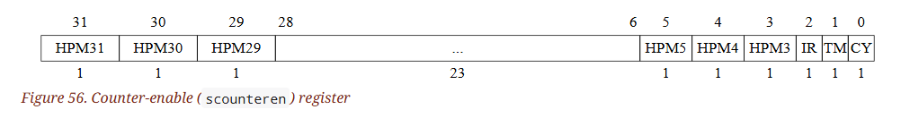
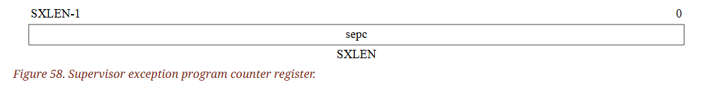
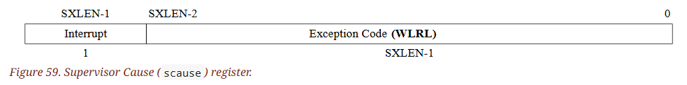
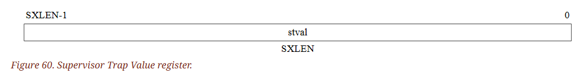
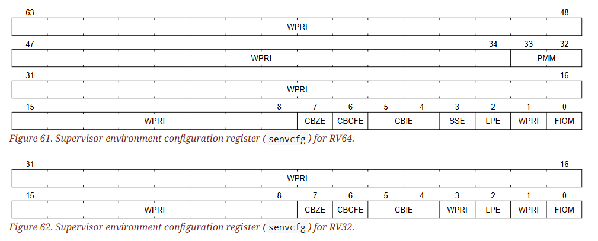

# 12. Supervisor-Level ISA, Version 1.13

### 12.1.1. Supervisor Status (`sstatus`) Register

`sstatus` 暫存器是一個 SXLEN-bit read/write 的暫存器，用來追蹤處理器目前的狀態，為 `mstatus` 的子集

當 `SXLEN` 為 32 時，格式如下圖：

<center>


</center><br>

當 `SXLEN` 為 64 時格式如下圖：

<center>


</center><br>

- `SPP` 
  - `SPP` 位元表示 hart 在進入 S-mode 之前執行的特權等級
  - 當 Trap 發生時，如果其源自 U-mode，則 `SPP` 設定為 0，否則為 1
  - 當執行 `SRET` 指令從 trap handler 返回時
    - 如果 `SPP` 為 0，則特權等級會被設為 U-mode
    - 否則設為 S-mode 並將 `SPP` 設為 0
- `SIE`
  - 用來啟用或禁用 S-mode 下的所有中斷
    - 清 0 時 S-mode 下不會產生中斷
  - 如果 hart 運行在 U-mode，`SIE` 的值會被忽略，且會啟用 S-mode 的中斷
  - supervisor 可以利用 `sie` CSR 來停用單一的中斷來源
- `SPIE`
  - 用來紀錄在進入 S-mode 之前是否啟用了 S-mode 下的中斷
  - 當 Trap 進入 S-mode 時，`SPIE` 被設為 `SIE`，並且 `SIE` 被設為 0
  - 執行 `SRET` 指令時，`SIE` 被設為 `SPIE`，然後 `SPIE` 被設為 1

:::info  
在較簡單的實作中，讀取或寫入 `sstatus` 中的任何字段相當於讀取或寫入 `mstatus` 中的同名字段  
:::

#### 12.1.1.1. Base ISA Control in `sstatus` Register

`UXL` 欄位控制 U-mode 的 `XLEN` 值，稱為 `UXLEN`，其可能與 S-mode 的 `XLEN` 值不同(稱為 `SXLEN`)。 簡單來說：

- `UXLEN` 表示 U-mode 的位元寬度，決定 U-mode 下的有效位址長度
- `SXLEN` 表示 S-mode 或 M-mode 下的位元寬度，決定系統支援的完整位址空間

`UXL` 的編碼與 `misa` 內的 `MXL` 相同，`MXL` 的編碼如下表：

<center>

| MXL | XLEN | 
| - | - |
| 1 | 32 |
| 2 | 64 |
| 3 | 128 |

</center>

當 `SXLEN` 為 32 時，`UXL` 欄位不存在，此時 `UXLEN` 為 32。 當 `SXLEN` 為 64 時，它是一個 WARL 字段，值為當前 `UXLEN` 值的編碼。 具體來說，UXL 可能被實作為一個唯讀的字段，其值始終保證 `UXLEN = SXLEN`

如果 `UXLEN ≠ SXLEN`，則在 narrower mode 下執行的指令必須忽略配置的 `XLEN` 以上的來源暫存器運算元，並且必須對結果進行 sign-extend 以填充目標暫存器中最寬的 `XLEN`

如果 `UXLEN < SXLEN`，U-mode 下的 instruction-fetch 位址，和 load/store 的有效位址以 $2^{\text{UXLEN}}$ 模除。 換句話說，因為此時 U-mode 的指令和記憶體存取位址的有效位元數比 S-mode 的位址還短，因此只能存取較低範圍的記憶體

舉個例子，當 `UXLEN` 為 32，`SXLEN` 為 64 的情況下，U-mode 下的程式無論怎麼操作記憶體，都只能看到低 4GiB 的記憶體範圍，換句話說 U-mode 的記憶體存取是 32 位元地址空間內的操作，而不是完整的 64 位元地址空間

> $2^{32}$ = 4GiB

##### HINT 相關

HINT 指令是沒有實際運算效果，但可能被用來提供某些優化或調整的指令。 某些 HINT 指令會被編碼為整數計算指令，其會利用當下的值覆蓋目標暫存器值

此時若 `XLEN < SXLEN` 且目標暫存器 `SXLEN .. XLEN` 處的位元與 `XLEN - 1` 處的不一致，則目標暫存器 `SXLEN .. XLEN` 處的位元會依照 implementation-defined 的方式，將其值保留或以 `XLEN - 1` 處的位元延展覆蓋

舉個例子，例如 `c.addi x8, 0` 這個指令，其等同於 `addi x8 x8 0`，也就是 `x8 = x8`，這是一個 HINT 指令，對計算沒有影響。 假設 U-mode 運行在 `XLEN = 32`，但暫存器是 64 位元的(`SXLEN = 64`)，而假設目標暫存器 `x8` 的內容如下：

```assembly
64-bit register (SXLEN=64, XLEN=32)
┌──────────────────────────┬────────────────────────┐
│ 高 32 位元 (SXLEN..XLEN) │ 低 32 位元 (XLEN)      │
│  0xF0000000              │  0x12345678            │
└──────────────────────────┴────────────────────────┘
```

其中低 32 位元(`0x12345678`) 是有效值，而高 32 位元(`0xF0000000`) 是超出 `XLEN` 的部分，內容可能來自之前的運算

當執行 HINT 指令 `c.addi x8, 0` 時  
- 低 32 位元(`XLEN`) 會保持不變(`0x12345678`)
- 高 32 位元 (`SXLEN..XLEN`) 有兩種可能的行為：
    - 不變，保持 `0xF0000000`  
    - 以 `XLEN-1` 位元的值延展覆蓋為 `0x00000000`

這允許實作上省略 HINT 指令中目標暫存器的寫回(writeback)，其也可以選擇將部分 HINT 指令像一般整數運算指令一樣執行。 這種選擇只會影響到 S-mode 下 `SXLEN > UXLEN` 的情況，對 U-mode 來說這個行為完全不可見

一般的整數運算指令(如 `addi x8, 0`) 都會：
- 讀取 `x8` 的值
- 執行計算(這裡是 `+0`，所以結果不變)
- 寫回 `x8`

但對於 HINT 指令，CPU 可以選擇「完全不寫回 `x8`」，因為它不影響計算結果

#### 12.1.1.2. Memory Privilege in `sstatus` Register (`MXR` 與 `SUM`)

`MXR`(Make eXecutable Readable) 位元控制讀取(load) 虛擬記憶體的權限

- `MXR = 0`
  - 只允許讀取標記為可讀(`R=1`)的 page
- `MXR = 1`
  - 允許讀取可讀(`R=1`) 或可執行(`X=1`) 的 page

當 page-based 的虛擬記憶體未啟用時(`satp.MODE = Bare`)，`MXR` 沒有作用

`SUM`(permit Supervisor User Memory access) 位元控制 S-mode 下存取 U-mode page 的權限

- `SUM = 0`
  - S-mode 無法存取 「U-mode 可存取(`U=1`)」的 page
  - 如果嘗試存取，會產生錯誤(fault)
- `SUM = 1`
  - 允許 S-mode 存取 `U=1` 的 page

當 paged-based 的虛擬記憶體未啟用，或者運行在 U-mode 時，`SUM` 沒有作用。 另外無論 `SUM` 的狀態為何，S-mode 下都無法執行 U-mode page 中的指令

如果 `satp.MODE` 是唯讀的 0 (`satp.MODE=0`)，則 `SUM` 也是唯讀的 0，這表示在不支援 page 的系統上，S-mode 永遠無法存取 U-mode 記憶體

page table entry 可以參考下圖(Sv32 page table entry)

<center>


</center><br>

`SUM` 的機制可以防止 S-mode 下的軟體意外存取 user memory，作業系統可以在 `SUM=0` 的情況下執行大部分的程式碼，並在少數需要訪問 user memory 的情況下再暫時設定 `SUM`

`SUM` 的機制不允許 S-mode 軟體執行 user code pages 中的指令。 但這在其他場景下通常也是個不合法的操作，在 POSIX 環境中也禁止 S-mode 執行 U-mode memory page 中的指令，因為如果 S-mode 中存在任意代碼執行(Arbitrary Code Execution, ACE) 的漏洞，那麼這類漏洞將變得更容易被利用，特別是當攻擊者能夠將惡意代碼存放在 U-mode 可存取的記憶體 (user buffer) 並在攻擊過程中執行它

但是有些 non-POSIX 的單一位址空間(Single Address Space) 作業系統允許部分軟體在 S-mode 下執行 U-mode program，其大部分程式都運行在 U-mode 下，並和 kernel 共用同一個位址空間。 在這種情況下，可以通過映射相同的物理記憶體到不同的虛擬記憶體頁面，並設定不同的權限來允許 S-mode 軟體部分執行 U-mode 的程式碼

#### 12.1.1.3. Endianness Control in `sstatus` Register (`UBE`)

`UBE` 為原是個 WARL 的字段，用來控制 U-mode 下記憶體存取的位元組順序(Endianness)，其可能與 S-mode 下的位元組順序不同。 實作上可能會把 UBE 設成一個唯讀的字段，使其始終與 S-mode 的位元組順序相同

- `UBE = 0`：使用小端序(little-endian)
- `UBE = 1`：使用大端序(big-endian)

另外

- instruction-fetch 不受 `UBE` 的影響
  - 其屬於隱式(implicit) 記憶體存取，永遠是小端序(little-endian)
- `UBE` 不影響 S-mode 相關的隱式記憶體存取
  - 如 S-mode 讀取 page table 或其他記憶體管理資料結構，這些記憶體存取總是使用 S-mode 的位元組順序

標準的 RISC-V ABI 只能是純小端 (Little-Endian, LE) 或純大端 (Big-Endian, BE)，不允許混合大小端(mixing endianness)。 儘管標準 ABI 只能是純 LE 或純 BE，但 RISC-V 還是允許作業系統支援與自身大小端不同的 U-mode 應用程式

#### 12.1.1.4. Previous Expected Landing Pad (ELP) State in `sstatus` Register

`SPELP` 欄位由 Zicflip 擴充指令集引入，用途與控制流完整性(CFI) 有關。 在 S-mode 下存取 `SPELP` 欄位時，會根據 `V` 位元的狀態來決定要存取 `mstatus.SPELP` 還是 `vsstatus.SPELP`：

- `V=0`(非虛擬化模式)：存取 `mstatus.SPELP`
- `V=1`(虛擬化模式)：存取 `vsttatus.SPELP`

#### 12.1.1.5. Double Trap Control in `sstatus` Register

`SDT`(S-mode-disable-trap) 是一個 WARL 的欄位，由 Ssdbltrp 擴充指令集引入，用來解決 S-mode 以下 double trap 的問題

> double trap 指的是，當 Trap handler 正在處理異常(Trap) 且正處於 non-reentrant 的狀態時，發生了另一個異常，導致其無法正常處理

當 `SDT` 位元透過 CSR write 顯式設為 1 時，無論該操作是否在同一寫入中試圖設定 `SIE`，`SIE` 都會被強制清 0，這代表 S-mode 將無法接受中斷。 而執行 `SRET` 指令 `SDT` 會被清 0

`SIE=1` 只能發生在 `SDT=0` 的情況下，如果 `SDT=1`，則 `SIE` 無法手動設為 `1`，這確保在 `SDT=1` 時 S-mode 不會收到新的中斷

當系統發生異常(Trap) 時，如果 `SDT=0`，則 `SDT` 會被自動設定為 `1`，之後異常會正常傳遞到 S-mode。 然而如果 `SDT` 已經是 `1`(代表 S-mode 已經在處理異常)，則這是一個意外異常(unexpected trap)，當意外異常發生時，其會產生「Double-Trap Exception」，以將意外異常傳遞給 M-mode 處理

之後會由 M-mode 接管處理該異常，期間 hart 會將該異常的資訊寫入對應的暫存器，但 `mcause` 和 `mtval2` 例外，`mtval2` 會存入「原本應該寫入 `mcause` 的值」，`mcause` 會被設為 `16`，代表這是一個 double-trap exception，好讓 M-mode 可以識別這是一個 S-mode 無法處理的異常

Trap handler 需要在儲存好 `scause`、`sepc`、`stval` 等狀態，並且可重入(reentrant) 後清除 `SDT` 位元，這表示在 Trap handler 的尾聲，如果在恢復系統狀態時又發生了新的異常，`SDT` 可以幫助 M-mode 檢測到這種情況

如果 guest OS 發生 page-fault，而這個異常觸發了 double trap，那麼當其被遞交到 M-mode 時，`mtval2` 暫存器將不會包含 Guest Physical Address (GPA)，這代表 Hypervisor 無法直接從 `mtval2` 取得 guest 的物理地址。 這會發生在 HS-mode 下執行虛擬機內的存取指令(load 或 store)，且

- `SDT=1`
- 該存取指令導致了 guest page-fault

時，不過這不常發生。 另外，儘管 GPA 不會被記錄，但這沒關係，需要的話仍可以通過遍歷 page table 來達成目的

對於源自 VS-mode 的 double trap，M-mode 應該要將該異常重新導向到 HS-mode，具體做法是：

- 將 M-mode 處理該異常時更新的 CSR 的值複製到 HS-mode 中對應的 CSR
- 使用 `MRET` 指令恢復執行，並從 `stvec` 指定的位址繼續執行

SSE (Supervisor Software Events) 是 SBI (Supervisor Binary Interface) 的一項擴充，提供一種機制，使監督者軟體 (Supervisor Software) 能夠註冊 (register) 並處理 (service) 來自 SBI 實作的系統事件。 這些事件可能來自 SBI 內部，例如韌體或 Hypervisor

當發生 double trap 時，HS-mode 和 M-mode 可以使用 SSE 機制來啟動 critical-error handler 以處理對應的 VS-mode 或 S/HS-mode 中發生的異常。 此外，實作 SSE protocol 也可以做為一個選項，幫助系統從這類 critical errors 中恢復

### 12.1.2. Supervisor Trap Vector Base Address (`stvec`) Register

`stvec` 是一個 SXLEN-bit 的可讀寫暫存器，用來存 trap vector 的設定，包含：

- vector base address (`BASE`)
- vetor mode (`MODE`)

決定進入 S-mode 下的異常 (Exception) 和中斷 (Interrupt) 後 PC 該跳轉到哪裡，配置方式如下圖：

<center>


</center>

`BASE` 欄位可以存放任何有效的虛擬位址或實體位址，但需符合以下對齊限制：
- 該位址必須以 4-byte 對齊 (最低兩個位元為 0)
- 若 `MODE` 不是 **Direct**，可能還會有更嚴格的對齊限制作用在 `BASE` 的值上
    - 在 **VECTORED** 模式下，因為 trap vector 會根據中斷號 (cause) 來做位址計算 (例如 `BASE + 4×cause`)，因此地址可能要符合更高的要求

下表為 `stvec.MODE` 的編碼方式：

| Value | Name     | Description                                     |
| ----- | -------- | ----------------------------------------------- |
| 0     | Direct   | All exceptions set pc to BASE.                  |
| 1     | Vectored | Asynchronous interrupts set pc to BASE+4×cause. |
| ≥2    |          | Reserved                                        |

當 `MODE=Direct` 時，所有 traps 進入 S-mode 都會將 pc 設為 `BASE` 欄位中的位址

而當 `MODE=Vectored` 時，所有同步異常 (synchronous exceptions) 在進入 S-mode 後，pc 依舊會設為 BASE； 但如果是中斷 ，則 pc 會設為 `BASE + 4×cause`

例如 Supervisor-mode 計時器中斷在 RISC-V 中通常是 cause = 5 (參考具體標準)，所以 `pc = BASE + (4×5) = BASE + 0x14`

為了讓 `pc = BASE + 4×cause` 不越界或錯亂，一般會要求 `BASE` 有更高的對齊要求，比如 16-byte 或 128-byte 對齊，具體要看實作和規範版本

### 12.1.3. Supervisor Interrupt (`sip` and `sie`) Registers

`sip` 暫存器是一個 SXLEN-bit 的可讀寫寄存器，其內容代表當前等待處理 (pending) 的中斷資訊

`sie` 暫存器則是對應的 SXLEN 位元可讀寫寄存器，其中紀錄啟用中斷的位元

在 `scause` CSR 裏面所報告的中斷原因編號 `i`（參考第 12.1.8 節）對應到 `sip` 與 `sie` 的第 i 個位元

位元 0~15 (bits 15:0) 保留給標準中斷原因（例如軟體中斷、計時器中斷等），16 以上的位元則留給平台自行使用

<center>


</center>

一個編號為 `i` 的中斷，只有在以下兩個條件都成立時，才會陷入到 S-mode 進行處理：

- (a)
    - 當前特權模式是 S-mode，並且 `sstatus` 寄存器裡的 `SIE` 位元為 1
    - 或是當前特權模式低於 S-mode（也就是 U-mode 等更低特權模式）
- (b) 
    - `sip[i]` 與 `sie[i]` 都為 1，也就是該中斷 `i` 正在等待處理 並且已被啟用

硬體 (或實作) 在偵測到 `sip[i]` 發生變化（例如 `0→1`）時，應該在 合理且有限的時間內檢查是否要觸發中斷，不能無限制地拖延，否則中斷就失去意義

同時，也必須在執行 `SRET` 指令之後，以及對任何會影響中斷陷阱條件的 CSR（例如 `sip`, `sie`, `sstatus`）進行「顯式寫入 (explicit write)」後，立即重新評估這些條件

對 S-mode 的中斷優先於對任何更低特權模式（例如 U-mode）的中斷

在 `sip` 寄存器中，每個位元都可能是可寫，也可能是唯讀的，當第 `i` 位元是可寫的時，如果中斷 `i` 處於 pending 狀態，可以透過寫入 0 到此位元的方式來清除該中斷

如果一個中斷 `i` 可能處於等待狀態，但是 `sip` 中該位元是唯讀的，那麼必須由實作提供其他機制來清除該 pending 中斷（可能需要透過呼叫執行環境 (execution environment) 的某種方法）

在 `sie` 寄存器中，如果對應的中斷可能變成 pending 的，那麼該位元就必須是可寫的。 若某些位元是不可寫的，那它們就會是唯讀的，且永遠為 0（該中斷永遠不會發生）

`sip` 與 `sie` 的 標準部分(bits 15:0)，格式如下圖所示：

<center>


</center>

`sip.SEIP` 與 `sie.SEIE` 對應到 S-mode 外部中斷 (supervisor-level external interrupts) 的「等待 (pending)」與「啟用 (enable)」位。 若實作了此功能，則 `sip` 中的 `SEIP` 是唯讀的，它的設置和清除由執行環境（通常透過平台特定的中斷控制器）來完成

`sip.STIP` 與 `sie.STIE` 對應到 S-mode 計時器中斷 (timer interrupt) 的「等待」與「啟用」位。 若實作了此功能，則 `sip` 中的 `STIP` 是 唯讀，由執行環境來設置或清除

`sip.SSIP` 與 `sie.SSIE` 對應到 S-mode 軟體中斷 (software interrupt) 的「等待」與「啟用」位。 若系統實作該功能，`sip` 中的 `SSIP` 是 可寫的，也可能由平台特定的中斷控制器設置為 1

> 外部中斷往往是由硬體控制器 (PIC, PLIC, etc.) 來管理，S-mode 只能透過平台特定的方法去清除 pending。 計時器中斷通常也是由硬體或韌體自動管理，軟體無法直接清除 pending，故 STIP 是唯讀

若系統實作了 Sscofpmf 擴充，則 `sip.LCOFIP` 與 `sie.LCOFIE` 這些位元對應到 local counter-overflow interrupt 的等待與啟用。 `sip.LCOFIP` 在 `sip` 中是可讀寫 (read-write)，當 `mhpmeventn.OF` 中任何一個位元被設置（表示計數器溢出）時，就會反映成一個 local counter-overflow interrupt。 如果 Sscofpmf 未實作，那麼 `sip.LCOFIP` 與 `sie.LCOFIE` 是唯讀的且永遠為 0

> Sscofpmf (Supervisor Software Counter Overflow Performance Monitoring)：一種專門的擴充，用於監測計數器溢出事件

:::info  
跨處理器中斷 (Interprocessor interrupts) 是透過特定的實作方式發送到其他 hart，最終會使接收端 hart 的 `sip` 寄存器中的 `SSIP` 位元被設為 1  
:::

每一種標準中斷類型（`SEI`、`STI`、`SSI`、或 `LCOFI`）都可能不被實作；如果沒有實作，對應的等待與啟用位就會是唯讀且為 0 的

`sip` 與 `sie` 中的所有位元都是 WARL 欄位，可透過在 `sie` 寄存器的每個位元都寫入 1，然後再讀回來檢查哪個位元真的保持在 1，就能得知系統實際實作了哪些中斷

:::info  
`sip` 與 `sie` 是 `mip` 與 `mie` 的子集，讀取或寫入 `sip/sie` 的任何已實作欄位，同時也會對應到 `mip/mie` 裡的相同欄位，也就是說當你寫 `sip.SSIP=1`，實際硬體也會把 `mip.SSIP` 做相應設定

在 `sip` 與 `sie` 中的第 3、7 和 11 個 bit，分別對應 M-mode 的軟體、計時器與外部中斷。 由於大多數平台都選擇不將這些中斷從 M-mode 委派(delegate) 到 S-mode，所以在圖 54 與圖 55 中，這些位元顯示為 0  
:::

當同時有多個要進入 S-mode 的中斷發生時，其處理順序（由高至低優先權）如下：  
- SEI (Supervisor External Interrupt)
- SSI (Supervisor Software Interrupt)
- STI (Supervisor Timer Interrupt)
- LCOFI (Local Counter Overflow Interrupt)

### 12.1.4. Supervisor Timers and Performance Counters

S-mode 和 U-mode 使用相同的硬體效能監控機制(hardware performance monitoring facility)，其中包含 `time`、`cycle` 和 `instret` 這些 CSR，實作應提供機制來修改這些計數器的值

另外，實作必須提供一種機制，讓系統能夠依據真實時間計數器來 schedule 計時器中斷

### 12.1.5. Counter-Enable (`scounteren`) Register



`scounteren` 是一個 32 位元 的 CSR，控制 U-mode 是否能存取硬體效能監控計數器(hardware performance monitoring counters)

如果在 `scounteren` 寄存器中，`CY`、`TM`、`IR` 或 `HPMn` 其中任意一個位元被清為 0，那麼當 U-mode 嘗試讀取對應的 `cycle`、`time`、`instret` 或 `hpmcountern` 寄存器時，將會觸發非法指令 (illegal-instruction) 異常。 若當中有位元為 1，則允許 U-mode 讀取對應的計數器

對應關係：

- `CY` bit：控制 cycle 寄存器 (CPU 週期計數器)
- `TM` bit：控制 time 寄存器 (實時計數器)
- `IR` bit：控制 instret 寄存器 (指令完成數計數器)
- `HPMn` bits：控制 hpmcountern (高階性能計數器)

系統必須實作 `scounteren` 寄存器，但其內的任何位元都可以為唯讀的 0，表示在 U-mode 下讀取對應計數器時會產生異常。 因此，這些位元等同於 WARL 欄位

:::info  
在 `mcounteren`（M-mode 的 counter-enable）中某一個位元的設定，並不會影響對應的 `scounteren` 位元是否可寫

不過，若 U-mode 想要讀取某個計數器，`scounteren` 與 `mcounteren` 中的對應位元都必須為 1  
:::

### 12.1.7. Supervisor Exception Program Counter (`sepc`) Register

`sepc` 是一個 SXLEN 位元的可讀寫 CSR，其格式如下圖所示：



`sepc` 的最低位元(`sepc[0]`) 永遠為 0。 如果某個處理器實作只支援 `IALIGN=32` (指令對齊為 32 位元)，那麼 `sepc` 的最低兩個位元 (`sepc[1:0]`) 都會是 0

如果某個處理器支援 `IALIGN=16` 或 `IALIGN=32`（例如透過修改 `misa` CSR 來切換），那麼在 `IALIGN=32` 的狀態時，`sepc[1]` 在讀取時會被遮罩(mask) 為 0，因此看起來總是為 0。 這種遮罩行為也包含`SRET` 指令內對 `sepc` 的隱式讀取時。 另外，即便在 `IALIGN=32` 模式下被遮罩，`sepc[1]` 仍然是可寫的

`sepc` 是一個 WARL 類型的寄存器，必須能夠存放所有合法虛擬位址，但不需要能存放「所有可能的無效位址」。 在寫入 `sepc` 之前，處理器實作可能會把某個無效位址轉換成另一個它可以容納的無效位址，然後再存進 `sepc`

當透過 trap 進入 S-mode 時，硬體會把被中斷的指令(或遇到異常的指令) 的虛擬位址寫入 `sepc`。 除此之外，硬體不會自行寫入 `sepc`，但軟體可以顯式地對它寫入

### 12.1.8. Supervisor Cause (`scause`) Register

`scause`(Supervisor Cause) 是一個 SXLEN 位元的可讀寫 CSR，其格式如下圖所示：



當透過 trap 進入 S-mode 時，硬體會將造成 trap 的事件代碼(code) 寫入 `scause`。 除此之外，硬體不會 任何時候自行改寫 `scause`，但軟體可以顯式地對它寫入

在 `scause` 寄存器中，有一個稱作 Interrupt bit 的位元，如果 trap 是由中斷(interrupt) 造成，這個位元就會被設為 1。 `scause` 中還有一個 Exception Code(異常碼) 的欄位，用來標示最後一次異常或中斷的代碼

異常碼是一個 WLRL 欄位，它至少需要支援 0~31 的取值（也就是位元 `4-0` 必須實作），超過 31 的值，硬體可自行決定是否支援，或以其他方式處理

下表列出了目前標準定義的 S-mode 指令集中可能出現的異常碼

- Supervisor cause (`scause`) register values after trap：  
  | Interrupt | Exception Code | Description |
  |-----------|---------------|-------------|
  | 1 | 0 | *Reserved* |
  | 1 | 1 | Supervisor software interrupt |
  | 1 | 2-4 | *Reserved* |
  | 1 | 5 | Supervisor timer interrupt |
  | 1 | 6-8 | *Reserved* |
  | 1 | 9 | Supervisor external interrupt |
  | 1 | 10-12 | *Reserved* |
  | 1 | 13 | Counter-overflow interrupt |
  | 1 | 14-15 | *Reserved* |
  | 1 | ≥16 | *Designated for platform use* |
  | 0 | 0 | Instruction address misaligned |
  | 0 | 1 | Instruction access fault |
  | 0 | 2 | Illegal instruction |
  | 0 | 3 | Breakpoint |
  | 0 | 4 | Load address misaligned |
  | 0 | 5 | Load access fault |
  | 0 | 6 | Store/AMO address misaligned |
  | 0 | 7 | Store/AMO access fault |
  | 0 | 8 | Environment call from U-mode |
  | 0 | 9 | Environment call from S-mode |
  | 0 | 10-11 | *Reserved* |
  | 0 | 12 | Instruction page fault |
  | 0 | 13 | Load page fault |
  | 0 | 14 | *Reserved* |
  | 0 | 15 | Store/AMO page fault |
  | 0 | 16-17 | *Reserved* |
  | 0 | 18 | Software check |
  | 0 | 19 | Hardware error |
  | 0 | 20-23 | *Reserved* |
  | 0 | 24-31 | *Designated for custom use* |
  | 0 | 32-47 | *Reserved* |
  | 0 | 48-63 | *Designated for custom use* |
  | 0 | ≥64 | *Reserved* |
- Synchronous Exception Priority：  
  | Priority | Exc. Code | Description |
  |----------|----------|-------------|
  | **Highest** | 3 | Instruction address breakpoint |
  | | 12, 1 | During instruction address translation: First encountered page fault or access fault |
  | | 1 | With physical address for instruction: Instruction access fault |
  | | 2 | Illegal instruction |
  | | 0 | Instruction address misaligned |
  | | 8, 9, 11 | Environment call |
  | | 3 | Environment break |
  | | 3 | Load/store/AMO address breakpoint |
  | | 4, 6 | *Optionally*: Load/store/AMO address misaligned |
  | | 13, 15, 5, 7 | During address translation for an explicit memory access: First encountered page fault or access fault |
  | | 5, 7 | With physical address for an explicit memory access: Load/store/AMO access fault |
  | **Lowest** | 4, 6 | If not higher priority: Load/store/AMO address misaligned |

### 12.1.9. Supervisor Trap Value (`stval`) Register

`stval` 是一個 SXLEN 位元的可讀寫 CSR，其格式如下圖所示：



當透過 trap 進入 S-mode 時，硬體會將與該異常(exception) 相關的特定資訊寫入 `stval`，以協助軟體處理該 trap。 在其他情況下，硬體不會對 `stval` 做任何寫入，不過軟體可以顯式地寫入它

硬體平台會規定有哪些異常需要在 `stval` 中填入具體資訊、哪些異常會一律將其清為 0、以及哪些異常需要視實際導致異常的底層事件而定

若在指令擷取(instruction fetch)、讀取(load) 或寫入(store) 時，發生 breakpoint、地址未對齊(address-misaligned)、存取錯誤(access-fault) 或 page-fault，而且 `stval` 被寫入的值不為 0，則該 `stval` 內會存放導致錯誤的虛擬位址(faulting virtual address)

假設未對齊(misaligned) 的讀取或寫入觸發了 access-fault 或 page-fault 異常，而且此時 `stval` 被寫入的值不為 0，則 `stval` 會包含造成故障的那一部份存取(access) 的虛擬位址。 例如一次讀取 4 word，卻對齊在奇數位址，其可能會拆分成兩次記憶體操作(部分對齊於第一個 page，部分對齊於第二個 page)。 假設其中某個 page 發生訪問錯誤，硬體可能只在 `stval` 中記錄真正發生錯誤的那個分段位址

若系統支援可變長度(variable-length) 指令，並且在 instruction access-fault 或 page-fault 時 `stval` 被寫入的值不為 0，則：

- `stval` 會存放導致錯誤的那個指令片段(portion) 所在的虛擬位址
- 而 `sepc` 會指向該指令的起始位址

硬體實作可以選擇是否要在發生 illegal-instruction 異常時，讓 `stval` 用來返回造成錯誤的那條指令的位元內容，同時 `sepc` 會指向該指令在記憶體中的位址

如果在 illegal-instruction 異常發生時，`stval` 被寫入的值不為 0，則 `stval` 的內容會是以下三者中最短的那個：

- 實際錯誤指令（完整指令位元）
- 該錯誤指令的前 `ILEN` 位元
- 該錯誤指令的前 `SXLEN` 位元

取最小者能確保 `stval` 的內容不會超過自己能表示的位寬，而寫入到 `stval` 中的位元會右對齊(right-justified)，而未用到的高位元則清為 0，換句話說若實際指令不足 `SXLEN` 位元，則 `stval` 的低位元保存指令位元，高位填 0

如果 trap 由 software check exception 所引起，則 `stval` 寄存器會保存觸發該異常的原因(cause)。 下面列出了一些定義好的編碼：

- 0：無額外資訊
- 2：Landing Pad Fault（由 Zicfilp 擴充定義，見第 22.1 節）
- 3：Shadow Stack Fault（由 Zicfiss 擴充定義，見第 22.2 節）

對於其他陷阱而言，預設將 `stval` 設為 0，但未來標準可能會擴充某些陷阱對 `stval` 的使用方式

`stval` 是一個 WARL 型態的寄存器，必須能夠存放所有合法虛擬位址與 0，但不需要能夠表示所有「無效」位址。 在寫入 `stval` 之前，硬體實作可能會把一個無效位址轉換成另一個 `stval` 可以表示的無效位址

如果實作支援「將錯誤指令位元載入 `stval`」的功能，那麼 `stval` 還必須能夠存下所有小於 $2^{(min(SXLEN, ILEN))}$ 的值，其中 $min(SXLEN, ILEN)$ 表示 `SXLEN` 與 `ILEN` 中較小的值

### 12.1.10. Supervisor Environment Configuration (`senvcfg`) Register

`senvcfg` 是一個 SXLEN 位元的可讀寫 CSR，用來控制 U-mode 執行環境的某些特性，它的格式如下圖所示：



如果在 `senvcfg` 中的 FIOM (Fence of I/O implies Memory) 位元被設為 1，則在 U-mode 執行的 FENCE 指令會被修改，原先只在對裝置 I/O 要求順序(order) 保證的地方，現在也同時要求主記憶體的順序保證

同樣地，當 `FIOM=1` 且在 U-mode 下時，如果某個原子指令(atomic instruction) 存取到被標記為 device I/O 的區域，而且該指令帶有 `aq`(acquire) 和/或 `rl`(release) 位元，那麼該指令會被視為同時存取了 device I/O 與主記憶體，因此需要對二者都進行順序保證

下表說明了在 U-mode 下 `FIOM=1` 時，FENCE 指令中 `PI`、`PO`、`SI`、`SO` 這些位元的修改：

| Instruction bit	| Meaning when set |  
|-|-|
| PI<br> PO| Predecessor device input and memory reads (PR implied)<br >Predecessor device output and memory writes (PW implied)|
| SI<br>SO | Successor device input and memory reads (SR implied)<br> Successor device output and memory writes (SW implied)|

> 當 `FIOM=1`，在 U-mode 下：  
> - `PI=1` → 表示 fence 要確保「之前(predecessor) 的裝置輸入以及記憶體讀取」都已完成 (PR：predecessor reads)
> - `PO=1` → 確保「之前的裝置輸出以及記憶體寫入」都已完成 (PW：predecessor writes)
> - `SI=1` → 確保「之後(successor) 的裝置輸入以及記憶體讀取」的順序 (SR：successor reads)
> - `SO=1` → 確保「之後的裝置輸出以及記憶體寫入」的順序 (SW：successor writes)  
>
> 由於 `FIOM=1`，因此 I/O fence 同時會涵蓋 memory fence

如果 `satp.MODE` 是只讀且永遠是 0（表示系統處於 Bare 模式，無 page 功能），那麼硬體可以讓 `FIOM` 位元也成為唯讀的，且永遠 0（無法啟用 `FIOM`）

> 換句話說在沒有 page 的情況下，若實作者覺得不需要對 I/O 或 memory 做額外的順序處理，可將其鎖死成 0

:::info  
`FIOM` 位元是為了特定情況而設計的：
- 環境正在 U-mode 中「模擬 (emulate) 一個 I/O 裝置」
- 該裝置有記憶體緩衝區，理論上應該屬於 I/O 空間 (不在一般主記憶體中)，但由於位址轉譯(address translation) 的關係，實際上映射到主記憶體
- 多個實體 hart 同時在 U-mode 下存取這個模擬裝置

在一般情況下，「I/O fence」只保證對 I/O 動作 (例如對 I/O port 或 MMIO) 的順序，不一定包含對主記憶體的同步。 但若「I/O 區」實際上是主記憶體的一塊，就有可能造成同步問題，所以需要讓「I/O fence」也涵蓋主記憶體存取

spec 的第 21 章為「Hypervisor extension (H-extension)」，當環境中沒有使用這套 H-extension（也就是沒有硬體級別的虛擬化支援），且如果無法使用「半虛擬化 (paravirtualization)」，它就可能需要在 U-mode 中模擬目標裝置

換句話說那種環境下只能用 S-mode 的方式實作 “hypervisor-like” 功能，而在這種情況下，要在 U-mode 模擬裝置時，通常不能使用一些現有的硬體輔助(e.g. 2-level page table、虛擬化功能)，因此需更複雜的軟體方案

一個 Hypervisor 可以提供數個虛擬 hart (vCPU)，各自對應到實體 hart，此時可能會有多個實體 hart 同時存取該被模擬的裝置

例如：

1. Guest OS 在 VM 內將裝置的中斷處理指派給某個 hart，但是在中斷處理以外，別的 hart 也去存取了這個裝置  
2. 裝置的控制權（或部分控制）在多個 hart 之間移轉，例如為了平衡 VM 內的中斷負載，把裝置從一個 hart 移交給另一個 hart

在這種情況下，guest software 需要使用 mutex 或 IPI(interprocessor interrupt) 等機制來協調多個 hart 對該模擬裝置的存取，並且經常會執行 I/O fence 以保證裝置存取的順序

然而，如果這個裝置的 I/O 其實部分是主記憶體（guest 不知道這件事），那麼原本只針對 I/O 的 fence 就有可能不足。 把 `FIOM=1` 設成 1 可以改變這些 fence（包括 U-mode 中執行的所有 I/O fence），使它們也涵蓋對「主記憶體」的順序保證

軟體其實可以不啟用 FIOM，前提是它絕對不會使用主記憶體來模擬原本屬於 I/O 空間的記憶體緩衝區，但這麼做通常會需要攔截 (trap) 所有 U-mode 對該模擬緩衝區的存取，這可能對效能產生明顯影響，相較之下，FIOM 提供的替代方案在實作難度和開銷上都相對低，因此即使它不常被使用，我們仍認為值得支援  
:::

接下來是一些其他較少敘述的欄位，所以我用列點的方式表達：

- `CBZE` 欄位由 Zicboz extension 定義：這可能與 cache-block zero 指令相關  
- `CBCFE` 與 `CBIE` 欄位由 Zicbom extension 定義：這些則與 cache-block manage 指令 (block fill，block invalidate) 相關
- `PMM` 欄位由 Ssnpm extension 定義：可能與「page modification monitor」或「nested paging」之類功能相關
- Zicfilp 擴充在 `senvcfg` 中新增了名為 `LPE` 與 `SSE` 的欄位：  
    -  當 `LPE` 欄位被設定為 1 時，Zicfilp 擴充會在 VU/U-mode 下啟用
    -  當 `LPE` 欄位為 0 時，Zicfilp 擴充不會在 VU/U-mode 下啟用，並且在 VU/U-mode 中會套用以下規則：
        - 這個 hart 不會更新 ELP state（它會一直維持在 `NO_LP_EXPECTED` 狀態）
        - `LPAD` 指令的行為相當於 no-op
    - 當 `SSE` 欄位設定為 1 時，Zicfiss 擴充在 VU/U-mode 下被啟用
    - 當 `SSE` 欄位為 0 時，Zicfiss 擴充在 VU/U-mode 下維持停用狀態，並且以下規則將生效：
        - 32-bit 的 Zicfiss 指令會回退(revert) 到 Zimop 擴充所定義的行為
        - 16-bit 的 Zicfiss 指令會回退到 Zcmop 擴充所定義的行為
        - 此外，當 `menvcfg.SSE` 被設為 1 時，`SSAMOSWAP.W/D` 指令在 U-mode 會產生 illegal-instruction 異常，而在 VU-mode 會產生 virtual instruction 異常
