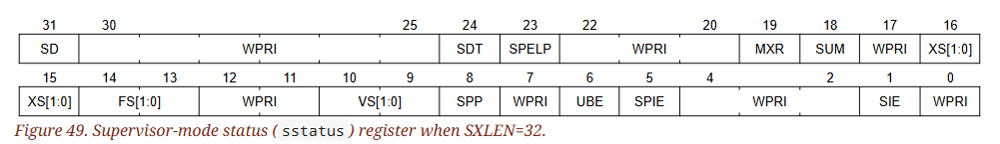
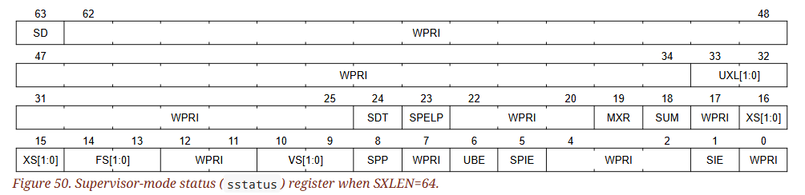
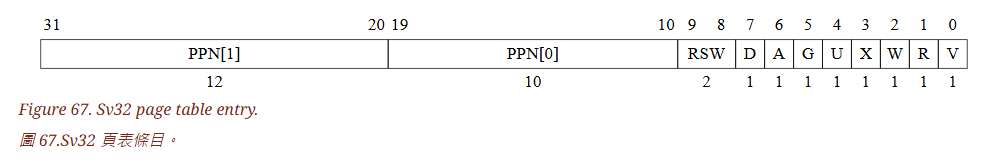

# 12. Supervisor-Level ISA, Version 1.13

## 12.1.1. Supervisor Status (`sstatus`) Register

`sstatus` 暫存器是一個 SXLEN-bit read/write 的暫存器，用來追蹤處理器目前的狀態，為 `mstatus` 的子集

當 `SXLEN` 為 32 時，格式如下圖：

<center>



</center>

當 `SXLEN` 為 64 時格式如下圖：



- `SPP` 
  - `SPP` 位元表示 hart 在進入 S-mode 之前執行的特權等級
  - 當 Trap 發生時，如果其源自 U-mode，則 `SPP` 設定為 0，否則為 1
  - 當執行 `SRET` 指令從 trap handler 返回時
    - 如果 `SPP` 為 0，則特權等級會被設為 U-mode
    - 否則設為 S-mode 並將 `SPP` 設為 0
- `SIE`
  - 用來啟用或禁用 S-mode 下的所有中斷
    - 清 0 時 S-mode 下不會產生中斷
  - 如果 hart 運行在 U-mode，`SIE` 的值會被忽略，且會啟用 S-mode 的中斷
  - supervisor 可以利用 `sie` CSR 來停用單一的中斷來源
- `SPIE`
  - 用來紀錄在進入 S-mode 之前是否啟用了 S-mode 下的中斷
  - 當 Trap 進入 S-mode 時，`SPIE` 被設為 `SIE`，並且 `SIE` 被設為 0
  - 執行 `SRET` 指令時，`SIE` 被設為 `SPIE`，然後 `SPIE` 被設為 1

### 12.1.1.1. Base ISA Control in `sstatus` Register

`UXL` 欄位控制 U-mode 的 `XLEN` 值，稱為 `UXLEN`，其可能與 S-mode 的 `XLEN` 值不同(稱為 `SXLEN`)。 簡單來說：

- `UXLEN` 表示 U-mode 的位元寬度，決定 U-mode 下的有效位址長度
- `SXLEN` 表示 S-mode 或 M-mode 下的位元寬度，決定系統支援的完整位址空間

`UXL` 的編碼與 `misa` 內的 `MXL` 相同，`MXL` 的編碼如下表：

<center>

| MXL | XLEN | 
| - | - |
| 1 | 32 |
| 2 | 64 |
| 3 | 128 |

</center>

當 `SXLEN` 為 32 時，`UXL` 欄位不存在，此時 `UXLEN` 為 32。 當 `SXLEN` 為 64 時，它是一個 WARL 字段，值為當前 `UXLEN` 值的編碼。 具體來說，UXL 可能被實作為一個唯讀的字段，其值始終保證 `UXLEN = SXLEN`

如果 `UXLEN ≠ SXLEN`，則在 narrower mode 下執行的指令必須忽略配置的 `XLEN` 以上的來源暫存器運算元，並且必須對結果進行 sign-extend 以填充目標暫存器中最寬的 `XLEN`

如果 `UXLEN < SXLEN`，U-mode 下的 instruction-fetch 位址，和 load/store 的有效位址以 $2^{\text{UXLEN}}$ 模除。 換句話說，因為此時 U-mode 的指令和記憶體存取位址的有效位元數比 S-mode 的位址還短，因此只能存取較低範圍的記憶體

舉個例子，當 `UXLEN` 為 32，`SXLEN` 為 64 的情況下，U-mode 下的程式無論怎麼操作記憶體，都只能看到低 4GiB 的記憶體範圍，換句話說 U-mode 的記憶體存取是 32 位元地址空間內的操作，而不是完整的 64 位元地址空間

> $2^{32}$ = 4GiB

#### HINT 相關

HINT 指令是沒有實際運算效果，但可能被用來提供某些優化或調整的指令。 某些 HINT 指令會被編碼為整數計算指令，其會利用當下的值覆蓋目標暫存器值

此時若 `XLEN < SXLEN` 且目標暫存器 `SXLEN .. XLEN` 處的位元與 `XLEN - 1` 處的不一致，則目標暫存器 `SXLEN .. XLEN` 處的位元會依照 implementation-defined 的方式，將其值保留或以 `XLEN - 1` 處的位元延展覆蓋

舉個例子，例如 `c.addi x8, 0` 這個指令，其等同於 `addi x8 x8 0`，也就是 `x8 = x8`，這是一個 HINT 指令，對計算沒有影響。 假設 U-mode 運行在 `XLEN = 32`，但暫存器是 64 位元的(`SXLEN = 64`)，而假設目標暫存器 `x8` 的內容如下：

```assembly
64-bit register (SXLEN=64, XLEN=32)
┌──────────────────────────┬────────────────────────┐
│ 高 32 位元 (SXLEN..XLEN) │ 低 32 位元 (XLEN)      │
│  0xF0000000              │  0x12345678            │
└──────────────────────────┴────────────────────────┘
```

其中低 32 位元(`0x12345678`) 是有效值，而高 32 位元(`0xF0000000`) 是超出 `XLEN` 的部分，內容可能來自之前的運算

當執行 HINT 指令 `c.addi x8, 0` 時  
- 低 32 位元(`XLEN`) 會保持不變(`0x12345678`)
- 高 32 位元 (`SXLEN..XLEN`) 有兩種可能的行為：
    - 不變，保持 `0xF0000000`  
    - 以 `XLEN-1` 位元的值延展覆蓋為 `0x00000000`

這允許實作上省略 HINT 指令中目標暫存器的寫回(writeback)，其也可以選擇將部分 HINT 指令像一般整數運算指令一樣執行。 這種選擇只會影響到 S-mode 下 `SXLEN > UXLEN` 的情況，對 U-mode 來說這個行為完全不可見

一般的整數運算指令(如 `addi x8, 0`) 都會：
- 讀取 `x8` 的值
- 執行計算(這裡是 `+0`，所以結果不變)
- 寫回 `x8`

但對於 HINT 指令，CPU 可以選擇「完全不寫回 `x8`」，因為它不影響計算結果

### 12.1.1.2. Memory Privilege in `sstatus` Register (`MXR` 與 `SUM`)

`MXR`(Make eXecutable Readable) 位元控制讀取(load) 虛擬記憶體的權限

- `MXR = 0`
  - 只允許讀取標記為可讀(`R=1`)的 page
- `MXR = 1`
  - 允許讀取可讀(`R=1`) 或可執行(`X=1`) 的 page

當 page-based 的虛擬記憶體未啟用時(`satp.MODE = Bare`)，`MXR` 沒有作用

`SUM`(permit Supervisor User Memory access) 位元控制 S-mode 下存取 U-mode page 的權限

- `SUM = 0`
  - S-mode 無法存取 「U-mode 可存取(`U=1`)」的 page
  - 如果嘗試存取，會產生錯誤(fault)
- `SUM = 1`
  - 允許 S-mode 存取 `U=1` 的 page

當 paged-based 的虛擬記憶體未啟用，或者運行在 U-mode 時，`SUM` 沒有作用。 另外無論 `SUM` 的狀態為何，S-mode 下都無法執行 U-mode page 中的指令

如果 `satp.MODE` 是唯讀的 0 (`satp.MODE=0`)，則 `SUM` 也是唯讀的 0，這表示在不支援 page 的系統上，S-mode 永遠無法存取 U-mode 記憶體

page table entry 可以參考下圖(Sv32 page table entry)



`SUM` 的機制可以防止 S-mode 下的軟體意外存取 user memory，作業系統可以在 `SUM=0` 的情況下執行大部分的程式碼，並在少數需要訪問 user memory 的情況下再暫時設定 `SUM`

`SUM` 的機制不允許 S-mode 軟體執行 user code pages 中的指令。 但這在其他場景下通常也是個不合法的操作，在 POSIX 環境中也禁止 S-mode 執行 U-mode memory page 中的指令，因為如果 S-mode 中存在任意代碼執行(Arbitrary Code Execution, ACE) 的漏洞，那麼這類漏洞將變得更容易被利用，特別是當攻擊者能夠將惡意代碼存放在 U-mode 可存取的記憶體 (user buffer) 並在攻擊過程中執行它

但是有些 non-POSIX 的單一位址空間(Single Address Space) 作業系統允許部分軟體在 S-mode 下執行 U-mode program，其大部分程式都運行在 U-mode 下，並和 kernel 共用同一個位址空間。 在這種情況下，可以通過映射相同的物理記憶體到不同的虛擬記憶體頁面，並設定不同的權限來允許 S-mode 軟體部分執行 U-mode 的程式碼

### 12.1.1.3. Endianness Control in `sstatus` Register (`UBE`)

`UBE` 為原是個 WARL 的字段，用來控制 U-mode 下記憶體存取的位元組順序(Endianness)，其可能與 S-mode 下的位元組順序不同。 實作上可能會把 UBE 設成一個唯讀的字段，使其始終與 S-mode 的位元組順序相同

- `UBE = 0`：使用小端序(little-endian)
- `UBE = 1`：使用大端序(big-endian)

另外

- instruction-fetch 不受 `UBE` 的影響
  - 其屬於隱式(implicit) 記憶體存取，永遠是小端序(little-endian)
- `UBE` 不影響 S-mode 相關的隱式記憶體存取
  - 如 S-mode 讀取 page table 或其他記憶體管理資料結構，這些記憶體存取總是使用 S-mode 的位元組順序

標準的 RISC-V ABI 只能是純小端 (Little-Endian, LE) 或純大端 (Big-Endian, BE)，不允許混合大小端(mixing endianness)。 儘管標準 ABI 只能是純 LE 或純 BE，但 RISC-V 還是允許作業系統支援與自身大小端不同的 U-mode 應用程式

### 12.1.1.4. Previous Expected Landing Pad (ELP) State in `sstatus` Register

`SPELP` 欄位由 Zicflip 擴充指令集引入，用途與控制流完整性(CFI) 有關。 在 S-mode 下存取 `SPELP` 欄位時，會根據 `V` 位元的狀態來決定要存取 `mstatus.SPELP` 還是 `vsstatus.SPELP`：

- `V=0`(非虛擬化模式)：存取 `mstatus.SPELP`
- `V=1`(虛擬化模式)：存取 `vsttatus.SPELP`

### 12.1.1.5. Double Trap Control in `sstatus` Register

`SDT`(S-mode-disable-trap) 是一個 WARL 的欄位，由 Ssdbltrp 擴充指令集引入，用來解決 S-mode 以下 double trap 的問題

> double trap 指的是，當 Trap handler 正在處理異常(Trap) 且正處於 non-reentrant 的狀態時，發生了另一個異常，導致其無法正常處理

當 `SDT` 位元透過 CSR write 顯式設為 1 時，無論該操作是否在同一寫入中試圖設定 `SIE`，`SIE` 都會被強制清 0，這代表 S-mode 將無法接受中斷。 而執行 `SRET` 指令 `SDT` 會被清 0

`SIE=1` 只能發生在 `SDT=0` 的情況下，如果 `SDT=1`，則 `SIE` 無法手動設為 `1`，這確保在 `SDT=1` 時 S-mode 不會收到新的中斷

當系統發生異常(Trap) 時，如果 `SDT=0`，則 `SDT` 會被自動設定為 `1`，之後異常會正常傳遞到 S-mode。 然而如果 `SDT` 已經是 `1`(代表 S-mode 已經在處理異常)，則這是一個意外異常(unexpected trap)，當意外異常發生時，其會產生「Double-Trap Exception」，以將意外異常傳遞給 M-mode 處理

之後會由 M-mode 接管處理該異常，期間 hart 會將該異常的資訊寫入對應的暫存器，但 `mcause` 和 `mtval2` 例外，`mtval2` 會存入「原本應該寫入 `mcause` 的值」，`mcause` 會被設為 `16`，代表這是一個 double-trap exception，好讓 M-mode 可以識別這是一個 S-mode 無法處理的異常

Trap handler 需要在儲存好 `scause`、`sepc`、`stval` 等狀態，並且可重入(reentrant) 後清除 `SDT` 位元，這表示在 Trap handler 的尾聲，如果在恢復系統狀態時又發生了新的異常，`SDT` 可以幫助 M-mode 檢測到這種情況

如果 guest OS 發生 page-fault，而這個異常觸發了 double trap，那麼當其被遞交到 M-mode 時，`mtval2` 暫存器將不會包含 Guest Physical Address (GPA)，這代表 Hypervisor 無法直接從 `mtval2` 取得 guest 的物理地址。 這會發生在 HS-mode 下執行虛擬機內的存取指令(load 或 store)，且

- `SDT=1`
- 該存取指令導致了 guest page-fault

時，不過這不常發生。 另外，儘管 GPA 不會被記錄，但這沒關係，需要的話仍可以通過遍歷 page table 來達成目的

對於源自 VS-mode 的 double trap，M-mode 應該要將該異常重新導向到 HS-mode，具體做法是：

- 將 M-mode 處理該異常時更新的 CSR 的值複製到 HS-mode 中對應的 CSR
- 使用 `MRET` 指令恢復執行，並從 `stvec` 指定的位址繼續執行

SSE (Supervisor Software Events) 是 SBI (Supervisor Binary Interface) 的一項擴充，提供一種機制，使監督者軟體 (Supervisor Software) 能夠註冊 (register) 並處理 (service) 來自 SBI 實作的系統事件。 這些事件可能來自 SBI 內部，例如韌體或 Hypervisor

當發生 double trap 時，HS-mode 和 M-mode 可以使用 SSE 機制來啟動 critical-error handler 以處理對應的 VS-mode 或 S/HS-mode 中發生的異常。 此外，實作 SSE protocol 也可以做為一個選項，幫助系統從這類 critical errors 中恢復

